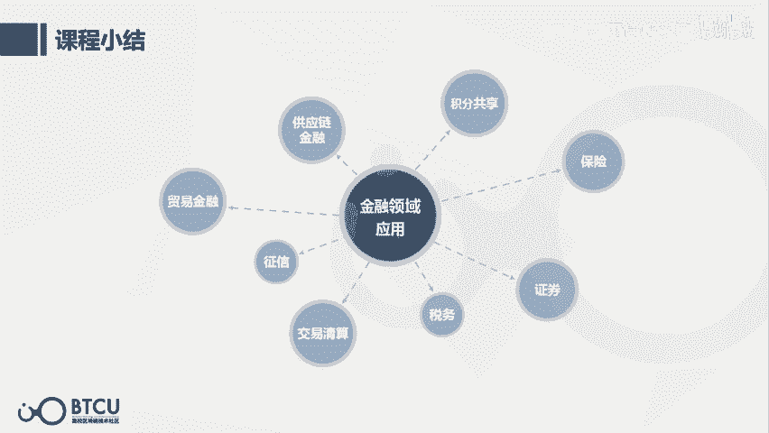

# 【清华大学区块链课】深入浅出讲web3：从比特币到区块链（全14讲） - P9：10-10讲：金融领域+区块链 - web3深度学习 - BV1mL411a7jo

[音乐]，Hello，大家好，我负责讲解第10至第13课，分别是产业区块链部分，即区块链在金融实体领域的运用逻辑和案例，以及政策部分，国内国际区块链政策现状。

首先我来做一下自我介绍，我是中央财经大学的张胜楠，目前大四，从2016年9月入学以来，虽然只有三年半的时间，但我接触和学习区块链是有三年的时间，在2017年3月第一次听到一个区块链专场讲座。

就带我们班的同学去了那家公司进行社会实践，这种投入60%以上的时间，在区块链上是有大约两年的时间，包括在学校注册社团，与其他的学校一起联合创始高校区块链技术社区，还有第一份相关实习。

都是从2018年的3，4月份开始的。如果真的有一见钟情的话，从第一次讲座开始我就觉得这个东西很酷，但是它就像一个锁眼一样，包含了太多角度的知识和思维方式，我只能说是入门了三年。

试图从不同的学科思维视角去理解，我认为区块链确实是我大学通识教育的导师，至少是激发了我的好奇心，去阅读了很多技术，经济学，管理学，科学哲学方面的书，区块链的起源与我的专业背景也有一定的相似度。

我大一入学的时候是计算机科学专业，拆过主机，练过面包板，学过大学物理和逻辑学，虽然一年的时间只能学到皮毛中的皮毛，但是它让我对于尝试和理解一些技术原理，没有那种为难情绪，我认识一些朋友。

由于他们自己是非技术背景，就有一种先入为主的思维，我自己无法理解区块链，但其实绝对不是这样的，学习力可以迁移到任何领域，在做与不做之间消耗的心理能量往往是比怎么做更大的。

所以我们在心理上一定要攻克这一关，就是我们只需要去思考如何不断学习加深理解，即使它有一部分是你之前从未接触过的领域，后来我在大二转专业到应用经济学校的二级学科保险学，学校的经济学氛围极其浓厚。

我记得票圈传播的有一张图就是有个操场公告，上面写着不要打架，胜利的话会被拉进警察局，失败的话会被拉进医院，这两者的成本都很高，虽然我不确定这张图的真实性。

但这种逻辑非常符合我们学校大部分人的理性经济人的假设，不管学什么专业都会学到微观性经济学，而且我们一共五层的图书馆里面至少有一整层都是经济学的书，所以看了各种学派的经济学理论。

然而我发现这些经济理论也是具有时代性的，不是一劳永逸的，真理的反面是另一个真理，看似矛盾的其实很可能是共生的，所以永远不要轻易否定一个真理的反面，也不要过于极端的认为任何看上去矛盾的两者只能存在于一个。

更成熟的思维方式是看似矛盾的理念其实是进行共存和竞争，交替上升才能一起活下来，活得更好，就像自然界中的生物一样，没有相互的制约和平衡只会造成灾难，在此推荐阅读一些奥地利经济学派的书籍。

关于产业区块链的了解呢，我也是在即将于2020年出版的区块链金融教材担任编委会的助理，负责记录一些比如蚂蚁区块链，同讯，华为，京东，还有银行等在一线设计区块链落地应用的机构，他们对产品的尝试推翻。

完善再完善，很多次的打磨才能出一个真正的落地应用，所以非常敬佩他们，我也发现如果想对存量进行区块链化的改造的话，需要对原有行业有一个非常深的理解，才能明确的知道真正的痛点和关键点在哪里。

在进行分领域的区块链应用案例分析前，我们先从整体把握它的底层应用逻辑，解决三个本质问题，第一个问题，区块链应用本质上是在用什么，从技术的角度，区块链是一个分布式数据库，从金融或者组织的角度。

区块链是一个分布式账本，之前的数据库或者账本都是由一个中心节点去控制和管理的，区块链可以实现多中心的同步，第二个问题，区块链能解决所有的信用问题吗，答案是不能，它只能减少不可信环节。

将信用从60%提升到80%，大概这样一个维度，而不是从0到100%，第三个问题，区块链是如何提升信用体系的，这里面是有两个角度，第一个角度，信用假设的转变，用更严格的共识和更高的作为成本去约束未来行为。

之前是基于人和信息的信用假设，通过历史信息去推测一个人或者公司未来可能的信用情况，但是区块链是基于数学和经济学的信用假设，预先设置好共识机制，用博弈论等去规范未来行为，这两种假设哪个更容易失效。

哪个更稳定和有效是非常明显的，而这种信用假设的转变，也可能是某种思维范式的转变，就是解决一个问题，我们如何运行一个信用社会，在区块链的世界里并没有好人和坏人之分，如果机制设置的足够完善，没有人是坏人。

那么这里就只有理性人和非理性人之分，如果一个人是理性人，他就不会破坏共识，即使破坏也不会得到利益，甚至会有损失，那么坏人也不会想去破坏整体的规则，或者说他想作恶，但作恶的成本让他不去这样做，第二个角度。

数据共享，我们现在的风控体系都是基于数据的，但是现在的数据生态里面存在比较多的问题，包括个人隐私泄露，数据孤岛，数据无法确权等，使用区块链可以对数据进行隐私加密，打通跨部门，跨行业，跨地区的数据库。

并且可以进行链上确权和流转，我们也可以很明确的看到一个数据确权的大方向，2019年11月，中央首次明确提出，数据可以作为一种生产要素，按贡献参与分配，而且未来运用区块链可以进行数据确权和流转。

预计是可以实现跨部门，跨行业，跨地区，在保障数据安全的前提下进行建模分析，并且将数据的所有权收益权回归个人，这是一个很美好的未来，这张图是产业地图。

它的参考来源是工业和信息化部2018年中国区块链产业白皮书，我个人是非常推荐这份白皮书的，它对于不同的行业如何与区块链结合逻辑讲得非常清楚，我进行讲解的领域分类框架和逻辑与这份报告基本一致。

但增加了一些更新更详细的案例，我刚才也提到了区块链应用是有两个最基本的角度，好，我们现在就从这两个角度，一是数据是否更加共享，二是信用假设是否转变。

三是否有更严格的共识约束来去逐一分析区块链在金融领域的应用，第一个是区块链加供应链金融，这里面我们可以看到它的参与方是非常多的，也因此它的受信非常的复杂，但当如果用区块链去产生一个数据共享的效果的话。

它就可以去降低这个融资的受信复杂度，降低对方的摩擦成本，提高资金流动性，从第二个角度来说，它去增加了这样一个信用假设的转变，用一个更严格的共识约束去保障它的作假行为是更难，或者说是需要更高成本的。

因为它之前的时候只需要更改自己的一个数据就可以改了整体的数据，但现在的话，比如说六个节点，它至少需要去改掉四个节点，它才能去更改整个的一个账本，那么区块链加供链金融的案例是有比较多的。

这个应该是目前来说应用最成熟的一个领域，比如说平安科技，最终一账通在去年的时候刚刚上市，比如说这个蚂蚁区块链啊，铜讯啊，智商银行其实都有在供应链金融领域的应用案例，第二个是区块链加贸易金融。

其实贸易金融的话，它更多的是一个独立自主的基金交易平台，这五个我们后面会依次讲到。

2。1贸易金融的信用证，信用证是一种书面凭证，与之前的供应链金融的逻辑其实是一样的，都是需要让数据更加共享，并且提高它的作为成本，它的一些案例，包括苏宁金融。

还有云向区块链助力中国明升银行推出的这种信用证存储系统，宝涵也是一种这种担保凭证，另外案例是包括区块链科技与深夜银行合作的集体区块链技术的同标宝涵申请系统，福贝亭，它其实也是一种类似于信用证的凭证。

目前它的案例是包括浙江省分行与杭州联合银行合作的这种区块链福贝亭交易，还有中信银行，中国银行，明升银行，平安银行同时上线扩容升级后的区块链福贝亭交易平台。

它目前已经成为国内银行业最大的区块链贸易金融交易平台，保里是委托第三方去管理应收账款的行为，其实这个也是购物链金融的一个部分。

票据也是一种凭证之间的转移嘛，在央行的总行其实是在15年就有布局，17年的时候已经正式上线了这样一个票据交易平台，它可以实现票据全生命周期的管理，并且利用了同态加密和零知识证明，开发的是隐私保护方案。

相当于既在隐私保护的前提下，它又可以去实现到一个数据共享，第三个部分是区块链加征信，征信的前提也是一个大的数据共同建模这样一个前提吧，区块链可以实现更大规模的可信的数据共享。

并且去提高一个数据作假的成本。

征信的案例包括蚂蚁金服携手，华信勇道打造的联合诗信承接及缴存证明云平台，以苏宁金融和深交所构建的这些平台，第四个部分是区块链加交易清算，其实比特币是区块链的第一个成功应用，交易清算其实是区块链的老本行。

因为它本身就是一个分布式的账本，交易清算的案例是包括比如说中国银行的，还有港版支付宝，还有微众银行做的这些对账或者是跨境支付的这种系统，第五个部分是区块链加积分共享，积分共享其实与征信也是差不多类似的。

比如说中国银联借助了IBM区块链去打造的是跨行银行卡积分通对平台，它可以比较好的去提高流转的一个流动性，第七个部分是区块链加证券，区块链可以从上到下的相当于是从最上层的。

可能是金融属性的在交易所里面的一些交易，直接去打通到最底层的可能是分布在全国各地的仓库里面的一些实物资产，这就需要一个比较大的数据共享和协同监管这样一个系统，ABS就是资产证券的话。

如果它能从上到下穿透监管的话，就对于整个证券行业来说是一个就非常大的变革性，也非常有用，比如说区链科技就与德邦证券复兴恒利证券开展了共同探索的基于区块链技术的ABS发行平台，第八个部分是区块链加税务。

而税务呢，我们平时可能会了解到一些，比如说有这种假的发票，它的税号可能是会重复的，或者是怎么样的，或者就是干脆就是一个假的税号，那么如果大家都用区块链电子发票的话，就应该会比较快的或者比较方便的去鉴别。

它到底是不是假的，或者说能够很快的去查验，因为时间戳它是具有唯一性的，如果每一个电子发票都具有唯一性的话，那么它的真实性就会更容易被保证，最后我们来做一下课程小节，金融领域的应用主要是在贸易金融，呃。

供应链金融，积分共享，保险证券，税务，交易清算和征信，这八个领域，它最主要的两个大的逻辑，第一个就是一个更广泛的数据共享，并且是在保护隐私的前提下，并且很有可能会把这个数据的所有权和收益权还给个人。

第二个角度就是信用假设的转变，会用更严格的共识约束去约束未来的行为，降低整体的一个，呃，作恶的风险性，好，本次课程结束。

谢谢大家。謝謝大家。