# 理性分析通胀与经济形势，理性预测楼市下跌时间表

扫一扫添加好友获取更多优质书籍推荐

加v信1101284955获取更多优质书籍推荐

（已出版） 作者：海宁的马甲

本帖已成书《经济大周期：踩准节拍再投资》

通货膨胀恶化后，ZF加息是在所难免的，存款加息，贷款也会加息。这样的话，现在已经在临界点上的房奴恐怕要断供了哦。

按照法律，按揭贷款人，贷的是钱，只是以房地产抵押而已。

如果断供，银行可以依法拍卖房子，律师费拍卖费由屋主承担。

第二，中国没有个人破产法，也就是说，如果房价下跌30%以上，拍卖所得不足以支付贷款，则银行可以继续追讨，除非贷款人死亡或者突然移民海外。

按揭贷款余额2009年虽然增长1.7万亿（占2009年新增贷款的17%左右），按揭贷款总额我没有查到，应该在6万亿人民币左右，占47万亿贷款的12.7%。中国房地产总体的杠杆比率不高。

作者：海宁的马甲 日期：2010-09-21 11:13 作者：michael_fu09 回复日期：2010-09-21 10:49:04

lz出书了吗

想出，但是没有准备好。而且主要讲经济大势里如何保值，如何保持清醒的头脑。

另外一方面，我希望提供一个另外的角度供读者思考。

比如2010年2.4万亿美元，是不是真的比2003年底的4000亿美元多很多？

我的看法：

2003年石油25美元一桶。2010年石油75美元一桶。

中国2003年到2010年，石油消耗量增加55%（即现在每天的消耗量是2003年的155%）

美元数量增长了6倍。

6/（石油价格是原来的3倍 × 需求量是原来的1.55倍）= 129%

即2010年的2.4万亿美元，比2003年能供中国多烧29%的天数。

这个让我想到了，以前民工辛辛苦苦一年，过年回家路费汽油费就花掉了不少。

作者：海宁的马甲 日期：2010-09-21 11:19 作者：lxwnar 回复日期：2010-09-21 10:34:02

如果不大幅度加息，而改用行政措施和财政补贴试图给通货膨胀减压，则中国泡沫会被美联储在2011年7月到10月左右的加息刺破。

美国就不加的概率有多大

美国就不加肯定不行，2012的选票直接把你拿下。

米国老百姓不像某国老百姓是屁民，他们是公民，是选民，是人民。

如果不加息，美国人民就要受到双重打击：

- 1. 工资不涨物价涨。
- 2. 没有工作的人生活更困难。
- 3. 老人的养老金的购买力缩水，而老人投票最积极。

如果出现通货膨胀，美联储不得不反通货膨胀。

问题是如何美国2011年整年都没有通货膨胀，美联储就可以大胆地压低长期利率（短期利率已经到0.25%以下了）。

当欧美楼市，股市，债市都不赚钱的时候，资金只有一个去向：大宗商品比如石油粮食。

2007年10月后，当欧美楼市股市都不赚钱的时候，资金就去了大宗商品，到2008年7月的时候，石油暴涨到147美元，粮食已经暴涨80%到150%。

作者：海宁的马甲 日期：2010-09-21 11:25 作者：zxmzhm 回复日期：2010-09-21 11:16:10

看样子需要买点黄金了

黄金2011年6月不跌，也难逃2012年2月暴跌的厄运。

### （十五）百年黄金价格变动周期规律，涨11年，跌8年

Aden Sisters研究了100年黄金价格的变动，作出了一幅黄金价格变动图。1969年以来，黄金每过7到8.5年就创低点。除了一次，黄金都是8年低位徘徊后进入11年上涨周期。

如果黄金继续这个周期规律，2011年到2012年2月黄金将到达1999年以来的高点，黄金很可能在2011年6月，或者2012年2月前后创1999年以来的新高，然后在2012年2月左右暴跌成灾。

作者：海宁的马甲 日期：2010-09-21 11:48 作者：冒死来顶 回复日期：2010-09-21 11:36:30

再也不相信你们了。

中国是宇宙中心，这个国家的房子会一直涨的。

绝不含糊，2011年3月看中国和美国的通货膨胀形式。

作者：海宁的马甲 日期：2010-09-21 12:00 作者：lostweeds 回复日期：2010-09-21 11:48:10

仔细阅读了楼主的每张帖子，确实受益匪浅。

下面谈点体会和不同观点，

请大家拍砖！

- 一：房地产不会在本届政府任期内崩盘。
至少在2013年春节前不会崩盘。

一个致命的命门：人民币汇率，人民币的均衡汇率已经到达6.65左右，升值预期即将消失。

再继续大玩通货膨胀，人民币的购买力会下降，人民币对美元的真实汇率会有贬值预期（通过新加坡人民币NDF市场看），贬值预期导致资金外流，外汇储备减少。

所以，人民币升值甚至到头，不再被低估的时候，就是通货膨胀玩到头，无法继续玩通货膨胀的时候。

我提醒一下，中国国内也有2500亿美元左右的美元做空盘：中国的商业银行里，外汇存款只有1900亿美元左右，外汇贷款却又4000亿美元左右。这2100亿美元多余的贷款，不就是在占人民币升值预期的便宜嘛。（人民币升值，他们还钱的时候，需要付出的人民币就少了）

当人民币变成贬值预期，甚至出现2%，5%的贬值的时候，这2100亿美元做空盘，必须平盘，这样到期还贷款的时候可以少还人民币。

作者：海宁的马甲 日期：2010-09-21 13:14 理性分析通货膨胀与经济形势，理性预测中国楼市下跌时间表海宁原创，天涯经济论坛首发。

http://blog.sina.com.cn/hainingdemajia

### 前言：

本人过去，现在，和将来的任何言论，都不构成任何投资建议，投资有风险，持币也有风险。

### 主要观点：

中国地产泡沫最可能破于2011年6月，如果逃过了2011年6月，也躲不过2012年2月。2010年11月很可能就是楼市的6124高点。

继2010年4月我在天涯经济论坛发表“通货膨胀今年2月开始789月恶化2011下半年再恶化->泡沫破裂”后，今天是2010年9月19日，我现在认为2011年3月，是中国通货膨胀更猛烈的又一次波峰。

我有我庞大的定量分析基础。我写这个帖子，花费了3个月，几百个小时的研究时间。

## “通货膨胀今年2月开始789月恶化2011下半年再恶化->泡沫破裂”

http://www.tianya.cn/publicforum/content/develop/1/416362.shtml

2011年2月3月，中国的通货膨胀必定是波涛汹涌，风大浪急的。

这是由4个因素的叠加效应决定的。

- 1. 国内货币供应情况；
- 2. 猪肉价格周期变化，猪肉，鸡鸭鱼肉到时候处于价格高位（以后价格会回落的）；
- 3. 美联储弱势美元政策（导致国际大宗商品比如石油粮食等涨价）；
- 4. 国内投资收益率高的项目和行业少（对于社会资金总量而言），导致资金投资到原材料商品上。
- 5. 如果天气再来凑热闹，那2011年的中国楼市，像极了2008年的中国股市。

从目前2010年9月看，美国没有通货膨胀，美国经济2011年不确定性因素很大，而美国财政刺激因为两党之争而无法继续。所以美联储2010年9月10月加息的可能性很小。更可怕的是美联储会向市场承诺“相当长时期内”会保持0-0.25%的联邦基金利率的政策不变。

2011年1月，美联储极有可能再印美钞购买资产，甚至有可能把10年期国债收益率打压到2%以下。这些都是“国际大宗商品投资者”的冲锋号。

2011年春节过后，如果中国的物价不但没有回落，反而变本加厉，那么，那些说“中国产能过剩”“农业连续6年丰收”所以中国通货膨胀安全可控的专家，到时候就应该反省反省了。

2011年3月到6月，可能是中国主动刺破房地产泡沫的最后时间。

2011年第一季度的CPI公布后，反还是不反通货膨胀，是摆在中国央行面前的艰难抉择。

之所以给出2011年6月或者2012年2月两个时间点，不是我给自己留点时间，而是因为我无法确定中国央行是否在2011年3月4月大幅度加息，去反击恶化了的通货膨胀。如果在2011年3月汹涌的通货膨胀压力下，中国央行大幅度加息并且紧缩基础货币，则中国地产泡沫2011年6月左右破灭。（注意是大幅度，而不是0.27%）。

如果不大幅度加息，而改用行政措施和财政补贴试图给通货膨胀减压，则中国泡沫会被美联储在2011年7月到10月左右的加息刺破。

请原谅我不得不分析美元走势和美联储政策。因为不分析美元走势与美联储政策，我们就无法解释2007年7月到2008年7月的中国通货膨胀形势和中国股市走势。

同样，不分析美元走势与美联储货币政策，我们也无法预测2011年中国的通货膨胀和房地产泡沫破裂风险。

美联储在2011年7月到10月，必然加息，控制美国国内日益汹涌的通货膨胀。更重要的是，美联储要防止美元出现像2008年上半年的那种可怕的信任危机。这一点是本帖焦点中的焦点，如果美联储能把零利率政策维持到2011年12月16日，则本人的一切分析与预测统统破产。

美联储零利率政策始于2008年12月16日，从美国利率变动史和CRB大宗商品历史走势看，美联储零利率政策无法维持整整3年。

美元不是日元，美元紧紧联系着很多种大宗商品的价格，比如石油粮食等。美国无法享受日本那种多年零利率政策。

无论人们是否痛恨美元，美元就是事实上的国际结算货币（占国际商品与金融定价与交易的83%），美元就是事实上的国际储备货币（份额占70%左右）。美国无法享受日本那种多年零利率政策。美元零利率政策2年以上，国际大宗商品必涨无疑，国际金融秩序将像2008年上半年那样，再次面临巨大挑战。

### 文章目录：

- 一）人民对于未来的人民币的购买力预期与房价概述

加v信1101284955获取更多优质书籍推荐

### 2000年—2010年房价本该涨200%—300%而已。

- 二）买房保值，保的是钢筋水泥建筑的价值，还是房子下面的那块土地的价值

大城市房价里的土地价格因素已经占房价的70%左右，建筑成本反倒不重要了。

- 三）人民币未来购买力的预期（将来人民币是否会大幅下降），与房价的关系

## 副标题：2002年前有了两套房子的普通百姓，通货膨胀暂时伤害不了他们

- 四）详细论述中国央行2011年不得不大幅度加息稳定人民币币值，戳破房地产泡沫
- 五）三论2011年剧烈的通货膨胀，从正反两面刺破地产泡沫
- 六）预测：中国房价2010年11月到顶，高位徘徊成交量萎靡6到9个月左右后暴跌成灾
- 七）“房价地震”前的异象：商品价格疯涨，欧洲银行危机，温州还债信用危机等
- 八）从历史和哲学的角度看潮涨潮落，通货膨胀和房价的周期规律
- 九）房价说：I will be back.
- 十）笑谈本拉登黄金地产周期
- 十一）美元购买力在2000年到2010年8月的数学精算
- 十二）一些煽情的感言

## 一）人民对于未来的人民币的购买力预期与房价概述

2000年—2010年房价本该涨200%—300%而已。我学过点经济学与货币银行学，我认为只有从货币的角度才能正确分析2001年后的中国经济与房价走势。本来也不想谈房价这个谈烂了的话题的，但是我惊讶地发现，居然很少有人系统地谈谈——中国人民对于人民币未来购买力的预期的不稳定（预期将来的人民币的购买力会大幅下降）才导致的房价奇高。很简单，买房保值的观念。如果人民预期未来人民币的币值能保持稳定的话，2000年—2010年中国房价涨幅应该在200%到300%左右。注意预期两字。

## 二）买房保值，保的是钢筋水泥建筑的价值，还是房子下面的那块土地的价值

直接进入正题。房价的决定因素——地价加上建筑成本。这是一句废话，但是很重要。房价其实是两个部分组成的：地价，和建筑成本及市政配套成本。2001，2002年，极少开发商因为房子卖价抵不上建筑成本，市政配套成本，和公司运营成本而破产的，说明那个时候的房价，在各种“合理”成本之上。那么2010年，建筑成本上升到了多少呢？这个数字，相信很多人都算过了，算得比我准确，希望网友补充这个数字。2009年，2010年北京某些房子的售价在4500到6000每平方米，从侧面说明，如果地价很低的话，房价也可以低到4500到6000每平方米。

这个建筑成本的数字不管是4500，还是6000，都不是我要说的重点。我要说的是钢筋水泥建筑下面的土地的价格。

大家已经从新闻上看到了，2010年很多土地拍卖的楼面价在北京上海已经达到2万5，3万5一平米了。这些土地上建起来的房子，如果能卖得出去，其中的土地价值就是是2万5到3万5每平方米，而建筑成本和市政配套成本可能在4500到6000每平方米。

所以说，房子买卖，已经成了主要是买卖土地使用权证，买一送一附送钢筋水泥砖头若干。

这个时候，房价（土地使用权证+建筑成本）与股票（股权证）价格的关系就打通了。股票最大的赚头，是从普通公司到上市这一步，或者大小非从非流通到流通那一步，证券公司对于上市公司的股东而言，是高级打工仔而已。房地产最大的赚头，是“土地使用权证”融入到房子房价里的那一步。公开拍卖高价地的开发商，也仅仅是赚钱多点的高级打工仔而已。（当然，如果房价一直在涨，开发得慢点，则可以比开发得快点的公司还赚钱。万科的优势，要在房价平稳不涨的情况下才能发挥出来。）

当一个人在2010年说要买房保值的时候，他主要应该是指房子下面的那块土地保值，因为房价里70%左右已经是土地价格了，建筑成本占的比例越来越小到快要可以忽略不计了。那么如果2，3年后，几公里远的地方，另一块拍卖的土地的楼面价只有5000甚至3000平方米，并且钢筋水泥因为产能过剩而价格不涨甚至下降的时候。包含了2万5到3万5每平方米的土地楼面价的房子，降价到1万每平方米以下，是正常的。在新出的猪肉只要9元一斤的情况下，昨天的猪肉不可能因为进价高而卖15元。

当然了，总是有人认为有的地盘非常特殊，那个地块的地价只涨不跌，或者说，市中心就这么点地方，市中心没有可开发的土地了。甚至可能还专业地说这叫级差地租。

说到这里，就涉及到一个信仰问题了，如果钢筋水泥建筑下面的那块土地是稀缺的，是独一无二的，其他地段可以跌，但就是这块地段不会跌。只会涨不会跌的东西，自然应该买下保值。但是他保的，主要应该是建筑下面的土地的值（土地价格），而不是上面的钢筋水泥建筑的价值。曾经的东京市中心房产的投资者，曾经的香港市中心房产的投资者，都曾经坚定地相信过，市中心的房价（其实说地价更恰当）绝对不会跌。

宏观地说，2010年，中国170亿平方米的居民用房建筑面积，在34万亿到51万亿的钢筋水泥砖头价值之外，其房价已经包含了68万亿到100万亿左右的土地价值。这只是已经建成房子的土地在房价上的反映，还不包括已经被开发商购买去了的，已经在“土地储备中心”麾下的，或者即将进入“土地储备中心”的土地。

土地啊土地，我对你爱得深沉，不是因为你能源长多少庄稼，而是因

## 三）人民币未来购买力的预期（将来人民币是否会大幅下降），与房价的关系

## 副标题：2002年前有了两套房子的普通百姓，通货膨胀暂时伤害不了他们

为了便于理解和解释，我们先看三幅图：

- 1. 上海2000年到2010年的房价走势图。
- 2. 2002年以来黄金价格走势图
- 3. 2002年以来中国外汇储备变化情况

天涯网友Yevon_ou所作，其2004年代表作“人民币面临巨大的贬值压力”并预测房价黄金将暴涨，大排面将涨到30元一碗。这篇文章出现于2004年4月，2004年7月1日发表于天涯经济论坛。

http://www.tianya.cn/publicforum/content/develop/1/38712.shtml

第一张图，2002年后上海房价涨7倍。

第二张图，2002年后黄金涨了5倍。

第三张图，2002年后中国外汇储备增长了7.5倍。（2.4万亿美元不多，比2003年的4000亿美元，如果换成石油，石油数量多了100%。能多供中国烧30%的天数而已，因为石油从25涨到了75美元，中国的石油需求用量上涨了55%左右）

当房价在建筑与市政配套成本（北京约4500到6000每平方米）边上徘徊的时候，而且人民币币值稳定的时候，房价确实像普通商品那样，由供需决定，就像1997到2001年的中国楼市。

当黄金在开采冶炼成本（400到550美元每盎司）附近徘徊的时候，并且美元的币值稳定的时候，黄金的价格确实像普通商品那样，由供需决定的，那个时候的黄金，是工业用品和首饰用品。

中国经过1997年到2000年的经济与货币紧缩（货币政策其实是适度从紧而已），2000年，中国人民对于人民币未来具备稳定的购买力这一点充满了坚定的信心。也就是说，中国人民在2000年，对人民币未来的购买力的预期是非常稳定的，中国人民并不预期2000年后人民币的购买力会出现大幅下降。因为中国人民那时候已经习惯了1997年到2000年物价稳定的局面。

话说天有不测风云，突然，中国人民纯洁的心灵天空里，飘过了一片乌云。

中国人民慢慢预期人民币的购买力，在未来会出现大幅下降，这种邪恶的想法在2003年愈加强烈。当人民币的购买力，被中国人民预期在未来会大幅下降的时候，房子不再仅仅是房子了，而是成为部分商业嗅觉敏锐的人，然后是很多直觉良好的普通人，储存财富的载体。房子具备了对冲人民币购买力下降风险的功能。房子变成了“不懂经济”的普通人对冲人民币贬值风险（购买力下降风险，不是指对美元）的对冲工具。“不懂经济”四个字是打引号的，因为很多具备经济常识的人，理财能力，保卫自己财富的能力，或许比很多专家强N倍。

当美元的购买力在2002年后，被世界人民预期会大幅下降的时候，黄金再一次被作为“倚天不出，谁与争锋”的倚天剑亮了出来。房子，就是中国人民2002年后，用于对冲“人民币购买力下降风险”的倚天剑。通俗点说，“2002年前有了两套房子，通货膨胀伤害不了我这个小老百姓，人民币购买力你任意下降好了，你人民币的购买力预期下降越多，我的房子涨得越多”。注意我是说“预期”，如果预期反应过头，就像2007年的股市，会形成泡沫。

当房价里的土地价格因素，远远超出建筑成本（北京大约是4500到6000/平方）的时候，泡沫起来了。其实人民币的贬值风险还没有大到那个程度。9000到12000/平方的房地产价格，或许才是人民币不再超发，通货膨胀被大幅度加息遏制的时候，北京的房价。

当房价和黄金价格远远高出生产成本的时候，他们的价格，主要不是由简单的商品供需决定的，而更多地是由纸币的贬值预期与避险需求决定的。这就是韩国房子供需比超过110%，而房价还是下不来的原因。因为韩国经济高度依赖美国，韩币币值基本上随着美元起舞，美元从2002年起，大部分时间一直处于贬值通道，韩币币值也跟着不稳定，韩国富人的投资渠道有限，只好买房以此避免持有韩币太久从而蒙受购买力上的损失。2008年后，韩币不得不对美元贬值以应付金融危机。所以韩元的购买力预期还是不稳定。

## 四）详细论述中国央行2011年不得不大幅度加息稳定人民币币值，戳破房地产泡沫

由第三段分析得出结论：当人民认为未来人民币的购买力比较稳定的时候，我们才能看到中国房价的理性回归之旅。那什么时候中国人民才会觉得人民币的购买力会比较稳定呢？当存款利息能抵得上通货膨胀物价上涨的速度的时候。因为只有人民币未来的购买力被认为是稳定，人民币币值稳定的时候，才能打消人们买多余的房子保值对冲人民币购买力下降风险的念头（其实是买房子下面的土地，加上建筑成本）。当很多人打消了买房保值的念头的时候，为避险而买房的需求不但下降了，前期大量买了多余的“没用的”房子的人，会把房子放出来，兑现这几年因为“保值”而获得的惊人暴利，结帐走人，结帐走人的卖房者多了，房价就不再是那个价了。当大量有余房的人卖房子的时候，他们才发现，按目前的房价，根本没有足够的刚需去接盘。

现在街头巷尾，男女老少都知道人民币一天天不值钱了，特别是2010年7、8、9月。我凭什么敢肯定，中国央行将在2011年不得不大幅度加息，让存款利息抵得上通货膨胀物价上涨的速度？因为中国央行受到2个因素制约。一是人民币购买力的2003年以来不停下降，导致的人民币信任危机，使得2011年的通货膨胀面临不可控的风险（翻船风险）。二是人民币对美元已经升值到6.65附近这个均衡汇率水平（到达均衡汇率后，中国1年内因为J曲线效应，还是会有顺差）。资金已经不需要留在中国等升值了，如果美联储再加息，则资金流出的动力就更大了。所以，2011年中国央行不加息而美联储加息的话，资金有流出中国的强大动力。通货膨胀后的人民币购买力（币值）在下降，中国和美国的通货膨胀之差，让6.65汇率附近的人民币的贬值压力越来越大。但是人民币还不能玩超过2%，5%的贬值。因为这样一贬值，资金逃跑就更快了。

### 结论： 中国的房地产泡沫2011年被中国的通货膨胀逼到死胡同里了，正反两面，横竖都难逃被戳破的命运。

## 五）三论2011年剧烈的通货膨胀，从正反两面刺破地产泡沫

中国2011年上半年的通货膨胀，与2008年上半年一样不幸。遇到了相似的问题。

- 1. 国内货币供应情况；2007年，2006年是外汇储备剧增；2009年到 2010 年 3 月是贷款剧增。
- 1. 猪肉价格周期变化，猪肉，鸡鸭鱼肉在 2011 年 2 月 3 月处于价格高位（以后会回落的）；
- 2. 美联储弱势美元政策（导致国际大宗商品比如石油粮食涨价，就像 2008 年上半年）；
- 3. 国内投资收益率高的项目和行业少（对社会资金总量而言），情况比 2008 年上半年可能更严重。
- 4. 如果天气再来凑热闹；那 2011 年上半年的中国楼市注定会像 2008 上半年的股市一样悲剧。

首先是猪肉价格周期，猪肉价格在 2011 年春节期间，肯定是重大议题。猪肉价格在 2011 年 6 月前难于下降。FGW 不能亲自去养猪，也不能规定猪肉不许涨价，否则猪肉涨得更多。更关键的是猪肉是个小头头，猪肉价格的示范作用很强，老百姓常常把“猪肉”当成参照系，比如“哇，姜和大蒜都贵过猪肉了”，猪肉贵了想吃便宜的鱼的想法是无法实现的，猪肉涨价必然导致鱼涨价，因为大家都去看看鱼的价格是多少了，便宜就买鱼。现在看来大米和小麦也上阵了，除了食用油因为美国大豆丰收，暂时不会加入战团。如果 2011 年 3 月左右，食用油在美国大豆涨价下跟涨，那就是大米小麦（面粉）猪肉食用油四大样共涨，物价可能失控。不是我鼓吹物价上涨，是现实规律如此。早知如此，2009 年何不看紧点。

其次是 2010 年 9 月到 2011 年 3 月甚至 6 月的弱美元走势（对应石油粮食大宗商品涨价），将加剧国内的通货膨胀。

猪肉走强，美元走弱，两种合力掀起猛烈的通货膨胀，几乎和 2007 年底 2008 年初，刺穿中国股市泡沫的情形一模一样。

那么，有人说，顶住压力不加息怎么样？物价涨了，工资涨了，不正好可以消化房地产泡沫吗？ 大家工资高了，房价自然不显得贵了。

这个想法是有一定道理的，就是没有考虑到 68 万亿存款的背后，大部分都是活人。活人面临被屠杀的时候就要自救，所以如果通货膨胀实在太厉害的时候，他们会像 1988 年那样把人民币换成物资，不管怎么教育他们都不行。2008 年 1 月到 6 月，有没有人囤货？有没有人囤食用油，即使时候他们被证明是错的，但是这不妨碍他们在当初作出囤货的决定。

这样会发生居民和小商人囤货-》因为紧缺而涨价-》因为涨价而再囤货-》因为再囤货而紧缺，通货膨胀进入恶性循环，局面面临失控。

要是即没有大幅度加息，P民情绪稳定，局面也没有失控呢？那这个通货膨胀得累计到 15%到 30%，少数品种价格翻番再翻番。这个时候，人民币 6.65 的汇率顶不住了。你硬撑住 6.65，聪明的资金要外流。跨国的外资企业会尽量把资金留在国外，资金外逃，外汇储备减少，从而一样造成通货紧缩，一样刺穿地产泡沫。人民币稍微做相应的贬值，则贬值又引起猪肉，食用油，汽油涨价，通货膨胀又要经历几轮上涨。这个时候老百姓估计怨气比较重了。底层的生活更难了。

既然 2007 年底，2008 年初，中国央行出手打击通货膨胀了，2011年应该也会出手打击通货膨胀吧。但是它需要等恶性通货膨胀这个敌人先出现才好下手。至于为什么央行要等到通货膨胀恶化了才加息，是中国特色因素。这个事情真的不能说得太细。总之通货膨胀不严重的时候加息，反对声音和压力阻力比较大，等通货膨胀恶化甚至快失控了，再去加息，阻力就小了。我们只能理解央行。你还不明白“不恶化不加息”，那我只能说，我不会解释得更细了。

这是走钢丝，我更倾向于，像 2007 年底打击通货膨胀那样，连续加息误伤到地产泡沫。地产泡沫，主要就是土地价格泡沫，土地上的建筑成本（北京月 4500 到 6000/平方米）差别应该不大。几十万亿的土地的价格缩水，其后果难以想象。

越是放任通货膨胀的恶性循环，最后加息的时候，幅度越是大，因为那个时候你加一点点根本止不住。加息，让人民币存款加上利息后，能抵得上通货膨胀的速度，那么人民币的购买力就稳定了，人心也稍微稳定了些。大幅度加息了，地产泡沫自然破了。缩水的主要是房子下面的土地价格部分。建筑部分（北京月 4500 到 6000 每平方米）应该不会缩水太多，而且很难看得出来。当房价里的土地价格从 2 万 5，跌到 4500 到 6000，加上 4500 到 6000 的建筑成本和配套成本，北京的房子自然就是 9000 到 12000 每平方米了。

这是个信仰问题，东京，香港，台北，汉城的市中心房地产的投资者，都曾经认定市中心不会跌，因为市中心独一无二，市中心附近没有可开发的土地。今天自然有人认为中国北京上海等，和香港东京不一样。确实不一样，他们都在独一无二的地方，东京是4个大陆板块的交接处（别人一般是2个大陆板块的交界处，比如洛杉矶旧金山等），每过70多年地震一次，现在离1920年代的大地震都80多年了，还不震，怪了。

## 六）预测：中国房价2010年11月左右到顶，高位徘徊成交量萎靡6到9个月左右后暴跌成灾

此处省略3141字。

我就是把所有的分析过程，几十幅走势图都列出来，就能证明我的预测是对的？不能。只有等待时间的验证。第一个时间点，2011年3月，中国通货膨胀是否汹涌澎湃。离今天只有5个多月了。

题外话，中国的房市问题，老扯上美元，是不是很烦啊？

请问，不分析月亮引力的影响，怎么能正确分析钱塘江大潮阴历每个月的十五，潮水特别大？每年的阴历八月十五，涨得最大。

你对比一下2002年后中国房价的走势图，中国外汇储备数额的走势图，黄金价格的走势图，你就知道，这三个东西，涨幅，上涨时间，都是一致的。

看了这3张图（随后附上），你就能发现极其一致的暴涨走势，中国外汇储备 2002 年底是 2864 亿美元，2003 年暴增 40%，外汇储备达到 4000 亿美元，2010 年 3 月更是达到 24500 亿美元，是 2003 年底的 6 倍，房价也比 2003 年涨了 6 倍左右了。中国房价的涨幅，简直与中国外汇储备的涨幅是惊人地一致的。

美元的币值，从 2002 年底开始贬值，一直贬，贬到 2008 年 7 月，世界经济萧条了。中国楼市泡沫本来也快破了，由于众所周知的原因，中国楼市在 2008 年底起死回生了。但是到 2010 年 4 月后，中国各家商业银行的资金弹药已经几乎耗尽了。2010 年银行上市融资的钱，目前看，没有变成贷款放出来，所以可以理解为是为了以后的金融安全留的缓冲弹药。如果 2011 年贷款凶猛地放出来，则“中国金融系统安全”变成赌注被押了出去，那个时候 2，3 千亿美元的外撤，都能引起极大的金融安全问题。

2011 年 1 月到 3 月的美元，从目前美联储“保美国经济”的决心看，必定是其烂无比的时候，就像 2008 年 1 月到 7 月的美元。但是美元烂得越是厉害，其后面可能的反弹越是厉害，就像 2008 年 7 月后的美元反弹和大宗商品价格暴跌。如果美联储极其不负责任，则美元可以烂到 2011 年 6 月，甚至 10 月 12 月（大宗商品也暴涨到那个时候）之后再超级反弹（大宗商品暴跌）。

关键还是要看大宗商品涨价如何把欧洲拖入房价再次下跌危机，和银行危机恶化，从而引发世界连锁反应。欧洲银行危机，或者国债危机，快点 2011 年 3 月就到了。

## 七）“房价地震”前的异象：商品价格疯涨，欧洲银行危机，温州还债信用危机等

地震前是有各种异象的。

同样，2007年底股市地震前也是有异象的。什么异象？猪肉猛涨，汽油价格猛涨，物价猛涨，民间对于存款保值，跑赢CPI的讨论高涨。

2011年，楼市地震前，民间对于存款保值的焦虑感一定也很强烈，最后阶段，某些地方一定会因为无法还债爆出民间债务信用危机。浙江那个吴英运气真的很背，拖过2008年，她不但能还清借款，还能暴赚一笔。

当物价上涨后，欧洲的房价就会继续下跌，欧洲的银行就会发生更大的危机。2007年就是因为油价上涨，导致高得不能再高的欧美房价泡沫破裂。

欧洲2011年，将面临全面的财政紧缩，各国政府不得不消减财政赤字，否则市场将通过甩卖国债惩罚那些财政赤字居高不下的国家。

欧洲的需求将下降。阿里巴巴预测中国外贸从2010年第四季度开始放缓。我估计顺差还是会有，但是会缩小，远远不足以在2011年支撑房地产。商业银行也无法继续巨额增加贷款。一方面无钱可贷，另一方面太多贷款会导致更剧烈的通货膨胀。

变数之一是存款准备金率，如果下调存款准备金率并让商业银行增加贷款，则表示在用“金融系统安全作赌注”实施拖字诀。所以如果不降低存款准备金率，我估计2010年11月左右，房价基本到达6124高峰。

## 八）从历史和哲学的角度看潮涨潮落，通货膨胀和房价的周期规律

历史总是在否定（盛极而衰，或者说物极必反），与“否定之否定”（否极泰来，或者说触底反弹）中前进的。1992，1993 年超级通货膨胀，使得中国央行不得不提高存贷款利率到 12%以上，艰难但是坚决地迎战通货膨胀。通货膨胀终于在 1996 年被制伏。1997 年，中国经济和物价，进入通缩阶段。1997 年到 2000 年，中国物价是超级稳定的。这为以后提供了良好的的高成长，低通胀的经济发展环境。经济的过热，在信用货币时代，最后必然导致通货膨胀，到了一定程度，通货膨胀越来越无法控制。然后，必然再次出现打击通货膨胀的货币政策。打击通货膨胀，会使得人民币购买力的预期暂时回归稳定。从而开始下一个经济周期。

从来没有只有涨潮，没有潮水回落的情况。西方 200 多年发展的历史表明，房价不可能出现暴涨 10 年后，稳定不跌一段时间后，房价继续大幅或者温和上涨。这不符合经济规律。这也不符合人性贪婪与恐惧的规律。如果房价暴涨 10 年后，稳定一段时间，继续慢慢上涨，则炒房没有下跌风险。如果炒房没有下跌风险，那么炒房的会把房价继续往上抄，直到炒到房价高高的，面临高空跳水的境地。这是人性贪婪与恐惧的规律。暴涨之后不会是温和回调后继续涨，而是暴涨之后暴跌。2007 年的中国股市就是一个例证。

## 九）房价说：I will be back.

暴跌后，房价在低位徘徊，等待下一个上涨周期，等待下一个轮回。但是没有人知道会是什么时候，所以必然会不停有人去抄底，主动去被套。这是规律，2008 年的中国股市，“主动被套规律”表现得淋漓尽致。

### 十）笑谈本拉登黄金地产周期

历史有时候显示出惊人的前呼后应与完美对称。美元的贬值开始时间，黄金地产的暴涨开始时间，与 2001.9.11 惊人地吻合，因为美国发动阿富汗战争和伊拉克战争，导致美国财政赤字暴增，导致世界美元（包括美国国债）的流动性过剩，导致美元币值更猛烈的下降。没有战争，其实美元也处于下降周期，有了两场战争，美元币值下降就更厉害了。不少人知道，奥巴马入驻白宫后，开始低调地花费巨资用特工和非常规行动去找本拉登（源于他读的一本如何对付本拉登的书）。如果 2011 年奥巴马能抓到本拉登，或者找到本拉登的尸体，就可以名正言顺地结束伊拉克和阿富汗战争，即便那里的经济一团糟政治一片混乱。正好此轮黄金地产暴涨周期在 2011 年 6 月，或者 2012 年 2 月进入加拿大澳大利亚等房产高空跳水的尾声。有始有终，此轮黄金地产暴涨暴跌周期，也可以叫做本拉登周期了。找到本拉登的尸体，会给市场一个极其强大的市场心理预期，即美国将大量消减战争赤字，加上 2011 年美国的国内财政赤字因为共和党和民主党内部的阻力而下降，则外汇市场，大宗商品市场会出现超级反转，即美元对欧元日元加拿大元澳洲元大涨，大宗商品价格暴跌。

本节只是笑谈，不必当真。历史有时候会有这种情况。

## 十一）美元购买力在 2000 年到 2010 年 8 月的数学精算

2000 年到 2010 年 8 月，十年间美元对于消费品的购买力，按美国官方的 CPI 计算，下降了 23.6%。年均下降 2.6% 左右。（1-0.026）的 10 次方=76.8%。

去掉美国政府 CPI 里面的谎言，美元对于消费品的购买力，下降了 55.2%，年均下降 7.5%（如果你用数学细究的话，（1-0.075）的 10 次方=45.86%）

可见，从十年的时间长度去看，美元存款利率，或者美元资产的投资收益率如果没有达到平均每年 7.5%，那就是没有跑赢去掉谎言的真实 CPI。如果低于 2.6%，那么连美国官方的 CPI 都没有跑赢。10 年间，美国股市平均收益率小于 2.6%。如果神把这个消息提前告诉一个人，那么这个人肯定在 2000 年买入黄金或者有前途的城市的房产（那种人口净流入的，但是一小时交通范围内都没有可开发土地的城市的房子），因为美元纸币利率不大可能达到 7.5%，投资的话，也很难达到 7.5%，美国股市连 1% 都不到。巴菲特牛啊，他说能一直保持 6% 以上的投资收益就非常不错了。

问题来了，美元购买力下降超过 50%，黄金怎么涨幅超过一倍呢。那超过550美元的部分是怎么回事呢？奥，因为投资者预期N年里，美元购买力还会腰斩。所以1100美元的黄金价格里，包含了“美元购买力还会腰斩”的预期。这个N是投资者打算持有黄金的加权平均年限。

现在2010年9月，美国10年期国债的收益率在2.6%左右徘徊，正好抵消谎言CPI的美元贬值速度，不及真实CPI的一半，必然有人去购买那些处于历史低位的大宗商品，第一美元贬值预期。

从10年的时间跨度看，是美国很少具有收益率高于7.5%的投资品，才导致了黄金价格的暴涨。

注意上面说的，都是从十年这个时间跨度看的。美元对于普通消费品的购买力，在2000年到2002年美元在普通消费品上的购买力是上升的，因为经济不景气不少厂商竞相降价，2008年下半年，2009年上半年，美联储在加班加点印美钞的同时，美元的消费品购买力却是上升的。当美元的购买力上升的时候，黄金和房地产的价格发生了什么？黄金和地产在2008年下半年到2009年上半年，是下降的。

## 十二）一些煽情的感言

某种程度上，我之所以写本文，始于6540万个谎言。

谎言不能刺破泡沫，只有潮涨潮落的经济规律才能让泡沫退潮。

6540万套住宅，超过了12年来全中国竣工住宅的总和。占170亿平方米居民住房面积的30%左右。全国也没有660个大中城市。

6540 万个谎言，其本身不算什么，看过忽略就是了，就当它是一次品牌炒作。但是没有想到，这个谎言却在短时间内，成为整个互联网甚至纸质媒体的热门话题。

从中我分明看到了大量中国青年在高房价下的渺小感，无力感，焦虑感，愤懑感，颓废感。

我花了 3 个月时间，几百个小时，分析了经济，货币，利率和汇率走势后写成此文。我不想提供精神鸦片，我不想通过不停地告诉大家房价快要跌了。如果我预测错了，我会选择在房价问题上道歉，然后在房价问题上闭嘴。

我已经尽了我的全力去分析，去预测中国的房价走势，尽量不带一丝的主观判断，全以客观数据，历史走势为准。我认知的，总结的，未必就是“真相”。

那么，让我们共同等待，观测 2011 年 3 月的物价和各国央行的表现吧。距今只有 5 个多月而已。

虽然我对我的分析与预测非常有把握，但是我还是强调，本人以前，现在，未来的任何言论，都不构成任何投资建议。投资有风险，持币也有风险。

有潮涨的时候，必然有涨落的时候，泡沫终将退去。乌云终会散去，守得云开待日出。

不去分析月亮引力，就无法理解八月十五的钱江大潮为什么如此波涛汹涌。

请原谅我不得不分析美元的走势。中国人民，中国房价，本该与美元没有太多的关系。可惜，1985 年到 1991 年的美元走势，极大地影响了日本，台湾，韩国，新加坡香港等地的房价与股市（大约是7年涨7倍规律）。1991年到1997年的美元走势，极大地影响了东南亚各国的房价与股市（大约是7年涨3到5倍后暴跌，因为他们的教育与科技比四小龙差得不是一点点）。

谨以此文，献给千千万万还没有房子，在高房价面前感到渺小，无力，焦虑与愤懑的中国青年。

谨以此文，献给深圳华为，中兴，迈瑞等众多南山高科技企业里尚未买房，无力买房的年轻人。

听说清华大学的青年教师的住房问题非常大，也谨以此文，献给众多无力买房的知识与科技工作者。

也谨以此文，献给一切诚实劳动的普通人，不管是否有房。房价暴跌，将影响几乎所有人。

THE END. Everything has its end.

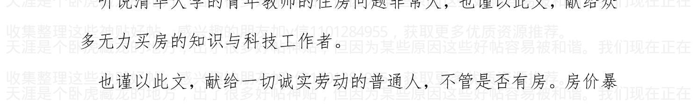


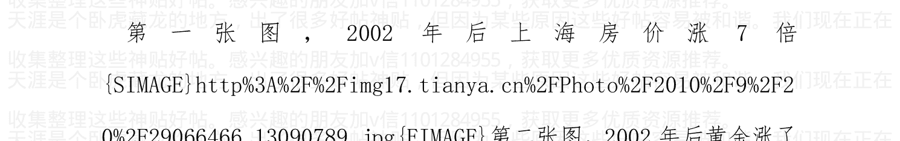

作者：海宁的马甲  日期：2010-09-21  20:15  作者：蓝光芒  回复日期：2010-09-21 19:17:18

难道你是迈瑞的

我与迈瑞毫无关系。

我佩服徐航的迈瑞等医疗设备企业能把高科技产品出口海外，而且不是代工，是自主研发产品。

作者：海宁的马甲  日期：2010-09-21  20:22  作者：南山桃园  回复日期：2010-09-21 17:49:33

直觉告诉我，长期支撑房地产价格的是租金折算的年回报率，理性的人都会考虑是买房子划算还是把钱存银行划算；支撑房价不断上涨的正面因素是经济是不断往前发展的，核心地皮上的经济总量变大，人们收入增加，支撑租金上涨；而央行大幅度加息这种事情属于猛药，一般也就持续1-2年而已，到时一减息房价还得上来。所以如果中国经济一直是向前发展的，房价就得螺旋上升，根本没有所谓的顶，楼主的论点不成立。

你说的非常好。真的。

这是房地产市场重要的信念支撑之一，那就是房租租金是一直涨了，

加微信1101284955获取更多优质书籍推荐

如果房租租金一直是涨了，比如 7 年翻一番（收入也是 7 年翻一番），则买房的人无需担心房价的长期走势。

韩国 1997 年的时候，收入，房子租金都长了二三十年了，1996 年韩国进入 OECD 这个发达国家组织，国民自豪感暴涨。结果 1997 年员工收入暴跌，失业率剧增，发生亚洲金融危机。
以前“收入，房租年年涨”的假设被打破，房价按韩币计算暴跌 40%以上，韩币再对美元贬值 35%到 40%

作者: 海宁的马甲 日期: 2010-09-21 20:39 作者：夜游魂 回复日期： 2010-09-21 12:40:30

人民币对美元中间价八连涨 冲破 6.7 关口

新华网消息 来自中国外汇交易中心的最新数据显示，9 月 21 日
人民币对美元汇率中间价报 6.6997，较前一交易日走高 113 个基点。
至此，人民币对美元汇率中间价已经连续八个交易日创出新高

高盛还是及其牛的，2009 年 12 月开始，一直预测人民币对美元会升到 6.65
2009 年 12 月以来一直坚持此观点。
我从 3 月发帖开始，也一直坚持此观点，就是人民币必须先升破 6.65
那些说 6.5，6.0 的，缺乏数据支持基础。

加微信 1101284955 获取更多优质书籍推荐

目前看，6.65 就是人民币升值预期与贬值预期跷跷板的中间点。

作者:海宁的马甲 日期:2010-09-21 20:42 作者：formic 回复日期：2010-09-21 20:37:08

直觉告诉我，我朝只要还是哪个D当权，房价降恐怕很难

苏哈托在印尼经营30多年，威望很高，1998年，印尼食品涨价200%，

房子没有价格，因为基本没有人买，印尼币对美元从2500贬值到20000，贬值8倍。

当然，印尼是个特例。

作者:海宁的马甲 日期:2010-09-21 20:46 作者：狂人日记 回复日期：2010-09-21 12:49:25

海宁兄：个人认为还有助推中国接下来通货膨胀的一个非常重要的因素：今年农民工工资的迅猛上涨。而这背后的原因一方面是多年的压低，另一个更重要更有里程碑意义的是刘易斯拐点。我所知道今年农民工工资的平均都在涨幅在30%以上，厉害的达到50%甚至更多。这也将会是明年上半年推高通胀的又一大因素。

加微信1101284955获取更多优质书籍推荐

浙江很多需要吃苦的工种工资，从 1800，几个月涨到 2800，否则人都跑光了，工厂无法正常生产，没有工人，厂房就要闲置。缝纫女工那就更缺了，3000 元以下就别想招人了（加班还是很厉害，但是最后工资也冲到 4000 以上）。

大学超常规扩招导致工厂缺能吃苦的工人，而白领工作竞争激烈，

蓝领工资在小地方全面超过白领（拿个 1500，1800 做办公室）。

作者: 海宁的马甲 日期:2010-09-21 20:52 作者: 橡皮与铅笔 回复日期：2010-09-21 12:57:03

呃。。。投资有风险，持币也有风险，黄金也不行，我们该如何是好呢：

2007 年 10 月或者 12 月，通货膨胀凶狠汹涌凶猛。

2007 年 10 月或者 12 月，投资买房--》亏。（2008 年房价下跌，2008 年底被救起）

2007 年 10 月或者 12 月，投资股票--》亏。（股票从 6124 到 2008 年的 1664）

2007 年 10 月或者 12 月，投资黄金--》亏。（2008 年黄金跌到 800 美元以下）

加微信1101284955获取更多优质书籍推荐

物价在把世界带入萧条后下降了。

2008年，格林斯潘成了坏蛋，因为他用房地产泡沫，无缝接力了互联网泡沫。

2009年，2010年，伯南克成了英雄，因为他把股票价格用8，9个月就拉了回来，用国债黄金泡沫无缝接力房地产泡沫。

2011年底，人们将如何评价伯南克？

作者:海宁的马甲 日期:2010-09-21 21:16 人民币汇率在2010年

10月到2011年从升值预期到贬值预期的议题

http://www.tianya.cn/publicforum/content/develop/1/475997.s html

客观理性分析，人民币对美元的均衡汇率在6.65左右（因为J曲线效益，人民币对美元升到6.65后，中国在1年左右内还能保持较大顺差）

中国的人民币的购买力不能无限下降，人民币购买力下降的底线就是人民币对美元的汇率。人民币购买力下降，则人民币对美元的贬值预期越来越强烈，导致资金外流避险。

猪肉价格周期与中国货币政策，及楼市股市走势的关系

> http://www.tianya.cn/publicforum/content/develop/1/483099.html

请问为什么中国人民银行在2004年下半年紧缩货币政策，导致房价在2005年上半年下跌10%到20%（或者微跌，因为没有可靠的数据）？股市下跌更多。

因为猪发话了，猪肉涨价了。（见下图，2004年9月10月，猪肉批发价达到16元/公斤的阶段性高点）

###

2004年4月下旬开始，宏观调控一词频繁见诸报端，逐渐成为经济领域最受关注的话题。尽管与以往历次宏观调控有所不同，但其对证券市场的负面影响是实实在在的。4月7日，在宏观调控影响下，上证指数从2004年最高点1783点飞流直下，到9月13日探出1259点的年内最低点，5个月时间跌去524点，两市流通市值“蒸发”约4437亿元。

由于2004年股票市场的持续下跌，上证综指全年下跌15.4%，沪深两市流通市值缩水近1500亿元。两市7000多万投资者平均每户亏损2053元。惟一上涨的是再融资金额，较2003年翻了一番。

在 2004 年飘雪的冬季，结束了豪庄争鸣一统江湖的岁月，2004 年的庄家墓志铭上，写满了资本大鳄的名字：德隆、鸿仪、闽发、汉唐、南方……2004 年冬天的第一场雪，湮灭了大佬横行的岁月，惨绝人寰的哭泣，庄家长叹空悲切。

###

看来 2004 年庄家们都不逛菜市场，不逛猪肉市场。


作者：海宁的马甲 日期：2010-09-21 21:21 通俗点，幽默点说，2007年10月的中国股市泡沫，部分是被猪蹄给戳破的，部分是被美元走弱导致石油（涨到147美元/桶）粮食（涨80%到150%）等大宗商品暴涨给戳破的。

任你 2007 年 10 月的中国股市嚣张得暴涨之后再暴涨，2.27，5.30 都没有用，但是猪蹄一涨价，你TNND 股市从哪儿涨上来，就跌回哪儿去。

2011年3月到6月的中国楼市泡沫，也将受到猪蹄和美元走弱的极大挑战。

任你2011年3月到6月的中国楼市经过了8年暴涨之后再暴涨，

国2条，4条，6条，国8条，国16条都没有用，但是2011年1月

到3月猪蹄一涨再涨，美元一跌再跌（大宗商品一涨再涨），嘿嘿！

楼市泡沫危险了。

> 作者:海宁的马甲  日期:2010-09-21 23:49"货币政策目标是保持货币币值的稳定，并以此促进经济增长。"

捍卫人民币币值（购买力）的稳定，是《中国人民银行法》赋予中国人民银行的神圣职责。

人民币币值（购买力）稳定，是中国经济可持续，均衡发展，防止经济大起大落的基石。

> "长时间负利率"将导致居民消费行为异化，导致需求过旺之后需求剧减，就像人吃了兴奋剂之后的表现。

人民币币值不稳定，将使得经济在过热与过冷之间徘徊。

### 中华人民共和国中国人民银行法

（１９９５年３月１８日第八届全国人民代表大会第三次会议通过 根据２００３年１２月２７日第十届全国人民代表大会常务委员会《关于修改〈中华人民共和国中国人民银行法〉的决定》修正

### 第一章 总则

第一条 为了确立中国人民银行的地位，明确其职责，保证国家货币政策的正确制定和执行，建立和完善中央银行宏观调控体系，维护金融稳定，制定本法。

第二条 中国人民银行是中华人民共和国的中央银行。
中国人民银行在国务院领导下，制定和执行货币政策，防范和化解金融风险，维护金融稳定。

第三条 货币政策目标是保持货币币值的稳定，并以此促进经济增长。

人民银行：2010年6月末，基础货币余额15.4万亿，广义货币供应量67.3万亿，货币乘数4.37。

作者:海宁的马甲 日期:2010-09-21 23:53 作者: 燃烧的河床 回复日期: 2010-09-21 23:38:30

在这里，还有一点和楼主一起思考。
我也同意，人民币汇率基本已经无升值空间，而且也确实不敢贬值，一出现贬值就会出现外资出走，外汇储备会危机。

既然如此，人民币与美元6.65左右的汇率，制约了人民币购买力的继续下降。

这就是我要说的，人民币购买力的下降不能太过份，美元与人民币的汇率摆在那里。

如果人民币购买力下降，则人民币对美元有从6.65贬值的倾向。

这就是房地产泡沫的极限。我也许是错的，我错了，我会认错。

房地产泡沫的极限，就是人民币的购买力不能继续下降了。

作者:海宁的马甲 日期:2010-09-22 00:02 作者: 钓_胜_于_鱼 回复日期: 2010-09-21 21:36:51

向楼主致敬!非常感谢! 看了楼主花了几个月，数百个小时的劳动成果，学到了很多！楼主这种坚持、严谨的作风更值得学习！很多时候都觉得楼主不是一个人，而是一个团队……如果楼主需要小弟的话，可以通知下在下，非常希望能多学点。

一个人在写。我写得差不多了。 很多东西google百度就可以了。 google百度使得学习变得容易而快速。

加微信1101284955获取更多优质书籍推荐

写了那么多，就是说：人民币币值（购买力）的不稳定，人民一直预期人民币的购买力在将来会下降，导致消费行为异化，导致经济无法可持续，均衡发展，导致科技进步不够快。

人民币币值（购买力）的不稳定，导致多少人间悲喜剧。买房保值的，结果迎来了暴利；诚实保守的劳动者，收入追房价追了8年10年还没有追上。

作者：海宁的马甲 日期：2010-09-22 00:16 作者：liuwei_0_68 回复日期： 2010-09-22 00:04:27

哈哈哈，你不如说逃过了 2011 也逃不过 2012，逃过了 2012 尼比鲁星的撞击也逃不过 2013 超强太阳风，逃过了 2013 也逃不过河蟹的社会。哈哈哈，大忽悠。

说过了中国房地产泡沫的最大可能爆裂点是 2011 年 6 月左右，起因是 2011 年 1 月到 3 月的物价暴涨。

作者：海宁的马甲 日期：2010-09-22 06:20 从日元升值历程看美国股市，中国股市 2010 年 10 月中旬到 11 月的下跌，估计下跌幅度超过 10%。

加微信1101284955获取更多优质书籍推荐

我们就先看看2010年10月中旬到11月，中国股市，美国股市，是否下跌超过10%。
你们怎么看日元从2010年4月23日到9月15日的升值？
我的看法，日元作为套利货币，已经被抛弃，被美元取代。美元作为套利货币要发飙了。
套利货币不但利率要低，而且不能有升值预期，2010年全球套利空间本来就非常少，日元蹭蹭蹭地往上升，套利者套到的利差，远远少于日元升值的幅度，2010年，是日元套利者亏到姥姥家的一年。
套利资金从2010年4月23日开始，纷纷抛弃日元，因为日元币值相对美元欧元比较稳定，日元坚挺，导致谁用日元套利谁倒霉。本来2010年套利空间非常非常小，日元再升值，2010年4月23日以后，借日元用于套利的资金几乎全是亏本的。这就导致了一个恶性循环，
越是用日元套利不赚钱，越多的人在世界各地平仓，然后换成日元还钱，导致日元需求暴增，导致日元汇率上升，恶性循环。这个过程是与某些避险资金进入日元是一起来的。避险资金买入日元，和套利资金在世界各地平仓，导致日元从2010年4月23日到9月15日大升值。
日元升值后，9月15开始到10月6日，270亿美元从美联储汹涌地奔出来了，但是无法抵消日元套利者平仓导致的世界股市失血。
2010年10月中旬到2011年11月，世界股市包括中国股市，美国股市，会因为4月到9月套利者平仓，导致股市失血而下跌，估计下跌

幅度不少于10%。

为什么一定要等一个多月才下跌呢？我也不知道。但是具体规律就是这样的。

才一个多月，我们就先看看2010年10月中旬到11月，中国股市跌多少。

美国股市别看这几天涨得凶，那是有人在买股票对冲美元贬值风险呢，美国股市已经不赚钱，10月中旬到11月就会有分晓。从美联储涌出来的270亿美元，不会像小散户一样去股市。而是去商品市场，特别是石油和粮食。

我们就先看看2010年10月中旬到11月，中国股市，美国股市，是否下跌超过10%。

以前说套利货币，都是讲日元。那过时了。2009年3月以后，美元作为低息弱势的货币，已经取代日元，成为全球套利货币了。“零利率＋弱势美元”使得美元成为套利者兴奋不已的套利货币。套利者可以极低的成本从美国的银行借出美元，投资到大宗商品和新兴市场国家。然后大宗商品暴涨了再暴涨，中国的财政刺激最快最坚决，反映到原材料的需求非常快，导致中国需求大的东西都暴涨。等美国也有很大的通货膨胀，美联储会紧缩货币政策（刚开始不一定要升利率，先卖出国债收回美元就可以，最后还是要升利率解决）。美元不是日元。美元成为套利货币，影响比日元大N倍，N大于10。美元套利交易，使得新兴市场国家资产价格和通货膨胀汹涌澎湃，最

加微信1101284955获取更多优质书籍推荐

后风险越来越高，资产收益率越来越低。最后美联储收紧货币政策，反通货膨胀，美元套利交易平仓，美元大规模回流美国银行系统还本金，赚的部分自己留下。所以“零利率+弱势美元”，先是使得新兴市场资产价格暴涨，然后通货膨胀上升，最后套利美元获利回家的时候，新兴市场国家的资产泡沫破灭，加拿大元澳大利亚元贬值，香港银行利率大幅提升，香港房价到时候怎么走，一清二楚。这个套路2007年10月到2008年7月玩过一回了。你想想看，怎么可能玩到2011年7月才发生萧条呢。怎么可能呢，2007年世界经济那么强劲，才能撑到2008年7月才倒下。所以世界经济2011年3月就倒在恶劣的通货膨胀下了，6月的香港股市楼市，已经暴跌成灾了。这是可能性最大的一种方式。等到2011年6月后的可能性很小，为什么？各国央行不会提前加息预防潜在的2011.1 - 2011.3大宗商品暴涨，特别是美联储，仅此而已。因为据说他们要“保经济”，大宗商品的投机者，就是吃定了美联储，世界央行不会搞紧缩货币政策。好不容易走出衰退，他们怎么会有“坚强的zz意志”去提前预防大宗商品暴涨呢。这是2007年11月到2008年6月的翻版，但是来势可能更猛。至于持续多久，就要看世界经济的抗打击能力了，因为世界刚刚“假复苏”，所以大宗商品暴涨不了6，7个月，3，4个月就可以把世界打成萧条，然后大宗商品暴跌，等到2010年10月的时候，加拿大，澳大利亚的房地产泡沫已经灰飞烟灭了。如果世界经济不萧条不投降，则大宗商品就继续涨。

加微信1101284955获取更多优质书籍推荐

2008 年 1 月到 7 月，世界经济一直不萧条不投降，大宗商品可曾有过任何怜悯之心，粮食涨了 80%到 150%，石油涨到了 147 美元。

作者:海宁的马甲 日期:2010-09-22 06:27 2011 年 3 月，中国国内

通货膨胀不比 2010 年 7、8、9 月更加恶化许多倍，我就可以道歉了。

（不是我希望如此，而是规律如此）

2011 年 6 月，中国的房地产泡沫不破裂，或者不面临极其危险的境地，我可以再次道歉了。

因为我认为，大宗商品暴涨，不可能需要 6，7 个月，才能把世界拖入萧条（2011 年的世界经济，根本没有 2007 年 2008 年初那么强劲）

毕竟，我说的泡沫破裂最大可能在 2011 年 6 月，而不是 2012 年 2 月。

2007 年经济过热，2008 年下半年过冷，2009 年下半年开始过热到 2010 年，2011 年 10 月后，又是过冷。

先看 2010 年 10 月中旬到 11 月的中国股市吧。

作者:海宁的马甲 日期:2010-09-22 06:32 2011 年 10 月，美联储

加微信1101284955获取更多优质书籍推荐

伯克南，极可能被千夫所指，万人所骂。

他主观是想救美国经济，客观上却把世界拖入了另一场恶劣的通货膨胀。

2009 年 3 月到 12 月，挟持大量廉价的低利率的美元的套利交易，

难道没有把世界需求大的商品炒得老高吗？ 他们会善罢甘休吗？

特别是股市，债市，楼市基本都无利可图的时候。

加拿大，澳大利亚的房地产泡沫，很难撑过 2011 年 10 月。

作者:海宁的马甲 日期:2010-09-22 09:11 作者: 潇洒二哥 回复

日期: 2010-09-22 08:57:26

谢谢楼主做的功课，看得惊心动魄。本女子工薪阶层，不懂理论，对数字也不感冒，

请楼主和帖子里的各位高人别笑话我这菜鸟。先谢过了。

===============================

你的意思也和中央政府的意思差不多。房价保持稳定，工资提升。。。假如房价现在1万，那么等你的工资到了1万的时候，也就不觉得贵了。

谢谢“潇洒二哥”帮助回答。

问题是，很多投资者，如果知道每个人的工资会很快涨到1万/月。

其实这个方法1988年就准备实施，民众一看到要大幅涨工资，马上去囤货。

中国每年生产的3.5万亿左右的农产品，可供市场交易的，又可以存储运输的，再去掉大米小麦，可能只有5000亿都不到。而中国有67万亿的人民币。

当67万亿冲出去买物资囤货的时候，卫生巾都可能短缺，然后工厂拼命生产，然后因为民间囤货后需求剧减，

经济是个博弈的过程，没有谁的钱/财富是那么容易被缩水而不动弹的。老太太也会囤食用油的。

一旦用通货膨胀的方法消灭泡沫，那些“头脑活络”的人，通过炒作只会让老百姓蒙受更大的损失。

一个地方的一个小集团，就可以把某些单项产品价格炒得老高。很有意思的是，矛头一致对准“游资”。

1997年到2005年怎么一直不见游资的踪迹。

作者:海宁的马甲 日期:2010-09-22 09:15 我有点奇怪，2007年底

恶劣的通货膨胀刺破了股市泡沫。其实那个时候才加息加到4.14%。

4.14%的时候负利率也很严重。

2008年上半年，6个月物价上涨10%以上，

2008年1月到4月，负利率很严重。

不知道为什么那个时候没有人去买房买股票对抗通货膨胀？

难道是雪灾的心理影响。

作者:海宁的马甲 日期:2010-09-22 10:46 作者： 美国白宫 回复

日期：2010-09-22 09:48:24

这篇文章自从发布以来，我认真读了N遍。

再次感谢海宁的分享。

您的认真严谨，平和执着的精神深深感染着我。

祝您节日愉快。

谢谢，也祝你中秋快乐。

祝大家中秋快乐。

加v信1101284955获取更多优质书籍推荐

作者:海宁的马甲 日期:2010-09-22 10:54 我们来看一张图表。

1993 年以前，特别是 1990 年以前，人民币处于高估状态，具体表现为，你用官方汇率买不到美元，只有到黑市上用高于官方汇率买美元。那些能搞到美元的人活得比较滋润（按那个时候的标准）。

1993 到 1996 人民币的 GSDEER 估值为什么从 5.5 涨到了 8.3？ 因为这 3，4 年中国通货膨胀很厉害，人民币不值钱了，3，4 年人民币购买力下降不止 50%。

1994 年汇率改革，把官方人民币汇率一下子从 5.5 贬值到 8.7。 人民币从高估状态转变为低估状态。黑市无钱可赚，美元外汇黑市基本消失。

1994 年到 1996 年，人民币处于低谷（超贬）状态，大量外资涌入中国买土地，开工厂，国内的外贸经济大发展，这个给东南亚造成了极大的压力。东南亚的货币那个时候应该贬值。如果他们的货币那个时候是浮动了，该贬值的时候就由市场去贬值，1997，1998 年就不会受那么大冲击。那么，为什么那么多东南亚国家都没有贬值呢？ 因为贬值后，进口的东西按本国货币算，会涨价，涨价就要想办法控制通货膨胀，就要实行货币政策紧缩，货币政策一紧缩，经济下滑了，政绩没有了。所以他们那个时候在 zz 上做贬值的决定不容易。

1997 年，东南亚金融经济危机，人民币按 GSDEER 算也该贬值到 8.6, 8.7，但是因为人民币压力不大, 为稳定东南亚经济, 人民币没有贬值。另一方面, 东南亚一片 zz 动荡, 人民币即使高估了一点, 但起码有稳定 zz 环境, 所以这段时期, 人民币现实中得益于东南亚危机, 中国不但得到了很多外资投资, 外资进来兑换人民币, 中国不但不像 95, 96 年那么“吃亏”, 反倒占了些便宜。

2000 年以后, 人民币官方汇率高于 GSDEER 估值, 出口迅猛增长。大量外汇储备来自两个方面。一个是中国实打实的实体经济赚来的钱, 真正的外贸盈余。第二是外资, 外商投资, 国内各种投资, 投机基金进来兑换人民币, 因为一美元本来应该只能兑换 7.3 的, 现在他们能换 8.3。过几年升值后可以以 7.3, 6.8 兑换出去, 这中间还能享受人民币在中国的投资收益 (如果换成房产就更暴赚了)。

特别是 2005 年到 2007 年进来的钱, 那个人民币的官方汇率与 GSDEER 估值之间差距特别大, 国内的资产价格涨幅也大。这些非我族类的外国投资, 不但在只该换 7.3 人民币的情况下, 让他们合法换了 8.3, 投资后还有很多收益率还很高。

2004 年写“大排面离 30 元一碗还有多远”的作者是很牛的。

2008 年以后, 只有把外汇汇入中国兑换人民币就能赚钱的时代过去了。

2009 年以后, 人民币已经不再怎么低估了。

2010 年 3 月，人民币的 GSDEER 估值在 6.65 左右。

2010 年 6 月 3 日，人民币的 GSDEER 估值在 6.93 左右。

现在的问题是，2005 到 2007 年进来的钱，什么时候走，走得多快。

如果 1，2 年内我们真的看到他们暴赚了很多走了。那么，2009 年的 4 万亿，10 万亿，即使初始目的是应对金融危机，现实上起到的作用是给 2005 到 2007 进来的那些钱，给他们一个再暴赚一笔后走人的掩护作用。最后，兑走的是大量的美元等外汇，中国大地上留下的是一堆人民币，堆积如山的人民币，60 万亿，70 万亿人民币，对应一个年产出 30 多万亿经济体，当然物价涨一倍，名义 GDP 就马上是 60 万亿，70 万亿了，那个时候，人民币汇率还能维持 6.83 吗？

1997 年，泰国富得满地都是泰铢。

1998 年，印尼富得满地都是印尼盾，香港百富勤在印尼盾从 2500 兑一美元贬值到 10000 印尼盾兑一美元后，大胆进场抄底，结果印尼盾再次贬到 20000 兑一美元。

一代投资界神童辛苦建立起来的百富勤，破产了。


作者:海宁的马甲  日期:2010-09-22 11:02 作者：yanyyyy 回复日期: 2010-09-22 10:11:59

通货膨胀 (Inflation) 指在纸币流通条件下，因货币供给大于货币实际需求，也即现实购买力大于产出供给，导致货币贬值，而引起的一段时间内物价持续而普遍地上涨现象。其实质是社会总需求大于社会总供给 （供远小于求）。

> >楼主说：“理性分析通货膨胀与经济形势，理性预测中国楼市下跌时间表”

通货膨胀，引起房价下跌，1000 元只相当于现在 100 元，钱都不值钱了，房价还下跌？不懂。

2006 年，欧美通货膨胀，汽油价格很高，导致加息，2007 年欧美继续通货膨胀，房地产暴跌，降息无效。2008 年利率很低，极低，通货膨胀，负利率，但是房价还是继续猛跌。

资金愿意去炒石油，炒粮食，就是不买房。当然欧美的房地产不一样。

> >当然，有人说“这样情况只会发生在欧美，在中国不适用。”

其实，中国 2008 年通货膨胀，钱在猪肉，食用油，汽油面前不值钱了，但是房价却降了。当然 2008 年底房价股市都被救起。

但是，能再救一次吗？再救一次的时候的人民币对美元汇率可能不是 6.65，也可能不是 8.27 了。

加v信1101284955获取更多优质书籍推荐

周洛华有篇文章将，石油暴涨，房价暴跌。中国在2008年财政补贴石油企业，让他们别涨太多。

汽油在欧美的地位和作用，就像猪肉在中国的地位和作用。

作者:海宁的马甲 日期:2010-09-22 11:03 我们来看一张图表。

1993年以前，特别是1990年以前，人民币处于高估状态，具体表现为，你用官方汇率买不到美元，只有到黑市上用高于官方汇率买美元。那些能搞到美元的人活得比较滋润（按那个时候的标准）。

1993到1996人民币的GSDEER估值为什么从5.5涨到了8.3？因为这3，4年中国通货膨胀很厉害，人民币不值钱了，3，4年人民币购买力下降不止50%。

1994年汇率改革，把官方人民币汇率一下子从5.5贬值到8.7。人民币从高估状态转变为低估状态。黑市无钱可赚，美元外汇黑市基本消失。

1994年到1996年，人民币处于低谷（超贬）状态，大量外资涌入中国买土地，开厂，国内的外贸经济大发展，这个给东南亚造成了极大的压力。东南亚的货币那个时候应该贬值。如果他们的货币那个时候是浮动了，该贬值的时候就由市场去贬值，1997，1998年就不会受那么大冲击。那么，为什么那么多东南亚国家都没有贬值呢？因为贬值后，进口的东西按本国货币算，会涨价，涨价就要想办法控制。

加v信1101284955获取更多优质书籍推荐

通货膨胀，就要实行货币政策紧缩，货币政策一紧缩，经济下滑了，政绩没有了。所以他们那个时候在 zz 上做贬值的决定不容易。

1997年，东南亚金融经济危机，人民币按 GSDEER 算也该贬值到 8.6，8.7，但是因为人民币压力不大，为稳定东南亚经济，人民币没有贬值。另一方面，东南亚一片 zz 动荡，人民币即使高估了一点，但起码有稳定 zz 环境，所以这段时期，人民币现实中得益于东南亚危机，中国不但得到了很多外资投资，外资进来兑换人民币，中国不但不像 95，96 年那么“吃亏”，反倒占了些便宜。

2000 年以后，人民币官方汇率高于 GSDEER 估值，出口迅猛增长。大量外汇储备来自两个方面。一个是中国实打实的实体经济赚来的钱，真正的外贸盈余。第二是外资，外商投资，国内各种投资，投机基金进来兑换人民币，因为一美元本来应该只能兑换 7.3 的，现在他们能换 8.3。过几年升值后可以以 7.3，6.8 兑换出去，这中间还能享受人民币在中国的投资收益（如果换成房产就更暴赚了）。

特别是 2005 年到 2007 年进来的钱，那个人民币的官方汇率与 GSDEER 估值之间差距特别大，国内的资产价格涨幅也大。这些非我族类的外国投资，不但在只该换 7.3 人民币的情况下，让他们合法换了 8.3，投资后还有很多收益率还很高。

2004 年写“大排面离 30 元一碗还有多远”的作者是很牛的。

加v信1101284955获取更多优质书籍推荐

2008年以后，只有把外汇汇入中国兑换人民币就能赚钱的时代过去了。

2009年以后，人民币已经不再怎么低估了。

2010年3月，人民币的GSDEER估值在6.65左右。

2010年6月3日，人民币的GSDEER估值在6.93左右。

现在的问题是，2005到2007年进来的钱，什么时候走，走得多快。

如果1，2年内我们真的看到他们暴赚了很多走了。那么，2009年的4万亿，10万亿，即使初始目的是应对金融危机，现实上起到的作用是给2005到2007进来的那些钱，给他们一个再暴赚一笔后走人的掩护作用。最后，兑走的是大量的美元等外汇，中国大地上留下的是一堆人民币，堆积如山的人民币，60万亿，70万亿人民币，对应一个年产出30多万亿元经济体，当然物价涨一倍，名义GDP就马上是60万亿，70万亿了，那个时候，人民币汇率还能维持6.83吗？

1997年，泰国富得满地都是泰铢。

1998年，印尼富得满地都是印尼盾，香港百富勤在印尼盾从2500兑一美元贬值到10000印尼盾兑一美元后，大胆进场抄底，结果印尼盾再次贬到20000兑一美元。一代投资界神童辛苦建立起来的百富勤，破产了。

```
{SIMAGE}http%3A%2F%2Fimg13.tianya.cn%2FPhoto%2F2010%2F6%2F1
```


作者:海宁的马甲 日期:2010-09-22 11:06 作者: wxp0597 回复日期:2010-09-22 10:12:10

我有点奇怪，2007年底恶劣的通货膨胀刺破了股市泡沫。其实那个时候才加息加到4.14%。

4.14%的时候负利率也很严重。

2008年上半年，6个月物价上涨10%以上，

2008年1月到4月，负利率很严重。

不知道为什么那个时候没有人去买房买股票对抗通货膨胀？难道是雪灾的心理影响。

> ---

那个时候央行还没有猛发钞票，很多实体经济才第一波危机很多人还在支撑，人民还未认清我们可爱Z+F的真面目。

现在的一切跟当时都是反的了，俺觉得所有的经济人一定都是理性判断的，大家现在抗的不是通胀，抗的是烂发钞票。

照你这么说，那就更恐怖了。那是德国魏玛共和国，民国金圆券时期，货币失去信用的情况。那会导致，30%以上的超级通货膨胀。

我也有这个担心，但是目前还不至于大家“抗的是烂发钞票”，否则恶性通货膨胀就太难以控制了。

作者: 海宁的马甲 日期:2010-09-22 11:08 作者: 酱油男逛逛 回复日期：2010-09-22 10:51:20

我来一个更加现实的数据分析。请见下图，与金融市场走势息息相关（股市，房市）的数据图。各位可以看到目前的情况如何。

你的图非常好。但是我看不见每根线代表什么，能否换个字的颜色。

作者: 海宁的马甲 日期:2010-09-22 11:13 作者: hdonuts 回复日期: 2010-09-22 10:39:37

这是个信仰问题，东京，香港，台北，汉城的市中心房地产的投资者，都曾经认定市中心不会跌，因为市中心独一无二。中国人，不信仰市中心，不信仰市场规律，中国人信仰权力，在现在这个时期，中国还不存在真正地房地产投资者，中国房产，也不怎么具有投资价值，对比租金和房价你就知道，依靠七十年租用期地房屋实现价值，租赁价格和平均收入根本无法支撑，中国房地产，只有投机者，这就是赌博，赌政策，赌中国人没有选择。大陆民众无处可去，大陆民众地积蓄无处可去。如果大陆签证像香港那样免签，如果大陆金融市场像香港那样开放。中国房价一夜之间就会腰斩。什么是中国房价，中国房价和中国劳动力价格一样，都是一个

### 封闭环境中地宏观调控。

说得对。

但是2008年还是跌了，2009年到2010年3月，把商业银行里多余的没有贷出去的钱，也贷了出去，银行已经很难增加贷款了。中国还是比较法制的国家，商业银行和中央银行还是基本遵守法律的。

作者：海宁的马甲 日期：2010-09-22 11:34 作者：yanyyy 回复日期：2010-09-22 11:24:19

楼主，还是有些不明白，为什么越南在通胀下，越南盾价值变动较大，房子土地交易用黄金算，而不是用越南盾算，是不是房子土地是保值产品，和黄金一样？

在越南我看到的报纸几乎都是这样的。

是的。

越南土地可以自由买卖，越南可以自己买地造房子。

2，3年前，越南富人的大部分资产已经变成了黄金，美元（很多还在外资银行，甚至瑞士），土地（那种没有建房子的土地）。越南可以囤土地。

越南盾彻底失去信用，就像草纸。富人只是保留少许平时用。

所以越南一段时间内关闭了黄金市场。怕黄金对越南盾创出天价后的天价，更显得越南盾是草纸中的草纸。

一碗面大概5万越南盾，好像。越南社 hui 会 zhu 主 yi 义共和国的货币，唉！

作者: 海宁的马甲 日期:2010-09-22 11:41 作者: 江南纳税人 回复日期: 2010-09-22 11:26:26

最近一系列反常的现象，让我感觉泡沫可能已经破裂了。只是非实业人士没有察觉而已。节能减排，多好听的口号啊，认真看看，真的是那么简单吗？

要等到人民币的升值预期消失1，2个月后。9月份，10月份，人民币的汇率可能被逼到6.65以下（即6.64，6.60等）。

这个不是关键，关键是收益率（赌博赢率）对比。

当炒作棉花，丝绸等，4，5个月就可以涨60%以上，炒房子已经失去吸引力了。

部分资金的注意力，是寻找下一个还没有涨的“棉花，丝绸”，而

加v信1101284955获取更多优质书籍推荐

天涯是个卧不是像鸡肋一样的房子。

如果那样东西基本没有涨过，那么赌输的可能性很少，你说，这年头，炒没有涨过的商品能赔多少。

作者:海宁的马甲 日期:2010-09-22 11:57 作者：hdonuts 回复日期：2010-09-22 11:49:35

作者：海宁的马甲 回复日期：2010-09-22 11:41:39

要等到人民币的升值预期消失1，2个月后。9月份,10月份, 人民币的汇率可能被逼到6.65以下（即6.64，6.60等）。

这个不是关键，关键是收益率（赌博赢率）对比。

====

中国投机者，有什么赌博机会？我看澳门倒是个不错地选择。

我们需要杠杆，我们需要普罗大众地杠杆。你因该着重呼吁一下这个问题。

我是呼吁大家（上层中层底层）为了玩的更长些，需要“保持人民币币值稳定，并以此促进经济发展”。

唉，这一句，我以前背得很熟。

作者:海宁的马甲 日期:2010-09-22 12:06 咱们还是把 yevon_ou 2004 年的大作搬过来吧。有人能抓帖，正好把这个也抓去。

发表日期：2004-7-31

发表日期：2004-7-31

作者：yevon_ou 发表日期：2004-7-31 23:13:00

### 人民币面临巨大的贬值压力

《人民币面临巨大的贬值压力》，乍一看这个题目，很多人的第一反应就是写错了。人民币应该面临巨大的“升值”压力，何来贬值而言。

不错，对外升值，对内贬值。

事实上，所谓的升值贬值，其实是二个概念。一是对外，国际市场上，人民币 vs 美金将要升值。二是对内，路边大排档，人民币 vs 大排面将要贬值。

#### 1. 美元公式

有一个很重要的公式，作为我们一切分析的基础：“美元报价= 人民币报价 * 汇率”

好比一只中国产的茶杯，价格4元人民币，人民币汇率8.27，则该只茶杯卖到美国，报价即为4 / 8.27 = 0.5 元美金。

如今美国抱怨中国货太便宜，0.5美金的价格实在令美国人难以竞争。小布什想尽一切办法，要让美国市场上的中国货，从0.5涨价到0.7~0.8美金。

大陆的官方媒体，翻来覆去地总是强调，美利坚强迫压制人民币汇率升值，“美元报价=人民币报价 * 汇率”。如果汇率升值至1：5，则美元报价自动涨至4 / 5 = 0.8美金，也就没什么竞争力了。

而事实上，等式的右边有二项，汇率和人民币报价。美国人还有另一种阴谋，如果让中国通货膨胀，中国产的杯子要卖到7元一只，则7 / 8.27 = 0.8美金，一样也没有什么竞争力了。

通货膨胀和人民币汇率，美国佬只要能操纵一项，就能使中国货变得更贵，也就达到他们的目的了。

作者：海宁的马甲 日期：2010-09-22 12:07 2）通货膨胀

通货膨胀说来就来，一夜之间，物价就涨上去了，电煤矿油就缺

加v信1101284955获取更多优质书籍推荐

是什么导致经济过热，按一些央行官员的口径，是汽车，钢铁，电解铝等行业的过度投资。但接着问下去，过度投资的根源，是价格上涨。价格上涨的根源，是需求过热。需求过热的根源。。。央行官员就瞠目结舌，答不上来了。

在 8.27 汇率下，美国人的一个手段，就是用尽量多的美金，来冲击人民币体系。

固定汇率类似于一种“坐庄”系统，当卖盘太多时，“庄家”就必要进场，维持价格。美国人抛多少，中央银行就得要接多少。不然你这个 8.27 就名存实亡了，也达不到资助出口企业的目的。

在过去的一年中，美国人的行为可谓疯狂。大量的热钱，涌向中国。由于中国的基本面很强，美国财团充满信心，投机资金源源不绝。

年终总结，中国央行，大约每天买进 5 亿美金，一年累计买入了 1600 亿美金。今年1~6月份，短短的六个月，又再买入了 700 亿美金之巨。使中国的外汇储备总量，达到了 4700 亿美金。

央行和普通的商业银行，有很大的区别。商业银行资源有限，而且用的是“旧钱”。商业银行买卖外汇，并不会影响金融稳定。

而央行是发钞行，拥有“铸币权”。从理论上来讲，央行的接盘能力是无限的。当手中一些有限的流动资金用完后，央行可以开动印钞机，大量印制“新钱”，接下美金。

但新钱有新钱的坏处。新钞一发，后患无穷。美国人就是要这个效果。当大量新印制的人民币流入市场，将导致物价系统的灾难。

中国的商业银行，放大系数约为2.5~3.5。中国去年的M2货币总量，由18万亿增长到了22万亿。总的来说，如果没有美金潮，放贷额甚至是缩减的，商业银行甚至是惜贷的。所谓信贷失控，纯属无稽之谈。

但即使新增40000亿货币总量，对一个GDP总量约为10万亿的经济体，仍然太大太大。一下子多了这么多新钱，物价岂能不涨？

物价一涨，生产企业岂能不大干快上，尽量多快开工。这就是所谓的经济过热。

联系汇率，导致人民币被低估，导致美国人冲击人民币，导致货币供应量太大，导致物价上涨，导致经济过热。

> 引用格林斯潘的一句话，“如果他们（中国）坚持不升值，他们自己的货币就会出问题。”

### 3) 鱼与熊掌

如果人民币被低估，美国人必然乐意将美金兑换成人民币，并最终导致人民币过多，通货膨胀。

美元报价=人民币报价 * 汇率。美国人总有办法，让中国货价格上涨，失去竞争力，经济是均衡的。你坚持固定汇率不动摇，我就用美金冲你人民币，最终导致你通货膨胀。

鱼与熊掌不可兼得。是选择固定汇率，还是选择稳定物价呢。

中国政府的态度很明确，固定汇率是长期坚持的一项基本国策。

去年顶住七国财长压力，被认为是外交纵横的一项重大收获。

> 按照中国人一贯的鸭脑思路，“敌人的敌人，就是我们的朋友”。

美国的劝告，反着做就可以了。美利坚要我们升值，我们偏不可以升值。

事实究竟怎样，还是先分讲清楚，二种不同的选择，谁是受益者，谁是受害者。

如果汇率上涨，则受益者是人民币持有人，也即是十万万老百姓。

你可以很轻松地去加勒比海滩度假，去希腊看奥运会，甚至娶一个年轻漂亮的马来西亚太太。

而如果汇率不涨，国内通涨的话。受益的是政府和银行。作为最大的债务人，几万亿的坏帐将相应缩水，从而更容易偿还。政府将获得大量的铸币权，以应付财政开支。

财富就只有一笔。鱼与熊掌不可兼得。总而言之，百姓是没什么指望去加勒比度假了，更没钱娶一房马来太太。这些钱将用来填补国有银行的亏空。

我们同意就总体而言，国家利益，填补银行，总比海滩度假要重要得多。但还是应该跟民众解释清楚，在这项选择中，谁是受益者，谁是受害者。

作者：海宁的马甲 日期：2010-09-22 12:12

### 4) 房地产

本轮热钱潮的另一个奇怪现象，游资收购的是房地产，而不是传统意义上的股票与债券。

国际换汇资金，讲究的是光速划拨。要求高流通，低风险，固定收益。从这个角度讲，债券是最好的选择。一些短期债票面受益率，甚至成了一国汇率的基准。

相对而言，股票都不受宠。因为股票波动还是太大，而且收益率也不确定。

至于房地产，一般而言根本不是游资的选择。房地产的流通性实在太差，而且千房千面，每一套房源都要单独评估，单独销售，简直是游资的恶梦。

真正的原因，还在于公式“美元报价=人民币报价 * 汇率”。经济是均衡的，好比二道水闸，水位最终会渗透到同样高度。

但在中国价格，逐渐向美国靠拢的过程中。到底是“人民币报价”变动，还是“汇率”变动，游资心中仍没有底。事实上，中国政府坚守固定汇率的决心，也是不容小觑的。

最好的选择，就是购买中国房地产。一旦 8.27 的汇率不变，而是中国内部通货膨胀，房产会随物价上涨。无论是汇率涨，还是物价涨，房地产二相得宜。

外行看热闹，内行看门道。从目前看，8.27牢不可破。简单地将美金兑换成人民币现金，“初级投机者”们，将遭受毁灭性的打击。

作者:海宁的马甲 日期:2010-09-22 12:23

作者：年少时的我 回复日期：2010-09-22 12:16:59

谢谢lz的分析...

我的一点看法，一切的分析，在印钞机面前都会变得渺小，虽然lz的理论符合经济学原理...

我相信经济规律迟早会发挥作用，但对lz的时间表保留看法，呵呵。

2007年9月，很多人对中国股市的看法，大致如此。

我们必须等石油的价格变动。等到大约2011年3月。2010年11月后，只有石油等大宗商品市场才能容纳那么多资金去赌去玩。11月后，欧美股市，楼市，债市，全不赚钱了，只有大宗商品。我不一定对，欢迎补充。

作者:海宁的马甲 日期:2010-09-22 12:25

### 5) 宏观调控

宏观调控有一个很大的漏洞，即其对于内资外资的影响，是不同的。内资奄奄一息，外资如鱼得水。

企业获得资金，无异二个路径。国内资金和国外资金。

经过宏观调控，江苏省十几家银行集体停贷。民营企业几乎已被屠戮殆尽。中国的内资企业，再也没有能力获得贷款，再也没有能力扩大产能，再也没有能力抢占市场了。

而你可以管得了国内银根，却管不了国际银根。中国目前的银根空前紧张。而在国际市场上呢，却是 45 年来最低利率，宽松得要命，外资企业可以大量融资。

我们很痛心地看到，当国内企业普遍停产的时候。外资公司却是心口二面。当某些外资学者大喊“中国必需减速，减速，再减速”。而他们自己的外资公司，却在中国加强扩张，增大投资，急步跑马圈地。

德国大众新加了二条生产线，广州本田加了一条，大摩在上海投了几十亿的地产项目，转手又买了建行的几十亿抵押物业。全银行系统违约率最低的个人房贷，中国的银行被行政命令规定不许做，而天津的一家德资银行却连 5.04%都不要了，干脆开出来了 3%的优惠利率。

我们不知道“外国专家”究竟是看多还是看空。但我们知道总产能并没有下降多少。唯一的区别是，内资让几步，外资就进几步。

在一个完全的市场经济体系中，抽紧银根，则货币减少，供应紧张，汇率相应上升。

当实行紧缩性货币政策时，内资固然借不到贷款，外资由于汇率上升，一样需要付出更多的投资成本。对内外资是平等一样的。

> > 引用一句老话“在固定汇率下，外资涌入，将会抵销紧缩性货币政策”。固定汇率下实行宏观调控，只苦了内资，而松着外资。

国内银根很紧，而国外银根很松。国企奄奄一息，外企如鱼得水。固定汇率+宏观调控，导致了一个大漏洞，在这样的漏洞下，等于国企不战而溃，将大好市场份额拱手让人。

解决的方案也很简单，对某些特定行业，征收“投资调节税”。凡国企受行政命令不许增加产能的，外资也不许进入。进则征收额外税。

更进一步讲，如果觉得某行业产能过大，第一个应该砍掉的是外资的工厂，宏观调控应该从外企开始。如果觉得汽车业产能过大，第一个被砍掉的，应该是广州本田，广州马自达。

残害民族企业取媚洋人，砍掉民企市场份额让给洋人，奇怪。

作者:海宁的马甲 日期:2010-09-22 12:30

作者: 年少时的我 回复日期: 2010-09-22 12:23:28

城市化对房地产市场影响巨大，我觉得这方面变数很大，海宁可以分析分析么？

在经济学上，没钱的需求都是无效需求。

未来房价一个很大的变数，是扩大贷款买房的比率，目前这个比例很小，很多人还不卖身，不上套。

未来贷款买房的比率扩大后，房价也能因为这个因素涨。因为贷款就是把以后的收入拿到今天花。

作者:海宁的马甲 日期:2010-09-22 12:32

### 7) 日本模式

从宏观经济讲，中国是越来越象 80~90 年代的日本，越来越复制着日本模式。

中国和90日本都是一个出口导向型国家。都希望用较低的汇率来补贴出口。都同样面临外汇储备急剧增加的情况，都不得不解决外汇占款引发的通货膨胀情况。

怎样在货币泛滥的情况下，继续保持出口竞争力，从而将出口导向型经济，维持尽量长的时间。

日本的对策方针是，进一步扭曲国家价格体系，让不出口的东西都涨价，让出口的东西都不涨价。

日本的葡萄，可以卖到1美金一粒。日本的西瓜，可以卖到30美金一个。但无论如何，都比不上日本的房地产价格夸张。

房地产是一个很好的部门。或者说，房地产是一个典型的“内销”型部门。为房地产买单的，99%都是国内百姓。

很多人都认为，房价过高，会导致一个城市商务成本过高，丧失竞争力。其实这是一个误解。在一家大型跨国公司中，房地产和员工房贴，只占总成本的8%。甚至还比不上一些公司的电话费。

而房地产的价格，99%是由本地百姓来负担的。在这剩余的1%中，还要分工业地产，商业地产，和民用地产。普通城市的住宅楼可以很贵，但工业用地可以很便宜。政府可以有意识地补贴，土地也是要分种类的。

而正相反的，政府可以从房地产中获得大量的税收，获得大量的财源。用这样一笔巨额财富，政府可以用来造机场，造码头，改善基础设施。或者高额出口退税，或者提供优惠项目。

房地产事业，是一种典型的“剥削内贸补贴外贸”。用国内老百姓的负担，来补贴出口竞争力。甚至可以说，“房价越高，出口竞争力越强”。

中国也即将走上日本的老路。低汇率，导致外汇储备急剧增加，引发通涨压力。而政府将通涨压力引向房地产，让国内百姓为此买单。外贸出口业始终不受损伤。

99%内销的部门，始终是宣泄通涨压力的好去处。房产，交通，医疗，教育，莫不如此。

“美元报价=人民币报价 * 汇率”，这也是让汇率，出口物价，同时保持低价竞争力的唯一办法。

日本出口一台彩色喷墨打印机，大约价值 750 元人民币。对中国一年出口10万台，大约总价值7500万人民币。当东京都一套很普通的公寓，其价值和出口一个国家的打印机相等时，东京都的房地产事业崩溃了。扭曲的价格体系再也无法维持。

日本的土地是全世界最昂贵的，日本的出口是全世界最强的。即使经过了一次崩溃，无论国内民生痛苦指数如何，仅就出口而言，日本仍是全世界最强劲的国家。

### 8) 结语

经济是一具活物，任何扭曲都不能长久，并且要为扭曲付出代价。

中国为追求出口优势，人为地扭曲人民币汇率。无论人民币升不升值，只要背离基本面，美国都能从中找出弱点，并借而打击人民币。

如果中国长期坚持固定汇率，美国就会用美金冲击人民币，扩大货币供应量，并最终导致中国通货膨胀。

如果中国学习“日本模式”，进一步扭曲国内价格，用房地产宣泄通胀压力，则能人为地延长汇率扭曲。

“美元报价=人民币报价 * 汇率”。所谓人民币升值贬值，这其实是二个概念，对外和对内，二者是反比关系。

如果中国长期坚持固定汇率，对外不升值，最终会导致对内贬值。

人民币面临巨大的对内贬值压力，大排面迟早要涨到30元一碗。

作者：海宁的马甲 日期：2010-09-22 12:43

作者：顶明光 回复日期：2010-09-22 12:37:18

坐看好戏，2012

最大可能是2011年6月

作者：海宁的马甲 日期：2010-09-22 12:51

## 贷款增长率与房价增长率之简评

这是以前的一篇旧文。

一句话简评各个年份的经济，贷款增长率与房价增长率。

1999年，2000年：适度从紧的货币政策使得贷款很难，某些地方zf不得不用蓝印户口吸引大家去买他们那里3000/平方米的房子。房价接近砖头钢筋水泥市政配套的成本。

没听说 1999，2000 年的建筑企业，房地产企业有太多倒闭或者亏本。

2001 年： 加入世贸组织，经济起步进入快速发展车道，房价抬头，但是涨得不厉害。

2002 年， 经济在 2001 的基础上更快了一点，房价涨得更多了一点，但是没有飞涨。

2003 年，经济已经开始有过热的苗头，但是因为发生了非典，为了展示社会主义经济迎难而上和领导有方，银行贷款的闸门放开了，房价飞涨了。

2004 年，经济一如既往的好，有底气放心收缩银根（降低贷款增长速度）。

2005 年， 经济形式还是一片大好，有本钱继续收缩银根。这个政策非常得准确。

要是一直采取 2004 年，2005 年的适度从紧的货币政策，现在很多收入较高的夫妻（夫妻一方年收入 10 万，另一方 5 万），都买得起房，而且生活不错。

但是，可惜，历史没有“但是”。

2006 年，经济还在赶往这一轮繁荣周期的顶峰。 但是，可惜，房价降温后，不知道为什么，银行贷款的水龙头又被拧开了。

2007年，经济发展达到了这一轮繁荣周期的顶峰。可惜，银行贷款的水龙头还是没有被关上。

2008年，中国实体经济进入了任何市场经济体都不可避免的下降通道。即使银行贷款增长率还是像2006，2007年那么高，房价却稳中有降，出现了退房潮，失业潮。

2009年，实体经济进一步下滑。水龙头太小，改用打开消防阀门的方式“灭火”。房价涨幅大于1.5%。

2010年，上半年，贷款新增4.6万亿左右，比2009年少，但是对于35万亿的GDP来说，也是天量。属于最后一副兴奋剂。如此天量，房价降不了，通货膨胀控制不了。

2011年下半年，货币紧缩，信贷紧缩，不得不发生，否则2010，2011两年，很多物价就可以翻番。（中国物价暴涨，最后一定要看猪肉，猪肉暴涨才是物价暴涨的发疯阶段）

货币银行学角度总结：2005年，以及2005年以前，货币政策还是非常理性的。周某说2006年货币供应量略显过多的评价，也是非常准确的。

政治经济学规律总结：略。。。


%2F28305795_13090789.gif {EIMAGE}

作者:海宁的马甲 日期:2010-09-22 20:29

作者: xenolidar 回复日期：2010-09-22 17:22:34

好文，顶。

再特别强调下，加息与否不是 zf 的意愿问题，而是形势所迫。

尽管 zf 可能下不了决心杀房价，但是出于经济形势的全盘考虑，不杀不行。米国的加息同样也是出于形势，并会加大中国的杀房价的可能。

非常正确。

据说目前温州熟人间的贷款利率又飙升到 20%到 30%了。物价稳定时期一般是 12%到 15%。

作者:海宁的马甲 日期:2010-09-22 20:33

作者：首次上 ty 回复日期：2010-09-22 17:46:10

谢谢楼主的辛勤劳动，

想请教楼主什么时候换美金比较合适，

万般期望楼主回信，

再次谢谢，祝中秋快乐。

我不提供投资建议。

人民币对美元，目前看均衡汇率在6.65左右。但是并不表示人民币不会升过6.65，到达6.60，但是超过6.60的可能性不大。我有另外一个帖子讲人民币汇率。

作者: 海宁的马甲 日期:2010-09-22 20:34

作者: 免费的账号 回复日期: 2010-09-22 17:48:04

中国大幅度加息，那些进入楼市的企业怎么办? 他们很多都是拿贷款炒楼的。

这种事情会不停轮回的。

1980 年代, 江苏南部就有很多刚富裕的企业家投资 '将军楼' 亏本的。

作者: 海宁的马甲 日期:2010-09-22 20:37

作者: jasonxhl817 回复日期: 2010-09-22 19:56:19

原材料价格都在疯涨

最疯狂的事情要等到2011年3月左右, 国际的, 国内的。

作者: 海宁的马甲 日期:2010-09-22 20:43

作者: yanyyyy 回复日期: 2010-09-22 20:21:23

作者：海宁的马甲 回复日期：2010-09-22 11:34:51

作者：yanyyyy 回复日期：2010-09-22 11:24:19

楼主，还是有些不明白，为什么越南在通胀下，越南盾价值变动较大，房子土地交易用黄金算，而不是用越南盾算，是不是房子土地是保值产品，和黄金一样？在越南我看到的报纸几乎都是这样的。

是的。
越南土地可以自由买卖，越南可以自己买地造房子。
2，3年前，越南富人的大部分资产已经变成了黄金，美元（很多还在外资银行，甚至瑞士），土地（那种没有建房子的土地）。越南可以囤土地。
越南盾彻底失去信用，就像草纸。富人只是保留少许平时用。
所以越南一段时间内关闭了黄金市场。怕黄金对越南盾创出天价后的天价，更显得越南盾是草纸中的草纸。
一碗面大概5万越南盾，好像。越南社会主义共和国的货币，唉！

======

就是说你实际上承认了房子土地可以保值？纸币你随便贬吧，我用黄金结算房价，房子的价值是存在的。

对啊。主要是土地部分。越南2007年曾经也有过土地价格泡沫，2008年下去了，之后土地价格有上来了。

事实上，越南土地按黄金标价按黄金结算已经很久了。不然你说15亿越南盾，到底是今天的15亿，还是6个月前的15亿。

土地贵，所以按黄金结算，大排面，食品等价格低，只能用越南盾了。

> 作者：海宁的马甲 日期：2010-09-22 20:45

作者：性灵小筑 回复日期：2010-09-22 20:30:22

呵呵。lz的分析让我看不懂，房价总是要跌的。通胀会不停加剧，黄金也还有10年要涨。大宗商品只怕要10年后才会跌。

我预计黄金价格泡沫2012年2月要破。黄金的价格规律是涨11年，跌8年。

我预计大宗商品牛市2011年10月要破。大宗商品价格的规律是涨10年，震荡下跌20年。

作者：海宁的马甲 日期：2010-09-22 21:12

作者：多少年 00 回复日期：2010-09-22 20:49:14

## 原材料价格都在疯涨

最疯狂的事情要等到2011年3月左右，国际的，国内的。

那人们还有能力消费吗，如果那样社会会不会出问题，

2008年6月7月，石油140美元/桶，国际上粮食比2007年7月上涨了80%到150%（导致中国的猪肉和食用油奇贵）

> 作者：海宁的马甲 日期：2010-09-22 21:18

作者：卡纳维拉尔角 回复日期：2010-09-22 21:06:14

别预测时间了，该做多的多，该空的空。2013年中国人口红利大限就快到了。到时候死的比出生的还要多，持续到2050年以上。

2011年6月房价见底，肯能吗？就9个月时间房价怎么见底？如果说2011年6月房价大限来临还差不多。9个月开发商要跌估计也是赖在上面不下来的。

不好意思，让你误解成2011年6月见底。

我是说，2011年6月很多人知道楼市开始暴跌之旅了。

2007年9月，也没有多少人会想到2008年6月的股市会达到那个程度。

国际国内猛烈的通货膨胀合力很强。

猪肉涨价 + 国际大宗商品涨价

养猪的在2010年6月底已经走出亏损。

作者:海宁的马甲 日期:2010-09-22 21:25

作者: 天三日.回复日期: 2010-09-22 21:15:07

作者: jclhp 回复日期: 2010-09-21 09:50:34

美元指数都81了，为什么这次的美元弱势没有引起A股的上涨？人民币升值的预期应该会引起热钱大量流入才是啊。现在仍然保持适度宽松，中国的经济打少量鸡血起不来了，需要更大量。现在不能收缩啊，一收缩各政府的债务怎么办？烂尾楼工程就多了。持续的鸡血，大量的鸡血。

2010年4月23日开始，世界股市涨不动了，日元套利者开始了长达5个月的平盘还日元活动。

2010年，借日元用于套利的人亏到姥姥家了。

对于世界各地股市，2010年4月23日开始，一直受到日元套利资金平盘导致资金紧张的困扰。

2010年10月中旬到11月，世界各地股市应该有个大幅下跌的过程，跌幅不会少于10%。

日元套利退潮，美元套利来了，来势汹汹，国际粮食石油将暴涨，涨到2011年3月。

> > 作者:海宁的马甲 日期:2010-09-22 21:36 作者:人肉搜索引擎 回复日期: 2010-09-22 21:31:10

涯叔怎么啦，老吞回帖

告诉你个秘密，在www之后加个1，然后回车，就可以马上看到你的发言。

至于为什么过一会儿才显示，你是知道的。

http://www1.tianya.cn/publicforum/content/develop/1/487004.shtml

> > 作者:海宁的马甲 日期:2010-09-22 21:38 作者:农村小青年儿 回

加V信1101284955获取更多优质书籍推荐

# 作者：海宁的马甲 日期：2010-09-22 21:46

回复日期：2010-09-22 21:02:53

我认为，这是这个帖子里对我最大的侮辱。

我认为我还懂点经济学，货币银行学，虽然并不一定对（主流经济学专家也说不准）。

但是我不懂炒作学，我不懂宗教心理学。

回复日期：2010-09-22 21:30:10

让中国房价下跌绝对不是利率这玩意。因为如果大幅下跌，引发物价下跌 gdp 萎缩，中国政府又要下猛药了。开发商和炒房客又得瑟了。一定是要了它们命门的东西才行。你说的答复通胀加息后，通胀抑制了。房价弄不好又像08年一样打摆子然后上涨了。给你一段文字，就知道死多头多么凶猛了：

你的讨论是非常有意义的。

光是加息，不控制货币供应量，是没有用的。

阿根廷，德国魏玛共和国等，利息加到月息 300%都没有用。

我谈加息的前提是《中国人民银行法》被严格遵守。人民银行不通过再贷款向市场提供基础货币。

事实上，人民银行把存款准备金提高到 16%，17%（用于对冲大量的外汇储备占款）就是非常负责任的做法。

但是 2005 年 7 月后的外汇占款太汹涌了。

去掉外汇占款因素，人民银行还是非常负责任的。

外汇占款过多，是流动性过剩的根源。

对于 35 万亿人民币的经济体，15 万亿的基础货币啊，40%多，专业的人知道怎么回事。

美国经济体 14 万亿美元，基础货币以前是 8000 亿美元，现在是 2.3 到 2.5 万亿美元，占 15%，已经要造成世界通胀了。

国际粮食石油月月大幅涨的时代，从 2010 年 11 月就要开始了。

作者:海宁的马甲 日期:2010-09-22 21:48 作者：buffetsoros 回复日期：2010-09-22 21:43:51

黄金创新高，带动澳元上涨！

黄金创新高，预示着美元很烂，大宗商品要涨，澳元加拿大元涨，

加V信1101284955获取更多优质书籍推荐

澳洲加拿大的房地产泡沫还不会破。

作者:海宁的马甲 日期:2010-09-22 21:57 作者:保卫家财 回复日期:2010-09-22 21:47:30

先谢谢楼上几位好心人。

我们现在担心的是，以后政府还有可能滥发人民币，到时候人民币不值钱了。比如说我们10年时候200万可以买到一版车，但是，2012年的时候，我们需要400万买一版车。那么，这多出来的200万，我们短短2年时间是赚不到的，也就是说，可能2012年我们只有250万，那么，连一版车都买不到了，我们岂不是生意越做，越赔钱了？

也许我这段话有经济学逻辑错误，但是，意思就是那个意思。想请你们指点一下。

从你这里，我看到的是人民币的信任危机。

人民币一旦遭遇信任危机，之后便是猛烈的通货紧缩保稳定，理财宜保守。

唉，2003年发展到今天，不知道多少人已经有了像你这样的人民币的购买力极其不稳定的想法。

不知道负责任的人民银行的专业人士看了你的发言后，有何感想。

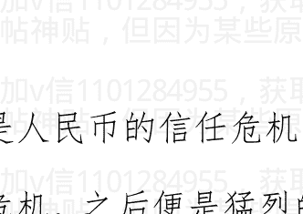

加V信1101284955获取更多优质书籍推荐

> > 《中国人民银行法》第一章总则第三条：“货币政策的目标是保持人民币币值稳定，并以此促进经济增长”

# 个人意见。

作者:海宁的马甲 日期:2010-09-22 22:03 作者:人肉搜索引擎 回复日期：2010-09-22 21:28:06

楼主啊，请教一下，我两套房子，一大一小，大的150多用来自住，小的才70平方左右，本想租出去的，看了你的文章，觉得卖掉合适，我理解得对吗？

绝对的高抛低吸是很难的。

我忘了在主贴里提及，长期我不看好人民币的购买力，也就是说房价暴跌后，还是会涨上去的。把房子留在手里8年10年而言，比人民币保值。

很多人长期不看好人民币的购买力和信用，是房价暴涨的最大理由。

如果出租收益不错，并且不知道如何理财，还是留着吧。

长期而言，房租是跟着物价涨的。

唉，真的是人民的币吗？还是叫中国元，人民心里也许会好受点。

作者：海宁的马甲 日期:2010-09-22 22:07 作者：卡纳维拉尔角 回复日期：2010-09-22 21:42:46

美国 gdp 14 万亿美元，美国房地产价值 18 万亿美元
中国 gdp 35 万亿人民币，中国房地产价值在没有充分开发农村的情况下已经 120 万亿了。
这泡沫要是破了。30 年都起不来说实话。离谱的不是一般。

你让我想说敏感词敏感问题。
还是算了。

公道自在人心，虽然人心很脆弱。

作者：海宁的马甲 日期:2010-09-22 22:09

看来，人民对于人民币未来购买力的预期非常之低，比我原来设想的还要低。
看事态发展吧，2011 年 3 月，6 月。

作者：海宁的马甲 日期:2010-09-22 22:30 作者：biiiiix 回复日期：2010-09-22 22:15:47

两天没看美元指数
竟然破了 80

加V信1101284955获取更多优质书籍推荐

再看新闻 原来是美联储继续维持低利率 原因是通胀处于地位

就业没有起来

美元看来还要下行

黄金 农产品 石油等要大涨了

到时候倒逼美国加息

你听到昨天美联储的冲锋号了吗？

美联储说美国的通货膨胀太低，要把美国的通货膨胀搞上去。

等美国的通货膨胀搞上去了，中国的通货膨胀又会叠加暴涨到什么程度？

农产品 石油等要大涨了，来势凶猛。

作者:海宁的马甲 日期:2010-09-22 22:41

中国的经济周期，逢二探底，逢七登顶

不管计划经济还是市场经济，经济的主体最终还是人。人性总是在“乐观与悲观”之间波动。投资者的心理总是在“贪婪与恐惧”之间波动。

人性不变，所以几千年过去了，圣经还在不停的被阅读，被讨论。

中国有自己清晰的经济周期。中国近50年经济周期，用人均猪肉消费量来衡量，比任何其他指标都强。下图是历年人均猪肉消费量。

中国经济，每过10年，都会遇到一定困难。

1950 年代，比赛吃白馒头。

1952 年到 1957 年，国民经济快速恢复，人民群众欢欣鼓舞，人们对于吃饱的信心在 1957 年达到阶段性顶峰，然后大跃进发生了。

一些见过世面，饱经沧桑的老人一边看着人们比赛吃白馒头，一般喃喃自语”如此糟蹋粮食，是要遭天谴的”。懂点历史的都知道，1961年的冬天是非常寒冷的冬天，不是因为天气，而是因为被剥夺“在家做饭权”后发生的饥饿。1957 年吃饱饭的甜蜜幸福感，估计被很多 人在 1960 年，1961 年的梦里重温。1962 年春天，春小麦收获后稍有好转。

> > 如此糟蹋粮食，是要遭天谴的

1960 年代，有一个词叫“老三届”。

1962 年春小麦丰收后，吃饭经济又开始了缓慢的恢复， 1966 年又开始折腾了，到了1968，又是逢8，没有足够粮食吃了，城市也没有足够工作岗位了，怎么办？送些人下乡去，希望他们也去生产粮食，这就是1956年就有上山下乡的说法却没有大规模实施，到了1968年才一下子让“老三届”下去的经济背景。所以，68年没有足够粮食。

#### 1970年代。

我们可以从很多信息看出1969年到1971年的经济非常困难。比如“1970年信息显示，“连续几年农业生产遭到破坏，北方14个省区粮食不能自给，靠从南方调拨粮食维持”。1973年请邓出马搞技术性的整顿，到1975年铁路运输次序整顿和生产恢复了些，到1977年国民经济已经又“恢复”了的很多，接着，逢8自然要搞点什么，1978年提出“N大钢铁基地”，N大其他基地，大家可以查查为了建设宝钢是否花掉了国家最后一分外汇，日方不得不提供贷款才完成一期项目。

#### 1980年代，共享改革红利。

1981年后，国民经济快速恢复，1985年农业大丰收，中国人几百年来第一次吃饱了饭，农业的丰收给工业再次提供了剪刀差的机会，加上工厂承包制，基本工资以外的奖金制度，让工人也尝到了改革开放的甜头，很多厂里的工人收入大于公务员。1987年，是全民共享改革红利的年份。这种改革红利，来自生产力的解放。生产力的解放，来自产权的明晰，农民可以保留分到的土地上产出的粮食（交了公粮以后），工人可以保留承包责任以外的盈利并以奖金的形式发放（工人对企业利润拥有了受益权，虽然不是股份所有权）。1987 年，工人，农民，与设计师的信心达到了了阶段性顶峰，1988 年物价闯关了，物价飞涨了，抢购发生了，2 年多的萧条来了。

1990 年代，‘8’字火了。

1990 年，1991 年设计师都在上海过年，希望得到另一位老人的支持，希望再次解放生产力），搞活沉闷的经济。（解放生产力的另一个表达方式，即走市场经济，资本主义道路，在当时是非常敏感的。结果他没有得到他想要的支持，却得到了一位闯将。

1992 年设计师再也等不及了，他要发出更强的声音，并且邀请了拿枪的同行，给自己壮声势。他达到目的了，又一次解放生产力开始了，市场经济确立了，人民币从 5.5 贬值到 8.7 了，公司法，破产法，银行法出台了，外资涌入了，印钞厂加班加点了。1993 到 1996 经济突飞猛进，1997 年，咆哮了 5 年的经济又一次触顶了，经济调整开始了。1998 开始降存款利率了，1999 年开始大搞铁公鸡了。当然，肉的人均消耗量从 1990 年的 20 公斤涨到了近 30 公斤。大米小麦自给的情况下，猪饲料和食用油（原料都是大豆）从 1995 年开始依赖进口。

21 世纪，开始影响世界商品与金融市场。

2002 年，一个看了几个破产国企的不懂经济的人，写了本‘中国即将崩溃’的书，他不知道的是，效益低下的国企的破产的另一面，则是迫使这些效益不佳的企业破产的，更具有效率的企业的发展壮大。

（国企破产原因还有社会福利负担大，FB问题等）。抓大放小是解放生产力，也是经济困难时期zf的甩包袱，至于贫富差距差距拉大，那是二次分配问题，至于企业生产有毒商品或者造成环境破坏的问题，则是zf监管的责任问题。

总之，2001 到 2007 年的主题，一是 1990 年代末抓大放小导致的市场真空（或者说国企退出的那些领域的市场竞争环境的提高），二是人民币以过低的汇率盯住美元，并随美元对其他货币如欧元进一步贬值的因素。没有这两个基础，房地产是很难迅速发展起来的（这也是为什么 1998 年到 2001 年，想推房地产而发展并不太快的原因）。

2007 年 2 月，美国和发达国家房子价格指数到达顶点，中国经济也在几个月后到达顶点。2008 年末的刺激，其实 58 年，78 年，98 年都干过。刺激根本没有 4 万亿加 10 万亿，财政的钱本来就是收支相抵，国债发放又不太多（1 万亿？），哪里能拿出 4 万亿。2009 年如果没有刺激计划，本来新增贷款就会有 6 万亿人民币左右，结果因为刺激，新增贷款达到了 10 万亿。所以，真正的额外刺激，就是那新增 10 万亿贷款里的 4 万亿。（2007 年新增贷款 3.6 万亿，2008 年新增贷款 4.9 万亿，2009 年如果新增贷款 6 万亿，那是正常）


作者：海宁的马甲 日期：2010-09-22 22:48 作者：贾治邦 回复日期：2010-09-22 22:44:18

美元指数日K线周K线，都已经破位，月K线也是两阴夹一阳的走势

呵呵

继续跌吧，大宗商品赶紧暴涨

目前情势看，中国楼市2011年的命运，与2008年中国股市的命运非常非常相似。

作者：海宁的马甲 日期：2010-09-22 23:05 作者：huanglongcyf 回复日期：2010-09-22 22:55:44

这些都很难说，不过我真心希望预测能够成真。其实黄金才是货币之王

2011年，当大宗商品暴涨之后再暴涨，促使美联储采取行动的时候，黄金将走向回归之路。

黄金是倚天剑，对于美元购买力贬值的。当美元购买力升值的时候，黄金就有难了。

2008 年 7 月，大宗商品暴跌，美元购买力上升的时候，黄金暴跌了。

2011 年，当大宗商品高空跳水的时候，10 年黄金牛市的末日也到了。

作者:海宁的马甲  日期:2010-09-22 23:13 作者：10 点起床  回复日期：2010-09-22 22:58:41

作者：南山桃园  回复日期：2010-09-21 17:49:33

直觉告诉我，长期支撑房地产价格的是租金折算的年回报率，理性的人都会考虑是买房子划算还是把钱存银行划算；支撑房价不断上涨的正面因素是经济是不断往前发展的，核心地皮上的经济总量变大，人们收入增加，支撑租金上涨；而央行大幅度加息这种事情属于猛药，一般也就持续1-2年而已，到时一减息房价还得上来。所以如果中国经济一直是向前发展的，房价就得螺旋上升，根本没有所谓的顶，楼主的论点不成立。

==========

商品房租金太贵，租政府的公租房比较合算！

买商品房出租，以后未必供不应求。

“南山桃园”的说法是非常有见地的，他正确说出了理性的房地产投资者的内在或者潜在想法：

即房租，租客的收入等，都会7年翻一番这么涨。以前的历史说明了，普通人收入7年翻一番可以实现。可以理解为租金增长率。

这和投资股票类似。

一个利润7年翻一番的公司，要比一个利润每年只涨3%的公司，估值搞3倍，5倍。

投资高成长率的公司的最大风险，就是利润增长突然下跌，结果股价跌去60%以上。

投资房地产用于出租的最大风险，就是经济减速，租金下跌。

作者:海宁的马甲 日期:2010-09-22 23:21 作者: 酱油男逛逛 回复日期: 2010-09-22 23:09:33

楼主，你的分析着力点不对。

楼市，股市等基本上可以算得上是资金的蓄水池(对资金持有人而言)，货币回笼手段(对央行来说)。

货币就是货币。所谓蓄水池的说法，就是把某个市场炒得很热，很多投资者拿着钱在里面买进卖出，不亦乐乎。最后有人结帐去买车，买消费品，结果社会就通货膨胀了。

至于股市与 M1，M2 的关系，网上有很多。

好像是 M1 增速 - M2 增速 > 5%, 表明存款在出来投资，股市可能要大涨。

你的图很好，我看到的是 2009 年 12 月和 2010 年 4 月初的双顶结构。

另外，看 2010 年 10 月中旬到 11 月的中国股市，是否大幅度下跌，跌幅超过 10%?

作者:海宁的马甲 日期:2010-09-22 23:29

海宁原创，天涯首发

```
http://blog.sina.com.cn/hainingdemajia
```

-   一）猪肉价格涨跌周期与中国货币政策，楼市股市走势的关系
-   二）我对猪肉涨跌周期，与经济周期，泡沫周期的看法
-   三）中国的资产泡沫在 2011 年 2 月到 2011 年 12 月面临的挑战
-   四）GDP 平减指数才是良好的中国物价的参考指标

加V信1101284955获取更多优质书籍推荐

#### 五）人民银行法 第一章第三条：货币政策目标是保持货币币值的稳定，并以此促进经济增长。

http://blog.sina.com.cn/hainingdemajia

（没办法，天涯发不出有时候不知道卡在哪里）

##### 一）猪肉价格涨跌周期与中国货币政策，楼市股市走势的关系

34 到 36 个月的猪肉涨跌周期（34 个月×3 = 102 个月=8.5 年，36 个月×3=9 年）。

请问为什么中国人民银行在 2004 年下半年紧缩货币政策，导致房价在 2005 年上半年下跌 10%到 20%（或者微跌，因为没有可靠的数据）？2004 年股市忘了查了，2004 年下半年，应该也好不了。

因为猪发话了，猪肉涨价了.（见下图，2004 年 9 月 10 月，猪肉批发价达到 16 元/公斤的阶段性高点）

###

2004年4月下旬开始，宏观调控一词频繁见诸报端，逐渐成为经济领域最受关注的话题。尽管与以往历次宏观调控有所不同，但其对证券市场的负面影响是实实在在的。4月7日，在宏观调控影响下，上证指数从2004年最高点1783点飞流直下，到9月13日探出1259点的年内最低点，5个月时间跌去524点，两市流通市值“蒸发”约4437亿元。

由于2004年股票市场的持续下跌，上证综指全年下跌15.4%，沪深两市流通市值缩水近1500亿元。两市7000多万投资者平均每户亏损2053元。惟一上涨的是再融资金额，较2003年翻了一番。

在2004年飘雪的冬季，结束了豪庄争鸣一统江湖的岁月，2004年的庄家墓志铭上，写满了资本大鳄的名字：德隆、鸿仪、闽发、汉唐、南方······2004年冬天的第一场雪，湮灭了大佬横行的岁月，惨绝人寰的哭泣，庄家长叹空悲切。

###

看来2004年庄家们都不逛菜市场，不逛猪肉市场。

34到36个月后的2007年中，为什么股市高歌猛进好像要冲破1万点，却被人民银行两根大棍子，升存款准备金，和升存贷款利率，打得落花流水？导致股市从 6124 点跌到 1664 点。

因为猪又发话了，而且发飙了，据说阴谋家还把猪吃的饲料大豆豆粕炒得老高。

2007 年 8 月，猪肉第一次见顶，猪肉批发价在广东四川等地达到 24 元/公斤，大部分个股也在 8 月见顶。

2008 年 2 月 3 月 4 月，猪肉价格再次在高位徘徊，股市已经一泻千里了。

如果投资者听猪的话，2007 年 8 月，9 月，10 月，就该从股市战略撤退。

2009 年 5 月 6 月，猪肉价格探底，养猪的又一次亏到姥姥家了（34 个月左右亏一次）。

如果投资者听猪的话，当养猪的亏本的时候，投资者就该杀进股市，或者杀进猪市，开始养猪也行。

如果猪涨跌周期还有效的话，2010年8月9月猪肉会第一次冲高，然后指示人民银行加息0.27%一次，2010年12月到2011年3月，年末春节期间，猪肉再次高位徘徊，再指示人民银行加息？

如果投资者听猪的话，当养猪的赚得眉开眼笑的时候，投资者就该从股市战略撤退。

2010年8月，9月，猪肉停止上涨的时候，就是投资者暂时撤离股市的时候。

猪有时候还充当一大片国家的领导。80年代，苏联在东欧的势力江河日下，猪取代了苏联，成为东欧各国的共同最高领导。波兰小学生瓦文萨的上台，罗马尼亚齐奥塞斯库的命运，跟猪肉价格密切相关。

对于中国而言，再过3个猪肉涨跌周期（34个月×3=8.5年）后的2019年到2021年，猪肉还会是个重大的经济政策，农业政策，货币政策议题，也必将是个政治议题。

作者:海宁的马甲 日期:2010-09-22 23:31

#### 二）我对猪肉涨跌周期，与经济周期，泡沫周期的想法：

首先，中国有自己的经济周期，不一定与美国经济周期同步。美国房地产泡沫2007年2月开始被做空而破裂，中国大陆，香港，澳大利亚，加拿大的房地产泡沫还没有破。

中国自己的实体经济周期从2002年开始，2007年到顶，2008年底开始用救市撑住。

其次，2001年后，中国受美元和世界经济的影响很大，这一轮经济“增长”的启动，就是美元2003年走弱开始的，美元在2003年对日元和欧元分别贬值17%和14%。人民币也就跟着对日元，欧元贬值17%和14%。因为人民币在2003年对美元汇率固定不动，保持在8.27。

中国2003年出口增长近40%。中国的外汇储备也增长了40.8%，达到4000亿美元。从此开启中国经济发展“奇迹”之门，人民币币值，港币币值，由此开始进入不稳定，部分是盯住美元，随美元贬值而起的，大陆和香港的资产泡沫由此而起。根据房地产泡沫一般在美国，日本，四小龙，东南亚几个小虎都大致持续6，7年左右看。2010年是快到了泡沫破灭的时候了。

当我说，中国大陆和香港的房地产是对于美元（2003-2007）下跌很好的对冲工具的时候，有人说，“懂日元和欧元的笑了”。可是2003年底，美元已经对日元和欧元分别贬值17%和14%了，再去买日元欧元有点迟了，但是买香港大陆的房子还不迟，因为大陆与香港的货币没有像欧元日元那样对美元升值，而经济确实在从底部回升起飞。

作者:海宁的马甲 日期:2010-09-22 23:33

#### 三）中国的地产泡沫在2011年2月到12月面临3个挑战

第一个挑战：国内失控的通货膨胀。2010年，虽然部分商品价格暴涨，但是说2010年通货膨胀失控，也是不够准确的。

2010年2月，是个开头。2010年789月，只是通货膨胀恶化的第一阶段。

2010年12月到2011年2月，才由猪肉带领羊肉鸡肉牛肉，进入第二阶段。如果部分其他非食品类也暴涨，则人民币的信用在流失，这个时候，才可以肯定通货膨胀与1993-1994年类似。

如果2011春节期间，非食品类不大涨，则资产泡沫可持续一定时间。

如果2011春节期间，非食品类也大涨，则资产泡沫从2011年春节开始进入倒计时，倒计时时间为12个月左右，12个月内，不猛烈加息，则物价上涨轮番轰炸，就像1993，1994年。芝麻价格也可以翻番（芝麻只是举个有趣的例子而已）。

美联储量化宽松的钱，被银行拿去买国债和其他安全的债券了，没有贷款给个人和企业。美国的商业银行是私有的，利率也是市场化的。

所以美联储量化宽松，没有传导到广义货币供应量上，变成企业和个人的钱，所以暂时不会引起通货膨胀。市场告诉商业银行家们，买国债比贷款给个人与企业要有利（对“自私”的银行而言）。

中国则是让商业银行进行信用扩张，广义货币供应量增长27.7%，钱进入了拿到贷款的企业手里，然后被花了出去。

### 第二个挑战：美元货币危机。

从2008年12月开始的美联储的零利率政策，随着时间的流逝，越来越容易引发超级通货膨胀（石油粮食等暴涨）。如果美国国债也失去作为财富储藏的功能，则会导致石油，粮食等大宗商品暴涨，然后美联储不得不提前加息反通货膨胀。但是散布恐怖言论也是不对的。美元下跌，石油暴涨，是有边界的，石油涨过115美元，太阳能发电就会被大力推广，市场会预期石油消耗减少从而导致石油价格下降。

### 第三个挑战：美国因为房地产泡沫比欧洲先破，大规模破产重组比欧洲先发生

导致2011年市场在预期美国经济复苏的时候，而欧洲陷入银行危机，主权债务危机，美元就会开始对欧元上涨。

如果人民币预先对美元升值到市场均衡汇率附近（通过新加坡人民币NDF市场对照），目前看是6.65，美元再发动对欧元日元，加元等的暴涨，则中国国内资产泡沫就可能破裂。

因为这个时候美元再暴涨，人民币陷入两难，对美元汇率不动则外贸不行；对美元贬值则加剧国内通货膨胀，因为大豆，石油等进口货物的人民币价格会相应上涨，而且贬值易导致资金出逃。

经济规律只可被扭曲，绝不会被战胜。萧条只能被延后，绝不会被消灭。不然日本经济“奇迹”不会破灭，四小龙曾经的股市楼市泡沫不会破灭，东南亚各个小虎的经济发展“奇迹”也不会破灭。

中国大陆资产泡沫起于美元2002年底开始长期贬值之旅，如果破灭于美元升值。也算是一个美元涨跌周期与泡沫起落周期。

作者:海宁的马甲 日期:2010-09-22 23:47

#### 四）GDP平减指数才是中国物价的参考指标

用中国CPI说事的伪专家误国。中国人民币购买力到底是上升了，还是下降了，中国老百姓，人民币持有者，心里都有一杆秤。

统计局也有好的可用的数据，那就是GDP平减指数，它衡量一切GDP产出的物价涨幅。

2007年，GDP平减指数9%，即使不算资产泡沫，负利率多少？

2008年，GDP平减指数12%，即使不算资产泡沫，负利率多少？

2009年，只要买房买股票依旧是人民币的用途之内，人民币的购买力在2009年就是下降的。

2010年第一季度，GDP平减指数5.4%，负利率近3.2%

> 五）人民银行法 第一章第三条：货币政策目标是保持货币币值的稳定，并以此促进经济增长。

### 中华人民共和国中国人民银行法

（1995年3月18日第八届全国人民代表大会第三次会议通过 根据2003年12月27日第十届全国人民代表大会常务委员会第六次会议《关于修改〈中华人民共和国中国人民银行法〉的决定》修正）

### 第一章 总则

- 1. 为了确立中国人民银行的地位，明确其职责，保证国家货币政策的正确制定和执行，建立和完善中央银行宏观调控体系，维护金融稳定，制定本法。
- 2. 中国人民银行是中华人民共和国的中央银行。中国人民银行在国务院领导下，制定和执行货币政策，防范和化解金融风险，维护金融稳定。
- 3. 货币政策目标是保持货币币值的稳定，并以此促进经济增长。

人民银行：2010年6月末，基础货币余额15.4万亿，广义货币供应量67.3万亿，货币乘数4.37。

2010.9.17 更新：

## 『经济论坛』[经济杂谈]猪肉价格周期与中国货币政策，及楼市股市走势的关系

http://www1.tianya.cn/publicforum/content/develop/1/483659.shtml

2010年9月，猪蹄子又狠狠的踹了股市一脚。

因为猪肉涨价，导致CPI上升到3.5%，导致很多投资者因为加息预期而先期撤退。

猪厉害啊，央行还没有加息前，就已经把部分投资者吓退了，吓坏了，吓跑了。

作者：海宁的马甲  日期：2010-09-23 00:10

作者：保卫家财 回复 日期：2010-09-23 00:00:42

请问海宁：按照之前看的几个帖子，黄金和美元是负相关的，虽然现在美元低黄金价格高，可是，等到3年以后，美国人立志恢复强大的美元购买力，那么，就可以推断出，3年以后，黄金必然是贬值的啊！那如果我们现在买了一些黄金，那么3年以后就是贬值的啊。我说的合乎经济学逻辑吗？请指教

黄金价格在550美元/盎司（约120元/克）以上的时候，黄金是货币。黄金在越南就替代了越南盾作为货币。

当房子涨了7倍，黄金涨了5倍之后再去买房子，好像晚了点。

2007年，当中国股市涨了3，4倍的时候，再去买股票保值晚了。

加v信1101284955获取更多优质书籍推荐

当粮食涨价的时候，资产泡沫的末日（暴跌）就近了，关键在于时间点的猜测而已。

2007年7月到2008年7月，国际粮食价格暴涨，中国猪肉暴涨，中国股市大跌楼市微跌，导致退房潮。

即使我说错了，那也不用3年那么久。

作者:海宁的马甲 日期:2010-09-23 00:18

美联储说美国的通货膨胀太低了，要把美国的通货膨胀搞上去，美国通货膨胀再不上去的话，美联储2011年1月就疯狂地印美钞买国债，直到把美国的通货膨胀搞上去为止。

可是，这会苦了世界上食品占消费比例很大的发展中国。

中国猪肉大米小麦食用油，四大样的食用油，也不得不涨了。

大家看看接下去，还没有涨的食用油价格，是否一直涨，到3月份累计涨幅不少于20%。

作者:海宁的马甲 日期:2010-09-23 08:12

作者：何所终 回复日期：2010-09-23 01:25:30

前面有人提到了地方财政，不过楼主没看见。如果楼主看见我的回复的话，麻烦解个惑。前面网友提到的地方政府融资贷款什么的，我是不明白的，我想了解的是地方政府的收入是怎么来的。楼市的崩盘或者大跌，会不会影响到地价，会不会影响到地方财政收入？

我不谈这个是不想被封贴。

我提供一个不同的角度，我的以下观点的验证时间是2010年11月底。

2010年11月底，股民郁闷地发现，TNND，明明银行贷款每个月很多，怎么股市就是不但不涨，还跌去了不少呢？其实股民们从2010年4月起就开始郁闷于这个问题了。

因为2010年4月，必须在几个选项之间做决定。如果房地产和铁公基项目的贷款都得到满足，那么通货膨胀就是洪水滔天了。所以只能让铁公基得到资金，但是“严控”新的开工项目。

如果一个村子里的村长，带领几个儿子，向村民借了钱（没准备还），在村里的面店里吃面，每次都点两碗，吃一碗，倒一碗。如此持续1年多，你说，村里的面能不涨价吗？

铁公基项目，挤占了社会资本的空间，铁公基必须准时开工，准时或者提前完成，如果铁公基抢不到民工，那就加工资，那就增加项目贷款资金。反正这个钱。。。

地方平台，截至2009年底，大概7万多亿。2010年，新增3万亿，救活了钢铁水泥等企业，但是社会资源与财富，凝聚在铁公基项目里了，长期对中国和人民有好处，但是短期内会造成自然资源瓶颈，人力资源瓶颈，通货膨胀。

修长城的时候，如果是市场经济，粮食类，砖头类物资的通货膨胀肯定是很厉害的，因为生产粮食的人少了，而修长城是个力气活，需要吃更多的粮食。

计划经济的时候，讲消费和积累的关系，积累多了，消费就少了。

所以陈Y将搞建设要考虑人民群众的承受能力。

当然，铁公基项目会让一些行业比较火，但是记住，总的来说，最后钢筋水泥等财富，被凝固下来了，其好处要几年，几十年才能体现。

凝固下来的，是民工的汗水，民工吃掉的蔬菜，还有钢铁厂工人的汗水，和铁矿石等自然资源。

铁公基项目贷款占所有贷款的比例越高，股市总体而言，越没戏。

2010年4月后，去掉铁公基贷款后的贷款增长率足够大（大于15%），才能推动楼市股市。

去掉铁公基贷款后的贷款增长率足够大吗？

2010年新增贷款9万亿，减去铁公基的2.5万亿到3万亿 = 6万亿，总体而言无法推动楼市更上一层楼。

2010年11月底左右，就是楼市的最高点，股市也会因为失血而下跌。

> > 作者: 海宁的马甲 日期:2010-09-23 08:21

作者：勇猛无比 回复日期：2010-09-23 04:32:03

房价大跌，股市大跌，投资不好做，只能拿着现金。拿着现金，因为通货膨胀，钱开始发毛。LZ说了那么一大通的话论证，有什么意义呢？反正不管是哪种情况，我等P民都是一个死字。

如果LZ真有水平，或者真的是为广大P民想，那好。可否告诉我们现在应该怎么做？拿现金还是拿资产？

如果没什么好方法，那说这么一大通有什么意义呢？反正对于广大P民来说，不管LZ对错，都是一个死。但是LZ就不同，起码出名了，可以靠这个混口饭，有如股市侯宁，叶添荣之流，或者牛刀之类的。都是些只会说大道理，却给不出什么实际建议的。

投资靠的是自己，任何其他人都靠不住。

聪明的投资者，在2007年底，自然知道：

- 第一，现金为王，虽然通货膨胀很猛烈，钞票一天天缩水。因为投资资产类东西比现金更危险。
- 第二，风险承担能力比“持有现金”强的人，选择债券。
- 第三，风险承担能力更强，又喜欢赌博的人，在权衡风险得失之后，在合适的价位买入中行，工行的可转债。万一自己判断失误，股市不但不跌，反而暴涨，则也可以通过可转债分一杯羹。但是买可转债要承担风险，收益可能没有存款或者其他债券强。

但是，2007年底，经济火热，通货膨胀猛烈的时候，聪明的投资者最不轻易做的一件事情是投资，非常非常慎重，既不投资股市，也不投资楼市，也不投资实业。当然2010年看，2007年底，不投资楼市傻死了。但是原则如此。对于聪明的投资者而言，自己能力以外的钱，不奢望。对于某些聪明的投资者，2007年底以后的楼市涨幅，超出了他们的能力范围。

加v信1101284955获取更多优质书籍推荐

作者:海宁的马甲  日期:2010-09-23 08:30

美联储2010年9月22日，已经穿越时空，在2011年6月到9月左右，刺穿了中国的地产泡沫。

因为美联储居然在2010年9月22日说，美国的通货膨胀太低了，低到无法忍受，如果再这么低，2011年1月，美联储就印钞票买国债（就是把新印的钱，量化宽松到社会上去）。

国际市场，不听话的投资者，最后拿到钱，炒的是资源类商品，而不是投资实业。

接上去，发展中国家要等待的，是通货膨胀将猛烈到什么程度。

看2011年3月吧。

作者:海宁的马甲  日期:2010-09-23 08:41

更正：2010年11月底左右，就是楼市的最高点，股市也会因为失血而下跌。上面打错了。是2010年11月左右，楼市最高点。

作者:海宁的马甲  日期:2010-09-23 09:39

作者：落日飞虹 回复 日期：2010-09-23 09:28:22

楼主，那股市最高点是什么时候？

股市2008年蒸发20万亿后，虽然2009年又大幅上涨，股市已经不是重点了。

股市已经成了房地产业的附庸了，房地产涨则股市涨，房地产落则股市落。因为房地产的影响能力，短期内已经达到史无前例空前强大的地步。

作者:海宁的马甲 日期:2010-09-23 09:43

作者: youyouwoxin99 回复日期：2010-09-23 09:07:14

感谢楼主。最多半年，我还能坚持半年，哥就必须得买了。WG8占着茅坑不拉屎，早点回家吧！

#####

那没有用，房价要撑到2011年6月，甚至9月才开始大幅下跌，之前是非常小幅度的。

具体时间，要等2011年3月的通货膨胀情况和中国央行美联储的应对而定，否则就是乱猜了。

作者：海宁的马甲 日期：2010-09-23 10:50

作者：RAPHAELEE 回复 日期：2010-09-23 09:24:35

早上6点起来.... 本来是想更新自己在天涯的另一个帖子 "R菲在新西兰的建房日记"的...误打误撞来到这里... 一口气看完所有的10页... 荡气回肠.. 不吐不快...非常感谢楼主在这里讨论这样一个话题... 其实大家已经讲得很多很透彻了...谢谢你的参与。

基本上，房价为什么涨上去了，继续高位徘徊的理由，继续涨的理由，可能下跌的理由，各方面的理由，基本上讨论完毕。都提出来了。可惜，目前的房价，已经体现了“房租”“最后接盘者的可支配收入”多少年翻番这一点，没有人去量化。可能也没有数据去量化。

“其实大家已经讲得很多很透彻了”，就是多军的意见相对少了点。对于很多多军而言，已经懒得废话了。

作者：海宁的马甲 日期：2010-09-23 11:55

作者：454880049 回复 日期: 2010-09-23 11:33:02

分析的不错，但看不太懂，能不能从需求的角度分析下房价？

我认为刚需对于房价的影响，比富人和经济实力强的人买多余的房子保值的影响小很多很多，小到微不足不足道。很多人都可以告诉你，他们身边有多套房子的人很多。但是房价降了吗？ 没有。 你让这些人卖了房子，拿到人民币做什么投资才能保值？

刚需在2010年以后，跟房价关系不大，虽然还是有不少刚需买房。

作者:海宁的马甲 日期:2010-09-23 21:47

作者: 醒梦者 回复日期: 2010-09-23 20:40:54

我既买不起房子，也不懂理财，只能眼睁睁地看着自己的存款贬值。。。谢谢楼主的文章。

2011年10月以后，也许物价不是那么恐怖了。2008年10月的物价，也比2007年9月低很多的。1，2年内物价上下波动还是挺大的，大蒜，姜的价格会下去的。

**加v信1101284955获取更多优质书籍推荐**

作者: 海宁的马甲  日期:2010-09-23 21:54

作者: flyupABC 回复 日期: 2010-09-23 21:46:15

作者: 在洗澡的浣熊  回复日期: 2010-09-23 21:07:16

楼主分析的很详细，但还是遗漏了很多问题，像是我们这批人的住房问题，这是刚性的需求，是怎么影响房价的? 和你说的其他因素有什么关联? 都没有论述。

========================

我来帮楼主回答下

刚需，首先要看是不是有效需求，如果是根本买不起房子的刚需，则对房价根本没有影响。这几年房子涨这么厉害，能买得起的刚需基本上都买了，甚至有的看房价涨这么厉害，连上小学的儿子未来的房子都准备好了。

真正的住房需求对房价的影响反而很小，主力都是抱着保值的目的去的，刚需不是主要因素，影响极其有限。

谢谢帮助回答。我也这么认为，主力都是抱着保值的目的去的，原因是人民币的购买力看上去下降很快。这是一种心理的过度恐慌。

其实人民币的购买力下降，并没有那么快。

人民币不能胡来，因为美元盯住，等中国的物价，工资，高到外贸没有利润的时候，游戏就无法继续了，房价会发生什么，懂经济的自然知道。
所以，人民币无法胡来，人民币购买力下降是有底线的。
底线就是人民币的购买力，不能低到国外的奶粉比国内的便宜。等国外的奶粉比国内的便宜的时候，不用懂经济就知道，人民币的汇率撑不住。

作者：海宁的马甲 日期:2010-09-23 22:07作者：shg4039 回复日期：2010-09-23 21:57:00

楼主能说说明年的粮价和食用油价吗？？？？

先涨后跌，也许2010年10月前后就跌了。

我说的不一定对。

参考2008年。其实金融市场无非涨涨跌跌，玩法很少，没有必要每次都换花样。

作者：海宁的马甲 日期:2010-09-23 22:30 抱歉，打错了。

先涨后跌，也许大宗商品 2011 年 10 月前后就跌了。

2009 年已经涨了很多，2010 年底，2011 年上半年，看来还有来一波，先搞死世界经济，然后自杀（暴跌），就是大宗商品 2008 年的玩法。

经济规律，大宗商品的规律，股市楼市的泡沫规律，不 HIGH 到死，不罢休。

泡沫的规律，不 HIGH 到死，不罢休。

作者:海宁的马甲 日期:2010-09-24 00:10 作者: emlake 回复日期: 2010-09-23 23:59:16

请问一下楼主，我是四月份将宁波的唯一的一套房子卖了，现在钱放着想等房价跌下来再买进，我一直看空房价，但是现在我确实在担心我手上的钱会不会不停地贬值。LZ是否能给建议。

过热之后是过冷，2007 年底到 2008 年的那一场雪，已经经历过了

（经济如果真的好，比如 2003 年的大灾也挡不住经济的上升势头）。

快点，2011 年 10 月后，很多物价会下降很多。

2007 年底，很多人也非常焦虑，物价天天涨，所以要跑赢 CPI。

加v信1101284955获取更多优质书籍推荐

## 2007年底投资的人，有几个跑赢了CPI？

作者:海宁的马甲  日期:2010-09-24 08:16 作者: tong 宰你们没商量  回复日期：2010-09-24 07:32:24

没人回答吗？ 海宁兄虽然说过不做投资建议，但是这里也就仰仗你一人解惑!!!! 所以，海宁兄是不是破例一下!!!

海宁兄分析的很是道理。

- 但现在，房子不能卖（也买不起），
- 黄金不能碰，
- 股票是碾钞机，
- 石油不知道怎么买（以我们小P民的能力应该是不能买，知道门路的请指点一下，谢谢），
- 粮食就算买也没地方放，反而有生虫报废的可能，
- 其他的什么买美国军火股，
- 买看多美元的对冲基金都是天马行空，
- 看样子，只能买美元咯！各位我们只知道灾难的来临，如何应对却很缺乏！

大家有什么建议！

现在的情形与 2007 年底极其类似。

投资靠的是自己，任何其他人都靠不住。2007 年那么多股票家，只知道一味唱多，现在还有几个有信誉？“王亚伟”级别的人物有几个。

如果投资股票，可以看看王亚伟在做什么。

聪明的投资者，在 2007 年底，自然知道：

- 第一，现金为王，虽然通货膨胀很猛烈，钞票一天天缩水。因为资产类东西比现金更危险 10 倍 100 倍。
- 第二，风险承担能力比“持有现金”强的人，选择债券。
- 第三，风险承担能力更强，喜欢赌博又不想输太多的人，在权衡风险得失之后，在合适的自己能承受的价位买入中行，工行的可转债。万一自己判断失误，股市不但不跌，反而因为人民币日元化而暴涨(可能性很小)，则也可以通过可转债分一杯羹。但是买可转债要承担一定风险，收益可能没有存款或者其他债券强。

2007 年底，经济火热，通货膨胀猛烈的时候，聪明的投资者最不轻易做的一件事情是投资，非常非常慎重，即不投资股市，也不投资楼市，也不投资实业。当然 2010 年看，2007 年底，不投资楼市傻死了。但是原则如此。对于聪明的投资者而言，自己能力以外的钱，不奢望。对于某些聪明的投资者，2007 年底以后的楼市涨幅，超出了他们的能力范围。

当猪肉价格极高的时候，股票极其危险。

###

2004 年 4 月下旬开始，宏观调控一词频繁见诸报端，逐渐成为经济领域最受关注的话题。尽管与以往历次宏观调控有所不同，但其对证券市场的负面影响是实实在在的。4 月 7 日，在宏观调控影响下，上证指数从 2004 年最高点 1783 点飞流直下，到 9 月 13 日探出 1259 点的年内最低点，5 个月时间跌去 524 点，两市流通市值“蒸发”约 4437 亿元。

由于 2004 年股票市场的持续下跌，上证综指全年下跌 15.4%，沪深两市流通市值缩水近 1500 亿元。两市 7000 多万投资者平均每户亏损 2053 元。惟一上涨的是再融资金额，较 2003 年翻了一番。

在 2004 年飘雪的冬季，结束了豪庄争鸣一统江湖的岁月，2004 年的庄家墓志铭上，写满了资本大鳄的名字：德隆、鸿仪、闽发、汉唐、南方……2004 年冬天的第一场雪，湮灭了大佬横行的岁月，惨绝人寰的哭泣，庄家长叹空悲切。

###

看来 2004 年庄家们都不逛菜市场，不逛猪肉市场。

作者:海宁的马甲 日期:2010-09-24 08:18 我在写本实用的，没有学过经济学的人都能看懂大多数内容的投资理财的书。到时候会上传到新浪，供大家免费下载。

作者:海宁的马甲 日期:2010-09-24 10:36 作者: 湖伴岐山 回复日期: 2010-09-24 10:13:12 我现在的房子是不是应该卖了，等 2012 再买啊!! 这种事情我是绝对不提供任何建议的。

2003 年底杭州上海卖房子的也不是一个两个人，当时这些卖房子的还觉得自己挺聪明的。

谢国忠可是老空军了，2004 年开始唱空，一唱就是 6 年多啊，一个经济周期一般也就 7 到 11 年而已。他一唱就是半个经济周期还多。

要是这样也可以，那我说股市近半年别跟猪过不去，5 年内肯定大涨。

作者：海宁的马甲 日期：2010-09-24 10:44作者：jassonlu 回复日期：2010-09-24 09:54:13

楼主，你的观点我很认同，顺便请教一个问题：现在投资房产、黄金基本上很容易站岗了，股市虽然目前位置不高，但是鉴于实体经济短期不会有起色，也不大可能出现什么大的行情，反而有可能二次探底到1600点附近去。那么现在最好的办法就是持币或者等待时机换美金了。我的看法是否正确？另外目前持有的现金每年投资收益几个点才能抵御当前的通胀真实值（不是统计局公布的那个）。

你说得对。

我的意思是，鉴于以前猪对股市的影响力。股市在2010年9月到2011年3月，下跌的概率大大超出上涨的概率。个人意见。

人民币货币供应量67万亿罢在那里。但是我们近期看不到人民币贬值的倾向。以后的现在还说不准。现在是等人民币升值预期什么时候消失，这个转折点很要命的。

快点到11月，人民币升值预期已经暗中消失了。

67万亿啊，缩回去，很多人要大叫，谁有胆碰他们。

加v信1101284955获取更多优质书籍推荐

肯定缩不回去，人民币肯定迟早贬值，这个是大方向，但是现在判断为时尚早，升值预期还没有消失呢，提贬值没有太多意义。

物价在萧条后会下降，当然现在很多人，大部分人，认为西方国家200多年出现过30多次的经济萧条在中国不会出现。

我看好2013年后的中国经济，理由：1 工资涨两倍在国际上还是低；2. 科技教育基础不错。

作者:海宁的马甲 日期:2010-09-24 10:57作者: 前行不止 回复日期: 2010-09-24 10:50:46

要是这样也可以，那我说股市近半年别跟猪过不去，5年内肯定大涨。

服了你，很诙谐的。今天刚刚注册一个ID，就顶你。一口气读了你的这个贴，很震惊亦很无赖。我们普通人接下来如何是好？真的很迷惑。。。。。

加v信1101284955获取更多优质书籍推荐

呵呵。

看上面我关于理财的回复。

作者: 海宁的马甲 日期:2010-09-24 11:52 作者: 特洛伊木鸡 回复日期: 2010-09-24 11:09:19

读了 LZ 的文章，收益良多。

> > “谢国忠可是老空军了，2004 年开始唱空，一唱就是 6 年多啊，一个经济周期一般也就 7 到 11 年而已。”

既然 LZ 提到了谢国忠，估计 LZ 也看谢的文章

诚心想请教 LZ,谢总猜不准，到底是哪出了问题？ 论据？ 逻辑？

东一榔头，西一榔头。数据不够。

请看高盛 2005 年的中国将爆发式增长的报告，各种数据极其翔实，

中国劳动生产率的提高速度很快，处于“学习曲线”的最佳阶段，各种因素都分析了，有理有据，有预测。最后预测正确。看看周其仁的老婆梁红对中国经济的预测，也对了，对于今天的资产泡沫，早预料到了。梁红 2006 建议一次升值 20%，被骂个半死。

加v信1101284955获取更多优质书籍推荐

而谢国忠到 2005 年底还不知道，资产泡沫将向纵深发展。

我不是反他，他说的东西很多，就单篇文章都挺有道理的。

就是方向感没有。

高盛的报告我现在没有。找到了贴出来。回味一下，就能知道他们研究的功夫。

作者:海宁的马甲  日期:2010-09-24 11:54 作者：前行不止 回复日期：2010-09-24 11:21:07

看起来房价涨，老百姓不会有什么好处，房价跌，老百姓也不会有什么好处的。

房价跌，老百姓的痛苦指数要高很多倍。

但是不跌也不可能。宿命，亚洲国家都要经历起码一次。

香港运气好，1980年代末经历一次，1997，1998经历一次，2011年再经历一次。3个泡沫。

作者:海宁的马甲  日期:2010-09-24 12:06 极其优秀的报告，建议

加v信1101284955获取更多优质书籍推荐

有空读读。

## 高盛全球经济研究报告：光荣与梦想：中国睡狮的崛起 中文版

周其仁的老婆梁红领衔做的。

中国2005年以后的发展与问题，周其仁和梁红看得一清二楚。中国从来不缺专家。

周其仁以前的“政策建议”话语权挺强的。

## Glory and Dreaming: China Rises Abruptly (in Chinese)

http://unpan1.un.org/intradoc/groups/public/documents/APCITY/UNPAN023536.pdf

## 光荣与梦想：中国睡狮的崛起 摘要

！在过去27年里中国的飞速增长源自中国同时经历的两个层面的历史性转变：从农业社会到工业社会的转变和从中央计划经济到市场经济的转变。

加v信1101284955获取更多优质书籍推荐

！在我们看来，中国在第二个层面的转变所选择的独特道路使它的成长故事不同于其他任何国家曾走过的道路。因此，我们在评估中国过去的进步和将来的挑战时都必须考虑到前社会主义国家转型中所特定的机遇和挑战。

！我们认为，1978 年以来，中国生产力的持续快速增长是推动中国快速发展的最重要的动力，也可以称作是一种改革红利，它源于那些为稳步而持续地减少政府计划在经济中的作用所作的政策调整。

！因此，中国经济发展的史诗性成果并不在于一个低效的经济体的持续快速增长，而在于这个经济体效率的不断提高。在我们看来，中国改革成功的核心是资源配置的主体向市场的转换，这个转换是通过深入的改革逐步完成的。另外，领导人在实施这些改革过程中所采取的务实态度同等重要。

！中国加入世贸组织后进行的相关改革将带来更多的改革红利，有基于此，我们预测接下来的几年将是增长和效率提高的一个“黄金时期”。

！但是，当中国人均收入超过 3,000 美元的界线以后，不确定因素会有所增加，适当的谨慎是必须的。

！中长期的挑战不在于收益递减效应造成的增长变缓，而于那些“滞后”，但是却是必备的政治和经济改革可能会日渐艰难。尤其当政府的权力在改革进程中与商业利益紧密结合的时候，进一步推进体制改革，并维持社会稳定可能会变得越来越困难。

！但是，我们认为中国27年的成功历史应该让我们可以对它的未来谨慎乐观。中国27年的成功记录不仅体现了政府对改革的决心，还体现了政府强大的行政能力。除此之外，27年的改革已经给中国社会带来了根本性的变革，这些转变将很难逆转。

作者: 海宁的马甲 日期: 2010-09-24 12:09报告是2005年做的。

作者: 海宁的马甲 日期: 2010-09-24 12:43

未来五年：经济发展和改革红利的“黄金时期”——2005年11月11日

加v信1101284955获取更多优质书籍推荐

摘自：Glory and Dreaming: China Rises Abruptly (in Chinese)

光荣与梦想：中国睡狮的崛起 摘要

http://unpan1.un.org/intradoc/groups/public/documents/APCITY/UNPAN023536.pdf

2005年11月 + 5年 = 2010年11月

难道一语成谶？

作者: 海宁的马甲 日期: 2010-09-24 21:11 作者: 保卫家财 回复日期: 2010-09-24 14:05:32

回复海宁: 谢谢你，真的希望以后如你所说，资产价格恢复正常位置，还希望不要再滥发人民币了。

人民币与美元的汇率，决定了人民币无法再滥发，然后决定了资产泡沫要回归理性。这个要在2011年发生，关键是时间点的猜测。

人民币与美元均衡汇率，大致在 6.65

美元2011年3月以前肯定烂，所以人民币对美元，升值到3月

加v信1101284955获取更多优质书籍推荐

很正常。

但是，人民币对美元升值，并不表示能买到更多国际商品。2007年到2008年7月，人民币对美元升值许多，国内汽油猪肉食用油价格却还是暴涨。

如果没有实惠，光看数字没有意义。你到韩国吃面肯定很过瘾，动不动就吃掉几万韩币。

作者：海宁的马甲 日期：2010-09-24 21:16 作者：五十年一遇 回复日期：2010-09-24 18:02:28

感谢楼主的文章，从头到尾读了，很多地方不懂。谢谢

楼主说很快石油粮食等大宗商品要涨价，又说股市要大跌，那石油粮食等股价会如何走势？

你难倒我了。

我认为大宗要涨，是因为欧美股市从2010年4月总体开始不赚钱了，这个与2007年10月类似。股市，楼市，债市，黄金，价格都太高，你说什么处于安全的低价位？那个东西自然涨。

我看很多资金在10月11月要撤离股市，转战大宗商品，特别是粮食，然后石油。看吧。

美联储伯南克用一个快速的债券泡沫，黄金价格泡沫，接力了欧美房地产泡沫。（2002年以来直到2010年，欧美股市一直不是重点，2002-2010 年，是欧美股市惨淡的 8 年）但因为某些原因这些好帖容易被和谐。我们现在正在收集整理这些神贴好帖。感兴趣的朋友加v信1101284955，获取更多优质资源推荐。

作者:海宁的马甲 日期:2010-09-24 22:14 作者：鸡冻的格格 回复日期：2010-09-24 21:54:33

作者：zwolke 回复日期：2010-09-24 13:07:15

楼主的分析逻辑不错，但隐含了一点前提假设条件：ZF 愿意通过加息等措施抑止通胀。

但如果以上措施损害楼市（土地市场），影响地方 ZF 的运营，影响掌握权利的利益集团。估计 ZF 是宁可恶性通胀，也不愿实施。

反正，从历史上，80 年代，90 年代都有数次恶性通胀出现，不是我 D 的江山仍旧稳固吗？

所以，LZ 是否应该从这个方面多加考虑呢？

看来阁下对 90 年代初 10%以上的高利息已经没有印象了。。

人民币在 1994 年到 1996 年的购买力是比较稳定的，因为人民币存款利率超高，人民没有太多去抢购保值的惊恐。

这就是为什么，1994年到1996年通货膨胀，房地产是下跌的。我们现在正在收集整理这些神贴好帖。感兴趣的朋友加v信1101284955，获取更多优质资源推荐。天涯是个卧虎藏龙的地方，出了很多好帖神贴，但因为某些原因这些好帖容易被和谐。我们现在正在收集整理这些神贴好帖。感兴趣的朋友加v信1101284955，获取更多优质资源推荐。

当然 1993 年房地产暴跌是货币极度紧缩（压缩贷款）引起的，与存款利率关系相对小。

如果我们把房子看成是中国的“人民房子二币”，那么这个“人民房子二币”货币问题也很大，因为房子与“土地使用权证”也可以超发，就像大小非释放一样能搞死人。

这么说，zf是自己的敌人，如果想维持“土地使用权证”和“房子”的价格，那么“人民房子二币”不能超发。不超发则没有钱搞市政建设。

作者:海宁的马甲 日期:2010-09-24 22:46 作者：三十华里 回复日期：2010-09-24 22:38:50

人民币在1994年到1996年的购买力是比较稳定的，因为人民币存款利率超高，人民没有太多去抢购保值的惊恐。

这就是为什么，1994年到1996年通货膨胀，房地产是下跌的。

当然 1993 年房地产暴跌是货币极度紧缩（压缩贷款）引起的，与存款利率关系相对小。

加v信1101284955获取更多优质书籍推荐

但是 94 年抢购的主要是市民，农民那时候也没多少现金，还是在糊口上挣扎而已。

现在有医疗，教育，失业等种种悬顶之剑，人民也不敢买太多物资，事实上也没什么可买的了，能买的都是买后立即贬值的消费品

真正能遏制通胀的是信贷，在中国，信贷竟然可以由政府推动。

本来按照凯恩斯的说法，信贷象马一样，你能把它牵到河边，却不能逼它喝水。

基本上所有流动的货币都是信贷创造的。所谓外汇占款，如果没有信贷，也不过只是膨胀了央行的资产负债表而已

即使存款利率不断提高，只要政府继续以行政方式逼迫银行放贷，银行也一样会放。预见明年房价稍有下落的可能时，政府会逼迫银行去救地产商的。总之崩溃目前是不可能的

这也是我说 2011 年 11 月大约就是难以为继的暗中转折点的原因。

银行贷款与存款的比例在 2010 年 4 月已经到达极致。

2010 年 4 月以后，不存在房价全国性放量上涨的基础。

2010 年 4 月到 11 月，只是受到惊恐的部分人的最高而已，全国性放量上涨是不行的。

经济学，货币银行学特别重视增长率。

2010 年 11 月，贷款增长率面临挑战，下调存款准备金率，并且要求银行放贷，是维持泡沫的最大方法。会不会被用，我们看好了。

2010 年底，满仓的股民肯定很郁闷，明明大量货币在那里，股市不涨反跌，想不通。

> > 作者：海宁的马甲 日期：2010-09-24 22:48 这也是我说 2010 年 11 月大约就是难以为继的暗中转折点的原因。

> > 作者：海宁的马甲 日期：2010-09-24 23:07 作者： 三十华里 回复

> > 日期： 2010-09-24 22:54:45

先考虑微观的情境：

设身处地想一下，如果现在明确是通货膨胀了，你能让那些有些存款的中产怎么办？

把钱全买了液晶电视等家电？这些由于产能过剩事实上根本涨不了多少，再说你也不能消费

或者买几十袋粮食，万一明年粮食大丰收，加上政府大量进口粮食怎么办？

现金都没了，万一生个急病呢？

中产除了集体上街散步，也不过是引颈待戮的两角羊而已。

但中产本身拖家带口还有工作，其实是很软弱的，只要政府搞定贫民就行了，电视上会不断播出领导拎着面带拜访贫民的节目，大约在今年春节前后就开始了。

春节前如果物价涨了不少，那么慰问的力度会加大，甚至有具体要求，事业单位垄断单位等，也要被要求去慰问。

作者:海宁的马甲 日期:2010-09-25 13:40 文章里没有谎言的 CPI

是指美国的 GDP 平减指数。GDP 平减指数是指社会一切价格的涨幅。

下面是中国的 GDP 平减指数。

下面图里的粗线的 GDP deflator 等于“按当前价格计算的当年 GDP”/按可比价格计算的真实 GDP。这是根据统计局的 GDP 数据算出来的。

简单地说 GDP deflator 也就是社会当年一切物资的总体价格涨幅，不但包括了居民的消费产品，还包括了其他一切产品的。

细的那条是统计局公布的居民消费品的物价上涨幅度。

加v信1101284955获取更多优质书籍推荐

照理两条线条是非常接近的,为什么差别会那么大的？到底是因为什么？

如果某些人认为粗线的GDP deflator更接近生活中的物价涨幅, 那么

2007, 2008年两年钞票就缩水了21%,

2003年100元人民币能买到的东西,2009年要150元才能买到。

## 物价涨幅到底是多少？


作者:海宁的马甲 日期:2010-09-26 10:56

作者: 楚贝勒 回复日期: 2010-09-26 10:12:14

楼主：

你预测一下,如果房价下跌20%,中国社会众生相会是什么的?

如果房价下跌50%,中国社会众生相会是什么样的?

- 政府 (中央政府、地方政府):
- 开发商:
- 炒房团:
- 普通房产投资者 (中产散户等拥有2-3套住房者):
- 银行 (四大国有、其它):

持币待购的刚需者（无房者、需住房改善者）:

真正无产者（房价下调 50%也买不起房者）:

已拥有住房者（打酱油的）:

专家学者:

抛开这些去分析房价是否下跌何时下跌,便显片面了。如果可能,楼主可以继续深入分析一下。房地产残局,每个人都会参与其中。

1990 年的日本和东京，面临同样的问题。除了你以上列出来的,还有靠“各种公司聚会宴请，每次消费上千美元”支撑的餐饮娱乐公司。日本选择了主动刺破泡沫。

1997 年的香港，面临同样的问题，不过香港地产泡沫是被刺破的，中产阶级强烈反对董建华的大建廉租房的计划。

2010 年，香港地产又有了另一个神话去支撑房地产泡沫，那就是大陆人会一批一批永远不停地去购买去炒作香港的地产。

我认为，香港地产泡沫撑不过 2011 年，当然 2011 年这次也是被刺破的。

作者:海宁的马甲 日期:2010-09-26 11:50 2011 年的世界和中国经济发展态势，与 2008 年有点类似。

每个人看法不同是非常非常正常的。

2004 年的 “德隆、鸿仪、闽发、汉唐、南方” 都曾经非常自信能战胜猪的攻势。

2007 年底，更多股民，更不把猪肉，食用油，汽油涨价放在眼里（当然猪在 2007 年底，2008 年初有石油大豆等外援）。

2011 年，更多的房地产开发商与房地产投资者，根本不把猪肉涨价放在眼里，当然我也相信，猪如果没有外援（汽油粮食涨价），2011 年也成不了气候。

让我们看看，猪在 2011 年，能否争取到大量食品，棉花，丝绸，石油，等等外援。

2010 年 7 月到 11 月，是猪肉率领大军的第一波攻势，2010 年 12 月到 2011 年 3 月，如果猪得到大量外援的话，看能不能迫使央行加息，采取紧缩的货币政策，把房价给拱下来。

拭目以待，我不一定对。只是提供点数据和分析，供大家参考。

##### ###

2004 年 4 月下旬开始，宏观调控一词频繁见诸报端，逐渐成为经济领域最受关注的话题。尽管与以往历次宏观调控有所不同，但其对

# 加v信1101284955获取更多优质书籍推荐

证券市场的负面影响是实实在在的。4月7日，在宏观调控影响下，上证指数从2004年最高点1783点飞流直下，到9月13日探出1259点的年内最低点，5个月时间跌去524点，两市流通市值“蒸发”约4437亿元。

由于2004年股票市场的持续下跌，上证综指全年下跌15.4%，沪深两市流通市值缩水近1500亿元。两市7000多万投资者平均每户亏损2053元。惟一上涨的是再融资金额，较2003年翻了一番。

在2004年飘雪的冬季，结束了豪庄争鸣一统江湖的岁月，2004年的庄家墓志铭上，写满了资本大鳄的名字：德隆、鸿仪、闽发、汉唐、南方·······2004年冬天的第一场雪，湮灭了大佬横行的岁月，惨绝人寰的哭泣，庄家长叹空悲切。

###

看来2004年庄家们都不逛菜市场，不逛猪肉市场。

作者: 海宁的马甲 日期:2010-09-26 12:07 作者: 我穿小马甲 回复日期: 2010-09-25 16:54:04

作者: 沧狼下的石头 回复日期: 2010-09-25 16:48:29

看了海宁的分析与回复，我等月入2K的P民还有什么打拼的希望呀？望指点！

省省吧 我很早就多次请教他了 他从来不会回复我等P民，有个富二代开了个贴谈保值，马上P颠P颠的去探讨了。

我们知道，商品价格总是涨涨跌跌，跌的时候，有时候价格是低于成本价的。

当一个商人因为缺乏资金，会出现甩卖。我不确信2012年2013年上半年，是否出现房价低于成本价，类似极其便宜的现象。

如果还没有房子而想买房子，那就存钱吧，或许2012年底。2011年底就不要想了，任何下跌，总是震荡下行的，一波下跌后，总是有波反弹的。

> 2013年以后，按经济学，货币银行学分析，应该有另外一场宏大的通货膨胀（并伴随着一定程度的经济发展，和1993年，1994年类似）。

因为资产错配（房地产过度发展，过度过剩），也许，也许2012年会出现曾经的山东大蒜卖不出去烂掉的类似现象。

你看，为什么回答你们的问题，我要被说成失败者，超级空军了。目前房地产是不是泡沫还都存在争论，讨论以后下跌到什么程度，

# 加v信1101284955获取更多优质书籍推荐

有点太早了。

太多的人，拿着一点点钱，去股市寻找希望，结果一次次失望，股市,更多变成了一种寄托。

> 作者:海宁的马甲 日期:2010-09-26 12:15 作者: 楚贝勒 回复日期: 2010-09-26 12:03:24

- 政府（中央政府、地方政府）:
- 开发商:
- 炒房团:
- 普通房产投资者（中产散户等拥有 2-3 套住房者）:
- 银行（四大国有、其它）:

这些人是真正影响中国房价走向的人，回避这些关键要素，只谈理论、经验、经济、政治，都是片面的。

中国的房价是人的博弈与较量，而非单纯的货币

所以 2008 年底，楼市被救起。

2011 年，再救房地产的话，需要牺牲那些食品占支出的主要项目的底层的利益（猛烈的通货膨胀）。

2011 年，我们会知道，底层到底是不是 zq 的基石，是的话，到底重不重要。

为什么 2007 年底 2008 年牺牲了股市（蒸发 20 万亿人民币）。

2011 年，我们还要看看，猛烈的通货膨胀，是否会导致经济秩序大乱（乱涨价导致很多企业停工，开工的不如炒原材料的）

> 作者:海宁的马甲 日期:2010-09-26 12:23 作者：cabbage49 回复

> 日期：2010-09-26 12:11:26

> ========================================

> ============

海宁，那个时候经济情况还是很健康的，我相信即使明年 cpi 涨得再厉害，央行也不敢轻易加息的，地球人都知道政府债、地产泡沫

04 年时候，房地产市场刚启动，很多人房贷不多，甚至大部分都是基本全款买房或者稍微贷点公积金

04 年时候政府债主要集中在银行，剥离到了资产管理公司

07 年底，证券市场飞流直下三千尺，也没人跳楼，相比地产，

证券对国民影响较小，闲钱居多
总而言之，跟 04 年相比是今非昔比，当时候政府负债、居民负债比例低，大幅加息压力不大，现在呢？

是的。每一次都不相同。

世界泡沫史证明，每一次泡沫，都需要一个神话，一个让人坚信的理由。否则泡沫不会很大，小浪花而已。

香港房地产泡沫，每一次都需要一个神话，经过了 2 个大大“史有前例”的房地产泡沫的香港，这一次是大陆投资者神话，只要大陆投资者在，香港地产泡沫用不倒。

2010 年香港地产神话：

> >“你想想啊，大陆富豪千千万，即使其中很小一部分来香港买楼，那也足以支撑香港地产泡沫只有微跌，没有暴跌，投资香港房地产，无论什么价位，都是赚的，买就是了”

2009 年到 2010 年 4 月，发达国家经济一片黯淡，香港房地产 1 年多暴涨 40%，供楼只需要 3%的利率。而 1999 年，他们不得不用 9%左右的利率，去供那套资不抵债的房子。（哦，抽空还要去散步，反对董建华的廉租房计划）

作者:海宁的马甲 日期:2010-09-26 14:40 看到 27.68%（2009 年货币供应量增长率）这个数字以来，我在天涯打了字不少。

现在应该整理出来，弄成PDF文档，以便大家阅读。

整理后会上传到新浪，供免费下载

书名没有想好。

## 前言

## 第一篇 经济周期与如何把握市场节奏

### 中国经济周期，逢二探底，逢七登顶

### 经济规律适用于中国

通货膨胀 2010年2月开始 789月恶化 2011下半年再恶化-》泡沫破裂

2010年下半年，我们处于什么经济大势之中？

2010年下半年，如何根据风险爱好的不同理财？

如何理解通货膨胀失控，导致货币紧缩的时候资产（股票楼市）价格会暴跌？

如何追踪中国的宏观调控节奏

# 加v信1101284955获取更多优质书籍推荐

## 第二篇 目前的楼市，股市，黄金，大宗商品市场的位置

### 中国股市楼市抄底与逃顶时间参考表

### 中国股市楼市与猪肉价格的关系

## 中国贷款增长率与房价增长率之简评

### 关于中国房地产价格泡沫

### 中国股市与美元指数走势的关系

### 黄金在1100美元每盎司(230元每克)以上是否值得投资？

### 大宗商品市场是否值得投资？

### 哪些实体产业值得投资？汽车，医疗，太阳能

#### 当太阳能大型发电厂的成本从18美分降低到9美分一度

### 人民币汇率，美元，与美联储利率政策

#### 动态多维的世界：人民币升值与2007-2008年国际商品价格暴涨的互动分析

### 2011年底，美国经济会好转的理由

## 第三篇 经济周期规律的详细理论 --- 72页

### 第三篇第一章：经济周期与投资者如何把握市场节奏

### 第三篇第二章：时间的本质：周期循环与波动

### 第三篇第三章：经济信心模型来自对 224 年历史经济周期的分析

### 第三篇第四章：经济周期的进一步分析

### 第三篇第五章：经济周期波动规律的原因 -- 人性的弱点与波动规律

### 第三篇第六章：平均 37.33 年一次的金融危机长波周期

### 第三篇第七章：经济信心模型对 1980 年代到 2010 年 7 月的经济的预测回顾一

### 第三篇第八章：经济信心模型对 1980 年代到 2010 年 7 月的经济的预测回顾二

### 第三篇第九章：经济信心模型对未来（2010 年 7 月以后）的世界经济的预测

### 第三篇第十章：阿姆斯特期的书目 -- 站在以前巨人成就的基础上

### 第三篇第十一章：阿姆斯特《朗商业周期与未来预测》1999 年 26 日

## 第四篇：经济周期规律的巨大影响和及其应用

### 乱世出英雄的另类解释，经济局面决定上层政治

### 东西方战争周期，难道仅仅是一次又一次的巧合吗？

### 东方人发现的周期性数字

### 艾略特波浪理论不是重点

### Terry 经济信心指数，贪婪与恐惧的量化与应用

### 如何测出亚当斯密“看不见的手”去抄底

作者：海宁的马甲 日期：2010-09-27 00:04http://ishare.iask.sina.com.cn/f/10263909.html

### 《踩准经济周期的节拍投资理财》新浪免费下载

海宁 著

2010年9月24日

> 谨以此书，向那些起草，撰写，和捍卫《中国人民银行法》第一章总则第三条：“货币政策目标是保持货币币值的稳定，并以此促进经济增长。”的人们致以敬意。

海宁认为，人民币购买力的稳定，是中国经济平稳，可持续发展的基石。

### 中华人民共和国中国人民银行法

(1995年3月18日第八届全国人民代表大会第三次会议通过 根据2003年12月27日第十届全国人民代表大会常务委员会第六次会议《关于修改〈中华人民共和国中国人民银行法〉的决定》修正)

### 第一章 总则

- 第一条 为了确立中国人民银行的地位，明确其职责，保证国家货币政策的正确制定和执行，建立和完善中央银行宏观调控体系，维护金融稳定，制定本法。
- 第二条 中国人民银行是中华人民共和国的中央银行。中国人民银行在国务院领导下，制定和执行货币政策，防范和化解金融风险，维护金融稳定。
- 第三条 货币政策目标是保持货币币值的稳定，并以此促进经济增长。

作者:海宁的马甲 日期:2010-09-27 08:41 作者：deep_sea_china

回复日期：2010-09-27 02:44:42

楼主学些海神吧，也来写书。

海神那个07年开始的中国经济3-5年预测贴可是一个名帖啊。

本人在网上读完了《明朝那些事》，一分钱不花。现在自己写了点东西。免费下载，爱看不看。投资有风险，持币也有分析。投资保值靠自己。

http://ishare.iask.sina.com.cn/f/10263909.html

### 《踩准经济周期的节拍投资理财》新浪免费下载

海宁 著

2010 年 9 月 24 日

> 谨以此书，向那些起草，撰写，和捍卫《中国人民银行法》第一章总则第三条：“货币政策目标是保持货币币值的稳定，并以此促进经济增长。”的人们致以敬意。

海宁认为，人民币购买力的稳定，是中国经济平稳，可持续发展的基石。

### 中华人民共和国中国人民银行法

（1995 年 3 月 18 日第八届全国人民代表大会第三次会议通过
根据 2003 年 12 月 27 日第十届全国人民代表大会常务委员会第六次会议《关于修改〈中华人民共和国中国人民银行法〉的决定》修正）

# 加v信1101284955获取更多优质书籍推荐

### 第一章 总则

第一条 为了确立中国人民银行的地位，明确其职责，保证国家货币政策的正确制定和执行，建立和完善中央银行宏观调控体系，维护金融稳定，制定本法。

第二条 中国人民银行是中华人民共和国的中央银行。中国人民银行在国务院领导下，制定和执行货币政策，防范和化解金融风险，维护金融稳定。

第三条 货币政策目标是保持货币币值的稳定，并以此促进经济增长。

作者:海宁的马甲 日期:2010-09-27 20:35 作者:GD_fengxiang 回复日期: 2010-09-27 20:21:07

楼主，你在这跳大神，你的貌似专业的论证如果没实现，很多人跟你，信你，影响到他们的家庭生活，你是遭天谴的。

成年人，最重要的事情都要自己拿主意，别听别人的来决定自己是否买房，买股。很多把楼主捧为高人，去看看他以前发的贴吧，那结论数据都是惊人的。

投资有风险，持币也有风险。人民币的购买力，一年下降多少？ 你

# 加v信1101284955获取更多优质书籍推荐

以为算上利息就是“被告知”的那样只下降1.5%吗？你以为持币很安全吗？

大家都是成年人，投资保值靠自己，你以为买1万，2万每平方米的楼面价很安全是你自己的事。

那么，7月份以前那些信誓旦旦说中国通货膨胀不严重的“专家”呢？那些8月9月仍旧说中国的通货膨胀影响不大的“专家”呢？

人民币对美元的汇率在泡沫破灭后，面临极其巨大的贬值压力，只是现在泡沫没有破裂，我没有办法分析，到时候，我自然会分析，人民币对美元巨大的贬值压力与贬值空间。目前人民币对美元还处于微弱的升值预期中。预计美元从今天到2011年3月非常弱。

作者：海宁的马甲 日期：2010-09-27 20:40 作者：心游万韧 回复 日期：2010-09-27 17:15:52

海宁，请问近日美联储暗示可能进一步放宽货币政策，你怎么看这个问题。是不是意味着不会加息呢？受此影响大宗商品和股市全线上涨。请海宁兄分析一下。

美联储希望把美国的通货膨胀搞到2%上去，他们认为这样能增加经济的活力，降低美国的失业率。

既然现在美国的通货膨胀不严重，美联储就希望弱势美元，加大通货膨胀率，降低失业率。

股市很难说，2007年10月以后大宗商品涨的时候，股市是跌的。

日元套利资金平仓后，欧美股市在10月中旬到11月，面临失血下跌的可能。

作者：海宁的马甲 日期：2010-09-27 21:06 彼得·希夫：为什么我们不应对金融危机感到意外

但让别人享受产出的工作算什么工作？这不是工作，是奴役【全场大笑】。"

## Peter Schiff 演讲视频

http://video.google.com/videoplay?docid=3915119166991168859 # 下面是节选

全文可以在百度或者google上搜索到

## 为什么我们不应对金融危机感到意外

> "几周前，希拉里·克林顿访华，其目的就是乞求中国继续购买美国国债。她说：‘我们是拴在一条绳上的蚂蚱。’【台下笑】。而实际上她想告诉中国人的是：‘你们应该让你们的公民把钱拿出来，’The request was rejected because it was considered high risk吴晓求曾表示，如果资本利得税政策出台，对于中国的资本市场将是灭顶之灾。由于征收资本利得税，台湾地区股市从1万点跌到3000点，最后不得不取消资本利得税。他认为，目前中国金融体系缺乏分散风险和储备财富的功能，只有资本市场才能提供这样一个体系，政策一定是要推动中国资本市场的发展。

高盛亚洲区董事总经理胡祖六表示，中国A股市场在未来十年将超过印度、加拿大、法国、英国，成为美国与日本之后的全球第三大股票市场。预计到2016年，中国股票市值可达5兆美元，到2020年达10兆美元，占中国GDP比重达七成。

全国人大财经委副主任周正庆的话也坚定了市场的信心。他说，应把当前过剩的货币资金进一步引入资本市场和保险市场，中国股市才刚刚走出5年大熊市的泥潭，根本谈不上“过热”，只不过是由于不断创出了历史新高，曾经弥漫在市场里的熊市思维使得很多人觉得“高处不胜寒”而已！

据香港《大公报》报道，有“亚洲股神”之称的恒地主席李兆基说，现时内地股市已陷入疯狂，内地的经济发展不是“有病”，只是太过精神充沛。

据记者了解，在泡沫论与股市如何降温的争论中，还是有太多的乐观者。甚至有业内人士预测说，2008年挑战沪指6000点。

有趣的是，一季度QFII（合格境外机构投资者）在唱空中国股市时却还忙着买入。长江证券研究所所长张岚表示，QFII之所以在高位进入中国，那就是对于国际资本来说，A股市盈率并不高，或者说40倍A股和16倍的H股一样有吸引力。★

## 疯狂的代价

每一次股市崩盘的“尸检”报告都触目惊心，但似乎都无法使人们免于贪婪的诱惑，于是悲剧注定一次次上演

> ★本刊记者/蒋明倬

股市里只有两种情感——希望和恐惧。问题只是，当你该恐惧的时候你却满怀希望；而该满怀希望的时候，却又十分恐惧。

在牛市来临的时候，坊间流传的多数是让人啧啧称道的股市暴富神话，这样的神话广泛的流传燃起了更多人的希望，而另外一种情绪——恐惧却慢慢的被淡化。唤醒历史上那些令人恐惧的时刻，也许才会让更多的满怀希望的人不至于滑向疯狂……

作者：海宁的马甲 日期：2010-09-28 08:57 每个人都该独立分析，独立判断，独立决策。

## 谢国忠：2005年石油泡沫挤破地产泡沫

http://finance.sina.com.cn 2004年09月15日 10:56 《新财富》

-   第 1 页：解析石油泡沫：油价到2005年将不再疯狂（多图）
-   第 2 页：解析石油泡沫：油价到2005年将不再疯狂（2）
-   第 3 页：解析石油泡沫：油价到2005年将不再疯狂（3）
-   第 4 页：解析石油泡沫：油价到2005年将不再疯狂（4）
-   第 5 页：解析石油泡沫：油价到2005年将不再疯狂（5）
-   第 6 页：谢国忠：石油泡沫挤破地产泡沫？
-   第 7 页：陶冬：高油价改变中国

谢国忠/文

当美联储将利率减至1%以对抗通货紧缩的时候，它催生了全球的房地产泡沫。这个泡沫导致了美国消费的强劲增长和对中国的大规模投资。2000—2003 年，美国的个人消费增加了 1 万亿美元，4.1 万亿美元的房地产增值在其中起到了重要的作用。对房地产的消费需求，也推动了美国企业的利润提升并使股市复苏。

在中国，投资和出口驱动着经济增长，出口赚回的现金变成了带动进口的投资，大量资金如 2001 年底以来增长的 3030 亿美元外汇储备，已经增加到投资中。因为投资水平太高，中国的资本回报总体而言偏低，因此，资本流入或出口收入并不能自动转换为投资，要么政府不得不投资，要么必须提高市场的利润预期。1998 年政府推动投资，触发了投资泡沫，现在，地产泡沫又戏剧性地提高了利润预期。

本人注意到，通货膨胀已经广泛存在，甚至二级城市也不例外。政府的统计显示，自 2002 年初以来，全国住宅价格有 20%的增幅，而实际增长即使达到三分之一或更多也不奇怪。

如果假设名义 GDP 每年增长 11%而房地产价格不变，当前的在建房地产量将意味着，新的房地产销售额将从 2004 年占 GDP 的 8.4%提升到 2007 年的 11.4%。从房地产买方到卖方（地方政府、发展商及原材料供应商）的收入再分配在 2004 年大约是 GDP 的 2.5%，2007 年将是 3.5%。标准普尔（S&P）500 强公司的利润占美国 GDP 的份额亦大抵如此。

然而，所有在建房产能够以当前价或更高价出售的预期是不理性的。支撑这一价位所需的支付能力，在大城市是居民家庭可支配收入的12-15倍，在其他地区也达到10倍。以如此高的价格实际上不可能销售超过10%的GDP的新物业。

地产泡沫带动了需求增长，令石油价格一直上涨。以本人看来，是房地产泡沫导致了石油泡沫。高油价也令通货膨胀之火四处蔓延，迫使央行提高利率。地产泡沫的存在依赖于低利率和大量的流动资金，一旦央行提高利率，房地产泡沫将会收缩。因此，石油和房地产泡沫不可能长期并存，房地产泡沫也可能消灭石油泡沫。

高油价是一次重大的石油供应国对世界其他地方的收入再分配，他们拿走了美国消费者和中国投资者的收入。今年，中国的GDP可望增长2000亿美元，与此同时，石油消费量每天增加了100万桶。当强劲的需求将石油价格从每桶15美元提升到40美元时，100万桶的直接成本是146亿美元，间接成本是136亿美元，整个石油的帐单因此达到282亿美元，相当于GDP增长的14%。与之对应，整个经济的石油成本是GDP的6%。石油消费的边际成本乃平均水平的两倍，这种不经济的GDP增长是不可容忍的。在本人看来，源自高油价的收入再分配是全球经济收缩的表现。

经济周期对全球经济尤其是中国和美国的压力，取决于房地产与石油之间相对的价格变化。目前，市场正为石油而疯狂，预期石油价格将继续攀升。这恰恰是泡沫现象。供需平衡偏紧使得油价对额外的需求高度敏感，投机需求可能驱使石油走向天价，并持续更长时间。

这将迫使央行更快地提高利率，从而引发全球的房地产收缩。如果房地产泡沫收缩，一场全球性的经济衰退可能接踵而至。本人认为，2005年下半年出现这种情况的概率为 30%。

作者为摩根士丹利亚洲公司董事总经理

作者:海宁的马甲 日期:2010-09-28 08:59才 6 年而已，已经沧海桑田，今非昔比了。

2004 年 08 月 30 日
商品房平均销售价格最高地区的上海、北京和广东，每平方米平均售价分别为 5381 元、5156 元和 3877 元，在价格上均出现了一个大的“突破”。

宏观调控挤出泡沫 下半年房地产出现三大趋势
来源：江南时报 2004 年 08 月 30 日 09:26  我来说两句(0)
虽然面临国家宏观调控带来的不小压力，我国一些房地产企业家认为，我国房地产价格高速攀升的势头将受到明显遏制，但由于国内对住房的需求量依然很大，因此下半年房地产价格将保持稳中缓升的走势。

房地产商们普遍认为，当前我国部分地区的房地产行业的确存在着房价“确实偏高”“涨势过快”的问题。因此，政府对房地产业实行宏观调控的主要目的是要挤出“泡沫”，把偏高的价格降下来，要限制过热的开发投资。

在这种背景下，房地产市场肯定会出现重新洗牌的局面，对于那些小的资本金不够的开发商，也有可能会是“灭顶之灾”。

但有专家认为，今年下半年，我国的房地产价格将会稳中有升，像北京、上海、广州等城市的房地产价格仍有上升空间。特别是在高端市场的北京、上海等地。全国的平均房价都很高，其中2004年5月份增长的幅度最快，达到10.7%，是连续十多年来的新高，这个房价的增长也是十几年平均房价的最高水平。分地区看，商品房平均销售价格最高地区的上海、北京和广东，每平方米平均售价分别为5381元、5156元和3877元，在价格上均出现了一个大的“突破”。

首创集团董事长刘晓光表示，北京、上海、广州等城市的房地产价格在我国是比较高的，但随着经济的发展，农村人口对城市的冲击，这些城市的人口依然在快速增长当中，真实的需求只会增加，不会减少，所以这些城市的房地产价格依然有上升的空间。

对于下半年全国房价的走势，业内专家的看法是，在国家收紧资金（银行贷款）和土地供应两根线时，再加大宏观调控，下半年全国房价会是“有涨有跌”。专家预测，我国房地产市场下半年将会出现三个发展趋势：一是房地产业投资增速过快的势头将明显“降温”；二是在巨大的住房需求推动下，房地产业仍将保持较快发展；三是房价上升较快的势头会受到遏制，逐渐趋于平稳，下半年全国房价不会出现大的跌幅，会在基本平稳的基础上缓慢上扬。

作者:海宁的马甲 日期:2010-09-28 11:48

作者: justforstock 回复日期：2010-09-28 11:11:40

楚贝勒的观点比较接近中国社会的实际情况

其定性分析在 2008 年底被证明是正确的。

2011 年是否继续正确，最大的考验是通货膨胀是否能像 2008 年底，2009 年那么容易控制。

作者:海宁的马甲 日期:2010-09-28 11:57 作者: dazhuqinghe 回复日期：2010-09-28 11:47:50

作者：海宁的马甲 回复日期：2010-09-22 00:16:53

作者：liuwei_0_68 回复日期：2010-09-22 00:04:27

哈哈哈，你不如说逃过了 2011 也逃不过 2012，逃过了 2012 尼比鲁星的撞击也逃不过 2013 超强太阳风，逃过了 2013 也逃不过河蟹的社会。哈哈哈，大忽悠。

说过了中国房地产泡沫的最大可能爆裂点是 2011 年 6 月左右，起因是 2011 年 1 月到 3 月的物价暴涨。

请问今年是不是物价暴涨？请问你的物价暴涨的标准是什么，是统计局的 cpi 吗？

不是，是统计局一个隐藏很好的不骗人的数据：GDP 平减指数。

GDP 平减指数 = 社会一年生产的一切物资的价格加权平均涨幅。不紧紧是消费品，是一切产品。

2007 年 GDP 平减指数 = 9%
2008 年 GDP 平减指数 = 12%
2010 年第一季度 GDP 平减指数 = 5.4%
2010 年第一季度物价涨 5.4%，是不是更符合实际？

> GDP 平减指数：社会一年生产的一切物资的价格加权平均涨幅


作者: 海宁的马甲 日期:2010-09-28 12:37

2008 年中国股市蒸发 20 万亿人民币，中国楼市微跌，中国信用紧缩，中国作为整个社会的账面财富缩水 30 万亿以上，大家都不开心。

2009 年，银行涌出 9.6 万亿的新增贷款，社会信用扩张。

股市起码涨了 10 万亿的账面财富，楼市上海北京两个城市的房价涨幅制造的账面财富起码 10 万亿，全国大于 30 万亿。

2009 年到 2010 年 3 月，全国股市楼市，茶叶，字画等的账面增值，加起来起码 40 万亿到 50 万亿。

2010 年物价上涨，对与那些房子股票，字画有增值的人来说，不算什么。

http://www.hudong.com/wiki/信用扩张

信用扩张-经济或金融问题的实质都源于无限信用扩张

各种信用工具是以特定当事人的承诺为基础，可在未来的特定时期用于支付。而货币是一种特殊信用工具，是政府担保下对社会的承诺。

其他信用工具尽管也代表了一种特殊的承诺，但往往都得通过政府对社会承诺的货币来扩张。通过这些信用关系，用大量信用货币追求少量的产品或资产时，不仅会把既有的信用关系不断放大，也容易导致既有资源跨期配置的失误，增加潜在金融危机的风险。

信用扩张可用于实体经济循环，也可以用于单纯的金融循环。当用于实体经济循环时，可缓解经济增长过程中的融资约束，促使经济发展；也可能造成生产与消费失衡，形成经济波动。当用于单纯的金融循环时，即所谓资本运作，则可能推高资产价格，使资产价格脱离基础因素快速上升，从而向实体经济发出错误信号，并引起社会财富重新分配，引发宏观经济波动。一旦信用扩张过度，资产价格高得难以维系时，有可能使金融体系非常脆弱，潜在金融危机随时都可能爆发。

信用扩张过度最主要的表现就是金融资产快速增长。美国金融资产总量，包括银行资产、债券和股票，1952年为1.47万亿美元，到2008年底达到了145.5万亿美元，56年增长97倍。1980年全球金融资产价值只有12万亿美元，与当时GDP规模基本相当。但是，2007年全球GDP为54.5万亿美元，而全球金融资产则达到230万亿美元，是当年GDP的421%。此外，近十年来，全球金融资产快速增长，基本上是通过金融衍生工具的信用扩张来实现的。这些衍生性产品及结构性投资工具已经改变了传统的信用扩张方式，并使其放大到极致。

金融资产快速膨胀建立在政府信用泛滥的基础上，并通过金融工具创新而让这种信用扩张发挥到极致。而市场出现巨大波动或震荡时，短期行为的政府更是会滥用信用，让具有公共品性质的社会信用、国家信用进一步无限放大，从而使得整个社会信用无限扩张进一步加剧。

无限放大的信用一旦面临信用减弱，股市、楼市、大宗商品等的价格就会出现剧烈波动，或价格大幅下跌。这种金融市场的价格波动又通过不同的方式传导到实体经济，引发实体经济的种种问题。可以说，当前许多经济及金融问题的实质都是信用无限扩张的结果，它首先来自政府短期行为或滥用信用，然后才有各种投机者的泡沫制造。[3]

作者: 海宁的马甲  日期:2010-09-28 12:39 作者:  酱油男逛逛  回复日期: 2010-09-28 12:32:46

目前的 CPI 错误得太离谱。官方数据的 CGPI 还行。但是跟历史上 M1,M2 的增速与 CPI,CGPI 的相关性来看,CGPI 的数值还是很保守。

我开篇说的美国没有谎言的购买力下降,就是指美国的 GDP 平减指数。

作者:海宁的马甲 日期:2010-09-28 20:52 作者: 共污员 回复日期: 2010-09-28 14:38:01

有人说, 人民币升值会减弱通货膨胀。怎么解释啊。多谢哥。我是理科方面的, 不太懂。

理论上人民币升值了, 人民币在石油铁矿石外国粮食外国商品面前更值钱了, 所以, 可以降低国内的通货膨胀。

但是经济是活的, 人家看你中国人的人民币购买力强了, 就提前买入中国需要的商品, 推高价格, 中国人还是享受不到升值的好处。

你看好了, 人民币对美元升值了, 但是买石油价格, 铁矿石, 粮食价格涨幅, 超过人民币的升值幅度。

我是一直认为, 外贸顺差不要超过 GDP 的 2%, 否则国内要么通货膨胀, 要么资产泡沫。

2年后，中国人会总结经验教训的。

作者:海宁的马甲 日期:2010-09-28 21:41 作者:怎么这么涩捏 回复日期:2010-09-28 20:58:00

俺觉着吧~！等大家都不说房事了，也不提房事的调控了。也就该到楼主说的时候了！

目前快到你说的这个时间点了，已经没有太多了对房价下跌抱希望了，即使说跌，也是说2年或者5年后。

作者:海宁的马甲 日期:2010-09-28 21:47 作者:华阳国志 回复日期:2010-09-28 21:34:04

按我的粗浅理解，美元出逃的话，大量的RMB应该回流到央行手里，换走相应的美元，市场流动性大减，该通缩才是，怎么会出现严重通胀呢？实在不太明白。

如果有出逃的话，刚出逃的时候是造成流动性紧缩，刺破资产泡沫。

2007年底有资本外逃，虽然数量不多。所谓热情，2007年底大部分已经出走。

之后很难说，看中国特色特到什么程度。

作者: 海宁的马甲 日期:2010-09-28 23:15 作者: hola2000 回复日期: 2010-09-28 23:11:09

海宁老师，如果美元热钱出逃的话，人民银行收回的人民币应该被对应注销才对，但这应该会造成通缩和打击实体经济。您所说的中国特色是不是指人民银行没有相应注销收回的人民币？银行法对人民银行强制结汇有规定吗？谢谢！

早就有懂行的网友提出方案了。

作者: 漫天步地 回复日期: 2010-05-13 14:21:28

不只是支付危机的问题，我们的央行以些外汇为抵押发行了等量的人民币基础货币，商业银行再通过 4.4 倍货币乘数形成了 45 万亿的贷款，到时要流出的话不但会有兑付危机，更严重的时商业银行会出现流动性危机。到时政府为了自保，肯定会放弃人民币与美元的挂钩，任由人民币贬值。到个时候我们会看到一些奇怪的现象：

-   为了增加商业银行流动性，存款准备金率会大幅下调到 6%以上。
-   外汇储备大幅减少，为了留住外资（热钱），会拼命加息到 10%以上。
-   人民币对美元汇率大幅贬值到 1: 10 以上
-   人民币贬值以后，油价、铁矿石、大豆、有色金属的人民币价格大幅上涨。
-   为了增加流动性，中央银行开始向商业银行扩大贴现窗口，大幅收购商业银行债务性资产，投放新的基础货币。
-   最后，修改《中国人民银行法》，允许中央政府向央行透支，发行基础货币，回到 1994 年以前的货币发行方式。

作者:海宁的马甲 日期:2010-09-28 23:17

如果公众预期的未来长期真实利率达到现在的均衡的真实利率水平，房价下降的空间非常大。

> 《英才》：你怎么看中国的房价？为什么会这么高？

宋国青：中国房价偏高的原因很多，包括快速城镇化和农地控制以及人口年龄结构等因素，但是最关键的原因是持续的利率偏低导致预期的未来长期利率偏低。这里说的利率是银行存款的利率。虽然房贷利率与存款利率的差相当大，但是因为存款利率太低，房贷利率仍然偏低。利率是歪曲的，在这个基础上形成的“均衡”房价也是歪曲的。

进一步说，利率是指预期的未来长期利率，剔除通货膨胀因素后的真实利率。因为名义利率变化幅度相对很小，通货膨胀率高的时候真实利率就低。2008年底，社会预期通货紧缩，就是预期真实利率高，因此房价就低。后来对通货紧缩的预期改变，就是预期真实利率下降，房价就上升了。

## 《英才》：利率对房价到底有多大影响？

宋国青：目前一些地方房价和年房租的比例达到了 40-50 倍，反过来说就是租价比 2.0%-2.5%。租价比受很多因素影响，包括预期的未来房租变化情况，房屋折旧率和利率等。简单考虑，假定其他因素不变，利率上升1个百分点租价比也上升1个百分点。在租价比很低的情况下，房价对利率的弹性非常大。在2%租价比即50倍价租比的时候，租价比上升1个百分点可以导致房价下降1/3。需要强调，这里说的利率是公众预期的未来长期的真实利率，不是短期利率。

## 《英才》：为什么说利率偏低？多高是合适的？

宋国青：1978年以来的30多年平均，1年期银行存款的利率勉强和CPI通货膨胀率持平，即真实利率平均为0。如果扣除利息所得税，税后的利率平均还低于通货膨胀率，即税后真实利率为负。2002年以来平均，1年期存款利率也勉强与通货膨胀率持平。目前，月环比通货膨胀率折年率大约是3%或者更高，对2010年通货膨胀率的普## 《英才》：你的意思是，如果利率达到合适水平，房价可以大幅度下降？

宋国青：是这样的。按照上面的粗略估算，如果公众预期的未来长期真实利率达到现在均衡的真实利率水平，房价下降的空间非常大。现在的价租比大约有 40 倍，或者说租价比 2.5%。利率达到正常水平，可以比现在高 1.5—2.0 个百分点，租价比大约能到达 4.0%—4.5%。有理由认为利率的变化对于房租几乎没有影响，这样房价可以下降 38%-44%。当然，就算现在将利率放开以达到均衡水平，也不能马上完全改变公众对未来长期利率的预期，但假以时日总是可以逐步改变的。

## 《英才》：为什么利率偏低？

宋国青：首先是历史原因。过去计划经济中的价格和利率较多考虑收入分配问题而忽视供求，特别是为了国有企业的利润而压低利率，长期下来对利率问题的社会看法有很大的偏差。虽然微观经济的很多方面已经放开了，基本上是市场调节，但在宏观平衡中，主要的手段还是行政控制，特别是投资管理和信贷额度。对政府管理层有很大影响的意识还是宏观平衡不能主要靠市场。

近年来一个谈论较多的话题是“热钱”问题，管理层在一定程度上认为，中国利率不能明显高于国际特别是美国利率，否则会导致热钱大量涌入。另外，从过去几年利率调整的情况看，管理层对商业银行的利益非常关注，小心呵护。这样的考虑也是导致存款利率过低的重要原因。

## 《英才》：这么说利率对现代经济起着决定作用？

宋国青：可以说利率是现代经济的心率。在市场调控宏观平衡的情况下，真实利率由资金的供求决定，最终由投资报酬率决定。央行管名义利率，前提是在一定通货膨胀水平下资金供求平衡，并不是随意的。如果制订的利率和投资报酬率差别大，在利率偏低的情况下就要控制信贷。这样也不能避免很多问题，房价问题只是其中的一个，当然是最突出的问题。

## 汇率 压利率补汇率

从过去几年的情况看，进来的钱主要不是吃利息，除了直接投资以外，相当大一部分是用于实物投资，也有股票投资。

## 《英才》：你对热钱的问题有着怎样的判断？

宋国青：对热钱这个词的含义有争论，这里理解为外面进来的投资，包括外商直接投资，也包括以转移支付形式出现而实为投资的部分，还包括可能以虚假出口形式出现的投资。不管是冷是热，进来的实际投资都算。其实真实出口也和投资有很大关系。

我对这个有关热钱问题的说法一直有保留。在人民币名义汇率看升不看跌的前提下，利率水平高于国外会导致所谓热钱的进入，这个逻辑没有错。但是，外面的钱进来不一定非要存在银行吃利息不可。

从过去几年的情况看，进来的钱主要不是吃利息，除了直接投资以外，相当大一部分是用于实物投资包括购买房地产，也有股票投资。特别是，房价和利率有很大关系，越是压低利率房价越高。压低利率在一定程度上抑制了热钱吃利息，却给实物投资留下了更大的套利空间。

我真搞不清楚压低利率的综合结果到底是抑制热钱还是鼓励热钱。唯一有区别的是，存款和证券类投资交易成本低，而实物投资交易成本比较高。也许实物投资的交易成本对热钱有一定抑制作用。

社会的总投资报酬率不是能简单改变的。像一般的企业投资，利率越低投资报酬率甚至越高。外资进来考虑的是未来的汇率趋势和真实的投资报酬率。利率平价这个关系，应当从投资报酬率的角度来理解，而不是只从银行存款和债券收益率的角度来理解。所以，应当将利率平价这个说法改成投资报酬率平价，就是说汇率和投资报酬率有关。这样，为了抑制外面的钱进来，中国就要人为压低所有的投资报酬率。

## 天涯是个卧虎藏龙的《英才》：如果关于热钱问题的说法理由不充分，为什么还要压低利率？

宋国青：也可能管理层真的认为压低利率可以抑制外来投资，这是看法问题。但是压低利率有一个重要的真实理由，就是外汇储备的盈亏。目前央行的资产和负债高速增长，主要是外汇储备高速增长。外汇储备是央行的资产，而商业银行缴存的准备金和其他储备货币以及央票是央行的负债。如果提高了存款利率，是否要提高准备金利率和央票的利率？不提高后者，商业银行就要完全负担损失，提高了后者就由央行负担亏损。商业银行的大部分资本还是国有的，算来算去是财政的损失。将央行和商业银行合起来看，外汇储备是借国内存款者的钱买的。先不考虑汇率变化的损益，要达到收益成本打平，就要使中国的利率不高于外汇的报酬率也就是外国的利率。央行还有铸币收入，可以增加一点灵活性，但是外汇储备量太大，铸币收入相对很小。所以，如果说外汇储备招致了损失，那么这个损失是通过压低利率转移到了国内储蓄者身上，或者说压利率补汇率。

http://finance.sina.com.cn/economist/jingjixueren/20100323/13417615335.shtml

## 作者：海宁的马甲 回复日期：2010-09-28 23:11:58

这个世界很有意思，同样一件事情，不同的人，看出来的结果完全不同，截然相反。

有的人认为加息会吸引热钱，因为热钱会看中那1%，2%的利差。而另外的人认为，负利率对于热钱的吸引力比正常利率时候强100倍，因为负利率后，股市楼市会暴涨，热钱进来炒股炒楼，一年可以赚100%，200%，（而正常利率的时候，只能赚1%，2%的利差）。

这个世界就是这么有意思，为什么我们的看法如此不同。

## 利息不是想调就调那么简单

有很多人认为，应对负利率，提高存款利率也就是加息是很容易使用的调节工具。但是，宋国青解释称，调整利率这样一个简单的市场化调节手段其实受到的牵制是很大的。

宋国青说，根据蒙代尔的“三元悖论”，在资本自由流动的前提下，汇率的调整和利率的调整总是相互牵制。这也是前期经济学家讨论最多的话题，中国的汇率不调整，利率也就难以做出调整，央行的货币政策也因此失去了独立性。

> “之所以本币存款利率与汇率密切相关，原因是本币存款利率实际上是外汇储备的成本，而外币的利率是外汇储备的收益。通常如果外币存款利率较低而本币存款利率较高，那么以外币利率计的外汇储备就会承担很大损失。”宋国青称。

作者：海宁的马甲 日期：2010-09-28 23:34 作者：hola2000 回复

日期：2010-09-28 23:21:49

看来很多人盼着房价暴跌以后抄底买房，但真到了海宁说的房价暴跌的那一天，其实更买不起房了：

- 1. 物价大涨，生活成本大幅提高
- 2. 经济萧条，减薪裁员接踵而来
- 3. 利率飙升，还贷金额翻倍
- 4. 坏账上升，银行停办个贷
- 5. 资产暴跌，股票基金洗白

呵呵现在买不起房的人，1,2年后就更买不起了

2008年就预演过了，成交量萎靡，退房潮。

那些想着萧条的时候买房的，总是认为减薪裁员的不是自己。

所以，经济正常平稳发展最重要，大起大落必然是冰火两重天。

作者: 海宁的马甲 日期:2010-09-28 23:43 作者:bluepine1421 回复日期: 2010-09-28 23:37:35

中长期存通胀隐忧，十二五CPI目标或可放宽至5%http://www.sina.com.cn

请海宁老师分析下此则新闻，是不是ZF准备不管后面洪水滔天了，谢谢！

这是一场博弈，zf与p民的博弈。

也是一种走钢丝，只有容许通货膨胀5%，才能慢慢消磨掉泡沫，这是一种人定胜天的想法。

现实是，老百姓不会反击，但是“游资”会趁机进行打劫。

葱姜蒜就是一种小规模的打劫。葱姜蒜的价格没有生产成本上的支撑（即生产多了后，其价格会暴跌）

作者: 海宁的马甲 日期:2010-09-29 08:56 踩准经济周期的节拍投资理财

# 第一篇

## 经济周期与投资理财：如何把握市场节奏

#### 中国经济周期，逢二探底，逢八登顶

### 经济规律适用于中国

### 2010 年下半年，我们处于什么经济大势之中？

### 2010 年下半年，如何根据风险爱好的不同理财？

### 如何理解通货膨胀失控，导致货币紧缩的时候资产（股票楼市）价格会暴跌？

### 中国的宏观调控

中国经济即将到来的 2011 年萧条中，孕育着另一轮大牛市的底部

#### 中国经济周期，逢二探底，逢八登顶

不管计划经济还是市场经济，经济的主体最终还是人。人性总是在“乐观与悲观”之间波动。投资者的心理总是在“贪婪与恐惧”之间波动。

人性不变，所以几千年过去了，圣经还在不停的被印刷，被阅读，被讨论。

中国有自己清晰的经济周期。中国近 50 年经济周期，用人均猪肉消费量来衡量，比任何其他指标都强。下图是历年人均猪肉消费量。

1950 年代，比赛吃白馒头。

1952 年到 1957 年，国民经济快速恢复，人民群众欢欣鼓舞，人们对于吃饱的信心在 1957 年达到阶段性顶峰，然后大跃进发生了。

> > 一些见过世面，饱经沧桑的老人一边看着人们比赛吃白馒头，一般喃喃自语”如此糟蹋粮食，是要遭天谴的”。

懂点历史的都知道，1961 年的冬天是非常寒冷的冬天，不是因为天气，而是因为被剥夺“在家做饭权”后发生的饥饿。1957 年吃饱饭的甜蜜幸福感，估计被很多人在 1960 年,1961 年的梦里重温。1962 年春天，春小麦收获后稍有好转。

1960 年代，有一个词叫“老三届”。

1962年春小麦丰收后，吃饭经济又开始了缓慢的恢复，1966年又开始折腾了，到了1968，又是逢8，没有足够粮食吃了，城市也没有足够工作岗位了，怎么办？送些人下乡去，希望他们也去生产粮食，这就是1956年就有上山下乡的说法却没有大规模实施，到了1968年才一下子让“老三届”下去的经济背景。所以，68年没有足够粮食。

#### 1970年代。

我们可以从很多信息看出1969年到1971年的经济非常困难。比如“1970年信息显示，“连续几年农业生产遭到破坏，北方14个省区粮食不能自给，靠从南方调拨粮食维持”。1973年请邓出马搞技术性的整顿，到1975年铁路运输次序整顿和生产恢复了些，到1977年国民经济已经又“恢复”了的很多，接着，逢8自然要搞点什么，1978年提出“十大钢铁基地”，十大其他基地，大家可以查查为了建设宝钢是否花掉了国家最后一份外汇，日方不得不提供贷款才完成一期项目。

#### 1980年代，共享改革红利。

1981年后，国民经济快速恢复，1985年农业大丰收，中国人几千年来第一次吃饱了饭，农业的丰收给工业再次提供了剪刀差的机会，加上工厂承包制，基本工资以外的奖金制度，让工人也尝到了改革开放的甜头，很多厂里的工人收入大于公务员。1987年，是全民共享改革红利的年份。这种改革红利，来自生产力的解放。生产力的解放，来自产权的明晰，农民可以保留分到的土地上产出的粮食（交了公粮以后），工人可以保留承包责任以外的盈利并以奖金的形式发放（工人对企业利润拥有了受益权，虽然不是股份所有权）。1987年，工人，农民，与设计师的信心达到了阶段性顶峰，1988年物价闯关了，物价飞涨了，抢购发生了，2年多的萧条来了。

1990年代，“8”字火了。1990年，1991年设计师都在上海过年，希望得到另一位老人的支持，希望再次解放生产力，搞活沉闷的经济。（解放生产力的另一个表达方式，即走市场经济，资本主义道路，在当时是非常敏感的。

结果他没有得到他想要的支持，却得到了一位闯将。1992年设计师再也等不及了，他要发出更强的声音，并且邀请了拿枪的同行，给自己壮声势。他达到目的了，又一次解放生产力开始了，市场经济确立了，人民币从5.5贬值到8.7了，公司法，破产法，银行法出台了，外资涌入了，印钞厂加班加点了。

1993到1996经济突飞猛进，1997年，咆哮了5年的经济又一次触顶了，经济调整开始了。1998开始降存款利率了，1999年开始大搞铁公鸡了。当然，肉的人均消耗量从1990年的20公斤涨到了近30公斤。大米小麦自给的情况下，猪饲料和食用油（原料都是大豆）从1995年开始依赖进口。

#### 21世纪，开始影响世界商品与金融市场。

2002年，一个看了几个破产国企的不懂经济的人，写了本”中国即将崩溃” 的书，他不知道的是，效益低下的国企的破产的另一面，则是迫使这些效益不佳的企业破产的，更具有效率的企业的发展壮大。

（国企破产原因还有社会福利负担大，腐败问题等）。抓大放小是解放生产力，也是经济困难时期zf的甩包袱，至于贫富差距差距拉大，那是二次分配问题，至于企业生产有毒商品或者造成环境破坏的问题，则是zf监管的责任问题。

总之，2001 到 2007 年的主题，一是 1990 年代末抓大放小导致的市场真空（或者说国企退出的那些领域的市场竞争环境的提高），二是人民币以过低的汇率盯住美元，并随美元对其他货币如欧元进一步贬值的因素。没有这两个基础，房地产是很难迅速发展起来的（这也是为什么 1998 年到 2001 年，想推房地产而发展并不太快的原因）。

2007 年 2 月，美国和发达国家房子价格指数到达顶点，中国经济也在几个月后到达顶点。2008 年末的刺激，其实 58 年，78 年，98 年都干过。刺激根本没有 4 万亿加 10 万亿，财政的钱本来就是收支相抵，国债发放又不太多（1 万亿？），哪里能拿出 4 万亿。2009 年如果没有刺激计划，本来新增贷款就会有 6 万亿人民币左右，结果因为刺激，新增贷款达到了 10 万亿。所以，真正的额外刺激，就是那新增 10 万亿贷款里的 4 万亿。（2007 年新增贷款 3.6 万亿，2008 年新增贷款 4.9 万亿，2009 年如果新增贷款 6 万亿，那是正常）

所以 2002 年到 2007 年，是国际国内两个上升浪的高度重叠。

2007 年 2 月到 2011 年 6 月，是国际经济周期的下跌浪。

中国经济的下跌浪的谷底，可能在 2011 年 6 月与 2012 年 2 月之间，最可能在 2011 年 10 月到 12 月。


作者:海宁的马甲 日期:2010-09-29 11:38 经济规律适用于中国

经济规律普遍适用于古今中外，是西方人比较系统地发现了经济规律，就像他们发现了地心引力规律，与电磁场规律，并不是他们发明了经济规律。

一个人在河上筑个大坝，只能挡住部分的水，并不能推翻水往低处流的规律。

经济规律只能被扭曲，并不能被推翻。

经济规律最简单的表达就是“天下熙熙，皆为利来，天下攘攘，皆为利往”。

资本向“收益率”回报率高的地方去，就像水往低处流一样正常。

只是人有时候有群体性误判，导致经济泡沫的发生与破灭。

把利率扭曲得过低，必然有人通过实体公司贷款，然后通过这个实体公司，把钱借出去炒房，炒股，炒字画，炒葱姜蒜，这是资本的规律。套利无所不在，不管那些套利的人有没有学过经济学。他们要做的，就是比较两种投资品的收益率之差，比如存款与房地产升值潜力的收益率之差。

因为经济利益，商人历经艰辛，开辟丝绸之路。因为经济利益，广东和其他地方曾经因为汽油价格管制而排队加油，1970年代美国曾经也是因为价格管制而排队加油。因为经济利益和价格管制，某些商人在不能加价的情况下，选择降低份量和质量。

越是对经济规律理解得深，越能找到发展经济的“良方”，至于能不能被采用，则是另外一个议题。

> 亚当斯密1776年就说了，一个国家的财富，在于一国的人力资源及其生产能力，而非黄金，外汇储备，土地或者矿藏。当西班牙法国等还在陶醉于大量黄金的时候，德国，英国，美国更快更好的普及了教育。日本后来跟上了，再后来韩国新加坡的教育水平也名列前茅。

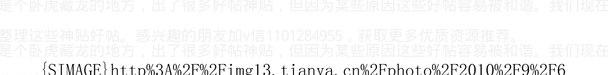

作者: 海宁的马甲 日期:2010-09-29 12:15 作者：旁观者 13 回复

日期：2010-09-29 11:41:39

看到楚贝勒是大连人，同为大连老百姓忍不住想说点自己的感受

…

附近有个小平岛，大规模开发，说是要超越星海广场，好多楼感觉像个新城，我朋友看了说楼房的密度已经不适合人居住，如果住满得堵车堵成什么样啊？可是至今没有发生这种事情，开发也有个4,5年了吧，有个朋友住那，晚上说老公不在自己不敢回去，就是个鬼城，每个楼都不开灯，自己住得楼也没几家，上电梯都能想起鬼片里的情景。忘了说这里就是传说中的海景房，真正的海边。还有那有名的星海广场，周边也不少海景房，开发也有10年了吧，没看到多少灯光，我们早在空置率还没有成为热门话题的时候就已经喜欢讨论那的入住问题了。还有讨论这个是因为我另一个朋友2006年在高薪园区买的楼房，3年后才通上煤气，就因为入住率不到60%。

我在主贴里说得非常非常清楚了，是有钱人手里持有太多人民币难受，一定要换成房子“保值”才发生了这种情况。

你可以把房子看出“地产币”（百万元级别大钞）

这种大钞70%以上是以房子下面的土地为信用基础的，土地不值钱了，房子自然也不值钱了。

而且我也非常明确提出时间点了。2010年10月中旬到11月，欧美股市大跌，打掉资金持有者对于从股市里赚钱的希望。然后就是大宗商品，特别是石油暴涨了，石油已经憋了很久了。2011年3月，大宗商品价格应该很高，中国通货膨胀应该很厉害。

这是我的沙盘推演。先看10月中旬（2个星期以后）到11月。再看3月。3月应该有些危机的症状了，比如欧洲的银行，温州的民间借贷等。

作者:海宁的马甲 日期:2010-09-29 12:20 作者: 心游万韧 回复日期: 2010-09-29 12:10:34

海宁兄：人民币汇价今早低开后，官方开市中间价6.6936兑一美元，其后辗转向上，报6.6868兑一美元，再创汇改以来的新高。

渣打集团 调高对人民币汇率的预测，估计今年底可见6.64兑一美元，高于原先估计的6.75兑一美元。报告同时将对明年底汇率预测，由原来的6.5上调到6.36兑一美元。

渣打指，美元弱势持续及美国 失业率高企，将令国会议员继续## 施压。

### 你如何看？

是美元太烂。一点办法都没有，人民币升值-》导致美元购买力不稳-》导致大宗商品涨价-》中国人买的粮食石油一点也不便宜。

对于老百姓，这个时候升值毫无意义（不能带来更便宜的石油与粮食），只有2003年，2005年大幅升值才有意义。

今天，一切都已就绪，等大戏上演，快点2个多星期后就来了，慢点6，7个星期。

今天到2011年3月，美元很烂，人民币的汇率很难定。人民币对美元升值到6.5，6.0，都不能让中国人买到便宜的石油与粮食等。

一切已经进入既定程序，我的沙盘推演对不对，很快就可以验证。

作者:海宁的马甲 日期:2010-09-29 20:30 作者:uug02246 回复 日期:2010-09-29 16:03:48

### 为什么说现在经济不景气呢？

我怎么觉得很好呢，企业到处缺员工，员工跳槽不愁找不到工作，这说明哪儿的企业生意都红火吧？

是的，难道2007年的这个时候不也是如此？

不但如此，2010年10月的中国，社会账面财富远远大于2007年10月。

2009年新增贷款9.6万亿，但是房价的涨幅，光在上海北京（都涨了60%以上）就给有房的人的账面上增加了各5万亿以上的财富。

2009年一年，世界经济一片黯淡，中国社会大约增加了40万亿到50万亿的财富。

2010年的中国，除了人民币不值钱外，什么都值钱，房子值钱，字画值钱，葱姜蒜也值钱，棉花值钱，丝绸也值钱（5，6个月涨了80%），奥，连以前很廉价的重体力劳动力也值钱了（工资涨了至少30%，多的涨了60%）。

中国社会账面财富空前巨大。

作者：海宁的马甲 日期：2010-09-29 20:43作者：hola2000 回复日期：2010-09-29 20:18:52

到目前为止小宗农产品等的炒作和zf的抛储基本上还是市场行为，如果主要粮农产品出现炒作而大涨，zf必然会出台严厉的打击中间商炒买炒卖的措施。房价尚且要行政调控，更何况与民生更加密切相关的主粮？

除大豆外，中国的粮食是基本可以自给自足的，在农作物连年丰收，zf储备充足的情况下，依靠食品涨价迫使zf大幅加息怕不现实，只有象石油这样的zf控制不了的物资上涨，才能在短时间内达到严重通胀的效果。

正常的零售商，为了减少损失，或者多赚一点，与往年相比增加了库存，不是炒作行为。总不能说“你去年的库存是1个月的销量，现在是3个月的销量，所以罚款吧”。不是“依靠食品涨价迫使zf大幅加息”，根本没有谁逼谁的问题，只是市场规律。当市场普遍涨价的时候，库存多点，赚钱的概率大于亏本的概率（在经济萧条之前）。

据说东北大米的涨幅也不少，30%，这个会慢慢向社会各种商品的价格传递。

今天的粮食格局，就是2007年2008年，石油化肥农资涨价而粮食涨得少的结果。

农村重体力劳动力的减少，机会成本的增加（打工每个月能赚钱多了），使得越扭曲，最后的暴涨越厉害。

看看2011年上半年的食品涨幅吧。蔬菜控制不住正常，但是大米小麦的价格不能控制是不正常的。

加v信1101284955获取更多优质书籍推荐

人民币的信用在流失,除了人民币,其他什么东西都比以前值钱了,甚至包括“以前过剩”的重体力劳动力。

作者: 海宁的马甲  日期:2010-09-29 21:14 作者: 三十华里  回复日期：2010-09-29 20:55:36

作者: 唐朝农民 回复日期: 2010-09-29 20:40:01

今天新闻联播又出台楼市政策了，海宁你分析一下。

======================

最近的政策几乎都是重复以前的政策，并且是以控制供应为主，再加紧缩信贷，而且强公子已经沉默了，说明本次调控已经完败，连加息在今年都不太可能发生！

高盛的报告，大家可以从中知道，加息不是那么容易的事情。加到4.14%这个在古今中外经济高速增长时期看起来正常的利率，是多么不容易啊。

很多太过悲观的话我也没有说。因为现在很多人都非常的兴奋，属于经济信心的顶峰时期。

这一切，都是负利率撑起来的，谁该把低利率这根顶梁柱给拆了？

估计还是等到2011年下半年别人来捅泡沫了。

加v信1101284955获取更多优质书籍推荐

#### 高盛2010年5月份报告的中国部分：

如果提高利率，房地产价格要崩盘，地方政府的财政预算也要垮掉。这样会造成坏账和银行危机。达到均衡利率在中国几乎是一种“恶魔”，或者说中国不得不扭曲利率。

长期存款利率比应该的均衡利率压低了2%（即目前的利率应该在4.14%左右）。1997到1999年利率连续3年比均衡利率高了4.5%（那3年存款人得了便宜，这也是错的，以为那样会降低经济增长速度，没有人再会给存款人这么大便宜了）

利率提高2%，国民收入GDP的3%，就会从企业转移到居民手中，虽然这个远低于居民早已遭受的损失。（2% × 60万亿 = 1.2万亿）

zf无意提高真实利率到平衡利率水平（即加息2%）。相反，zf为了外汇储备还要降息。

过去10年，居民在国民收入的蛋糕里的份额减少了10%。（100%里的10%），这些钱的大部分去了zf和国企。作为结果，zf和国企储蓄存款数额超过了居民存款数额。

zf和国企累积的存款的数量巨大。

http://bg.panlv.net/file2/2010/05/14/82d22263d304abf8.pdf

作者:海宁的马甲 日期:2010-09-29 22:10 作者：狂人日RJ 回复

日期：2010-09-29 21:43:18

作者：三十华里 回复日期：2010-09-29 20:55:36

作者：唐朝农民 回复日期：2010-09-29 20:40:01

今天新闻联播又出台楼市政策了，海宁你分析一下。

==========================

最近的政策几乎都是重复以前的政策，并且是以控制供应为主，

再加紧缩信贷，而且强公子已经沉默了，说明本次调控已经完败，连

加息在今年都不太可能发生！

=============================================================

我觉得这次政策已经超出了国十条，而且信贷收紧不再是原来的

高房价城市，而是全国性收紧。

这些政策没有表面上是没有任何用的。中国作为整体，你不得不承

认，贷款买房的比例极小，是的，是极小。中国的房地产总值，起码

超过100万亿了（170亿平方米×6000=102万亿），加上一些土

地，是GDP的3倍以上，已经达到日本当年的水平了（大约是GDP的

3.5倍左右），欧美因为土地相对多，金融产品多，文化多元，投资渠道多元，所以房地产在泡沫的顶峰也不到GDP的2倍。

所以，对于房地产最大的影响，不是贷款利率，贷款资格，而是存款利率，是存款利率的影响比贷款政策大10倍以上。

其次，这种政策调控，给以后的暴跌加入了心理恐惧元素，当市场逆转的时候，今天的政策留在投资者心里的阴影，就会发挥作用。不加息到4%以上，房地产崩不了。

作者: 海宁的马甲 日期:2010-09-29 22:39 中国的房地产总值，起码超过100万亿了（170亿平方米×6000=102万亿），加上一些土地，是GDP的3倍以上，而居民房贷贷款余额，只有6万亿多，占6%而已。

有时候解释一些事情很累的，大家有兴趣可以看看什么叫“信用扩张”

www.hudong.com/wiki/信用扩张

信用扩张的典型应用就是2009年，新增贷款9.6万亿后，其信用扩张，导致社会账面财富（股票，房子，字画，茶叶，棉花，丝绸的增值）增加了40万亿到50万亿。

加v信1101284955获取更多优质书籍推荐

所以，2010年这个社会太“富裕”了，太有钱了。蔬菜就是涨300%，

对于在2009年从房子，股票，字画等增值从而“赚到账面财富”的

人来说，根本不算什么。

泡沫时期，富人兴奋极了，而穷人日子相对也好很多。

而信用紧缩的典型应用是2008年，2008年，股市蒸发20万亿，

楼市蒸发起码5到10万亿，所以2008年很多人没有钱。

信用紧缩时期，社会到处是悲惨故事，比如枪声，刀光剑影。

而信用扩张到信用紧缩的转化，是慢慢来的，不知不觉中完成的。

信用扩张到信用紧缩的转化，有时候受到非经济分析元素的影响，

比如雪灾，地震，治安方面的人祸。从历史经验看，地震的影响最大，

其次是令人恐慌但是很多人相信的谣传。

这就是现金为王的背景，资产价格太高了，相对于现金的购买力一

年缩水3%，5%而言。

很多人说加息会招致热钱，他们忘了，降息比加息，对于热钱的吸

引力，要大20倍到100倍左右。

看看这幅图的右边，BBOP是指贸易顺差，加上资本流入，CA就是

指贸易顺差。

两者之间的差距，就是中国资金的流入（正常事情，主要是外商实业投资）

但是2005年到2008年出现了异动。

2005年初开始，资金流出。是的，是流出，导致股市失血而跌到998点，资金流出到2006年初为止。

2006年初开始，资金流向突变，资金开始暴力加速流入，资金流入在2007年2月到达顶峰。

为什么2007年2月3月左右，资金流动突然从快速流入，突然变成了快速流出了呢？因为日本加息了，日本从0.25%，加到0.5%，导致套利交易的成本大增，导致2007年2月27日的大暴跌，当然这个时候，中国股民的赌性已经起来了。

2007年3月到12月，资金一直处于流出大于流入的状态。股市在不停地失血，但是中国股民在不停的注入新鲜血液。当股民在2007年10月注入的新鲜资金，不能抵过资金流出的时候，暴跌开始了。

当然以上股市分析，需要加入各种公司IPO对于股市的抽血作用，上市公司的首次发行，大小非减持，都是在抽血。2007年抽血好几万亿。

博股市，真实刀口舔血。

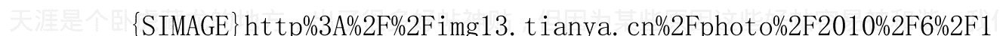

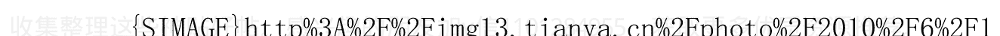

作者:海宁的马甲 日期:2010-09-29 23:07 作者：三十华里 回复日期：2010-09-29 22:40:45

其次，这种政策调控，给以后的暴跌加入了心理恐惧元素，当市场逆转的时候，今天的政策留在投资者心里的阴影，就会发挥作用。

不加息到4%以上，房地产崩不了。

============

当市场逆转时，政府将立即救市，取消种种限制政策，或者迫于民意不敢明来，但不惩罚违规银行，以前这种事情多了去了。

“增加或者取消种种贷款限制政策”，对房地产的影响比较小。

市场里，总体而言，全款买房保值的力量占主要影响。

在2011年，这些动作受到明显的制约，那就是美元与人民币的购买力的比较。

2011年，市场将证明，zf不是万能的。维持负利率，则通货膨胀

作者:海宁的马甲 日期:2010-09-30 08:57 作者:超长线 回复日期:2010-09-30 08:05:13

我觉的不能用房产总值和房贷总值来说明买房贷款比例低，还要看时段，最近几年房产价格膨胀，看周围买房的人都是要贷款的！也许我的圈子里穷人多的缘故吧，真没见过可以全款买房的人！

确实，2009年贷款买房的人多了。

即使按2009年的成交量而言，成交6万多亿，新增房贷1.7万亿（其背后的房子可能值2.4万亿），也就40%左右。全款买房的几乎有60%。有房贷的房子，更多地是主要居住用房，不管涨跌，都不会出现在市场上了。他们只是满足了消灭了部分刚需。

所以有人说，买得起房的人，几乎都在2009年恐慌性买房了，2009年以后，买得起房而尚未买房的人，已经不多了。这个说法是有一定道理的。

对，大多数房子是首要住宅，不管涨跌，都不会出现在市场上，对房价几乎毫无影响。

这个社会的房子的贷款杠杆比率不高，未来随着贷款的比例提高，房价会相应地提高（因为更多的人透支未来）

作者:海宁的马甲 日期:2010-09-30 09:10 作者：假如爱有天意99

回复日期：2010-09-30 02:04:01

这里有很多高手都给出了不同的观点、楼主在看了之后还坚持原来的观点吗？或者有新的见解？

整理一下思路，回复之后，就等2010年11月30日再回顾了：

1.  黄金暴涨，预示着世界投资者对美元信心的下跌。黄金如果2010年10月到11月是一直涨的，下调很小很小。则黄金泡沫在2011年破裂的可能性很大。（1650美元/盎司，是其顶部，如果突破1650，则美元信用大跌，世界金融风暴不可避免）
2.  欧美股市和中国股市2010年10月中旬到11月是否大跌超过10%。我认为可能性很大。

中国股市如果在2010年10月中旬到11月跌破2500，2400心理关卡，则很大程度上预示着2011年5月，6月房地产泡沫要破了。当前社会资金面流动性不错的情况下，会有这么费解的事情（大跌超过10%）发生吗？我认为可能性不小。

每个人看到的东西不一样，我看下面这幅yevon_ou作的图，2006年1月2月，股市震荡下跌,2006年6月7月房市受到很大考验；2007年12月到2008年1月（不是07年10月），股市信心下跌，房市在2008年6月到9月遭受极大的考验；那几次，相比今天，都是房价“很低”的几次。

所以，部分敏感聪明的股民提前逃跑，预示着楼市6个月后不稳。

股市是衡量贪婪与恐惧最好的地方（这里的贪婪是中性的，不是贬义的）。

3.  保房价“保经济”，还有一招，那就是降低存款准备金率，用不用，不知道。

4.  目前美元的信用在下降，完全符合我的沙盘推演。

2010年11月30日再总结。


作者：海宁的马甲 日期:2010-09-30 09:31 作者：zhaxy025 回复

加v信1101284955获取更多优质书籍推荐

日期：2010-09-30 09:21:50

海宁你好，不知道你对商品货币怎么看呢？澳币，加元之类的

目前看，如果美联储在通货膨胀起来的时候（美国通货膨胀一个季度的年化率超过3%，或者3.5%），到2011年10月，澳币，加元，连同他们的房地产泡沫都要完蛋。

如果美联储不坚决，等上1，2个季度，则澳币，加元，连同他们的房地产泡沫，能撑到2012年2月（可能性相对小点）。

2010年10月，11月，黄金越是气势如虹，2011年6月前后，美元的超级反转暴涨越是厉害。

10月，延续到11月的走势，对2011年，非常关键。

欧美中国股市如果10月到11月大跌超过10%，则黄金泡沫，新兴市场资产泡沫，加拿大，澳大利亚的房地产泡沫，将要到来的大宗商品继续吹高的泡沫，在2011年下半年，都极可能一起破（简单点说就是世界经济萧条，就像2008年底，本来就是用政府信用扩张硬撑上去的）

美元1年内注定是稳定不了了。不是大幅上升，就是大幅下跌，大起大落。

加v信1101284955获取更多优质书籍推荐

作者:海宁的马甲 日期:2010-09-30 10:29

作者: 古之風 回复日期: 2010-09-30 10:07:31

http://www.sina.com.cn 2010年09月29日 17:01 央行网站

中国人民银行货币政策委员会2010年第三季度例会日前在北京召开。

会议强调，下一阶段，要按照党中央、国务院的统一部署，继续实施适度宽松的货币政策，保持政策的连续性和稳定性，增强调控的针对性和灵活性。

请问楼主对“适度宽松的货币政策”怎么看？

官话套话，我们从这里看不出任何东西。

5月份，在“适度宽松的货币政策”下，基础货币好像因为美元流出，回笼了3，4千亿人民币。具体我忘了。

你可以查查最近的外汇占款。大约1700亿或者1300亿人民币一个月，长期而言不足以支撑楼市。所以，降低存款准备金是维持泡沫的好方法。或者放任通货膨胀（从而使得负利率更厉害）

作者:海宁的马甲 日期:2010-09-30 11:42

作者:un11 回复日期: 2010-09-30 11:13:42

### 海宁：我前段时间跟风买了5W美元，现在是抛还是留呀？叩谢！

我的分析都写在这里了。具体投资决定应该由自己做。投资有风险。

没有谁是100%预测正确的。我只是对我自己的沙盘推演比较有信心。

我尽我所能。当然别人也对他们自己的沙盘推演有信心。所以有得讨论。不要盲信我。我都给出我的分析过程了，你对我预测，分析的前提（比如美国必定也要遭受通货膨胀，导致美联储在2011年下半年不得不加息等）有疑惑的，可以自己分析。

作者: 海宁的马甲 日期:2010-09-30 11:44 作者：衣架肉蛆 回复

日期: 2010-09-30 11:38:16

美元币值不稳，导致各种价格波动很大。我分析的东西都写出来了，时间一清二楚。不能给出具体建议。抱歉。

作者: 海宁的马甲 日期:2010-09-30 12:13 作者：衣架肉蛆 回复

日期: 2010-09-30 12:01:27

作者: 海宁的马甲 回复日期: 2010-09-30 11:44:58

作者: 衣架肉蛆 回复日期: 2010-09-30 11:38:16

美元币值不稳，导致各种价格波动很大。我分析的东西都写出来了，时间一清二楚。不能给出具体建议

加v信1101284955获取更多优质书籍推荐

谢谢指教。

其实我也后悔自己过早赎回澳元结构产品变现美元节奏把握不好，造成很被动，怪自己。

现在没有胆量追入澳元… 虽然你预测的澳元拐点在11年后期…

观察rmb走法，继续换美元求资金安全，可算安全 ？

黄金部分不敢继续增加配置，彷徨…没知识很可怕，没有谋略更加可怕。

实在想不到更加有效的做法。

美元也许是从2011年6月开始走强的。澳元加元在2011年10月已经创新低了，地产泡沫开始破了。这只是我认为的可能性最大的一种。

人民币在中国地产泡沫破灭后的一段时期内，对美元也没有太多风险。

换美元，1年内我是看不到赚钱的希望的，只是防患万一，唯一的可能是怕美元兑换窗口的关闭（但是这个一年内关闭的可能性不大）。

人民币不能对美元大幅贬值。否则引起的问题也很大。

作者：海宁的马甲  日期：2010-09-30 12:20 作者：心游万仞 回复

日期：2010-09-30 12:07:32

又出楼市调控政策了，看得人生气。一边如何如何控，一边又继续宽松的货币政策。今天股市大涨，因为不加息了，这种政策既可恶又可笑。楼市继续上涨。

负利率很害人。即让持币的人受煎熬，又让别的人仓惶地买楼保值，就像2007年下半年买股票“跑赢CPI”。当然这次人们“聪明”了，避开高风险的股市，进入看得见摸得着的“低风险”的楼市。

负利率下，又不是经济萧条期，微跌都绝对不可能的。

作者：海宁的马甲  日期：2010-09-30 12:42 下面是连载，是以前发的，没有改过。

## 2010年下半年，我们处于什么经济大势之中？

### 一）8.6年经济走势概要

简单地说，

2002年11月6日到2007年2月27日，是房产黄金大宗商品等有形单边上升通道。

2007年3月到7月，是美国等西方国家房地产风险暴露期。

2007年7月到2008年7月，是大宗商品暴涨期。

2008年8月到2009年3月，是经济萧条，和大宗商品暴跌期。

2009年4月23日到2010年4月16日，是世界各国财政与货币刺激牛市期。

2010年5月2日到2011年6月13日，是13个月的震荡下跌期。

2011年6月14日到2015年10月1日，是又一轮经济见底后上涨期。

如果错过了2002年11月6日到2007年2月27日的主升浪，又无法通过做空盈利，只能等待2011年6月13日到2015年10月1日的主升浪（2013年8月6日是中期顶部，回调到2014年9月3日后再次上扬，而且上扬速度和幅度超过2011.6.13到2013.8.6）。

### 二）8.6年经济走势回顾与2011.6.13到2015.10.1预测。

2002年11月6日到2007年2月27日，是有形资产单边上升通道。

这一轮的焦点是房产黄金大宗商品等有形资产。这是对1981年到1999年近20年国际低通胀环境和忽视大宗商品开采的超级反弹。特别是1990年代，各种矿产的勘探与开发，因为价格太低而严重停滞。

国际大宗商品的趋势是涨10年，盘整震荡下跌20年，1970年代大宗商品涨了10年。到1980年初被驯服。

2007年2月27日，美国房价到顶，但是很多人还不知道，除了John Paulson，Michael Burry（生于1972年，原是个医生）等不少一直追踪房价，等待时机做空的人士。

加v信1101284955获取更多优质书籍推荐

2007年3月到7月，是美国等西方国家房地产价格暗中下跌与风险暴露期。

John Paulson和Michael Burry开始大把赚钱。

2007年John Paulson的公司赚了150亿美元，2007年他大概管理了120亿美元的资产，行业规矩一般是抽取20%的利润作为佣金。

Michael Burry自己赚了一亿美元，给别人赚了7亿美元（收20%佣金）。

高盛从2007年2月底开始，从总体大量做多次贷债，开始加大做空次贷债，对冲风险，后来在次贷上还是亏了近30亿美元。

2007年3月到7月，是美国等西方国家房地产价格暗中下降与风险暴露期。很多欧美人“感觉”房价在这段时间没有降，是因为看到了很多卖不出去的挂牌价。

2007年7月，资金发现房地产涨不动了，按揭违约增加了，为CDO买保险的价格涨上去了（CDS是一种按揭贷款违约的保险）。对于金融行业而言，房地产衍生出来的金融产品不赚钱了（除非做空）。因为有做空机制，美国的房地产泡沫容易被空头刺破（通过在没有按揭资产的情况下购买CDS保单，其实是种对赌，赌房价跌，违约率上升）。

2007年7月资金开始进入大宗商品。石油粮食等大宗商品价格暴涨，CRB大宗商品指数从2007年7月的300点，涨到了2008年7月的467点。平均涨幅55%，才12个月时间。中国用人民币升值作为对冲，所以大宗商品的人民币价格涨幅也许只有45%。（2007年中国的CPI也许接近9%，2008年CPI也许接近12%）。原材料涨幅45%，而商品价格2年平均才涨21%，怎么办？裁员，倒闭，或者卷走流动资金逃跑。

2008年7月，是10年（30年）商品价格周期的第一个顶部（双顶的第一顶）。

2008年7月以后，CRB大宗商品在把世界拖入萧条以后，开始暴跌，

2008年12月和2009年3月，CRB大宗商品指数在210点附近构筑双底。赌大宗商品风险很大。

2009年4月23日到2010年4月16日，是13个月的世界各国财政与货币刺激牛市期。

2010年5月2日到2011年6月13日，是13个月的震荡下跌期。

2010年7月2日，大宗商品价格又发动了，因为相对于金融产品比如股票而言，处于300点以下的大宗商品安全边际比较高（跌幅不会太大），大宗商品需要在2008年7月高点后，构筑第二个比2008年7月低一些的顶。从而构成双顶结构，以此结束大宗商品的10年牛市。

我们处于大宗商品构筑第二顶的开头部分，可惜大宗商品价格变幻莫测，普通人无法从中盈利。

这个双顶在何时到达？如果参考2007-2008年，大约在2010年底，2011年2月左右到顶，因为现在世界经济基础没有2007年好，更多地是被美联储的量化宽松逼的。但是如果2011年下半年世界各国的萧条速度太剧烈，则商品下跌也会提前到来。所以普通人无法从中盈利。

### 三）2002年11月6后的房产与黄金

作者：海宁的马甲 日期：2010-09-30 12:44 三）2002年11月6后的房产与黄金

很多人觉得2002年11月6日后，房价涨了很多，他们没有看看黄金也涨了很多，从2002年的250到300美元，涨到了1200美元。

2002年11月6日到2007年2月27日，全世界大多数国家的房地产都在涨。

很多人又说，房子可以贷款，有杠杆，那他们肯定没有考虑过金矿股票的涨幅。金矿股票的涨幅大约是黄金涨幅的2.5到3倍。很多金矿股2002年以来涨了10几，20几倍，紫金矿业涨了多少？曾经给当地农民的作价1134元一份的股票凭证，2007，2008年涨到了130万到160万一份。

因为外汇储备数量的关系，中国的房地产价格，主要受这个商品与有形资产10年牛市的影响。那些连篇累牍从各个角度论证中国房价暴涨各种成因的，应该把这个因素考虑进去。

### 四）通货膨胀3张不同的脸

1. 工资涨-》物价涨-》工资涨螺旋式上升型；1960年代的美国就是技术工人短缺造成工资上涨；1960年代，美国贫富差距因为福利政策在缩小。此类型的物价上涨是永久性的，因为已经被大部分人的工资上涨所吸收平衡，比如中国2002年11月到2005年7月的物价上涨。

2. 物价涨-》工资涨-》物价涨螺旋式上升型；1970年代，就是成本推动型通货膨胀；1971年以后美国贫富差距一直在扩大。

3. 货币注水型。2003年以后的世界就是货币注水型通货膨胀。美国为了打仗和减税而大发国债，国债也是种信用欠条，是种带利息的“货币”。各亚洲国家的外汇储备里，最大的一项就是美国的国债，而不是美元。谁承接的美元和美国国债越多，谁的通货膨胀就越厉害，除非是靠卖资源为生的。

任何时候，任何地方，货币注水型通货膨胀都会扩大贫富差距，带给工薪阶层的，只有购买力下降和更大的生存压力。

在货币注水型通货膨胀里，工资涨10倍也没有用。

恰恰相反的是，在货币注水型通货膨胀里，工资涨得越多，其实反衬着“工薪阶层作为一个整体”的总工资的购买力下降得越多，因为它是货币注水型。

当然议价能力强的部门与个人的工资涨幅超过通货膨胀，是完全正常的；接近印钞机的部门的员工一般工资涨幅超过通货膨胀，也是正常的。

### 五）价格参考表

- 废纸 从 20 美元 涨到 200 美元（2008）
- 黄金 $252.90（1999）-- $1，350（2010）
- 小麦从 20 涨到 90.
- 原油从 30（2005）涨到$147.30（2008）
- 铜从$1,600 (1999) 涨到 $9,000 (2006)
- 白金从 $325 (1994) 涨到 $2,200 (2007)
- 铀从$10 (2001) 涨到 $300 (2007)
- 氯从$50 (1996) 涨到$475 - $525 (2009)

Michael Burry 生于 1972 年，原是个医生，1996 年，24 岁时候开始业余投资股票市场，也许是因为住在硅谷，所以他 1996 年开始把选股和投资心得全写在网上，后因为投资能力只在太强，医生不做了，专门替人投资赚钱（刚开始是家人朋友），赚钱佣金。

作者:海宁的马甲 日期:2010-09-30 12:53 以下为个人观点，投资者应该自主决策。投资一定要靠自己。

2004 年，N 多人高喊房地产泡沫好大啊，包括现在还是很火的谢国忠。有兴趣的可以看看谢国忠近几年对石油的预测。所以千万不要盲从，不不要盲从我。我只是众多的分析当前经济形势的人之一。

2007 年，N 多人说“跑不赢刘翔，也要跑赢 CPI”鼓励大家炒股。大学生，盲人，都炒股去了。

2007 年，在股市预测上翻船的人很多。股市最难预测。我在研究股市的周期。

有兴趣的可以看看网上一个叫 哈克 的博客。
http://blog.sina.com.cn/u/1435847931

## 2010年下半年，如何根据风险爱好的不同理财？

2010年下半年的情形，与2007年底极其类似。

投资靠的是自己，任何其他人都靠不住。2007年那么多股评家，只知道一味唱多，现在还有几个有信誉？“王亚伟”级别的人物有几个？个？如果投资股票，可以看看王亚伟在做什么。

聪明的投资者，在2007年底，在2010年底，自然知道：

- 第一，现金为王，虽然通货膨胀很猛烈，钞票一天天缩水。但是资产类东西比现金更危险10倍100倍。
- 第二，风险承担能力比“持有现金”强的人，选择安全的债券。
- 第三，风险承担能力更强，喜欢赌博又不想输太多的人，在权衡风险得失之后，在合适的，自己能承受的价位买入中行，工行的可转债。万一自己判断失误，股市不但不跌，反而因为人民币日元化而暴涨（可能性很小），则也可以通过可转债分一杯羹。但是买可转债要承担一定风险，收益可能没有存款或者其他债券强。

2007年底，2010年底，经济火热，通货膨胀猛烈的时候，聪明的投资者最不轻易做的一件事情是投资，非常非常慎重，即不投资股市，也不投资楼市，也不投资实业。当然从2010年看，2007年底不投资楼市傻死了。但是原则如此。对于聪明的投资者而言，自己能力以外的钱，不奢望。对于某些聪明的投资者而言，2007年底以后的楼市涨幅，超出了他们的能力范围。

当猪肉价格极高的时候，股票极其危险。

请看 2004 年下半年，那些曾经叱咤风云的庄家们，德隆、鸿仪、闽发、汉唐、南方。

2004 年 4 月下旬开始，宏观调控一词频繁见诸报端，逐渐成为经济领域最受关注的话题。尽管与以往历次宏观调控有所不同，但其对证券市场的负面影响是实实在在的。4 月 7 日，在宏观调控影响下，上证指数从 2004 年最高点 1783 点飞流直下，到 9 月 13 日探出 1259 点的年内最低点，5 个月时间跌去 524 点，两市流通市值“蒸发”约 4437 亿元。

由于2004年股票市场的持续下跌，上证综指全年下跌15.4％，沪深两市流通市值缩水近1500亿元。两市7000多万投资者平均每户亏损2053元。惟一上涨的是再融资金额，较2003年翻了一番。

在2004年飘雪的冬季，结束了豪庄争鸣一统江湖的岁月，2004年的庄家墓志铭上，写满了资本大鳄的名字：德隆、鸿仪、闽发、汉唐、南方......2004年冬天的第一场雪，湮灭了大佬横行的岁月，惨绝人寰的哭泣，庄家长叹空悲切。

看来2004年庄家们都不逛菜市场，不逛猪肉市场，2004年下半年，因为猪肉涨价，导致中国货币紧缩。2004年下半年，2005年上半年的楼市行情也不好，大致是微跌的。

作者: 海宁的马甲 日期:2010-09-30 20:47 作者: 免费的账号 回复日期：2010-09-30 17:46:00

作者：海宁的马甲 回复日期：2010-09-29 21:14:37

很多太过悲观的话我也没有说。因为现在很多人都非常的兴奋，属于经济信心的顶峰时期。

这一切，都是负利率撑起来的，谁该把低利率这根顶梁柱给拆了？

估计还是等到2011年下半年别人来捅泡沫了。

最悲观的情况会是怎样呢，能请LZ分析下吗？

1997年底的泰国，韩国。

我们与他们不同，我们现在有大量的外汇，但是问题是，都兑换成人民币用出去了，外汇储备减少意味着经济与货币极度紧缩，经济从25度下降到0度，即没有新增贷款。

2009年后，一切都是建立在大量新增贷款（强行信用扩张）的基础上的。2009年新增9.6万亿，2010上半年新增4.6万亿。经济体要求2010年下半年新增贷款减速，但是为了“保”速度，可能需要下调存款准备金率才行，但也只能多撑6个月（本来2011年3月后困难，撑到2011年9月后困难）。是否下调存款准备金率，很关键，因为只有下调存款准备金率，银行才能喷出更多的贷款。

作者:海宁的马甲 日期:2010-09-30 20:53 外贸顺差对中国的影响，

一切的一切，最终还是变成外汇占款对中国的影响。
看来不少专家对于如何维持泡沫的认识还是相当准确的。

- 2010年前六个月，外汇占款的增长分别为
  - 一月，2,981.67亿元、
  - 二月，1,794.96亿元、
  - 三月，2,701.5亿元、
  - 四月，2,863.1亿元、
  - 五月，1,315.64亿元、
  - 六月，1,171.49亿元。

多位专家表示，7月份外汇占款较前两月有所回升的原因主要是当月外贸顺差的高增长。海关数据显示，7月份我国外贸顺差为287.3亿美元，同比增长180.57%，远超市场预期。

### 外汇占款增长偏弱 引发准备金率下调猜想

2010年8月26日 07:29

[世华财讯]专家表示，7月份外汇占款数据显示当前资本流入仍然偏弱，也减弱了年内央行上调存款准备金率的可能性，甚至不排除年底下调存款准备金率的可能性。

据中国证券报8月26日报道，中国人民银行25日公布的7月份外汇占款数据显示，7月份，外汇占款增长1,709.51亿元人民币。分析人士认为，这一数据显示当前资本流入仍然偏弱，也减弱了年内央行上调存款准备金率的可能性，甚至有专家认为年底可能下调存款准备金率。

### 外汇占款增量回升

7月份1,709.51亿元的外汇占款增量较此前5月、6月的数据有较明显的回升。数据显示，2010年前六个月，外汇占款的增长分别为：

| 月份 | 外汇占款增长（亿元） |
|------|---------------------|
| 一月 | 2,981.67 |
| 二月 | 1,794.96 |
| 三月 | 2,701.5 |
| 四月 | 2,863.1 |
| 五月 | 1,315.64 |
| 六月 | 1,171.49 |

多位专家表示，7月份外汇占款较前两月有所回升的原因主要是当月外贸顺差的高增长。海关数据显示，7月份我国外贸顺差为287.3亿美元，同比增长180.57%，远超市场预期。我们现在正在尽管7月份外汇占款结束了此前连续两个月的跌势，与此前2007年时我国流动性过剩、外汇占款快速增长时月均3,000亿元的水平相比，1,709.51亿元这一数字仍“不算很高”。

此外，这一增量仍然延续了此前两月外汇占款小于当月外贸顺差与FDI(外商直接投资)之和的走势。7月FDI增长69.24亿美元，与外贸顺差合计约为2,400亿元人民币，仍有近700亿元无法被解释。若考虑到企业不愿意结汇而转换为外汇存款，7月仅16亿美元的新增外汇存款也不能给出合理解释。这是否意味着，资本仍在流出？

### 资本流入仍然偏弱

此前官方及业内学者专家都曾表示，不能简单根据“外汇占款-外贸顺差-FDI”这一简单加减的计算方法判断热钱规模及流向。如有分析人士认为，若7月份境外并购增加可能会导致用汇的增加，并反映在外汇占款增长放缓上。也有银行业人士认为，这主要与银行境内外的资金调动有关。09年及2010年年初，美元在中国境内外的利差较大，银行调回了大量存放在境外的资产，而目前这一利差已大幅缩减，套利动力不强，银行有将资产重新调往境外的冲动。

不过，兴业银行资深经济学家鲁政委表示，7月份外汇占款增量显示资本流入仍然偏弱是不争事实。

> “总体来看，外汇占款增长仍然偏弱，没有看到国际资本显著流入的迹象。”鲁政委表示，“热钱更容易通过FDI渠道流入，但7月份FDI的增长低于我们预期。”

“从历史经验看，外汇占款在经济增长较快、资产价格上升速度快、人民币有较大升值空间的时候增长比较快。”交通银行首席经济学家连平表示，目前外汇占款处在较低水平，和当前经济增速回落、资产价格较低、汇率升值预期相对较小有关。

在中国宣布重启汇改之后，多位业内人士表示，当前人民币汇率不具备大幅升值的可能性。进入8月以来，由于美元指数强劲反弹，参考一篮子货币的人民币汇率出现下跌。中国外汇交易中心25日公布当日美元对人民币中间价为6.8007，创下一周低位，也是一周之内首次重返6.8。而NDF(人民币无本金交割远期)市场对人民币升值的预期也较低。

### 货币政策“减负”

外汇占款增长偏弱对于当前经济形势而言是宏观调控当局所喜闻乐见的。

央行副行长胡晓炼此前曾撰文表示，近年来货币政策的自主性和有效性受到外汇占款较快增长的严峻挑战。外汇占款成为基础货币供应的主渠道。央行搭配使用公开市场操作和存款准备金等对冲工具，大力对冲外汇占款增长，回收银行体系过剩流动性，但流动性水平过高的压力难以从根本上缓解。同时，央行票据的大量发行和存款准备金率的频繁调整等也对商业银行的经营行为乃至金融体系的运行效率造成一定影响，央行的对冲成本也在逐渐加大。

而这一局面在近几个月来有所改观。“前几年，上调存款准备金率与外汇占款的持续回升有非常密切的关系。”连平表示，当前外汇占款增长水平较低，缓解了央行公开市场操作的压力，也在短期内降低了上调存款准备金率的可能性。中信证券首席经济学家诸建芳也表示，这一外汇占款增量不会引起央行存款准备金率的上调。鲁政委则表示，在当前中国经济减速、人民币升值“升不动”的情况下，年底不排除下调存款准备金率的可能性。

作者:海宁的马甲 日期:2010-09-30 21:02 作者： 诺霖 回复日期：2010-09-30 11:12:09

都十一了，事实是房价继续坚挺，胜于楼主的幻想

加v信1101284955获取更多优质书籍推荐只要暂时维持负利率，美元疲软，国内通货膨胀尚未失控，则国内房价只会涨，不会跌。

我认为2011年3月前的中国楼市，没有大跌的危险。

以上判断的基础是，利率不大涨（利率最多升0.27%）；美元继续疲软（美元疲软到3月比较肯定，是否疲软到6月，有待观察）；通货膨胀可控，通货膨胀第四季度应该不会恶化；所以楼市在第四季度是安全的。

2010年11月楼市到达历史大顶的判断基本还是可以的。

如果不下调存款准备金率，楼市在2010年12月以后全国性大涨没有资金支持。

作者：海宁的马甲 日期：2010-09-30 21:10 作者：免费的账号 回复日期：2010-09-30 20:57:52

刘军洛在他的新书里讲到“在2011年6月前，世界将迎来第三次大萧条”。

LZ介绍的阿姆斯特朗“经济信心模型”里面2011年6月13日世界经济探底出奇的一致啊，难道是巧合，还是刘也研究过这个模型……。

刘研究的是商品，美元，石油，铜，橡胶，棉花的价格周期变化里，暗藏着世界经济的脉搏，看你怎么去研究了。（美元是种特殊的商品）

主要是如果美元在2010年到2011年6月暴力下跌，会引起大宗商品价格暴涨，等美联储在2011年4月想采取行动，已经晚了，市场力量是很难阻挡的。大家为什么不去看看2007年7月到2008年10月的金融历史呢，那可是极其惊心动魄的史料。

如果方便的话，你能否发些书本总结上来呢？

买了上一本，这本书我不想买了。

作者：海宁的马甲 日期：2010-09-30 21:12 作者：免费的账号 回复日期：2010-09-30 20:57:52

> > 刘军洛在他的新书里讲到“在2011年6月前，世界将迎来第三次大萧条”

LZ 介绍的阿姆斯特朗“经济信心模型”里面 2011年6月13日

世界经济探底出奇的一致啊，难道是巧合，还是刘也研究过这个模型。。。。

萧条快点 2011年3月底就到了。

是在2011年3月底，还是6月，或者10月，要看世界经济的筋骨有多强，能扛住多大的商品价格涨幅。

作者：海宁的马甲 日期：2010-09-30 21:41 继续连载《踩准经济周期的节拍投资理财》：

## 经济周期与中国的宏观调控

### 中国的宏观调控时间点与阿姆斯特朗的“经济信心模型”周期

http://blog.sina.com.cn/hainingdemajia

阿姆斯特朗据称在 1997 年金融风暴后，应中国的中央银行邀请到访过中国大陆，那是他的唯一一次到访中国（他的基金公司在香港，1998 年他在香港举行过几次讲座。）

他被带到一个大楼的一个楼层，里面有至少 100 个人在上网收集数据（那可是 1997 年，中国的网民不到 100 万），当他坐下来后，一个团队拿来了阿姆斯特朗写过的几乎所有文章。他还惊讶地发现，他们居然竟然追踪了 249 种不同茶叶在全国各地的价格走势。其中一种茶叶的价格，北方明显高于南方，当问到这种茶叶产自何方时，他们指向了中国南方的一个小地方。

以上说法无从查证。大家可以查查，中国的茶叶种类有没有超过 249 种。做茶叶的可以说说，如果没有 249 种，那么阿姆斯特朗在撒谎。

1998 年

1998 年 7 月 20 日，是“经济信心模型”8.6 年周期的大顶部，98 年 7 月 20 日之后是世界经济下滑（美国除外，因为资金都被吸到美国吹泡泡去了，不过美国互联网泡沫也在 2000 年 3 月破了）。

1998年7月3日，国发（1998）23号《国务院关于进一步深化城镇住房制度改革加快住房建设的通知》——1998年下半年开始停止住房实物分配，逐步实行住房分配货币化。中国开始为期4年的扩张性宏观调控。

1998年7月，8月，香港股市楼市被国际对冲基金打压做空而暴跌，股市从16820的索罗斯大顶，跌到8000点以下。

#### 2002年底

2002年11月6日。是“经济信心模型”8.6年周期的又一次见底。而2002年底，中国结束持续4年的扩张性宏观调控。

- 中国先后进行了六次宏观调控，时间分别为：第一次1979—1981年，第二次1985—1986年，第三次1989—1990年，第四次1993—1995年，第五次1998—2002年，第六次2003年至今？

#### 2007年初

2007年2月26日。是“经济信心模型”8.6年周期的顶部。美国房地产价格见顶。这一轮经济周期以各种有形资产价格暴涨为特征，这是对80年代，90年代，近20年对有形资产的忽视与低估的超级反转。90年代末，国际各种矿厂经营非常困难，导致新矿开发与开工的萎缩。

> 2007年02月27日15:03 新浪财经
新浪财经讯这一天将被黑色标记，以最浓厚的绿色为底，载入中国证券史册。这一天，亚洲金融危机十周年纪念日，中国A股市场创下十年跌幅记录，投资者万亿市值在一天之中被蒸发殆尽。

2007年1月初，中国A股市值突破十万亿。仅仅一周之后，A股市值暴增7875亿元人民币。然而，一夕之间，A股投资者们辛苦积累的万亿市值已经消失。

2月27日，沪综指早盘开于3048.83点，盘中最高3049.77点，最低2763.40点，收盘报收于2771.79点，狂跌268.81点，跌幅8.84%，创下1996年12月以来单日最大跌幅。

深成指早盘开于8620.86点。报收于7790.82点，跌797点，跌幅9.29%，接近跌停。

这一天，2007年春节后的第二个交易日，沪深股市主板共成交2007亿元，天量成交直接创造了历史。

#### 2009年4月

2009年4月21日，是“经济信心模型”8.6年周期，中间的一个中性的转折点。
距离2007年2月27日约2.15年（8.6年的四分之一）。
一般情况下，这是“信心”从2007年2月到2011年6月下跌过程中的一个小反弹。而2009年，不是一般情况，世界各国财长与央行的刺激政策喷涌而出，2009年4月，成了一段持续一年的大牛市的底部。

#### 2010年4月

2010年4月16日，是“经济信心模型”8.6年周期中一个比2009.4.21还小的一个小转折点。2010年4月16日距离2007年2月27日约3.14年。

2010年4月16日，在将来，也许会被称为世界各国财政与货币政策刺激的进攻极限点。

2010年4月15日中国出台宏观调控“新国十条”。

这个时候，其实银行的钱已经不够用了，贷给房地产，铁公鸡项目就没有钱了。两者的贷款需求都满足的话，银行里就没有足够的钱应付挤兑了。

#### 2010年4月17日成楼市分界点

不知道未来我们能不能记住这一天，但对2010年的4月来说，4月17日这天应该记住。4月15日出台的宏观调控“新国十条”，拉回了脱缰边缘的楼市，并在16日、17日两天创下当月成交新高后，紧急调头，进入楼市平静期，日成交量快速走低。杭州楼市走势就此发生变化。

#### 2011年6月13日到18日，又会有什么新政？

作者：海宁的马甲 日期：2010-10-01 08:01 中国经济即将到来的萧条（2011年6月），孕育着另一轮大牛市的底部（2012年底）

中国经济经过2002年到2007年的爆发式增长，经济规律必然要求其作出相应的下滑调整，这种经济规律是无法回避的，是任何人力都不可抗拒的。从经济发展周期来看，2011年中国经济的下滑，是国际国内两个下跌波段的高度重叠。

经济大规律是无法操纵，无法熨平的。让我们等候2011年6月吧。

中国经济在2011与2012，必然是经济萧条的两年。这是历史发展的必然，是符合历史辩证唯物论的。经济是迂回式上升的。2011，2012就是这个回落过程。但是萧条并不可怕，萧条中孕育着另一轮爆发的底部。2012年年底的中国经济，就像2002年，或者1992年，都是新一轮经济再增长的底部，2012年年底是资产价格（楼市股市）极其便宜的底部（生活用品的物价不一定便宜）。

迷信一点，不管是中国还是世界，你去看带1带2的年份，经济大都是不好的。再具体点，就是逢1逢2，经济会探底，从逢2到逢3，经济会创个小高潮，涨得不多，然后逢5或者逢6回落，逢7年的9月一般就是平均的经济大顶了，逢8逢9要看科技或者泡沫发展得好不好，逢0，逢1，经济大幅回落，等待下一轮经济周期。这个规律，二战后60多年，基本都比较准。

有几个泡沫，能超越11年这个太阳黑子周期？（经济周期7年到11年左右）。

一年之中则是3月底卖出，6月初买入，9月卖出避开10月，到11月底再买入。

### 傻瓜经济周期投资原则：

就是逢3年份的3月份买入（2003年，1993年，1983年，1973年，1963年，1953年的3月），逢7年份的9月份卖出避开10月份（2007年，1997年，1987年，1977年，1967年，1957年的9月），
基本上赚的概率远远大于赔的概率，不比名牌基金经理的业绩差。当然，美国股市泡沫的破灭在2000年3月，1987年10月，1969年6月等。这个规律，我看也大致适合中国，2003年3月买入资产，2005年经受考验，2007年9月卖出（当然超级牛人还能把09年的涨幅收入囊中），等到2013年3月再买入（虽然那时候已经涨了一点了）。

事实上，中国也有过一次“商品经济”下的萧条，那就是1988到1991年，到1992年春天才走出萧条。萧条并不可怕，西方经济都已经萧条N回了，还不是在继续迂回式上升，虽然现在经济发展慢了。

一批批公司倒下的同时，是另一批竞争力强大的公司的崛起。

我们既要看到2011年下半年的暴跌，以及进入2012年的下跌惯性，但是2012年的某个时候，在别人一片悲观的时候，我们应该看到一场资产价格的大底部。

加v信1101284955获取更多优质书籍推荐

比如当巴菲特投资的比亚迪，高盛投资的吉利，在2011年，
2012年萧条中，因为汽车销量暴跌而导致他们的股价暴跌的时候，
逆向思维的人看到的是另一个苏宁式的公司的股价处于一个极低的
价位。萧条中，投机不再被人推崇，过度借债后投资失败，多年风光
后一文不值的投机失败者，反倒是被取笑的对象。

当普通的高科技公司的员工买得起离上班一小时以内的房子
的时候，经济就回归正常了。

跌一跌，缓一缓，更健康，更符合经济周期规律，也符合自然
法则。

> 作者：海宁的马甲 日期：2010-10-01 20:54 作者：benpan 回复日期： 2010-10-01 19:44:46

非常感谢benpan的总结。

首先，我不相信阴谋论，更不相信世界一直处于阴谋论之中，华尔
街的牛人，破产或者退出的多得要命，在资本活下来的都是非常谨慎
的，华尔街用计算机模型结合定性分析，可控套利已经发展到无以复
加，国内却一直在大力宣传阴谋论。某个很火的大师说连青椒肉丝的
价格都是阴谋决定的。

但是阴谋论可以解释一下经济现象，比如美元的大幅度上下波动。但是这是全球资本的波动。

我有我自己的经济分析，我的分析过程都是说得一清二楚的。

吴敬琏2002年后，因为他主张继续全面市场化，法制化（这里的法制是指公平的江湖规矩，而不是几张纸），已经被极度边缘化。吴敬琏的影响力，集中在1992-1997，1997年后影响力很小了。

美元大幅上涨，只有两种可能，世界萧条和货币紧缩（债务危机）；或者美国经济预期向好，财政赤字大幅下降，美联储加息（这次是套利美元回家，以前很少有套利美元）。

我认为10/11月份，美元汇率只是反弹，不是暴力上涨，即使上涨，也会在2011年1月份被美联储打下去，美联储已经在1月份准备投入充分的弹药。

10月11月美元的上涨，定性方面，也是看中美联储在10月，11月不会干预美元上涨。

为什么10月，11月不会干预美元上涨？这是江湖规矩，美联储不干预政治（11月美国选举），政治也少干预美联储。

加v信1101284955获取更多优质书籍推荐

流入的美元不足以推动中国股市。可以看外汇占款。上面列出了。

2011年6月，大致是美元波动周期的低点。美联储太过直接打压美元，导致2011年6月后可能的超级反弹反转暴力上涨，导致套利资金从加拿大和澳大利亚撤出，在2011年下半年刺破加拿大和澳大利亚的对冲泡沫。

> > 作者：海宁的马甲 日期：2010-10-01 22:05 如何理解通货膨胀失控，导致货币紧缩的时候资产（股票楼市）价格会暴跌？

### 通货膨胀为什么可以和另一领域的通货紧缩共存

> > 原著：Martin Armstrong

2010-05-04

> > 翻译：海宁的马甲

1970年以前，大部分经济学家认为通货膨胀与通货紧缩不能共存。

这也是凯恩斯财政刺激的理论基础之一。

1970年代，石油价格暴涨，这是通货膨胀。而房屋价格却暴跌，
这却是通货紧缩，同时失业率急剧上升。人们把这个阶段称为滞涨（经济停滞，通货膨胀，失业率居高不下）。

是的，石油价格的上涨与房价的暴跌是可以同时出现的。2007年时候价格暴涨，而欧美房价暴跌，再次证明一个领域的通货膨胀与另一个领域的通货紧缩可以共存。

因为能源成本的上升，不能跟着能源一起涨价的那些行业不得不进行相应的对策避免企业破产：裁员或者停止招人，以降低人工成本。2008年上半年，没有能力涨价的南方制造业工厂不得不裁员。中国涨了那么多年的房价在2008年也下降了。

翻译者主注：

所以凯恩斯1970年代后被称为已经或者应该死亡的学说。任何学说，都有内在的默认的假设。凯恩斯和马克思的学说和教派的假设是：作为调控与主持分配的政府，是无私的，按全体群众的利益最大化去分配的。而如果这个假设不存在，则其在这个基础之上的很多东西都有问题。而现实是，不管是MZ的还是Zhuan Zhi的政府，都是由人，而不是公正无私的神，组成的。人是有自身利益诉求的。由人组成的组织，也是有自身利益诉求的。拥有分配权，或者财政刺激决策权的那个具体的部分，具体的人，可以把项目和贷款分给它“喜欢”的公司。以上为翻译者旁注。

理解通货膨胀与通货紧缩，需要像理解冰激凌有1000种口味一样。

- 1. 孤立的通货膨胀可以是因为天灾，或者人为炒作。也可以是价格的上升与下降预期。
- 2. 居民对于货币的信心下降，导致物价的广泛上升（这才是经典的经济学书上说的通货膨胀，即社会上商品价格的普遍上涨）。超发货币和国债可以导致人们对于这个货币信心的下降，从而导致货币币值的下降。
- 3. 输入性通货膨胀。国际范围的通货膨胀，导致进口货物涨价，从而波及社会的各个领域。2007.7-2008.7，人民币在对美元升值，但是人民币同时也在对铁矿石，粮食等贬值。或者说，人民币对美元的升值速度，远远跟不上美元对铁矿石，粮食等的贬值速度。

通货膨胀非常复杂。再举一个通货膨胀如此复杂的例子。

利率的提高，在经济上升期，也有制造通货膨胀的效果。当利率的提高是发生在牛市而人们信心高涨的时候，人们非常愿意借钱投资或者消费，因为他们对未来的投资收入和工资收入充满信心。

所以，一味的认为提高利率对股市，楼市有打击效果的是想法也是错误的。

举例子：2004 年中国的加息不能阻止房价的上涨，因为人们对于楼市的信心处于上升时期，1980 年代，美元利率的暴涨，没有能阻止香港楼市的继续暴涨，因为香港居民对楼市的信心还在爆升中。

再举一个例子，提高利率对经济有不利的说法，只想到了投资者，投机者，而没有考虑到利率在不同人群的不同效果。对于美国退休人员而言，提高利率之后，他们可以花更多的钱，而降低利率，他们不得不花更少的钱。而退休人员是经济困难时期照样花钱的人群。豪华邮轮的客户 60%就是老年人。

如果你对照利率和股市。利率上升时期，股市照涨不误。而利率下降时期，股市照样跌跌不休。为什么？为什么“降低利率可以让股民可以以较低的成本借钱投资，从而导致股市上涨”的想法是错的？为什么？

问题的关键是利率与预期收益率的比较，两者的差值到底是正的还是负的。

如果人们预期股市为继续下跌，就是像日本那样零利率也没有用。

如果人们预期投资收益非常高，年利率 80%的高利贷都有人借。

确实，利率的上升提高了借贷成本，会抑制各方的投资冲动。企业投资的减少，或者利息支出的增加，会导致失业率的上升。所以，利率与失业率同升的情况很常见。

对于负债的那些地方政府而言，利率的上升，增加了他们的成本，他们不得不加税来解决。

对于中央政府而言，他们可以印钱（国债也可以认为是广义的带利息的钱）。所以 1981 年美国把利率提高到 17%来反通货膨胀，导致美国国债规模从 1980 年的 1 万亿美元快速上升。

一个领域的通货膨胀为什么可以和另一个领域的通货紧缩共存

1970 年以前，大部分经济学家认为通货膨胀与通货紧缩不能共存。

这就是凯恩斯刺激的理论基础之一。

1970 年代，石油价格暴涨，这是通货膨胀。而房屋价格却暴跌，
这却是通货紧缩，同时失业率急剧上升。人们把这个阶段称为滞涨（经济停滞，通货膨胀，失业率居高不下）。

是的，石油价格的上涨与房价的暴跌是可以同时出现的。2007年时候价格暴涨，而欧美房价暴跌，再次证明一个领域的通货膨胀与另一个领域的通货紧缩可以共存。

因为能源成本的上升，不能跟着能源一起涨价的那些行业不得不进行相应的对策避免企业破产：裁员或者停止招人，以降低人工成本。

2008年上半年，没有能力涨价的南方制造业工厂不得不裁员。中国涨了那么多年的房价在2008年也下降了。

理解通货膨胀与通货紧缩，需要像理解冰激凌有1000种口味。

孤立的通货膨胀可以是因为天灾，或者人为炒作。

居民对于货币的信心下降，导致物价的广泛上升（这才是经典的经济学书上说的通货膨胀，即社会上商品价格的普遍上涨）。超发货币和国债可以导致人们对于这个货币信心的下降，从而导致货币币值的下降“持有人的信心是纸币购买力的重要后盾”。

输入性通货膨胀。国际范围的通货膨胀，导致进口货物涨价，从而波及社会的各个领域。2007.7-2008.7，人民币在对美元升值，但是人民币同时也在对铁矿石，粮食等贬值。或者说，人民币对美元的升值速度，远远跟不上美元对铁矿石，粮食等的贬值速度。

通货膨胀非常复杂。再举一个通货膨胀如此复杂的例子。

加v信1101284955获取更多优质书籍推荐

利率的提高，在经济上升期，也有制造通货膨胀的效果。当利率的提高是发生在牛市而人们信心高涨的时候，人们非常愿意借钱投资或者消费，因为他们对未来的投资收入和工资收入充满信心。

所以，一味的认为提高利率对股市，楼市有打击效果的是想法也是错误的。举例子：2004年中国的加息不能阻止房价的上涨，因为人们对于楼市的信心处于上升时期，1980年代，美元利率的暴涨，没有能阻止香港楼市的继续暴涨，因为香港居民对楼市的信心还在爆升中。

再举一个例子，提高利率对经济有不利的说法，只想到了投资者，投机者，而没有考虑到利率在不同人群的不同效果。对于美国退休人员而言，提高利率之后，他们可以花更多的钱，而降低利率，他们不得不花更少的钱。而退休人员是经济困难时期照样花钱的人群。豪华邮轮的客户60%就是老年人。

如果你对照利率和股市。利率上升时期，股市照涨不误。而利率下降时期，股市照样跌跌不休。为什么？为什么“降低利率可以让股民可以以较低的成本借钱投资，从而导致股市上涨”的想法是错的？为什么？

问题的关键是利率与预期收益率的比较，两者的差值到底是正的还是负的。

如果人们预期股市为继续下跌，就是像日本那样零利率也没有用。

如果人们预期投资收益非常高，年利率80%的高利贷都有人借。

确实，利率的上升提高了借贷成本，会抑制各方的投资冲动。企业投资的减少，或者利息支出的增加，会导致失业率的上升。所以，利率与失业率同升的情况很常见。

对于负债的那些地方政府而言，利率的上升，增加了他们的成本，他们不得不加税来解决。

对于中央政府而言，他们可以印钱（国债也可以认为是广义的带利息的钱）。所以1981年美国把利率提高到17%来反通货膨胀，导致美国国债规模从1980年的1万亿美元快速上升。

一个领域的通货膨胀为什么可以和另一个领域的通货紧缩共存

1970年以前，大部分经济学家认为通货膨胀与通货紧缩不能共存。

这就是凯恩斯刺激的理论基础之一。

1970年代，石油价格暴涨，这是通货膨胀。而房屋价格却暴跌，
这却是通货紧缩，同时失业率急剧上升。人们把这个阶段称为滞涨（经济停滞，通货膨胀，失业率居高不下）。

是的，石油价格的上涨与房价的暴跌是可以同时出现的。2007年时候价格暴涨，而欧美房价暴跌，再次证明一个领域的通货膨胀与另一个领域的通货紧缩可以共存。

因为能源成本的上升，不能跟着能源一起涨价的那些行业不得不进行相应的对策避免企业破产：裁员或者停止招人，以降低人工成本。

2008年上半年，没有能力涨价的南方制造业工厂不得不裁员。中国涨了那么多年的房价在2008年也下降了。

理解通货膨胀与通货紧缩，需要像理解冰激凌有1000种口味。

加v信1101284955获取更多优质书籍推荐投资的减少，或者利息支出的增加，会导致失业率的上升。所以，利率与失业率同升的情况很常见。

对于负债的那些地方政府而言，利率的上升，增加了他们的成本，他们不得不加税来解决。

对于中央政府而言，他们可以印钱（国债也可以认为是广义的带利息的钱）。所以1981年美国把利率提高到17%来反通货膨胀，导致美国国债规模从1980年的1万亿美元快速上升。

作者：海宁的马甲 日期：2010-10-01 22:53 作者：benpan 回复日期：2010-10-01 22:31:14

还有，中国的M2大概在67万亿，如此大的资金量都配置到那里去了？股市很低，房地产虽然价格很高，但是交易量很少呀目前。农产品价格最近是涨了一些，但是这个容器太小了，我感觉。若是您有相关的数据，是否可以解惑一二。多谢。

秦朝要是可以用纸币贷款修长城的话，秦朝的纸币的购买力肯定因为货币超发而下降很快，货币购买力下降预期强烈，则修长城时期的秦朝房价肯定上涨，因为富人要买房保值。同时，秦朝修长城时期，食品肯定是涨价的，因为生产食品的农民少了（被建筑工地的高工资吸引去了，比从事农业工资高）。

美国绝对无法进攻伊朗，只是虚张声势，美国国内怨气已经非常重，进攻伊朗，就是奥巴马的政治自杀，而且更可笑的是，奥巴马就是想做政治自杀，也不可得。因为国会会否决战争。美国需要10年的战略收缩与自我疗伤（让民众的生活水平10年内不下降，上升是别想了）。

伊朗应该也不会主动挑起。看吧。

作者:海宁的马甲 日期:2010-10-02 14:07 作者：jobseek2004 回复日期：2010-10-02 12:38:58

### news:外资企业江西高价收粮 数千当地粮企濒临倒闭

#### 摘要 江西抚州上演收粮大战

外企价格高出一般水平

#### 江西数千大米加工厂倒闭

看来大米涨价势不可挡，外资都要来分杯羹

海宁的马甲，你所说的春节物价上涨，出现几率更大，甚至是大幅上涨~

2010年第一季度的GDP平减指数是5.2%或者5.4%，也就是说，第一季度所有的商品的涨幅为5.4%（包括消费品，也包括一切其他商品

加v信1101284955获取更多优质书籍推荐

2010年789月，估计真实CPI在6%到7%，应该没有9%。

通货膨胀速度超过10%，通货膨胀会失控，进入恶性循环。

2011年，外贸顺差会因为升值和民工工资暴涨而大幅下降，2011年的外汇占款无法支撑泡沫，只有不停降低存款准备金率，维持负利率，才能支撑泡沫。

2007年底，股市泡沫是在负利率下被刺破的。

作者:海宁的马甲 日期:2010-10-03 09:42 作者:zzm882000 回复日期:2010-10-03 06:54:56

有些糊涂了，目前国际资本加速进入中国楼市，戴德梁行中国行政总裁张国正透露，外资机构在中国内地房地产业特别是一线城市的投资正呈回升势头，比较活跃的有和记黄埔、新鸿基、凯德置地等来自香港和新加坡的开发商，以及高盛、瑞银、佰士通等欧美投资者。

新加坡国有投资公司淡马锡控股全资子公司丰树产业，确定今年底前推出一个近10亿美元的中国内地房地产基金。“这将是内地地产领域一只规模最大的外资基金。”

海宁，难道这些外资不知道风险？

1989年，全世界基金经理都聚集在东京，很多人都在东京的酒店，机场碰到聊天。

外资不是神，外资中有各种各样的资金，他们其中不少在东京损失惨重，不少在东南亚损失惨重，不少在1998年7月20日俄罗斯国债延期还款上损失惨重（索罗斯损失10几20几亿，老虎基金被投资者大量赎回，后被迫清盘），在2000年互联网泡沫上损失惨重。

搞笑的是，据说很多基金在IMF国际货币基金组织有内线，IMF已经做好了准备“资金救援”俄罗斯的所有准备，可惜，俄罗斯有核弹，直接说，3年后再还国债。

作者:海宁的马甲 日期:2010-10-05 09:40 作者：quandiqp 回复 日期：2010-10-03 21:59:46

海宁老师你好，我关注你的帖子很久了，如果房价暴跌的话，会引起天量的银行坏账。（结果都是P民来买单）那到底是通货紧缩呢？还是恶性通货膨胀？还有就是促使房价下跌的导火线是什么？

一下是我个人的判断，不一定对：2011年下半年，中国经济衰退，物价楼价开始暴跌，2012年是通货紧缩年，2013年春天后，贷款又开始大量涌出来（技术上可以不违反银行法），但是物价就像2009年初一样，不会一下子涨上去的，

要到2013年底，2014年，物价才会大幅上涨。2013年以后，银行存款基本都是负利率，存款人不得不为2011,2012的银行坏账（约2008年以前累计的4万到6万亿，2009年，2010年贷款产生的约6到8万亿，大致是这样的数字，我不是乱写的数字，具体数字需要更多研究）买单。

2011年下半年是从6月开始，还是9月开始，现在还不好说，我们要先看从现在到2011年3月，国际上把石油粮食等大宗商品，

2010年4月开始，银行缺钱了，银行的存款（不是银行自己的钱）的69%已经贷出去了，17%必须放到人民银行作为存款准备金，6%到8%是为呆账做的准备（有些是到期了重新贷一次，这样就看看不出来了），还有7%用于周转，如果银行再把7%左右的存款贷出去，则中国金融业面临金融支付危机，

很多不懂银行的人，因为在中国，只把不到70%的存款贷出去，问题不大，是非常不了解中国银行业的说法。中国的商业银行，坏账没有彻底冲掉，也永远不会冲的很干净。

促使房价下跌的导火线第一是欧洲经济和银行危机，快点在2011年3月左右，或者4月初报表披露后，这个危机，只要那个时候的美元非常疲软，中国的楼市大致是可以抗过去的。

第二，最致命的是美元2011年6月或者12月左右的暴涨，现在美国大量财政赤字，但是2010年11月后，美国民主党会被狠狠得教训一顿，美国财政刺激宣告基本失败，2011年后，美国财政赤字不得不大大缩小，只有靠美联储推动美国的通货膨胀到达3%，甚至容忍1，2个季度的3.5%左右的通货膨胀。最后当然美联储也会被证明是失败的。美联储用印钞票只能制造通货膨胀和短暂的经济效果，长期而言，只是以一个泡沫（美国国债和黄金泡沫2011年初的大宗商品泡沫）代替另一个泡沫（房地产泡沫）。

这个是个货币战争和阴谋论的好材料，就是先用通货膨胀来整一些新兴市场化国家（比如中国），让这些国家本来的通货膨胀更加厉害。

当然了，我不认为这是阴谋，仅仅就是美联储是为美国人服务的，既然美国通货膨胀不严重，那么就通货膨胀提高通货膨胀率，来提高经济活力，从而降低失业率。没有通货膨胀的时候，失业率问题是美国的头等大事。

所以，2011年3月前的中国楼市泡沫，大致是安全的，但是就全国而言，价格往上的空间也没有，资金上续不上去。

我们现在要看，美联储1月份会放出多少美元，国际资金推高各种大宗商品的价格。

我猜测，为了长久之计，中国人民银行今年会加息一次0.27%，这样2011年的再次加息就可以拖更久。

如果全部投资房地产的人都是极其理性的，那么中国楼市不应该降很多，因为以后大部分时间还是负利率。但是投资者作为群体，不可能理智，就像2007年底的股市。

作为一个理财能力极差的富人，或者不善保留财富的人，打算持有房子10年以上的人，其实持有房子比持有人民币10年好。但是市场里不可能都是这种人。

作者:海宁的马甲 日期:2010-10-05 09:43 作者：春风宛在 回复 日期：2010-10-05 07:02:31

从投资的角度来看 要学会享受泡沫 在破裂前狂欢 就象人都知道自己将来要死 不能就什么都放弃了 而是要更好珍惜活着的时光

比如硅谷，在互联网泡沫时期，房地产泡沫时期，经济和人们的消费心情都是非常好的。

但是互联网泡沫刚破灭之时，经济非常萧条，经常还有枪声。

房地产泡沫破灭后，因为新的互联网经济还在支撑一部分经济，所

加v信1101284955获取更多优质书籍推荐

日本泡沫时期，公司聚会一次花掉几千美元的日子一直没有再出现过。

作者:海宁的马甲 日期:2010-10-05 11:21 作者：hola2000 回复 日期：2010-10-05 09:59:32

作为一个理财能力极差的富人，或者不善保留财富的人，打算持有房子10年以上的人，其实持有房子比持有人民币10年好。

海宁老师，是不是可以这样理解：中国的房价如果以人民币计价的话，2013年以后看比现在的峰值水平可能不会有太大的下跌？如果以美元计价的话则会出现50-70%的跌幅？如果这样的结论成立的话，隐含的另一个预期就是2013年左右人民币兑美元汇率的暴跌？

哪有那么快啊，按人民币算，起码还得两轮剧烈的通货膨胀（不包括2011）才能回到2010年的房价。

作者:海宁的马甲 日期:2010-10-05 22:58 作者：hola2000 回复 日期：2010-10-05 12:43:00

哪有那么快啊，按人民币算，起码还得两轮剧烈的通货膨胀（不包括2011）才能回到2010年的房价。

如果在泡沫破裂后出现了人民币兑美元汇率的大幅下跌，币值重置，比如说真到1:15等等，那么之前已因大幅加息而暴跌过的房价，以人民币计价会怎么走呢？

- 泡沫破裂后，人民币兑美元汇率怎么走，
1. 要看管理者手下的中国央行是否以稳住人民币购买力为第一要务；
2. 要看经济秩序是否混乱（导致生产力遭到破坏）；
3. 要看税收怎么收，是继续大幅上升，还是缩减政府开支；
4. 要看是否继续已经中断了的释放生产力的改革；
5. 要看资本市场的开放与关闭程度（如果普通居民可以任意去全球炒楼炒股的话，6.65，甚至7.0，7.5的汇率都保不住）；
当然资本市场肯定不会对居民开放。

判断人民币兑美元大幅贬值的趋势和时间，现在时间尚早。等泡沫破了再说。

加v信1101284955获取更多优质书籍推荐

作者:海宁的马甲 日期:2010-10-05 23:10 刘煜辉是体制内非常清醒的，看问题非常深入的经济学家，金融专家。

2005年到2007年，股市楼市大涨是升值预期。

现在2010年10月的人民币并没有多少升值空间，人民币越是快点升穿6.65，6.60，中国楼市的末日越是快点到来。（因为人民币升值后，中国的外贸顺差少了，外汇占款少了，无法继续支撑楼市，除非大幅降低存款准备金率）

不知道为什么那么多人居然从这次人民币的升值联想到股市大涨。

两次升值，效果是截然相反的，上次慢升导致股市楼市暴涨是因为人民币那时候还有很大的升值空间。

现在的人民币，已经升值得差不多了，再升，只能减少外贸顺差，导致外汇占款减少。

### 刘煜辉：楼市前景命系人民币汇率

2010年09月29日来源：理财一周报

中国的楼市向上还有多少空间不好说，但还能维持多久？要看人民币汇率的空间。

我前些天去香港，买一个麦当劳的汉堡花了22元港币，同样一个汉堡在大陆要卖25.5元人民币，人民币的实际购买力已经弱了。

很大程度是因为人民币的非自由兑换和资本项管制，所以才托着目前这个价格。

试想，现在若放开境内居民和企业对外投资的限制，又有谁会把钱砸在北京的四环去买一套比伦敦金融城公寓还贵得多的普通商品房来保值呢？

资本项管制加上维系低利率和宽货币的格局，经济就不会有效紧缩而减速下来，人民币对内通胀而贬值，但资本却不会发生外流，人民币对外还得维系升值。

政府当然非常担忧楼市再度飙涨失控而把泡沫撑破，但也不愿下狠心主动刺破。政策处于机会主义和绥靖的情结之中。

泡沫破裂了的确是很麻烦的事，经济至少短期内会通缩，人民币汇率将迎来贬值下行。现在还有敢于承担责任的决策者吗？

因为随着人民币资产估值下沉，土地市场将落入谷底，政府平台债务将演变成银行的幽灵，而使得整个银行信贷陷入收缩，因为中国银行（601988）信贷的90%是以人民币资产作为抵押而发放的。

中国真要想加息，半年前就可以做出决定，何必等到现在。

现在就算象征性地加上25个基点，又有何意思。经济中真实的“胀”早已老高，明年只会更高，央行还真敢追踪似的连续地加，除非宏观决策者已经抱定经济减速、刺破泡沫的决心。

我猜想，政府会对楼市保持持续的行政高压，但全局性地主动收紧货币政策（比如连续地提高存款利息率）其实还很遥远。

未来宽货币、低储蓄利息率还是大概率的事情。这个格局下，楼市掉不到哪里去。破局的可能性不在于内部，而在于外部。

未来外面的世界存在两个可能。一种可能是储备货币国家以货币贬值的方式为过度负债埋单而终致货币危机，而后美国大幅加息以抑制恶性通胀的到来（主要是油价的失控）。

而另一种是好的设想，一旦美国工业再造的战略布局完成，美国的全球领导型经济将重新恢复其“重构、创新和再投资”的活力。美元将进入一个可持续上涨阶段。

尽管这两种可能性短期看都不大，我还没看到端倪，但无论哪种

加v信1101284955获取更多优质书籍推荐

可能性的到来，中国的泡沫就到了头，政府即便想稳也稳不住了。

当下，中国通货膨胀的深化是无可避免的。为了防止通胀失控，将利率提高至通胀率之上的水平是必要的，即维持积极的真实利率。

这是在接下来几年中，中国能保持宏观稳定的唯一方法。否则，当外部货币条件突然发生变化时，中国经济将可能遭遇硬着陆。

```
http://finance.jrj.com.cn/2010/09/2921188259323.shtml
```

作者：海宁的马甲 日期：2010-10-06 08:05 没有时间详细展开，

2011年外面肯定比较难，

- 一是肯吃苦的劳动力短缺，而且工资涨幅很大，
- 二是税收如果没有大的变化的话，仍旧会要求20%以上的增长
以上两点已经够外贸企业受的了
如果2011年第一季度原材料涨价，石油等涨价；
再加上欧洲需求可能比2010年减少导致很难转嫁成本。
那么2011年的外贸会很难。外贸顺差减少，则外汇储备不会增加很多，外汇占款不会增加很多，导致货币供应量无法扩展（如果不降低存款准备金率的话）。

2011年的中国房价，光靠负利率与“搏傻”因素无法有明显上涨。

当然，2011年第一季度，既可能的弱势美元，使得中国的楼市泡沫还破不了。

加v信1101284955获取更多优质书籍推荐

2011年第一季度后，房地产泡沫将面临一拨又一拨的被刺破的挑战。

在天涯说“基础货币”的概念很难。外贸顺差，外汇占款直接影响中国的基础货币。

2010年5月，就是外汇储备减少，导致人民币基础货币收缩的第一次大演练。

阿里巴巴预测2011年中国外贸出口额极有可能呈现个位数的同比增长

阿里巴巴B2B总裁卫哲根据企业内部订单数量预测2011年中国外贸出口额极有可能呈现个位数的同比增长，这意味着外贸出口额迅速反弹的时期即将过去。当前美国仍然是全球最大的出口市场，欧洲的情况也不是那么悲观。

> 【财经网专稿】记者 张晓 9月2日，阿里巴巴网络有限公司（1688.HK，下称阿里巴巴）在给记者的电子邮件中显示，总裁卫哲在2010年重庆电子商务高峰论坛上说，预计2011年中国外贸出口额极有可能呈现个位数的同比增长。

这意味着外贸出口额迅速反弹的时期即将过去，但中国也不会出现像2008年底和2009年那样10%、20%幅度的急剧探底。”卫哲进一步补充，“当前美国仍然是全球最大的出口市场；欧洲的情况也不是那么悲观。”

目前，全球范围内使用阿里巴巴的企业有5千万家。在国内有3700万中小企业和个体户使用阿里巴巴，这个平台已经聚集了1200万的海外买家，每天大约有130万的买家活动、产生3亿美元的订单。从下订单到产品的生产、制造，到最后装船出关产生的时间差导致国家的海关数据所反映的数字，通常比阿里巴巴看到晚6个月。

作者:海宁的马甲 日期:2010-10-06 11:43 作者: 萝斯柴尔德 回复日期: 2010-10-06 10:50:28

这种帖子最受穷人欢迎，可惜难道不知道党郭缺钱吗。唱跌喊了一年又一年，无知啊

确实如此，泡沫论2004年下半年就甚嚣尘上，谢国忠就是当时的代表，当时杭州的某研究机构还做了非常详细的调查与报告。

2004年下半年，2005年下半年，宏观调控，货币政策适度从紧，股市非常不好，从1700跌到998点，楼市也不太好，泡沫论，大跌论很多。

3年后的2007年底，2008年，股市大跌，楼市微跌，退房潮，失业潮出现，崩溃论再次风靡。2008年底，4万亿规划出台，贷款不设限，最后，2009年新增贷款9.6万亿。

到2010年4月，银行已经没有钱去继续大规模放贷了。

2010年5月，货币政策第一次尝试收紧，股市大跌。

从以上可以看出，经济，股市，楼市，货币政策，猪肉价格，都是3年一个小周期，9年则是一个大周期。西方发达国家经济很难连续9年扩张而不萧条不大幅向下调整的。

中国经济在2003年以前，其实从来没有连续5年发展迅速而平稳的，2003年到2007年，如果在以后被证明这5年没有泡沫成分的话，那可以算是60年未见的，难得的5年连续盛世。

当然了，我的观点就是，任何经济都无法逃脱7到11年一轮的涨跌周期。

80年代的日本，2002到2004年的美国，负利率，低利率，持续时间跟中国2002-2010的负利率比，那是小巫见大巫。

只有当泡沫退去后，我们才能理性评价2002-2010年8，9年的负利率的利弊得失。

作者: 海宁的马甲 日期:2010-10-06 11:55 作者: lipengch 回复 日期: 2010-10-06 10:31:31

如果2011年第一季度原材料涨价，石油等涨价；

楼主，现在我们纺织原材料的价格已经高于08年初石油价格在140美元的时候了。。。日子越来越难过了

部分外贸企业的关闭与退出，是2011年必须发生的事情。

本来我想写篇文章，用“溺爱也是一种伤害”讲述外贸业。信息收集太难，太花时间。

总的来说，2003到2005年是外贸业最美好的日子，不一定赚得多，而是社会上其他人没有钱，做外贸的是相对最有钱的人群之一。

2005年，银行和“地主家的人” 进来分一杯羹了，银行正式员工的收入，在2005年那年要是没有涨50%以上，那算是比较差的了。

2003年到2005年，人民币过于低估，可以算是对外贸业的一种“溺爱”。

加v信1101284955获取更多优质书籍推荐2006年，2007年，人民币低估的幅度在消失，而且更多的资金进入外贸业，导致过度竞争，外贸利润率下降，2007年民工荒也导致外贸业更艰难。

2008年，外部需求下降，2008年1到7月，石油等各种商品价格暴涨。

2009年，外贸恢复一些。

2010年，猪肉，物价再次大涨，民工荒再次出现（2007，2004也有民工荒），而且更猛烈，大学生太多没有工作，而苦力活没有人干。

2010年下半年，人民币不再被低估，对外贸业的“溺爱”结束。

> 所以说，“溺爱也是一种伤害”，有的叫“捧杀”。

作者：海宁的马甲 日期：2010-10-06 12:00

作者：无名无奈 回复日期：2010-10-06 11:43:21

当下，中国通货膨胀的深化是无可避免的。为了防止通胀失控，将利率提高至通胀率之上的水平是必要的，即维持积极的真实利率。这是在接下来几年中，中国能保持宏观稳定的唯一方法。否则，当外部货币条件突然发生变化时，中国经济将可能遭遇硬着陆。

把中国的宏观稳定悬系于外部条件真是一件极其危险的事。拿出大智慧和勇气来吧！

想法是好的，但是没有人愿意承担经济崩盘的风险责任！结局是注定的，屁民们注定要留在中国承担苦难，悲剧......

2011年3月到6月，物价实在涨得太恐怖的话，也可能像2007年那样加息。

有人说2007年的加息刺破了泡沫，所以2007加息的效果不好。而从另一个角度说，之所以2007年的股市泡沫发展到那么大，就是因为2006年，2007年上半年，加息，货币紧缩（升存款准备金率）的力度不够。

我也倾向于“加息幅度非常小”“避免像2007年那样刺破楼市泡沫”，结果在2011年下半年被外部环境变化（欧洲需求剧减，美元暴涨）刺破。

作者：海宁的马甲 日期：2010-10-06 20:37 作者：paulcaisd 回复日期：2010-10-06 12:41:53

周洛华提出股市大牛市来临的观点。楼主看过他的博文吗？有什么看法？

加v信1101284955获取更多优质书籍推荐

> 周洛华：“我始终认为，治理通货膨胀，对股市是最大的利好，而本币升值有助于实现这个目标。首先，因为当本币升值时，许多原本对外采购的成本就会降低，这对于我们今天原材料的输入型涨价有明显抑制作用。”

这个观点值得商榷，这次人民币升值后，对外采购的成本将暴涨，而不是降低。目前只是价格暴涨的前奏而已，现在铜价很多人可能觉得很高了，但不妨碍铜矿公司的高管买入他们自己公司的股票。黄金，铜，铁的走势很多时候是比较同步的。

我们在2011年1月到3月看好了，大宗商品绝对不会涨一点点，大家都竞相量化宽松，最后大宗商品就是那个安全的港湾。大宗商品暴涨后，就可以宣告货币刺激失败。

作者：海宁的马甲 日期：2010-10-06 21:49 作者：resuragam1 回复日期：2010-10-06 21:14:01

这几天确实感觉到物价狂涨了，菜价嗖嗖地向上，大家都在埋怨菜商，我想他们也有苦衷，到了零售商这里已经是市场下游了，无奈ing

深圳的楼盘十一期间放量了，五天的成交量都快超过整个九月了，问了一下，“涨”且不讲价，中介说，快点吧，再不买，抢不到了

仔细读了楼主的文章，觉得颇有道理，不知道我的理解是否正确，

货币供应是房事的命门，房事涨，通胀难以避免，解决通胀的方法可能是主动的（央行加息，收回流动性）或者是被动的（米国逼着升值，贸易逆差，外储逃逸，货币供应被迫减少）。

我想请教的是，如果通胀没那么严重，我是说在老百姓的容忍度以内（俺们百姓能忍啊），同时，ZY抵抗住外部势力，死扛着不升值，那楼主所说的楼市滑梯还能发生吗？

据我所知，很多人并不是为了炒，确实像楼主说的为了对冲通胀，不差钱，也不存在资金链断裂问题，即使收回流动性，对这些人影响不大的。而刚需已经买了的，对什么加息也不怎么感冒！

你的理解就是我要表达的。

解决通胀的方法可能是主动的（央行加息，收回流动性）或者是被动的（米国逼着升值，贸易逆差，外储逃逸，货币供应被迫减少）。

> “如果通胀没那么严重，我是说在老百姓的容忍度以内（俺们百姓能忍啊），同时，ZY抵抗住外部势力，死扛着不升值，”你说的这个已经在2009年和2010年发生了。2009，2010年通货膨胀不严重（可控范围内），房价对于社会整体而言非常高。

中国贫富差距不会缩小，因为全面福利在中国实现的可能性几乎没有。即使房价暴跌，很多富人，很多莫名其妙获得房子的人的房子，是不会放出来的。

现在想买房的穷人的两个心理精神支柱：廉租房和首套以外的房产税，也不会有用，不会降低房价。

廉租房不可能全面大量开发，经济适用房占每年建成房屋的比例，不是上升了，而是下降了，每年都在下降，凭什么这两年就爆升。

首套以外的房产税，首先会受到体制内的阻力（很多FB问题会暴露），其次富人的办法总是比穷人多。

还有，1998年后大学拼命扩招，使得原本会留在农村的农村富裕人家的子弟，大学毕业后一定要留在城市买房，导致农村资金资本的流失，农村凋敝，而城市超级繁荣。

```
{SIMAGE}http%3A%2F%2Fimg18. tianya. cn%2Fphoto%2F2010%2F10%2F6%2F29750132_13090789. jpg {EIMAGE} {SIMAGE}http%3A%2F%2Fimg13. tianya. cn%2Fphoto%2F2010%2F10%2F6%2F29750201_13090789. jpg {EIMAGE}
```

作者：海宁的马甲 日期：2010-10-06 22:05 作者：g02011 回复日期：2010-10-06 21:53:40

我想请教的是，如果通胀没那么严重，我是说在老百姓的容忍度以内（俺们百姓能忍啊），同时，ZY抵抗住外部势力，死扛着不升值，那楼主所说的楼市滑梯还能发生吗？

> =============1101284955=============

老百姓的容忍度，是维稳的目标。。。

在发展中国家里，中国央行，中国的通货膨胀，相对是比较好的。

现在有人说巴西利率很高，做得很好，他们不知道巴西已经换过几次货币了，现在的货币“雷亚尔”也就出现不到16年而已。

我不主张妖魔化某些组织。

中国目前巨额的外汇储备和爆高的房价，是几乎全体中国人作为整体的集体选择（选择人民币汇率过低，导致6，7年内把相当于不吃不喝半年的东西运到国外，这是净出口，换回了美元，然后到人民银行换成了人民币，然后只有买房保值，买其他东西都不“可靠”。

很多人只知道抱怨别人，但是在抱怨房价高的时候，不反省以前自己反对人民币升值。

人民币在2003到2007年不大幅度升值，自然会产生巨额的外贸顺差。

现在外国的普通的有点牌子的皮鞋，呢大衣，羽绒服等，电子产品，甚至大部分地方的房子，价格已经全面低于中国了。更不用说化妆品和一些名牌的东西了。

作者：海宁的马甲 日期：2010-10-06 22:47 工人涨薪潮，短期内是股市，楼市的利空因素。

1998年到2007年，这个社会的账面财富急剧增加，其中很大一部分就是在“工人生产效率提升200%而按可比价格的工资没有涨200%”的基础上进行的“信用扩张”。

举个例子，一个创业板的公司有1万工人，如果工人的效率提高20%而工资不涨，所以他们能为公司多创造4千万的利润（2万元×20%×1万人），那么这个公司的市值可能能增加24亿（60倍市益率的情况下）。

如果第二年因为民工荒，效率再次提高20%的情况下，工人要求涨薪40%，那么，这个公司的股价可能因此暴跌24亿。

当然万事都有个临界点，我们看看中国明年的创业板公司如何应付制造业工资暴涨。

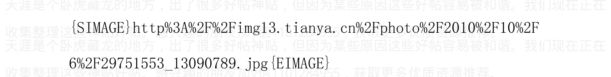

作者：海宁的马甲 日期：2010-10-06 23:04 作者：心游万韧 回复日期：2010-10-06 22:45:18

海宁兄的这段话，让我有点茫然了。是不是和你当初的判断有出入了呢。你这段话的意思是，房价无论通胀破与不破都不会跌。但是你贴子的意思是明年2011年3月或6月或9月下。是不是我理解错了，请明示。谢谢。

不好意思，刚才忘记了一段。

我用个形象的比喻，巴菲特和众多养老基金公司的股票一直不抛，并不代表股价不会暴跌。日本本田，丰田的公司的股票，韩国浦项的股票（巴菲特也是大额的持有人），很多价值投资者，基金经理一直持有，从来不抛，但是并不妨碍他们股价的上上下下。

房价暴跌，肯定是从持有成本最高，用钱需求最强烈最紧迫的人抛房开始的，炒房者最怕房价不涨，不涨对借钱炒房的就是损失。

外贸公司2008年，2011年的部分倒闭潮，肯定是从生产管理效率最差，竞争力最差的公司开始倒闭的。

有钱全款买房的，经济萧条后也又不需要卖房筹钱的，买的房子已经沉淀，不会再回到市场上。

想股市楼市这么大的市场，总是在银根紧缩的时候发生危机的。

2010年4月以后，银根虽然还是比较松，但是已经不比以前了。

现在，一切都在等临界点。（银行融资多点，能延缓的时间多点）

加v信1101284955获取更多优质书籍推荐

> 作者：海宁的马甲 日期：2010-10-06 23:52 贝纳8-9-10周期与16-18-20周期

以及日韩与中国快速发展事情的比较


> 作者：海宁的马甲 日期：2010-10-07 00:12 蛋糕怎么分，关系到股价，房价，和消费内需会不会旺盛。

有人说，2亿民工是比巨大的财富，完整地说“工资涨幅小于效率提高的速度的民工，才是比巨大的财富”，关键是，这是谁的财富？


> 作者：海宁的马甲 日期：2010-10-07 06:34 2003年11月24日钱乘旦说重商主义。

重商主义的通俗解释就是儿女们多干活，少消费，多积累金银财宝。

钱承旦怎么不研究《国富论》呢？英国人不是说亚当斯密的《国富论》在打败拿破仑的问题上比威灵顿将军更重要吗？

《国富论》主张国家的财富在于其人力资源和那些人的生产能力，只要人才在，国际即使被打得稀巴烂，也能很快重建。

重商主义是一种帝国主义发展思路（简单说，就是国富民温饱），怎么会用到可爱的社会主义国家。

### 中Y探求兴衰定律 钱乘旦教授：中Y领导的提问非常敏锐有洞察力

> > （2003-12-03 09:44:36） 来源：《瞭望东方》周刊

15世纪是人类历史的一个标尺。站在21世纪前沿的中G领D人把视角向这个时空延伸，颇具意味。

2003年11月24日下午，集体学习，听取首都师范大学齐世荣教授、南京大学钱乘旦教授就15世纪以来世界主要国家发展历史考察这一题目进行讲解。这一讲解进行了90分钟。讲解结束后，一些委员向两位教授提出了一些问题，提问和两位教授的解释持续了20多分钟。

为这次讲解，齐世荣和钱乘旦两位教授准备了3个月。

确定中共中央政治局集体学习的讲解人有一套严格的选择程序。2003年8月，钱乘旦教授应澳门科技大学邀请前往讲学。刚到澳门没几天，便接到集体学习时进行讲解的通知。在与澳门科技大学协商，得到支持并调整好他的工作时间后，钱乘旦教授从澳门赶回南京，在南京大学历史系资料室里没日没夜地泡了好几天。尽管他在南京大学素以博学严谨闻名，但这样的讲解，其作用和意义的重要使他不能不格外用心。

由资料室出来，他赶往北京，与首都师范大学齐世荣教授一同商讨讲解的内容。反复核实资料，反复修改讲解稿。几个月的时间就这样过去，一直到11月24日下午完成讲解。

> 在教授《瞭望东方》记者采访时，钱乘旦教授说：“中Y领导的提问，非常敏锐，非常有洞察力。”

#### 探求兴衰定律

24日下午，钱乘旦和齐世荣教授一起，共就9个国家近代以后现代化的发展历程及国家兴衰的经验、教训进行了讲解。这9个国家是：

葡萄牙、西班牙、荷兰、英国、法国、德国、日本、前苏联、美国。

其中，除前苏联外，都是昨天或今天的资本主义强国。

为什么不断有一个又一个偏远小国骤然兴盛，成为所向无敌的霸主？为什么不断有一个又一个不可一世的庞大帝国衰败乃至消灭？为何历史上的强国都只能维持一个世纪左右的霸权？这其中到底有着怎样的规律和共性，中国从中究竟应领悟到什么经验或教训？

钱乘旦对《瞭望东方》说：

- 其一，一个国家要强盛，统一的民族国家是前提。做不到这一点，不要说强盛，连生存都有问题。
- 其二，以国家的力量推动重商主义，是富强的一个重要方式。
- 其三，现代化的道路有多种模式。

钱教授对这一点作了阐述：在经济发展方面有英、美、法的“自由经济”模式，有德国的“统制经济”模式，俄国采用的是政府直接干预的政策，等等。当然人们可以说西方国家都走了一条“资本主义”的路，但又有多少“非西方”国家没有走资本主义的路呢？

政治现代化的情况也是如此。正如亨廷顿指出的，即便非西方国家也不走同一条路，道路的差别并不以“西方”和“非西方”为界。

事实上，略有历史知识的人都知道“西方”和“非西方”国家在道路的选择上是相互交叉的。

#### 制度创新至关重要

这9个国家，强的是什么原因？弱又是什么原因？中国现在正在一个发展过程中，总结其他国家的成功经验、失败教训，有利于中国确定国策，确定发展方向。

> 钱教授说：“我们提交的是一个全面的报告，不仅仅谈了经济、科技话题。我们非常强调制度的创新。”

从制度创新来说，重商主义、工业革命是一种经济革命，也是制度上的。苏联搞计划经济，也是一种制度创新。

政治也是这样。民族国家提倡中央集权就是制度创新。英国和法国也都是有制度创新的，当然做法不同。美国的政治制度也是有可取之处的。

钱教授说：“我们从这些国家的发展史上应该学到的是：一个国家，一个民族，任何时候都要站在时代前列，跟进时代潮流。如果跟不上了，就一定会掉下去。”

这次集体学习历史，集中考察了15世纪以来世界主要国家发展的历史，也就是世界主要国家从不发达走向发达、从传统社会走向现代社会的历史。

15世纪，是西方国家迈出现代化步伐的时候，也是中国落后、衰败的开始。中国当时虽仍是个统一的大帝国，但极度的封闭、自满、僵化已注定了其后的命运。

#### **附：钱承旦教授简介**

54岁的钱承旦现任南京大学历史系教授、博士生导师，国务院学位委员会历史学科组成员、中国英国史研究会常务副会长兼秘书长，英国皇家历史学会通讯会士等职。

钱承旦是最早重新审视英国的和平变革历程、把改革模式作为社会发展道路之一加以动态的历史学研究的中国学者，他提出的改革是现代化转型的一种可能模式的观点，产生了巨大的社会反响。他是最早介绍现代化理论的学者之一，并提出世界近现代史的主线是现代化的观点。

作者：海宁的马甲 日期：2010-10-07 21:28 作者：淡淡的紫水晶 回复日期：2010-10-07 14:11:35 作者：xiehonghai1224 回复日期：2010-10-07 13:29:32

看过，楼主很矛盾

这个时代谁不矛盾？

我没有发现很矛盾的地方，因为我不是纯粹地唱空。

我看到1998年到2008年，中国劳动力的生产效率提高200%了，社会财富增加。也通过我的货币银行学知识，认识到，社会虚拟财富（房价里的地价部分，股票，字画等价格），比实物财富的增加大5倍10倍，这就是泡沫。

我也看到了大学生在2002年后大规模增加，导致在外地就业的大学生大规模增加，导致社会用房需求大规模增加，（如果大学不扩招，很多城市的高中毕业生毕业后，会呆在父母家里，不会去外地，不会有买房需求），这是客观现实。

我也看到了，2002年到2008年，房价涨了N倍，而大学生劳动力的工资却没有涨多少。体力劳动者的工资倒在2004，2007，特别是2010年有大幅上涨的趋势。

我不是为了唱空而唱空。

连自己都不信的为了唱空而去唱空，很可能是为了赚钱而已，比如6540万套个谎言，那可是12年到15年社会建成房屋套数的总量啊。

智能电表也没有安装那么多。

作者：海宁的马甲 日期：2010-10-07 21:32 作者：淡淡的紫水晶 回复日期：2010-10-07 14:11:35

作者：xiehonghai1224 回复日期：2010-10-07 13:29:32

看过，楼主很矛盾

这个时代谁不矛盾？

我没有发现很矛盾的地方，因为我不是纯粹地唱空。

我看到1998年到2008年，中国劳动力的生产效率提高200%了，社会财富增加。也通过我的货币银行学知识，认识到，社会虚拟财富（房价里的地价部分，股票，字画等价格），比实物财富的增加大5倍10倍，这就是泡沫。

我也看到了大学生在2002年后大规模增加，导致在外地就业的大学生大规模增加，导致社会用房需求大规模增加，(如果大学不扩招，很多城市的高中毕业生毕业后，会呆在父母家里，不会去外地，不会有买房需求)，这是客观现实。

我也看到了，2002年到2008年，房价涨了N倍，而大学生劳动力的工资却没有涨多少。体力劳动者的工资倒在2004，2007，特别是2010年有大幅上涨的趋势。

我不是为了唱空而唱空。连自己都不信的为了唱空而去唱空，很可能是为了赚钱而已，比如6540万套个谎言，那可是12年到15年社会建成房屋套数的总量啊。智能电表也没有安装那么多。

> 作者：海宁的马甲 日期：2010-10-07 22:03 石油美元收藏国与汗水美元收藏国的股市比较

### 石油美元收藏国与汗水美元收藏国的股市比较


> 作者：海宁的马甲 日期：2010-10-07 23:04 作者：res11 回复日期：2010-10-07 22:18:06

看不懂了，LZ围着劳动力，说来说去，要说什么呢

劳动力的工资上涨了，对楼市股市短期内是不好的消息。

2007年下半年，2004年下半年，民工荒后都出现了股市和楼市的困难时期。

不同的是，2011年楼市更处于高位。

民工工资的大幅上涨，打乱了以前的财富创造，分配，与信用扩张套路。

但是这个需要一个临界点，就像2007年，民工工资涨的初期，股市楼市是涨的，但是到了一个临界点后，股市楼市是跌的。因为不能从民工身上搜刮到更多的剩余财富，从而在此基础上进行“信用扩张”增加社会的账面财富。

“信用扩张”的概念网上有。
www.hudong.com/wiki/信用扩张

所有经济体都是“信用扩张”与“信用紧缩”交替进行的。

“信用扩张”时期，民工因为效率提高多创造1元的价值（工资不涨），会让整个社会创造5元，甚至15元的账面财富。

民工工资大幅上涨太快，会导致这个“信用扩张”过程的中断，从而让社会进入“信用紧缩”时期。

“信用紧缩”时期，社会账面财富会快速消失，比如2008年。

只能解释到这里了。下面是定义。
www.hudong.com/wiki/信用扩张

作者：海宁的马甲 日期：2010-10-08 08:46

下面这个帖子可以说是2010年的缩影之一。集中体现了中国经济，房价，通货膨胀，人民币购买力，人民对于人民币购买力的前景的看法。

当2011年通货膨胀和民工大幅涨工资导致形势逆转的时候，这些人的担心会变成现实。

富人在贪婪与恐惧之间犹豫的时候，也很伤神。

作者：xiaoxiongcao6 发表日期：2010-10-8 1:41:00

上大学时，被外派去俄罗斯交流学习两年，亲眼目睹和亲历了卢布一夜之间变成“冥币”的惨痛。那两年，100美金所兑换的卢布从50万变成了300多万，物价飞涨，工资不涨，俄罗斯人民生活在水深火热中。但我们这些中国学生因持了“美元”而得意洋洋，太爽了，100 美金也太抗花了吧，钱怎样穷凶极恶的花好像都花不完似的。学生时代的这个记忆随着时间的流逝，几乎灰飞烟灭，荡然无存，但却被最近吵翻了的人民币升贬的新闻和帖子搞的浑身冰冷、六神无主……

不懂那么多高深的门道儿，只有现实的纠结和压力，希冀坛子里的高人诚心指点：

#### 基本情况：

-   1、北京有小面积商住两用房 3 套，其中一套全款，两套贷款（各首付 60%，贷 10 年，月供 6000）。目前 3 套出租，月租金共计 7500。若要出售，因面积小，总价低，位置好，容易出手。
-   2、北京远郊区有房 2 套，一套全款，面积 300 平，已装修，自住；另外一套贷款（首付 30%，贷 30 年，月供 4000），面积小 200，未装修，闲置，无法出租。这两套房子若要出售，周期较长。
-   3、工资足以负担房贷总和和生活开销，收入虽然较高，但不是非常稳定，工作有间歇性的间断。
-   4、基本是用租金负担贷款，但刨除物业、取暖和租户的不稳定性，基本也剩不下什么，工资还是要填补进去很多。
-   5、有移民国外的机会，目前持绿卡，正等待入籍。
-   6、手有一定现金，够偿还小面积的那两套贷款，因这笔现金是父母的，所以租金准备给父母做生活所用。
-   7、单身未婚。
-   8、外地和国外有几套房产，父母留给我的。

作者:海宁的马甲 日期:2010-10-08 23:07

读后感

### 《金融战败：发自经济大国受挫后的诤言》(日) 吉川元忠著

我也看了《金融战败》，却看到作者吉川元忠错了。

日本的问题在于日元该升值的时候拒绝升值，怕升值导致日本的出口受影响。作者正确的一点是日本政府与民间买的美国国债，其购买力确实大幅下降 3000 亿到 6000 亿美元（一定要以石油矿产等日本需要进口的为参照系，而不是日元），这可以看作是一种国防税或者保护费。

（中国目前外汇储备对于石油，铜，铁矿等的贬值程度，远远大于当时的日本外汇储备，一定要按照中国需要进口的东西去衡量，美元最后是用于进口的）

日元撑了一段时间后，在积累了大量外汇储备后。最后还是不得不升值了。

因为日本的劳动生产率提高后，如果一直不升值，结果肯定是外汇储备越来越多，日本国内的房价股价越来越高，万事总有个度，总不能像奴隶一样一直大量外贸顺差。这只是时间问题。

1985年开始的日元升值告一段落后，日本股市泡沫1989年底破灭，楼市泡沫 1991 年破灭。但是日元的劳动生产率太强了，日元继续升值，到 1995 年，1.2 亿人口的日本的 GDP，相当于 2.5 亿人口的美国的 95%。日本过渡到生产资本品（机器设备）的国家。

日本没有战败，日本只是走了重商主义发展思路必然要走的道路而已，后来这个路子韩国台湾，香港新加坡走了一次，中国从 2003 年到 2011 年再走了一次。

日本是个坚忍的民族，愿意为了积累财富而多工作，少消费，这是重商主义的文化基础。韩国，台湾，新加坡，香港都有类似的文化基础，和泡沫起来又破灭的情况。

中国文化也类似（为了积累财富而多工作，少消费）。这是文化的宿命，这是股市楼市泡沫必然发生，到一定时间后必然破灭的宿命。

德国在日本的同一时期遇到的是日本同样的问题，德国为什么没有楼市股市泡沫？ 因为德国任由德国马克升值，德国人生活水平消费水平提高了，德国坚决不允许通货膨胀超过 2%，德国有自信德国的经济即使升值了也会强劲，因为德国靠的是不断提高生产力。德国马克的升值比日元早，升得比日元快，德国经济也没有下滑，为什么？ 因为德国人不得不把更多的精力用于生产更高端的，附加值越来越高的东西，否则工资成本上竞争不过人家（升值后德国人的工资相对外国高了)，到最后，机床，织布机，经编机等资本品由德国人生产，而进口织布机，经编机机器的国家的人从事附加值低的工作。

作者:海宁的马甲 日期:2010-10-08 23:17

作者: justforstock 回复日期：2010-10-08 21:34:46

之前楼主极力推荐的周洛华，他最新的文章是“大牛市已经启动”，这不是自打嘴巴是什么？反正只有一两个星期了，看到时候又有什么说法

### 周洛华：大牛市已经启动

2010-10-05
http://www.caogen.com/blog/Infor_detail.aspx?ID=167&articleId=22884

首先，我不是盲从的人。其次，周洛华这篇文章的逻辑是对的，大宗商品的人民币价格将下降以降低通货膨胀的假设是错的，而且是大错特错。

物价与通货膨胀的情况已经今非昔比了。2005年7月以后，中国享受了2年左右“国际大宗商品价格不高”，和“民工工资涨幅不大”，“猪肉价格不高”的时期。

这三个条件，在2010年底，特别是2011年第一季度，一个都不存在。

2011年第一季度，我估计国际大宗商品，比如石油，铜，都是越涨越疯，让一些人觉得都没有顶。(就像现在很多人觉得黄金越涨越高，很多人觉得黄金价格几乎没有顶了，直接持有就是了)

2010年人民币升值后，铁矿石，铜，石油的人民币价格将不是低了，而将是暴涨之后再暴涨，一直到2011年3月。2011年3月后大宗商品怎么走，要看世界经济是否还没有进入萧条。

> 周洛华说，通胀无牛市。

作者：海宁的马甲 日期：2010-10-09 00:26

作者：g02011 回复日期：2010-10-08 23:35:01
====================
物价的涨幅，将是狂飙突进。。。。。。。。
该来的总归是来了，这可是阴谋论极好的佐料。

主妇们又要像2008年春节前后那样囤食用油了。

肉类的价格3到6个月内不知道涨到什么时候。

### CBOT大豆期货8日盘中涨停

2010年10月8日 23:58

[世华财讯]CBOT大豆期货8日盘中大幅上涨，美国农业部的大豆数据给市场提供支持价格上涨的基本面，同时玉米期货市场上涨也给市场带来利好的溢出影响。

综合媒体10月8日报道，CBOT大豆期货8日开盘急剧走高，价格涨幅指向70美分的日上涨上限。

美国农业部的报告给市场提供支持价格急剧上涨的基本面，因美国农业部意外的大豆亩产潜力将低于此前的预期。政府同时下调了期末大豆库存预估。

Allendale Inc的研究部主管Rich Nelson称，不仅是利好的农业部数据支持了市场的急剧上涨，玉米期货市场的急剧上涨的溢出影响也帮助推动大豆期货走高。

> Nelson称，“大豆现在与玉米在进行种植面积之争，如果大豆不能守住其种植面积，市场将进入糟糕的状况，在美国农业部的报告之后市场供给前景吃紧。”

目前预计玉米已经从大豆那里夺走200万亩的种植面积，吃紧的供给状况也将提高大豆价格以跟随玉米的上涨步伐。

CBOT 11月大豆期货已经上涨70美分，触及日涨停板，报11.35美元/蒲式耳。

作者:海宁的马甲 日期:2010-10-09 23:28

作者:天崖不要我了 555 回复日期：2010-10-09 08:25:02

楼主虽然教条，但非常努力。

依目前的经济相关性与规模来看，楼主的高产必定带来过于主观，目前看，从定性上分析，提高首付，会加快楼市崩盘的到来，从数量上分析，贷款增长速度大于15%的时候，楼市崩盘还没有到，什么时候贷款增长率连续2个月低于15%或者10%，楼市泡沫的崩盘的可能性就很大了。

2009年8月，中国贷款增长率连续下降3到5个百分点之后暴跌（2009年8月股市跌去20%）

有人准确预测了2009年7月底，8月的股市崩盘。

作者: 海宁的马甲 日期: 2010-10-09 23:30

Sornette 在 2009年7月10日，预测中国股市2009年7月17日到27日见顶

中国股市在7月28日见顶3478点，29日下跌5%

不过 Sornette 还应该继续努力，把那一两天的差距也给抹去。

我要研究研究 Sornette 的模型，来预测中国楼市的顶部。据说他的模型是在论文里公开的。

人家主要是物理学家，从金属，玻璃的破碎过程中发现了幂次法则，阿姆斯特朗也提到了幂次法则。

他预测的基本原理是碎形法则（幂次法则），阿姆斯特朗也提到过泡沫的最后阶段就是碎形法则，即价格的指数式上升(并不一定翻番，而是上升速度比以前快)，然后突然高位滞涨，横盘。

还有一个判断方法，就是市场里90%以上看多，泡沫就快破了，如果95%的人看多，泡沫的破灭就是迫在眉睫了。

目前的中国楼市，我看差不多90%的看多，或者不敢看空，看空的人会被取笑。

Sornette 也准确预测了石油2008年6月的见顶，美国楼市2006年底的见顶，美国拉斯维加斯楼市作为样本的见顶，在2007年9月预测中国股市2008年1月见顶。（中国股市的信心，我看是在2008年1月大雪之中彻底崩塌的，自然灾害，特别是地震，对人的心理影响特别的大，大地震之后经常有股灾）

Sornette 的预测论文发表于2009年7月10日
http://arxiv.org/abs/0907.1827

第一篇英文评论原文发表于2009年7月14日
http://www.technologyreview.com/blog/arxiv/23839/

《淘股吧》作证：淘股吧的文章发表于2009年7月17日
http://www.taoguba.com.cn/Article/189695/1

Sornette 的预测模型在 2007 年 9 月预测中国股市在 2008 年 1 月崩盘，并在香港投资经理的报告上提到了，当时大部分人相信泡沫在 2008 年奥运会前不会破裂。

### 经济物理学家预测中国股市崩溃日期

瑞士苏黎世联邦理工学院 Didier Sornette 称，他们已经从上海股市指数反常的增长中发现了警告信号，指出此轮泡沫的破灭日期将发生在 7 月 17 日到 27 日之间的概率大于 80%。

根据一项 Sornette 新的经济物理学预测模型，上海综合指数将在 7 月 17 日和 27 日之间见顶。

### Sornette 是如何预测中国股市 2009 年 7 月 17 日到 27 日见顶的？

经济繁荣和萧条的本质是现今世界上一个最令人困惑的问题。在过去一年左右的时间里，很多人学到了：当泡沫破灭之时，他们企业，工作甚至生计都会受到连累。他们为此付出了高昂的代价。

因此，一个显而易见的问题出现了：我们能不能发现泡沫何时发生，并预测它们何时破裂吗？有一群理论家们说，他们可以而且已经使用他们的技术作了一次独到的预测。

首先，他们说他们已经在上海综合股价指数的增长速度中发现了泡沫警示标志。其次，他们说这个泡沫将会在7月17日和27日之间破裂。

这是一个大胆的举动。让我们细细看来。这一预测背后的理论家是位于苏黎世的瑞士联邦理工学院Didier Sornette。他是研究市场泡沫的先驱者。去年，他用自己探查泡沫的方法，发现了石油价格下跌的危险。

他说，泡沫警示标志是一种快于指数增长的讯号，由产生非线性增长的正反馈机制造成。

指数上长过快比较容易被发现。根据Sornette团队的分析，上海综合指数肯定已增长过速——自去年10月至今已有69%的上涨。

这种增长是否是由不可持续的正反馈机制造成的，目前还不清楚。Sornette与合作者暗示，中国政府的旨在保持其经济增长率8%而大规模贷款的热潮是主要原因。而中国保持这样的增长已有多年了。我们现在正在让我们假定泡沫已经形成。它将何时破裂？具体精确到哪一天并不清楚，但无论该机制如何运作，这一预测举动更具投机性。

对于象股市、地震和森林火灾等复杂的系统，物理学家们了解的一点是，当变化发生时，它们的规模不变。这意味着，如果你要删除轴线图上描绘此行为的数字，你就无法通过观看图表来确定事件的规模。这表明，今天股市上的一个小小变化与明天的一个灾难性变化在原则上实在没有差别。

这使得预测任何事件变得极其困难，更不用说即将崩溃的泡沫。因此，仅仅用 impossible 一个词来形容是不够的。

Sornette 和他的合作者们没有告知他们是如何预测的，但他们躲躲闪闪地说：“一场崩溃或比较温和的泡沫紧缩将导致政权的改变。”

尽管如此，他们依然在预测介于 7 月 17 日和 27 日之间上海综合指数超速增长的结束点。当然，这一增长的变化某一天会发生，但你必须有充分的理由。

我要说，这是一个难以作出的预测。我准备打赌，赌 Sornette 错了。拿什么打赌？一个 arXiv 博客棒球帽和 T 恤衫。

编号： arxiv.org/abs/0907.1827 ： 在中国股市泡沫：准备爆破

作者:海宁的马甲 日期:2010-10-11 22:56

作者: xuejhe 回复日期: 2010-10-11 22:36:55

楼主怎么不出来说啦?我等还在等楼主上课呢,我同学在新加坡房子130平方，价格230万人民币，而且，不需要支付贷款利息，这个是什么社会啊。

我在天涯发帖，已经耗费我很多时间。取名“海宁的马甲”也就是让大家不必过于当真，也许这个只是众多马甲中的一个，也许，带“马甲”两字的ID不一定用马甲。

我正在准备近期的最后一个帖子：“重商主义与日韩台港中的股市楼市泡沫的必然兴起与瀑布式下跌”

### 海宁解读“重商主义”：

重商主义是封建社会末期的地主阶层与原始资本主义早期的垄断资本阶层的共同的必然选择。

重商主义是亚洲国家日本，韩国，台湾地区等实现富国“强民”的一种选择，也不是全错，只是在重商主义实施过程中，必然产生赢家与输家。

最大的赢家是地主和垄断资本，其次的赢家是给地主打工的包工头，和2008年以前的外贸公司老板。

再其次的赢家是识破重商主义提前卡位的民间资本，必然温州资本。

再再其次的赢家是与跟随地主的调控节拍参与盛宴，并提前结帐的投资者。

## 输家是谁？

输家是大量满含“美国都欠咱们钱”式自豪感的，工资8年涨得不多，有没有在股市楼市里赚钱的人。

输家是大量的农民。

输家是福利很少，与城市房子距离及其遥远的，劳动效率从1998年到2008年提高了200%的，而工资没有涨200%的民工。

有兴趣的可以 google 或者 百度 “重商主义 钱乘旦 集体学习 2003 瞭望东方”，你可以找到答案。

作者:海宁的马甲 日期:2010-10-11 23:14

作者：luoduoduo 回复日期：2010-10-11 23:08:44

楼主说对了 恶性通胀要来了 不坚决加息是止不住的

是的，快了，但不是现在，而且2010年12月以前也不是高潮。

高潮要到2011年1月2月3月疯狂地加速。

铜向下调整后暴涨到10000美元/吨也是可以想象的。

大豆与中国的食用油，从目前起在3到6个月内上涨30%那时太正常了，上涨50%到80%，才是疯狂的资本在2008年的做法。

疯狂的世界，狂欢的人们。

作者:海宁的马甲 日期:2010-10-12 13:02

作者:rebornfirebird 回复日期：2010-10-12 12:48:22

请问 官方真的没有弹药了吗

中国的大银行的贷存比都在60%左右，还有很大的提升空间。

贷存比平均大概68.5%左右，大银行的贷存比，只有一两家低于65%，大概是工行（工行贷存比一直比较低，因为不少资金被压死在呆滞贷款上了，呆滞贷款自然是个好听的名字而已），2010年4月开始他们就很缺钱，不然不会急切地去融资，发行债券。

民生银行最疯狂，现在只能不停地压缩贷款，因为它把83%都贷出去了（17%缴纳存款准备金），周转的头寸基本都是借的。

作者: 海宁的马甲 日期:2010-10-12 13:04

作者: zzhhjn1984 回复日期: 2010-10-12 12:26:05

楼主，发现刘军洛最新的演讲内容，其本质跟你一系列的观点是一模一样的。不同，他认为 2010 年底是临界点，而我认为临界点要等到 2011 年 3月以后。

以下为我理解的，总结的刘军洛的观点，不代表我的观点。谢谢。

#####

### 刘军洛：2011 年的五大预言，豆粕上 4200 石油上 95 房地产泡沫必破

我来总结一下刘军洛的演讲：

-   1. 最重要的一点，刘军洛认为的中国楼市的第一条死亡线，是大豆豆粕 3600 元一吨，石油价格 90 美元以上。目前大豆豆粕已经突破 3600 元一吨了，中国央行必须开始紧缩货币了，目前升 6 大行存款准备金率 0.5 到 17.5%就是例子。大豆豆粕是猪的饲料，大豆豆粕的价格决定 3 个月后猪肉的价格。

石油是欧美重要的物价基础，石油过95美元/桶，则欧美的通货膨胀按他们的标准失控。

为什么设立豆粕3600元/吨，4200元/吨，石油90，95美元的价格线作为参考依据呢？

这是参考大豆豆粕价格暴涨如何在2007年底搞死中国的股市，石油价格2007年底暴涨如何捅破欧美的房地产泡沫和导致欧美股市大跌的。

再进一步，刘军洛认为的中国房地产市场的必死线是大豆豆粕4200元人民币/吨，石油95美元/桶以上两个指标。

如果两者都达到，则中国央行和美联储都进入货币紧缩周期，直到控制住通货膨胀为止，至于中国的房地产与股市，就管不了了，只能像2007年底一样被牺牲掉。毕竟是江山稳定要紧，只要江山稳固，以后有的是收税的机会，地主怕什么，2007年底也没有怕误伤股市泡沫，2004年下半年搞死了那么多庄家，也没有怕过。

稳定压倒一切。在稳定面前，2004年下半年，2007年底，股市就是牺牲品。2010年底到2011年3月，是不是为了稳定而牺牲房地产，每个人都该有自己的判断。

小看猪肉涨价的威力的人，必然会付出资金损失的代价。2004年下半年，那么多牛气哄哄的庄家都被牺牲掉了。2007年底到2008年，中国股市蒸发15万亿到20万亿，2008年楼市起码蒸发5万亿以上。

大豆豆粕上3600，4200，会不会牺牲有2套房子以上的中产阶层，安慰那些依赖猪肉与食品的底层，每个人都该有自己的判断。

所以刘军洛下面说，2010年9月底的时候，中国央行还能承受大豆豆粕与石油涨20%的幅度。

大家自己也可以独立判断，看看大豆豆粕超过3600，央行会不会收紧银根，大豆豆粕上4200的时候，央行会不会不顾一切地加息。

- 美国国债是亚洲“爱收藏美元的国家”的基础货币发行的信用基础，美国国债发得越多，亚洲外贸顺差大的国家越是繁荣。等美国财政赤字规模大规模下降的时候，亚洲房地产泡沫的末日就近了。如果加上美联储紧缩货币政策，对付美国的通货膨胀，则亚洲的房地产死定了。

基础货币，信用扩张的概念，在天涯很难讲。对于懂的，不需要讲；对于不懂的，讲了也没有用。

作者：海宁的马甲 日期：2010-10-14 13:37 作者：normalabc 回复日期：2010-10-14 13:27:32

海宁，为何你觉得一年内买美元不是好办法呢？作为老百姓，这个时候手中那一点点钱，已经没有什么渠道可以投资了。留着人民币也是等贬值，买美金至少能保值吧？

我没有说“一年内买美元不是好办法”。我是说美元币值不稳，人民币币值也不稳，看哪个更烂。

人民币对美元，在11月前后，有在压力下比较大幅升值的可能，比如5%到10%的升值，因为今天的美元，比5月底的美元，已经贬值20%了。美元对欧元日元在浮动。

我认为2011年3月前，甚至2011年6月前，美元都是比较烂的。而人民币兑美元的兑换窗口，不会那么快就关掉的。

是的，换美元是保值，而不是赚钱。

另外，2011年底，物价比如葱姜蒜和猪肉，房价，股价，我认为是非常便宜的（房价可能还没有跌到低，但是已经比高点削去很多了）

作者：海宁的马甲 日期：2010-10-14 13:41 作者：孙悟空的命 回复日期：2010-10-13 13:46:00

拭目以待。可是手里的钱不等到房价降了之后买房，能干什么呢？不留现金买房，能怎么办呢？现金放在银行里，等于贡献给国家啦，唉，真没办法~！

加v信1101284955获取更多优质书籍推荐

2007年底，2008年2，3，4月猪肉什么价格，房子什么价格，股票什么价格？

到了2008年9月，这些价格又是怎么样的。

要动态的看问题，如果想赌一把，现在就是流动性泛滥的机会。

如果不想赌，只好撑到2011年底捡便宜的资产（股票房子）

听说过2007年“跑不过刘翔，也要跑过CPI”吗？到2008年9月看，几个人跑过了CPI？

作者：海宁的马甲 日期:2010-10-18 08:34旧文，仅供参考。

## 黄金才是中国房价的先行指标与近似价格指数，黄金暴跌先于房价暴跌

### 1） 货币与金融的逻辑

金融有其内在的逻辑，所以金融专家周洛华才能屡次把准股市与房价的脉搏。有疑问的人可以去他的博客验证。而某些缺乏金融基础和逻辑知识的人，屡次预言股市，屡次失败，最后只好转而预言难度更大的商品与外汇市场。

货币是一种一般等价物，起的是尺度作用。其本身不能给人带来享受，拥有货币的幸福感来自于货币的购买力。请问你拥有100亿津巴布韦元幸福吗？

#### 一个天天缩短的尺子，能用于衡量长度吗？

一个不断贬值的货币，不能起到尺度作用。

而投资者，辛苦赚来的财富的主人，是要用金融配置来投票的。

### 2） 黄金在美元失信后，才是衡量价值的尺度

通俗地说：

站在时间轴的2003年，2004年时间点上，关于辛苦赚来的财富存储在哪儿，你面前有几种选择：

- 美元
- 黄金
- 中国的房产
- 香港的房产
- 美国的房产

好，现在再次告诉你：美元的购买力从2003年起的4，5年里会下降50%，而黄金不会挥发，房子不会从100平米，缩水到50平米。请问你选择什么？

一个4，5年里就要贬值50%的货币，还能作为财富存储的载体与工具吗？

一个不断贬值的货币能让人们放心地作为财富存储的载体吗？

美元会贬值，但是黄金静静地躺在那里，他既不生锈，也不挥发，2003年一公斤黄金，2007年还是一公斤。

所以，黄金作为国际货币，才是衡量房价的尺度。

所以，有了香港房产从2003年到2007年的暴涨。很多人老是揪住中国土地供应垄断这个问题，这个确实是个非常不公平的大问题，但是当全国几乎所有地区的房价暴涨后，土地问题是不是最大的因素，值得怀疑。

### 3） 美元兑换券

> 作者:海宁的马甲 日期:2010-10-18 08:35） 美元兑换券

港币的美元含量是100%。

人民币的美元含量72%（4.28万亿/15.2万亿），参见人民银行下表

```
http://www.pbc.gov.cn/diachatongji/tongjishuju/gofile.asp?
file=2010S04.htm
```

不多解释了。

### 4） 黄金与美元之间争夺“价值尺度权”的战斗

黄金的价格是由国际市场决定的，只要人民银行不进场操作，中国市场对国际黄金的价格的影响力微乎其微。

美元2003，2005，2007三度失去“价值尺度权”后，请问美元背后的发行者，会任由美元“价值尺度权”彻底丧失吗？

2010年不争，2011年美元再不去夺回“价值尺度权”，美元的命运将会怎样？

### 5）美元指数走势的周期轮回

黄金的开采成本是400到600美元。工业用途价值是300美元。

请问，当黄金的价格暴跌，奔向850美元，奔向780美元（两个支撑价位）的时候，黄金还能作为“价值尺度”吗？黄金是否一直会远远高于开采成本？当美元在“价值尺度权”争夺战里战胜黄金的时候。房价是否应该从以黄金衡量，改为以美元来衡量？

### 6）从金融自由的香港看世界

因为港币与美元挂钩，当美元贬值的时候，国际金融资本自然购入香港实物资产作为对冲。

美元再次上涨，或者烂到谷底的时候，就是香港的外来投资者结账的时候。

所以，黄金暴跌后，应该是香港房产的暴跌。

而大陆，其反映应该滞后一定时间。

作者:海宁的马甲 日期:2010-10-18 08:39 还你一个没有泡沫的净土

加v信1101284955获取更多优质书籍推荐

还你一个没有泡沫的净土-1981.10，1991.10，2001.10，2011.10

如果到2011年10月，大宗商品的第二次泡沫也破了，澳元加元已经暴跌了，中国，巴西，澳洲，加拿大房地产泡沫破了，则2011年10月继续保持带1的年份的10月无泡沫的记录。是否继续保持如此完美的10年轮回，就要看2011年10月了。

如果中国房地产泡沫比黄金泡沫先破裂，则中国的房地产泡沫是中国央行主动刺破的。

如果黄金泡沫先于中国房地产破裂，则中国的房地产泡沫可以算是美联储刺破的。

我认为，黄金和中国房地产在2011年3月以前都比较安全。

（黄金泡沫始于2005年7月的430美元/盎司，中国房地产泡沫的深化，也始于2005年7月，中国股市泡沫的起跑线，也是2005年7月，2005年7月应该记入历史）

2011年3月以后，中国的货币政策就可能不得不收紧了。我个人希望中国央行先于美联储行动。

2011年3月如果通货膨胀大到欧美都受不了。则世界上余下的泡沫全破掉，就像1991年3月或者6月，或者2001年3月或者6月，加v信1101284955获取更多优质书籍推荐，暂时还大家一个没有泡沫的世界。

## 10 年一轮回.

## 10 年黄金梦，涨 5 倍后，差不多该醒了。

全世界的军备已经荒废很久了，并不是说一定会出现战争，而是某些国家会害怕而扩充军备。真的战争可能是不会出现的。

旧文，仅供参考。

## 黄金才是中国房价的先行指标与近似价格指数，黄金暴跌先于房价暴跌

作者:海宁的马甲 日期:2010-10-18 08:42 引子: 中国 2001 年 11 月 10 日加入世贸组织

## 美国的欠条（美元，美国国债），信用扩张，与股市房地产泡沫

### 兼论中国 2001 年 11 月 10 日后地产泡沫的 10 年

2001 年 11 月 10 日，中国加入世贸组织。

2001 年 11 月 10 日，美国互联网泡沫已经破灭 1 年零 8 个月了。

2001 年 11 月 10 日，俄罗斯国债违约已经发生 3 年零 3 个月了。

2001 年 11 月 10 日，香港房价已经比 1997 年高点跌去 60%左右，跌到 1993 年左右了。

2001 年 11 月 10 日，韩国房价的美元价格已经比 1997 年的高点跌去 60%左右了。出了很多好帖神贴，但因为某些原因这些好帖容易被和谐。我们现在正在

其中 1997 年 10 月到 12 月，三个月，韩国房价按本币就跌去 30%左右，韩元在 11 月 12 月贬值 42%，韩国房价按美元算，2，3 个月，跌去 60%左右（70%×58%）。

2001 年 11 月 10 日，东南亚也没有股市泡沫，没有房地产泡沫。

2001 年 11 月，这个世界有股市或者房地产泡沫吗？没有。

2001 年 11 月，这个世界有泡沫吗？

我说有。那就是美元泡沫。美元的币值在 1999 年到 2002 年 11 月被大大地，极其严重地高估了。因为世界经济从 1997 年 7 月开始在东南亚国家出现萧条，在 1998 年 7 月出现更大的萧条，欧洲，日本，俄罗斯也陷入萧条。

2001 年 11 月 10 日，黄金多少钱一盎司？大约 250 到 300 美元。

2001 年 11 月 10 日，石油多少钱一桶，大约 11 到 20 美元。

大家去查查刘军洛在 2001 年，2002 年，2003 年关于黄金将涨到 3000 美元，石油将涨到 300 美元的言论吧。他在 2001 年到 2003 年，看到美元泡沫（美元币值大大地过高），将用 10 年左右的时间里被释放出来。这是有历史规律的。美元每过 30 年狠狠地贬值一次，一贬就是 10 年左右，而且是贬值过头的。10 年贬值到头后反弹，会发生什么？那些被 10 年美元贬值过程所催生的股市，楼市，古玩，字画，茶叶，红酒等价格泡沫的破裂。

美元贬值到头的时候，就是开始用美元泡沫，替代世界其他泡沫的过程。就像1997年7月，1998年7月之后发生的事情类似。

2001年11月10日，黄金多少钱一盎司？大约250到300美元。

2001年11月10日，石油多少钱一桶？大约11到20美元。那个走私汽油进入中国的，从客观上，是为中国在极低的价位，输入了大量的财富（石油10几美元一桶的时候的汽油）

美元何德何能，在2001年11月，那么“值钱”？因为这个世界股市，楼市，以及其他的泡沫统统破裂了，连最后一个泡沫，互联网泡沫，也在2000年3月破裂了。世界在2001年没有足够的值得投资的地方，大量的财富，在2001年，不得不停泊在美元这个“美国经济总量才占世界25%左右，而其货币美元占国际贸易80%以上，两者极其不相称的”世界货币上面。不管人们如何看待美元。这是不得不面对的现实。特别是石油，中东的石油，美元是唯一的结算货币（伊朗除外）。

大家再看看1990年10月到1993年10月，甚至1994年，这个世界有大的泡沫吗？基本没有。

再往前推，1981年到1984年，这个世界有大的泡沫吗？也基本没有。

所以，繁荣过后，没有泡沫的世界是必然到来的。这是历史的必然。

加v信1101284955获取更多优质书籍推荐

有人猜是2010年底到来，我猜是2011年6月到10月后到来（我猜现在正在2011年6到10月是大宗商品第二次泡沫破裂过程与加拿大澳大利亚，巴西房地产泡沫破裂过程，加元澳元暴跌过程，不一定对，仅供参考，切勿据此投资，请读者自己独立判断），有人猜2012年到来，只是时间的猜测问题，而且离我们很近了。当然，读者也可以认为繁荣永续，千秋万代，欲与天齐。

作者:海宁的马甲 日期:2010-10-18 09:52作者: rensongwang 回复日期: 2010-10-18 09:43:43

楼主前面预言的这半个月股市将下跌，但是这两天在暴涨啊。这个楼主怎么解释呢？

美元在美联储量化宽松预期下暴跌--》美股，中国股市同涨

但是美元指数可能在10月15日左右极可能已经探明底部了，我预期从今天到11月底，美元指数反弹，美国股市下跌10%以上，会影响到中国股市。中国股市牵涉到太多股民的财富梦想了。我对此非常理解。

但是，中国股市在中国央行紧缩货币政策后，会出现2004年4月到2005年6月类似的走势。我预测中国央行在2011年3月应该收紧加v信1101284955获取更多书籍推荐，货币政策了。

我认为今年10月到12月，中国银行系统的新增贷款大大超出3000亿每个月，全年新增贷款7.5万亿的计划，可能被抛弃，为了维持泡沫，维持铁公鸡。

但是2011年3月的猪肉，食用油，汽油，比现在涨20%以上，我看问题不大。不是我希望有通货膨胀，而是现实如此，现实是央行到现在还是不紧缩货币，2010年9月，新增贷款多少亿？好像是近6000亿。

> 作者:海宁的马甲 日期:2010-10-18 09:54 作者：rensongwang 回复日期：2010-10-18 09:43:43
> 楼主前面预言的这半个月股市将下跌，但是这两天在暴涨啊。这个楼主怎么解释呢？

10月中旬，是10月11日到20日。

10月中旬到11月，共51天，现在才过了8天。

加v信1101284955获取更多优质书籍推荐

作者:海宁的马甲 日期:2010-10-20 08:49 2010年10月进入加息周期是源于对潜在的社会可能出现不稳定的恐惧

0.25%只是个开头，靠0.25%是绝对无法控制通货膨胀。靠0.25%是绝对无法刺破泡沫的。

如果没有后续加息，这个0.25，更多是赚名声，兼调戏。

2010年7月到2011年6月，中国社会的通货膨胀可能大于30%（年率），这是18年一遇的货币危机。

上一次是1993-1994，这一次是2011-2012，2010年只是酝酿是开始，不是真正的危机年份。

这又是一次对存款人的危机转嫁。

加息是为了社会稳定。2010年下半年到2011年上半年，通货膨胀率可能是30%。（但是2011年底如果经济萧条，物价房价是会暴跌下去的）

2011年上半年，容易出现社会稳定问题，比如2011年上半年新疆天价羊肉引发的问题。

目前只是打个提前量，0.25%，甚至1%都无法控制通货膨胀，只是提前提醒大家加息周期开始了。

0.25%也无法控制股市暴涨，如果股市有暴涨的动力的话（我认为10月暴涨动力来自于人民币汇率套利资金，9月外汇占款太大太突然，说明外汇管制只针对普通百姓与企业，对于某些资金而言形同虚设）

接下去几周如果股市回调，原因更多可能不是加息，而是美元反弹。

2006年以后，中国与全球股市走势，按周线看，是同步的，

真正的利率暴涨可能发生与豆粕上4200/吨后，以后的加息，主要来自于对于不稳定的恐惧。

> > 作者:海宁的马甲 日期:2010-10-20 09:22 作者: blue_light 回复复日期: 2010-10-20 08:56:29
出乎意料的提前加息，楼主会修定预测的时间表吗

不用变。

说明央行接下去继续加息的可能性大了。

不加到4%这个心理临界点，很难刺破泡沫。

4%，也就是25倍的市盈率。

> > 作者:海宁的马甲 日期:2010-10-20 09:35 作者: 明如其人 回复日期：2010-10-20 09:29:05

海宁老师你不要和那些无聊的人扯了，暴涨，加息 你还看看还暴涨加0.25%又没有什么用。

2010年3月是10年大顶的第一顶,第二顶要在2010年11月到2011年3月。

不要小看人心的疯狂，2011年第一季度物价疯涨的时候，会有人去买房推高房价的。

就像股市2007年5月31日后，是有人顶上去的。

> 作者:海宁的马甲 日期:2010-10-20 21:08 下面是旧文，有些内容事后看不一定对：

而且我后来改变看法，认为10月中旬到11月会向下调整10%以上。

> 作者: 海宁的马甲 发表日期：2010-8-12

2010年下半年人民币升值是2005.7-2008.7的迷你重复版？

> 加v信1101284955获取更多优质书籍推荐

### 股市先涨到 2999 后下跌？

2999 点自然是个形象的说法，是指股市不大会涨过 3104 点。

### 人民币升值预期又有了，国际大宗商品，特别是粮食，是不是又要暴涨一段时间了？

这次涨价风潮应该没有 2005.7-2008.7 厉害。因为对人民币的升值预期没有那么大。

### 这次涨价风潮，会不会以再次把世界带入通货膨胀和之后的衰退而结束？

很难猜这次以粮食为主的通货膨胀，会在什么时候结束。也许 2010 年底，也许涨到 2011 年 7 月确定 2011 年粮食会丰收后。

我奇怪，为什么没有人研究一个货币对另一个货币单向升值的各种动态变化。

这种单向升值的经济分析，是非常有意思的。

我以下的分析不一定对。

我们来看看，2005 年 7 月到 2008 年 7 月，人民币升值了 20%，中国的东西的零售价格 3 年左右在美国，按美元算，贵了 6%左右。

当然按美元算，衣服鞋子跟 1999 年或者 2001 年比，总体还是便宜了 25%左右。

这些数字不是我随便说的，在 2005 年，2006 年的时候，很多数据显示美国的衣服鞋子的零售价格，同类价格相比，在 7，8 年里下降了 30%左右，这些不都是中国劳动者的功劳，有些地区比如洪都拉斯，孟加拉国的劳动力价格小于每月 100 美元或者 150 美元。

衣服鞋子等零售的美元价格 2005 年到 2008 年上涨了 6%左右，2008 年 9 月金融危机后又下跌了不少。

不知道在欧洲，零售的衣服鞋子等同期按欧元算是贵了，还是更便宜了。

问题来了。价格指导着分配。

人民币对美元升值 20%，而美国的衣服鞋子等零售价格只是上涨了 6%，美国各个零售公司的利润和股价也没有见上涨。2008 年 10 月后反倒一片惨淡，亏损，破产的景象。那么，钱到哪里去了？

这是个很大的问题，为什么没有经济学家来分析分析？

我的结论是，通过商品价格变动，与金融市场的套利交易，这些‘红利’被转移了。

## 二：石油出口大国富了

首先，我认为没有什么阴谋，而是经济规律在其左右，亚当斯密说的“看不见的手”在其作用。

这些“红利”的最大受益者是中东俄罗斯等石油输出国，因为 2005.7-2008.7 期间石油价格暴涨成灾。俄罗斯对石油超过 55 或者 75 美元部分征收 80% 的税收，俄罗斯财政在那 3 年非常好过。中东的科威特，巴林，沙特等主权基金的规模膨胀了再膨胀。中东的迪拜就是石油暴涨致使中东暴富的最佳象征。

很简单，石油出口国富了。这是其一。

## 二：其它资源大国也富了

第二，澳大利亚，巴西，智利，加拿大的日子也好过了。因为他们都有丰富的原材料。

在国际金融资本的逐利性流动下，资本流向大宗商品，因为 2005.7-2008.7 国际上对于中国胃口大开与购买力大增的预期非常高，因为人民币要单向升值了嘛，而且预期可能 40%，预期要升很长时间。

这些大宗商品不是你想涨就能涨起来的，你看 2010 年铁矿石价格不是下跌了很多吗。

当然石油与其它大宗商品涨价主要是美元购买力越来越不行了。主要是美元购买力不行，导致资本流向大宗商品保值增值，或者投机（保值与投机的界限谁画得清）。总而言之，资源大国在美元贬值预期与人民币购买力“上升”预期下，也富了。这个“上升”是打引号的，因为期间人民币是对美元升值了，对铁矿石，石油，黄金，粮食等可没有升值。只是在 2005.7-2008.7 期间，对一个比人民币烂很多的货币，美元，升值 20%而已。这个美元的相对更烂，是指在 2005.7-2008.7 期间，其他时间不一定烂。

## 三：中国作为一个整体是否也富了

作者:海宁的马甲  日期:2010-10-20 21:11 下面是旧文，有些内容事后看，不一定对：

> 下面是旧文，有些内容事后看，不一定对：

而且我后来改变看法，认为 10 月中旬到 11 月会向下调整 10%以上。

作者：海宁的马甲  发表日期：2010-8-12

## 三： 中国作为一个整体是否也富了

加v信1101284955获取更多优质书籍推荐

在 2005.7-2008.7 期间，中国增加了 1 万多亿美元的外汇储备，为了收购这些外汇，中国人民银行发行了相应的人民币。中国发生了结构性通货膨胀。

经济体各个部门之间的发展是不平衡的，笼统的去说通货膨胀是没有意义的。我们应该说在 A 领域有没有通货膨胀，B 行业有没有通货膨胀。然后加权平均，才能得出货币的购买力是上升了，还是下降了。

中国作为整体，从人均猪肉消耗量看，是富了。但是有人相对穷了。因为在发生通货膨胀的行业里提前卡位的人富了。

中国发生了一个非常奇怪的现象，一个开发速度缓慢，管理越是差的房地产企业，赚的钱，也许比快速开发出质量好的房子的房地产企业更多。

## 四：房地产泡沫重创了社会主义国家

如果我们摈弃意识形态，把凡是在以下方面提供福利的，称为社会主义：

- 根据老人年轻时候缴纳的税收，提供相应的社会养老保险
- 对低收入的妇女儿童提供资助
- 用税收对社会群体的大部分提供社会医疗保险
- 对失去劳动能力的残疾人提供福利，即使他们没有交过什么税
- 对失业者提供失业金，与劳动培训或者学校教育资助

加v信1101284955获取更多优质书籍推荐

那么，欧洲就是社会主义。他们在 2002 年到 2008 年，狠狠地大力花钱，政府那个时候因为房地产红火，税收也多，发放福利问题不大。而当房地产退潮的时候，他们的福利大厦危险了。太多人在拿退休金，在拿福利，而太少的人在工作。社会主义难以为继，可以想象，下一波的欧洲改革方向就是增加社会运行效率，同时不得不接受贫富差距加大的后果。

## 五：一次升值到位后双向浮动，才是结束一切乱象的最好方式

敬请关注一个人民币汇率点位

2009 年末以来，高盛对人民币汇率的预测，一直保持在一个数值上，那就是对美元汇率 6.65。

人民币升值到 6.65 后的双向浮动，也许是个转折点 turning point。6.65 以后，升值预期也许会消失。

什么时候升到 6.65？我不可能知道。这是有管理的浮动汇率，肯定只有管理浮动汇率的人才知道。

作者:海宁的马甲 日期:2010-10-20 23:52 旧文赏析。

刘军洛知道“华盛顿国际经济研究所所长弗雷德·伯格斯滕”在 2003 年对于美元将大幅贬值的论述。

刘军洛知道特里芬难题。

刘军洛看过伯南克的《大萧条》，日本人的《金融战败》。被和谐。我们现在正在收集整理这些神贴好帖。感兴趣的朋友加v信1101284955，获取更多优质资源推荐。天涯是个卧虎藏龙的地方，2003年，当你看到一个悲剧正在酝酿之中，却又无法去影响，去说服，去改变哪怕一点点，那是怎样一种悲凉的心境。

始于2004年4月的宏观调控，葬送了大量自信满满的庄家。

在2004年的冬天，“德隆、鸿仪、闽发、汉唐、南方···”等等庄家，永远的离开了中国股市。

> > 中国急需建立“金本位”对抗美元贬值和世界性通胀(刘军洛；2004年2月6日)

http://ifb.cass.cn/show_news.asp?id=1118

文章作者：刘军洛 作者单位： 文章出处： 《国际金融报》

目前，导致全球物价大幅上涨的一个主要原因是，格林斯潘和小布什的扩张性货币政策和扩张性财政政策。2003年4月，笔者在评论2003年一季度中国经济数据时指出，美联储的再通胀政策将在2003年下半年大幅提高中国居民的生活成本、中国的CPI(消费者价格指数)将大幅上涨以及粮食等基本商品将出现高价格。2003年在格林斯潘创造美元信用货币中，亚洲地区的外汇储备增加了1/3，达1.9万亿美元。2004年第一个交易周，外国人投入亚洲地区28亿美元，创周流量纪录。亚洲地区短期内被灌入如此巨大的信用货币，所以一些劳动生产率低的地区，如中国，出现了物价上涨的局面（中国的劳动生产率是美国的17%）。同时，在全球范围内基本商品价格出现了暴涨。这正符合了今天国际货币体系中的一条基本定律——美元的价格决定全球供给与需求的价格。2004 年中国是否会出现高通货膨胀，在全球化配置中是一个胜利者还是失败者，已完全取决于 2004 年美元的价值。今天中国最大的风险就是把希望寄托在美元的清偿能力上。

2004 年 1 月 7 日，国际货币基金组织（IMF）警告说，美国欠其他国家的债务将占自身经济总量的 40%，这对一个主要工业化国家来说是前所未有的比例，有可能造成对美元价值的恐慌和全球汇率的混乱。华盛顿国际经济研究所所长弗雷德·伯格斯滕说：“国际货币基金组织是正确的。如果美国的两大赤字（联邦预算赤字和贸易赤字）继续增加，世界经济面临‘最终审判日’的风险也会增加。”

作者：海宁的马甲 日期：2010-10-20 23:54 目前美国人的信用债务已达 6.7 万亿美元，人均债务余额超过 2.3 万美元。2002 年，美国国会将联邦政府国债限额从 5.95 万亿美元提高到 6.4 万亿美元，2003 年再次提高到 7.38 万亿美元，创历史之最。美国白宫 1 月 29 日透露，小布什政府 2004 财年的联邦财政赤字将达到 5210 亿美元，远超过 2003 年的 3750 亿美元。美联储为什么如此希望美国民众拼命借贷，小布什为什么如此向世界大力借钱。一个美国学者指出，以李嘉图贸易理论推算，二三十年后美国将沦为一个发展中国家。在今天的生活中，这就好比一个聪明的白领不断地向一个勤恳的蓝领借入巨额债务和购入大量物品。经济学家指出，这样下去蓝领会比白领富足。但是，在现实生活中这个白领在借钱中没有写下借据。所以，经济学家所指出的事永远不会发生。现在美国人借入的债务都是以美元计价，而不是以人民币、日元或欧元计价。美国人借的债务越多，美元就越贬值，美国人到时偿还的就越少。上世纪80年代，日本金融机构在美元贬值最高峰时，损失高达70%，1000亿美元只剩300亿美元。今天，中国外汇储备加私人持有共计7000亿美元外国纸币资产。如果小布什政府向里根政府学习，那么中国就可能出现单在持有的美元资产上的损失就达4000亿美元的事，相当于中国GDP的40%。这就是2004年中国将面对的最大风险。

为什么新兴市场在全球化配置中都脱离不了这么一条规律——创造与毁灭。上世纪80年代是拉美，1992年是英镑，1994年是墨西哥，1997年是东盟地区。这是因为这些新兴市场在参与全球化中不是市场配置或“金本位”配置，而是美元的贸易赤字配置。所以，这些新兴市场必定出现市场配置失衡的结果。

2002年6月，笔者在一篇名为《要么选择黄金，要么选择崩溃》的文章中讲了这么一个小故事。很久以前，一个大国的皇帝命令大臣们都必须穿丝制衣服，而自己的国家只准种粮食不准种桑树。这个国家的丝价就猛涨。于是，其他小国就纷纷种桑养蚕不种粮食，卖丝赚银子，不亦乐乎。过了几年，这位皇帝又命令大臣们只准穿布衣，并不准卖粮食给其他小国。这样这些小国的人就纷纷饿死。而这位皇帝就轻易‘赚取’了这些小国。

作者:海宁的马甲 日期:2010-10-20 23:57 这个小故事的寓意就是，中国在美元的贸易赤字配置的全球化中必定出现结构失衡。

2002 年中国减少耕地 2500 多万亩，2003 年减少 3000 多万亩。这样在过去的两年，中国出现了 7000 万人永久性依靠进口粮。2003 年中国粮食缺口 5000 万吨。现在中国年粮食消费总量在 4.8-4.9 亿吨。预计未来两年中国进口粮食将达 1 亿吨以上。今天的粮食价格也就是 200-300 美元/吨。但是，随着今后美元贬值的恶化效应以及全球只有北美地区有剩余粮食供应(欧洲与独联体国家已基本退出世界粮食供给市场)，那么中国未来很可能在粮食问题上多支付 500-600 亿美元给北美地区。

> “千里之堤，毁于蚁穴”

如果到时再计算上石油、铜、铁矿等等基本商品的多支付，那么，如果说 1997 年东盟因为美元升值而恶化了经常账户的话，今天中国就将因为美元贬值而恶化经常账户。毕竟，中国对世界资源的需求巨大。这点验证了特里芬先生在 1959 年指出的——美元的不稳定性将摧毁市场。

所以，不论美元升值还是贬值都将造成区域性危机。

加v信1101284955获取更多优质书籍推荐

2004年中国在美元问题上还将面对另一个潜在的巨大风险。

2002年5月，笔者在上述《要么选择黄金，要么选择崩溃》一文中指出，日本人必定将大规模购入黄金。近日，日本财务大臣谷垣祯一称，财务省将仔细检查是否要提高日本外汇储备中的黄金持有比率。

日本财长的这句话表明，美日的共同战略目标已不存在。上世纪80年代，里根政府的大规模减税和军备支出造成了美元大幅贬值。这给日本带来的直接损失是3000亿美元，间接损失约5000亿美元。这8000亿美元‘捐助’为里根打赢冷战起了决定性作用。日本则换取了北方地区安全。所以，当时日本央行与大藏省都极力调动本国资本进入美国市场。今天，冷战已经消失，美日战略目标出现严重分歧。

日本政府不愿意再为小布什政府的大规模减税、二战后‘婴儿潮’退休福利的巨额支出、登月、上火星、反恐以及在伊拉克、阿富汗驻军等等的赤字再‘捐助’8000亿美元了。

毫无疑问，2月初在美国弗罗里达州召开的七国央行与财长‘7G’会议中，如果不能达成美国削减赤字、欧洲与日本进一步开放市场吸纳美国贸易赤字的协议的话，日本就必然大规模进入黄金市场来保护自己的资产安全。如果日本把外汇储备的黄金比例提高到20%，那么全球金融世界将先出现近1400亿美元的美元资产抛售，然后是近1400亿美元进入黄金市场。而中国在这个过程中将先面对手中美元资产的进一步缩水，然后是美元大幅贬值与黄金价格大幅上涨造成全球基本商品大幅上涨。如，石油很可能出现40美元/桶。还有，在这个过程中，谁又能保证，阿拉伯人、欧洲人不进行好一场资产组合来保护自身呢？这也是银行学中的一种说法，当银行大量借入短期融资而进行长期投资时，必定会面对一个问题——挤兑。现在，如果日本人去提现，那么美国这个世界银行的兑现问题将即刻摆到中国人面前。

作者:海宁的马甲 日期:2010-10-21 00:00 今天，全球归根结底的问题是——美国人的赤字由外国人储蓄来支付。美国国会统计局预计，未来 10 年 (2004-2015) 美国财赤将达 3.5 万亿美元。一位英国学者曾指出，中央银行可以在一夜之间创造 1 倍的货币供给，但市场也会迅速出现相对应的价格。所以，在美国人创造赤字的过程中，黄金也必定出现相对应的价格。2001 年，黄金 260 美元 / 盎司时，笔者向国人推销中国必须及时建立“次级金本位”（由黄金、石油、农田、铜等重要基本商品及资源组合的货币储备支付体系）对抗一场残酷的美元贬值和世界性通货膨胀。笔者艰难推销“次级金本位”的 3 年，美元贬了 3 年，黄金到了 400 美元/盎司，中国农田逐年消耗。

在参与全球化的配置中，中国必须去计算全球账户失衡的程度以及各国财赤所带来的问题。美国未来欠外国人的债务可能达 5 万亿美元。美国今天的经济政策可以在未来削减美国 30% 的外国债务，即达 1.5 万亿美元。推销黄金虽艰难，但是中国能少分摊这 1.5 万亿美元“财富”，那么这场黄金推销即便再难也得再坚持。

2003 年全球经济在各国政府的反周期的拉动中出现了强劲增长。然而，这种增长的背后出现了一个身影——凯恩斯主义的回归。

上世纪 70 年代的世界性大通胀让凯恩斯派登上了舞台。今天，这股潮流回归，美国财赤占 GDP4%，欧洲财赤占 GDP3%，日本财赤占 GDP7%，这不由让人嗅到了上世纪 70 年代的气息。同时，这股潮流也创造了 2003 年全球基本商品指数 (CRB) 的暴涨。2003 年过去了，她留给世界一个惊喜——强劲增长，一个疑问——美元膨胀的巨额债务与各国的高失业率。不错，2004 年还将是凯恩斯派举行更盛大演出的时空。或者还会上演世界银行美国遭遇挤兑的一幕。

经济学中有一个定律——赤字决定价格。2004 年 CRB 指数的走势是否会让中国经济窒息，答案在全球赤字。2004 年美元的风浪是否会重创中国经济，答案也在全球赤字。小布什政府的赤字规模不会让 2004 年的世界经济平静。7G 会议的话题是美元赤字，IMF 的报告讲美元赤字，近日许多学者谈论的是美元赤字 (如蒙代尔和索罗斯)。

中国人不能等美元的赤字发展下去，不能等日本人先去兑现。在美元过剩的年代中，黄金是中国能安全生存的惟一保障。美元的再贬值，世界性通货膨胀、经常账户问题，这些都已层层渗入中国经济。美元的巨额经常账户赤字 (2005 年将达 8000 亿美元) 加美元的庞大外债 (未来几年会升至 5 万亿美元) 恒等美元大幅贬值和世界性通货膨胀。

或许上世纪 70 年代美国一位议员的话更能让中国人感受到美元危机的来临——“如果没有通货膨胀，华盛顿的日子将很不好过。”

加v信1101284955获取更多优质书籍推荐

作者:海宁的马甲 日期:2010-10-21 20:13 作者:独步年华 回复

日期:2010-10-21 12:13:18

楼主还坚持黄金泡沫要到明年3月才会破么？刘军洛老师的观点是，近年年底美元就要到85附近了。楼主怎么看呢？

黄金泡沫最后一程（2010年8月到。。。）是谁推动的？是不是美联储的量化宽松预期？

当美联储的量化宽松结束的时候，黄金泡沫就会面临极大的抛压。

量化宽松没有用完之前，中国房价泡沫，黄金泡沫都不会破。美元指数只能反弹到80，82，很难反弹到85。

但是有的泡沫的持续时间超出我们的想象，如果人心特别疯狂，可以持续到2012年2月才破。美国国债泡沫到了2012年2月也有抛压。（美国国债泡沫肯定是最迟破的）

作者:海宁的马甲 日期:2010-10-21 23:22 热钱：

简单地说，负利率情况下，加息不会招致热钱。加息到4%也不会招致热钱，因为4%的利率，刚够官方的通货膨胀速度而已。越南存款利率10%以上也没有招引热钱，巴西9.5%的利率，也没有招致太多热钱。

巴西 9.5%的利率，对比美国 0.25%的联邦基金利率，是不是美国的资金会疯狂地进入巴西啊？有吗？

很多研究通货膨胀的，认为通货膨胀一旦超过 10%，物价就有进入爆炸式抢购的危险，比如中国的 1988 年，1993 年。

热钱就是进入中国，看中的是加息 0.25%以后，因为通货膨胀的增加速度大于 0.25%，负利率不是减轻了，而是更严重了，才流入中国的。流入中国后，热钱去炒的是农产品等，炒那些还没有到顶的泡沫资产，而不是像老太太那样存入银行。美国 0%到 0.25%的所谓零利率，是美联储与银行间的利率，不是普通人能拿到的存款利率或者贷款利率。即使这样，美国私有的商业银行也是惜贷，情愿买国债，也不愿意把钱贷给个人和公司，因为资金安全更重要。

加息到 4%，把通货膨胀压下去，才能挡住热钱进来炒作农产品等还没有到顶的泡沫资产。

2010 年下半年，欧元日元等对美元升值 10%以上，而人民币没有对美元升值 10%，才使得人民币具有一定的升值预期，这一点才是招引热钱的因素。负利率导致的资产泡沫初期，加上升值预期，才能招引热钱的猛药。

在通货膨胀率大于银行存款利率情况下的加息，会招引热钱进来的说法，是一种人云亦云的菜市场老太太思维。

那么什么情况下招引热钱？

负利率和流动性过剩导致的资产泡沫起步阶段，热钱会流入买泡沫资产，因为潜在可能有一年 20%到 100%的回报。中国是资本管制的，资金进出成本要比资本自由流动的地方大。

我们再看看历史，我看到的数据显示。2005 年到 2006 年 2 月左右，“贸易顺差与外商直接投资之外”的热钱是处于流出大于流入的状态的，2006 年 2 月到 2007 年 2 月，热钱才处于急剧加速流入中国的情况的，12 个月左右大致的流入量是 1000 亿到 1300 亿美元左右，2006 年 2 月左右，是个剧烈的从流出到流入的转折点。

2007 年 3 月到 12 月，这些钱大致三分之一已经持续流出去了。(2006 年中国的外汇储备才一万亿美元出头，所以 1000 亿美元的量在 2006 年也是挺大的)。而中国的加息发生在 2007 年，2008 年，那个时候，热钱处于净流出的时期。从流入到流出的转折点是 2007 年 2 月到 3 月。

所以热钱更喜欢负利率导致的资产泡沫的初期与中期。

再看 1999 年的香港，香港 1999 年买楼的利率是多少？9%左右，比国际上高几个百分点，如此高的利率，热钱为什么不流入香港？因为香港楼市股市资产泡沫破了，负翁多，借给香港人，坏账可能比较多，没有泡沫预期，热钱兴奋不起来。

作者:海宁的马甲 日期:2010-10-22 10:15

目前2010年房价，各种资产的价格，是建立在比较低、非常低的利率基础之上的，而这样的基础在2011年面临挑战。2011年利率必将上升。

利率上升到泡沫临界点之后，资产价格会发生雪崩。房子，股票，字画等资产，将不得不按新的利率来定价，因为价格的下降，资产的价格就像泡沫时期涨过头一样，跌的时候，在抛售狂潮中，会跌过头。

这是规律。笼统地说，真实利率从2.25%升到4.5%，资产价格起码下跌一半。

今天银行里2.5%的利率是名义利率，并不是真实利率。真实的利率是负的。负利率的情况下的资产价格，就像计算机发生一个数字除以零的时候的价格。所以，负利率的情况下，会发生妖孽盛行的景象，葱姜蒜价格翻番，棉花价格上天，丝绸价格几个月暴涨60%，各种商品价格暴涨无极限。就是因为负利率，使得货币失去价值尺度功能。

如果用物理上的极限概念，负利率持续N年的话，能买一头牛的存款，负利率N年后的购买力，基本等于一盒火柴。所以负利率幅度大，持续时间久了，容易发生抢购与囤货。负利率幅度太大的话，拿到工资的时候去买粮食，是必须用跑步的形式的。所以1949年以前的国民党的金圆券，你以任何价格去购买黄金，都是合算的，因为金圆券的最终价值接近于零。

我相信人民币不是金圆券，人民银行会继续加息，继续缩小负利率的幅度。

负利率导致货币信用危机，货币崩盘的临界点是多少？

加v信1101284955获取更多优质书籍推荐

很多通货膨胀专家算过，是负利率10%左右，当民众心目中的负利率达到负10%的时候。这个货币，容易被当成烫手的山芋尽快用出去，换回实物。社会进入商品货币，以货易货的准原始时代。

所以我说2011年上半年，在负利率半年之久后继续说宽松货币政策和负利率的人，即使处于好心，也是不懂经济规律的。

利率必然上升的原因在此。美国量化宽松被美国的通货膨胀打断后，全世界不得不面对利率上升，因为没有人能继续大量借出自己的劳动成果（即储蓄）。中国民工已经要求加薪，美国民众不再允许像2009年、2010年那样大量的财政赤字。

一旦没有人借出自己的储蓄，那么一种途径：收取通货膨胀税，把民众的储蓄用通货膨胀挖走一部分（使得民众100元的储蓄，在1年之后的102.5元，只能买到原来的猪肉，大米，小麦，食用油的份量的90%或者更少）。

加v信1101284955获取更多优质书籍推荐

无论任何经济学，都离不开一个常识，执行财政政策或货币政策的人，他们本身并不创造什么财富。

凯恩斯和N万亿其实就是因为民众在萧条的时候不敢花钱，所以他们把民众的储蓄借出来（通过发行国债，或者命令商业银行放贷，或者量化宽松降低长期利率，稀释货币的价值），用于铁公鸡建设，等以后在物价上涨后，就可以用更少的猪肉大米小麦和食用油还了，如果想着还的话。

通货膨胀到达一定程度后，就必须面临信用紧缩（加息，缩减政府赤字规模）。

作者：海宁的马甲 日期：2010-10-22 10:32 作者：rebornfirebird

回复日期：2010-10-22 07:51:43

### 周洛华：五论大牛市已启动

精彩的论述。我来解释一下，他其实讲的就是收益率平价。（或者说就是市盈率平价）

也就是说，如果美国30年期国债的收益率是4%的话，那么股市如果无风险的话，也应该有25倍的市盈率，如果人民币还有升值潜力的话，那么中国股票的市盈率应该高于25倍。

而周洛华不知道有没有看一看美国5年期国债的收益率，美国5年期国债的收益率证明，市场对于美国通货膨胀的预期，2，3个月，就从1.2%，上升到了1.6%，离美联储明确2%的目标不远了，还有3到6个月时间。之后美联储就要收紧货币政策，推升长期利率和短期利率。美联储现在承诺“较长时间内保持低利率”，但是6到9个月后，通货膨胀突破2%的时候，美联储不得不“食言”，周某也在通货膨胀面前食言过。美联储食言的次数也很多。

#### 按周洛华的逻辑，A股会在3到6个月内暴涨。

这可能是一次快钱，关键在于逃跑的速度。美国股票就是在反映这种趋势。

周洛华的论述，也再一次地证明，量化宽松，在市场资金的博弈面前，注定是失败的。美联储自己的研究表明，量化宽松也是注定失败的，并不能降低美国的失业率。不过这种实验，不得不做。全世界吃饭的，吃肉的，用汽油的，都是这种实验的牺牲品。

2011年6月左右，就是美联储梦醒的时候，也是世界投资者的“长期低利率梦”醒之后，互相踩踏，夺路狂奔的时候。

美联储，人为地制造了一场价格牛市，价格泡沫，人为地制造了一场市场价格泡沫的崩溃，这个市场，包括股市，包括黄金粮食等价格泡沫市场。

作者:海宁的马甲 日期:2010-10-22 11:17 作者: biiiiiix 回复日期：2010-10-22 11:07:50

美联储已经宣布了购买美国长期国债的计划，这就明白无误地告诉世人，美国长期利率一旦上升，美联储就将开印钞票来买国债，直到将国债利率压低为止。这样一来，就给所有新兴市场和商品市场投资人一个融券投资的机会。

看不懂了，为什么开印钞票买入国债，反而国债利率会下降？

不要喷我，虚心求教...

就是说，美联储坚决要把美国长期国债的利率压低。

量化宽松是印的零利率的美元，替换市场上带利息的长期美国国债，从而降低美国的长期利率。

这种政策，会推升通货膨胀，粮食黄金石油矿产等商品的暴涨。

周洛华的意思其实也就是，大宗商品价格也会暴涨，因为长期利率降低后，大宗商品就更有保值吸引力了。

作者:海宁的马甲 日期:2010-10-22 20:31 作者: yrj896070 回复日期：2010-10-22 14:35:48

加v信1101284955获取更多优质书籍推荐

前段时间的上涨与热钱没有关系，与国资委及其广大蓝筹的头头有关，作为D的嫡系部队，在物种大会召开前，因为物种大会要确定***的副帮主地位，国资委及其广大蓝筹要全力营造“繁荣昌盛”的局面，抬高股市，以表“心迹”......。

作用相当于“大赦”“......。

请海宁先生继续做好基础研究，您的方向是对的，也算是“为民解忧”吧！

我给大家提供一个思路。

把8月下旬到10月的股票涨幅，粮食期货价格涨幅，与黄金涨幅对比一下。

这是一场明显的通货膨胀行情。

黄金涨价，大部分时间预示着市场的通货膨胀预期。

美联储主席8月下旬的讲话和行动（购买国债释放美元），使得市场对美元极度恐慌，抛弃美元，美元指数下降近10%，大家买入黄金，股票，粮食，石油，对抗将要到来的通货膨胀。

一场极其明显的通货膨胀行情。

黄金见顶，预示着股市税后暂时见顶。就这么简单。

我们要各个市场交叉比较，从股市本身是看不到以后的走势的。

只有从黄金走势，粮食价格走势，才能看到通货膨胀行情，并判断通货膨胀行情从上升到下降的转折点。

转折点就是央行打击通货膨胀的时候。

作者: 海宁的马甲 日期:2010-10-22 21:15 作者: ltaotao007 回

复日期: 2010-10-22 13:54:38

一切看来, 大宗商品未来3个月还有的涨

现在看 www.ftchinese.com 都要翻出去, 真河谐

怕外面的消息，推高国内的粮价吧。

2008年的决定，让中国本身在2010年、2011年两年处于通货膨胀的风暴眼中。

2009年，我们又把美国的财政赤字拿了过来（美国发行1.3万亿国债，中国外汇储备增加），这两股货币，本身会推升通货膨胀。

现在第三股力量，美联储5000亿美元量化宽松。

大家看到2011年上半年物价的暴涨，可曾看到中国2011年第四季度，大幅度加息后，经济萧条后股价，房价，物价的暴跌？？？

央行有选择吗？2011年上半年不大幅度加息，社会怎么稳定？

物价翻番的商品有多少？新疆的羊肉价格谁涨到多少？

2011年上半年央行有选择吗？

灭火部队，就是这个样子的。

作者:海宁的马甲 日期:2010-10-24 13:38 物价,股市,房价,黄金, 人民币信用危机,汇率,热钱,医疗,大学扩招与结构性失业……

以上在2010年为大众所关注的热点经济问题，在2011年，将有着怎样的表现？

如果你是个悲观主义者，是否感受到的只是未来的可怕？ 如果你是个乐观主义者，是否会抽丝剥茧，在一片混乱中看到机会？

## 预见2011:泡沫混战后同归于尽，兼长篇解读刘军洛近十年的观点

### 兼论充斥我们社会的阴谋论，美元，美国军工股可能的2012-2014涨五倍以上的泡沫，美国高科技2014-2017泡沫

### 预测前言：

既然是预测，当然可能有预测不准的，所以本文仅供参考，请读者独立判断，独自决策，风险自负。

我相信财运除了纯粹的运气，更多与性格与见识有关，没有定力与主见的人，更多要靠运气。

本文的内容与主旨和以前的帖子有众多重复的地方，见谅。 本来想专门写篇解读刘军洛观点的文章，现在放在一起，长篇大论，供有兴趣的朋友们探讨。

加v信1101284955获取更多优质书籍推荐

请注意这是我对刘军洛文章与讲座的解读，并不代表刘军洛本人的观点。

我从未与刘军洛见过面，并不完全同意他的观点。我是最近半年多才读到他的文章，他2001年以来的文章，网上能找到的，我基本都读过了。

内容概要：

2011年第一季度中国物价将暴涨，可能出现1988年类似的抢购情况，股市第一季度很可能有上涨行情。

2011年央行会连续加息到4%以上，误伤到股市，然后刺破房地产泡沫。然后第四季度物价，股价，房价大幅度下降。

2011年的中国，是各种泡沫在中华大地群魔乱舞的一年，又是泡沫相继破灭的一年。

2011年的中国，既像1990年的日本与台湾地区，也像1997年的东南亚，又像2008年的中国。

实体经济2007年繁荣之后是萧条，财政刺激和货币政策刺激的短暂繁荣之后，也是萧条。

萧条并不可怕，2000年6月到2002年10月，就是地球没有股市泡沫，楼市泡沫的一段比较萧条的时间段。

当然，2000年6月到2002年10月，其实隐藏着一个“美元购买力过高的泡沫”，美元泡沫的意思就是石油，粮食，黄金等的美元价格，在2000年6月到2002年10月的价格过低，这个美元泡沫很多人看不到，但是有人看到了。这个后面会详述。中国经济也萧条过，并不可怕，1990年到1991年，1998年的中国经济，就是处于萧条之中，“万能论”不一定是正确的，苏联曾经也很强大，日本制造，也曾经横扫全球，房地产泡沫也照样破了。

### 文章目录：

#### 第一篇：2011年经济预测篇

预测物价，股市，房价，黄金，人民币信用危机，加息，汇率，热钱，兼论军火，军工股，美元，粮食，石油

#### 第二篇：2011年赚钱机会篇

#### 第三篇：刘军洛预测的理论基础之“地球基础货币”与信用扩张概念

#### 第四篇：美国5000亿美元量化宽松必然失败的原因分析，保持低利率到2015只是个迷梦

#### 第五篇：我对美元贬值大周期催生亚洲股市楼市泡沫，升值大周期摧毁亚洲房地产泡沫的历史解读

#### 第六篇：刘军洛的天涯帖子列表，

#### 第七篇：旧文赏析：刘军洛2004年论通货膨胀，粮食价格，黄金价格将暴涨到3000美元，地产与石油泡沫

加v信1101284955获取更多优质书籍推荐

## 第一篇：2011年预测篇

预测物价，股市，房价，黄金，人民币信用危机，加息，汇率，热钱，兼论军火，军工股，美元，粮食，石油

### 物价：

简明通俗地讲，2011年物价走势和2008年类似，但是某些产品价格在2011年第一季度上涨比2008年猛。2011年第一季度物价将大幅上涨，第二季度物价从高位稍微下降，而2011年下半年物价将大幅下降，但粮食价格不会完全回到2010年。2011年第一季度的物价，将涨得让你像2008年上半年那样惊慌失措，涨得让你觉得2010年的葱姜蒜的涨幅很温柔而且对生活支出影响不大，涨得让你觉得2010年7、8、9月的物价涨幅不是很厉害。不是农民发神经了，而是货币出了问题，人民币在2011年面临18年一遇的信任危机。上一次是18年前的1993年到1994年，再上一次是1988年。要囤货就趁早，等到2011年3月、4月，物价几乎处于顶点的时候，再去囤货，是很没有必要的，2008年3月、4月囤货，到2008年底，被证明是一种失策。当然了，无论如何宣传，很多人还是会在2011年3月、4月出于恐慌而囤货，加剧食用油等商品的供应紧张情况。规律如此，没有办法。2010年的物价，如果按黄金计价的话，是下降的。什么意思？意思就是如果黄金价格没有泡沫的话，物价还得涨。要么黄金价格跌下来，要不食品石油等物价涨上去。就这么通俗易懂。做期货的都知道看看期货与黄金的价格之比，是上升了，还是下降了，以此帮助判断价格的走势。中国央行已经在2010年10月加息一次，开启了加息周期，0.25%的加息自然是无法控制通货膨胀的。至于以后什么时候会有后续加息，那要看通货膨胀达到什么程度。我估计中国央行可能在春节前加息一次，因为物价在11月平缓一个月后，12月和1月又会继续上涨。春节前加息一次，就是让大家在春节的饭桌上不要骂得太厉害。我预计2011年1月、2月、3月的物价是加速度前进的，至于原因，后面会后分析。央行不得不连续加息到4%以上，除非他们不要社会稳定。即使是4%的利率，2011年上半年的负利率情况也和2008年上半年一样严重。但是不加到4%，甚至像1993年那样推出通货膨胀贴息保值储蓄，社会稳定会出现很大的问题。中国是个大国，如果肉类食品的价格大涨后，“游资”炒作，新疆出现羊肉价格翻番。新疆就会面

游资往年少，2010，2011年特别多，为什么？难道2010年，2011年妖孽盛行？“游资”手里的钱是哪根管子里出来的？

负利率的情况下，很多的价格的顶部，是不能预测的。因为负利率如果时间足够长的话，货币的购买了就会接近于零。对于一个N年后购买力接近于零的货币，以任何价格购买黄金都是正确的。

当然中国人民银行不会让人民币一直处于负利率，美联储更无法让美元一直处于负利率。“游资”炒作会让他们不得不加息，否则他们就得走人。

### 股市：

首先，炒股的朋友不要激动。我的分析仅供参考而已，甚至连参考的价值也没有。熊市也有人赚钱。
我认为天涯是个相对比较自由的茶馆，天涯经济论坛，是个谈经济的茶馆，参与者比较文明干净。
2011年第一季度，股市应该有一波通货膨胀上涨行情。
2011年中国央行一旦开始紧缩货币政策，对付恶化的通货膨胀，则中国股市会跌得像2004年4月到2005年6月那样，或者2008年1月到9月那样。
2010年10月20日，“保持宽松的货币政策”这一点不谈了，加息一次0.25%了。出了很多好帖神贴，但因为某些原因这些好帖容易被和谐。我们现在正在收集整理这些神贴好帖，感兴趣的朋友加v信1101284955，获取更多优质资源推荐。

中国央行什么时候再连续两个月加息？

中国是个贫富差距比较大的国家，禽类，鸡蛋，猪肉的价格很重要。

含有40%以上蛋白质的豆粕，占猪饲料成本的40%，占下蛋的鸡和奶牛的饲料成本的比例就更高了，大家可以参考2007年11月初，豆粕价格爬上3600/吨的时候的股市表现，2008年3月，豆粕价格爬上4200元/吨时候，央行的举动和股市的走势。

我们看看，2011年，以豆粕为标志的饲料价格是否会影响央行的加息决策。豆粕贵的时候，玉米便宜过吗？懂行的人可以出来说说。

一头猪，2004年下半年到2005年上半年，掀翻了N多横行多年的庄家，2007年底到2008年上半年，拱翻了10年大牛市。2011年，它又将会有何等表现，会不会在2011年10月以后，把上证指数死死地压在2100点以下？我们拭目以待。

为了融资而刻意制造牛市的说法，起码在2004年是靠不住的，2004年下半年，众多庄家们人仰马翻，并不妨碍股市融资额度比上年翻番。

打劫的时候，难道还先问你今年手头紧不紧？

2007年“跑不赢刘翔，也要跑赢CPI”响彻中国大地，一些人甚至宣称“股市要是跌到2000点以下，某个广场就会挤满人”，股市在2008年跌到2000点以下了，吃猪肉的群众情绪稳定了，股民的情绪不稳定了。

### 房价：

谈房价前，我应该先表明一下我的立场与理念。
每个人都有自己的立场与理念，这个与分析或者预测无关。

#### 我的立场与理念一：

我反对房产税，也反对为了降房价而开征房地产税，我认为房地产税无法有效降低房价。

房价暴涨的原因在利率与汇率政策，与土地政策，而非房地产税。

中国的法制情况，使得房地产税一旦开征，如果被滥用。

第二，已有的房价里，已经包含了70年的房地产税。第三，如果不对已有的房子征收房地产税，则已有房子就成了传家宝，涨50%都不卖，那些想通过房产税降低房价的就悲剧了。如果对已有房子的二套以上征收，那些买了第二套房子，给父母住的人，将不得不过户一套给父母。那些想逃房地产税，也不得不过户给父母，或者未成年的儿女。

再则，韩国房地产税没有降低房价，欧美有房地产税，但是房价泡沫照样起来。

我认为，不应该对第二套，第三套房的贷款进行限制和惩罚。

我们的国家，离利率市场化，商业银行管理企业化，越来越远了。

商业银行是企业，民营银行更是企业，的无权要求银行作出这么细致的规定。即使有这种要求，也应该通过人大法律程序。宋朝和明朝的历史表明，国家纲纪稳定的时候，出不了大问题，朝令夕改只适合与战争时期。

一个经济常识：无房可卖的，没有足够钱买房的，都是不会影响房价的一丝一毫的。

一个我认为的泡沫常识：泡沫的末期，基本没有人再看跌了，看涨比例从90%，向95%进发，价格呈现指数式上升，也极少有人敢做空了。但是这个时候，也出现了一个危险，就是一旦一根最后的稻草（比如加息从3.75%加到4%）下来的时候，逃跑的人太多，会产生踩踏事件，就比如一个大体育场，突然发生恐慌事件，大家都挤向出口。

最先逃跑的，是持有成本最高的，也就是那些借钱炒房的。这就是碎形法则。通俗地说，泡沫是到最后，挤进去的人太多，撑得太大，一旦有人逃跑，会出现内爆的情况。

作者:海宁的马甲 日期:2010-10-24 13:40 中国楼市暴跌的临界点

很可能发生在2011年6月左右，2011年下半年，房价很可能先跌去50%。

理由是2011年4月到6月，存款的利率可能已经涨到4%以上了。

见上面关于物价的论述。

简单地说，今天的房价，股价，物价，都是在利率2.25%的基础上建立的，利率在2.25%的时候，房价的年租金租售比50倍都是可以的（2%的回报率）。当利率上升到4.5%的时候，房价会跌去一半（跌到回报率4.5%，然后羊群效应，使得房价跌过头）。看着吧。看粮食价格泡沫与房价泡沫怎么打架。看谁先被刺破。

2010年的房子，股票，棉花，丝绸，葱姜蒜，绿豆，红酒，茶叶，字画等资产的价格都是建立在2.25%的“长期利率预期”的基础上的。

如果民众的“长期利率预期”在2011年上半年被央行的加息政策，推升到4.5%，则房价有下降50%的动能。市场里总有人先跑引发螺旋式下降的。这是规律。连续好几个借钱炒房的人被追债的新闻，就是中国楼市暴风雨将至的明确信号。

中国楼市，2010年3月是一个顶部，而在2010年11月到2011年3月间，可能会在恶劣的通货膨胀情况下，产生第二个10年大顶，从而构成很多泡沫破裂前经常有的双顶结构，以此结束中国地产暴涨的黄金十年。这是任何泡沫在上涨5到10倍后的必然宿命。黄金与地产泡沫是无法在高位滞涨很久的，就像2007年上半年的欧美房价，2007.10-2008.1的中国股市，2008年6月7月的石油价格，2000年初的美国互联网泡沫。泡沫是无法在高位滞涨很久的，这是规律。

索罗斯已经在2010年10月建立香港办公室，时隔12年，他不是来吃香港早茶，广式点心的。

索罗斯很可能在2011年6月前后，美联储量化宽松结束后，继1998年之后，再一次做空香港股市与楼市（香港本地股，基本就是香港地产股的天下，香港本地股价格，与香港房价高度相关）。会做空的人，可以跟着索罗斯吃肉，做空港股的肥肉。

## 二论中国房价

### 68万亿的货币供应量天量，能否保证房价不大跌？

利率和货币供应量变动情况（增长率），对房地产价格是最关键的。

日本，台湾地区1985到1991年，韩国，香港1997年以前的房地产泡沫，香港2002年到2010年的房地产泡沫，主要就是货币供应量太大，利率太低造成的。(香港完全受制于美联储的货币政策影响，无法控制房地产泡沫的起落)。

有人说中国银行系统里有68万亿人民币货币供应量，决定了房地产泡沫不会破。

但是1991年的日本台湾，1997年的韩国香港，房地产也是在已经很高的货币供应量基础上破裂的。这个涉及到信用扩张和债务泡沫问题。有兴趣的可以自己搜索“信用扩张”的详细概念。

我只能简单介绍一下。

原有的货币供应量，不管是50万亿，还是68万亿，已经体现在房子，股票，字画，葱姜蒜的价格上了，基本达到动态平衡了。对于未来房价走势影响力最大的，是货币供应量增长率，和利率，而不是以前的货币量，以前的货币量，都已经体现在价格里了，而且可能是过度体现。为了社会稳定，2011年的货币供应量增长速度，不得不下降，利率不得不上升，上升到4%以上，否则在棉花，丝绸，葱姜蒜，绿豆，糖，猪肉，大米，小麦，食用油等价格泡沫群魔乱舞的基础上，更多的商品品种将加入泡沫阵营，中华大地变成了泡沫之国，妖孽横生，人民币面临空前的与1988年，1993年类似的信用危机。

通俗地说，68万亿的货币供应量，对应着将近100万亿的房子和土地，10几万亿的股票，几十万亿的各种商品，还有大量的社会其他资产。这些财富的价格，是货币供应量的4到6倍。所以只有部分人可以提前结账的，把房子换成人民币。这个68万亿，也是要用于社会正常的商品交易，资金往来的。当泡沫越来越大，账面虚拟财富的数字越来越大的时候，聪明的对市场敏感的人，就会从贪婪（买入或者持有房产），转变为恐惧（卖出房产，因为怕已经到手的账面利润被蒸发掉），从而引发螺旋式下降，引爆房地产泡沫。这是规律，关键在于时间点的猜测。

从时间长度上来说，中国的房地产泡沫时间，已经超过日本和台湾地区1985年到1991年，东南亚和韩国1992到1997年，美国2002年到2007年的房地产泡沫的时间长度。中国房地产泡沫本来2008年也是要破的。当它2008年底第一次差点被刺破的时候，可以用财政刺激和货币政策刺激的兴奋剂撑住一段时间，但前提是那个时候没有恶性的通货膨胀。

在恶性的通货膨胀变成现实的时候，现实条件不允许第二轮财政刺激和货币政策刺激，否则价格翻番的商品将是成千上万的，几个月涨10倍的商品也会出现的，社会稳定就会发生问题。2003年到2007年，结构性通货膨胀的压力，集中反映到了房价上。2005年，北京上海一个平方，大致能买一千斤猪肉，2010年，这个比例是多少？民众能否一下子接受30元一斤的猪肉？新疆人能否一下子接受40多元一斤的羊肉？

要物价稳定与社会稳定，还是要房价泡沫的维持，2011年上半年，由不得你“两难”或者两全其美。

### 三论中国房价，中国房价的地区差异成因

作者:海宁的马甲 日期:2010-10-24 13:42 三论中国房价，中国房价的地区差异成因

房价的地区差异，各地收入差异是一个因素，但不是最大的因素。

中国银行不能跨区贷款的规定，决定了各地房价泡沫的不均匀。

为什么外贸顺差多的省份，房价是“那些没有外贸顺差的地方”的2倍，3倍呢？

这个虽然与当地的收入情况有关，但是更关键的是中国特色的银行业务地域限制制度，中国的商业银行各地分行，不允许跨地区放贷。

所以，外贸顺差多的省份，外资企业总部多的地方，贸易港城市，房价明显高许多。异地炒房，并不能100%降低这种地区差异。所以，同在中国，不同地区，泡沫也有大小区别的。

## 黄金：

涨5倍以下的泡沫，都是小泡沫。黄金从210美元或者250美元的历史低点算起，已经涨了5倍了，还能涨多少？这是对人心的疯狂程度的预测。牛顿与巴菲特都预测不准，我就不参与预测顶点了。我的分析认为，黄金一旦涨过2250美元/盎司，那么中国老百姓就等着吃上30元一斤的猪肉，用上10元一升的汽油吧。在上涨了5倍之后去赌黄金还能上涨多少，很危险。当然，钱多得只想分散风险，不顾收益的除外。

2010年8月以后的黄金价格，是被美联储的量化宽松预期给逼上去的。等量化宽松尘埃落定，黄金价格也许也到头了。

2010年的物价，如果按黄金计价的话，是下降的。从另一方面说，粮食石油等的美元价格，或者人民币价格，还没有涨够。黄金2011年第一季度，应该还有得涨，物价也有得涨。

## 人民币

负利率下的人民币在2011年上半年遇到了一般只有18年才遇上一次的货币危机，上一次是1993-1994年，再上一次是1988年。

今天银行里2.5%的利率是名义利率，并不是真实利率。真实的利率是负的。负利率的情况下的资产价格，就像计算机发生一个数字除以零的时候的价格。8除以0是多少？

所以，负利率的情况下，会发生妖孽盛行的景象，葱姜蒜价格翻番，棉花价格翻番，丝绸价格2010年上半年几个月暴涨60%以上，各种商品价格暴涨无极限。就是因为负利率，使得货币失去了价值尺度功能。

如果用物理上的极限概念，负利率持续N年的话，能买一头牛的存款，负利率N年后的购买力，基本等于一盒火柴。所以负利率幅度大，持续时间久了，容易发生抢购与囤货。负利率幅度太大的话，拿到工资的时候去买粮食，是必须用跑步的形式的。所以1949年以前的国民党的金圆券，你以任何金圆券价格去购买黄金，都是合算的，因为负利率使得金圆券多年以后的最终价值接近于零(当然金圆券的价值也没有多年的机会就真的变成了零)。

我相信人民币不是金圆券，中国人民银行会继续加息，继续缩小负利率的幅度。我猜测2011年春节前就会再加息一次，平息民愤。

负利率导致货币信用危机，货币崩盘的临界点是多少？很多通货膨胀专家算过，是负利率8%到10%左右，当民众心目中的负利率达到负10%的时候。不管官方CPI是多少，这个货币，容易被当成烫手的山芋尽快用出去，换回实物，人民不再信任这个货币。

可能中国人民的负利率容忍限度比负10%高一些。(2007年社会全部物价的涨幅是9%，2008年是12%，2009年是0)

在负利率半年之久后，再继续坚持和认同负利率的人，即使出于各种好心，也是不懂货币运行规律的。

### 人民币对美元汇率：

简单地说，中国房地产泡沫破灭前，人民币对美元没有大幅贬值的基础。

我认为，人民币对美元的汇率会先升值，特别是2010年10月到12月，很可能比较大幅度升值。

2011年第一季度，我认为人民币对美元升值的可能性，大于对美元贬值的可能性，依据是那个时候的美元，受到美国量化宽松政策的打压，处于弱势。

今天中国的物价，已经比2005年上涨了不少了，人民币对美元虽然仅仅升值20%多，但是中国出口到海外的商品的人民币成本（人工成本，原材料成本，税收成本等），已经上涨一倍都不止了，而出口美元价并没有上涨那么多。

在6.65附近的人民币，并无大幅升值的基础。

只有中国物价稳定，人工工资稳定的情况下，才能实现人民币升值。

2011年第二季度属于波动期，难以预测；2011年第二，第三季度，美国的通货膨胀很可能已经超过2%，使得美联储放弃量化宽松，要么转而执行中性的货币政策，如果通货膨胀厉害，美联储会加息推升短期利率，或者卖出国债，收回美元，推升长期利率。

保持低利率到2015年？开什么超级玩笑。美联储向世界人民每年征收1%，2%的通货膨胀税？即使你同意，做石油粮食等商品期货的人也不同意啊。看吧，看粮食石油价格如何疯狂。

当然，很多人会认为，目前的美国，不像1998年的美国那样，有适当的产业，去接受美元的大幅升值。我认同这一点。在美国新的科技泡沫出现前，美元的巨幅升值会使得美国政府与民间的债务显得更沉重。所以我认为2011年下半年开始的美元对欧元，日元，加元，澳元升值，更类似于2008年底的美元升值，只是这次升得比2008年下半年更多。因为上次美联储可以祭出降低利率，量化宽松的法宝。

2011年底那些法宝用起来，美国国内的阻力会很大。一是量化宽松也是稀释美国人手里的钱。二是2008年底的美国政府和美联储救市，被民众认为是救了银行，没有救到普通民众。

### 热钱：

> 作者: 海宁的马甲 日期:2010-10-24 13:43 热钱:

简单地说，负利率情况下，加息不会招致热钱。加息到4%也不会招致热钱，因为4%的利率，刚够官方的通货膨胀速度而已，真实利率还是零，甚至还是负的，只是负得没有那么多了。

越南存款利率10%以上也没有招引热钱，巴西9.5%的利率，也没有招致太多热钱。

巴西利率9.5%，是不是美国的资金会疯狂地进入巴西？

热钱就是进入中国，看中的是加息0.25%以后，因为通货膨胀的增加速度大于0.25%，负利率不是减轻了，而是更严重了这一点，才流入中国的。流入中国后，热钱去炒的是股票，农产品等，去炒那些还没有到顶的泡沫资产，而不是像老太太那样存入银行，国际上普通的投资者，在3%以下的利率，是融不到资金的，2010年中国的巨型房地产企业发行的美元债券的利率，是11%到14%。美国0%到0.25%的所谓零利率，是美联储与银行间的利率，不是普通人普通公司能拿到的贷款利率。就是买入美国标普500的股票，每年都有2%以上的现金分红（当然这个分红，会上下波动）。即使这样，美国私有的商业银行也是惜贷，情愿买国债，也不愿意把钱贷给个人和公司，因为资金安全更重要。

中国加息到4%，把通货膨胀尽量压下去，才能挡住热钱进来炒作农产品等还没有到顶的泡沫资产。

2010年下半年，欧元日元等对美元升值10%以上，而人民币没有对美元升值10%，才使得人民币具有一定的升值预期，这一点才是招引热钱的因素。负利率导致的资产泡沫初期，加上升值预期，才是招引热钱的诱饵。

负利率情况下的加息，会招引热钱进来的说法，是一种人云亦云的菜市场老太太思维。

#### 那么什么情况下会招引热钱？

负利率和流动性过剩导致的资产泡沫起步阶段，和较大的升值空间的预期，热钱会流入买泡沫资产，因为潜在可能有一年20%到100%的回报。中国是资本管制的，资金进出成本是比较大的。

我们再看看历史，我看到的数据显示。2005年到2006年2月左右，“贸易顺差与外商直接投资之外”的热钱是处于流出大于流入的状态的，2006年2月到2007年2月，热钱才处于急剧加速流入中国的情况的，12个月左右大致的流入量是1000亿到1300亿美元左右，2006年2月左右，是开始快速流入中国的起点。

> “贸易顺差与外商直接投资之外”

2007年3月到12月，这些流入的钱，大致三分之一已经持续流出去了。(2006年中国的外汇储备才一万亿美元出头，所以1000亿美元的量在2006年也是挺大的)。而中国的加息发生在2007年，2008年，那个时候，热钱处于净流出的时期。流出的起点是2007年2月到3月。2008年之后的数据我没有找到。

#### 所以热钱更喜欢负利率导致的资产泡沫的初期与中期。

我们再看1999年的香港，香港1999年买楼的利率是多少？9%左右，比国际上高几个百分点，如此高的利率，热钱为什么不流入香港？因为香港楼市股市资产泡沫破了，负翁多，借钱给香港人，坏账可能比较多，1999年到2002年的香港，没有泡沫预期，热钱兴奋不起来。

## 大学扩招与结构性失业：

2010年，是民工工资明显超过很多大学生工资的一年。始于1998年的扩招，在计划体制下，部分程度上被演化为一场圈钱运动。我不认为提出扩招的汤敏有多大的错。因为当时大量高中生无法升入大学，大学入学比例严重低于其他发展中国家，当时大学应该扩张。但是万事都有个度，一看扩招可以圈钱，产生大量寻租机会，就拼命扩招，就会埋下经济下滑后社会不稳定的祸根。至于为什么1998年以前的大学升学率那么低(4%，本科专科各2%)，是个敏感话题，不多说了。

中国是制造业大国，需要大量的基层技术人才。2010年面临结构性失业困扰，大量基层制造业岗位无人应聘，大量大学生找不到工作。我没有看到谁出来说一句 “当时扩招确实太急了点，急于圈钱，教育质量上准备不足，对不起了。” 没有。看不到反省，听不到认错，

却总是看到抢险救灾表彰大会。但因为某些原因这些好帖容易被和谐。我们现在正在大学疯狂扩招后的就业问题，就像上山下乡，知青回城一样，都是大手笔下的大势的结果，很多人至今对这种大手笔非常着迷。个人的力量是渺小的。在2012年这个问题将面临极大的挑战。所以有时候我们也应该适当理解4万亿背后的“迫不得已”。如此大的一个国家，就业压力是异常沉重的负担。

> 引 用 ：
> http://news.sina.com.cn/c/sd/2009-09-10/144218622828_4.shtm
> 1.  汤敏：当时我以个人身份向中央寄了一封信，大致陈述了5个理由支持扩招：
>     1.  其一，当时中国大学生数量远低于同等发达国家水平，18～22岁适龄青年入学率仅为4%，当时菲律宾31%，泰国37%，印度8%；
>     2.  其二，1998年国企改革，大量下岗工人进入就业市场，如果大量年轻人参与竞争，就业将面临恶性局面；
>     3.  其三，国家提出保持经济增长8%目标，扩招前经济增长率为7.8%，急需扩大内需，教育被认为是老百姓需求最大的，于是酝酿增加高校收费；
>     4.  其四，当时高校有能力消化扩招，平均一个教师仅带7个学生；
>     5.  最后也是最重要的，高等教育的普及事关中华民族的整体振兴。

## 医疗：

医疗也像教育一样，是计划体制的坚固堡垒之一。牢牢控制教育，我是可以理解的。但是牢牢控制医疗，千方百计不让民营企业进入，就纯粹是出于部门利益了。这里面的灰色利益链，很多内部人士的看法会更深刻。从中国医疗行业这里，我们看到一个残酷的世界的缩影。

医生，作为一个在发达国家被高度尊重，同时有着极高收入，可以独立开诊所，根本不需要红包的职业，在中国却被媒体大量的妖魔化。因为你不妖魔化医生，你的文章就没有太多读者，最好越是耸人听闻，读者就越多。同时，钱少的病人就更是这个医疗体制的受害者。当然市场化不能解决所以问题，但是起码有了些竞争，能促使医院改进服务，提高责任心，也能解决部分医疗资源稀缺的瓶颈问题。医闹现象，也再一次说明中国的法制进步的路还很长很长。

## 美国军工股可能的2012-2014五倍以上泡沫

作者：海宁的马甲 日期：2010-10-24 13:46 美国军工股可能的2012-2014五倍以上泡沫

起先我是不大理解美国军工股可能的2012-2014五倍以上泡沫的。到现在我对这个预测还是有一定怀疑的。

那么，我们先回顾一下，上一次美元升值大周期过程中发生了什么。

上次升值是1996年以后，美国财政赤字下降，美联储连续加息，和美国互联网泡沫发展壮大，导致美元强烈地升值。

美元升值，刺破了1997年的东南亚股市楼市泡沫，也导致石油黄金价格大幅度下跌。

1998年7月20日俄罗斯国债违约（推迟3年后还），俄罗斯国家信用破产。叶利钦下台，强人普京来了（一个帝国虚弱到极点的时候，经常有强人出场，勇敢无畏地扭转大船错误的方向，比如1980年左右）。

香港股市楼市在1997年大跌的基础上，遇到1998俄罗斯国债事件的余震，再次暴跌，惨不忍睹。

1998年5月13日，在印尼食品价格暴涨后，民众情绪不稳定，苏哈托的女婿，为了转移民众愤怒的焦点和矛头，制造了残害印尼华人的惨案。中国学生，特别是广东籍的学生，情绪激动。北大学生的抗议行动被阻止。后来一个姓唐的在政协礼堂做关于国际形势的报告，做北京学生代表们的思想工作。

1999年，科索沃战争，“误炸”中国驻南斯拉夫大使馆，学生们群情激愤，某人深夜接到机密电话，只好部署第二天在各个大学，用校车安排有序的步行活动，难得一见的各校高层，这时候全面出动，如临大敌。

2011年，911和阿富汗战争。

## 总结：

1998年8月到2000年3月，这个世界只有美国互联网泡沫和“美元币值高估泡沫”。

那个时候，美国以外的世界政治军事格局，非常不稳定。

再往前推一个经济周期，1989年到1991年的经济萧条，这个世界发生了什么？

柏林墙的倒塌和苏东剧变，以及第一次海湾战争。

第一次海湾战争的军费，都是沙特，科威特，日本100%分担的。

美国没有出一分钱。美国准备的几万个裹尸袋，都没有用上，友军英军打死了十几个美国大兵，伊拉克没有打死任何美国大兵，美国损失了几辆坦克，也是行进途中的故障，而非被击毁。

即便如此，老布什也无法连任，因为美国经济不好，1985-1990，5，6年一共才上涨了30%左右的美国房地产泡沫那个时候也破灭了，一些地方很多人，还没有等房子被收回，直接弃房搬出去了。

1992年11月，克林顿凭借出色的口才与活力，和“傻蛋，国内经济问题才是关键”这句名言，以微弱优势击败老布什。

那个时候格林斯潘要是稍微放松一下货币政策，把利率降到零，再搞搞量化宽松，老布什不一定连任失败。

所以，经济萧条的时候，即便没有大的战争，小的军事紧张关系和冲突，是难免的。

2008年到2012年的经济萧条，比1998到2001年，和1989年到1991年那两次，都要严重。

不是2008年9月到2009年3月那么像感冒一样，来得快，也去得快。不是财政和货币政策一救市，就回到繁荣的轨道上来了，以后的经济发展史在写这一段时间（2008-2012）的时候，不是这么写的。

真正的萧条，要等到财政和货币刺激难以为继后，才会到来。欧洲和英国已经在财政上实施紧缩措施。英国准备用紧缩财政和宽松货币政策，要是这样的话，看上去很美，但是英镑在一个临界点后，会大跌。

中国在通货膨胀面前，已经不提“继续保持宽松的货币政策”了。什么时候紧缩，看通货膨胀和民众的抢购情绪。

这个地球，正在等待美联储5000亿美元的量化宽松，这个地球的最后一副春药的药效的发作（大宗商品价格暴涨）后，该来的萧条，还是会来的。

2000年4月到2002年10月，这个世界就只有一个泡沫，“美元币值高估泡沫”了。

那个时候的美国，是财大气粗，财政盈余的几年。克林顿，是在财政赤字方面最幸运的一个总统。

而2011年以后，美国国内的群众情绪，不允许美国继续战争，国会也不允许。

## 石油，粮食，美元，阴谋论，与战略

内民众生活都这么痛苦，怎么还会允许你在海外烧钱呢。

美国不当世界警察的可能性很大。奥巴马必须在2011年撤回伊拉克和阿富汗的绝大部分军队，宣布战争基本结束，这样才能有希望连任总统宝座。要知道反战是他上位的巨大原因之一。奥巴马计划2011年7月开始从阿富汗撤军，受到了军方的阻挠，能不能实现，目前还不知道。

2011年以后，美国卖武器的可能性很大。由不得中东这些封建腐朽的政权不买，守财奴也得买。

伊朗是不能动的，肯定要留在那里，做反面典型和威胁的来源地。否则，武器还怎么卖？

美国军工股，很可能来一个涨五倍以上的泡沫。至于怎么买，不要问我，否则有推销的嫌疑。而且普通人不大适合追逐这种不一定会产生的泡沫。分析了那么多，我对这个军工股泡沫的预测，仍旧有一定的怀疑。

### 美元

作者：海宁的马甲 日期：2010-10-24 13:49 美元

2008年底的情况已经说明了，萧条的时候，石油价格，各种大宗商品价格都会大幅度下降。我认为2011年底的物价，股价，房价比2011年第一季度低很多。

原因很简单，经济萧条后，各种商品的需求会下降，企业利润会下降。

我说过，经济萧条也不是特别可怕，市场经济下，大部分的一生要经历几次经济萧条。

1998年，1990年，就是经济萧条，那个时候中国与世界的联系还不紧密，萧条的时间居然也是同步的，更何况2008年。持‘万能论’的应该想想，1998年，1990年为什么不是万能的。2011年通货膨胀严重的时候还能再来个N万亿吗？

商品的价格，总体上，取决于供求关系，库存状况，和边际生产成本。

老是动不动用阴谋论说事，是不对的。我们应该有些研究机构，像高盛一样去研究石油，粮食的供求关系，库存情况，和世界各地的边际生产成本。石油在中东，打一桶成本大致8美元，大庆油田现在大约是40美元，以前成本要低。墨西哥湾近海，大约是55美元，加拿大油岩矿，开采成本大约是105美元。石油价格跌破55美元，就没有人去墨西哥湾打井了。

加v信1101284955获取更多优质书籍推荐

高盛用大量运算，推算出投机资金对石油价格波动的影响是上下9美元左右。如果不对，要拿出有力的反驳证据。操作一个2万亿美元的大市场（算上衍生品，不止2万亿美元），利润只有几十亿美元，是说不过去的。

高盛很多利润来自自营交易，比如股票自营交易，大家应该听过有段时间，高盛在股票市场几乎每天赚1亿美元的事情，而且是连续3，4个月如此，只有那么几天，只赚不到1亿美元。

> > 但是，基辛格说：“如果你控制了石油，你就控制了所有的国家；如果你控制了粮食，你就控制了所有的人。”

这个世界，每个国家对于石油，粮食不进行战略考虑，肯定是不可能的。

美国对石油与粮食，肯定有它的战略考虑。特别是石油，对于美元的信用与前途，特别重要。

中东的石油，除了伊朗，都是必须用美元结算的。在专业上，这叫备付体系，通俗地说，就是美元随时可以换成中东石油，所以日本为了战略考虑，必须保有一定的美元储备，因为日本是对中东石油最依赖的国家。

世界最大的粮食出口国，是美国，其次才是巴西，阿根廷，澳大利亚，俄罗斯等。

如果你没有最先进的军事实力，是控制不了石油和粮食的。

一个人，手里拿着美帝的欠条，然后说“你完蛋了，你有最先进的军事实力，世界货币美元，控制了大部分石油和粮食，但是你欠我很多钱，所以你完蛋了。”

美帝“你就知道攒钱，你以为你钱多啊，石油 2002 年 25 美元，今天 80 美元，没有谁规定明天多少钱。大豆知道不？我有。先涨一倍，逗你玩。还是先安抚好你们那帮喜欢吃肉，炒菜喜欢大量用油的那些人吧。3 年后再涨一倍，6 年后再涨一倍，有本事你自己种。就知道攒钱。”

2011 年春天，如果某些农产品的价格高高在上，则农民，包括美国农场主，都会去种植那些价格高的农产品。从而使得 2011 年底的这些农产品价格暴跌。1932 年以前，就发生了糖价的暴涨暴跌，和棉花价格的暴涨暴跌。

粮食蔬菜的价格本来就是远远脱离其他商品的涨幅，即便下跌，估计也不会跌回 2010 年初的价格。

粮食的价格，石油的价格，与黄金的价格，不能说 100%相关，但是确实是紧紧相关的，因为黄金是美元贬值剧烈的时候的替代“价值尺度”，虽然黄金的货币职能已经很弱了。

## 美国高科技 2014-2017 泡沫

这个比较遥远，太阳能技术的发电成本，目前大约是 15 到 18 美分一度。

大部分年份，技术进步能使得太阳能发电成本能降低 20%，那么太阳能发电成本，到 2014 年左右，可以降低到 7 到 9 美分一度。由此可能催生几个市值 1000 亿美元以上的太阳能企业。又是一个 5 倍甚至 50 倍（部分太阳能技术黑马的股价涨 50 倍）以上的泡沫。

IBM 在研究 CSP 太阳能技术，据说在发电成本上，能最先打败欧美煤电的价格。

目前中国生产的用于发电的晶硅太阳能板，99%以上是出口的。太阳能发电是绿色环保的，但是生产晶硅太阳能板的过程是高污染的。

薄膜式太阳能板的制造成本是晶硅太阳能板的四分之一左右，而且还在下降，但是光电转化率不高，约 10%上下，而晶硅太阳能板是 20%上下。

薄膜式太阳能板，需要用到稀土材料。

> 作者:海宁的马甲 日期:2010-10-24 13:50######

### 第二篇：2011 年保值与赚钱机会篇

首先不得不说，这个帖子，仅供大家参考。

投资有风险，投资盈亏自负，每个人应该独立判断，自负盈亏。

## 2011 年第一季度，与泡沫共舞的机会。

这是个技术活。当然这也是一句废话。2011 年第一季度的通货膨胀行情，需要时刻保持警惕，才能比别人提前结帐，这个需要时刻关注中国央行和美联储的动向。而中国央行的数据公布，是严重滞后的，等公布 2010 年 5 月份的货币供应量情况的时候，股市已经下跌了，等公布 2010 年 9 月份的外汇占款情况的时候，别人已经抄底了。

2011 年 6 月前后，美联储量化宽松完成后，与索罗斯一起做空港股股市楼市的机会。

这是一块肥肉，做空港股的 EFT，2008 年底据说涨过 100%，这一次估计也会涨不少。

2011 年底，急着买房的人，也许会迎来一次大暴跌的机会。而房价，起码到 2012 年底，还处于下跌通道。2013 年春天会有什么措施，还不知道。

2010 年 3 月到 10 月间，是很多想换美元的人的一个不错的机会。

人民币对美元是否会大幅度贬值，现在太难以判断了。我坚持房地产泡沫破灭前，人民币对美元不会大幅度贬值。不过我记得

> 薛暮桥说过“货币的价值，取决于货币供应量”

我展开一下就是，货币的价值，

取决于货币供应量与经济规模的比值。中国货币供应量/GDP = 200%左右。天量货币，不出问题的话，就是经济规律变了，经济规律出现问题了，或者人定胜天了。

### 作者：海宁的马甲 日期：2010-10-25 21:12############ 第三篇：

### 美国5000亿美元量化宽松必然失败的原因分析，保持低利率到2015

只是个迷梦财政刺激与货币刺激的实质是什么？财政刺激与货币刺激能让世界经济重回繁荣的轨道吗？财政刺激的实质是民间在经济萧条的时候，不愿意消费，也不愿意投资，政府出来借了民间的储蓄用于公共建设或者减税，并以此刺激消费。政府并非创造财富的主体，主要是主持财富的二次分配。政府的负债肯定是用以后收的税来还。更重要的是，这个政府负债投资的过程中，突然大规模花钱而不创造财富，必然引起建设物资与劳动力的紧张，导致通货膨胀。财政刺激有一定的抚平经济周期的影响的作用，但不是万能的，并且会面临“道德风险”（即存在花纳税人的钱，把工程承包给自己的朋友和亲人的可能性）。

货币刺激的实质是用负利率逼你消费，逼你投资，不然就让你的储蓄缩水。负利率容易导致非理性消费，造成表面旺盛，后劲不足的消费泡沫，和非理性投资导致的红酒价格泡沫，陈年茅台价格泡沫，字画价格泡沫等等，使得泡沫横行，因为每个人都急于把钱花出去，免得被征收“通货膨胀税”。货币刺激一旦停止，击鼓传花的游戏也快停止了。

### ## 什么是经济学？

西方教科书观点：经济学是一门研究人类行为，及如何将有限资源进行合理配置的社会科学，经济学注重研究分析财富的创造机制和分配机制。

中国象牙塔迂腐观点：经济学应该是“经世济民”之学。

拥有枪的，拥有印钞机的集团的实用观点：经济学不是一门科学，经济学是以“像操弄小白鼠一样操弄社会”，并利用市场原理与人性的弱点，达到自身与朋友们的经济利益最大化为目标的观念和实施方法学。

美联储11月3日将讨论的5000亿或者1万亿美元的量化宽松，就是一场“像操弄小白鼠一样操弄社会”的实验，因为美联储主席也说了，这样的非传统措施，以前没有做过，疗效如何还不知道。我认为这不是阴谋，这是美联储在美国通货膨胀低于2%的情况下，为降低美国失业率所作的一次尝试。当然，2010年8月份到10月，世界范围内各种商品的涨价，使得全世界很多人都受到了影响。

表明全球很多资金是不愿意接受这5000亿美元的“通货膨胀税”的，而且不少资金还乘机哄抬物价。5000亿美元现在还没有出来，即使出来，“按实验室里的算法，最多使得美元贬值2%到3%，使得大宗商品涨几个百分点，而不是两位数”，但是实验室是计算不出人心的贪婪与恐惧的（这里的贪婪与恐惧都没有贬义的意思，而是指对利润的渴望与对资金损失的恐惧）。5000亿美元量化宽松的计划一出台，甚至还没有最终被确定，很多投资基金已经把商品炒成这个样子了。就是这么一个预期，使得全球账面财富增加5万亿美元都不止。

大宗商品的涨价，会使得美国民众手里的钱也缩水，使得美国的消费起不来。而且也把美国的资金在美元贬值预期下，赶出美国（美国是资本自由进出的国家）。

这个大宗商品的过度涨价，与美国的资金的过度外流，会使得美联储用量化宽松降低美国失业率的计划会失败。并且种下了量化宽松结束后，世界股市，房价等各种泡沫破裂的种子。

综合分析目前的各种数据（美国五年期国债收益率变化，说明通货膨胀预期已经从1.2%，上升到了1.6%），在6到9个月后，量化宽松就不得不以失败结束。当然，成不成功是一个议题，用不用则是个态度问题。美联储用过了，各个方面，也就死心了。

一旦美国通货膨胀超过2%, 则美联储的5000亿美元即使没有用完，很可能就会停服伟哥，转而紧缩货币政策，这会刺破全球各地的房地产泡沫。注意2009年，2010年，大约有6000亿美元以上的套利资金已经涌到全球市场，特别是大宗商品市场与新兴市场化国家。美联储一收网，其效果就是世界各地的股市楼市怎么涨上来的，就会怎么跌回去，甚至跌过头。

当2011年3月到6月，通货膨胀这个副作用超出美国选民的忍受范围的时候，也就是美元紧缩的时候，也就是黄金泡沫，中国（汗水美元收藏国），巴西，澳大利亚（铁矿美元收藏国），加拿大，迪拜，中东俄罗斯（石油美元收藏国），韩国（汽车与电子美元收藏国）的房地产泡沫破灭的开始。当然，他们泡沫的破裂的时间，会有一定的差别，泡沫的大小也不一样。可叹澳大利亚的央行，眼睁睁看着房地产泡沫起来，连续加息到5%左右，也无法阻止泡沫被不断吹大。澳大利亚的经济规模，不足以抵挡美元贬值导致世界资金逃入，灌入澳大利亚的影响。

至于中国，财政刺激伟哥与货币政策伟哥从2008年底到2010年3月，是一起用的，通货膨胀的副作用已经出来了。我认为现在2010年10月中国通货膨胀尚未失控。个人猜测要等到2010年12月到2011年3月左右，中国的通货膨胀，会不断试探，冲击民众与某些人的底线。中国不顾一切的货币紧缩政策，很可能在2011年第二季度出现（与2007年11月到2008年3月类似）。如果这个时间猜测是对的，2011第二季度到第四季度的股市，很多人应该是明白的。相当于2004年4月到2005年6月的中国股市的走势。

2011年第一季度，在泡沫大战中，最先出手的是粮食与石油价格泡沫，他们在2007年9月到2008年6月发动的闪电攻击中，成功击破欧美房地产泡沫，欧美与中国的股市泡沫。当他们满以为剩下的泡沫不堪一击，全身而退之后，没有想到，人民币与美元的负利率再次兴风作浪，吹大了澳大利亚，巴西，加拿大的房地产泡沫。粮食和石油泡沫此次出山，志在必得。中国央行是否像2007年底到2008年那样加息，我们拭目以待。

如果中国央行在2004年下半年,2008年上半年那样负责,中国2011年第四季度的物价，极可能像2008年第四季度那么便宜。2011年第一季度如果物价暴涨，大可不必惊慌失措，持币观战即可，因为物价暴涨其实预示着一场和2008年类似的金融风暴的到来，这次的主角是由中国房地产领衔主演，澳大利亚，巴西，加拿大等是配角。而房地产泡沫破灭的影响，比 2008年股市泡沫破灭的影响，起码要大2，3倍。

只是这次萧条，世界各国都没有太多的财政刺激和货币政策刺激的伟哥可用了。

我估计大约 2011年10月后，这个世界大多数泡沫都处于破裂过程中。

到那个时候，美联储和其主席，已经被纷纷指责为吹泡沫能手，再搞量化宽松3，估计在美联储内部，都是不会被通过的。

加v信1101284955获取更多优质书籍推荐

### 第四篇：我对美元贬值大周期催生亚洲股市楼市泡沫，升值大周期摧毁亚洲房地产泡沫的历史解读

历史的轮回，2001-2011 美元贬值催生亚洲泡沫，美元升值刺破亚洲泡沫的轮回

2000 年 4 月到 2002 年 10 月，是全世界没有股市楼市泡沫的一段时间。

1997 年 7 月，东南亚股市楼市泡沫破裂，香港楼市股市泡沫开始破裂。

1997 年 10 月到 1998 年 1 月，韩国受到金融危机重创，韩国股市楼市，以及韩元对美元汇率一起暴跌，大宇汽车集团，起亚汽车集团还有很多韩国企业破产，大量的韩国优质企业被外资以极低的价格收购，或者参股。

插播一下，萧条是社会进步必不可少的一个步骤，熊彼特的“创造性破坏”解释得比较清楚，通俗地说，旧的落后的企业与体制不去，新的更有效率的企业就不能获得发展的空间，或者说，萧条是优胜劣汰的集中爆发期。没有亚洲金融危机，韩国经济是不会在 1998 到 2001，三年内脱胎换骨的，没有 1997 金融风暴，大宇，起亚，还在用他们落后的生产方式，消耗韩国的人力，物力，金融（贷款）资源。韩国在 1998-2001 年改革上取得的成就是惊人的。

1998 年 7 月 20 日，俄罗斯国债违约（石油价格太低，而俄罗斯开采成本高，竞争不过中东），也可以理解为俄罗斯国家主权信用的破产，由此引发的金融动荡把已经在 1997 年下半年大幅下跌的香港楼市股市，更加推向深渊。欧洲，亚洲也全部陷入萧条。

1998 年 8 月到 2000 年 3 月，这个世界只有一个泡沫--美国以互联网企业为主的高科技泡沫。美国高科技泡沫也在 2000 年 3 月破裂。

在 2000 年 3 月以后，到 2002 年 11 月。这个世界上表面上看起来是没有泡沫的。

可是睿智的人，其实能在 2000 年 3 月到 2002 年 11 月那段“没有泡沫”的时间段里，看到一个隐藏的巨大的泡沫。什么泡沫？美元的购买力过高的泡沫。石油不到 25 美元一桶，黄金不到 300 美元一盎司，你说那个时候的美元购买力强不强？是不是购买力过高？

作者:海宁的马甲 日期:2010-10-25 21:16 作者: ltaotao007 回复日期: 2010-10-25 10:12:56

引用了海宁文章的一些话,提出一些不同观点,与之讨论

理论分析显示房价的美元价格可以跌到2005年7月的价格，但是现实中是不大可能的。

香港的房价跌到2005年是有可...

作者:海宁的马甲 日期:2010-10-25 21:18作者:biiiiix回复日期:2010-10-24 18:06:36

2010年3月到10月间,是很多想换美元的人的一个不错的机会。

是不是lz笔误?我看了全文,应该是2011年3月到10月间,是很多想换美元的人的一个不错的机会吧?

是笔误。是指2011年3月到10月间,特别是2011年6月附近。

作者:海宁的马甲 日期:2010-10-25 21:33作者:ZadCulerpica回复日期:2010-10-25 21:23:48

LZ,米国量化宽松,美股是涨还是跌?量化宽松应该使股市上涨吧?为什么那么多人看跌?

“在利好预期的初期买入,在利好消息出来的那一天卖出”

金融市场是玩预期的,量化宽松要是在实验室里,最多让股市涨个3%,5%,而现在涨了那么多,自然要回调。现在不回调,这个世界等量化宽松结果后,后果会更严重。

作者:海宁的马甲 日期:2010-10-25 21:38作者:酱油男逛逛回

加v信1101284955获取更多优质书籍推荐

很有可能，我们正在朝着 Wild Russia 的路上狂奔。未来 3-5 年，很凶险。

如果再配合中国利率升得比蜗牛还慢，那么就等着 High 到 6000 点，然后迎接 1998 年印尼的重复。

中国底层的食品占收入的支出太大，食品暴涨的时候，央行无法不反通货膨胀。

中国经济不减速，世界大宗商品暴涨不止。这是现实，2008 年已经证明了这一点，而现在 的世界，更加依赖中国对于大宗商品的需求。

作者:海宁的马甲 日期:2010-10-25 21:39######

### 第六篇：刘军洛预测的理论基础之“地球基础货币”与信用扩张概念

我看了一下，能非常理解刘军洛 2001 年到 2010 年的大趋势判断的理论基础的人，不多。中科院金融所的刘煜辉的某篇文章，显示他是看过刘军洛文章的，而且是看懂了（只是判断与结论不同）。余永定，周其仁，梁红等，我想也是能看得懂的。

请注意这是我对刘军洛文章与讲座内容的解读，并不代表刘军洛本人的观点。

我也不是来给他做宣传的，他的博客的访问数已经够多了。

更要强调的是，本文是写给那些想看懂刘军洛文章的逻辑和背后的理论基础的人的，而不是想说服那些“黄金永远牛市派”，“房价永远上涨派”，“房价5年内不会下降派”的。那很没有意思，泡沫的末期，肯定是大部分人看涨，这是规律，我没有必要去做这种无益的说服。

单个的人，可以是理性思考的。但市场，泡沫，历史，往往有很大的必然性。

我从未与刘军洛见过面，并不完全同意他的观点。我是最近半年多才读到他的文章，他2001年以来的文章，网上能找到的，我基本都读过了。

美国的国债，是地球上最大的基础货币，或者说信用扩张的基础。这是个不太专业的说法。美国的基础货币是如何发行的，印刷量超过100万册的《货币战争》告诉你，是私有的美联储，以及控制美联储的某个家族。《货币战争》的影响太广了，简直成了解释当前国际经济形势的圣经宝典了，其内容对有些人而言，简直就是“常识”和“事实”了。

所以，先请那些把《货币战争》当成事实与常识的人，不要激动。我只是说点我的想法而已。不会影响《货币战争》的号召力与影响力的。而且我认为《货币战争》是非常不错的普及读物，我也读过。

## 美元货币流通发行机制带来四大启示

http://www.chinesetax.com.cn/fagui/falv/Article/jingjifazhuanti/zhengquan/200807/Article_1167490.html

专业点的，会告诉你，美国国债的额度，美联储印刷美元发行基础货币的额度，都是牢牢控制在美国国会的。美国政府要想发行新的国债，如果额度不够了，先需要国会通过提高美国国债额度的法案（目前大约是12.4万亿美元）。美联储也必须在国会规定的额度内发行美元。而且发行的方式不是凭空印刷美元（或者凭空增加银行系统里的电子记账货币），而是通过购入美国国债发行，也就是说美国基础货币发行的受益方是美国政府，这叫铸币税。

美国也没有国有的，管大学和大学学位的机构，大学学位的管理认证，是5个民间的大学联盟。律师，医生也都是民间行业协会，管执业准入与开除害群之马等等。

1973年以后，外国政府大量购买美国的国债，实际上就变成了美国政府直接向外国购买美国政府国债的人和机构，征收了铸币税，因为谁都知道，美国国债只会增加，不会减少。像1999年美国政府财

美国国债的买家，最多最大的还是在美国自己国家的各种基金。其次才是外国政府与机构。如果那些国家，使用印钞机里印出来的钱，去购买美国国债（和两房债等），那么这些国家，是在以“美国国债”为信用基础，去发行美元兑换券。其实质上，就是 通过这些央行，把这些国家国民的储蓄，借给了美国政府，美国政府借到的钱，1970 年代，主要用于福利发放，2001 年以后发放的国债，主要是打伊拉克和阿富汗战争，以及给富人减税。所以，就很容易理解，美国的物价，基本上是发达国家里最便宜的，因为它的国债，不少被外国人，外国政府买去了。不太专业地说，美国国债，就是带利息的美元。因为美国国债和美元，背后都是美国政府的信用。所以，预测黄金价格总体走势最好的指标是世界各国央行的美元储备（包括美国国债），与美联储通过收购国债和其他资产发行的美元之和。这两样之和的增长率，会极大地影响黄金和各个大宗商品价格的长期走势。当美国国债大量发行的时候，地球的通货膨胀来了（黄金石油，大宗商品，以及用于对冲通货膨胀的任何包括房产在内的有形资产暴涨来了），当美国的赤字（新的国债发行）下降的时候，就是地球通货

紧缩的时候（比如 1996 年到 1999 年，世界各地的泡沫被美国财政赤字越来越少，甚至出现财政盈余，这一点刺破了）。这个世界，只是美联储的加息，也不能很快刺破美国互联网泡沫，因为它太强大了，它吸引了全世界的资金，加息到 5%，6%，难以一下子刺破它。

当美国国债规模下降，美联储也收紧货币政策的时候，比如 1996 到 1999 年，就是黄金投资者的天空，从 25 度，下降到 5 度，甚至零下 5 度的时候。1999 年，在那么低的价位，黄金居然还能跌到 250，甚至 210 美元。

美国国债从 1980 年的 1 万亿，上升到 2010 年 12 万亿。平均年增长率大约是 8%。但是美国的通货膨胀不可能平均有 8%。因为很多美国国债，并不被美国人购买，而是被外国人，特别是外国政府收藏了，收藏这些美国国债的国家，自然也把通货膨胀给拿了过去。

讲了那么多，就是说明，美国国债发得多，这个世界通货膨胀越是厉害，通货膨胀对于资产泡沫不是坏事，通货膨胀初期和中期，会使得很多人的账面财富增加。

通货膨胀首先影响到的是美国，毕竟美国全国都是使用美元的，所以美国 2002-2007 年，在财政赤字不断增加的情况下，出现了巨大的 1929 年以来最大的房地产泡沫（平均 5，6 年共翻了一番，有的地方空地太多，所以基本没有涨）。

其它通货膨胀最明显的国家，是那些收藏美元最多的国家，因为这些国家，把商品财富借给了美国，拿回了欠条（美元），再换成了本国货币，比如韩国的物价，房价，就是这么被推高的，韩国国内市场小，贫富差距大，富人爱储蓄，消费少，所以就是物价高房价高，

谁手里的美元和美国国债积累速度最快，这些国家的房价，物价涨得最多最快。非常简单的一个道理，居然被很多人像谜一样去讨论。

中国，韩国，巴西，俄罗斯，中东比如迪拜，都产生了股市泡沫和房地产泡沫，甚至奢侈消费泡沫。

澳大利亚，加拿大这些资源型国家，因为资源价格高，资金流入多，也产生了房地产泡沫，加息也压不下去。

这些，都是美国国债滥发，导致美元贬值周期的结果。

## 第二大概念--信用扩张

作者: 海宁的马甲 日期: 2010-10-26 08:01

作者: tlbr999 回复日期: 2010-10-26 00:24:59

加v信1101284955获取更多优质书籍推荐

2005 年，北京房价大概是 7400 元左右，当时的美元汇率是 1:8 的样子，大概合美元 925$.

2011 年，假设美元汇率是 1:6,则合人民币 5550 元每平米。如果汇率是 1:18,则合人民币 16500 元每平米-.

也就是说海宁的预计空间是 5550 -- 16500 元每平米。如果你把钱存银行，大概你能买到 16000 元左右价格的房子。如果你其中再做风险提前兑换美元，那你的实际成本不会超过 16000 元去买房子。

在美国大豆价格高位的时候，人民币短时间不可能贬值到1:18,那太恐怖。那样猪肉和食用油会暴涨 200%，那是印尼 1998 年的食品涨幅。

政局稳定,人民币贬值会慢慢来，慢慢释放，用 3 到 5 年的时候。而且房价刚暴涨的时候，物价是下跌的。

最好的方式是房价猪肉比，或者房价与教师的工资比。而且北京上海的房价在 2005 年与其他地方没有拉开，以后也不会有这种房价差别不大的机会了。

之所以用美元价，是美元在美国人民监督下，其购买力虽然年年缩水，但是极少像卢布，印尼币那样。

人民币怎么贬值，我先无法与预测，长期情况不好，但是房价暴跌前是不会贬值很多的，暴跌的一年内，国内物价低，贬值空间也不大。

2011 年中期买美元只是保值，防止人民币发生极端情况(就像 1993

年,1994 年，物价大涨，群众情绪稳定，然后人民币贬值 40%，50%）。

房价从 1998 年以后，基本上就没有跌过，所以跌幅太难以判断，但是 2011 年 3 月以后，太难以为继是肯定的。

作者：海宁的马甲 日期：2010-10-26 08:05

## 第二大概念--信用扩张

为什么美国的欠条（美元，美国国债）发得越多，中国，迪拜，中东，俄罗斯，澳大利亚，巴西越是繁荣？

这必须从基础货币，低利率，负利率，信用扩张去理解股市楼市泡沫。

信用扩张的详细定义，网上有。

www.hudong.com/wiki/信用扩张

这里是易宪容的说法，说得比较含蓄。

> 易宪容：无限信用扩张是所有经济问题的根源

"如果没有政府信用的泛滥，当前金融市场这些大量投机者是没有其生长的条件与土壤的。"

http://ifb.cass.cn/show_news.asp?id=30905

我就从通俗的角度说吧，美国政府发行国债，这是一种欠条，背后是美国政府的信用保证，保证以后还钱，其实是保证以后有能力发行

新的国债，来还旧的国债。购买美国国债的人，就把自己的储蓄，借给了美国政府。美元主要是美联储通过购买美国国债而发行的欠条，说到底，美元不就是美国国债改头换面而已吗？这个美元的利息，有美联储调控。

中国的外贸出口企业，通过贸易顺差（净出口部分），获得很多美元，到各家商业银行换成人民币，商业银行再在上海的外汇交易中心，把美元卖给中国人民银行，中国人民银行自己只有219亿人民币左右的本金，其他钱，都是印钞机里印出来的。现在是信息时代，这个社会真正流通的现金纸币，只有4万多亿人民币，其他的都是银行账上的一个数字而已。

那么中国人民银行在购买了3000亿美元，或者5000亿美元后，不继续买美元了呢？那么人民币就会按照市场规律对美元升值。

现实是，人民银行继续买，现在买了2.6万亿美元了，发行了相应的人民币，而人民银行发行的人民币，与老百姓赚到的人民币是不一样的，人民银行购买美元而发行的人民币，是印钞机里出来的，是人民银行的负债，美元是人民银行的资产。这个2.6万亿美元，其中很大部分，去买了美国的国债。

这样，一个链条出现了，中国人民用汗水和资源，出口到世界各地，换到了美元（仅仅指净出口部分），然后到人民银行换了人民币。人民银行一手拿着美国人的欠条美元，然后给中国人民发行了相应的欠

加v信1101284955获取更多优质书籍推荐

条人民币。

人民币最终的用途毕竟是买东西。

这里，人民银行更多是个中间人，通过这个中间人，中国人民把储蓄借给了美国政府用于打仗和给美国富人减税，以及给穷人发放福利。

中国的净出口数额，就是中国人借给外国人的储蓄数额。

所以，美国政府发行国债，用于打仗的钱，三分之一到二分之一，是中国人，通过中国人民银行，借给美国政府的。这句话，是100%正确的。

那么美国政府能还钱吗？显然不能，人家政府的钱年年不够用，只能借新钱，还旧钱。那么，美国政府能一直借钱吗？如果借得太多，风险越来越大，最后没有人敢借给美国政府，结果利率会很高，美国政府就会面临希腊一样的问题。

办法还是有的，如果粮食，石油的价格上去了，则美国人的债务数字就显得不大了，这样美国就可以继续借钱了，N年后让粮食和石油就挨个再涨一次就可以了。但是中途，美国人还是得收一收，不然会影响美元的储备货币地位的。

这个收的时候，就是世界经济危机的时候。

美国政府信用的长期泛滥（大量发行国债），美联储在一边执行低利率的宽松货币政策，就会导致世界范围内的黄金，粮食，矿产，与房地产价格泡沫。

2003 年到 2010 年，就是美国政府国债泛滥，滥发的 8 年，美国国债从 6 万亿，增长到 12 万亿美元左右，8 年翻一番。

有了美国国债这个信用基础，很多国家为了收购美国国债，发行了很多本国货币。为什么 2011 年，上面那么多泡沫要破了？

因为 2011 年中期，在美国产生 2%以上的通货膨胀后，中国产生洪水滔天般通货膨胀的时候，美国和中国及其他国家联手的信用扩张到头了，像 2008 年下半年那样的信用紧缩过程开始了。

美国政府信用扩张，国债滥发和美联储低利率，祸害的不光是世界其他国家的人，也包括普通美国人，美国人在 2002 年到 2005 年，美联储低利率情况下的房地产泡沫中，花掉了本不属于自己的钱。到 2007 年房地产泡沫破灭的时候，才发现 2002 年到 2006 年花费过度。

2008 年，2009 年美国政府大力发行国债，进行救市行动，美联储用低利率减轻美国人的负担。这些都是必须以低通货膨胀率为前提的。

即便如此，在美国人看到美国政府的救市计划救了银行，没有救美国选民的时候，非常愤怒。美国选民不接受“如果不救，失业率很可能是 15%，20%的解释”。茶党运动如火如茶就是明证。所以，美国的政府赤字必须大幅下降。

第二，伊拉克和阿富汗战争快要结束了，伊拉克和阿富汗，是美国政府烧钱的地方。奥巴马想要连任，必须在2011年结束两地的大部分战斗，撤回大部分军队，消减大部分战争军费。美国民众在国内痛苦指数急剧升高的情况下，极其厌恶战争，奥巴马本人，也希望2011年7月开始从阿富汗撤军。伊拉克2011年的撤军，应该是比较确定的。现在，也就是美国军方坚持一定要在阿富汗取得胜利后才撤军。

一般情况下，就是军方抵抗一段时间后，按政治意图撤军。

美国在伊拉克和阿富汗战争中元气大伤，必须在未来的10年内关注国内，好好疗养，不再充当国际警察，不再出动地面部队，主要出航母，用飞机轰炸一下，然后卖武器给有需要武器的国家。以后的10年，是美国的战略收缩期和疗伤期。

美国大幅度增加财政赤字，和美元低利率导致美元贬值（2002.10-2011.6），催生涨5倍以上的泡沫，美元过度贬值后，因为美国消减财政赤字，消减阿富汗伊拉克战争赤字，美联储量化宽松结束后加息去反击美国的通货膨胀，会导致美元超级升值，导致世界各地股市楼市商品泡沫纷纷破灭（2011.6-2012）。就像一个钟摆，

+   - 2000.3-2002.10 钟摆摆向美元这个流动性最好的货币，
- 2002.11-2010.6，钟摆摆向黄金，铜，铁，粮食矿产房产等资产，
- 2011.6-2012钟摆再次摆向美元。如此重复。

1985-1991 钟摆摆动了一轮，美元收藏者：日本，台湾等股市楼市

等资产泡沫涨5倍以上后暴跌。

1992-1998 钟摆又是一轮，东南亚，韩国，股市楼市涨3倍以上后暴跌。

2002.10-2011.6，钟摆第三轮，美元收藏者，中国为主（汗水劳动力出口），韩国（汽车与电子产品出口），巴西，澳大利亚（铁矿石与粮食为主的出口），中东俄罗斯加拿大（石油出口），这些国家的股市楼市资产价格急剧上涨。2011年下半年相继破裂。

## 信用扩张过度，低利率，负利率与泡沫的关系

作者:海宁的马甲 日期:2010-10-26 08:14

## 信用扩张过度，低利率，负利率与泡沫的关系

专业的就不说了，举例子更方便。

2009年中国广义货币供应量增加13.5万亿。中国的房价，股市，字画涨了多少？2010 年中国的字画，茅台酒，茶叶，棉花，丝绸，葱姜蒜的价格涨了多少？2009年3月到2010年3月，中国的账面财富，仅房价部分，就增加了20万亿以上，股票及其他资产的价格上涨部分，又再增加了10万亿以上。 除去消耗，消费，折旧之外，中国一年能增加多少实打实的社会财富？按30%算的话，也只有10万亿左右，而且很多财富是基础设施的形式存在的。 也就是说，在2009年3月到2010年3月的繁荣，很多人觉得很有

钱，最大的贡献是资产价格上涨，实打实的社会财富的增加占很小的一部分。这里面就有泡沫。而泡沫是能持续很久的，直到信用扩张导致恶性的通货膨胀。最后央行不得不为了稳定而紧缩货币政策，导致信用紧缩。信用紧缩就是信用扩张的反向过程，是一个刺破泡沫的过程。2008年就是信用紧缩过程，2008年股市蒸发15万亿以上，房地产蒸发起码也有5万亿以上。整个中国社会，2008年忙活一年，到年底一结帐，结果账面财富不但不增加，反而少了20多万亿。

2011年中国的信贷紧缩，可能比2008年还厉害，蒸发的社会账面财富更多。

再举例，2010年美联储说要搞量化宽松二期，结果美国股市猛涨，账面财富增加1万多亿，大宗商品猛涨，全世界2个多月，账面财富增加5万亿美元都不止。

对于个人而言，能乘上信用扩张的顺风，并且在信用紧缩前结帐，换回现金，就是个暴富的过程。

索罗斯就是典型代表。没有索罗斯，还是有很多人在2011年做空香港股市楼市的。

好了，说完了基础货币与信用扩张，终于可以解释一句话了，刘军洛说“经济学中有一个定律——赤字决定价格”，这句话的意思，就是说美国的财政赤字，决定了中国外汇储备的增加量，也就决定了中

国人民银行的人民币发行量。中国人民银行即使尽量用提高存款准备金率来对冲，也仅仅对冲了很少一部分。中国人民银行的人民币的发行量，决定了中国的房价和物价。当然，货币超发到引起房价暴涨与通货膨胀，有一定的时间差，所以具有一定的迷惑性。周其仁说“货币超发如蜜，最终还是水”，就是说货币超发后，起先可能集中在股票市场，房地产市场里，最终还是会体现在食品，理发等物价与服务的价格上的。

由此也可以看出，充斥中国媒体的大量经济学家，是不懂经济常识的。这也很正常，并不是读几本经济学的书，就一定能懂经济运行的规律的。特别是不少老一辈，其成长过程中，知识有断层，后来补课的时候，也不一定学得到家。但是他们拥有话语权，这个没有办法。

余永定，周其仁等不少经济学家，是非常懂经济的，但是他们的意见，想法，不一定会被采纳。

> > 货币超发如蜜，最终还是水

并不是我一定非要唱空中国经济，唱空中国房价，唱空2011年6月以后的中国股市，而是经济分析的结论如此。当然，前提是中国央行为了稳定而加息到4%，5%以上。否则中国将变成泡沫与妖孽横行之国度。2011年上半年，是我们观察“稳定压倒一切”是否还继续有效的时间窗。

你看，说清楚基本概念，是很累人的。我说了那么多，还不一定说

清楚了。

总结：世界各国的外汇储备（其中美国国债是大头）总额，加上美联储的美元发行，两者加起来，其每年的增长速度，决定黄金的价格是上升，还是下降。两者的总额，很大程度上决定了，这个地球，处于信用扩张期（泡沫不断吹大期），还是信用紧缩期。是的，每个人都在谈通货膨胀，但是就美国的国情而言，美元+美国国债的通货紧缩快来了，刺泡沫的时间只有6到9个月了，我相信索罗斯和很多人也看到了。

## 第七篇：刘军洛的天涯帖子列表，

作者:海宁的马甲 日期:2010-10-26 08:16 第七篇：刘军洛的天涯帖子列表，

刘军洛曾经做客天涯经济论坛，下面这个“刘军洛”的ID就是给他的。

刘军洛的天涯ID http://my.tianya.cn/12322845

## 经济论坛

+   - [经济杂谈] 2008 股灾*伯南克*与房价暴涨 2008-02-08
- [经济杂谈] 格林斯潘，伯南克与黄金 2007-09-11
- [经济杂谈] 再谈通货膨胀与粮食问题——我们必须正视 2007-09

加v信1101284955获取更多优质书籍推荐

[理论研讨] 刘军洛视点：股市与楼市不可能齐飞 2007-08

[理论研讨] 股市将暴跌到 2000 点楼市进入主升浪 2007-08-14

## 第八篇：旧文赏析：2001 年来刘军洛《黄金价格总将翻番》等文章简述

刘军洛

黄金价格终将翻番 2001 年 2 月 23 日

外汇储备将回归黄金 2001 年 5 月 25 日

要么选择黄金，要么选择崩溃 2001 年 12 月 21 日

铜价即将飙升再飚升 2002 年 4 月 25 日《经济展望》

美元泛滥埋葬全球金融——“金本位”卷土重来 2002 年 6 月 25 日

黄金将在通货膨胀中复活 2003 年 3 月 11 日《上海经济报》

黄金将在美元的自由落体中炫目 2003 年 3 月 27 日《上海经济报》

阿富汗，伊拉克战争引导全球进入通胀时期 2003 年 4 月 3 日《上海经济报》

黄金将在美元通胀下复活 1970 年代的火爆 2003 年 5 月 3 日《中

加v信1101284955获取更多优质书籍推荐

全球化、粮食问题与通货膨胀 2003 年 11 月 28 日《经济预测》内部报告版周刊

《黄金价格终将翻番》，是 2001 年 2 月份发表的，是在 911 与阿富汗战争，已经伊拉克战争以前。文中说，黄金 5 年内（到 2006 年）将涨到 800 美元的可能性为 80%，到 2010 年 100%会涨到 800 美元以上。

2001 年 2 月到 2003 年，有大量文章。还有种桑养蚕的故事。2003 年发表的黄金将暴涨，黄金将炫目，黄金将复活的文章比较多。其实黄金暴涨，就是通货膨胀的前奏。在低利率条件下，房地产一般会和黄金一起暴涨。黄金涨 5 倍，中国房价平均其实也是涨 5 倍左右，只是上海北京涨的更多而已。

## 第九篇：旧文赏析：2005-2008 年刘军洛论房价将暴涨的文章简述

2005 年 4 月，刘军洛在新浪发表文章，黄金，铜，澳元，铁矿，粮食，中国的房价将暴涨。

2005 年 8 月，继续发表文章，讲述地产，黄金，铜等将暴涨。讲述只有用“在出口产品中加入人民福利成本，环境破坏成本”去替代人民币升值”，才能使中国免于财富巨亏。这个财富巨亏，是指商品被运出去了，而获得的美元将贬值，所以是巨亏。相当于出口2万亿的商品，获得的美元，只能买1万亿的石油，铜，铁矿等东西了（事实上连50%都不到，铜从1600美元涨到8000美元，黄金从2005年7月的430涨到1300美元以上）。至于中国的房地产泡沫，会愈发膨胀，所以很多人不理解，明明随着出口的蓬勃发展，中国人的账面财富，实现了暴涨，怎么还巨亏呢？那要等到中国的房地产泡沫破灭后，我们才能做出更清醒的评价。

## 第十篇：旧文赏析：刘军洛 2004 年论通货膨胀，粮食价格，黄金价格将暴涨到3000美元，地产与石油泡沫

讲述，房产，黄金，粮食价格将暴涨。我的博客上有。

作者:海宁的马甲 日期:2010-10-26 08:17

始于2004年4月的宏观调控，葬送了大量自信满满的庄家。在2004年的冬天，“德隆、鸿仪、闽发、汉唐、南方……”等等庄家，永远的离开了中国股市。

### 中国急需建立“金本位”对抗美元贬值和世界性通胀(刘军洛；2004年2月6日)

http://ifb.cass.cn/show_news.asp?id=1118

文章作者：刘军洛 作者单位： 文章出处：《国际金融报》

目前，导致全球物价大幅上涨的一个主要原因是，格林斯潘和小布什的扩张性货币政策和扩张性财政政策。2003年4月，笔者在评论2003年一季度中国经济数据时指出，美联储的再通胀政策将在2003年下半年大幅提高中国居民的生活成本、中国的CPI(消费者价格指数)将大幅上涨以及粮食等基本商品将出现高价格。2003年在格林斯潘创造美元信用货币中，亚洲地区的外汇储备增加了1/3, 达1.9万亿美元。2004年第一个交易周，外国人投入亚洲地区28亿美元，创周流量纪录。亚洲地区短期内被灌入如此巨大的信用货币，所以一些劳动生产率低的地区，如中国，出现了物价上涨的局面(中国的劳动生产率是美国的17%)。同时，在全球范围内基本商品价格出现了暴涨。这正符合了今天国际货币体系中的一条基本定律 —— 美元的价格决定全球供给与需求的价格。2004年中国是否会出现高通胀，在全球化配置中是一个胜利者还是失败者，已完全取决于2004年美元的价值。今天中国最大的风险就是把希望寄托在美元的清偿能力上。

2004年1月7日，国际货币基金组织（IMF）警告说，美国欠其他国家的债务将占自身经济总量的40%，这对一个主要工业化国家来说是前所未有的比例，有可能造成对美元价值的恐慌和全球汇率的混乱。

> 华盛顿国际经济研究所所长弗雷德·伯格斯滕说：“国际货币基金组织是正确的。如果美国的两大赤字（联邦预算赤字和贸易赤字）继续增加，世界经济面临‘最终审判日’的风险也会增加。”

目前美国人的信用债务已达6.7万亿美元，人均债务余额超过2.3万美元。2002年，美国国会将联邦政府国债限额从5.95万亿美元提高到6.4万亿美元，2003年再次提高到7.38万亿美元，创历史之最。美国白宫1月29日透露，小布什政府2004财年的联邦财政赤字将达到5210亿美元，远超过2003年的3750亿美元。美联储为什么如此希望美国民众拼命借贷，小布什为什么如此向世界大力借钱。

一个美国学者指出，以李嘉图贸易理论推算，二三十年后美国将沦为一个发展中国家。在今天的生活中，这就好比一个聪明的白领不断地向一个勤恳的蓝领借入巨额债务和购入大量物品。经济学家指出，这样下去蓝领会比白领富足。但是，在现实生活中这个白领在借钱中没有写下借据。所以，经济学家所指出的事永远不会发生。现在美国人借入的债务都是以美元计价，而不是以人民币、日元或欧元计价。美国人借的债务越多，美元就越贬值，美国人到时偿还的就越少。上世纪80年代，日本金融机构在美元贬值最高峰时，损失高达70%，1000亿美元只剩300亿美元。今天，中国外汇储备加私人持有共计7000亿美元外国纸币资产。如果小布什政府向里根政府学习，那么中国就可能出现单在持有的美元资产上的损失就达4000亿美元的事，相当于中国GDP的40%。这就是2004年中国将面对的最大风险。

作者:海宁的马甲 日期:2010-10-26 08:19 为什么新兴市场在全球化配置中都脱离不了这么一条规律——创造与毁灭。上世纪80年代是拉美，1992年是英镑，1994年是墨西哥，1997年是东盟地区。这是因为这些新兴市场在参与全球化中不是市场配置或“金本位”配置，而是美元的贸易赤字配置。所以，这些新兴市场必定出现市场配置失衡的结果。

> 2002年6月，笔者在一篇名为《要么选择黄金，要么选择崩溃》的文章中讲了这么一个小故事。很久以前，一个大国的皇帝命令大臣们都必须穿丝制衣服，而自己的国家只准种粮食不准种桑树。这个国家的丝价就猛涨。于是，其他小国就纷纷种桑养蚕不种粮食，卖丝赚银子，不亦乐乎。过了几年，这位皇帝又命令大臣们只准穿布衣，并不准卖粮食给其他小国。这样这些小国的人就纷纷饿死。而这位皇帝就轻易“赚取”了这些小国。但因为某些原因这些好帖容易被和谐。我们现在正在收集整理这些神贴好帖。感兴趣的朋友加v信1101284955，获取更多优质资源推荐。天涯是个卧虎藏龙的地方，出了很多好帖神贴，但因为某些原因这些好帖容易被和谐。我们现在正在收集整理这些神贴好帖。感兴趣的朋友加v信1101284955，获取更多优质资源推荐。

这个小故事的寓意就是，中国在美元的贸易赤字配置的全球化中必定出现结构失衡。2002年中国减少耕地2500多万亩，2003年减少3000多万亩。这样在过去的两年，中国出现了7000万人永久性依靠进口粮。2003年中国粮食缺口5000万吨。现在中国年粮食消费总量在4.8-4.9亿吨。预计未来两年中国进口粮食将达1亿吨以上。今天的粮食价格也就是200-300美元/吨。但是，随着今后美元贬值的恶化效应以及全球只有北美地区有剩余粮食供应(欧洲与独联体国家已基本退出世界粮食供给市场)，那么中国未来很可能在粮食问题上多支付500-600亿美元给北美地区。“千里之堤，毁于蚁穴”，如果到时再计算上石油、铜、铁矿等等基本商品的多支付，那么，如果说1997年东盟因为美元升值而恶化了经常账户的话，今天中国就将因为美元贬值而恶化经常账户。毕竟，中国对世界资源的需求巨大。这点验证了特里芬先生在1959年指出的——美元的不稳定性将摧毁市场。所以，不论美元升值还是贬值都将造成区域性危机。2004年中国在美元问题上还将面对另一个潜在的巨大风险。

2002年5月，笔者在上述《要么选择黄金，要么选择崩溃》一文中指出，日本人必定将大规模购入黄金。近日，日本财务大臣谷垣祯一称，财务省将仔细检查是否要提高日本外汇储备中的黄金持有比率。日本财长的这句话表明，美日的共同战略目标已不存在。上世纪80年代，里根政府的大规模减税和军备支出造成了美元大幅贬值。这给日本带来的直接损失是3000亿美元，间接损失约5000亿美元。这8000亿美元“捐助”为里根打赢冷战起了决定性作用。日本则换取了北方地区安全。所以，当时日本央行与大藏省都极力调动本国资本进入美国市场。今天，冷战已经消失，美日战略目标出现严重分歧。日本政府不愿意再为小布什政府的大规模减税、二战后“婴儿潮”退休福利的巨额支出、登月、上火星、反恐以及在伊拉克、阿富汗驻军等等的赤字再“捐助”8000亿美元了。

毫无疑问，2月初在美国弗罗里达州召开的七国央行与财长“7G”会议中，如果不能达成美国削减赤字、欧洲与日本进一步开放市场吸纳美国贸易赤字的协议的话，日本就必然大规模进入黄金市场来保护自己的资产安全。如果日本把外汇储备的黄金比例提高到20%，那么全球金融世界将先出现近1400亿美元的美元资产抛售，然后是近1400亿美元进入黄金市场。而中国在这个过程中将先面对手中美元资产的进一步缩水，然后是美元大幅贬值与黄金价格大幅上涨造成全球基本商品大幅上涨。如，石油很可能出现40美元/桶。还有，在这个过程中，谁又能保证，阿拉伯人、欧洲人不进行一场资产组合来保护自身呢？这也是银行学中的一种说法，当银行大量借入短期融资而进行长期投资时，必定会面对一个问题——挤兑。现在，如果日本人去提现，那么美国这个世界银行的兑现问题将即刻摆到中国人面前。

今天，全球归根结底的问题是——美国人的赤字由外国人储蓄来支付。美国国会统计局预计，未来10年 (2004-2015) 美国财赤将达3.5万亿美元。一位英国学者曾指出，中央银行可以在一夜之间创造1倍的货币供给，但市场也会迅速出现相对应的价格。所以，在美国人创造赤字的过程中，黄金也必定出现相对应的价格。2001年，黄金260美元/盎司时，笔者向国人推销中国必须及时建立“次级金本位”(由黄金、石油、农田、铜等重要基本商品及资源组合的货币储备支付体系)对抗一场残酷的美元贬值和世界性通货膨胀。笔者艰难推销“次级金本位”的3年，美元贬了3年，黄金到了400美元/盎司，中国农田逐年消耗。

在参与全球化的配置中，中国必须去计算全球账户失衡的程度以及各国财赤所带来的问题。美国未来欠外国人的债务可能达5万亿美元。美国今天的经济政策可以在未来削减美国30%的外国债务，即达1.5万亿美元。推销黄金虽艰难，但是中国能少分摊这1.5万亿美元“财富”，那么这场黄金推销即便再难也得再坚持。

2003年全球经济在各国政府的反周期的拉动中出现了强劲增长。然而，这种增长的背后出现了一个身影——凯恩斯主义的回归。上世纪70年代的世界性大通胀让凯恩斯派登上了舞台。今天，这股潮流回归，美国财赤占GDP4%，欧洲财赤占GDP3%，日本财赤占GDP7%，这不由让人嗅到了上世纪70年代的气息。同时，这股潮流也创造了2003年全球基本商品指数 (CRB) 的暴涨。2003年过去了，她留给世界一个惊喜——强劲增长，一个疑问——美元膨胀的巨额债务与各国的高失业率。不错，2004年还将是凯恩斯派举行更盛大演出的时空。或者还会上演世界银行美国遭遇挤兑的一幕。

#### 经济学中有一个定律——赤字决定价格。

2004年CRB指数的走势是否会让中国经济窒息，答案在全球赤字。2004年美元的风浪是否会重创中国经济，答案也在全球赤字。小布什政府的赤字规模不会让2004年的世界经济平静。7G会议的话题是美元赤字，IMF的报告讲美元赤字，近日许多学者谈论的是美元赤字 (如蒙代尔和索罗斯)。

中国人不能等美元的赤字发展下去，不能等日本人先去兑现。在美元过剩的年代中，黄金是中国能安全生存的唯一保障。美元的再贬值，世界性通货膨胀、经常账户问题，这些都已层层渗入中国经济。美元的巨额经常账户赤字 (2005年将达8000亿美元) 加美元的庞大外债 (未来几年会升至5万亿美元) 恒等美元大幅贬值和世界性通货膨胀。

> 或许上世纪70年代美国一位议员的话更能让中国人感受到美元危机的来临——“如果没有通货膨胀，华盛顿的日子将很不好过。”

### 附录：论中国 2001 年 11 月 10 日，加入世贸组织后地产泡沫的 10 年（内容有重复）

作者:海宁的马甲 日期:2010-10-26 08:21

2001年11月10日，中国加入世贸组织。2001年11月10日，美国互联网泡沫已经破灭1年零8个月了。2001年11月10日，俄罗斯国债违约已经发生3年零3个月了。2001年11月10日，香港房价已经比1997年高点跌去60%左右，跌到1993年左右了。2001年11月10日，韩国房价的美元价格已经比1997年的高点跌去60%左右了。其中1997年10月到12月，三个月，韩国房价按本币就跌去30%左右，韩元在11月12月贬值42%，韩国房价按美元算，2，3个月，跌去60%左右（70%×58%）。2001年11月10日，东南亚也没有股市泡沫，没有房地产泡沫。2001年11月，这个世界有股市或者房地产泡沫吗？没有。2001年11月，这个世界有泡沫吗？我说有。那就是美元泡沫。美元的币值在1999年到2002年11月被大大地，极其严重地高估了。因为世界经济从1997年7月开始在东南亚国家出现萧条，在1998年7月出现更大的萧条，欧洲，日本，俄罗斯也陷入萧条。

2001年11月10日，黄金多少钱一盎司？大约250到300美元。2001年11月10日，石油多少钱一桶，大约15到25美元。大家去查查刘军洛在2001年，2002年，2003年关于黄金将涨到3000美元，石油将涨到300美元的言论吧。他在2001年到2003年，看到美元泡沫（美元币值大大地过高），将用10年左右的时间里被释放出来。这是有历史规律的。美元每过30年狠狠地贬值一次，一贬就是10年左右，而且是贬值过头的。10年贬值到头后反弹，会发生什么？那些被10年美元贬值过程所催生的股市，楼市，古玩，字画，茶叶，红酒等价格泡沫，会统统破裂。美元贬值到头的时候，就是开始用美元泡沫，替代世界其他泡沫的过程。就像1997年7月，1998年7月之后发生的事情类似。美元何德何能，在2001年11月，那么“值钱”？因为这个世界股市，楼市，以及其他的泡沫统统破裂了，连最后一个泡沫，互联网泡沫，也在2000年3月破裂了。世界在2001年没有足够的值得投资的地方，大量的财富，在2001年，不得不停泊在美元这个世界货币上面。大家再看看1990年10月到1993年10月，甚至1994年，这个世界有大的泡沫吗？基本没有。再往前推，1981年到1984年，这个世界有大的泡沫吗？也基本没有。所以，繁荣过后，没有泡沫的世界是必然到来的。这是历史规律的必然，这是美元这个世界货币贬值升值大周期的必然。

从2002年11月开始的美元大贬值，黄金，粮食，土地，矿产等资源大升值，会在什么时候结束？有人猜是2010年底到来，我猜是2011年6月到10月后到来（我猜2011年6到10月是大宗商品第二次泡沫破裂过程与加拿大澳大利亚，巴西房地产泡沫破裂过程，加元澳元暴跌过程，不一定对，仅供参考，切勿据此投资，请读者自己独立判断），有人猜2012年到来，只是时间的猜测问题，而且离我们很近了。当然，读者也可以认为繁荣永续，千秋万代，欲与天齐。

全文完。

作者:海宁的马甲 日期:2010-10-26 08:39

作者：windking264 回复日期：2010-10-26 08:32:25 楼市涨引发高通胀，还是反之，是否08结构性判断错误？美元汇率和进口农产品及矿产资源，哪个影响力大？美元宽松货币引发国际通胀，而美国内却反在通缩？谢楼主回复。

是外贸顺差太大，导致外汇储备太多，导致为了购买美元而印刷太多货币。财政赤字政策本来就会产生通货膨胀，低利率，负利率也会产生泡沫和通货膨胀，继续大幅度积累外汇储备，也会产生通货膨胀。美国是资金进出自由的地方，宽松货币的钱，除了买美国国债，美国股票，其余的都跑到美国以外去了。对于私人和公司的贷款，是减少的。在美国不能用枪指着银行放贷。

作者：海宁的马甲 日期：2010-10-26 10:30

作者：狙击手来回复 日期：2010-10-26 09:46:41 海宁，有个问题请教一下：有关国内一些热门学者对中国经济走势（郎、谢）预测往往体现出很大的超前性，现实往往滞后半年左右甚至更长，这也算是中国特色了，所以西方经济学不能完全适合，需要修正。请问，您与刘军洛的观点的出发点更多是体制内看体制外？体制内刊体制内？还是体制外刊体制内呢？

我是我，刘军洛是刘军洛，我们知识结果，人生经验都不相同，互不相识。谢国忠对石油的预测一塌糊涂，你可以去查查他对于石油的预测的。我是从2003年到2010年宏观决策的表现看问题的。我看到了：一，稳定压倒一切；二，稳妥，不大变是主要方向；三，发展速度，就业放在优先位置；四，放弃央行四大目标的外贸平衡，任由股市泡沫，楼市泡沫蔓延；因为泡沫会产生财富效应，与繁荣效应。对不起，有点冒犯郎、谢的粉丝了，我不认为他们的宏观经济研究与预测好。郎对微观在行。至于谢，我同意他单篇文章的很多观点，比如中国未来自己的经济，应该尽早加息。但是我们应该看看谢2003年以来对于石油和中国房价的预测。刘军洛的预测，大趋势非常准，大转折的时间点有时候差3到9个月。他看到了一个大的势能，至于这个能力什么时候被释放，他有时候准确到3到6个月内，有时候不行。

作者：海宁的马甲 日期：2010-10-26 10:35

作者：D00F 回复日期：2010-10-26 09:47:19 中国的汇率制度制造了通胀，那么信贷的泛滥的作用楼主能谈谈吗？中国现在一年信贷10万亿！但因为某些原因这些好帖容易被和谐。我们现在正在真正的信贷只有2008年底到2010年3月，其它时间都是汇率，利率政策制造通货膨胀。长期低利率，也是因为巨大的外汇储备，被美联储给逼的。2004，2005年美联储处于高利率时期的时候，中国就可以通过紧缩的货币政策控制泡沫。2006年后，央行只是美联储的中国分布而已。获得了汇率的主动权（缓慢升值的所谓主动权），失去的是控制泡沫的主动权（这种泡沫有迷惑性，因为短时间可以造成繁荣，所以显得不紧迫的事情）。2003年以后，都是以解决目前问题为重，欠缺长期宏观考虑，比如7折利率，二套房加息加首付等，都是非常短期的心血来潮。11月3日以后，大势已定，后面就是个走程序的问题，走多快多慢的问题。

作者：海宁的马甲 日期：2010-10-26 21:46

作者：海红旗 回复日期：2010-10-26 10:57:24 海宁，我最近发现，人民币汇率不升反降、盖特纳也不怎么升值的事了，美韩在西岸的军演也取消了。。。我有点费解，实在想不通中美之间达成了什么交易。能不能帮着分析下？

这种事情纯粹是猜测。我猜人民币准备一次较大幅度升值，然后慢慢贬值一些，搞死一些赌人民币单向升值的人。

作者：海宁的马甲 日期：2010-11-05 12:50

### 评美帝中期选举与量化宽松 9000 亿：“我生产你消费”循环的最终大结局

2亿多工人10年辛勤的汗水，怎能抵得过美联储的印钞机。2010年11月3日，美联储决定，长时间保持0%-0.25%的联邦基金利率（是银行间隔夜拆借利率，不是普通人，普通公司能拿到的贷款利率），并且印刷6000亿美元用于购买美国国债，再用此前抵押贷款资产MBS的回款约2500亿到3000亿用于在2011年6月之前购买美国国债。也就是说，总规模是8500亿到9000亿，加上此前的1.7万亿，总是2.5万亿，与中国10年来辛辛苦苦赚来的美元储备相当。美联储印刷2.5万亿美元的成本是多少？100万美元？我们的成本是多少，10年里，我们的房价涨了多少？我们的物价涨了多少？我们出了多少个癌症村？这个世界非常搞笑，美国政府小布什为了打仗，给富人减税，大搞财政赤字，美联储低利率配合，结果在全球吹起了有形资产（房产，黄金，大宗商品）泡沫，泡沫破灭后，美国政府像用更多的财政赤字……The request was rejected because it was considered high risk艾伦在文中接着说道：没能通过塔勒布测试的不幸经济人物还包括写过书的保罗·克鲁格曼（Paul Krugman）和托马斯·弗里德曼（Thomas Friedman）。塔勒布说，“在这个星球上，有一百万人管自己叫经济学家，有多少人在危机发生之前就了解这个体系的风险呢？”克鲁格曼绝对不是其中之一。

塔勒布警告说：获得诺贝尔奖的经济学家克鲁格曼不仅支持凯恩斯主义的赤字支出政策，还赞成“将私人债务连同它所有的道德风险都转化为从风险角度看有毒的公共债务”。更糟的是，这是“不道德”的，因为我们的“孙辈不应承担祖辈的债务”。好吧，这位获得诺贝尔奖的经济学家也得进入塔勒布说的不可信任者名单。

实际上，要是用塔勒布的衡量方法，你就无法相信任何经济学家。

为什么？因为所有经济学家，哪怕是最优秀的经济学家，也会犯下灾难性的错误：

还记得格林斯潘（Greenspan）挖了美国18年墙角之后在国会听证会上的悲伤道歉吗？

还记得迈克尔·博斯金（Michael Boskin）著名的12万亿美元错误吗？博斯金身为老布什政府经济顾问委员会（Council of Economic Advisers）主席、备受尊敬的斯坦福（Stanford）大学经济学家，却拼命想要证明某种荒唐的逻辑：他新获得的社会保障储蓄将降低美国的债务、提升他所在党派的政治声望。他犯下了12万亿美元的错误。

大家不能相信任何经济学家，他们只是普通人而已。多数经济学家都有强烈的政治倾向。他们是雇主让说什么就说什么的雇佣军，是为某些华尔街银行、公司或政客效力的走卒。

是的，艾伦指出了另一类人，他们的经济建议也是塔勒布不会相信的。这类人就是《纽约时报》(NY Times) 专栏作家弗里德曼之类的获奖作者。他的书《世界是平的》(The World is Flat) “对社会非常有害”、误导读者、未能“评估风险”。因此，从你认为能告诉你关于美国未来真相的人的名单中勾去这些著名作者吧。

## 警告 3：永远不要相信国会、联储主席或总统。

提到奥巴马总统、国会议员和联储主席等政界人士的时候，塔勒布毫不留情：你不能相信他们中的任何人。

早些时候，贝南克的连任让塔勒布“震惊”，他在博客网站《赫芬顿邮报》(HuffPost) 上写道：

> 贝南克“甚至不知道自己不了解事情如何运作，也不知道他使用的模型是错的。工具并非实证工具”。然而，“真正完全不负责任的是任命他的那些参议员……这个世界从未如此脆弱”，他使用的方法令“顺势疗法和替代疗法都显得科学而有据”，而我们却坚持让这样一位经济学家执掌联储。

奥巴马批准贝南克连任令塔勒布心烦意乱，他只好“厕身于书房里柏拉图式的宁静中，写作我的下一本书，在科学和哲学中找到慰藉，并……准备猜测贝南克·萨默斯（Summers）和盖特纳下次会犯什么错误。”

塔勒布的衡量方法主要是警告美国人不要相信任何人，尤其是美国政府和华尔街内部人士。

绝大多数人都没能通过他的简单衡量测试：“此人是否在这场危机发生之前就预见了它的来临？……如果答案是否定的，那我就不想听他的高谈阔论。如果他预见到了这场危机，那我就想听听他的高见。”

实际上，回想次贷危机加速恶化的 2008 年，几乎全世界每个人都见证了著名经济学大师作出的一连串虚假预测，这些预测充斥着黄金时段的新闻节目、《商业周刊》（BusinessWeek）、Kiplingers 和《今日美国》（USA Today）的重点报导，即使当 2008 年的经济危机传遍全球时，他们仍作出了以下评论：

- 贝南克：“我预计大型国际银行不会出现任何严重破产事件。”大错特错。
- 亿万富翁费希尔（Ken Fisher）：“今年将以经济指标转正告终……所以继续买入吧。”
- “我为钱狂”（Mad Money）节目主持人克拉默（Jim Cramer）：“熊市再见，牛市你好。”
- 高盛的阿比·约瑟夫·科恩（Abby Joseph Cohen）：“看起来，体现在股价上的恐惧心理将随着人们对经济萧条恐惧的消退而减弱。”不久之后，高盛就基本上陷入破产。
- 国会议员弗兰克（Barney Frank）：“房地美（Freddie Mac）和房利美（Fannie Mae）基本上是稳健的。”不久他们的股价跌到了5美元，1美元以下。
- 《巴伦周刊》（Barrons）：“房价即将探底。”然而三年后的2010房价依然未见底。

《价值》(Worth)：“新兴市场是全球投资者的避风港。”2008 年新兴市场同样糟糕。

Kiplingers：“股票投资者应该克制住自己卖出股票，赶往银行的冲动。”

麦道夫（Bernie Madoff）：“违反规则基本上是不可能的。”但这还是会发生。

回想 2008 年年中，我们采访过 20 位满足塔勒布的衡量标准的人，他们对未来的预测赢得了我们的信任。

但没什么人听进他们的话：我们刊载过许许多多的警告。

这些警告有的来自经济学家希林（Gary Shilling）、费伯（Marc Faber）和鲁比尼（Nouriel Roubini）。

圣路易斯市（St. Louis）联储主席，格林斯潘当年忽视了他的警告，正如今天贝南克忽视了堪萨斯城[Kansas City]联储主席的警告一样）。

尼克松政府商务部长和证券交易委员会（SEC）主席、亿万富翁巴菲特（Warren Buffett）、石油大亨雷恩沃特（Richard Rainwater）、机构投资组合经理格兰瑟姆(Jeremy Grantham)、格罗斯(Bill Gross)和罗德里格斯（Robert Rodriguez）。

有的来自《财富》、《哈泼》(Harpers)、《名利场》(Vanity Fair)、《经济学家》(The Economist) 和《华尔街日报》(The Wall Street Journal) 的封面文章。

但是对于当时的每个警告，“快乐阴谋”的宣传机器内部都有成百上千个乐观论调者，他们欺骗公众，无意地拒绝承认现实或有意地说谎。

记住：《彭博市场》(Bloomberg Markets) 杂志报导过，甚至是保尔森也曾预测危机即将到来。但是他所做的只是在危机发生前两年——即 2006 年——私下警告过布什，此后的两年中，他和联储主席都未能告诉公众真相。这是不道德、不诚实的行为，是在撒谎。

那么你能相信谁呢？没有人，不是我，甚至也不是塔勒布。为什么？

佛陀在最后说的一部经中曾做过最精妙的阐述：“依法不依人，依义不依语，依智不依识。”

不幸的是，美国正在日渐失去思考能力、常识、价值观和对未来的愿景。我们需要有更多人相信塔勒布的“简单衡量方法”：此人是否在这场危机发生之前就预见了它的来临？

(本文作者 Paul B. Farrell 曾担任摩根士丹利(Morgan Stanley)的投资银行家，他著有“The Millionaire Code”、“The Winning Portfolio”等书。现为行为经济学专栏作家。）

## 作者: 海宁的马甲  日期: 2010-11-17 11:04
< 理性预测中国楼市下跌时间表> 再回顾，坚持 2011 年 6 月高空跳水拐点，兼评高善文与安信证券报告

安信证券高善文--摸准通货膨胀路径的人，海宁解读“猪肉、民工荒和通货膨胀”“事情正在起变化”

高善文可能在五道口实实在在呆过，并且对于把握宏观调控节奏非常在行。这种把握，要在平时闲聊，讨论的时候才能学到，报纸上的官样文章里是没有的。

> 2010 年 11 月 12 日晨，高善文将这篇“事情正在起变化”发给各个证券公司；
>
> 同一天，高盛建议顾客出脱 A 股股票；
>
> 加上前期美元指数明确探底，黄金明确见顶，几日前白银暴涨暴跌过了一次。
>
> 证券公司都希望跑在别人前面，从而集体撤退，引发“不该发生”的暴跌。
>
> 高善文精神领袖下的高“党”与高盛“党”，两大高党一起行动，导致了股市共振。

央行于11月10日宣布将上调存款准备金率0.5个百分点。

2010年11月10日，新疆首次投放区级储备肉（活羊），售价比市场价格低。

而前两次投放的是中央储备冷冻羊肉，某种程度上说明中央储备冷冻羊肉可能没有了。新疆羊肉零售价格接近18元/斤。老百姓总是把整数作为心理关卡，也就是说新疆羊肉涨过20元/斤，新疆就可能成为“等待火星的干柴垛”。储备肉不是谁能轻易动的。

2010年11月10日，加息方案应该已经上报。

消息很值钱，5月，7月已经证明过了。

接下去就看11月，12月是否加息了。

这是个机会，如果11月加息50个基点，通货膨胀反倒能压一压，泡沫反倒能多维持几个月，如果不加息，12月末，1月大宗商品调整完毕后会反扑的。

当然，按以前的分析，我们不排除“万能者”不加息而迷信价格管制。市场经济那么久了，搞价格管制，搞不好又要搞出有毒食品。

2009年3月以来是货币泡沫行情，其实能超过黄金涨幅的品种不是太多。

如果把各种商品除以黄金价格，波动看起来就要小很多。

黄金，在美元失信的档期，一直忠实的履行着国际货币的职能。美元指数在货币泡沫行情中的作用，再怎么强调都不为过。

安信证券有几篇优秀的分析通货膨胀的文章，安信证券的数据无疑是强大的，他们买了CEIC的数据库资料，而CEIC的中国统计数据，比任何国内的机构都完全而准确。呵呵，讽刺。（大量投资银行引用CEIC的数据，即使CEIC的数据错了，市场还是很有可能按CEIC的数据走）

中国经济从2010年第二季度开始减速，conference board的领先指标在2010年初就预测到了。

大量投资银行集体精准地预测中国10月份的CPI是4.4%，中国的大量机构倒是非常“友善”地预测4%，4.1%。

安信证券高善文也认为2011年上半年，是中国通货膨胀的巨大考验时间。

高善文这么影响力巨大的人说话，措辞当然要谨慎。

我解读地就比较暴力点了，如果高善文预测的2011年货币供应量或者贷款增长率在14%以下，其实是判了中国房地产泡沫的死刑。

当然最后还是要看行动，要看每个月的贷款增长率，不能轻信，否则又要被耍了。

前期房价60%下跌的测试，不是空穴来风，不是无厘头。

目前看美国总体房价有开始下降，一直要到2011年年中，下跌幅度不好说。

## [PDF] 安信证券-上升的地平线刘易斯拐点与通货膨胀裂口

> 安信证券：拽不住的CPI--再论通货膨胀中期趋势的评估

安信证券 2010年4月20日. 猪肉、民工荒和通货膨胀. 莫倩 尤宏业 高善文

http://www.sipf.com.cn/images/jyzx/zqscyj/hgyj/2010/04/22/154EF2A01ED18A6C4A9D1070B4DD2E82.pdf

2010年4月30日... 在安信证券发布的这份名为《房地产、人民币汇率与民工荒》中，高善文提出房地产已经到了泡沫晚期。

## 安信证券高善文：事情正在起变化

### 一、总论

中国经济和资本市场正处于一个微妙的关口。从10月份数据来看，虽然经济增长的动量不是很强，但通货膨胀已经快速攀升到高位，PPI环比加速上升的势头尤其值得警惕。这一局面在后续一段时间可能仍会维持甚至恶化，使流动性平衡发生不利转折。

在经济增长层面，尽管10月份PMI延续了今7月以来的上升势头，但工业同比增速较上月小幅回落；从需求构成来看，消费增长趋势未变；净出口季节性上扬，势头难以持续；单月投资同比增长小幅加速，主要来自房地产开发投资的贡献，这一数据的质量可能存在一些问题；从微观的实物量数据以及工业细项数据推测，固定资产投资的实际增长可能已经出现了小幅放缓。

在流动性层面可能正在发生一些值得留意的变化。10月份顺差同比增速回落至13.2%，这可能受到一些季节性因素的影响，尚难判断顺差是否已经出现了拐点，但产能周期末端供应收缩导致顺差收窄的情景值得留意。

通货膨胀的快速上升可能也将对流动性平衡构成挑战。10月CPI同比上升至4.4%，PPI同比上升至5%，并且PPI已经连续三个月环比加速上升。尽管后续一段时间不排除通胀可能会有小幅回落，但其底部可能也仍将维持在较高的水平。就通胀前景而言，2010年11月CPI可能再创新高至4.7%，2011年上半年通货膨胀有可能重新抬头，CPI震荡上行至接近5%的水平。

### 二、经济增长分析

…文章内容略，网上很多转载

**作者:海宁的马甲 日期:2010-11-20 13:35**
**作者:xj_tf 回复日期:2010-11-19 22:41:01**
海宁咋也不出来了。今天看北京房价出现松动了。。股市也动荡。通胀更厉害了。难呀。

松动过很多次了，2005年松动过，2008年松动过。

如果没有突发事件，比如欧洲银行破产风险，国债违约风险加剧等，中国房价2011年3月前没JB事。有的地方涨，比如杭州，有的地方跌，比如海南。有的地方涨跌各现。

美国，日本，台湾，东南亚的房地产泡沫都是加息刺破的，我不太相信银行利率在3.5%以下能刺破房地产泡沫。

其他理由：，出了很多好帖神贴，但因为某些原因这些好帖容易被和谐。我们现在正在收集整理这些神贴好帖，感兴趣的朋友加v信1101284955，获取更多优质资源推荐。天涯是个卧虎藏龙的地方，出了很多好帖神贴，但因为某些原因这些好帖容易被和谐。我们现在正在收集整理这些神贴好帖，感兴趣的朋友加v信1101284955，获取更多优质资源推荐。

2011年最初3个月，贷款和货币供应量还是比较大的，虽然“看得见”的手伸得很长，但是无法耳提面命地指示每个月放贷多少，我们现在的...

**作者：海宁的马甲 日期：2010-11-22 22:15**
爱尔兰是出大量音乐家的地方，westlife，恩雅，Celtic Women，还有众多爱尔兰民歌，以及贝多芬改编的钢琴练习曲。

爱尔兰的发展历程与中国类似，1995年开始给外商优惠措施大力发展，特别是信息技术业，英特尔，微软，Dell在那里有很多员工，2001-2003爱尔兰经济遇到困难，财政部长开始大力进行公共开支，节税，而且纵容房地产，2004年后爱尔兰的发展，更多依赖于房地产。

爱尔兰房价涨幅欧洲之最，高于第二名英国很多。

爱尔兰之虎是摩根斯坦利1994年提出的，曾经是个发展的样本，

爱尔兰的教育发展得很好，具有很多优秀的人才，主要是 IT 业。

爱尔兰 2004 年后的发展，与韩国更类似，韩国房地产，也难逃一劫，只是时间问题。韩国人均 GDP 不到爱尔兰的 2/3，房价却比爱尔兰还贵。

## 评论：爱尔兰房地产引发国家悲剧 值得中国关注

2010 年 07 月 06 日 02:46

爱尔兰，一个曾经繁荣和充满希望的欧洲国家，从 2008 年起整个国家由于房地产却经历了过山车般的变化。这个因房地产引发的国家悲剧值得中国关注。

引入欧元之前，爱尔兰就经历了长时间的繁荣。1995 年到 2000 年期间，GDP 年增长率达到了创纪录的 9.6%。1991 年到 2007 年的平均 GDP 增长率为 6.5%。如果仅仅比较 1999~2007 期间，爱尔兰 GDP 总量增加了 60%，人均 GDP 增加了 37%。

爱尔兰（2004 年后）经济增长的主要推动力是房地产。1996 年，The request was rejected because it was considered high riskThe request was rejected because it was considered high risk利率（10年期、30年期国债收益率，以及各个信用评级的公司债的收益率）

作者：海宁的马甲 日期：2010-11-30 10:55 商业周期与未来预测

## The Business Cycle and the Future

作者：Martin A. Armstrong 马丁·阿姆斯特朗

1999年9月26日

翻译者：海宁的马甲

天涯首发

```
http://blog.sina.com.cn/hainingdemajia
```

很多年来，我追求一个非传统的研究领域。我在1970年初发现全球商业周期完全出于无心。作为1960年代成长的青年，那个时候的氛围非常不稳定。我不知道是不是好莱坞关于罗马与古希腊的大量电影引起了我的兴趣，反正我对研究经济周期理论产生了非常浓厚的兴趣。

战争时期我父亲在Patton将军手下干过几年后，他一直想回到欧洲看看。我母亲说，除非有钱全家一起去，否则不去。那全家欧洲游的日子终于来了，我内心想，必须挣点在欧洲花的零用钱。我在14岁申请了一份工作。周末我在金币兑换公司工作。那个时候，买卖金条是非法的。所以业界主要在做墨西哥、匈牙利、澳大利亚的金币。我很快熟悉了金融市场。这个实际经验与正统的学校教育不同。

加v信1101284955获取更多优质书籍推荐

有一天的历史课里，老师放了部黑白片《Toast of the Town》，这是一部Jim Fisk在1869年试图操纵黄金市场的片子。片里一个叫Cary Grant的人报出了162美元/盎司的黄金价格。我的工作告诉我，黄金在1960年代只有35美元。开始我以为162美元是好莱坞乱编的。我后来去图书馆查了1869年的报纸，纽约时报。我研究的第一步让我惊讶，1869年黄金价格确实到过162美元。

我人生第一次面临传统观念的悖论。黄金在1869年怎么可能要162美元，而1960年代只需要35美元。通货膨胀不是总是向上的吗？如果一美元在1869年值很多，那就是说经过通货膨胀调整，1869年的黄金价格相当于1960年代的几千美元（事实上是相当于21世纪的10000美元/盎司）。如果价值不是线性的，那什么是线性的？

我开始自己研究经济学，读了很多关于是否存在商业周期的争论。Kondratieff康德拉季夫的经济大周期理论很有趣。当然，有人认为那很偶然。接下去的几年，这个问题一直困扰着我。我全身心投入到历史研究里去，很快认识到所有文明兴起又衰落，毫无例外。

那个时候，我还不确信商业周期是否可以定义。康德拉季夫的研究非常有趣。但是数据不够证实他的理论。另一方面，随机理论受到商业周期可定义的威胁。反正，如果商业周期可以定义，那么人类对周期的干预应该不会成功。我通过研究知道非专业的德国工业家以荷马史诗为例，驳斥了学界关于荷马史诗仅仅是给小孩的故事的说法。最后，这个相信荷马史诗是真的德国人发现了特洛伊城，和几乎一切其他古希腊城市的传说都是真的。

我不知道如何去研究商业周期是否可定义。我非常基本地、非常天真无知地把1683到1907年，共224年，除以26次恐慌危机，得出8.6年周期。刚开始这个看起来可能不对，但起码可以用更多的数据去验证是否正确。而不是像康德拉季夫那样只有三个周期波。

当我更多地去测验这个8.6年平均周期，越测越证明它的准确。我在图书馆消耗了大量的时间，查询各种事件和发生时间。我很快发现社会紧张程度和公众信心的周期变化。一些时期，社会似乎不信任政府。当一个周期结束，泡沫破裂的时候，公众情绪又重新奔向政府的怀抱，需求解决方案。政治变化似乎与商业周期合拍。经济崩溃可以轻易使得希特勒这样的人物获得权力。如果大家都是又肥又快乐，他们会选举那些不会带来剧烈变化的人。

社会关系紧张与危机问题似乎按51.6年周期轮回。51.6年其实是6组独立的8.6年长的商业周期。通过对古代历史的验证似乎揭示商业周期在古希腊、罗马等时期同样存在。非常自然地，我们是否可以通过对未来的预测，来决定商业周期理论是否有效。用1929.75（1929年10月1日）作为起点，使用8.6年周期理论推测各个转折点。刚开始，我只是独自默默关注这种预测。1976年，一个8.6年周期的转折点马上要来了（1977.05）。我第一次使用这个模型期待着一个明显的转折点的到来，当时应该是转回到通货膨胀的老路上去。我的朋友认为我疯了。1976年那个时候大家都在讨论另一个大萧条与通货紧缩要来了，怎么会是通货膨胀呢？股票市场已经暴跌掉50%了，OPEC主宰了一切。我固执己见。事实是通货膨胀真的爆发了，黄金从103美元涨到了1980年1月的875美元。随着我对这个模型的信心与日俱增，我用这个模型去研究和测验我能发现的任何东西。非常清楚，转折点是可以定义的，但是波动幅度和烈度却还不知道。为了解决这个问题，我需要对模型更加细化。

随着51.6年大周期转折点的到来（1981.35），我相信其烈度是极其强烈的。事实上，利率达到了17%到22%的程度。政府对于通货膨胀的打击力度太大了，他们的过度打击使得巨大的衰退持续半个周期（4.3年）直到1985.65。这是五个发达国家（美日德法英）达成的广场协议的背景。我试图警告美国政府，操纵汇率会种下更大的资本市场与全球商业周期剧烈波动的种子。他们忽视我的警告，声称除非其他人也有类似的模型，否则他们不相信巨大波动会是个问题。

下一个1/4周期（2.15年）转折点是1987.8（1987年10月19日），1987年10月19日美国股市“如期”暴跌30%多。最惊奇的事情发生了，目标日期1987.8正好是1987年10月19日。我不相信我仅仅取了个经济周期的平均值，居然可以准确到天。这个从逻辑上是不通的，我取的8.6年仅仅是平均值而已。

1987年后，我开始探索是不是真的是巧合。我开始对这个模型投入更多的精力研究，不管是否违反逻辑，只是想看看是否精准。我开始不光从经济角度看问题，而且是物理和数学角度。如果商业周期是真实的，那么或许科学界对此有一定的解释。物理学帮助我理解商业周期的机制问题，数学帮助我解决量化问题。我开始理解周期轮回是完美的秩序。很明显，主要历史性事件的发生与自然力量有关。如果商业周期是明显的，它不仅仅是各个时期的经济问题。

加v信1101284955获取更多优质书籍推荐

## 8.6之谜与圆周率

刚开始，8.6看起来是个奇怪的数字。我开始研究1987年10月19日这个日子为何如此准确而巧合。我发现了规律，并第一次公布了我从1974年来已经保留了13年的秘密。8.6年商业周期是3141天。8.6年周期等于圆周率（Pi）乘以1000。

突然，巧合不再仅仅是巧合，而是规律的巨大力量。通过我对物理学的更多学习，很明显随机性不是概率问题。预测未来需要的变量很多很多，如果你有强大的计算能力和真实有效的数据库，预测未来并非彻底不可能。8.6年与圆周率的关系证实，商业周期事实上是自然周期轮回现象。这值得我们进行更多的考察。精确到天的事情出现了无数次，1994.25和1998.55转折点那一天，也产生了明显的事件。

如此多的目标转折点日期的巧合，发生巧合的概率是几十亿分之一。

圆周率与商业周期的关系，展示了完美的周期轮回的存在。周期理论的复杂性在于，周期的时间可以衡量与预测，全球经济的那一个地区与部分（如股市、楼市、国债、商品市场等）是焦点问题，是一个新的研究挑战。

很明显，在1971年浮动汇率制度后，商业周期已经改变了，而且波动更剧烈了。

我对波动烈度与波动幅度的研究表明，凡是货币的价值不确定的时候，通货膨胀非常剧烈地上升，因为货币停止被作为财富的储存方式。

> （译者注：“这是多么有见识的一个论点。2003年到2008年甚至到2011年的全球经济，跟美元内在价值的剧烈下降有极大的关系。中国2003年到2007年的经济历史，也与人民币内在价值——币值的不稳定有非常大的关系，当几千家房地产公司的房子的价格都剧烈上涨的时候，问题不在哪个奸商，而在用于买房的那个货币的币值不够稳定，这才是关键。当币值不稳定传导到粮食等生活用品的时候，巨大的超级通货膨胀将吞噬一切，而币值的信用是一时半会儿建立不起来的，所以从粮食开始的超级通货膨胀没有2，3年和超级铁腕的打压，是无法解决的，因此，这给那些有眼光的投资家们，提供了千载难逢的投资机会。”）

停不下来的”。

历史上有无数次的浮动汇率的波动与改造。古罗马的历史就是非常好的研究通货膨胀和汇率变动时期资本流动规律的史料。

亚当斯密的“看不见的手”的概念不但是对的，甚至还存在于资本在经济体之间的流动规律。商业周期的整体烈度在浮动汇率制度下，被极大地加大了，从而制造了更大的经济波动。当货币的价值在4年里波动40%的时候，商业周期被强化了，使得货币在2年里波动40%，最后几个月波动40%，最后直到1998年7月20日这个转折点。

## 多米诺连锁反应

那么，1987年10月以后将要发生什么事情就太容易预测了。1985年9月五国的广场协议，和美元1985到1987年的40%幅度的贬值，告诉美国的外国资本“快跑，美元要贬值”。日本把投在美国的钱拿回日本投资，日元的价值上升了，日本资产的价值上升了，然后自然吸引了全球的投资资本。1989年末投资者都聚集在日本。全球投资基金经理都在谈论优秀的日本经济模式。直到8.6年周期的顶峰——

## 1989.95：日本泡沫触顶。

资本尝到了海外投资甜头。他们接下去的4.3年里盯住了东南亚，直到1994.25达到流入强度达到顶峰。

1994.25，美国标准普尔达到底部，国际资本开始流回美国了。当美国和欧洲资本回家的时候，资本从东南亚的持续外流，最终导致1997年的东南亚金融危机。

日本和东南亚都指责外来投资者，想采取惩罚性措施来人为支撑市场。在日本，这些干预措施使得邮政储蓄基金资不抵债，因为公共的钱被用于支撑日本股市。主要人寿公司被要求不要对冲风险，因为那样会使得市场下跌得更快。本该在1994年结束的日本市场调整，被政府干预人为地延长了。结果是延长的市场下跌要持续到商业周期的2002.85（此文发表于1999年9月26日）。

下一个8.6年的顶部是1998.55，即1998年7月20日。模型对于波动烈度的预测是，道琼斯在1/4周期即1996.4到达6000点，1998年到达10000点。高度杠杆化的对冲基金制造的陷阱没有被充分预计。

很明显，欧洲市场在1996年到1998年上涨到头了，而俄罗斯市场也到达了顶峰。

然后，过度的杠杆化，像美国长期资本管理公司，同时也制造了交易量的顶峰。

所以，套利交易如此广泛，崩溃不可避免，就像病毒一样。俄罗斯国债违约后，长期资本管理公司违约了，巨大的杠杆率，使得对长期资本管理公司的清盘、平盘，其影响波及世界，更大大的削弱了全球经济。尽管美国经济与股市1999年创了新高，全球其他市场总体上无法跟上经济，美国以外的地方的流动性和成交量的顶峰依旧是1998.55。

## 未来预测篇（此文发表于1999年9月26日）

商业周期可以用1/4周期即2.15年来计算。而51.6年周期的顶峰是2032年12月24日。这个超过了我的生命预期。商业周期底下的深层次原因，值得我们继续研究。我学到教训是：人们太容易用偶然去解释，而忽略看不见的规律给我们的提示信号。人们很容易在没有努力去测试的情况下，就说这个模型没有基础。

如果大家不去研究，大部分古希腊城邦还埋在地下，荷马史诗会仍旧被认为是小孩子的故事书，而不是来自史实，人类也无法飞到月球，人们也不会继续去研究癌症的治疗，进步也不会存在。深入我们对事物的理解是人类的天性。就像法律，应当被严格执行。如果忽视其具体环境，社会公正就会被剥夺。对于新的概念的无知，也会剥夺人类的进步与繁荣。

### The Economic Confidence Model in 2.15-year intervals

### 经济信心模型的2.15年间隔

| 年份 | 日期 | 事件 |
| :--- | :--- | :--- |
| 1998.55 | 07/20/98 | 顶部 |
| 2000.7 | 09/13/00 | |
| 2002.85 | 11/08/2002 | 底部 |
| 2005 | 01/02/05 | |
| 2007.15 | 02/27/2007 | 顶部 |
| 2009.3 | 04/23/09 | |
| 2011.45 | 06/18/2011 | 底部 |
| 2013.6 | 08/12/13 | |
| 2015.75 | 10/07/2015 | 顶部 |
| 2017.9 | 12/01/17 | |
| 2020.05 | 01/26/20 | |
| 2022.2 | 03/22/22 | |
| 2024.35 | 05/16/24 | |
| 2026.5 | 07/11/26 | |
| 2028.65 | 09/04/28 | |
| 2030.8 | 10/30/30 | |
| 2032.95 | 12/24/2032 | 51.6年大周期大顶，类似1929年10月 |

> 加v信1101284955获取更多优质书籍推荐

我们的未来，将面临更频繁更剧烈的波动。这些时间点，将总是带给我们繁荣的顶峰与泡沫的破裂。而且这些繁荣与萧条里，蕴藏着可能爆发战争的脉络。俄罗斯的经济前景饱含着贪污与腐化，它会作为大军阀崛起，并且试图找回失去的辉煌。当中国的经济恶化而其领导人试图保持日渐下滑的统治权力的时候，中国最终也会擂起战争的战鼓（译者注：1979年？）。这些经济冲突在2002.85底部到2007.15顶部会愈加强烈。当经济混乱达到突然爆发的时间点的时候，才能看到革命成功的可能。印尼政府在1997年、1998年毫无准备。除非中国、俄罗斯发生彻底的经济震荡，这两个国家不会发生内部革命，而很可能是把内部经济危机的目光转移到与邻国的关系上。战争与经济息息相关。这是无法否认的历史事实。经济的剧烈下降可以催生下个希特勒。美国革命时期，一战，二战，伪造敌方的货币是打击对方经济的一种方式。商业周期研究的阴暗面是：敌方可以掌握一幅清晰的经济地图，从而可以在你达到经济顶峰的准确时间，攻击你的经济，制造并放大经济与金融的震荡（译者注：1997，1998亚洲金融危机？）。

经济周期的发现与利用就像核能的发现和利用，它既可以照亮一个城市，也可以毁灭一个城市。研究任何领域，我们都不得不面对这个利弊双刃剑的问题。

全球金融市场将会收缩（站在1999年9月26日说）。日本金融系统隐藏的损失慢慢会浮出水面。然而，安然破产后新实施的“按市场定价”规则将于2001年4月1日实施。过去的过错将不得不面被暴露在阳光下，那些认为经济已经在恢复中的人们将震惊于他们仍旧需要面对的问题。

美国市场可能到2000年也不一定收缩。只要全球其他地方仍旧充满不确定性，美国市场有一定的希望于2002.85再创新高。但是美国市场想要维持到2002年，在2000年必须回调并找到支撑点。没有回调，全球经济不稳定性将在随后的几年会催生危险的经济状况。很明显，2002/2003年美国市场的新高如果出现，后会发生暴跌，然后，资本投资会移动到被遗忘被撤下的有形资产（译者注：房产石油黄金）。

等有形的可触摸的有形资产。

WCMR电台的下一期，我会详细的解释这个商业周期模型，并提供一连串的8.6个月（不是8.6年，而是8.6个月）的转折点日期。如果我们无畏地去探索发现，我们将获得巨大的知识财富。商业周期的规律并不表明我们无能为力。30年的探索研究才让我达到今天对于商业周期的认识。一个国家经济的顶峰也许是另一个国家的低谷（译者注：比如1999年美国经济如日中天而全球其他地区一片黯淡）。从国际资本流动的角度来说，不可能所有人都享有经济繁荣。就像一笔金融交易的获利方，必然对应着一个输钱的人。

这就是全球经济的本质之一。当资本聚集到某地某行业的时候，巨大的繁荣泡沫产生了。当资本转移的时候，你会发现巨大的金融恐慌金融危机。每个个人总是有自由要么去跟随羊群，或者独立判断，提前在泡沫破裂前结帐，落袋为安，在趋势中赚钱离场。总有人相信商业周期，并用来赚钱，也总有人拒绝相信商业周期，相信繁荣永续千秋万代。只要不是全部人都相信，周期会永远存在。

加v信1101284955获取更多优质书籍推荐

商业周期的规律并不仅仅取决于人类。里面蕴含了大自然的深刻原因。就像圣经预言7年丰收后有7年饥荒。理解商业周期的本质，绝对可以增强我们更好地管理事务的能力，而不是经常性地用错误的干预措施，去加大周期动荡的烈度。

现在（1999年9月26日），更大的可能是，政策将继续与经济周期对着干，增加经济动荡的频率与幅度。我作为新教教徒希望指出，经济就像热带雨林——消灭一个物种，将会影响整个生态系统。全球经济跟热带雨林一样复杂精密，不能孤立地看问题，只能从全局全球去看问题。

欧洲错误失败的劳工政策，制造了高失业率和过去30年史无前例的糟糕的经济增长记录。欧洲不但没有客观地回顾历史的教训，反而强化已经存在的对经济的控制。共产主义与社会主义都是我们无法理解商业周期的政治副产品。

加v信1101284955获取更多优质书籍推荐指责富人，邻居，或者某个人种，都是徒劳的，都不能解释繁荣与衰退周期更替的原因。或许有一天，当我们真正理解商业周期，和谐地与之共存，那么，降低周期波动的幅度也许是可能的。懂得与商业周期和谐共存，才能获得全人类更稳定的政治经济环境。下图是根据 1929 年 10 月 1 日美国股市大顶加上一个个 8.6 年推算而来，只能作为参考。


作者:海宁的马甲 日期:2010-11-30 22:50

对于宏观经济，最重要的是“信贷”而不是货币发行量。

另外，日本多年采用低利率与量化宽松，却一直深陷通缩泥沼，也是通缩派的一个论据。

楼主对通缩派的观点怎么看？如果如他们所言，美国就不会有通胀，美联储的零利率就能维持很长时间。另外，如何解释美国正在用掺水美元给世界带来通胀，自身却可以对通胀免疫呢？

这个问题信用扩张与紧缩，基础货币，社会各行业的投资收益率。

加v信1101284955获取更多优质书籍推荐

你这里所说的“信贷”其实应该是指“社会总信用”即，最广义的货币供应量MZM等，即货币供应量M2 + 国债 + 公司债券等。通俗点就是社会总欠条量。

美国房子没有上涨预期，即投资美国房产短期内的预期投资收益率是负的。

举个例子，我借你20万美元，明年只要还19.9万美元，但是规定你必须一个月内在美国那些房价要跌的地方（大部分地方）买房子。你干不干？就是病来如山倒的意思。

再举例，美国公司的利润。美国很多公司趁经济萧条之机，裁员，增加公司资产的投资回报率，失业率巨高，但是活下来的公司盈利水平已经恢复到2007年。所以2009年3月以来有人投资那些美国股票（不光光是量化宽松的效果）

对于很多人来说，目前中国房子的“预期投资收益率”或者“预期保值潜力”是很大的，虽然这个“预期”是盲目的。当这个“预期”被加息和经济恶化，企业盈利恶化，个人收入恶化扭转的时候，抛售与暴跌来临，政府根本止不住（那个时候还有通货膨胀，因为资金涌向民生商品领域，因为那个民生商品领域的涨价潜力比房子大）

以上所说的时间都是在2011年完成。

加v信1101284955获取更多优质书籍推荐

全球股票市场很可能震荡向下到2011年中，但是中国房价的暴跌是在2011年下半年。任何从今天欧洲危机里妄想房价马上跌的，都是不会实现的。欧洲的房价与长期市场利率，美国的房价，日本的经济，都要到2011年春天才会恶化到足够程度。而2011年上半年，中国的通货膨胀会非常恶化，投资民生商品的资金会非常大，微观打击行动在2011年春天会被市场证明是失败的，就像曾经的打击房价行动，在不加息的情况下，一直被证明是失败的（只能压房价几个月，而物价最多打压1到3个月，而且只让涨幅少一点）。

作者:海宁的马甲 日期:2010-12-03 21:28

作者:laowangbj 回复 日期: 2010-12-03 10:47:47

关于美国非金融企业持有惊人的3万亿美元现金，美国公司为什么持有这么多现金，却不去投资呢？这么多钱是哪里来的？我的看法是：其次，企业借钱却不敢花钱，说明美国企业对未来的经济前景是非常不看好的，至少是对美国的经济前景。很简单，目前公开的美联储对于很多企业在2008年10月以后一段时间内，高达3万亿的短期贷款，让很多极其优秀的企业免于破产。

加v信1101284955获取更多优质书籍推荐

## 美联储使得一场风暴免于变成全面的灾难。

企业被2008年底的金融风暴吓死了，董事会也要求各个企业财务保守，很多风险管理能力不强，盈利能力不强的CEO，CFO被开除了。

作者：海宁的马甲 日期：2010-12-03 22:53

首先，信用紧缩背景下，没有经济增长，对大宗商品的需求减弱，商品相对于美元大涨就没有可能。这几年商品的大涨都是因为来自中国的需求。而现在中国的信用泡沫也处于爆破前夜，这轮短暂的通胀之后也将进入信用收缩，大宗商品即将失去最大的买主。

同意。所以全世界都在看着解放军的一举一动，解放军的外贸数据，加息，都能产生巨大的市场波动。

这是中国房地产泡沫，与商品价格泡沫(粮食暂时除外)的战斗。

作者：海宁的马甲 日期：2010-12-05 09:52

作者：初学甲乙丙丁 回复日期：2010-12-04 13:34:20

海宁哇~~最近出了一个政策，你来分析分析，政府打算怎么走？

中央政治局：实施稳健货币政策和积极财政政策

3日召开的中共中央政治局会议指出，要实施积极的财政政策和稳健的货币政策，增强宏观调控的针对性、灵活性、有效性。

形势比人强。

“如此早”，“如此铺天盖地”地打击通货膨胀，不知道 2011 年 3 月到 6 月的老脸往哪儿搁？我都替着担心。

我最近对粮食的供求关系作了点研究。简单的说，很恐怖，2011 年上半年，粮食涨幅很可能大于 2008 年上半年。

中国的大豆进口，2010 年大约是 5400 万吨（需要近 3 亿亩土地才能生产出如此多的大豆），比 2009 年增长 27%。而 2007 年才进口 3000 万吨左右。

棉花进口很多是为了衣服出口，我就不算了。

而世界粮食，2010 年减产消息不断。2010 年农业上，这个世界就没有好消息。

国际上的泰国大米，接下去的 6 到 12 个月，很可能涨 200%。

而大豆，玉米，小麦，还会涨很多。

美国玉米（世界最大玉米出口国）成本的 40%左右是化肥，而化肥已经暴涨。也就是说，目前的粮食价格，如果化肥价格不跌，其实是处于没有泡沫，没有太多下跌空间的位置。

石油价格比较复杂，总体而言，在美联储美元贬值情况下，石油是战略储备资源。美国的石油库存大约是 27 年之最。这种情况下，石油价格还在涨。中国 10 月份，石油进口锐减。而 11 月份，很可能已经恢复大量进口了。

总之，政策是有作用，但是这些目标，将在2011年上半年的现实面前不堪一击。

我们要重温加强版的2008年了。

（注意，2010年，2011年粮食之所以如此暴涨，一个重要的原因是中国发展地太成功了，肉类，蛋白质类食品如鸡蛋，牛奶，消耗量太大了，中国人均肉类消耗大约不到40公斤/年，而台湾是70多公斤，如果中国达到台湾的人均消耗量，那么，猪肉，鸡蛋等价格的美元价格，涨3到5倍，是没有问题的）

作者:海宁的马甲 日期:2010-12-05 09:54

纠正：而2007年才进口3000万吨左右。

作者:海宁的马甲 日期:2010-12-05 11:03

作者：laowangbj 回复 日期：2010-12-05 10:43:54

简单的讲，中国黄金需求暴增意味着中国老百姓对人民币开始失去信心。这种信心的丧失，或许是货币常年超发造成的。一旦国民对本币失去信心，接下来很可能是恶性通货膨胀。(可以参见魏玛德国，蒋介石的国民政府，以及今天的津巴布韦)这种局面绝对不是增加粮食供给，或者行政限价所能改变的。

当局以及主流媒体现在盯着CPI看，把黄金与普通大宗商品混为一谈，对黄金市场的警讯视而不见，可能将犯历史性的错误。因为，这次的物价上涨绝非樊纲之流所说的输入性通胀，这次将是人民币的信用，也可以说是CCP的信用的生死存亡的时刻。

2011年，一整年，都是人民币信用阻击与保卫战。阻击的发起人，是没有什么经济学高深知识，但是具备清醒的经济常识的老百姓。

人民币信用的流失，甚至失控，其实意味着人民币发行者信用的流失与局面掌控权的丧失。这一次，是对2003-2010大量货币发行的总清算。不从这个角度去分析，是无法理解房价高位的继续暴涨，房子其实已经变成保值的收藏品，比如上海郊区的婚纱摄影基地---泰晤士小镇的别墅，价格大概要60-80万美元一幢了，价格不是关键。关键是很多房子5，6年都没有人住。

2011年，当全球投资者的资金部分进入粮食领域保值与投机（其实也不多，一般已经有2，3千亿美元在里面，但是要是再新进来2，3千亿，那么价格将是暴涨）的时候，底层是吃不起猪肉，买不起好奶粉的。新疆的底层已经吃不起羊肉了。

其实老百姓对于人民币的不信任感，超出了我的预计。

高善文也把观察金币的价格与交易，来帮助判断通货膨胀和股市的走势。

作者：海宁的马甲 日期：2010-12-07 07:18

## 《从美元的涨跌动力来分析美元走势，探讨粮价继续暴涨的幅度，通货膨胀与房价》

作者：海宁的马甲 2010.12.06

本文始发于天涯经济论坛。本帖任何内容，不构成投资建议，各人投资风险自负。

本帖关于2011年上半年的粮食价格走势的个人看法，有影响部分人的好心情的嫌疑，版主如果觉得影响和谐就删了吧。

美元在世界经济，金融，与贸易上的地位，我就不赘述了。美元指数在11月阶段性见底反弹（几乎同时，黄金阶段性见顶回落）之后，世界期货市场和中国股市发生了什么，很多人都看到了。

那么，美元上涨与下跌的动力是什么？本文试图做一些分析。

另外，粮食问题，将在2011年上半年特别突出。放在这里一起分析。

本帖主要内容：

-   一）：2010年5月希腊债务危机，11月爱尔兰债务危机，是资本流动规律使然。
-   二）：美元真正的反转走强，是在欧洲债务危机（还有美国市政债比如加州纽约等债券违约风险增加）充分发酵，进入恶性循环后，才会发生，这需要西班牙与英国的房价继续下跌，从而导致欧洲银行资金链紧张，导致“欧洲美元”紧缩，引发连锁反应，或者 2011 年 3 月前后美国搞出个“不能提高国债规模从而使得美国政府短期内关闭”的国会僵局等情况。目前欧洲还能应付。

### 三）：美元长期不保值。

换美元不是为了存上 3 年以上，也不是为了利息，而是为了债务危机之后廉价收购资产，比如 1997 年 3 月（美联储又一次加息）换美元的话，是为了在 1999-2001 年低价购买香港，韩国，东南亚的房子股票等资产。

### 四）：军事霸权与“美元货币权”战略纵横全球的四十年，简评美元霸权“阳谋论”的优秀书籍———1972 年出版的《超级帝国主义—美国金融霸权的来源和基础》。

### 附录一：种稻谷的将吃不起猪肉----个人粗浅的对于 2011 年粮食价格涨幅的看法。

我看 2011 年上半年国际粮价涨幅大于 2008 年上半年。（注意，中国粮食的涨幅并不一定与国际同步，2007.7—2008.7 年泰国大米 FOB 离岸价从 350 美元/吨左右涨到了 1000 美元/吨，而中国就没有涨那么多。目前 2010 年 11 月，泰国大米大概 500 多美元/吨。）。

### 附录二：关于南水北调与亚当斯的一些文字的引用。

一）：2010 年 5 月希腊债务危机，11 月爱尔兰等债务危机，是资本市场流动规律使然。

个人观点，2010年5月希腊爆发债务危机，是因为美联储第一轮1.7万亿量化宽松在2010年3月结束，量化宽松一期结束后，市场资金流动性下降，风险偏好下降，导致随后的4月份欧美股市见顶回落，也自然导致各地国债利率上升，弱不禁风的希腊国债市场爆发危机。我觉得是个过程很自然，美联储伟哥2010年3月一停用，欧美股市一个月后马上下跌，债券市场流动性紧缩，导致人们卖出风险相对最高的希腊国债。

2010年11月爱尔兰爆发债务危机，是因为美联储第二轮量化宽松的“上涨预期”，已经被市场在8月到10月严重透支，导致利好出尽是利空。11月3日美联储量化宽松二期宣布只有6000亿的时候，市场去杠杆情况明显，市场风险偏好下降。美国十年期，三十年期国债收益率等上升。或者说，利好消息（量化宽松二期）出尽后，有人先结账跑了，然后逃跑的人越来越多，最后人们抛弃风险相对高的希腊国债和爱尔兰国债。

那么接下去的7个月，市场将如何走？

2010年8月到11月3日，各个市场的上涨，到底体现了多少的量化宽松“预期”？各种分析师观点不同，我认为市场已经给出答案，6000亿量化宽松已经被提前透支，很多市场（美国，德国，巴西，等股市）在11月底见顶迹象明显，但是市场总体信心还非常高，所以接下去的7个月，市场应该是震荡下跌为主，象样的反弹肯定是有的，特别是 2011 年第一季度。市场的信心将被全球各地不断的加息和（发达国家长期市场利率上升）逐渐消磨掉。很多市场 2009 年 12 月，2010 年 4 月，11 月，三个阶段性顶部迹象比较明显。

### 二：美元真正的反转走强，是在债务危机充分发酵，进入恶性循环后，引发“欧洲美元”流动性紧张，才会发生。我看最快也要 2011 年 3 月后才会发生。

狭义的“欧洲美元”是指世界各地存在欧洲的银行里的美元的循环，比如苏联解体后，光是世界洗钱中心之一的塞浦路斯就囤积了 100 亿到 300 亿美元的从苏联出逃的美元（注意是美元存款），很多资金都是前苏联企业宝贵的流动资金，1 亿流动资金的流逝，可以使得一个 100 亿规模的企业破产。这些钱慢慢洗干净后流出。瑞士的银行就更神秘了。当然，后来“稳定”后的俄罗斯，也成了“俄罗斯以外”的资金的洗钱中心，呵呵，礼尚往来。

我认为，如果说美元走势图有用，那也在于美元指数走势图反映的全球资本的流动规律。我尝试分析一下美元上涨与下跌的动力。美元上涨的动力，我看大致有以下几点：

-   1. 美联储加息（联邦基准利率），美联储主动增加美元的吸引力，比如 95，96，97 年加息防止美国经济过热。
-   2. 美国经济增长强劲，资金纷纷兑换成美元，投资到美国，希望获得高回报，比如 1997 年到 1999 年。
-   3. 美国财政赤字比“市场预期”少，因为美元是美国国债的变种而已，背后都是美国国力的信用保证，美国国债泛滥等于给美元注水。
-   4. 经济萧条，房价，股价，物价全部下跌，美元作为避险货币的需求上升，比如2008年下半年（粮食需求随后也逐渐下降）。
-   5. 资本市场债务型紧缩，这是抛售资产还钱的类型。欠债人借不到钱，只好甩卖资产，获得美元还债，比如雷曼破产清算，长期资本管理公司清算等，引发市场抛售狂潮，引发资产价格螺旋式下跌。
-   6. 市场波动中临时的避险需求。市场风险偏好下降的时候，美元会升值。战争风险，投资者主观认为违约风险增加的时候，都可以使得风险偏好下降，使得美元升值。（并不是所有投资者避险都选择美元，也有分出一定比例投向粮食，石油，与黄金等）

美元下跌的动力，与上面的基本相反。

目前的美元见底反弹，我看只属于第六种，临时的避险需求。11月市场风险越来越大，自然有投资者抛售资产，暂时持有美元，但是这些投资者，因为量化宽松二期，对美元也没有太大的信任，所以他们也会把不能无限供给的粮食，石油，与黄金作为避险的投资组合。

所以我们有时候可以看到，美元与黄金同涨，美元与石油同涨，美元与粮食同涨。（当然石油，粮食毕竟是商品，他们的涨跌，主要受到供求的影响，但是避险需求会放大它们的涨幅）

目前市场还没有到剧烈的债务型紧缩的时候。债务型紧缩最大的可能，我看要等到西班牙与英国的房价再次下跌。倒不是说他们一定遇到多大的问题，而是他们两个国家，在财政紧缩政策下经济下滑，市场利率，房贷利率，违约率会上升，特别是没有印钞权的西班牙。

我认为美元剧烈升值的最大的动力，是中国的房地产泡沫的破裂，引发的巴西，俄罗斯，中东，澳大利亚，加拿大（铁矿石，石油等供应商），以及欧美日的经济下滑。这种趋势目前还不成熟。最起码要等到中国央行第二次加息后。到时候石油需求应该是剧烈下降的。

我认为，在世界经济尚且不错的今天，避险不一定要选择美元，也可以选择石油，粮食等。

## 美元的复杂性

我是喜欢定量分析的人，但是对于美元这个超级复杂的货币，目前为止，我没有看到能准确定量分析美元走势的人和机构。美元的复杂性在于：

-   第一，美国的金融深化情况。很多人说美国广义货币供应量只有8万亿左右，比中国还少（中国约70万亿人民币），以此说明中国乱发货币。这个说法是不准确的。美国是个复杂的金融深化非常厉害的经济体。除了M2，还有更广义的货币供应量M3（美联储2006年已经停止提供数据），大约是15万亿美元左右。再广义一点，美国的“非常容易转化为货币的金融资产类”（准货币）东西，大约价值55万亿美元左右，这种金融资产（准货币）的分类就有50多种。
-   第二，美国的企业和市政债券规模远远大于中国。很多养老金的投资组合里，就有大量债券。2001-2010 年，投资美国债券的收益远远大于投资美国股票。

### 第三，美国以外的美元和美国国债的流通。

欧洲就有大量的脱离美国管辖的美元在流通，世界各地的银行都有大量美元在流通，以上都是指银行记账的美元，而不是美元纸币现钞。美元纸币的现钞全世界才 9000 亿左右，3000 亿在美国流通，6000 亿在美国以外流通，比如哥伦比亚毒枭，索马里海盗的保险箱里。中国的人民币纸币现钞其实也只有 4 万多亿人民币。

### 三：美元长期一定是贬值的。

> > 你把一个糖果罐交给一个喜欢吃糖果的小孩子管理，你会放心吗？

美国政客能忍住花钱的冲动吗？

换美元不是为了存个 3 年以上，也不是为了利息，而是为了债务危机之后廉价收购资产，比如 1997 年 3 月（美联储又一次加息的时候）换美元的话，是为了在 1999 年低价购买香港，韩国，东南亚的房子股票等资产。

换美元在资产泡沫破裂前，我是看不到“盈利”的前景的。新兴市场国家资产泡沫很大，但是推演与预测破裂时间点的难度很大。

> > 中国古代很多流传下来的名言，闪烁着极大的智慧，我相信这种智慧来自于历史经验的总结，比如“一鼓作气，再而衰，三而竭”。“一鼓作气 1999-2004，再而衰 2006-2007，三而竭 2009-2010”。

加v信1101284955获取更多优质书籍推荐

理论也是讲一个泡沫的1波，3波，5波，三波上涨，其中第2波（2005），第4波（2008）是回调过程，用以坚定人们关于泡沫永远不会破的信。我不知道什么时候换美元最合算，才能占尽所有的便宜。我只知道目前的人民币还有一定的升值空间。通货膨胀目前不是最恶化的情况，恶化在于2011年上半年。通货膨胀下一轮恶化后，人民币升值，以降低进口成本，也是选项之一。房地产泡沫不破的话，2011年下半年年将是第三或者第四论通货膨胀恶化。撑过2011年，房地产泡沫才算安全，不过很多物价应该比2010年初高很多很多。我认为中国底层无法承受和消化如此巨大的物价涨幅。所以我认为2011上半年，货币政策是不情愿地“被逼”着收紧的。通货膨胀恶化以前，我认为“保增长”“保就业”还是第一目标。目前“保增长”“保就业”还是第一位的，反通货膨胀是第二位的。至于币值稳定与外贸收支平衡这两个目标，一直没有被放在靠前的位置，而这两项，恰恰是问题的来源，与解决问题的切入口。赫赫，不解决好币值稳定与外贸收支平衡这两个问题，经济想要不大起大落是不可能的。经济规律一直在其作用，只是扭曲后，在扭曲的轨道上运行而已。2011，2012年两年内，众多新兴市场国家资产泡沫破灭的可能性极大，难度在于时间点的推演与预测。高盛在全球投资者普遍看涨黄金的情况下，说黄金到2012年要涨到多少多少，哈哈。哦，对了，当初石油在100多美元的时候说石油## 四）：军事霸权与“美元货币权”战略纵横全球的四十年，简评美元霸权“阳谋论”的优秀书籍——1972 年出版的《超级帝国主义—美国金融霸权的来源和基础》

这本书，网上的评论应该不少。我就不引用了。这本书最厉害的是，它发表于1972年。1972年就能看到这一点，这是非常厉害。可以说，这个书预言了一个个国家和地区（日本德国，然后是四小龙，然后是东南亚，然后是中国，之后是N11国）将承接大量的美元（美国国债），以便美国用财政赤字来充当国际警察。所以我们看到了美国规律性的每过10年左右打一次大一点的仗，去练兵。这个帝国做法，对于军火商，石油商，部分垄断资本有利，但是并不一定有利于美国的底层。

美国的底层，在美元高估状态下（美元大部分时间都是处于被高估状态），失去工作。美国贫富差距1971年后不断扩大。蓝领中产阶级逐渐消亡。有意思的是，那些利益受损的蓝领中产集中的州的人们，却非常支持忠实实施这一策略的共和党。自己掘个大坑（选了小布什），也算是活该失业，怪不得别人。

这个作者是从公开资料分析，得出的阳谋论。美国外交部的泄密资料证明，美国在与其他国家交往中，存在着赤裸裸的利益争夺与利益交易，那个领域里，没有温情脉脉的东西。

这个循环很完美，用军事霸权保障“美元货币权”，用华盛顿共识（自由贸易，自由市场经济）推广“美元货币权”。直到美元无法继续扩张，那么美国将进入罗马曾经遇到的帝国版图无法继续扩张的境地。

### 附录一：种稻谷的将吃不起猪肉——个人粗浅的对于2011年粮食价格涨幅的看法。

我看2011年上半年国际粮价涨幅大于2008年。天涯经济论坛悲观论调确实太多，我认为应该大力支持各种乐观的原创分析，特别是有数据有分析的。一个意见一边倒的论坛，不是好现象。中国对于粮食的胃口，主要不是中国的农业产出减少太多，而是中国的人均粮食消耗量上去了，特别是肉类消费。1995-2007年，人家肉类消费就翻了一番，这是经济迅速发展的明证。2007年大豆进口才3000万吨多一点，2010年就变成了5400万吨左右。注意，中国粮食的涨幅并不一定与国际同步，2007.7—2008.7年泰国大米FOB离岸价从350美元/吨左右涨到了1000美元/吨，而中国就没有涨那么多。目前2010年11月，泰国大米大概500多美元/吨。

全球粮食涨价，两个重要原因，第一自然是全球粮食减产。第二是中国的经济发展速度很快，特别快，人们的肉类消耗量大幅增长。2010年中国的大豆进口近5400万吨，比2009年增长27%，即使2010年美国大豆播种面积比去年大很多，而且相对而言获得了丰收，但是也难以赶上中国的大豆进口增长的迅猛速度。中国人均肉类消耗，1995年大概是20公斤，2007年大概是40公斤。而台湾90年代以后一直维持在70多公斤。

所以，即使泡沫破灭，中国也已经取得了巨大的发展成就。日本，韩国，台湾地区，马来西亚等，泡沫破灭后，实力也是不错的，并不是退回原点。（现在马来西亚工人工资就比中国工人高50%到100%。）

泡沫破灭，局面稳定后，中国制造业应该会迎来又一轮发展，我估计会是汽车及零部件制造，医疗设备制造等。据专家说中国此次通货膨胀“主要”是由粮食涨价引起的。这个我就奇怪了，这些专家能否告诉说，中国100年来，几千年历史上，哪一次通货膨胀不是由粮食涨价引起的？不过在贼害捉贼，妖孽横行的年代，这也不奇怪。美国的政客，也把美国失业率居高不下的责任，推到中国的汇率问题上。世界粮食从6月开始单边上涨，总体价格趋势不断向上。看看粮食的ETF基金DBA就知道了，这个上涨比2007年下半年猛多了。更恐怖的是这只是第一轮，11月短暂但剧烈的调整后，目前看上去进入第二轮了。如果2011年2，3月份的南美拉尼拉天气比较恶劣的话，不知道2010年底铺天盖地宣传反通货膨胀成果的那些老脸往哪儿搁？我对银行与货币分析还比较熟悉，但我对于粮食供需分析不熟悉。据有些分析，泰国大米的价格，有再涨100%到FOB离岸价1000美元/吨的潜力（总幅度超过2008年）。2011年2，3月份的阿根廷粮食收成情况，也许将是中国通货膨胀的一根大的稻草，不知道是救命的稻草，还是压垮房地产泡沫的最后一根稻草。据传中粮已经接受使命，去阿根廷谈判买玉米了，一买就是阿根廷总出口量的25%到40%（阿根廷有2000万吨/年玉米供出口），而中国2010年也就进口150万吨多点。明年3到8月交货。仓里有粮，才好抛储备玉米。是据传，没有最终敲定。

### 附录二：一些文字的引用

新华网北京2002年12月27日电

> 在讲话结束时引用恩格斯的一段名言与大家共勉，希望引起更加警醒：“我们不要过分陶醉于我们人类对自然界的胜利。对于每一次这样的胜利，自然界都对我们进行报复。”“因此我们每走一步都要记住：……我们对自然界的全部统治力量，就在于我们比其他一切生物强，能够认识和正确运用自然规律。”

强调，建设南水北调工程，必须始终坚持科学求实的态度，不断深化对自然规律的认识，及时修正和完善方案，使其更加符合客观规律，使工程发挥最大的效益，为人民造福，为子孙后代造福，为中华民族造福。

> 注：（水往低处流是自然规律。资金往投资收益率高的方向涌，是经济规律。都是规律。天下熙熙，皆为利来，天下攘攘，皆为利往。就是经济规律。负利率的货币刺激，必然导致经济过热。就像服用兴奋剂一样，但是兴奋剂过后，则是疲软。2010年底，像2007年底一样，奢侈品销售极其旺盛。物价上涨对于2009，2010在股票房产上赚了钱的人而言，不值一提。）

第二任美国总统约翰·亚当斯，在担任总统后，下令在总统府的餐厅刻上：“我祈求‘上帝’，将最好的祝福赐予这座屋子和以后居住在这里的每个人（总统），但愿唯有诚实睿智的人永远在这屋檐下！”

与托马斯·杰斐逊不同的是，约翰·亚当斯没有看到普通人身上所具有的仁慈和理性，而是恰恰相反的东西，他阅读了大量历史学著作和哲学著作，得出了和马基雅维利同样的结论。

> 他写到：“凡是能够建立国家并为政府制定适当法律的人都必须假定人的本性是坏的。只要有机会，他们肯定能证明心灵天生就是堕落的。”

他通过阅读发现，到处都有证据证明，民众天生懒惰、自私、沉迷于奢侈、目光短浅、嫉妒心强、善于搞宗派活动和一切破坏的阴谋。

他接受加尔文的教义：人性不值得信赖。亚当斯得出结论，人不受理想的驱使，而是受需要的驱使。人不受理性支配，而受物欲支配。

人性天生的自私不得不变成经济侵略，这种隐藏着的经济野心威胁着每一个政府。不受限制的民主实际证明不过是无政府状态。

在亚当斯看来，由于人性贪婪而且无法改变，在这样的社会状态下，必然的结果是人与人之间的斗争，强者必然战胜弱者。他指出，人生来就是不平等的。粗鲁的大众变化无常，无知愚昧，挥霍浪费，他们受有雄心有能力的强者支配。强者可以随意剥削他们。这样，每一个社会都必然产生贵族和平民的分化，随着社会秩序的复杂化而发展成等级制度，强者等级轻易地控制了国家（政府），并将国家（政府）用于自己的目的。贵族政治或寡头政治由此而生。这是历史发展屡次不变的事实。

以上为网络引用。引用完毕。

约翰·亚当斯和托马斯·杰斐逊早年是亲密的朋友与战友，后来因为政见不合而关系破裂，晚年又冰释前嫌。约翰·亚当斯只干了四年总统，就败选给了给他当过副总统的托马斯·杰斐逊（当时由得票第二名的当副总统），有意思的是，建国功臣亚当斯和杰斐逊在美国建国50周年的国庆日，同一天去世。亚当斯最后一句话是“杰斐逊还活着”，其实当时杰斐逊已经去世几个小时了。当然，亚当斯的意思也可能是杰斐逊将因为《独立宣言》而彪炳史册，而他亚当斯却会被历史遗忘。（亚当斯脾气不好，也不会与人搞好关系，故此也很自卑；而花花公子杰斐逊文采好，在巴黎乐不思蜀，也给美国独立战争争取到了法国的援助，而杰斐逊自己家里养了100多黑奴）

这个颇有当年北丐洪七公与西毒欧阳峰一起死于华山之巅的感觉。

不知道金庸是否受了亚当斯与杰斐逊命运的启发。

> 历史辩证主义大师黑格尔名言：人类唯一能从历史中吸取的教训就是，人类从来都不会从历史中吸取教训。这句话被很多人引用过。当年明月的《明朝那些事儿》也引用过。

> 《中华人民共和国中国人民银行法》第三条 货币政策目标是保持货币币值的稳定，并以此促进经济增长。

放任人民币信用的急剧丧失，无异于自毁长城。当然，宋朝没有长城，却也挡住了游牧民族辽朝与金朝屡次进攻，熬到了辽朝与金朝的倒闭，与空前强大的蒙古骑兵也对峙了半个多世纪。我想，宋太祖赵匡胤流传下去的众多善待子民的仁政理念与措施，恐怕起了主要作用。崖山跳海之前，和崖山之后的中国，非常不一样。

罗马在国力衰退的时候，才不得不用上货币贬值的伎俩，到最后货币掺水达到95%的罗马货币被市场抛弃，罗马政权也随后被抛弃。大英帝国的荣耀，也在坚挺百年的英镑剧烈贬值后消失殆尽。我认为美帝经济实力的阶段性顶峰，是1999年。管好一国货币，是一种举重若轻，四两拨千斤的整顿金融与经济秩序的最好办法。就如1975年通过整顿铁路秩序来让国民经济获得喘息的机会一样。有的人，注定是举重若轻型的。管不好一国货币，多数是因为“需要用钱的人太多”而不去控制，比如历史上战争军费往往使用无度，西班牙帝国就是打仗打残的。

全文完。

作者:海宁的马甲 日期:2010-12-07 07:26 第三篇 马丁·阿姆斯特朗的经济信心模型的详细理论（不一定对，只是他的论述我比较感兴趣）

## 第一章 马丁·阿姆斯特朗的经济信心模型与投资者如何把握市场节奏

我发现马丁·阿姆斯特朗(Martin Armstrong)在中国并不被很多人知道。我准备写点东西，介绍他的Pi经济周期理论与预测。主要谈经济，去掉他提到的一些“P民不宜”的内容。

我认为，马丁·阿姆斯特朗(Martin Armstrong)是继俄国的康德拉季耶夫，和出生于奥地利，长期执教于哈佛大学的约瑟夫·熊彼特以后的又一位经济周期理论大师。

与前两位不同的是，马丁·阿姆斯特朗更注重研究如何用周期理论来指导投资赚钱，以及在大跌浪中保护自己。更不同的是，马丁·阿姆斯特朗不喜欢读大学，觉得大学太无聊，他喜欢花大量时间在纽约，英国，欧洲的图书馆里翻阅历史资料。

下图是70年代末，马丁·阿姆斯特朗根据“经济信心模型”得出的预测。

具体地说，根据这个模型，全球经济在2007年2月27日到达顶峰，2011年6月13日左右到达谷底。2015年10月1日再次登顶。这些是主升主跌浪，是大趋势。

对比现实，现在我们知道2007年2月美国房地产指数见顶，日本股市2月26日见顶（跟预测只差一天）。2007年2月27日全球股市临时暴跌，其实是一种全球经济见顶的信号。当然我们知道美国股市和中国股市要到2007年10月才见顶，其中中国股市从2月27日到10月的涨幅还很大。

根据马丁·阿姆斯特朗(Martin Armstrong)的模型，顶部底部都是指总体经济，并不特指股市。

1989年12月13日，全球经济到达大顶峰。(1989年12月29日日本股市见顶)。

1994年4月1日，全球经济见底。墨西哥金融危机。

1998年7月20日，全球经济再次到达顶峰。俄罗斯国债违约引发国际金融危机。

1998年7月从香港股市楼市逃跑还来得及，8月就不行了，香港股市楼市在1998年8月被索罗斯等对冲基金做空，恒生指数16820点被叫做索罗斯大顶，没有索罗斯，香港经济就能幸免于难吗？2003年香港房价跌到1993年水平，人口800万的香港，财富总损失达2.2万亿港币。

以香港著名大型低密度楼盘愉景湾为例(该岛由金庸的同宗同乡查济民先生70年代买入，该岛以外籍人士多而著称)，1990年开发初期，平均价格为1000元/平方尺（1平方市尺略多于0.1平方米）。一年之后的1992年，楼价就上升了一倍，达到2000元/平方尺。1997年则炒高到5000元/平方尺。2003年，该楼盘的价格回退到10年以前,也就是1992的价格水平,均价在2400元/平方尺,2010年又涨到4500元/平方尺（约5万人民币/平方米），2011年6月会是什么价呢？

2002年11月6日。全球经济又一次见底。这个时候在西方国家买房买股票，以后都是赚的，这个时候，或者延后6个月的大陆与香港房地产处于历史性低点。（中国外贸企业从接单，进材料，生产，装运，信用证收款，需要6到9个月。）

2007年2月27日，全球经济的顶峰。（这个时间之后再作投资则充满了风险，可以认为是进入了博傻阶段，依靠后面更多的“投资者”接盘，而不是靠经济的基本面。）

2011年6月13日，全球经济又一次见底。这个时候在全球大部分泡沫已经破裂的地方买房买股票都是低风险的，准不准确，有待时间的检验。2011年6月，投资香港楼市的投资者是否还有时间逃跑，我很怀疑。我认为索罗斯等在2010年10月份可能有所动作，最迟不会拖过2011年6月，香港股市是否在2011年6月前后再次跌穿16820点这个索罗斯大顶，我认为很有可能。

中国外贸企业从接单，进材料，生产，装运，信用证收款，需要6到9个月。所以可能延后6到9个月。

2015年10月1日左右，全球经济又到达顶峰。这一轮，也许是太阳能科技泡沫。

上面的预测日期是指总体经济，并不特指房地产股市，或者商品市场。

作者:海宁的马甲 日期:2010-12-07 07:27 二： 时间的本质：周期循环与波动。

如果我们把一条绳子打个结，做成一个圆圈。然后甩动圆圈上的一个点制造一个波动，我们会发现，这个波动最后会再次波及到原来的起点。

海里的波浪，其实是能量的传递，一个特定的地方，有可能受到不同的波的重叠影响。很多水手经常讲述海里凶险的“巨浪”与“巨型漩涡”的故事，两者都可以吞噬船只。巨浪其实是多重波峰的重叠，而“巨型漩涡”则是多重波谷的重叠。美国1929大萧条就是这种“巨型漩涡”，所有坏事一起发生了，除了经济动荡，美国从1931年起，还经历了7年之久的干旱沙尘暴。很多人认为这是神灵对他们1920年代奢侈与自大的处罚，很多不信神的那时候起重新开始对神灵非常敬畏。

广播就是对于电波的应用。我们可以把声音波加入“载波”里传到很远的地方。（这个有点专业了）。我们可以通过调制波幅或者波长去传输声音，所以有了AM，FM两种方式。

物理基础好的人都知道光的波粒二相性，光有时候表现为波，有时候表现为光粒子。

西方人认为时间是线性的，东方人则认为时间有周期性。Richard E. Nesbett 在《亚洲人与西方人不同的思考方式及原因》中写道：“中国人相信变化是常态，但是事情经常转回到原来的起点，及周期轮回。他们广泛注意各种事物，寻找事物间的关系，他们认为不理解整体，就不能理解局部。西方人活在更简单的有确定性的世界。他们集中注意力在航海的目标上。西方人相信他们一旦掌握规律，就可以掌控事物的发展进程。”

亚洲人理解时间的周期轮回概念。这个世界就像很多互相联系的齿轮，一旦拨动一个齿轮，就会带动其他齿轮的发展，在不细心观察的人眼里是一片混乱的东西，其实背后是有非常清晰的事物演化的时间脉络的。

在金融业，预期发挥着非常重要的作用。在本来动态平衡的国际市场里，人民币2005年7月21日开始对美元缓慢升值，也就是说美元对人民币贬值开始了，贬到什么程度？国家金融界不知道。这就像往本来平衡平静的水里，掀起一个波动。那么国际上的投资者就需要作出判断了，资本厌恶风险与不确定性，所以资本会逃离美元，转而持有黄金，这个准国际货币。2005年7月，8月，就是美元失去对黄金牵制作用的开始。2008年7月，人民币对美元停止升值，汇率停在6.83上。而2005年到2008年上半年，大部分国际金融资本预期人民币不止升值21%，过度地逃离了美元而进入黄金，石油，粮食，矿产等实物资产。2008年7月，人民币突然对美元停止升值了。

美元对人民币汇率的确定性又出现了，这个时候，2005.7-2008.7这3年里过度逃离美元的资本必然从实物资产回调到流动性资产（美元，美国国债等）。

人民币升值最后反作用于中国经济，美元地位在2005年7月后的逐步丧失并在2007年下半年到2008年上半年的短时间崩溃，导致资金涌向粮食，矿产，大宗商品，黄金等实物资产，导致世界范围内的通货膨胀，导致中国股市在反通货膨胀的货币紧缩政策下暴跌，2008年7月人民币停止升值后才企稳。

所以，我们做投资前，需要想想别人将要做什么，在别人大规模配置某些资产之前，提前卡位，才能坐上大升浪，比如在2005年7月，8月，黄金430美元/盎司的时候，提前卡位持有黄金。常识告诉我们，同样是西方发达国家，大部分发达国家的房地产泡沫破了，而澳大利亚，加拿大的房价为什么到了2010年还是那么高，其背后的支撑是什么？如果金融资本逃离澳大利亚，加拿大，他们会去哪里？

中国的资产泡沫何时破？应该不会撑过2011年6月加6个月的延后，即2011年底。

作者:海宁的马甲 日期:2010-12-07 07:28

### （三）经济信心模型来自对224年历史经济周期的客观分析

1960年代中期，马丁·阿姆斯特朗跟随父母去欧洲旅行，在一个个国家间不停的转换货币。阿姆斯特朗在这之前已经在金币兑换公司找到了一份工作。一次中学历史课上看1948年的黑白片《Toast of The Town》，这是一部关于1869年金融危机的电影，因为黄金恐慌，很多暴民把银行家拖出来吊死，为了镇压华尔街的暴民，政府不得不出动军队。电影中一个场景是，黄金的报价是162美元/盎司，而1960年代的黄金确实只有35美元/盎司。因为阿姆斯特朗在金币兑换公司打工，出于好奇，他去了图书馆证实了黄金在1869年（当时100年前）的价格居然被炒到了162美元/盎司。

阿姆斯特朗从黄金的价格波动，进而研究了1683到1907年，共224年间的26次金融危机。阿姆斯特朗进而发现了朝代也是周期轮替的。阿姆斯特朗发现经济带动具有传染性。美国革命可能传染了法国革命。英国1689年革命可能传染到了同时期的俄国革命。

阿姆斯特朗发现长波周期51.6年，由6个8.6年的波动周期组成。

阿姆斯特朗发现，人心在信任政府与信任民间之间波动。某些时期，比如战争时期，人们寻求国家的保护。当人民把信任交给民间的时候，在人们自私自利创造的进步下，经济与科技出现了几何级的巨大发展。

前3个51.6年周期的高潮，1878年，1929年，1981年。1878年是信任政府波，以内战和政府扩张为主。第二波是信任民间波，铁路和汽车的发明极大地带动了世界的发展。第三波，又是信任政府波，美国政府在1929到1981年间，得到了史无前例的扩展。我们目前处于信任民间波的中期，1981年后，出现了个人电脑，互联网，经济全球化等，互联网就像铁路与公路一样意义重大，这一轮繁荣与科技大发展要到2032年。

阿姆斯特朗在1970年代早期还容易犯错误。他预测到基本面将使得黄金从1970年的35美元/盎司一直上涨到1974年，黄金也确实涨到了1974年的200美元。然后，黄金在基本面没有变化的情况下，从1974年的200美元跌到了1976年的103美元。经济预测模型显示1977.05（即1977年1月18日左右）达到底部，然后是指数式的暴涨一直到1981.35（1981年的第127天即4月5日左右）。

阿姆斯特朗认为这仅仅就像坏了的闹钟却显示正确时间一样，仅仅是巧合而已。所以阿姆斯特朗1974年200美元出手后，没有在1977年跟进，眼睁睁看着黄金真的出现了指数级暴涨（泡沫的后期）。

1970年代后期，阿姆斯特朗发表经济信心模型后，一个军校Citadel邀请他去讲学。学生们告诉阿姆斯特朗，他的思想符合黑格尔的历史辩证法观点。德国哲学家黑格尔的历史辩证法思想要点：不回顾人类的历史脚步，我们就无法了解人的本性。黑格尔考察了人类历史，哲学，艺术，宗教，科学，政治后，发表了历史辩证法的三个要点：

- 1. 历史发展进程的必然性
- 2. 历史发展不断演进，不断进步
- 3. “正”态事物由于内部矛盾的发展，会被反面替代，成为“反”阶段，这是第一个否定；由反阶段再由于矛盾过渡到它的反面，是为否定之否定。经过否定之否定后，事物虽然回到“正”态，但已不是原来的状态，而是更上一层楼，能较好地解决正反两面的问题。此为正--反-和三个阶段。中国民间谚语“物极必反”就是第一否定；“否极泰来”则是否定之否定。

阿姆斯特朗被学生们上了堂黑格尔哲学思想课，才发现他的发现符合黑格尔的历史思想。1878年以前的美国，人们在战争与经济危机阴影下期望政府的保护；1878年到1929的美国在统一稳定的政治条件下快速发展，人们的信心集中在民间私有部门；1929年经济危机后，人们重新投入政府的怀抱，1929年后的美国政府，不但需要解决1878年以前类似的安全问题，还要提供温饱，甚至发展到后来60年代，70年代约翰逊总统在“伟大社会”的全面福利。1981年后，美国与英国政府不堪重负，里根与撒切尔开始改革，改革提高了经济运行的效率，同时也扩大了贫富差距。其实罗马参议员早就发现这个方法了，他们给暴民提供假期，免费食物，和体育运动，这样暴民们就会任由上层去搞腐败了，直到有一天暴民的胃口再也不能被填满。

8.6年经济周期包括了3141天，等于圆周率乘以1000。6个8.6年周期，形成51.692年大周期，这个51.692年大周期与康德拉季夫的发现比较吻合。6个51.692大周期等于309.6年。这个309.6年，与太阳的300年能量输出变化周期吻合。文明的兴起与衰落，与太阳的这个300年周期非常切合。太阳周期变化是一个叫Sally Balbinus的听众告诉阿姆斯特朗的。

1999年10月10日出版的“商业周期与未来II”，阿姆斯特朗提出了8.6年周期里，有8.6个月周期，8.6星期周期，就像洋葱圈，一圈里面又有一圈。6是个特别的数字，其实还有一个72年的大波。

224年政治周期。

均衡的错误思想。很多经济学家总是希望达到均衡。事实上，均衡只存在于理论书本上。现实中保持均衡就像寻找长生不老一样不可能。

如果经济状态均衡，那就是黑暗的中世纪，中世纪可以说没有经济危机，也可以说一直处于经济危机之中。亚当·斯密1776年《国富论》：“没有比平衡贸易教条思想更荒唐的事情了”，如果贸易是完美平衡的，那就没有进步。

所以，波的形状不可能是对称分布。所以波的形状，更像一个大钟的一半，开始平缓上升，然后加速指数级上涨后，是相变，是暴跌，而不是缓慢下降。所以我们看到1998年俄国国债危机的暴跌，2000年3月互联网泡沫的破裂后的暴跌，日经Nikkei指数1989年暴跌，黄金1980年四个星期内从400暴涨到875美元后的暴跌。

相变式暴跌，可以用烧水来理解。当开水煮沸的那一刻，水一下子进入蒸汽这个混乱状态。这种相变在自然界经常发生。所谓量变引发质变。这其实是曼德布洛特（Mandelbrot）发现的自然界的Fractals破碎法则，或者幂次法则。

### 作者:海宁的马甲 日期:2010-12-07 07:30(四)： 经济信心模型的进一步分析

1970年代后期，阿姆斯特朗发表经济信心模型后，一个军校Citadel邀请他去讲学。学生们告诉阿姆斯特朗，他的思想可以用黑格尔的历史辩证法解释。德国哲学家黑格尔的历史辩证法思想要点：

不回顾人类的历史脚步，我们就无法了解人的本性。黑格尔考察了人类历史，哲学，艺术，宗教，科学，政治后，发表了历史辩证法的三个要点：

- 1. 历史发展进程的必然性
- 2. 历史发展不断演进，不断进步
- 3. “正”态事物由于内部矛盾的发展，会被反面替代，成为“反”阶段，这是第一个否定；由反阶段再由于矛盾过渡到它的反面，是为否定之否定。经过否定之否定后，事物虽然回到“正”态，但已不是原来的状态，而是更上一层楼，能较好地解决正反两面的问题。此为正--反-和三个阶段。中国民间谚语“物极必反”就是第一否定；“否极泰来”则是否定之否定。

阿姆斯特朗被学生们上了堂黑格尔哲学思想课，才知道他的发现可以用黑格尔的历史辩证思想解释。1878年以前的美国，人们在战争与经济危机阴影下期望政府的保护；1878年到1929的美国在统一稳定的政治条件下快速发展，人们的信心集中在私有部门；1929年经济危机后，人们重新投入政府的怀抱，1929年后的美国政府，不但需要解决1878年以前类似的安全问题，还要提供温饱，失业后保障，甚至发展到后来60年代，70年代约翰逊总统在“伟大社会”的全面福利。1981年后，美国与英国政府不堪重负，里根与撒切尔开始改革，改革提高了经济运行的效率，同时也扩大了贫富差距。其实罗马参议员早就发现这个方法了，他们给暴民提供假日，免费食物，和体育运动，这样暴民们就会任由上层去搞腐败了，直到有一天暴民的胃口再也不能被填满。

8.6年经济周期包括了3141天，等于圆周率乘以1000。6个8.6年周期，形成51.692年大周期，这个51.692年大周期与康德拉季夫的发现比较吻合。6个51.692大周期等于309.6年。这个309.6年，与太阳的300年能量输出变化周期吻合。文明的兴起与衰落，与太阳的这个300年周期非常切合。太阳周期变化是一个叫Sally Balbinus的听众告诉阿姆斯特朗的。

1999年10月10日出版的“商业周期与未来II”，阿姆斯特朗提出了8.6年周期里，有8.6个月周期，8.6星期周期，就像洋葱圈，一圈里面又有一圈。6是个特别的数字，其实还有一个72年的大波。

224年政治周期。与72年政治周期。

均衡的错误思想。很多经济学家总是希望达到均衡。事实上，均衡只存在于理论书本上。现实中保持均衡就像寻找长生不老一样不可能。如果经济状态均衡，那就是黑暗的中世纪，中世纪可以说没有经济危机，也可以说一直处于经济危机之中。亚当·斯密1776年《国富论》：“没有比平衡贸易的教条思想更荒唐的事情了”，如果贸易是完美平衡的，那就没有进步。

波的形状不可能是对称分布。所以波的形状，更像一个大钟的一半，开始时候平缓上升，然后加速指数级上涨后，是相变，是暴跌，而不是缓慢下降。所以我们看到1998年俄国国债危机的暴跌，2000年3月互联网泡沫的破裂后的暴跌，日经Nikkei指数1989年暴跌，黄金1980年四个星期内从400暴涨到875美元后的暴跌。

相变式暴跌，可以用烧水来比喻。当开水煮沸的那一刻，水一下子进入蒸汽这个混乱状态。这种相变在自然界经常发生。所谓量变引发质变。这其实是曼德布洛特（Mandelbrot）发现的自然界的Fractals破碎法则，或者说幂次法则在起作用。

作者:海宁的马甲 日期:2010-12-07 22:06 作者: zzhhjn1984 回复日期: 2010-12-07 14:53:32

LZ 你好，现在有个疑点就是为什么美国到现在还不减赤字，为什么富人减税计划还要延期2年，为什么还要继续搞第三波量化宽松。这些都是对美元不利的，难道美国真的想打压美元，提振出口？如果美国真的搞起经济刺激计划，那么大宗物资在明年可能要有一轮新的腾飞。

美国政府无度战争花费和无度的减税，让美国的国债规模从6万亿增加到12万亿。这是吹起全世界房地产泡沫的最重要因素。

现在泡沫破了，奥巴马希望通过更多的财政赤字，去刺激经济重回繁荣的轨道。就像一个吸毒High过又疲软过的人，希望再次多服用点兴奋剂，来重新感受High的兴奋。

欧美衰退萧条的初期，人们预期物价，房价下跌，会持有现金，但是一旦发现赤字无度，物价下跌马上会变成物价暴涨（因为失去对于货币的信心）。

美国的通货膨胀，很可能说来就来，看美联储如何应对。

奥巴马目前看，是个倒霉的，失败的，基本一事无成，只能做一届的总统。

作者:海宁的马甲 日期:2010-12-07 22:09 作者：天三日 回复日期：2010-12-07 16:05:39

非常感谢海宁的文章，我非常感兴趣对Martin Armstrong的《the business cycle and the future》还有二，我去当当，卓越也查了，没有看到有这方面的书，请问海宁Martin Armstrong理论，从什么地方能找到详细资料?多谢！

都是英文资料。现在很多好帖神贴，但因为某些原因这些好帖容易被和谐。我们现在正在收集整理这些神贴好帖。

第二篇没有写完，他就被关押了几年，后来估计忘了。

这种东西，只能帮助判断经济形势，不能直接帮人赚钱，否则赚钱还太容易了。

现在他从监狱里打字机上写，基本每周都有。

www.martinarmstrong.org/这里有他大部分的文章。

作者:海宁的马甲 日期:2010-12-07 23:23 石油突破90美元，粮食继续暴涨，美国财政赤字无度，这意味着什么？

金融风暴不可避免。

大宗商品CRB指数(NYBOT:CR)2010年6月1日从250点涨到今天的320点，半年涨了28%，涨势毫无减慢的迹象，反而有加速的趋势。

各种农产品轮番暴涨，棉花翻番，小麦几乎翻番，大豆因为播种面积大且相对丰收，涨幅较小。

农产品投资信托基金DBA从6月的23多，涨到目前的30多。

农产品目前看上去只是第一波上涨，11月的急跌调整也非常短暂，继续暴涨应该没有太多悬念。

这波上涨，不知道什么时候才到头。下一个关键是南美的天气。

作者:海宁的马甲 日期:2010-12-08 11:07 作者：reirei91 回复日期：2010-12-08 10:47:58

作者：昭名 回复日期：2010-12-05 21:55:05

## 全国冬麦区近6000万亩耕地受旱 抗旱形势不容乐观

北美堪萨斯州好像也是干旱，引起小麦等又涨了一次。澳大利亚也是大干旱。反正2010年下半年农业没有好消息。

作者：海宁的马甲 日期：2010-12-08 11:12 继续连载。

声明一下，这个世界没有100%赚钱的渠道。（100%赚钱的，那只存在骗子的花言巧语里）

比如目前看粮食很可能还没有涨到位，但是风险也是不小的。谁控制得了天气。

别人写的大部分东西都是参考。

### (五)： 探讨经济周期波动规律的原因 -- 人性的弱点与波动规律

人心在贪婪与恐惧，乐观与悲观之间的周期波动

从人性的角度说，人们对于经济，股市，楼市的信心的建立需要时间，所以，一个大升浪需要有3到5次的小波段，让人们一步步建立信心，而对市场丧失信心却很容易，往往几个月就失去信心，比如1998年8月到10月的香港股市，楼市。这就是经济周期循环背后的人性因素。

信心的建立与一步步上升需要时间，直到信心达到顶峰，信心爆棚，股市楼市也达到顶峰，最后物极必反，泡沫破灭而经济探底，人心也变得悲观。这就是经济波动周期背后的人性基础。

而阿姆斯特朗研究发现，这个经济周期循环平均是3141天一个周期（8.6年）。除此之外，还有美国货币系统37.33年的周期规律。

还有6×8.6的大周期规律（康德拉季夫先发现），还有37.33周期规律等等，还有政治224年大周期，与72年小周期规律。

中国古人应该也是观察到了，所以有了6的倍数规律，如12年周期，60年周期，72年周期等。

他在1997年发表的经济周期循环分析报告指出，美国经济可能在2007年2月26日或者27日见顶，2011年6月13日见底，而2009年4月13日可能出现小阳春式的反弹顶部。

后来的现实证明，日本股市2007年2月26日见顶，2月27日全球股灾。美国房地产指数在2007年2月达到顶峰。美国和中国股市到2007年10月份才见顶，可以看作是大量散户的进场导致的滞后效应。不过全球经济在2007年见顶这一点是比较确定的。现实证明2009年4月13日不但不是阶段性顶部，而是一段非常大的政府刺激救市下的短期升浪的底部。所以阿姆斯特朗的经济预测，可能因为政府行为而改变。但是大的经济周期是无法被抹平的。这就要看2011年6月13日前后经济是否探底了。

中国经济周期似乎比西方发达国家迟6到9个月。

作者:海宁的马甲 日期:2010-12-08 11:16 (六) 中国经济周期，逢二探底，逢七登顶

### (七) 平均37.33年一次的金融危机长波周期

224年除以6，等于37.33年，这是美国的金融危机与美元周期。

这是个长波周期，并且带来美国政治上的波动。美国政府管理能力的问题在这些年份特别突出，然后美国政府总是指责私有部门，好像经济都是私有部门搞坏的似的。

1896年，1934年，1971年，2008年都分别发生了什么？

1896年是美国的国际支付危机。

1896年以前，美国政府在农场主，银矿矿主的游说下，故意把白银的价格定得过高，而故意压低黄金的价格，结果是世界各地运来了很多白银，换走了很多黄金，导致美国黄金短缺。终于在1896年美国面临国际支付危机，政府没有足够黄金用于国际支付，只好找到JP摩根需求帮助，JP摩根组织了几家银行，承销了美国政府的6200万政府债券（当时黄金约20美元/盎司），缓解了美国政府的黄金短缺问题。

#### 为什么当时美国这么急着需要黄金？

原来当时英镑才是已经主宰了100多年的世界货币，英镑的价值100多年没有贬值，其购买力在经济危机时期还会上升很多。当时美国正处于1890到1910这20年关键的借债发展经济的起步时期，美国政府和私有企业外债很多，类似于1997年以前外债很多的韩国，还外债只能用英镑这个国际货币或者黄金来还。1896年的英国还很有钱，英国人，英国公司在世界各地拥有巨大的财富。美国从英国借了很多钱，主要用于购买生产设备，而不像21世纪，借的钱主要用于消费。

#### 1934年：金币的消亡与纸币的全面使用

1933年4月19日，罗斯福总统宣布没收全美国的黄金，宣布拥有黄金是一种违法行为。并且在6月5日被国会认可。1933年是美国铸造金币的最后一年。罗斯福把美金从20分之一盎司黄金贬值到35分之一盎司黄金。

#### 1971年：美元与黄金脱钩

37.33年后的1971年8月15日，尼克松总统宣布黄金与美元脱钩，布雷顿森林体系瓦解了。在这之前，法国和瑞士一直不信任美元，不停地把美元换成黄金运回国，终于逼得美国不得不停止黄金兑换窗口。“美金”两个字，1971年之后不再名副其实了。从此以后，美元与黄金的价格不再固定在35美元/盎司。石油价格暴涨了，浮动汇率制出现了。当时学校里还没有教浮动汇率制的，经济学家也不知道如何教浮动汇率制。1971年也是美国贫富差距最小的一年，这得益于1960年代大量福利项目的出现。虽然政府并不直接从事生产，大量福利实际上是一种通过税收和福利进行的财富重新分配，这加重了纳税人的负担，高昂的税收消磨了经济发展与进步的动力，所以从1973年开始，美国经济进入了近10年的滞胀时期，经济停滞，失业严重，物价上涨，期间房地产出现了2，3次30%左右的小泡沫。美国从1935年到2000年一直没有房地产大泡沫。

#### 2008年： 美元大贬值，石油，粮食的美元价格飞涨

2008年又是国家金融历史的转折点，金融行业一系列重大变化将接连发生。这场金融风暴一直要影响到2011年。美国严重依赖的外部资金流入的会越来越少，美联储将不断对美国债务进行货币化（即美联储印美元买债务，如美国国债，两房债券），如果2008年能比较平安地度过，那么最早2011年初，就会发生国际浮动汇率体系的不可避免大崩溃（美元暴跌？或者其它地区动荡导致美元暴涨？），2008年美元购买力暴跌。石油，粮食等商品的美元价格飞涨，也就等于美元的购买力急剧下降。如果哪个国家想不受美元购买力下降的影响，可以让它们的货币对美元作相应升值，比如美元购买力下降30%，它可以对美元升值30%，那么本国货币的购买力就不会受影响。

有这样对美元升值的货币吗？有。曾经的德国马克与瑞士法郎。只要具备对美元升值的实力，完全应该升值。

2007年，2008年，人民币加速对美元升值，就是在对冲国际大宗商品涨价对中国人民手中的人民币的购买力的影响，不然当时的猪肉，食用油的人民币价格还要更高。中国对汽油价格进行了补贴，不然当时的汽油价格还要高。汽油价格补贴降低了石油价格暴涨对经济各个层面的冲击，也不可避免的产生了汽油走私出境，一些地方加油站无油可卖等情况。

作者:海宁的马甲 日期:2010-12-08 11:25 经济这种东西，不可能像数学，物理那样可以用完美的方程式计算。

但是这个8.6年，确实把1929年以来的历史很好的串起来了。

可以用于理解历史，太死板，太机械的理解就不好了。

这个世界没有保证赚钱的模型。

（其实有过一个模型，就是1998年以前的美国“长期资本管理公司”的模型，可惜发生了俄罗斯国债违约这个黑天鹅事件。至于黑天鹅事件，华尔街其实也是在国际货币基金IMF有内线的，消息是IMF一定会救俄罗斯，可惜俄罗斯不需要救，直接粗暴地让国债延期3年，俄罗斯有很多核弹头，和核潜艇远程导弹等投放能力）## （八）经济信心模型对 1980 年代到 2010 年 7 月的经济的预测回顾

马丁·阿姆斯特朗在 1999 年就已经被羁押，6、7 年里被剥夺了在法庭上庭审的权利，这之后 6、7 年期间他一直没有出版过什么东西，直到 2006 年被判“藐视法庭”“Contempt of Court”罪入狱 5 年，当初抓他可是因为他有 24 项经济犯罪的嫌疑，我奇怪的是他坐牢是从 2006 年开始的，那 1999 年到 2006 年都没有自由，也不算服刑时间？这也太亏了，其实是相当于失去自由 11 年多。

令很多人非常震惊的是，后来发生的事情还是与模型预测的高度一致。以前很多人说，这个模型之所以成功，是因为很多人听从这个模型的指导去操作。现在看来，这是规律在其作用。

经济信心模型准确地预测了 1980 年代初经济的下滑。保罗·沃尔克高达 20% 的高利率政策严重打掉了通货膨胀，没有想到的是，高利率用力过度导致了严重的通货紧缩，高利率导致美元短缺，把美元汇率水平推高到了 1985 年的历史高点，美国贸易账户赤字达到 GDP 的 3.5%。

英镑更是跌到了 1.03 美元的低点，美国工业界受不了了，居高不下的美元汇率使得美国工业在德国日本企业面前显得没有竞争力。这就是五国会议（美日德英法）出现的背景。

1985年9月25日，美日德英法五国在纽约广场饭店签署广场协议，向全世界公布美元将对这些主要货币进行贬值。从1985年到1987年，美元开始公开有序贬值，美元对日元贬值50%，对法国法郎贬值40%，对德国马克贬值30%。英国也处于衰退和撒切尔的改革之中，所以英镑没有实力对美元升值太多。

广场协议的目的就是扭转美国贸易逆差。有意思的是，美元对日元贬值50%，并没有帮助美国产品大量进入日本。这就出现了一个现象：大量日本产品销往全世界，但是并没有大量美国和世界产品销往日本。

日本的实体货物越来越少，积累的货币却越来越多。还好，日本的土地和房子不能出口，贸易顺差得来的货币可以去炒日本的房地产，而且房地产不能出口，房地产即使炒到天上也永远不能出口。

当然这么明显的事实和逻辑在阴谋论者那里是视而不见的。阴谋论者认为是美国把日本打成了流动性泛滥和房地产泡沫，而不是日本自己通过各种潜规则让美国产品无法在日本大量销售，加上因为日本社会认为自己的东西卖出去了，是占便宜，让别人的产品在日本大量销售，对日本来说是‘吃亏’的。

经济学上，这是一种重生产轻消费的重商主义思想，这种思想认为卖出去的东西越多越好，积累的金银货币越多越好。

嗯，肯定是阴谋，而不是社会结构性问题，民族认识观念的问题。

言归正传，广场协议签署后，阿姆斯特朗写信给当时的国家首席经济顾问斯普林克（Sprinkel），提醒他，人为操控汇率会导致巨大的汇率与金融市场动荡。阿姆斯特朗和很多其他人的历史分析显示，保罗·沃尔克式“打断通货膨胀的脊梁”人物的出现，是历史经济规律在起作用，这样的人物必然出现，出现的人碰巧叫沃尔克而已。黑格尔历史辩证思想再次发挥其强大的哲学思辨力量，1970年代长达10年的通货膨胀与经济停滞后，必然会出现一个“过度打击通货膨胀”式人物的出现（中国古语“矫枉过正”是也），过度打击通货膨胀之后，就会过度到通货膨胀的反面，即通货紧缩与美元短缺。

#### 1987 年 10 月 19 日的转折点

阿姆斯特朗的经济预测模型显示 1987 年 10 月 18 日是个经济信心的阶段性顶部，但那一天是星期天，第二天 10 月 19 日星期一，美国股市暴跌 30% 多。这是对 1985 年 9 月到 1987 年间，美元过度贬值的一种“矫枉过正”。如果没有 1985 年 9 月到 1987 年美元的过度人为贬值，这个阶段性顶部就会像 1996 年和 2005 年那些阶段性顶部一样平淡无奇。

我们再用黑格尔的辩证历史观梳理一下：

当时美国处于通货膨胀，所以 1979 年利率就有 11.2%。沃尔克大幅把利率从 11.2% 提高到 1981 年 6 月的 20%，是对 1970 年代 10 年通货膨胀的否定。

#### 1985年9月到1987年中的美元对日元、法国法郎、德国马克的贬值

是对沃尔克过度打击通货膨胀造成的经济衰退的否定（即“否定之否定”）。

通过“否定之否定”或者说“否极泰来”之后，美国的通货膨胀治理好了，经济活力也有了，这种情况下的1987年10月19日的股灾，就与1929年的股灾有根本区别。这些调整，客观上为以后美国经济的大发展，提供了低通货膨胀的良好土壤。所以有中国谚语，前人栽树，后人乘凉。1987年接任美联储职位的格林斯潘和1993年上任的克林顿，就是这样坐拥沃尔克给他们打下的良好经济基础的。当然格林斯潘没有忘记沃尔克，格林斯潘把沃尔克尊为1990年代美国经济活力之父，虽然沃尔克在1987年就已经将美联储主席职位让给格林斯潘了。

我相信，我们梳理经济起伏的脉络，有利于我们把握今天和明天经济的进展。经济确实有周期规律。经济也是在“否定之否定”之中前进的。

下面说1989年12月13日世界经济的顶峰。

作者:海宁的马甲 日期:2010-12-08 11:29 注意很多牛人都多少有点自吹自擂自鸣得意，比如格林斯潘也比较自鸣得意。

### （九）经济信心模型对 1980 年代到 2010 年 7 月的经济的预测回顾

阿姆斯特朗刚开始并不相信他自己做的经济信心预测模型，直到 1987 年 10 月 19 日的美国股市暴跌 30% 这次股灾的时间，与模型高度吻合，阿姆斯特朗才开始彻底相信他自己建立的经济信心模型的预测。

1987 年美国股市暴跌后，阿姆斯特朗兴奋地去看接下去会发生什么？模型显示，1989 年 12 月 13 日是个大顶，当时如果有泡沫的话，那个大泡沫在 1989 年 12 月 13 日附近触顶破裂的可能性最大。

当时 1987 年 10 月，最火的地区和市场是哪里？是日本，是日本房地产和日本股市。所以阿姆斯特朗判断日本股市也许在两年后的 1989 年 12 月 13 左右触顶。

1989 年 12 月 13 日，8.6 年周期大顶，全球经济周期大顶。

他有很多日本客户。他提前预警了日本股市可能于 1989 年 12 月 13 日前的指数级暴涨，和 1989 年 12 月 13 日左右的见顶，而且是个 8.6 年周期的大顶，事实上日本股市要到 1989 年 12 月 29 日才见顶。

相差了 16 天，而 38000 多点这个日经指数的大顶 20 多年后的今天还是高不可及。

因为准确预测了 1989 日本经济与股市见顶，并提前提醒他的日本客户，阿姆斯特朗在日本很受推崇，咨询费最高涨到了 10 万美元一个小时，日本客户居多，而且也不一定能见到。

1989 年后大量日本资金委托阿姆斯特朗理财，1999 年对阿姆斯特朗的 24 项指控，很多都是涉及为日本投资者理财。2006 年阿姆斯特朗被羁押 6 年多后，终于可以在法庭上为自己辩护的时候，这些指控都被取消了，取而代之的是阿姆斯特朗拒绝交出预测的各种资料而导致的“藐视法庭”罪和五年刑罚。

阿姆斯特朗不是个赌徒，而是个敬畏市场规律而财务保守的人，迄今为止，没有带给任何人造成任何经济损失。他看到历史上太多操纵者悲惨的下场了。至于投资者据此投资，盈亏自然自己负责。如果投资者亏损找股评家算账，估计就没有人做股评家了。短期股评家都是骗人的，负责的投资基金给投资人的报告的第一部分往往包括这么一段“我们虽然是一批从业起码 20 多年，经验丰收的人，但是让我们对股市短期进行预测和操作，都是非常难的”。

撒切尔在保守主义如日中天的时候，对阿姆斯特朗说过一句话：“保守主义失去权力，只是个时间问题”“It is just time!”。

主张加税分给“经济困难需要帮助的人”的福利派，和主张“减税减福利提升经济活力”的保守派之间的周期轮替，只是个时间问题。

1990年，全球没有一个经济好的地方，所以需要福利派上台了。

1990年到1993年，是全球经济调整的4年。

阿姆斯特朗还有一个观点，即资本全球流动导致“资本聚集现象”的观点，就是一段时间，国际流动资本聚集在某个地区，某个市场，导致原来是有钱可赚，非常有前途的地区与行业，价格被炒到远远高于实际价值。比如1989年日本股市楼市（日本发展是很快，但股市场房市不至于可以炒到那么高），1997年以前的东南亚股市楼市，2000年美国互联网行业（互联网是非常有前途，但不至于炒到高得那么离谱的股价）。国家资本的流动，使得各国央行无法在资本流入时有效控制货币供应量来抑制泡沫的兴起，也无法有效在资本外逃时，减低资本外流对经济衰退的重大不利影响。

1994年4月1日，8.6年周期的大底，全球经济周期的大底。

（超级大牛市爆发的前夜，这一轮是互联网，以1995年雅虎上市开始，2000年3月纳斯达克股市暴跌为止）

经济信心模型显示，1994.25（即1994年的第91天，4月1日左右）是个大底，美国标准普尔500指数就是这个时候触底的。

#### 1998年7月20日

经济信心模型显示1998年7月20日是个短时期历史高点，这个与俄罗斯国债与金融危机高度吻合，美国长期资本管理公司因此倒闭。

#### 2002年11月6日，美国经济8.6年周期之大底

（和1994年一样，是大牛市爆发的前夜，只是这次是房地产）

经济信心模型显示2002年11月6日，美国经济探底，而且是8.6年经济周期的大底，从此5年之久的房地产泡沫使得美国的购买力超强，美国经济表面红红火火，美国经济对世界各种商品的胃口也大开。直到2007年2月26日的8.6年周期大顶。当然美国股市和中国股市要到2007年10月才见顶。

经济信心模型是个全球经济模型，并不仅仅限于美国经济。1989年11月，柏林墙倒塌，随后东欧剧变。经济信心模型的基础，是人们群体思维或者羊群思维的一种波动规律。

#### 2007年2月26日，8.6年周期大顶

2007年2月美国房地产指数见顶。

日本股市 2007 年 2 月 26 日见顶（跟预测只差一天，上次 1989 年12月差 16 天，怪不得日本人如此“迷信”他）。

2007 年 2 月 27 日全球股市临时暴跌，其实是一种全球经济见顶的信号。当然我们知道美国股市和中国股市要到 2007 年 10 月才见顶，其中中国股市从 2 月 27 日到 10 月的涨幅还很大，但是 2007 年 3 月到 2007 年 10 月，进入股市如果不及时逃跑，风险还是极大的。当然对比经济信心模型与中国实际，世界经济对中国经济的影响滞后 6 个到 9 个月，做过外贸的知道，一笔贸易从下单，到生产，再到海关报关后上船运出去，然后信用证收款，一共需要 6 到 9 个月时间。所以马云的阿里巴巴可以依据外商的下单情况，预测 6 到 9 个月后的外贸数据，而且过去的 2、3 年，阿里巴巴的预测非常准。

与中国经济对照，我们发现 1994 年中国建立市场经济以后，中国经济受世界经济循环周期的影响越来越大。在 2001 年，中国加入世界贸易组织 WTO 以后，美国与世界经济对中国经济的影响就更直接了，美国股市与中国股市在 2007 年 10 月同时到达顶峰。2001 年以后，美国与世界经济对中国的影响滞后时间为 6 到 9 个月。所以，阿姆斯特朗的经济预测模型值得一看。

阿姆斯特朗的研究结果得来并不容易。他是翻阅了美国图书馆和英国、罗马与欧洲等地大量历史价格数据，并结合80年代的计算机反复推演，去掉主观判断，才得出的模型。

作者:海宁的马甲 日期:2010-12-08 11:43 这只是个参考，具体情况下要具体分析。比如2010年下半年的天气，就非常不好。

### （十）经济信心模型对未来（2010年7月以后）的世界经济的预测

* 2011年6月13日，8.6年世界经济周期大底（美国经济大底的可能性大）
* 2013年8月6日，世界经济阶段小顶部
* 2014年9月3日，世界经济阶段性回调的底部
* 2015年10月1日，8.6年世界经济周期大顶

以上是阿姆斯特朗对美国和世界经济的预测。

上面日期加上6到9个月，就是中国经济相应的顶部和底部。

逃顶最好在上面的时间上加4到6个月才比较安全。

为什么世界经济周期以前不能，现在却能影响中国经济？

因为中国的外贸和内需，多与国际经济紧密的结合了。国际经济的好坏，直接关系到中国的出口贸易。

1995年以前，中国不需要进口大豆，现在却需要进口50%以上的大豆，来满足大家对猪肉和食用油的需求。1995年到2007年，中国的人均猪肉消费量基本翻番，这是期间中国经济大发展的又一个例证。人们的生活水平在极大地改善。（虽然贫富差距也在扩大）

2000年以前，中国不需要进口太多石油，现在中国一半的石油用量需要依赖进口。国际粮价，直接影响中国的猪肉价格（大豆榨取大豆油的残渣，豆粕，是主要的猪饲料），影响中国的 CPI。国际油价，直接影响中国的工业企业的利润。

为什么世界经济对中国经济的影响要滞后6个到9个月？做过外贸的知道，一笔贸易从下单，到生产，再到海关报关后上船运出去，然后信用证收款，一共需要6到9个月时间。所以马云的阿里巴巴可以依据外商的下单情况，预测6到9个月后的外贸数据。

作者：海宁的马甲 日期：2010-12-08 11:48 以下内容是旧的，8月份写的，可能与2010年下半年实际发生的现实不符。

### （十二）动态多维的世界：人民币升值与2007-2008年国际商品价格暴涨的互动分析

美元指数2010年7月下跌再次证明，人民币单边升值=美元购买力不稳。
人民币6月19日浮动后，美元指数从86跌到了81以下，为什么？
结合2005年7月21日，人民币浮动后，美元内在价值的暴跌，
黄金从2005年7月的430美元/盎司暴涨再暴涨。大家难道不觉得，
人民币升值到什么程度的不确定性，让国际金融市场极度怀疑在石油，
黄金面前不值钱的美元，在人民币和中国商品面前也不值钱？2010年下半年，石油和粮食是不是又要来一次小暴涨了？
如果石油，粮食再来一次小的暴涨，几乎可以证明，人民币对美元单向升值=美元购买力不稳定的预期——导致大家相对更多地抛弃美元而持有石油粮食？
人民币单向升值的时候，是不是有人在石油，粮食，中国需要进口的矿产上进行套利活动？因为人民币在对美元单向升值，即3个月，6个月，9个月后，同样的人民币可以“买到更多的进口品”，所以中国的进口需求会更强大，所以可以买入中国需要进口的商品的期货合约，所以在人民币单向升值过程中，凡中国大量进口的东西，可以被炒高（因为人民币的国际购买力在增强，所以炒作中国需大量进口的商品）大宗商品相对风险小了。

## 预期与资产定价，货币的定价

预期在金融市场与资产定价里，具有非常重大的影响。人们之所以愿意为一些高成长企业的股票支付高昂的股价，是因为人们预期这些公司在以后的盈利会高速增长。人们愿意为一些租售比很高的房子支付高昂的价格，部分是因为他们认为以后的租金和接盘者的收入会高速增长。

人们接受一个货币，潜在的预期是这个货币的购买力是稳定的，一年后还能买到相同的东西。

对于美元这个货币而言，世界上与美元固定挂钩的商品和货币越多越好。那些挂钩的商品和货币，都是美元的备付体系。即你手里有美元，如果不想持有美元，可以换成与美元挂钩的港币，人民币等，所以也可以换成使用人民币港币的国家与地区的商品与服务。

人民币汇率与美元固定在一个很窄的范围内，就给国际金融市场一个稳定的预期。国际金融市场预期同样的美元，明年还能买到相同的中国商品。所以，当人民币汇率与美元固定的时候，中国的商品事实上就成了美元的备付体系。与美元固定汇率的货币，都是美元币值稳定的支柱力量。

#### 金融市场最厌恶不确定性

2005年7月21日，当人民币对美元开始单向升值的时候，这种预期变了。金融市场，甚至普通百姓，都知道人民币将对美元单向升值。只是不知道人民币对美元汇率会升到多少。

2005年7月21日以前，黄金价格屡次冲击440美元，均被生生地拉回440美元以下。

2005年7月21日，人民币汇率浮动后，美林银行预测黄金将涨到725美元，CNN预测黄金将上涨到850美元。

2005年7月21日，美元踏上了不可避免的又一次购买力剧烈下降的命运（即黄金石油粮食矿产等的美元价格暴涨），因为美元失去了中国商品这个备付体系，明年同样一美元能买到多少中国商品变成了未知数。2005年7月21日，注定了美元将在一段时间内，彻底失去对黄金的牵制作用，直到新的平衡价格的确立。

通俗地说，2005年7月21日，美元在已经对日元欧元加元澳元大幅贬值的情况下，对黄金石油都已经大幅贬值的情况下，又要对人民币贬值了，而且美元对人民币贬到什么程度，市场里谁也不知道。

这种不确定性最要命。2005年7月21日，这一天已经种下了“2007年7月-2008年6月国际大宗商品的美元价格暴涨（即美元购买力暴跌）”的种子。

2005年7月，美元连对人民币都要贬值了，那么，持有美元还有个P用？不如把美元换成黄金石油等硬通货来保值。

2005年7月，种下了美国通货膨胀的种子，也就种下了美联储加息对付通货膨胀的种子，加息也就种下了美国房地产泡沫破灭的种子。

那为什么美国政客议员还叫嚣让人民币升值呢？‘因为他是对着一张张选票在叫嚣，他要的是选票，而不是人民币升不升值。’

美元是美国人发行的美元，当强势的美元致使很多美国人失业的时候，必然有代理人出来叫嚣，要给美国工人争取“公平汇率”“公平汇率下的公平竞争”。

对美元这个货币的币值稳定有益的事情，不一定对美国工人有利。

事实上，人民币升值一年半后，即2007年2月，美国房价达到最高峰了。

人民币升值2年后，2007年7月，国际粮食，矿产，石油，黄金等价格暴涨了，人们愿意信任这些硬资产，抛弃了美元等货币。

但是，这种抛弃货币，持有硬资产的过程太疯狂了，导致了商品泡沫。在房地产泡沫破灭后，国际经济与消费开始萧条了，国际大宗商品泡沫也破了。

作者:海宁的马甲 日期:2010-12-08 11:51 中国经济周期，好像比较自然地符合朱格拉周期。

朱格拉周期理论：是针对资本主义经济中一种为期约9－10年的周期性波动而提出的理论。

1862年法国医生、经济学家克里门特·朱格拉（C Juglar）在《论法国、英国和美国的商业危机以及发生周期》一书中首次提出了市场经济存在着9～10年的周期波动。这种中等长度的经济周期被后人一般称为“朱格拉周期”，也称“朱格拉”中周期。

朱格拉在研究人口、结婚、出生、死亡等统计时开始注意到经济事物存在着有规则的波动现象。他认为，存在着危机或恐慌并不是一种独立的现象，而是社会经济运动三个阶段中的一个，这三个阶段是繁荣、危机与萧条。三个阶段的反复出现就形成了周期现象。他又指出，危机好像疾病一样，是已发达的工商业中的一种社会现象，在某种程度内这种周期波动是可以被预见或采取某种措施缓和的，但并非可以完全抑制的。他认为，政治、战争、农业欠收以及气候恶化等因素并非周期波动的主要根源，它们只能加重经济恶化的趋势。周期波动是经济自动发生的现象，与人民的行为、储蓄习惯以及他们对可利用的资本与信用的运用方式有直接联系。

朱格拉周期一般从设备投资占GDP的比例看出。对设备投资占GDP的名义上的比例、以及2年后的投资收益先行指数（投资收益指总资本付息前利润率，简单地说就是从企业的收益率减掉有息负债）。利息率或金融成本）进行比较，可以看出投资收益的走势预示着设备投资占 GDP 的比例。

作者:海宁的马甲 日期:2010-12-08 11:54
作者: 心游万韧 回复
日期: 2010-12-08 11:46:32

海宁兄，最近我看本地新闻（深圳），关注这几天都在播老板大笔欠薪，或欠供货商贷款。。。

这是不是一个信号呢

部分老板会卖房子还债。

但是整体经济要看通货膨胀和央行的加息。

2011 年前 3 个月，贷款注定是要涌出来的，关键是会不会像 2010 年前 3 个月那么猛。如果是的话，那么，这一次通货膨胀就玩大了。

作者:海宁的马甲 日期:2010-12-08 11:58
2001-2004，美联储的利率偏离了泰勒规则，比泰勒规则低 0.75 左右，助推了美国的房地产泡沫。（泡沫主要是美国国债超发引起的，美联储和次贷等金融新工具，都是次要的推波助澜作用）

### (十三)美联储的利率制定依据标准 -- 泰勒规则

现在很多人都在谈阴谋论，阴谋无处不在，阴谋总是成功。奇怪的是，阴谋却总是被一些无关的人知道，更有甚者，阴谋还没有实施的，也被人知道了，而且是不同语言的无关的人。

我相信经济规律无法超越，像 8.6 年这样的周期无法躲避，无法完全转嫁他国。

举个例子：
根据阿姆斯特朗的全球经济信心模型，1998 年 7 月 20 日，全球经济信心达到顶峰，而现实是 1998 年 7 月 20 日后，全球其他地区经济一片黯淡，而美国经济却一片红火，1999 年也丝毫不见减速。互联网泡沫到 2000 年 3 月才破。也就是说，如果阿姆斯特朗的模型是对的话，美国经济的顶峰“被延长”了 1 年 8 个月。根据阴谋论，这是得益于利用制造东南亚金融危机打击东南亚，使得资金流出东南亚，利用科索沃战争打击欧元，使得资金流出欧洲，利用俄罗斯国债金融危机打击俄罗斯。所以美国为了泡沫持久一点，搞了几个阴谋，而且都成功了。

根据阿姆斯特朗的全球经济信心模型，2007 年 2 月 27 日，全球经济达到顶峰。2007 年 2 月开始，美国房地产行业的一些公司开始发生困难与破产，到 2007 年底，2008 年初，美元购买力江河日下，油价粮食大宗商品都在涨，涨价持续到 2008 年 7 月，CRB 指数从 300 点涨到了 467 点，12 个月平均物价涨幅超 50%。涨价把全球经济打成重度残疾，才突然转向暴跌成灾。这又是阴谋，美国率先爆发次贷危机，好让全球其他经济体买单。所以，提前暴跌也是阴谋。

总之，不管是延后暴跌，还是提前暴跌，都是阴谋。

美联储是美国人的中央银行。虽然它对世界其他经济体具有重大影响力，但是它在制定利率时，主要考虑的是美国的失业率和物价指数CPI。这就是非常著名的泰勒规则。

#### 泰勒规则在美国利率制定上的公式是

联邦基金利率 = 2.1 + 1.5 × (通货膨胀率CPI - 2.0) + 0.5 × 失业率之差

失业率之差 = 目前真实的失业率 - 国会预算办公室公布的自然失业率

国会预算办公室公布的自然失业率一般在5.0到6.0之间。

美国经济要是失业率低于4.5%，工资涨幅就很快，经济无法把失业率维持在4.5%以下很久。

美联储不是万能的，他最多就是尽量控制降低美国的通货膨胀率，尽量降低失业率，尽量把经济维持在可持续发展上而已。至于滥发国债，那是美联储无法控制的。国债也是变相的有利率的美元。各国中央银行的美元储备很多是带利息的美国国债，而不是纯粹的美元。

归根结底，美联储负责的是降低美国的失业率，降低美国的通货膨胀率。至于其他的，能兼顾就兼顾，不能兼顾也没有办法。

2002年开始到2005年，美联储自从90年代以来一直用起来得心应手的泰勒规则失效了，美国的通货膨胀消失了，2005年后的通货膨胀，也主要是粮价和油价的暴涨，而不是某大国的商品价格的涨价。

联邦基金利率 = 2.1 - 1.3 × 通货膨胀率CPI - 2.0 × 失业率之差

失业率之差 = 当前失业率 - 美国国会办公室公布的自然失业率（一般在5%到6%）

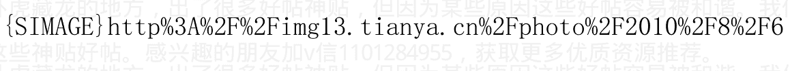

作者:海宁的马甲 日期:2010-12-08 12:15

有人质疑说“1971年以前黄金价格固定在35美元/盎司”，我没有回答。其实黄金在1971年以前是价格双轨制，有些时候市场价格是低于35美元的，有时候高于35美元。
美国的黄金兑换窗口，也仅仅是对他行央行开放，普通人是不能拿着美元跑去换黄金。

第二幅是非常有名的，它揭示了黄金在2005年7月左右的430美元/盎司，脱离美元的牵制，夺路狂奔。主要是人家以为中国人会狂买黄金。CNN，JP Morgan等在人民币开始缓慢升值后，马上把处于430美元的黄金的价格预期提高到780美元左右。
跑在别人面前，确实需要敏锐的观察与坚定的信心，还有耐心。

2001年以后，人民币和中国经济对于世界的影响是很大的。

加v信1101284955获取更多优质书籍推荐

### （十五）百年黄金价格变动周期规律，涨11年，跌8年

Aden Sisters研究了100年黄金价格的变动，作出了一幅黄金价格变动图。1969年以来，黄金每过7到8.5年就创低点。除了一次，黄金都是8年低位徘徊后进入11年上涨周期。

如果黄金继续这个周期规律，2011年到2012年黄金将到达1999年以来的高点，黄金很可能在2011年6月前后创1999年以来的新高，然后在2012年2月左右暴跌成灾。规律这么样子，是否继续有效，有待时间检验。

涨11年的规律，是否还有效

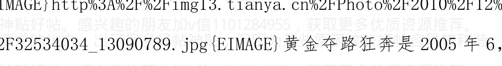

黄金夺路狂奔是2005年6，7月开始的，中国房价，股市也是2005.7开始的

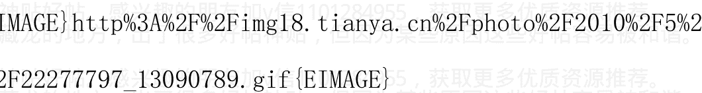

作者:海宁的马甲 日期:2010-12-08 12:25 插播一下，春节前是否会加息50个基点，“震慑”市场？

## 2010 年 11 月市场倒逼手握权柄的人加息 50 个基点？

引用：

### 当前的各种利率

作者：扬韬

http://hi.baidu.com/yangtao1968

时间：[ 2010-11-18 08:07 ]

- 1. 现行人民币存款基准利率：活期存款 0.36%，三个月 1.91%，半年 2.2%，一年 2.5%。（银行成本1）
- 2. 昨天上海银行间拆借利率：隔夜 1.73%，三个月 2.89%，半年 2.91%，一年 2.97%。（银行成本2）
- 3. 商业银行上存央行的法定准备金利率 1.62%，超存利率 0.72%。（银行收益1）
- 4. 现行人民币贷款基准利率：六个月内 5.1%，半年到一年 5.56%，一年到三年 5.6%。（银行收益2）
- 5. 温州市 2010 年 10 月全市贷款平均加权利率 6.99%。
- 6. 2010 年 7-10 月，温州市民间借贷利率（400 户样本）为 13.37%，13.94%，16.7%，16.62%。
9 月，10 月，温州民间利率上升明显。
- 7. 2010 年 7-9 月，温州市担保公司典当行等中介机构的资金利率分别为 35.65%，38.17%，39.19%。
8 月，9 月，温州民间利率上升明显。

### 8、美国10年期国债收益率2.86%。

比11月初上升了20个基点左右。美国房贷利率也上升了20-30个基点。

所以周洛华九论牛市的基础被废掉了（九论牛市的基础是长期利率被压制在低点）。6000亿美元的量化宽松，只是延缓美国房价再一次下跌的力度，而不是力挽狂澜。力挽狂澜按高盛的说法需要2到4万亿。而市场和美国社会不允许美联储那么疯狂。央行从来都是很强大的，但也从来不是万能的。

周洛华九论牛市的另一个观点，美元失去地位，2，3年内我看也不会实现。

周洛华的逻辑非常好，他的逻辑从8月底到10月很多市场的单边上涨就可以看到。

而且日本2006年以来，储蓄率一直低于2%，老龄化严重，年轻人储蓄不足，社会保障使得日本人也不储蓄了。

而且欧洲经济在2008年没有像美国那么严重下滑调整到位。

### 9、美国联邦基准利率0.25%。

### 10、日本基准利率0.1%。

引用完毕。

> 海宁评论：

我不是股评家。但是看看上面利率的对比，这几乎是在倒逼央行加息 50 个百分点的 pose。

我不怀好意的揣度，上次 10 天内二度升存款准备金，可能是因为加息方案被否决，所以用升存款准备金的办法，让商业银行去倒逼手握权柄的人加息。（利用上面的分歧？）

当然了，现在看看是事后诸葛亮，但是能读懂上面数据的人应该选择跑在别人的前面。

炒股的技术含量越来越高了，要看利率，又要看美元指数，还要看股指期货。

通货膨胀从 M2,M1 的推演也不是什么秘密，2010 年 789 月的通货膨胀，来自于 M2 增长高点 2009 年 9，10，11 月的贷款发放，与 M2 高增长。

通货膨胀也可以从 PPI 里推演。美联储在格林斯潘时代，很多时候是比 CPI 提前 6 个月加息(所以被笑称美联储经常在反他们大脑里的通货膨胀)，最后一次加息出现在 CPI 峰值的 6 个月前。格林斯潘，做了一个中央银行行长该做的活。但是中央银行也不是万能的。

可惜，2001-2004 年过低利率政策，使他晚节不保。

扬韬选择 M1 对照与物价指数的关系，结果发现，在提前 18 个月的时候，其相关系数高达 0.75，也即绝对正相关。换言之，M1 增速实际上是提前一年半反映着物价指数。

如果我们把视野放宽，我们会赫然发现，M1 增速与居民消费价格指数的提前反应体现在 12-20 个月的水平上。在此状况下，其相关系数都高达 0.7 以上。也就是说，M1 增速可以提前 1 年到 1 年半反映物价涨幅。

2010 年 1 月 M1 (38.9%) 最高（存款活期化，所以 2 月份出现负利率）--->2011.1--2011.6 通货膨胀恶化。

如果不反通货膨胀，2011 年下半年，通货膨胀将出现第三轮，第四轮恶化，而且蹿升速度加快。人心恐慌加剧。

| 统计月度 | 指标值（亿元） | M1 同比增长 | M2 同比增长 |
| :--- | :--- | :--- | :--- |
| 2009 年 6 月 | 193138.15 | 24.79% | 28.46% |
| 2009 年 7 月 | 195877.42 | 26.37% | 28.42% |
| 2009 年 8 月 | 200394.83 | 27.72% | 28.53% |
| 2009 年 9 月 | 201708.14 | 29.51% | 29.31% |
| 2009年10月 | 207545.74 | 32.03% | 29.42% |
| 2009年11月 | 212493.2 | 34.63% | 29.74% |
| 2009年12月 | 220001.51 | 32.35% | 27.68% |
| 2010年1月 | 229588.98 | 38.96% | 25.98% |
| 2010年2月 | 224286.95 | 34.99% | 25.52% |
| 2010年3月 | 229397.93 | 29.94% | 22.50% |
| 2010年4月 | 233909.76 | 31.25% | 21.48% |
| 2010年5月 | 236497.88 | 29.90% | 21.00% |
| 2010年6月 | 240580 | 24.56% | 18.46% |
| 2010年7月 | 240664.07 | 22.90% | 17.60% |
| 2010年8月 | 244334.55 | 21.90% | 19.20% |

作者：海宁的马甲 日期：2010-12-08 12:43
作者： 贝哥我爱你 回复日期：2010-12-08 12:27:59

你说得非常对。

我补充一下，石油90，豆粕3600是第一条线。石油95，豆粕4200，是第二条连美国欧洲都无法承受的高压线。

第二，房地产泡沫，很多人都是受益人，包括部分百姓。所以房地产泡沫要被吹到极致，才破。这个极致的底线，就是粮食价格不能超出底层的生存线。这个底层的收入是多少，可以说是1000人民币/

加v信1101284955获取更多优质书籍推荐

月，也可以说是当地最低工资的两倍。每个人的认定不一样。

- 3. 其实欧美教科书已经把“通货膨胀”的定义改了，改成“货币购买力的下降”

请问2009年“人民币的购买力”，有没有下降？我说有，买房买股票也是人民币的用处之一，房价涨了，股票涨了，人民币当然不值钱了。所以，人民币购买力的下降，2009年就开始了。

作者:海宁的马甲 日期:2010-12-08 13:09
（二十）东西方战争周期，难道仅仅是一次又一次的巧合吗？

经济资源（比如食物）的匮乏与歉收，造成国于国的紧张关系，容易引发战争。太阳对于地球的能源供应大约按300年周期在变。

罗马第一次布匿战争（公元前264年-前241年），对应中国的战国时期。

罗马第二次布匿战争（前218年-前201年），对应秦朝的统一与消亡（公元前221年-前206年），只差3到5年的时间距离。

我们再看看历史上最激动人心的一个年份，公元前202年。当年要是历史直播的话，那可是几千年难得一遇的战争年份。

公元前 202 年，这一年的东方，韩信 vs 项羽，韩信胜，成果归汉高祖。

公元前 202 年，这一年的西方，普布利乌斯·科尔内利乌斯·西庇阿 vs 汉尼拔，汉尼拔完败，罗马如日中天的日子来了。

### 公元前202年 hannibal 汉尼拔战败

扎马战役公元前 202 年 10 月 19 日，在第二次布匿战争期间，普布利乌斯·科尔内利乌斯·西庇阿（阿非利加的）统率的罗马军队 (2.5—3 万步兵，6000—8000 骑兵)在扎马 ( 北非古城，在迦太基西南 120 公里处，今卡夫地区)附近与汉尼拔统率的迦太基军队 (3.5 万步兵，2000—3000 骑兵，80 头战象)进行的一次作战斗，罗马骑兵从后边突袭迦太基人，罗马人打赢了这仗。

欧洲人把扎马之战作为改变人类历史的 100 场战役之一。

韩信项羽的垓下之战也应该写进人类历史的 100 场战役之一吧！

######

公元前 202 年，汉高祖 5 年 12 月，刘邦采纳张良的计策，分封土地给韩信、彭越，终于使二人听从刘邦的调遣，尽出其兵与汉军合围项羽，汉军兵分五路

- 齐王韩信率大军从齐地南下，由东向西夹击项羽
- 梁王彭越率军数万先南下再西进，合同刘邦本部逼退项羽
- 汉将刘贾合同九江王英布自淮北出发，从西南方对楚地进攻
楚军南线的楚国大司马周殷却在此时叛楚，会同刘贾英布，北上
合击项羽
刘邦率汉军 20 万从固陵东进。
汉军五路并进，总兵力近 70 万，项羽被迫率领 10 万楚军向垓下
撤退，12 月被合围与垓下，刘邦命刘贾英布从南边堵住项羽退路，彭
越从北边堵住，命韩信为联军统帅，韩信军 30 万与刘邦军 20 万合兵
一处，与项羽展开决战！！

韩信亲率三十万大军居中，为前锋主力；将军孔熙率军数万在韩
信军左方；陈贺率军数万在韩信军右方；刘邦率本部主力尾随韩信军
跟进，将军周勃率军断后，项羽情急之下率军猛攻韩信中军，韩信率
领中军且战且退，同时命令左右两军从两侧威胁楚军侧翼！战至下午，
韩信一退再退，楚军战斗队形越拉越长，而且始终无法抓住汉军主力
决战，这时左右迂回部队已经完成了对项羽军的合围，并从后边和两
翼开始进攻项羽步兵，韩信一看时机已到，立即将全部中军和刘邦的
主力部队投入反击，在如潮水般的几十万汉军夹击下，项羽被迫突围，
退回阵中，韩信随即全军压上彻底包围了项羽，此战楚军战死 4 万，
被俘 2 万，被打散 2 万，项羽只剩 2 万人退回，自此垓下之战大局
一定，后来就是四面楚歌、霸王别姬、乌江自刎了！

布匿战争（Punic Wars，或译布匿克战争）是在古罗马和迦太基
之间的三次战争，名字来自当时罗马对迦太基的称呼 Punici(布匿库

天涯是个卧虎藏龙的地方，出了很多好帖神贴，但因为某些原因这些好帖容易被和谐。我们现在正在收集整理这些神贴好帖。感兴趣的朋友加v信1101284955，获取更多优质资源推荐。

前3世纪开始，两国为争夺地中海沿岸霸权发生了三次战争：

- * 第一次布匿战争（前264年-前241年），主要是在地中海上的海战。开始在西西里岛交战，接着罗马进攻迦太基本土，迦太基被打败。
- * 第二次布匿战争（前218年-前201年），三个中最著名的战争。迦太基主帅汉尼拔率6万大军穿过阿尔卑斯山，入侵罗马。罗马则出兵迦太基本土，汉尼拔回军驰援，迦太基战败，丧失全部海外领地，交出舰船，并向罗马赔款。
- * 第三次布匿战争（前149年-前146年），这是一场罗马以强凌弱的侵略战争。罗马主动进攻，长期围困迦太基城，最后迦太基战败惨遭屠城，领土成为罗马的一个省份——阿非利加行省。

布匿战争的结果是迦太基被灭，迦太基城也被夷为平地，罗马争得了地中海西部的霸权。

再议东西方经济与战争周期，难道仅仅是一次又一次的巧合吗？

早在丝绸之路之前，在欧洲，中国，日本几乎没有任何交往之前，

欧洲，中国，日本都在相同的年代经历债务危机和利率飙升的情况。

1861年到1865年美国内战，其矛盾的积累，起始于1850年后的南方使用奴隶种棉花，与北方需要青壮年从事工业化劳动的矛盾。

1851-1864 年，华夏大地上的拜上帝教像一场瘟疫，来了又走了，期间江浙一带的文明，士族被严重摧残。

1929 年世界性经济危机与萧条后，持有社hui会主义思想的小罗斯福和希特勒上台，注意，他们都是持有社hui会主义思想的，做的也是缓解贫富差距的发放福利工作，希特勒在短时间内把德国工人的福利提高了80%以上，小罗斯福推行社会养老保险，工伤保险，孤寡保障等。

美国 1929 年大萧条后一个议员说过 “我不要MZ，给我一个强大的领导人，哪怕是个独c裁z者”。

## 作者:海宁的马甲 日期:2010-12-08 13:10
（二十三）阿姆特朗的书目 -- 站在以前巨人成就的基础上

阿姆特朗是站在一些以前巨人成就的基础上的。关键的好书其实也不多，就3，4本。好书不在多，智慧之书，千百年后照样熠熠生辉。

《国富论》亚当斯密 1776 年
An Inquiry into the Nature and Causes of the Wealth of Nations, by Adam Smith
《国富论》是阿姆特朗的经济学思想源泉。阿姆特朗极力反# 亚当·斯密与凯恩斯

## 理论要点：

一是“看不见的手”指导社会经济在“主观为自己，客观为他人”的情况下迅猛发展。

二是，国民财富在于人力资源及国民的生产能力，而非黄金、外汇储备、土地与资源。英国、德国、美国、日本等最重视教育的国家的经济发展经历充分证明了亚当·斯密的前瞻性见解。学生平均成绩世界前茅的新加坡、韩国再次证明了这一点。很多土地、自然资源、矿产自然丰富而人力资源没有被充分开发的国家的经济发展并不好，再次从反面证明了亚当·斯密的论点。

国民财富在于其人力资源，在于其人口的生产能力（科技水平和把科技转化为生产力）。

邓：科学技术是第一生产力。（这个科学技术，自然是由人所掌握的）

亚当·斯密主张自由市场经济、自由贸易，但是应该是在法制与道德约束的前提下的。亚当·斯密的《道德情操论》比《国富论》早出版。

自由市场经济在新教国家（德国、北欧、各个英联邦、美国）被证明发展得非常好，而在天主教占主体地位的国家相对发展得不怎么样。

新教是由16世纪宗教改革运动中脱离罗马天主教会的教会和教徒形成的一系列新宗派的统称。词源来自德语的“Protestanten”（抗议者）。德国牧师马丁·路德（Martin Luther, 1483年11月10日—1546年2月18日）是新教宗教改革的带头人，主张每个人都有权力解释圣经。

市场经济在儒家社会发展得也不错，除了大陆还在发展中，其他儒家社会都已经是发达地区了。

> 贝纳对于未来价格涨跌的预言（胜率45：1）1876年 by Samuel T. Benner
>
> Benner's Prophecies of Future Ups and Downs in Prices
> (Robert Clark, Cincinnati), 1876
>
> Google上有免费电子版。

阿姆斯特朗8.6年经济周期、18年货币债务周期、54年康德拉季耶夫周期、108年大债务周期的灵感来源之一。

> 《罗马帝国衰亡史》Edward R. Gibbons 1787年
>
> Decline & Fall of the Roman Empire, by Edward R. Gibbons 1787

从历史上探寻经济周期对于经济的影响。309.6年太阳周期、地球冷热周期、经济与文明起落大周期的研究基础之一。黑格尔关于历史通过“否定”（物极必反）与“否定之否定”（否极泰来）螺旋式上升的规律的历史验证。

# 《政治经济学及赋税原理》

On the Principles of Political Economy and Taxation, by David Ricardo (1772-1823)

David Ricardo也是《比较竞争优势理论》（Theory of Comparative Advantage）与《地租》（Rent）的作者。David Ricardo把农田地租解释成是土地上产出高于种植成本的超额部分。马克思把这个解释借鉴到剩余价值理论里，把工厂在成本以外的利润解释成剩余价值。

# 《史上最大的牛市》1986年马丁·阿姆斯特朗本人所著

The Greatest Bull Market in History, by Martin A. Armstrong 1986年

作者：海宁的马甲 日期：2010-12-08 21:42 作者：和孩子一起长大

回复日期：2010-12-08 19:21:49

我想请问下，普通老百姓该怎样抵御通货膨胀？

在4万亿出来的那个时候买房子买股票。

在股票房子涨了之后，买粮食与农业股，因为N万亿刺激肯定刺激肉类的消费量。

- 4、5斤谷物，才能转化成一斤肉。（牛肉的话，要8斤左右的饲料）。

在连续2、3次加息之后，抛弃房子、股票等资产。（因为房子、股票，是按以前的低利率的基础上定价的，在低利率下价格被高估了），转而暂时持有现金。（如果相信1997-1998东南亚危机会在中国重演，则持有美元、美国国债，美元10年内发行量其实翻了一番，相比而言没有那么恐怖，市场价格已经过度看贬美元，也就是说，美元是对最贱、最便宜的东西。当然，如何买在最低点，是个技术活。）

至于时间点，是很难把握的，没有人能100%掐准时间点。

> 作者：海宁的马甲 日期：2010-12-09 10:32 美国市场利率飙升，国债泡沫可能开始破灭，更剧烈的通货膨胀不可避免

前天，奥巴马同意延长布什的减税计划，并且增加新的开支项目。在美国财政赤字恐惧下，人们纷纷抛弃国债，国债收益率暴升，真的是2009年6月以来最大的单日爆升。昨天继续上升。昨天美国财政部竞价发行的210亿美国国债的收益率达到3.34%，而2个月以前大致是2.6%左右。（嘿嘿，想增加赤字，那么发债成本就不得不上升了）9月份的《理性预测房价下跌时间表》不够严谨的地方，就是没有说明美国的按揭贷款利率是市场定的，美联储只能决定短期拆借利率，无法决定市场长期利率。

美国国债利率飙升，资金开始流出国债市场。剧烈的通货膨胀不可避免，石油上100美元非常可能了，国际粮价涨到多少，高不可测。

美国30年期贷款利率已经上涨50个基点，美国房价将继续下降，幅度不好说。

- 3个月 0.12%
- 6个月 0.17%
- 2年 0.63%
- 5年 1.87%
- 10年 3.27% （两个月前，这个十年期国债收益率在2.6%以下）
- 30年 4.45% （两个月前，这个30年期国债收益率在3.8%左右）

作者：海宁的马甲 日期：2010-12-09 22:40 作者：laowangbj 回复

日期：2010-12-09 22:05:54

我估计春节前央行会加息25个基点。

但是，这种非连续性的小幅加息，根本扭转不了通胀预期。

其实，对于那些想房地产泡沫早点破灭的人而言，越不加息越好，越不调控越好。

你看，要是2010年4月份不调控，今年的飙升肯定更厉害，泡沫就会走完最后一程。

所以说，中国房地产泡沫之所以时间超长，很大的一个原因是调控。调控延缓了暴涨的速度，延迟了泡沫的破灭。

看接下去的7个月的通货膨胀吧。2007年底-2008以杀股市为结局，这次房地产在劫难逃。但是对于整个国家和民众都是灾难。房价暴跌的后果很严重，看看美国、爱尔兰就知道了。

但这不是唱空者的错，这是把房价在2007泡沫基础上再次上推的人的错。

> （凑巧的是猪肉也要到2011年的7月或者9月左右才开始掉头向下，2012年养猪的肯定进入亏本区域）

作者：海宁的马甲 日期：2010-12-10 22:44 作者：laowangbj 回复 日期：2010-12-10 19:53:33

央行宣布再次上调准备金。这又是一次象征性的行动，年内恐怕不会加息了。

国际商品期货市场今晚可能有比较大的涨幅。

投机者只有追逐在“第四次加息前”都比较安全的粮食价格泡沫了。（2010年10月算是第一次加息）。

或者追逐相对不那么安全、暴利空间已经很小的矿产资源、石油等。

石油破100应该是个时间问题而已，不过那个时候美联储也会加息，但是加息后泡沫不会马上破，加息后往往需要3到6个月时间。

> 作者：海宁的马甲 日期：2010-12-11 12:15 作者：bu20050 回复日期：2010-12-11 11:45:07
>
> 海宁，你说的“投机者只有追逐在‘第四次加息前’都比较安全的粮食价格泡沫了。（2010年10月算是第一次加息）。”，11月10日和11月19日五次上调存款类金融机构存款准备金率这个不算你说的加息范围吧？你是指利率上的才算一次吧？

调存款准备金不算。

调存款准备金只是加剧贫富差距而已。

调存款准备金率之后，贷款利率不变，但是难度不变。熟悉银行的都知道，80年代、90年代，有所谓的“银行利差寻租”空间。具体数据大约是累计几千亿。也就是说，能贷到款就是赚到了，比如现在温州，如果你有渠道以7%贷到款，转手以15%借给可靠的熟悉了几十年的人。两个人都能赚到钱。然后银行的那个人，可以拿佣金。

1993年以后，贷款之后囤什么都赚钱，钢筋水泥一个月就涨20%也很正常的。

为什么银行后来坏账剥离1.4万亿。部分就是当年的被寻租失败后的。

一个大家族，管不好钱，再富也迟早被挥霍一空。

管不牢钱的国家，也类似。目前各地都希望在最后的两年里多上项目，上项目就要招标，招标，你就知道会发生什么寻租事件。

被掏空后，最后买单的，就是那些房子套牢盘，因为通货膨胀使得底层没有实力买单。

就像2008年买单的是股票套牢盘。

无法寻租的，或者不是别人吃肉自己喝汤的，都是利益受损者。

只是目前房价还没有跌，很多人以为自己是获益者而已。

1997年3月，美联储加息到5.5%，刺破东南亚泡沫。1999年，香港贷款利率月9%（目前大约是3%）

1990年，日本利率上涨到7%左右，刺破房地产泡沫。

中国的房地产泡沫，按美元价格涨幅算，超过美国、日本、东南亚，时间也超过，因为没有任何地方大员愿意减速，而软蛋也没有魄力坚持，或者本无意坚持。

我们在房地产破灭后，来预测惨状，这种状况可能超出任何人，包括我的预期。也许是不同版本的印尼。（1997-1998当时印尼食品价格涨幅累计200%）

我国今年11月CPI同比上涨5.1%再创年内新高

（记者李刚）2010年12月11日

中国网北京12月11日讯（记者李刚）国家统计局今日公布包括CPI在内的11月份各项经济数据。

我国11月份居民消费价格（CPI）同比上涨5.1%，环比上涨1.1%

居民消费价格涨幅扩大。今年1到11月份居民消费价格（CPI）同比上涨3.2%。

工业品出厂价格（PPI）同比增长6.1%，环比上涨1.4%。今年1到11月份工业品出厂价格（PPI）同比上涨5.5%。

食品价格上涨11.7%，非食品价格上涨1.9%。

社会消费品零售总额13911亿元，同比增长18.7%。

作者：海宁的马甲 日期：2010-12-11 12:18 作者：上善若水 11ABC

回复日期：2010-12-11 12:04:47

> 叫川川签个生死状，如果哪天经济崩溃，取他颈上之物，没收九族全部资产

川川是冤枉的，我需要强调多少遍？

> http://www.cbrc.gov.cn/chinese/home/jsp/docView.jsp?docID=2420

# 《中国人民银行法》

第三条 货币政策目标是保持货币币值的稳定，并以此促进经济增长。

第五条 中国人民银行就年度货币供应量、利率、汇率和国务院规定的其他重要事项作出的决定，报国务院批准后执行。

作者：海宁的马甲 日期：2010-12-11 12:21 2004年6月8日央行行长周小川在济南、南京等地调研时“利率变动要跟上价格变化，否则会形成负利率，导致居民消费行为和消费倾向的变化”的讲话。

- 央行研究局郑重声明：加息方案的报道纯属捏造
- 2004-06-22 08:13:30 《北京娱乐信报》

# 在坊间流传的加息方案传闻被央行斩钉截铁地否认了。

昨天中国人民银行研究局发表郑重声明，称媒体对央行加息方案已经上报国务院的报道纯属捏造。

此前国内一家财经类报纸援引2004年6月10日央行研究局一位不愿透露姓名的人士的说法称，“央行加息的具体方案已上报，加息面临的主要是一个时机选择的问题。”并以2004年6月8日央行行长周小川在济南、南京等地调研时“利率变动要跟上价格变化，否则会形成负利率，导致居民消费行为和消费倾向的变化”的讲话加以佐证。该媒体还预测，加息将采取“温和的步骤”，“最大的可能是存款利率提高0.25个百分点，贷款利率提高0.50个百分点。或者是存款不动，贷款提高0.25个百分点。”

但昨天这一消息的“源头”——央行研究局在央行网站上发表郑重声明：“上述报道纯属捏造，根本没有事实根据。”声明的落款是6月19日。这是央行第一次公开否认关于加息方案的传闻。在此之前，包括行长周小川在内的央行官员从未正面否认过加息猜测，而是婉转表示：“央行正在评估5月份的经济数据，如果5月份的数据不太好的话，中国央行将采取进一步的举动，包括可能采取全面上调利率的行为。”

央行从去年起屡次出手收紧银根，到5月末货币政策效果已经显现出来，金融机构各项贷款增长偏快的态势明显减缓。但加息的压力依然存在，财政部某副部长曾在讲话中表示：“希望货币政策能够更强硬些。”市场上对央行加息的预期更是有增无减。

## 央行公布的2004年2季度全国城镇储户问卷调查结果

也显示，有72.9%的居民对当前存款利率低不满意，这较上季提高2.2个百分点，较上年同期提高2.6个百分点；而认为利率适度的居民人数仅占25.9%。广州一些商业银行的个人住房按揭贷款甚至出现了提前还贷的热潮，因为借款人都希望尽量赶在升息前多还贷，减少利息损失。

> 昨天，央行在声明的最后表示：“对于此类报道给中国人民银行研究局及其工作人员所造成的恶劣影响，中国人民银行研究局保留进一步采取必要措施的权利。”（记者甄世宇）

作者：海宁的马甲 日期：2010-12-11 12:45 （二十六）经济信心4.3年上涨与4.3年下跌的再分析

经济信心、信用与财富。

1989年1亿人口的日本的国民账面财富，计算成美元，可能比美国人都多。

1995年，日本的GDP是美国95%，那个时候日本还是贸易顺差，而现在只有50%。

2008年，世界很多“账面财富”蒸发了？因为发生了信用危机，或者说债务危机。

在现今社会，财富的增加，一方面是由于确实生产的财富除了消耗掉的，能积累下来一部分。

一般西方社会，平常时期，积累的社会财富，是一年GDP的5倍左右。

但是，当社会的经济信心高涨的时候，投资者愿意出更多的钱买东西，不管是房产、黄金，还是股票、古董。

钱的流动速度加大了，炒房的、炒古董的多了，钱的流转次数多了，很多有形资产、无形虚拟金融产品的价格上去了，大家都觉得有钱了。这是经济信心越来越强的螺旋式上升时期。

当然，总有到顶的一天，当一些人认为资产价格、股票价格过高，先结账的时候，就开始了相应的螺旋式下降的过程。

“螺旋式上升时期”和“螺旋式下降”时间是几乎相等的。

金融信用，即借入或者借出资金。在许多场合，金融信用也可以指借债方关于偿还债务的信誉和能力。

信用也可以理解各个借出方为对于债务人偿还债务的能力信心。所以，银行市场化的国家，在经济萧条时期，再怎么鼓励，私有银行就是不借钱给公司与个人。因为那时私人的钱，借出去，银行认为坏账会有很多。

而有些国家，可以通过潜规则要求银行贷出去，支持经济发展，自然以后的坏账比例比较高，因为是用于萧条时期的投资。

### 结论1.

经济信心强的时候，各种资产、财富的估价就高，社会财富的账面价格就高，不一定是表现在股市上，也可以表现为房地产等有形资产。

经济信心极低的时候，各种资产价格都很低，社会总财富的账面价值大大缩水。

### 结论2.

能逃顶的永远是少数，美国GDP14万亿，货币供应量8万亿，但是社会总财富2007年是70万亿，2009年是50万亿，20万亿美元2年间，因为经济信心下降而蒸发。2007年的70万亿美元资产里，肯定只能部分能换成美元（或者美国国债）。

中国房地产总价值如果是90万亿到100万亿的话，而货币供应量“只有”68万亿，GDP只有35万亿人民币，能提前结账换成人民币的，是少数中的少数。

### 结论3. 安全的国债在经济危机发生后，价格会大涨（收益率下降），

比如现在2010年，美国国债处于泡沫中期，要等到2011年3月或者9月，美国国债泡沫才可能破。

### 信用紧缩

信用紧缩（或信贷紧缩），现代信贷经济中资产流动性降低时的经济现象或时期，表现在借贷困难、现金难求。

简单的说，就是借出钱的人，对债务人的信心下降，不愿意借出钱了，就这么简单。一般发生在一场本来根本不会破产违约的公司或者国家，却发生了违约的情况后，比如1998年7月20日俄罗斯国债违约后，2008年雷曼破产违约、AIG几乎破产的时候。

信用紧缩后，钱的流动速度下来了，大家都不买股票、不买房子、不买汽车了，不买黄金（注意当时黄金是跌的）、不买大宗商品、不买奢侈品了，总之就是除了安全的债券，比如国债，其他的都不买了。

走势图最能说明问题（1980年到2010年8月，美国股市、日本股市、德国股市、大宗商品CRB价格指数的走势）。

图中白线是美国标准普尔500股票指数的走势。

注意87年10月19日美国股市那个暴跌（这一天刚好与ECM经济信心模型的中期高点差一天，如果没有1985年9月后，G5西方五国对汇市的干预，让美元2年多贬值40%，87年10月是不会如此大跌的）。

红线是CRB大宗商品价格指数。

注意88、89年、98年底、2008年下半年，当高昂的世界商品价格把世界拖入经济萧条的时候，大宗商品也到了暴跌的时候，而且暴跌得特别快，半年就能跌去1/3。

再注意大宗商品价格1980年中被美联储用高利率打下去后，20年都没有飞涨过，到2001年底才开始10年左右的牛市筑底，2008年7月到达高点。

蓝线是日经股票指数。

注意1989年12月29日那个高高的高点（ECM经济信心模型的顶峰是1989年12月13日）。

再注意2007年2月，日经股票指数到达高点后，暴跌到2009年3月。是否可以理解为日本在2002年后，日本央行的定量宽松政策，虽然没有把日本拖出通货紧缩，但是“日元套利者”把日本的低利率资金借出去，投资到世界各地的房地产衍生金融产品上，进行套利，从而为世界提供了相当部分房地产泡沫的资金。很多东欧的房地产贷款，就是日本资金套过去的。当日本央行2007年2月，把基准利率从0.25%提高到0.5%，对于高杠杆的“日元套利者”来说，是巨大的利率上涨。

紫色是德国 DAX 股票指数。

再注意 2002 年底,2003 年初,4 种指数有什么共同点? 他们都处于 2000 年 3 月后的低谷。世界泡沫时间不是很同步，世界衰退的时间倒是如此的同步。联想 2008 年底到 2009 年 3 月，世界衰退也是非常同步的，世界大部分指数都处于非常低的底部。

再看看四种指数，看上去 2010 年下半年,2011 年上半年，是否还要一跌?

> 结论：世界衰退是非常同步的, 但是泡沫繁荣因为“资金聚集效应”是不同步的, 比如美国在别人 1998 年 7 月衰退后, 泡沫撑到了 2000 年 3 月。


作者:海宁的马甲 日期:2010-12-11 12:53 (二十一)一些东方人发现的周期性数字

- 6
- 9
- 12
- 54
- 108

## 引用：

> 红楼梦

有一位久负盛名的“红学”大师称，《红楼梦》的谋篇布局极为讲究，且暗合数理——其情节发展以每九回为一个周期，而且每九回中的第五回必然是高潮部分，是为“九五之尊”。该大师还推断，曹雪芹原著一共是 108 回，其理由是：9 为阳数之极，12 为阴数之极，二者相乘即为 108。曹雪芹因此被认为有极为强烈的数字崇拜思想。引用完毕。

而我认为，曹雪芹应该是看多了听多了商业价格周期与家族，政治兴衰史的。9 年是一个价格涨落周期，也是商业经济周期。18 年是债务小危机周期。见下图。而 108 年是最大轮的货币与债务危机周期，这种大债务危机可以引起家族兴衰，政治动荡。几千年来一直在上演，阿姆斯特朗有历史数据。见下图。

有人问，科技迅猛发展后，这些时间与经济周期是否会缩短，遗憾的是，基本没有缩短，Benner 贝纳 200 多年前发现生铁价格的 8-9-10 年规律与经济与货币危机周期 16-18-20 年规律的时候，还没有电话加v信1101284955获取更多优质书籍推荐

电报。

经济规律后面的是人性，是人的非理性“追涨杀跌”。人的非理性“追涨杀跌”不变，则经济规律的时间跨度很可能也不变。计算机时代没有迹象显示人变得更理性了，经济周期更平缓了。

即使是中国的通货膨胀周期，也是8，9年左右来一回，1980年通货膨胀--》8年后，1988年物价闯关-》6年后，1994年通货膨胀率24%以上 --》9年后，2003年通货膨胀--》8年后，2011年通货膨胀（2010年只是个通货膨胀的引子，通货膨胀比如在大米小麦猪肉价格暴涨中迎来高潮）--》2019年到2021年通货膨胀--》2021后很多事情也许不一样了。

扑克牌的每一花色是13张，13也是Fibonacci数之一。

四套花色总共52张，加上大小王是54张。52，54年暗合康德拉季耶夫世界经济长波周期。

54x2 = 108，而108年是世界货币危机长周期。

Fibonacci 费波那奇数列：1，1，2，3，5，8，13，21，34，55，加v信1101284955获取更多优质书籍推荐

89, 144, 233, 377...

## Samuel T Benner 贝纳在自己的生铁厂被商业周期价格暴跌搞破产后，潜心研究价格周期规律。

贝纳注意到，价格，特别是生铁的价格，最高点遵循一种重复的 8—9—10 年模式。即如果这一轮价格 8 年后到顶，那么下一轮是 9 年到顶，第三轮 10 年才到顶，然后轮回到 8-9-10。

而金融恐慌遵循 16—18—20 年模式，即如果一次金融恐慌出现在 16 年后，第二轮金融恐慌出现在 18 年后，第三轮出现在 20 年后，然后再循环到 16-18-20。

这样 3 轮金融恐慌 3 X18 =54 年后，巨大的危机与挑战会出现，政治遇到极大的压力，一般家族能凭借前两辈人打下的财富与威望积累度过难关。

这样 6 轮金融恐慌 6 X18 =108 年后，巨大的债务危机会出现，家族会有由兴转衰，朝代会有更替的可能。基业雄厚的也能度过 108 年大关。

贝纳死后的 108 年，贝纳预测的赢率是 45 比 1。

54 年也差不多是父子两辈人创业并进入辉煌时期的时间。这种情况下，一般儿子是从小跟随父亲征战沙场或者商场的，比如李渊李世民父子，公元 599 到 617 年是李渊不断积累实力，引而不发的阶段。这一阶段，我们可以想象李渊是何等重视培养李世民等几个儿子的。

公元 617 以后 30 多年就是李渊李世民建立大唐基业的时间。因为李世民实在太有才了，这个基业太牢固了，很难被武则天（死于 705 年，705-599 = 106 年）撼动的。

公元 599 年，罗马陨落。公元 599 年。李世民出生。

下图是阿姆斯特朗发表于《周期》双周刊杂志 1989 年第 6 期。

文中预言 1989 年 12 月 13 日世界经济到顶。文中显示 2003 年既是美元危机 18 年周期的爆发点，又是 108 年危机周期的爆发点。

2003 年，很多美国经济学家讨论如何让美元有序贬值，Jim Oneill 长篇累牍，叙述美元贬值 20%，30%，40% 的各种可能情况。

文中也列出了 1998 年 7 月 20 日的高点，和 2002 年 10 月左右世界经济 8.6 周年的底部。

文章发表于 1989 年 10 月。

{SIMAGE}http%3A%2F%2Fimg9.tianya.cn%2Fphoto%2F2010%2F8%2F20%2F27384392_13090789.jpg{EIMAGE} {SIMAGE}http%3A%2F%2Fimg9.tianya.cn%2Fphoto%2F2010%2F8%2F20%2F27384409_13090789.jpg{EIMAGE}

作者: 海宁的马甲 日期:2010-12-14 13:47 作者: 江南纳税人 回复日期: 2010-12-13 22:01:55

我今天打电话给农行的信贷员谈关于还贷的事情！信贷员专程 赶来叫我这个月不要还，等下个月再说！而且告诉我明年我公司的信贷额可比今年增加20/100，我不知道这是个什么信号？难道真的是要继续宽松货币吗？

应该是保留贷款额度的做法。你知道，现在贷款额度很宝贵。(今年贷款基数大，明年贷款可以发放更多，不能贷款的话，拉再多的存款都没有用), 计划体制。

货币供应量的增长率，低于15%，泡沫有破灭风险；高于17%，通货膨胀会更厉害。

2010 年的增长率，大概在20%左右。如果真的执行年初的目标17%，房价不会这么大涨。今年第三季度，又踩了一次油门。

作者: rajeevisanidiot 回复日期: 2010-12-13 22:07:41

我今天去银行都在说准备金 银行更怕调准备金,,, 加息反而好点

加v信1101284955获取更多优质书籍推荐

所以怎么可能信贷还宽松呢？

发达地区的竞争力强的银行，愿意加息，这样他们拉存款就方便多了。

调准备金，限制了银行盈利空间，也限制了降低了银行的风险敞口。

现在是乱象。什么乱象。银行贷存比很高很高，也就是说，加存款准备金后，银行没有资金可以贷出去了。

中国经济，靠外贸顺差，导致的外汇占款的比例越来越大了。也就是说，外贸形势的巨变，比如顺差突然减少，会导致比2010年5月还严重的问题。

现在要看欧美需求的减少了，欧洲需求应该减少更多。

作者:海宁的马甲 日期:2010-12-27 01:06 作者: tewu008 回复日期: 2010-12-26 13:18:01

看到加息的新闻，特意来顶海宁，

海宁大侠再来解读解读吧。

二次加息，确认了中国进入加息周期，但是暂时一切都不会有什么改变。

等待2011.3--2011.6的通货膨胀剧烈恶化。

石油在涨，到2011.3涨过100美元/桶的可能性很大，110都可能。

加v信1101284955获取更多优质书籍推荐

粮食12月也在涨，而且幅度不小，如此速度涨下去，到2011.3--2011.6，这个世界就很难承受石油和粮食价格了。

二次加息到2.75%，即无法有效控制通货膨胀的恶化速度，也不能刺破房地产泡沫。

更进一步，再加两次0.25，加到3.25%，也无法控制通货膨胀，无法刺破房地产泡沫。

看看2011.3---2011.6如何用行政手段控制国内的粮价和石油价格了。

如果2011上半年，想2008年上半年那样控制国内粮价，那么2011年底，2012年中国的粮食供应安全就看老天爷了。

如果2011上半年，压制国内粮价，明显低于国际粮价，2011年下半年天气继续不好的话，那么2011年底，2012年中国食品价格是否会像1998年印尼那样涨个200%左右？

作者: 海宁的马甲 日期:2010-12-28 09:30 四论的新贴被封了。涉及到某个内容了。

http://www.tianya.cn/publicforum/content/develop/1/541636.s

加v信1101284955获取更多优质书籍推荐

作者：海宁的马甲 日期：2010-12-28 11:37 新贴被封，那就发旧文。

不知道是不是我的表达有问题，有人居然从下面的文章读到了2010年10月后，人民币就该马上贬值。我其实没有这个意思。

我是说人民币升值预期的消失在2010.10到2011.12，当然应该不需要到2011年底。

索罗斯也在等这个转折点。

### （二十七）人民币汇率在2010年10月到2011年从升值预期过度到贬值预期的议题

人民币市场汇率是有管理的，所以市场汇率主要看管理者。

我们能分析的，是人民币汇率的均衡价位在哪里，从而得出人民币是存在升值预期还是贬值预期。

什么是人民币的均衡汇率？

在我看来，2007年以后，中国贸易存在顺差，但是顺差小于GDP的2%的人民币汇率，即一年顺差小于1000亿美元的时候的人民币汇率，就是均衡汇率。

加v信1101284955获取更多优质书籍推荐

#### 人民币兑美元的均衡汇率取决于什么？

取决于中国的通货膨胀速度，劳动力价格上升速度，和美元指数的位置（美元对其他货币的汇率）。

- 2009年12月，美元指数80左右，人民币对美元均衡汇率约为6.65
- 2009年6月，美元指数平均85左右，人民币对美元均衡汇率约为6.93

2010年12月，如果美元指数在80，如果美国通货膨胀仍旧是-0.1%，中国通货膨胀如果是8%，则人民币的均衡汇率是稍微低于7.182

```
6.65×108%
```

- 如果2010年12月，美元指数在90（美元对其他货币升值12.5%），假设中国对美国贸易占中国出口的25%的话（贸易比重，我没有去查数据）
- 则人民币均衡汇率约等于

```
7.85 = 7.182 * (1 + 0.75×12.5%)
```

即美元对其他货币升值12.5%的话，人民币的实际汇率对美国没有任何变化，但对美国以外的占中国贸易量75%的地区，则是跟着美元升值了12.5%。

外汇市场极其多变，我只知道美元指数在80的时候的下降空间很小，而上涨空间比较大。

所以，香港与大陆房地产泡沫何时破灭，美元指数的影响最大，其次才是国内的通货膨胀速度。

2010年，中国的对外贸易顺差可能小于1000亿美元，2010年的人民币汇率，总体接近贸易均衡汇率。

银行贷款的增长虽然也是天量，但没有2009年厉害，2010年4月开始，基础货币紧缩与扩展交替进行，股市也跟着上窜下跳。

#### 有效汇率

人民银行的胡晓炼说要开始教育人民使用有效汇率。

有效汇率是人民币对各个货币的汇率的加权平均值。

比如，2009年5，6月，美元指数大涨，人民币的有效汇率实际上跟着美元升值，同样人民币能换到的欧元少了，人民币的有效汇率升到了6.93。

美元指数7月下降后，人民币跟着美元对欧元日元等货币贬值。人民币即使对美元从6.83升到7.78，但是人民币对欧元日元其实还是贬值的，因为7月美元对欧元日元贬值更多。

对下面图的理解。

人民币购买力平价PPP3.75与市场汇率6.83的评价：

3.75/6.83 = 55%

即中国55元能买到的东西与服务，大致等于100元人民币相应的美元在美国能买到的东西与服务。

处于发展阶段的国家，其市场汇率都是打折扣的，中国是55%，

1980年的韩国是60%左右，现在是65%左右，（所以韩国顺差多，韩国国内房价高物价高，出口企业现代三星的员工工资高，韩国人均GDP都2万多美元了，还保持如此贱的韩元汇率，要感谢韩国人民对与物价与房价的忍受力）

1980年的马来西亚是80%左右（顺差肯定很少），现在是40%，所以现在马来西亚的贸易有顺差，外贸竞争力强，不过消费能力弱（都是97金融危机闹的，想多存点美元）。

加v信1101284955获取更多优质书籍推荐

德国日本，汇率从原来的打折到55%左右上升到140%，（高出美元购买力的40%），得益于他们超强的生产科技水平，特别是“资本品”（机器设备比如纺织机经编机）领域。

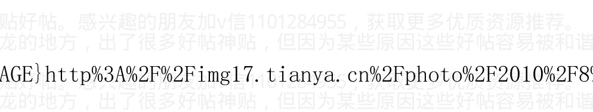

作者:海宁的马甲 日期:2010-12-28 11:39 (二十八)回答经济规律是否适用于中国的问题

经济规律普遍适用与古今中外，是西方人比较系统地发现了经济规律，就像他们发现了地心引力规律，与电磁场规律，并不是他们发明了经济规律。

一个人在河上筑个大坝，只能挡住部分的水，并不能推翻水往下流的规律。

任何政策，只能扭曲经济规律，并不能推翻经济规律。

> 经济规律最简单的表达就是“天下熙熙，皆为利来，天下攘攘，皆为利往”。

资本向“收益率”回报率高的地方去，就像水往低处流一样正常。

只是人有时候有群体性误判，导致经济泡沫的发生与破灭。

因为经济利益，商人历经艰辛，开辟丝绸之路。

因为经济利益，广东和其他地方曾经因为汽油价格管制而排队加油，1970 年代美国曾经也是因为价格管制而排队加油。

因为经济利益和价格管制，某些商人在不能加价的情况下，选择降低份量和质量。

因为经济利益，价格管制和经济博弈，浙江人遭遇大规模停电，因为电力价格与成本线太接近，无利可图。涨价在通货膨胀情况下又不被允许。（太后悔2009年没有涨价了）

至于发电与电网成本是否合理，则是另外一个议题。

越是对经济规律理解得深，越能找到发展经济的“良方”，至于能不能被采用，则是另外一个议题。

亚当斯密1776年就说了，一个国家的财富，在于一国的人力资源及其生产能力，而非黄金，外汇储备，土地或者矿藏。当西班牙法国等还在陶醉于大量黄金的时候，德国，英国，美国更快更好的普及了教育。日本后来跟上了，再后来韩国新加坡的教育水平也名列前茅。

### （二十九）投资者 8.6 年，3142 个日日夜夜的心路历程


作者:海宁的马甲 日期:2010-12-28 11:49

这是以前的一篇旧文。

## 一句话简评各个年份的经济，贷款增长率与房价增长率。

1999 年，2000 年：适度从紧的货币政策使得贷款很难，某些地方zf不得不用蓝印户口吸引大家去买他们那里3000/平方米的房子。房价接近砖头钢筋水泥市政配套的成本。没听说 1999，2000 年的建筑企业，房地产企业有太多倒闭或者亏本。

2001 年：加入世贸组织，经济起步进入快速发展车道，房价抬头，但是涨得不厉害。

2002 年，经济在 2001 的基础上更快了一点，房价涨得更多了一点，但是没有飞涨。

2003 年，经济已经开始有过热的苗头，但是因为发生了非典，为了展示社会主义经济迎难而上和领导有方，银行贷款的闸门放开了，房价飞涨了。

加v信1101284955获取更多优质书籍推荐

2004年，经济一如既往的好，有底气放心收缩银根（降低贷款增长速度）。

2005年，经济形式还是一片大好，有本钱继续收缩银根。这个政策非常得准确。

要是一直采取2004年，2005年的适度从紧的货币政策，现在很多收入较高的夫妻（夫妻一方年收入10万，另一方5万），都买得起房，而且生活不错。

但是，可惜，历史没有“但是”。

2006年，经济还在赶往这一轮繁荣周期的顶峰。但是，可惜，房价降温后，不知道为什么，银行贷款的水龙头又被拧开了。

2007年，经济发展达到了这一轮繁荣周期的顶峰。可惜，银行贷款的水龙头还是没有被关上。

2008年，中国实体经济进入了任何市场经济体都不可避免的下降通道。即使银行贷款增长率还是像2006，2007年那么高，房价却稳中有降，出现了退房潮，失业潮。

2009年，实体经济进一步下滑。水龙头太小，改用打开消防阀门的方式“灭火”。房价涨幅大于1.5%。

2010年，上半年，贷款新增4.6万亿左右，比2009年少，但是对于35万亿的GDP来说，也是天量。属于最后一副兴奋剂。如此天量，房价降不了，通货膨胀控制不了。

2011 年下半年，货币紧缩，信贷紧缩，不得不发生，否则 2010，2011 两年，很多物价就可以翻番。（中国物价暴涨，最后一定要看猪肉，猪肉暴涨才是物价暴涨的发疯阶段）

货币银行学角度总结：2005 年，以及 2005 年以前，货币政策还是非常理性的。周某说 2006 年货币供应量略显过多的评价，也是非常准确的。

## 非经济学非专业的总结：

2003 年很关键，非典就像历史上的大地震一样，对领导与群众的心理造成极大的冲击。

非典对于中国个方面的心理影响程度，不亚于 1923 年的日本关东大地震。

（别的地震带一般是 2 个大陆板块的交界处，而东京是 4 个大陆板块的结合处，是世界的大城市里最最危险的可能的地震震中，前 200 多年里，东京大概每过 70 到 74 年来一次大地震，共 3 次，现在过去 87 年了，还没有大地震发生）

1993 年 6 月国十六条。黑格尔：人类没有从历史中吸取教

> 黑格尔是对的，黑格尔是对的，人类从历史学到的唯一的东西，就是人类没有从历史中吸取任何教训。 ---- 乔治·萧伯纳

> Hegel was right when he said that we learn from history that man can never learn anything from history. George Bernard Shaw

## 93 年 6 月国十六条。黑格尔：人类没有从历史中吸取教训

历史是一面镜子。历史总是在“物极必反”与“否极泰来”中螺旋迂回式前进的。

历史不得不承受试错法，即加息 0.27%，或者 0.54%，通货膨胀还是继续，然后继续加息，继续通货膨胀，直到最后猛烈加息，通货膨胀才被打败。

2010 年 9 月的事情，其实往前推 17.2 年（8.6×2）就能发现有趣的相似性（但是绝对不会一模一样）。

中国货币危机，也是 18 年左右一次。

2011，1993，1975，1957（计划经济下的隐形通货膨胀，主要表现为有钱买不到东西，排队，与粮票肉票）

2010.7 - 17.2 = 1993.5，即 1993 年 6 月 30 日左右。

日记：

1993年6月22日

在驻地同三讲谈话。赞同三讲提出的加强宏观调控，突出抓金融工作的建议。

指出：什么时候，政府都要管住金融。通货膨胀，人民受损失。人民币不能贬值太多，市场物价要控制住。

1993年6月22日

日记引用完毕。

1993年6月24日，中共中央、国务院印发《关于当前经济情况和加强宏观调控的意见》。《意见》指出：我国经济在继续大步前进中也出现了一些新的矛盾和问题。要积极、正确、全面地领会邓小平南方谈话和党的十四大精神，把解放思想和实事求是统一起来，切实贯彻“在经济工作中要抓住机遇，加快发展，同时要注意稳妥，避免损失，特别要避免大的损失”的重要指导思想，把加快发展的注意力集中到深化改革、转换机制、优化结构、提高效益上来。《意见》提出了严格控制货币发行，稳定金融形势等十六条加强和改善宏观调控的措施。

《关于当前经济情况和加强宏观调控的意见》十六条摘要：

- 一、严格控制货币发行，稳定金融形势。
- 二、坚决纠正违章拆借资金。
- 1. 灵活运用利率杠杆，大力增加储蓄存款。
- 2. 坚决制止各种乱集资。
- 3. 严格控制信贷总规模。
- 4. 专业银行要保证对储蓄存款的支付。
- 5. 加快金融改革步伐，强化中央银行的金融宏观调控能力。
- 6. 投资体制改革要与金融体制改革相结合。
- 7. 限期完成国库券发行任务。
- 8. 进一步完善有价证券发行和规范市场管理。
- 9. 改进外汇管理办法，稳定外汇市场价格。
- 10. 加强房地产市场宏观管理，促进房地产业的健康发展。
- 11. 强化税收征管，堵住减免税漏洞。
- 12. 对在建项目进行审核排队，严格控制新开工项目。
- 13. 积极稳妥地推进物价改革，抑制物价总水平过快上涨。
- 14. 严格控制社会集团购买力的过快增长。

作者：海宁的马甲 日期：2010-12-28 11:53 三十六）猪肉价格周期与货币政策，及楼市股市走势

市场是风云变幻的，2010 年 8 月 27 日，美联储主席一席讲话，把市场推入一波高涨后下跌。

2010 年 11 月 9 日和 10 日新疆开始投放储备羊肉，而前两次是中央储备羊肉，这一次是区级储备活羊。那么新疆羊肉再次大大地稳稳当突破 20 元/斤的时候，我们理性的预期 2010 年 11 月缺失的那个加息必将到来，在春节前的可能性比较大，毕竟上下大家都希望过个祥和的新年。

悲剧的是，新疆人喜欢吃的土豆价格也不低，新疆的稳定，在 2011 年是个问题。

下面的内容没有改过，应该有错误之处。

猪肉如果不出意外，起码要涨到 2011.6.

### 三十六）猪肉价格周期与货币政策，及楼市股市走势

海宁原创，天涯首发

http://blog.sina.com.cn/hainingdemajia

##### 一）猪肉价格涨跌周期与中国货币政策，楼市股市走势的关系

#### 二）我对猪肉涨跌周期，与经济周期，泡沫周期的看法

#### 三）中国的资产泡沫在 2011 年 2 月到 2011 年 12 月面临的挑战

#### 四）GDP 平减指数才是良好的中国物价的参考指标

#### 五）人民银行法 第一章第三条：货币政策目标是保持货币币值的稳定，并以此促进经济增长。

[http://blog.sina.com.cn/hainingdemajia](http://blog.sina.com.cn/hainingdemajia)

> > (没办法，天涯发不出有时候不知道卡在哪里)

##### 一）猪肉价格涨跌周期与中国货币政策，楼市股市走势的关系

34 到 36 个月的猪肉涨跌周期（34 个月×3 = 102 个月=8.5 年，36 个月×3=9 年）。

请问为什么中国人民银行在 2004 年下半年紧缩货币政策，导致房价在 2005 年上半年下跌 10%到 20%（或者微跌，因为没有可靠的数据）？2004 年股市忘了查了，2004 年下半年，应该也好不了。

因为猪发话了，猪肉涨价了．（见下图，2004 年 9 月 10 月，猪肉批发价达到 16 元/公斤的阶段性高点）

##### ###

2004年4月下旬开始，宏观调控一词频繁见诸报端，逐渐成为经济领域最受关注的话题。尽管与以往历次宏观调控有所不同，但其对证券市场的负面影响是实实在在的。4月7日，在宏观调控影响下，上证指数从2004年最高点1783点飞流直下，到9月13日探出1259点的年内最低点，5个月时间跌去524点，两市流通市值“蒸发”约4437亿元。

由于2004年股票市场的持续下跌，上证综指全年下跌15.4%，沪深两市流通市值缩水近1500亿元。两市7000多万投资者平均每户亏损2053元。唯一上涨的是再融资金额，较2003年翻了一番。

在2004年飘摇的冬季，结束了豪庄争鸣一统江湖的岁月，2004年的庄家墓志铭上，写满了资本大鳄的名字：德隆、鸿仪、闽发、汉唐、南方……2004年冬天的第一场雪，湮灭了大佬横行的岁月，惨绝人寰的哭泣，庄家长叹空悲切。

##### ###

看来2004年庄家们都不逛菜市场，不逛猪肉市场。

34到36个月后的2007年中，为什么股市高歌猛进好像要冲破1万点，却被人民银行两根大棍子，升存款准备金，和升存贷款利率，打得落花流水？导致股市从6124点跌到1664点。

因为猪又发话了，而且发飙了，据说阴谋家还把猪吃的饲料大豆豆粕炒得老高。

2007年8月，猪肉第一次见顶，猪肉批发价在广东四川等地达到24元/公斤，大部分个股也在8月见顶。

2008年2月3月4月，猪肉价格再次在高位徘徊，股市已经一泻千里了。

如果投资者听猪的话，2007年8月，9月，10月，就该从股市战略撤退。

2009年5月6月，猪肉价格探底，养猪的又一次亏到姥姥家了（34个月左右亏一次）。

如果投资者听猪的话，当养猪的亏本的时候，投资者就该杀进股市，或者杀进猪市，开始养猪也行。

如果猪涨跌周期还有效的话，2010年8月9月猪肉会第一次冲高，然后指示人民银行加息0.27%一次，2010年12月到2011年3月，年末春节期间，猪肉再次高位徘徊，再指示人民银行加息？

如果投资者听猪的话，当养猪的赚得眉开眼笑的时候，投资者就该从股市战略撤退。

2010年8月，9月，猪肉停止上涨的时候，就是投资者暂时撤离股市的时候。

猪有时候还充当一大片国家的领导。80年代，苏联在东欧的势力江河日下，猪取代了苏联，成为东欧各国的共同最高领导。波兰小学生瓦文萨的上台，罗马尼亚齐奥塞斯库的命运，跟猪肉价格密切相关。

对于中国而言，再过3个猪肉涨跌周期（34个月×3=8.5年）后的2019年到2021年，猪肉还会是个重大的经济政策，农业政策，货币政策议题，也必将是个政治议题。

少谈zz，多谈经济，看图看图，本人一贯风格。

#### 二）我对猪肉涨跌周期，与经济周期，泡沫周期的想法：

首先，中国有自己的经济周期，不一定与美国经济周期同步。美国房地产泡沫2007年2月开始被做空而破裂，中国大陆，香港，澳大利亚，加拿大的房地产泡沫还没有破。

中国自己的实体经济周期从2002年开始，2007年到顶，2008年底开始用激素撑住。

其次，2001年后，中国受美元和世界经济的影响很大，这一轮经济“增长”的启动，就是美元2003年走弱开始的，美元在2003年对日元和欧元分别贬值17%和14%。人民币也就跟着对日元，欧元贬值17%和14%。因为人民币在2003年对美元汇率固定不动，保持在8.27。

中国2003年出口增长近40%。中国的外汇储备也增长了40.8%，达到4000亿美元。从此开启中国经济发展“奇迹”之门，人民币币值，港币币值，由此开始进入不稳定，部分是盯住美元，随美元贬值而起的，大陆和香港的资产泡沫由此而起。根据房地产泡沫一般在美国，日本，四小龙，东南亚几个小虎都大致持续6，7年左右看。2010年是快到了泡沫破灭的时候了。

当我说，中国大陆和香港的房地产是对于美元（2003-2007）下跌很好的对冲工具的时候，有人说，“懂日元和欧元的笑了”。可是2003年底，美元已经对日元和欧元分别贬值17%和14%了，再去买日元欧元有点迟了，但是买香港大陆的房子还不迟，因为大陆与香港的货币没有像欧元日元那样对美元升值，而经济确实在从底部回升起飞。

#### 三）中国的地产泡沫在2011年2月到12月面临3个挑战

- - 第一个挑战：国内失控的通货膨胀。2010年，虽然部分商品价格暴涨，但是说2010年通货膨胀失控，也是不够准确的。
2010年2月，是个开头。2010年789月，只是通货膨胀恶化的第一阶段。
2010年12月到2011年2月，才由猪肉带领羊肉鸡肉牛肉，进入第二阶段。如果部分其他非食品类也暴涨，则人民币的信用在流失，
这个时候，才可以肯定通货膨胀与1993-1994年类似。
如果2011春节期间，非食品类不大涨，则资产泡沫可持续一定时间。
如果2011春节期间，非食品类也大涨，则资产泡沫从2011年春节开始进入倒计时，倒计时时间为12个月左右，12个月内，不猛烈加息，则物价上涨轮番轰炸，就像1993，1994年。芝麻价格也可以翻番（芝麻只是举个有趣的例子而已）。
美联储量化宽松的钱，被银行拿去买国债和其他安全的债券了，没有贷款给个人和企业。美国的商业银行是私有的，利率也是市场化的。
所以美联储量化宽松，没有传导到广义货币供应量上，变成企业和个人的钱，所以暂时不会引起通货膨胀。市场告诉商业银行家们，买国债比贷款给个人与企业要有利（对“自私”的银行而言）。
中国则是让商业银行进行信用扩张，广义货币供应量增长27.7%，钱进入了拿到贷款的企业手里，然后被花了出去。

第二个挑战：美元货币危机。
从2008年12月开始的美联储的零利率政策，随着时间的流逝，越来越容易引发超级通货膨胀（石油粮食等暴涨）。如果美国国债也失去作为财富储藏的功能，则会导致石油，粮食等大宗商品暴涨，然后美联储不得不提前加息反通货膨胀。但是散布恐怖言论也是不对的。美元下跌，石油暴涨，是有边界的，石油涨过115美元，太阳能发电就会被大力推广，市场会预期石油消耗减少从而导致石油价格下降。

第三个挑战：美国因为房地产泡沫比欧洲先破
大规模破产重组比欧洲先发生，导致2011年市场在预期美国经济复苏的时候，而欧洲陷入银行危机，主权债务危机，美元就会开始对欧元上涨。
如果人民币预先对美元升值到市场均衡汇率附近（通过新加坡人民币NDF市场对照），目前看是6.65，美元再发动对欧元日元，加元等的暴涨，则中国国内资产泡沫就可能破裂。
因为这个时候美元再暴涨，人民币陷入两难，对美元汇率不动则外贸不行；对美元贬值则加剧国内通货膨胀，因为大豆，石油等进口货物的人民币价格会相应上涨，而且贬值易导致资金出逃。

经济规律只可被扭曲，绝不会被战胜。萧条只能被延后，绝不会被消灭。不然日本经济‘奇迹’不会破灭，四小龙曾经的股市楼市泡沫不会破灭，东南亚各个小虎的经济发展‘奇迹’也不会破灭。
中国大陆资产泡沫起于美元2002年底开始长期贬值之旅，如果破灭于美元升值。也算是一个美元涨跌周期与泡沫起落周期。

#### 四）GDP平减指数才是中国物价的参考指标

用中国CPI说事的伪专家误国。中国人民币购买力到底是上升了，还是下降了，中国老百姓，人民币持有者，心里都有一杆秤。
统计局也有好的可用的数据，那就是GDP平减指数，它衡量一切GDP产出的物价涨幅。
2007年，GDP平减指数9%，即使不算资产泡沫，负利率多少？

2008年，GDP平减指数12%，即使不算资产泡沫，负利率多少？
2009年，只要买房买股票依旧是人民币的用途之内，人民币的购买力在2009年就是下降的。
2010年第一季度，GDP平减指数5.4%，负利率近3.2%

#### 五）人民银行法 第一章第三条:货币政策目标是保持货币币值的稳定，并以此促进经济增长。

### 中华人民共和国中国人民银行法
（1995年3月18日第八届全国人民代表大会第三次会议通过 根据2003年12月27日第十届全国人民代表大会常务委员会第六次会议《关于修改〈中华人民共和国中国人民银行法〉的决定》修正）

### 第一章 总则

第一条 为了确立中国人民银行的地位，明确其职责，保证国家货币政策的正确制定和执行，建立和完善中央银行宏观调控体系，维护金融稳定，制定本法。

第二条 中国人民银行是中华人民共和国的中央银行。
中国人民银行在国务院领导下，制定和执行货币政策，防范和化解金融风险，维护金融稳定。

第三条 货币政策目标是保持货币币值的稳定，并以此促进经济增长。

人民银行：2010 年 6 月末，基础货币余额 15.4 万亿，广义货币供应量 67.3 万亿，货币乘数 4.37.

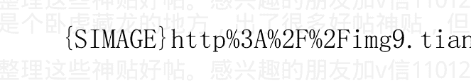

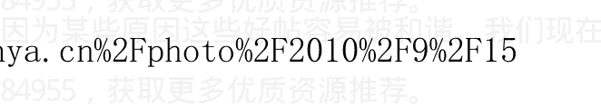

作者：海宁的马甲 日期：2010-12-28 11:59 旧帖转载完毕。

## 从 30 年日元指数的变化看 2011 年第二次亚洲金融危机

1981年初，日元指数（下面都是指日元指数XJY，而非仅仅对美元）见顶（按月线图的长期走势，下同）回落，（美联储加息到20%），世界经济萧条；
1989年底，日元指数见顶回落，日本股市泡沫破灭，房地产泡沫4个月后破灭；1995中，日元见顶回落，（美联储加息应对经济过热）一路跌到1997年中，亚洲金融危机；
2000年初，日元见顶回落，美国互联网泡沫破裂后的小规模萧条；
2002-2004年，日元涨，因为美国执行低利率，吹欧美房地产泡沫；
2004年底，2005年初，日元见顶回落，（美联储加息）世界经济出现繁荣周期内部的回调过程，中国股市从1700跌到998；
日元2007年2月一路上涨到2010年10月，为什么？套利日元资金不停回归日本，加上美国超级宽松的货币政策，用日元套利不合算，不如用美元套利。这波日元上涨到什么时候结束？我认为到2010年底到2011年3月，世界经济减速，日本实体经济回落。
日元，看上去像是美元的反面引子。

总结：
1. 美国加息，收紧，日元会见顶回落（月线）。
2. 世界经济萧条前，或者初期，日元指数见顶回落（月线）。
日元指数月线回落的原因，两者必居其一，或者两者兼备。


作者:海宁的马甲  日期:2010-12-29 06:43 作者:lobze  回复日期:2010-12-28 22:02:49

### 三十六）猪肉价格周期与货币政策，及楼市股市走势

- - 8月18日全国猪肉平均价格18.69
- 10月6日全国猪肉平均价格19.07
- 11月19日全国猪肉平均价格20.43
- 12月26日全国猪肉平均价格21.3

猪肉价格持续上涨，但是股市走势跟这个不一致
影响股市的是货币政策（升存款准备金率，加息），而不是猪肉。
猪肉价格通过影响货币政策，才间接影响股市。
如果猪肉价格涨了，央行一动不动，猪肉价格对股市的影响自然等于零。
谢谢你的数据。比起底层的收入涨幅，猪肉价格涨幅够凶猛，几乎是一个月一个价了。

作者：海宁的马甲 日期：2010-12-29 06:49

五篇文章，基本把我要表达的都表达了。
现在就看2011年上半年，通货膨胀，物价继续飞一会儿了。
不看2012，就看2011年。
不继续大幅度加息，通货膨胀上天。
不停加息，2011年下半年就会踩响埋了8年的地雷，嘣！

> Bubble Made in Dollar（中国房地产泡沫，美元造，日本台湾1990年，香港，韩国1998年的房地产泡沫，难道不也是美元造的吗？）

#### 一：理性分析通货膨胀与经济形势，理性预测中国楼市下跌时间表 2010-09-21
http://www.tianya.cn/publicforum/content/develop/1/486299.shtml

#### 二：从普通百姓的角度分析通货膨胀，谨慎求证中国房价十年大顶神贴，兼容并论，任志强的强观点
http://www.tianya.cn/publicforum/content/develop/1/520531.shtml

#### 三：天涯论剑之三，货币政策与物价房价走势，驳崩溃论，评阴谋论
http://www.tianya.cn/publicforum/content/develop/1/533931.shtml

#### 四：四论通货膨胀2011.3—2011.6失控，逼着连续加息，兼论中国历次量化宽松
http://www.tianya.cn/publicforum/content/develop/1/541636.shtml

## 亚洲房地产泡沫的历史与文化背景分析：重商主义与中国，及日韩港台的股市楼市泡沫的必然兴起与必然破灭
http://www.tianya.cn/publicforum/content/develop/1/494622.shtml

作者:海宁的马甲 日期:2010-12-31 15:11 作者: yanqixiao 回复日期: 2010-12-31 13:14:27

一中午读完了整个帖子。虽然我和我男朋友只是千千万万个80后购房者之一，但是希望楼主预测的准确。明年就要毕业了，家里也催着看房。房子现在成了我们两家的心病。男友家里不是很富裕，还是外地的，我父母本来就不同意，加上高房价，真的是让我们两个快要毕业的人难以承受。希望 11 年 3 月可以有个结果，到那个时候再来看，希望楼主还能继续预测。

明年 3 月份房价比现在略高的可能性应该大于微降的可能性。
房价泡沫如果破灭，也要等到 6 月以后。
明年很多事情要发生，中国，巴西，印度，俄罗斯在加息。也就意味着，这些国家不能借很多钱给欧美。（因为借给欧美的越多，自己国家的通货膨胀越严重）。
2011 年 3 月到 10 月，欧洲的债务危机要爆发，相当于 2008 年 9 月的雷曼破产。欧洲的进口需求会更快的减少。
2011 年，美国的地方债务危机也会恶化。美联储并不能控制美国的房贷利率，美国的房贷利率在上升。
第三，对中国很重要的一点，中国 3 年一个周期的房地产库存周期，到 2011 年 6 月到 9 月又要来了。
2008 年 6 月到 9 月，房子相对过剩，卖房子困难，退房潮。（那个时候美国的金融危机还没有大爆发）
2005 年 6 月到 9 月中国卖房子也有一定的困难。

## 2011年6月到9月，卖房子的困难程度，应该大于2008.6，2005.6

目前看，2011年下半年，中国房地产泡沫被刺破的可能性很大。

> 所谓一鼓作气，再而衰，三而竭。

作者：海宁的马甲 日期：2011-01-02 08:19 作者：onlytrue 回复

日期：2011-01-01 21:36:51

楼主 对于 2011 楼市的走向 你的观点跟任志强的相反哦

你对任志强的观点是怎样看的啊？楼主 对于 2011 楼市的走向 你的观点跟任志强的相反哦

你对任志强的观点是怎样看的啊？

任志强是个敢说的人，他把其他房地产企业家不敢说的，都说了。

我同意任志强关于经济问题绝对房地产，而不是房地产决定经济，的观点。

2008 年上半年，股市暴跌，经济下滑，房地产在 2008.6-2008.9 出现困难（注意当时美国雷曼还没有破产，美国金融风暴还没有出现）。

任志强通过人口等，说房地产能火到 2018 年，我不认同。我认为整个中国，中国的底层，无法承受物价的上涨。

加微信 1101284955 获取更多优质书籍推荐

如果房地产继续火，那么物价也会继续涨，越涨越厉害。

2008年，股市下跌，房价微跌，消灭了很多账面财富，才控制住了通货膨胀。

2011年，凭什么控制通货膨胀？股市已经不是重点了，虽然股市2011年第二季度可能大幅下跌，但是最终还是要靠房地产的下跌去控制通货膨胀。欧美2007年，日本1990，1991年，也是如此。

就看高层的取舍和权衡了。

作者：海宁的马甲 日期：2011-01-03 09:22 作者：imchillkthx 回复日期：2011-01-02 15:22:48

国内的投资房可以看作是“保值的”“具有收租选项的准黄金”。

有钱人，中产，有空着的余房的很多，而很多大学毕业生工资在房价面前太低，降一半都买不起，工作地点又不于父母在同一城市。

房子相对过剩在2007年就比较严重，2009，2010年，人民币继续大放水（27.7%，20%），造的房子更多，这个很多人都知道，一些拉私活的头脑灵活的货车司机都有投资房。原因不复杂，就是房子价格一直在涨，人民币购买力一直在下降，存钱不如存房子。投资房，就是中国人用于保值的“准黄金”。

很多投资房都是毛坯房，无法用于出租。毛坯房的好处是，可以当作新房子卖。如果装修后出租，再卖的时候就只能当二手房卖，价格就卖不上去。

---

本来就是我以前在帖子里说中国目前最像硬通货的就是住房。

然后你既然说了通货膨胀2011年恶化，那么你说2010年10月是房市的10年大顶“已经悄然构筑完毕”。

结合你刚才说的话，你觉得硬通货要大跌，同时通货膨胀要恶化，我不理解你的话。

通货膨胀2011年恶化，导致加息，多次加息刺破房地产泡沫。

作为“硬通货”的房子的价格（更确切的说，是房子下面土地的价格）里，不但反映了到目前为止的货币供应量，而且反映了民众对于未来货币增量的预期。

美国的80年代末的房地产泡沫，也是被通货膨胀中的加息给刺破的，2002-2007年的房地产泡沫，也是如此。

1971年以后，美国，日本台湾，东南亚，历次的房地产泡沫都是在通货膨胀中，被反通货膨胀的加息中被刺破的。其中石油价格非常关键。

硬通货黄金，白银，历史上相对于资产类住房，粮食也跌过，金本位时期，通货紧缩的年份很多，通货膨胀的年份也很多。两者时间

当然，什么是通货膨胀 Inflation 这个定义，像套利，量化宽松等，不同人的定义不是 100% 相同。

## 黄金价格与房价

2008年3年，黄金从1033美元开始下跌（到11月的750左右，681那个点就不算了），美国的房价下降速度加上中，而那个时候全世界通货膨胀还在恶化中。

中国因为人民币与美元的关系，因为中国不停增加外汇储备，使得黄金价格走势，与中国房价走势出现高度的相关性。

2003，2004，黄金涨，中国房价涨，涨幅类似。

2005年中，黄金价格在430附近盘桓好几个月，而中国房价也不涨不跌盘桓很多个月。

2006，2007，黄金涨，中国房价涨，涨幅类似。

2008年3月，黄金开始下跌，中国房价开始下跌。

2008年7月到9月，黄金从989快速下跌到740，中国部分地区房价2，3个月剧跌20%到30%。雷曼破产前，杭州万科销售价格下调20%到30%左右（从10000-12000下调到6000-9000），很多前期投资者账面损失20万到40万。投资者（大多数不是自住的）大砸杭州万科的总部，毫无理由。

而2010年底，那些即使1万，1万2买入的房子价格已经将近翻番。

按黄金价格计算，2010年粮食涨价并不多，这和你说的2010年粮食涨价与供需失衡也有一定的矛盾。

涨了十年的黄金价格，是否是个泡沫，2011年恐怕就见分晓了。

作者：海宁的马甲 日期：2011-01-06 22:56 作者：死捂不换手 回复日期：2011-01-06 10:09:58

看来中国经济会乱不乱关键点集中在 p 民的忍耐力上。？

很多人认为底层的忍耐力很强。其实从很多人的身边看，确实没有必要把2010年的物价涨幅放在眼里。

但是从2004.6-2005.6的调控，2007-2008年的调控，看到决策层，还是重视民生的，还是关心底层的生活状态，与压力的。

崩盘不会的，日本1990年股市暴跌，随后房地产泄气，日本还是继续发展，日元继续升值，1995年，日本GDP相当于美国的90%以上。（美国的人口可是要多一倍）

中国的劳动生产率，从1998年就一直不停地提高，十年提高200%。

加微信 1101284955 获取更多优质书籍推荐

在机械级别，中国生产任何电器几乎小菜一碟。中国的普通制造业进步巨大，就是高科技上还不怎么行。相当于走了台湾或者韩国 70，80 年代的路子。

中国要是刺破房地产泡沫，之后的调整是必须的，但调整之后还有一波升浪（到时候股市中会出现一些做大做强的民营企业，他们的市值 5 年可能涨十倍，30 倍），比如汽车制造，汽车零部件，医疗设备制造等等。

作者：海宁的马甲 日期：2011-01-06 23:06 作者：onlytrue 回复日期：2011-01-04 21:23:00

楼主 你觉得能否这样看：相对于其他商品的价格飞涨 通货膨胀程度越来越严重 房价不跌不涨 维持现状 其实就已经是相对的下跌了？ 所以 2011 年的房价 维持现状的可能性更大？

如果房价不跌，甚至跌去 20%，那么造房子仍旧是非常有利可图的事情，大量的房子会被造出来，直到投资需求不能接盘，那么房地产泡沫出现自然爆破。

自然爆破的意思是，你不用加息，他不停造，不停造，最后房子太多，底层想买的买不起。投资需求又接盘接不过来。

房子最终毕竟不是黄金，房子能大量制造，而黄金只能以1%，2%的低速增长。

周洛华的金融理论对房价现象的阐述。

道理其实非常简单，只要人民币不升值到位，那么中国外贸顺差将继续扩大，中国人民银行就不得不印人民币购买外汇，维持汇率。

这样，购买房子，就像购买黄金一样，是一种明智的保值之举。

2003年，2004年，美元贬值——》黄金价格上涨，中国外汇储备增加——》中国外汇占款增加——》中国房价上涨。

就中国全国而言，2003，2004房价涨幅类似于黄金涨幅。

2005年中，黄金价格在430美元附近徘徊，中国房价也是不涨不跌，黄金价格上涨势头停滞先于中国房价停滞2，3个月。

2006，2007年，黄金价格翻番还过头，中国房价也是几乎翻番。

2008年3月，黄金从1000美元以上开始下跌，中国房价2，3个月之后开始下跌。

2008年7月到9月，黄金从989美元快速下跌到740美元左右（中间那个681美元那个点就不算了），中国部分地区房价2，3个月剧跌20%到30%。

雷曼破产前，杭州万科销售价格下调20%到30%左右（从10000-12000下调到6000-9000），很多前期投资者账面损失20万到40万。投资者（大多数不是自住的）大砸杭州万科的总部，毫无理由。而 2010 年底，其中部分房子价格已经过 2 万/平方米。

2010 年 3 月底，黄金开始涨，8 月初到 11 月再次比较大幅度上涨。

中国房价涨的时间点类似。

过去十年，即使不是 100%，黄金价格也是非常好的中国房价的领先指标，涨幅也是如此。为什么？问外汇管理局。我以前有篇文章将黄金是中国房价的近似指标。

涨了十年的黄金价格，是否是个泡沫，2011 年恐怕就见分晓了。

但是金融非常复杂，涉及到预期问题，目前的房价，是否已经包括了未来的外汇占款的增加问题。

目前的黄金价格，是否已经过度反映了美元，美国国债未来的超发问题。

投资者是按照经验主义按进行金融配置的。类似于按照经验中的“货币洪水的喷射速度”来投资的。所以，很可能是在人民币升值到位前，贸易顺差变成零以前，房地产泡沫就破灭了。

没有人能设计 100% 保证赚钱的模型，但是显然有些华尔街的模型的赚钱赢率，要大一些。大家关注于高盛赚的钱多，风险规避及时，但是很多人不知道，2007 年以前到华尔街的“非金融类”博士，近 80% 是被高盛收归门下的，一些是物理流体力学博士。

基础货币增加的速度（外汇占款是基础货币），与私人部门信用扩张的速度，对于资产价格的影响，类似于洪水流动速度，或者爬坡中汽车油门的影响。

如果以前洪水流速很大，油门很大，造成资产价格暴涨，那么洪水减速，油门减小，就足以刺破泡沫。当然难点在于临界点的计算与把握。

这就是为什么历次泡沫，都是在货币与信用高位继续扩张过程中，但是扩张速度下降的时候，破灭的。

泡沫破灭于油门减小（货币供应增速下降），而不是从前进档变成倒退档（货币供应下降）。

对于中国而言，15%恐怕是个临界点。货币供应增速低于15%，泡沫是难以维持的。

任何专家对于2011年货币供应量的猜测，都是不可信的，因为即使做了计划，不一定执行。

2009年，货币供应量的增长目标是17%，结果增长27.7%。

2010年，货币供应量的增长目标还是17%，结果增长20%左右。2010年6月到8月，有个所谓的“怕经济二次探底”的“继续宽松”的放水过程。

2011年，货币供应量的增长目标，应该是17%或者16%，但是毫无意义，最终还是“听其言，观其行”。

投资者唯一可以做的，是在中国房地产泡沫破裂前，持有粮食，或者农产品 ETF 股票，但是有风险。石油和黄金与基础金属风险更大一点。

## 周洛华：加息维护房价稳定上涨？

央行宣布，2010年12月26日起加息0.25个百分点。有些朋友习惯性地打电话问我对此有何看法。他们之所以形成这个习惯完全是一次意外造成的。

央行上一次启动加息周期的时候，正值2004年7月，当时加了0.27个百分点，我写了一篇文章《加息推高房价》交给报社发表，没想到报社非常为难，他们对此感到很困惑，明明是提高了贷款成本，为什么反而推高房价呢？但他们拗不过我软磨硬泡地纠缠，最后将文章发在该报次要版面的中缝，就是平时刊登寻人启事和征婚广告的地段。没想到这篇文章倒成就了我，我从此就出了名，那篇文章成为了我最好的广告。

后面的情况我就不说了，房价继续上涨，央行继续加息，直到上一次金融危机为止。于是乎，每次央行加息，就会有人问我对房价走势的看法。我其实挺内疚和惭愧的，因为整整7年来，我没有发展出新的逻辑来更好地说明央行加息和推高房价之间的关系。首先，我不认为我有证据说明央行加息这个举动的目的在于推高全国房价，其次，我也不认为央行加息是为了防止舆论批评其对房价上涨未能果断采取措施的被动反应。最后，我相信央行加息一定是一个深谋远虑的决策，一定是一个对中国经济有利的决策。虽然我历来反对“两个凡是”对于教条主义，但是对于央行任何的决策，我从来就是坚定不移地拥护和毫不动摇地遵循。

我对于加息和房价的看法其实很简单。我认为房地产是一项资产，具有对冲通货膨胀风险的属性，买入房产就是持有了看涨通货膨胀的多头头寸。我把房产定义为一组 70 年连续到期的 1 年前通货膨胀看涨权证，金融学的基本原理指出，权证的价值会随着同期无风险利率的升高而上涨，这样一来，央行越是加息，房价就越是上涨。除非人民币升值到扭转市场对于通货膨胀的预期，当市场不再预期通货膨胀加速，也不再预期人民币实际购买力缩水之后，房价自然而然地会下降。中国政府如果真的想要打压房地产价格的话，早就可以让人民币加速升值了，而不必遮遮掩掩地用加息这样的手段来表示对通货膨胀的关切，也不必用暗含“凡是敌人支持的我们就反对”这样的翻版“两个凡是”逻辑来煽动人民币升值问题上的民族主义情绪。

从 2002 年开始，我始终认为只有人民币升值才能抑制通货膨胀，才能打压房价。但是到了 2010 年，我却不那么肯定人民币应该对美元继续升值了，因为有人估计我国房地产的总市值已经达到了 100 万亿总市值，相当于中国 GDP 的三倍，这是人类历史上从未达到过的高度，我不敢想象如果泡沫破灭的话，中国人民将在怎样的深渊里面挣扎。所以，我从 2010 年开始反对人民币升值，因为我不认为经过了长达 19 年的人民币汇率形成机制的探索和改革之后，我们建立了一个稳定的货币发行机制，我也不认为加入世贸组织十年之后，我国已经建立了一个可以对冲房地产价格下跌风险的资本市场体系。我几乎可以肯定的是，如果全国房价下跌，那么中国将形成历史上最大的一次银行坏账，而我国政府为了填补由此造成的窟窿，很可能再次援引2002年的成功经验，用央行再贷款（对于我这样的金融学外行来说，央行再贷款就是类似于印钞票，但是央行的专家会告诉你再贷款和印钞票有本质的区别，但是这种解释我从来没有听懂过）为商业银行买单，其结果无非是稀释了全体人民的财富。这是我最不愿意看到的局面，也是我现在反对人民币升值的根本动机。

在金融危机中，我国政府通过加大基础设施投入，加大银行信贷投放，使得危机对于中国来说成为了发展机遇，我们实现了过去许多年从来没有过的繁荣。我不得不指出，凡是用信贷杠杆推动经济繁荣渡过金融危机这条大河的话，都或多或少地有一些后遗症。就比如一个人得了器质性的毛病，身体虚弱得不行了，你究竟应该给他用药来纠正其病根，还是给他输营养液和激素来使他暂时强壮起来然后病得更重呢？我认为危机中投放的4万亿元、2009~2010年两个年度投放的18万亿元信贷，其作用都类似于营养液，我们使得危机向后推延了，但是没有抓紧时间防范更大的风险。我们现在真正遇到了比金融危机更严峻的挑战：我们制造了更繁荣的房地产之后，却发现面临两条非常痛苦的道路，一条是任由通货膨胀发展下去，房价和利率交替上升并交相辉映，最终通货膨胀失控或者像美国在危机前那样由于油价飙升而刺破房地产泡沫；一条是让人民币升值，但是房价就必须下跌，而我们之前投入的财政和信贷可能遇到许多问题，甚至引起银行坏账的增加。这两条道路都非常坎坷，如果我是政策制定者的话，我不认为我有能力去克服这些困难，我唯一能做的就是继续拖延，使得这两条道路中无论哪一条都不要在我的任期内走到尽头。

温家宝总理说过，要保持房地产价格的合理和稳定。我想如果要维持房价稳定的话，就必须要同时防止房价的大涨和大跌，而要使得房价稳定在目前水平上就必须要使得市场建立未来通货膨胀的预期，而央行缓步加息并维持实际负利率反而有利于市场形成通货膨胀预期。从这个意义上讲，我感觉央行维护全国房价稳定的决心是不可动摇的，也是不遗余力的。

来源：中国经营报

作者：海宁的马甲 日期：2011-01-06 23:17 房地产的3年库存周期

做实业的知道，一个行业，一旦当年利润巨高，那么第二年，进入这个行业的人就很多，如果第二年利润依旧很不多，第三年就是有人赚钱有人亏本了。做得好的，企业发展壮大，做得不好的大量倒闭。这种进化在江浙一带已经发生20多年了，当然也发生在其他领域。

房地产泡沫的彻底破裂，是以整个经济的下滑为前提的。以3年以上的时间跨度看，经济好，收入提高，房价才涨。

房价涨——》导致房子相关行业好，导致经济好的循环，不能维持3，4年。否则很多国家就可以通过发展房地产带动经济增长了。

中国房地产发展得好，是以经济的其他行业的劳动生产率的提高为前提的。这么简单的事情，不少人是不会去思考的。

独立思考的人，还是太少了。

以3年为时间跨度看，楼市，股市不但不是蓄水池，反而是通货膨胀的发酵催化剂。

先从一个大家经常说的东西开始：流动性。

什么是流动性？流动性是怎么创造的？怎么被消灭的？

经济学教授嘴里的流动性是指资产的变现能力，变现的时候受损越小，则流动性越大。

而我们生活中，很多人已经把流动性看成了货币对于物价，房价，股价的上涨动力。经常有人说，流动性摆在那里，不是房价涨，就是股价涨，不是股价涨，就是物价涨。

我们还经常听到一种说法，说股市，楼市，是应付缓解流动性过剩（货币超发）的两个池子，房价上涨，股价上涨，可以减轻通货膨胀的压力。

而我一直认为，以3年为时间长度看，股市，楼市不但不是减轻通货膨胀压力的池子，而且是具有发酵倍增能力的催化剂（能在12月左右后，成倍地制造通货膨胀）。

通俗地说，货币超发要是流向楼市股市，会有什么效果？

加微信 1101284955 获取更多优质书籍推荐

以 2009 年为例，货币供应量增长 13.6 万亿左右（贷款增长 10 万亿左右），那么，楼市股市上，新增了多少账面财富呢？股市能算出来，即使不到 10 万亿，也差不太多。全中国房价上涨部分是多少呢？恐怕 20 万亿都不止。

也就是说，2009.3—2010.3，就算货币超发 4 到 5 万亿左右（货币供应量本来就会新增 8 万亿左右，结果新增了 13.6 万亿），股市，楼市两个所谓的“蓄水池”的账面财富增加了 30 万亿左右。楼市，股市的发酵倍增能力约为 3 到 6 倍。“泡沫”这个词，不是没来由就用在资产价格暴涨上的，第一个用泡沫描述资产价格暴涨的人，可以称为天才。

有人说土地才是一部大印钞机，我认为这是不对的。土地只是印钞机的帮凶。2005 年货币基本没有超发，土地这个帮凶就无法发挥作用。

土地作为印钞机的帮凶，是体现在上面说的这个账面财富发酵“泡沫”过程中的。一块土地，拍卖后，买方获得了价值连城的财富—土地。卖方获得了人民币，然后把卖土地获得的钱花出去。这个过程中，是以房地产商获得贷款为前提的，大部分房地产商，要靠贷款维持的，看看上市的房地产公司的财务报表就知道了。只要收紧信贷一段时间，土地就卖不出好价钱，土地卖不出好价钱一段时间后，土地成本占最大比例的房价，就会降下来，或者说，房价涨不上去，2005 年就是例子。本末不能倒置。

再举例，1993 年 6 月的宏观调控十六条（嘿嘿，也是十六条），银行贷款大量收回，个别收不回贷款的被踢掉，结果广州一些楼盘 6，7千的房价，过了10年都没有恢复。

账面财富效应的结果就是，消费非常旺盛。账面财富多了，整个社会总体而言，自然消费多了，物价，服务的价格就涨了。卖土地的地主有钱了，就可雇佣民工去修长城，挖运河，地主家的管家在工程过程中，就会忙得非常开心。工程多了，民工的需求就旺盛了，民工的工资就被抬上去了。民工一看，矣，打工比种地，种蔬菜，养猪更来钱，当然去做建筑工人等工作了。然后蔬菜，猪肉价格就涨了。然后理发，家政服务的价格涨了，因为理发师与保姆也要吃饭吃肉吃蔬菜的。这个逻辑推理不需要砖家来解释，就能想通。2010 年 7 月份以前信誓旦旦地说中国通货膨胀安全可控的专家们，估计已经忘了自己曾经说过什么。

天气原因导致的食品涨价，和美国量化宽松，只不过把7月到10月的通货膨胀吹得更旺一点。如果仅仅是天气原因，蔬菜价格应该很快几乎退回原点。

2004，2007，2010三次，每次民工荒后出现猪肉价格暴涨，恐怕不是三次自然灾害的天气巧合吧。当然修长城，挖运河都是功在当代，利在千秋的国防与交通建设事业。

（下面只是分析，并不代表立场）

2003年底楼市火爆，民工荒，2004年物价上涨；

2004年下半年，2005年上半年，控制了货币与信贷规模，股市下去了，房价微跌了，通货膨胀也就下去了。

2006年到2007年初股市楼市同时火爆，2007年初就有民工荒，

2007年下半年到2008年上半年物价暴力上涨，与之前的房价，股价暴力上涨幅度相对应；

2009年楼市股市火爆，就涨幅和创造的账面财富而言，不比2006—2007年逊色，2010年初民工荒，2010年7月民生商品价格开始暴涨。

上面的资产价格暴涨到民生商品价格暴涨的传导过程，连续三次被证明是对的。而且不需要专业知识也能想通。有些时候，这个社会需要的是常识，而不是花里胡哨的东西。

外国的例子：

欧美2004-2007年房价上涨，股价上涨，账面财富增加，消费旺盛，带动亚洲国家的出口增长。欧美汽车销量大，石油消费增长快，通货膨胀压力大，结果美联储不停提高利率到5.5%，刺破欧美房地产泡沫，房价股价大跌，欧美物价随后大跌。如果美联储不加息到5.5%，无非是把美国和世界的房地产泡沫吹得更大一点后，再爆破而已。

加v信1101284955获取更多优质书籍推荐

## 那么，楼市，股市价格上涨，可以在3年的时间跨度内，消除民生商品的涨价压力这个逻辑，在什么时候可以证明是对的呢？

> 反证：

2005年，房价，股价下调，物价上涨压力消除。（这里只是分析，不代表立场）

2008年，房价，股价下调，物价上涨压力消除。（这里只是分析，不代表立场）

2011年下半年，房价，股价是否在反通货膨胀中下调，从而消除通货膨胀？我们拭目以待。

再来个大胆论断，2011年，只要房价，股价没有像样的下调，财富效应就还在，中国通货膨胀必然是洪水滔天的，房地产账面价格近100万亿人民币，而农产品一年产出才3万亿人民币左右。

修筑一个高高的堰塞湖，结果无非是在堰塞湖破裂的时候，威力更大一点而已。爱尔兰房价在欧美涨幅最大(1995-2007,12年涨300%到350%)，2008，2009年跌得越惨。

爱尔兰的经济起飞是从1995年用低税收大力吸引外商开始的，2001-2003年因为美国互联网泡沫破裂，爱尔兰经济严重下滑，2004年爱尔兰通过加大公共支出力度，减税，和纵容房地产过度发展，继续了爱尔兰之虎的经济辉煌神话。爱尔兰在2007年以前，是欧洲经济发展的样板奇迹，特别是他们教育的大力发展对于经济的贡献非常大。2007年失业率降低到4.5%这个欧美的最低极限，2010年，房产泡沫破灭的2，3年后，失业率重回80年代的17%左右。

国际大宗商品价格走势规律也是跟着全世界的账面财富走的，只要世界各地的账面财富效应强大，就不大可能反转向下，即使下调，也是在涨得更高的途中的震荡调整。2011年初我们就可以看到大宗商品恢复上涨，进入真正的主升浪了。（个人观点，不构成投资建议）

所以，结论也很简单，中国房价等资产价格不降，账面财富依旧庞大，通货膨胀是无法遏制的。两相比较，房价等资产价格不降的话，2010年7月到2011年的物价涨幅，大于2007.7-2008.7的物价涨幅。拭目以待好了。

> （只是分析，不代表立场）

作者:海宁的马甲 日期:2011-01-08 12:39

> 俄罗斯大学的几个人联合发表论文，他们根据 Sornette 的泡沫顶部预测方法，预测"黄金泡沫"的顶部在2011.45（2011年6月13日或者14日，与阿姆斯特丹周期转折点完全吻合）正负1.4个月．即区间在2011年5月初到7月末。

Sornette 在2008年4月，比较准确地预测到了石油泡沫的顶部。

加v信1101284955获取更多优质书籍推荐

早前比较准确的预测了拉斯维加斯的房地产泡沫。

在 2007 年 8 月或者 9 月，预测中国股市泡沫的顶部在 2008 年 1 月（最后 2008.1 是双顶的第二顶， Lower High 更低的第二顶）

2009 年 7 月 10 日，预测到了中国股市的顶部在 7 月 14 日到 8 月 14 日左右。（具体内容以前提及过了）

中国楼市在 2011 年 6 月到 9 月，很可能迎来暴风雨。这一次，是三次高潮过后的最终疲软（即泡沫破裂，类似于 1991 日本， 2008 美国）。（2003，2004 第一次高潮，2006，2007 第二次高潮，2009,2010第三次高潮）

http://arxiv.org/abs/1012.4118

Sergey V. Tsirel, Askar Akaev, Alexey Fomin, Andrey V. Korotayev

(Submitted on 18 Dec 2010)

Abstract: This working paper analyzes the gold price dynamics on the basis of methodology developed by Didier Sornette。

作者:海宁的马甲 日期:2011-01-09 09:42 作者:dongdonglulu 回复日期: 2011-01-09 05:42:53

加v信1101284955获取更多优质书籍推荐

一个模型把所有东西都给预测准了。还要那么多研究经济和金融的人干吗？

楼主也很强大，居然可以有这么多时间去找资料去佐证自己的论断，应该是花了不少时间吧？呵呵

一个模型如果能 100%预测泡沫的破裂时间，那么他很快就富可敌国了。

现实不是辩论赛，需要未来发生的事情去验证。而辩论赛一结束，就算完了。

正是因为 Sornette 比较好的预测准了两次中国股市的泡沫，才有人去关注他的观点与文章。

而且这个预测不是 Sornette 的团队做的，文章中说了“仅仅是根据目前情况的预测，”

这个文章是 12 月 18 日发表的。

作者:海宁的马甲 日期:2011-01-10 09:57 根据 Sornette 模型，黄金泡沫顶部在 2011.45（6 月 13 日到 14 日）正负 1.4 个月

俄罗斯大学的几个人联合发表论文，他们根据 Didier Sornette 的泡沫顶部预测方法，预测"黄金泡沫"的顶部在 2011.45（2011 年 6 月 13 日或者 14 日）正负 1.4 个月.即区间在 2011 年 5 月初到 7 月末。

**加v信1101284955获取更多优质书籍推荐**

而且按 Sornette 以前的历次预测，更倾向于 2011 年 5 月初（数学临界点的 1.4 个月以前）。

顶部价格在 1500-1600 美元左右。

> 各国央行维持当前政策稳定为前提的。

此文作者说了，不构成投资建议，而且是以“各国央行维持当前政策稳定为前提的”。

这个论文并没有引起投资者太多注意，看到的，也仅仅是一笑而过。

所以这种论文，并不会影响金融市场。（几个作者没有一个是金融行业的，都是理工科专业的）

这个论文不是 Didier Sornette 本人的团队做的，而是俄罗斯人根据 Didier Sornette 的模型做的。

## Didier Sornette 本人的文章列表在这里：

http://arxiv.org/find/q-fin/1/au:+Sornette_D/0/1/0/all/0/1

Sornette 在 2008 年 4 月，比较准确地预测到了石油泡沫的顶部。

早前比较准确的预测了拉斯维加斯的房地产泡沫。

在 2007 年 8 月或者 9 月，预测中国股市泡沫的顶部在 2008 年 1 月（最后 2008.1 是双顶的第二顶,Lower High 更低的第二顶）。Sornette

在 2009 年 7 月 10 日，预测中国股市 2009 年 7 月 17 日到 27 日见顶的可能性是 80%

加v信1101284955获取更多优质书籍推荐

在 2009 年 7 月 10 日到 8 月 10 的见顶的可能性,按他的 10 个指标,都符合，也可以算是 100% （具体内容以前提及过了）。

泡沫在顶部会出现暴涨行情，而且预测 N 次对了，并不表明第 N+1 次预测也对。

如果谁根据章鱼保罗的预测去赌球，2010 年世界杯期间可以可以赚 1000 倍。有几个人一直按章鱼保罗的预测赌球？

所以普通人，看看就好了。

黄金价格暴跌，并不影响下一次再来一次黄金泡沫，下一次黄金泡沫（从那个时候的底部涨 5 倍？），我看是美国国债危机。

目前美国国债的稳定程度，美国巨额财政赤字（1.2 到 1.4 万亿/每年）与国债超低的收益率并存，简直太“违法天理”了。

当婴儿潮（1946-1965）的大哥大，比尔克林顿退休的时候（2000 年），美国处于顶峰，互联网泡沫破了。

当婴儿潮的中班生（同样生于 1955 年的苹果总裁乔布斯，与微软的盖茨）的企业处于顶峰的时候，美国房地产泡沫破了。

当婴儿潮的末班生（生于 1961 年）退休的时候，美国的国债泡沫，也该破了（国债价格暴跌，通货膨胀，利率暴涨）。

黄金价格与中国房价的关系，参加我的几篇文章：

> “理性分析通货膨胀和经济形势，理性预测房价下跌时间表”（美联储不能控制长期利率，美国十年期国债收益率最近两个月从2.5%上涨到3.5%，如果升破4%，美国的房价又要悲剧了）

2010-09-23

> “黄金才是中国房价的先行指标与近似价格指数，黄金暴跌先于房价暴跌”

2010-7-23

中国楼市在2011年6月到9月，很可能迎来暴风雨。这一次，是三次高潮过后的最终疲软（即泡沫破裂，类似于1991日本，2008美国）。（2003，2004 第一次高潮，2006，2007 第二次高潮，2009，2010第三次高潮）

http://arxiv.org/abs/1012.4118

Sergey V. Tsirel, Askar Akaev, Alexey Fomin, Andrey V. Korotayev

(Submitted on 18 Dec 2010)

Abstract: This working paper analyzes the gold price dynamics on the basis of methodology developed by Didier Sornette。

加v信1101284955获取更多优质书籍推荐

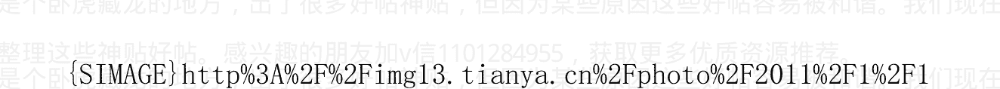

作者:海宁的马甲 日期:2011-01-11 22:02 作者:月白ty 回复日期: 2011-01-11 11:41:56

楼主分析的到位，顶。

但是楼主似乎低估了中国zf的强权的能量。它不是完全市场经济，能尽一切力量制约经济规律，使经济规律变得歧型。使本该发生的滞后。

那为什么上海的房价按黄金计价，一直是非常稳定的呢？

10年来，上海一平方米房子一直等于2.4盎司黄金。

2001年，黄金250美元，上海房价5000人民币。

2005年7月21日，黄金价格430美元左右，上海房价8600左右。

2009年，2010年，黄金从730涨到1400美元，上海房价从15000涨到28000/平方米。

你告诉我，为什么上海的房价，按黄金算一直都稳定在2.4盎司/平方米左右。

## 作者：海宁的马甲 日期：2011-01-18 11:56 三大“兜底保险”使得原材料商品价格大幅上扬的趋势难以改变

### 文/海宁的马甲 2011-01-18

1998 年，东南亚金融危机，俄罗斯国债违约，和南斯拉夫战争之后，欧洲，亚洲的资金涌向美国，追逐互联网泡沫。那个时候，欧洲，亚洲都出现了物价下跌，房价下跌，和股市下跌。而美国出现货币供应量猛增（货币供应量增长 8.8%，对美国来说是个大的数字），美联储主席格林斯潘秉持类似“央行不是神仙，无法控制资产泡沫”的观点，没有收紧货币政策，史称“Greenspan put”，可以翻译为“格林斯潘资产价格兜底保险”，即如果金融市场出现危机，美联储会释放流动性以缓解危机，而如果资产价格大幅上扬，美联储并不会大力紧缩。这就造成了鼓励投机的道德风险。

2011 年，美联储主席伯南克向市场明示，美联储在美国通货膨胀率达到 2%以前，是不会收紧美国货币政策的。因为美国房地产泡沫破裂的余波，目前美国的通货膨胀仅为 1.1%，此种明确的言论，被称为“Bernanke Put”，即“伯南克兜底保险”。这就为商品市场的投机资金很大的信心继续推高原材料商品价格，直到美国的通货膨胀接近 2%为止。摩根银行在建立铜期货 ETF 之后，鼓吹世界铜的供需缺口 6 万吨的说法。世界范围内的气候因素，给农产品投机资金以极大的鼓励和借口。此为第一大“兜底保险”。

2010 年底，美国通过延长小布什减税方案的法案，美国 2011 年，2012 年的财政赤字，每年都高达 1.2--1.4 万亿美元左右，美国国债，庞氏骗局的特征愈加明显，但是美国国债的收益率并不高（十年期美国国债收益率仅为 3.33%左右）。美国如此大规模的财政赤字，保证了美国短时间内经济恢复会较好，对商品的需求大，再一次给原材料商品市场的投机者巨大的信心。此为第二大“兜底保险”。美国的政客，也要到了美国国债问题恶化到不得不解决的时候，才会考虑财政紧缩方案，毕竟，缩减开支是要么得罪利益群体，要么得罪选民的事情。

2011 年，2012 年这两年美国新增的 2.5 万亿美国国债（欠条，而且注定要通过通货膨胀后的新欠条来“还”），谁拿去，谁的房价物价就暴涨。

中国虽然从 2010 年底开始收紧货币政策，但是收紧的力度还是有所顾虑，即收紧货币政策不能伤及经济高增长态势，此项政策保证了中国对于大宗商品的进口需求短期内不但不会下降，2011 年第一季度，甚至直到第二季度，还会增加。此为第三大“兜底保险”，有人称其为“JB 兜底保险”，我不认同。我认为即使不是“二十五大护法兜底保险”，起码也是“九大护法兜底保险”。

大宗商品价格泡沫，2008 年上半年刚刚发生过，很多市场人士认为短期内不会再次重演。但是从以上三大“兜底保险”看，2011 年上半年，物价上涨接近甚至超过 2008 年上半年的风险不小。

同时不少市场人士预测，2011 年的通货膨胀高峰在 2011 年年中，从静态分析来说，这是对的。但是如果 2011 年上半年商品价格疯涨，而货币紧缩力度不够的话，通货膨胀势必在 2011 年下半年延续，甚至再次恶化。中国人一窝蜂的事情，从“健美裤热”以来，一直没少干。

2011 年下半年，宏观调控的难度很大。

2011 第一季度，贷款新增不会少于 3.5 万亿，新增广义货币供应量不会少于 5 万亿，GDP 增长率不会小于 10%（2010 年第一季度 GDP 增长率在 12%到 14%，属于过热），通货膨胀只会蔓延，不会得到有效控制。

不过一般不大对经济发表看法的老大，也出来说“有信心控制通货膨胀”，这个比较有意思。

文/海宁的马甲 2011-01-18

作者:海宁的马甲 日期:2011-01-18 12:03 作者: whatch 回复日期: 2011-01-18 10:43:34

加v信1101284955获取更多优质书籍推荐

黄金跌，房价才跌，黄金要是不跌呢？从古到今，黄金就没有跌过，是不是说，房价也就只有涨不会跌？

黄金 1869 年是 169 美元/盎司，1920 年代是 22 美元左右/盎司，1935-1960 年代是 30 美元/盎司。1980 年 400 到 800 美元，1998 年到 2001 年才不到 300 美元，20年工资房子什么都涨了，存银行都涨了 200%，就是黄金不涨，还跌了那么多。因为科技进步。

近 100 年历史上，按美元算，大趋势，黄金没有连续涨过 11 年（很多人不知道 1971 年以前，黄金是价格双轨制，黄金好几次跌到过 35 美元以下，普通人是不能够去向美国政府兑换黄金的，只有外国政府，才允许用美元向美国政府要求兑换黄金，后来法国和瑞士这么做了，结果美国就结束了美元与黄金的绑定）。

看图。

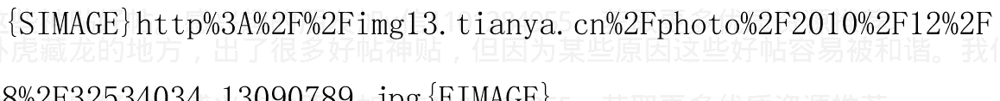

作者:海宁的马甲 日期:2011-02-09 12:45 伊朗不会打的，反正时间在那里，到时候就知道了。我认为 100%不会打。

加v信1101284955获取更多优质书籍推荐

奥巴马想要连任就不但不能打，而且需要从伊拉克阿富汗撤军。小布什打伊拉克都酝酿了很久，打仗也需要几天内得到国会的授权，国会会员也需要自己支持者的同意。

## 加息到3%也不会刺破房地产泡沫。

刺破房地产泡沫的，是美元套利资本的平仓。

开始刺破美国房地产泡沫的，是2006年年中，2007年2月，2008年，日元套利资本的持续几波平仓。

有兴趣的可以查查“渡边太太，日本家庭主妇日元套利”。当初日元套利资本，大约在5000到6000亿美元。

而今天，美元套利资本已经是1.5万亿美元左右了（2009年出来6000亿左右，2010年再出来9000亿美元左右）。

下一次日元套利资本冲出来（导致日元贬值）的时候，就是韩国房地产泡沫破裂的时候（韩国有通货膨胀，不能让韩元贬值，否则通货膨胀更厉害，而韩国的产品与日本高度竞争，日元贬值，则韩国以外贸为主的经济会受到冲击，特别在房地产泡沫高位的时候）。

作者：海宁的马甲 日期：2011-02-15 22:09 通货膨胀延烧，不得不加息，与1.5万亿美元套利资本平仓一起刺破各国房地产泡沫 草稿：

加v信1101284955获取更多优质书籍推荐

### 主要观点：

-   一：首先自然是中国的通货膨胀在2011.3-2011.6向纵深发展；加息只是猜测时间和幅度的问题。

个人认为2011年7月21日前，一年期存款利率加到4%的概率挺大。

加到4%，货币政策的决策者还是能接受的，也能被各方理解。

更多的，恐怕要依靠提高存款准备金率，来降低货币乘数了。

和2007年一样，每次加息，就是对通货膨胀又恶化了一次确认而已。

-   二：中国2010年第四季度的GDP非常绿色环保；用电量比第三季度下降，也仅比2009年同期上升5%左右；第四季度贷款量，也没有增长多少。

-   三：2011年下半年，中国房地产泡沫破裂于中国加息和美元升值的概率很大。

韩国房地产泡沫，则有被日元贬值刺破的危险。

日元贬值起来很快的，4个多月就能贬值20%多。日元汇率2010年11月创15年来新高之后高位盘整了一段时间；目前看，已经进入贬值通道，就在眼前了。

加息到通货膨胀速度以上，自然能刺破房地产泡沫，但那是不现实。

通货膨胀的真实速度，恐怕不是官方CPI那么简单。

房地产泡沫不会被简单的加息刺破。

房地产泡沫之所以能被吹得那么高，和人民币购买力连续多年下降的情况下，人们疯狂购房保值，有很大的关系。这种疯狂保值造成的正反馈，才是泡沫的动力。

房地产的走势，与实体经济的走势，和人们对于未来收入增长的预期关系也很大。2006年房价大涨，就和2005年部分行业工资暴涨有很大的关系。

所以，人民币被动跟随美元对其他货币升值，会造成中国2011年下半年外贸困难，从而产生连锁反应，大大影响人们对于未来收入增长的预期。

具体与2008年类似。只是目前人民币升值潜力，无论从物价还是资产价格看，已经几乎被耗尽了。

很多资本因为美联储量化宽松一期（2009.3-2010.3）和量化宽松二期的预期和实施（2010.8-2011.6），逃离美元，进入新兴市场化国家和有形商品领域保值增值。

这些套利资本的平仓，会造成美元汇率的螺旋式上升。美元汇率对很多国家货币的升值，会对中国的外贸造成影响，从而影响中国的实体经济，进而影响中国的房地产泡沫。

美联储是否搞量化宽松三期，对 2011 年的美元走势自然非常重要。

没有量化宽松三期的预期，美元套利资本的平仓恐怕从 2011 年 6 月以前就开始。

美联储如果决定量化宽松三期，则商品上涨和发展中国家的通货膨胀将进一步恶化。

对于中国经济和房地产泡沫而言，最大的威胁，不光是来自通货膨胀下的加息，也来自可能的人民币跟着美元对其他货币的大幅升值。

因为中国 2003 年以来的经济发展，与人民币跟随美元对世界各国货币的贬值息息相关。铁矿石的涨价，一大因素就是巴西雷亚尔和澳元对美元的升值，导致美元和人民币在巴西雷亚尔和澳元面前不值钱。

美元套利资本平仓最猛烈的时候，恐怕是美联储明确不会推出量化宽松三期（当然，推不推三期，美联储也在看美国经济和失业率接下去几个月的表现）。

中国货币政策最近 3 个多月连续 3 次加息，多次提存款准备金率，货币政策的紧缩意图可谓非常强烈。

但是这些措施，恐怕连抵消 2010 年 6 月到 9 月的宽松措施都不够。

（6，7 月是主动放松，以应付所谓的“二次探底”风险，8，9 月是美元套利资本的进入，导致外汇占款增加得比往常多，多大的量很难说，据 IIF 预测 2010 年整年大约是 2200 亿美元）。

中国的资本管制，表面上远远比拉美，非洲，很多亚洲国家紧。但是资本是逐利的，只要赚头大，办法总是有的。

美国10年期国债收益率这一波大幅上涨很可能在2011年2月，已经止步于3.72%；而新兴市场化国家的股市，债市的风险在加剧。

2011年2月，部分美元套利资本的平仓也许已经开始，首先平仓的，应该是新兴市场化国家的股市，债市。

当然，这些新兴市场化国家自己的投资者，也参与了抛售与避险。

美国政府赤字数额过于庞大，美国国债在如此大规模政府赤字下，已经彻底与庞氏骗局无异。美国根本不可能在目前的物价水平下解决财政赤字问题，肯定是通过通货膨胀来解决，不光是目前进行中的这一轮通货膨胀。以后美国国内也会因为美国的通货膨胀而怨声载道的。美元未来几年很可能再次迎来大幅贬值。对于美国而言，确保美国的军事科技与实力遥遥领先，恐怕比消减赤字更重要。

但是2011年，美元套利资本什么时候大量平仓造成美元汇率上涨，更为关键。

## 汇率与资本流动，以及“套利者央行”

各自由浮动国家的货币汇率，就像一个流量计，揭示的是资金的流动；同时，主要套利货币日元，美元的汇率也是资本市场上涨与下跌的推动剂，美元汇率中期见底后上涨，会形成一波的套利资本平仓潮（套利资本平仓-》美元汇率升-》更多平仓，形成正反馈），就像2007年3月到2008年3月的日元套利资本平仓类似。

资本在全世界范围内大量流动的情况下，单一国家的货币政策，常常出现传统经济学教科书理论在现实经济中失灵的情况。比如一般来说，降低利率可以刺激经济，但是90年代末，日本屡次降低利率，2001年甚至祭出量化宽松政策，印日元买日本国债，但是投资者还是不愿意扩大在日元的投资规模，而是把大量的钱投资到日元以外，以获取更高的利息或者收益。2010年9月，日本央行干预日元汇率，希望日元不再升值，但是还是挡不住日元升值的步伐。

美联储量化宽松，我认为是在美国通货膨胀不严重的情况下，为了刺激美国的经济，降低美国失业率。可惜，资本的目的是盈利，美联储稀释美元的价值，资本就会外逃，逃到商品市场和新兴市场化国家。美元是美国的货币，确是其他国家的问题。美国可以印国债，部分钱用于给4300万美国人发放食品卷补助。而美国具有很多影响力的国际货币基金组织IMF，当初对东南亚金融危机中的国家开出的药方，确是财政紧缩，导致很多东南亚国家的政局不稳，特别是印尼。

作者: 海宁的马甲 日期:2011-02-15 22:15

### 曾经的日元套利资本平仓的威力

1999 年到 2001 年，日本央行降息，并且推出量化宽松（印钞购买日本国债，拉低日本国债的收益率）。

日本的主妇们不干了，NND，利息也太低了，特别是有着知识的 70 后日本主妇。他们纷纷把日元换成澳洲，新西兰，加拿大，巴西等地的收益率高的金融资产，比如高息的国债，公司债等。

2003 年，日本家庭主妇套利团形成规模。日本主妇的日元套利交易，多的时候占日本外汇交易的 20%到 30%。

2007 年 2 月 20 日，日本央行加息 0.25%，日本主妇们大量平仓回流，导致日元升值，导致专业的做空日元的仓位大量平仓，从而使得日元升值，升值导致更多的平仓，平仓导致日元继续升值，如此循环，

导致了 2007 年 2 月 27 日，以及此后一周，全世界各地的股市大跌，连黄金也一周内跌去了 7%。

这一波日元升值，运行 11 个月多，直到 2008 年 3 月。

这是日元套利资本的威力，据测算，最鼎盛的 2006 年的时候，日本主妇的日元套利资本，规模大约有 5000 亿美元（日本有 15 万亿美元左右的金融资产）。

日本主妇们的套利盘的平仓，使得别人也不得不跟着平仓，部分导致了随后 2007 年 4，5 月伦敦银行间拆借利率 LIBOR 的高涨。一场金融危机，一次拉开了序幕。

当然，没有日元套利资本的平仓，金融危机，美国次贷危机也会发生的。但是，日本主妇套利盘的平仓，是压垮美国次贷繁荣的最后一根稻草。

阴谋论可以据此好好做做文章。

如果再预测一下，下一次日本主妇们的目标，是刺破韩国的房地产泡沫。万一应验了，那就火了。

2010年11月如果是日元汇率的15年大顶，那么此后日本主妇肯定会再次出来套利的，因为可以赚取外币利息和日元贬值（平仓以后可以兑换到更多的日元）两种好处，日元如果大幅贬值，韩国在通货膨胀的情况下，出口经济的压力就大了。（如果没有通货膨胀，韩国还可以玩韩元贬值，但是如果有通货膨胀，贬值会使得通货膨胀恶化）。

韩国房地产泡沫岌岌可危。韩国用来几百个行政手段都打压不下去的房价（比如二套房盈利收50%税，第三套收60%），却被日元贬值导致韩国贸易顺差减少，给刺破了。日本的产业，与韩国的竞争比较多。

日元什么时候从15年大顶开始贬值？

要看美元和美联储的动向。

如果美联储释出没有量化宽松三期的信息，日元贬值从2011年6月以前就可以开始了。

按以往经验看，日元贬值通道一旦确立，4个多月就可以贬值20%多。到时候韩国房地产就危险了。（韩国国内通货膨胀，外加外贸顺差减少，韩国企业利润减少，到时候韩国应该是股价房价齐跌）

日元很多时候，是美元的反面镜子。美联储加息，美国长期利率高，日元会贬值；美联储减息，长期利率下降，日元会升值。

明显的例子，比如 2007 年 9 月，美联储减息；导致日元套利资本平仓，日元汇率上升。
2007 年 3 月以后，日元指数 XJY 经历的几波升值，日元汇率
2008.3,2009.2,2009.12,2010.11 不断创新高，3 年多升值近 50%（当
然是波浪式升值的）。
不知道是不是因为日本主妇们的参与，2007.3--2010.11 历时 44
个月左右，4 波日元升值，都显示了很好的周期特点，每一波都是 10
到 11 个月左右。
如果市场没有美联储量化宽松三期的预期，2010.11 很可能是日元
指数的十五年大顶。上一次大顶是 1995 年年中。
等日元高位盘整一段时间后，日本主妇们又要大量出来套利了。
当然，日本主妇只是一支重要的套利队伍而已，而且日本外汇市场
散户也不全是家庭主妇。
市场里，三教九流的参与者很多，很多是专业做日元套利的。
最鼎盛的时期，日元散户套利者才占全部日本汇率交易额的 20%到
30%（这些散户也不全是家庭主妇，应该是一切希望保值增值的散户），
低迷期就少了。而全世界每天的外汇交易是 4 万亿美元左右，日本散
户交易罪频繁的时候，也才占 1/40 到 1/20 而已。
日元散户早不出来大量进行套利交易，但是却在日元央行量化宽松
和把日元国债收益率打压到极低之后，才出来套利。
美元套利资本早前没有大量出来套利，等美联储量化宽松之后，大
量出来套利。

两者都只是说明，“天下熙熙，皆为利来，天下攘攘，皆为利往”，或者说“君子爱财，取之有道”。那些发行公司债的加拿大油管公司，澳大利亚和巴西公司，取得的资金，用于发展经济，出资者和发债人，属于双赢。

日元散户套利2001年，2002年就不少了，到2003年才形成大规模。

中国某些地方的炒房团成名与2003年，但是买房保值，早在2001年，2002年就兴起了。和日本主妇炒汇的原因一样，就是存款利率太低，存银行很吃亏。不少资金实力好的，给扩招后的大学生子女在上海，杭州提前买房的不少。（因为房价从1999年到2002年已经涨了50%都不止了，远远大于银行存款）。2001，2002年，江浙一带那些和父母同住的女孩子，用自己的工资在上海供一套小房子的，曾经在小范围内比较流行，也有两三人合买一套，供到上海 shopping 的时候住。

### 现在的美元套利资本规模

2008年底，美联储零利率政策后，特别是2009年3月，美联储量化宽松后，“做空美国”成为大量投资基金的主题曲。套利资金纷纷转战世界各个新兴市场化国家。据国际金融研究所（IIF）追踪统计，2009年，美元套利资本规模大约是 6000 亿美元；2010 年，在上年的基础上，美元套利资本新增 9000 多亿美元。因为美元低利率和美联储印钞美国政府大发国债，资本逃离美国。

当然，国际金融研究所的数字也是仅供参考而已，真正的数字，没有人能弄清楚。很多对冲基金都注册在开曼群岛，英属维京群岛。没有人能弄清楚他们的资金来源，去向。

就像日元套利资本，当风险与收益的天平，更多地倾向风险的时候，套利资本是要平仓回归的。

各种投资投机资本五花八门，都在打着各自的小九九，揣摩着何时平仓，能跑在别人的前面。因为跑在后面的，即使赚了，万一美元升值了，利润就会被大大稀释。

这也是个正反馈的螺旋式过程。2010 年 5 月，在美联储第一期量化宽松结束 2 个月后，就上演过一次。下一次，规模更大。

下一次美元套利资本平仓，什么时候开始？恐怕不是未来，而是现在已经开始。当然起初肯定只是少部分相对保守的套利资本先平仓。

现在很多投资者不信任美元，典型的比如一年半以来一直说粮食价格被低估的罗杰斯Jim Rogers。他们更愿意投资与原材料商品领域。直到原材料商品需求剧减。

所以，先平仓的，恐怕是新兴市场化国家的股市，债市。石油，粮食等恐怕要等到新兴市场国家的经济明显下滑的时候，才会下跌的。

现在看多粮食的很多，但是农产品总体从2010年6月以来，没有像样的向下调整过，2010年11月份的调整很短暂。如果农产品要来一波更猛的，首先来一次像样的向下调整恐怕难以避免。

2008年国际大米价格暴涨，中国的大米没有跟涨。

目前泰国大米价格属于比较正常。印尼呼吁大家不要抢购大米。不知道大米2011年会不会涨50%左右，涨到2008年的高点附近。国际上，目前大米是少数还没有暴涨过的品种之一。

目前香港买房子的按揭贷款利率很低，低到3%，但是是浮动利率，香港没有30年固定利率的按揭产品。

美国长期国债利率不断上升，对香港的房价，不是好消息。港股如果跌破20000点，平仓和金融危机的趋势恐怕就形成了。

老虎基金群，索罗斯的基金早就来香港了。

有人说中国有资本管制，但是看看2010年5月的情况。还有2010年9月大量资本进入中国，11月又大量流出的情况。

能管制的对象，恐怕只是普通人。有本事的，或者雇佣了有本事的员工的，是有办法的。

美联储这几个月，也该给市场个消息。到底有没有量化宽松三期。

美国十年期国债的收益率，涨到3.72%以后好像涨不动了。

市场恐怕已经逆转，投资者内心的天平，（除了有形商品）更多的倾向安全的美国国债等“安全”品种了。

加v信1101284955获取更多优质书籍推荐

美联储在格林斯潘年代，低利率一般最多持续3年（1986-1988，1992-1994，2002-2004）。

1988 年，美联储是率先加息的，刺破美国那个时候的房地产小泡沫的。

美联储短期利率加息0.25，恐怕比日本央行2007年3月加息0.25大许多。

作者:海宁的马甲 日期:2011-02-15 22:21

中国在2006年到2010年，连续5年投资率超过40%，创造了吉尼斯世界纪录。

（日本，韩国，台湾地区，美国，马来西亚，泰国，历史上都没有这种连续5年投资率超40%的现象。苏联的投资率，我没有查过）。

投资率在30%到40%还情有可原。但是超过40%许多许多，往往说明这个国家的收入分配或者资源配置（积累与消费的比例），出现了比较大的不和谐。

极端的情况，可以参考一个不给工人发工资，只提供基本的衣服食物的黑砖窑；如果衣服食物只占砖窑GDP的5%，而砖窑老板的私人消费是砖窑GDP的10%的话，在砖窑依旧非常有利可图的情况下，砖窑老板可以把GDP的70%用于再投资。

如果再扩大一点，N个黑砖窑，赚了很多钱，而且为赚来的钱如何保值增值烦恼。这个时候如果一个供应量不能很快上升的品种的价格，

不停上涨，从未下降过，那么他们必然追逐一个品种。这个品种的价格，其实与矿工无关。

当然，那是极端情况。

就浙江而言，浙江的房价，基本上与大部分在浙江打工的工人无关，不管是 2001 年，2005 年，2008 年，还是 2011 年。与他们大部分人

有关的是食品与生活品物价。

其实，浙江房价，也与浙江本地大多数低收入打工者无关，只与资金的保值增值需要有关。

一个劳动力，从农村到工厂，ta所创造的新的GDP，是惊人的。一个劳动力，在农村，除了自己吃的粮食蔬菜，能产生5000人民币的GDP就不错了。而ta到了工厂，能产生大约5万的GDP（比如2万工资，1万税收，1万多的电力汽油等能源消耗，各种生产和电信交通等配套服务）。

> 这可以叫做，“廉价劳动力采掘业”。

我对“廉价劳动力采掘业”持中立立场，因为像中国这样的国家，只有把大部分的农村剩余劳动力转移出来之后，产业升级才更有可能，工人的工资才会上升。

这是韩国，台湾发展史上的现实。

1995年到2007年，中国人均吃肉的量，增长了一倍。因为市场化和社会大分工，劳动生产率也大大提高了，1998-2008年估计提高了200%，也就是说，按可比价格，2008年一个工人，每小时，能产生

比 1998 年多 200%的附加值。

“廉价劳动力采掘业”这种发展模式，受到两个限制，一个是原材料资源的供应瓶颈（造成原材料价格上涨），另一个是廉价劳动力的供应瓶颈（造成劳动力价格上涨）。

中国的现实是，外贸和房地产是 2006-2010 经济超速增长的热点。

外贸可以用人民币汇率低估来推动（或者被动随着美元对世界上很多货币进行贬值）。

外资公司和民营企业如果无钱可赚，会裁员或者放假，或者关门。

那么房地产的持续蓬勃发展，则是因为人民对于房子的喜爱而产生的。

在价格很高以后，需要一个故事来维持，那就是“房价虽高，但是以后会更高”。

“房价虽高，但是以后会更高”这个故事，使得人们心甘情愿付出自己的积蓄，去买房，买房的多了，造房子的就多了，经济就活了，高投资率就能维持了。

问题是，这个“房价虽高，但是以后会更高”故事一旦结束，问题就大了。

因为那个时候，人们不愿意把自己的储蓄，用于买房保值，这样高投资率的游戏就玩不下去了。

2008 年下半年，就是外贸需求小了，房子永不跌也动摇了，经济增长也下降了。

加v信1101284955获取更多优质书籍推荐

此后，用货币贬值的方式，促使人们买房保值，从而用更多的“房子相对过剩”去替代以前的“房子相对过剩”。

有的人有不止一套房子，多余的房子还不一定用于出租。因为他们把房子当储蓄。存 RMB 不如存房子。

现在很多人开始“存人民币不如存黄金了”。

“房子相对过剩”，并不表明房价会下跌。韩国房子供需比 110%，房价照样不跌。

### 投资率超 40%能保持多久？

关键在于 RMB 汇率什么时候接近均衡（绝对的均衡是没有的），顺差缩得很少，从而不至于支撑房地产泡沫。

### 人民币汇率被低估，能保持多久？

就看民众和官府对于通货膨胀（民生物价类通货膨胀和房子等资产类价格上涨）的容忍程度了。

同时也看人民币的有效汇率了，美元对世界很多货币升值的话，则人民币的有效汇率，被动跟着美元升值。

外国投资者也会帮中国把 RMB 汇率拉向均衡的。

### 怎么拉？

拉高中国需要进口的原材料价格。（中国很多原材料的进口量，过去十年，增长了 10 倍，30 倍的品种都很多）。而出品的提价能力有限，也就是 2007 年，2010 年末提了点价。但是即便如此，中国商品

对于日本，加拿大，澳大利亚的消费者而言，过去十年价格下降很猛烈（下降几乎50%），过去几年因为日元升值，原材料价格上涨对日本冲击相对小，中国产品在日本如此降价，日本想通货膨胀都很难。

2008年年中的时候，中国的进出口，就比较均衡，因为进口的东西贵了，出口的没涨多少。

有人在谈什么“做空中国”，但是过去的5年，国际投资者一直在大量地“做多中国”，通过投资中国需要进口的原材料商品，或者那些国家的货币。

连用日元套利的日本主妇（渡边太太们），也从2003年到2007年一直在潜在地“做多中国”，她们把日元换成澳元，加元，巴西雷亚尔，然后投资那些国家的金融资产，比如货币市场基金，高息债券等。

所谓“做空中国”，就是预测中国房地产泡沫的破裂时间，做空那些基础金属类商品等，或者基础金属矿产公司的股票等。因为中国房地产泡沫破裂后，那些东西会跌得很惨。

### 投资过热与低利率

投资率居高不下，刚开始，来自于经济繁荣（2002-2005），后来越来越需要低利率这副春药催发的投资冲动的支撑。

低利率的一大成因，是多年的人民币贬值支持出口的现实。RMB对美元是升值了20%多，但是RMB对澳元，加元，日元等是贬值的，RMB对很多亚非拉发展中国家的货币，也是贬值的。人民币汇率不再被大幅低估的时候，我们才能看到房地产泡沫的破裂。这不等于我认为低利率，负利率会很快结束。恰恰相反，正因为冰冻三尺，非一日之寒，我认为低利率，负利率，同样是中国下一轮经济周期的主题。因为很难让泡沫彻底破裂干净，还有太多的不合理不科学投资所产生的坏账，需要稀释。

目前反通货膨胀，只是此阶段的权宜之计。

提到投资率，就不得不用电量的增长率。强哥在辽宁，主要看用电量，而GDP他仅仅是参考一下而已。

下面的“合理”贷款利率图，并不一定正确，但是很多人应该有感受，人民币存款加上利息的购买力，2006年到2010年（除去2008年底到2009年上半年），都是下降的。一个货币的购买力，除了看消费品，也要看资产价格，因为部分人民币，是用来买资产的。2009年消费品物价没涨太多，房价飞涨，人民币加权平均的购买力，算上利息，也是下降的。

### 一个典型的经济周期：

- 低增长、低通胀（衰退期）
- 高增长、低通胀（复苏期）
- 高增长、高通胀（过热期）
- 低增长、高通胀（滞胀期）
- 低增长、低通胀（衰退期）

这一顺序循环。这反映出通货膨胀率是增长率的滞后指标。此

## 评价2011年国八条

我认为国八条对房价的影响很小，任志强说得很清楚了。我只是认为任志强过于强调城市居民福利分房后的住房改善需求（确实很多家庭在98年后又买了一套，有两套房的家庭很多，而且很多年轻人不与父母同住），而忽视了买房保值和投资的需求。

> > 那些N次相信了国N条的人，何不继续相信国N+1条呢？

但是现实是“RMB不对外升值，就会对内贬值（通货膨胀或者房价上涨），人民币一旦对内贬值，有钱的人民就要买房保值”。你限购，他就不卖。（因为卖了想买回来就难了）。

现在人民加了一条，买黄金保值；中国自己就是黄金生产大国；2010年，中国进口黄金200多吨。买黄金的人，大多数都只是拿出部分积蓄去买，即不会破产，又能减少外贸顺差，降低国内的通货膨胀。一个人民能自由买金条的社会，起码还是不错的。（2001年以前，黄金是人民银行垄断专卖的）。

## 用电量增长率与GDP增长率

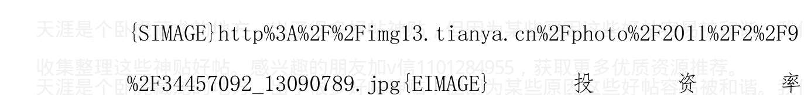

投资率

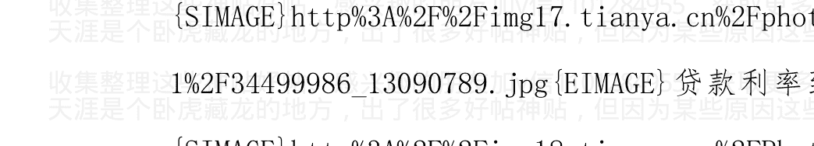

## 贷款利率到底在什么合适？

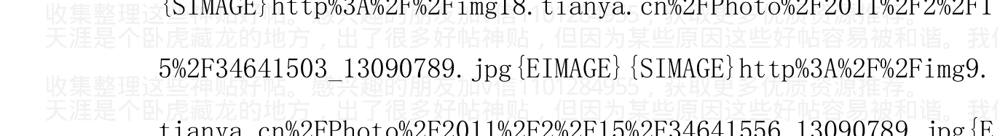

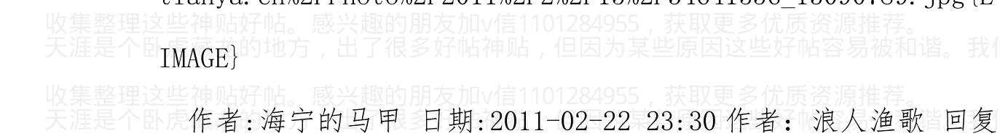

作者：海宁的马甲 日期:2011-02-22 23:30 作者：浪人渔歌 回复日期：2011-02-22 22:52:05

请不要把这样的回帖放在这里。

根本不会起来，因为中国普通百姓的生活，这10几年来，总体还是大大改善了大。中d东北非很多国家的百姓生活太差了，比中国差很多，而且失业率高，还有文化因素。中国人吃亏耐劳，创造了很多财富（虽然财富的分配越来越不公）。

中d东北非的事情，对很多人也许突然，事实上，2008年GEAB 26其就预测由食品涨价引发的问题。2009年，美联储量化宽松后，很多机构都预测会各地，特别是中东北非出现“由馒头引发的血案”，而且还排名了。埃jj及，突nn尼ss斯，巴1林等一直排在前五。冰冻三尺，非一日之寒。

中东北非是全球石油基地，但是那里一半国家是石油进口国。

石油涨，某些进口国难受。

石油跌，某些出口国的财力出现问题。

作者: 海宁的马甲 日期: 2011-02-25 23:50 美联储资产负债表的变化——量化宽松 2 期把到期的两房债换成美国国债

其中 1.5 万亿是外国政府托管在美联储的，大部分是中日买的美国国债与两房债

美联储资产负债表的变化——量化宽松 2 期把到期的两房债换成美国国债

```
[SIMAGE] http%3A%2F%2Fimg18.tianya.cn%2FPhoto%2F2011%2F2%2F25%2F34969385_13090789.jpg [EIMAGE]
```

作者: 海宁的马甲 日期: 2011-02-25 23:53 作者: zhengyu718 回复日期: 2011-02-25 09:55:32

楼市限购了，投资在楼市的外资在美联储加息后还能迅速撤离吗？

外资在中国楼市根本就没有什么投资，都是中国人自己的钱，外汇占款，外贸顺差的钱。

热钱2004年就在大喊，热钱热钱，推高中国房价，那是2004年的事情。2004年是喊房地产泡沫声音最大的时候。

热钱5年以后都不走，能叫热钱吗？

作者:海宁的马甲 日期:2011-02-25 23:54 最近，美元在中东北非危机中，却走向新低，我认为是因为市场认为欧元会加息，反通货膨胀，而美联储的收紧是最迟的，所以日元，瑞士法郎等比美元好。

石油在85美元附近的底非常坚实，即使回调，不要调到85，就会有很多人进程抢购。

作者:海宁的马甲 日期:2011-03-11 22:00 这是个信仰问题，东京，香港，台北，汉城的市中心房地产的投资者，都曾经认定市中心不会跌，因为市中心独一无二，市中心附近没有可开发的土地。今天自然有人认为中国北京上海等，和香港东京不一样。确实不一样，他们都在独一无二的地方，东京是4个大陆板块的交接处（别人一般是2个大陆板块的交界处，比如洛杉矶旧金山等），每过70多年地震一次，现在离1920年代的大地震都80多年了，还不震，怪了。

真的地震了。

作者:海宁的马甲 日期:2011-03-11 22:11 从1923算起，差不多加v信1101284955获取更多优质书籍推荐

憋了87.5年。憋得太久，地震来的时候，越猛烈。

要是2000年左右地震，就不会震得这么厉害了。

所以，有什么压力，最好尽早释放出来，才好轻松上阵。

## 关东大地震

关东大地震是于大正12年(1923年)在日本时间9月1日早上11:58分时，发生在日本关东平原的地震灾害，高达芮氏规模7.6，震中位于相模湾的伊豆大岛，属于上下垂直型的地震。影响范围包括了东京都、神奈川县、千叶县以及静冈县。又称为东京大地震。

关东大地震产生的原因众说纷纭，最多的说法是在5分钟内发生三起地震所构成的。最初的地震是发生在日本时间11时58分32秒、规模7.9的双中心地震，发生地点于相模湾两侧的半岛，地震历经时间约15秒。第二个是12:01，规模7.3的余震，第三个是12:03，规模7.2的余震。这三个地震合计连续摇了大概5分钟以上。

由于地震发生时间在中午炊饭之际，大多数人家遭逢巨大地震无法及时反应，导致炊具倒塌或崩坏，火苗纷纷窜起，造成东京市超大规模火灾。一些逃到避难所或是防空洞避难的市民，无论老少更是集体被大火吞噬；比起纯粹地震引起的损害，地震后引起的大火灾造成的损害更是巨大、惨烈。

火灾发生后，有谣言传出是在日本的韩国人纵火酿灾，引起许多市民愤怒，于是展开大规模私刑报复韩国人的事件发生，许多韩国人被日本人通过口音辨别韩国人，也有中国人被当作韩国人被打伤、打死。

受害者人数死亡人数、失踪人数：约14万2千8百人（官方统计死亡者约105,385人）
避难人数：至少190万人以上
倒塌建筑物：约12万8千栋
因火灾烧毁之建筑物：约44万7千栋
关东大地震死亡人数在日本从明治时期以来排名为第1位，在世界排名第9位。

作者:海宁的马甲 日期:2011-03-11 22:21 日本广播公司（Japan Broadcasting Corporation）称，初步统计的死亡人数为23人，预计该数字还将上升，因为北部受灾最重的部分地区的通讯被切断。

此次地震发生在格林威治时间0546，最初测定为7.9级，随后向上修正为8.9级。美国地质调查局（U.S. Geological Survey）称，这是1900年以来全球范围内发生的第五大地震。

加v信1101284955获取更多优质书籍推荐

此次地震震级远高于关东大地震 (Great Kanto Earthquake) 的 7.9 级和 1995 年神户地震的 6.8 级。1923 年发生的关东大地震曾摧毁东京，并夺去了 14.3 万人的生命，其中许多人是丧身火海。神户地震则令 5,502 人丧生。

日圆一度大幅下挫，但于数小时后收复了全部失地。东京股市下跌，日本国债期货上涨。对冲日本国债违约风险的成本上升。

其他亚洲货币大幅下跌，因投资者撤离风险资产。

日本首相菅直人 (Naoto Kan) 召开紧急内阁会议，呼吁全国保持冷静。

他在一个新闻发布会上表示，政府将尽最大努力确保民众安全，并将损失减至最小。

日本内阁官房长官枝野幸男 (Yukio Edano) 表示，日本将考虑接受外国政府的救助。

苏黎世金融服务 (Zurich Financial Services) 的一位管理人士表示，目前对损失程度进行评估还为时尚早，但欧洲再保险公司的股价还是受到了重挫。

穆迪投资者服务(Moody's Investors Service)的分析师Tom Byrne表示，这次地震不太可能会对日本主权债务评级产生重大影响。

当地电视台画面显示，东京港口一栋建筑正在冒烟，东京海滨的台场地区起火，东京附近的市原市的一个炼油厂也出现火光。

日本共同社(Kyodo)报导称，日本沿海各个地区遭受了不同程度（1米-7.3米）的海啸冲击，而且震中附近的仙台港口遇到了10米高的海啸。

海啸预警范围扩大至至少50个国家和地区，其中包括美国西海岸和南美洲部分地区，而且夏威夷州已下令疏散当地居民和游客。

日本气象局一位官员在电视中呼吁，受地震影响的人们不要回家，因为可能还会发生海啸。

东京和八个县出现断电，大约400万户家庭受到影响。

美国地质调查局称，余震震级高达7.1级。东京中央地区的高楼在余震中剧烈晃动。

地震震中在宫城县首府仙台东部130公里处。共同社还称，该县长官申请获得日本军方的援助。

东京主要机场都已停飞，不过随后有报导称，羽田机场重新开放了数条跑道。东京地区的所有铁路也已经停运，新干线列车全部停驶。

共同社还称，福岛太平洋沿岸的两个核电厂已经自动关闭。

日本政府在首相办公室成立工作小组。日本央行成立了由央行行长白川方明(Masaaki Shirakawa)领导的灾难控制小组，以评估地震对金融市场和金融机构业务运作的影响。

日本央行发布声明称，该行将尽最大努力，包括向市场提供流动性，以确保金融市场稳定，并保障资金的顺利结算；大型银行今日结算融资尚未出现问题。

日本央行还称，其总部、分支机构和业务运转都未受到严重影响。该行的银行间系统也运转正常。

基准日经指数周五收盘跌1.7%；主力六月日本国债期货收盘涨0.66，至139.20，一度在地震发生后不久触及盘中高点139.90。美元兑日圆从地震发生前的82.80日圆升至83.30日圆附近，不过于格林威治时间 0751 回落至 82.90 日圆。对冲 1,000 万日本国债五年违约风险的成本上涨 5,000 美元，至 84,000 美元，涨幅 6.3%。

> 作者:海宁的马甲 日期:2011-03-28 20:34 作者: andyzuo 回复日期: 2011-03-28 17:20:02

海宁分析下现在调控是不是又要变空调了呢，难道真的想逼人 XX 吗

通过黄金与居住土地出让价格的数据显示，空调和调控在以前 10 年中的作用，不到经济规律的 20 分之一，所以，真正关心的是经济规律，而不是调控。调控，只能拦住一时，这个一时一般还不到半年。

> 作者:海宁的马甲 日期:2011-03-28 20:39 评论哈克博文: 透过黄金看房地产 --人性从未改变

> 哈克博文: 透过黄金看房地产，参见 [http://blog.sina.com.cn/s/blog_55954cfb0100q435.html](http://blog.sina.com.cn/s/blog_55954cfb0100q435.html)

非常感谢哈克的数量化计算分析。

简单一句话，中国的居住土地价格的决定因素，和黄金的决定因素，极其类似。

简单地说，中国居住类土地价格/黄金的比价，2000年以来，一直在3.06附近徘徊（看下图中间那条波动的线）。

中国地价，2000年以来，以指数0.1681增长，黄金价格以0.1675的指数增长。两者相关度，基本是95%以上。

从正面理解，这就是人民币基本盯住美元，稳步缓慢升值的威力；这也是人性趋利避害的威力；这是人性“理性或者疯狂”逃避“通货膨胀税”的威力。到底是理性，还是“逃离通货膨胀税”过头了，要等待时间的审判，而且受到中央银行“纸币”（信用货币）利率政策的影响。

从反面说，什么神马国四条，国八条，国十六条，神马道德劝说，等等等等，对居住地价和房价的影响力，不到5%，不及货币贬值制造的“逃离通货膨胀税”威力的二十分之一。

从最深层次说，人性从未改变。有什么样的宽松货币政策，就有什么。

加v信1101284955获取更多优质书籍推荐

黄金本身难以用印刷成本极低的纸币（信用货币）定价，房价所反映的未来通货膨胀预期，或者未来接盘者的预期收入，也难以定价。

对黄金定价的，对超出正常房价收入比、租售比的那部分房价进行定价的，是人性。

而趋利避害的人性，受货币政策，特别是负利率货币政策所驱使。

简单一句话，中国的居住土地价格的决定因素，和黄金的决定因素，极其类似。

美元币值波动，受美联储利率政策影响。美联储利率政策，会影响

8.8万亿美元的货币供应量的“价值”。量化宽松可以简单理解为负利率。

美元币值波动，也受到美国财政赤字规模，和人们对于美国未来赤字的预期的影响。美国国债，可以简单理解为一种带利息（每半年一次付利息）的美元。所谓美国公司手握的2万亿美元现金储备，许多是以短期国债形式存在的。（长期国债价格波动大，可以算出投资）。

这不是为各种由土地引发的腐败开脱，而是说，2000年以来，中国的货币环境，主要看美联储和美国财政赤字，美国经济状况，在黄金价格上的反映。而且更好的是，黄金价格里，反映了对于未来的预期。

因为人民币的七成成色，是美元。外汇占款早已超过中国的基础货币量。（通过存款准备金率，锁住了部分外汇占款，所以，人民币里面的美元成色，还不到港币那样的100%。）

对中国房价，地价而言，影响最大的是美国和中国的货币政策。（1994年，铁腕就是用货币政策把房地产泡沫压下去的，否则1997-1998年东南亚金融危机，会包括中国）

2007，2008年，美联储北京分行紧缩货币政策，导致了连锁反应，与美国的次贷危机一起，导致了世界范围的萧条。（这不是说中国有错，一个经济体对世界有很大的影响，是好事）。

2009年-2011年，美联储的货币政策，被美国房地产泡沫破裂的余波所绑架；就像2001-2004美联储的货币政策，被互联网泡沫破裂的余波所绑架一样。

香港房价，28年来，完全受美联储和美国财政赤字，美国经济状况，所导致的美元币值的影响。

美联储每一次持续3年左右的低利率时期(1986-1988,1992-1994,2002-2004，2009-2011)，香港房价必涨，而且是大涨，无一例外。因为港币是100%成色的美元兑换券。

加v信1101284955获取更多优质书籍推荐

> > 人性从未改变，古今中外，无一例外。

## 天涯[经济杂谈]黄金才是中国房价的先行指标与近似价格指数，黄金暴跌先于房价暴跌 2010-07-23

http://www.tianya.cn/publicforum/content/develop/1/458221.shtml

我们要迎来2011年6月前后这个关键的时间点。

居住土地和黄金，两条以指数式增长的抛物线。

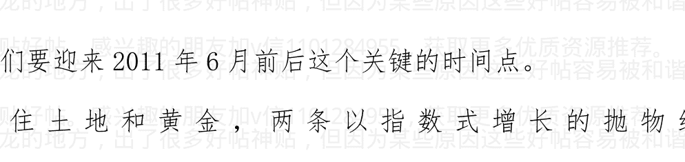

作者:海宁的马甲 日期:2011-03-28 20:44 黄金与黑金(石油)2009年6月以来，一直处于蜜月期

黑金（石油）涨疯的时候，黑金（石油）才从黄金的情人，变成黄金的敌人（即全球更多的地方加息，对付通货膨胀，特别是美联储结束量化宽松二期之后，一时无法推出量化宽松三期）

黄金与黑金（石油）2009年6月以来，一直处于蜜月期

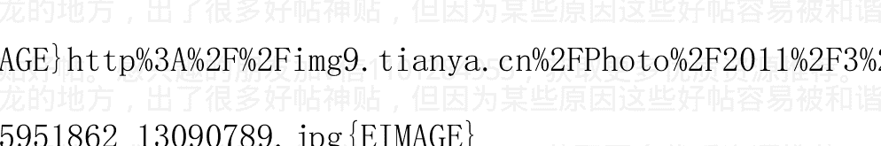

作者:海宁的马甲 日期:2011-03-28 20:51 黄金看涨合同Long

contracts 与 short contracts 的比例已经到达 50：1.

即每一个看空黄金的合同，对应 50 个看涨黄金的合同。

一般全体一致同向的时候，反转的时间不远了。

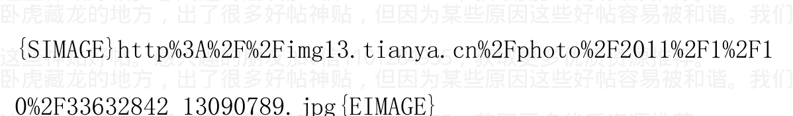

作者:海宁的马甲 日期:2011-03-28 21:22 中华人民共和国中国人民银行法（全文）

（1995年3月18日第八届全国人民代表大会第三次会议通过

根据2003年12月27日第十届全国人民代表大会常务委员会第六次会议《关于修改〈中华人民共和国中国人民银行法〉的决定》修正）

### 目录

### 第一章 总则

### 第二章 组织机构

### 第三章 人民币

### 第四章 业务

加v信1101284955获取更多优质书籍推荐

### 第五章 金融监督管理

### 第六章 财务会计

### 第七章 法律责任

## 第八章 附则

### 第一章 总则

第一条 为了确立中国人民银行的地位，明确其职责，保证国家货币政策的正确制定和执行，建立和完善中央银行宏观调控体系，维护金融稳定，制定本法。

第二条 中国人民银行是中华人民共和国的中央银行。中国人民银行在国务院领导下，制定和执行货币政策，防范和化解金融风险，维护金融稳定。

第三条 货币政策目标是保持货币币值的稳定，并以此促进经济增长。

### 第四条 中国人民银行履行下列职责：

- （一）发布与履行其职责有关的命令和规章；
- （二）依法制定和执行货币政策；
- （三）发行人民币，管理人民币流通；
- （四）监督管理银行间同业拆借市场和银行间债券市场；
- （五）实施外汇管理，监督管理银行间外汇市场；
- （六）监督管理黄金市场；
- （七）持有、管理、经营国家外汇储备、黄金储备；
- （八）经理国库；
- （九）维护支付、清算系统的正常运行；
- （十）指导、部署金融业反洗钱工作，负责反洗钱的资金监测；(十一)负责金融业的统计、调查、分析和预测；
(十二)作为国家的中央银行，从事有关的国际金融活动；
(十三)国务院规定的其他职责。

中国人民银行为执行货币政策，可以依照本法第四章的有关规定从事金融业务活动。

第五条 中国人民银行就年度货币供应量、利率、汇率和国务院规定的其他重要事项作出的决定，报国务院批准后执行。

中国人民银行就前款规定以外的其他有关货币政策事项作出决定后，即予执行，并报国务院备案。

第六条 中国人民银行应当向全国人民代表大会常务委员会提出有关货币政策情况和金融业运行情况的工作报告。

第七条 中国人民银行在国务院领导下依法独立执行货币政策，履行职责，开展业务，不受地方政府、各级政府部门、社会团体和个人的干涉。

第八条 中国人民银行的全部资本由国家出资，属于国家所有。

第九条 国务院建立金融监督管理协调机制，具体办法由国务院规定。

### 第二章 组织机构

第十条 中国人民银行设行长一人，副行长若干人。

中国人民银行行长的人选，根据国务院总理的提名，由全国人民代表大会决定；全国人民代表大会闭会期间，由全国人民代表大会常务委员会决定，由中华人民共和国主席任免。中国人民银行副行长由国务院总理任免。

第十一条 中国人民银行实行行长负责制。行长领导中国人民银行的工作，副行长协助行长工作。

第十二条 中国人民银行设立货币政策委员会。货币政策委员会的职责、组成和工作程序，由国务院规定，报全国人民代表大会常务委员会备案。

中国人民银行货币政策委员会应当在国家宏观调控、货币政策制定

第十三条 中国人民银行根据履行职责的需要设立分支机构，作为中国人民银行的派出机构。中国人民银行对分支机构实行统一领导和管理。

中国人民银行的分支机构根据中国人民银行的授权，维护本辖区的金融稳定，承办有关业务。

第十四条 中国人民银行的行长、副行长及其他工作人员应当恪尽职守，不得滥用职权、徇私舞弊，不得在任何金融机构、企业、基金会兼职。

第十五条 中国人民银行的行长、副行长及其他工作人员，应当依法保守国家秘密，并有责任为与履行其职责有关的金融机构及当事人保守秘密。

### 第三章 人民币

第十六条 中华人民共和国的法定货币是人民币。以人民币支付中华人民共和国境内的一切公共的和私人的债务，任何单位和个人不得拒收。

第十七条 人民币的单位为元，人民币辅币单位为角、分。

第十八条 人民币由中国人民银行统一印制、发行。

中国人民银行发行新版人民币，应当将发行时间、面额、图案、式样、规格予以公告。

第十九条 禁止伪造、变造人民币。禁止出售、购买伪造、变造的人民币。禁止运输、持有、使用伪造、变造的人民币。禁止故意毁损人民币。禁止在宣传品、出版物或者其他商品上非法使用人民币图样。

第二十条 任何单位和个人不得印制、发售代币票券，以代替人民币在市场上流通。

第二十一条 残缺、污损的人民币，按照中国人民银行的规定兑换，并由中国人民银行负责收回、销毁。

第二十二条 中国人民银行设立人民币发行库，在其分支机构设立分支库。分支库调拨人民币发行基金，应当按照上级库的调拨命令办理。任何单位和个人不得违反规定，动用发行基金。

加v信1101284955获取更多优质书籍推荐

### 第四章 业务

第二十三条 中国人民银行为执行货币政策，可以运用下列货币政策工具：
- （一）要求银行业金融机构按照规定的比例交存存款准备金；
- （二）确定中央银行基准利率；
- （三）为在中国人民银行开立账户的银行业金融机构办理再贴现；
- （四）向商业银行提供贷款；
- （五）在公开市场上买卖国债、其他政府债券和金融债券及外汇；
- （六）国务院确定的其他货币政策工具。

中国人民银行为执行货币政策，运用前款所列货币政策工具时，可以规定具体的条件和程序。

第二十四条 中国人民银行依照法律、行政法规的规定经理国库。

第二十五条 中国人民银行可以代理国务院财政部门向各金融机构组织发行、兑付国债和其他政府债券。

第二十六条 中国人民银行可以根据需要，为银行业金融机构开立账户，但不得对银行业金融机构的账户透支。

第二十七条 中国人民银行应当组织或者协助组织银行业金融机构相互之间的清算系统，协调银行业金融机构相互之间的清算事项，提供清算服务。具体办法由中国人民银行制定。中国人民银行会同国务院银行业监督管理机构制定支付结算规则。

第二十八条 中国人民银行根据执行货币政策的需要，可以决定对商业银行贷款的数额、期限、利率和方式，但贷款的期限不得超过一年。

第二十九条 中国人民银行不得对政府财政透支，不得直接认购、包销国债和其他政府债券。

第三十条 中国人民银行不得向地方政府、各级政府部门提供贷款，不得向非银行金融机构以及其他单位和个人提供贷款，但国务院决定中国人民银行可以向特定的非银行金融机构提供贷款的除外。

中国人民银行不得向任何单位和个人提供担保。

### 第五章 金融监督管理

第三十一条 中国人民银行依法监测金融市场的运行情况，对金融市场实施宏观调控，促进其协调发展。

第三十二条 中国人民银行有权对金融机构以及其他单位和个人的下列行为进行检查监督：
- （一）执行有关存款准备金管理规定的行为；
- （二）与中国人民银行特种贷款有关的行为；
- （三）执行有关人民币管理规定的行为；
- （四）执行有关银行间同业拆借市场、银行间债券市场管理规定的行为；
- （五）执行有关外汇管理规定的行为；
- （六）执行有关黄金管理规定的行为；
- （七）代理中国人民银行经理国库的行为；
- （八）执行有关清算管理规定的行为；
- （九）执行有关反洗钱规定的行为。

前款所称中国人民银行特种贷款，是指国务院决定的由中国人民银行向金融机构发放的用于特定目的的贷款。

第三十三条 中国人民银行根据执行货币政策和维护金融稳定的需要，可以建议国务院银行业监督管理机构对银行业金融机构进行检查监督。国务院银行业监督管理机构应当自收到建议之日起三十日内予以回复。

第三十四条 当银行业金融机构出现支付困难，可能引发金融风险时，为了维护金融稳定，中国人民银行经国务院批准，有权对银行业金融机构进行检查监督。

第三十五条 中国人民银行根据履行职责的需要，有权要求银行业金融机构报送必要的资产负债表、利润表以及其他财务会计、统计报表和资料。

中国人民银行应当和国务院银行业监督管理机构、国务院其他金融监督管理机构建立监督管理信息共享机制。

第三十六条 中国人民银行负责统一编制全国金融统计数据、报表，并按照国家有关规定予以公布。

第三十七条 中国人民银行应当建立、健全本系统的稽核、检查制度，加强内部的监督管理。

### 第六章 财务会计

第三十八条 中国人民银行实行独立的财务预算管理制度。中国人民银行的预算经国务院财政部门审核后，纳入中央预算，接受国务院财政部门的预算执行监督。

第三十九条 中国人民银行每一会计年度的收入减除该年度支出，并按照国务院财政部门核定的比例提取总准备金后的净利润，全部上缴中央财政。

中国人民银行的亏损由中央财政拨款弥补。

第四十条 中国人民银行的财务收支和会计事务，应当执行法律、行政法规和国家统一的财务、会计制度，接受国务院审计机关和财政部门依法分别进行的审计和监督。

第四十一条 中国人民银行应当于每一会计年度结束后的三个月内，编制资产负债表、损益表和相关的财务会计报表，并编制年度报告，按照国家有关规定予以公布。

中国人民银行的会计年度自公历1月1日起至12月31日止。

### 第七章 法律责任

第四十二条 伪造、变造人民币，出售伪造、变造的人民币，或者明知是伪造、变造的人民币而运输，构成犯罪的，依法追究刑事责任；尚不构成犯罪的，由公安机关处十五日以下拘留、一万元以下罚款。

第四十三条 购买伪造、变造的人民币或者明知是伪造、变造的人民币而持有、使用，构成犯罪的，依法追究刑事责任；尚不构成犯罪的，由公安机关处十五日以下拘留、一万元以下罚款。

第四十四条 在宣传品、出版物或者其他商品上非法使用人民币图样的，中国人民银行应当责令改正，并销毁非法使用的人民币图样，没收违法所得，并处五万元以下罚款。

第四十五条 印制、发售代币票券，以代替人民币在市场上流通的，中国人民银行应当责令停止违法行为，并处二十万元以下罚款。

第四十六条 本法第三十二条所列行为违反有关规定，有关法律、行政法规有处罚规定的，依照其规定给予处罚；有关法律、行政法规未作处罚规定的，由中国人民银行区别不同情形给予警告，没收违法所得，违法所得五十万元以上的，并处违法所得一倍以上五倍以下罚款；没有违法所得或者违法所得不足五十万元的，处五十万元以上二百万元以下罚款；对负有直接责任的董事、高级管理人员和其他直接责任人员给予警告，处五万元以上五十万元以下罚款；构成犯罪的，依法追究刑事责任。

第四十七条 当事人对行政处罚不服的，可以依照《中华人民共和国行政诉讼法》的规定提起行政诉讼。

第四十八条 中国人民银行有下列行为之一的，对负有直接责任的主管人员和其他直接责任人员，依法给予行政处分；构成犯罪的，依法追究刑事责任：
- （一）违反本法第三十条第一款的规定提供贷款的；
- （二）对单位和个人提供担保的；
- （三）擅自动用发行基金的。

有前款所列行为之一，造成损失的，负有直接责任的主管人员和其他直接责任人员应当承担部分或者全部赔偿责任。

第四十九条 地方政府、各级政府部门、社会团体和个人强令中国人民银行及其工作人员违反本法第三十条的规定提供贷款或者担保的，对负有直接责任的主管人员和其他直接责任人员，依法给予行政处分；构成犯罪的，依法追究刑事责任；造成损失的，应当承担部分或者全部赔偿责任。

第五十条 中国人民银行的工作人员泄露国家秘密或者所知悉的商业秘密，构成犯罪的，依法追究刑事责任；尚不构成犯罪的，依法给予行政处分。

第五十一条 中国人民银行的工作人员贪污受贿、徇私舞弊、滥用职权、玩忽职守，构成犯罪的，依法追究刑事责任；尚不构成犯罪的，依法给予行政处分。

## 第八章 附则

第五十二条 本法所称银行业金融机构，是指在中华人民共和国境内设立的商业银行、城市信用合作社、农村信用合作社等吸收公众存款的金融机构以及政策性银行。

在中华人民共和国境内设立的金融资产管理公司、信托投资公司、财务公司、金融租赁公司以及经国务院银行业监督管理机构批准设立的其他金融机构，适用本法对银行业金融机构的规定。

第五十三条 本法自公布之日起施行。

> 作者:海宁的马甲 日期:2011-03-28 21:23

第五条 中国人民银行就年度货币供应量、利率、汇率和国务院规定的其他重要事项作出的决定，报国务院批准后执行。

中国人民银行就前款规定以外的其他有关货币政策事项作出决定后，即予执行，并报国务院备案。

升降存款准备金率，央行相对有一定的权力。但是加息，降息，需要批准后才能执行。

作者:海宁的马甲 日期:2011-03-28 22:08 作者：中医外科 回复

日期: 2011-03-28 21:50:34

楼主 呵呵 我很激动 我是做期货交易的

我去年就发现了 楼市和黄金的高度联动性 今天第一次找见相同意者

很荣幸看您的帖子

2009.3以来，这是一次货币盛宴，不但黄金（740美元到1400美元）中国房价基本翻番，粮食石油等，也是翻番（石油在55美元以下的时候，超跌了；低于55美元显然具有限制供给的功效，粮食也超跌，很多农产品和农地2009年初极其便宜）。

已经快接近尾声了，但是尾声的具体月份是极难判断的，因为它受人群思维和对经济的信心的影响很大。

作者:海宁的马甲 日期:2011-03-28 22:11 新华社：警惕猪价“波峰”汹涌来袭

# 2011 年 03 月 28 日

- 监测显示，全国生猪价格持续上涨，1 月至 3 月初累计涨幅为 6.9%，目前生猪收购均价较 2010 年同期上涨 40%左右；
- 分析师认为，在饲料成本高企、当前存栏量不足、部分养猪户受疫情打击补栏积极性不高等因素支撑下，后期猪价走势将趋强；
- 分析人士指出，上一个猪肉价格的“波峰”出现在 2008 年 1 月，如果按照往年规律，今年猪肉价格正处于上涨的‘波峰’期；
- 不少人士认为，猪肉价格与 CPI 关系密切，猪肉价格高位运行将推动我国未来一段时间 CPI 持续走高。

## “瘦肉精”影响淡化 猪肉价格止跌

25 日，记者在山东济南一家超市的猪肉柜台前看到，前来购买猪肉的顾客比前几天明显多了起来，精肉等部分品种柜台前还排起一条长队。

记者在采访中了解到，此前，“双汇瘦肉精事件”影响了市场消费信心，山东地区猪肉价格一度出现下降。不过，随着国家密集出

加v信1101284955获取更多优质书籍推荐

### “重拳”查处“瘦肉精”，近期消费者信心逐渐恢复，猪肉价格开始止跌回升。

山东省淄博市淄川正业畜牧养殖场目前存栏生猪6000余头，是当地规模较大的养殖场。这个养殖场的老板安圣敏告诉记者，3月15日之后几天，当地生猪价格小幅下降，从每公斤15.4元下降到14.9元，最近几天又回升至15.5元。

山东省畜牧兽医信息中心对全省25个集贸市场进行价格定点监测的结果显示，第11周（3月14日～3月20日），山东省生猪市场价格小幅震荡，活猪价格为每公斤14.75元，环比上涨0.89%，同比上涨59.12%；猪肉价格为每公斤23.33元，与上周价格持平，同比上涨42.26%。

### 猪价同比大涨 后期走势趋强

从农业部选的13个生猪主产省的39个价格信息点统计的信息来看，除了河南洛阳的猪肉销量明显下降之外，其余信息点的猪肉销量受“瘦肉精事件”的影响均不明显，猪肉价格基本平稳。

新华社全国农副产品和农资价格行情系统监测也显示，春节过后，全国生猪价格持续上涨，1月至3月初累计涨幅为6.9%，目前生猪收购均价较 2010 年同期上涨 40%左右，较 2009 年同期上涨 25%左右。

> 中国生猪预警网首席分析师冯永辉说，在饲料成本高企、当前存栏量不足、部分养猪户受疫情打击补栏积极性不高等因素支撑下，后期猪价走势将趋强。

他具体分析认为，首先，饲料成本大幅上涨，其中玉米和配料价与去年同期相比分别上涨了 15%左右、10%左右，导致养猪成本上涨。其次，前期亏损导致当期存栏量不足。2010 年上半年之前，一些养猪户遭受“高成本、低价格”的双重挤压，遭受持续亏损，大量中小养殖户被迫退出，导致目前母猪、肥猪等存栏量不足。另外，去年猪病疫情较重，打击了养猪户补栏积极性。2010 年猪病影响级别由 2009 年的 2.6 级（较严重）跃升至 3.21 级（严重），打击了养殖户的补栏积极性，并加速了生猪出栏。

### 调控猪价 构建 CPI “防波堤”

近年来，国内生猪价格经历过两次明显的波动周期，分别在 2004 年 9 月和 2008 年 1 月形成“波峰”，间隔约 3 年。“上一个猪肉价格的‘波峰’出现在 2008 年 1 月，如果按照往年规律，今年猪肉价格正处于上涨的‘波峰’期，峰值也很有可能将在本年度出现。”

冯永辉告诉记者。冯永辉根据“2010 年底母猪存栏水平低于均衡水平 15%”等数据预计，2011 年猪价整体将同比上涨 30%左右，今年 5 月份前后，全国猪价均价可能逼近每公斤 15 元。

不少人士认为，猪肉价格与 CPI 关系密切，猪肉价格高位运行将推动我国未来一段时间 CPI 持续走高。比如，2008 年 1 月猪肉价格同比上涨 58.8%，推动当月 CPI 创出上涨 7.1%的 11 年新高；2008 年 2 月猪肉价格继续居高不下，当月 CPI 涨幅更是高达 8.7%。

> > “在构成 CPI 的八大项目中，食品类权重约占 30%，猪肉又在食品类中占较大比重。因此，如果猪肉价格持续走高，将不可避免地推高 CPI。”山东大学经济学院副院长李铁岗说。

一些业内人士表示，鉴于猪肉价格和 CPI 密切的“正向关系”，国家有关部门应密切关注猪肉价格走势并及时调控，构建一道严密的 CPI“防波堤”。

新华社

年初，中国央行出手打击通货膨胀了，2011 年应该也会出手打击通货膨胀吧。但是它需要等恶性通货膨胀这个敌人先出现才好下手。至于为什么央行要等到通货膨胀恶化了才加息，是中国特色因素。这个事情真的不能说得太细。总之通货膨胀不严重的时候加息，反对声音和压力阻力比较大，等通货膨胀恶化甚至快失控了，再去加息，阻力就小了。我们只能理解央行。你还不明白“不恶化不加息”，那我只能说，我不会解释得更细了。

### 3 月以前食用油禁涨令，到期了。

作者：海宁的马甲 日期：2011-03-28 22:51 按某些专家计算，世界石油产量的峰值，将在 2014 年左右出现。目前已经有 60 多个国家的石油产量，已经过了峰值。中国的石油产量峰值，在 2011 到 2015 年之间到来。中国，美国的石油储量与年产量的比值，都是 11 年（即目前的储量，可采 11 年，当然还可以发现一些，但是 2 亿吨左右/年，就是中国石油产量的峰值）。

### 世界石油产量，60 多个国家相聚过了产量峰值

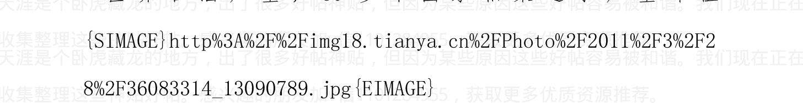

作者：海宁的马甲 日期：2011-03-28 22:54 如果真的有阴谋，那么现在用几百亿美元，就可以把大豆和大米的价格打飞，事实上，大豆因为丰收，价格并不高得过分，大米维持低价也令泰国农民和泰国政府极其郁闷，泰国政府想要主导大米定价权。

> 作者:海宁的马甲 日期:2011-03-28 23:05 作者:经天纬地 01 回 复日期：2011-03-28 22:56:41

我最中意的帖！本人从事房地产行业5年多一直关注国家的货币政策，这次看来是不得不转向了，长期的低利率使得整个国家陷入了低水平、重复建设的怪圈。低利率等于变相支持美国低息借贷；看看我们出口的低附加值的产品，再看看我的环境破坏。

低利率的发展模式不知道还要坚持多久，房地产真正要实现平稳健康发展，提高利率刻不容缓，本身房地产这个特殊的行业就应该两条腿走路，以前依靠低利率实现了大规模的城市化了，同时也带来了很多弊端。

可以预见房地产的未来：一方面是有钱人买高档商品房（高利率开发成本决定）健康发展，一边是政府大力建设保证房保证中低收入阶层的居住权。

所言极是。但是那位2010年5，6月份请求欧美不要“过早”退出刺激，2011年3月又怪罪美联储量化宽松推高了物价的人，不会认同这一点的。

一切需要时间的酝酿。

目前是两难，保持物价稳定，则房价完了，保持低利率，则物价控制不住。

一个人，不能承诺太多，特别是达不到的事情，不能承诺太多。

作者：海宁的马甲 日期：2011-03-28 23:10

人民币，是社会主义国家里，目前为止，过去 30 到 50 年，表现最优秀的一个货币。

作者：go2mapcom 回复日期：2011-03-28 23:00:53

我想问问 作者：海宁的马甲 ，去年你预测在 2011 年 6 月很可能出现房价下降，现在你仍然这样认为还是有调整。

马上 5 月份有新盘要开，作为刚需的我，想买第一套房啊，真的是很艰难的决定啊。

我坚持 2011 年 6 月左右，房价出现拐点。

2011 年下半年到 2012 年整年，房价大幅下降，经济下滑。

2013 年春天开始，大量坏账出现，然后就像 1999-2003 年那样冲销坏账。

不用到 2016 年，2007 年，甚至 2010 年的价格就不算贵了。当然这些太遥远，目前还很难说。

人民币，是社会主义国家里，目前为止，过去 30 到 50 年，表现最优秀的一个货币。

## 作者：海宁的马甲 日期：2011-03-28 23:51

2011 年 6 月附近美联储加息是不大可能的。

一是，结束量化宽松二期，就相当于加息 200 个基点左右，这副药很猛，美联储可能需要平缓一下。

金融市场，出现一致买入，或者一直卖出，是非常恐怖的。格林斯潘一直用模糊语言传达信息，就是不希望金融市场出现一直行动的共振。

1987 年股灾就是一次共振。

> 伯南克 3 月说了，通货紧缩的风险，已经可以忽略不计了 "Based on the information available at this time, the risk of deflation has gone from small to negligible"

## 作者：海宁的马甲 日期：2011-03-28 23:55

伯南克：没有必要搞更多的量化宽松了。

量化宽松二期结束，在美国经济再次像 2010.4-2010.7 那样下滑之前，没有量化宽松三期了。

金融市场将发生巨大的变化，每月 1000 亿美元的洪流，从 2011 年 7 月开始，突然消失了。

http://ftalphaville.ft.com/blog/2011/03/28/528666/

Q: Will QE2 end in June?

> > Bernanke: Based on the information available at this time, the risk of deflation has gone from small to negligible, and most indicators of economic activity point to a sustainable recovery. In such an environment, we believe that a further easing of monetary policy via additional large-scale would not be appropriate.
>
> > GS: Our own view is that the risk of deflation has certainly fallen but that the term “negligible” is too strong. If the economy were to slow anew to a belowtrend growth pace, deflation concerns could resurface. But that’s neither here nor there with respect to the committee’s decision whether to end QE2, which seems to have been taken.

作者：海宁的马甲 日期：2011-03-29 08:34 作者：yfzgh 回复日期：2011-03-29 06:17:45

谁又把我们做了访问数：24 回复数：1
楼主作者：yfzgh 发表日期：2011-3-28 6:58:35

今年想买一处房子，这个月一直在各售楼处转悠。对报纸的房地产广告也特别留意。虽然，现在的房价高到天花板，可是，通货膨胀一直尾随我们的工资。存钱不合算，连地摊卖报的老伯伯都知道了。

这么多年，一直对房产价格评估失误。原来可以买一百米的存款，现在连 30 米都买不起了。再不买，恐怕以后连个狗窝都买不到了。

还好，政府也知道房价超过了居民的承受能力，在全国房奴的期盼之后，中央出台了一些调控政策。调控之严厉，措施之密集，不能不让我们为之一振。看样子，中央要玩真的了。我抱着这份渴望，希望能成为中央调控的受益者。

春暖花开，正是我们北方的建筑工地从蛰伏中苏醒过来时候，冬天紧闭的售楼处大门，像一个狮子的大嘴，望着急于买房的人垂涎三尺。

从黄金与房价的密切走势看，黄金不跌，中国房价不跌。

行政调控对于房价的影响力，不及美联储和中国央行货币政策的 20 分之一。

不是今天我才这么说的。

http://www.tianya.cn/publicforum/content/develop/1/360745.s

### 『经济论坛』[经济杂谈]2009 年的房价变化说明：房价飞涨主要是货币供应量过多造成的 2009-12-22

2010.4.17 行政调控五天之后，我在上面帖子回复了。

作者：海宁的马甲 回复日期：2010-04-22

货币供应量过多，存款利率又是那么的低，

然后调控说，提高第二套房的首付，不许贷款异地买房，有用吗？

历史和将来都将证明，不调利率和货币供应量的调控，根本就是空调。

2009 年，年初货币供应增长率预计 17%，结果是 27.68%，这是 2009 年。

2010 年，年初货币供应增长率预计 17%，结果是 19.5%，这是 2010 年。

2010 年，新增经济适用房 370 万套，杭州，北京市中心 5，6 千的经济适用房不少。

2011 年，年初货币供应增长率预计 16%，结果是有奖竞猜？外贸顺差数据很关键。

作者：海宁的马甲 日期：2011-03-29 08:39 作者：海宁的马甲 回复日期：2010-02-24

坐等房价在高位的平台整理（不涨不跌）

坐等大量货币进入生活必需品领域的投资（囤积，投机）

坐等生活必需品的通货膨胀的发生。

坐等一幕幕抓“囤积居奇”的倒买倒卖的不法分子的作秀。

又有一批人要发财了

并不是 2010 年下半年我才喊通货膨胀要来的。

气候只是个偶然因素，1998 年洪水，物价也没有涨。

你鼓励买汽车，汽油消耗量自然上去，2014 年中国石油产量就要到达峰值了，以后进口石油的比例会越来越高。

2.8 万亿美元，如果石油 150-200 美元/桶，并不比 2003 年底的 4000 美元多多少。

双重压迫，一是外贸顺差，货出国了，美元进来后换成了人民币。

再次通过土地上市印人民币（此为货币的参数效应，大致是 1 比 3.8 到 4.37，看存款准备金率和银行的信贷规模）

作者：海宁的马甲 日期：2011-03-29 08:56

黄金领先商品期货价格 4 个月（75 个交易日）？黄金房价与负利率

以下说的都是大致情况，金融市场不是数学或者物理学公式。金融市场关键的永远是预期与人性。

加 v 信 1101284955 获取更多优质书籍推荐

黄金大致领先商品期货价格 4 个月（75 个交易日），见下图；

而商品期货价格，与民众感受的物价的第一波冲击之间，平均大约有 2 个月左右的差距。

也就是说，平均而言，黄金大幅涨价约 6 个月后，民众能感受到物价的剧烈上涨。

再再进一步说，美联储北平分行的货币政策，是被黄金价格和期货价格推着走，而且非常不情愿地被推着。

也就是说，美联储北平分行加息，升存款准备金率“治病”的时候，“病根”已经种下 6 个月之久了。

2010 年 10 月到 12 月的手忙脚乱，病根在 2010 年 5 月，6 月；货币政策不但不提前收紧，反倒踩油门，还要去求欧美一起踩油门，人家泡沫已经破了，自然乐得愿意踩油门以期减轻民众的痛苦（是否有效是另一回事）。

美联储在美国没有泡沫的时候，还能从容对付，能提前 6 个月左右执行货币收紧。但是互联网泡沫和房地产泡沫，明显绑架了美国的货币政策（3 个月滞后的时滞，也就是以前美联储本来的收紧，提前 6 个月左右，而大泡沫破裂后则收紧是比通货膨胀的发生迟了 3 个月左右，这些是回归分析后的大致结论，并不真的 100% 就是 6 个月或者 3

注意，这种领先，表现最明显的是剧烈的持续降息过程，比如 2007 年 7 月到 2008 年 7 月（货币与债券市场 2007.6 月份就有信号了）；

比如第一期量化宽松 2009.3-2010.3；第二期量化宽松预期和实施（2010.9-2011.6）。

其他时间就不会如此明显了。

### 黄金表现领先商品期货价格走势 75 个交易日？


美元只要发生负利率一年以上，

黄金就涨，香港房价就涨


抛开黄金，看看铜的走势，当然很多人都知道这个


作者：海宁的马甲 日期：2011-03-29 09:07 重温 2005 年高盛纲领性文： 光荣与梦想，中国睡狮的崛起 2005.11 第 133 期

http://ishare.iask.sina.com.cn/f/14109756.html

未来五年（2006-2010）：经济发展和改革红利的“黄金时期”

我们认为入世会从两个方面推动中国经济在未来五年间继续以年均 8%-9% 的高速增长。加速国内改革。我们预计中国会履行入世承诺，在未来的两三年内进一步开放重点产业。政府已经加大了对银行业和资本市场的整顿力度。作为世贸组织成员，中国的商业法规会与国际标准接轨，这将有助于中国提高监管系统的稳定性和透明度。

### # 高盛全球经济研究报告系列：第133号

### # (Global Economics Paper No: 133)

### # GS GLOBAL ECONOMIC WEBSITE

Economic Research from the GS Institutional Portal

at https://portal.gs.com

The authors would like to thank Jim O’Neill, Sun-Bae Kim, William Dudley, Sandra Lawson, Binit Patel and Andrew Tilton for comments and suggestions on an earlier draft.

梁红

易峘

2005 年 11 月 11 日

### # 光荣与梦想：中国睡狮的崛起

- 中国经济在过去 27 年里取得了非凡的发展。
- 在本文中，我们揭示生产力的持续快速增长是中国发展的动力。
- 我们认为，生产力的增长是一种独特的“改革红利”，它源自在深入的国内改革和对外开放。
- 中国在一些根本性的问题上做出了正确的政策选择，其间领导层务实而有效的工作令人赞叹。
- 在可以预见的将来，我们相信中国会持续快速增长，因为和入世相关的改革将促使中国进一步放宽监管，开放市场。
- 长期的挑战仍然存在，因为一些“滞后”的政治和经济的改革可能会越来越难以处理。
- 但是，最近五年中国的发展速度已经比我们在“BRICs 报告”里预计的更快。如果改革加速，这样高于预期的发展将会持续下去。

Goldman Sachs Economic Research Global Economics Paper

第 133 号 3 2005 年 11 月 11 日

### 摘要

- 在过去 27 年里中国的飞速增长源自中国同时经历的两个层面的历史性转变：从农业社会到工业社会的转变和从中央计划经济到市场经济的转变。
- 在我们看来，中国在第二个层面的转变所选择的独特道路使它的成长故事不同于其他任何国家曾走过的道路。因此，我们在评估中国过去的进步和将来的挑战时都必须考虑到前社会主义国家转型中所特定的机遇和挑战。
- 我们认为，1978 年以来，中国生产力的持续快速增长是推动中国快速发展的最重要的动力，也可以称作是一种改革红利，它源于那些为稳步而持续地减少政府计划在经济中的作用所作的政策调整。
- 因此，中国经济发展的史诗性成果并不在于一个低效的经济体的持续快速增长，而在于这个经济体效率的不断提高。在我们看来，中国改革成功的核心是资源配置的主体向市场的转换，这个转换是通过深入的改革逐步完成的。另外，领导人在实施这些改革过程中所采取的务实态度同等重要。
- 中国加入世贸组织后进行的相关改革将带来更多的改革红利，有基于此，我们预测接下来的几年将是增长和效率提高的一个‘黄金时期’。
- 但是，当中国人均收入超过 3,000 美元的界线以后，不确定因素会有所增加，适当的谨慎是必须的。
- 中长期的挑战不在于收益递减效应造成的增长变缓，而在于那些“滞后”、但是却是必备的政治和经济改革可能会日渐艰难。尤其当政府的权力在改革进程中与商业利益紧密结合的时候，进一步推进体制改革，并维持社会稳定可能会变得越来越困难。
- 但是，我们认为中国 27 年的成功历史应该让我们可以对它的未来谨慎乐观。中国 27 年的成功记录不仅体现了政府对改革的决心，还体现了政府强大的行政能力。除此之外，27 年的改革已经给中国社会带来了根本性的变革，这些转变将很难逆转。

作者：海宁的马甲 日期：2011-03-29 09:24 黄金价格与负利率

美国 1981 年到 1999 年一直没有出现负利率，近 20 年黄金机会不大，除了 1987 年美元大贬值和 1992-1993 年低利率。

2002-2011 美国负利率和 70 年代，何其相似。

1929 年，对应的是一战期间，及以后近 20 年的大发展（美国没有受到战火，反而提供军需品，获得了大量黄金，借出了大量贷款具体见“金融霸权的来源与基础”）。

以汽车为标志，代表人物，克莱斯勒的创办者克莱斯勒先生（通用汽车的第一旗舰牌子，别克，是他一手带出来的，后来拿了 1000 万美元的奖金自办公司）。

1969 年，对应的是美国战后 20 年黄金发展时间（汽车，电子，机械工业革命，以钢铁产量为标志；1970 年以后，美国不再把钢铁作为经济发展的标志，该成石油作为美国这个消费社会的标志）。

1999 年，对应的是美国 1981 年后黄金发展的近 20 年（电子，电话，手机，电脑，互联网等科技革命）。代表人物，生于 1955 年的比尔盖茨和史蒂夫乔布斯，生于 1946 年的比尔克林顿。

既要维持负利率，又口口声声要“控制房价过快上涨”与“控制物价官方涨幅在 4% 以内”的，建议看看下面这幅图，如果还不懂，那是能力和认知问题；

如果懂得，却故意为之，那就是流淌的，到底是不是道德的血液的问题了。

等美国结束负利率，那就有好戏看了。

有人说，美国也是负利率，我们保持负利率，"很舒服"。

问题是，中国不是美国的殖民地，中国的经济周期，不但与美国不同步，很多时候正好相反。中国经济 2002-2004 发展很好。

美联储北平分行真有意思。美元负利率，黄金就得涨，香港房价就得涨


作者：海宁的马甲 日期：2011-03-29 09:30 世界闲置石油产能预测

2007 年下半年到 2008 年上半年，石油闲置产能，跌到 3.5% 以下，石油价格就飞了。

油价真正的考验，是 2012 年第二第三季度，石油闲置产能，再次跌到 3.5% 以下。

下面的图不一定正确（要是 100% 正确，这张图也太他妈值钱了）。

如果它是大致正确的，那么按目前的经济增长速度，2012 年第二季度，石油价格就飞了（而且还是在中东不恶化的情况下）。而众多中国经济学家预测中国通货膨胀的顶峰在 2011 年年中。

2010 年他们也是这么预测的，说通货膨胀顶峰在 2010 年年中。

2011 年，还要问问油价答不答应。

配合下面的美国利率变动史，就更有意思了。

### *美国近 30 年利率变动史--下一个利率高点 2012 年底？利率在 3% 的下方？

### 世界闲置石油产能预测图

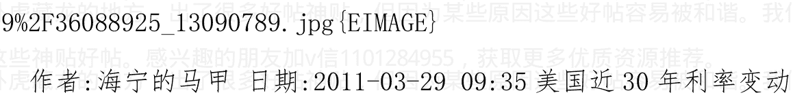

作者：海宁的马甲 日期：2011-03-29 09:35 美国近 30 年利率变动史--下一个利率高点 2012 年底？利率在 3% 的下方？

这是美国 3 个月国债的折扣率（已经是年率了）变动史。美国实行市场利率。当然，折扣率与收益率有细微的差别。有意思的是，美国短期利率，每过 6 年出现一个高点，走势还有压力线。这张图，看上去挺和谐的。按目前现状看，似乎美国在 2011 下半年到 2012 年加息 200 个基点以上不可思议，但是美国历史上 15 到 24 个月左右连续加息 14 到 17 次都发生过。市场到时候会发现美联储控制通货膨胀的决心。

### 美国短期（3 个月国债折扣率年化之后）


### 美联储联邦基金利率 1954-2008-2010


作者：海宁的马甲 日期：2011-03-29 09:48 宏观政策“积极稳健、审慎灵活”和“控通胀第一”的矛盾心理

“积极稳健、审慎灵活”八个字，是极度矛盾的，下面巴曙松已经分析的，我就不重复了，简单地说，就是宏观政策短期化。

这个在 2010 年 6 月到 10 月的政策变化就知道了。

2010 年 5，6 月，求欧美不要退出宽松，2010 年 10 月，11 月急了。

积极，在中国的风气下，就不会稳健。

审慎，在目前的风气下，就需要铁腕和强硬，无法给予灵活。

以此看来，中国的房地产泡沫，最终是被外部变化所刺破的。

这个外部变化，最重要的还是石油价格和粮食价格，或者一些影响石油粮食的天气和黑天鹅事件，使得最终不得不放弃“积极稳健、审慎灵活”而执行“控通胀第一”。2008 年是在 3 月左右不得不变成“控通胀第一”的。

另一个可能的外部变化，就是外贸顺差的急剧减少，2011 年 2 月份的数据严重失真，不算。（春节前很多工厂就关了，外贸顺差自然少，甚至出现逆差）

美元已经跌破重要的支撑线，下面几个月，石油，黄金应该有比较疯狂的表现。

加 v 信 1101284955 获取更多优质书籍推荐The request was rejected because it was considered high risk

中国大陆、香港、台湾、韩国，新加坡、日本等地在经济上取得了繁荣，而这些地区是具有儒家价值观的社会。

东亚地区的成功，和基督教没有关系。马克斯·韦伯关于基督新教伦理和经济发展的理论和这一事实相悖。

> 转载结束

## 作者:海宁的马甲 日期:2011-03-29 10:32 关注 2011 年通货膨胀和经济走势--猪肉，粮价，石油，黄金，房价，与货币政策

2011.3.28

暂时看，没有更多的量化宽松，2011 年 4 月 27 日，6 月 22 日很重要，美联储主席伯南克，会回答记者提问。

按美联储主席伯南克国会证词看，美国通货紧缩已经可以忽略不计，没有必要进行更多量化宽松。

http://www.federalreserve.gov/newsevents/press/monetary/2010324a.htm
http://ftalphaville.ft.com/blog/2011/03/28/528666/

陶冬的意思是，物价在2011年涨幅控制在4%的承诺无法实现。

我的意思是，当CPI在6%的时候，真实的物价涨幅在12%左右，这是研究过去10年得出的结论，不是瞎猜。而物价涨幅的年率，超过10%的时候，会发生货币购买力恐慌和抢购。

> 陶冬：通货膨胀会在年中见顶但未必会大幅回落】通胀的第二源泉已经形成，那就是服务业的通胀。食品业的通胀在相当程度上是暂时性的，一旦人们对于工资的预期出现了改变，通胀会变成结构性的问题，会持续相当长。通胀会在年中见顶，约6%—6.5%，但年底很难回落到3.5%的水平

2011.03.23

爱尔兰，葡萄牙的十年期国债收益率飙升到10%左右。

-   冰岛->爱尔兰->葡萄牙->比利时？->西班牙？ ->>>>>

道理很简单，“由奢入俭难”，如果消减政府开支和福利，政客（议员）就要失去选票。“社会主义和福利主义”是没有回头路的单向道，直到难以为继，不得不改革，消减福利（或者通过通货膨胀）。我们现在正在葡萄牙需要700亿欧元救济，中国有。帮人帮到底。（啊呀，中国买的葡萄牙国债，市场价跌去不少了）

**加v信1101284955获取更多优质书籍推荐**

2011.03.21

## 《海宁经济评论论文集》天涯网友“爱牛才会赢”整理版

http://ishare.iask.sina.com.cn/f/14107381.html

这应该是目前排版最好的版本，比我的版本好，而且有些标题还有链接，链接到博文或者天涯文章。

非常感谢这位网友，应该花了不少时间，起码十个小时以上。因为我的第一版也花了十多个小时。

-   宏观政策“积极稳健、审慎灵活”和“控通胀第一”的矛盾 心理 2011-03-20
-   一些欧洲国家，美国，日本的房地产历史走势图［此博文包含图片］2011-03-20
-   《中国商人》杂志2010年12月10日，预见2011：泡沫相继破裂的一年 2011-03-19
-   1995-2011"中美国"连续泡沫的7个阶段 – 参考 Didier Sornette［此博文包含图片］2011-03-16
-   评论哈克博文：透过黄金看房地产 – 人性从未改变 ［此博文包含图片］2011-03-14
-   30 年世界经济走势图--美国国债，美国-日本-德国股指，商品 CRB 指数 [此博文包含图片] 2011-03-13
-   几张黄金走势图--黄金价格的关键时间点2011.45? [此博文包含图片] 2011-03-13
-   [转载]金融物理学引发的焦点时刻 [此博文包含图片] 2011-03-10
-   转载哈克的博文:高光时刻--美元指数--美元汇率周期变化 [此博文包含图片] 2011-02-28
-   三大“兜底保险”使得原材料商品价格大幅上扬的趋势难以改变 2011-01-18

2011.3.17

从一盎司黄金换 15 桶石油的历史价位看，100 到 115 的石油价格，属于正常波动范围。

看黄金在接下去的 2 个月，能否突破 1500 关卡，冲击 1600.

看石油价格接下去是否会发生黑天鹅事件。

石油价格不在目前价位大力向上突破，目前的经济平衡尚能维持一段时间。

2011.3.10 分隔符

## 关于杭州上海房价一平方米 = 2 盎司黄金（2 * 31 克）（目前2万出头）

是说明黄金的美元价格的上涨，反映了美元在投资者心目中的贬值，其中部分反映的是预期，而预期有对的，也有过度反映的。

因为人民币与美元的亲密关系，使得人民币的购买力，随美元购买力的变动起伏。比如人民币的购买力，在2008年下半年，是一起上升的。按我的说法，人民币的成色里，7成是美元；港币的成色，则是十成的美元。（因为中国银行，渣打银行要想发行775港币，必须缴纳相应的100美元给金管局。港币是美元本位制）

中国人从2003年开始买房对冲通货膨胀风险，与国际上买黄金对冲美元通货膨胀风险，是一个道理。

中国人民银行，是比较负责的。问题在于人民币货币发行机制。

2010年，某些地区的中国人对于房子的追捧，显然超过了国际社会对于黄金的追捧，使得很多地方的房价涨幅，大于黄金的涨幅。

再比如，我说猪肉价格影响货币政策。有人说猪肉涨了，怎么股票还没有跌啊？

这是哪跟哪啊，猪肉涨价，要引起加息等紧缩政策，股市才可能跌，而且股市非常复杂，不是百分之百的事情。

事实上，10月20日左右，央行紧缩货币了。股市随后见顶了。

http://blog.sina.com.cn/s/blog_6a5079950100kzdu.html

加v信1101284955获取更多优质书籍推荐

## 2011.3.9分隔符

2011年6月附近，故事肯定很精彩。很多东西会提前在6月以前跌，债券，特别是垃圾债，市政债，希腊西班牙国债，股票，最后是基础金属，都可能在6月以前，量化宽松三期的预期消失的时候跌。2011年6月前后，也是中国经济进入下滑通道的开始。6月左右，中国PMI，很可能跌进50（即从扩张变成收缩）。2011年下半年，房价应该进入下降通道，库存周期到了（2005下半年，2008下半年，都是库存周期的高峰）。房子的周期，看来差不多是3年左右。部分开发商应该会等管家撤销限购。（或者等下面偷偷放松而管家就当没有看见）房价，猪肉价格，货币政策，都是大致3年周期，很有意思。猪肉涨-->猪肉再涨，涨到引起货币决策层注意-->加息，紧缩货币政策-->房价停滞或下跌-->通货膨胀得到缓解-->放松货币政策，循环三次，直到人民币升值预期消失。

## 2011.03.07

## 通货膨胀形势，中国货币政策，美国货币政策，外贸，房地产

很多经济学家，看美联储加息，要看到 2012 年春天。我估计，人性的弱点和羊群效应，会使得通货膨胀，油价，粮价在 2011 年接下来的时间，涨得比管理层想象的更加糟糕。中国和美联储的加息，很可能比想象的早。

当然，管理层肯定是在通货膨胀恶化后，才会进行第二轮紧缩（加息，升值，升存款准备金率）。

通货膨胀会恶化吗？我说会。

会不会存在侥幸，通货膨胀突然下去了，不反弹了？我说不会。

1.  中国货币政策的决策背景。

    中国第二轮紧缩肯定发生在通货膨胀恶化后，而不是恶化前，理由很充足。

    通货膨胀恶化后再进行第二轮紧缩，就可以逃避紧缩导致的经济下滑的责任，也不会遇到反对意见。

    这一点不是现在才想到，2010.9《理性分析通货膨胀和经济形势，理性预测房价下跌时间表》一文就说了。

    通货膨胀恶化后再紧缩，是有历史证明的。2004 年猪肉涨价后才紧缩。2007-2008，是到 2008.3 才不得不第二轮紧缩的。

2.  美联储货币政策与油价。

    美联储肯定是最后一个退出货币刺激的。美联储是美国的央行，为美国负责。而美国的房地产泡沫，是 2008 年破灭得最彻底的，雷曼破产和金融风暴，对美国经济和信用环境，也伤得很深，使得银行不放贷，企业不敢投资。对美国而言，现在的失业率太高（欧洲笑了），而通货膨胀还不是大大的问题。美国不怕粮食涨价，4400 万人在领食品卷。美国经济只怕石油涨价，因为美国人均耗油量，是其他发达国家的两倍。这是美国的历史习惯，政客也无法改变这一点。美国油价，可以参考（WTI+Brent）油价/2。（目前均价大约在 110 美元）美国的石油供应，基本是一半来自 WTI 定价，一半来自路易斯安纳轻油 LLS Light Louisiana Sweet 或者 Brent 定价，LLS 油价基本与 Brent 布伦特油价接近。因为 LLS 主要是美国的海上进口；价格低了，人家一掉头，花不到 2 美元/桶，就可以卖到世界其他地方。而 WTI 的交货地点内陆 Cushing Oklahoma，受库存瓶颈和附近炼油厂炼油产能的限制。

    加v信1101284955获取更多优质书籍推荐

    石油价格在 120 美元（不到 7 元人民币/升）以上停留 3 到 6 个月，美国经济也是承受不住的。

3.  外汇占款印钞机

    2011 年，美元在世界其他地方爆发危机前，是疲软的，这也是美联储防止美国出现通货紧缩的目标。

    美元疲软，人民币随着美元疲软。这对出口是好的，但是会造成外汇占款过多和通货膨胀（南美和澳大利亚的粮食和铁矿石价格高）。

    人民币对美元是升值的，但是对澳元等，是贬值的。

    随着中国出现通货膨胀（2010 年大概是 7.6%），出口部门的原材料成本，人工成本，税收成本，在上升，而出口价格没有相应的上升。

    出口部门的压力，越来越大。人民币对美元汇率的低估程度，在急剧缩小。

4.  依赖‘外汇占款印钞机’的‘地产印钞机’

    中国 2003-2010 的经济发展走势的秘诀与关键，就是外贸和房地产。

    如果说有经济奇迹的话，就是在这 8 年中，在正常的贸易往来以为，把价值 15 万亿人民币左右的东西运到了海外（外贸顺差），换回了 2 万亿美元，这些美元被中国人民银行，用人民币换走了。民众手里，多了 15 万亿人民币，这 15 万亿人民币，通过信用扩张，变成了（30万亿贷款和 45 万亿存款)。这个信用扩张的媒介和催化剂之一，就是“土地增发”。

    > “土地增发”

    外汇储备里的一万亿美元，是 20 多年累积的外商直接投资（FDI），是不能动的。

    “地产印钞机”是指以土地和房产为基础的信用扩张。（主要是 zf, 开发商，公司以土地或者房产为抵押的贷款；还有少量以房产为抵押的个人贷款）。房价越高，则能贷到的钱更多。这是个循环，日本当年就是如此。

    > “地产印钞机”

    当房价暴涨延烧到全国大部分县城的时候，道德劝说是及其无效的。（2010 年房价涨 50%以上的县城，估计数不胜数）。2011 年，各地县城肯定在大盖房子，这是无法避免的，导致盖房子需要的很多原材料紧缺和涨价，粮食和猪肉需求也比正常时期高。

    中国的房价，反映的是通货膨胀预期（人民币贬值预期）。远高于租售比,房价收入比的那部分房价，是对未来通货膨胀的对冲。

    黄金的美元价格，反映的是整个国际社会对美元通货膨胀的预期（美元贬值预期）。

    美元资本流到新兴市场化国家，导致那里出现通货膨胀，也会刺激黄金的需求，比如中国印度等黄金需求，部分来自美元资本的进入产生的通货膨胀。

    优质债券的价格，特别是优质国债的价格，反映的是未来利率和通货膨胀的预期。

    起码美国欧洲通货膨胀起来的时候会加息，所以美国德国国债的价格里，反映了未来通货膨胀的预期。美国国债，2007.6以来，总体一直处于牛市。

    为什么量化宽松，货币政策来救市，最终必然以通货膨胀和加息来结束呢？

    那么我们可以回到2010.3-2010.7。

    中美第一轮宽松货币政策和积极财政政策救市，在2010.3-2010.7出现了衰竭的症状，然后是天津宽松讲话，要求其他国家不要退出积极财政和宽松货币的措施。欧美答应了。

    美国方面，因为美国核心通货膨胀率的下降，使得美联储，从考虑退出量化宽松一期，变成了推出量化宽松二期。加上天气正好配合，加v信1101284955获取更多优质书籍推荐

    结果世界经济和通货膨胀形势风云突变，2010.7-2010.10物价暴涨，2010.10就开始慌了。

    所以，宽松货币政策的末路，就是通货膨胀高到社会和决策层无法忍受。对美国而言，则是长期高涨的油价（115到120美元/桶，大致是美国能承受的临界点）。

    那么，2011.3.7以后呢？

    60多岁的人了，性情和手法，基本不会大变。2007-2008基本是撑到2008.3才慌的，因为那个时候“群众”慌了。

    第一轮3次加息和多次升存款准备金率后，必然是先等等看效果，不愿意继续紧缩。这样，目前的利率和货币环境下，中国的投资需求，基础金属需求，石油需求，粮食需求，不会一下子下来的。

    中国PMI（采购经理指数）和铜等基础金属是观察指标。这两个走势，是比较一致的。

    中国PMI什么时候跌破50，则是关键点。中国PMI跌破50，铜也不可避免会跌下去。

    插播一下：

    中国作为巨大的石油和粮食“有效需求”方，对粮食，石油价格的影响，还是非常明显的。

    加v信1101284955获取更多优质书籍推荐

    中国大豆的产量，一直稳定在 1500 万吨上下，剧增的是需求量。

    中国过去 10 年，年人均肉类消耗量，基本翻番，达到 54 公斤。（台湾是 80 多公斤）。食用油人均消耗量也大增。

    不过中国大豆沦陷的观点，还是非常流行，也许人们可以从中获得不少自我安慰，宣泄共鸣，以及发现新大陆的自豪感。

    讲商品的有效需求与供应瓶颈，货币政策，金融危机，经济危机，信用扩张和信用紧缩非常麻烦，而且常常是枯燥的。讲加息等货币紧缩政策，导致违约和欺诈的暴露，进而导致经济从信用扩张变成信用紧缩，然后引发股价房价等恶性循环，也非常耗费时间。

    2008 年，中国大豆的进口增长率，大幅降低（增长还是有的，只是增长速度下降了），大豆价格自然下去了，不少通过期货锁定了化肥等价格（高价），而没有锁定农产品期货价格（后来暴跌）的美国农场主，破产的不少。祸不单行的是，美国耕地价格，也几乎腰斩。2，3 百万的净身家，2008 年灰飞烟灭的，也不少。

    中国的石油进口，2006-2010 是迅猛的，其中不少需求量，是与外贸相关的，给人打工，也需要用汽油的。

    qe1，qe2，最大的厉害之处，不是它本身的规模。要是大家都忽视它，2.3万亿也玩不出什么花样。关键是很多人跟了，产生连锁反应，推高了资产，债券，垃圾债券，股票，商品的价格。而我看“人性的弱点”会使得2011年底前的物价暴涨再暴涨，等不到2012年就会促使美联储加息。就像2008年以前，奥运行情，被提前预支了。要是老太太都知道奥运之后几天抛，你说，还要等到奥运吗？现在大部分经济学家，都看到2012春美联储加息。真的能等到那个时候吗？

    2011年，是前期的各种宽松货币政策和积极财政政策，导致的通货膨胀爆发的一年。

    下面有人提到了，低估的品种要涨上去，高估的品种要降下来（通过加息和紧缩货币）。

    猜测中国央行和美联储的加息节奏，是关键。

    2011年接下去，第一个关注的是石油价格。石油价格高企，限制了美联储的手脚。

    目前看，在世界经济减速前，85美元是底，而且即使中东北非局势稳定一点，石油价格85美元上面还得加5到15美元的风险溢价。

    量化宽松，相当于负利率。

    量化宽松二期结束，如果没有量化宽松三期，相当于加息2%左右（从负2%，变成0.25%），每月注入1000多亿美元的货币，对股票，债券、商品的价格上涨，还是很明显的。

    看来看去，还是看石油很大程度上，决定了美联储的未来政策。

    美国经济无法承受7人民币/升的汽油零售价格。

作者:海宁的马甲 日期:2011-03-29 10:36 转载:

气候突变的情景及其对美国国家安全的意义, 副标题《天气的大范围破坏力超过了恐怖主义》

彼得·施瓦兹和达哥·兰德尔

2003年10月

中文全文地址
http://www.ipcc.cma.gov.cn/upload/unfccc/Climate_Change_and_National_Security-c.pdf
英文全文地址
http://www.gbn.com/articles/pdfs/Abrupt_Climate_Change_February_2004.pdf

报告不是美国国防部写的，是GBN提供给国防部的，报告是只用了区区10万美元，但是报告使用了全世界气候学家公认的数据与预测模型。报告没有说全球变暖，而是气候突变。报告的原作者没有学过气象，但是他的写作数据和分析来源是广大气象学家的研究结晶。

加v信1101284955获取更多优质书籍推荐

## 部分摘要

报告中关于2010年左右全球气候变化的预测主要有：

-   1. ——亚洲和北美洲的年平均温度下降达5华氏度(2.8摄氏度)，北欧下降6华氏度(3.3摄氏度)。整个澳洲、南美洲和非洲南部的关键地区年平均温度上升达4华氏度(2.2摄氏度)。
-   2. ——在欧洲和北美洲东部人口密集的农业产区和水资源供给地区，干旱将持续几十年。
-   3. ——冬季暴风雪和大风增强，西欧和太平洋北部将遭受更强烈的大风天气[1]。
-   4. 报告中特别提到了2010年的中国的气候状况：
    ——季风降水可靠性的降低将对中国产生重大影响。
    ——中国南部地区在2010年前后将发生持续整整10年的特大干旱。中国现在“南涝北旱”的降水分布型，到时候可能变成“北涝南旱”的降水分布型。
    ——夏季风可以为中国带来降水，但也会引起负面效应，如洪水可使裸露的地表土壤流失更加严重。由于水汽蒸发冷却作用的降低，会引起寒冬延长，夏季高温增加。

“寒冬延长，夏季高温增加”是符合中国 2009 年实际情况的。希望中国气象界高层能够重视这一报告，反思自己的气象预测。

## 气候突变的情景及其对美国国家安全的意义

彼得·施瓦兹和达哥·兰德尔

2003 年 10 月

## 不可思议的情景

本报告给出了似乎是不可思议的情景，它拓展了现今气候变化研究的范围，可以让我们更好地认识气候变化对美国国家安全的潜在意义。

我们咨询了气候变化领域的资深专家，还进行了辅助研究，并与这些专家进行了反复讨论。科学家们对这一研究项目表示支持，但同时警告说，所描述的情景对以下两个基本的方面来说是极端情况：首先，他们认为我们所勾画的现象仅仅有可能发生在某些地区，而非全球所有地区；其次，他们认为事件发生的程度可能相当低。我们所给出的未来气候变化的情景，虽然不是极有可能发生，只存在着一定的可能性，但它将对美国国家安全提出挑战，因此应该立即予以考虑。

## # 执行概要(应该说是供首长阅读的摘要)

许多有力的证据表明，21世纪全球将显著变暖。迄今为止，这种变化是渐进式的，并预计未来将以相似的方式渐进发展，因此，全球变暖的影响对于各国来讲存在应对的可能。然而，目前的研究结果表明，这种渐进式的全球变暖可能会导致海洋温盐输送带相对突然的减弱，从而造成世界某些粮食主产区冬季更为恶劣的天气状况，土壤湿度的急剧下降，以及更多的强风。若准备不足，地球环境的承载能力将会明显下降。研究表明，温度升高一旦超过某一阈值，不利的天气状况可能会相对突然地增多，伴随着大气环流的持续变化，可以在某些地区导致10年内5~10华氏度的温度下降。古气候证据表明，不同的气候形态可能会持续一个世纪之久，例如8,200年前海洋输送带崩溃的时候；或在极端情况下可能会持续长达千年，正如始于12,700年以前的新仙女木事件时期那样。与一般常说的渐进式的气候变暖情景不同，我们在本报告中勾画出发生在8,200年前的具有百年尺度的气候突变情景。这种突变情景具有如下特征：

-   2. 亚洲和北美洲的年平均温度下降达5华氏度，The request was rejected because it was considered high risk化主要受中国影响的现代日本、韩国成功的例子，就可以说明这点。

此外我们要扪心自问，我们发展经济的目的究竟是为了什么，以人为本到哪里去了，我们的自信力又到哪里去了，难道中国人就只配充当牛马般的劳动力吗？人民币升值，中国人的名义收入水平在世界上会大大提高，老百姓的生活水平会提高，也有助于提高广大人民的文化素质，同时也对民众的素质提出更高的要求，并且有利于吸引人才到中国来工作，特别是有利于海外学子报效祖国。

综上所述，鉴于我国决心加入世界经济的一体化，人民币被低估的情况不可能长期维持，我们的对策可能是人民币逐步升值，可能是提升国内工资和物价，当然更可能是两者并举。人民币升值的理论基础就是购买力平价，就是价值规律，如若我们无视它的作用，更多的伤害只会落到自己头上。以上是我对我国经济和金融发展战略的分析和预测，如果读者赞同我的观点，也就能从人民币升值趋势的角度，去理解为什么外资要纷纷抢滩中国的银行业。邓小平说，“金融是现代经济的核心”，是的，金融也是现代经济的引擎。人民币升值不仅是入股银行的资本金1美金有可能变成2美金，而且银行业更能分享人民币升值的好处，因为金融的放大作用，银行业有着庞大的人民币资产。回到文章的前面，中国的股市很有投资价值，因为中国的股市跌过头了，从自身来看市盈率和市净率已经跌到了国际水准以下，若从人民币升值的国际大背景来看，中国的A股在几年内涨一至两倍完全是可能的。还有一点值得注意，一个股市的投资价值不能只从公司的数量去分析，比如香港股市，汇丰银行和恒丰银行就占港交所市值的38%，香港股市30几家上市公司占了它绝大部分总市值，因此判断香港股市的投资价值主要是应该分析这30多家公司，而不是本末颠倒去注意那些小公司，香港股市烂的小公司很多，世界上其他股票市场也是如此。那些小公司更多的是投机价值。应该说中国的股市也是这种情况，而且中国A股市场的投机价值远胜于香港等世界许多股票市场，因为它的巨大广告效应、它的上市数量稀缺性、它的可融资性，使它的上市公司有很好的收购价值。这种投机价值换一个角度也可以视为投资价值。因此，当A股市场垃圾股跌得很低的时候也会有投资价值。这是各国股票市场通常的道理。

在中国股市一跌再跌，投资者全盘皆输的情况下，我们还经常听到有人说：政府有关机构不应该对股市的涨跌负责，更不应该站在国有资产所有者的立场上去救市，笔者对此也不赞成。事实上，每当政府高官发表这种言论，股市有巨大泡沫时会助长泡沫，而股灾来到时，会加剧股市下跌，客观上会对股市产生重大影响，如果你政府有关部门不想管，还不如不说。

其实，中国经济的一个核心，关系国计民生，中国政府怎么可能对它不关心、不负责任，政府想置之身外是不可能做到的，问题的关键是应该以公正的立场、以科学的方法、以遵循市场经济规律的态度，去积极培育和发展中国的股市，去平衡解决股市中的深层问题。

### 作者：海宁的马甲 日期：2011-03-30 21:52 评：刘泰特 2005年11月 10 日论中国的股市很有投资价值。为某些原因这些好帖容易被和谐。我们现在正在

虽然已经过去 5 年多，但是现在读，还是有收获的。容易被和谐。我们现在正在

1998-2008 中国劳动者的生产效率，提升了 200%左右。超长时间工作的劳动者，呕心沥血的企业管理者，拿着对房价而言低薪的科技工作者，他们的劳动果实，被地产商人，贩卖土地者，所剥夺。他们的劳动价值，即没有被国际市场所尊重，也没有被国内贩卖土地者所尊重。这是双重剥削，很多人却不自知。

### 作者：海宁的马甲 日期：2011-03-30 21:56 作者：叫我青砖哥 回复日期：2011-03-30 21:43:20

楼主在线呀，想问一下，离你发贴这么久时间了，通过这段时间你的观察，你觉得现在 ZF 在 6 月份前有能力保持人民币的稳定吗？

不能，不但不能，为了维持经济增长，还需要普通人再忍受一段时间的物价上涨，而且速度不慢。

物价上涨速度也许 2011 年年中到达峰值，但并不是说，2011.6 以后就不涨了，只是上涨速度有一定的缓解。但那也是在中东北非石油供应不恶化的情况下的。

日本的核辐射危机却告诉我们，最坏的情况下，往往会发生。墨菲定律。

加v信1101284955获取更多优质书籍推荐

我们要看他们做什么，而不是说什么。

### 作者: 海宁的马甲 日期: 2011-03-30 23:15 简要回复一个期货公司研发负责人关于黄金与中国房产的内在联系：

黄金与中国房产是美元贬值预期的对冲。

美元负利率，全世界购买黄金保值，人民币跟随美元贬值，负利率，人们购买房子保值；

黄金和中国房产，都是美元的空头头寸。

一旦美元大幅升值，黄金和中国房产，都很惨。这个时间窗口我认为在 2011.6 - 2012.2 之间，当然更广一点是 2011.5 - 2012.6 之间。

### 作者: 海宁的马甲 日期: 2011-03-30 23:46 奶粉的记忆，并不遥远。

当初潜规则“约谈”奶企不要涨价，特别是豪华盛会前。

### 作者: 海宁的马甲 日期: 2011-03-31 12:40 我坚决不是崩溃论者。

高通胀，高成长，是以后 6，7 年的主题。

美国需要高通胀，高成长，中国在房地产泡沫破裂后，也需要高通胀，高成长来消化坏账，解决就业。类似于 70 年代的欧美日台新（新加坡）港。

我看好房地产泡沫后的中国经济的未来。我认为房地产泡沫破裂后的危机，大概持续2，3年，然后恢复，类似于1997年以后的马来西亚和泰国。他们恢复得很好。当然，很多人仅仅记住了危机的恐怖。

至于韩国，恢复能力那简直惊为天人，2000年强劲复苏，2001年韩国房价强劲上涨，同时韩国还解决了大企业财团控制国家命脉的问题，提高了社会的效率和活力，从原来落后台湾十年，到超过台湾4，5年。当然，台湾的产业空心化了，很多都搬到大陆了。韩国搬到大陆，有语言文化障碍。这次如果房地产泡沫破裂，相当于日本1973-1975衰退。（中国目前人均生产资料，按可比价格还不及1970年的日本）。

中国工人的工资，在未来5到10年，从1.5美元/小时，涨到3美元/小时，应该没有问题。

### 作者:海宁的马甲 日期:2011-03-31 12:42 猪肉今年不会涨到哪里去的。美国大豆去年丰收，价格够高了，涨不上去了。美国玉米去年也才减产4%左右（一般减产10%以上才是灾难）。如果真的有阴谋，那么把大豆打飞就可以了，需要的钱也不多。

今年玉米进口是多少是个问题，可能在500到800万吨。美国官员回去后说中国玉米库存是年消耗量的5%左右，不是30%，当然不知道对不对。中国今年除了大豆玉米，可能还进口猪肉和牛肉，小麦等，所需的钱也不多。中国人不会饿肚子的。

### 作者:海宁的马甲 日期:2011-04-01 20:56 作者：耶稣与上帝 2011 回复日期：2011-04-01 12:41:35

海宁为什么不回答问题？你的预测要全部失败了，给我的感觉你好像是刘军洛的“马甲”。观点如出一辙、相互补充，有时候感觉还在为自己找补。什么美元指数、黄金下跌、房价下跌，纯属胡说八道。

没有啊。刘军洛原来判断，“中国央行反通货膨胀，最多反到2010年10月”，他认为美元汇率8，9月份要暴涨。他还认为因为“美国结束小布什减税计划”而造成市场暴跌，美元汇率急剧上升。

而我认为，这样的话，美国的轻微通货紧缩，就会变成比较剧烈的通货紧缩，美联储是会干预的，事实上，美联储主席8月27日发表讲话，表示要推出量化宽松二期，然后一场轰轰烈烈的通货膨胀行情展开了（这股风，在9月底，也吹到了中国的股市）。

我的这篇文章，也是刘军洛的新书出版之前发表的。

现在，通货膨胀上来了，美联储minneapolis说，2011年底，要加息从0.25%以下，加到0.75%。

加v信1101284955获取更多优质书籍推荐

你收集的信息的帖子非常不错，我也常看，还有那个刚出股市，又入菜市的帖子。

### 作者: 海宁的马甲 日期:2011-04-03 11:54

## 2010.9.21

2011年春节过后，如果中国的物价不但没有回落，反而变本加厉，那么，那些说‘中国产能过剩’‘农业连续6年丰收’所以中国通货膨胀安全可控的专家，到时候就应该反省反省了。

2011年3月到6月，可能是中国主动刺破房地产泡沫的最后时间。

2011年第一季度的CPI公布后，反还是不反通货膨胀，是摆在中国央行面前的艰难抉择。

### 生活中大量囤货已经出现。

2011.4.10 - 2011.4.20 应该是又一次概率很大的加息时间段，关键是加0.25，还是0.50。

当然，很多人已经在5号到8号就知道了，提前布局股市了。

目前看来，美联储似乎难以把零利率政策维持到2011年12月16日。

加v信1101284955获取更多优质书籍推荐

### 作者:海宁的马甲 日期:2011-04-05 20:28

## 中国央行和美联储的加息预期，美联储2012二季度到达1%？

2011.4.4
http://blog.sina.com.cn/s/blog_6a5079950100q8iy.html

首先，我早说过我不是崩溃论者，一直估计中国经济2013-2017年起码还有一波中速发展，特别是制造业和消费品业，比如必然汽车零部件，医疗设备，消费品，新的连锁业等。

中国经济和工业，民用科技等虽然暂时很难想象何时到达日本的高度，但是目前中国基本还处于70年代初日本的经济发展程度。1970年代，标志着德国，日本，法国，甚至台湾，香港，新加坡，对美国的相对经济实力的上升期。也就是说，70年代，世界经济高增长，高通货膨胀，伴随着美国GDP占世界份额的快速下降。（不要跟比涨价，这个美国著名的滞涨时期，美国人的工资，房价，物价1970-1980也就涨了120%左右，而且滞涨时期美国的利率是很高的，利率大起大落，但平均在8%左右，也就是说，美国存款人的购买力，在1970-1980年是基本得到了保持，不管在房价面前，还是在物价面前；美联储的信用，不是平白无故来的）

美国近30年利率变动史--下一个利率高点2012年底？利率在3%的下方？2011-03-22

1999年到2000年，是美国1967-1969年战后经济顶峰后的又一次经济顶峰。2001 - 2017年，是很多新兴市场化国家，相对与欧美日本的实力的上升。这是我的基本判断，以后要做更多的研究才能做细谈。

原因很简单，就是这些新兴市场化国家的福利很少，民众很勤奋，愿意为了生活的改善而努力。所以，跨国公司的投资，还是会继续投向新兴市场化国家，巴西的甘蔗工人，月薪只有200美元左右，（巴西也有“黑甘蔗农场”的非法奴隶，人quan组织营救过不少）。

在以上前提下，新兴发展中国家，一轮又一轮的经济发展，必然带来对钢铁，汽车，石油，粮食（特别是蛋白质类）的巨大需求增长，同时不得不面临几次石油和粮食等原材料暴涨，2008年上半年是一次，2011-2012可能是第二次，2016-2017（2014年很可能是世界石油产量的百年峰值）可能还有一次。

中国2009年，2010年，对于大豆的进口需求的增长速度，比2006，2007年还快很多。2011年如果中国大豆需求继续猛增，在美国大豆面积播种下降1%的前提下，必然带来大豆价格的暴涨，世界跨国大豆贸易的60%，是中国买的。由此可见，当中国房地产泡沫破裂，导致经济衰退后，世界大豆价格将会有何等的暴跌，东北大豆，将面临又一次亏损。

## 中国央行 2011.4.10 - 7.20 的货币政策

废话了那么多，正文很简单，中国货币政策 2011.4.10 - 2011.7.20，将进入密集加息，升存款准备金率期。

股市在那个时间段，也进入高危期。

对于散户而言，到 2011 年第三季度看，2010 年 9 月退出股市，也并不是什么非常可惜的事情。猪肉价格爆高的时候，股市总体总是很危险的，这个定律我想这两年，还不会失效。

很多数据，有的人在 5 号到 8 号就知道了，还有的机构，早就通过他们自己的模型猜到了；2011.2 的 CPI 数据猜错了，大家都知道为什么猜错了。

2011.4.10 - 7.20 这段时间加息，反对意见以及不太多了，也容易被批准。猪肉价格太高了，其他价格也在涨。你涨我涨大家涨，工资不涨的最吃亏。不可能全体人一起加工资的。

### 美联储加息预期

我的基本判断，美国在大的经济衰退发生后，复苏阶段的加息，是迟缓的，迟一个季度很正常；而在低失业率时期，加息往往比 CPI 提前 6 个月左右。

下面是金融市场隐含的加息预期，利率衍生品市场预期美联储2011年第四季度加息，2012年第二季度加到1%，2012年第三季度，加到1.5%。高盛也预测2012年第二季度加到1%。

注意，历史上，经济复苏时期的这种加息，反而证明经济在上行。

这一次很不相同，因为2010年10月以来，美联储买入的美国国债，等于80%美国财政部新发行的国债的净增加额。失去美联储这个大买家后，美国国债市场如何走，很难说。国债可能面临大跌（收益率大涨）。

另外，对比2008年上半年，我们知道，一旦进入通货膨胀恶性循环，价格上涨是很猛的，根本无法理想预期。

因为市场，最终是各种人在做决定。

关注油价。

### 作者:海宁的马甲 日期:2011-04-05 20:32 利率衍生品反映的加息预期和高盛的猜测

## 利率衍生品反映的加息预期和高盛的猜测

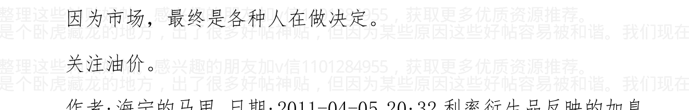

### 作者:海宁的马甲 日期:2011-04-05 20:36 作者: 文睿 回复日期:2011-04-05 18:41:31

中国人民银行决定，自2011年4月6日起上调金融机构人民币存贷款基准利率。金融机构一年期存贷款基准利率分别上调0.25个百分点。

这次动作真快，不给任何消息泄露的机会。估计是不上报方案就批了，或者是本来就决定的。0.25，于事还是无补。

### 作者:海宁的马甲 日期:2011-04-05 20:43 熟悉银行系统的应该能从中读到文章没有表达的内容。

从2010年2月，到2011年7月，负利率的时候也就达到了18个月。

2007年2月开始，负利率一直保持到了2008年9月美国雷曼公司的破产。

美国雷曼公司的破产，美国房地产泡沫的剧烈破裂，欧美金融危机，帮助中国实现了负利率转正。2007年2月开始的负利率，转正的成绩，归功于美国雷曼公司，应该不算过分。

2008年，中国负利率长达19个月，利率转正的第二天，即2008年9月16日，降息0.27%。

2008年10月份，降息两次，共0.54%。

2008年11月份，降息一次，降息1.08%，到2.52%。

对于慈祥的人而言，降息是付好药，加息是付毒药。

（2008年10月，发达国家的经济一片萧条，市场预期石油粮食等需求会剧烈下降，导致价格暴跌，中国银行利率终于转正。中国利率转正后，中国马上在3，4个月内，连续4次降息，其中一次降息100个基点（即）

2004年，整个媒体界，骂炒房者比较多，2006，2007年，对房地产企业口诛笔伐的比较多。

然后，越来越多的民众，知道地方财政，对于土地出让金的依赖很大。2010年，土地出让金可能为2.9万亿，而新房销售额，可能才4万亿，土地出让金，占房价的一半以上，这还不包括各种造房子的收费（房地产企业，盖座楼，需要200多个图章，潘石屹说的）；房子建成后，交易中的各种收费，也不少。

不过目前为止，还有很多人认同“因为地方zf需要土地财政，所以房价不降”。

我认为这是不对的，地方要想卖出高价土地，需要有房地产企业愿意出高价；房地产企业愿意出高价，是因为有人愿意高价买房；有人愿意高价买房，有刚需的，但是到了2011年，买房保值的购买者，更加重要。

杭州的苹果王，对杭州的贡献也很大。人，都是一分为二的。他只是和任志强一样，比较直白，他们都看到了“为了维持经济增长和就业，不敢大幅加息给经济降温”这一点。通俗点，就是房地产绑架了利率汇率和经济。

如此看来，美联储应该请苹果王和任志强去上课，因为美联储太傻了1988年2月开始，14次加息，从6.5%左右，加到了9.75%左右，使得本来垃圾公司债已经溃败的情况下，使得美国经济雪上加霜，老布什苦苦请求，格林斯潘就是不为所动，就是不剧烈降息刺激经济。

美联储2004-2006年更混蛋，居然连续加了17次利息，从1%，加到了5.25%，全世界最先刺破房地产泡沫。（此段为反话，居然有人看不懂）

2004年6月8日央行行长周小川在济南、南京等地调研时“利率变动要跟上价格变化，否则会形成负利率，导致居民消费行为和消费倾向的变化”的讲话。

央行研究局郑重声明：加息方案的报道纯属捏造
2004-06-22 08:13:30 《北京娱乐信报》

在坊间流传的加息方案传闻被央行斩钉截铁地否认了。昨天中国人民银行研究局发表郑重声明，称媒体对央行加息方案已经上报国务院的报道纯属捏造。

此前国内一家财经类报纸援引2004年6月10日央行研究局一位不愿透露姓名的人士的说法称，“央行加息的具体方案已上报，加息面临的主要是一个时机选择的问题。”并以2004年6月8日央行行长周小川在济南、南京等地调研时“利率变动要跟上价格变化，否则会形成负利率，导致居民消费行为和消费倾向的变化”的讲话加以佐证。该媒体还预测，加息将采取“温和的步骤”，“最大的可能是存款利率提高0.25个百分点，贷款利率提高0.50个百分点。或者是存款不动，贷款提高0.25个百分点。”

但昨天这一消息的“源头”——央行研究局在央行网站上发表郑重声明：“上述报道纯属捏造，根本没有事实根据。”声明的落款是6月19日。这是央行第一次公开否认关于加息方案的传闻。在此之前，包括行长周小川在内的央行官员从未正面否认过加息猜测，而是婉转表示：“央行正在评估5月份的经济数据，如果5月份的数据不太好的话，中国央行将采取进一步的举动，包括可能采取全面上调利率的行为。”

央行从去年起屡次出手收紧银根，到5月末货币政策效果已经显现出来，金融机构各项贷款增长偏快的态势明显减缓。但加息的压力依然存在，财政部某副部长曾在讲话中表示：“希望货币政策能够更强硬些。”市场上对央行加息的预期更是有增无减。

## 央行公布的2004年2季度全国城镇储户问卷调查结果

也显示，有72.9%的居民对当前存款利率低不满意，这较上季提高2.2个百分点，较上年同期提高2.6个百分点；而认为利率适度的居民人数仅占25.9%。广州一些商业银行的个人住房按揭贷款甚至出现了提前还贷的热潮，因为借款人都希望尽量赶在升息前多还贷，减少利息损失。

昨天，央行在声明的最后表示：

> 对于此类报道给中国人民银行研究局及其工作人员所造成的恶劣影响，中国人民银行研究局保留进一步采取必要措施的权利。（记者甄世宇）

### 作者:海宁的马甲 日期:2011-04-05 21:39 要是美国今年2011能搞定本拉登，那就真的太有意思了。

奥巴马暗地里在大力找本拉登，这对他很重要，一旦搞定本拉登，他连任基本就是板上钉钉；结束伊拉克，阿富汗的战争，也是非常合适的。

### 作者: 风过处 abc 回复日期: 2011-04-05 21:29:26

## “房价地震”前的异象：商品价格疯涨，欧洲银行危机，温州还债信用危机等

### 温州高利贷年息高达150% 副县长儿子还不起贷自杀

来源：财经国家周刊

字号：T|T 5035人参与 133条评论 打印转发

作者:海宁的马甲 日期:2011-04-05 21:51

从银行从业人员的角度，这样的新闻预示着，这种年份（2006-2007年，2010-2011年），巨大的银行贷款寻租空间，高达千亿级别。很简单的一个操作，就是国有大企业，搞出点项目，拿到贷款，然后转借给其他企业。当然这只是操作之一。最根本的，在于银行利率与市场利率之差。整个利益链条上，很多人都能拿到很多好处。这也是部分人房价再高，囤房子也非常容易的原因。曾经，这个东西叫做利率双轨制。1994年以后并轨，银行利率紧跟市场利率。（由温州人民银行监测温州的民间利率）2003年，凯恩斯刺激应该结束了，但是非典来了。为了政绩，就发生了。。。

进入2011年，货币政策由“宽”入“紧”，而融资需求却未见降温，供需天平两端加速失衡。

于是，游走在正规融资渠道罅隙间的民间借贷，对接了信贷需求的巨大缺口。

> “月息4分已是底限，6分是正常要价，高者达到月息1毛5（年利率180%）”

窜高的数字不停地刷新民间借贷利率的峰值。

强烈的需求，推升着“供给”成本，受到刺激的民间融资膨胀式发展，“散兵游勇”般的个人高利贷行为已渐式微，取而代之的是担保公司、投资公司等专业机构的强势介入。

具备资本运作经验的该类机构，求存于正规金融与地下金融的边缘，将高利贷服务链不断延伸、变异，乃至将一些正规金融机构“拖下水”。

银行，已变成这个链条上不可或缺的一环——既无形中沦为高利贷资金的提供者，又成为项目融资的接盘者。而企业真实的负债率，也在满足审贷标准的表象下，被深度掩埋。

还让业界担忧的是，高利贷组织的集团化运营，将相当一部分地下资金引入股票、期货乃至PE行业，其中蕴含的风险可能远超外界想象。

高利贷的勃兴，其原因包括多方面，而缺少正规管道来疏通宏观层面流动性泛滥与微观层面流动性饥渴，是值得关注的一条。银根紧缩之下，二者之间形成了位差，高利贷便有了填平其资金“水位”的机会。

观察人士建言，是不是可以选择鼓励兴办地方小型金融机构的办法呢？这样，既可解决民企的融资问题，也有益于让民间借贷阳光化，使充裕的民间资本与中小企业贷款不畅实现充分互补。

### 地下融资链

民间借贷市场，利率水平已达历史峰值，有的甚至高达月息15分，就是年息150%

文/《财经国家周刊》记者 翁海华 王小波 熊锋

经多层介绍、几番周折，涉足高利贷行业多年且颇具实力的张先生，终于答应与《财经国家周刊》记者见面一聊。

见面地点在在当地一家雅致的茶楼。原本约定晚上7点，因为业务应酬，张先生9点才赶到，带着两个毕恭毕敬的随从。

在缓缓升起的烟雾中，经营高利贷、担保公司及地下赌场等产业的张先生说，“我有正规的担保公司，可以通过关系从银行获得贷款。要是金额太大，我会把银行各个审核环节摆平。”这些贷款被借出以后，就会投入民间的高利借贷。高利贷一般为月息6分，即6%，一年的利率就是72%。

> 我有正规的担保公司，可以通过关系从银行获得贷款。要是金额太大，我会把银行各个审核环节摆平。

对地下赌场的情况，张先生不愿多谈，但仍在无意中透露，银行——担保公司——高利贷——地下赌场，“是成熟的高利贷资金链条之一”。

> 是成熟的高利贷资金链条之一

> 这种高利贷资金有一些流向了赌场。

“这种高利贷资金有一些流向了赌场。”一位宁波的企业家说，利息太高了，普通的投资或者实业回报，根本无法支撑这样的高利率。

多位政府人士和学者表示，近年来高利贷行业已经有向组织化、规模化发展的势头，而担保公司等牌子常常成为高利贷的“合法外衣”。

在温州、宁波，随处可见“提供短期资金周转服务”的广告，一些担保公司、投资公司、投资咨询公司均以民间高息借贷作为主营业务。

> 对拥有正规担保公司这一稀缺资源，张先生甚为得意。他对记者说：“现在正规的担保公司本身就很少，新设担保公司，政府审批也很严。”

张先生是高利贷行业的一个缩影。

在2011年信贷收紧的大环境之下，高利贷呈现出某种兴盛局面。

银行、担保公司、企业、投资公司以及个人在资金链条上扮演着各自的角色。他们通过自己的关系，不断编织着更适应形势变化的各种网络，通过这些通畅的网络来获取更多的资金。而这些资金流向的重要一环就是高利贷。

> “量价齐升”
> 
> “你能找资金的话，拿到温州来，补息3到4个点。”一见面，方培林开始向记者介绍其新的资金生意。

在温州，方培林是民间金融第一个“吃螃蟹”的人。早在上世纪80年代初，方培林在温州苍南钱库镇开设了新中国第一家私人钱庄——方兴钱庄。2000年，方培林创办了温州方兴担保公司。2011年初的银根收紧，让方培林再一次看到了新商机。

“最近的民间借贷利率已经非常高了，短期借款的月息6到8分，半年以上（长期）的也要3、4分。”温州中小企业促进会会长周德文告诉《财经国家周刊》记者。

6分利换算成年利率是72%，8分利则是96%。

据了解，近期温州的民间借贷市场，利率水平已超过历史最高值，有的甚至高达月息15分，就是150%。

浙江银监局的一位处长表示，2008年银监局曾经做过一个调研，当时最高的借贷年利率曾达到130%。随着2009年国家实行适度宽松的货币政策，特别是4万亿元投资背景下，民间借贷的利率一度下滑，在2009年4月，最低的年利率只有15%左右。

随着2011年初的银根收紧，民间借贷又开始“量价齐升”。

民间利率上升的趋势在2010年10月份就开始显现。根据人民银行温州中心支行的监测数据，2010年10月份的民间借贷平均利率已经达到39.19%。

这一时期，银行加息以及收紧贷款比较明显。央行公布的数据显示，2011年1月份人民币新增贷款1.04万亿元，同比少增3182亿元；2月份人民币新增贷款5356亿元，同比少增1929亿元。

同时，从今年1月份的新增人民币存款看，当月已经减少了203亿元，同比少增1.41万亿元。

3月25日，央行在今年第三次上调存款准备金率0.5%，大型金融机构的存款准备金率已经上升到20%。此举将再次冻结金融机构3600亿元资金。

建设银行[5.01 0.80% 股吧]杭州分行的一位人士说，今年银行贷款的总体规模不断收紧，以前是按季度调控，或按半年调控，今年是按月调控，一个月放款额度限制很死，“说放多少只能放多少”。

银行系统的从严信贷环境，使中小企业感到融资更难了。

温州当地的一家企业告诉记者：“已经在银行做好了贷款计划，银行内部也批了，但限于贷款额度，贷款资金迟迟没有发放，不得已只能从民间借款周转。”

加v信1101284955获取更多优质书籍推荐

上述建行人士说，对于银行来说，目前采取的策略大都是让企业先报贷款计划，审批后等待贷款额度。贷款额度会优先照顾优质客户，“不然就会流失”，而大部分中小企业的贷款，银行就很难顾及了。

同时，温州当地的小额贷款公司的资金也已告罄。

记者获得的华峰小额贷款公司的数据显示，2010年的平均利率为17.8%，今年加息后，已经涨到了目前的18.39%。

方培林说，今年找他借调资金的很多。在记者采访的过程中，方培林的手机就一直响个不停，大部分是提出借款的。

资金超高回报利润之下，牵引部分实业资金陆续进入到了民间借贷行列。“实业的毛利普遍仅10%，你难道不愿意去做60%甚至100%的借款业务？”温州当地一位娄姓企业家说。

有一种说法是，温州打火机行业的不少企业改行做起了担保业务。

高峰时期温州的打火机企业有4000多家，现在剩下了100多家；制鞋业也从最多的3000家，调整到1000多家。

一些实业企业通过成立担保公司、寄售行等形式参与民间借贷。据不完全统计，目前温州的担保公司有300多家，没有浮出水面的借贷机构则有上千家。

具体的借贷资金规模无法统计。官方曾在2008年对温州的民间金融做过调研，当时估算整体的民间金融在4500亿元，2010年大致在6000亿元左右。

> “温州的民间金融资金规模有8000亿元，其中借贷资金在1000亿元左右。”温州中小企业促进会会长周德文说。

### “全民借贷”

在温州以及台州等沿海地区，民间借贷无所不在。

人民银行温州中心支行曾做过一个调查，发现调查对象中有89%的家庭个人和59.67%的企业参与了民间借贷，个人参与民间借贷的数量比企业多。被调查的6家大型企业中有1家参与民间借贷，而中小企业则有60%左右的企业参与其中。

记者在温州以及福建等地的调查中发现，东南沿海的全民借贷与全民投资密不可分。

> 方培林告诉《财经国家周刊》记者，温州的民间借贷方式多种多样，

加v信1101284955获取更多优质书籍推荐

但大部分是用于项目投资。温州人有个习惯，在外地发现一个项目，就回到温州融资，“几个亿的资金，几个电话就能凑齐”。

> “几个亿的资金，几个电话就能凑齐”

“我一个短消息就能募集到需要的资金。”温州民间资本投资服务中心董事长黄伟建说，目前在服务中心聚集的资金达150亿元，只要有项目，这些资金招之即来。

> “我一个短消息就能募集到需要的资金。”

黄伟建说，150亿元规模，都是有银行存单做为凭证才能登记在册的。

名片显示，黄伟建的另一个身份是浙江省民营投资企业联合会会长。

黄伟建很好地利用了会长的优势，“我和许多温州企业家有着很好的关系，他们也看重我在资本运作领域的经验”。

> “我和许多温州企业家有着很好的关系，他们也看重我在资本运作领域的经验”

事实上，温州民间资本投资服务中心是一个资金和项目以及信息的汇总平台。

“有项目我就召集登记在册的资金方过来开会。”黄伟建说，在项目介绍后，有意投资的就留下来洽谈具体的投资细节，也就是认购投资额度，半天就能把一个项目谈定。

> “有项目我就召集登记在册的资金方过来开会。”

有意思的是，服务中心成立以来投资的项目呈现跳跃式的特点：从电影《千里之外》到幼儿园，到矿产项目，到五星级酒店，到五粮液[31.81 -0.25% 股吧]陈酿酒浙江省品牌运营权，等等。

在福建的长乐、福清等侨乡，投资潮热了乡村，几乎各地的小钢铁厂都有长乐人的身影，而福清人则更多地活跃在县城为主的中小城市的房地产开发领域。

长乐市发改局的人士告诉记者，长乐人投资的小钢铁厂规模不断扩大，从早期的几千万到现在的几亿元。长乐人一般采取家庭式融资方式，一个人跑到项目，可以将家族几代人带动起来，又通过亲戚关系带动几十甚至上百户参与。“一有项目，即使明天要签约，今晚筹钱都来得及”。

在一位当地人的带领下，记者来到了有500户人家的福清市坝下村，村委会一位干部告诉记者，全村在外的投资项目有10个左右，投资总额预计在10亿元以上。这些项目主要是房地产和小钢铁厂，仅钢铁厂就有5家，3家在国内，2家在印尼。

当地一位郭姓村民介绍，3年前，村里有人在江苏搞了个焦炭项目，他们家参股了8万元，到现在两次共分红了60万元。

丰厚的回报，让一些人靠民间借贷来参股，“一开始1分5的利息，

加v信1101284955获取更多优质书籍推荐

现在涨到了2分”。很多好帖神贴，但因为某些原因这些好帖容易被和谐。我们现在正在收集整理这些神贴好帖。感兴趣的朋友加v信1101284955，获取更多优质资源推荐。

### 集团化经营

温州中小企业促进会会长周德文介绍，温州的民间金融主要有五种形式：

- 一是亲朋好友间借贷，主要是个体私营企业创办之初，特点是规模小、金额小、利率适中，带有普遍性；
- 二是“成会”，由创业急需资金者发起，也在亲朋好友之间，实行会员制，既解决了创业资金短缺问题，又让筹集的资金有利息可得，有一定的增值；
- 三是企业资金周转向私人钱庄或典当行借贷，但借贷期短，利率相对高；
- 四是信用担保公司，按正规的业务要求，信用担保公司是不能直接进行融资的，但事实上多数担保公司都在经营直接融资业务；
- 五是小额贷款公司。

据他介绍，现在有了新动向。目前温州的许多担保公司已经开始集团式经营，其背后往往有大企业支持，资金来源也比较充沛，直接做到给企业放款。

记者在温州采访时，一位章姓投资者告诉记者，有的担保公司的资金规模超过10亿元，背后有大规模的集团支持。

加v信1101284955获取更多优质书籍推荐

这些大规模的担保公司，往往背靠几家大型集团公司，一方面集团公司比较容易从银行获得贷款；另一方面，集团公司将资金放到一个“池子”，谁资金紧张谁到“池子”中借款，借贷资金往往可以做到体内循环，同时“池子”也对外放贷。

除银行资金外，还有另外两种主要的资金来源模式。

一种是温州的吸收模式。据一位接近温州借贷公司的人士透露，除了从银行贷款之外，借贷公司到民间大量吸收资金，更多是在农村地区。具体的做法是，公司在农村当地选一位核心人物，也就是具有一定权威的人士，在其周围吸收资金，月息1分到2分。收上来后，再以3到5分的价格放贷出去。

另一种是萧山地区的外资模式。杭州当地的一位人士说，萧山模式是除了银行贷款之外，一部分资金通过贸易方式，将海外的热钱转移到内地，然后进行借贷。“现在海外融资成本很低，也很容易募集，通过虚假贸易或‘对敲’，就可以流入国内。”

集团化的运作，使得更多的担保公司开始寻找新商机。

2011年银根收紧后，派生了新的资金市场。方培林告诉《财经国家周刊》记者，现在出现两个新现象，一是对于那些贷款方案获批但银行没有额度的业务，担保公司介绍资金到指定银行存款，增加银行的存款基数，然后银行放贷给借款方。

以100万元资金为例，对于借款方而言，除了支付银行利息之外，还要支付资金方的利息以及担保费用，一般要3到4个点，总体贷款成本相当于月息1分。而对于资金方来说，除了银行存款利息之外，每年还能额外获得3万元的利息。

> “这种通过先存款再贷款的状况已经很普遍。”建行杭州分行的一位人士对记者说。

另一个现象是，产生了一些新的资金中介。如在绍兴，出现了一种金字塔式的资金业务，当地资金中介会雇佣人员到乡镇农村吸收资金，然后整体转移到提供贷款的指定银行。

具体的做法是，最底层收购人员到农村以2%的额外收益吸收存款，再将资金以2.5%的价格上交到上一家，上家再以2.8%的价格转移到再上一层，最终汇总到一起，以3%到4%的价格存放到温州、台州等地的指定银行。

在这个过程中，存款人的资金只是从绍兴的银行存到了外地银行，户头仍旧是存款人，没有风险。而贷款人只需额外支付这部分资金的利息4%左右，即可从银行获得一定的贷款。而资金中介也能获得大致1%的收益。

> “资金量已经比较大，几千万规模。”方培林说，“不仅仅是绍兴，全国各地都有了。”

### “操盘者”

记者调查发现，在高利贷产业链上，囊括银行、担保公司、典当行、寄售商、投资公司、租赁公司、民营企业及个人，整个链条环环相扣，共同造就了活跃的民间高利贷。而隐藏在其中的操盘者，则是保证链条顺畅运行的关键一环。

老陈是一家房地产经纪公司的老板，实际上是一名高利贷操盘者——帮助客户将房产抵押给银行，或是通过“消费贷款、买车、装修”等名目套出贷款。

老陈给记者出示的一叠贷款名单上，写有名字、年龄、住址、贷款金额、抵押等详细信息，贷款金额多在15万-50万元之间，贷款用途多是装修和买车，也有买房的。

加v信1101284955获取更多优质书籍推荐

他告诉记者，这些都是他的客户。由于多年来在业内积累的信誉，很多客户愿意将到手后的钱交给他打理，由他付给客户利息。然后，他将这些钱用于发放高利贷，收取更高的利息。由此，银行被动地充当了高利贷资金的供给者。

尽管有些事情，老陈不愿意点破，但他也坦言，“像我们做这个业务，肯定和银行有关系”。

在高利贷链条中，另一个不可忽视的重要角色则是担保公司——通过担保获取银行资金，然后用于放贷，最终成为民间高利贷的积极推动者。

> “担保公司路子广，基本都能贷到款，它就担当一个中介，完成后需要按比例收取一笔手续费。”一位企业人士告诉记者。

> “现在担保公司都有关系，有的担保公司的人就在银行工作。负责人盖个戳，钱就可以拿去用了。”上述人士说。

上文提及的张先生，在当地拥有广泛的人脉。为了依靠上他，当地另一家规模不小的担保公司成立之时，张先生以其特殊身份获赠该担保公司10%的股份。而当地知情人士称，该担保公司专做高利贷。

加v信1101284955获取更多优质书籍推荐

名目众多的投资公司也是高利贷产业链中的一环。

> “不少更加商业化经营的高利贷者，则设立自己的投资公司，以投资公司的名义吸纳外部资金，但从事着与经营范围完全不一样的业务，主要是利用一部分自有资金，再吸纳其他闲余资金，集中起来放贷。”

宁波市宁海县一位企业主告诉记者，有一些是政府官员的家属，家里闲钱多，投出去赚利息，“比存在银行账户强”。

对于这类“公开注册、私下运营”的投资公司，参与者多为民营企业家，“只要账上资金能够拿出来都会拿出来流动，用作中短期的放贷。这种贷款利率相对低一些，也多被认为是当地民间借贷利率的参考标”。

> “很多民营企业经营并不容易，贷款短期内也难以获得更多收益和利润，拿去放贷显然收益更高。”

宁波市一位调剂商行的老板向记者透露，拿银行资金做其他投资，如股市或者楼市，或者拿去放贷的民营企业不在少数。

据记者调查，银行需要重点审核的环节即主要为贷款用途、贷款人信用资质等。若无上述中介机构及银行人士的“门路”，这些环节均难以通过。

> (新华社记者柴骥程、向开来对本文有重要贡献)

作者:海宁的马甲 日期:2011-04-05 22:01

3.25%，如果真的有意控制房价和物价“过快增长”，那么2011.7.21之前，起码加息到4%。

即使这样，存款人在过去的十年，损失巨大。

按官方CPI算，过去十年，存款收益率是平均每年1.3%

按海宁CPI计算（海宁CPI=官方CPI乘以2），过去十年，存款收益率是平均每年负3%。

也就是说，按海宁CPI，过去十年大部分的存款利率，起码应该在4.5%到6.5%之间。这样，存款人作为国家发展资金的供应方，稍微分享经济增长的果实。

2007.2-2008.9，负利率长达一年半以上。

2010.2-2011.10，负利率也长达一年半以上。

作孽啊。

作者:海宁的马甲 日期:2011-04-05 22:05 作者：勿错 回复日期：2011-04-05 21:54:52

上面的新闻有什么代表意义吗？

代表着货币学派，奥地利学派，或者索罗斯的信贷与管制周期的拐点。

点，快到了（还没有到，利率还太低）。代表着以房地产泡沫为焦点的经济，进入了“为了控制通货膨胀，有冒刺破房地产泡沫的危险”的境地了。

这次是观察，央行，是否是房地产泡沫的守护神的时候了。

我认为，央行，是想保就业和经济永远繁荣，并不是房地产泡沫的守护神。

拭目以待。

作者:海宁的马甲 日期:2011-04-05 22:06 转载与评论 索罗斯《金融炼金术》第四章 信贷与管制的周期

索罗斯是做外汇投机的，他在1980-1985年也亏了很多钱。（1980年他的搭档罗杰斯决定在当年，37岁退休，做摩托车环球旅行，他1984，1986年两次来中国，1989年摩托车空运到爱尔兰，从爱尔兰开到欧洲，到俄罗斯，到中国，从北京托运摩托车到日本，他是第一个托运摩托车的；罗杰斯1998年开始建立商品指数基金，10年涨幅350%以上，1998-2011年，他一直唱多原材料；他是看好中国未来的死多头，他的理由很简单，他几次到中国看到的中国人勤奋节俭等特点，还有一大批大笔海外华人作为财富，他说如果哪个欧美公司投资中国，他就卖空那个公司，如果这个公司是华人公司，比如台湾，新加坡，香港公司，那么他买入，照此理，应该在富士康转入大陆的时候，买入富士康股票）。

索罗斯这个周期其实奥地利学派阐述得最好。不学奥地利学派，或者索罗斯的这个反射性，其实很多人，也能从市场里，感受到这种螺旋式上升，然后反转。

反转的动力，往往来自于央行为了打击通货膨胀的连续加息。

所以，如果不想刺破泡沫，要维护泡沫，加息，那可是慎之又慎。

问题是，通货膨胀到后面，越来越不好治理，因为信誉越来越弱。所以，泡沫通胀，两难。

1988年2月起，美联储14次加息，刺破美国房地产小泡沫。日本加息晚了15个月。台湾紧缩更晚，股市在海湾战争石油危机中从10000点以上，跌到2000点以下。不过台湾的紧缩很有魄力，一年货币供应量下降6%。（是的，是下降6%）

2004-2006，美联储连续加息17次，从1%加到5.25%（如果没有记错）

2011年，索罗斯在等待外汇市场反转的临界点。2010年上半年，做空欧元已经大赚一笔了。

## 第四章 信贷与管制的周期

反身性概念和信贷之间似乎存在着一种特殊的缘份，这是不足为怪的：信贷取决于预期，预期涉及偏向，于是信贷成为偏向介入历史过程并发挥因果作用的主要渠道之一。信贷似乎与一种独特的我们称之为繁荣/萧条的反身性模式相关联。这种模式是非对称的，繁荣是长期的、逐渐加速的，而萧条是突发的并且往往是灾难性的。相形之下，当信贷不是反身性过程中的一个基本要素时，其模式趋向于更具有对称性，比如，在外汇市场上美元的升势或跌势（在结构上）并没有很大差别，汇率的变化似乎遵从一种波浪起伏的模式。

我相信，这种不对称源自于贷款与抵押之间的反身性联系。在这种情境下我对抵押所下的定义是很宽泛的：它可以是涉及借方信用可靠性的任何东西，而不论是否实际上进行了抵押行为。也就是说，它可以是一宗财产，也可以是可望在将来获得的一笔收入，在这两种情况下，它都是贷方认为有实际价值的对象。估价被假设为一种被动关系，其中价值反映了潜在的资产，可是在这种情况下，它牵涉到一个主动的行为：一笔贷款做成了。贷款行为可能会影响到抵押品的价值：正是这种联系引起了反身性的过程。

应该提醒读者的是，我们已经将反身性分解为在相反方向起作用的两种联系：对将来事件进行评估的“规范”联系，如同在股票市场或银行业务中那样——我们称之为认识函数，以及预期结果影响预期对象的“任性”联系——我们称之为参与函数。参与函数之所以是任性的，是因为它的效应并非总是可以观察到的，而当它确实运行起来之后，又很难将其影响分离出来，因此往往不为人所知。有关金融市场运作的主流观点倾向于置参与函数于不顾。例如，在国际贷款兴盛时，银行家没有认识到贷款国的负债率因为它们自己的贷款活动而得到改善。同样，在集团企业兴旺时，投资商也没有意识到，每股收益的增长取决于他们对其所作的估价。目前，大多数人都还没有意识到抵押价值的侵蚀竟然会陷经济于萧条。

贷款行为通常会刺激经济活动，它使借方能够扩大消费，或投资于生产性资本。确实也存在着例外的情形，如果所涉及的资产不是实物资产而是金融性资产，那么效应也就不一定是刺激性的。同样，还本付息会产生一种抑制的效应，因为本来可以用于消费或创造一笔未来收入的资金被撤回了。随着待偿债务总额的累积，还本付息的份额也增加了。由于只有新的净增贷款起到刺激作用，新贷款的总量也必须保持上升以保证净贷款流入，维持市场稳定。

贷款和经济活动之间的联系是远非直接的（事实上，这已经成为货币学派执迷于货币供给而忽略信贷的最好说明）。认识这一联系的主要困难在于信用毋需涉及实物生产或货物及劳务的消费，它可以完全用于金融的目的。在后一种情况下，它对经济活动的影响就是或然性的。如果在“实物的”经济和“金融的”经济之间作一甄别，可能会对讨论有所帮助。经济活动发生于两个领域：一个是“实物的”经济，即商品与服务的生产及销售；另一个是“金融的”经济，即信贷的扩充和偿还。贷款行为和抵押价值之间的反身性相互作用可能把“实物的”和“金融的”经济联系了起来，也可能只限于“金融的”经济。这里我们将重点讨论第一种情况。

① 写于 1985 年 8 月。

强劲增长的经济倾向于增加资产价值和增加未来收入流量，两者都是评估信用时所依靠的指标。在信贷扩张反身性过程的早期阶段，所涉及的信用金额相对不大，对抵押品估价的影响是可以忽略不计的，这也是为什么这一过程在最初阶段显得很稳健的缘故。可是，随着负债总额的累积，信贷总额的权重日增并开始对抵押品价值产生了增值的效应。这个过程一再持续，直到总信贷的增加无法继续刺激经济的那一点为止。此时，抵押价值已经变得过度地依赖于新增贷款的刺激作用，而由于新贷款未能加速增长，抵押品价值就开始下降。抵押价值的侵蚀对经济活动产生了抑制的作用，反过来又加强了对抵押品价值的侵蚀。到了那个阶段，抵押品已经用至极限了，轻微的下跌就可能引发清偿贷款的要求，这又进一步加剧了经济的衰退。这就是对一个典型的繁荣萧条循环过程的剖析。

繁荣和萧条是不对称的。在繁荣的开端，信贷的额度和抵押品的价值都处于极小值，而在萧条时，它们都处于极大值，但起作用的还有另外一个因素：未偿信贷的总额。

有另一个因素，清偿贷款是要花时间的，履行越快，对抵押品价值的影响就越大。在萧条阶段，贷款和抵押品价值间的反身性相互作用被压缩在一个很狭窄的时段内，故而后果很可能是灾难性的。正是累积头寸的突然清算，导致了萧条的运动形态迥异于在先的繁荣。

可见，繁荣/萧条的循环是反身性过程的一个特殊变异。任何时候，只要存在着价值和估价行为之间的双向联系，则繁荣随之而生。

估价行为呈现为多种形式，在股市上，是收益；在银行业务中，是抵押品。繁荣有可能——尽管未必——在没有信贷扩张的情况下发生。

我们在股票市场中讨论过这样的两个例子，即REITs和集团企业的繁荣。从理论上讲，它们亦可在未将股票用作抵押品的情况下发生，尽管现实过程涉及了大量的信贷。若无信贷介入，逆转将成为较为渐进的过程。收缩不再是扩张的镜像，其理由在前文中已经述及——相对于趋势的初期，在逆转期间，估价的反身性要素更为强烈——但（因为信贷没有介入）同时也不会出现作为萧条特征的清偿压缩。

繁荣/萧条模式及其解释都是十分明显的，难以令人产生兴趣。

奇怪的是贷款与抵押品价值之间的反身性联系至今仍未得到广泛的承认，有关商业周期的文献汗牛充栋，然而对反身性关系却讳莫如深。

不仅如此，教科书中广泛讨论的商业周期，在持续时间上有别于此处所讨论的信贷周期，前者是一种短期波，服从于一个范围更大的模式。人们意识到经济发展存在着更长的周期，通常称其为康德拉季耶夫长波（Kandratieff wave），但它从未得到“科学的”解释。目前，人们都在关注我们可能正在趋近于又一次衰退，但一般都认为这次衰退同以往的历次衰退相比并无二致，而对于我们正处于更大循环的衰退期这一事实却大都未予考虑。我坚持认为，自第二次世界大战结束以来的历次衰退都发生于信用扩张期间，目前的这场尚未定型的可能的衰退却可能发生在真实经济中的借款能力收缩的时刻，这在近期的历史上是没有前例的。

作者:海宁的马甲 日期:2011-04-05 22:08 在这一更大的循环内，我们究竟处于哪一个位置，这是难以确定的。必须承认，自 1982 年以来我一直为这一问题所困扰，令我迷惑不解的是繁荣分明已经泄了气，而萧条却仍未发生。

萧条可能会突然降临，尤其是在抵押物清偿价值下降引起了信贷突然压缩之后，其危险程度令人为之色变。人们为避免这一后果作出了艰苦的努力，中央银行体制的演化就是一个为了防范突然的、灾难性的信贷紧缩而不懈努力的历史。既然恐慌一旦开始就难以遏制，最好的办法还是在扩张期就采取预防措施。为此，应当将中央银行的职能逐渐扩充到控制货币供给，而有组织的金融市场则对抵押信贷的比率给予约束。

到目前为止，当局一直成功地阻止了萧条的发生。我们发现自己处于一个暧昧的地区，信贷扩张的“常规”过程早已达到高潮，但信贷紧缩的“常规”表现却被管制当局所抑制。我们所处的位置没有图标，因为政府的具体干预措施也是没有先例的。

银行和有组织的金融市场受到监控，这个事实使交易活动的过程极大的复杂化了。金融史最好被解释为其中有两组而不是一组参与者的反身性过程：竞争者和管制者。

这样一种体系比起股票市场要复杂得多，在那里，管制行为多少是固定的，是剧情展开的背景；在这里，管制者的行为本身是这个过程的一个组成部分。

认识到管制者也是参与者是重要的。一种自然的倾向是把他们视为超人类，他们以某种方式从外部凌驾于经济过程之上，只是当参与者把市场弄得一团糟时才出来收拾局面。事实并非如此，他们也是凡人，具有凡人的所有缺点。他们凭借着不完备的理解从事管理活动，并且他们的行为也会产生意料之外的后果。其实，在适应环境方面，他们的能力比起那些为利润和亏损所激励的商人们似乎还要略逊一筹，因此，管制措施通常是为了阻止上一次的灾难，而不是下一次的意外。一方面，在情况迅速发生变化时，管制的缺陷尤其明显；另一方面，缺少管制则导致市场出现更为严重的震荡。下面的讨论涉及管制者和作为管制对象的经济活动之间的反身性关系的辨析。这种关系伴随着信贷扩张和收缩的过程，并与之相互作用，无怪乎其结果如此复杂繁难！管制周期的长度看来是与信贷周期相关的。信贷扩张和紧缩与经济形势的变化息息相关，经济形势的变化反过来又对管制的效果有影响。反过来，管制措施不仅对信贷扩张的速度而且对其范围均有影响。显然，信贷和管制之间有一种双向联系，但在研究的现阶段，相互作用遵循什么样的模式（如果存在这样一种模式的话），我自己也不甚了解，这也是导致我感到困惑的主要之点。我们已经确认了一个遵循繁荣/萧条模式的信贷周期，一个更像波浪起伏的管制周期，和此二者之间的相互作用。当然，具体的模式还不很清楚，因为其中还会涉及到许多长期的变化，其中有些同信贷相关，有些同管制相关，另一些则同二者都相关。我们提到过，每一次危机之后中央银行都变得更加强有力，这本身就是一个表现于每一个独特周期中的长期倾向。在大萧条中，由于银行体系和国际贸易体系的崩溃，令信贷和经济活动的紧缩大大超出应有的幅度。可以断言，为躲过目前这个周期中可能发生的一场类似的崩溃，管制机构将使出浑身解数。此外，在这里我们没有对促进世界经济一体化发展的信息革命和交通改善展开详细的讨论。所有这一切都影响了过程的结果，产生了一系列独特的事件，对它们的解释要比预言容易得多。

从这个角度看，整个战后时期是一个巨大的扩张的繁荣的一部分，这场繁荣现在已经充分发展成熟，萧条已经呼之欲出了，然而，这次萧条在关键时刻因当局的干预而得以避免。政府行动和市场机制之间的相互作用产生了我称之为里根大循环的独特结构。我们现在正处于大循环松懈的关键时刻，当局必须再发明一种解决方案以预先防止萧条的到来。

同一个战后时期还经历了从政府管制到无约束竞争的几乎彻底的来回转换。我们现在已经走到了一个关键时刻，赞成放松管制的倾向正处于上升的势头，然而对政府在特殊领域内进行干涉的需要正在重现端倪。银行业算是一个，当局已经开始加强管制了。

人们可以尝试用这种语言来书写战后时代的历史。目前的信贷周期始于第二次世界大战结束之后；管制周期的起源则早得多，甚至可以更远地追溯到新政时期，尽管就世界经济来说，可以将布雷顿森林体系的诞生当作起点。随之而来的扩张同国际贸易和投资障碍的消除密切相关，但国际资本运动产生了布雷顿森林体系所始料未及且至今未解决的问题。

在此，我不打算描述完整的情节，我将由我本人开始积极投入的那一点开始，而且我将沿自己投入的蹊径展开，这将获得更富实验性的特征。我的经验开始于1973年固定汇率体系崩溃之后。曾经是固定的关系如今受到反身性过程的影响了，而我的兴趣则从个别的公司和企业转向了宏观经济运行。我在1972年对“成长银行”的研究构成一个转折点，虽然当时我自己并未意识到。

随着时间的流逝，我发现宏观经济趋势的不稳定性在主观和客观意义上都越来越令人不安，因此我决定使自己在1981年远离积极的投资活动。1982年的危机之后，我对国际债务问题作了一个理论研究，结果却得出了错误的印象，以为1982年的危机构成了信贷扩张的高潮。

当时我觉得当局预防萧条不力，而未能意识到他们已经作得过了头。他们实际上维持了信贷的扩张，尽管是在一个比以往更不完善的基础之上。美国政府取代欠发达国家而成了“最后的借方”，商业银行业试图通过向其他方向猛烈扩张为自己向欠发达国家的贷款寻找出路。这导致了1984年的一系列危机，构成了银行和储蓄业的真正转折点。我们现在正消化着这次高潮的苦果。美国政府继续以不断增加的规模举债，可是，转折点正在迫近。美元已经开始下跌，外国人的债务将以贬值的货币偿还。也许信贷创造还有最后一个仍然开足马力的大引擎，那就是兼并狂潮正处于巅峰的股票市场，然而它对实际经济并无刺激作用。在我看来，相互关联的信贷和管制周期的理论框架在写作本书的过程中变得更为清楚了，但是我还不敢断言阐释过程是完整的，不过至少适当的总结也许是有帮助的。下面我将运用这里所勾勒的理论框架来解释1972年以来的商业历史过程，应该敬告读者的是，解释是在这一坦承为试探性的理论框架的形成之前写成的。

### 附录：写于1986年12月

完成了解释之后，我就全身心投入到从1985年8月至1986年年底的历时实验，企图预言信贷和管制周期的剧烈变化。我得出一个奇怪的结论，这个周期好像在1982年停住了，要不是金融当局进行了成功的干预，国际债务危机早就导致了银行体系的崩溃。如此一来，崩溃固然得以避免，可它本来应该引来的真正的趋势逆转也就不曾发生，我们现在生活在一个不断逼近深渊而后又退缩回来的体系中，险情降临所唤起的凝聚力一俟危险消退便很快地分崩离析了，接着这种过程又以不同的形式重现自己。我们可以在国际贷款、美国预算赤字、国际金融体系、欧佩克、银行体系和金融市场中观察到这种变化，而1987年无疑将成为保护主义把国际贸易体制推向崩溃边缘而又不至于超越边界彻底崩溃的一年。

作者:海宁的马甲 日期:2011-04-05 22:28 作者： 勿错 回复日期：2011-04-05 22:17:48

楼主对最近各个城市出台的楼市调控目标怎么看啊？看样子他们不打算打压房价啊

此文的主旨是，房价的关键在于利率和汇率，与地方无关。

一个地区，有一百个湖泊，如果每个湖泊都冰封了，你说是每个湖泊的问题，还是气候的问题。

利率，汇率，决定了货币供应量和流动速度，对于资产泡沫的催化剂作用。

连任志强都知道，地方政府不能决定利率，汇率，税率等等等等。

地方政府怎么说，说“不是我的原因，是央行手握调控大权”？

你看此文，看到这个地步，我实在无语。

作者:海宁的马甲 日期:2011-04-05 22:55

作者: xugw2011 回复 日期: 2011-04-05 22:41:49

嘉兴房价一直很低，但是和浙江其他地方一个鸟样，就是投资房多。

自己看着办。

现在全民炒房，房价低的地方，只有农村自留地了。

我认为 2012 年，钢铁，砖头都比 2011 年便宜，所以，即使农村造房子，也可以在 2008-2009，或者 2012-2013，非要挤到 2010-2011来，那是他们自己的事情。

不过越是物价高，造房子的人越多，大家都怕钱越来越不值钱了。

作者:海宁的马甲  日期:2011-04-06 10:44 加息速度，追不上物价上涨的速度，远远追不上。追上了，房价就不行了。

作者:海宁的马甲  日期:2011-04-06 10:50 作者：myhousepoor 回复日期：2011-04-06 10:47:20

离海老师很近，果断码

谢谢，不要叫老师。我是普通人。

作者:海宁的马甲  日期:2011-04-06 12:14 作者：爱情金钱权力 回复日期：2011-04-04 09:33:57

我想问的是，中国加息不加息谁说了算？楼主知道吗？

2，3次小幅加息，需要上报，央行批。

持续大幅加息，属于经济调控重点的转换，需要9人，或者25人基本一致同意。

制度改革，比如税制的改革，需要204人讨论，取得比较一致的看法。

也就是说，“加息太多，对实体经济伤害太大”的看法的转变，需要看 204 人和整个中国社会的思想风向。

## 作者:海宁的马甲 日期:2011-04-06 22:30 加息，为油价保驾护航

- 2011年4月6日 加息 0.25 个百分点
- 2011年4月7日 汽、柴油价格每吨分别上涨 500 元和 400 元；
- 2011年2月9日 加息 0.25 个百分点
- 2011年2月20日 汽柴油价格每吨分别上涨 350 元；
- 2010年12月25日 加息 0.25 个百分点
- 2010年12月22日 汽、柴油价格每吨分别上涨 310 元和 300 元；
- 2010年10月19日 加息 0.25 个百分点
- 2010年10月26日 汽油出厂价格每吨上调 230 元；柴油每吨上调 220 元

微尘道长

2011-4-6

作者:海宁的马甲 日期:2011-04-07 21:05 看看奥巴马的团队，他们现在正在2011 年能不能抓到本拉登。布什在离任前连发命令“在我离开白宫前，给我抓住本拉登”。

作者:海宁的马甲 日期:2011-04-07 21:20 如果利率在4%以下就能控制物价，两年后川川应该获得诺贝尔经济学奖。

如果大家都知道利率在4%以下，不能控制物价，那“控制物价过快增长”不就是谎言吗？加到4%？不加到4%？两难啊。

1988.3 - 1989.2，美联储12个月连续加息14次，比日本早15个月加息，美国房地产大跌，到1998年才缓过劲来。

- 1989.2 加到 9.75%
- 1989.1 加到 9.375 %
- 1988.12 加到 8.75 - 9.75%
- 1988.11 加到 8.375%
- 1988.8.9 加到 8.25%
- 1988.8.5 加到 7.75%
- 1988.7 加到 7.625% - 7.75%
- 1988.3 - 1988.6 从6.5%加到7.5%

# 日本 89 年到 90 年，15 个月，大幅加息 350 个基点，才彻底控制住通胀和房地产泡沫

- 1990/08/30 6.25
- 1990/03/20 5.50
- 1989/12/25 4.50
- 1989/10/11 4.00
- 1989/05/31 3.50
- 1987/02/23 2.75

# 格林斯潘连续十七次加息，刺破美国房地产泡沫

- 2004-06-30 1.25
- 2004-08-10 1.50
- 2004-09-21 1.75
- 2004-11-10 2.00
- 2004-12-14 2.25
- 2005-02-02 2.50
- 2005-03-22 2.75
- 2005-05-03 3.00
- 2005-06-30 3.25
- 2005-08-09 3.50
- 2005-09-20 3.75
- 2005-11-03 4.00

# 中国储蓄存款利率表

| 时间 | 活期 | 一年定期 | 三年定期 |
| --- | --- | --- | --- |
| 1985.4.1 | 2.88 | 6.84 | 7.92 |
| 1985.8.1 | 2.88 | 7.20 | 8.28 |
| 1988.9.1 | 2.88 | 8.64 | 9.72 |
| 1989.2.1 | 2.88 | 11.34 | 13.14 |

作者:海宁的马甲 日期:2011-04-07 22:17 泡沫的快乐

> 假如我是一个泡沫，
> 翩翩的在半空里潇洒，
> 我一定认清我的方向——>
> 飞涨，翻番，飞涨 ——>>>
> 只有这天空才是我的极限。

作者:海宁的马甲 日期:2011-04-07 22:19 “理性预测中国楼市下跌时间表”再再回顾：哀则哀矣，而难为继也 2011.4.7

## 理性分析通货膨胀与经济，理性预测中国楼市下跌时间表

2010-09-21

## 题记：

> > 《礼记·檀弓上》：孔子曰：哀则哀矣，而难为继也。

### 主要观点：

中国通货膨胀，在接下去的3，4个月里，上涨，上涨，向着天空的方向，上涨。

中国房地产泡沫在2011.6 - 2012.2之间遭遇临界点，掉头，向下，向下，努力寻找大地的方向。

再慈祥的人也无法控制这个局势。让我们观察，是否在7月21日之前，加息到4%以上。

1997：东南亚金融危机前，香港恒生指数，在12个月内，几乎翻番。

1999-2000：美国纳斯达克泡沫最后的岁月里，最后的12个月，纳斯达克指数几乎翻了一番。

2007.1 - 2008.1：中国股市泡沫最后的岁月里，最后的12个月（2007.2-2008.1），股指几乎翻了一番。

2007.7 - 2008.7，石油价格差不多翻番。

2009.3 - 2011.6，美联储的基础货币，增加了近200%（8000亿到2.7万亿美元）。黄金价格翻番（730美元左右 - 1460美元左右），中国房价几乎翻番。

2008.12 - 2011.12，中国的广义货币供应量，从43万亿，增长到83万亿以上，几乎翻番。

2004.12 - 2011，浙江汽车保有量，从165万辆，增长到540 - 600万辆以上，基本上是翻番，再翻番。（房地产泡沫即使破裂，汽车保有量还是会有增长，只是这种增长速度会下去）

这是前所未有的投机致富时代，这也可能是前所未有的投机爆亏时代。

这一切，快接近尾声了，逃不过 2011.6 - 2012.2 这个时间段。

翻开一张张图表，中国外汇储备规模走势图，黄金价格走势图，中国房价走势图，中国大豆消费量走势图，2006-2010 无一不是指数式增长。连续 6 年，投资率超过 40%，其中很多年还超过 50%。

2001.9.11 - 2011.9.11，美国国债规模，从 6 万亿美元，增长近 150%，翻番还过头。

2011 年，4300 多万美国人，接受着美国政府发放的粮票（Food Stamp），有的人，还有着自己没有贷款的房子和汽车，住在有调控，暖气，热水的房子里。这些粮票，都是美国国债发行换来的美元。

因为经济危机，工作不好找，大量的美国人（很多是年纪大的中年人），拿着政府的助学金和粮票，走进大学，美国大学校园爆棚，不少还住进了美国政府 60 年代，70 年代建造的廉租房里，只要缴纳远远低于市场价的租金，说不定还玩着 Iphone，Ipod，Ipad。

租金也是美国政府的助学金或者低息贷款里出的。而美国政府的助学金和低息贷款，也是从借来的，不少还是从地球另一端的一个大国借来的。

金融危机，使得美国一下子消失了 700 万个以上的工作岗位，美国社会却基本稳定。

而地球的另一端，漂亮的 Iphone，Ipod，Ipad 的工厂里的工人，却觉得生活活不下去了。

而地球的另一端，伴随着经济奇迹般的增长，他们的存款人，却连续两次，享受了高达 19 个月的负利率。

- 2007.2 ～ 2008.9，连续 19 个月的负利率；
- 2010.2 ～2011.9，连续 19 个月的负利率。

假设中国是按每次 0.25% 的速度缓慢加息，只有一次加 0.5%。负利率在 2011.7 以前转正的可能性，几乎没有，所以负利率持续到 2011.9 的问题不大。

> > 如果一个火星人看到这个景象，一定非常纳闷。
> 如果马克思看到这个景象，不知道做何感想。
> 这是奇迹，还是个荒诞的梦？

我写累了，基本分析略去了。时间也很快到了。具体分析，见下面列出的以往博文。

### 重点关注市场的热点：

一个是白银投资投机热的顶点问题。

一个是中国中小板，创业板，高增长率的神话何时掉头的问题。

看他们什么时候结束。

再看看大豆什么时候发力，中国如果不控制房地产泡沫，大豆的进口量，必然是猛涨的，而美国的产量，是平的。（2011年，大豆预计利润600美元/15亩，玉米利润预期600－1000美元/15亩）

如果大豆发力，那么慈祥的人，要么不懂，要么是一条道，走到黑。

中国大豆产量（那条不增长的线），和中国大豆的消费量（那条指数式增长的线）

### 回答众多关于调控的问题：

加v信1101284955获取更多优质书籍推荐

### 这是我对2010.4.17调控的回复：

### 2009年的房价变化说明：房价飞涨主要是货币供应量过多造成的

2009.12.22

作者：海宁的马甲 回复日期：2010-04-22

货币供应量过多，存款利率又是那么的底，

然后调控说，提高第二套房的首付，不许贷款异地买房，有用吗？

历史和将来都将证明，不调利率和货币供应量的调控，根本就是空谈。

### 回答日本地震，海啸，核辐射的影响：

中国经济形势，通货膨胀形势，房价走势，受到的影响不是很大，

主要是日本宽松，给商品价格上涨，添了点油。（但是日本地震，也减少了日本人的消费，很多资金，也主要用于拖住日本股市。所以影响不太大。

### 影响中国通货膨胀和房价的，是：

- 1. 中国货币政策；
- 2. 猪肉价格背后反映的库存周期，信贷周期等；
- 3. 美联储政策，利率走势，美国财政赤字；
- 4. 中东北非影响的油价。
- 5. 气候影响的粮价。

### 泡沫过后：

泡沫破裂大约1.5到2.5年之后，又一场财富的创造与分配，掠夺与保卫活动，又开始了。这是中国的zz气候和承受力决定的。拭目以待。

作者:海宁的马甲 日期:2011-04-08 11:10 上面好像有人问：为什么要强调到底是加0.25，还是加0.5的区别呢。
不准确地说，
加0.25，就像是被物价上涨强J，或者顺J。
加0.5，就有点反抗的味道了。
我等着加0.5那一次。
加0.5的那次很重要，那意味着从被强J，到反抗的转变。那意味者，神，反通货膨胀动真刀了，不玩稳健了。
估计要等到6月。

作者:海宁的马甲 日期:2011-04-08 11:51 如果这次通货膨胀能扛到2012年春天，那很多中国小企业不行了。抢购应该也会发生更多。所以我说拐点2011.6 - 2012.2 基本靠谱。
扛过2012.2，那反倒可怕了。因为中国地方差异太大，贫富差距太大，如果真的扛住了，任由其通货膨胀，名声就下去了，新僵也可能不稳了。
通货膨胀再发展个半年以上，新僵的羊肉，得多少钱一斤啊。

作者:海宁的马甲 日期:2011-04-08 11:55 欧猪五国与英法德的债务关系图，同一条绳上的蚂蚱 2011年3,4月

不知道这张图发过没有。

2010年9月就说过，2011年3月左右，欧洲的银行和国债面临风险。

德国借出了4900亿欧元给欧猪五国，法国借出了大约4600欧元。

这些不是政府借款，是民间和银行的借贷。

一条蚂蚱违约，会引发2008年雷曼式连锁反应；如果不想违约，那么只好接受更高的利率，和财政紧缩。

2011年3月4,月，欧洲各国的国债要发新的，同时各地要进行选举。普通德国人是不大乐意帮助那些晒太阳的南欧高福利，低劳动生产率的人们的。

每一次信用扩张，最终是以违约或者欺诈暴露而终结，从而从信用扩张，转入信用紧缩。

美国1980年代末是垃圾公司债违约和欺诈危机，使得美国房地产价格1990，1991大跌后，1994-1998经济恢复了，房价也不涨。

2008年2，3月，贝尔斯登面临倒闭，美联储挡过去了，最后雷曼倒闭，引发世界金融危机，美联储不得不借出3万多亿美元的短期借款，以支撑冰封的信用市场（债券市场，商业票据市场等）。

2010年5月的希腊危机，被安然度过了，这一次是爱尔兰和西班牙。

违约一旦变成现实，后果是严重的。

金融是个充满骗子和欺诈的行业。也因此，信用在金融业最珍贵。

国债和货币，往往是信用的最高层面，但他们常常违约，违约的形式，要么是冰岛式，要么是通货膨胀。

信用的维持，可以让一个旁氏骗局不停找到接盘人，使骗局维持更久。

欧洲债务关系图，一条绳上的蚂蚱，都跑不了


作者:海宁的马甲 日期:2011-04-08 21:43 再看看大豆什么时候发力，中国如果不控制房地产泡沫，大豆的进口量，必然是猛涨的，而美国的产量，是平的。（2011年，大豆预计利润600美元/15亩，玉米利润预期600 - 1000美元/15亩）

有人问，为什么房地产泡沫不控制，大豆的价格就要飞？

因为房地产继续膨胀，建筑工人的需求就大，工资高，他们和他们的家人就可以多吃蛋和肉，多用食用油。不但如此，各行各业，都会比较火。

所以只要房地产继续膨胀，经济“暂时就没有问题”。2009年，2010年，中国消耗的大豆，是猛涨再猛涨。这里有合理的经济增长的成分，也有泡沫的成分。

关键是，是想爬到7楼跳（2001-2007），还是爬到12楼跳（2012）。

这次没有2008年美国房地产价格飞奔直下，来帮忙控制通货膨胀了。

作者：海宁的马甲 日期：2011-04-08 21:54 特此发帖 日期：2011-4-8

我想问一下：如果慈祥的人继续冻结房地产交易量，保持房地产价格，主推KFS新楼房，圈住二手存量房，再迅速全国实行存量房房产税，双管齐下解决地方财政危机，然后利用日本、南海转移国内矛盾（慈祥的方式），由此一来，货币流量控制住了，地方维@稳有钱了，通胀可控，发展继续。以上这种情况您觉得在目前的大势下可行性有多高。

中国不是只有北京上海等大城市。县城有近2000个。

你的方式，适合在家里的沙盘上推演。现实中不行。

通胀，部分原因是需求极其旺盛，中国经济在进步，但是经济过热了，没有和谐地协调发展。

人民币的信用在流失。

## 作者: 海宁的马甲 日期: 2011-04-09 23:15 特别喜欢负利率，而且每次负利率都持续 20 个月

2003.10 – 2005.7，负利率 20 个月结束后，中国房价有了极其轻微的下降，中国股票的牛市来了。

选择在负利率长达 12 个月后加息，2004.6 的加息方案被搁置。

美联储 2005 年连续加息，帮助控制了商品价格的上涨空间，中国负利率转正。结束负利率，很大功劳在于美联储。

2007.2 – 2008.10，负利率 20 个月结束，中国股票的熊市接近尾声。

美国 2008 年的房价飞流直下，对消费品，石油的需求飞流直下，帮助打掉了石油，粮食的暴涨势头。

结束中国负利率的因素里，美联储 2004-2006 年，17 次加息刺破美国房地产泡沫的功劳很大。

2010.2 – 2011.10，负利率 20 个月结束? 中国房地产牛市接近尾声？

选择在负利率 9 个月以后开始加息。

这一次，美联储加息会很慢，因为美国的社会投资收益率很低，加息空间也有限。

两难，要么裸奔，要么负利率转正杀房价这块心头肉。

川川说，长期看，利率是正的。抗战，反抗日本的殖民统治，用了8年。8年，应该算长期了吧。

2003.3 - 2012.2，一共9年，108个月。

2003.3 - 2013.2，一共10年，120个月。

108个月里，负利率时间高达60个月，房价能降吗？

120个月里，负利率时间高达60个月以上，创造了吉尼斯世界纪录。房价能不飞涨吗？

也难为那些"经济学家"了。易宪容想不到，他读的书里，没有介绍过这类温水煮青蛙型的货币政策。

易宪容经济学可能学得不错，就是厚黑学差了点。

以后中国的大学里，应该规定经济系，金融系学生把厚黑学作为必修课，厚黑学不达80分以上的，以"对社会潜在危害大"为理由不发给文凭。

每次结束20个月的负利率的时候，房价不调自降。易宪容应该是知道的，虽然他的厚黑学极可能不及格。

为什么每次有人问调控的效果怎么样，我总觉得很烦？

为什么每次有人在负利率气候下，提出控房价的沙盘推演的时候，我总觉得很烦？

原因大概在此吧。

看看我的厚黑学成绩及格不及格。

作者:海宁的马甲 日期:2011-04-10 10:54 如果负利率就是让经济永葆青春的好药，那格林斯潘和铁腕都是傻子，居然不知道用负利率刺激经济。

全球化，使得资本可以在世界各地配置，连美国普通人也可以通过ETF投资新兴市场和商品市场对冲货币贬值。通货膨胀，在欧美，取决于整个社会的融资借贷总量，包括货币供应量，债券规模，资本市场规模，商业票据等一切“欠条”的规模。

原文地址：量化宽松货币政策的泥潭：经济体系陷入“负循环”。

加v信1101284955获取更多优质书籍推荐

作者：沸腾岁月的牛

内容节选自向松祚《美联储如何向全球输出通货膨胀？》一文。

## 发达国家经济（美国、欧洲、日本）面临六大困难：

- （1）经济增速长期放缓；
- （2）政府债务规模和财政赤字居高不下；
- （3）货币政策持续维持“零利率或低利率”，短期内却无法刺激经济快速增长或“重新通胀”（Reflate）；
- （4）私人消费和投资持续萎靡，个人和家庭“去杠杆化”过程远未结束，个人和家庭对信贷的需求持续下降；
- （5）银行体系“去杠杆化”过程远未完成，补充资本金是一个漫长的过程，信贷供给短期内没有可能恢复快速增长；
- （6）政府部门（无论是中央政府还是地方政府）都面临同样的“去杠杆化”过程，财政赤字和债务规模无法继续大规模增加。以美国为例，2010年失业率居高不下的主要原因，就是地方政府（州政府和市政府）“去杠杆化”，被迫大量裁员。

上述六大困难，环环相扣，相互强化，原因产生结果，结果反过来成为原因，形成典型的经济“负循环”。

## 经济体系“负循环”包括如下内在“负循环”机制。

- （1）经济增速放缓负循环。居民收入和政府收入下降，私人消费、投资和政府开支必须相应缩减，私人消费、投资和政府开支缩减反过来加剧经济放缓；
- （2）失业上升负循环。失业意味着收入减少，收入减少意味着需求减少，需求减少意味着企业开工不足，开工不足则意味着失业进一步增加。
- （3）预期收入下降负循环。经济增速放缓和失业持续增加，让人们对未来预期收入前景持续悲观，悲观的收入前景迫使人们进一步收缩消费（根据经济学家弗里德曼和莫迪格利安尼著名的“永久收入假说”，消费不是取决于当期收入，而是取决于永久收入或一生收入之预期），削减消费恶化经济前景，反过来进一步恶化预期收入的悲观预期。
- （4）信用萎缩负循环。经济放缓、失业上升、预期收入下降，迫使经济所有部门“去杠杆化”，整个经济体系之信用总量（信用需求和供给）持续收缩，真实利率持续增加，社会财富（私人财富和政府财富）持续缩水。

经济体系负循环机制里面最重要的是“信用萎缩负循环”。根据笔者提出的“信用体系—真实经济—虚拟经济”一般均衡模型，信用增长才是刺激经济增长的主要决定性力量，不是传统理论所强调的货币供应量。然而，历史经验一再表明：一旦经济陷入信用萎缩负循环，货币政策则完全失效，无法将经济拉出“信用萎缩负循环”的深渊。“信用萎缩负循环”与凯恩斯当年所描述的“流动性陷阱”并不相同。如果经济只是陷入“流动性陷阱”，那么中央银行持续实施量化宽松货币政策或“零利率货币政策”则完全有可能将经济体系拉出“流动性陷阱”。

加v信1101284955获取更多优质书籍推荐

然而，一旦经济体系陷入“信用萎缩负循环或信用陷阱”，量化宽松货币政策或零利率货币政策就没有办法发挥作用，因为货币创造机制并不等同于信用创造机制，货币供应量的持续扩张，并不等同于信用扩张。日本长达10多年的“低利率或零利率货币政策”早已证明这个重要论点。全球金融危机两年来的惨淡现实再一次证明：一旦经济体系陷入负循环，量化宽松货币政策就失去作用。货币和信用并不是一回事。

作者: 海宁的马甲 日期:2011-04-10 11:13 汽油零售价，比美国还高。就是不降汽油里面包含的税。

食品却不许涨。

限涨令放开那一天，会怎么样？毕竟，现在的食用油价格，有不少上涨空间。

一直限下去，会不会出现短缺，

## 丰益国际：中国延长食用油限价政策

总部位于新加坡的丰益国际(Wilmar International Ltd.，)发言人周五称，中国政府官员已经要求该公司推迟上调食用油价格。

加v信1101284955获取更多优质书籍推荐

这一限价政策也影响到了中国国内的日用必需品生产企业，比如中粮集团有限公司(COFCO Ltd.)和中纺集团公司(Chinatex Corp.)。

当前的限价政策延续了中国政府去年11月份开始实施的限价政策，各个公司当时以为限价政策将在今年3月份到期。

此举显示中国政府仍在加大努力控制通货膨胀上升，因为通胀已经广泛引起公众的不满情绪；经济学家普遍预期3月份通货膨胀率将超过两年高点。

丰益国际发言人 Au Kah Soon 对道琼斯通讯社(Dow Jones Newswires)称，中国政府已经要求公司推迟涨价。丰益国际在中国的业务名为益海嘉里集团(Yihai Kerry Group)。

中国政府还表示，政府希望控制食品价格的大幅上涨，但也考虑到有必要给企业微薄的利润提供空间。

Au表示，中国政府并不想遏制企业的生存，正在与各方密切沟通，已经向榨油厂发放了补贴确保供应，大家都在担忧食品价格通胀。

上周中国政府要求康师傅控股有限公司(Tingyi (Cayman Islands) Holding Corp.，简称：康师傅控股)和中国旺旺控股有限公司(Want Want China Holdings Ltd.，简称：中国旺旺)等大型食英荷消费品生产商联合利华公司(Unilever PLC)上周原本计划上调洗衣粉和洗发水价格，但公司一位发言人称，中国国家发展和改革委员会（简称：发改委）官员劝阻该公司上调价格。

该发言人称，公司选择服从发改委的指令。

去年12月份，发改委要求大型的面粉生产商控制价格上涨。

目前尚不清楚限价令将会持续多久。企业管理人士普遍认为，需要申请获得发改委的批准才能上调价格。

此举几乎确定将会损害公司的利润率。去年12月份豆油价格较10月份上涨13%，榨油商仍可获得每吨约20-50美元的利润。之后全球的大豆价格大幅上涨，在今年达到两年半新高，由于本种植年美国的大豆种植面积将会减少，大豆价格仍面临上行压力。中国进口的大豆是生产食用油的主要原料。

## 六年来首次出现季度贸易逆差，说明了什么？

等待楼主高人解答

同问：欧洲央行现在就开始加息了，预示着什么？美联储还能坚持零利率吗？

### 季度贸易逆差问题：

- 1. 中国春节前放假情况多，外贸业也是少接单。第一季度用电量情况没有出来，出来后更能说明问题。
- 2. 中国去年10月份进口石油量实在太少（同比下降20%以上），第一季度石油进口应该是猛的。（某人说没有想到石油会破100美元，呵呵，5年内破147应该不是什么大问题，沙特说石油过120美元就增产，因为沙特也不希望油价大起大落，但是沙特石油外运的量，在微量下降，而不是上升，沙特可能在石油闲置产能上，确实说谎了）
- 3. 美国商务部访问回去的官员说，中国的玉米库存，可能只有5%，3月份有批不明去向的100多万吨的玉米销售。市场默认是去中国的。中国2011年玉米进口，可能在500到800万吨。

### 欧洲央行：

最好等欧洲央行二次加息确认。关键不在于一次加0.25，而在于市场对于未来持续加息抗通胀的预期。

美联储的零利率，目前看，是等涨价因为被认为永久的，才会接受。

2000 年互联网泡沫破裂后，美联储货币政策被泡沫余波绑架，这次被房地产泡沫破裂的余波绑架，加息会比通货膨胀的发生晚 1 个季度。

中预期，如果通货膨胀持续（可能性极大），那么美联储会在三季度开启加息旅程。

作者：海宁的马甲 日期：2011-04-11 10：28 作者： hwmaf2009 回复日期： 2011-04-10 15：53：02

不同类型企业导致的贸易不均衡的原因又是什么？尤其是国企，什么原因导致持续大规模的贸易赤字？

私有企业，外资企业，赚“汗水美元”，供国有企业进口铁矿石，粮食（大豆，今年加上玉米），和石油（一半左右石油靠进口），国有企业加点劳务费后卖过国人。

上面我说过，中国是“粮价劳动力采掘业”，类似于中东的石油采掘业。

作者：海宁的马甲 日期：2011-04-11 10：45 对于按人民币计价的中国房价，从开始跌，也就可能跌两年这一点，好几个人都问了。我的粗浅看法是这样的：

加v信1101284955获取更多优质书籍推荐

2003.3 – 2003.9，正利率7个月。

2003.10 -- 2005.3 或者 2005.7，负利率 18 到 22 个月。

2005.8 -- 2007.1，正利率 18 个月。

2007.2 -- 2008.9，负利率 20 个月左右。2008.10 上半月，负利率转正，下半月降息，正利率不到一个月，又负利率了。2008.11 降息 1.08%

2008.12 -- 2010.1，正利率大约 14 个月。

2010.2 -- 2011.10，负利率 21 个月。

2011.10 – 2013.2，正利率 17 个月左右。

因为 2003.3 – 2013.3，超过一半的时间是负利率，所以很多投资都是在低利率的假设条件下的。

所以，以后也要负利率，或者一次恶性通货膨胀来解决过去 5 年的坏账问题。

目前看，不玩到恶性通货膨胀，负利率会一直当成补药吃。

正利率，只能给两年左右。以后的人，在这个摊子上，能挪动的空间很小。

> 作者:海宁的马甲 日期:2011-04-11 11:51<理性分析通货膨胀 与经济形势，理性预测中国楼市下跌时间表>2010.9.21 :

既然2007年底，2008年初，中国央行出手打击通货膨胀了，2011年应该也会出手打击通货膨胀吧。但是它需要等恶性通货膨胀这个敌人先出现才好下手。至于为什么央行要等到通货膨胀恶化了才加息，是中国特色因素。这个事情真的不能说得太细。总之通货膨胀不严重的时候加息，反对声音和压力阻力比较大，等通货膨胀恶化甚至快失控了，再去加息，阻力就小了。我们只能理解央行。你还不明白“不恶化不加息”，那我只能说，我不会解释得更细了。

以上是首页2010.9.21的原文。

我也只是个猜测负利率何时结束的人而已。我不控制印钞机，所以不要过于相信我。

大家对货币政策，应该有自己的看法。

目前关注，什么时候结束负利率。

目前要是加息到5%结束负利率，以前很多所谓的政绩，都如肥皂泡一样湮灭了。（所以说，有什么样的愿意接受负利率的人，就有什么样的政策）

从2010.2到2011.7，负利率时间长度为18个月。

打压物价，2005年美联储连续迅猛加息的功劳不小。

打压物价，2008年，在油价暴涨下美国房价飞流直下，导致美国需求急剧下降的功劳很大。

### 2011年，靠谁的需求下降，来打压物价？

作者：海宁的马甲 日期：2011-04-12 10:08 作者：goldeprl 回复

日期：2011-04-12 06:44:39

另外，我对楼主那个金价/地价比保持稳定（在3.0）左右的观点做如下批驳：

- 1. 海宁的来源是 http://blog.sina.com.cn/s/blog_55954cfb0100q435.html 哈克的博客，地价统计的来源是”中国城市地价动态监测网“，这个正确与否我先存疑，十年才涨4倍多点，这个和我们的直观印象不符，从各地的”地王“现象来看，涨幅绝对不止，但我没有直接数据直接批驳，所以姑且存疑。
- 2. 这个博客说的是地价，可惜我们买的是房，不是地，呵呵，是地上面的水泥，这个地上面的水泥才涨了四倍？
- 3. 这个时间尺度的选择很有意思，地价/金价比，这个博主选择的时间是2000-2001年，金市正好是2000年启动的，但是在2000年以前发生了什么，从1980年黄金从850美元跌到1999年的250美元，房价涨了多少？ 时间尺度不一样，结论完全不同，1980到现在，金价涨了1.5倍，中国房价涨了多少？有没有一百倍？哪个高估哪个低估？

你提出的问题，非常有意义。

按物价，美国黄金的价格，有过差不多三次大的20年熊市。

一次是1895-1921科技大发展时期，美国和德国在工业上追上英国的时期，美国1900年以前铺设的30万公里铁路，起来巨大的作用。

一次是1945-1968美国战后繁荣时期，1970年左右，汽车保有量在欧美日进入平台期，欧美日汽车普及基本完毕。

一次是1982-1999，个人电脑，手机，信息化，互联网科技大发展时期。

钢筋水泥一方面是涨价的，另一方面，钢筋水泥代表的房子，也会折旧。保值的是地价。

地价为什么保值或者升值？因为这个地方的房子的购买者在用纸币竞争。罗马如日中天的时候，罗马的地价按黄金计价暴涨。

罗马衰落的时候，向富人大量收税，富人跑向农村，建立农庄，罗马房价暴跌，按黄金计价。

几乎说有纸币，2000-2010年，对黄金都是剧烈贬值的，不管是日元，欧元，还是瑞郎，澳元，加元。欧美日的房价，对黄金都是剧烈贬值的。

2000-2011年，世界美元和美国国债的新增量的30%，流向中国，通过美联储北平分行这个中转站，换成了人民币出来了。而中国GDP才占世界的7-9%，中国能不被涨死吗？

过去十年的房价暴涨，必然预示两者之一：恶性通货膨胀（物价追上房价，粗略算，如果房价不跌，物价起码再涨一倍），或者恶性大萧条（房价暴跌引起危机）。这不是两难，是两者必选。（或者房价跌，物价涨，达到比较均衡）

作者:海宁的马甲 日期:2011-04-12 10:17

过去 200 多年的黄金价格走势（按 2010 可比价格）。

2007-2011，我们大致处于 1971 - 1973 年左右。（面临石油价格暴涨）

黄金的故事，很可能还没有完，这次很可能是中期大调整。

注意图中，黄金价格，在石油价格暴涨后，在欧美日大幅加息下，黄金价格腰斩，调整后，顽强得涨得更高。

石油峰值真正到的时候，石油闲置产能下降到 3%，2%，0.5%的时候，200 美元/桶也许不算贵。

黄金与黑金（石油）有点类似先情人后敌人的关系，石油涨价，导致通货膨胀，和通货膨胀预期，人们买黄金保值，最后，中央银行终于大幅加息，黄金价格下跌。

通货膨胀和股市，也有类似的“先情人后敌人”关系。

过去 200 多年的黄金价格走势（按 2010 可比价格）。


作者:海宁的马甲 日期:2011-04-12 10:20 什么黄金与美元指数的负相关，是非常短期的。

你看看过去十年美元指数80点的位置，黄金什么价位。

因为另一种欠条，在疯狂地流出来，那是“美国国债”。

作者:海宁的马甲 日期:2011-04-12 12:26 作者：wolfwub 回复日期：2011-04-12 12:22:17

那按照海宁分析，是物价上的几率大还是房价跌得几率大呢？？

目前看，物价可能涨到2011.10左右见顶，澳元，加元也到时侯大致见顶。

当然，目前处于关键时期，美联储非常悠闲，不急于止住通货膨胀，因为他们还算不太严重。

中国也是尽量保增长：

“我是带着心来的”：

> 应对通货膨胀是一个非常重要的问题，也是我们处理当前一系列复杂问题的关键。我们既要保持经济以合理的速度增长，又要稳定就业和保持收入增长，同时还要抑制通货膨胀，这三者之间本身就有很多矛盾。这是今年宏观调控的一道难题，但我们一定要从复杂的环境中走出一条光明之路。

一定吗？这次美联储，

美国经济，不会先加入杀通货膨胀的行列。

作者: 海宁的马甲 日期:2011-04-12 20:53 作者: 唏嘘遗憾 回复

日期: 2011-04-12 20:18:28 回复

还得 10 个月才能到 2012 年 2 月，太难熬了！

不用等 10 个月。

从今天接下去的 3 到 6 个月，变化都是很快的，过去 2，3 个月，石油价格都涨了多少了。

中国人烧得起 7 人民币/升的汽油，美国人不大烧得起。

石油价格已经处在足以危害美国经济复苏的地步了。只是目前投资者都记得 2008 年的情景，所以油价往上走得“平稳”。

大家都盯着沙特看它是不是增产。

作者: 海宁的马甲 日期:2011-04-13 09:10 作者: liwang_lee 回复日期: 2011-04-13

万事不能机械的理解。

比如 2008 年 9 月 15 日雷曼破产，引发金融危机。

大概 8.6 年之前，2000 年 2 月，美国互联网泡沫破裂。

再之前 8.6 年左右，是 1980-1982 美国两次恶性通货膨胀和大幅加息。

再之前 8.6 年左右，是 1973 年 11 月油价暴涨 3 倍后的 74，75 两年世界经济危机。

除了 2000 年，其他三次是美国二战后最严重的经济危机，而且都是与石油价格有关。

下一次，很可能是 2017 年春天，有可能也是石油价格暴涨引起的，到时候要看具体情况。

这个 2011.45，目前看是美国利率的最低点（印美元买国债，可以理解为负利率）。

2011.45 附近，美国民众信心的低点，类似于 1992 年到 1994 年之间，但是目前美国科技进步的痕迹还没有。美国是泡沫破裂得最彻底，熊彼特 “创造性破坏” 最猛烈。

比如 Bradley 转折点，对有的人有用，对有的人就毫无意义。

2011 年的三个 Bradley 转折点：

- 2011. 2. 17
- 2011. 7. 29
- 2011. 12. 28

其他年份的网上有。

加v信1101284955获取更多优质书籍推荐


作者:海宁的马甲 日期:2011-04-13 09:152011年下半年, 是2003年以来的第三个库存周期(库存量大, 销售回款压力大)。

其次, 2010年2月以来的负利率:

高举孔孟道德经, 暗藏厚黑学, 玩温水煮青蛙的, 2011年下半年, 面临面子问题。

唉, 中国人, 面子很重要。

负利率什么时候转正, 如果负利率持续超过20个月, 那是要打破自己创下的吉尼斯纪录了, 可以得诺贝尔经济学奖了。

等加息, 等本拉登现身, 结束本拉登周期。

作者:海宁的马甲 日期:2011-04-13 09:17 高盛只是说短期内风险过大(结果导致很多投资者抛售平仓), 不是说商品牛市结束。还有段时间呢。

作者:海宁的马甲 日期:2011-04-13 09:19 二论:

真 tmd 长, 以前打字好像也不觉得辛苦, 现在不行了, 累了。

#####

2010.11.23

从普通百姓的角度分析通货膨胀, 谨慎求证中国房价十年大顶, 兼论任志强的观点

加v信1101284955获取更多优质书籍推荐

按惯例，本文为始发于天涯经济论坛的分析文章。下面任何内容都不构成投资建议。投资有风险，持币也有风险。每个人自己的钱自己做主，与旁人无尤。

### 海宁分析一：以3年为时间跨度看，楼市，股市不但不是蓄水池，反而是通货膨胀的发酵催化剂。

### 海宁分析二：从普通民众的角度分析中国财富的创造与分配机制，从而谨慎求证中国房价的十年大顶，在2010.4 - 2010.11很可能已经悄然构筑完毕。这是谨慎求证，需要春节前很可能发生的第二次加息来进行确认。

### 海宁分析三：尝试分析为什么统计局CPI达到5%左右，是中国通货膨胀恐慌临界点。

## 海宁分析四：评任志强的观点，以及“台上唱儒家（软的一套），台下玩法家（硬的一套）”

## 海宁分析五：我看中国经济2013-2017年的再次起航。

### 海宁分析一：以3年为时间跨度看，楼市，股市不但不是蓄水池，反而是通货膨胀的发酵催化剂。

先从一个大家经常说的东西开始：流动性。什么是流动性？流动性是怎么创造的？怎么被消灭的？经济学教授嘴里的流动性是指资产的变现能力，变现的时候受损失越小，则流动性越大。

而我们生活中，很多人已经把流动性看成了货币对于物价，房价，股价的上涨动力。经常有人说，流动性摆在那里，不是房价涨，就是股价涨，不是股价涨，就是物价涨。

我们还经常听到一种说法，说股市，楼市，是应付缓解流动性过剩（货币超发）的两个池子，房价上涨，股价上涨，可以减轻通货膨胀的压力。

而我一直认为，以3年为时间长度看，股市，楼市不但不是减轻通货膨胀压力的池子，而且是具有发酵倍增能力的催化剂（能在12月左右后，成倍地制造通货膨胀）。

通俗地说，货币超发要是流向楼市股市，会有什么效果？

以2009年为例，货币供应量增长13.6万亿左右（贷款增长10万亿左右），那么，楼市股市上，新增了多少账面财富呢？股市能算出来，即使不到10万亿，也差不太多。全中国房价上涨部分是多少呢？恐怕20万亿都不止。

也就是说，2009.3—2010.3，就算货币超发4到5万亿左右（货币供应量本来就会新增8万亿左右，结果新增了13.6万亿），股市，楼市两个所谓的“蓄水池”的账面财富增加了30万亿左右。楼市，股市的发酵倍增能力约为3到6倍。“泡沫”这个词，不是没来由就用在资产价格暴涨上的，第一个用泡沫描述资产价格暴涨的人，可以称为天才。

有人说土地才是一部大印钞机，我认为这是不对的。土地只是印钞机的帮凶。2005 年货币基本没有超发，土地这个帮凶就无法发挥作用。

土地作为印钞机的帮凶，是体现在上面说的这个账面财富发酵“泡沫”过程中的。一块土地，拍卖后，买方获得了价值连城的财富—土地。卖方获得了人民币，然后把卖土地获得的钱花出去。这个过程中，是以房地产商获得贷款为前提的，大部分房地产商，要靠贷款维持的，看看上市的房地产公司的财务报表就知道了。只要收紧信贷一段时间，土地就卖不出好价钱，土地卖不出好价钱一段时间后，土地成本占最大比例的房价，就会降下来，或者说，房价涨不上去，2005 年就是例子。本末不能倒置。

再举例，1993 年 6 月的宏观调控十六条（嘿嘿，也是十六条），银行贷款大量收回，个别收不回贷款的被踢掉，结果广州一些楼盘 6，7千的房价，过了 10 年都没有恢复。

账面财富效应的结果就是，消费非常旺盛。账面财富多了，整个社会总体而言，自然消费多了，物价，服务的价格就涨了。卖土地的地主有钱了，就可雇佣民工去修长城，挖运河，地主家的管家在工程过程中，就会忙得非常开心。工程多了，民工的需求就旺盛了，民工的工资就被抬上去了。民工一看，矣，打工比种地，种蔬菜，养猪更来钱，当然去做建筑工人等工作了。然后蔬菜，猪肉价格就涨了。然后理发，家政服务的价格涨了，因为理发师与保姆也要吃饭吃肉吃蔬菜的。这个逻辑推理不需要砖家来解释，就能想通。2010年7月份以前信誓旦旦地说中国通货膨胀安全可控的专家们，估计已经忘了自己曾经说过什么。

天气原因导致的食品涨价，和美国量化宽松，只不过把7月到10月的通货膨胀吹得更旺一点。如果仅仅是天气原因，蔬菜价格应该很快几乎退回原点。

2004，2007，2010三次，每次民工荒后出现猪肉价格暴涨，恐怕不是三次自然灾害的天气巧合吧。当然修长城，挖运河都是功在当代，利在千秋的国防与交通建设事业。

> （下面只是分析，并不代表立场）

- 2003 年底楼市火爆，民工荒，2004 年物价上涨；
- 2004 年下半年，2005 年上半年，控制了货币与信贷规模，股市下去了，房价微跌了，通货膨胀也就下去了。
- 2006 年到 2007 年初股市楼市同时火爆,2007 年初就有民工荒,2007 年下半年到 2008 年上半年物价暴力上涨，与之前的房价，股价暴力上涨幅度相对应；
- 2009 年楼市股市火爆，就涨幅和创造的账面财富而言，不比 2006-2007年逊色，2010年初民工荒，2010年7月民生商品价格开始暴涨。

上面的资产价格暴涨到民生商品价格暴涨的传导过程，连续三次被证明是对的。而且不需要专业知识也能想通。有些时候，这个社会需要的是常识，而不是花里胡哨的东西。

#### 外国的例子：

欧美2004-2007年房价上涨，股价上涨，账面财富增加，消费旺盛，带动亚洲国家的出口增长。欧美汽车销量大，石油消费增长快，通货膨胀压力大，结果美联储不停提高利率到5.5%，刺破欧美房地产泡沫，房价股价大跌，欧美物价随后大跌。如果美联储不加息到5.5%，无非是把美国和世界的房地产泡沫吹得更大一点后，再爆破而已。

那么，楼市，股市价格上涨，可以在3年的时间跨度内，消除民生商品的涨价压力这个逻辑，在什么时候可以证明是对的呢？

#### 反证：

- 2005年，房价，股价下调，物价上涨压力消除。（这里只是分析，不代表立场）
- 2008年，房价，股价下调，物价上涨压力消除。（这里只是分析，不代表立场）
- 2011年下半年，房价，股价是否在反通货膨胀中下调，从而消除民生商品的涨价压力，还有待观察。

加v信1101284955获取更多优质书籍推荐## 通货膨胀？我们拭目以待。

再来个大胆论断，2011年，只要房价，股价没有像样的下调，财富效应就还在，中国通货膨胀必然是洪水滔天的，房地产账面价格近100万亿人民币，而农产品一年产出才3万亿人民币左右。

修筑一个高高的堰塞湖，结果无非是在堰塞湖破裂的时候，威力更大一点而已。爱尔兰房价在欧美涨幅最大（1995-2007，12年涨300%到350%），2008，2009年跌得越惨。

爱尔兰的经济起飞是从1995年用低税收大力吸引外商开始的，2001-2003年因为美国互联网泡沫破裂，爱尔兰经济严重下滑，2004年爱尔兰通过加大公共支出力度，减税，和纵容房地产过度发展，继续了爱尔兰之虎的经济辉煌神话。爱尔兰在2007年以前，是欧洲经济发展的样板奇迹，特别是他们教育的大力发展对于经济的贡献非常大。2007年失业率降低到4.5%这个欧美的最低极限，2010年，房地产泡沫破灭的2，3年后，失业率重回80年代的17%左右。

国际大宗商品价格走势规律也是跟着全世界的账面财富走的，只要世界各地的账面财富效应强大，就不大可能反转向下，即使下调，也是在涨得更高的途中的震荡调整。2011年初我们就可以看到大宗商品恢复上涨，进入真正的主升浪了。（个人观点，不构成投资建议）

所以，结论也很简单，中国房价等资产价格不降，账面财富依旧庞大，通货膨胀是无法遏制的。两相比较，房价等资产价格不降的话，2010年7月到2011年的物价涨幅，大于2007.7-2008.7的物价涨幅。

拭目以待好了。

（只是分析，不代表立场）

谨慎求证中国房价十年大顶，很可能在2010.4-2010.11已经悄然构筑完毕，也许6到9个月后大家都知道了。

讲房价的十年大顶，逃不开一个议题，就是中国财富的创造与分配机制。

2006年，大量工人的工资上涨速度，低于他们的劳动生产率提高的速度，简单地说，因为他们工资涨幅不大，他们创造的财富的比较大的一部分被税收和企业主，和垄断行业拿走了。因为中国勤俭节约的传统，这些受益人，把钱投资到了楼市股市，通过不停地催化发酵，创造出10万亿到20万亿的土地价值和股票价值（虚拟经济）。这里，底层农民和工人创造的财富的“溢出部分”，是房价股价上涨的根基。

当然这不是影响房价，股价的唯一因素，但是这是2006年经济格局，资产价格格局，通货膨胀格局的重要根基之一。

2010年，农民通过农产品价格大幅上涨（收购源头的农产品价格也涨了)，变相要求加薪，工人要求大幅增加工资，他们要求加薪20%以上，这超过了他们当年的劳动生产率的增长速度。如果税收继续按20%以上的速度增长，那么如果没有通货膨胀，钱从哪里一下子多出那么多？

因为劳动者创造的财富不可能一年内大幅增长，如果大部分农民工加薪20%以上，而且社会用工紧张的情况下，不能加工资的企业招不到工人的情况下，税收又要增长20%以上，企业主如果利润也想增长20%以上，这是个不可能实现的悖论。2010年讨价还价能力最强的是体力劳动工人，他们工资的涨幅是肯定的。税收涨20%以上，也是比较肯定的。那么普通企业呢？

新增财富（折算成大米，不要用人民币衡量）只有一笔，2010年开始，出现了分蛋糕的难题。从这里，我们也看到，如果没有比较完善的社会保障体系，劳动者收入的增长，主要靠市场的力量，而不是救世主。

在农民工人加薪20%以上，税收增长20%以上的情况下，普通企业利润必然受到大幅度挤压。也就是说，普通企业的利润增长，只有在2005，2006年那种通货膨胀不严重的年份，才能实现有效的良性增长。

这些企业主，2011年第一季度也许关了工厂去炒股炒房炒商品，但是这个去炒房炒股炒商品，是没有长期集体获利的根基的，属于镜中月，水中花，因为这个炒作过程没有新增社会财富，只是推高了价格，然后在谁也不相信自己是最后一棒的情况下，很多人确确实实接了最后一棒。

再加上中国的贫富差距问题，8千多万因为今年天气因素的受灾人口，正在面临对他们而言高昂的食品价格。而且中国有起码2亿多人口，他们的食物支出，占了他们支出的大头，他们关心食品价格，远远大于关心房价。

所以我们就能理解为什么新疆会在2010年11月10日，第三次投放储备羊肉，为什么会连续加存款准备金。为什么如果通货膨胀不下去，下一次加息，就非常近了。

理解了这个过程，也就理解了为什么2004年，2008年，2011年，每一次民工荒之后，会出现一个账面财富消失的过程。2004年下半年到2005年上半年，是股市大跌和楼市不涨。2008年是股市大跌和楼市中等幅度下跌。2011年？嘿嘿，我只是分析一下，不代表我的立场。分析最难的一点就是对于时间点的把握。泡沫能拖过2011年吗？用之前的两个3年小周期去印证一下，好像表明拖不过2011年。

整个分析过程，不需要砖家来帮忙解释。

2010.4-2010.11中国房价十年大顶分析。

泡沫晚期的特征：

- 第一是，绝大多数人看涨，比例超过90%，这是指有买房能力的，手里有自住以外的余房的人里的看涨比例。没钱没余房的看空者，无法参与市场，不能算在基数里。
- 第二是，价格出现“气化”现象，即指数式暴涨。2010年3，4月海南房价暴涨就是例子，房价一个月的涨幅，相当于普通人几年的工资。2010年9月到11月部分地区再次出现价格指数式上涨，房价一个月的涨幅，相当于当地普通人几年的工资。这是泡沫末期，几乎所有人都看涨的时候出现“抢房”的现象。
- 第三是，货币政策。2010年4月到10月，货币政策时紧时松（股市也随时涨是跌）。2010年11月以后，估计没有太多人跑出来推销“维持宽松政策不变”，2010年最后两个月，居然收紧开发商的贷款。就两个月，肯定无法让大量开发商降价，降价也只是部分开发商行为。但是2010年11月，中国初步进入货币紧缩状态，已经初步体现出来了，现在要等待第二次加息，确认货币政策正式进入紧缩通道。
- 第四，有购房能力的看空者比2005年，2008年少很多。

2010年4月到2010年11月，很可能是中国楼市的多头陷阱，相当于中国股市的2007年8月到2008年1月。2011年第一季度，按往年惯例，贷款会汹涌而出，如果房价不涨，而通货膨胀也不缓和，那么房价到顶，基本可以确认了。2010年4月到2010年11月进场的非自住的投资者，能赚钱离场的，那个时候才可以肯定是少数。

当然，不改变财富分配格局的情况下，房价即使大跌了，对于大多数人而言，买房并不见得容易，看看2008年就知道了。

### 海宁观点三：尝试分析为什么统计局CPI 5%左右，是中国通货膨胀的恐慌临界点

以下分析非常不科学，只是普通百姓的分析而已。

中国统计局有很多非常有用的数据，就看你怎么看了。

GDP平减指数是指全社会全部产品与服务的价格涨幅，他让统计局可以将两年的GDP，按可比价格进行比较。

2007年GDP平减指数9%，CPI 4.8%。

2008年GDP平减指数12%，CPI 5.9%。

2010年第一季度GDP平减指数是5.4%，CPI是2.5%。

如此看来，普通人感受到的物价涨幅，很可能接近于统计局CPI的2倍左右。而通货膨胀历史经验是，通货膨胀速度超过8%到10%，会进入失控，恐慌阶段，中国10月份CPI达到4.4%，居民的小范围囤货，就是一个例证。

所以CPI突破4%，5%都是中国央行利率与存款准备金率调控的G点。让我们看看，当CPI突破5%的时候，中国央行有没有“不得不”进行的加息动作？（加息权在谁手里，参见《中国人民银行法》第五条）。

### 评任志强的观点，以及“台上唱儒家（软的一套），台下玩法家（硬的一套）”

任志强说话直率，大部分时间在为开发商的正当利益代言，开发商也经常面临原料（土地）大幅涨价的困扰。任志强也有拍不到土地的时候。房价暴涨，很长时间里，脏水过多地往开发商身上泼。

任志强说话是很有技巧的，他提到过房价的关键在于利率与汇率等货币政策，但都是一笔带过。他研究过香港负利率情况下的房价走势。

他具有强大的财务，经济知识功底，以及知道大量的数据，法规知识。

更重要的是，任志强看穿了“不敢大幅度加息”这一点。因为大幅度加息刺破房地产泡沫的同时，经济会急剧减速，看看美国，爱尔兰就知道了（美国可是加息到5.5%才刺破房地产泡沫的）。6，7年的时间里，任志强的判断大部分时间都是对的，本来就从来没有打压房地产的意思，只是控制过快上涨。是某些人自己在YY，整天YY他们是站在空军一边的，而且连续6，7年如此YY不休，蔚为壮观。YY不但伤神，而且失去了很多机会。

历史里面，我们能发现很多有用的东西。想要理解今天中国房地产的走势，读懂中国的历史很有帮助。

> “台上唱儒家（软的一套），台下玩法家（硬的一套）”

我说中国几百年来，都是在玩软硬兼施，“台上唱儒家（软的一套），台下玩法家（硬的一套）”，这个话肯定不够严谨。很多人会反对，而且会举出反例。但是这个大致的玩法是差不多的。就拿黄埔师生的两大团队来说好了，他们师生们分成两帮，以中华大地为舞台，进行了一场空前绝后的市场营销与实战对抗，最后输赢已成历史，但是他们的玩法大致是类似的，“台上唱儒家（软的一套），台下玩法家（硬的一套）”。任志强能看透这一点，而且写成了文字，却招来一片漫骂。唉，真是的。他只是直率地指出来而已，大局又不是他定的，他只是说出自己的看法而已。而且事实证明他是对的。我相信，在一年期存款利率维持在2.5%的情况下，任志强一直会是对的。

加不加息，加多少，就看2011年上半年。我猜测，CPI超过5%以后的月份里，某一次加息会用上50个基点。当然，事后加息，是对于通货膨胀的确认，无法马上控制通货膨胀。但是不加呢，通货膨胀会向纵深发展。所以2011年，我认为会出现两个月连续加息的情况。最终以刺破房地产泡沫告终。这是使用“通货膨胀事后确认式加息”的必然规律。

### 海宁分析五：我看好中国经济2013-2017年的再次起航。

理由不需要太多，大家都需要工作，经过2011,2012年，2013年的工资会回落不少，中国对于资本的吸引力还是非常强大的。

这个社会有时候是有标志性事件的，比如2010年11月10日，新疆投放储备羊肉。

什么时候社保基金全国联网，民工的社保基金，可以一分不少的归到他/她的名下，可以随时查询，那么内需就启动了。这个技术上应该不难。全国金税工程，增值税发票联网很早就完成了。

本文为始于天涯经济论坛的分析文章，任何内容都不构成投资建议。投资有风险，每个人自己的钱自己做主，与旁人无尤。

全文完。

作者：海宁的马甲 日期：2011-04-13 09:21 三论：文章真JB长。

## 货币政策与通货膨胀及房价走势分析，兼反驳崩溃论及评论阴谋论

网上有专门整理天涯文章的网站。

2010.12.14

本文的第一个切入点是，是当今的世界为什么欧美房价总体不停下跌，基本没有通货膨胀，而新兴市场化国家，比如中国，印度，俄罗斯，巴西的通货膨胀比较严重，房价继续上涨，为什么？世界近代经济史是否可以提供一些借鉴？

既然是天涯，那么先从泡吧街的故事说起：

话说有那么一条泡吧街，上面有花旗迪吧，欧罗巴迪吧，大日本日日升迪吧等等，这些迪吧暗中还经营泡沫赌博游戏。

1988年2月到1989年2月，花旗迪吧管借贷的帐房先生格林斯潘，在13个月内十次加息，将借款利率从6.5%加到9.75%。花旗吧里赌钱的很多人都输钱了。欧罗巴迪吧呢，历史上因为赌得厉害，发生过两次大规模的械斗，两次都把迪吧砸了个稀巴烂，所以欧罗巴迪吧风格是小赌怡情，不让豪赌。这个时候，那些在花旗吧没有输光想再玩的，或者提早结帐走人想再玩的，发现日日升迪吧的泡沫游戏比较赚钱，回来的几乎没有谁说不赚钱的，而且比花旗吧更赚钱，大家纷纷互相打招呼说“同去，同去”。1989年的日日升迪吧，人声鼎沸，好不热闹，不管是炒股票的，还是玩大富翁地产币的，大家都赚钱了。

一时间日日升风光无限，搞得日日升迪吧的酒水和水果都贵得要命，日日升迪吧管借贷的帐房也从1989年5开始加息，日日升加息五次，14个月后的1990年8月加息到6%（那个时候花旗迪吧已经陆续从9.75%降到8%了），人们纷纷抛售股票，日日升的股票跌得那个惨啊。

大胆猜测，当全球泡沫很多，大家一起繁荣一段时间后，一个或几个泡沫破灭的时候，剩下的泡沫会被推得更高。

再小心求证。

再看1997.7—2000.3。1995，1996年，美联储加息，试图控制美国的经济过热，1997年3月，又一次加息，作为最后一根稻草，刺破了必然有一天会破灭的东南亚房地产泡沫。因为互联网泡沫不需要烧汽油，所以当烧油的东南亚泡沫破灭后，石油价格创新低，1998年7月俄罗斯终于撑不住了，俄罗斯国债违约，延迟还款。已经受重创的韩国，香港等东南亚经济雪上加霜，美联储也只好连续降息。

这个时候的美国互联网泡沫降温了吗？没有。不但没有，美国互联网泡沫还变本加厉，吸引了全世界的热钱，害得美联储1999.6—2000.5加息六次，从4.75%加到6.5%，才刺破了互联网泡沫，给经济降温。香港的地产泡沫第二次雪上加霜。

在阴谋论眼里，这都是美国的阴谋。但是美国内部其实还是有不同意见的，一些人批评格林斯潘没有意识到美国的实体经济在1999.6—2000.5早已处于收缩状态，美联储那个时候加息没有控制互联网泡沫，反倒让实体经济举步维艰。那段时间，美国全国上下，到处都是互联网公司。传统公司纷纷投入资金搞互联网，虽然他们不懂为什么烧钱搞互联网什么时候能回本，反正大家都在搞。互联网泡沫，美国付出的代价也不少。互联网泡沫从2000.3开始破灭。美国用房地产泡沫接力。

互联网泡沫，和美联储1996-2000的加息，重创了美国的制造业，为房地产泡沫和制造业快速撤离美国，埋下了种子。

现实世界再一次发生了一种现象，就是在全球共享繁荣一段时间后，当某些地区的泡沫破灭后，余下的泡沫会被推高后再玩完。

时间推到2007.7-2008.6年，欧美房地产泡沫在高油价下纷纷破裂。

新兴市场国家的经济也受到影响。欧美房地产泡沫已经越过临界点，欧美短时间内，没有人愿意投资房地产（所以其实欧美的房地产已经具备相当的投资价值了）。而新兴市场化国家的房地产泡沫，在越过临界点之前被强力拉起。想想一次降息1%，和七折优惠大酬宾这种力度就知道了。一次就降息100个基点啊，加的时候可没有这么大方。

中国的房地产泡沫，不但拉动了国内经济，也拉动了澳大利亚，巴西，加拿大，俄罗斯，中东的经济和房地产泡沫。

又一次，某些泡沫（欧美房地产泡沫）的破灭后，余下的泡沫不但没有破灭，反倒成了被追逐的香饽饽。欧美因为房地产泡沫，账面财富缩水（美国房地产上2010年继续消失1.7万亿左右的账面财富），工资，物价想涨上去很难。新兴市场国家则不然，就像1989年的日本股市与房地产，就像1999年的美国互联网泡沫，谁都赚钱了。投资1989年的日本股市与房地产，1999年的美国纳斯达克股票，2009年的中国房地产，你要是说亏本了，说出去没有人相信。正好都TDM带9的。2019年TMD会是什么泡沫？能提前知道就好了。

直到中国的通货膨胀达到一个临界点。这个临界点，有两种可能：

- 第一，中国央行的第N次的加息。（就像1989.5—1990.8日本连续加息五次，就像1999.6-2000.5美联储连续加息六次）。加息到一年期存款利率不少于4%。利率从2.25%到4%，需要加息六次左右（其中一次加息0.5%），2010年10月是第一次加息。
- 第二，极其缓慢的加息，那么中国就会继续享受越来越厉害的通货膨胀，因为人性贪婪，这会导致屡禁不止的囤货，不停加速通货膨胀，人民币购买力不停下降，中国出口的人民币成本增加，顺差减少，外汇占款减少。直到月顺差连续几个月少于100亿美元，甚至出现逆差（因为经济过热，石油，粮食，矿产等需要继续增加），这会使得外汇占款减少，而使得房地产失去大量资金的推力。

注意，货币增量对于房价的影响，相当于流体力学中，水或者流体，对于波浪的作用类似。只有维持货币的高增长速度，才能维持房地产泡沫。初步估计在中国是15%，即货币增长率，连续几个月少于15%，泡沫有破灭的可能。

对于来料加工型经济来说，逆差说来就来，不要以为不可能。

#####

如果是第二种，那么，人民币与美元6.65左右的汇率，是一个逃不出的五指山，这个五指山，限定了人民币购买力下降的底部。这个底部可以是中国物价全面与欧美接轨（而不是欧美的特价菜，特价肉），也可以是中国房价全面与欧美接轨。以外贸顺差最多的浙江为例，其各个县城的房地产的美元价格，已经不比欧美的普通城市低太多了。

如果是第二种，那么，大家也见识了2010年10月份，日新月异的通货膨胀形势了，某些产品一个月涨20%那是小case。这种情况2011年上半年必然还会出现。

2009年初开始，新兴市场化国家投入重金搞建设，欧美则投入巨额财政赤字，一部分用于维持他们民众的消费水平。新兴市场国家继续负责生产，欧美部分民众以前靠房地产泡沫和信用卡消费，这次失业后靠政府赤字维持消费水平。这个循环靠欧美的财政赤字得以继续一段时间。

2009.3以来，世界经济的火车头是什么？我看是中国房地产泡沫，和美国的巨额财政赤字（美国财政赤字2009-2011，每年财政赤字1.4万亿美元左右，占GDP的10%左右，出手比小布什大多了，小布什8年才搞出了6万亿赤字）。一些国家的贸易赤字，必然对应另一些国家的贸易盈余。

美国的财政赤字（国债发行），必然有人接盘，无非是美国国内投资者，美联储和美国以外的央行和私人投资者。

本文是前两篇文章的继续。其实这三篇文章的主旨很简单很一致，就是2011年，特别2011年上半年，中国的通货膨胀无法遏制，不得不发展到加息4次以上，刺破房地产泡沫为止。通货膨胀和负利率，不仅仅会影响老百姓存款的缩水，而且会影响到经济运行的秩序，简单点说，就是在通货膨胀上升轨道上，干实业的没有囤货的赚得多，这个社会的实体财富创造机制不停被原材料价格飘忽不定所摧毁，最终使得虚拟的“土地价格”虚拟经济循环，失去根基。

- 一：从普通百姓的角度分析通货膨胀，谨慎求证中国房价十年大顶，兼论任志强的观点
http://www.tianya.cn/publicforum/content/develop/1/520531.shtml

此篇文章，主要注重说中国经济从货币超发，到民工工资上涨，粮食与猪肉价格上涨，到货币政策收紧的3个三年小周期。即2003年货币超发，房价上涨，民工荒，然后粮食猪肉需求上涨而供应跟不上，之后加大大豆进口力度，价格自然上涨，然后货币政策2004年下半年收紧，2005上半年股市下跌楼市微跌。2006-2008的三年，再次重复。2009-2011是否重复，有待时间的检验。

2004年8,9月，2007年8,9月，2010年8,9月，猪肉价格上涨，养猪的都赚钱，货币政策开始收紧。2011年7到9月，才能看到猪肉价格触顶回落。

## 二：理性分析通货膨胀与经济形势，理性预测中国楼市下跌时间表

`http://www.tianya.cn/publicforum/content/develop/1/486299.shtml`

从人民币购买力下降的角度，分析房子越来越成为保值的收藏品，所以不能用普通消费产品的供需来分析房地产的价格走势。

资源错配越久，泡沫破灭后，整个社会会发现损失越惨重。

中国的房地产发展到现在，已经造成了严重的资源错配。这个资源，包括各种建筑材料，也包括贷款资源，也包括人力资源。这种错配，类似于1990年的日本台湾房地产泡沫（韩国那个时候的经济实力，离台湾还有十年左右的差距，资格还不够，所以泡沫相对小），就像1997年的东南亚房地产泡沫，就像2000年的美国互联网泡沫，就像2007-2008年的欧美房地产泡沫。

中国的房地产，翻过2009年12月31日，已经绝无软着陆的可能了，但这并不妨碍各种软着陆的努力，事实上，1990年的日本，1997年的东南亚，2000年的美国，2007年的欧美，无不抱着软着陆的希望，付出巨大的软着陆努力的。我想我们应该尊重每一次的这种软着陆努力。

关于房子的很多供需分析，我认为在2009年以后，是很没有必要的。很简单，2008年下半年，很多房地产的需求一下子就不见了。有购买力的需求才是有效需求，不是很多大学生还没有房子，房价就可以不停上涨，永不下降的。

2009年以后，房子在绝大程度上，已经变成了疯狂的对冲人民币购买力下降风险的“倚天剑”了。但是这个逃离人民币，持有房子的过程太疯狂了，远远透支了N年最终刚需的工资上涨潜力。这个N是多少？

### 反驳“崩溃论”

1890年到1900年，美国借了大量外债，用于发展工业，同时美国的科技实力慢慢跟上了欧洲，后来美国连年外贸盈余。

1960年代，韩国的朴正熙力排众议，恢复与日本的正常关系，吸引日资。日本当时很多人经历过二战，出于愧疚和补偿，一方面在韩国设立了日资企业，一方面为韩国培训了不少人才。韩国当时可是从连电都没有的基础上发展起来的。

引进外资，其实也是一种借了大量外债，因为这些企业的所有权，是归外商的。官方统计，外资进入中国的实业投资资金，2010年，刚刚超过1万亿美元。至于这些企业现在值多少钱，谁也不知道。中国出口的前200强里，70%以上，都是外资企业（包括台商港商）。

引进外资，加上本土民营企业的发展，使得中国工人的劳动生产率，从1998年到2008年，增长了200%左右。只要局面稳定，这种生产力，使得中国经济不会差到哪里去，更不可能退回1998年。

加v信1101284955获取更多优质书籍推荐

- 二，中国民众的消费水平，也大大提高。人均肉类消费十年翻番。
- 三，泡沫并非一无是处。只有投资热土，才会有经济过热现象。泡沫，是一种过热，最后通过调整。
- 四，中国的企业经营水平，企业数量，管理和工程人才数量，已经大大增加。
- 五，其他东南亚国家泡沫破灭后，也没有被打回原点。比如韩国1998-2001 励精图治，很大程度上摆脱了以前的财阀垄断和官僚腐败问题。
- 六，中国用于出口的基础设施，虽然外商用得最多，但是民营经济也用到了很多。这种基础设施，是世界发展中国家中少有的，其他国家一时间很难赶上。
- 七，最重要，也是最主要的是，建国功臣们设立的《人大代表法》等法律框架，和 1994 年以后设立的各种市场经济法律框架，为我国市场经济法制的完善，提供了坚实的基础。目前世界主要发达国家，都具备比较完善的市场经济法制机制，用于调节经济体内必然出现的利益纠纷。法制两个字，包含了有法可依，和有法必依，以及违反必究。

加v信1101284955获取更多优质书籍推荐

### 兼谈阴谋论

阴谋论在中国民间大行其道，最厉害之一，恐怕是华尔街控制中国的青椒肉丝的价格了。

我觉得阴谋论忽略了一些东西：

- 1. 美国国内的利益群体和各种经济决策的出发点

现代发达的几个资本主义国家，普遍使用比较完善的商业法体系，和民主议事机制，最主要的功能就是调节利益纠纷。当一个人说，美国要怎么样的时候。这个美国，到底是美国底层民众，还是政府机构的一部分(因为人家各个政府机构的目的也不一样，比如国会，总统，五角大楼和国务卿的目的就不一定一样)，或者犹太金融集团？

犹太金融集团也好，华尔街也好，平时大家都是对手，同行是冤家，他们很多业务都是对赌或者说对冲，活得久的，一般是风险对冲做得好的。所谓做空中国的基金，主要是做空中国房地产泡沫破灭后的，巴西，澳大利亚，加拿大，俄罗斯等国的货币和资源公司。这不是在他们自己赚钱的同时，客观上帮中国报仇吗？

再比如，使用能源和原材料的企业希望能源和原材料价格低，而能源和原材料公司希望能源与原材料价格高。怎么说服大部分是能源与原材料的使用者的美国公司去做空中国？

美国民众一般的经济好的时候，并不反感名义上传播民主的战争，战争，在短时间内能刺激经济，这一手，被小布什用掉了，奥巴马无法继续用。阿富汗和伊拉克大到现在，美国国内已经极其厌恶战争。美国政府最需要解决的，是美国的国内问题。美联储最需要解决的，是美国国内的失业率和通货膨胀问题。以前30年的美联储加息降息史证明，美联储加息，主要是控制美国国内的通货膨胀和经济过热问题，降息主要是刺激经济，降低失业率。（当然我说过美联储不是万能的，事实上，有时候美联储加息周期的最后一次加息，是通货膨胀高峰的6个月之前，加息对通货膨胀和经济的降温作用，需要一个传导过程。“事后确认式”加息，更容易引起经济的大起大落）

#### 2. 美国国内博弈之二

美国总统的连任诉求。

在美国历史上，不能连任的总统，是很没有面子的。奥巴马搞大规模赤字的出发点，追求连任的成分居多。在客观上，会推高通货膨胀。

#### 3. 1999 年美国泡沫问题

现在很多人说新兴市场国家通货膨胀而欧美通货膨胀不严重。那么 1999 年，全世界美国以外，都没有通货膨胀问题，只有美国的通货膨胀越来越厉害，因为美国那些上市的，甚至没有上市的互联网公司太有钱了，互联网公司的工资太高了，全世界的热钱全跑到美国去追泡沫了，搞得美联储不得不连续加息控制通货膨胀。啊啊，美联储正反，加息，减息，都是阴谋者。

#### 4. 2007-2008 年美国次贷阴谋问题

你见过黑社会老大用自残的方式去搞实力相对小的对手吗？

美国次贷，是因为美国金融业容许做空，CDS 作为一种保险，在美国次贷领域的广泛应用，使得美国的次贷泡沫首先被做空。做空美国次贷的保尔森等投资者，他们的出发点是自己赚钱，那么他们最后的效果，是不是也避免了美国房地产泡沫往更深的深渊滑去？早破的损失，是不是小点？

2008年，美国整个国家的账面财富蒸发，超过超过美国一年的GDP。2008年能赚钱的注定是少数，远远少于那些亏损者亏损的数目。整个美国社会，2008年总体上，实打实地蒸发了10多万亿的账面财富，这个事实是无法改变的。高盛要是不在2007年3月以后，增加做空次贷的力度，用以对冲众多的次贷资产（最终总效应还是亏损，只是亏损较少），最后倒闭也是可能的。事实上，要是任由AIG倒闭，高盛拿不到次贷保险赔付的话，也很难保住。

#### 5. 阴谋论和美国影响力的最终根源

美国的财政赤字和美联储的利率，对于世界影响很大。归根结底，就是美元和美国国债，被美国以外的世界普遍收藏和普遍使用的问题。
“我们的货币，你们的问题”，就是最好的注解。1972年出版的《超级帝国主义-美国金融霸权的来源和基础》已经说得很清楚了。到现在，这个应该算阳谋了吧。美国以外收藏和流通的美元越多，美国获得的铸币税就越多。但是靠这点铸币税，无法维持帝国的运转，美国最终也是要靠科技，军事，农业与生产实力的。

### 作者:海宁的马甲 日期:2011-04-13 09:24 四论通货膨胀2011.3—2011.6失控，逼着连续加息，兼论中国历次量化宽松措施

### 2010.12.27

天涯经济论坛首发。作者：海宁 于2010年10月27日，二次加息后

### 引子：二次加息方案被批准

2010年12月25日，二次加息方案被批准，这个时间点非常地搞，正好是西方的圣诞节。

加息自然可以对通货膨胀有一定的抑制作用，但是加0.25并不能产生很大的作用，而且需要有个传导过程，这个过程起码需要3到6个月。

2010年2月，CPI（官方消费物价指数）2.5%的时候，一年期存款利率是2.25%。

2010年底，CPI是5.1%，而一年期存款利率才提高到2.75%。

所以，这次加息，又是一次对于通货膨胀的事后确认，而不是预防式加息。

即使再加两次0.25，加到3.25%，也控制不了通货膨胀，也刺破不了地产泡沫。通货膨胀被控制，恐怕要到第五次加息以后才有可能。

“有责任，也有信心，使物价保持在一个合理的水平”这句话如果是严肃的承诺，那么2011年上半年恐怕要继续连续多次加息，并且其中某一次恐怕不得不加0.50。

“有责任，也有信心，使物价保持在一个合理的水平”这句话如果是严肃的承诺，2011年第二季度，股市恐怕要在屡次加息中跌得鬼哭狼嚎。

其实，我们目前并不知道“有责任，也有信心，使物价保持在一个合理的水平”是一个人的意见，还是9个人的共识。没有共识，即使两次加息以后，也难以持续。

加v信1101284955获取更多优质书籍推荐

### 文章目录：

- 一）四论通货膨胀2011.3—2011.6失控，逼着连续加息。“有责任，也有信心，使物价保持在一个合理的水平”这句话很快面临考验。
- 二）中国历次量化宽松：1999年1.4万亿坏账剥离的细节，商业银行790亿美元注资与，与央行资产负债表的剧烈扩张
- 三）人民币的信用基础里，“土地使用权证”的比重已经极大地上升了
- 五) 中美关系，朝鲜半岛局势
- 六) 评论流行看法：“刺破地产泡沫会导致银行危机，地方债务危机，失业危机等”
- 七) 评论流行看法：“关于消灭货币”
- 八) 评论“国际资本的流动”与布局论
- 九) 比地产泡沫破裂更凶险的是房地产泡沫破灭后的人民币信用危机和银行危机
- 十) 四论通货膨胀 2011.3—2011.6 失控，逼着连续加息。“有责任，也有信心，使物价保持在一个合理的水平”这句话很快面临考验。

有人说，中国二次加息说明“决心刺破泡沫”，我不认同。

我说二次加息只是在“确保不会刺破泡沫，对经济的减速效果也不明显”的前提下被批准的。

但是，中国通货膨胀 2011 年上半年向纵深方向发展，某种程度上在第二季度失控，是有强大而坚实的基础的，不是 2 次，4 次 0.25 的加息就能控制住的。否则经济也太 TMD 好管理了。

这里就不展开了，以前的文章里谈过很多了。简要说：

- 1. 2008 年底，中国广义货币供应量（流通中纸币现金+活期存款+定期存款）是 47.5 万亿，而 2010 年底是 70 万亿，两年多了 23 万亿。（人民币纸币钞票不是重点，人民币纸币一共才 4 万多亿，只占人民币“钱”的 6%而已，大多数“钱”是银行里电子记账式银行活期存款和定期存款。）
- 2. 美国2008年以来大量的国债发行，美联储量化宽松和零利率政策（注意美国30年期固定利率按揭贷款的利率即使不到5%，但那是给有工作的，信用记录好的人的，很多美国人美国公司是贷不到款的）。美国政客也和其他国家的政客一样，在没有国债危机的情况下（美国国债收益率10年期的才3.33%，30年期的才4.40%，处于历史低水平，美国国债的偿付压力不大），就可以继续“巨额财政赤字”直到难以为继。黄四郎和县长在朝韩边上合个苦肉计，就吸引了那么多注意力，真容易。反正时间就在眼前，2010年12月，石油，粮食，农产品的涨幅也不少，再这么涨2，3个月，就该进入疯狂阶段了。疯狂阶段的意思是很多“傻钱”看到涨价涨这么厉害，就冲着涨价这一点刚猛地进去了，怎么挡也挡不住。这个与房子越涨买的人越多，是一个道理。只有在五次以上加息后，泡沫被刺破后，人们才会看到石油与粮食未来需求减少的预期，而结帐退场。这不是说2011年1，2月不会涨价，而是说到了第二季度会更疯狂，才会出现真正的指数级飙升的主升浪。而且很多涨价因素，尚未反映到民生商品上面。拭目以待。2009年3月以来的原材料商品涨价，要迎来高潮了。

不过，不断加息刺破房地产泡沫又如何？

过去8年，能稳定地超过广义货币供应量增长速度了，除了税收和房价，土地拍卖价格外，还有什么？

土地拍卖价格（房价）暴跌了，如果税收要想依旧按20%以上的速度增长，恐怕就是‘买得起房，住不起房’‘买得起车，用不起车’的问题了。要知道，中南美洲的很多国家的汽车保有税可是非常高，3年就能抵得上一辆车钱，比如与大陆没有外交关系的哥斯达黎加（2002年中国足球队就是败在哥斯达黎加脚下的）。我看，房地产泡沫破灭后，就是收汽车保有税，‘二套房70年租约’保有税，吃大户的时候了。

### 以前的三篇分析文章：

# 理性分析通货膨胀与经济形势，理性预测中国楼市下跌时间表

2010-09-21
http://www.tianya.cn/publicforum/content/develop/1/486299.shtml

# 从普通百姓的角度分析通货膨胀，谨慎求证中国房价十年大顶，兼论任志强的观点

加v信1101284955获取更多优质书籍推荐

`http://www.tianya.cn/publicforum/content/develop/1/520531.shtml`

#### 天涯论剑之三，货币政策与物价房价走势，驳崩溃论，评阴谋论

`http://www.tianya.cn/publicforum/content/develop/1/533931.shtml`

### 二） 中国历次量化宽松，1999 年 1.4 万亿坏账剥离的细节，商业银行 790 亿美元注资与，与央行资产负债表

这个世界很奇怪，很多中国人对于美国的量化宽松倒是很了解，不少人还义愤填膺，但是对自己国家的量化宽松倒是很健忘。中国人民对自己国家的人民银行的资产负债表的规模，倒不是很了解其中的利害关系。

- 美国 2000 年的国债 + 广义货币供应量 ＝ 6 万亿 +5 万亿美元 = 11 万亿
- 美国 2010 年 12 月的国债 + 广义货币供应量 ＝ 13 万亿 +8.8 万亿美元 = 22 万亿
- 中国 2000 年广义货币供应量 13.24 万
- 中国 2010 年广义货币供应量 70 万亿（国债就忽略不算了）

在中国搞量化宽松，1995 年的《人民银行法》是一大障碍。但是办法总是有的。

#### 第一轮量化宽松：1.4 万亿银行坏账剥离。金融改革的成功与人民币购买力的下降。

1999 年，中国物价下跌，处于通货紧缩之中，而美国当时因为互联网泡沫而处于通货膨胀之中。（1998 年国际石油价格到过每桶 10 美元，所以当时走私汽油进入中国是非常有利可图的业务；而 2008 年上半年中国国内用行政手段压油价，走私汽油出口是非常有利可图的业务。）

1999 年，1.4 万亿人民币坏账剥离到 4 大资产管理公司，4 大资产管理公司发行 1.4 万亿债券给 4 大银行，人民银行再对这 1.4 万亿的债券进行担保，规定四大资产管理公司的存续期是 10 年，规定 2009 年四大资产管理公司将被注销。人民银行有人民币印钞机，人民银行理论上可以印任何数量的人民币，所以人民银行的担保力“无限”大。这么一圈动作之后，人民银行的负债（印钞）增加了，四大商业银行的 1.4 万亿坏账没有了。

这与美国第一轮量化宽松的实质是类似的。区别是美联储购买的垃圾 MBS 资产抵押债券目前看不会亏钱（美联储透明度不够，如果美联储按当时的市场价买，那么美联储甚至是赚钱的），而 1.4 万亿坏账只是收回了 3000 多亿人民币，这是改革的代价。人民币持有人，用人民币购买力的下降，承担了中国金融改革的成本，中国人民很伟大。

美国的阿富汗，伊拉克战争，以及减税方案导致的美元购买力下降的代价，则是全世界的美元和美国国债的持有人承担的。

这 1.4 万亿坏账，除去收回的大约 3000 多亿，余下的 1 万亿，理论上，应该由财政部在 2009 年冲销（1999 年，规定 4 大 AMC 存在 10 年后解散），而 2009 年，1.4 万亿被延期了，4 大 AMC 继续存在，并且想出更多的花样，想上市。

其实 2009 年底，2010 年底，财政资金还是相当充裕的，很多新闻都污蔑说存在“年底突击花钱的问题”，而且是万亿级别的，大概或许是真的。

#### 第二轮量化宽松：2003 年起，央行动用外汇储备对商业银行的注资

（参见 2003 年 5 月 19 日“19 页 PPT 解密”）

工农中建四大银行大约动用了 800 亿美元左右的外汇储备注资，这些美元，是人民银行印人民币换来的，而不是财政部用税收结余换来的。两者区别很大。注资给商业银行，虽然规定这些钱不能在中国用，但是报表上能让商业银行拥有更多的资本金，也就能允许商业银行发行更多的贷款，其实是变相扩大了四大商业银行的信用扩张能力。(截至2010年6月，中国人民银行报告说，中国银行系统的货币乘数是4.37，基础货币发行大约是15.4万亿人民币)这还不包括央行动用票据(也是变相的印钞)对各大城市商业银行，农村信用合作社的支持。万变不离其宗，最终还是利用印钞机印出来的人民币基础货币，对商业银行进行的支持。所以大部分银行只要有人民银行的印钞机垫底，他们永远不会倒闭。受损的只是人民币的购买力。

当然，这些银行的产权属于人民。正所谓取之于民，用之于民。光是4大商业银行股票市值就有4万多亿，中国人民拥有了4万亿的优质银行资产。

#### 第三轮量化宽松：印人民币承接巨额的2.6万亿美元的外汇储备。

这个可以参考人民银行网站的资产负债表，以及人民银行各种报告与新闻稿。确实不是财政税收结余购买的外汇储备。当然存款准备金率不断提高，部分对冲了汹涌的基础货币的投放(几乎对冲了一半的外汇占款)。

相比印钞购买外汇储备而言，第一轮1万亿人民币左右的量化宽松的钱，毕竟很多当时1994-1996是因为把存款利率提高到10%以上，反击通货膨胀而产生的。另一部分是国有企业改制，很多贷款已经很难收回了。这1万亿人民币，是90年代经济软着陆与金融与经济改革的成本。

## 革的代价。

人民币在以上3点量化宽松以外，还是比较有信用的。

想想朝鲜有钱都买不到粮食；想想越南牛肉面要10万越南盾一碗；想想古巴的医生月工资只有30美元（但是住房是免费的，免费集体宿舍）；想想苏联的货币卢布90年代初，98年的命运，人民币持有人还是相当幸福的。

人民币在社会主义国家中，其信用度，即使不是排第一，排名也是非常靠前的。中国人民还是很厉害的，1988年把物价闯关给驳回去了。2011年估计也会把“生活品物价涨幅与房价涨幅接轨”给驳回去。

## 三点量化宽松，对于普通中国人有何影响呢？

一句话，一句不太精确的话：

地产泡沫破灭后，房价不会回到2003年，更不会回到1999年，按美元计价最多回到2003年的2倍左右（浙江500美元—2xxx美元 ---1000美元/平方？？？）。

2003年，人民币与美元的购买力平价大约是3.7比1。

总体而言，人民币的购买力，与（中国人民银行的资产负债表规模 + 中国国债规模）息息相关。美元的购买力，与（美联储资产负债表规模 + 美国国债规模）息息相关。

当然这是简化的一种表达，货币的购买力也与存款准备金率，利率，经济现状（是泡沫上升期还是萧条期）相关。

（美联储资产负债表规模 + 美国国债规模）大概从 2000 年的 7 万亿美元左右增长到 15 万亿美元左右。简单说，大约是翻一番。美国全国房价，倒退到 2000 年的 1100 美元/平方米左右。但是纽约市，加州硅谷等“市中心一个小时内都没有空地”的城市带的房价下跌后，还是 2000 年的 200%左右。这可能与纽约金融中心在 2000-2010 年大发展，以及硅谷 2003 年后重新焕发生机有关。

港币与美元固定汇率。香港的房价在 1999-2001 年可以跌回 1993 年。

但是，中国很多地方的房价（比如浙江），即使地产泡沫破灭，不管是按人民币，还是按美元，也不会跌回 2003 年 5 月 19 日（参见“19 页 PPT 解密”），更不会跌回 1999 年（1.4 万亿银行坏账剥离的年份，2009 年到期后，坏账没有用财政收入冲销）。

此段内容有待历史的检验，所以本人不参与更深入讨论，个人分析而已，不必激动，检验这一段路需要 2 年时间，而且不可能 100%符合，此段仅为粗略分析而已。

归根结底，中国版历次量化宽松的“财政成本”是极低，大部分央行票据的利率都很低，而且最终都是央行印钞机兜底。所以，中国不会有欧美那种财政危机，只有底层家庭微薄的储蓄的购买力危机。这是制度的优越性。所以在欧美国债越来越庞大，是个问题。而在中国，人民币货币供应量庞大，而底层人口的食品价格承受能力有限，是个更主要的问题，国债？，No Problem，我们早就用印钞机代劳，省去了“先发国债，再货币化”这样繁琐的程序，所以没有利息问题。

### 三）人民币的信用基础里，“土地使用权证”的比重已经极大地提升了

### 为什么1998年俄罗斯卢布汇率巨贬？

阴谋论说：美国，或者华尔街，或者犹太人搞的阴谋。

我说，那是因为卢布作为货币，俄罗斯石油出口是其重要信用基础之一。1998年石油价格暴跌，在俄罗斯每打一桶石油都是亏本的。卢布自然大贬值。

人民币2003年以来升值的一大基础，就是1998年以来中国制造业生产效率的快速提升，这里有个生产力提升过程中的“学习曲线”的问题，就不展开了。

人民币的第二大信用基础，自然是数额巨大的外汇储备。

但是2008年以后，“土地使用权证”在人民币信用基础里的比例得到了快速提升，这也是为什么说中国地产泡沫破灭前，人民币汇率不会大幅贬值，而破灭后人民币汇率会贬值的原因。

全国“土地使用权证”总价值 = 房价总和 - 房价里的建筑成本，市政配套成本等

“土地使用权证”价格泡沫破灭后，人民币恐怕难逃贬值的命运。

这个内容就不展开了。

中国2000年广义货币供应量13.24万亿，中国2010年广义货币供应量70万亿。这新增的50多万亿里，很多是以“土地使用权证”为信用基础的。这一点，还是等时间验证吧。

## 五） 中美关系，朝鲜半岛局势

1998年以来，中美关系的主线是“中美关系好不到哪里去，也坏不到哪里去”。

历史将证明，2010年后的十年，是美国对外战争上战略收缩的十年，是美国国内经济疗伤，尽力维持美国国民生活水平基本不下降的十年。

所以，美国既不会发动朝鲜战争，也不会发动伊朗战争。但是问题是金家王朝在金正日死后倒闭的风险越来越大，到时候的问题是北朝鲜到底是作为一个改革开放的，依旧独立的国家出现，还是被韩国统一。个人认为北朝鲜以改革开放的新面目出现的可能性大点。不知道金正日翘辫子后，北朝鲜的将军们有没有胆识玩大的。

二战以后，美国在对外战争扩张，与关注国内经济，两个方面交替进行的。

美国五六十年代是国内经济发展良好，国力过剩，对外乱扔炸弹并没有削弱美国国力太多，只是消耗了美国过剩的荷尔蒙而已。不过60年代美国反战运动风起云涌，美国政府面临空前的压力。60年代末，美国股市泡沫破灭，美国二战后20多年经济的黄金发展时代结束，美国从此走上10年的滞涨之路。

70年代是美国对外用兵战略收缩，忙于应付国内滞涨危机（经济停滞，通货膨胀率高，失业率高），70年代的美国总统大多数是软蛋。

80年代初，三流演员里根上台，减税，消减政府管制，提升经济活力，美国经济逐渐恢复，里根对苏联强硬，大力推动与苏联的军事竞赛。同时美国国债余额规模从1万亿增加到2万亿，美国只好逼着日本买美国国债，日本大藏省（日本的财政部）只好逼着日本各种基金去买美国国债。（参见《金融战败》内的描述）。80年代末，美国房地产泡沫破灭。

1995年日元升值到顶，日本GDP相当于美国GDP的90%以上。可是彼时美国在信息技术上早已突飞猛进。1996-1999年，美国经济如日中天，为美国日后的军事扩张，对外战争打下了经济基础。

小布什的8年，基本在对外战争，国内反恐投资，与房地产泡沫中度过，美国国债规模从6万亿上升到11万亿，美国国力严重投资，唯一的幸运之处是美国国债的需求强劲。美国国债收益率（和国债发行利率）始终维持在低位，使得美国政府能以低成本获得融资用于战争与减税。

2011年，中国通货膨胀在房地产泡沫未破的时候，只会比2010年更加剧烈，中国继续增持美国国债的规模有限，否则中国的通货膨胀要上天了。

所以，大趋势是美国必然进行对外战争上的战略收缩。美国国内的选民情绪也变为极度厌战。美国选民只喜欢不影响他们生活质量的对外战争。

所谓的航母耀武扬威，只是美国在经济虚弱的时候，保持话语权和影响力的战术伎俩而已。时间将给出答案。

中国的房地产泡沫的破灭，受伤最深的恐怕是那么泡沫尚未破灭的国家，但是也要波及到美国经济的。如果奥巴马因为美国2012年经济不佳的情况下败选后，“阴谋论”估计又要编个奥巴马为了美国利益勇于败选的故事了。“阴谋论”是永远不会错的。涨跌都是阴谋，早破迟破都是阴谋。

当然，就像2000年美国互联网泡沫的破灭对东南亚，香港韩国的影响不是特别大一样（因为人家的泡沫在1997，1998就破一塌糊涂了），中国地产泡沫破裂后，美国受到的影响自然相对小，因为美国地产泡沫 2008 年破得最猛， 2007 年以来，总体都已经跌了近 4 年了（当然纽约市区等 2009 年就反弹了一些）。

## 六） 评论流行看法：“刺破地产泡沫会导致银行危机，地方债务危机，失业危机等”

一个很常见的说法是：“刺破地产泡沫会导致银行危机，地方债务危机，失业危机等等，所以不会加息到足以刺破地产泡沫。”

这个，恐怕不是主观想想就能做到的。通货膨胀失控起来，还是比较恐怖的，2010 年下半年，只是个开始，是第一轮通货膨胀热身运动，高潮根本没有到。

不刺破泡沫的结果，就是越吹越大，2010 年就是不刺破，结果越吹越大的一年。

如此下去。熬到 2013 年再破的话，恐怕结果比 1998 年的印尼还差。

到 1996 年的时候，苏哈托经营印尼 30 多年，威望基础还是相当牢固的。苏哈托解决了印尼人民的吃饭问题，1996 年他绝对想不到 1998 年的场景。

中国的底层太穷了，小小的食品涨价就受不了了，无法扛起“生活品物价涨幅与房价涨幅接轨”的重任，大大地拖了中国地产泡沫的后腿。

如果地产泡沫不破，生活品物价涨幅又迟迟不与房价涨幅接轨，那么人力物力资源将继续向房地产聚集，生产农产品等生活必需品的将逐渐减少，最终还是逼迫其涨幅向房价涨幅靠拢。

### 七）评论流行看法：“关于消灭货币”

货币总量可以看人民银行的广义货币供应量的统计数字，这个数字目前为止还是相当准确的。

所谓的股市下跌消灭货币的幻觉，其实是货币的转移而已（人民币从股民的账户，转移到新发行股票的公司，或者大小非减持者的手里而已）。

货币消灭，只有两个途径：央行消灭基础货币，和货币乘数的下降。

人民币的消灭的最大途径，是人民币升值，央行卖出外汇，收回人民币销毁（对央行而言，本来就是低成本印出来的），拿到外汇的公司去国外购买物资，运回国内。

当然，这一副是刺破房地产泡沫的苦涩的良药，是不会被吃的。而且这么做，人民银行存在亏损的问题（当初八点几人民币兑到的美元，现在按六点几换出去，就会出现几千亿美元的亏空）。

人民币的消灭第二条途径，就是提升存款准备金率，加息，最终减小货币乘数。最终还是反映到广义货币供应量。按目前中国的现状，每年广义货币供应量的增长率小于15%，就是信贷紧缩，足以刺破房地产泡沫。（2009年增长率是27.7%，2010年大约是20%）

加v信1101284955获取更多优质书籍推荐

> “有责任，也有信心，使物价保持在一个合理的水平”这句话，在不刺破泡沫的前提下，实现起来非常非常难。除非目前的房价是“合理”的，除非“让物价涨幅与房价涨幅看齐也是合理的”。

### 八）评论“国际资本的流动”与布局论

这个世界自从有了人类社会，阴谋诡计与布局，战略规划就从来没有离开过人类社会。

但是有些东西，明明可以用国际资本流动来解释的，最明显的恐怕是2000—2002年美元指数的高点，这明明是1998年，1999年去美国追逐互联网泡沫的日本资金，东南亚资金，俄罗斯资金，欧洲资金等等，在美国互联网泡沫破灭后，分别各自回家的过程，导致美元遭到抛售，美元汇率下跌。2010年也一样，欧美房地产泡沫破灭后，各种各样的“国际游资”，需要保值增值，其中部分自然会去追追新兴市场国家的泡沫，部分则投资于新兴市场国家需要进口的原材料，同样期望达到赚钱的目的。等新兴市场国家的泡沫破灭后，这些资金，自然会撤出新兴市场国家和原材料（石油，粮食，基础金属，等等）领域。

## 九）比地产泡沫破裂更凶险的是人民币信用危机和银行危机。

目前披露的信息显示，2008 年底，美国房地产泡沫彻底破裂和雷曼破产后，很多优秀的美国公司比如 Caterpillar， Verizon， GE 等等，他们的商业票据市场没有购买者，美联储不得不用印钞机提供高达 3.3 万亿的短期借款，这是央行防范大萧条的功能的最大一次体现。

对于未来的中国而言，比房地产泡沫破灭更凶险的是房地产泡沫破灭 1，2 年后的人民币信用危机，和银行坏账危机。

中国将不得不迎来第二次坏账注销，这只是个时间问题。这一次，又将需要人民的大力支持。这是中国经济运行中的激励机制决定的。

很多投资决策者，并不需要承担投资失败的后果，却能享受投资过程中的寻租快感。所以，过多地怪一个人是没有用的。激励机制问题不解决，问题引爆只是个时间问题。

中国每一代人，都是付出代价的。回城青年那一代可是用了非常长的时间，才解决了拥有一间独立的夫妻卧室的问题的，以前的各代人就更不用提了。社会总体是往前发展的。参考受到笼统的儒家思想熏陶的台湾，韩国，新加坡，香港等，大陆的发展前景还是乐观的。

中国经济最强大的武器，是工人的工资收入很低，涨一倍才只相当于马来西亚而已，同时市场经济又非常彻底，经济发展没有福利负担。

欧美在“无名有实”的福利经济下，债务危机愈演愈烈。

地球范围内，贫富差距还将继续扩大。

> PS：《让子弹飞》是一部非常不错的电影，剧中周润发说“你个傻瓜，这叫比喻，比喻，比喻，比喻你懂吗？

作者：海宁的马甲 日期：2011-04-13 09:27IEA：沙特3月中旬“控

英国《金融时报》戴维·布莱尔 报道

国际能源署 (IEA) 表示，由于欧佩克 (OPEC) 最大成员国“在3月中旬控制生产”，该组织对利比亚原油日产量减少100万桶的应对“较为有限”。

控制着欧佩克约四分之三空闲产能的沙特阿拉伯在今年一季度增产，日均产量比2010年末季高出31万桶。

但是沙特在2月和3月的产量持平——两个月日均产量均为890万桶。外界早些时候曾估计，沙特已增产至逾900万桶/日，以应对利比亚的政治动荡以及随之造成的减产。

IEA将沙特的低调回应归因于该国控制范围以外的一些因素。

> > “（3月11日）给日本东北部造成浩劫的地震和海啸，降低了对该国原油的总体需求。一些正运往日本的货物转运到了该地区其它国家。”

此外，沙特国家石油公司发现自己难以替代利比亚的优质原油。报告称：“沙特阿拉伯国家石油公司(Saudi Aramco)发现，由于品质与利比亚的原油不符，炼厂对该公司的原油需求只有些许增长。”

巴克莱资本(Barclays Capital)大宗商品分析师阿姆瑞塔·森(Amrita Sen)警告称，IEA关于沙特的产量数据可能被上调。但她也认为，炼厂对沙特提供的用于替代利比亚供应的原油品种反应“冷淡”。

Lloyds TSB Corporate Markets全球油气研究部主管安德鲁·穆尔菲尔德(Andrew Moorfield)表示，沙特对目前石油市场的状况感到满意。他补充称：“考虑到让油价保持在每桶125美元附近的确可以实现它们的意图，过量供应不符合沙特的利益。”

最重要的原油基准价格——布伦特油价周二微跌至120美元/桶。

欧佩克石油部长们将于6月8日在维也纳举行下一次会议。IEA指出，欧佩克内部存在严重的政治分歧，它们不太可能提高产量配额、以应对油价高企的局面。“看起来在6月份不太可能做出正式提高产量目标的集体决议”。

作者：海宁的马甲 日期：2011-04-13 09:30 负利率与市场的逻辑

## 七评货币调控与扭曲，通货膨胀与房价

2011.1.29

### 2011年的商品市场，将如何走？

简单说，无非是上涨或者下跌。

说下跌或者上涨，都有几乎 50%的猜对的概率。

那么，判断商品价格上涨或者下跌背后的逻辑是什么？

我认为在中国国内目前以存款，股票，房产为主要理财手段的情况下，最具有指标意义的，还是一年期定期存款利率。

一年期定期存款利率，所决定的无风险理财的市盈率（本金/收益），是股市，房市的引力。

泡沫一段时间内有飞涨的动力，但最后还是被存款对应的市盈率给拉回来。2007 年的股市市盈率曾经到达 60 倍，70 倍，最后还是回到 25 倍（存款利率 4%的时候的市盈率）以下（下跌过头）。

一年期定期存款利率升到 3.5%，4%以上，最终会止住房价上涨，并最终把房子的收益率，往 3.5%，4%拉。

不知道 JB 知不知道这个道理。

复杂点，还需要结合真实利率，2008 年下半年，物价在下跌，一次降息 1%以前，真实利率一段时间内达到 5%，6%，很多银行存款自然按兵不动的。

降息容易，加息难，恐怕是个长期问题。

####

## 2011 年初，为什么银行的资金如此紧张？因为已经多次调升了存款准备金率。

为什么上调存款准备金率？因为银行放贷的冲动很大，企业对于的资金胃口很大。

为什么很多企业对于贷款的需求那么大？因为负利率条件下，总体而言，能在目前的利率下贷到款，很赚。

投资冲动，囤货冲动，在很明显的负利率条件下，是很难用政策和约谈去抑制的，必然只有通过加息才能抑制住。这一点 2007 年下半年和 2008 年上半年已经上演过了。最终还是不得不屡次加息才结束市场投机。

大宗商品的价格，恐怕是在实体经济下降的态势非常明显的时候，才会下跌。这是我分析问题的逻辑。

市场在实实在在地逼加息。
央票利率低了，商业银行不买。

加v信1101284955获取更多优质书籍推荐

商业银行部分提高贷款利率，来贷款的人照样多得要命。不加息，其实创造了很多灰色收入的空间，有些人是欢迎的。比如

政府和国有企业拥有大量存款，管理这些钱的具体的人，能从那些拉存款的那里，拿到非常多的好处，业内非常普遍，很多年了。虽然银监会明令禁止按拉到的存款数额发放奖金，但是各家商业银行都有按照拉的存款数额发放奖金。

## 数字化解读 2011 年难解的“珍珑棋局”

根据初步测算，2010 年全年国内生产总值 397983 亿元，按可比价格计算，比上年增长 10.3%；2009 年中国 GDP 为 335353 亿元； 2010 年名义 GDP 增长率 = 397983 /335353 - 100% = 18.68%

2010 年 GDP 内的总体物价涨幅，GDP 平减指数 = 397983/(335353*1.103) - 100% = 7.6% 粗略看，基本就是 2010 上半年物价上涨速度年率 6%左右，下半年上涨速度，年率 9%左右。这也符合一般通货膨胀速度超过 8%到 10%的时候，社会开始出现一定程度的恐慌的大致规律。

2010 年，中国广义货币供应量增长率为 19.7%，2010 年末达到 72.6 万亿人民币。

加v信1101284955获取更多优质书籍推荐

广义货币供应量增长率，比名义 GDP 增长率，高 1 个百分点。我们现在正在2011 年，如果经济增长态势保持稳定，GDP 平减指数大于 2010 年的 7.6%的可能性很大，达到 10%左右也很正常（对应的 2011 年全年CPI 数据大约是 5%左右）。通货膨胀超过 10%以后，容易引发恐慌性抢购和通货膨胀失控。不严谨地说，2011 年，广义货币供应量增长率，如果不达到 19%（对应 2011 年末货币供应量达到 86.4 万亿），就不能保八，就是紧缩。专家说 2010 年新增贷款要控制在 7.5 万亿以下，没有谁猜 7.5 万亿以上的。但是物价上涨的情况下，新增贷款如果少于 9 万亿，“良好”的经济增长态势恐怕难以维持。（2008 年以前，每年新增贷款都在 4 万亿以下）不严谨地说，2011 年，外汇储备需要继续增长 6000 亿美元左右（2010 年外汇储备增长了 4000 亿美元左右），从而释放大量的外汇占款，（而且存款准备金率不能再提高太多）才能实现广义货币供应量增长 19%。否则 2011 年下半年，我们要看到泡沫破裂。2012 年，如果泡沫还不破而经济增长势头继续保持的话，2012 年末中国广义货币供应量会超过 102.8 万亿（外汇储备要超过 4 万亿美元）。果如此，2012 将是中国货币史上，一个值得纪念的年份。那个加v信1101284955获取更多优质书籍推荐The request was rejected because it was considered high risk

《黑天鹅》（Black Swan）的作者塔勒布（Nassim Nicholas Taleb）说“判断谁的经济观点值得花时间来听的简单衡量方法”如下：

此人是否在这场危机发生之前就预见了它的来临？如果不是，那我就不想听他的废话。

如果他预见到了这场危机，那我就想听听他的高见。

塔勒布管理的20亿美元的基金，在2008年10月，一个月内，收益率65%到115%（即2008年10月，一个月爆赚13到23亿美元），而之前2007年到2008年大部分时间处于轻微亏损状态。他赌的是灾难性的黑天鹅事件（大型银行，机构违约破产）。

塔勒布2007年的书中预言银行危机，次贷危机，危机后书大卖1百多万册。

我补充：一个经济周期大约在7到11年，1996年就开始预测互联网泡沫要破灭的，应该不算准确，2004年就开始预测中国房地产泡沫破灭的，应该也不算准确。2007年到2008年预测中国房价暴涨，而预测2011年房价暴跌的人的文章，值得一读。

中国经济在过去的10年里取得的成就是极其巨大的，翻翻2001年以前的中国经济史，从来没有连续哪怕4年的平稳发展。最大的催化剂之一就是货币扩张（信用扩张），低利率，负利率。这颗货币药丸药效非常好，但是只有副作用最终爆发的时候，人们才能正确认识它的利弊。10年的任期，使得谁也跑不掉躲不掉经济的低潮，今天的跑不掉，以后的也跑不掉（如果想做满10年的话）。

泡沫的发生，从侧面说明这个经济体比较成功，日本台湾韩国等在经济大发展时期，任何神仙都无法完全防止泡沫的出现，即使成熟的发达经济体，也一直处于泡沫的产生与破灭过程中，中场休息时间最多2到4年，其它时间要么在泡沫上涨过，要么在泡沫破灭中。中央银行家们制造的灾难，不亚于他们的贡献。

关键在于对于泡沫的态度，是为了暂时的“发展”越吹越大，还是为了长期平稳与稳定而有所节制。

许许多多问题只有在发展中才能解决这句话是对的，但是为了发展，乱用政府信用（过量发行货币，就是在过量使用政府信用）。

美国的低利率持续了3年左右（2001底到2004年中），日本台湾曾经的低利率，持续了4年（1985-1989）。

塔勒布警告1：你不能相信政客和政府内部人士。永远不能。

在最近一届华盛顿创意论坛（Washington Ideas Forum）上，塔勒布阐明了他的“简单衡量方法”。

塔勒布的第一个测试对象：财政部长盖特纳（Tim Geithner）。

他在论坛上正好排在塔勒布前面发言。当然，经验告诉我们，你真的不能相信任何政府官员。所有政客都会捏造数字、选用符合个人目的的数据、歪曲事实、满口政治辞令。

还记得从华尔街打入美国政府的特洛伊木马保尔森（Hank Paulson）吗？早前他当高盛（Goldman）首席执行官时赚了5亿美元进腰包。

经济危机爆发之前的2007年7月，他曾对《财富》（Fortune）杂志吹嘘说，这是“我在职业生涯中见过的最强劲的全球经济。”永远不要相信像他这样的领袖人物说的话。永远不要。

更糟的是，后来他和我们无知的联储主席贝南克（Ben Bernanke）还对公众谎称，次贷危机尚在控制之下。

## 警告 1：你不能相信政客和政府内部人士。永远不能。

## 警告 2：永远不要相信经济学家和畅销书作者。

艾伦在文中接着说道：没能通过塔勒布测试的不幸经济人物还包括写过书的保罗·克鲁格曼（Paul Krugman）和托马斯·弗里德曼（Thomas Friedman）。塔勒布说，“在这个星球上，有一百万人管自己叫经济学家，有多少人在危机发生之前就了解这个体系的风险呢？克鲁格曼绝对不是其中之一。

塔勒布警告说：获得诺贝尔奖的经济学家克鲁格曼不仅支持凯恩斯主义的赤字支出政策，还赞成“将私人债务连同它所有的道德风险都转化为从风险角度看有毒的公共债务”。更糟的是，这是“不道德”的，因为我们的“孙辈不应承担祖辈的债务”。好吧，这位获得诺贝尔奖的经济学家也得进入塔勒布说的不可信任者名单。

实际上，要是用塔勒布的衡量方法，你就无法相信任何经济学家。

为什么？因为所有经济学家，哪怕是最优秀的经济学家，也会犯下灾难性的错误：

还记得格林斯潘（Greenspan）挖了美国18年墙角之后在国会听证会上的悲伤道歉吗？

还记得迈克尔·博斯金（Michael Boskin）著名的12万亿美元错误吗？博斯金身为老布什政府经济顾问委员会（Council of Economic Advisers）主席、备受尊敬的斯坦福（Stanford）大学经济学家，却拼命想要证明某种荒唐的逻辑：他新获得的社会保障储蓄将降低美国的债务、提升他所在党派的政治声望。他犯下了12万亿美元的错误。

大家不能相信任何经济学家，他们只是普通人而已。多数经济学家都有强烈的政治倾向。他们是雇主让说什么就说什么的雇佣军，是为某些华尔街银行、公司或政客效力的走卒。

是的，艾伦指出了另一类人，他们的经济建议也是塔勒布不会相信的。这类人就是《纽约时报》（NY Times）专栏作家弗里德曼之类的获奖作者。他的书《世界是平的》（The World is Flat）“对社会非常有害”、误导读者、未能“评估风险”。因此，从你认为能告诉你关于美国未来真相的人的名单中勾去这些著名作者吧。

## 警告 3：永远不要相信国会、联储主席或总统。

提到奥巴马总统、国会议员和联储主席等政界人士的时候，塔勒布毫不留情：你不能相信他们中的任何人。

早些时候，贝南克的连任让塔勒布“震惊”，他在博客网站《赫芬顿邮报》（HuffPost）上写道：

> 贝南克“甚至不知道自己不了解事情如何运作，也不知道他使用的工具并非实证工具”。然而，“真正完全不负责任的是任命他的那些参议员……这个世界从未如此脆弱”，他使用的方法令“顺势疗法和替代疗法都显得科学而有据”，而我们却坚持让这样一位经济学家执掌联储。

奥巴马批准贝南克连任令塔勒布心烦意乱，他只好“置身于书房里柏拉图式的宁静中，写作我的下一本书，在科学和哲学中找到慰藉，并……准备猜测贝南克·萨默斯（Summers）和盖特纳下次会犯什么错误。”

塔勒布的衡量方法主要是警告美国人不要相信任何人，尤其是美国政府和华尔街内部人士。

绝大多数人都没能通过他的简单衡量测试：

> “此人是否在这场危机发生之前就预见了它的来临？……如果答案是否定的，那我就不想听他的高谈阔论。如果他预见到了这场危机，那我就想听听他的高见。”

实际上，回想次贷危机加速恶化的2008年，几乎全世界每个人都见证了著名经济学大师作出的一连串虚假预测，这些预测充斥着黄金时段的新闻节目、《商业周刊》（BusinessWeek）、Kiplinger's 和《今日美国》（USA Today）的重点报导，即使当2008年的经济危机传遍全球时，他们仍作出了以下评论：

> 贝南克：“我预计大型国际银行不会出现任何严重破产事件。”大错特错。
> 
> 亿万富翁费希尔（Ken Fisher）：“今年将以经济指标转正告终……所以继续买入吧。”
> 
> “我为钱狂”（Mad Money）节目主持人克拉默（Jim Cramer）：“熊市再见，牛市你好。”
> 
> 高盛的阿比·约瑟夫·科恩（Abby Joseph Cohen）：“看起来，体现在股价上的恐惧心理将随着人们对经济萧条恐惧的消退而减弱。”不久之后，高盛就基本上陷入破产。
> 
> 国会议员弗兰克（Barney Frank）：“房地美（Freddie Mac）和房利美（Fannie Mae）基本上是稳健的。”不久他们的股价跌到了5美元，1美元以下。
> 
> 《巴伦周刊》（Barron's）：“房价即将探底。”然而三年后的2010房价依然未见底。
> 
> 《价值》（Worth）：“新兴市场是全球投资者的避风港。”2008年新兴市场同样糟糕。
> 
> Kiplinger's: “股票投资者应该克制住自己卖出股票，赶往银行的冲动。”
> 
> 麦道夫 (Bernie Madoff): “违反规则基本上是不可能的。” 但这还是会发生的。

回想2008年年中，我们采访过20位满足塔勒布的衡量标准的人，他们对未来的预测赢得了我们的信任。

但没什么人听进他们的话：我们刊载过许许多多的警告。

这些警告有的来自经济学家希林 (Gary Shilling)、费伯 (Marc Faber)和鲁比尼 (Nouril Roubini)。

圣路易斯市 (St. Louis)联储主席，格林斯潘当年忽视了他的警告，正如今贝南克忽视了堪萨斯城[Kansas City]联储主席的警告一样)。

尼克松政府商务部长和证券交易委员会 (SEC) 主席、亿万富翁巴菲特 (Warren Buffett)、石油大亨雷恩沃特 (Richard Rainwater)、机构投资组合经理格兰瑟姆 (Jeremy Grantham)、格罗斯 (Bill Gross)和罗德里格斯 (Robert Rodriguez)。

有的来自《财富》、《哈泼》(Harper's)、《名利场》(Vanity Fair)、《经济学家》(The Economist) 和《华尔街日报》(The Wall Street Journal) 的封面文章。

但是对于当时的每个警告，“快乐阴谋”的宣传机器内部都有成百上千个乐观论调者，他们欺骗公众，无意地拒绝承认现实或有意地说谎。

记住：《彭博市场》(Bloomberg Markets) 杂志报导过，甚至是保尔森也曾预测危机即将到来。但是他所做的只是在危机发生前两年——即2006年——私下警告过布什，此后的两年中，他和联储主席都未能告诉公众真相。这是不道德、不诚实的行为，是在撒谎。

> 那么你能相信谁呢？没有人，不是我，甚至也不是塔勒布。为什么？
> 
> 佛陀在最后说的一部经中曾做过最精妙的阐述：“依法不依人，依义不依语，依智不依识。”

不幸的是，美国正在日渐失去思考能力、常识、价值观和对未来的愿景。我们需要有更多人相信塔勒布的“简单衡量方法”：

此人是否在这场危机发生之前就预见了它的来临？

（本文作者 Paul B. Farrell 曾担任摩根士丹利(Morgan Stanley) 的投资银行家，他著有 “The Millionaire Code”、“The Winning Portfolio”等书。现为行为经济学专栏作家。）

作者:海宁的马甲 日期:2011-04-13 11:22 哈克 制图，质量保证。

过去10年实际走势（这还是根据官方CPI）

负利率与房价的关系,负利率已经17个月了过去10年实际走势(这

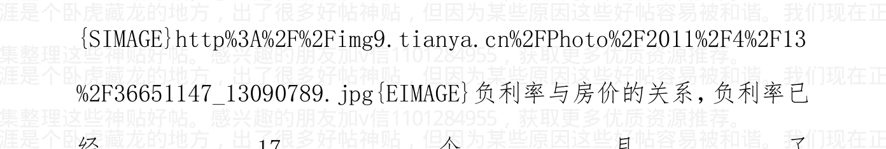


作者:海宁的马甲 日期:2011-04-13 11:32 作者: geyuyan 回复日期:2011-04-13 11:19:54

我的婆婆是一个目不识丁的老太太,昨天我下班回家,看见她买了一箱食用油回来,问她买那么多?她说:要涨价了多买点。一个不识字老太太的直觉,无语。

老太太应该记取了2008年的教训。

6个月内,食用油跌到目前价位以下的可能性,很小。

作者:海宁的马甲 日期:2011-04-13 22:14 作者: alitmper 回复日期:2011-04-13 13:57:04 回复

1. 长期以来看多大宗商品的高盛周一在给客户的报告中建议,在原油和其他商品市场走势逆转前锁定赢利。——《高盛多翻空 油价大幅下跌》

2. 欧洲央行率先重启加息，似乎并没有打乱美联储的政策步伐。

> 周一，一位重量级的美联储决策成员表示，短期内该行不大可能加息，因为大宗商品价格飙升对通胀影响只是暂时的，同时失业率仍处在高位。——《二把手定维稳基调 美联储不急于加息》

3. 4月13日上午，全国工商联将召开新闻发布会，各个商会可能集体宣布，为了抑制通胀预期，保证重要消费品不涨价。还有最近温家宝对房价调控的表态，要地方政府负责。

以上3点海宁能分析一下么？

这会导致你分析的时间点大幅延后么？

> 回答一： 高盛说的是短期风险过大（自从年初上涨以来，没有什么大的调整），牛市一定要有调整，最后拒绝调整的飙升，属于最后疯狂。高盛依旧看涨大豆。

> 回答二：说过很多次了，美国房地产泡沫破得最狠，美国其实希望全球经济不错，温和通货膨胀，这样美国货才有人买。美国希望温和通货膨胀，而不是恶性通货膨胀。石油价格120美元，是临界点，再往上太多，世界经济面临又一次萧条。

回答三：会延后大豆行情，但是来的时候，也会更猛。因为当中国重新大量进口的时候，市场可能会一致做多。

四：从大豆的消耗量看，中国经济2009年，2010年形式不是小好，而是一片大好，好得让人嫉妒（不是反话）。全世界都羡慕我们。

大豆的需求，是有弹性的，2008年经济不好，猪肉食用油太贵，中国的大豆进口增长率很小；2009，2010很猛。大豆走势，比房地产落后6到9个月左右（没有细究）。

房地产好 -->建筑工人好，工资多，装修工人和家人过得好，其他行业也不错 -->猪肉，食用油需求大 -->大豆涨，直到难以为继。

这个循环，已经经过三个三年周期了。

等着限购产生的效果：

产量下降，进口下降，库存下降。然后涨价消息走漏，哄抢。恐慌性进口，大豆暴涨。

如果房地产低迷，则这个可能不会发生。

作者:海宁的马甲 日期:2011-04-14 20:24 作者： tangsm18 回复日期：2011-04-14 18:47:11 回复

@justincnnb 2011-04-14 17:58:29

通过这些数据，我看慈祥的人有点不管RMB了，表面宣传控通胀，实质上还是大撒钱，另外进行美元大转移。

国内通胀将一轮接一轮的累积，直至RMB大贬值为止。唉，可怜的中国老百姓。这阶段，还是空RMB，换美元换黄金换白银，甚至在合适的政策下还应该购入房产。

不知道海宁你的观点如何？

要是反通货膨胀的话，就无法保增长了，目前是保增长与反通货膨胀兼顾。通货膨胀只是恶化了两拨(2010年789月，2011年2，3月)，以后还有以大豆为标志的一波(2011年5月到9月)，食用油可能突然涨。(目前大豆进口量剧减，因为食用油压榨企业没有利润)

笼统地从历史上看，M2增长16%以上17%以下，属于保增长与稳物价兼顾。15%以下，房价不涨。17%以上，属于扩张性，房价起码不跌。

目前看，反通货膨胀不彻底。通货膨胀还将恶化，行政手段只能拖延一个季度。

客观地说，目前通货膨胀，还没有到恐怖的程度，尚有余地。

作者：海宁的马甲 日期：2011-04-14 20:35 另外，我希望不用过于涉及整治，点到为止即可。

而且，过于把注意力集中在执行层面的JB，是只见树木，不见森林的表现。

执行层面的JB，确实有很多决策权，但是总体，还是要看204人基团的脸色风向的。

2005年上海陈就是具体案例。

上海陈下了，但是总体，还是挡不住204人基团总体要求“以经济增长为主”的诉求。

铁腕当初的全力基础，是邓设计。邓去，铁腕影响力大降。

只有更加恶性的通货膨胀，或者干柴着火的事情，才能暂时降低印钞机的速度。

有人为新疆羊肉50元/斤，只是干柴问题。冬天很多地方干柴遍地，也不一定着火，只是说容易被火星点燃。

LEAP2020第26期（2008年6月左右），说（如果粮价继续涨）中东2009年初就着火了，结果粮价下去了，等到了2011才着火。

一切，都需要时间的酝酿。时间是唯一无法被扭曲的东西。

作者:海宁的马甲 日期:2011-04-14 21:46 作者:kangyantai回复日期：2011-04-14 21:17:48 回复

问海宁 感兴趣的朋友加v信1101284955，获取更多优质资源推荐。

今年的经济趋势,你还保留你以前的看法吗?也就是中国房地产 泡沫的破裂就算可以拖过2011年6月.也拖不过2012年2月?谢谢!

是的.

时间是值得敬畏的东西。

2010年2月到2011年7月,负利率长达18个月,与2003年到2005 年共18个月负利率长度相同。

2010年2月到2011年9月,负利率长达20个月,与2007.2-2008.9, 共20个月负利率长度相同。

负利率超过2011.9,则打破它自己建立的记录了。

2011.5-2011.9还将不得不加息,目前似乎是每两个月加息一次。

2010。10加息,是抢在美联储量化宽松二期出台前,提前消除一点通货膨胀恐慌。

2010.12.25加息,则是美国通过延长减税法案,给国际商品涨价, 提供燃料,他们知道物价将继续大幅上涨,所以加息,抵消部分因素。

他们也知道,2011.3-2011.6的CPI很难看,恨不得取消CPI这 个不准确的破玩意儿,但是世界大部分国家都发布CPI, 你不发布, 很没有面子，去开会会被人取笑的。

非常不巧，房地产的高库存周期2011下半年到了，房地产业库存高，销售压力大。

房价最主要是涨价或者下跌预期，美国房子有下跌预期，屡次降利率都无效。

日本东京房子2006年经济很好的时候的回报率5%左右，而利率才1.5%，为什么日本人不买房投资？因为5%的房租收益率，会被房价下跌侵蚀。

泡沫维持得越久，跌下来，对于所有人的影响越大，各行各业，都会被房价大跌造成的萧条所影响。

但是泡沫也无法一直向上，除非像越南一样，本币被富人彻底抛弃，财富储存手段以房子，土地，其他物业，黄金，美元，职位（职位值钱）为主。

> 作者:海宁的马甲 日期:2011-04-15 09:56 作者:iven20082008 回复日期: 2011-04-14

看你要学到什么程度了。看你想了解经济，还是想投资赚钱。投资赚钱，不一定要学经济学，货币银行学这些东西，但一定要对人性有足够的了解。

赚钱的人里，大部分不是学经济学，金融学的。赚钱靠自身的性格与学识和运气。眼光很重要，Netflix 过去三年多，涨了十倍，Las Vegas Sands在经济危机中差点破产，后来起死回生，涨了10倍。

斯凯网络美国上市的时候，以8元开盘，跌到过5元，反弹到13元。

斯凯网络的老总，就是几年身家倍增，现在已经上亿。

经济学，金融学的课程，大多数枯燥而无用。

# 海宁推荐的经济学，货币银行学书目

一本经济学就可以了。

- 萨缪而森《经济学》
- Paul Samuelson, William Nordhaus 《economics》
- 斯蒂格里茨《经济学》，本人的经济学入门教材
- Joseph E. Stiglitz 《Economics》
- 曼昆《经济学原理》
- Mankiw《principles of economics》

一本货币银行学的书就可以了。

- 《货币金融学》米什金
- 《货币银行学》黄达 主编# 《商业银行经营管理》 清华大学出版社
# 《商业银行经营与管理》唐旭，戴小平
# 《中央银行学》清华或者复旦出版社
# 《会计学原理》《财务会计》《国际金融学》《国际贸易理论与实务》
# 《经济学家》杂志
# 高盛全球经济研究报告 133 期：光荣与梦想：中国睡狮的崛起 中文版 2005 年
周其仁的夫人梁红领衔做的。
Glory and Dreaming: China Rises Abruptly (in Chinese)
```
http://unpan1.un.org/intradoc/groups/public/documents/APCITY/UNPAN023536.pdf
```
高盛证券公司首席经济学家吉姆·奥尼尔 Jim O’Neill
# 《全球需要更好的经济之砖》（The World Needs Better Economic BRICs） 2001 年 11 月 20 日
# 高盛全球经济报告 《与 BRICs 一起梦想：通往 2050 年的道路》
# （Dreaming with BRICs: The Path to 2050）2003 年 10 月
21 世纪经济报道 经济观察报 中国经营报等
# 《国富论》亚当斯密 1776 年
# 《An Inquiry into the Nature and Causes of the Wealth of Nations》 by Adam Smith

理论要点：

一是“看不见的手”指导社会经济在“主观为自己，客观为他人”的情况下迅猛发展，市场和价格这只“看不见的手”是社会配置资源的途径。

二是，国民财富在于人力资源及国民的生产能力，而非黄金，外汇储备，土地与资源。英国，德国，美国，日本等最重视教育的国家的经济发展经历充分证明了亚当斯密的前瞻性见解。学生平均成绩世界前茅的新加坡，韩国再次证明了这一点。很多土地，自然资源，矿产自然丰富，而人力资源没有被充分开发的国家的经济发展并不好，再次从反面证明了亚当斯密的论点。

国民财富在于其人力资源，在于其人口的生产能力。所以中国经济的总设计师邓小平说：科学技术是第一生产力。

亚当斯密主张自由市场经济，自由贸易，但是应该是在法治与道德约束下的市场经济。亚当斯密的《道德情操论》比国富论的出版还早。

自由市场经济在新教国家（德国，北欧，英国和各个英联邦，美国）被证明发展地非常好。新教是由16世纪宗教改革运动中脱离罗马天主教会而形成的一系列新宗派的总称。词源来自德语的“Protestanten”（抗议者）。德国牧师马丁·路德（Martin Luther，1483年11月10日—1546年2月18日）是新教宗教改革的带头人，主张每个人都有权力解释圣经。

市场经济在儒家社会发展得也不错，日本，韩国，台湾，香港，新加坡已经是发达地区了。

> 《贝纳对于未来价格涨跌的预言》1876 年 by Samuel T. Benner
> Benner’s Prophecies of Future Ups and Downs in Prices
(Robert Clark, Cincinnati), 1876 Google 上有免费电子版。

> 《罗马帝国兴衰史》1787 年
> 《Decline & Fall of the Roman Empire》 by Edward R. Gibbons 1787

> 《政治经济学及赋税原理》《On the Principles of Political Economy and Taxation》 by David Ricardo 李嘉图(1772-1823)

李嘉图也是《比较竞争优势理论》《Theory of Comparative Advantage》 与《地租》《Rent》的作者。李嘉图把农田地租解释成是土地产出高于种植成本的超额部分。剩余价值理论借鉴了他的地租理论，把工厂在成本以外的利润解释成剩余价值。

作者:海宁的马甲 日期:2011-04-15 09:59 比如说现在的比亚迪，销量大降，可能面临股价大跌，但未来可能是可以调整现代与本田，福特的汽车巨头（利润可能很高）。

比如说现在的天然气，TMD 时候都涨，就是天然气不涨，以后可能面临一个长达 3, 4 年的大牛行情。好的天然气开发公司，可能涨几倍。

作者:海宁的马甲 日期:2011-04-15 10:15 过几天极可能又要提存准备金了。

# 中国的准备金税，货币控制，金融脱媒，与民间信用危机
我一直主张用简明朴实易懂的语言。

准备金税不复杂，就是提高存款准备金率，相当于加税。所以2008年上半年，就一直加存款准备金税，加到中小民营企业破产，而大国企没有问题。

设想存款准备金率提高到50%，银行吸收100亿存款，需要对100亿的每一分钱，都要付3.25%利息，而法定存款准备金利息没有那么高。这样可贷资金不到存款的50%，那么银行为了维持运转，就必须对能贷出去的那不到50%的资金，上浮贷款利率。或者因为可贷资金有限而优先给大型国企和地方融资平台，不给中小企业。因为给大型国企和地方融资平台，是批发业务，即使出了问题，银行高Guan的问题不大；而且地方能控制大笔存款的流向，你不贷，很多事业单位，财政存款，zf机构的存款，不会存到你这里来的。

很多地方，你只要能拉到一部分财政存款，或者交警大队等有钱机构的存款，你就能获得很大的业务优势。

所以，提高存款准备金率，会导致银行以外的借贷业务量上升，即导致民间借贷更加流行，术语叫金融脱媒。1992年以后，民间集资极其流行，那就是金融脱媒；2008年如此，2011年也是如此。所以观察中国信用扩张到信用紧缩的切入点，就是民间信用违约的大规模爆发，而不是新闻上一个两个。

民间信用违约，会导致类似雷曼倒闭的金融恐慌，就是谁也不愿意借钱给别人，100%，300%的年利率都不借，因为怕收不回本金。这种恐慌，会导致急剧的民间信用紧缩（民间借贷业务量的急剧萎缩），2008年上演过。

尽量少加息，而多加存款准备金率，基本就是通过搞乱资金市场，洗脱自己的通货膨胀责任，又减少同僚的反加息压力和责难，一剑三雕的好方法。

中国民间信用违约的大规模爆发，基本与房价真正的大幅下跌的开始时间，是一致的。

目前民间信用违约还没有爆发，还需要3到6个月的高位酝酿；吴英案类似的事情，过去20年，年年都有，关键看爆发的面积和恐慌的程度。

过去10年民间借贷市场利率的走势，网上查不到，规定了温州中心支行不许外泄。但是平时一般在12%到15%之间波动，大幅提升存款准备金率后，才会上升，目前2011第一季度末在24%左右，算是比较高了。记者一般喜欢危言耸听，这样新闻的爆炸性比较强。

# 央行论文透露存款准备金率上限23% -《财经网》 caijing.com.cn -2011年3月28日
央行的央行货币政策司司长张晓慧与人合著的《中国的准备金、准备金税和货币控制：1984-2007》这则论文则表示，存款准备金率上限，在23%，24%左右，再加效果就不行了。
http://ishare.iask.sina.com.cn/f/14597647.html
中国的准备金_准备金税与货币控制_1984_2007.pdf

拉弗曲线描绘了政府的税收收入与税率之间的关系，当税率在一定的限度以下时，提高税率能增加政府税收收入，但超过这一的限度时，再提高税率反而导致政府税收收入减少。因为较高的税率将抑制经济的增长，使税基减小，税收收入下降，反之，减税可以刺激经济增长，扩大税基，税收收入增加。但问题是难以判断税率是否超过了限度。

美国经济学家阿瑟·拉弗（Arthur Laffer）在20世纪70年代提出拉弗曲线时，认为当时美国的边际税率（约50%）已经超过了限度，处在曲线向下的一边，所以他主张政府减税。但很多其他经济学家认为没有证据表明美国的税率已经达到这种极端水平，而里根对拉弗曲线有切身体会，40年代里根还是演员时，他在每年完成4部电影后便不再工作而选择度假，因为继续工作所得收入的绝大部分将用于交税。当1981年里根入主白宫后，他实施了美国历史上最大规模的减税。但实际情况是，美国经济虽然增长了，但政府税收却下降了，这造成了里根时代的巨额财政赤字。同一时期的瑞典，边际税率高达80%，大部分经济学家认为其处在拉弗曲线错误的一边，降低税率可以增加瑞典政府的税收收入。

> 作者:海宁的马甲 日期:2011-04-15 10:26 看看被走漏的消息是否属实：
2011.3月 CPI 5.3-5.4% 这个猛PPI 7.4%（还不让涨价，民营企业还活不活了？）

> 作者:海宁的马甲 日期:2011-04-15 10:28 3月CPI同比上涨5.4% 超市场预期
2011年04月15日 10:01 财新网

# 一季度中国国内生产总值同比上涨9.7%，环比上涨2.1%
> 【财新网】(记者 王晶) 国家统计局今天（4月15日）公布，3月中国居民消费价格指数（CPI）同比上涨5.4%，环比下降0.2%。工业品出厂价格指数（PPI）同比上涨7.3%，环比上涨0.6%。

3月 CPI 高于此 市场预期的 5.2%，达到金融危机以来的最高点。

统计局今天同时公布，一季度中国国内生产总值（GDP）为96311亿元，同比上涨9.7%，环比上涨2.1%。

自今年4月起，国家统计局将公布GDP、规模以上工业增加值、固定资产投资（不含农户）、社会消费品零售总额四项统计指标的环比数据。

PPI 猛。

作者:海宁的马甲 日期:2011-04-15 11:49 作者：yl668good 回复
日期：2011-04-15 11:00:58 回复
请教海宁
通货膨胀一旦爆发，买单的不还是老百姓吗？那我们老百姓现在应该怎么办才能尽量减少损失？我觉得这才是大家关心的所在！

这涉及到猜测何时加息，加息到什么程度的问题，要看你厚黑学的功力了。

通货膨胀是财富的分配，通货膨胀之后的连续加息导致的资产价格暴跌，也是一种财富的重新分配。（比如2008年股市暴跌，提前结帐的获得了大量的投机投资收入，而高位接盘的人辛苦所得，被分配给了别人）

一涨一收，对印钞机而言都是有利的。所以美国国债在经济起起落落中越发越多。

艺术在于把握信用扩张（资产价格上涨，然后消费物价上涨）到信用紧缩（加息导致资产下跌，然后消费辆下跌，物价下跌）的临界点。

临界点的把握，索罗斯算是大师。不过索大师1980 - 1985也陪了很多。

作者:海宁的马甲 日期:2011-04-15 11:53 有人问，什么时候买房的问题。这是每个人自己的决定。

我认为2005年下半年，2008下半年，2011下半年到2012年，都是房价的回调阶段。2011下半年和2012年，我认为是房地产泡沫一鼓作气，再而衰，三而竭的时期。

我的分析不一定对，有待时间的检验。市场的走势是现实，是对的。市场的走势如果与预测，预期不符，那就是这个分析不对，而不是市场不对。

加v信1101284955获取更多优质书籍推荐

市场错了。

市场是大量的参与者用钱砸出来的，市场无所谓对错，市场价格是真真切切的现实。

作者:海宁的马甲 日期:2011-04-15 23:22 我不是神仙，不会巫术，没有看透未来的水晶球。

从中国过去十年的历史，应该在利率由正转负的12个月以前买入，比如负利率从2010.2开始，你应该2009.2前买入；负利率从2007.2开始，你应该从2006.2前买入；负利率从2003.10开始，你应该从2002.10前买入；个人看法，负利率12个月以后买入，前景不是很好。

2007.2开始负利率，2008.2再买房，买股票，迟了（谁也不知道，后面会发生二战以后的大印钞，政客永远靠不住，只有恶性通货膨胀才能止住政客印钞）。

现在没有任何有保障的投资方式，2010.7开始的粮食等商品单边牛市已经过去了，以后是震荡行情，现在等2011.6.30美国量化宽松二期结束引发的问题。

作者:海宁的马甲 日期:2011-04-15 23:24 我不是神仙，不会巫术，没有看透未来的水晶球。

从中国过去十年的历史，应该在利率由正转负的12个月以前买入，比如负利率从2010.2开始，你应该2009.2前买入；负利率从2007.2开始，你应该从2006.2前买入；负利率从2003.10开始，你应该从2002.10前买入；个人看法，负利率12个月以后买入，前景不是很好。

2007.2开始负利率，2008.2再买房，买股票，迟了（谁也不知道，后面会发生二战以后的大印钞，政客永远靠不住，只有恶性通货膨胀才能止住政客印钞）。

现在没有任何有保障的投资方式，2010.7开始的粮食等商品单边牛市已经过去了，以后是震荡行情，现在等2011.6.30美国量化宽松二期结束引发的问题。

加v信1101284955获取更多优质书籍推荐

作者:海宁的马甲 日期:2011-04-16 13:07 作者：xhk_zy 回复日期：2011-04-16 10:19:17
这次cpi 5.4
我感觉4月份有可能会更高，因为这两天去超市买菜东西更贵了
所以加息0.5的日子有可能来了

2011.4 - 6，因为 2010.4 - 6 物价低，所以翘尾因素就有3%左右。
想想 2010.4 - 6 猪肉才多少钱，葱姜蒜才多少钱。
所以 FGW 的意思是，食用油，方便面等等，就不要挤破头在这段时间内涨价了。
到 2011.6 以后再涨，CPI 就不会有压力了。其实取消 CPI，就没有压力了。(不过很多调控的职位，也不需要了)。所以 FGW 的同志很忙，他们的工作很重要，为稳定物价作出了巨大的贡献。

作者:海宁的马甲 日期:2011-04-16 13:09 作者:iven20082008 回复日期: 2011-04-16
目前的中国和世界经济，总体不算差，制造业还在扩张。
具体行业接下去1，2年比较差，比如汽车。

作者:海宁的马甲 日期:2011-04-17 11:41 中国国内企业有2400多亿美元的美元空头头寸，赌的就是人民币单向升值
根据央行近期公布的数据，2月末，金融机构外币贷款余额4685亿美元，同比增长17.8%；外币存款余额2286亿美元，同比增长4.5%。
以此计算，截至2月末的外币贷存比达到205%，与1月末的206%相当。

外汇贷款比外汇存款多 2400 亿美元。

对于 2011 年，外汇贷款大增，导致外汇占款大增，外汇储备大增，其实很简单，就是人民币对美元单向升值，你今天贷款 30 亿美元，1 年后，如果人民币对美元升值 5%,那么一年后你只要用 95%的人民币，就可以还清贷款本金了。而且美元贷款利率低，一年期贷款利率大约 3.5% - 4%左右，一年内人民币对美元升值 4%，基本就相当于零利率。

目前在法律上，这种做法不违法。人民币与外汇是合并报表，没有分开报表。

贷款的，都是上千万，上亿美元地贷，普通人行吗？

外汇储备，是中国人民银行的备付资产。（中国人民银行为了购买外汇储备而发行的人民币，是中国人民银行的负债，是人民币持有人的资产，比如外企持人民币，他们手里的人民币是他们的资产，他们离开中国的时候，需要把人民币换成美元，到时候中国人民银行要拿得出美元才行；那些讨论分掉外汇储备的，真的非常无知。我很少用“无知”这样的词汇）。

2010. 6. 19，是大宗商品上涨的集结号，我提到过好多次了。

单向缓慢升值，看上去很稳健，其实不然，其实是向中国需要进口的大宗商品市场集体送钱。分析过程太累。下面两篇也是非常基本的。周洛华分析过，也分析得不是很清楚。

我的更多文章：
* （十四）通货膨胀可以和另一领域的通货紧缩共存 2010-08-12 10:12:40
* （十三）美联储的利率制定的参考之一--泰勒规则 中国国内企业有2400多亿美元的美元空头头寸，赌的就是人民币单向升值 2010-08-12 05:50:09
* 10年商品大牛市，到2011年10月也许接近尾声了 中国国内企业有2400多亿美元的美元空头头寸，赌的就是人民币单向升值 2010-08-11 00:04:30
* 朱格拉周期理论--法国医生、经济学家克里门特·朱格拉 2010-08-11 00:01:12
* 约瑟夫·熊彼特 (Joseph Alois Schumpeter) 2010-08-10 23:58:23
* 商业周期与未来预测 - Martin A. Armstrong 1999年9月26日 中国国内企业有2400多亿美元的美元空头头寸，赌的就是人民币单向升值 2010-08-06 04:01:32

# *（十二）人民币升值与2007-2008年国际商品价格暴涨 2010-08-04 21:26:00
# * 即将到来的萧条（2011年6月）孕育着底部（2012年底） 2010-08-04 21:24:10
# * 中国股市与楼市逃顶与抄底时间参考表
中国国内企业有2400多亿美元的美元空头头寸，赌的就是人民币单向升值 2010-08-02 01:04:01
# *（十）经济信心模型对2010年7月以后的世界经济的预测 2010-07-31 05:29:54
中国国内企业有2400多亿美元的美元空头头寸，赌的就是人民币单向升值

读取中… 此分类尚无博文，请选择其他分类
帮助：
以图片方式添加博文，是我们为VIP用户提供的特殊服务。
系统默认您博文中的第一张图片为该博文的‘封面’。
加v信1101284955获取更多优质书籍推荐
点击“换封面”可以为您的封面换一张图。
您只能对新浪域下的图片进行此项设置。

* 简述 1993 年以来，人民币与美元间的故事，兼论热钱中国国内企业有 2400 多亿美元的美元空头头寸，赌的就是人民币单向升值 2010-10-08 10:47:39
* （十二）人民币升值与 2007-2008 年国际商品价格暴涨 2010-08-04 21:26:00

2011. 3. 16 外汇存款和贷款已经出现“期限严重不匹配”
一边是外汇存款吃紧，另一边是外汇贷款需求旺盛。在银行业人士看来，目前外汇存款和贷款已经出现“期限严重不匹配”，随之而来的流动性风险应受到关注。

莫慌!此次主力仍然在假摔? 套牢的股票很可能有救了! 3月股市很可能发生巨变? 拉锯战背后暗藏的资金动向! 外汇贷款“以价补量”

《第一财经日报》记者近日从多家商业银行了解到，伴随人民币信贷全面收紧和企业转向外汇贷款，加上人民币升值预期，商业银行外汇贷款需求日趋旺盛；但同时，外汇贷款也已经出现较大幅度收缩和一定程度的“涨价”。

> “今年外汇贷款额度不会比人民币贷款额度来得松。”一家大型国有银行上海分行外汇交易人士对本报记者坦言，“今年贷款利率也已上涨，现在一般在同期外币（伦敦同业拆借利率）水平上上浮 350~500 个基点不等，而去年通常上浮 200~300 个基点。”

另一家大型国有银行国际业务部相关负责人也对本报记者表示，与设定人民币贷存比上限不同，目前国内银行外币贷存比并未受到严格限制，“因此外汇贷款投放规模没有总量目标，而主要由各家银行根据自身贷存比情况来加以调控。”她如是说道。

> “今年以来，人民币贷款全面收紧，一些企业开始转向外汇贷款，同时人民币升值预期也比较强烈。”该国际业务部相关负责人指出，“也就是说，一方面不受规模控制，另一方面企业又可以享受外币贬值带来的收益，在还款日可以用较少的人民币来归还外币贷款的本息，所以贷款需求有所上升。”

而在外汇贷款利率方面，“根据企业贷款期限、议价能力和各家银行资金价格等因素而定，一般来说在同期 Libor 基础上上浮 350~500 个基点。”

## 外汇贷存比居高不下，潜在风险引关注

外汇贷款利率上浮，议价能力高的企业长期贷款也可能上浮200~300个基点。”该负责人透露，“与今年人民币贷款‘涨价’一样，外汇贷款同样在‘以价补量’。

在外汇贷款备受青睐的同时，外汇存款却遭‘吃紧’。上述大型国有银行国际业务部负责人就坦言：“外币存款较少，企业不愿意持有外汇存款，而是收到外币立即结汇成人民币，从而降低贬值风险。”

比如，那些本身有美元收入和支出的企业，以前会利用美元收入支付货款，现在在人民币升值预期下，会选择先把手头美元收入结汇，然后另外贷出美元用于支付。

交通银行首席经济学家连平昨天在接受本报记者采访时表示：“外汇存款持续增长缓慢，人民币升值预期伴随外汇贷款不断增长，使得外汇贷存比居高不下。”

### 外汇存贷“期限严重不匹配”

事实上，从去年初以来，外汇贷存比始终居高不下。

根据央行近期公布的数据，2月末，金融机构外币贷款余额4685亿美元，同比增长17.8%；外币存款余额2286亿美元，同比增长4.5%。

以此计算，截至2月末的外币贷存比达到205%，与1月末的206%相当。

而截至2010年末，外币贷存比则为198%，已经高于当年9月末的184%。

根据本报记者从银行内部获得的上海地区同业数据，部分中资银行的外汇贷存比已经超过100%。截至2月末，各银行上海分行为：
- 深圳发展银行：187%
- 中国银行：175%
- 农业银行：160%
- 建设银行：128.6%
- 上海银行：93%
- 工商银行：90%

> “银行外汇贷款和存款已经出现期限严重不匹配。”上述国有银行国际业务部相关负责人对记者坦言，“大量外币存款以活期形式存在，外币贷款则有中长期需求，所以银行不敢大量投放外汇贷款，生怕有大笔外汇提款需求。从这个角度看，较高的外币贷存比实际上有潜在风险。”

> 上述银行外汇交易人士则认为：“外汇贷存比居高不下，除了银行同业拆借资金，应该还有银行自有外汇资金以及一部分与央行做的掉期，比如用人民币从央行拆借美元放贷，约定一年后归还，而这部分规模是不公布的。”

一位银行业人士也向记者透露：“在人民币升值预期加大的情况下，银行本身并不热衷外汇贷款，但有时只能硬着头皮解决一些强势企业客户的外汇贷款问题，否则可能面临客户的流失。同理，虽然央行愿意向银行提供外汇头寸，来缓解外汇储备压力，但银行却在有意识地加以控制规模，以免出现贬值风险。”

连平则指出，从风险角度看，监管机构应该给予外汇贷款一定关注，银行需要确保企业真实贸易背景以及外币贷款用于境外支付，以免那些外汇贷款在境内市场重新兑成人民币，赚取利差和汇差之后重回央行体系。

值得注意的迹象是，央行上海总部最新数据显示，2月份外汇存款大幅增加16.3亿美元，环比和同比分别多增11亿美元和11.3亿美元；当月新增外汇贷款则为6.4亿美元（其中近九成为短期贷款），环比和同比分别明显少增11.6亿美元和12.7亿美元。

## 三大“兜底保险”使得原材料商品价格大幅上扬的趋势难以改变

文/海宁的马甲 2011-01-18

1998年，东南亚金融危机，俄罗斯国债违约，和南斯拉夫战争之后，欧洲，亚洲的资金涌向美国，追逐互联网泡沫。那个时候，欧洲，亚洲都出现了物价下跌，房价下跌，和股市下跌。而美国出现货币供应量猛增（货币供应量增长8.8%，对美国来说是个大的数字），美联储主席格林斯潘秉持类似“央行不是神仙，无法控制资产泡沫”的观点，没有收紧货币政策，史称“Greenspan put”，可以翻译为“格林斯潘资产价格兜底保险”，即如果金融市场出现危机，美联储会释放流动性以缓解危机，而如果资产价格大幅上扬，美联储并不会大力紧缩。这就造成了鼓励投机推涨的道德风险。

2011年，美联储主席伯南克向市场明示，美联储在美国通货膨胀率达到2%以前，是不会收紧美国货币政策的。因为美国房地产泡沫破裂的余波，目前美国的通货膨胀仅为1.1%，此种明确的言论，被称为“Bernanke Put”，即“伯南克兜底保险”。这就为商品市场的投机资金很大的信心继续推高原材料商品价格，直到美国的通货膨胀接近2%为止。摩根银行在建立铜期货ETF之后，鼓吹世界铜的供需缺口6万吨的说法。世界范围内的气候因素，给农产品投机资金以极大的鼓励和借口。此为第一大“兜底保险”。

2010年底，美国通过延长小布什减税方案的法案，美国2011年，2012年的财政赤字，每年都高达1.2~1.4万亿美元左右，美国国债，庞氏骗局的特征愈加明显，但是美国国债的收益率并不高（十年期美国国债收益率仅为3.33%左右）。美国如此大规模的财政赤字，保证了美国短时间内经济恢复会较好，对商品的需求大，再一次给原材料商品市场的投机者巨大的信心。此为第二大“兜底保险”。

美国的政客，也要到了美国国债问题恶化到不得不解决的时候，才会考虑财政紧缩方案，毕竟，缩减开支是要么得罪利益群体，要么得罪选民的事情。

2011年，2012年这两年美国新增的2.5万亿美国国债（欠条，而且注定要通过通货膨胀后的新欠条来“还”），谁拿去，谁的房价物价就暴涨。

中国虽然从2010年底开始收紧货币政策，但是收紧的力度还是有所顾虑，即收紧货币政策不能伤及经济高增长态势，此项政策保证了中国对于大宗商品的进口需求短期内不但不会下降，2011年第一季度，甚至直到第二季度，还会增加。此为第三大“兜底保险”，有人称其为“JB兜底保险”，我不认同。我认为即使不是“二十五大护法兜底保险”，起码也是“九大护法兜底保险”。

大宗商品价格泡沫，2008年上半年刚刚发生过，很多市场人士认为短期内不会再次重演。但是从以上三大“兜底保险”看，2011年上半年，物价上涨接近甚至超过2008年上半年的风险不小。

同时不少市场人士预测，2011年的通货膨胀高峰在2011年年中，从静态分析来说，这是对的。但是如果2011年上半年商品价格疯涨，而货币紧缩力度不够的话，通货膨胀势必在2011年下半年延续，甚至加剧。

加v信1101284955获取更多优质书籍推荐

2011年下半年，宏观调控的难度很大。

2011第一季度，贷款新增不会少于3.5万亿，新增广义货币供应量不会少于5万亿，GDP增长率不会小于10%（2010年第一季度GDP增长率在12%到14%，属于过热），通货膨胀只会蔓延，不会得到有效控制。

不过一般不大对经济发表看法的老大，也出来说“有信心控制通货膨胀”，这个比较有意思。

> > 作者：海宁的马甲 日期：2011-04-17 12:20 作者： 施怀智 回复日期：2011-04-17 11:55:56 回复 楼主对物价分析的非常准，去年七到九月一波涨幅，今年三到六月又是一波，只不过这一次被发改委强行压住，暂缓涨价，这就意味着危机被推迟了，但将会更猛烈，坚定做多农产品期货！目前看，可以涨到9月，因为大量所谓廉租房的动工，在第三季度，很多其他项目，显然在第一季度被卡住了，不然第一季度的货币供应量，不会仅仅是目前公布的数字，而应该大许多。说明他们很懂。他们一直很懂，量化宽松二期之前加息，美国投票决定延长小布什减税方案后，再加息。农产品的做多仓位，在下降，下降了许多。单向牛市，是没有了。大豆也就撑过南美的高库存时间段（南美季节与北半球相反）。具体很难说。2008年，是中国股市暴跌，导致负财富效应，美国房价飞流直下，也导致负财富效应，使得粮食和石油需求大跌，才终止了石油粮食的牛市。

这一次，凭什么？

作者：海宁的马甲 日期:2011-04-17 12:41作者：zq1329 回复日期：2011-04-17 12:25:45 回复

请教海宁，像北京这样的一线城市房价会跌多少？？恳请海宁给个预期。。。。。不甚感激

时间重于价位，下一轮负利率，目前看，大约在2013年底，2014年初出现。按以前9年历史看，买房应该在负利率出现的12个月以前。

- 2010.2负利率出现，2009.2以前买。
- 2007.2负利率开始，2006.2以前买房。
- 2003.12负利率开始出现，2002.12以前买。

当然这样的估算，只能是估算。历史从来不是简单重复，而是相似。

如果没有非典造成的“政绩需要”，2003年，2004的加息可能会猛点。

房价以人民币计价，具体就要看货币政策了。

2007.2 – 2008.10负利率期间的后半段，股价大跌，房价微跌。

2010.2 - 2011.10，或者 2010.2 - 2012.2 负利率时期的后半段，拭目以待。我也没有看透未来的水晶球。谁也没有经历过大量美元套利资本平仓的威力，2007.2以后日元套利资本的平仓，比起今天的美元套利资本，是小巫见大巫。

2011第三季度的部分时间，我们很可能看到美元汇率，与石油粮食共涨。这是令发改委非常头疼的。

作者:海宁的马甲 日期:2011-04-17 13:08 作者: 楚贝勒 回复日期: 2011-04-17 12:59:01

2011年下半年到2012年下半年，房价处于下跌期。

作者:海宁的马甲 日期:2011-04-17 13:10 目前看，领涨中国房价的杭州，开始松动了。杭州和北京卖地卖不动了，两难了。

作者:海宁的马甲 日期:2011-04-17 13:18 底层对于生活必需品的承受力，严重制约的房价的继续发展。通货膨胀，或者某一行业沾光太多，就会形成不和谐。从全球经济和油价看，石油涨过115-120美元一线，能源行业占GDP的比重，就会超过9%，就会影响能源行业以外的企业和个人的收入，消费会萎缩，经济会良性循环，进入恶性循环。也就是通货膨胀会导致紧缩的货币政策。

笼统地说，也就是通货膨胀与股市及资产泡沫的关系，从情人变成敌人的开始。

9%是根据历史对比而来，历史上历次石油暴涨，能源占GDP9%以上，则世界经济衰退。过去60年，美国物价大涨，8次里，六次是与中东和石油价格有关。

房地产类似，中国房地产的发展，使得建筑工人等房地产相关行业的人的收入不错，能抵御通货膨胀。但是那些工资不涨的，明显托了后腿，也必然会有这样的工资涨幅抵不上物价涨幅的人，而且是大量的。


> 作者：海宁的马甲 日期：2011-04-17 13:29 作者：上林隐士 回复日期：2011-04-17

美国农民2011年，种大豆的利润也就260人民币/亩（600美元/公顷）

玉米利润，预计在600 - 1000美元/公顷。

美国人要是只种100亩，一年利润也只有3万人民币。

这是无法解决的矛盾。

日本实施了工业补贴农业的方法。

作者:海宁的马甲 日期:2011-04-18 12:09 作者: dave9009 回复日期: 2011-04-18

我只是猜测JB们在2011年10月前后转正。

上两次利率转正2005.3，2008.10，房价向下调整一次比一次深。

这次因为是五浪的结束。回调的第一目标应该是2008年底。

2008年底，股市楼市的成交量是非常低迷的。

白银：

按涨五倍规律，白银突破45问题不大。但是能比45高多少，很难说。

作者:海宁的马甲 日期:2011-04-18 12:19 作者: 芙蓉姐小白菜 回复日期:2011-04-18

全国各地，泡沫程度不一样。泡沫最深的，是外贸顺差最多的浙江。

浙江的自有住房比例很高，而外地人，即使跌去一半，能买得起的，不是太多。贫富差距，导致房价跌的时候，没有买盘。

任何商品，即使总体价格向上，一路上大幅回调的机会很多，香港就是例子。

广州1993年6000，7000的商品房，还套了10多年呢。

作者:海宁的马甲 日期:2011-04-18 13:16 作者：li8336677 回复日期：2011-04-18

千万别叫老师，我的厚黑学功力，在2011下半年面临考验。

当然，他是否是房地产泡沫的守护神，在2011下半年，也面临考验。

地方zf的卖地收入，在2011下半年，也面临一定的危机，因为房地产库存高峰又来了（同时遇到物价高的情况）。

作者:海宁的马甲 日期:2011-04-18 21:52 仔细看看日本1982-1992有没有负利率

日本1986-1988实施2.5%的负利率，是在CPI远低于2.5%的情况下发生的。

历年日本

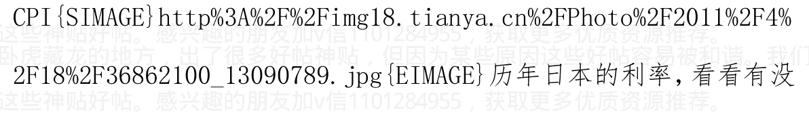


作者：海宁的马甲 日期：2011-04-18 22:04@fupeng0720

2011-04-18 21:51:26

央行数据显示3月份M2同比增长16.6%，比上月末高0.9个百分点，慈祥的人一方面加息、提准，抽走市场流动性；另一方面，又增发M2，往池子注入流动性。。。。。。何故？？？？想听听这里高人的分析。谢谢！！！

2010年GDP平减指数7.6%（所有物价的加权平均涨幅）

2011年的GDP平减指数，不会少于7.6%

2011年，货币供应量应该在7.6%（物价涨幅）+ 9%（GDP涨幅） + 1% = 17.6%以上。

2011年，货币供应量的增长率，需要保持在17.6%以上，才能保证泡沫。

控制在16%以内，只是说说。

2009年，货币供应量，预计增长17%，结果27.68%（可以与1992—1994比）

2010年，货币供应量，预计增长17%，结果19.6%

2011年，货币供应量，预计增长16%，如果能控制在17%以内，就算只初步止住了道德的滑坡了。

听其言，观其行。主要看他做什么，而不是唱什么。

> 作者:海宁的马甲 日期:2011-04-18 22:12@人民军医 2 2011-04-18 16:01:17

海宁你对欧成效的预测怎么看？是不是走火入魔了？还是篱笆上那个是冒牌货？

他是彻底看空RMB，看空货币紧缩政策。

我也长期看空RMB，制度因素，不是一两个人能解决的。1994-1996严厉打击通货膨胀，但是后期的坏账怎么办。还是要通过负利率，或者通货膨胀，让劳动者买单的。

2006 – 2011年，跨越式发展的账单，很大，起码一直要让劳动者买单买单72大寿。

事实是中国货币政策在2005，2008实施了一些紧缩。你可以看看华尔街的文章，《中国货币政策谁说了算？》不过其内容，不说很多中国人都知道。

> 作者:海宁的马甲 日期:2011-04-18 22:16 这一轮物价上涨的幅度是多少？一个参考指标是军队40%的工资涨幅。

一个看水电等公用事业服务和收费的涨幅，这些涨幅，基本能“巩固”固化前期的物价上涨。因为这些涨了之后，很难跌。即使成本跌了，利润率上去了，也不会降价，而是用于盖大楼，疗养院，发奖金等。

作者:海宁的马甲 日期:2011-04-18 22:24 德国历史上利率情况，可以与上面的日本对比 1988年，德国先于美国，更先于日本加息。

但是德国承受了短期的失业率上升。德国历史上利率情况


不知道负利率，与道德滑坡，有没有关系？


作者:海宁的马甲 日期:2011-04-18 22:57@正面一号 2011-04-18 22:49:34

新浪财经讯 北京时间4月18日晚间消息，标普公司宣布，将美国AAA信用评级的前景评级从“稳定”降至“负面”，这意味着未来6-12个月内标普可能调降这个世界最大经济体的主权评级。与此同时标普宣布，对美国的信用评级依然为AAA不变。

标普、穆迪和惠誉等知名评级机构在授予评级的同时，往往还会对这一评级的前景做出说明。前景评级分为三等，依次为正面、稳定和负面。对最高级AAA而言，前景评级只有稳定和负面两种。

今天标普调降AAA评级的前景表明，如果美国政府没有采取切实措施，化解标普分析师对美国财政状况前景的忧虑，标普可能在未来调降美国AAA的评级...

标普终于对这个全世界最大的旁氏骗局发出声音了。

作者:海宁的马甲 日期:2011-04-19 09:17 标普终于对这个全世界最大的旁氏骗局发出声音了。

刚调完，美元暴涨，欧元暴跌。谁分析一下。

美元是反弹，都跌了那么久，那么多，该调整了。

商品12月以来，涨了那么多，该调整了。有调整，才能再上一浪。

目前油价，并没有对石油需求产生多大的抑制作用。要大幅涨过115-120一线，涨到115与147之间。（投资者估计对147以上有恐惧）

历史上，美元反转走强，一定要美联储大幅度加息，美国经济好转，或者财政赤字大幅下降才行。

不过一波远远大于2010年5月的美元套利资本平仓，也够新兴发展中国家受的（烈度和时间长度超过2007年2月以后日本套利资本平仓）。

美联储和世界各国如何避免美元套利资本集体疯狂平仓，是个大问题。

## 卢浮宫协议（Louvre Accord）

### 卢浮宫协议背景

美国贸易收支状况恶化和外债急剧增加，市场对美元信心下降，美元大幅度过快贬值。“J曲线效应”导致美国贸易逆差更加恶化。

1987年，美国贸易赤字达1680亿美元，占GDP的3.6%，其中，3/4的赤字来自日本和西德的经常项目盈余。

### 卢浮宫协议的签订

1987年2月，七大主要工业国(G7)政府坐不住了，G7国家财长和中央银行行长在巴黎的卢浮宫达成协议，一致同意G7国家要在国内外宏观政策和外汇市场干预两方面加强“紧密协调合作”，采取联合措施制止美元的跌势，保持美元汇率在当时水平上的基本稳定。于是G7政府官员在巴黎召开协商会议，此次会议协议史称“卢浮宫协议(Louvre Accord)”。

### 该协议的主要约定是：

1.  日本和西德等实施刺激内需计划，美国进一步削减财政赤字。
2.  G7国家加强外汇市场“干预协调”，秘密保持美元对日元和马克汇率的非正式浮动区，如果汇率波动超出预期目标5%，各国要加强合作干预。

### 该协议的主要精神是：

1.  七大工业国应共同合作来稳定汇率。
2.  七大工业国建立共同磋商机制，协调各国的宏观经济政策。

### 该协议的结果：卢浮宫协议后，国际主要货币汇率在近两年多的时间里保持基本稳定，没有发生太大动荡。

## 卢浮宫协议与广场协议的影响

20 世纪 80 年代中期，日元对美元汇率发生了两次大幅度调整：

- 一是 1985 年 9 月广场协议，主要为解决日美贸易争端，日元对美元大幅度升值；
- 二是 1987 年 2 月卢浮宫协议，主要为解决美元过度贬值对世界经济带来的不利影响，日元对美元出现短暂性的大幅度贬值。

日元对美元汇率这两次大幅度调整，起因在日美贸易摩擦和各自国内政治经济利益的现实需要，都是在美国主导下，通过国际社会施压和国际会议汇率协调机制来促成和实施的，对日美等国和世界经济运行产生了显著影响。

1. 就美国经济而言，总体上积极效应要大于负面效应。两个协议本质上就是以美国政策和经济利益为主导签署的。特别是卢浮宫协议以后，美国外贸出口迅速扩大，贸易赤字和财政赤字均有较大下降。

1987—1990 年，美国外贸出口增幅持续保持在 10% 以上；美国经常项目赤字由 1680 亿美元下降到 920 亿美元，占 GDP 的 1.6%；政府财政赤字占 GDP 的比例由 4.5%下降到 3.4%。这些变化对强化美国的经济霸权地位和缓解国内“滞胀”及就业压力产生了明显的积极作用。但卢浮宫协议之后，由于美国采取过分强硬态度促使日本和西德下调利率，而日本和西德受国内经济状况影响一时又很难下调利率，受市场预期等多重因素影响，纽约股市于1987年10月19日出现了严重的股价暴跌。当日纽约股市暴跌22%，被称为“黑色星期一”。

同时，广场协议后美元大幅度贬值也促使美国由净债权国逐渐转变为净债务国。到1986年末，美国对外净债务总额达2636亿美元，已是当时世界上最大的净债务国。

### 就日本经济而言

1985年广场协议促使日元升值，事实上成为日后日本发生“泡沫经济”的导火索。签署广场协议的第二年，即1986年，日本出现了因日元升值引发的萧条局面。

外贸出口增速由1985年的2.4%下降为1986年的负4.8%，实际经济增长率从1985年的4.1%下降至1986年的3.1%。但由于当时日本经济总体上正处在复苏增长的上升期，国内各行业对日本经济发展前景普遍充满乐观和自信，同时，广场协议使日元升值发挥了降低消费品价格、增加居民实际收益的积极作用，日本国内民间消费支出明显上升，以民间消费为先导的投资热潮，有力拉动了日本国内总需求的快速扩张。另一方面，广场协议前后，日本为缓解日美贸易摩擦，在同意日元对美元升值的同时，并没有放开进口市场，而是实行了宽松的货币政策以促进进口美国商品，特别是“超低利率”政策。

从1986年1月开始，为了削减日元升值对国内经济增长带来的负面影响，日本银行在从1986年1月到1987年2月将近一年的时间里连续五次下调公定贴现率，将其降低至当时国际上的最低水平2.5%。

卢浮宫协议以后，日本银行将此2.5%的“超低利率”一直保持到1989年5月，持续时间长达27个月。日本银行官定利率长期处于低水平，有力促进了金融机构贷款大量增加。日本金融机构贷款与GDP的比例80年代初为50%左右，到80年代末已升至100%。1987—1989年，日本货币供应量（M2＋CD）年增长速度分别为10.8%、10.2%和12%，持续保持较高水平。

由于货币政策极度扩张，1988—1990年，日本经济增长率分别为6.0%、4.4%和5.5%，明显超过80年代前期3%左右的平均水平和同期其它发达国家水平。与此同时，大量过剩资金流入了股票和房地产部门，引致了股票价格和房地产价格的暴涨。1987—1989年，日本股票价格平均上涨94%，城市土地价格平均上涨103%。而同期，日本消费物价指数平均仅上涨3.1%。由于在资产价格暴涨的同时，消费物价没有大幅上涨，在1991年日本泡沫经济崩溃前相当长一段时期，日本银行和经济企划厅对资产价格泡沫都没有予以充分重视。当时政策决策关注更多的是实体经济的增长、消费物价稳定和国际收支平衡。虽然认为在金融领域和资产价格方面出现了一些“异常”，但在当时物价稳定、经济持续增长的情况下，由于被实体经济扩张带来的经济效益所迷惑，决策当局对当时的金融领域“异常”问题只是发出过警告，进行过风险提示，而并未及时采取实质性应对措施。这样，信贷增加创造泡沫，泡沫扩大促进信贷增加，信贷增加进一步创造泡沫，如此循环促进，到1989年底日本已经全面步入泡沫经济之中。泡沫经济不断膨胀，日本政府逐渐感受到了压力。1989年5月，日本银行改变货币政策方向，将维持了两年多2.5%的“超低利率”提高至3.25%。1989年底，强烈主张抑制泡沫的三重野出任日本银行总裁，上任伊始即将公定贴现率由3.75%提高到4.25%，结束了日本“超低利率”时代。从1989年5月至1990年8月，日本银行五次上调公定贴现率，使之高达6%。同时，日本央行明确要求金融机构限制对不动产业的贷款投入，到1991年，银行对不动产业实际上已不再增加新的贷款。日本货币供应量增长速度1990年跌至7.4%，1991年跌至2.3%。由于过急过快的信贷紧缩，日本泡沫经济1991年开始崩溃，从此陷入了持续不景气的低迷状态。作者:海宁的马甲 日期:2011-04-19 10:50

1987年2月卢浮宫协议以后，日本银行将此2.5%的“超低利率”一直保持到1989年5月，持续时间长达27个月。日本银行官定利率长期处于低水平，有力促进了金融机构贷款大量增加。日本金融机构贷款与 GDP 的比例 80 年代初为 50% 左右，到 80 年代末已升至 100%。1987—1989 年，日本货币供应量 (M2＋CD) 年增长速度分别为 10.8%、10.2% 和 12%，持续保持较高水平。

> 一般一般，信贷扩张得非常一般。
> 中国贷款总额大约 41 万亿，与 GDP 差不多，也是 100% 多一点。

由于货币政策极度扩张，1988—1990 年，日本经济增长率分别为 6.0%、4.4% 和 5.5%，明显超过 80 年代前期 3% 左右的平均水平和同期其它发达国家水平。与此同时，大量过剩资金流入了股票和房地产部门，引致了股票价格和房地产价格的暴涨。1987—1989 年，日本股票价格平均上涨 94%，城市土地价格平均上涨 103%。而同期，日本消费物价指数平均仅上涨 3.1%。由于在资产价格暴涨的同时，消费物价没有大幅上涨，在 1991 年日本泡沫经济崩溃前相当长一段时期，日本银行和经济企划厅对资产价格泡沫都没有予以充分重视。当时政策决策关注更多的是实体经济的增长、消费物价稳定和国际收支平衡。虽然认为在金融领域和资产价格方面出现了一些“异常”，但在当时物价稳定、经济持续增长的情况下，由于被实体经济扩张带来的经济效益所迷惑，决策当局对当时的金融领域“异常”问题只是发出过警告，进行过风险提示，而并未及时采取实质性应对措施。这样，信贷增加创造泡沫，泡沫扩大促进信贷增加，信贷增加进一步创造泡沫，如此循环促进，到 1989 年底日本已经全面步入泡沫经济之中。

> 2 年股票涨一倍，土地价格涨一倍；。
> 消费物价指数 CPI 平均仅上涨 3.1%. 负利率不严重嘛。

作者: 海宁的马甲 日期:2011-04-19 11:43

@正面一号 2011-04-19 11:05:01
标普对美国前景的唱空会不会影响到中国的加息进程？
中国加息进程，只与中国货币决策者对通货膨胀的容忍度有关，与民间对通货膨胀的容忍度，也有关。从过去 7， 8 年看，上层监察民情的。他们很清楚。
川川只是 204 强之一，而且不是排名靠前的那种。
看，川川的发言，即使涨死，上限大约就是 4%，撑死 4.5%。
所以通货膨胀，很多商品的价格，特别是大豆，石油，震荡上行，涨到 2011 年 9 月份的问题不大。
目前的油价，尚未对石油需求，产生明显的抑制作用。沙特，到目前为止，也没有增产，他的所谓的闲置产能，是个未知数。

作者:海宁的马甲 日期:2011-04-19 11:47
历史上，美元低利率时期，美元汇率什么时候强过？
有两次，
一次是雷曼破产这样的大危机，再加上中国需求下降（预期世界对商品，石油需求的大跌）。
一次是量化宽松一期结束后，2010.5左右美元套利资本大幅平仓，促使温水游说西方千万别提前退出刺激。

作者:海宁的马甲 日期:2011-04-19 11:49
目前全球制造业，依旧处于扩张之中，石油需求，并未下降。危机还没有来。油价还没有大幅向上远离115-120美元这个临界区间。

作者:海宁的马甲 日期:2011-04-19 11:58
作者：water51
#####
你说得非常好。
补充一点：
2008年1月（我认为中国股市撑不住的临界点，看在2008年1月），
负利率一周年，股价从70倍左右的开始暴跌之旅，而负利率还持续到了2008年10月，或者2009年1月，看你的标准了。负利率总长度，24个月左右。

# 2011 年,房子的市盈率,是多少? 离 70 倍市盈率 (租售比 会不会在负利率的情况下,先行开始下跌。
就像你说的,物价特别大幅度上涨,会影响稳定,会遇到货币紧缩 (相对而言),如果此点有效,那么房价不会涨到天上去,很可能在租售比到达 840 倍以前就走下跌之路。中国毕竟不是津巴布韦。
目前看,我们在等大豆,石油,化肥等继续上涨几个月。大豆与石油的需求在那里,目前需求尚未下降。(大豆价格目前库存压力大)

作者:海宁的马甲 日期:2011-04-19 12:01
杭州,是地产黄金十年的领涨城市,是风向标,不管是炒作,还是市场化,或者刚需,或者投资保值需求,他都发挥得比较充分。
温州,则是精明的商人的集中地,也是风向标之一。
广州,则是相对比较理性的代表,因为它 1993-94 经历过房地产泡沫。

作者:海宁的马甲 日期:2011-04-19 12:17
股票市场,很难预测。
2008 年中国股票的走势,让很多人大跌眼镜。跌到 3000 点以下的时候,大炒奥运行情,结果奥运期间几乎天天跌。
加v信1101284955获取更多优质书籍推荐

2009 年，又让很多股评大佬很丢面子。
所以我的看法，仅仅，仅供参考。
2003 年以来，猪肉价格冲上去之后，2，3个月内，会出现货币紧缩政策，猪肉价格特别高位引发货币紧缩之后的股票，就没怎么牛过。
一句话：猪肉价格冲上去之后，再酝酿 2，3 个月，等高价猪肉引发货币紧缩之后，中国股市就没有好过。
简单的例子，是 2010 年 8，9 月猪肉价格第一次登顶，中国股市 10 月见顶；2008 年 2 到 4 月，猪肉价格再次高位徘徊，货币政策无法放松，只得继续紧缩。
2004 年，德隆、鸿仪、闽发、汉唐、南方，死在的一轮涨 5 倍巨牛行情的黎明之前，说他们死在猪肉上，也不过分。
按此规律，中国股市 2011 年下半年，2012 年上半年，就是中小板和创业板去泡沫的过程。热点已经转移到中小板创业板了，老盯着主板不行。2012 年年中或者下半年（看房地产的表现），很多人在股市上又可能会面临 2008 年底一样的机会，这次是未来高成长而股价跌得比较干净的优质民营企业股。（不是纯粹那些去圈钱的）

作者: 海宁的马甲  日期: 2011-04-19 20:58
100 万点击 Mark.
100 万/5000 回帖，平均 200 个点击一个回帖。

作者: 海宁的马甲  日期: 2011-04-20 09:00
作者：kevin_july 回复日期：2011-04-20 02:52:30
回复
海宁兄，
我几乎天天都在看你的回帖，盼望房价如你预测下跌，刚才在
凤凰网看见一条新闻：加息可能助涨中国房价。能否帮忙分析一下这
个调研结果破绽在那里。。我看了这篇文章觉得他这个分析也有一定
道理。

> 我说，从 2003 年以来，基本上，加息时期，都是股票价格上升时期，这基本也对。
- 货币对房价的影响，是两方面，一是利率（存款利率，贷款利率），二是货币供应量，三是这个房价反映的货币供应量预期。
阿根廷利率曾经 300%，泰国 1997 年利率也是暴涨，房价还是暴跌（泰国 1997 是房价，股价，汇率齐跌）
人民币盯住美元，到目前为止，信用不算太差。

盼是盼不到房价下跌的，房价最后跌，也不是调控的功劳。而是：
1. 租售比840（市盈率70倍）的大致天花板。（楼市不能完全和股市比，但它们都是资产，都有市场价；中国股市2008年上半年，在负利率很大的情况下，居然大幅下跌，很多人看不懂；这个跟市盈率到顶后转向，有很大关系），杭州不少房子的租售比，840都不止。
（杭州底层的收入极低，包括很多非体制内的大学毕业生）
杭州是风向标。
2. 大致3年一次的库存周期（2005下半年，2008下半年，2011下半年）。
这个高库存的价位，和2005，2008有天壤之别。降价15%，有购买力的刚需的人数，不会增加多少。
3. 买涨不买跌。有上涨的空间才买。很多人希望楼市清淡后部分资金可以投资股市，对股市期望很高。可是，事实上，没有强烈的股市上涨预期，别人来买股票，不是有病吗？人家买的是上涨预期。不是来当解放军。
4. 通货膨胀，物价压力，底层的衣食住行承受力，拖了房价的后腿。2005年，美联储8次加息，共加了200个基点（中国部分时间，也把货币供应量增长率控制在15%以下），部分控制了物价上涨；2008年，美国房价飞流直下，中国股票大跌，造成负的财富效应，需求大减，使得物价剧烈快速下跌。
而目前的物价上涨，尚未对抑制需求，所以普通物价还要涨。
房价越高，需要更多的货币供应，才能推得动房价。而更多的货币供应，也会大力推动物价。
加v信1101284955获取更多优质书籍推荐

作者：海 宁 的 马 甲    日期：2011-04-20  09:16
@kevin_july 2011-04-20  02:52:30
@无水的贾斯汀 2011-04-20  08:06:30
我试着解答下.
利率只是所有影响房价中稍微重要的一项因素,但不是决定因素.
决定因素是货币增量速度..
是的，利率，在货币供应量不大幅变动的情况下，决定了普通投资者心中“到底是存款，还是投资到有形资产”的天平。

> 第二，货币供应量，某种程度上决定了货币的价值（相对财富而言，如果财富增加了8%，而货币供应增加了18%）。（薛暮桥语）
第二条，也不完全对，中国过去经历了很多资产的货币化过程。（1998 年以前的房子，可以交易，改制后的企业，股份可以去银行抵押，获得贷款，有的人，是空手套的原破产的国有企业，这个不展开了）。这就是周其仁所说的水多了加面。1998 年以来，能用于交易的面（资产）多了。产权明晰，有助于容纳一定的货币。

## 货币增量速度

资产涨跌，洪水的速度对比，很重要，比如本来洪水流速是 27 码，房价涨了 60%左右，后来洪水流速下降到 19.5%左右，房价涨幅，就下降到 20%左右了。（因为水位已经很高了）。如果再后来，洪水流速下降到 16%以下，则房价很可能部分回归正常的“房价猪肉比”或者“房价收入比”。
2004 年下半年，到 2005 年上半年，货币供应量增长率，小于 15%。房价已经今非昔比。
运用物理，数学赚钱的典型，是西蒙斯的大奖章基金，他们招的人，大部分不懂金融，但是是流体物理，数学高手。
我依旧看好 2011 年下半年，从控制货币供应量，和房地产高库存，引发中国房地产泡沫的第一次终结。
注意，香港房地产泡沫，都好多次了。美国房地产 1975 年大跌，1980 年左右大跌，1990 年左右大跌，但都不算泡沫，只能说经济的波动。美国 1929 年以后，也就 2002 - 2004 年的低利率，催生了一房地产如果大跌，很可能催生一次2008年底中国股市类似的机会。

作者:海宁的马甲 日期:2011-04-20 09:19
2011年，没有美联储帮忙控制物价，所以CPI总体在4%以内，是不大可能的。
关键是厚黑到什么程度，许下那么多控制物价的诺言，这一次也食言，不知道自己感觉是不是很好意思。
其实过去8，9年，即使利率平均提高2个百分点，房价也会涨，只是不会如此疯狂。
过去十年，美国纠结于反恐，是中国和平发展的特好机会，是一副好牌。可能非典改变了很多。

作者:海宁的马甲 日期:2011-04-20 09:23
@zq1329 2011-04-20 09:17:28
个人对昨天周*川允许地方发债的看法，请楼主评论。
1. 美国金融危机，向全球发债，谁买的多谁就是哥们。
2. 中国发生金融危机，无法向全球发债，所以只能对内发债
3. 哪个地方政府发的债多，功劳就大
4. 发债的目的是控制流动性，是否也标志着决策者意识到了问题的严重性，也表明中国的金融确实发生了很大的问题？………
地方发债，收回的钱，是要用出去的。所以地方发债，收回的每一分钱，都用于推动物价，建筑工人工资的上涨。
央行希望培育债券市场的动机，是迈向利率市场化。
地方政府向社会发现3.25%利率的债券，有普通人买吗？肯定要比3.25%高。
先看一年期涨到4%。这个整数线，对于普通投资者的心理很重要。

作者：海宁的马甲 日期：2011-04-20 11:02
作者：洗了八吨水 回复日期：2011-04-20 09:37:27
# 回复
海宁的马甲，您的现代（西方）经济学理论掌握得很好，大部分时间都采用数据和事实说话，而且很多看起来读起来都很有道理，对大家帮助很大。
猪肉价格的变化，完全是中国制造。
猪肉的价格周期变化，是中国消费者，养殖户，储备肉管理者，还有添加剂生产厂商，一起制造的。所有的市场因素，消费者心理因素，消费者价格承受力（2008年就是不好，猪肉和食用油销售量增长率，大幅下降），监管的，收税的，受场位费的，收防疫费的，收过路费的，等等，等等因素，都反映到价格里去了。
猪肉的最终价格，反映的上面提到的，还有上面没有提到的一切因素。
中国的股市也是如此，楼市也是如此，一切中国特色的因素，都体现在价格里了。市场价格，是值得敬畏，起码值得尊重的。
我一直在想着推翻自己的设想，看看房价能不能维持基本不跌到2013年春天。
目前看，只有一条途径，就是货币供应量继续增长，把2006 - 2010年的过度投资，继续维持下去，也就是投资率，2011，2012年都得维持在50%以上。
如此做法，不但无法让2011的CPI在5%以下，2012的CPI，得往8%，10%去（真真实物价涨幅，高于15%，甚至高于20%，也就是突破抢购G点）。
其实2011年下半年并不远，过3，4个月就进入2011年下半年。
从2010年9月发帖，到目前已经半年多过去了。
加v信1101284955获取更多优质书籍推荐

作者：海宁的马甲 日期：2011-04-20 11:08
@ 洗了八吨水 2011-04-20 09:45:25
当然，个人否定自己往往很难，所以很多时候，真理往往在讨论争吵甚至火拼挖苦中诞生。否则，您有迷失在自我论证（循环和强化）中的风险。

你这个说的非常好。

我最近1、2个月都在想这个。毕竟，主贴发言，换到2007年9月发，有什么不一样？情况类似。

唯一的区别，就是房价/猪肉比，2011年6月，比2008年6月更大了。

2011年的两难是保房价，还是保物价。

限购是监管者不给自己留退路的一种做法。

限购之后，再也不能用“市场投机者推高房价”来搪塞了。

房价失去上涨吸引力，不是个好事情。2008年1月，股市在高市盈率的位置，失去上涨吸引力，也是如此。要知道，2008年上半年的负利率，是非常严重的。

> 作者:海宁的马甲 日期:2011-04-20 12:09

2005年，是中国经济和资产价格平稳的最后一年。

2006年及以后，从2003年以来的负利率，更加恶化，催生了股市泡沫，房地产泡沫，2008年之后，催生了房地产泡沫的平方。

按GDP平减指数，2003年下半年到2008年上半年，5年一直是负利率。（也就2005年负利率不严重一点）。

想保住，只能比2009年做得更狠。压物价，就只能停留在表面，

千万不能落实，否则房价就挺不住了。两难。

红线 CPI，蓝色 GDP 平减指数（看左边轴），绿线狭义货币供应量增长率（看右轴）。

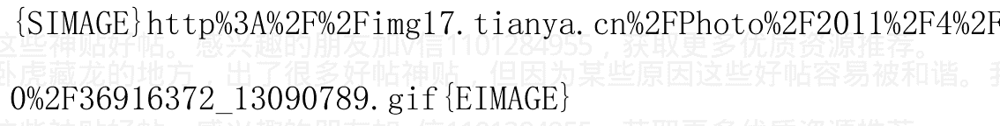

作者: 海宁的马甲 日期:2011-04-21 12:13@安闲如故 2011-04-21 09:40:46 房地产开始进入不景气阶段，大量资金会流入股市。入市的最佳时机已经来临。

6. 富人没有想象中SB，有上涨预期才会去买。股市账户平均资金，大约是6、7万。

股市对于银根松紧的变化，比楼市明显，比楼市大致早3到6个月体现。

楼市真正的反转向下，在股市比较大幅度的下跌之后的可能性比较大。（目前只是北京杭州等房价微跌，成交量下降，土地难买，只是个开始，尚未形成真正的反转）

中国股市现在很尴尬，美元汇率大跌，会引起物价大涨，招致中国的货币紧缩。

**加v信1101284955获取更多优质书籍推荐**

美元汇率上升，则平仓力量比较大，也不利。股市上涨的最佳窗口，就是前期美元汇率下跌的时期。中国股市，应该处于等待刀落的时期。

作者：海宁的马甲 日期：2011-04-21 12:16@rebornfirebird 2011-04-21 11:11:55

况且现在的房价还可以平衡社会货币的总量，如果贬值，社会上将会多出天量货币，那时。

## 谈一下房地产和货币供应的关系

两方面

1. 一方面货币供应多了会流入楼市……

rebornfirebird 说得非常对。

外汇占款，属于基础货币从无到有。房地产抵押贷款（地产商的，或者贷款买房的），属于货币乘数发挥作用的事情。目前货币乘数应该不到4.37了。（2010年6月货币乘数是4.37）

作者：海宁的马甲 日期：2011-04-21 21:49@kangyantai 2011-04-21 21:04:46

> “美联储在2011年7月到10月，必然加息，控制美国国内日益汹涌的通货膨胀。更重要的是，美联储要防止美元出现像2008年上半年的那种可怕的信任危机。这一点是本帖焦点中的焦点，如果美联储能把零利率政策维持到2011年12月16日，则本人的一切分析与预测统统破产”

这是楼主去年的预测，很多分析家说，美国今年不会加息。楼主认同吗

金融衍生品市场蕴含的信息是2011年第四季度开始加息，2012年第二季度加到1%。当然以后的走势可能有出入。我认为的可能是，石油等涨价，可能比预想的涨得快，涨得猛。金融市场一直如此，一旦趋势形成，不管是下降，还是上升，速度是很快的。

再过2个季度，中国，美国，欧洲的物价压力就很大了。


作者:海宁的马甲 日期:2011-04-21 21:53@hatailian 2011-04-21 21:08:42

股市对于银根松紧的变化，比楼市明显，比楼市大致早3到6个月体现。

楼市真正的反转向下，在股市比较大幅度的下跌之后的可能性比较大。（目前只是北京杭州等房价微跌，成交量下降，土地难买，只是个开始，尚未形成真正的反转）

房地产泡沫破裂引发的股市震荡，将是继2008年底之后，又一次股市的机会，不过到时候敢进场的不多。

在福利和分配制度不改革的情况下，不断提出工资倍增，一方面是安抚情绪，另一方面，预示着通货膨胀未来将很严重。工资倍增，主要靠通货膨胀物价上涨实现。

通货紧缩，最多忍受，也就两年左右。中国货币供应量，目前看，只有一个方向，就是小幅增加（15%以下），或者大幅增加（15%，或者20%以上）。

作者:海宁的马甲 日期:2011-04-22 12:11 黄金领先商品期货价格4个月（75个交易日）？黄金房价与负利率

负利率，导致房价涨。所以，消除负利率 = “控制房价过快上涨” 和 “控制物价涨幅在4%以内”，但是经济增长幻觉会消失，梦醒时分很难受。

> >阿扁说：“希望相随，有梦最美”，有人调侃道：“希望相随，有权有钱最美”

以下说的都是大致情况，金融市场不是数学或者物理学公式。金融市场关键的永远是预期与人性。

黄金领先商品期货价格4个月（75个交易日），见下图；

商品期货价格，与民众感受的物价的第一波冲击之间，平均大约有2个月左右的差距。

也就是说，平均而言，黄金大幅涨价约6个月后，民众能感受到物价的剧烈上涨。

再再进一步说，美联储的货币政策，是被黄金价格和期货价格推着走，而且非常不情愿地被推着。

也就是说，美联储加息，升存款准备金率“治病”的时候，“病根”已经种下6个月之久了。

2010年10月到12月的手忙脚乱，病根在2010年5月，6月；货币政策不但不提前收紧，反倒踩油门，还要去求欧美一起踩油门（“求求你们千万别过早退出刺激措施”），人家泡沫已经破了，自然乐意踩油门以期减轻民众的痛苦（是否有效是另一回事）。

美联储在美国没有泡沫的时候，还能从容对付，能提前6个月左右执行货币收紧。但是互联网泡沫和房地产泡沫，明显绑架了美国的货币政策（3个月左右的时滞，也就是美联储本来的收紧，提前6个月左右，而大泡沫破裂后收紧是迟了3个月左右，这些是回归分析的大致，并不真的100%就是6个月或者3个月）。

注意，这种领先，表现最明显的是剧烈的持续降息过程，比如2007年7月到2008年7月（货币与债券市场2007年6月份就有信号了）；

比如第一期量化宽松2009.3-2010.3；第二期量化宽松预期和实施（2010.9-2011.6）。

其他时间就不会如此明显了。

2007-2008年，中国用股市大暴跌产生的财富负效应和国际市场需求暴跌，抑制了通货膨胀。

2011年，中国用什么控制通货膨胀，只有用房地产价格的下跌，别无它法。

2011年接下去，起码还得加息2、3次。

不管2011年货币政策如何操作，事后回顾的时候，“经济学家”都会说，当初2011年的货币政策错了，就像他们说1990年日本的货币政策错了。

其实，如果日本不是从1989年5月开始加息，而是等到海湾战争，结局可能更惨。这就是同一个事物，不同的人，看法不同。

注意图中现货金的走势，移动了75个交易日。


作者:海宁的马甲 日期:2011-04-22 12:13 黄金领先商品期货价格4个月（75个交易日）？黄金房价与负利率

负利率，导致房价涨。所以，消除负利率 = “控制房价过快上涨”和 “控制物价涨幅在4%以内”，但是经济增长幻觉会消失，梦醒时分很难受。阿扁说：“希望相随，有梦最美”，有人调侃道：“希望相随，有权有钱最美”

以下说的都是大致情况，金融市场不是数学或者物理学公式。金融市场关键的永远是预期与人性。

黄金领先商品期货价格4个月（75个交易日），见下图；

商品期货价格，与民众感受的物价的第一波冲击之间，平均大约有2个月左右的差距。

也就是说，平均而言，黄金大幅涨价约6个月后，民众能感受到物价的剧烈上涨。

再再进一步说，美联储的货币政策，是被黄金价格和期货价格推着走，而且非常不情愿地被推着。

也就是说，美联储加息，升存款准备金率“治病”的时候，“病根”已经种下6个月之久了。

2010年10月到12月的手忙脚乱，病根在2010年5月，6月；货币政策不但不提前收紧，反倒踩油门，还要去求欧美一起踩油门（“求求你们千万别过早退出刺激措施”），人家泡沫已经破了，自然乐得愿意踩油门以期减轻民众的痛苦（是否有效是另一回事）。

美联储在美国没有泡沫的时候，还能从容对付，能提前6个月左右执行货币收紧。但是互联网泡沫和房地产泡沫，明显绑架了美国的货币政策（3个月左右的时滞，也就是美联储本来的收紧，提前6个月左右，而大泡沫破裂后收紧是迟了3个月左右，这些是回归分析的大致，并不真的100%就是6个月或者3个月）。

注意，这种领先，表现最明显的是剧烈的持续降息过程，比如2007年7月到2008年7月（货币与债券市场2007年6月份就有信号了）；比如第一期量化宽松2009.3-2010.3；第二期量化宽松预期和实施（2010.9-2011.6）。

其他时间就不会如此明显了。

2007-2008年，中国用股市大暴跌产生的财富负效应和国际市场需求暴跌，抑制了通货膨胀。

2011年，中国用什么控制通货膨胀，只有用房地产价格的下跌，别无它法。

2011年接下去，起码还得加息2、3次。

不管2011年货币政策如何操作，事后回顾的时候，“经济学家”都会说，当初2011年的货币政策错了，就像他们说1990年的货币政策错了。

其实，如果日本不是从1989年5月开始加息，而是等到海湾战争，结局可能更惨。这就是同一个事物，不同的人，看法不同。

注意图中的负利率区间，黄金的走势黄金涨价与负利率；中国房子涨价与负利率，是同一个道理。

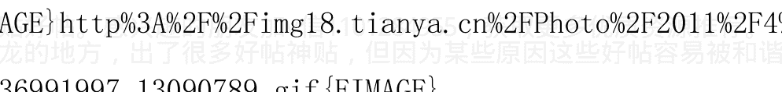

作者：海宁的马甲 日期：2011-04-22 12:15@piaohaipiaohai 2011-04-22 11:11:38

## 重庆春交会首日遭遇倒春寒 成交仅786套暴跌7.5成

截至昨日下午5时，本次房地产展示交易会首日共成交各类房屋786套，成交建筑面积6.89万平方米，成交金额3.83亿元。

## 二手房展区工作人员比购房者多

在成交房屋中，商品住宅成交343套，成交建筑面积3.61万平方米。

其中高层商品住房成交286套，建筑面积2.71万平方米，建面均价5713元/平方米；多层花园洋房成交29套，建筑面积0.42万平方米。

任志强把话放出来了，2011年下半年，两难了，要不得不放松货币政策了。

关键是，“有责任，有信心控制物价”这个承诺怎么办？

作者: 海宁的马甲 日期：2011-04-22 12:20@okherb 2011-04-20 18:27:27

从上图看，享受维稳补贴的首都猪肉批发价格从10年5月见底（不到12元/kg）以来，到11年4月是18.3元/kg。还没有达到疯狂的2008年4月同期的20.5元/kg。拭目以待看未来是向下还是向上～～

-------------------

谢谢这幅图。

从猪肉的趋势看，两难要走钢丝走到2012年第二季度，货币政策才有放松的可能，除非放宽物价涨幅。最高领导……


作者: 海宁的马甲 日期: 2011-04-22 12:24 中华人民共和国中国人民银行法（全文）

（1995年3月18日第八届全国人民代表大会第三次会议通过 根据2003年12月27日第十届全国人民代表大会常务委员会第六次会议《关于修改〈中华人民共和国中国人民银行法〉的决定》修正）

### 目录

### 第一章 总则

### 第二章 组织机构

### 第三章 人民币

### 第四章 业务

### 第五章 金融监督管理

### 第六章 财务会计

### 第七章 法律责任

## 第八章 附则

### 第一章 总则

第一条 为了确立中国人民银行的地位，明确其职责，保证国家货币政策的正确制定和执行，建立和完善中央银行宏观调控体系，维护金融稳定，制定本法。

第二条 中国人民银行是中华人民共和国的中央银行。中国人民银行在国务院领导下，制定和执行货币政策，防范和化解金融风险，维护金融稳定。

第三条 货币政策目标是保持货币币值的稳定，并以此促进经济增长。

### 第四条 中国人民银行履行下列职责：

（一） 发布与履行其职责有关的命令和规章；
（二） 依法制定和执行货币政策；
（三） 发行人民币，管理人民币流通；
（四） 监督管理银行间同业拆借市场和银行间债券市场；
（五） 实施外汇管理，监督管理银行间外汇市场；
（六） 监督管理黄金市场；
（七） 持有、管理、经营国家外汇储备、黄金储备；
（八） 经理国库；
（九） 维护支付、清算系统的正常运行；
（十） 指导、部署金融业反洗钱工作，负责反洗钱的资金监测；
（十一） 负责金融业的统计、调查、分析和预测；
（十二） 作为国家的中央银行，从事有关的国际金融活动；
（十三） 国务院规定的其他职责。

中国人民银行为执行货币政策，可以依照本法第四章的有关规定从事金融业务活动。

第五条 中国人民银行就年度货币供应量、利率、汇率和国务院规定的其他重要事项作出的决定，报国务院批准后执行。

中国人民银行就前款规定以外的其他有关货币政策事项作出决定后，即予执行，并报国务院备案。

第六条 中国人民银行应当向全国人民代表大会常务委员会提出有关货币政策情况和金融业运行情况的工作报告。

第七条 中国人民银行在国务院领导下依法独立执行货币政策，履行职责，开展业务，不受地方政府、各级政府部门、社会团体和个人的干涉。

第八条 中国人民银行的全部资本由国家出资，属于国家所有。

第九条 国务院建立金融监督管理协调机制，具体办法由国务院规定。

### 第二章 组织机构

第十条 中国人民银行设行长一人，副行长若干人。

中国人民银行行长的人选，根据国务院总理的提名，由全国人民代表大会决定；全国人民代表大会闭会期间，由全国人民代表大会常务委员会决定，由中华人民共和国主席任免。中国人民银行副行长由国务院总理任免。

第十一条 中国人民银行实行行长负责制。行长领导中国人民银行的工作，副行长协助行长工作。

第十二条 中国人民银行设立货币政策委员会。货币政策委员会的职责、组成和工作程序，由国务院规定，报全国人民代表大会常务委员会备案。

中国人民银行货币政策委员会应当在国家宏观调控、货币政策制定和调整中，发挥重要作用。

第十三条 中国人民银行根据履行职责的需要设立分支机构，作为中国人民银行的派出机构。中国人民银行对分支机构实行统一领导和管理。

中国人民银行的分支机构根据中国人民银行的授权，维护本辖区的金融稳定，承办有关业务。

第十四条 中国人民银行的行长、副行长及其他工作人员应当恪尽职守，不得滥用职权、徇私舞弊，不得在任何金融机构、企业、基金会兼职。

第十五条 中国人民银行的行长、副行长及其他工作人员，应当依法保守国家秘密，并有责任为与履行其职责有关的金融机构及当事人保守秘密。

### 第三章 人民币

第十六条 中华人民共和国的法定货币是人民币。以人民币支付中华人民共和国境内的一切公共的和私人的债务，任何单位和个人不得拒收。

第十七条 人民币的单位为元，人民币辅币单位为角、分。

第十八条 人民币由中国人民银行统一印制、发行。中国人民银行发行新版人民币，应当将发行时间、面额、图案、式样、规格予以公告。

第十九条 禁止伪造、变造人民币。禁止出售、购买伪造、变造的人民币。禁止运输、持有、使用伪造、变造的人民币。禁止故意毁损人民币。禁止在宣传品、出版物或者其他商品上非法使用人民币图样。

第二十条 任何单位和个人不得印制、发售代币票券，以代替人民币在市场上流通。

第二十一条 残缺、污损的人民币，按照中国人民银行的规定兑换，并由中国人民银行负责收回、销毁。

第二十二条 中国人民银行设立人民币发行库，在其分支机构设立分库。分支库调拨人民币发行基金，应当按照上级库的调拨命令办理。任何单位和个人不得违反规定，动用发行基金。

### 第四章 业务

第二十三条 中国人民银行为执行货币政策，可以运用下列货币政策工具：

（一） 要求银行业金融机构按照规定的比例交存存款准备金；
（二） 确定中央银行基准利率；
（三） 为在中国人民银行开立账户的银行业金融机构办理再贴现；
（四） 向商业银行提供贷款；
（五） 在公开市场上买卖国债、其他政府债券和金融债券及外汇；
（六） 国务院确定的其他货币政策工具。

中国人民银行为执行货币政策，运用前款所列货币政策工具时，可以规定具体的条件和程序。

第二十四条 中国人民银行依照法律、行政法规的规定经理国库。

第二十五条 中国人民银行可以代理国务院财政部门向各金融机构组织发行、兑付国债和其他政府债券。

第二十六条 中国人民银行可以根据需要，为银行业金融机构开立账户，但不得对银行业金融机构的账户透支。

第二十七条 中国人民银行应当组织或者协助组织银行业金融机构相互之间的清算系统，协调银行业金融机构相互之间的清算事项，提供清算服务。具体办法由中国人民银行制定。

中国人民银行会同国务院银行业监督管理机构制定支付结算规则。

第二十八条 中国人民银行根据执行货币政策的需要，可以决定对商业银行贷款的数额、期限、利率和方式，但贷款的期限不得超过一年。

第二十九条 中国人民银行不得对政府财政透支，不得直接认购、包销国债和其他政府债券。

第三十条 中国人民银行不得向地方政府、各级政府部门提供贷款，不得向非银行金融机构以及其他单位和个人提供贷款，但国务院决定中国人民银行可以向特定的非银行金融机构提供贷款的除外。

中国人民银行不得向任何单位和个人提供担保。

### 第五章 金融监督管理

第三十一条 中国人民银行依法监测金融市场的运行情况，对金融市场实施宏观调控，促进其协调发展。

第三十二条 中国人民银行有权对金融机构以及其他单位和个人的下列行为进行检查监督：

- (一) 执行有关存款准备金管理规定的行为；
- (二) 与中国人民银行特种贷款有关的行为；
- (三) 执行有关人民币管理规定的行为；
- (四) 执行有关银行间同业拆借市场、银行间债券市场管理规定的行为；
- (五) 执行有关外汇管理规定的行为；
- (六) 执行有关黄金管理规定的行为；
- (七) 代理中国人民银行经理国库的行为；
- (八) 执行有关清算管理规定的行为；
- (九) 执行有关反洗钱规定的行为。

前款所称中国人民银行特种贷款，是指国务院决定的由中国人民银行向金融机构发放的用于特定目的的贷款。

第三十三条 中国人民银行根据执行货币政策和维护金融稳定的需要，可以建议国务院银行业监督管理机构对银行业金融机构进行检查监督。国务院银行业监督管理机构应当自收到建议之日起三十日内予以回复。

### 第六章 财务会计

第三十四条 当银行业金融机构出现支付困难，可能引发金融风险时，为了维护金融稳定，中国人民银行经国务院批准，有权对银行业金融机构进行检查监督。

第三十五条 中国人民银行根据履行职责的需要，有权要求银行业金融机构报送必要的资产负债表、利润表以及其他财务会计、统计报表和资料。

中国人民银行应当和国务院银行业监督管理机构、国务院其他金融监督管理机构建立监督管理信息共享机制。

第三十六条 中国人民银行负责统一编制全国金融统计数据、报表，并按照国家有关规定予以公布。

第三十七条 中国人民银行应当建立、健全本系统的稽核、检查制度，加强内部的监督管理。

第三十八条 中国人民银行实行独立的财务预算管理制度。

中国人民银行的预算经国务院财政部门审核后，纳入中央预算，受国务院财政部门的预算执行监督。

第三十九条 中国人民银行每一会计年度的收入减除该年度支出，并按照国务院财政部门核定的比例提取总准备金后的净利润，全部上缴中央财政。

中国人民银行的亏损由中央财政拨款弥补。

第四十条 中国人民银行的财务收支和会计事务，应当执行法律、行政法规和国家统一的财务、会计制度，接受国务院审计机关和财政部门依法分别进行的审计和监督。

第四十一条 中国人民银行应当于每一会计年度结束后的三个月内，编制资产负债表、损益表和相关的财务会计报表，并编制年度报告，按照国家有关规定予以公布。

中国人民银行的会计年度自公历1月1日起至12月31日止。

### 第七章 法律责任

第四十二条 伪造、变造人民币，出售伪造、变造的人民币，或者明知是伪造、变造的人民币而运输，构成犯罪的，依法追究刑事责任；尚不构成犯罪的，由公安机关处十五日以下拘留、一万元以下罚款。

第四十三条 购买伪造、变造的人民币或者明知是伪造、变造的人民币而持有、使用，构成犯罪的，依法追究刑事责任；尚不构成犯罪的，由公安机关处十五日以下拘留、一万元以下罚款。

第四十四条 在宣传品、出版物或者其他商品上非法使用人民币图样的，中国人民银行应当责令改正，并销毁非法使用的人民币图样，没收违法所得，并处五万元以下罚款。

第四十五条 印制、发售代币票券，以代替人民币在市场上流通的，中国人民银行应当责令停止违法行为，并处二十万元以下罚款。

第四十六条 本法第三十二条所列行为违反有关规定，有关法律、行政法规有处罚规定的，依照其规定给予处罚；有关法律、行政法规未作处罚规定的，由中国人民银行区别不同情形给予警告，没收违法所得，违法所得五十万元以上的，并处违法所得一倍以上五倍以下罚款；没有违法所得或者违法所得不足五十万元的，处五十万元以上二百万元以下罚款；对负有直接责任的董事、高级管理人员和其他直接责任人员给予警告，处五万元以上五十万元以下罚款；构成犯罪的，依法追究刑事责任。

## 第四十七条 当事人对行政处罚不服的，可以依照《中华人民共和国行政诉讼法》的规定提起行政诉讼。

## 第四十八条 中国人民银行有下列行为之一的，对负有直接责任的主管人员和其他直接责任人员，依法给予行政处分；构成犯罪的，依法追究刑事责任：

- (一) 违反本法第三十条第一款的规定提供贷款的；
- (二) 对单位和个人提供担保的；
- (三) 擅自动用发行基金的。

有前款所列行为之一，造成损失的，负有直接责任的主管人员和其他直接责任人员应当承担部分或者全部赔偿责任。

## 第四十九条 地方政府、各级政府部门、社会团体和个人强令中国人民银行及其工作人员违反本法第三十条的规定提供贷款或者担保的，对负有直接责任的主管人员和其他直接责任人员，依法给予行政处分；构成犯罪的，依法追究刑事责任；造成损失的，应当承担部分或者全部赔偿责任。

第五十条 中国人民银行的工作人员泄露国家秘密或者所知悉的商业秘密，构成犯罪的，依法追究刑事责任；尚不构成犯罪的，依法给予行政处分。

第五十一条 中国人民银行的工作人员贪污受贿、徇私舞弊、滥用职权、玩忽职守，构成犯罪的，依法追究刑事责任；尚不构成犯罪的，依法给予行政处分。

## 第八章 附则

第五十二条 本法所称银行业金融机构，是指在中华人民共和国境内设立的商业银行、城市信用合作社、农村信用合作社等吸收公众存款的金融机构以及政策性银行。

在中华人民共和国境内设立的金融资产管理公司、信托投资公司、财务公司、金融租赁公司以及经国务院银行业监督管理机构批准设立的其他金融机构，适用本法对银行业金融机构的规定。

第五十三条 本法自公布之日起施行。

作者：海宁的马甲 日期：2011-04-24 11:15 @lanvall 2011-04-24 11:05:29

为什么豆粕到现在还没有涨上来呢？

中国2，3月份的大豆进口大幅减少。

但是如果中国经济不理会通货膨胀的深化而继续过热的话，大豆的进口需求肯定会在第二第三季度上涨，否则要出现短缺。

作者：海宁的马甲 日期：2011-04-24 11:27 @yonghu2006 2011-04-24 09:02:22

折腾这么几轮，大佬们出得差不多了，那就是要美国政府的高官们出来为民请命的时候了。于是奥巴马说，司法部你要管一管油价炒卖问题了。这个也是为了让油价辗转反侧用的。然后大佬们因为“害怕”了，出货了，但是小佬们还不怕死，抢到了便宜货，油价转到左边身，睡了一阵子，又转回右边去了。于是奥巴马又说，司法部要成立专职工作组，去抓几个毛贼给全国人民看看。在下一步，就该司法部专职小组成立，然后就是专职小组，准备起……

石油价格到达115-120一线左右后，单边上涨已经基本结束。

但是，2008年的黄金与黑金（石油）比价，与2011年的黄金/黑金（石油）比价，不一样，目前的石油价格，很难打压下去；倒有涨到130美元左右的势头。

沙特为什么不增产？是不是对美国不尽力维护中东原有秩序的无声抗议？

沙特2003年也说了，

> “石油供应充足，没有短缺，所以石油价格高达30美元左右也很合理，无需增产打压油价”

。美国的财政赤字，最终是要反映到油价上来的，至于时机，当然是很难把握的。

作者：海宁的马甲 日期：2011-04-24 11:37 @路人 XXXXX 2011-04-24 10:34:06

唱空者低估了1bx忍耐力，zf调控力

- 以过去经验预测未来
- 假定历史重复
- 现实并非如此

确实如此，正在认真考虑一篇“如果我是经济增长和就业的守护神，我会怎么做？”

大致有几个：

- 一个是尽量维持负利率，CPI突破6%的时候再加息0.25一次；如果通货膨胀压力还是过大，过两个月在加息一次到3.75%；再大的压力，也不会加息到4.5%，或者5%，因为4.5%到5%的一年期存款利率，极可能把房价给打下了；美国就是前车之鉴。
- 一旦CPI下降到4%以下，要像2008年底一样降息。
- 尽量保持人民币的升值预期，要慢慢释放人民币对美元的升值预期，绝不能一下子升值完毕。
- 冻结商品房地产后，用廉租房来消化过剩的钢筋水泥等房地产相关行业。（次计划执行起来，会打很大很大的折扣）
- 适当降低税收的增长率到25%或者20%以下，以降低通货膨胀和居民承受力。（税收和费用增长过快，最终会变成居民的生活压力，比如过多的汽油税和公路收费，使得蔬菜价格在菜农亏本后，也没有下降太多）

作者:海宁的马甲 日期:2011-04-24 11:57 图中绿色是根据GDP平减指数得出的真实利率，1995.7 – 2002.12 一直正利率，2003-2008 一直负利率，没有正利率过

真实利率=当月一年期存款利率 – 当月CPI –（当年GDP平减指数与当年CPI的差值）

2011年第一季度，GDP平减指数大约是10.3%（2011年第一季度的名义GDP，比2010年第一季度增长20%，而统计局的数字是9.7%，其中10.3%是通过物价上涨实现的）。

2008年，中国股市在70倍市盈率（不少股票市盈率超过100倍）的时候，在负利率的后半段大跌（2007.2 – 2009.1，24个月负利率的 2008. 1 - 2008. 10 部分）。

2011 年，不少房子的市盈率（房价/年租金）在 40 倍到 50 倍左右。

杭州房租不高，房子市盈率极高。

关键是房地产交易的费用特高，具体参见 Yevon_ou 的各种房地产交易费用明细。

# 图中绿色是根据 GDP 平减指数得出的真实利率，1995. 7 - 2002. 12

一直正利率，2003-2008 一直负利率，没有正利率过


> 作者：海宁的马甲 日期：2011-04-24 12:11 @砖头 MAN 2011-04-24 11:51:32

> 海宁大侠：
> 明明房价已经开始跌了，和你去年的预期是一样的。
> 你就偏偏说，房价没跌房价没跌。
> 仿佛一下就转成了房托一样。

房价在高库存下有一定回调，不是大反转。
大反转是指整体市场的转折。
货币政策紧缩导致的房价大跌，应该是出现在中小板，创业板大幅下跌之后。
2011 年第二，第三季度，才是重头戏。目前确实只是高库存下不得不的折扣销售而已。

作者:海宁的马甲 日期:2011-04-25 20:27 @拙夫巧妇 2011-04-25 16:24:51

货币政策紧缩导致的房价大跌，应该是出现在中小板，创业板大幅下跌之后。

2011年第二，第三季度，才是重头戏。目前确实只是高库存下不得不的折扣销售而已

> 为何？烦请lz指教

美元汇率今年以来一直向下，在这两年由流动性驱动的行情下，美元汇率（美元指数）处于一降再降，房价即使下调，也是微小的。

真正的考验，在于美元套利资本平仓导致的美元汇率循环式反弹到高点。这个美元反弹，很可能在第三季度发生。上一次美元套利资本平仓，发生在第一轮量化宽松结束后两个月，即2010年5月左右。

> （2010年的上海房价也就2010年6月下调明显）

作者:海宁的马甲 日期:2011-04-25 20:38 @阿涛爱阿宝 2011-04-25 16:34:27

银河证券首席经济学家左小蕾也认为物价水平上涨 6% 是可以承受的。但左小蕾指出，平均可承受水平，不意味每一个人都可承受，因为不是每个人都享受了 12.5% 的收入增长。对于低收入水平人群，比如享受低保和社保的人群，他们是没有收入增长的。在这种情况下，建议政府给予补贴。这个机制是非常重要的。政府在两会前刚刚形成了一个机制，就是在通胀上涨到一定水平时，低收入群众的补贴自动启动。

> > 在利率不到 6% 的情况下，如此毫无羞耻的大谈可承受“官方通货膨胀率在 6%”，应该不是道德水平高的体现。西方经济学都学哪里去了？西方货币银行专家，通货膨胀专家的研究发现，学哪里去了？

美国 70 年代的经济十年滞涨，物价，房价，工资在 10 年里，也才涨了 120% 左右而已。

“因为不是每个人都享受了 12.5% 的收入增长”，此话似乎暗示官方 CPI 通货膨胀率在 6% 的时候，物价的真实涨幅是 12%。

我上面的研究表明，真实物价涨幅（GDP 平减指数），是 CPI 的 1.5 倍到 2 倍，大部分时间是接近两倍。

比如 2011 年第一季度的 GDP，比 2010 年上升 20% 左右，而统计局报的数字是 9.7%（统计局一般少报第一季度的 GDP 增长率，比如 2010 年第一季度实际增长率在14%左右），其中8%到10%是通过物价上涨实现的。

作者:海宁的马甲 日期:2011-04-25 21:03 七）“房价地震”前的

异象：石油粮食等商品价格疯涨，欧洲银行危机，温州还债信用危机等

```
###
```

#### 日本地震

#### 本拉登被抓被杀

作者：海宁的马甲 日期：2011-04-25 21:15 @richard2049 2011-04-24 16:48:17

“中国有风险，投胎须谨慎”，这句话广为流传的话，当然是一个调侃，或者讽刺，但也揭露了一个基本事实。体制外的草民，面对N座大山的重压，开源无门，只有节流，省吃俭用积攒一点儿，以备不时之需。草民那点儿可怜的存款随然不多，但意义重大，那是全家的保障和希望。请教海宁，在汹涌澎湃的通货膨胀下，普通百姓如何保护自己辛苦积累的血汗钱不贬值？是像有人建议的那样兑换成美元？还是买黄金？抑或是买股票？或者，什么也不……

以后8, 9年，市场和银行利率政策，将继续向资本倾斜，但是可能会适当调整。

2012年年中，或者2012下半年，很可能是中国股市继2005年3月负利率转正后3个月，2009年初负利率转正后，第三次长时间负利率转正之后，房地产泡沫破裂之后的第三次机会。能不能抓住机会，就看个人的造化了。

个人估计，经营不善，过度扩张，产能过剩的国有企业又一次破产潮来了。

下一批民营的高成长的苏宁式企业的投资机会，很可能将在2012年下半年到来。当然这是指安全边际高的，创始人敬业精神高的民营上市企业。

下个五年（不包括2012年），总体是物价上涨超过上个五年。

过去5到10年，通过压低农民菜农工资，压低制造业工人工资，成功基本实现了高增长，低通货膨胀。低利率，使得不少民营企业从几百万级别，发展到几亿，甚至几十亿级别。此模式，越来越受到考验。

作者:海宁的马甲 日期:2011-04-25 22:56 @Qivicnent 2011-04-25 22:18:09

楼主希望能解释一下，为什么人民币升值抗通胀？

还有，有没有一种货币可以国内不断贬值，而对外不断升值？

不胜感激！

中国人按美元计价便宜，大家都来中国开厂。

人民币对内不断贬值，而对外不断升值，就是这个平衡过程。

同样，如果小县城的房子和猪肉的生产效率没有大幅提升，那么，

以后他们的比价，最终还是要回归到以前的比重的。

猪肉和蔬菜，粮食等，要涨上去，房价特高的小县城的房价要跌下来。

这是大致规律。

黄金/石油比较长期围绕15倍到13倍上下波动，也有类似的规律。

作者:海宁的马甲 日期:2011-04-26 11:12 @oscar10000 2011-04-26 10:41:31

现在通胀这么严重，楼市风险又大，老大姓如何才能使手中的血汗钱不贬值呢？换成美元吗？

通货膨胀，物价上涨，是最滞后的指标。

2004年8，9月，猪肉价格和通货膨胀处于高点，股市开始5倍泡沫前的大跌。

2005年3月，持续了18个月的负利率结束，房价处于低位，股市在3个月后迎来大底。

2007年8，9月，猪肉价格处于高位，股市随后见顶（我把股市的顶，放在2008年1月），2008年2，3，4月，猪肉在更高的高位徘徊，负利率极其严重，股市开始暴跌之旅。

2009年2，3月，持续近24个月的负利率转正，股市已经恢复，并开始涨一倍的小泡沫。

2010年2月，开始又一轮负利率。

2010年11月，货币政策开始尝试性收紧，并未真正收紧。

2011年第二季度，通货膨胀继续恶化，货币政策正在考虑是否真正收紧。
2011年第三季度，通货膨胀继续恶化？？我认为通货膨胀不会在第三季度下去。货币政策不得不继续认真收紧。

2011年10月（将道德的话，负利率2010.2-2011.10持续21个月）可能转正；“有责任，有信心控制通货膨胀”的信誉裸奔的话，负利率持续24个月，到2012年初。（即便如此，股市，房市也不得不下降，楼市受制于高库存）。

下一次负利率转正，可能在2012年第一季度，保值的介入点可能在2012第二第三季度。（但是历史从来不是简单重复，三个3年基钦周期，构成了一个大的9年朱格拉周期，中国经济，面临比2008年更严重的房地产价格大跌）

股市市盈率被炒到70倍，在负利率极其严重的情况下，也会大跌。

目前各地房子的市盈率，是多少？ 泡沫的程度，各地是不同的。

美国，日本曾经也是如此的，泡沫各地不均匀。

等通货膨胀猛烈的时候，保值的时间早过了，买资产亏钱的时间，倒是来了。

作者:海宁的马甲 日期:2011-04-26 11:20 @蓝天下 47 2011-04-26 11:02:57 限购让做假按揭的数量大大降低。

限购是自断后路。限购了以后，说

明投机者几乎没有了，再也不能拿投机造成房价上涨，作为借口了。

其实，放开限购，房价也不一定再次飞涨。

房价的万有引力，是房价/收入比，房价/房租比。

房价/年房租比，涨到70倍，140倍，房价在负利率条件下，也会下来的。

很多话，说得太满了，要保经济增长和就业，就不能说“有责任，有信心控制通货膨胀”，两难要起码要持续到2012年初。

打压通货膨胀，2005年靠美联储8次加息。

打压通货膨胀，2008年，靠美国房价暴跌。

这一次2011年整年，靠什么？

靠“打击通货膨胀的信心，比黄金价格还要高？”

在货币洪流泡沫中（2009.3 – 2011.6，甚至以后），黄金是通货膨胀的指示器，先行指标（大约领先通货膨胀4到6个月）。

黄金不降，通货膨胀难降。

作者:海宁的马甲 日期:2011-04-27 10:12 @月之光的 2011-04-27海宁兄谈谈网上的新闻：

有“末日博士”之称的鲁里埃尔-鲁比尼(Nouriel Roubini)最近对中国进行了“两次访问”，随后在全球原创评论联盟ProjectSyndicate上撰文，给出了“毁灭性”的预言：中国经济很可能在2013年后硬着陆。

鲁比尼以精准预言美国住房市场崩盘及随后的全球信贷危机而闻名。

看了，鲁比尼的说法，与我的六论通货膨胀的文章内容相似，就是投资率超过 42%，然后超过 47%，然后连续两年超过 50%，然后还要用高投资率，高通货膨胀撑到 2013 年春天。

六：1.5 万亿美元套利资本平仓,2006-2010 连续 5 年投资率超 40%的吉尼斯纪录看泡沫的不可持续

我认为不大可能。理由在“三：货币政策与物价房价走势，驳崩溃论，评阴谋论”

如果印度，巴西房地产泡沫先破，而中国如果像日本股市楼市在1989年，美国在1999年那样，作为最后一个泡沫硬撑的话，那就准备大豆和食用油价格翻番吧。因为资本永不休眠，全世界其他地方的泡沫破了的时候，资本会流向尚未破灭的地区和品种（这个品种，可以是黄金，石油，粮食，中国的房产，1999的互联网泡沫，1989的日本股市楼市）。

### 二：从普通百姓的角度分析通货膨胀与楼市 2010.11.23

### 三：货币政策与通货膨胀及房价走势分析，反驳崩溃论，评论阴谋论 2010.12.14

## 四论通货膨胀 2011.3—2011.6失控，逼着连续加息，兼论中国历次量化宽松措施 2010.12.27

## 五：从人性弱点与羊群效应，谈经济与泡沫，谈上海北京杭州房价=2盎司黄金/平米 2011.01.12

## 六：1.5万亿美元套利资本平仓，2006-2010连续5年投资率超40%的吉尼斯纪录看泡沫的不可持续 2011.2.12

## 七：负利率与市场的逻辑，七评货币调控与扭曲，通货膨胀与房价本人《摸准经济的脉搏：RMB与Dollar》下载地址 2011-01-29

作者:海宁的马甲 日期:2011-04-27 10:18 目前大多数市场，都处于比较高的高位，股市，优质债券，石油，粮食，其他商品。我们现在正在收集整理这些神贴好帖。感兴趣的朋友加v信1101284955，获取更多优质资源推荐。天涯是个卧虎藏龙的地方，出了很多好帖神贴，但因为某些原因这些好帖容易被和谐。我们现在正在收集整理这些神贴好帖。

中国，美国的股市，看样子涨不动了，到了类似于第一轮量化宽松的末期（2009.12 – 2010.4）。

急也没有用。

这一次，石油粮食不会像2010年上半年那样很快走软，因为2011的美元信用，已经不如2010年初了。

量化宽松二期结束后，应该会有一次比2010年5月更猛的美元套利资本平仓，部分时间，还是在通货膨胀高位（石油粮食不跌）的情况下的美元汇率反弹。

## Bradley 转 折 点

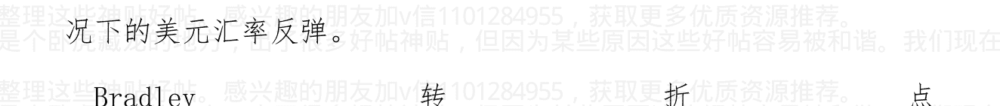

作者:海宁的马甲 日期:2011-04-27 10:21@明心 qdq 2011-04-27 07:24:05

海宁你好 关注您的贴子很长时间学到了很多东西 我是做纺织的想问一下你对下半年纺织业的看法 谢谢

不熟悉，没有什么好的建议。2011下半年，总体经济会放缓，要看通货膨胀的力度了，特别是油价。110-120美元附近的油价，是欧美历史上衰退的临界点（油价在此位置，能源工业占世界GDP的9%左右，再涨，世界经济就承受不住而下滑了，从而减少对石油的需求）。

作者:海宁的马甲 日期:2011-04-27 10:26 到目前为止，美国房地产总体而言，又连续跌了8个月，但是跌幅小了。

美国房地产的去库存，已经进行了近4年，可能还要持续到2014年左右，美国就业基本复苏为止，但是到时候估计没有5%的30年按揭利率。美国房产，已经基本处于低位。

1990-1991的美国房地产大跌，持续到1994年才完全稳住，这一稳，就稳了1994-1998连续5年基本随CPI同等涨幅。

作者：海宁的马甲 日期:2011-04-27 10:29@那是一阵风

2011-04-26 21:40:40

> > @海宁的马甲

请教海宁，我们现在应该持人民币观望吗？

---------------

普通人只能如此。

美元实行零利率，美国政府赤字又极其严重。

美元汇率即使涨，也只是套利资本平仓反弹。反弹完了，还得跌，

除非美联储连续加息，给予市场“美联储将连续加息”的预期。

我们没有见识过美元套利资本的平仓，只是2010年5月见了一点皮毛。

作者: 海宁的马甲 日期:2011-04-27 22:42@价值洼地 2011-04-27 20:34:32

转载一篇加息的预测。

## 市场传言5月2日再加息 多位专家称无法判断

> http://www.aifang.com 2011-04-27 17:56 来源：新文化报

摘昨天，有媒体援引彭博社的消息，中国人民银行近期或将意外地再次启动加息，时间窗口为5月2日，加息0.25个百分点，一年存款基准利率3.5%。。。。。。

五一加息，不符合稳健原则。

2010.10，2010.12，2011.2，2011.4 加息四次。

下一次加息，要么在6月，要么在CPI突破6%的前后。

如果通货膨胀恶化，看好2011.7.22前加息两次，每次0.25.

如果连续2个月加息，或者一次加息0.50，说明风向转了，反通货膨胀动真格了，股市，特别是中小板，创业板，危险了。

作者：海宁的马甲 日期：2011-04-27 22:48@经天纬地 01 2011-04-27 22:21:49

今晚美联储的声明，楼主出来评论评论呀！

加v信1101284955获取更多优质书籍推荐

不会有另市场吃惊的地方的。

就是量化宽松二期照旧，加息没有，去掉“在相当长时间内保持零利率政策”。

美联储也是油价不恶化不加息。

能把油价炒到110-120美元一线，是有水平的，炒到110-120一线， 是没有什么风险的。

油价110-120美元一线，能源工业占世界GDP的9%左右。

历史上，能源工业占世界GDP超过9%太多，则世界经济步入萧条。

但是，油价突破120美元，奔往130美元以上的概率很大。

美联储，美国联邦预算赤字，也是“不玩到恶性通货膨胀不放手”

等下半年中国加快大豆进口的时候，大豆价格飙升吧。逃不掉的。

大豆价格，是紧跟中国房地产价格的，迟滞大概12个月左右。

大豆不涨，天理难容。

作者:海宁的马甲 日期:2011-04-28 11:56@宁水格 2011-04-28 07:33:36

海宁是铁了心认为

中国楼市要崩盘了…………

所以一直坚守在这个帖子里面

其实都没悬念了

要么冻结交易，让保障房出山（这貌似不可能）……

很多人太急了。

现在股市还不差，经济还不错，制造业还在扩张中，油价处于临界点（110-120），通货膨胀还有一些上升的余地。

要等到2011第三季度，粮食油价高位的同时，美元套利资本比2010.5还厉害的平仓。

中小板，创业板还将受到1，2次加息和几次调升存款准备金率的影响。

有时候想想好像不应该这么简单，量化宽松一期结束，股市随后见顶，这一次，投资者难道不接受2010年3月以后发生的事情的教训？

通货膨胀2011年6月，只是阶段性顶峰，只是通货膨胀的第三波（2010年7-10月第一波，2011年2，3月第二波）。

两难，2011年中国对通货膨胀的忍受力，似乎比2008上半年差。

作者:海宁的马甲 日期:2011-04-28 12:04@连跑带颠 2011-04-28 11:30:19

无法给予指导，抱歉。

我猜中国货币政策，每过两个月左右加息一次的游戏，还将继续，直到一年期存款利率达到4%，或者4.25%。

其中一次是 CPI 突破 6%的时候。CPI 2011 年第二季度某月突破 6%，问题应该不大。

估计没胆加到 4.5%，敢加到 4.5%或者以上，说明发生了令人紧张的变化。

有什么样的人民，就有什么样的政府。

不升值，就得忍受通货膨胀。我只是旁观者。

2008 年初的目标是通货膨胀 CPI 控制在 4.8%以内，结果不管 CPI 冲上 6%，7%，8%，一年期存款利率还是死死地钉在 4.14%。

2011 年，通货膨胀目标 4%，是不可能实现的。

作者:海宁的马甲 日期:2011-04-28 12:41 短评 2011.4.27: 美联储 4 年降息周期结束，等待美元套利资本又一次平仓

第二期量化宽松，规模在 8500 - 9000 亿美元 （6000 亿美元 + 2500 到 3000 亿的 MBS 房贷本金和利息）。

不管这期间算是美元负利率 -2%，还是 -4%，负利率情况应该比 2009.3 - 2010.3 还厉害。油价在 110 - 120 美元这个临界点附近徘徊。（油价在 110 - 120 美元，能源行业占世界 GDP 的 9%左右，历史上，这个比例大幅度突破 9%，就会带来经济下滑，并导致能源需求下降）。

如果油价不再上涨，或者下跌，美联储无意在 2011 年下半年加息。这就要看油价答不答应了。我看油价不答应的概率很大。注意，美国财政赤字极其严重，美国国债这种欠条在超发，美元信用在下降，在联邦基金利率维持0-0.25%的情况下，美元依旧处于负利率空间。

美联储在1992-1994实行低利率，启动了又一轮香港房价泡沫，到1994年美国房价企稳，就业复苏，才开始加息。

美联储2002-2004实行低利率，启动了又一轮香港房价泡沫，到2004年美国就业强劲复苏，才开始猛烈加息。

美国1929年以后，可以说没有过房地产泡沫，1985-1988也只能说大涨。这次房地产泡沫后的房子去库存，要到2014年左右才完成，建筑业的就业机会，也只能到那个时候才会大幅增加。但是低利率，不可能等到那个时候。油价就是最大的因素。

2011年第三季度，美元利率见底 -> 投机品种见顶 -> 股市见顶 -> 经济下滑 -> 物价缓慢轻度下滑（因为美元利率太低，美元信用下降，美国财政赤字恶劣，油价物价不会像2008年下半年那样暴跌）。

2010年，是第一期量化宽松结束后1个多月发生套利资本平仓。美联储不及，美元套利资本平仓，会帮助美元反弹的。

2011年第二，第三季度，中国的通货膨胀继续恶化。2011年第二，第三季度，中国面临保房地产，还是控通货膨胀的两难。

第二张图是广义加权平均美元指数，包括了金砖四国，亚洲几小龙；美国的石油供应基地等国家的货币，所以比较准确，美联储一般用广义美元指数

## 联邦基金利率历史，大约6年一个周期


广义加权平均美元指数包括了金砖四国，亚洲几小龙；美国的石油供应基地等国家的货币，所以比较准确，美联储一般用广义美元指数

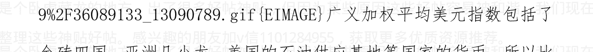

作者:海宁的马甲 日期:2011-04-29 23:25@qzz749791 2011-04-29 17:14:23

房地产泡沫得到了广泛确认，现在的分歧在于是否回调或者回调的空间

多数机构的预测都是持平或者-10%以内。

拭目以待吧

草民活着真是痛苦，担心这担心那的。

看2011第三季度，在粮食，石油价格高位的时候，美元套利资本在各地的平仓吧。这一波应该比2011年5月来的猛。

石油价格这么高，美联储无论如何都无法推量化宽松三期。结束量化宽松二期，美元依旧是负利率。

很多人问普通人怎么办？

普通人作为整体，没有办法，只能是部分人投机（以其他人损失为代价）。

2003.3 – 2011.6，一共一百个月，57个月，57%的时间，都是负利率（2003.12-2005.3，2007.2-2009.1，2010.2-2011.6，负利率在6月以后自然还会持续）。

现在全世界大部分地方都是负利率，但是 2005-2007 美国正利率刺破房地产泡沫的时候，我们还是负利率，低利率很长时间。

这负利率的药，要一直吃，吃到卧倒为止。停下来的风险太大了，名声会被搭进去的，泡总还会两难下去，直到难以为继。2011 下半年，特别是第三季度，就是极大的考验。

作者：海宁的马甲 日期：2011-04-29 23:28@五亚广海 2011-04-29 22:35:39。

今天跌破 6.5 爽啊。。。

貌似 机会来了

———————————————————————————————

美元指数破 73 了。

加v信1101284955获取更多优质书籍推荐

人民币对美元的升值速度，赶不上美元对其他很多货币的贬值速度。

人民币对很多非美货币，2011年至今，还是贬值的。

2011年，人民币有效汇率，还是轻微贬值的。

作者：海宁的马甲 日期：2011-04-29 23:33@航海小王子

2011-04-29 16:21:22

您既说下半年房价可能跌，然后房价跌物价跌，又说下半年还会通货膨胀（物价涨）？到底怎么回事啊？？迷糊啦

房地产牛市结束，物价会下跌的。

房地产牛市不结束，物价下不来。

很多人，包括底层，其实也是房地产泡沫，在泡沫时期的受益者。

泡沫时期，大部分人的心情是好的。

部分人对房价不满意，等房地产泡沫破灭了，他们的工作都成问题了。

所以，房地产泡沫，在发展中国家，常常是被外部变化刺破的（比如美元持续几次加息）。而货币币值稳定的经济体，是被主动加息刺破的。

比如1987年德国开始加息，1988年2月美国开始加息，189年5月，日本开始加息。

作者:海宁的马甲 日期:2011-04-29 23:40 当前发达国家与新兴市场化国家的问题，是很难解决的。

欧元，日元，美元，对于新兴市场化国家的货币来说，估值过高。

但是新兴市场化国家福利不完善，内需太小。

最终还是马克思说的，全球化，导致全球贫富差距加大，出现了相对过剩。

其实本质上，今天的问题，与二战前，是一样的。只是目前问题没有那个时候严重。就是生产的相对过剩。

要么来场经济危机，要么新兴市场化国家完善福利，在福利上向欧美靠拢，缩小贫富差距。

房地产真的掉头大幅下跌的时候，中国也会发生美国那种恶性循环。

有人的房子卖不出去，有的人跌了一半，还是买不起（不能从今天繁荣的时候看繁荣时期人们的购买力.就像美国人不能用2006年的就业和收入，去买2008年的美国房子。

作者:海宁的马甲 日期:2011-04-29 23:46 内容节选自向松祚《美联储如何向全球输出通货膨胀？》一文。

发达国家经济（美国、欧洲、日本）面临六大困难：

- 经济增速长期放缓；
- 政府债务规模和财政赤字居高不下；
- 货币政策持续维持“零利率或低利率”，短期内却无法刺激经济快速增长或“重新通胀”(Reflate);
- 私人消费和投资持续萎靡，个人和家庭“去杠杆化”过程远未结束，个人和家庭对信贷的需求持续下降；
- 银行体系“去杠杆化”过程远未完成，补充资本金是一个漫长的过程，信贷供给短期内没有可能恢复快速增长；
- 政府部门（无论是中央政府还是地方政府）都面临同样的“去杠杆化”过程，财政赤字和债务规模无法继续大规模增加。以美国为例，2010年失业率居高不下的主要原因，就是地方政府（州政府和市政府）“去杠杆化”，被迫大量裁员。

上述六大困难，环环相扣，相互强化，原因产生结果，结果反过来成为原因，形成典型的经济“负循环”。

## 经济体系“负循环”包括如下内在“负循环”机制。

- 经济增速放缓负循环。居民收入和政府收入下降，私人消费、投资和政府开支必须相应缩减，私人消费、投资和政府开支缩减反过来加剧经济放缓；
- 失业上升负循环。失业意味着收入减少，收入减少意味着需求减少，需求减少意味着企业开工不足，开工不足则意味着失业进一步增加。
- 预期收入下降负循环。经济增速放缓和失业持续增加，让人们对未来预期收入前景持续悲观，悲观的收入前景迫使人们进一步收缩消费（根据经济学家弗里德曼和莫迪格利安利著名的“永久收入学说”，消费不是取决于当期收入，而是取决于永久收入或一生收入之预期），削减消费恶化经济前景，反过来进一步恶化预期收入的悲观预期。
- 信用萎缩负循环。经济放缓、失业上升、预期收入下降，迫使经济所有部门“去杠杆化”，整个经济体系之信用总量（信用需求和供给）持续收缩，真实利率持续增加，社会财富（私人财富和政府财富）持续缩水，所有这一切加剧经济放缓。

经济体系负循环机制里面最重要的是“信用萎缩负循环”。根据笔者提出的“信用体系—真实经济—虚拟经济”一般均衡模型，信用增长才是刺激经济增长的主要决定性力量，不是传统理论所强调的货币供应量。然而，历史经验一再表明：一旦经济陷入信用萎缩负循环，货币政策则完全失效，无法将经济拉出“信用萎缩负循环”的深渊。

“信用萎缩负循环”与凯恩斯当年所描述的“流动性陷阱”并不相同。如果经济只是陷入“流动性陷阱”，那么中央银行持续实施量化宽松货币政策或“零利率货币政策”则完全有可能将经济体系拉出“流动性陷阱”。

然而，一旦经济体系陷入“信用萎缩负循环或信用陷阱”，量化宽松货币政策或零利率货币政策就没有办法发挥作用，因为货币创造机制并不等同于信用创造机制，货币供应量的持续扩张，并不等同于信用扩张。日本长达10多年的“低利率或零利率货币政策”早已证明这个重要论点。全球金融危机两年来的惨淡现实再一次证明：一旦经济体系陷入负循环，量化宽松货币政策就失去作用。货币和信用并不是一回事。

作者:海宁的马甲 日期:2011-04-30 00:14@砖头 MAN 2011-04-30 00:03:52

看社保动向，把握股市起伏。

投机的人，请珍重了。

这次很多投机品种很可能在6月30日以前见顶。

中国股市，一般是率先跌的。

这次的下跌启动，是创业板，中小板，创业板2011年不从高位腰斩下来，是止不住的。

2011年到目前为止，美国股市的涨幅，与美元汇率的下跌幅度基本相符。

作者:海宁的马甲 日期:2011-04-30 11:26@经天纬地 01 2011-04-30 10:38:34

美元跌得面目全非了，何时是个头啊！难道要破70?

-----------------------

2011下半年，美元很大部分时间都在反弹。

这次反弹，会比2010年5月的反弹时间长，反弹力度大。

作者:海宁的马甲 日期:2011-04-30 11:28@杨阅 2011-04-30四月份上海死了两个，一个是申银万国，一个是伦敦金融街中国区的，是不是最近某些方面暗流汹涌呀？比如期指...

@chury11 2011-04-30 09:51:23

## 股市又要大跌吗？

从黄金的眼光看，中国股市2011年11月见顶，美国股市2011年1月底见顶。

2009.3 - 2011.6，黄金黑金（石油）一直如影随形，比例在13到17之间徘徊。

作者：海宁的马甲 日期:2011-04-30 11:34 按俄罗斯人计算的 Sornette 指数式增长模型，黄金 2011 年 5 月 2 日或者 3 日，将进入可能见顶的区间。

按俄罗斯人计算的 Sornette 指数式增长模型，黄金 2011 年 5 月 2 日或者 3 日，将进入可能见顶的区间。

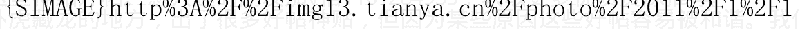

0%2F33632842_13090789.jpg {EIMAGE}

作者：海宁的马甲 日期:2011-04-30 23:49 @heavenwing17 2011-04-30 21:08:53

我也同问这 3 个问题，海宁回答一下吧。

## 首先，预测确实有偏差。

- 1. 美国房价最热的加州，拉斯维加斯等地方在2006年年中，美国加息17次完成了，马上见顶，但是美国房价指数在2007年2月3月见顶。差8，9个月。
- 2. 第三季度货币政策不会放松，因为我的判断是通货膨胀还会恶化。石油，粮食还会在高位。特别是大豆和食用油在第三季度，值得资本去炒作。
- 3. “2011-2012中国经济做了10个判断”此文难以评论。目前为止，民生商品领域的通货膨胀恶化后，房价没有大涨过。2004年下半年，通货膨胀恶化了一些，货币紧缩，房价未涨。2008年，通货膨胀恶化，货币紧缩，房价未涨，在2008第三季度还跌了。

股市领先民生用品通货膨胀18个月左右，房价领先民生用品通货膨胀12个月左右。等通货膨胀恶化1，2圈，房价该涨的，基本已经涨完了。

2007年下半年通货膨胀恶化第一轮，房价在2007年代，阶段性见顶。2010年下半年通货膨胀恶化第一轮，部分地区房价基本见顶，比如海南，杭州。

- 4. 看2011年第三季度美元套利资本平仓，可能5月就慢慢开始。看黄金是不是在1650美元见顶。

作者:海宁的马甲 日期:2011-05-02 09:47

## 真实收入走势

图中阴影部分是美国经济衰退时期，每一次经济衰退，美国通过通货膨胀调整后的真实工资，都呈现剧烈的下降。

- 70 年代，十年里，美国家庭收入总共跑赢通货膨胀 4.5%
- 80 年代，十年里，美国家庭收入总共跑赢通货膨胀 6.5%
- 90 年代，十年里，美国家庭收入总共跑赢通货膨胀 8.5%（这就是克林顿已经在美国受欢迎的总统里，排进前五的原因）

1999 - 2009，经过通货膨胀调整后的美国家庭收入，十年内一共下降了5%。

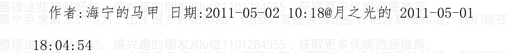

作者:海宁的马甲 日期:2011-05-02 10:18 @月之光的 2011-05-01 18:04:54

发现天涯一个去年的旧帖，关于2011-2012中国经济的预测

> “国家外汇储备将减少到10000亿以下”

危言耸听，所以不评论了。

2011 年底，如果外汇储备依旧是 3 万亿美元，甚至是 3.1 万亿，房地产泡沫就守不住。懂银行的知道，银行的资金压力是如何的紧张。

作者:海宁的马甲 日期:2011-05-02 11:08 兄弟们,本拉登死了，消息在 2011.45 前的 1.4 个月，即 2011.5.2

兄弟们，2011 年谈阴谋论最合适的人是谁？是我，海宁同学。上天对我的处罚，就是让我这个不相信阴谋论的人，成为 2011 年最适合讲阴谋论的人。

## 理性分析通货膨胀与经济，理性预测中国楼市下跌时间表

2010.9.21

```
http://blog.sina.com.cn/s/blog_6a507995010015g0.html
```

2010.9.21

### 十）笑谈本拉登黄金地产周期

历史有时候显示出惊人的前呼后应与完美对称。美元的贬值开始时间，黄金地产的暴涨开始时间，与 2001.9.11 惊人地吻合，因为美国发动阿富汗战争和伊拉克战争，导致美国财政赤字暴增，导致世界美元（包括美国国债）的流动性过剩，导致美元币值更猛烈的下降。没有战争，其实美元也处于下降周期，有了两场战争，美元币值下降就更厉害了。

不少人知道，奥巴马入驻白宫后，开始低调地花费巨资用特工和非常规行动去找本拉登（源于他读的一本如何对付本拉登的书）。如果 2011 年奥巴马能抓到本拉登，或者找到本拉登的尸体，就可以名正言顺地结束伊拉克和阿富汗战争，即便那里的经济一团糟政治一片混乱。正好此轮黄金地产暴涨周期在 2011 年 6 月，或者 2012 年 2 月进入加拿大澳大利亚等房产高空跳水的尾声。有始有终，此轮黄金地产暴涨暴跌周期，也可以叫做本拉登周期了。

找到本拉登的尸体，会给市场一个极其强大的市场心理预期，即美国将大量消减战争赤字，加上 2011 年美国的国内财政赤字因为共和党和民主党内部的阻力而下降，则外汇市场，大宗商品市场会出现超级反转，即美元对欧元日元加拿大元澳洲元大涨，大宗商品价格暴跌。

本节只是笑谈，不必当真。历史有时候会有这种情况。

作者:海宁的马甲 日期:2011-05-02 12:40 这只是一次比 2010 年 5 月更大，更猛的反弹而已。这种反弹，在目前中国银行系统资金极其紧张的情况下，极可能刺破中国的房地产泡沫。而且美元不是说明天就反弹，一切市场的走势都有反复的。美国什么时候新房开工量冲上 100 万套/年，就说明美国经济彻底复苏了。

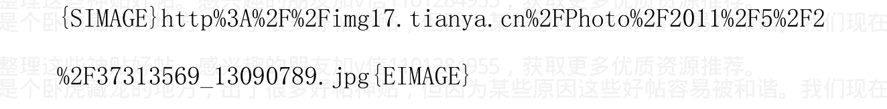

作者：海宁的马甲 日期：2011-05-02 12:52 @ 海宁的马甲 2011-04-25 21:03:35

#### 七）“房价地震”前的异象：石油粮食等商品价格疯涨，欧洲银行危机，温州还债信用危机等

#### 日本地震

#### 本拉登被抓被杀

____________________

呵呵

作者:海宁的马甲 日期:2011-05-03 10:50 申明一下，估计很多人也看出来了，日本地震，本拉登被干掉，根本不是本帖的主旨，仅仅是顺便提及而已，并非预测。本帖分析的是通货膨胀走势，然后分析预测中国央行的加息，货币紧缩，和油价高涨对美联储的限制。目前看，美元套利资本在第三季度，有一波平仓潮，而且很可能是金融资产跌，而石油大豆与美元共涨。

作者:海宁的马甲 日期:2011-05-03 10:52 @五亚广海 2011-05-03 10:24:36

加v信1101284955获取更多优质书籍推荐

能预测到某一天拉登死 事实真的验证了 拉登拉登真的在那天死了。你说这不是阴谋 还是阳谋？？？？？

我没有说本拉登哪天死。只是本拉登死的这天，与黄金第一天进入可能的中期见顶窗口吻合。而且我认为在目前美元负利率情况下，黄金的故事还没有完。

作者：海宁的马甲 日期：2011-05-03 11:04 美元指数几幅可能的走势图 哈克的可公度分析

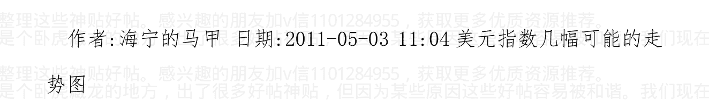

2011.45 附近，因为量化宽松到期，极可能会迎来一次套利资本平仓

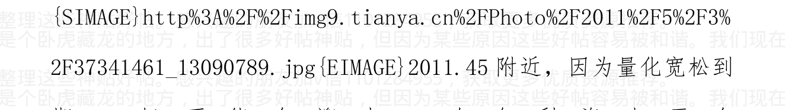

按 17 年的长期走势看，美元要软到 2012 年上半年

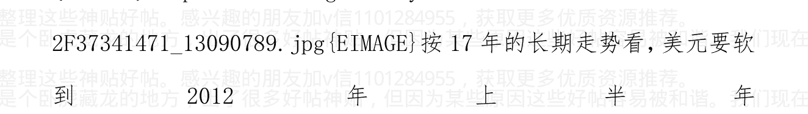

作者：海宁的马甲 日期：2011-05-03 11:07 我认为，只要没有明显的需求下降，比如欧洲国债危机或者银行危机恶化，或者中国经济减速，则通货膨胀不会很快下去。

这一轮美元套利资本平仓，极可能的石油粮食价格的高位的情况下发生的。对应的可能是金融资产价格的下降。

作者：海宁的马甲 日期：2011-05-03 12:34 2011年6月，很可能是很多地方股市的顶部。（当然这个故事的预测最难）石油等商品在高位会呆一段时间（一个季度左右）

作者：海宁的马甲 日期：2011-05-03 21:03 十年本拉登周期 2001.9.11 - 2011.9.11 十年本拉登周期 2001.9.11 2011.9.11


作者：海宁的马甲 日期：2011-05-04 11:07 从1613美元黄金，笑谈杭州温州的房价有下降64%的潜力；笑谈A股2011下半年跌破2319点 本文为笑谈，纯属个人观点，并非任何劝诱或投资建议。申明：我没有预测到日本地震和本拉登被杀，那只是顺便提及而言，加v信1101284955获取更多优质书籍推荐

题记：
2010 年初，机构普遍把 2010 年中的 A 股看到 2700 - 3100 点，因为 2010 年第一季度，中国经济实在是太大TM一片大好；结果量化宽松一期在 2010 年 3 月底结束，5 月份套利资本疯狂平仓，美元指数 6 月初站上 88 点，中国 A 股在 7 月初下探到 2319 点。2011 年 6 月 30 日，量化宽松二期结束，2011 年 7 月 29 日或者 30 日，是 Bradley 转折点。2011 年下半年，特别是 2011 年 8 月和 9 月，美元套利资本的平仓，应该比 2010 年 5 月份疯狂而持久。因为处于高位的油价，限制了美联储大量注入流动性的能力（2010 年 5 月初，国际油价“只有”75 美元左右）。我们应该预期在 2011 年第三季度，索罗斯会在香港有所行动，14 年后重返香江，绝不是来吃早茶的。美国市场经济时间长，给我们提供了一个观察 224 年里经历 26 次金融危机的国家的经济走势。过去美国 200 多年里，你拿着“相当于 2011 年 1000 美元的商品数量（粮食，能源，纺织品，基础金属等）”，在历史上，能换到多少盎司的黄金呢？其强力支撑线，是大约 1.75 盎司。直白点，在 2011 年，价格 571 美元/盎司的黄金，没有任何泡沫成分，经得起十年以上的保值考验。黄金不能吃，不能喝，只能用历史对比方法去给黄金定价。

拿着相当于2011年的1000美元的商品数量，在1980年，平均可以换到0.62盎司黄金。如果拿着相当于2011年的1000美元的商品数量，可以在2011年换到0.62盎司黄金的话，黄金的价格应该在1613美元。注意这是年内平均价格，不是峰值价格，也就是说，短时间内，黄金冲上2200美元，石油冲上147美元，也并非天方夜谭。一两个月内，黄金站上2000美元并非天方夜谭。石油在2008年6，7月，就尝试过类似的巅峰时刻。黄金在1613美元/盎司的“泡沫”度，大约是1.75/0.62=2.8倍，也就是571美元的干货，和1042美元的“保值”溢价。（注意，“泡沫”是打引号的，谁也不知道这是不是泡沫，等破了后才知道。）571美元/1613美元=35.4%，干货占35.4%；溢价占64.6%，接近黄金分割点数字61.8%。

2002 年 6 月，许永跃调到杭州；2002 年 6 月，杭州房价大约是 5500 人民币一个平方，离 2 盎司黄金非常接近（2×330 美元 ×8.27 = 5450 人民币），2002 年，杭州一个银行员工，一年收入大约是 6 万人民币，相当于月薪 30 克黄金。

2011 年 6 月，杭州银行员工能拿到 12 万年薪的，比 2002 年能拿到 6 万的比例要小。粗略算 2011 年物价平均比 2002 年上涨了一倍左右，与猪肉价格的涨幅接近（不能用目前的猪肉价格，只能用猪肉 2009.6 - 2012.6 的 3 年平均价格）。

2011 年，黄金价格上到过 1577 美元，2 盎司黄金 = 2×1577 美元×6.5 = 20500 人民币。杭州 2002 年卖 5500/平方米的房子，价格在 2011 年，远远超过 2 万人民币/平方米。杭州 40000/平米的房子，差不多有回落到 1.6 万/平米的潜力。当然，很多人听到这样的说法，认为简直是在说笑话。其实，按照 2001 - 2011 十年物价工资基本涨一倍的算法，上面的算法，仅仅是指出 了一个常识而已。什么常识，就是 2000 - 2002 年杭州温州的房价没有泡沫，仅此而已。

加v信1101284955获取更多优质书籍推荐

我最敬佩邓设计师的其中一点，就是他始终离常识不远，对诗人式宏伟蓝图不感冒。铁腕在2003年说房价有点高了，现在看，他的感觉极其敏锐，就像1997年初判断中国经济进入通货紧缩阶段一样。

此分析，也仅仅是证明2004年易宪容，谢国忠判断中国房价进入泡沫区的判断，是一个正确的常识性判断。就如一个日本学者，在1996年判断美国互联网公司的估值，进入泡沫区（当然没有人理他）。但是，他们是以“纸币一直保值”为出发点的。

事实上，按照官方CPI和一年期存款利率，2003.3 – 2011.6，一共100个月，其中57个月，都是负利率。杭州温州的房价有下降64.6%的潜力。前提是纸币回归信用，或者市场居然进入资产型通货紧缩阶段（像美国的2008年）。

2002-2006年，油价和美国房价，是情人关系。2008年，油价是美国房价的敌人。2005 - 2007年，油价和中国股市，是情人关系，2008年，油价是中国A股的敌人。

2011 年下半年，黑天鹅会不会把油价踢到远远超过 120 美元这个欧美经济衰退的临界点？

## A 股极其粗略的算法：

```
6124/2.8 = 2187
```

A 股再次跌破 2187 的时候，估计就是 6124 泡沫彻底被消化的时候。当然，那个时候的创业板，中小板，已经哀鸿遍野，更有投资价值。

此文为笑谈，切勿当真。顺便请互相转告以下内容：“所有上户，都是神经病；所有说中国房价有泡沫的，也可能患了神经病；神经病，黄色，三俗，敏感词的标准，是国家机密”。

2011 年价值 1000 美元的商品，在历史上，都能换到多少盎司的黄金？

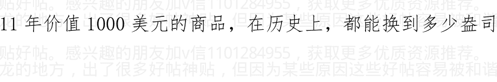

真实的房价走势，在不明真相的群众心中

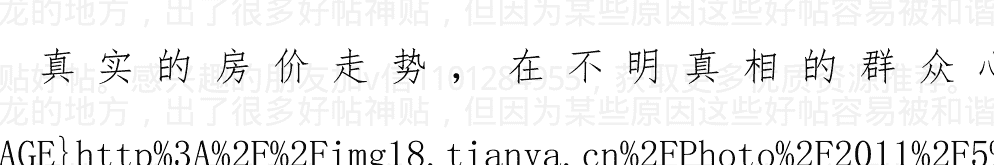

作者:海宁的马甲 日期:2011-05-04 11:09 @seaman321 2011-05-04 10:58:09

过来膜拜下，本拉登都预测到了啊

严重声明：我没有预测到本拉登被杀，我也没有预测到日本地震。我相信数据，逻辑，常识，和规律（经济规律，自然规律，物理规律，人性规律，负利率下的人性规律）

作者:海宁的马甲 日期:2011-05-04 11:22 2011.5.3更新

2011一季度末，广义货币供应量19.3 × 3.94 = 76.04万亿，比2010年6月末的67.3万亿，增加76.04 - 67.4 = 8.64万亿。9个月增加8.64万亿。平均每月增加0.96万亿。

央行报告显示，2011年3月末，基础货币余额为19.3万亿元，同比增长29.0%，比年初增加1.0万亿元；货币乘数为3.94，比上年末高0.02，货币扩张能力仍然较强；金融机构超额准备金率为1.5%。

截至2011年3月末，全国主要金融机构房地产贷款余额9.89万亿元，同比增长21%，增速比上年末低6.4个百分点。其中，房产开发贷款余额2.49万亿元，同比增长18.6%，增速比上年末低4.5个百分点，连续4个月下滑。个人购房贷款余额6.48万亿元，同比增长22.8%，增速比上年末低6.5个百分点，连续11个月下滑。

地产开发贷款余额 8368 亿元，同比增长 12.5%，增速比上年末低 12.2 个百分点。

作者:海宁的马甲 日期:2011-05-04 11:33 @小草 21a 2011-05-04 11:26:16

本人不信那些玩意儿，所有无法回答。唉，算命的也来了。本人没有预测日本地震和本拉登的死，觉得太巧合，所有兴奋。日本地震和本拉登被杀，都不是本文的主旨。另外，所谓的“此处省略3141字”都已经在回帖和博客中完全补上了。现在等第三季度美元套利资本平仓。索罗斯第三季度，肯定有大动作。

作者:海宁的马甲 日期:2011-05-04 11:45 @李敖牌口香糖 2011-05-04 11:34:35

有个疑问不知道楼主敢不敢回答？楼主现在是租房住还是住在自己的商品房里。

自有自住商品房。

在中国，对租房人的权益保护很差。那些说买不起房可以租房的，站着说话不腰疼。中国的房价与国际接轨，对租房人的权益保护可没有与国际接轨。德国和瑞士自有住房率不到 50%，但他们的出租房有暖气热水空调，而且可以一租，就是十几年。而且房租的上涨幅度，有限制。而且还有廉租房。美国 60 年代，70 年代大量建造了廉租房，一直用到现在，一些收入低的家庭的房租极低。奥巴马的非法移民阿姨，就曾经住在波士顿的廉租房里。

作者:海宁的马甲 日期:2011-05-04 12:06 『经济论坛』[理论研讨]

从 2004 年 yevon_ou 的“大排面要涨到 30 元”开说美元，房产与黄金,金融知识

http://www.tianya.cn/publicforum/content/develop/1/455105.shtml

作者:海宁的马甲 提交日期:2010-07-16

从黄金价格论述“一切乱象的根源主要在于印钞机”

## 副标题： 是本拉登推高了世界和中国的房价

- 1）21世纪，黄金还是不是货币？黄金还是不是一般等价物？我认为黄金仍旧是货币。只要黄金依旧可以在地球的大部分地区

加v信1101284955获取更多优质书籍推荐

换到“等值”的商品，那么黄金依旧是“足值”的货币。黄金的生产成本在400到600美元/盎司左右。几千年前，没有太多交流的世界各国，为什么不约而同选择黄金作为货币？

冰块不能作为一般等价物，因为太容易融化消失。
黄金稀缺，不能大量生产，容易辨别，永不腐烂，体积小容易携带运输等等等等属性，决定了黄金在众多候选物品中，被选中作为商品交换的一般等价物，即货币，而且是世界货币。

黄金的信用来自几十亿人的认可，也来自于目前的科技无法降低黄金的开采提炼成本。黄金的生产成本在400到600美元/盎司左右，而现代电子货币，银行存款的“生产”成本几乎为零。黄金的价格底线是其工业用途，首饰业用途。当然黄金，就像其他商品或者一般等价物，价格可以在短期内跌穿其生产成本。

2）房子是不是货币？房子在特定时期是不是财富的一般等价物？

房子不能运输，自然不能成为货币。
如果一个房子在20年内还能具备类似的安全性和居住生活品质，那么这个房子20年内完全可以承担一般等价物的任务。那么，房子可以作为像黄金一样的价值财富存储手段。有的富人囤房而不出租，也许仅仅是在房子与纸币之间，更信任房子而已。

以此类推，2003年到2007年，在人民币官方汇率下，更多的中国人信任人民币胜过美元，就是港台欧美的很多投资者，在当时的官方汇率下，也信任人民币多过信任美元。这期间人民币单向升值，拿美元换人民币是无风险套利。如果房子由于质量好，位置好，同一楼内的邻居那套房子的租金（可以按黄金算，也可以按人民币算），其租金连年不停上涨，比如7年翻一番，28年涨16倍，那么28年后的价格会是多少？

如果很多很多人认为，某个房子的租金（或者居住享受品质的货币化折算价），28年里会涨16倍，那么这个房子今天的价格又是多少呢？这是不是潘石屹夫妇保留北京前门的物业所有权的原因呢？

（2010年初潘石屹老婆接受外媒采访时说，除了北京前门的项目，其它的在建项目，尽力以最快的速度完工，并以最快的速度卖出，绝不把所有权留在手里）

如果本来很多人预期房租，人民的收入都是按以前经验的速度上涨的，但现实来了个2到4年的经济衰退，4年里，大部分普通人的收入没有上升，生活品物价反对涨上去了，那么，这个时候有购买力的人们对于自己和别人的未来收入的预期，由预期很快增长，变为“预期不会增长太多”，就像1997年到1999年，那么房价作为“租金的看涨期权”将发生什么变化？

3）国债是不是货币？

现如今各国的法币（纸币，银行里的存款数字，即电子货币），都是各国中央银行发行的欠条，主要由黄金和zf信用作为担保（像瑞士法郎，其背后的黄金储备有40%）。美元还劫持了中东的石油作为备付储备。所以中东谁敢用美元以外的货币作为结算货币，就是与美元背后的那个zf公然对抗。

国债是zf“名正言顺”的欠条，以该国未来税收作为担保。如果国债变现容易，它应该也具备货币的属性，这就是为什么美元在财政盈余的98，99年坚挺，而在美国大卖国债的2003到2007年暴贬。

4）2003年到2007年美元大贬值及其跟通胀。

2009，2010年，很多人开始谈美元要崩溃了。

那么，贬值50%算不算崩溃？如果算，那么美元已经崩溃过几次了。如果不，美元只要再玩1，2次50%的大贬值就可以了，何须崩溃。

2000年克林顿离开的时候，美国的国债（zf欠条）只有6万亿美元左右。2003年到2007年，小布什卖国债用于打仗和给富人减税，美国人从房子ATM里提款消费。美国财政巨额赤字，外贸巨额逆差。美元自然失去信任而大贬值，世界主要货币兑美元升值30%到50%。美元的购买力在黄金，石油，铁矿石，铜等大宗商品面前贬值了何止50%。（当然有中国等发展中国家经济增长，需求增长导致大宗商品涨价的因素）。

2003到2007年期间，人民币对美元是升值了10%几。但是你问做外贸的就知道人民币兑欧元，2003年到2007年，是升值了还是贬值了。

而2003年到2007年，是中国劳动生产率，中国国力的快速上升期，同期美国国力却在它2003年的基础上下降了很多（打仗烧钱烧的），劳动生产率相对增长缓慢（相对中国的快速增长而言）。

中国与美国，经济周期，经济发展速度完全不一样，人民币汇率绑定美元，就是让自己的货币政策被动受到美国的财政赤字和经常贸易赤字导致的货币贬值左右。2005年后的缓慢升值，远远跟不上美元对世界其他货币的贬值速度。

5）中国的外汇储备制度。

说到这里，就不得不来点中国外汇储备的背景介绍。

中国的外汇储备，是指唯一拥有合法印钞机的中国人民银行手里的2.4万亿美元外汇资产。

私人和公司的美元存款不算在这2.4万亿里。

人民银行的资产负债表里明确说了，人民银行的资本金是219亿人民币。

对，你没有看错，人民银行的资本金确实只有219亿人民币。

中国人民银行里做资产负债报表的人，还是有专业素养的，把发行的人民币作为中国人民银行的负债，而用印钞机里新印的人民币换到的美元，则记在中国人民银行的资产栏里。

印钞机就是人民银行的公开无敌武器。

所以资本金219亿人民币的中国人民银行，可以无限接收外贸行业，投机者，投资者送来的美元，只要印出相应的人民币即可。

中国人民银行一共印了多少人民币？

2010年以前的55年，“不是因为外汇储备”而印的人民币是4.28万亿。对，55年印了4.28万亿。印钞机里出来的是基础货币，不要跟各家商业银行里的存款，贷款数字混淆了。

那么，到2010年，人民银行为了承接2万多亿美元的新增外汇储备，印了多少人民币呢？

不多不少，正好15万亿。不是我说的，是人民银行说的。

看看人民银行下面的链接。

大部分是2003年后增发去承接外汇的，否则市场上美元太多，市场规律就要让美元对人民币贬值（即人民币兑美元就要快速升值）。

```
http://www.pbc.gov.cn/diachatongji/tongjishuju/gofile.asp?file=2010S04.htm
```

6) 谁也无法否认的，2001年WTO后中国经济快速增长，人民收入快速增长的现实。

2001年加入WTO以来，是中国发展的战略机遇期。中国的劳动生产率在快速增长，也就是说，中国人作为整个群体，单位时间内创造的价值大大增加。

外贸出口猛增，除了中国劳动生产率快速增长的因素，不能忽略人民币汇率被严重低估的因素。

上面说了，美元2003年后对大宗商品和其他国家的货币而言大大贬值，人民币即使在2005年对美元升值了，但人民币对美元以外的其他很多货币比如欧元，则反倒贬值了很多。

1欧元2002，2003年也许能换不到9人民币，而2005到2007年，则能换到10人民币。对欧元区出口自然大增。

人民币却对欧元等美元以外的货币贬值，中国对这些地区的出口能不快速增长吗？

奥，对了，很多人的想法非常简单：外贸出口越多越好。外贸企业这么说很正常。因为人民币越贬值，外贸出口企业就越赚钱（在其他人加入进来打价格战之前）。对于整个国家，外贸出口真的越多越好吗？

奥，对了，外贸出口额里，55%到70%好像是外商企业创造的。

7）结语：是本拉登推高了中国的房价，

如果本拉登不搞911炸世贸双子楼——》小布什很可能就无法说服国会，说服美国人民打阿富汗，打伊拉克——》美国财政赤字就不会大增，美国国债就不会泛滥——》美国和世界发达国家的货币供应量就不会猛增，——》房价就不会飞涨——》美国和发达国家的人民就不能从房子ATM里提钱进行消费——》中国的外贸顺差就不会这么多——》中国的外汇储备就不会这么多——》中国央行为了承接外汇而印的人民币就不会这么多——》中国的房价就不会这么高。

8）题外话。

村子里某个人违法犯罪，那是个体的问题，要是村子里每个人都在违法犯罪，那就是去找寻规律性的东西了。很多人在痛斥地方政府，痛斥开发商的各种行径。他们为什么不问问，为什么没有哪个地方的行政群体，没有一个为了“人民利益”，或者为了自己的名声，而大量投放土地，大量建设房子抑制房价飞涨呢？他们大量出让土地，大量造房子，能降低那个地区的房价吗？

奥，我还忘了说常年低利率，逼你去投资保值。

一切乱象的根源主要在于印钞机。

保持币值稳定是掌控印钞机的世界各国的中央银行的神圣使命。

作者:海宁的马甲 日期:2011-05-04 12:32 2010.07.16

笑谈。

7) 结语：是本拉登推高了中国的房价，
如果本拉登不搞911炸世贸双子楼——》小布什很可能就无法说服国会，说服美国人民打阿富汗，打伊拉克——》美国财政赤字就不会大增，美国国债就不会泛滥——》美国和世界发达国家的货币供应量就不会猛增，——》房价就不会飞涨——》美国和发达国家的人民就不能从房子ATM里提钱进行消费——》中国的外贸顺差就不会这么多——》中国的外汇储备就不会这么多——》中国央行为了承接外汇而印的人民币就不会这么多——》中国的房价就不会这么高。

作者:海宁的马甲 日期:2011-05-04 12:35 笑谈笑谈。曾经成功做空美国房地产的John Paulson和Michael Burry，2009年，John Paulson买了黄金，预测黄金将到4000美元；Michael Burry买了美国耕地，并且继续买入，两者过去两年几乎都涨了一倍。

笑谈笑谈。耕地随着粮价，粮价涨，耕地涨。

美元继续大幅贬值，首先受不了的是还在房地产泡沫中的中国经济，

而不是泡沫破灭后的美国经济，美国和美联储很淡定地等着2011下半年美元套利资本的平仓，帮助暂时挽回美元颓势。

黄金如果到4000美元的话，有两种情况之一：

1.  中国底层人吃不起猪肉和食用油；
2.  美国人削尖脑袋到中国过建筑工人，做保姆。

作者:海宁的马甲 日期:2011-05-04 13:22 美元贬值的中期（1至3年内）底线有：

1.  就是石油大幅超过120美元，并维持一段时间，导致欧美衰退。
2.  粮食价格暴涨到中国政府无法忍受，货币紧缩，房价大跌，暂时解除通货膨胀。

对中国政治的判断，我一直坚持“既非圣贤，也非超级恶霸”，这就解释了是为什么2004年下半年，2007年下半年到2008年上半年，进行货币紧缩。

做孔孟的儒家诗人，是需要维护面子的----- 一副叹民生之多艰的面子。

2011年，这个面子快撑不住了。

作者：海宁的马甲 日期：2011-05-04 14:30@李敖牌口香糖

2011-05-04 14:26:35

对了，楼主，你现在对6个月前的楼市预测需要改吗？想清楚再回答。我是房观来的，是一个鞭过几代傻空的房托。

——————————————————————————————

为什么混房观？

刚才回帖没有贴上去。

2011年第三季度，美元套利资本平仓的威力，会比2010年5月厉害，加上国内货币相对紧缩尚未放松。

发此贴的时候，可还没有量化宽松的具体细节。

作者：海宁的马甲 日期：2011-05-04 14:33@jassonlu 2011-05-04

13:45:37

3季度美元平仓，太早了点，如果是四季度就好了。。。。基金被套着要国庆才能出得来呢

——————————————————————————————

不早，说不定还提前，有人吸取了量化宽松一期到期后股市债市走势的教训。

作者：海宁的马甲 日期：2011-05-04

14:41

——————————————————————————————

@李敖牌口香糖 2011-05-04 14:36:24

因为喜欢聊房子，刚开始只知道房观很多聊房子，现在房观神棍都被鞭完了，今天随便来经济，原来也有人聊房事。

世界本来就是变化的，预测错了可不能学牛刀呀。又想不到这个，想不到那个的，楼主还是直接说，当时的预测现在改不改。

事实是，不用改。

但是很多地方2010年11月以来，房价是确确实实涨的。只有海南，杭州等少数地方不涨。11月到现在不涨的，目前也是跃跃欲试。

> > 作者:海宁的马甲 日期:2011-05-04 14:57 作者：zts5123 回复日期: 2011-05-04 10:35:35 回复 你们为什么不找一只替罪狼呢？

是的，2003.3 - 2011.6，一百个月内，负利率时间长达57个月，不是一个人的功劳。不要乱归咎。

> > 作者：海宁的马甲 日期:2011-05-04 21:27@一光年长的蛆 2011-05-04 20:13:10

支持你的保障房扯蛋论。

居然有人相信每套房子ZY补贴1万人民币的保障房。

真会扯JB蛋。旧图表，也可以用

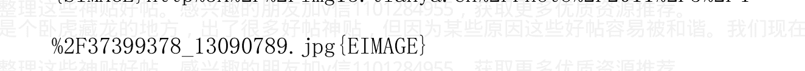

作者:海宁的马甲 日期:2011-05-04 21:30 严重声明：我没有预测到本拉登被杀，我也没有预测日本地震。

我相信任何市场从来都是有人试图操纵的，但不相信阴谋论。

我相信数据，逻辑，常识，和规律（经济规律，自然规律，物理规律，人性规律，负利率下的人性规律）

日本地震和本拉登被杀，那只是顺便提及而言，并非文章主要内容。

作者:海宁的马甲 日期:2011-05-05 11:18 本拉登周期的说法，不是什么心血来潮

2010. 7. 16
。。。

7) 结语：是本拉登推高了中国的房价，如果本拉登不搞911炸世贸双子楼——》小布什很可能就无法说服国会，说服美国人民打阿富汗，打伊拉克——》美国财政赤字就不会大增，美国国债就不会泛滥——》美国和世界发达国家的货币供应量就不会猛增，——》房价就不会飞涨——》美国和发达国家的人民就不能从房子ATM里提钱进行消费——》中国的外贸顺差就不会这么多——》中国的外汇储备就不会这么多——》中国央行为了承接外汇而印的人民币就不会这么多——》中国的房价就不会这么高。

作者:海宁的马甲 日期:2011-05-05 11:19 从黄金价格论述“一切乱象的根源主要在于印钞机”

副标题： 是本拉登推高了世界和中国的房价

1) 21世纪，黄金还是不是货币？黄金还是不是一般等价物？

我认为黄金仍旧是货币。只要黄金依旧可以在地球的大部分地区换到“等值”的商品，那么黄金依旧是“足值”的货币。黄金的生产成本在400到600美元/盎司左右。几千年前，没有太多交流的世界各国，为什么不约而同选择黄金作为货币？

冰块不能作为一般等价物，因为太容易融化消失。

黄金稀缺，不能大量生产，容易辨别，永不腐烂，体积小容易携带运输等等等等属性，决定了黄金在众多候选物品中，被选中作为商品交换的一般等价物，即货币，而且是世界货币。

黄金的信用来自几十亿人的认可，也来自于目前的科技无法降低黄金的开采提炼成本。黄金的生产成本在400到600美元/盎司左右，而现代电子货币，银行存款的“生产”成本几乎为零。黄金的价格底线是其工业用途，首饰业用途。当然黄金，就像其他商品或者一般等价物，价格可以在短期内跌穿其生产成本。

2）房子是不是货币？房子在特定时期是不是财富的一般等价物？

房子不能运输，自然不能成为货币。

如果一个房子在20年内还能具备类似的安全性和居住生活品质，那么这个房子20年内完全可以承担一般等价物的任务。那么，房子可以作为像黄金一样的价值财富存储手段。有的富人囤房而不出租，也许仅仅是在房子与纸币之间，更信任房子而已。

以此类推，2003年到2007年，在人民币官方汇率下，更多的中国人信任人民币胜过美元，就是港台欧美的很多投资者，在当时的官方汇率下，也信任人民币多过信任美元。这期间人民币单向升值，拿美元换人民币是无风险套利。

如果房子由于质量好，位置好，同一楼内的邻居那套房子的租金（可以按黄金算，也可以按人民币算），其租金连年不停上涨，比如7年翻一番，28年涨16倍，那么28年后的价格会是多少？

如果很多很多人认为，某个房子的租金（或者居住享受品质的货币化折算价），28年里会涨16倍，那么这个房子今天的价格又是多少呢？这是不是潘石屹夫妇保留北京前门的物业所有权的原因呢？

（2010年初潘石屹老婆接受外媒采访时说，除了北京前门的项目，其它的在建项目，尽力以最快的速度完工，并以最快的速度卖出，绝不把所有权留在手里）

如果本来很多人预期房租，人民的收入都是按以前经验的速度上涨的，但现实来了个2到4年的经济衰退，4年里，大部分普通人的收入没有上升，生活品物价反对涨上去了，那么，这个时候有购买力的人们对于自己和别人的未来收入的预期，由预期很快增长，变为“预期不会增长太多”，就像1997年到1999年，那么房价作为“租金的看涨期权”将发生什么变化？

3）国债是不是货币？

现如今各国的法币（纸币，银行里的存款数字，即电子货币），都是各国中央银行发行的欠条，主要由黄金和zf信用作为担保（像瑞士法郎，其背后的黄金储备有40%）。美元还劫持了中东的石油作为备付储备。所以中东谁敢用美元以外的货币作为结算货币，就是与美元背后的那个zf公然对抗。

国债是zf“名正言顺”的欠条，以该国未来税收作为担保。如果国债变现容易，它应该也具备货币的属性，这就是为什么美元在财政盈余的98，99年坚挺，而在美国大卖国债的2003到2007年暴贬。

4）2003年到2007年美元大贬值及其跟通胀。

2009，2010年，很多人开始谈美元要崩溃了。那么，贬值50%算不算崩溃？如果算，那么美元已经崩溃过几次了。如果不算，美元只要再玩1，2次50%的大贬值就可以了，何须崩溃。

2000年克林顿离开的时候，美国的国债（zf欠条）只有6万亿万美元左右。2003年到2007年，小布什卖国债用于打仗和给富人减税，美国人从房子ATM里提款消费。美国财政巨额赤字，外贸巨额逆差。美元自然失去信任而大贬值，世界主要货币兑美元升值30%到50%。美元的购买力在黄金，石油，铁矿石，铜等大宗商品面前贬值了何止50%。（当然有中国等发展中国家经济增长，需求增长导致大宗商品涨价的因素）。

2003到2007年期间，人民币对美元是升值了10%几。但是你问问问做外贸的就知道人民币兑欧元，2003年到2007年，是升值了还是贬值了。

而2003年到2007年，是中国劳动生产率，中国国力的快速上升期，同期美国国力却在它2003年的基础上下降了很多（打仗烧钱烧的），劳动生产率相对增长缓慢（相对中国的快速增长而言）。

中国与美国，经济周期，经济发展速度完全不一样，人民币汇率绑定美元，就是让自己的货币政策被动受到美国的财政赤字和经常贸易赤字导致的货币贬值左右。2005年后的缓慢升值，远远跟不上美元对世界其他货币的贬值速度。

得到“自主”的汇率的代价，是失去控制人民币发行量的自主权。

5）中国的外汇储备制度。

说到这里，就不得不来点中国外汇储备的背景介绍。

中国的外汇储备，是指唯一拥有合法印钞机的中国人民银行手里的2.4万亿美元外汇资产。

私人和公司的美元存款不算在这2.4万亿里。

人民银行的资产负债表里明确说了，人民银行的资本金是219亿人民币。

对，你没有看错，人民银行的资本金确实只有219亿人民币。

中国人民银行里做资产负债报表的人，还是有专业素养的，把发行的人民币作为中国人民银行的负债，而用印钞机里新印的人民币换到的美元，则记在中国人民银行的资产栏里。

印钞机就是人民银行的公开无敌武器。

所以资本金219亿人民币的中国人民银行，可以无限接收外贸行业，投机者，投资者送来的美元，只要印出相应的人民币即可。

业，投机者，投资者送来的美元，只要印出相应的人民币即可。

### 中国人民银行一共印了多少人民币？

2010 年以前的 55 年，“不是因为外汇储备”而印的人民币是 4.28 万亿。对，55 年印了 4.28 万亿。

印钞机里出来的是基础货币，不要跟各家商业银行里的存款，贷款数字混淆了。

那么，到 2010 年，人民银行为了承接 2 万多亿美元的新增外汇储备，印了多少人民币呢？

不多不少，正好 15 万亿。不是我说的，是人民银行说的。

看看人民银行下面的链接。

大部分是 2003 年后增发去承接外汇的，否则市场上美元太多，市场规律就要让美元对人民币贬值（即人民币兑美元就要快速升值）。

`http://www.pbc.gov.cn/diaochatongji/tongjishuju/gofile.asp?file=2010S04.htm`

6）谁也无法否认的，2001 年 WTO 后中国经济快速增长，人民收入快速增长的现实。

2001 年加入 WTO 以来，是中国发展的战略机遇期。中国的劳动生产率在快速增长，也就是说，中国人作为整个群体，单位时间内创造的价值大大增加。

外贸出口猛增，除了中国劳动生产率快速增长的因素，不能忽略人民币汇率被严重低估的因素。

上面说了，美元2003年后对大宗商品和其他国家的货币而言大大贬值，人民币即使在2005年对美元升值了，但人民币对美元以外的其他很多货币比如欧元，则反倒贬值了很多。

1欧元2002,2003年也许能换不到9人民币，而2005到2007年，则能换到10人民币。对欧元区出口自然大增。

人民币却对欧元等美元以外的货币贬值，中国对这些地区的出口能不快速增长吗？

奥，对了，很多人的想法非常简单：外贸出口越多越好。外贸企业这么说很正常。因为人民币越贬值，外贸出口企业就越赚钱（在其他人加入进来打价格战之前）。对于整个国家，外贸出口真的越多越好吗？

奥，对了，外贸出口额里，55%到70%好像是外商企业创造的。

#### 7）结语：

是本拉登推高了中国的房价，如果本拉登不搞911炸世贸双子楼--》小布什很可能就无法说服国会，说服美国人民打阿富汗，打伊拉克--》美国财政赤字就不会大增，美国国债就不会泛滥--》美国和世界发达国家的货币供应量就不会猛增，--》房价就不会飞涨--》美国和发达国家的人民就不能从房子ATM里提钱进行消费--》中国的外贸顺差就不会这么多--》中国的外汇储备就不会这么多--》中国央行为了承接外汇而印的人民币就不会这么多--》中国的房价就不会这么高。

加v信1101284955获取更多优质书籍推荐

#### 8）题外话。

村子里某个人违法犯罪，那是个体的问题，要是村子里每个人都在违法犯罪，那就是去找寻规律性的东西了。很多人在痛斥地方政府，痛斥开发商的各种行径。他们为什么不问问，为什么没有哪个地方的行政群体，没有一个为了“人民利益”，或者为了自己的名声，而大量投放土地，大量建设房子抑制房价飞涨呢？他们大量出让土地，大量造房子，能降低那个地区的房价吗？

奥，我还忘了说常年低利率，逼着去投资保值。

一切乱象的根源主要在于印钞机。

保持币值稳定是掌控印钞机的世界各国的中央银行的神圣使命。

作者:海宁的马甲 日期:2011-05-05 11:21/2010.04.22

广义货币供应量等于社会上居民和企业的现钞，活期存款，和定期存款的总和。

狭义货币供应量是指社会上居民和企业的现钞，活期存款，不包括定期存款。

- 1999 年广义货币供应量 M2 是 12 万亿元。
- 2001 年年底的货币供应量是 15.83 万亿。
- 2003 年底广义货币供应量 M2 余额 22.1 万亿元，同比增长 19.6%
- 2004 年底广义货币供应量 M2 余额 25.3 万亿元，同比增长 14.6%

你看，2004 年货币供应量的增长率降到了 14.6%，房价就不涨了，因为 2003 年的泡沫太大了，还没有好好吸收消化呢。

- 2005年底广义货币供应量 M2 余额 29.9 万亿元，同比增长 17.6%,
- 2006年底广义货币供应量 M2 余额 34.6 万亿元，同比增长 16.9%,
- 2007年底广义货币供应量 M2 余额 40.3 万亿元 同比增长 16.7%
- 2008年底广义货币供应量 M2 余额 46.8 万亿元 同比增长 16%左右
- 2009年底广义货币供应量 M2 余额为 60.6 万亿，同比增长 27.7%
- 2010年底广义货币供应量增长率目标定在 17%

你看，2009 年广义货币供应量的增长率“仅仅”比 2008 年加快了 11.7 个百分点，房价可不是仅仅涨了 12%啊。

10 年间，社会上（不包括房产股票）的人民币的总数从 12 万亿变成了 60 万亿。经济体是否必须需要这么多货币以维持正常运转，是个值得探讨的问题。

现在大家应该知道 2010 年广义货币供应量的增长率为什么定为17%了吧。目标定17%就是“希望”房价不要跌，跌了会出问题的，但也不“希望”涨太多，涨太多了，涨到全世界第一，那全世界都知道这是个泡沫就不好了。

目标定在17%，如果有的人执行地太快太积极了，要是上半年提前完成全年发钱任务的绝大部分，下半年就难做了。

要是坚持全年增长17%的话，下半年贷款出去太少，房价可能要暴跌。

要是下半年贷款继续过快增长导致全年增长超过17%，甚至20%，那么在实体经济没有起色的情况下，下半年或者明年年初物价会不会暴涨？房价会不会继续暴涨？

这以后的2，3年不好撑啊，骑虎难下啊。

目前数据是2010年第一季度，广义货币供应量同比增长了22%。全年同比增长20%没有问题。

作者：海宁的马甲 日期：2011-05-05 11:23/2010.04.23

## 价格扭曲 - 价格市场化不彻底才是很多泡沫与乱象的根源

### 汇率,利率,粮价价格扭曲带来了什么？

汇率可以看成一种货币对另一种货币的价格。

抓大放小，小企业私有化，自营出口权放开后（唉，以前私营企业连出口的权利都没有），生产力被大大释放，中国经济大发展，农民变工人后劳动生产率大大提高。

2005 年以后人民币升值了 20%多，这过程中一些竞争力不强的企业被淘汰了，但是整个外贸行业的出口还是那么强劲。顺差继续不断增加。直到 2010 的某个时间，人民币不再被低估了，拐点出现了，顺差可能不会那么大了。

为什么某些人在面对国际金融危机的时候，把汇率仓促地停留在 6.83，而另一帮人非要急迫地去捍卫这个 6.83，为什么不捍卫 8.27 或者 6.0 呢？让市场来决定不好吗？国际贸易是大工业化条件下的分工合作而已，不是贱卖资源和劳动力。

> 利率是资金的时间价格。

我有个问题，为什么整民间“非法”集资的带头人整的那么厉害啊？ 即使在没有给出资人造成任何损失的情况下。为什么不整温州的民间借贷啊？ 据说温州人民银行还有个特殊职能，那就是密切关注温州民间借贷的利率供上级的上级的上级参考。（估计很多时候都不看了）

1993 到 1996 年，因为投资狂潮和房地产小泡沫，致使通货膨胀最厉害那年达到 30%以上，朱某不得不踢掉贵某，亲自任央行行长，关掉印钞机，掐断了很多项目的贷款。烂尾工程，烂尾楼在投资过热的地区很多，朱某受到很多责难，据说烂尾工程浪费了很多资源和资金（继续放贷是否会继续浪费？）。银行因此积累了大量的不良贷款。银行无钱可贷，刚刚治理好了通货膨胀，印钞机又不敢开，所以98年经济保8没有成功。货币政策适度从紧的97到2001年，银行员工的收入虽然不错，但是并没有比社会平均工资高出太多。

重温这段历史，有助于我们理解和适应将要到来的2011，2012年的情况。

那个时候的不良贷款不管是1.4万亿还是2.8万亿，在2010年的40万亿贷款面前，看起来都是一个很小的数字。那个时候可是个不得了的数字。

银行是如何化解这个不良贷款的呢？

能靠谁，靠存款人呗。把存款利率弄低点，把存贷款利差扩大点，反正量你也不敢私人借贷给别人（在中国目前的诚信情况下）。

2002年经济走上发展快速车道后，存款人作为资金资本的供应方，本该分享这次经济大发展的成果的。结果呢？

如果利率市场化，那么2002年以来，这些年份的存款利率会是多少呢？

既然银行利率太低，一些利率市场化程度高，并且本地人间诚信比较高的地区的存款人不干了，纷纷集资抱团出去投资，让自己的钱保值增值。其他地区的民众虽然后知后觉，但也一批批慢慢加入先知先觉者们保值增值的队伍。

他们看中了房子作为保值与投资的目标，房价一轮一轮飞涨开始

#### 粮价。

2007年国际粮价暴涨，由于众所周知的原因，国内粮价被人为压制在低价位，5000亿公斤粮食，就算3000亿公斤农民自己吃，2000亿公斤是商品粮好了，往最低里算，每公斤压低1元人民币好了（注意单位是公斤），一年农民就少收入2000亿人民币。而化肥等农用物资是随石油价格上涨的。当然几百亿的农业税已经不用交了。

因为价格被人为扭曲，东北大米不许“私自”出口，导致粮食走私出口非常猖獗。某个公司“合法”出口粮食也赚了很多很多钱，多到买地的时候不问价格的程度。

谷贱伤农，过低的价格会导致播种面积和产量的下降。但据报道说粮食年年高产，不知道“谷贱伤农”能维持多少年。一旦粮食短缺，国际市场上根本没有足够量的大米弥补中国的需求缺口。到时候大米也许暴涨到10几元一斤，穷人只好吃国际市场上供应量比较大的玉米和土豆了。专家可能又要到处说土豆蛋白质含量丰富了。

> 加v信1101284955获取更多优质书籍推荐

作者:海宁的马甲 日期:2011-05-05 11:29 为什么说存款人，和2005 年后买房的人，都是社会主义伟大建设事业的奉献者？

先说存款者，

2009.3 - 2011.6,一共一百个月，即使按照官方核定的 CPI，其中57 个月是负利率的。

存款者 2003 年以来长期是拿着名义上 2.5%的利息（前几年还是交利息税）。而众所周知的是，2003 年以来衣食住行总体价格涨幅，除了那么1，2 年，其他年份年年高于 2.5%。

2007，2008 年总体价格涨幅更是达到 9%到 12%（并导致轻微的加息和轻微的 20%,30%的房价下跌）。

那么如果存款利率完全按市场来定价的话，会是多少呢？ 这个可以参考人民银行曾经监测的温州民间借贷的利率。大部分年份温州的民间值得信任的熟人之间的借贷利率在 10%到 15%。市场化情况下的银行存款利率达到 5%,6%应该是没有任何问题的，特别是 2003 年，2007 年，2008 年。10 万亿到 30 万亿存款，每年 3%的利息损失是 3000 到 9000 亿，是 7，8 年里的每一年。超低的存款利息给铁、公、基项目提供了大量的低息贷款。刚建成可能亏本，但是并不表示 5 年 10 年后，当人民平均月工资涨到 1 万元的时候还亏本（那个时候大米价格不知道？）。

所以说，铁、公、基项目里，存款人的功劳很大很大。存款人也希望这些项目在建过程中浪费越小越好，建成后被尽量有效利用得越充分越好，不然以后的存款稀释会更厉害。

上面我们分析说明了，低的名义利率，实际的负利率，首先逼迫某些对利率极其敏感的，有着投资经商传统的地方的人不得不用房产作为保值增值工具。那么2006年以来买房的，达到保值增值的目的了吗？？？

大家总说地价推高了房价，那么为什么2005年的地方政府不想把土地卖个高价呢？2005年的房价为什么不那么高呢？

2009年，房子每平方米的建筑安装成本，最多从2002年的2000人民币涨到了4000人民币？其余都是地价。

泡沫破灭后，有人还有个幻想，那就是政府限制土地出让和保房价。

这里一个难题又出来了，2003年以来基本不紧缩，钢铁年产7亿吨，水泥的产量估计也是天量，在各行业不景气的情况下，还不让造房子，那钢铁，水泥，还有据说的60多个相关行业，这个时候就不重要了？房地产的带动作用在经济危机时期的时候就彻底不要了？

确实，大家都知道没有奥运税，世博税，高铁税，地铁税等项目，但是这些项目里，都凝聚着存款人，2006年以来买了高价土地上搭的钢筋水泥结构的一间间单元的人的劳动成果。

2，3年后，当我们以看外星人的眼光，看到京沪广深拍卖的土地的楼面价只有3千，5千人民币/平方米的时候，那个时候，买了"1万以上楼面价"上搭的钢筋水泥结构的一间间单元的人会问，我们的那些土地出让金哪里去了？

> > 答：“在地铁里，在世博场馆里”，还有在敏感词的钱包里。

作者:海宁的马甲 日期:2011-05-05 11:46 未来市场的实际走势，都是检验预测是否正确的唯一标准。

市场价，不管是否被扭曲，被扭曲到什么程度，也是买卖双方用钱砸出来的。

如果谁觉得相关变量太多，无法预测，就不要预测了。

如果谁觉得变量很多，但是值得分析，值得预测，但不是100%有把握，那么，他也应该说明这种把握的程度。

当然，这个世界不缺以为自己的预测100%会正确的假牛B之人。

通过不停地打赌，从而获得人气和出场费，是比较无耻的。

制造6540套空置房谣言从而获得人气，也是无耻的。

作者:海宁的马甲 日期:2011-05-05 11:51 为什么说存款，股市，房市，都是榨汁机

2010.4.27

你放银行拿利息是吧，我把利率控制得很低，我再时不时掺个10%的水份，你爱存不存。2009.3 – 2011.6，57%的月份都是负利率。

奥，对了，这是按照官方 CPI 得出的 57% 月份的负利率情况。

你买房子保值是吧？真的保值吗？你再好好想想。

嘿嘿，我土地出让金每年都收 1 万多亿（2010 年 2.9 万亿），8 年少说也收了 10 万亿以上吧。另外通过 270 个图章也收了不少。

> > （不知道 270 个图章？问潘石屹他建房子去卖需要盖几个图章）。

想撤？随你们便，反正你们那不管是 30 万亿还是 60 万亿的房地产总价，后跑的价格就不一样了。

跑了的有种别再玩房地产。奥，对了，不存房子，你的财富何处安放？要不先买个墓地？免得以后卖了房子的钱不够买墓地，还要儿孙倒贴。

#### 股市？

2008 年你就吃过苦头了。还不长记性？

分红不抵印花税啊。

你要是敢把股市价格做上去，我就敢用 1 块钱成本的大小非把你几十元的股票时不时稀释点。

#### 中小板，创业板？

嘿嘿，聪明人是多，可惜钱多股少，价格透支了 N 年的利润成长了。

基本上，如果您已经感到了通胀也就是通胀开始了，那么您这时候再想到保值一般就已经晚了，大规模乱动反而可能招致更大的损失（适当的平衡配置资产还是必要的），您现在也只能默默地为您通胀.....

对头。

作者：海宁的马甲 日期：2011-05-05 12:10 @李敖牌口香糖 2011-05-05 11:58:39

对自己的失败错误负责就好，都是成年人了，错了就是错了，找借口有什么用？就是因为08年09年，我又成功抄底了一套。你们呢？

如果当初能看对形势，何必现在还在等暴跌呢？

就算暴跌了，谁能再抄到底还是未知数。

很多人得到的房子，是不要钱。

比如被爆出了的上海陆家嘴花园，房价8，9千的时候，很多人拿房，是自己不掏钱的。还有的，是提前深度折扣拿到的。

关于房地产为什么只能是玩到极致才爆，任志强认识的算是比较深刻的，他算准了“不敢大幅加息刺破房地产泡沫，因为大幅加息刺破房地产泡沫，经济和就业，就会成为大问题”，所以托，托过2013年春天，就喔弥陀佛了。好帖神贴，但因为某些原因这些好帖容易被和谐。我们现在正在收集整理这些神贴好帖。感兴趣的朋友加v信1101284955，获取更多优质资源推荐。

就像2008很多持股的人，看准了奥运之前，不会让股价大跌。我们现在正在收集整理这些神贴好帖。感兴趣的朋友加v信1101284955，获取更多优质资源推荐。

2011年，很多持投资方的人，看准了2013年春天之前，不会让房价大跌。我们现在正在收集整理这些神贴好帖。感兴趣的朋友加v信1101284955，获取更多优质资源推荐。

只有时间才能验证。

任志强下面的团队，研究过香港负利率与房地产泡沫的关系，他的博客有。

潘石屹的团队也研究过香港的房价，潘石屹对贷款利率超过房地产回报率3个百分点的时候，还是警惕的（即如果贷款利率7%，而房地产回报率只有不到4%的话，房价迟早跌）。

作者：海宁的马甲 日期:2011-05-05 21:01 @海宁的马甲 2011-05-04 21:30:08

> 严重声明：我没有预测到本拉登被杀，我也没有预测日本地震。

我相信任何市场从来都是有人试图操纵的，但不相信阴谋论。

我相信数据，逻辑，常识，和规律（经济规律，自然规律，物理规律，人性规律，负利率下的人性规律）

日本地震和本拉登被杀，那只是顺便提及而言，并非文章主要内容。

@QE8 2011-05-05 13:05:14

正是，主题是房价，房价，房价...

我觉得海宁这次其它都预测得不错，但是，对于主题-----楼市的预测可能错误，至少时间上是错，太早了。要知道，与虎谋皮的时机只能等到虎无力反抗的时候，现在还早着呢。

不早不早，就是2011年下半年。

2010年5月爆发希腊国债危机，阴谋论者说这是阴谋，我认为是2010年3月30日，美国量化宽松一期结束后，全球股市债市随后1，2个月见顶回落，市场风险偏好下降（也就是卖股票卖低级别国债的比买的多，造成中等幅度下跌），然后5月希腊的国债撑不住了，然后影响到国内，中国A股2010年7月下探过2319点。

2011年6月30日，美国量化宽松二期结束（本文发帖的时候不知道美联储的这种安排，美联储尚未宣布量化宽松的规模和细节），由于前期涨幅过大，全球必然有一波风险资产的平仓潮，欧洲国债面临更大的问题。

过去3，4年，美国风险管理不过关的美国银行，倒闭的很多，没有倒闭的，非常谨慎，不愿意放贷（与C朝形成鲜明对比），造成美国投资和经济增长无法上去。

欧洲的银行，资本充足率，不到美国同行的一半，而欧洲的银行，历史上是稳健的典范。

另外，民间的借贷信用危机，尚未全面爆发，全面爆发后，会造成资金供应的紧缩（大家为了安全，不愿意借出钱），提高存款准备金后，民间资金供应占社会融资的比例，上升了。（很多房地产企业的资金，就来自民间融资）。民间的借贷信用危机，也是一种货币紧缩。

欧洲国债或者银行危机，中国民间的借贷信用危机（以温州为风向标），在2011下半年，会急剧严重恶化，第三季度，应该就能看出来。一场类似于2008年下半年

作者：海宁的马甲 日期：2011-05-05 21:08 @李敖牌口香糖 2011-05-05 20:49:32

呵呵，楼主还敢出来和我辩论？

不过楼主再怎么躲都没关系，楼主说的话在那里摆着呢。

> > “我花了3个月时间，几百个小时，分析了经济，货币，利率和汇率走势后写成此文。我不想提供精神鸦片，我不想通过不停地告诉大家房价快要跌了。如果我预测错了，我会选择在房价问题上道歉，然后在房价问题上闭嘴。”

这哪里是辩论。街头巷尾，男女老少，哪个不知道房价涨了十年，还会继续涨，部分还认为还会继续涨，或者不跌，任志强就认为房地产的好日子，要到2018年。

房地产的死多头，我认为论述的最好的，是Yevon_ou，他认为到2015年，上海房价8/5/3，（内环8万，外环3万，中间的5万）。

你能不能把的想法整理一下，一次发得清楚点。总不能说：“因为以前十年基本都在涨，所以以后十年也会涨”吧？

> “或者说，2013 年春天还没有到，房价不会跌”

2007 年底，很多人说，奥运还没有到，股市不会大跌，危险不大。

2011 年，很多人说，2013 年春天还没有到，楼市不会大跌，危险不大。

作者：海宁的马甲 日期：2011-05-05 22:12@苦旅 1224188947

2011-5-5 18:58:00

作者：青春狂怒 回复日期：2011-05-04 18:08:07 回复

这个时代的任何言论，都会找到足够的信息和理由支撑，所以公婆都有理。

尽管我也缺乏专业辨别能力，

不过还是愿意看海宁的东西，……

______________________________________

@onepeace2010 2011-05-05 19:40:40

顶这个！

那个李敖牌口香糖的，就是想验证 3 个月后，楼价会不会跌。大家都非常明白你的意思了，请不要再复制粘贴了。

@李敖牌口香糖 2011-05-05 20:18:37

你错了，我是想验证3个月后，楼价会不会象楼主说的那样暴跌一半，不是会不会跌，是会不会暴跌一半，如果会，你们，我会来表扬楼主的，如果不会，那么楼主可以找借口，找原因，然后再往后推个时间出来，然后我再等，时间到了再表扬或鞭挞。

---------------------------------

你没有仔细看贴，我说房价2011下半年，2012都处于下跌通道，到2012年底，或者2013上半年，才会企稳。不要偷梁换柱，变成了3个月之内跌去50%。

直白点，也不说2012了，就是2011年下半年，房价拐点到来，部分城市，下跌严重，如果早加息到4%或者4.25%，那么拐点来得早。

香港房地产交易量下降了，香港的房价在2011年下半年，也会迎来拐点。

大陆的房价，要看一些风向标，最早涨的杭州，已经利率市场化的温州，是风向标。

而上海，则具有决定意义。全国房价大势，要看上海。

作者：海宁的马甲 日期：2011-05-05 22:25@李敖牌口香糖 2011-05-05 22:09:27

---------------------------------

允许和欢迎看涨的说话。

一个市场，如果没有人看涨，价格怎么会上去？

一个帖子里，全是看跌，而市场在涨，说明这个帖子里的人，没有很好地体现市场的参与主体，脱离了市场的大势。

事实上，除了@李敖牌口香糖 等少数人，大多数在房地产上已经赚了很多钱的，或者依旧看涨的，已经懒得与看跌的辩论了，因为过去十年市场的走势是明摆着的。

辩论最激烈的，应该是 2005，2008 年。

2011 年下半年，那种 2005，2008 的激励辩论，又会来了。

作者：海宁的马甲 日期：2011-05-05 22:38 黄金中短期见顶 1577美元，目前盘中跌穿过 1500 美元，美元见底迹象明显。

中国股市又是一波 2010 年 11 月 12 日以后的行情（当时黄金 2010.11.4 日中短期见顶）。

作者：海宁的马甲 日期：2011-05-06 13:27@李敖牌口香糖 2011-05-05 15:44:53

今天比较闲，再多说几句，也是我多年混房观的感悟，

房价嘛，买房嘛，就好像是社会大学的录取线，很多空军买不起房，就好像考不上社会大学，所以就希望房价暴跌一半，希望社会大学的录取线下降一半，他们天真的认为，暴跌一半自己就能买房了，自己就能考上社会大学了。

其实这种思想是非常错误的，房价暴跌一半，社会大学的录取线下降一半，本身就是有原因的，你的排名多少还是多少，房价暴跌一半，

你的收入可能还不止跌一半……

口香糖有些话说得有点刻薄，但是这一段还是有道理的。

在中国，北京上海，深圳，省会城市的房价，以后都会按排名来。

事实上，普通人在美国的首都，纽约曼哈顿，也很难买得起房。

卖地的才是最赚的，上面说过了，存款的，买房的，买国有股股票的，都是社会主义建设事业的建设者，那些收费公路，铁公基项目，疗养场馆，都有存款人，买房者的功劳。

房价暴跌后，很多人的当前收入，未来收入预期，都会大变。

最好的和谐平稳的经济，是房价不暴涨暴跌。但是那需要纸币有信用才行。

硬着陆是一定的，而且转折点就在 2011 年 6 月附近。

帖子的一大失误，是没有坚持 2010 年 7 月以来的 “黄金是中国房价的近似指标，黄金先于房价到顶暴跌”。

黄金大跌，实际是资产通货紧缩预期。

作者：海宁的马甲 日期：2011-05-06 13:33@lanval1 2011-5-6 13:08:00

我从 2010 年夏天开始关注海宁老师的贴并开始大量收集理财和经济学方面的知识。我想最大的收获就是已经独立思考理财问题，而不是谁谁说了什么就一定信或不信。我想把我的日记片段贴出来，供海宁老师和网友们批评指正，这样我也可以获得进步的机会。

5月2日

加v信1101284955获取更多优质书籍推荐

本拉登被击毙，美元上涨已经不仅仅是一个预期，它会在不久的将来变为现实。我作为一个屁民该如何做呢？不能坐以待毙。4 月份我卖掉了老家原单位的老公房，持有大量.........

你说得很好。

2008 年 9 月，美元对其他货币汇率超高，美元指数在 90 以上，人民币很辛苦，因为根据某些计算，人民币兑美元的均衡汇率在 7.2 左右。（当时 2008 年 9 月）

美元指数现在才 74 左右，美元指数到 90 的话，也就是美元对欧元等其他货币升值 20%左右，人民币跟着美元对欧元等其他货币升值 20%。

这个时候。6.5 的汇率会出现很大困难。

人民币的汇率处于什么位置，要看有效汇率。及人民币对所有其他货币的贸易加权平均汇率。

作者:海宁的马甲 日期:2011-05-06 20:50@zq1329 2011-05-06 15:31:03

我请各位注意一下，首先声明，我也很佩服海宁大哥，但是目前大家要搞清楚，海宁目前的高关注度，并非因为他的数据分析有什么应验，而是两个猜想得到应验，这个还是要搞清楚的。

-----------------------------

@李敖牌口香糖 2011-05-06 15:35:06

我也很佩服楼主，因为我看到楼主去年底预测错了马上就承认了，

加v信1101284955获取更多优质书籍推荐

这点是其他的大仙完全不具备的。

> @zq1329 2011-5-6 15:42:00

声明，我本意非如此。

> @zq1329 2011-05-06 15:41:09

> 只是我一直在向海宁大哥提问，一直没得到回答，到底2011年或者2012年前，房价会跌去多少，给个具体的幅度，做个参考。

全国泡沫程度不一样。

美国佛罗里达，拉斯维加斯的房子，腰斩了再腰斩的都有。有些地方只跌了10%，因为2002 - 2006就没有涨过。纽约曼哈顿的房价，2009年第二季度就探底回升。

中国泡沫重灾区温州，杭州，房价高的贸易顺差大省浙江的小县城，跌去一半没有什么问题。

这种小县城的投资房，也就是“保值”的筹码而已，与郁金香没有多大差别；房价跌一半，买不起的，大部分还是买不起，自有房比例高的地方，房价跌下来的时候，很恐怖。

作者：海宁的马甲 日期：2011-05-06 20:53yevon_ou 认为上海房价2015年853（内环8万，外环3万，中间的5万/平方米）

最好的生意，是受保护费，卖地皮，出租摊位70年的。

转载：yevon_ou 发表日期：2010-11-12

## 交易成本有多高

我们今天不想讨论局势问题，只想纯技术地分析一下，交易成本有多高。

目前的房地产市场，交易成本主要分为三块。直接交易成本+间接交易成本+隐性交易成本。

### 一）直接交易成本

直接交易成本，简单点说就是税费。他一共包括8个方面；

- a) 契税
- b) 营业税
- c) 个人所得税
- d) 印花税
- e) 土地增值税
- f) 中介费
- g) 装修折旧
- h) 公证费（或有）

加v信1101284955获取更多优质书籍推荐

现在，我们要对模型作一个重大简化，我们讨论的是：“满5年，非普通住宅”。

或许有人大惊小怪地跳起来了。说，房产的审税规则有很多档次，国家提供了诸多优惠，我们应该小心翼翼地展开一张表格，用上20页纸，具体地和客户列清楚，各种各样税费计算方法。

我们认为，这种做法毫无必要。事物的分析，关键在于抓住重点；宛如一把尖刀，一下子刺入核心。过多地阐述细节，反而耗费读者精力，反而分散了文章主题。

我们要说的是：“现在已经没有普通住房了”。90%以上的住房都是非普通住房，99%我们想买的房子，都是非普通住房。在这种情况下，讨论“普通住房的优惠政策”毫无意义。反而是镜中花，水中月。更显得欺诈与无耻。

其次，“满5年”的优惠，也已经消失殆尽。国家似乎已并不鼓励“长期投资”。不仅连短期的买卖要打击，长期持有价值投资，一样需要拦路收钱。随着2010.9.27最近一批调控政策出台，税收已象猪剥皮。

在这样的情况下，我们大致可以列出八种费用的预估值：

- a) 契税，3%

理由是，虽然理论上还存在1%，1.5%的优惠可能。但实际操作中，90%以上的房屋会缴纳3%契税。所以理论无意义。

- b) 营业税 4.44%

理由是，营业税的计算方法，是差价的5.55%。

在实际计算中，一套持有满5年的房子，至少翻了五倍。所以差价5.55%和总价5.55%其实没有什么分别。简单地按照翻五倍计算，营业税是4.44%。

以上，还没有计入某些区的土政策，核定征收和实测征收必须捆绑执行。

- c）个人所得税 2%

个人所得税 2%。无法抵扣，在 2010.9.27 新政之后增加。

此项税收还有可能大幅增加；如按 5%标准。

- d）印花税 0.1%

双边各 0.05%。此税收本于 2009 年暂缓，但 2010 年恢复征收。

- e）土地增值税 0%

此项税收增加潜力巨大。在 2009 年时免征，但 2010 年加税时，管理层始终忘记了本项条款。

若切实征收，本项目提价潜力巨大。可预估为 2%~5%。

- f）中介费 1%

本项收费比预计中便宜。很多菜鸟，或者初次买房者，都认为中介费是 1%+1%=2%。甚至有更高者。

但事实上，中介费由市场决定，而非政府决定。在任何情况下，中介费都收不足2%。随房屋价值越大，费率越低。

目前情况下，一套200W左右房产，双边各付7000。累计可收15000中介费就算可以了。中介费是唯一市场化竞争可降低的交易成本。

- g）装修折旧 2%

装修通常卖不出价钱。我如果买一套毛坯房，还得全部重新装修；但如果当我卖出该房屋时，装修却会被贬得一文不值。因买卖双方对房屋的喜爱不同，装修成本，无可避免地会遭遇到损失。

“装修折旧”的成本很难估算。但对于满5年的房产，可认为全部都装修过的。不存在毛坯房。此项损失，初步估计为5W，按250W的房屋中值预算，交易损失2%。

- h）公证费 0.35%（或有）

产证任何一方，出现外籍人士，需要0.35%的公证费。

好了，现在让我们累加一下，契税3%+营业税4.44%+个人所得税2%+土地增值税0%+印花税0.1%+中介费1%+装修损失2%=12.54%

以上是房产交易的直接成本。

### 二）间接成本

房产交易的间接成本，主要体现在“贷款利率”上。

假设一套100W的房子，我有60W七折贷款。当我把这套房子卖了，换筹换另外一套房子，这60W就会自动“升级”成为1.1倍的贷款。

按目前的利率下，七折利率4.333%，1.1倍利率6.809%。我们来算算，60W贷款到价值多少。

在1.1倍6.809%利率下，60W贷款月还款为3915.15元。

在七折4.333%利率下，78.8W贷款月还款为 3915.15元。

所以，这一笔60W元的贷款，其价值就是1.1倍利率后的788056 元。

当我把一套价值100W，还有60W元贷款的房子卖掉。我损失的不仅仅是12.54万元直接交易成本。我还损失了18.8万元间接交易成本。

也就是说，我拿了87.46万元，只能去再买回一套68.66万元的房子。

总交易成本=直接10.54%+间接18.8%=31.34%。

我相信，除了脑子烧坏掉的人，没有人再愿意交易了。

加v信1101284955获取更多优质书籍推荐

### 三）隐性成本

‘限购令’是另外一项隐性成本。或者说，我卖出就再不能买进了。

限购令的成本，很难估算。其对楼市的杀伤力，仍没有数学模型。

甚至这项政策会持续多少时间，我们也不知道。

粗略地估算，自从2010.9.27限购令出来了以后，市场普遍上调价格5%~10%。假设市场反映部分真理，那我们把限购令的成本，打对折，估算为3%好了。

### 四）结语

好了，现在我们有总数据了，每一次楼市交易的成本是12.54%+18.8%+3%=34.34%

或者说，我一套100W的房子卖掉，拿到手就只有66W。

加v信1101284955获取更多优质书籍推荐

作者：海宁的马甲 日期：2011-05-07 22:35%2011.6 - 2012.2 又是

一次比 2010.5 更猛烈的美元反弹期。

这次美元汇率反弹，会使得美元指数突破 90 点。

香港房地产在美元指数上升到 90 或者 94 以后有暴跌的危险。

2010.07.25

以下故事，纯属虚构。

2005 年 7 月 21 日，美国经济火热中，美国房价暴涨中，美联储继续加息中。索罗斯的一帮旧友造访索罗斯。

他们对索罗斯叹苦道：“老兄你是亿万富翁，可我们没钱，手里那区区几百万美元余钱的购买力，越来越不行了，你看，油价涨，黄金现在 2005 年 7 月已经涨到 430 美元/盎司了，房价也涨了很多，我们手里的美元的购买力在流失啊”

索罗斯：“2 年前的 2003 年，我早就告诉你们买日元，欧元，黄金保值的，你们难道没有买？”

朋友们苦叹：“外汇市场很多都是你们这些嗜血的人物，我们去炒外汇，不就是给你们送钱吗，等我们买日元欧元的时候，就是日元欧元跌的时候了，而且现在已经涨了 30%了，我们再买，来不及了。”

加v信1101284955获取更多优质书籍推荐

> 朋友们接着说：“后悔当初没有买日元欧元黄金啊，可惜失去的机会，再后悔也没用，你还是痛痛快快给个保值方案吧，不要模棱两可，干脆点，买什么保值？”

> 索罗斯故弄玄虚地说：“机会是有，比买黄金更保值，而且现在 2005 年 7 月这个机会还在，比那日元欧元 30%多的涨幅多得多。”

> 朋友们急着说：“那你快说，你老兄光顾着吃肉，也不给我们指出一条明路。”

> 索罗斯说：“告诉你们也没有关系，保证你们赚钱，如果亏本，我给你们报销 80%的损失，但你们必须答应配合我，即使少赚 10%，20%让你们抛房，制造恐慌，你们也要好好配合我”

> 朋友们急着说：“一定一定，您放心，到时候一定配合”

> 索罗斯说：“日元欧元升值了，但是联系汇率的港币没有升值，而且香港经济因为中国大陆经济大发展而如火如荼，也就是说，按 1: 7.7 的汇率看，2005 年 7 月，港币比美元值钱，只要你们把美元换成港币资产特别是香港房产，就能保值增值。”

> 朋友们担心地说：“要是香港房产已经涨了很多了呢？”

> 索罗斯：“放心，美元贬值周期还没有走完，而且泡沫的后期，上涨速度远远高于前期，为什么？因为泡沫刚开始的时候，投资者比较谨慎，所以涨幅小，后期连做企业的，卖茶叶蛋的，打工的，都来投资房产的时候，就是飙升最快的时期。现在 2005 年 7 月，这个泡沫的疯狂期还没有到，所以，你们不但能保证保值，赚 100%，300% 不是梦，风险也极小，只要你们在暴跌的时候愿意损失 10%，20% 的盈利低价抛盘。”

朋友们疑惑地问：“那你自己不去买，光叫我们买？”

> “我玩的是外汇，那个市场大，一天成交量就有 2 万亿美元，你们那房地产市场成交量太小，流动性太差，不适合我玩。”

> “暴涨时期你们赚钱，暴跌的时候，我赚钱。”

朋友们问，“什么，暴跌的时候，你也能赚钱？”

> “具体比较复杂，简单说就是卖空香港股票，特别是地产股，建材股等先赚一小笔；然后卖空日元，卖空澳元加元等，到時候看了。”

朋友们问，“给个时间段吧，我们好有个心理准备”

> “从 2003 年算起，6，7 年吧，泡沫快走完全程的 6 个月前左右，我就会出现的”

朋友们兴奋地说道“能再具体点吗？我们最关心什么时候抛。”

> “2010 年 10 月到 2011 年 6 月。美元指数攀升到 94，并且被很多人继续看涨的时候，你们就可以抛了。当然美元指数90的时候，条件合适也可以抛了。”

朋友们非常信任索罗斯，开心地走了。

2005年7月21日

以上故事100%纯属虚构。

因为港币对美元的汇率固定，香港的货币供应量就要大大地受美国的货币政策的影响。美元贬值，联系汇率的香港的货币供应就会非常充足，香港就会被搞成流动性过剩。

美国打仗发行国债，导致美元贬值的时候，如果港币兑美元汇率不变，那么港币就非常有吸引力，国际资金就会涌入香港，兑换成港币，投资香港的硬资产，比如房产。

索罗斯只是一个符号，一个代表，没有索罗斯，上面的事情还是会发生。

只有一种情况下联系汇率制没有问题，那就是香港的经济周期与美国在时间与起落幅度上都相同。但这可能吗？

作者:海宁的马甲 日期:2011-05-07 22:38@野游仙子 2011-05-07

加v信1101284955获取更多优质书籍推荐

楼主预测房价不会准的，因为楼主的分析是建立在自由市场经济的基础上分析，忽略了的行政手段，房地产市场后面是各级政府的一只只黑手，有公开为发展地方经济的合法手段，也有一只只官员参股的黑手。为了自己的利益最大化，政府会少卖地，减少供给来保护自己的利益，

不信走着瞧，房价不会大跌。

经济规律适合任何国家，即使是德国，1986，1987年德国出现负利率，德国房价1986年涨了10%以上，1987年又涨了10%以上，德国央行权衡之下，加息，德国失业率上升，但是确保了德国经济在1990-1991萧条中相对平稳。

作者：海宁的马甲 日期：2011-05-07 22:40 经济规律适用于中国

经济规律普遍适用与古今中外，只要有市场，有商品交易，有价格，经济规律就要起左右。经济被扭曲的时候，经济规律也在扭曲的条件下起作用，如果人为压低一个商品的价格在成本线以下，那么这个商品会出现短缺，或者偷工减料现象。

西方人比较系统地发现了经济规律，因为他们在市场经济的道路上走得早，走得远。中国人发现了指南针，你能说指南针只适用于中国吗？西方发现了地心引力规律，与电磁场规律一样，难道地心引力只适用于西方吗？力规律与电磁场规律就在中国不适用了吗？经济规律，在经济学作为一门学科以前，就在东方和西方起着左右。一个人在河上筑个大坝，并不能推翻水往低处流的规律。经济规律只能被扭曲，并不能被推翻。

经济规律最简单的表达就是“天下熙熙，皆为利来，天下攘攘，皆为利往”。资本向回报率高的地方去，就像水往低处流一样正常。只是人有时候有群体性误判，导致资产泡沫的发生与破灭。

因为经济利益，商人历经艰辛，开辟丝绸之路。因为经济利益，广东和其他地方曾经因为汽油价格管制而排队加油，1970年代美国曾经也是因为价格管制而排队加油。因为经济利益和价格管制，某些商人在不能加价的情况下，选择降低份量和质量。

越是对经济规律理解得深，越能找到发展经济的“良方”，至于能不能被采用，则是另外一个议题。亚当斯密1776年就说了，一个国家的财富，在于一国的人力资源及其生产能力，而非黄金，外汇储备，土地或者矿藏。当西班牙法国等还在陶醉于大量黄金的时候，德国，英国，美国更快更好的普及了教育。日本后来跟上了，再后来韩国，新加坡的教育水平也名列世界前茅。

作者：海宁的马甲 日期：2011-05-07 22:47 再议 2011.6 – 2012.2 的美元升值窗口和香港金融风暴窗口

## 《理性分析通货膨胀与经济形势》第三次回顾

加v信1101284955获取更多优质书籍推荐

## 草稿：

海宁原创  2011.5.6

本文内容纯属个人观点，并非任何劝诱或投资建议。

负利率下持币有风险；资产泡沫情况下，投资有巨大的顶部风险。

预测有风险。

观察一：美元负利率会持续到2013年，甚至2014年的部分时间，美元在2011 – 2012会保持1%到1.5%的负利率；2014 – 2017才是美国经济真正的，在不断加息下仍旧能走强的大致时间；只是大致时间，没有必要过于纠葛。

观察二：按过去8年的人民币政策，得出货币政策以所谓的稳健，和谐，少动，被动为主。少动的意思是CPI不是火烧眉毛，就不动利率汇率政策，CPI太高了则被动加息。如此货币政策，不具有前瞻性，这不是什么傻不傻的问题，专业人士多的是。而是决策机制问题，就不展开了。

观察三：人性散了，队伍不好带了。房价调控的信誉和人民币信用一样。人民币2009.3 – 2011.6，一百个月里，57个月是负利率。房价调控的信誉，也已经处于负值空间了。我说过2011年是信誉破产年。

我喜欢先回顾。

那么我们回顾一下2010年。

2010年3月底，美联储量化宽松一期结束，套利资本平仓，导致很多经常上报纸头版，电视黄金时间段的“专业经济人士”热议二次探底问题。我认为在泡沫的顶部，没有什么二次探底的问题，而是泡沫何时硬着落的问题。

2010年5月到6月初，美元套利资本平仓造成金融市场大跌，希腊国债危机。

2010年6月到9月，人民币货币政策放松，美联储货币政策放松，美元进入近12个月的贬值期，商品价格猛涨，中国通货膨胀愈演愈烈。

2010年10月到2011年6月，人民币货币政策尝试稍微收紧，注意是稍微收紧，根本没有真正收紧过。走钢丝很难的。

以上是回顾。

2011.6 - 2012.2，美元套利资本平仓，这一波风险资产大跌，远远超过2010年5月，那次只是预演而已。这波才是猛的，而且此阶段油价比2010年5月高不少，美元指数可能升破90点。

2012.3 - 2012年底，美元再次贬值。美国国债问题是无解的，我不相信政客的美言，我不相信美国政客会主动大幅紧缩财政赤字的。美联储也毫无疑问会持续美元负利率政策（NND是不是来过中国偷师学艺啊），负利率幅度大约在1%到1.5%，负利率程度不大会超过2%。

作者:海宁的马甲 日期:2011-05-08 12:34@正面一号 2011-05-07 23:12:17

海宁是否已经修改了关于美联储加息的预期？是否意味着，以前的预测在某种程度上已经发生了改变？但海宁好象仍坚持认为6月以后会发生大的风险资产大跌（包括中国房地产的大跌），只不过这一次的原因是美元套利资本的平仓？简而言之，就是6月以后必然有风险资产的大跌，只是原因发生了改变。

@秋水漪漪 2011-05-08 00:03:31 我也没看懂，之前不是说美国会加息么，海宁这段话是不是说美国不加息了，2012 年还是维持负利率

解释起来真麻烦，保持 1.5%的负利率，并不表示不加息。

事实上，美联储 MN 分行的主席说了，2011 下半年，最好加息到 0.5%，保持 1.5 左右的负利率。当然这是他一个人的看法。

美国 CPI 再上升，那么美联储有可能缩小负利率空间到负 1.25%，或者负 1%。

一般来说，美国经济良好的时候，美国能承受短期利率 = CPI + 2%，那个时候，黄金的表现也很差。

作者:海宁的马甲 日期:2011-05-09 11:58TMD 断章取义到了极其无耻的地步。

> 注 1，注 2，等才是我写的内容。
能不能先去原贴看看再评论。
以下是 haorenyisheng1 说的。

http://www.tianya.cn/publicforum/content/develop/1/211573.shtml

作者：haorenyisheng1 发表日期：2008-12-11 23:05:00
回复

基于以下原因，我认为 09 年大陆的房地产价格将会暴跌 30%-60%，其中，经济水平一般偏下、现价不算太高的二三线非省会城市会跌的少些，而经济发达以及省会城市将是重灾区。

- 1、此次经济危机将导致大量失业，其中部分失业人员会放弃买房计划，部分会离开所在大城市回家乡寻求发展，甚至有断供出现，房地产的需求将大大减少。
- 2、目前许多地方的已建或在建楼盘数量过大，已出现供大于求的情况，开发商为了保命，不得不降价出售，即使降价，利润仍然是可观的，所以来本降价幅度还应该要超过我上面所说，但考虑到政府干预的缘故，因此我把降价幅度定为百分之30-60应该说是比较合理的。
- 3、原材料价格的下跌，使新建房子成本降低，也是房地产价格下跌的原因之一。
- 4、考虑到此次经济危机持续的时间会较长，即使恢复元气也不是短时间内的事，由于将来的不确定性太大，开发商不得不放弃持久战的想法，必须争取在较短时间内把资金回笼（银行也不允许钱收不回来），所以明年房地产价格暴跌是不可避免的。

作者:海宁的马甲 日期:2011-05-09 12:00 以下是我的回复。

作者：海宁的马甲 回复日期：2009-01-09

注：大量失业大到什么程度？即使2007年，靠工资的又有多少买得起？

注2.1：开发商的成本最大的是土地，土地的楼面价本来就高。从买地到卖一个一个个的小格子还需要敲270个章。

注2.2：没有人规定生产商品的企业不能亏本，一个行业出现产能过剩，库存商品过剩的时候，商品售价很可能低于成本。

注3：原材料价格的下跌部分最多省下每个平方500人民币。

注4：开发商很多，一盘散沙，万科这样的企业很少，市场占比也小。

注5：次轮房价飞涨的一个原因是多年持续大量的顺差，从2002年到2008年，顺差1.5到2万亿美元，这些美元在外汇管理局的账上，企业已经拿到12到16万亿人民币了，同时国内投资渠道有限，国人的房子偏好。具体参考80年代韩国台湾外贸大量的顺差的时候的房价变化趋势。

注6：2003年以来连续多年的投资率超过40%，这样的情况都会出现要么通货膨胀，要么资产价格飞涨（如果没有大小非，股市也能像房市一样挺很长时间）。具体参考韩国1985到1988年的投资率猛增（超过40%）时候的工资和房价飞涨（正好也是奥运会）。

大量的贸易顺差造成的流动性泛滥，和多年的投资率超过 40%的信贷扩张过程，加上经营城市的不饱和供地，才是值得研究的地方

注 5: 次轮房价飞涨的一个原因是多年持续大量的顺差，从 2002 年到 2008 年，顺差 1.5 到 2 万亿美元，这些美元在外汇管理局的账上，企业已经拿到 12 到 16 万亿人民币了，同时国内投资渠道有限，国人的房子偏好。具体参考 80 年代韩国台湾外贸大量的顺差的时候的房价变化趋势。

注 6: 2003 年以来连续多年的投资率超过 40%，这样的情况都会出现要么通货膨胀，要么资产价格飞涨（如果没有大小非，股市也能像房市一样挺很长时间）。具体参考韩国 1985 到 1988 年的投资率猛增（超过 40%）时候的工资和房价飞涨（正好也是奥运会）。

大量的贸易顺差造成的流动性泛滥，和多年的投资率超过 40%的信贷扩张过程，加上经营城市的不饱和供地，才是值得研究的地方

作者:海宁的马甲 日期:2011-05-09 12:41 重申一点东西:
本文任何内容纯属个人观点，并非任何劝诱或投资建议。

加v信1101284955获取更多优质书籍推荐

- 1. 房价应不应该降，与房价事实上会不会降，是两个问题。
- 2. 房价暴跌，整个社会的账面资产缩水，卖猪的，买人肉的，买茶叶蛋的都会受到负面影响，看看美国，爱尔兰就知道了。
- 3. 不调利率，汇率，货币供应量的调控，都是空调，我一直是这个观点。2010.4.17 新政出来5天后我就这么说了。4.17 之后，还居然有人相信限购。
- 4. 逻辑上，人民币不再被低估，外汇储备不再大幅增加，就是房地产泡沫的顶部。
- 5. 2011年是信誉破产年。人心散了，队伍不好带。一些城市用排队购房和抢购来做空人民币和人民币的信誉，是顶部的一个现象。
- 6. 90年代初卖户口，买到户口的欢天喜地，还有走后门，交3000-5000rmb，安装电话机。2011年，抢购“70年期土地使用权证”。
- 7. 美元维持负利率 -1.5%左右，并不表明美联储不加息，可是是美国CPI2.5%，而短期利率0.75%到1%；美国2011年底，仍有可能加息。
- 8. @一光年长的蛆 总结准确；我转发的“2011.4.13关于当前经济工作的几个问题”证明，保增长，保物价稳定兼顾，是目前的政策特点。
- 9. 2001.9.11 以后，是美元泡沫的释放过程，类似与1980年黄金泡沫，1990年日经指数泡沫的释放过程。但是美元泡沫释放过程，是由反弹的，2005年，数据首富做空美元，亏了几十亿美元后离场，他离场后不久，美元又贬值了。2008年年下半年，美元升值，做空美元，做多大宗商品的损失惨重。
- 10. 2009.3 – 2012.3，与2006.3 – 2009.3类似，是一轮新的3年经济周期。

2012.3 之后，多亏养猪的帮忙，CPI表示表示压力不大，股市极可能上涨，管理层乐见股市上涨，并以此为政绩。

- 11. 2011.6 – 2012.2，就是与2005年，2008年后三个季度类似。
- 12. 2011年第三季度，香港应该会发生点什么，具体就是股市楼市掉头，索罗斯又要经常见报了。

> 作者:海宁的马甲 日期:2011-05-10 12:32 我真的不觉得 @李敖牌口香糖 有什么值得讨厌的地方,相反，他非常有喜感，给帖子带来了轻松。

预测，就必须经受现实的检验。错了，要勇于承认。

> “2010年11月很可能就是楼市的6124高点”失败。

失败的原因，是没有严格客观的遵守主贴的内容：

即“中国外汇储备”，中国房价，黄金价格，三样东西共涨。

2010.11.9 – 2011.5.2 ，三样东西，基本都涨了10%左右，任何限购，加息，都无效。

2011年下半年，房价降，主要靠美元又一次比较大的反弹，和经济的不知道什么程度的萧条，使得人民币存款结束2010.2以来的负利率（按官方CPI）。

2002 - 2006.3,黄金与美国房价共涨，2006.3 - 2006.6 黄金从730左右回调到566美元左右（当时美国短期利率大于CPI2个百分点以上），美国房价转头，掉队了。

2008.3 以后美元的升值，美国房价降得更厉害了。

2009.3 - 2011.6，美元贬值，大宗商品大涨。

2005 年美元升值，中国房价基本不怎么涨。

2008.3 - 2009.3，美元升值，中国房价基本不怎么涨。

2011.6 - 2012.2 美元对人民币以外的其他货币，升值15%，20%左右？黄金回调？中国房价掉队？

我认为很有可能，但是说实在，并不100%确定。2011年下半年到2012年第一季度，世界经济萧条到什么程度，实在无从得知。但我认为比2010年4月到7月那一段厉害。

2012年第一季度，美国和中国，可能都考虑又一次放松货币政策了。(然后在2012年秋天，又一次把中国的通货膨胀，怪罪到美国的宽松货币政策上）。

目前看，中国货币政策应该会继续每两个月加息一次，我猜还有两次加息，6月一次，8月一次。2011年底，又可以考虑反通货紧缩了。

（但是印钞机不是万能的，否则世界就没有经济衰退，经济危机了）

## 2010.9.21 主要观点： 中国地产泡沫最可能破于2011年6月，如果逃过了2011年6月，也躲不过2012年2月。2010年11月很可能就是楼市的6124高点。

作者:海宁的马甲 日期:2011-05-10 12:42 我倒是想听听 @某马甲等的看的。

我猜，就是中国房价，是不撑到最后不罢休。看看2011第四季度到2012年第一季度会不会降息，降存款准备金率。

作者:海宁的马甲 日期:2011-05-10 13:04 美国国会又开始吵架兼演戏了，这次是为了消减赤字和提高国债限额。美国国会的支持率基本在20%几，远低于奥巴马的支持率，奥巴马在美国的支持率，远低于他在肯尼亚的支持率。

####

> “就是中国房价，是不撑到最后不罢休。看看2011第四季度到2012年第一季度会不会降息，降存款准备金率。”这一句，是我猜@某马甲等人的看法的。

我本人认为，还是考虑到孔孟道德的面子的。对待控制物价，基本还是上心的。

但是日本80年代末，美国21世纪，房地产泡沫都是在低通货膨胀下起来的。

CPI并不代表货币的购买力。

货币的购买力，取决于三样：

- 1. 以CPI为代表的消费品，主要是货币的交易媒介功能。
- 2. 以黄金房产为代表的财富储藏手段。(货币贬值，负利率，本来收藏人民币的，改成收藏房产保值，很多人给读中小学的孩子买好房了)
- 3. 货币的投资功能，集中的体现是股市，部分也存在于房产，房产既是财富储藏，也是投资，也是投机，难以说清楚。

作者：海宁的马甲 日期：2011-05-11 10:37@鸡冻的格格 2011-05-11 09:10:41

温州多位企业主“出走” 企业资金链断裂

哇卡卡。。。

加v信1101284955获取更多优质书籍推荐

民间借贷危机，目前尚未影响房价。
民间借贷危机，要到民间大规模不敢借钱给别人的时候，才会引发“民间信贷紧缩”，这会是一种恶性循环，有人卷钱跑路-->引发别人不敢借出钱-->跟更多人无法还钱-->更多人不敢借出去，

类似于 2008 年底的美国银行危机。
中国民间借贷的信用链，远远没有正式的银行那么稳固。
其实过去十年，因为银行利率实在太低，除了通过银行融资外，民间借贷非常普遍，特别是浙江福建等地。下半年，民间借贷危机，会越来越严重。

民间借贷危机，对整个国家不是好事，是被低利率，负利率逼的。

作者:海宁的马甲 日期:2011-05-11 10:482011下半年欧洲银行危机，或者国债危机

第一轮量化宽松将近结束的时候，美元 2009 年底升值的时候，爆发了迪拜危机，2010 年 5 月，爆发了希腊危机。有人说是阴谋论，我说是因为量化宽松结束后，全球总体流动性紧缩，风险偏好下降。第二轮量化宽松结束后，风险偏好应该也会下降，欧洲银行或者欧猪五国的国债，又一次面临危机。“美国境外美元”（又叫“EuroDollar”）会有一定的紧缩。香港的资金流入，应该会大幅减少，或者从流入变为流出。前段时候，希腊十年期国债的收益率，达到了 15%以上。中国手里的希腊国债和葡萄牙国债，应该已经缩水不少。不过比起 3 万亿外汇储备的购买力的缩水，那时小巫见大巫。

没办法，2006 年周其仁的老婆梁红建议一次升值 20%，被普通百姓骂死了，估计很多还是嫌那个时候的房价贵的人。

其实 2004.6 - 2006.6，美联储连续加息 17 次期间，是人民币对美元一次升值的最佳时间窗。当然了，嫌 2006 年的房价贵的人，不少即要人民币降房价，要不能让人民币对美元大幅升值。（据说大幅升值，就会中类似于日本 80 年代类似的圈套，这种说法深入人心，呵呵呵）

作者: 海宁的马甲  日期: 2011-05-11 10:55 这是根据首页 Yevon_ou 做的图，数据取的是多军报价，和空军 YY 价的平均值。

2000.3， 2800 元/平方米
2010.3， 28500/平方米
十年，10 倍。

奥，对了，看这个图没用，即不能帮你赚钱，也不能帮你控制风险。不要指望看个帖子，就懂得如果赚钱，如何保值，如何投资了。

{SIMAGE}http%3A%2F%2Fimg9.tianya.cn%2FPhoto%2F2011%2F5%2F11%2F37613535_13090789.jpg{EIMAGE}

作者: 海宁的马甲  日期: 2011-05-11 11:08 旧图：黄金涨幅，与白银涨幅与50个历史上的泡沫

- 2008年石油价格泡沫，12.55倍
- 2000年互联网泡沫，10.43倍
- 1720年南海泡沫 7.5 倍
- 1989年底，日经指数泡沫，18 倍
- 台湾股票泡沫，27 倍
- 中国2007年10月，股市泡沫，5 倍
- 1980年黄金 22 倍，白银 30 倍。

无用无聊的图。

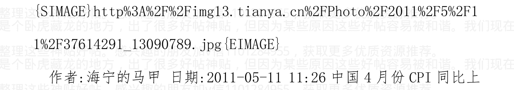

作者：海宁的马甲 日期：2011-05-11 11:26 中国4月份CPI同比上涨 5.3%，环比上涨 0.1%

4月份食品同比上涨11.5%，非食品上涨2.7%。

4月份PPI工业生产者出厂价格同比上涨6.8%。

从2010年2月开始的负利率，在2011年5月，进入第16个月。

上一次负利率时期是2007.2－2009.1，共24个月，中国股市过山车。

上上个负利率时期是2003.12－2005.3，共16个月。2005.3结束负利率后，房价短暂企稳。

加v信1101284955获取更多优质书籍推荐

## 作者:海宁的马甲 日期:2011-05-11 11:32

2011年一季度国内生产总值按当年价格计算 96311 亿元，同比增长 17.6%；按可比价格计算，同比增长 9.7%

2010 年一季度国内生产总值 80577 亿元，按可比价格计算，同比增长 11.9%

GDP 内的总体物价涨幅，GDP 平减指数=96311/(80577*1.097)-100%=8.96%
请指教这样算是否有错误呢

8.96%，没有错误，中国居民比较好管，只有物价涨幅不超过10%太多，都不大有动静。
8.96%瘦身为5%，这就是统计局的功劳。

## 作者:海宁的马甲 日期:2011-05-12 00:07 笑谈代理人战争和“白银的代理泡沫”

从黄金的历史定价看，2011 年的黄金价格大致在 571 美元，超出571 美元的部分，是溢价。
白银价格大致是 571/66（1971 后黄金白银历史比价中枢 66 倍）=8.65 美元

如果美元的短期利率大于美国 CPI 2 到 3 个百分点，并且世界投资...者相信美联储在接下去的时间里，也会保持短期利率大于 CPI 2 到 3 个百分点，那么，黄金的价格很快会向 571 美元靠拢。

现实是，美联储不会加息到 CPI 之上 2 到 3 个百分点。

历史是，2004.6-2006.6，美联储 17 次加息，美国短期利率大于美国 CPI 2 到 3 个百分点，黄金在 2006 年上半年，从 700 多美元，跌到 566 美元形成强烈支撑。

> 黄金泡沫图中的 1220 美元，是 1982 年的价格，美国物价 30 年里，已经涨了 1.56 倍（信不信由你）。
>
> | 项目 | 计算过程 | 结果 |
> | :--- | :--- | :--- |
> | 1982年价格 | 1220美元 | |
> | 物价涨幅 | × 2.56 | |
> | 对应当前价格 | 1220 × 2.56 | 3123美元 |
> | 换算（除数为66） | 3123 / 66 | 47.32美元 |
> | 另一换算 | 2310 / 66 | 35美元 |

白银代理了黄金，玩了一次从 35 美元奔向 47.32 美元的旅程。

这些数字没用，最多就是做投机的时候，有个参考，看看离谱的程度。

> 作者: 海宁的马甲 日期:2011-05-12 20:47 yevon_ou 认为 2015 年，上海房价将是 853 高地（内环 8 万，外环 3 万，中间的 5 万/平方米）

信 yevon_ou 者，应该买房投资，yevon_ou 认为 3 年里还能涨一倍。

# 加v信1101284955获取更多优质书籍推荐

> 转载：

yevon_ou 于 2010-1-15

## 上海楼市的真实走势

很久以来，我一直想写一篇《上海楼市的真实走势》。因为这很重要，真实扎实的数据，是我们分析的基础。从 03 年以来，我们一直笼罩在“宣传口径”的重重误导之中。连楼市的真实涨跌，涨幅跌幅多少都不知道，又谈何分析？

1月10日的时候，我去来德坊参加一个聚会。吃着黄鱼面，听着诸人一本正经地讨论“05 大跌”。大伙一致同意，房价在05年曾发生巨幅下跌，08年也曾经大幅下跌。于是，又坚定了我写本文的信心。

一幅图胜过千言话。首先，让我们看如下这幅图。这里数字指的，并不是单个的楼盘。而是一个典型意义的“大盘”指数。好比大伙都想买的，内环边缘，品质不错但不是豪宅，2房或3房，00年以后的小区次新房。在 2000 年的时候，他的价格是 3000，如卢湾区斜土路的“复兴佳苑”。在 2010 年时，他的价格是 30000，如卢湾区的“黄埔新苑”。

+   加v信1101284955获取更多优质书籍推荐

这幅图中，我们可以得出以下结论：

- 1. 过去 10 年中，上海楼市一直在涨。累计涨幅大约 10 倍。
- 2. 多军的报价“永远”上升。仅空军心理才有“楼市涨跌”。
- 3. 当多军和空军心理价位接近时，产生成交。
- 4. 空军有三大特点。
   - a) 空军的心理价位，永远低于多军。
   - b) 空军常常落后一个 Season。
   - c) 空军最终会屈服于多军报价。

下面，让我们逐一展开分析。

### 一）二种报价

首先，也是我们区分于绝大多数“伪专家”的地方。房地产其实有二个价格。我们一直在说的“楼价” 楼价楼价，其实楼价并不是“一”个数字。

房地产分为“房东报价”和“买家报价”。这个道理，和绝大多数的交易市场一样。类如股票市场，也有买进/卖出（Bid/Ask）。只不过很多时候，股票市场的“买入/卖出”相差很小。只有几分钱的距离。而股票交易金额也很少，100手也不过几万元的价格。

但在房地产市场，“房东报价”和“买家报价”，有时候可以相差很多。相差几千元/平米，甚至几万元/平米。而且房地产标的大。有时候一个房子，房东要价 700 万，而买家甚至还价 500 万！二边相差达百万之巨。

这个二种价格，就是我们作此图的本意。

所以我们分红线和蓝线，分别标出“房东报价”和“买家报价”。

那么，上海楼市的真实走势如何呢。

对于多军来说，多军是理性的。多军的价格，以一个持续稳定的价格，逐步往上递升。速度大约为每年25%。尤其值得提出的，无论政府干预或调控，多军报价稳如泰山！

而反观空军一面，空军是“非理性”的。空军高度受外部宣传，个人心理影响。往往会陷入“大起大落”的兴奋与狂热。在空军的头脑中，存在“宏观调控”一夜跌50%的事例。也存在“03暴涨”“05暴涨”“07暴涨”“09暴涨”四个涨得看不懂的年份。

真实的情况是怎样的呢。现实市场中，会不会“暴涨暴跌”一年涨50%呢？

不会的，现实世界是循理的。空军朋友呢，因为你们的愚蠢，因为你们的偏视，其实你们是以一种狭隘的眼光在看待这个世界。得出的远远偏离真实的结论，最终买不起房，一错再错住桥洞。

这就是我们写本文的原因。告诉你《上海楼市的真实走势》。

加v信1101284955获取更多优质书籍推荐

### 二）相交点

真正的房产走势是怎样的呢。

真正的“房价”，发生于“红线与蓝线相交”的地方。也就是多军和空军心理价位一致，才可以发生交易。否则你要是天天和自己说：“政府要宏观调控了，房东得跌价50%”，那只是YY。

我们仔细观察一下《真实走势》图表。在这个图表中，“红蓝相交”其实次数并不多。

在 2002 年之前，多军和空军，其实差距比较平稳。“空军心理”持续在“多军报价”的 90%左右。也就是 3000 元的房价，但大家还是觉得贵的。最好再“便宜一点，打个折”就可以买下来。在这个阶段，成交量中。

2002~2003 年，房价开始逐渐启动。人们开始有了一个“房产牛市”的概念。房屋渐渐用抢。在“2002 年春”发生了第一个高潮，空军和多军报价比例 100%。成交大量发生烫手。成交量高。

2003 年春，发生了第一次“大牛市”。

2003 年秋，上海市政府，发起第一次“宏观调控”。包括取消个人退税，期房限转，低价房贴息等等。这个时候，本图表就发生了重要的变化。

可以看见，在 2003 年秋天的点位上，空军的“心理价位”大幅下跌。由 6100-> 5600 跌落。

而与此同时，多军秉承科学的分析，坚定地理念，认为上海楼市被低估。所以多军报价 6100-> 6700 上升。

那么，2003 年秋季，房价下跌了没有呢？回答是没有。因为只有多军认可空头的“砍价”，把价格调下来，房屋才可以换手成交。而实际情况是，多军根本不认可国六条，这只让房价更涨，多军反而要加价。最终 2003 年秋的结果就是，“房价既不上升也不下降”，成交大幅减少，这就是“宏观调控”的效果！

### 三）所谓的 05 下跌

我参加过众多的聚会。有楼市的，有股市的，有学术的，也有官方的。但有一点是毫无疑问、一致共识的，就是“房价也有可能下跌，05年就曾大幅下跌30%以上”。

05年的下跌，作为一个经典案例。被广泛证明于“宏观调控是有效的”，“房价也不是一往直上的，而是有波段的”，“楼市有风险有亏损有割肉”。

对于此类的自我麻醉，我们除了冷笑之外，刻骨地质问一句：“真的有 05 下跌”么？

我们的回答是：“没有”

只涨不跌，永涨不跌，买入即赚，买入必赚。

如果我们再仔细看看《真实走势》图表。在 2005 年 3 月是，发生了房地产历史上最凶猛的上涨。楼价以每个月 10%的速度，四五个月涨了大约 50%的价格。

但此后，2005 年就发生了“宏观调控”组合拳。国八条从土地，信贷，税收，廉租等各个方面，打出了一套“组合拳”。并号称这些市场干预，能使得消费者买到更便宜的房子。

对于宏观调控，我们采取全盘否定的态度。薛兆丰曾有作文“加税岂能降房价”。任何一个有经济学知识，擅于严谨思考的人，都会知道“宏观调控”是一个大笑话。对 KFS 的迫害，对投资客的诬蔑，对交易者的税收，只会让房价再涨 200%，300%！

同一种政策，在智者和愚者之间，会有不同的解读。2005年夏“宏观调控”发生了以后，有识之士都知道，这房价可能要大涨特涨了。

> > "因为宏观调控，所以房价飞涨"。

而空军是愚昧的，是低情的。空军心理价位调到了6500。妄想房东“降价50%”再卖给他们。

多军心理12500，空军心理6500。那《真实房价》是多少呢？答案是没有真实房价，因为多空双方相差太远，所以根本就不可能成交。成交量降到冰点降到0。

2005年的时候，如果你浏览阅览各大网站，你会看见网友们叫嚣：“现在买房，不砍个30%，简直就是自虐”。“肯买房就是恩”。“我看中一套100W的房子，大家帮我参谋参谋，我还价65W不知能否拿下”。

好啊，那你真的还还看。看65W能不能拿得下来？毫无疑问，2005年的‘所谓下跌’只存在于空军网友们的YY中，存在于他们一厢情愿的世界大乱中，存在于文书的宣传中。

真实的情况是，没有一个人，能用65W买到100W开价的房子。哪怕95W都砍不下来，房东不跳价就不错了。

空军们自以为是的yy下跌，结果导致了06年更大更痛快被屠杀。

### 四）关于07年的涨幅

关于07年，一直有一件悬而未决的事情。07年怎么会有如此巨大，接近80%的涨幅的？

07年春季过后，从2月开始，一直到近8月份。六个月时间，房价以每月10%速度上涨，六个月累计涨幅约60%。再加头尾，总涨幅在 80% 左右。

反映在图表中，就是空军在 05 年的意淫狂喜中，结果发现荷尔蒙分泌了，面包却没有来。

于是 06 年末空军们又去买房子了。

于是 07 年空军们发现他们什么房子都没买到。

从 06 年的秋冬季开始，经过了一年多的蛰伏，空军们渐渐从“煽动”的狂热中清醒过来。面包终究是要有的，房子终究是要买的。刚需经历了一年多的积累，越积累越多。

当空军们在 06 年冬，真的再走入市场中。他们发现，一年多没有体会市场，房价已经“涨得看不懂”了。

加v信1101284955获取更多优质书籍推荐

我有一个朋友 dittojeff，他是这样解释楼价涨幅的。

一套挂牌 100W 的房子，空军们不屑一顾。他们总对自己打气说，“真的去买，至少可以砍价 20W。80W 就可以拿下来了”。

结果他们真的去买，中介对他们说，“不仅 100W 买不到，房东还要跳价，现在要 120W”。

从 80W 到 120W，这样一眨眼就是 50%涨幅了。

对啊，其实对空军来说，仅仅是一眨眼，一秒钟的时间，房价就涨了 50%了。

长期以来，空军一直生活在自己的 yy 和幻想之中。他们既不关心外面最新的报价，甚至幻想中介窗口黄得发旧的报价单，还可以再往下砍 20%！

等到 06 年末，空军真的走出象牙塔，去实战买房的时候。他们发现，不仅他们“幻想”中的房价买不到，他们“记忆”中的房价也买不到。多军一直都在小幅地上调房价，甚至在空军叫嚣最凶的 2005年 9 月，都在往上上调喊价。

等到空军真的想买房子时，他们发现他们面对是 6500->17400 的巨大涨幅。

你可以活在你的幻想中，可以活在“我看中一套 100W 的房子，大家帮我参谋参谋，我还价 65W 不知能否拿下来”中。但是你最终要买房子么？你要买房子，就得接受 17400 的价格。

### 五）笑话

我们以前曾经有一个笑话。按照中国的媒体宣传，2005 年房价是下跌的，2006 年房价是平的，2007 年房价是小幅上涨的。那么，谁能告诉我，07年怎么会比05年贵一倍的？

还是看看图吧。

你看红线，是能够理解的。你看蓝线，是无法理解楼价市场的。

研究房地产市场，我们需要的是独立思考。如果再提醒一下各位，去google一下“2005年房地产下跌”。你会看到无数关于上海，深圳，广州，跌幅30%的报导。

如果你再仔细研究一下，这个“跌30%”指的是什么。我可以负责地告诉你，全部都是“交易量”。没一条是“交易价格”。

人啊，人啊，在这个繁噪的世界中，要保持冷静，是多么地不容易。

加v信1101284955获取更多优质书籍推荐

### 六）关于 08~09 年的涨幅

今日，我常常路过的那家“臣信中介”，终于做了一件大事。

他们把门口张贴的所有房屋 25000/m 的报价全部换下，换上了 40000/m 的新价格。一套房子大概涨了 200W。

这是件早就该做的事。因为很无聊。

从 2008 年 1 月开始，大概整整二年的时间，臣信门口的报价就没有变过。始终是一个雷打不动的 25000/m。无论外圈房价涨得如何天翻地覆，川沙，南汇，徐泾，罗店，外环外房价都有了 100%的涨幅。

而我们这家 X 信中介，始终维持着坚定的市区 25000/m 报价不变。

但真实的情况是这样么。当然不是。因为房东不是傻子。外圈在涨，内圈也在涨。当桃浦宝山也卖 20000/m 的时候，你当然不可能指望市区房东傻乎乎地二耳不闻窗外事。房东一样按 30000，33000，38000，40000，46000………一阶一阶把价格调上去。

加v信1101284955获取更多优质书籍推荐

房东报价46000，中介坚持写25000有意义么。毫无意义，因为价格是房东定的，而不是中介决定的。

所以中介每天都打电话过来，推荐中介的“专业意见”，建议房东按“推荐市场价”挂牌。其结果，只能导致房东的嘲笑了。

房价的上涨是历史趋势，空军不能阻挡，中介也不能阻挡。

但是在09年，10年的房价涨幅统计中呢。整天在门口逛的购房人，整天企望着房价可以从25000再往下降的购房人；25000-）40000，购房人恐怕要捂着心房痛涨了。

这是一件非常残酷的事，因为我们的真实报价是46000/m。

### 七）结语

在《上海楼市的真实走势》图表中，我们画了红线、蓝线二条线图。

二线靠近很近时，成交大量发生。

二线很远时，成交稀少。只会遇到“急抛价”和“钢买价”，但这二者都不是有意义的价格。

在绝大多数时候，在网络和报纸中占舆论统治地位的，是“空军”们的想法，是空军们的欢乐与痛苦，是空军们的垂涎与臆想。

但在现实生活中，真正起意义的，是红线，是“多军”的意志。至少绝大多数时候，99%以多军胜利告终。

蓝线有大量的起伏。但红线基本很平稳。

加v信1101284955获取更多优质书籍推荐

传统的舆论分析，是蓝线。无法解释为何“05降06平07升，07却比05贵一倍”之类的问题。

只有用红线作“真实走势”，才可以解释以上问题。

所以，我们建议你以多军的命令，为市场真实指示。05年，06年，08年，房价都未曾下跌，房价只涨不跌。

信多军者，得永生。

作者:海宁的马甲 日期:2011-05-12 21:39 笑谈“可以搞”“搞不动”

### 经济规律普遍适用

- 1986-1988 美元低利率，美元贬值，全世界发达地区的房价都涨了，连德国瑞士都涨了，香港的也搞起来了。
- 1992-1994 美元低利率，美元贬值，怎么搞就是搞不动美国日本的房价，香港的搞起来了。
- 2002-2004 美元低利率，美元贬值，全世界的房价，都搞起来了，香港的也搞起来了。
- 2009 - 2011美元零利率，美元贬值，欧美日本的房价怎么搞，也搞不起来，香港的又搞起来了。

还是香港的房价容易高潮，每次美元低利率，香港房价必高潮。

## 索罗斯在美元上涨中做空香港楼市股市的故事 1997-2005-2011

以下故事，纯属虚构。

2005 年 7 月 21 日，美国经济火热中，美国房价暴涨中，美联储继续加息中。索罗斯的一帮旧友造访索罗斯。

> 他们对索罗斯叹苦道：“老兄你是亿万富翁，可我们没钱，手里那区区几百年美元余钱的购买力，越来越不行了，你看，油价涨，黄金现在 2005 年 7 月已经涨到 430 美元/盎司了，房价也涨了很多，我们手里的美元的购买力在流失啊”

> 索罗斯：“2 年前的 2003 年，我早就告诉你们买日元，欧元，黄金保值的，你们难道没有买？”

> 朋友们苦叹：“外汇市场很多都是你们这些嗜血的人物，我们去炒外汇，不就是给你们送钱吗，等我们买日元欧元的时候，就是日元欧元跌的时候了，而且现在已经涨了 30%了，我们再买，来不及了。”

> > 朋友们接着说：“后悔当初没有买日元欧元黄金啊，可惜失去的机会，再后悔也没用，你还是痛痛快快给个保值方案吧，不要模棱两可，干脆点，买什么保值？”

> > 索罗斯故弄玄虚地说：“机会是有，比买黄金更保值，而且现在在 2005 年 7 月这个机会还在，比那日元欧元 30%多的涨幅多得多。”

> > 朋友们急着说：“那你快说，你老兄光顾着吃肉，也不给我们指出一条明路。”

> > 索罗斯说：“告诉你们也没有关系，保证你们赚钱，如果亏本，我给你们报销 80%的损失，但你们必须答应配合我，即使少赚 10%，20%让你们抛房，制造恐慌，你们也要好好配合我”

> > 朋友们急着说：“一定一定，您放心，到时候一定配合”

> > 索罗斯说：“日元欧元升值了，但是联系汇率的港币没有升值，而且香港经济因为中国大陆经济大发展而如火如荼，也就是说，按 1:7.7 的汇率看，2005 年 7 月，港币比美元值钱，只要你们把美元换成港币资产特别是香港房产，就能保值增值。”

> > 朋友们担心地说：“要是香港房产已经涨了很多了呢？”

> > 索罗斯：“放心，美元贬值周期还没有走完，而且泡沫的后期，上涨速度远远高于前期，为什么？因为泡沫刚开始的时候，投资者比较谨慎，所以涨幅小，后期连做企业的，卖茶叶蛋的，打工的，都来投资房产的时候，就是飙升最快的时期。现在2005年7月，这个泡沫的疯狂期还没有到，所以，你们不但能保证保值，赚100%，300%不是梦，风险也极小，只要你们在暴跌的时候愿意损失10%，20%的盈利低价抛盘。

> > 朋友们疑惑地问：“那你自己不去买，光叫我们买？”

> > 索罗斯：“我玩的是外汇，那个市场大，一天成交量就有2万亿美元，你们那房地产市场成交量太小，流动性太差，不适合我玩。”

> > 索罗斯：“暴涨时期你们赚钱，暴跌的时候，我赚钱。”

> > 朋友们问，“什么，暴跌的时候，你也能赚钱？”

> > 索罗斯：“具体比较复杂，简单说就是卖空香港股票，特别是地产股，建材股等先赚一小笔；然后卖空日元，卖空澳元加元等，到时候看了。”

> > 朋友们问，“给个时间段吧，我们好有个心理准备”

> > 索罗斯：“从2003年算起，6，7年吧，泡沫快走完全程的6个月前左右，我就会出现的”

> > 朋友们兴奋地说道“能再具体点吗？我们最关心什么时候抛。”

> > 索罗斯：“2010年10月到2011年6月。美元指数攀升到94，”

并且被很多人继续看涨的时候，你们就可以抛了。当然美元指数 90 的时候，条件合适也可以抛了。

朋友们非常信任索罗斯，开心地走了。

2005 年 7 月 21 日

以上故事 100% 纯属虚构。

因为港币对美元的汇率固定，香港的货币供应量就要大大地受美国的货币政策的影响。美元贬值，联系汇率的香港的货币供应就会非常充足，香港就会被搞成流动性过剩。美国打仗发行国债，导致美元贬值的时候，如果港币兑美元汇率不变，那么港币就非常有吸引力，国际资金就会涌入香港，兑换成港币，投资香港的硬资产，比如房产。索罗斯只是一个符号，一个代表，没有索罗斯，上面的事情还是会发生的。只有一种情况下联系汇率制没有问题，那就是香港的经济周期与美国在时间与起落幅度上都相同。但这可能吗？

作者：海宁的马甲 日期：2011-05-12 21:43 那些说中国内陆政府拖房价的，为什么不看看香港呢？

大陆和香港，不都是美元的经济殖民地吗？同时羊群比较配合（羊群没有贬义，仅仅指追涨杀跌）

香港没有4万亿的刺激，2009 – 2011 房价不照样涨了60%以上？

所以，美元低利率，零利率，是可以搞的条件，羊群一配合，高潮就来了。

作者：海宁的马甲 日期：2011-05-12 21:54 笑谈“可以搞”与“欢迎来稿”，每次美元低利率，香港房价必高潮

那些说中国内陆政府拖房价的，为什么不看看香港呢？

大陆和香港，不都是美元的经济殖民地吗？同时羊群比较配合（羊群没有贬义，仅仅指追涨杀跌）

香港没有4万亿的刺激），2009 – 2011 房价不照样涨了60%以上？

（这个4万亿，又是一个大众误解，财政根本没有投4万亿，是贷款多了4万亿，2009年贷款本来应该是6万亿，结果是10万亿）

所以，美元低利率，零利率，是“可以搞”的条件，还得羊群“欢迎来稿”，高潮才会来。

德国房价也就1986-1987被搞了一次。

加v信1101284955获取更多优质书籍推荐

日本房价，1986-1988 被搞了一次。

美国房价是搞一次高潮，休息一次。（1986-1988 低利率房价大涨；1992-1994 低利率房价跌；2002-2004 低利率房价涨；2009-2011 零利率，房价跌）

经济规律普遍适用

1986-1988 美元低利率，美元贬值，全世界发达地区的房价都涨了，连德国瑞士都涨了，香港的也搞起来了。

1992-1994 美元低利率，美元贬值，怎么搞就是搞不动美国日本的房价，香港的搞起来了。

2002-2004 美元低利率，美元贬值，全世界的房价，都搞起来了，香港的也搞起来了。

2009 - 2011 美元零利率，美元贬值，欧美日本的房价怎么搞，也搞不起来，香港的又搞起来了。

还是香港的房价容易高潮，每次美元低利率，香港房价必高潮。

作者：海宁的马甲 日期：2011-05-13 10:24 @两万年 2011-05-13 08:58:02

> 海宁的马甲，有传言说，「金砖四国之父」、高盛资产管理主席 Jim O'Neill 指出，内地的通胀已受控，楼市亦没有泡沫，预计中央于下半年放弃紧缩政策，届时 A 股将应声大涨。中国人充满清醒的优惠意识，对通胀问题的认识和担心胜于任何人，这正是中国经济总能够自我修正的原因。对于通胀失控问题，中国政府至今处理得无懈可击。

这个是真......

@松花江船歌 2011-05-13 09:00:25

靠发改委约谈就能解决通胀. 神了

在稳健的指导下，2011年上半年，经济已经减速了，对于基础金属等大宗商品的需求在下降。

2011年3月前后，各种商品的期货净多仓，也大幅减少。（2008年3月，净多仓，特别是石油的净多仓，也大幅减少）。

净多仓减少，只能说投机热情下降，并不能说就不涨了。

往年中国第一季度可是热火朝天，今年第一季度的投资冲动，非常的克制。

所谓输入性通货膨胀是比较SB的说法，2006年以来中国投资率超过40%，甚至2008 - 2010投资率接近或超过50%，对于铁矿石，基础金属的需求猛增再猛增。社会各阶层对于食用油和猪肉的消费猛增再猛增（2008年需求的增速急剧下滑）。

“保8兜底保险”在2010年11月到2011年3月，已经被放弃了。

欧美叫“W&#215;*J##bao put”

量化宽松叫“Bernanke Put”

嗅觉比高善文，高盛（两者在2010.11.12发出风向已变的建议）

灵敏的，也有。

嗅觉不够灵敏，把暴跌怪罪到阴谋论上，是没有用的。

作者：海宁的马甲 日期：2011-05-13 10:34 D的历史表明每次社会

的转型期基本上都会牺牲一个团体：

这是一次连续6年投资过热（超60%）的经济萧条，萧条之后，中

国市场经济增长的潜力，还会继续发挥出来的。

如果“保8兜底保险”继续发酵，那么，为了短期的经济强劲，必

须忍受更高的通货膨胀，和承担以后更大规模的萧条和不稳的zz风

险。

我认为“保8兜底保险”已经被放弃，通过以后经济增长的预期在

7%，已经公布，所以说了“一定要把部分城市的房价降下来”。

通过过去8年，应该能得出“既非圣贤，也非疯狂的大萧条派”的

## 结论。

事实上，通货膨胀问题，还是比较重视的，特别是中东北非后。

不得不说，看热闹的真多，真正讨论货币币值稳定与否，汇率，扭曲压低人民币汇率，负利率，投资率的不多。

作者：海宁的马甲 日期：2011-05-13 10:43 有人说中国 政府的调控能力强，高潮延续能力强。我看未必。

请看

1974-1975，美国经济严重衰退；同期，中国北方14省缺粮，铁路系统瘫痪，请邓设计师出马整顿，邓直接搞好了铁路系统，经济得以喘息。计划经济时代，铁路就是命脉。市场经济时代，金融是经济的血液。

1980-1982，美国经济轻度衰退；同期，中国经济经历1978大萧条后，外汇耗尽，宝钢靠日本贷款才不至于变成烂尾工程，1980年中国通货膨胀，用1，2年治理通货膨胀，1983-1985，和美国一样迎来大发展。

1990-1991，美国经济严重衰退；中国经济也严重衰退，是改革开放后最严重的经济衰退。

2001，美国经济轻微衰退，中国经济也是刚恢复后，股市掉头，用了4年，才消化2001年的股市泡沫。

加v信1101284955获取更多优质书籍推荐

2008年，美国房地产价格飞流直下，中国经济和股市急转直下，很多人无法相信，股市居然在奥运前，可以跌成那样，一批批人进去抄底，一些还是在2007.8 - 2008.1成功逃顶的人。

作者：海宁的马甲 日期：2011-05-13 10:45 转载。

## yevon_ou 对 2011 楼市的判断（2011/4/18）

## yevon_ou 对 2004 楼市的判断（2004/4/18）

- 1）从基本面分析，楼市的合理“价值”，应该是20000~30000
- 2）不要再赌博，立刻就买房。
- 3）现在已不是多空分歧的阶段，而仅仅是对空头的单方面屠杀。

> 立此存照

http://ehome.online.sh.cn/article.php?post_id=8408492

## yevon_ou 对 2005 楼市的判断（2005/4/18）

- 1）从基本面分析，楼市的合理“价值”，应该是 20000~30000
- 2）不要再赌博，立刻就买房。
- 3）现在已不是多空分歧的阶段，而仅仅是对空头的单方面屠杀。

立此存照

http://ehome.online.sh.cn/article.php?post_id=8408492&thread_id=2348336

## yevon_ou 对 2006 楼市的判断（2006/4/18）

- 1）从基本面分析，楼市的合理“价值”，应该是 20000~30000
- 2）不要再赌博，立刻就买房。
- 3）现在已不是多空分歧的阶段，而仅仅是对空头的单方面屠杀。

立此存照

http://www.91facai.com/forum/dispbbs.asp?BoardID=36&ID=45215&replyID=&skin=1

加v信1101284955获取更多优质书籍推荐

## yevon_ou 对2007 楼市的判断（2007/9/25）

- 1）从基本面分析，楼市的合理“价值”，应该是20000~30000
- 2）不要再赌博，立刻就买房。
- 3）现在已不是多空分歧的阶段，而仅仅是对空头的单方面屠杀。
- 4）至迟至2015 年，上海楼市至少会达到8/5/3，8万5万3万

不知道为什么，07/08/09 年的预测贴找不到了

## yevon_ou 对2010 楼市的判断（2010/4/9）

- 1）最迟在2015 年之前，上海楼市将完成8 / 5 / 3。八万五万三万。
- 2）因为宏观调控，所以房价飞涨。
- 3）现在已不是多空分歧的阶段，而仅仅是对空头的单方面屠杀。

> 立此存照 http://bbs.libaclub.com/t_507_5371759_1.htm

## yevon_ou 对2011 楼市的判断（2011/4/18）

加v信1101284955获取更多优质书籍推荐

- 1) 最迟在2015年之前，上海楼市将完成8/5/3。八万五万三万。
- 2) 因为宏观调控，所以房价飞涨。
- 3) 现在已不是多空分歧的阶段，而仅仅是对空头的单方面屠杀。

作者：海宁的马甲 日期：2011-05-13 10:53 1981-1997年，劳动者

收入占GDP比重58%以上。1998-2002劳动者收入占GDP比重下滑到54%，2003年以后，再次下降到47%，46%。

作者：海宁的马甲 日期：2011-05-13 10:56 谁是大萧条的赢家？

2006年，政府收入3.9万亿，支出4万亿（不包括地方投资公司等融资平台）

2010年，政府收入约7.9万亿，很多是买房者的税费，或者通过房地产公司间接缴纳的税费，支出8.6万亿（同样不包括地方投资公司等融资平台）。

当然通过低利率，负利率下的资产泡沫价格，很多人在2007年底，觉得很有钱，2010年底类似。

作者：海宁的马甲 日期：2011-05-13 20:19 转载：

2010年1月 左小蕾：预计全年通胀在3%-4%

## 全年物价涨幅压力明显

> 2010 年 2 月 樊纲：通胀不会轻易加剧 资产泡沫才真正应担忧

货币因素将主导 CPI 呈现快升慢降趋势

> 理财周报：CPI：求你别再旱了

> 2010 年 3 月 王小广：目前通胀压力不大 未来几年或出现通缩

> 高善文：明年下半年或严重通胀

> 李晓超：今年 CPI 涨 3%目标有困难但能实现

> 2010 年 4 月 姚景源：4 月 CPI 创新高 未来 3 个月 CPI 仍继续走高

CPI 涨幅控制在 3%以内仍有可能

> 2010 年 5 月 连平：CPI 增长符合预期 现实不存在通胀

> 统计局：当前的物价上涨仍然是结构性上涨

> 国家统计局：全年 CPI 控制在 3%左右是有基础的

> 2010 年 6 月 粮价不具大涨基础 全年物价控制在 3%

下半年 CPI 同比涨幅或见顶回落

> 2010 年 7 月 CPI 涨幅创年内新高 全年物价将基本稳定

统计局：翘尾因素对 7 月 CPI 上涨贡献 67%

中国经济时报：CPI 猜想 7 月高位难以持续

第一创业：全年 CPI 低于 3% 近期难加息

长江证券：7 月份 CPI 已到达年内高点

2010 年 8 月 8 月 CPI 同比涨 3.5% 专家称涨势已强弩之末

国家统计局：部分农产品价格上涨推高 CPI

统计局：CPI 上涨主要因新涨价因素

2010 年 9 月 农产品价格上涨推高 CPI 专家称涨势已是强弩之末

2010 年 10 月 国家统计局否认中国进入全面通胀时代 姚景源：CPI 全年 3% 目标能实现

2010 年 11 月 李稻葵：应对短期 CPI 上涨不一定要加息

统计局：今后一个时期物价基本稳定可以实现

盛来运：全年 CPI 稍微超过 3% 也在调控目标范围内

2010 年 12 月 CPI 年底高点回落 预计 2011 年物价呈前高后低

## 2011年1月

巴曙松：通胀持续攀升难以为继

姚景源：有能力保持物价基本稳定

谭雅玲：通胀局面严峻 CPI 将震荡上行

## 2011年2月

周明剑：通胀是长期命题

连平：食品价格上涨超预期 未来CPI还有高点

姚景源：CPI可控制在4% 不会出现恶性通胀

## 2011年3月

左小蕾：预计二季度CPI增速放缓至4.5%

李迅雷：通胀有长期化倾向

曾培炎：全年CPI涨幅可控制在4%以内

统计局：调控效果初显 物价走势总体可控

如果你2010年1月份看到现在，你会发现什么统计局、专家、媒体全不靠谱，市场最靠谱！

作者：海宁的马甲 日期：2011-05-13 21:20 这个世界最搞笑的事情之一就是：一些工资涨幅追不上猪肉价格涨幅的，又抱怨房价高的，偏偏是2003 - 2006最反对人民币升值的急先锋。

人民币汇率被扭曲，被人为压低（通过印钞机来承接源源不断的美

元），天平就会向外贸领域和“抗通货膨胀的有形资产”领域倾斜。

2003 - 2006 最好的组合是老公搞外贸，老婆负责囤房。

## 世界上最庞大的剥削

作者：yevon_ou  发表日期：2009-2-20 0:51:00 回复

> 租住我房子的德国人，是一个彻底的混蛋。每一次我见到他的时候，都醉醺醺拿着一个酒瓶。他的头衔是一个工程师，却连最基本的电器原理都不懂。常常叫我修洗衣机。最后，他在弄裂我的地板后，拖欠了二个月房租，偷偷地逃走了。

我时常怀疑，一个素质如此低劣之人，是如何住进全市最高档的生活区之一的。而且我还对他毕恭毕敬，因为他的房租给得高，大约5000元/月。超过一个本地大学生的工资。

而对于德国人来说，其实并不高。仅仅约500欧元/月。一个东

德流氓都可以承受得起。

## 为什么一个下等人，可以爬到上等人的头上？

### 一）中美贸易

让我们设想一下，中国要出口一把椅子，到美国的过程。

首先，我们要从深山老林之中，把异常珍惜的树木砍伐下来。然后去皮上光。再之后，我们会活剥一头小猪，把猪皮硝制了做椅垫。椅子需要调制大量的化学物，油漆及胶水。最后，我们可能要从一个四川，或者湖南的工厂，经过数千公里的铁路，运到上海出口。

在上海，会有庞大的船队和港口设施等待。制造，运输，报关，

都需要耗费大量的人力。当然还有浓烟滚滚，消费的电力和汽油。

好了，现在这把椅子终于被装入铁皮集装箱了。可怜的森林老树，

猪皮，油漆，石油，都消耗掉了。船只航行到了太平洋中央，然后，

然后…………他沉了！

是的，船沉了。整艘船都沉了。满载着无数货物与劳动的远航船，

就这样沉没了。沉入了太平洋中央，没带起一丝水花。我们辛辛苦苦

生产了那么多东西，哪怕消耗与污染；可是，这一切都没有回报。船

直接沉入太平洋了。

在过去廿年中，美国人从未支付任何贷款。或者更确切点说，我

们的货物就扔掉海里了。我们以为我们收到钱了，其实我们的货物，

全部都扔垃圾筒了。

### 二）美元之谜

让我们想一想，出口究竟是怎么回事。“我出口货物，你给我美元”。

我出口了一把椅子，你给我$15美元。价格公道。

15美元在美国，可以干什么事呢。大约够买1/4把Made in American的凳子。或者，够你把凳子腿修一修。美国人觉得$15买一把中国产的凳子划算极了。

对于中国的出口商呢。他收到的绝不是“修条椅腿”的价格。$15在国内约折合¥105元。（USD/CNY=7）。足够他支付木材、油漆、猪皮、人力的钱。

好了，现在问题出在哪里呢。出在了央行。

回到了我们最初的问题。一个东德流氓，住进了全上海最高档的社区。房东还要陪笑脸，去帮他修洗衣机。那么，街头流氓哪来这么高的地位呢？

对东德流氓来说，他实际支付的是500欧元。对街头小混混来说，还是可以承受的。

对房东来说，他实际收到的是5000元人民币（EUR/CNY=10）。这个房租价格也是让人满意的。

对央行来说，他收入500欧元，印出5000元人民币。外汇储备增长。

那么，谁吃亏了呢。是农民。

### 三）中国海底出口公司

近期据说金融危机，中国出口不振。有说下降-1.9%，有说下降-10%的，甚至有说-25%的。

其实，这问题很容易解决。

具体的解决方案，就是成立一家“中国海底出口公司”。办公地点就设在“帕皮提”好了。别找了，那是太平洋上的一个小岛，涨潮时淹没1/4国土。

加v信1101284955获取更多优质书籍推荐

#### “中国海底出口公司”注册资金一万美金。由中国外汇储备拨给。

其具体的业务，就是从中国出口商品。不管是上海出口的，广州出口的，大连出口的，来一船收一船。船载货物到港后，看也不看，哗~~~地一声，就倒进太平洋里。

本公司可以保证服务态度绝对好。不挑货，不退货，不检验检疫。不管你是运次等品，滞销品，本公司保证负责兜底收购。付款及时。

这样一来，保证沿海的出口经济极大富裕。各路经济大省纷纷救活。民间工厂加班加点，如火如茶，经济V型反转。刺激政策获得极大成功。

或许你会问，外汇储备被白白消耗掉了。咦，那不还是在中国商人手里么。

加v信1101284955获取更多优质书籍推荐

### 四）经济学

中国过去廿年的出口战略，其实和“货物倒在海里”没有什么二样。

美元并没有什么购买力。2万亿 Dollar 的外汇储备，也根本不买不回“中国曾出口”的等价购买力。更何况，美国的信用，已经大大受到质疑，二万亿美元，最终能拿回多少。金融界目前都是个大大的问号。如果美元收不回来，那么我们过去廿年的出口，都扔在海里了。

如果美元通货膨胀，贬值2/3，那么我们过去13.3年的出口，都扔在海里了。

对于中国受到危机的出口企业。其实和“中国海底出口公司”差

不多。反正我们输到美国的钱也拿不回来。2万亿外汇储备，和1.8万亿外汇储备，又有什么区别了。

投资 2000 亿美元，在太平洋海面成立一家公司，专门负责收购中国货物。货到了就往海里扔。这样的刺激规模，足够外向型出口企业，摆脱困境，大大盛世了。

我听说，经济学是一门研究效率的科学。是让整个社会更有效率，少干蠢事。那么，把货物“扔在海里”，是哪门子效率。哪种蠢事。

### 五）输家

好了，游戏兜到这里，也该找出谜团了。究竟哪里错了，谁是输家。

加v信1101284955获取更多优质书籍推荐

我的德国租客，用 500 欧元/月租了我的房子。他觉得英明无比。
充分享受了欧洲不敢想象的舒适生活品质。

我收了租客 5000 元/月的房租，我也觉得十分满意。至少他比本地人租金高多了。

央行多了 500 欧元的外汇储备。年尾总结是，央行行长免不了吹嘘二句。政绩大大地加上一笔。

那么，谁是输家？是农民。

农民是真正的输家。因为市场上的人民币，增加了 5000 元（新印的）。而他又没赚到外国人的钱，手中的储蓄反而被摊薄了。

我们常常说，过去廿年中，中国运输了2万亿美元的货物，到美国去。而美国人，事实上，一分钱也没有支付。

世上没有白吃的午餐。那么，是谁为这么一大堆货物付费了呢？

是中国的农民。

真正为这一堆货物买单的，是中国的央行。出口商能收到￥105元的椅子钱，这钱是中国央行给的。而不是美国人给的。

央行过度印刷货币，则受损失的是中国内地的农民。无法出口的农民。

整个利益链条的分配大致是：

- 美国人：获得 60 元（价值 105 元货物 - 45 元）
- 央行：获得 45 元
- 出口商：获得 5 元
- 农民：损失-105 元

整个社会生产：5 元

这里假设了$15 的购买力大致和人民币￥45 元相当。因为有生产，所以整个社会的财富增长了5元。

### 六）贫富分化、东西差距

加v信1101284955获取更多优质书籍推荐

好了，现在要说到中国社会久治不愈的顽症，这其实是一个问题。

贫富分化+东西差距。

坦白说，作为一个上海人，我感到无比的幸运。

如果我生为西部山区一个内地人，无论我多么努力，命运都注定挫折而艰辛。

住在上海，我可以接触“外国人”。

你能想象一套房子，月租金5000元么。在许多内地城市，这是完全不可想象的。因为他们接触不到外国人，物价感觉是500欧元的外国人。而对于本地人来说，￥5000是可以买很多很多很多东西的

加v信1101284955获取更多优质书籍推荐

往远了去说，这么多高楼大厦，金茂大厦的租金高达30000元/天/楼面，没有跨国公司，是绝对支撑不住的。很多五星酒店，高档餐馆，奢侈品商店，都是完全由“外国人”消费养活的。

更远了去说，远洋贸易，跨国贸易，许多上海产的并没有价格优势的商品，出口到了美国欧洲，就成了价廉质高的Made in China。外向型经济靠的是什么，靠的就是外国人觉得便宜。

这些优势，西部省份都是沾不到的。许多内地小城，或许几十年也没有一个“国际友人”来到。

那么，代价是什么呢。作为一个上海人，央行滥发纸币，我们一样身受其痛。几乎所有人，都可以看见人民币票面“零零零零零”一个一个加上去。

但另一方面，沿海省份可以从“外国人”身上获益。好比我能获得5000元/月的房租。从而抵消了央行“滥发纸币”的损失，甚至略有剩余。

而内地省份，就没有这个优势。中国一船船的出口沉到太平洋里，其对应的就是国内物品不足。货币却泛滥。

内地省份，承受着几乎每年10%的货币贬值。老百姓因此无法积蓄任何财富。略有积蓄就被通货膨胀掠走。

中国的“东西差距”，主要由导出口战略造成。如果没有刻意压低人民币汇率，“东西差距”会有，但绝不会这么严重。

### 七） 明天、美好的世界

好了，现在让我们设想一下。假如中国放弃“出口导向”型战略。

严格一点，假设中国立即“禁止”所有的出口。反正我们外汇储备也够用了。不需要再囤积更多的外储。或者宽松一点，仅仅是提高人民币汇率，提高到人民币：美金=1：1，市场自然会作出调整，顺差收减到零。

#### a) 价格

如果中国“禁止”了出口。那么，原先用于出口的产能，将全部转为内销。中国的净出口，一般估计为GDP的10%左右。这笔货物转入内销市场，将使价格下降1/3。

另一方面，中国不再出口美国，也就意味着中国央行不用再继续印钱。中国内陆的劳动人民将可以积蓄财富。而不是落入投机家的手中。

以上二股力量合力，中国国内的物价，有望下跌50%。

#### b) 贫富分化

除此之外，价格的下跌，还将产生政治上的重大影响。首先，贫富差距将大大缩减。

中国目前的贫富差距，集中体现在二个方面。

1. 离外国人的距离。
2. 离政府的距离。

离外国人距离近的地方好赚钱，越近越好赚。上海就比杭州更好赚钱，并不是上海人比杭州人勤劳。而是外国人登陆首选上海。陆家嘴又比桃浦新村好赚钱。因为外国人优先入住五星级酒店，而不是工人新村。

同样道理，离政府近的地方好赚钱。省比市好赚，市比县好赚。
因为中央政府不断地印发纸币，钱总是最靠近财政部，然后靠近地级市，最后才靠近县和乡。

导致的结果，就是并不靠“劳动致富”。好比我每年养猪积蓄3000元。但政府每年通货膨胀10%。
那我财富到30000元时，就增长不上去了。每年的养猪劳动所得，都被存款“缩水”抵消。三十年过去了，日作夜劳的农民依然贫困。只有靠近政府拿项目的人才能发财。
如果放弃了“出口导向型”的战略，没有了央行滥发纸币，则劳动可以积蓄财富。而投机无所获得。

#### c）内需

再其三，中国经济结构能够更健康。

我们整天在喊“增强内需”增强内需。宏观金融不改变，内需如何增强？

最简单的一点，你货物都拿到国外去卖了，国内的消费又怎么会起来？？？

我们整天喊削减出口，汇率不改变，出口又怎么会降下来？

促动内需最简单的办法，就是把“外销”的商品，全部拿到“内销”上来。国内商品数量增加33%，价格下跌1/3。人民生活极大富裕。

我原本每月赚3000，花2900。“内需”无法再增加。现在物价跌了，买完水电米油电脑球鞋后，只花了1900。天下还有比这个舒心的事么！

物价下跌1/3，家庭“可支配收入”大大增加。各样新消费，新娱乐，新休闲层出不穷。整个社会欢乐极大娱悦，服务业比重大大增加。

### 八）结语

加v信1101284955获取更多优质书籍推荐

有人冲到我们的草原，抢夺我们的牛马，抢夺我们的羊羔。我们拼命反抗，因为我们知道他是强盗，抢我小羊的强盗。

有人在电脑前拨动了几个数字，宣布了几项政策。造成了数以十万亿的财富移动，造成了沿海几亿人的繁荣，造成了内陆几亿人的贫穷。

我们不知道。因为我们不懂经济，不懂金融学。我们只知道日子是很苦很苦的，却从来不明白为什么。

作者：海宁的马甲 日期：2011-05-13 21:29 2001.7.6 美元泡沫从顶峰急奔直流而下。

2001.7.6 - 2004.6，美元泡沫破裂的第一阶段，是美元对欧元，日元，澳元的急剧下跌。

美元泡沫的第一轮大反弹，是由 2004.6 - 2006.6 的 17 次加息来完成的。

美元泡沫的第二轮大反弹，是由 2008.3 - 2009.3 的经济危机，金融危机来完成的，中国股市的泡沫破裂，帮了大忙。

#### 美元泡沫的第三轮大反弹？会有吗？会出现在2011.6-2012.2期间吗？

#### 由那种经济危机，金融危机来完成？

天涯有好文章，就看是不是客观地去看了。

作者：moooom 发表日期：2004-11-27 23:37:00

2004-11-27

2004-11-27

2004-11-27

在外国人眼中，房价一直在跌！

当然除了房产，我们还有更好的选择。很多的有钱人，买房子并不是为了投资，而仅仅是为了保值。保证自己终身劳动积蓄的财富，不受货币泛滥的侵害，不受纸币狂潮的痛苦。只不过中国金融投资手段匮乏，又不能换欧元，有50万身家的人，可能会去买第一套房子。而有200万，300万身家的，就必须要买第二套，第三套房子。而今有了个人黄金市场，房产市场可以少歇，不如多买几两黄金。流动性更好，永恒投资。房产还是黄金，看你的选择了。

http://www.tianya.cn/publicforum/content/develop/1/45462.sh

加v信1101284955获取更多优质书籍推荐

作者：mooooom 发表日期：2004-11-27 23:37:00 回复

## [转帖]在外国人眼中，房价一直在跌！

### 在外国人眼中，房价一直在跌！(ZT)

这二年买了房子的人，个个都笑得合不拢嘴。上房指数的上涨幅度高达38%，而如果有人告诉你，从2001至2003，上海的房价每年都是跌的，你相信么？

这是真的，请看下表：

|  | 2001年最低价 | 12/22/03现价 | 涨幅% |
| :--- | :--- | :--- | :--- |
| 欧元： | 0.827 | 1.243 | 50.3% |
| 澳元： | 0.485 | 0.763 | 57.3% |
| 瑞朗： | 1.823 | 1.252 | 45.6% |
| 美元指数： | 121.42 | 88.25 | 37.6% |
| 英镑： | 1.374 | 1.760 | 28.1% |
| 日元： | 134.72 | 107.32 | 25.5% |
| 加元： | 1.613 | 1.330 | 21.2% |
| 黄金： | 251.20 | 411.40 | 63.7% |
| 石油： | 14.38 | 33.74 | 134% |

加v信1101284955获取更多优质书籍推荐

可见，在七种世界主要货币中，兑美元平均都涨了 30-45%左右。

涨势最厉害的黄金，更是从 2001 年低谷的 251 美金/盎司，一直涨到了 411 美金。涨幅高达 63.7%。买房子真的都不如买黄金。

如果一个欧洲人来到中国，综合了 2001 和 2003 年的上海房价，即使经过三年大涨，他还是会得出结论，房价真的在跌。楼价/欧元，一直都在下跌，而且跌了10%都不止。同样道理，在日本人，澳洲人，金属商人的眼里，上房指数也真是一点都没有涨过。

说单一货币，欧元或者日元，可能还难以令人信服。读者可以参考美元指数，这是根据美元加权贸易平均，综合一篮子货币，充分反映美元购买力的指数。从 2001 年最高的 121，一路下滑，一直跌到 2003 年 12 月 22 日的 88.25。跌幅高达 38%，其幅度却和上房指数相差不多，反映美元在全世界范围内的购买力下滑。

美元怎么会贬值的呢，其实美国经济并不差，制造业指数达到了 11 个月新高，消费者信心指数，商业领先指数，各项都反映了美国经济远远好于欧洲日本。美元贬值的最主要原因，小布什在大印钞票。市面上的美金突然泛滥，各国纷纷指责布什政府，靠印钞票来支付伊拉克战争，财政赤字，环球数万亿的美元债务。

加v信1101284955获取更多优质书籍推荐

美元贬值，对人民币有什么影响呢。美元和人民币是固定汇率，

美元在全球范围内贬值了38%，相当于人民币在全球范围内也贬值了38%，这对出口是一件很大的好事。可是和房产有什么关系呢，难道

欧洲人看见上海房价/欧元，数额其实是在下跌，就会更多地来上海买房子，更多地购置别墅么。

真正的影响，反应在了人民币的货币供应量之上。目前各国政府，纷纷调低对美元的汇价，采用即时价的浮动汇率。欧洲国家的外汇储备也很少，不存在债权损失，小布什阴谋难以得逞。美国政府虽然多印了很多美金，但这些美金无法在国际市场上换到硬通货，仅仅是一些纸币，美国人也没有赚到便宜。

而在世界各经济大国中，却有中国是最后的免费午餐。中国坚持联系汇率，人民币不升值。于是美国人发现新大陆，美金蜂拥进入中国。仍能按照8.27极优惠汇率，换走人民币。中国几千万农民辛辛苦苦造出来的大米，衣物，美国人只要开动一下印刷机，轻易就全拿走了。顺手连带一个副效应，中国市场上的人民币供应量猛增，导致中国货币震荡。

在一年之中，中国外汇储备增加了800亿美金。其中外商直接投资450亿，央行收购350亿。外汇储备增加，固然是国民储蓄，是一件好事。但外汇储备也是一把双刃剑。外汇储备每增加1美金，国内人民币投放量就相应增加8.27元人民币。外汇储备增加800亿美金，则央行投放6500亿人民币。央行至商业银行，经过了贷款效应，又会被放大2.5-3.5倍。美国人涌进中国的外汇量，使得中国内地的人人民币增加了15%，每一年！！

大量的新钞票进入市场，11.5万亿的人民币，来争夺原先10万亿人民币所对应的物资量。钞票是物资的代表，钞票增加，物价岂有不涨。

很多人都都不明白，为什么明明同样一套房子，环境也没有什么大变化，昨天50万，今天60万，明天就70万。这不是泡沫是什么？

其实房价=房子/人民币。房子虽然没有什么变化，人民币指数可是跌了38%。

可能还会有人辩解说，今年中国的货币供应量增加了21%，GDP增长9%，二者相差十四个百分点。可也没见物价上涨，通货膨胀指数就只有1%都不到。前年还是通缩呢。说这话的人，未免有一点“君子远庖厨”了。一方面，中国的CPI（消费者物价指数）统计口径，是向来给西方各国诟骂。不规范，不科学的。尤其是其指数权重的分配。还停留在1978年计划经济末期，轻工业品小农经济的水平。粮食食品占了40%，牙刷毛巾等日用消费品，又占据了20%。

而在西方国家，这完全是倒过来的 80/20 结构。房产，汽油，医疗，教育，通信，占据了80%的权重。中国的消费物价统计水平，只涵盖了居民消费的很小一个部分。根本不能反应现代市民的生活。上海的GDP已经高达5000美金。难道还有人关心日常牙膏，火柴，一二分钱的涨跌，来判断消费消费水平么。而把房产，医疗，教育，养车费，等种种开销都计进去，中国的物价涨幅，还仅仅是1%一个百分点么？

第二个原因，从货币的过量供应，到最终的物价上涨，可能有一个滞后阶段，甚至一夜之间突涨。前次央行调整存款准备金，就是一种人为手段，来延缓经济周期变化的时度。但这些手段终究只是技术性的，治标不治本。存款准备金每上调一个百分点，只能相应抵消半年的美金流入量。只要中美经济的基本面差异存在，布什继续印钞票，人民币固定汇率，光靠央行的调控手段，是挡不住美金潮的。

说回对上海楼市的分析判断，我们的看法是输时间不输金钱。只要是做长线，输得起也捂得起，大可以大着胆子尽量买入。通货膨胀才刚刚开始，小牛初生呢。中国目前的货币供应量M2/GDP，已经达到170%左右，而世界平均水平不过70%。滔滔洪水便如悬在头顶，终有一天要掉下来的。

当然除了房产，我们还有更好的选择。很多的有钱人，买房子并不是为了投资，而仅仅是为了保值。保证自己终身劳动积蓄的财富，不受货币泛滥的侵害，不受纸币狂潮的痛苦。只不过中国金融投资手段匮乏，又不能换欧元，有 50 万身家的人，可能会去买第一套房子。

而有 200 万，300 万身家的，就必须要买第二套，第三套房子。而今有了个人黄金市场，房产市场可以少歇，不如多买几两黄金。流动性更好，永恒投资。房产还是黄金，看你的选择了。

http://www.tianya.cn/publicforum/content/develop/1/45462.shtml

作者：海宁的马甲 日期：2011-05-13 21:36@为书而痴狂

2011-05-13 21:21:17

但是

市场无谱可靠

五线谱，不是每个人都能读懂。

市场的谱，谁读懂，谁赚钱。

中国经济过热，对基础金属，粮食等需求大增，价格就会大涨。

然后派出专家告诉大家“输入性通货膨胀”。

这不，中国经济一降温，对基础金属，粮食等的进口一放缓，价格上涨就止住了。

作者：海宁的马甲 日期：2011-05-13 22:08@atheoretical

2011-05-13 21:53:55

其实我并不完全同意海宁的观点，海宁的观点里总多多少少带有“阴谋论”的成分，海宁的一个很重要的依据就是美元某天大反转要TG的命，但是TG在小白兔吧，那也是长了钢牙的，反咬一口也是很怕怕滴！

就说最近五年好啦，神州啦，嫦娥啦，反导啦，丝带啦，天宫啦，航妈啦，这些都是支撑，谁说人冥币，只有血汗工厂在支撑？？？

总的一句话，相对来讲，美国在变弱，TG的钢牙在长长，真的更TG翻脸，没一个有好果子吃滴！……

我一直是坚决地反对阴谋论的。你看看网上一些不懂的人谈什么美国减赤，一个年赤字1.3万亿美元的zf，却提出十年减赤4万亿（平均每年3000亿），而且还做不到，什么概念？

1971年以后，我没有看到过美元零利率下，低利率下，能实现反转，但是美元低利率会引起通货膨胀，导致价格过高-->货币紧缩-->资产价格下跌。

2006.6 - 2008.3，美元币值严重下滑，通货膨胀越来越猛，最后石油价格超过120美元，世界经济硬着陆。马克思早分析过了，那还是在1873年第一次世界大萧条以前。

2009.3 - 2011.3，通货膨胀越来越猛，必然对应一次或大或小的

加v信1101284955获取更多优质书籍推荐

经济衰退。

如果 TG 硬撑房地产泡沫，2012 年第二季度开始，我们又会面临一次像 2010.7 - 2011.3 一样的通货膨胀赚钱机会。

2010.7 - 2011.3 很多商品价格几乎翻番，而且几乎单边上涨，多好的机会啊。

中国房地产泡沫不破，美元贬值无尽头。

中国房地产泡沫不破，2012.3 - 2012 年底，再玩一轮通货膨胀，会读市场的谱的人，自然会赚钱（不一定要从房子上，商品上赚钱可能多许多，而且流动性好）。

当然，我认为这一轮美元大反弹（注意是反弹）会刺破中国的房地产泡沫，而且 TG 也可能放弃保 8 了。

2006.6 - 2008.3 美元贬值，通货膨胀，4 个月后，对应的是。2008.7 - 2009.3 萧条。

2009.3 - 2011.5 美元贬值，通货膨胀，4 个月后，对应的是什么呢？

市场会给出答案，很多人太急了。

作者: 海宁的马甲 日期:2011-05-13 22:15 总的一句话，相对来讲，美国在变弱，TG 的钢牙在长长

认真读我帖子的知道，我一直表达的是，2001 - 2020，新兴发展

中国家占世界 GDP 的比重，在上升，即使一次经济萧条，也不会打回原形。

今天马来西亚的汽车人均保有量，还是 30%，马来西亚制造业工人工资 4.9 美元/小时，几乎是美国的 1/2 到 1/3。

1970-1990，是德国，日本，台湾等占世界 GDP 的份额，大幅增长的 20 年。

到 1990 年，德国日本彻底追上，甚至在制造业上超过了美国，德国日本经济狂飙的日子，就结束了。

1995 年，日本人均 GDP，是美国的 1.8 倍，因日本产业自然空心化，但是日本获得了 6 万亿美元的海外资产，每年还汇回近 3000 亿美元的利润。

作者:海宁的马甲 日期:2011-05-13 22:26 那我告诉你们，大约是 94 年吧，中国通胀 24.7%，GDP 增长约 8%吧（记忆，可能不太准但大体是这样），也就是说经济实际增长率为-16%左右。

什么呀。那 8%，是去掉通货膨胀之后的 8%，名义 GDP 经济增长是 35%以上，24%通过通货膨胀实现。

沿海很多地方的经济产出，1992 - 1994，三年翻一番出头（按名义人民币计价）。

美元是美国人的货币，只为美国人服务。

## 每次美元泡沫的破裂，都是对应两轮三年左右的低利率。

### 第一次：

1985.9，美元泡沫开始破裂，1986-1988美元低利率，美元贬值，世界房地产大涨。1990-1991美国房价大跌，1992-1994，美元低利率，美国房价继续跌，东南亚香港的房价疯涨。

### 第二次：

2001.7，美元泡沫开始破裂，2002-2004低利率1.25%左右，世界房价同涨。

2008 - 2009美国房价大跌，2009 - 2011美元低利率，零利率，负利率，美国房价继续跌，中国香港房价大涨，韩国房价高位继续涨。

很多人老说TG托房价。我说，没有4万亿，房价涨幅不会少多少，看看韩国，香港就知道了，人家没有4万亿刺激。

4万亿发生在前 --> 房价大涨发生在后，并不能说明，4万亿，推高了房价。

唉，货币的逻辑，经济规律的常识。

作者:海宁的马甲 日期:2011-05-17 11:39@教父 2009 2011-05-16 18:27:56
楼主被约谈了？......

加v信1101284955获取更多优质书籍推荐

@116712601 2011-05-17 09:01:35 极有可能呀，好多天不露面了 没有太多要说的，还需要一个季度的酝酿过程。

1. 个人看好再加息一次，特别是在 6 月份公布 CPI 之前，这样可以赚足加息控物价的赞美之词（凡是不得不加的那些加息，一般都是提前加的）
2. 谨慎看加息到 3.75%。4%绝对是加息的顶了。
3. 过去 8，9 年的观察所得是，猪肉价格没有明显下降的情况下，货币政策是不会变宽松的。（2004 年下半年到 2005 年上半年；2007 年 8 月到 2008 年 4 月），同样的人来调控，这次应该类似。
4. 产能过剩，房地产库存高峰 2011 下半年来临。每一次猪肉价格高峰之前，是民工相对紧缺；猪肉价格高峰之后，则是高库存，企业利润率下降，股市下降。（上两次猪肉价格高峰在 2004 年第四季度；2007.8 – 2008.4；2004 年股市 9·14 行情让很多人，包括很多庄家，冲了进去，不少庄家倒在大牛市之前）
5. 欧洲银行系统的资本充足率，不到美国银行的一半，而欧洲老贵族们，在银行方面，是以稳健著称的。救希腊，只能是德国，或者欧洲一起来。欧洲一起来救，则欧元可能下跌。（中国也有实力救，

### 6. 2011 下半年中国需求减少，经济降温，与美元走强，是互为因果，相互加强的关系。

作者:海宁的马甲 日期:2011-05-17 11:50@vision338 2011-05-17 08:51:06

> 【财经网专稿】记者 胡俊英 5月16日，“我们不会看到中央银行再去加息了”，里昂证券中国宏观策略分析师罗福万在里昂证券主办的中国投资论坛上如上表示。

4 月份 CPI 同比涨幅从 3 月份的 5.4%回落至 5.3%，CPI 通胀预期减弱。同时，4 月份 PMI 指数回落，显示中国经济增长放缓。在通胀和经济增长明显放缓的背景下，市场对加息预期有所减弱。

美银美林资深亚太区经济学家陆挺认为，2011 年只剩一次加息空间。

2011 年下半年的通货膨胀逻辑是这样的。如果中国经济不减速，很多中国需要进口的商品，价格高位，可以维持很久，比如维持到 9 月 10 月份；甚至会出现大幅上涨，比如供应偏紧的大豆（食用油的原料）。

通货膨胀即使在 2011.6 附近到顶，也不会像 2008 年下半年那样快速下降。

2008年美国房价飞速下降，才使得物价快速暴跌。

2004年下半年到2005年，则是美国加息，帮助中国控制了通货膨胀。

2011年下半年，通货膨胀要靠中国自己经济降温来控制了。

作者:海宁的马甲 日期:2011-05-23 20:53 量化宽松二期没有完，美联储2011.6.22还要开会。

美元指数也没有上到80-82一线并站稳，早着呢。

目前世界经济尚且良好，世界经济在2011年7月中旬以前，没有明显的问题。

2011年7月中旬，是目前希腊的现金能撑到的时间。

希腊如果违约，类似于欧洲版的雷曼破产。因为希腊如果违约，很多欧洲银行手持的各欧猪国的国债，就需要接受减计。而欧洲银行的资本充足率，不到美国银行的一半，以谨慎著称的欧洲银行，就要面临巨大的问题，欧洲经济就会进入恶性循环。

希腊不仅仅是希腊的问题，而是世界对于欧猪，进而对于整个欧洲经济的信心问题。看德国，欧洲央行如何救希腊了？他们应该知道不救的后果。

希腊人民是拒绝削减福利，削减员工权利的，更加拒绝像中国人一样拼命工作。

## 作者:海宁的马甲 日期:2011-05-23 20:55 试论用好“中国政治”和“中国面子”赚大钱；从浙江诸暨房价看问题

我写经济评论文章，很多很多次遇到的评论是“你不懂政治”，或者“外国投资者不懂中国政治”。

我懂不懂政治，自己不好评论，但是我知道，绝大部分北京出租车司机“很懂政治”，每个人都能聊上一大段。

在国外，一些人把2009.3 – 2010.3量化宽松一期，量化宽松二期2010.8.27 – 2011.6，叫做“Bernanke put”，可以翻译为“伯南克兜底保险”，意思就是你商品价格尽管往上炒，在美国CPI到达2%以前，伯南克是不会紧缩货币政策的。奥巴马政府也类似，只要美国油价不太高（美国零售油价绝对不能接近，更不能超过4美元/加仑，即大概7人民币/升），奥巴马政府不会大幅打压的（当然价格不是他想打压就一定会下来）。

在国外商品投资者眼里，还有一些“兜底保险”，最明显的是：

- 2008 “奥运前不减速之兜底保险”
- “2009保8兜底保险”
- 2010 “世博前不减速之兜底保险”
- “2013春天钱不减速至兜底保险”

2008 “奥运前不减速之兜底保险”，使得很多商品在2008年3月前后，到达前所未有之高度，发改委忙死了，最终疯狂打压物价，2008年3月前后，石油等商品的净多仓，大幅减少，一方面是价格处于高位，一方面是供求关系开始逆转，但是也有一条，就是中国政府为了打压物价，开始考虑给经济减速的倾向越来越明显，中国减速风险大了，市场风险大了。

应用“兜底保险”做粮食石油等大宗商品最明显的，莫过于2010.8.27 - 2010.10.20了。

2010.8.27 - 2010.10.20之间，存在三大兜底保险：“2010世博前不减速保险”，2009年以来的保8政策依旧有效，美国量化宽松二期。

2010年10月到2011年3月，发改委开始重视物价问题，频频出手，保8变成了“预期为7%”，但是人家也是看行动的，看你的进口情况，和贷款增长率，加息等情况的。2011年第一季度，中国在贷款上比较节制，进口需求增长率减少，国际净多仓位在2011年3月附近大幅减少。（只能说投机热情下降，不能说期货价格就会下降，2008年3月石油和粮食净多仓大幅减少，价格还涨到2008年6，7月呢）。

言语上，行动上（2011年4月份，货币供应量增长率，大幅下降，下降到 16% 以下)，保 8 兜底保险，开始被放弃，底牌被人猜准了，真是麻烦。2008 “奥运前经济不减速” 底牌被猜中，后来，2009 “保 8” 底牌也被猜中。再后来，世博前不减少，也可能被猜中；2010.11.12 – 2011.3 慢慢 “放弃保 8” 的底牌，好像又可能被猜中了，TNNGX。

浙江诸暨，是个县级市，120 平米的房子，2002.9 – 2003.9，从 16.5 万 (1375/平米)，涨到了 30 万 (2500/平米)。刚查了一下，2011 年，诸暨城内，大概 7000 到 12000 一个平方，基本是 2003 翻番，2006-2007 翻番，2009-2010 翻番。6 – 8 倍 (2009- 2010，可以看作对于 2008 年被美帝次贷危机中断了的泡沫旅程的补涨)。

按 9 年 6 倍算，1.22 的 9 次方，等于 6 倍。也就是说，过去 9 年的房子，足以支撑一个民间年利率 22%左右的旁氏骗局。房价不再以 22%的年增长率上涨的话，问题很大。2008 年就是上座率下降后，恶性循环了。

诸暨是周炜星的老家。

作者:海宁的马甲 日期:2011-05-23 20:57 笑谈 “可以搞” 与 “欢迎来稿”，每次美元低利率，香港房价必高潮

那些说中国大陆zf托房价的，为什么不看看香港呢？香港不说明问题，那为什么不看看韩国呢？韩国没有4万亿刺激，2009.3之后房价不也大涨？？？

大陆和香港，不都是被人倾销美元的经济殖民地吗？同时羊群比较配合（羊群没有贬义，仅仅指追涨杀跌）。倾销欠条，比倾销鸦片强多了。

香港，韩国没有4万亿的刺激，2009.3 - 2011 香港房价不照样涨了60%以上？

（这个4万亿，又是一个大众误解，财政根本没有投4万亿，是贷款多了4万亿，2009年贷款本来应该是6万亿，结果是10万亿）

所以，美元低利率，是“可以搞”的大前提条件，还得羊群“欢迎来稿”，高潮才会来。

德国房价也就1986-1987被搞了一次。

日本房价，1986-1988被搞了一次。

美国房价是搞一次高潮，然后休息一轮。（1986-1988低利率美国房价大涨；1992-1994低利率美国房价跌；2002-2004低利率美国房价涨；2009-2011零利率，美国房价跌）。

### 经济规律普遍适用

1986-1988美元低利率，美元贬值，全世界的房价基本都大涨了，连德国瑞士都涨了，香港的也搞起来了。

1992-1994美元低利率，美元贬值，也止不住美国日本房价下跌的步伐，香港的房价倒是又搞起来了（1990超跌过），东南亚的房价，也大涨了。

2002-2004美元低利率，美元贬值，全世界的房价都大幅上涨来了，香港的房价如果不凑热闹，那就不叫香港。

2009 - 2011.6美元零利率，美元贬值，止不住美国房价继续下跌，香港的房价又搞起来了，中国，澳大利亚，加拿大的房价，又搞起来了。

还是香港的房价容易高潮，每次美元低利率，香港房价必高潮。

### 黄金上涨路上掉队的，

2006.3 - 2006.6，黄金从 700 美元回调到 566 美元，美国房价在 2006.6 左右掉队了。

2008.3 - 2008.10，黄金从 1000 美元回调到 730 美元（681 美元那个点就不算了），大宗商品泡沫掉队了。

2011.6 - 2012.2，黄金从1577回调到1000-1250美元？谁会掉队？

### 香港与大陆的房产？

作者：海宁的马甲 日期:2011-05-23 20:59 八评 2001年美元泡沫破灭与中国地产泡沫的兴起，浅议 2011.6 - 2012.2 美元升值窗口

纯属个人观点，并非任何劝诱或投资建议。

### 总体看法与观点：

中国通货膨胀与美元大反弹的逻辑是，中国经济不减速,则粮食等大宗商品依旧处于高位,甚至再创新高。中国经济减速,则铜锌等中国使用量大的基础金属下跌,引发经济螺旋式下降的恶性循环。

美元反弹，与中国经济减速，互为因果，互相加强。

举个例子：2008年“中国经济减速股票泡沫破裂 + 美国经济减速”，与美元走强，互为因果。这一波美元走强，由套利资本平仓推动，由全体投资者抛售资产来完成。

1971年美元与黄金脱钩以后，美元经历了三次泡沫破裂过程。最近两次美元泡沫的破裂过程（1985以后，2001以后），都对应两轮三年左右的低利率时期。

美元泡沫 = 美元估值过高，具体参见特里芬难题（见下面转载的关于特里芬难题的概述）。

### 第二次美元泡沫的破裂过程：

1985.9，美元泡沫开始破裂，1986 - 1988美元维持低利率，美元贬值，全世界房地产大涨。1990 - 1991美国房价大跌；1992 - 1994，美元再次维持低利率，美国房价继续跌，东南亚和香港的房价疯涨到1997年。

### 第三次美元泡沫的破裂过程：

2001.7.6，美元泡沫开始破裂，2002-2004美元维持低利率1.25%左右，全世界房价又一次大涨。2008 - 2009美国房价大跌；2009 - 2011美元零利率，负利率，美国房价继续跌，中国大陆，香港，韩国房价大涨。很多人老说ZG托房价。我说，没有4万亿，中国房价2009-2010涨幅不会少太多，如果香港没有参考意义，那么韩国总有一些参考意义吧？韩国可没有类似4万亿的财政刺激。

上上次的美元泡沫，是1969年美国登上月球的那年开始破裂的，1971.8.15美元与黄金脱钩，整个泡沫破裂过程，耗时10年多，直到1980年美联储大幅加息，打断通货膨胀的脊梁。期间石油价格两次暴涨，美国房价两次大涨大跌，但算不得泡沫。

泡沫的顶部很难猜，但是泡沫在初期大跌后，进入平台期的时候，却有一定的规律。这个从Sornette分析的黄金泡沫1980年破裂后，日经指数1990年破裂后的震荡周期，可以看到一定的周期震荡规律。分析一个破裂了很久的泡沫的尾部周期震荡，却相对容易一些。

回顾一下2010年。2010年3月底，美联储量化宽松一期结束，套利资本平仓，导致很多经常上报纸头版，电视黄金时间段的“专业经济人士”热议二次探底问题。我认为在泡沫的顶部，没有什么二次探底的问题，而是泡沫何时硬着落的问题。2010年5月到6月初，美元套利资本平仓造成金融市场大跌，希腊国债危机。2010年6月到9月，人民币货币政策放松，美联储货币政策放松，美元进入近12个月的贬值期，商品价格猛涨，中国通货膨胀愈演愈烈。2010年10月到2011年6月，人民币货币政策尝试收紧，走钢丝很难的。

2011.6 - 2012.2，美元套利资本平仓，这一波风险资产大跌，很可能远远超过2010年5月，那次只是预演而已。此阶段油价比2010年5月高不少。但是美元套利资本平仓，只是一个推动力量，市场里的其他参与者，也会卖出风险资产，锁定利润，减少风险的。正如普通投资者，在2009.3 - 2011.5，同样买入风险资产，享受一场财富盛宴。市场是所有投资者和各国监管者的一场共业过程。

美国2011年接下去的时间，加上2012年，要发行近2万亿的国债，美元继续贬值，新国债的发行就会出现大问题。美国国债问题，需要美联储放任一次超过半年的美元升值过程，以便继续发行美国国债。

初步看，2012.3 - 2012年底，美元很可能再次贬值。零利率，负利率，加上美国赤字规模巨大，很难令美元维持长期走强。美联储毫无疑问会持续美元负利率政策（NND是不是来过中国偷师学艺啊），负利率幅度大约在1%到1.5%，负利率程度可能不大会超过2%（负利率不等于不加息，只能说短期利率低于CPI）。

### 参考：

Didier Sornette 对于 1980 年黄金，1990 年日经指数泡沫消退的过程的分析。

### Financial ANTI bubbles:Log periodicity in Gold and Nikkei collapses

http://arxiv.org/PS_cache/cond-mat/pdf/9901/9901268v1.pdf

Sornette 没有分析 2000 年附近的美元泡沫。

### 后记：

这个世界最搞笑的事情之一就是：一些自身劳动价格（工资）的涨幅，追不上猪肉价格涨幅的，或者抱怨追不上房价涨幅的，偏偏却是 2003 – 2006 最反对人民币升值的急先锋。人民币汇率被扭曲，被人为压低（通过印钞机来承接源源不断的美元），天平就会向外贸领域和“抗通货膨胀的有形资产”领域倾斜，是 20 多次调控都调不动的经济规律。

通货膨胀，明明是一种货币现象。偏偏有人喜欢骂“游资”炒高了葱姜蒜的价格，就如他们当初骂温州人炒高了房价。印钞机的主人后面偷偷地笑。美元印钞机的主人，美国国债这种欠条的主人，也在后面笑。

加v信1101284955获取更多优质书籍推荐

德国轮转印钞机的生产商Drent Goebel 也笑了，因为他们的轮转印钞机，占据了90%的市场份额。

### 附录： 索罗斯《金融炼金术》第四章信贷与管制的周期

强劲增长的经济倾向于增加资产价值和增加未来收入流量，两者都是评估信用时所依靠的指标。在信贷扩张反身性过程的早期阶段，所涉及的信用金额相对不大，对抵押品估价的影响是可以忽略不计的，这也是为什么这一过程在最初阶段显得很稳健的缘故。可是，随着负债总额的累积，信贷总额的权重日增并开始对抵押品价值产生了增值的效应。这个过程一再持续，直到总信贷的增加无法继续刺激经济的那一点为止。此时，抵押价值已经变得过度地依赖于新增贷款的刺激作用，而由于新贷款未能加速增长，抵押品价值就开始下降。抵押价值的侵蚀对经济活动产生了抑制的作用，反过来又加强了对抵押价值的侵蚀。到了那个阶段，抵押品已经用至极限了，轻微的下跌就可能引发清偿贷款的要求，这又进一步加剧了经济的衰退。这就是对一个典型的繁荣萧条循环过程的剖析。

### 理性分析通货膨胀与经济，理性预测中国楼市下跌时间表 2010-09-21

### 二：从普通百姓的角度分析通货膨胀与楼市 2010.11.23

### 三：货币政策与通货膨胀及房价走势分析，反驳崩溃论，评论阴谋论 2010.12.14

### 四：四论通货膨胀 2011.3—2011.6 失控，逼着连续加息，兼论中国历次量化宽松措施 2010.12.27

### 五：从人性弱点与羊群效应,谈经济与泡沫,谈上海北京杭州房价=2盎司黄金/平米 2011.01.12

### 六：1.5万亿美元套利资本平仓,2006-2010连续5年投资率超40%的吉尼斯纪录看泡沫的不可持续 2011.2.12

### 七：负利率与市场的逻辑，七评货币调控与扭曲，通货膨胀与房价 2011-01-29

### 八：八评美元贬值与反弹周期，及中国大陆与香港 2011.6－2012.2 房价下跌风险

加v信1101284955获取更多优质书籍推荐

### 从美元的涨跌动力来分析美元走势，探讨粮价继续暴涨的幅度，通货膨胀与房价 2010-12-05

### 从 1577 美元黄金，笑谈杭州温州的房价有下降 64%的潜力；笑谈 A 股 2011 下半年跌破 2319 点 2011-05-04

### 特里芬难题

http://wiki.mbalib.com/wiki/特里芬难题

> 出自 MBA 智库百科 (http://wiki.mbalib.com/)

#### 特里芬难题(Triffin Dilemma)，或称特里芬困境

*   1 特里芬难题的概述
*   2 特里芬难题的提出及意义
*   3 特里芬难题与布雷顿森林体系
*   4 特里芬难题的评价

#### 特里芬难题的概述研究经济和金融的人都知道“特里芬悖论”，也可以说是特里芬难题。1960年，美国经济学家罗伯特·特里芬（Robert Triffin）在其《黄金与美元危机——自由兑换的未来》一书中提出的布雷顿森林体系存在着其自身无法克服的内在矛盾：“由于美元与黄金挂钩，而其他国家的货币与美元挂钩，美元虽然因此而取得了国际核心货币的地位，但是各国为了发展国际贸易，必须用美元作为结算与储备货币，这样就会导致流出美国的货币在海外不断沉淀，对美国来说就会发生长期贸易逆差；而美元作为国际货币核心的前提是必须保持美元币值稳定与坚挺，这又要求美国必须是一个长期贸易顺差国。这两个要求互相矛盾，因此是一个悖论。”

这一内在矛盾在国际经济学界称为“特里芬难题（Triffin Dilemma）”。正是这个“难题”决定了布雷顿森林体系的不稳定性和垮台的必然性。

根据“特里芬难题”所阐述的原因，美国以外的国家持有的美元越多，由于“信心”问题，这些国家就越不愿意持有美元，就会抛售美元。

从1971年美国政府宣布美元与黄金固定价格脱钩的“尼克松震荡”开始，布雷顿森林体系就开始瓦解。直到今天国际货币体系的改革也没有解决好“特里芬难题”。

## 特里芬难题的提出及意义

19世纪末第一次正式形成了世界各国普遍采用金本位为基础的国际性货币体系，由于当时英国在世界经济中的突出地位，所以该体系实际上是一个以英镑为中心、以黄金为基础的国际金本位制度，英镑在国际货币体系中占支配地位。金本位制在保持汇率稳定、自动调节国际收支、促进国际资本流动方面曾起过重要作用，但又因为其发挥作用的一些前提条件或称“金本位制的比赛规则”（Rules of the Gold Standard Game）在现实中受到破坏，不能适应战争时期增加通货的需要及英国在操纵国际货币秩序时所引起的严重的利益冲突的矛盾，使金本位制在一战前就已面临崩溃。金本位制在第一次世界大战后曾演变为一种金汇兑本位制或黄金本位制，形成了一种不受单一货币统治的货币体系，但这种在狭小的黄金基础上建立起来的一种过渡性的脆弱的国际货币制度，在1929～1933年那场世界性的经济危机的暴风雨袭击下，显得不堪一击，终至土崩瓦解。

第二次世界大战使资本主义世界经济格局发生了巨大变化，英国在战争期间遭受了巨大创伤，经济实力大为下降，而美国已成为当时世界上最大的债权国和经济实力最雄厚的国家，这为建立美元在全世界的霸主地位创造了必要条件。1944年，在美国新罕布什尔州的布雷顿森林召开了有44国参加的联合与联盟国家货币金融会议，通过了以美国“怀特计划”为基础的《国际货币基金协定》和《国际复兴开发银行协定》，总称布雷顿森林协定，从而建立起了著名的布雷顿森林体系——一种以黄金为基础、以美元作为国际储备中心货币的新型的国际货币制度，从而确立了美元的霸主地位。布雷顿森林体系的建立和运转结束了国际货币金融领域的混乱局面，弥补了国际收支清偿力的不足，并极大地促进了国际贸易、投资和世界经济的发展。

但这种以一国货币作为最主要国际储备资产的体系有一种内在的不可克服的矛盾：美国以外的成员国必须依靠美国国际收支持续保持逆差，不断输出美元来增加它们的国际清偿能力（即国际储备），这势必会危及美元信用从而动摇美元作为最主要国际储备资产的地位；反之，美国若要维持国际收支平衡稳定美元，则其他成员国国际储备增长又成问题，从而会发生国际清偿能力不足进而影响到国际贸易与经济的增长。美元实际上处于两难境地。这一问题早在20世纪50年代末就被著名的国际金融专家特里芬所提出，成为著名的“特里芬难题”；他并且据此预言布雷顿森林体系会由于这一内在矛盾而必然走向崩溃，这已为后来的事实所证明。“特里芬难题”的本质含义概括起来就是：国际清偿力的需求不可能长久地依靠国际货币的逆差输出来满足。这一难题实际上在布雷顿森林体系之前的国际货币体系中就已存在，只不过在布雷顿森林体系中表现得更为突出、更为典型罢了。

布雷顿森林体系崩溃后，仍以由美元为中心的多元储备和有管理的浮动汇率特征的牙买加体系开始建立。由于该体系实现了国际储备多元化，美元已不是唯一的国际储备货币和国际清算及支付手段，在一定程度上解决了“特里芬难题”。但这一体系能不能从根本上解决这一难题呢？从多元储备体系的现实情况看，美元仍占有很大优势，能在国际储备中占一席之地的也只有美元、日元、马克等极少数国家的货币。

这种多元储备制，不论其币种和内部结构如何变化，但国际清偿力的需求仍要靠这些国家货币的逆差输出来满足，实质上是没有变化的。

所以说，多元储备体系没有也不可能从根本解决“特里芬难题”，因而也终将摆脱不了崩溃的命运。

“特里芬难题”告诫我们：依靠主权国家货币来充当国际清偿能力的货币体系必然会陷入“特里芬难题”而走向崩溃。不论这种货币能否兑换黄金，不论是哪一国货币，不论是一国货币还是几国货币，也不论是以一国货币为主还是平均的几国货币，其实质道理是一样的，因而其结果也会一样。“特里芬难题” 揭示的意义正在于此。这对于我们分析未来国际货币体系的发展无疑有着重要的启示作用。

## 特里芬难题与布雷顿森林体系

作为建立在黄金一美元本位基础上的布雷顿森林体系的根本缺陷还在于，美元既是一国货币，又是世界货币。作为一国货币，它的发行必须受制于美国的货币政策和黄金储备；作为世界货币，美元的供给又必须适应于国际贸易和世界经济增长的需要。由于黄金产量和美国黄金储备量增长跟不上世界经济发展的需要，在“双挂钩”原则下，美元便出现了一种进退两难的境地：为满足世界经济增长对国际支付手段和储备货币的增长需要，美元的供应应当不断地增长；而美元供给的不断增长，又会导致美元同黄金的兑换性日益难以维持。美元的这种两难，即“特里芬难题”指出了布雷顿森林体系的内在不稳定性及危机发生的必然性，该货币体系的根本缺陷在于美元的双重身份和双挂钩原则，由此导致的体系危机是美元的可兑换的危机，或人们对美元可兑换的信心危机。正是由于上述问题和缺陷，导致该货币体系基础的不稳定性，当着该货币体系的重要支柱——美元出现危机时，必然带来这一货币体系危机的相应出现。

## 特里芬难题的评价

任何理论命题的成立都应以其对现实生活的洞察及对寓于其中的内在矛盾的揭示为前提。特里芬难题所直接针对的，正是寓于布雷顿森林体制之中的矛盾。早在布雷顿森林体制尚处于正常运行的50年代后期，特里芬就开始对该体制的生命力表示怀疑，结果，便是“特里芬难题”的提出。特里芬总结道：与黄金挂钩的布雷顿森林体制下美元的国际供给，是通过美国国际收支逆差、即储备的净流出来实现的。这会产生两种相互矛盾的可能：如果美国纠正它的国际收支逆差，则美元稳定金价稳定，然而美元的国际供给不敷需求；结果美国听任它的国际收支逆差，则美元的国际供给虽不成问题，但由此积累的海外美元资产势必远远超过其黄金兑换能力，从而美元的兑换性难于维系。如此两难困境，注定了布雷顿森林体制的崩溃只是时间早迟而已。

实践已经证明特里芬难题的正确性。然而，如何在理论上评价特里芬难题的意义？我认为在评价特里芬难题的理论意义的时候，以下几点是值得注意的：

- 第一，特里芬难题的实质在于，指出了现代国际经济生活中黄金与信用货币之间不可调和的冲突所达到的尖锐程度。自金本位制以来的人类商品经济史，无论是在一国之内、还是国际范围内都程度不同地反映出黄金与信用货币之间矛盾斗争的轨迹，而特里芬所揭示的布雷顿森林体制的两难困境无非是在典型环境下的插曲罢了。

- 第二，特里芬难题所直接针对的，虽然只是布雷顿森林体制，但由于上述理由，它的理论内涵所能包容的历史事实，却远远不止于布雷顿森林体制，它实际上也是对战前金汇兑本位制（包括黄金——英镑本位制）的历史反思。

- 第三，在国际货币制度问题上，特里芬是一个“凯恩斯主义者”。凯恩斯在理论上反对金本位制，在实践上，40年代初，他提出的“凯恩斯计划”不仅反对与黄金挂钩的国际货币制度，而且曾明确建议设立不兑现黄金的国际货币单位班柯尔（Bancor）。而特里芬在对布雷顿森林体制提出质疑时，主要的疑点也集中在黄金与美元的关系上，他主张黄金的非货币化，并且明确建议特别提款权成为主要的国际储备手段，以逐步替换黄金和美元储备。可见，特里芬难题实则是在凯恩斯的国际货币管理理论的基础上发展起来的，其新颖之处不在于理论基础的创新，而在于他应用这一理论对布雷顿森林体制所进行的独到剖析。尤其可贵的是，在多数人都对布雷顿森林体制颇多赞誉，同时该体制还处于良好运转的50年代，特里芬能独辟蹊径、切中要害。

作者：海宁的马甲 日期：2011-05-23 21:18

2001.7.6 美元泡沫释放过程的三次反弹

- 2005，这轮反弹由美联储 2004.6 - 2006.6，共 17 次加息完成。
- 世界首富在 2005 年做空美元，把在白银上赚的钱，全赔了进去，估计他没有预计到美联储会加息到 CPI 以上 2、3 个百分点。
- 2008.3 - 2009.3，这一轮美元反弹，由一次中国，美国和世界经济的萧条过程来完成。
- 2011.6 - 2012.2，尚未揭晓！有待观察。
- 中国猪肉没有期货市场，价格不也是大起大落，2012 年下半年，养猪的肯定要亏损。

作者：海宁的马甲 日期：2011-05-23 21:32

做世界最后一个泡沫的代价——1989 的日本，1999 的美国和 2009 的中国

1989年，日元资产（日本股市，日本地产）风景这边独好，德国房价 86-87 大涨后，87-88 年企稳，美国垃圾债危机在 88 年恶化，美联储照样继续连续加息，美国房价 1990 - 1991 大跌。日本经济作为最迟登顶的，享受了世界很多人士的膜拜。

1999年，美国互联网企业，计算机行业，因为 Y2K 问题而急剧快速发展，很多企业提前在 2000 年以前购买设备（反正要买的，不如赶在 2000.1.1 以前买），Nasdaq 12 个月内几乎翻番。2000 年第一季度，很多计算机企业的订单一下子降到 0。Nasdaq 还没有等 2000 年第一季度的季报出来，就已经登顶后开始大跌了。

2009年，中国外汇储备增长 4500 亿美元左右（2008 年也增长 4500 亿美元左右），加上信贷狂奔（2008 年新增贷款 5 万亿左右，2009 年新增贷款 10 万亿人民币），中国股市又一次高潮，楼市第三次高潮（2003 - 2007 - 2009），中国经济率先走出经济危机的泥潭，一时风光无限，在“保 8 兜底保险”下，坚定了很多投资者跳上中国经济过热这条大船的信心，2009.3 - 2011.6，中国需要进口的东西，大涨再大涨，很多品种是翻番，再翻番，而中国出口的东西，因为世界经济低迷，而无法涨价（2003 年以来，中国出口品，也就 2007 年涨了 6%左右）。

每一次剧烈的通货膨胀之后，都会导致马克思讲过的“生产的相对过剩，和有效需求的相对不足”的矛盾的剧烈爆发，然后商品，原材料价格大跌。

通过各种刺激，把未来的消费需求，放到今年释放，那么以后比如面临“剧烈增加的产能”与“有效需求的剧烈萎缩”的矛盾。溺爱也是种伤害，除非你能永远溺爱下去。

作者：海宁的马甲 日期：2011-05-24 11:50

@海宁的马甲 2011-05-23 20:59:37

## 八评2001年美元泡沫破灭与中国地产泡沫的兴起，浅议2011.6-2012.2美元升值窗口

美国2011年接下去的时间，加上2012年，要发行近2万亿的国债，美元继续贬值，新国债的发行就会出现大问题。美国国债问题，需要美联储放任一次超过半年的美元升值过程，以便继续发行美国国债。

> -------------------------
>
> @英俊的准主流 2011-05-24 09:34:21
>
> 望海宁出来解惑：
>
> 个人认为，美国推销国债的方式有如下几种：
>
> - 1. 以人权、台湾等问题为筹码，找中国买。中国貌似还在坚持美国国债。日本现在因为地震重建都在发行国债，应该不会大规模的购买美国的国债了。欧洲那边也够乱的，估计那边的销售会不理想的。
>
> - 2. 搞垮各地区的主要股市，间接提升美国国债的收益率。昨天就是
>
> - 3. 美联储自己买......

有些人“小岛思维”还是比较严重的。

2009-2011，美国新发生的财政赤字，在 4 万亿美元以上，都发行出去了，中国购买的，也只是不到 20% 而已。

美国养老基金很淡定，持股的还是持股，没有去买房买黄金保值。

美元作为和日元一样“信用”比较高的货币，很多人担心的是美国资产价格下跌中的通货紧缩。美国人抱怨油价高（都快接近 7 人民币/升了）

美国债券市场，是个 35 万亿美元的大市场，美国人手里的财富，远远大于中国人的，即使是日本人，也有大致 6 万亿美元左右的海外资产。而中国人手持的 3 万亿美元（大部分以欠条形式存在），1 万亿美元是外商来中国的初始投资。

美国国债的投标率在 3 倍（100 亿国债拍卖的话，有 300 亿的竞价盘），尚且还有人买，只是有些机构买去之后，转手卖给了美联储。

2011 年 6 月以后，如果世界经济还没有进入衰退，那么美国国债长期利率上升，是非常自然的现象。长期利率上升，笼统而言，不利于股市和其他风险资产。

加v信1101284955获取更多优质书籍推荐

> > 作者：海宁的马甲 日期：2011-05-24 11:51 想起来了，岛国思维。
>
> > 作者：海宁的马甲 日期：2011-05-24 11:54 10 亿人民 9 亿声称懂政治，而且必须以他们认为的政治规律来解释经济，是中国特色。
>
> > 作者：海宁的马甲 日期：2011-05-24 22:30 看来股民也可以起诉跌破发行价的上市公司“暴利型定价”。

### “暴利型定价”

## 首开旗下楼盘价格暗降 20%销售 老业主欲起诉

2011-05-24 08:15:55 来源：每日经济新闻 跟贴 142 条 手机看新闻

> > 核心提示：5 月初，首开股份旗下的北京“常青藤”最新开盘的楼盘，通过折扣等优惠措施暗降近 20%，导致近 30 多位前期业主要求开发商补偿损失。维权业主说，如果与开发商沟通未果，将对开发商进行反暴利诉讼维权。

每日经济新闻 5 月 24 日讯 当官方对于地产业的“反暴利”还停留在讨论层面时，民间“反暴利”却已拉开序幕。

5 月初，首开股份（600376，SH）旗下的北京“常青藤”最新开盘的楼盘，通过折扣等优惠措施暗降近 20%，导致近 30 多位前期业主抱团要求开发商补偿损失。维权业主说，如果与开发商沟通未果，将对开发商进行反暴利诉讼维权。

业主的上述举动被首开股份董秘王怡定义为“走火入魔下的胡搅蛮缠”。在接受《每日经济新闻》记者采访时，王怡提醒业主“尊重合同”，并回应说，“如果他们觉得有理，让他们找律师诉讼去。”

### 暗降近 20%

自去年 11 月中下旬至今，北京东五环边上的首开常青藤对外公开销售均价一直停留在 27000 元/平方米。

据一位业主介绍，该楼盘分别于去年 12 月、今年 1 月、3 月与 5 月开了 4 次盘，前三次开盘，基本无折扣，但在 4 月初，开发商对外公开了 5 月最新一期开盘项目的促销措施。

> > 业主提供给《每日经济新闻》记者的促销优惠说明书上写道：购买 E10 栋六层情景花墅产品，两居与三居户型总价优惠 19 万元，小院户型总价优惠 33 万元。购买 E12 栋五层院景花墅产品，两居户型总价优惠 29 万元，三居户型总价优惠 43 万元，四居户型总价优惠 56 万元，小院户型总价优惠 78 万元。5 月 6 日最新一期开盘时，开发商……

一位业主反映说，自己于 1 月底购买了 E12 栋二层一个 160 平方米的房源，包括 2 万元的办卡费用，总计支付了 449 万元的房款，但目前同层同户型同面积的房子，优惠后的促销价为 399 万元，且办卡不需要费用。合计下来，不到 3 个月，该业主便损失了 50 万元。

这位业主介绍，自去年 12 月以来的前三次开盘，共推出了 E14、E15、E16、E21 等 4 栋楼，涉及 200 户左右业主，他们的购买价格比目前促销后的价格高出近 20 万～80 万元，平均下来，该楼盘预售均价目前已暗降近 20%。

### 前期业主欲维权

对于常青藤的降价，王怡指出，这是公司根据目前市场现状作出的随市定价，是正常的市场行为。对此前期业主不认同。

> > 一位受访业主指出，“如果开发商基于市场现状作出适度回调，那很正常，但突然在两三个月内下调近 20%，就不正常了。我们不禁反问，两三个月前开发商的定价是否为暴利型定价？目前开发商的不合理定价已对我们造成了实际的损失，我们为什么不维权呢？”

据这位业主介绍，之前已有部分业主与开发商沟通过补偿事宜。

一位业主告诉《每日经济新闻》，目前已有 30 多位业主明确表态抱团维权。

> “接下来，我们会联系更多的业主与开发商集体沟通补偿事宜。若仍然无果，我们就会对开发商进行反暴利起诉，以法律的途径迫使开发商将暴利部分返还给我们。”

对此王怡直言，目前公司未有对先期业主进行补偿的提议，且类似事件也无先例。

据了解，目前这些业主已向北京问天律师事务所合伙人、律师李雪森咨询有关反暴利维权的相关法律问题，并商讨后期法律维权合作事宜。

### 开发商呼吁业主尊重合同

李雪森向《每日经济新闻》记者确认了维权业主与其沟通法律代理合作的消息，并介绍说，假设他接手这个反暴利诉讼代理案件，首先会准备申诉材料递交给价格主管部门北京发改委。如果北京发改委对此有了相应的定性，比如确实构成价格违法等，后续就会以此文件去法院起诉。其次，他也会代表业主与开发商进行沟通协商。如果这两条路径都没有取得明确进展的话，就会直接去法院起诉。

关于反暴利诉讼的目的，李雪森指出，《价格法》第四十一条明确规定，经营者因价格违法行为致使消费者或者其他经营者多付价款的，应当退还多付部分。

对此，王怡认为，市场经济条件下，当初双方签约基于价格自愿，因此大家得尊重合同，尊重法律。“如果我们不尊重合同，业主可以起诉我们，但不能因为降价而要求赔偿。”他同时反问道：“如果股民因为买了某只股票赔了，股民也可以要求公司进行补偿吗？如果楼盘涨了，业主是否相应地将溢价还给开发商呢？”

对于“暴利定价”一说，王怡反问：“什么叫暴利定价？目前没有相关法律或部门规章对此有明确规定。”

不过，4 月 26 日，发改委价格监督检查司司长许昆林曾对外透露，国家发改委正在研究在商品住房领域实施反暴利规定，以使商品住房价格能够保持在合理水平。

（本文来源：每日经济新闻 作者：叶书利）

作者：海宁的马甲 日期：2011-05-27 11:59

作者：wayfarer830 回

加v信1101284955获取更多优质书籍推荐

复日期: 2011-05-27 09:51:03

弃楼了？

写完了。等中小板，创业板2011年第三季度的大跌。

8评，8篇文章，该说的都说完了。整个帖子，把那省略的文字，都补齐了。

这个应该贴过。

短评2011.4.27：美联储4年降息周期结束，等待美元套利资本又一次平仓

美联储会议结束，下一次会议：2011.6.22

第二期量化宽松，规模在8500-9000亿美元（6000亿美元+2500到3000亿的MBS房贷本金和利息）。

不管这期间算是美元负利率-2%，还是-4%，负利率情况应该比2009.3-2010.3还厉害。油价在110-120美元这个临界点附近徘徊。（油价在110-120美元，能源行业占世界GDP的9%左右，历史上，这个比例大幅度突破9%，就会带来经济下滑，并导致能源需求下降）。

如果油价不再上涨，或者下跌，美联储无意在2011年下半年加息。这就要看油价答不答应了。我看油价不答应的概率很大。注意，美国财政赤字极其严重，美国国债这种欠条在超发，美元信用在下降，在联邦基金利率维持0-0.25%的情况下，美元依旧处于负利率空间。美联储在1992-1994实行低利率，启动了又一轮香港房价泡沫，到1994年美国房价企稳，就业复苏，才开始加息。美联储2002-2004实行低利率，启动了又一轮香港房价泡沫，到2004年美国就业强劲复苏，才开始猛烈加息。美国1929年以后，可以说没有过房地产泡沫，1985-1988也只能说大涨。这次房地产泡沫后的房子去库存，要到2014年左右才完成，建筑业的就业机会，也只能到那个时候才会大幅增加。但是低利率，不可能等到那个时候。油价就是最大的不确定因素。

2011年第三季度，美元利率见底 -> 投机品种见顶 -> 股市见顶 -> 经济下滑 -> 物价缓慢轻度下滑（因为美元利率太低，美元信用下降，美国财政赤字恶劣，油价物价不会像2008年下半年那样暴跌）。

2010年，是第一期量化宽松结束后1个多月发生套利资本平仓。美元套利资本平仓，是推动美元大幅度反弹的推进剂，而羊群会一哄而上，助推美元反弹。

作者:海宁的马甲 日期:2011-05-27 12:02 奥运会完了，世博会玩

加v信1101284955获取更多优质书籍推荐

## 我国 M2 六年来首现月度净下降

2011年05月25日 16:28:21 来源：国际商报

数据显示，我国4月份广义货币供应量（M2）为757337.98亿元，较3月的758130.88亿元下降792.9亿元。这是自2005年以来我国M2首次月度净下降。

在经历了两年多的贷款狂飙后，M2从2008年12月的47.52万亿元攀升到75.73万亿元。如今，高企的通胀预期和热钱的潜在冲击终于牵绊住了M2的步伐。

M2六年来首次月度净下降，内因是我国存款准备金率的一再上调，外部因素是美元的触底走高，以及最近中国制造业景气指数增速的下降和中小企业的困境，加深了市场对人民币继续升值的担忧。

4月份CPI和PPI继续高位运行，分别同比上涨5.3%和6.8%。而PPI的传导一般会有6个月的滞后期，从通胀的幅度和惯性来看，6月份CPI数据仍难见顶。

为应对通胀，5月18日，央行年内第五次上调存款准备金率0.5个百分点，至此，大型商业银行存款准备金率升至21%的历史高位。

中国人民银行的数据显示，截至4月末中国外汇占款达240143亿元，4月份当月新增外汇占款3107亿元，增幅较3月份的4000多亿元明显收窄，暗示热钱流入已开始放缓。4月份中国实际使用外资84.64亿美元，比3月份的125.2亿美元大幅下降了32.40%。有分析人士认为，4月份实际利用外资额增量的减少是外汇占款增量环比下降的一大原因。未来不排除短期国际资本进入国内步伐逐步放缓的可能。（路虹）

作者:海宁的马甲 日期:2011-05-27 12:13 天气似乎也真的来凑热闹。

天涯不少帖子说粮食还要大涨，不知道他们有没有关注2011年7月份，9月份，12月份的粮食期货价格（12月份期货价格大大低于7月份）。

如果真的坚信粮价从2011年7月到12月大涨，那么买入12月的期货，岂不赚死了？？？（10月，12月价格大大低于7月份合约，但是价差已经比4月份缩小了）

其实目前的粮价，已经很高了。

市场能把2011年4月的粮价，大致维持，甚至微跌到10月份12月份，就已经是天气变相在支撑粮价了。

目前的猪肉价格，也离顶部不远了，特别是4月份货币政策非常的紧。

作者:海宁的马甲 日期:2011-05-27 20:37 作者: 比翼龙 回复日期: 2011-05-27 19:06:27

楼主说话现在很矛盾啊，说大豆价格第三季度会涨到天上去的是你，说粮食没有多少上涨空间的价格是你，还有一次直接说大豆价格不会怎么涨，我真不相信这个马甲是同一个人在写。我关注楼主的文章，对于长篇一点的分析一般都比较正确，就是这种短评，总会前后不一

单边上涨已经在3，4月份结束。

如此高位，能否走出比历史上反常的行情，需要一些货币政策和经济走势的配合。（历史走势是在如此高位，一般4到10月份，现货价格是下跌的，2008 年则是最剧烈的下跌；下跌的集中时间是 6 月份，7 月初）。

如果继续让货币供应量的增长率保持在 16%到 18%，则通货膨胀将继续，大豆可能大涨（供应偏紧）。

加v信1101284955获取更多优质书籍推荐

但货币政策已经在转变了，而且是可能是剧变（需要观察）。按目前的货币政策走，对流动性依赖比较强的中小板，创业板在第三季度可能要受重创，主板也是非常危险。

太过看不起 W Sir，认为老虎一直不发威就是病猫，不一定正确。

一根筋认为货币政策一直松松松，不见得正确。

现在发力控制通货膨胀，已经迟了，结果就是硬着陆。（要是让美联储格林斯潘操盘，如此好的经济走势，早就在 2011 年 2，3 月就加息到位，加到 CPI 以上 2 个百分点左右了）

作者:海宁的马甲 日期:2011-05-27 20:45

作者:Richang_LCY 回复日期:2011-05-27 17:41:22

猪肉现在不会到顶，肯定的，现在都没超过 30/KG, 至少要到 40，农村现在仔猪都有人抢，200 一个，肯定有大集团在收购，还有得赚，肉还会涨。12 年下半年才下降吧。

可能很多人在 2008 年也是这么想的。事实可能是第三季度，就能看到剧烈的变动（股市在流动性剧烈收紧下大跌）。

市场利率，某种程度上已经上升，如果再加息 0.25，不过是又一次确认而已。

楼主说的芝加哥CBOT的期货合约吗？可是CBOT除了玉米期货是远月12月对近月7月贴水外，别的如麦子、稻米都是升水哦。国内的粮食期货无一例外都是远月对近月升水哦。而且期货价格就是炒作，远月价格高低对近月价格其实并无决定作用。一般来说近月合约才是最接近市场现货价格。而且大牛市的时候，都是近月合约涨的最猛，远月涨的少。因此对楼主的这段话，个人保留意见。个人认为农产品大牛市即将到来。拭目以待。

以上内容仅是个人观点，楼主和各位高手有不同意见，尽管拍砖。呵呵。

单边上涨在3，4月份已经结束。

6,7月份，很可能像以往那些粮食高价年一样，剧烈波动的（而且更多情况是剧烈向下）。

一个重大变数是，中国是否一直不愿意收紧货币政策，在4月到10月份一直（通过经济继续过热，建设高潮）去支撑粮价。

显然，过度地收紧货币政策，很可能已经发生，再需要1，2个月确认。

作者:海宁的马甲 日期:2011-05-27 20:52 作者: 肥田飞天 回复日期: 2011-05-27 16:44:21

没有办法，美国农民的利润，也才相当于一亩300到1000人民币，只是人家播种面积大。

作者:海宁的马甲 日期:2011-05-27 22:03 作者: ph5211y 回复日期: 2011-05-27 21:13:27

海宁 我一直没得提问你。我想问 你现在还坚持你房价下跌50%的预测吗、

泡沫严重程度，各地都是不一样的。在美国拉斯维加斯和佛罗里达跌的最惨，超过50%的区很多。

投资房比重高，接盘者少的地方，自然跌得多，跌50%也不一定止得住。

浙江很多小城市投资房多，但是居民的自有住房比例也很高。温州有多套投资房的人，现在是最爽的时候。但是指望租金确实不现实的。

买房保值（多余的投资房）始于浙江，炒房团始于温州，抛盘应该也从浙江开始，从2011年下半年开始，甚至2011第三季度。

炒房赚钱，已经是全民共识了，不需要人宣传，榜样的力量是无穷的。炒房赚钱，似乎是财富永动机，直到房价掉头。资产泡沫，需要货币供应洪流，加上羊群效应（跟风买房）。货币供应洪流，目前看暂时被截住了。

2009 年以来，外汇储备是剧烈增长的，这种剧烈增长的态势停止。不需要外汇储备下降，只要不增长，甚至是半年内外汇储备仅仅增长 1000 亿美元左右，则房价掉头。就在 2011 下半年。

作者: 海宁的马甲 日期:2011-05-27 22:15 作者: hongluer 回复日期: 2011-05-27 21:47:38

嗯，楼主已经变了

因为要放水了

房价不会跌

放水怎么放成 2011 年 4 月份货币供应负增长呢？

这可是在 2008 年都没有出现过的情况。

现在明显是各方面都在推卸责任：“不是我干的”。

所有压力都指向 W Sir，其实 W Sir 一个人难道有那么大能量？责任一个人担，明显不公平。

央行提高存款准备金率，其实也是变相提高利率。

银行里拉存款的，需要给予那些控制存款的人员以更多的好处。

贷款也紧了，上浮贷款利率了，而且上浮利率也不一定贷的到。

原材料涨价太多，自然会有相应的经济衰退或者萧条。

经济衰退或者萧条，就从2011下半年，甚至是第三季度开始。

> 一直吃伟哥，并不能保证金枪永不倒。

要是印钞可以永保经济不衰退，那么经济衰退，经济萧条，早就被治理好了。

电影《Limitless》。

作者：海宁的马甲 日期：2011-05-27 22:25 货币政策不是万能的，

货币政策放水，并不能解决“相对过剩的产能，与有效需求不足”的矛盾。

国内需求不足，就通过对外倾销，外贸顺差来补，（然后外贸顺差得来的钱，投资到房子上，然后推到整个经济增长，直到难以为继）一旦外贸顺差减少，问题就来了。

这种模式，可以玩近10年。

古语云：

新三年（2003-2005），旧三年（2006-2008），缝缝补补又三年（2009-2011）

一而再，再而三，三而竭。

要是货币放放水，经济就不会硬着陆，那宏观调控就太简单了。

目前全球经济，中国经济，处于从扩张期，到衰退期的转变时期。

没有太多需要讨论的。

作者:海宁的马甲 日期:2011-05-30 10:27 作者:福至心灵 2011 回复日期：2011-05-28 15:26:19

> “如果天气再来凑热闹，那2011年的中国楼市，像极了2008年的中国股市”

请教海宁，天气与楼市有何必然联系，能否解释一下，谢谢！

天气恶劣，农业歉收，则粮价高企，或者高位震荡，降不下来；则需要顾及全国的货币政策不得不收紧。

2008.3.17美元指数创低点70.7，中国经济非常火热，就是通货膨胀有点高，猪肉羊肉价格实在是高，西藏人，拉萨市人民觉得生活有点不易。

2011年5月，拉登死了，美元创3年来新低72.7（并且貌似在做双底），欧元创17个月新高。中国经济火热，就是通货膨胀有点高。蒙古族同胞觉得生活不易。

2011年第三季度，股市表现极可能彻彻底底地打破2010年10月以来大量股民关于牛市马上到来的梦。

中小板，创业板，不从最高点下跌个50%以上，是挺不住的。

风险太多了，最大的风险就是中国货币政策为了政治需要而过度紧缩，其次是欧洲国债违约风险（也就是手持大量欧元区国债的欧洲银行的银行危机，以及欧元大跌风险）。

美元涨，首先是结果，是投资者抛弃风险资产的结果（比如风险大的地区的股票，风险大的债券，比如爱尔兰，葡萄牙，希腊的国债）。其次，美元涨，也能推动一些风险资产的下跌，这就是羊群效应，或者说投资趋势。

逆势而行的，就是巴林银行，野山证券都顶不住。

货币紧缩之后，以前货币宽松时期的涨幅，就要回吐了。

2003.3 - 2011.6，100 个月里，留在道德的血液，给了大家 57 个月的负利率，同时哀叹民生之多艰，多难兴邦。

作者:海宁的马甲 日期:2011-05-30 10:50 中国当代经济 140 字简史：

1958 决心跑步工业化，搞高积累；1968 搞下乡；1978 年为了宣示“我能我行，我英明”搞 N 大建设，结果光弄个宝钢一期，外汇就没了；1990-1991 经济低迷，决心搞个大坝；1998 决心高校产业化；2008 决心铁路高速化。我搞，我搞搞搞。我搞，你买单。

加v信1101284955获取更多优质书籍推荐

## 作者:海宁的马甲 日期:2011-06-02 12:02

初步确定，经济衰退或者萧条再次光临

2008.3.17，美元指数现10年大底70.7，离 2008.3.14（西藏问题）仅 3天。中国股市遭遇美元上涨，和中国货币政策紧缩，双重打击，继续下跌。

2011.5.2，美元指数72.7，创 3年来新低后反弹，离 2011.5.11或者 2011.5.30 不到一个月。

这两次，也许是巧合。

2011.6.2，美元双底初步确认，美股在经济数据不好，和量化宽松二期即将结束的情况下大跌。中国股市像 2008 年 3 月以后一样，面临美元汇率上升（人民币跟随美元对其他货币升值），外加中国货币政策继续收紧的双重打压，将做波浪式下跌，何时是底，尚且不清楚。

中国通货膨胀问题比较严重。

美国的财政刺激和货币政策刺激后，石油站在 100 美元附近。推出QE3 量化宽松三期，则通货膨胀继续深化；不推出 QE3，则资产价格继续下挫，经济下滑。

至此，财政刺激和货币政策刺激，基本失败。

世界经济每过 7 到 11 年，必然出现小衰退或者经济危机。货币政策刺激，推迟了，减轻了暂时的痛苦，但是也深化了贫富差距，使得加v信1101284955获取更多优质书籍推荐下一次经济危机的时候的货币刺激手段被提起用尽。

2011下半年，经济衰退的半年，初步得到确认。无需多话，静待经济走势的演化。

作者: 海宁的马甲 日期:2011-06-02 12:13 2011年第三季度，中国出现股市楼市同跌的可能性极大。

2008年再现，只是时间上差了2个月半左右。

即2011年6月，相当于2008年的3月17日左右。

### 2011第三季度，股市孕育极大的大幅下跌风险

附加说明 2011.6.1:

美元指数正在做双底的意思，就是目前美元还没有产生第二低Higher low，也就是说股市真正的风险尚未到来。股市真正的风险，在美元从比72.7高的第二低Higher low义无反顾地反弹后到来。美元反弹，并不是说美国情况多好，而是各种市场风险太大，导致抛售风险资产，然后羊群效应，导致更多的抛售。

黄金也很可能在做2011年内的双顶。走势与2008年类似，但还是很不一样的。

初步看，类似 2009 年的大反弹在 2012 年第二季度到来，也就是 2012 年春天开完会之后，当然这种看法是非常初步的，任何提前预估并固执地坚持，肯定是不对的。我认为，从政治上说，2011 年第三季度，甚至第四季度，都不会放松货币政策。2008 年靠的是美国房地产飞流直下，才使得通货膨胀迅速退潮。2009 年，中国成为全球经济增长的火车头。头不好当啊。2011 年，要靠中国股市楼市同跌，才能让通货膨胀退潮。

关于双底，特此说明。这样应该算表达清楚了，我的语文水平，也就这个样子了。静待市场的走势变化。我没有说我一定对。

## 引子：

2008. 3. 17，美元指数创 N 年内最低点 70.7，中国出口尚且良好，经济依旧火热，就是通货膨胀有点高，猪肉，羊肉价格实在高，西藏人，拉萨市人民觉得生活不易。

2011 年 5 月，拉登死了，美元创 3 年来新低 72.7（并且貌似在做双底），欧元创 17 个月新高。中国出口尚且良好，经济火热，就是通货膨胀有点高。蒙古族同胞觉得生活不易。

2009 年，货币供应量增长率达到 27.7%，N 年之记录，股市反弹到 3400 点以上。

2010 年初，央行尝试收紧货币，5 月希腊国债危机，美元暴涨，2010年6月专家说“二次探底风险”，叫嚣货币放松，二爷自己先放松，而后叫欧美不要退出财政和货币刺激，为了中国来自不易的“率先复苏”。2010年货币供应量增长率，达到近20%，股市反弹到到11月的3186点。

2010.11.12，高盛与高善文说，“事情正在起变化，建议抛”。

好了，到了2011年4月，货币政策才算真的开始收紧了。憧憬3600点，4000点大牛市股民说“他们会吸取2008年的教训，不会下狠手的”。

中小板，创业板，不从最高点下跌个50%以上，是挺不住的。其实指数的意义不是特别大，个股腰斩之后再腰斩，应该不是2011下半年的新闻。

风险太多了，最大的风险就是中国货币政策为了政治需要而过度紧缩；石油，粮食价格都挺高的了。其次是欧洲国债违约风险（也就是手持大量欧元区国债的欧洲银行的银行危机，以及欧元大跌风险）。再其次，石油的黑天鹅风险。（比如沙特的油管，油田被炸，政局不稳等）。美元涨，首先是抛售风险资产的结果（83%左右的国际金融交易，按美元计价，抛了资产，手里拿的自然是美元)，是投资者抛弃风险资产的结果（比如风险大的地区的股票，风险大的债券，比如爱尔兰，葡萄牙，希腊的国债）。其次，美元涨，也能推动一些风险资产的下跌,这就是羊群效应，或者说投资趋势。逆势而行的，就是巴林银行，野山证券都顶不住。货币紧缩之后，以前货币宽松时期的涨幅，就要回吐了。

2011年第三季度，是抛风险资产，使得美元上涨；而美元上涨，使得更多投资者抛风险资产的一个季度。

（其实我看好数元2011.6 – 2011.10 的升值，但是万事要留有余地）。

2003.3 – 2011.6,100个月里，留着道德的血液，给了大家57个月的负利率，同时哀叹民生之多艰，多难兴邦。

2011年下半年，就是选择经济减速，还是让通货膨胀继续恶化的两难，让你不得不选择。

中国当代经济140字简史：1958决心跑步工业化，搞高积累；1968搞下乡；1978年为了宣示“我能我行，我英明”搞N大建设，结果光弄个宝钢一期，外汇就没了；1988物价闯关。1990-1991经济低迷，决心搞个大坝；1998决心高校产业化；2008决心铁路高速化。我搞我搞搞搞，我搞，你买单。

加v信1101284955获取更多优质书籍推荐

作者:海宁的马甲 日期:2011-06-02 12:21

2011 年 6 月，美元指数双底初步确定，经济衰退或者萧条再次光临。

2011 下半年，经济衰退的半年，初步得到确认。中国将出现 2008 年下半年类似的股市，楼市同跌现象。

2008.3.17，美元指数现 10 年大底 70.7，离 2008.3.14（敏感词问题）仅 3 天。中国股市遭遇美元上涨，和中国货币政策紧缩，双重打击，继续下跌。

2011.5.2，美元指数 72.7，创 3 年来新低后反弹，离 2011.5.11 或者 2011.5.30 不到一个月。

这两次，也许是巧合。

美元指数不是美元对人民币的汇率。

美元对人民币的汇率，受人民币印钞机控制，只能用来赌博式猜测。

2011.6.2，美元双底初步确认，美股在经济数据不好，和量化宽松二期即将结束的情况下大跌。中国股市像 2008 年 3 月以后一样，面临美元汇率上升（人民币跟随美元对其他货币升值），外加中国货币政策继续收紧的双重打压，将做波浪式下跌，何时是底，尚且不清楚。

中国通货膨胀问题比较严重。

美国的财政刺激和货币政策刺激后，石油站在 100 美元附近。推出 QE3 量化宽松三期，则通货膨胀继续深化；不推出 QE3，则资产价格继续下挫，经济下滑。

至此，财政刺激和货币政策刺激，基本失败。

世界经济每过 7 到 11 年，必然出现小衰退或者经济危机。货币政策刺激，推迟了，减轻了暂时的痛苦，但是也深化了贫富差距，使得下一次经济危机的时候的货币刺激手段被提用尽。

2011 下半年，经济衰退的半年，初步得到确认。中国将出现 2008 年下半年类似的股市，楼市同跌现象。

无需多话，静待经济走势的演化。

作者:海宁的马甲 日期:2011-06-06 11:20 作者：ziyishizhe123

回复日期：2011-06-05 23:51:01

一块红的布，是禁歌，党怕不明真相的群众被误导之后，不听红的布了。

作者:海宁的马甲 日期:2011-06-06 11:36

猪肉价格即使 2011 年 6 到 8 月见顶，价格 2011 下半年估计也不会下降很多。因为养猪的在 2009 到 2010 年上半年亏损太多，养猪成了高风险行业。

### 通货膨胀与2008年比，确实很有余地。

2011年到目前为止，大豆进口不是很多，与经济的基本面不是很符合。接下去4，5个月，食用油的故事不知道会不会上演？

2008.3.17附近，很多农产品见顶，糖，棉，豆油，小麦，咖啡，牛等，通货膨胀还是继续了3到5个月。

6，7月是粮食期货价格的下跌风险窗口，特别是已经处于高价位的情况，不光是2008年而已。

一方面，干旱等情况，形成对粮食价格的支撑；一方面，糟糕的美国经济数据，中国经济增长的放缓，金融市场流动性的变向（由松趋紧），又对高位的价格形成下调压力。

看着猪肉和CPI去治理通货膨胀，总是慢了3到6个月，并不是好的选择。但是现在中国的通货膨胀预期又高涨。

前期没有有效的治理通货膨胀，到了后期，想放松货币政策的余地就没有了。

作者：海宁的马甲 日期：2011-06-06 11:50

美国经济数据很差，看2011.6.22 美联储开会怎么说。

- ISM 制造业指数 53.5 ，预期是 57.1；
- 消费者信心指数 60.8 预期 66.6；
- 非农就业增加 54,000，预期 165,000；
- 失业率 9.1%，预期 8.9%；
- 汽车销售也不佳；
- 房价总体下跌 3% 到 5%；
- 美国很多消费者的信用不佳，无法获得住房或者消费贷款。

这是在量化宽松一期，二期，和3年巨额财政赤字的情况下，令人失望的经济数据。是不是应该派代表团到中国学习学习？

作者:海宁的马甲 日期:2011-06-08 10:42 作者：评谈秋月 回复日期: 2011-06-08 07:27:51

分析房地产的未来走向的文章很多，但很少有作者在文中揭示楼盘的真实成本，却都喜欢大谈特谈让寻常百姓摸不着头脑的“宏观大趋势”。事实上，老百姓更关切的是楼盘的真实成本，商品房的价格，成本与价格之间的差价是依据什么形成的。毕竟，大陆的房屋供需关系在未来的六年内仍是供不应求，老百姓有理由相信各地房价虚高是人为操作的结果。这是因为大陆的各地农民住宅都是自建房，建房成本都未超过 700-1500 元/平方米，尽管各地的建材价格有差异！因此，对于楼盘的建造成本，进城打工的农民兄弟们心中有数！事实上，加v信1101284955获取更多优质书籍推荐

土地市场的土地取得价格，来自地方政府各个相关部门的各类名目繁多的标准收费，税费，房地产公司的日常性开支(包括员工工资等等)，银行的贷款利息，营建楼盘的建筑公司收取的建造费，销售环节的费用，组成了楼盘的基本成本。把这些成本与所谓明码标价的商品房价格相比较，人们将会发现问题的根本原因，这些才是问题的本质！希望有良知的学者们别再用这个哪个的预测趋势来糊弄中国的公民们了！

主贴已经说清楚了，当货币币值稳定，人们没有“财富保值”恐慌的时候，房价围绕成本波动，就像 1999 - 2001 年。

地方政府还是那个地方政府。1999 - 2001 年，很多地方的土地拍卖价格，是非常非常低的，开发商也是想尽快建成，尽快卖出，利润也是普通企业的利润。

苏州想要房子的需求，比温州大多了，比县级城市诸暨大多了，房价确比温州低太多。

2005 年，2008 年地方政府就不想收税了？

没有人愿意买房保值，谁去托高房地产价格？

越南直接买卖宅基地使用权，那些土地上面还没有造房子呢，而很多土地使用权交易，是用金条计价的，与纸币无关。

作者: 海宁的马甲 日期:2011-06-08 10:44 作者: 海宁的马甲 回复日期: 2011-06-08 10:42:55

### 快速回复

作者: 评谈秋月 回复日期: 2011-06-08 07:27:51

90年代初，广州6，7千价格的房子，到了2001，2003年，甚至，2005年，才重新涨回6，7千。因为广州经历了90年代初的房地产泡沫，所以这一轮涨得最慢，涨得最少，当然也有其他原因。

作者: 海宁的马甲 日期:2011-06-08 10:49

买房爱国，买房爱家乡，买房光荣。

没有买房人的出价，地方政府就没有那么多卖地收入，很多地铁项目，城市美化，亮化项目，美女骑骏马，美女开宝马项目，就无法实现。

地铁，公路，体育场馆，新建的公园，市民中心，都有买房者的贡献。

作者: 海宁的马甲 日期:2011-06-08 10:52

买房之后出租的，如果租金低于银行存款，则买房出租的人，也在为和谐社会做贡献。此谓主观为自己，客观为他人。

作者:海宁的马甲 日期:2011-06-08 22:46

没有谁规定 @李敖牌口香糖 一定要发有内容的回复，也没有谁能“评判”他的内容一定一文不值。

我比较反对像大学辩论一样，只说对己方有利的情况，为辩论而辩论。

2003年以来，中国房地产的上涨，与曾经的出口导向型的日本，台湾，韩国，东南亚类似，只是中国做得更厉害。人家一般经历一轮美元低利率（要么1986-1988美元低利率加贬值，要么1992-1994美元低利率加贬值），而中国房地产经历了两轮美元低利率+贬值（2002-2004，2009-2011）。

中国房地产的这轮大涨，人民币即使2005年按市场汇率浮动，人民银行不印人民币人为压低人民币汇率，中国的房地产还是涨，只是涨幅少许多而已。

中国房地产的这轮十年大涨的群众基础，就是富裕起来的60后，70后，经历过刚够温饱的日子，所以勤俭持家。铺张浪费，只是浪费公家的消费，或者占比不大的暴发户。

欧美富裕的人，比如动手术刀的医生，有钱了买游艇，买飞机，带家人度假等消费比较多，而中国富裕起来的人，像曾经日本，韩国，东南亚一样，喜欢储存财富，房子就是货币不保值以后，财富储存的载体。

既然有时间预测，就要接受时间的检验。

目前美元处于3年来的历史低位，2010年7月以来，人民币对美元以外的很多货币，是贬值的。目前看，2011年下半年，是美元升值时期，中国外贸企业，下半年的日子还要难过。美元不是为升值而升值，而是投资者抛售股票，其他风险资产等而导致的，然后引发恶性循环（美元越是在危机升值，越是会加深危机），2008年上演过。

等油价降到一定位置，美联储量化宽松三期的可能性，就增加了。

目前在OPEC主动示好，表示增加产量的情况下（是否能真的有效大量增加，则是另一回事），油价100美元左右，推量化宽松三期的代价太大。

如果美国经济复苏，财政赤字降低，则量化宽松就可以退场了。

作者:海宁的马甲 日期:2011-06-08 22:52

我好想贴过大学扩招的图，大学扩招后，有余钱的很多浙江父母，给孩子在大学所在城市买房，因为那点银行利率，可以忽略不计。这种情况，温州炒房团形成以前就有的。

温州炒房团，也比2001.9.11，2001.7.6还早。

主贴里说了，拥有朴素的理财观的普通人，保护自己财富的能力，比很多专家强。房价即使跌，2004年以前用人民币换房子的，保值都已经远远成功了。

作者:海宁的马甲  日期:2011-06-08 22:54

很多帖子，都是正反两方互殴，每一方，都只说对自己方有利的信息，这不利于追求真相

> > VE RI TAS

作者:海宁的马甲  日期:2011-06-08 23:05

很多人误解了日元，日元的废纸化，发生在二战后，日元与美元固定汇率到360:1之前。1950左右与美元固定为360:1之后，日元也是金本位；1971年放开汇率后，日元比美元保值，85之前就已经升值许多。50年来日本人对黄金从未疯狂过。

1986 - 1988年，日本实行2.5%的低利率，期间日本CPI大部分时间低于2.5%，从来没有超过3.1%(很大部分得益于日元升值，日元对于进口原材料的购买力大增)，这就是日本低估了泡沫的力量的原因之一，而把日本股市楼市大涨，看作是日本经济实力上升的真实体现。

日本，德国，是两个在人均GDP上，快速大幅超过美国的国家。

日本 1995 年，人均 GDP 是美国的 1.5 倍以上，这使得日本国内产业空心化严重，同时日本慢慢积累了到目前近 6 万亿美元的海外资产，而日本才 1 亿出头的人口。

### 日圆

日本円（日文）

字源「円」與中文「圓」和韓國「圓」（&#50896;）為同源字，原本的漢字與中文的「圓」寫法相同。而現代的日語書寫則採用簡化的新字體（円），與中文普遍使用的「元」不同。[1]

標準日語將「円」唸做「en」，但英語標準拼法語發音則是「yen」。雖然有被考查出不少理由，但最大的理由被認為是幕末過渡到明治期間，英美人將其串標為「yen」並流通國際。史上第一本認真的英和和英辭典——赫本所著的『和英語林集成』（初版 1867 年）中，不只是「円（en）」，還把「エ（e）」「ヱ（we）」等開頭的單語全部標成「ye」的發音[je]。這是因為仿擬了 W. H. メドハースト所著的『英和和英語彙』（1830 年）（據考被認為是因為，メドハースト並沒有造訪日本的緣故，只是照搬了荷蘭人的讀法，才會寫成「ye」的發音[je]）。加v信1101284955获取更多优质书籍推荐

本，而是從來訪雅加達（舊名巴達維亞）的日本人口中聽取的。而當時的日本人一部分卻還留著當時古老的「ye」「je」發音。另外這本語彙也混合了使用「e」和「ye」，索引的假名一覽的「工&#12539;え(e)」也同時收錄在「e」和「ye」當中）。不過當赫本發現日文中的「e」除了一部分的地方之外，並不是發[je]音而是[e]音後，在完整了赫本式羅馬字的第三版（1886 年版）中，除了「円」和格助詞的「^(he)」以外，所有的「工」開頭都改回「e」了。[2]似乎在這時「円」就已經定形為「yen」音。而理由是因為在西洋語言中「yen」比較不會和其他詞語混淆（例如法語的前置詞 en 等）。而關於發音，在外國還是會因為串字的原因而比較常發「yen」「jen」音。另外，歷史的假名寫法是「ゑん(wen)」。

「円」在日語中也代表著「圓形的物體」，和中文的「圓」意義相同，而在江戶時代中國的硬幣曾在日本被廣泛使用。

根據考據，“日圓”這個“圓”字來自香港，因為當地最先把原作用的銀圓由形容詞變成量詞，並在當地生產的銀元刻上“香港壹圓”四字。這個變化從香港傳到日本，亦成為了當地通貨的名稱。

歷史现在使用的日本貨幣單位「円」（日圓），是在 1871 年 6 月 27 日（明治 4 年 5 月 10 日）制定的，以取代當時的四進制的二分金。當年明治政府发布《新货币条例》，规定新货币采用金本位，以圆为

单位，一日圆与1500毫克纯金等值，并设有辅币单位钱及厘，一百钱可换一日圆，而十厘则可换一钱。[2]

银本位与金银复本位在日本国内，白银的价值相对较高。因而其黄金与白银比价要低于国际市场，这就使得国际投机商有利可图。他们将白银运入日本，换成黄金再到其他国家卖出。此举扰乱了日本经济，到1874年，日本实际上转向了银本位制。[3]虽然白银的价格相对于黄金仍然在下跌，但出于贸易结算的考虑，日本对外贸易多以银币计算。

### 金本位

1897年，随着日本货币法的发布，日元的金本位制度第二次以法律形式被确立下来。该法律规定一日元与750毫克黄金等价。1931年英国取消金本位之后，日本也在同年12月31日由大藏省宣布停止黄金输出，禁止黄金与银行券之间的兑换。

### 日元与美元的汇率

二战后日圆美元汇率由于在二次世界大战中日本发生了严重的通货膨胀，日元在战后极度贬值。1946年2月，日本制订了《金融紧急措施》。规定将超额银行券存入银行，限制存款的提取。该措施取得了短期效果，但由于日本政府为了促进经济恢复而采取赤字政策，大量发行货币、不加限制得向企业发放贷款人为引发通货膨胀，所以日本的通货膨胀率并没有下降。[4]为了恢复日本经济，美国在日本实行了道奇计划。作为其计划的一部分，1948 年 12 月 10 日美国政府向占领当局《日本经济稳定计划》，也就是所谓的经济九项原则。该计划实行限制贷款；稳定物价、工资；减少财政赤字等措施。1949 年 4 月 25 日，日本开始实行固定汇率制，本来美国方面的计划是将汇率设置在 330 日元兑 1 美元，但考虑到日本可能会出现通货膨胀而最终确定了 360: 1 这一数值。[5]1 日元的含金量为 2.46852 毫克。[6]但随着日本的崛起和日本经济的复苏，对美国出口的逐步扩大，美国方面开始感觉到了压力并希望日元升值。另一方面，随着美国的尼克松总统在 1971 年宣布放弃美元对黄金的固定比价，布雷顿森林体系被破坏，日元开始升值。日本政府为了维持日元汇率，约投入了 27 亿美元，将其升值控制在了 6%的范围之内。可是日本政府的干预行为却给了货币市场日元还会进一步升值的信号。[7]同年 12 月 8 日，发达国家财政部长达成史密森协议，协议规定日元升值 16.88%，新汇率为 308: 1 并可以在 5%的范围内上下浮动。[8]事实上史密森协议不过是一种在小范围内变化的固定汇率制，同时日元升值之后的日本仍然保持着大量的出口额，1972 年日本对美国的贸易顺差还是达到了 40 多亿美元。[9]受第八次美元危机进一步影响，1973 年 2 月 14 日日元开始进入第二轮升值，3 月时随着各国放弃史密森协议而采用浮动汇率，日元汇率已经达到 265 日元兑换 1 美元的水平。但这一价格实际被高估，此后日元开始贬值，到 1974 年时下跌到 300 日元换比 1 美元。[7]进入 1975 年之后，日本对美贸易又开始出现扩张趋势，1977 年 6 月美国财政部长维纳&#183;迈克尔&#183;布鲁门塔尔表达了对日元停留在低价位的不满。[10][11]随后市场预计日元将要上涨，于是大量买入日元，导致日元在 1978 年达到了170 兑1 美元左右的高价。这之后，由于第二次石油危机导致石油价格上涨，美国开始出现通货膨胀。当时的美联储主席保罗&#183;沃克采取提升利率、控制货币发行的措施以期降低通货膨胀率。这一行为虽然抑制了通货膨胀，但另一方面也导致美元升值。同时，在贸易顺差中掌握着大量外汇储备的日本企业和金融机构为了追求高利率，纷纷将多余的美元存入美国的银行，因而日本的美元储备大量外流。[12]这两方面的原因造成了日元在 1979 年到 1985 之间相对于美元贬值，1985 年5月日元兑美元汇率大约在 250 比1。[11]

微观 90 年後日圓美圓匯率然而由于美国所采取的紧缩型货币政策，美国的对外贸易逆差仍然在增大，1984 年时达到了 1090 亿美元。1985年6 月中美元又经历了小幅上涨，[12]在美国政府的主持之下，日本、联邦德国、英国、美国和法国的财政部长及央行行长于 1985 年9 月22 日在美国纽约的广场饭店召开会议，达成了联合干预外汇市场的协议。[11]该协议史称广场协议，主要内容为 5 国集团（G5）共同促进美元的贬值。[13]协议签订之后 3 个月，日元便升值 20%，达到 200日元兑1 美元的水平，1987 年时更是达到 120 日元兑1 美元。为遏制日元升值带来的负面影响，日本央行将贴现率由 5%下调至 2.5%。然而受J 曲线效应的影响，日本对美国的出口不但没有出现预期中的降低，反而有所上升。[14]同时，弱势美元对于美国吸收国外投资不利,因此美国希望阻止美元的进一步贬值。1987 年 2 月美国又号召7国财长在法国巴黎卢浮宫召开会议，会议达成了制止美元进一步贬值的谅解，这一协议被称为卢浮宫协议。[14][15]此后日元发生了一定幅度的贬值，日本中央银行因此又多次调整贴现率至6%的水平。进入 20 世纪 90 年代后，日本对美国的贸易顺差仍然存在，特别是在高技术产业和汽车工业等方面。克林顿政府通过种种方式，干预日元升值。[12]另一方面，美国自身的赤字政策也使得美元发生贬值，国际资本也将手中的美元兑换成坚挺的日元。[14][16]这一轮升值使得日元在 1995 年中达到了 80 日元兑换 1 美元的高价。1998 年后，日元下跌到 145 兑换 1 美元。之后，随着俄罗斯金融危机等原因，日元开始升值，2000 年后日元又开始恢复贬值。虽然在 2001 年美国经历911 事件后美元开始贬值，但是由于日本银行的干预，之后的日元仍然保持着下跌趋势，到 2002 年底时日元兑美元的汇率约为 130 比 1。[17] 之後日元再度升值，至 2010 年 11 月，日元兑美元升至 80.21 兑 1。

## 日元国际地位

二战后初期，日元的兑换处在严格的管制之下，1964年之后随着日本成为国际货币基金组织的成员国之后，日元才开始有规模的被使用在国际贸易结算中。70 年代之后，随着日本对外贸易的繁荣和经济的复苏，对日元交换自由化的压力开始增大。1980 年日本修改了外汇法，日元进入了初步的自由化交换阶段。美国由于存在着较大的对日贸易逆差，因此希望日元汇率能够更加自由。1984年，日元-美元委员会成立，这被视为日本日元国际化的开始。[18]

作者: 海宁的马甲 日期: 2011-06-08 23:08 日元兑美元，在1980年以前，就已经大幅升值。

1980 - 1982，美联储疯狂提高利率到17%，各种货币对美元，自然贬值。那2、3年内美国经历了2次经济衰退，这是历史上唯一的真正的“二次探底”。不知道经济学家为什么老是谈论“二次探底”，他们生活在哪个世界？

作者：海宁的马甲 日期: 2011-06-08 23:31 @qxlh 2011-06-08 23:20:15

> 中国银监会 鼓励银行向中小企放贷，会影响对楼市的看法吗？
银监会放了个p，会影响楼市吗？
他说鼓励，就一定会向“中小企放贷”。

做银行，现在最主要的是拉存款，大项目贷款，能搞“资金封闭式运营”，能通过贷款带动拉客户，和拉存款，不是一个“鼓励”就能改变的。

加v信1101284955获取更多优质书籍推荐

作者:海宁的马甲 日期:2011-06-08 23:33 @wfwkf2010 2011-06-08 23:26:30

看日本货币名称演变，使我想起尼采从词源学说哲学。楼主知识较为丰富。

本贴发自掌中天涯 Android 客户端

---------------------------------------------

那是维基百科，不得不说明一下。

# 作者:海宁的马甲 日期:2011-06-13 12:15 2011年6月经济评论集，再议负利率制造经济的大起大落

于2011.45，即2011年6月13日

2000年3月，美国互联网泡沫破裂，两年内Nasdaq指数腰斩之后再腰斩，美联储为了减轻互联网泡沫破裂的痛苦，实行了3年左右的负利率（2002-2004，2004.6虽然开始加息，但是没有足以消除负利率，美国的负利率要到2005年才消除），结果，美国经济强劲复苏，房地产等资产价格大涨，最后当负利率消失后，美联储加息到比CPI高2个百分点后，美国经济迎来了二战后最大最长时间的衰退，这次衰退被称为the Great Recession。

有人说这是外国，中国不一样。可是，人，都是人他妈生的。

加v信1101284955获取更多优质书籍推荐

追涨杀跌的人性，在全球没有什么大的不一样。

那么说中国，1992年到1994年，中国负利率情况极其严重，房地产热，开发区热。各地集资案，旁氏骗局频发，因为老百姓在物价大涨面前，不得不寻找投资保值的渠道。最后，中国经济经历了1997-2001的四年通货紧缩时期。后来不少专家总结了据说的经验“中国经济冷却容易，启动难”，从此以后，低利率，负利率被当作法宝。

那么低利率，负利率能确保经济坚挺不倒吗？不能。不但不能，负利率除了能短时间使得经济强劲增长，或者强劲复苏之外，还能有导致经济体神经紊乱的功能。负利率，导致提前投资保值需求猛增，囤货等涨价的需求猛增（不能一说囤货就想到奸商，普通诚实企业，在无法判断原材料涨价到合适的时候，也有囤货的冲动），提前消费需求的猛增。猛增之后，需求下降的时候怎么办？？美国爱尔兰咋办就咋办。

2007年2月开始出现负利率，中国经济2007年不是小好，而是形式一片大好，2008年第三季度就不行了，雷曼倒闭之前就下滑了。

负利率2010年2月开始，中国经济体的需求，2011年6月开始，出现了需求下滑的迹象。而这个时候，很多行业，却因为怕涨价而处于一个库存与投资周期的高库存时期。高库存，产能过剩，通货膨胀尚未见顶。

“管理通胀预期”没有行动配合，不但是一句空话，而且会加速货币信誉的流失，导致经济增长下滑的时候，无法及时放松货币政策。

# 延伸论述：

# 七：负利率与市场的逻辑，七评货币调控与扭曲，通货膨胀与房价

2011-01-29

http://www.tianya.cn/publicforum/content/develop/1/556122.shtml

######################################

B股数据，是经过别人提醒，是从别人那里看来的。

1997年10月：月跌幅16.14%。

亚洲金融危机始于7月，但是高潮在1997年10月，韩国韩币对美元从1997年10月再也撑不住了，2、3个月内贬值38%左右，房价大跌，白领流浪街头，对于韩国人来说，一切来得太突然。他们在1996年，才加入OECD这个发达国家俱乐部。

加v信1101284955获取更多优质书籍推荐

# 2001年7月：B股月跌幅24.15%。

2001年7月，中国股市泡沫从60倍市盈率的高处跌落，从此进入3、4年的去泡沫过程，大致经历的4波大的反弹，最后一波反弹是2004年的914行情。

> Sornette在2003年底分析认为，中国人保值只有两个去处，股市，或者楼市，（银行存款利率太低，无法作为理财或者保值手段），他认为2003年底，中国股市的去泡沫过程结束，马上迎来上涨。同一文章中，他认为2002到2003年房价上涨，才是泡沫化的第一季度，更疯狂的上涨在后面，泡沫初步估计要到2008.80才破。

# 2008年1月：B股月跌幅17.33%。

虽然A股的顶峰在2007年10月，但是正式被确认掉头，我认为还是在2008年1月。A股从此从70倍市盈率下跌，开始3、4年的去泡沫过程，一共也应该也有3、4波的大反弹。

> Sornette在2007年9月的香港对冲基金交流会上认为，香港红筹股的泡沫顶峰，在2008年1月。当时的主流是：奥运会前，不会大跌。

# 2011年6月10日。短短的两天跌幅达到16%。

2011.45，是2011年6月13日。黄金可能见2011年年内双顶，美元可能见2011年年内双底。

2008.3.17附近，豆油，石油大跌，后来迎来了一波3、4个月的上涨。

不知道中国专家怎么如此确信，中国通货膨胀就是2011年6月见顶。

粮食和石油，2011年6月到10月，维持高位，甚至大涨的概率不小。商品市场，总是在确认经济衰退，需求大幅下降后，才最后下跌的。70年底更恐怖，经济衰退了，商品价格还是维持高位。从波浪分析看，通货膨胀，商品价格，还缺乏一段疯狂的行情。黄金过去两年的历史也表明，商品市场，特别是供应偏紧的商品的价格顶峰，比黄金迟4个月左右。

众口一词，确认2011年6月的通货膨胀顶峰，很搞笑。不过不奇怪，他们在2010年上半年，也认为通货膨胀在2010年6月到达顶峰。

```
####################################
```

# 5月全国财政收入1.06万亿企业所得税同比增54%

> > http://www.sina.com.cn 2011年06月10日 15:18 财政部网站

# 全国公共财政收入情况

5月份，全国财政收入10612.26亿元，比去年同月增加2694.6亿元，增长34%。其中，中央本级收入6186.38亿元，同比增长30.3%；地方本级收入4425.88亿元，同比增长39.7%。本月财政收入增幅较高，除受经济增长和价格上涨带动外，主要是由于5月份为汇算清缴企业所得税集中入库期，因上年企业效益较好，相应带动今年5月份汇算清缴的上年企业所得税入库增加。

5月份主要收入项目情况：

- 国内增值税1952.29亿元，同比增长14.6%
- 国内消费税562亿元，同比增长17.9%
- 营业税962.07亿元，同比增长17.2%
- 企业所得税3331.32亿元，同比增长54.2%，主要是汇算清缴收入较多
- 个人所得税502.06亿元，同比增长33.4%
- 进口货物增值税、消费税1173.04亿元，同比增长28.8%，主要是受国际大宗商品价格上涨带动进口额增加等因素影响
- 关税215.78亿元，同比增长20.5%
- 车辆购置税172.13亿元，同比增长17.9%
- 出口退税677.15亿元，同比增长20.6%，相应冲减财政收入

#########################

# 油价过百与6个月后的百股跌停

2008年3月17日附近，美元指数跌至历史低点70.68时，油价接近110美元每桶后，大跌到100美元左右，然后再大涨到140多美元。沪指才从6124点的顶峰跌到3820点左右，此后美元指数一路上涨，沪指跌了再跌。2008年10月27日，近800多股票跌幅超9%，

加v信1101284955获取更多优质书籍推荐

第2天，大盘跌到了1664点。

2008年3月17日，黄金涨到了金融危机前的最高点1033美元/盎司，随后黄金开始了持续7个月的下跌，跌到730美元左右（短期跌到过681美元）。石油与黄金价格在2008年3月17日附近结束了蜜月期。中国房地产降价潮3个月后来临。2008年3月17日，豆油跌停，其他几个商品也短期见顶大跌。

2009年3月至2009年11月，美元指数从89点跌到74点，沪指从2198点反弹至3000多点，其间还创出3478点的阶段高点。

2009年8月31日，近500只股票跌幅超9%。

2010年上半年，美元指数从74点上涨至88点，2010年5月，疯狂的五月，美元疯涨，2010年6月29日，近200只股票跌幅超过9%，大盘随后见底2319点。2010年7月到2011年5月2日，美元从88点附近，跌到72.68点左右，沪指从2319点涨上去了，多次轻吻3000点。

2011年5月2日，本拉登死了，白银价格暴跌，真的是暴跌。

美元极可能已经见了2011年的底72.7点，黄金到达过1577美元。油价从110多美元向下回调到100以下，然后重新站上100美元。2011下半年，令人遐想无限，会不会第四年出现百股单日跌幅超9%？

难道市场大体走势，真的如此朴素简单？2011年下半年见分晓。

2010年，大量专家说中国的通货膨胀在2010年6月见顶。见了12个月，还没有见顶。

2011年，大量专家说中国的通货膨胀在2011年6月见顶，理由是2010年7、8、9月的价格基数高，真聪明啊，不愧为专家。我认为，通货膨胀即使见顶，也不会快速下降。

粮价2011下半年是否泡沫化（几个月内涨30%、50%），超出了经济分析的范畴，我不相信2008年3月到10月，粮食需求有多么剧烈的变化。那主要看保值资金，投机资金（以及背后的人性）的疯狂程度。股市，债市上涨空间被限制后，哪怕很小一部分资金转入粮食，也会引起粮价大涨。

无论如何，粮价起码在6月到7月上旬，要经历下跌震荡，一是因为这是玉米大豆走势的惯例（如果价格已经非常高，则6、7月下凋几率大），二是众所周知的量化宽松二期的结束。粮食是个种类，大米，小麦，玉米，大豆，豆油与豆粕的走势，都不一样。最看好的，自然是大豆，但是要等国内大量进口，以及6月底美国大豆播种完毕，还有量化宽松二期结束。

2011年6月，中国人民银行加息0.25，已经不太重要，一是

加v信1101284955获取更多优质书籍推荐

加0.25，实在力度太小，二是市场已经反映了加息0.25的预期。

2011年6月，中国人民银行如果不加息，倒是非常非常重要。

期货市场将得到鼓舞，因为每两个月加息一次的惯例被打破，货币紧缩暂时因为害怕“经济下滑”而中断。所以，2011年6月，中国人民银行不加息对市场的影响力，远远大于加息0.25。

维持负利率，在2008年，并没有阻止经济衰退的到来，因为通货膨胀，原材料价格猛涨，其杀伤力，远远大于0.25的加息。剧烈的通货膨胀面前，没有两难。

######################################

# W兜底保险，与泡沫投机的“道德风险”，解铃还须系铃人

很多人纳闷，2010年底，限购的资金没有去股市。其实类似的事情，2001年6月以后的股市“反泡沫”周期里，也发生过。简单说，房地产享受W兜底保险，“保证”价格不大幅下降，而股市没有W兜底保险，跌70%都发生过。

下面2003.12.5的Sornette分析文章指出，因为中国居民投资渠道主要有三种，银行存款，买房，股票。存款利率太低的情况下，投资渠道基本就是房子和股票。但是中国股票在2001年6月，有个60倍市盈率的大泡沫，这个泡沫的“反泡沫”或者说，去泡沫过程，需要2年半，到2003年底，三波下跌后才结束。（事后证明，Sornette这个估计可以说错了，三波下跌之后，还有第四波下跌，但是如果紧

紧咬住价值投资的话，到2006、2007还是有巨额回报的）。

2008年底，巨大的财政刺激，和货币超级大宽松，使得房地产急剧逆转，股指也涨了一倍。但是股票泡沫又破了。这个以后，买房保值，就占了上风。2008年，二手房的卖出量，非常非常少，也就是说，2008年在房地产上亏损的人，很少很少，熬过去，就是美好的春天。

2011年，无法买房的资金，也没有去股市。因为房地产事关整个经济和地方财政。也就是很多人说的，房地产绑架了中国经济。

这是W2008年底，种下的“房地产价格兜底保险”，暗中保证买房不会巨亏，股价下跌70%国家不管，但是房价下跌20%，或者更多，市场认为W会救房地产。

这就是W兜底保险。W兜底保险，使得房地产投机资金肆无忌惮，胜似闲庭胜步。

最终，解铃还须系铃人。

# 2011年6月开始，中国资产（股市楼市）价格的明斯基时刻

我一直的观点就是，信贷环境先于资本市场，特别是股市，股市又比实体经济和楼市提前6到9个月，而CPI和猪肉价格，则是涨的时候是最后涨，跌的时候是最后跌。这可以通过数量统计进行实证分析来证明。

中国货币政策如果敢在2011第三季度疯狂放松，则中国将创造历史，即让2011年9月、10月的玉米价格超过4月份的高点。2011年4月初，玉米4月的现货价格，比2011年10月的期货价格高近20%，即价格倒挂。历史上，出现如此大的价格倒挂后，一般从4月到10月，现货价格是下跌走势。最明显的莫过于2008年。而向下调整，则一般发生在6月和7月。货币政策再次过度放松，也不过是多撑一个季度，得不偿失。我认为货币政策第三季度放松的可能性，极小极小。“两难”也是要面子的；输给总经理，是很丢面子的事情。

####

明斯基时刻是指Minsky（美国经济学家）所描述的时刻，即资产价值崩溃时刻。他的观点主要是经济好的时候，投资者倾向于承担更多风险，随着经济向好的时间不断推移，投资者承受的风险水平越大，直到超过收支不平衡点而崩溃。这种投机资产促使放贷人尽快回收借出去的款项。

明斯基将该过程划分为三阶段。

- 第一阶段，投资者们负担少量负债，偿还其资本与利息支出均无问题。
- 第二阶段，他们扩展其金融规模，以致只能负担利息支出。
- 第三阶段，即旁氏骗局，他们的债务水平要求不断有新傻子进来拉高资产价格，才能安然度日。

其实奥地利学派对于信贷周期的研究，更明晰。

中国“市场繁荣与衰退的转折点”就在2011年6月，但是房地产巨牛的能量，不是一下子就能打垮的，还需要一个季度的酝酿。

中国经济这一轮库存周期（36到40个月左右，我看大致是2009.3 - 2012.2，2012.3之后存在政策变数，还不好说），其中股市的明斯基时刻是2010.11.12，有人认为是高盛阴谋，事实上高善文的提醒电子邮件很可能比高盛还早（他是一大早发的电子邮件），

我认为他们是识时务者为俊杰（，认为风向变了，货币政策的最高决策者要控制通货膨胀了。当然了，很多股民认为他们比高盛、高善文更懂政治，还有不少永远牛市派，下跌了就开始骂人。

中国股市，其走势，再一次比实体经济和楼市，提前了6到9个月。

按Sornette对于泡沫的研究，转势，需要一定数量的抛售，显然，中国楼市从牛到熊的时刻靠近了，但是目前尚未发生集体抛售。2011年下半年，浙江还会爆出更多的民间借贷危机，或者说“非法集资”案。负利率啊，负利率，90年代初负利率和投机热时期，也出现过大量“非法集资”案。

中国很大，发生一些民间借贷危机很正常，事实上，浙江过去20年，每过2、3年就会发生旁氏骗局被发现的情况。关键是，民间借贷危机，是否会像瘟疫一样传染。2003年的SARS死亡案例，就符合传染病的指数增长规律。

加v信1101284955获取更多优质书籍推荐

# 1788年-2000年世界经济危机历史简述

## 最近5次世界经济危机的间隔，大致在8到9年：2008严重，2000轻微，1990-1991严重，1980-1982轻微，1974-1975严重经济危机），一次大危机，间隔一次小危机。

中国经济，1973-1975，遭遇粮荒，北方14省缺粮，铁路运营不畅通，邓出马后，首先搞的是铁路秩序。

中国经济，1980-1982，也对1978小跃进后产生的通货膨胀进行了治理。小调整。

中国经济，1990-1991，对1988年物价闯关产生的通货膨胀，进行了治理和调整。大调整。

中国经济，1998-2001，治理打击90年代经济过热，和国有企业改制产生的通货紧缩。

1869-1873，是第一次世界性大萧条，以1873年9月（也是9月）美国铁路投资公司的倒闭为高潮。

期间发生了1871“巴黎公社”，巴黎公社失败后，领导集体大部分成功逃亡到了比利时、英国、意大利、西班牙和美国。最后流放者和逃亡者于1880年获得了特赦。一些人在之后的政治生涯中还很杰出，成为了巴黎市议员、代表或者参议员。

主张给予劳工福利的社会主义思潮，主张彻底消灭剥削的共产主义信仰，开始流行。1870 - 1930, 近60年里, 产生了第一国际(1864 - 1876), 第二国际(1889-1916, 五一劳动节, 8小时工作制的来源), 第三国际（1919.3-1943, 即共产国际, 1920年4月, 共产国际代表维经斯基（吴廷康）受命组建中国共产党）。

劳工超过60年的和平和流血斗争后，以及经过两次经济大萧条（1873年9月前后, 1929年10月前后）, 两次世界大战后，东方和西方终于建立的各种的劳工福利体系。

# 1930 - 1980,近50年，是世界福利制度建立和完善的50年。

马克思的思想里，有德国的哲学思想，法国的平等与革命思想，还有英国的经济学，特别是李嘉图的地租利润，被移植到了工业企业的“剩余价值”。马克思有份稳定的工作收入，就是给纽约《New York Tribune》写文章，他提倡的同工同酬，给予妇女平等权利，保护妇女和童工，5天工作制，给予普通人免费或者可负担的技术教育（是的，他特别提到了技术教育权利），都在很多国家得到了实现。此外，除美国以外的发达国家，大部分实现了全民医疗，欧洲大部分国家实现了近乎免费的大学教育。全民医疗，免费教育，廉租房，失业保障，社会养老金，残疾保障等，在发达国家全面实施。特别是平等与革命思想的输出地法国。很多原殖民地，1950－1970年代，都建立了社会主义，半社会主义政权，比如“大阿拉伯利比亚人民社会主义民众国”，埃及曾经也要求加入社会主义阵营，因为不够纯粹而被拒绝。

1980－2030，大致是全世界贫富差距扩大的50年。中国国内的贫富差距，将继续扩大，但是不可能以1998－2008的速度扩大。

美国的贫富差距1970年左右达到最小，此后贫富差距一直在扩大。世界范围内的贫富差距，也会继续扩大，可以参考《世界是平的》。世界在接下去的10几，20几年，还将向资本方倾斜。朝鲜进一步，古巴卡斯特罗死掉后，搞改革开放的机率很大（事实上卡斯特罗的弟弟已经再搞改革了），他们改革开放所释放出来的劳动力，给个每月（50斤大米 ＋ 5斤猪肉）的工资（也就是说每天工资一美元，每月30美元，极端贫困的国家的工人，是没有休息日的），他们就非常愿意为国际市场打工。另外还有大量的森林，荒地和其他资源，还没有被开发。

2010年附近，欧美在消减福利方面困难重重，发展中国家在提高福利方面脚步极其缓慢。这导致部分发展中国家无法完善福利建设，让本国生产的商品供本国人民消费，而不得不通过低估本币，来倾销到国际市场。

作者:海宁的马甲 日期:2011-06-13 12:17 2011.45Mark

作者:海宁的马甲 日期:2011-06-14 20:53 再提存款准备金率，对经济的总体打击效果，可能大于加息0.25。

提存款准备金率是一种保全自己，让别人代为流血的鸵鸟政策。

银行资金已经非常紧张，贷存比很高，再提存款准备金率，很多企业就拿不到贷款了。

要拿到贷款，就要么动用关系（有时候也要金钱大代价建立的关系），要么付出寻租者明里或者暗中索要的“租金”。

股市涨涨跌跌很正常。提一次存款准备金率，从3到6个月的中期看，对股市的伤害，大于加息0.25。

2008 年负利率情况比 2011 年严重多了（官方 CPI 8%以上），经济在雷曼破产前就不行了。

作者:海宁的马甲 日期:2011-06-14 20:59 房子买卖的大门除了“限购”，都是向众人敞开的。

现在成交量普遍比较小，而库存越来越高，有人买房正好可以提高成交量。

一个大牛市，再多的人唱空都没用。

市场要下滑，再多人鼓励大家勇敢地往前冲，不停喊底，不停喊底下的底，都没用。

作者:海宁的马甲 日期:2011-06-14 21:24 赌2011年6月通货膨胀见顶的，过2，3个月就知道结局了。我认为够呛，2011第三季度，通胀至少还在高位，继续上升，甚至疯狂的可能性，也存在。当羊群效应把粮食价格打到泡沫化的价格的时候，谁也阻止不住。

### 评论 5月 M2 增速仅 15.1%：“消除物价上涨中的货币因素”依旧是认真的

15.1%的增速，在物价上涨速度近8%-10%的情况下，是非常紧的。（统计局的与去年同比涨5.4%不可信，猪肉都涨了50%以上了）。15.1%的增速，也就2004年下半年到2005上半年，2008年少量月份，才见到的。过去10年里，紧缩程度可以排很靠前了。看来最高管理层和整个社会对于通货膨胀的容忍度，比2008年小很多。蒙，汕，塘等情况中，可见一斑。“消除物价上涨中的货币因素”依旧是认真的，当然很多人依旧认为他们很懂政治，就像“2008年奥运前不会紧缩”不会紧缩，他们坚信2011下半年会宽松了。

从目前看，2011下半年会倾向于适当放宽货币政策，使得全年货币供应量增长率在16%到17%之间。

考虑到2010年各家银行的贷存比（贷款量/存款量）已经极高，15.1%的低增速，是非常要命的。这对股市楼市，都是不利消息（股市里炒短期的，如果提前知道或者预测到的，早跑了）。楼市还有库存剧增的压力。

外汇贷存比达208%。外汇存款大概是2200亿美元左右，外汇贷款大概是4500亿美元左右。一个拥有如此多外汇储备，并且为购买外汇储备而印发人民币的国家，居然长期允许大量做空美元/人民币汇率。做空（美元/人民币）汇率的意思是，贷入美元2000亿美元，换成人民币1.5万亿，如果人民币一年内升值6%左右，这笔贷款基本就是免费的（贷款利率为零）。这还不包括房地产企业等在海外发行的美元计价债券（债券利率高达11% - 14%，如果人民币继续升值6%的话，他们的利率就不显得高了）。

### 5月M2增速创18个月低点 货币政策并未放松

http://www.sina.com.cn 2011年06月13日 16:08 财经网

【财经网专稿】记者 廖宗魁

自5月份中国人民银行再次上调存款准备金率之后，银行间市场资金状况一度有些紧，5月底的Shibor隔夜利率一度达到5%左右的水平，6月13日Shibor隔夜利率为3.8%。

央行6月9日发行270亿元3月期央票和100亿元91天正回购，上周公开市场净投放资金870亿元，为连续第四周净投放，累计投放2940亿元。在经济有所放缓的情况下，央行公开市场操作连续的净投放似乎显示出货币政策一定的松动迹象。

但5月份货币供给和信贷数据显示，流动性依然很紧。5月末，M2同比增长15.1%，比4月份下降了0.2个百分点，已经创下18个月的低点，已经靠近金融危机时(2008年11月)的最低增速14.8%。同时，5月末，M1同比增速为12.7%，也比4月份下降了0.2个百分点；当月人民币贷款增加5516亿元，同比少增1005亿元。

> 高盛中国经济学家宋宇判断，“货币供给增速和信贷的继续下降，表明货币政策并未出现放松。在通胀依然严峻的情况下，至少未来一个月内货币政策还会继续收紧。”

交通银行(5.61,-0.01,-0.18%)宏观分析师鄂永健认为，6月公开市场到期资金量较大，若新增外汇占款维持较高水平，准备金率可能再次上调1次，6、7月份央行再度加息的可能性依然很大。

6月份公开市场到期资金量 6010 亿。

不过，宋宇认为，随着下半年通胀会有所缓和，货币政策紧缩力度会下降，但即使如此，也不会出现像2010年下半年那样的总体放松。

### 宏调权衡期 货币信贷“双缓”再探政策底 2011年06月14日 01:12

> 来源：第一财经日报

M2 增速阶段性新低 CPI 仍高企，货币政策暂难放松

聂伟柱 汪时锋

中国经济再迎“数据周”，数字本身给出的答案并不乐观。

5月CPI(居民消费价格指数)将于今日出炉，或再创阶段性新高。

与此形成鲜明对照的是，5月末，M2(广义货币)15.1%的同比增速跌落两年多的新低。

事实上，央行数据显示，5月货币信贷增速继续“双降”。

时值稳增长与抑通胀孰为重的宏观调控权衡期，从各方预期以及政策信号来看，货币政策尚未到放松之时。

央行货币政策委员会委员认为，鉴于当前超过70万亿元的货币存量，继续坚持稳健的货币政策方向仍十分必要，稳健偏紧的政策力度将有利于结构调整。

当前是否存在“硬着陆”的风险？多位经济学家在接受《第一财经日报》记者采访时，更倾向于用“温和放缓”来形容当前的中国经济。

在激辩“超调”的背景下，他们认为，货币政策应该继续保持稳健，不能轻易放松。

## M1、M2 大降之辩

昨日，央行公布5月金融统计数据显示，5月份人民币贷款增加5516亿元，同比少增1005亿元；当月新增人民币存款1.11万亿元。

这意味着，5月增量存贷比为49.7%。这一数字比上月大幅降低。

169.3个百分点。

“4月股市行情较好，储蓄资金分流明显，而5月股市行情不好，情况逆转。此外，前几个月理财产品巨量发行的情况在5月也得以缓解。”中行战略发展部高级分析师温彬认为，上述原因导致了5月增量存贷比的下降。但他表示，银行体系的流动性依然紧张。

国泰君安证券首席经济学家李迅雷认为，在人民币融资成本不断提高的情况下，国内企业开始寻找外币途径融资，这也导致了外汇贷款的增加。

统计显示，5月外币贷款增加130亿美元，同比多增146亿美元；外币存款增加11亿美元，同比多增50亿美元。截至5月末，外汇贷存比达208%，较上月进一步提高。

和信贷一样，5月的货币增速也在继续下滑。

当月末，M2同比增长15.1%，M1(狭义货币)同比增长12.7%，二者分别比上年同期低5.9个百分点和17.2个百分点。

值得关注的是，M2增速已连续两个月低于16%的预期目标。

记者梳理近几年数据发现,15.1%是自2008年11月(14.8%)以来的 M2 增速新低。

### 这是不是一个足以引发担忧的信号?

新华社援引分析人士的话表示,当前信贷、货币增速放缓是调控的结果,下一步宏观政策力度备受市场关注。

> “M2增速虽比去年有明显下降,但仍属于调控的目标范围内。”

央财经大学金融学院教授郭田勇指出,虽然决策层对广义货币余额的增长目标定为16%左右,但增速在14%至15%这一区间也属正常的增长范围。

李迅雷则认为,由于理财产品等表外业务规模增大以及社会融资总量概念的使用,M2作为反映宏观经济状况的指标已经失真。M1则能比较真实地反映企业流动资金的情况。

M1增速的下降反应了企业活力下降。

结合此前海关总署公布的5月份进出口数据,当月出口增速降至20%以下,低于市场预期,凸显出我国出口企业特别是外向型中小企业经营压力增加的现状。

## CPI 或再高企

随着食品价格结束短期回落趋势，中国的 CPI 可能在5月份出现反弹。

由于假期因素，按照既定的发布计划，国家统计局将在今天上午发布5月份的宏观经济数据，其中的CPI走势受到关注。

4月 CPI 5.3%的涨幅比3月创下32个月高点的5.4%略有回落。

对于5月的CPI预测，5.4%～5.5%是已公布的市场报告中比较集中的预测区间。

中国社科院经济研究所学部委员张卓元近日更是预测，6月CPI同比增速可能超过6%。

引起CPI上涨的主要因素仍是食品，而这个趋势在上月月末农业部的数据趋势中就已经可见。

据农业部“全国农产品批发市场信息网”监测，5月31日，农产品批发价格定基总指数是186.3，“菜篮子”产品批发价格指数是185.5。整个5月，农产品批发价格和“菜篮子”产品批发价格经历了一轮小幅上涨趋势，从178左右的水平直线上升，到185以上的水平。4月全月，农产品批发价格总指数为181.8，这意味着5月的农产品批发价格指数将出现环比上升的态势。

近期蔬菜和猪肉价格连续上涨，长江中下游粮食主产区持续旱涝急转，都再度加重市场对通胀的担忧。

先行指标亦现隐忧。

5月，PMI（中国制造业采购经理指数）为52.0%，低于上月0.9个百分点。其中，新订单指数为52.1%，比上月回落1.7个百分点，已经降至2010年8月以来的最低值，虽然仍继续位于临界点以上，但预示国内外市场需求增势放缓。

另外，主要原材料库存指数为49.5%，低于上月2.5个百分点，落至临界点以下。这也印证了企业在需求放缓之时已经降低了生产速度。

这些指标都加重了市场对经济是否会出现“硬着陆”的担忧。

### “硬着陆”担忧VS政策走向

“M1、M2的数据处在一个低水平情况下，还在下降，这反映了实体经济增长在放缓。”海通证券宏观经济高级分析师陈勇表示，从历史经验看，5月M1、M2处于2003至2007年正常范围的下限。

但陈勇认为，“硬着陆”的可能性很小。通胀处于一个正反馈的过程，需要外部施加外力，出手治理通胀不能延误。

陈勇预计，央行将还会有一到两次加息，以及一到两次上调存款准备金率。

事实上，近期“超调”与否已经成为市场热议的焦点。

其中，物价走势成为调控走向的一大参考。

亚洲开发银行中国代表处高级经济学家庄健即认为，通过减少货币信贷投放，减轻物价上涨的货币因素，最终将有利于控制当前仍处高位的通胀压力。

自去年以来央行已11次上调存款准备金率，目前大型金融机构存款准备金率已达21%的历史高位，自去年10月以来，央行还四次加息。

> “货币政策不能仅仅盯着两三个月的指标。中国经济即使再放缓，但只要保持在8.5%以上就是可以接受的。”温彬表示，货币政策不能轻言放松。

交通银行金融研究中心研究报告认为，考虑到年中前后物价涨幅可能再创阶段性新高，不排除6、7月份利率调整窗口再次开启的可能。

对于当前的经济形势，兴业银行经济学家、市场研究总监鲁政委给出的判断是，紧缩起效、温和减速，不是“滞胀”、不会“硬着陆”。

他表示，“滞胀”的说法并不严谨。目前的经济减速，正是2010年以来政策持续紧缩逐渐显效所带来的，符合政策调控预期和需要，有利于未来物价水平回落。

作者：海宁的马甲 日期:2011-06-14 22:09@碰白板 2011-06-14 22:00:58

楼主，六月份了房价还没跌，是不是预测错误呀。还会跌不。。？说了很多理论，看了很多，黄金、豆粕、猪肉。。。都在猛涨，是到了最后罐头吗，房价什么时候会降。。？明年、后年，还是任志强说的2030年。。？

豆粕与2008年相比，很便宜。

历史上，每一次商品价格的猛涨，会导致一场经济衰退。

经济发展的瓶颈，无法是资源和劳动力。经济发展过热，就会发生资源价格猛涨。经济衰退只是一种“摧毁需求”的调整。没有萧条，哪来复苏？

2011年6月，中国，美国，日本经济都在下滑，欧洲在极力避免欧洲版的雷曼事件，对商品价格造成下行压力。你上面说的这些，除了猪肉，6月份已经没有猛涨了。

欧洲无法承受希腊或者其他国债违约，否则欧洲的银行完了。

欧洲银行资本金本来就不到美国银行的一半，手中大量欧猪国债价格又是跌了又跌。连挪威主权基金，都损失很多。(挪威主权基金，对其国民是公开投资去向的）

> 作者:海宁的马甲 日期:2011-06-14 23:07 这几年的中国经济走势，与人民币有效汇率呈强烈的反比关系

### 2011.6.14

即人民币有效汇率大幅下降（大幅贬值），则中国经济过热，通货膨胀是个大问题，比如2010年7月以来，人民币大幅贬值（对美元的升值，远远抵消不了美元对其他货币的贬值），人民币对欧元从8人民币，贬值到9人民币左右，人民币对澳元，那可真是大幅贬值30%以上，去澳大利亚留学的家庭肯定感受极其强烈，去澳大利亚留学的人民币成本，不到一年，就上升30%以上。再比如，2008年3月以前的人民币，跟随美元贬值，中国通货膨胀严重。

反之，人民币有效汇率大幅上升（不但对美元升值，也对欧元日元澳元加元升值），中国经济降温，通货膨胀不是问题，外贸出口萎缩，经济下滑倒是个问题。比如2008.3.17的3，4个月之后。2011.5.2的3，4个月之后是否重复，有待观察。个人认为可能性极大。

人民币有效汇率 = 人民币对美元汇率的变化 × 美元指数

如果人民币对美元汇率基本不动，或者缓慢升值，美元指数，基本就是人民币指数。

如果美元指数从74上升到10%，人民币就会随着美元对其他货币“被升值”9%左右。美元指数从74上升20%，中国资产价格（股市楼市）就悲剧了，2010年5月6月，仅仅是一次极小规模的预演。

股市，就是与人民币有效汇率，呈现明显的反比关系，简单点，就是与美元指数呈现反比关系。

当然，美元指数巨幅下跌的末期，因为中国通货膨胀严重，导致中国货币政策收紧，股市也没戏。

散户做多中国股市的最好的机会，就是美元指数从高位，比如从88点下来，下到80左右的那一波。（2010年7月初到2010年11月初，当然这是事后诸葛亮，谁也不知道美元涨跌到多少）。74点左右的美元指数，已经属于超卖，在等待欧洲国债危机的恶化。

中国人非常有意思，自己通货膨胀极其严重，却嘲笑日本人通货紧缩20年，是不是也应该嘲笑日本人50年来，从未对黄金疯狂过，大部分资金安安静静地守着利率极低的日本国债？？？日元从1971年到1995年，一直对美元升值，从360升到80，升值4倍，背后是日本科技，教育，工业，特别是装备制造业（机器设备等资本品生产）。

如果人民币从8人民币，升到2人民币对一美元的话，一罐美国奶粉，将只需要40多人民币了。

> 据说管理大师彼得·德鲁克在1994年中国确立搞市场经济后，对日本一个大师说：
中国最终会面临非常严重的通货膨胀问题。中国的泡沫，与日本几年前（在1994年说1990年）破裂的泡沫比，将更大，更为广泛。
“China will eventually face very serious inflation. The bubble is both much bigger and more extended than the bubble that burst in Japan a few years ago.”

作者:海宁的马甲 日期:2011-06-14 23:36@ywppywpp 2011-06-14 23:09:54

央行玩弄准备金，就为了在经济软着陆无望后崩盘时救火用。

是的，部分是“对冲外汇占款”，部分是让银行有余地。

欧洲的存款准备金率，是2%左右。

作者:海宁的马甲 日期:2011-06-15 20:50 这几年的中国经济走势，与人民币有效汇率呈强烈的反比关系

即人民币有效汇率大幅下降（大幅贬值），则中国经济过热，通货膨胀是个大问题，比如2010年7月以来，人民币大幅贬值（对美元的升值，远远抵消不了美元对其他货币的贬值），人民币对欧元从8人民币，贬值到9人民币左右，人民币对澳元，那可真是大幅贬值30%以上，去澳大利亚留学的家庭肯定感受极其强烈，去澳大利亚留学的人民币成本，不到一年，就上升30%以上。再比如，2008年3月以前的人民币，跟随美元贬值，中国通货膨胀严重。

反之，人民币有效汇率大幅上升（不但对美元升值，也对欧元日元澳元加元升值），中国经济降温，通货膨胀不是问题，外贸出口萎缩，经济下滑倒是个问题。比如2008.3.17的3，4个月之后。2011.5.2的3，4个月之后是否重复，有待观察。个人认为可能性极大。

人民币有效汇率 = 人民币对美元汇率的变化 × 美元指数

如果人民币对美元汇率基本不动，或者缓慢升值，美元指数，基本就是人民币指数。

如果美元指数从74上升到10%，人民币就会随着美元对其他货币“被升值”9%左右。美元指数从74上升20%，中国资产价格（股市楼市）就悲剧了，2010年5月6月，仅仅是一次极小规模的预演。

股市，就是与人民币有效汇率，呈现明显的反比关系，简单点，就是与美元指数呈现反比关系。

当然，美元指数巨幅下跌的末期，因为中国通货膨胀严重，导致中国货币政策收紧，股市也没戏。

散户做多中国股市的最好的机会，就是美元指数从高位，比如从88点下来，下到80左右的那一波。（2010年7月初到2010年11月初，当然这是事后诸葛亮，谁也不知道美元涨跌到多少）。74点左右的美元指数，已经属于超卖，在等待欧洲国债危机的恶化。

中国人非常有意思，自己通货膨胀极其严重，却嘲笑日本人通货紧缩20年，是不是也应该嘲笑日本人50年来，从未对黄金疯狂过，大部分资金安安静静地守着利率极低的日本国债？？？日元从1971年到1995年，一直对美元升值，从360升到80，升值4倍，背后是日本科技，教育，工业，特别是装备制造业（机器设备等资本品生产）。

如果人民币从8人民币，升到2人民币对一美元的话，一罐美国奶粉，将只需要40多人民币了。

> 据说管理大师彼得·德鲁克在1994年中国确立搞市场经济后，对日本一个大师说：
中国最终会面临非常严重的通货膨胀问题。中国的泡沫，与日本几年前（在1994年说1990年）破裂的泡沫比，将更大，更为广泛。
“China will eventually face very serious inflation. The bubble is both much bigger and more extended than the bubble that burst in Japan a few years ago.”

The request was rejected because it was considered high risk## 金融市场的微观模型

为了理解金融市场交易者的行为对形成市场宏观规律影响，可以构建并研究各种不同的微观模型。模型市场的基本元素是经纪人，市场运行的规则既可以是基于经纪人的局部相关作用，也可以是受全局因素影响，或者是两者的叠加，这些模型能够产生部分程式化性质。

对于部分程式化规律可能存在争议，但是对微观模型而言，如果得到的价格时间序列具有与实际时间序列相同的程式化规律，则可以认为该微观模型在某些方面抓住了实际市场的属性。基于经纪人的微观模型主要包括如下四类：

- 第一类，基本面交易者和噪声交易者博弈。根据交易定价策略的不同，金融市场中的交易者大致可以分为两类，一部分交易者属于基本面分析学派，认为资产股票的实际价格在偏离基础价格后必然回复到基础价格；而另一部分交易者则信奉技术分析，属于技术分析交易者或图形交易者，他们通过对价格走势和模式的分析来确定投资策略。在微观市场模型的研究中，噪声交易者通常用来指称技术分析者，在所构建的模型市场中，基本面交易者和噪声交易者相互转化，从而形成市场价格。

- 第二类，逾渗模型。这类模型最早由 Cont 和 Bouchaud 提出 (CB模型），认为羊群行为是收益率胖尾分布的微观机理。该模型不考虑外界因素对交易者的影响，交易者之间通过局部相互影响，产生一个簇，每个簇内的交易者采取相同的交易策略，是静态的。而 Eguiluz 和 Zimmermann 提出的 EZ 模型，是 CB 模型的一个动态推广，通过信息传播和羊群效应产生与 CB 模型一致的幂律尾分布，抛弃了 CB 模型需要在临界点附近演化的人为规定。EZ 模型及其部分衍生模型可以写出演化方程并解析求解。

- 第三类，自旋模型。其中，伊辛模型中的经纪人具有买和卖两种状态，而帕兹模型则包含买、卖和观望三种状态。

- 第四类，少数者博弈模型。在各种微观模型中最引人注目并被广泛研究的模型，当数 Challet 和张翼成在 1997 年提出的少数者博弈模型，该模型基于 Arthur 提出的“酒吧问题”，用来描述适应经纪人对有限资源的竞争。

## 金融市场的宏观模型

对数周期性幂律模型是基于交易者之间的相互模仿，这些局部相互作用可形成正反馈，从而导致泡沫和反泡沫的产生，因此可用于金融泡沫和反泡沫的建模和预测。对数周期性幂律模型可分为两大类：维尔斯特拉斯族模型和朗道族模型，前者可以通过重整化群方法导出。

对数周期性幂律模型在股市中的应用，最早在 1995 年由两个小组独立提出，并在泡沫湮没时间预测和反泡沫走势预测方面取得了不少成功，如日本日经指数反泡沫、英国房地产泡沫、中国股市反泡沫等。

鉴于我国经济体系和金融体系的特殊性，对国内的金融物理学家而言，应该更关注国内的金融市场和实际金融问题，研究和发现我国金融市场的问题，并提供切实可行的建议，这有助于形成我国金融物理学家的研究特色，并为我国的经济发展和社会主义建设服务。

由于金融系统本身的特点，物理学家在研究金融问题时不但要充分发挥自身在物理学和数学方面的理论和方法优势，还应当尽可能地了解金融系统的实际情况，了解经济学家所关心的金融问题，听取经济学家的意见，并与之紧密合作，这必然对金融物理学的发展大有裨益。

作者:海宁的马甲 日期:2011-06-15 20:59

## 1788 年-2000 年世界经济危机历史简述

最近 5 次世界经济危机的间隔，大致在 8 到 9 年：2008 严重，2000 轻微，1990-1991 严重，1980-1982 轻微，1974-1975 严重经济危机）。一次大危机，间隔一次小危机。

中国经济，1973-1975，遭遇粮荒，北方14省缺粮，铁路运营不畅通，邓出马后，首先搞的是铁路秩序。

中国经济，1980-1982，也对1978小跃进后产生的通货膨胀进行了治理。小调整。

中国经济，1990-1991，对1988年物价闯关产生的通货膨胀，进行了治理和调整。大调整。

中国经济，1998-2001，治理打击90年代经济过热，和国有企业改制产生的通货紧缩。

> （有人说我跳过了1997年亚洲金融危机，我认为中国经济，是1997年金融危机的受益者，因为当时中国经济与政局稳定，而印尼，泰国，菲律宾等经济政治不稳定）

1869 - 1873，是第一次世界性大萧条，以1873年9月（也是9月）美国铁路投资公司的倒闭为高潮。

期间发生了1871“巴黎公社”，巴黎公社失败后，领导集体大部分成功逃亡到了比利时、英国、意大利、西班牙和美国。最后流放者和逃亡者于1880年获得了特赦。一些人在之后的政治生涯中还很杰出，成为了巴黎市议员、代表或者参议员。

主张给予劳工福利的社会主义思潮，主张彻底消灭剥削的共产主义信仰，开始流行。1870 - 1930，近 60 年里，产生了第一国际（1864 - 1876），第二国际（1889 - 1916，五一劳动节，8 小时工作制的来源）。第三国际（1919.3 - 1943，即共产国际，1920 年 4 月，共产国际代表维经斯基（吴廷康）受命组建中国共产党）。

1930 - 1980,近 50 年，是世界福利制度建立和完善的 50 年。

马克思的思想里，有德国的哲学思想，法国的平等与革命思想，还有英国的经济学，特别是李嘉图的地租利润，被移植到了工业企业的“剩余价值”。马克思有份稳定的工作收入，就是给纽约《New York Tribune》写文章，他提倡的同工同酬，给予妇女平等权利，保护妇女和童工，5 天工作制，给予普通人免费或者可负担的技术教育（是的，他特别提到了技术教育权利），都在很多国家得到了实现。此外，除美国以外的发达国家，大部分实现了全民医疗，欧洲大部分国家实现了近乎免费的大学教育。全民医疗，免费教育，廉租房，失业保障，社会养老金，残疾保障等，在发达国家全面实施。特别是平等与革命思想的输出地法国。很多原殖民地，1950 - 1970 年代，都建立了社会主义，半社会主义政权，比如“大利比亚阿拉伯人民社会主义群众国”，埃及曾经也要求加入社会主义阵营，因为不够纯粹而被拒绝。

1980 - 2030，大致是全世界贫富差距扩大的 50 年。中国国内的贫富差距，将继续扩大，但是不可能以 1998 - 2008 的速度扩大。

美国的贫富差距 1970 年左右达到最小，此后贫富差距一直在扩大。

世界范围内的贫富差距，也会继续扩大，具体参考《世界是平的》。

世界在接下去的 10 几，20 几年，还将向资本方倾斜。股市的好日子，还长着。朝鲜进二日，古巴卡斯特罗死掉后，搞改革开放的机率很大，他们改革开放所释放出来的劳动力，给个每月（50 斤大米 + 5 斤猪肉）的工资（也就是说每天工资一美元，每月 30 美元，极端贫困的国家的工人，是没有休息日的），他们就非常愿意为国际市场打工。非还有大量的森林，荒地和其他资源，还没有被开发。

### 第一次经济危机（1788 年）

第一次经济危机是在英国工业革命发生后不久。1770 年代和 1780 年代是英国纺织工业技术革命的年代。1764 年发明手摇珍妮纺纱机，使纺纱效率提高 20 倍左右；1771 年第一家阿克莱水力纺纱机出现，纺纱效率进一步大幅度提高；1781 阿克莱的专利权被判剽窃。阿克莱丧失专利权后，水力纺纱机厂大量涌现，到1788年，已有143家水力纺纱机。1779年出现骡纺织机，1785年起，瓦特的蒸汽机开始迅速应用到棉纺织业。这样，纺织行业的生产效率迅速提高，大大超过了消费能力，产品大量积压，商家被迫折价抛售。1788年，棉花进口额与1787年相比，下降了12%。同年，破产事件增加近50%，工人大量被解雇，兰开夏和柴郡等地的棉纺织工陷于极端贫困的境地。

大量破产一方面减少了商品供给量，另一方面降低了未破产企业的工资成本，这两者合起来使技术先进、资金雄厚的企业利润回升。更重要的是，本次危机仅仅局限于纺织工业。与纺织工业的大发展相比，运输成了瓶颈。不久，从1789年至1792年，政府发出了30份开凿运河和改善内河航道的许可证，内河航运业蓬勃发展，吸收了大量工人，并扩大了本国市场。与此同时，价格下降风潮扩大了英国棉纺织业的对外竞争力，棉纺织品对外出口额显著上升。这样，短短一年以后，供不应求局面重新形成，价格上涨，竞争缓和，棉纺织业再度繁荣。繁荣从1789年持续到1792年，这一期间不但内河航业、机器制造业兴旺，而且银行数量迅速增长，地方银行增加到400家，银行贷款额增长得更为迅速。银行贷款使筹集资金更主容易，工业投资迅猛增长，投资品需求旺盛，生产能力迅速扩大，出口不断增加。否则，这次繁荣时间可能缩短，随后相应的危机程度也可能减轻。

### 第二次经济危机（1793年）

然而，纺织工业的投资和生产能力的增长又一次超过了其他部门的吸纳能力，第二次危机降临了。1792年末，物价开始下降，破产事件开始增加。1793年英国对法国宣战，英国对法国及欧洲大陆的出口严重萎缩，物价急剧下跌，1792年到1793年，100支棉纱价格从30先令跌至16先令。企业破产数量急剧增长，甚至连一家最大的负债达100万英镑的企业也宣告破产。企业破产带动银行破产，400家地方银行有100家停止支付。大量破产减少了供给，价格暴跌扩大了需求，两者结合使棉纺织业的激烈竞争迅速缓解。战争虽然使对欧洲大陆出口锐减，但大量的军事订货推动了重工业和机器加工业的发展，扩大了国内需求。军用被服订单大增，呢绒业率先走出危机。降价增加了外国对英国纺织品的需求，对美洲出口弥补了对欧洲出口的损失而有余；与此同时，失业工人或被招募至军队，或漂洋过海到美洲谋生，工资止跌回稳，使工人的纺织品市场得以恢复。因此，到1794年，工商业的状况开始好转。

### 第三次经济危机（1797年）

过了四年，第三次危机爆发。1794 年到 1795 年，英国农业歉收，粮价飞涨，工业品的需求下降。军事开支一部分扩大了内需，另一部分却造成了国际收支失衡。1793 年到 1796 年间，英国在国外军事开支高达 3800 万英镑，加上大量进口粮食，使英国黄金滚滚外流。黄金外流使金价上升，许多银行倒闭，市场需求进一步缩小，物价大跌，终于促成了 1797 年的经济危机。黄金危机给英国纺织工业的打击可谓是雪上加霜。然而，由于纺织和动力技术仍在迅速进展中，采用新技术的大企业很快适应了下跌的物价，并且有新的利润产生，纺织业不久又繁荣起来。

### 第四次经济危机（1810 年—1814 年）

好景持续了 12 年，到 1810 年第四次危机终于爆发。由于繁荣持续的时间长，这次危机的严重程度也超过以往各次。1808 年，美国对英国实行禁运，严重威胁了英国纺织品的出口，并使棉花价格暴涨。英国被迫把目光投向南美。南美被想象成一个巨大的新市场，在出口信贷的支持下，大量纺织品被送进了南美各地的货栈，使纺织业的繁荣得以延长至 1810 年。但是，1809 年英国农业再度歉收，国内市场严重萎缩。因此，当 1810 年南美的纺织品开始退回英国时，英国的纺织工业失去了希望，一泻千里，大工厂裁员过半，中小工厂关门大吉，物价下跌 40-60%。正在市场一片恐慌之际，1811 年春，美英开战，美国再次对英国实行禁运。雪上加霜的打击。

危机持续了 4 年多，单纯靠淘汰落后企业、裁员、削减工资、降低价格，都不足以使纺织工业庞大的生产能力得以消化。

### 第五次经济危机（1816 年）

1814 年世界市场出现巨大转机，拿破仑战败，欧洲大陆市场开放，英国商品对欧洲大陆的出口额从 1811 年的 1300 万英镑，急增至 1814 年的 2700 万英镑；1815 年，英美战争结束，英国商品对美国输出额从 1814 年的 8000 英镑激增至 1330 万英镑。于是，英国工业空前繁荣。但是，英国货的生产和运输能力过于强大。1814 年底，欧洲大陆市场即告饱和，1815 年对欧洲出口即下降 23%；由于美国市场迅速接替，繁荣得以继续，但过了几个月，北美市场也饱和了。1816 年，英国对美输出额下降了 28%。同时，由于军事订单下降，黑色冶金业和煤炭工业第一次生产过剩，原来每吨高达 20 英镑的铁价跌至 8 英镑。于是，英国工业陷入第五次危机。1817 年，英国第一次提出了旨在减轻失业、启动需求的公共工程拨款法案。法案批准拨款100-200 万英镑，资助建设运河、港口、道路和桥梁。这是市场经济国家用财政手段缓和经济危机的最早尝试，比凯恩斯主义的提出早了100 多年。

### 第六次经济危机（1819年—1822年）

但是，对于英国庞大的过剩生产能力来说，区区一、二百万英镑无疑于杯水车薪。事实上，1817 年以后，虽然利润和生产有所恢复，但供过于求的总体态势仍未改变，因而投资繁荣没有到来。1815 年到 1817 年之间，英格兰银行的黄金储备几乎增长了 5 倍。这说明英国企业主们纷纷将赚得的利润放进银行，从而使这一轮经济恢复十分乏力。黄金涨库给外国债券的推销提供了良机，1817 年至 1818 年在英国推销的外国公债数量达到 3800 万英镑。巨额资金外流让外国增加了购买能力，英国工业的剩余生产能力才被部分吸纳。但这毕竟不是长久之计，随着英国粮食歉收，来自殖民地的原材料涨价，黄金外流，国内外市场需求再度萎缩，1819 年，英国经济陷入了第六次经济危机。1819 年破产事件超过 1815-1816 年危机的最高点。1819 年 11 月，棉纺织工业三大中心——曼彻斯特、格拉斯哥、培斯利——工人的工资降低了一半以上，全国食品消费量比 1818 年减少三分之一。由于世界贸易的恢复，1815 年和 1819 年两次危机对美国、法国、德国正在成长的纺织工业和冶金工业造成了沉重打击。

### 第七次经济危机（1825年）

这次危机持续很长时间，直到1824年才出现新的繁荣。严重的生产过剩使资本家不敢投资，利润源源不断变成英格兰银行的黄金储备。1819年为360万英镑，1820年为820万英镑，1821年为1120万英镑，1822年为1010万英镑，1823年为1270万英镑。

于是，相似的一幕又上演了。从1821年到1825年，伦敦交易所共对欧洲和中南美洲国家发行了4897万英镑公债，而英格兰银行对国内私人贷款却急剧萎缩。这些公债转过来又成为对英国商品的购买力。英国输往中南美洲的棉纺织品从1824年的150万英镑，激增至1825年的395万英镑。

出口猛增一方面刺激生产和投资迅速扩大，另一方面则导致原材料价格上涨，从而再一次使供给严重超过需求。1825年下半年，物价终于开始下跌，而南美洲投资也被证明是一场豪赌。投机商人和银行首先大量破产，继之第七次危机席卷英国主要工业部门。

这场危机使纺织工业设备开工率下降了一半，纺织机械如花边机的价格下跌了75%-80%，机器工业首次受到危机的严重袭击。更值得注意的是，英国在外国公债上净损失达1000多万英镑，对资本家和

### 第八次经济危机（1837年—1843年）

1825年危机以后，纺织工业仍然步履蹒跚。但是，铁路业兴起，带动冶金、煤炭、机车制造业的发展，运输成本迅速降低，进而带动其他工业的发展，英国经济经历了长达近12年的繁荣。1834年到1836年，英国成立股份公司名义资本额为10520万英镑，其中铁路占6960万英镑，银行机构占2380万英镑，保险公司占760万英镑，采矿企业占700万英镑，运河占370万英镑。除铁路因素外，另有两个因素使繁荣得以延长。其一是从1833年到1836年农业大丰收，粮食价格下跌到60年来的最低水平，从而使工业品市场扩大。其二是向美国输出资本和商品，仅1832年到1833年，英国对美出口就从547万英镑增加到1243万英镑。与此相应，则是大量黄金从英国流向美国。

1836年，两个主要因素先后发挥到顶点。铁路建设投机过度，建设成本大幅上升，收益转为亏损；英格兰银行控制黄金外流，美国信贷紧缩，英国对美出口1837年比1836年下降了三分之二。于是英国陷入第八次危机。棉纺织业仍然首当其冲，呢绒业、亚麻和丝纺织工业都陷入困境，冶金工业、造船业、煤炭业大规模裁员、减薪，单是具有工会会员资格的炼铁工人的失业率就从1836年的5%上升到1837年的12%。更加严重的是铁路建设规模大幅度收缩，反映上年建设规模的通车铁路长度1838年为357英里，1839年仅为78英里。就在这时，农业连续两年歉收，小麦价格在1839年比1836年上涨了48%，使国内的工业品需求进一步萎缩。1839年，美国棉花歉收，加上合众国银行力图垄断棉花贸易，棉花价格暴涨。工业品价格下跌而小麦、棉花涨价，出口下降而进口增加，使英国出现贸易赤字。因此，黄金大量外流。为控制黄金外流，英格兰银行不得不提高利率，客观上进一步缩小了国内投资。这样，1837年开始的危机就变得格外严重，事实上，萧条持续了6年。在此期间，英国商品继续对其他国家进行倾销，但美、法、德等国则加强了贸易保护，双方展开拉锯战。这场大危机对美国、法国、德国也同样产生严重影响。美国的萧条也持续了六年。从1837年到1842年，美国破产事件达33000起，破产总金额达44000万美元，而当时美国最大的企业规模在1000万美元左右。同期，工资水平下降了约30%-50%。危机在法国和德国的表现相对缓和。由于法、德两国大工业比重较小，生产不能迅速扩大，信用制度又不发达，所以在经济繁荣时期，发展比较缓慢，在经济衰退时期，下降幅度也就比较小。虽然如此，危机期间英国货的倾销却使法、德两国的新兴工业损失惨重。1839年，德国从英国进口的棉纱超过国内产量的两倍。1842年，由于英国货的竞争，法国棉布出口额下降29%。

### 第九次经济危机（1847年—1850年）

1843年到1847年，英国启动了新一轮繁荣。这一轮繁荣的主要成因是冶金和机械制造技术的飞速进步。由此，铁路建设和运营成本大大降低，新一轮铁路建设热潮兴起。纺织机械制造技术的进步使纺织业成本进一步降低，从而扩大了需求，增加了利润。此外，英国拼命开拓国外市场。为进一步打开主要贸易对象的市场，英国提倡“自由贸易”。其主要举动是废除本国征收农产品进口关税的《谷物法》，从而一方面降低粮价，扩大国内市场需求，另一方面要求其他各国开放市场。第二，则是寻找新的出口对象，特别是扩大对亚洲和非洲的出口。1840年英国用炮舰打开中国大门，1842年强迫中国开放五个通商口岸，并对英国商品豁免关税。英国对中国的出口额1840年为50万英镑，1845年即增加了4倍。40年代，英国棉布出口增加了56700万码，其中欧洲2200万码，美国7200万码，而亚洲和非洲却占了36200万码，为增加额的64%。这样，从1842年起，英国经济渐渐转入繁荣。

与此同时，以往曾经延长并加深繁荣的投机手段也在起作用，那便是贷款给美、德等国，使它们有能力购买英国的铁轨、机车。1825年到1840年，英国建成铁路不到1300公里，1841年到1848年则建成铁路6900公里。同一时期，世界铁路网从8600公里扩大到38000公里。1839年至1847年间，德国生铁净进口量增加了8倍，达114000吨，相当于国内产量的42%，1841年到1845年间，美国每年进口10万吨以上的生铁、钢和铁轨。进口绝大部分来自英国。法国冶金工业得到高关税保护，没有受到英国钢铁制品的冲击。由于这一政策，法国冶金工业迅速发展。就蒸汽机马力数而言，至1847年，法国跃居世界第二。

#### 然而，纺织工业很快面临生产过剩
1845年出口额即达到最高峰。对中国和印度出口首先下降，接着，由于农业歉收，对欧洲的出口也下降了。1846年，对美洲和非洲的出口跟着下降。1846年，美国棉花歉收，棉价价格上涨达一倍，进一步使纺织品的消费量萎缩。

#### 事实上，1845年底危机已初露端倪
除国外市场饱和外，对于铁路的投机也开始破灭。1845年10月股票价格下跌达30%-40%，许多公司垮台。由于政府要求各股份公司将部分资金存入国库以证明其可靠，许多资金不足的公司跟着破产。但是，因祸得福，那些交出保证金的公司反而赢得了公众的信任，结果1846年获得议会批准的铁路设计方案增加了一倍，铁路建筑被推向高潮。事实证明，这是危机前最后的挣扎。在其他部门物价下跌之际，铁路通车后缺乏相应的运输量，收入远低于预期；相反，建设铁路的各项费用却迅速膨胀。1847年秋，铁路投机终告破产，英国第九次经济危机开始了。许多线路停止铺设，干线铁路的工程进展大大放慢。恰在铁路危机爆发之际，又出现英国和中欧、南欧地区农业严重歉收，1847年5月底，粮食价格比1845年上涨一倍，进一步缩小了工业品市场。由于繁荣被投机因素延长，危机爆发的烈度和持续的时间也超乎寻常。铁路工程量连续5年下降，到1852年时，从事铁路建设的工人数目比1847年少了五分之四以上。相应地，铁价下跌一半，冶金和煤炭工业遭到沉重打击。斯塔福德郡137座炼铁炉中，58座停产。生铁产量在一个月到一个半月内减少了三分之一。棉纺织业本来已经在下降中，随着铁路投机的破灭和粮价飞涨，进一步落入低谷。1847年11月，在纺织工业中心之一兰开夏地区，920家棉纺织工厂中，有200家完全停业，其余的多半一周开工2-4天。70%以上的工人遭受失业或半失业的打击。英国的危机很快传递到其他国家。法国的情况与英国很相似，纺织工业早在1845年就出现随着英国纺织品的倾销而出现危机，铁路建设狂潮也终于在1847年下半年退潮。随着英国工业陷入危机，法国工业遭受着英国货的更严重的冲击，从而危机也就更加严重。1848年，法国工业生产总共下降了50%。在危机的冲击下，法国再次爆发革命。德国工业由于保护较弱，受英国危机的影响更大。1847年冬，克莱费尔德8000台织机中有3000台停工，1848年上半年科隆14家工厂中只有3家开工，埃尔富特的工业几乎完全停顿。由于德国本国就靠更残酷的剥削抵抗着英国货的倾销，危机到来后，工人处境更加恶化。1847年就多次爆发反饥饿的暴动。1848年2月法国巴黎爆发革命，3月德国柏林也爆发了革命。

美国的冶金业受英国危机影响最严重。1846年生铁进口量只相当于美国国内产量的十分之一强，1851年进口量几乎与国内产量持平，本国产量大幅减少。之所以如此，是因为美国追随英国《谷物法》的废除，将金属进口税从75%-110%下调至30%。结果，英国钢铁潮水般涌入美国，在新税则实施三年内美国钢铁产量下降了33%。

其他经济部门的情况却比较缓和。原因有以下几点：第一，欧洲农业歉收成了美国农产品出口的好机会。1845年到1847年，谷物和面粉出口值增加了6倍，棉花出口量减价增，总收入还有所增长。因此农村地区对工业品的需求继续旺盛。第二，1847年以前美国银行系统还停留在上次金融危机的阴影中，存贷款数量都很有限，因此繁荣中的投机成份较少，危机也就比较浅。第三，1848年1月加利福尼亚发现大金矿，淘金热潮刺激了美国铁路的大发展；第四，1848年初对墨西哥作战产生了大量军事订货；第五，欧洲革命使资金大量外逃，流入美国（以及英国），增加了美国的资金供给。

美国经济的相对独立对于英国摆脱危机具有重要的意义，它使英国的冶金工业的衰退相对减缓。危机带来大量破产，工资及原材料成本下降，技术革新速度加快，垄断程度提高，例如，1846年英国还有200家铁路公司，到1848年即减少到20家大公司和几家小公司，从而为走出危机铺平了道路。

## 第十次经济危机（1857年—1858年）
与此同时，新一轮技术革命也在悄悄发生。首先，英国纺织业中大型工厂彻底驱逐手工工场，手织机彻底退出市场。此后，英国对法、德、美各国的纺织业的优势进一步增强。第二，蒸汽机迅速应用于海运业，大大降低了海上运输的成本，提高了速度。第三，电报开始普及，现代通讯初露端倪，经营的可控性大大提高。第四，制造技术不断革命，机器性能和成本比大大提高。

此外，新的市场得以开拓，旧的市场得以深化。加利福尼亚和澳大利亚金矿的淘金热形成了庞大的新市场。从1848年到1857年，从这两地运出的黄金总额超过10亿塔勒。英国还加紧开发印度及其他殖民地、半殖民地市场，殖民地手工业不断被摧毁，殖民地市场不断开拓。第三，英国废除《谷物法》带来自由贸易思潮的兴起，除美国外，瑞典、比利时、荷兰甚至法国都降低关税，扩大了英国工业品的市场。所有这些技术和市场因素，促使英国在1850年前后走出危机，转入一个长达7年的繁荣期，并带动其他各国摆脱危机。

从1847年到1853年，英国对仅对美国和澳大利亚两国的出口即从1260万英镑增加到3820万英镑，其新增需求量等于1847年以前英国棉纺织品的出口总额。从1847年到1857年，英国对自己殖民地的出口额增加了一倍，英国出口商品的三分之一多为殖民地所吸纳。

1850年代美国铁路建设出现新的高潮，建成约33000公里铁路。在关税降低的前提下，这个庞大机车和铁轨的市场基本上为英国所占领。

更值得注意的是，这一轮英国商品出口扩大还伴随着价格上涨，这说明英国工业的处境特别有利。价格上涨减轻了对法、德两国工业发展的压力，法德两国的重工业进展迅速。从1846年到1858年，普鲁士的蒸汽机功率增加了4倍多。几乎同一时期，纱锭数目大约增加了1倍。法国的速度稍慢，纱锭数目只增加约一半，蒸汽织机增加一倍，重工业约增长75%。1850年到1857年，美国工业和运输业的资本额增长也很迅速，虽然其中约有近一半是英国债券和股票。冶金和机械制造业进展较慢。煤炭业生产能力则增加较快，约为一倍半。

在丰厚利润的刺激下，信用高度膨胀，投机猖獗。从1850年到1857年，伦敦9家股份银行的存款增加1.5倍，从1800万英镑增加到4300万英镑。美国的银行数从824家增加到1416家，放款业务从44500万美元增加到68400万美元。德国银行数目从9家增加到29家，钞票发行额增加1倍。法兰西银行的放款业务增加了两倍多，从18亿法郎增加到56亿法郎。出口信贷和空头期票制度广泛发展，银行大量凭空头期票放款给自有资本额很小的公司。这一方面延长了繁荣，另一方面却增加了风险。此外，滥设企业骗取小额投资者信任和钱财之风盛行，许多银行参与制造泡沫，造成股票价格暴涨暴跌。

但是，由于工人工资总是被压得过低，市场容量很快就被充满了。

事实上，到1854年时，危机已经开始冒头。由于连续三年对美国和澳大利亚的出口增长过猛，1854年时纺织品价格下跌，企业不得不缩减生产。铁的出口量也下降了，与1854年相比，1855年扁铁的价格下降15%，生铁价格下降11%。在英国商品的冲击下，美国、法国、德国的工业生产都出现下降。幸而金融投机人为地扩大了市场需求，铁路建设一再扩张，投机性创业热潮不断高涨。1856年，英国的出口一跃增加了2000万英镑。在投机狂热中，物价飞速上涨，1857年中与1856年初相比，棉价上涨了37%，棉纱上涨28%，糖上涨4%，澳大利亚羊毛上涨50%，咖啡上涨44%，烟草上涨100%。在高价格的刺激下，生产一再扩大。与此同时，则是工人的实际工资下降，购买力不足。于是，以英国为中心的第十次经济危机终于更加猛烈地到来了。

1857年秋，靠空头支票、出口信贷生存的进出口商首先大批破产，继之，银行纷纷倒闭。一度同纽约争夺全国金融中心地位的费城，几乎全部银行都停止支付。随后，纽约63家银行中62家遭到挤兑而停止支付。贴现率上升到60%-100%。铁路公司的股票价格跌去85%-87%。金融危机迅速蔓延至英国，英格兰银行将贴现率提高到前所未有的10%。破产银行和有价证券共损失达8000万英镑，危机造成的全部损失则高达25000-30000万英镑。在德国的贸易中心汉堡，曾因信贷贸易而异常繁荣的交易所一片混乱，数以百计的银行和工商企业倒闭，贴现率提高到12%。法国情况稍缓和。从1856年到1858年间破产事件12030起，动产信用公司股票价格下跌64%，达姆斯塔特信用银行股票价格下跌一半，法兰西东方铁路公司股价下跌三分之一。欧洲破产公司的债务总额高达7亿美元。

危机暴露出的损失充分说明，从1854年到1857年的繁荣是靠金融投机支撑的。一旦金融系统崩溃，实业必将以更大规模破产。1857年12月英国的工业产值下降了一半，但存货却增加了。纺织工业、冶金工业、煤炭工业都大规模停工、减产，物价急剧回落。美国的冶金工业和纺织工业减产20%-30%，铁路建设工程量缩减一半，造船量减少四分之三。每周运煤量减少15000万吨，许多煤矿关闭，煤价大幅度下跌。美国农业这回也损失惨重，由于俄国小麦的竞争，欧洲粮食本已过剩，又加上美国小麦丰收，播种面积扩大，结果粮食价格急剧下跌。在西部，粮价下跌了60%-70%，90%以上的农民无力偿还债务。国内工业品市场进一步缩小。有意思的是，在1857年上半年，美国还再次降低了铁和纺织品的进口税，从而加剧了国内工业的困境。

由于竞争力弱，法国的生产和贸易缩减情况也比英国更严重。铁路建设缩减三分之二以上，生铁价格不断跌落，至1864年跌去一半。丝纺织工业出口额减少7500万法郎，价格跌去30%-40%。小麦价格跌落一半，农民苦不堪言。德国也难以幸免。至1857年底，棉纺织工业产量即下降28%，生丝产量减少24%。到1858年，棉纺织品下降了42%，呢绒出口下降15%，亚麻布出口下降了82%。在产量减少的同时，价格直线下跌。生丝价格二年之内跌去25%。

危机使工人饥寒交迫。1857年11月，曼彻斯特45000名工厂工人有1万多人失业，18000人半失业，此外还有成千上万家庭工业中的失业工人。同期，金属加工中心谢菲尔德工人的工资总额同比减少三分之二。从1847年到1857年，英国棉织品的出口从2330万英镑增加到3910万英镑，而国内消费量却从2150万英镑减少到1710万英镑。

## 第十一次经济危机（1867年—1868年）
由于英国技术和设备先进，竞争力强，有能力利用危机向外低价倾销，英国工业最先从危机中恢复过来。到1858年下半年，英国出口额已经有了显著增长。考虑到危机的深度，在短短一年之后能克服世界市场的萧条而走出危机是很困难的。但是，印度和中国市场再次帮了英国的大忙。1858年中，印度士兵的起义被镇压，英国委派了第一任印度总督，印度完全成为英国的殖民地。同期，侵略中国的第二次鸦片战争结束，天津条约签订，中国的大门进一步向英国商品打开。

1857年至1859年间，英国棉纺织品的输出额从3900万英镑增至4800万英镑。在增长额中，印度占了将近90%。1860年，英国输往印度的棉布，几乎比输往欧洲大陆和美国的棉布总数多一倍。对中国、日本、爪哇等地的输出额也很大，超过对欧洲大陆输出额的60%。

英国纺织工业的复苏使美国的棉花收入增长，从而促进了工业品需求的扩大。此外，1859年科罗拉多金矿和内布拉斯银矿发现，石油工业兴起，也推动了美国经济的复苏。1859年，美国石油产量为8.4万加仑，1860年增加2100万加仑，1862年增至12800万加仑。

于是，美国经济也由雨转阴，进而转晴。法国的萧条却持续了将近三年。冶金业的萧条一直持续到1862年。1860年，世界经济开始新一轮高涨。

然而，1861年美国爆发南北战争，繁荣的脚步不得不调整。1860年欧洲需要的棉花有85%来自美国。战争爆发后，北方封锁南方的棉花外流，使输入欧洲的美棉降到1860年的3%-6%。结果欧洲棉纺织业停工待料，棉价涨达3.5倍。毛、亚麻和丝纺织业取而代之，成为输往亚洲、南美和非洲的主要产品。与此同时，机器制造和冶炼技术的提高进一步降低了钢铁价格，铁路建设掀起又一轮高潮，而且这一轮高潮的主要地区就在欧洲，十年内铁路长度扩大了一倍。俄国铁路建设速度最快，但与美国一样，也带动了英国的机车和铁轨出口。英国还在印度境内修了5000公里铁路，在澳大利亚修筑了1000公里铁路。这一切都使冶金工业、机器制造业得到大发展。除铁路以外，带动新繁荣的还有英国造船业的进展。这一时期各国都扩充军备，而以英国为最，英国花大力气用铁甲舰代替木制帆船，大量的新船厂应运而生，旧船厂也纷纷进行技术改造。陆军配备了新式来复枪和大炮。这一时期，机器应用范围进一步扩大，出现了烤面包机，缝纫机，收割机，甚至火柴、卷烟、面粉生产都开始机械化。繁荣产生了新的投资泡沫。从1863年到1867年，英国出现了3500多家股份公司，名义总资本将近7亿英镑，但实收资本很少超过名义资本的20%。由于对50年代投机破灭的记忆深刻，法国的泡沫没有像英国那么大。但新的股份公司也大量出现，从1861年的108家增至1865年的269家。德国由于普丹战争和普奥战争，投机风也较弱。尽管有南北战争，但美国的投机和创业风却十分强劲。仅马萨诸塞州，从1863年到1866年就成立了529家股份公司，资本总额达9600万美元，而上一个繁荣期内的1854年到1857年只创办了96家公司，资本总额仅为600万。这一时期的石油公司发展最快，内战期间，南方的石油公司发展最快，内战结束后，美国纺织工业生产缩减20%-25%，丝织品输出减少23%。毛纺织业出口1868年比1866年下降30%。生产下降幅度最大的是英国的重工业。1867年铁路建设比1866年下降30%。1866年中，苏格兰地区137座炼铁炉大半停止生产。造船业从1865年到1867年下降达40%。不巧的是，欧洲粮食连年歉收，1867年到1868年期间的小麦平均价格比1864年到1865年高50%-60%，从而进一步缩小了工业品市场需求。

英国的危机于1867年蔓延至法国。1867年法国的经济损失高达数十亿法郎。棉花消费量下降25%，停止运转的纱锭占总数的五分之一。棉纺织品的价格下降给毛纺织业和亚麻纺织业以致命打击。由于军事订货的增加，重工业的危机稍轻。但铁路建设规模也缩减了一半，1867年通车铁路总长度1198公里，而1868年仅为613公里。

危机对德国的影响主要限于纺织工业，纺织品出口大幅度下降。毛纺织品从1865年到1867年下降52%。亚麻织品从1867年到1871年下降一半。棉纺织品情况较好，到1869年内才减少19%，但此期间价格也在不断下跌。重工业得益于军事订货，以及为调动军队而赶修铁路，生产下降历时较短，幅度较小。战争的另一个正效应是生铁进口量下降，使铁路订货主要被国内冶金工业吸收。

美国的情况比较特殊。内战一结束，物价就迅速下跌。但这主要是由于战争期间的通货膨胀。1866年到1867年，生铁、煤和铁轨的产量就都创造了新记录。原先生产武器的工厂转而生产机车、农业机械和其他新式机械，也增加了对金属的需求。英国危机降临后，英制品以更大规模涌入美国，打断了美国的战后繁荣。1865年上半年，输入美国的英国棉纺织品为2400万码，下半年就激增至9800万码。

受害最深的是美国造船业。从1864年到1869年，造船业生产下降了34%。然而，美国造船业的危机不仅仅是周期性的危机。事实上，由于英国造船业的强大竞争力，美国造船业一直到19世纪末才重新达到或超过1864年至1865年的水平。

## 第十二次经济危机（1873年—1879年）
由于美国幅员辽阔，铁路建设的潜力很大，南北战争结束又扩大了南部对北部工业品的需求，也加快了西进的步伐，铺设新线仍然有诱人的利润前景，故美国铁路建设率先走出低谷。1865年至1875年，全世界铁路线从14.6万公里增加到29.6万公里，其中美国占一半以上。从1865年到1873年，美国铁路投资约20亿美元，其中在英国筹集的资金约占一半。如此大规模的铁路建设给英国重工业提供了强劲的需求，使英国经济走出危机。

1871年德国战败法国，实现全德统一，并获得法国纺织工业发达的阿尔萨斯和煤铁资源丰富的洛林，以及50亿金法郎的赔款，德国经济迅速繁荣起来。为赶超英国，德国政府大量投资重工业，并努力采用最先进的技术，提高产业集中度，使德国工业实力迅速增强。

1873年，煤炭产量达2726万吨，跃居世界第三，仅次于美、英两国。鲁尔区成为德国的钢铁工业、制造业和军火工业的集中之地，钢铁工业成为德国最重要的工业。但纺织工业的发展速度较慢，1871年时仍只及英国30年代的水平。

德国的兴旺是法国的衰落，大量赔款使法国税收沉重，债台高筑，经济发展缓慢，只在1873年危机前夕才出现一些繁荣景象。

在美、德两国繁荣的带动下，英国经济也摆脱了上一轮危机的阴影。从1868年至1873年，英国钢铁出口值增加一倍多，从1760万英镑增加到3770万英镑，煤出口值从540万英镑增加到1320万英镑，但纺织品增加较慢，从7970万英镑增加到9420万英镑。

但英国国内市场扩展缓慢，英国工业严重依赖国际市场。1870年，英国的采煤量占世界采煤量的51.5%，生铁占50%，钢产量所占比例更高，英国的棉花消费量占世界的一半以上。

但是，美、德两国的经济高涨免不了投机泡沫，特别是美国，是在英国资本的刺激下膨胀起来的。投资和生产猛烈扩大，市场需求远远跟不上增长，结果便是投机破灭，经济萧条。

1872年，由于建设成本高涨，预期收益下降，美国的铁路线增长速度开始放慢，机车及铁轨订货开始减少。于是，铁路股票价格开始下跌。从下跌转为暴跌的，是开始于1873年的奥地利首都维也纳的股市暴跌，24小时内股票贬值达几亿盾。维也纳交易所危机引发了第十二次世界经济危机，伦敦、巴黎、法兰克福、纽约金融市场的一片恐慌，铁路股票纷纷下挫。1873年9月，美国最殷实银行之一的杰依一库克金融公司因铁路投机破产，纽约股市狂泻，5000家商业公司和57家证券交易公司相继倒闭，纽约证交所第一次关门10天。

此后，美国铁路线增长率连续四年下降，生铁产量由260万吨降至190万吨，船舶下降60%，机车下降70%。进口从1872年开始下降，连续四年，降幅达36%，其中铁和纺织品的进口分别减少了82%和45%-55%。只有钢产量保持增长，并于1875年大幅增长。

德国遭到重创。特别是重工业，迅猛发展后是生产能力严重过剩。生铁产量连续三年下降。危机爆发前的最高产量为224万吨，1876年降至185万吨，一直到70年代末，产量才达到并超过危机前的水平。克虏伯等大工厂解雇了三分之一到四分之一工人。直到1879年和1880年，车床的开工率还只有30%。轻纺工业发展缓慢，危机也就比较轻。1875年棉花消费下降了10%。农业却遭受沉重打击。随着水陆运输的畅通，美国、东欧和印度的粮食大量输入，粮价大幅下跌。

法国经济繁荣程度不高，受打击却不轻。1873年法国的棉织业产量减少40%，煤、铁的产量都大幅减少，而且萧条持续了很长时间。

主要工业国的经济萧条当然直接影响到英国。生铁产量，1872年为685万吨，1873年降为667万吨，1874年降至609万吨；生铁出口量的降幅更大，1872年为396万吨，1873年为347万吨，1874年又减至296万吨，1876年更降至259万吨。与此同时，铁路和造船业、机器制造业都下降了。

然而与美、德经济的下降幅度相比，英国还比较缓和。理由有如下几点：

-   1. 投机活动没有在英国国内市场上形成高潮；
-   2. 棉纺织业虽然价跌，但量还有所增长。这次危机主要是重工业危机，轻纺工业受影响相对较小，各国皆然。英国纺织工业竞争力强，受影响更小一些。
-   3. 由于固定资本投资周期延长，投资并未同步同幅下降。1873年至1878年间，纱锭总数仍在继续增加，炼铁炉数量也有所增加。铸钢和煤炭业投资也在继续。

但是，危机期间的投资扩张只能意味着生产能力的进一步过剩，从而意味着更大规模危机的来临。1878年10月，负债1200万英镑的格拉斯哥银行倒闭，继之，负债500万英镑的西英格兰和南威尔士银行宣告破产。于是，英国经济落入了更深的萧条。1879年，英国铸钢生产能力为300万吨，实际产量只有100万吨。每吨苏格兰生铁的价格从1872年的102先令降至47先令。纺织工业也在劫难逃。

1878年秋，兰开夏20%的纱锭和织机停工，60%只能部分开工。

和以往一样，危机都促成大批中小企业破产，加速先进技术的开发和采用，提高生产集中或垄断程度。只是这次危机持续时间长，物价下跌幅度大，走向垄断的过程更加自觉。卡特尔、托拉斯、辛迪加等垄断组织形式就是在这一时期发展起来的。

## 第十三次经济危机（1882年—1883年）

1878年到1879年的英国经济危机并没有以往一样波及到美国和德国。这是世界经济史上的一个转折点。此后，大英帝国开始走向衰落，而美国、德国则日益强盛。

为什么出现这一转折呢？1873年美、德陷入危机后，两国政府都大大提高了贸易保护水平。南北战争期间，美国关税即已达47%。战争结束后，主张贸易保护的北方工业集团取得胜利，而主张自由贸易的南方农业集团失败，美国关税进一步提高。1873年经济危机发生后，美国继续实施高关税政策，特别是加强了对纺织工业和钢铁工业的保护。与此同时，垄断组织广泛出现，成为非国家的贸易保护力量。在高关税和其他措施的保护下，美国强劲的国内需求成为重工业和轻纺工业的发展动力，主要工业部门的竞争力迅速提高。到1878年英国危机加深时，英国制品对美国倾销能力已经大大削弱了。

1873年危机也使德国决定性地放弃自由贸易政策的残余。由于外国农产品的倾销使容克地主的收入下降，地主和工业资本家第一次在提高关税上达成一致意见。德国钢铁工业家为抵制英国钢铁制品进入，联合各行业企业主，成立德国工业家中央联合会，要求提高关税。俾斯麦也积极推动，他希望用高关税来增加税收，增强帝国财政和军事力量。这样，高关税就成为德国上下一致的利益所在。

美、德两国先后采取的贸易保护主义政策成为世界潮流，除英国外，其他各国都纷纷转向。此后，美、德等各国竞争力不断增强，其国内市场越来越多地为本国工业所占领，英国的国际市场份额明显缩小，甚至英国的国内市场都开始受到美、德商品的入侵。这是一股决定英国走向衰落的历史大潮。从根本上说，这股潮流得以形成，是因为英国的国际统治经验还不够丰富，没有将它的世界经济优势转变成世界政治优势，没有花大力气在各国国内扶植自由贸易派，打击贸易保护派，从而无法决定或至少影响其主要竞争对手的国内政治。一百多年以后，美国就比较善于将经济优势转变成政治优势了。历史是相信强权的，只有在政治上统治了各国，经济上的优势才能有保障。

贸易保护主义另一个后果是，世界经济周期的同步性下降了。一个国家陷入危机时，另一个国家可能还在继续高涨。而一个国家已经开始复苏时，另一个国家却可能深陷萧条。在程度上也有了新的特点。

以往，受危机影响的程度更多地取决于国际竞争力和金融投机。英国竞争力强，可以转嫁危机，受危机影响较浅，其他国家则常常比英国更严重。金融投机强的，受危机影响深。此后，贸易保护程度对危机程度也有了日益重要的影响。然而，由于美国经济活动总量据世界首位，美国的经济周期对其他各国的影响更大一些，换句话说，从1873年危机以后，美国危机的起讫通常主导着世界经济的萧条与繁荣。

除采取贸易保护主义政策以外，带动美国走出1873年的危机的，是铁路建设的又一个高潮。危机挤破了泡沫，降低了建设费用，提高了技术水平，这样，向辽阔的中西部和远西部进军的铁路又可以重新开工了。从1879年到1883年，美国共建成铁路近5.3万公里，约占同期世界铁路建筑量的50%，重工业主要产品产量则增加了一倍，钢铁工业的技术水平开始与英国并驾齐驱。但是，美国钢铁工业仍不能满足铁路建设的需求，仍然需要大量进口英国钢铁，甚至开始进口一部分德国钢铁。于是，美国再次成为世界经济走向繁荣的龙头。

1882年，美国铁路建设退潮，引发世界经济史上的第十三次经济危机。这期间美国建造了两倍于实际需要的铁路。平行铁路恶性竞争，竞相削减运费，使铁路经营入不敷出，银行及投资者纷纷抛售铁路股票和债券。1883年伦敦市场上美国的铁路股票价格跌至面值以下。铁路投资骤然萎缩。1882年至1883年，机车产量由2282台下降至800台，即下降65%。煤炭产量下降7.5%，生铁产量下降12.5%，棉花消费量减少15.4%，甚至一直增长的钢产量也下降了10.7%，出口减少13.4%，进口减少22%。从1882年到1886年，批发物价指数下降24.1%。萧条持续了四年之久。萧条期间，美国的托拉斯大规模发展，遍及铁路、石油、食糖、肉类加工、煤、酒等产业，市场价格逐渐止跌回稳。这一方面促使公众反托拉斯运动的形成，另一方面却减轻了危机的深度，并为工人罢工取得胜利提供了经济空间。

英国经济早在1882年就开始下降，美国铁路退潮后，危机加深了。危机期间，钢产量第一次下降，达15.9%，棉花消费量缩减了19.7%，造船业下降最严重，达62.8%。1882年失业率为2.3%，1884年增至8.1%，1886年更达10.2%。

法国的严重程度仅次于美国。1882年，联合总银行，里昂和罗尔银行倒闭，震惊全国。同年企业倒闭达7000多起。从1884年到1886年，破产企业数和失业人数都进一步增长。从1882年到1885年，进出口连续几年下降，出口共下降13.6%，进口共下降15.2%。煤、铁的产量，棉花的消费量都大幅度下降了。

德国的情况稍好。由于贸易保护和国内工业卡特尔化，德国工业的竞争没有出现大规模投机浪潮，受外国廉价商品的倾销影响小。只有对美国出口的钢铁和机器下降幅度较大。

## 第十四次经济危机（1890年-1893年）

1886年以后，铁路建设再一次高涨。从1885年到1892年，全世界修筑的铁路线达19万公里，是上次高潮的近一倍。其中美国就修筑铁路7.5万公里，比上次高潮多一半。这一时期还开始了电气革命，电灯、电话、电车、电动机等不断问世，形成一个又一个新产业。但这一轮产业革命的领导者已经不再是英国，而是美国。

在铁路建设和电气革命的推动下，美国兴建了大批煤井、铸钢厂、炼铁炉，仅新建成的煤矿生产能力即达6000-7000万吨。1892年，通用电气公司已经向全国400多家电车公司供应设备。工业的迅猛发展，大量移民入境和新土地开拓，使美国的国内市场猛烈扩大。在欧洲，德国工业建设规模跃居第一位，钢的生产能力扩大了一倍，新增采煤能力1800-2000万吨。英国也在发展，铸钢工业的生产能力扩大了半倍，采煤能力也继续增长。法国仍然是以轻纺织工业发展为主，从1882年到1892年，纺织工业设备的增长速度仍比采掘、冶金工业中的快，与美国和德国的情形恰成对照。总的来看，法国的发展远远地落在德国后面。但是，德国也最先爆发危机。1890年3月，德国股票市场暴跌，此后股价连续下降两年多。从1890年到1891年，破产事件约1.5万起，铁路建筑规模缩减了60%。适逢农业歉收，危机更加严重。

美国的危机比较曲折，但却更为严重和漫长。1890年，美国即发生金融危机。1891年上半年，生铁、钢、铁轨和机车，以及轻工业的生产都下降了，但下半年又迅速好转。1890年再次陷入危机。从1893年1月到8月，工业股票平均市价下跌近一半。一年内有600多家银行和信用机构破产，各类破产事件超过1.5万起。1894年，94条铁路被拍卖，资本总额达11亿美元。在危机中，钢产量下降了18%，生铁产量减少了，铁轨和机车产量分别下降了47%和70%。金属和金属制品价格指数下降44%，纺织品价格指数下降了26%。萧条一直到1895年，美国经济才进入复苏阶段。

英国的危机也始于1890年，采煤量下降11%，生铁和钢产量分别下降19%和18%，船舶吨位减少32%，出口缩减18%，进口减少8%。

1890年开始，危机也降临到法国各工业部门。但在采矿冶金部门，直到1893年才明显表现出危机。危机期间，铁轨和船舶生产分别下降34%和37%，棉花消费量减少23%，出口下降了18%。

这次危机的一个重要后果是，法国终于加入了贸易保护主义潮流。1892年法国制定了《梅利奈税则》，大大提高了进口工业品关税率。物极必反，法国在吃尽了自由贸易的苦头后，所实施的保护政策是全欧洲最严厉的。

## 第十五次世界经济危机（1900年-1903年）

德国经济于1893年开始复苏，美国1895年，英国比美国还晚一些。这一轮高涨是钢带动的。短短几年间，世界的煤产量增加65%，生铁产量增加70%，而钢产量增加将近两倍。大部分铁都被炼成了钢。美国1890年的钢产量为1427.7万吨，1900年达到1018.8万吨。由于提炼技术不断进步，钢轨的价格从1873年的每吨120美元，降到1898年的17美元。而美国最大的卡内基钢铁公司还依然利润丰厚，每年达2000万美元之巨。钢材价格的不断下降，使一切钢制品，如机器、工具、铁轨、桥梁、机车、轮船等的需求都迅速扩张，从而带动了新一轮经济繁荣。

但是，危机还是不邀而至了，这次危机是从俄罗斯开始的。1892年至1893年起，俄国出现其资本主义历史上最可观的一次高涨。从1890年到1900年，俄国铺设了22600公里的铁路。顿巴斯的煤、巴库的石油、南方的冶金业都有长足的进展。到90年代末，俄国的生铁和钢产量已超过法国而居世界第四位，铁路线的长度仅次于美国。

但是，俄国的发展主要是靠外国资本和进口机器、铁轨进行的。1890年，外国资本在全部股份资本中约占25%，到1900年则占40%以上。主要投资者依次为法国、比利时、德国。外国投资者看中的是俄国辽阔的土地和丰富的矿产资源，当他们在本国找不到有利可图的投资出路时，就把目光投向了俄罗斯。因此，这一轮高涨既是俄罗斯大规模开发的开始，也是俄罗斯经济的进一步殖民地化。迅速而持续的扩张自然引来狂热投机，滥设企业，虚估前景，股票和债券高溢价发行。结果，1899年夏天一场金融危机席卷俄罗斯，随之工业生产陷入危机。

在俄罗斯有大量投资并向俄罗斯大量出口的法国、德国、比利时等国最先跟进，英国尾随其后。美国的危机发生得较晚，比较曲折，但程度却最严重。1900年生产已经开始下降，市场信心开始失稳，1901年5月，纽约股市暴跌。但很快又上涨。1901年和1902年，美国的固定资本投资还在继续，生铁、钢和煤的产量都有所增长，直到1903年，美国才爆发全面危机，并转入萧条。危机期间，美国的生铁产量下降8.4%，钢产量下降7.3%。1904年铁路修筑量比1902年减少36.4%，机车产量缩减33.2%。1904年失业率高达10.1%，工资降低10%-20%。在失业增长和名义工资降低的情况下，房租等生活费用却反而出现上涨。这是垄断组织哄抬物价的结果。最终，工人的购买力进一步缩小，危机也就更加延长了。

这场危机戏剧性地展示了英国和德国的竞争地位的消长。由于德国钢铁工业的技术先进程度、生产集中程度都高于英国，而且采取鼓励输出、限制输入的贸易保护主义政策，德国钢铁大量出口英国，并占领英国的海外市场。1900年到1902年，德国黑色金属的净出口增长3.5倍，从1900年的净出口71.5万吨，增长到1902年的320.9万吨。与此同时，英国黑色金属进口额在1900年到1904年期间增加了62%。这就使德国能够尽早摆脱危机，而英国的危机则被延长了。

面对强大的竞争对手的崛起，面对世界性的贸易保护主义潮流，英国的自由贸易政策开始动摇了。英国内阁以张伯伦为首的集团开始主张恢复保护关税，取消自由贸易，代之以“帝国国内特惠关税”。这一主张得到了重工业的大资本家们的拥护。但是，由于英国鼓吹自由贸易日久，以欺人始，以自欺终，这一有利于英国长远利益的主张并未成为新政策。

日本在1900年爆发了第一次经济危机。

## 第十六次世界经济危机（1907年-1908年）

1905年，美国最后一个摆脱危机并迅速转入高涨。这一高涨不仅时间短，而且强度弱，但投机程度却很高。这一时期，一些新兴工业崛起，如电力、汽车、化学等。从1902年到1907年，美国的发电量从48亿度增至106亿度，增长了1倍多。1900年至1907年间，世界汽车产量由7000辆增至8.4万辆。在德国，化学工业的从业人数从1900年的15.3万人增至20.8万人。法国的汽车工业格外引人注目，1907年，法国已经生产了5.5万辆汽车，超过美国的4.4万辆。但是，带动这一轮高涨的主要因素仍然是铁路和重工业建设。1905年至1907年，美国建成了25000公里铁路，使用了860万吨钢轨，生产了2万台蒸汽机车和69万节车厢。

有这许多新兴工业的崛起，这一轮高涨本来可以指望持续时期比较长。但是，创业投机猖獗，使这一轮高涨暴起暴落。在美国，这一时期大量个人企业转变为股份公司，发行掺水股票，从中牟取暴利。

大量欧洲资本通过提供短期信贷来资助创业投机，1906年，被金融投机吸引到美国的资本总额达5亿美元，美国信贷机构投入的资金约为3亿美元。这段时期，英国新设企业2.24万家，德国新设企业的资本额达15.54亿马克。美国和德国的投机活动最为强烈，而英法的资金则被卷入其中。在英国和法国，70%-75%的有价证券是外国债券。

因此，美国与德国的生产能力迅速扩张。这一轮高涨的新建生产能力大部分都是在1906年到1907年建成投产的，由此带动原材料价格的飞涨。1907年铁的最低价比1901到1905年间的最低价上涨了39.2%，铜价上涨了一倍，铅价上涨了92%。

如此高的价格是很难被有限的需求接受的，于是泡沫破灭的时机又成熟了。1907年到1908年，美国破产的信贷机构超过300个，负债达3.56亿美元，大多数银行则停止支付现金。30多家铁路公司倒闭，他们拥有股票和债券6.1亿美元，铁路长度1.3万公里。还有2.74万家工商企业登记破产，共负债4.2亿美元。在美国，这次危机引起的生产下降比以往任何一次都严重。以月度数字计算，钢产量下降近60%，生铁38%，机车69%，货车车厢75%，新建铁路量46%。1908年，新建建筑合同减少23%，钢托拉斯所属企业一半以上停工。失业人数超过以往各次。

与美国经济联系密切的英国首当其冲，危机深度仅次于美国。1907年，黑色金属消费量减少20%，生铁产量下降11%，钢产量下降19%，新建船舶吨位减少48%，棉花消费量下降14%。从1906年到1909年，生铁价格下跌25%。

危机在德国也十分严重。1907年，黑色金属消费量缩减20%以上，钢产量下降13.1%，已竣工商船吨位减少三分之一，建设业损失最惨重，业务量缩减36%，与此相应，水泥等建材工业产量下降近一半。

轻工业损失也不小。棉纱和棉布的出口减少18%，棉布价格下跌23%。

值得注意的是，尽管黑色金属消费量缩减，但由于该行业垄断程度高，黑色金属的价格竟提高了14%。

1907年，法国的工业生产下降了6.5%。其中丝纺工业危机最严重，丝织品出口减少了24%。危机不但使工人生活恶化，甚至教师与国家公务人员的生活都受影响，工会活动活跃起来。1909年，巴黎邮电职工大罢工，一时电讯中断。

这次危机以后，德国工业实力已经明显超过英国。德国的钢铁产量比英法两国的总和还多，机器制造业发展迅速，电气、化学等工业成为德国的骄傲。造船工业在1896年以前还不具规模，1899年至1913年间，每年平均造船30.5万吨。到1913年，德国轮船总吨位达到510万吨。德国海军实力已经接近英国。虽然如此，英国还拥有重大优势：庞大的殖民地，巨大的商船队，数额巨大的资本输出。德国认为，其实力与海外殖民地规模很不相称，而殖民地的重要性在经济危机时期更显重要。于是，从经济战争转向军事战争的时机渐渐成熟了。

1909年起，美国、法国经济开始复苏并很快进入高涨阶段，德国到1912年才走向高涨，英国则更晚。然而，这一轮经济高涨的主要动力却是军备竞赛。1913年，新一轮经济危机已初露端倪。但1914年夏，第一次世界大战爆发，各国转入战时计划经济，危机遂告消失。

## 第十七次经济危机（1929-1933）

1914-1918年的第一次世界大战，是人类历史上的一次浩劫。欧洲是这次战争的主战场，英、德、法、俄等帝国主义国家为争夺霸权互相拼死厮杀，元气大伤，唯独美国在战争中增强了经济实力和军事实力。就连当时头号投资大国英国也欠美国41亿美元的债款。美国已由战前的债务国变成资本主义世界的主要债权国和国际金融中心，同时，美国也从战前的工业大国之一跃为资本主义世界名列首位的经济大国。

1920-1921年以后，资本主义国家进入了一个相对稳定的发展时期，其中尤以美国的经济发展速度最引人瞩目。美国的经济高涨虽然在1924年和1927年被局部的中间性危机中断过，但到了1929年，美国的工业生产总值已比1920年提高了53%，工人的劳动生产率平均每年提高了3.8%，工人的实际工资也有所增长。这一时期，共和党政府执行的经济政策对垄断资本家十分有利，工商企业的税负很轻，对垄断组织的发展不加限制，反托拉斯法实际上已不执行。这些政策，刺激了技术发明和新兴工业的发展。20年代是美国汽车工业大发展的时期，1919 年美国的汽车产量已达 150 多万辆，到 1929 年猛增到将近 540 万辆，平均每六人就有一辆汽车，汽车制造业已成为美国最大的工业部门，它的发展也推动了钢铁、橡胶、石油和玻璃等行业的发展，当时的钢和生铁的产量分别达到 5700 万吨和 4300 万吨，创造了历史最高水平。其他如电气业、建筑业、化学工业和公用事业等部门也发展得十分迅速。家用电气产品总值在 1921 年还只有 1060 万美元，到 1929 年已增至 4.16 亿美元。在战争期间，民用建筑几乎停止，住房十分紧张，房租高昂；战后大兴土木，每年建筑费用均超过 70 亿美元，1926 年的建筑费用甚至高达 110 亿美元。从 1919 至 1929 年，汽油产量也从 8600 万桶激增至 4.39 亿桶。美国工业的迅猛发展，使其在资本主义世界工业生产总值中的比重由 1913 年的 38%提高到 1929 年的 48.5%，其国民收入也由 1921 年的 594 亿美元增为 1929 年的 878 亿美元。1929 年，美国拥有 50 亿美元的黄金储备，占当时世界黄金储备总额 90 亿美元的一半以上。

生产的高涨刺激了其信用的膨胀。从 1923-1929 年，美国有价证券的发行额达 490 亿美元，仅在 1928 和 1929 年间，就发行有价证券 180 亿美元。证券交易所疯狂的、规模空前的投资使证券价格不断上涨。纽约证券交易所的证券平均价格 1923 年初不过 98 美元，1929 年初涨到 306 美元，1929 年 9 月达到了最高峰，涨到 365 美元。

道·琼斯 30 种工业股票指数 1900-1934 年的市场表现

当时购买证券只需要支付 10%的保证金，参与证券投机的人都靠借款来购买大量的证券，2／3的证券交易是靠银行贷款进行的。

证券市场投机犹如一股潮流，成为人们的热门话题和报纸上的议论资料。证券的投机狂热助长了繁荣的幻景。

在投机活动上，堪与证券市场等量齐观的还有狂热的房地产投机活动。在这种活动的刺激下，房屋的建造量不断增加，这对于钢铁、木材、采矿等基本建设有关的工业部门也起到了刺激作用。

在这狂热的年代里，舆论大肆宣扬『永久繁荣』和『美国例外论』，似乎美国已超越资本主义经济周期的运行规律之外，再也不会发生以生产过剩为特征的经济危机了。就连美国总统胡佛在其 1929 年 4 月的就职演说中，也高唱要消灭贫困。

工业的『合理化』运动和汽车、奢侈品等新工业的扩张，还使得整个『繁荣』时期中资本积聚和集中的趋势加强，中小企业和独立的小生产者、小商人普遍遭到被淘汰和被兼并的命运。在 1927 年，美国全国公司中的千分之二的公司占有全国公司总收益的近 70%，其余 99.8%的公司只分得剩下的一部分利润。

由此可见，美国以至于整个资本主义世界犹如被吹得过大的气球，随时有一触即爆的危险。1929年10月，资本主义世界一场规模空前的大危机终于爆发了。危机首先在资本主义最发达的国家——美国爆发。美国工业生产在1929年6月达到最高峰，10月间工业生产指数开始迅速下降，市面也逐渐衰落下去。10月20日纽约证券交易所破产，特别是23日、28日和29日连续发生大破产，有价证券的行市狂跌不已。在惊恐不定的几天内，第一流有价证券的行市竟下跌了40-60%。不少证券持有人迅即破产，茅盾在其小说《子夜》中所描述的资本家跳楼自杀的事情在美国频频发生。

证券交易所破产的浪涛波及到一切资本主义国家，英国、德国、法国等国的交易所也相继破产。1929年秋季证券交易所的破产是其生产过剩危机加深的信号。此后，资本主义国家的生产都持续下降，商业继续萎缩，失业不断增加。直到1933年，资本主义世界才开始从危机转为萧条。

1929-1933年危机是资本主义历史上最深刻的一次危机。工业生产下降的幅度是之前历次危机所从未有过的，国际贸易额的实际贸易量也出现历史上第一次的下降。不仅生产下降的幅度惊人，而且，其延续时间也异常持久。在以前的危机中，生产下降的延续时间不过几个月，而这次却是几十个月。以美国为例，由危机时的最低点恢复到危机前水平所需的时间，煤、生铁、钢等都长达四十多个月。因此，1929-1933年危机成为资本主义历史上时间最长的世界经济危机。

加v信1101284955获取更多优质书籍推荐

1929-1933 年的危机的极度深刻性和其空前持久性结合在一起，使这一次危机具有极大的破坏力，它使资本主义工商业大幅倒退，使整整几十年生产力的发展成就付之东流。『一战』前的各次危机通常使生产水平倒退一二年，倒退四年或四年以上的情况极少。而1929-1933 年的危机却使整个资本主义世界的工业生产水平大约后退到 1908-1909 年。其中美国退到 1905-1906 年，德国退到 1896 年，英国退到 1897 年。这次危机不仅限于生产和商业范围，而且也扩展到银行信用系统，以及外汇和债务等领域。生产过剩危机中商品价格下跌，使工业资本家、手工业者、农民等债务人难以支持，从而使许多公司和企业主遭到破产。美国、德国和法国国有几万个股份公司因此倒闭。不仅资本家破产，而且实际上某些资产阶级国家也破产了。

1931 年 9 月，英国被迫放弃金本位制，宣布英镑贬值，震动了世界各国。英联邦以及许多同英镑联系的欧洲国家的金本位制都跟着垮台了。1933 年 3 月间，资本主义世界信用、货币制度崩溃的浪潮袭击了美国。美国银行倒闭之风更加剧烈。到 1933 年，美国银行共倒闭 11730 家，企业倒闭 252000 家。 1933 年 3 月 4 日美国总统罗斯福在其就职之日，不得不宣布银行『休假』，随即关闭纽约金融中心，并放弃了金本位制。

#### 1929-1933年的危机是空前深刻和空前剧烈的资本主义世界经济危机，宣告了主张『放任主义』的资本主义经济理论的失灵。危机表明，资本主义单靠本身内在的力量已经不容易从危机中爬出来了。

于是，鼓吹通过加强『国家干预』来刺激经济和保持『充分就业』的凯恩斯主义便应运而生。凯恩斯主义企图利用加强『国家干预』经济的人为措施来克服危机，消除失业和防止革命。

## 二战后第一次世界经济危机（1957年-1958年）

二战决定性地改变了世界经济地图。战争期间，美国非但没有遭到战争的直接破坏，其生产能力反而有了巨大增长。从1939年到1942年，美国工业生产即增加近一倍，1945年又比1940年增加116%。1948年，美国工业生产占整个资本主义世界工业生产的54.6%，出口贸易占23.9%，还集中了世界3/4的黄金。不仅如此，美国工业产品的国际竞争力十分明显。1950年美国制造业的劳动生产率为英国的3倍，西德的4倍，是日本的更多倍。美国制成品的生产为西德的6倍，为日本的30倍。美国煤矿的生产率比英国、西德高3-4倍，是法国的7倍。因此，战争刚结束时，美国的政策是利用美国统治的全部优势，为美国资本取得最有利的地位，迫使各国开放市场，接受价廉物美的美国货，摧毁德国、日本、英国、法国、意大利的经济，夺取这些国家对殖民地的统治和影响，从而实现美国独霸西方世界的美梦。为达此目的，美国对盟国援助只用于救急，不是帮助盟国重建生产体系；援助都附有“排除国际商业中的一切歧视待遇的协议”，并且在货币和贸易体系计划中，美国不让各国为平衡支付而限制贸易。

最重要的是，美国以防止德、日再次侵略他国为名，制定了拆毁德国、日本军事工业的计划，从根本消灭这两个新兴工业强国的竞争能力。

如果这一切都成为现实，则美国将成为新的世界工厂，而欧洲和日本将成为美国的原材料及初级产品加工地，那里的经济需求将无法增长，一个长达二十多年的繁荣期也就不可能出现。

事实上，美国的这一商业野心并没能实现。随着美国商品大量输入各国，随着拆毁德、日两国军事工业的进程的开始，欧洲和日本国内失业工人大量增加，各国共产党势力迅速壮大，美国不得不改弦更张。美国统治精英终于发现，他们的头号敌人是苏联社会主义阵营，而不是欧洲和日本，因此美国对外经济政策发生了一百八十度的变化，变消灭竞争对手为扶植竞争对手。主要措施有三，一是著名的马歇尔计划；二是停止拆毁德国和日本的军事工业；三是允许日元、英镑、马克等货币贬值，例如日元贬值到1美元兑360日元，从而减少美国货对各国市场的冲击，并使各国有能力对美出口。此后，由于朝鲜战争爆发，日本又成为美国军火的前线供应商，发了一笔战争财。此外，美国以盟国的保护伞自居，军费长期居高不下，也增加了美国产品的出口成本。这些措施从效果来看，可以一言以蔽之，即美国采取了单方面自由贸易，而允许各国贸易保护的友好态度。此后，欧洲和日本生产能力得以重建，内需扩大，给美国商品提供了更大的市场；欧洲和日本产品输出美国的数量不断增长，但却仍不足以平衡来自美国的进口，美国进出口仍然保持大额顺差，世界经济进入良性循环。

这一时期的经济周期呈现出若干新特点。其一是，危机期间物价上涨，即所谓“滞胀”。形成滞胀的原因很多。从微观机制上看，二战以后，工会力量普遍增强，形成所谓名义工资的增长刚性，而雇主对付工资增长的办法便是提高产品价格，从而形成工资与物价螺旋上涨的成本推动型长期通货膨胀趋势。石油涨价也可归于这一大趋势，但情况更复杂一些。在第一次石油危机以前，由于石油生产国相互竞争，石油价格一直保持在较低水平，而相应的工业品却不断涨价。石油生产国之间加强团结后，就相当于工人加强了团结，石油价格迅速上涨，导致物价上涨。从宏观上看，二战后至七十年代末期，各发达国家都程度不同地实行凯恩斯主义政策，用财政和货币手段扩大需求，需求拉动型的涨价成为通货膨胀中的重要组成部分。此外，随着国际竞争的加剧和浮动汇率制取代固定汇率制，汇率贬值成为国际竞争的战略工具，从而使通货膨胀带有主动的战略意义。因此，战后至七十年代末期，通货膨胀是发达资本主义各国的长期现象，只是程度有别而已。但是，与二战前相同的是，国内国际的竞争依然十分激烈，尤其是国际竞争日益加剧，过多投资追逐过狭市场的矛盾并未解决，因此世界经济危机还是会不断降临，只是危机更多地表现为企业破产、开工率下降、投资下降、库存增加，而较少地表现为价格下降。

另一个新特点是危机的同步性下降，即使是同步性危机，其严重程度也相差较大。其原因在于，各国经济竞争力距离较大，各国干预经济的程度增强，因此各国经济的独立性也有所增强。例如，从1950年到1966年，美国发生过1953年到1954年危机，1957年到1958年危机，1960年到1961年危机，而此期间西德经济却一直没有发生实质性危机，只是每次美国危机时西德的经济增长率都有所下降。

1966年到1967年，西德经济发生危机，但美国此时却正经历着二战后的一次长期繁荣。但是，以布雷顿森林体系崩溃为标志，各国竞争力差距再度接近，各国间经济竞争越来越激烈，危机的同步性又显著增强。继1973年到1975年的严重世界经济危机后，西方各国都经历了一段低增长高通胀的滞胀期，接着就是1979到1982年的世界经济危机，各国失业率都上升到空前水平，然后是1990年到1991年的世界经济危机，各国无一例外深陷其中。九十年代后，美国经济表现异常，在欧洲和日本经济长期不景气的前提下，走出了一波低通胀高增长的所谓“新经济”，其实是巨大的泡沫经济，似乎各国危机的同步性又被打破了。但紧接着就是自2000年3月开始的更加严重的世界经济危机，美国经济泡沫破灭，带动欧洲、日本经济进一步衰落。

1957年-1958年的世界经济危机是在二战结束至布雷顿森林体系崩溃的国际经济良性循环阶段发生的。问题在于，良性循环中各方的收益却并不平衡。日本和西德工资低，货币定值低，随着投资不断扩大，其国际竞争力迅速提高，贸易顺差不断增长。而英国和美国则相对衰落，经济增长率只有德、日的一半左右。英国存在经常性的贸易逆差，英镑危机频繁；美国的贸易顺差也不断缩小，至1958年时第一次出现33.5亿美元的国际收支逆差，导致大量黄金外流。

危机以前，各发达国家都出现投资高涨，其中以日、德为最。从1955年到1957年，美国的投资增长率也超过10%，被认为是战后美国经济最繁荣的时期。但是，由于美国的工资和汇率较高，国际竞争力相对下降，美国的投资最容易出现过剩。1957年3月起至1958年4月，美国经济落入危机，商品滞销，库存增长，工业生产下降13.5%，钢铁和汽车等部门的生产量下降一半以上（这两个部门正是日本和西德发展最迅速的部门），1958年第三季度固定资本投资同比下降15.6%，失业率上升到7.5%，是危机前的一倍。与战前危机不同的是，这次危机并未导致物价下跌，相反，危机期间美国消费者物价指数上涨了4.2%，生产者价格指数上涨了2.2%。因此，危机并没有增强美国的出口竞争力，相反，出口竞争力进一步削弱。1958年美国出口总值下降了14.3%，贸易顺差从1957年的65.1亿美元减少到35.7亿美元。与此同时，美国资本输出和海外军事开支不断增加，国际收支第一次出现33.5亿美元的逆差。这样，美国的危机持续时间延长了。

危机迅速波及加拿大、日本及西欧各国。由于日本对美出口依赖程度高，日本的危机深度和持续时间仅次于美国。日本危机持续13个月，工业生产下降10.4%，批发物价指数下降7.4%。英国（忽略加拿大，因加拿大不是一个独立的工业强国）紧随其后，危机持续13个月，工业生产下降3.7%。而西德的危机持续时间却只有4个月，工业生产下降仅为1.4%。由此可见，虽然美国仍然是世界经济的龙头，也是世界经济危机的震中和首发地，但是美国经济地位已经明显下降，不足以向外转嫁危机，因此不能最先摆脱危机。相反，西德经济却具备了向外转嫁危机的能力，成为摆脱危机的领头羊。

美国仍然用财政和货币两手对付危机。财政方面主要是增加公路和住房建筑支出（36.5亿美元），增加军费（58亿美元），从而使1958年1959年国债总额增加142亿美元。在滞胀的前提下，支出加大了通货膨胀的压力，使货币政策调控的难度加大。提高利率，则通货膨胀可以控制，但危机会加深；反之，则通货膨胀会加剧。无论如何，美国于1959年2月工业生产指数超过危机前最高点，进入周期性高涨阶段。但高涨仅持续一年，又落入1960年-1961年危机中。

这次危机一定程度上是1957-1958年危机的余震，也是美国国际竞争力进一步下降的体现。危机期间钢铁产量下降48.2%，汽车产量下降43.3%，建筑业下降33.6%。失业率最高上升到7.1%，全失业人数达500多万，半失业人数400多万，在业工人的工资也有较大下降。危机期间，还爆发了战后第一次美元危机。危机随后即影响了英国、西德、日等各国，但除英国外，程度都比较轻，因此这次危机没有被认为是同期性世界经济危机。

## 二战后第二次世界经济危机（1973年到1975年）

从1961年到1969年，美国经济经历了一个长达8年的繁荣期。危机使美国工业的工资成本有一定幅度的下降，美国的出口竞争力有所改善，与此同时，美国政府大力推行扩张性财政政策，越南战争不断升级带动军费支出猛增，国内需求不断膨胀，更重要的是，六十年代是美国企业设备更新的高潮，企业现代化投资占全部厂房设备投资的60%-70%，劳动生产率年均增长率高达3.4%。这一繁荣期可分为两个阶段，1961年到1965年为第一阶段，经济增长迅速，物价比较稳定。此后投资过热，通货膨胀压力加大，至1966年下半年即出现严重的生产过剩。就国际经济而言，1965年上半年日本爆发经济危机，1966年至1967年西德爆发经济危机，增加了美国进出口的压力。只是由于侵越战争升级，军费开支猛增，才阻止了一场危机的到来。代价是累计财政赤字高达604.5亿美元，再加上信贷扩张，为70年代的恶性通货膨胀埋下了祸根。同时，美国贸易顺差不断缩小，到1968年时已不到10亿美元，国际收支则连年巨额逆差。1969年至1970年，由于尼克松采取紧缩性政策，并开始分期从越南撤军，美国经济终于开始新一轮危机。危机从1969年10月到1970年11月止，工业生产下降8.1%，其中设备和耐用品制造业面临日本和西德的激烈竞争，降幅最大，分别达17.4%和15.6%。失业率上升为6.1%，而且带有长期性和结构性，1972年经济进入新的高涨阶段后，失业率仍停留在5%的水平上。此次危机还伴随着严重的财政货币危机，通货膨胀加速发展，美元危机频仍。1970年，美国财政赤字和国债猛增，国际收支逆差进一步扩大，黄金储备急剧减少。

但是，这次危机对西德和日本的影响仍然较小，虽然德、日两国生产亦一度有所下降，但是它们的国际市场份额进一步扩大。由于德、日两国经济增长的带动，加上美国政府所采取的美元贬值、减税、扩大政府支出、加速折旧等一系列措施，美国的危机亦得以摆脱，从1972年起，美国工业生产又进入周期性高涨。

这次高涨持续了23个月。由于美元贬值，美、日、德之间的竞争进一步激化。为增强各自的竞争优势，除各国货币竞相贬值以外，各国制造企业纷纷开始向海外迁移，世界市场需求进一步萎缩。因此，全球范围的生产过剩加速到来。终于，1973年12月，一场二战后规模最大、程度最深的世界经济危机爆发了。

触发这场危机的是石油涨价。1973年10月，第四次中东战争爆发后，石油售价从每桶2.48美元上涨至11.65美元。在一个需求螺旋萎缩的国际市场上，石油价格暴涨使需求萎缩突然加剧，生产过剩的危机爆发了。

在美国，危机从1973年12月持续到1975年5月，GNP下降了5.7%，工业生产下降了15.1%，其中建筑、汽车、钢铁三大支柱产业受打击尤为严重。固定资本投资共缩减23.6%，企业的设备投资1975年比1973年下降48%。企业和银行倒闭均创下战后的空前纪录。失业率高达9.1%，失业人数达825万。道·琼斯指数从1973年1月到1974年12月下下跌达41.9%。而与危机相伴的，则是更加严重的通货膨胀。1974年美国消费物价上涨11.4%，1975年上涨11%。

各主要资本主义国家几乎同时在1973年12月爆发经济危机，又在1975年春或夏走出危机。

日本受危机的打击更严重。因为日本的石油几乎全部依靠进口，石油价格暴涨后，不但国内需求萎缩，而且国际收支出现困难。日本工矿业生产指数下降了20.6%，超过其他主要工业国。纺织、造船、汽车、钢铁、建筑等主要工业部门生产均大幅下降。1974年，日本企业倒闭数创战后最高记录，达11738家，倒闭企业的负债总额比1973年高88%。1975年倒闭企业超过1.3万家，刷新了记录。这一规模较大的企业也在这一轮倒闭风潮中倒下，如阪本纺织公司，东京钟表公司，“兴人”公司等。其中仅“兴人”公司一家即负债2100亿日本。官方公布的完全失业人数高达 112 万，也创战后最高记录。

英国的工业生产下降了 11%，其中粗钢产量跌到 12 年来的最低水平，小汽车产量下降了 12%。大批企业倒闭，565 的企业开工不足。危机中最高失业月份的失业人数达 125 万。企业纯利率从 1973 年的 7.8%下降到 1974 年的 4.9%和 1975 年的 3.6%。英国股市崩溃，1974 年 12 月股价比 1972 年 8 月的最高点跌落了 76.2%。由于英国工业国际竞争力低下，危机期间贸易逆差上升到 123 亿美元，比 1973 年增加了 115%。在生产下降的同时，1974 年消费者物价上涨率却高达 15.9%，1975 年又增加到 24.3%。批发物价指数更高，1974 年达 48.9%。

西德的工业生产下降 10.9%，首次达到两位数；固定资产投资下降 18.6%，失业人数增至 119.4 万，失业率从 1972 年的 1.1%迅速上升到 1975 年的 4.7%。但总的来看，西德受影响的程度比美、日、英等国轻。

为摆脱危机，美国的对策是赤字财政。1975 年财政赤字高达 532 亿美元，是二战后赤字最高年份 1968 年（当时正值越战高峰）的两倍多，而且此后财政赤字基本上是有增无减。西德三级政府的财政赤字从 27.8 亿马克增至 585.5 亿马克，而 1966 年到 1967 年危机时财政赤字最多仅为 70 亿马克。英国着重控制通货膨胀，通胀率从 1976 年的 16.5%下降到 1978 年的 8.3%，而代价则是经济增长缓慢，工业生产直到 1978 年才恢复到危机前的最高点，失业率也一直保持在高水平上。

日本的应对措施看来最得力。在萧条期间，日本企业减量经营，抑制企业规模的扩大，同时加强技术改造与设备更新。生产能力数量扩大的投资占设备投资的比重 1965 年占 57.5%，1971 年为 49%，1975 年下降为 24.3%，1978 年更降为 15.3%。经过技术改造，日本企业的生产成本大幅下降，其中人事费下降 27.8%，金融费节约 27%，库存费用节省 8.9%，营业所和工厂关闭节减费用 9.5%，其他费用 23.9%。以钢铁工业为例，连铸比从 1973 年的 21.2%提高到 1980 年的 60.7%。日本的能源消费弹性系数下降到 0.35-0.4 之间，而经济合作与发展组织国家平均为 0.76。这样，日本既有效地抑制了生产过剩，同时又增强了企业的国际竞争力，为顺利渡过 1980 年-1982 年世界经济危机奠定了基础。

## 二战后第三次世界经济危机（1980 年-1982 年）

战后第二次世界经济危机后，各国经济进入滞胀阶段，经济回升、增长乏力，失业率和通货膨胀率却居高不下。美国经济从 1977 年 1 月到 1980 年 1 月为高涨阶段，但 37 个月时间里工业生产仅增长 15.4%，折合年均约 4.8%，比以往各次高涨都低。英国则直到 1978 年才恢复到危机前最高点。连德国、日本经济都落入滞胀，无法自拔。

然而，旧账未清，新账又至。1979 年下半年起，各主要工业国再次陷入危机，而且危机程度超过上一次。在美国，危机历时三年左右，几经起伏，工业生产指数呈现下降-回升-下降的 W 型曲线。1979 年下半年第二次石油危机爆发，油价从每桶 13.77 美元涨到 37.29 美元。油价上涨使成本上升，市场需求萎缩，从而触发了经济危机。公司纳税后利润在 1982 年仅为 556 亿美元，比 1979 年下降 43%。企业倒闭数急剧增加，相当于 1933 年的水平。失业人口从 1979 年 611 万增至 1200 万，失业率高达 10.8%，刷新上一次的记录。危机期间，物价普遍大幅度上涨，1980 年美国通货膨胀率高达 13.4%。对外贸易逆差也创下 364 亿美元的新记录，出口值从 1981 年第二季度到 1983 年第二季度下降 19.8%。

英国于 1979 年 7 月陷入危机，于 1981 年 5 月达到最低点。工矿业生产指数降幅为 12.1%，刷新上一次危机的记录。其中纺织、冶金、和建筑业下降最大，1981 年第二季度与 1979 年同期相比，分别下降了 29.3%，29%和 18.6%。如果不是北海油田的开发，1980 年英国工业生产还要下降 8.2%，GDP 还要下降 3%。企业大量破产，失业人数猛增。1980 年 8 月失业率达 8.3%，失业人数突破 200 万大关，仅次于 30 年代的大萧条。和美国同样的是，物价上涨率达两位数，1979 年、1980 年、1981 年的消费者物价上涨率分别为 13.3%，18%，11.9%，只是由于撒切尔政府采取以抑制通货膨胀优先的政策，1982 年通货膨胀率才降到 8.6%。其代价是经济进一步衰退，1979 年，1980 年，1981 年 GDP 增长率分别为 1.8%，-2.4%，-2.4%。

由于西德马克不断升值，工资成本提高迅速，国际竞争力下降较快，西德的危机更严重。从 1980 年 3 月到 1982 年 12 月，西德的危机持续了 34 个月，时间之长远在其他各国之上。危机期间，工业生产下降了 11.7%，固定资本投资下降 25.4%，失业率从 3.7%上升至 8.6%，失业人数从 81.8 万猛增到 203.2 万，同时，则是物价年平均上涨率高达 35%。为了应对危机，三年里政府的财政赤字分别达到 574 亿、761 亿和 700 亿马克，并出现巨额国际收支赤字，1980 年时逆差高达 286 亿马克。

日本受危机的影响最轻。危机持续时间最短，没有出现连续 6 个月的生产下降，而且生产下降幅度很小。以年率计算，1980 年，1981 年，1982 年的实际 GDP 增长率分别为 3.5%，3.4%，3.4%；工矿业的年增长率分别为 4.7%，0.95%，0.35%。同时，物价上涨幅度比其他国家小。只所以如此，是由于日本企业将上一次危机变成了技术更新的强大动力，重新赢得了国际竞争优势。这一轮世界经济危机结束后，日本节能型的家电、汽车涌向世界各国，国际贸易顺差大幅度增加。1985 年起，日本成了世界上最大的债权国。

## 二战后第四次世界经济危机（1990年到1991年）

在 1980 年-1982 年的危机中，面对经济停滞和通货膨胀的双重困境，里根和撒切尔夫人分别在美英两国发动了一场反凯恩斯主义革命，把控制通货膨胀作为首要目标，而置失业和生产下降于一旁，结果危机迁延反复，变得更加深重。里根政府的对策是借失业削减福利，削减工人工资，强硬打击罢工，同时削减税收，给企业以各种税收优惠，刺激企业投资，更为重要的是，里根政府在理论上批判凯恩斯主义的同时，实践上大规模增加军费，增加国内需求。这两手相配合，终于使美国经济于 1982 年底摆脱危机，进入自 70 年代以来少有的持续高涨阶段。1983 年到 1989 年，工业生产增长速度年均达 3.2%。失业率和通货膨胀率都得到一定程度的控制，失业率降到 5.3%，通货膨胀率降到 3.5%-4.0%之间。

这在七十年代末期的美国经济学界看来似乎是不可思议的成就。其所以如此，根本原因在于，在里根政府的经济反革命政策作用下，美国工人的实际工资下降，降至低于西欧主要工业国的水平，使得美国在一定程度上恢复了国际竞争力。1985 年以后，日元大幅度升值，又严重地削弱了日本的国际竞争力。其次，里根赶上了石油和初级产品降价的好时代。石油价格在 1986 年 3 月一度降到 12 美元每桶。考虑到七十年代以来持续的高通货膨胀率，这一价格已经接近第一次石油危机前的水平。与涨价相反，降价扩大了市场需求，并且有助于降低通货膨胀。

但是，仅有这两条还不足以维持长达 8 年的繁荣。里根 8 年任期内，累计财政赤字达 13382 亿美元，平均每年达 1672 亿美元，是 70 年代财政赤字水平的近 4 倍。在此期间，不仅政府债台高筑，个人通过分期付款和信用卡贷款方式积累的债务也急剧增长，而且股票价格在 1980 年到 1989 年间上涨了 181%，推动了个人需求的增长。

八十年代的日本经济却是一波三折。先是从 1983 年到 1985 年强劲扩张，国际贸易顺差大幅度增加，全世界惊呼日本的经济侵略。接着是在美国和欧洲各国的压力下迫使日元升值，从 1985 年 2 月到 1986 年 8 月间，日元竟升值 69%，到 1988 年又上升 28%，这就使日本进口大增，出口停滞，国际竞争力被严重削弱，1986 年日本工业生产下降 0.2%。随后，日本经济被泡沫化，内需旺盛，大批豪华型服务项目、娱乐设施、高档轿车纷纷上马；企业大量投资，从 1988，1989，1990 三年的设备投资增长率分别为 14.8%，16.6%，12.4%，投资额超过美国同期的投资额；股票和房地产价格狂涨，日经指数从 1985 年的 12755 点，涨至 1989 年末的 38915 点；贸易顺差大幅度下降，从 1986 年的 1000 亿美元下降到 1990 年的 700 亿美元。但是，泡沫经济毕竟不能持久。1989 年底起，泡沫开始破裂，股票和房地产价格一落千丈，企业和银行纷纷倒闭。

西德从 1983 年 1 月起开始经济回升，但增长乏力，曲折较大，失业率不仅没有减少，反而逐年增加。1983 年 1 月失业率 8.9%，到 1985 年 10 月，升至 9.2%。1983 年-1990 年平均失业率高达 7.3%。这一失业率高于日本(2.7%)和美国(6.7%)，但低于同期英国(9.55%)，法国（9.72%），意大利（10.65%）。当然，以失业为代价，通货膨胀得到了控制，1983 年到 1990 年间通货膨胀率仅为 1.88%，是主要工业国家中最低的。在失业的压力下，八十年代名义工资增加缓慢，实际工资有所下降，使得进出口连续保持顺差。

八十年代的繁荣极不平衡而且酝酿着更大的危机。以跨国公司为后盾的保守主义的经济势力主宰各国，制造业纷纷转移到发展中国家，发达国家工人的福利和工资削减，失业率居高不下；相应地，发展中国家债务沉重，相互竞争，初级产品价格越来越低，国际市场需求进一步萎缩。发达国家政府、企业、个人债务也越来越沉重，国际间竞争更加激烈。唯一从中获益的是发达国家的各垄断财团和跨国公司。但是，到八十年代末期，跨国公司的海外生产能力投资过度，新一轮世界经济危机又降临了。

实际上，美国经济走向危机的历程应该从 1987 年 10 月的黑色星期一算起，美国整个国民生产总值的增长率以 1987 年第四季度为最高点，接近 7%，从 1988 年第一季度开始即逐季直线下降，到 1989 年第二季度降到 1.7%，第四季度降到接近零，到 1990 年变为负增长。

这次危机从表现上看似乎比较温和，实际上其严重程度比上一次更甚。这次危机经历了历时约两年半的始发阶段，即 1987 年 10 月至 1990 年初，经历了为时三个季度的恶化阶段，又经历了历史约两年半的危机后期阶段，共历时五年又三个季度，呈现 W+W 型。直至 1993 年 9 月 23 日，美国财政部长小劳埃德·本森特在华盛顿就即将举行的七国集团财政部长会议一事向新闻界吹风时，仍将包括美国在内的七国集团的“经济衰退”比做一架等待起飞的飞机，说“我们至今还没有滑出跑道”，并呼吁日本和西欧作出努力，“以避免发生连续第五年的全球经济萧条。”在危机的恶化阶段，工矿业生产指数下降 5.2%，1990 年企业破产数达 6 万家，8 月以后每周宣布破产公司达 1500 家。

值得注意的是，第三产业也严重衰退。1991 年上半年企业破产 430033 家，其中商业、服务业、运输和公用事业占 56.6%。失业率于 1992 年 6 月达最高值 7.8%，但直到 1993 年 8-9 月间，仍达 6.7%，高于危机始发时的 5.5%。

日本的情况更糟糕。从 1991 年起，日本经济陷入了长期危机或萧条。从 1990 年到 1992 年 8 月，日经指数下跌了 62%。1992 年日本股票市值与土地市值共损失 406.9 万亿日元，相当于该年国内生产总值的 465.4 万亿日元的 87%。在泡沫高涨的年代里，日本金融机构持有大量股票和房地产，并且还大量贷款给股票和房地产的投机者，形成丰厚的账面资产和利润。泡沫破灭后，资产转眼间成为负债，银行的不良债权大幅度上升，多家信用社和银行倒闭。其中日本最大的信贷联盟宇宙信用社的不良债权占全部贷款总额的 72%，消息传出，该信用社即发生挤兑风潮而倒闭。日本大藏省 1995 年 6 月公布，日本金融机构的不良债权为 40 万亿日元，相当于全部放款额的 6%。后来的情况表明，这仅仅是冰山一角。泡沫破灭对实体经济也产生了深刻影响。首先是国内的投资和消费需求萎缩，其次是营业外亏损增多，第三是流动资金缺乏。因此，工业生产连续 3 年下降（降幅为 11.8%），企业设备投资连续 3 年下降，企业经常利润连续 4 年下降。

为摆脱危机，日本银行连续 8 次降低利润，1995 年 8 月竟至 0.5%，仍然不能奏效。从 1993 年起，财政出现赤字并且逐年加大，至 1995 年赤字占 GDP 的 3.9%，经济情况也不见好转。但是，在萧条期间，日本对外贸易顺差一直很高，每年约为 1000 多亿美元，出口数量逐年增多。同时，日本海外投资的利润回流也不断增加。1985 年海外利润回流为 24 亿美元，1989 年即增至 163 亿美元，1994 年更增至 410 亿美元。回流的利润和贸易盈余缺乏投资出路，在日本银行低利率的逼迫下，纷纷投入美国证券市场，是促成美国九十年代股市狂涨的重要力量。在日元升值一倍，日本工资增长率远高于美国的情况下，日本产业仍然展示出强大的国际竞争力。然而，在如此巨大的贸易盈余和利润回流下，日本经济仍不能摆脱萧条，说明日本此次萧条之严重。

九十年代后半期，日本经济稍有回升即又跌落，东南亚金融风暴后，日本经济更加萎靡不振。九十年代的日本被称为“失去的十年”。

时至今日，随着美国经济的衰退，日本经济衰退之势加剧，日经指数跌破 10000 点大关，日本银行体系的坏账进一步增长，而日本政府却已经债台高筑，累计债务高达 GDP 的 130%。现在还看不到日本经济回升的前景。

在美国陷入危机时，由于两德统一，西德正处于“统一景气”中。为接管东部地区，统一后的德国政府每年投入 1500 亿马克，形成了巨大的投资和消费需求。德国国民生产总值从 1989 年的 4.0%升到 1990 年的 5.5%和 1991 年的 4.9%，机器设备投资增长率 1990 年、1991 年分别为 13.2%和 9.1%。但是，投资很快饱和，而国际市场却仍处在萧条之中，于是德国经济于 1992 年第二季度起陷入危机。危机是严重的，20 个制造业除原油提炼外都出现负增长，且传统的优势行业遭受的影响尤其严重。其中，汽车业下降 18.4%，机械制造业下降 11.3%，1993 年国民生产总值实际下降达 1.8%（西部地区为 2.4%）。失业率直线上升，1993 年底西部为 8.9%，东部为 17.1%。这次危机在深度和广度上均超过西德前三次危机，除周期性因素外，八十年代以来，德国相对工资水平的提高也是重要原因。1992 年，德国全年实际工作时间只有 1519 天，美、日分别是 1857 小时和 2007 小时。1994 年，德国西部地区工人的小时工资为 43.97 马克，而其主要竞争对手日本仅为 36.01 马克，美国仅为 27.97 马克。此外，德国的社会保障费用已达工资总额的 85%，占财政支出的 1/3。这样，德国的直接和间接工资成本都达到世界最高水平。由此付出的代价，一是即使在经济恢复增长后失业率仍居高不下，1994 年、1995 年、1996 年、1997 年全德失业率分别高达 9.6%、9.4%、9.3%、11.1%。二是出口顺差缩小，国际竞争力削弱。三是财政赤字继续扩大，1996 年债务总额达国内生产总值的 62%。

由此可见，除美国以外，日本、德国及西欧主要国家事实上并没有彻底摆脱战后第四次世界经济危机，而是陷入了长期萧条。由于国际金融体系的高度流动性，日本和西欧以及第三世界各国的经济萧条，反而促成了资本源源不断流入美国，使美国经济获得了意外的营养。

从 1993 年底起，美国经济摆脱危机，进入新的高涨期。

## 二战后第五次世界经济危机（2000年--）

美国这一轮经济高涨可谓声势夺人，同时实现了“高增长、低通胀和低失业”三大目标，被称为“新经济”。从 1994 年到 2000 年，美国经济年均增长率高达 4.3%，失业率降至 5%以下，通货膨胀率被控制在 3%以下，财政赤字也逐年减少，1993 年到 1997 年财政赤字分别为 2903 亿美元，2594 亿美元，2030 亿美元，1638 亿美元，1073 亿美元，226 亿美元，至克林顿任期未甚至出现结余。这种良好的局面出现在国际经济萧条的大背景下，的确是一种“奇迹”。奇迹的背后另外一组数字，一是各类债务增长，截止到 2001 年第一季度为止，美国政府、企业和居民负债总额已高达 31.6 万亿美元，是国民生产总值的三倍，其中政府债务 7.08 万亿，企业债务 15.18 万亿，居民债务 7.23 万亿。二是贸易逆差大幅度增长，1999 年高达 3389 亿美元，2001 年更高达约 4500 亿美元。三是股票市值高速膨胀，吸引大量境外游资、国内居民存款和各类基金进入股市，造成收入虚增，消费支出猛涨。

换言之，尽管这一轮新经济的繁荣有信息产业的高速增长作依托，因而似乎显得理由充分，但从根本上说却是一轮股票和债务的投机性繁荣。世界各国赚了美国人的钱，又送回美国证券市场，供美国人消费和投资所用，而美国人花钱又支撑了美国和各国经济的增长或者不至于负增长。如此恶性循环，美国的贸易逆差越来越大，国际收支逆差越来越大，世界经济的总需求越来越低迷，股市却越来越高。这一循环的唯一可能结果就是一场世界经济大萧条。

果然，随着 2000 年 4 月美国纳斯达克股票市场的崩溃，美国经济逐渐陷入了危机，并带累世界各主要工业国和第三世界各国经济的衰退。

作者：海宁的马甲 日期：2011-06-15 22:09@aicleanclear

2011-06-15 21:00:56

首先承认楼主的分析是有一手的，个人比较钦佩！但有点疑问：

---------------------------------------

2009年3月以来，中国经济是世界经济强劲复苏的龙头。世界各种投资机构都在热切的关注中国经济统计数据，货币政策动向。

2010年底开始的加息，升存款准备金率，都对世界经济产生了明显的震动。

本帖关于通货膨胀1轮，2轮，3轮恶化的分析基础，就是中国信用扩张下的经济强劲复苏。

没有中国经济的强劲复苏，导致的需求猛增，铜，铁，锌等，以及其他商品，怎么涨价？要知道80%的需求增量，都是来自中国的。

大豆也如此。中国大豆产能一直在1500吨，正负200吨左右。不知道有些人为什么热衷于讨论“大豆沦陷”“外资阴谋攻占大豆”什么的。

2010年，大豆丰收，2011年上半年，大豆库存较高，大豆没有像2008年那么涨。

要是有阴谋，为什么不于目前的猪肉价格一起起飞呢？而且可以乘机让食用油一起飞。

怎么有些人只看到了崩溃论。

我是反对崩溃论的。中国经济强劲发展的基础没有完全释放，中国的制造业，还非常初级，产业总体的程度，还没有达到马来西亚的程度（当然，中国经济总量大，所以高端的东西也有，比如卫星，火箭，核潜艇，或者华为这样的企业），马来西亚占据很多电子零部件生产的上游。

中国制造业的潜力巨大，比亚迪，吉利，奇瑞也许有的会翻船，但是中国汽车业，企业零部件业，都会在下一轮经济增长中，追赶韩国，销往世界。

医疗设备，其他附加值高的消费品制造，也是如此。

中国的工资，太有竞争力了。而且科技教育平均水平较高，不比韩国等差多少。

制造业产业升级（同时也保留低端组装业服装业等）引发的一轮经济增长，肯定到来。但是税收的野蛮生长，值得忧虑，希望县域竞争，省际竞争，让某些高税收的省，县市，受到惩罚。

目前“资本聚集现象”集中到了房地产，就如1999年美国“资本聚集现象”集中到了互联网行业。

作者：海宁的马甲 日期：2011-06-21 01:09@米田共青 2011-06-21 00:17:40

不理解我为什么要攻击海宁的人，去看下这个帖子也许会有所感悟！

## 迷惑很多人病态的看空，最终导致家庭破裂的例子

http://www.tianya.cn/publicforum/content/house/1/309712.shtml

目前2011年6月看，货币政策初步紧缩已经2个月了，你那么急干什么。房价再次大涨，不妨等到货币政策再次大放水。

在中国货币供应量增长率小于16%，就是比较紧缩的，小于15%，那是非常紧缩的了。

旁氏骗局在2011年下半年，会有更大量会被曝。

据熟悉你的网友曝光，你的股市看涨，看跌记录好像不怎么样。事实上，中国股市2007 -2011大起大落变化莫测，股神已经很少了。（2007年大学在校生股神很多）

为什么不看看我这个帖子。

加v信1101284955获取更多优质书籍推荐

http://www.tianya.cn/publicforum/content/develop/1/360745.shtml

作者：海宁的马甲 发表日期：2009-12-22 1:01:00 回复

那么多人讨论房地产泡沫，很少有人提到最最具有决定性作用的货币供应量过快增长问题。

2009 年的房价变化，很好地说明了，房价飞涨主要是货币供应量过多造成的。

2001 年来，不算房产，全中国人和企业，机关的存款平均增加了300%。

你的存款如果没有增长 300%，那么肯定有别人的存款增长超过300%（不算房产和股票等，仅指现金和存款）。

广义货币供应量简单说就是这个社会的总现钞，加上总的活期存款，和总的定期存款数额。

1999 年广义货币供应量 12 万亿元。

2001 年年底的货币供应量是 15.83 万亿

2003 年底广义货币供应量 M2 余额 22.1 万亿元，同比增长 19.6%

2004 年底广义货币供应量 M2 余额 25.3 万亿元，同比增长 14.6%

2005 年底广义货币供应量 M2 余额 29.9 万亿元，同比增长 17.6%

2006 年底广义货币供应量 M2 余额 34.6 万亿元，同比增长 16.9%

2007 年底广义货币供应量 M2 余额 40.3 万亿元并同比增长 16.7%

央行副行长易纲表示，2008 年，中国的广义货币供应量 M2 增速为 16%左右，这也就意味着 2008 年广义货币量 M2 余额将达到 46.8 万亿元左右。

2009 年底的广义货币供应量 M2 余额，不会少于 60 万亿元（按房价变化情况倒推的话）。

再来看看这几年的财政收入，

2002 年 18904 亿元，

2003 年 21715 亿元，

2004 年 26355 亿元，

2005 年 31649.29 亿元，

2006 年 39373.2 亿元，

2007 年 1-5 月 21723.53 亿元。

对了，财政收入应该不包括土地出让收入（2007 年来每年 1 万亿左右）。

作者：海宁的马甲 日期：2011-06-21 01:16@米田共青 2011-6-21 0:26:00

看了这个帖子真是有点伤感，一直盯着看，但最后还是分手了……牛刀这些无耻看空的畜生可以说害了很多年轻人的一生。而在我眼里，海宁你就是牛刀第二，http://www.tianya.cn/publicforum/content/house/1/309712.shtml

我主贴就指出了牛刀捏造 6540 套空置房的消息，非常可耻。捏造 6540 套空置房的消息，无法降低房价。在我看来其水平也很差，属于迎合失落者需求，消费悲情。

但这种人，仅仅是社会的赚点小钱的小丑而已。

> “抑制部分城市房价的过快上涨”

> “遏制房价的过快上涨”

而 二爷是手握权柄的人，二爷是怎么承诺的？？？？？？

2007 年底，“2008 年物价涨幅控制在 4.8%”，为了经济不降温，不舍得加息升值，而使用加存款准备金率的办法，中小企业死了很多，中国物价的下跌，靠中国经济的萧条，和美国房价，经济的萧条来实现的，而不是由他控制下去的。

加v信1101284955获取更多优质书籍推荐

> 2010 年底 “物价上涨刺痛了我的心”“有责任，有信心控制物价的过快上涨”

目前看来，2011 年下半年，又要通过经济在负利率下的萧条，来实现第四季度物价的下跌，物价的控制，也不是二爷调控下去的。

作者:海宁的马甲 日期:2011-06-21 01:22 当然，我并不把最高经济决策层看成完全邪恶的。

事实上，2004 年，2007 年到 2008 年上半年，2010 年 11 月以来，“国家”面对房价以为的生活品物价的过快上涨，还是用心控制的。

在“物价触及”最高经济决策层的高压线之后，股市的重要程度是浮云。

高压线就是 CPI 超过 5%，现实中物价总体涨幅其实超过 10%。10%的涨幅，使得人心不稳。

作者:海宁的马甲 日期:2011-06-21 01:29 我又不是说你 100%全错。100%全错那不是神仙了吗？

http://www.tianya.cn/publicforum/content/house/1/295219.shtml

## 『股市论谈』A股09年没有单边牛市，建议在2500点以上逐步卖票

http://www.tianya.cn/publicforum/content/stocks/1/623987.shtml

作者：米田共青 发表日期：2009-2-16 23:51:00

## 『股市论谈』别被鬼话蒙蔽：2009年不会有牛市

http://www.tianya.cn/publicforum/content/stocks/1/647997.shtml

作者：米田共青 发表日期：2009-4-21 23:13:00

## 『股市论谈』短期也许会有震荡，但是指数年内会拿下4000点

http://www.tianya.cn/publicforum/content/stocks/1/670004.shtml

作者：米田共青 发表日期：2009-7-3 15:26:00

作者：海宁的马甲 日期：2011-06-21 01:58@米田共青 2011-06-21 01:49:05

你的这个帖子是主题是房子，那我们就单纯来看我对房子的预

加v信1101284955获取更多优质书籍推荐

测，2009年1月看多房子，2009年底建议自住者继续买，但投资者谨慎，但后来一直是建议自住者买。

如果你认为牛刀真那么牛的话，可以左右房市，那么你应该感谢牛刀的成功忽悠，使你能在2009年初“低价”买房。

目前还是那句话，2011年4月5月，货币初步紧缩才2个多月，要喷到2011年底喷。

要让货币紧缩停步，CPI先下到5%以下再说，不管这个CPI是不是被干过了，只要是统计局公布的，就是与货币政策的意向同步的。

比如几个月前调整CPI，使得CPI在4.9%而不是5.2%，与货币政策加息幅度，节奏趋缓，改用存款准备金率，有一定的联动性。调整CPI的目的，非常了然。

作者：海宁的马甲 日期：2011-06-21 02:00 牛刀算个P，川川可以忽视，哥猜的是二爷和“九重唱”的货币政策动向。

作者：海宁的马甲 日期：2011-06-21 10:43@删号封号都是反共 2011-06-21 09:12:22

我也支持海宁，我所在的城市有数不清的空置房，还有数十万套房子在建！城市人口200万，周边土地供应可以再建两个现在规模的城市！现在买的起房的只有30%的人，其他人即使用按揭也买不起！

而那30%的人至少有2套房，但还是在不断的买入，空置在那里，等其他人来接手！

现在猪肉价格正如海宁预测的一样，正在飚涨，房子终究会成为浮云！～

2007 年浙江就有很多空置房，但是房价很多地方 2007 年以来，说涨100%有点过分，涨50%以上是正常的。

很多 2011 年买不起的，2007 年他们也买不起。2007 年买得起，而2011 买不起的，不多。还是文章首帖的话，房价2009年以后由投资保值需求决定，而不是刚需觉得。

难道刚需 2008 年下半年突然死掉一大批，2009 年突然冒出一大批？？？

抛开杭州温州这种“高房价城市”，就从浙江和江苏，福建的普通城市的房价比，就非常有意思。

炒房 2010 年后，其实和炒其他品种一样，炒的是上涨空间，和以前10年的保值功能。人总体是经验动物。

到了 2011 年 6 月，房价上涨有点像永动机了。房价好，一切问题都不大。关键在于维持这个高房价。

其实 2004-2007 年的美国储蓄率，才 1%不到，虚拟账面财富的增加，使得美国人以为一次经济增长又来了。结果普通人的按可比价格的收入，跌到了 1998 年。

作者:海宁的马甲 日期:2011-06-21 10:50 粮价，石油价格 2010.8-2011.3 如此上涨，不管这次 6，7 月份调整之后，继续涨到 10 月，还是欧美日需求疲软下，中国需求也在货币紧缩下疲软，最后还是一波或大或小的萧条过程。房价掉头，自然是一次大一点的萧条。

房地产投资，投机导致的羊群效应，使得这一轮房地产最终的结局，不太美妙。

商品过剩的萧条也是商品经济发达到一定程度才有的，日本的第一次萧条，就比欧美迟了几十年。

作者：海宁的马甲 日期：2011-06-21 22:46@信佛还是信主 2011-06-21 20:04:43

房托也承认房价目前上涨困难．那么出于投资目的的买房现在不是时候．刚需其实也可观望．何时出手可以等政策明朗．如降息信号或住房贷款放宽．

中国货币政策才紧缩 2 个月，任志强微博都说目前的销售，像 2008

2008 年 4 月，离 2008. 3. 17 美元 70. 7 大底 1 个多月。

目前离 2011. 5. 2 也才一个多月。

目前真的没有什么多的。

美元依旧处于历史低位。美元下跌过程的羊群效应，已经基本充分发挥了。

只有天涯经济论坛才比较多看涨美元；市场目前依旧看空美元。

看涨美元的羊群效应，尚未出现。

作者：海宁的马甲 日期：2011-06-21 22:49@rrhh123456 2011-06-21 22:42:25

小县城近几年盖了许多房子，也还有许多楼盘在建，房价比 2007 年翻了一倍以上了可是买房子的人似乎越来越少，不是不想买，是彻底买不起了，双方父母加上借贷也就刚够一套房子的，城东快成了鬼城了，政府很着急，整天逼着大企业移民到东部好卖掉那些房子。不知道银行能不能接住那些房地产贷款，有一个传言，一个自有资金 2000 万的本地开发商）其实就是一富了的小混混）从银行贷了很多钱，还没建呢就低价卖了一些没影的房子………

全国都类似，房子就像永动机。

作者：海宁的马甲 日期：2011-06-21 22:51 目前真的没有什么说的。

美元依旧处于历史低位。美元下跌过程的羊群效应，已经基本充分发挥了。

发挥了。

只有天涯经济论坛才比较多看涨美元；市场目前依旧看空美元。

看涨美元的羊群效应，尚未出现。

作者：海宁的马甲 日期：2011-06-22 00:04@夜农 2011-06-21 23:10:30

作者：imchillkthx 回复 日期：2011-06-21 22:02:18

这个帖子的关键不是说房价要跌还是不跌的问题。大家都知道，长期来说，房价应当到一个更容易买的地步。有可能房价震荡，人民收入用人民币衡量上升，等等。中国的未来不可能有如此多的储蓄支撑这个地业。

@imchillkthx 2011-06-21 23:40:01

当然知道，所以我写这个回复，就是让你这种水平也能看到。

但是你真看懂了吗？哈哈我很怀疑。过去10年，中国人收入用人民币衡量上升10倍都很正常，房价涨了5倍，你觉得如何？

上升一亿倍的不少，但是上升10倍的不多。

上升一亿倍的是不少是改制中，用贷款买下了国有企业，然后从中抽钱还贷款，然后提高效率，获得盈利，再上市，市值基本就是10亿,100 亿人民币以上。

过去 10 年，物价平均也就翻了一番，通货膨胀被过剩的劳动力供应压制。未来通货膨胀，远远比过去十年厉害。

斯凯网络公布的数据是，月收入不到 2500 的占 60%。其他网站公布的数据类似。

中国的情况是，收入少于 3000/月的人数占比极大，低收入，刚够温饱的占比也不小。

高房价，部分原因是因为贫富差距大，富人为保值而买多余的房子，扔在那里不动，而不是高收入的人数数量大。

所以才有了国家储备猪肉。

作者：海宁的马甲 日期：2011-06-22 21:10@ 师太想老衲 2011-06-22 15:00:01

中国的经济如此快速发展，房地产起到关键作用，一时楼价的调控，无法改变现状，至于泡沫，那是经济高速发展的结果，想想以前亚洲的泡沫经济吧，

是的，中国的房地产泡沫，是一段时间经济繁荣（2001-2006）之后的结果。

在亚洲，一般在“剩余劳动力尚未消耗完，和工资没有因为劳动力短缺而大幅上涨”之前，股市有个大牛市，60，70年代的香港，70，80年代的台湾，80，90年代的韩国，莫不如此。

## 日本，香港，韩国，东南亚，都有一段时间，把房地产作为永动机。

作者：海宁的马甲 日期：2011-06-22 21:13 重商主义与中国，及日韩港台的股市楼市泡沫的必然兴起与必然破灭

## 2010 年 10 月 13 日

### 前言：

每个人自己的钱，如何投资，如何保值，应该自己拿主意，切勿盲目听信别人，别人的意见和建议，都仅仅是参考。

### 本文主要观点：

重商主义是封建社会末期的地主，与资本主义早期的垄断资本，共同的必然选择。

重商主义是“爱储蓄，重财富积累”的中国大陆，日本，韩国，台湾地区，香港各自特定时期的必然选择。这种泡沫的兴起与破裂，是这些文化中“重生产，重财富积累，轻消费”的必然宿命。

加v信1101284955获取更多优质书籍推荐

重商主义一旦被过度使用，在重商主义产生巨大的外贸顺差，并积累巨量的外汇储备的过程中，必然催生股市与房地产泡沫，无一幸免。而泡沫破裂前是有一定迹象可寻的。

重商主义的实施过程中，必然产生大量的赢家与输家，在泡沫破裂过程中，也必然把大量原本自以为是赢家的人，变为不同程度的输家。

### 文章目录：

-   引子：钱乘旦论“重商主义”与“大国崛起”
-   一）“重商主义”与日本，韩国，台湾地区，中国大陆的股市房地产泡沫
-   二）中国房地产泡沫各个时期的赢家与输家都是谁？
-   三）泡沫破裂前的一些迹象，商品价格大涨，民工工资大幅上涨
-   四）可支配收入的购买力，每个人心中的CPI，通货膨胀，GDP平减指数，税收
-   五）我认为应对经济危机“应该”实施的解决方案
-   六）普通人如何保家卫财，倾巢之下，安有完卵
-   七）换美元的问题
-   八）本人在天涯发帖的合集，《踩准经济周期的节拍投资理财》免费电子版下载

## 附录一）日本股市与房地产泡沫的教训

## 附录二）韩国房地产的美元价格的瀑布式下跌

## 附录三）转载：前车之鉴——台湾股市从泡沫泛滥到破灭的过程

#### 附录四）英国自由贸易与德国贸易保护的殊途同归，1776年亚当斯密的《国富论》，对垒1841年李斯特的《政治经济学的国民体系》

引子：钱乘旦论“重商主义”与“大国崛起”

来源：《瞭望》周刊（2003-12-03 09:44:36）

```
http://news.xinhuanet.com/newscenter/2003-12/03/content_1210907.htm
```

加v信1101284955获取更多优质书籍推荐

## 15世纪是人类重商主义历史的一个标尺。

2003年11月24日下午，首都师范大学齐世荣教授、南京大学钱乘旦教授就15世纪以来世界主要国家发展历史考察这一题目进行讲解。这一讲解进行了90分钟。为这次讲解，齐世荣和钱乘旦两位教授准备了3个月。

2003年11月24日下午，钱乘旦和齐世荣教授一起，共就9个国家近代以后现代化的发展历程及国家兴衰的经验、教训进行了讲解。

-   葡萄牙
-   西班牙
-   荷兰
-   英国
-   法国
-   德国
-   日本
-   前苏联
-   美国

其中，除前苏联外，都是昨天或今天的资本主义强国。……

> 钱乘旦对《瞭望东方》说：其一，一个国家要强盛，统一的民族国家是前提。做不到这一点，不要说强盛，连生存都有问题。其二，以国家的力量推动重商主义，是富强的一个重要方式。

## 其三，现代化的道路有多种模式。

这9个国家，强的是什么原因？弱又是什么原因？中国现在（2003年）正在一个发展过程中，总结其他国家的成功经验、失败教训，有利于中国确定国策，确定发展方向。

> 钱教授说：“我们提交的是一个全面的报告，不仅仅谈了经济、科技话题。我们非常强调制度的创新”。

从制度创新来说，重商主义、工业革命是一种经济革命，也是制度上的。苏联搞计划经济，也是一种制度创新。

政治也是这样。民族国家提倡中央集权就是制度创新。英国和法国也都是有制度创新的，当然做法不同。美国的政治制度也是有可取之处的。

> 钱教授说：“我们从这些国家的发展史上应该学到的是：一个国家，一个民族，任何时候都要站在时代前列，跟进时代潮流。如果跟不上## 海宁读后感：

就渺小的个人的财富而言，何尝不是如此，“如果跟不上了，就一定会掉下去”，如同逆水行舟，不进则退。人们的财富也一样，有的人的财富与存款的购买力，如果放在银行里不动，在结构性通货膨胀中，就会被大量消灭（结构性通货膨胀是指有的商品价格涨几倍，而其他的商品价格不涨或涨得很少）。等这些存款仓惶地恐慌性买房的时候，他们也许没有意识到，他们也许陷入了另一个陷阱。不跟着地主与垄断资本设置的“时代潮流”的节拍走，“掉下去”是必然的。

### 一）“重商主义”与日本，韩国，台湾地区，中国大陆的股市房地产泡沫

我不认识钱乘旦教授，我也不知道钱乘旦教授是否代表了最先进生产力的方向，网上查了一下，好像是个令人尊敬地位比较显赫的历史学家。复制粘贴重商主义的概念毫无意义，有兴趣的可以自己去看重商主义的定义。这里是其定义的一种解释，wiki.mbalib.com/wiki/重商主义

重商主义简单通俗地说，就是封建社会末期，和资本主义原始积累的初期，一个国家与民族尽量多生产，少消费，保持贸易顺差，以便积累金银财宝或者美元。15世纪末还是金银本位时期，西欧重商主义的目标是获得金银。而1971年后的世界是信用货币体系和浮动汇率时期，日本，后来的韩国，台湾地区，香港新加坡等外贸顺差带来的，积累的是大量美元外汇储备(特别是美国国债)，而不是金银。

重商主义实施时期，一般都是这些国家与地区人口非常年轻的时期，重商主义使得生产力发展非常迅速，社会实体财富大量增加，而社会虚拟财富（房价，股价，字画古玩的价格等）是实体财富增加的好几倍，甚至10几倍。所有才有泡沫一说。1998年到2008年，中国劳动者的生产效率提高了200%左右，这为中国以后发展内需，完善福利，提供了非常良好的条件。中国的人均肉类消耗量从1995年到2007年翻了一番，社会大部分的人群的生活得到极大的改善。任何全盘否认中国1992年以来的发展成就的论点，是非常没有根据的。

经济学，研究的是财富的创造机制和分配机制。中国劳动者的蛋糕的份额从1990年的52%左右，下降到1999年的45%左右，再下降到2009年的35.6%左右。效率与公平，很多时候是不能完全兼得的。社会到了特定时期，将不得不牺牲效率（增长速度），弥补前期在分配公平问题上的缺失。日本，韩国，台湾，都是这么过来的。

大量外贸顺差的结果自然是商品的净流出多了，国内的商品少了。货币多了，多余的货币实在没处去的时候，只好投资于股市与房地产市场，特别是房地产市场，因为造好的房子是永远不能出口的。等股市楼市的价格被炒得高高在上的时候，股市楼市上产生的账面财富效应，必然导致消费的超级繁荣，特别是高档消费，因为法制不健全的时候，到处都是寻租的机会和痕迹。到最后，必然是物价房价都比其他国家高许多，国民的自豪感一般也是急剧升高‘你看，我们有钱了，一套房子就值多少，一个东京的地价就能抵得上整个美国’。泡沫时期的经济形势，自然不是小好，而是一片大好。但是，这是一种不可持续的股市地产泡沫和消费泡沫。日本泡沫时期那种公司聚会一次花掉几千美元的盛世场景，其后近20年都没有重现。

泡沫的最后阶段，则是越来越难以控制的通货膨胀与工资上涨压力（在韩国就会表现为愈演愈烈的罢工事件和群体性事件，在少数民族地区则可能因为猪肉价格暴涨，导致羊肉价格暴涨，引发紧张关系），然后宏观管理中必然不得不紧缩货币（加息，升存款准备金率），从而触发刺破破灭的临界点。本文侧重定性分析，不做定量分析与预测。

### 二）中国房地产泡沫各个时期的赢家与输家都是谁？

重商主义是封建社会末期的地主与原始资本主义原始积累早期的垄断资本的共同的必然选择。

在重商主义实施过程中，必然产生赢家与输家。

最大的赢家自然是地主和垄断资本，地价上涨10倍都不止，最大的财富就是土地。垄断资本在经济超级繁荣中，自然也是收获颇丰，一年几百亿的利润都不好意思说。

#### 地主
一种阶级成份，拥有较多土地而租给他人耕作的人家，一般按年收取租金。

#### 国家垄断资本主义
是马克思主义经济学者所使用的一个概念。列宁在1916年称，因私人垄断和资本主义经济的矛盾突显，自由资本主义已经无法适应资本主义的发展，为此资本主义国家政府将积极干预经济，从而使资本主义进入到国家垄断资本主义阶段。

其次的赢家是给地主打工的建筑包工头，帮忙收租的，维护秩序的，等等各种帮地主干活的人，地租收入好的时候，他们的收入自然水涨船高。这些人的饭碗一般比较牢靠。

再其次的赢家是汇率低估时期的外贸公司的老板们，以及识破重商主义策略，提前卡位的民间资本。这些人在必要的时候，可以被当成替罪羊牺牲掉。

再再其次的赢家是跟随地主的调控节拍参与盛宴，并在下跌前提前结帐的投资者。

## 输家是谁？

- 输家首先是大量规规矩矩的，满含“美国都欠咱们钱”式自豪感的，对美国的蛮横义愤填膺的，工资8年来涨幅小于物价涨幅的，也没有在股市楼市里赚钱的，但是存款的购买力已经缩水的人们。这个群体，数量不小，而且情绪是相当得稳定。
- 输家也是8年之中，长期生产价格涨幅很小的农产品的农民。
- 输家是福利很少的，与城市房子距离极其遥远的，劳动效率从1998年到2008年提高了200%的，而工资按可比价格没有涨200%的工人。（劳动效率提供也有先进的进口机器，技术人员，更有效率的管理，社会分工合作等的功劳）

还有一些，原本以为自己是赢家，并以此沾沾自喜，但是突然变盘之后，才发现自己在高位接了个烫手的山芋，从赢家，变成潜在的输家。因为不动产不动了，没有割肉卖掉之前，自然还不算是输家。

## 三）泡沫破裂前的一些迹象

- 商品价格大涨，猪饲料价格猛涨，石油价格猛涨；
- 民工工资大幅上涨；
- 人民币汇率升值预期的空间缩小或者消失；
- 外贸出口个位数增长；
- 投资品的看多比例占绝大多数（仅指具备购买力的人群）；
- 广义货币供应量增长率连续2，3个月在15%以下。

## 四）可支配收入的购买力，每个人心中的CPI，通货膨胀，GDP平减指数，税收

统计局的CPI，是中国特色的最大代表之一。

其实，每个人心中都一个自己的CPI，对于北京上海存钱准备买房的年轻人而言，2009年的CPI超过40%，因为房价涨了60%以上。统计局其实是有非常优秀的物价涨幅数据的，GDP平减指数就是指社会全部商品的价格加权平均的涨幅，2010年第一季度，GDP平减指数5.4%。2009年为零左右；2008年12%，2007年9%。

其实，还要算上税收对于人们收入的影响。

归根结底，税后可支配收入的购买力，才是普通人最终在乎的购买力。

## 五）我认为应对经济危机“应该”实施的解决方案

以前我很少提到解决方案，只是觉得目前的情况下，连周其仁这样的人物说的话都没有影响力，我就没有必要提了。现在就说说我认为的解决方案。

1. 建立公开公正公平的江湖规矩。香港江湖片告诉我们，在道上混的，规矩最重要。保护费的收取要合情合理，不能涸泽而渔。
2. 减税。中国人的家庭观念与价值观，决定了中国人到哪里都能照顾好自己和家人。轻徭薄赋不扰民，就是对人民最大的爱护。（农业税已经被免除）
3. 福利。不得不收的那部分税收，尽量取之于民，用之于民。5，6万亿的税收与土地出让金，其他方面省着点花的话，足以搞点养老保险，合作医疗等福利了(部分农村已经在高大病合作医疗)。
4. 对内开放。民营资本不是恶魔，他们也想在法律的框架下“主观为自己，客观为他人”。医疗服务，金融，还有其他不少行业，都是非常有利可图的行业。医疗系统已经现在这个样子，让民营资本参与竞争，并无太多害处。如果哪家民营医院违法法律与道德，勒令关闭就行了。
5. 均衡贸易。贸易顺差不要太多。重商主义要有个度，否则两头不讨好，里外不是人。

## 六）普通人如何保家卫财，倾巢之下，安有完卵

首先，认识我们所处的处境，有利于独立判断我们经济与泡沫所处的时期与位置。在这个基础上，我们才能比较好得实施保家卫财。

其次，钱都是自己的，主意要自己拿。在泡沫起步与繁荣期，自然应该紧跟地主与垄断资本的步伐，但是必须关注地主与垄断资本收摊的时间点，当他们不得不收摊的时候，如果投资者还在站岗的话，那只能怪自己了。

本文只是定量分析，不涉及时间点的分析与预测。

## 七）换美元的问题

发个帖子总是有人问“什么时候换美元”。我就先老实回答了，我不知道什么时候换能达到利益最大化。

> 薛暮桥说：“货币的价值决定于货币发行数量”。

我有两个帖子供参考。

简述1993年以来，人民币与美元之间不得不说的故事
`http://www.tianya.cn/publicforum/content/develop/1/487399.s`html

人民币汇率在2010年10月到2011年从升值预期到贬值预期的议题
`http://www.tianya.cn/publicforum/content/develop/1/475997.s`html

## 八）本人在天涯发帖的合集，《踩准经济周期的节拍投资理财》免费电子版下载

`http://ishare.iask.sina.com.cn/f/10263909.html`

## 《踩准经济周期的节拍投资理财》海宁 著 2010年9月24日

里面是我在天涯发表的文章的合集，时间匆忙仓促集合在一起，错别字不少，排版也不好，忘谅解。

## 附录一）日本股市与房地产泡沫的教训

### 《金融战败：发自经济大国受挫后的诤言》（吉川元忠著）读后感

关于日本股市与房地产泡沫的文章已经够多，我就不重复了，我说点自己的看法。

我看了《金融战败》。我认为日本的股市楼市泡沫的问题不在于升值本身（德国马克，法国法郎在1985年9月到1987年，也对美元升值30%，40%以上，但他们的经济体没有泡沫），而在于日元该升值的时候拒绝升值，或者说对于升值的态度是能拖就拖，能少升就少升，即使升，也要慢点升，从而制造了人们对于“日元具有巨大的升值空间”的预期，这种升值预期，配合低利率，才是股市楼市泡沫的推手。

更深层次的背后，则是日本民族对于外贸与就业的认识。日本整个民族怕升值导致日本的出口受到影响，就业受到影响，而且60年代到80年代的日本人，注重打拼，鄙视享乐主义。最后导致日本东京的物价和房价都达到了世界第一。

作者说得比较正确的一点是日本政府与民间买的美国国债，其购买力确实大幅下降了3000亿到6000亿美元（一定要以石油，矿产等日本需要进口的商品为参照系，而不是日元，因为对于整个日本而言，美元不管存放多久，最终的用处必然是购买国际上的商品，否则就是美国签发的日本人永远不花出去的欠条而已）。这其实可以看作是一种国防税或者保护费。对于日本整个国家而言，这点保护费一点都不算多。

日元撑住不升值一段时间后，在积累了大量外汇储备后，在导致美国企业叫苦连连后，最后还是不得不像德国马克，法国法郎一样，对美元升值。

日本的劳动生产率提高后，如果一直不升值，结果肯定是外汇储备越来越多，日本国内的房价股价越来越高，而美国的失业越来越严重。万事总有个度。

1985年9月开始的日元升值到1989年底告一段落，美国当时已经陷入萧条，日本股市泡沫1989年底破灭，楼市泡沫1991年破灭。其下跌过程，下跌幅度，我就不重复了。

但是日本人的劳动生产率实在太强了，1991年后日元继续升值，到1995年，1亿多人口的日本的GDP，相当于2亿多人口的美国的95%以上，日元1995年要是再升值2到3个百分点，1995年日本的GDP就会超过两倍人口的美国。

日本只是走了重商主义发展思路必然要走的道路而已，美国国债购买力的损失，更多地可以看作是保护费，期间大藏省打电话要求各种基金不断买入美国国债。后来这个路子韩国台湾，香港新加坡也走了一次，中国从2003年到2011年再走了一次。以后还会被“爱储蓄，爱美元，轻消费”的体制与国家重复走这一条路。

日本是个坚忍的重视储蓄的民族，日本人愿意为了积累财富而多工作，少消费，具有强烈的优惠意识，日本人的食量都非常少。60年代到80年代的日本也缺乏消费与享乐主义思想，这是重商主义的文化基础。韩国，台湾，新加坡，香港都有类似的文化基础，而享乐主义盛行的南美则无法完成原始积累。中国文化也类似（为了积累财富而多工作，少消费）。这是文化的宿命，这是股市楼市泡沫必然发生，到一定时间后必然破灭的宿命。

德国在日本的同期遇到的是日本同样的问题，德国为什么没有楼市股市泡沫？因为德国任由德国马克升值，德国人生活水平消费水平提高了，德国坚决不允许通货膨胀超过2%，德国有自信他们的经济即使升值了也会强劲增长，因为德国靠的是不断提高生产力。德国马克的升值比日元早，升得比日元快，德国经济也没有下滑，为什么？

因为德国人不得不把更多的精力用于生产更高端的，附加值越来越高的东西，否则工资成本上竞争不过人家（升值后德国人的工资相对别国而言更高了），到最后，机床，织布机，经编机等资本品由德国人生产，而进口织布机，经编机机器的国家的人则从事附加值低的工作。

海宁观点：

日本用一代人的自愿的艰苦奋斗与打拼，建设了一个非常发达的经济体，并在富裕后不惜降低发展速度，实施大量的福利政策，扩大内需，日元升值后日本游客遍布全球各大旅游景点。日本还实施了众多的反哺农业的政策。日元升值后，日本企业在海外的投资，源源不断地汇回大量利润。日本国内更注重高端制造业，与德国一起作为世界资本品的两大生产与出口国。股市楼市泡沫主要是日本人自己的文化与决策导致的，日本也为此付出了巨大的代价。

## 附录二）韩国房地产的美元价格的瀑布式下跌

韩国30年甚至50年的发展，与朴正熙一切抄袭日本的重商主义思想，有着非常大的联系，在1969年朴正熙被暗杀后，其发展战略几乎被完整地延续了20多年。韩国变态的民族主义情绪和民族自豪感，也是朴正熙在五六十年代，因为发展重商主义的需要而灌输的，朴正熙成功灌输的民族主义思想的影响，绵延半个多世纪，蔚为壮观，不得不让人佩服。

1996年韩国加入OECD（经济合作发展组织，也可以说是发达国家俱乐部，大家在那里全面比拼各种社会发展指标，比如谁的教育水平高，谁的女婴死亡率低）。1997年11月17日，韩元对美元的汇率跌至创纪录的1008：1；11月21日，韩国政府不得不向国际货币基金组织求援，暂时控制了危机。但到了1997年12月13日，韩元对美元的汇率又降至1737：1，韩元在不到一个月内，对美元贬值42%。

1997年10月到1998年1月，3，4个月内，韩国房地产价格按韩元计算，大约跌去30%以上。之所以说大约，是因为不动产在那个时候是不动的，（价格低了卖家不肯，要等等看，高了买家不肯，也要等等看），所以那个时候价格是多少，谁也说不清，只能说大概。到1999年大致清楚了，按韩元，韩国房地产价格跌去了40%到50%。1998年到2002年，韩国壮士断腕，大宇，起亚等大量企业破产，优秀企业的大量股份被外国人持有，比如沙特王子在现代汽车困难的时候，买入大量现代股份，后来巴菲特也持有大量浦项钢铁股份，韩国成功转型后他们都是暴赚一笔。韩国大量破产完毕后，凤凰涅磐，浴后重生，经济罕见地快速转型成功。从2001年到2007年，韩国经济，特别是外贸，超级大发展。韩国经济，从原来落后台湾8到10年左右，到超过台湾3到5年。经济大发展，加上期间韩国货币购买力不稳，韩国的房地产价格也从低位再起泡沫，5年上涨300%左右，任由韩国政府几百个压制措施都没有用。

## 附录三）转载：前车之鉴——台湾股市从泡沫泛滥到破灭的过程

香港《经济导报》2007年第22期朱磊

（提要）2007年大陆股市狂升的情景，早在上世纪八十年代中期的台湾也出现过。当年由于台湾连续出现贸易顺差，大量外资涌入，迫使新台币大幅升值，造成股市和房市狂升不止，泡沫化严重。当局屡屡采取措施对应，并祭出了釜底抽薪的一系列办法，其后金融泡沫破灭，台湾经济也受到严重打击，彻底告别了经济高增长时代，遗患直至今日。

台湾股市泡沫是上世纪八十年代中期，台湾出现连续贸易顺差，同时大量外资涌入，形成国际收支双盈余，迫使新台币兑美元汇率短短两年间大幅升值近40%，由于民间的投资机会和渠道有限，大量游资进入股票和房地产市场，引发股市和房市泡沫。从1986年台湾股价指数超过1000点，到1990年超过12000点，期间经历长达40个月的多头，而后股价开始狂跌，在不到八个月的时间内，到1990年10月1日，跌到2485点，造成台湾空前的泡沫破灭，并给台湾经济带来长期的负面影响。

### （一）台巨额外贸顺差与外商投资使新台币升值压力剧增。

### （二）美国采多种手段迫使新台币升值。

在各种压力下，台当局于1986年开始采取对新台币汇率缓幅升值的策略，1美元兑新台币由1985年的39.8元小幅升值到1986年的35.5元。

但是，这种“缓升”策略不仅没有减轻新台币的升值压力，反而刺激了市场更强的升值预期心理。不仅岛内民众纷纷抛售美元，国际热钱也大量涌入岛内。

新台币升值过程中大量热钱流入及巨额外贸顺差，导致外汇储备骤增，岛内货币供应量随之扩大，1985~1987年三年间货币供应量增长率分别高达51.42%、37.82%和24.44%。在当时外汇管制尚未取消和银行体系吸收存款能力有限的情况下，货币供应量过大造成社会资金浮滥，加上岛内投资机会有限，大量资金涌入股票和房地产市场，引起股、房市飙涨。

1985年台湾股价指数仅746点，但到1990年2月竟冲至12600点，五年上涨17倍。同时，台湾平均房价上涨3到5倍，地价飙涨10倍以上，形成严重的泡沫经济。

## 附录四）自由贸易与贸易保护，重商主义的殊途同归

### 1776年亚当斯密的《国富论》，对垒1841年李斯特的《政治经济的国民体系》

15世纪末，西欧社会进入封建社会的瓦解时期，资本主义开始萌芽和成长，进入原始积累时期；同时，西欧一些国家建立起封建专制的中央集权国家，运用国家力量支持商业资本的发展，扩大外贸顺差，积累金银财宝。到了17世纪，随着文艺复兴运动的衰落，重商主义也逐渐开始被部分国家抛弃。以1776亚当斯密发表《国富论》认为一国财富在于其国民素质及生产能力为标志。

亚当斯密的《国富论》极力提倡自由贸易与自由市场经济。

既然提到了亚当斯密的自由贸易与自由市场经济观点，那么不得不提一下亚当斯密的反对者，贸易保护理论的鼻祖德国经济学家，弗里德里希·李斯特。

> “财富的生产力比之财富本身，不知道要重要到多少倍。”（《政治经济学的国民体系》1841年）。金钱是买不来工业与军事的现代化的。只有本国的科技工作者掌握工业生产与研发能力，才能实现现代化。向别的国家购买廉价的商品，表面上看起来是要合算一些，但是这The request was rejected because it was considered high risk衰退，被称为 the Great Recession。

中国 2008 年则是牢牢咬住 4.14%的一年期存款利率不动摇，希望通过升存款准备金率的方式反通货膨胀，结果，旱涝急转，猛烈的通货膨胀之后，迎来的是猛烈的通货紧缩和经济衰退。

道理很简单，暴涨的原材料价格，具有“摧毁需求”或者说“抑制，遏制需求”的功能。（抑制和遏制的具体区别是什么？）

不完全地说，1974, 1979-1980, 1990-1991, 2008，每次石油价格大涨，都带来的世界经济的衰退。当然，稍微完整点说，石油危机以前，世界经济的繁荣，加大了对于石油，粮食，和其他原材料的需求，最后导致了剧烈的通货膨胀。

所以，世界很多负责的国家的货币政策，对反通货膨胀是高度重视的，他们防的就是剧烈的通货膨胀之后，导致消费需求下降，从而导致经济的螺旋式下降(消费需求下降-->企业库存在通货膨胀上升过程中本来就很高，结果遇到需求下降，只好减少生产-->工人失业-->消费需求进一步下降-->企业因为需求下降而进一步裁员，直到物价，工资重新回到比较平衡的位置，开始新一轮经济周期)。

牛 B 一点的货币政策，则尽量比通货膨胀提前 6 个月左右采取货币紧缩，希望用货币紧缩的方式，抑制投资需求和消费需求，从而避免通货膨胀过于猛烈，换个角度，避免猛烈的通货膨胀之后的严重的萧条。

在一些特色鲜明的国家，尽量比通货膨胀提前 6 个月左右采取货币紧缩的建议，会受到种种诘难和阻挠，并且经常会被带上“崩溃论”“唱衰该国经济”“货币紧缩破坏良好的经济增长势头”等帽子。

2011年2月，WTI石油价格突破100美元，2011年4月，WTI石油价格处于110 - 115美元之间，随后不久，中国美国的汽车销量出现了下降。世界各国的采购经理指数PMI，普遍下降。

2011年6月，美国通货膨胀已经上升到年率3.6%左右，美联储结束量化宽松二期之后，只好等待。伯南克的讲话总结成一句就是“我也没辙了”，伯南克只好归罪于日本地震，并且感叹美联储无法印石油。

中国通货膨胀的高峰，很可能出现在2011年第三季度。（原材料价格2010.7 - 2011.3的猛烈单边上涨，很明显已经结束）。猪肉价格很可能也在2011年第三季度见顶回落。2012年下半年，养猪的很可能面临亏损。

负利率，一招鲜，吃十年。可惜，负利率无法解决猛烈的通货膨胀原材料大幅涨价之后的消费需求下降问题。

把宏观决策者看成傻子，本身就是很傻的事情。宏观决策者看到的数据，远远比我们多，而且更加真实。宏观经济的走势，必然与“肉食者谋”具有巨大的关系。

那么，从宏观经济政策而言，想要维持“良好的经济发展势头”，在货币政策上，会出现一定程度的宽松（当然宽松程度无法与2010年6月到9月的放水相提并论，更别提2009年了），在其他宏观政策上，则是加快1000万套保障房的开工。

这1000万套保障房的具体内情，是想做空基础金属的投资者特别关注的焦点。任志强还是挺牛的，当他指出1000套保障房在出门前忘了穿衣服（中国建筑业产能，无法在5，6百万套商品房之外，再建1000万套保障房。因为没有足够的起重机，和其他必备条件，甚至没有足够的建筑工人去完成总共1500万套），决策者还真的具体开会研究此问题。后来媒体爆料，原来很多保障房根本没有开工。所谓开工360万套的水分也很大。（要知道，2010年的保障房包括棚户区改造，数据都是3，4百万套，这玩意，纯粹是个数字而已。）

“保障房”能否维持钢铁等基础金属的价格？初步看，不大可能。

任志强说过了，没有穿衣服。即使现在补了些资金，也是维护面子的需要。所谓“保障房”，是不是在后演变成部分人“集资建房”套取“低地价”甚至“零地价”的土地呢？而这些套利活动，远远不够扭转经济下滑。

我很早以前在与朋友聊天中笑谈过，在中国，中产阶级（稳定而待遇优厚的工作，良好的医疗保险，退休金，不错的社会地位，以及对于自身所处社会阶层的良好自我感觉，还有其他福利，比如托关系的时候的话语权），主要是部分体制内的人，包括政府，待遇好的国企，事业单位，当然还有很多在市场经济中赚钱的人。

我知道很多人超级看空中国经济，但是我不是其中之一。中国制造业进步的空间，还很大。只是“资本聚集现象”和赚钱的羊群效应，使得房地产超级大房子，房地产成为了一段时间内的永动机。韩国，日本，德国，美国的汽车制造业的工人工资很高，汽车制造业，是差不多该向中国转移了。2000年以前，不让民营企业进入汽车制造业，显然推迟了中国出现市值超过200亿美元，甚至500亿美元的世界级汽车企业的时间。

作者:海宁的马甲 日期:2011-06-27 12:01 中国经济在房地产泡沫破裂后，有点类似于1997年以后的马来西亚，但是中国房地产破裂破裂后，经济衰退一段时间后，出现的通货膨胀，会比马来西亚厉害。

1990年，罗杰斯在中国旅行，人民币兑美元，官方价格5点多比1，黑市价格7比1。中国物价和工资从1990年以来涨了那么多，人民币对美元却在6.4比1。因为这20年，中国的劳动生产率，得到了极大的提升。

2001 - 2011，中国物价翻番，人民币却还是没有出现贬值。

中国未来的通货膨胀，比2003 - 2011更厉害，这是由激励机制决定的：即很多投资项目的决策者，只顾寻租，不顾投资收益。项目收不回投资，导致坏账，部分通过通货膨胀实现（通货膨胀之后，铁路票价300，500就不贵了），部分通过未来的坏账冲销实现，而那个坏账冲销之后2，3年，通货膨胀再体现那个坏账的冲销。

在激励机制（投项目的不用为投资收益负责）不改变的情况下，中国人面对的财富保值挑战，都是巨大的。

通货膨胀类似于怀孕，不是马上掉下来的，1992－1995的坏账，是2002－2011的通货膨胀来冲销的。2006－2011产生的坏账，需要未来的通货膨胀来还。

> > 作者：海宁的马甲 日期：2011-06-27 12:53 新浪地产：【上海半年土地出让金336亿 为去年两成】6月26日消息，上海最新的土地出让统计信息显示，上半年的土地出让收入总额为336亿元，相当于去年的两成，去年全年上海一共出让567幅土地，出让总收入高达1524亿元，今年上半年只完成了去年两成的任务。

> > 作者：海宁的马甲 日期：2011-06-27 12:55 任志强：玩不下去了？

> > //@长盛: 潮退的时候有人大喊: 我没穿泳裤. 这是发函的. 还有很多不出声,随潮退蹲下了,你以为他穿了吗.怎么办?发泳裤吧.// @黄益平 :『刚刚开始』, 两年半以前就应该能想到有今天。但有人想不到、有人不愿意想到、有人想到了却无所谓。也许需要花十年甚至更长的时间来消化这些投资 / 债务。

@王烁：最担心的正在发生。2011年4月，云南公路开发投资公司向银行发函，表示即日起只付息不还本。该公司贷款余额近千亿元，超过几家大行各自不良贷款余额。后省政府要滇公路撤回公函，但承诺增资、垫款、补贴。违约变成重组。必读《新世纪》周刊本期封面报道《违约开始了？》，已经出街：http://t.cn/aCKaVA

作者：海宁的马甲 日期:2011-06-27 13:00 新浪房产：【北京二手房成交创3年来新低 城区年内或跌10%】调控以来，北京郊区二手房价格一直领跌全市。链家地产副总裁林倩认为，虽然目前城区二手房降价的现象还以个案居多，但是，随着成交量的持续低迷，郊区二手房价格松动的趋势一定会烧到城区，预计年内城区二手房的跌幅可能会在10%以内。http://t.cn/aCcUca

作者：海宁的马甲 日期:2011-06-27 13:02 新浪房产：【上海楼市连续阴跌】中国房产信息集团数据显示，上海近两周的成交均价一路下滑，本周均价为20640元/平方米，环比下滑5.88%，比前周环比下滑4.36%的幅度有所上升。来自世联地产市场周报数据更清晰地显示，上海商品住宅呈现出供应大于实际需求的趋势，住宅成交价格连续五周下跌。http://t.cn/aCye1N

作者：海宁的马甲 日期:2011-06-27 13:03 新浪房产：【全国多个城市商品房库存陡增 广州消化需15个月】全国多个城市住宅库存量正在上升，部分城市可能出现供过于求的局面，其中，广州目前的新房存量接近千万平方米，预计要15个月才能消化。另外，广州下半年将有129个新增项目入市，将增加开发商销售压力，“以价换量”将成趋势。http://t.cn/aCPRwj

## 【北京楼市库存积压总市值年内或突破万亿】

作者:海宁的马甲 日期:2011-06-27 13:04 新浪房产: 根据北京房地产交易管理网数据显示，截至昨日北京商品住宅总库存面积为3331万平米，比限购令执行前增加150万平米。若根据年内北京供应期房平均预售价24675元/平米计算，目前北京商品房住宅积压库存总市值已达8219亿，年内或破万亿。http://t.cn/a9e95D

作者:海宁的马甲 日期:2011-06-27 21:10@夜农 2011-06-27 17:56:54

不过说点题外话 本楼的几个份外鼓噪的托倒是蛮有《笑傲江湖》里桃谷六仙的风采的，哈哈~~颇神似。

还真TMD地神似。

任何不顾货币政策宏观政策变化的分析，才是真的忽悠。 2010年5月，美元暴涨，中国经济貌似出现困难，中国货币政策 2010年6月开始放水，具体消息发布方式是天津讲话“货币宽松不能改，经济复苏的基础不牢固”，结果一放就是4个月（2010年6月到9月),9月外汇储备剧烈增加为高潮。中国股市出现了10月大涨。

显然，2011年6月，不能再来个天津讲话，那就来个英国讲话，还TMD是英文的，需要国内新闻媒体把它翻译成中文。通货膨胀现在这么高位，这次放水程度，自然不能与2010年第三季度比。

货币供应量增长率如果真的控制在16%，泡沫无法维持。

2010年4月，5月货币紧缩才仅仅两个月，压力非常明显了。

> 作者:海宁的马甲 日期:2011-06-28 01:08 “肉食者谋”既怕恶劣的通货膨胀，更怕经济衰退和通货紧缩。

2011年下半年，经济放缓，衰退来临。

> 作者:海宁的马甲 日期:2011-06-28 11:35 海宁评论“肉食者谋”，以及通货膨胀很可能在2011年第三季度见顶

2011.6.27

这是上一篇文章某种程度的延续，但是这里完完全全全是我的看法。可能让一些崩溃论持有者失望了。

## 题记：

在1996年，可不可以短期不看好韩国，马来西亚在1996年之后2，3年的经济，但是看好韩国，马来西亚资产泡沫破裂后的经济复苏？？

印尼1998是食品价格涨了200%左右之后才发生悲剧的。

加v信1101284955获取更多优质书籍推荐

中国健康的经济增长，在2007年已经结束，正如泰国健康的经济增长，在1994年4月左右结束(与此同时，美国经济在1994年仍旧处于低迷状态，克鲁格曼在《外交》杂志发表文章《亚洲奇迹的神话》)，此后泰国和东南亚的经济增长，靠资产泡沫幻觉，1997年，不过是迷幻药之后的回归现实。当然因为有了索罗斯，政客高兴得跳了起来。马来西亚的马哈蒂尔暗中不知道感谢索罗斯几百次。是索罗斯让马哈蒂尔保住了权威，话语权，和体面的权Li交接。所以，批判索罗斯要狠，要铺天盖地。

如果一定要具体到中国经济的健康增长，在2007年的哪个月结束，我倾向于2007年2月（负利率在这个月开始出现）。此后，股市楼市泡沫，使得财富效应大增，大学生炒股富翁大增。然后是剧烈的通货膨胀（2007.8 - 2008.7），之后剧烈的通货紧缩，经济衰退，再往后又是剧烈的通货膨胀（2010.7 - 2011.3），后面呢？后面有待时间老人来揭开！！！

关于美国和美元：在美国房地产泡沫破裂后，美元升值是假，贬值是真，升值是为贬值服务的，直到美国经济出现真正健康的增长(而不是靠零利率，负利率，量化宽松等)。这玩意，其实2000年互联网破裂后，已经玩过一趟了。关键在于美国何时出现健康的增长？

美国 GDP 占世界的比例，从 1970 年以来不停下降的势头，并没有停止。这是个长期过程。发展中国家占世界 GDP 的比例上升的势头，并没有改变，中国总体 GDP 超过美国，是个迟早的事情。

中国人均 GDP，像马来西亚靠近，是市场经济正常的结果。1997年的东南亚金融危机，对马来西亚而言，是惑还是福，很难说。1997年之后，马来西亚经济奇迹，泡沫没有了，但是经济结构更加的合理。

我从来对 “美帝无敌论” 不感冒，对很多基于 “美国必胜” 的推论，更是不感冒。美国经济，在 1999 年已经见顶，美联储 2002-2004年的负利率政策，成功地把美国经济的滞涨的出现推迟了 7 年。

事实上，2011 年普通美国人的收入（可比价格）和生活水平，已经退回到 1998 年。就如 1968，1969 年，是美国经济的顶部一样。事实上，按物价和房价算，美国人的生活水平，1968 以来并无太大的进步。

按黄金和石油计价，美国人的收入是下降的，其潜在的内涵在于，德国人，其他欧洲人，日本人，亚洲其他国家发展起来后，与美国争夺石油，结果就是价高者得。

再看东南亚，泰国股市和实体经济等显示，东南亚健康的经济增长，在 1994 年春夏，就已经见顶。但是泰国经济在 1995，特别是1996 年，表面上看更加炫目，到处是淘金者暴富的故事（当时泰国大量空置的房子的价格，涨了再涨），日本去开旅店，开酒吧的，都非常赚钱。

加v信1101284955获取更多优质书籍推荐

简单的结论：“肉食者谋”和投机者，投资者的羊群效应，能延长繁荣的时间。（投资和投机，没有必要分得太清楚，事实上，根本不可能完全分清投资与投机的比例）

美国人1950 -1968 在世界经济上的优势，是不可复制的，那是以德国和欧洲其他国家，日本和亚洲其他地方，被打得稀巴烂为背景的，另一个因素是计划体制在效率上，明显敌不过市场经济。

美国经济，在没有新的大的科技革命以前，必然重复 1970 年代的滞涨。

但这并不表明,美国经济在世界上，几年内就会变得无足轻重。

1895 年，美国 GDP 超过英国，其背景是 1900 年以前英国总体经历了近 20 年的滞涨（经济停滞，通货膨胀），德国科技和工业实力，也在那 20 年里，追上了英国。但是美国在 1895 年以后的三，四十年，一直拒绝当世界的老大。即使是 1939 年前后，美国国会里，叫嚣最响亮的声音是：“谁他妈的让美国卷入战争，老子就弹劾他”，直到偷袭珍珠港，美国国会才取得一致的参战意见（美国政府是否故意让日本偷袭珍珠港，则是另一回事。政府和各种组织，都有扩大自身影响力与权力的倾向和动力，就像有生命似的）。

没有人有义务把宏观经济讲清楚。事实上，能讲清楚宏观经济的，又有几个？我算是能讲清楚宏观经济的吗？我自己也不知道。

原材料价格猛涨导致经济衰退或者萧条的历史案例比比皆是。

最近的一次，就是 2008 年上半年，石油，粮食和其他原材料价格猛涨，导致美国消费者汽油开销大增，美联储即使一再降息，还是阻挡不了美国房地产价格的飞流直下，美国大踏步进入二战后最大的经济衰退，被称为 the Great Recession。

中国 2008 年则是牢牢咬住 4.14%的一年期存款利率不动摇，希望通过升存款准备金率的方式反通货膨胀，结果，旱涝急转，猛烈的通货膨胀之后，迎来的是猛烈的通货紧缩和经济衰退。

道理很简单，暴涨的原材料价格，具有“摧毁需求”或者说“抑制，遏制需求”的功能。（抑制和遏制的具体区别是什么？）

不完全地说，1974，1979-1980，1990-1991，2008，每次石油价格大涨，都带来的世界经济的衰退。当然，稍微完整点说，石油危机以前，世界经济的繁荣，加大了对于石油，粮食，和其他原材料的需求，最后导致了剧烈的通货膨胀。

所以，世界很多负责的国家的货币政策，对反通货膨胀是高度重视的，他们防的就是剧烈的通货膨胀之后，导致消费需求下降，从而导致经济的螺旋式下降（消费需求下降-->企业库存在通货膨胀上升过程中本来就很高，结果遇到需求下降，只好减少生产-->工人失业-->消费需求进一步下降-->企业因为需求下降而进一步裁员，直到物价，工资重新回到比较平衡的位置，开始新一轮经济周期）。

牛B一点的货币政策，则尽量比通货膨胀提前6个月左右采取货币紧缩，希望用货币紧缩的方式，抑制投资需求和消费需求，从而避免通货膨胀过于猛烈，换个角度，避免猛烈的通货膨胀之后的严重的萧条。

在一些特色鲜明的国家，尽量比通货膨胀提前6个月左右采取货币紧缩的建议，会受到种种诘难和阻挠，并且经常会被带上“崩溃论”“唱衰该国经济”“货币紧缩破坏良好的经济增长势头”等帽子。

2011年2月，WTI石油价格突破100美元，2011年4月，WTI石油价格处于110 – 115美元之间，随后不久，中国美国的汽车销量出现了下降。世界各国的采购经理指数PMI，普遍下降。

2011年6月，美国通货膨胀已经上升到年率3.6%左右，美联储结束量化宽松二期之后，只好等待。伯南克的讲话总结成一句就是“我也没辙了”，伯南克只好归罪于日本地震，并且感叹美联储无法印石油。

中国通货膨胀的高峰，很可能出现在2011年第三季度。（原材料价格2010.7 – 2011.3的猛烈单边上涨，很明显已经结束）。猪肉价格很可能也在2011年第三季度见顶回落。2012年下半年，养猪的很可能面临亏损。

负利率，一招鲜，吃十年。可惜，负利率无法解决猛烈的通货膨胀原材料大幅涨价之后的消费需求下降问题。

把宏观决策者看成傻子，本身就是很傻的事情。宏观决策者看到的数据，远远比我们多，而且更加真实。宏观经济的走势，必然与“肉食者谋”具有巨大的关系。

那么，从宏观经济政策而言，想要维持“良好的经济发展势头”，在货币政策上，会出现一定程度的宽松（当然宽松程度无法与 2010 年 6 月到 9 月的放水相提并论，更别提 2009 年了），在其他宏观政策上，则是加快 1000 万套保障房的开工。

这 1000 万套保障房的具体内情，是想做空基础金属的投资者特别关注的焦点。任志强还是挺牛的，当他指出 1000 套保障房在出门前忘了穿衣服（中国建筑业产能，无法在 5，6 百万套商品房之外，再建 1000 万套保障房。因为没有足够的起重机，和其他必备条件，甚至没有足够的建筑工人去完成总共 1500 万套），决策者还真的具体开会研究此问题。后来媒体爆料，原来很多保障房根本没有开工。所谓开工 360 万套的水分也很大。（要知道，2010 年的保障房包括棚户区改造，数据都是 3，4 百万套，这玩意，纯粹是个数字而已。）

“保障房”能否维持钢铁等基础金属的价格？初步看，不大可能。任志强说过了，没有穿衣服。即使现在补了些资金，也是维护面子的需要。

面子的需要。所谓“保障房”，是不是在后演变成部分人“集资建房”套取“低地价”甚至“零地价”的土地呢？而这些套利活动，远远不够扭转经济下滑。

我很早以前在与朋友聊天中笑谈过，在中国，中产阶级（稳定而待遇优厚的工作，良好的医疗保险，退休金，不错的社会地位，以及对于自身所处社会阶层的良好自我感觉，还有其他福利，比如托关系的时候的话语权），主要是部分体制内的人，包括政府，待遇好的国企，事业单位，当然还有很多在市场经济中赚钱的人。

我知道很多人超级看空中国经济，但是我不是其中之一。中国制造业进步的空间，还很大。只是“资本聚集现象”和赚钱的羊群效应，使得房地产超级大房子，房地产成为了一段时间内的永动机。韩国，日本，德国，美国的汽车制造业的工人工资很高，汽车制造业，是差不多该向中国转移了。2000年以前，不让民营企业进入汽车制造业，显然推迟了中国出现市值超过200亿美元，甚至500亿美元的世界级汽车企业的时间。

作者:海宁的马甲 日期:2011-06-28 11:36 海宁评论“肉食者谋”

## （二）-- 软着陆努力

2011. 6. 28

即要控制通货膨胀，又不让资产泡沫（主要是房地产泡沫）破裂，而是让其停止上涨，或者缓跌，是个高难度两难。反对提准备金率的人很多。如果说负利率是一种变相抢劫的话，提准备金率，说难听点就是就是限制抢劫的规模。2010年7月以来，涨幅超7%的原材料N多，涨幅超50%的也很多，民间对于7%贷款利率，是永远饥渴的，你发放多少，民间就敢接多少。最明显的解决方案。如果放开贷款规模，那么，通货膨胀无疑会更恐怖。

> “利率市场化是最终方向，但不是现在，也不是明年”

替代解决方案其实也很简单，加息抑制贷款需求，加息到实现正利率，贷款炒商品无利可图就可以了。但是这会刺破房地产泡沫。一年期存款利率加息到5%，贷款利率加到8%实在是太恐怖了，资产泡沫就破了。

所以，最终被采用的方案，是个折中方案，象征性加息4次（要知道2008年末一次降息就是降1.08%），剩下的则用提升存款准备金率，限制抢劫的规模。问题是有的公司能拿到贷款，有的不行，拿不到贷款的，可以求助于民间借贷，信用不够连民间借贷也借不到的，就只好自求多福了，或者合法非法占用下游供应商的资金（推迟付款，比如从3个月，延长到6个月），这样整个经济的运行效率下降了，很多企业叫苦不迭。但是面子上，还是会说

> “不加息，是为了不加重中小企业”

，唉，这年头，忽悠也不带这样的。民间经济运行效率下降，民营企业经营困难，经济要下滑了，怎么办？

政府投资，大项目投资，搞保障房建设。怎么看，都是往计划经济的路上拉。

另外一个软着陆努力，就是帮助欧猪的债务问题。这个2010年5月有前车之鉴，美元保证，欧元大跌，则欧洲需求玩完了。已经砸500亿进去了，估计还能砸不少。这基本是个无底洞，希腊，西班牙，意大利，都是基本无解的。欧猪真正的解决方案是退出欧元区，本币贬值，本国人民生活水平下降，减少外贸逆差。

一切努力都是为了软着陆，很辛苦。负利率竟然如此辛苦。

软着陆努力，自然能多拖一些时间。最大的威胁，还是各种投资领域的上涨预期基本消失后的美元套利资本平仓，如果加上欧债危机，则美元套利资本平仓，会比2010年5月更厉害。

美元套利资本平仓，依旧是中国房地产泡沫在量化宽松二期结束后最大的威胁。

### 1. 5万亿美元套利资本平仓，并从2006-2010连续5年投资率超40%的吉尼斯纪录看泡沫的不可持续 海宁评论敓潾镲矔扁（二）

-- 软着陆努力 2011-02-12

会不会出现聪明反被聪明误（欧债投资巨大损失，又没有保住泡沫），机关算尽终成空？时间会给出答案。

作者:海宁的马甲 日期:2011-06-28 21:04 作者: lei_119119 回复日期: 2011-06-28 16:39:15 回复

## 温家宝：今年通胀可控在5%以下 CPI 控制线或上移

2011-06-28 07:36:30 来源：每日经济新闻 有 463 人参与 手机看新闻 转发到微博(4)

2011 年进行至中场，回顾上半年，“通胀”和“稳物价”是前两个季度的关键词。

发改委日前预计 6 月份 CPI 或将创下 35 个月以来的新高，而 6 月汇丰 PMI 初值滑至 11 个月新低。种种迹象表明，控通胀与保增长似乎在演绎鱼与熊掌的故事。从目前决策层释放的信号来看，通胀见顶或为时不远，“保增长”显得迫在眉睫。7 月 1 日起下调以能源、原材料为主的商品进口关税，能否有效降低企业成本，提振低迷的实体经济？保障房建设能否扛起稳定经济增长的大梁？

是的，吸取 2008 年旱涝急转的教训，提前开始预防萧条了。所以有的货币政策稍微放松，以及加快保障房开工。

工厂大量倒闭，对收税的而言，也不是好事。

现在美元指数才 75 左右，(人民币对欧洲还在 9:1 以上)，等美元指数回到 80 - 82 一线，通货膨胀压力就不是很大，继续升到 85 以上，中国外贸出口就非常困难了，而且美元套利资本平仓就更猛了，这一波，比 2010 年 5 月猛，而且更持久。目前在助跑。

加v信1101284955获取更多优质书籍推荐

作者:海宁的马甲 日期:2011-06-28 21:15 就货币政策，宏观管理者主观角度而言，他们总是希望软着陆的。

其实房价暴涨，也不一定是宏观管理者所期望的，而是负利率条件下人们“买房投资保值”的宣泄，所以本帖主帖说了：

““房子变成了“不懂经济”的普通人对冲人民币贬值风险（购买力下降风险，不是指对美元）的对冲工具。“不懂经济”四个字是打引号的，因为很多具备经济常识的人，理财能力，保卫自己财富的能力，或许比很多专家强N倍。”。

美元指数过去都是大涨大跌的，为什么会大涨大跌，老是剧烈波动？

不同的人有不同理由，我的理由是投资者的羊群效应，趋势跟随者众多。

2008. 3. 17 - 2008. 7. 14，美元用4个月，建立的一个坚实的底部，此后，一直涨到了2009年3月。黄金从2008年3月的1000多美元，跌到730美元左右（681也见过）。

2011. 5. 2，是不是类似于2008. 3. 17，自然有待时间检验。

我在这里YY一个数字，黄金这次下调，从1577能下调到1200左右。

中国房地产的高库存周期来了，经济也在减速，经济衰退的影子有了。

加v信1101284955获取更多优质书籍推荐

## 作者:海宁的马甲 日期:2011-06-28 21:35

不少人过度解读了W总的“通货膨胀在可控范围内”的文章了，那不过是一篇官样文章。真正的信息，我认为是W总说的“货币供应量已经回归到正常水平”，按央行年年把货币供应量增长率定在17%就大致知道，超过17%就不是特别“正常”。

2011年货币供应量增长率，很可能在16%之上，17%之下。

即便如此“不紧不松”，对房地产的压力也是巨大的。

因为前期很多商品房开工的时候，是在货币供应量增长率27%，20%的预期下开工的。

## 作者:海宁的马甲 日期:2011-06-28 21:37@狂顶海宁 2011-06-28 21:33:55

海宁，其实很多人都不会仔细看文章的内容，只看个大概就说你风向变了。其实你完全说的明白点。这样就不会有误解了。

> 天涯阅读能力参差不齐，没有办法。

## 作者：海宁的马甲 日期：2011-06-28 21:42@拿坡里舞曲 2011-06-28 21:35:51

请教一个问题，海宁如何看待比如华为这种民营巨企的发展？

我个人觉得由于国内市场的饱和，华为的业绩更能反映整个外部经济环境，你是如何看待的？

加v信1101284955获取更多优质书籍推荐

像爆出平均 28w 的工资，以后还如何增长呢，二到三年后平均40w？怕是物价都要疯了。不过今年的 28w 还是说明以前的经济环境是好的吧。

……

-----------------------------------------

华为是异类，与全球其他同类公司竞争，不与中国低端拼成本。所以平均 28w 的工资，依旧非常具有竞争力，瑞典，挪威的年假都有 3 个月的，父亲也有产假的。

几年前咨询公司做过调查，大部分合格的工程师岗位，年薪起码在 1.5 万美元以上，否则难以找到好的，合格的。平均 28w，又不是每个人都能拿到 28 万。

> 作者:海宁的马甲 日期:2011-06-28 22:28 潘石屹：抄送我啥意思？市场就是由看多和看空构成的。转呈@任志强

> @21 世纪经济报道：【标普：中印两国房价将下跌 11%-14%】标普今日预计，中国快速增长的房地产市场或出现回调，房价将可能下跌11%-14%。摩根士丹利也发布报告认为，三季度中国内地开发商将推出更多新楼盘，且会提供进一步折扣，从而导致中国主要城市的销售均价进一步下降。http://t.cn/aCFTKE （抄送@任志强 @潘石屹）

加v信1101284955获取更多优质书籍推荐

## 文转发(499) | 原文评论(123)

作者:海宁的马甲 日期:2011-06-28 22:33@高善文围脖：2009年初迄于今，在国内各大类资产中，房地产价格创出了历史新高，中小板股票创出了历史新高，字画古董大约亦然，这些上涨与同期的天量信贷应该密切相关；然而同期沪深300指数表现逊色，反差明显。昨日与友人论道，猜测这与经济周期可能相关，但论者意见不一。

等这一波经济周期的扫尾阶段过去，股市随房地产跌够了，下一波就轮到股市大涨了。只是股市涨涨跌跌，波动频率大。

作者:海宁的马甲 日期:2011-06-28 22:38 新浪美股：【巴克莱研报：超配耐克 目标股价100美元】耐克昨日公布2011财年第4季度强劲财报，全球市场预购订单增长12%，毛利率虽有所下降但符合预期，管销费用占销售额的比例下降。巴克莱认为，耐克可长期维持近10%的年营收增速，每股收益年增速在15%左右；毛利率将持续扩大。

以为美国公司利润与美国失业率成反比。全球化后，美国公司利润，居然与美国失业率双双处于高位。因为跨国公司，可以在全球配置资源和生产，充分攫取"劳动力套利"收益（在劳动力价格低的地方安排生产和组装，在消费能力强的地方卖东西，欧美房地产泡沫破裂后，则由欧美的政府买单，欧美国债余额大增，发展中国家外汇储备大增，房价大涨，欢呼“我们有钱了，我们有钱了”。

加v信1101284955获取更多优质书籍推荐

作者:海宁的马甲 日期:2011-06-28 22:40 任志强：没计CPI的影响吧。 //@潘石屹:标普计算的很精确11%-14%？ // @任志强：下降多少叫硬着陆？

> @新浪房产：【标普：中印两国房价将下跌11%-14%】标普今日预计，中国和印度两国快速增长的房地产市场可能出现回调，房价将可能下跌11%-14%。这是近半月以来，标普再度对中国房地产市场示警，并预计目前房价不会出现硬着陆。http://t.cn/aCFTKE 原文转发(792) | 原文评论(236)

作者:海宁的马甲 日期:2011-06-28 23:10 但真正的噩梦，是羊群效应。一语中的，羊群效应最恐怖，美元涨跌如此，中国股市涨跌如此。

作者:海宁的马甲 日期:2011-06-29 10:49 上半年京楼市成交量腰斩 北京商品房积压库存总值超8000亿

## 北京二手房月成交量跌破8000套 创28个月最低

这减去的 50%成交量，不少是投资保值需求，而非刚需。

对于那些想买而不能买的，不知道是祸还是福。

作者:海宁的马甲 日期:2011-06-29 12:04【汪涛：银行不会破产】

云南告急！上海告急！多米诺骨牌倾覆？硬着陆开始了？金融危机将爆发？凤凰网财经本期《财·知道》聚焦内地地方债务危机，瑞银证券中国区首席经济学家汪涛女士表示，“银行是不会破产的，以前坏账百分之四五十的时候也没有破产过，政府已经给银行买单了。”

作者:海宁的马甲 日期:2011-06-29 12:10 许小年：【地价降温或触发还债危机】根据国家审计署的报告，截至 2010 年底，全国地方政府性债务余额 10.7 万亿元，其中承诺用土地出让收入作为偿债来源的 2.5 万亿元，涉及 12 个省级、307 个市级和 1131 个县级政府。（和讯网）http://t.cn/aNP2zP 问题：还要将房地产调控进行到底吗？

作者:海宁的马甲 日期:2011-06-29 20:40 房地产泡沫在货币紧缩下微跌，在经济衰退中大跌

2011.6.29

没有预料到猪肉价格会超过 2008 年，而且这么快。

对于经济条件好的人而言，生活品物价即使再上涨 30%，对他们的生活也不会有多大的影响。

加v信1101284955获取更多优质书籍推荐

而数据是，2011 年谷物综合价格指数，联合国的食品价格指数，都曾经超过 2008 年的顶峰。铜价也长时间站在 2008 年的高点之上。棉花更是泡沫化过。

但是原材料价格猛涨已经使得世界采购经理指数 PMI 接连下滑，世界经济离萧条不远了，就差 2011 年第三季度的一次原材料价格反弹了。

2011 年，世界经济对于物价的承受力，不及 2008 年是正常的.2008 年毕竟是携着多年经济繁荣的威风的。

按常规的经济周期，2011 年第三季度，原材料价格还有一波或大或小的反弹，但是这种反弹，也不过是像 2008 年第二季度原材料价格反弹那样，在世界经济衰退上，钉上最后一个钉子。

2008 年 3 月，石油价格也曾经从 110 美元跌到 100 美元以下，后来反弹了。

据测算，石油价格 110-120 美元是世界经济衰退的临界点（此时能源行业占世界 GDP 的 9%左右）。经济发展，对自然资源的需求增加，萧条和衰退，不过是对这种经济快速增长或者猛烈复苏的必要调整。

原材料价格猛涨之后，是衰退或者萧条。不过现在谈这个太早了，最好等到 2011 年 9 月，10 月再谈。

2006 年年中，美国房地产价格见顶，2007 年第一季度，在部分风险敞口太大的公司承受不住了。后来，美国不停降息就是挡不住房地产一泻千里。

加v信1101284955获取更多优质书籍推荐

中国不一样，2008 年底的猛烈降息，2009 年 27.68%的货币供应量增长率，起到了扭转乾坤的作用。2011 年下半年，如果不把货币供应量增长率打到 20%以上，恐怕不够扭转乾坤。

而目前的信息是，二爷好像对于“货币供应量增长率回归正常”非常舒服（按我的理解，正常是在 16%左右，在 17%以下），做着软着陆的打算。美联储 2006 年何尝不是做着软着陆的打算呢。

作者：海宁的马甲 日期：2011-06-30 23:10@旺财爹 2009 2011-06-30 16:32:27

## 现在房地产还不极其危险那什么叫危险

北京房地产库存超 8000 亿，往一万亿方向去了。（按市价算）

上海房地产库存，从 2010 年，上海的一手房住宅库存，一直徘徊在 500 万平米，2011 年 6 月，房屋销售量日薄西山，但库存的一手房却逼近了 800 万平米。（应该不止 1 万亿，按 Yevon_ou 的 3，5，8 算，这些库存等到 2015 年，就值 4 万亿了）。

## 这样，囤房 = 财富永动机

我也转发了 Yevon_ou 关于 2015 年上海 3，5，8 万的预测（内环 8 万，外环 3 万）。他可是 2004 年就叫房地产和黄金将大涨的。

作者：海宁的马甲 日期：2011-06-30 23:15 转载：

桃谷六仙，乌烟瘴气，武功又强，动作又快，任性胡为，阻止不得，但又生性纯朴，天真烂漫，教人气又不是，笑又不是。一个老顽童周伯通已经难以应付，六个周伯通一起共同进退，行动配合得天衣无缝，怎能不更加骇人？桃谷六仙是一胎六个的孪生兄弟，可能六胞胎太大负荷了。这六兄弟未免头脑先天有点毛病，但说他们不聪明，偏偏他们精于习武，而且说话虽然似是夹缠不清，其实没有伶俐口才及敏捷心思的人，绝对说不出他们那些夹缠不清的话来。一般说孪生子心意相通，这六兄弟心意是相通的，所以才能行动一致，他们快如闪电抓起一个人的四肢，把人撕成四块这种“绝技”，是以格外可怕，以岳夫人这么有胆识的人，亲眼看见他们把成不忧撕成四块、肠脏流满一地的恐怖情景之后，自己给他们抓着，险些步了后尘，也当场吓得几欲晕倒。不过，桃谷六仙的心意相通、行动一致，却无碍于他们经常争执不休。他们的争执，用西谚说，正是“疯癫之中自有逻辑”，虽是强词夺理，倒也令人一时难以驳倒，而且十分好笑，为《笑傲江湖》平添了不少轻松场面。比如田伯光转述的一段，便十分有趣。

> 我问：‘你们要找谁？’六个人齐声道：‘我们围住了你，你无路逃走，必须回答我们的话。’其中一人道：‘若是你围住了我们，教我们无路逃走，那就由你来问我们，我们只好乖乖的回答了。’另一人道：‘他只有一个人，怎能围得住我们六人？’先前那人道：‘假如他本领高强，以一胜六呢？’另一人道：‘那也只是胜过我们，而不是围住我们。’先一人道：‘但如将我们堵在一个山洞之中，守住洞门，不让我们出来，那不是围住了我们吗，”另一人道：“那是堵住，不是围住”。”

作者:海宁的马甲 日期:2011-07-01 21:11 保障房无法成为救命稻草，与“兜底保险”下的投机泡沫是两回事

2011.7.1

说来说去，2009 年以后，中国房地产市场最重要的东西，是那张“兜底保险单”是否已经过期或者被收回的问题。“兜底保险单”是指“国家不允许房价下跌超过 20%或者 30%”。

保障房无法成为救命稻草

保障房属于投资带动经济，消耗过剩的水泥钢铁等产能的概念。

关于依赖高投资率保持经济增长“长盛不衰”的故事，克鲁格曼 1994 年的《亚洲奇迹的神话》里，已经说得够详细了(我的博客有转载 1994 年克鲁格曼《亚洲奇迹的神话》)。显然，克鲁格曼也不全对，新加坡，韩国靠高投资率获得了巨大的成功，虽然在平均水平上不一定追上日本德国美国的水平，但是起码也是取得了不菲的成绩，在经济和社会各个方面，也算加入了发达地区)。勤劳节俭的亚洲人，是能创造某些奇迹的，要知道二战以后，发展中国家要在经济，社会发展，法制上追上发达国家有多难？一共也才亚洲四小龙和以色列。

不过新加坡，韩国的投资率，一般很少超过40%，而中国这几年都是50%上下。

不少国人喜欢走极端，要么对4万亿全盘否定，要么是全盘肯定。其实对于发展中国家而言，在经济低迷时期搞基础设施建设，是非常合适的，会为未来的经济发展提高足够的基础设施。水至清则无鱼，搞基建一点都不出腐败是不可能。肯尼迪家族给波士顿争取的5，6公里的一个隧道项目，搞了20多年，都花了近100 - 200亿美元，比用黄金铺还贵。2008年底中国决定多搞点基础设施并没有大错，事实上当初快速推出经济刺激计划，也得到了国内外很多的肯定与赞扬。问题一是很多项目决策上马过于草率，问题二是用药实在有点过猛。

关于因为地方政府要钱，所以房价不跌的理论，真的懒得驳。地价高，是因为开发商预期房价走高，所以敢于把价格竞价上去。为什么开发商预期房价走高？是因为买房投资需求，买房保值需求，提前给正在上大学，中学，小学的孩子买房的需求高。不过有一点是对的，当土地不好卖的时候，地方上会要求中央放松货币政策，少加保障房，过去8年不做，现在才抛出一个1000万套，3600万套，吓死人的数字。给任志强指出出门前没有穿衣服。审计署的数字显示，已经竣工的保障房和廉租房，超过四成有问题，更有两成房子长期空置。媒体爆料大量保障房根本没有开工之后，就三令五申要求加快开工。保障房最大的困难，是要地方政府贴钱。贴建筑费用也就算了，要命的是，还要贴土地。官大一级压死人，那边是催地主们贴钱贴土地去建保障房；这边是商业住宅的土地却卖不出去，收不到钱，2011年真是流年不利。

保障房一套都不建，是不可能的，真的不折不扣建1000万套，钱和起重机是不够的。每个城市，肯定都会有样板，肯定会拿出来宣传。但是更多的，恐怕是趁机拿到非常低价的土地去集资建房，然后分赃（早已经发生很多了）。这有点类似股市里的原始股，普通商品房是3000元钢筋水泥+7000元的土地成本；而集资“保障房”则是3000元钢筋水泥+1000元或者零土地成本。

## “兜底保险”下的投机泡沫

2008年底，2009年初，发出了一张“赌场邀请函”：凡是来赌的，保证你最多输20%或者30%（兜底保险），而盈利可以是30%，也可以是50%，100%以上，上不封顶。因为某些原因这些好帖容易被和谐。我们现在正在2010年，2011年，这个兜底保险，一直是很多房地产开发商，民间高利率借贷者（借给开发商），还有投资房投资者心中的主心骨。

不过这种“赌场邀请函”没有法律效应，只是一种相互的默契。

2009年，投资客，财富保值者蜂拥而至，未来2013，2015的刚需也是仓皇提前跑步进场。（很多有条件的家庭，给正在上大学，中学，小学的孩子买房，怕以后买不起）。

限购，可以说是对这个“赌场邀请函”的半个否定，某种程度上可以说是一种违约。限购，限制了部分投资需求，保值需求，也限制了投资者，买二套三套保值的，投机客的出货空间（投机客不一定要马上出货，但是很多投机客不想一直做房东）。刚需以为的这部分需求，在2009年以后恰恰是非常关键的。买房子，是要有足够钱才能买的，很多民工想要房子，把乡下的亲人接到城市，可惜他们钱不够。房地产2010年的投资总规模4.8万亿，占到了全国投资的20%。

2011年上半年，房子销售量下降，但库存却不停增加，2011年下半年，后续房子还要更多地上市。

货币供应量增长率连年下降，其实质是在慢慢撤销“兜底保险单”，但是投机者不这么想，他们认为，这张“兜底保险单”是永久有效的。2009年M2增长27.68%；2010年增长19%多；2011年初初看，在16%左右，2011年4月5月，货币政策连续2个月回归正常，经济似乎有点困难（按吴晓灵的说法，15.1%的货币供应量增长率不低；言下之意，似乎15.1%足以支撑健康的经济增长，看来，戒掉兴奋剂不是一件容易的事情）。

细心的读者会发现，厦门的担保公司37亿大案，某种程度上是提升存款准备金率刺破的，提升存款准备金率使得商业银行压缩贷款，某公司本来是借高利贷几天时间，等新的贷款批下来就可以还上的，结果新的贷款没有等到（也许是银行为了自保，骗他先还贷款，然后新贷款不给了），这样资金链就断了，一条绳上的蚂蚱，一起完蛋了。

再想想，他们为什么这么喜欢借钱，为什么那么喜欢贷款，不就是贷款利率在通货膨胀率面前很便宜吗？2010下半年到2011上半年，贷款利率7%，囤什么不赚钱？2010下半年到2011上半年，哪个搞实业的利润率，能超过囤货的？

不过，2011年下半年，很多都得还，大部分原材料商品不涨（甚至还要跌），投机品种不涨，股市创业板上半年已经跌了25%左右了，房地产销量下降，库存增加，贷款困难，而民间借贷的链条越来越难以为继。

作者:海宁的马甲 日期:2011-07-01 21:37@风之隐者 2011-07-01 21:29:56

@风之隐者 2011-06-28 23:27:36

海宁,我似乎一直都没看见你对印度、孟加拉、安哥拉、菲律宾、越南……诸多和中国差不多的发展中国家房价的点评。我提醒你不只一次了。而你似乎回避回答。拿一些数据来证实中国房价有泡沫，却绝不肯和其他发展中国家的做个比较。

> > 不怕不识货，就怕货比货。

只有货比货，才能知道什么是好，什么是坏；什么是贵，什么是贱。

你的比较在哪里？……

那些地方，私人可以拥有土地。

即便是越南，私人可以囤土地的（只拥有使用权，可以合法转让）。

越南货币信用已经丧失殆尽，富人的财富保存是美元，黄金，土地和房子，还有权力与职位等。

欢迎提供点数据，你只说高。

作者:海宁的马甲 日期:2011-07-01 22:17@风之隐者 2011-07-01 22:02:23

……

中国经济的发展程度，总体与泰国相当，少数省份与马来西亚相当。

但是问题是，中国劳动力是个统一的大市场，劳动力可以在各省之间流动，所以中国制造业劳动力工资约为0.8 - 1.5美元/小时，泰国为1.9美元/小时，马来西亚为4.9美元/小时，马来西亚汽车普及率约为30%，双职工家庭里70%左右有车。

马来西亚，泰国因为遇到过东南亚金融危机，所以目前房价不高。

马来西亚货币，经历过东南亚金融危机，所以最近几年基本与美元反向运动（美元2008下半年大涨，马来西亚货币就大跌，这样不会有通货膨胀问题，因为大宗商品也在大跌）。

马来西亚人均GDP大约是8600美元。

不过没有太多可比性。比如沈阳某种程度是东北的经济中心，市场中心。

任志强是给国有企业打工的，土地是国有储备中心拍卖来的，最后房子的买家，不少也是国有企业的职工或者家属。

> 作者:海宁的马甲 日期:2011-07-01 22:18 有市场，就有看跌的，也有看涨的。

100%全部看跌，或者全部看涨，那是什么场景？

> 作者:海宁的马甲 日期:2011-07-01 22:45 补充一点。

加v信1101284955获取更多优质书籍推荐

2011年北京上海深圳，不应该与泰国马来西亚比，应该与公司总部云集的城市比。

最好忘掉一点：2002，2005年的北京上海深圳，因为房价不高，所以不能与公司总部云集的城市比。

就是这么个逻辑。

> >“兜底保险单”威武。

## 中国经济的发展程度，总体与泰国相当，少数省份与马来西亚相当。

但是问题是，中国劳动力是个统一的大市场，劳动力可以在各省之间流动，所以中国制造业劳动力工资约为0.8 – 1.5美元/小时，泰国为1.9美元/小时，马来西亚为4.9美元/小时，马来西亚汽车普及率约为30%，双职工家庭里70%左右有车。

马来西亚，泰国因为遇到过东南亚金融危机，所以目前房价不高。

马来西亚货币，经历过东南亚金融危机，所以最近几年基本与美元反向运动（美元2008下半年大涨，马来西亚货币就大跌，这样不会有通货膨胀问题，因为大宗商品也在大跌）。

马来西亚人均GDP大约是8600美元。

不过没有太多可比性。比如沈阳某种程度是东北的经济中心，市场中心。

作者:海宁的马甲 日期:2011-07-01 22:46@小营虫 2011-07-01 22:45:08

看多看空只要能说出道理就行，要是大家都能预测对，那还和巴菲特吃那顿饭干吗？我对现在资本市场和大宗商品市场很悲观，本人做海运的，专做BCI和BPI的，6月份相当不给力，还包括石油化工贸易，煤炭铁矿石贸易，哎，港口都是大把大把的库存……。投行也在裁员……。

本人对经济理论不是很了解，只接触实物，凭良心说话。

——————————————————

谢谢你的信息。

作者:海宁的马甲 日期:2011-07-06 10:59 王股民真有意思，股市有涨有跌，人就有看涨的，看跌的。

2007年年年底，即使萧灼基2不发帖，很多人都认为4800点是铁底，很多人会在37元以上重仓中石油。

2010年以来，全国上下，大街小巷，男女老少，认为房地产“兜底保险”永久有效的多了去了，不需要别人提醒，他们是根据自己的经验作出判断的。

“兜底保险” = “国家” 不会让房地产下跌20%以上（这个20%，可是改成30%，或者15%）

这种信仰，类似于2007年底的4800铁底，当然投资品种不一样，

## 房价不会跌到零，其实股价也很少跌到零。

“兜底保险”应该不等于“JB”不会让房地产下跌20%以上，因为JB任期有限，而国家，民族基本还在。

作者：萧灼基2 发表日期：2007-11-23 22:24:00 回复

最近大盘跌的原因很多，国际市场波动，国内有估值的压力，政策面和资金面都使市场陷入非理性的暴跌.

要理解我的思路，可以去看以前的老帖子"让天涯的新手了解一下中国证券市场的辛酸史,及我为什么看多"；

在以前的帖子里面，我倾向于股市是为国企服务的，这个观点有失偏颇，但是实质上就是这样.红筹回归和国内大蓝筹上市的重要任务没有完成，市场不会非理性调整,否则,以后蓝筹上市将很难操作.要是蓝筹破发是政府不愿意看到的

其他经济增长和人民币升值就不说了,老生常谈了.

加v信1101284955获取更多优质书籍推荐

我做4800点以上是底是处于这样的判断：最近A股的调整和国际市场同步，在香港，大机构已经开始抄底，即使是再跌，机构也会使指数维持在低位盘整，而不会是再暴跌，美国虽然次级债的影响还没完全消除，但是再继续下跌的空间不大。

最近中石油拖累了指数，但是中国的国情决定了中石油不会一直跌下去，关系到政府的声誉和国计民生的事，要暧昧点来看。

在5.30调整的时候，到3500左右我就说是未来10年的底，而现在5000点，我认为4800点是未来3年的底。

即使下周在目前基础上再有点波动也正常，但是不会再大跌了。

作者：萧灼基2  发表日期：2007-11-16 18:17:00 回复

为啥？

大陆流通的股本是2%，香港流通的是12%。

**加v信1101284955获取更多优质书籍推荐**

## 在狼多肉少的情况下,价格不高说的过去吗?

## 什么叫稀缺知道不?

巴菲特在香港卖了,但是大陆的东西存在自然有其合理性.

还有,中石油是比较舍得分红的公司,这个角度来讲,前期处于长期投资角度疯抢筹码,也应该把价格搞到50以上去.

机构这两天在疯狂买.而有些机构在等35的低价,估计是等不到了.

老头我是37重仓了

> > 作者:海宁的马甲 日期:2011-07-06 11:01 我在首帖就提到了2004年看涨黄金与地产的Yevon_ou

- 【建房伟业】七匹狼做地产
- 美的做地产
- 海尔做地产
- 雅戈尔做地产
- 苏宁做地产
- 国美做地产
- 苏泊尔做地产
- 格兰仕做地产
- 奥康做地产
- 娃哈哈做地产
- 喜之郎做地产
- 奥克斯做地产
- 长虹做地产
- 五粮液、郎酒、水井坊、阿里巴巴都在做地产，神奇的地产，让

## 72行殊途同归！

作者:海宁的马甲 日期:2011-07-06 11:03【建房伟业】七匹狼做地产、美的做地产，海尔做地产，雅戈尔做地产，苏宁做地产，国美做地产，苏泊尔做地产，格兰仕做地产，奥康做地产，娃哈哈做地产，喜之郎做地产、奥克斯做地产、长虹做地产，五粮液、郎酒、水井坊、阿里巴巴都在做地产，神奇的地产，让72行殊途同归！

他们都实实在在地为投资者问房子，想买房的，没有人拦着，而且能帮助解决地方财政问题。

作者:海宁的马甲 日期:2011-07-06 11:10 现在看 萧灼基2 的帖子，和彼时彼地人们的看法，都是不一样的。

萧灼基2 2007年年底也痛恨看空的。

作者:海宁的马甲 日期:2011-07-06 11:16 作者: wfwkf2010 回复日期：2011-07-06 11:03:31 回复

> 谁稀罕那些装救世主实为怀别有目的来拯救？

#######

我自然有我自己的判断，这一轮经济周期，接近尾声，原材料价格从2009年以来，涨到2011年第三季度，基本涨了2年半了。接下去就是经济周期的尾声了。国家也适时放松了货币政策，松到什么程度，要看接下去2，3个月的货币供应数据。

我在首帖就说了，楼市下跌之后，会迎来一波波抄底的，然后跌到底之后，会进入下一个上涨周期。

香港房地产过去3，4十年，涨了30倍，炒楼失败破产的，也很多。

香港股市也是总体上涨，但是每一波大跌，都消灭了很多股神。类似曹仁超的，少之又少。

> 作者:海宁的马甲 日期:2011-07-06 11:21 你不要栽赃，我看好投机泡沫破裂后中国经济的良性发展。铁腕1993，1004年强力打压房地产泡沫，之后大部分企业，老老实实搞实业，使得后来中国经济有了良性发展的基石。

目前看上去利润率最高的，有容易的，就是房地产了，看上去比搞实业强多了。

> 【建房伟业】七匹狼做地产、美的做地产，海尔做地产，雅戈尔做地产，苏宁做地产，国美做地产，苏泊尔做地产，格兰仕做地产，奥康做地产，娃哈哈做地产，喜之郎做地产、奥克斯做地产、长虹做地产，五粮液、郎酒、水井坊、阿里巴巴都在做地产，神奇的地产，让72行殊途同归！

> 作者:海宁的马甲 日期:2011-07-06 11:24 王股民在2008年被骂，那是铺天盖地。其实王股民有推荐的自由，读者有信的自由，也有不信的自由。因为一般网下的股票推荐，是要有从业证书的。

听信网上的股票推荐而亏损或者盈利的，盈亏自负。

> > 作者：海宁的马甲 日期：2011-07-06 11:26 王股民 TMD 欺人太甚。

我 TMD 什么时候骂你是精神病了？？？

> > 作者：海宁的马甲 日期：2011-07-06 11:27 “相对紧缩,定向宽松”

## 是个什么玩意儿？

熟悉货币政策的知道，2010年6月到9月，有一次“没有通知的银根宽松”过程，具体就是外汇占款剧增，这些外汇占款没有通过存款准备金率来“对冲”（实际上这个“对冲”的说法是不大准确的）。

2011年第一季度，货币政策被看得非常紧，往年的第一季度贷款猛增的情况，没有出现，货币供应量相对克制。2011年4月5月，货币政策回归比较正常的水平，而中国经济目前“无法承受”正常的货币政策。在这种背景下，“相对紧缩,定向宽松”就成为了货币政策的一种妥协和“交代”。否则，紧紧抓住“货币政策回归正常水平”而“不顾经济减速”，“影响，阻碍经济发展”的帽子，就会扣上来。如果货币供应量增长率，依旧只有16%左右的话，“相对紧缩,定向宽松”实际上是在保护“货币政策回归正常”的努力。你看，同样一种政策，不同的人看法截然不同。

贷款的流向（“定向”）有偏，不是一天两天的问题。最终，还是要看货币供应量的增长率，Show me the money.

2011年接下去，应该起码还有一次加息动作，如果第三季度物价上涨速度加速，那么还有第二次加息动作。其实这个加息，已经被市场预期了，真加了，和不加区别也不太大。

中国是个利率多轨制的国家，贷款利率是半市场化（银行有权上浮，下浮贷款利率），市场利率 shibor，决定了商业银行的放贷意愿（shibor 高，则还不如借给其他银行，对本行下级分行的贷款规模，就会严加控制）和贷款利率。

民间借贷的规模，到底有多大？恐怕没有人知道，其过程和结局，不是当局能控制的。

2011年第三季度原材料价格的反弹，不管大小，可以有效压低期权的价格，给通过期权做空2011年底，2012年第一季度的基础金属，提供了绝佳的机会窗口。

个人还是把2011.5.2，类比2008.3.17，当然历史不会简单重复，2011年第四季度及此后的原材料价格，也不可能跌成2008年下半年那个样子。

逐利是资本的本性之一。香港房价居高不下，一大原因是土地供应不足，一年房子增量不足一万套。

而国内很多小城市，土地供应情况千差万别，客观上，很多地方有在任内大量卖地的动力，使得土地充斥市场，这与香港的限量供地的克制，是有巨大区别的。【建房伟业】七匹狼做地产、美的做地产，海尔做地产，雅戈尔做地产，苏宁做地产，国美做地产，苏泊尔做地产，格兰仕做地产，奥康做地产，娃哈哈做地产，喜之郎做地产、奥克斯做地产、长虹做地产，五粮液、郎酒、水井坊、阿里巴巴都在做地产，神奇的地产，让72行殊途同归！

## 美银美林：“相对紧缩,定向宽松”的新思路并不“新”

2011年07月05日 11:47 已有0人阅读 字号:T | T 复制链接 打印

> [世华财讯]美银美林经济学家陆挺表示，“相对紧缩、定向宽松”的政策新思路实际并不“新”，它基本类似于“宽财政、紧货币”，并且很多措施已经处于实施之中。

美银美林经济学家陆挺7月5日撰文表示，《第一财经日报》4日的一篇报道在市场引起很大反响，推动中国股市强势反弹，沪深300指数收盘报3,121.98点，大涨2.37%。报道称，有关部门在其组织的经济学家座谈会上提出了一种新的宏观政策思路：相对紧缩、定向宽松。具体来说，就是在资本流入、外汇占款格局依旧，通胀压力依然存在的背景下，保持整体流动性调控的相对紧缩，但在诸如中小企业融资、地方政府融资平台资金链、汽车产业等领域，推动政策定向宽松。

陆挺表示，这种“相对紧缩、定向宽松”类似于“宽财政、紧货币”。

虽然没有什么新政策出台，但是在最近过度看空市场之后，投资者将越来越关注定向宽松。

### 这种“新思路”并不新：已经得到实施

陆挺在文中写道，这种所谓的新思路实际上已经得到积极实施。帮助中小企业融资自2010年底以来已经是一个政策重点。幸运的是，决策者明白中小企业融资问题应该通过改变机构，比如开放银行业，而不是放松货币政策来解决。但这正是他认为在此之前不应期望过多的主要原因。“新思路”的核心就是利用财政政策支持保障房建设。实际上国家发改委最近已经开始允许地方政府融资平台和其它企业发行债券为保障房投资进行融资。至于汽车产业的刺激措施，可能更多的是一个意愿罢了。

### 重温一下“宽财政、紧货币”

陆挺认为，除了某些具体内容之外，“相对紧缩、定向宽松”实际上只是“宽财政、紧货币”的一个新名称。他5月份在关于软着陆的一篇文章中建议重温“宽财政、紧货币”的特殊政策，文中写道：“北京可能会在下半年加大保障房建设力度，以支持经济增长，但M2增长16%的目标不会变。”从预期来看，政府不会通过积极上调存准率和利率来加大货币收紧力度（陆挺预计年底前还会加息0.25%），但是M2增长16%的目标不会变。

### 为何可以“宽财政”？为何不会硬着陆？

陆挺表示，尽管存在各种声音，但中国政府的债务水平相比其它国家依然非常低。美银美林认为很多人低估了地方政府的整体财政收入水平，同时高估了地方政府债务问题的严重性（当然这不是个小问题）。

陆挺表示，政府“宽财政”的能力是他们相信中国可以软着陆的原因之一。关于其投资影响，陆挺应用之前报告中的话说：

> “我们认为，中国GDP增长硬着陆是小概率事件，悲观理解和非常稳定的现实之间的差距不断扩大，可能会在2011年下半年创造另一个获利机会，就好像2010年底通胀预期过于悲观，最终在2011年2月和3月创造出一个买入良机那样。”

（陈绍国 编译）

作者:海宁的马甲 日期:2011-07-06 11:29 中国人海外买房忙

2011.7.3

据《经济学人》数据，2010年中国人海外买房开始升温，中国推出限购政策之后，海外买房加速，目前根据美国房地产协会数据，2011年上半年，来自中国的在美国买房，已经占据外国买房者（美国）加v信1101284955获取更多优质书籍推荐## 中国人海外买房忙，美国加州纽约，温哥华，伦敦

国以外）的 8%左右，接近 10 亿美元/月，中国投资者钟爱加州，纽约，拉斯维加斯，佛罗里达的房子。拉斯维加斯，佛罗里达的房子，很多已经跌去 50%到 60%，不少已经跌到成本价的 8 成，甚至 7 成，佛罗里达 80 平米的公寓房，原价 13 万多的已经跌到 7 万美元不到。原价 40 多万美元的海景房，已经跌到 20 万出头。而且据调查多数中国投资者并非短期炒房，而是准备长期持有。其实部分下跌过猛的地方的房价回升到成本线以上，是个常识，只是时间问题而已。美国目前新房开工不足 60 万套/年，长期下去，必然消耗掉多余的库存。到时候，没有建筑商会亏本给别人建新房，则房价总体必然回升到成本线以上。

据报道，中国人在伦敦已经占据外国到英国买房的 40%了。2010 年温哥华房价从 60 多万涨到了 70 多万，中国人贡献不小。大陆人在香港买房，则已经众所周知，是 2009 年以来推升香港房价的巨大因素之一。

目前，上海以及其他投资者，已经把目光转移到房价“价格洼地”的马来西亚。“价格洼地”打引号，因为是不是“洼地”，需要时间的证明。马来西亚基本没有人炒房，人均 GDP8600 多美元，人均收入 5000 美元出头。马来西亚目前 20 万到 30 万马币，能买到不错的房子（1 马币=2.2 人民币左右）。不过 2010 年已经开始涨，涨了 10%以上，目前是泡沫的起步阶段，赚钱效应未来可能会发酵，导致真正的泡沫化。

## 附录

xxx 对你的博文《中国人海外买房忙，美国加州纽约，温哥华，伦敦》发表评论

2011-07-04

我就在佛罗里达州奥兰多靠近迪斯尼的地方买了套法拍屋，95 平方，8 万 9 美金，呵呵，好漂亮的房子！

作者: 海宁的马甲 日期:2011-07-06 11:30

保障房无法成为救命稻草，与“兜底保险”下的投机泡沫是两回事

2011.7.1

说来说去，2009 年以后，中国房地产市场最重要的东西，是那张“兜底保险单”是否已经过期或者被收回的问题。“兜底保险单”是指“国家不允许房价下跌超过 20%或者 30%”。换句话说，就是对“兜底保险”是否永久有效的信仰问题。

保障房无法成为救命稻草

保障房属于投资带动经济，消耗过剩的水泥钢铁等产能的概念。关于依赖高投资率保持经济增长“长盛不衰”的故事，克鲁格曼 1994 年的《亚洲奇迹的神话》里，已经说得够详细了（我的博客有转载 1994 年克鲁格曼《亚洲奇迹的神话》）。显然，克鲁格曼也不全对，新加坡，韩国靠高投资率获得了巨大的成功，虽然在平均水平上不一定追上日本德国美国的水平，但是起码也是取得了不菲的成绩，在经济和社会各个方面，也算加入了发达地区）。勤劳节俭的亚洲人，是能创造某些奇迹的，要知道二战以后，发展中国家要在经济，社会发展，法制上追上发达国家有多难？一共也才亚洲四小龙和以色列。不过新加坡，韩国的投资率，一般很少超过 40%，而中国这几年都是 50%上下。

不少国人喜欢走极端，要么对 4 万亿全盘否定，要么是全盘肯定。其实对于发展中国家而言，在经济低迷时期搞基础设施建设，是非常合适的，会为未来的经济发展提高足够的基础设施。水至清则无鱼，搞基建一点都不出腐败是不可能。肯尼迪家族给波士顿争取的 5，6 公里的一个隧道项目，搞了 20 多年，都花了近 100 – 200 亿美元，比用黄金铺还贵。2008 年底中国决定多搞点基础设施并没有大错，事实上当初快速推出经济刺激计划，也得到了国内外很多的肯定与赞扬。问题一是很多项目决策上马过于草率，问题二是用药实在有点过猛。

关于因为地方政府要钱，所以房价不跌的理论，真的懒得驳。地价高，是因为开发商预期房价走高，所以敢于把价格竞价竞上去。为什么开发商预期房价走高？是因为买房投资需求，买房保值需求，提前给正在上大学，中学，小学的孩子买房的需求高。不过有一点是对的，当土地不好卖的时候，地方上会要求中央放松货币政策，少加息等，以此维持高地价。当然一切都有个头。

保障房，过去 8 年不做，现在才抛出一个 1000 万套，3600 万套，吓死人的数字。给任志强指出出门前没有穿衣服。审计署的数字显示，已经竣工的保障房和廉租房，超过四成有问题，更有两成房子长期空置。媒体爆料大量保障房根本没有开工之后，就三令五申要求加快开工。保障房最大的困难，是要地方政府贴钱。贴建筑费用也就算了，要命的是，还要贴土地。官大一级压死人，那边是催地主们贴钱贴土地去建保障房；这边是商业住宅的土地却卖不出去，收不到钱，2011 年真是流年不利。

保障房一套都不建，是不可能的，真的不折不扣建 1000 万套，钱和起重机是不够的。每个城市，肯定都会有样板，肯定会拿出来宣传。但是更多的，恐怕是趁机拿到非常低价的土地去集资建房，然后分赃（早已经发生很多了）。这有点类似股市里的原始股，普通商品房是 3000 元钢筋水泥+7000 元的土地成本；而集资“保障房”则是 3000 元钢筋水泥+1000 元或者零土地成本。

## “兜底保险”下的投机泡沫

2008 年底，2009 年初，发出了一张“赌场邀请函”：凡是来赌的，保证你最多输 20%或者 30%（兜底保险），而盈利可以是 30%，也可以是 50%，100%以上，上不封顶。

2010 年，2011 年，这个兜底保险，一直是很多房地产开发商，民间高利率借贷者（借给开发商），还有投资房投资者心中的主心骨。

不过这种“赌场邀请函”没有法律效应，只是一种相互的默契。

2009 年，投资客，财富保值者蜂拥而至，未来 2013，2015 的刚需也是仓皇提前跑步进场。（很多有条件的家庭，给正在上大学，中学，小学的孩子买房，怕以后买不起）。

限购，可以说是对这个“赌场邀请函”的半个否定，某种程度上可以说是一种违约。限购，限制了部分投资需求，保值需求，也限制了投资者，买二套三套保值的，投机客的出货空间（投机客不一定马上出货，但是很多投机客不想一直做房东）。刚需以外的这部分需求，在 2009 年以后恰恰是非常关键的。买房子，是要有足够钱才能买的，很多民工想要房子，把乡下的亲人接到城市，可惜他们钱不够。房地产 2010 年的投资总规模 4.8 万亿，占到了全国投资的 20%。

2011 年上半年，房子销售量下降，但库存却不停增加，2011 年下半年，后续房子还要更多地上市。

货币供应量增长率连年下降，其实质是在慢慢撤销“兜底保险单”，但是投机者不这么想，他们认为，这张“兜底保险单”是永久有效的。2009 年 M2 增长 27.68%；2010 年增长 19%多；2011 年初看，在 16%左右，2011 年 4 月 5 月，货币政策连续 2 个月回归正常，经济似乎有点困难（按吴晓灵的说法，15.1%的货币供应量增长率不低；言下之意，似乎 15.1%足以支撑健康的经济增长，看来，戒掉兴奋剂不是一件容易的事情）。

细心的读者会发现，厦门的担保公司 37 亿大案，某种程度上是提升存款准备金率刺破的，提升存款准备金率使得商业银行压缩贷款，某公司本来是借高利贷几天时间，等新的贷款批下来就可以还上的，结果新的贷款没有等到（也许是银行为了自保，骗他先还贷款，然后新贷款不给了），这样资金链就断了，一条绳上的蚂蚱，一起完蛋了。

再想想，他们为什么这么喜欢借钱，为什么那么喜欢贷款，不就是贷款利率在通货膨胀率面前很便宜吗？2010 下半年到 2011 上半年，贷款利率 7%，囤什么不赚钱？2010 下半年到 2011 上半年，哪个搞实业的利润率，能超过囤货的？

不过，2011 年下半年，很多都得还，大部分原材料商品不涨（甚至还要跌），投机品种不涨，股市创业板上半年已经跌了 25%左右了，房地产销量下降，库存增加，贷款困难，而民间借贷的链条越来越难以为继。

## 附录

【建房伟业】七匹狼做地产、美的做地产，海尔做地产，雅戈尔做地产，苏宁做地产，国美做地产，苏泊尔做地产，格兰仕做地产，奥康做地产，娃哈哈做地产，喜之郎做地产、奥克斯做地产、长虹做地产，五粮液、郎酒、水井坊、阿里巴巴都在做地产，神奇的地产，让 72 行殊途同归！

作者：海宁的马甲 日期：2011-07-06 11:36

和 imchillkthx 辩论才比较有意思，一个着重从商品的供需看世界经济的走势，一个从信贷周期，货币政策周期看问题。

其实过去人们看经济周期，主要从一些基础商品的价格涨落看经济的。

比如 Benner 从生铁的价格周期，得出大致 8-9-10 规律，和 16-18-20 规律，当然这种规律不是百分百准确，却对有些人有研究意义。

比如 1970 年以前的美国，钢铁价格涨跌，与经济走势非常相关。

1970 年以后石油价格很重要。

而中国最近十年，猪肉价格的指标意义，很明显，但是也并不 100%与通货膨胀同步，还要看其他东西，比如货币政策，其他原材料价格等。

作者：海宁的马甲 日期：2011-07-06 11:49 @wfwkf2010 2011-07-06 11:03:31

谁稀罕那些装救世主实为怀别有目的来拯救？

@俺代表自己 2011-07-06 11:46:01

别忘了他们的理论基础是“人都是自私的”，而他们成天却哭着喊着纷纷要“为大家着想”，呵呵，这种时候您就得格外小心。

作者:海宁的马甲 日期:2011-07-06 11:51

转发:

现在做多中国的有几万亿美元，而做空中国的资金，才不到百分之一。

2009 年以来，中国经济就是世界经济的领头羊，不过也出现了投资过热和投机泡沫现象。

对冲基金「沽空中国」气势逼人，但一向看好中国经济的「商品大王」罗杰斯（Jim Rogers）表示，沽空中国相关投资品的做法「完全错误」。他认同中国经济增长可能放缓，但料不会太严重，他还说，没计划出售所持的中国股票，会把它们「留给孙儿」。

罗杰斯周一接受 CNBC 访问时，点名指因沽空 Enron 成名的对冲基金经理查诺斯（Jim Chanos）看错中国市场。罗杰斯说：「查诺斯两年前就说过中国经济会崩溃，但他足足错了两年，我希望他现在还有基金周转。若他真的这样做（沽空中国），就会损失大笔钱财。」

罗杰斯与查诺斯一样认为中国房地产市场存在泡沫，但罗杰斯指出即使房市出现大调整，中国的污水处理、农业、基建及旅游等经济范畴仍将持续繁荣，因此他认为商品市场将持续有好表现。为了对冲其商品仓位，他同时还在沽空新兴市场股票和美国科技股，「若中国经济真的硬着陆，投资丰田和 IBM 肯定不会赚钱，股价肯定会大跌」。他还透露，自 2008 年 11 月以来就没有增持中国股票，只有当中国股市急剧下跌时才会再入货。

作者:海宁的马甲 日期:2011-07-06 11:54

原文地址：经济进入弱周期 作者：陶冬

自从邓小平的改革开放，中国经济已经历过三个超高的持续增长期，每次 5-6 年，增速维持在 10%以上。在超高增长期之间，也出现了偏低增长期，持续 3-5 年，同时伴随着经济的结构性转型。笔者认为，中国经济已经进入了一个可能维持数年的偏低增长期。弱增长期的背后，是信贷弱周期、房市弱周期、出口弱周期、中小企业弱周期。中国在此弱周期中，将面临两大结构性转变：出口拉动型增长模式必须改变，信贷催生式增长模式必须改变。笔者看来，2010 年中国经济的最大意外，不是通胀失控，不是房地产新政，而是民营企业不再做实业投资了，因为现在企业家蜂拥投向 PE，他们现在正在收集整理这些神贴好贴。感兴趣的朋友加 v 信 1101284955，获取更多优质资源推荐。在泡沫的海洋中畅泳。做实业艰辛，工资涨、成本涨、汇率涨，做财务投资易如反掌，房地产、股市分分钟可能赚出实体利润数倍的回报，其背后其实是天量信贷扩张所带来的资产泡沫。创业板打造出的暴富型亿万富翁神话，颠覆了中国人的价值观念，难怪民间资本全去寻宝，希冀靠资本运作发财。这个对中国经济的长期负面影响，恐怕在历史上会留下一笔。

然而，民间资金投资偏好上的突然变化，并未引起政策决策者的重视，全国上下沉浸在最先从金融危机中复苏出来的主要经济体的自信之中，中央政府忙于抑制房价，地方政府忙于卖地，工人要求涨工资，热钱从大蒜炒到字画。当财政扩张的效力消失之后，当天量流动性进入收水阶段之时，实体经济自主增长动力不足的问题，便暴露了出来。

首先，目前的信贷结构问题严重。当年不顾后果地扩张信贷时，大型国企、地方融资平台是主要受惠者；而贷款收紧时，中小企业却成受害者，中国人民银行在货币环境正常化实施上，采取了数量型收缩孤军深入的策略，存款准备金率上调了 600 基点，4.5 万亿元流动性遭抽离。但是，流动性的减少并非由所有经济参与者共同承受的。银行对自己的大客户（大型国有企业）仍是全力贷款，而中小企业则被完全摒弃。这使中小企业陷入近十年来罕见的流动性危机，灰色贷款利率飙升。“钱荒”处理不当的话，中国经济难免出现全面滑坡。

信贷更大的问题是，随着货币政策的收紧，银行业务对象的减少，银行作为金融中介的功能有明显弱化的趋势。大量资金被锁进准备金账户，大量资金以金融产品形式进入投资领域，大量资金转入对资金并不渴求的大型企业手中，信贷在经济中的影响弱化了，信贷的乘数效率下降了。

同时，以出口业为主体的沿海中小企业，正在面临一场现金流危机。除了信贷紧缩外，工资上涨、汇率上涨、材料价格上涨，扼杀着中小企业的生存空间。企业迁往内陆省份，是为制造业设计的退却之途，也是中国平衡地域经济的国策。可是涨工资成了地方政府政治正确的做法，今天上海加工资 20%，明天重庆便宣布加工资 30%。

产业升级、企业转型，是中国经济再上一个台阶的重要环节。涨工资，更是扩大内需、将增长果实分配给劳动者的关键举措。这些无疑是必要的。但是，过快地、过激地推行这项政策，带来的不是企业成功转型，而是企业倒闭，工人最终未必受惠。过犹未及，欲速不达。

经济转型是要调结构，而不是促成产业空洞化。

通胀升温，令政策的选择空间、回旋余地大幅收窄，许多政策由主动调整变成被动应对。

对于经济增长减速，其实决策者不是没有心理准备。经济转型中，在不影响社会安定、金融稳定的前提下，牺牲一点增速，也无可厚非，不过笔者看来，整个社会对转型的艰巨性认识不足，对经济进入弱周期所产生的后果估计不足，对可能需要的反周期措施准备不足。

不要预言通胀何时见顶、增长何时见底、货币政策如何转向、房价有无反弹，中国经济正在进入一个中期的弱周期。通胀见顶后未必回落，增长见底后也难反弹，货币政策的决策难度越来越大，银行信贷“去”中介，民间实业投资持续萎靡。这种环境下，房价该升该跌，读者自己去判断吧。

本文原载于新财富，为个人观点，并非任何劝诱或投资建议。

作者:海宁的马甲 日期:2011-07-06 11:56

看了下面这条消息，我想起来国家还有储备猪肉，就去查了一下，原来储备猪肉在 2010 年第一季度抛了很多，抛的价格居然是 7000-1 万/吨，也就是 3.5 到 5 元/斤（即使是批发价，也低得离谱）。

不和谐地说，2010 年初，太急于打压 CPI，结果子弹（储备猪肉）提前打掉太多，真的需要的时候，又没有足够的储备猪肉了。再进一步，因为那个时候，“预期”通货膨胀 2010 年 6 月就见顶了，所以以集中精力把 2010 年上半年的 CPI 管好就行了，结果没有想到 2010.7 -2011.6，猪肉报复性暴涨。而养猪的更惨的是，2012 年下半年，他们可能再次出现巨大亏损。

既然储备猪肉的出现，不但没有平抑猪肉价格周期波动（涨幅，跌幅比 2003 年以前更加剧烈），那么，要这个储备猪肉制度干什么？实在无法理解在 7000-1 万/吨的价格上抛售储备猪肉，那是逼养猪的进入亏本区域。

评论：还好没有说“再过几个月房价就会降下来”。

作者:海宁的马甲 日期:2011-07-06 11:59

肉贱伤农

2010-04-06

今年猪肉市场为何这么“诡异”？

本报讯（记者陈红霞实习生田泽亮通讯员李江帆黄芹）春节该涨没涨成，3 月要回暖也未回，为何今年猪肉市场这么“诡异”？昨日，有业内人士称，除季节性消费需求降低外，更主要的是，节前国家低价抛售一批储备肉。

据介绍，2010 年春节前，北方生猪主产省份猪肉收储企业及储备库，集中向市场投放了 12 万吨储备冻肉，每吨价格低于 1 万元，最低甚至达 7000-8000 元/吨，这个价格远低于当时的白条肉批发价 14000-15000 元/吨，一时间，引起了猪价较大幅度下跌。监测数据显示：东北三省、河北、河南等生猪主产省的猪价节前一周内平均下跌了 3.83%。

> “养猪市场地域性不强，这种跌幅带来全国整体行情的低迷，且赶着春节前抛售，让春节该涨不涨，养殖户踏空行情，只能快速出栏，降低损失，进而市场自然难以恢复正常。”一养猪企业负责人也如此表示。

这波调整期到底还要多久？众业内人士坦言，看不清。湖北省畜牧兽医局一人士还表示，往年，在沿海生猪销区，生猪价格要比武汉高出 1-2 元/斤，但如今，金融危机的影响尚未完全消除，沿海生猪销区和中部地区生猪收购价格持平、甚至倒挂，影响了我省生猪外销量。

此外，部分大型屠宰加工企业对市场控制效应加大，猪多了压级压价收购，不愿与生产者签订收购合同，也让市场更加难以把握。

作者:海宁的马甲 日期:2011-07-12 22:15

只要美元汇率一涨，天涯就冒出很多“总攻开始了”的帖子。真搞笑，美元超跌到 72, 74，反弹到 76 很正常，遇到 76.5 的阻力位后再次下跌，那是正常中的正常。

美元大涨，大致还得等到 2011 年 9 月 10 月左右。其中，从过去 4, 5 年看，对于中国经济而言，美元指数处于 80-82 一线很舒服。可惜，趋势投资者的羊群效应，和汇率波动，使得美元跌的时候跌过头，涨的时候涨过头。

美元这一次能超涨到时候什么，要看欧债危机，中国经济下滑的程度，中国民间借贷时候大规模资金断裂导致房地产转向形成“互相强化”（美元涨-->中国经济下滑通货紧缩-->美元涨-->）。零利率的美元，没有长期大涨的基础。美元超涨（85 以上）以后，还是要下来的，除非美国经济持续好转，不怕连续加息（加息追不上 CPI，也是可以维持负利率）。

作者:海宁的马甲 日期:2011-07-12 22:17

6 月新增信贷 6339 亿元 外汇储备逼近 3.2 万亿美元 http://www.sina.com.cn 2011 年 07 月 12 日 10:00 央行网站

### 一、广义货币增长 15.9%，狭义货币 M1 增长 13.1%

2011 年 6 月末，广义货币(M2)余额 78.08 万亿元，同比增长 15.9%，比上月末高 0.8 个百分点，比上年末低 3.8 个百分点；狭义货币(M1)余额 27.47 万亿元，同比增长 13.1%，比上月末高 0.4 个百分点，比上年末低 8.1 个百分点；流通中货币(M0)余额 4.45 万亿元，同比增长 14.4%。上半年净回笼现金 110 亿元。

### 二、上半年人民币贷款增加 4.17 万亿元，外币贷款增加 513 亿美元

6 月末，本外币贷款余额 54.65 万亿元，同比增长 16.8%。人民币贷款余额 51.40 万亿元，同比增长 16.9%，分别比上月末和上年末低 0.2 和 3.0 个百分点。上半年人民币贷款增加 4.17 万亿元，同比少增 4497 亿元。分部门看，住户贷款增加 1.46 万亿元，其中，短期贷款增加 5965 亿元，中长期贷款增加 8588 亿元；非金融企业及其他部门贷款增加 2.70 万亿元，其中，短期贷款增加 1.34 万亿元，中长期贷款增加 1.43 万亿元，票据融资减少 1422 亿元。6 月份人民币贷款增加 6339 亿元，同比多增 207 亿元。外币贷款余额 5018 亿美元，同比增长 22.2%，上半年外币贷款增加 513 亿美元。

### 三、上半年人民币存款增加7.34万亿元，外币存款增加307亿美元

6月末，本外币存款余额80.30万亿元，同比增长17.5%。人民币存款余额78.64万亿元，同比增长17.6%，比上月末高0.5个百分点，比上年末低2.6个百分点。上半年人民币存款增加7.34万亿元，同比少增1846亿元。其中，住户存款增加3.28万亿元，非金融企业存款增加1.64万亿元，财政性存款增加9748亿元。6月份人民币存款增加1.91万亿元，同比多增5685亿元。外币存款余额2564亿美元，同比增长17.9%，上半年外币存款增加307亿美元。

### 四、银行间市场交易活跃，市场利率明显上升

上半年银行间市场人民币交易累计成交91.76万亿元，日均成交7521亿元，日均同比多成交1456亿元，同比增长24.0%。6月份银行间市场同业拆借月加权平均利率为4.56%，分别比上月和上年12月份上升1.63和1.64个百分点；质押式债券回购月加权平均利率为4.94%，分别比上月和上年12月份上升1.91和1.82个百分点。

### 五、国家外汇储备增长30.3%

2011年6月末，国家外汇储备余额为31975亿美元，同比增长30.3%。6月末人民币汇率为1美元兑6.4716元人民币。(完)

注：贷款余额已扣除2011年3月份核销历史政策性财务挂账924亿元。


作者：海宁的马甲    日期：2011-07-12 22:18


外汇储备半年几乎不增长 = 房地产泡沫破裂？

2011.7.10

外汇储备增加，则外汇占款增加，这相当于房地产泡沫的伟哥，或者红牛。外汇储备按月份增加越厉害 = 楼市泡沫越厉害，当然股市也可能是，比如2010年9月，外汇储备大涨，股市随后大涨（但是前提是已经超跌，有上升潜力）。提升存款准备金率，相当于吃“降火的中药”，药性要3到6个月。

下调存款准备金率，相当于吃“性热的中药”，药性能不能发挥，要商业银行增加发放贷款才行，这要有愿意贷款的企业和个人配合才行，药性也要3到6个月才能发挥。比如2008年底，2009年初，下调贷款买房的利率，那么贷款人配合“下调存款准备金率”之后，整个社会的信用扩张就可以进行了。

如果说沙特是“石油没有收藏国”，中国可以算是“汗水美元收藏国”，中国因为收藏了太多的美元，发生支付危机的概率，几乎等于零。大量外汇储备，是中国劳动者的血汗储蓄。

> > （黄金以为的外汇储备=外国人欠中国人的欠条）

但是外汇储备连续多个月不增加，甚至略有下降，意味着房地产泡沫的破裂。因为为了收购外汇储备而增发的人民币，都已经融入到经济中去了，外汇储备下降，等于从房地产泡沫中抽血，房地产泡沫是要昏倒的。

####################

¥¥¥¥¥¥¥¥¥¥¥¥¥¥¥

## 外汇储备下降难断言资金流出

《财经》实习记者 霍侃 [2008年12月23日]

部分资金外流是对中国经济外部不平衡的一种健康调整，降息对外汇资金流出的影响非常有限。

【《财经网》专稿/实习记者 霍侃】中国外汇储备余额在连续57个月增长之后，2008年10月首现下降。

国家外汇管理局资本项目管理司外债管理处蔡秋生12月20日在“中国进出口企业第七届年会”演讲时透露，外汇储备余额已从2003年12月以来首次下降。按月份算，目前已降至最高额1.9万亿美元之下。

央行官方网站的黄金和外汇储备表显示，9月末，中国外汇储备余额为1.9056万亿美元。10月末和11月末的外汇储备余额尚未公布。

此前，在11月末的一个讲座上，《财经》记者从国家外汇管理局一位官员处获悉，在9月外汇储备同比少增36亿美元之后，10月外汇储备余额和9月相比也出现了下降。

有报道称，10月末中国外汇储备余额降至1.89万亿美元以下，较9月末的1.9056万亿美元下降逾150亿美元。

在最新的国际收支平衡表尚未公布的情况下，尚没有可靠的数据来分析外汇储备余额下降的原因。

商务部的数据显示，尽管出口增长放缓，但由于进口下滑更加剧烈，10月和11月中国贸易顺差连续创历史新高，分别达352.4亿美元和400.9亿美元。

理论上，在以贸易顺差为主的经常项目保持顺差的情况下，外汇储备余额下降意味着资本和金融项目出现逆差，且资本和金融项目逆差绝对值超过经常项目顺差。而导致资本和金融项目出现逆差的主要原因，有可能是中国对外直接投资增加，或外商在华直接投资减少。

外商在华直接投资增长的确已呈放缓之势。商务部12月10日发布的数据显示，11月实际使用外资金额53.22亿美元，同比下降36.52%，为7月以来连续第五个月下降。前11个月中国实际使用外资金额864.18亿美元，同比增长26.29%，低于1月-10月的35.06%。

其实，中国外汇储备增长放缓的迹象早露端倪。央行数据显示，9月外汇储备增加214亿美元，同比少增36亿美元，且外汇储备增幅小于当月贸易顺差（293亿美元）和吸收外商直接投资（66亿美元）之和，表明有资本流出。

今年前三季度，中国外汇储备增长呈逐渐放缓之势。其中，第一季度增加约1530亿美元，第二季度增加额降至1270亿美元，第三季度进一步降至968亿美元。

但目前的资本流出，尚不能说明资本流向已经发生根本逆转，也不意味着国际资本对中国经济的信心发生根本性变化。

> > 《财经》首席经济学家沈明高认为，受美国去杠杆化的影响，以及很多跨国企业都在进行一系列的资产重组，部分资金外流是对中国经济外部不平衡的一种健康调整。

此外，欧元对美元贬值也是造成外汇储备下降不可忽视的原因。

今年10月以来，欧元对美元汇率剧烈下跌，跌幅一度接近10%。中国外汇储备中占一定比例的欧元资产，在换算成美元计价的资产时会产生汇兑损失。

中国国际金融有限公司首席经济学家哈继铭认为，因美国机构债价格下跌导致的美元资产的投资损失，也可能是采取现值法计算的中国外汇储备下降的原因。

新修订的《外汇管理条例》（下称新《条例》）8月6日公布并开始实施，也可能是导致外汇储备下降的原因之一。

新《条例》取消了境内机构和境内个人的外汇收入强制调回境内的要求，允许外汇收入按照规定的条件、期限等调回境内或者存放境外。

中国社科院金融所货币理论与货币政策研究室主任彭兴韵指出，按照新《条例》，国内出口企业的出口收入不一定要汇回国内；即使汇回国内也不一定卖给商业银行；即使卖给商业银行，商业银行也不一定要完全卖给央行；加之7月以后人民币对美元汇率结束了加速升值的趋势，9月之后人民币还出现了比较强的贬值预期，导致国内企业对外币资产的需求增加。

此外，9月15日以来央行连续降息，加强了人民币的贬值预期，这也可能是一部分资金外流的原因。

沈明高认为，降息对外汇资金流出的影响非常有限。但是，即使外汇储备从高位有所回落，也不会加强市场对人民币贬值的预期。从目前来看，关键是要防止短期内资金的大进大出，以及由此造成的国内市场和流动性的大幅波动。

作者：海宁的马甲 日期：2011-07-12 22:19 旧文更新：人民币单向升值 = 凶险之路：套利，经济过热与通货膨胀

### 人民币单向升值结束 = 房地产泡沫“再次”破裂和杯盘狼藉。

（如果说2008年底房地产算是一次不成功的破裂的话）。此轮人民币单向升值结束 = 做空铜锌铝等金属。人民币能永远单向升值下去吗？

谨慎的套利者，比如我，已经在中国CPI超过5%的时候平仓出局了，因为后面的钱太难赚了。有些钱，注定是由浸淫十几年，几十年的人去赚的。事实上，2011年3月到10月商品市场，波动远远大于2010年7月到2011年3月。散户能力有限，只能赚比较确定的钱。事实上，我认为在石油上，高盛的操盘能力，远远不及壳牌，壳牌才是大鳄，BP都及不上，更别说高盛。

################################################

## 此文原名：动态多维的世界：人民币升值与2007-2008年国际商品价格暴涨的互动分析

发表于2010年8月4日，网上帖子，也留有痕迹。

大段黑色部分为新增内容。

不得不说，此文的分析，是非常片面的。但是呢，2009年以来，中国经济，是世界经济的领头羊和火车头，所以本文的分析，结果是正确的。美国的量化宽松二期，不过是强化了这一趋势。

## （十二）人民币升值与2007-2008年国际商品价格暴涨

2010-08-04

加v信1101284955获取更多优质书籍推荐

## 美元指数2010年7月开始的下跌再次证明，人民币单边升值 = 美元购买力不稳

人民币2010年6月19日浮动后，美元指数从86跌到了81以下，

### 为什么？

结合2005年7月21日，人民币浮动后，美元内在价值的暴跌，黄金从2005年7月的430美元/盎司暴涨再暴涨。大家难道不觉得，人民币升值到什么程度的不确定性，让国际金融市场极度怀疑在石油、黄金面前不值钱的美元，在人民币和中国商品面前也不值钱？2010年下半年，石油和粮食是不是又要来一次小暴涨了？

如果石油、粮食再来一次小的暴涨，几乎可以证明，人民币对美元单向升值 = 美元购买力不稳定的预期 —> 导致大家相对更多地抛弃美元而持有石油粮食？

### 人民币单向升值却市场确实之后，会发生什么？

会发生资金大量流入中国，等升值后流出。国内会发生什么呢？有本事的人会借入美元贷款（因为美元贷款利率只有5%上下，而如果一年内人民币对美元升值5%的话，这笔贷款的利率几乎等于零，这就是为什么中国商业银行系统有4500亿美元的外汇贷款，和仅仅2200亿美元左右的外汇存款，也就是外汇储备里的2500亿美元左右，是国内的公司从商业银行贷款后卖给中国人民银行，换取人民币的）。

中国境内的人民币资金量大增之后，会发生什么？资产价格上涨，通货膨胀，投资过热，经济一片热火朝天。

提升存款准备金率后，会发生什么？能获得贷款的活得很好，不能获得贷款的经营困难（原材料价格大涨，工资大涨，贷款困难，因为投机领域广泛，资金匮乏而推高了民间借贷利率）。

中国资产价格大涨，经济过热的情况下，普通投资者、国际投资者会怎么做？很简单，做多中国需要进口的原材料商品。

是不是有人在中国需要大量进口的原材料商品上进行套利活动？因为人民币在对美元单向升值，即3个月、6个月、9个月后，同样的人民币可以“买到更多的进口品”，所以中国的进口需求会更强大，所以可以买入中国需要进口的商品的期货合约，所以在人民币单向升值过程中，凡中国大量进口的东西，可以被炒高（因为人民币的国际购买力在增强，所以炒作中国需大量进口的大宗商品相对风险小）。

## 预期与资产定价，货币的定价

预期在金融市场与资产定价里，具有非常重大的影响。人们之所以愿意为一些高成长企业的股票支付高昂的股价，是因为人们预期这些公司在以后的盈利会高速增长。人们愿意为一些租售比很高的房子支付高昂的价格，部分是因为他们认为以后的租金和接盘者的收入会高速增长。

人们接受一个货币，潜在的预期是这个货币的购买力是稳定的，一年后还能买到相同的东西。

对于美元这个货币而言，世界上与美元固定挂钩的商品和货币越多越好。那些挂钩的商品和货币，都是美元的备付体系。即你手里有美元，如果不想持有美元，可以换成与美元挂钩的港币、人民币等，所以也可以换成使用人民币港币的国家与地区的商品与服务。

人民币汇率与美元固定在一个很窄的范围内，就给国际金融市场一个稳定的预期。国际金融市场预期同样的美元，明年还能买到相同的中国商品。所以，当人民币汇率与美元固定的时候，中国的商品事实上就成了美元的备付体系。与美元固定汇率的货币，都是美元币值稳定的支柱力量。

金融市场最厌恶不确定性

2005年7月21日，当然人民币对美元开始单向升值的时候，这种预期变了。金融市场，甚至普通百姓，都知道人民币将对美元单向升值。只是不知道人民币对美元汇率会升到多少。

2005年7月21日以前，黄金价格屡次冲击440美元，均被生生地拉回440美元以下。

2005年7月21日，人民币汇率浮动后，美林银行预测黄金将涨到725美元，CNN预测黄金将上涨到850美元。

2005年7月21日，美元踏上了不可避免的又一次购买力剧烈下降的命运（即黄金石油粮食矿产等的美元价格暴涨），因为美元失去了中国商品这个备付体系，明年同样一美元能买到多少中国商品变成了未知数。2005年7月21日，注定了美元将在一段时间内，彻底失去对黄金的牵制作用，直到新的平衡价格的确立。

通俗地说，2005年7月21日，美元在已经对日元欧元加元澳元大幅贬值的情况下，对黄金石油都已经大幅贬值的情况下，又要对人民币贬值了，而且美元对人民币贬到什么程度，市场里谁了不知道。这种不确定性最要命。2005年7月21日，这一天已经种下了“2007年7月-2008年6月国际大宗商品的美元价格暴涨（即美元购买力暴跌）”的种子。

2005年7月，美元连对人民币都要贬值了，那么，持有美元还有个P用？不如把美元换成黄金石油等硬通货来保值。

2005年7月，种下了美国通货膨胀的种子，也就种下了美联储加息对付通货膨胀的种子，加息也就种下了美国房地产泡沫破灭的种子。

那为什么美国政客议员还叫嚣让人民币升值呢？

> > 因为他是对着一张张选票在叫嚣，他要的是选票，而不是人民币升不升值。

美元是美国人发行的美元，当强势的美元致使很多美国人失业的时候，必然有代理人出来叫嚣，要给美国工人争取‘公平汇率’‘公平汇率下的公平竞争’。

对美元这个货币的币值稳定有益的事情，不一定对美国工人有利。

事实上，人民币升值一年半后，即2007年2月，美国房价达到最高峰了。

人民币升值2年后，2007年7月，国际粮食、矿产、石油、黄金等价格暴涨了，人们愿意信任这些硬资产，抛弃了美元等货币。

但是，这种抛弃货币、持有硬资产的过程太疯狂了，导致了商品泡沫。在房地产泡沫破灭后，国际经济与消费开始萧条了，国际大

作者：海宁的马甲 日期：2011-07-12 22:21 欧债危机，中国民间债

@马光远：前几天去鄂尔多斯，耳闻目睹民间借贷之疯狂。鄂尔多斯已经没有不要利息的任何借贷行为，儿子向老子借钱，都要收取高息。放出的高利贷，大多投向了房地产，看着那些纯属投资的无人居住的房地产项目，一旦破裂，鄂尔多斯将发生人类历史上又一次惨烈的金融悲剧。

高中课本讲过，各种不同的行业，如果利润率有差别，那么资金会进入利润率高的行业，形成竞争，直到把该行业拉低到社会平均利润率。当然这里经常有波动，某些行业是有时候利润突然很高，然后突然很低，近几年的养殖行业就是如此。

利率是资金的价格。银行存款负利率、低利率，那么必然出现套利行为。套利行为和民间借贷，2004年就已经非常流行，很多浙江富人的起步和企业运作过程，就是靠民间借贷的。出借方也拿到了比银行存款更高的利率。这有利于整个社会的发展。1980年代后半期，美元利率低，美国产生了一波公司垃圾债（高利率）大发展时期，优化了资源配置的同时，最后在1987、1988催生了垃圾债危机。

低利率、负利率持续很久的话，金融脱媒（借贷行为通过民间直接进行，不通过银行）就会非常严重。逻辑上，当社会投资收益率不能提供相应的回报的时候，债务违约危机来了，越来越多的借款人还不起债了。这就是为什么官方低利率、负利率不能保证经济长盛不衰的逻辑。

2011年上半年，在股市亏损的散户比例接近70%，2011年3月以后，在商品市场赚钱的比例，也越来越少（石油价格过百，中国CPI超5%以后，再做多的难度就大多了，做空则一直是少数人赚钱的游戏）。2011年第三季，一些原材料商品价格在反弹。这一波粮食价格的高潮基本已经过去，即使涨，涨幅也非常有限。石油价格是个变数，如果全球经济好转，那么需求增量，远远大于产量的增加，必然推升石油价格。石油价格上涨，对于中国民间借贷，不是好消息。2011年9月、10月间，美元指数还存在一波大的上升行情的可能性，也就是很多资产价格的下跌。

2011下半年，民间借贷的一大主攻方向——房地产进入了高库存时期，很多地方的成交量和火热程度，也不及2010年。

加v信1101284955获取更多优质书籍推荐

总体而言，中国民间借贷，2011年下半年，遇到了2004年以来的第二次大挑战（上一次自然是2008年）。人性贪婪决定了，套利与投机的归宿，总是火爆、高潮、违约、一片狼藉。

作者：海宁的马甲 日期：2011-07-12 22:24 2010年末金砖四国的对外净资产和美国的对外净负债

2011.7.7

不少人热衷于讨论中国会经历1997年类似于东南亚金融危机中的外汇支付危机。现实是，中国积累的对外净资产（尤其是外汇储备），实在是太庞大了，外汇支付危机对中国而言，简直是天方夜谭。这可能是吸取了东南亚曾经的外汇支付危机的教训，在人民币升值上尽量缓慢，从而积累了恐怖数量级的外汇储备。外汇储备，简单地说，基本就是中国借给外国人的钱，这样他们可以买中国的产品。（借钱给美国、希腊等外国人，好让他们用从中国借的钱，买中国产品）。

中国外汇储备2006年才突破1万亿美元，2006.7 - 2011.6，美国经历了5年之久的降息周期（2006.7之后，美国CPI上升而没有继续加息，就相当于降低实际利率，而量化宽松更是负利率政策），黄金从566美元涨到1500美元。2006年以后，为了继续收购2万多亿美元的外汇储备，发行了相应的人民币，虽然在通货膨胀严重的时候，会提升存款准备金率，但是总体上，还是极大的吹起了股市和楼市的资产泡沫。

中国房地产上涨，是要吃外汇占款的（为收购外汇储备而印的人民币），一旦新增外汇占款下降，甚至不用下降到零，中国房地产泡沫就已经破裂了。那个时候，离外汇支付危机还有十万八千里呢。

中国与东南亚的不同在于，中国用“高房价、高物价”为代价，继2006年10月外汇储备突破1万亿后，2011年突破3万亿美元，如此史无前例的外汇储备数字（即使与GDP相比，也是特别巨大的数额，外汇储备/GDP=60%），彻彻底底的防止了外汇支付危机的发生。（1997当时东南亚、韩国的外汇储备很少，台湾、香港的外汇储备比较多）。

那些房地产开发商在海外发行的美元债券（利率为11%-14%），根本不构成外汇支付威胁。外商也不可能集体大量撤资。

在外汇储备的流动性上，2008年以后，中国外汇储备的操作，基本与PIMCO同步，在长期国债收益率非常低（价格非常高）的时候，减持长债，只是用于运作的资金比例比PIMCO小，而且没有做空（PIMCO几次做空，都比较成功，看这一次是否成功）。而且维持美国长期国债的低收益率，是美国30多万亿美元债券市场的命根，美国做空自己的债券市场，就像希腊做空希腊自己的国债一样。美国长期国债收益率，一段时间内会有一定的上升，但是经济衰退之后，还是会下来的，而且波动不会特别剧烈。时间会证明这一点的。

中国经济体，就像个吸星大法，商品出去，钞票进来，资产价格大涨，账面财富暴增，土地价格暴涨。注意是土地，作为一种资产，价格暴涨。类似于一个煤矿，或者砖窑的做法。

财政部税政司副司长王建凡表示，调整以后，工薪阶层纳税面由目前的约 28%下降到约7.7%，纳税人数由约 8400 万人减至约 2400 万人，全年个税收入将减少 1600 亿。

国家统计局的数据显示，2010 年，城镇居民人均可支配收入19109 元，城镇居民总人数 6.66 亿，城镇居民总收入12.72 万亿元。减掉高收入人群的 3.84 万亿元（2400 万人,人均16 万），剩下的 6 亿人口的实际收入合计 8.88 万亿，人均不到 1.5 万元，或者每个家庭大约 4.5 万元，如果家庭里两个人打工，每个人的年工资 2.25 万元，月平均 1875 元，确实不到 2000 元。

另据统计，中国近 6000 万股民里，账户净值超过 50 万人民币的不到 200 万人，超过 100 万人民币的不到 80 万人。

## 2010 年末金砖四国对外金融净资产比较

中国、俄罗斯、巴西、印度的官方机构都已经公布了各自 2010 年末的国际投资头寸表。数据显示，中国在对外金融资产、对外金融负债和对外金融净资产三项指标上都遥遥领先其他三国。

从对外金融总资产来看，金砖四国合计为 63021 亿美元，其中中国 41260 亿美元，占四国总量的 65.5%。对外金融总资产位居第二的是俄罗斯，资产总额 11732 亿美元，占金砖四国总量的 18.6%。巴西和印度对外金融总资产分居第三和第四位，总资产分别为 5929 亿美元和 4100 亿美元，分别占比 9.4%和 6.5%。

从对外金融总负债来看，金砖四国合计为 54140 亿美元，其中中国 23354 亿美元，占四国总量的 43.1%。巴西、俄罗斯、印度对外金融总负债分别为 12937 亿美元、11575 亿美元、6274 亿美元，分别占四国总量的 23.9%、21.4%、11.6%。

从对外金融净资产来看，金砖四国合计为 8881 亿美元，其中，中俄两国净资产为正资产，巴印两国皆为负资产。中国、俄罗斯、印度、巴西四国对外金融净资产依次为 17907 亿美元、156.84 亿美元、-2174 亿美元(修订数)、-7008 亿美元。

从对外直接投资来看，金砖四国合计为 9532 亿美元，其中，俄罗斯和中国属于第一层次，巴西属于第二层次，印度属于第三层次。2010年末四国对外直接投资额，俄罗斯 3691 亿美元，中国 3108 亿美元，巴西 1809 亿美元，印度 924 亿美元。对外直接投资额虽然还低于俄罗斯，但以中国对外投资增长的势头来看，超过俄罗斯是指日可待的事。由于意识形态及其他一些因素影响，中国在欧美国家的直接投资往往受到政治方面的干扰，但中国可以在亚洲、拉美和非洲广大地区加大投资，进一步拓宽我国资源来源的多元化发展。

从对外证券投资来看，金砖四国合计 3168 亿美元。中国对外证券投资额达到 2571 亿美元，占四国总量的 81.2%；其他三国分别为俄罗斯 373 亿美元、巴西 213 亿美元和印度 10.75 亿美元。中国对外证券投资额虽多，但其中 75.5%是安全性较高、收益性较低的债务证券，只有 24.5%属于风险性较大的股本证券，说明中国对外证券投资还是以安全稳妥为主。俄罗斯对外证券投资和中国一样，也是以投资债务证券为主；印度则以投资股本证券为主，债务证券投资仅占 3.4%。

从其他投资来看，中国遥遥领先其他三国。对外其他投资，中国 6439 亿美元，俄罗斯 2858 亿美元，巴西 1018 亿美元，印度 167 亿美元，印度远远落后于其他三国。其中，贸易信贷，中国2261亿美元，俄罗斯519.70亿美元，俄罗斯47.55亿美元，印度-54.87亿美元；贷款，俄罗斯1363亿美元，中国1174亿美元，巴西129.88亿美元，印度37.02亿美元；货币和存款，中国1985亿美元，俄罗斯964.15亿美元，巴西279.18亿美元，印度91.63亿美元；其他资产，中国1018亿美元，印度92.77亿美元，巴西88.77亿美元，俄罗斯74.72亿美元。

从储备资产来看，中国远远超过三国总量。四国储备资产，中国29142亿美元，俄罗斯4794亿美元，印度2973亿美元，巴西2886亿美元。

从外国直接投资FDI来看，中国吸收的外国直接投资存量远远高于其他三国。2010年末外商直接投资存量，中国14764亿美元，巴西5010亿美元，俄罗斯4934亿美元，印度1980亿美元。这说明在吸引外资，利用外资发展本国经济方面，中国所取得的成效远远高于其他三国。

从外国证券投资来看，巴西证券市场流入的外国资本远高于其他三国。2010年末外国证券投资存量，巴西6563亿美元，俄罗斯2783亿美元，中国2216亿美元，印度1717亿美元。其中，外国股本证券投资，巴西4178亿美元，俄罗斯2328亿美元，中国2061亿美元，印度 1382 亿美元；外国债务证券投资，巴西 2261 亿美元，俄罗斯 455 亿美元，印度 334 亿美元，中国 155 亿美元。

从外国其他投资来看，中国 6373 亿美元，俄罗斯 3830 亿美元，印度 2589 亿美元，巴西 1610 亿美元。其中，贸易信贷，中国 2112 亿美元，印度 594 亿美元，巴西 31.33 亿美元，俄罗斯 21.56 亿美元；贷款，俄罗斯 3251 亿美元，中国 2389 亿美元，巴西 1459 亿美元，印度 1401 亿美元；货币和存款，中国 1650 亿美元，印度 514 亿美元，俄罗斯 430.09 亿美元，巴西 75.31 亿美元；其他负债，中国 222 亿美元，俄罗斯 121 亿美元，印度 80.32 亿美元，巴西 44 亿美元。

#########################

$$$$$$$$$$$$$$$$$$$$$$$$$$

## 2010 年末美国对外金融净负债 24709.89 亿美元，同比增长 3.1%

美国商务部经济分析局当地时间 6 月 28 日发布了 2010 年末美国国际投资头寸表初步数据。数据显示，2010 年末美国国际投资净头寸为负 24709.89 亿美元，比上年末增长 3.1%。年末净负债比上年增加 745.63 亿美元，其中，金融衍生工具减少 2542.89 亿美元，价格上涨增加 814.79 亿美元，汇率变动减少 396.33 亿美元，其他变动增加 1378.80 亿美元。

2010年末，美国对外金融总资产、对外金融总负债和对外金融净负债均居世界第一位。

初步统计，2010年末，美国对外金融总资产203153.59亿美元，比上年末增长9.9%；对外金融总负债227863.48亿美元，比上年末增长9.1%；对外金融净负债24709.89亿美元，同比增加3.1%。

在对外金融资产中，金融衍生工具资产36529.09亿美元，不包括金融衍生工具的海外资产166624.50亿美元，分别占对外金融资产的18%和82%。

在非金融衍生工具资产中，官方储备资产4886.73亿美元，政府其他资产752.35亿美元；私人资产160985.42亿美元，分别占对外金融资产的2.4%、0.4%和79.2%。

在私人金融资产中，对外直接投资44294.26亿美元，证券投资62228.64亿美元，其他投资54462.52亿美元，分别占对外金融资产的21.8%、30.6%和26.8%。

在对外金融负债中，金融衍生工具负债35424.88亿美元，非金融衍生工具负债192438.60亿美元，分别占对外金融负债的15.5%和84.5%。

在非金融衍生工具负债中，对外国政府负债 48636.23 亿美元，其他对外负债 143802.37 亿美元，分别占对外金融负债的 21.3%和 63.1%。

在其他负债中，外国对美直接投资 26589.32 亿美元，对美国债投资 10645.94 亿美元，对美证券投资 58600.93 亿美元，对美元投资 3420.90 亿美元，其他投资 44545.28 亿美元，分别占对外金融负债的 11.7%、4.7%、25.7%、1.5%和 19.5%。

国际投资头寸表是反映特定时点上一个国家或地区对世界其他国家或地区金融资产和负债存量的统计报表，它与反映交易流量的国际收支平衡表一起，构成该国家或地区完整的国际账户体系。

美国对外金融净资产自 1986 年以来，一直是负数增长。

### 一、美国对外直接投资增长迅速

1976 年以来，美国对海外直接投资年均以 9.2%的速度增长，总额从 1976 年末的 2223 亿美元膨胀到 2010 年末的 44294 亿美元，增长了 18.9 倍。

与此同时，外国对美直接投资增长更快。美国是世界上年吸收外资额最多的国家，1976年以来，外国对美直接投资从475亿美元发展到2010年末的26589亿美元，增长了54.9倍，年均增长高达12.6%，高于美国对外直接投资平均增速3.4个百分点。

### 二、美国官方储备资产因黄金价格上涨增长了10倍

1976年末，美国官方储备资产只有440.96亿美元，2010年末增长到4886.73亿美元，增长了10.1倍，年均增长速度7.3%。美国官方储备资产增长的原因主要是黄金价格的上涨。虽然自1976年以来，美国的官方黄金储备有所下降，目前只有8000多吨，但是由于黄金价格不断上涨，折合成美元后使得美国储备资产总额不断增加。

此外，美国的特别提款权(SDR)和在IMF储备头寸及外汇储备也相应增加了不少，黄金储备占美国储备资产的比重从1976年末的83.8%降至2010年末的75.2%。

### 三、外国政府在美资产增长44倍

1976年以来，随着美国国债规模的不断膨胀，外国政府持有的美国政府债券数额也在不断增长。1976年末，外国政府在美官方资产为1071亿美元，其中债券726亿美元，占外国政府在美资产的67.8%。

2010年末，外国政府在美资产增长到48636亿美元，其中债券39572亿美元，占外国政府在美资产的 81.4%，比 1976 年末提高了 13.6 个百分点。

外国政府持有的美国政府债券主要以美国国债为主。1976 年末，外国政府持有的美国国债占其所持有债券的比重为 97.2%，2010 年末下降到 83.9%，主要是因为美国后来推出了一些新的债券品种。

### 四、美国对外证券投资和外国对美证券投资均增长百倍以上

美国作为世界上最发达的金融证券市场，1976 年以来，其对外证券投资和外国对其证券投资均增长了百倍以上，其中美国对外证券投资增长了 140 倍，外国对美证券投资也增长了 106 倍，从而使得美国证券投资净额由 1976 年末负债 108 亿美元转为 2010 年末净资产 3628 亿美元。

华尔街的金融证券投资大鳄们，通过这种不断的对外证券投资，不断地从其他国家证券市场获取高额利润，甚至扰乱对方金融市场，掀起金融危机。

### 五、金融衍生工具在 2008 年金融危机爆发时达到高峰

自美国 2005 年以来，金融衍生工具净资产一直在逐年增长，至 2008 年末达到第一个历史高峰。2008 年末，美国金融衍生工具净资产为 1596.35 亿美元，其中对外资产 61274.50 亿美元，对外负债 59678.15 亿美元，均是金融危机前的最高历史水平。

金融衍生工具又称金融衍生产品，是与基础金融产品相对应的一个概念，指建立在基础产品或基础变量之上，其价格取决于基础金融产品价格（或数值）变动的派生金融产品。目前最主要的金融衍生工具有：远期合同、金融期货、期权和互换等。

作者:海宁的马甲 日期:2011-07-12 22:28 金融的定价，在于人心与人性。预测人心与人性，哪有那么容易。

按照我以前的分析，按照黄金的“历史”物价估值推算，黄金的价格在 2011 年，大约在 600 美元左右（问题是现在美元处于负利率，自然买不到 600 美元/盎司的黄金）。但是金融产品的现实定价，是由一笔笔买入或者卖出的交易而产生的。有人愿意为了逃避美元负利率下的“通货膨胀税”而付出超过 600 美元之外的溢价。有人愿意买入，是因为他们认为更多的人，还会，目前 50%左右的黄金购买量，来自投资需求，而不是工业，首饰用等具体需求。虽然我看好 2011 下半年到 2012 年初黄金价格比较大幅度的下调，比如下调到 1200 美元附近，但是美元负利率没有改正之前（目前美国 CPI 大约是 3.6%），黄金跌到 600 美元的可能性极小极小。

刚刚过去的白银价格泡沫，4 月份如果算入 ETF 等投资需求，供需比是 100：130，严重供不应求；而去掉 ETF 等投资需求，供需比是 100：70，严重供给过剩。（具体数字记忆可能有差别，大致如此）。

很多人老问，房价能跌多少，其实谁能知道？即使事后被证明是对的，很可能也仅仅是巧合。中国各地的房地产泡沫程度不一样，广州等地的泡沫相对小。浙江很多地区的泡沫相对大一些。

2004 年以来，不停地有人试图以租售比，房价收入比，来证明房地产有泡沫。可是房价不但没有跌，反倒涨了很多。如果说租售比（房价/年租金）20 倍到 25 倍是正常的话，那超出部分的溢价，就是人们对于未来通货膨胀后房租上涨的预期 + 人们因为经济增长而收入上升的预期）。目前很多地方的这个溢价部分，占房价的一倍左右，甚至以上（很多地方的出租收益率，在 1.5%到 2．5％左右，市盈率在 40 倍到 70 倍左右）。有意思的是，中国股市市盈率在 5 0 倍以上难以持续很多个月，但是房地产可以。

2008 年，美元指数在低位憋了 4 个月（2008.3.17 - 2008.7.14），如果这一轮美元指数的低位在 2011.5.4 的 72.7 的话，这次低位会徘徊多久？

美元指数在过去的 5，6 年里，要么大起，要么大落，很少长时间超过 6 个月维持一个窄幅震荡。为什么？我认为很可能是趋势投资者的羊群效应（跌的时候跌过头，比如被量化宽松逼出来的羊群效应，涨的时候也容易涨过头）。

如果美元指数大升的话，铜锌铝等金属的跌幅在30%以上，也没有什么值得大惊小怪的（这些东西即使跌个30%，也不会引起供应减少太多）。

金融的定价，在于人心与人性。预测人心与人性，哪有那么容易。

作者:海宁的马甲 日期:2011-07-12 22:38 只要美元汇率一涨，天涯就冒出很多“总攻开始了”的帖子。

真搞笑，美元超跌到72，74，反弹到76很正常，遇到76.5的阻力位后再次下跌，那是正常中的正常。

美元大涨，大致还得等到2011年9月10月左右。其中，从过去4，5年看，对于中国经济而言，美元指数处于80-82一线很舒服。

可惜，趋势投资者的羊群效应，和汇率波动，使得美元跌的时候跌过头，涨的时候涨过头。

美元这一次能超涨到什么时候，要看欧债危机，中国经济下滑的程度，中国民间借贷时候大规模资金断裂导致房地产转向形成“互相强化”（美元涨-->中国经济下滑通货紧缩-->美元涨-->）。

零利率的美元，没有长期大涨的基础。美元超涨（85以上）以后，还是要下来的，除非美国经济持续好转，不怕连续加息（加息追...

这一轮通货膨胀，已经接近尾声了，棉花泡沫结束了，玉米麦子大涨之后大幅回归了。正常的美国农场主，早已在5月或之前卖出了旧库存，甚至把秋天的收成也通过期货卖出了，或者通过期权进行套期保险了。粮食，还是没有逃出十几年来“如果3，4月价格太高，则6月到7月初价格大幅回调”的规律，未来要打破这个规律，必须得有气候大灾害才行。

油价倒很有意思，如果美国和世界经济好转，则油价升，打压美国和世界经济。

> > 作者:海宁的马甲 日期:2011-07-12 22:54@Astraea09 2011-07-12 22:50:43

美国的气候灾害不是已经出来了吗

美元每年都有洪水飓风龙卷风什么的，关键是是否造成减产。

> > 作者:海宁的马甲 日期:2011-07-12 22:58 有些人好像因为想让房地产下跌，所以希望粮食价格涨涨涨，或者通货膨胀恶化再恶化。这东西，不是以一些个别人的意志为转移的。目前不管是什么原因，还在执行16%的货币供应量目标。这是克制戒毒（信用大扩张，负利率）的意图。不过2009年以来超发的货币存量已经庞大。

这轮经济周期走完后（2012年第一季度末？），股市也许能迎来大幅上涨（不一定是大牛市）。

作者:海宁的马甲 日期:2011-07-13 11:39@sunny2939 2011-07-12 23:02:19

海宁您好！请问您还坚持2012.2暴跌的预测不？

就这一轮经济周期而言（大致2009.3-2012.3），就浙江而言，2011年6月附近的分水岭比较明显。全国各地的情形不一定一样。

总体而言，2011年6月，房地产开始进入高库存阶段，而且新增供应量还在集中喷涌而出。

到金九银十的时候，房地产的高库存更加严重，同时，美元指数也将进入大幅拉升阶段（原材料价格下降）。

同时，目前民间高利贷进入了“自我感觉超级良好”的阶段，通过民间借贷致富的“宝马村”也出现了，这种高利贷旁氏骗局何时破裂，仁者见仁，智者见智。我认为在第四季度到春节前，进入集中违约（无法支付高利率，或者无法找到更多新增资金）。

加v信1101284955获取更多优质书籍推荐

从目前到 2012 年第一季度，房地产进入下降期。

但是市场会有“拒绝现实”（大量卖家依旧持有非常高的期望，拒绝下调，表现为曾经无法放大）。

如果什么时候出现连续 2，3 个月，货币供应量增长率大于 20%，则这种趋势可以被强力扭转。目前看，这种情况还难以出现。（W一直是喜欢出于保增长，保就业的宽松货币政策，但是不喜欢看到猪肉，铁矿石，石油粮食等涨价）。

作者：海宁的马甲 日期：2011-07-13 11:47@aimiaomiaodemiao

2011-07-13 11:25:04

海宁怎么了，忽左忽右的，弄的人不明白了

我的文章，说得非常清楚，只是很多人只要一句话“房地产什么时候降”，或者“我的城市的房价什么时候降，我要买的那个楼盘什么时候降”。

美元指数里 72.7 的底部越来越远，第一步是回到 80 – 82 一线。

美元套利资本的平仓到时候会形成“互相强化”“螺旋式上升”的效果。这个可以参考 2010 年 5 月 6 月。

美元套利资本并不等于某些阴谋论所说的“回流美国”，很多对冲基金，都是设立在美国以外的。“境外美元”EuroDollar 一直是一只庞大的队伍。（他们的目的是赚钱，而不是配合“美国”“美国金融资本阴谋集团”）。

欧债危机（也是欧洲银行危机）正式爆发，中国房地产泡沫破裂，在16个月以内，对美国经济也会产生很大的负面效应。（道琼斯成分公司的营业额和利润的40%左右，来自美国以外），再说了美国国内也会被影响到。

作者：海宁的马甲 日期：2011-07-15 12:15 @zq1329 2011-07-15 11:19:09

我觉得每到一个阶段，需要海宁老师为我们进行一次简单的总结。比如现在，按照海宁老师的推测，美元马上进入上涨区间，“金九银十”即将到来，国内房地产业即将进入大跌，美元大涨持续到明年的3月份，之后会再次放水。不知道总结的是否正确，请指正。

万事不要绝对化，更不能凭借“静态的绝对化一根筋”去投资，做决策。

物价大幅上涨之后，会引起需求下降，比如猪肉，据说需求增长率已经下降到1%，而供应量增长率，上升到4%，那么猪肉价格，过一个月就会回调。2007，2008年，中国对猪肉，食用油的需求先是大增，后来价格上涨上去后，需求增长率下降，而同时美国种植量大增，加上金融危机，大豆就大起大落了。阴谋论认为大豆2011年会重复2008年，事实上没有。猪肉和食用油没有齐飞（与2008年上半年比）。容易被和谐。

还有一个指示器，人民币单向升值的结束，意味着，2010.6.19以后进来的部分资金（各色人等，五花八门，三教九流的资金）要撤离，起码是部分撤离，那个时候外汇占款，会急剧下降（比如某些月的外汇占款下降到接近零）。

## 外汇储备半年几乎不增长 = 房地产泡沫破裂？

2011.7.10

外汇储备增加，则外汇占款增加，这相当于房地产泡沫的伟哥，或者红牛。外汇储备按月份增加越厉害 = 楼市泡沫越厉害，当然股市也可能是，比如2010年9月，外汇储备大涨，股市随后大涨（但是前提是已经超跌，有上升潜力）。

提升存款准备金率，相当于吃“降火的中药”，药性要3到6个月才能发挥。下调存款准备金率，相当于吃“性热的中药”，药性能不能发挥，要商业银行增加发放贷款才行，这要有愿意贷款的企业和个人配合才行，药性也要3到6个月才能发挥。比如2008年底，2009年初，下调贷款买房的利率，那么贷款人配合“下调存款准备金率”之后，如果说沙特是“石油没有收藏国”，中国可以算是“汗水美元收超国”，中国因为收藏了太多的美元，发生支付危机的概率，几乎等于零。大量外汇储备，是中国劳动者的血汗储蓄（黄金以外的外汇储备 = 外国人欠中国人的欠条）。

但是外汇储备连续多个月不增加，甚至略有下降，意味着房地产泡沫的破裂。因为为了收购外汇储备而增发的人民币，都已经融入到经济中去了，外汇储备下降，等于从房地产泡沫中抽血，房地产泡沫是要昏倒的。

作者：海宁的马甲 日期：2011-07-15 12:22 @zq1329 2011-07-15 11:19:09

我觉得每到一个阶段，需要海宁老师为我们进行一次简单的总结。比如现在，按照海宁老师的推测，美元马上进入上涨区间，“金九银十”即将到来，国内房地产业即将进入大跌，美元大涨持续到明年的3月份，之后会再次放水。不知道总结的是否正确，请指正。

不要叫老师，不要迷信任何人。美元从9月10月开始，大涨半年左右，只是个非常初步的判断。最好结合人民币单向升值的结束，就更好了，就可以做空铜铝锌等商品了，赌信强的现在就可以布局了。做空的难度，远远大于做多，在商品价格接近成本附近的做多，相对安全边际高。比如在美元负利率的情况下，去赌黄金的回调，就很不值得。黄金从年初1300多开始涨了那么多，非常欠一个100美元以上回调过程。

## 作者：海宁的马甲 日期：2011-07-18 13:07 个人对于未来经济走势的观点总结

2011.7.16 作者：海宁

这是个信息爆炸的世界。我们面对的是海量的信息，世界宏观经济最近几年大起大落，能完全看准的很少，在时间上大致准确的，更少。本人，本文仅仅是一家之言，即使有些准确的，谁能知道其中有多少是运气的成分呢？此文不涉及股市。比亚迪不过是说明价格“安全边际”的一个例子。本文仅为个人观点的集中表述，价格点位，时间点，不可能完全准确。我的认识不一定对。人性决定了，很多人仅仅是希望听到自己认可的观点，强化一下自己的判断而已。1970年以来，不管发生的地方如何变换，品种如何不停变换，资产泡沫大致都长得类似。一个泡沫，当它涨到天上的时候，人们都喜欢给天价找“合理化”的理由，比如1990年的日本股市和房价，1999年美国互联网的市梦率；比如2007年中国股市里人们预期上市公司利润翻番很轻松（利润翻番，则市盈率从60下降到30。问题是2007民工工资大幅上涨，税收大幅上涨的情况下，哪里来的利润大幅上涨？）。

### 油价与未来

2008年，石油价格向世人展示了它的力量，再一次证明，这个世界，石油对于世界经济繁荣的摧毁作用，很1990年，1980年，1974年，没有太多区别。这四次石油大涨，都导致了美国房价大跌。（有趣的是，1974，1980，1990是利率大涨房价大跌，而2008年利率大降也没有帮助稳定美国的房价）。

中东石油开采成本在10美元左右，但是决定石油价格，是边际成本，石油降到55美元以下，就没有人去墨西哥湾开采石油了，石油的产量，就会下降。石油价格低于75美元，俄罗斯政府财政的运转，就会出现一定的问题，俄罗斯有降低石油产量和出口，保油价的动力，沙特也是类似。所以当石油价格75美元以下的时候，是低利率（美元几乎零利率，欧元也才1.5%）下做多资源的一个重要切入点。

下一轮3年经济小周期，2012年中 - 2014年，我们看到200美元的石油价格的可能性很大。目前看，只有爆高的油价，才能教训美联储的量化宽松和零利率政策。

### 人民币未来的购买力和中国房价

2011年下半年，中国房地产进入3年左右为一个小周期的高库存阶段（2005，2008，2011下半年），这个估计现在很多人也看到了。

同时，CPI高企，使得想用宽松货币政策刺激经济的无法“得心应手”。美国因为油价高企，也无法退出量化宽松三期。个人估计美元汇率会在2011年10月到2012年三月，大约半年时间里大涨。这个大涨，与欧债危机，中国房地产下降，是互为因果的。美元涨，是出于避险需要。而欧债价格下降，中国原材料需求下降，会迫使很多人抛弃欧债，现金为王（美元），而美元涨，涨过临界点，会产生一波美元套利资本平仓潮（具体参考2010年5月）。所以，2011年第四季度到2012年第一季度，是中国房地产泡沫破裂的高危期。

目前，人们纷纷给中国的高房价找理由，我认为很多地方的房地产价格，会有回归到4% - 6%的收益率（年房租/房价）的时候，不管它是否在负利率下涨了再涨。中国人的羊群效应太强烈了，以至于Sornette能两次预测中国股市的泡沫顶部区域（要知道他也试图预测其他股市的，但是找不到类似的例子）。当泡沫破裂的时候，人们会从极度乐观转到极度悲观。当很多地方的房价收益率回到4% - 6%的时候，房价其实是被低估的，因为它没有体现出未来人民币的购买力下降趋势。

2001 - 2010年，十年里，猪肉和中国物价大致翻番（不要拿2011年年中高峰期的猪肉价格做比较，2012下半年到2013猪肉会最后一次跌到10元以下区域的）。未来物价翻番的时间，远远不需要十年。

这是由“激励机制”决定的，不少项目，是为了寻租和“造租”（故意制造寻租的机会）而进行的。不少项目，借的时候，基本就没有打算还钱（还钱是下一任的事情）。

如果一定要用一个数字表达的话，那么根据九十年代的经验和银行的数据，目前银行里大约6万亿的可疑贷款的最终坏账率会在30%左右，而且可疑贷款的规模，还会大大增加。当然，这些坏账，会在十多年的时间里慢慢消化。目前很多90年代的坏账，还没有彻底冲销完毕。

- 用别人的钱给另外一群别人办事，事情没有办好，浪费还挺大。
- 用别人的钱给自己办事，事情办好了，但是花费很大，具体参考天价吊灯。
- 用自己的钱给别人办事，很节省，但是事情没有办好。
- 用自己的钱给自己办事，事情办好了，浪费基本没有。

### 美国经济，美元未来利率走势，与黄金的未来走势

美国经济经过2008年，2009年熊彼特所说的“创造性破坏”，毒瘤被剧烈的方式割除，大量公司的CEO，CFO，大量业绩不好的中层被开除，大量不产生利润的部门被整体裁减，大量公司乘机裁员（以前不好意思，2008年，2009年就可以理直气壮裁员了）。没有被开除的，也尽力提高公司运行效率，所以美国公司利润2010年大增，恢复到2007年的水平，而失业率居高不下。

美国的很多公司是非常健康，美国经济的复苏，需要的仅仅是时间。美国居民，1998 -2007花掉了太多的钱，现在要增加储蓄率，消减个人债务，这对于消费占70%的美国经济而言，会导致经济低迷。房价大跌之后，很多美国普通人已经没有什么可以值得抵押的东西了，美国信用记录良好的人数大降。可是政客需要的是马上复苏，好竞选连任。

黄金。个人看法，按历史物价定价法，黄金2011年的“公允价格”大致在600美元左右（参考2006年，美元加息到5.25%，利率超过CPI很多之后，黄金才跌到566美元左右）。我个人认为2011下半年到2012年第一季度，美国量化宽松三期推出前，黄金价格会回调到1200美元左右（只是个大致估计，个人不会去做空黄金）。

美联储利率政策，取决于美国经济增长形势，油价与CPI，以及失业率。如果通货膨胀不高而失业率高，则美联储有动力维持负利率，低利率。美元负利率要持续到2014年左右，加息并不一定能阻止通货膨胀继续发酵，只有加息超过CPI才能阻挡住通货膨胀，当然这也会给经济增长降温。

个人认为，黄金在2012-2014年的那波通货膨胀里，还有很大表现，可能冲击2200美元，甚至3000美元（3000美元也就是600美元的5倍，白银还从9美元涨到过45美元以上）。

CME2011年12月黄金1200美元的沽售期权的价格是1.6美元，如果黄金价格跌到1040美元，那么这份期权的价格，到时候升值100倍（原价1.6美元的，值160美元了）。

CME2011年12月黄金1400美元的沽售期权的价格是11美元，如果黄金跌到1290美元，那么这份期权的价格升值10倍。

### 量化宽松的逻辑

- 美国经济增长速度低迷（低于2%），失业率高企，并且油价低，CPI低，则美国有搞更多量化宽松的条件。
- 美国经济复苏强劲，则没有量化宽松，美联储适时会消减资产规模（反量化宽松）。
- 美国经济增长速度低迷，油价高（高于90或者95美元），则美联储只好等待。

### 零利率的美元无法维持长期牛市的逻辑是：

在资源价格接近成本价格的时候，聪明的人在“零利率的美元”和“接近成本价的资源”之间，选择资源（石油，农产品，基础金属等），特别是稀有资源。

有些人希望，美元暴涨成为白骑士，来戳破中国的房地产泡沫，可惜目前的美国经济，并不像1997年的美国经济那么强劲。结果中国房地产，必然是在一轮又一轮的通货膨胀后，再也涨不动之后破裂的。

我看“美国金融庄家论”神贴，但因为某些原因这些好帖容易被和谐。我们现在正在收集整理这些神贴好帖。感兴趣的朋友加v信1101284955，获取更多优质资源推荐。

我的看法，在《货币政策与通货膨胀及房价走势分析，兼反驳崩溃论及评论阴谋论》一文中已有表达。当今发达地区（包括经济教育社会发展水平），大都是代议制民主社会，就是因为代议制是协调各阶层利益冲突的一个现实的解决方案。不过东南亚很多国家都是在威权体制下发展起来的。

### 人民币2010.6.19开始单向升值 --> 资金涌入，通货膨胀上升

人民币升值，据说可以抵消原材料价格上涨，可问题是，单向升值，会导致资金大量涌入中国，最后的结果是，中国通货膨胀上升，不得不提高存款准备金率。提高存款准备金率，类似于嘴巴发炎，却吃让整体降温的药。提高存款准备金率，对涌入的资金的作用等于零（因为这些资金不需要贷款）。

当人民币单向升值结束的时候，会有几千亿美元资金流出，中国的外汇储备会停止增长，甚至略有下降，2008年6月，人民币停止升值，通货膨胀掉头下降，2008年10月，11月，外汇储备轻微下降，是不是巧合？

2010.6.19单向升值，与套利，国家资本运动的关系，此文有专文论述。是2010.6.19商品大涨，才能顺利套利。黄金套利中国，不如说商品大涨套利中国，中国黄金的进口量，不过才值几百亿美元。为了铁矿石，铜，锌，粮食，石油的进口量，是黄金进口量的几十倍。人民币单向升值，等于做多商品套利。本人也是套利者之一。但是万事都有个度，当中国CPI超5%的时候，谨慎的散户，最好平仓，停止做多。事实上，2011年3月到10月，很多商品的价格，都是非常动荡的。做多资金，总是恋恋不舍的，没有人会认为自己站在价格的高位平台期。

## 旧文更新：人民币单向升值 = 凶险之路：套利，经济过热与通货膨胀 2011-07-10

## （十二）人民币升值与2007-2008年国际商品价格暴涨 2010-08-04

### 欧债危机，欧洲银行危机

可惜，个人看到了2011年欧洲银行不得不面对的困境，却没有实力和精力做空欧洲银行。保尔森已经在做空欧洲银行中获利许多。

欧债危机的方向，只有一个：变坏。欧洲要经历美国类似2008年的经历，只是幅度，时间长度不同而已。

## 中国民间借贷

中国民间借贷，方向也只有一个：变坏。旁氏骗局集中爆发不远。

信心的崩塌，很难预料。中国民间借贷的发展，最主要的参考指标是房地产的成交量和成交价。房子和土地，是民间借贷和银行借贷的主要抵押物。（比如公务员通过房子抵押，从银行取得贷款，转而以更高的利率借给民间，不能动不动就说高利贷。套利是人的自私本能之一）。温州是风向标之一。

### 中国经济不会崩溃的原因

人民币的购买力，即使未来5到10年下降一半，又如何？大家又能怎样？

1990年，罗杰斯来中国作摩托车旅行，那个时候美元兑人民币的黑市价，大约是1：7。从那以后，中国的猪肉和物价，起码涨了4倍。目前美元对人民币是1：6.4左右。为什么？因为中国的劳动生产率提高了许多，1998年到2008年，大约提高了200%，“抓大放小”民营化起了很大的作用（当然其中下岗职工承担了改革的代价，那点补偿不够，当初全民所有制身份，其实是一张长期合同）。2001年以后，民营企业获得了自主进出口经营权。

中国在外贸和很多民营经济领域（能源，金融，电信，资源等垄断领域以外），实施了自由资本主义经济，中国人的劳动参与率比欧美日本高，大量民工的劳动时间很长，这创造了大量的财富。但是我们知道，被创造的财富的分配，是不太公平的。

韩国，台湾等，在农村剩余劳动力被完全转移到工业领域以前，财富分配，都是向资本倾斜的，照理那个时期股市会有一个总体的长时间的大牛市（最大的牛市，自然在日本1960 - 1989.95）。

其实，儒家社会的政府“被期望”行使许多的职能（比如老百姓经常说：“这种事情政府也不管管”，其实管理也是要有成本的，比如物价局，是降低了物价，还是在商品价格中加了一层“从价税/费”？），新兴的韩国，台湾，政府都在经济发展中，发挥了巨大的作用。一些浪费，是可以被劳动人民的勤劳和纳税所抵消的（很多税收和费用，是间接的，比如过路费）。

中国目前群体性事件，其实韩国都曾经大量出现过。韩国被歧视，被辱骂的大量“蓝蚂蚁”也曾经进行了长期大量的斗争。

### 浅议个人理财与保值 -- 价格安全边际

所有纸币，长期而言，都是贬值的。个人理财，就是在合适的价位，买入资产。但是买资产，也需要考虑安全边际的。比亚迪每股10元以下，安全边际极高。即使比亚迪未来10年取得了巨大的成功，80元以上买入的，也不会有太大的获益的。

比如目前的天然气价格，离成本价不远，未来如果天然气价格大涨，持有大量天然气资产的公司，股价会大涨，所以目前安全边际较高。（但是又有谁愿意去长期持有4，5年呢？）

600美元以下买黄金，算是投资保值，1200美元以上买黄金，只能说是投机。等美国经济复苏，利率推升到美国CPI以上，黄金价格最终还是会回归的。如果出现科技进步，大量资金将抛弃黄金，追逐涨幅几倍几十倍的新兴科技产业。

总体而言，在房子收益率4%以上，房子，商铺的安全边际较高，即使经历经济危机，金融危机，工资，租金下跌之后，还是会恢复到原来水平的。

一个投资品种暴热，价格爆高的时候买入，即使短期获得账面收益，中长期并不是好的投资。目前，全民都在搞房地产。

一个投资品种将要见顶的时候，会出现股神，楼神等。1999 -2001年那些讲商品，资源大牛市来临的人，没有太多听众，因为要等到2007-2008，2010-2011才火爆。

### 附录，说的和做的：

经常用“新新国八条”防止部分城市房价过快增长，防止猪肉价格过快上涨，其实还不如“防止货币供应量过快上涨”来得容易而彻底。

但是十次讲话里，九次都是宽松，还有一次不讲“宽松”的时候，也许就是棉花，小麦，玉米，铜铝锌价格已经翻番了。那个时候你就是不打压，这些价格也是触顶回落的。

2008年是金融危机，倒闭潮的一年，结果全国财政收入增长19.5%，达到6.13万亿；2009年是“最困难”的一年，结果全国财政收入增长12%；2010年是“最复杂”的一年，结果全国财政收入增长22%；2011年是“最不确定”的一年，6月份财政收入单月突破1万亿大关，2011财政收入基本比2008年翻一番。

不管经济如何困难、复杂、还是不确定，政府的钱是容易的，简单的，确定的。

我本人讨厌那些“站在道德制高点上说话的人”，因为我的很多帖子都对货币政策提出了很多批评，特别是对连续三轮负利率（2003.12-2005.3，2007.2-2009.1，2010.2 - 2012.2？），这也可能在某种程度上，给人一种“站在道德制高点上说话”的感觉。如果那样，那真不是我的本意。

作者：海宁的马甲 日期：2011-07-18 13:10 个人观点，不一定准确。

靠个帖子去做投资决定，即使对了也是种悲剧。即使对了，也许仅仅是运气而已。

一个品种，当几乎全体国民为之疯狂的时候，当潮水退去的时候，如果大家都是赚钱的，那么，这个品种，是个永动机。

作者：海宁的马甲 日期：2011-07-18 13:31 资本聚集现象

某一时间，某一地区的资本是有限的，资本在投资行业间，国际上的流动，造成了资产价格的潮起潮落。资本涌入的地方就繁荣，就有通货膨胀压力（1998-1999美国因为失业率太低，工资涨幅大，有巨大的通货膨胀压力，而亚洲没有），资本离开的地方萧条（1997，1998年的东南亚）。资本流入，是因为本地区的投资收益率高（可以来自实打实的经济增长与繁荣，也可以来自泡沫幻觉下的投资收益）。某段时间，资本会涌入某个“前景看好”的行业，比如家电，房地产，能源，汽车制造，互联网等。1873年萧条，可以说是铁路投资泡沫过度后的结果。目前为止，世界上资本大量流入的地方，最终都出现作者：海宁的马甲 日期：2011-07-29 23:32 作者：海角虾仁 回复

了资本的流出。2000 年后的美国，1997 年后的东南亚，1990 年后的日本，都是如此。

日期：2011-07-29 22:38:36 回复

刘明康：房价下跌5成 银行业也能够承受

## 这是静态地看问题，如果房价总体下跌5成，则很多原来优良的贷款也会出问题，很多本来盈利的公司会亏损，即使不看爱尔兰和美国，看看曾经的亚洲国家就知道了。

当然，房地产泡沫的破裂，不是末日，香港都破过3、4回了，每次都有很多人破产，特别是不少喜欢追涨炒楼的明星。每个发展好的亚洲国家，都经历过房地产泡沫。房地产泡沫，是一场经济繁荣的尾声。最后一波，就是用资产价格的上涨，产生的财富效应来推动的。

亚洲国家曾经都不舍得加息，直到不得不加息。东南亚1997年比较背，遇到美国互联网科技大发展。

> 作者：海宁的马甲 日期：2011-07-29 23:35

房地产泡沫，是一场宏大的经济大繁荣时期（2002-2007，2009-2011）的结果。

纵观60年中国经济史，历史上持续繁荣向上的时间，一般不超过4、5年。这一轮繁荣，非常持久，最主要是市场经济释放的威力（2001年以前，民营企业都没有进出口权），部分拜低利率所赐，部分拜近2亿劳动力从农村涌向城市所赐。

作者:海宁的马甲 日期:2011-07-29 23:42

## **零利率下，美元指数中长期大升仅有的原因：加息或者经济危机 -- 下一轮（2012某个时候 - 2014）通货膨胀必然到来。**

2011.7.23

注：短期看涨美元（比如2011.10 - 2012.3左右看涨美元），与在美联储加息N次前看空美元并不矛盾。（并不是美联储加息2，3次，美元就一定走强的。）

当然这个2011.10 - 2012.3左右的美元大反弹（比2010.5厉害），也只是个初步判断，高涨的原材料价格，对于需求的宏观经济的压制效应，需要一定时间的酝酿。所谓美国经济十年滞涨的70年代，美国经济，联邦基金利率，美国的房价都是大起大落的。

这只是一个出于个人兴趣的博客而已，市场是参与者与监管者的共同结果（利率是资金的价格，是一种重要的价格信号，控制利率，也即是一种扭曲市场的计划经济行为，即使是美联储，也曾经在2001-2004过于压低利率，助长了泡沫，目前，美联储也不得不再次重复这条老路，可以参见《Inside Job》）。

美元指数真正的健康的大涨，一定是发生在美国房价见底企稳，美国经济复苏，美国失业率大幅下降，和美国开始加息以后，而且是开启加息窗口的18个月左右以后。目前美联储2002年第一季度加息

**加v信1101284955获取更多优质书籍推荐**

的可能性仅仅大约为22%左右。也就是说，美元指数真正的健康的大涨，恐怕也等到2014年左右。

美元在没有经济危机的情况下的走强，一定表现为美国经济强劲复苏和失业率下降，以及美国投资收益率的上升，同时美国通货膨胀上升，美联储加息。

2001-2003，美国互联网泡沫的破裂，绑架了美国利率政策，直到Nasdaq指数企稳。

2009-？美国房地产泡沫的破裂，绑架了美国利率政策，直到美国房价企稳。

以后4，5年，天然气的价格涨到比现在高200%都正常；石油价格会轻松涨破147美元。黄金泡沫的上涨之路，还很长，但是中间的向下调整，也是剧烈的，2006年5，6月黄金下跌了26%，2008年3月以后下跌30%左右。

美国的房子，是消费品，也是抵押品，也曾经是通过“再贷款”的提款机；因为有房产税，所以“保值对冲货币贬值”功能不强。

中国的房子，是抵御购买力日渐下滑的“不道德”的纸币的“保值品”，甚至是收藏品，显然这个“保值品”已经溢价很多。

黄金，是抵御流氓零利率美元的保值品，虽然已经溢价很多。

下图的蓝线美国联邦基金利率已经往右推了 20 个月了。也就是说，除非经济危机，否则美元指数在加息周期的 18 到 20 个月后上涨。2004 年 6 月开启了 17 次加息周期，22，23 个月以后，黄金大跌了 26%。也就是说，“降息周期” 开启的 18 个月以后，美元指数大跌，2006 年 6 月，美国停止加息，18 个月之后（2007 年底），美元开始出现恐慌式大跌（2008.3.17，2008.7.14 两波）。

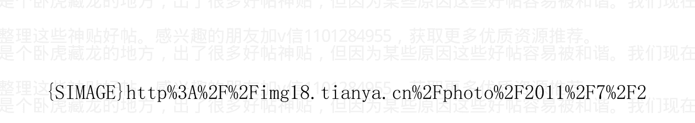

## 美元指数与联邦基金利率 -- 图中美国联邦基金利率，右推了 20 个月

> 作者:海宁的马甲 日期:2011-07-29 23:48 既然有大涨，就有回调，甚至大跌的时候。

2006 年以来，谨慎本份（只赚种地的钱，不奢望赚投机的钱，在价格高于成本的时候做好对冲）的美国农民的收入非常好，如果自己拥有农地，就更好了。

### 粮价上涨高峰已过，估计最多反弹到 9 月，10 月很可能迎来大跌

加v信1101284955获取更多优质书籍推荐

## 2011.7.22 文/海宁

农产品是个大类，各个品种虽然有相互影响，但是走势差距极大也很正常，比如跌势恐怖的棉花，又比如2011年2月以来，小麦价格经过两轮狂泻，而玉米大豆价格下调并不多。分别在6美元和13美元找到支撑后反弹，但是难以突破前期高点。

农产品受天气影响，预测天气自然非常困难。总体而言，农产品，特别是小麦，玉米，大豆的大涨已经过去，玉米大豆突破前期高点的可能性，已经比较小了。总体而言，逃不出历史规律3，4月到10月震荡下跌的格局，而且每次下跌来势都非常快，非常猛。所以，当不少像我这样的人认为10月会大跌的时候，有的机构，很可能在9月份就开始向下砸盘。

日本地震，本拉登被杀，都是不可预测的突发性事件。阴谋论只是某些人的谈资，用于投资，或者投机，恐怕凶多吉少。

作者:海宁的马甲 日期:2011-07-29 23:51 2011年7月份，猪肉价格见顶在即。

中国人，作为整体，其中位数收入并不高，猪肉高价，已经限制了消费量的增长，而未来供应量会上升。这一轮猪肉疯涨，即使不在7月见顶，也会在2，3个月内见顶后回落。

作者:海宁的马甲 日期:2011-07-29 23:52 等待两个信号：人民币

加v信1101284955获取更多优质书籍推荐

# # 停止对美元升值；美元指数站在 76.5 以上

2011 年 10 月或者以前，有一定希望看到人民币停止对美元升值，并且美元指数站在 76.5 以上，则大致可以做空基础金属了，中国股市也比较危险了（目前其实并不危险，商品还在涨，欧元还在 1.4 美元以上，中国股市，与欧元有一定的同向性）。

人民币停止对美元升值，会有小部分资金获利流出，外汇储备增速会下来，外汇占款会减少，通货膨胀降温，巴西澳大利亚等地的美元套利资本也会流出，套利资本平仓的羊群效应就初步具备了。套利资本最怕的是趋势的扭转，利差的急剧萎缩，比如巴西里尔从升值变为明显的贬值趋势。

巴西是个有意思的地方，居民的储蓄率极低，但是农产品和铁矿石等资源多，还有大批土地没有开垦。只好通过高利率吸引外资。

欧债危机，也会迫使欧洲银行的资金 平仓在巴西等地的投资或者缩减贷款。欧债危机，正如雷曼，基本上全球都会影响到。美国投资者也投资了不少欧猪国债。

作者:海宁的马甲 日期:2011-07-29 23:56 黄金按澳元计价涨，美国股指按石油计价涨，才是真的涨

2011. 7. 28 文/海宁

总结了一下：猪肉贵（最好连总理都提到了），油价高的时候，不是买入资产（股票房子等）的时候，猪肉油价便宜的时候，才是买入的良机。大道至简。

在欧美，还有“石油美元”（PetroDollar）的问题，油价高，石油出口国，通过卖石油赚钱的各种个人和公司，会把石油收入投资买入稳健的美国，德国，英国等国上市公司的股票，2009年3月以来，油价和美国股市有明显的同涨同跌关系。（当然这也是有前提的，就是石油价格不能越过110-120美元这一欧美经济衰退的临界区间；油价超过这个区间，则欧美股市跌，经济下滑，过段时间，油价也会降下去。这是在没有突发事件的情况下。）

WTI油价与美国经济高度相关，美国经济复苏乏力，WTI油价明显低于Brent油价。目前Brent油价近117美元。人民币2010年6月19日以来，仅仅是美元升值，对欧元，日元，澳元，加元，是贬值的。

黄金与澳元指数比例的走势（过去2年，看涨黄金，仅仅略胜于看涨澳元）

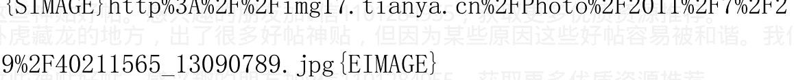

## 黄金与澳元

## 标普大市值指数与美国WTI油价比

（过去两年，在WTI油价不超过110美元的情况下，看涨美股，略输于看涨石油）

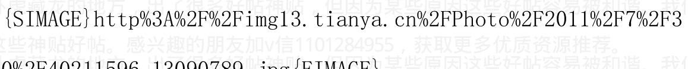

## SPX 与 WTI 油价

作者：海宁的马甲 日期：2011-07-30 00:04 旧文更新：人民币单向

## 升值 = 凶险之路：套利，经济过热与通货膨胀

人民币单向升值结束 = 房地产泡沫“再次”破裂和杯盘狼藉。

（如果说2008年底房地产算是一次不成功的破裂的话）。此轮人民币单向升值结束 = 做空铜锌铝等金属。人民币能永远单向升值下去吗？

谨慎的套利者，已经在中国CPI超过5%的时候平仓出局了，

因为后面的钱太难赚了。有些钱，注定是由浸淫十几年，几十年的人去赚的。事实上，2011年3月到10月商品市场，波动远远大于2010年7月到2011年3月。散户能力有限，只能赚比较确定的钱。事实上，我认为在石油上，高盛的操盘能力，远远不及壳牌，壳牌才是大鳄，BP都及不上，更别说高盛。

不过普通人还是愿意听《三国演义》式的故事，毕竟，讲故事，远远比讲枯燥的金融数据有趣，而且惊险，惊心动魄。

有趣的是，讲《货币战争》故事的，讲高盛如何神勇的故事的，恰恰是局外人。

罗斯柴尔德家族既然如此牛B，能搞定多个总统，却不能用“意外事故”让揭露他们的《货币战争》的作者闭嘴，有趣。

## 此文原名：动态多维的世界：人民币升值与2007-2008年国际商品价格暴涨的互动分析

加v信1101284955获取更多优质书籍推荐

发表于2010年8月4日，网上帖子和书的第一版，也留有痕迹。

大段黑色部分为新增内容。

不得不说，此文的分析，是非常片面的。但是呢，2009年以来，

中国经济，是世界经济的领头羊和火车头，所以本文的分析，结果是正确的。美国的量化宽松二期，不过是强化了这一趋势。

## （十二）人民币升值与2007-2008年国际商品价格暴涨

2010-08-04

美元指数2010年7月开始的下跌再次证明，人民币单边升值=

美元购买力不稳

人民币2010年6月19日浮动后，美元指数从86跌到了81以下，

为什么？

结合2005年7月21日，人民币浮动后，美元内在价值的暴跌，
黄金从2005年7月的430美元/盎司暴涨再暴涨。大家难道不觉得，
人民币升值到什么程度的不确定性，让国际金融市场极度怀疑在石油，
黄金面前不值钱的美元，在人民币和中国商品面前也不值钱？2010
年下半年，石油和粮食是不是又要来一次小暴涨了？
如果石油，粮食再来一次小的暴涨，几乎可以证明，人民币对美
元单向升值=美元购买力不稳定的预期—>导致大家相对更多地抛
弃美元而持有石油粮食？
人民币单向升值却市场确实之后，会发生什么？
会发生资金大量流入中国，等升值后流出。国内会发生什么
呢？有本事的人会借入美元贷款（因为美元贷款利率只有5%上下，
而如果一年内人民币对美元升值5%的话，这笔贷款的利率几乎等于
零，这就是为什么中国商业银行系统有4500亿美元的外汇贷款，和
仅仅2200亿美元左右的外汇存款，也就是外汇储备里的2500亿美元
左右，是国内的公司从商业银行贷款后卖给中国人民银行，换取人民
币的）。
中国境内的人民币资金量大增之后，会发生什么？资产价格上
涨，通货膨胀，投资过热，经济一片热火朝天。
提升存款准备金率后，会发生什么？能获得贷款的活得很好，

不能获得贷款的经营困难（原材料价格大涨，工资大涨，贷款困难，因为投机领域广泛，资金匮乏而推高了民间借贷利率）。

中国资产价格大涨，经济过热的情况下，普通投资者，国际投资者会怎么做？很简单，做多中国需要进口的原材料商品。

是不是有人在中国需要大量进口的原材料商品上进行套利活动？因为人民币在对美元单向升值，即3个月，6个月，9个月后，同样的人民币可以“买到更多的进口品”，所以中国的进口需求会更强大，所以可以买入中国需要进口的商品的期货合约，所以在人民币单向升值过程中，凡中国大量进口的东西，可以被炒高（因为人民币的国际购买力在增强，所以炒作中国需大量进口的大宗商品相对风险小了）。

## 预期与资产定价，货币的定价

预期在金融市场与资产定价里，具有非常重大的影响。人们之所以愿意为一些高成长企业的股票支付高昂的股价，是因为人们预期这些公司在以后的盈利会高速增长。人们愿意为一些租售比很高的房子支付高昂的价格，部分是因为他们认为以后的租金和接盘者的收入会高速增长。

人们接受一个货币，潜在的预期是这个货币的购买力是稳定的，一

加v信1101284955获取更多优质书籍推荐

年后还能买到相同的东西。

对于美元这个货币而言，世界上与美元固定挂钩的商品和货币越多越好。那些挂钩的商品和货币，都是美元的备付体系。即你手里有美元，如果不想持有美元，可以换成与美元挂钩的港币，人民币等，所以也可以换成使用人民币港币的国家与地区的商品与服务。

人民币汇率与美元固定在一个很窄的范围内，就给国际金融市场一个稳定的预期。国际金融市场预期同样的美元，明年还能买到相同的中国商品。所以，当人民币汇率与美元固定的时候，中国的商品事实上就成了美元的备付体系。与美元固定汇率的货币，都是美元币值稳定的支柱力量。

金融市场最厌恶不确定性

2005年7月21日，当然人民币对美元开始单向升值的时候，这种预期变了。金融市场，甚至普通百姓，都知道人民币将对美元单向升值。只是不知道人民币对美元汇率会升到多少。

2005年7月21日以前，黄金价格屡次冲击440美元，均被生生地拉回440美元以下。

加v信1101284955获取更多优质书籍推荐

2005年7月21日,人民币汇率浮动后,美林银行预测黄金将涨到725美元,CNN预测黄金将上涨到850美元。

2005年7月21日,美元踏上了不可避免的又一次购买力剧烈下降的命运（即黄金石油粮食矿产等的美元价格暴涨），因为美元失去了中国商品这个备付体系，明年同样一美元能买到多少中国商品变成了未知数。2005年7月21日,注定了美元将在一段时间内,彻底失去对黄金的牵制作用,直到新的平衡价格的确立。

通俗地说,2005年7月21日,美元在已经对日元欧元加元澳元大幅贬值的情况下,对黄金石油都已经大幅贬值的情况下,又要对人民币贬值了,而且美元对人民币贬到什么程度,市场里谁也不知道。这种不确定性最要命。2005年7月21日,这一天已经种下了“2007年7月–2008年6月国际大宗商品的美元价格暴涨(即美元购买力暴跌)”的种子。

2005年7月,美元连对人民币都要贬值了,那么,持有美元还有个P用?不如把美元换成黄金石油等硬通货来保值。

2005年7月,种下了美国通货膨胀的种子,也就种下了美联储加息对付通货膨胀的种子,加息也就种下了美国房地产泡沫破灭的种子。

那为什么美国政客议员还叫嚣让人民币升值呢？“因为他是对着一张张选P票在叫嚣，他要的是选P票，而不是人民币升不升值。”

美元是美国人发行的美元，当强势的美元致使很多美国人失业的时候，必然有代理人出来叫嚣，要给美国工人争取“公平汇率”“公平汇率下的公平竞争”。

对美元这个货币的币值稳定有益的事情，不一定对美国工人有利。

事实上，人民币升值一年半后，即2007年2月，美国房价达到最高峰了。

人民币升值2年后，2007年7月，国际粮食，矿产，石油，黄金等价格暴涨了，人们愿意信任这些硬资产，抛弃了美元等货币。

但是，这种抛弃货币，持有硬资产的过程太疯狂了，导致了商品泡沫。在房地产泡沫破灭后，国际经济与消费开始萧条了，国际大宗商品泡沫也破了。

作者:海宁的马甲 日期:2011-07-30 00:08 美国国债限额危机（二），以及欧债危机

一个基本判断，2011 年接下去，美国除了印新债还旧债之外，

还得多增印 6000 亿美元以上的国债，明年还得多增印 1.3 万亿以上

（借新债还旧债之后额外的财政赤字），这些发生新国债拿回的钱，

转手就花出去了。这是政府信用扩张，对于短期或者长期，具有通货

膨胀效应，当然也具有支撑美国经济的效应。这就是奥巴马不想在

2012 年紧缩财政的原因，2012 年一紧缩财政，美国经济立马进入衰退。

奥巴马是有权用总统令提升债务上限的（国会有权推翻这个总统令），但是奥巴马不会用这个总统令，因为这会把责任都往他自己身上揽。奥巴马的如意算盘是：最好是提升限额 2 万亿以上，以度过2012 大选，2012 财政赤字不消减，但通过减赤 4 万亿，减赤发生在2013 和以后。次优方案，破坏经济的责任，由共和党承担。

共和党的如意算盘是，消减政府支出，不加税，这势必在短期内会导致经济衰退，这样奥巴马难以连任。但共和党又不希望让民众认为是共和党搞的经济衰退。

茶党最光明磊落，就是实打实的不愿意提升债务限额，除非大力消减政府支出。而且不能加税。但是茶党是少数，大部分人还是披着共和党的身份。

Ron Paul 这样的奥地利学派国会议员，也是比较亲近茶党的。

事实上，美国 2011 第二季度 GDP 年化只有 1.3%（第二季度受到高油价打击），已经算轻度衰退了。黄金涨，石油跌。

而欧债危机一旦爆发，或者中国房地产泡沫一旦破裂，美国经济和股市也会受到重创，要知道，道琼斯，标普 500 成分股的 40% 以上的收入来自海外，本土的那部分收入，也与世界经济息息相关。

欧洲方面，西班牙总理要辞职，看来西方政要的工资太低，特权太少，吸引力不大，一遇到困难就辞职，甚至整个内阁总辞。高福利国家丹麦的国债 CDS 大涨。

中国方面表示镇定，借给西方的钱，不急着花，美国长期国债收益率即使短时间大涨，也会很快下去的。官方表示猪的情绪已经稳定下来，猪肉价格的顶峰即使不是在 7 月，也就是在这两三个月，中国 CPI 见顶在即。（在猪肉高价下，猪肉消费的增速已经大幅下降；2008 年中国猪肉和食用油消费增速曾经大幅下降。）

作者：海宁的马甲 日期：2011-08-02 23:35 新疆的羊肉价格和美元指数

2011.8.1

新疆的羊肉，终于大大地突破了 20 元/斤。虽然不会出大乱子，新疆的稳定，也面临更大的考验，而新疆人受重视程度，是要大于汉

加v信1101284955获取更多优质书籍推荐族人的。

两次（2008年3月到7月，2011年5月到9月），美元指数在前后3，4年的低位徘徊的时候，新疆的羊肉价格正巧处于高位，你说是不是巧合？

2010年11月9日和10日新疆开始投放区级储备活羊，而此前两次是中央储备羊肉。2010年11月12日以前，极可能开过重要的经济会议，而经济政策转向，比如决定把工作重点放到控制通货膨胀上来。2010年11月12日那些警示市场风险的，也不会告诉客户说他们获得了政策变动的内幕消息。这应该不算阴谋论，而是对货币与经济政策变动的猜想。

## 从普通百姓的角度分析通货膨胀，谨慎求证中国房价十年大顶，兼论任志强的观点 2010-11-23

### 海宁观点三：尝试分析为什么统计局CPI 5%左右，是中国通货膨胀的恐慌临界点

以下分析非常不科学，只是普通百姓的分析而已。

中国统计局有很多非常有用的数据，就看你怎么看了。

GDP平减指数是指全社会全部产品与服务的价格涨幅，他让统计局可以将两年的的GDP，按可比价格进行比较。

2007 年 GDP 平减指数 9%， CPI 4.8%

2008 年 GDP 平减指数 12%， CPI 5.9%。

2010 年第一季度 GDP 平减指数是 5.4%， CPI 是 2.5%。

如此看来，普通人感受到的物价涨幅，很可能接近于统计局 CPI 的 2 倍左右。而通货膨胀历史经验是，通货膨胀速度超过 8%到 10%，会进入失控，恐慌阶段，中国 10 月份 CPI 达到 4.4%，居民的小范围囤货，就是一个例证。

所以 CPI 突破 4%，5%都是中国央行利率与存款准备金率调控的关键点。让我们看看，当 CPI 突破 5%的时候，中国央行有没有“不得不”进行的加息动作？（加息权在谁手里，参见《中国人民银行法》第五条）。

http://www.tianya.cn/publicforum/content/develop/1/538512.s html

作者： 海宁的马甲 回复日期： 2010-12-28 11:53:20 回复

### 三十六）猪肉价格周期与货币政策，及楼市股市走势

2010 年 11 月 9 日和 10 日新疆开始投放储备羊肉，而前两次是 中央储备羊肉，这一次是区级储备活羊。那么新疆羊肉再次大大地稳稳地突破 20 元/斤的时候，我们理性的预期 2010 年 11 月缺失的那个加息必将到来，在春节前的可能性比较大，毕竟上下大家都希望过个祥和的新年。

悲剧的是，新疆人喜欢吃的土豆价格也不低，新疆的稳定，在2011年是个问题。

## 羊肉价格上涨影响普通百姓生活

> 【发布时间】2011-07-25-08-49【来源】新疆新闻在线网

新疆新闻在线网7月25日消息（记者哈米提、马承璐）：进入7月份以来，乌鲁木齐羊肉价格一路高涨，均价达到45元每公斤，羊肉价格的上涨正在影响着普通百姓的生活。

> 家住乌鲁木齐团结路的市民买买提最近去羊肉铺买羊肉的次数少了，以往，买买提每周都会去市场上买一只大点的羊腿，四五公斤，够吃一个星期，但是最近买买提买上一公斤羊肉，会吃上两个星期：“现在一公斤羊肉都涨到50了，羊肉吃的少了，没办法了现在，我们还在这边租房子，我们平时就多吃点鸡蛋啊，蔬菜啊，这样调一调。像去年这时候一公斤羊肉35、36的时候我们还能接受。”

羊肉价格的上涨，不仅改变着普通百姓餐桌上的食物结构，也影响到了烤羊肉串的生意。53 岁的买买提在乌鲁木齐高等专业技术学校附近卖了 10 年的羊肉串，以往卖的是羊肉串，现在卖起了牛肉串：“以前是卖羊肉，羊肉嘛，排档子没有，牛肉排档子有，羊肉贵得很，涨价了，现在卖牛肉了，羊肉涨价对我的生意影响大呢，但是吃的人还是有呢，都是老顾客。”

记者走访了团结路、幸福路、友好路的一些拌面馆发现，一些餐馆菜单的价格一栏上用白色补丁贴上了新价格，碎肉面，过油肉面的涨幅都在 2 元左右。在乌鲁木齐山西巷卖羊肉的阿不都热西提告诉记者，现在一只羊已经卖到了一千多元，而随着 8 月穆斯林群众斋月的来临，市民对羊肉的需求量还会增加。

作者: 海宁的马甲 日期:2011-08-02 23:35 家住乌鲁木齐团结路的市民买买提最近去羊肉铺买羊肉的次数少了，以往，买买提每周都会去市场上买一只大点的羊腿，四五公斤，够吃一个星期，但是最近买买提买上一公斤羊肉，会吃上两个星期：“现在一公斤羊肉都涨到 50 了，羊肉吃的少了，没办法了现在，我们还在这边租房子，我们平时就多吃点鸡蛋啊，蔬菜啊，这样调一调。像去年这时候一公斤羊肉 35、36 的时候我们还能接受。”

作者: 海宁的马甲 日期:2011-08-04 23:04 美股又一次大跌。金银在涨，大部分其他商品在跌，LLS油价依旧在 114 美元，Brent 油价在 111 美元。

+   Dow 11,671.50 -224.94 -1.89%
+   S&P 500 1,231.60 -28.74 -2.28%
+   Nasdaq 2,625.29 -67.78 -2.52%
+   Louisiana Sweet Crude Oil Spot Price (USCRLLSS: IND) 114.45
+   BRENT CRUDE FUTR (USD/bbl.) 111.370 -1.860 -1.64% 10:38
+   GAS OIL FUT (ICE) (USD/MT) 940.250 -15.000 -1.57% 10:38
+   HEATING OIL FUTR (USD/gal.) 299.280 -2.610 -0.86% 10:38
+   NATURAL GAS FUTR (USD/MMBtu) 3.961 -0.129 -3.15% 10:37
+   GASOLINE RBOB FUT (USD/gal.) 288.380 -4.750 -1.62% 10:38
+   WTI CRUDE FUTURE (USD/bbl.) 90.540 -1.390 -1.51% 10:38

### Agriculture

| PRICE* | CHANGE | % CHANGE | TIME |
|---|---|---|---|
| CANOLA FUTR (WCE) (CAD/MT) | 560.700 | -4.500 | -0.80% | 10:39 |
| COCOA FUTURE - LI (GBP/MT) | 1,846.000 | 10.000 | 0.54% | 10:34 |
| COCOA FUTURE (USD/MT) | 2,946.000 | -6.000 | -0.20% | 10:38 |
| COFFEE 'C' FUTURE (USD/lb.) | 241.350 | -4.150 | -1.69% | 10:37 |
| CORN FUTURE (USd/bu.) | 703.000 | -10.000 | -1.40% | 10:38 |
| COTTON NO. 2 FUTR (USd/lb.) | 102.780 | -1.380 | -1.32% | 10:39 |
| FCOJ-A FUTURE (USd/lb.) | 196.550 | -1.350 | -0.68% | 10:39 |
| WHEAT FUTURE (CBT) (USd/bu.) | 737.750 | -12.250 | -1.63% | 10:39 |
| WHEAT FUTURE (KCB) (USd/bu.) | 785.250 | -12.750 | -1.60% | 10:39 |
| SUGAR #11 (WORLD) (USd/lb.) | 27.470 | -0.220 | -0.79% | 10:39 |
| SOYBEAN FUTURE (USd/bu.) | 1,355.500 | -17.500 | -1.27% | 10:38 |
| LUMBER FUTURE (USD/1000 board feet) | 223.000 | 0.400 | 0.18% | 10:35 |
| OAT FUTURE (USd/bu.) | 348.000 | -8.500 | -2.38% | 10:37 |
| ROUGH RICE (CBOT) (USD/cwt) | 16.195 | -0.150 | -0.92% | 10:36 |
| SOYBEAN MEAL FUTR (USD/T.) | 359.200 | -2.400 | -0.66% | 10:39 |
| SOYBEAN OIL FUTR (USd/lb.) | 56.270 | -0.790 | -1.38% | 10:39 |
| WOOL FUTURE (SFE) (cents/kg) | 1,367.000 | -9.000 | -0.65% | 08/04 |

### Industrial Metals

| PRICE* | CHANGE | % CHANGE | TIME |
|---|---|---|---|
| COPPER FUTURE (USd/lb.) | 426.400 | -6.200 | -1.43% | 10:38 |

### Precious Metals

| PRICE* | CHANGE | % CHANGE | TIME |
|---|---|---|---|
| GOLD 100 OZ FUTR (USD/t oz.) | 1,679.400 | 13.100 | 0.79% | 10:38 |
| SILVER FUTURE (USD/t oz.) | 42.040 | 0.282 | 0.68% | 10:38 |

作者:海宁的马甲 日期:2011-08-04 23:06 建议不要辱骂没有脏话的“多军”，特别是在利率仅仅为3.5%的情况下。

上天涯，就必须忍受口香糖这样的ID存在。

作者:海宁的马甲 日期:2011-08-04 23:26 {SIMAGE}http%3A%2F%2Fimg18.tianya.cn%2FPhoto%2F2011%2F8%2F4%2F40414256_13090789.gif{EIMAGE}

### 商品期货

+   INDEX NAME VALUE CHANGE OPEN HIGH LOW TIME
UBS Bloomberg CMCI
S&P GSCI 671.59
RJ/CRB Commodity
Rogers Intl

作者:海宁的马甲 日期:2011-08-05 09:46 美国长期国债涨势如虹，美长债基金TLT一个月都涨了12%以上了。

黄金类似（从1500到1650以上）。

玉米，小麦，大豆继续下跌。中国通货膨胀2011第三季度见顶，基本可以实现。

美国经济低迷，但是美国经济，更可能是跌无可跌，属于复苏前有气无力的阶段。而欧洲，中国的资产价格，尚处于高位。

类似于2000年美国互联网泡沫破裂，而亚洲国家已经跌无可跌，

## 美国互联网泡沫破裂，对亚洲并无太大影响。

作者: 海宁的马甲 日期:2011-08-08 12:45 房价与实体经济相连，

与失业潮同步。2003 年以来，每次民工工资大涨的 2 年之后，会有一波失业潮，或者说民工工资停止上涨的时期（2005，2008，2011 下半 年）。//@kevin_70s：还有房价呢？

> > @海宁 de 马甲：棉花见顶了，玉米见顶，小麦见顶了，白银见顶了，油价见顶了，股市见顶了；但是黄金没有见顶。——看到海宁的博文《2011 年 6 月开始，中国资产（股市楼市）价格的明斯基时刻》有感而发的评论。http://t.cn/aoCB2g

28 分钟前 来自新浪博客

转发(11) | 评论(7)

40 秒前 来自新浪微博

删除 | 转发 | 收藏 | 评论

玉米，小麦，大豆继续跌 1%左右，等秋收之前（不用等到秋收之后），就更好看了。——看到海宁的博文《粮价上涨高峰已过，估计最多反弹到9月；10月很可能迎来大跌》有感而发的评论。http://t.cn/alz5gt

7 分钟前 来自新浪博客

删除 | 转发 | 收藏 | 评论

回复@andy_tm_：你难道没有看到小麦玉米从顶部已经下来很多很多了吗？美国农民反倒心态很好，5，6月份抛库存，不少人，还早早早 在期货市场高位卖出了秋天的收成，或者买期权保险。

//@andy_tm_：农产品可是乱世黄金 言顶还早

@海宁 de 马甲：棉花见顶了，玉米见顶，小麦见顶了，白银见顶了，油价见顶了，股市见顶了；但是黄金没有见顶。——看到海宁的博文《2011年6月开始，中国资产（股市楼市）价格的明斯基时刻》有感而发的评论。http://t.cn/aoCB2g

28 分钟前 来自新浪微博

转发(11) | 评论(7)

删除 | 转发 | 收藏 | 评论

棉花见顶了，玉米见顶，小麦见顶了，白银见顶了，油价见顶了，股市见顶了；但是黄金没有见顶。——看到海宁的博文《2011年6月开始，中国资产（股市楼市）价格的明斯基时刻》有感而发的评论。

http://t.cn/aoCB2g

28 分钟前 来自新浪微博

删除 | 转发(11) | 收藏 | 评论(7)

> > 回复@债务货币:是啊，真正的“股神”是不大愿意让人知道的。比如分到原始股的行长太太。//@债务货币:真正的股神都是低调隐藏版的，参见 GMM 他妈 //@海宁 de 马甲:是的，这 2，3 年的大起大落，使得几乎所有“股神”落马。//@韶关老爹:股市的预测在中国没有多大意义，是股民都知道。

> > @新浪证券 ［新浪机构认证］:目前沪指大跌百点，跌逾 4%，2500点关口岌岌可危。http://t.cn/h5elw

今天 11:04 来自新浪财经

转发(624) | 评论(202)

34 分钟前 来自新浪微博

+   - 删除
- 转发
- 收藏
- 评论

> > 回复@北京三色石:油价不骗人，不需要依靠“股神”的主观判断。再看看油价上百以后的股市表现，就知道上涨与下跌的概率，哪个更大？ //@北京三色石:有道理，傻瓜式操作指南

> > @扬韬 ［新浪个人认证］:崩溃鸟

今天 11:04 来自新浪微博

转发(68) | 评论(50)

36 分钟前 来自新浪微博

+   - 删除
- 转发
- 收藏
- 评论

> > 是的，这2，3年的大起大落，使得几乎所有“股神”落马。//@

> > 韶关老爹：股市的预测在中国没有多大意义，是股民都知道。//@

> > 宋东坡:如果持续下去，形成预期，可就回天乏力了,多米诺骨牌效应开始，股市、楼市、宏观经济，一气呵成 [衰] //@海宁 de 马甲 :

如果我没看错，2497都到过。2319还远吗？

# **@新浪证券 [新浪机构认证]: 目前沪指大跌百点，跌逾4%，2500点关口岌岌可危。http://t.cn/h5e1w**

今天 11:04 来自新浪财经

+   - 转发(624)
- 评论(202)

37 分钟前 来自新浪微博

+   - 删除
- 转发(2)
- 收藏
- 评论(4)

> > 回复@生活的路标:倒闭潮恶化到管理层的底线附近。管理层的底线在哪里？保8爷和林计划可能知道。我不知道。//@生活的路标:人民币何时停止升值呢？

> > @海宁 de 马甲: 发表了博文《北海Brent油价不跌到100美元以下，股市不言底》- 北海Brent油价不跌到100美元以下，股市不言底 股市是预期和人性的反应。今天他们还在110美元左右，事实上，实体经济总体 http://t.cn/aRLuDB

今天 11:35 来自新浪微博

转发(5) | 评论(4)

46分钟前 来自新浪微博

删除 | 转发 | 收藏 | 评论(1)

黄金高到 1698 美元了。应该有人搞搞“泡沫轮流转”理论了（纸币泡沫下，泡沫从一个品种到另一个品种，从一个地区，到另一个地区，或者说一些地方的泡沫破了，其他的泡… ——看到海宁的博文

《北海 Brent 油价不跌到 100 美元以下，股市不言底》有感而发的评论。http://t.cn/aRLuDB

48分钟前 来自新浪博客

删除 | 转发 | 收藏 | 评论

发表了博文《北海 Brent 油价不跌到 100 美元以下，股市不言底》

- 北海 Brent 油价不跌到 100 美元以下，股市不言底 股市是预期和人性的反应。今天他们还在 110 美元左右，事实上，实体经济总体 http://t.cn/aRLuDB

作者: 海宁的马甲 日期:2011-08-08 12:55 黄金一个月上涨10%以上，突破 1700 美元，纪念一下。

作者: 海宁的马甲 日期:2011-08-08 12:57 北海 Brent 油价不跌到 100 美元以下，股市不言底

2011.8.8

股市是预期和人性的反应。今天他们还在110美元左右，事实上，实体经济总体没有股市表现的那么糟糕，股市提前6到9个月反应了未来实体经济的走势，照此跌下去，年底到明年初，股市就止跌大反弹了。

有人居然说，通货膨胀可以使得“房价”不显得高。我认为是不对的。应该说，民众“收入”的增长（不管是跟随通货膨胀，还是来自健康的增长），才能使得房价显得不那么高。

没有工资相应资质的通货膨胀部分，必然以萧条和物价大跌相对应。所以我说，通货膨胀第三季度很可能见顶。如果油价因为中东黑天鹅事件（叙利亚情况很不好，已经进入警察全面管制的社会了）而再次大涨，那也仅仅使得萧条和以后的原材料大跌推迟几个月而已。

### 题外话：

美国不是光烧加拿大Alberta来的石油（按WTI定价）就可以了，海上进口的油价，也是100美元以上。目前美国经济复苏的阻力，出来房地产未稳之外，就是资本外流和油价高企。QE3等于推高油价，逼资金继续外流，对美国经济不利。

作者:海宁的马甲 日期:2011-08-08 13:02

2011年6月开始，中国资产（股市楼市）价格的明斯基时刻

2011.6.3

我一直的观点就是，信贷环境先于资本市场，特别是股市，股市又比实体经济和楼市提前6到9个月，而CPI和猪肉价格，则是涨的时候是最后涨，跌的时候是最后跌。这可以通过数量统计进行实证分析来证明。

中国货币政策如果敢在2011第三季度疯狂放松，则中国将创造历史，即让2011年9月，10月的玉米价格超过4月份的高点。2011年4月初，玉米4月的现货价格，比2011年10月的期货价格高，即价格倒挂。历史上，出现如此的价格倒挂后，一般从4月到10月，现货价格是下跌走势。最明显的莫过于2008年。而向下调整，则一般发生在6月和7月。货币政策再次过度放松，也不过是多撑一个季度，得不偿失。我认为货币政策第三季度放松的可能性，极小极小。

明斯基时刻是指Minsky(美国经济学家)所描述的时刻，即资产价值崩溃时刻。他的观点主要是经济好的时候，投资者倾向于承担更多风险，随着经济向好的时间不断推移，投资者承受的风险水平越大，直到超过收支不平衡点而崩溃。这种投机资产促使放贷人尽快回收借出去的款项。
明斯基将该过程划分为三阶段。
第一阶段，投资者们负担少量负债，偿还其资本与利息支出均无问题。

第二阶段，他们扩展其金融规模，以致只能负担利息支出。

第三阶段，即旁氏骗局，他们的债务水平要求不断有新傻子进来拉高资产价格，才能安然度日。

其实奥地利学派对于信贷周期的研究，更明晰。

中国“市场繁荣与衰退的转折点”就在2011年6月，但是房地产巨牛的能量，不是一下子就能打垮的，还需要一个季度的酝酿。

中国经济这一轮库存周期（36到40个月左右，我看大致是2009.3 – 2012.2，2012.3之后存在政策变数，还不好说），其中股市的明斯基时刻是2010.11.12，有人认为是高盛阴谋，事实上高善文的提醒电子邮件很可能比高盛还早（他是一大早发的电子邮件），我认为他们是识时务者为俊杰（认为风向变了，货币政策的最高决策者要控制通货膨胀了。当然了，很多股民认为他们比高盛，高善文更懂政治，还有不少永远牛市派，下跌了就开始骂人。

中国股市，其走势，再一次比实体经济和楼市，提前了6到9个月。

按Sornette对于泡沫的研究，转势，需要一定数量的抛售，显然，中国楼市从牛到熊的时刻靠近了，但是目前尚未发生集体抛售。2011年下半年，浙江还会爆出更多的民间借贷危机，或者说“非法集资”案。负利率啊，负利率，90年代初负利率和投机热时期，也出现过大量“非法集资”案。

中国很大，发生一些民间借贷危机很正常，事实上，浙江过去20年，每过2，3年就会发生旁氏骗局被发现的情况。关键是，民间借贷危机，是否会像瘟疫一样传染。2003年的SARS死亡案例，就符合传染病的指数增长规律。

作者：海宁的马甲 日期：2011-08-08 13:09@Betty_338877

2011-08-08 12:59:48

感觉海宁基本上都预测准了。。。那些以前大骂他的人，现在不知什么想法

其实我并未预期猪肉价格超过2008年的顶峰。目前猪肉价格基本见顶，没有太多疑问。其实猪肉大涨之后，卖肉的其实也烦恼，因为销量下降。

如果仔细看的话，2010年11月商品回调，比预期的幅度小，而且时间短，说明当时投机热情多么疯狂。2，3月的调整，比我预期的来得早，来得猛（所以说，看任何帖子操作，会输得很惨，帖子的及时性不好）；5，6月的商品，粮食下跌，也比我预期的快而猛。所以，粮食价格高位的时候做多，死的时候（狂亏），很难看。

很搞笑，天涯经济论坛不管粮价如何，一直看涨粮食。

小麦从4.5到9美元的时候，难道还涨到18美元？

作者:海宁的马甲 日期:2011-08-08 13:10 时间尚早，保保（保8爷）很快又要保经济，保就业了。

作者:海宁的马甲 日期:2011-08-08 13:17 回复@我不是恶人:你觉得一线城市如广深的房市最可能的结局是怎样？

到2012年初2，3月，价格趋跌。

以后要看保8爷“保经济，保就业”的力度了，力度不够，房地产泡沫破裂，力度够了，则油价会比较恐怖。2012第一季度以后，问宝宝，问令计划，别问我。

作者:海宁的马甲 日期:2011-08-10 12:12 作者：废话真多 回复日期：2011-08-10 09:03:45

回复

海宁老师，按您的分析和理论，美联储在7-10月必然加息以求“稳定”，可今早起来后，发现要维持低利率至2013年。

按楼上所说，房价还应该继续追涨。

请您给予进一步的分析！

谢谢

加v信1101284955获取更多优质书籍推荐

是的，房价是会继续涨下去的。很赞同某个筒子的话，经济学不是自然科学，其规律是不可违背的。政策很容易就改变经济学的规律。

读经济学读成书呆子，是最悲惨的事情。

未必，量化宽松二期以来，中国股市已经跌去20%了。

美联储维持零利率到2013年年中，明摆着是玩死亡游戏，中国货币政策只有两种选择：1. 通货膨胀，油价在100美元以上继续上涨，直到萧条，失业潮，然后石油需求减少。2. 升值对冲通货膨胀，升值5%对于控制通货膨胀用处不大，升值大大超过5%，外贸不行，外汇储备增长下降，外汇占款下降。

美元从2007年10月到2008年7月是贬值的，但是期间中国股市大跌，房价中期见顶下落。

一个投资品种（不管是股市，楼市，还是其他），当他涨到无人接盘，自然会下跌。

中国如果继续造大量用于对冲通货膨胀，而不是实际居住的房子，只会恶化经济结构。

作者：海宁的马甲 日期：2011-08-10 12:13%2011.11.2 量化宽松二期以来，中国股市已经跌去20%了。

加v信1101284955获取更多优质书籍推荐

美联储维持零利率到2013年年中，明摆着是玩死亡游戏，中国货币政策只有两种选择：

- 1. 通货膨胀，油价在100美元以上继续上涨，直到萧条，失业潮，然后石油需求减少。
- 2. 升值对冲通货膨胀，升值5%对于控制通货膨胀用处不大，升值大大超过5%，外贸不行，外汇储备增长下降，外汇占款下降。

美元从2007年10月到2008年7月是贬值的，但是期间中国股市大跌，房价中期见顶下落。

一个投资品种（不管是股市，楼市，还是其他），当他涨到无人接盘，自然会下跌。

中国如果继续造大量用于对冲通货膨胀，而不是实际居住的房子，只会恶化经济结构。

作者：海宁的马甲 日期：2011-08-10 12:17@出生于西部 2011-08-10 11:09:48

这帖强，直接被美帝爆头了，寄希望于美帝来拯救P民于水火的，可以就此歇歇了。

sh 是的。美联储不一定非得维持维持零利率到2013年年中，但是2011，2012年息可能性已经大大下降。预测美联储2011下半年在通货膨胀下加息，已经失败。

从目前到 2013 年，甚至 2014 年，通货膨胀，原材料价格上涨，将是主题。物价即使因为经济衰退而大跌，也仅仅会维持一段时间（不到一年），然后会再次大涨。

作者:海宁的马甲 日期:2011-08-10 12:19 伯南克要走格林斯潘 2002-2004 吹泡沫的老路，不过伯南克吹的是黑金黄金 2011.8.10

美联储的决定，让我想起一句名言：

> The road to hell is paved with good intentions。通往地狱的道路，是由各种“良好的意愿”铺就的。

此名言，也适合于宽松爷 2003 年 12 年月以来的三轮负利率政策（每轮负利率 17 到 20 个月，负利率维持 6 个月以上，可以视为有意的货币政策），其出发点是“保经济，保就业”。没有“良好的意愿”，很难想象宽松爷能在温州说出那么多充满人性关怀的话语。愿望是美好的，可惜负利率下的人性（体现在房价和金价上，甚至是油价粮价上），不是美好的愿望所能决定的。

2011 年 8 月 10 日，美国从海上进口的石油价格，依旧在 100 美元以上，美联储无法推出量化宽松，否则一旦油价再上一层楼，美联储就要承担推高油价的骂名，而且也会阻碍美国经济的复苏（美国人均油耗，是其他发达国家的 2 倍）。海上运输的油价，与美国的货币政策，达到了“恐怖平衡”。目前 Brent 油价已经回升到 105 美元。

中国的通货膨胀，虽然基本见顶，但是在欧洲或者中国经济正式衰退前，是很难大幅回落的。

此轮通货膨胀，特别是油价，将要靠欧洲经济衰退（可以由欧债危机引发，也可以由西班牙，意大利，希腊等国财政紧缩引发），或者中国经济衰退来终结。

美国失业率实在太高（9%的失业率，对欧洲或许是常态，但是对于福利制度没有欧洲完善，历史上失业率较低的美国而言，9%太高了，50多年来，没有总统在如此高的失业率下连任过，里根是在失业率大降的情况下连任的）。

失业率超高的情况下，油价大涨，美联储的办法几乎没有，因为油价大涨之后，美国经济将进入衰退和通缩，所以美联储即使在高油价下加息，也不会持久。只有在美国工资大幅上涨，失业率大幅下降的情况下的油价大幅上涨，美联储才会持续，大幅度加息。归根结底，只有美国经济复苏，失业率大幅下降之后，美联储才会持续加息。

2011. 8. 10:

美联储在利率决议中首次坦承将0-0.25%超低利率至少维持到2013年中，美联储主席伯南克（Bernanke）本次祭出的这项非传统政策工具，并没有获得联邦公开市场委员会（FOMC）全体委员支持，表决过程中出现3张委员反对票，创下1992年以来最多反对票的纪录。

首次明确承诺维持低利率的时间表，并誓言维持联邦基金利率在 0-0.25% 超低水平至少至 2013 年中，这是美联储有史以来第一次。此次新措辞取代了美联储承诺将维持利率低位“一段长时间”的字眼。

## 1995-2011" 中美国" 连续泡沫的 7 个阶段 - 参考
Didier Sornette

美联储联邦基金利率，被“减轻互联网泡沫破灭的痛苦”而绑架的阶段。

美联储联邦基金利率，基本追着 Nasdaq 的下跌，而调低利率，延迟大致是 3 个月。Zhou 的另一篇文章有具体的数量分析。2002-2004 发生了 2 年多的明显的美元负利率。

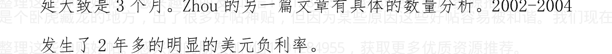

## Nasdaq 暴跌，绑架了格林斯潘；美国房价大跌，绑架了伯南克

作者:海宁的马甲 日期:2011-08-10 12:33 “换美元”党可以歇息

1， 2 年时间了，零利率的美元无法走强。

档在可控的时候，不会坐视极其恶劣的 RMB 通货膨胀的，所以一两年内“换美元”意义不大。

“换美元”只有在美国经济强劲复苏，而中国经济难以为继的时候（类似于1996，1997 年的东南亚），才是可行的。

目前美国经济没有复苏。GDP 第一季度 0.4%，第二季度 1.3%（这个 1.3%，估计也会被“更正”，更正得更小）。

作者:海宁的马甲 日期:2011-08-10 12:36 作者：出生于西部 回复日期：2011-08-10 12:32:36

我们杀猪论的观点认为，房地产打压后，从今年开始，未来 3-5 年将持续进入紧缩货币的政策，所以未来五年物价不会大涨，以后人民币会恢复信用。

> 不会的。这种情况，50 年来没有出现过（即处于工业化初级阶段的，处于上升期的发展中国家，能抵御世界级的通货膨胀，70 年代初日本台湾不行，后来的其他发展中国家，也不行）。

我看不到人民币“以稳定国内物价为先”。稳定国内物价为先 3=（加息 + 放任人民币升值，人民币印钞机不再承接大量顺差和 FDI 美元）

作者:海宁的马甲 日期:2011-08-10 22:25 美国国债和黄金暴涨，预示通货紧缩风险。

2008 年下半年通货紧缩中，是美元现金为王，现在美元零利率，

现金为王，改为“美国国债，黄金为王”了。

美联储不加息，并不表明中国房价就不下降。

2008年美联储降息过程中，中国房价在下降。

美国长期国债的表现，表明市场已经预期萧条风险非常大了。

## 作者:海宁的马甲 日期:2011-08-11 12:47《理性分析通货膨胀与经济形势》再回顾
2011.8.10

首先，有具体的包括时间的预测，就需要接受时间的检验，不能以突发事件为理由。凡是预测错误的，应该大方承认。

下面回顾一下2011.9.21《理性分析通货膨胀与经济形势》预测错误的地方。

- 1. 第一点，目前看，CPI的数据，没有2010年9月本人预期的那么难看，才6.5%，2011年9月以来的加息周期，一共也才加了5次，离一年期存款利率4%还有距离。本人2010.9预期CPI比现实更大，加息到4%货币管理层尚且能够接受。现实是只加到了4%，预测错误。
- 2. 第二点，美联储2011下半年加息概率几乎等于零，2012年加息的可能性也大大减少。(是否维持零利率到2013年年中，美联储也要看经济的走势，美联储过去1年多对于美国经济的复苏能力，显然高估了。Brent，LLS石油价格从2010年8月的不到80美元，上涨到2月以后经常在110美元以上，对美国经济的打压效应明显)

以上是典型的剧烈的通货膨胀导致加息，加息具有给经济降温的左右的思维。加息导致房价见顶回落（如果是房地产泡沫，则泡沫破裂，比如美联储 17 次加息，最后一次加息后，美国房地产泡沫几个月内见顶后破裂)。

以上加息导致房地产泡沫破裂，是文章的重点和中心，目前看，显然与现实不符。

此外，《理性分析通货膨胀与经济形势，理性预测中国楼市下跌时间表》还有很多不如意的地方，没有考虑市场利率和“利率双轨制”严重情况，事实上，银行正式的和银行间，民间市场的加权平均利率，应该已经超过 4%了。提高存款准备金率，会推高市场利率。以上是我对预测错误的承认。至于日本地震和本拉登，不是文章的重点，根本不是预测内容，仅为顺便提及。猪肉价格我并没有预期会突破 2008 年的最高价。

那么，中国一年期存款利率才 3.5%，美联储 1，2 年内加息可能小，是否就表明中国房价就不会下降呢。从房地产库存周期的角度看，2011 下半年到 2012 第一季度，房地产处于高库存阶段，房地产企业降价销售的压力大。这是比较明显的第三个房地产库存周期 (2003-2005，2006-2008，2009-2011)。高库存导致的销售困难，市场已经有很多表现了。

目前中国很多地方的房价的市盈率（房价/房租)，一般处于 50 倍到100倍之间，要是股市，50倍以上的市盈率，难以持续6个月以上，房子显然已经持续不止6个月了。

宏观经济来说，自从2011年2月初，Brent，LLS原油价格攀上100美元以后，100美元以上已经持续7个多月了，其中3月到7月，基本处于110美元以上。个人认为，高油价对于股市的负面效应，是明显的。高油价对于欧美经济的压力，也是显而易见的。中国经济增长速度，2011年年初以来，连续下降，但目前尚可。按库存周期或者说基钦周期看，2011下半年到2012年第一季度，中国经济增速，将继续下滑。将在经济增速下滑，需求因为超高价格而下降后，这一轮通货膨胀将见顶。2011下半年到2012年第一季度，原材料价格因为经济下滑而下跌，也将对房价构成下调压力。

### 后言：

> 本人过去，现在，和将来的任何言论，都不构成任何投资建议，投资有风险，持币也有风险。

作者:海宁的马甲 日期:2011-08-11 12:50%2011年8月上旬，欧洲银行危机，欧债危机，应该算是正式上演了，比本人预期的迟了4，5个月。这次仅仅是“衰退预期”和“未来欧债危机预期”，正式的危机，其实尚未爆发，影响到实体经济，也需要一段时间。

昨晚欧美股市再次大跌，欧洲股市跌6%左右，美股跌4%以上，

市场信心再次遭受重创。银行股大跌，2011年7月22日以来，意大利联合圣保罗银行大跌40%以上。法国兴业银行，大跌40%以上。德国德意志银行，英国巴克莱，美国银行（BAC），花旗跌30%以上。这个列表，还很长。

欧洲，甚至美国的银行危机，就在眼前。当然烈度不及2008年。

如果说货币与信用是现代经济的血液，则银行系统是现代经济的心脏与动脉之一。

作者：海宁的马甲 日期：2011-08-17 10:48 欧债危机，中国民间债务危机第六集
2011.8.11

昨晚欧美股市再次大跌，欧洲股市跌6%左右，美股跌4%以上，市场信心再次遭受重创。银行股大跌，2011年7月22日以来，意大利联合圣保罗银行大跌40%以上。法国兴业银行，大跌40%以上。德国德意志银行，英国巴克莱，美国银行（BAC），花旗跌30%以上。这个列表，还很长。

欧洲，甚至美国的银行危机，就在眼前。当然烈度不及2008年。

如果说货币与信用是现代经济的血液，则银行系统是现代经济的心脏与动脉之一。

欧债危机之中，美国十年期国债收益率创下历史新低2.14%。

而中国民间，却大量出现20%-70%年利率的贷款。而各种市场从2011

加v信1101284955获取更多优质书籍推荐

年 3 月以来，能赚大钱的，少之又少，根本无法支持 20%以上的利率，那么这些欠债的，当被讨债的时候，只有出逃这一条道路。卖房还债的新闻，最农历新年之前，应该会不少。

Brent 油价在 105 美元(100 美元以上已经维持 7 个多月了，去年 8 月份则不到 80 美元)。

黄金突破 2009 年 6 月以来与石油的 12 - 16 比价区间，突破 1800 美元，像 4 月对待白银一样，CME 开始增加黄金的保证金比例。

瑞士法郎，黄金，美国长期国债，一起呈现指数式疯涨。

### 作者:海宁的马甲 日期:2011-08-17 10:52 欧债危机，中国民间债务危机第七集 -- 一轮危机风波应该已经过去了
2011. 8.12

2011 年 7 月 22 日以来欧美股市近 20%的下跌行情，应该告一段落了。此轮中国股市跌幅最小，才 6%左右。

黄金，瑞士法郎，美国国债，这几个“避险”品种，都从一轮疯涨后的高位上，下来了不少。

比利时、法国、意大利及西班牙限制沽空，显示信心不足。他们要是知道 2008 年美国限制沽空之后，美股跌了 40%以上，就不会对“限制沽空”这么有热情了。


### 欧洲“三角债”

作者:海宁的马甲 日期:2011-08-17 10:55 债券，股市，油价都显示经济衰退大致在十月附近开始
2011.8.14

### 前言：

很多人特别不喜欢衰退，萧条这种词。这个很正常。但是衰退，并不意味不愿意看到，它就不来了。经济衰退，也并非恐怖得要命，2011年年中，欧洲出现部分国家的国债危机，但是欧洲的大量人员，甚至大量基金经理，金融从业人员，很多都在度假，有些还是连续1，2个月的大假（基本年年如此，北欧四国，更是如此）。

债券在 2008 年以前，基本都提前 6-12 个月，预示了经济衰退

历史上，美国长短期利差缩小，则经济衰退概率增加，如果连续出现几个月的负数（即十年期长期利率低于短期利率），则6到12个月之后出现经济衰退的概率大于 80%。

此轮油价大涨，美联储无力加息应对，因为美国失业率太高(广义失业率 16%)。那么只好参考目前的通货膨胀率。目前美国十年期 2.25%左右的收益率，通货膨胀率大约为 3.2%左右，如果实行正利率，短期利率需要达到 3.2%，则会出现利率倒挂，即使是 0.5%的负利率，

美国 2008 年以前的历次经济衰退，基本都是美联储连续加息后，经济降温，通货膨胀降温，市长短期利差缩小，然后出现经济衰退。这个指标不是 100%，但是以前 4，5 十年是最可靠的。

### 油价

2008 油价稳稳地超过 100 美元,是 2008 年 2 月份开始的事情。
2011 年也是 2 月份开始的。2011 年 5 月本拉登被杀后，石油价格暴跌，更多是个巧合。世界经济，目前看，难以承受 120 美元以上的油价半年以上。甚至沙特从细水长流的角度出发，也不愿意看到 120 美元以上的油价,120 美元以上，沙特增产（如果可能的话）的意愿很强烈。

### 股市

股市这个指标不是非常可靠，只能作为参考。

罗列一下数据：

- - 2008 年一月，中国股市见第二顶，6 个月后，油价，商品见顶后大跌。
- 2009 年 8 月，中国股市见顶，6，7 个月以后，专家热议“二次探底”。
- 股市什么见顶的，中国可以算 2010 年 11 月，也可以算 2011 年 4月中旬。加上德国DAX指数看（德国2010年经济增长强劲），也是4月初见顶。商品9、10月份迎来大跌？做空商品的盈面大增（经过8月股市大跌，市场信心已经遭打击）。

所不同的是，这次中国，美国海上进口的油价，还在100美元以上。

2010年11月QE2推出以来，中国股市跌了近20%，怎么QE3前后就一定让它涨呢？（再说了，我的意思，美国石油进口价格高于95美元以上的时候，推出QE3的可能性不大）。中国股市，简单点说，跌12个月左右就差不多到底反弹了，关键是从2010.11.12算起，还是从2011.4.18算起。

### 美国经济数据
美国密西根大学消费者信心指数，创30年新低，跌到1980年水平。劳动参与率也基本创30年新低。如此低迷的经济基本面下，用两年时间实现经济复苏就不错了（GDP增长率稳步超过2%的水平）。美国经济，依旧受到房地产泡沫的负面影响，新房开工率还是太低，起码要回升到80万套，100万套/年的水平。

### 欧债危机，欧洲银行危机
这个以前多有论述，关键在于，现在市场对于欧猪的国债犹如惊弓

加v信1101284955获取更多优质书籍推荐

天涯是个卧虎藏龙的地方，出了很多好帖神贴，但因为某些原因这些好帖容易被和谐。我们现在正在收集整理这些神贴好帖。感兴趣的朋友加v信1101284955，获取更多优质资源推荐。

## 海宁认为的小常识：
历史上，美国长短期利差（十年期国债收益率与三个月短期国债收益率之差）缩小，甚至倒置（十年期收益率小于短期利率），则经济衰退不远了（6到12个月，看你怎么定义了，比如2006年第二季度，美国加息到5.25%之后，短期利率大于长期利率，美国实体经济2007年第二季度见顶回落，而股市涨到了2007年10月）。美联储的同志不傻，知道连续17次加息会抑制经济增长，甚至会引起经济衰退（不过很多人都没有想到美国经济衰退会如此严重，成为二战之后最严重的衰退；1993年-2006年，美国总体房价基本没有跌过）。长短期收益率倒挂之日，就差不多离衰退才6到12个月了。这个很好解释，如果短期利率高于长期利率，人们为什么傻到去持有长期国债呢？资本市场的价格，是投资者用钱砸出来的，是最值得信赖的数据。长期利率低于短期利率，是因为市场预期衰退将要降临，短期利率要下降（美联储降息），社会的投资回报率会下降，所以此时长期债券的收益率，虽然比短期利率小，但是从中长期看，是值得的。事实上，2006年5月到2008年底，长期国债价格上涨20%以上，此阶段长期国债涨幅，不比黄金小（黄金从700到900美元）。

作者:海宁的马甲 日期:2011-08-17 10:56 - 2011年底与2008年底不同--再评2011年7月广义货币供应量同比仅增长14.7%

加v信1101284955获取更多优质书籍推荐

心理学有个有趣的现象，简单说就是经验主义。在经验主义的思想下，人们在2007年想到的更多的是“繁荣永续”，即使面临“调整”，问题也不大（要知道美国房价1993-2007，15年里基本只涨不跌）。而现实并非“调整”而已。

同理，人们看到第一轮量化宽松的前半期的股市涨幅惊人，所以当美联储推出第二轮量化宽松的时候，人们大喊上证指数上3600点，甚至4500点等等，而现实并非如此，中国股市在第二轮量化宽松期间，跌了近15%。也是同理，2005.7.21人民币升值后，中国股市涨幅惊人，而2010.6.19人民币再次升值之后，中国股市涨幅有限。

2011年，人们更多的“预期”中国货币政策“再次放水”。那么我们看看2011年底，与2008年底的比较：

截至2008年10月末，中国广义货币供应量（M2）同比（与2007年10月比）增长15.02%。截至2008年11月末，中国广义货币供应量（M2）同比增长14.8%；2008年，与2005年上半年类似，货币政策回归历史“正常”水平，股市大跌。

低于15%的货币供应量增长率，对房价不利。

2008年12月底，广义货币供应量47.5万亿人民币，贷款余额30.35万亿。2年半之后，贷款余额增加了21万亿，几乎是GDP的50%。这是一种增加债务来推动GDP的方式，与美国2002-2006通过房地产泡沫（和随之而来的债务增加推动GDP增长），本质上并无不同。

太大区别。归结为一句话，类似2009年那种贷款疯狂喷涌而出的事情，再次发生的可能性不大。或者说，M1，M2增长率2011年底，2012年初见底之后，只会缓慢上升，而不是2008.11之后的暴增。

## 货币政策与通货膨胀及房价走势分析，兼反驳崩溃论及评论阴谋论
2010-12-14
http://www.tianya.cn/publicforum/content/develop/1/533931.shtml

题外话：
阴跌是会最终导致恐慌的。一个投机品种，上涨机会越来越小，则下跌势能会越积越大。温州，煤价有色金属阶段性大跌后的鄂尔多斯，都是风向标。

### 7月信贷增速下滑到14.7% 低于预期
2011年08月13日
来源：广州日报

### 7月广义货币（M2）增速创6年新低分析预期央行紧缩政策加码概率降低
央行货币政策紧缩效果明显。昨日央行公布2011年7月金融数据统计显示，7月末广义货币（M2）余额为77.29万亿元，同比增速为14.7%， 7月M2增速创逾6年新低。
文/表 记者王亮

2011年7月信贷增速继续下滑，低于预期，新增贷款旺季不旺，反而创下年内低点，表明金融业对实体经济的支持力度在减弱。

### 企业贷款增量明显放缓
央行数据显示，2011年7月末，广义货币（M2）余额77.29万亿元，同比增长14.7%，分别比上月末和上年同期低1.2和2.9个百分点。此外，人民币贷款余额51.90万亿元，同比增长16.6%，分别比上月末和上年同期低0.3和1.8个百分点。当月人民币贷款增加4926亿元，同比少增252亿元。

7月企业贷款增量明显放缓。非金融企业及其他部门贷款增加3157亿元，其中，短期贷款增加1313亿元，中长期贷款增加1042亿元，票据融资增加653亿元。此外，7月当月人民币存款减少6687亿元。

### 实体经济活跃程度下降
7月企业短期存款增量也明显下滑。今年7月狭义货币M1增速仅为11.6%，大大低于去年同期。
分析认为，M1增速降低说明实体经济活跃程度明显下降，也有可能是受理财产品增加的影响。

> M1增速快速回落，说明我国中小企业生产经营压力依旧很严峻。
亚洲开发银行中国代表处高级经济学家庄健表示。

### 降低准备金调整可能性
分析认为，存款准备金率已提至历史新高，此外实际利率为负，未来政策面整体维持紧缩，存款准备金调整可能性降低。
央行本周已向市场输血1000亿元。市场预期央行将加大公开市场操作替代准备金工具。

### 专家：经济增速放缓所致
中国建设银行[4.53 -0.22% 股吧研报]高级研究员赵庆明表示，受经济增速放缓影响，企业借款需求减少，一定程度上导致7月信贷增

亚洲开发银行中国代表处高级经济学家庄健认为，“信贷与货币增速的放缓，减轻了物价上涨的货币因素，对于抗通胀是十分有利的”。

### 市场：
### 紧缩政策加码可能性降低
昨日央行公布的《2011年第二季度货币政策执行报告》指出，今后将继续“处理好调整经济结构与管理通胀之间的关系”，合理运用利率、汇率与公开市场操作等多种政策工具。
申银万国[2.25 -1.75%]证券研究所首席宏观分析师李慧勇表示，央行货币政策加码紧缩的可能性降低。分析认为，央行政策进入观望期。

作者:海宁的马甲 日期:2011-08-17 10:57 - 澳大利亚消费者信心指数跌到89.6，到达经济衰退拐点

### 澳大利亚消费者信心指数，是一个领先指标，7月份已经跌到2009年5月以来的最低水平，与2008年年中持平。上几次跌到这个水平，是1990年附近，2001年年中，2006年第三季度（美国加息到5.25%后），和2008年年中。
至于领先几个月，大家可以自己对比。
http://www.westpac.com.au/docs/pdf/aw/economics-research/er

### 20110810BullConsumerSentiment.pdf

作者：海宁的马甲 日期：2011-08-17 10:58 - 房地产泡沫破裂风险集

### 一、油价，债券，澳大利亚消费者信心指数，股市等多项指标显示，全球经济在2011第四季度进入衰退的概率很大。房价走势，与实体经济同步，一般落后于股市走势6到9个月（这种情况不会100%准确）。

### 二、油价打击房价
目前路易斯安娜港交货的LLS原油，Brent油价还是远远高于100美元，港口交货的原油，都高于100美元，因为海上运费才2，3美元/桶。这这里便宜了，下一艘油轮，就开到别的地方去卖了（当然这是通俗的说法，实际是按合同走的）。也许油价打击美国房价（1974，1979，1990，2008）没有借鉴意义，但是普通人买不起房的香港房价，也多次受到高油价（以及1974，1979，1990高油价下全球经济衰退）的打击，不同的是，1997年以前，香港房价每一次受重创之后，按美元计价也是继续上涨。

### 三、中国货币供应量增长率小于15%，不利于房价
具体参见 三：货币政策与通货膨胀及房价走势分析，反驳崩溃论，评论阴谋论

### 四、房地产库存高峰期，不利于房价
具体参见 二：从普通百姓的角度分析通货膨胀与楼市

### 五、欧美日本需求下降，外贸顺差减少，外汇储备增长率，外汇占款增速下降，不利于房价
2011年第二季度，在高油价下，法国经济增长为零，欧洲经济火车头德国经济增长为0.1%，美国经济增长初步值是1.3%（以后被数据调整为1%以下的可能性很大，美国第一季度经济增长为0.4%）。
日本经济已经连续三个季度轻度萎缩。发达国家经济指标全面低迷，但是发展中国家实体经济增长，特别是中国实体经济，尚且还处于比较良好的状态。（发展中国家地区的股市已经回落不少，股市是领先指标）。

### 六：加息与房地产泡沫的顶部
我以前一直强调，连续加息，超过4%的心理关卡，使得资金在房地产与存款两者之中，倒向存款。目前看，4%不大可能到了，长期官方低利率，加上连续提升存款准备金率，推高了民间借贷的利率，房地产泡沫，很可能在投机潮退潮后，民间借贷大量违约下见顶破裂。
任何品种，涨到顶，自然会下来。如果没有2010.10 - 2011.7连续5次加息，经济过热（大起），经济扭曲，会更加强烈，最后的经济降温（大落），也会更猛烈。这有点能量守恒，阴阳平衡，盈缺平衡的味道。
那么，什么东西利于房价？？
是上涨预期。是1999年以来“买房就赚钱”的赚钱效应，羊群效应。这“赚钱效应”，使得前面6点全部失效。

这年头，就是亲生父母，也劝不了人们投资房地产和民间借贷的热情。
这使得民间高利率借贷，疯狂地扑向房地产。你说党 NB 吧，可是 NB 的党也挡不住泡沫啊（它们挡住了 2007 年的股市泡沫了吗？别告诉我它们不想挡住 2007 年的股市泡沫，2007 年连续打压股市泡沫的政策，还是很多的）。
有个词叫“背离”，就是各种基本面不支持上涨，但是它偏偏就是涨了，大胆的就可以选择在合适的时机做空它。做空中国房地产最好的办法，就是做空远期的基础金属等。

作者: 海宁的马甲 日期:2011-08-17 11:01 - 欧债危机，中国民间借贷危机第八集 – 温州楼市一夜入秋
这还是在中国外贸处境尚且良好，美元处于历史上非常低的低位，尚未反弹的情况下。我们知道，2008 年中国股市下跌的前 2/3 时间段（2008. 1 – 2008. 7）是由货币政策正常化（M2 增长率约 15%），和股市本身的去泡沫（anti-bubble）过程完成的，后 1/3 时间内的下跌（2008. 7 – 2008. 10），是伴随经济衰退和美元反弹拉升完成的。
2008 年 10 月，11 月，中国大幅降息前，人民币出现了贬值预期。我相信人民币在 2011. 10 – 2012. 2 美元可能的反弹中会挺住，不会对美元贬值。人民币对美元的升值空间，尚未彻底耗尽。
如果人民币对美元升值完毕，则中国房地产泡沫破裂。但是人民币在对美元具有一定升值空间的情况下，房地产泡沫也可能破。日本股市房地产泡沫1990年破裂后，日元还在美元低利率的环境下，继续对美元升值了4年多，在1994年美元加息6次的情况下，日元照样对美元升值。时间会给出答案。

## 温州楼市一夜入秋：满城尽闻降价声 炒房客变身抛房客
2011年08月17日 来源：每日经济新闻

### 炒房变抛房，打折大甩卖
“资金周转急卖”“白菜价出售”“大降价”……极刺激的文字出现在多家房产中介门店的房源信息上，使得“抛房”的气氛愈发浓厚
——这里不是别处，正是中国民营资本最集中的城市之一温州。
一切看上去充满戏剧性：向来被认为是炒房团发源地的温州，如今正陷入一场“抛房”尴尬。
近两周，刊登在温州媒体上关于抛售房产的广告多了起来，有时报纸上甚至连续几个大版面都是售房广告。在外界人士看来，温州全城正在刮“抛房风潮”。
《每日经济新闻》记者为此赴温州实地调查，结果发现，“抛房风潮来自于两股力量：一是炒房者，二是急于自救的中小企业主。

### 炒房客变身抛房客
昨日（8月16日），记者在温州市水心街道、上陡门、新城等地看到，多数房产中介生意冷清。
> “目前急着抛售的主要是资金链紧张的炒房者。”
21世纪不动产温州运营总监黄慧华表示，这段时间房东着急卖房的案例比以往多了不少，尤其是一部分拆借资金来炒房的人。据介绍，温州房地产市场比较特殊，投资投机成分比较多，这些炒房者资金多是借贷来的，或通过担保公司，或通过高利贷，本想短期见利后还上，但市场行情不好。
在这些炒房者中，黄洋（化名）的经历似乎极有代表性。上星期，黄洋终于等来了银行放贷，款项只有500万元，而他之前向银行申请的是1000万元，还缺一半，对他而言，这是一笔“救命”钱。
黄洋是温州当地一鞋业公司老板，年初时，他以鞋业公司的名义向银行贷了一笔半年期的生产资金，这笔钱最终却被用于炒房。然而，由于市场“萧条”，半年到期后，他只好向民间借债用来偿还到期的银行贷款，9月中旬到期，利率每月1毛，原想再从银行借钱来还民间借贷，但现在银行信贷紧缩，贷款利率上浮且很难贷到。对黄洋来说，如果9月份再还不上钱，他的房子以及经营多年的公司将被查封。情急之下，黄洋只想将手中的房子低价脱手。
“前一阶段单价卖4.6万元，现在可以减少3000元。”黄洋有一套京都城的期房，总面积146平方米，如果现在有人买，他愿意总房价直接减去50来万。据他称，现在更多的只是问问，如果到了8月底，再没有卖掉，他打算单价再降3000元。
“当地很多购房者是借钱来的，期限基本上在3~6个月左右，但如今银行贷款难，导致不少人资金链紧绷。”温州当地一炒房者向《每日经济新闻》记者透露，有些到期债款还不上，房地产市场行情不好，只好向高利贷举债。
事实上，除了炒房者，还有一批人也加入了抛房潮中。“目前一些制造业者，在银行贷不到款，民间借贷利率又高，只好卖掉自己的房产自救。”温州中小企业发展促进会会长周德文对记者表示。
周凯（化名），从事房产中介已7年多，经营的多是别墅排屋等高档住宅。昨日，他对《每日经济新闻》记者表示：“现在找我代理卖别墅的特别多，我手头有一套8000多万元的独立别墅，锦绣园四期，405平方米。前两天，房东告诉我，自己企业资金周转，银行未贷到款，如果有人买，他可以直接降价500万元。”

### 卖方普遍降价
今年上半年，温州二手房市场遭遇“重创”。
数据显示，1~6月份温州主城区二手房交易量4849套，而去年同期成交量是5980套，前年同期是7253套，今年比去年同期减少了近4成。而在7月份上旬，甚至出现零交易量的情况。
记者发现，温州市中区一套学区房，70平方米，房东承诺单价可降5000元，总价减少35万元。
> “房东都急哭了。”
代理该套房的中介人员向记者说，
> “温州市区的一套学区房价格一直要41000元/平方米，现在还没有卖掉，眼看9月份贷款就要到期，房东真的要哭了，房东说36000元/平方米也卖。”
温州楼市成交的冷淡让不少炒房者心慌。
> “目前已成交的单价都比原来低两三千元。”
科威国际不动产温州某门店负责人称，
> “成交下滑，房价的微妙变化加剧了炒房者的恐慌心理。”
周德文则认为，炒房者信心不足导致了目前这种抛售现象。
> “现在房产投资者的资金链紧张，压力确实很大。”
温州市工商联房地产商会副秘书长卓学宋表示，限贷、限购等调控政策重击了这些炒客，尤其是限购，直接限制了房产的交易。

作者：海宁的马甲 日期：2011-08-17 11:09 - 对于那些坚信房地产没有泡沫，或者泡沫不会在2，3年内破裂，或者即使价格下调，也不会降价太多，而急于买房的人们，2011年底2012年初，是又一次类似于2002年初，2005年初，2009年初的机会，只是水位每一次都高了许多。

个人认为，始于2011年4月的货币供应量小于15%这样“超级正常”的货币环境，不会持续到2012年4月。
15%货币供应量的正常货币供应情况下，大致会在2011年底，2012年初结束。但是此后应该不会是2009年式的疯狂房贷。2009年的疯狂房贷，需要很多年去消化。

作者:海宁的马甲 日期:2011-08-17 11:13 - 更正：2009年的疯狂放贷。
2011年7月，贷款余额51.9万亿。
2008年年底，贷款余额30.35万亿。
2年半，贷款余额增加了21万亿人民币。

作者:海宁的马甲 日期:2011-08-17 20:41 - 结果大量“正义人士”的不断提醒。现重申以下内容：
有些地方确实相对价格不高，但是事实全国基本很少有“合理”而没有水分的房价。
投资需求不旺盛的时候，比如2001.6以前的房价（当时没有负利率，股市泡沫未破，投资买房需求不强）。

### 加v信1101284955获取更多书籍推荐

天涯是个卧虎藏龙的地方，出了很多好帖神贴，但因为某些原因这些好帖容易被和谐。我们现在正在收集整理这些神贴好帖。感兴趣的朋友加v信1101284955，获取更多优质资源推荐。

大方向如此，我说2011年底是个机会，是对那些目前有钱买，但是再涨就买不起，从而输不起‘赌房地产泡沫就此破裂’的人们。
对于那些坚信房地产没有泡沫，或者泡沫不会在2，3年内破裂，或者即使价格下调，也不会降价太多，而急于买房的人们，2011年底2012年初，是又一次类似于2002年初，2005年初，2009年初的机会，只是水位每一次都高了许多。
个人认为，始于2011年4月的货币供应量小于15%这样‘超级正常’的货币环境，不会持续到2012年4月。
15%货币供应量的正常货币供应情况下，大致会在2011年底，2012年初结束。但是此后应该不会是2009年式的疯狂房贷。2009年的疯狂房贷，需要很多年去消化。

作者：海宁的马甲 日期：2011-08-17 20:42 - 经过大量‘正义人士’的不断提醒。现重申以下内容：
对于那些坚信房地产没有泡沫，或者泡沫不会在2，3年内破裂，或者即使价格下调，也不会降价太多，而急于买房的人们，2011年底2012年初，是又一次类似于2002年初，2005年初，2009年初的机会，只是水位每一次都高了许多。

加v信1101284955获取更多优质书籍推荐机会，只是水位每一次都高了许多。

个人认为，始于2011年4月的货币供应量小于15%这样“超级正常”的货币环境，不会持续到2012年4月。15%货币供应量的正常货币供应情况下，大致会在2011年底，2012年初结束。但是此后应该不会是2009年式的疯狂房贷。2009年的疯狂房贷，需要很多年去消化。

作者: 海宁的马甲 日期:2011-08-17 20:50
作者: ourlhr2010 回复日期: 2011-08-17 12:39:54 回复

@海宁的马甲 2011-08-17 11:09:59

对于那些坚信房地产没有泡沫，或者泡沫不会在2，3年内破裂，或者即使价格下调，也不会降价太多，而急于买房的人们，2011年底2012年初，是又一次类似于2002年初，2005年初，2009年初的机会，只是水位每一次都高了许多。

个人认为，始于2011年4月的货币供应量小于15%这样“超级正常”的货币环境，不会持续到2012年4月。15%货币供应量的正常货币供应情况下，大致会在......

也就是说，要买房就在2012年4月，但是也别指望赚钱，只是不会再跌了，对不？

加v信1101284955获取更多优质书籍推荐

我没有说 2012.4 之后就不跌了。

我只是说 2012.4 之后，“超级正常的货币政策”（利率高达 3.5%，货币供应量增长率，居然克制在 15%以下）很可能会结束。这是结合 JB 2003 年以来表现的个人看法，即使 JB 不在，类似的货币政策，也可能持续。

90 年代末，大量降息，宽松的货币政策，98 年财政刺激，也没有刺激起当时广州的房价。

一个泡沫破的时候，宽松的货币政策，积极的财政刺激，并不能拖住泡沫不破，或者 2，3 年内重返原有的高位。

作者：海宁的马甲 日期：2011-08-17 23:10

1950 - 1970 年美国超级经济大国的地位，是日本，德国，中国处于受战乱侵袭的情况下出现的。

1970 年以前，美国一直是贸易顺差，美国制造，具有超级竞争力。

1970 - 1980，日本，德国制造业赶上来了，期间经历了 74，79 两次石油价格大涨。

1980 年，里根和沃尔克以“子孙后代的福祉”为代价，用 17%以上大高利率，迎来了美元暴涨的 5 年。以“子孙后代的福祉”为代价，是指国债余额因为高利率而暴增。今天美国的 14.6 万亿国债余额。

额，65%以上都是利息支出和利滚利。1970年以后，政府和私人负债一直成为美国经济增长的推动力量（加上科技进步）。

2001年以后，发展中国家，特别是中国制造，赶上来了。美国制造在世界经济中的份额越来越少。期间石油价格已经发生两次大涨（2008.6，2011.4），未来3，4年，还会发生第三次石油价格大涨。

光靠高科技，金融，农业，美国无法维持1.7亿的劳动岗位。

发展中国家的货币，都需要升值。

> 作者:海宁的马甲 日期:2011-08-17 23:16
> @橙色路灯 2011-08-17 22:45:53
>
> - 应该说LZ还是比较理性
> - 也觉得房价未必会跌到多惨
> - 因为RMB注水行动还在继续
> - 未来通过限购行政手段来压制房价
> - 但是其它物价就还有很大上涨空间……

人民币与美元汇率是否合理，是动态的，2008年第四季度，人民币并无多大升值潜力，市场反倒有贬值预期。川川说人民币不排除对美元贬值。外汇储备轻微下降。

目前人民币对美元有升值空间，因为人民币过去9个月，对很多非美货币，是贬值的，对澳元，加元，欧元，瑞士法郎的贬值幅度，都不小。

作者：海宁的马甲 日期：2011-08-18 20:44
@房佛 2011-08-18 13:10:28

楼主的意思是，如果你不愿意赌将来泡沫破灭，那么今年年底明年年初是个机会。这时候买房比较稳健

如果有实力等着泡沫破灭，那么楼主觉得将来几年泡沫破灭的几率也很大。是不是这个意思？

---

第一句是的。如果你不愿意赌将来泡沫破灭，那么今年年底明年年初是个机会。这时候买房比较稳健。

第二句，我不是说将来几年泡沫破灭的几率，而是2011.10 - 2012.2 破灭的几率极大。这是一轮三年经济周期的下降阶段，对美国经济是个轻微的衰退（就如2001年的东南亚经济是轻微的放缓，因为金融危机97，98经历过了）。

目前看2011年前7个月，世界平均原油价格108美元。2008年前7个月也才109美元。

2011年油价虽然没有站上130美元以上，但是平均油价一点不比2008年上半年低。

经济衰退在 2011 第四季度开始，是大概率事件。

泡沫总会破的，无限推迟泡沫破裂的时间，是很没有意思的。

谢国忠从 2004 年开始说房地产泡沫要破，而 2004 年以来的工资，物价上涨，已经把 2002-2004 的房价涨幅给抹平了。

> > 作者:海宁的马甲 日期:2011-08-18 20:47
> > 这是个老贴，有时候不希望经常占据首页，但是经常被 @李敖牌口香糖 顶上去。没有办法。

> > 作者:海宁的马甲 日期:2011-08-18 20:50
> > 欧洲股票又是大幅下跌，DAX 又跌了近 4%。不知道那么多夏天去度假的欧洲金融从业人员，有没有中断度假返回公司抛股票？

2008 年上半年，原油均价 109 美元，中国股市一泻千里。

2011 年上半年，原油均价 108 美元，中国股市全球表现最为神勇。

> > 作者:海宁的马甲 日期:2011-08-18 21:01
> > @omil 2011-08-18 20:49:52
> >
> > 问个外行问题：你是意思是，现在的货币供应算是真正“正常”的，到 2012 年 4 月之后，根据形势，可能会出现要么紧缩，要么通胀的情况，而且紧缩的可能性更大？
> >
> > 我们知道现在较前两年，银行已经在收缩银根，那么，再进一步的收缩情况下，货币再升值，人民币的购买力应该更强，房价只能再降喽？
> >
> > 同是，我们知道现在各行各业都在提高基本工资，减少所得税等

等，其实是国家在变相的发钱，那不是与“紧缩”矛盾了吗？

难道说，人民收入高了，人民币购买力大了，这样的好事一起来到，中国人民一下子过上美国人的生活？？？

中国经济是属于比较原始资本主义的，工资弹性大，2007 年工资大涨，2008 年就困难了，2010 年到 2011 年上半年大涨，第四季度就困难了。

中国的相对实力在上升，但是贫富差距也在上升。这就是经济实力不断上升，与群体事件不断上升一起的现象。

90 年代初，猪肉 2 块多一斤，月收入 200 元（100 斤猪肉）的总人数不多。

2010-2012，猪肉均价 10 到 12 元（不能用 7 月高峰价），月收入 2400 元（200 斤猪肉）以上的总人数很多。

对于“剥削阶层”而言，能剥削的工业人口（民工等工人）最近十年里大增，优势行业（外贸，地产，海关，金融，电信，电力，工商，税务，交警大队）收入增长，大于其他行业。

1997 – 2002 年，猪肉平均 4 到 5 元/斤，浮动很小，没有什么三年暴涨暴跌周期，也没有负利率。这几年，猪肉管理水平很差，当然了，按某些人的理论，肯定是美帝高盛捣鬼。

加v信1101284955获取更多优质书籍推荐

作者：海宁的马甲 日期：2011-08-18 21:10
@麦乐酷先生 2011-08-18 21:01:04

真的是那个经济学家海宁？？？

不是。

他不是说社保基金入市 = 股市要涨吗？

他忘了，油价在110美元以上。

要不，难道他看的WTI油价？WTI油价跟中国有P关系。大庆油田的油价，跟的是Brent油价接近，2011年平均比WTI高13到20美元。

作者:海宁的马甲 日期:2011-08-18 21:49
作者：budweiser2008 回复日期：2011-08-18 20:56:44 回复

赞同海宁的观点，看好粮价，因为天灾难以抗拒。夏季酷热，冬季极寒，粮食必定大面积减产。

###

你不要说赞同我的观点。因为你心中的观点，不是我真正的观点。

我的观点是为了涨到更高，2010年11月粮价有轻度回调，2011年2，3月有比较大幅度的回调。2011年5月，中国干旱，天涯经济论坛又是粮食危机论，末世论，我说粮价6，7月要快速急剧下跌（不光2008年如此，以前也是如此）。

我还以为粮价 9, 10 月还要迎来下跌。

套用口香糖的话，在粮价上，傻多没有意思。粮价不是由新闻消息决定的。

好像很多人希望粮价大涨摧毁房价。可惜，2008 年经济衰退里粮价也跌了，2011 第四季度，也是如此。

作者：海宁的马甲 日期：2011-08-22 12:38
@darkstarbj 2011-08-22 11:44:22

作者：李敖牌口香糠 回复日期：2011-08-22 11:30:48 回复

--------------------------------------------------

哈哈，我觉得是非成败都是自己负责的。一个人要成长先要学会多听多看，然后自己分析决策。就像你们房托爱讲的小马过河一样，到底怎么样要自己去整明白，别人讲的只是经验和素材。所以我不认为牛刀害了傻空，因为傻被骗和因为被骗所以傻因果逻辑是不一样的。
还有，我觉得你现在和王股民一样爱来这里，其实无非就是因为一个大仙排名的问题，而不是真的要拯救地球，无外乎就是谁谁谁更像大仙的问题，为什么是像而不是是呢？因为世上本无大仙，只是很多愚人喜欢大仙不喜欢自己动脑子，所以就制造出了大仙。而有些人在 d 的教育下非常喜欢当英雄人物，当大仙，所以总期望自己成仙。这玩意也是市场规律，有需求有供给，大家本也是和谐的，但

加v信1101284955获取更多优质书籍推荐

是大仙嘛，总要与众不同的，很多时候是排他的，所以你和王股民才喜欢来这里。嘿嘿！

哈哈，我觉得是非成败都是自己负责的。一个人要成长先要学会多听多看，然后自己分析决策。就像你们房托爱讲的小马过河一样，到底怎么样要自己去整明白，别人讲的只是经验和素材。

所以我不认为牛刀害了傻空，因为傻被骗和因为被骗所以傻因果逻辑是不一样的。

还有，我觉得你现在和王股民一样爱来这里，其实无非就是本质是因为一个大仙排名的问题，而不是真的要拯救地球，无外乎就是谁谁谁更像大仙的问题，为什么是像而不是是呢？

因为世上本无大仙，只是很多愚人喜欢大仙不喜欢自己动脑子，所以就制造出了大仙。而有些人在d的教育下非常喜欢当英雄人物，当大仙，所以总期望自己成仙。

这玩意也是市场规律，有需求有供给，大家本也是和谐的，但是大仙嘛，总要与众不同的，很多时候是排他的，所以你和王股民才喜欢来这里。嘿嘿！

###############

你说得太 TMD 精辟了。

作者:海宁的马甲 日期:2011-08-22 13:06
中国利率没有加到 4%，美国利率也没有加，本帖的加息刺破房地产泡沫的说法已经与现实不

加v信1101284955获取更多优质书籍推荐

符。

加息应对通货膨胀，会给经济和房地产降温，而房地产一旦经过拐点，比如美国的2007年，则宽松的货币政策未必有效。

连续加息导致经济降温，降到最后“旱涝急转”变成一次经济衰退，房地产泡沫破裂。

那么，不加息，是否就能保持泡沫不破呢？如果如此简单，那么有的房地产泡沫可以永远不破了。

经济发展的几个瓶颈：
1. 资本的缺乏（比如南美储蓄率不够，比如中国曾经外汇不足，无法进口想要的机械资本品）
2. 劳动力的缺乏，比如曾经的韩国，台湾，不得不退出低附加值制造业。
3. 资源，廉价资源的缺乏，特别是油价暴涨。

1974, 1979, 1990, 2008年每次油价暴涨，对世界经济的影响，都是非常巨大的。1974年，1990，2008很多地方股价腰斩，房地产大跌；台湾1990年股市更是从12000跌到2000多点。

这一轮石油大涨，自然有发展中国家石油需求大增的因素，2008年金融危机以前世界石油消耗是86.2百万桶/天，2010年第四季度是87.8，消耗多了1.6百万桶/天。（发达国家与2007年以前相比，石油需求并未增加），还有

但是油价大涨，并不一定全是我上面所说的原因。事实上，利比亚的影响非常大。2011年2，3月，世界失去了利比亚1.6百万桶的优质石油。Brent油价2011年4月一直在120 – 130美元之间，

开启了世界经济将进入衰退之窗。

2008 年前 7 个月，世界 80 多个地区油价平均约为 109 美元。

2011 年前 7 个月，世界 80 多个地区油价平均约为 108 美元。

2011 年油价虽然没有上过 140 美元，但是油价平均而言，并不比 2008 年便宜。

WTI 油价，已经远远脱离了世界平均油价。WTI 比 Brent 甚至美国的 LLS 油价，低 23 美元以上。

我从未说，甚至暗示我是什么厉害人物，而是提出非常简单的逻辑--连续加息和货币政策收紧刺破房地产泡沫，历史上的房地产泡沫，基本都是连续加息说刺破的。包括牛 B 的日本房地产泡沫，美国房地产泡沫（1993 涨到 2007, 1993-1998 涨幅极小刚够追上通货膨胀率甚至追不上存款利率），都是加息刺破的。东南亚房地产泡沫，则与美国加息和“互联网行业收益率高而吸引了资本”有关。

> > “我认知的，总结的，未必就是“真相”。”

作者：海宁的马甲 日期：2011-08-22 22:38
@vanguard23 2011-08-22 20:54:05

一直关注海宁的帖子，顶您!!

本人不喜欢参与空多争论，只是平常心态仔细研究海宁的思路，也许最后海宁错了，但是思路方式却不一定会错。

加v信1101284955获取更多优质书籍推荐

### 说实在的，无论是傻空还是傻多，理智一点对您都没有什么坏处。

另外，不知海宁能否不吝赐教，中国经济的运作模式是不是与西方经济有根本的不同。比如西方国家如果要发行货币，必需 Z~F 向银行借贷，但是中国货币的发行不是这样的，那么中国货币发行的依据是什么呢？今天反复思考4万亿与货币发行的依据，还是没弄懂这之间的关系

四万亿不是印钞。财政即使收入超 10 万亿，也是不够花的，即使够花，年底也会突击花掉的。

四万亿的逻辑是这样的，本来银行很多钱没有贷出去（1998 年以来，一直叫银行要懂得风险，不要乱放贷），2009 年让他们大量贷款出去（本来贷款 2009 年增长 6 万亿，结果增长了 10 万亿），贷款出去的项目，推动经济，推动税收和财政收入的增长，推动就业的增长。目前财政收入很多，银行未来的坏账会很多；未来人民币的购买力，还将因此而下降，但并不一定是 2，3年内发生。1999 - 2003 冲销坏账对人民币购买力的影响，是用 10 多年来消化的。

作者: 海宁的马甲 日期:2011-08-22 22:40
美元下跌途中，2005，2008. 7-2009. 3 反弹也是很要命的。美元跌了 1 年多，2011 年第四季度，也应该有像样的反弹了。

作者: 海宁的马甲 日期:2011-08-22 22:42
本拉登被杀前，白银尖顶式大涨，然后瀑布式大泻；

如果卡扎菲被杀，黄金短期见顶，那么就太有趣了。

卡扎菲的儿子，好像被抓了。

作者: 海宁的马甲 日期:2011-08-22 23:19
@我是蚂蚁的大哥 2011-08-22 22:53:56

卡扎菲玩完了,黄金和石油都可能下跌了,估计楼价都支撑不下去了,应该是时候下调了,

卡扎菲快完了，Brent 下行压力大，但是目前也仅仅跌了1，2美元，还在 100 美元以上，中国大庆，俄罗斯，中东迪拜，也都在 100 美元以上。

经济数据有时候挺无聊的，市场有时候是非常无趣的,谈谈本拉登,卡扎菲又有何妨。

作者: 海宁的马甲 日期:2011-08-25 11:17
@klct6666 2011-08-25 08:18:18

海宁，黄金真的开始暴跌了，好玩

加v信1101284955获取更多优质书籍推荐

超指数式，简直是尖顶式的上涨，必然要调整，难道最近5月初白银的例子忘了？

从2，3年时间看，货币黄金有利于黄金。黄金大牛市最大的敌人，是美国经济强劲复苏，失业率下降，美国通货膨胀实实在在在上升，联储连续加息。

2014年或者以前，黄金再创新高，是非常可能的。2000，和2400，都是按可比价格的历史高位（1980年）。


### 黄金的十次大跌

- 1993年，美国经济复苏。
- 1997年，东南亚金融危机，韩国人捐出黄金，支持政府。
- 2006年5，6月，黄金大跌20%以上，因为美联储连续17次加息周期的最后两次加息，美联储利率到5.25%。
- 2008年，是金融危机，流动性危机（LIBOR利率比较高）。
- 2011年这次，好像与白银类似，就是前期涨幅太大了。白银暴涨行情以前，才26美元左右。这一轮黄金大涨，也是从1300多美元上来的。

作者:海宁的马甲 日期:2011-08-25 11:18
有趣的 2011 年，先是卡扎菲底下的 P 民闹，把布伦特油价从 100 推到 120 美元以上；然后本拉登死了，Brent 油价也从 120 美元以上跌下来了，金价也短期见顶；然后卡扎菲的老巢被端了，金价年内第二次见顶，Brent 油价依旧在 110 美元。从 2，3 年时间看，货币环境有利于黄金。黄金大牛市最大的敌人，是美国经济强劲复苏，失业率下降，美国通货膨胀实实在上升，美联储连续加息。

作者:海宁的马甲 日期:2011-08-25 11:22
### 阿春四巨头先后下台，利比亚原油供应何时恢复？

这张图是 2010 年 10 月 10 日，在第二届阿拉伯-非洲首脑会议上拍摄的，才不到一年。从左至右依次为突尼斯总统本阿里，也门总统萨利赫，大阿拉伯利比亚人民社会主义民众国领导人卡扎菲，埃及总统穆巴拉克。目前他们都已经失去大权。

卡扎菲看来不行了，连首都也给人占了。不过利比亚石油供应何时回复，谁也不知道。

奥巴马要想增加连任胜率，必须让经济在大选前6个月有明显好转，则油价（而不是仅仅 WTI 油价）必须在更早时间里降下来。这个难度很大。通货膨胀影响到几乎所有人，在美国过去 50 年里，除了里根，其他在剧烈通货膨胀之后（包括高通货膨胀之后的经济衰退）的执政 D 或者总统连任努力，都是失败的。

前人很早很早以前关于 2005 – 2012 石油峰值论基本是对的，不过应该改成“廉价石油峰值论”，2005 – 2012 有幸经历了两轮油价大涨。

2008 年金融危机以前世界石油消耗是 86.2 百万桶/天，2010 年第四季度是 87.8，消耗多了 1.6 百万桶/天。

2011 年 2，3 月，世界失去了利比亚 1.6 百万桶的优质石油。

Brent 油价 2011 年 4 月一直在 120 – 130 美元之间，开启了世界经济将进入衰退之窗。中国大庆原油价格与 Brent 紧密相关，与 WTI 基本无关。

| 时间段 | 世界平均油价（美元） |
| :--- | :--- |
| 2008 年前 7 个月 | 约 109 |
| 2011 年前 7 个月 | 约 108 |

2011 年油价虽然基本没有上过 130 美元，但是油价平均而言，并不比 2008 年便宜。

媒体天天引用的WTI油价（80多美元）已经严重失真（比Brent，美国LLS价格低20多美元）。全世界目前只有加拿大，美国中部Cushing才能买到100美元以下的石油。俄罗斯，中东迪拜，中国大庆，欧洲北海Brent，哪个不是100美元以上？

作者:海宁的马甲 日期:2011-09-13 10:34 作者：海宁的马甲 回复日期：2011-06-02 12:02:38

2011年6月，美元双底初步确定，经济衰退或者萧条再次光临。

2008.3.17，美元指数现10年大底70.7，离2008.3.14（问题）仅3天。中国股市遭遇美元上涨，和中国货币政策紧缩，双重打击，继续下跌。

2011.5.2，美元指数72.7，创3年来新低后反弹，离2011.5.11或者2011.5.30不到一个月。

这两次，也许是巧合。

2011.6.2，美元双底初步确认，美股在经济数据不好，和量化宽松二期即将结束的情况下大跌。中国股市像2008年3月以后一样，面临美元汇率上升（人民币跟随美元对其他货币升值），外加中国货币政策继续收紧的双重打压，将做波浪式下跌，何时是底，尚且不清楚。

价格倒挂。历史上，出现如此的价格倒挂后，一般从4月到10月，现货价格是下跌走势。最明显的莫过于2008年。而向下调整，则一般发生在6月和7月。货币政策再次过度放松，也不过是多撑一个季度，得不偿失。我认为货币政策第三季度放松的可能性，极小极小。

“两难”也是要面子的；输给总经理，是很丢面子的事情。

明斯基时刻是指Minsky（美国经济学家）所描述的时刻，即资产价值崩溃时刻。他的观点主要是经济好的时候，投资者倾向于承担更多风险，随着经济向好的时间不断推移，投资者承受的风险水平越大，直到超过收支不平衡点而崩溃。这种投机资产促使放贷人尽快回收借出去的款项。

明斯基将该过程划分为三阶段。

- 第一阶段，投资者们负担少量负债，偿还其资本与利息支出均无问题。
- 第二阶段，他们扩展其金融规模，以致只能负担利息支出。
- 第三阶段，即旁氏骗局，他们的债务水平要求不断有新傻子进来拉高资产价格，才能安然度日。

其实奥地利学派对于信贷周期的研究，更明晰。

中国“市场繁荣与衰退的转折点”就在2011年6月，但是房地产巨牛的能量，不是一下子就能打垮的，还需要一个季度的酝酿。

中国经济这一轮库存周期（36 到 40 个月左右，我看大致是 2009.3 – 2012.2，2012.3 之后存在政策变数，还不好说），其中股市的明斯基时刻是 2010.11.12，有人认为是高盛阴谋，事实上高善文的提醒电子邮件很可能比高盛还早（他是一大早发的电子邮件），我认为他们是识时务者为俊杰，认为风向变了，货币政策的最高决策者要控制通货膨胀了。当然了，很多股民认为他们比高盛，高善文更懂政治，还有不少永远牛市派，下跌了就开始骂人。

中国股市，其走势，再一次比实体经济和楼市，提前了 6 到 9 个月。

按 Sornette 对于泡沫的研究，转势，需要一定数量的抛售，显然，中国楼市从牛到熊的时刻靠近了，但是目前尚未发生集体抛售。2011 年下半年，浙江还会爆出更多的民间借贷危机，或者说“非法集资”案。负利率啊，负利率，90 年代初负利率和投机热时期，也出现过大量“非法集资”案。

中国很大，发生一些民间借贷危机很正常，事实上，浙江过去 20 年，每过 2，3 年就会发生旁氏骗局被发现的情况。关键是，民间借贷危机，是否会像瘟疫一样传染。2003 年的 SARS 死亡案例，就符合传染病的指数增长规律。

作者: 海宁的马甲 日期:2011-09-13 10:38 美元大幅反弹为期不远

——大约在10月开始，反弹持续不会超过半年。

2011. 8. 31

纯属个人观点，不做投资参考。有待市场走势进一步验证调整。

2011年9月20到21日，美联储开会讨论。有可能推出更多的“宽松”措施，比如量化宽松三期；或者卖出短期债，买入长期债，延长美联储资产的久期；甚至买入国债，MBS以外的资产。

即使推出一些“宽松”措施，美元就一定不涨吗？未必。所谓利空出尽，就是指最后一个利空因素出尽之后，下跌的能量，也基本释放完毕。最简单的例子，就是2010年11月初，美联储推出量化宽松二期，黄金，中国股市等资产却短期见顶回落。

大宗商品的上涨，越来越难以受到需求层面的支撑。2011年8月底粮食价格反弹力度空前，其中大豆突破1450美分，这将刺激南美扩大播种面积。

避险品种美国国债前期涨幅已经非常巨大。

从Sornette反泡沫（anti-bubble）过程来看，到2011年10月左右，美元下跌的动能，也基本释放完毕，此为个人观点，个人观察。（金融物理学这种东西，关键看能不能学到位，运算不精的结果和预测，比废品还不如。Sornette在金融物理学上面耕耘10几年，运用多套模拟走势公式，才得出石油2008.7和中国股市2008.1和2009.7的见顶，即便如此，也不一定100%能用以赚钱。能用数学赚钱的，目前最成功的是西蒙斯的大奖章基金，而且越是股灾越是赚得多，大奖章基金2000年，2008年这些股灾年，去掉44%的费用后，还有80%以上的回报率。）

## 美元上涨的不利情况是什么？

- 第一：实体经济投资回报率大大高于0.25%，而且收益稳定而安全，则人们投资实体经济。目前经济大致运行到滞涨的后期到经济衰退前夕。
油价，如果没有黑天鹅出现，2011年4月油价已经见顶。只是目前布伦特油价依旧在114美元。
- 第二：原油，金属，粮食等大宗商品有上涨潜力，则人们抛弃美元，持有大宗商品和原材料股等，甚至关联服务行业。大宗商品2011年3，4月已经见顶，目前只是部分高位盘桓等到需求的下降。
- 第三：黄金一方面作为大宗商品的代表，又是纸币的一种类似替代货币，又是一种财富储存的品种，2011年的上涨幅度已经相当惊人（恢复金本位是不可能的，但这并不妨碍黄金作为一种替代储蓄资产，甚至受欢迎的支付手段）。避险品种美国国债前期涨幅已经非常巨大，继续上涨空间有限。

至于瑞士法郎，日元，对美元的相对威胁不大，他们继续上涨的空间有限。日本政府，瑞士政府，也不愿意意见到他们的货币继续上涨。

美元指数中长期大升仅有的原因：加息或者经济危机。美元大幅反弹为期不远——大约在10月。2011-07-23

2011年6月结束的量化宽松二期，不过加大了经济的波动，原材料的涨跌幅度而已。2011-06-06

2011年6月，美元指数双底初步确定，经济衰退或者萧条再次光临。2011-06-02

从美元的涨跌动力来分析美元走势，探讨粮价继续暴涨的幅度，通货膨胀与房价。2010-12-05

## 作者:海宁的马甲 日期:2011-09-13 10:46 欧债危机，中国民间借贷危机第九集——希腊8个月内违约？

2011.9.8

今天希腊一年期国债的收益率，是96%，一个月以前大约是46%左右。也就是说，票面价格为200万欧元的希腊一年期国债，市场价目前只有100万欧元。希腊国债一年内如果不违约，那么今天按市场价买入的一年期希腊国债，一年后到期能拿回196%，比大部分温州的民间借贷的收益率都高。

http://www.bloomberg.com/apps/quote?ticker=GGGB1YR:IND

简而言之，市场预期希腊一年内以某种方式违约的概率接近100%了。综合各方面的信息，希腊极可能在2012年4月以前违约，2011年年内违约的概率也不小。

## 中国民间债务

一场轰轰烈烈的繁荣的尾声，人们总是对高收益，有着不同寻常的执着，而问题是2011年6月以后，高收益的机会越来越少，即使部分投机者能获得高回报，但是整体市场并不能满足大家都获得15%以上收益率的机会，这就是民间债务危机的背景，实业，股市，楼市，无法让旁氏骗局继续。这就是为什么黑龙江那个2004年以来的旁氏骗局破产了。

温州更多还不出高利贷的“老板”跑路，不过大规模连锁反应尚未发生。农历新年以前，应该是个难关。

作者:海宁的马甲 日期:2011-09-13 10:47

## 欧债危机，中国民间借贷危机第十集——希腊GDP泡沫

2011. 9. 13

今天希腊一年期国债的收益率，是117%。

http://www.bloomberg.com/apps/quote?ticker=GGGB1YR:IND

因为加入了欧元区，希腊人均GDP按美元计价，从2000年的11000美元，增长到2008年的31000美元，增长速度比中国还快，完全是一个泡沫。中国是人民币汇率低估，积累了天量的外汇储备。希腊人是货币高估，在高估期间消费超过了他们的生产能力，积累了天量的债务。

希腊如果退出欧元区，用回他们自己的货币，则希腊人均 GDP 按欧元或者美元计价，将退回 2000 年的水平，甚至还往下。那个时候，希腊国债/GDP 比值，将达到 300%到 400%（因为希腊货币对欧元或者美元，将贬值 50%以上），按小国最多负担相当于 100%GDP 的国债余额算，希腊国债的投资者，将面临 60%到 75%的账面亏损。

中国人均 GDP，未来 10 年按美元计价翻番，完全有可能，那样也还没有达到世界平均水平。

作者:海宁的马甲 日期:2011-09-13 10:48 8月人民币贷款增 5485 亿， M2 增速 13.5%，低于 15%

来源：中国人民银行 2011年09月11日

- 一、广义货币增长13.5%，狭义货币增长11.2%

8月末，广义货币(M2)余额78.07万亿元，同比增长13.5%，分别比上月末和上年同期低1.2和5.7个百分点；狭义货币(M1)余额27.33万亿元，同比增长11.2%，分别比上月末和上年同期低0.4和10.7个百分点；流通中货币(M0)余额4.58万亿元，同比增长14.7%。当月净投放现金592亿元，同比多投放213亿元。

- 二、当月人民币贷款增加5485亿元，外币贷款增加59亿美元

8月末，本外币贷款余额55.69万亿元，同比增长16.5%。人民币贷款余额54.21万亿元，同比增长16.0%，分别比上月末和上年同期低0.4和6.6个百分点。当月人民币贷款增加5485亿元，同比多增93亿元。

## 三、当月人民币存款增加6962亿元，外币存款增加84亿美元

8月末，本外币存款余额80.31万亿元，同比增长15.3%。人民币存款余额78.67万亿元，同比增长15.5%，分别比上月末和上年同期低0.8和4.1个百分点。当月人民币存款增加6962亿元，同比少增3736亿元。其中，住户存款增加265亿元，非金融企业存款增加3710亿元，财政性存款增加1015亿元。外币存款余额2561亿美元，同比增长14.5%，当月外币存款增加84亿美元。

## 四、银行间市场利率明显回落

8月份银行间市场人民币交易累计成交18.76万亿元，日均成交8158亿元，日均成交同比下降14.3%。

8月份银行间市场同业拆借月加权平均利率为3.30%，比上月低1.14个百分点；质押式债券回购月加权平均利率为3.38%，比上月低1.22个百分点。

## 五、当月跨境贸易人民币结算业务发生2171.4亿元

注：贷款余额已扣除2011年3月份核销历史政策性财务挂账924亿元。

（责任编辑：廖一宁）

作者：海宁的马甲 日期：2011-09-15 20:50 @sukinglong 2011-09-14 08:08:54

# 能否谈谈股市？

除了第一季度的通货膨胀行情，目前已经初步结束熊市一期（由中国的货币紧缩引起），未来将进入熊市二期（美元涨，商品与股市同跌）。跌到什么时候什么位置？神仙才知道跌到什么时候什么位置。

大致看，跌到2012年第一季度吧。

当然，那是对于炒股而言，罗杰斯这样的价值投资者是不卖的，不过他进入的时间是1999年5月（平均已经涨了十几倍了）。2009年以来，股市里涨幅超5倍的股票很多。市场里自称为股神的人更多。

作者：海宁的马甲 日期：2011-09-15 20:58 欧洲各国PMI 欧洲PMI在2011年4月之后跌势之猛，历史罕见

（图片说明：欧洲PMI走势图）

（再次重申，没有看张图就能稳赚钱的好事）

作者:海宁的马甲 日期:2011-09-15 21:01 近6年中国，欧洲，德国，日本，美国PMI走势

PMI 跌到50以内，表明制造业进入收缩阶段。

（图片说明：近6年多国PMI走势图）

## PMI 采购经理指数

### 什么是采购经理人指数？

http://wiki.mbalib.com/wiki/采购经理人指数

作者:海宁的马甲 日期:2011-09-15 22:41 @商海风云 2011-09-15 22:25:07

我更想听听海宁对最近楼市或者明年这个时候之内房价的判断，因为本人是刚需啊，正准备出手，可是感觉买在高位的可能性非常的大。求分析。。。谢谢。

1974，1979，1990，2008年石油价格大涨之后的香港房价，都才跌了2，3成，然后石油价格下去后，房价又回升了。

1982年后，1997年后，在美元高利率下，香港房价跌幅超50%。

目前储蓄存款利率才3.5%，毕竟大部分人，都不是放民间借贷的人。

“温柔一刀”说随时准备“灵活”的货币政策。

作者:海宁的马甲 日期:2011-09-15 22:43 房子在欧美是消费品，所以1990年，2008年石油大涨之后，欧美房价大跌。

欧美债券市场，可以供财富保值用。

房子在重商主义的亚洲国家，相当部分是财富保值的一种储蓄。

作者:海宁的马甲 日期:2011-09-21 23:17 一周年纪念一下。消耗了太多时间了。

http://blog.sina.com.cn/hainingdemajia

作者:海宁的马甲 日期:2011-09-21 23:24 @xjtuyqt 2011-09-19 06:17:32

顶海宁

不为预测本拉登，只为LZ末尾的一段话，感动的老泪横流

如果天涯修改，我倒希望版主删去最后一段。因为市场不相信眼泪。客观分析，才是王道。

此帖很多地方也有错误。低估了房地产泡沫和资产负债表衰退对美国经济的重创，美联储还没有来得及加息，美国就快又奔着经济衰退去了。

看看这次NBER宣布的经济衰退开始时间是什么时候，2011年10月，2012年第一季度？

作者：海宁的马甲 日期:2011-09-22 09:14 短评美联储4000亿“扭曲操作”：不足以延缓经济下滑

2011年9月21日，美联储会议声明，公布4000亿美元的扭曲操作，即卖出4000亿美元短期国债，买入等量的长期国债，MBS到期回款，用于购买新的MBS，保持资产负债表总额不变。

4000亿美元短期国债，能轻易被市场所消化，不会有效提升短期利率，而买入4000亿美元的长期利率，具有比较明显的降低长期国债利率的作用。简而言之，美联储的意图是：短期零利率不变，继续打压长期利率。

前期美国长期国债收益率（可以理解为利率）走势已经表明，因为经济衰退预期，美国国债的长期收益率已经被市场拉得非常低。美联储这扭曲操作，更是让美国30年期国债收益率下降到3%以下，十年期国债收益率下降到1.85%。美元指数再次站到76.5以上。4000亿“扭曲操作”用意降低长期利率，无法推动风险偏好的“动物精神”。经济下滑已经不可避免，美联储的声明和4000亿扭曲操作，倒更像是在说“经济下滑严重，所以不得不力所能及地降低长期利率”。

造成今天经济大幅下滑的，美联储其实功不可没，正是他们2010.8.27之后的量化宽松二期，大大地激发了推动石油粮食等大宗商品上涨，打击了世界经济。

市场的力量，将被证明是极其强大的。美联储挡不住经济下滑。

正如我们8月底预测的一样，美元要涨，美联储挡不住，今天美元涨，美国长期国债涨，商品股市跌，不能说明问题，再过2，3个星期的走势，将说明问题。

美元涨，不是美国经济有多好，而是像2008年下半年类似，是经济太差，市场只好选择事实上的世界货币——美元。当然，人民币对美元还有一定的升值潜力。

美元大幅反弹为期不远——大约在10月。2011-08-31

即使是什么美国德州百年高温，中西部略微歉收，也挡不住粮价缓慢下跌的步伐。

油价坚挺，布伦特依旧在109美元，中国油价，盯住布伦特和迪拜油价，理论下跌4%，或者涨4%，中国零售油价要做相应调整。

美国8月份，通货膨胀率3.77%；核心通货膨胀率1.95%（超过了1.7%，接近2%）；美联储目前看来，还没有做好提升通货膨胀容忍度的准备。

## 作者：海宁的马甲 日期：2011-09-22 09:14 美元大幅反弹为期不远

——大约在10月开始，反弹持续不会超过半年。

### 2011.8.31

纯属个人观点，不做投资参考。有待市场走势进一步验证调整。

2011年9月20到21日，美联储开会讨论。有可能推出更多“宽松”措施，比如量化宽松三期；或者卖出短期债，买入长期债，延长美联储资产的久期；甚至买入国债，MBS以外的资产。

即使推出一些“宽松”措施，美元就一定不涨吗？未必。所谓利空出尽，就是指最后一个利空因素出尽之后，下跌的能量，也基本释放完毕。最简单的例子，就是2010年11月初，美联储推出量化宽松二期，黄金，中国股市等资产却短期见顶回落。

大宗商品的上涨，越来越难以受到需求层面的支撑。2011年8月底粮食价格反弹力度空前，其中大豆突破1450美分，这将刺激南美扩大播种面积。

避险品种美国国债前期涨幅已经非常巨大。

从Sornette反泡沫（anti-bubble）过程来看，到2011年10月左右，美元下跌的动能，也基本释放完毕，此为个人观点，个人观察。（金融物理学这种东西，关键看能不能学到位，运算不精的结果和预测，比废品还不如。Sornette在金融物理学上面耕耘10几年，运用多套模拟走势公式，才得出石油2008.7和中国股市2008.1和2009.7的见顶，即便如此，也不一定100%能用以赚钱。能用数学赚钱的，目前最成功的是西蒙斯的大奖章基金，而且越是股灾越是赚得多，大奖章基金2000年，2008年这些股灾年，去掉44%的费用后，还有80%以上的回报率。）

## 美元上涨的不利情况是什么？

- 第一：实体经济投资回报率大大高于0.25%，而且收益稳定而安全，则人们投资实体经济。目前经济大致运行到滞涨的后期到经济衰退前夕。
- 第二：原油，金属，粮食等大宗商品有上涨潜力，则人们抛弃美元，持有大宗商品和原材料股等，甚至关联服务行业。大宗商品2011年3，4月已经见顶，目前只是部分高位盘桓等到需求的下降。
- 第三：黄金一方面作为大宗商品的代表，又是纸币的一种类似替代货币，又是一种财富储存的品种，2011年的上涨幅度已经相当惊人（恢复金本位是不可能的，但这并不妨碍黄金作为一种替代储蓄资产，甚至受欢迎的支付手段）。避险品种美国国债前期涨幅已经非常巨大，继续上涨空间有限。

至于瑞士法郎，日元，对美元的相对威胁不大，他们继续上涨的空间有限。日本政府，瑞士政府，也不愿意见到他们的货币继续上涨。

# 美元指数中长期大升仅有的原因：加息或者经济危机美元大幅反弹

为期不远--大约在 10 月 2011-07-23

2011 年 6 月结束的量化宽松二期，不过加大了经济的波动，原材料的涨跌幅度而已 2011-06-06

2011 年 6 月，美元指数双底初步确定，经济衰退或者萧条再次光临 2011-06-02

从美元的涨跌动力来分析美元走势，探讨粮价继续暴涨的幅度，通货膨胀与房价 2010-12-05

作者:海宁的马甲 日期:2011-09-22 09:16 2012 年第一季度，房地产库存/月销售比，大致到达近三年最高峰水平。

# 从普通百姓的角度分析通货膨胀，谨慎求证中国房价十年大顶，兼论任志强的观点

2010. 11. 23 文/海宁

```
http://www.tianya.cn/publicforum/content/develop/1/520531.s html
```

> > 按惯例，本文为始发于天涯经济论坛的分析文章。下面任何内容都不构成投资建议。投资有风险，持币也有风险。每个人自己的钱自己做主，与旁人无尤。

### 海宁分析一：以3年（基钦库存周期，3年房地产库存周期，3年猪肉价格涨跌周期）为时间跨度看，楼市，股市不但不是蓄水池，而是通货膨胀的发酵催化剂。

### 海宁分析二：从普通民众的角度分析中国财富的创造与分配机制，从而谨慎求证中国房价的十年大顶，在2010.4 - 2010.11很可能已经悄然构筑完毕。这是谨慎求证，需要春节前很可能发生的第二次加息来进行确认。

### 海宁分析三：尝试分析为什么统计局CPI达到5%左右，是中国通货膨胀恐慌临界点。

作者：海宁的马甲 日期：2011-09-22 09:22 香港房地产第一轮涨跌周期（1954-1968），持续了15年左右。上涨持续了12年左右（1954-1965），下调持续了3，4年（1965-1968），1965年开始，一年多一点，香港房地产就跌去50%以上。股市也是大跌，但是谁也没有想到，大跌之后，香港股市开始了一轮7年涨10倍的大牛市(结束于1973年第一次中东石油危机）。

# 香港房地产第二轮涨跌周期（1969-1985），持续了17年左右。

上涨持续了13年左右（1969 -1981），下调持续了3,4年（1982-1985），1982年开始，一年多一点时间，香港房地产就跌去近50%。

# 香港房地产第三轮涨跌周期（1985-2003），持续了19年左右。

上涨持续了13年左右（1985 -1997.6），下调持续了6年（1997.6-2003.6），1997年下半年到1998年，一年多一点时间，香港房地产就跌去50%以上。非典恐慌，是这一轮下跌的结束。到1998年初，不少香港房价已经跌回到1994年；到2003年，不少香港房价，已经跌回到1992年。

香港房价的三轮大跌，大部分下跌，都在起初的2年左右时间内完成。（石油危机期间也大幅下跌，但是石油危机过去之后，房价复苏收复失地）。有的把这个叫做“相变”（Phase Transition）。每一轮房地产12，13年大涨的末期，就是大部分人相信没有什么行业能比房地产更赚钱。

> 转载：库兹涅兹周期理论

库兹涅兹周期理论是一种从生产和价格的长期运动中揭示主要资本主义国家经济周期的理论。

1930年美国经济学家西蒙·库兹涅兹在《生产和价格的长期运动》一书中提出。美国经济学家库兹涅兹认为经济中存在长度为15——25年不等的长期波动。这种波动在美国的许多经济活动中，尤其是建筑业中表现得特别明显，所以库兹涅茨周期也称为建筑业周期，房地产价格周期。

他认为，现代经济体系是不断变化的，这种变化存在一种持续，不可逆转的变动，即“长期运动”。他根据对美、英、法、德、比利时等国19世纪初叶到20世纪初期60种工、农业主要产品的生产量和35种工、农业主要产品的价格变动的时间数列资料，剔除其间短期周期和中周期的变动，着重分析了有关数列的长期消长过程，提出了在主要资本主义国家存在着长度从15年到20年不等、平均长度为20年的“长波”或“长期消长”的论点。

库兹涅茨周期典型的是美国大移民时代就是这一周期的体现，主要标志是两大因素互相作用推进发展，一个是居民财产购建，二是人口转移。80年代中前期主要早期集中在农村改革带来的农业发展，居民生活水平迅速提高，城乡居民消费进入到“数量性扩张”，农村住房是这一时期最重要的资产累积；中后期农民开始了就业变动，“离土不离乡”的过程，乡镇企业发展迅速，城市居民进入了家用电器普及化过程，城乡居民进入以耐用消费品为主导的“追求消费质量”阶段，家庭资产中的家用电器累积加速。

西蒙·史密斯·库兹涅茨（Simon Smith Kuznets, 1901年4月30日—1985年7月8日），俄裔美国经济学家，1971年诺贝尔经济学奖获得者。

生平库兹涅茨 1901 年出生在俄罗斯帝国平斯克（现属白俄罗斯）的一个犹太人家庭，小时候在乌克兰哈尔科夫接受教育。他的大学学习始于俄罗斯，但在 1922 年转学到美国哥伦比亚大学，于 1923 年、1924 年和 1926 年先后取得学士、硕士和博士学位。

1925 年至 1926 年间，库兹涅茨在美国社会科学研究理事会担任研究员，对价格的经济模式进行研究。期间的研究产生了他在 1930 年出版的 Secular Movements in Production and Prices（《生产和价格的长期运动》）一书。

1931 年起，库兹涅茨在宾夕法尼亚大学任经济学与统计学的兼职教授，1936 年成为全职教授。1954 年，他搬往约翰·霍普金斯大学，任政治经济学教授。1960 年起，加盟哈佛大学，直到 1971 年退休。[2]此外，他在 1960 年代末协助臺灣大學籌辦經濟學博士班，成立中華民國第一所經濟學博士研究所；他还是中央研究院的名誉院士。

1985年7月8日，库兹涅茨在哈佛大学所在地马萨诸塞州的剑桥去世。

# 学术贡献

库兹涅茨在1941年出版了一部重要著作 National Income and Its Composition, 1919 - 1938(《1919-1938年的国民收入及其构成》), 书中提出了具有历史意义的关于国民生产总值的研究。他对商业周期以及经济增长不均衡的研究推动了发展经济学理论的建立。他对经济发展不均衡状况随时间的变化规律进行研究,提出了“库兹涅茨曲线”。

库兹涅茨对凯恩斯1936年提出的绝对收入假说进行了经验分析。这个假说促成了首个形式化消费函数的诞生。但库兹涅茨发现凯恩斯的假说表面上正确,实际却仅限于短期情况,无法满足更严格的检验。库兹涅茨的这项研究在经济学界引起轰动。1942年,在 Uses of National Income in Peace and War' (《战争与和平时期的国民收入使用》)一书中, 通过对时间序列数据的分析, 库兹涅茨在经济学界率先指出绝对收入假说在长期过程中得到不准确预测。凯恩斯预测, 边际储蓄会随着总收入的增长而增长。而库兹涅茨通过对新数据的分析,证明了经过一个较长时期(1870年至1940年),尽管收入有大幅增长,储蓄率却维持不变。这项研究为米尔顿·弗里德曼的持久收入假说以及其他人提出的生命周期收入假说、相对收入假说等铺

库兹涅茨所处的时代，经济学有两项主要发展，一个是计量经济学，另一个是凯恩斯革命。这两项研究都利用到库兹涅茨的研究数据。但库兹涅茨本人却既不是计量经济学家，也不是凯恩斯主义者。

他在早期曾受其博士导师韦斯利·克莱尔·米切尔的影响，研究了商业周期。米切尔后来终身投入对商业周期的研究，而库兹涅茨却先后致力于季节性波动、长期运动、国民收入核算、经济增长等不同研究。他提出的为期15至20年的经济周期后来被称为“库兹涅茨周期”。在国民收入核算方面，他将美国的国民收入往回计算到1869年，并把它依不同的行业、不同的最终产品以及不同的使用来进行划分。他还度量了贫富人群的分布状况。尽管并非首创者，但他的工作全面而细致，成为这一领域的标准。

库兹涅茨帮助美国商务部将国民生产总值（GNP）的计算标准化。然而，他并不赞成将GNP作为社会福利水平的一项通用指标，指出“一个国家的福利状况基本不能由其国民生产总值来判断”。

库兹涅茨是发展经济学的早期研究者之一，收集和分析了发展中国家的经济特征。他认为，当今的欠发达国家面临着与发达国家实现工业化之前不同的经济问题。他的工作终结了“所有国家都会经历相同的线性过程”这一过分简单化的观点，并且促成了发展经济学的确立。这一学科主要研究现代欠发达国家独特的经济问题。

库兹涅茨的研究成果中最著名的一项是倒U曲线，又称“库兹涅茨曲线”。倒U曲线描述了收入不均衡与经济增长之间随时间变化的关系。这个理论指出：在贫穷国家，经济增长扩大贫富差距；而在富裕国家，经济增长缩小贫富差距。他认为，处在经济增长过程的国家，贫富差距会经历一个先扩大、后缩小的过程。其原理是：为了实现经济增长，国家必须将经济重心从农业转向工业。农业社会里，人们的收入差距不大。工业化导致了收入差距的扩大。进而，由于经济增长，大众教育得到普及，低收入人群的收入会迅速增长，并且这一群体也获得更多话语权，能够影响政府的决策。

“库兹涅茨曲线”（倒U曲线（inverted U curve））

美国著名经济学家库兹涅茨 1955 年所提出来的收入分配状况随经济发展过程而变化的曲线，是发展经济学中重要的概念，又称作“库兹涅茨曲线”（Kuznets curve）。

曲线解释该曲线表明：在经济发展过程开始的时候，尤其是在国民人均收入从最低上升到中等水平时，收入分配状况先趋于恶化，继而随着经济发展，逐步改善，最后达到比较公平的收入分配状况，呈颠倒过来的U的形状。Y轴表示是基尼系数或分配状况，X轴是时间或收入状况。

实证研究该曲线所表明的收入分配变化状况与实证研究并不完全符合，所以也常常被称作“倒U假说”。

鲍克尔特（Paukert）于 1970 年代通过对五十六个发展水平不同的国家的实证研究，得到了实证证明。莫里斯（Morris）于 1973 年，塞尔沁（Syrqiun）于 1975 年，阿鲁瓦利亚（Ahluwalia）于 1976 年分别对此进行了研究，通过比较不同收入水平国家的基尼系数，证明了倒U曲线关系确实存在。

作者: 海宁的马甲 日期:2011-09-22 20:37 美元指数继突破 76.5 之后，再次站上 78.5。

商品与股市同跌。大豆跌穿 1300 美分。

| 指数 | 价格 | 变化 | 百分比变化 | 时间 |
| :--- | :--- | :--- | :--- | :--- |
| UBS Bloomberg CMCI | 1,555.21 | -54.61 | | 08:19 |
| S&P GSCI | 638.54 | -5.11 | | 09/21 |
| RJ/CRB Commodity | 313.31 | -8.12 | | 08:09 |
| Rogers Intl | 3,647.14 | -128.36 | | 08:19 |

### Energy

| 商品 | 价格 | 变化 | 百分比变化 | 时间 |
| :--- | :--- | :--- | :--- | :--- |
| BRENT CRUDE FUTR (USD/bbl.) | 106.580 | -3.780 | -3.43% | 08:09 |
| GAS OIL FUT (ICE) (USD/MT) | 898.500 | -43.250 | -4.59% | 08:08 |
| HEATING OIL FUTR (USd/gal.) | 284.550 | -8.870 | -3.02% | 08:08 |
| NATURAL GAS FUTR (USD/MMBtu) | 3.691 | -0.039 | -1.05% | 08:08 |
| GASOLINE RBOB FUT (USd/gal.) | 257.870 | -8.780 | -3.29% | 08:07 |
| WTI CRUDE FUTURE (USD/bbl.) | 82.100 | -3.820 | -4.45% | 08:08 |

### Agriculture

| 商品 | 价格 | 变化 | 百分比变化 | 时间 |
| :--- | :--- | :--- | :--- | :--- |
| CANOLA FUTR (WCE) (CAD/MT) | 549.600 | -3.700 | -0.67% | 08:06 |
| COCOA FUTURE - LI (GBP/MT) | 1,749.000 | -32.000 | -1.80% | 08:03 |
| COCOA FUTURE (USD/MT) | 2,660.000 | -67.000 | -2.46% | 08:08 |
| COFFEE 'C' FUTURE (USd/lb.) | 245.100 | -6.850 | -2.72% | 08:08 |
| CORN FUTURE (USd/bu.) | 664.500 | -21.250 | -3.10% | 08:08 |
| COTTON NO. 2 FUTR (USd/lb.) | 101.200 | -1.630 | -1.59% | 08:07 |
| FCOJ-A FUTURE (USd/lb.) | 163.700 | -2.600 | -1.56% | 08:08 |
| WHEAT FUTURE (CBT) (USd/bu.) | 645.250 | -21.500 | -3.22% | 08:08 |
| WHEAT FUTURE (KCB) (USd/bu.) | 742.750 | -17.750 | -2.33% | 08:07 |
| SUGAR #11 (WORLD) (USd/lb.) | 24.870 | -1.040 | -4.01% | 08:09 |
| SOYBEAN FUTURE (USd/bu.) | 1,290.500 | -30.000 | -2.27% | 08:08 |
| LUMBER FUTURE (USD/1000 board feet) | 238.500 | -6.100 | -2.49% | 08:03 |
| OAT FUTURE (USD/bu.) | 338.500 | -11.500 | -3.29% | 08:08 |
| ROUGH RICE (CBOT) (USD/cwt) | 16.860 | -0.280 | -1.63% | 08:08 |
| SOYBEAN MEAL FUTR (USD/T.) | 336.700 | -7.500 | -2.18% | 08:08 |
| SOYBEAN OIL FUTR (USD/lb.) | 54.060 | -1.280 | -2.31% | 08:08 |
| WOOL FUTURE (SFE) (cents/kg) | 1,280.000 | -25.000 | -1.92% | 09/22 |

### Industrial Metals

| 商品 | 价格 | 变化 | 百分比变化 | 时间 |
| :--- | :--- | :--- | :--- | :--- |
| COPPER FUTURE (USD/lb.) | 355.200 | -21.200 | -5.63% | 08:08 |

### Precious Metals

| 商品 | 价格 | 变化 | 百分比变化 | 时间 |
| :--- | :--- | :--- | :--- | :--- |
| GOLD 100 OZ FUTR (USD/t oz.) | 1,754.300 | -53.800 | -2.98% | 08:08 |
| SILVER FUTURE (USD/t oz.) | 37.890 | -2.579 | -6.37% | 08:08 |

### Livestock

| 商品 | 价格 | 变化 | 百分比变化 | 时间 |
| :--- | :--- | :--- | :--- | :--- |
| LIVE CATTLE FUTR (USD/lb.) | 117.125 | -1.725 | -1.45% | 08:08 |
| CATTLE FEEDER FUT (USD/lb.) | 138.250 | -1.525 | -1.09% | 08:06 |
| LEAN HOGS FUTURE (USD/lb.) | 82.950 | -1.150 | -1.37% | 08:09 |

作者：海宁的马甲 日期：2011-09-26 11:29@sukinglong

2011-09-14 08:08:54

# 能否谈谈股市？

很多上市公司第三季度季报，和年报，业绩估计更可能低于市场预期。

中小板很多公司“高增长”的故事，极可能要破灭。

作者：海宁的马甲 日期：2011-09-26 11:38 转载温州跑路党合集。

温州最大的眼镜企业浙江信泰集团董事长欠款8亿跑路，22：00

人山人海在公司内外讨要货款。多米诺效应影响力超过100亿。

信泰集团董事长胡福林出逃，温州眼镜界的泰斗啊，那么大的公司，注册资金上亿。那个在新火车站附近总占地面积120亩，总面积16万平方米的厂房应该就值好多亿了！

http://www.cjzg.cn/content/viewnews/506994.html

4月初，温州龙湾区的江南皮革有限公司董事长黄鹤失踪。目前公开的原因为黄鹤参与大额赌博，欠下巨额赌资出逃。

4月，温州波特曼咖啡因经营不善，企业主向民间借入高息资金，最终导致资金链断裂，严勤为夫妇出逃。

4月，乐清的三旗集团董事长陈福财，因为资金链出现困境、企业互保出现问题出逃。

6月初，温州铁通电器合金实业有限公司的股东之一范乐乐出走，估计涉及上千万元民间借贷。

6月中旬，乐清的浙江天石电子公司老板叶建乐出逃，据传叶某欠下7000万巨债无法偿还。

7月，瑞安的恒茂鞋业老板虞正林出逃。

7月底，温州龙湾区海滨街道的巨邦鞋业有限公司老板王和霞出逃，据记者了解其参股一家担保公司，涉及资金约一亿。

8月24日，温州瓯海区的锦潮电器有限公司老板戴列竣失踪，原因可能是其参与经营的担保公司出了问题。

8月29日，温州鹿城区的耐当劳鞋材有限公司宣布停工，老板戴志雄出逃。

8月31日，温州部落之神鞋业老板吴伟华“失踪”。

9月1日，温州蝶梦儿鞋厂老板黄杰“失踪”。

9月初，温州龙湾区“百乐家电”女老板郑珠菊携带巨款出逃，借票据敛财上亿，疑放贷炒楼亏损潜逃。

9月中旬后：温州奥米流体设备科技有限公司，骗员工去旅游，老板跑路！

浙江祥源钢业、温州宝康不锈钢制品有限公司，董事长吴保忠逃走。

# 乐清东特不锈钢老板跑路

# 温州龙湾新耐宝鞋业老板跑路

# 温州唐凤制鞋老板黄伯鹤跑路

# 温州金竹工业区的星际鞋业老板跑路

# 温州 欧霸标准件有限公司老板跑路

# 温州福燕兄弟老板跑路

温州最大的眼镜制造企业信泰集团老总胡福林“跑路”！欠债高达20多亿！！！

传合伙人因胡福林跑路难以偿还巨额债务已跳楼自杀！

作者: 海宁的马甲 日期:2011-09-26 11:44 希腊虽然尚未正式违约，但是一年期国债收益率高达 130%以上，彻底丧失了在市场上融资的能力。

欧洲，甚至美国大量银行股2个多月大跌40%以上。

作者:海宁的马甲 日期:2011-09-26 11:52 美元指数终于站在 76.5 以上。

不太严谨地说，美元指数的“合理”位置，起码在80－82一线。但是羊群效应使得美元跌的时候，大大跌破80点，大幅反弹的时候，也不会仅仅停留在82。

具体可以参考 2008 年下半年到 2009 年 3 月（油价见底）,2009 年12月到 2010 年6月。

大宗商品的熊市，才刚刚开始。基础金属从7月份的水平，跌去30%不是什么难事。事实上，铜已经大跌了。

粮食也终于下跌。到年底，市场将证明，那些在1400美分以上卖出未来大豆收成的美国农民，到底是套期保值成功，还是少赚了一笔。（我的看法自然是他们套期保值成功，那些不进行套期保值的美国农场主，面临类似于2008年下半年的风险）。当然2011年接下去的下跌，应该没有2008年下半年恐怖，那一年是多年继续的问题的总爆发。

作者:海宁的马甲 日期:2011-09-30 12:15 兜底保险与市场波动率，

## 道德风险与羊群效应

## 2011.9.29

有人问，为什么这一轮经济复苏，只持续了大致2年（2009年第二季度到2011年第一季度，或者说2009年3月油价底部到2011年4月底油价高峰）？

个人以为，这与“兜底保险与市场波动率，道德风险与羊群效应”有关。

简单地说，货币政策和政客，在2009年第一季度，给市场一个“政策兜底保险”，在中国是隐含“保证房价跌的时候，跌幅不会超过30%，否则政府会不得不救房市来救经济”，这样买入房产获得了额外的保证，这会导致房价单边上涨。这个逻辑，同样适用于美国股市，美国债市，原油，铜，粮食等商品。

2009年3月到2011年3月，全球很多股市，商品，基本呈现单边上涨的态势。最后涨的，自然是原油，粮食等商品（基础金属上涨略早于原油粮食），等粮食和原油上涨到经济体无法承受的时候，2011年5月2日（正巧本拉登被杀）到8月之间市场波动率将大增，可以看到善于在波动率上赚钱的大奖章基金，盈利大增。

市场波动率大增完成之后，股票和商品市场极可能将呈现单边下跌。

是货币政策，财政刺激和政客造成了这个格局。兜底保险，造就了过于偏好风险的道德风险。绿城就是个例子。

单边上涨，自然无法永久持续，这也许就是这次复苏仅仅持续了两年的原因。金融和经济也符合能量守恒的规律。兜底保险压制了市场波动，市场最后被必定用单边下跌来报复。市场波动率大增完成之后，股票和商品市场极可能将呈现单边下跌。

是货币政策，财政刺激和政客造成了这个格局。兜底保险，造就了过于偏好风险的道德风险。绿城就是个例子。

单边上涨，单边下跌，都是羊群效应。中间半年左右的“高波动率”时期，是市场羊群出现了分化，部分羊群认为“兜底保险”依旧有效，继续看涨，部分则认为油价，猪肉价格，粮食价格太高，“兜底保险”已经失效。

作者：海宁的马甲 日期：2011-09-30 12:16 从朱格拉周期第一轮基钦周期的角度看，2319只是半山腰

2011.9.29

上证指数，仅仅是一个指数，并不一定有代表性，但是大家都指向它，所以只好拿它说事。

1999年5月19日到2000年3月，中关村，上海梅林等互联网概念股，涨了5倍10倍。这与2009年-2010年中小板的暴涨，是类似的，都是超“新科技”概念。

中国经济，过去30年经历了3轮朱格拉周期。

### 第一轮朱格拉周期1981-1987-1990年，1981-1985年是吃饱饭大行情，1986-1987是城市发奖金行情。这一轮周期，内部以城市人群不满（1988年物价闯关），students不满为结束，外部以欧美日本房地产见顶大跌，经济大衰退，以及苏联东欧换旗为结束。

### 第二轮朱格拉周期1991-1997年6月-1999年。这一轮朱格拉周期的第一个基钦周期1992，1993年股市大暴涨，然后暴涨快速结束。这一轮朱格拉周期，以东南亚金融危机，2000年3月美国互联网泡沫破裂为结束。1995-1997年6月，家电股等市场热点股票暴涨5倍以上。1999年5月19日之后不到一年，上海梅林等互联网概念暴涨5倍，8倍以上。

### 第三轮朱格拉周期2000-2007-2009年，2003-2007，万科A，招商银行，中国人寿（美国纽约NYSE：LFC），中石油（香港）暴涨5倍以上。这一轮朱格拉周期，以美国次贷危机，全球金融危机为结束，结束于2009年第一季度（铜价，油价见底）。这一轮朱格拉周期的第一个基钦周期，1999年5月-2000年3月，互联网概念股，不到一年暴涨5倍以上。

### 第四轮朱格拉周期2009-2019年，这一轮朱格拉周期的第一个基钦周期大致是2009年第一季度（2009年1月铜价见底，3月油价和美国股市见底）到2012年第一季度，2009年1月到2010年11月，小市值，中小板上市公司暴涨5倍以上的股票很多很多。盛宴已经结束。市场是残酷的，也是仁慈的，它又像2008年初一样，给出了一个逃命的第二顶。大牛市大熊市行情，双顶和双底，是非常正常的。第二顶，是留给那些没有抓住第一轮保证后“捡便宜”的投资者的。

人们对于中小板，“新医药”“新材料”“高科技”高成长股的下跌空间，还是太缺乏想象力。2011年第三季度季报，2012年年初的年报，极可能将正式结束高成长的神话。

1991年以来上证指数的真实走势

上证指数周期平均是39个月（3.25年，或者约168周，42周的4倍）

按时间周期看，这一轮的底部在2011年底到2012年第一季度。

但是肯定有误差的，而且时间，价位误差不会小。

从美元指数看，这一轮反弹，目前仅仅是开始，从2011年10月可以持续到2012年2月，厉害点，没有各国救市措施的话，可以涨到2012年4月。人民币也会跟着美元对澳元，欧元，巴西雷亚尔升值的。

作者：海宁的马甲 日期：2011-09-30 12:17 因为天涯帖子无法修改。

而且 tieku 贴库等有大量转载。

这也算是第三方无法修改的备份吧。

作者：海宁的马甲 日期：2011-09-30 12:17 上证跌破2319并不代表底部，什么时候中小板指数从最高峰跌去50%，才值得探讨和关注。

作者: 海宁的马甲 日期:2011-09-30 12:18 绿城中国 3900. HK 是这一轮房地产超级大牛市的一个典型

2011. 9. 28

有时候看市场，看问题，如果信息太多，则可以看典型的企业或者地区。民间借贷可以看温州。这一轮 1999 - 1997 - 2010 出口和房地产大牛市的典型，房地产可以看深万科 A，出口可以看深赤湾 A，低利率受益银行股可以看招商银行。

对于出口收益股深赤湾 A，房地产受益股深万科 A 的股价而言，2001 年到 2005 年根本不是熊市。

每一轮 5 倍以上大泡沫行情之中，尤其是末期，总会产生不怕撑死的暴发户，次贷危机以前，贝尔斯登，雷曼可是非常风光的，他们的股价曾经经历了 5 年 5 倍式暴涨，他们员工的收入待遇，在同行里极高的。绿城 2009，2010 年就非常风光。目前绿城的房子销量大幅下降，小幅降价发现没有促进销售量；大幅降价则不敢。只好坐地等二爷来救。绿城 3900. HK 股价今年前 9 个月已经跌去 65%以上了。

最后能踩绿城的，不是别人，而是万科，恒大，富力，碧桂园，保利等等的降价行动。看谁先跑，反正不会是绿城先跑，因为它的拿地成本太高了。

这么多开发商，在 2012 年第一季度以前，肯定有人先降价销售，回款过冬。

### 2012年第一季度是这一轮房地产库存周期的高库存巅峰。

作者：海宁的马甲 日期：2011-09-30 23:09 粮价终于开始向下砸盘了。

股市，粮食原油金属等商品，中国房价的单边下跌，已经来临。

粮价上涨高峰已过，估计最多反弹到9月；10月很可能迎来大跌 2011-07-22

兜底保险与市场波动率，道德风险与羊群效应 2011-09-29

http://www.bloomberg.com/markets/commodities/futures/

## Commodity Futures

| INDEX | NAME | VALUE | CHANGE | OPEN | HIGH | LOW | TIME |
| :--- | :--- | :--- | :--- | :--- | :--- | :--- | :--- |
| UBS | Bloomberg CMCI | 1,484.31 | -30.78 | 1,522.27 | 1,525.32 | 1,483.36 | 10:44 |
| S&amp;P | GSCI | 606.79 | 3.24 | 599.40 | 613.69 | 598.05 | 09/29 |
| RJ/CRB | Commodity | 301.76 | -4.20 | 304.19 | 304.50 | 301.59 | 10:34 |
| Rogers | Intl | 3,488.39 | -70.31 | 3,577.19 | 3,581.17 | 3,487.81 | 10:44 |

### Energy

| PRICE* | CHANGE % | CHANGE TIME |
|--------|----------|-------------|
| BRENT CRUDE FUTR (USD/bbl.) 103.040 | -0.910 -0.88% | 10:34 |
| GAS OIL FUT (ICE) (USD/MT) 880.000 | -14.000 -1.57% | 10:35 |
| HEATING OIL FUTR (USD/gal.) 280.310 | -1.500 -0.53% | 10:34 |
| NATURAL GAS FUTR (USD/MMBtu) 3.735 | -0.012 -0.32% | 10:35 |
| GASOLINE RBOB FUT (USD/gal.) 259.950 | -1.970 -0.75% | 10:33 |
| WTI CRUDE FUTURE (USD/bbl.) 81.080 | -1.060 -1.29% | 10:35 |

### Agriculture

| PRICE* | CHANGE % | CHANGE TIME |
|--------|----------|-------------|
| CANOLA FUTR (WCE) (CAD/MT) 528.800 | -7.100 -1.32% | 10:35 |
| COCOA FUTURE - LI (GBP/MT) 1,714.000 | -31.000 -1.78% | 10:30 |
| COCOA FUTURE (USD/MT) 2,614.000 | -80.000 -2.97% | 10:33 |
| COFFEE 'C' FUTURE (USD/lb.) 232.300 | 1.150 0.50% | 10:34 |
| CORN FUTURE (USD/bu.) 598.000 | -34.500 -5.45% | 10:34 |
| COTTON NO. 2 FUTR (USD/lb.) 99.860 | -2.360 -2.31% | 10:35 |
| FCOJ-A FUTURE (USD/lb.) 152.300 | 0.050 0.03% | 10:33 |
| WHEAT FUTURE (CBT) (USD/bu.) 620.750 | -33.500 -5.12% | 10:35 |
| WHEAT FUTURE (KCB) (USD/bu.) 714.750 | -25.250 -3.41% | 10:35 |
| SUGAR #11 (WORLD) (USd/lb.) 25.520 | -0.350 -1.35% | 10:35 |
| SOYBEAN FUTURE (USd/bu.) 1,200.000 | -30.000 -2.44% | 10:34 |
| LUMBER FUTURE (USD/1000 board feet) 217.500 | -3.500 -1.58% | 10:34 |
| OAT FUTURE (USd/bu.) 326.000 | -7.000 -2.10% | 10:35 |
| ROUGH RICE (CBOT) (USD/cwt) 16.040 | -0.040 -0.25% | 10:35 |
| SOYBEAN MEAL FUTR (USD/T.) 314.200 | -7.300 -2.27% | 10:35 |
| SOYBEAN OIL FUTR (USd/lb.) 50.690 | -1.260 -2.43% | 10:35 |
| WOOL FUTURE (SFE) (cents/kg) 1,278.000 | 0.000 0.00% | 09/30 |

### Industrial Metals

| PRICE* | CHANGE % | CHANGE TIME |
|--------|----------|-------------|
| COPPER FUTURE (USd/lb.) 314.700 | -9.900 -3.05% | 10:34 |

### Precious Metals

| PRICE* | CHANGE % | CHANGE TIME |
|--------|----------|-------------|
| GOLD 100 OZ FUTR (USD/t oz.) 1,624.100 | 6.800 0.42% | 10:34 |
| SILVER FUTURE (USD/t oz.) 30.340 | -0.182 -0.60% | 10:33 |

### Livestock

| PRICE* | CHANGE % | CHANGE TIME |
|--------|----------|-------------|
| LIVE CATTLE FUTR (USd/lb.) 120.625 | -0.625 -0.52% | 10:35 |
| CATTLE FEEDER FUT (USd/lb.) 142.100 | 0.200 0.14% | 10:35 |
| LEAN HOGS FUTURE (USd/lb.) 85.875 | -0.100 -0.12% | 10:35 |

作者：海宁的马甲 日期：2011-09-30 23:11@海宁的马甲

2011-09-30 23:09:36

粮价终于开始向下砸盘了。

股市，粮食原油金属等商品，中国房价的单边下跌，已经来临。

粮价上涨高峰已过，估计最多反弹到9月；10月很可能迎来大跌 2011-07-22......

这让天涯的“粮食短缺危机论”，情何以堪啊。

作者：海宁的马甲 日期：2011-10-04 23:42@richard2049

2011-10-04 16:29:55

从近几天的消息来看，米国极有可能继续压人民币对美元升值，而人民币极有可能挺不住压力而升值。去年和今年上半年买了美元的悲剧了。上半年看了海宁的分析，决定现金为王，持币观望。现在看来是对了。

双倍做空20大中资股的NYSE:FXP，三个月内已经涨了70%了。

银行地产指数，已经在2010年4月和11月，形成中长期双顶。

资本市场是值得敬畏的。股市能提前反应很多多项。债券市场，更能提前反映经济衰退预期。

去年被人攻击辱骂，其中一个理由是银行股处于低位，下跌空间不大，可惜，经营管理能力数一数二的招商银行，也跌去20%以上了。

作者：海宁的马甲 日期：2011-10-04 23:46@sweetbrazil

2011-10-04 21:20:10

我一看到“我在某某书中早已提到。。。”等变相宣传书的，就恶心得不行。

拜托，不要宣传了。

作者：海宁的马甲 日期：2011-10-04 23:47 兜底保险与市场波动率，

## 道德风险与羊群效应

2011.9.29

有人问，为什么这一轮经济复苏，只持续了大致2年（2009年第二季度到2011年第一季度，或者说2009年3月油价底部到2011年4月底油价高峰）？

个人以为，这与“兜底保险与市场波动率，道德风险与羊群效应”有关。

简单地说，货币政策和政客，在2009年第一季度，给市场一个“政策兜底保险”，在中国是隐含“保证房价跌的时候，跌幅不会超过30%，否则政府会不得不救房市来救经济”，这样买入房产获得了额外的保证，这会导致房价单边上涨。这个逻辑，同样适用于美国股市，美国债市，原油，铜，粮食等商品。2009年3月到2011年3月，全球很多股市，商品，基本呈现单边上涨的态势。最后涨的，自然是原油，粮食等商品（基础金属上涨略早于原油粮食），等粮食和原油上涨到经济体无法承受的时候，2011年5月2日（正巧本拉登被杀）到8月之间市场波动率将大增，可以看到善于在波动率上赚钱的大奖章基金，盈利大增。市场波动率大增完成之后，股票和商品市场极可能将呈现单边下跌。是货币政策，财政刺激和政客造成了这个格局。兜底保险，造就了过于偏好风险的道德风险。绿城就是个例子。而单边上涨，自然无法永久持续，这也许就是这次复苏仅仅持续了两年的原因。金融和经济也符合能量守恒的规律。兜底保险压制了市场波动，市场最后被必定用单边下跌来报复。市场波动率大增完成之后，股票和商品市场极可能将呈现单边下跌。是货币政策，财政刺激和政客造成了这个格局。兜底保险，造就了过于偏好风险的道德风险。绿城就是个例子。

单边上涨，单边下跌，都是羊群效应。

中间半年左右的“高波动率”时期，是市场羊群出现了分化，部分羊群认为“兜底保险”依旧有效，继续看涨，部分则认为油价，猪肉价格，粮食价格太高，“兜底保险”已经失效。

### 中国，美国，欧洲，日本的采购经理指数 PMI 走势图 PMI 2011-09-05

### 等待两个信号：人民币停止对美元升值；美元指数站在 76.5 以上 2011-07-21

作者：海宁的马甲 日期:2011-10-05 23:43@雪花为谁飞舞 2011-10-05 19:51:46

谢谢楼上的那个朋友，不是你提醒我还真不知道海宁出书了，我 刚在当当网上买了一本，谢谢！支持海宁！

支持的，谢谢。买书就不必了，所有内容都是本帖子内容的相对和 谐“洁净”版。 这个帖子，大致持续到民间借贷危机爆发高潮，和欧洲银行危机高潮。

目前两个高潮都快了，但是都没有到。这个高潮，大致在今年第四季度，最多推迟到明年1，2月。

W 总能控制官营银行的利率，但是无法控制民间借贷的利率。

民间借贷，不会因为爆发几个跑路的就大量减少的，必然以大量危机，或者大幅加息（比如 93，94 年，但是这一次不可能了，3.5%就是这一轮加息的终点）。

就像股市，总有部分股民不会因为猪肉大涨（2004 年，2007 年 8 月到 2008 上半年），油价大涨（就像 2008 年上半年），货币政策紧缩（2004，2008，2011）而不买的。一个市场，总有人买的，没有人买，就崩了。

欧洲银行危机，最终还是要有更大的爆发的。但是这不是世界末日。2008 年底美国金融系统内爆都发生过了。欧洲应该没有 2008 年底的美国那么严重。

危机过后，福利少的发展中国家，发展速度，还是会高于福利好的发达国家的。

2009 年以来，按美元计价，中国 GDP 增长了 35%以上。中国 GDP 总量与欧美的差距在缩小，虽然贫富差距巨大。

作者：海宁的马甲  日期：2011-10-06  20:47@richard2049
2011-10-06 16:59:12@wanghouyu80 2011-10-06 11:16:17

海宁，你好。新华社前几天发文，说楼市将在四季度深度调控回落，请问可能吗？ZF是否暗示要刺破房地产泡沫？本人对经济认识不深刻，弱弱的直接问一下这个最切乎P民利益的问题，谢谢！

我也注意到了，新华的表态的确令人困惑，这与慈祥的人的一贯政策不符，究竟是什么原因……

数年如一日，希望在不加息的情况下控制猪肉暴涨和通货膨胀，控制房价暴涨的速度。

如果不加息就可以控制通货膨胀或者资产泡沫，南美和东南亚早就用过了，还等改革开放后的中国去发现并使用这个灵丹妙药？

一直持续负利率，最后的效果就是金融脱媒，简单地说，就是民间自行借贷。2004年以来，8%到20%年利率的民间借贷越来越盛行。（那些50%以上的高利率，占比不大，媒体一向喜欢夸大）。

一直持续负利率，最后的效果就是房价股价等资产像黄金价格一样单边上涨，直到彻底透支得不能再透支，走完上涨之路走单边下跌的路。

单边走势如果一直持续永远，会有什么结果？

结果就是傻子只要买入就能赚钱，还去辛苦工作干什么。

最后，当很多人坚信单边走势一直到永远之后，造房子的敢接收20%利率的民间借贷，委托贷款。买房的敢借 20%的利率的钱去炒房子，等涨价。

市场需要看涨和看空的平衡，如果失去平衡，倒向一边，市场就会大起大落。

> > 作者:海宁的马甲 日期:2011-10-06 20:50@ewjk2009 2011-10-06 19:53:49

温 这玩意跑到 温州 到底是什么意思？

就像猪肉暴涨之后发放母猪补贴类似。精神可嘉，效果不大。

温州借贷危机，是长期负利率的结果。（这一轮 2010 年 2 月开始，上一轮 2007 年 2 月开始到 2008 年底结束）。

温州只是典型代表而已，民间借贷，已经全国风行。负利率逼的。

> > 作者:海宁的马甲 日期:2011-10-06 21:01 猪肉和房地产这种明显的 3 年左右的库存周期，只是在低利率，负利率的情况下，才比较明显。

1997 - 2001，猪肉上下波动，基本从未超过 20%。

这种明显的 39 个月左右的大起大落周期，很可能还有一轮。

2012年第二季度开始，很可能是又一轮泡沫的起点，这次不一定是房地产，很可能是不少人所说的炒房资金去股市。

因为房地产价格已经严重透支未来N年的涨幅。普通百姓大致基本只能负担2005年的房价。（统计意义上，普通人的收入，也就比10年前上涨100%到200%而已）。

我在去年明确反对周洛华所说的股市大牛市来临，是因为我确信商品大牛市将来临。（中国方面，通货膨胀不恶化不加息，需求强劲，形成兜底保险；外部方面，量化宽松二期，在把美国核心CPI打到2%以前不会紧缩货币政策，形成另一个兜底保险）。

这两个兜底保险，会形成疯狂炒作原材料商品的羊群效应。羊群效应的高潮，在2011年3，4月份。

明年，当原材料商品回归基本面之后，很多上市公司的盈利能力，会慢慢改善，为慢慢兴起牛市打好基础。

低利率，高储蓄率，只要股价足够低，资金会来的，并且形成羊群效应。

作者:海宁的马甲 日期:2011-10-06 21:08 温州是全国的一个缩影，他只是站在炒房，炒资金（高利率借贷）的前沿而已。

这种疯狂的单边上涨，对部分提前退场的人是个暴富的机会，但对于经济整体而言，最后的结局都不太好，比如 1873 年以前的美国铁路股泡沫，1999 年的互联网泡沫。

加v信1101284955获取更多优质书籍推荐

作者:海宁的马甲 日期:2011-10-07 20:52@sho_yao 2011-10-07 10:39:14

看不懂海宁的 乱七八糟的东西 ，一大堆数据和理论，我们又不是专家学者。

那么多专业术语，不知道你是真的懂还是拿来忽悠我们 显示自己有学问，

直接答复我们房价走势、黄金走势、股市走势。啥时候涨价啥时候回落。直接点。那些分析报告你自己看吧……

房价，股市，商品，从 2011 年 6 月到 2012 年 2 月，震荡下跌。

2011 年 10 月到 2012 年第一季度，人民币中短期的全面牛市来临。

人民币对房子，股票，粮食，基础金属升值。目前看，布伦特油价比较顽强，特别抗跌，使得放松银根无法实施。

2011 年，各种泡沫混战，横行的一年，又是他们相继破灭的一年。

2011 年，第一季度棉花见顶暴跌，小麦见顶大跌，玉米大豆价格见顶，铜价见顶。

加v信1101284955获取更多优质书籍推荐

2011年5月，白银石油价格见顶。这个时间点最重要。

2011年9月，铜等基础金属大跌。

2011年4月开始，优质债券，特别是美国国债大涨。债券市场对于经济衰退的预期，在2011年7月8月，达到极其强烈的程度。

2011年7月22日以后，欧洲美国银行股大跌40%以上的不计其数。

中国股市，是全球最领先的指标，于2010年11月见顶。

绿城今年已经跌去65%了。双倍做空香港中资股的做空基金FXP过去三个月已经涨了65%。

2011年9月，银行存款大量下降，货币乘数大跌。

提高存款准备金，使得货币乘数大跌，类似于LME，CME提高保证金。

提高存款准备金，使得货币乘数大跌，重复2008年的老路，只是具体细节不同而已。只是年底大放水没有了。放也没用，反倒落个骂名。

作者：海宁的马甲 日期：2011-10-07 21:06@pcbfox 2011-10-07 17:39:28

我个人觉得2012年底是低谷，是经济，政治，自然环境，等不利因素的低谷，2012后开始逐渐反转。 我不信2012会灭亡，但是我相信2012是一个转折点。就像玛雅日历里面的是一个新的起点。

所以 2012 年底我会重手投资股票。然后放上十年，我不信我赚不到钱。

中国的汽车普及潮，还远未到来。2011年，不过是第一次爆发式增长之后的调整。这个汽车销售的萧条期，此帖去年提到过。

中国的产业升级，一直在进行。能做的东西，越来越复杂。比如医疗设备，开始抢占国际市场，汽车大量出口，必然出现。

消费，将是未来的发展方向，但是一些被爆炒的股票，不但不会涨，大跌也是正常的。行业好，并不表示该行业每个公司都赚钱。

百丽鞋业1880，基本没有怎么跌。

1999年5月到2000年3月，股市狂炒互联网概念，9个月内，上海梅林，中关村等互联网概念大涨5倍以上。后来在互联网上发财的，不是那些被恶炒的上市公司。互联网泡沫破裂后，段永平200万美元成功抄底准备转做游戏的网易，网易上涨50倍以上。

2009年，2010年，市场大炒中小板，消费，医药概念。未来获得大发展的，并不一定是这些涨了5倍以上的上市公司。

作者：海宁的马甲 日期：2011-10-07 22:07@一光年长的蛆 2011-10-07 21:28:24

今天一年期NDF 6.48，实际汇率6.37。。。如果持续一段时间，

加v信1101284955获取更多优质书籍推荐

影帝又要哭了吗

经济论坛 [理论研讨] 人民币汇率在 2010 年 10 月到 2011 年从升值预期到贬值预期的议题 2010-08-26

仅仅是贬值预期，2008 年下半年就出现过，人民币中短期并不会对美元贬值。

主要表现为中国经济通缩，股市楼市等资产价格下跌。原材料价格大涨，对工业化初期的国家，打击最大，中国作为基础金属的最大消费国（部分是融入产成品出口），主动紧缩，是迫不得已，两害取其轻的事情。

2011 年 4 月，中国货币政策一紧缩，原材料商品的投机热情马上就下去了。（当然，原材料前期也涨足了，高价对需求的抑制，也发挥作用了）。

以前上调存款准备金率，导致货币乘数急剧下降的效果，开始大力显现。2011 年第四季度，股市喊底的人就会越来越少了。

上调存款准备金率 = 加剧人民币的稀缺度 = 提升人民币价值 = 人民币的情人--美元升值。2008 年上演过。

中国货币紧缩，导致了美元升值。而不是阴谋论所说的美帝搞死中国。伯南克拼了老命稀释美元信用，没有战胜中国为了应对通货膨胀而进行的货币紧缩。

作者：海宁的马甲 日期：2011-10-07 22:27@李敖牌口香糖

2011-10-07 22:10:52

我在大城市养房子或种房子发财的故事，找找。

http://www.tianya.cn/publicforum/content/house/1/134025.shtml。

# 『房产观澜』[经验交流]我在大城市种房子或养房子发财的故事（长篇房事记实小说）点击：8040 回复：148 12下一页末页回复此贴共2页直接到页 发表日期：2009-1-14 15:47:00 回复

口香糖说得不少东西，是反映了社会现实的。

这个帖子有了口香糖，才更为完整。

中国人口红利，要到2015年左右达到高潮。

不过2009-2011温州和全国各地，都认为房价只会轻微下跌，不会大跌（据说是因为zf不允许），这种隐含的“兜底保险”，导致部分投资者心目中买房的收益/风险的天平，严重倾斜，收益可以高到100%，300%，而下跌风险“撑死也仅仅只有20%，30%”，导致人们乐于借钱给开发商开发房子，借钱给房地产的天才投资者（前期从房地产赚钱，证明其天才）。

民间债务危机，未来1，2个季度，极可能将向更广泛，更纵深方向发展。

加v信1101284955获取更多优质书籍推荐

# 欧洲银行危机，在希腊正式违约后，还会导致更多的连锁反应。

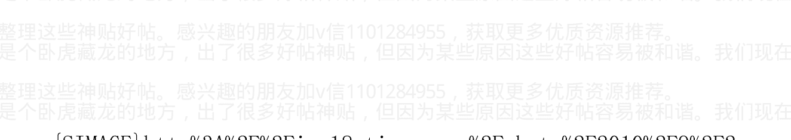

作者:海宁的马甲 日期:2011-10-07 22:34

温州，是利用货币，以钱生钱生意的最前沿，是领先指标。最后，在通货紧缩中，在房价，股市，原材料商品，企业利润全线下跌中，必然爆发债务危机。

债务危机，是一种总清算。W总，救不了温州债务危机，正如2010年底加息后上电台喊话，挡不住原材料价格继续暴涨。

听其言，观其行，当你真正搞投资减速，货币紧缩玩真的，看涨的投机者自然会为了躲避风险而抛售，或者在合适的时机反手做空，帮你打压 CPI，PPI。

当你给出经济永远高昂向上的兜底保险的时候，原材料商品投机者和你一起看涨；

当你投资减速，货币紧缩玩真的的时候，投机者会帮你控制 CPI，PPI 的。

作者：海宁的马甲 日期：2011-10-07 22:47@ 咦呀咿呀哟

2011-10-07 22:34:34

@fayanfayan 2011-10-07 22:10:47

中国货币紧缩，导致了美元升值。而不是阴谋论所说的美帝搞

加v信1101284955获取更多优质书籍推荐

死中国。伯南克拼了老命稀释美元信用，没有战胜中国为了应对通货膨胀而进行的货币紧缩。

这句话怎么看，正反都能说呢，中国货币紧缩导致美元升值？？

是这样吗？~~~。。。不是美元升值在先，导致人民.....

金融（比如股票）资产和实物资产，货币之间，处于波动之中。

经济上升初期，企业盈利增长前景向好，金融（比如股票）资产升值，（2009年），然后商品需求上升，涨价；经济增长达到高潮（2010年第一季度，GDP增长高峰在14%左右，不是统计局的12%，统计局报14%，就是在说经济就过热了，就相当于打领导的耳光了）经济中期调整（2010年4月到9月）之后，经济二次过热（2010年6月到9月货币政策放松），原材料商品疯狂（2010年9月到2011年4月底），此时原材料商品价格太高了，货币政策即使不紧缩，经济也会通往衰退，萧条的路上。货币政策紧缩，仅仅是让股市跌得更加鬼哭狼嚎而已（人人民币，美元的购买力急剧上升，股票，原材料商品，房子价格下跌）。

一个经济周期的循环，关键在于把握时间点。当然这是一句非常。

把握时间点，一个是看最敏感的投机品种，不炒白银，但是关注白银走势，绝对有好处。白银2011年5月初见顶，是投机情绪见顶的标志性事件。

把握时间点，另一个是看敏感地区，温州人都不赚钱了，说明股市，楼市，实业，原材料商品都不行了，连玩“以钱养钱”，“种人民币发财”的旁氏骗局都到头了。除了做空，就是现金为王了。而美元，是世界货币，现金中的战斗机是也。未来美元，人民币的购买力还会贬值，但是2011年下半年，到2012年第一季度，美元，人民币的购买力会上升。

作者：海宁的马甲 日期：2011-10-07 22:49 转载：美林投资时钟理论

## 美林的投资时钟理论

美林的投资时钟是一种将经济周期与资产和行业轮动联系起来的方法。这种方法将经济周期划分为四个不同的阶段——衰退、复苏、过热和滞胀，每个阶段都对应着表现超过大市的某一特定类别资产：债券、股票、大宗商品和现金。

在衰退阶段，经济增长停滞，通胀率处于低谷，企业盈利微弱并且实际收益率下降；央行降息以刺激经济，进而导致收益率曲线急剧下行；因而债券是最佳选择或者选择债券型基金。

在复苏阶段，经济刺激政策发挥作用，GDP增长率加速，企业盈利大幅上升。这个阶段是股权投资者的“黄金时期”，股票是最佳选择或者选择股票型指数基金。

在过热阶段，企业生产能力增长减慢，开始面临产能约束，通胀抬头；央行加息以控制通胀和过热的经济；因而大宗商品是最佳选择。

在滞胀阶段，GDP 的增长率降到潜能之下，但通胀却继续上升，股票表现非常糟糕，现金是最佳选择或者选择货币型基金。

作者:海宁的马甲 日期:2011-10-10 09:07 温州债务危机，只是中国民间借贷危机最敏感，最领先的地方而已。

2011 年 4 月以来，广义货币供应量 M2 的增长率连续低于 15%，有有时候还大大低于 15%，则 2009 年初以来，靠信用扩张推动经济发展的模式，面临逆转。

### 温州炒房客打折抛售房产 民间借贷危机逼割肉卖楼

来源：重庆晚报 2011 年 10 月 09 日

> > [提要] 温州的民间借贷危机渐渐发酵，投资重庆楼市的温州客开始萌发抽资套现的举动。重庆晚报记者从钢运、中原等楼市中介处了解到，目前温州炒房客在重庆挂牌出售的房源大增，国庆期间甚至还有温州客亲临重庆，以七折的幅度狂甩房产。

### 卖楼救急 老太婆专程来渝

“国庆节前鹿鼎记，就不断有温州客与我们联系卖房事宜。”中原地产江北片区经理蒋波告诉记者，江北片区是温州投资客比较集中的区域，2007-2010 年 4 年间积淀了不少房源。

让蒋波印象深刻的是一个老太婆，“之前有过很多联系，国庆期间她亲自飞到重庆，甩卖珠江太阳城的几套房产。”老太婆告诉蒋波，自己借出去的资金在温州被人卷跑了，又遇到债主追债，只好到重庆卖楼套现，回乡救急。

这老太婆去年初购买的珠江太阳城，当时每平方米的均价8500元左右，后来涨到12000元。“现在老太的条件是，只要不亏本就卖。”

蒋波说，这比最高价差不多打了七折。

据蒋波统计，在中原地产江北片区，温州客目前挂出的房源大概有百余套，“在国庆前后增加得特别明显。”

最大客户一人抛售十套房

重庆规模最大的二手房中介公司钢运置业校友录，也是经常与温州客打交道的中介，其董事长代育松也注意到温州客密集抛售房产的现象。“从九月起就比较明显，有的客户一人就拿出了10套。光在我们钢运，温州客挂出的房源就有七八百套，全市挂出的房源起码有数千套。”

代育松表示，温州投资客5年前在重庆楼市比较活跃校友录，目前大多数房源都在4-5年间，有住宅，也有商铺，地点除了北部之外，还涵盖了九龙坡、大渡口、巴南等区域。至于这些温州客卖房的动机，“很多人表示目前房价上涨的可能性不大，在温州资金利率水平更高。”

代育松表示，这些温州客的房源，目前大部分在价格上都没有太大的让步。

加v信1101284955获取更多优质书籍推荐

### 民间借贷 恐现割肉卖楼潮

温州客集中抛售房产17173，对重庆楼市影响如何？

据悉，目前温州民间借贷的资金链出现危机，浙江、江苏、福建、广东等地都出现部分温州客卖楼套现，回乡救急的苗头。

代育松称，温州客的集中抛售将加剧买方的观望心理，将会导致房价的重心向下。重庆美联总经理缪鸿裕则表示焦点房地产网，重庆房产在温州客的投资结构中占比微不足道，想依靠抛售重庆房产来解决资金危机只是杯水车薪，所以不太会出现在重庆大面积抛售房产的情况。

蒋波说，目前绝大部分温州投资客也在观望，不愿割肉出让。“但是，如果民间借贷事态持续发酵，温州客割肉卖楼也许是无奈的终局。”

作者:海宁的马甲 日期:2011-10-10 10:25 此《货币与金融的逻辑》系列，仅为一家之言，不少内容可能与市面上掌握话语权的专家观点有很大出入。

人民币货币政策紧缩（2010年10月以来，5次加息，8次提升存款准备金率），会不会最终导致美元升值？（中间有个传导过程，需要N个月）

我认为会的。逻辑是这样的：

人民币货币政策宽松，则中国对于澳洲，巴西等国的矿产资源的需求强劲，导致澳元，巴西里尔对美元（人民币）升值；当中国对这些资源的需求的增长率下降的时候（即使是2008年，中国对铜的需求量依旧是比 2007 年轻微上升的），澳元，巴西雷亚尔对美元（人民币）贬值。

所以，人民币汇率指数，约等于广义美元指数（美联储使用“广义美元指数”，包括了美元对很多发展中国家的货币的汇率）。

如果把人民币设想成美元的兑换券，人民币经济区设想成美元的经济殖民地，以上逻辑，就更简单明了。人民币货币政策紧缩，相当于 1/3 的“人民币与美元共治区”实行了货币政策紧缩（中国经济规模，大致占美元经济规模的一半）。货币政策紧缩，经过一段时间传导后，会导致货币对资产和商品升值（资产和商品价格下跌）。

中国实打实地实行货币紧缩（2011 年 4 月）之后，伯南克拼了老命稀释美元信用，也没有战胜中国为了应对通货膨胀而进行的货币紧缩的威力。

人民币货币政策紧缩（2010 年 10 月以来，5 次加息，8 次提升存款准备金率）= 提升人民币价值 = 人民币的情人 -- 美元升值。

2008 年上演过。

澳元指数 XAD，在 2011 年 4 月底，7 月底，8 月底，形成了坚实的顶部。从旁基本可以佐证这一轮商品牛市已经过去（9 月份，大豆与铜的价格大跌近 20%）。未来大多数原材料商品，特别是中国需求占比大的商品，每一次遇到反弹后的盘整，做空的赢率都比较大。

（就像 2011 年 4 月以前，每一轮下跌后的盘整，都是一次次看涨做多的机会）。

http://stockcharts.com/h-sc/ui?s=$XAD

题外话，9 月份，周小川关于控制通货膨胀依旧是目前货币政策的最优先考虑，外加现实情况，给很多商品的多头以沉重的打击。

而温总 6 月份关于通货膨胀已经受控的文章，与商品价格大反弹，时间上正好“巧合”。2010 年 10 月以来，中国的货币政策和经济走势的风向，对世界商品市场的影响很大。

所以啊，所谓“输入性通货膨胀”，是专家给领导开脱的一个借口而已。中国经济是否过热，是原材料商品能不能暴涨的一个极其重要因素。

人民币在中短期内，还是不得不锚定美元。这里面的原因很复杂，我能想到的，一是美元在世界贸易中的地位极其强大，盯住美元能获得相对稳定的汇率环境，尤其是美元币值稳定的时候（美联储联邦基金利率&gt;美国 CPI）；二是人民币汇率市场化以前，没有比锚定美元更好的方案；3 是此届只想打麻将，不想搞更多的改革，特别是有阻力有风险的改革。

当然了，美元升值，会导致套利资本平仓的连锁反应。

作者：海宁的马甲 日期：2011-10-10 11:50@宝贝和和 2011-10-10 11:37:15

@cuijianbuo1976

加v信1101284955获取更多优质书籍推荐The request was rejected because it was considered high risk

本人看好 2011 年 6 月以后在反通货膨胀之下股市楼市的下跌，而且股市领先楼市大致 6 个月，这个帖子中经常反复提及。房价是涨是跌，涨多少跌多少，是市场决定的。而且不同地区的走势也不一样。个人因为房价此前暴涨的最大因素是外汇占款的急剧增加。2005 年 7 月 21 日以后，增长了 2 万多亿美元，为此增发了 10 多万亿的人民币基础货币，而基础货币又乘数作用，土地增发，就是在外汇占款基础上的乘数左右。没有外汇储备的增加，土地价格上涨是浮云。2008 年底，2009 年下调存款准备金率，把 2008 年 4500 亿美元的外汇占款给放出来了。W 爷当然可以疯狂下调存款准备金率 3 到 5 个百分点，释放 2 到 4 万亿的可贷资金。但是通货膨胀会恶化。处于面子，这一次货币政策极可能已经超调，而且不会很快下调存款准备金率，这样股市就会像 2008 年一样悲剧，只是程度不同，楼市也会有下跌，只是股市更敏感而已。此前贴过大学扩招，另一个房价上涨的动力，是大学扩招，很多农村大学生留在城市，富裕的农村家庭支持孩子在城市买房。城市房价的上涨，对应着很多地区农村的凋零。2003 年以后，农村资金向城市转移加速。这是市场经济发展的必然，不能全怪在某爷身上。我们现在正在收集整理这些神贴好帖。感兴趣的朋友加v信1101284955，获取更多优质资源推荐。

还有一个因素，是2003-2007年是国际，国内经济发展两个上升浪的高度重叠。

2009年以后，房价疯涨，其实在东南亚1994年以后也发生过。

很多人非常疯狂的把房价上涨推到政府的目的就是如此，这恐怕不是100%准确。亚洲国度的政绩需求，一直是很大的，日本，韩国奥运前后，都是大发展时期。

因为地方政府要钱而让房价上涨的说法是不通的。最多是地方政府反对加息等货币紧缩。但是当通货膨胀上升之后，反对加息等货币紧缩的气焰就下去了。这就是2008年和2011年4月以后两轮股市熊市的最大因素之一。当然，也是因为货币紧缩之前，放任通货膨胀已经一段时间了，那期间投机气氛非常活跃，很多股票的市盈率超高，而货币紧缩，也会超调，使得那些泡沫股跌得很惨。

作者：海宁的马甲 日期：2011-11-01 22:57@ 出生于西部 2011-11-01 22:45:29

不管你们看跌，还是看涨，看多，还是看空。我们杀猪论只说，房市对于普通的P民来说，没有任何投资价值，房市就跟股市一样，是个ZF圈钱的工具。所以对于那帖所谓房地产投资无忧论，我们要重点鞭。

杀猪论是唯心的，仅仅是自我安慰和催眠而已。就像下岗多了，有人病急乱投医，信了FLG一样。房价涨得超出很多人的想象力，就变了精神病，认为那些看跌的都是精神病一样。

香港曾经何尝不是如此，否则钟镇涛怎么会疯狂投入房地产。

作者：海宁的马甲  日期：2011-11-01 22:59@ 出生于西部 2011-11-01 22:55:05

看多的很多是房托，看空的相当部分是为了迎合众人心理。我本人被崩溃论欺骗五年。现在不信了。

你可能是个非常好的衡量指标。

还有W爷信誓旦旦说有信心控制房价上涨，说了7年，2010年终在澳门说控制不了。也算是个指标。

作者:海宁的马甲  日期:2011-11-03 11:25%867995834 对你的博文《宋卫平：从绿城“被破产“说起》发表评论 2011-11-03

绿城非流动资产114.5亿，流动资产1146.1亿，总资产1260.6亿，非流动负债257.6亿，流动负债848.0亿，总负债1105.6亿，资产负债率87.7%。流动负债中可供发展物业183.6亿（就是土地），发展中物业589.2亿（就是在建商品房），竣工可售物业26.8亿。

加v信1101284955获取更多优质书籍推荐

年内到期银行借款 135 亿之多！流动资产的 7 成是土地和在建商品房，仅 5%是竣工可售，资产负债率接近 90%。再看现金流量表，年初现金及现金等价物 124.1 亿，经过半年折腾，经营流入 8.9 亿，投资流出 37.6 亿，融资流出 28 亿，账面净剩现金 67.4 亿。宋卫平，你现在就可以开始大甩卖了，不然很难撑到年关。即便你大甩卖，也得打个折扣不是，总不能 100 块的东西卖 110 块吧？如果打个 9 折卖，按照 87.7%的资产负债率，很快就要资不抵债啦。

作者：海宁的马甲 日期：2011-11-03 11:26 宋卫平：从绿城“被破产“说起

发布时间：2011 年 11 月 02 日

11月1日，子夜，有记者致电，问我：“绿城是申请破产了吗”？按时髦一点的说法，这真是个冷幽默。我笑，也颇为无奈。

在此调控深秋，绿城似乎成了一些人眼里的风向标。绿城现状如何，这大概是很多人心头急不可耐要探知的一个题目，由此传出了些风言风语。我愿意把这些传言理解为大众对绿城的关注和爱护。所以，深夜发文，意在感谢诸位，也向大家报道，绿城目前一切尚好。

对绿城而言，这些谣传听来虽令我们有些不适，但却也令我们觉得，此刻有必要跳出自身视野，看看整个行业的生存境遇。秋日天凉，并非只笼罩一城一池，今日由于调控严厉遭遇生存困境的，是中国整个房地产行业。

大约一个月前，我在接受采访的时候已经说过，其实绿城无需引起大家如此大的担忧。一方面，绿城在努力抓销售，另一方面，我们有腾挪的余地，可以出让一部分项目的股权解决资金上的问题。绿城对危机并非没有预案，到目前为止，一切都在我们可控范围内。我们有足够的信心，与行业一起，度过寒冬。绿城离破产还有很远的一段距离。此间，无论如何，我们决不放弃绿城所秉持的理念，走正道，尽人力，听天命。但显然，并非所有的房地产商都能和绿城一样幸运，有其腾挪的空间。眼下房地产业的普遍情况是：量价齐跌，市场萎缩，各地库存大量积压，中小房地产商岌岌可危。照此境况，再持续一段时间，中国的很多房地产商恐怕就真的要面临倒闭的状态。这句话是不是危言耸听？业内人心中自有明镜吧？企业左右不了市场，正如人力不能真正战胜天命。对于企业来说，命运只有两个字，生、死。无他。我们所能探讨的，是在目前的市场条件下，如何找出一条活路，穿越寒冬。今天我将这个问题提给自己、提给行业内人士，也提请有关部门审视，是想强调，市场若一直处于如此萧条状态，停留于谷底，恐怕一些企业真就会走上绝路。销售不畅，加上信贷紧缩，一个最符合逻辑的推断就是企业过不了年关。届时，有的企业或许申请倒闭，有的则是开发商跑路，更有甚者，怕有更多的悲剧要发生。然而，我们却又不能回避，在房地产行业的河流里，那些原本稚嫩而可爱的虾米们，它们能经得起更长久的考验吗？另外，我们上下游产业链上的那些兄弟，那些建材商，那些施工队，那些等待工钱回家过年的农民工兄弟们，这是多大的人群？这个人群是否需要我们去认真考虑他们的生计？此外，如果房地产行业真的像一些人猜测的那样，全线萎顿，房价大幅下降，那么，那些受益于改革开放而先富起来的人，他们的资产会缩水多少？30%，还是40%？50%？如此缩水，他们可以接受吗？前段时间，由于退房潮引发的业主闹事，固然于法于理是不对的，但将心比心，我们是否应给予情感上的理解呢？今日今时，绿城的难处，是整个行业共同的难处。但绿城一直在奋力前行，也希望整个行业可以渡过难关。我们对中国的城市化进程抱有信心，对中国人民以勤劳致富，用奋斗改变生活的理念抱有信心，只要这两点是事实，那么我们就可以坚定地说：绿城仍然要坚持我们的理想，为城市创造美丽。我们依然要向客户解释、说明、展示我们的产品的价值所在；我们依然恳请客户们一如既往的支持我们；我们依然以绿城三万员工为后盾，不论明天风景如何，都鼓足干劲，做最有耐心、最努力、最持续的坚持。我们相信，政府可以把握大局，站在更高远的立场上为整个房地产行业谋生路。一切，都有改善调整的过程，在此过程中，我们或许会经历一些苦痛，但最终，我们相信所有的努力都应该得到回报。相信，天道酬勤，这，应该是这个社会的主旋律。

作者:海宁的马甲 日期:2011-11-03 11:29

要救绿城，先要大力推升成交量，成交量上不去，2011年第三季度，和之前累积的大量库存，就无法出清。

在 6 到 12 个域内，要大力极力推升成交量，就必须在现有增长率基础上，再加码超量释放起码不少于 2 万亿到 4 万亿的资金量。简单计算下来，得把之前的 8 次提升存款准备金率，基本都给降回去，并且要求银行大量放贷。

作者:海宁的马甲 日期:2011-11-03 11:32 第一次下调存款准备金率，估计在春节以前。春节以前如果下调，万一引起物价再次大幅反弹，估计会受到很多骂声（虽然这些骂声也伤不到宽松 ye 什么，但是大部分人，还是要面子的，特别是爱文学的宽松 ye）。

作者:海宁的马甲 日期:2011-11-30 22:38@buyuntian 2011-11-30 22:08:03 从 2011 年 12 月 5 日起，下调存款类金融机构人民币存款准备金率 0.5 个百分点。

这在干什么啊？嫌通胀不够啊？

2012 年上半年通货膨胀会快速下降。2012 年通货膨胀都不是个大问题。

2012 下半年，养猪的亏损是大概率事件，2012 下半年股市上涨是大概率事件（上半年如果跌出底部，就很难判断）。

2013, 2014 更大的通货膨胀，超过 2011 年（2004 小通货膨胀，2008 大通货膨胀，2011 小通货膨胀，2013，2014 大通货膨胀）。

作者:海宁的马甲 日期:2011-11-30 22:42

宽松总是比想象的来的早一点。不过下调准备金率在外汇占款下降的情况下，效果很小。

外汇占款是过去十年楼市股市和经济的兴奋剂，外汇占款只是给兴奋剂稍微降将温的凉茶而已。

外汇占款下降，或者不增长，应该是个短期现象，欧债危机大爆发之后，估计外汇占款还会恢复。

作者:海宁的马甲 日期:2011-12-01 09:17 货币与金融的逻辑（六）

## 美联储货币互换的作用与应用

[此博文包含图片] (2011-12-01 08:29:03) [编辑][删除]

标签： 财经

分类： 货币与金融-人性与羊群

### 货币与金融的逻辑（六）美联储货币互换的作用与应用

今天美联储货币互换申明，引起了全球股票市场大涨（周一开始）。

美元作为真实世界里的全球货币作用，此前已经提及很多次了。

美联储在全球面临美元短缺和流动性危机的时候，会注入流动性，这是“中央银行”的基本功能：作为最后贷款人，贷出去的钱，是印出来的，但是要还的。

美联储外币互换各个时期的余额在下面的链接中有。

http://www.federalreserve.gov/monetarypolicy/bst_recenttrends.htm

2008年4月开始，美联储开始向世界各国央行大量提供货币互换，缓解“短期”的美元流动性问题。2008年第四季度，美联储货币互换的量急剧上升，年底达到5800亿美元左右，此后随着流动性危机，债务危机，金融恐慌的平息，货币互换逐渐“归还”，到2010年2月17日，全部归还（即“印出去”的电子美元全部归还），余额变为零。

2008年金融危机之中，美联储总共提供了10多万亿美元的短期贷款，危机平息之后这些贷款陆续都归还了，否则很多非常有名的公司当时都会因为出现债务违约而申请破产。这10多万亿美元，是指流水（类似于企业进进出出的营业额），不是余额，余额最多的时候（2008年底，2009年初）大概1.5万多亿美元。

2010年5月欧债危机爆发，美联储又释出92亿美元的货币互换，缓解美元流动性问题，2011年3月9日又归零，这些量都非常小；8月17日又开始货币互换借出美元，2011.11.23余额24亿美元，对全球金融市场几乎可以忽略不计。

以上是相对客观的描述。

以下是个人理解：

微博上看到个“因果关系颠倒”的典故：俄罗斯曾经发生瘟疫，医生赶往瘟疫最严重的地方，当地人认为医生带来了瘟疫，纷纷杀死医生。应用到这里，就是美联储联合五家央行宣布货币互换（医生出动），说明欧债危机病得不轻，类似于2008年，所以商品，股市，垃圾债，欧猪债，还得跌。

美联储和各大央行的申明，表明美联储愿意在必要的时候，提供低利率的美元缓解流动性危机。这算是一种注入“信心”的行动，不过我认为无助于解决欧债危机，只能防止一些“心肌梗死”（因为短期流动性而导致甩卖资产或者破产等情况）。

个人观点不变：美元在零利率条件下，只会因为危机而走强，危机一旦消除，美元资本还是要出去投资赚钱的，看看曾经MF Global去投资欧债，欧洲银行投资巴西，欧美投资亚洲就知道了。美联储不喜欢出现美元流动性问题，因为这也会伤害美国经济，美国标普500公司的营业额和利润的40%以上，来自美国以外。欧债危机一旦大爆发，美国经济难以独善其身，美元指数暴涨，对美国经济不利。但是美元因为危机而要涨的时候，美联储是一段时间内是拦不住的（2008年下半年，2010年5月6月）。这一轮美元指数上涨，还是有望上涨至86-88一线（商品股票从目前到那个时候，也是跌多涨少），到时应该是一个投资股市等资产的非常好的机会。

美联储短期流动性贷款余额2007.4-2011.11（随着危机的深入，

### 各种贷款余额节节升高，不仅仅是货币互换）

### 最浅的黄色是货币互换余额历史走势

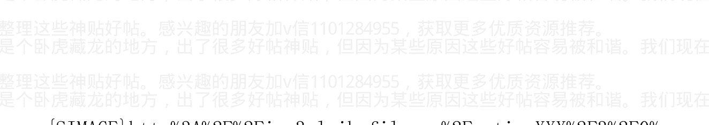

### 美联储流动性贷款

作者:海宁的马甲 日期:2011-12-01 09:20 房价，股市，商品，从2011年6月到2012年2月，震荡下跌。

2011年10月到2012年第一季度，人民币中短期的全面牛市来临。人民币对房子，股票，粮食，基础金属升值。目前看，布伦特油价比较顽强，特别抗跌，使得放松银根无法实施。

2011年，各种泡沫混战，横行的一年，又是他们相继破灭的一年。

2011年，第一季度棉花见顶暴跌，小麦见顶大跌，玉米大豆价格见顶，铜价见顶。

2011年5月，白银石油价格见顶。这个时间点最重要。

2011年9月，铜等基础金属大跌。

2011年4月开始，优质债券，特别是美国国债大涨。债券市场对于经济衰退的预期，在2011年7月8月，达到极其强烈的程度。

2011年7月22日以后，欧洲美国银行股大跌40%以上的不计其数。

中国股市，是全球最领先的指标，于2010年11月见顶。

作者:海宁的马甲 日期:2011-12-01 09:27 中国债券市场未来1,2个季度，估计会有较好表现。（中国债券市场拐点可能在10月已过）。

2008年第四季度，债券市场大涨20%左右。

作者:海宁的马甲 日期:2011-12-01 09:34 外汇占款（印基本货币）是中国楼市，股市和经济的兴奋剂。上调存款准备金率，相当于凉茶。

外汇占款大增的时候（2009.3 – 2011.4）提升准备金率，相当于边吃兴奋剂，便喝凉茶（还是偶尔喝）。下调准备金率，相当于咖啡而言；外汇占款下降的时候下调准备金率，相当于兴奋剂彻底没有之后，喝点咖啡。

2011年10月份，外汇占款下降。个人估计是短期现象，未来外汇占款还是会增加的。也就是说人民币升值潜力，目前没有，但是未来会恢复一些。

作者:海宁的马甲 日期:2011-12-08 12:25@bandc2004 2011-12-07 21:05:44

请问海宁：现在及即将出现的全球经济是通缩还是滞胀？为什么？？？？？求回答。谢谢

市场就是市场，通缩，滞胀都是过于拘泥的词汇。70 年代欧美经济大滞胀，但是 74，75 萧条之后 1976 年经济是强劲复苏。有全球央行放水和低利率，通缩是浮云。（换美元党估计不高兴了）

7月猪肉见顶。

9月铜，螺纹钢，橡胶，大豆，玉米，小麦等众多品种大跌，很多一个月跌幅近 20%，才让中国货币政策在 10 月松口气。

商品熊市刚刚开始，股市熊市二期，也才从 9 月开始。

房地产库存继续增加。库存/月销售比，接下去 3，4 个月继续增加。

螺纹钢接下去 2 个季度再次向下挑战 3600 元/吨。

中国债券市场拐点已过，未来两个季度可能有好的表现。未来将继续下调准备金率，如果经济下滑严重，不排除下调利率（下调利率，有利于债券价格走高，经济复苏后债券价格下跌）。

作者：海宁 的 马甲 日期:2011-12-14 08:20@zhangaaw02 2011-12-14 07:59:47

昨夜美联储宣布 0-0.25%超宽松利率维持到 2013 年中期

早前就已经修正美联储不会加息的观点了，无须等到现在。

明年美联储里的鸽派更多，如果在欧债危机和中国和世界经济降温的拖累下，明年第一季度美国经济也出现衰退的迹象，美联储将可能退出量化宽松三期（而且是在世界各国渴望的情况下推出）。

中国货币政策，也未加息4%，但是shibor利率却长期维持在5%以上。货币供应量增速，也比2008年低。

2011年9月，中国资金市场更加出现了恐怕的景象，shibor短期利率飙升到8%以上，很多票据甚至无法贴现，市场没钱，是一场短期的信用危机。同一个月里，大豆，螺纹钢，铜等这些中国经济的运行指标单边大跌近20%左右。

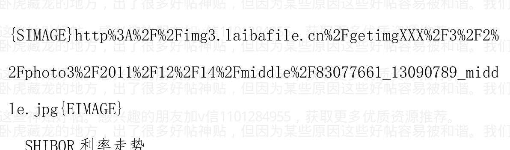

作者:海宁的马甲 日期:2011-12-14 08:29 很多人妄自菲薄，认为中国经济被外国控制，事实上，中国作为铜铁铝锌等基础金属，大豆的最大进口国，对国际商品市场具有举足轻重的影响力。

中国货币政策从2011年4月份开始认真控制通货膨胀（主要不是加息，而是把“廉价资金”货币供应量增长率控制在15%以下），很多品种也在同期见顶。

中国货币政策在2011年9月，出现了15年来，最恐怕，最变态的信用流动性断流，短期市场利率逼升到8%以上根本不能说明信用流动性断流的恐怖性，因为你即使给出 20%，30%的年利率，你也借不到钱。温州大量高杠杆的投机客，高利贷崩盘跑路。个人认为中国的一年期存款利率太低，起码4%，即使5%也不过分，但是极其反对如此变态恐怖的‘短期流动性断流’。

如果你把中国经济作为‘美元人民币共治区’的1/3，就能理解，中国货币政策紧缩，相当于‘美元人民币共治区’的1/3地区实行了货币紧缩，必然推升美元指数。美元走高，反过来推动套利资本平仓。如此互为因果。就像当初美元贬值，导致套利资本出动，进一步推动美元贬值一样。一正一反而已。

当然从阴谋论的角度，这个贬值升值过程，就是一次剪羊毛过程。

## 八评 2001 年美元泡沫破灭与中国地产泡沫的兴起，浅议 2011.6 – 2012.2 美元升值窗口

2011. 5. 7

纯属个人观点，并非任何劝诱或投资建议。

## 总体看法与观点:中国通货膨胀与美元大反弹的逻辑是：中国经济不减速，则粮食等大宗商品依旧处于高位，甚至再创新高；中国经济减速，则铜锌等中国使用量大的基础金属下跌，引发经济螺旋式下降的恶性循环。

美元反弹，与中国经济减速，互为因果，互相加强。举个例子：2008年“中国经济减速股票泡沫破裂 + 美国经济减速”，与美元走强，互为因果。

这一波美元走强，由套利资本平仓推动，由全体投资者抛售资产来完成。

> 作者：海宁的马甲 日期:2011-12-14 08:30 货币与金融的逻辑（八）:

## 经济周期性大幅波动的原动力简析

过去9年，中国经济在大幅波动中向前发展。股市，螺纹钢，猪肉和大豆价格，剧烈波动。其波动呈现一定的大约40个月左右的周期性特点，此轮涨跌的低点可能在2012年第二季度（负利率结束之后的2，3个月，是市场最低迷的时候，因为货币政策碍于“道德”和面子，尚未大规模放水，只是这一次，银行可放贷资金来源比2009年初少）。

那么，经济如此剧烈波动的原动力是什么？

在经济低迷时期，当长期资产的未来潜在回报率远远高于短期利率的时候，投资的安全边际大幅度提高，价值投资者会战胜人性的恐惧之弱点，买入长期资产，耐心等待经济的复苏；经济复苏然后过热导致通货膨胀，导致短期利率大幅度上升的时候，短期利率超过了长期资产的收益率，价值投资者退出博傻游戏，然后抛售长期资产的人越来越多，直到长期资产价格非常低，倒过来，就是长期资产的收益率大大上升，而长期资产下跌过程，常常伴随着央行的降息，最后又回到起点，即长期资产的回报率大大高于短期利率，旧的新的价值投资者再次进场扫货。

- 1. 短期利率 大大 < 长期资本和长期资产的收益率；
- 2. 长期资产价格上升；
- 3. 投资与消费需求上升，导致通货膨胀；
- 4. 加息，或者市场对资金需求推升短期利率，短期利率 > 长期资本的收益率。
- 5. 抛售，或者部分企业无利可图而退出；长期资产价格下跌，降息，回到 1。

利差，收益率之差是关键。目前 3 个月和一年期 SHIBOR 利率大于 5%，而房子收益率不到 2%，只是靠历史比价心理效应支撑。

所以，是“廉价资金供销社”对资金成本的扭曲。也就是降息刺激经济发展，造成了经济，股市，原材料商品价格的大起大落。是央行的“反周期”货币政策，放大了经济，CPI，股市，期货的波动幅度，放大了猪肉的波动幅度。对于价值投资者和投机者，这都是受欢迎的。价值投资者，在低利率，低CPI，低资产价格时期，投资长期资本（股权，房产），原本仅仅是正常的套利和保值行动，结果被羊群效应搞成了能获得暴利的投资。拥有朴素的价值投资理念的普通百姓，其投资收益超出部分专家是非常正常的。顺势的投机者潜在的获利空间，也因为波动的加剧而加大，就看投机能力了。

作者:海宁的马甲 日期:2011-12-14 中国经济增长前景依旧乐观

2011. 12. 13

2001-2007 年，是中国经济 60 年来繁荣时间最长的一段时间。在 2001 年以前，中国经济繁荣上升时间一直没能持续坚挺 4 年以上。

2004 下半年到 2005 上半年，2008 年整年，2011 年下半年到 2012 年上半年，这三个时间段，仅仅是中国经济过热之后处于周期性下降而已。既然有周期性下降，自然有周期性复苏回升。过于剧烈的通货膨胀，会导致经济的硬着陆。2004 年 4 月开始，2007 年底开始，2010 年 10 月开始，货币政策致力于控制通货膨胀，就是为了防止通货膨胀恶化后的硬着陆。

由于中国货币政策在通货膨胀快速上升时期，一方面怕货币紧缩影响经济增长速度，另一方面一直心存侥幸心理，希望物价自动下降。直到通货膨胀严重的时候才进行货币紧缩，而此时原材料价格本身已经接近高峰，高涨的原材料价格本身就会对经济形成打击作用。

在原材料价格高峰时期加大货币紧缩的力度，对经济，股市，企业利润，都形成了“双杀”局面。上面三个 12 个月左右的时间段，都是企业破产的集中时段。

如果把低利率比喻成兴奋剂，那么造成经济下滑严重的，是兴奋剂消失后的疲软（三轮负利率，分别在2005年3月，2008年10月，2012年第一季度消失），而不是货币政策正常化。有的专家，比如谢百三教授，有意或者无意，把造成经济下滑的责任，推到“货币政策正常化”身上，而不是前期低利率负利率造成资产泡沫和经济过热导致了后来的经济下滑。通俗地讲，没有爬楼，一直脚踏实地，比如德国经济，怎么会有跳楼？暴跌的动能，来自此前的暴涨。看看今年的棉花和小麦，甚至螺纹钢大豆价格就知道了。反过来，跌得深，未来涨幅才大。

一个国家，不可能永远像2007年那样，将GDP产出的8%以上送到国外，换取美元欧元日元等，外贸顺差占GDP的比重下降到2%以下，是经济回归正常的表现。如果人民币过于低估，外贸顺差过大，则国内通货膨胀和资产泡沫会越来越严重，也会自然而然地降低人民币被低估的程度，从而让贸易顺差趋于平衡。经济也向自然界，不管有没有扭曲，都倾向于达到平衡。当然没有永远的平衡，只有物质极度缺乏，没有相对过剩的社会，才不会有波动。目前的人民币汇率，基本在均衡汇率附近，这是人民银行放弃印钞机干预汇率的好时机之一。

## 中国经济增长前景依旧乐观的部分理由

- 一：中国经济在发展过程中，出现了越来越多的企业家，管理人员，技术人员，整个国家的经济发展过程，就是一个“经验学习曲线”过程（经验学习曲线的意思，可参考网上的百科），也就是一个追赶过程，这些企业，技术，管理与人才，不但不会因为经济的大起大落而消失，反而越来越多。经济总是螺旋式上升的，70 年代日本，台湾，韩国，香港，新加坡，东南亚遇到了两次石油危机，他们的经济和股市受到重创，但那并不妨碍他们经济的螺旋式上升。

### 二：人口红利远未结束。

未来还有通货膨胀，甚至更大的通货膨胀，存款人还将付出贡献，但是存款人都奉献近 20 年了，经济一直在增长，中国脱离绝对贫困线的人口越来越多。这不是政府的恩赐，如果算恩赐，也仅仅是把此前的约束去掉了。给予农民自主经营权后，粮食丰收了；纺织部轻工业部被废除后，中国轻工业飞速发展了；外贸进出口权下放后，外贸飞速发展了，等等的例子很多。未来 3，5 年，贫富差距将继续扩大，只是速度放缓。

但是，但是劳动人口还是非常巨大的。劳动创造财富，有苦力，长城都能建起来，京杭大运河都能挖出来，金字塔都能垒起来。有苦力，就能抵消行政低效率和浪费。具体参见中国的三波婴儿潮。

农村剩余劳动力越来越少，想把他们吸引到城市来做苦力，必然给出更好的薪水和用工条件。这是经济发展的结果，也是一种进步，台湾韩国的劳工待遇的改善，都是在农村剩余劳动力转移完毕之后。

政府并没有恩赐，是企业招不到人才提高薪水，而且每一次民工工资大涨（2003，2007，2010）之后，就是通货膨胀恶化，货币紧缩，股市大跌，经济下滑，然后民工工资停止上涨，甚至转而下降。

### 中国的三波婴儿潮

第一波婴儿潮，建国初期，他们有的后来被鼓动之后闹腾过，有的被送上山下乡锻炼，比如任志强。

第二波婴儿潮，三年“被自然灾害”结束后，1962 年开始大量生孩子，波峰在 1965 年，持续到 1973 年，比如潘石屹。这是中国历史上出生人口最多的主力。目前的企业家里，他们的人数最多，当然其实更多的沉默的大多数，经历了 1998 年前后的下岗。他们也是 21 世纪福利分房之后囤房保值和给孩子买房的主力。“85 后”大学毕业的时候，房价就很贵了，必须“拼爹”才行。那 10 年内共出生近 2.6 亿。他们荷尔蒙分泌旺盛的时候，也闹腾过，还生了第三波婴儿潮。

第三波婴儿潮，就是第二波的后代，主要在 1986~1990 年出生。1990 年是中国实行商品经济之后的第一次大规模经济衰退，却是这 5 年中出生人口最多的一年。此次婴儿潮有 1.24 亿，被称为“85 后”一代。

### 日本，美国，英国，中国的劳动参与率

蓝线是日本的劳动参与率，1990 年左右见顶，1990 年-1994 年一直处于高位，日元对美元一直处于升值过程。日本男人的劳动生产率是厉害的，在日本女人劳动参与率一直不到 50% 的情况下，还维持了人均GDP4万美元，而且还拥有6万亿美元的海外资产，中国只有3.7万亿（其中1到1.5万亿美元，对应的是外商在中国的初始投资）。

灰色是美国的劳动参与率，90年代一直处于高位，在2000年左右见顶。

细黑线是英国劳动参与率。

韩国的劳动参与率

中国的劳动参与率，估计在2015年前后见顶，并且在2015-2020年前后一直维持高位，直到1962年后出生的婴儿潮人口开始退休。

上海户籍人口目前20%以上是老人，十年后这个数字就是30%以上了，上升很快。人口方面，深圳的优势明显。资本市场早已锚定了消费，医药，汽车等未来行业，但是就像1999年疯狂追逐互联网一样，很多股价过于虚高了。

作者:海宁的马甲 日期:2011-12-14 08:33 每一次货币紧缩之后的熊市末端，都是一次投资机会。

每一轮经济周期的低点(1999.2,2002.2,2005.3,2009.2,2012.x)，都是一次投资机会。

作者:海宁的马甲 日期:2011-12-14 08:37 外汇占款

可惜，外汇占款是个后公布的指标，而且即使你知道了这个月，难以预测下个月。

单月而言，2008年1月新增外汇占款曾达6540亿元，为历史最高。2010年10月外汇占款新增5301亿元，为有史第二高。2010年11月新增外汇占款为3196亿元，环比回落了近四成。

加v信1101284955获取更多优质书籍推荐

下图是外汇占款“6个月移动平均值”。2010年7月达到最低值；2011年3月见顶，目前依旧在下降通道。

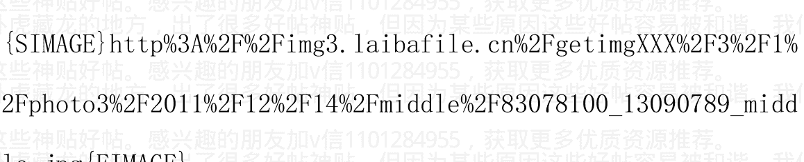

Money Printing

作者:海宁的马甲 日期:2011-12-14 08:43 人民币对美元升值，并不一定意味着人民币有效汇率上升。

人民币对美元轻微贬值，并不意味着人民币有效汇率下降。

美元汇率上升，人民币被动跟着对很多货币升值。2008年第四季度也是如此。

从丁志杰老师处拷贝的两张图。

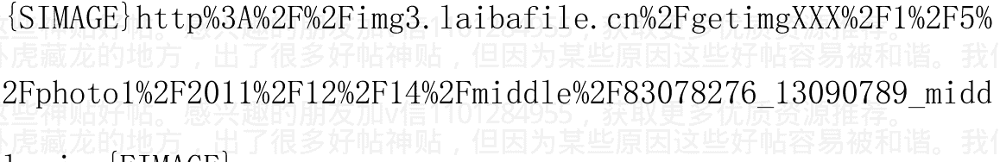

加v信1101284955获取更多优质书籍推荐

### 人民币有效汇率


### 人民币对美元应该贬值到 6.37

作者: 海宁的马甲  日期: 2011-12-14 13:27 回顾 2011 展望 2012 系列之二: 房地产, 量在价先

2011.11.23

从普通百姓的角度分析通货膨胀, 谨慎求证中国房价十年大顶, 兼论任志强的观点  2010-11-23

预·见 2011: 泡沫混战后同归于尽的一年  回顾 2011 展望 2012 系列之一: 通货膨胀 2012 第二季度可能见底  2010-10-24

负利率, 楼市, 股市, 总体都是财富分配的道具, 官方 CPI, 房价, 股市涨涨跌跌, 不过就是个游戏过程。收佣金的才是稳赚的。

通俗地讲, 低利率, 负利率就是兴奋剂。低利率情况下 (即使还没有进入负利率时间段), 资产价格虚高, 100 倍的 IPO 市盈率都有人买, 等到货币紧缩控制通货膨胀, 虚高的价格就下来了, 买单时间到了, 股市因为流动性特别好, 所以货币紧缩首先影响的就是股市, 2004, 2008,2011年都是如此，财富转移是在货币宽松的初期(2002,2006,2009,2012下半年)完成的，货币紧缩(2008年；2011年4月到2012上半年)不过是个不得不发生的虚高价格下跌的“梦醒时分”而已。

那么多年的卖地收入，部分早已变成了公路，城市扩张等各种基础设施，部分则变成了各种合法奖金和灰色收入，也有部分变成了澳门赌业的利润。所以，买房的，特别是高价买房的人们作为一个群体是奉献者，房价里的“超额的那部分地价”，就是他们的贡献部分。

土地是垄断的，银行基本也是垄断的，连房地产企业，大都也是国有的，任志强不过是房地产企业的一个总经理，却已经占据舆论的焦点，早已抢了慈祥的人的风头。慈祥的人说房价调控不动摇，媒体第一想到的是去问任志强“这有用吗？”

量在价先，是一个非常浅显的道理。天价经常在成交量顶峰时期产生，典型的比如北京通州的房价“买份早餐房价涨了30万”的传说。房地产下跌之前，肯定有个成交量低迷的过程。

房地产2012年要想恢复上涨，则首先需要看到成交量的上升去消化前期大量积累的库存。到2012年第一季度，房地产的库存不是在减少，而是在继续增加。

目前看，货币紧缩超级宽松就别想了，二爷也是要面子的，所以2012上半年房价基本上还得跌，此后成交量如果不上去，则还得继续跌。不过货币政策2012年上半年就会开始宽松，宽松的力度谁也不知道。

房地产商也是商人，亏本的生意不做。要想房价大降，必须出现政府大量贱卖住宅用地。如果政府大量贱卖住宅用地，则前期的开发商如果不大幅度降价，就只能自己住了。如果政府没有大量贱卖住宅用地，则房地产去库存完成之后。2012上半年货币政策肯定会有某种程度的宽松，因为房地产商不拿地了，也不投资了，经济的各方面都会有个冷却过程。比较有意思的是，首先降价的，反倒是现金储备足，不差钱的大型开发商，比如万科。

对于一个快速发展的经济体，3.5%的存款利率，还是非常宽松的。这就是为什么二手房的主人们非常淡定，因为卖了也不知道去投资什么，而且房子买卖，要缴纳很多很多的税费。对于部分不缺钱的主来说，房子就是个大额存单，市场涨涨跌跌他都不卖。

不多今年底到明年上半年，民间借贷危机会一直不断爆发，能拖过明年第二季度基本就安全了。

极度宽松的货币政策，传导到房地产，需要3，4个月的时间，个人认为 2012 很难再次出现 2009 年那种极度宽松的货币政策，不过明年第一季度下调存款准备金率，应该在预料之中，1，2 次准备金率的下调，还不足以让房地产止跌。

个人不认同限购，但限购证明了各地投资房比例非常高。作为一个投资品，特别是房租收益率不到2%的投资品，它同样遵循一个规律：“上涨预期的轻微下降，就足以使得价格大幅下降”，直白点就是“上涨预期”消退甚至逆转之后，后面接盘的人会少很多。如果此前投机氛围极其浓烈的话，投机客突然大量消失的时候，这游戏就没法玩了。通过民间借贷而买投资房的，就面临清盘甩卖。

明斯基时刻是指资产价格崩溃时刻，该过程分为四阶段：

- 1. 第一阶段，投资者们负担少量负债，偿还其资本与利息支出均无问题。
- 2. 第二阶段，他们扩展其金融规模，以致只能负担利息支出。
- 3. 第三阶段，即庞氏骗局，他们的债务水平要求不断有新傻子进来拉高资产价格，才能安然度日。
- 4. 第四阶段，新傻子没来。

作者:海宁的马甲 日期:2011-12-14 13:31 2011年5月初本拉登的死,与商品期货市场由牛市，转向高位震荡，仅仅是个偶然的巧合。

但是9月份中国货币政策超级紧缩,与许多期货商品一个月狂泻20%,应该不是巧合。国内很多信用证，都开不出来。

其实，开不出来信用证的，反倒被救了一命，因为部分能开信用证的公司，大量高价进口大豆，目前每天亏损几百万，都快破产了。

作者:海宁的马甲 日期:2011-12-20 13:07 外汇占款连续2个月负增长，广谱利率维持高位，房地产库存继续增加，对房地产形成了强大的向下压力。

过去6年，每个月的外汇占款是个起伏很大的数字。

预计 2012 第二季度，房地产商在高库存的压力下，不得不降低房地产投资，减少买地行动，使得房地产投资负增长。

作者:海宁的马甲 日期:2012-01-08 12:18 繁荣结束于一场危机, 过度的乐观受到“突如其来”的危机的惩罚；危机催生了过度的悲观；过度的悲观孕育了新的投资机会，如此周而复始。2012上半年，随着中国房地产的冷却，民间借贷危机的更多爆发，欧债危机的继续发酵，商品和股市将继续下行探底。等养猪的种大豆濒临亏损，那么市场的底部就近了。

作者：海宁的马甲  日期：2012-01-08 12:20 作者：海宁的马甲  日期：2011-04-19 12:17

### 股票市场，很难预测。

2008 年中国股票的走势，让很多人大跌眼镜。跌到 3000 点以下的时候，大炒奥运行情，结果奥运期间几乎天天跌。

2009 年，又让很多股评大佬很丢面子。

所以我的看法，仅仅，仅仅供参考。

2003 年以来，猪肉价格冲上去之后，2，3 个月内，会出现货币紧缩政策，猪肉价格特别高位引发货币紧缩之后的股票，就没怎么牛过。

一句话：猪肉价格冲上去之后，再酝酿 2，3 个月，等高价猪肉引发货币紧缩之后，中国股市就没有好过。

加v信1101284955获取更多优质书籍推荐

简单的例子，是2010年8，9月猪肉价格第一次登顶，中国股市10月见顶；2008年2到4月，猪肉价格再次高位徘徊，货币政策无法放松，只得继续紧缩。

2004年，德隆、鸿仪、闽发、汉唐、南方，死在的一轮涨5倍巨牛行情的黎明之前，说他们死在猪肉上，也不过分。

按此规律，中国股市2011年下半年，2012年上半年，就是中小板和创业板去泡沫的过程。热点已经转移到中小板创业板了，老盯着主板不行。2012年年中或者下半年（看房地产的表现），很多人在股市上又可能会面临2008年底一样的机会，这次是未来高成长而股价跌得比较干净的优质民营企业股。（不是纯粹那些去圈钱的）

作者：海宁的马甲 日期：2012-01-08 12:23 中小板和创业板去泡沫过程，进入最恐怖阶段，离下跌50%已经很近了。

一轮负利率结束前后，是市场最黑暗的时期，比如2005年3月前后，2008年10月前后。

作者：海宁的马甲 日期：2012-01-08 12:26 查一下以前的发言，其实本拉登以前这个帖子虽然不热闹，但是挺好的。


加v信1101284955获取更多优质书籍推荐

jpg {EIMAGE}

作者:海宁的马甲 日期:2012-01-08 12:37 市场短评：欧元空头头寸超2010年5月

2011年12月，欧元投机空头（非商业头寸，non-commercial）继续大量聚集，投机净头寸已经超过2010年5月。1月份，继续增加。中短期捏，欧元贬值压力继续增加。

一般而言，当市场出现巨幅看涨投机头寸的时候，市场很可能短期大涨然后市场突然反转大跌，从而反噬大量踩错节奏的投机看涨头寸，比如2010年11月和2011年8,9月大量的大豆看涨头寸。2011年3月的大量原油看涨投机头寸如果不及时平仓，5月初就迎来了一次大跌。

反之亦然，市场一旦出现巨幅看跌净头寸，预示着要么不怎么跌就反转（比如2009年第一季度大量品种投机空头增加，但是价格不再下跌），要么大跌后反转（2010年5月6月的欧元）。

中文分别形容为盛极而衰，和否极泰来，他们都是某种程度的均值回归。

作者:海宁的马甲 日期:2012-02-17 13:33 糠糠断章取义的能力还是蛮强的。

作者：海宁的马甲 回复日期：2010-05-12 00:42:32 回复

加v信1101284955获取更多优质书籍推荐The request was rejected because it was considered high risk英国、法国、意大利、德国在内的西方发达国家，与美国、日本一起跻身全球新的六大经济体。高盛这份报告出台后，中国、印度、俄罗斯和巴西作为新兴市场国家的领头羊，受到世界广泛关注，“金砖四国”这一概念由此风靡全球。

另外，金砖四国的概念，有时也用来定义讹传中的这四国在2002年所签署的关于贸易与合作的协定。实际上，由于高盛该份研究报告被广为接受，金砖四国的概念被广泛的用来定义这四个国家所组成的一个市场，甚至更一般的用来定义所有新兴的工业国家。

## 作者:海宁的马甲 日期:2012-05-30 12:14 金砖四国之巴西房价和地产股

## 文／海宁 2012.5.29

巴西2014年要迎来足球世界杯，2016年迎来奥运会。2003年以来，巴西失业率稳步下降，人均收入稳步上升。银行利率从18%左右下降到10%左右。

巴西房价1996－2010平均上涨230%(扣除通货膨胀之后上涨130%)，但是2009年初以来，两年多时间内，里约日内卢，圣保罗等城市房价上涨40%－80%，高端价格几乎翻番（奥运会魔力？）。里约日内卢最贵的区Ipanema，房价均价已经涨到7600－8200美元/平方米。圣保罗最贵的区，房价均价已经涨到4400－5700美元/平方米。

## 新世纪金砖四国“黄金十年”经济数据扫描：利率，汇率，通胀

## 金砖四国之巴西房价和地产股 2011-12-31

## 巴西人均GDP（红色，右轴）和圣保罗平均房价

## 金砖四国之巴西房价和地产股

## 100 平方米的房价/人均 GDP 的比值

## 金砖四国之巴西房价和地产股

## 巴西房地产股指

作者:海宁的马甲 日期:2012-05-30 12:15 本人《财富游戏与金融的逻辑》一书目录和下载地址

文 / 海宁 2012.5.28

- 下载地址一: http://ishare.iask.sina.com.cn/f/24660594.html
- 下载地址二: http://vdisk.weibo.com/s/603oy

## 《财富游戏与金融的逻辑》目录:

- 从激励机制和监督机制看中国经济和政治
- 金融的逻辑（十）: 通货膨胀与财富转移，以及真实的经济增长 2012-05-28
- 货币与金融的逻辑（九）: 经济周期不同阶段债券市场走势 2011-12-27
- 货币与金融的逻辑（八）: 经济周期性大幅波动的原动力简析 2011-12-13
- 货币与金融的逻辑（七）: 外汇占款与股市顶底，房地产泡沫和通货膨胀 2011-12-04
- 货币与金融的逻辑(六)美联储货币互换的作用与应用 2011-12-01
- 货币与金融的逻辑（五）各种投资回报率比较与基准 2011-11-23

加微信1101284955获取更多优质书籍推荐

## 货币与金融的逻辑（四）利率，社会投资回报率 2011-11-07

## 货币与金融的逻辑（三）：浅议货币政策背后的人性 2011-10-11

## 货币与金融的逻辑（二）：人民币货币紧缩，与美元升值 2011-10-10

## 货币与金融的逻辑（一）：货币乘数急剧下降，与温州信用危机 2011-10-09

从各种商品价格的角度看中国经济 (CCI,CRB; 黄金, 石油, 铜价; 大豆, 天然橡胶, 棉花, 螺纹钢, 青壮年劳动力)

普通人和普通企业如何在经济周期和通货膨胀的不同阶段保护自己

> 来自海宁的博客

前一本书：

《经济的脉搏：RMB 与 Dollar》

下载地址：http://ishare.iask.sina.com.cn/f/14501872.html

- 2010 年 9 月 24 日第一版
- 2010 年 12 月 28 日第二版
- 2011 年 4 月 7 日第三版

目录：
- 第一部分 一种与现实非常相符的经济周期划分方法
- 第二部分 经济周期规律对世界和中国的巨大影响及其应用
- 第三部分 经济周期与如何把握通货膨胀，货币政策，股票，房地产等市场的节奏
- 第四部分 用黄金的眼光看通货膨胀，经济和房地产，纸币，金币，银币，石油

# 第五部分 杂谈金融的逻辑，人性的弱点，纸币的信用，产业的周期等

# 第六部分 经济周期规律对于 2011-2017 年世界和中国经济发展的预测

# 第一部分 一种与现实非常相符的经济周期的划分方法

经济周期与投资者如何把握市场节奏

经济信心模型来自对 224 年历史经济周期的分析

经济周期波动规律的原因 — 人性的弱点与波动规律

经济信心模型对 1980 年代到 2010 年 7 月的经济预测回顾

经济信心模型对未来（2010 年 7 月以后）的世界经济的预测

> 《商业周期与未来预测》-- 1999 年 9 月 26 日

# 第二部分 经济周期规律对世界和中国的巨大影响及其应用

2.1 基钦周期理论，与中国猪肉价格涨跌周期，中国房地产库存周期

2.2 朱格拉周期理论，与中国每十年逢二探底，逢七登顶的经济周期分析

2.3 贝纳经济周期理论，与股市商品价格 8-9-10 高点规律，16-18-20 金融恐慌规律

2.4 康德拉捷夫长波周期的影响与战争周期

2.5 约瑟夫·熊彼特的经济周期理论与“创造性破坏”

2.6 乱世出英雄的另类解释，1980 年前后世界风向的转变与我们的今天

### 2.7 东西方战争周期，难道仅仅是一次又一次的巧合吗？

### 2.8 再议东西方经济与战争周期

### 2.9 东方人发现的周期性数字，红楼梦与数字 9 和 54

# 第三部分 经济周期，RMB 与 Dollar，通货膨胀，股票，房地产等市场的节奏

经济规律适用于任何有市场的国家，包括中国

通货膨胀 2010 年 2 月开始 789 月恶化 2011 下半年再恶化，泡沫破裂

## 中国猪肉价格周期与货币政策周期，及楼市股市走势

- 一：理性分析通货膨胀与经济形势，理性预测中国楼市下跌时间表
- 二：从普通百姓的角度分析通货膨胀，谨慎求证中国房价十年大顶
- 三：货币政策与通货膨胀及房价走势分析，兼反驳崩溃论及阴谋论
- 四论通货膨胀 2011.3—2011.6 失控，逼着连续加息，兼论中国历次量化宽松措施

中国在 2006 年到 2010 年，连续 5 年投资率超过 40%

如何理解通货膨胀失控，会导致货币紧缩和资产（股票楼市）价格暴跌？

如何追踪中国的宏观调控节奏的时间点

很可能始于 2011 年下半年的经济萧条中，孕育着下一轮大牛市的底部

中国股市楼市抄底与逃顶时间参考表

加微信1101284955获取更多优质书籍推荐

## 中国贷款增长率与房价增长率之简评

## 重商主义与中国，及日韩港台的股市楼市泡沫的必然兴起与必然破灭

## 还你一个没有泡沫的净土-2011.10，2001.10，1991.10，1981.10

## 预·见2011：泡沫混战后同归于尽的一年

## 长篇解读刘军洛近十年的观点

## 评论高善文《十年之痒》中国十年经济周期，逢二探底，逢七登顶

## 从美元的涨跌动力来分析美元走势，探讨粮价继续暴涨的幅度，通货膨胀与房价

## 1999.2 - 2011.3 负利率统计，负利率可能在2011年10月前后结束

# 第四部分 用黄金的眼光看通货膨胀，经济和房地产，纸币，金币，银币，石油

## 过去50年黄金价格变动周期规律，涨11年，跌8年

## 黄金领先商品期货价格4个月（75个交易日）？金价，房价与负利率

## 从人性弱点与羊群效应，谈经济与泡沫，谈上海北京杭州房价约=62克黄金/平米

## 透过黄金看房地产-- 人性从未改变

## 黄金才是中国房价的先行指标与近似价格指数

## 再从黄金价格150年走势，看美国经济，通货膨胀，中国经济与房价的未来

# 第五部分 RMB升值, Dollar贬值解析, 金融的逻辑, 纸币的信用, 产业的周期等

## 1995-2011”中美国“连续泡沫群的7个阶段

人性追涨杀跌的特点，幂次法则，与 Sornette 两次成功预测中国股市见顶

资本的跨国流动和2011下半年套利资本平仓

人民币汇率，美元Dollar，与美联储利率政策

简述1993年以来，人民币与美元之间不得不说的故事

动态多维的世界：人民币升值与2007-2008年国际商品价格暴涨的互动分析

美联储的利率制定依据标准 -- 泰勒规则

下一轮经济发展的重点,汽车,医疗,太阳能?

当太阳能大型发电厂的成本从18美分降低到9美分一度

# 第六部分 经济周期规律对于2011-2017年世界和中国经济发展的预测

来自海宁的博客.

> 作者:海宁的马甲 日期:2012-05-30 12:17《经济的脉搏：RMB与Dollar》

下载地址：http://ishare.iask.sina.com.cn/f/14501872.html

2010年9月24日第一版

2010年12月28日第二版

2011年4月7日第三版

## 目录：......

作者：海宁的马甲 日期：2012-05-30 12:26 本人《财富游戏与金融的逻辑》一书目录和下载地址

文 / 海宁 2012.5.28

下载地址一：http://ishare.iask.sina.com.cn/f/24660594.html

下载地址二：http://vdisk.weibo.com/s/603oy

## 《经济的脉搏：RMB与Dollar》

下载地址：http://ishare.iask.sina.com.cn/f/14501872.html

2010 年 9 月 24 日第一版

2010 年 12 月 28 日第二版

2011 年 4 月 7 日第三版

以下版本是旧的，不过可以和天涯帖子，贴库 teiku 转载作为‘时间戳’对照。

作者：海宁的马甲 提交日期：2011-06-22 21:13

本人在天涯发帖的合集，《踩准经济周期的节拍投资理财》免费电子版下载

http://ishare.iask.sina.com.cn/f/10263909.html

《踩准经济周期的节拍投资理财》海宁 著 2010 年 9 月 24 日

里面是我在天涯发表的文章的合集，时间匆忙仓促集合在一起，错别字不少，排版也不好，忘谅解。

作者：海宁的马甲 日期：2012-05-30 12:30 2010 年 8 月 - 2011 年 3月，看涨通货膨胀，做多商品期货。

2011年3月到6月，观望。

2011年6月到2011年年底，做空商品期货，做空香港恒生中国股。

2012年初到2012年6月，杠杆做多中国债券（债券基金B类，一半涨幅超15%的）。

2012年6月以后，乘积逢低介入做多中国股市。

2013年某个时点，再次抛弃股票，开始做多中国通货膨胀，做多商品期货。

作者:海宁的马甲 日期:2012-05-30 12:31

2010年8月 - 2011年3月，看涨通货膨胀，做多商品期货。

2011年第一季度，股市有波通货膨胀行情。

2011年3月到6月，抛弃股票，观望，看涨通货膨胀继续恶化和货币紧缩来临。

2011年6月到2011年年底，做空商品期货，做空香港恒生中国股。

2012年初到2012年6月，杠杆做多中国债券（债券基金B类，一半涨幅超15%的）。

2012年6月以后，乘积逢低介入做多中国股市。

2013年某个时点，再次抛弃股票，开始做多中国通货膨胀，做多商品期货。

作者:海宁的马甲 日期:2012-05-30 21:22

澳大利亚房地产感冒了，墨尔本房价2011下半年以来，已经跌去7%，专家认为库存过高，买家太少，起码还要跌5 - 10%，全澳洲情况类似。上图为中国钢铁产量与澳元走势，下图为中国进口铁矿石价格指数走势。

加微信1101284955获取更多优质书籍推荐

作者:海宁的马甲 日期:2012-06-04 12:53 一周金融市场扫描（股市，债券，商品期货，汇率）

## 本周综述（2012.5.28 - 6.1）：

本周发展中国家的股市大多较为平淡，欧洲股市大跌，美股周五大跌。最大看点是欧元对美元大跌，美元指数再创 21 个月新高，周线 5 连阳。还有黄金周五暴涨。中国债券市场不改牛市格局，而股票牛市尚未到来。人民币对美元下跌明显，但是对所有货币的加权平均有效汇率大幅上升（也就是“贬值表象”下的剧烈升值）。

股市：A 股上涨。恒生大陆企业指数 HSCEI 基本未跌。中国在美上市企业指数 CYX 受欧美大环境影响下跌幅度较大。香港恒生指数周线 4 连阴，5 月份下跌近 12%。巴西，俄罗斯，印度股市基本未跌。下跌的主要是欧美和日本股市。5 月全球股市抹去了 4.5 万亿美元账面财富，但大部分股指依旧在去年 10 月 3 日的低点之上（去年 10 月初沪深 300 指数在 2500 点附近）。

债券：中国债券牛市格局未变（经济下滑，货币宽松，通货膨胀预期向下，债券牛市进入佳境），中国企业债指数（代码：000013）日线已经 19 连阳。（经济周期不同阶段债券市场走势）。

本周美国中长期国债再次明显上扬，十年期国债收益率创战后新低（1988-1990 十年期收益率在 8% - 9.5%，1998 - 2000 是 4% - 6%，现在是 1.47%）。不但如此，德国，法国，英国，加拿大，瑞典，瑞士，荷兰等国十年期国债收益率都创历史新低，瑞士十年期国债收益率低到了0.46%（其中明显包含了瑞士法郎的升值预期）。未来当资本从债券里出来后，风险资产（股票和商品期货）将有可观的涨幅。

商品期货：商品期货出现2010，2011之后第三个大跌的5月，最悲剧的品种有油价，棉花，天然橡胶等。原材料下跌，短期对库存高的企业构成压力，中长期利好需要进口大量油，铜，铁，豆，胶，棉的中国经济。世界上有时候没有两全其美的事情，用一定的经济减速换来原材料商品的下跌，值得还是不值得，各个利益方会给出不同的答案（所以现代市场经济大多数是代议制政治，用以协调多种水火不容的利益冲突）。

汇率：上周巴西，印度汇率对美元反弹（部分在巴西和印度央行抛美元买本币的情况下取得的反弹效果），本周基本回吐上周的反弹幅度。本周人民币对美元显著下跌，但是人民币跟随美元对很多货币大幅升值，人民币有效汇率大幅上升。过去13个月，人民币对印度卢比升值了23%。金砖四国汇率兑美元走势。

自从去年5月初本拉登被喂鱼之后，巴西里尔兑美元累计下跌了22%，印度卢比下跌了21%，俄罗斯卢布下跌了18%，期间人民币则兑美元累计升值1.9%。巧合：2001年本拉登搞了911之后国际油价和普京的民望支持率共享了十年牛市。本拉登一死，俄罗斯就呈现股汇楼齐跌，股指13个月累计下跌38%，汇率下跌18%，房价从2008第三季度开始缓慢下跌至今。普京十多年里建立的的好名声，面临挑战。

普京没有玩急流勇退，是责任？还是权欲？油价因素对他非常关键，不管他是否承认这一点(原油天然气收入占俄罗斯财政收入的近50%)。

加微信1101284955获取更多优质书籍推荐

## **货币政策：**

本周巴西降息 50 个基点到 8.5%；美联储 6 月 19，20 日开会。扭曲操作 OT2 六月份结束。

## **信托和理财：**

截至 2012 年第一季度末，信托余额 5.3 万亿，大部分利率在 8% - 11%之间，高达 15%利率的信托风险比较高；2011 年中国发行理财产品近 17 万亿。理财产品（大多数期限小于 12 个月）和信托产品，是中国利率市场化的先锋。

## **CPI，GDP，和劳动力工资指数：**

4 月份中国官方 CPI 3.4%，专家预计 5 月份下降到 3.1%。2012 第一季度官方 GDP 增长率为 8.1%，民间根据电力，信贷等硬性指标推测的 GDP 增长率约为 7.4%。统计局说去年中国城市工资上涨 12%，信不信由你。

## **人口与计划生育：**

2011 年，中国 15-64 岁占总人口比例，出现了十年来的首次下降。2010 年高考报名人数大幅下降，2011 再次较大幅下降，2012 预期又将大幅下降，2012 年全国预期高考录取率 80%，部分省市有望达到 86%。读不了重点大学就出国读，特别是去美国，成为很多富裕家庭的选择。

据统计，今年前 4 个月上海结婚人数下降 10%。这年头成交量下滑的不光光是股市，楼市。统计显示，城市里具有大学或以上文凭的 25 - 34 岁年龄女士，40%未婚。“读过大学，1.75 米以上的有房未婚男士供不应求，炙手可热”。

一周金融市场扫描 @海宁的博客######

- 图一：上证指数 SSEC，恒生中国企业指数 HSCEI，在美上市中企股指 CYX
- 图二：巴西股指 BVSP，印度股指 BSE，俄罗斯股指 RTSI
- 图三：世界股指 DJW，美国标普指数 SPX，日经指数 NIKK,德国 DAX 股指
- 图四：商品期货价格指数 CCI，布伦特原油，大豆，铜价走势
- 图五：十年期国债收益率$TNX，债券风险偏好 FAGIX:VUSTX；伦敦银行间拆借利率 LIBOR,泰德利差 TED。
- 图六：黄金，白银
- 图七：美元指数$USD，澳元指数$XAD，人民币货币基金 CYB，印度卢比基金 ICN，巴西里尔基金 BZF。金砖四国汇率兑美元走势。

## 一周金融市场扫描（股债期汇）2012.6.2

作者:海宁的马甲 日期:2012-10-25 15:44 财富与金融的逻辑（十三）：新增外汇占款走势图更新，再次解读它与楼市股市的关系

海宁 2012.10.25

申明：
本人的财经分析，主要立足于宏观经济数据，微观个体趋利避害，和低利率负利率驱赶下的羊群效应。由于经济和市场的高度复杂，个人看法会随着时间的推移而调整。由于学识和能力所限，本人过往的财经分析判断，有对有错，未来也必将继续如此。本人的文章仅代表个人看法，不代表任何机构观点，也不形成任何有关投资方面的建议或劝诱。投资有亏损风险，持币有购买力缩水风险，敬请留意。谢谢。

加微信1101284955获取更多优质书籍推荐

很多人一般只想看结论，然后与其原有的判断做个比较。既然这样，这里干脆就先说结论，从外汇占款和其它经济指标看，看涨明年3月，份（政府换届）以后中国房地产的牛尾行情；看涨明年3月份以后新一轮通货膨胀。

从“货币洪流”或者“兴奋剂剂量”的角度看外汇占款

见下图一，如果把新增的外汇占款看成“货币洪流”或者“兴奋剂剂量”，这个“货币洪流”经历了 2006.2 - 2008.1，和 2009.1-2011.3 两轮加速暴涨行情，第一轮洪水从 2006 年初不到 1 万亿人民币/年的流速，迅猛发展到 2008 年 1 月的 3.33 万亿/年的流速，这一波“货币洪流”催生了一轮为期 2 年左右的房地产大牛市和股票 10 倍泡沫大牛市行情。你把它理解为“兴奋剂剂量”从不到 1 万单位上升到 3.33 万单位，道理是一样的。

第二轮“货币洪流”是 2009.1-2011.3，也差不多持续 2 年，“兴奋剂剂量”从 2009 年初的不到 1 万亿单位，上升到 2011 年 3 月的 4.99 万亿单位左右。期间中国房地产再次经历了一波大牛市，创业板和小市值股票 5 倍泡沫牛市行情。

加速度的重要性和不可持续

新增外汇占款（中国人民银行为了购买外汇储备而新印刷的人民币），某种程度上体现了一个国家的国际竞争力或者说“对外盈利能力”，英国，美国，日本，都曾经长期处于贸易顺差状态。从图一和图二可以看到，中国外汇占款一直在增长，不同的是有时候增长快，有时候增长慢。其中 2008.1 – 2008.12，2011.4-2012.8，其增速是下降的，好比一辆车的车速，从49.9公里/小时，降速到14公里/小时。而2006.2-2008.1，2009.1-2011.3，是增速不断上升（不但高增长，还有加速度）。

个股走势也经常出现这样的现象，一个个股的业绩，增速从90%下降到60%，明明还是高增长，但是股价却可能出现大跌，因为很可能是原有的股价不但包含了高速增长，还包含了增长速度的加速（比如盈利增速从30%到50%甚至再到90%）。

大多数情况下，这种增长加速的情况是不可持续的。

## 外汇占款走势与楼市股市走势不一定完全同步

外汇占款只是影响中国楼市和金融市场的重要因素，并非唯一因素。

图一经过季节性调整，去掉了季节性波动。而图二是每个月商业银行系统外汇占款情况的移动平均值，较好的体现了年内的波动，这一轮经济周期（2009年1月以来）中的两个高点是2010年1月和2011年3月，与股市的高点并不完全重合。

## 专业的系统性论述

高善文2006年初在路演中，比较系统地阐述了中国将经历日本台湾的“1986-1989，货币单向升值下，房地产和股市资产价格暴涨式重估的过程，并将其写成报告，参考见下面报告：“货币过剩与资产重估 高善文 莫倩 2006年4月7日.pdf”

http://vdisk.weibo.com/s/6vtsZ

但是历史往往不会简单的重复，日本和台湾资产价格重估的上半场紧紧连着下半场。（货币重估的上半场是外贸顺差占GDP比重上升时期;下半场是外贸顺差占 GDP 比重下降,但楼市股市继续上涨的时期);而中国资产价格重估的上半场和下半场,被中间 2008 年切割成了上半场(2006.2-2008.1)和下半场(2009.1-2011.4)。

## 未来还有第三轮这样的资产重估吗?

个人认为没有了。

为什么没有了?

因为人民币基本升值到位,继续升值的空间还有,但是不大了。今天中国的房价和很多品种的物价,已经很大程度上与香港及欧美接轨了,虽然还有一点点差距,但是工人收入的差距更大。

个人认为,到 2014 年中国外汇储备可能会达到 4 万亿美元(目前中国外汇储备 3.3 万亿美元左右;而 10 年前不足 3000 亿美元),这种增长速度,不足以催生 2006.2-2008.1, 2009.1-2011.3 那种级别的牛市行情:只能催生一波牛尾行情。

注: 2006-2011 中国各种市场走势,上下 30 年可能就发生一轮(日本发生了 60 年代和 80 年代后期两轮;而台湾过去 60 年,仅仅发生了 1986-1989 这么一轮资产价格重估)。用 2006-2011 的一些经验,去套未来的走势,很可能是产生误判。

更多参考:

人民币汇率与经济软着陆(硬着陆?) 2012-04-20

图一: 中国人民银行资产负债表“储备货币”增量(单位:万亿人民币/年)

注: 原始数据更新到 8 月份(央行仅公布到 8 月份); 9 月及以后


## 图二：商业银行系统“每月新增外汇占款”6个月移动平均值

注：原始数据更新到9月份；10月份及以后为计算机拟合预估值


作者:海宁的马甲 日期:2012-10-25 15:46

作者：海宁的马甲 回复日期：2010-09-21 13:14:21 回复

# 理性分析通货膨胀与经济形势，理性预测中国楼市下跌时间表

### 海宁原创，天涯经济论坛首发。

http://blog.sina.com.cn/hainingdemajia

### 前言：

本人过去，现在，和将来的任何言论，都不构成任何投资建议，投资有风险，持币也有风险。

# 再次申明：

本人的财经分析，主要立足于宏观经济数据，微观个体趋利避害，和低利率负利率驱赶下的羊群效应。由于经济和市场的高度复杂，个人看法会随着时间的推移而调整。由于学识和能力所限，本人过往的财经分析判断，有对有错，未来也必将继续如此。本人的文章仅代表个人看法，不代表任何机构观点，也不形成任何有关投资方面的建议或劝诱。投资有亏损风险，持币有购买力缩水风险，敬请留意。谢谢。

作者:海宁的马甲 日期:2013-01-14 10:54 遇见 2013：通胀温和攀升，实际利率下降，新一轮财富分配启动

海宁原创 2013.01.12 首发于天涯经济论坛

以下为个人看法，仅供参考，金融市场有风险，投资须谨慎。

全文约 4100 字，阅读全文大约需要 18 分钟。

# 2013 年中国金融市场概述（实际利率，房地产，股市，债券，信托）。

2013 年，中国真实的实际利率（广谱市场利率 - 通货膨胀率）有望一路下行，甚至在 2013 年末出现官方负利率。

深圳，北京的房价，有望从年头涨到年尾。

中国股市，有望在 CPI 从 1.7% 上升到 4% 的过程中，取得较好的表现，全年涨幅有望跑赢欧美。

中国债券市场 2013 年除了第一季度外，很难有很好的表现，属于债券牛市到熊市过度的‘结构性行情’鸡肋阶段。

2013 年，属于未来货币紧缩中的‘问题信托产品’的下套时期。

加微信1101284955获取更多优质书籍推荐

# 预埋炸弹，等待未来货币紧缩中被踩爆。

## 遇见2013：回顾这一轮经济增速下滑。

## 遇见2013：负利率与财富分配。

## 遇见2013：实际利率的视角。

## 遇见2013：保安说房价会翻番

## 遇见2013：中国股市全年有望跑赢欧美

### 遇见2013：高收益信托下套期

## 遇见2013：金融市场风险引爆点：海上贸易（布伦特，迪拜，辛塔）原油上130美元

### 回顾这一轮经济增速下滑。

经济增速下行回顾。这一轮中国经济增速下滑，狭义看，从2011年5月2日开始到2012年7月26日左右结束。时间跨度大一点看，这一轮经济增速下滑从2011年2月11日前后开始（螺纹钢，棉花，橡胶价格见顶，猪肉价格进入顶部区域，货币紧缩进入第三次加息），到2012年11月30日左右结束。

转折点。从猪肉价格周期和官方CPI看，这一轮经济周期的转折点，在2012年10月左右。从螺纹钢价格波动看，转折点介于2012年9月6日到11月30日之间。

去泡沫。棉花价格的“去泡沫”过程在2012年6月份完成，棉花价格从3.3万多跌到2万以下；天然橡胶价格的“去泡沫”在2012年8月份完成，天然橡胶价格从4.3万多跌到2.2万以下。

房地产高库存周期。北京，深圳的房地产库存，在2012年第二季度结束高库存时间段（库存去化率降到9个月以下）。全国的高库存阶段，集中于2011年第四季度到2012年第一季度。2012年7月6日央行第二次降息，成为明显的转折点。

### 汇率波动。

汇率，某种程度上是资金流动的“流量计”。从金砖四国中的俄罗斯，巴西，印度汇率看，这一轮经济增速下行，从2011年7月开始，到2012年6月底结束。2012年6月左右，持续近9个月的人民币贬值压力解除。A股头上这把“货币贬值预期”的利剑被移走。

## 遇见2013年：真实实际利率的视角。

实际利率。实际利率 = 市场利率 - 通货膨胀率。最典型的，但是不准确的实际利率 = 银行一年期存款利率 - 官方CPI。但是民众亲身感受的通货膨胀速度，过去十年接近8%（8%的通货膨胀速度，等于物价9年翻一番）。

2013年实际利率有望稳步下降。要想全面而完善地预测2013年经济走势，显然是不大可能的。但是2013年中国通货膨胀升温，是个大概率事件，名义广谱市场利率下降，也是较大概率事件。实际利率（市场利率 - 通货膨胀率），2013年整体很可能进入下降周期，到2013年年末，实际利率有望再次进入“负利率”时间段。

### 负利率。

已经被大部分中国人所熟悉，因为中国过去十年，将近60个月是在“负利率”时间段里度过的，这60个月还仅仅是用官方CPI计算的。实际上，民众所感受的通货膨胀速度，平均每年在8%左右（即物价9年翻一番的速度），按民众所感受的通货膨胀率计算，过去 10 年基本上年年都是负利率，平均真实利率约为 -5%左右。（存银行每年貌似有 3%利息，其实 1 年后拿到的 103 元，购买力下降 5%）。

过去十年存银行，即使利滚利，十年累计收到利息 32%左右，很难跑赢通货膨胀速度。

## 遇见 2013 年：负利率与财富分配。

经济其实就是财富的创造和分配机制。金融市场则是实现风险和收益匹配的地方。利率看上去与普通人关系不大，其实关系很大。通过每个人的理性行为比如“进行保值或者价格投机”，以及政府税收与政府开支，这个过程实现了财富从新分配。通货膨胀就是个无形之中实现财富分配的过程。2001 年 9 月 11 日，到 2011 年 5 月 2 日，这黄金十年，就是中国社会财富分配轰轰烈烈的十年，贫富差距急剧拉大。财富保值成功的，价格投机成功的，大都欢天喜地；而购买力缩水，“相对收入”缩水，财富社会排名下降的，则怨气较重。

贫富差距。1980 年以来，全球贫富差距在拉大，中国贫富差距在拉大。在可预见的将来几年，还将继续拉大。

储户，农户，散户，为这十年财富分配，作出了不可磨灭的贡献。储户过去十年为中国经济的繁荣，提供了持续不断的资金。银行储蓄看上去最安全，长 3 年以上看，从过去十年看，确实最危险的投资品种之一。过去十年，农户向城市新提供了 2 亿多的劳动力（不包括 2002 年以前已经进入城市的）。

作者:海宁的马甲 日期:2013-01-14 10:54 遇见 2013 年：保安说房价会翻番

牛熊皆有命。需要说明的是，任何国家的房价，不会因为某些人看涨而上涨，也不会因为某些人疯狂唱空而下跌。一个资产类别的牛市，有其自有规律和生命周期。牛市来时，挡都挡不住；熊市降临的时候，任何托市都托不住。

2013 年，中国真实的真实利率（市场利率 - 通货膨胀率）有望一路震荡下行，甚至在 2013 年末出现官方负利率。深圳，北京的房价（目前库存约 6 个月），有望从年头涨到年尾，库存相对较高的上海跟随，而库存极高的 3，4 线城市的房地产市场，也有望得到缓解和企稳。

一线城市房价的上涨，并不一定仅限于 2013 年，始于 2012 年 5，6 月份的上涨，很可能一直持续到下一次货币紧缩。

3，4 线城市的房价中枢。个人认为，人口流入不多的 3，4 线城市，教师一个月收入的房价，是其价值中枢。即便是富人遍地的鄂尔多斯，目前中等地段的房价，也已经在 5500 左右，而鄂尔多斯教师月收入 5000 左右。

而人口流入较多的北京，深圳，上海房价，正在向韩国首尔靠近。韩国首尔全市均价约 5500 美元，江南区房价 5 万 - 12 万。首尔普通人月收入约 1.44 万人民币，大学生起薪月 1 万人民币。可见中国一线城市的房价多么地牛掰。

保利地产的余英说：“保安告诉他，房价还要翻番”（没说一年内）。4 年前，6 年前，10 年前，很少有保安，保姆说房价未来会翻番。

债务杠杆周期。问：日本美国常年低利率，房价为什么不涨？答：企业，家庭杠杆率见顶。杠杆率见顶标志是什么？1. 1990 年日本明星贷款炒房，1997年香港明星贷款炒房，部分炒房失败而破产。（注意必须是贷款）；2. 企业和家庭负债率见顶。中国家庭的按揭贷款余额，从十年前不足2000亿，增长到2012年的近7.8万亿。在下一轮货币紧缩前，中国家庭和企业的负债率还将继续上升。家庭和企业负债率上升，带来经济繁荣的同时，如果负债过度则为未来经济种下隐患。

“贴息保值国债期货”。1995年以前，中国有“国债保值期货”品种，就是除了票面规定的利率，政府对该国债，进行“通货膨胀”补贴，原则上当年通货膨胀率是多少，就补贴多少。用于保值的房子，其实和“贴息保值国债期货”类似，房子的利息是房租，贴息就是通货膨胀率（过去十年平均通货膨胀率约为8%上下）。过去十年买投资保值房，即类似于看涨这“贴息保值国债期货”，也类似做空“人民币实际利率期货”（看好负利率一直持续）。

目前，愿意价值洼地：马来西亚，朝鲜。马来西亚物价比中国低，房价低，股票指数已经创历史新高，比2008年初的高点还高10%以上。马来西亚已经15年没有资产泡沫了，差不多接近一代人，在全球低利率下，马来西亚有望进入新一轮资产泡沫。而部分新加坡人，已经卖掉新加坡的房子，到马来西亚养老，潇洒去了。马来西亚槟城，就是一个典型的华人城市。朝鲜如果改革开放，土地价值有望上涨100倍以上。如果不改革开放呢？那金三世，金正恩可能会不得好死。金三世不搞改革开放，很可能将非正常死亡。

## 遇见 2013：中国股市全年有望跑赢欧美

中国股市“去泡沫”的不完美。

中国 A 股“完美”的“去泡沫”，个人主观认为在上证指数 1750 点附近和创业板 400 – 450 点附近，那个时候沪深 300 的股息率，将达到 AAA 债券收益率的三分之二左右。可惜现实往往与主观愿望不相符。

“去泡沫”不够理想的还有，全球几乎最重要的商品之一：通过海上贸易交易的原油价格（布伦特，迪拜，辛塔，路易斯安娜港），依然停留在 110 美元附近 3 个多月，离个人认为“去泡沫”完成时候的价格 90 美元，还有不少距离。目前的铜价，也远高于其边际生产成本。

原油价格的高企，以及最近部分商品价格的快速反弹与攀升，使得这一轮经济复苏，可能成为一场弱复苏，这是个人的主观看法。

### CPI 与股市表现

2013 年，中国真实实际利率（市场利率 – 通货膨胀）有望一路下行，CPI 有望上升，企业盈利有望上升，在 CPI 向上，并且通往 4% 的道路上，中国股市有望出现好的行情。2013 年，中国股市有望跑赢欧美股市。

## 遇见 2013：中国债券牛市临近结束

2011 年 10 月初到 2012 年 11 月，中国债券市场经历了 3 波牛市。其中 2011 年 10 月初到 11 月中旬，是 2011 年 9 月份股票，债券，期货三者联合崩溃后的价值回归。聚利 B 一个多月上涨 40%以上，石化转债上涨近 15%。2012 年第二季度是中国债券牛市的主升浪，聚利 B 为代表，上涨50%多，增利B上涨更多。第三波是具有债券性质的，曾经又大幅折价的“股票分级基金A类”150030，150028，150018，在2012年6月到11月底，表现也非常好。进入2013年，中国债券市场除了资金相对宽松的第一季度，余下时间有望成为鸡肋。其背景是2012年4月到9月份，随着债券市场大涨大量资金追逐安全的债券市场，纯债券的私募基金，从10多只，发展到100多只。2013上半年，也就可转债有望走出比较好的上涨行情。

加微信 1101284955 获取更多优质书籍推荐

### 遇见2013：高收益信托下套期

现在中国信托市场，已经是余额高达近7万亿人民币的超级大市场。它在中国下一轮货币紧缩中，将有非凡的惊人表现。各种收益率介于8% - 15%之间的信托产品，2012年发生了少数几个问题产品风险。个人认为2013年中国信托也不会大量出现问题。问题会出现在下一轮货币紧缩之中。而下一轮货币紧缩之中出问题的信托产品，是在2013年左右发行的，所以个人把2013年作为未来“问题信托产品”的下套年。下一轮货币紧缩何时到来？？？我不知道，暂时就预估在2014年4月10日到4月15日之间开始吧，“预估”，只是做到“心中有数”而已，并非准确的先知先觉。2013年，在美好的预期下，我们一起预埋“信托”炸弹，等待未来货币紧缩中被一一踩爆。

- 补充 1： 中国经济周期，逢二探底，逢七登顶 2010-07-30
- 补充 2： 图解猪肉价格涨跌周期与股市牛熊转换 2012-05-03
- 补充 3： 货币与金融的逻辑（九）：经济周期不同阶段债券市场走势 2011-12-27
- 补充 4： 浅议三线城市房价的价值中枢 2012-12-27
- 补充 5： 2100点，A股20年支撑线 2012-11-08

声明：本人的财经分析，主要立足于宏观经济数据，微观个体趋利避害，和低利率负利率驱赶下的羊群效应。由于经济和市场的高度复杂，以及个人学识所限，本人过往的财经分析判断，有对有错，未来也必将继续如此。以下内容仅代表个人看法，不代表机构观点，也不形成任何有关投资方面的建议或劝诱。投资有亏损风险，持币或者银行存款有购买力缩水风险，敬请留意。谢谢。

全部内容为海宁原创，转载请注明原作者和出处。

于 2013 年 1 月 12 日星期六

作者：海宁的马甲 日期：2013-01-14 10:56