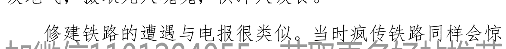

## 没有永远的造富奇迹

周末花开

2018年2月以来， M1-M2增速差至今已连续13个月为负。主要有两个原因：

一方面，地产调控加码。由于居民存款计入M2，企业活期存款计入M1，当居民购房时，货币就会由居民部门流入房地产企业，从而导致M1增加、M2不变。社科院发布的《中国住房发展报告（2018-2019）》显示，2018年以来，房地产调控政策不断加码，全国房地产调控次数已经高达405次，比2017年同期上涨接近80%。调控政策的加码导致商品房销售大幅下滑，进而拖累M1增速下滑。同时，居民部门定期存款大幅增加，或是由于买房意愿下降所致。

另一方面，企业融资不畅。在2017年12月资管新规意见稿发布之后，非标类融资规模迅速收缩，并从去年2月开始持续负增长。与此同时，由于金融机构风险偏好较低、银行放贷意愿不强，导致2018年初以来企业新增贷款规模和社融规模同比持续为负，企业融资不畅的背景下，现金流面临巨大压力，导致企业活期存款下降并拖累M1增速。

> > 于是有伪专家又叫嚷：中国经济处在通缩中，需要印钞刺激经济啦。

印钞刺激经济真的是万能的吗？

若是，委内瑞拉和津巴布韦就是世界楷模国家了。

### （一）

只要经济不好，央行就会放水救市 ~

当今主要经济体的央行们普遍信奉的“现代货币学理论”，又称 MMT。

MMT 认为只要政府举债用的是自己的货币，只要通胀率没有失控，就不用担心赤字问题，因为政府可以通过印钱来还债。换句话说，政府借钱不用担心还的问题，只要印钱就好。

次贷危机后美国进行了 3 轮量化宽松印钱（QE），直接导致美股出现 10 年长牛。而每一次放水，美联储似乎都在说：你看，怎么印都没有通货膨胀，所以，我们应该继续印钱救市，不会出事的。

美国的 " 成功 " 也直接导致日本的央行“大胆印钱”，除了大举买入日本的国债来救市，近期差点连日本的股市都要“全面国有化”了。原因无它，天量的货币供给没有去处，就只能去买国债和股市 ETF 了。

有样学样的欧洲央行也是，一轮 QE 刚刚去年 12 月份结束，现在又急不可耐的实施了新的货币宽松政策。

至于我的国，就放水力度而言，冠军。不多说，你懂的。

可以说，“经济不好，就印钱救市”，已经是全球共同的“信仰”。

### （二）

其实，大多数人可能不知道，最早的央行其作用，就是帮助财政濒临破产的国王融资而设立的。

像16世纪的北欧，还有17世纪的法国，那可都是鲜活的案例。

然而，它们的结果，都是恶性通货膨胀，还有财政彻底破产。

英国人秉持《国富论》所倡导的自由贸易精神，发明了现代央行的管理体系，也就是央行不能无限制的印钞，才算是作了一个好榜样出来。也因此，成就了英国后面几百年的霸业。

然而，上世纪的30年代的大萧条，让西方国家的政府压力山大。这个时候，凯恩斯主义的出现，绝对是如获至宝。

因为，它给了政府一个强大的理论依据，就是政府干预经济，其实是对的。

由此，在二战后的美国经济学界和经济政策领域，到处都是凯恩斯的影子。

只要经济不好，大家就想办法干预，成为了一股时尚。

当然，结果也很壮观，70年代美国的大规模滞胀，直接引爆一轮经济危机。

到了这个时候，人们开始反思了：原来，印钱还是会造成灾难的。

可是“人性怕痛”却是亘古不变的。

到了 80 年代，尤其是 1987 年的股灾，市场的惊恐，民众的惊慌，都让政府倍感压力。于是，现代货币理论 MMT 逐渐变成了一种新的潮流，成为了政府们救市的新的理论工具。

既然凯恩斯救市的方式会导致通货膨胀的恶果，那么我们就吸取教训。只要通货膨胀没有起来，我们就可以拼命印钱救市。一旦通货膨胀起来了，我们才停止放水。

这种修正版的救市宣言，可以说让各国领导人顿时松了一口气。

毕竟，正常人都知道，经济危机是市场经济固有的特质。而当危机出现时，你政府竟然什么都不能做，那么民众会怎么想？

所以最好的办法就是，以救世主的姿态，扮演着极为积极乐观的形象，昭告天下，“我们有满满的武器可以对抗一切经济周期的波动”。前提是，大家一定要有四个自信，要围绕在领袖的身边。反正，统计局会说一直没有通货膨胀，那么我们就大量印钱救市即可。

### （三）

事实上，央行放水是有前置条件的，并不是可以无限制的这么玩下去的。

即便人家美国已经玩了 30 多年的这个游戏了，人家所付出的代价也是极为高昂的，那就是期间起码 3 次大规模的经济危机。

要知道，人家可是有印发储备货币美元的能力，是可以将超发货币的代价摊薄后转给其它国家的。

即使如此，可还是一次次的危机，更何况没有这个能力的后进国家。

所以，经济不好就印钱，这就本身天然决定了其会直接导致巨大经济危机的隐患。

就拿土耳其来说，一直以“通缩”为理由要求央行放水。现在的结果是，土耳其的经济直接负增长了。

如果我们来看微观层面，这种政策理论，就是一种可卡因。

当企业和居民可以获得大量的廉价资金，他们真的还会好好干活吗？

No ~

这种情况下，最来钱的方式一定是购买优质资产，然后等着涨价。

不管优质资产是房子、还是股票，只要货币持续宽松，它们就会涨起来。

从而，社会上大多数人会渐渐发现：打工不如炒一把。

到了这个时候，企业就不会再去拼命搞研发、努力创新。它们更愿意不断获得大量廉价资金，然后回购公司股票，管理层们则拼命减持套现来获得暴利。

在这个阶段，普通人也没法去做实业了。因为实业根本产生不了多少利润，还要承担大量的成本和各种合规性风险。

所以，其实根本不是大家伙喜欢炒房炒股，恰恰是各国政府的印钞救市，让实业没法搞。

你实业再牛逼，人家有本事搞到低成本的资金，然后杠杆收割你，你又能如何？

同样，你再怎么努力加班，突然房价翻个倍，你什么都没有做错，工资收入的购买力就起码锐减了一半，你还会咳血加班？

而所有这些的必然后果是，大家都去加杠杆玩资本游戏、玩金融空转，从而全国范围的宏观杠杆率自然就会飙升，债务的规模注定是急速膨胀。

> > 加微信1101284955，获取更多好帖推荐

问题是，随着时间的推移，几年后，当借的银子需要还本付息时，那个时候的经济基本面已经更加孱弱了，大家拿什么来继续玩转这个游戏呢？

那玩不转了，不就直接是债务危机吗？

其实，我们常常说的金融危机，很多时候，就是债务引发的危机。

就以最强大的美国为例，其国债规模从次贷危机时期的7万亿美元，变成了如今的22万亿美元。这么多债务，难怪特朗普极力反对加息，因为光是利息就够特朗普喝一壶的。但若继续量化宽松救市，就连MMT理论鼻祖弗里德曼都预言美国有一半概率会不久爆发经济危机。

现在主要经济体都是老家伙当道，全球储蓄率都在下降，而全球的债务规模已经突破了 243 万亿美元，是美国 GDP 的近 20 倍。

请问，如此天量债务，你还要玩“经济不好就印钱”的游戏，那后面还本付息怎么办？

因此，新的全球经济危机即将来袭 ~~~

此刻，想起了《国际歌》的歌词：

> 这个世界没有救世主，要靠就要靠自己！

### （四）

我的国 2019 年 1 月大放水，社融和贷款数据都创了新高，但并没有明显改善 M1-M2 剪刀差，很明显放水的钱很大部分进入股市兴风作浪而并不是实体。

2 月放水力度大幅收缩，说明管理层也意识到金融货币工具的效果越来越差，放水没有解决解决根本问题。

后续 M1 增速有跌成负值的可能，M1 走到这位置，基本就是底了，随后若没有进一步的霹雳手段跟进，很可能房价就要崩盘。这也是金融供给侧改革迫不及待推出的原因之一，就是要强力监管，增大间接融资，让资金进入实体维持住 GDP 的增长。

后面无非两种结果，一是 "大水漫灌" 刺激资产价格（房价和股市）的上涨，印钞使得 M2 继续高速增长，那么汇率就会崩盘，且伴随恶性通货膨胀。二是房地产价格暴跌，被动去杠杆，M2 就会衰退陷入紧缩，债务危机就会爆发。

当然更大可能是温水煮青蛙，能拖就拖，但累计后果和第一种情况是相同的。

没有永远印钞的神话，中国也不会例外。

人 203

人 点赞

主帖获得的天涯分：0

19楼

评论(3)

加微信1101284955，获取更多好帖推荐

【1楼主：周末花开 时间：2019-03-21 18:31:05】

中商情报网讯：根据国家统计局和民政部的数据，2018年全国结婚率为7.2‰，为2013年以来的最低。

因为无论你怎么折腾政策，总要有人好好干活去创造财富。

因为政策本身从来不能创造财富，它们只能提供有利于创造财富的环境而已。

这就像厨子水平再高，但食材太差，你怎么搞

那么，经济的基础是什么？

是人！

不论是供给、还是需求，那都是人。

所以，当很多人大呼 AI 可以替代人的时候，他们犯了100 多年前的人们一样的错误。以为强大且有效率的产能供给，可以完全替代人，人们只要在海滩边享福即可。100 多年过去了，还真的没有实现过。

这里的根本，恰恰就在于，经济本身是人与所处的环境之间的强大张力所触发的。

我们既是生产者，我们也是消费者，而且这个“我们”还有地理、时间、文化、性别等诸多结构性的差异所导致的各种变化。

所以，即使大数据帮助马爸爸确实知道全国各地区姑娘们的罩杯分布，但是，他永远没有能力去创造新的内衣风尚。因为你可以用过去的数据去测算，这是基于人的行为理性层面的东西；但是，你永远没有能力去预测全新的东西。

也就是说，我们无论怎么提升生产的效率和优化供给，没有一个系统可以创造能够满足人类很多杂七杂八需求。

这就是为什么苹果走得今天是因为乔布斯这个人而不是那个 AI 机器的原因。

经济除了供给，更重要的，其实就是消费。而消费的非理性，其实才是企业家们勇往直前的根本动力所在。

大致搞明白这个点后，大家就知道了：人，才是经济的根本！

如果说过去很多年我们的困扰是老家伙越来越多、大家不肯生孩子，现在的问题更加严重，年轻人直接掀桌子 ——

两性交流滚滚床单，可以呀！结婚嘛，结你妹啊~~

要知道，我们中国人几千年的文化逻辑种，夫妻始终是第一人伦，其重要性是超过父子之间的孝道。

因为没有夫妻，哪里来的父子？

现在大家连婚都不肯结了，还谈什么生子？？？

那么，为什么？

在我的国，由于越来越激烈的市场经济，让整个国家的人们生存压力巨大。尤其我们到现在还在搞低人权出口倾销，其结果是，卖儿卖女补贴美国，背走美国的通货膨胀，还要养一大帮老家伙。

这种残酷的环境下，男女双方年轻人，都是活得苦啊。

特别我们还是“关系经济”，而非真正意义上的市场经济，所以，男性一定要出去应酬。这种情况下，就算家庭富裕，也难保家庭和谐。

所有这一切就让我们大多数人身处一个非常奇异的经济现象 ——幸福的奴隶。

所谓幸福，是说物质极大丰富、社会环境也比几十年前自由很多。而奴隶，则说的是，其实最终很多人还是受困于诸多现实的限制，无法自拔。

这种现象，绝对不是目前的老家伙那一代人可以理解的。

他们会认为，你们有吃有穿，工作不错，还天天叫苦不休，那是没有吃过苦。

而在现在还在努力工作的大多数人来说，上面的话，只是风凉话。这些老家伙们，才是没有吃过我们正在吃的苦。

面对巨大的生存压力，面对央行不断放水引发的资产价格膨胀的重负，贫富差距急速拉大，两类人群却产生了某种“共识”：

-   没钱的 —— 结什么婚？连自己都养不活了，还要拼学区房、婚礼、养车等等。
-   有钱的 —— 找到差的，还不如自己过，否则被搞死。

这下，事情闹大了 ~~~

如果没有年轻人，XXXX集团的这么多老家伙还想再活五百年，谁来养？

不肯结婚，其实是年轻人一次谋逆。

不想再被无下限的盘剥，哪怕自己老了没有人管，也不想再被无限压榨。

这种违反基本人性的选择，只能警示我们：

年轻人的压力之大，已经远远超出了大多数人的想象。

然而，年轻人才是一个社会创造、消费的主力。

你看看最牛逼的那些世界级的人物，很多都是 20 ~ 45 岁的区间创造了惊人的贡献。

如果这个年龄阶段的人都集体选择“宁愿浪，也不婚”，那么，未来谁来撑起中国经济呢？

是的，帮年轻人，就是帮中国经济！

是时候，做出改变了！

-   25楼
-   评论(4)

> [--楼主:周末花开 - 时间:2019-03-22 00:50:22--]

美联储3月不加息！甚至放话出来，可能2019年都不加息了！

这事顿时让全球资本市场大为震惊。

你说3月份不加息，没事，你不说同志们也知道。

可是，这才3月份，你就说全年不加息了，这说明经济差到什么程度了？？？

加微信1101284955，获取更多好帖推荐

现实的世界是，美联储放“鸽声”，等于是确认全球经济一塌糊涂。

本次美联储开会，重点有下面这么几点：

-   ——停止缩表
-   ——强调未来经济展望是乐观的
-   ——目前需要耐心，而不是加息或者降息
-   ——美国的劳动参与率低

去年美国还是一副厉害国的样子，今年开年就一副死相。

从美联储上面的这几个核心点来看，确实给人感觉并不那么“乐观”。

停止缩表，其实是大家预期之中的事情。然而，停止缩表的含义，到底是什么呢？

这就要看看次贷危机以后，美联储是如何救市了。

很多人简单的把美联储的 3 轮 QE 认定为大放水。

当然，你不能说这完全是错误的。

然而，实际情况还远远不是这么一回事。

美联储当年用自己的信用帮助财政部、大型机构等背走坏账呆账，其结果就是，美国国债不断飞速攀升；还有就是，美联储的资产负债表也不断扩大。

由于美联储的资产负债表的事情跟普通人太远了，也没有感觉很直观，所以，大部分根本不关心。

普通人关心的问题是这些债务和亏损去了哪里了呢？

其实 QE 的精髓，就是央行“暂时扛走了大家欠的一屁股债”。说的逼格高一点，就是通过保住资产价格，从而确保全球经济复苏。说的逼格 low 一些，就是央行通过扩表暂时把大家欠的债先扛下来了，你们继续玩游戏，不要有负担。

看明白了吗？

也就是说，美联储的资产负债表里包含了上一轮危机的种子，美联储是在用一个更大的泡沫去包裹住上一次大泡沫破裂时的阵痛。

所以，一旦去年开始美联储大规模缩表，你这不是等于直接把之前的债务也要爆出来吗？

其体现形式就是，美联储如果自己不买美国国债，那么不断天量供给的美国国债就没有人去填补缺口了。

## 归纳起来：

保住资产负债表的规模 = 保住资产价格 = 不去主动刺破目前已经形成的更大泡沫

看懂了美联储的无奈和沮丧，也就很容易去理解，为什么要暂停加息？为什么要表态对未来经济乐观？

都已经泡沫这么大了，你不继续演戏，你天天告诉大家皇帝在光屁股在跳舞，这怎么行？？？

问题来了，你这么拖下去，也不是事情啊？

其实，这里面是有美联储的 2 个“小心机”的

从任其大肆“放鸽”、却没有真的降息，于是很多的预期被“管理”，自然大家就会购买美国国债来避险。这下，美国国债的融资问题，暂时就得到了缓解。

——美国企业的利润，很大一部分是靠海外市场，而其中，中国的地位最为重要。现如今，中国全面启动稳增长。一旦，中国的经济刺激计划可以成功，那么注定会像 2015 以后那样，利好全球，也包括美国。等于中国放水，美国人获益，那有何必此刻着急自己加杠杆呢？！

毒，是你美联储毒。

## 我们归纳一下，就是：

3 月美联储会议 = 不刺破债务泡沫 + 引导银子去买美国国债 + 等待中国人加杠杆救市

聊了这么多，可能性子急的老铁又要问了：那全球经济到底是好还是不好？

其实，美联储有关劳动参与率低的描述已经说明了一切。很多不理解美联储的人会觉得，只要失业率低，就是美国经济好。

美联储这帮人精都知道，所谓失业率就是过去连续4周主动申请工作的人为统计口径的。外面还有天量的失业者，早就去吸毒、high歌、混迹复杂的男女问题，就是不想上班。这些人，根本不在失业率统计里面。

要知道美国就业的真实情况，只有看适龄人员的劳动参与率。你可以有100个上班，现在不管什么原因，就只有68个人上班，这就是经济出问题了。

所以，作为全球经济的龙头老大，作为全球内需最为庞大的国家，连美国经济都出现问题了，可见全球经济确实不容乐观。

换句话说，我们一直强调，目前全球经济正处于周期尾部，是完全符合基本面的。

那么，这事对于中国来说意味着什么呢？

尽管美国人冷眼等我们放水救市，其实，我们也很高兴美国可以这么做。

因为美国不加息，人民币汇率贬值的压力就小了。鉴于国内经济依旧萎靡，那么后面放水救市的节奏就不会停，而且还可以步子大也不怕扯到蛋。

因此，我们预计，中国央行新的放水政策正在来的路上。

由此，我们可以很乐观的说，今年中国稳增长政策由于外部环境相对ok，很有机会成功。

然而，其代价则是，更高的物价、更大的产能过剩、更高的宏观杠杆率、以及房价的可能再次回升。

现在一月放的水已经把股市搅动起来 后面就要观察水放多少，往哪里去，我们投资的机会在那里~

40 楼

评论 (3)

加微信1101284955  获取更多好帖推荐

【楼主：周末花开  时间：2019-03-22 15:19:40】

以巴西为例，看看韭菜们是怎么变穷的。

巴西是新兴经济体国家的典型代表，2012 至 2018 年的经济增长率分别是 1.93%、3.01%、0.51%、-3.55%、-3.47%、0.98%、1.15%，七年间的经济增长率是 0.036%。也就是说，七年中巴西的经济规模基本未变。如果人均收入变化与 GDP 变化同步的化，人均收入也没变化。考虑到国家公布的经济数字都是扣除通胀后的数字，经济规模未变，人们收入购买力也未变……韭菜们就可以聊以自慰，2018 还可以继续过2012 年相同的日子呗。

呸，想得美！

在经济基本没有增长的七年中，巴西的GDP是巴西货币雷亚尔计算没有跌，但雷亚尔兑换美元汇率贬值了33%，也就是说若以美元计算，巴西人均收入就下降了33%，也就是说，人均生活水平至少倒退了33%！

为什么说是至少呢？因为美国2012年至2018年的年通胀率是1.8%、1.2%、1.3%、0.5%、1.7%、2.2%、2.2%，这意味着七年间美元的购买力下降到原来的89.59%。相当于2018年的一美元只相当于七年前的0.8959美元，考虑到美元购买力下降的因素，相当于巴西以美元计算的人均收入的实际购买力下降了约40%，实际也就是说，巴西韭菜们的生活水平下降了40%左右！

以巴西货币计算的收入没有变，但生活水平实际却大幅下降了40%，中间的奥秘在那里呢。

既然一个社会的经济规模大体未变，韭菜们的生活水平却大幅下降，必定有人“盗取”了一部分本属于它们的财富。

假设：原来1巴西雷亚尔的社会财富，加印10%的钞票后，就会变成1.1雷亚尔的社会财富，此时通胀率是10%（纯粹是假设，为了容易表达），韭菜们的工资也应该增长10%，这是平等的。但是，当权力左右了通胀率之后，统计局就可以把通胀率改成5%，以这个数字给韭菜们涨工资，或者衡量它们的工资水平，韭菜们没话说吧。此时，权力阶层就不仅能获得正常情况下应该增加的10%（弥补真实通胀带来的损The request was rejected because it was considered high risk## （二）

老农的女儿被村长霸占后……
老农想：找乡长说不定和村长有勾结；找县长，说不定和乡长有勾结；于是找到市长反映；
市长说现在规定你不能越级，你去找县长；
县长说你不能越级，去找乡长；
乡长说你不能越级，去找村长；
村长给老农两耳光：滚回去，有本事你去上访啊！
于是老农回家拿了一把刀就走了。

后来大家从报纸上、从电视上才知道老农是个恐怖分子……。

不多说，你懂的。

### （三）

哲学里有个著名的三问“我是谁？我从哪里来？要到哪里去？”用在投资上，也是非常重要的，我们做任何投资，一定要想清楚：

-   1. 知道做什么。
    2. 知道如何去做成它。
    3. 知道什么时候该停下来。

把钱撒出去，知道自己是在做什么，赌博？投资？这个投资有哪些风险？是否最小化？有没有预计的目标的策略？

下一步是知道如何去做成它。是找人合作？还是自己研究？还是这钱可以打水漂放着不动？自己的技术、心态哪里有缺失？该如何弥补？

最后是知道自己什么时候停下来。

这三步，不仅仅是投资，在工作、学习、恋爱上，也是很重要的三步。

我们不妨静下心来好好想明白“我要做什么？该怎么做？什么时候停下来？”，只有靠纪律，靠自律，才能穿透迷雾，保持清醒。

做投资，有人靠情绪，随意发挥，买定离手，等待天决。有人靠策略，坚决执行，命运掌握在自己手里。

幻象丛生，握在自己手里的，才最真实。跟随思辩会让你的财富增值并能守得住。

### （四）

昨天，有8家银行，在6个省市的分行柜台上试点出售地方债。

以前，我们经常听说有人排队去买国债，从来没有听说有人排队去买地方债。现在，这个现象不仅成为现实，而且，陆续还有。

昨天的销售，非常火爆。第一个是宁波债券，这是一个计划单列市的市政债，第二个是浙江省债券，是省级地方债。

宁波的市政债，是土地储备专项债券，也就是说，这笔钱，是用来收购土地用的，期限3年，招标确定的发行利率为3.04%，柜台销售额度3亿元。

浙江省级债券，为棚改专项债券，也就是说，这笔钱是用来安置搬迁户的，期限5年，招标确定的发行利率为3.32%，柜台销售额度11亿元。

最有意思的地方，是购买门槛。任何人，持有身份证，都可以买，而且起点只有100元。这个门槛，几乎是银行所能买到任何理财产品的最低点。因此，个人投资人非常踊跃。

借新还旧，拆东墙补西墙，一百元的渣渣钱都看得上，可见地方政府真的好缺钱。

其实现在真正的杠杆不在民营企业，而在地方政府和国企上。地方政府的实际债务规模非常大（有说超过40万亿），国企负债更是百万亿规模，只靠增发货币恐很难彻底解决问题。

至于吃瓜群众现在踊跃购买的地方债（国债），给的利息能否抵消通货膨胀部分不？

难！

## （五）

法国曾经是欧洲地区举足轻重的大国，这里被称为世界香水王国，这里曾经是制造业大国、工业重地，巴黎，作为世界浪漫之都，曾经引起无数少男少女们的迷梦……但是如今这一切曾经冠名在法国头上的称号，都已经一一被逐渐取消。

原因无他，只有一个原因：法国的人种构成彻底变了。法国，曾经是100%的白人国家，然而，现在其人种的构成，却变成非洲黑人+黑白混血儿占法国总人口的60%，而纯种的白种人已经变成了35%少数稀有物种，还有一点点其他有色人种，这种主体人种和民族的彻底转换，非洲黑人只用了不到80年的时间！

你如果2018年看过在俄罗斯举办的世界杯，就会发现，法国足球队，已经由原来白人足球队，俨然变成了非洲黑人足球队，法国足球队的人员构成，黑人比例已高达90%。

如果你走在巴黎的街头，你会发现这里俨然成为了黑非洲国家地区，而不是以往传统意义上的白人国家地区。

如今的法国巴黎已经变成了臭气熏天、街道混乱、垃圾遍地、种族之间的冲突和斗殴此起彼伏，比如最近风卷残云般刮起的法国黄背心运动，就是法国的白左分子和黑人混血儿搞起来的大规模暴乱事件。

……

如今，非洲黑人仅仅通过不到80年的时间就将整个法国人口有原来100%的白人国家，变成了一个以黑种人和黑白混血儿占60%为主体的人种的国家，而法国的国内年生产率和增长率已经跌到战后的历史最低水平，法国的三大产业已经出现逆转性的下降和破产趋势。

为了掩盖这一点，法国政府通过了令全世界啼笑皆非的事情，出台专门法律，禁止以种族和信仰区分人口构成的法律，成为全世界第一个制定如此法律的国家，此项政策一出台，很多国家纷纷批评法国政府完全是掩耳盗铃，根本不会起到任何改变事实的作用。

## 再见，法兰西浪漫之国！

……

不要以为这离我们还远着，看看广州，这种趋势越来越明显！

我们不要所谓的政治正确，“中国第一”也该放在“中国梦”中了。

251楼

评论

[--楼主:周末花开 - 时间:2019-03-28 18:43:30--]

这是一本祸害千年的秘诀经书，也是历朝历代的禁书，我们学习了解它的目的是更好理解中国之现状，绝不是鼓励你按照经书上写的去做。

话说武则天后宫逆袭，成功当上了皇帝。一个女人君临天下，当然有很多人不服。为了“干掉”这些反对者，武则天宁可“错杀一千，不可放过一个”。而为了完成“错杀一千”的指标，武则天起用许多善于陷害他人的酷吏。

来俊臣就是其中最杰出的代表。此人专注陷害十多年，被陷害人的尸体连起来可能比绕长安城一圈还长。手下还有数百个陷害业务员。为了指导这些业务员的工作，来俊臣亲自主持编写了《罗织经》。

这是一部祸害中国千年的秘诀经书，古代列为禁书，很多人一辈子都读不到，这是一本什么样的书呢？

据说那时候陷害界的同行周兴被来俊臣打倒，临刑之前，看到来俊臣的这本书，心服口服，自叹不如。

破案专家狄仁杰看了这本书，直冒冷汗。

就是从残酷宫斗里杀出来的武则天看了，也自叹：“如此机心，朕未必过也。”

这么一本有杀伤力的书，里面有几个关键的内容，让我们参考看看。

## （一） 阅人

来俊臣把阅人放到第一章，他认为要想陷害人，或者不被陷害，看穿一个人最为重要。

而在来俊臣的眼里，人只有一个特征：虚伪。

每个人都有欲望，圣人图名，百姓图利，有了欲望，人又不愿意显露出来，加以掩饰，就会变得虚伪。而如果没有看透这一切，就会被人的外表所迷惑。而一旦被迷惑，那就倒霉啦。就是父亲也会被儿子害死。

来俊臣特地举了一个例子，隋文帝杨坚。杨坚立了一个太子杨勇。此外，杨坚还有一个特别聪明的儿子杨广。杨勇平时大大咧咧，生活奢侈，老婆又多。杨广则显得十分朴素，穿着旧衣服。家里只举红旗，不打彩旗，经常感动杨坚。杨坚阅人不透，最终就废了太子杨勇而改立杨广。后面的事情大家都知道了，杨坚最后被坑爹第一人杨广活活气死（有野史说是杨广所害），他小妾都被杨广么么哒了，隋朝玩了两届就 over 了。

所以，来俊臣总结一定要透过事物表面看本质，要相信自己，不要相信别人，提防他人，永远都是必要的。

## （二）事上

所谓事上，就是怎么处理跟领导的关系。

来俊臣先生认为，不要跟领导作朋友。为什么呢？因为领导有疑心，时刻会提防下属，而下属的荣华富贵都握在领导的手里。领导可以给下属一切，也可以剥夺一切。

自己的小命都掌握在领导手里，自然心存恐惧之心。这样的关系怎么可以当朋友来处呢。

那应该怎么办？

拍马屁！

来俊臣在书中传经授道：拍马屁这种事，不要不好意思，一定要经常拍，随时拍。只有这样，才能让领导顺心。领导顺心了，事情才能办顺利。

在业务圈，有一个很有名的话：上司才是你的客户，上司才是你的上帝（现在中国官场适用，也深刻理解为什么春晚要办成新闻联播的加强版）。

那么，怎么拍马屁呢？

当然要察言观色，揣摸领导的真实意思。

这里举一个揣摸的例子。明朝时期，朱棣去北方出差（打仗），太子朱高炽监国。有个大反派，汉王朱高煦。朱高煦老想当太子。趁着老爸出差，他在后面造势，说朱高炽的坏话。

朱棣很生气，回来后，把大臣杨士奇叫过来，问太子监国情况怎么样。要是汇报太子的工作情况，那就糟糕了，因为皇帝想了解的并不是太子的工作能力，而是态度问题，但他又不能直白的问：“我这个儿子是不是在坑爹？”

好在作为太子党的杨士奇很聪明，他马上猜到了朱棣的意思。报告：太子是很孝敬的，而且他也很聪明，有错必知，有错必改。

朱棣这才放心了。

可见，如果领导问非所问，员工一定要知道答非所问，不然，倒霉了都不知道怎么回事。

来俊臣喷血告诫：一定不要以为领导是笨蛋，领导能成为领导，一定有过人之处。对领导，不能装逼，不要抢功劳，不要过于显露自己力量，不要让自己的实力太过强大。不然，就是自寻死路。

估计岳飞同志就没有看过这本秘诀，自己手下拥兵十万，叫“岳家军”，还喊要打到北方去接早已经歇菜的宋徽宗、宋钦宗，你这叫 boss 赵构先生怎么睡得着？所以岳飞被杀是必然的。

相比曾国藩就聪明多了，知道慈禧盯着他。打下太平天国，不等人家卸磨，自己先把湘军解散了。

所以，臣强则死，智勇勿显。

说人话就是做人要低调，做下属，更要低调！

## （三）治下

有事上，当然就有治下。

来俊臣先生告诫大家，不要看下属拍你马屁，你就放心了。永远不要对下属掉以轻心。因为没有人愿意甘居人下。下属要是想往上爬，怎么爬？当然是踏着你的尸体往上走。

九千岁魏忠贤先生就是这么干的。

魏忠贤年轻的时候在外面欠了一屁股的债，横下一条心，偏向虎山行，自助阉割，跑到宫里当了宫务员。其间的介绍人就是领导魏朝。

但魏忠贤经过仔细观察，发现魏朝之所以受宠，是因为跟皇帝的奶妈客氏发展并保持了不正当的不男不女关系。

魏忠贤果断下手，利用自己的身体优势（没阉干净），撬了领导魏朝的女朋友客氏，把魏朝踩了下去。

一路上，魏忠贤坚持坑领导不放松，最终成为了太监中的霸主九千岁。

那么，怎么避免被下属坑呢？

首先要树立威信，该惩罚时千万不要心软，该表扬时也千万不要小气。而且要在下属面前保持一定的神秘感，不要事事都跟下属讲，事事都让下属参与。应该将事情进行分拆，只让下属接触到一部分，其余的部分让下属去猜。下属搞不清，气势上就输了半截。猜得对，可以赏，以示恩宠，猜得不对，可以罚，以示雷霆。

而提拔下属千万不能太快，但相处要和言悦色，职位不必给得太快，但赏赐一定要丰厚。职位给得太快，他就会心生傲气，而钱什么的可以多给，这样可以消磨他的锐气。

另外，来俊臣先生特别提到，有一种人很有才华，这种人，当没有危害时，可以低下身段让他办事，一旦对自己产生危害，则一定要铲除。

比如来俊臣就是这样对付他的下属周兴。

周兴先生是陷害界的老前辈了，入行比来俊臣还要早，但理论储备，技术水平不如来俊臣先生。所以成为来俊臣的下属。

周兴也是很有能力，经他的手陷害了一大批忠良或者非忠良，但这位仁兄开始有点管不住自己，不跟来俊臣打招呼，就独自开展陷害业务，最终被人告发。武则天为了社会和谐发展，也不得不收拾周兴。

这个时候，周兴就成为对来俊臣有害的人。来俊臣必须除掉这个有力的下属。但是怎么处理呢？大家都是这一行的高手，忽悠是没有用的。

来俊臣没有来虚的，直接请周兴吃饭，不耻下问，“现在的囚犯大多不肯招认，怎么办？”

周兴指点迷津，“这容易啊，搞一个大瓮，用炭火在四周烧，再把犯人放到中间，有什么事他们敢不老实招供？”

来俊臣连连点头，好主意啊，找来大瓮，烧起炭，起身对周兴作了一个请，“老兄，有人告你咧，请你入瓮吧。”

周兴果然坦白，武则天考虑到他在陷害界的贡献，死刑改判流放，只是半路被仇人所杀，也算是为陷害这项事业奉献了生命。

上面所说的事上和治下，其实都是为了一个东西：控权。

## （四）控权

人在庙堂，没有权力那是万万不能的，但权力这个碧池跟丽春院的头牌一样，得到她很难，保有她更难，想要替她赎身，根本不可能。

那么，怎么控制权力呢？对最高层来说，要想控权，最重要的是愚民，不能让老百姓变得太聪明，不然，就会造成人民群众日益增长的智商跟皇帝高官们日益下降的道德之间的矛盾。而在上下级，或者平级之间抢夺权力要注意抢夺实权，而不要抢夺虚名，抢夺职位，而不要抢夺钱财。大家混职场要注意，有的岗位虽然工资不高，但有实权，有的岗位工资高，但没有实权，也没有前景。大家一定要重岗位而轻待遇。

此外，来俊臣温馨提示，在天下大乱时，上层会使用一些有能力的人，但天下一旦平定，就会铲除他们。

这个大家都懂的，朱元璋、刘邦们都是这样干的。

而在盛世，只要用忠诚的人就可以了，平庸一点无所谓。

比如，乾隆皇帝用和珅，就是盛世惟忠。不过，如果乱世惟忠，那就麻烦了。像蒋公明明处在乱世，却喜欢惟忠，用陈诚这些忠诚的人。结果大家都知道了。

有意思的是，来俊臣知道这个道理，却未必做出正确的举止。

武则天为了打压反对者，起用他们这些酷吏，等反对者消灭得差不多了，武则天就开始对付他们来博取人心。

周兴被干掉了，就是来俊臣也被告发处死。

一生研究控权的人，最终却被权术弄死，可见，知行合一是多么困难的事情。

## （五）制敌

在这个世界上，比认清朋友更重要的就是认清你的敌人。但什么样的人才算敌人呢？

来俊臣从一个酷吏的角度给出了答案，人们共同的敌人，不一定是我的敌人。

大家都认为坏的，不一定就是我们的敌人，他也可能成为我们的朋友。

而领导的敌人，就算是朋友也要与之为敌。

比如武则天决定处理的周兴，虽然平时吃吃喝喝，还是上下级，但皇帝说要消灭的人，那必须像冬天一样无情消灭。

那么，亲戚是不是朋友呢？不是。如果是领导要消灭的，亲戚也要当敌人来对待。

所以，是不是敌人，要看领导的意思。作为一个合格的陷害专业人士，一定要把天下所有的人当成敌人，亲戚、朋友都下得了手，这样，才能保全自己。

而在对待敌人时，一定要先下手为强，给敌人制造罪行要硬抓两点，一是犯上作乱。这种罪名，一抓就灵，中招必死。二是，从道德上抹黑对方，这种打倒是彻底的打倒。

这是陷害的招数，但大家不要以为陷害只有奸臣才干，只有奸臣打倒忠臣才用这些招数。其实，这些招数同样可以为忠臣所用，可以用来打倒奸臣。

明朝嘉靖年间，徐阶打倒严嵩就活用了这两招。

当时，各级官员收罗严嵩的罪证，什么贪污、陷害忠良啊。徐阶一看，这完全不对嘛。这种罪，嘉靖老板怎么会在意。

徐阶改成四个字：犯上，通倭。
犯上是陷害的必杀技，通倭还能从道德上打倒对方。

## （六）固荣与保身

我们制敌、我们事上、我们阅人，最终目的是固荣与保身，保有我们的荣耀，保护我们自己。
当你显达后，自然会遭人妒忌，会有人在后面下黑手，固荣与保身就显得极为必要了。
那么，怎么固荣跟保身呢？
还是老办法，紧紧团结在领导的周围，建造自己的荣，保有自己的身。

这里尤其要注意两点，一是陷害他人时，要做好背景调查，不要随便乱来。一个人，尤其是高官，肯定有有背景的，随便下手，很可能就会得罪了自己得罪不起的人。
比如明朝的大太监刘瑾。
这位刘瑾同志没什么追求，平时也就陷害个把忠良玩一下。有一回，他盯上了一个大臣杨廷和，把杨廷和调到南京当户部侍郎。
南京是老都城，属于干部养老的地方，刘瑾把杨廷和打发到这里，基本上也算提前内退了。
刘瑾自问干得漂亮，可没两天，皇帝朱厚照下了班，突然问道：杨学士呢？
刘瑾感觉不妙了，老杨下放没多久啊，怎么皇帝就问起他了呢？
答：“去南京了”
朱厚照大怒，“谁让你叫他去南京，赶紧叫他回来！”

刘瑾这一回就犯了背景调查不仔细的错误，杨廷和是朱厚照的老师，而且是太子时候的老师，属于基本盘，老班底。
你丫一陪玩的，整人家陪读书的？

刘瑾也是没看过这本《罗织经》啊，不然办事也不会这么马虎了，他要是看了，就不会去惹惹不起人，安心做一个太监，后面就不会被凌迟了。

固荣跟保身第二重要的是，注意观察领导的身边人。

领导都是花心的，极容易见异思迁，当领导换了宠臣时，
要注意及时转变。

来俊臣写下了这一句，自己却死在这上面。搞陷害业务久了，来俊臣有点拎不清，竟然把业务对象放到了武则天的宠臣甚至面首身上，比如太平公主、张易之等人。

这就是自寻死路了。

## （七）察奸

来俊臣很诚恳的表示，做奸臣是一项技术活，没有聪明才智，是做不成奸臣的。而要对付奸臣，一定要比奸臣更奸。

来俊臣更理直气壮的表示，明面上，忠与奸是不同的，他们一个为国家，一个为自己。奸人害国家，忠臣害自己。但实际上，忠不忠，奸不奸都是皇帝一个人说了算。

皇帝说忠的，奸臣也是忠臣，比如秦桧。皇帝说奸的，忠臣也是逆臣，比如岳飞。

而随着时间的变化，人也是会变的，像严嵩同志，当年也是热血青年，朝廷让他出来工作，他号称朝中奸臣太多，不与为伍。

可时间是把杀猪刀啊，严嵩发现忠诚是个然并卵，果断转型，从忠臣变成奸臣。从而青云直上。

好了，这些都是陷害他人的理论基础，下面就进入实操部分。

## 实操一：谋划

陷害忠良是一项系统工程，做这样的事情，当然要做规划。

要陷害他人，首先要定罪名，最好用的罪名就是欺君跟谋反。

来俊臣先生就是这么干的，他干的最有名的一件陷害案就是陷害狄仁杰。

来俊臣给狄仁杰安排了一个谋反的罪名。反正那些年，反武则天的人太多了，多狄仁杰一个不算多。

奇怪的是，狄仁杰还没等烧大锅涮人肉，就老实招供了。

其实，狄仁杰是假招供，他知道，不招的话，来俊臣的那些大刑可以活活打死人。所以，他假装招供躲过了打，然后将申诉书写在自己的棉衣夹层，让人带了出去，呈给武则天看。

这里面，来俊臣就犯了一个错误：不够机密。

不过，在谋划篇里，来俊臣倒是提供了一个相当棒的陷害忠良的方法：其功反罪，弥消其根；其言设谬，益增人厌。

把人家的功劳说成罪过，把人家的言语说成荒谬，让大家都讨厌他。

袁崇焕就是这样被整死的。

袁崇焕明明是力拒清兵，却被说成跟皇太极达成秘密协议。

不要怕理由太荒谬，其实最荒谬的理由往往最有杀伤力，像严世藩这种什么都不缺的人，也可以说成通倭。

经过策划，将其抓起来后，就进入下一个环节：问罪。

## 实操二：问罪

问罪不是很简单嘛，按照法律来问就是了。

智者来俊臣告诉你，你这个想法太简单太幼稚了。法律是死的，人才是活的。尤其是罪名，不问是出不来的。

最好的问罪就是密告。

密告制度是武则天女士十分喜欢的一种方式。

武则天在政府门口放了一个方形的铜盒，学名：“铜瓯”，原本是用来收集建议的。后来，提意见的人没有，告黑状告阴状的人一大堆。武则天也需要这种效果，来打击反对她的人。

来俊臣就是靠这个起家的。他善长组织人手，从全国各地发起密告。这样，密告可以相互补充，相互证实，就是岳飞也给你打成秦桧。

这些密告送到武则天的手里，来俊臣就会开始等待。

来俊臣先生介绍，这时候一定要沉住气，没有谕旨下来，说明皇帝的想法未定，不要轻举妄动。而一旦下了，那就要马上动手，该抓就抓，该关就关，该审就审，该打就打，绝不能有半点心软。

万一打死人了呢？来俊臣轻松表示，那就报告犯人畏罪自杀好了。

经过这种审判，没有不招的，但这样就够了吗？来俊臣摇头，做到这一步是不行的，一定要挖出同党，让他供出同谋。而如果他的招供有破绽，那就自己补充供词，只要看起来真实就可以了。

来俊臣就是这样对付狄仁杰的，我们前面说道狄仁杰利用棉衣传出了申诉状，武则天一看，这好像有冤情啊，派人下去调查。

来俊臣感觉麻烦了，马上找人冒充狄仁杰的笔迹写了一份谢死表交给武则天。幸亏有人告发来俊臣专门干这种事，他提供的这些状词，内容基本是复制，不论大人小孩，都是一个模板制作出来的。

调来一看，果然如此，这说明来俊臣的陷害细节还需要加强。

如果碰到不招供的怎么办？那就要用到刑罚了。

## 实操三：刑罚

死是容易的，但痛苦是难以接受的，所以人往往受不了用刑，而承认死罪，只求速死。

这时候，不要光会用刑，还要会打心理仗，要攻击对方的弱点，比如有的人害怕连累亲人，就可以以此为要胁。

而如果有的人不认罪，那就给他加上更大的罪名。至于什么罪名，则可以看着办。因为君主都是疑心很重的。只要你敢说，不怕她不信。

来俊臣利用这一招，陷害了无数的人。什么人一来，直接上最高档的谋反，还不打折。你不认，我们可以扩大打击范围，把你的亲人家属都搞进来。

怎么把对方的亲人，家属牵连进来呢。

这就是来俊臣最后的绝招：瓜蔓。

## 实操四：瓜蔓

所谓瓜蔓，就是顺藤摸瓜，从一个瓜入手，把一串上的瓜都拎出来。不要怕事大，尽管把事情搞大，牵连的人越多，则办案的功劳就越大。为了罗织罪名，就算委屈个把奸臣，也是在所难免的。

在这上面做出突出贡献的，还不是来俊臣，而是朱元璋先生。朱元璋在后面搞的洪武四大案，每一个案子起步价就是一万人，搞到后面，官府里面的都没有人上班，集体倒台了。只好请犯事的官员带病上岗，着铐上班。

那么，怎么搞大呢？

罪名可以多样化，这种罪名不行，可以找其它罪名，可以移花接木，把别人的罪行安到目标身上。深挖罪犯关系网，从亲戚、朋友一个个找，务求斩草除根。

所以，来俊臣温馨提示大家，关系可以使你发达，关系也可以使你倒霉。如果你的朋友倒霉了，一定要立马转换关系，把朋友当成敌人。比如来俊臣就是这样对周兴的。

> > 他们贡献了一个成语“请君入瓮”

不这样做，就会被拖下水，最后只有害了自己。而与朋友交往不能太过密切。太过密切，他就会知道你的一切，保不齐，他要是进了牢房，第一个供出来的就是你。

总而言之，人在庙堂飘，哪能不挨刀，只有时时谨慎，才能保全自己。

这就是来俊臣的智慧大全，看了这些，你是不是更理解中国之现状了呢？

- 274 楼

- 评论 (3)

> > [--楼主: 周末花开 - 时间:2019-03-29 12:10:49--]

环球时报胡编经常与时俱进，就热点新闻在自己的大本营发声之外，还在围脖、头条等有大量粉丝，当然里面有多少 XXX 安排的小粉红另说。

然而很多吃瓜群众并不知道胡编有海外推特账号，而且里面发言经常被骂得狗血淋头，因为那里不好安排小粉红啊！

最近胡编又发声，貌似很正能量，说可以批判 XX，但要把握三个原则......

- 尼玛，感觉老胡对群众的要求真高呀！批评还得把握三个原则。好比对老胡的批评也要把握三个原则：

- 凡是老胡讲的都是对的；

- 凡是老胡认为不对的都是不对的；

- 对老胡最好的批评就是不批评。

在这三个原则下欢迎随便批评老胡啊！

加微信1101284955 获取更多好帖推荐

有时候我们真分不清老胡是低级红还是高级黑，真相可能只有一个，自己拿了好处，至于那些受苦受难的群众呢，让他们有多远滚多远吧。

这不，这波经济稳中向好，东北先扛不住了。

28日13时50分许，沈阳市公安局交通警察局和平一大队发生纵火爆炸袭警案。犯罪嫌疑人纵火后，将用黑火药自制的爆炸物在一楼接待大厅引爆，造成两名警务人员和一名办事群众受轻伤（无生命危险）。犯罪嫌疑人当场死亡。目前，案件正在进一步侦办中。

我们严厉谴责暴力恐怖分子，但是不是该深思他为什么要走绝路呢？

### （一）

1850 年代初，太平军迅速席卷南方，所到披靡，声震全国。定都天京后，太平军挥师北上，直指北京。

太平军还没到北京，京城就炸开了锅，各种传言四起。宫内太监、宫女普遍相信一个谣言：太平起义军都是纸人变的，那些将士是剪出来的纸人，平时放在盒子里，遇到清军时，只要往盒子里吹口气，纸人就会变成刀枪不入的神勇战士。这些战士不吃不喝，也没有任何装备，打完仗后，再吹口气，又重新回到盒子里。

这样既迷信又荒诞的谣言，竟然被传得有鼻子有眼，从紫禁城到民间，从朝廷重臣，到宫女、太监，再到平民百姓，无人不信。

谣言迅速扩散，传谣者描述起来绘声绘色，而且还说有很多人亲眼见过。

传者惊恐，闻者色变，恐慌的情绪蔓延整个京城。

一些外国传教士则大为不解，如此滑稽的谣言，为何中国人深信不疑。

三人成虎、众口铄金。谣言被称为世界最古老的传媒，相当于信息黑市。

幸好太平军最终没能攻入北京，真到了北京，恐怕都不用费什么力气就改朝换代了。

当义和团出现时，就连慈禧也相信义和团拳民刀枪不入。

有外国学者认为，这正是当年纸人变太平军的谣言给慈禧洗了脑。

嗯，认知是会固化的，高高在上的统治者也一样。

### （二）

1870 年代，中外交流频繁。西方列强要求清政府开通电报业务，遭到清廷的严词拒绝。有反对派官员上奏说，电缆中的铜线危害甚大，四处铺设电缆势必影响地气、地脉，损坏坟墓，惊扰祖先，家与国都将不得安宁。

民间传言更加恐怖，说铺设电缆，架设电线杆，是专门吸地气，摄取死人魂魄，供洋人吸食。

修建铁路的遭遇与电报很类似。当时疯传铁路同样会惊扰地气，扰动山川神灵，破坏祖宗龙脉，让地下的祖先不得安宁。

1865 年，英国人在北京宣武门修建了仅仅 500 米长的一段铁路，主要是想试探一下中国人的反应程度。没想到，京城谣言四起，说什么洋鬼子那有一种每天会冒烟、会怒吼、会跑的怪物，估计还会吃人。顿时，京城人心不稳。步兵统领闻讯，不顾英国阻挠，强行将铁路拆除。

庙堂的决策，也常常出错的，朝廷重臣，也有视野极限。

### （三）

照相机那时已经进入中国，这东西能瞬间将自己印到纸上，在当时的人看来，是异常恐怖的。人们谣传，照相这东西会摄人魂魄，照了相，人就像没魂的行尸走肉一样。

因为外交需要，恭亲王被迫要拍照。恭亲王惊恐不已，在多次劝说后，恭亲王才忐忑不安地坐到镜头前。

后来，清廷直接禁止照相机进入紫禁城。因为宫内传言，别看当时拍照没事，只要被摄了魂魄后，以后几十年都不得安生，或得怪病，或遭遇不测等。

光绪宠爱的珍妃年轻爱美，容易接受新鲜事物。她偷偷搞来一部相机，与光绪两人玩起了各种自拍。慈禧大怒，将这些照片全部销毁。至于后来慈禧也拍了不少照片，那都是多年以后的事了。

这些看似荒唐可笑的谣言，都来自紫禁城，但在当时则是非常严肃的政治问题。

可以说是晚清的国人愚昧，同一时代下，现代文明在西方已经非常普及，而在中国却还是闻所未闻之事，信息闭塞所致。

当然，恐惧现代文明，本不应该责怪普通的国人。只能说满清统治者让国人封闭了太久太久，犹如关在一个黑暗的笼子里，当突然一束亮光照进来时，眼睛当然会不舒服。

可叹的是，从朝廷重臣，到宫女、太监都是如此。

### （四）

信息闭塞会使人致愚。

虽说现在是互联网时代，其实也差不了多少，不信你跟人说说民主自 YOU，PU 世价值，说说美国、日本、台湾制度的好，有人会说你脑坏了呢。

普及常识是艰难的，因为视野、认知不一样。

前几天，和一个在高中教历史的同学聊天，他说起：

他在讲到英法联军火烧圆明园时说，在英法联军火烧圆明园之前，曾经和满清朝廷进行了谈判，结果满清朝廷直接将谈判代表团共 39 人抓了起来，其中包括记者、家属，在牢里大刑伺候，20 个人被弄死了，活下来的人身上长满蛆，有的直接疯掉。正是清廷这样不讲规矩的行为，才有后来英法联军，干出了火烧圆明园的强盗暴行。

他讲美国的建国历史，对华盛顿不当国王退居园林、费城制宪会议等重大人物、事件进行了点评赞叹，还插入了当时满清官员到美国考察的故事作为对比。当时满清官员到美国学习立宪，看到了美国制度的先进，却不敢写在报告里面，而是用“二党争衡不如天朝家法”这样的评价来自欺欺人。

这样的讲解，许多学生感觉耳目一新，听得津津有味。也有一些学生可能“民族感情受了伤害”，竟然跑去跟学校了，说他在课堂上“歪曲历史”。

于是学校对他撤销教师资格，降低行政收入级别。

他委屈地问我怎么看。

我呵呵一笑，说：你就应该被，赶紧去学习强国吧。

然后压下笑容，正色说：抛开劣根性的 文化不谈，“井蛙不可语于海，夏虫不可语于冰”，经历、视野与见识的差异，所造成的认知差别，人很难理解超出自身认知范围的观念，何况这些中学生。

这是过去WG的互害模式，未来堪忧啊！

我的一位初中同学说过一句他认为十分正确的哲理：当你飞得太高太远，你在我眼里会越来越渺小。

思想也是。

你知道么，还有 10 亿国人没坐过飞机，有 6 亿人没碰过网络呢。这造成的视野、认知的差距有多大，想想就清楚。

当一种有价值的新思想，或者一篇有独特观点的文章，在出现之初，一定只被少数人接受，而刺痛很多人。

人的观念多是固化的，何况有些人的脑子，装的就是浆糊，皆因信息和知识的贫乏。

媒体人沈帅波写过一句话：“在中国，再众所周知的事情，起码还有一个亿的人不知道，而实际的真相，往往有十个亿的人都不知道。”

你看到的，是别人希望你看到的。你无法看到的，只是别人不想让你知道。包括教科书，包括哪些来自紫禁城的谣言，也包括哪些出口转内销的谣言。

所以有句中肯的话：看新闻联播，经济一直是稳住向好，认真你就输了。293 楼

## 3月29日综合重点消息：

### （一）

上证指数涨3.20%收在3090，创业板指数涨4.10%收在1693。

昨天几乎所有评论都说要破位，跌的时候，总能找到各种吓唬自己的理由，今天，旱地拔葱一根大阳线，很多大V们又开始秀自己满仓了。

我们最近的观点一直没有变：大盘指数在2960~3129之间震荡蓄势，上证50是平衡剂，涨多了跌，跌多了涨。蓄势时间越长，越有利于后面的行情，若强拉，后面则泄得快。

今天的上涨很大一个原因是坊间传言本周末有降准消息，结果央行周五深夜专门辟谣。

一月才大放水，效果怎么样众说纷纭，但事实结果是对实体企业帮助不大，现在看很大一部分钱进入股市炒作，实业还是一副死样，若现在又降准放水，那不是作死的节奏吗。

所以下周一我们认为还是不大可能有效突破3129，继续看震荡，操作上耐心的高抛低吸。

股票能不能涨，不看别的，只看钱，只要有钱愿意捧场，东方通信这种业绩平平，跟5G不沾边的，都能做十倍龙头。

没钱的时候,个个夺路而逃,哪怕是茅台,都能跌破150。

我们已经讲过无数次，本次政策牛市的大前提：人民币放水叠加全球性的宽松。

全世界都在疯狂的抢债券，这个现象已经持续了三周，因为所有的央行们都在打算用各种姿势降息，放宽松。

宽松固然很爽，但是只印钱，社会生产力不增加，就会向津巴布韦看齐。

下个月就是第二届一带一路峰会。

意大利赶在欧盟前面加入一带一路，欧盟很生气，不是为了反一带一路，而是小弟反水，队伍不好带了，人心不齐了，条件不好谈了。

欧盟整体加入只不过是时间和细节的问题。

加微信1101284955 获取更多好帖推荐

一带一路从2015年就开始炒作了，但你们真的理解一带一路跟全球化的宽松直接的联系吗？

宽松印钱是简单工作，以前还要用工人开动印钞机，现在只用点几下键盘。

任何一个政府都不希望印钱印出大通胀，那么这就意味着，印出来的钱，你要给他疏导出一个出口，如果只管印，最后热钱泛滥，到处乱炒一统，留下一地鸡毛，政府排队挨骂，还要收拾烂摊子。

所以这时候，一带一路就意义重大了。

我们印钱，然后引导这些印出来的钱来建设沿线的国家，你们诟病的所谓产能过剩被消化了，印出来的钱转化为实实在在的基础设施，资产只要在那里，只要说好怎么计算，总归是对大家都有好处的。

2015-2018 年，美联储在兴高采烈的搞输出通缩，所以全世界都只好跟着它通缩，通缩期间，我的国央妈也跟随去杠杆，不敢大规模印钱宽松，一带一路自然就要暂时放慢发展速度。

2019 年，美元把自己炒到没办法自圆其说了，只好跳出来宣布也要搞宽松了，美联储的时间表都给出来了，既然如此，那就要开始筹划落实了。

回头我们来说我 A，从来 A 股都是先有宽松预期，借着概念跟上的。

现在的牛市基础就是人民币计价的股市资产估值修复，叠加全世界范围内的宽松。

我们都知道，水往低处流，世界上的热钱资金，宽松出来的货币，都要找一个更好的更靠谱的盈利方向。

以中国 GDP 高增长率，巨大的体量，以及未来可预见的一带一路真实成绩，不管怎么看，这里的机会都比大搞孤立主义的美利坚要强吧。

资金都不是傻子，有宽松预期以后，德国发行的负利率债券都被抢购，那么他有什么理由不来我们这里？

我们认为接下来贯穿整个周期的最大概念出来了，那就是一带一路。

我 A 的一大特色是，无脑上，只要大麻概念热，资金美滋滋的把做麻布的，炸麻花的都炒上天。
所以呢，概念只是概念，但最终决定个股的还是资金，
有资金运作，哪怕啥都不是，都有可能啥概念都沾边。
跟随思辩会社继续把握住2019年股市的赚钱机会。

### （二）

经济日报-中国经济网北京3月29日讯 今日，有消息称“中国人民银行决定自2019年4月1日起，下调金融机构存款准备金率0.5个百分点。”
中国经济网记者向央行有关人员求证，央行工作人员表示此为不实消息。

加微信1101284955，获取更多好帖推荐

### （三）

土耳其去年汇率暴跌之后，就已经宣告了土耳其的经济泡沫破灭了，楼市价格大跌。去年4季度，土耳其GDP陷入负增长，正式步入经济学上的衰退，如今只不过是危机正在进一步深化而已。现在土耳其货币汇率继续暴跌。
美国的国债收益率全面倒挂，给市场敲响了一个警钟。
而美国公布的四季度GDP数据，着实让市场下了一跳，环比增长2.2%不及市场预期，不过全年增长还算可以。这让几乎所有的大宗商品价格都大跌了，包含贵金属黄金。
目前虽然美联储不断放鸽，全球宽松在路上。而这恰恰说明全球经济整体下滑，各国央行和财政已经使出了浑身解数，虽然我们完全赞同我的国的减税降费，但可能现在时间上已经不是最好时机了，空间非常小，毕竟财政赤字在那里限制着，如果加大财政的赤字，就只能继续推升债务规模。

> 鱼与熊掌，不可兼得。

另外本来早该达成贸易协议依然没有达成，这一拖再拖，可能会发生一些变数。思辩会社后面做持续跟踪。

### （四）

引人关注的中美新一轮贸易磋商将于4月3日开始，周小川在博鳌回答有关中美贸易谈判和中美关系问题时表示，坦率地说，我们所有人都关注中美贸易谈判结果，目前为止并没有太多的信息披露，我们在等待谈判的结果。有时候特朗普先生会从推特上透露些许信息，但近来外界包括媒体对谈判的结果反应越来越正面。一方面，我们希望中美之间需要达成一个好的协议，有一个积极的结果，另一方面，如果中美不能达成贸易协议，将不仅不利于中国的经济，也将不利于美国的经济，进而影响到全球的经济。所以中美贸易谈判结果引起全球关注。无论是我所希望的还是我所听到的，中美贸易谈判正在接近一个尽可能积极的结果。

特朗普原来说在三月底谈妥，明显被XXX的“拖”字决打脸了，现在老头从通俄门调查官司中全身而退，可以集中精力做些事情，可能四月的贸易谈判又会再起风云了。

### （五）

很多人都感觉，中国经济目前的困顿，是由于前几年银子发的太多了。

这倒好，逼的管理层动不动承诺，“绝不水漫金山”。央行都不好意思本周又放水了。

说实话，要能做到“水漫金山”，那也是硬核实力啊。

不信，你让其它没有储蓄的国家试试，马上就恶性通胀、一副死相。

事实上，很多时候，不是你愿不愿意“药不能停”，而是基本面下，你只能学做“活西门”。否则，经济一旦全面放缓，那后面就不是开玩笑的事情了。

But, 中国目前的财经圈主流的竟然常常是金融或者媒体出身的人。

这些人根本不懂产业，因为从来没有好好去实体经济的内部管理去打拼过。

更多的，则是拿什么行业动态、ROE等一套看上去非常牛逼哄哄的东西来分析。

但是，他们就是无力解释一个根本的问题 ——

为什么我们的企业就是大而不强？砸了这么多的钱，熬了这么久，可还是不能跟发达国家的跨国企业直接拼刺刀？

而与此同时，中国经济早就进入了一个诡异的阶段。

是 2007 年。之后，在遭遇次贷危机的冲击下，经济快速下跌。

在这个时间节点，我们的储蓄率依旧有 57%的高位。

紧接着，我们在次贷危机后就搞了一个“四万亿”，考虑衍生货币，实际那年广义货币增加了 20 万亿，GDP 硬生生从 9.4%拉成了 10.6%。可想而知，当年刺激的力度，非常惊人。

然好景不长，药力一过，GDP 马上一泻千里，到 2012 年就变成了 7.9%。

当然，你可以说，这是 L 型的换档。

2012 年开始的地方财政加杠杆，确实短期稳住了 GDP 继续“换档”的趋势，可是，却不能完完全全止住 GDP 下行的风险。

也就是说，到这个时候，刺激的药效已经差了很多。

直到 2015 年开始，房股双 high，才使得整个 GDP 下行的曲线适当的平滑了一些。甚至在 2017 年，还实现了逆势增长，从 2016 年的 6.7%，提升到 2017 年的 6.9%。

而这是在全国房价近乎翻倍的前提下，才实现的。

非常明显，药力的增加却没有阻止经济的下滑趋势，而且每一次都需要更大的药力，才可以勉强不让 GDP 断崖式下跌。

这就是次贷危机后，中国出口导向不再能够支撑GDP的后果。即，扩大内需的强刺激，无力长期支撑 GDP 稳定增长。

如今太多叫兽砖家大呼出口不重要，只能说，这些人居心叵测。

尤其 2019 年的 GDP 继续“换档”，目标调低为 6-6.5%。这就意味着，GDP 不仅没有稳定，而且还在不断往下走。

药不能停，药却越来越没有效果。

所以，“绝不水漫金山”可不是一个简单的承诺，更是一种无奈。

你放了这么多的水，竟然没能够长期稳住 GDP 下行的趋势。

聊到这里，很多人本能的反应是，药丸？

长期关注我们的读者应该知道，我们一直不是中国经济崩溃论的支持者。

是的，我们重不看空中国经济，只是质疑 XX 阻碍了中国经济的发展。

那么，到底中国经济的出路在哪里呢？

其实，国家目前也已经充分意识到了问题的复杂性和严重性。

即，唯有激发市场活力，唯有让企业的税负减少，才有可能拼出一个中国经济的未来。

## 什么是税负？

不仅仅是税务局根据发票等核算的，才叫税负。而应该这么理解 —— 一切企业不得不承受的来自监管的成本、法律规定的成本、国企摊销的成本，都是税负。因为，这些成本都是企业必须交出来的真金白银。你要实体经济发展的好，不仅要能够将财税的负担降下来，更要将所有企业生存所不得不交付的税、费、罚款等都降下来，然后企业才可以安安心心、轻装上阵。

> > 减税 = 加税

这就是一个鲜活的案例。而所有企业的这些成本，最终都会摊销给到消费者、其它企业，从而直接拉升通货膨胀。你要说，中国经济的困难在哪里？你要问，产业升级为什么这么难？请把这些体制成本移除，你看看中国的企业能不能牛逼？！我们相信，一定能！！！前面说的药效越来越差，本质上，就是这些抽税太多，引发企业经营困难、创新更加艰难。谁还有心思好好干活？出来混，不为两个银子，还图啥？

这就是人性！

当然，截至目前，我们没有下定决心，完全执行全面降低整体税负。因此，我们大胆预测，2019 年中国经济必然是“准滞胀行情”。

即，更快速拉升的物价、更大的就业压力、更低的 GDP 增速。

这或许就是当下国人不得不直面的经济困局吧。

加微信1101284955，获取更多好帖推荐