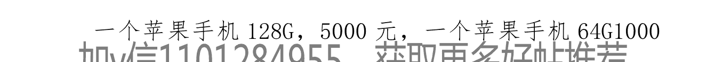
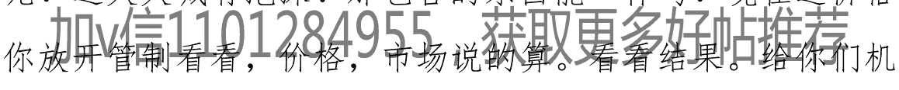
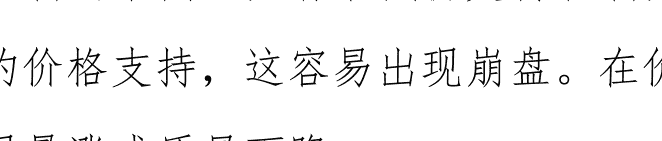

# 写在 2019 年房价大幅上涨之前！

作者:笑沧海2018 日期:2019-01-20 08:29

如果今年还不买房，恐怕只有等金融危机来了才有可能买得起房了！当然这种可能性的确存在！

2017 年、2018 年，是房地产调控最严厉的两年。但是房地产依然保持最高水平的增长，17 年千亿房企 17 个！18 年 40 个了！

要理清中国房地产，有几个要素，是环环相扣且互相制约的！你限制了房价，就制约了土地拍卖，你土地拍卖出问题，就没有能力去大规模建设，你建设跟不上，你的经济一定下滑。当然了，我们经济下滑，并不是房地产的原因。我们经济下滑，是我们制造业的问题，或者说是制度、政策的原因。不说了，只说房地产！

那 2019 年了，我们看到我们的 2018 年其实是非常难过的，经济下滑非常严重的！

说回房地产，中国房地产没有任何泡沫，房价总体低估非常严重，因为我们的北京，从 10 年开始限购，我们的一线城市，都是很长时间限购，这本身就是非市场经济了，如果不限购，房价起码比现在高一倍不止。一线城市房价本来就低估，又因为一线城市房价又是全国房价标杆，所以全国房价一律低估。中国是世界上基建投入最大的国家，房子和什么有关系？当然和资源有关系，沙漠的房子，你 5000 块钱一套也没人要吧？

资源，首先就是产业资源，对住房的需求，主要是要得到收入，如果你在某地，得不到收入，某地就对你没有吸引力。所以，房子的价值，首先周边，有提供人得到收入的产业，不论是公职，还是企业！

其次，资源还包括，生活中需要的资源，医疗，教育，交通，环境，这些资源，决定了生活品质。

为什么一线城市源源不断的人口增加，主要原因就是能够提供工作岗位，且有不错的薪水。你迷恋一线城市的薪水，那就得接受这样的房价，因为这是竞争的！你在北京月薪 1 万，你想北京买房，但是还有很多北京月薪 2 万的！房子就那么多，别人肯定比你有实力，所以你买不起，不代表别人买不起，如果没人买得起，那价格一定不会上去的！价格上涨，是买方推动的！

房子，是个商品，是商品，供不应求的时候必然涨价，没有任何例外，不涨价，你就买不到。就要排队或者其他非价格准则决定！

一线城市限购，对城里人是利好，因为他们避免和全国人竞争，其他人都不让你来买，所以城里人，是享受到巨大福利的！这本身就不公平。我没有北京社保，凭什么不让我在北京买房？这是侵害我购买房子的权利！

房地产开发商，敢于竞拍地王的根本原因是他能卖出去，这个，是市场经济，开发商死的多了，没人管，开发商是能赚钱才去抢地的！现在开发商还抢地吗？不抢了，为什么呀？不能赚钱就不抢了！

所谓调控，是抬高购买门槛，不让你买，从而改变供小于求的关系！但是，这并不是真实有效的，这是饮鸩止渴，需求并没有减少，只是被挡住了而已。所以，有本事，你就一直调控，调控一万年，因为你最后放开调控后需求出来了，会造成供需矛盾更大！

经济学里的需求定律，告诉你，需求减少，供给侧一定会减少供给，在需求降低的情况下，供给侧玩命供应，那是找死。最后产品积压，是会破产的！

本次调控，万达切割房地产，我想很多企业，应该是会切割房地产的，没有切割房地产的企业，也会在未来谨慎供给，因为在你根据市场玩命拿地的时候，也许政策马上就出来了，把你架在火上，让你退地不成，开工卖不出，回款不能回，融资没地融！生不如死！

我，不讨论民生，不讨论成本，只讨论价格，所以仅仅从现象分析价格！因为竞争的格局是不会改变的！北京房子 1 块钱一套，那卖给谁？如果不以价格为准则的话，13 亿人都想买，卖给谁呢？这里是不是会产生巨大的寻租空间？而且一定产生最大的不公平！所以，只有以市价为准则，才是最大价值的！

这轮调控，最实惠的人群，就是一线城市有房票并在本轮中买房的人群，未来我们一定可以看到，他们是得了调控的大实惠的，这根本不公平！

# 为何说房价将要大幅上涨！

-   第一点，2019 年，将是一个放松年，根据目前经济的下滑趋势，本年一定是要放松政策的！毋庸置疑，因为如果不放松，我们的经济，就要继续加速下滑。放松如果不够，那就放开，放开不行，可能就得刺激！
-   第二点，2019 年，货币必然是宽松的！由于本人对中国房价给出了低估的评价，所以货币宽松出来，一定流入房地产领域！
-   第三点，由于调控了 2 年多，供给侧供给不是市场真实水平，需求侧的需求也不是市场真实的需求，需求是压制的，供给侧是真降低！所以这个真实的供给侧和真实需求侧，矛盾是一定越来越大的！矛盾越大，就会造成报复性越强。无论向上，还是向下，扭曲的越严重，报复性就越强。

有个对房地产研究得到的结论，房价暴涨，调控之过！调控，便宜了有钱人和有智慧的人！

要上车，就要抓紧。

另外，很多专家都很谨慎，其实大可不必！我认为是别无选择的唯一出路！

## 来自
作者:笑沧海2018 日期:2019-01-20 13:40

每次房价暴涨，都是对之前调控的报复和打脸。是因为之前的调控，有效降低了供给侧，使供需矛盾增加更为严重。

我们可以看到 2016 年的上涨本来是对之前调控的报复，结果没报复完就被按住，那后面就是 17 年 18 年继续大卖。

从妖魔开发商开始，就注定了我们的市场被破坏。市场制度被破坏，是最严重的倒退。

房价要下行，只有增加供给，或者降低需求两个手段！

增加供给，因为我们的土地政策，不是难以实现的！

降低了需求？除了行政上的手段，还可以把人民搞到赤贫，没有收入，就没有欲望了！

中国房地产，是一个大牛市，只要还在继续发展，这个牛市不会改变。这就是这些年，买房的都赚了，是赶上一个大牛市，就像美国的股市一样，一牛很多年。

## 来自 9楼
作者:笑沧海2018 日期:2019-01-20 14:11

众多房地产专家，微博大 V，其实并不是明白整个经济情况，和房价上涨的根本逻辑！

房地产方面，任志强不但预测对了房价上涨，而且任志强对背后的整个逻辑，非常清晰和正确。

现在，任志强做节目，已经不谈房价了，任志强原话是领导不让谈。那么为什么呢？这个其实已经不言而喻了！

现在香港房价下行，这是因为深圳房价低估严重，香港相对于深圳，房价高估了而已。这种情况，不会长期存在，未来，深圳和香港的房价，应该是相对持平。如果我们在正确的领导下，我想深圳未来贵过香港，也是完全可能的！

还有，就是我们的货币，为何永远流入房地产，而不进实体行业，这里的最大原因，百分之 80 以上因素，就是房价低估，资金，是一定要去低估地区的，低估就是价值。投资绝对不应该去投高估的资产，一定要投低估的资产，低估的资产叫优质资产，高估的资产叫泡沫！

> 加 v 信 1101284955，获取更多好帖推荐

那么有没有想过，为什么资金，总是绕道跑进房地产里？

无论你如何调控，依然改变不了房价低估的事实！除非放开手脚，恢复市场，涨跌都不要管，我们总是干预市场，就好像有些人觉得自己比上帝聪明。最后，最愚蠢的那个，可能就是你！我们调控了这么多次，有成功过吗？没有，这种愚蠢的调控，永远不会成功。

## 来自 11楼
作者:笑沧海2018 日期:2019-01-20 14:25

房住不炒，刚需抓紧上车。时不我待！

## 来自 13楼
作者:笑沧海2018 日期:2019-01-20 14:31

2018 年，我有两个坚决！第一坚决不看好股市！第二，坚决不看汇率！

2019 年，我只有一个坚决，就是坚决看好房地产！

当然，我依然不看好经济面，目前没有看到有一丝改过的意思。深化改革成了口号，谨防计划经济复辟！

## 来自 14楼
作者:笑沧海2018 日期:2019-01-20 15:16

剖析社会的三个层面，制度，文化，技术。


很多人，如果你不明白我们是如何从改革开放中获得的成功。你就难以理解经济运行的规律。

所谓经济，就是国本！经济不好，国本就动摇。

经济，并不光是民生，更重要是国本！

因为地产的发展，掩盖了实体经济的颓废，当房地产发展减缓，立刻就感受到了哀鸿遍野。而实际上 17.18 年房地产发展，是高于全国平均水平增长的！是拉分的！在这样的背景下，我们的经济持续的，加速的下滑，到底是什么原因？

当然了这个原因，其实很简单，就不多说了！

我的观点，是房地产无法救经济，但是要救经济，首先要过房地产这一关！第一，界定产权，恢复市场。把干预市场的手关进笼子里！第二，就是废除遏制制造业发展的一系列政策。让实体经济野蛮生长。

## 来自 20楼
作者:笑沧海2018 日期:2019-01-20 15:23

不谈经济问题，因为经济问题谈深了，就容易被删帖封号。经济问题的根本问题，是人祸！

我们只谈房地产！房地产的根本现状，就是价值低估。而且也只有这个结论，才能解释所有已经发生的现实。

房地产价值低估，是以我们在土地投入来对比的，建设投入越大，土地增值越大，这毫无悬念，一线城市地铁网络，是多少钱？每公里 10 亿人民币。而我们错误的拆迁政策养出了多少暴发户？暴发户的钱，最终都一定是商品房业主买单的！我们土地拍卖，不是没有成本的！土地拍卖的净财政收入，完全不足以投入基础设施建设，所以地方政府是负债搞基建，所以我们买到的房子，是赚了的！因为政府负债其实也是对土地的补贴，这个钱，是不在房子里的！

## 来自 22楼
作者:笑沧海2018 日期:2019-01-20 15:47

14 年底，我判断股市进入牛市，拉了一票朋友开户，干的第一只股票，洋河股份！

19 年初，我判断房地产触底。股市继续趴窝，来继续领导的防范金融风险。

## 来自 28楼
作者:笑沧海2018 日期:2019-01-20 15:53

作为投资，永远是把资产置换到低估价值的板块。希望有幸能和诸位见证房地产的暴走！

现阶段，一定要不遗余力的投身房地产，往大了说这是爱国！往小了说，这是爱自己，爱生命！

## 来自 29楼
作者:笑沧海2018 日期:2019-01-20 16:52

-   2F304894909.
-   2F304894910.
-   2F304894913.
-   2F304894914.

## 来自 35楼
作者:笑沧海2018 日期:2019-01-20 16:54

解释历史，和预判未来，其实是一回事。博古通今！很多人不明白，恰恰是房地产为中国的基建发展提供了资金支持，而基建的大规模建设又反哺地价造成地价上涨。

作者:笑沧海2018 日期:2019-01-20 19:06

本人在 17 年就预测本轮调控在 2018 年底到 2019 年初将出现房地产的市场底和政策底。目前这个底部已经出现，只是苗头太小，很多人并没有引起足够的重视！星星之火可以燎原！所谓客观规律，是不能够被改变结果的，改变结果的唯一原因是因果的因改变了！而因果之间，又有环环相扣的一系列制约关系，这个社会的自然法则，就是谁都不能为所欲为。

正常来说，这种机会是不应该有的，这样的机会都是人为创造出来的，我们不谈历史，历史上每一次调控，都是购买的机会已经是得到验证的！但是有的人会说，历史不是金科玉律，怎么知道本次调控一定会历史重演呢？这就是对于根本性的逻辑，没有足够的了解。所以很多谬论横空出世，包括有人说房地产绑架中国经济，都是谬论。

调控房价，美其名曰是为了民生疾苦吧！我们姑且当他是真的，但是为什么经过多次调控而认识不到里面的问题呢？我也不想猜测是不是别有用心！

这个房价调控，为什么不能永远调控下去，永远调控下去，就成了计划经济了！干预市场会让市场凋零！更会引发财政系统的入不敷出。这其实是最大的国有资产流失。

北京土地，明明可以卖 10 亿，当下只卖 3 亿，这流失的就是国有资产。既得利益群体是欢迎这样的调控的，在调控中，这些既得利益群体就可以以超值的价格买到满意的房子。而老百姓根本不知道，也不懂，所以错过了机会！

很多人说限购打开不容易，而我看未必，尤其是一线城市的限购，很多专家说不会打开，毕竟调控了 9 年了，已经根深蒂固了！而我认为，不打开，不足以乘排山倒海之势，来挽救颓废的经济系统，必须要把干预市场的一切政策全部收回作废。才能体现我们尊重市场的意志！在 18 年经济恶化的如此严重之下，我觉得全面放开是可能的！而且不光是房地产领域，应该是全领域的！

加 v 信 1101284955，获取更多好帖推荐

## 来自 40楼
作者:笑沧海2018 日期:2019-01-20 19:10

最看好的是一线城市，是深圳。

为什么是深圳？就因为深圳离某地远！离的远是好事，会少一些不必要的麻烦！

当然一线城市是最看好的价值中枢，其次是环一线城市，这些地区在一线城市疏解外溢中受益最大，而且房价扭曲严重，回报率应当最高。

然后看好的是省会级别的二线城市。

## 来自 41楼
作者:笑沧海2018 日期:2019-01-20 19:59

鉴于经济的持续下滑，提醒诸位，不要轻入股市，2440 点，并不是大霄的少年底！股市，还有故事，2019 年如果经济能够扭转，才会有筑底的可能。

有人总结前几次房地产上涨，都是在股市上涨之后，比如说 15 年的牛市结束后房地产开始上行。

但是本次是不同的，时间上，本次一定是房地产先行，股市能不能成行，还难说，要看今年的表现！就短期来说 2700 点的压力都是非常巨大的，后面还有更大的压力带，就是 3500 点我们是国家队救市点。

加 V 信 1101284955，获取更多好帖推荐

如果你听了某些话，比如股市流市，你冲进去，你就死了！如果你以前还听了打压房价，你没买，你现在应该悔不当初。

说话的人，在消费一个国家的信用！如此下去，没有人再相信了！

本次调控之后，房地产销售热度不减，就是丧失信用的明证。而本次也会再次消费最后的信用。

## 来自 44楼
作者:笑沧海2018 日期:2019-01-20 20:00

房地产的价格从来就是民生呐喊的众矢之的，但是，一栋栋高楼林立，都卖给谁了？都喊买不起，都喊房价贵，但是我们看到的现象，就是房子都卖出去了！而且买的越早受益越大！

房产价格上涨的真实依据，是竞争造成的，是买方造成的！如果全民都不买房，则相当于更严格的限购政策！房价必跌无疑！

17 年 18 年房地产企业的业绩非常不错，稳步增长，这是在我们最严调控之下，怎么会？

因为信用出了问题，已经没有人相信所谓的调控了！调控之下尚且如此，如果是自由市场，可想而知！

```
2F304899230.
加 v 信 1101284955，获取更多好帖推荐
2F304899234.
```

## 来自 45楼
作者:笑沧海2018 日期:2019-01-21 00:37

现在到处缺钱，嗷嗷待哺！我们东北地区养老金也告急了。说明窟窿比较大，咱们的社保系统，是拿后人的钱养前人，本质和庞氏骗局没有区别，关键问题是需要后人滚雪球增长才可以实现，这就是个黑洞，永远填不平的黑窟窿。

我们可以看到地方政府的囧态，中央如果不管，那最后的问题只能一个个爆发，最后还得出钱，中央是有钱，但是呢？也出不起的！我们说地方政府卖地，炒地，这本来就是一把双刃剑的，你土地涨价了，就会影响投资，所以你土地必须有硬件，达到那个价值，才能吸引投资，你土地高估了，资本是不会上当的，所以土地问题，是个双刃剑，也不是说可以为所欲为的！只有价格与价值相符才能良性发展，所以别看政府卖地得了钱，要想发展，就必须把钱投到土地上，比如提供良好的交通，医疗，教育，否则没人认可，就成了断子绝孙的买卖。

整体而言，政府卖地，也要有人买账，想卖高了，也不可能的！买地的人不傻！

在所有行业里，房地产是被调控的最多，最严的行业，没有之一，是唯一！所以房地产根本不存在泡沫，而越是在调控时期，价值越高。这就是白给的机会！不拿白不拿！

这个逻辑道理，太简单了！明白人一眼看破，所以我有义务提醒诸位关注地产的朋友，不要让机会溜走！

## 来自 50楼
作者:笑沧海2018 日期:2019-01-21 03:13

2018 年，我发现身边很多同事都买房子了！这是好事。

其实我们从房地产销售数据可以看到，2017 年销售是 16.9 亿平米哦！很多了，18 年销售数据没掌握，1 月到 11 月销售了 14 亿平米多！从这个销售数据，我们可以看到，是有很多人都买房了！第一有房票的买房了，第二是不限购地区买房了！话说南宁涨幅不错，全球涨幅第 23 名！截图找不到了。

因为限购，很多人为了上车，不惜到非限购地区买房，造成了三线四线房价的上涨，不过产业空心化是个问题，富士康走又要裁员了！目前主要是劳动法过于保护劳务人员，对企业发展是个硬伤，企业根本不敢招工，招工以后想辞退就要有一堆麻烦事，还有啊，这个社保，增值税等等等等，压力是非常大的！

目前我们看到发改委，把房地产定性为第四类实体经济，我也没研究，只是看了一眼而已，而且还要推动家电，汽车类的消费。拿啥推动，我告诉你，房价低估，一切消费必须进入房地产，这就相当于打折店庆，必须是房地产里消费。未来几年，我们的消费别想有大的增长，为什么？因为都买房了！

我们的很多问题，主要就是由于这个房价太低造成的，还有这个户口，这个户口问题早该取消了，这户口就是他妹的特权，根本不是人人平等。那么为啥要弄户口呀？还不是管制问题吗？没有资源呀，资源不够呀，这资源给谁呀？给有户口的，北京医疗，上学，是吧！如果没有户口管制，那全国都来了，怎么办？没有这么多资源，那就只能涨价了，以价格为准则的竞争，户口其实就是非价格准则的计划经济产物。

## 来自 52楼
作者:笑沧海2018 日期:2019-01-21 03:25

其实我们看到很多病，有什么并发症之类啊！这都是典型的头痛医头脚痛医脚造成的，都是治标不治本造成的，如果真的直达病灶，怎么可能有并发症？现在很多这个感冒，打针吃药半个月不好，其实最后怎么好的？你都不知道到底是吃药好的，还是自己好的！

## 实事求是，不贩卖焦虑！

房子这个东西，按任志强某次讲话，原话是这么说的，房价涨不涨，我不知道，但是我知道货币一定贬值。这么直白的话，我想大家是都懂的！

任志强说的对不对？我想之前都验证过了，至少事实没有驳倒任志强。我觉得大炮，如此敢说，绝无仅有的一个实在人！大炮讲的是事实，非代表任何层面的利益，这很高尚的！

万科，一直塑造一个听话的孩子，怎么说呢，就是闷声发财，嘴上是支持政府的。现在看到一个现象，就是各个企业，当然了，大部分都是房地产企业，恒大的一切是党给的，万达的一切是党给的！怎么突然感觉到了一种难以名状的伤感，21 世纪了，在这种经济情况下，还要歌功颂德！是不是真心的？我看是假的！那么为什么要说假话？我也不知道，说假话，我想他们也不应该很舒服！

我们看看我们对股市的调控，对实体经济的调控，对金融的调控，对房地产的调控，可以说算盘一把抓，我不知道这样的结局，是不是我们想要的，如果是，那说明我们的计划完成，达到预期了！

## 来自 53楼
作者:笑沧海2018 日期:2019-01-21 03:34

我们无法改变社会，但是我们能改变自己，让自己多学一些知识能够养家糊口，让我们都学一些文化把自己变的优雅，让我们多懂一些道理让自己变的明智。不要利令智昏的颠倒黑白！

保护自己的财产安全，是国的责任，是自己的义务！一定要为自己负责！

2019 年，注定是一个不会让我失望的一年，因为这一年，一定如我之意料开启放松之门，而 2019 年一定是一个令我失望之年，因为这一年，一定不会有什么治本之策力挽狂澜拯救经济于水火。

这真是一个纠结的 2019 年，送给自己的话，也送给你们，好自为之！

本贴，已经把最好的财富送给大家，也就封贴了！

# 54楼

作者:笑沧海 2018 日期:2019-01-21 16:53

又回来咯，因为再补充一点资料，供大家分析！这是 2018 年房地产的各种数据，数据显示我们 2018 年房屋销售 17 亿平米。2018 年土地购买是 2.9 亿平米。这是增长了百分之14。也就是 2017 年购买土地大概是，2.5 亿平米。按容积率为 3 的高标准计算得到 2017 年购买土地可以新建住房 7.5 亿平米，2018 年新购土地可以新建住房 9 亿平米。那么我们看到的是 17 年 18 年两年的土地出让，一共能产生 16.5 亿平米住房。

也就是说，我们 17 年销售的 16.9 亿平米，加 18 年销售的 17.1 亿平米，共计是 34 亿平米住房，是历史的库存。这些土地大多是 15 年之前的出让。土地成本比较低！

但是有一个问题，就是，按照目前深度调控下，每年销售 17 亿平米的速度，矛盾很快就会出现。目前是拿地少，而卖房多，怪不得任志强说 19 年你可能有钱买不到房。

调控进入两难，照镜子发现里外不是人！

只有继续深度调控，严防死守，打压需求，才可能维持目前的供需平衡，但是打压需求，经济抗的不住吗？而且这个矛盾早晚是要爆发的！

```
2F304931832.
```

来自

# 78楼

作者:笑沧海 2018 日期:2019-01-21 22:45

我们走到深化改革的十字路口，根本问题并不在房子上，根本问题在于制度。需要制度的升级。制度性保护私有产权。

在这个十字路口上，反反复复，磕磕绊绊，不断试错，也未必是坏事，起码可以提供一条走不通的路，防止后人再错！

来自

# 198楼

作者:笑沧海 2018 日期:2019-01-21 22:57

很多人，根本一点经济学的直觉都没有。价格高？高铁一公里2个亿，高速公路一公里多少钱？地铁一公里10个亿。

中国拥有世界最好的基础设施，总有世界最长里程的轨道交通网络，这些拿什么建设的？没有土地财政，怎么可能实现？同理，这些基础设施建设反过来又为土地提供了价值反哺。

很多人说房子贵，贵你妹的贵，觉得贵，用经济学术语叫价值高估，价值高估，就没人买了。就像苹果手机，有人觉得物有所值，有人就觉得贵，所以有人买，有人不买。

如果所有人都觉得贵，那还限购干什么？限购是不让你买，限贷是让可以买的人提高门槛。如果真的高估了，还需要这些手段吗？

每个人，都有自己的想法，这很正常，我只讲规矩，不负责调控任何人的主观因素。主观，是非科学的，你就喜欢吃苹果，不喜欢吃橘子，这是主观因素！

客观规律，不是喜好！

香港的房子多少钱一平米，大概是20万左右，我们北京房子多少钱？我们的北京上海比不上香港吗？错了，我们北京绝对比香港强，房子当然应该比香港贵。

现在香港房价下降，松动的根本原因是深圳房价超级低估的摆在那对比出来的！

一个苹果手机128G，5000元，一个苹果手机64G1000块钱。你买哪个？并不是那个128G不值5000，而是这边的64G价钱太低了，人们一定买64G的！



来自

# 208楼

作者:笑沧海2018 日期:2019-01-21 23:03

现在很多人，因为经济情况的变数，和政策的不确定性，都说一些模棱两可的话。

经济有什么变数？没有变数，就是只要继续目前的政策，经济一定下滑，而且还要加速下滑。

政策，有什么不确定性，政策只要还是保持这样低水平，经济一定下滑。

经济发展，不会引发资本外流，只有经济下滑，才会资本外流。你的经济系统健康，怎么可能资本外流。只有你不健康了，资本才外流！

来自

# 213楼

作者:笑沧海 2018  日期:2019-01-22 01:45

人生就像斗地主，你不光要看着自己手里的牌，还要盯着别人的牌，碰上猪一样的队友，倒霉了！

你自己知道自己的牌，想赢，一定是要知道别人的牌的！
看到有人骂我，我就放心了！看到这么多不同意见，我就放心了！


这么简单的道理，如果房价不涨的话，干嘛限购呀，干嘛限价啊！这么简单的道理，这种政策性调控，给的机会和空挡，这是天大的便宜。天大的便宜！

来自

# 250楼

作者:笑沧海 2018  日期:2019-01-22 02:11

房子问题，非常简单！就是你不要把自己当成哪一方的人，我们不要主观站队，主观，不是科学！

我们看到的这些政策是干嘛的？调控房价的对不对？
是调控房价不涨的政策。也就是房价本来就是要涨的！

目前我们上层有一个认知上的误区，知道目前资本外流比较厉害，光是每年出国留学的，就是几千亿美金的。我们自己的教育，是有问题的！我们具备教育能力，但是这么多人出国留学，是因为在国内享受不到教育机会。我们的优秀大学，是应该留出一部分名额拿出来卖的！不然就便宜外国人了！

我们只看到房价涨了这么多，很多人卖了房子举家移民了！这没什么。人家为什么移民？我们越这样，走的人越多的！我们要制度性保护人权，保护产权。今天这个税，明天那个税，鸡飞狗跳！你说那些具备移民的人都是什么阶层的人？有老百姓吗？他们都是社会精英，动不动把人家搞了，人家能不走吗？只要开公司，创业，你想找事容易的很，环保，消防，劳动法，税务再去干一把。企业可以关门了！

我们别无选择，只能沿着邓公的伟大路线继续走下去。开放，自由。充满活力。而且一定不要学美国的法令滋彰！

我们要尊重企业，尊重企业家，尊重任何一个人，权利是平等的！你搞个劳动法，现在企业怎么招工？你要给企业招工用工的权利，这是可以谈的，企业工资太低，工人可以选择干或者不干嘛！都是自由的！你插一杠子算干啥的？

欧洲债务危机，高层已经认知到需要节支降耗，要紧缩财政，但是紧缩财政的政党都无法被选，因为选民们要福利，你紧缩财政了，选民的福利减少了！所以你就是对的，但是没用。这就是人性！最后只能越来越烂！这就是民主制度的最大弊端。

房地产，坚如磐石，国之柱石！经济体越发达的地区，土地价格一定最贵，这在全世界，在人类历史上都是定律。没有任何可能改变！

我们国家，便宜房子有的是，过去，我们房价上涨，是跟经济有关的，经济发达地区上涨，但是呢，我们从16年9.30开始调控，导致了345线城市一路上行。而一线城市稳中有下，这就是限购，导致的资金分流，本来是要进入一线城市的，进不去，就流到345线，部分城市为了创造土地收入，搞人才引进！所以整体上我们没出现通胀，是因为我们的钱，都进房子了！虽然我们这两年，货币非常紧缩，紧缩货币政策为什么？怕钱进房地产呀！但是呢，紧缩的实体一片凋零了！呵呵，这就是我前面说的并发症！这本来就不是什么绝症！

为什么，一定要调控房价呢？我的结论是有病！

中国人没房子住吗？都有房子住，没人睡大街上，美国流浪汉可是不少！我们一切市场化就好了，比如我们的房地产行业，我们放开门槛，是不是，医疗放开门槛，让想做这个行业的公司机构进来，形成竞争就好了！价格的事，是市场决定的！我们总想控制价格！你直接把土地给老百姓分了不得了，让他们自己盖房！这多好，但是这地哪块分给谁？怎么决定？

有很多人，拿一堆所谓的逻辑来反驳我说的，19 年房地产要涨价问题！我首先希望你们的说辞，可以真的说服你们自己！

来自

# 252楼

作者:笑沧海 2018 日期:2019-01-22 03:02

放开政策不够，还要推波助澜！狠狠地打脸！

来自

# 257楼

作者:笑沧海 2018 日期:2019-01-22 04:49

2019年，百废待兴！唯一且最具价值的就是房地产，潮水褪去才知道谁在裸泳，经济下行，才知道屹立不倒。

投资，买的是未来，而非当下，因为在市场化下，当下不存在低估也不存在高估，所有低估高估都是对未来预期而言的！当然，这些局限条件都是在变的，目前，唯一的低估，就是房地产，而且是当下就低估，当下低估，当然是限购造成的！这种便宜的好货，可是不常有！

纵观整个市场，再难找出来当下低估的东西了！

我记得听老人们说过，建国后清查银元，很多家都把银元，就是袁大头，银币，扔了！这是当时的局限条件造成的，是管制造成的！但是这玩意，是有价值的，只是当时价值被政策归零了！类似的案例应该是非常多！

当下低估，是市场受限造成的，除非市场永远受限，受限成为常态，那就谈不上低估了！因为低估，是受限和自由对比出来的！

永远受限可能吗？城市化如何推进？能计划的了吗？

应该说，股市 15 年以防范金融风险被当头棒喝打下来以后的主旋律就是救市了吧？

2019 年，政策性宽松是刻不容缓的！而宽松的钱一定流进房地产，只有房地产流满了，才可能滋润实体。还需要实体有相关政策配合。否则只能枯萎！

一切乱象，全因为房价低估，严重低估造成。要破当下之局，一定要快刀斩乱麻，大刀阔斧的深化改革，推行市场化。绝对不能走回头路！

上医医国，中医医人，下医医病！

中美这局，有一方输的太惨！让我始料不及！且行且珍惜吧！亡羊补牢也还有机会。

来自

# 258楼

作者:笑沧海 2018 日期:2019-01-22 04:58

本贴不但可以说房子，也可以说股票，那执迷股市的朋友，这里也有红包相送。柯力传感！603828！此股是去年 9 月发现，并可长期持有的绝世好股。目前 8 块多！目标位 20 以上。持股 1 年到 2 年！整个股市并不看好，难得发现一个非常满意的股票，所以还是介入了一部分。也一并分享了！

2F304953663.
2F304953664.

来自

# 259楼

作者:笑沧海 2018 日期:2019-01-22 13:16

有人建议我搞城市排名，我是无能为力，我也不可能对全国都非常了解，个花入各眼吧！

把基本逻辑，阐述清楚，就够了。剩下的事就是自己的事了！

来自

加v信1101284955，获取更多好帖推荐

# 405楼

作者:笑沧海 2018 日期:2019-01-22 14:40

美国房价，有没有如此大规模的基础设施背书？很多人拿美国房价和美国总房产价值说事。

中国房地产包含 70 年房产税，美国房子是每年交一次，平均的话大概是 1 个百分点吧！也就是说，中国房价是美国房价的 1.7 倍是合理的，因为我们等同于一次性交了 70 年房产税。中国人口是美国的 4 倍，中国房地产总量达到美国的 4 倍应该不应该？中国每年消费的粮食达到美国 4 倍应该不应该？这都是弱智问题。那么现在，中国房地产总量，就应该是美国的 6.8 倍了！

还有一个因素，就是美国是真的地广人稀，木屋多，中国是真的一半多土地不适合居住，只有沿海地区和中部，人口集中。不一样的土地面积分布着相差4倍的人口。这些局限条件下，在原来基础上再涨1倍不为过分！

那就是6.8倍再涨1倍，就是13.6倍。中国房地产总值达到美国的房地产总值的13.6倍，是完全合理的！

现在有人说中国房地产总值450万亿，美国房地产30万亿美元。那么我们都换算成美元。中国房地产总值约70万亿，美国房地产总值30万亿，按我的计算，中国房地产总值，达到美国的13.6倍。408万亿美元！我们现在才70万亿，未来，我们要达到408万亿。中国房地产还早着呢！

最主要的问题，是我们能够走在正确的路上，不被白左道德婊民粹主义忽悠！！

日本房地产崩盘，我们喊了多少年了？根本不知道日本为啥崩盘，因为根源是日本经济衰退，是经济衰退引发的，不对等，房价过高，而经济下滑严重。我们，还早呢！就是有这一天，房价也比今天起码翻2倍才有可能。也就是我们总值从70万亿美元升到200万亿美元，经济又非常不景气，才有日本可能！

来自

# 433楼

作者:笑沧海2018 日期:2019-01-22 18:04

那些说房子已经没人买的人，你们为什么不看看现实呢？2017年，销售16.9亿平米，2018年销售17.1亿平米。而2017年拿地2.5亿平米。2018年拿地2.9亿平米。以3.0的容积率这两年的土地可以盖出不到17亿平米的房子。在2018年或者是2017年，我记不清了，任志强说新开工和销售比是1比2.12！就是盖一套房，卖出去2套房。

而且，目前卖的房子，拿地基本都是2015年之前的土地。所以开发商是赚钱的，只是机会成本被挤压了！那么到了开发2018年土地的时候，这起码就是2021年才会预售的！这个时候房价，是一定比今天贵，这毫无悬念！

开发商，卖房子是续命，同时保持手中有地块，只要手中有地，而且能活下去，就一定能迎来好日子。

但是我们应该知道，越限购的地区，其实供需矛盾是越大的，我们的一线城市，土地供应是不足的！这样矛盾持续加大，不是调控可以解决的！

来自

# 529楼

作者:笑沧海2018 日期:2019-01-22 18:10

有涯友回复说希望不要涨太多，但是按照客观规律，扭曲的越厉害，报复的越猛烈。

我们的房价，本来是应该随着经济发展和房价保持一定斜率这样发展的，我们的房价暴涨的根本原因，就是调控造成的。
在经济发展中，我们人为控制房价不让涨，等放开的时候，房价一定暴涨把之前没涨的部分补回来。

还有很多人，天真的很，以为政府真的可以只手遮天，为所欲为！想什么都能实现。多读读历史，多读读经济学！

美国 1929 年的大萧条就是政府干出来的！无知是很可怕的！

来自

# 530楼

作者:笑沧海 2018 日期:2019-01-22 22:05

其实现在在很多政策中，都可以看到自相矛盾的地方！

加v信1101284955，获取更多好帖推荐

一群人根本没找到对症的方子。我们从业投行，一带一路的喧嚣，突然进入了防范重大危机当中，而这才几年时间？可见我们在这几年，出了多少战略战术错误。

当初亚投行，欧美国家英国第一个来捧场，英国是老牌帝国，过来站队了，然后就看我们一路下坡，人家是来分杯羹的，一看我们这德行，就不叼我们了！自己不争气呀！那没办法，我们的原因是贸易战吗？根本不是，我们内部，重大结构性问题，东墙西墙来回补，现在东西墙都不稳当了！所以君子不立危墙之下，就有很多人出去了！

当下，不吃够苦头，是难回头的！没事，随便折腾，大乱大治！

来自

# 568楼

作者:笑沧海2018 日期:2019-01-22 22:13

我们如果不屡次调控，受供需影响，开发商一定是拿地，盖房，回款，再拿地！而且小开发商多，形成充分竞争，对房地产供给是有效增加的，房价上涨当然是一定的，但是市场化之下，需求方会推动供给侧增加供给，而经过一轮调控就死一批小开发商，现在形成了寡头。而且寡头之所以能成为寡头，就是因为控制仓位。任志强说，晴天也会带把伞！也就是不会全力供给！这一切！呵呵，最后必然导致价格上涨更多。


现在说按建筑面积卖房不合适，应该按套内面积，呵呵，怎么如此幼稚呢！

2019年，除了买房，都不对！

来自

# 571楼

作者:笑沧海2018 日期:2019-01-22 22:27

还有啊，我们去产能之前，世界铁矿石涨价，闹得中国钢协折腾好一阵，我们媒体说别人坐地起价，等等！但是这是经济规律呀！你买的太多，供不应求，涨价不是必然的吗？

# 579楼

作者:笑沧海 2018 日期:2019-01-22 23:48

中国房地产涨价，土地升值！受益的是全体国民。

因为基础设施的建设，是全体国民受益。

你买房，或者没买房！你都享受到了基础设施带来的便利和方便！

买房人，因为为国家建设提供了资金，得到回报也是理所应当的！没买房的人，其实是沾了便宜的！

这个基本逻辑，是没人说的，因为谁也不嫌钱多，而且仇富！

来自

# 581楼

作者:笑沧海 2018 日期:2019-01-23 08:03

无论是新古典，还是凯恩斯，都主张经济下行，货币宽松。

其实，我们经济下行这么快的原因是什么？把这几年政策全废了，就解决了一部分问题。这几年，差不多是一无是处。个别方面的建设搞的还不错。

错的离谱了，大概率会有一个矫正的过程，就像 1929美国大萧条，起因是货币投放过多，通胀了，结果危机发生后矫正紧缩货币，又造成通缩，通缩的结果就是资产价格大跌，一萧条就是 10 年。最后靠战争摆脱危机。

我们目前的紧缩呀，供给侧改革呀，难道不是对之前 4 万亿的矫正吗？

来自

# 594楼

作者:笑沧海2018 日期:2019-01-23 09:35

传统经济学的理论认为，市场会以价格的上升下降来向经济中的各个主体传递供求状况的信息，供不应求时价格上涨，供过于求时价格下跌。各个经济主体在自私的支配下相应地做出反应：价格上涨时生产者增加供给，消费者减少需求；价格下跌时生产者减少供给，消费者增加需求。这些反应都是往推动供求平衡的方向起作用的，因此在传统经济学的理论框架里，无法想象会有生产过剩的现象出现！目前所谓的房价下跌，那就是供大于求造成的，供大于求是调控把购房需求挡住，造成了需求减少的假象！

但是按照目前官方公布数据，房价在 2017 年，2018 年都是稳步上涨的！还有就是各大房企数据，销售金额增长大幅领先销售面积增长，这个问题只能反应房子涨价了！

我想有些人放大了下跌范围，而且这 17，18 年，从房企公布的年报看，业绩普遍大幅增长。

这些实实在在的销售数据！

来自

# 605楼

作者:笑沧海2018 日期:2019-01-23 10:22

由于认知问题，每个人看法肯定不同，这是一定的！发帖本来就是求同存异，我当然可以允许有不同看法，虽然大部分都比较低级愚昧。但是我不希望那些癞蛤蟆爬脚面不咬人恶心人的垃圾跑着满嘴喷粪。别说房地产牛了几十年，无数人得到了财富增加的事实不容否定。就是跌10年，又何妨？科学，需要的是逻辑和验证。讲一点科学方法。对你自己有好处，难道要蠢一辈子？

来自

# 613楼

作者: 笑沧海2018 日期: 2019-01-23 10:59

人活着，最大的价值，就是利他。通过利他达到利己！买房得到回报的人，不过是为国家提供建设资金得到的回报而已。

任何一个发展中国家在经济发展阶段，房价都是高速上涨的。

土地价值的上涨，中国是最有基础的，因为没有一个国家对土地投入如此大规模的基础设施建设。中国的基础设施建设，是世界第一，是超越欧美的！我们有什么不知足！如果美国像中国这样大规模基础设施建设，美国的房价会涨多少？

中国房价，是刚性支撑的！绝无半点泡沫！哪个经济学家跑出来告诉你中国房地产有泡沫，那这个砖家你就离他远点。绝对蠢货！

房子，在历史上也从来没有便宜过，这并不是说谁的责任，这是客观规律。我们就是有病，非要把这个事揽过来，没事就要调控，好像为民做主，最后你又做不到。一个屎盆子，历届都要接几下。

你连养老保险的窟窿都填不上，有些人，没有自知之明，以为自己无所不能。最后不但失信，还会遭人恨。因为你忽悠了别人！而恰恰被你忽悠的人，智商都欠佳，都以为你明明是有能力做到的！

我们可以看着，如果房价下跌，后面，就会有刺激政策，救市！有些人就爱干干预市场的事。

我们的改革开放，实际就是向客观规律认错。因为我们的计划经济马上破产了！

不可否认的是，现在老百姓生活水平提高了太多！这是市场经济的功劳！

2F305004790.
2F305004795.
2F305004809.
来自

# 615楼

作者:笑沧海2018 日期:2019-01-23 11:42

看了诸多回复，懂经济学的不多，经济学不难，难得是…## 对局限条件的把握

我们不能一厢情愿的当傻多或者傻空。必须把握客观条件，科学分析。

我们也不能因为房子多唱多，或者没房子唱空，那不过是给自己的心灵鸡汤，安慰自己。

来自 624楼 作者:笑沧海 2018 日期:2019-01-23 16:41

本贴并非和谁探讨和争辩，本贴只是告诉你房价到底是怎么回事，那些说买不起的，跟我一毛钱关系都没有。现在二线，三线四线，真举家之力还买不起房子，我想还不至于。因为房子这个产品，也有很多级别：配套齐全的新房，配套齐全老破小，偏远新房，偏远老破小。很多人说买不起，大多是买不起看得上的房子，那么我只能说，是你想多了！有多少钱，干多少钱的事。这是劝你的好话！自己琢磨！一群人喊房价贵，但是买得起的人多了，在供小于求的关系下，本来就是竞争关系，你竞争不过别人，是你自己的问题。动物界，雄性的交配权大多也是需要武力竞争的！人类之所以文明，是有价格准则竞争这个文明的方法。在如此严格的调控中，我们的房价，我们竟然卖出了17.1亿平方米的历史天量，这充分说明了，这些手上还有钱的人是不相信房价会跌的！如果他们相信调控会让房价下跌，就不会如此肆无忌惮的在调控中购买。

起码，不相信下跌的人，是拿出真金白银来实践的，这个市场，成交是最真实的！那些说房子卖不出去的，你们看看这个历史最高的销售量，和历史最高的销售金额，我不知道还需要再说什么！成交，是价格准则，是真金白银，胜过千言万语！

即使保持如此增长，我也搞不懂为何各个地方，都有些抗不住了！

中国的招商引资，大部分都是赔钱的，地方政府是通过未来的税收回收租值的！只有住宅市场，是盈利的！商业地产块，利润并不高。但是任何地块，都不是无成本的！相反成本不低，比如修高铁，这种需要大量占地的大规模基建，你征地，都是你的纯成本。

中国的房子是超值的，你现在买个房，未来地铁修了，高铁通了，你房子必然升值。如果投资，钱少怎么办？就买没地铁没高铁的大城市周边的小城镇，未来都会有的！

房产税，手机码字几千字，网络出问题，没发出来，也没保存草稿，算了，没兴趣再写，等舒坦点了再写吧！

## 665楼

作者:笑沧海 2018 日期:2019-01-23 18:26

我呢，是真心的奉劝那些刚需，趁现在的机会，抓紧置业，大的买不起，买个小的！中心区买不起，买个偏一点的！社会在发展，每个城市都在建设，今天的偏一点的地方，未来就可能是中心。

房价没有一分钱泡沫，一分钱一分货！

有的地方房子 4000 一平米，钢筋水泥成本多少钱？这样的房子，为啥没人买呢？呵呵！为什么非盯着那些高价房呢？还天天喊有泡沫！那包含的东西能一样吗？现在这价格，你放开管制看看，价格，市场说的算。看看结果。给你们机会你们不把握，整天喊着泡沫，都泡沫多少年了？我都不记得了，结果就是价格越来越高！



来自 668楼 作者:笑沧海 2018 日期:2019-01-23 18:31

美国 1929 大萧条根本原因，是政策错误造成的，以下为 1929 大萧条的几大错误！

- 第一个大错，是当时的美国国会刚好通过了立法，开征企业所得税。一直以来，传统经济学家无不极力反对企业所得税，因为有双重征税之嫌——征了企业所得税之后的利润分配给企业所有者，作为他们的个人收入又要再征一次个人所得税。这里不打算争辩企业所得税的对错，只是要指出，这反正就等同于加税。哪怕是凯恩斯的理论，都会认为经济不景气时，政府应该用减税的财政政策来刺激经济增长。这时却不减反加！那岂不是更进一步地加速企业歇业倒闭，从而导致失业增加了吗？
- 第二个大错，又是当时的美国国会犯傻，竟然为了应付大萧条而推出臭名昭著的关税法案，大幅度提高进口品的关税。当时的美国跟今天的美国不同，是有贸易顺差的。在这种“有利”条件下居然还搞贸易保护主义，除了用“搬起石头砸自己的脚”来形容之外，没办法再想到别的词了。而且，当时的美国国会是在不顾其他国家表达了强烈反对意见的情况之下强行通过有关法案的，当然引起了其他国家的强烈反弹，也纷纷提高美国出口到他们国家去的商品的关税来作为报复。于是，关税战爆发，国际贸易额在一年之内大幅暴跌至只剩原来的三分之一！备受重创的出口，自然没有为美国带来那关税法案本来预期中的帮助经济走出困境的效果，反而雪上加霜，使大萧条更为恶化。
- 第三个大错，其实才是最大的一个错，之前提到的美联储的一错再错、美国国会的昏着连连都不如它的影响恶劣。那就是最低工资法、工会等阻碍工资向下调整，也就是把市场通过价格的上升下降来调节供求平衡的作用直接废掉的制度，才是导致高失业乃至是大萧条本身持续长达10年之久的罪魁祸首！即使有混乱的货币政策，即使有严重的通缩，即使有搬起石头砸自己脚的内外税收的立法，如果劳动力市场上的价格（工资）能灵活地随经济下行而向下调整，大规模、长时间的失业也不会发生。

首先，如前所述，最低工资法、工会等制度实际上是把（劳动力）市场通过价格（工资）的上升下降来调节供求平衡的作用直接废掉了。经济下行时，生产规模缩小，经济活动收缩，对劳动力的需求减少，本来市场要通过价格下降来调节供求平衡的，但既然市场的调节作用被废掉了，供求当然就失衡了。产品供过于求就卖不出去，劳动力供过于求也一样卖不出去，那就是失业。这是市场的错，还是政府的错？

来自 669楼 作者:笑沧海 2018 日期:2019-01-23 19:00

人可以不读书，但是不可以不学习。你不信什么都可以，但是一定要相信客观规律。也就是因果。
我们很多人，相信房价会跌的愿望是美好的，但结局是徒劳的！在现在制度政策之下，房价是没有下跌的可能的！

而未来能否改变另一种制度，比如有些人说的，不依靠房地产之类的！

市价准则，是不会产生浪费！比如说农村的玉米杆，是垃圾，可能做饲料，2毛钱一斤，但是由于清洁能源的出现，清洁能源，可以卖5元一升，这个公司就会出1元收购，而做饲料的公司，是无论如何，也不可能出的起1元的，因为亏本了！那么在竞价之下，能源公司获得玉米杆，是不是实现了玉米杆的价值最大化。那如果我们人为规定，玉米杆必须给饲料公司，因为饲料公司工人多，没有玉米杆就要下岗了等等，是不是造成玉米杆价值的浪费？

以市价为准则，能最大价值减少浪费，也就是减少租值消散。

同理，我们说房子贵贱问题，别人有钱买，是因为别人做了更有价值的利他的事得到的回报比你多！

不可否认，人和人，为社会提供服务的价值是不同的，所以得到的回报，也是不同的！但是只有利他，才能利己！

你为社会提供的服务低端廉价，你凭什么住好房子，住大房子？

本贴，不是慈善贴，只讨论真理，所以挨骂是一定的！

现实永远残酷，说出来，可能更残酷，所以鸡汤很多。

我不喜欢鸡汤，我的理想，是追求真理。

来自 676楼

作者:笑沧海 2018 日期:2019-01-23 19:47

很多人，说房地产泡沫，但是我们在5000历史里，全球范围内，还有没有见过，一个产品价值高估，但是几十年资金就是源源不断的流入的？以我的学识，我的的确确无法举例出来。几十年，数次调控，打压，依然像一个黑洞，源源不断的吸引着资金。不知道诸位能否举上一例！

泡沫评价的标准，并不是以你买得起还是买不起为标准，我们知道穷的地方，根本喝不起牛奶，那牛奶有没有泡沫？关键是钱，是有产权人的！社会上的钱，每一分钱，都有对应的产权人，对于钱的使用，当然是产权人的自由和权利。那这些货币的产权人，他们一定是最关心自己钱的人，无论是借款，还是自有，他作为产权人，或者债务人，他是必须要为钱负责的！

为什么，我们的钱多少年来不停地流入房地产，而不是其他领域。有人肯定要说，房地产能够赚钱，那么，为什么能够赚钱？这么多年，买房子，为什么能够赚钱？这个问题，解释清楚了，你才能明白真正的逻辑！

投资，一定是投的是未来，中国房地产数十年的上涨是依托了我们数十年来不停地建设。举例来说，你买了房子，后期这里通了高铁，后期修了地铁，有了好学校等资源，那你的房子一定升值！

中国房价上涨，但是并不是全国平均上涨的，而是有严重区域分化的！我们可以看到，一线房价涨幅是最大的！那根本原因就是一线城市建设投入是最大的，所以一线城市土地升值最大！

如果你当初投资在了三线城市，当然也升值了，但是不如一线大，原因就是三线城市没有贴补给土地那么多的对价。而一线城市土地升值，也不是凭空而来，是大规模建设造成的。

所以，投资主要是看未来发展！对于投资，任何领域都一样，看的是未来。

这两年，一线城市的房价稳定，部分二线和三四线房价上涨，这个原因就是此消彼长，调控造成的资金分流。因为被挡在门外，钱自然就流入到不限购地区了！

那么当前，就出现了当下低估的区域，就是以一线为首的严格限购区域。目前看，那些三线四线城市的上涨，是价值高估了，但是不要着急，目前高估是和一线的低谷对比出来的，如果一线不低估了，那就都平了！正好，都一样，不低估！

所以，我主张，一定要去一线，二线买房，而且要去限购地区，拿房票买房，因为不限购地区，都涨了！当下已经不低估了。这些区域，未来再涨，时间可能要等的长一些，而且涨幅应该要小一些了！

房地产，只是经济当中的一部分，说房地产，自然要说到经济，说到经济，又不得不说政策，说到政策，可能又扯到政治，这就危险了！
所以，言无法尽其意！其余部分，需要神交！

2F305028699.
来自 682楼 作者:笑沧海 2018 日期:2019-01-23 20:01

房产税，是政策，不想多评！

房产税出台，我认为是一定出的！最合理的房产税，是70年产权到期按一个值收取，合法，合理，合情！名正言顺！理所应当！

房产税收入，用于地方维护，建设等等。美国的房产税，就支持地区教育。税收，是有使用范围的！税收，对应的是政府提供的公共服务！而不是被政府白白拿走。

房产税出台，会造成不好的影响：第一，增加税收成本。首先，如果按目前网传房产税版本，大部分家庭都要减免的话，这个减免一定是有条件的，这些条件跟生老病死，婚丧嫁娶都有关系，这个变量太大。增加税收成本，得不偿失！

第二，房产税出台本质上侵害了私有产权。不用说多套房的是否涨在房租里，侵害了私有产权也是次要的，关键是破坏了我们房价的支撑。如果这种房产税出来，视侵害程度不同，我们的房价也会有不同程度的泡沫！

一台冰箱，现在卖5000元，然后你买回家，告诉你，你每用一个季度，还要交季度使用费，那你想，那冰箱还能卖5000元吗？冰箱价格必须下降。也就是这种房产税出台，破坏了原来价格体系，直接导致土地价格下降。你不用说土地垄断，不会降价，这么说才幼稚，如果可以为所欲为，2000年的时候为什么不直接把土地价格卖到今天的价？土地价格，也一样是有对应价值的，超过这个价值，就没人买了！

所以，这样的房产税出台，那边收税得不偿失，即使不交税的老百姓，也要不停因为生老病死，婚丧嫁娶不断改变纳税系统，纳税系统庞大，却产生不了任何价值。劳民伤财！

这边土地价格下降，里外里，是一个亏本买卖，而全社会，竟然没有人得到好处。属于虚耗！这样的房产税出台，那纯粹是智商问题！

所以客观分析，我认为房产税根本不可能出台，只可能见鬼。万一呢？万一这些情况，是他们没有料到的呢？那也就是出台了，出台了，就会出现我说的这些问题，提高整个社会的交易费用，引发巨大租值消散！这是非常直观可以感受的到的，不像社保等政策，需要绕几道弯才能看清！所以这样的政策出台，我认为不出一年，也要取缔！

来自 683楼 作者:笑沧海 2018 日期:2019-01-23 22:15

回帖太少，更的没有动力了！码字也累。我就是骗点击的，你们倒是回帖呀！图片说的什么意思，大家都懂吧！今天新鲜热乎的！

我记得 10 年前，大概就是牛刀受欢迎，任志强被唾弃。今天，愚蠢的人，依然愚蠢着！

10 年前，谁说房价涨，就给人冠名中介。大家都是成年人，不用装的这么幼稚！

加y信1101284955，获取更多好帖推荐

本文，强调一线城市的价值严重低估！

其他城市，局限性不同，没有调查，就没有发言权！

每个城市局限性是不一样的，不要光看12345线，这个参考价值不大。有的地方房价5000，一旦开始建设发展，可能涨到2万。回报率巨大。这都需要对个别地区有深入了解才可以！

我不看好雄安地区。因为雄安地区现在是禁止交易的！国家既然有宏伟蓝图，我想这个禁止交易的背后，是在地价被限制的情况下，先完成征地。雄安，是一块计划经济的试验田！

计划经济，是吧！计划经济的结局，在世界上是有先例的！所以涉及雄安地区的所有投资，一定要慎重。尤其是房地产，记得 2017 年 4 月 1 日，很多人跑雄安购买房子，据说车非常多，都是现金！价格干到 2 万以上。不知道那些人还好吗？

来自 710楼 作者:笑沧海 2018 日期:2019-01-24 00:13

我最不喜欢揣摩圣意，没啥意思！兵来将挡水来土掩，该干什么干什么！只要活着，你就得为活着打算，只有不断地干正确的事，你的人生才能精彩！我们不能去为别人的错误买单。趋吉避凶是智慧。

李嘉诚最早切割了内地房地产，王健林继续切割内地房地产。李嘉诚跑了，王健林没跑成。

王健林开始说他的钱，想投哪就投哪。这没错，这是私有财产，没毛病。后来说都是党给的！个中无奈，难以名状的恐怕只有自己知道。我就想问问，党为什么不给我？给你们了吗？

我不得不说，崇高的觉悟，不是人人都有的！而且我并没有深刻接触到具备这样崇高觉悟的人。而按经济学假设，人是自私的，这一点来说，我非常理解！但是崇高觉悟，圣人？走仕途走出了圣人？
特朗普，是个大俗人，唯利是图，这样子才是真正的人样，只有这样的大俗人，才能走人的路线，才能走正确的路。我非常欣赏特朗普，的确是美国近代屈指可数的伟大总统，俗的伟大！目的明确，口号不是口号，口号是目标，而且是真的，朝这个目标去干，实事求是！不像之前的总统，假大空，拿口号做文章！吹的天花乱坠，屁都没用！普京说给他20年还你们一个强大的俄罗斯，20年到了，俄罗斯强大了吗？你欺骗了俄罗斯人民的感情，你辜负了人民的期望！你政治强人，有什么用，经济一团狗屎！

特朗普最大的约束，就是任期只有两届，8年，的确很多事干不完，如果特朗普可以干20年，大概率的真的可以让美国伟大！

来自 711楼 作者:笑沧海 2018 日期:2019-01-24 01:29

深圳是市场经济，改革开放的渔村！取得了巨大的成功！

雄安是顶层设计，三个县城的白洋淀水域！未来，能否 PK一下？拭目以待！

来自 713楼 作者:笑沧海 2018 日期:2019-01-24 01:56

涯友们尽情点赞和讨论吧！留下你的评价，验证你的逻辑。

快过年了！提前给各位涯友拜年。预祝2019年可以顺顺利利的！

来自 715楼 作者:笑沧海 2018 日期:2019-01-24 02:27

房地产问题，不解决！经济问题无解！

不知道大家有没有发现一个规律，就是每次调控房地产，然后都会遇到经济下行，使得调控无法继续？

我回想几次调控，每次调控完，经济就下行，各种原因吧！最后导致调控放松，甚至出台刺激政策！

我说了，互相制约，环环相扣！当然，今天的经济下行，还有更多因素。所以，只放开房地产调控，是不够的！是绝对不够的！

上一轮房价上涨。是始于2014年底的放松刺激，到2015年酝酿，2015年下半年开始缓步上行，到2016年加速，2017年白热化！基本是这么一个过程。

本次上涨周期，也不是一蹴而就的！2019年只是房价上涨的开始，并不是房价上涨的结束。本轮上涨幅度，不会比上轮低！本轮可能能够结束房价低估的历史！

来自 716楼

作者:笑沧海 2018 日期:2019-01-24 03:35

看我们的财政收入和支出，基本就知道为什么地方，都有绕开管制的冲动。入不敷出！

房地产行业，在经济下行和财政紧缺的双重压力下，放开也是必然的选项。过去我们都知道财政困难的时候还有卖官鬻爵！晚清和日本鬼子开战的时候，还有皇家带头及逼着大臣捐款。

现在经济下行，中美贸易谈判，没有筹码，除了任凭宰割没有还手的余地。我们可以看到中美贸易战之初我们毫不妥协的宣言，现在呢？哪怕就是一个部级会晤，都欢欣鼓舞！早知今日，何必呢！我认为是战略性失误！在贸易战之初，我认为不还击，就是最好的还击！以牙还牙，反而把我们的劣势完全暴露，美国鬼子欲擒故纵，就是希望你还击，特朗普一面示好 说他们是朋友，很尊重！一面发动贸易战，搞的你不还击，就有一种被欺负的感觉。还击了，我们买了阿根廷更贵的大豆，而阿根廷买了美国便宜的大豆。还记得那艘运大豆狂奔的货轮吗？因为赶到后时间已过，要交关税，媒体一顿嘲笑，美国飞奔的货轮，找到了顾客是上帝的感觉，但是结局谁关注了？所产生的关税等一切费用是中粮买单的！还笑的出口吗？中国人，中国的媒体，太喜欢挑事了！哪次房地产调控，媒体不是冠冕堂皇，哪一次正确了？

媒体只为吸引人的关注，而根本不注重报道的客观性和真实性。
完全是考验大众的智商。而低智商的人又如此之多。

2F305039230.
来自 717楼 作者:笑沧海 2018 日期:2019-01-24 03:47

我们必须放开房地产价格管制，任凭涨了或者是跌了，体现市场的本意。做制度的守夜人！

我们股市，涨了在那打压，跌了在那救市，不知道是神经病还是吃饱了撑得，多少人因为政府救市没有及时离场最后惨淡收场？

天天喊着打房地产，2018年还是涨了。老百姓相信你，最后就越来越买不起房。从90年代，就开始忽悠。

为什么本轮在调控中，我们的销售面积达到了空前，信用没了！

过分消费了自己的信用，也不知道是图什么！如果2019年房价出现大幅上涨，我们的脸，往哪搁？

现在造成的后果，已经无法挽回了！为未来制造了更大的矛盾这一点无法挽回。

718楼 作者:笑沧海 2018 日期:2019-01-24 03:55

由于政策的不确定性，很多企业无法正常生产，比如环保政策，今天严查，明天停工，企业自己都不知道如何下订单，如何接单？

来自 719楼 作者:笑沧海 2018 日期:2019-01-24 20:14

雄安新区，说是以共有产权房为主。不大规模开发商业地产。

这很典型，就是房子，有国家的部分产权，未来涨价了，国家也是受益的！国家看到这么多人都在经济发展中吃了房价的红利，国家，也着急呀！

加v信1101284955，获取更多好帖推荐

来自 840楼 作者:笑沧海 2018 日期:2019-01-24 23:44

我们可以回忆一下，当年的投机倒把罪，是非常严重的罪过。所谓投机倒把，就是商，就是买卖。过去坐商全部国营的，投机倒把应该是行商。

我一直思考，这个投机倒把，为何要定这么重的罪过。后来我想明白了！

这个商机是一直存在的，本来就是供不应求的，但是因为没有货，没有供应，市场长期处于供不应求状态，如果投机倒把出现，就会导致价格上涨！过去不光有粮票，买很多东西都要凭票，这种供不应求商品紧缺的情况是到了78年改革开放以后才逐渐解决，并实现了部分人先富起来。

现在的房地产，根本原因是供不应求，市场经济下，只有通过价格调节平衡，目前房住不炒，可以看成过去的打击投机倒把。

我们这是在开倒车。是往回改！说明我们的改革开放，还太不彻底。

但是对于目前的现状，是一种内耗！终究是要兑现的！

我们在基础设施上投资太多了，大量的资金变成实物冗余在土地上，土地价格必然上涨，谁买房子，谁就赚钱。你本意是不让别人赚钱，防止别人套现以后资本外流，但是你现在就是给人机会买入，以后不一样遇到同样的问题？

我们根本没有战略眼光，一切都是拖，拖一会算一会，计划生育也是如此。拖到拖不下去，扭扭捏捏放开二胎。早他妈该取缔计生部门了！原来抓人流产，现在鼓励二孩。原来打击股票，现在鼓励投资，现在不让买房，未来呢？鼓励呀！一定鼓励你买房！这个咱们可以走着看！

来自 888楼
作者:笑沧海2018 日期:2019-01-25 04:21

其实说起目前的种种政策，隐隐作痛。没这么狗血的剧情。根本不符合经济学规律。是必然要造成经济衰退的！所以你无法理解，我们的政策到底是不是被汉奸把控了！

## 来自 891 楼
作者:笑沧海 2018 日期:2019-01-25 05:13

目前，在贸易战中，我们是处于完全被碾压状态。拖延时间，对我们的伤害要比对美国的伤害大的多。贸易战，我们想用死磕的大无畏逼美国妥协，最后把自己逼入了绝境。这些我早就在9微博中详细说过，国际贸易的本质，关税壁垒，非关税壁垒，配额等等的恶劣影响。

我对我们的经济发展，是极度没有信心的！从这些年的观察来看，我不认为我们还有什么大的翻盘机会。中国会损失几年甚至几十年最宝贵的时间是有可能的，因为我们都已经损失了好几年。大概是从 08 年开始的！

为什么看好房地产，首先，是对于经济严重下滑，别无选择！经过这几年的缘木求鱼，该做个了断了！市场的下行，就是用脚投票，种种原因都将倒逼我们的决策，会给一意孤行造成越来越大的障碍和阻力！

## 来自 892 楼
作者:笑沧海 2018 日期:2019-01-25 13:44

很多人对经济的情况的担心，也并不是没有必要的！目前最大的风险，在于通缩，不过整体而言，出现通缩的可能性不大，通缩是货币投放太少，不符合实际物质增长，造成货币和实体实物严重失衡！

在古代是经常出现通缩的，因为古代货币是金银，金银的货币供应，受到开采能力影响，目前的纸币不存在这个问题，所以通胀比较正常，通缩非常少出现，1929 年美国大萧条，是美国最大的愚蠢政策造成的，先通胀然后矫枉过正通缩了！

其实中国没有通胀，就是 4 万亿的时候，也并没有通胀，通胀，是不可能只有房子涨价的，通货膨胀，顾名思义是所有物品涨价，我反正并没有感受到。

我们的政策，就是被很多所谓的专家误导，包括一群白痴老百姓，听专家的听多了，脑袋也废了！

很多人，说我们货币宽松就是放水，这是放屁，一个社会财富，是有实际产出的实物！而货币只是一个工具，货币投放要和实物相对应，社会有 1 把椅子你有 1 块钱，那有 10 把椅子你就要投放 10 块钱。这不是放水。如果有 1 把椅子，你是 1 块钱，有了 10 把椅子，你还是一块钱，那一把椅子就要跌成 1 毛钱，这叫通缩。

敢货币投放，他们怕房子涨价。我们不讨论房子涨价好不好。
我们只讨论正确，科学，经济的客观规律。
至于说房子涨跌好不好，是主观喜好！

这就进入到开局我说的，环环相扣，互相制约上。牵一发而动全身，在这个龙虎回环，阴阳交媾的太极图中，你动哪都不行，都影响平衡，从而会带来不好的结局。
看了我们这么多年的政策，不一一来说，笼统的说，目前的这个经济政策，水平太低。如此低下的水平，不知道是从哪学习实践来的，还跟美国死磕，直接磕死了！说的我心痛，看的我难过，这都是完全不应该犯的重大错误。而国家的任何错误，都是全民买单，没有谁能跑的掉。

加v信1101284955，获取更多好帖推荐

911楼
作者:笑沧海2018 日期:2019-01-25 13:55

有个叫高善文的经济相关的大咖，去年让80.90后洗洗睡吧的那位咖。大家知道吗？不知道的去百度。他说国家走错了路，可以洗洗睡了。

来自 912楼
作者:笑沧海2018 日期:2019-01-25 14:10

这个，高善文先生，说的这话，我非常认同，如果不改一定如此。我们不能忽略这个变量，就是一个人在死亡之前的挣扎和背水一战的勇气！

而且目前经济情况虽然很差，但是还没到那种程度，从前几年，风生水起的国际化亚投行，一路一带，到今天的一片看衰，我们就知道，错误的政策，对国家的影响的巨大。短短几年而已！天差地别的差距。

是不是乐极生悲了？别忘了物极必反！现在两条路，一天生路，一条死路。死路，是你干什么都要死的！生路，就是买房！

而生死，我们无从选择的！面对两条路给你选，你一定选生的希望之路，而不选死的绝对之路。

我们呢，一定要看到全局，才可以审时度势！对于死，我们无法下注的！只有生才可以下注。所以于国，别无选择，于我们，也同样是必须选择。

来自 913楼
作者:笑沧海2018 日期:2019-01-25 14:59

## 当下之两难！

调控房地产，货币紧缩！

造成，实体凋零！

调控房地产，货币宽松！

会造成局部通胀！这个情况过去发生过！

也就是你，货币紧缩，实体要死给你看。你宽松的程度不够都不行，你宽松够了，局部通胀一定起来！

并发症！

现在的人，智慧差的很。没学问，没智慧，没底线，没操守！

现在是被逼到宽松了，但是那些在紧缩中死亡破产的企业，到底属于经营不善，还是属于被人暗算？

一个企业，在中国发展壮大，非常的不易！尤其是民营企业，所以任正非，是伟大的，马云是伟大的！这是民族的骄傲！

来自 916楼
加v信1101284955，获取更多好帖推荐
作者:笑沧海 2018 日期:2019-01-25 15:23

目前这个宽松，是必须的继续下去的！最后依然会走向历史的老路上。不以人的意志为转移。

每个人，都觉得自己与众不同，什么棘手问题都能解决，结果是一个不如一个。之前做加法，现在做减法。从结果来说，还不如做加法。呵呵！

其实从中美贸易战，就看出一些端倪，从之前的宁可战死，绝不妥协。现在是一有磋商，迫不及待的发消息，貌似是当成利好消息来发，市场也当成利好来解读，这都是阿Q精神，因为太差了！阿Q精神，还是可以宽慰一下的！

来自 917楼
作者:笑沧海2018 日期:2019-01-25 17:39

到目前为止，一种是人为控制通缩引发的整个金融危机！这种情况出现，会导致通货紧缩，也就是所有物品价格下降的金融危机，参考美国1929年大萧条。但是我认为这种情况，出现的可能性非常低。

一种，就是我们继续回到老路上，回到货币宽松的老路上。

以上两种，仅仅是货币政策上分析房地产。

以上两种，都无法解决中国经济衰退的问题。真正解决问题的方式，是政府大裁员，从无所不包的大政府，变成只维护制度的小政府。也就是一切从简，不再对市场进行恶性管制，降低门槛，实事求是。

我们现在最大的问题，就是以人的喜好去左右市场，他喜欢这样，就这样，换个人喜欢那样，就那样。这都不行。碰上明白人，喜欢对了还行，碰上糊涂的，喜欢错了就不行了！这不是长效机制，这无法从制度上建立一个长效稳定的系统。

来自 925楼
作者:笑沧海2018 日期:2019-01-25 18:42

虽然，我们的政策和团队，都和以往不同，但是万变不离其宗！这些政策不过是是往年政策的加强版，也就是会比往年造成更恶劣的影响，结局和往年没有任何不同，失败！

来自 929 楼
作者:笑沧海 2018 日期:2019-01-25 19:10

万达切割房地产，恒大一直在寻找房地产之外的天空。

任正非前段时间要裁平庸的人，俞敏洪要裁不会干活的人！

经济下行的严重程度，超过了人们的预想，尤其是没有被波及的体制中！

最简单的措施，就是宽松！宽松也是绝对正确的！

如果配合废弃一些不合时宜的政策，效果事半功倍，如果只单一的宽松，不会有根本性疗效，如果货币宽松，再加上一些更不合时宜的政策，那宽松的效果就事倍功半。

整体而言，形势就这样。

目前已经降准了一次，后面再降准一次，将封闭一切对房价看空的预期。价值最低估地区，房价首先会反弹。也就是你等到政策稍微明确之后可能失去了一个最佳时机，这不是最关键问题，最关键问题是你如果现在刚刚可以上车，到时候你可能门票就没了。

来自 931 楼
作者:笑沧海 2018 日期:2019-01-25 20:01

不要迷恋任何大神，大神是不存在的！有些人咨询我房地产投资的地区，我告诉你你能信吗？我还有些自知之明，没有给任何人指点购房区域。

我们的历史，明明白白的摆着，一线城市涨幅最大。而且一线城市限购最严重，一线城市，投资价值最大。

你们没房票？找一线的亲戚去，股份制投资，绑定一个家族的所有财富，干他个天翻地覆。把直系亲属的家庭包括女婿媳妇的家族绑定，和一线有房票的亲戚，就是一个字，干！加v信1101284955，获取更多好帖推荐 这种留下巨大福利的后门，你不走？人生难得几回搏，搏他个轰轰烈烈！这是有巨大保证的！

其他城市，局限性太强，不好把握，主要是不好把握这个回报率，看似同样的3线城市，但是回报率差距大了去了！我又怎么敢误导大家。不给大家分区花片，是对我个人信用的负责。

廊坊几线城市？沧州几线城市？这两个城市价值是非常高的！放心的干！

其他地区，总体而言，百分之80以上，都要有涨幅，就是多少的问题。自己把握吧！

限购，就是赤裸裸的此地无银三百两。

优柔寡断，永远成就不了你！

每个人的一生，都绝对性的有过改变自己的机会，为什么那么多大众，依然安静的在底层为一日三餐奔波。那就是你们，没有把握住机会。

对于人生，没有几次可以失去的机会，基本上，你错过2次机会，就已经和此生说拜拜了！当然有些机会，是无奈的！那就怪命运吧！

尤其是40而立的人，不惑之年，应该更通透，面对机会，你的抉择和把控力，应该游刃有余。失去本次机会，基本可以宣告光荣退休了！

作者:笑沧海2018 日期:2019-01-25 20:06

投资房子，不要盯着自己家门口的一亩三分地，一定要把眼光放眼到全国。因为放眼全球，也是中国房地产最具投资价值。

不要被家门口故步自封，画地为牢了！

世界这么大，赶紧去看看！投资一定不要信任何人，一定要自己考察清楚，我说的所有，如果愿意参考，当然可以！

山雨欲来风满楼，让暴风雨来的更猛烈些吧！

当下，一切利空，全是天大的利好。

## 933 楼
作者:笑沧海 2018 日期:2019-01-25 20:17

我不是赌我们继续走向货币宽松的老路，而是我要化解当前困局，货币宽松是必有的唯一选项。也是见效最快的！
我哥不敢苟同他们的智慧，也不敢奢求，他们能配套废除当前掣肘经济发展的政策。总而言之，你再任性，实体就一个一个，前仆后继的死给你看。用真金白银，死给你看。类似历史的死谏！只是那死谏是自己主动的，这是被动不得不死！

不知道，看到灰飞烟灭的财富，会有什么触动！天地不仁以万物为刍狗，圣人不仁以百姓为刍狗！

> 皮之不存，毛将焉附！

国如果不国，民将为何？

买房，就是最切实的爱国，和抛头颅洒热血没有区别。
待到大功告成，封侯拜相！

来自 934 楼
作者:笑沧海 2018 日期:2019-01-25 20:23

我不是赌我们继续走向货币宽松的老路，而是我要化解当前困局，货币宽松是必有的唯一选项。也是见效最快的！
我哥不敢苟同他们的智慧，也不敢奢求，他们能配套废除当前掣肘经济发展的政策。总而言之，你再任性，实体就一个一个，前仆后继的死给你看。用真金白银，死给你看。类似历史的死谏！只是那死谏是自己主动的，这是被动不得不死！
不知道，看到灰飞烟灭的财富，会有什么触动！天地不仁以万物为刍狗，圣人不仁以百姓为刍狗！
皮之不存，毛将焉附！
国如果不国，民将为何？
买房，就是最切实的爱国，和抛头颅洒热血没有区别。
待到大功告成，封侯拜相！

来自 936 楼
作者:笑沧海2018 日期:2019-01-25 20:30

我已经把买不起房，投资不起的股份计划给大家了，家族众筹。当然操作上，是需要有一定凝聚力的！天下本来就没有容易成功的事。多少人买房是误打误撞赚了钱？

加v信1101284955 获取更多好帖推荐

来自 939 楼
作者:笑沧海2018 日期:2019-01-25 20:41

> > 天下事，天下人论！知我者谓我心忧，不知我者谓我何求！

来自 942 楼
作者:笑沧海2018 日期:2019-01-25 20:48

燃起来，燃起来你们的小宇宙。拿出你们的6个钱包，冲锋陷阵吧！封侯拜将，不用你抛头颅洒热血，只要 6 个钱包。合适不合适，自己斟酌！

来自 943 楼
作者:笑沧海 2018 日期:2019-01-26 13:22

每次觉得房价要跌的人，最后无疑都是失望的！这种多次失望造成的绝望，就是现在的傻空。

这些傻空因为上车无望，所以肆无忌惮的唱空，甚至对我这如此讲道理的人都是人身攻击，我好开心啊！看到傻空不能自圆其说的逻辑，也不是，傻空哪有逻辑。傻空就是一个空，没逻辑，因为我到现在都没搞明白他们的逻辑。不知道他们说的啥！他们以主观代表了逻辑。

加信1101284955，获取更多好帖推荐

本贴就是傻空的墓地，傻空的言论都是他们自己的墓志铭！

欢迎各类傻空一切来群葬！

来自 1077 楼
作者:笑沧海 2018 日期:2019-01-26 13:31

分析问题，不能有可能的存在，像股票一样，可能涨，也可能跌，这样的分析，就是狗屎，根本无法形成支配你钱包的支撑。

房地产可能降价，这种话，说出来有什么意义？

## 我要告诉你们的是房地产，一定涨价。

来自 1078楼
作者:笑沧海2018 日期:2019-01-26 14:52

用一个国际原油价格做个说明。原油，是不可再生资源，而且不易储存，中国前几年一直在建设原油储备库。为了能够把进口原油储备起来，都知道，我们的原油是远远不够我们消费的！需要大量进口！

前些年，中国经济发展迅速，对能源需求也每日剧增，导致了供不应求的原油价格上涨，根据经济学原理，原油价格上涨，供给侧增加产量，因为利润变的丰厚，所以不以人的意志为转移，在利益推动下，一定是增产的！价格越高，增产动力越大。

根据需求定律，价格上涨，需求减少，这一增一降，最终在原油最高价147美元达到平衡，转头向下开始降价，根据经济学原理，价格下降，供给减少，但是我们都知道，伊朗解禁了，伊拉克也可以正常卖油了，世界增加了两大产油国，而且美国也开始出售石油产品了！页岩油气极大丰富，改变了世界油气供给格局，尤其是伊拉克和伊朗，一个百废待兴，一个被长期制裁嗷嗷待哺，油价下降也挡不住他们卖油的热情，所有油加最终下跌到了80年代的30美元最低价处，中国则一直在疯狂修建原油储备中心！那时候可以看到油轮疯狂向中国航运。

这就是价格下降，需求增加，但是最终中国的经济，依然是下滑的，增加的需求是有限的，而世界能源的供给则是增加的！所以油价基本稳定在了目前的50美元。在油价30美元时期，对能源的供给侧，是几乎停产的，各大石油公司裁员。

总体而言，也就是油价在上涨时，供给侧是增加的，油价在下降时，供给侧本来应该是下降的，由于政局改变，供给侧没有下降，造成了油价超跌！

连石油这种世界级别的刚需产品，都可以从150美元跌到30美元，中国房子不能跌吗？开玩笑，我从来没说过房子不能跌。

我们一定要分析局限条件，就是我们的供求关系，到底是怎么样的！我们现在是否是供大于求了，明显没有吗！如果供大于求，还限购干什么？开玩笑呢？

既然我们没有出现供大于求的根本层面的关系，所以不用担心降价。目前通过限购政策，减少了需求，也就仅仅维持了供需平衡。所以目前房价，个别地区引领上涨，部分地区出现了一个调整。

很简单是不是！

来自 1117楼
作者:笑沧海 2018 日期:2019-01-26 15:05

17.18 年，需求在 345 线城市释放。一定造成了我们的需求下降。

19 年调控，稳字当头？何为稳？

如果 19 年，需求因为已经释放，导致需求不足怎么办？是不是要降价？对，需求不足是要降价的！但是需求不足，首先就要放开调控政策，先把有需求的人的需求释放出来。

然后需求依然不足，就会采取刺激类政策，因为财富是积累的，在 6 个钱包同时的积累下，有 2 年，就可以积累出来大量需求。所以 19 年，首先的政策，是放开限购等政策。只有放开限购政策了，才能知道市场到底有多少需求，否则你永远不知道，在市场经济中，价格是一个信号，是一个指标。我们现在限价，就等于让这个指标失灵了，我们都是一群瞎子。

19 年，如果大家都不买房，这才是最好的，需求没有了，那一定要放开限购等所有政策了！如果放开了，还没有需求，就会一步一步降低利率，降低首付，鼓励二套等政策出台，刺激需求。这是毋庸置疑的！

今天提着刀不让你买房，明天就他妹的鼓励你买房。今天抓你去流产，罚款，扒房，明天鼓励你生二胎。这不是新鲜事。

所以，我在这里说了，是写在大幅上涨之前，我们要看到局势的变化。

房地产，表现的还是很顽强的，我希望你们空头能大获全胜，赶紧把房地产唱萧条！这样能够让政策尽快转向！

另外，就是市场一旦打开，供需关系将发生巨大变化，尤其是在一定刺激下，又提高了供需关系的差值，所以房价的暴涨，是这么出来的！

从原油的例子中，我们可以知道，需求减少导致价格下降，价格下降导致供给侧减少。所以真正有价值的一线地区，本来供需矛盾就大，未来供需矛盾更大。

加v信1101284955 获取更多好帖推荐

我们的政策性限购，是必然要取缔的！我们货币也是必然要宽松的！这两点，都会在今年陆续实施。

当然这是我基于当前经济发展现状的推断。

如果以上两点成行，那么我们都应该知道后果。

太宽泛的经济方面的事，本来不想说，但是也说了不少。

目前，只有房地产才值得聚焦！

感谢邓公！

来自 1198 楼
作者:笑沧海 2018 日期:2019-01-26 16:56

我们的经济政策，是对过去经济政策的一种否定，本轮采取的经济政策，实际就开怼，就是以人的意志为主导，房价调控有多难？我就不信下不来，所以调控周期过长了，而且对整个经济生态产生了严重破坏，所以呀，我们都看到了，经济加速下滑的态势已成。

没办法，无知者无畏。本来我认为我们会出现通胀，本来我预计我们的汇率还要贬值更多。但是明显，我是没有预料到我们为了维持货币的汇率，紧缩了银根这么拙劣的政策。汇率还算好，没有贬值太多，但是经济下滑加速，又会反过来为货币贬值推波助澜！

现在已经到了目前这个状态，从经济层面来看，放开管制，宽松货币是别无选择。如果不这么做，经济继续加速下滑是毋庸置疑的！这么简单的道理，就看我们到底想要什么结果！

如果我们想要的就是经济下滑呢？这也是说不定的！如果我们真心实意的想要经济增长，并非靠货币政策就能够取得实际效果的，是需要货币政策央行和各种有关部门协调政策的！也必须是一套组合拳。这套组合拳打出来，经济增长恢复到8%以上一点问题都没有。潜能太大，都被压制了！

当然房价上涨无法避免，但是要救人，先要救自己，要度人先要度自己，房价高，不是问题。可以通过其他办法解决。但是目前的一切堕落，绝对是下策中之下策！这简直就是老美量身打造出来的亡我中华不死之心的政策！

来自
1211楼
作者:笑沧海2018 日期:2019-01-26 18:48

投资住房，绝对避免老破小，在房产税没有退出之际，老破小的价值不会受到影响，一旦房产税退出。40年以上，甚至30年以上老破房，是一定受到影响的！

加信1101284955，获取更多好帖推荐

所以，别说我没提醒诸位，未来房产税是一定会出的！而费率多少，不是我们能左右的！老破小首当其冲会成为第一波房产税的缴纳者。远离老破小，老破大。

来自
1274楼
作者:笑沧海2018 日期:2019-01-26 20:02

刘士余离职了！这个消息虽然不错。但是制度不改变，也没什么可喜可贺的！刘士余，我认为在证监会的工作，总体来说是资本市场的倒退！现在换人了，说明我们真的不想股市再低迷下去了！

关键是，换个人有没有用，刘士余在位期间，恐怕也要按要求办事吧！政治立场很重要，背锅是必须的！

证券市场，被管制的一潭死水！现在上面的压力主要集中在 2700 点上方，和 3500 点左右。这两个地方市场压力巨大。制度不改变，一切都是换汤不换药，有人治没法制！

主观意见强加于市场，就会带来灾难。看看俄罗斯，今年经济发展增长不到 2 个点。足以说明普京是个笨蛋。

普京的政治是得分的，但是经济是严重低分。典型的经济白痴，靠政治根本走不上繁荣富强的道路，只有经济发展才是正途。

我们的股市，从来也是被干预的主要战场！但是从来没有好结果，但是权利欲望和指手画脚不懂装懂的喜好一次次上演了同样的悲剧。

> > 加v信1101284955，获取更多好帖推荐

讲道理，是没用的！只有拿手中钞票去投票。

来自
1279 楼
作者:笑沧海 2018 日期:2019-01-26 22:09

中国归根结底还是发展中国家，中国还有很多基建项目可以做，我们现在基建设施虽然是全球最强，但是我们看到的还是到处堵，北京的地铁堵，高速经常堵，尤其是节假日。我们的基建 10 多年前就有人批判，我们只会靠铁公鸡拉动经济，但是事实是我们的确需要。如果 10 年前没有这么大规模的基建，今天经济会有这样的成绩吗？就算有这样的成绩，我们现在再去搞这么大规模的基建设施，费用会增加多少？增加的费用，是不是全社会买单？

一个时期，就要干一个时期的事情。每一代人都有每一代人的任务。

我们起码还在看到社会在发展，虽然经济下行了，但是不代表不会改变。分久必合合久必分，说的就是变化。

我们很多人看涨了，就以为一直涨？跌了就一直跌吗？简直是笑话，你要判断涨到什么条件出现，就会出现拐点，跌到什么程度，就会出现拐点。这才是大智慧。

我们看今年的发改委给出了很多项目，建设啊，这些项目，如果你家门口建设，那就是限价，也只会造成价格倒挂，二手房价格是一定涨的！我们二手房价格为何不受限制，因为产权是私人的，为什么开发商的房价要受限制？这里明显对开发商的产权和个人产权采取双重标准了！

加v信1101284955，获取更多好帖推荐

来自
1284 楼
作者:笑沧海 2018 日期:2019-01-26 22:27

那些说高房价是避孕药，是影响生孩子的原因。还有人说高房价是影响实体经济的主要原因。还有说房价总涨是影响实体的原因。

以上这群人，全是蠢货，我不管你学历多高，智商多高，但是在这个问题上，你错了你就是蠢货。

生育率，过去他妈的10几口子人一间房，也照样生，现在房子大了，都不生了！最根本原因就是养老保险制度。

而实体经济下滑，主要原因，就是经济政策。要说房价对实体的影响，我的结论就是房价太低了，房价太低，造成实体的钱跑房地产了！其实，现在钱进房地产，就是你挡着不让进，也不会进实体。实体和股市一样，都被这群蠢货玩坏了。房地产真挡住资金了，这些钱，只能外流寻找机会。毫无悬念。当然还有很多问题，太多了！说

来自
1285 楼
作者:笑沧海 2018 日期:2019-01-27 14:02

一定要让自己清醒的看待这个世界。如果看不到残酷的现实，就只能活在梦里。说世界的残酷，是因为竞争无处不在。

2F305151361.

来自
1299 楼
作者:笑沧海 2018 日期:2019-01-27 14:17

很多人总是认为，觉得，应该。房子涨了这么多年，应该跌了！

国家调控这次应该跌了！

## 房价已经这么高了，应该跌了！

这些主观臆想即使对了，对你的人生成长也不会有什么帮助。我们如果真想判断，就要去学习，去了解，建立正确的逻辑框架，考察信息，从而得到一个综合的衡量结果。

有人说经济这么差，房价还不跌吗？有人说经济这么差，房价要涨！面对一个同样的情况，就会得出两个不同的分析结果。原因在哪？

来自
1303楼
作者: 笑沧海 2018 日期: 2019-01-27 14:44

经济形势，每况愈下，股市怎么可能有机会？
在货币宽松的情况下，这宽松出来的货币，到底是流入股市，还是流入地产？也就是我们目前投资到底是选择股市还是房地产！

那么，流入股市并不是不可能，我们也换了证监会主席，从管理层来说，我们一定是希望股市上涨的！

第一，目前股市信心极度缺乏，场内大小资金，都面临严重亏损，目前资金流入股市，是当解放军吗？

第二，宽松货币进入股市，会让股市走牛吗？我认为不会，目前还是在磨底阶段，也就是说目前这个磨底阶段还没过去，股市从技术面，无法走牛。如果股市磨底成功，要等到2020年才有机会！

第三，目前实体严重缺血，股市如果上涨，会引大小股东套现去填补实体的窟窿或者增加实体的流动性。

第四，股市作为经济最敏感的地方，对于未来的经济继续加速下滑的预期，股市的表现应该是下跌。以目前看市场对未来预期，宽松出来的货币，也都是有主的，谁会拿着这钱去股市？

我不认为股市会出现行情。以上证 3000 点为界，很难逾越。每次上行，都是高抛的机会。其实目前 2700 都很难逾越！

剩下的事，等政策，等经济数据，自虐式自杀的底线在哪里？没人知道，所以看看新鲜！

> 加v信1101284955，获取更多好帖推荐

# 1304 楼

> 作者:笑沧海2018 日期:2019-01-27 15:35

因为 08 新劳动法对企业的绑架，在前好几年，国有企业基本就不大规模招工了，取而代之的是用劳务派遣工，用工成本下降，而且风险小，因为国企越在经济不好的时候越要稳定社会，政治决定不允许裁员。

08 新劳动法规定 10 年后就是无固定期限合同，其实就等于终身了，所以私企民营等企业，一定不希望承担这个风险，毕竟企业的未来，谁敢说没有风险，本来遇到风险，降低工资，裁员能抗过去的，如果不允许，那企业就有破产可能。

从 08 年开始，到 18 年已经 10 年，用工面临要兑现劳动法了，所以 18 年之后的几年里，下岗应该比较多的！企业以各种理由裁员工龄接近 10 年的员工。又恰逢目前经济不景气！要接触这种裁员风险，只有废弃新劳动法。否则我们对企业的挤压，最终企业会以关门来应对。

来自
1305 楼
作者:笑沧海 2018 日期:2019-01-27 15:46
2019 年，惨淡的很。是买单的一年，为错误政策买单的一年。

加v信1101284955，获取更多好帖推荐

非常昂贵！这就是？代价！

来自
1306 楼
作者:笑沧海 2018 日期:2019-01-27 16:38
这不是重大的金融风险，而是已经来临了！触手可及！
就说毛衣战，美国现在只要喊喊口号，就能对我们的实体经济和虚拟经济产生巨大影响。虽然我们一直在淡化，美国也需要喘息，但是我不认为能走向共赢。我们一把好牌打成这样。特朗普怀着敬畏之心而来，没想到如此扛不住。有点雷雷和田野大师的味道。
导流实体经济，降税降费是关键，但是这劳动法和社保费用，怎么降？那边社保窟窿还嗷嗷待哺，然后退休工资还他妹的年年涨！除非能点石成金。

最终如何抉择？明明就别无选择，现在折腾了半天降税降费，其实根本就没变化，降的那一点增值税，不够弥合成成本上升的，这个成本上升主要是政策成本。全都虚耗了！

制造业不会有资金流入的，宽松货币也没用，股市也难承载国家的期望，最后房地产不放开，宽松的货币不是制造局部通胀就是外流。

那我们不宽松了好不好？不宽松，必死无疑！

```
2F305155110.
```

来自 1308 楼

作者:笑沧海2018 日期:2019-01-27 17:00

亚投行，一路一带，好不威武，中国厉害论也在这种高涨的气氛中膨胀到极致。最后在一步步失策中落幕并剧终！

2015 年 12 月 25 日，亚投行成立，2016 年 1 月 16 日，挂牌营业。

当时的氛围，全是看好中国的崛起，全民为之鼓舞和兴奋，仅仅 36 个月，就是 3 年的光景，哀鸿遍野！鬼哭狼嚎！

而且后面更严重的风险就在那摆着，不是毛衣战，毛衣战纯粹是加戏，没有毛衣战，我们也好不到哪里去！

难道，国人就没有反思到底是什么原因吗？我们可以看看15年到今天的政策，都干了什么！

- 1. 打压股市。
- 2. 打压产能，去产能！
- 3. 打压杠杆，去杠杆！
- 4. 打压实体，环保从严！
- 5. 打压实体，社保归税，而且要严查，要补缴(总理出来说话，不用补缴了)
- 6. 打压房地产，限购限贷等病狂的一年出台了400多次调控政策。

我们的思维里，就是那里涨了，就有风险，哪里好了，就不应该！仅仅用了3年时间，就让全球瞩目的中国，被世界不屑一顾！真是厉害了！厉害了！

来自
1309楼
作者:笑沧海2018 日期:2019-01-27 17:19

## 【2018年全国政府性基金预算收支情况：土地出让金收支缺口4845亿 】

### （一）政府性基金预算收入情况。

1-12月累计，全国政府性基金预算收入75405亿元，同比增长22.6%。其中，中央政府性基金预算收入4033亿元，同比增长4.2%；地方政府性基金预算本级收入71372亿元，同比增长23.8%，其中土地使用权出让收入65096亿元，同比增长 25%。

### （二）政府性基金预算支出情况。

1-12 月累计，全国政府性基金预算支出 80562 亿元，同比增长 32.1%。其中，中央政府性基金预算本级支出 3089 亿元，同比增长 13.4%；地方政府性基金预算支出 77473 亿元，同比增长 32.9%，其中土地出让收入相关支出 69941 亿元，同比增长 34.2%。

入不敷出，土地不能升值到位，影响的是良性经济循环。

> 来自
1310 楼
作者:笑沧海 2018 日期:2019-01-27 17:32

任命易会满为中国证监会主席，当年救市，是农行的资金，所以是刘士余来。现在去杠杆，农行的资产压力大啊！资产最好的就是工行，当然要工行来，而且企业的负债高，要债转股，背后企业贷款也是工行的，因此他来很合适，与央行一个姓，意会满。 ???

> 来自
1312 楼
作者:笑沧海 2019-01-27 17:35

很多人对按照建筑面积还是套内面积销售意见颇大，但实际上套内和公摊，现在都很清楚了，一定要按照套内，结果是过道窄的搬不过家具，而按照建筑面积，公摊是否合理，现在监督手段很多。但为何一些权力部门在说套内呢？原因就是他们自己的住房问题，住房是否超标，这个比较可没有仔细区分各种面积，领导过去分的房子，很多是套内的，很多甚至只是地毯面积，还有只是居室面积的，现在外面买新房，变成建筑面积，没有以前的大，以前不超标现在超标了，这叫有关部门怎么市场上买房子给领导去分呢？

来自
1313 楼
作者:笑沧海 2018 日期:2019-01-27 18:17

我就说，很多房地产，业内人士根本不懂经济，不懂格局，不懂房地产。目前房地产贷款量巨大，就说房地产有泡沫！这就是笑话。他只看到房地产里的钱都是贷款，而看不到为何都是贷款，那就是房地产房价太低导致的资金疯狂流入。

我们的房价，是要涨到平衡，资金才会减少流入的！价格平衡供需，你整的这么便宜，谁不买？谁不买谁傻是不是！地上有个钱包，谁不捡？

所以，我们即使是业内人士，也难免判断失误，在大是大非面前，糊涂了！这是根本性错误，在商场，如果出现几次这种根本性错误，基本你就出局了！

地产业，有一个叫潘石屹的老总，过去他总爱拿租售比说事，来说我们房地产有泡沫，我以为，他学万科，卖嘴，

加v信1101284955 获取更多好帖推荐

没想到不是，不管他真以为什么，反正是他没有努力耕耘房地产，前 10 年 SOHO 好像名头不小，今天来看，名不见经传，甚至不如一些小开发商！

很多人，赚钱了，不知道怎么赚的，亏钱了自然不知道怎么亏的！

我们的经济，不再出现重大失误，导致经济大萧条，我们的房地产，是必然走向香港模式的，充其量加一部分新加坡模式的刚需住房。但是刚需住房，一定不是现在的经济房共有产权房。

真正的为穷人盖的房子，一定要在郊区，一定不能有产权，更不能有继承权。而且，这类房子，一定要高密度。给穷人免费的房子，如果和商品房一样，那不是扯淡吗？

加v信1101284955，获取更多好帖推荐

2F305157585.

来自
1315 楼
作者:笑沧海 2018 日期:2019-01-28 17:15

真长一句话，假传万卷书。说的天花乱坠，核心也只有一条！

投资，不是故事，也不是小说。

对于万物价价格，本质就是供求关系。

但是钱，不是财富，只是衡量财富的一把尺子，一个工具而已。

## 在通胀和通缩时期。钱的这把尺子，就不准了！

货币供应的多了，货币就要贬值，表现在通货膨胀上，货币供应多了，自然物价上涨。货币供应少了，物价就要下跌。通胀，通缩，都是经济危机。

所以，严格来说，主权国家，一定要控制货币的投放，通胀了就要回收货币，减少货币投放！

> 来自
1327楼
作者:笑沧海 2018 日期:2019-01-28 23:48

## 经济学的公理就是需求定律！

这个公理，其实不能说局限在经济学，可以说是人类的公理。

根据需求定律，房价上涨虽然会导致惜售心理，但是同事市场也一定会增加供给。

比如说股票，一只股票从10元，涨到20元，稍微震荡一下，就会有不少人卖出，然后股票从20元涨到40元，这些人后悔不已。

股票的问题，反应了人们的贪心程度的问题，因为人的问题，处理不同情况，显然是不同的！如果人人都一样，那还有大千世界吗？

很多股民，都说跌了打死不割肉，但是如果所有人都不割肉，其实股市是很难再涨起来的！

在股票市场，用到经济学，分析市场内部的情况，是非常好的！而用经济学去分析所谓的报表，企业前景，其实也是可以的！但是这需要非常深的功夫。

包括巴菲特，也没有在苹果股票低价时候买入。都是涨了很多很多才入局的！我们的腾讯，也非常好，但是又有多少牛逼的投资者提前发现了呢！李嘉诚的儿子李泽楷投资腾讯百分之20股份，一年多卖了，到现在都后悔不已。

这些顶端的人，不是应该比老百姓消息更多更准吗？为什么也会如此呢？其实是老百姓过分相信阴谋论了！不相信客观规律，只相信内幕，权利寻租等等。

世界能够发展到今天，肯定有内幕，肯定有权利寻租，但是占世界体量多大？

> > 加信1101284955，获取更多好帖推荐

只要你掌握客观规律，你就是王者！

发现机会就是创造市场。马云创造了阿里巴巴。

俞敏洪新东方开创了民营教育。

还有一个老百姓都特别看的清楚的，大学院校周边的市场，提供旅馆，餐饮，网吧服务的个体业主们，这就是你有大水平，就干多大的事，世界就是这样各个层次的！

很多人抱怨贫富不均，贫富差距，你他妈的在单位给别人打工的时候，别人在起早贪黑的玩命，你整天到月发薪水的时候，别人也许还在赔着老本，别人成功了，比你强了，你跑出来说贫富不均？滚蛋吧，最瞧不起那些以贫富不均来说房价贵的人。

来自
1338楼
作者:笑沧海2018 日期:2019-01-29 03:51

首先，我们要知道价格问题，是市场决定的！市场价格，就是均衡价格。价格是调整供需关系的唯一有效的办法。供大于求，则价格下降，供给减少，需求增加，达到平衡止跌。供小于求，价格上涨，供给增加，需求减少，达到平衡就不涨了！

价格管制，有两种，一种限制最高价，一种是限制最低价。
顾名思义，限制最高价，一定是在均衡价格之下的，而限制最低价，一定是在均衡价格之上的！

比如这个限制最低价，大约是前年就是2016年吧！政府出台回收报废汽车，每台汽车大约是1万多元，估值干预政府回收价的车肯定不会卖给政府，而卖的基本都是5000都没人要的纯正的烂车，本来市场价可能就能卖5000，甚至5000都没人要因为政府兜底，一下子变成了抢手货，因为有消息的人可能会出8000，1万去收车，收完了卖给政府，赚几千块钱。

这是政府设置下限价格导致的，人们的行为是卖出，谋利！就这么简单。

那么现在政府对房地产设置了上限价格，也就是规定了各地区的房子最贵卖多少钱！这个价格，一定是低于均衡价格的！否则就没有意义了！如果政府规定价格在均衡价格之上，你说这等于没有限价嘛，本来20块钱的烟，规定你卖22以下，有意义吗？

政府规定下限，人们卖出，政府规定上限，人们要干啥？当然是买入了！其实本来也看到了，17年销售16.9亿平米，18年销售17.1亿平米。在限制之后，人们是疯狂买入的，这个限制，透支了人们的消费能力。如果不限制，我们可能卖不了那么多，那么没买房的人的消费能力还在，这一透支，这个消费能力就没有了！

加v信1101284955，获取更多好帖推荐 很多人，干蠢事，不是一件，一般干一件两件蠢事，不会有大的影响的，很多人最后一败涂地是因为一次次的干蠢事。

都透支消费了，显而易见，要维持下去，没办法，应该是要用到刺激措施，如果不用到刺激措施，这个消费维持住都不易，更不要说增长。如果不增长，我们如何确保财政收入呢？

结果，最终就是走上一条更远的不归路。不刺激要死过去，刺激了就要疯起来。所以我们在下一轮上涨中，一定要把握机会出手。

其实是可以看得到，每一次调控，都有人得到了巨大的利益，市场化，是不存在这些问题的。对于当下，都是不存在低估高估的！
这就是我为什么让大家买房子的根本原因。
如果想房价还会跌，也有这种可能性，但是对于很多人，涨一点就上不了车的人，可能错过的就是一辈子仅有的几次机会中的一次。

来自
1341 楼
作者:笑沧海 2018 日期:2019-01-29 04:00

以上，对价格管制做了一个简单的说明。

其实从宏观上说，我觉得，没什么好说的，就一个字就够了，惨！加几个字，就是惨不忍睹！这是国际环境吗？是天灾吗？

那么，为什么？

有时候，迷路了，你虽然不知道正确的路，但是你一定不会一直走在原来错误的路上一直绕。如果你在一个迷宫，你不可能只走一条路，走到死路，一定要回头的！

虽然回头也不一定能走到正确的路上，但是起码有走正确的路的希望。

关键问题就是你能够知道这是一条死路。越早确定这是一条死路就越节约你的成本，减少你生命的浪费。因为在一个迷宫里，你的生命受到水和食欲的约束，时间是有限的！

The request was rejected because it was considered high risk

合理的市场。第一，这是没病找病，吃饱了撑的。第二，一定会和市场产生一定反应，破坏市场。

以前说，上有政策，下有对策，总觉得在上者管控不利，其实这在很多时候说明在上的政策有问题，在下的采取一些措施，绕开管制。从而虽然付出一定的交易费用，但是总体还是没有破坏市场，只是提高了一部分市场成本。

当你绕不开管制了，也就是所有漏洞都堵死了，然后看到经济下滑，这说明这些政策，发挥作用了，而且是错的。如果这些政策真的正确，怎么会得到这个结果，不知道我们知道不知道反省。

来自 1409 楼
作者:笑沧海 2018 日期:2019-01-31 19:45

房子和股票都具备同样的投资属性，投资房地产，就是投资城市发展。你买哪里的房子，就等于是买哪个城市的股票。

来自 1410 楼
作者:笑沧海 2018 日期:2019-01-31 21:51

> 【应勇：我们不希望看到上海房价太高】来源：上观新闻

今天下午，上海市十五届人大二次会议闭幕后，市政府在世博中心举行记者招待会。上海市市长应勇与中外记者见面，并回答中外媒体的提问。

在回答新华社记者提问“上海房地产市场会不会有所松动”时，应勇表示，上海近两年根据国家的要求，着力进行房地产市场的调控。本着“房子是用来住的，不是用来炒的”定位，总体实现上海房地产市场的平稳健康发展。地价、房价总体平稳，市场预期比较稳定。

应勇表示，当前上海正根据国家要求，研究制定完善房地产市场调控“一城一策”的长效机制。上海对这个机制的研究和制定，要坚持“房子是用来住的，不是用来炒的”定位，坚持“严控高房价、高地价不是权宜之计，减少经济增长和财政收入对房地产业的依赖也不是权宜之计”，坚持“房地产市场调控不动摇、不放松”，实现稳地价、稳房价、稳市场预期的目标。“不希望看到上海房价太高。”应勇说。

价格是如何形成的？是供给和需求形成的，是成交形成的，说白了，是市场形成的！我们以人的意志去主观认为任何物品的价格高低，本身就是不对的！价格过低，把鸡淹死把牛奶倒掉，就是因为价格过低，通缩，大萧条造成的！

我们任何干预价格的行为就是干预市场。价格高，解决问题就是增加供给。

来自 1412楼
作者:笑沧海 2018 日期:2019-01-31 23:54

柯利达，这只股票，短期内应该有个上冲新高的动作，也就是突破1月21日的！9.05高点。突破这个高点之后面临一个调整。可以做高抛低吸！

这个股，现在属于养马阶段。黑马白马，涨一倍以上才算好马！养马阶段，就做高抛低吸，降低成本。权当娱乐。

在这样的市场下，好股票，太少了。

来自 1414楼
作者:笑沧海 2018 日期:2019-02-01 15:32

中美贸易谈判，天量美国采购大豆。之前的死磕到底的架势仿佛从来没有过。

我，当初主张不搭理美国贸易战的态度，同样我现在也不主张无底线妥协的风格。

我依然主要我们要从国内制度政策入手，贸易战根本不是我们经济下滑的主要的原因，而是我们经济加速下滑的导火索而已。对美无底线妥协将会遏制我民族崛起，美国主要主张就是技术保护，而美国走在技术领域的前列，如果我们中了美国全套，我们未来的技术领域将没有再突破的可能。不光天下文章一大抄，天下技术也是一大抄。承诺了技术保护，将使得我们对技术发展收到技术保护的遏制，技术使用将会更加昂贵，因为你无法在技术上取得突破，你的突破都是违法的，所以你就只能被技术垄断而付出巨大代价。

我们不知道这时候要放开来自己的手脚，却跑去和别人妥协，一错再错，错在不知己不知彼，知己知彼，百战不殆。我们，是无知到家了！到现在不知道美国的算盘也就罢了，都不知道自己的经济为何下滑，我早说了，经济不行，一切都是泡影。

美国贸易战的大棒，不会真打下来，但是会不断棒喝你，目前贸易战打到今天，美国是不会再加码的，因为美国再加码，中国没有筹码跟了，2000 亿，是极限，美国绝对不会傻到加到 5000 亿，因为在多加 3000 亿，美国是自己干吃亏，中国没的加，如果中国有筹码加，才可以达到消耗中国的目的，所以贸易战，美国已经没有筹码了，再加码只会是美国自己的损失。

而我们，错误的放大了贸易战的危害，而忽略了自己制度政策的巨大危害。如果为贸易战支付过高的代价，结局就是得不偿失。会不会引发科技殖民，经济殖民都不一定。

碰到猪一样的队友，是不幸，碰到猪一样的对手，是大幸！恭喜你，你赢了！

来自 1421 楼
作者:笑沧海2018 日期:2019-02-01 16:02

[cp]证监会拟取消两融平仓线130%限制

这是什么狗屁政策？之前被平仓的人活该倒霉？垃圾政策一个一个的不停！一个根本性好政策都没有。股市风险依然巨大。

来自 1422 楼
作者:笑沧海 2018 日期:2019-02-01 21:30

本贴主要讲房地产，但是股票也顺着讲了！

目前，就股票来说，我要是讲，一定也是超越大众逻辑标新立异的！但是不得不承认，由于信息费用的存在，要做到百分之百，是不容易的！而要做到百分之百，必然要又更大的宏观指导，切要有严苛的技术要求，频繁交易是不可能百分之百的！

首先你得明白，房地产为什么涨价？根源是土地升值。土地为何升值？房价为何暴涨？你要推理出来，严丝合缝。不会被逻辑推翻才可以。

股票也一样，很多人分析股票，从根本上错了，就像很多房空，以自己的钱包分析房子要跌，分析了几十年，也分析不对，而且根本不知道自己错了，以市场非理性，以炒房，来宽容自己的错误。简直是朽木不可雕也！

来自 1432 楼
作者:笑沧海 2018 日期:2019-02-01 21:45

有的人，明明知道自己没看到核心问题，但是就是抱着自己错误的观念不放手，每每用错误的逻辑推导出错误的结果，从来不吸取教训，不知道反省，下次还这样。简直是可笑。

赚钱的经历，从来不代表赚钱的能力。

每一轮牛市之后，一定会消灭一群人，本轮股票的下跌，消灭的人可以说史无前例，消灭的人越多，形成的怨念自然越重，对未来上涨都形成压制，没有任何办法，必须用时间去减少消磨。消磨够了才可以，别看现在才 2600 点。其实目前 2600 点，还是算高位的！

大盘自 07 年历史最高点 6124 点跌下来，一年后触底，经过5年以上的盘整消磨，才启动了这15年小牛市，而本轮不一样，本轮 5000 点下来是经过一个 2 年盘整又创新低，这个盘整期，对未来形成巨大压制。后面走势只能艰难的苟延残喘。

> 加v信1101284955, 获取更多好帖推荐

来自 1433 楼
作者:笑沧海 2018 日期:2019-02-02 00:34

完全的市场经济，会大规模大范围降低贪污。而管制，绝对是滋生贪污的摇篮，靠督察管制贪污，更是可笑，督察，检查组的权利一样也是滋生贪污的摇篮。

我们看权利是可以左右市场的，而行贿是为了得到利益的，如果把一切利益放到市场去竞争，以价高者得，自然我们的社会能够把资源卖给最会使用资源的人。

而目前我们到处干预市场，其实是一定会产生大量贪污，这是不以人的意志为转移的！明朝对贪污处罚重不重？一样杜绝不了贪污，关键是权利的使用。

如果一块土地，不以拍卖的形式使得价高者得，那谁来得呢？是不是权贵们？是不是利益同盟们？是不是一定会行贿或者叫同流合污？而拍卖，如果公正的话，就不会有这类问题。

你觉得，土地拍卖了，土地价格高了，影响房价，指定买方，指定价格，就会让土地价格不高。你以为那些权贵就是白拿的土地，会不会少赚钱便宜卖给你。别天真了！市场，就是市场，他们1分钱得到的东西，能卖100元就不会卖99元。

所以，只要是市场化的，我都支持！这样才是全社会的利益最大化。

而计划经济的复辟，是我们目前面临的最大风险和灾难。

再走一次49到78的历程，再破产一次，影响太大了，不敢去想。是14亿国人不能承受之重。

历史上的金融危机，大多是因为财政上的入不敷出而发行货币掠夺财富造成的通货膨胀。

财政危机是第一步，目前我们正在这第一步当中。

财政危机，政府只有两条路，一条是降低开支，一条是增加税收。

第一条，降低开支目前可能性不大。

第二条，增加税收。

我们可以看到在美其名曰的降税口号下，我们严查了娱乐圈，这是打土豪，我们社保归税，要严查社保缴纳情况。这都是实实在在的增加税收的实际行动，我们说要查其言，观其行。这都是明摆着增加税收的动作。说降税，其实就是先严查你的税，最后再象征性降下来，里外里，你可能比原来交的更多了。是名副其实的在降税降费的情况下真实的多支出了！

从目前种种迹象表明，我们的财政情况还会继续恶化。

那么怎么办？是否要打开土地财政达到增加税收的目的？其实从原理上，土地出让的收入等同于税收的！比如我们土地包含了 70 年房产税。所以，我们要打开土地出让市场，就要维持市场价格和成交量，所以限购等政策取消是大概率事件，如果不考虑脸面问题，出台刺激性措施也完全在情理之中。

上面是说的两条。

还有一条，就是货币宽松，制造通胀来饮鸩止渴。历朝历代这样的事是屡见不鲜！而在通胀初期，一定是房地产市场先被通胀，后期才是通货！

所以如果看到此，可以发现，如果真的迫切要解决财政问题，无论如何，房地产市场，都要参与进来。无论是直接取自房地产，还是取自货币宽松。房地产不可或缺！

但是最关键的问题不解决，走到这两步，下面将出现无路可走的情况。走到这两步，是需要配合一些促进市场经济的真实有效政策的！主要就是放开管制，废除新劳动法等一些列对企业的束缚。这样企业才有动力！

总而言之，还是我在一楼说的话，今天不买房，只能等到经济危机以后了！

来自 1437 楼
作者:笑沧海 2018 日期:2019-02-02 13:53

和一个越南买房人的聊天，证实了我房价暴涨，调控之过的推论。越南房价一路高涨，但是没有暴涨，是稳定上涨，说明我们的一些人愚蠢的不行。哎，就这水平，只能遭殃。

2F305317639.

来自 1442 楼
作者:笑沧海 2018 日期:2019-02-02 15:05

通胀或通缩，是指未来货币贬值或升值。

通胀，通俗讲就是货币贬值。

通缩，通俗讲就是货币升值。

目前委内瑞拉就是超级严重的通货膨胀，通货膨胀的根本原因就是货币超量发行。

很多蠢货经济学家或者说所谓的砖家，总在说我们的货币发行，是大放水。包括4万亿的时候。但是我们感受到通胀了吗？一般来说通胀率达到100……%就是经济危机，也就是物品涨价1倍。但是我们可以看到民生物品，包括各类产品，并没有出现大幅涨价，我的结论是这些年，中国没有什么通胀。

通胀一定会造成利率提高，因为通胀下，货币贬值，如果利率不提高，那么借你钱的银行就等于亏了。

中国房价上涨，根本原因不是通胀，这根本是解释不通的，说通胀是房价上涨的原因，全是一瓶子不满的主。

中国房价上涨的根本原因是土地升值，土地升值也不是通胀造成的，而是对土地的超级投资，一个地区对土地超级投资的建设，土地没有办法不升值。这是客观规律，非通胀。

所以在经济上行的任何经济体内，房价都是上涨的，因为经济好，就会增加建设，增加建设就是对土地投资，土地必然升值。

那反过来说，经济不好，对土地投资，土地会不会升值？

当然也会了。

所以，经济好不好，也并不是土地升值的必要条件，只是经济好投资多，看起来理所应当而已，经济不好对土地投资，于土地而言，是一样的。

这就像比尔盖茨的 100 元和你的 100 元，没有区别。价值是一样的。

### **1444 楼**
作者:笑沧海 2018 日期:2019-02-02 17:11

> > [cp]当李鸿章屈辱地面对《辛丑条约》的苛刻条款时，他一定无法忘记仅仅一年前圣明无比的老佛爷还在豪气冲天地同时对十一国宣战，揭开了厉害国的新篇章。历史大抵如此，专横跋扈的慈禧与狭隘愚昧的义和团“上下联动”，在作死的路上狂飙突进，到无法收拾时，再让真正的明白人出来背“卖国贼”的罪名。 ???[/cp]

来自

### **1453 楼**
作者:笑沧海 2018 日期:2019-02-02 18:22

罄竹难书之罪！留待后人清算吧！

```
2F305323961.
```

来自

### **1454 楼**
作者:笑沧海 2018 日期:2019-02-02 23:18

经济危机引发政治危机不是什么新鲜事。

虚拟经济发生危机，实际上是不会造成毁灭真正的财富，因为真正的财富是资产。

但是经济危机的发生会让资产贬值。

因为消费高于收入，是负储蓄，也是负投资，将来的财富与收入都会下降！所以我们看很多大户人家，是真正的那种大户人家，是不主张穷奢极欲的，因为由俭入奢易，由奢入俭难。这种大户人家，是要传承的，一个家族的传承是必须要有好的家风的。

比如我们说李嘉诚，李嘉诚家族，我们基本看不到他们家人有穷奢极欲的作风，还有霍英东家族。当一个家族出来一个穷奢极欲的子孙，很可能就是衰败的转折。所以对于大户人家，说多子多福。就是在分家以后，如果一个孩子误入歧途了，但是家族还有其他子嗣在传承着家族的财富和香火。

### 1458 楼
作者:笑沧海 2018 日期:2019-02-02 23:26

> @u_110215084 2019-02-02 15:23:12

其实北上的房子永涨这句话能懂的没几个人！

北上的房子，从三十年前看，当年一个清华毕业生的月工资是 50 元！可房价是大约 1700 每平米！

按照清华的收入算全年不吃不喝，入账 600！记得那是 1987 年的收入和房价比，当时几乎所有的报纸电视都在高喊房价崩溃论！

现在 2019 年，北上人均收入，月入 1 万多！全年约 12 万，可现在北京的均价只有 5 万多点，按照 1987 年的比例算，你看看是多少！大约均价 34 万每平，吓死你！

......

说永远上涨，肯定是个谬论。世界上从来没有什么永远上涨的玩意，得出这个结论，明显是视野不够宽泛，狭隘造成的。一线城市是国家房地产的标杆，一线房价一直涨，那全国房价就一直涨。这是逻辑可以推理出来的。难道全国房价会一直涨个不停？显然不是。只是近写年可能会是这个情况。加v信1101284955，获取更多好帖推荐

1460 楼

> 作者:笑沧海 2018 日期:2019-02-03 00:12

> @u_110215084      2019-02-02 15:23:12

其实北上的房子永涨这句话能懂的没几个人！

北上的房子，从三十年前看，当年一个清华毕业生的月工资是 50 元！可房价是大约 1700 每平米！

按照清华的收入算全年不吃不喝，入账 600！记得那是 1987 年的收入和房价比，当时几乎所有的报纸电视都在高喊房价崩溃论！

现在 2019 年，北上人均收入，月入 1 万多！全年约 12 万，可现在北京的均价只有5万多点，按照1987年的比例算，你看看是多少！大约均价34万每平，吓死你！

......

@笑沧海2018      2019-02-02 23:26:33

说永远上涨，肯定是个谬论。世界上从来没有什么永远上涨的玩意，得出这个结论，明显是视野不够宽泛，狭隘造成的。一线城市是国家房地产的标杆，一线房价一直涨，那全国房价就一直涨。这是逻辑可以推理出来的。难道全国房价会一直涨个不停？显然不是。只是近写年可能会是这个情况。

加v信1101284955，获取更多好帖推荐

@u_110215084 2019-02-02 23:31:46

看来你也不懂。只要没有大的动荡，永涨！再过两年五年计划的经济翻番会准时完成，有人算过，81年的万元户相当于现在的400万左右！再过两年就要最少接近600万。三十年前一月工资15块钱大量的人，现在月入过万满地都是！要是继续这样下去，三十年后，月工资应该在100-200万！

永涨是你的臆想而已，如果从秦始皇统一开始算永远涨，今天应该是多少钱？永远上涨建立的条件是什么？不会没有任何前提条件就永远涨吧？说永远上涨，是对上涨的根本逻辑都没有搞明白。永远涨的结论一定建立在一定条件之下的，而这个条件无外乎永远在向好的发展，进步。如果没有基础，怎么可能上涨？

1463 楼

作者:笑沧海 2018 日期:2019-02-03 00:13

经济学中严禁使用道德做分析，俗称“经济学不讲道德”! 实证分析就不用说了，规范分析也不准。因为经济学中的规范分析是基于实证分析，根据客观的评价标准来做的，评价标准既然是要客观的，就不能用无法有客观定义的道德标准，这跟“公平”不是客观的评价标准是如出一辙的问题。道德是伦理学负责的范畴，是归孔子管的；经济学是与人有关的科学，归斯密管。二者混为一谈，就是典型的在逻辑上犯“偷换”的错。

1464 楼

作者:笑沧海 2018 日期:2019-02-03 01:42

穿插一些股票内容：

还是说柯利达。

```
{SIMAGE}http%3A%2F%2Fimg3.laibafile.cn%2Fp%2Fm%2F305333278.
```

为什么要反复提及柯利达，不仅仅是留下一个先知先觉的证明，是真的要和大家分享一些客观追求实证的案例。

柯利达，以目前8.6元的价格，在未来的震荡中不断的做T，争取把成本价格降到5元以下。未来价格的涨幅，我保守一点预测应该是在20元-30元之间。这样利润率应该还是可以的。也就是这么算假设你现在是860元介入持有100股，通过做打短线把成本降到5元。也就是你860元的总投资持有了160股。未来如果涨价到20元。就有了3200元的财富。是原始投资的3.7倍。如果没有降低成本，是8.6元持股不动。未来涨到20元，是原始投资的2.3倍。这样的投资收益应该还是说的过去的。

尤其是在当下，前途渺茫之际，能够给你画这样的一个饼，而这个饼谁敢吃。

把握机会是成功之道，但是你必须博学到知道机会到底是什么？长什么样？有什么特征？

所以后面的日子，我将陪伴这柯利达的成长，做短线降低成本，因为工作也忙，并不以此为主，碰巧看到机会做一下，碰不到就放着。一直到启动前，看看能降低多少成本。

1467 楼

作者:笑沧海 2018 日期:2019-02-03 02:24

> > [cp] 【美国1月新增就业远超预期 政府停摆致失业率微升】虽然伴随着史上最久的政府停摆，美国1月新增就业人数却大幅碾压预期。与此同时，失业率则升至过去七个月内最高，时薪同比上升3.2%。整体上依然强劲的就业形势，使得美股延续了温和回升的趋势。显示美国经济动能依旧整体稳健 http://t.cn/Et33Rzr ???[/cp]

看看美国川普上台，干了什么？为什么这么刁？

美国就业率持续提高，我们到处感受到了裁员的信号。华为平庸的人，新东方不会工作的人等等等等。这就是经济情况迫使的不得不为的规律。

但是我们为什么不扪心自问一下，到底为什么会是这两种截然不同的结局？要知道在几年以前，我们的情况是明显好于美国的！我们手里是有牌的！

其实作为一个中国人，看到如此境地，无言！继续看我们的智慧，如何把川普推上神坛！

加v信1101284955，获取更多好帖推荐

来自

1468 楼
作者:笑沧海 2018 日期:2019-02-03 12:36

还是来中国吧，中国有大量下岗工人。美国就是个坑。

2F305340841.

来自

1472 楼
作者:笑沧海 2018 日期:2019-02-03 12:41

看美国经济如此强劲，原来特朗普是如此帅的一逼，把经济发展的这个好，真是英明的很。这才是厉害！看好大川

The request was rejected because it was considered high risk胡庆刚也仅有2万元积蓄，以劳动换取工资的正常收益根本无法同打赢这场官司的收益相提并论，因此胡庆刚不再上班，专心投入处理劳动争议。确认劳动关系案件中劳动者也需要承担一定的举证责任，虽然同处一楼的劳动监察就有胡庆刚劳动关系的证据资料，但劳动仲裁机构并未调取，仲裁裁决结果是对胡庆刚的仲裁请求全部不予支持。如果本案在此时结束，胡庆刚仅仅损失一两个月的时间，尚在其承受范围之内，但胡庆刚选择了继续诉讼之路。

第三阶段，法院诉讼时矛盾激化。在笔者看来胡庆刚在劳动仲裁败诉后选择继续诉讼之路是有必然性的：首先法院诉讼成本极低，劳动争议案件不按诉讼标的收费，每件10元；《劳动合同法》立法技术粗糙、法条歧义较多，劳动仲裁和法院对法条理解常有分歧，案件审理方式、裁判口径也不一致，仲裁和法院对同一案件做出不同判决属常见现象，胡庆刚仍有较大胜诉可能；如果放弃诉讼意味着前期投入的时间成本全部损失，而坚持诉讼一旦获胜则不但完全弥补损失，还能获得的巨大收益。收入微薄的胡庆刚为此愿意投入一定的资金成本以提高胜诉概率，他聘请律师并支付了先期费用2000元，预期可获得超过30倍的收益。胡庆刚自认《劳动合同法》赋予其维权行为合法性和正当性，又有投入和收益不成正比的诱惑，选择继续诉讼是一条必然之路。据媒体报道，胡庆刚和他的律师认为败诉系缺失劳动监察机构掌握的证据材料，于是申请法官调取，一审法官也和胡庆刚一同到十堰劳动监察支队调取了方鼎提供的《考勤证明》和《工资结算清单》复印件，法官要求十堰监察支队在调取资料上签字盖章，证明与十堰方鼎的原件一致，遭到拒绝。结果一审法官以胡庆刚无法举证证明为由判决胡庆刚败诉。二审法官则没有去调取资料

来自 1532 楼
作者:笑沧海 2018 日期:2019-02-07 23:54

## 二、从十堰法官遇刺案中案看摩擦成本与经营成本失衡

胡庆刚败诉表面上的法律原因是法官认为其无法举证，对此可从不同角度进行技术分析，各方多有论述，笔者无意深入讨论。其实劳动监察处显然有证明劳动关系的证据；劳动监察机构虽然设置了一定取证障碍，但法官并非无法排除；比胡庆刚更加缺乏证据的劳动者在确认劳动关系案件中获得法院支持的案例亦不在少数，那么本案中法官为何判决胡庆刚败诉呢？胡庆刚认定是法官收受企业贿赂枉法判案，因此以杀害法官泄愤。

事实显然并非如此，根据新京报记者调查“2014年4月到2015年4月，十堰方鼎在当地法院有5起官司，除了一起调解外，其余四件均为败诉。十堰市中院审理其中一件，是一件案件标的超百万的合同纠纷，十堰方鼎败诉。当时审理此案的审判员是郑飞和刘占省，审判长为胡韧”。该报道提及的 3 名法官正是遇刺的 3 名法官。从记者的报道看十堰方鼎应该并无能力左右当地法院的判决。

笔者以为深层次的原因是摩擦成本超出了企业经营成本的合理范围。摩擦成本是指用人单位为应对用工风险、预防与化解劳动纠纷而在正常经营成本之外付出的额外成本。本案 6 万余元标的中 4.3 万余元为未签合同双倍工资、1.3 万元为拖欠工资赔偿金，均为惩罚性赔偿。对胡庆刚而言，其所提供的 6 个月劳动已经获得了应得工资，企业拖欠工资行为仅 1 个月且已经纠正，胡庆刚并未遭受明显损失。对十堰方鼎公司这家民营企业而言，此案是一场输不起的官司。这 6 万余元并不是正常的经营成本，而是摩擦成本。

来自 1533 楼
作者:笑沧海 2018 日期:2019-02-08 00:24

关于劳动法，对中国的影响还有很多！比如房地产行业目前大范围的电商费。就是把销售承包出去来规避自己的用工风险。

来自 1534 楼
作者:笑沧海 2018 日期:2019-02-08 04:38

从开始要让企业补社保，传闻税务领导说必须补，不补要罚款到破产，到近期传闻微信红包要缴税。从这些传闻中可知我们的税收部分是非常吃紧的！也就是财政收入，吃紧。所以打娱乐圈的土豪是一步。

但是恶果未来会出来的，在广电和税务的合作下，中国影视业会萎缩凋零。到时候就只能让洋电影占据市场了！

来自 1536 楼
作者:笑沧海 2018 日期:2019-02-08 19:28

现在的经济系统，如果找不到头绪，是可以用非常复杂来形容，因为是环环相扣步步为营的！你采取一个政策，为了得到一个结果，但是就一定会得到一个副作用。有时候副作用比主预判良性作用力更大。就像癌症的化疗一样。都是牵一发而动全身的事，可出的牌越来越少，就像做大手术，不敢动。不动等死，动了找死！

解局，其实很简单，深化改革，别无他路。越挣扎越惨！ 不从根本上解决问题，只会越来越复杂。 从头就没解决对问题，到现在越来越错。问题越来越复杂。哎，难呀！这智慧也不是一天两天能长出来的！想扮回这一局，难喽！

2F305447903.

来自 1541 楼

作者:笑沧海2018 日期:2019-02-09 04:51

对当下的经济和教育，就是一个大写的服！

吐槽没有用，绕开这些垃圾政策才有用。比如说教育，为了满足条件，所以买学区房为了给孩子一个良好教育环境是没错的！所以，为了满足个人需求，必须想办法突破管制。否认就是人为刀俎我为鱼肉！

来自 1544 楼
作者:笑沧海2018 日期:2019-02-10 18:15

反复强调过，这个暴涨的原因。房价暴涨，调控之过。

这是能够通过经济学推理出来的！

在价格管制的案例里，有最低价支持管制，主要就是政府兜底收购的价格支持，这容易出现崩盘。在价格上限管制里，容易出现暴涨或质量下降。



如果没有管制，其实我们的房价是会跟经济一个走势的，但是由于多此一举多管闲事的管制，造成了市场扭曲。

今年，我们要看的，就是这群人到处救火，这群人，一会要打这个，杀那个。去 tm 的产能和杠杆，一会，救市，装超人拯救世界。玩的不亦乐乎。据说资本市场融资的平仓线已经调整了，以前是 130%.

楼是遏制上涨完了，现在又要稳地价，稳房价。里外里都是他们家想干啥干啥，把市场置于何地？那不要市场了，光听你们吆喝得了！但是谁要听他们吆喝，吃屁都赶不上热的！

为什么光伏行业挂逼，电动汽车，以后也一样。政府补贴，就是大脑不够用，补贴出来的企业，能有竞争力吗？补贴一定是骗补横行，最后全方位挂逼。

就说电动汽车，根本不可能有未来。这个概念能维持，全是补贴在砸钱。

今年，股市不用说，救不了，汇率在货币宽松后必然贬值，到7的整数关口，这群人又要纠结。多少年来，一点不长进是我对这些年来观察得到的结论。真是烂泥扶不上墙，一点进步都没有。不进步，原地踏步总可以吧？还不走邓小平路线。结局一定是个笑话，而且是个大大的讽刺！

丑话说到头里，本轮货币宽松造成的房价上涨，在没有实体经济好转的支撑下，是无法长久的！货币宽松+放开管制=房价暴涨！但是这个情况一旦出现，要有卖房的准备。

来自 1575 楼
作者:笑沧海2018 日期:2019-02-10 19:51

假如，我们呢经济持续下行，当然如果政策不转向，不认错，不改正，不悔悟，我们的经济是要加速下行的！

假如，我们不悔悟，我们经济下行厉害，当然在这一轮过后要卖掉房产。

假如，我们进步了，改错了，经济有好转的迹象了，这一轮之后，股市是该有机会了！因为有了经济支撑，股市如果有自己，是可以把资产置换到股市的！

见招拆招吧！

来自 1579 楼
作者:笑沧海 2018 日期:2019-02-10 21:29

炒作，这个词本来就有问题。何谓炒作？谁能赐教？
其实所有问题，最后都可以归结为我们的经济还有没有救！

有救，当如何！没救当如何！半死不活又如何！

有救，当然投资房产股票，都是可以的！具体情况具体分析！

没救，自然是持有海外资产，比如美元，比如其他发展非常有前景的国家房产。比如越南，不知道越南高层是否分析过中国经济下滑的原因引以为鉴！

半死不活，半死不活状，当然在国内持有的还是房子，不动产是最优资产，在国外参考没救！

这几种情况，显而易见，只要在国内的资金，投资还是要进入房地产，没有其他领域。否则就是外流！

也就是论当下投资，得到的最优选择就是房地产。别无选择！

来自 1583 楼
作者:笑沧海 2018 日期:2019-02-10 23:34

对比楼市和股市，一边是希望你进去，一边是限制你进去。

你怎么选择。

对于股市，这一轮太让人失望，整个一个熊事是被政策打下来的。吞噬了多少中产的财富，短期内没有什么希望，休养生息。这绝对是管理责任。当初以防范金融风险遏制股市上涨竟然疯狂的上调存准率，最后终于从防范危机变成了制造危机，在这样以某些人意志主导的市场，是不会被认可的！市场是不买账的！所以，我们看到股市现在这个球样，正好和市场是非常吻合的！

加信1101284955 获取更多好帖推荐

意淫股市会走强的，都是脑子有问题，也不看看市场，国家队救市为何救不起来？越救越低？就是市场被这群**玩坏了！

来自 1587 楼
作者:笑沧海 2018 日期:2019-02-11 14:05

说啥来啥，来年汇率马上开跌。

2F305507046.

来自 1608 楼
作者:笑沧海 2018 日期:2019-02-11 21:38

今年，是一个全面打脸脱裤衩的年份，因为一切吹过的
牛，在今年都会被赤裸裸的打脸。整天作秀说大话，对经济
而言，毫无意义。因为他妹的网约车有刑事案件取缔了网约
车，妖魔化滴滴。简直是匪夷所思。这叫因噎废食。一说到
目前整个经济政策以及民生等，除了愤慨，别无其他。笨的
一塌糊涂！虽然我吃着泡面搬着砖，但是天下兴亡，匹夫有
责是不是。现在这小学生都能明白目前的政策将会让中国发
生什么！

我们看到去年，网络上搬出邓小平，大肆怀念，我们看
到搬出慈禧下令宣战 11 国，都是什么意思？

由于知识的普及，文化的传播，社会的开放和包容，我
们的有识之士，在越来越多，不像曾经的历史，平民都是愚
民！所以，大家对很多事都是有目共睹的！

让我们拭目以待，2019 年会有什么大事件。

来自 1621 楼
作者:笑沧海 2018 日期:2019-02-12 03:16

新年了！股市上涨了，这是证监会换个主席需要市场有
个好的开头。而且在如此困难的 2019 年，市场需要一个信
心。不过并不能改变什么，过年了，你放个炮，你家就顺了？
开玩笑！

所以大家不需要多心。2600 点以上，压力很大。现在应该是要出来了！不要奢望上行行情的延续。

来自 1624楼
作者:笑沧海2018 日期:2019-02-12 16:19

看到一些人，说房价高了对实体不利，简直是胡说，何谓高？何谓低？高低本来就是主观意识，非科学！这种不动脑子的言论，我实在是懒的看！压制房价，对经济才有害，调控房价这么多次，压制房价这么多次，哪次压制房价经济走好了？

来自 1635楼
作者:笑沧海2018 日期:2019-02-12 17:12

看媒体最近炒作1季度房产销售不足，下滑明显，环比下滑严重，其实1季度一直是销售淡季，看房地产公司报表就知道，每年一季度的销量都是最少的！媒体都是一群二货胡说八道，不顾逻辑。反正迎合大众就好。

来自 1637楼
作者:笑沧海2018 日期:2019-02-12 17:56

我们这几年，特别有意思，这几年的故事，可以用惊悚来形容。这是严重错误。未来回顾起来，会知道有多么的可笑。

主要原因，就是盲目学习西方国家的所谓先进制度。

我说了多少次，房价被低估，是影响实体经济的！实体目的是什么？也最终是要盈利的！房产这个低估的机会摆着，人家一定是进房产，再说实体被管制的太厉害，劳动法，环保法，税务局等等等等，惹不起！现在劳动环保税务部门本来都是协助市场的，现在反到成了利益集团，和计生部门一样，为什么我们计生政策能错了几十年？就是计生部门成了利益集团，他要生存的，如果取缔计生政策，计生部门的人怎么办？这都是人性决定的！到如今，计生部门还只是放开二胎，要知道，有能力生三胎的人，都是已经生二胎的这群人，再不放开，这些人就老了！其实我们，现在** 的很！

> 加v信1101284955，获取更多好帖推荐

治理经济有何难？天地不仁以万物为刍狗，圣人不仁以百姓为刍狗。万物自有规律，鱼和熊掌不可兼得，我们是想要鱼和熊掌，最后就是屁都要不到。这么肤浅的问题，我们竟然认识不到，严重怀疑智商是不是有问题。

真想发展经济，就要一门心思发展经济，记得前几年税务总局要收淘宝的税吗？记得前几年这个滴滴打车差点被扣非法营运吗？是总理顶住了！淘宝是降低了买卖之间的交易费用，必然造成的需求增加，需求增加，供给侧自然提高

供给，供给侧就是实体，是生产，最后就导致的是实体生产增加工人，增加采购。淘宝对实体是促进的！对淘宝加税，等于增加交易费用，需求侧必然减少。实体也就必然萎缩。

现在我们口口声声的经济口号，全是空谈和不对的，而其他目的是一目了然的！至于到底是什么目的，不得而知了！不过总体而言，不论目的多高尚，也敌不过经济实际的增长和民生改善。只有经济发展促进的民生才是真民生，而福利待遇。全是祸水！一切福利必取自于实体经济，我们养老保险漏洞如此之大，竟然还连续上涨了12年退休金，这是什么他妈的狗屁政策？最后的窟窿让谁填？当然退休人员是得实惠了，但是窟窿是留给全社会的！一旦发生系统崩溃，谁又可以幸免呢？

我爱我家，爱我的国家。我看到我们一步步走向深渊而痛心疾首。买房就是爱国，我们不要跟着错，跟着进深渊。

来自 1640 楼
作者:笑沧海 2018 日期:2019-02-12 18:07

我们的脑残政策，导致资本外流，这一点，本来通过客观分析就能得到结论。现在这个新闻，只是验证了这一点。

2F305542743.

来自 1641 楼

作者:笑沧海 2018 日期:2019-02-12 22:38

改善经济，经济发展就是改善民生。没有经济发展，哪来的改善民生呢？经济发展，从停滞到衰退，竟然美名其曰从高速发展转型到高质量发展，那我们的高质量又是怎么高的呢？这种话，谁信？简直是自相矛盾！

其实，只要我们不盲从，我们是可以从很多话里发现矛盾的！很多自相矛盾的主张。

目前，看看雄安提出的口号，不建设商品房，要建设共有产权房，也就是没有完全的私有产权的房子。这是为什么？

目前这类政策出台，就是与民争利，国家也要享受房价上涨带来的收益。

加v信1101284955，获取更多好帖推荐

否则，你说这类共有产权住房的目的是为了降低房价吗？过去我们住房全是公有，后来改革，把住房卖给个人，成为个人财产，虽然是有 70 年的限制。现在我们又要把住房变成半私产，国家要拥有一部分。很滑稽的！

很多人说中国房子多，人均居住多少平米，既然房子这么多，那那些有钱有能力的人，愿意买房为国家土地买单，你干嘛不让别人买呢？还有很多人仇富，把买房不自住的就说是炒作，狗屁。只有买卖，而没有炒作。买卖就是买卖，就是交易，炒作？为啥不炒新疆内蒙去呢？

来自 **1642楼**

作者:笑沧海2018 日期:2019-02-13 01:42

2019年，买房是唯一旋律，我认为，除了买房，什么都不对！

2019年，也是非常关键的一个转折年，这一年我们不转折，就掉坑里，转折了有脱坑的可能。

很多人整天研究政策，那些政策都他妈的是假的，一个人告诉你，可以长生不老，你信不信？一个人告诉你，可以不吃不喝不拉不撒还和常人一样，你信不信？那你们干嘛信那些政客？简直是自欺欺人！

世上从来就没有救世主，只有自己开窍了才能拯救自己，所谓开窍，说高大上一点就是觉悟。无论走哪条路，都有门道，经商的商道，救人的医道，处世的世道，为官的官道。

归根结底，这所有的道，都要遵循天道！

某一领域的王者得道之人，不一定懂天道。天道才是人生最高哲学。倒行逆施的人，是不可能成功的！

做事情，要脚踏实地，实事求是！不能好高骛远，你要知其然，知其所以然！否则难有大成就。多少成功人士身败名裂？你们身边一定就有，这样的成功后身败的人！

冒险，不等于赌博，很多人赌博赢了，那没有用的！

买房子，不是赌博政策，而是分析了局限条件得出的结论，这里只有一个因素是无法左右的，就是人，就是政策！

因为人的喜好不同，但是人的天性相同，所以这里说，如果买房都被风险了，那其他行业就是哀鸿遍野了！所以，你依然比其他行业强的多。

小城市，抗通胀，大城市，高回报！

以房地产的建安成本 4000 元算起，稍微好点的地方 1 万块钱，根本就不贵。

现在有些有潜力的地方，房价也就是 1 万多。

很多人买房子，喜欢配套齐全，而配套齐全意味着未来建设空间也没有了，我个人喜欢鬼城，一穷二白的地方，房价便宜，但是未来随着发展建设到配套齐全，升值空间就大了！这需要的是眼光。配套齐全，也自有好处，便利，容易变现！

> [cp] 【房企拿地积极性正全面退烧】房企拿地正呈现全面退烧趋势。中国指数研究院数据统计显示，在成交方面，2019年1月份，全国300个城市共成交土地1958宗，环比减少43%，同比减少1%；成交土地面积8191万平方米，环比减少41%，同比减少3%。(21) ???[/cp]

这是好现象，如果开发商一年都持续同比去年都在减少，房地产就出现负增长，出现负增长是好事，我们就可以摆脱

房地产的依赖了！我就看看，今年是不是能坚持不用夜壶。

来自 1677楼
作者:笑沧海2018 日期:2019-02-13 23:37

再来一个预测，2019年，全国房地产调控政策将会全部废除。

来自 1684楼
作者:笑沧海2018 日期:2019-02-14 00:10

2019年，会不会像08年推出类似4万亿的货币刺激？
我不敢去下结论，但是我可以确定的是推出一个4万亿的政策，没什么毛病。也就是从经济学角度，在当下是推出4万亿的时候。所以我们继续拭目以待2019年的经济政策。
这一年，会很有趣。

来自 1685楼
作者:笑沧海2018 日期:2019-02-14 00:51

08年推出4万亿，当时GDP是24万亿。18年GDP约90万亿，以同等比例的话就是90/24*4=15万亿。
和楼上说的这个15万亿比例相当了哦。
2019-02-14 00:18:46 评论
好像今天已经推出15万亿修高铁之类的基建了

# 1686 楼

作者:笑沧海 2018 日期:2019-02-14 10:57

如果房地产增速下滑过幅度过大，不能保持百分之6.5以上增长，则无法去为颓废的实体经济背债，我国的经济下滑会出现大加速。如果我们可以接受，那无所谓。就继续这样。

如果，想救经济，不至于太难看。方法后面说，首先，经济大幅下滑，是对这几年政策的打脸，事实胜于雄辩，扯什么蛋都没用的，这些政策，稍微懂的人都知道一定会导致经济下滑的结果，只是有些人自以为是不以为然罢了，这就是无知者无畏。但是市场是无情的，结果出来了，脸再也保不住了！想要脸，就得想办法了，要不就彻底不要脸了，放任下滑继续找市场的原因，来个非战之过。

如果，知错能改，善莫大焉。今年不光要废除房地产管制措施，还要废除08年的劳动法，还要废除一些环保政策，并且增加货币投放，最好就是来个加速基建，把计划的项目提前做了！

但是具体会怎么做，不是市场的事，是人的事。我们留意一下政策就知道了，如果做我说的这些，恐怕有点打脸过重，所以虽然是对的，也未必会做，或者明目张胆的做。毕竟，谁也不愿意承认自己有问题，不认错，不反省，其实就不会进步。

## 搞福利要讲条件 2006.05.19

来自 1694 楼
作者:笑沧海2018 日期:2019-02-14 14:09

那天读国内某英文报章，提到几项福利经济的建议，心想，贝加等大师对中国前景有保留，可不是空穴来风。

一项关于最低工资的报道，可能是大搞福利经济的一个起点。北京当局委任某机构调查中国城市低收入居民的情况。调查报告说，中国城市的法定最低工资偏低，北京只有人均收入的百分之二十，上海百分之二十五，跟着说，国际水平的法定最低工资，是在人均收入的百分之四十至六十之间。该报告于是建议：中国要提升法定的最低工资，否则到了二〇一〇年情况不可以接受云云。

这就是了，在地球活了七十年，我没有见过一份政府委任的调查报告说：「调查过了，一切都可以，政府不需要做什么。」是的，如果让佛利民选出世界上最可取的市场，或让李马丁设计他认为是最理想的民主制度，然后请任何政府委任一个机构作调查研究，写报告，我绝对肯定，这报告一定批评多多，提出修改建议，如果政府接受，最理想的会变得面目全非。

胡总书记不久前访美，说了一句深得我心的话。他说：中国会参考外国的方法，但走的是自己的路。说得对，但可不可以做到是另一回事。

回头说最低工资，美国法定的，连雇主替工人出的福利金，大约每小时八美元。这政策对经济的祸害屈指难算，写过了，不再说。不久前一位朋友问：「你说最低工资会对经济带来祸害，但美国富有，人均收入那样了不起，怎可以自圆其说？」我回应：「不要不自量力吧。美国的先天条件比中国高那么多，政府乱来一下社会承担得起，中国没有条件大搞最低工资或福利经济。」

大搞福利真的要讲条件。澳洲与加拿大是福利知名天下的国家，经济是广东人说的「死吓死吓」很多年，今天大有起色，究其因，是中国发展为世界工厂，把他们的天然矿物买起来了。好些年前我与一位知情朋友谈及中东一个盛产石油的小国。缺水，因为掘到地下，找水比找石油困难。该小国的政府提供的福利高得过瘾，人民如果不求发达，但求生活休闲，根本不需要工作。

以密度算，美国的天然资产比不上油价暴升的中东，也应该比不上矿价暴升的澳洲或加拿大，但美国人杰地灵，令人羡慕。年多前到九寨沟摄影，招呼的朋友问我有没有见过那样好的风景，我反问：你到过美国没有？我爱海，跑过神州大地不少海岸，见不到可与美国相提并论的。你可以在美国驾车四天还是那片大农地，永不缺氧。在加州植葡萄，有水灌溉但没有雨，葡萄质量的高水平年年一样。人口密度低，从欧洲传来的文化有厚度，今天国际品评，最有水平的大学十之八九在美国。有这样的条件，为当年以奴隶身份进口的黑人与本土的印第安人搞福利，不仅承担得起，也应该义不容辞吧。

相比起来，中国拿得出来的只是一个有厚度的古文化，以及十三多亿可以刻苦耐劳的人口。怎可以学人家大搞福利经济呢？不自量力！要扶贫我同意。天生有缺陷或因意外而不能工作的人，我们要帮助。除此之外，扶贫只应该扶助他们自力更生。中国走自己的路，要想出自己的扶贫方法。

1696 楼
作者:笑沧海 2018 日期:2019-02-14 15:45

> > [cp]【春节后房企密集海外融资 4日内规模超30亿美元】14 日早间，世茂房地产与中国控股分别公告称拟发行美元票据。其中世茂房地产拟发行规模为 10 亿美元优先票据，利率为 6.125%，将于 2024 年到期。时代中国拟发行 5 亿美元优先票据，年利率为 7.625%，将于 2022 年到期。 http://t.cn/EVPeHVo ???[/cp]

我们的银行里，爬着这么多钱，不借给开发商，开发商融资的利息都便宜的外资。利率这么高，快赶上一般的企业了！等于我们的开发商买房人和国家都给外资打工了！玩的不错。

最后经济下行，汇率在贬值，更行了，这利率达到 10 多个点没啥问题。

1697 楼
作者:笑沧海2018 日期:2019-02-14 17:48

> [cp]【全国土地市场1月成交量同比下滑三成】据统计，2019年1月全国300城经营性土地成交量同比下降30%，成交总价同比下降33%。受春节假期因素影响，2月土地市场新增供应仍将保持低位，成交低迷走势或许将延续更长时间。（上证报） ???[/cp]

这算好消息还是坏消息？

来自 加v信1101284955，获取更多好帖推荐

1699 楼
作者:笑沧海2018 日期:2019-02-14 17:51

> [cp]#开门红#2019年，房企没能迎来“开门红”，百强房企中超三成1月份的权益销售金额同比下滑。
>
> 中原统计数据显示，2019年1月，一线城市楼市成交面积整体环比下降约38%，二线城市环比也明显下调，同比有轻微下降，三四线则出现了退烧现象。春节期间，一二线城市的网签数据基本全面暂停，而作为主力市场的三四线城市相较去年也降温明显。
>
> 在此市场背景下，即便是头部房企也出现了销售遇冷的状况。万科、恒大、碧桂园1月的合约销售额分别为488.8亿元、431.7 亿元、330.7 亿元，同比分别减少 28.1%、32.9%、52%。[/cp]

同比下滑，也就是负增长！同比增长，无论多少，都是增长。

如果转为负增长，那就有热闹看了！我们可以看到治大国如翻大饼！

目前的一切现实惨状，都足矣说明技不如人。

1700 楼
作者:笑沧海 2018 日期:2019-02-16 21:36

3456 线房价上涨，正是调控造成的！如果没有调控，这些小破地方，是无论如何也不可能涨这么多的。恰恰是此消彼长的原因，压住了人口流入众多的城市房价，而其他城市房价上涨了！此时此刻，就造成了一线二线城市房价低估，而 345678 线房价高估的情况。如果继续调控不放松，会发生什么呢？就是整个房地产行业的凋零和苟延残喘。不但不能起到全盘经济的定海神针效果，甚至反会拉低经济，所以重点城市的房地产政策必须放开，让其随行就市，如果放开不行，甚至还要刺激，涨！涨起来以后，345678 线的房价就不高估了！

很多期盼房价下跌的蠢材，根本不知道调控只会让房价暴涨，而且涨的更多。本来偏居一隅的安逸，被调控搞的鸡飞狗跳，虽然没有调控你这里，但是因为别人低估筑坝，洪水就把你淹了！

这点道理如果懂了，就要买入一线二线优质房产，调控了就卖掉换到3线4线不调控地区，就是专门吃这天赐的涨幅。又起奈我何？聪明人活着的意义就是赚傻子们的钱的！

1752楼
作者:笑沧海2018 日期:2019-02-17 13:58

很多人，对这个调控的后果还是不明白。以为如果不调控，就会涨到天上去，其实不会，不调控，也不会涨到天上，只是会涨到本来的均衡价格，涨多了，他自己就会回调。暴涨的原因，是调控造成的供需矛盾增加，使均衡价格变的更高了而已。

1764楼
作者:笑沧海2018 日期:2019-02-17 15:04

中国人，特别爱把这个涨价行为定义为炒作！而炒作是什么？就是供需关系，前几年日本核辐射，食盐被抢购一空，如果食盐供应不足，是一定会涨价的，那么这是炒作吗？最后食盐都被抢购一空了，为什么没涨价呢？首先，这里有政策因素，其次就是食盐有巨大的供应能力。也就是说，供应是解决炒作问题的解决办法。

中国的住房市场，并不是普遍缺房子，在全国房子多了，只是人们都不买而已，人们就都想去一线二线买房，都不愿意在345678线买房，所以你345678线的供应是无效的，而一线二线的供应，是不足的！

其实从来就没有所谓的炒作，供需关系决定的玩意。单纯的买方，只是供求关系里的一面，怎么就成了炒作了呢？而且这种力量随着价格变化，可能随时变成卖方，就说股票，买了股票的买方，在涨价后可能变成卖方，在跌了以后割肉也可以变成卖方，那些整天把价格上涨当炒作的，就是一群废物，还是认识不到本质。

来自 加v信1101284955，获取更多好帖推荐 1766楼
作者:笑沧海 2018 日期:2019-02-17 15:07

世界从来没有什么炒作，只有不同目的的需求和供给。真金白银堆起来的交易，比什么都有说服力和证明力！那些口若悬河，信口雌黄的虚伪之徒，只能用口诛笔伐来对垒别人的真金白银了！如果真有炒作，那股市为何屡屡崩盘？而楼市为何长期不跌？

1767楼
作者:笑沧海 2018 日期:2019-02-17 23:23

民生的改善，必然来自于经济增长，没有经济增长，谈民生就是空谈。如果经济不增长，还一味改善民生，最后就是破产。国家，也是家，和家庭没有区别。家庭收入不增长，谈什么改善家庭条件？谈什么吃绿色食品？谈什么高质量的生活？你作为一家之主，不能提高家庭收入，整天在家谈要提高生活标准，改善饮食，改善衣食住行，你是不是有病？你有收入了，自然就改善了，还用你挂在嘴上空谈吗？现在没人穿打补丁的衣服了是喊出来的吗？我们喊的是勤俭节约，艰苦朴素，但是打补丁的衣服没人穿了，这是经济增长带来的实实在在的民生改善，不是张嘴能喊的出来的！空谈，呵呵！夸夸其谈，有啥用！实实在在的东西，就在那里！

一个家庭，出现了不负责任的家长是可悲的，我们可以看到，那些不幸的孩子和家庭，大多是因为家庭里的家长无能或不负责任，无能，但是只要实事求是，顶多也就是贫穷一点，但是不负责任的家长，会给家庭带来灾难。

身边有很多赌博败家的，这都是没有操守，不负责任的人干出的家庭灾难。实事求是才是人间正道。

1776 楼
作者:笑沧海 2018 日期:2019-02-17 23:33

我们统计局，统计的地区经济年年增长，平均工资年年提高，然后你的社保缴费基数，就是年年提高，然后你的最低工资就年年提高，但是企业碰上效益不行，也不得不提高这个最低工资和社保的支付。最后企业就只能裁员，而裁员事也不少，招工已经变成一个高风险的事，招工风险这么大，如何创业？企业如何扩大生产？我们这几年，很少听到企业扩大生产的新闻，基本都是萎缩的！这和我们的破政策有关。不用管我们政策的初衷到底是好是坏，我们只要看客观结果就行。那赌徒的初衷还是改善家庭条件呢，结果不光一贫如洗，甚至倾家荡产。

1777楼
作者：笑沧海2018 日期：2019-02-18 14:27

成事不足败事有余！

1789楼
作者：笑沧海2018 日期：2019-02-18 14:51

涨价去库存时代到底是怎么回事。

有人私信问我，我就再解释一下。涨价和去库存，是两码事！

去库存必然是降价的，打折，换季的服装，去库存，都是打折的！

而我们去库存涨价，到底是怎么回事呢？其实就是上一轮调控放松的借口，以去库存的名义，行放松管制，宽松货币的理由。

库存是开发商的，如果开发商需要去库存，自然就打折促销了。

所以，去库存是假的，而放松是真的。这里的去库存，就是障眼法。很多人根本看不懂，也不明白。然后错误的把涨价去库存合并在一看，从而会建立错误的观念。不得不说，这一招忽悠了很多人，不过你客观分析之后，就知道真正的原因了！我们学习，就是为了能够看清这个世界，起码出去与人交流不胡说八道。实事求是才是人间正道。

1790 楼
作者:笑沧海2018 日期:2019-02-18 15:22

加v信1101284955，获取更多好帖推荐

凯恩斯盛行之后，在经济上出现了新名词，就是滞胀，顾名思义，就是经济停滞，和通货膨胀，这个经济问题上的两大害。危害甚重。

按凯恩斯主义的说法，有通胀，无停滞，有停滞，无通胀，两者不可能同时出现，所以凯恩斯学派已经被彻底证明是错的。

我们现在是什么学派指导的经济政策，根本看不出来，路数很杂，因为无论是古典，还是新古典，在经济下行的时候货币宽松，减税都是正确的！而我们，经济下行去杠杆，去产能，名义减税，实际加税，这些背道而驰的政策，带来的结果必然是经济下行。

经济下行，减税变的更加困难，是有原因的，经济下行，可是国家的支出没有减少，慈禧老佛爷修园子的时候，不就撤过财政大臣吗？国家支出不减少，你的减税政策根本落实不下去，何况还有巨大的社保窟窿，减税的提案都变成增税的理由！所以经济下行，理当减税，但是却难以实现。要实现真正的减税，必须砍掉政府花钱的手，砍掉庞大臃肿的干预市场的众多机构。发挥市场这个无形之手的作用，让市场去约束，因为错误的政策在市场上分分钟被打脸，一个企业家，错误决策，市场会教训他的！最后就是优胜劣汰。活着的都是竞争的王者。

对了，我们的企业家，其实就是80年代课本里的资本家。属于资方，劳动者属于劳方，资方和劳方，不是对立的，而是互相依存的，我们严苛的对待资方，资方死了，劳方也就没有了生存空间。仇富？穷人仇富，但是真是杀富，却不能济贫，只能更贫。

建立正确人生观，不要仇富。我虽然一直在搬砖，但是我感谢富人创造的就业机会。我工资很低，但是我努力学习提高自己的租值。

劳动市场，也是供求关系决定的，记得10年前，民工荒，那时候民工工资都很高很高的，需求大，供给少，工资就自然上涨。那经济不好，需求减少，供给增加，工资必然下降。因为劳动法废掉了工资调节的下限，使工资无法向下调整，就会出现失业。就好比一块钱的矿泉水，你规定必须卖10块钱，那就没人买了对不对，最后只能过期的！

劳动法，本身是对劳动力的价格管制。凡是价格管制，没有一个是好政策，全是垃圾政策。涉及价格的东西，是市场的事，市场会通过价格调节供需平衡。

比如民工荒，工资上涨的一定程度，很多农村妇女，包括60岁以上老年人有劳动能力的，就出来工作了！

> 来自 1792楼
> 作者:笑沧海2018 日期:2019-02-18 17:20
>
> 歇斯底里无以为继。叫嚣已经日渐式微！和贸易战之初类似。你发展的好，才有资本叫嚣，发展的不行，叫嚣就只能像俄罗斯一样，穷横穷横的了！穷横没有意义，更加没有用，看看俄罗斯的经济，一坨屎。

> 来自 1796楼
> 作者:笑沧海2018 日期:2019-02-18 17:33
>
> 美国制造业的衰退，主要原因就是工会这个利益集团，侵害私有产权，搞的资不了生，资方纷纷出逃，那些充当工会打手的劳方，下岗失业，SB呵呵了，又他妈的喊着让制造业回去。哪有那么容易？我们现在资不了生了，一旦资方大撤退，再喊回来可是难于登天的！

现在，众多愚民，就是到处充当打手，原来是愚民天天告学校，补习收费啦，老师打学生啦，现在学校不补课了，老师也不打学生了，他妹的，教育成了家长的事了，课外补习班的费用比原来贵10倍不止。你说是不是蠢货？这些问题，我早早就看到了！屁民的折腾，最后都是折腾了自己。

老百姓，就是一群目光短期的刁民。被别人利用而不知所以。

还有的老百姓，因为快递不送到家里到处投诉，他妹的顺丰给你送到家你怎么不用呢？还不是想花低价格购买高服务，如果出台快递必须送到家的硬性规定，那所有快递都必然涨价，那些不需要送到家的也只能被连累的多花快递费。

老百姓，少嘚瑟，少矫情，多学习。

1797楼
作者:笑沧海2018 日期:2019-02-18 18:22
股市只能为楼市做嫁衣2019年！
2F305729823.

1798楼
作者:笑沧海2018 日期:2019-02-18 20:26
现在有咸鱼APP，你把你的新手机，挂在咸鱼上，先定一个高价，感受一下，有没有人买，一直没人问，你是不是就要降价了？如果你定一个低价，问的人不断，有很多人要买，你如果追求利益最大化，自然就要重新定一个高一点的价格了！

所以说，这个价格是市场决定的，你定价高了没用的，定价低了就亏了，开发商降价，是因为没有人买，开发商涨价是因为买的太多了。就这么简单的道理。

以前很多人说开发商怎么怎么样黑心，怎么可能降价，但是我们看到市场就是市场，降价的楼盘很多了对不对。那些人总把自己的意淫加到市场之上，根本就是不懂市场到底为何物。如果把定价机制给废了，那还叫市场吗？市场最重要的就是价格。中国人胆子大，啥都敢整，从15年上调了N次存准率，到一年几百次调控房地产，胆子真大。艺高人胆大，但是我们看到经济如此萎靡，可以知道这艺高不高了！

> > 来自 1801 楼 作者:笑沧海 2018 日期:2019-02-19 03:10
>
> 经过反复推演，2019年全线放弃对房地产的管制措施的可能性非常大。
>
> 打开一线城市限购的可能性非常大。局部地区雄安，海南不在推测范围之内。
>
> 如果整个一季度房地产销售数据同比降幅较大，超过10个百分点之上，则我们房地产相当于1季度就是负增长。八限措施名存实亡，以初衷论，也无存在必要的合理性，只是关乎权威和面子仅此而已。
>
> 再者，我们的房地产全国平均价格已经1.4万元，本轮调控全线失败，因为总盘子的价格依然大幅上涨。只是局部地区和局部地区不同而已。
>
> 因为上涨地区，大部分都是非限购地区或者名义限购地区，比如外地限购一套这种像限购的措施。打开不打开意义不大，还有一些地区开放人才引进，客观改变需求量，打开限购可预期增长的情况并不乐观。
>
> 而我们在这两年，又采取了其他一系列错误政策，导致经济下滑严重，这并非限制房地产导致的，也并非贸易战导致的！因为我们17年18年的房地产销售都是不错的！尤其是17年。现在经济下行有需要经济增长点，即使用对了政策，实体也非短期可以见效，特朗普这么厉害，也是上台1年多才扭转了经济形势。我们想扭转，即使特朗普来也需要1年多吧？所以这个夜壶只能是一线城市和严格限购的环一线地区加上一些二线地区。非如此而不能！
>
> 经过反复推演，别无选择，只是可惜了这几年时间白白荒废了，耽误了我们有限的生命。
>
> 房产税的喧嚣已经彻底沉寂，杳无音讯，连博人眼球的媒体都懒的炒作，甚是惊艳四方，我倒是乐见其成，看看这甚嚣尘上的房产税赶紧兑现。有些事，不破不立，不乱不治，大乱大治。不弄出点心理阴影来，到头来好了伤疤又会忘了疼。
>
> 因为我们的价格扭曲，市场扭曲，所以市场信号全部失灵，包括企业家，也全线懵逼，无法判断后续市场走势，这种懵逼只会让开发商拿地更谨慎，这一点我们从后续的土拍市场中去验证。
>
> 哪怕放开管制对房价毫无作用，但是对经济也有作用，因为这是废除侵害产权的恶法，起码多多少少也会减少市场的疑虑，多那么一点点信心，废除最好的说明，就是以保护私有产权为原因废除侵害产权之政策。
>
> 今年，会不会鼓励你买房？如果真的鼓励买房，这玩笑是不是开的大了？

> > 加v信1101284955，获取更多好帖推荐
>
> 2F305739690.

1804 楼
作者:笑沧海 2018 日期:2019-02-19 05:30

### 中国房地产为什么在屡次调控中没有被击倒，因为邪不胜正！

房地产，首先是存量，我们有天量的基建为支撑。这是整个世界独一无二的，这也是中国房地产的根基。其实中国房地产根基是很扎实的！这么多钱，都流入到土地建设上，土地升值是想当然的事，有太多人，不管是蠢，还是坏，说中国房价有泡沫，拿租售比来说事，简直是笑话，我们租售比不合理的根本原因，是房价太低，太多人能够买得起房，所以相对而言，租房群体少，需求小导致的价格低，而国外所谓租售比合理的地方，房价才是高到买不起，别忘了，国外房租高，房租里是包含每年房产税的，就像我们的房租包含物业费一样的道理。

当然，无论是蠢，还是坏，客观结果都是一样的，反正我看见说房地产泡沫的专家，立刻打分不及格。

中国房租低，主要原因是房产税是隐形的，还没上台面，未来房产税出台，这个成本就变成显性，即使是 70 年产权内的房子，你也会知道其实你一年的房产税成本是多少，因为每过一年，就意味着你离缴税近一年，而且每年没交的房产税是你之前付过费的，所以房产税开征之日，租售比会合理些，但是呢？房东和租客并没有得到什么好处。这样的租售比有什么意义？

中国房价低估，导致了资金只会流向房地产，就像这两年调控，在调控中，我们流向房地产的贷款是巨量增加的！这就是你压制房地产的后果。实体不改善，房地产的路堵死，那么就会资本外流，中国不给有钱人良好的教育，有钱人就留学，中国不给有钱人买房的机会，有钱人就资本外流去买房。总之实体的问题不解决，钱很难流到实体中去。

管制，是一毛钱好处都没有的杞人忧天，打股市，借鉴The request was rejected because it was considered high risk之前，我说过一句话，任何房地产的利空全是利好。现在依然如此，房价下降，土地流拍，全是利好。这就是看问题的角度。

来自
### 1919楼
作者:笑沧海2018 日期:2019-02-23 03:55

既然有人说本标题是套用K神的，我稍微解释一下。因为之前很多人说我是K神，我也没有反驳，借此机会，也澄清一下。

因为在本贴，很多读者提到了K神，我呢就把K神的帖子找到了，目前还没有细看，有机会吧，读一读。因为的确比较忙。


K神的帖子发表于2010年8月10日，而房价触底上涨，是在2012年下半年。也就是在K神发帖之后的2年时间，房价才开始上涨。这样的帖子之所以被封神，我想一定帖子写的比较不错。但是从验证来说，我觉得瑕疵不小，因为推理和结论得到验证，等待了2年时间。之所以说是瑕疵，因为结论正确，瑕不掩瑜！

没有任何贬低K神之意，只是本着澄清目的，实事求是的讲一下我的客观看法。有K神粉丝如果介意，还望海涵！

本贴写于2019年初，本人预判在2019年会出现量产最终导致质变。质变之后的大幅上涨，到上涨顶部，也就是本轮上涨的高点。一定是出现在2010年的！如果2019年不写，等量变了再写，就没有前瞻性，也就没有什么价值，到时候既成事实，读起来没什么意思，写的也索然无味。

而就是在当下，各种观点激烈对撞之下，才有绝对的意义。因为选择大于努力。选择就是抉择，选择就是判断！当所有观点全部趋同于统一的情况下，另类鲜明的观点反而更有价值。

当股市冲上5000点，全民喊着冲上万点的时候，那个能全身而退的人才是智慧。

当房产税叫嚣，房价崩盘论甚嚣尘上的时候，买房的人能否成为那个吃螃蟹的人，我们等2019年底再来验证。

### 1920楼
作者:笑沧海2018 日期:2019-02-23 06:52

很多人特别有意思，不管是出于什么原因，如果否定我的逻辑，起码要提出新逻辑，先不用管逻辑能否站住脚，至少是一个讨论辩证的过程。

但是这些人就是过于可笑，否定房价上涨的逻辑，并不能提出新逻辑，转而变成了人身攻击。我的判断对错尚且在验证之中，而即使我错了，我永远比只会人身攻击的人高尚。

在前面有人提出北京房价超过纽约，超过纽约有什么奇怪？难道不正常？中国房价里包含了70年的土地使用费，美国是每年交一次，如果把纽约的房价再加70年的房产税。是多少钱？以100万一套比例，每年百分之一房产税计算。是170万。这样对比才合理。对比，一定要有可对比性，不能把两个不同产品去对比，那没有意义！

在去考虑美国地广人稀的客观现实，我们地广但是人不稀，我们还有一半的面积不适宜居住，那就连地广的局限条件都没有了，外部条件这也有巨大差距，我们看到没有的中东的油价便宜，那是别人有资源，我们的油价便宜的了吗？很多问题，根本没有可对比性。

到现在还在用早就被证明是错误的理论，比如租售比等去分析房地产，死不悔改。这个世界有没有无缘无故的事？如果租售比真的是可验证的金科玉律，那我们早崩盘了，也不用拿什么我们的制度能控制崩盘来自欺欺人，如果真能控制，那股市也不用崩盘了，经济规律，不以人的意志为转移，这不是谁扯着嗓子喊几句怎么样就能怎么样的！我一直说，我们的房地产，没有泡沫，我们的房地产背后是大规模的基建，这一点放眼全球，是独一无二的！

加v信1101284955，获取更多好帖推荐

看到我们的股市了吗？自己玩坏了，请外资来抄底了，试想我们的房地产如果也玩坏了会怎么样？也是一个套路，不光放开全国的限购，是要放开全球限购的！这种路数怎么会改呢？到时候你的竞争者就是和全球60亿人在一个起跑线上。竞争比现在激烈的多的多。当然这是后话。目前还远远未到这个程度。

我们的大规模基建的步伐并没有停下来，有些人说我们的基建的是超量了，这种话在20年前就不停地在说，如何界定超量还是不超量？我理解超量的话应该不会拥堵了吧？动车票高铁票应该发车之前10分钟买票还有座位吧？可是结果是买票需要抢，出行经常堵！这叫超量吗？如果20年前听了那群傻子的言论，认为我们基建超量而停止大规模基建，很难想象现在中国是个什么样子。

每每看到这些愚蠢的言论，我都感到我们的教育任务任重而道远，连如此客观现实都选择视而不见张嘴胡说八道，活一辈子几十年能有什么意义？简直就是个会移动的垃圾！

加v信1101284955，获取更多好帖推荐

### 1923 楼
作者:笑沧海 2018  日期:2019-02-23 16:48

中国76年发生了什么事想必是不需要多说什么的！我们78年开始改革开放。其实这个改革开放，是两部分，第一部分是改革，是计划经济向市场经济转轨，到目前我的认识，所谓社会主义和计划经济没啥区别，所谓资本主义和市场经济没有区别。也就是说78年，我们改革转向市场经济，包括国有企业改革。这是改革的部分。第二部分是开放，这得到2001年中国加入WTO了。

很多人否定中国的市场经济，说我们不是市场经济，简直是放屁，没有市场经济哪来的30年大发展，这是世界的奇迹。市场经济的基础是建立在产权界定和保护产权的基础上的！

我们过去的包产到户等等，都是产权界定部分的改革内容，我们确定是市场经济毋庸置疑，只是市场经济的程度多少问题！

比如侵害产权，那就是破坏市场经济，导致的结果就会是经济下滑。因为产权保护，是市场经济的基础，包括法律的制订，这个产权如何界定，只有界定好了，才有保护的基础，如果在界定中出现问题，当然从法律层面就会出现问题。

比如说过去的共有住房，在共有住房下，产权是国家的，几乎是没什么装修的，因为住的房子不是你的，所以你不愿意花过多的费用去装修不属于自己的房子，这就是只有使用权，没有收入权，没有转让权。而产权界定给你以后就不一样了！

有的人说房子贵，不好，鼓吹房价上涨从道德上有问题，这简直是不可理喻。市场就是市场，房价涨不涨，是真金白银的购买行为造成，如果你觉得房价上涨是不道德的，那你就每天去售楼处骂那些买房的人，看看别人会不会大嘴巴子抽你！

房子问题，有的人觉得贵，有的人觉得便宜，对于特别穷的穷人，房子再降一倍两倍他也觉得贵。那房子价格到底应该多少才叫合理呢？你觉得现在50元才合理，但是我觉得10块钱才合理，有人觉得白住才合理，甚至水电费都不应该交。不讲道理就没法正常交流了，最后还是交给市场最合理。

我们的房地产，因为管制才不是市场化，真正的市场化，房价一定比现在高的多，所以想买房的，要抓住这个愚蠢的时期。

赚钱，是最高尚的事，因为你赚的钱都是通过利他得到的合法回报。赚的钱越多，说明你做的贡献越大，否则别人为什么会给你钱？

所以，那些穷人，才是最可耻的，因为他们为社会的贡献少，还要占用社会资源，不去努力学习，不思考如何为社会多做贡献换来更大回报，却整天想着天上掉馅饼的美事。这些人才是脑子有病。

来自
### 1947 楼
作者:笑沧海 2018 日期:2019-02-23 19:00
新闻秘书办公室
供立即发布
2019年2月22日
特朗普总统与中华人民共和国刘鹤副总理会面时的发言

## 椭圆形办公室
东岸标准时间 下午2:31

- 特朗普总统： 非常谢谢你们。 很荣幸与中国的副总理见面，他在中国备受敬重。 我们在进行贸易谈判，贸易协议谈判。 我们有很多来自中国的代表以及—你们知道，你们大部分的人都知道他们是谁—数字来自美国的代表。
- 我认为我们相处得很好。 最终，我认为最大的决定和甚至一些比较小的决定将由习主席和我本人决定。 我们预计在不远的将来会面。
- 我只能说会谈进行得很好，但是我们要看之后怎么样。 我认为有些点是这个团队不会达成一致的，因为或许他们就不该达成一致，不被允许达成一致。我想习主席和我会敲定最后的点，可能会，可能不会。
- 所以我只想说，刘副总理，非常荣幸和你见面。
- 特朗普总统： 非常感谢你。 非常好。 告诉他： 非常感谢你。 请你转达我最诚挚的问候。
- 我们的会谈进行得非常好。 有机会发生令人非常振奋的事。 这个协议将由我来签署。 我已经和国会在联系。 我已经在把近况告诉许多国会里的人。 我们现在正在对价值500亿的进口商品征收百分之25的关税—大部分是科技和高科技商品。
- 我们现正对价值2000亿的商品征收百分之10的关税。三月一日开始这百分之10就要上调。加到百分之25。所以我们可就2500亿的商品征收百分之25的关税。而且还有大约2670亿的商品是未征收关税，还没触及的，我们以后再讨论。
- 但如果我们能达成协议，那就根本不需要那些讨论。所以我们就看怎么样吧。但我们已经有非常好的会谈。你们知道，莱特希泽先生目前做得非常好。但是要说做得非常好，鲍伯，是要把它谈成，才算数，对吧？
- 莱特希泽大使：是的，阁下。
- 特朗普总统：而且协议要是对双方都好的协议。
- 莱特希泽大使：是的，阁下。
- 特朗普总统：还有，斯蒂芬，太好了。但你要谈成才是非常好。
- 威尔伯，桑尼—桑尼不在意，他只想要他们从农场主那里购买大量产品。对吧，桑尼？那是你在乎的。桑尼最关心的就是农场主，超出任何其他方面。
- 但赖瑞·库德洛，大使先生— 是国家任职时间最长的州长，你们知道。他现在是驻华大使。但他之前任衣阿华州州长24年，对吗？
- 布兰斯塔德大使：二十… 嗯，我本来会是，但是你任命我做大使。（笑声）

本次2月22的关于贸易战的白宫方面消息的部分截取。

可以看到在贸易战中完全失去筹码。美方从开启贸易保护，到现在完全控制局面，这是美国战略和战术上的巨大胜利。

如果美国500亿关税之时中国做的不是对标500亿，而是减税，美国接下来几乎是无法出招的！

包括现在，中国如果不和美国谈，还是直接减税，美国只会暗暗叫苦。而在对标之下，美国胜算一定巨大。美国为何只对2500亿征税，而不对剩下的几千亿征税？就是因为剩下的几千亿是美国的贸易逆差，中国想对标没有筹码，美国加税就是美国自己吃亏。特朗普先干了500亿，就是投石问路，引君入瓮，首先看你跟不跟，你不跟，没法玩下去，确定你跟了，再逐渐加码，目的还是确定你要跟上，直到一步一步把你引到坑里，再关门打狗。这种水平，其实没什么，如果不那么自大，实事求是，从开始就有战略眼光，打赢美国贸易战那是一个非常轻松不费吹灰之力的事。

最关键的问题，是跟美国打了，其实打了也就打了，也不要紧，最要紧的是国内的垃圾政策一个接一个出台了！那还不死？没有国家能扛得住内外夹击，我们不管出于什么目的，总之配合了美国的贸易战完成了对祖国的内外夹击，美国这一手欲擒故纵用的不错，但是也就是碰上对手太菜，碰上高手，美国只能自己吃哑巴亏了！

来自
### 1950楼

- 在贸易战之初，我预判中国必胜，因为对美国这种贸易战，都不需要搭理他，美国之所以购买中国的产品，不是施舍，而是中国产品在世界上有竞争力而已，美国加关税不买中国产品，是美国的损失。长期下去对美国是赤裸裸的经济伤害。所以不搭理美国，安心改革内部，是上策。这种一眼就能看到结局的贸易战，哎，我还是太高估了一些人的智商。冲动是魔鬼，吹牛逼要付出代价的！
- 现在完全是案板上的肉的，来吧特朗普，想要几块随便拿，扭扭捏捏还有啥可谈的，多谈几次，无非也就是装的我们认真对待了，不怪他们！呵呵！
- 到现在还认识不到根本原因是内部政策对实体经济的伤害，只要我们有竞争力，没有美国又何妨？制造业产业链在中国，美国如果不买中国产品，全世界谁能向美国替代中国的产能？一定会造成价格暴涨。这跟石油有啥区别？打掉伊朗伊拉克，石油价格暴涨，恢复伊拉克伊朗石油出口，石油价格下降。这又和我们的房地产有啥区别？限制购买，房价下降，放开购买房价上涨。这都是简单的很的道理。
- 特朗普，就以一个研究生水平到处欺负小学生！
- 本轮贸易战，对经济的意义并不大。废除几个垃圾政策对经济的意义分分钟超越贸易战几百上千倍。但是我们舍近求远，一心一意去谈判，对目前恶政视而不见。
- 对了，贸易战之前很刚的，那怼的叫一个杠杠的，现在话锋也变了。房地产之前也是拔刀见血的杠杠的，现在话锋也变了！不要怂，战斗到底。

来自

### 1951楼
作者:笑沧海2018 日期:2019-02-23 19:25

学里根搞供给侧改革，越改越差。哎！除了感慨还是感慨。

谷贱伤农，地贱伤国，本来房价只会涨的更好，以此来惩罚上头的错误，顺便惩罚愚民。

### 1952楼
作者:笑沧海2018 日期:2019-02-23 19:43

关于住房以后以套内面积计算的改革，就是瞎折腾，属于吃饱撑的没事干。严重鄙视这种垃圾行为。

以100平米房子，公摊百分之15计算。原来1万平米的房子100万。现在套内面积依然是85平。还是100万。单价变成1.176万一平米。名义价格上涨百分之17，公摊比例高的，涨价幅度更大，这都是名义价格啊，也没啥问题，但是有一个问题一定会突出，就是公摊面积真的变小了，比如楼道变窄了，比如电梯变小了，比如应该2个电梯变成1个了。这些都有绝对的可能，而如果出来措施对这类行为进行了强制规定，那所有开发商都会按这个最小公摊的极限去做。

公摊变小了，真的舒服吗？可不是这样。屁民叫唤的公摊面积，是因为花钱买的，所以叫唤公摊高，等到公摊真的不高了，这群屁民就叫唤公摊少了！

这狗屁政策，就是为了给领导分配住房可以不超标而住大房子。为了个别人穷折腾，你直接给领导标准改了不就得了。又他妹的以人民的名义瞎折腾。

来自
### 1954楼
加v信1101284955，获取更多好帖推荐
作者:笑沧海 2018 日期:2019-02-24 15:15

军事为政治服务，政治为经济服务！法律是干啥的？是保护人的人权和产权的！军队是保护国家主权的！

如果军队不是为了保护国家主权，我不知道军队还有什么球用，每个国家，都需要对自己的主权的保护，而人权产权同理，你没有合理的权利界定和保护，是无法给资本安全感的，美国的金融公司能够席卷世界，背后也是美国的军事力量的强大。无数企业家，在财富积累到一定量之后，总是寻求从政，比如干个人人大代表什么的！这是因为他们需要政治来保护自己的财富，有些官职，能减少被侵害勒索的可能。

我们很多富人移民，本质也是寻求一种保护，最根本的应该是缺乏安全感。

来自
### 1970楼
作者:笑沧海2018 日期:2019-02-25 01:53

市场教不会你经商，就会消灭你！社会教不会你做人就会淘汰你！

没人是天才，都是邓小平理论，摸着石头过河。所以说没有人会随随便便成功。觉悟都是深刻的教训和经验。可惜学不会。天才就是别人的错误当成自己的教训，平庸的人就是自己错误当成自己的教训，蠢货就是自己错误当然别人的错误。也就是怨天尤人。因本贴讨论房地产，以房地产为例，房价涨了，你没买，骂社会。你买房了，房价跌了，骂社会。都是不对的，不能说愿赌服输，只能说知行合一，用理论指导实践，用实践证明理论。这很简单的的，关键是一定要学习，要吸取人生的经验。要思考人生！

社会，本身就是竞争的，在成功中总结经验，在失败中吸取教训，大器晚成，说的就是在生命的长河中总结了太多量产到质变的兑现。

学习，是一件快乐的事！只有在学习中体会到快乐，才能事半功倍。被逼着学习，是不幸福的事。而学习之初是辛苦的，是抵触的，这需要过程。

邓小平，对中国的发展，奠定了决定性的基础，是中国近代的最牛的伟人。人比人得死，货比货得扔。历史，永远不会忘记中国曾经出了一个这样的旷世奇才！特朗普，也是！只可惜特朗普是美国总统。看到特朗普，也就只能缅怀邓公了。曹操赤壁之战，思念郭嘉！中国当代的任何失败，一定思念邓公。

天下兴亡，匹夫有责，作为一个搬砖的匹夫，也只能以买房表达一下爱国之情怀了！

来自
### 1984楼
作者:笑沧海2018 日期:2019-02-25 02:49

窗外的那株红枫，把窗户映得很红。邓小平凝望了一会儿枫叶，心里想，我和叶帅就像这枫叶一样，都是晚秋的人了，赶不上二十年以后了，我们无论如何都要把二十年后的中国交给真正有智慧的一代年轻人，这才是中国的希望所在。

邓小平，连任一百年，是中国之福！可惜邓公为了树立一个千秋万代的榜样，以身作则废了终身制。

邓公，太厉害了！77年重新出来工作，77年就恢复了高考，这是什么样魄力。而且是在那样的环境之下。

来自
### 1986楼
作者:笑沧海2018 日期:2019-02-25 03:00

邓小平开门见山说，我下去转了一下，受益匪浅。现在农村中好多东西是搞形式主义，把农民弄得很穷很苦，这样下去，我们的社会主义还有什么优越性可言？

天天忙着搞形式主义，哪有功夫干正事！只有一门心思干正事，就没时间搞形式主义了！这些我们深刻经历的教训不去吸取，不是犯错，是犯罪。

来自
### 1987 楼
作者:笑沧海 2018 日期:2019-02-25 03:12

很难想象77年的时候，养3只鸭子就是社会主义，四只鸭子就是资本主义，是被鄙视和管制的。

我们今天买一套房子就是刚需，买两个房子三个房子就成了炒房客，简直是异曲同工！

一边要促进内需，一边限制买房，这种精神分裂的政策，是需要一场思想大变革了！我们，不能成为别人错误的牺牲者。我们要的自由和市场，难道是限制别人买房子？限制别人买房子卖房子是市场吗？是自由吗？

经过30年大发展，我看今天是又病了！

来自
### 1988 楼
作者:笑沧海 2018 日期:2019-02-25 03:23

尊重不是搞形式主义搞出来的，是靠干事，干出来的，是实事求是的干出来的！

实事求是，是可以赢得万世的尊重，脱实务虚只会成为永久的笑柄。

普京终于的个人魅力还是有的，但是终于用了快20年让自己彻底沦为一个笑柄。俄罗斯的现状，足以说明普京的经济白痴和愚蠢。如果普京只干10年就急流勇退，应该还是保留一些良好的评价，可惜志大才疏，对权利欲望又重，暗度陈仓的连任了快20年，而俄罗斯现在这副德行，也怪不得各地的反对浪潮开始出现。归根结底，就是能力不足。

来自
### 1989 楼
加v信1101284955，获取更多好帖推荐
作者:笑沧海 2018 日期:2019-02-25 03:26

邓小平说，我感觉到，我们这个国家不能再这样穷下去了，我们必须横下一条心来，一心一意地搞经济建设，不能再整天搞运动、瞎折腾了。揭批“四人帮”不能没完没了，也不能把什么问题都推到“四人帮”头上去，现在应该考虑党和国家工作重点的转移问题了。

我们妖魔化资本，妖魔化开发商，总之谁赚钱就妖魔化谁，什么时候结束？

来自
### 1990 楼
作者:笑沧海 2018 日期:2019-02-26 02:03

今天比较闲，一天都在看书。一点也不累。

到现在，有的话还是不能说，就只能憋在心里。

其实就目前的整个局势，主观上我是非常不看好的，没有一个心中有谱切力挽狂澜的人，我们很难彻底改观。

我们取得的成绩，并不是一蹴而就的中彩票，是一步一步实践出来的，而我们今天所面对的局势也不是病来如山倒，也是一步步陷下去的。没有个有魄力的明白人，是不容易发生彻底改变的，但是被形势所迫也许未来会出几个正确的决策。就像人一样，饿了就会不由自主的找东西吃。

对于股市近期的大涨，我没太关注，因为我认为目前的股市，无法承载一个家庭的财富，哪怕是一个家庭的一半财富，都无法承载。能够承载一个家庭所有财富包括未来收入的只有房子。

我们不能看到股市涨了几天，就忘了目前经济形势的严峻。眼光一定要长远，股市涨了几天，就忽略了全局，这和小市民思想有什么不同？我还是之前的观点，股市的底部还没出现，起码这个底部还没扎实。我们后续的经济政策，能否对实体经济产生促进作用，让我们的实体经济触底，并为资本市场提供有力支撑，都是需要等待政策和政策落实验证的！以目前的政策，是完全不具备支撑经济触底的。有专家说我们经济要走L型，这个L目前我一定是不认可的，因为我们明明看到经济增长年年下滑，这个L在哪？明明现在The request was rejected because it was considered high risk##

2F306057423.
2F306057427.

来自
2061楼

作者:笑沧海2018 日期:2019-03-01 02:08

不管是取消公摊销售，还是取消预售制，最终的结局一定是推高房价。

房价要降，只有一个可能，就是经济持续下行。

取消公摊，最终的结局前面已经分析过，其实公摊你也是有使用的。公摊合理你就舒服，公摊过大就会浪费。公摊过小就不爽。取消公摊是一定造成公摊面积的减小，最终的结局就是把公摊的部分做进了你的房间里，增加房间面积减少公摊面积。这只是一个取舍问题。即使公摊不减少，但是销售单价会涨到和原来一样。也就是说，在最好的情况下，其实你根本占不到便宜，也就是不吃亏而已。

那取消预售制，不知道为什么有很多人是支持的。房地产开发商是需要很多钱的，开发商在预售制下，是可以提前销售未建成的房子获得资金，如果不能预售，就需要融资更多，而开发商融资第一是有成本的，第二是有融资额度的。

第一，先说开发商融资成本，这个成本目前在10%左右。如果取消预售制，开发商的成本会提高10%左右，那房子的销售价格理应上涨10%左右。

第二，开发商融资的额度是有限的，因为融资是需要抵押的，而且开发商本身也有资产负债率的，开发商在预售下，是可以获得预售款+融资款的。这样既可以这边开发另一边还可以去拿地储备。如果没有了预收款，开发商要增加融资款，增加的融资款用来建设，但是能够增加的融资款是有限的，所以开发商融资建设的同时，就没有拿地储备的实力，这样一来会造成的是供应减少，因为开发商要原来是10个项目20个项目遍地开花的搞开发，取消预售制后，会造成开发商可能要5个项目搞完再去搞5个项目。所以会导致供应减少，这个减少，是巨量的。所以1秒都不用思考，房子的供应出了问题，理所应当的是房价暴涨。

加微信1101284955，获取更多好帖推荐

所以呀，那些他妹的砖家喊着要取消预售制，你看看他买了多少房子，凡是这么喊的砖家，我就当他是砖家了，把他当明白人，明白人还这么喊，那不就是要房价暴涨吗？老百姓这么喊，如果不是为了房价暴涨的目的，那就是无知了。

2072楼

作者:笑沧海2018 日期:2019-03-01 02:11

@Fenglongbin 2019-03-01 00:25:57

楼主，现在所有一二线城市房子都限购，我想买一套留着，怕以后买不起...今年会取消限购吗

以后如果没有大幅度提高收入，普通老百姓买不起应该是正常的。我个人预判2019年是会取消限购的。

现在限购虽然比较严格，但是也有很多开发商有一些灵活的政策。

## 2073楼

作者:笑沧海2018 日期:2019-03-01 02:18

买房子，就高不就低，就是要在你能力范围内买最好的。

但是只有一点，避免老破小，不要说老破小位置好，没啥用的。未来房产税出来，对老房子影响比较大。

看城市的饱和程度，一个地区饱和了，就必然要开辟新的战场，多少新兴起的城区超过了老城区？所以一定要看饱和程度，发展空间。老城区是交通便利，但是没有地了，也就没有发展的空间了，那就一定要再找一个地方开发。所以这类新开发的地区，是非常有机会的。新开发，一开始肯定便宜，风险，就是鬼城。所以一定要看城市的饱和程度，还要看城市的发展潜力。

- 2F306078075.
- 2F306078076.
- 2F306078077.

来自

## 2074楼

作者:笑沧海2018 日期:2019-03-01 03:32

社保破产前的肆虐。

有人说我们国家富裕了，这一点不假，是比原来富裕了，但是也遇到了新的重大问题，第一是社保问题。第二是改革开放的问题。

目前社保问题的盖子已经揭开了，后面还会陆续出现更大的问题，东北地区的社保已经不是入不敷出这么简单了，是没钱支付了，未来的抢人大战一定会开始的，因为社保的窟窿是实实在在存在的，而社保的结构，不是前人种树后人乘凉，是后人交钱，前人养老，一个人的月缴费其实是不够一个退休人员工资的，所以就需要后人更多的工作缴纳保险，才有钱给前人拿，所以我们就看到了社保归税，强制缴纳社保，然后目前是二胎政策放开，就是因为后人不足，造成养老保险的窟窿越来越大，因为我们的养老保险是以省为单位的统筹，所以各省要避免自己的养老系统出现问题，就必须保证各省的劳动人口数量，最终就必然体现在要吸引更多的人口来到本省劳动并缴纳社保，所以劳动密集产业绝对是最受欢迎的产业，比如说富士康，这样的企业，是可以争取到地方政府最大优惠的，哪怕土地白给你用，再补贴你，甚至免税几年，但是政府得到的是就业，得到的是吸引了外来劳动人口工作，缴纳社保，买房生活，东北地区率先爆出养老保险问题，主要原因就是东北人大量外流，东北地区冬天太冷，并且周期较长，这是天然劣势，而且东北人流出是不需要多说的事实，在迪拜有很多东北人，在海南有很多东北人。加微信1101284955，获取更多好帖推荐

人口外流对于一个城市是致命的，因为养老保险问题，城市吸引人口来本城市就业，就是城市首要的重大问题，所以城市提供就业岗位，就是城市发展的重点。

我们看到北京在人口疏解过程中，广州和深圳是吸引人口落户的，为什么北京疏解人口，其实不是北京想疏解人口，而是4环里面的人，不当家不知柴米贵，他们哪管那么多。结果这个疏解必然为深圳做了嫁衣。

北京疏解人口，是错的，是不对的。北京应该做的是做大做强，而不是硬生生把人赶出去，想赶人还不容易，放开房地产市场，让市场说了算，房价一定均衡人口的，而能够留下来的，就是牛人，用市场去淘汰。

加微信1101284955，获取更多好帖推荐

一个养老保险的大窟窿，一个发展建设的需要钱，发展建设，当然是有回报的，所以不是窟窿，但是社保的窟窿是个永远填不满的坑，今年不是说要放开除特大城市的落户问题吗？那抢人大战必然开始，本来很多城市就如饥似渴，而抢人大战中，具备户口优势的就是天津，因为上学问题，天津现在发展的多么惨？天津在抢人大战中再也无法矜持了。虽然我不看好天津的经济发展，但是我看在抢人大战中天津具备的户口优势，所以抢人大战中一定会推高天津房价很多很多。

## 来自

## 2077楼

## 作者:笑沧海2018 日期:2019-03-01 03:34

所以，目前推荐可以入手天津地区的房子，天津地区，推荐手环4区，宝坻武清地区，价格便宜，随便涨几下翻倍了。

在抢人大战中，天津以独特的户口优势一定会大获全胜。

来自

2076楼

作者:笑沧海2018 日期:2019-03-01 03:53

天津，能否利用这次抢人大战为之前买单？我们拭目以待。

天津的海河英才计划在一周内收到了30多万人的申请。

加微信1101284955，获取更多好帖推荐。

假设天津这次抢人大战中，就吸引了30万人，就算有30万套住房需求，对整个天津地区房地产的影响是巨大的。

城市抢的是人，人抢的是户口，户口是要落户的，就需要房。这一连串的连锁反应最后就要在房价上体现出来。

所以，如果不出现失误，也就是抢人大战开始，天津的房价要全盘上涨，尤其是海河教育园地区，大概率会成为优质学区成为被抢对象，然后会扫荡低价地区，以宝坻和滨海新区为主，因为这两个地区价格较低，又有直接到北京的高铁，从这点来说，宝坻具备一定优势。距离更近，价格更低。

所以，最看好的是津南区和宝坻区。低端人口，只为落户，就只能去滨海新区找最便宜的大产权房了。

## 来自

## 2077楼

## 作者:笑沧海2018 日期:2019-03-01 21:51

> [cp]2018年广东常住人口增加177万人，浙江增加80万人，山东增加41万人，江苏增加21万人。 ???[/cp]

北京有什么资格赶人？北京因为权利过大，可能永远发展不好京津冀。永远不可能像长三角之上海一样发挥重大作用。

包括北京的赶人，包括北京对所谓的北三县的规划，都是一个味道，就是北京要怎么样，北京对北三县有管辖权，事实上要发展，是需要对等的，别的城市为北京提供什么服务是要有市场对价的，**加微信1101284955，获取更多好帖推荐**，北京不付对价，却指点江山，整个京津冀能发展成有效规模才怪。最后只能是北京的不断的膨胀。这是完全不对的。

## 来自

## 2092楼

## 作者:笑沧海2018 日期:2019-03-04 02:39

一定不要相信**，一定要相信客观规律。只有客观规律不会坑你，除了客观规律，谁都有可能会坑你，就是亲爹亲妈，都有可能。只是有的人坑你，因为无耻，有的人坑你，因为无知。而无论是善意的，还是恶意的，只要你不能识破，最终倒霉的是你。

2F306171837.

来自

2104楼

作者:笑沧海2018 日期:2019-03-04 05:59

所谓的泡沫，我们可以这么理解，就是价格和价值的脱节。今天，我说我们的房地产没有泡沫，那是今天，假如我们的经济发展情况从今年起，到5年以后每年以一个点向下掉，掉到了1个点的增长率，那显然，我们的房价就有泡沫了。因为房价里，体现了未来收入的预期。这种预期产生变化，则会体现在房价里。而未来预期变了，一定会影响资本的流动，包括你的钱，也不会坐以待毙，只是选择上因人而异，就会出现资本外流。就像李嘉诚，为什么投资英国？因为英国的私有产权保护制度比较成熟，毕竟是个老牌资本主义国家，私有产权保护，别说李嘉诚赚钱不赚钱，起码人家的钱人家可以做主，王健林晚了一步，结果大家看到了。你的钱，也得乖乖听话，这其实不好。这种限制资本的做法让资本没有安全感，也就无法创造最大价值，政治正确，是我们追求的最高主义，但是一毛钱都不值，很多把政治正确当成了市场正确的最后死无葬身之地。万科为什么牛逼，我对万科另眼相看的原因，就是万科嘴上政治正确，行动市场正确。万科是把政治和市场分的清楚而且分别对待的。就说万科，北京盖的长租房，十年180万，而且要求一次性付款。90多平米。咔咔的打了推行开发商干长租房政策的脸，但是没收拾万科，为什么？万科人家拿出东西来证明，我收这个价，年化资金收益率只有百分之2点多。存款利率是多少？万科一个企业，这么低的回报率，还不算帮你吗？你没道理收拾人家是不是？但是万科是有房子产权的？出租10年虽然是亏本买卖，但是这个产权一旦兑现，可就是暴利了。虽然目前政策是永远不能出售，但是我们的政策，大家都知道，拍脑门的。今天脑袋热了，明天凉了呢？未来10年这房价要涨多少？这是间接帮助开发商屯房的垃圾政策。再说回来，万科破产了呢？这些房子怎么处理？还不能卖吗？万科欠了假如说工商银行的钱，这房子不能卖了抵债吗？别逗了。这些政策，未来都是会变的。你以为市场的目的做出来的决策，一定是错的。这想都不用想。从整个世界来说，这样的政策多了，但是没有成功的。

恒大万达一看万科，真他妈操蛋，说一套做一套，谁不会呀，许家印王健林，直接喊口号，他们的一切是党给的，我一听就不乐意了，我也是共产主义接班人啊，为啥不给我呢？其实他们心里咋想的？换一种骂街的方式罢了。王健林直接退出房地产市场了，不跟你玩了，许家印也想搞点别的，还没成功。先不要仇富，你想象，你去竞拍会，花最贵的钱买来的土地，卖的时候政府给你定价？你乐意吗？不但给你定价，还限制别人买，价格是越竞争越高，你卖地的时候怎么不限制开发商？就放两个开发商进来竞争？赤裸裸的欺负人。雄安新区，禁止交易，人家家里有人等钱救命呢，你来个禁止交易，想变现出钱来的门子都堵死了。这是侵犯了别人产权中的转让权呀。

你侵犯了别人权利，别人能不恨你？所以，整个房地产市场的开发商，还是万科，玩的最好，你玩他，他玩你，看谁玩的666。结果而言，还是万科更胜一筹，所以，不要当愤青，不要不服，要在智商和情商上PK，并取得胜利，化悲愤为力量也。

我有时候，就比较生气，虽然我知道这不对，我是看到我们也许要耽误整个民族的崛起而伤心。没有竞争，就没有进步，国家也是竞争的，我们已经摸索出了特别的好的经济发展方式和央行的管理制度，原封不动的执行，都不至于有今天之萧条。结果我们变本加厉的否定自己，另辟蹊径，走上了一条倒行逆施的违背客观规律的死路。这不得不让人痛心疾首。痛心归痛心，作为中国人，我就是赌，也得赌中国赢。

1659128065eZB5ZKi

环保局，已经成了巨大的利益集团。不要以为国家部门就不是利益集团，巩固自身地位是人的天性，任何部门都有本能来巩固自身地位，而巩固地位的手段，无非是提高自己部门的重要性。

比如计划生育那写遍大街小巷的大标语，显然在突出计划生育重要性巩固自身地位的同时，才不管国家利益。

现在环保部门得出这个污染结论，也可能客观正确，但是无疑也是巩固自身重要性，解决污染不是靠环保，而是要靠提高经济发展水平，污染行业以低端产业为主，对应的是解决低端人口就业，首钢从北京搬迁，也就是宝钢是央企，如果不是央企，在市场竞争下，不是搬迁也就是倒闭了。要用市场手段解决环保问题，而不是用环保手段解决环保问题。

经济发展，可以提高人的素质，现在人们素质的提高，就是经济发展的提高造成的，为何说穷乡僻壤出刁民，穷，素质就差，谁不想高雅？穷是一种病。没办法。

解决环保，要治穷，不是治环保，舍本求末，只能越治越穷，看到这些专家的报告，我隐隐又为京津冀地区有一丝担心。如果加大环保力度，会让这个本来就是全国贫困县最多的地区更加贫困。

看了这么多年，惯性思维让我本能的认为，他们干不出什么对的事来。因为他们不知对错，颠倒黑白。甚至以颠倒黑白为荣。

2F3061773858.

来自

2111楼

作者:笑沧海2018 日期:2019-03-04 09:23

下面第一张图，2018年，住宅销售面积比2017年增长了2.2。住宅销售金额比2017年增长了14.7。

这个数据，很明显的说明房价上涨了。这是全国情况，不需要拿局部来说事。局部的下跌情况反而只会说明更多的地区涨的更多。

下面我们看第二张图。

> 加微信1101284955，获取更多好帖推荐

开发商购置的土地面积比2017年增长了14个百分点，而开发商花费的金额增长了18个百分点，这个数据说明了土地也是涨价了，这还是说拿到的土地和2017年比是同等地段的。事实上一般情况下，拿到的地段应该都不如早期的地段。

那我们就算土地价格基本保持持平。那价格有没有可能下降？

整个房地产2017年，2018年的价格其实都是上涨的，这不用从我提供的图上看，从开发商的报表里就知道了。

开发商今年卖的房子，主要是15年，16年储备的土地，18年储备的土地，大约要等到20年21年上市。所以不用想都知道，房价正常情况下要上涨的。

还有一个数据，就是开发商2018年一共获得土地面积2.9亿平方米，以超大容积率3.0算，可开发的住房就是9亿平米。而18年销售是17亿平米。这里从源头上，就注定了未来的产出是越来越不足以满足市场的，哪怕就是2019年销售面积降低10个点，降到15亿平米，依然和9亿平米相差6亿平米。而2019年如果销售面积下降，又必然伴随着开发商拿地面积下降，所以拿地的面积一直比销售的面积少，迟早这个漏洞会被暴露出来，供给和需求如此直面的矛盾，在赤裸裸的数据面前，也没什么可以反驳的。

供给就这么多，需求又大，只有涨价才能降低需求。才能平衡供需关系，不涨价？不涨价开发商哪有提高供给的动力。

2F306174890.
2F306174893.

来自

2113楼

作者:笑沧海2018 日期:2019-03-04 13:00

3000点以上了，之前写个短文，意思是3000点以上，投资客要做鸟兽状散去。由于网络问题没发出去，今天上冲3000点，就索性再发一下这个观点。

继续观察。

来自

## 2119楼

作者:笑沧海2018 日期:2019-03-04 14:59

2F306187074.

来自

## 2127楼

作者:笑沧海2018 日期:2019-03-04 16:00

> @a500hzf 2019-03-04 13:58:20
真是个大神，我们浙江3线昨天售楼部转了下，开发商房子不卖了

____________________________________
加微信1101284955，获取更多好帖推荐
房子不卖了？

## 2129楼

作者:笑沧海2018 日期:2019-03-05 22:08

我看个新闻增值税要降到百分之13，这是一个重大利好。中国政府的收入，主要就是一般财政收入和基金收入。主要的一块就是增值税和土地出让是大头。

我们的增值税从百分之17降到百分之13降下去4个百分点，这相当于降低了百分之25左右的税收。

这个政策，只是从税收上对实体经济的支持，最主要的还是为社保买单。不过对实体来说绝对是一大利好。

减税的基础是减支，没有减支哪能减税，现在减税，如果不是走之前的假减税，那就意味着政府必须减支，这是好事。政府支出很多无效的，降低无效支出是好事。但是从另一方面，这边税收减少了，反而对土地财政的依托更严重了。从来维护地价政府都是乐此不彼，更何况未来对土地财政的依靠要增加，所以我们可以预判到，未来房地产政策的走向，是要从谷底走上来的。

如果这个新闻是真实的，那么今年房地产政策出现大调整的概率明显是越来越大的。关键是如何向公众解释，毕竟有些人要面子，脸高于一切利益，那就不好办了。不认错，是不会进步的。明知道是错的，还不认，那就只能是作死。浪子回头金不换，回头，意味着否定自己，尤其是牛吹这么大，哪里有台阶是个问题。我是希望一哥能主持经济的，二哥搞经济，怎么也要强过的。

> 来自
2154楼
作者:笑沧海2018 日期:2019-03-05 22:20

查其言观其行，首先要知道，我们一向是言行不一的。比如18大强调的市场配置资源，最后什么都不是，目前我们看到了一些积极的措施，这是广告，我们关键要看疗效。

目前对房地产根本不提，已经很久不提了，其实就是打脸了，没脸提，怎么提？
是继续保持先前的嚣张，还是认错？如果是继续之前的嚣张坚定不移，我们一定是能看出来的。目前这个消息真空阶段，我的解读，就是他们自己都没办法接受这个大转弯，关键是如何交代的问题。所以目前的没有信息，就是最大的信息。这个信息就是他们怂了。但是又不能认怂，你知道这很纠结的，没什么可说的，避免这个话题。

2155楼

作者:笑沧海2018 日期:2019-03-07 00:34

毛衣战，是双方面的。中美毛衣战，为何美国经济是增长的而我们是下滑的？很明显是我们把决策错误赖到毛衣战这个不能左右的问题上，而且这也不是绝对的不能左右。

不能正视问题就不能解决问题，降低增值税，对解决问题不是根本上的。增值税的下降是为社保买单。什么时候动社保动劳动法才能看到希望。

但是由于18大的一些问题，对未来影响巨大。一时半会看不到根本性的真正的除根政策，很可能未来就是纠结的，就是被市场反复打脸打到少做错事。

增值税的降低，对房地产是好事，今年是肯定要有房地产的一些政策变化了，不然无法弥补增值税减少的收入。未来走向香港模式的地产是大概率的。

来自

2168楼

作者:笑沧海2018 日期:2019-03-07 00:46干点屁事，留下一堆尾巴，这就叫自己屁股擦不干净，不过好歹还擦擦，是不是应该表扬一下。

来自 2169 楼 作者：笑沧海 2019-03-07 02:49

## 房地产政策，连个调子都不定了。什么意思？

还不是为政策留下空间，其实到现在，还是有人不愿意承认自己是个蠢货，不愿意承认自己的错误。还在对市场观望，属于不死心。因为观望市场，所以没有政策。

如果认识到自己的错误，应该尽快纠正，回到市场化的轨道上，现在还总是意淫，高谈阔论在市场面前分分钟被打的体无完肤。

加v信1101284955，获取更多好帖推荐

我们为历史的贡献就是为后人留下宝贵的撞壁经验。

来自 2171 楼 作者：笑沧海 2019-03-07 11:35

起诉的应该的。我有时候在想，是不是可以起诉教育部，如此坑害我们未来的花朵，在教育上以减负之名行懒惰之实，自古至今，凿壁偷光，悬梁刺股都是勉励我们在学习上要刻苦，现在到好，直接不让你学，教育大纲为上限，不能超，不许补课，不许排名。家长无奈找课外培训补课，结果是要管制课外机构，要求也不能考试排名还有留作业等。我想知道教育部到底被哪国派来的奸细占领了？

当然了，还有一些部门，到处侵害产权。也是应该被起诉的。

来自 2182楼 作者：笑沧海 2019-03-07 21:29

```
{SIMAGE}http%3A%2F%2Fimg3.laibafile.cn%2Fp%2Fm%2F306312662.
```

东北振兴，不会成功。东北衰落是市场的选择，如果以人的意志去振兴东北，结局会和西部大开发一样。很多人只是看到了深圳特区的成功，而忽略了深圳特区为什么成功。忽略深圳特区打破意识形态，打破常规，打破不光是人们的思想，关键是打破了那些已经根深蒂固的思路和政策。都想青史留名的搞新区，没有一个成功的，就是因为东施效颦，没有打破固有的政策，没有给新区绝对的自由发展的权利。在一个固定框架之下，凭什么你就能成功？成功了才是天方夜谭。

以中心城市带领的城市群发展，这是符合市场规律的。趁价格低，限购严，有绕开的办法或者有房票，就下手留一套。房子不涨则以，随便涨一下，一年甚至几年就不吃不喝的白干了。

城市不能无限扩大，城市群就是一个更大范围的协作机制，中心城市能够地铁外延到的地区，绝对是潜力最大的地区，基本已经实现同城的一些功能。像昆山的花桥。

未来地铁是一定是要外延的，但是地铁由于造价高昂，一定是有距离限制的。远距离不是不可能，而是更后面的事，比如说上海到花桥的地铁通了，昆山就会开始修地铁对接花桥，最后苏州甚至都要修地铁对接昆山。当然了，这是比较遥远的事。

来自 2190 楼 作者：笑沧海 2019-03-08 16:41

股市一路逼空，结尾一个诱多。不知道多少人接盘。为这些接盘侠喝彩。

这种伎俩就是考验你的定力，在股市，玩的不止是技术和胆识，考验的是人性，贪嗔痴慢疑。

莫问前路无知己，天下谁人不识君。

来自 2199 楼 作者：笑沧海 2019-03-08 22:18

两会上出了房产税的消息。无需过度解读，房产税未来一定是要收取的。但是有一个比较大的麻烦。就是目前的贫困人口怎么办？所以首要还是要取得经济发展才能有后面的税收，未来一定要收，但是目前无法开征。

而且征收的模式是什么？到底以什么为立法核心？如果以财富再分配为核心，那就破坏了市场分配财富的功能，自然会引发一系列巨大的负面反应。我之前也分析过了，如果根据持有房产多少调节税率，绝对是房产税巨大败笔，甚至是管理上的巨大决策错误。

而对产权到期的房屋收取房产税，对整个国家经济都是利好，对房地产也是巨大利好，因为房产税出台了对产权到期征税，也就是对未到期内的私有权的保护。

所以我们不要被媒体带歪了，房产税出台怎么就不能是利好呢？而且本次调控打疼了蠢材们的猪头，如果不是智障，我想不会出台祸国殃民的垃圾税的，当然这点我并没有足够的信心，因为目前看不到他们变聪明的迹象。

来自 2210 楼 作者：笑沧海 2019-03-09 00:47

很多人，对市场经济为何物都不懂。其实就是一个竞争准则的划定而已。

前面阐述了太多产权和人权保护的问题，涉及到权利保护的问题，必然要有权利的界定问题。

就说两个人，都在同一条起跑线上，是不是应该有一个同样的竞争准则，比如说体育运动的短跑。但是当一个人通过努力之后成为刘翔，另一个还是普通人，这时候差距就出来了，你俩在同样的竞争准则上你必败无疑，所以就划定 400 米短跑，刘翔必须让普通人 100 米。因为刘翔有足够优势，让 100 就让 100，不影响刘翔还能夺冠，但是到了刘翔 40 岁，和普通人比，你还让刘翔让 100 米，那刘翔就力不从心了，人家就不参加比赛了对不？

同理，在同样的社会环境之下，人家通过合法的途径，自己的努力，成为富人，你让人家多缴税，平衡社会财富，也可以承受，但是如果这个税过重了，或者经济状况在下行中，你制订的标准超越了那个界限，人家就不和你玩了。

再说，富人有罪吗？凭什么受到不公平对待？凭什么比别人努力，最后付出还要比别人多？这个标准是什么？为什么？我们有很多人移民了，李嘉诚走了，王健林也想走？这些问题是需要思考的。

我们的政策为什么会大开大合，如果走在正确的路上，我们只需要微调就可以了。但是我们大开大合的很厉害，说明我们根本不知道对错，纯粹属于水多了加面，面多了加水。而且在水或者面刚加多的时候根本不知道，还在继续加，最后加到太多了才发现，所以造成大开大合，这说明他们太差了，基本感知能力都没有。这个感知能力没有，就是最大的问题。

有的人，说治大国如烹小鲜。什么意思，小火慢煮，微调。实际操作是大马勺使劲轮。这还不如满口仁义道德强，起码，人家装就是知道自己在装。

老百姓，是无知的。老百姓，关切是切身的眼前的实际利益。如果迎合了老百姓，大部分事都是要完蛋的。

不谈房产税了，没意义。依然维持，房产税出台不了的判断，不光 2019 出台不了，2020 也出台不了。出台房产税的时间，最好的时间是起码我们经济情况触底回升，人民经济情况得到改善。而目前，房产税根本就是瞎鬼。属于一群...忽悠另一群.....

来自 2213 楼 作者：笑沧海 2019-03-09 04:23

> [cp]教育部部长陈宝生称已整顿 20 万家校外培训机构不获全胜绝不收手。

村长的水平当教育部长。课外教育应运而生。打击课外培训，不如实实在在在校内多教点，教好点。否则打击是没有用的。

来自 2214 楼 作者：笑沧海 2019-03-09 13:00

这不就是深圳特区当初发展起来的模式吗？要钱没有，要政策。当初如果不是给深圳那么多非当时时代的政策，打破了常规，怎么可能有深圳现在的繁荣呢？现在我们在干啥？依法治国，那就是都要符合当下的条条框框喽，连侵害权利的各种管制都不能砍掉，又要在条条框框之内，这怎么可能有前途。

现在的发展思路，整个是走反了，就这几年的折腾，至少耽误中国10年到20年的发展，甚至更长时间。

海南岛，如果能要到特殊政策，海南还是非常有希望的。这个省委一句要政策，全是说到点子上了。

而我之前专门说了海南的问题，非常适合当一个试点。只是大环境如此扭曲市场，海南能否成为深圳，主要看有没有邓公的智商和魄力了。

> > 加v信1101284955，获取更多好帖推荐

来自 2217 楼 作者：笑沧海 2019-03-10 16:20

中国降增值税，美国加着关税，较劲的时候，我们降了增值税，直接效果是给企业减负了，间接效果就是补贴了美国。说直接点，就是美国直接从中国国库搬钱走了。

到底砸了谁的脚是一目了然的。过高的估计了自己的实力造成战略上全盘决策失误。到现在是吃果子的时候了。谁难受谁知道，大话说的太多，把自己的路都堵死了，很帅气的，让自己无路可走。对外死磕，以牙还牙，对内死磕，各种遏制，整个就是一盘死局。都说我们下了一盘很大的棋，无从下子了。

现在的路，就是双双认输，内外皆需要调整，两会上提房产税，不是啥好招，此时此刻，说这些有啥意义？收不了整天挂嘴上，对市场不好。暂且不管这个税是那一类，就当前一个减税降费求空间的阶段，提什么房产税呢？大局整体的格局情况都看不明白。有的人，干不如不干，闲着还好，一干就坏。因为干不了好事。

来自 2235 楼 作者：笑沧海 2019-03-10 16:23

一直喊着从高速发展向高质量发展转型，以此来作为经济下滑的借口。但是高质量的发展到底是什么？我们谁感受到了高质量发展？我反正感受的就是萧条而已。高速发展没有了，高质量不知为何物。

来自 2236 楼 作者：笑沧海 2019-03-10 22:03

> [cp]我决心在缅甸做烟的时候，想法和你们是一样的：好的烟叶市场收购价才 30 块钱一公斤，20 克烟丝做一包，烟丝成本才 6 毛钱，加上包装，成本不超过 1.5 元，卖 15 块钱一包，和印钞有什么区别？当我真正开始做的时候，才发现不是那么回事。

以30块钱一公斤的价格收购烟叶，包装人工控制在9毛钱以内，香料香型我们找国营厂退休的老师傅，看似一切都具备了，国营厂退休的老师傅告诉我们，烤烟型卷烟的真正技术，在于“三年以上的恒温恒湿的仓储的自然醇化后才有的香气”，你们一个小厂，没有资本，是仓储不起的。

动不动几千万一个亿几个亿的仓储，一存就是几年，谁有这个资本？

我们仓储不起，只有收了烟叶立马就切了卷了卖，始终做不出中国卷烟的味道。

我的朋友到瑞丽姐告一日游，隔着铁丝网买缅甸卷烟，都是买一条，拆一包，点一支，抽两口，“呸”一声，立马就扔垃圾桶了。

中国烟草的成功，是中国国家资本的成功，不是某个个人的成功。[/cp]

这就是企业家褚时健的巨大成功了。

没有企业家的国家，拿什么脱贫？拿什么竞争？现在一路走来，欺负这个欺负那个，中国的企业家寒心了，中国就完蛋了。不要随便妖魔化企业家。所谓企业家，就是过去说的资本家，也就是资本。我们妖魔化资本，妖魔化企业家，简直就是最愚蠢的蠢材，什么野蛮人，妖精的。我看这些人，完全是智商不足。

这几十年的社会发展，根本没有让一些人进步，脑袋还停留在上山下乡时代呢。让傻子有钱对傻子是灾难，让傻子有权，对权下之人是灾难。

来自 2242 楼 作者：笑沧海 2019-03-10 22:17

中国香烟，的确是取得了世界之大成功。

我们也可以看到在各种免税的机场里，中国烟和外烟的价格对比。

在回到北京的日上免税店，中华是最抢手的。

过去，三五，骆驼，希尔顿，是好烟，现在不同了，是没人抽了。中国烟草在质量上已经处于世界顶级。

技术是需要资本来支持的，没有资本，拿什么发展技术。没有好环境，资本外流是必然的。中国目前每年出国留学人口有多少？要带走多少财富？我们需要优秀的私立学校了。

依法治国，最后就是都限制在条条框框之内，如果依法治国，我们就会不会有阿里巴巴和支付宝。这是最大的问题，不是依法治国就一定好。社会在发展，要打破传统，要允许创新。依法治国，就遏制了所有巨大创新，画地为牢。法，一定是滞后于社会发展的。

滴滴顺风车出了一些问题，就取缔了顺风车，这是解决问题的办法吗？顺风车从利弊角度看，到底是利大还是弊大？

妖魔化开发商，妖魔化资本宝能姚振华，妖魔化滴滴，这都是我们这个社会在 21 世纪干的事，如果说没有奸细，那就一定有蠢货。当然了，有奸细也是需要蠢货配合的。

来自 2243 楼 作者：笑沧海 2019-03-11 01:12

我一直说的是贸易战，并非我们经济下行的根本原因，我也说过，所谓的房价高，也不是我们经济下行的原因，即使不打压房价了，房价回到市场化轨道。房价上涨了，也拯救不了经济，因为问题的根本都不在这里。

来自 2246 楼 作者：笑沧海 2019-03-11 01:31

中国的一堆**政策，是社会不能承受之重。

今天，有人跟我说要加杠杆进股市，我是坚决反对的。

我对股市之前的判断。

- 首先，股市无牛市。
- 其次，股市上涨出来的流动性要为房地产做嫁衣。
- 然后，股市上涨到 3000 点以上，投资客做鸟兽状散去。
- 本轮的两会反弹我认为结束了。

我们面临的巨大问题，社会保险的窟窿，无力弥补。卖地收入无法持平土地投入，地方政府卖地收入加举债才投入到土地上，你说你买房子，你赚了还是亏了？买房就是赚。

因为我们对土地投入的太大了。现在我们增值税又降了，你们自己动动脑子，社保窟窿怎么办？未来的发展建设的投资从哪里来？

股市涨了，一群**打压，股市跌了**就去救，就是无法如了他们的意。

房地产也一样，房价涨了，**打压房地产，房价跌了的话**救不救？没有不救的道理对不对？

房价跌了，伤到地价了，财政收入受到影响了，你说怎么办？现在为什么要稳地价，稳房价？说明我们已经不稳了，已经影响到地价了，所以想都不想，后面你看他们怎么干就知道了。

加v信1101284955，获取更多好帖推荐

本来前几年，我们的牌很多，但是这几年下来，呵呵，已经没牌打了，我早就说了，别无选择，没有可以选择的余地。吃定了。现在还是没难受到要死，还在顶着呢。我就喜欢看乐，别人吹牛，我就捧着，捧起来了，他自己会掉下来的。这多好玩呀。

来自 2247 楼 作者：笑沧海 2019-03-11 01:48

今年不买房的人，未来抱怨的是租不起房。一定要有房。

房子是储存财富的最佳手段。

来自 2249 楼 作者：笑沧海 2019-03-11 02:18

日本搞了 10 年快乐教育，现在日本什么样？但是日本的 10 年快乐教育，已经知道错了，已经改了。我们竟然不吸取教训，教育部长，你说是不是奸细？

来自 2250 楼 作者：笑沧海 2019-03-11 02:37

买房子，尤其是当下买房子，本身就是一个巨大的福利。

第一福利，就是地方政府的负债，大部分都是基础设施投资，你说你买的的房子合适不合适。你的房子里有政府背债给你补贴，你赚不赚？加信1101284955，获取更多好帖推荐

第二福利，就是限价，限购，限购本来就是把需求曲线向左平移的。本来就是价格便宜了哦，再加上有限价，是双重福利了哦。所以在这第二福利里，就包含了两重福利。

那么架起来，就是两重福利＋第一福利。那就是在 3 重福利之下的超级优惠。

你现在不买房子等什么？等崩盘呀？崩盘了政府还卖地吗？崩盘了开发商还盖房吗？市场上房子很富裕吗？供过于求吗？

我告诉你们，如果不是因为我们房地产市场供求关系严重不平衡，我们房地产如此管制，动不动就打压，早崩盘了，我们房地产的坚挺根本原因就是供求供求关系不平衡太严重了哦。这也是我们房价上涨的根本原因。

来自 2251 楼 作者：笑沧海 2019-03-11 03:01

还有一群傻蛋，在那说要崩盘，要降价，你是来搞笑的？还是没睡醒呀！

知道地价一降对会影响地方政府的支出吗？没有地价上涨，政府怎么会投资呢？

过去有句话说，政府不会把路修到地不能卖的地方去。

加v信1101284955，获取更多好帖推荐

我是苦口婆心，推心置腹的讲我们的国家政策的利弊，当然了，现在尤利，全是弊，但是我们过去是有利的，只是被人为的搞反了。好的变坏了，坏的变更坏了。讲这个房地产，对于房地产，里里外外，我觉得已经讲的太透彻了。而且，是科学的，逻辑的。不是意淫。还有人意淫的想着崩盘。现在房子降价了吗？全国平均房价年年上涨，结果呢？现在已经要稳地价了。从全面遏制上涨转变成全面控制下跌了。政府对于地价下跌的容忍度非常低是不是？但是价格管制是没用的。就像我们遏制了几年的房价，遏制住了吗？那些绑定装修，绑定车位全是绕开价格管制的方法。同理，控制下跌，他们也做不到的。名义价格控制了，实际根本控制不了的。

有些人，就喜欢高估他们的能力，他们的能力，在自然规律面前，屁都不是。

开发商处理过去的土地储备，因为绝对成本低，也就是财务成本低，所以开发商看似赚了不少，但是损失的是机会成本，本来他们是可以赚更多的。

17年18年，我们卖了34亿平米的房子呀。现在开发商的老底，还有多少？没多少了，接下来，我们17年18年的土地储备就要面临入市，这个地价就不是成本很低了。所以想想都知道，开发商为了回款续命，可能会低价卖一部分，一小部分而已。后面是没办法低价卖的，后面如果低价卖，就会出现质量大幅下降甚至烂尾的。

买房，已经刻不容缓。

我判断两会之后，会迎来开发商的陆续提价。

房子卖不动，开发商回款不及时，也就无法继续投资土地，如果接下来土地出让金会出现同比下降。土地出让金不到位，影响地方政府的投资，所以对GDP影响就比较大了，2019年，又是个非常难过的一年哦。是非常非常非常难过的哦。不信我们看，政策不松，2季度的情况。

如果，我们不松，我判断2季度会非常糟糕的，2季度非常糟糕，就倒逼那帮人决策了，到时候就呵呵了。没准刺激政策一股脑全出来，叠加效应，开发商又一次胜出大赚。没买房的全是一片责骂，骂人的和被骂的，都是自找的。不值得可怜。

来自 2252 楼 作者：笑沧海 2019-03-11 04:04

本轮房地产打开限购之时，就等同于宣布告诉你本轮一切政策，彻底失败。
为何扭扭捏捏？为何如此费劲周折？当然有原因的，亚投行，呵呵了，一路一带，呵呵了，人民币国际化，呵呵了，贸易战，呵呵了。然后这轮再呵呵了，意味着去杠杆，去产能，等一系列全部呵呵了。你说惨不惨？惨不忍睹是不是，我都不知道，这几年干了啥。

来自 2253 楼 作者：笑沧海 2019-03-11 04:08

我不由地替**考虑一个问题。2019，吹什么？

来自 2254 楼 作者：笑沧海 2019-03-11 05:08

我很遗憾的提出，在当前两难的环境中，主要是内忧外患，内在管制，外在贸易战。我们试图在贸易战上做出妥协来打开突破口的选择是错误的。

贸易战是相互的，虽然2018年美国贸易逆差达到了更高逆差，但是美国经济却是增长的。对比我们的情况，这明显不科学呀。为什么？这个原因你找不到，你是无法有效未雨绸缪的制订解决方案的，说白了就是蒙，就好比有人开个饭店倒闭了，而你也想开饭店，你搞不清楚别人倒闭的原因，你就去干，结局往往也不好。

我们的舆论，总是把问题引向贸易战，其实本质上根本不是。

贸易战到目前也没谈妥，没谈妥，我还是比较开心的，因为我知道，川普让步的可能太小了，而我们如果妥协了，完蛋了，坏事了，知道不知道，美国的贸易战如果逼你在技术，产权上妥协，以后你没有发展的空间，全部被美国垄断你，我们在通信上取得的成功，才是我们提速降费的根本支撑，不然你被国外技术垄断，你没有降价普惠中国人民的基础对不对？曾经的有线电话，接入费多少钱？那是哪年？一个月工资不够装个电话的。如果我们妥协了，那就是卖国，因为我们再也无法突破技术封锁。

加v信1101284955，获取更多好帖推荐

我们要有华为的勇气，中国产品有优势，美国不买是美国的损失。我们搭理它干啥？难道非要从美国赚美元外汇？从其他国家赚不到美元外汇吗？逼急了，直接退出一篮子货币工程，还要美元干什么？

再说了，还远远不到那个程度，美国加税，还没有影响到中国对美国出口额的大幅下降。

The request was rejected because it was considered high risk