## 经济大周期：踩准经济节拍再投资

海宁 著

卓越、当当、新浪、和讯、中国经济、金融界、腾讯、网易、凤凰等众多网络媒体鼎力推荐！

历史总在惊人地重复，却又不是简单的重复。

2007~2008年的股市大牛市
2009~2010年的房地产价格翻番
2010~2011年黄金价格暴涨……

如果你后悔没把握住这些机会，赶紧看看这本书吧！

## HOW TO INVEST IN ECONOMIC FLUCTUATIONS

中国发展出版社

资 / 海宁著.
Ⅰ. 经… Ⅱ. 海… Ⅲ. 经济周期分析-中国 Ⅳ. F120.2

中国版本图书馆CIP数据核字（2011）第153687号

书 名：经济大周期：踩准经济节拍再投资

著作责任者：海 宁

出 版 发 行：中国发展出版社

(北京市西城区百万庄大街16号8层 100037)

标准书号：ISBN 978-7-80234-704-5

经 销 者：各地新华书店

印 刷 者：北京科信印刷有限公司

开 本：720 x 960mm 1/16

印 张：16.25

字 数：220千字

版 次：2011年9月第1版

印 次：2011年9月第1次印刷

定 价：39.80元

联系电话：（010）68990646 68990692

购书热线：（010）68990682 68990686

网 址：http://www.developpress.com.cn

电子邮件：cheerfulreading@sina.com

版权所有·翻印必究

本社图书若有缺页、倒页，请向发行部调换

## 编辑手记

历史总在惊人地重复，却又不是简单的重复。

在东方，由于佛教的影响，很多人相信“六道轮回”，认为一切都在“六道”中循环往复。在西方，无论是推巨石上山的西西弗斯，还是首尾相连的尘世巨蟒，在传说中，循环都象征着强大与不可抗拒。对于循环的关注与敬畏深埋在众多文明的潜意识里。这也许源自人们对日夜交替与四季更迭的直观感受，并在人们对社会变迁的思考中逐渐升级为一种理论。如果你的寿命足够长，你会看到人类是如何在各个领域的周期循环中逐步发展的。

> 邸园精舍之钟声，奏诸行无常之响；娑罗双树之花色，表盛者必衰之兆。

经济自然也无法逃脱这样的宿命。本书所讲述的正是经济周期循环的奥秘。

> 凯恩斯在《就业、利息和货币通论》中提到：周期性的变动是指，当一个经济制度发展到，譬如说，上升的方向时，促使其上升的各种因素最初积聚力量并且相互推动一直到某一点；在该点，它们趋于为作用相反的因素所替代，而这些相反方向的因素又在一段时期中积聚力量并且相互推动一直到它们也抵达它们的最大发展之处，然后，趋于衰落并且让位于作用相反的因素。海宁把经济周期性发展的动力归结为技术的进步和人心的相背——“追涨杀跌”的“羊群效应”导致了资产泡沫的兴起与破灭，造就了经济繁荣与萧条的周期轮回。

经济是极其复杂的系统，任何一个变量的微调都可能带来难以想象的结果。而与众多的数学模型、经济数据相比，人心更加难以揣测。我们不是傻得像白痴，就是聪明得过了头。如何才能真正摸准经济的脉搏，踩准经济的节拍呢？

> 或许电影《黑客帝国2》中造物主（设计师）对“救世主”尼奥的这段告白能够带给您启示：“我设计的第一代母体很完美，那是一件艺术品，完美无缺，登峰造极。但是越完美，失败得越彻底，因为人类本来就有缺陷。我那时才知道注定要失败，所以我根据人类的历史重新设计，忠实反映人类最丑陋的本性，但是我却再度失败。我领悟到我将永远得不到答案，因为只有次等智力或是不完美的人才能找到答案。”

## 自序

经济规律普遍适用于古今中外。只要有市场和价格，经济规律是始终存在的。在经济学作为一门学科出现以前，经济规律就一直通过市场和价格发挥着作用。经济规律最简单的表达就是

> “天下熙熙，皆为利来；天下攘攘，皆为利往”。

资本向回报率高的地方去，就像水往低处流一样正常。而“追涨杀跌”的“羊群效应”，导致了资产泡沫的兴起与破灭，造就了经济繁荣与萧条的周期轮回。

这个世界没有绝对的自由市场经济。

1971年美元与黄金脱钩以来，世界经济一直处于泡沫兴起和破灭之中。归根结底，泡沫的一大根源，是纸币的泛滥。所以本书对于当前经济的分析，很多都是基于美元和人民币这两个货币，特别是美元泡沫。泡沫的另一大根源，是人们“追涨杀跌”的“羊群效应”，所以本书不同章节将多次分析羊群效应。

本书力求通俗易懂，尽量从客观的角度去分析经济运行的轨迹。但经济体是活的，里面每个参与者都在博弈，投资者永远处于赚钱、保值，甚至抢钱的博弈之中。所以，能100%预测准确的人是不存在的。

作为一个学过点经济学、读过点货币银行学、懂点中央银行学的普通人，我谨借此书，向起草和捍卫《中国人民银行法》第一章总则第三条“货币政策目标是保持货币币值的稳定，并以此促进经济增长”的一切人员致敬。我认为，人民币购买力的基本稳定，是中国经济和谐、平稳、可持续发展的基石。

感谢天涯经济论坛大量理智文明的网友，没有那么多的读者，我不会有那么大的写作动力。没有他们，就没有这本书。

海宁
2011年8月

## 目录

第1章 什么是经济周期 / 1
- 看得见的经济周期 / 3
- 经济信心模型 / 14
- 经济信心模型与历史辩证法 / 17
- 人性的弱点与波动规律 / 20
- 经济预测的回顾 / 24
- 资本聚集现象 / 29
- 经济信心模型对未来的预测 / 32

第2章 经济周期规律的影响与应用 / 33
- 基钦周期与猪肉、房地产 / 35
- 朱格拉周期理论 / 36
- 中国经济周期逢二探底、逢七登顶 / 37
- 贝纳商品价格周期理论 / 42
- 康德拉捷夫长波与战争周期 / 45
- 约瑟夫·熊彼特 / 48

第3章 如何踩准经济节拍 / 53
- 经济规律适用于中国 / 55
- 通货膨胀恶化与泡沫破裂 / 56
- 猪肉、楼市、股市与货币政策周期 / 58
- 中国楼市下跌时间表 / 64
- 中国房价十年大顶 / 77
- 反驳崩溃论与阴谋论 / 84
- 说说量化宽松 / 93

第4章 如何在经济大周期中投资（上） / 103
- 中国高投资率的前因后果 / 105
- 萧条孕育着底部 / 113
- 中国股市、楼市抄底与逃顶时间参考表 / 115
- 中国贷款增长率与房价增长率 / 116
- “重商主义”与泡沫经济 / 118
- 日本股市与楼市泡沫的教训 / 122
- 自由贸易与贸易保护 / 126
- 预测 / 127

第5章 如何在经济大周期中投资（下） / 139
- 美国军工股泡沫 / 141
- 石油、粮食、美元、阴谋论与战略 / 143
- 信用扩张 / 151
- 信用扩张过度、低利率、负利率与泡沫的关系 / 154
- 美元的复杂性 / 156
- 军事霸权与“美元货币权”战略 / 159
- 人性与利率 / 160

第6章 黄金的尺子 / 165
- 黄金的周期 / 167
- 黄金价格与负利率 / 169
- 金价与房价共命运 / 171
- 艾略特波动理论与政府调控 / 175
- 关注底层民众 / 178
- 透过黄金看房地产 / 179
- 黄金是把尺子 / 182
- 黄金与未来 / 185

第7章 经济周期大杂烩 / 189
- 1995 ~ 2011年的“中美国”泡沫群 / 191
- 汇率波动、羊群效应和套利资本 / 198
- 现在的美元套利资本规模 / 202
- 人民币汇率 /203
- 人民币与美元不得不说的故事 /206
- 人民币升值与国际商品价格暴涨 /209
- 泰勒规则 /212
- 时势造英雄——汽车制造向中国转移 /216
- 太阳能发电的未来 /219

第8章 世界和中国经济发展预测 /221
- 如何在经济周期中保护自己 /223
- 美元指数与中国通货膨胀、资产价格 /225
- 2011~2017年世界和中国经济可能的走势 /226

附录一 商业周期与未来预测 /231
附录二 一些参考文献 /244

## 第1章 什么是经济周期

### 看得见的经济周期
### 经济信心模型
### 经济信心模型与历史辩证法
### 人性的弱点与波动规律
### 经济预测的回顾
### 资本聚集现象
### 经济信心模型对未来的预测

### 经济周期是怎么回事

世界经济周期理论有很多种，这些理论在第二章有单独的具体介绍。这些周期理论非常有实用价值，比如基钦周期，就是指各种商品领域存在的库存周期，一般为2~4年。具体到中国，就拿中国的猪肉价格来说，存在34~36个月的涨跌周期。这个周期，在过去的八九年里都非常有效，按我的观察，中国的猪肉价格，从2010年六七月起，一直要涨到2011年六七月份。猪的养殖户在2012年下半年，无可避免地要面临全行业亏损。调控和储备猪肉制度，也无法抹平这个周期。基钦周期的另一个应用，就是中国房地产业的3年库存周期，2005年下半年、2008年下半年、2011年下半年，中国房地产业都面临高库存与降价销售的压力。

三个基钦周期，基本就构成了一个朱格拉经济周期。中国经济呈现非常明显的十年周期，即使在计划经济时代，这个周期也是比较明显的。中国经济基本遵循每十年逢二探底，逢七登顶的经济周期规律。我们会在后文具体分析。

六个朱格拉经济周期，基本构成了一个康德拉捷夫长波周期，这就与战争周期有关了，下一个康德拉捷夫长波周期可能在2032～2037年左右到达高潮，那个时候，拥挤的地球上，人们可能会为了争夺水源、耕地，或者其他资源而大打出手，这个太遥远，本书不作分析。对于股市和原材料价格，破产于1873年第一次世界级大萧条的贝纳，有着非常深入的研究，他发现的股市与原材料商品价格8-9-10高点规律，和16-18-20金融恐慌规律，在他死后的100年里准确率高达97.8%，到目前为止，人们还在广泛使用贝纳发现的周期规律，这在后面也会有介绍。

另一个美国人巴克莱·勒布（Barclay T. Leib）在2000年2月25日的文章中，明确指出美国经济2000年2月23日～2008年9月29日是高通货膨胀、低增长的8年，此8年的股票收益率将低得可怜，而黄金等有形资产，将迎来大牛市。该文也指出，2008年9月29日～2017年5月7日，总体上很可能是美国经济高通货膨胀、高成长的8年，历史上类似的经济时期，伴有战争的概率高达60%以上。

中国国内，著名的网友“缠中说禅”在美国“9·11”之后指出，美国经济20～40年周期的顶峰是1999～2000年，“缠中说禅”准确预测到中国经济相对实力的上升，并在2005年7月人民币开始升值后，指出中国股市的大牛市来了（他在2007年10月又准确指出中国股市的顶部在6100点左右，这是后话）。

另一位指出2001年以后美元贬值来临的是刘军洛，他在2000年美国互联网泡沫破灭以后，提出美元将贬值，建议中国外汇储备里，提高黄金比重。金的比例，不过他当时的影响力很小，在阿富汗战争和伊拉克战争开打的时候，他再次提出美元将贬值，外汇储备尽量多回归黄金和“次级金本位”的建议（刘军洛在2007年6月，预言中国股市2008年底跌到2000点以下，中国房价迎来主升浪，此预测使他更加成名）。

这些都是经济的大势，即使美国总统或者美联储主席，也无法改变这种大势。

对于一个3年左右的投资与库存周期，一般而言，信贷大量投放的3～6个月以后，资产（比如股市、楼市）价格就会大涨，之后才会蔓延到生活品物价的大涨和工资的上涨。一般而言，信贷大量投放的10～18个月以后，原材料价格开始上涨。在通货膨胀恶化以后，再进行保值投资已经晚了。不但晚了，有时候还正好买在顶点。具体到中国，官方CPI如果超过5%，就意味着货币紧缩政策马上就会出现。资产价格是否受到货币紧缩政策的打击，就看货币紧缩政策的力度了。

美国经济，从1683年到1907年，224年间，一共发生了26次金融与经济危机。换一种时间跨度，美国经济从建国的1776年到2000年，一共也是224年，也发生了26次经济危机。那么，美国经济危机的平均间隔，大约就是224/26=8.615年，8.615年，大致等于3142天。这个平均周期不一定对，但是目前也没有更好的划分办法。

这个美国经济周期按8.6年划分的实用价值，在于它能大致预测下一次经济危机的时间，比如2000年3月，美国互联网泡沫破裂，8.6年之后的2008年9月15日，美国雷曼公司破产，引爆世界金融危机。比2000年3月以前的8.6年，老布什因为美国1990 ~ 1991年的经济衰退（石油价格大涨，美国房价大跌）而在连任选举上输给了克林顿。再往前推大约8.6年，是1980 ~ 1982年美国经济两次短时间衰退，美联储加息到17%以上。继续往前推8.6年，则是美国二战后最严重的1974 ~ 1975年经济衰退（1973年10月，石油输出国组织OPEC对欧美进行石油禁运，油价暴涨3倍，欧美和日本立刻进入严重的经济衰退）。也就是说，1973 ~ 2008年全球五次大的经济衰退，大致间隔就是8.6年左右，或者说大约是平均8 ~ 9年一次。

马丁·阿姆斯特朗（Martin Armstrong）在1999年9月26日的文章中，就预测美国互联网泡沫破裂后，有形资产（黄金、石油、矿产、粮食、地产等看得见、摸得着的东西）的大牛市来了。当时他预测美国互联网泡沫会在2000 ~ 2002年见顶破裂。他的8.615年划分法不一定百分之百对，但是不失为一个非常好的分析经济周期的切入点。我们主要先谈美国经济周期，美国货币政策周期，之后开始谈美国经济周期对中国的影响，以及中国经济周期中股市、楼市、黄金、通货膨胀的议题。

我认为，马丁·阿姆斯特朗是继俄国的康德拉捷夫和出生于奥地利、长期执教于哈佛大学的约瑟夫·熊彼特之后的又一位经济周期理论大师。

与前两位不同的是，马丁·阿姆斯特朗更注重研究如何用周期理论来指导投资赚钱，如何在通货膨胀中保护自己的财产不缩水，以及在大跌浪中尽量保护自己。更不同的是，马丁·阿姆斯特朗不喜欢读大学，觉得大学太无聊，他喜欢花大量时间在纽约、欧洲的图书馆里翻阅历史资料。

具体地说，根据这个模型，美国经济在2007年2月27日到达顶峰，2011年6月13日左右到达谷底后复苏，2015年10月1日再次登顶。这些是主升主跌浪，是大趋势。

对比现实，现在我们知道2007年2月美国房地产指数见顶，日本股市2月26日见顶。2007年2月27日全球股市临时暴跌，连黄金也在此后一周跌去了6%，这其实是一种全球经济见顶的信号（日本央行2007年2月份加息，日本套利资本从全球各地资本市场平仓，这个以后会多次谈到）。当然，我们知道美国股市和中国股市要到2007年10月才见顶，其中中国股市从2007年2月27日到10月的涨幅还很大。

根据马丁·阿姆斯特朗的模型，顶部、底部都是指总体经济，并不特指股市。

1989年12月13日，全球经济到达大顶峰（1989年12月29日日本股市见顶）。

1994年4月1日，全球经济见底，欧美经济复苏。墨西哥发生金融危机。中国确立社会主义市场经济机制，进行了汇率并轨，推出了大量经济法，如《中国人民银行法》《公司法》《破产法》等。

1998年7月20日，全球经济再次到达顶峰。俄罗斯国债违约引发国际金融危机。中国经济此时已经在1994年6月24日开始的宏观调控下实现软着陆，处于通货紧缩时期。香港股市、楼市在1998年8月被索罗斯等对冲基金做空，恒生指数16820点被叫做索罗斯大顶，没有索罗斯，香港经济就能幸免于难吗？后来香港房价暴跌，到2003年，香港房价已经跌到1993年水平。以香港著名大型低密度楼盘愉景湾为例，该岛由金庸（查良镛）的同宗同乡，查济民先生在20世纪70年代买入，以外籍人士多而著称。

1990年开发初期，平均价格为10000港币/平方米。一年之后的1992年，楼价就上升了一倍，达到20000港币/平方米。1997年炒高到50000~60000港币/平方米后，在金融危机中下跌。2003年，该楼盘的价格回落到10年以前，也就是1992年的价格水平，均价在24000港币/平方米。2010年又涨到45000港币/平方米。2011年以后，香港房价会如何变化呢？

2002年11月6日。全球经济又一次见底。美元开始一轮剧烈的贬值,这是一次有形资产牛市的起步（美国互联网泡沫破裂，标志着美国经济到达20年之顶峰，类似于美国1969年或者1929年的经济顶峰，从此美国的货币政策被美国股市暴跌引发的经济危机绑架，美联储维持了3年的低利率）。美国是个大经济体，美元贬值，会引发全世界石油、黄金、粮食等价格大涨，中国内地与香港房地产近十年的上涨周期来了（中国外贸企业从接单、进材料、生产、装运，到信用证收款，需要6~9个月）。

2007年2月27日，是全球或者美国经济的顶峰。这个时点之后再作投资则充满了风险，可以认为是进入了博傻阶段，其依靠后面更多的“投资者”接盘，而不是靠经济的基本面。

2011年6月13日左右，是全球经济的又一个转折点。目前看，2011年6月是美国2007年7月以来，4年降息周期的结束。量化宽松可以理解为一种负利率货币政策。油价上升，美国的通货膨胀上升后，美国难以推出量化宽松三期。欧洲主权债务危机连带的欧洲# 经济大周期

## 踩准经济节拍再投资

银行危机，中国和其他新兴市场化国家的通货膨胀，以及美国国债问题，将对世界经济增长构成威胁，世界进入利率上升时期。

2015年10月1日左右，全球经济又将到达顶峰。这一轮，也许是太阳能科技泡沫，或者高增长、高通货膨胀时期，类似于欧美和日本的70年代。70年代是德国、日本、法国，甚至中国台湾、中国香港、新加坡等国家和地区相对实力上升时期，出现了石油与粮食价格的几次暴涨，而美国GDP占世界的比重快速下降。21世纪前20年（2001～2020年），是新兴市场化国家占世界GDP比重的上升时期，也很可能发生几次以石油与粮食为代表的价格暴涨。

上面的预测日期是指世界总体经济的大趋势，并不特指房地产或者股市，以及商品市场。2001年后，中国经济周期受世界经济走势的影响越来越大。

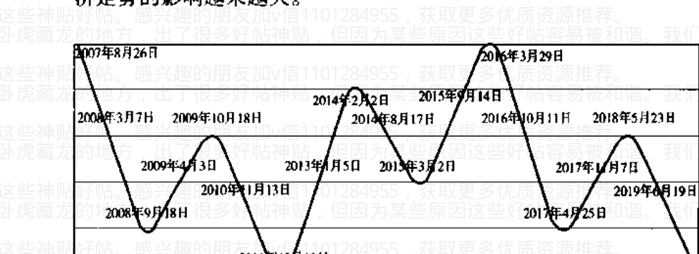

## 周期循环与波动

如果我们把一条绳子打个结，做成一个圆圈，然后甩动圆圈上的一个点制造一个波动，我们会发现，这个波动最后会再次传递到原来的起点。

海里的波浪，其实是能量的传递。一个特定的地方，有可能受到不同的波的重叠影响。很多水手经常讲述海里凶险的“巨浪”与“巨型漩涡”的故事，两者都可以吞噬船只。巨浪其实是多重波峰的重叠，而“巨型漩涡”则是多重波谷的重叠。美国1929大萧条就是这种“巨型漩涡”，所有坏事一起发生了。

除了经济动荡，美国从1931年起，还经历了7年之久的干旱沙尘暴“尘碗”。很多人认为这是神灵对他们20世纪20年代奢侈与自大的处罚，很多不信神的从那时候起重新开始对神灵产生敬畏。

西方人认为时间是线性的，东方人则认为时间有周期性。

> Richard E. Nesbett在《亚洲人与西方人不同的思考方式及原因》中写道：“中国人相信变化是常态，但是事情经常转回到原来的起点，即周期轮回。他们广泛注意各种事物，寻找事物间的关系，他们认为不理解整体，就不能理解局部。西方人活在更简单的有确定性的世界里。他们集中注意力在航海的目标上。西方人相信他们一旦掌握规律，就可以掌控事物的发展进程。”

亚洲人理解时间的周期轮回概念。这个世界就像很多互相联系的齿轮，一旦拨动一个齿轮，就会带动其他齿轮的发展，在不断循环中前进。

细心观察的人眼里是一片混乱的东西，其实背后是有非常清晰的事物演化的时间脉络的。

人类目前不能战胜时间。恐龙特级克塞号里“时间停止”的情况，还没有在现实中发生。所以，即使金融泡沫、地产泡沫以前发生过，以后也会重复。

举个例子，在金融业，预期发挥着非常重要的作用。在本来动态平衡的国际金融市场里，人民币2005年7月21日开始对美元缓慢升值，也就是说美元对人民币贬值开始了，贬到什么程度？金融界不知道。那么国际上的投资者就需要做出判断了，资本厌恶风险与不确定性，所以资本会逃离美元，转而持有黄金这个准国际货币，或者是石油等看得见、摸得着的有形资产，甚至是香港的房子（因为港币与美元汇率固定，美元贬值等于港币贬值，经济规律会自然而然指导人们去对冲港币贬值风险）。

2005年7月，就是美元对黄金失去牵制作用的开始。2008年7月，人民币对美元停止升值，汇率停留在6.83上。而2005年到2008年上半年，大部分国际金融资本预期人民币不只升值21%，一定程度上，过度地逃离了美元而购入黄金、石油、粮食、矿产、房产等实物资产。2008年7月，人民币突然对美元停止升值了，美元兑人民币汇率的确定性又出现了，这个时候，2005年7月～2008年7月这3年里过度逃离美元的资本必然从实物资产回调到安全的具有高度流动性的资产（国际结算货币美元、美国国债等）。

## 第1章 什么是经济周期

当然，这只是从人民币升值这一点因素分析的，事实上，经济异常复杂。

人民币升值最后反作用于中国经济，美元地位在2005年7月后逐步丧失，并在2007年下半年到2008年上半年的短时间内近乎崩溃，这导致资金疯狂涌向粮食、石油、矿产、基础金属等原材料或者实物资产，进而导致世界范围内的通货膨胀，使中国股市在反通货膨胀的货币紧缩政策下暴跌，直到2008年7月人民币停止升值后才企稳。

所以，我们作投资前需要想想别人将要做什么，在别人大规模配置某些资产之前，提前卡位，才能坐上大升浪，比如在2005年7~8月，黄金价格430美元/盎司的时候，提前卡位持有黄金。

常识告诉我们，同样是西方发达国家，大部分发达国家的房地产泡沫破了，而澳大利亚、加拿大的房价为什么到了2010年还是那么高，其背后的支撑是什么？如果金融资本逃离澳大利亚、加拿大，它们会去哪里？我认为，在强烈的美元贬值预期和强劲的中国对商品的需求下，加元、澳元都是商品货币，所以美元贬值导致了资金流向加拿大、澳大利亚，使得加元、澳元对美元汇率剧烈上升（美元、加元、澳元都是自由浮动汇率的货币）。

中国的房地产泡沫何时开始破裂？我们后面会有专门的详细论述，它与中国的通货膨胀周期、加息降息周期和房地产库存周期有关。

### 经济信心模型

20世纪60年代中期，马丁·阿姆斯特朗在一次中学历史课上看到了1948年的黑白片《Toast of the Town》，这是一部关于1869年金融危机的电影，因为黄金短缺和金融恐慌（当时很多交易的支付需要用实物黄金），很多暴民把华尔街银行家拖出来吊死。为了镇压涌到华尔街的暴民，政府不得不出动军队。电影中的一个场景是黄金的报价为162美元/盎司，而60年代的黄金却只有35美元/盎司。也就是说，黄金在1869年的美元价格是60年代的5倍左右。因为阿姆斯特朗在金币兑换公司打工，出于好奇，他去了图书馆证实了黄金在1869年的价格居然被炒到了162美元/盎司。

其实那是世界经济史、金融史上第一次全球金融危机和大萧条的前奏。人们一般把1873年作为那一次世界经济危机与经济大萧条的爆发时间。那次大萧条的导火线，是德国因为战争消耗而放弃银本位制度，从而导致了世界对于白银的需求剧烈下降。

1873年5月9日，奥匈帝国的首都维也纳的债券市场发生暴跌，传导到欧洲各地。而欧洲投资者在美国有大量投资，特别是铁路投资。当时美国铁路发展部分靠欧洲投资、部分靠财政补贴和“修铁路、送土地”的政策刺激，在短短七八年里（1866~1873年），铺设了9万公里的铁路。铁路投资的资金需求大，而收回成本慢，这导致Jay Cooke & Company这个美国最大的铁路与金融公司在1873年9月18日倒闭（美国雷曼兄弟公司于2008年9月15日倒闭）。

那是一场金融危机震撼了整个西方。这之前的历次危机——1825年、1837年、1847年、1857年、1866年，震中主要在英国。而1873年这一次，震中主要在美国这个幅员辽阔的新兴国家。英国的危机发生得最晚，要到1879年才发生危机，但是英国随后忍受了近20年的滞胀（经济停滞、通货膨胀），美国、德国、法国在工业上赶上了英国，美国GDP在1894~1895年超过了英国。

阿姆斯特朗从黄金的价格波动入手，进而研究了1683~1907年共224年间的26次金融危机，平均8.615年一次。

阿姆斯特朗发现长波周期平均大概是51.6年，由6个8.6年的波动周期组成。阿姆斯特朗还发现，人心会在信任政府与信任民间之间波动。某些时期，比如战争时期，人们会寻求国家的保护。当人民把信任交给民间的时候，在人们“自私自利”创造的进步下，经济与科技出现了几何级的巨大发展。前3个51.6年周期的高潮（1878年、1929年、1981年）中，1878年以前是信任政府波，以内战和政府扩张为主；第二波1878~1929年是信任民间波，铁路和汽车的发明极大地带动了世界的发展；第三波，又是信任政府波，美国政府部门在1929~1981年间，得到了史无前例的扩张。1981年以后，又是信任民间波，我们目前可能处于信任民间波的中期。1981年后出现了个人电脑、互联网和经济全球化等，互联网的普及就像铁路与公路一样意义重大，这一轮繁荣与科技大发展大致要等到2032～2037年左右到顶，那时候这个世界剩下的二战老人可能就非常少了。到时候粮食、水、耕地等资源的争夺可能是焦点。

阿姆斯特朗在70年代早期预测到，基本面将使得黄金从1970年的35美元/盎司一直上涨到1974年，事实上，黄金也确实在1974年涨到了200美元/盎司。然后，黄金在基本面没有变化的情况下，从1974年的200美元跌到了1976年的103美元/盎司（1973年11月开始，OPEC石油禁运，石油价格暴涨3倍，使得美国剧烈加息，导致了美国二战后最大的持续两年的经济衰退）。经济预测模型显示美国经济1977.05（即1977年1月18日左右）达到一个阶段性底部，然后是指数式的暴涨，一直到1981.35（1981年的第127天，即4月5日左右）。

但阿姆斯特朗却认为这仅仅就像坏了的闹钟却显示正确时间一样，仅仅是巧合而已。所以1974年阿姆斯特朗在黄金200美元/盎司的价位出手后，没有在1977年跟进，眼睁睁看着黄金真的出现了指数级暴涨（泡沫的后期）。

### 经济信心模型与历史辩证法

20世纪70年代后期，阿姆斯特朗发表经济信心模型后，一个军校邀请他去讲学。学生们告诉阿姆斯特朗，他的思想可以用黑格尔的历史辩证法解释。

德国哲学家黑格尔的历史辩证法思想要点是：不回顾人类的历史脚步，我们就无法了解人的本性。黑格尔考察了人类历史、哲学、艺术、宗教、科学、政治后，发表了历史辩证法的三个要点：

- ① 历史发展进程的必然性。
- ② 历史发展不断演进，不断进步。
- ③ “正”态事物由于内部矛盾的发展，会被反面替代，成为“反”阶段，这是第一个否定；反阶段再由于矛盾过渡到它的反面，是为否定之否定。

经过否定之否定后，事物虽然回到“正”态，但已不是原来的状态，而是更上一层楼，能较好地解决正反两面的问题。此为正—反—和三个阶段。中国成语“物极必反”就是第一否定；“否极泰来”则是否定之否定。

所以，我中短期2～3年内看空中国经济在房地产泡沫“物极必反”后的向下调整（2011年下半年到整个2012年，甚至2013年），但是我也看好中国经济在除掉房地产泡沫后的又一波发展前景（“否极泰来”2013 ~ 2017年）。就像美国1873年因为铁路过度投资引发了金融危机，但是危机消退后，美国经济迅速追上了英国。

阿姆斯特朗被学生们上了堂黑格尔哲学思想课，才知道他的发现可以用黑格尔的历史辩证思想解释。1878年以前的美国，人们在战争与经济危机阴影下期望政府的保护；1878 ~ 1929年的美国在统一稳定的政治条件下快速发展，人们的信心集中在私有部门；1929年经济危机后，人们重新投入政府的怀抱，1929年后的美国政府，不但需要解决和1878年以前类似的安全问题，还要提供温饱、失业后保障、平等的受教育和投票权利，甚至发展到后来60年代、70年代约翰逊总统在“伟大社会”的全面福利。1981年后，美国与英国政府不堪重负，里根与撒切尔开始改革。改革提高了经济运行的效率，同时也扩大了贫富差距。其实罗马参议员早就发现这个方法了，他们给暴民提供假日、免费食物和体育运动，这样暴民们就会任由上层去搞腐败了——直到有一天暴民的胃口再也不能被填满。

8.6年经济周期包括了3141天，等于圆周率乘以1000。6个8.6年周期，形成51.692年大周期，这个51.692年大周期与康德拉捷夫的发现比较吻合。6个51.692大周期等于309.6年。这个309.6年，与太阳的300年能量输出变化周期基本吻合。文明的兴起与衰落与太阳的这个300年周期非常切合。我们知道，富裕的宋朝，处于历史上温暖的时期，利于粮食丰收，而明朝末年处于小冰河期，粮食连年歉收。

我们总是有着想要经常处于均衡的错误思想。很多经济学家总是希望经济达到并保持均衡。事实上，均衡只存在于理论中和计划经济者的设想中。现实中，保持均衡就像寻找长生不老药一样不可能。如果经济状态均衡，那就是黑暗的中世纪或者短缺经济。中世纪和短缺经济体可以说没有经济危机，也可以说一直处于经济危机之中。

> 亚当·斯密1776年在《国富论》说：“没有比平衡贸易的教条思想更荒唐的事情了。”

如果贸易是完美平衡的，那就没有进步。短缺经济里没有经济危机，但短缺本身就是经济不发达的表现。

经济走势（波）的形状不可能是对称分布。所以经济走势（波）的形状，更像一个大钟的一半，开始时平缓上升，然后加速上涨后是相变，即暴跌，而不是缓慢下降。

- 1998年俄国国债危机的暴跌
- 2000年3月互联网泡沫破裂后的暴跌
- 日经指数1989年的暴跌
- 黄金1980年四个星期内从400美元/盎司暴涨到875美元/盎司后的暴跌
- 2008年1月，中国股市探明双顶后，一路杀人式的过度暴跌

因为经济信心的建立需要时间，而经济信心的丧失却是极快的，所以繁荣是慢慢预热直到过热的，而萧条是剧烈的，突如其来的。这是经济繁荣与萧条周期更替的特点，在历史上无数次被证实。

相变式暴跌，可以用烧水来比喻。当开水煮沸的那一刻，一下子进入蒸汽这个混乱状态。这种相变在自然界经常发生。所谓量变引发质变，这其实是曼德布洛特（Mandelbrot）发现的自然界的破形法则，或者说幂次法则在起作用。后来金融物理学家Didier Sornette应用幂次法则准确预测了石油价格泡沫的破裂时间，还有两次预测中国股市泡沫的破裂时间：2007年9月，预测中国股市泡沫2008年1月破裂；2009年7月10日，预测中国股市泡沫在2009年7月10日～8月10日间破裂。我们后面会专门提到Didier Sornette的具体预测方式。

### 人性的弱点与波动规律

经济波动其实是人心在贪婪与恐惧、乐观与悲观之间的周期波动。

从人性的角度说，人们对于经济、股市、楼市的信心的建立需要时间，所以，一个大升浪需要有3～5次的小波段，让人们一步步建立信心，而人们对市场丧失信心却很容易，往往几个月就会彻底失去信心，比如1998年8～10月的香港股市、楼市。这就是经济周期循环背后的人性因素。

信心的建立与一步步上升需要时间，直到信心达到顶峰，信心爆棚，股市、楼市也达到顶峰，最后物极必反，泡沫破灭而经济探底，人心也变得悲观。这就是经济波动周期背后的人性基础。中国古人也是观察到了这点，所以有了6的倍数规律，如12年周期、60年周期、72年周期等。

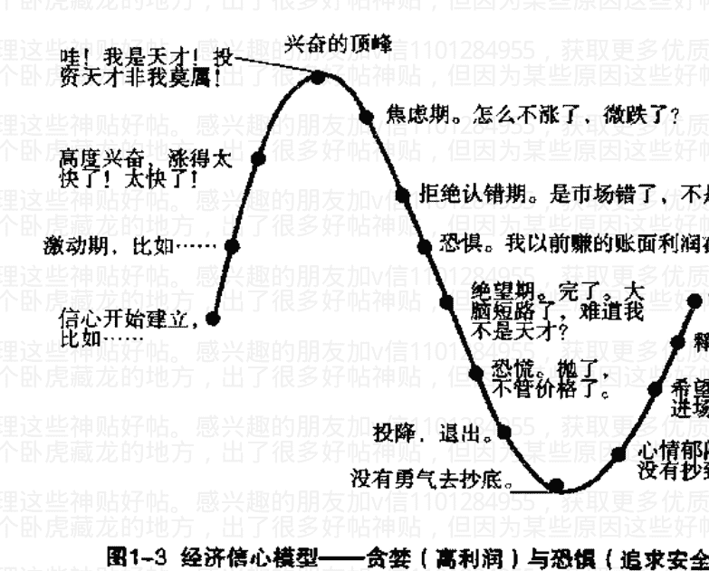

224年除以6，等于37.33年，这是美国的特大金融危机与美元货币周期。

这是个长波周期，并且会带来美国政治上的波动。美国政府管理能力的问题在这些年份特别突出，然后美国政府就会指责私有部门，好像经济都是私有部门搞坏了似的。

1896年、1934年、1971年、2008年都分别发生了什么？

## # 1896年：美国的国际支付危机

1896年以前，美国政府在农场主、银矿矿主的游说下，故意把白银的价格定得过高，而故意压低黄金的价格，结果是世界各地运来了很多白银，换走了很多黄金，导致美国黄金短缺。终于在1896年美国面临国际支付危机，政府没有足够的黄金用于国际支付，只好找到JP摩根寻求帮助，JP摩根组织了几家银行，承销了美国政府6200万美元的政府债券（当时黄金约20美元/盎司），缓解了美国政府的黄金短缺问题。

## # 为什么当时美国这么急着需要黄金？

原来当时英镑才是已经主宰了世界100多年的货币，英镑在100多年里没有贬值，其购买力在经济危机时期还会上升很多。当时美国正处于1890 ~ 1910年这20年关键的借债发展经济的追赶时期，美国政府和私有企业外债很多，类似于1997年以前外债很多的韩国，外债只能用英镑这个国际货币或者黄金来还。1896年的英国还很有钱，英国人、英国公司在世界各地拥有巨大的财富。美国从英国借了很多钱，主要用于购买生产设备，而不像21世纪，借的钱主要用于消费。

## # 1934年：金币的消亡与纸币的全面使用

1933年4月19日，罗斯福总统宣布没收全美国的黄金，宣布拥有黄金是一种违法行为，并且在6月5日被国会认可。1933年是美国铸造金币的最后一年。罗斯福把1美元从1/20盎司黄金贬值到1/35盎司黄金。

## # 1971年：美元与黄金脱钩

37.33年后的1971年8月15日，尼克松总统宣布黄金与美元脱钩，布雷顿森林体系瓦解了。在这之前，法国和瑞士一直不信任美元，不停地把美元换成黄金运回国，终于逼得美国不得不停止黄金兑换窗口。

“美金”两个字，1971年之后不再名副其实了。

从此以后，美元与黄金的价格不再固定在35美元/盎司。石油价格暴涨了，浮动汇率制出现了。当时学校里还没有教浮动汇率制的课程，经济学家也不知道如何教浮动汇率制。1971年也是美国从贸易顺差到贸易逆差的转折年份。1971年还是美国贫富差距最小的一年，这得益于60年代大量福利项目的出现。既然政府并不直接从事生产，大量福利实际上是一种通过税收和福利进行的财富重新分配，这加重了纳税人的负担，高昂的税收消磨了经济发展与进步的动力，所以从1973年开始，美国经济进入了近10年的滞胀时期，经济停滞、通货膨胀、失业严重，期间美国房地产出现了2~3次30%左右的小泡沫。美国从1935年到2000年一直没有房地产大泡沫。

当然，这要看和谁比了，美国的70年代，10年间，物价、工资、房价上涨了120%左右，利率大起大落，平均在8%左右。

## # 2008年：美元大贬值，石油、粮食的美元价格飞涨

2008年又是美国和国际金融历史的转折点，金融行业一系列重大变化接连发生。这场金融风暴一直要影响到2011年。美国严重依赖的外部资金流入会越来越少，美联储将不得不对美国债务进行货币化（即美联储印美元买债券，如美国国债、两房债券）。

2008年美元购买力暴跌。石油、粮食等商品的美元价格飞涨，也就等于美元的购买力急剧下降。如果哪个国家想不受美元购买力下降的影响，可以让它们的货币对美元相应升值，比如美元购买力下降30%，它可以对美元升值30%，那么本国货币的购买力就不会受影响。有这样对美元升值的货币吗？有，曾经的德国马克与瑞士法郎。

## # 经济预测的回顾

马丁·阿姆斯特朗在1999年9月26日发表了《商业周期与未来预测》一文，被大量转载。

## # 五国会议与《广场协议》

马丁·阿姆斯特朗的经济信心模型，比较准确地预测了20世纪80年代初经济的下滑。保罗·沃尔克高达20%的高利率政策严重打掉了通货膨胀，没有想到的是，高利率用力过度导致了严重的通货紧缩，高利率导致美元短缺，把美元汇率水平推高到了1985年的历史高点，美国贸易账户赤字达到GDP的3.5%。英镑更是跌到了1.03美元的低点，美国工业界受不了了，居高不下的美元汇率使得美国工业在德国、日本等国的企业面前显得没有竞争力。这就是1985年五国会议（美日德英法）出现的背景。

1985年9月22日，美国、日本、德国、英国、法国五国在纽约广场饭店签署《广场协议》，向全世界公布美元将对这些主要货币进行贬值，从1985年到1987年，美元开始公开有序贬值，美元对日元贬值50%左右，对法国法郎贬值40%左右，对德国马克贬值50%以上。日本使用降低利率和宽松的货币政策，而德国央行奉行“反通货膨胀为纲”的原则，以稳定物价为最高原则，所以德国房价虽然在1987年大涨10%左右，但是总体没有发生日本那样的房地产泡沫。

1987年2月22日，《卢浮宫协议》签订，六国（加上了加拿大，意大利没有签）在巴黎一致同意结束美元贬值，但是美元还是继续贬值，直到1988年美联储加息。

《广场协议》的目的就是扭转美国贸易逆差。有意思的是，美国扭转了对西欧的逆差，但是美元对日元贬值50%，并没有帮助美国产品大量进入日本。这就出现了一个现象，大量日本产品销往全世界，但是并没有大量美国和世界产品销往日本。日本的## 经济大周期

踩准经济节拍
再投资

实体货物越来越少，积累的货币却越来越多。日本的土地和房子不能出口，而且日本实行宽松的货币政策，所以贸易顺差得来的货币就去炒日本的房地产。因为房地产不能出口，房地产即使炒到天上也永远不能出口。当然，这么明显的事实和逻辑在阴谋论者那里是视而不见的。阴谋论者认为是美国把日本打成了流动性泛滥，打出了房地产泡沫，而不是日本自己通过各种潜规则让美国产品无法在日本大量销售。日本社会认为自己的东西卖出去了是占便宜，让别人的产品在日本大量销售对日本来说是“吃亏”的。经济学上，这是一种重生产轻消费的重商主义思想，这种思想认为卖出去的东西越多越好，积累的金银货币越多越好。后面一篇文章将重点讨论亚洲儒家社会的重商主义思想和资产泡沫。历史分析显示，保罗·沃尔克式“打断通货膨胀的脊梁”人物的出现，是经济规律在起作用，这样的人物必然出现，出现的人碰巧叫沃尔克而已。黑格尔历史辩证思想再次发挥其强大的哲学思辨力量，70年代长达10年的通货膨胀与经济停滞，必然会出现一个“过度打击通货膨胀”的人物（中国古语“矫枉过正”是也），过度打击通货膨胀之后，就会过渡到通货膨胀的反面，即通货紧缩与美元短缺。

#### 1987年10月19日的转折点

阿姆斯特朗的经济预测模型显示：1987年10月18日是经济信心的阶段性顶部，但那一天是星期天，第二天10月19日星期一，美国股市暴跌30%多。这是对1985年9月到1987年间美元过度贬值的一种“矫枉过正”，如果没有1985年9月到1987年美元的过度人为贬值，这个阶段性顶部就会像1996年和2005年那些阶段性顶部一样平淡无奇。

我们再用黑格尔的辩证历史观梳理一下。当时美国处于通货膨胀，所以1979年利率就有11.2%。沃尔克把利率从11.2%大幅提高到1981年6月的20%，是对70年代通货膨胀的否定。1985年9月到1987年中的美元对日元、法国法郎、德国马克的贬值，则是对沃尔克过度打击通货膨胀造成的经济衰退的否定（即“否定之否定”）。通过“否定之否定”（或者说“否极泰来”）之后，美国的通货膨胀治理好了，经济活力也有了，这种情况下的1987年10月19日的股灾则与1929年的股灾有根本区别。这些调整客观上为以后美国经济的大发展提供了低通货膨胀的良好土壤。所以中国有句谚语：“前人栽树，后人乘凉。”1987年接任美联储职位的格林斯潘和1993年上任的克林顿，就是这样坐在沃尔克给他们打下的良好经济基础上的。格林斯潘没有忘记沃尔克，格林斯潘把沃尔克尊为90年代美国经济活力之父，虽然沃尔克在1987年就已经把美联储主席职位让给格林斯潘了。

我相信，我们梳理经济起伏的脉络有利于我们把握今天和明天经济的进展。经济确实有周期规律，经济也是在“否定之否定”之中前进的。

## 第1章 什么是经济周期

#### 1989年12月13日世界经济顶峰

阿姆斯特朗刚开始并不相信他自己做的经济信心预测模型，直到1987年10月19日的美国股市暴跌30%这次股灾的时间与模型高度吻合，阿姆斯特朗才开始彻底相信他自己建立的经济信心模型有一定的预测价值。

1987年美国股市暴跌后，阿姆斯特朗兴奋地去研究接下去会发生什么。模型显示，1989年12月13日是个大顶，当时如果有泡沫的话，那个大泡沫在1989年12月13日附近触顶破裂的可能性最大。

1987年10月，最火的地区和市场是哪里？是日本，是日本地产和日本股市。所以阿姆斯特朗判断日本股市也许在两年后的1989年12月13日左右触顶。

1989年12月13日，8.6年周期大顶，全球经济周期大顶果然到来了。

在西方，主张“加税把钱分给经济困难需要帮助的人”的福利派和主张“减税减福利提升经济活力”的保守派之间，也是存在周期轮替执政的。

1990年，全球没有一个经济好的地方，民众痛苦指数高，所以需要福利派上台了。

1990 ~ 1993年，是全球经济向下调整的4年。

### 资本聚集现象

#### 资本的全球流动

1873年前后，资本流向前途广阔的美国市场，导致资本聚集到美国铁路投资，引发铁路投资泡沫，并在1873年破裂。但是1866 ~ 1873年修筑的9万公里铁路为美国以后几十年的发展奠定了良好的交通基础。

资本聚集现象是指在一段时间内，国际流动资本聚集在某个地区、某个市场，导致原来是有钱可赚、非常有前途的地区与行业的价格被炒到远远高于实际价值，比如1989年的日本股市、楼市。日本的发展是很快，但股市、楼市不至于可以炒到那么高，1997年以前的东南亚股市、楼市，也是如此。2000年的美国互联网行业也非常有前途，但股价不至于炒到高得那么离谱。国际资本的流动，使得各国央行无法在资本流入时有效控制货币供应量来抑制泡沫的兴起，也无法有效在资本外逃时降低资本外流对经济衰退的重大不利影响。2007年的中国股市、2011年的中国楼市，也是“资本聚集现象”。

#### 1994年4月1日

经济信心模型显示，1994.25（即1994年的第91天，4月1日左右）是个大底，美国标准普尔500指数就是这个时候触底的。这是超级大牛市爆发的前夜。这一轮是互联网泡沫，从1995年雅虎上市开始，到2000年3月纳斯达克股市暴跌为止。

#### 1998年7月20日

经济信心模型显示，1998年7月20日是个短时期历史高点，这个与俄罗斯国债与金融危机高度吻合，美国长期资本管理公司因此倒闭。

#### 2002年11月6日

和1994年一样，这是大牛市爆发的前夜，只是这次资本聚集到房地产、黄金、铜、石油、粮食等有形资产领域。

经济信心模型显示，2002年11月6日，美国经济探底，而且是8.6年经济周期的大底，从此5年之久的房地产泡沫使得美国民众的购买力超强，美国经济表面红红火火，美国经济对世界各种商品的胃口也大开——直到2007年2月26日的8.6年周期大顶。当然美国股市和中国股市要到2007年10月才见顶。

经济信心模型是个全球经济模型，并不仅仅限于美国经济。

经济信心模型的基础是人们群体思维或者羊群思维的一种波动规律。

#### 2007年2月26日

2007年2月美国房地产指数见顶，2007年2月26日日本股市见顶。这次只差一天，上次1989年12月差16天，怪不得日本人如此“迷信”阿姆斯特朗。2007年2月27日全球股市临时暴跌其实是一种全球经济见顶的信号。当然我们知道美国股市和中国股市要到2007年10月才见顶，其中中国股市从2月27日到10月的涨幅还很大，但是2007年3月到2007年10月进入股市如果不及时逃跑，风险还是极大的。对比经济信心模型与中国实际，世界经济对中国经济的影响滞后6～9个月，做过外贸的朋友知道，一笔贸易从下单到生产，再到海关报关后上船运出去，然后信用证收款，一共需要6～9个月时间。所以马云的阿里巴巴可以依据外商的下单情况预测6～9个月后的外贸数据，而且过去的2～3年，阿里巴巴的预测非常准。

与中国经济对照，我们发现1994年中国建立市场经济以后，中国经济受世界经济循环周期的影响越来越大。在2001年，中国加入WTO以后，美国与世界经济对中国经济的影响就更直接了，美国股市与中国股市在2007年10月同时到达顶峰。

### # 经济信心模型对未来的预测

- 2013年8月6日，世界经济阶段小顶部。
- 2014年9月3日，世界经济阶段性回调的底部。
- 2015年10月1日，世界经济8.6年周期大顶。

以上是阿姆斯特朗对美国和世界经济的预测。

上面日期加上6～9个月，可能就是中国经济相应的顶部和底部。逃顶最好在上面的时间上加4～6个月才比较安全。

为什么世界经济周期以前不能影响中国经济，现在却能？

因为中国的外贸和内需与国际经济结合得更紧密了。国际经济的好坏直接关系到中国的出口贸易。

1995年以前，中国不需要进口大豆，现在却需要进口占总数60%以上的大豆来满足大家对猪肉和食用油的需求。1995～2007年，中国的人均猪肉消费量基本翻番，这是中国经济大发展的又一个例证。人们的生活水平在极大地改善，虽然贫富差距也在扩大。

2000年以前，中国不需要进口太多石油，现在中国一半的石油消耗量需要依赖进口。国际粮价直接影响中国的猪肉价格（大豆榨取大豆油的残渣是主要的猪饲料），影响中国的CPI。国际油价，直接影响中国工业企业的利润。

## 第2章 经济周期规律的影响与应用

- 基钦周期与猪肉、房地产
- 朱格拉周期理论
- 中国经济周期逢二探底、逢七登顶
- 贝纳商品价格周期理论
- 康德拉捷夫长波与战争周期
- 约瑟夫·熊彼特

### 基钦周期与猪肉、房地产

基钦周期（Kitchin Cycles，即短波理论）在1923年由美国经济学家约瑟夫·基钦在《经济因素中的周期与倾向》一文中提出。

他认为经济周期有大小两种。资本主义的经济周期只有3~5年，大周期约包括2个或3个小周期，小周期平均长度约40个月。

基钦根据美国和英国1890~1922年的利率、物价、生产和就业等统计资料，从厂商生产过多时就会形成存货，从而减少生产的现象出发，把这种2~4年的短期调整称为“存货”周期，发现40个月中出现了有规则的上下波动这种短周期。

经济学家熊彼特把这种短周期作为分析资本主义经济循环的一种方法，并用存货投资的周期变动和创新的小起伏，特别是能很快生产出来的设备的变化来说明基钦周期。

他认为3个基钦周期构成1个朱格拉周期。18个基钦周期构成1个康德拉捷夫周期。有的学者认为，短周期很可能只是一些适应性的波动。

中国猪肉价格大约以34~36个月为一个涨跌轮回的周期，可以看作是一种基钦周期。由猪肉价格涨跌导致的物价涨跌，影响了中国货币政策的紧缩与宽松周期，这些会在以后的分析中反复。

## 经济大周期

踩准经济节奏再投资

中国房地产每过三年会有一次因为库存过多而进行的价格回调（2005年、2008年、2011年三次回调），也可以看作是一种基钦周期。

三个猪肉价格涨跌周期（这一轮大概在2011年6~7月见顶），构成了一个朱格拉周期。中国经济有着明显的逢二探底、逢七登顶的周期轮回。下面有具体的对中国经济近60年的分析，来诠释中国经济过去60年的6个朱格拉经济周期。可见，计划经济也逃不过朱格拉经济周期。

### 朱格拉周期理论

朱格拉周期理论是针对资本主义经济中一种为期约10年的周期性波动而提出的理论。

中国经济明显比较符合朱格拉周期。

1862年，法国医生、经济学家克里门特·朱格拉（C Juglar）在《论法国、英国和美国的商业危机以及发生周期》一书中首次提出市场经济存在着9~10年的周期波动。这种中等长度的经济周期被后人称为“朱格拉周期”，也称“朱格拉中周期”。

朱格拉在研究人口、结婚、出生、死亡等统计数据时开始注意到经济事物存在着有规则的波动现象。他认为，存在危机或恐慌并不是一种独立的现象，而是社会经济运动三个阶段中的一个，这三个阶段是繁荣、危机与萧条。三个阶段的反复出现就形成了周期现象。他又指出，危机好像疫病一样，是已发达的工商业中的一种社会现象，在某种程度内，这种周期波动是可以被预见或采取某种措施缓和的，但其并非可以完全被抑制。他认为，政治、战争、农业歉收以及气候恶化等因素并非周期波动的主要根源，它们只能加重经济恶化的趋势。周期波动是经济自动发生的现象，与人民的行为、储蓄习惯以及他们对可利用的资本与信用的运用方式有直接联系。

朱格拉周期一般可从设备投资占GDP的比例看出。对设备投资占GDP的名义上的比例以及两年后的投资收益先行指数（投资收益指总资本付息前利润率）进行比较，可以看出投资收益的走势预示着设备投资占GDP的比例。

### # 中国经济周期逢二探底、逢七登顶

**不管计划经济还是市场经济，经济活动的主体最终还是人。**

## 经济大周期

踩准经济节奏再投资

人性总是在“乐观与悲观”之间波动。投资者与决策者的心理总是在“贪婪与恐惧”之间波动。人性不变，所以几千年过去了，《圣经》还在不停地被印刷、被阅读、被讨论。中国有自己清晰的经济周期。中国近60年的经济基本上就是6个朱格拉经济周期。中国经济可用人均猪肉消费量来衡量，这比任何其他指标都强。图2-1是历年人均猪肉消费量。

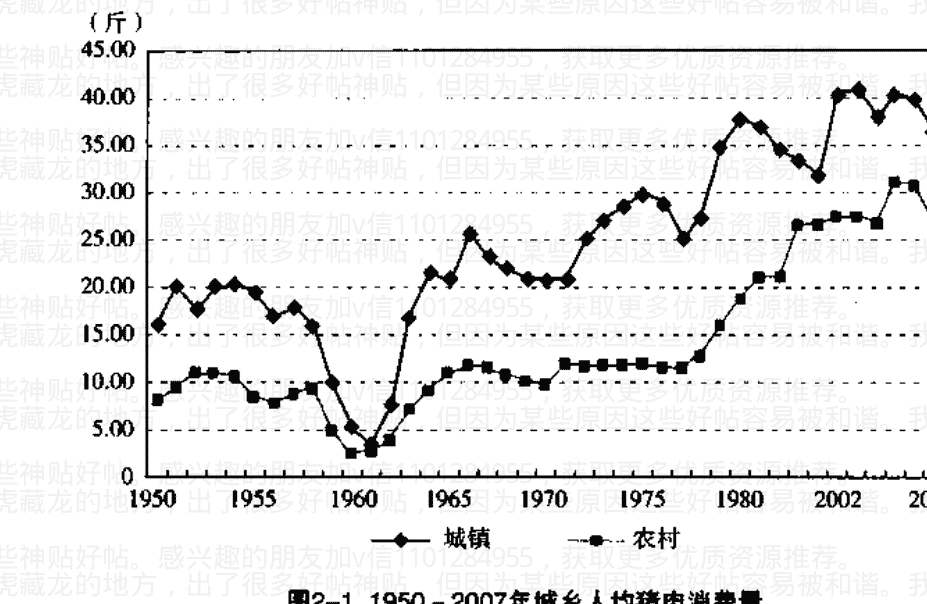

1952 ~ 1957年，国民经济快速恢复，人民群众欢欣鼓舞，人们对于吃饱的信心在1957年达到阶段性顶峰，然后“大跃进”发生了。一些见过世面、饱经沧桑的老人一边看着人们比赛吃白馒头，一边喃喃自语“如此糟蹋粮食，是要遭天谴的”。懂点历史的都知道，1961年的冬天是非常寒冷的，不是因为天气，而是因为被剥夺“在家做饭权”后发生的饥饿。1962年春天，春小麦收获后饥饿情况稍有好转。

#### 60年代

1962年春小麦丰收后，经济又开始了缓慢的恢复。1966年又开始折腾了，到了1968，又是逢8，没有足够的粮食吃了，城市也没有足够工作岗位了，怎么办？送些人下乡去，希望他们也去生产粮食。1956年就开始有“上山下乡”的说法了，却没有大规模实施，到了1968年才一下子让“老三届”下乡的经济背景，也许就是粮食收成情况和经济困境的表现。

#### 70年代

我们可以从很多信息看出1969 ~ 1971年的经济非常困难。比如，1970年信息显示：“连续几年农业生产遭到破坏，北方14个省区粮食不能自给，靠从南方调拨粮食维持。”1973年请邓小平出马搞技术性的整顿，到1975年铁路运输次序整顿和生产恢复了些，到1977年国民经济已经进一步“恢复”了很多，接着，又逢8了。1978年提出“N大钢铁基地”、“N大其他基地”。为了建设宝钢，几乎花掉了国家最后一分外汇，日方不得不提供贷款才完成了宝钢的一期项目。

#### 80年代

1981年后，国民经济快速恢复。1985年农业大丰收，中国人几百年来，又一次吃饱饭了。农业的丰收给工业再次提供了“剪刀差”的机会，加上工厂承包制和基本工资以外的奖金制度，让工人也尝到了改革开放的甜头，很多厂里的工人收入多于公务员。1987年是全民共享改革红利的年份。这种改革红利来自生产力的解放。生产力的解放来自产权的明晰，农民（交了公粮以后）可以保留分到的土地上产出的粮食。工人可以保留承包责任以外的盈利并以奖金的形式发放（工人对企业利润拥有了受益权，虽然不是股份所有权）。1987年，工人、农民与领导层的信心达到了阶段性顶峰，1988年物价闯关了，物价飞涨了，抢购发生了，两年多的萧条来了。

#### 90年代

1992年春天，领导层再也等不及了，他要发出更强的声音。又一次解放生产力开始了，市场经济确立了，人民币从5.5贬值到8.7了，《公司法》《破产法》《中国人民银行法》出台了，外资涌入了，印钞厂加班加点了。1993～1996年经济突飞猛进。1997年，咆哮了5年的经济又一次触顶了，经济调整开始了。1998开始降存款利率了，1999年开始大搞“铁公基”了。当然，肉的人均消耗量从1990年的20公斤涨到了近30公斤。大米、小麦自给的情况下，猪饲料和食用油（原料都是大豆）从1995年开始依赖进口。

#### 21世纪

2002年，市场上出现了一本书，叫《中国即将崩溃》，作者并不知道，效益低下的国企破产的另一面，则是更具有效率的企业的发展壮大。抓大放小是解放生产力，也是经济困难时期的甩包袱。至于贫富差距差距拉大，那是二次分配问题；至于企业生产有毒商品或者造成环境破坏，则是监管的责任问题。

总之，2001～2007年的主题，一是90年代末抓大放小导致的市场真空（或者说国企退出的那些领域的市场竞争环境的提高）；二是人民币以过低的汇率钉住美元，并随美元对其他货币（如欧元）进一步贬值的因素。没有这两个基础，房地产是很难迅速发展起来的。这也是为什么1998～2001年，政府想推房地产业而其发展并不太快的原因。

2007年2月，美国和发达国家房子价格指数到达顶点，中国实体经济也在几个月后到达顶点。中国从2007年2月开始进入了长达20个月的负利率时期，股市、楼市和物价在负利率下狂飙。2008年末的刺激，其实1958年、1978年、1998年都干过。

所以2002～2007年的中国经济是国际、国内两个上升浪的高度重叠。

### 贝纳商品价格周期理论

## 经济大周期

踩准经济节奏再投资

塞缪尔·贝纳曾是钢铁厂的厂主，在1873年的第一次世界经济大萧条中破产。

美国内战后，1866 ~ 1873年，美国在欧洲投资和政府“修铁路、送土地”的刺激下，掀起了铁路投资热，7年间，美国铺设了9万公里的铁路，对于当时的美国人口规模而言，是严重的过度投资了。后来美国人口急剧膨胀，到1900年，美国大约拥有了30万公里的铁路。

1873年以前，大多数铁路股票已经变成“注水股”。“注水股”这个词是从丹尼尔·德鲁那里由来的。德鲁最初是哈得孙河谷地的一个牲畜贩子，后来成了股市上的投机冒险家。当他还是一个牲畜贩子的时候，每次把牲畜带到市场出售之前，他都会给牲畜注水以增加牲畜的重量，从而在市场上卖出更高的价钱（中国的注水猪肉并不是首创）。“注水”的铁路股票和注水牲畜在本质上是一样的，都是指价值的虚幻膨胀，与庞氏骗局具有异曲同工之妙。

1873年9月18日，美国最大的铁路投资与金融公司破产，第一次世界级大萧条进入高潮阶段。美国1866 ~ 1873年铁路投资泡沫后期制造的金融大恐慌，从财政上断送了贝纳的工厂。

1873年以后，贝纳开始在俄亥俄州种植小麦，并开始进行价格波动的统计研究，他以此为好，试图发现商业中价格反复涨跌的答案。

1875年，贝纳曾写过一本书，名为《未来价格涨跌的商业预言》（Business Prophecies of the Future Ups and Downs in Prices）。

他在书中的预测主要是基于生铁价格的周期循环（注意当时基本是金本位或者银本位）以及金融恐慌的重现。

在许多年里，贝纳的预言曾达到了惊人的精度，而且作为一名统计人员和预言家，他为自己创造了令人羡慕的纪录。有人统计，他的预言在1875年以后100多年里准确率是97.8%。

甚至在今天，贝纳的图表还能引起循环学学者的兴趣，并屡见出版，但有时这些出版物没有给原创者应有的赞许。

贝纳注意到，商业价格的最高点遵循一种重复的8-9-10年模式。这其实是很多人都认同的9年左右市场经济周期规律，贝纳应该是有记载的最早的发现者之一。

如果我们将这种模式应用在从1902年开始的72年的DJIA（道琼斯工业平均指数）上，我们将得到以下结果（见表2-1）。这些日期并非基于多年前贝纳的预测，而只是8-9-10重复模式在历史记录中的应用。

# 经济大周期 踩准经济节拍再投资

表2-1 8-9-10重复模式

| 历年 | 间隔（年） | 市场最高点 |
|------|-------------|------------|
| 1902 | — | 1902年4月24日 |
| 1910 | 8 | 1910年1月2日 |
| 1919 | 9 | 1919年11月3日 |
| 1929 | 10 | 1929年9月3日 |
| 1937 | 8 | 1937年3月10日 |
| 1946 | 9 | 1946年5月29日 |
| 1956 | 10 | 1956年4月6日 |
| 1964 | 8 | 1965年2月4日 |
| 1973 | 9 | 1973年1月11日 |

至于经济的最低点，贝纳注意到两组时间序列，这些序列表明衰退（不景气）和大萧条（恐慌）趋向交替（考虑到艾略特的交替原则，就不会对此感到惊奇）。在评论恐慌时，贝纳曾观察到1819年、1837年、1857年和1873年是恐慌年，并把它们在他最初的“恐慌图”中表示出来，以反映重复的16-18-20年模式，结果得到了这些重现事件的不规则周期。尽管他开始只把16-18-20年模式应用于衰退或“不景气”的考量，但是次要的股票市场最低点看起来就像主要的恐慌性最低点那样，也遵循同样的16-18-20年模式规律。因此，通过将16-18-20年系列应用在交替出现的股票市场最低点上，再次达到了相当高的精度，就像1967年首次出现在《银行信用分析家》的副刊中的贝纳-斐波那契循环图说明的那样。1964年末，弗罗斯特运用贝纳的概念做出了（在当时）难以想象的预测，也就是在下一个十年里股票指数基本上是横盘，在1973年达到大约DJIA 1000点的最高点，并于1974年末或1975年初在500 - 600点的区域达到最低点。

贝纳早已去世，下面是根据贝纳理论做出的美国经济或者股市高低点走势图（见图2-2）。

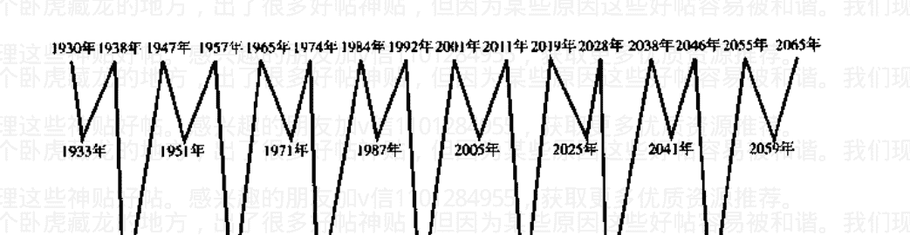

值得参考的是，2014～2017年大致是中国和美国经济的上升时期。从2008年9月美国雷曼公司破产算起，加上8.6年，就到了2017年的春夏之交。

# 康德拉捷夫长波与战争周期

康德拉捷夫长波又称长波或K波，描述了一种约50 - 60年为一循环的经济周期现象。一般将长波分成两段：上升的A阶段与下降的B阶段。长波之名源于苏联经济学家康德拉捷夫。他在著作《大经济周期》（1925年）及同一时期的其余著作中提出了此观点。另两位荷兰经济学家J. van Gelderen与Samuel de Wolff在1913年归结出类似的规律，但其著作直到近些年才翻译成英文。

对于资本主义经济的长波现象，早先有四种解释，分别从创新、投资、战争与资本主义危机入手。康德拉捷夫将长波的A阶段归结为过度的投资，以及由此带来价格与利率的上升；B阶段则相反。熊彼特则在20世纪30年代以技术的创新解释长波，A阶段对应新技术的传播及采用；B阶段对应技术普及后，各企业的激烈竞争时期。

第四国际书记处的马克思主义学者厄内思特·曼德尔以1964年的一篇论文为长波理论注入新机，当时他预言战后的繁荣景象将在五年后结束。不过曼德尔的理论中并无“长波”，他将之切割成约20~25年的较短周期。

## 康德拉捷夫长波的影响

新古典经济学家多半不承认长波理论，然而长波是许多非正统经济学理论的基石，华勒斯坦的世界体系理论亦奠基于此。即使在认可长波的经济学家中，对长波的起因、开始年代及各次长波的划分问题，都没有定论。一些批评者因此认为：所谓“长波”只是强加于大量统计资料上的概念。

不过多数长波理论学者同意：自工业革命以来，我们已经历了五个长波，而第六个长波即将展开。在熊彼特的理论框架下，这五个长波起点分别是：

- ① 工业革命（1771年）；
- ② 蒸汽机与铁路时代（1829年）；
- ③ 钢铁、电力与重工程时代（1875年，1873年是世界经济第一次大萧条）；
- ④ 石油、汽车与量产时代（1908年，1929~1932是世界经济第二次大萧条）；
- ⑤ 信息与通讯时代（1971年）。

依照这套理论，世界现时正处在第五个长波的转折点。

# 康德拉捷夫长波与战争

康德拉捷夫指出，生产扩张使得资本急于寻找新的市场和新的原料，由此将造成国际关系紧张。华勒斯坦等学者认为，在资本主义体系下，战争的频率与长波密切相关：大规模战争倾向于在生产上升阶段之前爆发。Joshua S. Goldstein根据统计资料，推断战争高峰落在长波的生产高峰与价格高峰之间。他以战争能力的提高、竞争加剧与商业繁盛的心理效应解释生产的扩张何以倾向于引发战争。

# 约瑟夫·熊彼特

熊彼特是一位对世界有深远影响的奥地利经济学家（但并不是一位“奥地利学派”的成员），其后移居美国，一直任教于哈佛大学。其终生与凯恩斯间的“瑜亮情节”是经济学研究者中的一个热门讨论题目，虽然他的经济学说并不像凯恩斯那样在生前就获得很大的回响，但研究者都认为他对于经济学科的思想史有着很大的贡献。

# 约瑟夫·熊彼特生平

1883年，熊彼特出生于奥匈帝国摩拉维亚省（今捷克境内，故有人又把熊彼特看作美籍捷克人）特利希镇的一个织布厂主的家庭。他幼年就读于维也纳的一所贵族中学。1901 ~ 1906年肄业于维也纳大学，攻读法律和经济，乃奥地利学派主要代表人物庞巴维克的及门弟子。当时他的同学好友中有后来成为奥地利社会民主党领导人物的奥托·鲍威尔，以及后来成为德国社会民主党人、第二国际首领之一的希法亭。随后他游学伦敦，师从马歇尔。他高度推崇洛桑学派的瓦尔拉斯。第一次世界大战前后，熊彼特曾执教于奥地利的几所大学。

1918年，他曾一度出任考茨基、希法亭等人领导的德国社会民主党“社会化委员会”的顾问。

1919年，他又短期出任由奥托·鲍威尔等人为首的奥地利社会民主党参加组成的奥地利混合内阁的财政部长。

1921年，他弃仕从商，任私营比德曼银行行长。1924年银行破产，他的私人积蓄不得不受牵连而用于偿债。

1925年，熊彼特又回到学术界，先应邀拟赴日本任大学客座教授，但不久改赴德国任波恩大学教授，直到1931年又短期访日讲学。

1932年迁居美国，任哈佛大学经济学教授，直到1950年初逝世。熊彼特迁美后，尽管深居简出，但仍积极从事学术活动。

1937 ~ 1941年任“经济计量学会”会长。1948 ~ 1949年任“美国经济学会”会长。如果不是过早去世，他还会担任预先商定的即将成立的“国际经济学会”第一届会长。

# 约瑟夫·熊彼特的重要学说主张

“景气循环”也称“商业周期”（Business Cycle）或者经济周期，这是熊彼特最常为后人引用的经济学主张。根据其说法，类似“景气循环”的主张早在19世纪30年代就被英国经济学家图克（Thomas Tooke）提出过了，后来在重要的经济学家著作中也都约略地提到过这个概念，比如在李嘉图、马歇尔、庞巴维克、马克思等人的著作中。熊彼特认为自己只不过是将景气循环的定义与作用明确地展示出来的人而已。

“创新”（Innovation）是将原始生产要素重新排列组合为新的生产方式，以求提高效率、降低成本的一个经济过程。在熊彼特经济模型中，能够成功“创新”的人便能够摆脱利润递减的困境而生存下来，那些不能够成功地重新组合生产要素之人会最先被市场淘汰。

“资本主义的创造性破坏”是指当景气循环到谷底的同时，也是某些企业家不得不考虑退出市场或是另一些企业家必须要“创新”以求生存的时候。只要将多余的竞争对手筛除或是有一些成功的“创新”产生，便会使景气提升、生产效率提高，但是当某一产业又重新是有利可图的时候，它又会吸引新的竞争者投入，然后又是一次利润递减的过程，回到之前的状态。所以说每一次的萧条都包括一次技术革新的可能，这句话也可以反过来陈述为：技术革新的结果便是可预期的下一次萧条。在熊彼特看来，资本主义的创造性与毁灭性因此是同源的。但熊彼特并不认为资本主义的优越性便是由于其自己产生的动力而不停地推动自身发展，他相信资本主义经济最终将因为无法承受其快速膨胀带来的能量而崩溃于其自身的规模。

“精英民主理论”或称为“精英竞争式民主理论”。在其代表作《资本主义、社会主义与民主》一书中，熊彼特采用他那德国历史学派的老成语调提出了他对于民主理论的观察。他主张：
西方200年间主要的民主理论皆建立在不真实的前提之上，比如说这些民主理论不经考察投票人是否具有对投票内容的专业认识便以为多数的意见优于少数的意见。他认为这样的民主学说仅仅是空想，与事实完全脱节，更没有真实地阐述政府权力的来源。熊彼特认为他的看法才是符合人类历史经验的：民主仅是产生治理者的一个过程，而且还不是一个必要过程，无论人民参与民主的程度有多少，政治权力始终都是在精英阶层当中转让。与其主张资本主义即将崩塌时一样，这两个主张都被认为是历史主义者的悲观论点。无论如何，熊彼特的“精英竞争式民主理论”引起了政治学者的关注，其中以反驳者居多，另外有人将熊彼特的学说与意大利社会学家巴烈图的“精英循环”说并列为精英政治学说的两大经典。

# 约瑟夫·熊彼特的身后影响

被誉为“现代企业管理学之父”的彼得·德鲁克（Peter Drucker）一向承认其深受熊彼特的影响。他与熊彼特同样强调企业家在“繁荣”这个目的上所扮演的角色比资本家更为关键，并且改良了熊彼特对于精英的看法，更多强调精英分子的社会责任。另外他也同意“创新”便是生产要素的重新排列，且更深入地剖析了创新的价值。此外在他对于“泡沫经济”的观察中也可看出很明显的熊彼特学说的影响。1931年熊彼特访问日本并做了三场对经济系学生的演说，此行后对日本文明留下非常美好的印象。后来证实，这三场演说使熊彼特在日本青年经济学者心中留下了极深刻的印象，有几位当时坐在台下的学生成为熊彼特学说在日本的宣传人。回到美国后的熊彼特也对哈佛大学经济学系中几位来自日本的留学生特别关爱。其终生都很欣赏日本文化。就是因为其对日本文化的友善态度和这几位学生毕生对老师的推崇，使得熊彼特在日本的知名度高过其在亚洲其他国家。这几位熊彼特在日本的推崇者是中山伊知郎（波昂大学时期学生）、东畑精一（同前）、都留重人（哈佛大学时期学生）、高田保马（听讲时已是经济学者）。这些人又影响了后一代的经济学家如塩野谷祐一与根井雅弘，其中塩野谷祐一是目前日本公认的熊彼特研究权威。

## 第3章 如何踩准经济节拍

天涯是个卧虎藏龙的地方，出了很多好帖神贴，但因为某些原因这些好帖容易被和谐。我们现在正在收集整理这些神贴好帖。感兴趣的朋友加v信1101284955，获取更多优质资源推荐。

### 经济规律适用于中国

### 通货膨胀恶化与泡沫破裂

### 猪肉、楼市、股市与货币政策周期

### 中国楼市下跌时间表

### 中国房价十年大顶

### 反驳崩溃论与阴谋论

### 说说量化宽松

### 经济规律适用于中国

经济规律普遍适用于古今中外，只要有市场、有商品交易、有价格，经济规律就要起作用。经济被扭曲的时候，经济规律也在扭曲的条件下起作用，如果人为压低一个商品的价格在成本线以下，那么这个商品会出现短缺或者偷工减料现象。

西方人比较系统地发现了经济规律，因为他们在市场经济的道路上走得早，走得远。中国人发明了指南针，你能说指南针只适用于中国吗？西方发现了地心引力规律与电磁场规律，难道地心引力规律与电磁场规律在中国就不适用了吗？经济规律在经济学作为一门学科以前，就在东方和西方起着作用。一个人在河上筑个大坝，并不能推翻水往低处流的规律。经济规律只能被扭曲，并不能被推翻。

经济规律最简单的表达就是“天下熙熙，皆为利来，天下攘攘，皆为利往”。资本向回报率高的地方去，就像水往低处流一样正常。只是有时候存在群体性误判，导致资产泡沫的产生与破灭。

越是对经济规律理解得深，越能找到发展经济的“良方”，至于能不能被采用，则是另外一个议题。亚当·斯密1776年就说了，一个国家的财富，在于一国的人力资源及其生产能力，而非黄金、外汇储备、土地或者矿藏。当西班牙、法国等还在陶醉于大量黄金的时候，德国、英国、美国更快更好地普及了教育。日本后来跟上了，再后来韩国、新加坡的教育水平也名列世界前茅。

### 通货膨胀恶化与泡沫破裂

改革开放30年，中国经历了两次较为严重的通货膨胀（即通胀率在10%以上）。1988年3月上海率先调整280种国民经济必需品的价格，接着各大城市相继提价，提价商品占商品总量的80%，价格平均上涨30%，最高的涨幅达80%。1988年和1989年，CPI分别达到18.08%和18%。而最为严重的通货膨胀则发生在1993~1995年期间，这3年的CPI分别为14.7%、24.1%、17%。

纵览这两次严重通货膨胀，有一个共同的现象是此前都发生过货币供应量M2的爆炸式增长。数据显示，1987年M2增速27.3%，而1992 ~ 1994年，每年的M2增速更是高达30%以上。M2增幅做趋势性上升时，其对CPI的影响大体在10个月左右后开始显现，但这种影响的滞后期逐渐延长，CPI升至峰顶的时间大体比广义货币供应量M2增幅到达峰顶的时间滞后20个月至2年左右；当M2增幅做趋势性下降时，其对CPI的影响大约也在20个月至2年左右后显现。

无论我们是否认同弗里德曼的货币理论，但货币供应量变化对物价有着明显的正效应，且存在一定的滞后期确是不争的事实。

货币失去信用、货币失去价值衡量尺度作用、货币失去财富储藏功能，使很多人不想持有货币而持有实物，会导致货币流通速度加快，物价暴涨。目前的人民币，还没有失去信用。

2009 ~ 2010年，养猪亏本和建筑业火爆导致部分养猪的国内劳动力也流向建筑业。2010年猪肉价格还算平稳的有利因素是，美国大豆（黄豆）播种面积超过预期并且丰收，导致国际小麦暴涨60%的情况下，大豆确涨不上去。

### 猪肉、楼市、股市与货币政策周期

#### 猪肉价格与中国经济概述

猪肉价格，反映的不仅仅是猪肉行业本身的情况，也反映了体力劳动力的短缺情况，反映了整个社会对蛋白质类食品的需求情况，还反映了整体经济的火热程度和整个社会的资金充裕程度。

以3年为周期，每次猪肉价格中期首次登顶的2~3个月之后，股市开始下调，楼市停止上涨或者下跌，所以楼市比股市还慢6个月左右。即楼市止住上涨或者下跌，要发生在猪肉价格首次登顶触发的宏观调控的大约9个月之后。

这个大致规律，2001~2020年可能都有效。

具体来说，2003~2004年上半年，经济明显有一定过热，有一定的体力劳动力短缺现象，2004年猪肉价格上去了，然后宏观调控来了，股市大跌了，2004年很多厉害的庄家也栽跟头了（德隆、鸿仪、闽发、汉唐、南方）。

2006~2007年上半年，经济明显有一定过热，而且又出现了更大程度的体力劳动力短缺现象，2007年2月开始负利率，2007年8~9月，猪肉价格暴涨，然后严厉的宏观调控又来了。

2008年2~4月，猪肉价格再次高位徘徊，2008年股市杀猪式大跌来了。2010年7~9月，猪肉价格第一次顶峰来了，2011年2~4月，猪肉价格高位徘徊，股市在负利率和人民币基本上单向升值的情况下，就是涨不上去。

中国股市大牛市的到来，很可能在2012年年中以前都没有戏。2012年下半年，中国股市才会再次启动牛市。而楼市则起码要等到2012年底才会再次启动。

#### 猪肉价格涨跌周期与中国货币政策和楼市、股市走势

中国猪肉价格存在34~36个月的涨跌周期。34个月 × 3=102个月=8.5年，36个月 × 3=9年。

请问为什么中国人民银行在2004年下半年紧缩货币政策，导致房价在2005年上半年下跌10%~20%（或者微跌，因为没有可靠的数据）？为什么2004年股市也是大跌？

因为猪发话了，猪肉涨价了（见图3-1）。2004年8~10月，猪肉批发价达到16元/公斤的阶段性高点。

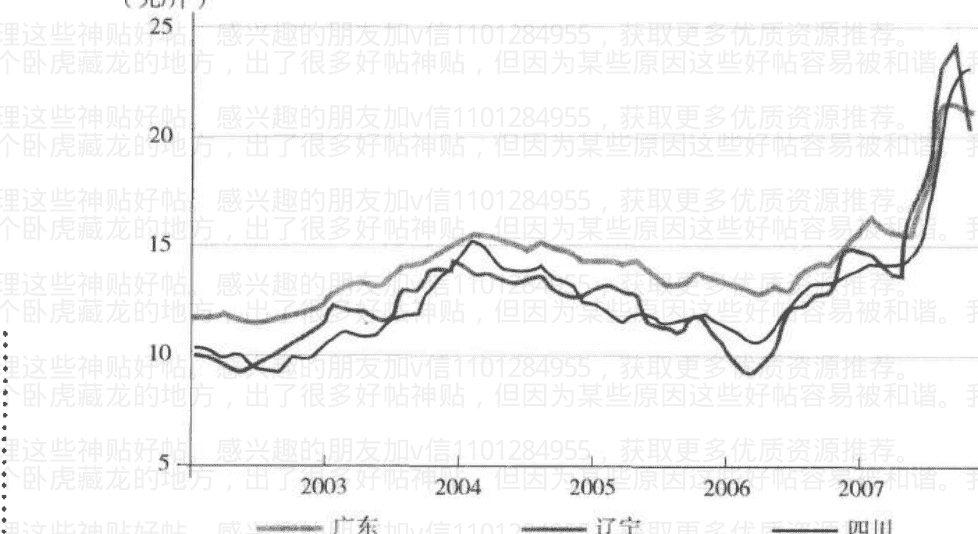

2004年4月下旬开始，宏观调控一词频繁见诸报端，逐渐成为经济领域最受关注的话题。尽管与以往历次宏观调控有所不同，但其对证券市场的负面影响是实实在在的。4月7日，在宏观调控影响下，上证指数从2004年最高点1783点飞流直下，到9月13日探出1259点的年内最低点，5个月时间跌去524点，两市流通市值“蒸发”约4437亿元。由于2004年股票市场的持续下跌，上证综指全年下跌15.4%，沪深两市流通市值缩水近1500亿元。两市7000多万投资者平均每户亏损2053元。唯一上涨的是再融资金额，较2003年翻了一番。在2004年飘雪的冬季，结束了豪庄争鸣、一统江湖的岁月，2004年的庄家墓志铭上，写满了资本大鳄的名字：德隆、鸿仪、闽发、汉唐、南方……2004年冬天的第一场雪，湮灭了大佬横行的岁月。看来2004年庄家们都不逛菜市场，不看猪肉价格。

34～36个月后的2007年底，为什么股市高歌猛进好像要冲破1万点，却被人民银行两根大棍子（升存款准备金和升存贷款利率）打得落花流水？导致股市从6124点跌到1664点。

因为猪又发话了，而且发飙了，据说阴谋家还把猪吃的饲料——大豆豆粕炒得老高。2007年8月，猪肉价格第一次见顶，猪肉批发价在广东、四川等地达到24元/公斤，大部分个股也在2007年8月见顶。2008年2～4月，猪肉价格再次在高位徘徊，股市已经一泻千里了。如果投资者听猪的话，2007年8～10月，就该从股市战略撤退。

2009年5月6日，猪肉价格探底，养猪的又一次亏到姥姥家了。（34个月左右亏一次）。如果投资者听猪的话，当养猪的亏本的时候，投资者就该杀进股市或者杀进猪市——开始养猪也行。

对于中国而言，再过3个猪肉涨跌周期（34个月×3=8.5年）后的2019~2021年，猪肉还会是个重大的经济政策、农业政策、货币政策议题，也必将是个政治议题。

#### 猪肉价格涨跌周期与经济周期、泡沫周期

首先，中国有自己的经济周期，不一定与美国经济周期同步。美国房地产泡沫2007年2月开始被做空而破裂，中国内地、中国香港、澳大利亚、加拿大的房地产泡沫还没有破。中国自己的实体经济周期从2002年开始，2007年到顶。

其次，2001年后，中国受美元和世界经济的影响很大，这一轮经济“增长”的启动就是从美元2003年走弱开始的，美元在2003年对日元和欧元分别贬值17%和14%。人民币也就跟着美元对日元、欧元贬值17%和14%。因为人民币在2003年对美元汇率固定不动，保持在8.27附近。

最后，2003年中国出口增长近40%。中国的外汇储备也增长了40.8%，达到4000亿美元。从此开启中国经济发展“奇迹”之门，人民币币值、港币币值由此开始进入不稳定状态，部分是因为钉住美元，随美元贬值而起的，内地和香港的资产泡沫由此而起。

#### 中国地产泡沫面临三个挑战

##### 第一个挑战：国内失控的通货膨胀会迫使货币政策紧缩，

收紧手段包括加息和提升存款准备金率（限制货币供应量的增长）。2010年，虽然部分商品价格暴涨，但是说2010年通货膨胀失控，也是不够准确的。2010年2月是个开头。2010年7~9月，只是通货膨胀恶化的第一阶段。

美联储量化宽松的钱被银行拿去买国债和其他安全的债券了，没有贷款给个人和企业。美国的商业银行是私有的，利率也是市场化的。所以美联储量化宽松，没有传导到广义货币供应量上，变成企业和个人的钱，所以暂时不会引起通货膨胀。市场告诉商业银行家们，买国债比贷款给个人与企业要有利（对“自私”的银行而言）。

中国则是让商业银行进行信用扩张，2009年广义货币供应量增长27.7%，钱进入了拿到贷款的企业手里，然后被花了出去。

##### 第二个挑战：美元货币危机。

从2008年12月开始的美联储的零利率政策，随着时间的流逝，越来越容易引发超级通货膨胀（石油、粮食等暴涨）。如果美国国债也失去作为财富储藏的功能，则会导致石油、粮食等大宗商品暴涨，然后美联储不得不提前加息反通货膨胀。但是散布恐怖言论也是不对的。美元下跌和石油暴涨是有边界的，石油涨过115美元/桶，太阳能发电就会被大力推广，市场会预期石油消耗减少从而导致石油价格下降。

## 经济大周期 踩准经济节拍再投资

##### 第三个挑战：因为美国房地产泡沫比欧洲先破，大规模破产

重组比欧洲先发生，导致2011年美国经济复苏的时候，欧洲却陷入银行危机、主权债务危机，美元就会开始对欧元上涨。

如果人民币预先对美元升值到市场均衡汇率附近，美元再发动对欧元、日元、加元等货币的暴涨，则中国国内资产泡沫极可能破裂。因为这个时候美元再暴涨，人民币将陷入两难：对美元汇率不动则外贸不行；对美元贬值则加剧国内通货膨胀，因为大豆、石油等进口货物的人民币价格会相应上涨，而且贬值易导致资金出逃。

经济规律只可被扭曲，绝不会被战胜。萧条只能被延后，绝不会被消灭。不然日本经济“奇迹”不会破灭，“四小龙”曾经的股市、楼市泡沫不会破灭，东南亚各个“小虎”的经济发展“奇迹”也不会破灭。中国内地资产泡沫起于美元2002年底开始长期贬值之旅，如果破灭于美元升值，也算是一个美元涨跌周期与泡沫起落周期。

### 中国楼市下跌时间表

### 买房保值吗

买房保值，保的是钢筋水泥建筑的价值，还是房子下面那块

#### 土地的价值？

直接进入正题。房价的决定因素是地价加上建筑成本。这是一句废话，但是很重要。

房价其实是两个部分组成的：地价和建筑成本及市政配套成本。

2001 ~ 2002年，极少有开发商因为房子卖价抵不上建筑成本、市政配套成本和公司运营成本而破产的，说明那个时候的房价在各种“合理”成本之上。那么2010年建筑成本上升到了多少呢？

这个数字，相信很多人都算过了，算得比我准确。2009 ~ 2010年北京某些房子的售价在4500 ~ 6000元/平方米，从侧面说明，如果地价很低的话，房价也可以低到4500 ~ 6000元/平方米。

这个建筑成本的数字不管是4500元还是6000元，都不是我要说的重点。我要说的是钢筋水泥建筑下面的土地的价格。

据媒体报道，2010年在北京、上海很多土地拍卖的楼面价已经达到2.5万 ~ 3.5万元/平方米了。这些土地上建起来的房子如果能卖得出去，其中的土地价值就是2.5万 ~ 3.5万元/平方米，而建筑成本和市政配套成本可能在4500 ~ 6000元/平方米。

所以说，房子买卖，主要已经成了买卖土地使用权证，买一送一附送钢筋水泥砖头若干。

这个时候，房价（土地使用权证+建筑成本）与股票（股权证）价格的关系就打通了。股票最大的赚头，是从普通公司到上

## 经济大周期 踩准经济节拍再投资

市这一步，或者大小非从非流通到流通那一步，证券公司对于上市公司的股东而言，只是高级打工仔而已。房地产最大的赚头，是“土地使用权证”融入房子房价里的那一步。公开拍卖高价地的开发商，也仅仅是赚钱多点的高级打工仔而已。

当一个人在2010年说要买房保值的时候，他主要是指房子下面的那块土地保值，因为房价里70%左右已经是土地价格了，建筑成本占的比例越来越小，快要可以忽略不计了。那么如果2~3年后，几公里远的地方，另一块拍卖的土地的楼面价只有5000元/平方米甚至3000元/平方米，并且钢筋水泥因为产能过剩而价格不涨甚至下降的时候，包含了2.5万~3.5万元/平方米的土地楼面价的房子，降价到1万元/平方米以下，则是正常的。在新出的猪肉只要9元/斤的情况下，昨天的猪肉不可能因为进价高而卖15元/斤。

当然了，总是有人认为有的地盘非常特殊，那个地块的地价只涨不跌，或者说，市中心就这么点地方，市中心没有可开发的土地了，甚至可能还“专业”地说这叫级差地租。

说到这里，就涉及一个信仰问题了，如果钢筋水泥建筑下面的那块土地是稀缺的，是独一无二的，其他地段可以跌，但就是这块地段不会跌。只会涨不会跌的东西，自然应该买下保值。但它保的，主要应该是建筑下面的土地的值（土地价格），而不是上面的钢筋水泥建筑的价值。曾经的东京市中心房产的投资者，曾经的香港市中心房产的投资者，都曾经坚定地相信市中心

的房价（其实说地价更恰当）绝对不会跌。宏观上说，2010年中国170亿平方米的居民用房建筑面积，在34万亿～51万亿元的钢筋水泥砖头价值之外，其房价已经包含了68万亿～100万亿元左右的土地价值。这只是已经建成房子的土地在房价上的反映，还不包括已经被开发商购买去了的，已经在“土地储备中心”旗下的，或者即将进入“土地储备中心”的土地。

土地啊土地，我对你爱得深沉，不是因为你能源长多少庄稼，而是因为你太值钱了。

### 人民币购买力预期与房价的关系

为了便于解释和理解，我们先看三幅图。

-   第一、上海2000～2010年的房价走势图（图3-2）。

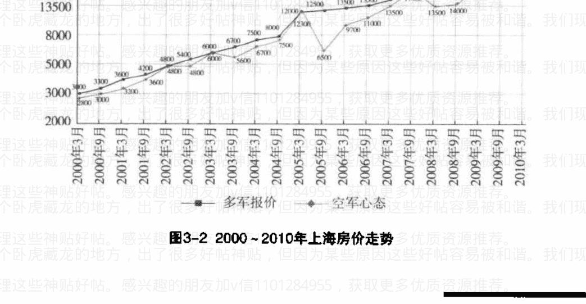

## 经济大周期 踩准经济节拍再投资

#### 第二，2002年以来黄金价格走势图（见图3-3）。

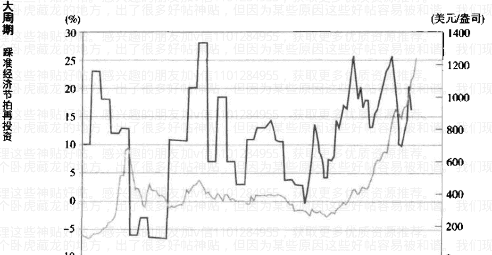

##### 图3-3 黄金价格走势图

#### 第三，2002年以来中国外汇储备变化情况（见图3-4）。

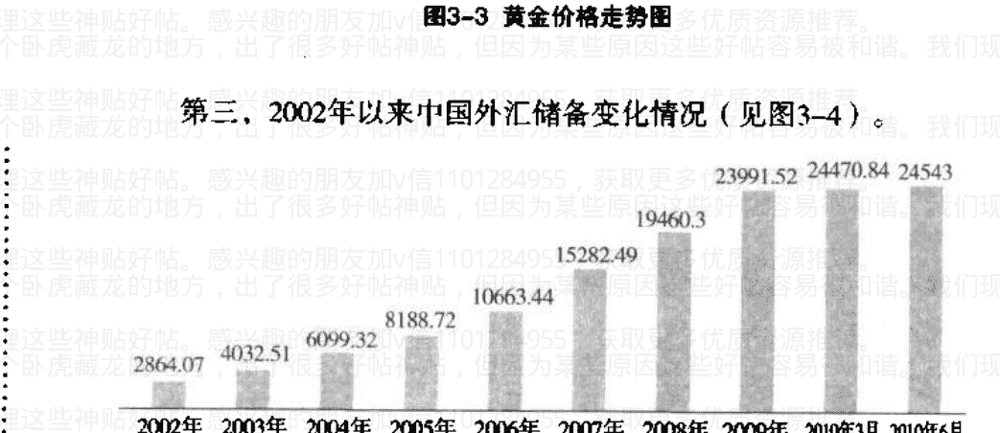

##### 图3-4 2002~2010年中国外汇储备余额（亿美元）

当房价在建筑与市政配套成本附近徘徊，而且人民币币值稳

## 第3章 如何踩准经济节拍

定的时候，房价确实像普通商品价格那样，由供需决定，就像1997 ~ 2001年的中国楼市。

当黄金价格在开采冶炼成本（400 ~ 550美元/盎司）附近徘徊，并且美元的币值稳定的时候，黄金的价格确实像普通商品价格那样，由供需决定，那个时候的黄金是工业用品和首饰用品。

中国经过1997 ~ 2000年的经济与货币紧缩（货币政策其实是适度从紧而已），2000年，中国人民对于“人民币未来具备稳定的购买力”这一点充满了坚定的信心。也就是说，中国人民在2000年对人民币未来的购买力的预期是非常稳定的，中国人民并不预期2000年后人民币的购买力会出现大幅下降。因为中国人民那时候已经习惯了1997 ~ 2000年物价稳定的局面。

俗话说“天有不测风云”。突然，中国人民纯洁的心灵天空里，飘过了一片乌云。

中国人民慢慢预期人民币的购买力在未来会出现大幅下降，这种“邪恶”的想法在2003年愈加强烈。

当人民币的购买力被中国人民预期在未来会大幅下降的时候，房子不再仅仅是房子了，而成了部分商业嗅觉敏锐的人（然后是很多直觉良好的普通人）储存财富的载体。房子具备了对冲人民币购买力下降风险的功能。房子变成了“不懂经济”的普通人对冲人民币贬值风险（购买力下降风险，不是指对美元）的对冲工具。“不懂经济”四个字是打引号的，因为很多具备经济常

## 经济大周期 踩准经济节拍再投资

识的人，其理财能力、保卫自己财富的能力，或许比很多专家强N倍。

当美元的购买力在2002年后被世界人民预期会大幅下降的时候，黄金再一次被作为“倚天不出，谁与争锋”的倚天剑亮了出来。房子，就是中国人民2002年后，用于对冲“人民币购买力下降风险”的倚天剑。通俗点说，2002年前有了两套房子，通货膨胀伤害不了我这个小老百姓，人民币购买力你任意下降好了，你人民币的购买力预期下降越多，我的房子涨得越多。注意我是说“预期”，如果预期反应过头，就会像2007年的股市一样形成泡沫。

当房价里的土地价格因素远远超出建筑成本的时候，泡沫就起来了。

当房价和黄金价格远远高出生产成本的时候，他们的价格主要不是由简单的商品供需决定的，而更多的是由纸币的贬值预期与避险需求决定的。这就是韩国房子供需比超过110%，而房价还是下不来的原因。因为韩国经济高度依赖美国，韩元币值基本上随着美元起舞，美元从2002年起大部分时间一直处于贬值通道，韩元币值也跟着不稳定，韩国富人的投资渠道有限，只好买房以此避免持有韩元太久从而蒙受购买力上的损失。2008年后，韩元不得不对美元贬值以应付金融危机。所以韩元的购买力预期还是不稳定。

### 戳破房地产泡沫

## 第3章 如何踩准经济节拍

由前面的分析得出结论，当人民认为未来人民币的购买力比较稳定的时候，我们才能看到中国房价的理性回归之旅。

那什么时候中国人民才会觉得人民币的购买力会比较稳定呢？

答案是当存款利息能抵得上通货膨胀带来的物价上涨的速度的时候。

因为只有人民币未来的购买力被认为是稳定的时候，才能打消人们买多余的房子保值对冲人民币购买力下降风险的念头。当很多人打消了买房保值的念头的时候，不但为避险而买房的需求下降了，前期大量买了多余的“没用的”房子的人，会把房子放出来，兑现这几年因为“保值”而获得的惊人暴利，结账走人。结账走人的卖房者多了，房价就不再是那个价了。当大量有余房的人卖房子的时候，他们才发现，按目前的房价，根本没有足够的刚需去接盘。

现在街头巷尾、男女老少都知道人民币一天天不值钱了，特别是2010年7~9月。我凭什么敢肯定中国央行将在2011年不得不大幅度加息，让存款利息抵得上通货膨胀物价上涨的速度？因为中国央行受到两个因素制约。一是人民币购买力从2003年以来不停下降，导致人民币信任危机，使得2011年的通货膨胀面临不可控的风险（翻船风险）。二是人民币对美元已经升值到均衡汇率水平（到达均衡汇率后，中国1年内因为J曲线效应，还是会有顺差）。资金已经不需要留在中国等升值了，如果美联储再加息，

## 经济大周期 踩准经济节拍再投资

则资金流出的动力就更大了。所以，2011年中国央行不加息而美联储加息的话，资金有流出中国的强大动力。通货膨胀后的人民币购买力（币值）在下降，中国和美国的通货膨胀之差，让人民币的贬值压力越来越大。但是人民币还不能玩超过2%的贬值。因为这样一贬值，资金逃跑就更快了。

所以，中国的房地产泡沫2011年被中国的通货膨胀逼到死胡同里了，正反两面，横竖都难逃被戳破的命运。

中国2011年上半年的通货膨胀与2008年上半年一样不幸，遇到了相似的问题。

-   ① 国内货币供应情况：2006 ~ 2007年是外汇储备剧增；2009 ~ 2010年3月是贷款剧增。
-   ② 猪肉价格周期变化，处于价格高位（以后会回落的）。
-   ③ 美联储弱势美元政策（导致国际大宗商品，比如石油、粮食涨价，就像2008年上半年）。
-   ④ 国内投资收益率高的项目和行业少（对社会资金总量而言），情况可能比2008年上半年更严重。

那么，有人说，顶住压力不加息怎么样？物价涨了，工资涨了，不正好可以消化房地产泡沫吗？大家工资高了，房价自然不显得贵了。

这个想法是有一定道理的，就是没有考虑到68万亿元存款的背后，大部分都是活人。活人面临被屠杀的时候就要自救，所以

如果通货膨胀实在太厉害，他们会像1988年那样把人民币换成物资，不管怎么教育他们都不行。2008年1~6月，有没有人囤货？有没有人囤食用油？即使事后他们被证明是错的，但是这不妨碍他们在当初做出囤货的决定。

这样会发生：居民和小商人囤货→因为紧缺而涨价→因为涨价而再囤货→因为再囤货而紧缺。通货膨胀进入恶性循环，局面面临失控。

要是没有大幅度加息，居民也情绪稳定，局面也没有失控呢？那这个通货膨胀得累计到15%~30%，少数品种价格翻番再翻番。这个时候，人民币6.47的汇率顶不住了。你硬撑住的话，聪明的资金要外流。跨国的外资企业会尽量把资金留在国外，资金外逃，外汇储备减少，从而一样造成通货紧缩，一样刺穿地产泡沫。人民币稍微做相应的贬值，则贬值又引起猪肉、食用油、汽油涨价，通货膨胀又要经历几轮上涨。这个时候老百姓估计怨气比较重了，底层的生活更难了。

既然2007年底到2008年初，中国央行出手打击通货膨胀了，2011年应该也会出手打击通货膨胀吧。但是它需要等恶性通货膨胀这个敌人先出现才好下手。至于为什么央行要等到通货膨胀恶化了才加息，是中国特色因素。这个事情真的不能说得太细。总之通货膨胀不严重的时候加息，反对声音和压力阻力比较大，等通货膨胀恶化甚至快失控了，再去加息，阻力就小了。我们只能

## 经济大周期 踩准经济节拍再投资

理解央行。

我们再回头对比一下2002年后上海房价的走势图、中国外汇储备数额的走势图、黄金价格的走势图，你就会知道，这三者的涨幅、上涨时间，都是一致的。

中国外汇储备2002年底是2864亿美元，2003年暴增40%，外汇储备达到4000亿美元，2010年3月更是达到24500亿美元，是2003年底的6倍。房价也比2003年涨了6倍左右，中国房价的涨幅，简直与中国外汇储备的涨幅惊人的一致。

美元从2002年底开始贬值，一直贬，贬到2008年7月，世界经济萧条了。中国楼市泡沫本来也快破了，由于众所周知的原因，中国楼市在2008年底起死回生了。但是到2010年4月后，中国各家商业银行的资金弹药已经几乎耗尽了。2010年银行上市融资的钱，目前没有变成贷款放出来，所以可以理解为是为了以后的金融安全留的缓冲弹药。如果2011年贷款凶猛地放出来，则“中国金融系统安全”就变成赌注被押出去了，那个时候2000亿～3000亿美元的外撤，都能引起极大的金融安全问题。

### “房价地震”前的异象

地震前是有各种异象的。同样，2007年底股市地震前也是有异象的。什么异象？猪肉猛涨，汽油价格猛涨，物价猛涨，民间对于存款保值、跑赢CPI的讨论高涨。

2011~2012年，楼市地震前，民间对于存款保值的焦虑感一定也很强烈，最后阶段，某些地方一定会因为无法还债爆出民间债务信用危机。

当物价上涨后，欧洲的房价就会继续下跌，欧洲的银行就会发生更大的危机。2007年就是因为油价上涨，导致高得不能再高的欧美房价泡沫破裂。

2011年，欧洲将面临全面的财政紧缩，各国政府不得不消减财政赤字，否则市场将通过甩卖国债惩罚那些财政赤字居高不下的国家。欧洲的需求将下降。阿里巴巴预测中国外贸从2010年第四季度开始放缓。我估计顺差还是会有，但是会缩小，远远不足以在2011年支撑房地产。商业银行也无法继续增加巨额贷款。一方面无钱可贷，另一方面太多贷款会导致更剧烈的通货膨胀。

### 从历史和哲学的角度看通货膨胀和房价的周期规律

历史总是在否定（盛极而衰，或者说物极必反）与“否定之否定”（否极泰来，或者说触底反弹）中前进的。1992 ~ 1993年的超级通货膨胀使得中国央行不得不提高存贷款利率到12%以上，坚决地迎战通货膨胀。通货膨胀终于在1996年被制伏。1997年，中国经济和物价进入通缩阶段。1997 ~ 2000年，中国物价是超级稳定的。这为以后2001 ~ 2005年提供了良好的高成长、低通胀的经济发展环境。经济的过热，在信用货币时代，最终必然导致通

货通胀，到了一定程度，通货膨胀越来越无法控制。然后，必然再次出现打击通货膨胀的货币政策。打击通货膨胀，会使得人民币购买力的预期暂时回归稳定，从而开始下一个经济周期。

从来没有“只涨潮，不回落”的情况。西方200多年发展的历史表明，房价不可能出现暴涨10年后，稳定不跌一段时间后，继续大幅或者温和上涨。这不符合经济规律，也不符合人性贪婪与恐惧的规律。如果房价暴涨10年后，稳定一段时间，继续慢慢上涨，则炒房没有下跌风险。如果炒房没有下跌风险，那么炒房的会把房价继续往上炒，直到把房价炒得高高的，面临高空跳水的境地。这是人性贪婪与恐惧的规律。暴涨之后不会是温和回调后继续涨，而是暴涨之后暴跌。2007年的中国股市就是一个例证。

暴跌后，房价在低位徘徊，等待下一个上涨周期，等待下一个轮回。但是没有人知道会是什么时候，所以必然会不停有人去抄底，主动去被套。这是规律，2008年的中国股市里“主动被套规律”表现得淋漓尽致。

### 本·拉登黄金地产周期

历史有时候显示出惊人的前呼后应与完美对称。美元开始贬值的时间、黄金地产开始暴涨的时间，与“9·11”惊人地吻合，因为美国发动阿富汗战争和伊拉克战争，导致美国财政赤字

> ① 此部分文字系作者2010年所写并发表于网络上，2011年5月，美国宣布击毙本·拉登，

暴增，导致世界美元（包括美国国债）的流动性过剩，导致美元币值更猛烈地下降。没有战争，其实美元也处于下降周期，有了两场战争，美元币值的下降就更厉害了。不少人知道，奥巴马入主白宫后，开始低调地花费巨资用特工和非常规行动去找本·拉登。如果2011年奥巴马能抓到本·拉登，或者找到本·拉登的尸体，就可以名正言顺地结束伊拉克和阿富汗战争，即便那里的经济一团糟，政治一片混乱。正好此轮黄金地产暴涨周期在2011年6月进入高空跳水的阶段。有始有终，此轮黄金地产暴涨暴跌周期也可以叫做本·拉登周期了。

找到本·拉登的尸体会给市场一个极其强大的心理预期，即美国将大量消减战争赤字，加上2011年美国的国内财政赤字因为共和党和民主党内部的阻力而下降，外汇市场上，大宗商品市场会出现超级反转，即美元对欧元、日元、加拿大元、澳元大涨，大宗商品价格暴跌。这里只是笑谈，不必当真。不过历史有时候会有这种情况。

### 中国房价十年大顶

先从一个大家经常说的东西开始：流动性。

### 什么是流动性？流动性是怎么创造的？怎么被消灭的？

经济学教授嘴里的流动性是指资产的变现能力，变现的时候受损失越小，则流动性越大。而我们生活中，很多人已经把流动性看成了货币对于物价、房价、股价的上涨动力。经常有人说，流动性摆在那里，不是房价涨，就是股价涨；不是股价涨，就是物价涨。

我们还经常听到一种说法，说股市、楼市是缓解流动性过剩（货币超发）的两个池子，房价上涨、股价上涨，可以减轻通货膨胀的压力。

而我一直认为，以3年为周期看，股市、楼市不但不是减轻通货膨胀压力的池子，而且还是具有发酵倍增能力的催化剂（能在12个月左右后，成倍地制造通货膨胀）。

通俗地说，超发货币要是流向楼市、股市，会有什么效果？

以2009年为例，货币供应量增长13.6万亿元左右（贷款增长10万亿元左右），那么，楼市、股市上新增了多少账面财富呢？股市能算出来，即使不到10万亿元，也差不太多。全中国房价上涨部分是多少呢？恐怕20万亿元都不止。

也就是说，2009年3月～2010年3月，货币超发4万亿～5万亿元左右（货币供应量本来就会新增8万亿元左右，结果新增了13.6万亿元），股市、楼市两个所谓的“蓄水池”的账面财富增加了30万亿元左右。楼市、股市的发酵倍增能力约为3～6倍。“泡沫”这个词不是没来由就用在资产价格暴涨上的，第一个用泡沫描述资产价格暴涨的人，可以称为天才。

## 第3章 如何踩准经济节拍

有人说土地才是一部大印钞机，我认为这是不对的，土地只是印钞机的帮凶。2005年货币基本没有超发，土地这个帮凶就无法发挥作用。

土地作为印钞机的帮凶，是体现在上面说的这个账面财富发酵“泡沫”过程中的。一块土地拍卖后，买方获得了价值连城的财富——土地；卖方获得了人民币，然后把卖土地获得的钱花出去。这个过程是以房地产商获得贷款为前提的，大部分房地产商是需要靠贷款维持运营的，看看上市的房地产公司的财务报表就知道了。只要收紧信贷一段时间，土地就卖不出好价钱，土地卖不出好价钱一段时间后，土地成本占最大比例的房价就会降下来，或者说，房价涨不上去，2005年就是例子。本末不能倒置。

再举例，1994年6月的宏观调控十六条，银行贷款大量收回，个别收不回贷款的被踢掉，结果广州一些楼盘6000~7000元/平方米的房价，过了10年都没有恢复。

账面财富效应的结果就是，消费非常旺盛。账面财富多了，整个社会总体而言，自然消费多了，商品、服务的价格就涨了。卖土地的地主有钱了，就可雇佣民工去修长城、挖运河，地主家的管家在施工过程中就会忙得非常开心。工程多了，民工的需求就旺盛了，民工的工资就被抬上去了。民工一看，唉，打工比种地、种蔬菜、养猪更来钱，当然去做建筑工人等工作了。然后蔬菜、猪肉价格就涨了，家政服务的价格涨了，因为理发师与保姆也要吃饭、吃肉、吃蔬菜。这个逻辑推理不需要“砖家”来解释就能想通。2010年7月份以前信誓旦旦地说中国通货膨胀安全可控的专家们，估计已经忘了自己曾经说过什么。

天气原因导致的食品涨价和美国量化宽松，只不过把通货膨胀吹得更旺一点。如果仅仅是天气原因，蔬菜价格应该很快退回原点。

2003年底楼市火爆，出现民工荒，2004年物价上涨。

2004年下半年 ~ 2005年上半年，央行控制了货币与信贷规模，股市降下去了，房价微跌了，通货膨胀也就下去了。

2006 ~ 2007年初股市、楼市同时火爆，2007年初就有民工荒，2007年下半年 ~ 2008年上半年物价暴涨，与之前的房价、股价暴涨幅度相对应。

2009年楼市、股市火爆，就涨幅和创造的账面财富而言，不比2006 ~ 2007年逊色，2010年初民工荒，2010年7月民生商品价格开始暴涨。

上面的资产价格暴涨到民生商品价格暴涨的传导过程，连续三次被证明是对的，而且不需要专业知识也能想通。有些时候，这个社会需要的是常识，而不是花里胡哨的东西。

再举一个外国的例子。

欧美2004 ~ 2007年房价上涨，股价上涨，账面财富增加，消费旺盛，带动亚洲国家的出口增长。欧美汽车销量大，石油消费增长快，通货膨胀压力大，结果美联储不停提高利率到5.5%，刺破欧美房地产泡沫，房价股价大跌，欧美物价随后大跌。如果美联储不加息到5.5%，无非是把美国和世界的房地产泡沫吹得更大一点后，再刺破而已。

修筑一个高高的堰塞湖，结果无非是在堰塞湖破裂的时候，威力更大一点而已。爱尔兰房价在欧美涨幅最大（1995 ~ 2007年，12年涨300% ~ 350%），2008 ~ 2009年跌得最惨。

爱尔兰的经济起飞是从1995年用低税收大力吸引外商开始的，2001 ~ 2003年因为美国互联网泡沫破裂，爱尔兰经济严重下滑，2004年爱尔兰通过加大公共支出力度、减税和纵容房地产过度发展，继续了爱尔兰之虎的经济辉煌神话。爱尔兰在2007年以前是欧洲经济发展的样板奇迹，特别是他们教育的大力发展对于经济的贡献非常大。2007年失业率降低到4.5%这个欧美的最低极限，2010年，房地产泡沫破灭的2 ~ 3年后，爱尔兰失业率重回20世纪80年代的17%左右。

国际大宗商品价格走势规律也是跟着全世界的账面财富走的，只要世界各地的账面财富效应强大，就不大可能反转向下，即使下调，也是在涨得更高的途中的震荡调整。

所以，结论也很简单，中国房价等资产价格不降，账面财富依旧庞大，通货膨胀是无法遏制的。两相比较，房价等资产价格不降的话，2010年7月 ~ 2011年的物价涨幅将大于2007 ~ 2008年的物价涨幅。

## 经济大周期

讲房价的十年大顶，逃不开一个议题，就是中国财富的创造与分配机制。

2006年，大量工人的工资上涨速度低于他们劳动生产率提高的速度。简单地说，因为他们工资涨幅不大，他们创造的财富中比较大的一部分被税收和企业主以及垄断行业拿走了。这些受益人把钱投资到了楼市、股市，通过不停地催化发酵，创造出10万亿 ~ 20万亿元的土地价值和股票价值（虚拟经济）。这里，底层农民和工人创造的财富的“溢出部分”，是房价、股价上涨的根基。当然这不是影响房价、股价的唯一因素，但这是2006年经济格局、资产价格格局、通货膨胀格局的重要根基之一。

2010年，农民通过农产品价格大幅上涨（收购源头的农产品价格也涨了），变相要求“加薪”，工人要求大幅增加工资，他们要求加薪20%以上，这超过了他们当年的劳动生产率的增长速度。如果税收继续按20%以上的速度增长，那么如果没有通货膨胀，钱从哪里一下子多出那么多？因为劳动者创造的财富不可能在一年内大幅增长，如果大部分农民、工人加薪20%以上，而且在社会用工情况紧张、不能加工资的企业招不到工人的情况下，税收又要增长20%以上，而通货膨胀不上去，如果企业主也想让利润增长20%以上，要想三者都满意，这是不可能实现的。2010年讨价还价能力最强的是体力劳动工人，他们工资的上涨是肯定的。税收涨20%以上也是比较肯定的。那么普通企业呢？新增财富只有一笔。2010年开始，出现了分蛋糕的难题。

从这里我们也看到，如果没有比较完善的社会保障体系，劳动者收入的增长主要靠市场的力量，而不是救世主。

在农民、工人加薪20%以上、税收增长20%以上的情况下，普通企业利润必然受到大幅度挤压。也就是说，普通企业的利润增长，只有在2005 ~ 2006年那种通货膨胀不严重的年份，才能实现有效的良性增长。

这些企业主在2011年第一季度也许关了工厂去炒股、炒房、炒商品，但是去炒房、炒股、炒商品，是没有长期集体获利的根基的，属于镜中月、水中花，因为这个炒作过程没有新增社会财富，只是推高了价格，然后在谁也不相信自己是最后一棒的情况下，很多人确确实实接了最后一棒。

中国有起码2亿多人口是这样的：他们的食物支出占了他们支出的大头，他们关心食品价格，远远大于关心房价。

所以我们就能理解为什么新疆会在2010年11月10日第三次投放储备羊肉，为什么会连续加存款准备金，为什么如果通货膨胀不下去，加息还会继续。

理解了这个过程，也就理解了为什么2004年、2008年、2011年，每一次民工荒之后，会出现一个账面财富消失的过程。2004年下半年到2005年上半年是股市大跌和楼市不涨。2008年是股市大跌和楼市中等幅度下跌。如今的泡沫能拖过2011年吗？

泡沫晚期的特征：

第一，绝大多数人看涨，比例超过90%，这是指有买房能力的、手里有自住以外余房的人里的看涨比例。没钱、没余房的看空者，无法参与市场，不能算在基数里。

第二，价格出现“气化”现象，即指数式暴涨。2010年3～4月海南房价暴涨就是例子，房价一个月的涨幅相当于普通人几年的工资。2010年9～11月部分地区再次出现价格指数式上涨，房价一个月的涨幅相当于当地普通人几年的工资。这是泡沫末期，几乎所有人都看涨的时候出现“抢房”的现象。

第三，货币政策。从2010年11月开始，中国初步进入货币紧缩状态，通过多次加息，货币政策早已正式进入紧缩通道。

第四，有购房能力的看空者比2005年、2008年少很多。

### 反驳崩溃论与阴谋论

当今世界，为什么欧美房价总体不停下跌，基本没有通货膨胀，而新兴市场化国家，比如中国、印度、俄罗斯、巴西的通货膨胀比较严重，房价持续上涨？世界近代经济史是否可以提供一些借鉴？

我们先从泡吧街的故事说起。

话说有那么一条泡吧街，上面有花旗迪吧、欧罗巴迪吧、大日本日日升迪吧等，这些迪吧还暗中经营泡沫赌博游戏。

1988年2月～1989年2月，花旗迪吧管借贷的账房先生格林斯潘在13个月内10次加息，将借款利率从6.5%加到9.75%。花旗吧里赌钱的很多人都输钱了。欧罗巴迪吧呢，历史上因为赌得厉害，发生过两次大规模的械斗，两次都把迪吧砸了个稀巴烂，所以欧罗巴迪吧风格是小赌怡情，不让豪赌。这个时候，那些在花旗吧没有输光想再玩的和提早结账走人想再玩的，发现日日升迪吧的泡沫游戏比较赚钱，从那回来的人几乎没有谁说不赚钱，而且比花旗吧更赚钱，于是大家纷纷互相打招呼说“同去，同去”。

1989年的日日升迪吧，人声鼎沸，好不热闹，不管是炒股票的，还是玩大富翁地产币的，大家都赚钱了。一时间日日升风光无限，搞得日日升吧的酒水和水果都贵得要命，日日升迪吧管借贷的账房先生也从1989年5月开始加息，日日升加息5次，14个月后的1990年8月加息到6%（那个时候花旗迪吧已经陆续从9.75%降到了8%了），人们纷纷抛售股票，日日升的股票跌得那个惨啊。

大胆猜测，当全球泡沫很多，大家一起繁荣一段时间后，一个或几个泡沫破灭的时候，剩下的泡沫会被推得更高。

我们再来小心求证。

请看1997年7月 ~ 2000年3月。1995 ~ 1996年，美联储加息，试图控制美国的经济过热。1997年3月，又一次加息，作为最后一根稻草，刺破了必然有一天会破灭的东南亚房地产泡沫。因为互联网泡沫不需要烧汽油，所以当烧油的东南亚泡沫破灭后，石油价格创新低，1998年7月俄罗斯终于撑不住了，俄罗斯国债违约，延迟还款。

这个时候的美国互联网泡沫降温了吗？没有。不但没有，美国互联网泡沫还变本加厉，吸引了全世界的热钱，害得美联储1999年6月 ~ 2000年5月加息6次，从4.75%加到6.5%，这才刺破了互联网泡沫，给经济降温。香港的地产泡沫雪上加霜。

在阴谋论者眼里，这都是美国的阴谋。但是美国内部其实还是有不同意见的，一些人批评格林斯潘没有意识到美国的实体经济在1999年6月 ~ 2000年5月早已处于收缩状态，美联储那个时候加息没有控制互联网泡沫，反倒让实体经济举步维艰。那段时间，美国全国上下，到处都是互联网公司。传统公司纷纷投入资金搞互联网，虽然他们不懂为什么烧钱搞互联网，什么时候能回本，反正大家都在搞。互联网泡沫，让美国付出了不少代价。互联网泡沫从2000年3月开始破灭，美国用房地产泡沫接力。

互联网泡沫和美联储1996 ~ 2000年的加息，重创了美国的制造业。

现实世界再一次发生了一种现象，就是在全球共享繁荣一段时间后，当某些地区的泡沫破灭后，余下的泡沫会被推高后再玩完。

时间回到2007年7月 ~ 2008年6月，欧美房地产泡沫在高油价下纷纷破裂。新兴市场国家的经济也受到影响。欧美房地产泡沫已经越过临界点，短时间内，没有人愿意投资房地产（所以其实欧美的房地产已经具备相当的投资价值了）。而新兴市场化国家的房地产泡沫在越过临界点之前被强力拉起。想想一次降息1%和七折优惠大酬宾这种力度就知道了。一次就降息100个基点啊，加的时候可没有这么大方。

中国的房地产泡沫，不但拉动了国内经济，也拉动了澳大利亚、巴西、加拿大、俄罗斯、中东的经济和房地产泡沫。

又一次，某些泡沫（欧美房地产泡沫）的破灭后，余下的泡沫不但没有破灭，反倒成了被追逐的香饽饽。欧美因为房地产泡沫破灭，账面财富缩水（美国房地产2010年继续消失1.7万亿美元左右的账面财富），工资、物价想涨上去很难。新兴市场国家则不然，就像1989年的日本股市与房地产，就像1999年的美国互联网泡沫，谁都赚钱了。

投资1989年的日本股市与房地产、1999年的美国纳斯达克股票、2009年的中国房地产，你要是说亏本了都没有人相信。

中国的通货膨胀要达到临界点，加息的步伐还将继续，直至人民币成本增加，顺差减少，外汇占款减少。直到月顺差连续几个月少于100亿美元，甚至出现逆差（因为经济过热，石油、粮食、矿产等需求继续增加），这会使得外汇占款减少，而使得房地产失去大量资金的推力。

注意，货币增量对于房价的影响，相当于水对于波浪的作用。

只有维持货币的高增长速度，才能维持房地产泡沫。初步估计，在中国，货币增长率连续几个月少于15%，泡沫就有破灭的可能。

对于来料加工型经济来说，逆差说来就来，不要以为不可能。

如果是第二种，那么人民币与美元6.5左右的汇率，是一个逃不出的五指山。这个五指山，限定了人民币购买力下降的底部。

这个底部可以是中国物价全面与欧美接轨（而不是欧美的特价菜、特价肉），也可以是中国房价全面与欧美接轨。以外贸顺差最多的浙江为例，其各个县城的房地产的美元价格，已经不比欧美的普通城市低太多了。

如果是第二种，那么大家也见识了2010年10月日新月异的通货膨胀形势了，某些产品一个月涨20%那是小case。这种情况在2011年必然还会出现。

2009年初开始，新兴市场化国家投入重金搞建设；欧美则投入巨额财政赤字，其中一部分用于维持他们民众的消费水平。新兴市场国家继续负责生产；欧美部分民众以前靠房地产泡沫和信用卡消费，这次失业后靠政府赤字维持消费水平。这个循环靠欧美的财政赤字得以维系一段时间。

#### 美的财政赤字得以维系一段时间。

2009年3月以来，世界经济的火车头是什么？我看是中国房地产泡沫和美国的巨额财政赤字（2009～2011年美国每年财政赤字1.4万亿美元左右，占GDP的10%左右，奥巴马出手比小布什大多了，小布什8年才搞出了6万亿美元赤字）。一些国家的贸易赤字，必然对应另一些国家的贸易盈余。

美国的财政赤字（国债发行）必然有人接盘，无非是美国国内投资者、美联储和美国以外的央行以及私人投资者。

通货膨胀和负利率，不仅会使老百姓存款的缩水，而且会影响到经济运行的秩序。简单点说，就是在通货膨胀上升轨道上，干实业的没有囤货的赚得多，这个社会的实体财富创造机制不停被原材料价格飘忽不定所摧毁，最终使得虚拟的“土地价格”经济循环失去根基。

#### 反驳崩溃论

1890～1900年，美国借了大量外债，用于发展工业，同时美国的科技实力慢慢跟上了欧洲，后来美国连年外贸盈余。

20世纪60年代，韩国的朴正熙力排众议，恢复与日本的正常关系，吸引日资。日本当时很多人经历过二战，出于愧疚和补偿，一方面在韩国设立了日资企业，一方面为韩国培训了不少人才。韩国当时可是在连电都没有的基础上发展起来的。

引进外资，其实也是借了大量外债，因为这些企业的所有权是归外商的。官方统计，外资进入中国的实业投资资金，在2010年刚刚超过1万亿美元。至于这些企业现在值多少钱，谁也不知道。中国出口的前200强里，70%以上都是外资企业（包括台商、港商）。

通过从1998~2008年引进外资，加上本土民营企业的发展，中国工人的劳动生产率增长了200%左右。只要局面稳定，这种生产力可以保证中国经济不会差到哪里去，更不可能退回1998年。

中国民众的消费水平也已经大大提高。人均肉类消费十年翻番。中国的企业经营水平有所提高，企业数量和人才数量，已经大大增加。

另外，其他东南亚国家泡沫破灭后，也没有被打回原点。比如韩国1998~2001年励精图治，很大程度上摆脱了以前的财阀垄断和官僚腐败问题。马来西亚1997年资产泡沫破灭了，但是经过2~3年的调整后，经济在2000~2001年恢复。工人的工资在2010年达4.9美元/小时，马来西亚汽车普及率很高，70%的双职工家庭拥有汽车。2000年美国互联网泡沫的破裂，并没有对韩国、马来西亚等国产生什么大的负面影响。

中国用于出口的基础设施，虽然外商用得最多，但是民营经济也用到了很多。这种基础设施是世界发展中国家中少有的，其他国家一时间很难赶上。

最重要，也是最主要的是，建国功臣们设立的《人大代表法》等法律框架，以及1994年以后设立的各种市场经济法律框架，为我国市场经济法治的完善，提供了坚实的基础。目前世界主要发达国家都具备比较完善的市场经济法制机制，用于调节经济体内必然出现的利益纠纷。“法制”两个字包含了有法可依和有法必依，以及违反必究、执法必严等内容。

#### 评价阴谋论

阴谋论在中国民间大行其道，最厉害之一，恐怕是华尔街控制了青椒肉丝的价格了。

我觉得阴谋论忽略了一些东西。

- 1. 美国国内的利益群体和各种经济决策的出发点

现代发达的几个资本主义国家，普遍使用比较完善的商业法律体系和民主议事机制，最主要的功能就是调节利益纠纷。当一个人说，美国要怎么样的时候，这个美国，到底是美国底层民众，还是政府机构的一部分（因为人家各个政府机构的目的也不一样，比如国会、总统、五角大楼和国务卿的目的就不一定一样），或者是犹太金融集团？犹太金融集团也好，华尔街也好，平时大家都是对手，同行是冤家，他们很多业务都是对赌或者说对冲。活得久的，一般是风险对冲做得好的。

再比如，使用能源和原材料的企业希望能源和原材料价格低，而能源和原材料公司希望能源与原材料价格高。怎么说服大部分作为能源与原材料的使用者的美国公司去做空中国？

在经济好的时候，美国民众一般并不反感“传播民主”的战争，战争在短时间内能刺激经济，这一手被小布什用掉了，奥巴马无法继续用。阿富汗和伊拉克战争打到现在，美国国内已经极其厌恶战争。美国政府最需要解决的，是美国的国内问题。美联储最需要解决的，是美国国内的失业率和通货膨胀问题。近30年的美联储加息降息史证明：美联储加息，主要是控制美国国内的通货膨胀和经济过热问题；降息主要是刺激经济，降低失业率。

- 2. 2007～2008年美国次贷阴谋问题

你见过黑社会老大用自残的方式去搞实力相对小的对手吗？

美国次贷是因为美国金融业容许做空，CDS作为一种保险，在美国次贷领域的广泛应用，使得美国的次贷泡沫首先被做空。做空美国次贷的保尔森等投资者，他们的出发点是自己赚钱，那么他们最后的效果是不是也避免了美国房地产泡沫往更深的深渊滑去？早破的损失，是不是小点？

2008年，美国整个国家的账面财富蒸发超过美国一年的GDP。

2008年能赚钱的注定是少数，远远少于那些亏损者亏损的数目。

整个美国社会，2008年总体上，实打实地蒸发了10多万亿美元的财富。

账面财富，这个事实是无法改变的。高盛要是不在2007年3月以后增加做空次贷的力度，用以对冲众多的次贷资产（最终总效应还是亏损，只是亏损较少），最后倒闭也是可能的。事实上，要是任由AIG倒闭，高盛拿不到次贷保险赔付的话，也很难保住。

##### 3. 阴谋论和美国影响力的最终根源

美国的财政赤字和美联储的利率对世界影响很大。归根到底，就是美元和美国国债被美国以外的世界普遍收藏和普遍使用的问题。“我们的货币，你们的问题”就是最好的注解。1972年出版的《超级帝国主义——美国金融霸权的来源和基础》已经说得很清楚了。到现在，这应该算阳谋了吧。美国以外收藏和流通的美元越多，美国获得的铸币税就越多。但是靠这点铸币税，无法维持帝国的运转，美国最终也是要靠科技、军事、农业与生产实力的。

### 说说量化宽松

#### 中国历次量化宽松

这个世界很奇怪，很多中国人对于美国的量化宽松倒是很了解，不少人还义愤填膺，但是对自己国家的量化宽松倒是很健忘。中国人民对自己中央银行的资产负债表倒不是很了解。

## 经济大周期

美国2000年的国债+广义货币供应量=6万亿美元+5万亿美元=11万亿美元

美国2010年的国债+广义货币供应量=13万亿美元+8.8万亿美元=22万亿美元

中国2000年广义货币供应量=13.24万亿元

中国2010年广义货币供应量=70万亿元（国债就忽略不计了）

在中国搞量化宽松，1995年的《人民银行法》是一大障碍。

但是办法总是有的。

第一轮量化宽松：1.4万亿元银行坏账剥离——金融改革的成功与人民币购买力的下降。

1999年，中国物价下跌，处于通货紧缩之中，而美国当时因为互联网泡沫而处于通货膨胀之中（1998年国际石油价格降到过每桶10美元，所以当时走私汽油进入中国是非常有利可图的业务，而2008年上半年中国国内用行政手段压油价，走私汽油出口是非常有利可图的业务）。

1999年，1.4万亿元人民币坏账剥离到四大资产管理公司，四大资产管理公司发行1.4万亿元债券给四大银行，人民银行再对这1.4万亿元的债券进行担保，规定四大资产管理公司的存续期是10年，规定2009年四大资产管理公司将被注销。人民银行有人民币印钞机，人民银行理论上可以印任何数量的人民币，所以人民

银行的担保力“无限”大。这么一圈动作之后，人民银行的负债（印钞）增加了，四大商业银行的1.4万亿元坏账没有了。

这与美国第一轮量化宽松的实质是类似的。区别是美联储购买的垃圾MBS资产抵押债券目前看不会亏钱（美联储透明度不够，如果美联储按当时的市场价买，那么美联储甚至是赚钱的），而1.4万亿元坏账只是收回了3000多亿元，这是改革的代价。人民币持有人用人民币购买力的下降，承担了中国金融改革的成本，中国人民很伟大。

美国的阿富汗、伊拉克战争，以及减税方案导致的美元购买力下降的代价，则是全世界的美元和美国国债的持有人承担的。

这1.4万亿元坏账，除去收回的大约3000多亿元，余下的1万亿元，理论上，应该由财政部在2009年冲销（1999年规定四大AMC存在10年后解散）。而2009年，1.4万亿元被延期了，四大AMC继续存在，并且想出更多的花样——想上市。

其实2009年底和2010年底，财政资金还是相当充裕的，很多新闻都说存在“年底突击花钱”的问题，而且是万亿级别的，大概或许是真的。

#### 第二轮量化宽松：2003年起，央行动用外汇储备对商业银行注资。

工农中建四大银行大约动用了800亿美元左右的外汇储备注资，这些美元，是人民银行印人民币换来的，而不是财政部用税收结余换来的。两者区别很大。注资给商业银行，虽然规定这些钱不能在中国用，但是报表上能让商业银行拥有更多的资本金，也就能允许商业银行发行更多的贷款，其实是变相扩大了四大商业银行的信用扩张能力。

截至2010年6月，中国人民银行报告说，中国银行系统的货币乘数是4.37，基础货币发行大约是15.4万亿元人民币。

这还不包括央行运用票据（也是变相的印钞）对各大城市商业银行、农村信用合作社的支持。

万变不离其宗，最终还是利用印钞机印出来的人民币基础货币对商业银行进行支持。所以大部分银行只要有人民银行的印钞机垫底，他们永远不会倒闭。受损的只是人民币的购买力。

当然，这些银行的产权属于人民。正所谓取之于民，用之于民。光是四大商业银行股票市值就有4万多亿元，中国人民拥有了4万亿元的优质银行资产。

#### 第三轮量化宽松：印人民币承接巨额的2.6万亿美元的外汇储备。

这个可以参考人民银行网站的资产负债表，以及人民银行各种报告与新闻稿。确实不是财政税收结余购买的外汇储备。当然存款准备金率不断提高，部分对冲了汹涌的基础货币的投放（几乎对冲了一半的外汇占款）。

人民币在以上三次量化宽松以外，还是比较有信用的。想想朝鲜有钱都买不到粮食；想想越南牛肉面要10万越南盾一碗；想想古巴的医生月工资只有30美元（但是住房是免费的，免费集体宿舍）；想想苏联的货币卢布在20世纪90年代初和1998年的命运……人民币持有人还是相当幸福的。

#### 三次量化宽松对于普通中国人有何影响呢？

地产泡沫破灭后，房价不会回到2003年，更不会回到1999年，按美元计价最多回到2003年的2倍左右。2003年，人民币与美元的购买力平价大约是3.7：1。

总体而言，人民币的购买力与中国人民银行的资产负债表规模、中国国债规模息息相关。美元的购买力，与美联储资产负债表规模、美国国债规模息息相关。当然这是简化的一种表达，货币的购买力也与存款准备金率、利率、经济现状（是泡沫上升期还是萧条期）相关。

美联储资产负债表规模、美国国债规模大概从2000年的7万亿美元左右增长到15万亿美元左右。简单说，大约是翻一番。后来，美国全国房价，倒退到2000年的1100美元/平方米左右。但是纽约市、加州硅谷等“市中心一个小时路程内都没有空地”的城市带房价下跌后，还是2000年的200%左右。这可能与纽约金融中心在2000~2010年大发展以及硅谷2003年后重新焕发生机有关。

港币与美元是固定汇率。香港的房价在1999~2001年跌回1993年的水平。但是，中国很多地方的房价（比如浙江），即使地产泡沫破灭，不管是按人民币，还是按美元计算，也不会跌回2003年5月19日的水平，更不会跌回1999年（1.4万亿元银行坏账剥离的年份，2009年到期后，坏账没有用财政收入冲销）的水平。

归根结底，中国版历次量化宽松的‘财政成本’是极低的，大部分央行票据的利率都很低，而且最终都是央行印钞机兜底。所以，中国不会有欧美那种财政危机，只有底层家庭微薄的储蓄的购买力危机。这是制度的优越性。所以，在欧美国债越来越庞大是个问题。在中国，人民币货币供应量庞大，而底层人口的食品价格承受能力有限，是个更主要的问题，国债？No problem，我们早就用印钞机代劳，省去了‘先发国债，再货币化’这样繁琐的程序，所以没有利息问题。

### 为什么1998年俄罗斯卢布汇率巨贬？

阴谋论者说：是美国，或者华尔街，或者犹太人搞的阴谋。

我说：那是因为俄罗斯石油出口是卢布其重要信用基础之一。1998年石油价格暴跌，在俄罗斯每打一桶石油都是亏本的，卢布自然大贬值。

人民币2003年以来升值的一大基础，就是1998年以来中国制造业生产效率的快速提升，这里有个生产力提升过程中的‘学习曲线’问题，就不展开了。

人民币的第二大信用基础，自然是数额巨大的外汇储备。

但是2008年以后，“土地使用权证”在人民币信用基础里的比例得到了快速提升，这也是为什么说中国地产泡沫破灭前，人民币汇率不会大幅贬值，而破灭后人民币汇率会贬值的原因。

全国“土地使用权证”总价值=房价总和-房价里的建筑成本-市政配套成本等

“土地使用权证”价格泡沫破灭后，人民币恐怕难逃贬值的命运。这个内容就不展开了。

中国2000年广义货币供应量13.24万亿元，中国2010年广义货币供应量70万亿元。这新增的50多万亿元里，很多是以“土地使用权证”为信用基础的。这一点，还是等时间验证吧。

### 泡沫破灭危机

一个很常见的说法是：“刺破地产泡沫会导致银行危机、地方债务危机、失业危机等，所以不会加息到足以刺破地产泡沫的地步。”

这恐怕不是主观想想就能做到的。通货膨胀失控起来，还是比较恐怖的，2010年下半年，只是个开始，是第一轮通货膨胀热身运动，高潮根本没有到。不刺破泡沫的结果就是越吹越大，2010年就是不刺破，结果越吹越大。如此下去。熬到2013年再破的话，恐怕结果比1998年的印尼还差。到1996年的时候，苏哈托经营印尼30多年，统治基础还是相当牢固的。苏哈托解决了印尼人民的吃饭问题，1996年他绝对想不到1998年的场景。中国的底层百姓太穷了，小小的食品涨价就受不了了，无法扛起“生活品物价涨幅与房价涨幅接轨”的重任，大大地拖了中国地产泡沫的“后腿”。如果地产泡沫不破，生活品物价涨幅又迟迟不与房价涨幅接轨，那么人力、物力资源将继续向房地产聚集，生产农产品等生活必需品的将逐渐减少，最终还是逼迫其涨幅向房价涨幅靠拢。

### 国际资本的流动与布局论

这个世界自从有了人类社会，阴谋诡计与布局、战略规划就从来没有离开过。

但是有些东西，本来可以用国际资本流动来解释的，最明显的恐怕是2000~2002年美元指数的高点，这明明是1998~1999年去美国追逐互联网泡沫的日本资金、东南亚资金、俄罗斯资金、欧洲资金等，在美国互联网泡沫破灭后各自回家的过程，导致美元遭到抛售，美元汇率下跌。2010年也一样，欧美房地产泡沫破灭后，各种各样的“国际游资”，需要保值增值，其中一部分自然会去追新兴市场国家的泡沫，另一部分则投资于新兴市场国家需要进口的原材料，同样期望达到赚钱的目的。等新兴市场国家的泡沫破灭后，这些资金自然会撤出新兴市场国家和原材料（石油、粮食、基础金属等）领域。

### 人民币信用危机和银行危机

目前披露的信息显示，2008年底，美国房地产泡沫彻底破裂和雷曼破产后，很多优秀的美国公司比如Caterpillar、Verizon、GE等，它们的商业票据市场没有购买者，美联储不得不用印钞机提供高达3.3万亿美元的短期借款，这是央行防范大萧条功能的最重要的一次体现。

对于未来的中国而言，比房地产泡沫破灭更凶险的是房地产泡沫破灭1～2年后的人民币信用危机和银行坏账危机。中国将不得不迎来第二次坏账注销，这只是个时间问题。这一次，又将需要人民的大力支持。这是中国经济运行中的激励机制决定的。

很多投资决策者并不需要承担投资失败的后果，却能享受投资过程中的寻租快感。所以，过多地怪一个人是没有用的。激励机制问题不解决，问题引爆只是个时间问题。

每一代中国人都是付出过代价的。回城青年那一代可是用了非常长的时间，才解决了拥有一间独立的夫妻卧室的问题，以前的各代人就更不用提了。社会总体是往前发展的，对比受到儒家思想熏陶的中国台湾、韩国、新加坡、中国香港等，中国内地的发展前景还是乐观的。

中国经济最强大的武器，是工人的工资收入很低，涨一倍也追不上马来西亚工人的工资，同时市场经济又非常彻底，经济发展没有福利负担。而欧美在“无名有实”的福利经济下，债务危机愈演愈烈。

全球范围内，贫富差距还将继续扩大。

## 第4章 如何在经济大周期中投资（上）

### 中国高投资率的前因后果

### 萧条孕育着底部

### 中国股市、楼市抄底与逃顶时间参考表

### 中国贷款增长率与房价增长率

### “重商主义”与泡沫经济

### 日本股市与楼市泡沫的教训

### 自由贸易与贸易保护

### 预测

### 中国高投资率的前因后果

日本、韩国、中国台湾、美国、马来西亚、泰国，历史上都没有连续5年投资率超40%的现象。苏联的投资率，我没有查过。

投资率在30%～40%还情有可原。但是超过40%许多，往往说明这个国家的收入分配或者资源配置（积累与消费的比例）出现了比较大的不和谐。

极端的情况，可以参考一个不给工人发工资，只提供基本的衣服食物的黑砖窑；如果衣服食物只占砖窑GDP的5%，而砖窑老板的私人消费是砖窑GDP的10%的话，在砖窑依旧非常有利可图的情况下，砖窑老板可以把GDP的70%用于再投资。

如果再扩大一点，N个黑砖窑，赚了很多钱，而且为赚来的钱如何保值增值而烦恼。这个时候，如果一个供应量不能很快上升的品种的价格（比如房子，因为房子从买地到建成，需要2年时间）不停上涨，从未下降过，那么他们必然追逐这个品种。这个品种的价格，其实与矿工无关。当然，那是极端情况。

就拿浙江来说，浙江普通县城的房价基本上与大部分在浙江打工的工人无关，不管是2001年、2005年、2008年，还是2011年与他们大部分人有关的是食品与生活品物价。其实，浙江房价也与浙江本地大多数低收入打工者无关，只与资金的保值增值需要有关。

一个劳动力，从农村到工厂，他所创造的新的GDP是惊人的。

一个劳动力在农村，除了自己吃的粮食、蔬菜，能产生5000元的GDP就不错了。而他到了工厂，能产生大约5万元的GDP。这可以叫做“廉价劳动力采掘业”。我对“廉价劳动力采掘业”持中立立场，因为像中国这样的国家，只有把大部分的农村剩余劳动力转移出来之后，产业升级才更有可能，工人的工资才会上升。这是韩国、中国台湾发展史上的现实。1995 ~ 2007年，中国人均吃肉的量增长了一倍。因为市场化和社会大分工，劳动生产率也大大提高了，1998 ~ 2008年估计提高了200%。也就是说，按可比价格，2008年一个工人每小时能产生比1998年多200%的附加值。

“廉价劳动力采掘业”这种发展模式受到两个限制，一个是原材料资源的供应瓶颈（造成原材料价格上涨），另一个是廉价劳动力的供应瓶颈（造成劳动力价格上涨）。

中国的现实是，外贸和房地产是2006 ~ 2010年经济超速增长的热点。外贸可以用人民币汇率低估来推动（或者被动随着美元对世界上很多货币进行贬值）。那么房地产的持续蓬勃发展，则是因为人民对房子的喜爱而产生的，不能完全归因于政府的推动。扩招后每年五六百万大学毕业生都希望在城市买房。有钱人的孩子成家后，也希望与父母分开住。在价格很高以后，需要一个故事来维持，那就是“房价虽高，但是以后会更高”。“房价虽高，但是以后会更高”这个故事，使得人们心甘情愿付出自己的积蓄去买房。买房的多了，造房子的就多了，经济就活了，高投资率就能维持了。问题是，这个“房价虽高，但是以后会更高”故事一旦结束，问题就大了。因为那个时候，人们不愿意把自己的储蓄用于买房保值，这样高投资率的游戏就玩不下去了。

2008年下半年，外贸需求小了，“房子永不跌”也动摇了，经济增长也下降了。

此后，用货币贬值的方式促使人们买房保值，从而用更多的“房子相对过剩”去替代以前的“房子相对过剩”。有的人有不只一套房子，多余的房子还不一定用于出租。因为他们把房子当储蓄，存人民币不如存房子。现在很多人开始认为“存人民币不如存黄金”了。“房子相对过剩”并不表明房价会下跌。韩国房子供需比110%，房价照样不跌。

投资率超40%能保持多久？关键在于人民币汇率什么时候接近均衡（绝对的均衡是没有的），这样顺差会缩得很小，从而不能支撑房地产泡沫。人民币汇率被低估能保持多久？这就要看民众和政府对通货膨胀的容忍程度了。同时也要看人民币的有效汇率——美元对世界很多货币升值的话，那么人民币会被动跟着美元升值。

外国投资者也会帮中国把人民币汇率拉向均衡。怎么拉？拉高中国需要进口的原材料价格。中国商品出口的提价能力有限，也就是在2007年和2010年末提了点价。但是即便如此，中国商品对于日本、加拿大、澳大利亚的消费者而言，过去十年价格下降很猛烈（下降几乎50%），过去几年因为日元升值，原材料价格上涨对日本冲击相对较小，中国产品在日本如此降价，日本想通货膨胀都很难。2008年中的时候，中国的进出口就比较均衡，因为进口的东西贵了，出口的东西没涨多少。

有人在谈什么“做空中国”，但是过去的5年，国际投资者一直在大量地“做多中国”，通过投资中国需要进口的原材料商品，或者那些出产原材料国家的货币。连用日元套利的日本主妇（渡边太太们），也在2003～2007年“做多中国”，她们把日元换成澳元、加元、巴西雷亚尔，然后投资那些国家的金融资产，比如货币市场基金、高息债券等。所谓“做空中国”，就是预测中国房地产泡沫的破裂时间，做空那些基础金属类商品或者基础金属矿产公司的股票等。因为中国房地产泡沫破裂后，那些东西会跌得很惨。目前，做空中国的资金，不到做多中国的资金的1/1000（2006年，做空美国房地产的资金，也不到做多美国房地产的资金的1/100）。

投资率居高不下，刚开始来自于经济繁荣（2002～2005年），后来越来越需要低利率这副春药催发的投资冲动来支撑。低利率的一大成因，是多年来人民币贬值支持出口的现实。人民币对美元是升值了20%多，但是人民币对澳元、加元、日元等是贬值的，人民币对很多亚非拉发展中国家的货币也是贬值的。人民币汇率不再被大幅低估的时候，我们才能看到房地产泡沫的破裂。

这不等于我认为低利率、负利率会很快结束。恰恰相反，正因为冰冻三尺，非一日之寒，我认为低利率、负利率，同样是中国下一轮经济周期的主题。因为很难让泡沫彻底破裂干净，还有太多的不合理、不科学的投资所产生的坏账需要稀释。

提到投资率，就不得不提到用电量的增长率。

‘合理’贷款利率图（图4-2）并不一定正确，但是很多人应该有感受，人民币存款加上利息的购买力，从2006年（除去2008年底 ~ 2009年上半年）开始，都是下降的。

#### 图4-2 近年央行利率情况

看一个货币的购买力，除了看消费品，也要看资产价格，因为部分人民币是用来买资产的。2009年消费品物价没涨太多，但房价飞涨，所以人民币加权平均的购买力算上利息也是下降的。

一个典型的经济周期：低增长、低通胀（衰退期）→高增长、低通胀（复苏期）→高增长、高通胀（过热期）→低增长、高通胀（滞胀期）→低增长、低通胀（衰退期）。这反映出通货膨胀率是增长率的滞后指标。此外，当局在经济过热期采取紧缩政策，提高利率；在衰退期则采取宽松政策，降低利率，成为推动经济周期的干预力量。

2010年底，中国经济大致运行到了低增长，高通胀期了。

图4-3 投资率与储蓄率

2006~2010年的外贸出口是史无前例的，这个史无前例使得国人产生了房地产永远不跌的看法。2006年中国GDP的10%都出口了；2007年8%都出口了，换回来大量的美元。2011年，在原材料大幅涨价，而出口品涨价极其有限的情况下，外贸顺差大大缩小了。房价看顺差：顺差大，涨幅大；顺差太小，房价摇摇欲坠。

中国的资本形成率超过38%，经济就过热（见图4-4）。

图4-4 中国历年投资率走势

1958年过度投资之后，投资率剧减；1978年提出若干个大型基地，结果外汇在宝钢上就被用光了，不得不调整；1986年投资过热，引发通货膨胀，读过历史的人知道，1986年是有故事的；1992~1993年投资过热，引发通货膨胀和宏观调控；2006~2010年通货膨胀再次降临。

2008年是个美国次贷引发的意外。新加坡曾经发生过投资率超过40%的情况。日本因为投资效率高，最高峰时投资率也就33%左右。韩国投资率一旦超过38%，经济就过热，就发生负利率和通货膨胀，社会就不太稳定。

### 萧条孕育着底部

中国经济经过2002 ~ 2007年的爆发式增长，经济规律必然要求其做出相应的下滑调整，这种经济规律是无法回避的，是任何人力都不可抗拒的。从经济发展周期来看，2011年下半年中国经济的下滑，是国际国内两个下跌波段的高度重叠。至少从历史上看，经济大规律是无法操纵，无法熨平的。这是历史发展的必然，符合历史辩证唯物论——经济是螺旋式上升的。2011年下半年至2012年就是这个回落过程。

但是萧条并不可怕，萧条中孕育着另一轮爆发的底部。2012年年底的中国经济，就像2002年或者1992年，都是新一轮经济再增长的底部，2012年年底，也许是资产价格（楼市、股市）的底部（生活用品的物价不一定便宜）。

迷信一点，不管是中国还是世界，你去看尾数为1的年份，经济大都是不好的。再具体点，就是逢2逢3，经济会创个小高潮，涨得不多，然后逢5逢6回落，逢7年的9月就是经济大顶了，逢8逢9要看科技或者泡沫发展得好不好，逢0逢1，经济大幅回落。这个规律，在二战后的60多年里，基本都比较准。任何泡沫都无法超越11年这个太阳黑子周期。

## 经济大周期 踩准经济节奏再投资

事实上，中国也有过一次“商品经济”下的萧条，那就是1988 ~ 1991年，直到1992年春天才走出萧条。萧条并不可怕，西方经济都已经萧条N回了，还不是在继续螺旋式上升，虽然现在速度慢了。一批批公司倒下的同时，是另一批竞争力强大的公司的崛起。投资者需要思考的是，当泡沫投机的机会消失的时候，什么才是最值得投资的地方。我能想到的是，直接和国有企业短兵相接竞争的民营企业，如果这些民营企业再具备出口的能力，并且具备无可比拟的成本优势的话，那么他们就是下一个苏宁。汽车整车和零部件业部分向中国转移是下个十年不得不发生的事情。而汽车行业的佼佼者将会是国产零部件行业。我们要看到2011年下半年的暴跌，以及进入2012年的下跌惯性，但是2012年的某个时候，在别人一片悲观的时候，我们应该看到一个资产价格的底部。比如巴菲特投资的比亚迪、高盛投资的吉利。在2011 ~ 2012年萧条中，因为汽车销量暴跌而导致它们股价暴跌的时候，逆向思维的人看到的是另一个苏宁式公司的股价处于一个极低的价位。萧条中，投机不再被人推崇，过度借债后的投资失败者，多年风光后一文不值的投机失败者，反倒是被取笑的对象。跌一跌，缓一缓，更健康。当普通高科技公司的员工买得起离上班一小时以内车程的房子的时候，经济就回归正常了，另一场科技带来的劳动生产率的提高就要到来了。

### 中国股市、楼市抄底与逃顶时间参考表

图4-5是根据阿姆斯特丹的经济信心模型时间再加上6个月得出的。注意：这个表应该适合2001年中国加入WTO后的经济周期，但这不是个万能图表，只能供参考。中国经济周期比国际要晚6~9个月，可能是因为外贸企业从收到订单、生产、出货到信用证收款，整个过程需要6~9个月。所以马云的阿里巴巴能比较好地预测未来中国外贸业的走势。

### 中国贷款增长率与房价增长率

我们简单评述一下各个年份的贷款增长率与房价增长率，看看其中微妙的关系。

- **1999 ~ 2000年：** 适度从紧的货币政策使得贷款很难，某些地方政府不得不用蓝印户口吸引大家去买他们那里3000元/平方米的房子。房价接近砖头、钢筋、水泥和市政配套的成本。没听说1999 ~ 2000年的建筑企业、房地产企业中有多少倒闭或者亏本的。
- **2001年：** 中国加入世贸组织，经济进入快速发展车道。房价抬头，但是涨得不厉害。
- **2002年：** 中国经济在2001年的基础上更快了一点，房价涨得更多了一点，但是没有飞涨。
- **2003年：** 经济已经开始有过热的苗头，但是因为发生了非典，怕经济放缓，银行贷款的闸门放开了，房价飞涨了。
- **2004年：** 经济一如既往的好，有底气放心收缩银根（降低贷款增长速度）。
- **2005年：** 经济形势还是一片大好，有本钱继续收缩银根。这个政策非常准确。要是一直采取2004 ~ 2005年的适度从紧的货币政策，现在很多收入较高的夫妻都买得起房，而且生活不错。但是，可惜，历史没有“但是”。

## 第4章 如何在经济大周期中投资（上）

2006年，经济还在赶往这一轮繁荣周期的顶峰。但是，可惜，房价降温后，不知道为什么，银行贷款的水龙头又被拧开了。

2007年，经济发展终于达到了这一轮繁荣周期的顶峰。可惜，银行贷款的水龙头还是没有被关上。

2008年，中国实体经济进入了任何市场经济体都不可避免的下降通道。即使银行贷款增长率还是像2006 ~ 2007年那么高，房价却稳中有降，出现了退房潮、失业潮。

2009年，实体经济进一步下滑。水龙头太小，改用打开“消防阀”的方式“灭火”。房价涨幅被统计局控制在了1.5%。

2010年上半年，贷款新增4.6万亿元左右，比2009年少，但是对于35万亿元的GDP来说，也是天量，属于最后一副兴奋剂。

天量，房价降不了，通货膨胀控制不了。

2011年下半年，货币紧缩与信贷紧缩不得不发生，否则2010~2011两年，很多物价就可以翻番（中国物价暴涨，最后一定要看猪肉，猪肉暴涨才是物价暴涨的发疯阶段）。

从货币银行学角度总结：2005年以及2005年以前，货币政策还是非常理性的。周其仁说2006年货币供应量略显过多的评价，也是非常准确的。

### “重商主义”与泡沫经济

简单通俗地说，重商主义就是封建社会末期和资本主义原始积累的初期，一个国家与民族尽量多生产、少消费，保持贸易顺差，以便积累金银财宝或者美元。15世纪末还是金银本位时期，西欧重商主义的目标是获得金银。而1971年后的世界是信用货币体系和浮动汇率时期，日本、韩国、中国台湾、中国香港、新加坡等地外贸顺差积累的是大量美元外汇储备（特别是美国国债），而不是金银。

重商主义实施时期，一般都是这些国家与地区人口非常年轻的时期，重商主义使得生产力发展非常迅速，社会实体财富大量增加，而社会虚拟财富（房价、股价、字画古玩等的价格）是实体财富增加的好几倍，甚至十几倍，所以才有泡沫一说。1998～2008年，中国劳动者的生产效率提高了200%左右，这为中国以后发展内需、完善福利，提供了非常良好的条件。中国的人均肉类消耗量从1995年到2007年翻了一番，社会大部分人的生活得到极大的改善。任何全盘否认中国1992年以来发展成就的论点，都是非常没有根据的。经济学研究的是财富的创造机制和分配机制。中国劳动者的蛋糕份额从1990年的52%左右，下降到1999年的45%左右，再下降到2009年的35.6%左右。效率与公平，很多时候是不能完全兼得的。社会到了特定时期，将不得不牺牲效率（增长速度），弥补前期在分配公平问题上的缺失。日本、韩国、中国台湾都是这么过来的。大量外贸顺差的结果自然是商品的净流出多了，国内的商品少了。货币多了，多余的货币实在没处去的时候，只好投资于股市与房地产市场，特别是房地产市场，因为造好的房子是永远不能出口的。等股市、楼市的价格被炒得高高在上的时候，股市、楼市上产生的账面财富效应必然导致消费的超级繁荣，特别是高档消费，因为法制不健全的时候，到处都是寻租的机会和痕迹。到最后，必然是物价、房价比其他国家高许多，国民的自豪感一般也是急剧升高——“你看，我们有钱了，一套房子就值多少，一个东京的地价就能抵得上整个美国”。泡沫时期的经济形势，自然不是小好，而是一片大好。但是，这是一种不可持续的股市地产泡沫和消费泡沫。日本泡沫时期那种公司聚会一次花掉几千美元的盛世场景，其后近20年都没有重现。

泡沫的最后阶段，则是越来越难以控制的通货膨胀与工资上涨压力（在韩国就会表现为愈演愈烈的罢工事件和群体性事件），然后宏观管理中必然不得不紧缩货币（加息、升存款准备金率），从而触发刺破泡沫的临界点。

重商主义是封建社会末期的地主与原始资本主义原始积累早期的垄断资本共同的必然选择。在重商主义实施过程中，必然产生赢家与输家。

国家垄断资本主义是马克思主义经济学者所使用的一个概念。列宁在1916年称，因私人垄断和资本主义经济的矛盾突显，自由资本主义已经无法适应资本主义的发展，为此资本主义国家政府将积极干预经济，从而使资本主义进入到国家垄断资本主义阶段。

其次的赢家是给“地主”打工的建筑包工头、帮忙收租的、维护秩序的等各种帮“地主”干活的人，地租收入好的时候，他们的收入自然水涨船高。这些人的饭碗一般比较牢靠。

再次的赢家是汇率低估时期外贸公司的老板们，以及识破重商主义策略，提前卡位的民间资本。这些人在必要的时候，可以被当成替罪羊牺牲掉。

最后的赢家是跟随地主的调控节拍参与盛宴，并在下跌前提前结账的投资者。

输家是谁？输家首先是大量规规矩矩的“守法公民”，他们满含“美国都欠咱们钱”式的自豪感，对美国的蛮横义愤填膺，工资8年来涨幅小于猪肉价格涨幅，也没有在股市、楼市里赚到钱，但是他们存款的购买力已经缩水了。这个群体，数量不小，而且情绪总是“相当稳定”。输家也包括长期生产价格涨幅很小的农产品的农民。输家还是那些福利很少的、与城市房子距离极其遥远的工人，他们的劳动效率在1998～2008年提高了200%，而工资按可比价格却没有涨200%。

还有一些人，原本以为自己是赢家，并以此沾沾自喜，但是突然变盘之后才发现自己在高位接了个烫手的山芋，从赢家变成潜在的输家。因为不动产不动了，没有割肉卖掉之前，自然还不算是输家。

以前我很少提到解决方案，只是觉得目前的情况下，连周其仁这样的人物说的话都没有影响力，我就没有必要提了。现在就说说我认为的解决方案。

第一，建立公开、公正、公平的江湖规矩。香港江湖片告诉我们，在道上混的，规矩最重要。保护费的收取要合情合理，不能涸泽而渔。

第二，减税。中国人的家庭观念与价值观，决定了中国人到哪里都能照顾好自己和家人。轻徭薄赋不扰民，就是对人民最大的爱护。

第三，福利。不得不收的那部分税收，尽量取之于民，用之于民。海量税收与土地出让金，如果在其他方面省着点花的话，足以搞点养老保险、合作医疗等福利了。

第四，对内开放。民营资本不是恶魔，他们也想在法律的框架下“主观为自己，客观为他人”。医疗服务、金融，还有其他不少行业，都是非常有利可图的行业。让民营资本参与医疗系统竞争，并无太多害处。如果哪家民营医院违反法律与道德，勒令关闭就行了。

第五，均衡贸易。贸易顺差不要太多。重商主义要有个度，否则两头不讨好，里外不是人。

### 日本股市与楼市泡沫的教训

关于日本股市与房地产泡沫的文章已经够多，我就不重复了，我说点自己的看法。

我认为日本的股市、楼市泡沫的问题不在于升值本身（德国马克、法国法郎在1985年9月到1987年，也对美元升值30%、40%以上，但他们的经济体没有泡沫），而在于日元该升值的时候拒绝升值，或者说对于升值的态度是能拖就拖，能少升就少升，即使升，也要慢点升，从而制造了人们对于“日元具有巨大升值空间”的预期，这种升值预期配合低利率，才是股市、楼市泡沫的推手。

更深层次的背后，则是日本民族对于外贸与就业的认识。日本整个民族怕升值导致日本的出口受到影响，就业受到影响，而且60~80年代的日本人注重打拼，鄙视享乐主义。最后导致日本东京的物价和房价都达到了世界第一。

日本政府与民间买的美国国债，其购买力确实大幅下降了3000亿~6000亿美元（一定要以石油、矿产等日本需要进口的商品为参照系，而不是日元，因为对于整个日本而言，美元不管存放多久，最终的用处必然是购买国际上的商品，否则就是美国签发的、日本人永远不花出去的欠条而已）。这其实可以看作是一种国防税或者保护费。对于日本整个国家而言，这点保护费一点都不算多。

日元撑住不升值一段时间后，在积累了大量外汇储备后，在导致美国企业叫苦连连后，最后还是不得不像德国马克、法国法郎一样，对美元升值。

日本的劳动生产率提高后，如果一直不升值，结果肯定是外汇储备越来越多，日本国内的房价、股价越来越高，而美国的失业越来越严重。万事总有个度。

1985年9月开始的日元升值到1989年底告一段落，美国当时已经陷入萧条，日本股市泡沫在1989年底破灭，楼市泡沫在1991年破灭。其下跌过程、下跌幅度，我就不重复了。

但是日本人的劳动生产率实在太强了，1991年后日元继续升值，到1995年，1亿多人口的日本的GDP，相当于2亿多人口的美国的95%以上，日元1995年要是再升值2～3个百分点，1995年日本的GDP就会超过美国。

日本只是走了重商主义发展思路必然要走的道路而已，美国国债购买力的损失，更多地可以看做是保护费。期间大藏省打电话要求各种基金不断买入美国国债。后来这个路子韩国、中国台湾、中国香港、新加坡也走了一次，中国内地从2003年到2011年再走了一次。以后还会有“爱储蓄、爱美元、轻消费”的国家重复走这条路。

日本是个重视储蓄的民族，日本人愿意为了积累财富而多工作、少消费，具有强烈的优惠意识。日本人的食量都非常小。

60～80年代的日本也缺乏消费与享乐主义思想，这是重商主义的文化基础。韩国、中国台湾、新加坡、中国香港都有类似的文化基础，而享乐主义盛行的南美则无法完成原始积累。这是文化的宿命，这是股市、楼市泡沫必然发生，到一定时间后必然破灭的宿命。

德国在同一时期遇到的是与日本同样的问题，德国为什么没有楼市、股市泡沫？因为德国任由德国马克升值，德国人生活水平、消费水平提高了，德国坚决不允许通货膨胀超过2%，德国人相信即使他们的货币升值了经济也会强劲增长，因为德国靠的是不断提高生产力。德国马克的升值比日元早，升得比日元快，德国经济也没有下滑，为什么？因为德国人不得不把更多的精力用于生产更高端的、附加值越来越高的东西，否则工资成本上竞争不过人家（升值后德国人的工资相对别国而言更高了），到最后，机床、织布机、经编机等资本品由德国人生产，而进口织布机、经编机的国家的人则从事附加值低的工作。

日本用一代人的艰苦奋斗与打拼，建设了一个非常发达的经济体，并在富裕后不惜降低发展速度，实施大量的福利政策，扩大内需。日元升值后日本游客遍布全球各大旅游景点。日本还实施了众多的反哺农业的政策。日元升值后，日本企业在海外的投资源源不断地汇回大量利润。日本国内更注重高端制造业，其与德国一起作为世界高端产品的两大生产与出口国。股市、楼市泡沫主要是日本人自己的文化与决策导致的，日本也为此付出了巨大的代价。

### 自由贸易与贸易保护

15世纪末，西欧进入封建社会的瓦解时期，资本主义开始萌芽和成长，进入原始积累时期。同时，西欧一些建立起封建专制的中央集权国家，运用国家力量支持商业资本的发展，扩大外贸顺差，积累金银财宝。到了17世纪，随着文艺复兴运动的衰落，重商主义也逐渐开始被部分国家抛弃。以1776年亚当·斯密发表《国富论》阐明一国财富在于其国民素质及生产能力为标志。

亚当·斯密的《国富论》极力提倡自由贸易与自由市场经济。既然提到了亚当·斯密的自由贸易与自由市场经济观点，那么不得不提一下亚当·斯密的反对者、贸易保护理论的鼻祖、德国经济学家——弗里德里希·李斯特。

主张贸易保护的李斯特认为：“财富的生产力比之财富本身，不知道要重要到多少倍。”金钱是买不来工业与军事现代化的。只有本国的科技工作者掌握工业生产与研发能力，才能实现现代化。

向别的国家购买廉价的商品，表面上看起来是要合算一些，但是这样做的结果，德国工业的生产力就不能获得发展，德国将处于落后和从属地位。而采取保护关税的政策，起初会使工业品的价格提高，经过一定时期，生产力提高了，商品生产费用就会跌落下来，商品价格甚至会跌落到国外进口商品的价格以下。

李斯特提出的保护关税政策促进了当时还落后于英国的德国工业的发展，使它在很短的时间内转变为先进的资本主义国家。

我们看到，已经处于科技与国防领先低位的英国主张自由贸易与自由市场经济。因为这个对英国有利，英国保持世界第一强国的位置近百年。而后进国家德国，使用贸易保护和科技教育，也让德国在科技与经济实力上实现了赶超。

重商主义与贸易保护实现赶超显然是有前提条件的。其前提条件就是建造对外贸易壁垒的同时，必须大力提高本国的教育水平，同时对国内的民族资本要开放，让国内公开、公平、公正地进行市场竞争，去产生本国的工业核心生产能力。真正的科教兴国与重商主义并举，才能产生德国那样的赶超效果。

### 预测

2011年央行会连续加息到4%以上，误伤到股市，然后刺破房地产泡沫。在第四季度，物价、股价、房价大幅度下降。2011年是各种泡沫在中华大地群魔乱舞的一年，又是泡沫相继破灭的一年。

2011年的中国，既像1990年的日本与中国台湾地区，也像1997年的东南亚，又像2008年的中国。实体经济在2007年繁荣之后是萧条。

## 经济大周期 踩准经济节奏再投资

条，财政刺激和货币政策刺激的短暂繁荣之后，也是萧条。

萧条并不可怕，2000年6月~2002年10月就是地球没有股市泡沫、楼市泡沫的一段比较萧条的时间。当然，2000年6月~2002年10月其实隐藏着一个“美元购买力过高的泡沫”，美元泡沫的意思就是石油、粮食、黄金等的美元价格，在2000年6月~2002年10月的价格过低，这个美元泡沫很多人看不到，但是有人看到了。中国经济也萧条过，并不可怕，1990~1991年和1998年的中国经济，就是处于萧条之中。“万能论”不一定是正确的，苏联曾经也很强大，日本制造也曾经横扫全球，房地产泡沫也照样破了。

### 物价

简明通俗地讲，2011年物价走势和2008年类似，但是某些产品价格在2011年第一季度上涨比2008年猛。不是农民发神经了，而是货币出了问题。人民币在2011年面临18年一遇的信任危机。上一次是18年前的1993~1994年，再上一次是1988年。要囤货就趁早，等到物价几乎处于顶点的时候再去囤货是很没有必要的。2008年3~4月囤货，到2008年底，被证明是一种失策。当然了，无论如何宣传，很多人还是会出于恐慌而囤货，加剧食用油等商品的供应紧张情况。规律如此，没有办法。

2010年的物价，如果按黄金计价的话，是下降的。什么意思？

意思就是如果黄金价格没有泡沫的话，物价还得涨。要么黄金价格跌下来，要不食品石油等物价涨上去。就这么通俗易懂。

做期货的都知道看看期货与黄金的价格之比是上升了还是下降了，以此帮助判断价格的走势。

央行不得不连续加息到4%以上，除非他们不要社会稳定。

即使是4%的利率，2011年上半年的负利率情况也和2008年上半年一样严重。但是不加到4%，甚至会像1993年那样推出通货膨胀贴息保值储蓄，社会稳定会出现很大的问题。

“游资”往年少，2010~2011年特别多，为什么？难道2010~2011年妖孽盛行？“游资”手里的钱是哪根管子里出来的？

负利率的情况下，很多价格的顶部是不能预测的。因为负利率如果时间足够长的话，货币的购买力就会接近于零。对于一个N年后购买力接近于零的货币，以任何价格购买黄金都是正确的。

当然，中国人民银行不会让人民币一直处于负利率，美联储更无法让美元一直处于负利率。“游资”炒作会让他们不得不加息，否则他们就得走人。

### 股市

中国是个贫富差距比较大的国家，禽肉、鸡蛋、猪肉的价格很重要。含有40%以上蛋白质的豆粕，占猪饲料成本的40%，占下蛋的鸡和奶牛的饲料成本的比例就更高了，大家可以参考2007年11月初豆粕价格爬上3600元/吨时股市的表现，还有2008年3月豆粕价格爬上4200元/吨时候，央行的举动和股市的走势。

我们看看，2011年以豆粕为标志的饲料价格是否会影响央行的加息决策。豆粕贵的时候，玉米便宜过吗？

一头猪，2004年下半年～2005年上半年，掀翻了众多横行多年的庄家。2007年底～2008年上半年，拱翻了10年大牛市。2011年，它又将会有何等表现，会不会在2011年10月以后，把上证指数死死地压在2100点以下？我们拭目以待。

为了融资而刻意制造牛市的说法，起码在2004年是靠不住的，2004年下半年，众多庄家人仰马翻，并不妨碍股市融资额度比上年翻番。打劫的时候，难道还先问你今年手头紧不紧？

2007年“跑不赢刘翔，也要跑赢CPI”响彻中国大地，一些人甚至宣称“股市要是跌到2000点以下，某个广场就会挤满人”，股市在2008年跌到2000点以下了，吃猪肉的群众情绪稳定了，股民的情绪不稳定了。

### 房价

谈房价前，我应该先表明一下我的立场与理念。每个人都有自己的立场与理念，这与分析或者预测无关。

我反对房产税，也反对为了降房价而开征房地产税，我认为房地产税无法有效降低房价。房价暴涨的原因在利率与汇率政策，以及土地政策，而非房地产税。已有房价里，已经包含了70年的房地产税。如果不对已有的房子征收房地产税，则已有房子就成了传家宝，涨50%都不卖，那些想通过房产税降低房价的就悲剧了。如果对已有房子的二套以上征收，那些买了第二套房子给父母住的人，将不得不过户一套给父母。那些想逃房地产税的，也不得不过户给父母或者未成年的儿女。

再则，韩国房地产税没有降低房价；欧美有房地产税，但是房价泡沫照样起来。

我认为，不应该对第二套、第三套房的贷款进行限制和惩罚。我们的国家，离利率市场化、商业银行管理企业化越来越远了。商业银行是企业，民营银行更是企业，政府不应该对银行做出这么细致的规定。即使有这种要求，也应该通过人大法律程序。宋朝和明朝的历史表明，国家纲纪稳定的时候，出不了大问题，朝令夕改只适合战争时期。

一个经济常识：无房可卖的，没有足够钱买房的，都是不会影响房价一丝一毫的。

一个泡沫常识：泡沫的末期，基本没有人再看跌了，看涨比例从90%向95%进发，价格呈现指数式上升，也极少有人敢做空了。但是这个时候，也会出现危险，就是一旦最后一根稻草下来的时候，逃跑的人太多，会产生踩踏事件，就比如一个大体育场，突然发生恐慌事件，大家都挤向出口。最先逃跑的，是持有成本最高的，也就是那些借钱炒房的。这就是碎形法则。通俗地说，泡沫到最后，挤进去的人太多，撑得太大，一旦有人逃跑，会出现内爆的情况。

简单地说，今天的房价、股价、物价，都是在利率2.25%的基础上建立的，利率在2.25%的时候，房产的回报率容易接受。当利率上升到4.5%的时候，房价会跌去一半（跌到回报率4.5%，然后羊群效应，使得房价跌过头）。

2010年的房子、股票、棉花、丝绸、绿豆、红酒、茶叶、字画等资产的价格都是建立在2.25%的“长期利率预期”基础上的。如果民众的“长期利率预期”在2011年上半年被央行的加息政策推升到4.5%，则房价有下降50%的可能。市场里总会有人先跑而引发螺旋式下降，这是规律。连续好几个借钱炒房的人被追债的新闻，就是中国楼市暴风雨将至的明确信号。

68万亿元的天量货币供应，能否保证房价不大跌？

利率和货币供应量变动情况（增长率），对房地产价格是最关键的。

日本、中国台湾地区1985～1991年的房地产泡沫，韩国、中国香港1997年以前的房地产泡沫，香港2002～2010年的房地产泡沫，主要就是货币供应量太大、利率太低造成的。

## 第4章 如何在经济大周期中投资（上）

有人说中国银行系统里有68万亿元人民币货币供应量，决定了房地产泡沫不会破。

但是1991年的日本和中国台湾，1997年的韩国和中国香港，房地产也是在已经很高的货币供应量基础上破裂的。这涉及信用扩张和债务泡沫问题。有兴趣的朋友可以自己搜索“信用扩张”的详细概念。我只能简单介绍一下。

原有的货币供应量，不管是50万亿元，还是68万亿元，已经体现在房子、股票、字画、葱姜蒜的价格上了，基本达到动态平衡了。对于未来房价走势影响力最大的，是货币供应量增长率和利率，而不是以前的货币量，以前的货币量，都已经体现在价格里了，而且可能是过度体现。为了社会稳定，2011年的货币供应量增长速度不得不下降，利率不得不上升，上升到4%以上，否则在棉花、丝绸、绿豆、糖、猪肉、大米、小麦、食用油等价格泡沫群魔乱舞的基础上，更多品种的商品将加入泡沫阵营，中华大地变成了泡沫之国，妖孽横生，人民币将面临与1988年、1993年类似的信用危机。

通俗地说，68万亿元的货币供应量，对应着将近100万亿元的房子和土地，十几万亿元的股票，几十万亿元的各种商品，还有大量的社会其他资产。这些财富的价格，是货币供应量的4~6倍。所以只有部分人可以提前结账，把房子换成人民币。这个68万亿元，也是要用于社会正常的商品交易、资金往来的。当泡沫越来越大，账面虚拟财富的数字越来越大的时候，聪明的、对市场敏感的人，就会从贪婪（买入或者持有房产）转变为恐惧（卖出房产，因为怕已经到手的账面利润被蒸发掉），从而引发螺旋式下降，引爆房地产泡沫。这是规律，关键在于时间点的猜测。

从时间长度上来说，中国的房地产泡沫时间，已经超过日本和中国台湾1985～1991年，东南亚和韩国1992～1997年、美国2002～2007年的房地产泡沫的时间长度。中国房地产泡沫本来2008年也是要破的。当它2008年底第一次差点被刺破的时候，可以用财政刺激和货币政策刺激的兴奋剂撑住一段时间，但前提是那个时候没有恶性的通货膨胀。

在恶性的通货膨胀变成现实的时候，现实条件不允许第二轮财政刺激和货币政策刺激，否则价格翻番的商品将是成千上万的，几个月涨10倍的商品也会出现，社会稳定就会发生问题。

2003～2007年，结构性通货膨胀的压力集中反映到了房价上。

2005年北京、上海的一平方米房子价格，大致能买1000斤猪肉。

2010年这个比例是多少？民众能否一下子接受30元一斤的猪肉？

要物价稳定与社会稳定，还是要房价泡沫的维持？2011年，由不得你“两难”或者两全其美。

房价的地区差异，各地收入差异也是一个因素，但不是最大的因素。中国银行不能跨区贷款的规定，决定了各地房价泡沫的不均匀。

为什么外贸顺差多的省份，房价是那些没有外贸顺差的地方的2~3倍呢？这虽然与当地的收入情况有关，但是更关键的是中国特色的银行业务地域限制制度，中国的商业银行各地分行，不允许跨地区放贷。所以，外贸顺差多的省份、外资企业总部多的地方、贸易港城市，房价明显高许多。异地炒房并不能100%降低这种地区差异。所以，同在中国，不同地区泡沫也有大小区别。

### 热钱

简单地说，负利率情况下，加息不会招致热钱。加息到4%也不会招致热钱，因为4%的利率，刚够得上官方的通货膨胀率而已，真实利率还是零，甚至还是负的，只是负得没有那么多了。

越南存款利率10%以上也没有招引热钱，巴西9.5%的利率，也没有招致太多热钱。

热钱就是进入中国，也不会看中每次加0.25%的利率，因为通货膨胀的增加速度大于0.25%。流入中国后，热钱去炒的是股票、农产品等，去炒那些还没有到顶的泡沫资产，而不是像老太太那样存入银行。

国际上普通的投资者在低于3%的利率下是融不到资金的。2010年中国的巨型房地产企业发行的美元债券的利率是11%~14%。美国0~0.25%的所谓零利率，是美联储与银行间的利率，不是普通人普通公司能拿到的贷款利率。

就是买人美国标普500的股票，每年都有2%以上的现金分红（当然这个分红会上下波动）。即使这样，美国私有的商业银行也是借贷，情愿买国债，也不愿意把钱贷给个人和公司，因为资金安全更重要。

中国加息到4%，把通货膨胀尽量压下去，才能挡住热钱进来炒作农产品等还没有到顶的泡沫资产。

2010年下半年，欧元，日元等对美元升值10%以上，而人民币没有对美元升值10%，使得人民币具有一定的升值预期，这一点才是招引热钱的因素。负利率导致的资产泡沫初期加上升值预期，这才是招引热钱的诱饵。

负利率情况下的“加息会招引热钱进来”的说法，是一种人云亦云的菜市场老太太思维。

#### 那么什么情况下会招引热钱？

负利率和流动性过剩导致的资产泡沫起步阶段和存在较大的升值空间的预期，热钱会流入买泡沫资产，因为潜在可能有一年内20%~100%的回报。中国是资本管制的，资金进出成本是比较大的。

我们再看看历史。2005年~2006年2月左右，“贸易顺差与外商直接投资之外”的热钱是处于流出大于流入状态的，2006年2月~2007年2月，热钱才处于急剧加速流入中国的状态，大致的流入量是1000亿~1300亿美元。

2007年3月~12月，这些流入的钱有大致1/3已经持续流出去了（2006年中国的外汇储备才1万亿美元出头，所以1000亿美元的量在2006年也是挺大的）。而中国的加息发生在2007~2008年，那个时候，热钱处于净流出的时期。流出的起点是2007年2月~3月。2008年之后的数据我没有找到。

所以，热钱更喜欢负利率导致的资产泡沫的初期与中期。

我们再看1999年的香港，香港1999年买楼的利率是多少？9%左右，比国际上高几个百分点。如此高的利率，热钱为什么不流入香港？因为香港楼市、股市资产泡沫破了，负翁多，借钱给香港人，坏账可能比较多，1999~2002年的香港没有泡沫预期、热钱兴奋不起来。

### 大学扩招与结构性失业

2010年是民工工资明显超过很多大学生工资的一年。

始于1998年的扩招，在计划体制下，演化为一场圈钱运动。

我不认为提出扩招的汤敏有多大的错。因为当时大量高中学生无法升人大学，大学入学比例严重低于其他发展中国家，当时大学应该扩张。

但是万事都有个度，一看扩招可以圈钱，产生大量寻租机会，便拼命扩招，就会埋下经济下滑后与社会不稳定的祸根。

中国是制造业大国，需要大量的基层技术人才。2010年面临结构性失业困扰，大量基层制造业岗位无人应聘，大量大学生找不到工作。我没有看到谁出来说一句 “当时扩招确实太急了点，急于圈钱，教育质量上准备不足，对不起了”。没有。看不到反省，听不到认错，却总是看到抢险救灾表彰大会。

大学疯狂扩招后的就业问题，就像上山下乡后知青回城一样，都是“大手笔”的结果，很多人至今对这种大手笔非常着迷。个人的力量是渺小的。在2012年这个问题将面临极大的挑战。所以有时候我们也应该适当理解4万亿背后的“迫不得已”。

如此大的一个国家，就业压力是异常沉重的负担。

### 医疗

医疗也像教育一样，是计划体制的坚固堡垒之一。牢牢控制教育，我是可以理解的。但是牢牢控制医疗，千方百计不让民营企业进入，就纯粹是出于部门利益了。这里面的灰色利益链，很多内部人士的看法会更深刻。从中国医疗行业这里，我们看到一个残酷的世界的缩影。医生，作为一个在发达国家被高度尊重，同时有着极高收入，可以独立开诊所，根本不需要红包的职业，在中国却被媒体妖魔化。因为你不妖魔化医生，你的文章就没有太多读者，越是耸人听闻，读者就越多。同时，钱少的病人就更是这个医疗体制的受害者。当然，市场化不能解决所有问题，但是起码有了些竞争，能促使医院改进服务，提高责任心，也能解决部分医疗资源稀缺带来的发展瓶颈问题。医闹现象也再一次说明中国的法制进步之路还很长很长。

天涯是个卧虎藏龙的地方，出了很多好帖神贴，但因为某些原因这些好帖容易被和谐，我们现在正在收集整理这些神贴好帖。感兴趣的朋友加v信1101284955，获取更多优质资源推荐。

美国军工股泡沫

石油、粮食、美元、阴谋论与战略

信用扩张

信用扩张过度、低利率、负利率与泡沫的关系

美元的复杂性

军事霸权与“美元货币权”战略

人性与利率

美国军工股泡沫

起先我是不大理解美国军工股可能在2012～2014年产生5倍以上泡沫的。到现在我对这个预测还是有一定怀疑的。

那么，我们先回顾一下，上一次美元升值大周期过程中发生了什么？

美元上次升值是1996年以后，美国财政赤字下降，美联储连续加息和美国互联网泡沫发展壮大，导致美元强烈地升值。美元升值，刺破了1997年的东南亚股市、楼市泡沫，也导致石油、黄金价格大幅度下跌。

1998年7月20日俄罗斯国债违约（推迟3年后还），俄罗斯国家信用破产。叶利钦下台，强人普京来了（一个帝国虚弱到极点的时候，经常有强人出场，勇敢无畏地扭转大船错误的方向）。

香港股市、楼市在1997年大跌的基础上，遇到1998俄罗斯国债事件的余震，再次暴跌，惨不忍睹。

1998年5月13日，在印尼食品价格暴涨后，民众情绪不稳定，苏哈托的女婿为了转移民众愤怒的焦点和矛头，制造了残害印尼华人的惨案。

1999年科索沃战争中，北约“误炸”中国驻南斯拉夫大使馆，学生们群情激奋。

1998年8月～2000年3月，这个世界只有美国互联网泡沫和“美元币值高估泡沫”。那个时候，美国以外的世界政治军事格局非常不稳定。

再往前推一个经济周期，1989～1991年的经济萧条时，这个世界发生了什么？

柏林墙的倒塌和东欧剧变，以及第一次海湾战争。

第一次海湾战争的军费，都是沙特、科威特、日本100%分担的。美国没有出一分钱。美国准备的几万个裹尸袋都没有用上，友军英军打死了十几个美国大兵，伊拉克没有打死任何美国大兵，美国损失了几辆坦克，也是行进途中发生故障，而非被击毁。

即便如此，老布什也无法连任，因为美国经济不好，1985～1990年一共才上涨了30%左右的美国房地产泡沫那个时候也破灭了。1992年11月，克林顿凭借出色的口才与活力，和“傻蛋，国内经济问题才是关键”这句名言，以微弱优势击败老布什。那个时候格林斯潘要是稍微放松一下货币政策，把利率降到零，再搞搞量化宽松，老布什不一定连任失败。

所以，经济萧条的时候，即便没有大的战争，小的军事紧张关系和冲突也是难免的。

2008~2012年的经济萧条，比1998~2001年和1989~1991年那两次，都要严重。

真正的萧条，要等到财政和货币刺激难以为继后才会到来。

欧盟和英国已经在财政上实施紧缩措施。英国准备用紧缩财政和宽松货币政策，要是这样的话，看上去很美，但是英镑到一个临界点后会大跌。

2011年以后，美国卖武器的可能性很大。由不得中东这些政权不买，守财奴也得买。

伊朗是不能动的，肯定要留在那里，做反面典型和威胁的来源地。否则，武器还怎么卖？

美国军工股，很可能形成一个暴涨5倍以上的泡沫。至于怎么买，不要问我，否则有推销的嫌疑。而且普通人不大适合追逐这种不一定会产生的泡沫。分析了那么多，我对这个军工股泡沫的预测，仍旧有一定的怀疑。

### 石油、粮食、美元、阴谋论与战略

商品的价格，总体上取决于供求关系、库存状况和边际生产成本。

老是动不动用阴谋论说事是不对的。我们应该有些研究机构，像高盛一样去研究石油、粮食的供求关系，库存情况和世界各地的边际生产成本。

在中东，打一桶石油成本大致为8美元；大庆油田现在打一桶石油大约是40美元，以前成本要低；墨西哥湾近海，大约是55美元；加拿大油岩矿，开采成本大约是105美元。

石油价格跌破55美元，就没有人去墨西哥湾打井了。

高盛用大量运算，推算出投机资金对石油价格波动的影响是上下9美元左右。如果不对，要拿出有力的反驳证据。操作一个2万亿美元的大市场（算上衍生品，不止2万亿美元），利润只有几十亿美元，是说不过去的。

高盛很多利润来自自营交易，比如股票自营交易，大家应该听过有段时间，高盛在股票市场几乎每天赚1亿美元的事情，而且是连续3~4个月如此，只有那么几天赚不到1亿美元。

但是，基辛格说：“如果你控制了石油，你就控制了所有的国家；如果你控制了粮食，你就控制了所有的人。”

这个世界，如果说美国对于石油、粮食从未进行过战略考虑，肯定是不可能的。

中东（除了伊朗）的石油，都是必须用美元结算的。在专业上，这叫备付体系，通俗地说，就是美元随时可以换成中东石油，所以日本为了战略考虑，必须保有一定的美元储备，因为日本是对中东石油最依赖的国家。

世界上最大的粮食出口国是美国，其次才是巴西、阿根廷、澳大利亚、俄罗斯等。

如果你没有最先进的军事实力，是控制不了石油和粮食的。

前面提到过，商品的价格，总体上取决于三点：供求平衡情况、库存状况和边际生产成本。没有这个基础去侃阴谋论，属于瞎侃。

2008年7月到10月，石油泡沫不是无缘无故就破了，不是被阴谋论搞破的，是因为中国经济下滑严重，石油需求量暴跌导致的。

我用阴谋论串一下我的观点。

中国经济不减速，则中国对于大宗商品（如石油、铁矿石、铜）的需求很强大。大宗商品价格泡沫继续被吹大。

中国经济在加息下减速，则大宗商品因为趋势和炒作，会继续上涨一个季度左右，等中国经济明显减慢，大宗商品则开始高台跳水。

2009年3月以后的大宗商品价格暴涨，中国需求和美国1.3万亿美元财政赤字是两大主因。

这是一种悲剧，2007~2008年就是这种悲剧，2011年也一样（中国经济高速发展，加上人民币升值预期，则大宗商品价格高位运行；中国经济减速，则大宗商品泡沫破裂）。

财政刺激与货币刺激的实质是什么？财政刺激与货币刺激能让世界经济重回繁荣的轨道吗？

财政刺激的实质是：民间在经济萧条的时候，不愿意消费，也不愿意投资，政府出来借了民间的储蓄用于公共建设或者减税，并以此刺激消费。政府并非创造财富的主体，主要是主持财富的二次分配。政府的负债肯定是用以后收的税来还。更重要的是，这个政府负债投资的过程中，突然大规模花钱而不创造财富，必然引起建设物资与劳动力的紧张，导致通货膨胀。财政刺激有一定的抚平经济周期的作用，但不是万能的，并且会面临“道德风险”（即存在花纳税人的钱，把工程承包给自己的朋友和亲人的可能性）。

货币刺激的实质是用负利率逼你消费、逼你投资，不然就让你的储蓄缩水。负利率容易导致非理性消费，造成表面旺盛、后劲不足的消费泡沫（例如非理性投资导致的红酒价格泡沫、陈年茅台价格泡沫、字画价格泡沫等等），使得泡沫横行。因为每个人都急于把钱花出去，免得被征收“通货膨胀税”。货币刺激一旦停止，击鼓传花的游戏也快停止了。

2001 ~ 2011年美元贬值催生亚洲泡沫，美元升值刺破亚洲泡沫。

2000年4月 ~ 2002年10月是全世界没有股市、楼市泡沫的一段时间。

1997年7月，东南亚股市、楼市泡沫破裂，香港楼市、股市泡沫开始破裂。

1997年10月 ~ 1998年1月，韩国受到金融危机重创，韩国股市、楼市，以及韩元对美元汇率一起暴跌。大宇汽车集团、起亚汽车集团还有很多韩国企业破产，大量的韩国优质企业被外资以极低的价格收购，或者参股。

其实，萧条是社会进步必不可少的一个步骤，熊彼特的“创造性破坏”解释得比较清楚。通俗地说，旧的落后的企业与体制不去除，新的更有效率的企业就不能获得发展的空间，或者说，萧条是优胜劣汰的集中爆发期。没有亚洲金融危机，韩国经济是不会在1998 ~ 2001年脱胎换骨的。没有1997年金融风暴，大宇、起亚还在用他们落后的生产方式，消耗韩国的人力、物力、金融（贷款）资源。韩国在1998 ~ 2001年改革上取得的成就是惊人的。

1998年7月20日，俄罗斯国债违约也可以理解为俄罗斯国家主权信用的破产，由此引发的金融动荡把已经在1997年下半年大幅下跌的香港楼市、股市，进一步推向深渊。欧洲、亚洲也全部陷入萧条。

1998年8月 ~ 2000年3月，这个世界只有一个泡沫——以美国互联网企业为主的高科技泡沫。美国高科技泡沫也在2000年3月破裂。从2000年3月到2002年11月，这个世界上表面上看起来是没有任何泡沫的。可是睿智的人，其实能在那段“没有泡沫”的时间段里，看到一个隐藏的巨大泡沫。什么泡沫？美元泡沫，美元的购买力过高的泡沫。石油不到16美元一桶，黄金不到300美元一盎司，你说那个时候的美元购买力强不强？是不是购买力过高？专业点的人会告诉你，美国国债的额度、美联储印刷美元发行基础货币美元的额度，都是牢牢控制在美国国会的。美国政府要想发行新的国债，需要国会通过提高美国国债额度的法案。美联储也必须在国会规定的额度内发行美元。而且发行的方式不是凭空印刷美元（或者凭空增加银行系统里的电子记账货币），而是通过购入美国国债发行，也就是说美国基础货币美元发行的受益方是美国政府，这叫铸币税。

1973年以后，外国政府大量购买美国的国债，实际上就变成了美国政府直接向外国购买美国政府国债的人和机构征收了铸币税，因为谁都知道，美国国债只会增加，不会减少，从1980年的1万亿美元，增加到2010年的大约12万亿美元，年均增加8%。很多人不知道，这12万亿美元国债里，5万亿~6万亿美元是为了还利息而发行的。像1999年美国政府财政盈余的事情，是百年一遇的。

美国国债的买家，最多最大的还是在美国自己国家的各种基金。其次才是外国政府与机构。

如果那些国家使用印钞机里印出来的钱去购买美国国债（包括两房债等），那么这些国家是在以“美国国债”为信用基础，去发行美元兑换券（本国货币）。其实质上，就是通过这些央行或者金管局，把这些国家国民的储蓄，借给了美国政府。

美国政府借到的钱，在20世纪70年代，主要用于福利发放；2001年以后的国债，主要是用于打伊拉克和阿富汗战争，以及给富人减税。

所以就很容易理解，美国的物价基本上是发达国家里最便宜的，因为它的国债有不少被外国人、外国政府买去了。

不太专业地说，美国国债就是带利息的美元。因为美国国债和美元背后都是美国政府的信用。

所以，预测黄金价格总体走势最好的指标是世界各国央行的美元储备（包括美国国债）与美联储通过收购国债和其他资产发行的美元之和。这两样之和的增长率，会极大地影响黄金和各个大宗商品价格的长期走势。

当美国国债大量发行的时候，地球的通货膨胀来了（黄金、石油、大宗商品，以及用于对冲通货膨胀的众多有形资产暴涨来了），当美国的赤字（新的国债发行）下降的时候，就是地球通货紧缩的时候（比如1996~1999年，世界各地的泡沫被美国越来越少的财政赤字刺破了）。

只是美联储的加息，也不能很快刺破美国互联网泡沫，因为它太强大了，它吸引了全世界的资金，加息到5%~6%，也难以一下子刺破互联网泡沫。

美国国债从1980年的1万亿美元，上升到2010年的12万亿美元。平均年增长率大约是8%。但是美国的通货膨胀不可能达到平均8%。因为很多美国国债并不被美国人购买，而是被外国人，特别是外国政府收藏了。收藏这些美国国债的国家，自然也把通货膨胀给拿了过去。

讲了那么多，就是说明，美国国债发得越多，这个世界通货膨胀越是厉害，通货膨胀对于资产泡沫不是坏事，通货膨胀初期和中期，会使得很多人的账面财富增加。

通货膨胀首先影响到的是美国，毕竟美国全国都是使用美元的，所以2002 ~ 2007年，美国在财政赤字不断增加的情况下，出现了1929年以来最大的房地产泡沫。

通货膨胀最明显的其他国家，是那些收藏美元最多的国家，因为这些国家把商品财富借给了美国，拿回了欠条，再换成本国货币，比如韩国的物价、房价，就是这么被推高的。韩国国内市场小，贫富差距大，富人爱储蓄，消费少，所以就是物价高、房价高，谁手里的美元和美国国债积累速度最快，这些国家的房价，物价涨得最多最快。非常简单的一个道理，居然被很多人像谜一样去讨论。

中国、韩国、巴西、俄罗斯、阿联酋，都产生了股市泡沫和房地产泡沫，甚至奢侈消费泡沫。

澳大利亚、加拿大这些资源型国家，因为资源价格高，资金流入多，也产生了房地产泡沫，加息也压不下去。

这些都是美国国债滥发导致美元进入贬值周期的结果。

### 信用扩张

为什么美国的欠条（美元、美国国债）发得越多，中国、俄罗斯、澳大利亚、巴西越是繁荣？这必须从基础货币、低利率、负利率、信用扩张的角度去理解股市、楼市泡沫。

易宪容的说法比较含蓄：

> 如果没有政府信用的泛滥，当前金融市场这些大量投机者是没有其生长的条件与土壤的。

我就从通俗的角度说吧。美国政府发行国债，这是一种欠条，背后是美国政府的信用保证，保证以后还钱，其实是保证以后有能力发行新的国债，来还旧的国债。购买美国国债的人就把自己的储蓄借给了美国政府。美元主要是美联储通过购买美国国债而发行的欠条，说到底，美元不就是美国国债改头换面而已吗？这个美元的利息由美联储调控。

中国的外贸出口企业通过贸易顺差（净出口部分）获得很多美元，到各家商业银行换成人民币，商业银行再在上海的外汇交易中心把美元卖给中国人民银行，中国人民银行自己只有219亿元人民币左右的本金，其他钱都是印钞机里印出来的。现在是信息时代，这个社会真正流通的现金纸币只有4万多亿元人民币，其他的都是银行账上的一个数字而已。

如果中国人民银行在购买了3000亿美元或者5000亿美元后，不继续买美元了呢？那么人民币就会按照市场规律对美元升值。

现实是，人民银行继续买，现在买了2.6万亿美元了，发行了相应的人民币，而人民银行发行的人民币与老百姓赚到的人民币是不一样的，人民银行购买美元而发行的人民币是印钞机里出来的，是人民银行的负债，美元是人民银行的资产。这个2.6万亿美元，其中很大一部分去买了美国的国债。

这样，一个链条出现了：中国人民用汗水和资源，把商品出口到世界各地，换到了美元（仅仅指净出口部分），然后到人民银行换了人民币。人民银行一手拿着美国人的欠条美元，一手发行了相应的欠条人民币。

人民币最终的用途毕竟是买东西。

这里，人民银行更像是个中间人，通过这个中间人，中国人民把储蓄借给了美国政府用于打仗和给美国富人减税，以及给穷人发放福利。中国的净出口数额就是中国人借给外国人的储蓄数额。

那么美国政府能还钱吗？显然不能，人家政府的钱年年不够用，只能借新钱，还旧钱。那么，美国政府能一直借钱吗？如果借得太多，风险越来越大，最后没有人敢借给美国政府，结果利率会很高，美国政府就会面临希腊一样的问题。

办法还是有的，如果粮食、石油的价格上去了，则美国人的债务数字就显得不大了，这样美国就可以继续借钱了，N年后让粮食和石油等挨个再涨一次就可以了。但是中途，美国人还是得收一收，不然会影响美元的储备货币地位的。这个收的时候，就是世界经济危机的时候。

美国政府信用的长期泛滥（大量发行国债），美联储这时再执行低利率的宽松货币政策，就会导致世界范围内的黄金、粮食、矿产与房地产价格泡沫。

2003 ~ 2010年，就是美国政府国债泛滥的8年，美国国债从6万亿美元增长到12万亿美元左右，8年翻一番。

美国大幅度增加财政赤字和美元低利率导致美元贬值，催生巨大的泡沫。美元过度贬值后，美国会削减财政赤字，削减阿富汗、伊拉克战争赤字，美联储量化宽松结束后加息去反击美国的通货膨胀，于是导致美元超级升值，导致世界各地股市、楼市商品泡沫纷纷破灭。就像一个钟摆，2000年3月 ~ 2002年10月钟摆摆向美元这个流动性最好的货币；2002年11月 ~ 2010年6月，钟摆摆向黄金、铜、铁、粮食、矿产、房产等资产；2011年6月 ~ 2012年钟摆再次摆向美元。如此重复。

1985 ~ 1991年钟摆摆动了一轮，美元收藏者：日本、中国台湾股市、楼市等资产泡沫涨五倍以上后暴跌。

1992 ~ 1998年钟摆又是一轮，东南亚、韩国股市、楼市涨三倍以上暴跌。

#### 信用扩张过度、低利率、负利率与泡沫的关系

2002年10月～2011年，钟摆第三轮，美元收藏者：中国、韩国、巴西、澳大利亚、中东、俄罗斯、加拿大，这些国家的股市、楼市资产价格急剧上涨。2011～2012年将相继破裂。

专业的就不说了，举例子更方便。

2009年中国广义货币供应量增加13.5万亿元。中国的房子、股票、字画涨了多少？2010年中国的字画、茅台酒、茶叶、棉花、丝绸、葱、姜、蒜的价格涨了多少？2009年3月到2010年3月，中国的账面财富，仅房价部分，就增加了20万亿元以上，股票及其他资产的价格上涨部分，又再增加了10万亿元以上。

除去消耗、消费、折旧之外，中国一年能增加多少实打实的社会财富？按30%算的话，也只有10万亿元左右，而且很多财富是以基础设施的形式存在的。

-   2009年中国广义货币供应量增加13.5万亿元。
-   中国的房子、股票、字画涨了多少？
-   2010年中国的字画、茅台酒、茶叶、棉花、丝绸、葱、姜、蒜的价格涨了多少？
-   2009年3月到2010年3月，中国的账面财富，仅房价部分，就增加了20万亿元以上，股票及其他资产的价格上涨部分，又再增加了10万亿元以上。
-   除去消耗、消费、折旧之外，中国一年能增加多少实打实的社会财富？按30%算的话，也只有10万亿元左右，而且很多财富是以基础设施的形式存在的。

的，直到信用扩张导致恶性的通货膨胀。最后央行不得不为了稳定而紧缩货币政策，导致信用紧缩。信用紧缩就是信用扩张的反向过程，是一个刺破泡沫的过程。2008年就是信用紧缩过程，2008年股市蒸发15万亿元以上，房地产蒸发起码也有5万亿元以上。整个中国社会，2008年忙活一年，到年底一结账，结果账面财富不但没增加，反而少了20多万亿元。

2011年中国的信贷紧缩，可能比2008年还厉害，蒸发的社会账面财富更多。

再举例，2010年美联储说要搞量化宽松二期，结果美国股市猛涨，账面财富增加1万多亿美元，大宗商品猛涨，全世界在2个多月里，账面财富增加5万亿美元都不止。

对于个人而言，能乘上信用扩张的顺风，并且在信用紧缩前结账、换回现金，就是个暴富的过程。索罗斯就是典型代表。没有索罗斯，还是有很多人在2011年做空香港股市、楼市的。

并不是我一定非要唱空中国经济、唱空中国房价、唱空2011年6月以后的中国股市，而是经济分析的结论如此。当然，前提是中国央行为了稳定而加息到4%或5%以上。否则中国将变成泡沫与妖孽横行之国度。2011年上半年，是我们观察“稳定压倒一切”是否还继续有效的时间窗。

你看，说清楚基本概念是很累人的。我说了那么多，还不一定说清楚了。

总结：世界各国的外汇储备（其中美国国债是大头）总额，加上美联储发行的美元，两者加起来，其每年的增长速度，决定黄金的价格是上升，还是下降。两者的总额，很大程度上决定了这个世界处于信用扩张期（泡沫不断吹大期），还是信用紧缩期。

是的，每个人都在谈通货膨胀，但是就美国的国情而言，美元+美国国债的通货紧缩快来了，我相信索罗斯和很多人也看到了。

### 美元的复杂性

我是喜欢定量分析的人，但是对于美元这个超级复杂的货币，目前为止，我没有看到能准确定量分析美元走势的人和机构。美元的复杂性在于以下几方面。

1.  美国的金融深化情况。很多人说美国广义货币供应量只有8万亿美元左右，比中国还少（中国约70万亿元人民币），以此说明中国乱发货币。这个说法是不准确的。美国是个复杂的、金融发展非常厉害的经济体。除了M2，还有更广义的货币供应量M3（美联储2006年已经停止提供数据），大约是15万亿美元左右。再广义一点，美国的“非常容易转化为货币的金融资产”（准货币），大约价值55万亿美元左右，这种金融资产的分类就有50多种。

第二，美国的企业和市政债券规模远远大于中国。很多养老金的投资组合里就有大量债券。2001 ~ 2010年，投资美国债券的收益远远大于投资美国股票。

第三，美国以外的美元和美国国债的流通。欧洲就有大量的脱离美国管辖的美元在流通，世界各地的银行都有大量美元在流通，以上都是指银行记账的美元，而不是美元纸币现钞。美元纸币的现钞全世界才9000亿美元左右，3000亿美元在美国流通，6000亿美元在美国以外流通，比如哥伦比亚毒枭、索马里海盗的保险箱里。中国的人民币纸币现钞其实也只有4万多亿元人民币。

美元长期一定是贬值的。

你把一个糖果罐交给一个喜欢吃糖果的小孩子管理，你会放心吗？美国政客能忍住花钱的冲动吗？

换美元不是为了存个三年以上，也不是为了利息，而是为了债务危机之后廉价收购资产。比如1997年3月（美联储又一次加息的时候）换美元的话，是为了在1999年低价购买香港、韩国、东南亚的房子、股票等资产。

在资产泡沫破裂前，我是看不到“换美元”有“盈利”的前景的。新兴市场国家资产泡沫很大，但是推演与预测破裂时间点的难度很大。中国古代很多流传下来的名言，闪烁着极大的智慧，我相信这种智慧来自于历史经验的总结，比如“一鼓作气，再而衰，三而竭”。一鼓作气是1999 ~ 2004年，再而衰是2006 ~ 2007年，三而竭是2009 ~ 2010年。西方的波浪理论也是讲一个泡沫的第一、第三、第五，三波上涨，其中第二波（2005年）、第四波（2008年）是回调过程，用以坚定人们关于泡沫永远不会破的信心。
我不知道什么时候换美元最合算，能占尽所有的便宜。我只知道目前的人民币还有一定的升值空间。通货膨胀目前还没到最恶化的情况。通货膨胀下一轮恶化后，人民币升值以降低进口成本，也是选项之一。如果撑过2011年，房地产泡沫才算安全，不过很多物价应该比2010年初高很多很多。我认为中国底层无法承受和消化如此巨大的物价涨幅。
2011 ~ 2012年两年内，众多新兴市场国家资产泡沫破灭的可能性极大，难度在于时间点的推演与预测。
随着中国在2011年3月 ~ 6月的反通货膨胀力度一步步加强，泡沫将开始破裂。虽然2010年10月初，美国农业部的新数据显示，美国大豆丰收没有想象中那么大，但2010年还是美国大豆的丰收年。这就是为什么大豆涨幅没有其他品种大。
2010年10月国内豆粕价格冲上3500元/吨后，央行、国务院出台了些什么措施，大家也看到了。他们还是像2004年和2007年底那样，正视通货膨胀问题，特别是粮价问题的。
在中国，食品支出占总支出比例大的人口很多，即使按官方

### 军事霸权与“美元货币权”战略

> 1972年出版的《超级帝国主义——美国金融霸权的来源和基础》是一本优秀图书。

这本书，网上的评论应该不少，我就不引用了。它最厉害的是，其发表于1972年。1972年就能看到这一点是非常厉害的。可以说，这个书预言了一个个国家和地区（日本、德国，然后是四小龙、东南亚，之后是中国、N11国）将承接大量的美元（美国国债），以便美国用财政赤字来充当国际警察。所以我们看到了美国规律性的每过十年左右打一次大一点的仗，去练兵。这种做法对于军火商、石油商和部分垄断资本有利，但是并不一定有利于美国的底层。美国的底层会在美元高估状态下（美元大部分时间高估）失去工作。1971年后，美国贫富差距不断扩大，蓝领中产阶级逐渐消亡。

美国外交部的泄密资料证明，美国在与其他国家交往中，存在着赤裸裸的利益争夺与利益交易。那个领域里，没有温情脉脉的东西。

这个循环很完美，用军事霸权保障“美元货币权”，用华盛顿共识（自由贸易、自由市场经济）推广“美元货币权”：直到美元无法继续扩张，那么美国将进入罗马曾经遇到的帝国版图无法继续扩张的境地。

### 人性与利率

第二任美国总统约翰·亚当斯在担任总统后，下令在总统府的餐厅刻上：

> > 我祈求‘上帝’，将最好的祝福赐予这座屋子和以后居住在这里的每个人（总统），但愿唯有诚实睿智的人永远在这屋檐下！

与汤姆·杰斐逊不同的是，约翰·亚当斯没有看到普通人身上所具有的仁慈和理性，而是恰恰相反的东西。他阅读了大量历史学著作和哲学著作，得出了和马基雅维利同样的结论。他写到：

> > 凡# 第5章

# 如何在经济大周期中投资（下）

约翰·亚当斯认为，是能够建立国家并为政府制定适当法律的人都必须假定人的本性是坏的。只要有机会，他们肯定能证明心灵天生就是堕落的。

他通过阅读发现，到处都有证据证明，民众天生懒惰、自私、沉迷于奢侈、目光短浅、嫉妒心强、善于搞宗派活动和一切破坏的阴谋。他接受加尔文的教义：人性不值得信赖。亚当斯得出结论，人不受理想的驱使，而是受需要的驱使。人不受理性支配，而受物欲支配。人性天生的自私不得不变成经济侵略，这种隐藏着的经济野心威胁着每一个政府。不受限制的民主实际被证明不过是无政府状态。

在亚当斯看来，由于人性贪婪而且无法改变，在这样的社会状态下，必然的结果是人与人之间的斗争，强者必然战胜弱者。他指出，人生来就是不平等的。粗鲁的大众变化无常、无知愚昧、挥霍浪费，他们受有雄心、有能力的强者支配。强者可以随意剥削他们。这样，每一个社会都必然产生贵族和平民的分化，随着社会秩序的复杂化而发展成等级制度，强者等级轻易地控制了国家（政府），并将国家（政府）用于自己的目的。贵族政治或寡头政治由此而生。这是历史发展屡次不变的事实。

以上为网络引用材料。引用完毕。

约翰·亚当斯和托马斯·杰斐逊早年是亲密的朋友与战友，后来因为政见不合而关系破裂，晚年又冰释前嫌。约翰·亚当斯只当了四年总统，就败选给了给他当过副总统的托马斯·杰斐逊（当时由得票第二名的当副总统），有意思的是，建国功臣亚当斯和杰斐逊在美国建国50周年的国庆日，同一天去世。亚当斯最后一句话是“杰斐逊还活着”，其实当时杰斐逊已经去世几个小时了。当然，亚当斯的意思也可能是杰斐逊将因为《独立宣言》而彪炳史册，而他亚当斯却会被历史遗忘（亚当斯脾气不好，也不会与人搞好关系，因此也很自卑；而花花公子杰斐逊文采好，在巴黎乐不思蜀，也给美国独立战争争取到了法国的援助，而杰斐逊自己家里养了100多个黑奴）。这颇有当年北丐洪七公与西毒欧阳峰一起死于华山之巅的感觉。不知道金庸是否受了亚当斯与杰斐逊命运的启发。

说说人性再看看利率。

表5-1是1999年2月～2011年3月负利率统计，我们推测负利率可能在2011年10月前后结束。

表5-1 我国近年负利率和正利率情况

| 时段 | 正、负利率情况 |
|---|---|
| 1999年2月～2003年9月 | 正利率56个月 |
| 2003年10月～2005年3月 | 负利率18个月 |
| 2005年4月～2007年1月 | 正利率21个月 |
| 2007年2月～2008年9月 | 负利率20个月左右 |
| 2008年10月两次降息 | 2008年11月一次降息1.08% |
| 2008年10月～2010年1月 | 正利率大约16个月 |
| 2010年2月～2011年10月 | 负利率21个月 |
| 2011年10月～2013年2月 | 正利率17个月左右 |

从以上正利率和负利率的简单统计看，负利率很可能在2011年10月左右结束。2005年和2008年负利率结束后，房价都出现了不同程度的回调，而三个房地产库存周期形成了一个朱格拉周期，属于9～10年的周期，中国房地产的黄金十年，很可能就此结束。从2003年10月开始到2011年10月，一共8年，8年等于96个月，我们总共会经历59个月的负利率。负利率时间占到61.45%。8年中，60%以上的时间是负利率。如果2011年10月前后实现正利率，房地产的黄金十年很可能将结束。

不过从中国利率走势的历史规律看，正利率可能只会持续2年左右。

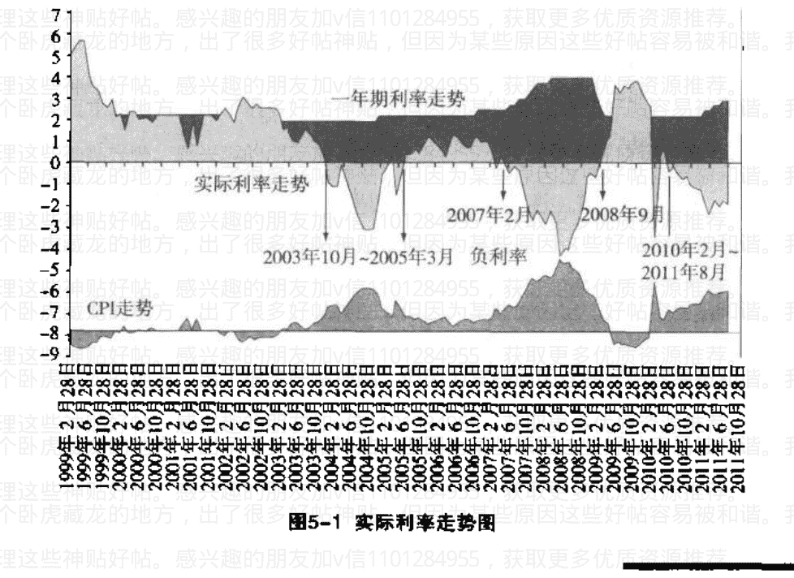

# 经济大周期 踏准经济节拍再投资

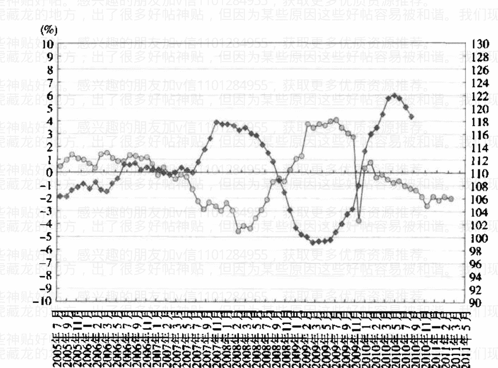

我们可以清晰地看到，正利率时房价上涨慢；负利率时房价上涨速度快。

2002年以前，连续4年没有负利率，所以房价上涨极慢。

## 第6章 黄金的尺子

天涯是个卧虎藏龙的地方，出了很多好帖神贴，但因为某些原因这些好帖容易被和谐。我们现在正在收集整理这些神贴好帖。感兴趣的朋友加v信1101284955，获取更多优质资源推荐。

### 黄金的周期

### 黄金价格与负利率

### 金价与房价共命运

### 艾略特波动理论与政府调控

### 关注底层民众

### 透过黄金看房地产

### 黄金是把尺子

### 黄金与未来

### 黄金的周期

1969年以来，黄金每过7～8.5年就触底一次。除了一次例外，黄金都是8年低位徘徊后进入11年上涨周期。如果黄金继续这个周期规律，2011～2012年黄金将到达1999年以来的高点后下跌。

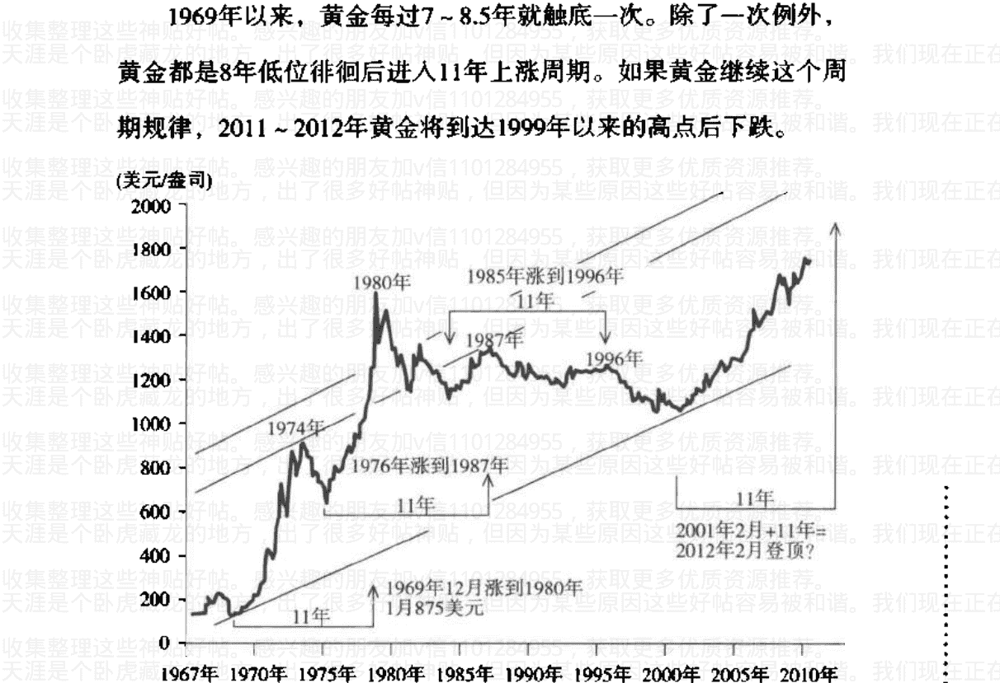

负利率会导致房价上涨。所以，消除负利率=控制房价过快上涨+控制物价涨幅在4%以内，但是经济增长幻觉会消失，梦醒时分很难受。

金融市场不是单纯的数学或者物理学公式。金融市场关键的永远是预期与人性。

黄金价格波动领先商品期货价格4个月（75个交易日），商品期货价格与民众感受的物价的第一波冲击之间，平均大约有2个月左右的时间差。也就是说，平均而言，黄金大幅涨价约6个月后，民众能感受到物价的剧烈上涨。再进一步说，有些国家的货币政策是被黄金价格和期货价格推着走的，而且是非常不情愿的。也就是说，有些国家加息和升存款准备金率治理通货膨胀的时候，‘病根’已经种下6个月之久了。2010年10~12月的手忙脚乱，病根在于2010年6～9月货币政策不但不提前收紧，反倒踩油门。

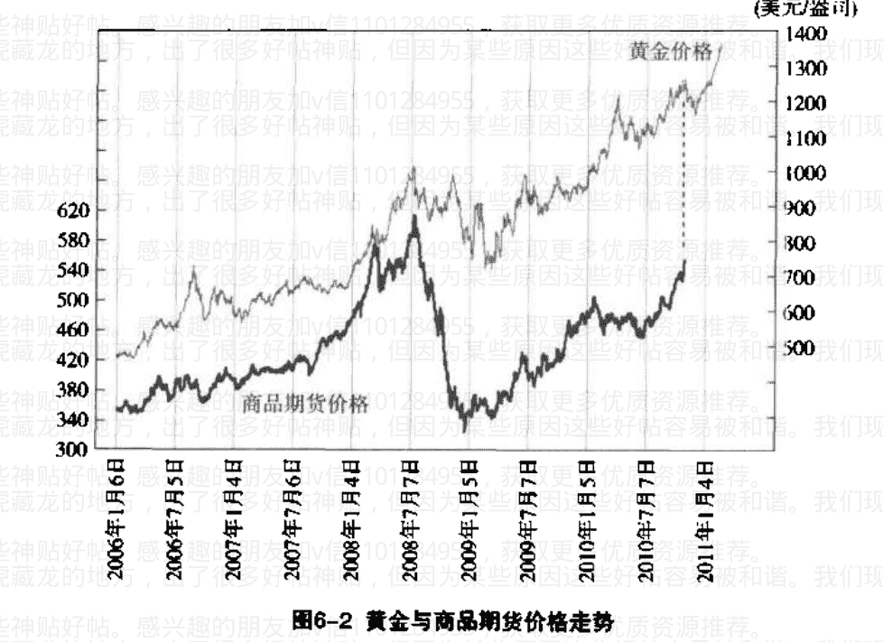

## 第6章 黄金的尺子

美联储在美国没有泡沫的时候，还能从容对付，能提前6个月左右执行货币紧缩。但是互联网泡沫和房地产泡沫明显绑架了美国的货币政策。

2011年，中国用什么控制通货膨胀？只有用房地产价格的下跌，别无他法。不管2011年货币政策如何操作，事后回顾的时候，‘经济学家’都会说，当初2011年的货币政策错了，就像他们说1990年日本的货币政策错了一样。其实，如果日本不是从1989年5月开始加息，而是等到海湾战争，那么结局可能更惨。这就是同一个事物，不同的人，看法不同。

### 黄金价格与负利率

美国1981～1999年一直没有出现负利率，近20年中黄金机会不大，除了1987年美元大贬值和1992～1993年低利率。

2002～2011年美国负利率和70年代何其相似。

1929年，对应的是美国在一战及后来近20年的大发展时间。（美国没有受到战火袭击，反而靠提供军需品获得了大量黄金，借出了大量贷款）。

# 经济大周期
踩准经济节奏再投资

1969年，对应的是美国二战后20年黄金发展时间（汽车、电子、机械为代表的工业革命，以钢铁产量为标志；1970年以后，美国不再把钢铁作为经济发展的标志，石油成为美国这个消费社会的标志）。

1999年，对应的是美国1981年后黄金发展的近20年（电子、电话、手机、电脑、互联网等为代表的科技革命）。代表人物是生于1955年的比尔·盖茨和史蒂夫·乔布斯，以及生于1946年的比尔·克林顿。

维持负利率，很难同时做到“控制房价过快上涨”与“控制物价官方涨幅在4%以内”，请看图6-3。等美国结束负利率，那就有好戏看了。

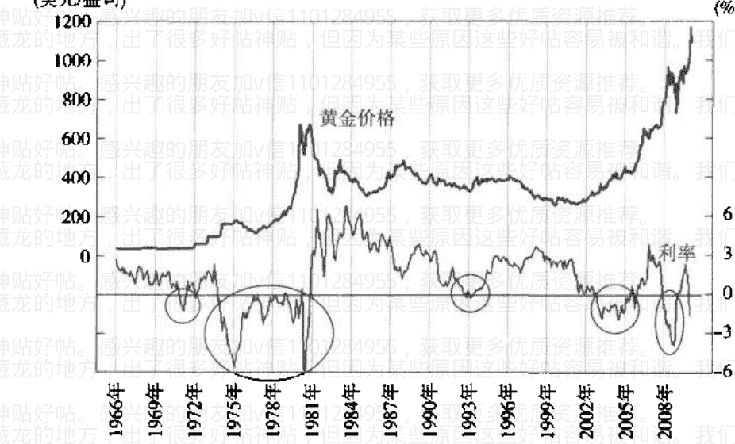

再用铜价走势来佐证一下（见图6-4）。

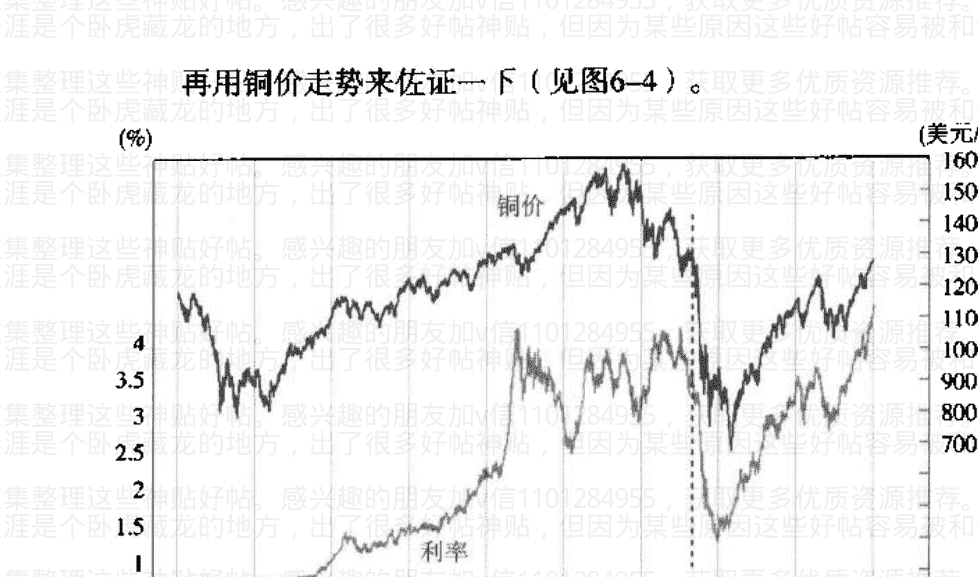

有人说，美国也是负利率，我们保持负利率“很舒服”。问题是，中国不是美国的经济殖民地，中国的经济周期不但与美国不同步，很多时候正好相反。中国经济2002～2004年发展很好。

# 金价与房价共命

一个市场，肯定既有看跌的，也有看涨的。

# 经济大周期

# 踏准经济节奏再投资

1998年以来，上海、北京、杭州、深圳的房价一直都非常稳定，这句话对不对？

对，如果按黄金计价的话，上海、北京、杭州、深圳的房价一直在2盎司黄金/平方米左右徘徊。

1998～2001年，黄金价格250～300美元/盎司，上海房价4000元/平方米。

2005年7月21日，黄金价格在430美元左右，上海房价在7000元左右。

2006～2007年，黄金价格翻番，上海房价翻番。两者携手翻番。

2008年4～9月，每盎司黄金从1000多美元跌到750美元左右，上海、杭州房价表现为降价才能成交，杭州万科降价20%多，前期投资者因为“账面损失”20万～40万元，而野蛮打砸万科杭州总部。2008年底，黄金与中国房价一起反弹（中国一次降息1%）。

2009～2010年，黄金价格几乎翻番，黄金价格超过1300美元/盎司，上海、杭州、北京、深圳房价几近翻番，达到17000元/平方米以上。两者又是携手翻番。

这不是一两年的现象，这是12年不间断的、连续的“黄金与中国房价同呼吸共命运”现象，上海、杭州、北京、深圳，一平方米房价大约等于2盎司黄金。12年来，即使有波动，也非常非常小。

这到底是经济与人性的规律在起作用，还是那万能的各地政府居然能调控房价一直稳定在2盎司黄金/平方米左右？要是卖地能连续12年卖到房价都接近2盎司黄金/平方米这个价格中枢，那需要何等高超的联合调控水平啊！

卖地到底是因，还是果？有独立思考能力的人，心中自有答案。

黄金价格操纵论者面临同样一个问题，这黄金坐庄操纵水平也太惊人了，12年来一直把黄金价格操纵在中国大城市房价的1/2左右。牛，巨牛的坐庄水平。我认为，确实是有操纵者，而且不止一个，第一类操纵者就是提供资金弹药的，最大的恐怕是美国的财政赤字（大发美国国债），其次是维持低利率的美联储，然后就是收藏美国国债与美元的。

另一个操纵黄金与中国房价的叫“人性”，趋利避害、追涨杀跌的人性，不愿意财富被缩水、不愿意接受负利率的人性。这种趋势变成羊群效应，就容易形成泡沫。

#### 什么是投机金融泡沫？

当社会上越来越多的人仅仅为了预期更多的涨价而购入一个金融品种，造成价格指数式上升之后，远离了最终购买者能承接的价位。

这个品种可以是股票，可以是洋葱（洋葱价格能左右印度政坛），可以是房子，可以是石油，也可以是郁金香或者牡丹，甚至是楼花。

# **金融泡沫的产生和破裂，古今中外都有发生，不管是金本位，还是美元本位，其根源是人性的贪婪和恐惧，是人们越涨越买，越跌越不敢买、追涨杀跌的羊群效应。**

# **当人群中90%或者95%以上的人同时看涨或者看跌的时候，转折点就非常近了。**

# **金融泡沫爆发的另外一个人性基础，就是人们对于未来收入增长的过度乐观。**

大部分人都信赖经验主义，过去20多年中，收入都是三五年翻一番，那么他们也自然按三五年翻一番的速度去给股票与房子等资产定价。一个三年利润翻一番的股票，60倍的市盈率就不显得高了。曾经的苏宁电器就是代表。但是如果把所有公司都按苏宁电器的发展速度去定价，就麻烦了。用到房价上，那就更麻烦了。

# **为什么投机房比例过高一直是衡量房地产泡沫的标准呢？**

因为投机房的目的不是自己住，甚至很多也不出租（因为出租会降低房子的出售价格，这是中国特色），投机房的目的是保值和赚买进卖出的差价。价格不动总不能说是保值吧？投机房总不会放三五年等别人在墙上画上“危房”、“拆”吧？

投机房不管玩多少年，最终还是要自住者来买的。那么，要么自住者的购买力（收入）上去，要么房价下来。浙江各地空着的投资房很多。房地产泡沫始于外贸顺差最多的浙江，先在浙江破裂的可能性也最大。1996年，很多韩国人不会预计到1997年底的经济与个人收入会是那个样子。2008年以前，很多中国人也没有料到收入增长速度会下降。

#### 看涨比例的衡量标准是什么？

当一个投资品种的看涨比例超过95%的时候，那么，泡沫就快到顶了。

如果没有数字，那么看看社会的标志。

当这个投资品种的长期看涨者被当成天才的时候，当靠盲目单向看空房地产而赚钱的人被骂得狗血淋头，并且由空转多的时候，房地产就差不多到顶了。

对于钱不多的刚需而言，人生最大的郁闷，莫过于当你最终勉强地贷款买房的时候，社会上看空7年以上的空军领袖却突然看涨了（美国、日本、东南亚的房地产泡沫一般持续7年）。

### 艾略特波动理论与政府调控

中国的房地产，前面两个3年（2003～2005年，2006～2008年）都有明显的库存周期现象。就是两年火爆之后，第三年下半年上市的房子比较多，销售困难。

艾略特波动理论在很多价格走势中都有体现，一波上涨（2003～2004年），二波（2005年）下跌调整，三波（2006～2007年）大幅度上涨，四波（2008年）下跌调整，五波（2009～2010年）上涨，走完上涨之路。这既是价格的波动，也是投资者人心的波动。

> 有人说“地方政府需要大量的卖地收入，所以房价不会降”。

首先，可以回顾前文关于房价与金价的论述。

2001年以前，一些江南的地方政府是送地给优秀的开发商的，希望这些看不上小地方的优秀开发商到本地发展优质的住房小区，提升本地对于外商的吸引力，因为那个时候，当地没有拿得出手的居住品质高的小区，严重影响招商引资和县城形象，当时的房子质量好，而房子卖价也低——3000元/平方米。后来证明海外和外地的商人确实喜欢此等小区。

2005年7月以前，中国各地的地价卖不上去了。因为美联储加息了几次，黄金在430美元/盎司左右涨不动了，那个时候中国也加息了，货币供应量的增长率也压缩到15%以下了。

所以有个词，叫做宏观调控，1993年6月的宏观调控，就是把全国的房价都调下去了，否则1997～1998年东南亚金融危机，估计就叫亚洲金融危机了。

但是全世界范围内的“宏观调控”，却是由各国中央银行、税务局（资本主义国家也有计划，美联储等中央银行就是货币供销社）跟金融和产业投资者在博弈过程中共同完成的，其博弈过程表现为资金在世界范围内、在各个投资品种（股票、货币、商品）间的流动。

资本的背后是人。所以资本具有趋利避害、追求利润最大化的特点，所以有了世界范围内的产业转移。中央银行不是万能的，你要加大货币供应，投资者就要用脚投票，把资金投往有升值或者保值潜力的地方（实体企业、股票、房产、货币、资源商品等）。你要加税，产业投资者就要把钱投到税率低、工资相对低的地方去（比如十几年前的爱尔兰等）。

当然，如果这种流动产生了汹涌的羊群效应，那么泡沫是挡不住的，只能让它走完该走的指数式上涨旅程，监管者最好还是转而把精力集中到善后工作上。

在中国，调控政策总是先被投机资金所嘲笑的，不过不是所有的投机资金都能笑到最后。

2007年2月、5月、8月，股市投机资金在政策收紧下，继续推高股市，货币政策、印花税政策是挡不住泡沫的。

2004年9月，股市‘9·14’行情爆发，很多投机资金已经痒了好久了，纷纷投入股市，结果很多巨牛庄家在那一波下跌中消失了，等这些庄家消失之后，中国股市的牛市底部却来了。而宏观调控是从2004年4月猪肉涨价之后开始的。

# 经济大周期

如果2010年开始的房地产宏观调控是玩真格的，政策无疑又一次受到了市场与投机资金的嘲笑。即使是玩真格的，调控政策也同样没有挡住泡沫前进的步伐，更何况调控顾虑重重且力度小。让我们看看这次投机资本是否还能笑下去。

### 关注底层民众

中国日均消费低于7元/天的人口不少，可能高达1.5亿。那么人均消费低于21元/天的人又有多少呢？

最近十年内，为什么每次猪肉大幅涨价之后，央行就加息让经济减速呢？

1970年以前，美国钢铁的价格反映的不仅仅是钢铁行业本身的情况，而是整个美国经济的运行情况。格林斯潘曾经办的公司就是做钢铁价格预测的。1970年以后，石油变成了欧美经济的关键因素。中国猪肉与钢铁的价格反映的不仅仅是肉类与钢铁建筑行业本身的情况，更是整体经济运行的脉搏与节奏。

2011年，凭什么把猪肉价格稳定下来？猪肉价格不重要？不重要，为什么还要建立大量的储备肉。发改委能不能通过行政调控稳定猪肉和食用油价格？

### 透过黄金看房地产

中国居住土地价格的决定因素和黄金价格的决定因素极其类似。简单地说，中国居住类土地价格与黄金的比价，自2000年以来，一直在3.06附近徘徊（图6-5中间那条波动的线）。

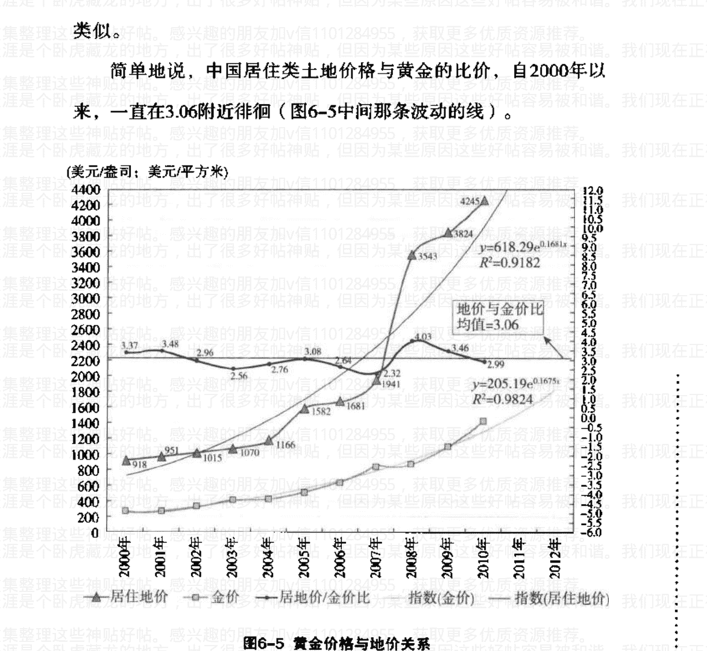

# 经济大周期

# 踏准经济节拍再投资

中国地价自2000年以来，以指数0.1681增长，黄金价格以0.1675的指数增长。两者相关度基本是95%以上。

从正面理解，这是人民币基本钉住美元，稳步缓慢升值的威力；这是人性趋利避害的威力；这是人性“理性或者疯狂”逃避“通货膨胀税”的威力。到底是理性，还是“逃离通货膨胀税”过头了，要等待时间的审判，而且受到中央银行“纸币”（信用货币）利率政策的影响。

从反面说，什么国四条、国八条、国十六等，对居住地价和房价的影响力不到5%，不及货币贬值制造的“逃离通货膨胀税”威力的1/20。

从最深层次说，人性从未改变。有什么样的宽松货币政策，就有什么样的泡沫。

黄金本身难以用印刷成本极低的纸币（信用货币）定价，房价所反映的未来通货膨胀预期或者未来接盘者的预期收入，也难以定价。

对黄金定价的，对超出正常房价收入比、租售比的那部分房价进行定价的，是人性。而趋利避害的人性，受货币政策，特别是负利率货币政策所驱使。

简单一句话：中国的居住土地价格的决定因素和黄金价格的决定因素，极其类似。

美元币值波动受美联储利率政策影响。美联储利率政策会影响8.8万亿美元的货币供应量的“价值”。量化宽松可以简单理解为负利率。

美元币值波动，也受到美国财政赤字规模和人们对于美国未来赤字的预期的影响。美国国债，可以简单理解为一种带利息（每半年一次付利息）的美元。所谓美国公司手握的2万亿美元现金储备，许多是以短期国债形式存在的。

这不是为各种由土地引发的腐败开脱，而是说2000年以来，中国的货币环境，主要看美联储和美国财政赤字，以及美国经济状况在黄金价格上的反映。黄金价格反映了人们对于未来的预期。

因为人民币的七成成色是美元——外汇占款早已超过中国的基础货币量。

对中国房价、地价而言，影响最大的是美国和中国的货币政策。

2007～2008年，中国的紧缩货币政策带来了连锁反应，与美国的次贷危机一起，导致了世界范围的萧条（这不是说中国有错，一个经济体对世界有很大的影响是好事）。

2009～2011年，美联储的货币政策被美国房地产泡沫破裂的余波所绑架，就像2001～2004年美联储的货币政策被互联网泡沫破裂的余波所绑架一样。

香港房价28年来完全受美联储和美国财政赤字，以及美国## 经济大周期
## 踩准经济节拍再投资

经济状况所左右的美元币值的影响。美联储每一个持续3年左右的低利率时期（1986~1988年、1992~1994年、2002~2004年、2009~2011年），香港房价必涨，而且是大涨，无一例外。因为港币是100%成色的美元兑换券。

人性从未改变，古今中外，无一例外。

### 黄金是把尺子
### 货币与金融的逻辑

货币是一种一般等价物，起的是尺度作用。其本身不能给人带来享受，拥有货币的幸福感来自于货币的购买力。请问如果拥有100亿津巴布韦元，你幸福吗？

> 一个天天缩短的尺子，能用于衡量长度吗？

一个不断贬值的货币，不能起到尺度作用。而投资者——财富的主人，是要用金融配置来投票的。

### 美元失信、黄金上位

时光回到2003年，关于辛苦赚来的财富存储在哪儿，你面前有几种选择：

## 第6章 黄金的尺子

- 1. 美元；
- 2. 黄金；
- 3. 中国内地的房产；
- 4. 中国香港的房产；
- 5. 美国的房产。

好，现在再次告诉你：美元的购买力从2003年起的四五年里会下降50%，而黄金不会挥发，房子不会从100平方米缩水到50平方米。请问你选择什么？

一个四五年里就要贬值50%的货币，还能作为财富存储的载体与工具吗？

一个不断贬值的货币能让人们放心地把它当作财富存储的载体吗？

美元会贬值，但是黄金静静地躺在那里，它既不生锈，也不挥发，2003年一公斤黄金，到2007年还是一公斤。

所以，黄金作为国际货币，才是衡量房价的尺度。

很多人老是揪住中国土地供应垄断这个问题，这确实是个非常不公平的大问题，但是当全国几乎所有地区的房价都暴涨后，土地问题是不是最大的因素，值得怀疑。

### 黄金与美元争夺“价值尺度权”的战斗

黄金的价格是由国际市场决定的，只要人民银行不进场操作，中国市场对国际黄金价格的影响力微乎其微。

美元2003年、2005年、2007年三度失去“价值尺度权”后，请问美元背后的发行者会任由美元彻底丧失“价值尺度权”吗？

2010年不争，2011年美元再不去夺回“价值尺度权”，美元的命运将会怎样？

### 美元指数走势的周期轮回

黄金的开采成本是400～600美元/盎司。工业用途价值是300美元/盎司。

请问，当黄金的价格暴跌，奔向850美元/盎司，奔向780美元/盎司（两个支撑价位）的时候，黄金还能作为“价值尺度”吗？黄金价格是否一直会远远高于开采成本？当美元在“价值尺度权”争夺战里战胜黄金的时候。房价是否应该从以黄金衡量，改为以美元来衡量？

### 从金融自由的香港看世界

因为港币与美元挂钩，当美元贬值的时候，国际金融资本自然购入香港实物资产作为对冲。美元再次上涨，或者烂到谷底的时候，就是香港的外来投资者结账的时候。

所以，黄金暴跌后，应该是香港房价的暴跌，而内地的反映应该滞后一定时间。

### 黄金与未来
## 第6章 黄金的尺度

黄金的美元价格（按2010年可比美元价格计算）有过三次大的、近20年的熊市（见图6-6）。

第一次是1895~1921年，美国科技大发展时期，持续了16年左右。这也是美国和德国在工业方面追上英国的时期（美国的GDP总值在1894年超过英国）。美国1900年以前铺设的30万公里铁路起了巨大的作用。

第二次是1950~1968年美国二战后繁荣时期，持续了近20年。1970年左右，汽车保有量在欧美和日本进入平台期，欧美与日本的汽车普及基本完毕。

第三次是1982~1999年，以个人电脑、手机、信息化、互联网科技为标志的科技大发展时期。

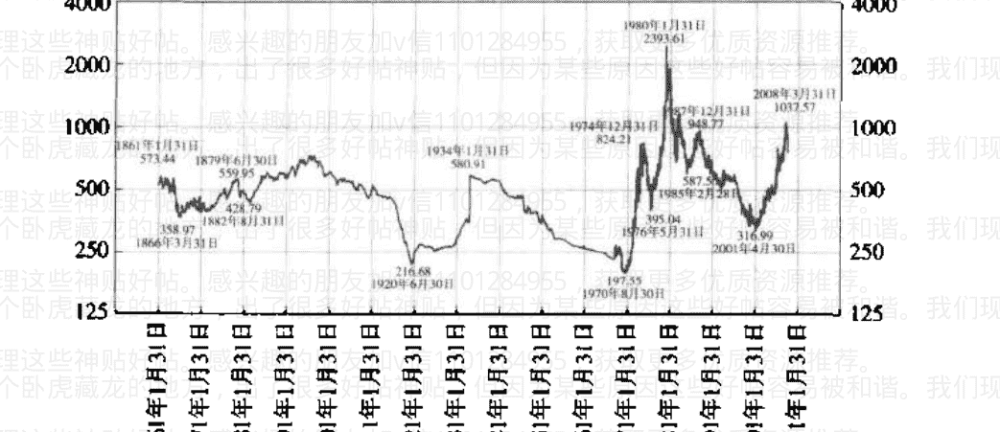

钢筋水泥--一方面是涨价的，而另一方面，钢筋水泥造的房子也会折旧。保值的是地价。地价为什么保值或者升值？因为房子的购买者在用纸币竞争。罗马如日中天的时候，罗马的地价按黄金计价暴涨。罗马衰落的时候，向富人大量收税，富人跑向农村，建立农庄，罗马房价按黄金计价暴跌。

几乎所有纸币在2000～2010年对黄金都是剧烈贬值的，不管是日元、欧元，还是澳元、加元。欧、美、日的房价对黄金都是剧烈贬值的。

2000～2011年，世界美元和美国国债的新增量的20%流向了中国，中国货币供应量猛增，而中国GDP才占世界的7%～9%。于是过去10年的中国房价暴涨。

黄金的故事很可能还没有完，这次很可能是中期大调整。

注意图6-6中1974年底的黄金价格。在石油价格暴涨近一年后，欧、美、日大幅加息，黄金价格很快腰斩，调整后，在1980年左右顽强地涨得更高。

石油峰值真正到来的时候，石油闲置产能下降到0.5%的时候，200美元/桶也许不算贵。

黑金（石油）与黄金，有点类似“先情人后敌人”的关系，石油涨价，导致通货膨胀和通货膨胀预期上升，人们买黄金保值。中央银行6～12个月后大幅加息，接着黄金价格下跌。通货膨胀和股市也有类似的“先情人后敌人”关系。

黄金850美元/盎司左右和550美元/盎司左右（按2010年的美元计价），都是150年间重要的支撑线。按历史定价，如果现在美联储的利率在美国CPI+2%以上，则今天黄金的价格很可能在600美元/盎司左右。

黄金与美元指数的负相关是短期的。过去10年美元指数每次通过80点的位置时，黄金价格一次比一次高。

天涯是个卧虎藏龙的地方，出了很多好帖神贴，但因为某些原因这些好帖容易被和谐。我们现在正在收集整理这些神贴好帖。感兴趣的朋友加v信1101284955，获取更多优质资源推荐。

## **加v信1101284955，获取更多优质书籍推荐**

天涯是个卧虎藏龙的地方，出了很多好帖神贴，但因为某些原因这些好帖容易被和谐。我们现在正在收集整理这些神贴好帖。感兴趣的朋友加v信1101284955，获取更多优质资源推荐。

## 第7章 经济周期大杂烩

天涯是个卧虎藏龙的地方，出了很多好帖神贴，但因为某些原因这些好帖容易被和谐，我们现在正在收集整理这些神贴好帖，感兴趣的朋友加v信1101284955，获取更多优质资源推荐。天涯是个卧虎藏龙的地方，出了很多好帖神贴，但因为某些原因这些好帖容易被和谐，我们现在正在收集整理这些神贴好帖，感兴趣的朋友加v信1101284955，获取更多优质资源推荐。

### 1995~2011年的“中美国”泡沫群
### 汇率波动、羊群效应和套利资本
### 现在的美元套利资本规模
### 人民币汇率
### 人民币与美元不得不说的故事
### 人民币升值与国际商品价格暴涨
### 泰勒规则
### 时势造英雄——汽车制造向中国转移
### 太阳能发电的未来

## 1995 ~ 2011年的“中美国”泡沫群①

资产泡沫的驱动力，首先来自技术革新和人们对于这种技术无限美好的憧憬。互联网技术革新不亚于19世纪的铁路和工业革命（以1873年金融恐慌为结束），以及20世纪的公路与机械革命（以1929年金融恐慌为结束）。铁路革新的代表人物有卡内基、洛克菲勒等；公路革新的代表人物有福特、克莱斯勒等；互联网革新的代表人物有同样生于1955年的比尔·盖茨和乔布斯等。

泡沫群的几个重要阶段包括：

- 第一，1996 ~ 2000年的美国互联网泡沫。
- 第二，2001 ~ 2003年美联储联邦基金利率被“减轻互联网泡沫破灭的痛苦”而绑架的阶段。
- 第三，2009 ~ 2011年美联储联邦基金利率和量化宽松政策被“减轻美国房地产泡沫破灭的痛苦”而绑架的阶段。
- 第四，2009 ~ 2011年黄金和中国房产在美联储负利率和量化宽松刺激下再次暴涨一倍。

现在我知道索罗斯为什么说黄金是最终的泡沫（Ultimate Bubble）了，因为黄金泡沫对应的是信用货币（纸币）泡沫。黄金泡沫破裂，也是纸币不得不重回信用的那天。量化宽松

> ① 本部分内容主要参考了附录二中的文献[6]。

二期结束后，迟迟“无法”推出量化宽松三期，是不是可以看作纸币泡沫的阶段性终点呢？量化宽松二期结束后，迟迟“无法”推出量化宽松三期，是不是相当于加息200个基点以上呢？

黑金（石油）价格是美联储宽松货币政策绕不过的命门。太阳能、电动汽车毕竟还处于早期。

Peak Oil石油峰值论自20世纪60年代以来，一直在西方比较流行，很多预测说2005～2012年石油会出现短缺，事实上没有。但是随着发现的油田越来越少，现有油田的产量越来越少，石油短缺只是个时间问题。只要石油价格足够高，比如长期处于120美元/桶甚至200美元/桶以上，替代能源一定会出现，比如太阳能。美、德、日是太阳能研发的三个大国。

这个石油峰值论不知道是否与2005年小布什推出玉米提炼燃料酒精有关。我认为，2011～2012年只是黄金的一个中期大调整（以及中国房地产泡沫的破灭）。2008年，黄金曾经一度跌到740美元/盎司附近。

美国国债泡沫还没有破，而黄金必然在美国努力维系美国国债泡沫的过程中再次发挥作用。只要美国财政赤字规模不回归正常可持续的轨道，黄金的故事远远没有完。

#### Bubble 1.0

互联网泡沫于2000年3月破裂。很多东西都始于这个互联网泡沫。

首先自然是美联储低利率和一场及时的战争以及财政赤字，这些可用于抵消互联网泡沫破裂的余震。

Nasdaq走势图哪里都有，图7-1是Nasdaq资金进入情况。1997年、1999年是进入高峰。

泡沫的驱动力首先来自技术革新和人们对于这种技术无限美好的憧憬。最后，当人们无法为Nasdaq某些股票估值的时候，总归有人站出来，推出“市梦率”。国内也有人凑热闹，预测Nasdaq未来在5000点以上的可能性是75%，2500~5000点的可能性是25%。他太不够意思了，也不给2500点留点空间。

结果互联网梦碎后，到2007年Nasdaq才爬上2500点，爬上2500点没有多久，又摔下去了。

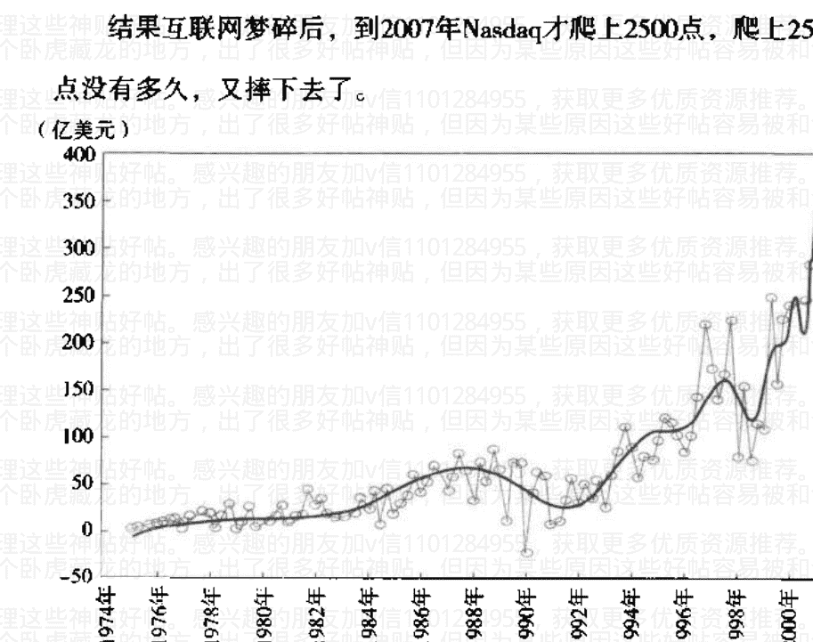

量化宽松一期把Nasdaq又一次送上了2500点以上，结果量化宽松一期一结束，又跌到2500点以下了。
量化宽松二期预期和实施，再一次把Nasdaq送上2500点以上。
量化宽松二期结束，如果没有量化宽松三期，其效果相当于加息2%～3%（从负利率变成0.25%），很可能使Nasdaq从2650点左右跌到2500点以内。

#### Bubble 2.0

Bubble 2.0是看不见的信用泡沫，也就是信用货币（纸币）贬值过程。

这是美联储联邦基金利率被“减轻互联网泡沫破灭的痛苦”而绑架的阶段（见图7-2）。

美联储联邦基金利率基本追着Nasdaq的下跌而调低利率的，时间差大致是3个月。

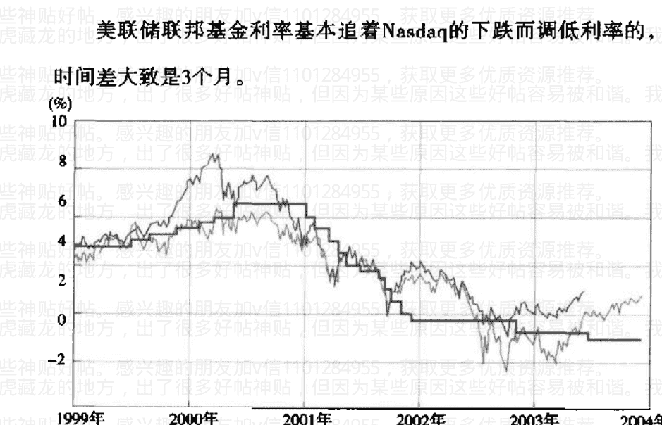

#### Bubble 3.0

Bubble 3.0中应关注美国各个州的房价走势（各个州1992年价格指数为100，美国因为1990～1991年房地产泡沫破裂，导致人们“一朝被蛇咬，十年怕井绳”，1994～1998年美国经济复苏，但是房价5年中基本没有涨）。过去100年，房子在美国大部分时间并不是巨大的投资品种。

#### Bubble 4.0

Bubble 4.0阶段房价高了，股价高了，失业率低了，财富效应使得人们消费大增，特别是2004～2006年（见图7-3）。

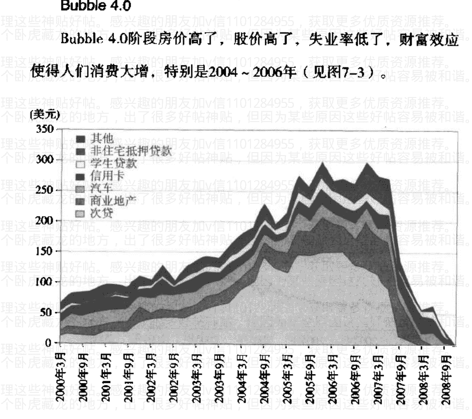

#### Bubble 5.0

Bubble 5.0阶段标普500指数在房价见顶后继续飙升。

#### Bubble 6.0

Bubble 6.0阶段“中美国”一起high，中国发展迅速，石油、粮食需求猛增。美国人感觉财富多了，消费猛增，大家都很high。

在美联储不断调低的利率下，油价、粮价暴涨了（见图7-4）。

没有量化宽松三期的预期，相当于从-2%的利率加息200个基点左右，加到0.25%。临界点快来了。

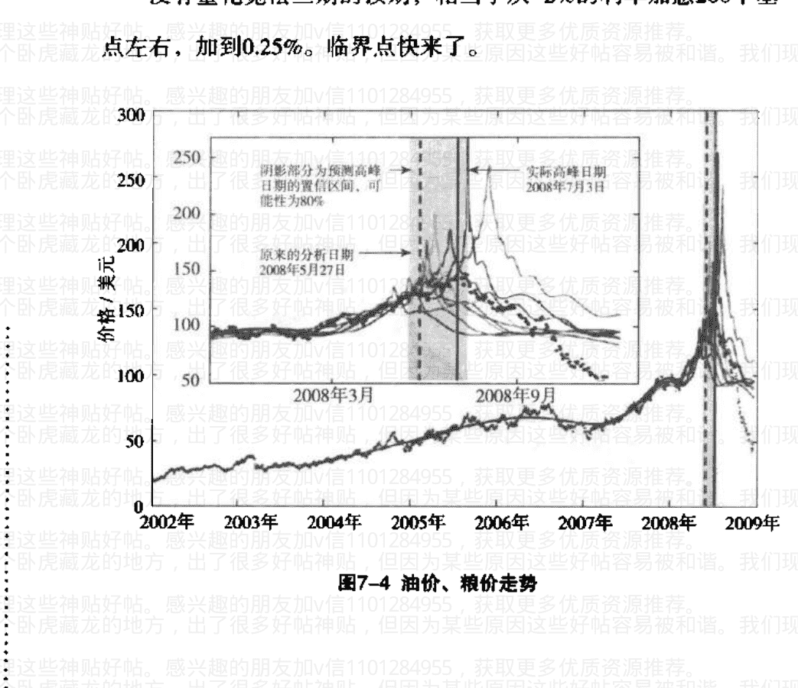

#### Bubble 7.0

Bubble 7.0阶段，欧美房地产泡沫破裂后，就像2001～2003年一样，美联储零利率和量化宽松一期、二期给房地产泡沫的余震减轻痛苦。结果黄金和中国的房价几乎又一次翻番（见图7-5）。

为了给房地产泡沫的余震减轻痛苦，美国财政赤字在2008～2012年五年内大增几乎6万亿～7万亿美元。小布什八年打了两场战争，和减税算一起，才制造了6万亿美元的财政赤字。美国国债泡沫更大了。不过这个旁氏骗局目前看还不会破。

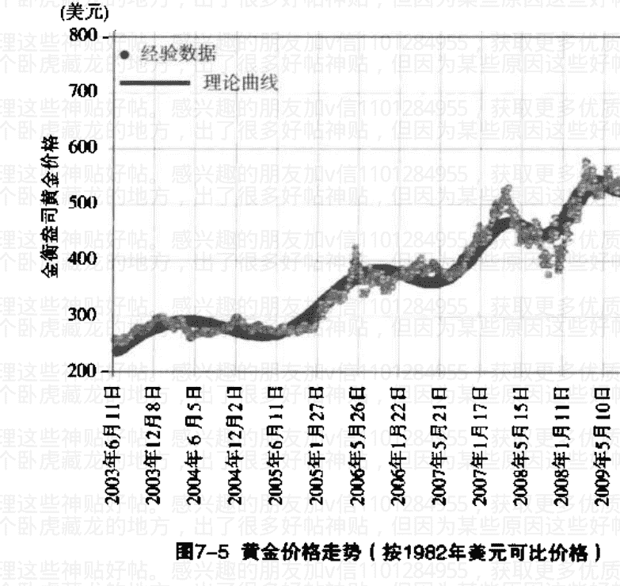

### 汇率波动、羊群效应和套利资本

美元汇率为什么经常大起大落，很少窄幅波动？我认为是投资者的羊群效应在起作用。做空美元的时候，大家都做空；做多的时候，大家都做多，造成美元跌过头和涨过头。

自由浮动货币的汇率就像流量计，体现的是资金的流动情况。同时，主要套利货币日元、美元的汇率也是资本市场上涨与下跌的催化剂。美元汇率2011年中期见底后上涨，一旦市场认为资产价格上涨已经停止，或者市场风险充分暴露后，会形成一波套利资本平仓潮（套利资本平仓→美元汇率上升→资产价格下跌→更多平仓→形成羊群效应的正反馈），就像2007年3月～2008年3月的日元套利资本平仓一样。

羊群效应是美元汇率无法在一个狭窄的区域维持6个月以上的原因。羊群效应使得美元跌的时候跌过头，涨的时候涨过头。

中国经济自2006年以来，通货膨胀与经济下滑之间旱涝急转，这与美元波动有极大关系。美元跌过头（2006年6月～2008年7月），然后美元涨过头（2008年7月～2009年3月），之后又会跌过头。

美元的筑底过程，可能大致需要4个月左右。

资本在全世界范围内大量流动的情况下，对于单一国家的货币来说，常常出现传统经济学教科书理论在现实经济中失灵的情况。比如，一般来说，降低利率可以刺激经济。但是20世纪90年代末，日本屡次降低利率，2001年甚至祭出量化宽松政策，印日元买日本国债，但是投资者还是不愿意扩大日元的投资规模，而是把大量的钱投资到日元以外，以获取更高的利息或者收益。为什么？因为日本投资收益率高的项目太少，资本在海外能获得更大的收益。日本央行无法让投资者投资在日本，就像一个人无法按住马的头到水里逼迫马喝水一样。2010年9月，日本央行干预日元汇率，希望日元不再升值，但还是挡不住日元升值的步伐。美联储的量化宽松是在美国通货膨胀不严重的情况下，为了刺激美国的经济，降低美国失业率而推出的。可惜，资本的目的是盈利，美联储稀释美元的价值，资本就会外逃，逃到商品市场和新兴市场化国家。资本进入加拿大、澳大利亚逐利的时候，他们国家的央行在控制货币供应量上是很无力的。资本在那里可以获得更好的收益率。这样，美元是美国的货币，却变成了其他国家的问题（通货膨胀严重）。1999～2001年，日本央行降息，并且推出量化宽松政策（印钞购买日本国债，拉低日本国债的收益率）。日本的主妇们不干了，特别是有知识的70后日本主妇。她们纷纷把日元换成澳大利亚、新西兰、加拿大、巴西等地的收益率高的金融资产，比如高息的国债、公司债等。2003年，日本家庭主妇套利团形成规模。日本主妇的日元套利交易，多的时候占日本外汇交易的20% ~ 30%。日元套利交易做得好的家庭主妇出书、办讲座，享有明星的待遇。

2007年2月20日，日本央行加息0.25%，日本主妇们大量平仓回流，导致日元升值，升值导致更多的平仓，平仓导致日元继续升值，如此循环，导致了2007年2月27日以及此后一周，全世界各地的股市大跌，连黄金也在一周内跌去了7%。这一波日元升值运行了11个多月，直到2008年3月。

这是日元套利资本的威力，据测算，最鼎盛的2006年的时候，日本主妇的日元套利资本规模大约有5000亿美元（日本有15万亿美元左右的金融资产）。日本主妇套利团的平仓使得别人也不得不跟着平仓，部分导致了随后2007年4 ~ 5月伦敦银行间拆借利率LIBOR的高涨。一场金融危机由此拉开了序幕。当然，没有日元套利资本的平仓，金融危机、美国次贷危机也会发生。

日本主妇套利团的平仓是压垮美国次贷繁荣的最后一根稻草。阴谋论者可以据此好好做做文章。如果再预测一下，下一次日本主妇们的目标是刺破韩国的房地产泡沫。万一应验了，那就火了。

2007年9月，美联储减息导致日元套利资本平仓，日元汇率上升。2007年3月以后，日元指数XJY经历了几波升值，日元汇率不断创新高，3年多升值近50%（当然是波浪式升值）。不知道是不是因为日本主妇们的参与，2007年3月 ~ 2010年11月，历时44个月。月左右的4波日元升值都显示了很好的周期性特点，每一波都是10~11个月左右。全世界每天的外汇交易量是4万亿美元左右，日本散户交易最频繁的时候，也才占1/40 ~ 1/20而已。日元散户早不出来晚不出来，偏偏在日本央行量化宽松和日元国债收益率被打压到极低之后，才出来套利。美元套利资本之前没有大量出来套利，也是等美联储量化宽松之后才大量出来套利。两者都只是说明“天下熙熙，皆为利来，天下攘攘，皆为利往”，或者说“君子爱财，取之有道”。那些发行公司债的加拿大油管公司、石油运输公司，澳大利亚和巴西公司，它们将取得的资金用于发展经济，出资者和发债人属于双赢。日元散户套利在2001~2002年就不少了，到2003年才形成较大规模。中国某些地方的炒房团成名于2003年，但是买房保值早在2001~2002年就兴起了。和日本主妇炒汇一样，原因就是存款利率太低，把钱存银行很吃亏。不少资金实力雄厚的人，早在2001~2002年就给正在读书的子女在上海、杭州买房。因为商业嗅觉告诉他们，把钱存入银行去掉利息税，收益不到2%，而1999~2002年房价涨幅却是每年至少8%。2001~2002年，江浙一带那些和父母同住的女孩子用自己的工资在上海供一套小房子或是两三人合买一套的做法，曾经在小范围内比较流行。二三十万元一套小二居，那是很遥远的事情了。

## 经济大周期 踩准经济节奏再投资

### 现在的美元套利资本规模

2008年底，美国政府大发国债，美联储零利率政策后，特别是2009年3月，美联储量化宽松后，“做空美国”成为大量投资基金的主题曲。套利资本纷纷转战世界各个新兴市场化国家。据国际金融研究所追踪统计，2009年，美元套利资本规模大约是6000亿美元。2010年，美元套利资本新增9000多亿美元。

当然，国际金融研究所的数字也是仅供参考而已，真正的数字没有人能弄清楚。很多对冲基金都注册在开曼群岛或英属维京群岛。没有人能弄清楚他们的资金来源和去向。

各种投资投机资本五花八门，都在打着各自的小九九，揣摩着何时平仓，能跑在别人的前面。因为跑在后面的，即使在当地赚了，但万一美元升值了，利润就会被大大稀释。这也是个正反馈的螺旋式过程。2010年5月，在美联储第一期量化宽松结束2个月后就上演过一次。下一次美元套利资本平仓从什么时候开始呢？

这些套利资本的平仓会造成美元汇率的螺旋式上升。美元对很多国家货币的升值会对中国的外贸造成影响，从而影响中国的实体经济，进而影响中国的房地产泡沫。美联储在格林斯潘时代，低利率一般最多持续3年（1986 ~ 1988年、1992 ~ 1994年、2002 ~ 2004年）。

图7-6为过去几年的美元指数走势，美元指数很少在75以下停留超过4个月。

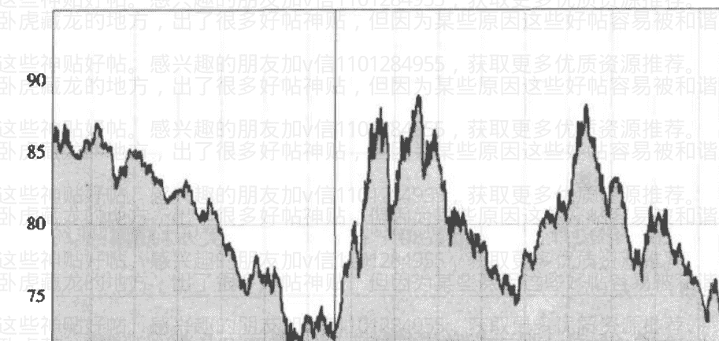

## 图7-6 美元指数走势图

### 人民币汇率

人民币市场汇率是有管理的，所以市场汇率主要看管理者。

我们能分析的是人民币汇率的均衡价位在哪里，从而判断出人民币是存在升值预期，还是贬值预期。

## 经济大周期 踩准经济节奏再投资

#### 均衡汇率

在我看来，2007年以后，中国贸易存在顺差，但是顺差小于GDP的2%时的人民币汇率，即一年顺差小于1000亿美元的时候的人民币汇率，就是均衡汇率。

人民币兑美元的均衡汇率取决于什么？取决于中国的通货膨胀增长速度、劳动力价格上升速度和美元指数的位置（美元对其他货币的汇率）。

2009年12月，美元指数80左右，人民币兑美元均衡汇率约为6.65。

2009年6月，美元指数平均85左右，人民币兑美元均衡汇率约为6.93。

外汇市场极其多变，我只知道美元指数在80的时候的下降空间很小，而上涨空间比较大。

所以，中国香港与内地房地产泡沫何时破灭，美元指数的影响最大，其次才是国内的通货膨胀增长速度。

银行贷款的增长虽然也是天量，但没有2009年厉害，2010年4月开始，基础货币紧缩与扩展交替进行，股市也跟着上蹿下跳。

#### 有效汇率

有效汇率是人民币对各个货币的汇率加权平均值。

比如，2009年5～6月，美元指数大涨，人民币的有效汇率实际上跟着美元升值，同样的人民币能换到的欧元少了，人民币的有效汇率升到了6.93。

美元指数7月下降后，人民币跟着美元对欧元、日元等货币贬值。

如果人民币购买力平价PPP为3.75，市场汇率6.83，则有：

3.75/6.83=55%

即中国55元能买到的东西与服务，大致等于100元人民币相应的美元在美国能买到的东西与服务。

处于发展阶段的国家，其市场汇率都是“打折扣”的，中国大概是55%。

- 1980年的韩国是60%左右，现在是65%左右，所以韩国顺差多，韩国国内房价高、物价高，出口企业现代三星的员工工资高。韩国人均GDP都2万多美元了，还保持如此的韩元汇率，要感谢韩国人民对与物价与房价的忍受力。
- 1980年的马来西亚是80%左右（顺差肯定很少），现在是40%，所以现在马来西亚的贸易有顺差，外贸竞争力强，不过消费能力弱（都是1997年金融危机闹的，想多存点美元）。
- 德国、日本汇率从原来的55%左右上升到140%（高出美元购买力的40%），得益于他们超强的生产科技水平，特别是“资本品”领域。

### 人民币与美元不得不说的故事

我们来看图7-7。

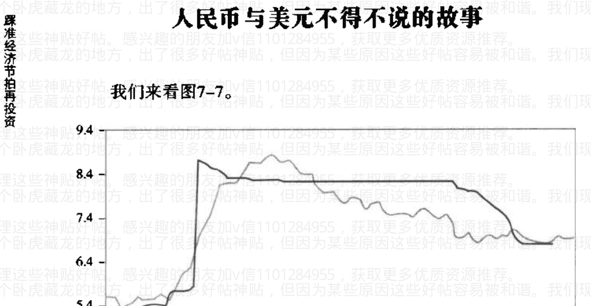

1993年以前，特别是1990年以前，人民币处于高估状态，具体表现为，你用官方汇率买不到美元，只有到黑市上用高于官方的汇率才能买到美元。那些能搞到美元的人活得比较滋润（按那个时代标准）。

1993～1996年人民币的GSDEER（高盛动态平衡汇率）估值为什么从5.5涨到了8.3？因为这3~4年中国通货膨胀很厉害，人民币不值钱了，3~4年中人民币购买力下降不止50%。

1994年汇率改革，把官方人民币汇率一下子从5.5贬值到8.7，人民币从高估状态转变为低估状态。黑市无钱可赚，美元外汇黑市基本消失。

1994～1996年，人民币处于低谷（超贬）状态，大量外资涌入中国买土地、开工厂，国内的外贸经济大发展，这给东南亚造成了极大的压力。东南亚的货币那个时候应该贬值。如果他们的汇率那个时候是浮动的，该贬值的时候就贬值，1997～1998年就不会受那么大冲击。那么，为什么那么多东南亚国家都没有让货币贬值呢？因为贬值后，进口的东西按本国货币算会涨价，涨价就要想办法控制通货膨胀，就要实行货币政策紧缩，货币政策一紧缩，经济就下滑了，政绩就没有了。所以那个时候要他们做贬值的决定并不容易。

1997年，东南亚金融经济危机，人民币按GSDEER算也该贬值到8.6或8.7，但是因为人民币压力不大，为稳定东南亚经济，人民币没有贬值。另一方面，东南亚一片政治动荡，人民币即使高估了一点，起码也有稳定政治环境，所以这段时期，人民币现实中得益于东南亚危机，中国不但得到了很多外资投资，外资进来兑换成人民币，中国反倒占了些便宜。

2000年以后，人民币官方汇率高于GSDEER估值，出口迅猛增长。大量外汇储备来自两个方面。一个是中国实打实的实体经济赚来的钱，真正的外贸盈余。二是外资投资、国内各种投资、投机基金进来兑换人民币（因为1美元本来应该只能兑换7.3元人民币的，现在他们能换8.3元人民币，过几年升值后可以以7.3元或6.8元兑换出去，这中间还能享受人民币在中国的投资收益）。特别是2005~2007年进来的钱，那时人民币的官方汇率与GSDEER估值之间差距特别大，国内的资产价格涨幅也大。这些外国投资在只该换7.3元人民币的情况下合法换了8.3元，投资的收益率还很高。现在的问题是，2005~2007年进来的钱，什么时候走，走得有多快。如果1~2年内我们真的看到他们暴赚了很多走了，那么，2009年的4万亿、10万亿，即使初始目的是应对金融危机，现实上却是在给他们作掩护。最后，兑走的是大量的美元等外汇，中国大地上留下的是一堆人民币（堆积如山的人民币，60万亿、70万亿人民币）对应一个年产出30多万亿元的经济体，当然物价涨一倍。1997年，泰国富得满地都是泰铢。1998年，印尼富得满地都是印尼盾，香港百富勤在印尼盾贬值到10000印尼盾兑1美元后，大胆进场抄底，结果印尼盾再次贬到20000印尼盾兑1美元。一代投资界神童辛苦建立起来的百富勤，破产了。

### 人民币升值与国际商品价格暴涨

美元指数2010年7月的下跌再次证明：人民币单边升值=美元购买力不稳。

结合2005年7月21日人民币浮动后美元内在价值的暴跌，黄金从2005年7月的430美元/盎司一路暴涨，大家难道不觉得，人民币升值到什么程度的不确定性让国际金融市场极度怀疑在石油、黄金面前不值钱的美元，在人民币和中国商品面前也不值钱？

如果石油、粮食再来一次小的暴涨，几乎可以证明“人民币对美元单向升值=美元购买力不稳定”的预期在所难免，大家会更多地抛弃美元而持有石油、粮食。

人民币单向升值的时候，是不是有人在石油、粮食，以及中国需要进口的矿产上进行套利活动？因为人民币在对美元单向升值，几个月后，同样的人民币可以“买到更多的进口品”，所以中国的进口需求会更强大。所以买入中国需要进口的商品的期货合约，在人民币单向升值过程中，凡中国大量进口的东西，都可以被炒高（因为人民币的国际购买力在增强，所以炒作中国需大量进口的大宗商品风险相对小）。

## 经济大周期 瞄准经济节拍再投资

#### 预期与定价

预期在金融市场里具有非常重大的影响。人们之所以愿意为一些高成长企业的股票支付高昂的股价，是因为人们预期这些公司在未来的盈利会高速增长。人们愿意为一些租售比很高的房子支付高昂的价格，部分是因为他们认为以后的租金和接盘者的收入会高速增长。

人们接受一个货币，潜在的预期是这个货币的购买力是稳定的，一年后还能买到相同的东西。

对于美元这个货币而言，世界上与美元固定挂钩的商品和货币越多越好。那些挂钩的商品和货币都是美元的备付体系。即你手里有美元，如果不想持有美元，可以换成与美元挂钩的港币、人民币等，也可以换成使用人民币、港币的国家与地区的商品和服务。

人民币汇率与美元固定在一个很窄的范围内，就给了国际金融市场一个稳定的预期。国际金融市场预期同样的美元明年还能买到相同的中国商品。所以，当人民币汇率钉住美元的时候，中国的商品事实上就成了美元的备付体系。与美元固定汇率的货币都是美元币值稳定的支柱力量。

#### 金融市场与不确定性

2005年7月21日，当人民币对美元开始单向升值的时候，这种预期变了。金融市场，甚至普通百姓都知道人民币将对美元单向升值。只是不知道人民币兑美元汇率会升到多少。

2005年7月21日以前，黄金价格屡次冲击440美元/盎司，均被生生地拉回440美元/盎司以下。

2005年7月21日，人民币汇率浮动后，美林银行预测黄金将涨到725美元/盎司，CNN预测黄金将上涨到850美元/盎司。

2005年7月21日，美元又一次踏上了不可避免的、购买力剧烈下降的命运之路（即黄金、石油、粮食、矿产等的美元价格暴涨），因为美元失去了中国商品这个备付体系，明年“同样一美元能买到多少中国商品”变成了未知数。2005年7月21日，注定了美元将在一段时间内彻底失去对黄金的牵制作用，直到新的均衡价格的确立。

通俗地说，2005年7月21日，美元在已经对日元、欧元、加元、澳元大幅贬值的情况下，对黄金、石油也已经大幅贬值的情况下，又要对人民币贬值了，而且美元对人民币会贬到什么程度，市场里谁也不知道。这种不确定性最要命。2005年7月21日，这一天已经种下了“2007年7月～2008年6月国际大宗商品的美元价格暴涨（即美元购买力暴跌）”的种子。

2005年7月，美元连对人民币都要贬值了，那么持有美元还有什么用？不如把美元换成黄金、石油等硬通货来保值。

2005年7月种下了美国通货膨胀的种子，也就种下了美联储加息对付通货膨胀的种子，加息也就种下了美国房地产泡沫破灭的种子。

那为什么美国政客还叫嚣让人民币升值呢？因为他们是对着一张张选票在叫嚣，他们要的是选票，而不是人民币升不升值。

美元是美国人发行的美元，当强势的美元致使很多美国人失业的时候，必然有代理人出来叫嚣，要给美国工人争取“公平汇率”、“公平汇率下的公平竞争”。

对美元这个货币的币值稳定有益的事情，不一定对美国工人有利。

事实上，人民币升值一年半后，即2007年2月，美国房价达到了最高峰。

人民币升值2年后，即2007年7月，国际粮食、矿产、石油、黄金等价格暴涨了，人们愿意信任这些硬资产，抛弃了美元等货币。

但是，这种抛弃货币持有硬资产的过程太疯狂了，导致了商品泡沫。在房地产泡沫破灭后，国际经济与消费开始萧条了，国际大宗商品泡沫也破了。

### 泰勒规则

现在很多人都在谈阴谋论，好像阴谋无处不在，阴谋总是成功。搞笑的是，阴谋却总是被一些无关的人知道。更有甚者，阴谋还没有实施就被人知道了，而且是被不在金融行业的无关的人知道了。真有趣。

我相信经济规律无法超越，经济周期无法完全躲避，经济危机无法完全转嫁他国。

根据阿姆斯特朗的全球经济信心模型，1998年7月20日，全球经济信心达到顶峰，全球其他地区经济一片黯淡，而美国经济却一片红火，1999年也丝毫不见减速。互联网泡沫到2000年3月才破。也就是说，如果阿姆斯特朗的模型是100%准确的话，美国经济的顶峰“被延长”了1年8个月。根据阴谋论，这是得益于制造东南亚金融危机，使得资金流出东南亚；利用索沃战争打击欧元，使得资金流出欧洲，流入美国；利用俄罗斯国债金融危机打击俄罗斯。所以全世界大部分资金流入美国，让美国的互联网泡沫多维持了20个月。

1999年，全世界只有美国的通货膨胀严重，而且是在油价非常低的情况下。因为美国物价的2/3是人工成本。1999年，美国失业率低于4.5%这个美国劳工市场失业率的最低极限。

根据阿姆斯特朗的全球经济信心模型，2007年2月27日，全球经济达到顶峰。从2007年2月开始，美国房地产行业的一些公司开始发生困难与破产，2007年7月美联储开始降息。2007年底 ~ 2008年初，美元的购买力江河日下，石油、粮食、大宗商品都在涨，涨价持续到2008年7月，CRB商品指数从300点涨到了467点，12个月平均物价涨幅超50%。涨价把全球经济打成重度残疾后，商品市场又突然转向暴跌成灾。这又是阴谋，美国率先爆发次贷危机，好让全球其他经济体买单。所以，提前暴跌也是阴谋。

总之，不管是美国资产泡沫延后暴跌，还是提前暴跌，都是阴谋。

事实是，美联储是美国人的中央银行，虽然它对世界其他经济体具有重大影响力，但是它在制定利率时，主要考虑的是美国的失业率和物价指数CPI。这就是非常著名的泰勒规则。

#### 泰勒规则在美国利率制定上的公式大致是：

```
联邦基金利率=2.1+1.3×通货膨胀率CPI-2.0×失业率之差
```

```
失业率之差=目前真实的失业率-国会预算办公室公布的自然失业率
```

美国国会预算办公室公布的自然失业率一般在5%～6%之间。

美国失业率要是低于4.5%，工资涨幅就很快，经济无法把失业率维持在4.5%以下很久。

美联储不是万能的，他最多就是尽量控制美国的通货膨胀率，尽量降低失业率，尽量把经济维持在可持续发展的道路上而已。至于滥发国债，那是美联储无法控制的。国债也是变相的有利率的美元。各国中央银行的美元储备很多是带利息的美国国债，而不是纯粹的美元。

## 第7章 经济周期大杂烩

归根结底，美联储负责的是降低美国的失业率，降低美国的通货膨胀率。至于其他国家的经济，基本不在它的考虑范围之内。

2002 ~ 2004年，美联储自从90年代以来一直用起来得心应手的泰勒规则失效了，美国的通货膨胀消失了，美联储的货币政策轻松被互联网泡沫的余波绑架。2009 ~ 2011年，美联储的货币政策又被美国房地产泡沫破裂的余波所绑架。

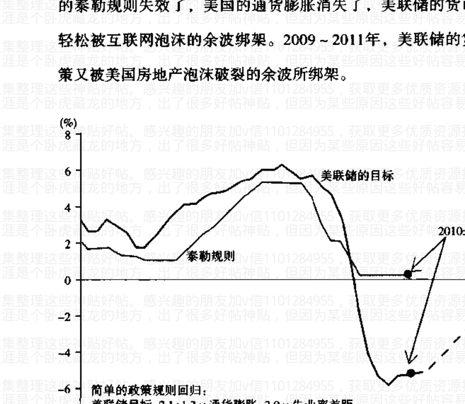

### 时势造英雄——汽车制造向中国转移

#### 苏强的故事

苏强1991年毕业于中国人民银行研究生部，国际金融专业硕士。

1995年，研究生毕业不到4年的苏强根本不懂汽车，被仰融要求去做金杯客车的总经理。苏强自己不懂，但是请来了丰田的技术与管理人员帮忙，提高了效率、降低了成本、提升了质量。

1995年，华晨开始正式接管金杯客车的管理权，仰融出任金杯客车董事长，苏强出任总经理。当时，金杯客车的销售不佳，引进了几年的生产线一直发挥不了作用。但从1996年开始，金杯客车踏上金光大道，每年的销售量以50%的速率增长，从1995年的9150辆到2000年的6万辆，金杯连续4年占据了轻客市场的头把交椅，并占据了国内轻客市场60%的份额。2000年，金杯客车销售额达到70亿元，利润达到10亿元，仅次于上海大众和一汽大众。

金杯5年的管理经验和经营成果证明，这个时候的苏强，不但比很多人懂汽车，还是个极其优秀的职业经理人。克莱斯勒曾经也是这种打工人才，克莱斯勒曾经把问题众多的别克车生产线，搞成了利润丰厚的生产线，几乎就是印钞线。克莱斯勒1919年辞职（当时已经是别克厂总经理）自己创业的时候，老板Durant花了1000万美元（相当于现在的5亿美元，当时黄金25美元/盎司左右）回购了曾经送给克莱斯勒作为奖励的通用汽车的股票。

以上故事说明了什么？说明那个时候，国内汽车产业的效率提升空间是巨大的。所以李书福说，只要允许吉利造汽车，N年内夏利就要破产。

#### 汽车企业与汽车狂人

在汽车制造领域，领袖的作用不可小觑。韩国现代与大宇的不同命运，与其领袖的目标与远见关系非常大。大宇注重规模扩张，现代注重自主研发（虽然叫不停自主改进更合适）。只有自主研发与改进，才能有效控制成本、控制质量，在学习曲线的效率提升上越走越远。

下一个十年，汽车制造转向中国的过程中，王传福和李书福就是注重自主研发的领袖人物。他们将要走的道路，华为和深圳迈瑞已经做出了榜样。迈瑞的徐航也是具有远见的以自主研发为本的企业家。

#### 比亚迪与王传福

台湾人在东莞一直比较牛，令本土企业难以赶超的基础是什么？我认为有三点：成本控制、质量控制与模具生产能力。

## 经济大周期 踩准经济节拍再投资

以上三点，王传福都在做。也可以说，王传福还做到了台湾人在大陆很难做到的第四点：强大的研发队伍与实力。

王传福一定看到了台湾人在模具上的优势扩大到生产领域，所以比亚迪2003年收购了北京的一家汽车模具公司。

王传福起步比李书福晚，但是起点与远景目标更宏远。

在巴菲特入股后，比亚迪股价已经涨了7～10倍了，普通人已经错失一次投资良机了，也许即将到来的中国汽车消费萧条里，比亚迪的股价会暴跌一段时间，给投资者再次低价接手的机会。

汽车领域的比亚迪属小字辈，却后来居上。2003年，刚进入汽车产业的比亚迪汽车业务营业收入为5.07亿元。2008年这一数字劲增至86.46亿元，年复合增长率高达60.44%。2009年上半年，其汽车销售达18万辆，超过2008年全年销量，营业收入88.77亿元，对总营收的贡献度超过55%，成为本土汽车品牌的生力军。2009年1～9月，比亚迪的F3销售19.31万辆，为销量最大的单一车型。

#### 吉利与李书福

吉利的第一台自动变速器与发动机也许很破，但别的大汽车集团连个破自动变速器也搞不出来。人家可以引进更好的、更先进的自动变速器与发动机。其实连引进也没有，自动变速箱一直是全部直接进口的。

吉利收购沃尔沃的目的很简单，汽车组装车间仍旧设在瑞典# 第7章 经济周期大杂烩

或者欧洲其他地方，但是零部件供货商得慢慢向中国转移。质量不行？那就帮助中国的零部件供应商提高质量，由沃尔沃的瑞典方把好质量关。房地产泡沫破裂后，会有更多的人要求给吉利和沃尔沃供应零部件。这是一个巨大的产业。目前只有欧美和日韩能大量出口汽车，在下一个十年里，巴西、印度在成本、研发、产业链上，肯定拼不过中国的吉利、比亚迪和奇瑞。

高盛3.3亿美元入股吉利后，吉利股价也飙升了。

在汽车业产能过剩与销售萧条的时候，国有汽车企业的日子会更难过。吉利、比亚迪的优势将更加显现。

也许分析汽车产业将向中国转移的人，自己不会买吉利、比亚迪的车，但是销量明摆在那里。决定汽车销量的是市场实力，而不是偏见。

### 太阳能发电的未来

当太阳能发电的成本低于煤炭的时候，我们目前的能源问题就不是问题了，而是要开足马力生产太阳能发电设备（注意：是那种百万千瓦级别的大型太阳能发电厂，能抵得上一个核电站的发电能力的那种），现在这种技术发出来的电的成本需要18美分/度（光照好的地方只要15美分/度），而十年前是1美元多1度，高于煤炭发电的8~10美分/度。现在的商业太阳能电板的光电转化率只有10%~15%左右，实验室里能达到90%，但成本还太高。薄膜式太阳能板的成本是晶硅太阳能板的1/5，而且轻很多，又具有弹性，能伸能张。

地球上的石油、煤炭、天然气，只相当于太阳照在地球上20天的能量。当然，人类无法捕捉全部的太阳能。但是如果能捕捉到照到地球上的太阳能的十万分之一呢？事实上，目前的技术只要150平方公里的地面安装太阳能发电，就能满足全美国的电力需求，当然，考虑到太阳能电板需要有间隔，600平方公里足够了。

但是关键还是太贵了，而且也没法一下子投入那么多钱。所以，能源供应不是问题，问题是价格。太阳能发电的价格还需要降低50%，从18美分/度降低到9美分/度才有竞争力。

太阳能研发的强国有哪几个？日本在20世纪90年代就投入了巨额研发经费。德国在21世纪是推广太阳能最积极的国家。美国研发太阳能的企业也很多。其实IBM也在研发CSP太阳能技术。

太阳能用于电网发电，在将来必定逐渐开始普及（最早2014年，最迟2020年）。

经济大周期 踩准经济节拍再投资

## 第8章 世界和中国经济发展预测

天涯是个卧虎藏龙的地方，出了很多好帖神贴，但因为某些原因这些好帖容易被和谐。我们现在正在收集整理这些神贴好帖。感兴趣的朋友加v信1101284955，获取更多优质资源推荐。

### 如何在经济周期中保护自己

### 美元指数与中国通货膨胀、资产价格

### 2011 ~ 2017年世界和中国经济可能的走势

中国经济过去9～10年呈现了非常明显的三年起落周期特点，2003～2005年是一轮，2006～2008年又是一轮，目前处于2009～2011年第三轮的后期。每一轮的后半期，都是处于负利率时期。上一轮负利率时期从2007年2月开始。这一轮负利率时期从2010年2月开始。

由于长期的低利率和负利率，使得投资保值对于普通人、普通企业而言，显得尤其重要。总体而言，就是尽量多拥有有形资产，而少持有现金或者银行存款。但是，也因为低利率和负利率使得社会投机现象严重，价格会暴涨暴跌。完全能踩准经济周期，在每个阶段都能赚钱的人，是不存在的。普通人能做的就是大致踩准经济周期的节奏，在货币政策宽松的初期，坚决买入和持有资产，克制自己不要在通货膨胀非常严重（CPI超过5%）的时候盲目、匆忙地投资。

一个完整的信贷周期或者经济周期，大致是这样的：

第一阶段是货币宽松，在中国可以理解为货币供应量增长率大大超过17%，比如连续3个月增长率超过20%，即可确认货币宽松政策。**3~6个月后，资产价格（股市、楼市、其他资产）开始上涨，经济复苏，这个时候如果通货膨胀不严重，大胆的人应该买入资产。普通企业也可以考虑在第一和第二阶段适当囤货。**

**第二阶段，随着人们收入的提高，资产价格上升导致的财富效应使得原材料商品价格出现上涨，经济开始过热，资产价格继续上涨，涨速甚至更快，于是通货膨胀出现了，并且越来越厉害，这个时候的加息不可怕，在CPI超过5%以前的加息都不可怕。第二阶段的特征是负利率的出现，并维持6个月以上。**

**第三阶段，货币紧缩或者回归正常的时期。当通货膨胀突破管理者的底线的时候（在中国大致是官方CPI超过4%甚至5%，其中5%基本属于货币政策必然收紧的底线），货币政策就会紧缩，或者回归正常，股市会出现流动性问题而下降，总体经济和楼市的表现一般落后于股市6~9个月。第三阶段的特征是连续加息和提升存款准备金率以及股市下跌。第三阶段，特别是石油价格超过100美元/桶，中国CPI超过5%以后，对于普通投资者而言，其实已经进入现金为王的时期了。**

**第四阶段，原材料价格上涨，或者工资—物价螺旋式上涨，导致不能适应的企业破产。高昂的价格抑制了需求，经济下滑。如果第三阶段加息缓慢，那么通货膨胀会很高，剧烈的通货膨胀也能引起消费低迷，经济下滑。然后导致原材料价格下降，经济萧条也使得股市、楼市下降或者回调，社会会出现一些失业增加的现象。第四阶段的特点之一是降息。降息之前买入安全的债券是个不错的选择。**

普通人常犯的一个错误就是等到负利率出现6个月以后，才想到要去进行投资保值，这个时候其实已经比较晚了，中国CPI超过5%以后再去投资就更晚了，因为资产价格已经非常高了，甚至很快将进入下降阶段了。

中国过去十年有一个有趣的现象：猪肉价格很好地反映了通货膨胀和经济过热。当普通人都抱怨猪肉价格涨得太快的时候，往往就是货币政策紧缩，导致资产（股市、楼市等）价格面临下调压力的时候。当猪肉价格很低，甚至养猪的亏损严重的时候，资产价格往往处于低位。

### 美元指数与中国通货膨胀、资产价格

利用美元指数的中周期波动投资，也是一种不错的选择。一般而言，当美元指数从88点以上下跌到80点左右的时候，中国资产价格是上涨的，有通货膨胀，但不是特别严重。当美元指数从80跌到74、72的时候，中国通货膨胀非常严重，原材料价格涨得厉害。当美元指数从80点左右大涨到85以上的时候，中国资产价格面临下跌压力。过去20多年，当美元指数涨过92的时候，香港房地产泡沫一般会破裂，香港股市会大跌。相反，当美元实施低利率、负利率的时候，美元指数下跌，而世界通货膨胀越来越严重，香港房价大涨。

美元指数从2006年开始下降，下跌到2007年9月左右的80点附近，这个时间段，中国的房地产和股市都是大涨的。

中国股市和房地产2008年的下跌，前半段是由中国的货币紧缩引起的，而后半段（2008年7月14日以后）与美元指数大涨是同时发生的。2009年3~8月，美元指数大跌，而中国股市涨了近一倍。2010年5月，美元指数在欧债危机中大涨，中国股市大跌。

2011年5月2日，本·拉登被杀后，美元指数从72.7反弹。

经济大周期 踩准经济节拍再投资

## 2011~2017年世界和中国经济可能的走势

首先，预测未来的经济走势非常困难。预测，就像算命，有的算得准的，有的算得不准。其次，2001年以后的中国经济已经与世界经济紧密相连，中国经济既有自己的特色和周期，又极大地受到世界经济，特别是美国经济形势的影响。

美国经济史，也就是一部经济危机史，工业革命、科技进步与繁荣史，金融泡沫史。

美国从1776年建国到2000年，经历了26次大的经济危机（金融恐慌），平均8.6年一次。从1683年到1907年，也是224年，同样发生了26次经济危机。真巧！

有市场经济，就有产品的相对过剩，就必然有经济衰退。经济衰退是经济体的一种自发调整，就像天要下雨、人要睡觉一样正常。

按8.6年的大致划分方法，2000年2月23日～2008年9月29日是美国互联网泡沫破裂后高通货膨胀、低成长的8.6年。此阶段美国所谓的经济增长，是通过在低利率、负利率下，房价上涨产生的财富效应实现的。房价上涨，导致美国人过度消费，最后发生经济危机。危机后，按可比价格的美国人均收入回到了2000年的水平。世界经济在这一阶段真正的经济增长，主要集中在福利少的发展中国家，特别是走向工业化第一阶段的中国。当然，这些国家难以抵御美元贬值的影响，也产生了相当大的资产泡沫。世界所有国家的纸币在这一阶段对黄金都是贬值的。

按历史规律，美国经济在2008年9月29日～2017年5月7日很可能是高通货膨胀、高成长，并伴有战争。美国经济实力虽然在过去的10年有所下降，但是美国毕竟还是世界第一强国。所以，此阶段美国的通货膨胀很可能将传导到新兴发展中国家，特别是中国。

事实上，我们已经处于此阶段的第一波通货膨胀，2009年3月~2011年6月的通货膨胀是非常厉害的。等新兴市场化国家的资产泡沫破裂后，经济会面临2年左右的调整，世界将享受2年左右的低通货膨胀，待到新兴市场化国家的经济恢复后，世界经济又将面临一场新的经济增长和通货膨胀，直到2017年春天左右到达经济顶峰。结合中国经济的周期特点，中国经济很可能在2011年下半年到2012年，面临资产泡沫的破裂，在2013~2017年，迎来又一轮的经济增长和通货膨胀。2013年前后，资产价格处于低位的时候买入资产，持有到2017年左右，应该是非常不错的选择。其实想想2003~2007年就明白了。当然，历史不会简单重复。

美元贬值、超发引发的通货膨胀还远远没有完。如果2000年美国互联网泡沫和房地产泡沫一起爆的话，那么十年调整足够了，但是美联储和美国政府在2002~2004年用房地产泡沫接力了互联网泡沫，延后了危机的爆发。美国目前的困境需要靠未来几年的高成长、高通货膨胀来解决。值得注意的是石油和粮食价格，欧美（特别是美国和英国）在20世纪70年代经历了十年的滞胀时期。所以，接下去的6~7年里，中国和全世界都要面临多次通货膨胀，以及通货膨胀之下，银行利率飙升后的资产价格大跌。当然，因为人类活动毕竟是具有上亿个变量的混沌系统，没有谁能100%预测准。

美国1981年以来的三个月期国债折扣率，基本相当于美国的短期市场利率。

图8-1是实际有效的联邦基金利率（美联储的目标利率）的走势。

图8-2是过去75年美国三个月期国债的利率走势。

图8-3中灰线是美联储联邦基金利率，黑线是美国十年期国债收益率。

图8-3 美联储联邦基金利率与美国国债收益率走势

## 附录一 商业周期与未来预测

### 商业周期与未来预测（*The Business Cycle and the Future*）

-   作者：马丁·阿姆斯特朗（Martin A. Armstrong）
-   时间：1999年9月26日
-   翻译者：海宁

很多年来，我追求一个非传统的研究领域。我在1970年初发现全球商业周期完全出于无心。作为60年代成长的青年，那个时候的氛围非常不稳定。我不知道是不是好莱坞关于罗马与古希腊的大量电影引起了我的兴趣，反正我对研究经济周期理论产生了非常浓厚的兴趣。

战争时期我父亲在Patton将军手下干过几年，后来他一直想回欧洲看看。我母亲说，除非有钱全家一起去，否则不去。全家欧洲游的日子终于来了，我想，我必须赚点在欧洲花的零用钱。于是，我在14岁申请了一份工作——周末在金币兑换公司工作。那个时候，买卖金条是非法的。所以业界主要在做墨西哥金币、匈牙利金币和澳大利亚金币。我很快熟悉了金融市场。这个实际经验与正统的学校教育不同。

有一天的历史课里，老师放了部黑白片《Toast of the Town》，这是一部讲述Jim Fisk在1869年试图操纵黄金市场的片子。片里一个叫Cary Grant的报出了162美元/盎司的黄金价格。我的工作告诉我，黄金在60年代只有35美元/盎司。开始我还以为162美元/盎司是好莱坞乱编的。我后来去图书馆查了1869年的《纽约时报》。我研究的第一步让我惊讶，1869年黄金价格确实到过162美元/盎司。

我人生第一次面临传统观念的悖论。黄金在1869年怎么可能要162美元/盎司，而60年代只需要35美元。通货膨胀不是总是向上的吗？如果一美元在1869年“值很多钱”，那就是说经过通货膨胀调整，1869年的黄金价格相当于60年代的几千美元（事实上是相当于21世纪的10000美元/盎司左右）。如果价值不是线性的，那什么是线性的？

我开始自己研究经济学，读了很多关于是否存在商业周期的争论。康德拉捷夫的经济大周期理论很有趣。当然，有人认为那很偶然。接下去的几年，这个问题一直困扰着我。我全身心投入到历史研究里去，很快认识到所有文明的兴起与衰落都存在规律，毫无例外。

那个时候，我还不确信商业周期是否可以定义。康德拉捷夫的研究非常有趣。但是数据不够证实他的理论。另一方面，随机理论受到商业周期可定义的威胁。反正，如果商业周期可以定义，那么人类对周期的干预应该不会成功。我通过研究知道非专业的德国工业家以《荷马史诗》为例，驳斥了学界关于《荷马史诗》仅仅是给小孩的故事的说法。最后，这个相信《荷马史诗》是历史史实的德国人发现了特洛伊城和几乎一切其他古希腊城市的传说都是真的。

我不知道如何去研究商业周期是否可定义。我非常简单、非常天真无知地把1683 ~ 1907年，共224年，除以26次恐慌危机，得出8.6年周期。刚开始这个看起来可能不对，但起码可以用更多的数据去验证它是否正确，而不是像康德拉捷夫那样只有三个周期（每个周期大致45 ~ 60年）。当我更多地去测验这个8.6年平均周期时，越测越证明它的准确。我在图书馆消耗了大量的时间，查询各种事件和发生时间。我很快发现社会紧张程度和公众信心的周期变化。一些时期，社会似乎不信任政府。当一个周期结束，泡沫破裂的时候，公众情绪又重新奔向政府的怀抱，寻求解决方案。政治变化似乎也与商业周期合拍。经济崩溃可以轻易使得希特勒这样的人物获得权力（1932年德国成年人失业率40%以上）。如果大家都是又肥又快乐，他们会选举那些不会带来剧烈变化的人。

社会关系紧张与危机问题似乎按51.6年周期轮回。51.6年其实是6组独立的8.6年长的商业周期。通过对古代历史的验证似乎揭示了商业周期在古希腊、罗马等时期同样存在。非常自然地，我们是否可以通对未来的预测，来考量商业周期理论是否有效——用1929.75（1929年10月1日）作为起点，使用8.6年周期理论推测各个转折点。刚开始，我只是独自默默关注这种预测。1976年，一个8.6年周期的转折点马上要来了（1977.05），我第一次使用这个模型期待着一个明显的转折点的到来，当时应该是转回到通货膨胀的老路上去。我的朋友认为我疯了。1976年那个时候大家都在讨论另一个大萧条与通货紧缩要来了，怎么会是通货膨胀呢？股票市场已经暴跌掉50%了，OPEC主宰了一切。我固执己见。事实是通货膨胀真的爆发了，黄金从103美元/盎司涨到了1980年1月的875美元/盎司。

随着我对这个模型信心的与日俱增，我用这个模型去研究和测验我能发现的任何东西。非常清楚，转折点是可以定义的，但是波动幅度和烈度却还不知道。为了解决这个问题，我需要对模型更加细化。

随着51.6年大周期转折点的到来（1981.35），我相信其烈度是极其强烈的。事实上，利率达到了17%~22%的程度。政府对于通货膨胀的打击力度太大了，他们的过度打击使得巨大的衰退持续半个周期（4.3年）直到1985.65。这是五个发达国家（美日德法英）达成《广场协议》的背景。我试图警告美国政府，操纵汇率会种下更大的资本市场与全球商业周期剧烈波动的种子。他们忽视我的警告，声称除非其他人也有类似的模型，否则他们不相信巨大波动会是个问题。

下一个1/4周期（2.15年）转折点是1987.8（1987年10月19日），1987年10月19日美国股市“如期”暴跌30%多。最惊奇的事情发生了，目标日期1987.8正好是1987年10月19日。我不相信我仅仅取了个经济周期的平均值，居然可以准确到天。这个从逻辑上是不通的，我取的8.6年仅仅是平均值而已。

1987年后，我开始探索是不是真的是巧合。我开始对这个模型投入更多的精力研究，不管是否违反逻辑，只是想看看它是否精准。我开始不光从经济角度看问题，而且还从物理和数学角度分析。如果商业周期是真实的，那么或许科学界对此有一定的解释。物理学帮助我理解商业周期的机制问题，数学帮助我解决量化问题。我开始理解周期轮回是完美的秩序。很明显，主要历史性事件的发生与自然力量有关。如果商业周期是明显的，那么它不仅仅是各个时期的经济问题。

### 8.6之谜与圆周率

刚开始，8.6看起来是个奇怪的数字。我开始研究1987年10月19日这个日子为何如此准确而巧合。我发现了规律，并第一次公布了我从1974年来已经保留了13年的秘密。8.6年商业周期大致是3141天，等于 π × 1000，圆周率的1000倍。

突然，巧合不再仅仅是巧合，而是规律的巨大力量。预测未来需要的变量很多很多，如果你有强大的计算能力和真实有效的数据库，预测未来并非彻底不可能。8.6年与圆周率的关系证实，商业周期事实上是自然周期轮回现象。这值得我们进行更多的考察。精确到天的事情出现了无数次，1994.25和1998.55转折点那一天，也产生了明显的事件。如此多的目标转折点日期的巧合，发生巧合的概率是几十亿分之一。圆周率与商业周期的关系展示了完美的周期轮回的存在。周期理论的复杂性在于，周期的时间可以衡量与预测，但全球经济的哪一个地区与部分（如股市、楼市、国债、商品市场等）是焦点问题，是一个新的研究挑战。

很明显，在1971年采用浮动汇率制度后，商业周期已经改变了，而且波动更剧烈了。

我对波动烈度与波动幅度的研究表明，凡是货币价值不确定的时候，通货膨胀会非常剧烈地上升，因为货币不再作为财富的储存方式。（译者注：这是多么有见识的一个论点。2003 ~ 2008年，甚至到2011年的全球经济，跟美元内在价值的剧烈下降有极大的关系。中国2003 ~ 2007年的经济历史也与人民币内在价值——币值的不稳定有非常大的关系，当几千家房地产公司的房子的价格都剧烈上涨的时候，问题不在于哪个奸商，而在于用于买房的钱不值钱了。）

# 附录一

## 商业周期与未来预测

法定货币的币值不够稳定，这才是关键。当币值不稳定传导到粮食等生活必需品的时候，巨大的超级通货膨胀将吞噬一切，而币值的信用是一时半会儿建立不起来的。

历史上有无数次的浮动汇率的波动与改造。古罗马的历史就是非常好的研究通货膨胀和汇率变动时期资本流动规律的史料。

亚当·斯密的“看不见的手”的概念不但是对的，甚至还存在于资本在经济体之间的流动规律中。商业周期的整体烈度在浮动汇率制度下被极大地加大了，从而制造了更大的经济波动。当货币的价值一般在4年里波动40%的时候，商业周期被强化了，使得货币在后面的2年里波动40%，最后，几个月便波动40%，直到1998年7月20日这个转折点。

### 多米诺连锁反应

那么，1987年10月以后将要发生什么事情就太容易预测了。

1985年9月五国的《广场协议》和美元1985～1987年的40%幅度的贬值，告诉美国的外国资本“快跑，美元要贬值”。日本把投在美国的钱拿回日本投资，日元的价值上升了，日本资产的价值上升了，然后自然吸引了全球的投资资本。1989年末投资者都聚集在日本。全球投资基金经理都在谈论优秀的日本经济模式。直到8.6年周期的顶峰1989.95，日本泡沫触顶。

资本尝到了海外投资的甜头。他们在接下去的4.3年里盯住了东南亚，直到1994.25资本流入强度达到顶峰。

# 经济大周期 踩准经济节拍再投资

1994.25，美国标准普尔达到底部，国际资本开始流回美国了。当美国和欧洲资本回家的时候，资本从东南亚的持续外流最终导致1997年的东南亚金融危机。
日本和东南亚都指摘外来投资者，想采取惩罚性措施来人为支撑市场。在日本，这些干预措施使得邮政储蓄基金资不抵债，因为公共的钱被用于支撑日本股市。主要人寿公司被要求不要对冲风险，因为那样会使得市场下跌得更快。本该在1994年结束的日本市场调整，被政府干预人为地延长了。结果是延长的市场下跌要持续到商业周期的2002.85。
下一个8.6年的顶部是1998.55，即1998年7月20日。模型对于波动烈度的预测是，道琼斯在1/4周期即1996.4到达6000点，1998年到达10000点。高度杠杆化的对冲基金制造的陷阱没有被充分预计。很明显，欧洲市场在1996～1998年的上涨到头了，而俄罗斯市场也到达了顶峰。
然后，过度的杠杆化，像美国长期资本管理公司的做法，同时也制造了交易量的顶峰。
所以，套利交易如此广泛，崩溃不可避免，就像病毒一样。
俄罗斯国债违约后，长期资本管理公司违约了，巨大的杠杆率使得长期资本管理公司的清盘、平盘，其影响波及世界，更大程度地削弱了全球经济。尽管美国经济与股市1999年创了新高，全球其他市场总体上无法跟上美国经济，美国以外的地方的流动性和成交量都明显不足。

# 附录

## 商业周期与未来预测

### 未来预测

商业周期可以用1/4周期，即2.15年来计算。而51.6年周期的顶峰是2032年12月24日。这超过了我的生命预期。商业周期底下的深层次原因值得我们继续研究。我学到教训是：人们太容易用偶然去解释，而忽略看不见的规律给我们的提示信号。人们很容易在没有努力去测试的情况下，就说这个模型没有基础。

如果大家不去研究，大部分古希腊城邦还埋在地下，《荷马史诗》仍旧会被认为是小孩子的故事书，而不是来自史实，人类也无法飞到月球，人们也不会继续去研究癌症的治疗，进步也不会存在。深化我们对事物的理解是人类的天性。就像法律，应当被严格执行。如果忽视其具体环境，社会公正就会被剥夺。对于新的概念的无知，也会剥夺人类的进步与繁荣。

请关注经济信心模型的2.15年间隔（细分8.6年周期）。

- 1998.55——1998年7月20日 顶部
- 2000.7——2000年9月13日
- 2002.85——2002年11月8日 底部
- 2005——2005年1月2日
- 2007.15——2007年2月27日 顶部
- 2009.3——2009年4月23日
- 2011.45——2011年6月18日 底部
- 2013.6——2013年8月12日
- 2015.75——2015年10月7日 顶部
- 2017.9——2017年12月1日
- 2020.05——2020年1月26日 底部
- 2022.2——2022年3月22日
- 2024.35——2024年5月16日 顶部
- 2026.5——2026年7月11日
- 2028.65——2028年9月4日 底部
- 2030.8——2030年10月30日
- 2032.95——2032年12月24日 顶部①

我们的未来，将面临更频繁、更剧烈的波动。这些时间点，将总是带给我们繁荣的顶峰与泡沫的破裂。而且这些繁荣与萧条的周期循环里，蕴藏着可能爆发战争的脉络。俄罗斯的经济前景饱含着贪污与腐化，它会作为大军阀崛起，并且试图找回失去的辉煌。

这些经济冲突在2002.85底部到2007.15顶部会愈加强烈。当经济混乱达到突然爆发的时间点的时候，才能看到革命成功的可能。战争与经济息息相关，这是无法否认的历史事实。经济的剧烈萧条可以催生下一个希特勒。

美国内战、一战、二战时期，伪造敌方的货币是打击对方经济的一种方式。商业周期研究的阴暗面是：敌方可以掌握一幅清晰的经济地图，从而可以在你达到经济顶峰的准确时间，攻击你的经济，制造并放大经济与金融的震荡。

经济周期的发现与利用就像核能的发现与利用，它既可以照亮一个城市，也可以毁灭一个城市。研究任何领域，我们都不得不面对这个利弊双刃剑的问题。

全球金融市场将会收缩。日本金融系统隐藏的损失会慢慢浮出水面。然而，安然破产后新实施的“按市场定价”规则将于2001年4月1日实施。过去的过错将不得不面对被暴露在阳光下的下场，那些认为经济已经在恢复中的人们将震惊于他们仍旧需要面对的问题。

美国市场可能到2000年也不一定收缩。只要全球其他地方仍旧充满不确定性，美国市场有一定的希望于2002.85再创新高。但是美国市场想要维持到2002年，在2000年必须回调并找到支撑点。没有回调，全球经济不稳定性将在随后的几年内催生危险的经济状况。很明显，2002～2003年美国市场的新高如果出现，那么会发生暴跌，然后，资本投资会移动到被遗忘、被撤下的有形资产（译者注：房产、石油、粮食、黄金等可触摸的有形资产）。

《世界资本市场展望》杂志的下一期中，我会详细地解释这个商业周期模型，并提供一连串的8.6个月（不是8.6年，而是8.6个月）的转折点日期。如果我们无畏地去探索发现，我们将获得巨大的知识财富。商业周期的规律并不表明我们无能为力。30年的探索研究才让我有了今天对于商业周期的认识。一个国家经济的顶峰，也许是另一个国家的低谷（译者注：比如1999年美国经济如日中天而全球其他地区一片黯淡）。从国际资本流动的角度来说，不可能所有人都享有经济繁荣。就像一笔金融交易的获利方，必然对应着一个输钱的人。

这就是全球经济的本质之一。当资本聚集到某地、某行业的时候，巨大的繁荣泡沫产生了。当资本转移的时候，你会发现巨大的金融恐慌、金融危机。每个个体总是有自由，要么去跟随羊群，要么独立判断，在泡沫破裂前结账，落袋为安，在趋势中赚钱离场。总有人相信商业周期，并用来赚钱，也总有人拒绝相信商业周期，相信繁荣永续、千秋万代。只要不是全部人都相信，经济周期会永远存在。

商业周期的规律并不仅仅取决于人类。里面蕴含了大自然的深刻原因。就像《圣经》预言7年丰收后有7年饥荒。理解商业周期的本质，绝对可以增强我们更好地管理事务的能力，而不是经常性地用错误的干预措施去加大周期动荡的烈度。

现在（1999年9月26日），更大的可能是，美国政策将继续与经济周期对着干，增加经济动荡的频率与幅度。作为新教教徒，我希望指出，经济就像热带雨林一样——消灭一个物种，将会影响整个生态系统。全球经济跟热带雨林一样复杂精密，不能孤立地看问题，只能从全局全球去看问题。

欧洲错误失败的劳工政策制造了高失业率和过去30年史无前例的糟糕的经济增长记录。欧洲不但没有客观地回顾历史教训，反而强化已经存在的对经济的管制。计划经济是我们无法理解商业周期的政治副产品。

指责富人、邻居，或者某个人种，都是徒劳的，都不能解释繁荣与衰退周期更替的原因。或许有一天，当我们真正理解商业周期，和谐地与之共存时，那么，降低周期波动的幅度也许是可能的。懂得与商业周期和谐共存，才能获得全人类更稳定的政治经济环境。

## 附录二 一些参考文献

[1] **The Business Cycle and the Future**
《经济周期与未来预测》
**作者**：Martin A. Armstrong（马丁·阿姆斯特朗），普林斯顿经济学院
**发表日期**：1999年9月26日

[2] **Its Just Time. The Decline & Fall of the United States? The Global Financial System? Or Capitalism?**
《时间到了，美国的衰落？全球金融体系的崩溃？或者资本主义的没落？》
**作者**：Martin A. Armstrong
**发表日期**：2008年10月10日

[3] **Antibubble and Prediction of China's Stock Market and Real-Estate**
《中国股市“去泡沫”过程分析和对中国股市与房地产的预测》
**作者**：W.-X. Zhou (周炜星, UCLA), D. Sornette (UCLA and CNRS–Univ. Nice)
**发表日期**：2003年12月5日
此文分析了中国股市2001年以后的去泡沫过程，预测2003年底股市去泡沫过程结束，将迎来上涨。此文也分析了在股市没有赚钱效应，同时银行存款利率又低的情况下，房地产成为唯一的投资保值场所，预测2003年地产价格几乎翻倍的上涨，仅仅是泡沫的第一阶段，房地产还将大涨到2008年9月（2008.80）左右，之后泡沫破裂。

[4] **The Chinese Equity Bubble: Ready to Burst**
《中国股市泡沫：准备破裂》
**作者**：K. Bastiaensen, P. Cauwels, D. Sornette, R. Woodard, W.-X. Zhou
**发表日期**：2009年7月10日
此文预测中国股市泡沫于2009年7月17～27日破裂（置信区间80%），于7月10日～8月10日破裂的概率符合全部十项走势模拟分布。

[5] **The US Stock Market Leads the Federal Funds Rate and Treasury Bond Yields**
《美国股票市场（纳斯达克）领先于美联储联邦基金利率和美国国债收益率》
**作者**：Kun Guo (CAS), Wei-Xing Zhou (华东理工大学), Si-Wei Cheng (CAS), Didier Sornette (ETH Zurich)
**发表日期**：2011年2月10日
此文量化分析出美国股票市场绑架了美联储的联邦基金利率，指出纳斯达克从泡沫顶峰下跌的走势，领先美联储降息时间3个月左右。

[6] **Financial Bubbles, Real Estate Bubbles, Derivative Bubbles, and the Financial and Economic Crisis**
《金融泡沫、房地产泡沫、金融衍生品泡沫和金融与经济危机》
**作者**：Didier Sornette, Ryan Woodard
**发表日期**：2009年5月2日

# 今阅·图书

### 延伸阅读

#### 《金融幻象》 ISBN 978-7-80234-459-4
天涯第一楼主 poseidonne（海神）力作，欲透彻了解中国经济现状的必读书！
本书出版1个月内再次印刷，迅速蹿升至“卓越网”“北发网”“新浪读书”等各大畅销书排行榜，被读者誉为“真实反映中国经济现状的一面镜子”！

#### 《以碳之名》 ISBN 978-7-80234-527-0
这本书不是第一个反对低碳的声音，但却是在时下中国，第一个旗帜鲜明地对抗全球变暖论断的先锋之作。书中将会告诉你，以往深入人心的全球变暖学说以及低碳倡导存在巨大的争议，甚至根本不是真相。

#### 《中国“再平衡”》 ISBN 978-7-80234-590-4
《中华工商时报》副总编辑心血力作！中国经济会不会“崩盘”？
产能过剩是市场的错吗？刺激政策要不要退出？钱多，物价为何不涨？如何启动民间投资？经济学家缘何庸俗化……拨开层层迷雾，道出时代真言！

#### 《谁在绑架中国经济》 ISBN 978-7-80234-589-8
如果不看本书，你也许不知道：中国从2010年开始，干活的人将越来越少，需要赡养和抚育的人将越来越多；中国政府的行政管理费从1996年开始就超过了经济建设费用，成为第一大财政支出项目；
中国的银行在用穷人的钱补贴富人，坏账后，全体纳税人埋单……

#### 《理财金典》 ISBN 978-7-80234-556-0
搜狐理财社区顾问“金刚20000”心血力作，坦陈15年投资心得！
年度最值得期待的投资理财畅销书！新浪、腾讯、网易、当当、凤凰、金融界等网站“读书频道”竞相连载。
最通俗、最系统、最实用、最值得珍藏的理财工具书！

#### 《为什么剩女不结婚》 ISBN 978-7-80234-566-9
为什么剩女不结婚？为什么男女比例失调？为什么男人要养女人？……本书会告诉大家什么才是经济学，什么才是经济学的思考方式。本书既生动有趣，又简洁明了，向大家说明了一个个现实问题的来龙去脉。

#### 《荒唐》 ISBN 978-7-80234-586-7
一部可以改变你人生观、世界观的启示录。“荒唐”背后是极具爆发力的思维转换！直指人类精神最深处，破解引发创新的基因密码。

#### 《稻盛和夫的伟大基因》 ISBN 978-7-80234-599-7
稻盛和夫，被称为日本的“经营之圣”、“人生之师”，是日本目前仍在世的经营大师，被称作“东方的德鲁克”。他是三家世界500强企业（京瓷、KDDI和日航）的创办者和拯救者。
本书是国内深度剖析稻盛和夫经营理念的第一书。

#### 《生化超限战》 ISBN 978-7-80234-606-2
本书对转基因和疫苗的原理做了分析，更重要的，对其背后的操控力量——人口控制寡头的行为和思想作了详细的介绍。转基因食品真的能吃吗？疫苗存在哪些风险？
看过本书后你会发现：在垄断寡头和“精英”眼中，我们只是这场生化超限战的小白鼠。坐台专家、国际组织、伪慈善巨富，都不可靠，是非曲直，唯有自己的判断！

#### 《价格的奥秘》 ISBN 978-7-80234-604-8
为何会出现大红大紫的罗玉凤与易中天？为何俗话说“女人变坏就有钱，男人有钱就变坏”，而不是相反？……
本书选取“价格”这一视角，用最平白的语言，为你解读日常生活中丰富多彩的定价行为，揭示现象背后的经济道理。

#### 《GDP先生的讲述》 ISBN 978-7-80234-603-1
本书以第一人称“我”来进行讲述，能够帮你对“GDP”这位在今日中国异常傲慢又多显尊贵的仁兄有所了解，同时激发你对以下问题进行思考：一个常用而重要的经济发展指标，一个普通的统计数据，为何会在当代中国被赋予如此众多的不可承受之重？

#### 《宏观经济学》 ISBN 978-7-80234-536-2
这是一本令国人备受鼓舞的宏观经济学讲解，是北大学者结合当下中国国情的心血结晶，现代人必读的宏观经济学。本书剥离了以往教科书繁冗的叙述，是直指宏观经济学本质的考研直通车。

#### 《投行的逻辑》 ISBN 978-7-80234-405-1
在形形色色的当代金融机构中，投资银行一直是人们向往的“明星”。为什么投资银行能在长时间内保持对金融界精英的巨大吸引力，而且在规模越来越大的同时其发展也越来越成熟呢？本书将为你一一解答。

#### 《你敢说你会签合同吗》 ISBN 978-7-80234-407-5
精神病人签约买电脑，合同有效吗？悬赏广告约定报酬，归还者能要求按约定支付吗？试用货物，试用期满可以不买吗？生产部经理超越权限范围签订的合同，有效吗？……
本书将“合同”之事说得明明白白！

#### 《小蕾视角》 ISBN 978-7-80234-406-8
本书内容皆为著名经济学家左小蕾对中国以及世界经济发展的真知灼见，以左小蕾女士的个人视角，为你展现了当今经济世界的方方面面，描绘了中国经济纷繁复杂的未来，告诉大家中国经济如何走出两难困境。

#### 《为什么我们越来越“穷”》 ISBN 978-7-80234-408-2
本书从货币的演变过程入手，旁征博引，对目前高经济增长伴随的通货膨胀，以及由此引发的贫富差距不断扩大进行了有趣的分析，告诉人们如何面对越来越“穷”的现实。

#### 《职场360度》 ISBN 978-7-80234-630-7
“德鲁克管理思想”的本土版，结合中国历史，适应中国国情。
一本专门解决企业中层危机的经典之作！一本凝结多年一线实战经验的管理力作！从宽泛的意义来讲，你我都处在中层位置（上有人管，下可管人），因此，这本书与你我都相关。

> ① 51.6年大周期大顶，类似1929年10月或者1873年9月。

#### 《咀嚼人民币》 ISBN 978-7-4
人民币该不该升值？美元汇率、“蓄水池”背后隐藏着怎样的关联？如何夺回人民币的定价权？无论如何，人民币是人民的人民币！天涯经济论坛之名楼主“辉煌的泡沫”最新力作！

#### 《笑傲投资》 ISBN 978-7-80234-648-2
一本可媲美欧美投资经典的本土投资经典！本书为凝结作者多年投资经验的心血力作。作者通过对投资市场的深刻研究，总结出了一整套稳定的理性投资方案，帮助投资者在风险莫测的投资市场中避免遭受沉重的打击，并获得财富与投资经验的共同增长。

#### 《越南不难》 ISBN 978-7-80234-650-5
闯荡海外，逐鹿越南，如何搭台子、建班子、找路子？一个成功的营销人用亲身经历告诉你，在越南、在海外，中国企业和中国商人是如何淘金的。

#### 《经济大周期》 ISBN 978-7-80234-704-5
历史总在惊人地重复，却又不是简单的重复。如果能够把握住历史发展的规律，则可使投资无往不胜。本书会告诉你一些基本的经济周期知识，并给出基于现实的推断，帮你踩准经济的节拍，做好投资。

#### 《中国创投 20 年》 ISBN 978-7-80234-708-3
对于公众而言，创投行业充满着巨大的“神秘性”和“诱惑力”。但公众从媒体上了解的创投行业可能是片段式的，只是一个人、一个项目、一笔财富的增值。创投行业远远不止这些，本书对中国创投行业 20 年来的起落沉浮做了全景式系统描述。李开复、沈南鹏、江南春、薛蛮子等众多创投行业“大佬”关注本书，纷纷推荐，为国内创投类图书少见现象。

#### 《世纪大迁徙》 ISBN 978-7-80234-702-1
传统的，过去几十年延续至今的城市化路径经不起历史和现实的检验，它需要重新定位，甚至需要“改邪归正”。“高密度大城市化”具有“拯救中国”的全局性战略意义。本书为国内著名时评人犀利之作，引领大家对“城市化”做深刻思考！

天涯是个卧虎藏龙的地方，出了很多好帖神贴，但因为某些原因这些好帖容易被和谐。我们现在正在收集整理这些神贴好帖。感兴趣的朋友加v信1101284955，获取更多优质资源推荐。

- 我们首先需要研究经济问题，因此我们首先需要弄明白人的心理预期。
- 当别人贪婪时恐惧，当别人恐惧时贪婪。
- 如果有人想把房子租给你，他必须要先腾出房子，但是首先得等上一个租期结束。否则，租客有权继续居住，如果你强迫他搬走，可能会面临法律问题。
- 我国的企业在经济周期中，往往在繁荣时过度扩张，在衰退时资金链断裂。这正是经济周期的规律。我们需要在经济繁荣时保持谨慎，在衰退时寻找机会。