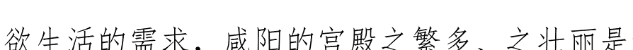
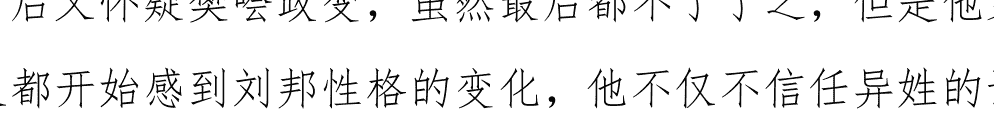
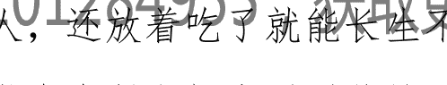
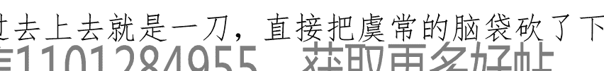
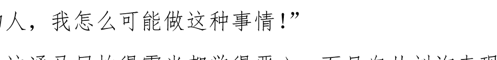

# 巍巍大汉：英雄的时代

这是一个英雄的时代，遍地行走着时代的英雄

# 第一章刘邦的前半生

## 平凡的前半生

我们的故事开始于公元前 256 年的一天，地点在楚国沛县丰邑中阳里的一户平民家中，这户平民家里当家的姓刘，人称刘太公。这天，刘家又新添了一个男孩，大家可以猜到，他就是刘邦。

中阳里是个什么地方呢？它是丰邑辖下的一个村落，往大了讲行政上属于沛县管辖。至于沛县，我们知道它早年间属于宋国，宋国被瓜分以后归入了齐国，不久齐国被名将乐毅的联军攻破，沛县又和附近的地方一起打包纳入了楚国。总之，当时的沛县和战国中绝大多数名不见经传的地方类似，既不属于坚城重镇，也没有名山大川，更谈不上风水宝地，所以在汉代开国之前，沛县丰邑中阳里，只能笼统的说它就是一个地方。

老刘家就是这样一个平常地方的平常家庭，家庭中成员的组成是这样的：家里有夫妻二人，在刘邦出生之前已经有了两个儿子。刘太公的“太公”二字是大爷、大伯之类的意思，他的妻子人称刘媪，“媪”就是大妈。刘太公实际上叫什么已经没有人记得了，我们也不用强行给他考究出个子丑寅卯来，因为在那个动乱的战国末年，一个平头百姓叫什么其实不重要，重要的是能谋生，如果能顺便养活一家老小那就更好，毕竟在乱世活着才是王道。

老刘家当时在中阳里日子过得还算可以，并不十分为生计发愁。但刘太公显然没什么文化，也就给儿子起不出什么惊世骇俗的名字，只能按“伯、仲、叔、季”的排行来命名。所以老刘家的大儿子叫刘伯、二儿子叫刘仲，其实就好像现在岛国的“大郎、二郎”之类。也许是在刘邦出生后不久，刘大妈或是去世或是染病丧失了再次生育的可能，刘太公痛心无奈之下就跳过了“叔”字，给第三个儿子起名叫刘季，说白了就是“刘小”的意思。

这个刘季也就是刘邦最初的名字，但为了文章的连贯我们还是假装对刘季的名字视而不见，还是叫他刘邦吧。

尽管可能刘大妈发生了不幸，然而男人在那方面的悲伤总是可以忘却的。若干年之后刘太公老夫聊发少年狂，又娶妻生子，但名字就不能顺着下去了，只好给后来出生的小儿子另起名叫刘交，和前面三兄弟名字放在一起一眼就可以看出，这是个计划外的产物。

中国的历史上除个别情况之外，绝大多数卓有成就的帝王在诞生前后总有异象出现，比如什么母亲晚上梦到太阳掉到肚子里去，或是踩过某些神物的痕迹就怀孕啊，孩子出生时红光满堂啊之类。同样做为汉朝开国君主的母亲，刘大妈受孕的过程也同样充满了传奇色彩，而且还有直接的目击证人。

据说当时刘大妈不知怎么的，大白天的在湖边小憩，没想到刚一打盹就梦到自己和某个神明迸发出了激情的火花。这时候万里晴空刹那间变得雷电交加，原本在家悠闲的晒太阳的刘太公赶紧起来，因为担心自己老婆在外被雨淋便出来寻找，一路来到湖边却正看见一条蛟龙正趴伏在刘大妈身上，此时云雨过后便有了刘邦。

这种传奇式的出生方式在历史上并不少见，大多是某人获得巨大成功之后，后来的崇拜者将之神话的结果。龙种凤胎的传闻当然不可信，但万事有因必有果，终归不可能完全是空穴来风，我们如果仔细深究一下似乎也颇有些意思。

话说战国时楚地民风开放，男女之间的防范极为松懈，常常能发乎情却不见得能止乎礼，偷情、野合这样的事情在楚地似乎都是浪漫的象征，颇有点现代法国人的味道。这在那些正人君子的眼中自然是不可接受的，甚至连被后世丑化为暴君的秦始皇巡游到了楚地都忍不住做了一把卫道士严肃整顿了民风，之后嬴政对自己的所作所为还颇为得意，于是在当地立碑为记，其中便有：“

> > ……防隔内外，禁止淫佚，男女絜诚……

”一类的话。所以尽管我们没有什么直接的证据，但如果当时刘太公看到的不是一条蛟龙，而是张三李四或者是隔壁村的王二麻子，那事情可能就更接近于真实。

当然，即便刘邦出身真的是这样那也没什么。在刘邦之前，身为大成至圣先师的孔子是私生子，千古一帝的秦始皇在司马迁的笔下多少也有些来路不明，正所谓英雄不问出处。

童年的刘邦和绝大多数农村里的孩子一样，可能上过两天私塾，认得几个字，算得清家里有几亩地，每年要交多少赋税，大概也就是仅此而已，他本人并没有什么天赋异禀的表现，也就没有特别值得记述的地方。

劳动人民作为历史的创造者，很多时候却是被动的参与到历史的创造当中来的。虽然当时秦统一六国的大势已不可逆转，但像在中阳里这种小地方，只要战争不危及到个人生命，对普通的农民来讲都不如今年地里收成重要。反正对于一个平民百姓而言，普天之下只有纳税和死亡是永恒不变的话题，至于天下是姓秦的还是姓楚并不重要。于是，在即将改天变地的动荡时局中刘邦波澜不惊的度过了自己的童年时光。

尽管是龙的传人，生就一副长颈、高鼻、宽额的不凡相貌，长大以后的刘邦却不大受刘太公待见。在刘太公眼里，老实巴交的老大刘伯早死甚是可惜，但老二刘仲也是个好儿子，能干活，会赚钱，把家里管理得井井有条；反观刘邦就是个混混，既不读书，也不事生产，经常恬着脸到兄弟家蹭饭吃。生活中的刘邦自己一文不赚却出手大方，到处结交狐朋狗友，整日在地方上的游手好闲不算，更有甚者还时不时跟一个叫张耳的人以游学为名三番五次跑到外地，而且经常一去就是数月不归；末了还经常乱搞男女关系，终于把邻村曹姓女子的肚子搞大了……每每念及刘邦的所作所为，刘太公总是无奈的发出一声叹息。

可青年的刘邦却不同意老父的观点，虽然是农民出身，他却不愿像祖辈一样脸朝黄土背朝天的过日子，想到自己一辈子就要过那种“辛苦种地，努力赚钱，赚到钱后娶媳妇，娶了媳妇生娃，等娃长大了再帮自己种地”的毫无创造性的生活，想想刘邦就觉得恶心，大好儿男怎能被困死在一亩三分地上？他有自己的打算，当时的刘邦对自己的定位是做一个游侠。

游侠是古代封建社会里一个特殊的群体，是社会变革的产物。所谓的侠，是“士”的一种，这些人的所作所为不一定正义，但他们有他们的行为准则：“言必信、行必果、诺必诚”，用现在的话来说就是重义轻生、一言九鼎，甚至为达目的不择手段。

在封建社会，贵族们很多都有养士的习惯，少则数人，多则数千，比如著名的战国四公子，手下都有几千门客，这些门客就是士，并且都在关键的时候为他们的主子起到了重要的作用。当然很多贵族可能也就是赶个时髦，养的人不管是不是有用，每次出去后面都是跟着呼啦啦的一片人，气势摆在那里至少也能赚个眼球。

到了后来由于诸侯之间相互吞并，越来越多的贵族破了产，自己都养不活自然就顾不上手下人了，原本依附于这些贵族的“士”们也就没了主人，便只能游荡于社会的底层，这些人中的一些会武功的就成了游侠，他们行走于世，快意恩仇，事迹在民间多有流传。

当然，在一个以法制管理社会的国家，游侠这种“士为知己者死”，视法律如同无物的群体是不受统治者欢迎的。韩非就曾经说过“侠以武犯禁”，由此我们可以大略的窥见游侠刘邦身上一些重要的特点。

然而时势造英雄，秦朝结束了战国几百年的混乱，嬴政又是史上少有的强权君王，他迫切的希望建立一个巩固长久而安定的帝国，所以秦统一天下后的时势并不再欢迎这些率性而为的游侠们，朝廷以强权约束百姓的行为，以厉法压制群众的思想，在这样的大环境下刘邦也无奈的看着自己的游侠之路被堵死。

但这并不意味着刘邦的生活就此失去乐趣一蹶不振。

虽然完全不符合一个勤俭持家、吃苦耐劳的农民标准，但平易近人，善于搞人际关系，而且名声不坏的刘邦在沛县还是颇得他人赏识。以至于秦统一了中国，需要大量选拔低级公务员的时候，已经三十出头，没有任何学历、文凭和资历的刘邦靠着乡亲们的举荐也谋到一份差事吃起了皇粮。

刘邦谋到的差事是沛县泗水亭的亭长，这是他伟大人生中的第一个官职。

秦代有制度叫做“十里为亭，十亭为乡”，所谓亭长，管辖的地方就大概在十里左右。虽然算是小地方上的一把手，但在当时实在说不上是份肥差。因为工作不好开展，历来亭长通常是由上过战场的退伍军人之类威武而有胆识的人来担任。亭长手下有负责打扫卫生的“亭父”若干名，负责抓贼的“求盗”若干名，属于朝廷的低级吏员。亭长刘邦的主要工作是负责辖区内的治安问题，捎带还负责调解民事纠纷，如果上头有任务派下来还要兼负责盘查过往行人、接待过往官员、收发邮件等等等等，基本上类似于一个臂扎红袖带，手持利刃全副武装的居委会大爷形象。

尽管亭长只是不入流的一个吏员，收入也有限，而且泗水亭离刘邦家里步行有好几十里路程，平时刘邦只能吃住在单位，偶尔才能请假回家。但这让他有了一个名正言顺过随心所欲的生活的理由，所以刘邦在亭长的位子上还是干的有滋有味。

刘邦的性格外向、豁达大度而不拘小节，这让他在地方上如鱼得水，和当地三教九流的人物都有交往，从县里的一方豪强（如王陵），上级官员（如萧何、曹参）到市井百姓（如樊哙、周勃）尽皆与他相互称兄道弟。在当亭长的最初几年里，除去到外地出公差之外，生活的大多数时间就是和周围的兄弟们一起喝酒吹牛，快意人生。

虽然只比当时全国最牛的秦始皇帝嬴政小三岁，而且两人都是历史上独一号的风云人物，但这个时候的刘邦，完全没有成为历史主角的想法和可能。生活在同一片天空下的两人人生轨迹似乎完全不相同：嬴政三岁开始在赵国邯郸随母亲东躲西藏逃避追杀的时候，刘邦开始在沛县混饭吃；嬴政十三岁，登上秦王王位的时候，刘邦在沛县混饭吃；嬴政二十二岁开始亲政，并且干掉嫪毐、吕不韦总揽大权的时候，刘邦在沛县混饭吃，嬴政三十七岁统一六国君临天下的时候，刘邦……还是在沛县混饭吃。对于即将年过四十，已经不再热血方刚，好不容易混到体制内的刘邦，人生最迫切的愿望或许是找个漂亮贤惠的妻子，然后生几个孩子，等孩子长大了通过自己的关系再到体制内混饭吃，仅此而已。

几年后刘邦的愿望开始实现了。当时沛县外迁来了一户吕姓的大户人家，吕家的主人吕公还是当时沛县县令的好朋友。既然是大户人家，乔迁之喜当然是要宴请县里有头有脸的人物来一起热闹热闹，好歹大家也相互混个脸熟，于是吕公便在家里大摆宴席广邀沛县地头上的人物前来赴宴，刘邦作为朝廷的正式在编公务员自然也在被请之列。

当时的人喝酒席跟现代人差不多，是要上礼金的，而且礼金多少所得到的待遇也有区别的：礼金多、地位高的贵宾自然要坐到堂上好酒好肉；礼金少、地位低只能在堂下四菜一汤。作为资深吃货的刘邦当然是想到堂上，但在一众参加宴会的人中以他的身份和地位还不足以做到登堂入室，要上座只能走金钱路线，于是刘邦到了吕家门口便运足中气大喝一声：“泗水亭长刘邦贺礼钱一万！”。

一万的数目把主人家都吓了一跳，以为来了哪路财神，赶忙出来迎接，把刘邦让进门就往屋里请。要知道当时一个农民一家里辛苦劳作一年所得纯收入不过二三百文钱，赶上年景不好可能最后一个子都赚不到。一万钱刘邦当然是没有的，他其实一文钱都没带，但他平日里混吃混喝惯了并不介意旁人的眼光，进了门也没搭理主人家就自己大摇大摆的走到堂上挑顺眼的地方一坐，大块吃肉大碗喝酒，酒足饭饱之后又和平日里相熟的宾客们高谈阔论起来。

有朋友说这表现了刘邦大气的性格，预示着他以后必成大器等等什么的，我认为不尽然。刘邦反正是先骗了主人家，又是吃了人家一顿霸王餐，脸都不要已经很过分了，他也可能就是想干脆就做得更彻底一些，就赌在这喜庆的日子里主人家不好意思把他撵出去，有点破罐子破摔的意思。

这边，吕家的主人吕公涵养也是了得，没有叫人把刘邦这个不速之客轰出去，只是一旁静静的观察了刘邦许久。并不是吕公憋了一肚子气隐忍不发，而是他在施展一门特殊的技艺——在给刘邦相面，也就是我们俗说的看相。

这是一门高深的学问。现在电视里常说的某人“印堂发黑，大劫将至。”就是这一类的本事。但这还是看相的初级阶段，真正的高人能从你的相貌或举止就知道你的前世今生，甚至你的亲人朋友八姑六婆的事情也能看出来，如果相的是君主的面，还可以知道国家兴衰更替这样的天机。相士们对未来的事情似乎总能未卜先知，甚至对那些乍看起来不合乎常理与逻辑的事情也不例外。传说当年相士袁天罡路过武家，看到当时还没学会走路的武则天穿着男孩子衣服被家人从里屋抱出来，他只瞅了一眼便大惊失色：“可惜是个男孩，要是个女子，必定是天下之主！”

当然，这门学问不是谁想学都能学得来的，历来朝廷官府中博古通今的人也不在少数，却没听说过几人对此能有深入研究的。古往今来掌握这些异术的人大多甘于平淡，绝大部分人甚至都名不见经传，他们可能是你家隔壁修鞋的老李，街对面整天下棋的老吴，也可能是人海中匆匆而过其貌不扬的一个中年汉子。

很多时候真正的高手还是在民间。

话说主人家吕公也算是精通此道，他仔细端详了刘邦后认为以他相面数十年的经历，还从来没有见过一个人的面相像刘邦一样高端大气上档次，便在酒席结束前借着给客人敬酒的机会用目光暗示刘邦酒席后留下来。刘邦虽然不明就里，但暗示他可是看得懂的，酒足饭饱后便也没急着走。

吕公好不容易才送退了所有客人，转过身来请刘邦到内堂坐定，直截了当的说：“我年少的时候就爱给人看相，几十年来看的人多了，从没有人的面相比得上你的。我的大女儿叫吕雉，还算有几分姿色，愿许配给你做妻子。”

刘邦一文不花饱餐了一顿，已经是意外之喜了，没想到还有人哭着喊着要把女儿嫁给他，再一看当时的吕雉，是一个年纪大约二十左右，年轻、漂亮、温柔、贤惠的姑娘，完全符合刘邦的择偶标准，对于刘邦来说简直就是天上掉下个吕妹妹。于是四十出头的光棍汉刘邦也不懂得推辞一下，立马欣然接受，很快的就和吕雉成了亲。

婚后刘邦也是争气，四十开外的人没几年便让吕雉为他生下一男一女。然而刘邦始终也没能解决好两地分居的问题，平时只能让吕雉一人带着两个小孩留守家中，要种地还兼照顾刘大爷，刘邦只是隔三差五的才回一次家。

那时的吕雉确实也贤惠，一个大家小姐虽然一夜之间嫁了一个跟自己爹年纪差不多还常年不回家的男人，但她没有因此而怨恨悲伤，而是努力把这个家操持得井井有条。

某一天，吕雉在地里耕作，为了方便带小孩就把两个孩子都放在田边。正好这时候一个不知名的老人路过，到了田边便向吕雉讨碗水喝。吕雉不但给那老人喝了水，还请他吃了顿饭，老人过意不去，临走之前就给吕雉相了面。

虽然吕雉自己也有家传这本事，一来她年轻学艺不精，二来当时人梳妆打扮用的铜镜成像效果也就那样，像素太低细节模糊，自己也没法给自己看，他爹当年老是叨唠着说自己的女儿将来要嫁贵人，自己也不知道是真是假，正好让老人给自己解一解多年来的心头之惑。

老人仔细端详一番之后，给出的相面结果吕雉是“天下贵人”，吕雉很高兴，又把两个孩子抱过来让老头看，老人看了儿子刘盈，说：“你之所以富贵是因为这孩子。”说完便起身告辞。

不一会刘邦从外面溜达到了田边，吕雉便把老头的话告诉了刘邦，刘邦赶忙顺着老人离开的方向追去，好容易追上了还非得让人家也给他看下，老人也不推辞看了看刘邦，说：“你的妻子儿女都得你的荫福，你的相貌贵不可言。”刘邦听了沾沾自喜很是得意。

种种迹象表明刘邦可能和别人确实不太一样，可这种事情只能算是生活中的一个插曲而已。对于刘邦来说，虽然有了妻子儿女，但生活在更多的时候还是和原来一样没有变化。

这就是当时已经进入不惑之年的刘邦，尽管曾趁出差的机会在首都咸阳领略了帝国统治者秦始皇帝嬴政的威仪，发出过“大丈夫当如此也”的感叹，但如果当时是太平盛世，刘邦也许会在这平凡而幸福的生活中度过他的一生。平时能做的稍微算出格的事无非就是在王大娘、武大嫂的酒店里一边赖着账喝酒，一边与旁人高谈阔论，开自己同僚上司的玩笑，还不时的趁着酒劲向过往的路人们显露他左边大腿上与众不同的七十二颗黑痣，然后在多年以后像绝大多数在神州大地上存在过生命一样匆匆离去，隐没在历史的芸芸众生之中。

### 作者: 上医治国1984 日期: 2018-05-30 22:51

## 草寇生涯

但这注定是一个不太平的时代。很快，命运女神像砸碎一个破瓦罐般轻易砸碎了刘邦四十多年平静的生活，改变了他的人生轨迹。使得原本只想着老婆孩子热炕头的刘邦不得不告别他过往平静的生活，走上一条艰难崎岖且未知的人生道路。然而可以肯定这种改变并不是出于刘邦本人的意愿，他没有马上飞黄腾达起来，一开始的时候命运女神跟刘邦开了一个小小的玩笑——简单的说，他落草了。

现在一提到秦朝的灭亡，还有不少人痛斥秦朝政治的残暴、法律的繁杂严苛，但事实是绝大多数的秦法一直沿用在汉初，并未出现太大的问题。秦朝灭亡的原因，很大程度上是因为在统一后的南征北战和大量的工程建设加剧了原本就很繁重的徭役及兵役制度，从而导致民力的过度使用。土木工程爱好者兼军事狂人嬴政在当皇帝的十二年间，修长城、阿房宫、骊山陵、直道、驰道等等无一不是规模空前的工程，驱匈奴、平南越次次皆是数十万人的军事行动。要知道在当时的情况下农民为国家服徭役和兵役不仅没有报酬，路上吃穿住行都要自己掏腰包，还是一件很容易掉脑袋的事情。兵役自然不消说，就算是徭役也不是一个能随便蒙混过关的差事，如果轮到你去服徭役了，那么请注意：不按时到达工作地点要死，不能按期完成任务要死，如果服役过程中劳累过度——那你死了也白死。总而言之，今年轮到谁该去服役了，那个去一趟地狱之旅没多大区别。

这一次又轮到亭长刘邦带领县里面该服徭役的百姓去参加始皇帝陵墓的工程建设。在此之前刘邦曾经多次执行过类似的任务，算得上驾轻就熟本来不应该有什么意外，但意外偏偏就出来了。

由于大家或经历，或目睹，或风闻了各地太多徭役至死、家破人亡的轶事，老百姓们也就不愿意白白去送死了。各人出发的时候本就不情愿，路上逃跑自然是必须的，于是乡亲们也顾不得平日的义气，一个接一个在刘邦面前玩失踪，还没出沛县的地头人就跑了不少。刘邦虽然没上过几天学，但起码的算术还是懂的，掰开手指一算，按这个速度即便到了骊山工地恐怕也就剩他一个人了。

秦朝的法令对此类事情有明确的规定：应征者如果不按时报到服役或是中途逃跑，抓到就要笞五十，如果你当时跑掉了但是在一年之内被抓到，那还要重罚。

这里要着重说明的是秦代的“笞”，打的可不是屁股，而是脊背。这五十笞下去，一般人哪里受得了，要是命不好再碰上个心黑手狠的衙役，哪怕你是金刚罗汉也得皮开肉绽，即便不死也让你这辈子后悔投胎做了人。而秦法最大的特点之一是法律面前不论贵贱一视同仁，当官的不见得就比百姓有什么特权，刘邦做为管理者这样去交差，小命也肯定是难保的。

如果是我等寻常人碰到类似的事情，大概会在慌乱中变得六神无主，然而刘邦豁达、决绝的天性使得他能在关键时刻能做出超乎常人的决定：他在丰邑西边停了下来，好酒好肉的款待了剩下的人，酒足饭饱之后大手一挥：“现在的情况大家都看到了，你们走吧，我也该跑路了。”

当时换作一般的官吏遇到役卒逃跑这种事情，大多要拿没跑的人撒气，恶语相加乃至拳打脚踢都是常见的事情，打死几个杀一儆百也不是没可能的事情，而刘邦的大度也让剩下的人大感意外，于是有些人千恩万谢的走了，有些人却不愿意独自逃走，表示希望留下来誓死跟随刘邦。

俗话说“酒壮怂人胆”，何况是刘邦这种本来就胆大如斗的人，几斤水酒下肚之后更是胆大得能包了天。见到有十几个弟兄愿意跟随自己，刘邦内心被压抑多年的游侠情结又被诱导出来：既然事已至此，与其以后每日东躲西藏，还不如干脆就上山反他娘的，去他娘的亭长，老子不干了！

一个朝廷的正式工作人员就这样一夜之间变成了知法犯法的罪犯。

既然决定落草，总得有个山寨、根据地什么的为寇才行。说到这里，我们又得回到沛县这个地方，“沛”字面上就是水草丰茂的意思，水草丰茂必然有水有泽——相对而言高山密林就不多，这就十分不利于日后钻山沟子躲避朝廷可能出现的严打。那时候刘邦还不知道千年以后水泊梁山的事迹，又没有彭越那种做江洋巨盗的想法和底子，自然也就没想过要做水贼，但现在自己犯了事，不逃亡再在沛县待着摆明了是不给朝廷面子，让人想不抓你都不行。于是刘邦带着手底下十几个弟兄连夜抄小路往临郡的芒砀山中逃去，路上酒劲上头的刘邦还稀里糊涂的把一条挡道的大白蛇一剑砍做了两段。

犯了事的刘邦很快又成了县里的名人，沛县的官吏们虽然没办法跑到山里面抓人，可刘邦不还是有一家老小留在中阳里么，跑得了和尚还能跑得了庙？于是做为妻子的吕雉便被县里的衙役们抓走了。

接下来吕雉吃牢饭时期的遭遇我们知道的就比较的模糊了，但刘邦知法犯法犯的是杀头的重罪，吕雉又是当地出了名的美人，我们以今度古，想来当时的狱吏们也不会有什么文明执法的理念，于是狱吏对吕雉“遇之不谨”（《史记·张丞相列传》）。可能事情做得还比较出格，过分到让刘邦的一个在监狱里任职的好友叫任敖的也看不下去了，不顾也要吃牢饭的风险把主管吕雉的狱吏暴打了一顿，这才保护了吕雉的周全。后来因为刘邦好歹算帮了父老乡亲，大家心里对他表示感激和同情，又赖他以前的哥们从中斡旋，而且他本人不在沛县的地头作乱，沛县县令将吕雉拘留了一段时间后也放了出来。

我们无法得知刚进到芒砀山里的刘邦是否有过责备自己冲动、后悔自己莽撞的念头，可以知道的是尽管时不时的有沛县的哥们给自己捎来信息，然而以当时落后的通讯条件，在芒砀山里的刘邦对家中的情况并不十分清楚，至少不十分的及时，等他知道吕雉在家里的遭遇时，事情已经过去很久了。

而除去蹲局子的那段时间外，年轻的吕雉时常一个人步行一百多里的山路去给刘邦送衣服和食物，不管刘邦在山里的什么地方，她总能依靠刘邦头顶的五彩云气（是她家传的本事）找到刘邦。尽管因为刘邦使自己受了很多委屈，尽管走了一百多里的山路会让她的双脚磨出血泡，但每次见到刘邦，她都轻声的给自己的丈夫鼓励和安慰，尽可能的给刘邦做一顿饭，有时还陪他住上一晚，对刘邦没有一丝的抱怨和诉苦，如果你见到这个时候的吕雉，很难将她和多年以后那个残忍无情的吕后联系起来。

每次看着妻子下山远去的背影，我相信作为一个正常男人的刘邦，心里不会是充满了坚毅和笃定，而肯定会有一丝的苦楚。但既然已经走上了这条不归路，那就没有回头的可能，而且眼下还有更迫切的事情要他去解决。

这个事情就是吃饭。

不管在什么年代什么阶层，“吃”都是一个永恒的话题，对于刘邦也不例外。虽然刘邦以后要建立一个伟大的王朝，享尽人间的荣华富贵，为后世千千万万的炎黄子孙所敬仰，但此时的刘邦并不知道这些，即便知道了也不能当饭吃，所以我大概研究了一下草寇刘邦及其手下是怎么解决吃饭问题的。

现在港台电视剧里大侠一类的英雄人物普遍有个特点就是不需要工作却总有办法解决自己的衣食住行，他们要么是天生的高富帅，要么巨额财产来源不明，要么就像陈近南推辞韦小宝给他的大把银票时说的那样：为师行走江湖多年，不需要银两。

但艺术毕竟源于生活又高于生活，对于现实中的刘邦来说，虽然也做过多年的游侠，可实际上这却不能给解决弟兄们的吃穿问题提供帮助。依靠吕雉每次带来的三瓜两枣肯定是不够的，让他带领大家在山间开荒种地，建设芒砀山区的新农村也不现实，加上已经落草为寇的事实，我们有理由相信：为了糊口，刘邦时不时的带着兄弟们下山来劫个道什么的是有可能的；为了灭口，有时候杀个把落单的路人什么的应该也是有可能的。

然而草寇刘邦能闹出的动静也就仅此而已，此时的秦朝廷依然强大无比，就凭流窜通缉犯刘邦手下这么点人不说冲州撞府，下了山恐怕就是大一点的官道都不敢走。

这就是公元前210年之前的刘邦，每次干完一票没本钱的买卖，让小弟去最近的集市上换来酒肉，酒足饭饱之后盘腿背靠在山顶一块光滑的石头上望着远方落日的余晖，刘邦觉得自己的生命和前途就如那夕阳，似乎就快要到了尽头。

直到有一天他听到一个滞后的消息，让他如同在黑暗中看到一道闪电：

## 始皇帝死了！即位的不是大公子扶苏而是小子胡亥！

2 楼

作者:上医治国 1984 日期:2018-05-30 22:53

> 加v信1101284955，获取更多好帖

# 第一章 就从这里开始

## 强大的秦朝

在这里我们有必要先简单了解一下当时的唯一合法政府——秦。

秦朝的第一代的创始人叫“非子”，因为替周天子养马养得好（周朝的弼马温？）而被周天子赐予嬴姓，又在渭水上游秦川的东岸给了他一块封地，这里就成了秦朝的发源地。当时掌权的周孝王本意是让秦作为一个近畿的“附庸”之国，但秦的历代君主中不少人就如同孙猴子一样，对这芝麻绿豆大的官职当然是不会满足，于是秦国的君主们不断的扩张壮大自己。随着时间的推移，秦国的地盘和国力日渐强大，到了秦穆公时期更是做了一回天下的霸主，但总的来说当时秦东进的路线始终被更强大的晋国死死的扼住。

这样的情况后来又一直延续了两百多年，直到公元前376年，随着韩赵魏三家分晋，历史进入了战国时期。这个时候的秦国可以说是战国七雄中实力最弱、最不雄的一个国家，国内的政治也一度因宫廷斗争而陷入混乱之中，直到历史等来了这样两个人：秦孝公和公孙鞅。

公孙鞅也就是后来我们说的商鞅，原本是卫国人，年轻时研习的是李悝的《法经》，本想在魏国（非卫国）做出一番事业。然而公孙鞅在魏国并不受国君的重视，十分的不得志，后来听说秦国的新君秦孝公下令求贤，公孙鞅就从魏国跑到秦国去应聘。通过秦孝公的宠臣景监的推荐，公孙鞅得到了秦孝公三次单独面试的机会，公孙鞅抓住机会终于深深打动了秦国的一把手秦孝公，于是孝公拍板决定聘用公孙鞅为左庶长开始实施变法。

一说‘商鞅变法’好像谁都听过，但很多人可能不知道的事情是：得到秦孝公鼎力支持的公孙鞅其实前后一共进行过两次变法，只不过我们熟知且重要的是第一次变法。

这次变法内容包括两个主要方面：一是加强了法制建设，以法令法规严格规范个人的行为。为了确保法令的实施，公孙鞅发明了连坐制度，简单的说就是一人犯法如果临近的其他人不举报的话就得一起坐牢。可别小看了这样的制度，它对后世的影响现在依然有迹可循，君不见某地农村墙上刷的“一人超生，全村结扎”的标语呼？里面大概就有当年商鞅连坐之法的意思。

当然，变法最重要的还是第二条：奖励耕战。在生产方面，他鼓励百姓们多生产，一个家庭的产出与缴纳给国家的赋税成反比，生产的粮食越多，要上交给国家的比例就越少，这无疑增加了人们劳作的积极性。除此之外最最重要的是商鞅在秦国确立了军功爵的制度：当兵的只要能在战场上带回一颗敌军的人头就授爵一级，而没有军功的人即便生在富贵之家也不能得到爵位。当时的秦国无论是谁，在社会上地位的高低全看你的爵位的高低，这极大的刺激了民众从军杀敌的积极性。另外，因为当时当兵的衣食住行是要自行掏腰包解决的，所以秦军对士卒的选拔是有严格规定的：小康以上家庭的青壮年才有资格从军。统治者们的观点是“有恒产者有恒心”，只有有固定收入的人才能不断的保持积极向上的进取心，如果一个人整天都为一日三餐发愁饭，那当兵不能保证他会奋勇杀敌，当官不能保证他能够清正廉明。

秦国在变法的影响下很快强大了起来，可是在那个时代变法不是秦国的特产，战国七雄中除了齐国（这是个老牌强国）以外的其他六国都在不同时期进行过变法。第一个通过变法强大起来的是魏国，魏国主持变法的就是公孙鞅的偶像兼老师，也就是《法经》的作者李悝。既然变法如此的厉害，

## 那为什么最后在七国中脱颖而出是秦国而不是其他六国呢？

那是因为其他五国的变法和秦国变法所不同，不同的地方在于五国的变法都随着主持变法的大臣或君主的去世而终止。变法之前，五国如同衣衫褴褛的乞丐，变法就如同给一个乞丐换上了一件华丽的衣服，但乞丐的本质是没有改变的，随着时间的前进，华丽的衣服终究会褪色，当华丽不再之时，乞丐的褴褛依然。而秦国的变法则不同，虽然秦孝公死了以后公孙鞅就被对他积怨已久的秦国君臣们联合起来五马分尸了，可即位的秦惠文王抛弃了公孙鞅，却没有抛弃公孙鞅的变法，秦国变法的脚步却没有因此停下来。可以说商鞅的变法是给秦国这个乞丐指引了一条谋生的道路，让秦国摆脱了乞丐的宿命最终成为了一个贵族。

公孙鞅的变法让处于社会底层的人们第一次切实的有了通过自己的努力改变命运的机会，即便你出身再普通，只要你勤劳工作就能致富，致富就能参军，参军就能杀敌，杀敌就能提高社会地位。可以说就是这样的制度，让秦军逐渐蜕变成为一只战无不胜的军队。每一次战斗，军队从主帅到士兵都目标一致勇往直前。他们对战争的渴望，他们对胜利的渴望、对人头的渴望超过了以往历史上任何一支军队。兵法有云“上下同欲者胜。”，哪怕你对这样激励斗志的方式并不赞同，你也不可否认这是一支相当可怕的军队。

可以想象当时在战场上，从六国军队一方看过去，对面全是神情亢奋，眼睛冒着青光，嘴里流着哈喇子的虎狼之师；而在秦军眼里，对面全是金光闪闪的人头，有时候可能仗还没打呢，胜负就已经有了分晓。秦军就是以这种抢人头的激情不断的冲击着地盘、人口都十倍于己的东方六国，逐渐从战国七雄中脱颖而出成为当时唯一的超级大国，并开始了统一六国的大业。

商鞅变法以后，秦国对东方六国的战争逐渐出现了与以往不同的一种态势，从对土地争夺的攻防战发展到以消灭对方有生力量为主要目的的歼灭战，我们列举一下一些比较大的战役变可见端倪：

- 公元前331年，秦与魏国交战，斩首八万。
- 公元前317年，秦破韩于脩鱼，斩首八万二千。
- 公元前312年，秦击楚于丹阳，斩首八万。
- 公元前307年，秦拔韩宜阳，斩首六万。
- 公元前300年，秦取楚襄城，斩首三万。
- 公元前298年，秦出武关击楚，斩首五万。
- 公元前293年，秦败韩魏联军于伊阙，斩首二十四万。
- 公元前280年，秦取赵光狼城，斩首两万。
- 公元前275年，秦伐魏，破韩援军，斩首四万。
- 公元前274年，秦伐魏，斩首四万。
- 公元前273年，秦败魏于华阳，斩首十三万，并沉赵援军两万于黄河。
- 公元前264年，秦伐韩，斩首五万。
- 公元前260年，秦大败赵于长平，斩虏四十五万。
- 公元前256年，秦取韩阳城，斩首四万，伐赵，斩首九万。

可以看得出来，商鞅的变法对秦军的刺激有多大，在秦统一六国的过程中，据不完全统计，仅秦军消灭的六国军队人数就超过二百万人。而且秦灭六国的脚步是一步步的加快，终于在秦孝公过世百余年以后，秦国又出了一位雄才大略的君主——嬴政。

虽然即位的时候年纪还很小，权力也掌控在太后和权臣的手中，但当秦王政九年（公元前238年），嬴政干掉权臣吕不韦和嫪毐开始亲政后，秦统一六国的进程真正进入了快车道。

- 秦王政十七年（公元前230年），灭韩。
- 秦王政十九年（公元前228年），灭赵。
- 秦王政二十二年（公元前225年），灭魏。
- 秦王政二十四年（公元前223年），灭楚。
- 秦王政二十五年（公元前222年），灭燕。
- 秦王政二十六年（公元前221年），灭齐。

嬴政指挥着这支虎狼之师在短短的十年时间里横扫六合统一了天下，第一次在中华大地上建立起一个家天下的帝国——秦帝国，赢政也成为了中国历史上第一位皇帝——始皇帝。

接下来，秦始皇赢政再接再厉，国中没有了敌手，他便向北驱逐了匈奴，向南扩张到了南越，建立起了一个空前强大的国家，也是当时世界上最强大的国家之一。当然，如果考虑到在公元前3世纪时候的古希腊在马其顿人统治下奄奄一息，古印度的孔雀王朝已经分崩离析，古埃及早已经被罗马人干掉，而罗马人还没有称霸地中海，我们甚至可以把“之一”两个字去掉。

然而，如此强大的国家也有极深的隐患，那就是统治者不了解可以在马上取天下，却不可以在马上治天下的道理。当国家的主题不再是战争，当社会生活的关键词从“对外征战”转变成“休养生息”的时候，统治者们却仍然在以老眼光看待新问题，换句话来说，就是他们不了解社会的新常态。加v信1101284955，获取更多好帖

不了解当然就会出问题。

### 3 楼

作者:上医治国1984 日期:2018-05-30 22:55

## 起义

严格意义上说，秦朝的政策很多并不能称为暴政，而应该称为急政，因为赢政总是迫切的想要把每件事情都尽快的做好。赢政是一个勤奋的人，尽管以前没有经验可以借鉴，也没有人在旁指点，他依然努力的经营着这个前所未有的庞大帝国。嬴政仔细处理着帝国的大事小情，他每天处理公文不是以件计算，而是按斤算。当时的文字写在竹简上，嬴政每天要让手下称足一百二十斤（秦朝一斤约等于现在的半斤）的竹简，不批阅完不休息，哪怕是在外出时也不例外。他太急了，想要建立一个从始皇帝到二世、三世、……乃至万万世流传不息的帝国，但嬴政没有想到凡事欲速则不达，最后事实却与他的愿望背道而驰。

秦政府统治稳固的前提是始皇帝嬴政对政权的强势把控。然而当公元前210年，千古一帝秦始皇在巡游的途中突然驾崩之后，中车府令赵高说服丞相李斯矫诏立嬴政的小儿子胡亥为二世皇帝，并赐死了宽厚仁义的皇长子扶苏及秦始皇的近臣名将蒙毅、蒙恬兄弟。胡亥这个历史上有名的缺心眼且低能的年轻人，完全不是当皇帝的料，不仅政治上一塌糊涂，事事为自己的老师赵高的马首是瞻，而且在享受和暴虐的程度上更胜乃父一筹。结果使得嬴政死去才九个月，在二世元年七月（秦朝制度十月为每年的第一个月，然后是十一月、十二月、一月……，九月是一年的最后一个月）陈胜吴广便带领九百戍卒在大泽乡揭竿而起。刹那间农民起义的风暴席卷大地，才统一中国十三年，看似强大到坚不可摧的秦帝国政权出现了道道裂纹。

到了秦二世元年的年末，就连身在芒砀深山里的刘邦也感到了时局出现了明显的变化。以前也就是一两个月才有个把实在是走投无路的苦汉子插香入伙，而现在几乎隔三差五的就有人上山投靠自己，自己的手下已经比刚上山的时候又多了几倍。刘邦时不时的可以从新投奔来的小弟那里听到一些山外的消息，净是些什么“胡亥是始皇帝的小儿子，不当立为皇帝。”、“胡亥残杀自己的兄弟姐妹，又杀了很多大臣，分明是做贼心虚。”、“陈胜、吴广在大泽乡公开造反。”、“陈胜吴广已经占领了陈县，打出“张楚”的旗号自立为王了。”、“某某地方又杀了长官响应陈胜了。”等等之类。稍微综合一下各种信息，除了像躲在咸阳皇宫里的胡亥这种混蛋之外，只要是智商健全的人都很容易得到这样一个结论：

天下乱了！

加v信1101284955 获取更多好帖

我们知道第一个出事的地点是大泽乡，造反的是九百人是戍卒。戍卒就是卫戍之卒，任务是到国家的边境线上去服兵役。然而当时天下被压迫的人何其多，为什么偏偏是这九百戍卒首先站了出来？要解释这个问题，我们必须先简单的了解秦汉时期的一些制度。

当时国家实行的是全民兵役制度，凡成年男子一生均需服三种兵役：到本国边境服兵役（戍役）、到中央军队服役、以及在本人的居住地服兵役。与后两者不同，做戍卒时间一般只有三天（当然，如果你是犯了事被抓去的可能要待好几年），这是自古便有的惯例。有人可能说，三天没什么呀，去就去呗。但问题在于服戍役期间的所有用度，包括来回的路费、吃穿住的花费全是自己掏腰包——如果在古时候还好，小国方圆数十里，大国数百里，从中央到边境少则三五天，多则半个月就可以打个来回了。可是秦始皇建立的是一个空前的超级帝国，疆域广阔是前所未有，嬴政自己坐马车巡游一趟尚且需要数月之久，何况是赤脚开11号的平民。如果你身在南方的会稽郡，不幸被派到北方的渔阳服戍役，那就要做半年甚至更长的打算。这对于以成年男性劳动力为支柱的普通百姓家庭而言影响是相当巨大的，遗憾的是循旧例的帝国统治者显然还没有来得及意识到这些问题。

秦朝是中国历史上第一个统一的王朝，它形成了之后两千多年中国版图的雏形，统一了文字、度量衡，为汉民族这个文化共融体的形成奠定了基础，确立了之后两千多年中国的政治制度，帝国的统治者的丰功伟绩当然无需赘述。然而如何管理这个历史上疆域空前的帝国也让统治者感到困惑，在战争这个可以转移民众注意力的外因基本消失后，继续沿用春秋战国时期的政治制度使得统治阶级与被统治阶级之间的矛盾迅速膨胀，帝国就如端坐在底下满是火药桶的桌子一般，看似四平八稳实则岌岌可危，而统治者们却始终没有察觉。最终在秦二世元年（公元前209年）的七月，由于大雨误期，陈胜吴广带领同行的九百戍卒迫不得已揭竿而起，第一个点着了火药桶把帝国的金身炸上了天。某种程度上可以说，秦数百年的基业就毁于这三天的制度，正印证了“千里金堤，溃于蚁穴”这句话。

起义造反的事情哪个朝代都有，并不新鲜，而陈胜吴广的起义之所以特殊，原因是在于他们的身份。陈胜吴广两人起义的时候是被发往渔阳的九百戌卒里的小队长，在当小队长之前两个人都是普通的农民，往上追溯他们的父辈也是农民，祖辈也是农民，一直往上到祖宗八代都一样是泥腿子一个，真正的根正苗红。这就让陈胜吴广在大泽乡的起义成了历史上开天辟地的头一回：第一次有农民起来带头造统治阶级的反。这在那个贵族阶级统治一切的时代有着非同一般的意义，所以陈胜吴广的那一句“王侯将相宁有种乎”也就成了后来底层社会群众反抗压迫的底气和依据。

但作为始作俑者，陈胜吴广也有自己的难处：自古以来带头造反革命都是圣人们的事情，顶不济也要有一方贵族豪门带领才有号召力和凝聚力，而陈胜、吴广这两个八辈子的贫农显然是没有这个资本的。于是始皇帝赢政的长子扶苏、楚国的名将项燕一一复活，在两人身上借尸还魂，继而陈胜又打出“张楚”的旗号，这个旗号在当时显然非常给力，一时间以六国时的楚地为中心，杀官响应陈胜的起义遍布各地。

古语说“乱世英雄起四方，有枪就是草头王”。刘邦现在手上有了百十条人枪，也算是个草头小王，却也只能是把手头上没本钱的买卖做得大一点，依然没有实力和机会割据一方。

但命运女神是不会放弃刘邦的，刘邦的机会说来就来，九月的一天，山下来了一个通信的人让他看到了希望。

来的这个人叫樊哙，平日在沛县集市中专门做杀狗的营生，与刘邦是铁哥们，还是刘邦的连襟——樊哙的妻子是吕雉的妹妹吕媭（可见吕公相面的本事当真了得）。他给刘邦传来了这样一个消息：陈胜吴广起义后沛县虽然还算太平，但周围已经有很多郡县的百姓都杀了他们的地方长官响应陈胜，沛县县令担心自己步同僚的后尘，为了保命县令决定主动在沛县举事响应陈胜，并且希望刘邦能把队伍拉回沛县助他一臂之力。

为什么县令会主动找上刘邦？答案是因为当时想反水的沛县县令处于两难的境地：他虽然是政府委任的地方一把手，可他在地方上没有根基，手中也没有兵权，就光杆司令一个。之所以出现这种情况，是秦朝制度的使然。秦帝国对军权的把控严之又严，五十人以上的军队调动必须得到皇帝的首肯；而秦朝政府又规定，地方一把手必须是外地人。没有兵权就指挥不动军队，一把手不是本地人，就不容易与本地土生土长的下级官员及地方豪强们打成一片，这样既可以防止地方官员犯上作乱，又可以让他们上下相互监督甚至相互牵制，尽可能的避免领导与下属相互勾结在地方上做土皇帝。

手头没有兵权，在当地没有庞大私人关系网的沛县县令想主动向起义军靠拢是不容易的，他担心别人不相信自己——彼时愿意主动倒戈的官员少之又少，谁知道你是不是想要试探谁有反心然后将之一网打尽？如果继续为政府工作，又怕哪天会人头不保。两难之下，沛县县令这个保命心切的倒戈派，听从了县政府办公室主任萧何及主管司法工作的看守所所长曹参的建议：请求流亡在外的刘邦带队伍回沛县，以武力劫持、胁迫大家一起造反。

接到樊哙的消息，刘邦马上意识到：不管县令的意图是真是假、回去后自己的结局如何，这是他改变现状千载难逢的机会。

于是刘邦吹响了集合号，由樊哙带路，刘邦与百十号弟兄马上赶回了沛县。

一百多里地的路程在情绪激昂的一群汉子脚下并不是很远的距离。刘邦等人黎明启程，天还没擦黑就赶到了沛县城门下。

重新回到沛县的刘邦没想到县城的大门却是紧锁着，夜里在空旷城门下高声叫唤“老萧！老曹！”也没有人回应。进不得城去的刘邦只好在城外打雾水，熬到半夜的时候手下来报：从城头翻下来两个人。刘邦把人叫上来一看，却正是萧何和曹参。

原来县令让樊哙去联系刘邦后就后悔了，想他在县里任多年，也风闻萧何、曹参和刘邦之间交情颇深，现在两人保举刘邦带人回来名曰助我革命，搞不好却是想要先革了我的性命。于是县令便起了杀心，准备先干掉萧何、曹参两个内贼，同时下令紧闭城门不让任何人进出。

沛县县令的顾虑固然没有错，可惜他缺乏具体行动的经验，连续犯下两个致命的错误：首先萧何、曹参均是本地大族，在沛县地头上各种关系盘根错节，县令又临事不密，结果他的格杀令还没有出门，萧何曹参便已经得到了消息，于是两人漏夜翻墙逃出城去；其次得到两人逃跑的消息后，县令并没有派人马上肃清萧、曹两人族人，至少将他们中的重要人物控制起来，使得他们有了继续做内应的可能。

这边好容易逃得性命的萧何、曹参与刘邦一会面，便制定了周密的行动计划：他们决定以刘邦的名义和口吻书写一份帛书向沛县的父老们陈说利害，无非是说大家受朝廷的压迫已经很久了，现在天下的形势是诸侯并起，如果父老乡亲们为县令死守沛县，等诸侯军队一到肯定是有屠城灭族的祸事，不如现在大家一起把县令做了响应诸侯，这样才能保全大家的性命。

刘邦命人将上述内容抄录多份绑在箭矢上射入城内——因为没有投递员而是使用弓箭射入城内的，想来一定是抄录了多份，到处乱射，有点当年满大街贴大字报的意思。不然如果仅写了一份，谁知道这一箭会射到什么地方，倘若不幸射入了茅坑或是被亲县令的人取了，岂不大事休矣。

果然第二天天刚亮，沛县的城门便大开，县令的人头高悬其上——刘邦的书信固然是一方面，而萧、曹两人的宗族在其间的作用也是不可替代的。

直到杀了县令，萧何等人才想到一个问题：原来准备挑头的人没了，接下来的事情该怎么办？

既然杀官造反已成既定事实，选一个人作为领袖或者说是出头鸟、替罪羊是必不可少的。当时与起事有关，有实力和能力且出力颇多的无非是萧何、曹参、刘邦三个人。俗话说枪打出头鸟，萧何、曹参两人出身文职人员，又是地方上的豪门大族，亲戚朋友多，顾虑拖累也多，就不愿意挑这个头，而是把带头造反的事情一股脑子推到刘邦身上。

刘邦这时候倒是很清醒，造反一旦失败可不是杀人偿命欠债还钱那么简单，那是要灭三族的。他没有像当年娶吕雉一样欣然接受，而是说了很具体的拒绝理由：“现在是天下大乱诸侯并起的时候，在这种大环境下如果我们领导没有选对的话很快就会一败涂地。我刘邦不是爱惜自己的性命，而是我的能力不足，怕不能保全家乡的父老乡亲们。”

刘邦不出头父老乡亲们可不同意，县令都杀了大家哪里还有退路？好容易逮住你这个冤大头可不能随便放过，反正你已经造过一次反了，也不缺再来一次。再说了，城东算命的瞎子也说你刘季命最好。行！就你了！

于是大多数人（也有不以为然的）不顾刘邦的再三推辞，坚决推举刘邦做了起义军的首领。

大概这时在场的没有人会想到，这是又一个伟大王朝的开端，史书上留下了重要的一笔：秦二世元年九月，众人立刘邦为沛公。

4楼

作者:上医治国 1984 日期:2018-05-30 22:58

## 在曲折中前进

很快，沛公刘邦依靠原来的哥们帮忙在沛县拉起了两三千人的队伍。不得不说刘邦的运气实在不错，他的哥儿们不仅是一个素质很高的群体，里面包括了萧何、曹参、樊哙、娄敬、任敖、周昌、周勃、夏侯婴等等汉朝的开国重臣，而且这些人绝大部分对刘邦都十分的认可。既然部队组建完毕，为图个彩头，按惯例刘邦自然也要自我标榜装饰一番。于是刘邦就成了赤帝的儿子（让刘大爷情何以堪？），并且宣称自己曾经斩杀过化作大白蛇的白帝的儿子；又说当年秦始皇也常认为东南方，也就是刘邦所在的楚地有天子气，所以嬴政才到南方来巡游，目的是为了压制这股气息，然后刘邦自己在芒砀山里钻山沟的原因也由躲避朝廷的严打变成了躲避嬴政气息上的迫害。这样一来，刘邦以往的那些所作所为性质完全就不同了，虽然刘邦人还是那个人，做的事也还是那些事，但格调就高了很多。

一通动作下来，刘邦顺利的拔高了自己的声望，把自己的造反说成是上天注定的事情。最后，赤帝的儿子、浑身上下散发着五彩云气的真命天子刘邦在沛县带头祭祀黄帝和战神蚩尤，宣布上天早已注定了的战争的到来。

一切准备就绪，秦二世二年十月，部队开始整装开拔。

然而话可以说得天花乱坠，但打仗还是得靠刘邦自己，即便成了赤帝的儿子，有神仙在后面撑腰也不代表他一定会顺利。毫无指挥和作战经验的刘邦一开始连续在胡陵和方与两个地方碰壁吃瘪，他带着部队空费了不少时日转悠了一圈毫无收获后只好回到了丰邑继续招兵买马。虽然连续的出击失败，刘邦的公开造反行为还是刺激了朝廷，很快泗水郡郡监（官职）某平（史失其姓）便带领军队包围了丰邑。

沛县只是一个小县，下辖的丰邑更非一座坚城，刘邦手下这两三千人不可谓多，城外黑压压一片的秦军又不可谓少，而且这是刘邦第一次被敌人包围（以后他还要多次面临这种情况）——这一切都预示着刘邦军事生涯面临的第一次考验异乎寻常的大，如果换做一个寻常的义军将领，接下来的事情十有八九就是要出城投降了。

但刘邦就是这么的不寻常。

虽然刘邦不爱读书也没多少文化，更没研究过兵法，但他在军事上还是颇有天赋的。看着丰邑在秦军重兵包围之下四面漏风摇摇欲坠的单薄城墙，刘邦毫不气馁，也不打算先投个降曲线救国，他认为既然难以依靠城防进行有效的防守，不如主动进攻寻找战机。

刘邦决定：趁敌人立足未稳之际主动进攻。

在丰邑城里，刘邦一边充分发挥了他经过人生前四十几年已经练得精熟的忽悠人的本事，发表激情的演说，鼓舞了众人的士气，同时又做好了充足的准备。在被围两天后的黎明时分，丰邑城门大开，刘邦主动率军出城与秦军交战。

丰邑城外的秦军没想到人数劣势的义军会主动出击，一时乱了阵脚，结果阵势被刘邦率众一鼓作气冲散。紧接着刘邦趁胜追击向薛县进攻，又击败了郡守某壮（情况同某平），并一路追击至戚县，刘邦手下的左司马曹无伤生擒了郡守。

要知道秦统一中国后最初将全国分为三十六个郡（后来随着版图的扩大有所扩充），郡守作为郡的第一把手在当时可是省部级的高官，在军队也属军分区司令一级，分量着实不轻。郡守居然被擒让刘邦的第一次军事胜利大得出乎意料，于是刘邦很得意，马上命令开坛祭旗，拿郡守的人头做了自己反秦的投名状。

虽然首战告捷，响应了张楚反秦的召唤，但刘邦的处境并没有多大的好转，相反他很快就不得不面临来自秦政府和各地起义军之间两方面的压力。因为当时除了要面对如狼似虎的政府军之外，各股反秦武装之间也不是铁板一块，前有武臣背楚自立，后有韩广叛赵称王，至于各路义军内部为了眼前的利益，弑主称王、背信弃义、阳奉阴违、貌合神离的事情更是比比皆是。这还是在大家名义上一致拥护响应张楚政权的情况下，而到了秦二世二年十二月，张楚政权被秦军名将章邯消灭，陈胜被自己的马车夫庄贾杀死在撤退的路上之后，失去名义上的领导的各路反秦武装更是乱作一团。

秦汉之际的反秦起义是中国封建历史上几乎所有反抗压迫的农民起义的模板和缩影：初时大家为了生存尚能并力同行，一旦局势暂时缓和便恨不得马上称王称霸割据一方，各反秦武装间摩擦火并不断升级，最后他们都被王朝的统治者所消灭或被王朝的创造者所取代。这也是中国封建历史上所有最终失败的农民起义的四同宿命：同仇敌忾、同床异梦、同室操戈、同归于尽。

当时刘邦并没有想那么多，虽然初战得胜，但他在多如牛毛的义军中还只是不起眼的一支，既没有稳固的地盘，也缺乏强大的兵力，他现在迫切需要的是继续进攻扩大战果，进一步增强实力。可下一步要往哪里去？思来想去，刘邦最终选择了曾经让他吃了闭门羹的方与。

等刘邦再次来到方与城下时才发现，一支魏国的军队早已经盯上了自己的猎物，领军的魏国将领是魏国的相国周市。周市在当时可不同于一般的义军将领，他最初奉陈胜之命平定魏地，成功之后陈胜曾多次想立周市为魏王，周市为反秦大局着想拒绝了陈胜的任命，而坚持要立六国时魏王的后人魏咎为王。此时的魏咎正在陈胜的软禁之中，周市甚至为此连续向陈胜请求了五次，陈胜不得已才放魏咎到魏国为王。由此来看周市算是当时起义军之中为数不多识大体的人物。

然而刘邦哪管得了这些，卧榻之侧岂容他人鼾睡，敢来跟我抢地盘，也不问问我手中的三尺长剑是不是答应！于是刘邦和周市两军摆开阵势准备先较量一番，看谁更有实力夺取方与这个猎物。

但就在剑拔弩张之际，刘邦却接到一个让他十分意外的消息：丰邑投降魏国了！

原来周市也不是等闲之辈，他知道丰邑是刘邦当时不多的根据地之一，意义自然重要，于是一面准备跟刘邦开战，一面派人去劝守城的将领投降，准备前后夹击，一举把刘邦打回解放前。

刘邦当时也知道丰邑的重要，出兵之前他并不是毫无准备，而是留下自己信任的将领雍齿留守丰邑。可刘邦没想到的是，事实上雍齿就属于沛县起兵时不屑刘邦的少数派，自己早就想出来单干。现在刘邦命自己留守丰邑而周市又派人用封侯的条件来说降，正遂了雍齿的意，于是双方一拍即合，丰邑马上就城头变换大王旗投降了魏国。

眼看就要腹背受敌的刘邦果断的放弃了方与，连夜回军丰邑。从能力上说雍齿也确实了得，带着一群叛兵居然把丰邑守得跟铜墙铁壁一般让刘邦毫无办法。气急败坏的刘邦在城下破口大骂丰邑的小子们忘恩负义，但光骂人能解决什么问题？丰邑城外的刘邦只能是又气又急，又急又气，急火攻心之下刘邦病倒了，这一病还病得不轻，只好听从手下人的劝告暂息雷霆之怒，慢发虎狼之威，灰溜溜的退回沛县县城养病。

这是起义后刘邦遇到的第一次重大的挫折，是经受住挫折越挫越勇还是被挫折所击败在历史上留下“某年某月，沛公走死某地”的记载了事，全靠刘邦自己的意志和能力，而只有意志坚定、能力出众的人才能战胜挫折不被历史所淘汰。

挫折就如大浪，能在数量多如泥沙的人群里淘出其中最闪亮的金子。

当然，作为事后诸葛，我们很放心的知道，刘邦是当时最闪亮的金子，是不会被淘掉的。他在沛县一边养病一边思考：丰邑之恨是不能不泄的，既然自己力所不及就必须借他人的援手。哪援手又在哪里呢？刘邦身为楚人又在楚地起兵，关系上自然与楚系的反秦武装最为相近，虽然此时陈胜的张楚政权已不复存在，但刘邦听闻有人在离此不远的留县拥立一个叫景驹的人做了代理楚王。景驹是楚国屈、景、昭、芈四大家族中景家的后人，在楚地自然有高于常人的号召力，于是病情一有好转刘邦就决定带领部分人马去投靠景驹，准备向他借兵来收复丰邑。

刘邦在留县很顺利的见到了景驹，但还没等他跟景驹提要求，一支秦军与他前后脚几乎同时来到了留县附近。景驹一看秦军来了，他也知道秦军的厉害，自己着实紧张得很，这时他看到刘邦，便有了主意。

刘邦，你不是有事要求我吗，那怎么不得先表示表示？正好现在这支秦军就交给你打发了。

秦军的将领是名将章邯军中的司马。虽然只是一个偏将军，可能力却不含糊，刘邦与景驹的手下将领一起主动向秦军进攻，结果又是一次不成功的军事行动，出师不利的楚军只得回撤，好在这个时候秦军因为兵力不足也没有继续进攻留县。

退回留县的刘邦心里十分的焦急，想到自己的家当很多还在沛县，他那还耐得住性子继续窝在景驹身边。稍微考虑了一下，刘邦就决定单独行动，他敏锐的找到了一处秦军的薄弱点，带着队伍转而进攻砀县。这次行动刘邦获得了胜利，轻易地攻破了砀县。

相比沛县而言，砀县是个大县城，刘邦在砀县很顺利的招募到五六千人的新兵。一下子有了近万人的队伍，这下刘邦胆气就壮了起来，主动向秦军把守的下邑进攻，并再次获得了胜利。得胜而归的刘邦回到了留县，他没有想到，一个比胜利更大的惊喜在等他，因为就在这时，刘邦遇到了一个日后刘邦集团里极重要的人物——张良。

5楼

## 张良

张良，原本姓姬，六国时韩国人。张良的祖父姬开地、父亲姬平，都曾经做过韩国国相，前后服侍过五代韩王，是真正的贵族出身。秦王政十七年，秦军俘虏韩王韩安，韩国正式灭亡。做为六国中第一个被征服的国家，嬴政表现出了他政治上的大度，并没有像后来项羽对待秦王子婴那样把韩安一刀砍了了事，而是采取了宽容的态度，只是把韩安软禁在新郑（地名），韩国国内很多大贵族的权利也得以保存。

这时候的张良才二十出头，还没有在韩政府供过职，所以尽管国破了，但他家还没破，家里依然有仆僮三百人和大量的金银玉器珍宝古玩。和当时很多韩国的贵族一样，张良只要浑浑噩噩的睁一只眼闭一只眼，继续过锦衣玉食的生活并不成问题，最多只是暂时顶了个“亡国奴”的帽子。就如当年满清入关以后，很多汉人一开始脑袋后面绑个辫子也很不舒服，可绑着绑着时间长了也就习惯了。

可张良并不想这么混日子，自从国破的那一刻起，他心里无时无刻只有一个念头：报仇。

张良毕竟是一个热血青年，尽管他父亲早在二十年前就病死了，跟秦人谈不上有什么家恨，而且自己从来没有为韩国工作过，也说不上有什么国仇，可他为国尽忠的心却数十年如一日的坚定。

一开始张良的想法很简单，灭韩国的是秦军，指挥秦军消灭韩国的是秦王嬴政，干掉嬴政是他复仇计划的全部，也是他生命的全部。

为了给自己的国家报仇，张良放弃了继续过富人生活的机会，甚至连自己亲弟弟的丧事都不去打理，而是散尽家财到处寻求能够刺杀嬴政的刺客。应该说这个时候的张良政治水平和觉悟还是比较低的，充其量跟当时那个不懂得隐忍，只是因为儿时一同玩耍的嬴政对自己态度不好就愤而出逃，后来一心只想刺杀嬴政的燕太子姬丹差不多。可事情想谁都会想，真正有能力又敢于刺杀秦王的人又有几人呢？姬丹还算运气，找到一个荆轲，算是轰轰烈烈了一把，而寻遍千山万水的张良自己也疑惑：他的荆轲究竟在哪里呢？

然而凡事只怕“坚持”二字。十几年后，张良的苦苦寻找终于有了回报：他在原属于燕国的高句丽附近找到了一名愿意刺杀嬴政的力士。但十几年过去了，嬴政在见识过荆轲的匕首、高渐离灌了铅的乐器之后，不是秦国本土人士再也很难接近嬴政身边。像张良这样的六国旧臣但凡出现在嬴政附近，估计不说近身行刺，只要你稍有异动，恐怕远在十丈开外就被负责嬴政安保的亲兵们射成了筛子。

好在张良也早有准备，既然近距离刺杀几乎不可实现，他利用嬴政喜欢出巡的爱好，给力士准备了一个一百二十斤的铁锥，要趁着嬴政外出巡游的机会在途中远距离将其狙杀，狙击的地点张良也物色好了，就选在阳武城外的博浪沙。

博浪沙地理位置夹在黄河和官渡河之间，是驰道直通咸阳的必经之路。地如其名，“博浪沙”的一个“沙”字，足见当地到处有绵延起伏的沙丘，而沙丘与沙丘间又有杂草丛生，地形上利于少数人隐蔽而不利于大队人马快速通过，是伏击的好地方。

张良之所以敢于尝试远距离狙杀，除了重金请来的力士打移动靶也是百发百中之外，还有一个原因就是嬴政作为天子，按制度在车队中他的马车是由六匹骏马拉着，车厢豪华程度也是其他随从所不能比的，一般情况下远远的就能分辨出来，根本不需要走近了寻找。

综上所述，张良的计划是这样的：因为博浪沙地形的原因，嬴政的马车队不可能很快的通过这里，只能是缓步前行，而早一步选好位置隐藏起来的力士就可以在车队靠近时用事先准备好的大铁锥投掷向嬴政所乘坐的马车。试想一百二十斤的铁锥掷出去威力是何等的巨大，只要命中必然能将嬴政连人带车砸个稀烂。当张良事先探知嬴政的行程后，占尽天时地利的张良与力士两人早早埋伏在博浪沙官道旁，只等嬴政前来送死。

这看起来是个天衣无缝的计划，张良此次可谓志在必得。可当等到嬴政的车队远远的过来时，两人都傻眼了，三十六辆同样制式的马车一辆接着一辆一字排开，从拉车所用的马匹到车上的装饰再到旁边守护的卫兵的人都是一模一样，急切之间哪里分辨得出嬴政在哪辆车里？

“奸贼！”张良心里恨恨的把嬴政的十八代祖宗都问候了一遍，但箭在弦上不得不发，张良耗费了十多年的时间才终于找到这么一个机会，不能就这么眼睁睁的看着嬴政从自己眼皮子底下走掉。于是，当车队行进到离两人埋伏的地点最近的时候，张良示意力士把铁锥向车队中间的一辆车投去。

收到信号的力士卯足力气，身体旋转着使用类似奥运会链球选手的动作将手中的铁椎掷出。只听得“咣当”一声，铁锥把车厢整个都砸烂了，随后便是整个车队一阵的骚乱。张良也顾不得观察是否击中了嬴政，转身就往远处逃去。

史书上把这事称为“误中副车”，想想其实不然，三十六分之一的概率，打不中那是正常，这要是真被他打中了那应该叫“误中正车”才对。

刺杀失败后力士的下场不是很清楚，似乎被抓后自尽了，而张良我们准确的知道他居然全身而退，改名换姓隐匿于下邳。权倾天下的始皇帝对刺杀事件震怒不已，下达全国动员令搜查了整整十天都没有找到张良的消息，于是张良便成了赫赫有名的全国S级通缉要犯，也成了令当时游侠们心驰神往的传奇人物。

虽然改换了姓名，但张良却没有就此过上平静的生活，他仍然时刻不忘自己的祖国。机缘巧合之下张良得到高人指点，开始研读据说是中国第一代武圣姜子牙所留下来《太公兵法》。随着不断的学习提高，张良的思想境界也得到了提升，他开始意识到单纯的刺杀嬴政并不能解决问题，即便自己不顾性命刺杀成功了，那又能怎么样呢？当时的东方六国政治腐化，即便没有嬴政，也会出来一个赵政、一个吕政来做嬴政所做的事情。要想让韩国不被秦所灭亡，只能让韩国强大起来，而自己要想让韩国强大起来，首先要恢复韩国，于是张良从一个复仇主义者转变成为一个复国主义者。

陈胜吴广起义之后，张良也拉起了百十号人的队伍想要做一番事业。张良原本是去投奔景驹的，起的心思跟刘邦当初差不多，只是正好见到刘邦的队伍路过就随便进来看看。刘邦年轻时自认为是游侠，见到了偶像，当然是很激动，两人一番长谈之后更是相见恨晚，于是刘邦很诚恳请张良留下来做了一名厩将。

张良见过的达官贵人比一般百姓人认识的人还多，区区一个厩将自然不放在眼里，然而他发现刘邦虽然表面上跟其他的义军将领一样俗不可耐，但这个人极其善于采纳别人的意见且悟性惊人，常人听不懂的兵法刘邦一听就懂，常人想不通的事情刘邦一点就通。张良终归是个读书人，而读书人总有一种良禽择木而栖的心理，张良偶然间发现了刘邦，再一番深入接触，对刘邦感到十分的满意，于是张良也就打消了再去见景驹的念头，就留在刘邦身边做一个贴身的谋士。

所谓旁观者清，通过一段时间的观察，刘邦发觉景驹号称代理楚王，听起来威风但其实是把自己放在了火炉上烤，虽然他自己没有意识到，但其所作所为已经引起了其他楚系义军的不满，而且景驹本人能力有限，并不具备成就大事的魄力。更重要的是在投奔景驹的那一段时间里，丰邑始终是刘邦内心挥之不去的阴影，必要除之而后快。种种因素影响之下，刘邦经过反复思考，最终再次决定单干，于是他迅速脱离了景驹，再次带着部队回军包围丰邑。

虽然比上次多了五六千人，但结果却是一样，刘邦在丰邑城下只能望城兴叹徒呼奈何，雍齿时不时还在城头露面，面露嘲讽的神情刺激在城外的刘邦。

就这样又过了一段时间，在丰邑城下死皮赖脸的磨蹭了多日反复被雍齿刺激的刘邦听到了一个消息：景驹的队伍已经被另一支楚军打散，他本人也死在了逃亡的途中。

获胜的这支楚军为首的将军叫项梁，是楚国名将项燕的儿子。项梁在消灭景驹后手上已经有十万之众，现在正在不远的薛县附近，是一个颇有实力的人物。被雍齿刺激得不轻的刘邦没有丝毫的犹豫，留下大部队继续围城，自己只身带着百十个随从连夜就投奔项梁的帐下。

我相信刘邦虽然没什么文化，但他本人的公关交际能力却非同一般，以至于初次见到刘邦的项梁也不含糊，直接拨给刘邦五千人马和五员将领助他攻打丰邑。得到增援的刘邦士气大振，终于把雍齿赶出了丰邑。

胜利后刘邦痛打落水狗，不仅是丰邑，楚地也不让他待了，一路撵着直接把雍齿赶到了魏国。

夺回丰邑终于让刘邦出了心中的一股恶气，但他的心境也发生了变化。在见识过秦军的残暴，项梁军队的雄壮之后，站在丰邑城头的刘邦开始感到沛县虽好，但是地方太小了，没有发展的空间和余地，自己的力量又太弱，他要成就一番事业，需要一个更大的舞台和空间。于是他终于下定决心，离开这片他生活了四十多年的土地，到外面更广阔的世界去闯荡一番。既然已经走上了反抗强秦的道路，就不能退缩犹豫或苟且偷安，只能一往无前。

> > 人生一世，横刀立马，建功立业，大丈夫当如是也！

6楼 作者:上医治国1984 日期:2018-05-31 22:54

# 第三章 乱世英豪

## 项氏家族

离开沛县的刘邦自然选择投奔了项梁。这不难解释，因为项梁在当时的各路义军中是一棵大树，而大树底下好乘凉。刘邦在项梁的军中待了一个多月后，第一次见到了刚刚从前线得胜归来的项羽。

项羽是项梁的侄子，项羽其父姓项，名、字、生卒年、事迹统统不详。项羽九岁时秦国名将王翦攻陷楚国，楚国的最后一任国君昌平君熊启战死，项羽的祖父项燕兵败自杀，从此项羽便跟着叔父项梁生活。

出身将门的项梁本人也不是什么善男信女，经常因为触犯法律及招惹仇家而长期处于逃窜流亡之中，最后跑到了会稽郡的吴中地区才安定下来。吴中地区靠近帝国的边疆，原本属楚国的故地，又是政府控制力量相对薄弱的地区，正是可以让项梁阴养死士谋求大计的好地方。成年后的项羽身长八尺余，才气过人，能举起千斤铜鼎，而且没有任何证据表明当时作为平民的他服过徭役——发生这样的事情除了说明政府对当地控制力量薄弱之外是没法解释的。秦帝国是一个行事完全以法律条文为准绳的国家，秦法明确规定凡正常成年男子均需无偿的为国家提供力役服务。当时朝廷对于判断一个平民是否达到应该服徭役的标准，甚至犯罪是否应当承担完全的刑事责任并不是根据年龄——彼时没有完善的出生证明制度，谁知道你是不是离成年始终差两个月？当时秦朝使用了一个比较直观而且很难作假的指标，那就是根据身高。按朝廷的规定：凡身高六尺五寸以上者就需要承担国家的徭役，身高六尺就要负完全刑事责任。身高超过八尺的项羽居然能堂而皇之的逃避徭役，这反过来也说明了当时远离咸阳的吴中地区确实是反政府分子的乐土。

史书上说项羽从小不爱读书，认为识字只要会写自己的名字就够了，因此至少是个半文盲；又不肯习武，觉得舞刀弄剑的也就是对付个把人；他自己想学兵法又浅尝辄止不愿深入研究，所以项羽是个无文化、无技术、无见识的“三无”青年。但从后来的事情来看，或许这个评价有失公允。首先在那个时代，文盲不是什么丢人的事，那时大多数人都是文盲，而读项羽最后留下的《垓下歌》可以体会到他还是多少有一点文艺范，至少文化水平肯定不止他说的认识自己的名字而已；其次，项羽的武艺惊人，时常以一敌百的他格斗技能不管是当时还是今日，都不是高手两个字能概括得了的，至少是高手高手之高高手的水平；然后再说兵法，对于一个“战必胜、攻必取”的将领，要是我根本不好意思在他面前谈“兵法”二字。

所以结合项羽是在项梁身边长大的这一情况，估计使得项羽如此表现的原因也可能是在于项羽看来项梁的水平就是这样：识得一些字，谈不上文采；会几下子，三脚猫功夫；背的了兵法，不一定能灵活运用。老师没有一桶水，怎么给的学生一碗水，于是学生项羽在老师项梁那里才会表现得这也不学那也不学。

年纪轻轻的项羽自认为已经超过了他的老师项梁，天底下也没几个英雄好汉能入自己的法眼。于是当赢政恰好巡游到楚地，项羽第一次见到帝国执政者时便大不以为然的说；“我是可以取代他的。”。

项梁一听这话便急忙捂住了项羽的嘴不让他再说下去，不是项羽说的这句话不对，也不是项梁没有类似的想法，只是项羽说的不是时候。年轻的项羽没意识到，尽管项梁可能不是一个出色将才，但他却是一个帅才，因为他还是有一个擅长的东西：战略眼光。

这也是项羽和项梁最大的差距所在。

随着时间的流逝，在项梁的苦心经营下项氏一族在吴中地区又逐渐的兴旺起来。虽然没有直接的证据说明项氏早就有了造反的打算，可是项梁背地里扩充自家实力，在当时吴中地区有识之士的眼里也确实不争的事实。

在吴中，项梁一面通过主持包括婚丧嫁娶在内的各种民事活动在乡亲中树立自己的威信，一面在暗地里培养了一批所谓的“死士”来壮大自己的力量。据说当时项梁培养了九十个忠心耿耿的手下，也可以称得上人才济济，这些手下人中以武士居多，甚至有类似鲁智深那样能倒拔垂杨柳的壮士；也有一些熟读兵书会出谋划策的谋士。当然这些人叫什么我们现在不得而知了，只知道其中有一个人叫参木的谋士，这个人并没有万人敌的武艺，但在一众人中他对项梁尤其的重要——因为他会铸私钱。

铸私钱在哪个朝代都是犯禁的勾当，可历朝历代都屡禁不止，原因很简单——犯罪的门槛太低。那时候的铜钱谈不上什么防盗版技术，即便有一些防盗版的手段也很容易被破解。所以只要你有铜，再找几个熟练工人，照着样子搞个手工作坊土法开炼就可以，反正铜在矿里，矿在山里，你炼还是不炼，山就在那里，不增不减。

在项梁的授意下参木经常装生病躲在密室里铸私钱，并且参木这人的胃口还不小，对一文钱一个的铜板根本不屑一顾，净挑那些面额大的“大钱”来铸，然后用这些钱来暗地里购置甲胄兵器，想来项梁就是靠这种一本万利的买卖迅速的发家致富成为一方豪强。这样一来，项家在当地就成为地下势力的“话事者”，也就成为了社会安定的隐患。可在这种政府控制力量薄弱的地方，地方长官甚至连自己的位置都坐不稳，只要你不公开打出旗号闹事，也只能是睁一只眼闭一只眼听之任之。

秦二世元年，陈胜吴广在大泽乡点燃的反秦烽火迅速在全国形成燎原之势，同年九月，会稽郡的代理郡守殷通为了保命，便起了和沛县县令相同的心思，打算先发制人，于是自己主动找项梁商量起兵的事情——这是让人看着眼熟的狗血桥段，证明幸福的人各自有自己的幸福，而不幸的人最后都差不多。略微不同的是，会稽郡郡守府上的人更多，死的也更多。

借着郡守接见的机会，项梁只带着项羽两个人进到了郡守府中。殷通见到来的只有项梁叔侄两人，也没多加防备，结果在项梁的授意下，席间项羽突然发难，只一剑便取下殷通的首级，之后更是只身一人格杀郡守府的上百皂隶——即便不考虑技术问题这也是个繁重的体力活，理论上讲通常是在武侠小说里才能看到的情节，我们无从考证其真实性，但我们以后仍将看到项羽进行多次以一敌百的格斗。

项羽杀死了殷通，项梁第一件事就是搜出他的印章别在腰间——这下项梁就成为了会稽郡的郡守，随后他开始组建自己的军队。吴中自然不同于沛县这种小地方，刘邦在父老的全力支持下才收得两三千人，甚至我们可以臆测里面已经包括了部分的老弱病残，而项梁则很快就募得精兵八千，组成了秦末各地武装中战斗力极其强悍的项家军的班底。

最初的项家军也只是在吴中地区出没，做些圈地运动并没有具体的目标和战略。但项梁的机会也是说来就来，就在起兵不久之后，项梁见到了一个叫召平的人。这个人自称陈胜的使者，奉陈胜的王命拜项梁为楚国的上柱国，并带来了陈胜的命令：要项梁带兵渡过长江向西进攻咸阳。

得到任命的项梁很高兴，很快就领命带着队伍过江了。

但其实项梁是被诓过去的。召平原本只是奉陈胜之命征讨广陵，可是他没能完成任务，又碰上当时陈胜被章邯击败，秦军已经近在咫尺，召平走投无路的情况下便找到了项梁自称奉命行事，其实是希望项梁过江抵挡住秦军救自己一命。或许他在颁布陈胜的诏命时连个正式的委任状都没有。当然，老谋深算的项梁也不可能轻易上当，但是项梁依然很高兴，因为陈胜生死未卜，那么他上柱国头衔的真实性只有天知、地知、召平和他自己知。

项梁渡江后便得到了很多楚地反秦武装的支持，包括陈婴、黥布、蒲将军等都主动带枪投靠，项梁的军队很快发展到六七万人，可见项氏的名声和上柱国的头衔还是很管用的。壮大后的项梁还没来得及着手对付秦军，就面临另一个不得不马上处理的对手，那就是景驹。

于公于私景驹都是项梁必须解决的问题，一方面陈胜的下落依然没有一个确切的消息，而景驹称代理楚王，对于隶属于楚系的起义军来说这是一种公开分裂义军内部的行径；另一方面对项梁来说他是受陈胜“诏命”的楚国上柱国，如果陈胜已死，那正是他一展宏图的机会，岂容你又另冒出个楚王来骑在自己头上。项梁的不满是肯定的，所谓一山难容二虎，亦或是攘外必先安内，项梁和景驹之间必需先解决谁是正统的问题。

在动乱的年代，解决问题的方法当然很简单，那就是谁的拳头硬谁说的算。景驹虽然人马比项梁多，但并不是项梁的对手。项梁主动出击只打了两仗，景驹军队就被打败，景驹本人也没能逃过一死，时间大概是刘邦脱离景驹，在丰邑城下发呆的时候——这反映出刘邦这个人天生的政治警觉性非常的高，他有可能事先已经意识到景驹这条船肯定要翻，所以才迫不及待的从景驹那里脱离出去。

四百年后，刘邦这种融入基因里的高度的政治警觉性依然存在，一直遗传到了他那个“中山靖王之后、孝景皇帝玄孙”的后代身上。

项梁解决了楚军的内部路线问题，又坐实了陈胜已死的消息，自然成为楚军实际上的领袖。秦二世二年的六月，项梁在薛县对所有楚系的反秦武装力量进行了改编。他接受居巢（地名）的宅男老头范增的建议，范增指出陈胜之所以败亡的主要原因之一是他本人过早的暴露自己称王称霸的野心，抛弃了“楚”这个有利的旗号，他建议现在项梁应该重新把“楚”这个旗帜拾起来继续使用。项梁于是派人在民间找到楚怀王的孙子、当时已经沦落为放羊娃的熊心，立他为楚王，并建都在盱台。为了使大家同仇敌忾，还将新立的楚王熊心依旧称为楚怀王，任命陈婴为楚国上柱国，而掌握楚军实际话语权的项梁则自封为武信君。

上柱国是楚国的官职，相当于楚国所有军队统帅，在楚国是仅次于令尹、相国之下的高官，而“某君”历来只是一个虚衔，一种荣誉称号，并不是某个有实际意义的官职。可能有人不理解项梁的做法，这里我们可以简单的猜测下项梁用意：如果项梁在楚怀王手下做一个实权职务，哪怕是令尹、相国这种一人之下万人之上的高官，他也是楚国的一个臣子，臣子是不能反对、推翻主子的，那叫以下犯上大逆不道。而“君”则不然，它只是统治者赐予有重大贡献的长者的尊称，与统治者并不存在确实固定的关系，即在制度之中，又游离于体系之外。楚怀王熊心既然是我项梁一手扶持起来的，眼下如果你听话安分守己固然皆大欢喜，如若不然亦或是时机成熟的时候，随便给你安插个昏君废物之类的罪名，到时候作为有威信、有名望的长者迫不得已出来为天下黎民匡扶下社稷也未尝不可。

总之，熊心在项梁眼中只是一个傀儡，一个招牌而已，对项梁来说彼放羊娃自然也是随时可以取而代之的。

7楼 作者:上医治国1984 日期:2018-05-31 22:55

## 刘邦与项羽

这时候的刘邦只是项梁手下的部将，也是薛县改编的参与者。刘邦实际能力非常优秀，是一个很容易获得别人好感的人，这使得他作为一个没有任何背景且又是新来乍到的外来者，却很轻松的就进入了项梁叔侄的圈子并受到项梁的重用。

薛县改编之后的楚军在项梁的带领下大举向秦军进攻，而刘邦则被派往协助项羽一起去攻击秦军把守相对薄弱的城阳。项羽是一个有贵族传统思想和性格，且直肠子、好冲动的青年将领，刘邦是一个圆滑世故的中年汉子，这个时候的两个人合作甚欢，谁也不会想到日后彼此将会是对方最大的敌人。

平心而论，跟项羽一起打仗是一件非常轻松的事情。项羽是那种为战斗而生的男人，只要他在战场上一站大吼一声，上千人都为之胆寒，一般的将领不管你是准备什么两翼包抄还是中间突破之类的战术，在他面前统统不管用，对付项羽唯一可靠的办法就是躲在石头城墙的背后不出来，但凡有敢出城来摆开阵势叫嚣要一决雌雄的，项羽都能用一次战斗来解决问题。

城阳的秦军守将显然没来得弄清楚这个事实，他主动的要在前来攻城的起义军面前展现下大秦的军威，结果是项羽很快便攻克了城阳。我们知道，项羽和刘邦一样生就不同凡人，他一个眼珠里有两个瞳仁，是和古代的有德之君舜一样的“重瞳子”。虽然都是重瞳，但项羽显然没有舜的仁义，在入得城阳城之后楚军便发生了屠城的事情。

历史上军队屠城的事情并不少见，不仅仅是个别士兵难以管束这么简单，因为屠城通常是军队主帅的决策。历史上不少的名将都屠过城，尤其是战国时期，不少将领甚至把屠城作为达到战略目的的一种手段。战国时期七国纷争，人尤其是青壮年的劳动力自然是其中决定性的因素，打仗要有兵，打粮要有丁，屠城不仅可以威慑对方，更可以削弱对方的经济实力和军事实力，起到一石三鸟的作用。项羽做为六国贵族之后，血液里流淌着贵族的血脉，脑子里充满着传统的分封称霸的思想，对于屠城自然是不抵触的，实际上他经常干这种事情。在刘邦刚到项梁军中之时，项羽正带军进攻襄城，襄城的秦军坚守不出让项羽在城下着实费了一番功夫。最终攻下襄城之后，项羽出于泄愤，将襄城里所有活人包括老弱妇孺尽皆坑杀，达到“城无遗类”的地位。

但是以往屠城是项羽一人的决策，而在城阳的屠杀过程中作为项梁集团的一份子的刘邦是参与其中的，可他没有对项羽的行为进行劝阻或发表反对意见，我们可以猜测原因无非有二：要么是刘邦本人对屠城也是持认同态度——事实上在之后的战争中刘邦自己也屠过城，也让手下屠过城；要么就是他故意让项羽往一条错路上越走越远。反正屠城的罪责自然是要记在军队主帅项羽的头上的，与他刘邦无关——这样看来刘邦又是心存不善。但我们知道后来的刘邦是历史上杰出的帝王，而不管在那个朝代，好人都是做不了好皇帝的。

攻克城阳之后，项羽和刘邦马不停蹄的与项梁的大部队会合，大队的楚军继续向东郡比邻黄河南岸的濮阳进攻。

这时候的楚军士气正旺，项梁在濮阳附近的黄河北岸边大破名将章邯的秦军，迫使章邯率军渡河龟缩入濮阳城内不敢动弹。但章邯毕竟是名将，也不是那么好对付的。一场失败并没有让章邯一败涂地，他迅速收拢残部，并且命人在楚军大部队渡河之前连夜在城南挖掘壕沟并掘通了黄河，引河水灌入沟中，一夜之间就形成了一条巨大的护城河，还是活水，让想来围城的楚军想堵都堵不住。

这么一来双方又从包围与反包围变成了隔河对峙，且章邯在河对面龟缩张望着高挂免战牌，楚军不动我不动，楚军想渡河，那我要么就乱箭伺候，要么就半渡而击之。面对滔滔的黄河水，项梁的手下除非全变成鱼才能渡过黄河，否则是一点办法都没有。

两军对峙中楚军做为进攻的一方，自然需要速战速决取得战果，如果一直么跟对方隔河相望肯定不划算，于是项梁再次命令项羽和刘邦率领一支楚军单独行动继续西进，项梁则带领主力继续牵制章邯。

再次分兵行动的项羽西进遇到的第一座大城是定陶。定陶在古时候号称“天下之中”，人们认为这里是天下最中心的地方。在秦朝的地图上以定陶为中点，南北道路在此纵横交汇，交通十分发达，对帝国来说是十分重要的所在。如果项羽拿下定陶，占领这个交通枢纽，就能使楚军处于进可攻退可守的有利局面。但是按照要致富先修路的原理反推，交通发达的地区历来是商贾聚集之地，地区经济也会相对发达，所以定陶城墙在修建的时候可以说是真材实料毫不含糊，而且朝廷的统治者嬴政本身是一个土木工程建设的爱好者，在工程建设上容不得一丝的马虎，所以秦朝在工程质量上要求的严谨程度是极高的：朝廷明令规定每个工程修缮完毕之后如果一年内出现问题，工程的主要负责人甚至主管工程的朝廷要员都要被追责。为了更容易进行事故责任的调查，秦朝要求制作的工匠在每一颗城砖都要刻上自己的名字，一旦出现事故，调查员只要到现场捡起一块砖头就可以很轻松的找到事故责任人。因此，绝大多数秦朝廷官方主持的工程质量都是有保障的。

定陶的城墙在秦朝统一之后应当修缮过，做为当地市政工程建设的标杆，自然是狠了命的往里加工加料。项羽不是城管，他的牛叉在于真刀真枪的干仗，对于拆迁却不擅长，部队连人带马在定陶城下一番折腾也就刨了几个坑而已。无奈之下项羽只好绕过定陶继续西进，没想到却意外的遭遇到了另一股秦军。

原来楚军在濮阳、定陶的进攻引起了朝廷的高度重视，于是秦帝国宰相李斯的儿子，泗川郡守李由亲自率军驰援——本来是要来个内外夹击的，结果自己却像中了围城打援之计一般与项羽的楚军撞个正着。接着便发生了一场遭遇战——野地里没有城墙的掩护，结果自然是一边倒态势，项羽身先士卒，将士三军用命，迅速的就击破了秦军的大队人马，连秦军主将李由也被斩杀于阵前。获胜后项羽趁热打铁，挟大胜之势继续西进向外黄一线进攻。

之前数次大败秦军，项羽又斩杀了李由，这让楚军统帅项梁一下子飘飘然起来，谁说秦军猛于虎也？只不过是之前六国的军队都太过废柴罢了，也就是我项梁晚生了三十年，不然天下早就姓楚不姓秦了。于是项梁也再不屑于跟缩头乌龟章邯在黄河两岸对视，转而率领楚军主力进攻定陶。

然而打仗不同于请客吃饭，来不得半点骄傲和马虎。章邯死守濮阳，却也在黄河对岸偷偷的调动帝国内部所有可动员的预备役补充自己的军力，甚至来调来了镇守北方的长城军团，并且利用比邻黄河之便走漕运补充了粮草。总之在濮阳这个乌龟壳里的秦军又重新发育成一只猛虎，而项梁却没有足够的警惕。在项梁转攻定陶的时候，濮阳的秦军尾随而至突然出击，夜袭定陶城外的楚军营地。

章邯夜袭所用的办法叫“人衔枚，马勒口”。通常意义上来讲，这是为了偷袭时起到静音的效果。但可能里面会有另一层含义：这种办法的具体做法是将马口用笼子套住使其不能发声嘶叫，而人则用一种类似于筷子的东西横置于口中咬住，两头再用绳子系于颈后，让你有话说不出，东西吐又吐不掉。人在战场上临敌之时本就会因紧张导致肾上腺素分泌过度而战栗不已，衔枚勒口之后不能大喊大叫以壮胆色，结果是连人带马都憋得慌，只好将一腔怨气撒在所见的一切事物之上，不管是打砸抢还是杀起人来也格外的利索。

这一战的成果出乎了章邯的意料，不仅完全击溃了楚军主力，甚至连项梁也死于乱军之中未能幸免。

8楼 作者:上医治国1984 日期:2018-05-31 22:56

# 第四章 楚政权的博弈

## 熊心的反击

项梁一死，使楚军失去了依托，项羽失去了分寸。项羽和刘邦在外黄、陈留两地象征性的打了两仗便匆匆忙忙的往东回撤，一直撤到了楚军的大本营彭城附近。

原本项梁的意思是把放羊娃子出身的楚怀王熊心当成一个招牌、一个傀儡来使用，熊心本人也很识时务，项梁拥立自己后将国都选定在边远的盱台，摆明了是把自己凉在一边，但熊心非但没有表露出一丝的不快，还对项梁表示千恩万谢，很顺从的主动到盱台去做自己的楚王。去到盱台的熊心时不时的在别人面前大肆夸奖项梁是国家的擎天白玉柱、架海紫金梁，自己对项梁叔侄是如何如何的感恩戴德，完全一副孙子的嘴脸。

终于，熊心的小心谨慎瞒过了项梁的耳目。

熊心本人虽然早年放羊为生，可毕竟是楚王之后，王室的基因是不可替代的，一副对项梁阿谀奉承的表象下却隐藏了很深的城府。现在项梁一死，熊心马上农奴翻身做主人，迅速收拾起孙子的嘴脸换上了老子的面孔，要夺回楚国政治的控制权。项梁战死后，熊心不再征求项羽等项氏集团其他成员的意见而是自己做主立即决定打点行装，下令将国都由盱台迁移到彭城，然后命令吕臣率部驻扎在彭城的东面，项羽率部驻扎在彭城的西面，而刘邦则独率一军驻扎在砀郡与其他人互成犄角之势将彭城保护起来。

掌握了权力，在彭城正式成为“真•楚怀王”的熊心对以往把持楚国政权的项梁集团成员进行了清洗，提拔了像宋义等一批在项梁集团压制下不得志的官员做为自己的亲信，一步步的削减项氏集团对楚国的政权影响。本着“苍蝇老虎都要打”的方针政策，处理完苍蝇后，熊心就要开始着手处理项羽、刘邦、吕臣三只有实权的老虎。

刘邦、项羽是何人自不必说，而吕臣此人，原本是陈胜起义军中的一员，陈胜被自己的马车夫庄贾杀死后，吕臣组织了一支苍头军杀死了庄贾重建了张楚政权，随后又率军归属项梁，也是项梁手下重要的将领。

面对项梁集团留下的项羽、吕臣、刘邦三人，楚怀王熊心在迁都彭城之后分别做了不同的决定：他收缴了项羽和吕臣的军权，将吕臣明升暗降为在当时没有实权的司徒，项羽则只捞到一个长安侯、鲁公的头衔回家赋闲，而同是项梁集团成员的刘邦则被正式提拔为砀郡长，封武安侯，统领一郡之兵。

打击项羽、吕臣，拉拢刘邦，这当然可能是熊心分化瓦解项梁集团的一种手段，但刘邦做为项梁核心集团的一份子，在项梁兵败后居然迅速得到熊心的认同和拉拢，可见刘邦此人对厚黑学的精通以及在处理人际关系上超凡入圣的功力，也正是有如此的本事，他后来在鸿门才能从项羽的手下讨得一条命来，最终成就了一番伟业。

## 目标：巨鹿？咸阳？

秦二世二年九月，章邯在击杀项梁后认为楚军已经不成气候，所以并没有继续东进消灭盘踞在彭城一带的楚军残部，而是渡过黄河向北大破赵国反秦武装，接着与北面支援过来的长城军团一起将赵王赵歇及赵军的残部重重围困在巨鹿城中。章邯命令长城军团的主将王离（名将王翦的孙子）率军攻城，自己则率领二十万秦军负责转运粮草，摆出一副势要踏平巨鹿的架势。

在此之前，齐楚两国的反秦武装主力已经被歼灭，如果任由章邯将巨鹿从地图上抹去，反秦起义的浪潮必将跌落深谷。于是应赵国的请求，也为了自己的前途命运，各地残存的反秦武装摒弃前嫌，纷纷向巨鹿靠拢，准备和秦军展开决战。

远在彭城的楚怀王熊心也收到了赵国的鸡毛信，但他却另有看法。熊心认为现在秦军主力在围攻巨鹿，楚军自然应当施以援手，哪怕只是在形式上也要去搭把手，但熊心更想要从中获得最大的利益。经过反复思考后他终于想到了一个两路出击的方法，一边援助赵国，一边直扑咸阳，北上救援之军如若能击败秦军主力于巨鹿城下然后西进会师当然好，如果不能，西进之军也可趁秦军的主力被牵制、关中空虚之时抓住时机一举攻克帝国的心脏。熊心对自己想法很是满意，他马上召开会议宣布楚军下一步将同时北上和西进进攻秦军，而行动的最终目标是咸阳，并现场招募愿意担此重任的将领。

熊心没想到平日里被自己视为心腹、亲信、得力干将的手下们都是一群被秦军吓破了胆的脓包、废物，不管北上还是西进皆非所愿，他们只求能够安居一隅暂且保身，尽管熊心许出了“先入关者为王”的承诺，会场中依然没有一个自己信任的人敢出来主动承担攻秦的重任，只有刘邦和赋闲在家的项羽愿意率军攻秦。其中项羽在会议上表现得尤其激动，撸胳膊挽袖子立刻就要带人去活剥了胡亥的皮。

熊心自然是不能让项羽脱离自己的掌控之中的，所以任由项羽在下面说得唾沫星子横飞，他自己只是默不作声。楚军的老将们也都是政治上的老油条，很快领悟了领导的意思，纷纷表示项羽这个人打仗虽然厉害，但是手段太过残忍，打下一座城市之后还要屠城不留活口，有的人还把先人从土里刨出来说事，说陈胜、项梁这么牛的人之前都失败了，即便允许带兵攻秦，你项羽又能有什么作为。最后大家的意见是既然要西进关中，不如换个像刘邦这种宽厚长者去试试，说不定还能取得一些成绩。

熊心听了老将们的话后很是开心，马上拍板表示同意，下令：“命砀郡长刘邦率部西进进攻咸阳；另命项羽为副将，跟随上将军宋义率军向北救援巨鹿。诸将即日启程，不得有误。”末了，熊心再次强调了一句：“先入关者为王。”。有时候历史前进的方向往往取决于一两件小事，比如熊心的这句话，就为刘邦和项羽的决裂埋下了伏笔，也无意中影响了历史的进程。

对于项羽以副将的身份去救援赵国这件事上，熊心的用心可谓大大的坏：你项羽不是很想与秦军决一死战为项梁报仇吗？就让你做一个副将，跟我的亲信上将军宋义去救援赵国，去找你的杀叔仇人报仇。我只要私下知会宋义一声，到时候让你带少部分人做先锋去三十万秦军的阵中滚上几个来回，任你有三头六臂也是必死无疑，那叫羊入虎口；如果你居然违抗军令不从，则上将军宋义可以马上将你军法从事，那叫先斩后奏。总之，离开会场的项羽在熊心看来是再也不可能回来了。

既然命令已下，刘邦和项羽起身回营准备，就要动身奔赴不同的战场。刘邦和项羽两人既同为项梁集团旧部，又有共同战斗的经历，关系自然不同于常人，离别之际两人惺惺相惜（至少项羽应该是真诚的），虽然从年纪上来讲刘邦做项羽他爹都有富余，但两人仍磕头拜把子认作了兄弟。

随后，年长的哥哥刘邦往西，年幼的弟弟项羽朝北，各自去开创属于自己的丰功伟绩，然而两人的朋友之义、兄弟情谊却也就此开始分道扬镳。

## 西进！西进！

秦二世三年十月，盛极一时的秦帝国进入了它自己的最后一年头，而终结这个王朝的刘邦正带着他不足万人的队伍经由砀郡向西进军。

此时秦帝国内部可以调动的野战部队几乎都集中在了巨鹿，各地仅剩下为数不多的守备兵力，但就是这样刘邦的出征却也非一帆风顺。虽然一开始在友军的配合下击败了成武县外驻屯的秦军，但一遇到有城墙保护的重镇却也是没有办法，比如刘邦一连数次进攻昌邑都没有成功。但是，在楚怀王“先入关者为王”的方针指引下，刘邦西进的脚步却没有停下，他决定绕开昌邑继续向最终的目标咸阳前进。

这在其他人眼里看来是一种很冒险的做法：刘邦带领数千人的队伍远离根据地深入帝国腹地，既没有援军也没有补给，一般情况下是很容易就会被对手集中兵力包饺子的。但刘邦之所以敢于继续前进，是看准了当时全国各地大大小小的起义接连不断，秦军的情况是防守有余而进取不足，在巨鹿的那场大战结束之前朝廷并没有足够的兵力主动围剿自己，所以尽管有诸多不利因素影响，他仍然坚定的西进，这不得不说刘邦的军事眼光确实是高人一等。刘邦明白自己虽然孤军深入，但只要不主动往对手枪口上撞，他的生命安全暂时还是有保障的，所以尽管开始的进军并不顺利，可他自己却也没有过分的担心。刘邦自己每到一处不仅要向人打听当地的风土人情，寻访能人异士，行军打仗之余还不时在军营里享受一些类似于足底按摩之类的保健活动，摆出一副战略上重视对手，战术上藐视对手的态势。

在这种看起来像半游山玩水的进军到了陈留郡的高阳县附近时，刘邦有了收获。他手下一个籍贯在高阳的骑兵进来向他推荐了一个同乡，骑兵说他的这个同乡为人很有意思，此人在陈留附近观察各路的义军已经很久了，对来来往往的义军都是不屑一顾，唯独这次是主动要求要见刘邦的。

当时刘邦正在洗脚，穷极无聊之余正好用此打发时间，于是就命人召见了骑士的这个同乡。来的这个人叫郦食其，是一个年过花甲的老头，虽然一身儒生的打扮但平日里行为举止狂荡不羁且经常是满口的酒气，在当地是有名的“狂生”。老头郦食其进得帐来看见刘邦惬意的斜靠在床上岔开脚，身边蹲着两个小妹正在给他泡脚兼足底按摩，被热腾腾的蒸汽一熏，刘邦黝黑的腿毛一根根服服帖帖的粘在小腿上。

见到进来一老头，刘邦既没有起身欢迎也没有请坐的意思，郦食其皱了下眉头，也只是深深做了个揖便大声问道：“足下是来帮助各路诸侯消灭秦国的吗？我看是来帮秦国消灭各路诸侯的吧？”

刘邦一听这话立马就跳起来大骂：“你个老小子一派胡言，老子我是来消灭秦国的，怎么是来帮助秦国的呢！”

郦食其不慌不忙的欠了欠身，挺直腰杆回答：“那你怎么能用这种态度来见我老人家！”

这一句话让刘邦幡然醒悟，想来眼前这老头可不是普通人物，立即喝退了洗脚的小妹，自己回到后室整理衣冠，重新恭恭敬敬的接见了郦食其。

宾主重新坐定之后，郦食其先讲了一番战国七雄合纵连横的古事，又为刘邦分析了当前的形势，指出刘邦以手下不满万人的乌合之众就想摆平秦朝，简直就是虎口拔牙的危险之举。刘邦漫不经心的问，你说的都对，那该怎么办呢？郦食其只回答了三个字，直听得刘邦是连连点头——刘邦真正讨厌的是那种一见面上来就是前五后五帝，薄古非今，嘴上似有千言胸中实无一计的迂腐儒生，他需要的是能真正提出问题并解决问题的人。郦食其就是这么一个人，他的办法是：

> 停止前进，拿下陈留。（止陈留）

陈留也是当时的兵家必争之地，郦食其告诉刘邦，他知道陈留城内囤积有非常多的粮草，陈留的县令又是自己的好朋友，他可以利用这层关系说降他或者在城里给刘邦做内应。

刘邦听了自然是很高兴，马上命令部队收拾行装偃旗息鼓秘密前进隐藏在陈留城外。

郦食其只身进了陈留县城，见到老朋友也不客套，当场就对县令进行一番口吐莲花般的游说。尽管郦食其说得天花乱坠，但投降这种事情对县令来讲是抄家灭门的大罪，县令自然不会答应，他婉言拒绝了郦食其，并把他礼送出门——在当时“诽谤者族，偶语者弃市”的苛政背景下，郦食其的一通反动言论已经是大逆不道，按律应当抓起来砍头，量刑的话死十次都有余了，而把他当朋友的陈留县令对他仍然礼送出门可以说已经是仁至义尽。不曾想卖友求荣心切的郦食其见游说不成，干脆趁县令不备上去一剑将其杀死，然后马上给早就埋伏在城外的刘邦发了信号。刘邦收到信号立即率兵攻城，还在城外岭高林密处设了疑兵，又是摇旗又是擂鼓的故意把声势做得很大，让人觉得来了十万大军一般。

陈留城里因为县令被杀致使下面的官员已经乱作了一团，城外刘邦的部队再一咋呼，很快城里的秦军就放弃了抵抗，刘邦几乎不费一兵一卒顺利拿下了陈留。事实证明，拿下陈留对刘邦意义重大，它使得刘邦不仅在部队获得了补充，还获得了秦朝囤积在陈留的大量粮草，实力得到很大的扩充。手上要兵有兵、要粮有粮刘邦第一次感到底气十足，各种行动再也不用斤斤计较畏首畏尾，平日里喝粥也可以要两碗，喝一碗倒一碗。为了感谢郦食其，刘邦封他为广野君，让郦食其做了自己手下的谋士兼说客，又任命郦食其的弟弟郦商做了将军，统领在陈留入编的新兵。

顺利拿下陈留后的一段时间里，刘邦的军事行动摆脱了西进后到处吃瘪的局面，开始连续获得胜利，并且与谋士张良重新合兵一处，攻下了原来地处韩国的十余座城池。

为什么是“重新”呢？

原来，复国主义者张良与刘邦共投项梁帐下之后，并没有停止复国的决心，他主动游说项梁希望找到原韩国的公子横阳君韩成，将韩成立为韩王来恢复韩国。项梁同意了张良的提议，很快派人找到了韩成还派给张良一千多人的军队帮助韩成复国。

从“一千多人”这个数字可以看出，项梁对张良并不重视，在历史上一个人数动辄就是数以万计械斗的乱世，一千多人一般情况下干不出什么事来。好在这不是一般的乱世，兵力几乎处处捉襟见肘的秦军根本顾不上这么一小撮乱党，于是韩军趁着乱浑水摸鱼很快的也恢复了几座城池。

要说张良是当时世上一等一的谋士自然不假，但谋士所长在于运筹帷幄之中，决胜千里之外，而不是真刀真枪的在战场中厮杀。所以要张良规划战略部署可以，一到具体的战斗指挥操作则并非其所长，而且韩成手下有没有什么像样的将才，所以当他们的行动引起朝廷当局的重视派出军队镇压之后，韩军战斗力不足的缺点马上就暴露无遗，刚得到手的几座城池很快的又被秦军夺了回去。

失去城池依托之后的张良等人的处境更为尴尬，书面上隐晦的说法叫“往来为游兵颍川”，说白了就是整天被秦军追着屁股到处跑，在颍川地区东躲西藏的打游击，一帮人到处钻山沟蹲草坑提心吊胆，日子过得相当的苦闷。

这段不愉快的经历让张良明白了自己的优劣之处，当刘邦在军事上获得节节胜利之时，张良带着韩成和已经在山里当了几个月野人的残兵败将再次投在了刘邦的帐下。

这时已经是财大气粗的刘邦看在张良的面子上出兵帮助韩成收复了韩国的十几座城池，但刘邦帮助韩成也不是星期天义务劳动，他在意的只是张良而已，根本看不上韩成这个窝囊废。随后刘邦便撇下韩成让他带着自己的那几个手下守着这十几座城，却让张良跟随自己的大军继续西进。

之后的刘邦仍然在军事上仍然稳扎稳打，不仅粉碎了赵国的一支部队企图渡过黄河入关摘自己桃子的企图，还开始在队伍里组建了非正式的骑兵部队，然后依靠机动性能极高的骑兵连连击败秦军，并包围了军事重镇宛城。

宛城是经由南阳郡通往关内的必经之地，秦政府在此地还是囤有相当多兵力的。而这时候宛城的守将是南阳郡的郡守，这个人虽然没什么出众的军事才能，但好歹知道固守待援。

秦军死守宛城让刘邦的多次攻城都徒劳无功，随着时间的推移刘邦逐渐变得焦躁起来，他时刻惦记着楚怀王那句“先入关者为王”的口头约定，生怕被项羽抢了先。应该说这个时候的刘邦还是有些小家子气，农民出身的娃子没见过大世面，一天到晚就抱着“入关、称王”这个热火罐子，恨不得肋生双翅飞进咸阳然后大声宣布“我是秦王！”。所以当战事顺利时刘邦心里还能平静，知道步步为营，一旦战事胶着不前内心就会变得急躁不安，在焦虑之下他干脆命令部队开拔绕开宛城继续前进，反正他的目标只有咸阳。

这个时候张良表示了强烈的反对，他一路上反复劝阻刘邦；“虽然你很急着入关，但现在关中的秦军力量依然强大，而且他们据险而守，如果你不先想办法拿下宛城就直接攻击关中，到时候一旦战事不利就很容易落到被前后夹击的境地。”

刘邦是一个很会接受他人意见的领导，不管在何种情况下都能虚心纳谏（这让他有别于当时的其他义军领袖），急切的心情一旦缓解后他便意识到自己的错误，进而接纳了张良的正确建议。于是刘邦连夜带兵抄近路折返重新包围了宛城。

宛城里的南阳郡守头天好不容易盼到了刘邦撤军，第二天黎明一上城头又看到城外里三层外三层密密麻麻的全是“刘”字大旗，也是崩溃了，拔出剑来就要自行了断。这时候郡守手下一个舍人叫陈恢的赶忙上前阻止，他劝郡守暂时不要寻死，不如等自己见刘邦一面后看看能不能投降保命，如果不能再死不迟。

南阳郡守其实也舍不得自己这百八十斤为国尽忠，也没犹豫就答应让陈恢出城去游说刘邦——为了防止刘邦的军队趁乱攻破城门，郡守没敢让陈恢从城门口大大方方的出城，而是让人用篮子装着把他从城墙上吊下来的。

从土制升降梯里下来后陈恢见到了刘邦，他先是陈说了一番厉害：宛城是一座大城，兵多粮足，如果现在强攻宛城也许你能拿得下，但自己的损失必然也多，而且这样会坚定其他城池死守的决心，增加你进军的困难；如果放任宛城不管继续西进，那就可能被前后夹击。

这和张良的见解是大体相同的，刘邦也表示赞同，但此时的刘邦对拿下宛城也是自信满满，他很得意的问陈恢，你说了这么多，葫芦里究竟买的是什么药？

陈恢不慌不忙的把葫芦里的药倒出来给刘邦看。他告诉刘邦，不如你放死守宛城的军民一马，再给郡守封个职位稳定人心，那你不仅可以收编宛城的兵马继续西进，一路上其他没有被攻克城池也会被你的宽宏大量感动，必然是早早的大开城门等着你的到来而不敢有丝毫的抵抗。

陈恢的主意倒是很对刘邦的胃口，刘邦听了很高兴，立即同意开出封侯的条件约降南阳郡守。宛城投降后刘邦马不停蹄迅速集结队伍继续西进，由宛城向武关逼近。

之后的事情果然是如同陈恢所说，一路上秦军望风披靡，刘邦几乎没有遇到像样的抵抗就到了武关脚下。这当然与刘邦宽和的政策有关，但更为重要的是当时在关中平原以外的广袤地区，秦政府已经失去了军事上的控制力，再也无法组织起有效的抵抗力量，因为北面那场惊天动地的大战已经有了分晓。

### 11 楼

作者:上医治国1984 日期:2018-05-31 23:02

## 斩首行动

秦二世三年十月，依照楚怀王熊心的最高指示，项羽跟从上将军宋义率五万楚军北上救赵，开始了他人生最辉煌的征程。

上将军宋义的号也很有意思，叫“卿子冠军”。“卿子”是上流人士相互拍马屁时对对方的褒称，其实就是公子哥的意思，“冠军”就是军中之冠的意思。卿子和冠军加在一起我怎么听怎么像一个公子哥儿统领三军，不甚吉利。

实际上宋义，或者说熊心本人并不热衷于去救援巨鹿，在那里秦军兵多粮足士气正旺，这个时候去捋章邯的虎须在正常人看来简直就去是送死，于是大概出于雄心的授意，宋义的楚军刚行进到安阳就驻扎了下来，前后一连呆了四十六天都没有拔营起程的意思。求战心切的项羽却顾不上这么多，等不到军队有进一步的动静后，他忍不住去面见宋义说：

> > 上将军，我听说现在秦军围攻巨鹿甚急，为今之计我们应当赶快渡过黄河与赵军内外夹击，这样才可能有机会打败秦军，如若像现在这般干等，何时才能击退秦军？

宋义哪里理会项羽，他想要给项羽一个下马威，于是微笑的回答道：“项将军所说不然，我们的最终目的是消灭秦国，而并不是仅仅为了和章邯打上一仗。现在秦赵双方正在决战，我们就应当在一旁坐山观虎斗，如果秦军胜了，也必然是损失不小，这时候我们可以趁机攻击秦军，就容易获得胜利；如果赵军胜了，那对付秦军就更好办了，我们可以趁他病要他命（承其弊），一鼓作气攻入咸阳。”随后宋义捋了捋自己的胡子，摆出一副高深莫测的表情继续对项羽说：“要说在战场上厮杀，我比不上项将军你，可要是说运筹帷幄，呵呵，将军你可比不上我啊。”

随即宋义脸色一变，也不理会项羽，转而厉声对手下颁布一条军令：“军队中但凡有像老虎一样凶猛、羊一样倔强、狼一样贪婪、厉害却不停指挥的人，一律军法处置。”

> “军队中但凡有像老虎一样凶猛、羊一样倔强、狼一样贪婪、厉害却不停指挥的人，一律军法处置。”

> “要说在战场上厮杀，我比不上项将军你，可要是说运筹帷幄，呵呵，将军你可比不上我啊。”

项羽是决心攻秦的，部队迟迟不进他自然是心急如焚，但宋义的一番话语颇有深意。

想那宋义也曾在项梁的手下当差，定陶之战前因为劝说项梁对章邯不要骄傲自满掉以轻心让项梁很不爽而被打发出使齐国，凑巧就此躲过一劫。项梁兵败后楚怀王迅速清洗项梁旧部并培植自己的势力，宋义马上被破格提拔为上将军，证明此人是楚怀王的心腹亲信无疑，所以宋义的行动应该是得到楚怀王的授意，他的决策是得到楚怀王的默许的。在楚怀王熊心看来救不救赵并不重要，重要的是如何能在秦赵之争中攫取最大的利益，当然最好能一并处理了像项羽这种并不服从于自己的项梁旧部，所以宋义才会在安阳安营扎寨迟迟没有动作，也才会颁布这条明眼人一看就知道是针对项羽的军令。此令一出，想必宋义也就准备单等着项羽自己往枪口上撞。
但不得不说宋义也就是赵括那种纸上谈兵的角色，在军队中当当参谋还可以，是不能够当统帅的。因为他们这种人有一个共同的毛病：就是理论上头头是道，实际操作中却又另一回事。
宋义也不例外，他和项羽对话过后，两人实际上已经撕破了脸皮，可他却之后的行动中接连犯错。在十一月天寒地冻粮草不足的情况下，宋义自己依然每天置酒高会不理军事，这让他脱离士兵不得人心；如果说这只是他为了摆脱像项羽这样的主战派的纠缠故意买醉而导致的失误的话，那他下一个决定则是致命的错误：在军中百无聊赖之际宋义居然派遣自己的儿子宋襄去齐国做国相，他自己还离开军营亲自到无盐（地名）去给儿子送行。
宋义并非将门出身，也不是从行伍中逐渐爬升起来的将领，而是被楚怀王破格升迁提拔上来做的上将军，本身在军队中就缺乏支持和人脉基础，因此宋义对军队的掌控力并不牢靠。而楚军的基础很大程度上来源于项梁叔侄从江东带过来的八千子弟兵，项羽在军队中的影响力、号召力是宋义远不能比的。宋义对军队的控制源于自身在军营之中，当他脱## 第六章 不是秦王是汉王

离大部队之后实际对楚军也就失去了监督、控制的能力，可以说宋义给儿子送行的同时，也一并送掉了自己的性命。

项羽平时本来就和宋义不对付，为了是否进军的事情两人更是势同水火。从宋义的大帐里出来，项羽就开始对手下将军们牢骚：“我刚才跟宋义说了，大军应该全力向秦军发动攻击，现在兵祸连年收成又不好，军中都快断粮了，将士们都在吃糠咽菜。宋义这小子不让大军马上渡河去赵国境内获得补给，还居然每天都躲在帐篷里饮酒作乐。我说应该尽快和赵军里应外合夹击秦军，他却他妈的说什么要承其弊。我呸！”项羽一边说一边往地上狠狠的吐了口唾沫，再一脚踩住使劲的捻了好几下，仿佛脚下踩的是宋义一般，“以秦军的强大要消灭赵军简直是易如反掌的事情。一旦赵军被消灭，秦军挟大胜之势士气更加壮大，到时候看他承、承、承他妈个屁。”

虽然一肚子的火气，但此时宋义还在军中，项羽除了发牢骚之外也做不了什么。但宋义自己离开军营之后，情况就不一样了。

宋义前脚刚走，项羽后脚马上开始在军队中做策反工作。他让手下在军队中宣传宋义的三大罪状：一是不恤士卒；二是决策失误；三是徇私情。后两条也就罢了，但第一条罪状，想必在当时缺衣少粮的军营中是引起士兵们的广泛共鸣的。随后，宋义本人被项羽定性为“非社稷之臣”。

既然宋义不是社稷之臣，那就应当让位于是社稷之臣的人。

宋义从无盐回到军营之后，项羽借着早晨去拜见上司的机会，准备实施自己的计划。儿子就要做齐国的国相了，从无盐回来的宋义自我感觉良好，完全不知道自己的死期已至。项羽见到宋义后什么铺垫都不做，上前拔出腰间的宝剑，一剑便将宋义的头颅砍下。随后出了大帐大声宣布：“宋义和齐国勾结要谋反楚国，楚怀王给我密令杀了他！”

这当然是个彻头彻尾的谎言，而且不十分高明：宋义是楚怀王的左膀右臂，如果有类似的密令，也是要宋义杀掉项羽才对。但由于宋义平时的作为及项羽私下的宣传，楚军将士上下早已对宋义产生了很大的不满，将士们又慑于项羽的威名，现在即便有个别人对项羽的说法心存疑虑，也不敢再吱声。于是楚军将士纷纷表态：“楚国是将军一家首先恢复的，现在将军您为国诛杀叛乱，也是理所应当的事情。”

随后众人共立项羽为代理上将军，项羽重新获得了军队的指挥权。

这是项羽在会稽起兵之后的又一次斩首行动，这展示了项羽在军事上的天才和特点：行动迅速、果断，无视其他情况，只认准对手的领袖和最关键点予以坚决的打击。这是他一贯以来不断取得战斗胜利所采取的策略，也是他最后失败的重要原因（这个很重要）。

代理了上将军，项羽并没有得意忘形，而是继续采取进一步的行动巩固自己的胜利。他一边秉着斩草要除根的原则，派人在齐国境内追上了毫不知情的宋襄，不由分说便将宋襄杀死；另一边命人将发生的事情回报楚怀王。

接到报告的熊心一下子就懵了，事态的发展远超出他的预料，他没想到项羽会完全不按照自己想象的规则来游戏。宋义被杀死完全打乱了他原先所有的部署，又打听到宋义的儿子宋襄也已经身首异处。这时熊心意识到，项羽派人回来报告，其实也就是知会你一声的意思。不管他如何回复，现在军队在项羽的手里已经是不可改变的事实。对项羽来说，如果楚怀王的回复让他满意，他杀宋义就是名正言顺；如果楚怀王的回复让他不满意，呃，那么，将在外君命有所不受。

宋义被杀标志着项羽，或者说是项氏集团与楚怀王熊心之间的政治博弈基本上分出了胜负。熊心无奈之下只得认栽服软，任命项羽为上将军，也就相当于默认了宋义之死是出自他的授意，帮项羽背了黑锅。

虽然在宋义的事情上失算了，但熊心依然不死心，他还有最后一次不是机会的机会，就是寄希望于章邯这个曾经干掉项梁、间接帮助他夺得楚国政权的对手能再次帮忙干掉项羽。于是熊心决定暂时继续认怂，反正他本来就轻车熟路，在下命令任命项羽为上将军的同时，命令楚军继续按“原计划”迅速救援巨鹿。

对于项羽来说，与章邯作战根本不需要命令或动员，为人为己他都要和章邯一决雌雄。

在当时的安阳到巨鹿之间横亘着两条大河，与安阳临近的一条大河是黄河，与巨鹿临近的另一条大河是漳河。做掉了宋义又正式当上了上将军的项羽，命令队伍马上开拔，迅速渡过黄河向巨鹿挺进。

尽管项羽是天生的战士，但如果说这个时候的项羽是充满了必胜的信念和无畏的决心、带领楚军主动向秦军进攻的，我认为纯属扯淡。当时项羽手上只有五万人，而巨鹿的秦军包括王离的长城军团十万人、章邯的帝国中部集团军二十万人，之前又是接连大胜且粮草充足，正是兵强马壮士气如虹，论实力双方差了好几个档次。这时候的项羽和章邯就好比一个小资和富豪进行一场赌博，富豪家大业大输一点没什么，小资如果输了就要倾家荡产一无所有。无论是谁碰到章邯这么一个对手都应该感到恐惧和害怕。但恐惧和害怕并不能成为让项羽退缩的理由，毕竟哪怕不是为了报仇，只是为了生存，项羽也只能前进，不能后退。

一件事情即使再难，如果你不去尝试就永远不会有成功的可能。

在以往的战斗中，项羽是冲锋在前，绝不喊“兄弟们上，我掩护！”一类的话。然而这一次，项羽的行动变得谨慎，他知道自己决不能就这么孤注一掷的把手上的本钱一次性的投进去梭哈一把了事。经过反复思考，项羽觉得自己需要寻找一个信得过的，又具军事才能且足够勇敢的人做先锋，去试探秦军的虚实。从条件看来，这个人要是像项羽一样的存在……呃，好吧，要求好像太高了一点……要是仅次于项羽的存在。

然而楚军里有这样的人吗？

还真有。在楚军之中，就有一个人叫英布的人可以担当这个重任。

英布起身于贫农，因为犯法曾被处以在脸上刻字的黥刑，故人又称黥布。英布早年间曾有看相的给他算过命，说他以后会因为犯罪而被处以黥刑，之后又可以做到诸侯王。当相士的预言前半部分成真以后，英布并不感到沮丧，反而很是得意，时常有做一番大事的念头。之后英布曾做过骊山工地的刑徒，从工地逃脱后又做过一段时间的江洋大盗。随着陈胜吴广揭竿而起天下大乱，英布也拉起了自己的队伍，辗转投奔了项梁。英布本人武艺高强勇冠三军，在项梁的麾下常充当急先锋的角色，随项梁征战立过不少的战功，被封为当阳君。这次宋义带军出征，英布也在军中担任将军。现在项羽需要选这么一个先锋的角色，英布当然是当时的不二人选。

有了合适的人选，项羽立即开始行动。他命令英布带两万人为先锋，率先渡过漳河与秦军交战。英布的军队渡过漳河之后，没有做过多的休整，马上就投入与秦军战斗之中。人数明显处于劣势的楚军在英布的指挥下勇不可当，几次击败了数量众多的秦军，很快在前线建立起了稳固的滩头阵地。随后英布派人渡河向项羽汇报战况。

项羽接到英布的报告，意识到决战的时刻到了，胜负在此一举！他带上自己剩下的本钱——三万条鲜活的性命，收拾行装渡过漳水与英布的两万人汇合。

### 大战一触即发！

作者: 上医治国 1984 日期:2018-05-31 23:04

## 巨鹿决战

这里要详细说明的是当时巨鹿周围对阵双方的情况。

秦国一方：围城的是王离的十万秦军，他们的责任是每日吃饱了饭就三班倒，日夜不停的攻击巨鹿城。而王离他们的粮食由甬道源源不断的送达。所谓甬道，是两旁有墙或者其他屏障物体遮挡的运粮通道，有的甚至不仅两旁有墙，顶上也是封闭的，修得就跟管道或是隧道差不多，可以保证粮草在最少受到外界影响的情况下运送到目的地。守护甬道安全、保障甬道畅通的是章邯的二十万中央集团军。

反秦武装一方：除了项羽和他的五万楚军外，巨鹿城里是苟延残喘的赵王赵歇和他的残部，每日就在死亡线上挣扎，自己都自顾不暇，是不能指望的；巨鹿城外倒是汇集有十几支大大小小的反秦武装，但起先有不怕死的率军冲击秦军阵营，冲进去的人很快就跟泥牛入海一般没了消息。其他的反秦武装的首领一看这阵势都不敢有所动作，只是远远的安营扎寨，搭好防御的营壁，选好撤退的后路，每天派人坐在营壁上远远的眺望巨鹿城下的战斗，时刻准备着一旦巨鹿城破则随时开溜，真正的作壁上观。

所以对项羽来说，除了自己手上的五万人马以外，并没有任何一支友军可以帮得上忙，要赢只能靠自己！

我们知道，战斗中要以寡敌众、以弱克强，就不能瞻前顾后，需要的是一往无前的精神。为了表示自己不成功则成仁的决心，断绝自己和手下的杂念和退路，项羽在漳水边集合了他所有的人马，当众烧毁了一切多余的辎重及所有可以渡江的船只器具，并且只留给每个人三天的口粮，其余的食物一律沉到江心。意思非常的明确——三天之后的粮食就在敌人的军营之中，消灭敌人就能吃饱饭。

所有人的生死存亡在此一举！

当然项羽不是傻子，完全没有把握的事情是不会去做的。通过前期英布的试探，项羽准确的意识到，秦军也不是就强大到无懈可击的地步。三十万人聚拢在一起确实是好大一片，但如果摊开既要四面围城，又要保护甬道，单位面积上实际的人数也就变得有限。秦军要防备的地方多了，在那个通讯基本靠吼的年代，各部分之间相互联系支援也就不那么及时。加上战役持续了这么长的时间，各路反秦武装虽然陆续在巨鹿周围集结，但都不敢有实质性的动作，让秦军也对反秦武装产生了麻痹大意的思想，这都给了楚军以可趁之机。

为了三天之后能吃上饭，楚军将士们马不停蹄的赶往前线，迅速投入到激烈的战斗中。

兵法有云：“十则围之，五则攻之，敌则战之。”

楚军反其道而行，以一围十主动进攻，反过来分次包围王离的秦军，准备在局部集中兵力将秦军各个击破。

在项羽的带领以及觅食这个动物最原始的生理需求驱使下，楚军上下迸发出惊人的战斗力，抵达前线的第一天就连续与秦军交战九次。战场上楚军将士各个以一当十，青筋暴露，喊声震天，所过之处秦军士兵像割麦子般的一片片倒下。

楚军的行动不仅出乎秦军的意料，打了秦军一个措手不及，一往无前的声势更是震慑各路反秦武装。他们光是从营壁上眺望巨鹿战场，就已经是吓得心胆俱寒，根本不敢有任何的动作。

秦楚两军的交战从日出一直打到日落，最终楚军大败秦军，不仅夺取并破坏了秦军供粮的甬道，还击杀了秦将苏角。仅仅一天时间，项羽便基本上将秦军的长城军团打得失去了战斗力，军团主将王离被俘，副将涉间拒不投降自焚而死，而章邯则率兵撤退到漳河南岸。

身为军队副将却敢擅自杀死主将宋义，已经让项羽名闻诸侯，而巨鹿城下扭转乾坤的一战更让项羽威震天下。巨鹿之围解除后，四周援赵的反秦武装首领去拜见项羽，他们都还没有从亲眼目睹的这场惊天大战中回过神来，入到楚军军营不由得心生一种朝圣的感觉，每个人都五体投地的跪伏前行，不敢抬头直视项羽，心悦诚服的推举项羽做了所有义军的统领。

项羽还问他们：“各位今后准备怎么办？”
大家都面面相觑作声不得，心想您老这么猛，以后的事自然是一切听您的指挥，我们哪里知道怎么办。

凭借巨鹿一战，项羽从一支反秦武装的副将一跃成为天下反秦武装的首领。但实际上，战斗并没有因为长城军团的覆灭而结束。楚军的胜利很大程度上源于项羽的行动过于迅速，秦军准备不足。而章邯的二十万秦军撤退到漳河南岸后，逐渐稳住了阵脚。说到两军当面锣对面鼓的摆开阵势交战，身为秦军名将的章邯并不怵项羽，于是秦楚两军再次僵持了下来，这一僵持就僵持了将近六个月。

章邯是秦朝最后一位名将，对他的身世背景我们知道的不是很清楚。值得注意的是，与以往的名将不同，章邯本人并不是行伍出身。在成为帝国最后的军事支柱之前，他是替皇帝管理小金库的少府，却因为带领一支由罪犯和刑徒临时组成的乌合之众击败周文数十万的大军而一战成名，成为了帝国继白起、王翦、蒙恬之后的又一位名将。由此可见，天赋这种东西看不见摸不着，却实实在在的存在。

作为名将，章邯尤其擅长打逆风仗，常常能通过迷惑对手败中求胜。在此之前，章邯曾经在戏水边击溃周文的数十万大军，在定陶外偷袭项梁的楚军，可以说每次都像为奄奄一息的秦帝国注入一针强心剂，使得秦朝能得到暂时的苟延残喘。但是章邯的成功，很大的原因在于他获得朝廷在后方全力的支持。然而这一次幸运女神没有再眷顾章邯，因为在巨鹿之战发生的之前，秦政府的内部出现了巨大的变故：章邯背后的支持者，秦朝丞相李斯被腰斩于咸阳东市。

而李斯，可以说是在嬴政驾崩后秦帝国这艘巨轮上最后一个合格的舵手，他的死意味着在风雨飘摇中，帝国的倾覆只是时间的问题。

13楼

> 加v信1101284955，获取更多好帖

作者: 上医治国 1984 日期:2018-06-01 22:33

## 帝国的终结

没错，摘了桃子的人就是刘邦。

虽然没有直接的证据，但我们有理由相信，在项羽军中是有刘邦的卧底和眼线的，或者说项羽军中有人与刘邦暗通款曲，不断的给刘邦传送一些有关项羽部队的最新信息，使得刘邦对项羽军队的最新动向至少有个大概的了解。而相对应的，项羽对刘邦的行动则基本上是全然不知。

刘邦的军事实力、军事能力都远不如项羽，在进军关中的过程中想要取得先机，项羽与章邯两军的僵持应该是刘邦最愿意看到的局面。一旦这个局面被打破，不管谁胜谁负，对刘邦入主关中的目标都是大为不妙。秦二世三年七月，当章邯已经明显不支准备投降项羽的时候，刘邦正在从宛城向武关进军的路上。虽然一路上的军事行动中颇为顺利，只是在武关前受到秦军的阻挠，但刘邦仍然生怕项羽会抢在他的前面攻入关中，于是情急之下，他偷偷的向秦政府派出了一个使者。

这个使者名叫甯昌，魏国人，一个无名小卒而已。甯昌乔装改扮蒙混过武关后，日夜兼程赶往咸阳。此行目的是想要面见赵高，传达刘邦想劝降他的意愿。但是甯昌虽然进了咸阳，却遇到当时赵高因为“关东群贼作乱”的事情正受到胡亥的斥责，躲在家里不见任何人。甯昌在咸阳一连等了多日，最终也没有机会和赵高见面。

这时候刘邦的军队受阻于武关坚固的城防，迟迟不能前进分毫。一连多日收不到使者的回音，心急的刘邦随即展开B计划：派遣手下两位得力的说客郦食其和陆贾去说降武关的守将。正好这个时候，赵高也派出使者和刘邦接触，提出了由赵高与刘邦两人“分王关中”的提议。因为赵高虽然没有见到甯昌，但他也知道自己没有能力阻止反秦武装的前进。赵高想：与其坐等别人杀上门来灭了自己，还是不如主动媾和，说不定还能保住自己的富贵荣华。

虽然有了使者的通信，但刘邦知道此时章邯已经投降了项羽，项羽的大军势不可挡，随时可能在刘邦之前入关。刘邦仍然心急如焚，等不得使者们里三番五次往来沟通，又担心这是赵高的缓兵之计。于是虽然武关的守将已经原则上同意投降，但刘邦不愿意再继续拖延时间，命令军队趁秦军守备松懈发动突然袭击，攻破了武关。我们知道，关中地区是八百里秦川一望无际，基本是无险可守。刘邦攻破了武关，咸阳差不多就相当于直接暴露在他的眼前。

占领武关后，刘邦挥兵疾驰，一路上严令军队不得骚扰百姓——实际上急于攻入咸阳的刘邦可能也来不及骚扰百姓。随后又在蓝田（地名）的南边和北边两次击溃了秦军最后的抵抗。终于，刘邦第一个到达了咸阳城外的霸上。出乎当时众人意料的是，在霸上迎接刘邦的是坐着白马、脖子上系着白布（表示要自杀）的秦王子婴，他向刘邦纳玺投降。

也许有人问赵高、胡亥人呢？子婴又是何许人也？

第一个问题的答案是两个都死掉了。秦二世三年七月，章邯率军投降项羽后，帝国的最后一根救命稻草断了，秦朝的大势已经彻底的无法挽回。赵高由于担心得知实情的胡亥会杀了自己，于是抢先发难，命令自己的女婿咸阳令阎乐带兵去杀死当时正躲在望夷宫的胡亥。

得到命令的阎乐，以宫里有贼为理由，带着千把号如狼似虎的手下冲进望夷宫，不分青红皂白的见人就杀，吓得宫里的大臣、宦官和侍女们纷纷逃命。只有一个还算忠心的侍从仍然留在胡亥身边不敢离去。胡亥这个时候才明白谁是身边披着人皮的狼，他责怪侍从为什么不早跟他揭发赵高的狼子野心。侍从也是很委屈：“我就是没说才活到今天，要是说了不早就死了吗？”

死到临头的胡亥没有一点君王的气概，他最大的愿望竟然只是见上赵高一面，但赵高怎么会见他？最大的愿望没能实现，胡亥天真的想退而求其次：皇帝不做了，要做一个诸侯王；不行的话就做一个万户侯；实在不行就做个平民百姓，享受和以前始皇帝其他儿子一样的待遇就可以了。

估计这个时候阎乐也服了胡亥的傻劲，他用一种看白痴的怪异眼光看着眼前这个二十三岁的年轻人：事到如今还不了解情况，都不知道他这样的人是怎么活到现在的。于是也懒得再跟这样的傻子废话，随手把一把剑丢在地上，催促胡亥自行了断，不要再丢人现眼了。

话说“天子升天，自有其道。”到了这个时候，胡亥虽然不情愿，但也不得不抹脖子自杀了，算是保留了天子最后一点尊严。

这正是“一朝阎乐统群凶，二世朝廷扫地空。”（唐.胡曾《咸阳》）胡亥死后，赵高自己也想过一把皇帝瘾。但是当他佩戴玉玺大摇大摆的坐上皇宫正殿的龙椅时，整个大殿一阵地动山摇，将他从椅子上震落。迷信的赵高认为这是上天不让他做皇帝位，只好讪讪作罢，从残存的皇室成员中选择一个叫子婴的皇亲来即位。

至于子婴这个人，我们知道他不是胡亥的儿子（他还没来得及有儿子），也不是胡亥的兄弟（早被他杀光了），而是胡亥的堂哥。准确的说，子婴是秦庄襄王异人的二儿子、嬴政的同父异母弟弟成蟜的儿子。在经历胡亥屠杀剩余的皇室成员中，他年纪最长，且素有贤名。子婴虽然答应继位，却并不愿意做赵高的棋子再受他的操纵，便在与自己的儿子商量后，决定先发制人诛杀赵高。

计议已定，子婴在斋宫斋戒完成后，故意装病迟迟不去祭拜宗庙宣誓登基。平日里趾高气昂做惯了大爷的赵高一看子婴这小子如此的不配合，便上门指责。见面也不寒暄，直接劈头盖脸的骂道：“继位延续宗庙的香火是国家最大的事，你怎么可以再三推辞！”

面对赵高的诘难，子婴没有反驳。他先是低声下气的认错，然后缓步接近赵高，突然从衣袖中拔出事先藏好的匕首，将赵高刺死，随后立即派人灭了赵高的三族。

赵高死后，由于秦帝国已失去了大半天下，子婴也不敢再称皇帝，只能改称秦王。但这个时候，谁也没有能力再扭转局势。当刘邦在蓝田击败了秦军最后的抵抗、顺利抵达霸上的时候，这个只做了四十六天秦王的子婴，只能向刘邦投降，做了刘邦的俘虏。

一个强大的帝国，仅仅经历了十五个年头，就以一种略带讽刺的方式走到了终点。

公元前206年十月，时间进入了汉纪元，历史翻开了新的一页。

15楼

作者:上医治国 1984 日期:2018-06-01 22:34

### 秦王刘邦

刘邦最终第一个进入了咸阳。

咸阳是当时国家政治权利的中心，当年为了满足赢政对穷奢极欲生活的需求，咸阳的宫殿之繁多、之壮丽是世间罕有的。做了半辈子平民的土包子刘邦进了秦宫，就好像刘姥姥进了大观园的感觉，看什么都新鲜。刘邦从来没有见过这么豪华的房子，这么精美的食物，这么香醇的美酒，这么多漂亮的女人。于是土包子刘邦马上表露出他本性来，一屁股坐在胡亥那张宽大柔软的床上，告诉手下人：“今晚就住这了。”

听了刘邦的决定，第一个跳出来反对的是刘邦的连襟樊哙。

樊哙劝刘邦不要留宿在秦宫，刘邦打着哈哈说：“我们经历了这么多的艰难困难才获得今天的胜利，享受一下有什么错，”然后一指旁边站的一圈低着头唯唯诺诺的宫女对樊哙说，“要么你也选一个？”

樊哙是个耿直的汉子，一听刘邦的话，气得掉头就走，出门就直接找到了张良。

张良也反对刘邦在秦宫及时享乐的行为，他告诫刘邦：“秦朝就是因为荒淫无道你才能获得今天的成功，你现在的任务是为天下除暴安良，生活还是艰苦节俭一点比较好。眼下我们刚刚获得一点胜利你就开始追求享乐，那和丢掉天下的胡亥有什么区别，难道你也想落得和他一个下场么？所谓‘良药苦口利于病，忠言逆耳利于行’，樊哙的话虽然不中听，但希望你能够听从他的建议，我们还是回到霸上去住吧。”

相对于在连襟樊哙面前的嬉皮笑脸，张良的建议刘邦还是会认真考虑的。最终他听从张良的劝诫，而且做得更进一步，不仅把自己的全部家当搬出了秦宫，而且还就地封存了秦朝的府库，既没有带走财宝也没有带走女人。回到了霸上军营之中的刘邦还派人召集了咸阳地区的百姓代表，他当场向大家宣布：“大家受秦朝的苦已经很久了，我刘邦出发之前楚怀王曾经与我和项羽约定过：‘先入关者为王。’现在我先来了，理应当是秦王，我来是为大家除暴的，请大家不要害怕。我军现在就在霸上驻扎，保证不会影响大家的正常生活。我现在对秦朝的法律做一些临时的调整，但具体事项要等诸侯们都到齐了再做商定。”随后刘邦宣布暂时废除所有秦朝的法律，实行有名的“约法三章”：

- 杀了人的要偿命
- 伤了人、偷了人家的东西的要受到相应的惩罚

深受倒悬之苦的关中百姓们知道有了这么一个宽明的领导，自然是欢欣鼓舞，百姓们纷纷拿出自家的粮食自发赶到霸上来劳军，又都被刘邦一一推辞了。

刘邦的一番话其实别有深意。我们知道，对关中百姓来说“约法三章”并不能解决当时的社会问题，秦朝法律的繁杂也是有其存在的必要性，单纯的约法三章根本不足以对王法治下的社会进行约束，说白了它只是刘邦用来争取民心的一个手段而已。而且刘邦还给自己留了后路：我的话仅作临时应急之用，一旦不如意可以等“诸侯”们来了再说。另外刘邦的话中有话，他不仅笼络了民心，还特地将楚怀王“先入关者为王”的约定通过咸阳百姓之口昭告天下。在封建时代，连圣人孔子都说国家大事要和君子来商量，不要和老百姓商量，而像“封王”此等军国大事岂是草头百姓需要知道的？因此，刘邦的种种作为目的自然是希望通过获得关中百姓的支持使他称王关中的愿望成为既定事实，以防止楚怀王事后抵赖或其他人（如项羽）的干预。

所以我们可以看出来，这时候的刘邦与沛县的那个游侠骨子里还是一样的，并没有也想不出更高的宏图大志，与其他祖上八辈子都是农民的寻常人所不同的是，他即将完成即便是整个中国史上都为数不多的由平民一跃成为诸侯王的逆袭。

在刘邦看来这已经是他刘氏家族历史上极了不起的成就了，但历史并不允许他成为秦王，所谓时势造英雄，刘邦最后成为了伟大的帝王而不是一个普通的秦王，很大程度上也是为当时的时势所逼迫。

在关中做完这一系列举措的刘邦短时间内迅速获得了关中百姓的拥戴，甚至很多百姓都生怕刘邦最后不能留下来当秦王。取得了百姓的拥戴后，刘邦很是得意，就飘飘然起来，这时候他听信一个姓解的书生的建议，干脆让军队把函谷关把守起来不让其他诸侯的军队入关，认为这样一来就谁也夺不走他的关中了。

此时的刘邦，视关中为自己的禁脔，准备把门一关，美滋滋的做起他的秦王大梦来。

作者：上医治国1984 日期：2018-06-01 22:35

## 项羽入关

秦二世三年七月，项羽接受了章邯的投降，在通往关中的路上已经没有了阻碍。但此时的项羽并不知道刘邦部队攻秦的进程，他的大军并没有星夜兼程的赶路，而依然是不紧不慢的前进着，中途还做了一件骇人听闻的事情。

在漳水岸边，章邯手下的二十万秦军投降项羽，项羽命令司马欣统帅秦军为部队开路。俘获如此庞大的秦军对项羽而言是一个巨大的胜利，同时也是一个巨大的负担，不仅在于这二十万张嘴也要吃饭，也在于如此庞大的俘虏队伍的管理。战国以来秦国与东方六国的战争持续了百年之久，各自对对方的仇恨似乎已经渗透入了骨髓，以往秦军威风八面横扫六合，落到秦军手里的六国俘虏不计其数，虐待、坑杀俘虏的事情对秦军来说更是家常便饭，别的不说，单就秦庄襄王四十七年，秦军在长平一次便坑杀赵国降卒四十多万。这次轮到秦军沦为俘虏，他们在诸侯联军的士兵那里受到的待遇便可想而知，鞭挞、侮辱甚至虐杀士兵的事情不难想象肯定是屡有发生。在项羽看来，如何安置这二十万人的庞大俘虏，即便他们是已经全缴了械的也是一个难题。如果派兵一旁监督，则几乎不可能禁止俘虏受虐待的事情发生，久而久之俘虏中怨气积聚很有可能引发暴乱；而如果完全放任不理，那危险性就更大，甚至可能临阵反戈一击。

如果是刘邦碰到这种事情，大概会着力于思考出一个让二十万俘虏能融入自己部队的方法增强自己的实力，而项羽则使用了一个简单粗暴的办法一劳永逸的解决了令他烦恼的俘虏问题，这个方法就是在新安城外连夜将俘虏们全部坑杀。

坑杀俘虏这种事情古已有之，当然也不是项羽发明的。但古人云：“杀降不祥。”项羽这种做法不仅失去了进一步扩充自己实力的机会，而且他所坑杀的二十万秦军大多是关中子弟，实际上也就断绝了他日后在关中地区扎根的可能。

但是不管怎样，项羽算是可以继续西进了。一路的拖沓耗费了他两个月的时间，等项羽来到紧闭的函谷关前发现关口挂的是“刘”字而再不是“秦”字大旗时大为诧异：自家兄弟的队伍竟敢将自己拒于门外！盛怒的项羽也不说话，马上命人在城门下点着了一堆柴火。

守关的官兵那里敢捋威震天下的项羽的虎须，一看项羽生气了也顾不得刘邦的什么命令，赶紧乖乖的打开城门，此时项羽才知道刘邦早在一个多月前就已经进入了关中。灭秦的首功是自己，项羽岂能让刘邦占了便宜，于是项羽勃然大怒，马上命令手下全速前进，大军很快就到达了与霸上仅四十里之遥的鸿门。

接到项羽冲关而入直逼霸上的消息，刘邦才意识到自己闯祸了。这个时候刘邦有士兵十万人，对外号称二十万，而项羽统帅诸侯联军四十万，号称一百万，双方实力过于悬殊，倒霉的是刘邦手下还出了叛徒。

当项羽前脚刚到鸿门的时候，刘邦的左司马曹无伤后脚就跟着也到了鸿门，并秘密的见了一次项羽，他对项羽说：“刘邦是想在关中称王，准备任用秦降王子婴做丞相，并且私自霸占了秦朝府库里的珍宝玩物。”项羽一听刘邦真的就这么准备摘自己胜利的果子，更是气不打一处来，马上下令全军：“明天早起做饭，大家吃饱后给我灭了刘邦！”纵观刘邦和项羽在战场上的一贯表现，如果项羽第二天天亮就打这时候的刘邦一下，世界上恐怕就再也没有刘邦这号人物了。更为不妙的是谋士范增见盛怒之下的项羽要消灭刘邦，立即火上浇油对项羽说：“刘邦这小子以前是个贪财好色的角色，现在先进了咸阳居然秋毫无犯，他必定有更大的图谋。而且我曾经私下找人给他望气，他可是有帝王之相，所以请马上消灭刘邦，不要失去这个千载难逢的机会。”

范增是楚军的军师，向来为项梁所敬重，项梁死后项羽尊他为“亚父”，是项羽军中的智囊，也是项羽身边唯一始终对局势变化保持清醒头脑的人物。自打一开始范增对刘邦就没有好印象，坚持认定刘邦是项羽最大的敌人，现在抓住一个机会自然要对刘邦落井下石。其实他的某些说辞明显与曹无伤的密报相冲突（曹无伤说刘邦什么都拿光，范增说刘邦什么都没拿），但不管怎么样，范增想置刘邦于死地的迫切可见一斑。

可惜的是如果历史能从来一次的话，范增应该会劝项羽休息也不要休息了，当夜就把刘邦给连锅端掉才对。因为范增也没算到就是这短短一夜的时间，给了影响楚汉战争整个战局的大间谍登场的机会，这个人就是项伯。

作者：上医治国1984 日期：2018-06-01 22:37

## 楚汉第一间谍

项缠，字伯，楚国左尹，项梁的弟弟，项羽的叔叔，楚汉战争中影响力最大的间谍。当然在这个时候他还不是一个间谍，他还只是一个单纯的，没有任何斗争警觉性的贵族，之后我们可以看到他是如何一步一步把项羽往坑里推的。

从项梁算起，项氏一家都不是安分守己之辈，项伯也不例外。早年间他曾经因杀人而身陷囹圄，关键时刻全赖张良施以援手项伯才活了下来，所以项伯对张良一直存有感激之心。项梁起兵江东后，项伯也军中任职，虽然从未表现出什么过人的才能，但毕竟他的身份摆在那里，很自然的成为项氏集团的核心之一。现在项伯知道了项羽第二天即将进攻刘邦的消息，感到刘邦即将面临灭顶之灾，在刘邦身边的张良不可避免的也会殃及池鱼，于是出于一番好意，项伯没有考虑自己所在的项氏集团的利益，也没有得到项羽允许便私自出营赶了四十里的夜路到霸上刘邦的军营找到了张良。

张良正自疑惑为何项羽的部队会突然杀气腾腾的出现在鸿门，见项伯连夜赶来且脸上神色有异，就知道大事恐怕不妙。张良一面赶紧招呼项伯落座，一面让手下准备酒菜，正要试探性的从项伯身上打探消息。没想到项伯的配合超出张良的预料，还没等张良发问，项伯便将项羽准备明天早上进攻刘邦的消息和盘托出，并且希望张良马上跟他一起离开。按项伯的看法，张良如果稍有迟疑，天一亮就会和刘邦一起玉石俱焚。

听到这个消息，张良内心无比的震惊，但他表面上却表现得很淡然，先是举杯感谢，然后轻轻抿了一口酒，才不慌不忙的对项伯说：“我是奉了韩王的命令暂时来帮助刘邦的，刘邦和上将军的恩怨与我何干？但是现在刘邦面临危险，如果我就这么一声不响的走了，是不义。项伯你能私下来通知我这个消息，讲的是义气，我对刘邦也一样要讲义气，你说对吧？请你稍等片刻，我通知了刘邦就跟你走。”

项伯这个蠢蛋分自然不清什么是大义什么是小义，什么是真义什么是假义，听了张良的话他一时语塞，再仔细想想居然越想越觉得觉得张良的话在理，只得同意张良先去面见刘邦。

张良稳住了项伯，出门便急匆匆的见了刘邦，也顾不得再行什么君臣之礼，马上将项伯的消息告诉刘邦，刘邦听闻后大惊失色，才意识到自己大祸临头，赶紧想让张良给自己出个主意。

张良先问刘邦：“闭关自守的馊主意是谁出的，怎么我都不知道？”

刘邦知道自己错了，赶紧打哈哈：“是姓解的那个臭小子对我说，只要我把函谷关把守住，不让其他的诸侯进来，函谷关以西就是我的地盘，我一时高兴就照做了。”

张良也没有深究，而是又问了刘邦一个问题：“大王自己估量下你的兵将和项羽的相比怎么样？”

刘邦沉默了一会，回答说：“当然是比不上，那你说现在该怎么办？”

张良知道刘邦已经认识到自己的错误，现在要的是解决问题而不是追究责任，再在谁是谁非的问题上纠缠毫无意义，于是他告诉刘邦：“好在项伯现在还没走，你现在唯一能做的就是请他帮忙，表明自己不会背叛项羽的心迹，让他回去劝说项羽，至于成功与否只能听天由命了。”

惊魂稍定的刘邦接受张良的主意后他的政治警觉性又提高了起来，他没有继续询问张良如何去和项伯交流，而是反问了张良两个问题。首先刘邦最关心的是张良如何能提前获得项羽进攻的消息，刘邦担心张良是否私下与其他的诸侯有勾结或存有二心。张良君子坦荡荡，从容的告诉刘邦：“我和项伯是故交，当年他杀了人，是我救了他，现在事情紧急，所以他会来告诉我。”

刘邦是何等样人，从张良短短的回答中刘邦首先打消了对张良的怀疑，并且间接了解到项伯是项羽身边一个只懂小义，不明大义，没有大局观、可以利用的人。转眼间他主意已定，紧接着刘邦又问张良：“那你们谁大？”

张良回答：“项伯比我大。”

除去了对张良的怀疑，刘邦马上又开始笼络人心，他对张良说：“咱俩是兄弟，既然他是你大哥，那就是我大哥，兄弟你赶紧叫大哥进来。”

等到张良和项伯一起进了主帅大帐，刘邦马上亲自给项伯俸酒，对项伯嘘寒问暖，一个劲的拉家常，丝毫不提项羽进攻的事。

刘邦的态度让项伯很奇怪，但刘邦却是深有用意，当两人东扯西扯的说到项伯的家里尚有小孩未曾婚配，刘邦当即就拍板约为婚姻，给两家的小孩订了亲，完全忘了自己和项羽曾经拜过把子的事情，辈分乱得没谱。

但这就是刘邦的高明之处。三两句话攀了娃娃亲之后，刚才还没什么关系的两个人似乎就变得非常的熟络，这时刘邦才转入正题，他对项伯说：“亲家，听说你侄子对我有些误会，麻烦你回去转告上将军，我入关以来对咸阳百姓是秋毫不犯，早封好了秦朝的府库银两日盼夜盼就盼着上将军来验收，那里敢有丝毫的反意？之前之所以派人在函谷关把守，无非就是防防盗贼、应付下突发事件罢了。”刘邦一脸的堆笑，“亲家，帮忙说说，说说。”

项伯进来就结了门亲事，攀上了刘邦这个实力派他自己也是满心的欢喜，在项伯看来刘邦对自己是盛意拳拳，那自然不能驳了亲家的面子，更不能让项羽坏了亲家的性命，于是他拍着胸脯对刘邦说：“你放心，这事就包在我身上。不过我这个侄子的脾气你也是知道的，明天你一定要亲自来军中和项羽说清楚。”

双方计议已定，刘邦和张良毕恭毕敬的将项伯礼送出门。回到楚营的项伯第一时间面见了项羽，不仅转告了刘邦的话，还以长辈的身份责问项羽：“要不是刘邦先攻破了关中，你怎么进得来？况且怀王事先有约，现在刘邦立下了大功你却要去进攻人家，道义上怎么说得过去？反正他也不是你的对手，不如好好对待刘邦，大家再从长计议。”项羽沉默了一会，居然答应了项伯，取消了第二天攻击刘邦的计划。

接下来的事情就是大家耳熟能详的鸿门宴，大家只要上过中学肯定都读过《史记》中的这一段精彩的文章。在“项庄舞剑，意在沛公”的一场虚惊后，刘邦席间借尿遁出逃，留张良一人善后，带来的百十号手下也不要了，只命令樊哙、纪信、夏侯婴、靳疆四员战将步行给自己殿后，刘邦自己只身骑快马脱出，最终从鸿门讨得性命。

尽管对鸿门宴的解读各有不同，项羽为何会最终放过刘邦大家也是众说纷纭，但我觉得最重要的还是在鸿门宴之前，甚至说在刘邦与项羽初次合作之时，刘邦个人的魅力、交际能力就已经发挥了极大的作用，项羽真心的认同这个“兄长”，项羽在内心深处将两人的矛盾视为兄弟之间的矛盾，并没有意识到这是你死我活的政治斗争，这也是为什么宴会一开始项羽便将曹无伤告密的事情与刘邦和盘托出的原因。既然两个人是兄弟，项羽并不想杀死刘邦，他只是想让刘邦认输，臣服于自己便心满意足，如若项羽一心想置刘邦于死地，项伯一番话如何就能劝住项羽取消进攻的计划？鸿门宴上区区一个樊哙如何能震慑得住项羽？

当然樊哙已经是刘邦手下数一数二的战将，我们可以列举他的军功：在整个反秦、灭项的战争中，樊哙有明确记载的斩首数是一百七十六级；而项羽，我相信他只要认真一点杀人，随便一场战斗下来都能超过这个数字。即便我们退一万步来说，个人战斗力上樊哙是项羽的劲敌，但只要项羽一心想杀死刘邦，他大可在帐外设下五百刀斧手，以摔杯为号，定然可以将刘邦樊哙一千人等剁成肉酱。

所以最后我的看法是：鸿门宴本身并没有大家想象得那么的凶险，即便没有项伯的倒戈，没有樊哙的搅局，只要刘邦肯当面对项羽服软认输，哪怕是钻项羽的裤裆——当然如果有必要我相信这种事情刘邦是能做得出来，他一样能从项羽的手下讨得一条命来。因为在此时及此后的一段时间里，项羽从心里上认为他与刘邦的矛盾是兄弟间的不合，是人民甚至是家庭内部矛盾，他需要的是刘邦认输投降，而不是杀死自己的“兄弟”刘邦。

另一方面，刘邦有惊无险的逃离鸿门回到霸上，第一件事就是杀掉了内贼左司马曹无伤。从此刻开始，刘邦清楚的意识到秦帝国垮台后，各路反秦诸侯之间隐藏的矛盾必将浮出水面，他不愿意永远都在项羽面前装孙子，也知道自己不可能每一次都有今天的运气，为了生存，为了不再受制于人，他与项羽之间的矛盾必然会无可逃避的正面化。相信在鸿门宴结束后，项羽就已经被刘邦坚定的列入他“绝不妥协、必须消灭的人”名单的第一位。

但让刘邦自己感到迷茫的是，他又如何能战胜这个战无不胜的项羽呢？

作者：上医治国1984 日期：2018-06-01 22:38

## 分封天下

鸿门宴后项羽从刘邦手里接管了关中，基于项氏一族仇恨和项羽本人对秦国的痛恨，以及长期养成的不良习惯，项羽杀掉了子婴，然后对咸阳城进行了一轮屠杀和掠夺。他命人把咸阳城里的财宝和美女统统打包运回了彭城，又命令曾经在骊山工地搬过石头的英布带领大队人马来刨秦始皇的坟。

回到曾经工作过的地方，英布带着军队虽然是热火朝天干劲十足，却奈何不了一个死人。一连多天虽然刨出了大量的金银财宝，但秦始皇陵占地极广规模庞大，修建陵墓的工匠又早被全部陪葬在了皇陵里，英布的大军纵有搬山卸岭之力，忙活了数十天依旧找不到皇陵的正穴所在，只好作罢。最后，已经把咸阳劫掠一空的项羽用一把火将咸阳的宫殿几乎烧了个干净。

做完这一切，项羽就打算班师回彭城了。期间也有人来劝说项羽，指出关中土地肥沃，而且是四塞之地易守难攻，不像彭城一马平川无险可守，建议项羽留在关中可成霸业。

关中是块宝地这是不争的事实，想来项羽事后多少也有点醒悟，但奈何咸阳的大部分建筑已经被他一把火烧成了灰烬没法住人了，只好打哈哈的应付说：“哎呀，你说的也有道理，但现在我功成名就了，如果不回到故乡去显摆一番，就好像穿着漂亮的新衣服在黑不隆冬的晚上走，又有谁看得到呢？”

来说的人是个书生，未经人情世故思想简单，见自己这么好的提议没有被采纳，当着项羽的面就嘟囔了一句：“人人都说楚国人是大猕猴带帽子，只爱显摆，果然如此。”猴王项羽听了他的话回答也很直接，架起一口大锅就把书生煮了。

其实项羽的想法也不复杂，入关以后他曾命人告知楚怀王，希望更改之前的约定——对于项羽来说现在这个约定最大的问题不是谁当秦王，而是做为第二个进入关中的自己应当得到何种奖赏。熊心估计也是使气，就给项羽回了两个字：“如约”。如约的意思就是谁先入关谁做秦王，后面来的您就赶紧回来洗洗睡吧，就没您什么事了。

做为灭秦的首功之人，项羽收到这种回复自然是拍案而起勃然大怒。他干脆抛开楚怀王不管，依靠自己在诸侯联军中无比的威望和地位，自称西楚霸王，统辖占天下四分之一的九个郡，做为天下的霸主自己分封其天下来。

我们看一下项羽的分封名单：

| 封号 | 主要地盘 | 都城 |
| :--- | :--- | :--- |
| 汉王刘邦 | 巴、蜀、汉中 | 南郑 |
| 雍王章邯 | 咸阳以西的关中地区 | 废丘 |
| 塞王司马欣 | 咸阳以东至黄河的地区 | 栎阳 |
| 翟王董翳 | 上郡 | 高奴 |
| 西魏王魏豹 | 河东地区 | 平阳 |
| 河南王申阳 | 黄河以南地区 | 雒阳 |
| 韩王韩成 | 原韩国地界 | 阳翟 |
| 殷王司马卬 | 河内郡 | 朝歌 |
| 代王赵歇 | 代地 |  |
| 常山王张耳 | 原赵国地区 | 襄国 |
| 九江王英布 |  | 六县 |
| 衡山王吴芮 |  | 邾县 |
| 临江王共敖 |  | 江陵 |
| 辽东王韩广 |  | 无终 |
| 燕王臧荼 |  | 蓟县 |
| 胶东王田市 |  | 即墨 |
| 齐王田都 |  | 临淄 |
| 济北王田安 |  | 博阳 |

小时候读书总有人爱说项羽分封天下不公平，这才导致了后来的失败。现在想想其实不尽然，不说分封天下的这种大事情，就算是一个大公司、大企业要做一个涉及到所有职工的决策，不管是什么人来做，以什么政策，什么方案都不可能面面俱到，一个能够让大部分人满意，顾及到大部分人利益的方案就是一个好的方案。项羽的分封的是以谁击秦有功且跟随入关为原则，虽然其中有人情的嫌疑（司马欣曾有## 汉王刘邦

汉元年正月，刘邦接到了项羽给他的到巴蜀之地做汉王的委任状，心里充满了不甘和不满。对于刘邦的分封，项羽的说法是这样的：当时是有约定先入关这为王，这个关指的自然是关中，关中指代的自然是秦国的领地；入关中为王，那自然是秦国的王。就是说刘邦第一个进入关中，按照约定自然要在秦国的地盘上当王，而巴蜀之地那也是秦国的地盘，刘邦去那里当王也算是履行了当初的约定。

那时候的巴蜀虽然自然资源丰富，但人口稀少，社会生产力低下，甚至说很多地方还未开化，更要命的是交通闭塞至极，直到几百年后的盛唐时代，诗仙李白还感叹说：

> > “蜀道难，难于上青天。”

项羽把这种地方留给刘邦，说好听点是去做王，实际上跟发配差不多，甚至可能还不如义帝去的彬县，所以也难怪刘邦不满，真是自己沉江的心都有了。

之后的一段时间里，刘邦心情变得非常的复杂，每每念及自己平民的出身又有落草的经历，如今一跃成为一方诸侯，自然是满心的欢喜；又想到自己本应是富庶关中之王，如今却变成了崇山峻岭中的汉王，心里是愤愤不平；转而想到不管怎么样自己这个沛县的无名小卒毕竟以后能呼风唤雨于一方，又感到一丝的窃喜；可一旦念及巴蜀之地，到了那里甚至可能语言都不通，自己的妻儿老小又在千里之外的楚地，刘邦忍不住的又是一阵失落。在这种喜忧交加的心境影响下，

刘邦的情绪经常变得很激动，最后甚至想：干脆带人抄家伙和项羽干上一仗，即使输了什么都不要就这么回家做个平头百姓也好过现在这般窝囊的去称王。

对于刘邦的纠结，他身边的将领们也或多或少的能感受得到，但只有萧何敢于去劝阻和安抚刘邦。当刘邦再次想要带人冲出去和项羽干一仗的时候，在一旁的萧何马上按住激动的刘邦，轻声的说了一句：“大王，如今的结果虽然不如意，但总比丢了命要强上百倍了吧？”

萧何的一句话点醒了刘邦，他注视这这个帮助他造反，推举他做首领，带领全族人跟随自己而从来没有过怨言的人，这个最初进入咸阳城当大家都在捞油水的时候唯独只有他去接收秦政府图书典籍，知道如何打理一个政府的人，打心里对他产生了独特的信任感。刘邦第一次整了整衣冠，心悦诚服的向这个叫萧何的老相识拱手鞠躬，从此再也不在任何人前提起自己对分封的不满。

> 加v信1101284955 获取更多好帖

不久，张良前来向刘邦提及自己即将要离开的消息。张良本是彻底的复国主义者，如今韩国已复，张良自然是要回到韩王韩成那里辅佐韩成，延续张家两世为相的传统。刘邦虽然舍不得张良，但如今自己就要到巴蜀之地去了，张良即便肯跟着自己又能有什么作为呢？为了报答张良之前对自己的帮助，刘邦慷慨的送给张良黄金百溢，珍珠二斗（参考鸿门宴时刘邦的礼物也不过是给项羽白璧一双，范增玉斗一

双，就知道张良的分量)。张良显然察觉到刘邦的不快，试探之下刘邦向张良表露了自己不愿老死巴蜀的想法。想到自己即将归附韩成，与刘邦再回恐怕遥遥无期，为了再帮刘邦一把，张良主动给刘邦出了一个主意：由张良出面将珍宝全部转赠给了项伯，希望项伯能在项羽面前为刘邦多美言几句，虽然不指望项羽能改变主意将刘邦留在关中，但希望项伯能为刘邦尽可能的多争取一点地盘。

看到闪闪发亮的珠宝，项伯怎么驳得了亲家刘邦的面子？于是一番软磨硬泡之下，项伯替刘邦又争取到了一块极其重要的战略要地——汉中。

汉中地处陕南腹地，是通往蜀地的必经之路，地势南北高中间低，中部是汉中平原，沃野千里易守难攻，是一块十分重要的战略要地，也是巴蜀地区通往关中的门户和必经之路。刘邦仅用几件黄白之物就通过项伯轻而易举的取得了汉中，实际上就为自己将来反击关中奠定了基础。试想如果汉中在项羽的掌控之下，不仅刘邦想入关中不可能，就是自己的巴蜀恐怕也时刻处于项羽的觊觎之下。

天下没有不散的宴席，在汉元年四月，各路诸侯离开咸阳开始之国，刘邦也带着他的队伍往汉中的南郑出发。这个时候刘邦的队伍组成比较的复杂，他原本的十万人马多数已经项羽被遣散了，跟他一起去汉中的除了自己的手下和很多慕名追随他的人，还有项羽派来的三万楚国士兵。这三万人

美其名曰是增强刘邦的实力，其实就是项羽安排来监视刘邦的，这反映了项羽对刘邦是留是杀态度上的反复和犹豫不决，而即便知道项羽的意思，这个时候的刘邦也只能是强忍着不快继续上路。

作为至交好友的张良一直送刘邦到褒中（地名），一路上刘邦与张良相互交流了很多对未来的打算和想法。当然，刘邦当时最担心的是项羽虽然在鸿门暂时的放了自己一马，但说不定什么时候又会对自己采取措施加以迫害。别的不说，身边这三万楚国士兵便让他如芒在背如鲠在喉，而且刘邦对称为关中仍然是念念不忘。

对于刘邦的顾虑和想法，在临别之时张良对刘邦最后出了一个主意：“大王不应该想得这么远，现在你最重要的是要先保住自己，逐渐的发展壮大自己的实力然后才能考虑其他的事情。按我的愚见为什么不把来时的栈道都烧掉，以此来向天下宣告自己就准备终老在这一亩三分地上再也不出去了？这样一来可以防止有人偷袭，二来也可以以此来减低项羽对你的顾虑。”其实还有一个作用是张良没有明说的，烧了栈道就同样断了项羽派来的三万楚兵的归路，为了有朝一日能回归故里，他们只能要么逃亡要么只能为刘邦所用反攻关中。

刘邦送别张良后，虽然不情愿，但此时刘邦对张良的信任是无条件的，还就照张良的话一把栈道烧的干干净净，

也不回的带着队伍进入了汉中做起他的汉王来。

### 20 楼

作者: 上医治国 1984 日期: 2018-06-02 22:10

# 第七章 短暂的和平

## 韩信

这时候我们不得不提到日后刘邦队伍里一个极重要的人物，他是从项羽手下逃跑出来的，混迹于慕名追随刘邦进汉中的众人中，这个人的名字叫韩信。

汉王元年之前的韩信是这么一个不起眼的人物：他虽然长的是人高马大，但不种地，也不做小买卖，七尺男儿每天到村里人的家里挨个蹭饭吃，弄得十里八乡的乡亲躲他跟躲瘟神一样。

加v信1101284955，获取更多好帖

对于韩信的身世背景，只知道他大概是六国某个没落贵族的后代，至于他的军事才能是天生自带还是家学渊源，亦或是后天习得，均无从猜测。韩信本人早年最有名的事件无非是曾经钻了同乡的裤裆，如此人物在当地百姓眼里当然是不入流的，以至于到了秦政府统一全国大范围选拔低级公务员的时候老百姓们都不选他（与刘邦对比就可以证明刘邦这人的情商确实高）。好容易捱到了乱世，韩信也挎上了祖上流传下来的一把剑，只身从军投奔了项梁。

但是韩信的霉运似乎没到头，他在项梁手下还没来得及整出什么名堂来就遇到了定陶之战，定陶之战项梁战死韩信

又归属了项羽。比之项梁，项羽还是看重韩信的，他让韩信在自己身边做了一个侍卫。韩信以为自己时来运转，正要准备做一番大事，于是他抓住在项羽身边的机会屡次主动向项羽献言献策。虽然项羽在战略布局上一贯是有不足，但彼时的项羽正是一力降十会横扫天下所向无敌的时候，根本不屑于耗费时间听什么策略，韩信自己也是高傲自负得很，见得不到项羽的重视就果断的炒了老板项羽的鱿鱼，转投刘邦的帐下。根据“敌人的敌人就是我的朋友”的原理，刘邦尽管不了解韩信，但也很痛快的给他当了一个“连敖”小官（大概相当于将军手底下一个副官）。

然而事情出乎韩信的预料，到汉中转换门庭的他非但没有转运变得风生水起反而混得更惨。在投奔刘邦没多久，准确的说还在刘邦率领大部队去往南郑路上的时候韩信就犯事了，事情还不小，依律“坐法当斩”。被押到法场后和他同案的十三个人都已经人头落地，正当临到韩信被行刑时，他看到了夏侯婴，情急之下马上大声喊道：“大王不是要夺取天下吗，怎么能杀像我这样的人才呢！”夏侯婴听到韩信的这句话，心里不由得为之一振。

> “大王不是要夺取天下吗，怎么能杀像我这样的人才呢！”

夏侯婴是刘邦的亲信，早年当过沛县的厩司御，说白了就是是沛县弼马温的手下。早年在沛县时夏侯婴跟刘邦就有些交情，一次在与当时的泗水亭长刘邦戏耍时被刘邦无意中击伤，由于是无心之失所以当时两人也没有计较什么。可过

了不久这事就被一个平时与刘邦不和的人捅了出去，依秦法刘邦身为吏员打伤他人属于知法犯法，是要从重处罚的。待到地方上派人来调查此事的时候，刘邦并不承认曾经打伤过夏侯婴，夏侯婴也作伪证刘邦没有伤过他。尽管后来夏侯婴因为这事在县里被关了一年，并且反复遭到刑讯逼供仍旧不改口，最后事情也就只能这样不了了之。经过这事之后，出狱的夏侯婴和刘邦便有了过命的交情。

正因为有过这样的经历，夏侯婴才成为了刘邦的心腹亲信，也才了解刘邦心里真正想的是什么。鸿门宴之后，项羽称霸天下，诸侯为之臣服，在旁人看来刘邦也已经慑服于项羽，但只有刘邦身边极少数的几个亲信才会了解，刘邦的志向已经开始出现了变化。刘邦已经不仅仅满足于偏安一隅做一个汉王，他不能容忍自己的命运再操纵在他人的手上，不能让项羽继续骑在自己的头上，要做到这一点，刘邦就必须击败项羽，必须君临天下。所以，当听到一个无名小卒也能说出刘邦要“夺取天下”这样的话的时候，夏侯婴才感到诧异，再仔细端详，发觉韩信长得一表人才。于是，夏侯婴立即命令士兵暂缓行刑，而将韩信带入自己的府中。之后两人再经过一番详谈，夏侯婴感到韩信的见识更在长相之上，确实与众不同。于是夏侯婴亲自向刘邦保举韩信，刘邦看在夏侯婴的面子上不但赦免了韩信的罪过，还把韩信提做管粮草的治粟都尉。

这时候的刘邦还在去往南郑的途中，做了几个月汉王后称王时新鲜的兴奋劲已经没有了。就好比普通人突然中了一个亿，开始的一段时间老是兴奋的睡不着，后来习惯了以后发现也不过是这样，每天打开存折一看，哦，一个亿，心里泛不起一丝波澜。而且因为听了张良的话一时冲动烧了栈道，让刘邦逐渐变得很是郁闷，自己断了归路确实是可以防止有人来偷袭，但是也断绝了手下们的希望。刘邦手下的几万人马几乎都是来自于楚地，大家在这种与世隔绝远离故土的地方待着自然是人心不稳，自从烧了栈道后一路上不断的就有士兵逃亡，刘邦一开始也派人去劝说阻止，但都没什么效果，有时候非但跑了的没回来，去劝人的也不见了踪影，到了后来刘邦索性就放开不管了。一路上队伍是拖拖沓沓走走停停，刘邦的心情也是差到了极点。

军队向来讲究兵马未动粮草先行，韩信做了治粟都尉，在军队中也算是得到了重用。可是刘邦让韩信来管军粮实在是大材小用，并不能发挥韩信真正的才能，幸好韩信因为工作的关系结识了汉王身边的红人——丞相萧何。

自从沛县起义后，萧何一直在刘邦身边帮他打理除军事外的一切琐事，是刘邦最倚重的人之一。韩信自己对治粟都尉一职并不满意，他又开始主动向萧何就当前的局势提出自己的看法和建议，并希望萧何能把自己的建议转达给刘邦。萧何对韩信的见识和观点感到很佩服，但他知道刘邦现在心

情低落，对任何事情都提不起兴趣来，眼下并不适宜将韩信推举给刘邦，只是不断的褒奖鼓励韩信。

等到刘邦的队伍抵达南郑，韩信再也坐不住了。他感叹自己命运多舛所托非人，看来刘邦和项羽一样不是一个能慧眼识珠的人，再看自己周围的队伍里的人走的走散的散，都各奔前程去了，想想索性自己也开溜。于是在刚到南郑后不久，韩信再次做了逃兵。

那个段时候队伍里逃跑的人太多，刘邦自己又不怎么管事，这种事情大都是逐级上报，最后汇报给丞相萧何。萧何每天听手下整理的逃跑人员名单，也就是点点头表示知道了，但这天听到手下人报上来的“韩信”的名字，再三确认此韩信是治粟都尉韩信而不是跟随刘邦入关的韩国将军韩信后，萧何什么都来不及说便立即牵了一匹好马冲出军营。相府的官吏们跟随萧何的时间也不短了，从来没见过丞相如此的表现，都惊慌不已，许久才有人想起应该马上去告诉刘邦。

当手下将萧何也跑路了的消息告诉刘邦，刘邦大惊失色差点没一头从床上栽下来，再派人去追的时候，早已经连萧何的影子都看不见了。之后的两天，刘邦更加的失魂落魄，时而唉声叹气，时而跳起来大骂萧何这个王八蛋忘恩负义，手下见状都噤若寒蝉，不知如何劝说刘邦。

没想到两天之后萧何自己又回来了，见到萧何刘邦是又高兴又生气，指着萧何的鼻子就骂：“你他娘的跑什么！”

萧何拱手作揖的对刘邦说：“大王，我没有跑，我是去追逃跑的韩信去了。”

刘邦一脸的不信：“我呸，这么多人跑了也没见你去追过，这次去追韩什么信，骗谁呀！”

萧何抬起头不紧不慢的说：“其他的那些人都是一般人，到处一抓一把，跑了是小事；而这个韩信可不一样，他是最杰出、最难得的人才。当然如果你准备老死在南郑这里，那韩信是没有什么用的，但如果你还想争霸天下，就非用韩信不可。”

刘邦当即表示：“我的心思你当然是知道的，怎么甘心待在这穷乡僻壤的地方？那我看在你的面子上，要用他也可以，就让他做个将军，怎么样？”

萧何回答道：“就做个将军他也还是会走。”

刘邦不耐烦的说：“将军还不行？那就做大将军，总可以了吧。”

萧何拱手再拜：“这样的话真是大王之幸。”

刘邦一时失语，摇头苦笑道：“大将军就大将军吧，你把韩信那小子叫过来我见一见。”

萧何正色道：“大王，你这什么话，拜大将军是军队里头等的大事，你怎么能跟招个阿猫阿狗一样呼来唤去。就因为你这样，所以像韩信这样的人才要走。如果要拜韩信做大将军，大王你必须择吉日、斋戒、设坛，准备好各种礼仪，

隆重的宣布这样重要的决定才像话。”

刘邦一听还要走一套这么麻烦的手续，估计心里也是后悔得紧，但有什么办法呢，王者一言，驷马难追，错就错了，就这么着吧。

以前看史书的时候我时常就某件事情做一些假设，以解释事件在史书上没有记载的前因，虽然没法验证，只权当自娱自乐。对于韩信逃跑这件事我也做过一些猜测，尽管没有切实的根据，但在一定程度上也说得通：

萧何月下追韩信，也可能是韩信以退为进的策略，假装逃跑又故意让萧何追上自己，通过萧何让刘邦认识到自己的重要性。不然如果韩信是蓄意逃跑，且又行动在前，萧何不是派出大队人马撒网式的追查，只是只身一人哪那么容易就追的上他？甚至我们从日后韩信对萧何无条件的信任（这也是韩信最终致死的原因）来看，两人的交情几乎可以说是深不可测。据此我也可以以小人之心度君子之腹，猜测有可能事情本身就是韩信和萧何两人自导自演的一出双簧：因为韩信却有惊人的才干，而刘邦一直不重视他，所以两人一个假装逃跑，一个假装去追，借此引起刘邦的注意，其实就是在外结伴踏青游玩了两天而已。

如今历史已然过去，事情的真相或许永远都不可能还原，但我们可以肯定的是，这是韩信人生的转折点，从此他得到了一展所长的舞台。

作者:上医治国 1984 日期:2018-06-02 22:12

## 烽火再起

向来喜欢酒肉、喜欢女人的刘邦在南郑修了拜将台，认真的挑选了个黄道吉日，又吃了几天素，戒了几天女色，然后洗白白换上一身新衣服，隆重的拜韩信为大将军。

然而在常人看来，做出如此重要的一个决定刘邦是很冒失的，甚至说拜将之前刘邦都从没有和韩信面对面的进行过认真交流。虽然对于萧何刘邦是十分信任，但他依然心里没底，拜韩信做大将军之后刘邦才单独会见了韩信，向他表达了自己内心向争夺天下的想法和困难，末了把手一摊：“现在我把栈道都烧掉了，接下来该怎么办呢？”

韩信没有直接回答刘邦的提问，而是问了一个他自己最为关心的问题，他反问刘邦：“大王你自己掂量掂量，你的勇武、强悍、仁慈、实力各个方面比得上项羽么？”

面对韩信直截了当毫不顾忌情面的提问，刘邦沉默了很久才回答：“确实比不上。”

虽然被问得心里很不爽，但能正视自己的缺点，有自知之明敢于承认自身的不足，就是刘邦比项羽高明的地方。善于利用自己身边各类人的长处来弥补自己的不足也是刘邦最终能够获得胜利的重要原因，而韩信本人需要的也就是这种领导，如果换了是项羽，单就这一句话恐怕韩信就得到油

锅里涮上一遭了。

于是，韩信起身再拜刘邦，以对自己刚才话语的直接和不近人情表示歉意，接着韩信胸有成竹的先给刘邦分析了项羽和刘邦两人的优劣。韩信首先对刘邦深入剖析项羽的性格和缺陷，提出项羽的勇武是匹夫之勇，项羽的仁慈是妇人之仁，项羽的强悍是霸权主义，项羽实力虽强也只是外强中干，并不是不可以被战胜的；然后又指出比之现在的三秦之地诸侯王，刘邦在关中有雄厚的民心，是成就大业的基础；最后韩信给刘邦出了一个极其重要的主意：派刘邦最亲信的将领樊哙带领一万人开始修复被烧毁的栈道迷惑对手，而刘邦率领主力抄小路重新进入关中。刘邦听后大喜过望，与韩信相见恨晚，马也着手于实施韩信的方案。

经过数月准备，汉军主力从当时也鲜为人知的陈仓故道重返关中，偷袭雍王章邯。虽然汉军的行动出乎意料，但章邯还是在第一时间组织起了有效的抵抗，但无奈这时候汉军的大部队已经出了陈仓古道把住了进出的隘口，于是双方在陈仓发生了激烈的战斗，这就是后世所说的：“明修栈道，暗度陈仓”。

陈仓一战，刘邦的对手是曾经数一数二的名将章邯。但这个时候的章邯已不是一年前那个叱咤风云几乎凭一己之力就能扫平反秦武装的名将，他在漳水边的投降，让自己失去了作为将领的斗志，二十万关中子弟兵因为他的投降一夜

之间被坑杀，让他在关中地区民心尽失。封王之时项羽对刘邦是满怀戒心的，任命三个秦朝的降将章邯、司马欣、董翳为三秦之王，旨在以三人在关中的威望来镇守三秦之地，堵住刘邦东进道路。但不管是章邯、司马欣还是董翳，除去自身水平差距外，他们都存在类似的问题，就是被关中父老们视为二十万关中子弟被害的元凶魁首，加上之后项羽和诸侯军队对咸阳及周边地区的烧杀抢掠，使得百姓们更加记恨他们这些放弃抵抗自保求荣的降将。这三个人虽然是秦朝旧将，但他们在关中百姓中极不得民心，因此他们的统治基础是不稳定的。因此，即便是曾经的名将，内失斗志外失根基的章邯面对此时实力还并不怎么强的汉军，也只能是节节败退，从陈仓退到好畤，再退到废丘。随后刘邦命手下大将樊哙率部分军队将废丘团团围住，意在困死章邯，而自己与韩信则继续进兵，同为三秦之王的司马欣和董翳则与韩信之前预料的一样望风而降。

刘邦占领了三秦之地，对于一直对刘邦态度上犹豫不决的项羽来说是一个值得警惕的信号。这个时候或者说在此之后一段时间的刘邦力量依然很弱小，并不具备和项羽正面抗衡的实力，如果项羽集中力量对付刘邦，刘邦集团很可能数月之内就得吹灯拔蜡。然而当时的局势就如同刘邦手下的将军、韩襄王的庶子韩信（此韩信非彼钻裤裆的韩信）对刘邦分析的那样：“现在天下未定，大家人心思动，正是东进争## 第八章 楚汉之争

### 韩成

权天下的时机，如果再过一段时间天下平静了，人人都向往过平静的日子，大王再想翻身就没有机会了。”

所谓的天下未定，人心思动，指的不仅是刘邦自己手下那些出身楚地的士兵，还包括这样一些人：击败田都、杀死田市、田安并三齐自立的齐国王族田荣，实力派江洋大盗彭越以及因未得到封王待遇而怀恨在心的“贤者”陈馀。

田荣、彭越、陈馀这三个人各有各的来头。

田荣是齐王田市的族叔，本也是齐国的王族之后。战国末年天下大乱，田荣和族兄田儋也趁势拉起了一支队伍恢复了齐国要称霸一方。在那个章邯横扫天下的日子，公开拉起武装反秦称王基本上是一件稳赔不赚的买卖，田儋、田荣也不例外。当章邯攻打魏王魏咎时大破魏齐联军，田儋被杀死在临济城下，田荣仓皇逃窜，这时候是项梁在东阿击败章邯的秦军才救了田荣一命。但项梁追击章邯时田荣却因为忙于齐国内部的权力斗争不肯出兵援助项梁，间接导致项梁在定陶被章邯所杀。所谓爱屋及乌，恨屋也及乌，出于对田荣的怨恨，项羽在分封天下时索性将齐国一分为三，把田荣扶植起来的齐王田市（田儋的长子）贬到了胶东，另立齐国的将军田都做了齐王。对于项羽这个带有个人恩怨的决定，原本可以据理力争的田市选择了默然接受，而本应对项羽怀有亏欠之心的田荣却勃然大怒，当然也可能是趁机发难，于是田荣干脆利落的赶跑了田都，干掉了田市，顺便捎上一个完全无辜，只因为姓了田的济北王田安，重新合并三齐之地做了齐王。

彭越出身江洋大盗，在那种正经行业无法谋生的乱世，为了生存做个山贼水匪之类的营生也不能说就没有出路（具体可参见刘邦同志发家史）。但彭越在众人反秦的斗争中实在是没做过什么值得记载的事情，做过的唯一一次与反秦有交集的事情是曾经协助刘邦攻打昌邑（山贼加水匪，果然是物以类聚）。前面已经交代过了，刘邦久攻昌邑不下，于是双方有各自分道扬镳，刘邦绕开昌邑继续西进，彭越没有加入到反秦大军之中，而是带着他的人则继续在钜野泽里观望天下的形势。

谁都知道机会总是青睐积极主动的人，彭越的这一消极的观望让他彻底成为了旁观者。项羽率大军入关分封天下，自然也就不会想到还在钜野泽里晒太阳的彭越，诸侯分封完毕，旁观者彭越和他的一干手下又成了无主的非法武装。

陈馀与张耳都是战国末年声名显赫的人，两人本是刎颈之交，曾一起受过苦、逃过难，也曾经一起发迹成为赵国的大将军和右丞相。巨鹿之战之时，张耳与赵王赵歇困守巨鹿，陈馀率数万人在城外因为秦军的强大而踌躇不前，于是两人便产生了隔阂。巨鹿之战之后，大有劫后余生感觉的张耳见到了陈馀，第一件事就是责怪陈馀见死不救，陈馀出于一时气愤为了表示自己并非重权轻义的人，便作势假意将自己的印绶和军队塞给张耳。不曾想张耳也不客气一一照单全收，弄假成真的陈馀只能带领几百个亲信，到大川大湖中渔猎为生，隐居江湖之中。

项羽分封天下，名气很大，反秦有功又跟从项羽入关的张耳，被封为常山王；同样名气很大，反秦有功但没有跟从入关的陈馀，项羽听说他跑到了南皮县去钓鱼，也把南皮及周围的地方一共三个县都封给了他。按理说这事责任主要在陈馀，是他自己主动净身出户（尽管不是他的真实意愿），项羽分封时仍顾及他以往的功劳封给了他几个县。如果是真的隐士，那干脆连这几个县都推脱掉，潇潇洒洒笑傲江湖。可陈馀本质上是并不是真的隐士，而是一个追名逐利的俗人，他前半生的隐忍、拼搏、奋斗、付出以及受的窝囊气都是要有收获的，当最终得到的果子并不如自己想象中的大，尤其是看到曾经一起劳作的张耳得到的果子比自己大上两圈时，他的心态就开始失衡，将责任归咎于他人。于是，张耳和陈馀这两个曾经是至交的人遂彻底决裂反目成仇，陈馀时刻不忘要从张耳手中把他认为该属于他自己的果子抢回来。

汉元年七月，田荣合并三齐，应陈馀要求派兵助陈馀偷袭张耳，张耳不敌逃亡关中，同时田荣又派人收编了彭越；汉元年八月，刘邦和韩信暗渡陈仓反攻三秦，一时间大地上烽火再起。

项羽分封的十八个诸侯王里面韩成是较为特殊的一个人。

我们知道韩成是韩国的公子，号横阳君，是当年项梁在张良的建议下首先恢复的一个诸侯王。但韩成这个韩王当得并不风光，一开始被秦军撵着屁股到处跑，好容易跟着张良到刘邦那里才混到一块地盘，可刘邦压根看不上这个公子哥儿，帮他打下十几座城池后就让他在那里守城，自己带着张良继续往武关去了。说是让他守城，其实就是相当于拿那十几座城跟他换了一个张良。

韩成也是老实，让他守城他就乖乖在那里守着也不敢挪窝，等到刘邦和项羽都入了关，天下已定的时候他跟着也到了关中。按项羽“击秦有功、从入关”的分封原则天下本不应该有韩成的份，但韩成“韩王”的名头毕竟是项梁留下的，项羽也没一下子就把他除掉，依旧封了他做韩王，定都在阳翟。

虽然同样是个诸侯王，可韩成这个韩王和别的王比起来待遇上可差得远。按理说项羽跟韩成没什么过节和私人恩怨，但张良帮助刘邦抢在项羽之前入了关这件事始终让项羽有说不出的恶心，作为张良名义上的顶头上司，又没什么本事的韩成自然处处让项羽看着不爽。项羽分封完天下后就催促各位诸侯王们赶紧之国，但却没让韩成之他的韩国，而是说韩成这个人没有什么军功，需要继续历练历练，暂时不能之国，准备让他跟随楚军大部队一起回彭城。

对于项羽的决定韩成是不敢怒也不敢言，毕竟项羽说的也没错，自己确实对于灭秦没什么功劳，也没什么苦劳，顶多是在守城的时候有点疲劳而已。

去彭城就去彭城吧，好歹是个王，待哪不都一样？当时韩成天真的想。

巨鹿之战时如同废物一般的诸侯们已经让项羽很不放在眼里了，像韩成这样懦弱的废物项羽更是看不上眼。从咸阳到彭城一路走来，项羽对韩成是越看越恶心，反正也不准备让他到韩国去，等到了彭城项羽连名义上的韩王都给他免了，封了穰侯给韩成。到了项羽分封天下后的第四个月，项羽干脆就把韩成给杀了。

韩成本身对于时局并不能产生什么影响，但他的死却严重影响了一个人的信念，这个人就是张良。

张良在此之前是一个彻底的复国主义者，所以当项羽分封天下完毕韩国得以正式恢复之后，尽管和刘邦非常的合得来，张良还是选择了离开刘邦跟随韩成去发扬光大韩国。如今项羽杀死了韩成，等于彻底断送了张良复国的梦想，让他深切意识到如果只恢复韩国并不能改变这个混乱的、弱肉强食的世界，而要建立一个强大的、人民安居乐业的国家就必须打破眼下混乱的社会秩序，在旧秩序的废墟上才可能重建一个完整的、美好的新秩序。

对于张良来说，从此他摆脱了复国主义者的身份，韩国这个阿斗是扶不起来了，也没有必要再扶了。

于是张良从彭城逃出来又往汉中跑，他坚信在那里的那个人在他的帮助下最有希望打破春秋战国几百年遗留下来割据纷争的乱世，建立一个新的、统一的、真正符合理想的世界。

刘邦的出击

刘邦、田荣、陈馀、彭越的行为对于刚刚回到彭城的项羽是一个极大的刺激，是对他西楚霸王权威公开的蔑视和挑衅，项羽自然要暴怒，要铲平这一干宵小。但纵然项羽天下无敌，他也没有三头六臂，不会分身术不能四面出击，于是史书上记载暂别刘邦的张良这时候就发挥了重要的作用，他写信替刘邦开脱说：“汉王只是想得到他按约定应该得到的关中地区而已，对于其他地方不敢再有尺寸的非分之想。”又一并附上了齐、赵两国要联合灭楚的布告，这才致使项羽最终决定先解决田荣，给了刘邦喘息的机会。

这就是史书上对正面人物过度褒扬，夸大其功绩作用的典型事例。张良即便真的有这封信并且到了项羽手里（如果有估计又是通过项伯），那它对项羽的影响也是有限。这个时候韩成已经被项羽杀掉了，以项羽自负的性格对韩成尚且如此，很难想象他会对身为韩成臣子的张良能有什么好印象。

那么促成项羽放汉击齐的原因可能很简单，就是各方所处的地理位置决定了项羽的行动——齐楚两国是依山傍水的邻邦，只要项羽出门，田荣可以随时来他家打打牙祭；而刘邦即便占有了关中，也仍然在千里之外，并不具备直接的威胁。

于是项羽一方面率主力入齐，另一方面任命郑昌为韩王来防御刘邦有可能的进一步扩张。项羽自信以他的能力，先解决田荣在集中力量对付刘邦是完全来得及，但如果舍近求远先解决刘邦，那田荣则很容易就能抄了他的后路。

但是这一次项羽猜对了开头，却并没有猜对结尾。

汉二年的冬天，项羽与田荣会战于城阳。战争开始的时候一切非常顺利，论带兵打仗田荣完全不是项羽的对手，他在齐国的统治也不得人心，两军交战没几个回合田荣见敌不过项羽便匆忙撤退，在撤退到平原（地名）时被当地的百姓杀死。

取得初步胜利后可能是因为对手太弱没打过瘾，或是因为对田荣的怨恨没有发泄干净，加上长期以来养成的不良习惯，项羽继续把气撒在那些在他看来曾经帮助过田荣的百姓身上，不仅坑杀了田荣的降卒，还继续北上夷平了所经过的城市，俘虏了大量的老弱妇孺，一路烧杀抢掠到了海边方才罢休。田荣的被杀反映了齐国百姓对他统治的失望，项羽并没有意识到这点抓住机会对当地百姓采取怀柔政策来获取民心，他所过之处“多所残灭”的行径激起了更大的民愤，齐国百姓开始自发的组织起抵抗武装不断的骚扰、袭击项羽的军队。同时，田荣的弟弟田横则又趁机拉起几万人的队伍继续和项羽战斗，本来倾巢而出的项羽在顺利解决掉田荣后应该迅速回兵集中力量摆平刘邦，但现在他不得不被迫陷在齐国百姓人民战争的汪洋大海中拔不出腿来。

项羽的失误给了刘邦机会，汉二年十一月，在汉军基本平定三秦之地后，刘邦回到了关中，并做了一个很重要的决定，就是把他汉国的国都从屁股都还没坐热的汉中的南郑搬到了关中的栎阳，随后下令在关中地区开始建立汉国的社坛和稷坛，意味着刘邦正式把关中地区划拉到自己的版图之内。刘邦一系列的动作表明了他在实际上已经否定了项羽对天下的分封，标志着刘邦彻底和项羽决裂的决心。

刘邦既然已经下定决心跟项羽撕破脸皮，那就只能是不死不休了。

虽然这个时候张良还用前面已经提到的“刘邦对关中之外的地方不敢有非分之想”的书信忽悠项羽，但与此同时汉军的扩张却一刻也没有停止过：先是兼并河南王的地盘，随后又拿下了项羽任命来监视阻止刘邦东进的韩王郑昌，紧接着摆平了陇西、北地诸郡；三月，刘邦率军亲征，魏王魏豹望风而降，进而刘邦又攻下河内，俘虏了殷王司马卬。

就像当年的雍齿一样，项羽就是刘邦当下的梦魇，鸿门宴之后刘邦时刻不忘要一吐心中的恶气。在出兵反攻三秦的仅仅八个月之后，刘邦就大大的拓展了自己的地盘和实力，成为了当时实力仅次于项羽的诸侯王，而此时项羽还在陷在齐国的泥潭里不能脱身，于是刘邦准备集合自己所有的力量发起主动进攻，要一扫以往的晦气。

但是这时候刘邦自己还有一个心理关要过：反攻三秦，还可以说是项羽分封不公，刘邦在道义上占据主动，可如果要主动攻击当时天下公认的盟主、自己的义弟项羽，要大义灭亲，道义和借口又在哪里呢？

借口项羽已经给刘邦准备好了：汉元年九月，在项羽的反复催促下，失势的楚怀王、“义帝”熊心打点行装往他的帝都彬县出发。可项羽已经等不得一步步的解决掉这个名义上的领导了，一封密信送出，不久熊心就在路上失踪了。汉二年的十月，“义帝”熊心被发现沉到了长江江心，凶手是衡山王吴芮、临江王共敖，而背后的主谋则直指西楚霸王项羽。

熊心的死展现了他最后一点人生价值，按一个叫董公的老头的意思，刘邦抓住机会，为“义帝”发丧，汉国上下默哀三日，刘邦还亲自上阵表演，公开赤膊袒胸，陶陶大哭如丧考妣，并布告天下：要倾全国之力，联合天下有良心的人士一起为天下的共主——“义帝”熊心报仇。

汉二年三月，刘邦大发关中及河南、河东、河内士兵，纠集起一支五十六万人的诸侯大军，沿长江、汉水顺流而下向着项羽的老巢彭城前进。

庞大的军队浩浩荡荡的前进着，部队的旗帜遮天蔽日，士兵的盔甲在阳光下反射着耀眼夺目的光芒，刘邦或许没有想过出身低微的他有一天竟也可以有实力和天下的霸主一较高下，望着脚下如潮水般的士兵，他心里既感到恐惧、紧张、又感到激动、兴奋、甚至还有一些志得意满；这是他哪怕在攻入咸阳的时候都没有的感觉。反秦时期的刘邦多少还是个愣头青、混不吝，而经过一系列成败荣辱考验的刘邦，已经能感受到对手的强大而知道畏惧，但是开弓没有回头箭，也只有知道畏惧对手的刘邦才能勇敢的踏出这一步，他仰起头、深吸一口气：

> 天上没有两个太阳，天底下也没有两个霸主。
项羽，我来了！

## 彭城之战——刘邦与项羽的第一回合

彭城，位于华北平原东南部，即今天的徐州，传说是黄帝最初的都城。“彭”者，擂鼓之声也，仅从名字就可以看出端的是一块战略要地。但彭城虽是军事重镇却是一块易攻难守的地方，因为它四面几乎都是一马平川的平原无险可守，如果城里没有大军驻扎，基本上是连固守待援都做不到。

刘邦的大军行动迅速，一路上没遇到什么抵抗，很快便到了彭城底下。项羽没有料到刘邦的行动如此迅速，他的大军还在齐国的泥潭里继续挣扎，在彭城就只有项羽手下的将军虞子期带着些许散兵游勇在看家，也就是能维持维持地方治安而已。

虞子期是虞姬的哥哥、项羽的大舅子，本人并非什么有经天纬地的才能，远远望到到刘邦几十万人的大军杀将过来早就吓破了苦胆，赶忙带着自己的妹妹虞姬一溜烟的跑掉了，空城一座的彭城很容易就被刘邦攻了下来。

刘邦没有想到自己这么容易就打下了彭城，甚至比攻入咸阳还出乎自己的意料。这对刘邦当然又是一次重大的胜利，但刘邦也知道，项羽和他的主力并没有被消灭，自己只是攻其不备而已，刘邦更知道自己一下子端了项羽的老窝肯定会惹毛项羽，项羽是不会善罢甘休的。对于项羽的性格刘邦自认为是太了解了，他知道项羽一旦得到彭城被占领的消息，以项羽本人的性格一定会在第一时间不顾一切的反扑，为了尽快赶路项羽必然会轻兵简从，并不会等到集合了大军再来与他交战，这正是他刘邦一举击败项羽的机会。

于是，刘邦在攻入彭城后马上将自己的大军分配在彭城四周布防，尤其在项羽可能回兵进攻的北面囤积重兵，准备等项羽一攻过来，汉军先用添油战术拖住并消耗楚军，再集中兵力伺机围而歼之。安排妥当之后刘邦视察了一圈防务，自认为万无一失就单等项羽过来送死，这时候他肚子里的馋虫终于按捺不住了，就在彭城每天大摆宴席，把项羽从咸阳运回来美酒开了坛，美女也拿出来玩乐，过足了一把在咸阳早就想过的瘾。

就在刘邦沉浸于彭城的酒池肉林里的时候，项羽的反击来得比刘邦想象的还要迅猛。接到屁滚尿流的逃到楚军大营的虞子期的报告，项羽理所当然的大怒，大骂刘邦狗贼安敢如此，马上命令让手下的将军率领大部队缓步南撤从齐国的泥潭里抽身出来，自己则带领手下最精锐的三万骑兵日夜兼程回师彭城。

回到西楚国地界后项羽迅速摸清彭城附近汉军的布置，很巧妙的绕过了刘邦重兵布防的北面，趁着夜色而从胡陵绕道，部队到了彭城西面的萧县隐匿了下来。

休息了半夜之后，在破晓时分，楚军开始从西向东突袭彭城的汉军。

汉军的注意力几乎全在北面，完全没有料到项羽会从西面杀过来，顿时便乱了阵脚，只用了半天时间楚军就把汉军杀得大败，重新夺回了彭城。昨天晚上还在彭城醉生梦死的刘邦被城外楚军的喊杀声惊醒，搞不清楚项羽来了多少人这么快就打到了彭城，急急忙忙提上裤子第一个就往外逃。

因为刘邦平素也只是跟项羽和他的亲信手下相熟，一般的楚军士兵并不认识刘邦，这才使得刘邦七拐八拐的从彭城逃了出来。在彭城四周的汉军还没来及合围项羽，就因为主帅刘邦逃跑失去了指挥而乱作了一团，没有被楚军攻击的汉军部队也开始四散奔逃。恐惧就像病毒一般迅速在汉军中传播，等到逃出彭城惊魂甫定的刘邦发现楚军人数不多，想指挥部队稳住阵脚反扑的时候，这阵脚是说什么也稳不住了，五十六万汉军面对十九分之一于己的楚军却不受控制的纷纷溃逃。

但是汉军要逃也要问问项羽答不答应。楚军是骑兵，汉军主要是步兵，在平原上两条腿的步兵怎么能跑得过四条腿的战马呢？于是楚军越杀越起劲，汉军越逃越混乱，有慌不择路的十几万汉军士兵，被淹死在泗水和穀水中。眼看在平原上逃跑是没有出路了，汉军中才有人想到要逃到山里才能跑得过楚军的战马，而彭城周围只有南边有丘陵地带，于是刘邦带着溃不成军的将士们一路往彭城南边的灵璧县逃。灵璧和彭城之间又有一条睢水，汉军大队的溃兵刚要渡河，楚军再次从后面掩杀上来，急于逃命的汉军人马在睢水上互相践踏，又有十几万人淹死在水里，几乎把睢水都堵住了，刘邦才带着几百个随从过了河。

过了睢水的刘邦失魂落魄的跑到了灵璧县郊外，看着手下只有几百个残兵败将简直是欲哭无泪。可还没得坐下了喘口气，刘邦发现了更要命的事情，原来不知什么时候自己已经被一支骑兵部队包围，只见四周是旌旗摇曳，面面皆是“西楚”的字样，已经里外三圈的把刘邦和手下的几百个残兵围得密不透风，接下来刘邦除非是肋生双翅，不然哪里还有路跑？

此情此景让刘邦刚刚稍微有点放松下来的神经登时又绷得紧紧的，双脚一阵哆嗦差点没尿出来。很快的楚军将领便发现了刘邦，一面派人前去通知项羽，一面开始收拢阵型要将刘邦生擒活捉。

正常情况如果换做其他的人，接下来的结果无非就是两个：要么投降束手就擒，要么反抗力战身亡，总之，眼看刘邦是就快没有活路了。

但刘邦偏偏遇上了第三种结果，这时正巧一件常理解释不通的事情发生了：一股龙卷风从西北方向刮了过来，风势迅疾吹得漫天黄沙四起，刚刚还是朗朗的晴空霎时间变得朦胧一片。这风来得好大，所过之处房屋顶子被掀翻，碗口粗的大树被连根拔起。楚军的将士虽然勇猛，但也经不住大自然的考验，被吹得军旗折断人仰马翻，铁桶一般的阵势随之崩坏。

绝境之中居然出现了这种不可思议的大变故，刘邦自觉是死中得活哪里还有半分的迟疑，随即大喝一声奋起余勇，带着手下几十个骑兵趁机屁滚尿流的逃出了包围圈。

在几千年战争史上遇到刘邦这种绝境的将领很多，其中绝大部分人要么选择抗争而死，要么投降后屈辱被杀，能死里逃生的人少之又少，原因很多时候只能归结为运气。运气这种东西看不见摸不着找不到，但在关键时候却又实实在在的存在，一个人要成功，除了有能力、有实力、有水平、有胆识、有机遇以外，有运气也是一个不可或缺的必要条件。刘邦之所以最后能够成功，很多时候也是受到运气的左右，只能说是天命如此，如果刘邦在这里就死了，那他就不能成为刘邦了。

日后刘邦回忆起这段往事，不由觉得连老天都在保佑他，自然得意洋洋，高兴之下甚至忍不住哼出一句：“大风起兮云飞扬。”

等到龙卷风过后项羽来到时，刘邦已向沛县方向逃窜。西楚国又不是你刘邦家的厕所，那容得你想来就来想走就走！项羽命令认识刘邦的将军丁固、季布各领一队骑兵继续往沛县追赶刘邦，顺便绑了刘邦起兵时留在沛县的一家老小来和他团聚。

没想到这两个人追去又是两个不同的结果。丁固追得倒是挺快，追出不久便撵上了刘邦的队伍。双方一阵短兵相接，此时的刘邦已经是蓬头垢面狼狈不堪，那还有心恋战？几个回合下来刘邦渐渐不支，一打马掉头就跑，丁固则在后面穷追不舍。一连跑了几里地刘邦跑得发簪都掉了还是不能甩脱丁固的追赶，反而是被丁固逐渐的逼近，情急之下刘邦回身看着丁固喊道：

> > “丁公！你我也是相识一场，向来世上只有英雄惜英雄，哪有互相残杀的？丁公你何必逼我那么急呢，若放我一马日后定当不忘。”

丁公听到刘邦夸自己是英雄头脑马上一阵的发昏，再看看刘邦披头散发的狼狈样，

> > “大英雄”

丁固自是思量：英雄好汉要胜就要胜得堂堂正正，不能趁人之危。

一有这想法，丁固心里便犹豫了起来，胯下的马蹄也慢了下来，刘邦看到丁固犹豫不决，赶紧快马加鞭跑了出去，待到丁固天人交战一番反醒过来的时候刘邦已经不见了踪影。

再次逃过一劫的刘邦继续往沛县方向逃窜，一路反复受惊的他精神恍惚骑不得马，只能是由自己的车夫夏侯婴赶着马车往沛县疾驰。等到路过自己家时，发现家里已经是人去楼空，想必是逃难去了，情急之下刘邦也顾不上再去仔细寻找，命令夏侯婴继续上路往西边撤退。不想刚走出不远，就在路边遇到了自己的一对儿女，刘邦大喜过望，忙把儿子女儿抱上车继续赶路。

一路从彭城逃来刘邦一行已经是人困马乏，此时车上多了两个小孩，虽然不十分沉重，但对疲惫的战马来说已经是不小的负担，马车不得不慢了下来，而后面季布带着骑兵却是快马加鞭的追赶，这一快一慢使得楚军又追了上来。在这样危机的时刻，夏侯婴只能是咬紧牙关猛抽已经是快口吐白沫的战马的屁股让它们跑得再快一些，可楚军还是一点一点的逼近了刘邦的马车。

加v信1101284955，获取更多好帖

此时，几次死里逃生又重陷绝境的刘邦心里几乎要崩溃了，他为了给马车减负好跑得快一点，干脆双脚一蹬把两个孩子踢下车去。没想到赶车的夏侯婴在忙乱中还顾着车后的情况，虽然没有后视镜但也第一时间发现身后有异，赶紧一个急刹车翻身跳下来，把两个孩子抱上车继续赶路，而刘邦就在车上默然的看着夏侯婴的举动，一言不发。继续跑了几里地刘邦远远的看见楚军又撵了上来，就再次把两个小孩踢了下去，夏侯婴又再次停车把小孩抱起来继续赶路，如是这般的好几个来回，等到夏侯婴再次把小孩抱上车的时候，刘邦再也忍不住了，拔出剑来就要砍两个孩子。面对当头劈下的利剑，夏侯婴一边护住孩子闪身躲避，一边大声的喝道：

> “大王！情势再紧急我们不能想办法把车赶得再快点吗？孩子有什么错，干嘛忍心抛下他们！”

夏侯婴的话语重新唤醒了刘邦的父爱之心，他收起手中的剑，从夏侯婴的怀里搂过两个已经吓得说不出话来的孩子一声不吭的跳上车，夏侯婴接着继续赶着马车逃跑。

由于夏侯婴本是沛县人，对当地一草一木熟悉，驾车技术又十分的高明，最终还是带着刘邦和两个孩子摆脱了楚军的追击。季布见再也追不上刘邦了，只好回沛县刘邦的老家附近搜索，一番搜索之下刘邦的父亲刘太公、妻子吕雉和刘邦的手下审食其被士兵们绑了带回楚军大营。

27楼

作者:上医治国1984 日期:2018-06-03 22:57

## 关键的两个问题

几乎成了光杆司令的刘邦一路跑到梁地的下邑，这才终于摆脱了楚军的追赶。

这时候的下邑是刘邦的大舅子吕泽带兵守着，刘邦到了下邑军营接管吕泽部队，又聚拢了一些从彭城败逃下来的士兵，手头有了队伍刘邦终于可以喘一口气。

虽然不算一败涂地，但是汉军的大溃败还是引起了一连串的连锁反应。原来跟随刘邦一起攻入彭城的司马欣和董翳又投降了项羽，一些像魏王豹这样的原本中立观望或是倒向汉国的诸侯又转而支持西楚，至于田横虽然趁楚军撤退的时机重新夺回了齐国的控制权，又拥立田荣的儿子田广做了齐王，但眼看刘邦坐拥数十万大军以逸待劳都被项羽轻松击败，不觉心胆俱寒，于是主动派出使者向项羽求和。这样一来项羽的声威更盛，刘邦在梁地也待不住了，只能是带着部队逐渐西撤到三川郡的荥阳。

荥阳也是当时的天下要冲，守住荥阳，刘邦就还能和项羽中分天下分庭抗礼，不至于把好不容易夺取的地盘全部都拱手相让；守不住荥阳，刘邦就只能再跑回关中，甚至要跑到他的巴蜀去，但如果这次跑回去什么时候还能出来，甚至还能不能出来可就不好说了。

好在项羽的楚军也不是铁打的，连续作战之后同样需要休整，战事一时缓和了下来。刘邦得到了宝贵的喘息机会，他在荥阳一面继续收拢从彭城败逃下来的残兵，一面催萧何从后方发兵发粮支援前线。在后方的萧何也端的是了得，不仅从关中调拨了大量的男丁支援荥阳，其中甚至包括未成年的小伙子和过了服役年龄的老大爷，使前线兵员得到了补充，而且还给荥阳运来了的粮草。要知道当时正逢关中地区大旱，一斛米要卖到一万钱，在如此艰难的情况下，萧何依然竭尽全力抽调出一批粮食来支援前线。

可是刘邦的部队人一多，吃饭的嘴也多了起来，光靠后方运来的粮草并不能解决问题。幸好荥阳西北临山傍水之处有原来秦政府囤积了大量粮食的仓库，名曰敖仓，刘邦命人迅速修建了通往敖仓的甬道，这样一来荥阳的粮草也得到了极大的补充，有兵有粮的汉军得以在荥阳扎下根来。

从下邑撤到荥阳，虽然暂时是安全了，但刘邦一路上没有停止思考：为什么自己有为义帝报仇的法宝，又有五十六万人的大军，却依然打不过项羽的区区三万人马呢？

思虑再三，刘邦认为主要的原因有两个：其一，论打仗自己确实不是项羽的对手；其二，自己的部队中以步兵和车兵为主，没有成建制的骑兵，而在开阔地带的战斗中步兵的机动性和战斗力是远远不如骑兵。

为了解决这两个问题，刘邦找张良来合计。

针对第一个问题，刘邦很大度，或者说故意显得很大度，反正他现在也控制不了这么大的地盘，干脆决定把函谷关以东的部分土地让出来给能够帮助自己消灭项羽的人。

但说的容易，这样的人又哪里找呢？

对此，可刘邦自己却没有对策，好在张良及时的给刘邦指出了当今天下可以帮助他消灭项羽的三个人：英布、彭越和韩信。

在张良看来，英布虽然是项羽手下的悍将，但项羽攻齐国、战彭城他都没有主动给项羽施以援手，这让项羽很是不满，只是因为现在项羽已经四面树敌才没有动他，英布也常常担心项羽会掉过头来干掉自己，所以英布是可以策反的一个人；彭越也是一个将才，之前他和齐国串通一气，而齐国和西楚则势同水火，所以彭越是可以利用的人；而韩信已经开始展露其军事天才，对战局的把握十分的精准，刘邦进攻彭城前韩信对刘邦的进攻计划是持不同意见的，但刘邦没有接受韩信的意见，也没有让他跟自己一起同行，才导致数十万大军一溃千里，所以韩信是一个可以独当一面的人。

分析完毕，张良胸有成竹的告诉刘邦：“如果大王愿意与别人分天下的话，只要得到这三个人的鼎力相助，就肯定能打败项羽。”

刘邦很高兴，他派手下一个叫随和的谋士去策反英布，并且把话说得很满：“只要九江王（英布）能反了项羽，并能出兵牵制住项羽几个月，我就能兼并天下。”

正如张良预料的，英布对项羽心存很深的芥蒂，经过随和的一番游说，英布倒是投向了刘邦这边，但刘邦错误的估计了形势，他没料到英布没有能拖住项羽几个月，自己也没有能力在几个月之内消灭项羽。

接到英布反叛的消息，项羽并没有亲自出战，只是命令手下大将龙且和项声带兵攻打英布，自己则带领部队进攻仍由汉军把守的下邑。

论能力英布应该在龙且、项声之上，但他毕竟曾经身为西楚将领，历来为项梁、项羽所器重，受项氏之恩在先，不帮助项羽攻齐和击汉又理亏在后，见了西楚的军队开将过来首先胆气就不壮，几个回合下来便丢了自己的整个淮南，只能是只身和随和一起逃到荥阳。

英布的失败让刘邦意识到张良的计划不是一个速成的计划，而是一个长时间的、持久的养成计划，于是他一面积极联络彭越，一面命令韩信去攻打赵国，慢慢扩大汉国的地盘。

“只能慢慢来了。”刘邦看着拜服在自己脚下的英布，摇头苦笑。

这边项羽很快攻下了下邑，而龙且、项声又把反贼英布打跑，楚军的兵锋马上又直指荥阳。消灭项羽可以慢慢来，但如何才能战胜项羽的骑兵可就慢不得了，在防御战中高墙深壑或许可以挡住骑兵，但如何才能在进攻时战胜骑兵呢？张良的回答很简单：“以彼之道，还施彼身！”

在张良的建议下刘邦开始在他的军队正式组建骑兵部队，为首的将军是刘邦手下年轻的勇将灌婴。这时候听闻刘邦战败消息的大将军韩信也收拢了部分前线逃回的残兵从后方赶来和刘邦汇合，在韩信的策划下，灌婴指挥骑兵准备再和楚军打一场。

在彭城，汉军的策略是防守反击，旨在先消耗楚军的锐气，再集中兵力出击，但韩信和灌婴决定这一次反其道而行之，他们要主动出击。

28楼

作者:上医治国 1984 日期:2018-06-03 22:58

## 骑兵

在秦汉之前的时代，军队中陆军主要作战的兵种是步兵和车兵，但骑兵的出现逐渐改变了战争的格局。

作为步兵的苦主，骑兵的发展也是阶段性。在最初的时候，骑兵在字面上的意义不过是骑在马背上的步兵，装备比较简陋，普通的骑兵除了胯下有一匹马代步之外与寻常的步兵并无区别，这就造成了很多的不便，不说骑行过程中要保持注意力的集中，一手揪着马的鬃毛，臀部悬空双腿夹紧马腹以保持平衡，甚是辛苦和疲劳，单就如何上马就是一件头疼的事情。由于战马的个头较高，不是寻常人一下就能跨上去的，至少要会劈叉才行，但不难想象如果一个步兵头戴铁盔、身披重甲再手持利刃全副武装的走到战马面前，然后气沉丹田大喝一声劈叉上马——还没开战说不定就拉了胯了。于是将士们便发明了简易的办法，搬来一块大石头垫着来上马，当然有时候一些善会拍马屁的狗奴才也会卑躬屈膝以身代石让顶头的将军踩着自己上马，这才保证了骑兵将士们在战斗前的身体健康。可让士兵们随身带着几十斤的上马石或是养和士兵数量相当的上马奴并不现实，终于在反复的实践中人们的智慧发挥了作用，有人在马鞍上加装了一个用以蹬踏的吊环，不仅使上下马变得方便快捷，也很大程度上提升了骑乘的舒适感，这就是马镫的雏形。

关于马镫，是中国人的发明无疑，但出现的时间尚无明确的记载，大概是在秦朝之后魏晋南北朝之前。这是一个有革命性意义的发明，武术有云：“力从地起”，在有马镫之前，骑兵双脚悬空在战斗中仅靠上半身的力量使用武器，威力自然大打折扣，而有了马镫之后，将士们相当于脚踏实地，使用起较重的长兵器来更加是威力倍增，骑兵冲入步兵堆里长枪一扫往往就扫倒一大片。有时候可以看到在人潮汹涌的战场，牛叉的武将一夹胯下的骏马跃入人群把手里的兵器随便耍上一通，原本拥挤的人群马上会自觉的让出一片圆形的空地，空地圆形的中心点是那个牛叉的武将，圆形的半径等于武将的臂长加兵器的长度，煞是威风。骑兵的优势还在于座下的战马保证了他们在打得赢情况下就一路狂追，一旦打不过了拍拍马屁股就可以走人，留下对方的步兵在原地干瞪眼，这进一步奠定了骑兵在开阔地带野战中的王者地位。

当年，为了能在平原地区对付高机动性、高冲击力的骑兵，步兵们也是绞尽了脑汁。比如有人发明了步兵结阵的方式对付骑兵，其间还有不少变化，比如在步兵后面安排了弓箭手，意图先远距离杀伤骑兵的，当然也有用两丈长枪戳的，也有用类似撒图钉扎轮胎的，也有近战用砍马脚的，可谓长短器械无所不用其极。但现实往往不如理想丰满，步兵要正面

对抗骑兵常常效果欠佳，偶尔能获胜也不敢深入追击，所以步兵在野战中的往往难以与骑兵抗衡。

那在野战中步兵真的就不如骑兵么？也不尽然，古往今来以步兵对抗骑兵而获胜的例子并不罕见，尤其是历史上诸多名将手下的精锐步兵也常能打败对手的骑兵。既然名将手下的步兵能战胜骑兵，一般将领手下的步兵很难战胜骑兵，那么深究其中原因，大多数情况下步兵对骑兵胜少负多就在于战斗力的缺乏，而究其战斗力缺乏原因是：

步兵的战斗力来源于纪律、凝聚力和相互协作能力。

同学习骑马射箭一样，纪律、凝聚力、协作能力都来自于长时间的训练。由于把一个农民训练成一个可以上战场自由冲杀的骑兵是需要专门的训练，并非一朝一夕的事情，所以骑兵通常都是职业选手；而步兵很多都是战前临时抓来的壮丁，是业余选手，这些人可能昨天还在地里抡靶子，今天就要他到战场上抡靶子，一下子那里适应的过来？以职业对业余，都不用打，胜负高下便一目了然。

所以，尽管通过一些复杂的手段，步兵在与骑兵对战中也可能取胜，但一般情况下要在野外对付一支骑兵部队，最好的办法还是用另一支骑兵部队。

以往长于抓壮丁的刘邦这次要使用骑兵对付项羽，那骑兵又从哪里来呢？继续抓壮丁不成？即便抓来了壮丁什么时候才能学会骑马打仗？这些问题刘邦统统不需要考虑，因为他的部队一路走来走的就是混搭的风格、海纳百川的路线，说白了就是一群杂牌军，里面混杂了许多原本秦朝投降过来的士兵，其中就有不少是骑兵。最初为了组建骑兵部队，刘邦找来了手下的校尉李必和骆甲两人，要任命他们两人做将军，并把组建骑兵部队的事情交给了他们。

李必和骆甲两人在秦朝的军队中本就是骑士，他们愿意为刘邦将队伍里原来的骑兵召集起来，可因为自己是秦朝的旧臣，自觉公信力不足，就希望刘邦能让手下善于骑射的亲信来做这个将军。于是，以灌婴为将军，李必、骆甲为左右校尉，秦朝骑兵为骨干力量的汉军第一支正式的骑兵部队迅速组建了起来，他们要给楚军的骑兵以出其不意的一击。

汉二年（公元前205年）五月，楚军的前锋部队正渐渐的向荥阳逼近，由于根据以往的经验，汉军的步兵根本不敢在平原开阔地带主动攻击楚军的骑兵，只能是依托城池坚守伺机反击，所以在没有接近荥阳之前楚军的行军队伍十分的松散，反正在马上可以凭高远眺，远远的看见步兵冲过来再排兵布阵也来得及。但这次在荥阳南边的京县附近，楚军看到的只是滚滚的黄尘席卷而来，还没有缓过神来汉军的骑兵已经冲到了身前，战刀已经划过了楚军士兵的胸口，战马踏碎了楚军将士高傲的神经，受到攻击的楚军将士们乱作一团，灌婴这位出身布贩的年轻将军率领汉军刚组建的骑兵军团出其不意的给了准备不足的楚军以重创。

出师不利的楚军暂时撤退，在一段时间里，楚军没有能力越过荥阳攻击汉国，汉军也没有实力出荥阳进攻西楚国，荥阳成了汉军和楚军僵持的桥头堡。

29楼

作者: 上医治国 1984 日期:2018-06-04 20:51

## 荥阳之战——刘邦与项羽的第二回合

从汉二年五月到汉三年四月，在一年的时间里刘邦和项羽两军在荥阳-成皋一线一直是小打小闹，战争进入短暂的平静。在汉二年六月，刘邦还抽空从前线回了趟临时的国都栎阳，就在这时樊哙的部队掘开河水倒灌入废丘，章邯的军队在废丘城里坚持了一年之后最终弹尽粮绝，章邯本人自杀身亡。刘邦终于拔掉了嵌在汉国内部的钉子户，但他回到栎阳并不是为了庆祝，而是要做两件重要的事情。

第一件事是把儿子刘盈送回栎阳并确立他储君的地位。经过沛县的那一路狂奔，刘邦再也没胆量把家人留在外头了，于是他带着刘盈一起回到栎阳，正式把刘盈立为王太子，任命丞相萧何辅佐太子镇守后方。

第二件事是进一步巩固后方，为前线的战斗提供最有力的保障。当时关中整个地区大旱欠收饿殍满地，刘邦下令地方上鼓励关中的灾民“就食蜀、汉”，只要不做流民扰乱社会治安，自愿到蜀地和汉中去谋一日三餐的，政府还可以发给路上的口粮。这是一个很好的决定，既解决了令人头痛的流民问题，又充实了巴蜀地区的人口，更是大得曾经饱受秦朝压榨的关中百姓的民心。不管在哪个的年代，民心的背向都是一个政权取得成功的关键，刘邦本人不如项羽勇武，刘邦的军队不如楚军善战，但刘邦拥有民心这一最强有力的武器，这才是他最后终能胜利的根本原因。

刘邦这个人和项羽相比，临场作战指挥和带头冲锋陷阵的能力可能远远不如，但他天生具有战略眼光，在和项羽正面僵持的时候，他还不忘在侧面扩张壮大自己的实力。汉二年的八月，刘邦从关中又回到了荥阳，同时加封大将军韩信为左丞相，命令韩信带领步兵大将曹参、骑兵将军灌婴一起去进攻那个反叛自己的魏王魏豹。在出兵之前，为了了解对手的情况，刘邦询问手下曾经去游说过魏豹的谋士郦食其，两人有一段这样的对话：

刘邦：“魏豹的大将军是谁？”
郦食其：“柏直。”
刘邦：“没断奶的小子，哪比得上韩信！魏豹的骑兵统领是谁？”
郦食其：“冯敬。”
刘邦：“哦，这是秦朝大将冯无择的儿子，有些本事，但不是灌婴的对手。步兵统领又是谁？”
郦食其：“项它。”
刘邦：“他不是曹参的对手。我没什么好忧虑的了。”

精确的判断！刘邦的军事才能从他准确的军事判断力就可窥见一斑，他能最后夺取天下，靠的绝不仅仅是运气。而战斗的结果正如刘邦所料，韩信出兵不到一个月就将魏豹生擒活捉并押解到荥阳。

到了汉三年的四月，歇够了力气的项羽已经不耐烦再和刘邦纠缠下去。楚军包围了荥阳城而且攻势越来越密集，荥阳到敖仓的甬道多次被楚军切断，这让刘邦在城里急得是团团转，虽然城里的士兵很多项羽一时半会还攻不进来，但这么多人总不能不吃饭吧？为解燃眉之急，刘邦找来谋士郦食其询问对策。

郦食其到底是一个从战国乱世中过来的老派谋士，走的是跟项羽一样的套路，拿出的也只是以前那套恢复六国割据来给项羽树立更多敌人的老办法。这时候被楚军逼急了的刘邦已经是有病乱投医了，但凡有人给他拿个主意，就大呼“此计甚好！”也不管办法是不是正确，也不跟大臣们研究可行性，头脑一热马上同意并安排手下去刻印，准备就这么弄出一群“王”们来帮他搞定项羽。

这是当年项梁等人用过的老办法，具体内容是在全国各地都弄出大大小小的诸侯来给强大的敌人树立众多的对手，好让敌人疲于应付而不只是盯着自己。可这个主意理想上是很丰满，现实上却是很骨感，即便你一下子恢复到战国末年的状态，就能保证其他新立的诸侯们能乖乖的听你的话去对抗项羽？搞不好大家联合起来跟项羽一起对付你咧。

印刻好了，诸侯王的人选也选好了，刘邦的心情也缓和了下来，自以为得计的他很是得意，一边吃饭还一边哼着小曲，仿佛明天项羽就该为诸侯联军忙得焦头烂额。

要是刘邦按照郦食其的主意派人重新把诸侯王们都恢复起来，历史或许又会是另一个样子。也算是刘邦运气好，就在这个时候正好碰见张良路过自己的门前，他马上叫住张良说：“子房（张良的字），你过来一下，我已经有了摆平项羽的妙计。”

张良看到已经被困在荥阳的刘邦居然红光满面很是诧异，等到刘邦跟他分享完郦食其的妙计后张良大惊失色：“大王，要是这么做那可就完了！”

刘邦大为不解，张良告诉他：“分封其他诸侯国能成就霸业那是商汤、周武时期的事情，他们能这么做是因为商汤伐桀、武王伐纣都有必胜的把握，我们现在的情况跟他们那时候可不一样，大王，你跟项羽争天下你有必胜的把握吗？”

张良一连列举了七条汤武革命成功后所做的事情，刘邦都表示自己没有能力办到。这时候张良告诉刘邦，你的手下跟你出生入死，可以说是提着脑袋帮你跟项羽争天下，无非是想要成功后各自能得到好处。现在你倒好，把六国全恢复了，到时候你的手下还不作鸟兽散都跑回各自的故国去帮助他们的主人了，还有谁跟你打天下？一旦恢复到诸侯割据的状态，到时候楚国变弱了还好，如果楚国依旧强大，其他的诸侯谁还听你的？所以你要是照郦食其的话做了，那我们就肯定大事休矣。

听完张良的分析，刘邦恍然大悟，把刚才吃到嘴里的肉都吐了出来，大骂郦食其：“臭小子，差点坏了老子的大事。”马上叫人把刻好的印全都用锤子砸了。

张良原本是坚定的复国主义者，刘邦要世界恢复战国的状态肯定也包括韩国在内，如果是以前张良肯定举双手赞成，现在他却极力反对郦食其的做法，可以证明在韩成死了以后，张良的思想境界确实比以前进步了很多，他意识到回到诸侯割据的状态是历史的退步绝不可行，只有建立新的、统一的国家才是正确的出路。

既然不能回到过去，又顶不住项羽的进攻，刘邦只好派人到项羽那里求和。

> 刘邦让使者跟项羽说，大家都是自家兄弟一场，何必把人往绝路上赶呢？不如大家各退一步，就在荥阳这里为止。荥阳往西划归刘邦，东面全归项羽，大家化干戈为玉帛不好吗？

> 还没等项羽说话，在一旁的范增就提醒项羽说：“大王，现在消灭刘邦是易如反掌，可不能中了这种反复小人的缓兵之计。”项羽听了登时清醒过来，对使者冷哼了一声：“亚父说得对，回去告诉刘邦，叫他要滚就滚回巴蜀去，不然看我破城捏碎你的卵蛋。”

使者屁滚尿流地跑回城里复命，把项羽的话一说，刘邦听了只能是一脸的愁苦，长吁短叹道：“天天这样打下去，什么时候是个头啊？”

就在刘邦彷徨无措的时候，只见手下群臣中走出一人对刘邦说：“此事倒是不难。”

刘邦定睛一看，站出来的人是护军中尉陈平，这也是平时有些计谋的人，刘邦赶紧问：“计将安出？”

胸有成竹的陈平给刘邦献上一计：“大王，项羽身边说得上人才的也就是范增、钟离昧、龙且、周殷几个人，而真正有谋略的也就是亚父范增而已。项羽这个人我太了解了，他的缺点就是多疑，不信任人，只要大王你肯花钱，用离间计除掉这几个人，项羽就没什么可怕的。”说完在刘邦耳边如此如此这般这般的耳语了一阵，刘邦听罢大喜过望，一拍大腿：“好，就按你说的去办，我马上让人通知财务给你四万斤黄金（指黄铜），只要能搞定项羽，钱你随便花。”

要说陈平这个价值“四万金”的计谋没什么玄乎的，其实简单得很。待到项羽命人入城催促刘邦投降的时候，就由陈平出面接待。陈平先按接待使者的最高规格摆上好酒好肉，然后假意向使者问候亚父安好，亚父让阁下来有什么交代吗？

使者一愣，说：“我是项王派来的使者。”陈平马上表现得大惊失色，连称误会误会，命人把好酒好肉都端下去倒了喂狗，再给重新上了一碗白菜帮子加稀饭，然后再不多说一句话就转身离去。

这个计策过程简单，操作简便，乍一看了根本值不得“四万金”，即便是黄铜也不行。然而计谋简单也要看是对谁，如果要对付的是像刘邦这般心眼多的老油子，那简单的计谋肯定不行，但以项羽的情商，这个“简单”的计谋也就差不多了。

使者受了冷遇，酒肉也没吃上饿着肚子回到项羽那里，不由得又将陈平的言语添油加醋的说了一番，项羽果然就对范增产生了怀疑。等到范增再次来催促他攻城的时候，他就支支吾吾的不回答。范增也是硬气，发现项羽居然开始怀疑自己，马上撂挑子不干：“天下的大势已经定了，以后的事大王你自己看着办吧。我老汉年纪大了不中用，希望大王让我退休回家等死，免得以后孤苦伶仃的死在外面。”

范增的意思可能也就是以进为退让项羽认错，没想到项羽是个直肠子想不了这么多，还真的就同意范增退休回家了。话说出口下不来的范增只好即刻收拾东西回家，一路走一路想一路生气，郁结于胸结果背上生了好大一个疮，加上年纪又大了身体本来就不好，没走到彭城就背疮破裂，真的死在了外面。

刘邦最初以为依了陈平的离间计离间项羽和范增，两人矛盾爆发项羽就会退兵，没想到直接把范增给逼死了，还没来得及高兴，刘邦就发现陈平这次真的捅了马蜂窝。范增一死，后知后觉醒悟过来的项羽直接就给炸毛了，楚军打出“为亚父报仇”的旗号，项羽亲自指挥将士们不分日夜的轮番攻城，誓要拿刘邦来偿命。

刘邦就这样咬着牙又硬挺了差不多一个月。期间也曾指挥部队几次突围都没有成功，打到最后城里平均每人就剩一两天的口粮，再打下去就要吃死人，实在是坚持不下去了。这时候刘邦急的抓耳挠腮再三追问陈平“为之奈何？”，可陈平也不是能临场退敌的主，到了这个节骨眼上他“这……这……这……”了半天也没了计策。

> 加v信1101284955, 获取更多好帖

眼看刘邦就剩下准备洗洗干净出城投降这一条路了，幸好这时他手下有个不怕死的将军叫纪信的挺身而出，他对刘邦说：“大王，现在情况十分紧急，楚军破城只在旦夕之间。我的长相和大王有几分神似，一般人远看不一定认得出来，为今之计只有让我坐上您的马车假装出城投降。楚军以为是大王您投降了，就容易懈怠下来，这样您才有机会从其他地方突围出去。”

刘邦表示不同意纪信的做法，上次鸿门宴的时候刘邦为了逃命，自己骑马让手下四位将军步行给自己殿后，这四人中就有纪信，好在上次项羽没有追杀刘邦，不然纪信等人的骨头早就成灰了。这次刘邦即便再怎么想逃，脸皮再厚也不太可能又让纪信去送死，不然让手下的将领们怎么看待自己？一而再，再而三的要求别人舍生取义，牺牲小你完成大我，以后那还有人心甘情愿为自己卖命？再不装出点与手下同生共死的气概，手下的人心就容易散，黎叔都知道人心散了队伍就不好带。于是刘邦当即表示自己要亲自率领全军最后和楚军打一场，宁为玉碎不为瓦全，绝不会为了逃命而让手下的将士们送命。

看到刘邦如此表示，纪信尤其感动，一把拉住刘邦：

> > “天下可以没有我纪信，可不能没有大王您啊。”

刘邦手下的其他人可不敢去跟项羽拼命，尤其是陈平，他刚刚间接害死了范增，要是被项羽抓住依项羽的脾气还不得把他给活剐了。于是大家力劝刘邦，大讲了一番“留得青山在不愁没柴烧”、“君子报仇十年不晚”的道理。刘邦从心里也不愿送死，一看装也装得差不多了，就借坡下驴，随了手下们的要求，大家商议一番准备连夜突围。

待计议已定，刘邦找来两千个女子，让她们穿上汉军的军服拥着坐在汉王马车里的纪信出了荥阳的东门。

楚军看见汉军居然敢出城交战，马上从四周围了上来，准备将这一队汉军围而歼之。待到楚军的士兵冲到了近前却发现汉军士兵其实都是女人，各个走起路来都是弱柳扶风般的扭扭捏捏，又见队伍中央一人身穿汉王的衣服，乘坐汉王的马车，边走边让人大声喊叫：

> > “城里没吃的啦，我刘邦出来投降了！

一时间刘邦带着一群女人出来投降的消息马上传遍了楚军的军营。在古代女人上阵打仗是跟公鸡下蛋一样的奇事，所以大家都争先恐后的挤过去看热闹，连项羽也出来一看究竟。但那两千女子被楚军围在中间，便乱作了一团，在外面的人一时间哪里挤得过去，项羽只能是远远的看见一人身穿王服坐在汉王的马车上，样貌与刘邦确有几分相似，夜里一时哪分辨的清楚，便以为真的是刘邦投降了。于是楚军将士们认为战争终于结束了，都高呼着万岁向成皋东门集合，希望一睹刘邦投降这一具有历史意义的时刻。

有人要说我纯粹扯淡，城里都快要人吃人了，哪还来这么多的女子？天地良心！鬼才知道在那个时候那种地方刘邦的军中怎么会有两千个女子！但既然所有的资料上都是这么说，那就这么着吧。

刘邦趁着楚军的注意力都被转移到东门的时候，命令手下的将军周苛、魏豹、枞公等人替他指挥城里的部队，自己只带着几十个随从骑快马从荥阳的西门逃了出去。

当然，当时在荥阳城里刘邦手下肯定不止这几十个人，您要问其他人呢？爷现在逃命要紧，那里管的了其他人。

至于纪信，他的下场倒是很明确，因为这种李代桃僵的把戏很容易就穿帮，被擒之后纪信还很从容的告诉项羽，刘邦已经跑掉了。得知自己又被骗后，项羽自然是大怒，把纪信绑在刘邦的马车上给活活烧死了。

靠着纪信的牺牲刘邦才从荥阳逃了出来，一直逃到了成皋。但到了成皋刘邦还是不放心，干脆直接一口气跑回关中去了。

30 楼

作者:上医治国 1984 日期:2018-06-04 20:52

## 成皋争夺战——刘邦与项羽的第三回合

刘邦跑回了关中，原来守成皋的英布一看刘邦跑了，哪里还敢待在原地等项羽来进攻，马上前后脚的跟着刘邦也跑了，成皋轻易的就被楚军占领。刘邦很清楚荥阳和成皋对于他的意义重大，自然是丢不得的，于是他回到关中后马上又纠集了一票人马准备和项羽再战荥阳。

刘邦虽然总是打不过项羽，但好在他手下能人很多，他也挺善于听别人的意见。这时候他手下一个又有一个叫辕生的谋士给他出主意，辕生说：“您和项羽在荥阳打了这么久了，总是吃亏，怎么还想着去荥阳呢？我建议大王这次要打不如出武关，反正项羽的注意力都在你的身上，您出武关他肯定会跟着你跑到南边来，这样我们还在荥阳坚守的士卒就可以得到休息的机会。您再命令已经占领了赵国的左丞相韩信去攻打燕国和齐国，这样我们就相当于从北面和西面包围了项羽，他要防备的地方多了力量就要被分散，这个时候我们再以逸待劳，一定能够战胜项羽。”

刘邦一听，是这么个道理，而且自己也确实没什么其他好办法了，就带着部队出武关驻扎到宛城。这时候的项羽已经快把荥阳城的城墙都刨平了，拿下荥阳指日可待，可一听说刘邦那厮跑到了宛城，立即抛下唾手可得的荥阳于不顾，带着大队人马急匆匆的就直奔宛城而来。

刘邦见项羽果然上当，就一面命令部队坚壁清野不和项羽交战，一面派人催促韩信和彭越赶紧行动。

彭越在彭城之战后一直在项羽的后方打游击，以“敌进我退，敌退我进”的策略不断的骚扰项羽的粮道。这次接到刘邦的命令彭越更是卖力表现，带着他的游击队不仅断了楚军的粮道，还打败了项羽手下亲信的将军项声，杀死了将军薛公。项羽一看这情况自己不亲自出马是不行了，只好撇下刘邦不管，命令手下一个叫“终公”的将军守成皋，自己率部队又去打彭越。

刘邦一看项羽离开了前线，他觉得机会难得，也顾不得什么分散楚军实力的策略了，大部队马上进攻成皋。

为什么刘邦不再等一下，准备充足再出击？其实刘邦也是没有办法，彭越虽然积极表现，但韩信的大军却在赵国一直没动啊。刘邦清楚彭越哪里会是项羽的对手，如果现在不趁机占领成皋，等到项羽打败了彭越，自己就没什么机会了。

好在项羽虽然是天下无敌，但他亲信的手下没几个是像样的将领，这个终公也是一样，就是给楚军将士送终的，完全不是刘邦的对手。刘邦趁着彭越吸引走项羽主力的机会迅速挥师北上，轻易打败终公占领了成皋。

正如刘邦所预料的，游击队长彭越在项羽面前不堪一击一触即溃，项羽很快打败了在楚国后方捣乱的彭越，正在准备一口气把彭越赶到海里去喂鱼，这时他又接到了成皋被刘邦占领的消息，不得不回师去对付刘邦。

项羽被刘邦他们跟踢皮球一样调来调去，依项羽的脾气肯定是窝了一肚子的火，他心里肯定发誓要一次性彻底解决刘邦。于是回到前线的项羽准备步步为营，不受刘邦这个香饽饽的诱惑，你不是爱在成皋待着么，就让你先待着，我先拿下荥阳，再拿下成皋，一步步的把你往绝路上赶。

于是，项羽再次来到已经围困多时的荥阳。这时荥阳城里的情况极其差，在刘邦上次逃跑时已经是“绝食”，这一来一去又过了将近一个月，估计是连死人都吃得差不多了。这次项羽终于攻破了荥阳，破城之时楚军生擒了荥阳的守将、刘邦的御史大夫周苛。

项羽对这个在刘邦出逃后，在绝境中依然坚守了荥阳一个月的守将也是充满了兴趣，他要搞清楚，为什么刘邦带兵打仗不如自己，对士兵的爱护不如自己，身上那股英勇豪迈之气也不如自己，但纪信、周苛这样的人却甘心为刘邦去卖命，自己的手下像英布、范增这些人却接二连三的离开自己？于是项羽命人将周苛押解到自己面前对他说：“如果你肯投到我的帐下，我就任命你做上将军，封三万户，怎么样？”

周苛鄙夷的看了项羽一眼：“哼！不如你投降我们汉国吧，我们也可以给你高官厚禄，你小子可不是我们的对手。”

项羽那受得了别人冷嘲热讽，想也不想就又命人支起他平时煮人的大锅，把周苛就给煮了。

自始至终项羽从周苛眼睛里看到的只有嘲弄和不屑，没有看到恐惧和惊慌失措，很难想象用大锅煮活人是一个什么样的场景，煮熟了周苛项羽也没能找到他要的答案。

项羽不理解也想不通为什么他们能为了刘邦宁可从容赴死也不投降，正如同天下无敌的他最后还是不理解自己为什么会失败一样。刘邦和项羽成败的原因归根结底在于他们自身，从后来的事情我们可以知道，刘邦也是个疑心病很重的人，但眼下刘邦知道自己不如项羽勇武，所以他懂得团结身边能征惯战的勇士，刘邦知道自己不如项羽善战，所以他懂得利用身边有智慧的谋士；而项羽他自己太强大了，所以他看不起别人，他自己太自负了，所以他不相信别人，他不懂得政治在一定的时候也需要隐忍，需要妥协，需要退让。

但这也不能全怪罪于项羽，毕竟刘邦比他大了二十多岁，用老百姓的话来说刘邦吃过的盐比项羽吃过的米还多。项羽二十四岁起兵，二十七岁就做了天下诸侯的盟主，唯一有能力且能让项羽甘心听用的项梁又早早的死了。项梁的死可以说对项羽的损失是最大的，它让项羽失去了人生的导师，失去了指引，致使高高在上的项羽越来越偏执，终于，项羽的霸业也在自己一次次支起的大锅里被煮得七零八落。

没办法，年轻人啊，图样图森破。

项羽可不会想这么多，他拿下荥阳以后又包围了成皋，这次刘邦学精了，看着项羽的大军围拢过来，再看看自己手下已经没有第二个纪信了，干脆不等再与项羽纠缠，直接就带着自己的车夫夏侯婴两个人跑掉了。

可能大家看着看着就觉得奇怪了，刘邦几次都把自己的部队抛下不管只顾自己逃命，这算什么本事？其实对于将领来说逃跑也是一个技术活，甚至是一个成功的将领必须掌握的技能，下面我们用一点时间简单的讨论下在战场上为什么要逃跑，以及如何才能快速有效的逃跑。

31楼
作者：上医治国 1984 日期：2018-06-04 20:54

### 逃跑的艺术

战场上要逃跑，无非是两种情况，一种是胆怯，另一种是保命。所谓胆怯的逃跑，是双方胜负未分之时因为怕死而临阵脱逃，在于士兵称为逃兵，在于将领可以称为逃将，这个抓到按军法是要砍头的，不在我们的讨论之列。如果你只是一个无名小卒，既没有悬赏，又不身负重要的机密，逃跑是否成功只是个人事情，对整个大局没有影响，也不再我们的讨论之列。我们要讨论的是作为一个将领如何在败局已定的时候适时恰当的逃跑保住性命，毕竟留得命在才能图谋再起，君子报仇十年不晚。

要了解逃跑，我们就要先知道怎么打仗，毕竟有仗打是逃跑的前提。

我们现在看很多古代的战争剧，双方开战时总有两方的将领先出列，相互报一轮字号再比拼一番武艺，一定要分出个胜负才算完，有时甚至要双方各派数人反复较量，类似于现在体育比赛的三局两胜、五局两胜之类。比武胜利一方的将领这时候就显得非常的牛叉，大手一挥，身后的士卒们就好像得到了英雄光环加持一般神情亢奋的掩杀过去，失败的一方则全体仿佛中了诅咒，尽管兵器可能先进，人数可能占优，但也只能一路败退。让人觉得跟当年玩《三国群英传》一样，只要你的将领武艺超群，随便带几个阿猫阿狗上去也能平定天下。

然而事实真的是这样的吗？其实不然，这种特别的战斗方式在历史上只是极个别的情况。战争方式的演化也是随时间改变的，在上古的时候诸侯国之间打仗往往是以一种我们现在看起来比较特殊的方式进行，操作流程比较的固定，大概如下：

首先甲乙两方先行排兵布阵一番，然后双方的最高将领（一般是诸侯国的君主）出列进行问答，通常时进攻的一方（比如是甲方）先说话，内容大概就是告诉对方，“你犯了什么什么样的错，我为什么要过来打你”之类的云云。然后问对方：“你服不服？”。接下来另一方（乙方）的将领再对对方的提问进行回答或解释。如果乙方的将领表示同意或认错，那就相当于双方谈拢，那两方部队就地解散，乙方将领回去自动改正错误；如果乙方表示不同意，就相当于谈不拢，那好吧我们准备开打，这样双方才能开打。

但即便是开打了，那时候也是很有讲究的。开打之后不管你是将军还是士兵，如果觉得和你对砍的是个高手而自己不是对手，那你随时可以掉头就跑，而且只要你能够跑出五十步（中途不被砍死），接下来你就不用跑了，可以回头在外围观战，因为在当时，按道义上来讲战斗的时候你逃跑就算认输，只要能跑出超过五十步对方就不能再追杀你。这时候如果你看见旁边一个人很紧张，跑出了一百步才知道停下来，你是可以嘲笑他的，因为他后来那五十步相当于白跑了，此所谓“五十步笑百步”是也。

这样的战争是所谓的“义战”，这样的战争不讲究埋伏，不能搞突袭，不能放冷箭，也谈不上什么阵法战术，简单的说就是单纯比拼的武力，毫无技术性可言。而“义战”的目的主要是为了解决当时诸侯国之间是非对错的问题，并不是为了消灭某个国家或某些人。但这样的“义战”后来越来越少，到了春秋时期，战争的目的就完全变成了单纯的杀戮和扩张，所谓“争地以战，杀人盈野；争城以战，杀人盈城。”，所以孟子才会说：“春秋无义战。”

正因为这样，如何在战场上逃跑，也就成为了将领们的一门必修课。战场上逃跑不用讲究步伐，可以大步流星，可以小步快走，也可以凌波微步；不用讲求风度，你可以蓬头垢面，可以披头散发，可以割须弃袍，但要有以下四点注意事项，或者说想要做一个优秀的逃跑者就要有以下的四关要过：

- 第一关要有逃跑的意识。为了适应战争变化的需要，各国的军事家、先贤们总结出了一套套用来打仗的阴谋诡计，是为兵法。兵法有云：“十则围之，五则攻之，倍则分之，敌则能战之，少则能逃之，不若则能避之。”能熟练运用兵法的统帅，则可称为兵家，而兵家又有云：“能战则战，不能战则守，不能守则走，不能战、不能守、不能走，唯死与降尔。”可见逃跑历来都是军事将领的必备技能。

战场上的情况瞬息万变，毕竟是性命攸关的大事，如何正确的判断战场的情况，及时的做出相应的对策是一个成功将领的必备条件，该坚持的时候自然要坚持，该逃跑的时候也不能含糊。这方面的反面教材是我们本来应该很强大的项梁同志，该同志也许是当时最杰出的将领，也许可以灭秦建立统一中国的楚政权，也许可以……但定陶一战不知道及早逃命，死在了乱军之中的他，让上面的也许永远成为了“也许”。我们的刘邦同志做得就很好，一看情况不对跑得是既快又准，真正领悟了“留得青山在不愁没柴烧”的道理。

- 第二关要有逃跑的准备。

现在你知道要逃了，但你也要有所准备。首先要有一个确定的路线，不能随便跑；另外，逃跑人多不一定有用，不能说逃就逃，不能蛮干，不能硬来，如果蛮干和硬来能逃掉的话你也不会输到要逃跑的地步。逃跑的一方究竟是处于劣势，更要讲究策略，要知道灵活运用诸如什么声东击西、偷梁换柱等等之类的计谋，不能像我们纸上谈兵的赵括同志似的，被围之后居然亲帅劲卒正面突围，最后被秦军乱箭射死在阵前。这一点刘邦同志做得也很好，临走还知道玩一把李代桃僵的把戏，很值得大家学习和借鉴。

- 第三关是要有逃跑的技能。

好的现在你也知道要逃了，也有了逃跑的准备了，但还是不能乱来。逃跑首先是个体力活，考验的是自己的体力、胯下的马力或者是手下的能力。如果小伙子爱锻炼身体，平时一口气跑个马拉松不成问题，自然就赢在逃跑线上；如果已经负伤或是体力不济也不要紧，只要平时努力学好驾驶技术，考个 A 本驾照，再配上一匹好马也能逃脱；如果自己年老体弱，平时疏于练习技术又不精湛，那也还有办法，就是招募一个得力的司机帮自己驾马行车，那也就还凑活。这就部分解释了为什么古往今来的领导都比较重视身边的司机，也部分解释了为什么出身贫贱的赵高有能力毁了庞大的秦朝——他本身就是赢政的司机（中车府令）。

这方面的反面教材是尊敬的陈胜同志，该同志虽然大局上眼光独到，选人置将有诸多值得肯定的地方，但无奈看错了自己的司机，以至于在撤退的路上被自己的司机庄贾所杀断送了性命。反观刘邦同志的司机夏侯婴同志就非常的得力，一而再再而三的在乱军中带着刘邦同志和刘邦同志的家属逃过了对手的追杀。

好了我们有意识，有准备，又有能力，现在我们逃出去了，但是还有第四关要过，第四关是要有逃跑的后招。你能跑对手也不是木头人目送你离开，人家也懂得那些“斩草除根、赶尽杀绝”、“一日纵敌，数世之患”的道理。对于一个将领来讲，如何在逃跑的路上尽可能的阻挡住对手前进的脚步并保住自己的地盘跟如何保住自己的性命一样的重要，你不能只是一溃千里的瞎逃，自己被赶得走投无路的后果必然是性命不保。比如说周文同志，数十万人马被章邯从戏水到曹阳再到渑池一路追杀，节节败退最后走投无路之下只能自杀。刘邦同志的逃跑技术之所以比其他人更精湛主要还是在这里，鸿门宴的时候刘邦同志逃跑时不忘了命令手下的四位将军步行殿后，一旦项羽派兵追杀，步行的将军们逃不了必然只能拼死一战，这样可以确保刘邦同志能顺利的回到大本营；而彭城一战刘邦同志虽然输的很狼狈，但他没有只顾着闷头往巴蜀钻，最终还是在荥阳挡住了项羽的大军，保住了自己和项羽分庭抗礼的资本。

当然，除了上面四关要过之外，还是要有一点运气，即便你在战场上什么能力都具备，最后一枚流矢飞过来射穿了你的脑袋，那一切就都成了浮云。你天纵奇才、你才略不世出、你盖世英豪、你气壮山河都是以你活着为前提，如果你运气不好死了，就什么都不是了。

所以，逃跑并不丢人，活着就是王道。

### 32楼
作者:上医治国1984 日期:2018-06-05 21:55

## 背水列阵——韩信的破釜沉舟
虽然刘邦在和项羽的正面对抗中一直处于劣势，但并不意味着汉军和楚军的实力对比也一直处于劣势。相反的随着战争的深入，汉军的人数在不断的增加，地盘在不断的扩充，原因在于在项羽自己鞭长莫及的地方，汉军在韩信的指挥下不断的取得胜利，其中最能体现韩信军事才能的要数灭赵的战争。

在荥阳之战的时候，韩信按刘邦的命令和张耳带领三万人马去平定魏、代、赵这些地方。韩信以木桶做船渡河，用声东击西的办法击败了魏豹，紧接着又击败了代地的夏悦。后来刘邦在荥阳吃紧，便派人抽调了韩信大部分的部队，还留给韩信命令让他继续进攻赵国。这时候刘邦留给韩信的除了良莠不齐的少量军队，还有一个号称拥兵二十万的对手，而正是这个对手成就了韩信。

韩信要进攻赵国不是什么秘密，赵王赵歇也早就知道了。这个赵歇就是当年在巨鹿城里捡回一条命的赵王，大概是信奉了“大难不死必有后福”一类的话，赵歇觉得既然当年自己如此落魄还能从巨鹿幸存下来，这次兵多将广没什么理由会摆不平韩信，于是他亲点大军二十万，由在巨鹿一直陪伴自己的丞相陈馀做主帅，自己也跟同陈馀一起出征以壮声势，大部队就驻扎在井陉口。

井陉位于太行山的东麓，汉军要进攻赵国必须经过井陉，其间仅有一条宽只数尺，长约百里小道，出了这条小道就是赵军驻扎的井陉口。这是一个天险要塞，当时号称天下九塞之一，地势非常的凶险。

韩信受了刘邦的命令，在代地紧急抓了一批壮丁东拼西凑出一支部队后就出发向赵国进发，军队在井陉的小道前停了下来。

韩信没有敢于贸然继续前进，因为一旦进入了这条狭窄的小路，部队必须如同长蛇般一字排开，路面狭窄到两匹马甚至都不能并排行走。在这种地方如果队伍遭到伏击连个周旋的余地都没有，就好像二战时期欧洲公路上的坦克部队，一旦把前后两辆坦克都打掉了，中间的坦克进退不得就成了对方的固定靶。

韩信的担心是有根据的，赵国的国王赵歇虽然没有什么才能，赵军的主帅陈余也只是个沽名钓誉的货色，但赵军中有一位出色的军师叫李左车。李左车可不是一般人物，他是战国四大名将之一李牧的孙子，是当时有名的谋士。李左车就敏锐的意识到汉军的问题所在，他建议陈余一旦韩信的军队进入井陉道，便让自己率军三万翻山去抄韩信的后路，然后一举截断汉军的粮草供应，而陈余的大部队可以在井陉口坚壁不出，这样汉军的队伍进退不得又没了粮草，几天之内必然会溃散。

按理说李左车的计策已经好得不能再好了，既省成本又少风险，顶多是花上点时间。可陈余是个假道学书呆子，偏偏还要做道德上的翩翩君子，常常挂在嘴边的话是“正义之师不需要什么阴谋诡计”，自认为仁者无敌的他哪里肯理会李左车什么抄后路、截粮草、坚壁清野，还要等他们进退不能自乱阵脚，于是陈余当即否定了李左车的建议；“我听兵法上说如果你的军队是对手的十倍，就应该把他们包围起来；如果是对手的一倍以上，就应该主动进攻。现在韩信的情况我打听得非常清楚了，说是一万人，其实不过数千，还是远赴千里前来进攻，如果对付这几千人我们都不敢主动应战，那不是被诸侯们小看我们了吗？要是这几千人都不敢打，以后有比这几千人还多的敌人来进攻，那我们又要往哪躲呢！所以，这一次我们一定要漂漂亮亮的跟他们正面打上一仗，让其他的诸侯们都不敢小看我们赵国。”

历史上像陈馀这样的“道德君子”们不止一次的告诉我们，什么叫“空谈误国”。

这边，韩信得到了李左车的建议被否决的消息，他大喜过望，马上命令部队整装全体进入井陉道。

其实历史在这里缺失了一个重要的人物，他就是透露陈馀否决了李左车的建议让韩信大喜的间谍，大家对这个人似乎并不关心，他本人也没有在历史上留下自己的蛛丝马迹，但认真研究下这个人还是有意义的。

从当时的历史事件我们知道，这个人应该至少有这么几个特征：第一，因为李左车的建议是被陈馀否决了的，向来只有会议批准通过的建议才会被下达执行，会中已经被否决的建议不太可能被很快的被不参会的其他人得知，但这个人竟能知道得如此详细，所以他一定是赵国的高级官员，而且直接参与了当时陈馀和李左车对话的会议；第二，他是一个值得韩信放心相信的人，不然仅凭间谍的一句话韩信如何就会大喜过望，就把自己手下的军队全数放进了兵家所谓“死地”的井陉小道？考虑到韩信本人的出身和经历，他似乎并没有可能安排一个如此高级的间谍到陈馀的身边，而且这个间谍又必须深得韩信的信任，再考虑到陈馀和张耳的关系，那么这个间谍最大可能是张耳的亲信旧部，也可能是张耳和陈馀反目后张耳策反的陈馀手下，专门给张耳在赵国做地下工作。

前有项伯，后有赵国的间谍，我们可以想象，刘邦集团像这样安插在对手阵营中的探子并不是个例。正是有这样的一群地下工作者帮助，刘邦才能一步步的削弱对手的实力，从而战胜对手；反观项羽，好容易有一个主动投靠的曹无伤都不知道保护，怎么能不失败？

汉军迅速的行进在井陉小道之中，一路上并没有遇到赵军的骚扰，部队过了当地称为“绵蔓水”的一条河后，很快到达了离井陉口要塞三十里的宽阔地带。

韩信遥望着远处赵军规模庞大的军营，知道真正的困难才刚刚开始。按理说部队千里奔袭到达了井陉口前人马已经相当疲惫，所谓强弩之末不能穿鲁缟也，应该休整休整再准备交战，可是韩信没有准备休整，因为他有他的苦衷：韩信手下的士兵数量上不仅远远不及对手，组成上也有问题，他们部分是在魏、代两地连续作战之后的疲惫之士，部分是出发前刚抓来毫无战斗经验的平民百姓，这样的军队根本就是一群乌合之众，只能靠一股锐气跟敌人战斗，说白了就是趁大家头脑发热的时候赶紧上，一旦拖一拖让他们清醒下来，面对数量庞大的赵军，可能都不用对手进攻他们自己就会溃散。

于是韩信决定冒一把险，他让士兵们背水下寨，同时命令两千骑兵每人都拿着汉军的旗帜连夜到两军之间的山林中埋伏，大部队准备天一亮就跟赵军决战。

这个时候的赵军虽然没有采取李左车的建议，但他们扼守井陉口要塞以逸待劳，占尽天时地利人和各方面有利因素，可以说先就立于不败之地。那韩信如何才能在这场各方面都处于劣势的战斗中取胜呢？

韩信的计划是这样的：先诱使赵军全军出动攻击自己大营，接着半路埋伏的两千骑兵快马奔到赵军营中拔掉赵军的旗帜全部换成汉军的大旗，造成汉军已经攻陷对手大本营的态势，以期对对手起到心理震慑的作用，然后如果对方陷入混乱，就可以一鼓作气将他们消灭，如果对方镇定自若，那……就听天由命吧。

作为那个时代最杰出的将领之一，韩信显然对自己的计划还是有一定信心的，不至于落到纯粹靠赌运气的地步。而他信心的来源于两点：一是通过那个高级间谍了解到赵军人数虽然众多，但军纪比较的涣散，也就是跟自己的手下差不多，都是一群未入流的乌合之众而已，只不过是赵军比汉军“众”得多；二是韩信对自己的指挥能力和自己手下将领的执行力还是有信心的，他相信有他和没有他的乌合之众完全不是一个等级。

战国末年，儒家大师荀子在和赵孝成王的一番谈话中将古代的军队分五个等级：五流的部队就好比当年齐国的士兵，各个精于技击格斗，好勇斗狠却散沙一盘，遇到弱小的敌人就会穷追猛打，遇到强大的敌人则一触即溃，这样的军队是亡国之兵；四流的军队好比当年魏国的武卒，行军时身穿三层的铠甲，用十二石的强弓，背负五十支利箭，还要带着盾牌刀剑和干粮，半天就可以走百里的路程，俨然就是古代的特种部队，但这样的士兵战斗力强悍却不能持久，这样的军队是危国之兵；三流的军队就好比秦国的锐士，他们生性狭隘，凡事以利益驱动，战场上能奋勇作战，但他们打仗杀敌是为了升官发财，这样的军队是蹈利之兵。

在荀子看来，上面这三种军队都不是好的军队，还没摸到常胜之师的门道，而真正登堂入室的军队是以下两种：二流的军队就好比当年齐桓公、晋文公的军队，那是真正有节制、听指挥的军队，是一支来之能战，战之能胜的军队；一流的军队就如当年商汤、周武王的军队，那是真正的仁义之师，是一支战无不胜的军队。

所以荀子总结说：“齐之技击不可以遇魏之武卒，魏之武卒不可以遇秦之锐士，秦之锐士不可以当桓、文之节制，桓、文之节制不可以当汤、武之仁义。”

按荀子的理论，陈馀的赵军和韩信的汉军一样，都是五流以外未入品的军队，这样的军队作战人多不一定有用，人多了搞不好还麻烦。而韩信自认为自己的能力，对军队的节制力不输于齐桓公、晋文公，这一下就能把五流外的军队提高好几个档次，天下非汤武的仁义之师不能与自己匹敌。

这恐怕就是韩信的信心所在。

转天天刚亮，韩信便命大部队主动向三十里外的赵军进攻，为了引诱赵军出来，韩信特意命人扛上了自己的大将军旗。

陈馀虽然自己不屑于用计，但处处劣势的汉军敢主动进攻也让他感到有必要提防着韩信有什么阴谋诡计，于是一开始只派出部分士兵迎击汉军。

两群乌合之众就这么开打了。

可以想象当时的情况就跟农村里大规模的械斗差不多，人多的固然气盛，人少的未必就怂，双方你来我往的好不热闹却一时难以分出胜负。就这么的汉军一万人马在赵军大营前时间从清晨一直斗到中午，韩信算算差不多了，就命令手下们撒腿往回跑，一路上什么大将军旗、小将军旗都不要了，边跑边扔丢盔弃甲。

在历史上不管哪个时代，旗帜都是非常重要的东西，在战斗中能夺得对方的旗帜是大功一件，于是在大本营里没出战的赵军一看汉军败退，一路的丢弃旗帜、武器装备，也忍不住蠢蠢欲动了，捡东西谁不会啊，哪能让别人占了便宜！于是赵军倾巢而出一路捡战利品顺便追逐汉军到了汉军的军营前。

二十万赵军一路捡东西捡到绵蔓水边，一看到了汉军大营门口，汉军居然有违常规的背水列阵，于是赵军的将领们哈哈大笑：背水列阵，这不是傻子干的事么，干脆顺便把他们赶到水里喂鱼算了！于是陈馀指挥赵军开始总攻。这个时候汉军的士兵们背靠着河水已经无路可退，不想到水里喂鱼只能是拼死作战，一群乌合之众居然也迸发出强大的凝聚力，双方又从中午打到了下午。

赵军的二十万人到底是乌合之众，打了一天挺累的，看一时半会吃不掉对方，便打算回去洗洗睡了明天再来。却不知这时候自家的大营已经出了大变故，韩信事先埋伏下来的两千骑兵趁赵军全军出击的时候冲破了营门，把军营里所有赵军的旗帜全部拔掉了，还插上了事先准备好的两千面极为醒目的红旗。快回到井陉口大营的赵军将士远远的看见军营里自家的旗帜都不见了，到处都是汉军的红旗，便人心骚动起来，这时候不知哪里又有人高喊了一嗓子：“汉军夺营了，赵军败了，大家快逃吧！”而与此同时汉军从两面夹击赵军，二十万乌合之众不辨真伪便轰的一声四散奔逃，虽然赵军的将领马上拔出刀来杀了几个跑在前头的逃兵，可光靠杀人那里制得住士兵的溃散？赵军将领越杀，士兵逃的就越多，二十万人不一会就逃了大半，汉军则一鼓作气杀死了陈馀，又俘虏了赵王赵歇和李左车。

这就是战场上的军神韩信。一举战胜了二十万赵军，体现了他在两军对垒的战场上“陷之死地而后生，置之亡地而后存”的非凡勇气和军事智慧，但在政治斗争的另一个战场上，韩信却犹犹豫豫，患得患失毫不果断，为自己日后的结局埋下了伏笔。

韩信打败赵国是在汉三年的十月，在之后的八个月里韩信听取了李左车的建议，大军一直驻扎在赵地休整，准备不战而屈人之兵的迫使燕国和齐国投降。虽然弱小的燕国确实是望风而降了，但总体来说在这大半年时间里，韩信的大军既没有继续进攻夺取齐国的地盘，也没有全力以赴的协助刘邦对抗项羽，使得刘邦先被围予荥阳，后受窘于成皋，几次几乎性命不保，或许刘邦心里对韩信的隔阂就此产生了。

### 33楼
作者:上医治国1984 日期:2018-06-05 21:59

## 鸿沟议和——刘邦与项羽的第四回合
光杆司令刘邦带着夏侯婴从成皋跑出来后一口气跑到了脩武，这时候天已经擦黑，脩武是赵国的地盘，离韩信军队的大营不远，刘邦的安全算是有了保障，两人这才停下来歇脚。

晚上刘邦在脩武的旅馆里翻来覆去怎么都睡不着，心想要不是韩信这臭小子按兵不动，我怎么会落到如此狼狈的地步，而且这小子消灭了陈馀的二十万赵军占领了赵国，正是兵强马壮的时候，眼见我在荥阳、成皋屡屡受挫，他既不服从命令攻打齐国和燕国，也不来勤王，再任由他这样下去保不齐会有贰心。刘邦越想越是睡不着，便把夏侯婴叫起来商量，两人一合计干脆觉也不睡了，继续套上马车连夜往韩信的军营赶。

当两人赶到韩信的军营时天还没亮，刘邦拿出自己汉王的信物对守营的士兵说：“我是汉王的使者，有机密要事报告左丞相。”

士兵们一看是汉王的使者，哪里敢阻拦，刘邦也没让士兵们去通知韩信，而是自己直接进了韩信的大帐。

刘邦进到大帐里看见韩信仍在呼呼大睡，就把韩信放在桌子上的兵符拿过来揣到自己兜里，然后端坐在大将军的位置上闭目养神。韩信直到天亮才睡醒，一觉醒来发现帐中居然有人，在仔细一看是刘邦，以为刘邦是从天而降，大惊失色，忙跪下请安。

刘邦微微一笑说：“大将军睡得可好？”

韩信冷汗涔涔忙不迭的磕头谢罪，刘邦掏出韩信的兵符把玩了一番，也不看人，对着空气下令：“令，赵王张耳留守赵国；大将军神威无敌，寡人任命你为赵国国相，可从赵国百姓间选拔能征惯战的士兵即刻启程进攻齐国。”韩信连忙领命称是，两眼直盯着刘邦手上的兵符。

刘邦起身，把兵符纳入自己的袖中，对韩信说：“至于这里的士兵，就由寡人替大将军统领，大将军请回吧。”

韩信只好只身退出帐外，然后派手下去招募乡勇准备进攻齐国。前一天还是光杆司令刘邦一下子又有了大批的人马，于是赶忙派兵去阻挡项羽，终于在巩县挡住了项羽前进的步伐，没有让楚军趋势杀到关中来。

然而荥阳和成皋都落到了项羽手上，下一步该如何是好呢？

该怎么办刘邦是没有想法的，但他知道自己必须再跟项羽较量一番，于是他点齐兵马又准备去和项羽正面对抗。这时刘邦手下的郎中郑忠出来劝阻刘邦，他说：“大王手下这些兵将和项羽正面对敌是没有胜算的，不如还是坚守不战为好，大王如果要夺回荥阳、成皋我觉得还是要用以前的办法。上次彭越不是做得不错吗，干脆这次再派些人去帮他在项羽的后方捣乱，只要项羽离开前线，他手下其他的将领都不是大王的对手。”

刘邦听了觉得在理，于是继续坚守不出，同时命令手下的将军卢绾、刘贾率领一支两万人的队伍绕道渡白马津深入楚国腹地找到彭越。彭越的部队上次被项羽打得丢盔弃甲狼狈不堪，差点被赶到海里做海贼，正有意找回场子，这次得到了刘邦的增援后气势更盛，干脆放弃了游击打法，一口气占领了睢阳到外黄之间的十七座城池。

彭越的举动果然再次惹怒了项羽，项羽很快便带领部队又去驱赶彭越，待到项羽的后脚一走，刘邦的前脚便来到了成皋城下。明知道项羽不在，刘邦自是觉得自己成竹在胸、气势雄浑，站在成皋城下腰板都比平时挺拔几分，于是便摆开阵势，宣称要和楚军决一死战，派出几个将军轮番叫阵。

出乎刘邦的意料，城里没有动静。

原来项羽眼见彭越这个跳梁小丑不仅屡次断自己的粮道，现在居然发展到攻城略地，一副要抄自己后路的架势自然是大怒，但有了上次的经验，也担心刘邦趁机来偷城，思量再三留下自己信任的大司马曹咎守城，临走之时再三交代：“我一走刘邦可能就会来攻打成皋，不管刘邦使什么花招你都不要理他，只要你坚守十五天，十五天内我必定消灭彭越然后回来解决刘邦。”

曹咎也是有些自知之明，知道自己不是刘邦的对手，任凭刘邦的手下在城外怎么挑战都假装听不见。刘邦也是急啊，彭越不是项羽的对手他是再清楚不过，一旦项羽解决了彭越再回头对付自己，自己恐怕就真得住巴蜀的深山里钻了。

楚军都龟缩在城里没有动静，刘邦恨自己前段时间在成皋城里为了抵挡楚军的进攻把城墙修得太好了，没留下一两处暗道破绽之类，现在轮到自己攻城才体会到项羽之前的痛苦。

尽管才过了一天，但在刘邦看来跟过了一个月差不多，随着时间的推移，项羽随时可能回援成皋，刘邦越想越是着急，越是着急就越是无计可施，好不容易打听到龟缩在成皋里的守将是曹咎后，黔驴技穷的刘邦干脆骂了开来。

不同于外国人骂人时用词的简单直接，反反复复就那几个词而已，骂人在中国有这悠久的历史，其方式之复杂，用词之繁琐，表达之形象充分体现了汉字的博大精深。骂人的话可以从粗俗到高雅，从涉及各类器官到完全不带脏字，甚至还有一些你如果没有个本科以上文凭根本听不懂，一段话滔滔不绝的说出来，你听完了还在傻笑。

喂，其实人家骂你呢，你还笑！

刘邦在沛县的底层社会混迹多年，自然是精于此道，他手下的将领们大多也是劳苦百姓出身，各个骂起人来都是争先恐后乐此不疲，从曹咎本人到他的配偶再到祖上八代，都被刘邦和他的部将们在城下扯开来反复的招呼，汉军越骂是越起劲，都准备编成段子在成皋城下搭台唱戏了。曹咎身居高位多年是上流社会的人物，论骂人怎么能比得上刘邦和刘邦的手下？既然骂不过刘邦和他的手下，又不能让他们闭嘴，就这么又骂不还口的过了五六天。最后曹咎实在是忍不住了，他哪里受过这样的鸟气，气急败坏之下早就把项羽的告诫丢到了九霄云外，于是点齐兵马气势汹汹的杀了出去。

没想到刘邦骂人挺厉害，打起仗了又是另一回事，汉军简直就是不堪一击，刚一交战便溃不成军，大队人马纷纷逃往汜水对岸。一看刘邦逃了，曹咎忙下令全军追击，这时候跟曹咎同时投降过来的塞王司马欣提醒曹咎要适可而止，小心刘邦有埋伏。已经被怒火燃烧了理智的曹咎那还管这么多，他甩开司马欣，亲自率领士兵马不停蹄的追上去，誓要亲手封上刘邦的鸟嘴。于是楚军又气势汹汹从成皋城下追到汜水岸边，然后渡河继续追击。

当曹咎率前锋部队渡河渡到一半时，突然前方出现了无数汉军的士兵，片刻之间战场上变得出奇的安静，没有震天的鼓声，没有人呐喊，对方只是静静的注视着曹咎和他身后的楚军士兵。

“半渡而击之！”

曹咎突然醒悟过来了，刘邦不是陈余那种等你上岸摆好阵势再战斗的假道学书呆子，曹咎大叫一声：“中计！快……”后面的话已经完全淹没在一阵阵强弓劲弩的破空声中。岸上早已埋伏好的汉军万箭齐发，一时矢下如雨，在汜水中的楚军士兵冲又冲不上去，退又退不回来，只能是做了汉军弓箭手练习的活靶子。

身边的士卒有的被射成了刺猬，有的没射死的企图跳入水中逃生又被淹死在水里，曹咎和司马欣眼见大势已去，既不愿意投降，又自觉没有脸面回去见项羽，只能在船上拔剑自刎，刘邦趁机夺回了成皋。

项羽倒是很守信用，彭越和刘贾根本不敢也不愿跟项羽正面对敌，项羽一来彭越没做什么抵抗很快就跑掉了，半个月里十七座城池又都回到了项羽的手中。但他还没来得急庆祝，就听到消息说曹咎仅仅坚守了几天，成皋又落入了刘邦的手里，而且汉军已经包围了守在荥阳的将军钟离昧，项羽忙又马不停蹄回军荥阳。

当项羽的大军一到荥阳附近，汉军立即放弃了对荥阳攻击，撤回到广武、成皋城里，双方再次进入了僵持的局面。

刘邦就这样又和项羽僵持了几个月。

三年来刘邦接受手下谋士的建议，采用的是被后世一直沿用了两千年的先进的战略战术：在前线，刘邦不与项羽打决战，而是一步步的分化，瓦解项羽身边的追随者，又把项羽频繁的在前线和后方之间来回调动，使楚军得不到有效的休整；在后方，彭越一而再再而三的袭击楚军的粮道，使楚军本来已经很困难的补给越发是捉襟见肘。项羽看似天下无敌，战必胜，攻必取，楚军将士却在一次次须长途奔波才能获得的胜利之中被刘邦肥的拖瘦，瘦的拖死；随着时间的推移，项羽获得的胜利越多，他和刘邦之间的实力差距反而越小。终于在汉四年的十一月，项羽的大将龙且在救援齐国时被韩信所杀，二十万楚军将士损失殆尽，胜利的天平开始逐渐的向刘邦倾斜。

龙且的失败，二十万楚军的覆灭让项羽也开始对刘邦感到一丝恐惧，刘邦本人就这么死皮赖脸的在广武城里跟项羽耗着，又让项羽对刘邦感到无比的愤恨。盛怒之下项羽命人在阵前搭了一个高台，把刘太公五花大绑在台上，一旁照例支起他煮人的大锅，勒令刘邦出来投降。

多年的征战，几次死里逃生的经历，让刘邦的心智更加的坚韧，脸皮更加的厚黑，他知道经过几年的努力，牺牲了数以万计的生命之后，项羽在这场旷日持久的战争中已经由强转弱，自己只要再坚持一下就将获得胜利，在这种时候他能因为一己之私让周苛、纪信，让千千万万将士们的鲜血白流吗？

不！不能！不管下面被绑着的是他刘邦的什么人都不可以！

于是刘邦暗暗咬紧牙关，狠下心肠，表面却一脸嬉皮笑脸的说出了那句流传千年的，把他钉在历史流氓柱上的话：

> > “项羽啊，你可不要忘了，我们当年一起在楚怀王手下共事的时候可是磕过头拜过把子的兄弟。既然是兄弟，那么我爹他就是你爹啊，你要是准备把你爹煮了，不要忘了分哥哥一碗肉汤喝。”

项羽是贵族出身，生来就是上层社会的人，哪里受得了刘邦这么不要脸家伙的三言两语，大怒之下就要生火起锅把刘太公煮了。这时候又是项伯出来阻拦项羽：

> > “现在天下的胜负还说不清楚。有志夺天下的人是不会在乎自己家人的安危的，贤侄你要杀了这个老东西还不是跟碾死一只蚂蚁一样容易吗？但是杀了他有什么用呢，只不过是增加了双方的仇恨罢了。”

项伯不愧是项羽身边的第一号楚奸、走狗、卖国贼，什么叫天下的胜负还说不清楚！当时的天下要么姓项、要么姓刘，你身为楚国政要，项羽的叔父，自然应该希望项羽获胜，有什么说不清楚的！项伯不为项羽出谋划策夺取天下，还说出这样的话来要救刘太公一命，无非是为了脚踏两条船，一旦刘邦获胜了，自己可以借此邀功保命而已，而项羽居然也就听了，饶了刘太公一命。

项羽言听计从的居然是这样的货色，安能不败！

又过了几天，在一次刘邦在和项羽的隔空喊话时，刘邦宣称项羽有十项大罪，所谓欲加之罪何患无辞，但项羽那里受得了这种气，一把夺过身边士兵手中的弩箭突然射了刘邦一箭。刘邦只见过项羽打仗时冲锋在前，各种近战冷兵器用的是出神入化，哪里知道项羽还精通射击？猝不及防之下被项羽一箭射中胸口。胸口中箭刘邦本能的弯下腰来，四周吓坏了的将军们赶紧围上去抬着刘邦就走，就在这种情况下刘邦还不忘就势捂着自己的脚对项羽大喊了一句：“臭小子，你敢射我的脚趾！”

刘邦这句话其实是说给自己的士兵听的，为的是稳定军心，在如此紧急的关头还能保持清醒的头脑，可见刘邦的应变能力比项羽又不知超出几条街。但应变能力再强也不是金钟罩铁布衫，不能挡住项羽的弩箭，要不是两人距离较远，刘邦又在衣服里内衬了软甲，早被项羽的一箭射穿了，即便是这样，刘邦也是受了重伤，被抬回军营养伤。

虽然刘邦机智的捂住了脚趾，但却捂不住将士们的嘴，三尺长的利箭又不是牙签，射中了哪里会没事？于是刘邦受伤，甚至即将重伤不治的流言已经在军营中出现，士兵们私底下也开始议论纷纷。回到军营的刘邦听从张良的建议，为了不使军心涣散让项羽有可乘之机，刘邦决定不养伤，第二天包扎好伤口后穿上新的衣服，可能还化了点妆以掩饰重伤后苍白的脸色，一切准备就绪后又由夏侯婴驾车载着他巡视军营。看到刘邦面色如常的出现在各个军营里，士兵们的军心终于稳定下来，刘邦得以在继续和项羽对峙。

但装逼也是有代价的，刘邦的硬撑延误了治疗的时机使得伤势日渐加重，坚持了几天后不得不找了个借口离开了最前线，由广武返回成皋养伤。

虽然刘邦受了伤，但两军的形势并没有因此改变，观望局势的各方诸侯们继续倒向刘邦，甚至连北方的貉族以及燕国都派来骑兵帮助汉军。随后，刘邦又适时的颁布了官员们一定要将所有战死的士卒的尸体用棺材成殓好运送回故里的命令，这样一来四方的百姓更加心归大汉。

而随着时间一天天过去，战事越来越往不利于项羽的方向发展，不仅彭越又开始兴风作浪，韩信在齐国也开始夹击楚军。到了汉四年的八月，项羽的楚军逐渐成了困兽，虽然齿尖爪利却无处施展，而且随着时间的推移，士卒们日渐疲惫，粮草的供应也成了很大的问题，无奈之下项羽接受刘邦的建议：议和。

汉四年九月，刘邦和项羽宣布正式议和，以鸿沟为界，鸿沟以东归楚，鸿沟以西归汉，双方议定之后各自罢兵回家。楚军的将士们终于看到了战争结束的希望，终于可以回家了，万岁！刘邦和他的将士们终于看到了结束战争的希望，再坚持一下，就要成功了，万岁！

34楼

作者:上医治国1984 日期:2018-06-06 22:29

## 兵围垓下——刘邦与项羽的第五回合

按约定议和后项羽送回了刘太公和吕雉，并且马上撤兵回彭城，刘邦一看项羽真回去了，也准备回关中去。这时候张良、陈平坚决阻止刘邦撤兵，

> > 刘邦说：“我们和约都签了，项羽他也退了，这时候再去打人家，恐怕不好吧？”

> > 张良和陈平对刘邦说：“现在我们汉国已经占据了天下的大半，其他的一些诸侯国也倒向我们这边，项羽之所以肯退兵是因为他士卒疲惫粮草不济，这时天亡项羽的时候，如果不抓住这个机会，等项羽再缓过力气来以后恐怕就没有机会了。”

按理说这个时候刘邦的厚黑学的功力都已非当年起兵时可比，但单单这一句话就可以看出来，张良、陈平的厚黑学水平真到了心黑而无色，脸厚而无形的境界，和他们比起来刘邦这时候还是差了一点点。

是啊，和秦朝打了三年，又和项羽斗了四年，好不容易熬到现在，难道真的要就这么回去么？如果不回去，再去偷袭项羽，天下人会怎么看我，道义又在哪里呢？

不！历史从来都是又胜利者书写的，只要我赢了，我就是道义，我就是真理，我就是一切！

于是刘邦决定暂时把曾经紧握在手的道义丢在一边，要将剩勇追穷寇，他派人给韩信、彭越送信，让他们来围剿项羽，同时命令手下的将士们再披上铠甲，战马再套上缰绳，为了彻底的结束战争，我们再来一次！

鸿沟议和后，项羽带着他疲惫的将士们逐渐的往彭城走。由于彭越长期在后方捣乱，直通彭城的道路都已经被阻断了，楚军只好绕道回家，准备休整后再来修理彭越。这样一来使得刘邦在阳夏（地名）附近追上了项羽，并开始不断的进攻项羽的部队。

> > 加v信1101284955 获取更多好帖

一开始项羽以为是其他小股汉军在骚扰，并不知道是刘邦又追上来了，只是命令部队不要过多的纠缠尽快摆脱对方的骚扰。然而汉军的骚扰一路不断，楚军退了又退，直到了固陵附近项羽才搞清楚是刘邦撕毁和约又追了上来，这下子项羽再也忍不住了，命令部队掉头反击。这时候刘邦有二十万人，项羽只有十万人，而且还是多年征战疲惫不堪的将士，但就是这样，刘邦也不是项羽的对手，正面一交战便被项羽打得大败，只好躲在固陵城里不敢出来。

刘邦背信弃义的举动让双方的脸皮彻底撕碎了。打又打不过，再议和肯定也是没戏，这次项羽哪里会放过自己？躲在固陵城的刘邦对援兵是望眼欲穿，可望来望去都不见韩信和彭越的影子。

“两个该死的王八蛋！”刘邦愤愤的想道，无计可施之下他只好又问张良：“现在怎么办？”

> > 张良说：“现在项羽兵败在即，这样的时候你还不肯划拉出地盘来给彭越、韩信；韩信只得了个齐王的空头街，彭越却是连个王头衔都没有，他们那里会来。一旦你给他们划定了地盘，我保证他们马上就到。”

刘邦也没有了办法，尽管心不甘情不愿还是按张良的意思去办，之前刘邦已经任命韩信为齐王，这次正式给他划定地盘，把陈县以东到海边的地方许给了他，又把睢阳到毂城之间的地盘划给了彭越做梁王。

果然，得到实惠的韩信和彭越马上就精神抖擞，韩信带来了三十万人马，彭越也有数万之众的前来会师，而且见到刘邦后纷纷表示死活都要刘邦同意他们立即进兵前去与项羽决战。这时，刘邦又诱降了项羽的大司马周殷，汉军的将领刘贾也率一支部队从项羽的侧后方袭来。这样一来刘邦气势大盛，反过来包围了楚军。

在这种情况下，即便是天下无敌的项羽也不敢和汉军正面对抗了，想要抽个空子钻出包围圈。但想走哪那么容易呢？汉五年十一月，刘邦的大军终于在垓下包围住了边打边撤的楚军。

在垓下，刘邦手上有了六十万人，项羽只有已经断粮的十万人马，越拖延形势对项羽越是不利，于是项羽决定主动和刘邦决战。但这个时候的项羽和刘邦已经不是当年在彭城的情形了，因为刘邦手上有韩信这张王牌。

清晨，项羽身先士卒率领十万楚军向汉军发动攻击，汉军方面刘邦率领二十万人在后方压阵，韩信则指挥自己的部队与项羽交战。韩信首先把自己的三十万士兵分作左中右三队，由韩信亲自率领的中路军首先和项羽交战。

即便到了这个时候，养精蓄锐过的十万汉军依然不是疲惫的十万楚军的对手，是韩信亲临一线指挥才堪堪挡住楚军骑兵的冲击。但韩信没有慌乱，他在前线冷静观察战局，希望能最大限度的消耗楚军的锐气，在确认部队已经到达极限后命令才中路军回撤，同时左右两路军队冲击包抄楚军的两翼。虽然楚军将士作战依然英勇，可汉军的人数是在太多了，楚军的将士们实在太疲惫了，所谓“双拳难敌四手，猛虎架不住群狼”，战斗一直从清晨打到黄昏，项羽的楚军终于支持不住，只好退回垓下。

- 在巨鹿，他率领楚军将士以寡敌众，面对虎狼之师的秦军，他们挺住了；
- 在彭城，他率领楚军将士以寡敌众，面对数十倍于己以逸待劳的汉军，他们挺住了；
- 在垓下，疲惫不堪、缺衣少食又以寡敌众的楚军将士终于挺不住了；
- 天下无敌的项羽，也败了！

35 楼

作者：上医治国 1984 日期：2018-06-06 22:32

## 四面楚歌

虽然挡住了项羽的冲击，但刘邦依然是愁眉不展，白天楚军所展现的战斗力让他心有余悸，这是一支什么样的部队啊，士兵们明明已经疲惫不堪，已经饥肠辘辘，甚至已经遍体鳞伤，但却依然勇往直前。而明天的战斗肯定愈发的凶险，到时候楚军如果奋力一击搞不好会和自己拼个鱼死网破。

该怎么才能结束这场战争呢？

刘邦陷入了沉思：兵法上说：“攻心为上，攻城为下；心战为上，兵战为下。”项羽最脆弱的地方还是内心多疑不信任人，上回我们利用它干掉了范增，现在我们依然可以在用它一次，对！就这么办！

在楚军大营里，虽然白天的失利使得汉军趁机收缩了包围圈，楚军陷入重重包围之中处境变得更加的艰难，但士兵们没有彻底的丧失信心，因为他们的统领是曾经带领他们征战八年，无往不利的项羽。

然而楚军的将士们却没想到，身处于主帅大帐中的项羽却第一次对胜利产生了怀疑：八年来我一直都是战斗在最前线，面对过无数次命悬一线的时刻，见识过各种各样的对手，从来没有人能感到过畏惧。即便是章邯、王离、田荣，还有那个不要脸的刘邦，正面对敌他们都不是我的对手，可今天那个韩信，那个钻裤裆的小子，那个曾经在我手下当差的逃兵，却着实让我感到了有心无力。

明天，该怎么办呢？

对于刘邦和项羽，这都注定是一个不眠之夜。

项羽翻来覆去的睡不着，干脆起来一个人在帐中喝闷酒。

此刻的项羽，或许无比的怀念曾经在他身边教导他，带领他成长的叔叔项梁，怀念一直忠心耿耿为他出谋划策的范增，又想到鸿门宴后范增曾当面对他指责：“你这竖子真是成事不足败事有余，以后能夺你天下的必定是刘邦，我们都要成他的俘虏！”

早知道就听范增的把刘邦杀了。

呸！该死的刘邦！

项羽想着想着又是懊恼又是悔恨，手里的酒樽狠狠的砸在桌子上，吓了旁边侍立的虞姬一跳。

“美人，”项羽刚想说点什么，突然四周隐隐传来一阵阵歌声，仔细聆听那歌声似乎是从四周里三层外三层包围着楚军的汉军军营里飘过来的，歌声在寂静的夜里飘荡，格外的引人注意。项羽的士兵们被歌声里那一股熟悉又陌生的感觉所吸引，纷纷从疲惫中清醒过来，甚至连项羽也不由得随这节拍合唱起来。

多么熟悉的旋律啊！这是阔别多年的家乡音乐，这是优美的楚国歌声！

不对！项羽突然想到了什么，嚯的一下子站了起来，连带着把身前的桌子都掀翻了。

不对！为什么刘邦的军营里有那么多楚人在唱歌！

不对！不对！不对！

难道刘邦已经完全占领了我西楚国的九个那么！难道他们都像那个叛徒周殷一样投降了吗？

你们都是一群该死的叛徒！

加v信1101284955，获取更多好帖

整个楚军军营都开始传出士兵们的骚动声，想必也是在猜测为何汉军中有这么多楚人在歌唱，项羽没有下令制止士兵们议论，他感到悲伤、感到愤怒，他的信心已经动摇，他的意志开始崩溃。

我就这样失败了么？

项羽没有找手下的将领们商量，他也找不到一个值得他信任的人商量。

不！我一定要冲出去！我要报仇！今晚！今晚我就不信冲不出去！

项羽刚作了决定，又想到了长年侍伴在他身边的虞姬，他这时才发现虞姬已经被他愤怒的神态吓得瘫坐在地上不住的发抖。

虞姬啊，虞姬，你该怎么办呢？项羽心里不断的问自己，不由得吟唱起来：

力拔山兮气盖世，时不利兮骓不逝。骓不逝兮可奈何，虞兮虞兮奈若何！

如何处置虞姬，是留下了还是一起走，项羽没了主意，只能是将自己的无奈反复吟唱，唱到最后不由得流下泪来。

常伴身旁的虞姬、帐外守夜的亲兵谁人何时见过项羽这般盖世的英雄流过泪？大家被项羽的情绪所感染，都纷纷掩面跪倒在地，不敢抬头仰视项羽。

突然，虞姬仿佛下定决心，她站起身来朝大帐的一角走去，那里挂着一柄宝剑。虞姬边走边随着项羽的旋律合唱：

汉兵已略地，四面楚歌声。大王义气尽，贱妾何聊生！

就在歌止的一瞬间，虞姬拔下宝剑，往自己的脖子上一抹，项羽也没想到虞姬会有这样的举动，要出手阻拦的时候已经晚了，随着一道血光飞溅，虞姬倒在了血泊中。项羽伤心欲绝却又无能为力，只得看着心爱的虞姬在自己的怀抱中死去。

有人会问：历史真的是这样的吗？

实话说我不知道当时真正的情景到底是怎么样的，因为我们无法回到过去，也无法完完全全的弄清楚某一个事情在历史上真正发生的那一刻的每一个细节，我们能做到的只是无限的接近历史本来的样子。在这里我能肯定的只有虞姬这首五言绝句的和唱是后人托名所做，但即便这首诗是假的，诗中所蕴含的虞姬对项羽的感情也肯定是真的。虞姬知道，对于项羽来说，以往自己在他身边，是他征战之余的慰藉；现在自己在他身边，只能是他突围的累赘。为了让她所敬仰爱慕的盖世英雄在生死攸关的时候能毫无顾忌的去放手一搏，虞姬只有一条。

美人已去，军心已散，除了突围，再无出路。

深夜，项羽匆匆埋葬了虞姬，跨上自己的乌骓马，只带了身边最为亲信的八百骑从向南边开始突围。当然，有的资料说他把虞姬的头割了下来随身携带，直到逃到东城外才埋了，这事让人听起来有点血腥，按理说项羽应该也下不了这个手，但谁说得清楚呢，就这么着吧。

项羽的逃跑非常迅速，不但手下的十万将士没想到，就连刘邦也没预料到项羽会跑。等到天亮的时候刘邦发现楚军的军营乱作一团，抓了两个逃兵才知道项羽昨夜已经跑了，于是马上命令灌婴带五千轻骑兵去追赶，又命令韩信的部队发动总攻，十万楚军没了主心骨自然是溃不成军，一战下来八万楚军将士被汉军所斩杀。

正常情况下项羽半夜出逃，灌婴的部队天亮才出发，中间隔了好几个时辰，项羽带领的又是最精锐的八百骑从，比刘邦逃跑时的狼狈情景要强出好多倍，逃跑应该是不成问题。但项羽征战八年，向来都是所向披靡，何时有过逃跑的念头，自然也就没学习过逃跑的技能，只顾自己发了疯的跑，其他人的战马哪里跟得上乌骓的速度？一路跑来就不断的有人掉队，等他过了淮河到达阴陵（地名）的时候，八百骑从已经只剩下百八十人了。

这还不要紧，人没了可以再招，马没了可以再养，但要命的是，停止脚步之后项羽终于确认：他迷路了。

哪边才是生路？项羽站在阴陵的十字路口，同时也站在了自己人生的十字路口，他踌躇再三拿不定主意。对于一个志在逃跑的人来说，不认识路那是最不能容忍的，无奈之下项羽只好向田边的一个老农求助。这个老农也不知道出于什么心态故意告诉项羽往左走，项羽谢过老农，带着剩下的百来个骑从就往左边奔去。没曾想左边竟是一片沼泽，项羽一行人跑得太快没顾及脚下，等反应过来的时候大家都已经连人带马陷在了泥泞的沼泽里，不少随从就此丧掉了性命。等到项羽一番挣扎从沼泽里爬出来的时候，灌婴的骑兵先锋已经从后面撵了上来。

这个时候就是勇猛如项羽也不敢跟灌婴的几千骑兵对抗了，于是项羽和他的手下只好边打边跑，希望能尽快甩开汉军骑兵的纠缠。但一夜未眠又在沼泽里折腾过一番的项羽一行人已经是人困马乏，再难甩开对方。于是，双方一连又打了九仗，最后灌婴的五千骑兵终于把项羽重重包围在东城外的一个小山丘上，这个时候项羽的身边只剩下了二十八个骑从。

身陷绝境的项羽仍心有不甘：八年来我纵横天下所向无敌，以二十七岁的年纪就做了天下的霸主，这是古往今来都没有人能达到的成就；而刘邦是什么东西，沛县的混混而已，我现在居然一败涂地，这不是我自己作战不勇猛，也不是他刘邦有什么大能耐，实在是天不容我。

## 天不容我！

这是项羽对自己失败的最后结论。为了向手下们证明自己仍然是当今世上最优秀的将军，自己的失败是天意而非人力所能抗拒，项羽决定指挥剩下的二十八个骑从最后再痛痛快快的打一仗。

实际上这个时候的项羽已经对成功突围不抱太大的信心，但他还是决定打好他人生中的最后一场战斗。

两千年之后，让我们再次复盘这场可能是世界军事史上双方人数对比最为悬殊的突围战。

### 战斗背景：
项羽由垓下突围后被刘邦的骑兵将军灌婴所追赶并将其包围在东城附近的山丘上。

### 对战双方力量对比：
- 楚军主将：项羽
- 兵力情况：二十八员骑兵
- 汉军主将：灌婴
- 兵力情况：骑兵约五千人

### 双方目标：
- 楚军目标：突围
- 项羽目标：斩将、溃围、刈旗
- 汉军目标：围歼楚军，活捉或格杀项羽

### 战斗过程：

#### 第一阶段：
楚军行动：战斗开始楚军先攻，项羽把手下的二十八员骑兵分为四队，由东南西北四个方向冲击汉军包围圈，四队人马下山之后则又分为三处集合。

项羽的意图：通过分散兵力隐藏自己的行踪来扰乱汉军视线，以达到突围或者分散汉军的兵力的目的。

汉军应对：楚军的行动让灌婴猝不及防，无奈只好命令部队也四面追击，不准放过一个楚军士兵。

战斗结果：汉军分三处包围楚军，项羽目的初步实现。

#### 第二阶段：
楚军行动：项羽趁着汉军分兵的机会，再接再厉又是一番冲杀，然后重新召集分散在其他两处的士兵突围。

汉军应对：无。

战斗结果：楚军突围成功，项羽完成个人既定任务：杀死对方的将领、突破对手的包围、砍倒敌方的军旗。

### 双方损失：
- 楚军：骑兵两人。
- 汉军：将军一人、都尉一人、士兵数百。

这一战是项羽军事天才和个人英雄主义相结合的经典结合。在第一阶段开始时，项羽从山上大喊着率先冲入汉军阵中，在汉军中的项羽横冲直撞手下无一合之将，期间项羽杀死汉军将军一人，士兵不下一百。刘邦手下的骑将杨喜想要从背后偷袭项羽，被项羽勒马回头瞪了一眼便吓得魂飞魄散，连人带马直逃出好几里地才停住。之后的第二阶段，项羽又斩杀汉军都尉一人，士兵近百人。

等到成功突围后，项羽对自己的表现也很是满意，他不无得意的对身边剩下的二十六个骑从说：

> > “怎么样，我说不是我不能打，是天要亡我吧？”骑从们都很佩服，纷纷趴在马背上对项羽行礼：

> > “果然像大王您说的一样。”

另外，说到以寡敌众，总有人跟我扯斯巴达三百肌肉猛男对抗三十万波斯人的故事，也就是希腊历史上著名的温泉关战役。但要知道的是，当时雅典方面防守温泉关的其实有七千人，只是其中三百人是由斯巴达国王列奥尼达率领的斯巴达战士，而且他们据险而守，最后还被围歼了。虽然也极是英勇，但和以极小代价造成对手极大伤亡且成功突围的东城之战相比，综合水平上还是差了一些。

37楼

作者:上医治国1984 日期:2018-06-07 21:43

### 最后的谜团

东城溃围之后的项羽带着剩下的二十六骑从继续往南逃跑，一直跑到了乌江边上才停了下来。此时江边没有一艘渡船，只有涛涛的江水不停的在流淌，而灌婴的骑兵很快就要追上来了。就在彷徨无计的时候，远处的江上一个老者划船过来，他把船停在江边告诉项羽，他是乌江亭的亭长，现在整条江上只有他一艘船，请项羽赶紧上船过江，只要过了江，汉军就追不上来了；江东虽然小，但也有几千里地几十万的人口，仍然足矣在那里称王。

但出乎意料的是，经历了重重艰难困苦终于突围在望的项羽却拒绝了乌江亭长的好意，他仰天大笑：“我的失败是天意，为何还要渡江？想当年我和八千江东子弟一起过江作战，现在却只有我一个人回去，即使江东父老怜悯我还让我称王，我哪有什么脸面去见他们呢？即便别人嘴上不说，难道我心里就不会有愧吗？”

我心里就不惭愧吗？

然后，他对亭长说：“你是个长者，我胯下这匹乌骓马已经陪伴征战了我五年，是一匹难得的千里良驹，我不忍心杀了它，就把它送给你，请你把它渡过江去吧。”亭长拗不过项羽，而且眼看着汉军已经越追越近，也只好牵着乌骓马上船渡江。

看着自己的爱马可以逃过一劫，项羽再无牵挂，于是他命令其他的二十六个骑从也下马步行，丢弃了手中的长枪、画戟，各持短兵器上阵，以步兵姿态对战灌婴的骑兵。

这分明是取死之道！接下来事情的发展就不难想象了。虽然我很少直接引用史书，但接下来这段描述，从理智上来讲似乎过于夸张，但从情感上我又相信它也许真的发生过：

> 独籍所杀汉军数百人，项王身亦被十余创。——《史记·项羽本纪》。

到尽头了，项羽终究是人不是神，而人力终有尽时。

无能为力了，当他决定不上船而下马步战的时候，这样的结果就已经成为了定局。战斗的最后项羽在乌江边上自刎而死，直到项羽死后汉军的将士们才敢接近他的尸体，随后几十个汉军将士在争夺项羽尸体的时候相互践踏致死。最后，项羽的尸体被肢解成五份，由项羽的故人王翳、骑司马吕马童还有郎中骑杨喜、郎中吕胜以及郎中杨武这五个人抢得，为的是刘邦对项羽的悬赏：黄金一千斤，封万户侯。

至死刘邦也不能战胜我。

随着项羽自刎于乌江，长达五年的楚汉之争终于可以结束了，我们剩下只有最后一个谜团：在经历了重重的艰难困苦，终于到了乌江边上眼看就能逃脱了，为什么项羽会在这个时候选择了放弃？这个时候放弃，那虞姬的自杀，八万楚军将士的生命不就白费了吗？

答案也许就在项羽“无言对江东父老”的话中。不同于在紧要时甚至把关中百姓中的老弱病残都拉上前线的刘邦，项羽自从率八千子弟兵过江之后并历史没有明文提及他在江东大规模强征过壮丁，或许他不愿意再让江东的父老乡亲们承受战争所带来的苦难。时间再往前倒推一年，当项羽与刘邦对峙于广武的时候，项羽就曾对刘邦说：

> “这几年天下纷争不断，归根结底不就是因为你我两个人吗？刘邦你要是男人就下来我们两个人单挑，谁赢了天下就归谁，不要拖累了天下的百姓。”

五年前，当我推翻秦朝之后，百姓应该过上相对安定的生活，但是就是因为刘邦、彭越、田荣这样有野心的人让世上的百姓们再受战争的劫难，我和他们交战，也是为了让他们消停下来，让这个世界恢复原有的纪律。五年来，我虽然每战必胜，但我和我的士兵以及我的百姓们却越打越疲惫，越打越力不从心，如果刘邦能让这个世界安定下来，那不如随了他吧。

这就是项羽，如果我没记错的话，他一生都在不断的发怒，却只有在乌江边上，他才仰天而笑；这就是项羽，虽然在战争中他屠城、坑降卒，但这是他征夺天下的手段，而他争夺天下的原因，也是为了让天下的百姓能过上安定的生活。

人都是复杂的动物。

# 第九章 家天下？共天下？

## 大汉

项羽死后，西楚国的军民们都投降了刘邦，只有项羽最先被封为鲁公的鲁地没有投降，直到刘邦派人拿着项羽的人头到了城下，鲁人确认项羽已死，才开城投降。随后刘邦以鲁公的身份厚葬了项羽，并亲自为项羽发丧，当场为项羽的死痛哭流涕。

虽然刘邦的哭有表演的成分，但也不能完全排除里面确实有着刘邦对项羽这个伟大的对手，对这个曾经的“兄弟”的怀念和感情。

再说一遍，人都是复杂的动物。

刘邦与项羽之争，是在于他们都想做天下的主人。而政治斗争从来都是残酷的，不是你死就是我亡，来不得仁慈，要不得手软，可惜项羽来不及弄懂这个道理。

刘邦能一步一步的由弱变强，最后战胜项羽，虽然后他有韩信、彭越、张良、萧何等等人的帮助，但他自身的能力和勇气往往被人们所忽略。如果大家还记得的话，项羽在军事上一直沉迷于斩首行动，在整个楚汉战争中项羽始终认为只要解决了刘邦，其他人都不是问题。刘邦正是利用了项羽的这一特点，屡屡以身犯险在第一线牵制吸引项羽，才使得韩信、彭越等人有了可乘之机，而敢于直面天下无敌的项羽，本身需要很强的能力和巨大的勇气。

当然，还要有一点运气。

汉五年（公元前202年）二月，经过八个年头的努力，有能力、勇气和运气的沛县平民刘邦终于走到了形式上的最后一步：照例先由其下的大臣们先联名上表要求刘邦为了天下的百姓着想，委屈他辛苦一点做个皇帝，刘邦也照例推辞，群臣们哪里肯答应，你要是不当皇帝那我们哪里去谋个开国功臣？于是大家一再的恳求，个别人甚至要以头撞柱寻死觅活，最后刘邦再三推辞不过，“不得已”在氾水边上即皇帝位，国号为汉。

表演完毕，皆大欢喜。

大概就在这个时候，刘邦把自己的名字由刘季改为了刘邦，“邦”者，国也（《说文解字》）。

这个时候的刘邦可谓实至名归。

建立了大一统的国家，把哪里作为都城就成了重要的事情。

最初的时候，汉朝的临时都城在洛阳。洛阳是个好地方，这里当年是西周的国都，行政上很懒散的刘邦第一反应就是投机取巧，干脆就要效仿周朝也把洛阳作为长期的国都。然而当刘邦真决定要长期定都洛阳的时候，一个叫娄敬的齐国人站出来表示了不同意见，他告诉刘邦洛阳这个地方地小田薄，而且四面受敌，并不适合作为一个大国的国都，反观关中沃野千里、关隘牢固且人口众多，这才是整个天下的咽喉要地，如果一旦天下有变，只要守住了几个关隘，就不至于受制于人，因此建议刘邦定都关中。

刘邦要是项羽，保不准娄敬就要去油锅里面洗澡了，可刘邦毕竟是刘邦，不管臣下的话是否中听，只要能够有利于自己，绝大多数时候他都能够从善如流。虽然这时候大多数大臣们也都倾向于洛阳，但刘邦在询问过张良后还是接受了娄敬的建议，把国都最终定在了关中，具体地点选择在原来咸阳城的附近。为了有别于秦朝，也为了取帝国长治久安之意，新的国都取名为长安。娄敬非但没有进油锅，还被刘邦赐姓刘，做了郎中并赐给封号“奉春君”。

皇帝也当了，国都也定了，对于刘邦来说麻烦的事却远没有结束，他还要面对和项羽五年前一样的难题：除了他自己，这个天下还该归谁？

### 再封天下：刘邦在家天下的愿望与共天下的事实间的调节与妥协

这是一个很大的题目，可以单独写成一篇洋洋万言的学术论文，但对于这样的文章写了有还是没有人看我个人倾向于后者，至少如果我是读者肯定不看。所谓己所不欲勿施于人，为了不增加读者的阅读负担，同时又说清楚为什么刘邦暂时不能像秦始皇一样做一个大权独揽的皇帝，我还是以简单的方式来解释当时的刘邦处境，浅入浅出罢。

首先我们能确定的是刘邦当皇帝肯定是想自己独有天下的，即便这个蛋糕很大，谁也不愿意别人来分一杯羹，但现实不得不让他做出某种妥协。

当时的社会背景是实际上仍处于贵族政治末期，除了秦统一天下的那十五年外，再往上追溯个千把年情况都是一样，国家和天下是两回事。那时候中国大地上有很多的诸侯国，另外有一个名义上统领天下的天子。但这个天子实际上很多时候是哪个诸侯国他都管理不了的，诸侯里面实力最强的国君才是真正可能对这个天下发号施令的人，于是有了我们熟知的春秋五霸和战国七雄，这些贵族们是一群非常强大的势力。

战国末年，秦始皇赢政以他非凡的魄力改变了当时社会的格局，建立了一个大一统的国家，把国家和天下等同了起来，把很多原来六国贵族们的既得利益给取消了，他们自然是不满的。碰巧秦统一的时间很短，到了秦末天下大乱的时候，社会里原有的六国贵族们便趁机起来把秦朝给推翻了，其根本目的并不是为人民谋福利，而是为了恢复他们原有的利益。并且当时社会的大环境是经过了周朝八百年的漫长时间，不仅是贵族，就是平民百姓们都已经习惯了格局纷争的局面，于是大家都想，或者说都不反对恢复到原来诸侯并立的局面。刘邦也是先承认了韩信、彭越诸侯王的地位之后，才得到他们的帮助消灭项羽的。他们帮助刘邦消灭项羽不是义务劳动，是要得到实实在在利益的，这个利益就是裂土分疆。因为同样道理，现在虽然项羽没了，但如果刘邦想要做秦始皇，就这样把其他一些已经成为诸侯王的功臣的既得利益给夺了，那保不齐很快就会出现第二个刘邦，他刘邦也可能变成第二个嬴政。

当然，上面比较拗口，读起来不是很通顺易懂，同样的话我们看下面的另一个版本：
原来天下是有很多个地主，还有一个姬姓的地主做名义上的地主头子。这个地主头子对天下的土地都有名义上的所有权，但实际上真正归他自己的地很少，绝大部分土地的实际所有权都是在他下面的地主们手里，这些地主们相互认识，但彼此地位基本平等的没有谁归谁管的问题。地主们占有了这些土地几百年，老百姓们在这些土地上耕作了几百年，大体上还算是相安无事，于是大家都产生了默契，连老百姓都默认这是田地主的地，这是熊地主的地，那是赵地主的地。

后来，地主们里面的出了一个姓赢的地主，他破坏了游戏规则，通过强取豪夺的方式兼并了天下所有的土地自己做了地主头子，把原来姬姓的地主头子和其他大大小小的地主们赶回去种地。对于这种局面其他地主们的不满是肯定的，不巧赢地主死得早，赢小地主又比较败家，于是一个曾经的小地主项某带领其他丢了地的地主把赢小地主赶走了，又把地重新分给了大家，天下又回到了最初的局面。

然而在赶跑赢小地主过程中出力较多，从农民被升格为地主的刘某嫌自己分到的土地太贫瘠种不出粮食，于是联合几个对分田分地心存不满的小地主合谋又赶跑了项地主，刘地主自己做了地主头子。现在，掌握着天下土地的地主头子刘某开始发愁了：把地自己留着，怕成了赢地主第二；把地分出去，又怕步项地主的后尘。

于是，刘地主想了个折中的办法：把最大最肥沃的土地留给自己，并且由自己直接管理自己的土地，同时把其他周边的土地则按劳分配出去，尽量满足那些帮他赶走项地主的地主们。

这就是汉初的政治局面，刘邦肯定是想一个人拥有天下的，但形势迫使他即便心里再不愿意，也分封了七个诸侯王，他们是：楚王韩信、淮南王英布、梁王彭越、韩王韩信（注意这里不是笔误）、赵王张敖、燕王臧荼、长沙王吴芮，后来又封驺无诸为闽粤王。诸侯王们在自己的诸侯国里居住，对自己诸侯国里的事务全权负责，不仅自己收税，也自己任命国中的官员，完全是一个国中之国的架势。

这些诸侯国大的占有五六个郡，几十座城池，顶不济的长沙王的长沙郡也有户籍两万五千户，这样一来把全国大半的土地都分封出去了，归中央直属的只剩下十五个郡而已。

但事情还没完，刘邦手下现在不是有很多开国功臣了吗，这些人还没得到好处呢，于是只能把其他功臣们封为列侯。好在这些功臣们胃口也不那么大，各个列侯在自己的侯国没有行政权，只是可以吃里面的赋税。比如某某封五千户，那意思这五千户收上来的税归你，至于这五千户的人还是他刘邦的人，地也还是他刘邦的地，其他的不归你管，说白了就是一张长期饭票而已。

就这样他前后一共又封了一百三十七个功臣为列侯，在刘邦功劳簿里排前十八的功臣是：

- 鄮侯萧何
- 平阳侯曹参
- 宣平侯张敖
- 绛侯周勃
- 舞阳侯樊哙
- 曲周侯郦商
- 鲁侯奚涓
- 汝阴侯夏侯婴
- 颖阴侯灌婴
- 阳陵侯傅宽
- 信武侯靳歙
- 安国侯王陵
- 棘浦侯柴武
- 清河侯王吸
- 广平侯薛欧
- 汾阴侯周昌
- 阳都侯丁复
- 曲成侯虫达

这些被封的列侯大多是跟随刘邦征战多年的武将，刘邦称他们为“功狗”，而刘邦心中的“功人”、汉朝的第一开国功臣则是一直躲在后方打理事务，为刘邦做后勤工作的文臣萧何，刘邦封给他的也是汉初功臣中最多的一万户。原因很简单，如果没有萧何在后方殚精竭虑的给予前线兵员和粮草的补给，刘邦早就不知道在荥阳和成皋间死了多少回了。

因为诸侯王对他的诸侯国有统治权，而列侯对自己的侯国没有统治权，所以刘邦对诸侯王们很不放心，但对列侯们还是很放心的。放心的标志是刘邦还参照战国时期的铜节发明“丹书铁券”这种东西，每个列侯人手上一份，上面写着刘邦和列侯的契约：

> 使河如带，泰山若厉。国以永宁，爱及苗裔。

，当然我看到有的资料上说写的是：

> 使黄河如带，泰山如砺，汉有宗朝，尔无绝世！

，我又没见过实物，自然不好分辨两者的真伪，但不管哪个的意思都是说只要我大汉朝能一直延续下去，你们手上的饭票就一直有效。

列侯有铁券做护身符，而比列侯高一级的诸侯王却没有得到刘邦的丹书铁券，其实如果诸侯王们警惕性高一点就可以揣摩出刘邦的心思——列侯的权益至少在一定时期里是有保障的，而诸侯王的权益则是完全没有保障的，因为刘邦压根就不愿看到这些人的存在。

当然，丹书铁券这东西其实也是刘邦哄骗手下功臣、稳定人心的一个玩意而已，等到大汉朝江山稳固之日，也就不需要你们这些人或者是这些人的后代了，那时候这饭票还有效没效还不是老板说的算？事实上才到了刘邦的曾孙武帝刘彻的时期，这些饭票基本上都失效了。

尽管刘邦对分封存在这样和那样的不情愿，对独掌一方大权的诸侯王们怀有种种戒心，但天下毕竟是经过了八年的战乱，很多地方都是人口凋零，在汉初的时候五千户以上的县都算得上是繁华之地。而大乱之后需要的是安定，需要的是刀兵入库，马放南山的休养生息，天下再经不起大的折腾了。

这就是在刘邦在家天下愿望之下做出的共天下决定的原因，所以刘邦在一定的时期内和这些诸侯王们只能是保持着一种默契：只要你不闹事，我就暂时不动你。

但让刘邦没想到的是，国内暂时安定下来，边境上又出事了。

加v信1101284955，获取更多好帖

- **40楼**
  作者:上医治国 1984 日期:2018-06-07 21:49
  明天后天出差

- **41楼**
  作者:上医治国 1984 日期:2018-06-11 10:19
  出差回来，今晚继续
  来自

- **42楼**
  作者:上医治国 1984 日期:2018-06-11 22:12
  ## 第十章 难缠的邻居
  匈奴

在中国悠久的历史上，中原政权的北面一直存在着强大的游牧民族，唐朝之后他们在不同的时期名字可能不一样：有突厥、契丹、大辽、女真、蒙古、后金、满清等等。尽管叫法不一，但给中原政权带领的麻烦却是一样的，正所谓“时代在变，中原政府的烦恼不变。”

而在战国到秦末，他们存在多个分支，但可以统一的称呼为胡人或匈奴。

匈奴一族的起源似乎已不可考，参照太史公的说法也可能和中原民族出于同源，但两者的社会发展进程又完全不同。农耕民族通常在一块固定的地方劳作、生活，中原的稻米、美酒、绫罗绸缎是游牧民族没有却又向往的；而匈奴历来是以游牧为生，通常居无定所，牛马羊是主要的财产，匈奴人住的是帐篷，习的是骑射，匈奴的男子是与生俱来的战士，他们的铁蹄曾经无数次踏碎农耕民族安静的生活。匈奴对于中原来说，是来无影去如风漂泊不定的梦魇；中原对于匈奴来说，却是一块固定在那里随时可取的肥肉。

> 今天没吃的怎么办？
> 南边不是有取之不尽的美酒佳肴吗？
> 好的，走起！

长期以来，农耕民族聚居的城镇对匈奴人来说是无主的宝藏，是开门的粮仓，是免费劳动力的领取地。他们想来就来想走就走的，一轮席卷过后等朝廷的大军开到之时，他们早就不见了踪影。如果想要追击他们，在那个缺乏远距离侦查手段的年代，茫茫的草原到哪去找啊。所以为了减少游牧民族的骚扰，农耕民族在边境上修起了漫长的城墙，可是这也不能完全阻止匈奴铁蹄的进犯。战国时候与游牧民族比邻的国家可以说是饱受其害，大多数时候各国采取只能一种消极的防御政策，力求把每次匈奴劫掠所得降低，仅此而已，反正他们没有大型的运输工具，每次能带走的东西有限。

没办法，谁叫你摊上这么一个不友好的邻居。

当然，有时候农耕民族的政权也会暴起反抗，尽管家大业大也要有积蓄，哪能任由你一直就这么予取予夺，不然到了灾年，就是地主家也没有余粮啊。于是先有赵武灵王通过两次胡服骑射的改革，打败了林胡、娄烦，开辟了云中、雁门、代郡；后有燕国将领秦开袭破东胡，迫使胡人后退一千余里。

多说一句，这个秦开就是后来作为副手随荆轲一起入秦行刺的秦舞阳的祖父，秦舞阳临场掉链子使得荆轲的刺杀功亏一篑，将门之后如此的不济可见社会上不全是“老子英雄儿好汉”，“老子英雄儿混蛋”的时候也不在少数。

在战国末年，对匈奴打击最大的当属战国四名将之一的李牧。李牧在雁门守备多年，每次匈奴来打秋风的时候总是提前就把门关的紧紧的，从来不出去教训这帮强盗。如此这般的年复一年，让匈奴人觉得他就是胆怯，于是更加的骄扬跋扈，后来甚至发展到每次出门打劫的时候连刀都不磨。但实际上在军队内部，李牧却时刻积极的备战，终于在时机成熟的时候故意卖给匈奴一个破绽，放出数千平民做饵引诱匈奴的单于率大军来抢劫，而李牧却早已经准备好了口袋阵等匈奴往里钻。匈奴的单于哪能想到平时看起来胆怯不堪的李牧其实是给自己摆了一个偌大的局，想也没想就钻了进去，结果差点把老命都赔了进去。李牧仅一战便消灭匈奴十多万人，使得此后的十余年间赵国边境安宁，一听到李牧的名字匈奴连人带马都会肝颤。

李牧之后，对匈奴打击最大的是秦始皇赢政。因为术士卢生一句“亡秦者胡”的鬼话，赢政便派遣大将蒙恬率军三十万北击匈奴，赶跑了匈奴的头曼单于并夺取了富庶的河套地区，赢政又常年在边境备以重兵，使匈奴的势力受到了压制。

秦始皇死后，三年的秦末战乱和五年的楚汉之争让大家的注意力都转向了国内，匈奴人的势力趁机得以恢复，又强大起来。这时候的匈奴单于叫冒顿单于，是被蒙恬赶跑的头曼单于的儿子。冒顿可不是一个简单的人物，他不仅为了当第一把手而杀掉了自己的父亲头曼单于，还懂得在历史中学习战争，吸取当年李牧的经验不断的麻痹当时胡人中最为强大东胡，然后对东胡发动突然袭击，消灭了东胡并趁机赶跑了月氏，兼并了娄烦、白羊等的部落，同时夺回了当年蒙恬所占领的地盘。一时间冒顿摆平了北方几乎所有的势力，使匈奴成为一个相对统一的国家。他们有战士三十余万人，个个以征战为业，以战死为荣，匈奴进入了其有史以来最为强大的时期，正磨刀霍霍的窥视在自己南边刚换了主人的邻居，随时准备过来打邻居的秋风。

这就是刘邦和他刚建立的汉朝将要面对的对手。

### 43楼

作者:上医治国1984 日期:2018-06-11 22:22

## 汉朝与匈奴的第一次亲密接触

刘邦手下的将领中有两个韩信，一个是大名鼎鼎的汉初三杰之一的楚王韩信，另一个韩信是原六国时韩国王族的苗裔，因为汉朝统一后刘邦封其为韩王，所以史书上又称其为韩王信。

加v信1101284955 获取更多好帖

韩王信的军事才能当然跟楚王韩信没办法比，但也还算是一个不错的将领。当年在汉中时韩王信就曾力劝刘邦尽早出来跟项羽一较高低，可见其还是有一定战略眼光，而他本身又有韩国贵族血统，因此消灭项羽后刘邦把颍川郡封给他做韩王。韩王信封王的颍川是以往出天下精锐士兵的地盘，可以看出刘邦当时对他还是蛮看重的，所以当刘邦要选择人去防备匈奴的进犯时第一个想到的就是韩王信。于是，在汉六年的春天，刘邦下令把韩王信的封地迁到太原以北的地方，意在让他去边境防守匈奴。韩王信充分领会了领导的意图，决定在领导面前表现一番，干脆主动提出因为自己新迁封国的都城晋阳离边境还是太远，担心不能及时应对匈奴来犯的突发事件，因此要求把国都改到边境上的马邑。

马邑可是离边境足够近了，那个时候空气中没有雾霾，天气好的时候韩王信从城头登高眺望搞不好都可以看到匈奴人放牧的牛群。这下韩王信是在刘邦面前大大的表现了一番，可他却高估了自己的能力，自己春天才迁的都，秋天马邑就被冒顿单于围了个水泄不通。

韩王信被围也不是第一次了，三年前项羽兵围荥阳，刘邦留下一干兵将不管自己落荒而逃，当时韩王信也在荥阳城里。城破之时周苛被项羽放锅里面煮了，韩王信却没有周苛的气节，马上投降了项羽，虽然随后又逃亡跑回刘邦大营，但终究是一个有前科的人。


对于韩王信这样的人，刘邦一面调集人马救援马邑，一面不免对他产生了怀疑，担心在重围之下韩王信会再次投降敌人，于是又派人就迁都的问题斥责他乱来。事实证明刘邦的怀疑不无道理，马邑被围后韩王信就开始尝试和冒顿接触准备求和，在接到刘邦的斥责后，韩王信感到了恐慌以为自己向匈奴求和的事情败露，干脆一不做二不休直接就投降了冒顿，然后率领叛军调转枪头进攻太原。

韩王信这下可算是把刘邦惹毛了，汉七年的二月，刘邦亲率大军讨伐韩王信，在铜鞮（地名）大破韩王信的叛军，韩王信走投无路，只好投奔匈奴。虽然刘邦打败了韩王信，可边境的局势却没有得到好转。一方面，韩王信的残兵在赵人王黄、曼丘臣的带领下，拥立赵利为赵王，继续和汉朝作对；另一方面，韩王信到了冒顿那里，就给他出主意，教他如何对付汉朝。这下子，情况似乎比之前更糟。

刘邦既然已经御驾亲征了，自然不能半途而废地回去。于是，他又指挥汉军在晋阳大败王黄和匈奴左右贤王的联军，匈奴的一万多骑兵仓皇而逃。紧接着，刘邦亲自坐镇晋阳，指挥部队在离石、娄烦等地接二连三地战胜匈奴骑兵。匈奴人越退越远，汉军也越追越远，终于，汉军的先锋一直追到了代谷附近，并打探到冒顿就在代谷的消息。

接下来，刘邦犹豫了。现在冒顿在代谷，自己如果能趁机把他消灭了，那这次亲征可以说是“全功”；如果仅仅是像眼下这样打败几个虾兵蟹将就班师回朝，那匈奴和韩王信又来骚扰可怎么办？

当然，刘邦也不是莽夫，对于匈奴人还是很谨慎的。而且，刘邦现在面临两个难题：首先是出来的时候没预料到，公元前200年的第一场雪来得比以往更早一些，当地冬天寒冷的程度超过刘邦的想象。恰巧又遇上连续多日的雨雪天气，气候更是冷得用天寒地冻来形容都不足以表达。士兵们御寒的衣物准备不足，大面积地生了冻疮，不少士兵甚至手指都冻掉了。手指都没了怎么打仗？其次是他担心之前匈奴骑兵的败退是诱敌之计，但又实在忍不住看着冒顿这个香饽饽就在眼前而不去咬上一口。尽管有许多的困难，但思来想去，刘邦还是忍不住诱惑，准备要干冒顿一下。

在进攻之前，为了谨慎起见，刘邦一连派了十波探子去侦查。又担心探子们侦查不到位，干脆派那个建议他建都关中的郎中刘敬去和冒顿讨论议和的事情，主要是让刘敬在近距离观察冒顿的底细。

过了几天，刘敬还没回来，但探子们都回来了。每个人的回报都是说，现在冒顿身边净是些老弱残兵，没什么战斗力，可以一举把他们消灭。

刘邦这下放心了，也等不得刘敬，马上调集三十二万大军出发去进攻代谷。

等等，之前不是说不少士兵冻得手指都掉了，那该怎么办？是不是要等天气好点再来？

哎呀，我们最近连续获胜，正是士气如虹的时候，大家可以说是精神都已经超脱了肉体。况且这次进攻代谷一旦成功消灭了冒顿，那可是比秦始皇驱逐匈奴还大的功绩，冻掉区区几个手指，哪能阻挡胜利之师前进的步伐？

于是，拿定主意的刘邦兴奋不已，亲自率着骑兵、步兵、车兵混杂的三十多万人，浩浩荡荡地出发向代谷。

部队走出没多远，刘敬就回来了。刘邦又问他冒顿那里的情况，刘敬说：“冒顿确实是在代谷，我看他身边只有一些老弱残兵，连马匹都是一些瘦得不中用的老马。可是我不放心，冒顿的表现似乎太过了，我疑心冒顿是把精兵都藏了起来准备对付陛下。所以我认为现在不宜直接进攻，如果陛下一定要打，应该设伏出奇兵制胜。”

对于刘敬的话，刘邦却只听进去了前半段，马上更加坚定了立即去消灭冒顿的念头。刘敬见自己的劝说无效，就干脆拉着刘邦不让他继续走。刘邦一下子就急了：俗话说眼见为实，既然你都说看到的跟探子们看到的一样，那还拦着老子去成就这番不世的战功？于是干脆直接叫人把刘敬绑了，押到广武的大牢，准备取了冒顿项上人头之后回来再处理他。

既然所有亲眼见到的人都说，冒顿这艘船上只有老弱病残孕及带小孩的乘客，那此时不掀翻它更待何时！可不能等冒顿反应过来。

兵贵神速！

想到这里，刘邦干脆撇下机动性不足的大队步兵，只带了一队骑兵匆匆往代谷方向赶去。

果然不出刘敬的预料，刘邦带着骑兵一直到了平城附近，突然就中了冒顿的埋伏。对于曾经常年受项羽考验的刘邦来说，中埋伏并没什么稀奇的。一开始刘邦也不慌张，还想让手下们做迎敌的准备。可看着匈奴的骑兵从四面八方像潮水般涌过来，自己手下来来去去数了个遍，就这么几个兵，哪里是冒顿大军的对手？好在刘邦还是比较灵活，一眼瞅见平城东面的一座似平台的山陵，名叫白登山，竟是一个易守难攻的要地，于是赶忙叫手下向白登山上撤退。

部队紧赶慢赶，终于在被匈奴骑兵撵上之前登上了白登山。山上虽然好，但退上去可就没了回旋的余地。还好，手下的士兵们拼死守住了山腰的要道，才堪堪挡住匈奴骑兵的冲击，刘邦暂时得以歇一口气。

刘邦从平台一般的山顶往下张望，四面全是匈奴的骑兵。西面是清一色的白马，东面是清一色的青马，北面是清一色的黑马，南面是清一色的黄马。每一面的匈奴骑兵都不下十万之众，哪里有什么老弱病残的士兵和瘦弱的老马？刘邦看着看着，简直是羡慕嫉妒恨啊！要知道，当时国内经过八年战乱，马匹已经被耗得差不多，刘邦作为皇帝，自己都配不齐四匹颜色均匀的白马，手底下的很多大臣上班都得骑牛车，而匈奴人却如此的阔绰！

回去就要把那些探子们都煮了。刘邦愤愤地想。

一开始，刘邦虽然被围，却也不十分紧张。毕竟自己战斗经验丰富，而且还有三十万部队在后头。相信只要能坚持两天，援军很快就能赶上来。刘邦认为，这次自己带来的可都是经过长年战争洗礼的将士，到时候双方摆开阵势打一场，必胜不敢说，全身而退毕竟不成问题。

可是，现实却狠狠地扇了刘邦一耳光。一连几天，刘邦在山顶上日夜张望，却哪有援军的影子？原来，冒顿早就探得刘邦的底细，一看短时间攻山不下，便只派少数人马围困白登山，大部队早就围点打援去了。虽然后队的将军们知道陛下被围是他自己冒进造成的，但如果不能及时地解围，所有人回去都是灭九族的大罪。于是，汉军的大队人马各个都舍生忘死、奋勇作战。但冒顿也是准备充分，死死顶住了汉军的进攻，使得汉军的大部队久久不能向白登山靠拢。

这时候，山上的刘邦已经等不及了。出来的时候为了兵贵神速，刘邦自己和手下人可都是轻兵简从，身边没带多少粮食。这山上又不能打猎，过几天援军再不来，刘邦一千人等饿都饿死了；即便不饿死，那白登山的地势又高又平，刮风下雨连个躲藏的地方都没有，等老天再下几场雨，刘邦他们冻也给冻死了。

在饿死与冻死之间徘徊的刘邦，身边好在还跟着陈平。这个多次在生死时刻为他出谋划策的谋士给他出了一个主意：通过走夫人路线让冒顿放刘邦一马。恰巧，这个时候本来说好和冒顿会合的王黄、赵利等人又迟迟不到，冒顿自己也起了疑心，生怕刘邦其实还有更大的阴谋。两相作用之下，冒顿在第七天的早晨下令将包围圈撤开一角，放刘邦出去。

看到包围圈的一角被撤开，刘邦不知是否有诈，但肚子实在饿得不行了，即便有诈也只能硬着头皮上了。于是他自己在中间，命令士兵们摆成圆桶阵，拉满弓瞄准四周的匈奴骑兵。因为不知道冒顿要放自己一马是真心还是假意，也不敢下令真的放箭，怕一不小心刺激了对手。刘邦带着部队，只能提心吊胆地一步步退出匈奴人的包围圈。

自己就那么一丁点人马，前几天还是凭借地形优势才没让敌人把自己消灭了，现在却主动下山走到对方的阵地里。看着四周里三层外三层都是随时可能要自己命的敌人，可想而知这时刘邦是一种什么样的心情。刘邦内心如烈火焚烧，额头是冷汗直冒，但越急他就越不敢走得快，生怕四周的匈奴人会突然向自己涌过来，那样的话自己可就真玩完了。幸好，匈奴的骑兵都事先得了命令，就这么任由刘邦一行人撤了出去。

终于走出包围圈的刘邦，可什么都顾不上了，立即要策马狂奔。这时候，他的车夫夏侯婴却坚持要队伍继续缓步慢走，摆出一副闲庭信步的样子，不能给匈奴们意识到自己的胆怯。好在这个时候，汉军的大部队也接近了平城，刘邦一干人才得以有惊无险地和大部队会合。走入军营的那一刻，刘邦都快顶到嗓子眼的一颗心才又落到了肚子里。想必此时，他背后的衣服已经不知道湿了多少遍了。

至于陈平究竟使用了个什么样的计谋，实际情况我说不上来。不仅我说不上来，当时的人和后世的古人也没几个人知道。既然都不知道又想知道，那就只能是瞎猜。

在众多的瞎猜中，流传最广的一个说法是：当时陈平的计谋大概是这样的。前一天的晚上，陈平趁着夜色偷偷下山去见了服侍冒顿的阏氏（相当于皇后）。当然，陈平是怎么既能单独见到阏氏又不被冒顿知道的，这就说不清楚了。我们清楚的是，陈平是一个高大且白皙帅气的美男子，而帅哥在女人面前总是容易说得上话的。

陈平见到阏氏后，拿出随身带着的一幅女子画像给她看，告诉阏氏这是汉朝中无双的美女。现在我们陛下被围没办法脱困，已经找人把美女带过来准备要送给单于了。而单于得了这样的美女，必然是大大的宠幸，那她可就不再是阏氏了，到时候您是什么可不好说了。不如趁美女还没来，大家都退一步：您放我们一马，我们呢，也把这女子就叫回去。

匈奴的阏氏是个妒忌心很强的女人，生怕自己的男人被抢走了。看到小白脸陈平又像被灌了迷魂汤，就对陈平的话深信不疑。睡觉的时候，一个劲地给冒顿吹枕边风，说汉朝的地方不好，拿了不能放牧，自己又水土不服，就算抢来了又有什么用呢？而且汉朝的皇帝也是有神明保护的，我们不好把事情做得太绝。如是这般，冒顿才同意放刘邦一马。

这个故事摊开来仔细一看，浑身上下都是破绽。但在没有更靠谱的猜测之前，也只能是这样了。

关于陈平，这个人也有点意思。陈平本人长得是非常的俊美，并且他无疑是个能人。但除此之外，这个人的其他方面实在是少有值得后人学习的地方。他当官不仅收受贿赂，而且在家里还跟自己的嫂子关系也是不清不楚。他给刘邦出的计策也大多是别人连知道都不能知道的所谓“秘计”，说白了都是些不登大雅之堂的阴谋诡计。但刘邦需要的是陈平的智慧而不是德行，所以即便是陈平有这样那样的缺点，刘邦也能容忍和信任陈平。这是刘邦比项羽高明的地方。刘邦十分了解陈平这个人，所以对他的定位也是比较的模糊。如此重要的谋士，似乎不在刘邦最重要的十八个功臣的名单中。陈平对自己也有准确的认识，虽然他封侯后来又当了丞相，但他晚年的时候曾说：

> 我以往出的都是阴谋诡计，是道家所不齿的。我们家到我这代虽然风光，但我死了之后肯定要中落，那是因为我长期出损招导致阴德缺失所致。

陈平死了以后，他的儿子里没有出什么像样的人物。到了孙子陈何，干脆因为强行霸占别人的妻子被弃市，侯国也被没收，正如陈平自己所预料的一样。

由此可见，陈平算是一个有大聪明、大智慧的人。因为自知之明本身就是最大的聪明。而不管我们自己信或不信，一个人积德行善终是不会吃亏的。

## 和亲

刘邦回到了军营，虽然身边又有了三十几万人马，但白登山顶那几天几夜寒风把他的胆气全给吹没了，哪里还敢逗留？只好命令樊哙带领一支部队去平定代地，自己灰溜溜地跑回去了。

刘邦回了长安，可是匈奴人却没有消停的意思。汉军的撤退又助长了他们的气焰，加上韩王信做了汉奸后学会了匈奴的游击战术，更是不遗余力地表现自己，不断地率领叛军骚扰北方的边境，使得边境上愈发的不得安宁。樊哙平定了代这个地方，刘邦原本任命自己的二哥刘仲去那里做王，可刘仲和刘邦虽然是一母同胞，但哪有刘邦的本事？没几天就不堪匈奴的骚扰，私自跑回了长安。

刘邦看着自己不争气的哥哥，只能苦笑：也是，他刘邦自己都打不赢匈奴人，自己二哥这个老实巴交的农民又能怎么样呢？

刘邦倒也不怪罪刘仲，但代王是不能当了，就给他做个合阳侯，安安分分地过日子吧。

可对刘邦来说，刘仲可以不管，匈奴人可不能不管。打又打不过，守又守不住，难道要将诺大的地方弃之不理？

刘邦想到了当时劝他不要轻易进攻冒顿的刘敬，于是又把刘敬找来，和他商量有什么办法能让边境上消停一点。

刘敬说，办法有是有的，就是陛下你办不到而已。

刘邦马上表示，只要能解决边境问题，什么事情都可以商量。

刘敬说，我们刚刚经过了多年的战争，将士们都很疲劳，不好再大动干戈。想那冒顿，是一个为了当单于自己的父亲都可以杀的人，而且当了单于还霸占父亲的小老婆。对这种人是没有什么仁义可讲的，我们要算计只能算计到他的子孙后代上。

刘邦很好奇，怎么算计冒顿的子孙后代呢？

刘敬的办法就是和亲。具体地说，就是让刘邦把自己的大女儿送给冒顿做妻子，每年再多送匈奴人稀缺罕有的财物，然后派能言善辩的人去教他们礼节。这样，冒顿得了汉朝皇帝的女儿，又贪图每年送来的财物，就会把皇帝的女儿立为他的阏氏。他们每年都得到自己地盘上没有的珍奇异宝，自然就不用频繁地来抢劫了，这样边境就相对得到安宁。而经过我们礼仪的教化，等皇帝的女儿为单于生下儿子，就会被立为太子。冒顿娶了皇帝的女儿，就是皇帝的女婿，冒顿一死，他的太子就是下一任的单于。那时的单于就是皇帝的外孙，哪里听过外孙敢对外公不敬的呢？这样，我们就可以渐渐地解决匈奴的问题。

上次刘邦从白登山脱困后，自觉愧对刘敬，回来马上把他从广武大牢里放出来并封了个两千户的关内侯。这次，刘邦满以为刘敬能给自己提出个把扭转乾坤的办法，没想到刘敬却出了个这么狗屁的主意。你也知道他们是化外之邦，怎么能指望礼教能改变他们的观念，提升他们的思想境界？你也知道他们连自己的老子都杀，何况外公呢？

难道我堂堂大汉，竟只能把边境的安危系于一弱女子身上吗？

通常，这种事情对于一个父亲而言是不可忍的；对于一个统治者的尊严而言是不可忍的；对于一个自诩为天朝上邦的大国皇帝而言，同样是不可忍的。刘邦权衡利弊，思量再三，最后却同意了刘敬的建议，就派刘敬去主张和亲，出使匈奴与冒顿讨论和亲的事宜。

刘邦毕竟是一个优秀的统治者。与国家的安危和百姓的安宁相比，尊严和个人的荣辱并不是一个优秀的统治者所要优先考虑的事情。

但刘邦有这个思想境界，他的皇后吕雉就没有了。听说要把自己唯一的女儿送到匈奴去，吕雉是整天一哭二闹三上吊的，死活都不答应。吕雉毕竟是和刘邦共患难过来的夫妻，她不答应，刘邦还真拿她没办法。但说都跟冒顿说好了，总不能临时反悔落人口实吧？可吕雉不同意，刘邦又不能就这么强行把自己的女儿鲁元公主送到匈奴去。于是，和亲的事情就这么拖了下来。

等了一阵子，看刘邦这边说好的和亲没动静，准女婿冒顿可不干了，又联合王黄、赵利这些人不断地骚扰边境。汉朝的大军一来他们就退，汉朝的大军一退他们又来，让汉朝空费了好多人力物力却一无所获。

如是折腾下来，刘邦没办法，只能是继续和亲。可之前吕雉为了断刘邦的念头，干脆把女儿嫁给了赵王张耳的儿子张敖。刘邦无奈，只好在宗室里另外找了一个女子，冒充自己的女儿给匈奴送过去，又赔上了丰厚的嫁妆，冒顿才稍微消停了一些。

和亲的这位女子具体出身于哪家宗室、生平有何事迹，都不见于史册。历史甚至已经把这位伟大女性的姓名隐藏了起来，我们对她可以说是一无所知。但我们可以想象，一个弱女子几乎是只身来到异国他乡。她是“和亲”这个使命的先行者和探路人，承载着保护自己国家的责任。她不仅要适应当地的生活习俗，甚至还要在一定程度上改变枕边人的行为，以减轻自己祖国人民所承受的痛苦。这需要多么大的勇气和智慧。

历史实在不应该就这么把她忘掉。

至于刘邦，我们可以肯定地说，和亲绝不是他愿意看到的事情。汉朝和匈奴和亲的内容中，汉朝除了要付出女人和嫁妆外，还要每年送出大量的金银、布匹、酒食等物，并在指定地点给匈奴人开放“关市”。和亲的双方名义上约为兄弟，但谁都知道汉朝是不得已委曲求全，处处忍让，低匈奴人一头。但有什么办法呢？尽管刘敬为了保全大汉朝，或者说是刘邦的面子，说了一大堆和亲的理由，但导致“和亲”的原因归根结底很简单，三个字就可以概括，那就是：

打不过。

打不过的责任也只在于刘邦。因为即便他自己不行，不能说别人就不行啊。比如他手下不是还有韩信，那个连天下无敌的项羽都不能战胜的楚王韩信吗？他又去哪里了？

答案是：韩信之所以没有出现在刘邦远征匈奴的大军中，是因为在此之前他已经被刘邦软禁在长安了。

# 第十一章 兔死狗烹——韩信与彭越的谋反案

接下来我们要说到汉朝初年最重要的两桩谋反案。

在刘邦当皇帝的那几年里，“有人谋反”是当时社会最热门的关键词之一，号称“十年之间，反者九起”。而下面这两桩谋反案之所以能从其他的谋反案中脱颖而出，是因为案犯是汉初功臣中最重要的两个武将：韩信和彭越。并且，通过这两桩谋反案，我们也可以从一个侧面了解古代的皇帝是个什么东西，帝王政治又是什么玩意。

## 韩信谋反案

刘邦好不容易才夺得了天下。对于每一个开国之君而言，最担心的事情就是如何保住自己得来不易的胜利果实。开国皇帝们是通过什么样的手段才取得的天下，他们自己自然是清楚；手下的功臣们有什么能力、有多大的能力，他们自然也是清楚。如果一个人的能力跟自己不相上下，甚至某些方面还强过自己，既然你都能做皇帝，那他为什么就不能？所以那些能力太强，特别是那些功高盖主的开国功臣们，向来为开国皇帝所忌惮。既然你能造别人的反，为什么别人就不能造你的反？你能革别人的命，为什么别人就不能革你的命？谁又能保证你们这些功臣们就没有意思也想来这金銮殿上坐坐？即便手下人很安分都不这么想，好不容易做到金字塔最顶端的那个人也很难不这么想。所以，疑心病就成了每个帝王的通病。

对于统治者来说，要守住自己得来不易的江山，把能力和自己差不多甚至高过自己的人干掉，不管在什么时候都是非常必要的。只有当统治者认为自己手下的人都远不如自己，他才能放心地让他们活着。所以，千古一帝的秦始皇嬴政在他的有生之年，没有杀过一个重要的开国功臣。但又有几个人是嬴政呢？于是，杀戮功臣就成了开国皇帝们的必修课。只有干掉这些能力强的人，才能让统治者感到安心，才能让统治者感到社会安定，减少可能产生动乱的不稳定因素。

当然，对于统治者的这些心思，有些头脑清醒、智慧过人的大臣也能猜到。比如说张良。当年刘邦大封功臣的时候，因为张良是“帝王之师”，是刘邦身边“三个最杰出的人才之一”，是“运筹帷幄之中，决胜千里之外”的功臣，刘邦便任他在齐地挑选三万户来作为自己的封国。面对如此丰厚的封赏，张良却婉言谢绝了。他只挑了第一次和刘邦相遇的留县作为自己的封地，做了个“留侯”。张良言外之意很清楚：如果陛下您一旦要清理功臣的时候，希望您能“留”我一条命来。

然而，古往今来，世上又有几人面对高官厚禄会不动心呢？当大家把脑袋别在裤腰带上去做一件事情，过程中历经千辛万苦才获得成功，现在终于到了分桃子的时候，又有几人能有张良般清醒的头脑和智慧？

高飞的鸟儿都打尽了，好的弓箭就不需要了；狡猾的兔子都死光了，用来追逐兔子的猎狗就可以烹来吃了；强大的对手灭亡了，给自己出主意的那些谋士也就没有存在的必要了。

对刘邦来说，连项羽都不能战胜的韩信，就是他刘邦的良弓、走狗、谋臣。所以，韩信的结局早已经注定了。

当年，刘邦从成皋只身逃出，又收编了韩信停留在赵国境内的大军后，给韩信的命令是让他自己组织赵国的乡勇再去攻打齐国。刘邦也没预料到，韩信抓壮丁的能力这么强，他居然很快就又组建了一支军队，随后不仅攻克了齐国，还斩杀了项羽手下的大将龙且，并消灭了西楚国二十万大军。而刘邦自己却屡屡受困于成皋、广武、固陵等地。当刘邦因为自己屡次打不过项羽而苦恼不已，正希望韩信能来帮他一把的时候，左等右等等来的却只有韩信的一封信。信上说，他刚平定的齐国，齐国这个地方的人反复无常，而且又临近楚国，如果没有一个人来代理齐王，这地方恐怕是不得安宁的。所以我韩信就勉为其难，就想做个代理齐王，为刘邦您分忧。

之前韩信待在赵地不主动救援刘邦，已经让刘邦心存芥蒂。现在韩信还借机要挟，可想而知刘邦收到这样一封信是什么想法。看完信，他就当着韩信使者的面拍桌子破口大骂：

> 混蛋！老子被困在这里，朝思暮想着韩信那小子来帮我一把，他却只想着做代理齐王！

在刘邦身边的张良和陈平一听刘邦公开叫骂，两人不约而同地踢了脚刘邦。张良低声对刘邦说：

> 现在我们自顾不暇，命都快保不住了，哪里管得了韩信要称什么样王啊？不如做了这个顺水人情，不然韩信恐怕要生贰心。

刘邦一听，马上就醒悟过来。是啊，一旦韩信也造反起来，那不是让刘邦自己更雪上加霜吗？可是骂都骂了，总不能让别人当做没听见，或让导演剪掉片子重来吧？好在刘邦的应变能力也端的是了得，话锋一转，不假思索地继续骂：

> 王八蛋，大丈夫要做王就做真王，还代理个屁！

于是，当即命令张良代替自己到齐国去任命韩信为齐王。

刘邦对韩信的感情上是很复杂的。一方面他欣赏韩信的军事才华，另一方面韩信的军事才华又令他感到担心甚至恐惧。

### 47楼

虽然都是草根出身，但刘邦毕竟不是朱元璋，要他直接杀掉韩信他也做不出来。可不管怎样，打压韩信这样的臣子是每一个思维正常的帝王都会考虑的事情，这一次韩信得到了他想要的齐王称号，但至少从这一刻起，韩信就正式进了刘邦准备秋后算账的名单。

> 作者:上医治国1984 日期:2018-06-14 23:01

可怜韩信！虽然在刘邦看来他是趁机要挟，但实际上韩信却没有造反的想法。做了齐王之后韩信在面对项羽的说客武涉和自己的谋士蒯通两次劝他脱离刘邦，要么投靠项羽，要么和刘项两家三分天下的游说中都坚决的站在了刘邦这一边。韩信永远都不会忘记，当年在汉中的时候刘邦曾经让出自己的车子给韩信坐、脱下自己的衣服给韩信穿、分出自己的饭菜给韩信吃。韩信是一个没落贵族，内心根深蒂固的士人观念让他坚持认为，自己坐了刘邦的车子就要搭载起刘邦的忧患，穿了刘邦的衣服就应当怀揣着刘邦的忧虑，吃了刘邦的东西就应当为刘邦尽忠。之所以韩信要求做齐王，并不是有贰心或是趁机要挟，其实只是他单纯的想做一个王风光风光而已，韩信最大的失误是情商不足，要求提得不是时候。

刘邦可不管这么多，在消灭项羽后刘邦做的第一件事就是马上又跑到韩信的军营里收缴了他的兵权，然后把韩信由齐王改立为没有军队的楚王。楚王就楚王吧，韩信也没有抱怨，军队没了可以再招，自己好歹也还是个王啊。

可就是这么个楚王，刘邦也不准备让他当了。汉六年的十月，刘邦听说有人告韩信谋反，便拿着告密信问手下的将领该怎么办呢？韩信大概平时也觉得自己的能力远高出刘邦手下的其他将领们一等，自认为要是没有我韩某人在你们这群废物的骨头不早被项羽敲成灰了，在满朝上下他与别人既不合群又不合拍，当了王后恐怕更是两眼高高在上只用鼻孔瞧人，很多人都在暗地里想摆他一道，以至于当看到刘邦手上告发他韩信造反的信时，各位武将们的回答整齐划一得好像排练过一般：

> > “马上发兵，活埋了那小子！”

没有一个人站出来为韩信说话，哪怕只是质疑一下告密信的真伪。

刘邦却没那么冲动，不管怎么样，简单的数学推论他还是懂得：

```
∵项羽打不赢韩信
刘邦打不赢项羽
∴刘邦打不赢韩信
```

得出这个结论一点也不难。

刘邦注视着底下表现得义愤填膺的群臣们一言不发，心里已经不住的骂：你们这群王八蛋说得轻松，真要打起来还不知道谁活埋谁呢。

没办法，刘邦只能问陈平这件事怎么办。

这时陈平没有附和众大臣们，他站出来说：“陛下，诸位大臣说的都不对。”

“哦”刘邦一听陈平的话顿时来了精神，以为陈平会有什么不同的意见。

> “陛下，有人告韩信谋反，韩信知道吗？”

> “不知道。”

> “那陛下自己度量一下自己的士兵比韩信的精锐吗？”

> “比不上。”

> “那您手下的将领比韩信高明吗？”

> “那也不如。”

> “那敢问陛下，你的兵也比不上韩信，将领也比不上韩信，就这么去攻打他不是逼他造反吗，韩信一旦造起反来您不是自己找死吗？”

陈平的一番话表面上看起来是不赞成处理韩信，但这才是要逼死韩信的节奏啊，他让刘邦意识到自己的兵比不上韩信，将也比不上韩信，那这样的人还能让他留在世上么？

果然，刘邦马上坚定了要抓住韩信的决心，面对众武将的慷慨陈词都没表态的他也不说什么决定出不出兵的话了，问题从“是不是要处理韩信”直接变成了“要怎么处理韩信”。

刘邦接着问了一句：“那该怎么办呢？”

这对—肚子都是阴谋诡计的陈平还不容易，他早就成竹在胸：“听说自古以来天子都有巡狩大会诸侯的惯例，陛下可以假装宣布准备到云梦泽去巡游，并要在陈县大会各路诸侯王。陈县在楚国的西边，陛下到了他的地盘上玩他是—定出来迎接陛下的，韩信他是知道陛下喜欢到处去玩，所以必然不会有所怀疑和防备，韩信又不是项羽，只要来了要拿住他还不是一个武士就能搞定的事吗？”

刘邦深以为然，于是马上依照陈平的计策昭告天下，说大汉天子要到云梦泽去巡狩并准备在陈县大会各路诸侯。

接到刘邦即将出巡消息的韩信突然就紧张了起来，因为在此前，朝廷在三个月内接连发生了臧荼和利几谋反的事情。臧荼是项羽封的燕王，利几是项羽的旧将，这两个人的谋反很快就被刘邦御驾亲征给平定了。自己虽然没有谋反的打算和准备，但刘邦这个时候来到楚国西边的陈县会不会是有所图谋？对此韩信不能确定，万一刘邦是来抓他的呢？

也该着韩信点背，有病乱投医的他不知听信谁的鬼话出了个昏招，在刘邦就快到陈县的时候，韩信逼死了躲藏在自己身边的项羽部将、自己的朋友、朝廷的通缉犯钟离昧，拿着钟离昧的人头去见刘邦，满以为这样就能和刘邦达成某种和解。

刘邦这时候已经坚定了要拿掉他楚王韩信的决心，哪里理会韩信拿什么来，而且韩信杀了钟离昧，正好又加了条卖友求荣的罪名，刘邦抓他也自觉是伸张正义了，心里本就不多的愧疚兀自又少了几分。

韩信虽然也是长得人高马大，但显然武艺不佳，两人一见面刘邦二话不说立即命令武士一拥而上将他绑了，然后就这么随意往自己的车后一扔，云梦泽也不游了，马上就下令起驾回宫。

在车上被五花大绑的韩信还不知趣，他自嘲的说：“果然跟别人说一样，现在天下已定我也该死了。”

刘邦只冷冷的回了一句：“有人告你谋反。”便干脆车也不让韩信坐了，叫人把他从自己的马车里拉出来戴上手铐脚镣关进囚车里便一路往西，懒得再搭理他一句。

加v信1101284955，获取更多好帖

### 48楼

作者:上医治国 1984 日期:2018-06-15 22:13

控制住了韩信，刘邦就基本达到了自己的目的，他还是不忍心就这么杀掉韩信。告韩信谋反的信件刘邦自己也知道是没什么能站得住脚的依据的，甚至告密信本身可能就是刘邦授意手下人弄出来的，于是拿住了韩信后刘邦很快就下令大赦天下，顺便也就把韩信也给赦免了。

赦免是赦免，但楚王是不能再当了，刘邦给韩信封了个淮阴侯，而且让他就呆在长安不让他之国，就让他在自己的眼皮底下，希望韩信能够就这么安安分分的过完他的一生。

> 韩信也不是傻子，当他逐渐平静下来之后终于想清楚了刘邦为什么这么对他，正所谓“匹夫无罪，怀璧其罪”，韩信的军事才能就是让他得到崇高地位的原因，也是他沦落到这副境地的罪魁祸首。他知道自己什么都不做但只要还活着刘邦就不可能放心，于是干脆就撂挑子不干了，整天请病假窝在家里不上班。

> “匹夫无罪，怀璧其罪”

日复一日，韩信就这么在刘邦眼皮底下生活，他很少跟人来往，也不屑于跟刘邦手下们的将领们为伍，甚至于有一次韩信路过樊哙家的时候，樊哙亲自出门跪下来送迎，说：“感谢大王肯来光临寒舍。”韩信也没搭理樊哙，出门仰天大笑：“我韩信居然落到跟樊哙这种人为伍的地步！”

> “感谢大王肯来光临寒舍。”

> “我韩信居然落到跟樊哙这种人为伍的地步！”

樊哙是刘邦手下重要的武将，又是刘邦的连襟，韩信和樊哙同样都是列侯，你韩信和樊哙为伍又怎么了？当然，刘邦和大臣们心里也知道他的委屈和冤枉，大家也理解和容忍他的所作所为。对刘邦而言，韩信毕竟是消灭项羽的第一功臣，刘邦虽然不喜欢他，但如果他能看清形势安分守己，就让他这么得过且过的活着也好，实在是不忍心就这么把他杀掉。

“就这么睁一只眼闭一只眼的让他混日子吧！”这也许是刘邦对韩信的真实想法，直到两人发生了那次决定韩信命运的谈话。

> “就这么睁一只眼闭一只眼的让他混日子吧！”

谈话发生在某天的皇宫里，刘邦见韩信长期请病假不来上朝，就派人请他入宫叙旧。韩信毕竟还是臣子，朝可以装病不上，但皇帝有请只要你还能动弹那还是不能不去的。两人分宾主落座，酒菜上齐后刘邦随即主动跟韩信拉起家常和往事来，韩信心里对刘邦一直心存警戒和不满，所以一开始话并不多，当刘邦回忆起战场上两人一起征战的峥嵘岁月时韩信仿佛梦回当年，不知不觉也开始畅所欲言起来。

等谈话的气氛放松下来后，刘邦突然话锋一转，开始评论起当朝的各位大臣来。首先，刘邦一一列举了好几个武将的名字，让韩信来评论下他们的军事能力。这时候韩信马上警觉起来，疑心刘邦是在试探他是否和其他人有暗中的勾结，于是韩信小心的对各个武将进行了中肯的点评，在军事上谁谁谁擅长什么，欠缺什么，能带多少人，都说得头头是道。

韩信毕竟是军事上的天才，说到专业问题那自然是句句切中要害，听得刘邦也是不住的点头称是，接着刘邦问了一句：“那你看老子我打仗能带多少人马？”

韩信久疏战阵，好容易逮住个纸上谈兵的机会过瘾正过得到爽快，一时嘴滑想也没想就回答刘邦：“陛下你也就能带个十万人差不多了。”

刘邦不置可否，紧接着又问了一句：“那你呢？”

韩信谈论了好多人都得到了刘邦的赞同，自是有点飘飘然起来，很是得意的说：“我带兵当然是越多越好，多少我都能带。”

好，等的就是你这句话！刘邦心里暗自发狠：敲打了你这么久居然还不知悔改，多多益善是吧？刘邦面带嘲讽的一笑：“既然是越多越好那你怎么被我抓住了？”

从刘邦的笑中韩信猛然觉醒自觉失语，忙尴尬的打圆场：“陛下你虽然不善于带兵，但善于带将，所以我这种只能带兵的人才被陛下抓住了。陛下这是天授的神技，我们做臣子的是想学都学不来的。”

呸，神技，老子的神技是把你们这些诸侯王都灭了，你还没真正领教过呢！

这时候再说什么都没有用了，韩信的马屁拍到了马腿上，只好找了个理由讪讪的回家。

或许从这一刻起，韩信和刘邦的关系就已经到了不可挽回的地步，刘邦不再试图挽留韩信，而韩信也意识到自己可以浑浑噩噩混日子的时光到头了，再往后的日子里刘邦随时可能拿自己开刀，他必须为自己的活路打算，哪怕是做鱼死网破的挣扎。

### 49楼

作者：上医治国 1984 日期：2018-06-16 22:51

又过了一段时间，因为二哥刘仲私自跑路，刘邦只能派信任的手下陈豨做巨鹿郡的郡守去守卫代地。在陈豨临出发前曾去跟韩信告辞，韩信一反以往对其他将军们的冷漠，遣退了身边的随从主动握住陈豨的手把他拉到自家的庭院里问道：“我有话跟你说，你愿意听吗？”

韩信在汉军中毕竟是军神一般的存在，能得到他的指点对于自己肯定是大有裨益，于是陈豨马上虚心受教：“将军有话请讲。”

韩信低声对陈豨说：“你要去的地方，是天下出精兵的地方，而你是陛下最信任的人。但即便是这样，你到了外面一定会有人不断的在背后告你谋反。第一次陛下可能不信，第二次陛下可能就会怀疑了，而到了第三次，我们的陛下一定会亲自带兵去打你。但如果你有别的意思，到了那边就可以早作准备，一旦你要起兵，我韩信可以给你做内应，你我联手天下还有摆不平的事情吗？”

当时手握重兵独自在外的诸侯往往没有好下场，这是大家有目共睹的事情，他韩信就是活生生的例子，所以韩信的一番话也不由得陈豨不信，于是两人暗地里结下了攻守同盟。

到了汉十年，陈豨果然就在代地发动反叛，自称代王，叛军声势搞得很大，一度拿下了常山郡五分之四的地盘，刘邦迫不得已只能自己御驾亲征。出发之前刘邦曾要求韩信陪同自己一起去出征，韩信又继续诈病不去，等刘邦出发后韩信便派人到陈豨家中给陈豨通消息，准备和陈豨来个里应外合一举做掉刘邦。

当时韩信的计划是这样的：他准备伪造刘邦的诏书把长安城里的囚徒、犯人等等从牢里放出来，和他韩信的家臣一起组成一支部队，然后杀掉还在长安的吕后和太子发动政变，再劫持汉朝的军队和陈豨一起夹击刘邦。

甚至据说为了准备这次谋反，韩信还发明了风筝，准备用来测算某地与未央宫之间的距离，具体方法过程我不得而知，但想来是利用了类似勾股定理之类的原理。韩信打算计算好距离之后直接一个地道打到刘邦的床底下，然后伏兵从地道进入皇宫出其不意的干掉吕后和太子。当然这事见于野史，真实性不得而知，但至少说明韩信为了谋反已经是绞尽脑汁了。

陈豨曾经是刘邦的心腹，此人仰慕战国时期的信陵君，也学信陵君养士，手下有门客数以千计，据说在回家省亲的时候曾经路过邯郸城，他的门客把城里的客房都住满了。如此众多的手下有三五能人异士并不稀奇，所以陈豨本身就是一股不可忽略的力量；韩信则是名动天下的将军，论军事能力汉朝之中更是无出其右者，可以想见如果两人一旦联合起来要撼动刚刚成立的汉朝政权也不是难事。由此看来，一旦韩信的计划得逞，刘邦似乎岌岌可危。

然而天佑大汉，就在计划送出等待陈豨回复的时候，韩信手下的一个舍人得罪了韩信，韩信把他关了起来准备杀掉，这时舍人的弟弟就把韩信谋反的计划全盘透露给了吕后。吕后和丞相萧何一合计，当机决定由萧何出面去请韩信入宫赴宴，借机除掉韩信。赴宴的理由是前线刘邦打了胜仗，反贼陈豨已经授首，群臣们正在宫里大摆筵席庆贺。

在那个通讯基本靠吼的年代，信息的传播是比较慢的，韩信自己也不知道当时前线的局势，所以萧何说陈豨已经败了，韩信心里只感到震惊而无从分辨消息的真伪，但不管怎么样他表面还是推辞：“我有病，还是不去了吧。”

萧何不容分说：“虽然你身体不好，但这么大的事不去恐怕说不过去，还是勉强去一下的好。”

萧何毕竟是朝廷上为数不多能入得了韩信法眼的人才，对韩信又有知遇之恩，韩信自觉不能过分驳他的面子，只好答应和萧何一起进宫。

收拾停当后韩信便踏上了他的不归路。

宫里其实哪里有什么庆功宴，韩信随萧何进宫后，早已埋伏好的武士一拥而上，韩信哪里是武士们的对手，一下就被绑了押到了长乐宫的钟室杀死，随后吕后以谋反的罪名杀光了韩信的三族。

### 50楼

作者:上医治国 1984 日期:2018-06-17 22:42

我写下的事情如果不做特殊交代，则均出自正史，但是在韩信谋反这个正史记载的故事里面至少有几个主要的破绽：

- 1. 作为犯了谋反这样大罪的人，为什么陈豨没有被抄家，韩信还能和他的家人互通消息？
- 2. 既然已有谋反的准备和谋反的计划，为什么陈豨谋反之前并没有先通知韩信？

有的资料说当时有人告陈豨谋反，刘邦马上就查办，结果查到了陈豨的家人诸多不法的事情，很多事情牵连到陈豨，于是韩王信手下叛将王黄、曼丘臣等人劝诱陈豨反叛，如是这般的陈豨才反了起来。这说明陈豨从预备谋反到正式谋反期间还是有一段时间间隔的，他完全有时间先和曾经有过攻守同盟的韩信通过气再谋反啊，为什么他不这么做，反而是先谋反了以后才让韩信知道消息？第三，韩信作为最杰出的军事家，行事为什么如此的不缜密，谋反这么大的事情居然被手下舍人的弟弟知道了？

于是汉代的陆贾在他的《楚汉春秋》里有给我们讲了牵扯到韩信谋反的另一个的故事。故事只有一个大概：

韩信谋反，刘邦御驾亲征而张良留守关中。恰逢出征时刘邦的身体不适，只能乘坐在辎车中（嬴政的死尸也在这种车里呆过几十天）前行。

刘邦的部队才走出了三四里地，张良便追了上来，而且行色匆匆披头散发的风度全无，赶到车边拉开车厢的窗帘就问刘邦：“陛下如果死了，是准备按诸侯王的规格入葬呢还是按平民百姓的规格入葬呢？”

刘邦虽然生病了但脾气一点都没变，一听张良的话马上就跳起来指着张良的鼻子就骂：“老子是天子，为什么要按诸侯或平民的规格安葬！”

张良回答说：“现在英布在东边造反，淮阴侯韩信在西边叛乱，我担心陛下您会死无葬身之地。”

如果这个故事属实，就和我们所知道的事情完全不符，但写这个故事的陆贾是汉初的功臣之一，还是汉朝初年最有名的大儒，他是与刘邦同时代的人，不比几十年后司马迁生活的武帝时期，更是早出写《汉书》的班固两百年，因此他的故事应该不是空穴来风。为了能够给尽可能的接近历史的真相，我们结合两个版本的故事，只能得出一条重要的结论：

刘邦早已洞悉韩信的谋反意图。

时间我想大概就是在那次多多益善的谈话之后。所以刘邦才没有彻底的处理陈豨的家人，所以韩信才得以和陈豨谋划行动事宜，一切的一切只是让韩信自己暴露出来。

> 反形已具，你安能不死？

也就是因为这样，刘邦或许早已经有意识的将自己要除掉韩信的打算透露给最信得过的人，比如皇后吕雉、丞相萧何，或者说这些人已经大概猜测出了刘邦要除掉韩信的意图。所以吕后才敢在不经过审讯，也没有获得刘邦批准的情况下将韩信脸上刺字、割鼻、斩脚趾、乱棍打死、枭首、制肉酱如此这般一步步残忍的杀害。

韩信就如同神通广大的孙猴子，最终还是逃不出刘邦的五指山。

当刘邦基本平定陈豨的叛乱回到长安后，吕后已经如他所愿的杀掉了韩信。这时候司马迁在《淮阴侯列传》里仅仅用“且喜且怜之”五个字就生动的把刘邦的心情表达了出来。

> > ——刘邦的感情是复杂的，他既感到高兴又感到可惜。他可惜韩信的才华，高兴韩信的死，但重要的是历史会永远的记住韩信的死是咎由自取，是吕后的自作主张，跟他刘邦基本没什么的关系。

这就是政治。

### 51楼

作者:上医治国 1984 日期:2018-06-18 22:49

## 彭越谋反案

如果说韩信的谋反还确有其事，那彭越的谋反就是一个冤案。

当然，和韩信的案子比起来彭越的这个案件就简单多了。汉朝建国后彭越做了梁王，国都定在了“天下之中”的定陶。虽然彭越得了块肥地，可他没有就此目中无人，不仅在国内遵纪守法，该去朝见刘邦的时候也一次没落下，行事算得上谨慎。虽然刘邦肯定惦记着怎么把分给异姓王的地再要回来，但从刘邦没像夺韩信兵权一样拿了彭越的兵权可以看出，刘邦对他的表现暂时还是蛮满意的，这样看来彭越梁王的小日子过得很滋润的。但事情坏就坏在“滋润”二字上面。汉王十年，刘邦御驾亲征去平定陈豨的反叛。当时因为兵员不够，刘邦就向各地的诸侯王们发布命令，要求他们带兵来帮助平叛。彭越第一时间收到了刘邦的命令，不巧这时候彭越正在生病，当然也许他真的病了，也许是舒坦日子过多了再也不想出去折腾，于是彭越就跟刘邦告了个病假，打发手下带着几千人马去邯郸随便应付一下。

那个时候的刘邦在前线正因为兵力不足而苦恼不已，这正是彭越、英布等诸侯王们表现自己的机会，可他们居然如此敷衍刘邦，害的刘邦只能在邯郸就地征抓壮丁。形势所迫之下，刘邦只能一面以“首恶必办，胁从不问”的政策来瓦解陈豨叛军的群众基础，一面大打金元攻势，不仅重金收买叛军的将领，还重赏敢于参军入伍帮助平叛的人，如此这般费了不少力气才消灭了叛军。在好不容易摆平陈豨的同时，解决彭越恐怕也被刘邦暗暗提上了议事日程。

等刘邦回到洛阳，一口气缓过来的他哪里还会给彭越好果子吃？汉十一年，梁王彭越手下的太仆因为得罪了彭越而跑到了刘邦那里，他告诉了刘邦一个刘邦当时非常想知道的事情：

彭越曾经可能想谋反。

具体的说，是在之前因为彭越没有亲自带重兵来帮助平息陈豨的叛乱，刘邦非常的不高兴，曾经派使者去责备彭越。彭越见刘邦责备自己，非常的不安，就准备亲自跟使者到刘邦那里去解释一下。这时候彭越手下一个将军叫扈辄告诉彭越：“之前大王称病不能不亲自去相助陛下，现在陛下派人来责备了您几句，您又表示能去见陛下了，这样一去恐怕就要落得跟楚王韩信一个下场，肯定是死路一条，不如我们趁现在起兵造反或许还有活路。”

够了，这就够了。来人，速速缉拿反贼彭越！

虽然彭越当时没有造反的念头，虽然他当场就否决了扈辄的提议，但也算他谋反了，即便没有谋反的行为，也算心里有了谋反的想法；即便没有谋反的想法，手下居然提出这样的建议，你彭越自然也有不可推卸的责任，不管怎么样总是跟谋反沾上边了。

由于彭越真的没想过要造反，也没有过准备，刘邦派去抓彭越的人很轻易的就抓到了他。经过一通审讯之后也不管彭越如何的喊冤，主审官就给他定了个谋反的罪名，按律至少要斩首灭族的下场。

刘邦自己心里清楚，彭越的谋反甚至没发生在口头上，完全是“欲加之罪”，如果就这么把他砍了，自己如何堵得住悠悠众口？所以，尽管法律上朝廷给彭越定的是死罪，但刘邦网开一面把死罪改为流放到蜀地的青衣县。

### 52楼

彭越感到委屈、冤枉，自己无端得了个谋反的罪名，从一人之下万人之上的诸侯王一下子落到被流放的地步，这心里落差如何能够承受？但彭越没想到这还不算完，就在被流放的途中，他正巧遇到了吕雉。也算彭越命里该绝，流放就彭越被流放，好歹还能活着，谁让你当年趁机要挟刘邦给你个梁王呢？可彭越不甘于被流放，他见了吕雉这个催命鬼就像见了救星一般，一把鼻涕一把泪的哭诉自己的冤屈，想让吕雉给他求个情，即便不能做王，退一万步让自己回到自己的故乡昌邑做个普通百姓也好啊。

这个时候的彭越想必还不太了解韩信的事情，不然怎么会向吕雉这样的杀人魔王来求情呢？吕雉估计是杀了韩信后还没杀过瘾，就假装许诺帮彭越在刘邦面前求情，便把彭越又带回了洛阳。

见到刘邦后，吕雉压根没打算过为彭越求情，她告诉刘邦，彭越是一个壮士，如果把他流放到蜀地那是养虎遗患，还不如像对韩信般把他除掉，这样才能震慑那些想要谋反的诸侯们。

吕雉的想法未必就不是刘邦的想法，但刘邦终究有心慈手软的一面，既然吕雉肯为他背这个黑锅又何乐而不为呢？于是在吕雉的授意下，彭越的舍人又向朝廷揭发彭越对圣上心存不满，即便已经被流放，手上要兵没兵要钱没钱，但他还是准备再次谋反，而朝廷上主管刑狱的大臣廷尉王恬开根据吕雉的指示，马上上书请求将大逆不道的反贼彭越灭三族。

刘邦很“悲痛”：好吧，既然是大家的意思，那就这么办吧。

于是流放犯彭越又被重新打上了谋反的罪名，同样被施以脸上刺字、割鼻、斩脚趾、乱棍打死、枭首、制为肉酱，然后被夷三族。刘邦还命人把彭越的人头高高挂在洛阳的城墙上警示天下，并且不准任何人收彭越的残尸，否则同样以谋反罪论处。

刘邦也知道彭越冤枉，也怕天下人在背地里议论、指责自己，他用这样的方法想要威慑天下人，想要堵住悠悠众口。但就如同当年秦始皇嬴政因为放逐自己母亲赵姬的事情连续杀了二十七个劝诫的人，却还是不能阻止齐国人茅焦的进言一样，为了公理正义而不怕死的人从来都是有的。

彭越的一个部下叫栾布的，就是这样的人。

在彭越出事之前，栾布奉彭越的命令出使齐国，没想到形势变化如此的快，等他出使结束回来复命的时候，原来的主人彭越已经经历了由诸侯王到阶下囚再到被杀惨死一系列变故。回到定陶的栾布打听到彭越人头挂在洛阳的城头，于是在家收拾好东西，交代完后事便赶往洛阳。

来到洛阳城下，栾布做为臣子出使外地，出使完毕见到自己的国君当然要现办正事，于是他对着彭越的人头讲述了自己这次出使齐国的经过和结果。正事办完，栾布拿出事先准备好的酒肉纸钱便开始一边烧、一边哭、一边拜祭，完全不顾其他人的眼光。

刘邦在城门下是派有人在那里守着的，没想到还真有人敢来公开祭拜彭越，于是士卒们一拥而上把栾布捉住，栾布也不挣扎、也不反抗，就这么由着士卒把他捆了扭送到刘邦面前。

公开祭拜已经定罪的反贼，这无疑是对刘邦权威的挑衅，何况彭越的案子刘邦清楚是个冤案，栾布的作为让刘邦的面子上更下不去，于是气急败坏之下刘邦破口大骂：“你小子居然敢明目张胆的违抗老子的命令祭祀反贼彭越，证明你跟他就是同谋！”随后刘邦拿出当年项羽对付别人的办法，支起一口大锅准备把这个公开不给自己面子的栾布煮成一锅肉汤。

面对翻滚的汤锅，栾布面上毫无惧色，从容不迫的对刘邦说：“陛下，敢听臣一句实话么？”

刘邦不耐烦的一挥手：“有屁快放。”

栾布正色道：“陛下，当年你在荥阳、成皋间坐困愁城的时候，是梁王帮了你的忙拖住了项羽，那时候如果梁王投靠项羽那边，陛下你就完了；在垓下的时候，如果没有梁王，陛下你是消灭不了项羽的。在这样关键的时候梁王都坚决的站在你这边，他对陛下您的忠诚有什么值得怀疑的呢？前些日子你征兵，梁王不就是因为身体不好没亲自带兵去见你，陛下你就因为这样一点小事马上疑心他谋反，没有确凿证据就把梁王全族都诛杀了，这让天下的功臣们感到多寒心！我栾布是梁王的人没错，现在梁王死了，我栾布是生不如死，请你马上下令煮了我！”

刘邦听罢沉思了许久，又一挥手：“放了他。”然后拜栾布为都尉。

刘邦的反应更加证实了他内心知道彭越死得冤，那他为什么一定要以谋反的罪名置彭越于死地呢？

因为彭越和韩信一样，是朝廷最重要的功臣和诸侯，是刘邦的以往的依仗和如今的心腹大患。彭越的谋反无疑比韩信的冤枉，而彭越的下场也比韩信的更惨，被夷三族之后韩信的肉酱怕是被喂了野狗，而彭越的肉酱却实实在在的被刘邦喂了他的“功狗”：当时彭越被剁碎制成肉酱之后刘邦命令使者将肉酱分成了多份，赐给手下那些诸侯们品尝。刘邦就是想让他们知道，一旦企图谋反，下场就是这样。

> “你们就给我安安分分的过日子，少给我添乱。”

对于刘邦，这才是杀彭越的真实意义。刘邦毕竟是一个国家的最高统治者，在他看来，要想让社会稳定，百姓得到休养生息，就必须震慑住那些可能生出谋反之心的诸侯们，就必须把那些可能会造成社会动荡的潜在不稳定因素扼杀在萌芽之中。所以，即便他知道彭越冤枉，即便作为个人他可能也不愿意看到彭越这样的结局，但在国家、社会更大的利益面前，牺牲个把人算得了什么呢？

这，就是政治。

54 楼

作者:上医治国 1984 日期:2018-06-21 23:21

# 第十二章 未竟的事业

前面我们说过，刘邦是想把所有的地盘都划拉到自己的口袋里的，只是形势还不允许他这么做而已。当建国初年他不得已封了七个诸侯王的时候就已经开始有计划的准备把他们一个个干掉。这里面也不能说刘邦就是过河拆桥，里面除了自己家天下的私欲外，也有让社会长治久安的考虑在内，因为这些诸侯王们掌握着封国的赋税、军队、地方官员的任免甚至百姓的生杀大权，其实就是当地的土皇帝。既然是土皇帝就可能有不臣之心，为了天下的安定百姓的安居，也为了他刘家的皇位能世代的流传下去，刘邦肯定是要除掉这些诸侯王的。在当了皇帝后，刘邦可能内心就出现了分裂，一方面他希望社会安定，另一方面他又就是希望诸侯王们造反。因为只有他们造反了，自己才有借口去解决他们，甚至说就是逼也要把他们逼反。我们知道，刘邦达成了后面一个愿望，代价是刘邦当了皇帝后几乎始终都在做的只有一件事，那就是平叛。

汉五年初，刘邦当了皇帝后，马上就有共尉的反叛，好不容易将共尉消灭，五月，刘邦命令部队士卒们都复员回家，本希望这些壮劳力们能放下兵器拿起耕具去恢复社会生产，不料七月燕王臧荼就反了。九月平定了臧荼，利几又起兵反叛。之后帝国过了一年相对安定日子，汉七年韩王韩信投降匈奴，汉十年陈豨反于代地，十一年淮南王英布反于淮南。这里还不包括以谋反罪除掉的楚王韩信、梁王彭越及废掉的赵王张敖等人。

如果这是刘邦的日记，恐怕是最令他高兴又心惊肉跳的日记，甚至在很长一段时间里连刘邦都没有信心自己在这场斗争中一定能够胜利。汉八年，萧何建好了长安的未央宫，刘邦刚从平叛的第一线回来，看到如此规模壮丽的宫殿，贪图酒色享乐的他第一反应居然是大怒：“天下纷争不断，成败还没有个定数，你为什么修建如此规模宏大的宫殿！”。汉十年，刘邦亲征陈豨时他发出的鸡毛信居然没有一个诸侯王及时出兵响应，使得刘邦迫不得已只能在邯郸就近征兵。

是的，他心里没底，他不知道下一个反叛的会是谁，不知道下一次平叛的时候胜利女神是否还在自己一边，不知道自己日渐衰老的身体能否经得起累年征战的考验，幸好这些刘邦咬着牙都一一挺了过来。

刘邦坚信这些异姓的诸侯王们是靠不住的，只有把他们都消灭了再换上自己刘家的子孙，刘姓的天下才能太平。他认为自己的太子太软弱，这些事情只有让他这个老子来做完才能让子孙后代们永远都能享福。于是，消灭了臧荼，刘邦任命从小和自己穿一条裤子长大的同乡卢绾做了燕王；拿住了楚王韩信，刘邦把楚地一分为二，任命同宗的将军刘贾做荆王，自己的弟弟刘交做楚王，同时又把齐国封给了自己当年在曹家的非婚生的庶长子刘肥；平定了陈豨，刘邦把代地封给了自己的四儿子刘恒，把赵国封给了自己最爱的三儿子刘如意。

要给后代留下一个万年不坏的基业，恐怕才是每一个做为帝王的父亲所共有的信念。正是因为有这样的信念，几乎每一次平叛刘邦都御驾亲征，以他逐渐衰老、顽疾纠缠的身躯不断的推着这个庞大的帝国前行。

到了汉十一年，淮南王英布也反了。

英布的谋反实在是被逼的。当年英布和韩信、彭越做为消灭项羽最重要的功臣一起被封为诸侯王，但没过几年韩信就灭了三族，随后彭越的下场更惨，不仅三族没保住，自己还落得跟伯邑考一个下场，自己肉制的肉酱还给别人吃了。只要英布是一个思维正常的人就可以推论出刘邦的心思，下一个被除掉的诸侯王轮也该轮到自己了。正巧这个时候英布小心眼的毛病犯了，疑心自己的爱妾和一个叫贲赫的官员私通，就非要捕杀贲赫不可，于是和彭越的太仆一样，贲赫想到了逃到长安去告英布谋反。

对于这种告发谋反的事情，虽然可能大多没什么切实的根据，但刘邦也乐于派人到淮南去调查调查，万一真能调查出点什么呢？而对于英布，这种情况近几年看多了，多熟悉的桥段，不就是要那自己开刀的前奏吗？

55楼

作者:上医治国1984 日期:2018-06-22 21:47

先发制人，后发制于人，不反也得了。

英布毕竟是项羽手下的第一号猛将，他谋反之后先袭杀了荆王刘贾，再挟持刘贾的部队又打败了楚王刘交，叛军兵锋盛极一时。刘贾已经是刘邦手下不错的将军了，在楚汉相争之时也曾经是独当一面的将领，但跟英布一比则完全不是对手，至于刘交跟英布比更是差出了好几个档次。这也是英布敢于反叛的原因：他认为刘邦已经老了并且身体不好，不太可能御驾亲征；而刘邦手下的将领中能让英布看得上眼的也只有韩信和彭越两个人，现在这两个人早都不在了，至于其他人则完全不能入他英布的法眼。

的确，这时候的刘邦已经是重病缠身，但面对这样的情况仍然不得不再次踏上征途。英布一路过关斩将与刘邦在庸城相遇，刘邦在庸城上看到英布的军容整肃，排兵布阵颇有当年项羽的风范，顿时感到无比心烦意乱，他远远的看见阵前的英布，便问：“你做王做的好好的，何苦要谋反呢？”

英布朗声回答：“我也想做做你的位置！”

对于英布的公然挑衅刘邦当然是不能忍，他要用实际行动告诉英布，尽管自己已经老了，尽管饱受病痛折磨的身体失去了当年的雄壮，但你大爷永远是你大爷。刘邦亲临前线，一边破口大骂一边指挥部队疯狂的进攻，在战局最焦灼之时他也没有后退过一步。

没曾想就在双方僵持不下的时候，英布军中飞来的一支流失击中了刘邦，这次刘邦连脚趾都没来得及捂就被群臣们抬了下去，好在他手下的将军们也是雄起了一回，终于打败了英布。

英布使用类似项羽的战法，使用类似项羽的排兵布阵，自己也是一员难得的勇将，但他和项羽在战场上面对刘邦却是两个不同的结果，项能把刘邦打的屁滚尿流，而英布这个“伪项羽”却只能败逃流窜，由此可见当年的项羽真是一位天生的将才，所谓“千军易得，一将难求”大概就是这个意思。当然我们也可以得出这样的结论，刘邦的军事才能在当时也是一流的，即便不能和顶尖的韩信、章邯、项梁这些人相比也应当相去不远，早年间他在战场上给后人所留下的废柴印象实在是因为他的对手项羽太过于强大。

刘邦中了箭伤，打败英布后便返回长安疗伤，只留手下的将领去追击英布，英布战败后渡过淮河依然是连战连败，只能一路流窜最后被杀死在番阳。

又一个异姓王被除掉，刘邦让自己的七儿子刘长做了淮南王，刘贾没有后代，刘邦就让自己哥哥刘仲的儿子刘濞做了吴王。

但这什么时候是个头啊，刘邦已经感到自己的身体渐渐透支，自己生命的火种越来越微弱暗淡，可自己的帝国才刚刚建立，他的事业还远没有完成，北方有强大的匈奴，南方的越人也不能让自己高枕无忧，国内正是百废待兴的时候却又兵祸连年。这不，刚消灭了英布、部下的将领又斩杀了陈豨，可听说燕王卢绾又反了。这一次刘邦再也没有精力和体力去御驾亲征了，只能派自己的大将樊哙、周勃去征讨卢绾，顺便把自己的小儿子刘建派去做燕王。好在卢绾的反叛其实也是被刘邦诛杀异姓王的行为逼迫的，他真没有反心也没反叛的准备，一看樊哙的大军杀将过来，自度这种情况下是有理也说不清，干脆就带着自己的老婆孩子和亲信共几千口人跑到长城外面去了。

卢绾我们以后可能还要提到到他，先暂且不表。这里我们要注意的是刘邦没有御驾亲征，英布反叛时刘邦身体也不好，但他依然能够勉强支撑着出征，而现在他甚至连“强起”都做不到了，这时候的他越来越感到自己时不我待。

在从征英布的前线返回长安途中，刘邦路过自己的故里沛县，这个他生活了四十多年的地方，这个他起兵的地方，这个他许久不曾回到的地方，在一众父老乡亲的面前，刘邦感到威风，感到得意，感到困惑，他有感而歌：

> > 大风起兮云飞扬，
> 威加海内兮归故乡，
> 安得猛士兮守四方！

是啊，安得猛士兮守四方？这是刘邦内心真实的疑惑，真的猛士已经被自己消灭干净了，但剩下的人谁又能保证他们的忠心？一旦自己也撒手而去，那自己辛苦打下来的江山又该由谁来守护？

56 楼

作者: 上医治国 1984 日期:2018-06-23 21:58

可是刘邦已经没有足够的时间来安排这些事情了，当他渐渐对国家甚至对自己的身体健康的掌控都力不从心的时候，他变得越来越焦虑，越来越多疑。刘邦先是怀疑萧何谋反，后又怀疑樊哙政变，虽然最后都不了了之，但是他身边的人都开始感到刘邦性格的变化，他不仅不信任异姓的诸侯王，连自己的大臣们他也开始猜测和怀疑，总觉得有人要阴谋夺取自己的天下。



刘邦毕竟老了，又受了两次严重的箭伤，并且伤势一直没得到彻底的康复，身体每况愈下，终于在征英布归来半年后，刘邦感到自己已经接近油尽灯枯，他再一次病倒了。当太医当着刘邦的面说他的病还可以治的时候，刘邦骂道：“我一个平民出身，手提三尺宝剑便取得了天下，这难道不是上天注定的吗？我的生死自有上天注定，即便是扁鹊在世也不能左右。”随后刘邦赏了太医一笔钱便他打发走人，从此拒绝再做任何的治疗。

刘邦以微末之身起于沛县，在短短的八年时间里便建立了一个统一的帝国，又引领着这个帝国走过了它最初的八年时光。在这短短的十几年的人生旅程中，刘邦经历了绝大多数人永远都不可能经历的精彩，他从一个普通的平民变成了社会地位最至高无上的统治者，期间有人从朋友变成了敌人，也有人从敌人变成了朋友；有忠诚的臣子，也有背叛的亲信；有成功的印记，也有失败的伤痕；有得到的喜悦，也有失去的痛苦，对于病榻上的刘邦而言，一切的一切仿佛就在昨天。

汉高皇帝十二年四月甲辰（公元前195年6月1日），在刘邦做皇帝的第八个年头，他的生命之火终于熄灭了。

在结束刘邦的故事之前，我再说几句多余的话：

我们后来人总喜欢对前人的一生品头论足的做一番评价，而对于刘邦一生，其实当时的人们早就给我们做出了一个准确的评论，那就是他的谥号：高。

刘邦，当初那个沛县的小混混，当初他的理想是做一个快意恩仇的游侠，潇洒的过完一生。然而时势造英雄，在时势的推动下，他建立起了一个伟大王朝，让百姓们在他的庇护下过上相对安宁的生活；他为一个民族永远的烙上了“汉”的烙印，使之成为世界上最伟大的民族之一。

> “侠之小者，行侠仗义；侠之大者，为国为民。”

不管怎么样，从某一角度来说游侠刘邦的最终成为了为国为民的大侠，我猜测或许这是他内心深处最高兴的事情吧。

纵观他人生最后十几年的表现，我们不由得佩服：

高，实在是，高。

57 楼

作者:上医治国 1984 日期:2018-06-24 22:37

今晚请假一晚，明天继续

来自

58 楼

作者:上医治国 1984 日期:2018-06-25 22:45

## 第十三章女主天下——双面太后

## 懦弱至死的孝惠帝刘盈

所谓“国不可一日无君”，老皇帝死了做为太子的儿子就要即位做新皇帝来管理国家，这是最自然不过的事情，但在刘邦死后这样自然的事情都不能自然的发生了。刘邦的太子是他和吕后的儿子刘盈，在汉二年的六月就被刘邦立为汉王的王太子，刘邦当了皇帝以后刘盈自然也就升格为了皇太子。也不知道是不是当年刘邦从彭城一路败逃时候的那几脚把刘盈踢坏了，长大后的刘盈完全看不到他老子刘邦身上那种“提三尺剑而取天下”的豪气。刘盈为人说好听点比较的仁慈，说得难听点叫懦弱，这样的儿子完全不对半文盲加大老粗刘邦的脾气，使得晚年的刘邦时常因为刘盈气质上不像自己而苦恼，就打算准备废掉刘盈而改立自己宠爱的戚夫人的儿子刘如意做太子，并三番几次的想付诸于行动。中国历来有句古话叫“国赖长君”，废长立幼的事情大多没有好结果，这一点朝廷的大臣们远比刘邦要清醒，所以刘邦每一次提出要废立太子之时，几乎所有大臣的反应都是不同意。不仅是张良这样的聪明人，就连口吃的大臣周昌、一生主要以投机取巧为生的儒生叔孙通都极力反对，叔孙通还曾经为阻止刘邦废太子而以死相逼，张良也献计吕后让她请来号称“商山四皓”的四位避世隐居老头来辅佐太子，让刘邦知道天下的民意都在太子刘盈这里，最终使刘邦的理智战胜了感情才保住了刘盈的太子之位。

刘邦一死，最紧张的就是他的皇后吕雉。刘邦在时她贵为皇后，虽然因为更年轻貌美的戚夫人的关系，吕雉逐渐失去了刘邦的宠爱，但她毕竟母仪天下，名分摆在那又有太子刘盈这座靠山，地位不是他人可以轻易撼动的。

虽然当年只是一个新到沛县的年轻女子，甚至有可能待字闺中时连大门都极少迈出，但之后十几年，吕雉的生活发生了巨大的变化。她见识过秦朝的大牢，协助丈夫造过反，当过项羽的人质，杀死过名满天下的大臣，这使得吕雉在性格上逐渐变得刚毅，早已不是当年那个奉父母之命就嫁给刘邦的少女了。然而不管吕雉发生了怎样的变化，现在刘邦死了，自己四十岁就成了寡妇，两个哥哥虽然都做了将军，但一个早死，另一个身体不好没死也就是剩个半条命在，自己的儿子又未成年，这让吕雉不由得担心：自己孤儿寡母的怎么镇得住满朝的老臣？

这时候的吕雉还没有太多的政治经验，也没有做好自己升格为太后的准备，又被晚年刘邦的疑心病所传染，总是觉得所有的文武大臣随时都准备着赶跑她们母子俩。于是，为了保住刘邦留下来的江山，她决定在想出保证政局稳定的万全之策前先秘不发丧。

就这样一直过了四天，吕后居然还不对外公布死讯。要知道那可是在天气逐渐转热的六月，四天下来刘邦的尸体恐怕都已经开始发臭长蛆，吕后最忙碌的事情却是在和宠臣审食其商量，准备先把那些她认为可能会觊觎帝位的大臣们全都干掉。

想来那刘邦也端的是可怜，管你生前是如何的地位崇高威风八面，死后也不免落得被人利用摆布的下场。好在天下没有不透风的墙，何况这股风还带着尸臭，终于吕后的打算还是被别人知道了。将军郦商也不知怎么的得知了刘邦驾崩和吕后准备诛杀大臣的消息，他急忙告诉吕后的宠臣审食其，如果吕后还不发丧而是准备诛杀朝中的大臣，其结果必然是大臣在朝中叛乱，诸侯们在外面造反，天下瞬间就可能不姓刘了。

审食其是当年刘邦去造反时留在家里照顾吕雉和刘太公的沛县同乡，他常年服侍吕后左右，与吕后年纪相仿又共过患难，还一起做过项羽的人质，两人交情不可谓不亲密。在长期的斗争生活中审食其与吕后有没有产生过超越革命同志的友谊我们不好判断，但至少可以肯定的是他是吕后当年身边为数不多的绝对信任的人之一。因此，刘邦当了皇帝后，想来是通过吕后的关系，没什么战功的审食其也被封了个辟阳侯。

由此可以推见，审食其应该是很替吕后着想的，所以他立即就把郦商的话告诉了吕后，并且建议她还是立即给刘邦发丧。吕后也很信任审食其，马上就给刘邦发了丧，又把大概已经发臭的刘邦安葬入了事先已经准备好的离长安城三十五里外的长陵。

一切安排妥当，又过了二十二天，太子刘盈即位当了新皇帝。

事实证明大臣们还是比较安分的，新皇帝即位后天下还是姓刘，天子也还是姓刘，吕后之前臆想的大臣们时刻准备打倒他们孤儿寡母的事情根本没有出现。

刘盈当皇帝的时候才不过十六七岁，依照古人“二十而冠”的概念他还是个未成年人，各位大臣们又没有专权的意思，朝廷的大权实际上就落在太后吕雉的手里。吕后一看大臣们都挺忠于汉朝又挺能干的，虽然刘邦不在了但大家紧紧围绕在新皇帝刘盈身边仍把国家打理得井井有条，不需要自己母子二人去操心，之前悬着的一颗心也就放了下来。

放下心来的吕雉看着国家政权稳定，她自己吕太后架子也摆起来了，以往总是躲在幕后的她现在要逐渐走上台前抖The request was rejected because it was considered high risk

干掉了年纪最大的刘肥和最得宠的刘如意，吕雉的心里得到一丝丝的放松。在一定时期内，吕雉对其他皇子的态度还保持在一个相对可以容忍的范围之内。然而随着前少帝一死，自己的健康也逐渐出现了状况，吕雉又开始紧张了起来。没了儿子又没了孙子的她，现在看哪个姓刘的诸侯王都可疑，恨不得把他们都除之而后快。而且这种紧张感随着时间一天天的过去，吕雉自己身体日渐衰弱而越来越强烈。

到了高后七年正月，被吕雉打发来作赵王的刘友，因为不喜欢自己的蛮横王后，便让她长期独守空闺而宠爱其他的姬妾，使得这个蛮横的王后妒火中烧。偏偏这个王后又姓吕，于是赵王后告发赵王刘友经常在背地里议论太皇太后的不是，而且还有谋反的意图，声称自己的丈夫刘友说了，准备在太皇太后百年之后干掉所有姓吕的。

刘友也是在冤枉，一个连自己老婆都搞不定的人怎么可能有胆子谋反！但王后的话正中吕雉下怀，她马上命人把刘友叫到长安来。

接到太皇太后的诏令，刘友忐忑不安的上路了。一路上他小心防范着会有刺客一类的不速之客加害自己，又担心像刘如意一样被叫进宫里一去不回，就这样提心吊胆的到了长安。直到安全的进了长安城自己的赵王府邸，刘友的一颗心才稍微放了下来：看来太皇太后还是讲理的，既派了大队官兵里里外外保护府邸，又没有召见自己，想来在这里住几天，等家里那个疯婆子的气消了就可以回家了。

刘友想的太简单了。

进了府邸，大半天过去精神刚刚松懈下来，饥饿感就上来了。这时候刘友才发现有些不对：怎么过了饭点还没有人把寡人的晚膳准备好？

来人啊！寡人饿了！

刘友喊了几句，没有人回应，又出来寻找，这才发现偌大的府邸就剩他一个人，厨子、保洁、侍卫、奴婢全都不见了。刘友想出门找人问问，却没有一个人回答他。府邸门口立着的全是拔刀出鞘，一脸凶神恶煞的卫兵，还不等刘友发他的王威，就被架住脖子的利刃逼了回去。

一天、两天、三天……刘友才意识到吕雉这是要他的命。

一开始那些刘友进京时跟随他一起来的大臣们也有可怜他的，就偷偷的给刘友送饭。可这些人被赵王府邸外把守的卫兵们抓住一个砍死一个，之后剩下的人自觉还是保命要紧，也就再也不敢可怜刘友了。

到了正月的第十四天（丁丑日），刘友就这么叫天天不应、叫地地不灵的被活活饿死在赵王的府邸里。吕雉命人把刘友的尸体拖到长安城外的乱葬岗，随便刨个坑就埋了。

好歹也名分上也是母子一场，况且刘友实际上又没敢得罪吕雉。吕雉的做法对于皇子们实在过分，然而这仅仅是一个开头而已，还远不算完。

高后七年注定是一个刘邦皇子们的悲惨世界，更让他们心寒的事情还在后面。

### 119 楼

作者：上医治国 1984 日期：2018-07-04 21:44

正月干掉了刘友，二月吕雉便又叫梁王刘恢去做赵王。刘恢哪里敢违背太皇太后的命令，只得闷闷不乐的去赵国赴任。没想到刘恢的遭遇比起刘友来更是有过之而无不及，吕雉给他安排的王后是吕雉的亲侄子吕产的女儿，骄横跋扈更是在刘友的王后之上。她一做了王后就立马把王宫里宫外全换成自己的人，刘恢的一举一动都逃不过她的耳目。但凡赵王刘恢一旦对王宫里的哪个女子表现出一丁点兴趣，这个赵王后便会马上派人把该女子给毒杀了，再把尸体丢到刘恢面前。每次见到宫女的尸体，再联系到自己生活的处境，刘恢内心悲痛欲绝。

大家可以想一想，在这样的王宫里刘恢过的是什么样的生活。甚至可以说，活着对他都是一种身心的双重折磨。在做赵王四个月后，刘恢终于因为不堪忍受这种折磨而自杀。但这又给了吕雉借口，刘恢自杀后她马上下令说，因为刘恢这个人太不成器，为了几个女人就自杀了，实在不是干大事的料。父亲如此，想来儿子也是不济，干脆就免去了他儿子继承王位的权利。

又过了三个月，燕王刘建大概是被兄弟的遭遇吓着，惶惶不可终日，还没等吕雉出手自己就病死了。刘建死的时候已经有了儿子，本是可以继承燕王的王位的，可吕雉命人把这个庶出的孩子给杀了，然后宣布由于没有后代，燕国的封号就此取消。

仅仅一年的时间，刘友、刘恢、刘建接连死去，加上之前已经不在了的刘肥、刘如意和惠帝刘盈，刘邦的八个儿子就只剩下代王刘恒和淮南王刘长而已。

刘恒和刘长能够活下来是因为他们运气而已，并非有什么高明的手段。刘长自幼死了母亲，是吕雉一手把他带大。对于吕雉来说，刘长等于自己的半个儿子，要保命自然不在话下。而刘恒则得益于他不得宠的母亲。

当时刘恢一死，赵王的位子又空了出来，于是吕雉又命代王刘恒去接任赵王。有了刘如意、刘友、刘恢的榜样，这个时候除了傻子谁还敢去接赵王这个要人命的头衔。逼得急了的刘恒，便用“要为母后守边”的借口回绝赵王这个催命符。

代王刘恒在刘邦的诸多皇子中并不得宠，他的母亲薄氏仅仅侍奉过刘邦一次便生下了刘恒，之后再也没得到过刘邦的宠幸。如果说吕雉与刘邦关系的转折是因为当年吕后“年长，常留守，希见上，益疏。”（《史记·吕太后本纪》）的话，薄氏和刘邦的“希”更是远到了西伯利亚。以经历论凄惨程度，比吕雉有过之而无不及。想来吕雉也是同病相怜起了恻隐之心。当年刘邦死后，吕雉让各个皇子之国，但如果皇子们的母亲还在世的，吕雉都把她们幽禁在长安，不能跟随她们儿子到封国去。唯独对这个比自己还不得宠的薄氏，吕雉网开一面，让她跟着儿子去了代国。这也是吕雉对刘恒相对放心的原因。况且代地不比富庶的中原地区，地方偏远贫瘠不说，临近匈奴还整日不得安宁。一旦没了代王刘恒，吕雉一时半会还真是找不到合适的人去接管代地。于是在种种因素作用之下，吕雉放了刘恒一马，刘恒得以在吕雉诛杀皇子最高潮的时候活了下来。

由各位皇子们的经历可知，其实刘邦的儿子脓包的不是刘盈一个人，而是兄弟们几个都差不多，跟老子刘邦比起来差得不是一星半点的远。可见刘邦对后代教育的失败。但话又说回来，有这样一个强势母后常年的打压，谁想不怂也很难。

现在问题来了，皇子们怂不怂不是他们的事，但这些刘姓的诸侯王们一个个被除掉，让人们不禁纷纷猜测：难道吕氏将代刘？

吕氏将代刘？

吕家是不是将要代替刘家掌管这个天下？对于这个疑问，太皇太后吕雉似乎早就给出了答案。

在惠帝即位之前，吕雉的大哥吕泽被封为周吕侯，二哥吕释之被封为建成侯，两人均有军功在身，封侯也无可厚非。后来吕泽病死了，他的儿子吕台被封为郦侯，吕产被封为交侯。加上皇后吕雉，整个吕家的外戚势力差不多就仅此而已，看上去并不强大。但这只是暂时的情况。当刘盈当了皇帝，大权落到吕雉手上的时候，她便逐渐的开始要封自己吕家人为诸侯王。

汉初之时，整个朝廷上至刘邦本人，下到刘邦手下的功臣们，其实都十分的忌讳异姓封王的事情。这在刘邦那里很好解释：天下本来就是老子的，凭什么你要来分一块，给老子滚！大臣们的心思也可以揣测：凭什么你能封王我就封个侯？蛋糕就这么大，你切走了大头我们得到的就少了，为了我们的利益不得不干掉你。

所以尽管在建国初年分封了七个诸侯王，但在刘邦和臣子们的不懈努力下，在高祖刘邦驾崩之前真正能留下来的，也仅有偏安一隅的长沙王吴臣（吴芮的儿子）而已。可见异姓诸侯王当时生存环境的艰辛。

各方利益的冲突，我认为才是影响异姓封王的根本原因。至于大臣们提出来说，当年刘邦和功臣们曾经杀了一匹白马，把马血涂在嘴唇上起誓，说什么“非刘氏而王，天下共击之”的所谓白马盟约，未必确有其事，恐怕只是大臣们用来搪塞吕雉的借口而已。不然，如此重要，甚至说一定程度上影响了后来历史走向的这件事，为什么不见于刘邦自己的传记中？当然，不管怎么样，吕后要封自己家里人做王，阻力是确确实实存在的。

然而从古到今，大到一个国家，小到一个企业单位，不管哪个领导者要做什么事情，都不会一帆风顺，总会有人明里暗里反对，阻力什么时候都是存在的。可这些只是客观因素，统治者自己的主观意愿还是在其中占主导地位。比如刘邦要废太子的事情，尽管有大臣们据理力争甚至死谏，但说实话，不管废太子这事对不对，如果刘邦坚持一意孤行，太子要废也就废了。之所以大臣们不怕触怒刘邦进而保住刘盈的太子地位，总归是因为刘邦在大是大非面前是一个讲道理的人。

而吕雉在这个方面是一个不讲道理的人。

当年因为张辟强的主意，吕台、吕产、吕禄这些人掌管了长安的禁军，使得吕家开始得势，也为吕雉临朝称制初步扫清了障碍。至此，吕家人开始一改以往低调的表现。而当吕雉以太皇太后的身份称制之后，吕家人的势力更是膨胀到无法制衡的地步。某种程度上说，汉初的宫廷斗争，包括后来几年间刘邦整个后代皇族的悲剧，归根结底就坏在张良那个十五岁儿子的一张嘴上。从他嘴里轻松说出的几句话，到了最后差点造成汉朝初年不可逆转的政治危机。用现代人的理论来说，这就有点类似于蝴蝶效应。

作者：上医治国 1984 日期：2018-07-06 23:37

怎么一下子出来这么多人，可惜今天更新不了了，明天继续。

来自

198 楼

作者：上医治国 1984 日期：2018-07-06 23:37

谢谢大家支持。

来自

199 楼

作者：上医治国 1984 日期：2018-07-07 18:13

权力膨胀的吕雉，在高后元年初就开始打算要封自己家的人为诸侯王。起初，她对于群臣还是相对有所顾忌的，于是吕雉首先试探了右丞相王陵的态度：“吕台、吕产、吕禄这些人历年来为朝廷可谓鞠躬尽瘁，劳苦功高，晋封为王亦无不可，丞相以为如何？”

王陵是朝中比较耿直的老臣了，以遇事直言不讳而闻名。但就是这么耿直的人，不同意吕姓封王也不敢直言顶撞吕雉，只是把刘邦从棺材里拉出来当挡箭牌，用那套可能是杜撰的白马盟约来搪塞太皇太后的。

然而不是每个人都是王陵，敢于触怒吕雉的人还是少数派。像左丞相陈平这样政治上的墙头草，自然是风往哪边吹他就往哪边倒。于是当吕雉在王陵那得不到自己想要的答案，就转而来问陈平时，陈平、周勃这些人哪里会不懂得吕雉的言外之意，他们自然懂得见风使舵：“当年高皇帝平定了天下，所以他可以封自己的儿子为王。现在是太皇太后您临朝称制，要封自家的子弟为王，那有什么不可以呢？”

既然反对派只是少数，吕雉便心里有数了。她干脆把右丞相王陵拿掉，让他去做前少帝的太傅。王陵也是硬气，见吕雉坚持要封吕家人做诸侯王，还故意撇开自己，干脆就撂挑子不干，直接告病还乡了。王陵的举动却是正中吕雉下怀，既然位置空了出来，她立即就把那些不敢反对她的人（比如陈平）和那些支持她的人（比如审食其）提拔到最重要的岗位上来。这样，吕雉在朝中更是能说一不二、为所欲为了。

拿掉了老刺头王陵，吕雉便一步步的开始她的计划。首先，她提出把自己已经过世的大哥吕泽封了个“悼武王”的头衔，以此来试探大臣们的意见。

大臣们哪里能有什么意见！这时候朝廷的右丞相是最会见风使舵的陈平，左丞相是自己的相好审食其。某种程度上来说，这些人都只是吕雉自己的口舌、传声筒而已，他们能有的意见就是同意吕雉的意见。

就这样，吕泽便成为了吕家第一个诸侯王。吕泽就是当年彭城之战后带兵在下邑接应刘邦的将军，这对当时弱小的汉国也算是雪中送炭、大功一件。尽管他英年早逝，对吕雉来说确实“悼”得可惜，可现在成了诸侯王，就算死后风光了。

然而悼武王吕泽产生的意义不在于他个人，而在于他对后来的影响：既然高祖身后有了第一个非刘姓的诸侯王，那就能有第二个、第三个……；既然吕家的死人能称王，活人又有何不可？果然，死人吕泽为王没过半年，吕雉便下令将惠帝的几个儿子：刘强、刘不疑封王，刘山、刘朝、刘武封侯，以此暗示拥护刘氏的大臣们。大臣们那里会不会意，既然您给足了刘家面子，大家也不能驳您的面子不是？于是大臣们纷纷请求吕后，因为悼武王以往对社稷是有大功的，现在他的儿子吕台对朝廷也是忠心耿耿，既为了表彰先人，又为了鼓励后人，应该封吕台为吕王。

吕雉对大臣们的反应很满意，大笔一挥立即同意。吕王的分封就像是彻底捅破了吕雉要扶植本家势力的那层窗户纸，之后她更加肆无忌惮了。可以说，随着吕雉的一人得道，吕家的人很多一日之间便平步青云、鸡犬升天：吕种、吕平、吕禄、吕他、吕更始、吕忿、吕媭，只要跟吕雉沾边的吕家人都纷纷被封为列侯。

等等，也许有人注意到了，这里好像混进了奇怪的东西？嗯，是的，吕媭是吕雉的亲妹妹，大将樊哙的妻子，却被吕雉封了个临光侯。虽然女性封侯在女权相对较高的整个汉朝并非个例，但为了扩大吕氏在朝中的势力，把自己的妹妹都用上了，可见吕雉的作为已经到了何种不择手段的地步。

到了高后七年，因为代王刘恒不愿意接手赵王一职，吕雉索性就把自己哥哥的儿子吕禄封为了赵王。八年的十月，吕雉在燕王刘建死后派人杀掉了他的儿子，又把自己本家的吕通封做了燕王。尽管吕雉在扶持吕家这件事情上已经是竭尽所能，但可惜的是，吕氏一族除了吕雉自己外，其他人的资质普遍都比较平庸，政治上并没有出色的人物来继承吕雉的政治事业。这成了晚年吕雉最为揪心的事情，因为上天留给她的的时间也已经不多了。

### 219楼

作者：上医治国1984 日期：2018-07-08 21:48

不好意思，对不起大家，写东西就跟便秘一样，只有通的那一下爽快，不然憋也憋不出来.......

### 252楼

作者：上医治国1984 日期：2018-07-08 21:52

高后八年的三月，吕雉在一次出游的途中突然犯了迷糊，只觉得恍惚之间被一只苍犬一类的小动物撞了一下腋下，随后撞她的东西一下子就不见了。这事让吕雉吃了一惊，回到宫里马上召来巫师问卜。巫师占卜的结论是赵王刘如意的亡魂所为，从此后吕雉便闷闷不乐，一病不起。

苍犬是种什么动物我不知道，是不是赵如意的冤魂不散我也说不清楚，但这些都不重要，重要的是吕雉她病了，而且病得很重。虽然经过太医的多方诊治也不见好转，身子骨一天不如一天。

这个时候，一个吕雉以往刻意回避或者不愿面对的最重要问题就不可避免的摆在了她的面前。这个问题不仅吕雉遇到过，后来的武则天也遇到过，那就是：

一旦自己百年之后，这个至高无上的统治权应该交给谁？

吕雉在这个问题的最终选择，其实就是她会不会让吕家取代刘家管理天下问题的最后答案。

吕雉是刘邦的妻子，名义上就是刘家的人。可在吕雉看来，如果把权力传给刘邦的后人吧，他们跟自己不是一个姓，而且这个权力本来就是自己从他们手里面抢来的，再传回去不是自己抽自己嘴巴么？而且因为自己这些年对刘氏一族的所作所为，刘家的后代一旦重新掌权，肯定要对吕家的人进行打击报复。可如果不传回去而是传给吕家的人，他们倒是跟自己一个姓了，可那又都是别人家的人。

该怎么办呢？

现在我们知道了，最终吕雉并没有做出让吕家取代刘家天下的事情，或者说她没有过这样的想法。她杀刘姓的皇子，立吕姓的诸侯王，更多的可能是她自己随性而为造成的。在做这些事之前和做了这些事之后，可能吕雉都没有想过以后谁来继承大统的问题。

可是没想过并不代表问题就不存在。现在该杀的她也杀得差不多了，该立的也立好了，而吕雉自己也快该死了。这个时候的她可能才想到，等自己一死，自己身后这一大家子人该怎么办？

一个人再厉害，终究斗不过历史的规律。在一个父系氏族的社会里，权力继承的问题是女性统治者始终都无法解决的问题，可是她们又实实在在的不能不面对这个问题。

吕雉的胳膊终究拧不过历史规律的大腿，她解决不了这个问题，而她的病情一天比一天恶化。最后，吕雉感到自己已经快不行了，再也没有精力去应对和思考，于是她索性选择了逃避。

高后八年七月，吕雉发出自己人生最后一道重要的制书，下令任命赵王吕禄做上将军，管理当时长安禁军中的北军，又命令吕王吕产为相国，管理长安禁军的南军，并反复叮嘱他们：“如今虽然我们吕家人都称王称侯，但满朝的大臣们其实心里是不服的。现在我快要死了，我死以后你们一定要紧紧抓牢军队的控制权，并且把持住皇城内外，不要私自离开军队去给我送葬，免得为别人所制。”

就这样吧，能做的就这么多，剩下的我再也管不了了，你们好自为之吧。

从吕雉的话中，我感受到了一个表面上风光无限的统治者内心的孤独和无奈。

这，也许就是投身政治所要付出的代价吧。

## 另一个吕太后

哲学家告诉我们：“任何事物都有两面性。”人当然也不例外。当吕雉即将病故，历史就要进入新一章的时候，还有一个问题是不得不提的：从公元前194年到公元前180年这十几年间，掌控汉朝政权的实际上是一个以“残忍”而闻名的吕雉，那为什么汉朝没有步秦朝的后尘迅速的灭亡呢？

为了回答这个问题，我们有必要重新认识一下被隐藏在历史尘埃下的另外一个吕后。

公元前195年，高皇帝刘邦病危，作为他的正妻，吕后向刘邦提出了最后一个问题，也是她最为关心的一个问题：“陛下百岁之后，如果萧相国死了，那谁能接替丞相的位置呢？”

刘邦回答说：“曹参可以。”

吕后接着问：“曹参年纪也不小了，长年征战身体也不算很好，如果他也死了，谁又能胜任？”

刘邦想了想，回答说：“王陵可以。但王陵这人有点一根筋，遇事转不过弯来，可以用陈平协助他。陈平这个人智谋是很多的，但是难以独担重任。另外周勃这个人虽然老实木讷不爱说话，但他是个在军事上靠得住的人，可以让他做太尉。”

吕后还想问在这些人之后，大臣中谁可担重任，刘邦却只笑笑说：“之后恐怕你也不在了，就不要管了吧。”

正因为刘邦去世前有了这样的政治安排，而吕后也基本遵循了刘邦的安排，所以在萧何之后，曹参、王陵、陈平都做到了丞相的位子，周勃也在太尉的位子上一坐十几年。直到陈平做了右丞相，吕后才提拔自己的亲信审食其做左丞相，而且这个左丞相是不太管事的，平日里只专职监督宫里的事情。

因此，基本上汉朝开国时候由萧何定下的予民休息的政策，在他去世十几年后仍然得到了很好的执行。可以说萧规不仅曹随，而且王随，陈也随，使得在刘邦去世后的十几年间，百姓的生活稳定，社会生产力得到很大程度的恢复。这也不能不说有吕后的功劳在里面。

虽然吕后为人狠毒，对自己的敌人毫不留情，但与之相对的却是她对社会、百姓的宽容。在汉初的君臣里，刘邦本人是没什么文化的，丞相萧何不过是干过县政府的办公室主任，刘邦其他手下大多也是基层出身，所以汉初君臣上下整体文化素质是不高的。受当时的条件所限，在汉朝的初年，社会基本上是沿用了秦朝的律法，而秦朝的法令有些是有问题的（不然陈胜吴广就不会起义，刘邦也就不能当皇帝了），比如“三族罪”。

前面提到过了，被夷三族的不仅杀的人多，并且流程比较复杂，包括刺字、割鼻、斩脚趾、乱棍打死、枭首、制肉酱等等步骤。俗话说：“杀人不过头点地。”如果一个人实在是罪无可恕，那一刀砍了也是个死，干嘛整的这么麻烦呢？而且人最后都制成肉酱了，哪里还看得分辨得出之前是不是被刺过字，割过鼻，砍过脚趾，是被乱棍打死还是掐死、捏死抑或是淹死的？

我们知道吕后自己是用过三族罪对付过韩信和彭越的，也许是她震慑大臣们的目的已经达到了，也许是她自己也觉得这样的刑罚实在是过于残忍，吕后在称制的元年便下令废除了三族。

### 279 楼

作者：上医治国 1984 日期：2018-07-09 22:14

正常情况一周更五六次吧，总共有那么一两天要休息或是写不出来，毕竟不是专业人士。一次也就能更新千字左右，再多实在力有不逮。

来自

### 280 楼

作者：上医治国 1984 日期：2018-07-10 21:00

还有比如说“妖言令”，这其实是一个很不靠谱的法令。所谓“妖言”就是平日里臣民们所发的一些针砭时弊或是批评皇帝的言论，一旦有人发表“妖言”被举报或是让皇帝听到了，结果只有一个，那就是弃市。既然妖言是重罪，The request was rejected because it was considered high risk在城里一旦打起巷战，地形狭窄人多不一定有用，毕竟功夫再高也怕菜刀。自己拿下了北军对于刘氏天下已经是大功一件，现在犯不上以身涉险，要是冲锋在前一不小心挂了那可就让别人摘了自己成功的桃子了，所以周勃决定自己继续坐镇北军，让刘章“进宫去保卫皇上”。

愣头青刘章急于立功为哥哥刘襄日后即位添加砝码，但他也不是傻子，周勃让他去保卫皇帝，他立马向周勃提出请求大部队支援，周勃勉强地给了他一千多士兵，让他赶紧去保卫皇帝，其实就是让刘章去做个先锋探探吕产的虚实。

刘章带着千把人的队伍来到皇宫外，远远地看到吕产那边的阵势心里不由地暗暗问候了周勃的十八代祖宗。但这个时候掉头就走，北军被夺的消息不久就会被吕产知道，他可以立马召集来南军，两军在长安城里一旦斗起来伤亡和胜负都是不可预料的。最后，刘章一狠心一咬牙，就命令士兵们冲上去拼个鱼死网破。

这时候，大风又来了。

历史就是这么的有意思，很多事情根本是解释不清楚的，比如这大风，它又来了。

就当双方要短兵相接的时候，大风骤起，吹得其他人都睁不开眼睛，更别说动手拼命了，只有刘章仍然死死地盯着吕产不放，一场千万人的大械斗瞬间就变成了吕产和刘章两人的单挑。

论武力，平日里养尊处优的吕产哪里是二十出头的壮小伙刘章的对手，一看拿着剑的刘章气势汹汹地冲过来，狂风之中自己身边没有一个人上来保护，吕产赶紧撒腿就跑。由于平日在长安城里都是别人拉车载着走，自己有没有地图和GPS，吕产根本不认识路，东窜西窜就进了郎中令的家里。平日里又都是郎中令到吕产家给相国大人请安，吕产从来也没有屈尊到下属家体恤过民情，进了郎中令的家就跟进了死胡同一样，再也走不了了。最后，走投无路躲到郎中令家厕所里的吕产被刘章揪出来一剑杀死。

由此可见吕产这个人脓包到什么程度，都到这个份上了哪怕是出来放手一搏，再小也有两败俱伤甚至逃脱的可能，躲到厕所里算是怎么一回事？而且以古人出恭的设施和环境，刘章就是不进去杀他，就在外面把门一锁等上半天，吕产熏也熏死了。

当刘章把吕产的人头拿给周勃看后，周勃大大地松了一口气，对刘章行了一个五体投地的大礼，并告诉刘章：“天下定矣。”

473 楼

作者:上医治国 1984 日期:2018-07-18 22:29

其实这个时候在陈平、周勃这些老臣的心里恐怕是这样想的：刘章这个人的利用价值已经到头了。他们让刘章亲自去给齐王刘襄送信，告诉他吕氏已经被铲除，您可以回家洗洗睡了。

吕产被杀，吕禄逃跑，吕氏一族可以说是树倒猢狲散，这时候周勃、陈平他们可以放心大胆的匡扶汉室了。

很快的，在陈平和周勃的带领下，大臣们都甩开膀子干起来：吕氏家满门无论老幼都被逮捕处决，逃亡的吕禄也被抓回来斩首，吕嬃被乱棍活活打死，吕雉生前所立燕王吕通被杀，女婿鲁王张偃被废，最后就连吕雉所立的后少帝也被刘兴居和夏侯婴硬生生的从龙椅上拽了下来，吕氏一族被连根拔起，吕雉对汉朝政治十多年的影响被彻底的抹去。

这时，离吕雉身死才过了一个多月。

扳倒吕氏是刘姓皇族和大臣们的共同目标和利益，但吕氏倒台后皇族和大臣们的利益冲突就随着接下来的一个不可避免的问题浮上了水面：

接下来谁合适做皇帝？

吕氏倒台刘章一家出力颇多，功劳自然是大大的有，但刘章肯于卖命也不是光为了伸张正义，他的心思很明确，在惠帝的儿子辈的皇子中，就属他刘襄、刘章、刘兴居一家最有能耐，而且他们的老爹虽然窝囊，但毕竟是刘邦的长子，他们兄弟是长子的儿子，也就是长孙，这个皇帝自然要让他们三兄弟中的一个来做。

可是这个时候大臣们就不乐意了，尤其是陈平、周勃这些老臣觉得经过吕氏的教训，皇帝还是傻一点、软一点、好糊弄一点好，像刘章这样的人锋芒太露，当年只不过是一个小小的侯爷就敢在吕后面前杀人，这样的人一旦得势天知道他会干出什么事来，如果他们一家坐了金銮殿，自己这些老臣哪里还有立足之地？

那以什么理由否决刘襄几兄弟即位的可能性而不直接触怒愣头青刘章呢？老臣们可算是挖空了心思，话当然不敢直接说，也不敢说因为刘肥无能所以他的后代不适合当皇帝，这样就得罪了高祖刘邦，最后老臣们把事情推到了刘肥老婆的身上。于是，陈平为首的大臣们公开表态，虽然先齐王（刘肥）是高祖的庶长子，刘襄三兄弟确实也能力不凡，但是原先齐王的王后是谁呀？姓驷的，现在刘襄的舅舅驷钧，就是齐国太后的弟弟，那可是全天下有名的恶人。驷钧是恶人可见他姐姐也不是什么好东西，大家都还记得吕后的事情吧，难道你们想刚走了一个吕后又弄来个驷后吗？所以刘襄他们家不合适。

加v信1101284955，获取更多好帖

那请问还有谁合适呢？

代王刘恒呀，他在高祖活着的儿子中年纪最大，见识多，性格沉稳，你看这么多年了，在如此艰苦的代国他也不喊苦，也不叫累，多仁慈宽厚的人啊，而且他母亲薄氏，也是谨慎出了名的，没有比他更合适的人选了。

刘恒又是什么样的人呢？

517楼

作者: 上医治国 1984 日期: 2018-07-19 22:20

## 刘恒其人

刘恒的外祖母是战国时期魏国宗室的女子，与人私通生下了薄姬，也就是刘恒的母亲。年轻的薄姬大概很有几分姿色，恰逢秦末的时候魏豹当了魏王，于是薄姬家里托关系把她送进魏王宫做了一个普通的妃子。

魏豹本身是一个才能很一般的人，只是因为出身王族的关系做了诸侯王，他自己并没有什么大才干也没有大的野心，原本可以安安分分的在天下的霸主手下做一个悠闲王爷的，然而魏豹的人生却因为薄姬的进宫而发生了巨大的转变。

一切事情要从一个叫许负的老婆子的到来开始。

许负可不是一般人，这个老婆子是当时天下最有名的相士，看相识人是万无一失，此次前来是应了魏王的邀请来给妃子们相面的。

许负一出场便表现不凡，她真无愧于当时天下第一相士的名号，在几十号妃子中居然一眼就识破薄姬腹中隐隐透出帝王之气，于是她指着薄姬说：“这个人以后会生皇帝。”

这句话无疑大大刺激了魏豹：我的妃子会生皇帝，岂不是说我是小皇帝他爹，也就是老皇帝？本来安分的一个人心马上就大了起来。

魏豹原本是依附于汉王刘邦的，这个时候正是楚汉之争的开始阶段，他刚刚跟着刘邦从彭城灰头土脸的跑回来正窝囊着呢。有了许负这句话，“老皇帝”魏豹再也不把刘邦放在眼里，平日里高高在上的汉王他现在怎么看都不顺眼，于是瞅了个空子跟刘邦请探亲假回家，回到魏国就跟刘邦翻脸了，表示要中立，要跟刘项两家三分天下逐鹿中原。

魏豹的脑子也是太直了，人家说那是皇帝他妈，可没说你就是皇帝他爹，连这种文字游戏都玩不溜还造什么反呢！之后魏豹的日子可就一直在走下坡路了，他先是拒绝了郦食其的劝降，接着刘邦派韩信去攻打魏国，汉魏两军隔河相峙的时候他让大军把守渡口要消灭韩信，没曾想韩信根本没有从渡口渡河，而是用了一堆木桶和木板做成简易的竹筏就从渡口上游过河了，然后汉军大部队突然抄后路活捉了魏豹。韩信占领魏国后把魏豹送到了荥阳，刘邦倒是没杀他，可不久荥阳被项羽团团围住，刘邦逃命的时候把他留在了城里，结果被周苛以“反复无常的人难以一起死守”的罪名杀掉了，直到这个时候魏豹盼望的小皇帝还远没有踪影，可以说刘恒在他妈肚子里就坑了一把爹。

魏豹被汉军俘虏后，魏王宫中有那些姿色的妃子宫女们自然落入了刘邦的手里，但那个时候刘邦正每天被项羽打得焦头烂额，哪里有空闲去理会新来的女人。在汉国守了一年多空闲的薄姬想来日子并不好过，后来还是在以前魏国的姐妹的帮助下才得到一次让刘邦临幸的机会。薄姬很是识趣，

当刘邦召见她的时候她跟刘邦说：“我昨晚上梦见苍龙盘在我的肚子上。”这话让刘邦听了很是舒坦，想来当夜格外卖力。薄姬也确实争气，居然让刘邦一击中的，十个月后她生下了刘邦的第四个儿子，这就是刘恒。在之后的日子里薄姬再也没有得到过刘邦的临幸，有个妃子的名号其实跟守活寡没什么区别，但她从不表现出不满，也不去试图争取什么，一手把自己的儿子带大。由此我们可以粗略看到薄姬身上的一些特点：低调、忍让、善于抓住机遇。

这其实也是早年刘恒身上的一些特点，但要注意，这不是他特点的全部。

545 楼

加v信1101284955 获取更多好帖

作者：上医治国1984 日期：2018-07-20 19:33

因为薄姬并不受宠，连带着刘恒这个儿子在刘邦眼里也是可有可无，看看他封的什么地方就知道了。代地那是什么地方，好听点说是出精兵的地方，说白了就是山穷水恶的地方，要不是为了生存谁人会整天什么事都拼命？况且代地靠近匈奴，如果不是和亲的缘故，一年下来能有三五个月不被匈奴人骚扰就算烧高香了。但薄姬和刘恒始终是在低调谨慎的生活着，对这不公的一切总是在默默的忍受着，正因为他们才躲过了吕后的迫害，最终等到了机会。

高后八年九月，陈平、周勃为首的一班老臣把吕氏满门赶尽杀绝后决定派出使者迎立代王刘恒做皇帝。这个时候的刘恒已经在代地吹了十六七年的西北风，行事风格愈发的谨慎，面对这个天上掉下来的大的无以复加的馅饼一时也拿不定主意，尤其是自己的手下们都认为朝廷的老臣狡猾多诈，恐怕不会是真心想立他为帝的，建议刘恒还是称病不要去长安为好。

就在众臣一边倒的反对声中，代国的中尉宋昌出来力排众议。他指出刘姓江山已经坚如磐石，哪怕是吕后这样强横的人物也不曾动摇，现在即便有大臣想作乱也不会得到天下人的支持，所以大臣们要拥立刘恒为皇帝，就算不是他们的本意也是因为天下的民心所向，希望刘恒速速进京不要迟疑。

一方面是做皇帝这个世间最大的诱惑，一边是对自己安全的顾虑重重，刘恒还是拿不定主意，他只好向自己的母亲薄太后请示。可薄姬也是谨慎惯了的人，怎么拿得定这么重大的主意？既然问人已经没有办法了，无奈之下刘恒去问鬼神。刘恒宫中的术士给他请了一卦，占卜的结果是“大横庚庚，余为天王，夏启以光。”

我们不需解读这个卦签，只需要知道“天王、夏启”这两个字眼就够了。天王，就是比诸侯王还大的王，是天大的王；夏启，那就更不必说了，这是历史上第一个父死子继的统治者。

那么天意也很明了了。

即便有了如此明白的天意，自己心里也非常的想去，刘恒依然不敢下定去长安的决心，毕竟十几年隐忍生活让他习惯于低调和谨慎，多少大风大浪都过来了，可不能在这个时候阴沟里翻船。刘恒思量再三，又和母亲商量后，决定派自己的舅舅薄昭去和周勃接触，试探朝中大臣们的意图。

其实薄昭哪里能试探出什么来，他是代王的舅舅，一旦刘恒即皇帝位，他就成了皇帝的舅舅，地位远非现在一个地处偏远的诸侯王亲戚可比，所以他自然是希望刘恒到中央去的。果不其然，薄昭见到了周勃，周勃只将大臣们的意愿和他一说，他便跑回代国拍着胸脯向刘恒保证，大臣们要拥立刘恒的事情是‘千真万确，没有什么可怀疑的’。

不顶千尺浪，难得万斤鱼，何况是面对这世上最大的诱惑，即便是再有风险也值得放手一搏。终于冲破心理障碍，或者说终于忍不住诱惑的刘恒这下也下定决心了，即使龙潭虎穴也要去闯他一闯。于是刘恒找来主张进京的宋昌，又叫上六个有胆识的近臣赶着马车就上路去了长安。

567楼

作者:上医治国1984 日期:2018-07-21 20:50

一路无话，君臣八人来到长安城外。

刘恒来到长安城外就不再走了，而是派出宋昌打先锋再去试探陈平、周勃他们的情况。刘恒停下来的地方是刘邦的高陵，一看地方明显就是经他精心选过的，在这里万一大臣们有不利于己的举动，他自己背靠高皇帝的陵寝，仰仗着刘邦的余威想来别人也不敢放肆。还好刘恒这一切的小心谨慎都是做了无用功，群臣们早在长安城外三里的渭桥上恭候刘恒多时了。

翘首以盼把脖子都伸直了的群臣们终于看到刘恒来到渭桥上。作为拥立新君的重要功臣，周勃此时自觉高人一等得意洋洋，待到刘恒下车，群臣们纷纷跪拜在地，只有他马上独自一人迎了上去，见到刘恒也不请安，也不问好，独独躬身说了一句：“请大王借一步说话。”

既然来到渭桥，刘恒已经拿准了大臣们的意思，他心里不再彷徨犹豫，虽然面子上还是个代王，但骨子里已经把自己看作了帝国新一任的皇帝了。面对周勃的要求刘恒既不表态也不回话，权当听不见，这时候宋昌伸手拦住了还要上前的周勃，正色道：“大人如果有公事，就请在这里说；如果是私事，不好意思，王者天下为公，不听私事。”

周勃自讨了个无趣，又不好意思当着这么多大臣的面就这么退回去，只好讪讪的跪下来把自己出门前就揣在怀里都揣热乎了的天子玉玺双手奉上，心想自己献玺好歹也算是首功了吧。没想到刘恒见了玉玺并没有欢喜地接过来，只是看了一眼周勃淡淡地说：“太尉大人，这事还是到寡人府邸再说吧。”周勃只能尴尬地又把玉玺揣回了怀里。

此时的周勃才意识到，眼前的这个代王刘恒，并不像他想象中的那么简单，大有被人扮猪吃老虎欺骗的感觉。

满朝文武一众人等前呼后拥地跟着刘恒来到长安城里的代王府邸，刘恒和大臣们按宾主之分落座。刘恒在朝西的主人位刚坐定，以丞相陈平、太尉周勃、御史大夫张苍、大将军陈武、宗正刘郅、硃虚侯刘章、东牟侯刘兴居、典客刘揭为首的大臣马上又跪倒在地，请求刘恒即皇帝位。刘恒照例再次推辞说：

“继承高皇帝的基业是多么重大的事情，我没有这个本事，还是请我的叔父楚王刘交来商议，由他老人家来决定吧。”

大臣们哪里肯答应，心想都到这份上了你就不要再做戏推辞了，不做皇帝那你来长安干嘛，于是大臣们都跪在地上请刘恒三思。刘恒就一连推让了三次。

这下大臣们急了，就不让刘恒坐朝西的主人位，把他拉到朝南的正位坐好，周勃跪着又把怀里揣着的玉玺双手捧过头顶，大家跟着呼啦啦的都跪倒在地，大有今天你不答应我们就不起来的架势。刘恒忙起身又推让了两次，最后他自己也觉得戏演得差不多了，姿态也做足了，表情悲伤内心愉悦地接过了皇帝的玉玺。

从此，代王刘恒就变成了皇帝刘恒。

599楼

作者:上医治国 1984 日期:2018-07-21 20:52

@黄炜_ECON 2018-07-21 20:31:18

顶顶

谢谢

600 楼

作者:上医治国 1984 日期:2018-07-22 18:46

今晚看情况，尽量多更一点

来自

622 楼

作者:上医治国 1984 日期:2018-07-22 19:48

## 巩固帝位

做了皇帝的刘恒并没有得意洋洋，相反的行事越发的小心谨慎。因为他比任何人都知道，自己这个皇帝位子是捡来的，坐得并不稳当，所以刘恒做皇帝后要做的最重要的事就是如何让自己的位置巩固下来。

为了坐稳自己的江山，刘恒首先自然是要任用自己的亲信，于是主张刘恒进京的宋昌首先得到了重用。在刘恒接过玉玺的当晚，宋昌便被任命为卫将军，统领南北军，跟随他从代地过来的张武被任命为郎中令，其他五个随从的近臣也先后做到了九卿的高位。可当时跟他一起来的连刘恒自己一共就八个人，刘恒不得已还是得依靠原来朝廷的老臣们办事。

以周勃为首的这批老臣自认为是功臣，也自然是想要得到重赏的。在刘恒做皇帝的元年，刘恒便开始论功行赏，他认为在平定吕氏一事中出力最大的是太尉周勃，于是给周勃加封了一万户，赏金（黄铜）五千斤；出力次大的陈平、灌婴各加封三千户，赏金两千斤；杀了吕产的刘章、保管皇帝符节的纪通、撵走小皇帝的刘兴居各加封两千户，赏金一千斤；从吕禄那里诓来大将军印信的典客刘揭也被封侯，赏金一千斤；而最先起来反吕的齐王刘襄得到的赏赐是重新拿回了当年被吕雉夺走的城阳、琅琊、济南郡。

得到重赏的周勃更是得意非凡，平时退朝的时候他都是自己第一个转屁股就走人，而皇帝刘恒在殿上目送他的背影消失在门口自己才第二个离去。

当然，朝廷的老臣里也不全是如同周勃那样爱争功劳的人，其中也有些识趣的人物，比如陈平。陈平似乎是最早看穿刘恒内心不安的大臣，于是他主动提出因为自己的功劳不如周勃，就请求把自己右丞相的位置让给周勃，间接的把周勃推到了风口浪尖，而自己躲在了背后。

根据陈平的提议，刘恒刚一即位，就对朝廷的人事进行了一次大的调整：由周勃出任右丞相，陈平改任左丞相，太尉一职则给了灌婴，这样一来刘恒暂时和老臣们达成了共赢的局面。

但这仍然不能让刘恒安心。

吕氏一族在吕雉死后之所以失败，重要的原因是刘氏的号召力强大，天下姓刘，刘姓的诸侯王们随时可以出来继承大统，这些诸侯王现在就成了刘恒的心腹大患。尽管当年吕雉已经很努力的在杀了，但现在刘恒的上头还有他的叔父楚王刘交，东面有最先起来反抗吕氏的齐王刘襄，朝中有刘襄不怕死的兄弟刘章、刘兴居，自己还有个同父异母的弟弟淮南王刘长，一旦自己那天被推翻了，他们都可能出来坐自己还没捂热乎的皇帝位，因此这些都是让刘恒寝食难安的人。

得到实惠的大臣们充分理解了刘恒的难处，于是当刘恒即皇帝位后不久便联名主张赶紧将他的长子刘启确立为皇太子。这当然是刘恒所希望的，太子是国家的根本，确立了太子后，一旦皇帝自己出了意外，至少让天下人知道合法的继承人是谁。当然大臣们的提议刘恒也没敢一下子就接受，他甚至假惺惺地表示要通过选举的方式来决定继承人的人选问题。

接下来还是老戏码，大臣们依旧是全力主张，刘恒则步步退让，和以往一样很正常的又折腾一阵子，最终刘恒在大臣们的强烈要求下“无奈”宣布立自己的长子刘启为皇太子。

然后，不正常的事情发生了。

孝文皇帝元年（公元前179年）的三月份，楚王刘交薨了；

同年，齐王刘襄也薨了；

刘襄死后，他的儿子继承了王位，这时刘恒下令要封赏有大功的刘章、刘兴居兄弟，便从齐国挖出两个郡来，一个给刘章做了城阳王，一个给刘兴居做了济北王，说是赏了，其实对他们兄弟仨来说基本没得到什么实惠。而且，又过了两年，刘章又薨掉了。

625 楼

作者:上医治国1984 日期:2018-07-22 20:15

晚点看状态再更一些

来自

627 楼

作者:上医治国1984 日期:2018-07-22 21:46

这实在是太不正常了。

如果说刘交是因为年纪大了病死的那也说的过去，可是刘襄能有多大年纪？顶多三十出头，刘章更是二十来岁身体倍棒的壮小伙子，几年前长跑追逐加杂人还一气呵成不带喘的，怎么说薨就薨了？

我看史料上说，是因为当年反吕的时候大臣们和刘章、刘兴居有口头协议，答应事成之后让刘章做赵王、刘兴居做梁王，结果后来大臣们改主意拥立代王刘恒做了皇帝，原来的承诺就没法兑现。而且他们本来是要立自己的哥哥齐王刘襄做皇帝的，这事惹得新皇帝很不高兴，才使得原本有大功的兄弟俩没能论功行赏，然后兄弟仨因为自己提着脑袋辛苦一番结果却为他人做了嫁衣裳很不爽，刘襄和刘章才郁郁而死的。

我认为这恐怕不是史实，刘襄和刘章的死必定有蹊跷。

要么是被刘恒背地里下了黑手毒死的、暗杀的，要么就是被刘恒恶心死的，总之一定跟皇帝本人脱不了干系，因为就在刘章死后一个月，济北王刘兴居就反了。

孝文帝前三年（公元前 177 年）的五月，匈奴的右贤王率部进犯上郡，六月，刘恒命令当时的丞相灌婴率军八万五千人前去迎敌，自己还亲自到了太原督战。这时候刘兴居认为双方会陷入一场持久的混战中，于是就起兵造反，企图从背后杀刘恒个措手不及。

刘恒这个济北王也就有济北这一个郡，哪怕全民皆兵又能有多少人马？这样他还要造反，目的恐怕就不可能是为做皇帝了，更可能是为了自保，或者说他的处境已经到了反也死，不反也死的地步，与其坐以待毙不如奋力一击拼个鱼死网破。

加v信1101284955，获取更多好帖

这或许是历史的真相也不一定。

然而刘兴居错误地估计了形势，刘恒是到了太原督战不假，而且一连逗留了十多天，可右贤王这次就是为了打家劫舍而来的，灌婴的大军一到他们就跑得没影了，这着实把刘兴居涮了一道。接到刘兴居造反的消息，刘恒马上就从太原赶回长安，然后匈奴也不管了，将灌婴的八万五千人扩充到十万，交由大将军陈武率军前去征讨刘兴居。可怜刘兴居就那一丁点人马，哪里是陈武的对手？结果陈武的十万人马一路掩杀过去，才一个月的时间刘兴居就兵败自杀。

除掉了刘襄三兄弟，刘恒对最后一个人下手了。

这个人就是刘恒的弟弟淮南王刘长。

高祖八年（公元前199年）的时候，刘邦路过女婿赵王张敖的地盘，好酒及色的他到哪都老实不客气，当夜便临幸自己女婿的一个赵姓美人，第二天起早神清气爽的他也没想到善后的事，拍拍屁股就继续上路了。

没想跟薄姬一样赵美人也同样一击中的，发现美人怀孕后，谨慎的女婿可就再也没敢碰过这个身负龙种的女子，立即命人在自己的王宫外单独搭建了一间房子给赵美人住。从以往的事情来看，刘邦也不能算是一个薄情寡义的人，事情到这里原本应该有一个美好的结局，美人自己经过一番辛苦生下了孩子，最后终于过上了幸福的生活。

然而现实不同于童话，赵美人的苦难随后才刚刚开始。因为被手下贯高连累，张敖不久便背上了谋反的罪名，诸侯王谋反，他身边的人自然也没有好果子吃，赵美人也连带入了大狱。孕中的美人那吃得牢狱之苦，只得向狱卒们禀报自己怀了皇帝的孩子。原本只在外地做了一夜夫妻没名没份已经够惨了，最后腹中这个胎儿也没有成为赵美人的护身符，盛怒之下的刘邦哪里还想得起来自己睡过女婿的女人，对下面人的报告置之不理。赵美人的弟弟也曾经找宠臣审食其希望通过吕后出面替赵美人求情，可妒忌心极强的吕后一听刘邦在外面又有了女人和孩子，早恨不得她们统统死绝，哪里会替赵美人说话？最后，走投无路的赵美人在生下孩子后只能愤愤自杀。

等到贯高谋反的案子真相大白后，刘邦的火气也下来了，这才想到赵美人的事情。听说美人生下孩子后就自杀了，刘邦懊悔不已，把自己这个最小的孩子接到宫中就交给吕后来抚养。所谓近墨者黑，作为养母，以吕雉的脾气秉性本就很难指望刘长日后能长成什么样。果不其然，长大后的刘长俨然已经成为了当时全国最大的二世祖，当刘恒做了皇帝后，做为当今皇帝唯一的弟弟，刘长的跋扈更是到了无知的地步。

文帝前三年（公元前177年），淮南王刘长入朝。尽管是皇帝的弟弟，刘长的表现也太过于直接了，他不仅出门的时候硬要跟刘恒挤同一辆车，还在大庭广众之下直呼刘恒为“大哥”。这让一旁的大臣们听着都觉得面子上下不来，可面对这种大不敬的行为刘恒却只是微微一笑听之任之，而刘恒的纵容让刘长更加的放肆。

刘长敢于目空一切，要说他身上没有一些惊人且足以自傲的本事那也不尽然，他最大的能耐就是力气大，而且不是一般的大，大到能扛鼎。我们知道在司马迁笔下的能人异士中“有气力”的不在少数，但能扛鼎的只有两个半人。这两个人一个是万夫莫敌的项羽，另一个就是刘长，还有半个是秦武王赢荡。因为当年赢荡跟手下比力气举鼎，虽然他鼎是举起来了，可终究力气还差了那么一点，最后一下没扶住，千斤重的大鼎从头上掉下来压断了腿骨最后重伤不治，所以赢荡勉强算半个。

有这样的背景，又有这样的能耐，刘长当然是极少把天下人放在眼里。这几天到了长安的刘长闲来无事，一想到当年自己母亲的悲惨遭遇便悲从心来，可他不敢归罪于刘邦，也不敢迁怒于吕后，便干脆把所有罪责统统推倒那个没有帮忙劝说吕后的审食其身上。某一天白天，在长安城的淮南王府邸，刘长一边喝酒一边又想起母亲赵美人的事情，他越想越气愤，正好酒劲上头，一时间怒从心头起恶向胆边生，干脆起身在自己袖子里藏了一把铁锤，带上手下下人就到审食其家敲门。

这时候的审食其已经不是当年一人之下万人之上的丞相了，基本上处于赋闲在家的状态，淮南王赏脸亲自上门找他审食其哪有不去迎接的道理？正当审食其准备给刘长请安的时候，刘长冷不防从袖子里掏出铁锥就给他来了一招天灵碎裂。审食其又没有练过铁头功，就算练了也没来得及运气发功，一下子就被刘长砸得脑浆四溢，可怜审食其临死都不知道自己到底错在了什么地方。

锤杀了审食其，刘长命令手下把审食其的人头割下来别在自己的裤腰带上，然后径直奔皇宫而去。

进到宫里见了皇帝，还没等刘恒发问刘长便主动交代说，他刚刚把辟阳侯审食其杀了。然后刘长开始痛诉他认为的审食其该死的三大罪状：一是自己的母亲无罪枉死，审食其没有力争；二是赵如意母子无罪被杀，审食其也没有力争；三是吕后杀刘氏宗室的时候明明不对，审食其还是没有力争。所以审食其是国贼，我现在杀了他是为国家除了一个奸臣，如果大哥认为我做得不对就请治我的罪。

刘恒沉默了一会，只回了一句：“你是我弟弟，治罪我看就算了吧。”

审食其毕竟是列侯，又当过左丞相，尽管个人能力一般，可无能又不是犯了死罪，就这么被刘长杀了让大臣们感到惶惶不可终日，而文帝一味的纵容让刘长更加忘乎所以。回到淮南国的刘长甚至开始无视朝廷的汉律，而是按照自己的意愿在淮南国中搞了一套法律出来。不仅如此，刘长把自己出行的车马仪仗也比照皇帝一样的规格和样式，自己发出的命令也比照皇帝一样的称“制”，俨然把自己当成了大哥刘恒一样的存在。

这时候大臣袁盎担忧的上疏刘恒说：“现在有的诸侯太过于骄横，将来恐怕会生出祸患来。”刘恒的反应也只是点点头表示知道了，而对于刘长的所作所为，他一样是不闻不问听之任之。

这样一来，四肢发达头脑简单如刘长一样的人做出什么事情来恐怕大家都不会奇怪。

到了文帝前六年（公元前174年）的时候，刘长已经发展到公开驱逐朝廷在淮南国指派的官员，然后自己任命亲信，且草菅人命枉杀无辜的地步，甚至还比照皇帝封天下的权力自己给自己的下人们封侯。

都已经不像话到这个地步了，文帝也只是下诏书斥责了他一下而已，可就这么一下刘长也不高兴，不高兴的结果是他决定造反。于是，刘长派人联络了匈奴和闽越，他自己准备以辇车四十辆反出谷口（地名）。

请注意，不是我打错了，也不是你看错了，确实是辇车四十辆。

从“四十”这个数字可以看出，刘长的智商已经低到一个常人不可理解的境界了。

这样的造反当然是不可能成功的，刘长的阴谋败露后文帝让人把他押到了长安治罪。大臣们哪里肯放过这个治刘长罪的机会，而且刘长的罪行确实证据确凿，于是大臣们联名上书“按律当斩”。这时候刘恒还是不同意大臣们的决议，他自己最后给刘长定罪是“废王爵，流放蜀郡”，并严令即便是流放了，地方上仍要按时供应刘长每天五斤肉、两斗酒，还允许他携带平时最宠爱的十个姬妾一起随行。

现在看来，以往刘恒对刘长所作所为的纵容并不是出于爱护，而是在循序渐进把一个没有头脑、没有判断能力的年轻人不知不觉中推向覆灭的深渊，用我们现代人的话说就是两个字——“捧杀”。

大臣们也不都是傻子，有的人对刘恒的心思还是看得蛮透的，比如之前提到的袁盎。当他得知刘恒对刘长谋反案宣判的决定时，就再次提醒刘恒：“陛下长久以来对淮南王纵容惯了，他这个人又是性子刚强的人，现在把他流放到蜀郡恐怕他会受不了，到时候万一淮南王自杀了，陛下还是逃不过一个杀弟弟的骂名。”

刘长理所当然的继续装傻，他告诉袁盎，我只是在考验考验他，让他吃点苦头长点记性而已。

结果不出袁盎所料，一方面刘长是皇帝钦定的谋反犯，沿途的官员谁也不敢揭囚车的封让刘长下来活动，另一方面刘长也确实硬气，直接就在囚车里绝食寻死，就这样囚车一路前行一直到路过雍县。雍县县令胆子比较大，皇帝又没有说不能打开囚车，干嘛不让犯人下来透透气？可等他打开囚车栅栏上的封条的时候，才发现刘长已经死去多日了。

等刘长的死讯传到长安，文帝这才假惺惺的问袁盎：“之前没有听你的劝告，现在淮南王真死了，该怎么办？”

袁盎看了看文帝，淡淡的说：“人都死了还能怎么办，陛下您放宽心罢。”

刘恒还要继续装傻：“如果一定要善后，你说怎么办？”

袁盎想必心里也是一阵的冷笑，他回答说：“要不陛下就杀了丞相和主管司法的御史大夫向天下谢罪吧。”

刘恒默不作声，第二天发布了诏令，将一路上没有给囚车开封的县令都抓来杀掉，然后把刘长就近葬在了雍县。

至此，他的心头大患终于被除去了。

刘恒捧杀弟弟的过程自认为只是百密一疏，然而当时间逐渐流逝，民间的百姓逐渐也清醒了过来，或多或少的猜到了刘恒的心思。在刘长死后的第六年，当时民间便开始流传一首暗讽文帝的歌谣：“一尺布，尚可缝；一斗粟，尚可舂；兄弟二人不能相容。”一时间歌谣广为传唱，搞得刘恒好不尴尬。

然而，不管怎么样，现在刘恒的长辈没有了，兄弟没有了，像样的侄子也没有了，他终于坐稳了皇帝这个位子，可以放心的一展自己的抱负了。

## 汉文帝的“文”

刘恒做了皇帝之后，一方面是当时的社会形势使然，一方面出于坐稳自己位子的需要，他采取了一系列休养生息、鼓励生产的政策来换去民心。

这些政策和举措大部分是历史上很多所谓有为的君主都曾经使用过或做过的，包括亲自下地劳作来鼓励耕种（当然也就摆摆样子）；减少刑罚，比如下令废除肉刑、又废除了吕后当年想废但没正式废除的连坐法和妖言罪；减少政府支出，比如下令让待在长安的诸侯们之国；还有就是勤俭节约减少开支。最有名的无过于有一次刘恒想建一座露台，结果找手下人估计了一下大概需要百金的预算，刘恒就表示这相当于十个中产阶级家庭的总资产，怎么能就这么浪费呢，露台的事还是算了。

这些事倒也还罢了，毕竟要做一个明君，体恤百姓只能算是最基本的要求，要在历史上那超过一个加强连的皇帝们中脱颖而出，就必须有一些不一样的东西。而刘恒作为明君，确实有些事情确是除了他，少有其他皇帝能做到的，比如说平定南越。

南越大概相当于现在越南、广西、广东的大部分，福建的一小部分地区。当年秦始皇发兵五十万人征服了南越地区，置桂林、南海、象郡，到了秦末天下大乱，南海龙川令赵佗趁乱而起，兼并了桂林、象郡，自称南越武王，只能算是一个偏安一隅的土皇帝。汉初的时候，出于安定社会的需要，刘邦派陆贾出使南越，正式任命赵佗为南越王，国都番禺就在现在的广州市。赵佗得了封号，也是心满意足，十几年来两家相安无事。到了吕后当政的时候，处于国家安全的考虑，吕后听信了手下大臣的建议禁止在匈奴和南越的边市流通铁器。大臣们觉得铁器有什么用？匈奴人既不耕田也不种地，拿了铁器只能是去锻造兵器反过来侵略我们汉朝。

可这下子赵佗不干了，南越人也是吃米长大的，没有铁器，社会生产力就会大幅下降，社会生产力下降了粮食就不够吃，莫不是等到时候全南越的人饭都吃不饱了你们才来把我一举吞并吧？于是赵佗老实不客气，不称王了，扯起大旗改称南越武帝，同时发兵攻打邻近的长沙郡，公开和汉朝对立起来。

赵佗之所以敢于造反，在于南越地区独特的区域特点——岭高林密、气候潮湿、瘴疠横行。现在两广地区的人们或许没有体会，两千年前当地那种自然环境是长期生活在中原的人所无法适应的。赵佗亲身经历过当年秦始皇平定南越的战役，五十万大军前仆后继完全是靠人海战术堆进去的，期间军队的非战斗损耗远超出战争所直接带来的伤亡，其艰苦程度甚至文字不能表达。

面对赵佗的造反，吕后派隆虑侯周灶做将军带领几万军队前去征讨。可这次汉军比二十几年前的秦军更加不济，周灶出门就没想过了解当地的天气情况，一上来就遇到了岭南闷热的三伏天，部队根本适应不了当地的气候，一路上不断有士兵中暑倒下或染病身亡，几个月下来大部队连阳山岭都没法翻越，更别说去攻打南越了。又过了一年，吕后也死了，朝廷干脆就把周灶的部队撤了回来。

看汉朝不能拿自己怎么样，这下赵佗更加得意忘形了，他干脆让部队经常在边境上来回示威游行，又重金收买了闽越、西瓯等地做为南越的附属国，自己摆出一副大国天子的姿态来。

刘恒要巩固统治，就要做出一些成绩来不能让别人小看了自己，解决吕后所不能解决的南越问题当然十分必要。

既然武力硬来不能解决问题，刘恒决定给赵佗来软的。他先派人查清了赵佗的祖宗八代，知道赵佗的祖籍在定真后，刘恒马上派人把赵佗的祖坟保护起来，还安排专人按时祭祀。不仅如此，刘恒还把赵佗当年遗留在中国的亲属招到政府做官，让他们享受荣华富贵，然后又找来当年曾经出使过南越的陆贾，任命他做太中大夫，命令陆贾带上自己的亲笔信和礼物再次来到南越。

赵佗见到了老朋友陆贾自然就知道了汉朝皇帝的意思，接过陆贾递上来的文帝的书信便读了起来。刘恒的这封书信写的很有意思，集中体现了刘恒执政似柔实刚，“文”的思想理念，我大概的把信件内容记述出来以飨读者：

我是高皇帝偏房的儿子，从小不受宠爱，奉命在北方的代国守卫边疆。代国那个地方及其偏远，我天资又不高，书也没好好念，就一直从来没跟您通过信（先自降地位介绍一番）。您应该也知道这些年中国发生了很多事情，高皇帝去世后孝惠皇帝也去世了，所以吕后才出来主持朝政。然而很不幸，吕后当政不久就病了，结果她的那些亲戚就在朝中乱来，吕后也没办法管理他们（反正他们都死了，就把责任都推到他们身上）。好在全凭朝中大臣齐心协力才把那些吕姓的乱党全部剿灭，我是因为诸侯和大臣们强迫着才不得不出手这个摊子的（委屈得紧，做的不好也不要怪罪）。现在我当了皇帝，就听说您曾经委托隆虑侯周将军寻找您失散多年的弟弟，还要求把首先挑事的长沙王的两个将军免职。现在我按您的意思把将军博阳侯给查办了，你的亲弟弟还在定真的老家，我也派人找到了，还自作主张派人帮您修了修您家先人的坟墓（这事做得还不错吧？）。前些日子听说您派兵到边界去不停的骚扰，那样只能是苦了长沙的老百姓，可这样对于贵国难道就只有好处吗？如果您坚持一定要这样（我就只好开战了），结果必然是让将士们多增加伤亡，这会害的别人的妻子变成寡妇，别人的孩子变成孤儿，别人的父母变成孤老，这就相当于得到了一种好处却失去了十种好处，这样的事情我是一百万个不情愿做的（我想你也是吧？）。我也问过朝中的大臣们，能不能按您的意思再重新把边界调整一下，大臣们说边界那是高皇帝定下来的，不能变更。这让我也没有办法（有本事你找刘邦说去）。现在我想通了，即便得了您的地盘，中国也大不了多少；得了您的财宝，中国也富不了多少（不要逼我，我比你强得太多。），所以从今天起服岭以南的地方就由您自己去管理吧。可是呢，您现在也称了皇帝，我们两个皇帝之间没有互通使节，这样不好，容易起争端，争执起来双方互不相让是仁义的领导所不愿意看到的。所以让我们摒弃前嫌从今以后就互通使节吧（话到这个份上再不臣服你就理亏了）。我这次叫陆贾来就是这个意思，表达表达我的心愿，希望您同意我的观点，不要再来边境骚扰了（不要逼我出手）。最后，随信送上上等的棉衣五十件，中等的棉衣三十件，下等的棉衣二十件（就两广那天气，你想捂死赵佗呀），祝您在家没事的时候多听听音乐，不时的去慰问慰问下周边的国家。

赵佗看了刘恒的信，大概是读懂了其中的意思，吓得屁滚尿流，马上跪下来磕头认错，让手下把皇帝的旗号全都扯下来丢掉，然后给刘恒写了一封回信：

野蛮地区的老头子赵佗冒死罪斗胆写信给皇帝陛下，我是前朝在南越的官员，蒙高皇帝赏赐我做了南越王。到了孝惠皇帝的时候，比照先帝的意思对我也是多多赏赐，可是到了吕后当政的时候，她把我们当下等人看，命令不得给我们金属、铁器、农具，让我们怎么种地；马、牛、羊这些牲口在边境交易也只给公的不给母的，让我们种都没法配（您看这像什么话）。我这就是老少边山穷地区，被她这么折腾几年下来剩下的马、牛、羊都老了，我怕再过些时日连祭祀的牲口都不够，要是因为这个得罪了神灵就不好了。所以我曾经三次派出使者去朝廷中反映情况，可派去的人都被吕后扣押了，又听外人传说吕后把我在中国的亲戚都杀了，祖坟也刨了（实在是走投无路）。这时手下的人对我说，我们南越在朝廷中没有地位，在外面有没有什么名声，要是不称帝人家都看不上你（所以说这也不是我的主意）。再说我南越旁边的那些什么闽越之类的小国，全国上下满打满算也不过是几千人，却也称王，所以我南越好歹也堂堂有几十万人口，所以就斗胆称了帝。其实我就是心里郁闷自己在这里娱乐娱乐，也没敢出去和谁争天下。可吕后却大发雷霆，削去了我南越的国籍，又断绝了双方的往来（都是她的错）。我当时疑心是长沙王在朝中说了我的坏话，所以才发兵去教训下他。现在蒙陛下宽宏大量，我感激不尽，从今往后一定专心侍奉陛下，再也不敢有其他的想法了。

刘恒就这么轻而易举的搞定了十万大军也不见得能搞定的南越，而且终赵佗一朝也再没给政府添过乱。

> > 不战而屈人之兵，善之善者也。

另外，对于赵佗这个人其实还是有个疑问，他的生年我们知道的不是很详细，他死的那年倒是很清楚，是在建元四年（公元前137年），这个时候秦朝已经消失快七十年。考虑到赵佗本人是秦始皇时期的一个将军，受命作为副将跟随任嚣平定南越，当时再年轻也应该在三十岁上下，最后加上南越平定到二世亡国这几年，这样算下来赵佗临终时怎么也在百岁上了，比照国内外几千年的历史，似乎从没有过一个帝王君主能有如此长久的寿命。

所以，史书在这里大概出了一点问题。

刘恒的施政理念一直是给大家一个宽松柔和的政治环境，有事情当然要管，法律的底线不能超越，可也不能像秦始皇一样用法律勒着人的脖子过生活。在文帝十年（公元前170年）的时候，平时素有长者之名的将军薄昭大概是因为自己的外甥做了皇帝，自己平日谨慎的行为也就放纵了起来，居然就杀了人，而且这个人还是皇帝派来的使者。

这下让刘恒也犯难了，一方面是国家的法令，皇帝的尊严；一方面是自己的亲舅舅，薄太后唯一的弟弟，怎么做都不好处理。如果将此事置之不理，那国家的法律就会成为一张废纸，要是把人拉出去砍头又没办法向母亲交代，最后刘恒只能采取一个折中的办法：让大臣们去帮他解决这个棘手的问题。

得到皇帝的命令，满朝的大臣一起到薄昭家喝酒，席间大家都劝他说，事情已经到这地步了，您老还是自行了断的好，不要让皇帝为难了。这薄昭怎么会答应，就把大臣们都轰出了家门。可大臣们没完成刘恒的指示那里敢回去复命，稍一商量他们又去敲开了薄昭家的门，这次可不是去喝酒了，而是每个人都穿着丧服，扛着花圈直接就到薄昭家给薄大人哭丧来了，这下逼得薄昭没有办法，只能是自己在家里抹脖子自杀。

薄昭一自杀，刘恒就可以对天下人宣布，薄昭贵为皇亲国戚，虽然一时头脑发热犯错杀了人，但自己后来也幡然醒悟，愧疚之下已经自戕而死。这样既保全了皇家的脸面，也保全国家的法律不受权力的践踏。对薄昭的处理是刘恒施政方式的一个缩影，事实上文帝时期各种政策的实施大多也就是以诸如此类“文”的方式去进行。

但是世界上金无足赤，人无完人，刘恒也不是那么高大全的一个人，先不说他有什么缺点，就是他的“文”也是有问题的。

比如说，法律上他是废除了刺字、割鼻、斩足三种肉刑，本意是给罪人一个改过自新的机会，毕竟鼻子不是韭菜，割了这茬可再也长不回来了。但是为了达到惩戒犯人的目的，也不能什么惩罚都没有，于是经过刘恒同意，当时汉朝的法律把刺字改为服苦役，割鼻改为打三百大板，斩足改为打五百大板。

然而这世上的事很多出发点是好的，结果往往事与愿违，这事也是一样。刘恒自己没试过，不知道这三五百大板可不是人人都受得住的。以前犯了罪被割个鼻子砍个脚什么的惨是惨了点，可毕竟人还是活着，经过刘恒这一改可好，脚是保住了，但五百大板打下去小命却没了。有意思的是或许刘恒的本意感动了世人，或许刑罚的变相加重震慑了百姓，终文帝一朝犯罪的人确实是明显的减少，偌大的一个国家甚至一年到头刑事案件加起来也就四百来起。

加v信1101284955 获取更多好帖

再说经济方面，刘恒确实心系百姓，时刻不忘减轻百姓的负担，汉朝初年刘邦定下的规矩田租是十五税一，到了刘恒当皇帝的第二年，就减少到了三十税一，又过了十几年，刘恒觉得国库充盈，干脆就把田租废除了。没了田租当然是减轻了老百姓的负担，可这样一来政府靠什么来维持庞大的国家机器的正常运转呢？难道靠加重对商人的盘剥？刘恒有他一套自认为有效的办法，就是进行货币改革。

当年秦朝的时候国家通用的是半两钱，基本上对社会经济学一窍不通的刘邦在建国以后或许是因为国家的铜产量不足，或许是出于革旧迎新的考虑，就决定废除了半两钱，转而使用只有五分重的荚钱。可这种荚钱又薄又轻，货币的真实价值远远及不上它的面值，这又造成了通货膨胀。

刘恒即位以后不久便废弃的荚钱，改为重量和以往半两钱差不多的四铢钱，这应该说是件好事，但在流通四铢钱的同时刘恒却废除了盗铸钱令，允许私人自己铸钱，刘恒认为这样是让老百姓的腰包都鼓了起来，可我们现代人知道这样做的后果只能是彻底扰乱了整个货币市场，造成比荚钱更大的混乱。此外还有一个不可逃避的史实是：生财有道的刘恒是汉朝第一个公开允许买官卖爵的皇帝。

虽然刘恒在做皇帝的时候确实使百姓的赋税减少，政府财政宽裕，甚至到了后来朝廷的钱库里的钱存放太久穿铜钱的绳子都烂掉了，但对于其中的一些政策，我只能表示：呵呵。加v信1101284955，获取更多好帖

764 楼

作者:上医治国1984 日期:2018-07-28 11:30

昨晚更的怎么不见了？？？

来自

773 楼

作者:上医治国1984 日期:2018-07-28 12:51

得之以文，失之以文

刘恒的施政理念一直是给大家一个宽松柔和的政治环境，有事情当然要管，法律的底线不能超越，可也不能像秦始皇一样用法律勒着人的脖子过生活。在文帝十年（公元前170 年）的时候，平时素有长者之名的将军薄昭大概是因为自己的外甥做了皇帝，自己平日谨慎的行为也就放纵了起来，居然就杀了人，而且这个人还是皇帝派来的使者。

这下让刘恒也犯难了，一方面是国家的法令，皇帝的尊严；一方面是自己的亲舅舅，薄太后唯一的弟弟，怎么做都不好处理。如果将此事置之不理，那国家的法律就会成为一张废纸，要是把人拉出去砍头又没办法向母亲交代，最后刘恒只能采取一个折中的办法：让大臣们去帮他解决这个棘手的问题。

得到皇帝的命令，满朝的大臣商量了一下，决定一起到薄昭家喝酒。席间大家都劝他说，事情已经到这地步了，您老还是自行了断的好，不要让皇帝为难。这薄昭怎么会答应，就把大臣们都轰出了家门。可大臣们没完成刘恒的指示那里敢回去复命，稍一商量他们又去敲开了薄昭家的门，这次可不是去喝酒了，而是每个人都穿着丧服，扛着花圈直接就到薄昭家给薄大人哭丧来了，这下逼得薄昭没有办法，只能是自己在家里抹脖子自杀。

薄昭一自杀，刘恒就可以对天下人宣布，薄昭贵为皇亲国戚，虽然一时头脑发热犯错杀了人，但自己后来也幡然醒悟，愧疚之下已经自戕而死。这样既保全了皇家的脸面，也保全国家的法律不受权力的践踏。对薄昭的处理是刘恒施政方式的一个缩影，事实上文帝时期各种政策的实施大多也就是以诸如此类“文”的方式去进行。

但是世界上金无足赤，人无完人，刘恒也不是那么高大全的一个人，先不说他有什么缺点，就是他的“文”也是有问题的。

比如说，法律上他是废除了刺字、割鼻、斩足三种肉刑，本意是给罪人一个改过自新的机会，毕竟鼻子不是韭菜，割了这茬可再也长不回来了。但是为了达到惩戒犯人的目的，也不能什么惩罚都没有，于是经过刘恒同意，当时汉朝的法律把刺字改为服苦役，割鼻改为打三百大板，斩足改为打五百大板。

然而这世上的事很多出发点是好的，结果往往事与愿违，这事也是一样。刘恒自己没试过，不知道这三五百大板可不是人人都受得住的。以前犯了罪被割个鼻子砍个脚什么的惨是惨了点，可毕竟人还是活着，经过刘恒这一改可好，脚是保住了，但五百大板打下去小命却没了。有意思的是或许刘恒的本意感动了世人，或许刑罚的变相加重震慑了百姓，终文帝一朝犯罪的人确实是明显的减少，偌大的一个国家甚至一年到头刑事案件加起来也就四百来起。

再说经济方面，刘恒确实心系百姓，时刻不忘减轻百姓的负担，汉朝初年刘邦定下的规矩田租是十五税一，到了刘恒当皇帝的第二年，就减少到了三十税一，又过了十几年，刘恒觉得国库充盈，干脆就把田租废除了。没了田租当然是减轻了老百姓的负担，可这样一来政府靠什么来维持庞大的国家机器的正常运转呢？难道靠加重对商人的盘剥？刘恒有他一套自认为有效的办法，就是进行货币改革。

当年秦朝的时候国家通用的是半两钱，基本上对社会经济学一窍不通的刘邦在建国以后或许是因为国家的铜产量不足，或许是出于革旧迎新的考虑，就决定废除了半两钱，转而使用只有五分重的荚钱。可这种荚钱又薄又轻，货币的真实价值远远及不上它的面值，这又造成了通货膨胀。

刘恒即位以后不久便废弃的荚钱，改为重量和以往半两钱差不多的四铢钱，这应该说是件好事，但在流通四铢钱的同时刘恒却废除了盗铸钱令，允许私人自己铸钱，刘恒认为这样是让老百姓的腰包都鼓了起来，可我们现代人知道这样做的后果只能是彻底扰乱了整个货币市场，造成比荚钱更大的混乱。此外还有一个不可逃避的史实是：生财有道的刘恒是汉朝第一个公开允许买官卖爵的皇帝。

加v信1101284955 获取更多好帖

虽然刘恒在做皇帝的时候确实使百姓的赋税减少，政府财政宽裕，甚至到了后来朝廷的钱库里的钱存放太久穿铜钱的绳子都烂掉了，但对于其中的一些政策，我只能表示：呵呵。

778 楼

作者:上医治国 1984 日期:2018-07-28 21:29

最后再说个人的好恶方面，刘恒自己虽然力行勤俭节约，当了二十几年皇帝的他没有给自己在宫里增加任何的娱乐设施，宫里一切都是沿用前人留下来的东西，可他对身边的两种人却大方的很。这两种人一种是宠臣，比如邓通。曾经有相士给邓通相过面，说这个人最后会穷困潦倒的饿死，刘恒听了哈哈大笑说：“天下都在我手里，让谁发财飞黄腾达还不是我说了算？我就偏不信这个邪。”第二天就把蜀郡严道的铜山赏赐给邓通让他自己铸钱花，可见刘恒因为有权，所以任性的程度。

可笑的是相士的话最后还是应验了。虽然在刘恒当皇帝的时候邓通是要风得风要雨得雨，但却一不小心得罪了太子刘启。刘启本也不是大度的人，等到他当了皇帝很快就派人把邓通缉拿归案，给邓通定下的罪名是偷盗了境外的铸钱。

可怜邓通自己就能开矿铸私钱，想当年他邓家铸的钱可是在全国范围内广泛流通的，这样的人有必要还要偷盗境外的铸钱吗？但审理案件的官员们还是想方设法的拿到了他们想要的真凭实据坐实了邓通的罪状，最后判决的结果是：也不要邓通的命，就要他把偷盗了的钱都吐出来就行了。

宣判后官吏们把邓通放了出来，只查抄没收了他所有的财产，可即便这样离审理认定他盗窃的数额也还有好几个亿的差距，于是刘启派人时刻跟在邓通的身边，一旦有人给他送钱送物立即予以没收，是钱的直接没收抵数，是物件的没收后折价抵数。

没钱吃饭？我不管，反正没补足剩下的数额之前你身上的一个子都不归你。

邓通只是靠着一个无稽的理由就飞黄腾达起来的佞臣，虽然不管是哪个皇帝身边都有小人，但邓通这个人即便放在历史上的佞臣堆里也是排得上号的，原因是一般要做一个佞臣怎么也得有那么一两个特长，比如刘恒身边的其他佞臣，有的是因为长得好看，有的是因为会看风水，反正你总得有点什么才能让皇帝看上吧？而对于邓通，史书上的评价是三个字：“无伎能”，现在我们知道，邓通的这个“无伎能”不仅是说缺乏能力和水平，他甚至连反抗一下的勇气和自我了断的决绝都没有，最后只能在穷困潦倒中眼睁睁的看着自己被活活的饿死。

还有一类能让刘恒慷慨掏腰包的人，那就是术士。

自从有了皇帝以后，从秦始皇往下许多帝王都爱求长生，刘恒也不例外，这一点上他远不如他老子刘邦明白，刘邦实际上是一个没什么信仰的人，也就不相信人是会不死的。可世上有几人对待生死能像刘邦那般的豁达？不过这也很好理解，天下都是你的，你爱干什么都行，面对这样的诱惑谁能忍得住，谁不是想要自己永远享受这无边的权力，难道还有人是一心想把它交给别人？既然皇帝们想要长生不老，至少是不死，光靠大臣们每天高呼吾皇万岁万岁万万岁显然是不够的，他们还需要另外一群人的帮助，这些人就是方士。

在最传统的中国人眼中其实是没有神仙的，大家认同的说法是人难免一死，死后都变成了鬼到阎王爷那里去了。后来随着时代的变迁，或许是因为现实的压迫、阶级的剥削使老百姓们不能忍受又无法摆脱，便在人们的思想中产生了一种可以超脱于世外、得到一切自由又可以无拘无束，不受任何限制的幻象，这就是仙人或者是真人。《庄子》一书中对真人们的特点和能力有这样的描述：他们用脚后跟呼吸，进到水里不会弄湿身体，在烈火中不会觉得热，有的可以腾云御风而行，有的可以驾着飞龙在天上四处游走；他们不食人间烟火，呼吸的是风，喝的是甘露，并且有无穷无尽的寿命。这样的人是多么的让凡人们神驰向往，以至于后来越来越多的人想摆脱现实的束缚去追求像神仙们那般生活。而社会上历来是有需求就有满足，于是为了迎合大众的需求，不知道从什么时候开始便形成了固定的一群人专门来研究和鼓吹神仙说，这群人就是方士。

> 加v信1101284955 获取更多好帖

791 楼

作者:上医治国 1984 日期:2018-07-29 18:20

@边陲钝刀 2018-07-29 17:48:52

拍电视，拍电视

--------------------------------------------------------------------------------

哥们，您是哪来的水军？不是来砸场的吧？(*￣︶￣)

812楼

作者:上医治国1984 日期:2018-07-29 18:24

方士们是一类特殊的群体。方士之所以叫方士，大概是他们掌握了一些神奇的方术或一些奇妙的方子。历史上早期的方士大多来源于战国七雄中的齐国和燕国，究其原因很简单：因为那个地方靠海。古人们认为海是世界的尽头，海的那边有什么谁能知道？

你不知道可方士们会告诉你：海的那边有三座神山，分别叫蓬莱、方丈、瀛洲，山上的房子都是用金银建造的，里面住着很多的仙人，还放着吃了就能长生不死的仙药。反正你又去不了，也没有真凭实据来反驳他的话，再碰上两个能说会道点的一扯，恐怕谁听了都会信以为真，这就是为什么伟大如秦始皇赢政一样的也会被徐福们骗得团团转。



同样，皇帝刘恒也宠信过好几个术士，但对他影响最大的莫过于新垣平。

新垣平的出现大约在文帝十五年（公元前165年）。某一天，刘恒听下人来报有个赵国的方士叫新垣平的不远千里来给自己贺喜，他感到很好奇，于是召见了这个人。

一见到新垣平，刘恒就问他喜从何来？

> > 新垣平早准备好了说词，他告诉刘恒：“我在赵国的时候就远远的望见长安的东北角有神气升腾直冲云霄，在天上结成了五彩的祥云，想来是上天在保佑陛下。

在千里之外的赵国就能看到长安城的神气，这需要什么样的眼力，还五彩的祥云！若是放在两千多年后的现代人，大概会马上反问他一句：“你是猴子请来的逗逼吗！”但生活在两千多年前的刘恒，又刚刚被另一个方士叫公孙臣的忽悠去长安城外祭祀了五帝，公孙臣之前跟刘恒说的国内将会有黄龙现身这样的祥瑞听说也真出现了，致使他对方士的兴趣大增，现在一听新垣平说长安城有神气，想也没想就信以为真了。

新垣平建议刘恒要在神气升起来的地方建五帝的庙宇，这样可以让神仙们住下来长期保佑陛下和长安城。刘恒对新垣平的鬼话一点都不怀疑，马上命令官吏们陪同新垣平出城寻找神气出现的地方。

新垣平带着皇帝的手下出了长安的北门，七拐八拐的来到渭水的北岸，经过一番乱七八糟的折腾后就在一片晚霞底下划定了地界，接着新垣平亲自上阵负责庙宇的设计和建造，至于建造庙宇的预算……皇帝说了，要多少给多少，还预什么算。

等到五帝庙建成，刘恒又亲自去祭祀了五帝，顺便观摩了新垣平口中所说的五彩神气。也说不清楚刘恒到底看到了什么，反正回来后他非常的高兴，一下子就赏了新垣平一千斤黄金。这下子新垣平更来劲了，接着给刘恒出新花样，先是建议他该换年号，后来又建议他举行封禅的仪式。

换年号是以前的皇帝都没做过的事情，刘恒也不敢尝试；封禅的大礼是古代有大德的君主才有资格举行的，这套东西失传了很久已经没有人知道具体的过程是怎么样的了，连当年秦始皇去封禅是也只能是自己造出一套规矩来弄，并不能确定就符合古人的原意，于是这个事情刘恒也没有马上去做，只是吩咐手下的博士们尽快研究出个方案来。

新垣平见自己的建议没有马上得到实施，回家计划了几天，又有新点子了。一天，新垣平在宫里见到皇帝，突然大为惊异的说：“陛下，我似乎闻到了宝气，是不是陛下的宫里出现了什么重宝？”

刘恒一听也来精神了，可这长安的皇宫里这么大，哪里知道重宝在什么地方？于是刘恒命令手下人仔细去寻找，他自己也学着新垣平的样子提着鼻子到处嗅。就在大家一通忙乱的时候，宫外出现一个百姓前来献宝物，刘恒很高兴，叫人拿过来一看，是一个古色古香的玉杯，杯上还刻有“人主延寿”四个字，新垣平在旁边一看，便认定这是神仙给皇帝送过来的祥瑞之兆，这下刘恒高兴得不得了，听到消息的大臣们也纷纷进宫来向皇帝庆贺。

等到一番折腾完了以后，刘恒已经乐得北都找不着了，他正准备出门去走走，在宫门口又碰到了新垣平正在太阳底下眯缝着眼仰望天空。刘恒感到很奇怪，便问爱卿在干嘛？

新垣平很严肃的回答说，他在等“日再中”。

当时没有手表，刘恒自己并不知道眼下具体的时辰，当他也抬头观望的时候正好看到太阳处于天空的正中，再让手下人去看宫里计时的沙漏，回复说却已经是午后过了一刻了。

这下刘恒是前所未有的高兴，先有神仙明示自己得到延长的寿命，后有太阳过了正午有回到中天的奇景，不同样意味著作为天子的皇帝在过了人生的巅峰之后还可以迎来另一个如日中天的时刻吗？于是刘恒没有再犹豫，马上下诏书把他当皇帝的这第十七年重新称为元年，史称“文帝后元年”。

就这样新垣平再次得到丰厚的奖赏，随后他又跟刘恒说汾河那里也有宝气，让刘恒在那里也修建庙宇迎接宝物的出现。

有人会问，长安近皇帝能沾天子的光还好说，汾河那地方能有什么宝贝呢？按新垣平说的，还真有。当年周朝有象征天下的九鼎，在运输的过程中有一个掉落到了汾河里，新垣平所说的宝气大概指的就是这玩意，他建议准备把这个宝鼎给捞起来。对于新垣平的建议，这时候对他已经没什么判断能力的刘恒都如数一一照办，这让负责基础工程建设的新垣平又大赚了一笔。

我们现在看新垣平的手段，那些什么神气、宝气之类就他能看得见，别人都看不见，可见都是些故弄玄虚的东西，至于“日再中”这样的违反天体运行规律的事情大概是他串通皇帝的下人一起哄骗皇帝，或是在计时的沙漏上做了手脚，这些都不能作数算什么祥瑞的兆头。新垣平这样的作为无非是让皇帝开心，只要皇帝开心了，他自己不就什么都有了？

实话说，搞三两个基础工程建设对于偌大的一个国家来说顶多是肥了像新垣平这样的一两个人，还不至于到劳民伤财伤筋动骨的地步，幸好新垣平他不管怎么折腾都没有像当年的徐福、卢生那样建议皇帝出海去求什么不死的仙药，这可能是受了地域限制的因素：当年的徐福是齐国人、卢生是燕人，都是来自靠海的地方，而新垣平来自战国时号称“四战之地”的赵国——这可是一个地地道道的内陆国家。

当然，尽管是这样，新垣平也是社会的蛀虫、硕鼠，在正直的人眼里是不能容忍的，他也早被人盯上了。盯上他的人是当时的丞相张苍和廷尉张释之，张苍不仅是丞相，还是汉初有名的天文学家，精通律历、阴阳等百家学说；张释之是文帝一朝的名臣，以断案公平著称于世。这样的两个人是不会放过想新垣平这种人的，何况丞相张苍跟方士还有仇。

当年方士公孙臣曾经跟皇帝说汉朝得天下顺应的是土德，应该主张重视黄色，想要皇帝改元，而张苍作为政府方面的学术权威对这种说法坚决予以否定。一开始刘恒是倾向于张苍的，可没过多久居然有人报告说在成纪这个地方真就出现了黄龙，这下似乎是公孙臣的话应验了，刘恒又倒向了公孙臣这边，还把公孙臣召到政府里来担任博士，开始着手替皇帝研究变更制度、改元的事情。

虽然现在我们看来这种事情根本说不上谁对谁错，但这下让张苍就很没面子，而且他有个毛病，尽管他很喜欢读书，而且读的书很多，史书上称其读书“无所不观，无所不通”，只可惜口才不好，双方一理论起来当然就争辩不过公孙臣，这更让他对方士就耿耿于怀。而新垣平是什么人？当新垣平出现后马上就取得了皇帝的信任，公孙臣一看，好嘛，你小子厉害，玩不过你。干脆就跟皇帝说自己要去云游四方，不在朝廷里待了。新垣平轻易的PK掉了公孙臣，而张苍连公孙臣都玩不转，就更别提新垣平了，这让他更加的厌恶这群信口开河的方士们，时刻准备着揪住他们的小辫子。

844 楼

作者:上医治国 1984 日期:2018-07-30 21:50

> @kenshin_ly 2018-07-30 20:54:34
楼主继续更新啊，昨天晚上看了还想看

——————————————————————————————

来了来了

845 楼

作者:上医治国 1984 日期:2018-07-31 21:09

被张苍和张释之这两个人盯上新垣平那里还有好果子吃。于是，在丞相和廷尉的授意下新垣平受到了全方位的监视，不久他们就挖到了新垣平造假的确凿证据，不仅找到了给皇帝献玉杯的人，顺带连在玉杯上刻字的工匠也给挖了出来。

当然，即便有了证据，张苍他们也没敢直接就去跟皇帝讲，万一皇帝不信怎么办？万一他信了但面子上下不来怎么办？张苍想来想去决定让人私下找了个没什么身份地位的人上疏给皇帝告发新垣平，万一不成功他也好摆脱干系。好在刘恒还是个头脑正常的皇帝，当铁证摆在面前时，他才恍然大悟，什么祥瑞、什么天意，一切只是新垣平导演的闹剧。娘的，原来是把朕当猴耍。

汉文帝刘恒是一个好皇帝，这个毋庸置疑，但上面说了这么多，恐怕有人误会我是一个喜欢给历史翻案、哗众取宠的人。大家不要误会，其实我只是想说明十全十美的人是不存在的，不要因为一个人在后世被大家所推崇就一定要把他塑造得高大全，因为是人会有缺点，是人就会犯错误。我认为历史之于现代人的意义就在于让大家少走古人走过的弯路，少犯前人犯过的错误，所谓“前车之覆，后车之鉴”大概就是这个意思。

而要做到这点，知道一个人的缺点、教训应该远比知道他的优点、经验重要得多，因为别人成功的方式你可能学不来，但别人失败的原因你却能避免。

至少在这里，结局依旧是美好的。刘恒醒悟过来之后，便把新垣平送交到廷尉张释之那里去受审。新垣平哪里受得起大牢的折腾、顶得住廷尉的威严？过堂的时候廷尉张释之虎躯一震，新垣平立马吓得屁滚尿流，很快便把几年来做的所有事情都全盘托出。欺骗皇帝在古代那是灭门的大罪，经由受害方兼皇帝刘恒的审核，新垣平便毫无疑问的被砍了。

新垣平死后，刘恒进一步检讨了自己过往的所作所为，他下令停止了汾河边的工程，并且下诏书向天下检讨了自己的一些错误，重新把国家的注意力放到发展农业生产上来，并且再次和匈奴单于进行和亲以减少边境百姓受匈奴侵扰的痛苦。简单的说，刘恒依旧贯彻了他一直以来“以文治天下”的施政理念，直到五年之后的文帝后七年（公元前157年）六月的乙亥，汉文帝刘恒崩于未央宫。

公平的说，刘恒当政的二十三年里，他的“文”让百姓得到了安居，让社会得到了恢复和发展，让国家变得富裕，这是值得肯定的，这也是他看得到的。但同样是他的“文”，也间接导致了数年之后国家就将经历一场几乎颠覆政权的动乱，这是他看不到的。

- 871 楼
- 作者:上医治国1984 日期:2018-08-01 20:38
- 写个历史居然还被说有内容发不了……我一句句发帖试试

## 贾谊

刘恒做皇帝的第十二年（公元前 168 年），在长安城里，一位英俊的年轻人渐渐合上了眼睛，一年多来，他每日以泪洗面，心力憔悴，现在终于可以解脱了。

这个年轻人就是贾谊。

- 899 楼
- 作者: 上医治国 1984 日期:2018-08-01 20:42
- 贾谊，公元前 200 年出生于洛阳，

> 加v信1101284955，获取更多好帖

- 900 楼
- 作者: 上医治国 1984 日期:2018-08-01 20:42
- 曾经师从秦末汉初的大儒、

- 901 楼
- 作者: 上医治国 1984 日期:2018-08-01 20:44
- 后来做过宰相

- 902 楼
- 作者: 上医治国 1984 日期:2018-08-01 20:44
- 《左氏春秋》。

- 904楼
- 作者:上医治国1984 日期:2018-08-01 20:46
- 洛阳这个地方可以说是人杰地灵，拥有大量年轻气盛的才子，按现在的话说叫青年才俊，而贾谊更是才俊中的才俊。

十八岁那年，相貌堂堂、才华横溢且名声在外的贾谊就得到了当时的河南郡的吴郡守赏识和喜爱，成为了郡守府的座上宾。吴郡守也不是寻常人物，他是李斯的同乡，并且是李斯的忠实粉丝、拥趸，立志要像自己的偶像李斯那样帮助帝王管理好国家。在刘恒即位之初为了选拔官员，曾经下令对全国在职的官员进行一次考核，经过严格的考核和评定，吴郡守的行政管理能力在所有被考核官员中排名第一，从而被提拔为九卿中的廷尉。所谓英雄惜英雄，既然能入“治平天下第一”的吴廷尉的法眼，贾谊自然也不是等闲人物。

作为吴大人极为赏识的青年，贾谊早年的人生可谓是一帆风顺，在吴大人升任廷尉的同年，二十一岁的贾谊便经吴廷尉的推荐入朝做了博士。

博士是秦朝沿袭六国旧制而设立的一种官职，主要的职责是“掌古今、辨然否、典教职”，说白了就是自身首先要有极高的文化修养，然后平时给皇帝做参谋，顺便再搞点教学活动。这样的工作职责显然就像是为贾谊这种人量身定制的一样，初来乍到的他对政治并没有太多的生涩感，反而感到如鱼得水。每当文帝有诏令颁布要博士们对某个问题进行讨论时，很多年纪大的博士都可能被辩得哑口无言，而贾谊的发言总能切中要害，让身边的各位同僚们不由得不佩服。贾谊超人一等的才华很快也引起了文帝刘恒的注意，一年之后贾谊便被破格升迁做了高级顾问官太中大夫。

得到皇帝信任的贾谊做起事来更加卖力，在文帝二年（公元前 178 年），贾谊便给刘恒上疏，疏中就当时社会上出现的弃农经商现象及日渐奢靡的社会风气表示了担忧，提出政府应当采取重农抑商的政策，以达到发展农业生产、增加粮食储备，预防饥荒的目的。这就是有名的《论积贮疏》，疏中所引用《管子》的“仓廪实而知礼节，衣食足而知荣辱。”等话语即便在今时今日依然其现实意义。贾谊再次得到刘恒的重视，于是刘恒下诏在全国范围内鼓励农业生产，这让经过战争和动乱的社会元气得到了进一步的休息和恢复，也让贾谊更加的声名远播。

常言说“祸兮福所倚，福兮祸所伏”，贾谊官场得意的背后也隐藏了巨大的危机。这个危机是很多天才们的通病，天才们因为年少时才华横溢一直被别人捧得高高在上，他们也自觉鹤立鸡群，而自身优越感爆棚惯了以后就容易造成的对人情世故和为人处世经验的缺失，简单的说就是智商太高，情商太低。

由于情商不足，自觉天下为公毫无私心且得到皇帝无条件信任的贾谊在不知不觉中开始大规模得罪人。

- 905 楼
> 作者:上医治国 1984 日期:2018-08-01 20:47
> 好了    我也不知道天涯怎么算敏感词汇    要是有版主来跟我说下就好    大家凑活着看吧

- 906 楼
> 作者:上医治国 1984 日期:2018-08-01 20:49
> 当时的长安城是天下最富庶、繁华的地方，除了平民百姓外，长安城里聚集了一大波的皇亲国戚官宦子弟。其实按照朝廷的制度，不管是什么王什么侯，只要皇帝把地方封给你了，你就要到封给你的地方上去，这叫“之国”。可很多贵族老爷们就是爱待在长安，有国不“之”。他们中的是因为在朝为官不得不留在长安，有的没什么官职却也赖在长安不走，这很好理解，谁人会放着灯红酒绿的花花世界不住，而跑到自己偏远的封国去静修呢？

但这里要注意了，比如你是食邑五千户的侯爷，可并不等于政府会按时把五千户的税收打到你的卡上，通常是要从你所获封的地方挨家挨户的把税收上来，然后再不远千里的送到你在长安的府上供你用度，这就无形中增加了很多不必要的损耗，这是连套新衣服都舍不得添的文帝所不愿意看到的。而且大家都聚集在长安，老百姓过日子就要十分的谨慎，平时上街都要十分的小心，要注意不能踩到人，更不能跟别人发生肢体冲突，也许满大街都是官人老爷，要么就是官人老爷的亲戚、奴才，哪个都不是平头百姓惹得起的，路上随便两个人撞了一下搞不好就变成两家侯爷之间的冲突，这让地方治安就没法管。于是，贾谊想文帝之所想，急文帝之所急，上书向文帝建议让所有有封国的侯爷们都之国。

贾谊的上书自然是得到皇帝的同意，文帝为了给侯爷们施加压力，同时也为了清除那些他早已不满的功高震主的大臣，刘恒干脆把当时的丞相周勃叫来说，之前我就想让大家之国，可惜最后没具体落实，正好这次贾谊也提出了同样的建议，我觉得他的建议很好，你作为百官之首的丞相，应该多起些带头作用。最后逼得周勃不得不自己申请退休回绛县养老。

这下好，满朝文武要么是侯爷，要么正想办法弄个侯爷当，你这一建议就把侯爷都逼到穷乡僻壤的封国去了不是断人家活路么，贾谊就这样几乎把所有的大臣都得罪了。

但刘恒是不可能出来主动帮贾谊背锅的，他还对大臣们说：“贾谊虽然年纪轻轻，但见识并非常人所能及，朕觉得他是难得的人才，应该让他做九卿一类的高官，众爱卿看怎么样？”

> “贾谊虽然年纪轻轻，但见识并非常人所能及，朕觉得他是难得的人才，应该让他做九卿一类的高官，众爱卿看怎么样？”

大臣们哪里会同意，于是纷纷站出来表示反对：“那个洛阳来的小子，年纪不大心眼却不少，学问一般弄权的本事却不得了，现在一旦让他专权了还不把国家的事搞得乱七八糟的。”

> “那个洛阳来的小子，年纪不大心眼却不少，学问一般弄权的本事却不得了，现在一旦让他专权了还不把国家的事搞得乱七八糟的。”

- # 907 楼
- 作者: 上医治国 1984 日期:2018-08-02 20:26
- 刘恒施政善于萝卜加大棒，免去了朝廷中功劳最大的周勃又敲打了群臣，自然是要搞一些平衡来安抚老臣们的情绪，于是贾谊就成了挡箭牌和替罪羊。但贾谊是怎么回事刘恒心里最是清楚，光是大臣们的反对并不能让他失去皇帝的信任，可是不巧，贾谊还得罪了另外一个人，让他不得不面临自己仕途的真正危机，这个人前面提到过来，叫邓通。

这是一个彻彻底底的小人。

古时候的皇帝都是非常迷信的，刘恒也不例外。当年刘恒曾经做了一个梦，梦见自己跟黄帝一样要上天做神仙了，可当年黄帝是骑着一条龙飞上天的，刘恒自己没有龙骑，想飞又飞不上去，正在这不上不下干着急的时候突然出现了一个带着黄色帽子的人，这个人从后面推了刘恒一把，刘恒自己就飘飘然的飞上了天。醒来以后刘恒非常的高兴，就带着人满世界的寻找那个在梦中推了他一把的人，终于在渐台这个地方找到一个带着黄帽子并且容貌和梦中所见非常相像的人，这个人就是邓通。

从渐台回来，刘恒把邓通留在了自己的身边，对他是非常的喜爱甚至达到了荒谬的程度，刘恒和他不但一起玩耍，还封他做了上大夫，还有我们说过了，刘恒甚至把蜀地的矿山拱手相送并允许他铸私钱。

虽然邓通和贾谊都是皇帝的近侍，但邓通这样的人显然是贾谊是看不上眼的，于是贾谊三番五次的在刘恒面前出言讽刺邓通。论学问，邓通大概也就相当于贾谊两三岁的水平，要争辩自然不是贾谊的对手。可邓通在贾谊面前虽然口不能言，但在刘恒面前却是能说会道得很，他不断的寻找机会在刘恒面前说贾谊的坏话，最后竟然让刘恒对贾谊这个锋芒太盛的年轻人产生了厌倦。于是，在群臣和佞臣的内外夹攻之下刘恒也不提九卿的事了，而是决定将贾谊外放到长沙国去给新的长沙王做太傅。

刘恒外放贾谊的心思我们无从猜测，可能是对朝中群臣的一种妥协，可能是邓通的谗言起了作用，也可能是对贾谊的一种保护，或者是对他的一种历练，对他心智的一种打磨。

这时候的贾谊毕竟只有二十三岁，还有大把的时间可以去等待。

然而不管是刘恒还是贾谊，都不会想到，这一等就再也等不到机会了。

长沙国是当时汉朝最后一个异姓诸侯王国，地处偏远的长沙郡，临近岭南气候闷热潮湿，贾谊十分的不习惯，加上自己柔弱文人出身，身子骨本来就不太好，来到这样一个地方让贾谊时常感到自己命不久长。好在长沙王吴著本身也是一个安分守己的人，贾谊到了长沙国后事情并不多，得以安心的调养身体和做学问，同时他仍然不忘为皇帝献言献策。于是贾谊又写出了凭吊屈原顺便抒发自己郁闷心情的《吊屈原赋》、建议文帝礼待大臣的《阶级》、建议禁止私钱流通的《谏铸钱疏》、以及其文学代表作之一的《鵩鸟赋》等作品。

“赋”这种文学形式在现代能读得懂、品味得出其中奥妙的人已经不多了，但凡有此能力的人大概都读过贾谊的这些论著，如果没读过的大家也不要去找来读，估计读了和我读的差不多，三个字就可以概括：看不懂。大家只要知道这些作品里的政治观点在当时而言都是合适的、文学成就在当时而言成就是极高的就够了。

就这样过了四、五年的光景，有一天，刘恒又想起贾谊来了，就让人把贾谊召到未央宫里聊天。虽然长沙王对自己不错，但贾谊可是不愿再留在长沙那种地方了，既然皇帝召见自己，想必是在政治上又遇到了什么疑惑和难题，他准备抓住这次机会就时事发表一些独到的见解让皇帝再次重视自己。

可贾谊没想到眼前的刘恒已经不是刚即位时那个时刻如履薄冰的新皇帝了，几年过去刘恒的皇帝位子越坐越稳当，也越来越像个皇帝样。这时的刘恒除了关心民生之外，兴趣开始向玄学方面转移，他也开始想了解，世上有没有鬼呀，鬼长什么样呀，神仙又是什么样呀，是三头六臂还是长了个畜生脑袋，人能不能长生不老啊，神仙是怎么炼成的，天上人间那些事儿之类的事情。

虽然谈话内容出乎意料，但贾谊给我们充分展现了平日里博览群书的重要性，不需准备竟也答得头头是道。君臣二人从入夜一直聊到了深夜，听着听着刘恒便入了迷，不但把自己的席子挪到了贾谊的边上，甚至身子都不由自主的往贾谊身边靠，直到三更时分贾谊已经说得口干舌燥，刘恒依然感到意犹未尽，不由得感叹：“许多不见贾先生，朕还以为自己的学问已经超过了先生，没想到还是远远不及啊。”

可叹贾谊满腹经纶治世报国的学问和抱负，却只能在牛鬼蛇神这些虚无缥缈的事情上耍嘴皮子，这正是：

> > 可伶夜半虚前席，不问苍生问鬼神。

- 932 楼
- 作者:上医治国1984 日期:2018-08-02 20:27
- 这两天比较以前多更了点，是因为明天后天要去出差，更不了了。星期天回家继续。谢谢大家支持。

- 933 楼
- 作者:上医治国1984 日期:2018-08-02 20:27
- @上官大鱼 2018-08-02 18:39:30
> 还不更新吗，楼主人呢
> 来了来了

- 934楼
- 作者: 上医治国 1984 日期:2018-08-02 20:27
- @as4491 2018-08-02 17:23:24
> 估计写完要好久
> ———————————————————————————————
> 大概2年吧 估计

- 935楼
- 作者:上医治国 1984 日期:2018-08-03 14:25
- 好吧，我看看出差地的情况，可以的话今晚或明晚更一更

- 955楼
- 作者: 上医治国 1984 日期:2018-08-04 19:31
- 长谈过后刘恒虽然没有把贾谊留在京城，却也没把贾谊继续留在长沙浪费他的才华。刘恒有一个很讨他喜爱的小儿子叫刘胜，又叫刘辑，这个时候正在做梁王，是一个聪明好学的孩子。这次刘恒决定把贾谊安排给梁王做太傅，想让贾谊好好的教导自己的小儿子，也算让贾谊把天赋从长沙重新带回到皇家的身边。

这一年，贾谊二十七岁，也还年轻得很。

虽然同样是做太傅，但做梁王的太傅跟做长沙王的太傅地位自然不能同日而语，贾谊原本已经快沉寂下来的那颗以天下为已任的心又活跃了起来。

很快，梁太傅贾谊就给皇帝上了长长的一卷疏，向文帝刘恒疾呼依当今国家的形势看起来安定平和，但实际上有却是危机四伏，在他看来国家眼下至少有一件可以令人痛哭的事情，有两个让人流眼泪的问题，有六处使人叹息的潜在危机，至于其他乱七八糟的东西更是说都说不清楚。

贾谊指出当时社会最重要的，令人痛哭的事情就是诸侯王的存在和他们有企图反叛的阴谋。当年刘邦当皇帝的时候就一直致力于铲除异姓的诸侯王，可在铲除异姓王的同时他有分封了一批同姓的王。异姓王固然会反，同姓王难道就当真可靠吗？从后来济北王、淮南王的事情可以看出，同姓封王一样是靠不住的，而他们统统靠不住的原因并不在于他们跟皇帝关系的远近，而是在于他们所获封地的大小，也就是实力的大小。依贾谊看来，当时世上唯一留下的异姓王，也就是长沙王吴著之所以没造反，并不是因为他有多么忠于皇帝忠于朝廷，而是因为长沙国是当年最弱小的一个诸侯国，没有那个能力来造反。同样，如果当年韩信、彭越这些人只做一个小小的侯爷，也可能最后就得了善终；如果樊哙、灌婴、周勃这些人当年要是得了几十座城做王，恐怕现在早就反了。贾谊告诉刘恒，对于诸侯王来讲，皇帝疏远他，他就会感到危机，皇帝亲近他，他就会忘乎所以。因此，只要诸侯王存在，就是社会最大的危机，不管他是不是姓刘。

那怎么去应对这个危机呢？贾谊提出了解决的办法：当诸侯王的老子死了，就把他的封国拆开封给他的儿子们，儿子死了再拆开封给孙子们，一步步把大诸侯国分成若干个中诸侯国，中诸侯国在分成若干个小诸侯国，直到最后实在拆不开“地尽为止”。诸侯们只有力量弱了你才能用仁义去教导他们，只有地盘小了才不会生出反叛之心，这叫“割地定制”。

这篇上疏叫《陈政事疏》，它还有个更有名的称呼叫《治安策》，直到两千年以后依然被认为是“西汉一代最好的政论”（毛泽东语）。

但贾谊的上书并没有引起刘恒的重视，就在同一年刘恒也没跟大臣们商量就把犯了谋反罪绝食而死的淮南王刘长的四个儿子封王，贾谊再次上书表示反对，他认为淮南王谋反这本来正是取缔他们的地盘划归中央的好机会，现在你弄死了人家老爹又把地盘留给他儿子，不是主动给人家机会报仇么？

刘恒当时自以为神不知鬼不觉的捧杀了弟弟刘长，封他的儿子为王表现自己对弟弟的哀思是他消除天下人的怀疑并洗脱此案和自己干系的步骤之一，自然是不可能听贾谊的建议的。他拿着贾谊的上书看完之后随手一扔，心里暗自摇头：建议倒是不错，但看不透大局，年轻人毕竟还是年轻。

刘恒未必没想过再等上若干年，等贾谊经过时间和实践的磨练，在为人处世更成熟老练后再把他调回中央委以重任，那时以他的能力必定是国家的栋梁之才。

- 988 楼
- 作者:上医治国 1984 日期:2018-08-04 21:59
- 找了个网吧更的，在外出差
- 来自

- 994 楼
- 作者:上医治国 1984 日期:2018-08-05 22:10
- 今天下午刚出差回来，太累了，明天再更吧，不好意思了各位。
- 来自
> > 加v信1101284955，获取更多好帖

- 1017 楼
- 作者:上医治国1984 日期:2018-08-06 19:54
- 可惜的是谁都没有料到这个年轻人没有机会变得更成熟了。

文帝十一年（公元前 169 年），梁王刘胜入朝，在一次骑马出游的时候不小心从马背上摔下来直接给摔死了。梁王没了，梁王太傅自然也就失业了，贾谊回到了京城，他长久以来的愿望终于变成现实，但他从来没有想到会是以这样的一种方式。

刘胜的死跟贾谊应该没有什么关系，可他认为自己是刘胜的老师，自然对刘胜有看管的职责，现在刘胜坠马死了也是自己的过失，于是在没有受到任何人指责的情况下贾谊自己却陷入深深的自责之中，他整日愁眉不展，每每想到伤心之处时常失声痛哭。

像贾谊这样的人往往有一个致命的缺点，就是凡事都求全责备，把自己看得太重，事事都要关心，事事都想做好，容不得一点疏忽，谅解不了一丝错误，仿佛地球哪天不动了也是跟自己有关。正如后世的大文豪苏轼对他的评价“志大而量小，才有余而识不足”一样，他始终放不下刘胜的死，承受不了多年外放不受重用的不公正待遇，他就这么自己把自己往绝路上逼。

一年多后，贾谊终于流干了眼中的泪，也流干了心中的血，精神和肉体同时垮塌了下来。我们不知道在贾谊最后的时间里，刘恒是否还见过他，是否也因自己对贾谊的弃用感到过后悔，但这一切都已经无可挽回了。

文帝十三年（公元前167年），年仅三十三岁的青年政论家、文学家，永远的合上了他那双可以洞悉国家未来的眼睛。

当刘胜死后，贾谊曾经上书给刘恒提了他对国家的最后一个建议：虽然梁王刘胜死了，而且他没有儿子，按律梁国应该被取消划入中央，但既然皇帝没有接受他之前割地定制的建议，就希望皇帝能不要取消梁国，而是把皇帝的其他儿子改封到梁国去，皇帝应该牢牢把握住梁国和淮阳国两个地理位置重要的诸侯国，并且扩大这两个国家的地盘，让他们的边界连起来，这样一旦其他的诸侯国有变，这两个国家便可以成为中央政府一道可靠的屏障。

对于这个建议刘恒倒是听进去了，但他只有四个儿子——太子刘启，淮阳王刘武、代王刘参和梁王刘胜。太子自然是不能动，现在刘胜死了，代地是边境上最重要的国家，也是自己发家的地方，这个也是不能动，就只能把淮阳王刘武改封梁王，还把梁国的地盘扩大到北到泰山，西到高阳的广大地区。

至死贾谊也不忘提醒刘恒，诸侯王是靠不住的，他们今天不反不代表明天不反，今年不反不代表明年不反，这一代不反不意味着下一代不反，只要是个诸侯王，就总会有反的时候。

现在我们知道，这真的是一个深谋远虑的建议。尽管这个时候社会还很安定，吴楚等国的诸侯王们还很安分，梁国的重要性还不是那么的突显。

然而，贾谊却早已看穿了这一切。

- 1042 楼
- 作者:上医治国1984 日期:2018-08-06 19:55
- 晚点再更一些，补昨天的数。

- 1043 楼
- 作者:上医治国1984 日期:2018-08-06 21:50

# 第十五章 七国之乱

## 刘启与晁错

孝文皇帝后七年（公元前157年），当了二十三年皇帝的刘恒在未央宫驾崩，随后太子刘启即皇帝位，就是汉景帝。刘启即位后的第一件大事就是重用自己的老师晁错做内史，而刘启和晁错早已经准备好了要做出一番大事情来。

这是一对有意思的师徒。

刘启的母亲窦氏原本只是刘邦后宫里一个普通的宫女，趁着刘邦驾崩的机会吕后把原来在后宫一些没有得到刘邦宠幸的宫女们打发给了诸侯王们。窦氏本是赵国人，自然想回到近家的赵王宫中，于是她找关系托负责分配的宦官给走个后门，宦官当面也应承了下来。也许是窦氏不懂得规矩，以为宦官答应了就行了，不知道还要有私底下给宦官塞红包一类的事情要做。想来凡人说话也就是上嘴唇一碰下嘴唇那么简单，当场又没有立什么字据之类的事物，如此空口无凭哪能作数？那个宦官很自然的说过也就忘了，再到正式分配的时候也就没想到还有答应过窦氏的事，稀里糊涂的就把窦氏分到了代国。

分配方案下来以后，起初窦氏是哭天喊地死活不愿意去，可她胳膊那扭得过人家大腿，最后不得已还是去了代国。本来她以为只是自己倒霉人生的一部分，然而出乎所有人的意料，她的霉运就这么到头了。

当初跟窦氏一同去到代国的还有其他四个宫女，窦氏在这五人里头不见得有什么特别出众的地方，可一到了代国，当时的代王刘恒就偏偏喜欢上了她，迅速把她纳入后宫。入得代王宫的窦氏还挺得宠，没过多久便为刘恒生下了女儿刘嫖，到了孝惠皇帝七年，又生下她的第一个儿子刘启。有儿有女，窦氏在代王宫中的地位更是稳固，接着没过多久，刘恒的王后就死了。

这还不算完，后面还有更加不可思议的事情。代王后虽然死了，可这个王后早已经为刘恒生下了四个儿子，但就是这四个儿子却在刘恒当上皇帝的最初几个月接二连三的病死，等到大臣们要求皇帝刘恒立自己的长子为太子的时候，刘恒的长子已经变成了窦氏的长子刘启了。

当然，如果你非要觉得享受当时最好卫生医疗条件的皇帝一家，能在几个月里一连死四个孩子肯定不正常，其中必定有一些不为人知的隐情一点也不为过。

真的，一点也不为过。

不管怎么样，刘启顺利的当上了太子。刘启当太子以后也非常的顺利，基本没受过什么挫折，除了小时候有一次跟吴王的太子下棋之外。

在一般人眼里，下棋本来就是个消遣娱乐的事情，还能下出什么事情来？话虽然不假，可你也得看下棋的人是什么样的主。想那吴王刘濞富甲天下，他的太子也是骄横惯了平日里谁也不放在眼里；刘启作为太子，那是就等着做皇帝的人，以脾气秉性而论自然也不是善主。两个不知天高地厚的小子在一起下棋，下着下着就因为悔棋一类的事情发生了争执，吴王太子大概平日里得势惯了，来到皇宫竟也反客为主，先对刘启发出了一波嘲讽。

想刘启平日里要找个人吵架都难，怎么受得了吴王太子几句尖酸刻薄的挤兑？吵着吵着两个太子就动起手来。刘启那里受过这样的气，仗着自己有主场优势提起桌上铁制的棋盘就往吴王太子头上砸，一下子把吴王太子砸成颅内出血，没几天人就死了。

两个未成年人简单的争吵竟然发展到一人致死的地步，尽管对方也有错，但不得不说刘启小朋友的戾气也太重了。俗话说名师出高徒，反过来也一样，从学生身上就能看出他的老师晁错大概是个什么样子。

晁错的性格特点史书上总结为四个字：“峭直刻深”，具体点说就是为人严厉、耿直、苛刻、心狠，当然，不可否认他首先是个有能力的人。

当年文帝刘恒即位后，为了恢复早年被焚书令和项羽火烧阿房两次劫难所破坏的学术体系，政府到处寻找散落在民间的百家书籍和有学识的能人，其中全国懂得《尚书》的找来找去只剩下居住在济南的伏生一个人。这个时候的伏生已经九十多岁了，是不可能再到政府来供职的，甚至从济南到长安一路的车马劳顿也非伏生所能承受，于是皇帝下令太常（朝廷主管宗庙礼仪和教育的官员）在政府中筛选一个优秀的年轻人去济南向伏生学习《尚书》，最后这个被选中的人就是晁错。

晁错也是不辱使命，很快便学成归来，做了一名博士。早年的晁错是法家的门徒，这下又掌握了儒家的《尚书》，便成为了学贯儒法的高人，一下子牛气了起来，开始对国家政治、对匈奴的政策等积极的发表自己的见解。然而彼时以贾谊的满腹经纶尚且不能在朝廷立足，晁错的结果自然也好不到哪去，虽然表现积极，但刘恒对晁错也只是赏识而已，对他的建议大多是看过、知道就完事了，并不予采纳或实施，给他的官职也就是俸禄千石的太子家令。

可要说晁错是不是真的倒霉也要看跟谁比，他要是跟贾谊比起来还是要幸运的多，虽然都是生于公元前 200 年，虽然都没得到皇帝的重用，虽然这两个同龄人对政治有相似的见解，但晁错却比贾谊幸运的地方是他得到了太子刘启极大的赏识。年轻的太子对自己这个讲起理论来滔滔不绝的老师可谓佩服的五体投地，而且受太子的影响，太子府上下人等对于这个学问很高的先生也都是敬佩不已，私底下给他安了个“智囊”的外号。因为有了这个机缘，晁错得以不断地向刘启灌输自己的政治思想，这也为他以后能在朝廷上一展抱负打下了基础。

到了文帝十五年九月，晁错政治生涯迎来了的第一次转机，这个转机源于策问。

可能有些人不了解，何谓“策问”？我们知道汉代是没有科举考试的，作为当时国家选拔人才的方式之一，“策问”这个东西我们还是有必要交代一下。

在文帝即位的第二年的十一月，发生了一次日食。这在现在当然最多算是一次难得的天文景观，没什么更加稀奇的地方，但在古人看来这就是件非常了不得的事情。皇帝作为上天的儿子，在人间是说一不二，可皇帝如果自己做错了事情那又有谁敢告诉皇帝呢？自然是谁都不敢，敢的只有一个，那就是他老子，也就是老天爷。可老天爷是不会直接跟人说话的，他只会以一些稀奇古怪的现象来提醒自己的儿子：小心，你小子犯错了。

在古人看来，日食便是老天爷提醒他儿子的一种方式。

于是天子刘恒感到诚惶诚恐，就下诏书要在天下臣民中选举“贤良方正”的人上疏直言皇帝的过失，这便是策问的雏形。

但文帝前二年的这次策问只能看作是一次尝试，毕竟命题太宽泛了不好作答，要你指出皇帝的过失，这个过失可能有，也可能没有，也可能有了但皇帝他自己不承认，这作答起来就比较麻烦。好比考试的时候就给你一张一千个空格的纸，其他什么话都没有就让你写一篇文章，这样的文章反而是很难写得好的。

然后又过了十几年，到了文帝十五年的时候，文帝再次下诏大臣们在全国选举“贤良方正”。这次刘恒的话就说得比较的清楚了，要求“有司（有关部门）、诸侯王、三公、九卿和主郡吏（地方的一把手）”选举一些有才干、敢说真话的人从“朕之不德、吏之不平、政之不宣、民之不宁”这四个方面入手做命题作文，皇帝本人还要亲自阅卷。

这是汉代历史上第一次真正意义上为选拔人才而进行的策问，可以看做一次全国性的统考。要在早几年，你随便找个人猜策问谁会得第一，懂行的十成里会有九成九的人把宝押在贾谊的身上，那是想都不用想的事情。只可惜夺冠的最大热门、政府里学问最大最牛的贾谊已经在文帝十三年的时候病死了，这才给了其他人机会。最后，经过皇帝亲自批阅，这次策问的第一名便落到了平阳侯曹窋、汝阴侯夏侯灶、颍阴侯灌何及廷尉和陇西太守五人共同推荐的晁错身上。

全国统考第一名的晁错终于离开了太子府进入了朝廷，被任命为中大夫。自以为马上能一展宏图的他立即接二连三的上疏皇帝，今天要求削减诸侯的领地，明天提出要变更以往的法律，前后一共搞出文章三十篇（你说不是早有准备鬼都不信）。但以他“峭直刻深”的性格在官场里肯定是混不开的，当年文帝提出重用贾谊都被老臣们压了下来，这次要打压晁错那还不是手到擒来的事情？就这样晁错在中大夫的位置上一待就是七八年。

尽管没得到重用，但至少晁错没被进一步打压，现在文帝死了，自己的学生刘启做了皇帝，最“高兴”的可能莫过于晁错自己了。果然，刘启一做皇帝，马上破格提拔晁错做了内史。内史是长官京畿重地的行政长官，大概可以比同于现在北京市市长，按理说晁错应该先做好自己的本职工作，管理好长安地区的行政事务，可晁错丝毫不介意自己越俎代庖，身为内史他却致力于修改国家的法令。景帝刘启不同于自己的老子刘恒，他对自己的老师是言听计从，对晁错的信任和重视甚至超过了朝廷所有的大臣，凡事都以晁错的意见为准，这让很多大臣们心里不满。

当时的丞相申屠嘉早就不爽晁错的为人，又看不惯晁错老在朝廷上指手画脚，于是他暗地里时刻盯住晁错，准备一有机会就揪住晁错的辫子将他教训一番。

晁错这人行事不算谨慎，当他做了内史，看着他的内史府就紧挨着太上庙的外墙，而府邸的正面朝东，每次出门总要拐几个弯很是不便，结果晁错为了进出方便干脆就叫人凿穿了太上庙的外墙开了个南门。这事很快被申屠嘉知道了，他心想，这下好，敢在太岁头上动土，你小子这次不想活了。申屠嘉跟丞相府手下的长史一商量，准备第二天就跟皇帝告状，要治晁错“大不敬”的罪。

没想到当晚晁错不知道怎么就得到了消息，吓得他连夜就跑到宫里请自己的学生给自己做主，等到第二天申屠嘉见到皇帝建议拿晁错问罪的时候，事先已经给了晁错承诺的刘启就跟申屠嘉打起了哈哈：“哎呀，丞相说的这事朕早就知道了，也派人去看过了。内史是拆了太上庙的墙，不过那是外墙而已，不至于向丞相说的这么严重，我已经警告他下次一定注意。”

申屠嘉这个人在朝中是出了名的廉洁正直，脾气也是一等一的倔，告状不成的他回到家里是又气又懊悔，结果急火攻心不久就呕血而死。

申屠嘉一死，丞相的位子空了出来，于是副丞相兼监察部长御史大夫陶青就上位做了丞相，而间接害死申屠嘉的晁错就再次跳级从内史直接升迁为御史大夫。这下简单的修订修订法律已经不能满足晁错的胃口了，他准备把自己当年和太子谋划了很久的一个计划拿出来施行：

和贾谊类似，晁错也认为诸侯王的存在才是这个国家最大的安全隐患，削减诸侯王的地盘减弱他们的实力才是解决问题的唯一办法。但是与贾谊提出通过割地定制温水煮青蛙慢慢解决诸侯王问题的办法不同，晁错的性格就决定了他等不了这么多时候，他主张主动出击，要快刀斩乱麻，找各种机会、借口不断的削减诸侯王的地盘。在晁错看来这件事是当下一定要做的，是有机会要做，没有机会创造机会也要做的。

两个字就可以概括晁错一生中要做的最大的一件，最重要的一件，也是最后一件事情：

“削藩”！

晁错所主张的削藩无疑是景帝一朝影响最大的一件事情，在提到这件事之前，我们有必要再了解下那些在地方上掌握着实权的刘启的叔伯兄弟们。

刘邦当皇帝之初分封的七个异姓的诸侯王，经过他自己的不懈努力干掉了六个，到了汉文帝驾崩的同一年（公元前157年），第五任吴王吴著薨掉后，异姓的诸侯王才算是死绝，这时天底下的王爷们终于都是他们刘家的了。而刘启即位的时候，全国的诸侯王大概有二十二个之多，分别是：吴王刘濞、楚王刘戊、衡山王刘勃、齐王刘将闾、城阳王刘喜、济北王刘志、济南王刘辟光、菑川王刘贤、胶西王刘卬、胶东王刘雄渠、淮南王刘安、燕王刘嘉、赵王刘遂、河间王刘德、广川王刘彭祖、庐江王刘赐、梁王刘武、临江王刘阏于、汝南王刘非、淮阳王刘馀、代王刘恭、长沙王刘发。

在这些人里面，刘濞、刘嘉是刘启的长辈，刘戊、刘勃、刘将闾、刘志、刘辟光、刘贤、刘卬、刘雄渠、刘安、刘遂、刘赐、刘武是刘启的同辈，刘喜、刘德、刘彭祖、刘阏于、刘非、刘馀、刘发、刘恭是刘启的子侄辈。但认真数起来其中又只有梁王刘武是刘启的亲兄弟，刘德、刘彭祖、刘闳于、刘非、刘馀、刘发是刘启的亲儿子。其他的诸侯王虽然也姓刘，但只能算是刘启的旁亲。而后来的事情就如贾谊当年所担心的一样，诸侯王会不会造反，只在于他的地盘够不够大，实力够不够强，跟他姓不姓刘没有关系。

在这些诸侯王里面我们要重点提到的就是当时诸侯国中综合实力最强的吴王刘濞。

刘濞是刘邦的二哥刘仲的儿子，他的吴王相当于是捡来的。当年英布叛乱杀死了荆王刘贾，刘贾没有儿子，刘邦平叛后不能把偌大的地方放着不管，要知道这可是三个郡五十三座城方圆千里的一大块地。想来想去刘邦决定把荆改称吴，在自己子侄辈的人里排排坐分果果，要挑选一个年纪大的来管理吴国，这一排名额就排到了刘濞的头上。

传说刘邦以前并没有关注过刘濞这个人，下了诏令以后才认真去看他，这一看不要紧，刘邦就发现刘濞有反相，然后心里就后悔了。但君子一言驷马难追，诏令都下了就不好意思再拿回来，刘邦只能抚摸着刘濞的背告诫他：

“五十年后东南方有人可能作乱，不会是你小子吧？你跟老子可是一家人，不要乱来哦。”

刘濞赶紧跪伏在地，连称不敢不敢。

这其实是个是而非的故事。这个故事前半段是有可能的，参照当年韩信同志的当上大将军的过程可以看出，刘邦这人在封侯拜将这种别人眼里的大事上一向比较随意，但这个故事的后半段又是不可能的，如果他能预见到后来刘濞会反，那他肯定会改换其他的人选，甚至会把刘濞做掉。前面多次提到过了，这就是为什么刘邦一直在致力于铲除异姓的诸侯王，因为以刘邦决绝的性格不会在给子孙留下基业的同时也留下可以预见的隐患（虽然他同姓封王的做法在后世看来也未必可取）。所以，事情大概是后人在一个真实事件的基础上依照后世的事实嫁接上一段人为想象所造成的结果。这种事情在史书上比比皆是，比如刘邦当年斩的那条大白蛇：斩蛇的事情应该是有的，但之后的那个一脸哭丧倒霉相的老太婆明显就是后来人为加上去的。如果后来刘邦没有成功，没有成为一个帝国的开国君主，那老太婆就没有出场的必要，可能也就不会出现在后世的史书上了。

当了吴王之后刘濞的日子过得应该还算可以，吴国那个地方山高皇帝远的，当年以秦始皇的强权都没法管理到这个地方，现在国家到了主张休养生息的刘家皇帝手里，刘濞自己在吴国还不是想干啥就干啥。当然，这个时候的刘濞还是相对安分的，没敢主动给政府添乱，可到了刘恒做皇帝的时候中央政府和吴国之间的情况就发生了变化。先是刘濞派遣自己的太子入朝去见见新皇帝，没想到被新皇帝的太子刘启在棋台上给秒杀了，事后刘恒派人把吴国太子的尸体送回吴国安葬。知道了事情原委的刘濞这时候表现得非常的愤怒，按照我们正常人的思维，中年丧子毕竟是人生最大的痛苦之一，至少要来个伏尸痛哭，仰天惨呼“我的儿呀”之类的，等到心情稍微平复之后再讨论善后和对肇事者的惩罚等事情，可刘濞当时简直是出离了愤怒，扬言“都是一家人，在长安死了就埋在长安算了，拉回了做什么！”，直接派人把自己儿子的尸体和皇帝派来的人又都赶回了长安。

大概在此之后，刘濞就开始大肆的收罗各地的杀人犯、流窜犯和不法之徒为将来做打算，刘濞还在吴国宣布，不管你在别的地方犯的是什么罪，只要你到我吴国来都可以既往不咎从新做人。

估计可能从这个时候开始，刘濞便有了报仇的心理，遇到该去朝见皇帝的时候他就说自己病了，经不得路途颠簸没法去见皇帝。这时刘恒对刘濞并没有警觉，加上自己的儿子杀了人家的儿子，刘恒心理还感到愧疚没办法面对刘濞，既然他不愿意来，干脆就借口刘濞年纪大了，让他以后都不用到长安来了，看起来是照顾他，其实是省得两人见面尴尬。到了后来，经济学上的半文盲刘恒废除了盗铸钱令，这让刘濞成了最大的受益者之一。吴国一面靠山，一面临海，开山得钱，煮海得盐，盐铁在哪个朝代都是暴利行业，现在更成了无本万利的买卖，这让刘濞很快就富得流油。加上朝廷免除了税收，手头极为宽裕的刘濞又经常对吴国的百姓进行赏赐和慰问，又让刘濞在百姓中也得到了拥护。可以想象，一个既有钱，又得人心的诸侯王心里对皇帝始终抱有怨恨，他会做出什么事情来。

双方的关系在刘恒做皇帝的时候还好，因为刘恒向来就是以软刀子杀人，极少会直接和对方硬碰硬，也没有再去刺激刘濞敏感的神经。可到了刘启当皇帝的时候情况就又不一样了，刘濞听到杀子仇人刘启的名字就会目露凶光咬牙切齿，恨不得扑上去撕下刘启的一块肉来报当年的杀子之仇。但刘濞知道，他的对手不是普通人，是皇帝，这个人的实力比自己强，地位比自己高，如果自己就这么冒冒失失的上去首先就会落得个谋反的罪名，本就不占天时地利的自己再丢了人和，那是不可能打得赢对手的。

所以，他要等一个借口。

## 七国之乱刘濞等的借口说来就来。

当上了三公之一的御史大夫，一心要削藩的晁错开始小试他的牛刀。晁错首先派人在各个诸侯王身上到处抠错，果然功夫不负有心人：他查到赵王刘遂的一个案子，上报皇帝削了赵国的常山郡，又抓住了胶西王刘卬卖官卖爵的把柄，又削了胶西王的六个县，还查到楚王刘戌在景帝二年来长安为皇太后窦氏守孝的时候，晚上曾经睡了跟自己一起来的妃子，晁错判定这是“大不敬”的罪过，要砍刘戌的头。

其实这都算什么事？卖官卖爵的事情也不是他胶西王发明的，刘启的老子汉文帝刘恒才是始作俑者；在那样一个年代，刘戌作为一个王爷，不过就是在守孝期间晚上睡了自己的女人，顶多算是不道德，怎么就犯下死罪了呢？但不管怎么说，晁错最后虽然没有能杀掉刘戌，却也借这个事情让皇帝下令削了楚国的东海郡。


捏完一圈软柿子之后，晁错觉得有了皇帝的支持，诸侯王们都是案板上的肉任他宰割，于是他信心大增，准备动一个硬的试试。

晁错要动的这个硬点子就是刘濞。

晁错关注刘濞也不是一天两天的事情了，早在刘启当皇帝的时候晁错就三番五次的上疏检举刘濞的过失，请求文帝削减吴国的封地，但是刘启都没有接受，这让晁错内心很不爽。好不容易熬到自己的学生当了皇帝，试探性的削了几个诸侯王也没见他们敢公然反对后，晁错老实不客气，就开始对刘濞下手。

景帝三年，御史大夫晁错再次向皇帝建议要削藩，而且点名就要削吴王刘濞的藩。晁错上疏是这样写的：

> > 当年高皇帝平定天下后，因为自己的兄弟少，儿子年纪又小，只能是把地盘分封给了很多同姓的诸侯王。别的不说，齐国有七十多个城，楚国有四十多个城，吴国有五十多个城，这三个诸侯王的地盘就占了天下的一半。吴王刘濞因为当年太子的事情就诈病在家不来朝见皇帝，这在古代是杀头的重罪，但是先帝仁慈不忍心查处他，还赐拐杖让他在家好好休养，这是多么宽厚仁德啊！可是刘濞非但不痛哭流涕改过自新，反而越来越骄横霸道，每天在吴国铸私钱、卖私盐，还诱使天下的罪犯逃到吴国去帮他作乱。对付这种人，陛下就应当削减他的地盘，反正现在刘濞的情况已经很明了了，削他会反，不削他也会反。如果陛下现在就动手削他的地盘，他反得快，但是他没准备，这样造反危害小；如果不削，反得倒是慢，但到时候他准备好了，造反起来危害就大。

晁错以前不是没向文帝刘恒提出过削藩的建议，刘恒也未必不想削藩，可他还是几次否决了晁错立即实施削藩的要求。或许刘恒并没有想好用什么样的办法去削藩，但他是一个政治家，知道作为政治家考虑一个事情，除了要考虑该不该做之外还要考虑什么时候做，怎么去做。和刘恒的老谋深算不同，年轻的刘启至少在这件事情上看起来不像一个政治家，一看晁错讲得很有道理，就准备着手削藩的事情。

刘启把晁错的上书拿到朝廷上讨论，让晁错公开阐述自己的观点，再让大臣们跟晁错讨论一下。晁错也是老实不客气，先是高谈阔论了一番削藩的理由，然后清了清嗓子，朗声抛出自己的观点：眼下诸侯王们是“削之亦反，不削之亦反”。

现在大家都知道了皇帝是支持晁错的，又有申屠嘉的前车之鉴，哪有几个人敢再去跟他争辩什么。偶有几个不同意削藩的，比如太后的侄子窦婴，这是个有办事能力的人，但并不以口舌之利见长，也说不上什么明确的反对理由来。

直到廷议结束也没有人能驳倒晁错，这让刘启很高兴：看来老师还是正确的，既然如此，明天就削他刘濞的藩。

其实即便大臣们敢于跟晁错去争论，也是掉进了晁错论点陷阱中，“削之亦反，不削亦反”的事情除了让时间去做事后诸葛亮，当时的人谁能怎么去证明或者证伪？窦婴们过分纠结于论点本身就掉入了晁错的套中。这就是晁错聪明的地方，但这也隐藏了晁错致命的失误，当时只要有人跳出论点来反问他一句，晁错可能就傻了，或者皇帝依然会削藩，但削藩后面的事情就完全不一样：

我承认你的观点，诸侯王们是会反。但是请问，削了以后他们反了怎么办，刘濞真反了该怎么办？

### 1191 楼

作者:上医治国 1984  日期:2018-08-12 20:08

晁错是不知道怎么办的，但刘濞知道怎么办。对于刘濞来说情况是：反之亦削，不反亦削。可如果削藩是皇帝自己提出来的，诸侯王们还说不出什么反对的理由，毕竟普天之下莫非王土，皇帝自己的地他爱怎么削就怎么削，是削成方的或是圆的还是多边形的，那还不是皇帝自己说的算？但你晁错出来提这个就不合适，就可以说你把持朝政，欺负年轻的皇帝，离间皇家的感情，是乱臣贼子，而刘濞做为皇帝的长辈、国家的忠臣，自然要出来为皇帝清理身边的奸臣。

刘濞等的就是这个，现在他不用再坐以待毙，而是可以奋力一击，顺便算一下当年他儿子的旧账！

清君侧，反了！不对，上了！呃，好像也不对，反正就是来了！

刘濞得到廷议削藩的消息，马上就开始计划起兵造反。可即便有了说得过去的借口，刘濞也不是一味蛮干，他要主动联络那些因为被削藩而心怀不满的楚王、胶西王、赵王们。尤其是胶西王刘卬，是刘濞外交公关的主要对象，原因是胶西王这个人体格强壮好勇斗狠，喜欢带兵打仗，全身上下一股子蛮劲在诸侯王里面是出了名的，简单的说就是这个人胸肌大而无脑。果然，刘濞的说客到胶西国和刘卬一接上头，拿出“清君侧”的幌子，刘卬便欣然答应起兵响应刘濞。就这样刘濞还是不放心，他又乔装打扮亲自到胶西国去和刘卬签订攻守同盟的协议，还约定一旦事成他们两家平分天下，这下刘卬更是格外的卖力，他又联系了自己的亲兄弟胶东王刘雄渠、齐王刘将闾、济北王刘志、济南王刘辟光和菑川王刘贤，准备和吴王刘濞、楚王刘戊、赵王刘遂一起组成九国联军去修理一下刘启和晁错这对不知天高地厚的师徒。

万事俱备，等刘启削藩的诏书一到吴国，刘濞马上就翻脸了。他把奉诏前来的使者砍了，又把朝廷派来到吴国的官员们统统抓起来杀掉，然后向吴国全国发布动员令：“我今年六十二岁了，还亲自挂帅领兵出征，我的小儿子今年才十四，也在军中充当马前卒，现在国中年纪比我小儿子大又比我小的，都要出征。”一下子在吴国发动了二十九万人。

收到刘濞起兵的消息，原本约定好的其他八个诸侯王也准备行动。这时却发生了两个变故：一是之前答应过刘卬的齐王刘将闾就后悔了，他或是继承了自己父亲刘肥的懦弱，或是比自己的兄弟理智，觉得这事是不可能成功的，于是反过来派兵驻守齐国，不让其他国家的军队进出自己的地界；二是济北王刘志也后悔了，就托人转告刘卬说他的济北国国都的城墙坏了，士兵们都在修城墙，腾不出人手来。但其他楚、胶西、赵、胶东、济南、菑川六个王国还是纷纷效仿刘濞的做法，杀掉自己国中的朝廷派来的官员起兵造反，史称七国之乱。

景帝三年正月，刘濞带领他的二十几万大军从广陵出发，气势汹汹的朝长安杀将过来；胶西王则率领胶东、菑川、济南四国联军先攻齐国，他们把临淄城团团围住，准备教训了出尔反尔的刘将闾后再和吴楚会师进攻长安；而赵国则派人勾结匈奴准备伺机而动。

吴军渡过淮水后和楚国的部队联合，又勾结了东越，这下子刘濞的声势更加的浩大，他充分的发挥了自己土豪的本色，向天下发布公告：“凡是活捉或杀死汉军大将的，赐金五千斤，封万户；列将，三千斤，封五千户；裨将，二千斤，封二千户；官职二千石的，金千斤，封千户；官职千石，五百斤，封五百户。如果有带兵投降或献城投降的，士兵超过一万人或城中户口超过一万，就等同于捕杀大将；士兵或户口五千，如同列将；三千，如同裨将；一千，如同二千石；其他的小官吏也有不等的封赏，而且赏赐超过朝廷的规定的一倍以上。”这还不算，紧接着刘濞又告诉其他六国诸侯王：“我吴国的钱遍布天下，可以说各位诸侯王们怎么用都用不完。如果你们那里有应该封赏的人，尽管告诉我，我一定、马上、立即把钱给你们送过去。”

> > 凡是活捉或杀死汉军大将的，赐金五千斤，封万户；列将，三千斤，封五千户；裨将，二千斤，封二千户；官职二千石的，金千斤，封千户；官职千石，五百斤，封五百户。如果有带兵投降或献城投降的，士兵超过一万人或城中户口超过一万，就等同于捕杀大将；士兵或户口五千，如同列将；三千，如同裨将；一千，如同二千石；其他的小官吏也有不等的封赏，而且赏赐超过朝廷的规定的一倍以上。

怎一个“壕”字了得！

### 1217楼

作者:上医治国 1984 日期:2018-08-13 15:39

对不起大家，每天三四个小时大概就能写一千多，再多就真的更不出来了，还请原谅则个

来自

### 1236 楼

作者:上医治国 1984 日期:2018-08-13 20:08

一方面在刘濞的重赏之下必有勇夫，另一方面由于朝廷准备不足，或者说干脆就没有准备，吴楚联军一开始势如破竹，一路杀到了梁国。要是吴楚的叛军消灭了梁国，那下一步可就是准备西进叩关，这下子在长安城里的刘启和晁错都慌了。晁错毕竟只是个政论家，说白了就是个书呆子，平日里自认为秉持着真理，与同僚们谈及理论来头头是道正气凛然，大有天下无敌的感觉，所以他整天在朝廷上嚷嚷着刘濞“削之亦反，不削亦反”，仿佛他已经窥破了对方内心的黑暗，对方会因为受到道德上的批判而跪伏在地不敢动弹。这在书呆子面对理想的君子般的对手时可能会有用，可一旦对手不讲道理，他就直接傻掉了。当晁错使用批判的武器遇到了刘濞武器的批判，就是秀才遇到兵，根本没有道理可讲。他心里大骂刘濞这个王八蛋不讲道理，可不管他急的再怎么跳脚，自己口中的礼义廉耻根本无法抵挡刘濞的几十万大军，正好这时候刘启也满头是汗的来问自己的老师：“为之奈何？”，晁错就给自己的学生出了这么一个主意：“要么这样，你亲自带兵出征，我替你留守关中。” 这真是一个奇馊的主意！也就晁错这种人才想得出来。

要知道你的学生不是一般人，是帝国的统治者，是万民之主，是皇帝，千金之躯尚且不坐垂堂，何况是皇帝的万金龙体呢？而且在大臣们看来，削藩的主意是你出的，削藩的对象是你选的，现在出问题了你却让皇帝冒着生命危险去带兵打仗，自己安安全全的躲在后方是几个意思？是不是等我们的陛下在前线一旦有个闪失你好在后方怎么样一下？这样看当初你极力主张削藩的动机就有问题，是不是早就预谋好了今天的局面？

当然，以晁错这种书呆子、理论上的巨人，是不大可能有谋反篡位的野心的，他的想法其实远没有大家想得这么复杂。很简单，这已经是他能想出来的最好办法了，因为在读书人的眼里，皇帝率领的军队那叫王者之师，王者之师天下无敌嘛！

但经历过政治考验的大臣们可不这么想，晁错的言论马上在朝廷引起轩然大波，大家都在私底下议论纷纷，刘启虽然没有说晁错什么，但也是一脸的铁青。

这时候汉初那些能征惯战的功臣们基本上都已经死光了，朝中那些将军们谁真的有军事才能，刚当了两年多皇帝的刘启还真就不怎么清楚，好在文帝临死之前已经给他预备了一个人选：一旦国家有急事，周勃的儿子周亚夫可以担当重任。

对于父亲的临终交代刘启自己也没有底，但这个时候只能是死马当活马医了，周亚夫就周亚夫，总不能真就自己出征吧？

于是刘启第一次否定了晁错的建议，转而任命周亚夫为太尉率军抵抗吴楚联军，曲周侯郦寄率军进攻赵国，老将栾布率军进攻围困齐国的三国叛军，最后刘启还下令召回原来公开反对削藩的窦太后的侄子窦婴，让他做大将军屯兵荥阳。

晁错讪讪的回到家，很是不爽，他又接着出他的馊主意。晁错认为袁盎曾经在吴国做过国相，诸侯王的国相历来由皇帝亲自选派，除了帮助处理诸侯国事务外还有一个重要的任务，就是替皇帝监视诸侯王的举动，而袁盎做了这么久的吴相却从来没有提醒过皇帝刘濞可能造反，那一定是他收了刘濞的贿赂，晁错觉得现在把袁盎抓起来审问就知道他们在搞什么鬼了。

袁盎和晁错两人历来不和是满朝皆知的事情，早年两人在朝廷地位差不多的时候就开始相互看不顺眼，甚至到了不能共处一室的地步：同一间屋子只要袁盎在里面，晁错就不进来，如果晁错一进来，袁盎立马就出去。后来晁错得了势，袁盎就没有好果子吃。晁错当了御史大夫之后，就已经用收受贿赂的借口找人彻查过一轮袁盎，还把袁盎定了死罪，当时是刘启爱惜袁盎的才能下令赦免袁盎的死罪，但在晁错看来，死罪可免活罪难逃，还是把袁盎赶出了朝廷做一个普通老百姓。

按理说袁盎都已经平头百姓一个了，还能跟刘濞有什么勾结，晁错这样做无非是借机公报私仇。事情都紧急到这份上了，晁错还惦记着整袁盎，这下连晁错自己的手下都看不过去了，他们表示反对：“大人，你这么做就不对了。如果吴王没有反，你就把袁盎抓起来，是有可能避免他造反的，可现在他反都反了，再抓袁盎还有什么意义呢？况且以袁盎的为人不太可能会做这种事情。”由于部下的反对，晁错只好暂时作罢。

### 1246 楼

> > 作者:上医治国1984 日期:2018-08-14 19:51

## 这是晁错致命的错误。

袁盎是什么人，他在当时不仅以直言敢谏闻名，而且非常的能得人心，连丞相申屠嘉这样的人也把袁盎视为座上宾；当年袁盎曾经被选调去陇西做过一段时间的都尉，结果他的人格魅力使得陇西的士兵都愿意为他卖命。不同于晁错虽然身居高位，在朝中可能也是孤家寡人一个，袁盎这样的人尽管已经成了平民，但在朝中还是有很多朋友的，晁错要杀他的打算很快就被知情人告诉了袁盎。狗急了还跳墙，何况是人呢？尽管已经是庶民一个，但性命攸关之际袁盎也不得不反击了。他找到大将军窦婴，希望托窦婴的关系进宫面见皇帝，想就吴王造反这件事情当面跟皇帝解释。

窦婴是袁盎的朋友，朋友相托当然没有问题，于是窦婴马上去见皇帝说：“陛下，袁盎是原来吴国的国相，吴国的情况没有人比他更清楚了，现在我们正跟吴国交战，不如陛下亲自召见他来了解下情况。”

这时候刘启正在跟晁错商量部队粮草的调配问题，也正想找人了解下那个虽然被自己打死了儿子却多年未曾谋面的吴王刘濞究竟是何等样人，不管怎么说，打仗嘛，知己知彼最重要，于是刘启马上同意召见袁盎。

袁盎早就在宫门外候着了，一得到皇帝的召见，他便急匆匆的进来，毕竟每一秒钟都可能关系到自己的生死。

此刻刘启和袁盎双方内心都是焦急的，于是也不用再客套什么了，等袁盎一进来，刘启开门见山便问：“现在吴国和楚国造反了，你觉得他们怎么样？”

袁盎昨天晚上一夜没睡，早已把面圣时可能出现的情况和问题在心中默默寻思了多遍，可谓成竹在胸，唯一出乎他意料的是晁错居然在场。按以往的情况，晁错在场袁盎早就背着手离去了，但此时他不敢也不能离开，多年来第一次和晁错共处一室可能让袁盎浑身的不自在，他沉默了几秒，深吸了一口气，强忍住愤怒和不快毕恭毕敬的回答道：“他们是不可能成事的。”

刘启正为叛乱着急不已，见袁盎这样回答马上来了兴趣，他又问袁盎：“刘濞这个人在吴国开山得钱，煮海得盐，富甲天下，肯定收买网罗了很多的人才，而且这个人隐忍了几十年到了年过花甲才造反，肯定是已经策划好一切，你怎么敢说他不可能成功？”

袁盎正色道：“陛下，刘濞是有几个臭钱，但真正的英雄豪杰是金钱能够收买的吗？而且如果他网罗到身边的是真正的贤才，这些人是不会赞同他造反的。所以他能够收买的不过是一些地痞、无赖、亡命之徒而已，刘濞靠这些人怎么可能会成功。”

袁盎的话让刘启听了很高兴，他又望了望晁错，让晁错发表下意见。晁错虽然看到袁盎心里也是十分的恶心和不爽，但就事论事而言袁盎的话并没有什么不对，于是他低着头也不看袁盎，只回了一句：“袁盎说得有道理。”

两个速来不合的人在刘濞的问题上居然达成了一致，这让刘启既感到意外又高兴，他接着问袁盎，既然你觉得刘濞的造反是不可能成功的，那么计将安出？

袁盎等的就是这句话！他上前一步低声对皇帝说：“臣确实有办法，但这等的机密越少人知道越好，请陛下遣退四下的无关人士。”

刘启见袁盎果然是有备而来，心里不免一阵激动，马上挥手示意下身边的奴才们退下，这时候晁错自持是御史大夫兼皇帝的老师，又担心袁盎私下跟皇帝说自己的坏话，还装傻充愣一般的在旁站着不动。袁盎一看该走的没走，转头毫不客气对晁错说：“我接下来要跟陛下说的话事关国家存亡，做臣子的是没有资格知道的。”

晁错看了看皇帝正想说什么，刘启却也挥挥手让他暂时离开，无奈之下晁错只好盯着袁盎恨恨的退到正殿旁的厢房。

等晁错出去了，刘启便又一次问袁盎，为之奈何？袁盎这时还担心晁错在外面偷听，于是走上前一步压低了声音告诉皇帝：“现在吴楚两国布告天下，说他们刘姓诸侯王的土地是当年高皇帝封好的，本来大家相安无事，现在是晁错从中捣乱，整天惦记着要削人家的地盘，所以他们才造反。他们造反的借口不是要推翻陛下，而是要干掉晁错，恢复他们原来的封地就可以了。”
“既然这样，”袁盎顿了顿，继续低声说，“我的计策就是，依据他们的借口我们只要把晁错杀了，然后发布诏书赦免吴楚等七个国家的罪并恢复他们的土地，这样他们造反的借口不存在了，就应该不战而退；如果他们不退，那他们清君侧的借口就不攻自破，这样道义、舆论都站在了陛下这边，那时候他们便是天下人人得而诛之的反贼，要打败他们不是轻而易举的事情吗？”

刘启这段时间对晁错充满了意见，想到自己老子当了二十多年皇帝也没见出过什么大事，而自己刚当上皇帝晁错就他闹出这么大一乱子，刘启心里非常不爽。再说晁错这个人平日里指点江山气势磅礴可怎么真的一出事就蔫了，出的都什么馊主意，还让我去前面拼杀，他自己坐镇后方，再让他这样闹下去恐怕不久刘濞就可以到未央宫来亲自跟我讨论讨论当年打死他儿子这事的赔偿事宜了。

娘的，还是保住自己的位子要紧。

刘启沉默了好一会，觉得袁盎说的在理，心里暗暗做了决定，于是他说：“假如事情像你所说的那样，朕也不在乎一两个人了。”

一句话就要了晁错的命。

### 1274 楼

作者:上医治国1984 日期:2018-08-15 20:13

想几年前天涯随便都有两三百万同时在线，现在偶尔有加v信1101284955 获取更多好帖个七十万就非常不错了，大家积极出来冒个泡啊，别让论坛黄了

来自

### 1302 楼

作者:上医治国1984 日期:2018-08-15 21:27

接下来的事情刘启也没有必要和一个将死之人讨论了，他马上下令任命袁盎为太常，刘濞的侄子刘通为宗正，让他们立即着手准备和吴楚联军交涉的事情。

事情到了这一步，晁错的结局可以说是天知地知，你知我知，连他老爸都提前预见到了，只有晁错一个人不知道而已。

### 1305 楼

作者:上医治国 1984 日期:2018-08-15 21:29

当晁错做了御史大夫，开始跟刘启提议削藩的时候，晁错的父亲就不远千里从老家颍川郡赶到长安来见自己的儿子。

### 1307 楼

作者:上医治国 1984 日期:2018-08-15 21:31

父子一见面，老父亲便问晁错：“当今陛下刚刚继位不久，现在任用你来处理朝政。我听说你一上来整天要修订什么法令，

### 1308 楼

作者:上医治国 1984 日期:2018-08-15 21:31

还要搞什么削藩的事情，是不是？殊不知疏不间亲啊，你这样做弄得大家都怨声载道，值得吗？”

### 1309 楼

作者:上医治国 1984 日期:2018-08-15 21:32

天涯又说我有敏感字眼了     大家见谅

### 1310 楼

作者:上医治国 1984 日期:2018-08-15 21:34

面对父亲的质问，晁错倒是一脸的正气：“您说的没错，可如果不这么做，圣上的尊贵就得不到体现，国家也会陷入危机之中。”

老父亲对自己这个儿子可是太了解了，他无奈地摇摇头：“是啊，他刘家的天下是安稳了，可我们晁家马上就要大祸临头了，我这就回家去，你自己好自为之吧。”说罢转身就回家了。

回到颍川后老父亲便在家中服毒自尽，临死前留下遗言说：“我不忍心活着看到晁家家破人亡的那天。”

现在看来，父亲的死并没有让晁错意识到问题的严重性，以他的性格反而可能更加坚定了他将削藩进行到底的决心，并且到最后他决心和信念都从未发生过动摇。

袁盎做了太常十几天后，或许是出于皇帝的授意，或许是晁错在朝中长期的不得人心，正好又碰到了这么大的事情，当时的丞相、廷尉、中尉联名上书弹劾御史大夫晁错的几大罪状，要求将晁错腰斩，晁错的父母、子女、兄弟一并弃市，刘启很痛快的在上面批了一个字：可。

得到皇帝的诏令，为了不给晁错过堂申辩的机会，中尉没有直接去抓人，而是到晁错家说皇帝有事情要晁错立即入宫觐见。晁错不知所以，以为有什么大事发生，马上穿了上朝的衣服就跟着中尉上了车，结果直接被拉到菜市口拦腰斩成两截。

自己为什么会死，一心为国的晁错至死还蒙在鼓里。

随后袁盎和刘通带着晁错被杀的消息和皇帝对叛军的赦书朝前线出发了。到了吴楚联军的兵营前，两个人一合计，由于刘通是刘濞的侄子，估计刘濞不会对他怎么样，于是便让刘通先去见刘濞，顺便宣读皇帝的诏书。

刘濞一看皇帝居然真的杀了晁错，等于撕掉了叛军“清君侧”的遮羞布，这时候刘濞也不装了，彻底地露出自己的野心和阴谋。面对皇帝的诏书，刘濞既不下跪也不谢恩，而是轻蔑地告诉刘通：“我现在已经是东帝，你们西帝的诏书就不用念了！”

然后刘濞就不再搭理刘通，让他自己赶紧收拾收拾哪来的滚回哪去，至于袁盎，刘濞让士兵把他看守起来，自己干脆就不见了，免得还要跟他扯皮。

袁盎毕竟在刘濞手下做过事，刘濞对他的才能也有了解，为了壮大自己的力量，刘濞虽然不见袁盎，但还是派人去接触他，希望能用金钱收买留他在自己的军中做个将军。但就如袁盎自己说的，真正的英雄豪杰哪里是金钱可以利诱的，结果双方越说越呛，最后刘濞恼羞成怒，也顾不得什么两国交战不斩来使的规矩了，派五百个士兵把守住袁盎住的帐篷，准备第二天就拿他的人头祭旗。

1312 楼

作者:上医治国 1984 日期:2018-08-15 21:36

这种情况如果出使的是晁错这样的人，那他百分百就是死定了，而袁盎充分展现了平时人缘好的作用。

当时吴军中负责看管袁盎的校尉司马（官名）原本是袁盎当吴国国相时的部下，当年他在相府当差时曾经和袁盎的婢女私通。汉代没有朱熹，不讲究三从四德，也没有人会把你浸猪笼，但私通在当时人眼里毕竟也不是什么光彩的事情。这事后来被袁盎知道了，可他没有把司马抓起来以儆效尤，只是睁一只眼闭一只眼假装不知道。直到有一天司马发觉自己私通婢女的事情被袁盎知道了，吓得连夜从相府里逃了出来，是袁盎亲自骑马去追，追上后袁盎非但没有怪罪于他，还成全了他和自己的婢女好事。后来尽管袁盎离开了吴国，他们也多年未曾再见，但司马并没有忘记袁盎对他的好，现在他报恩的时候到了。

司马知道天一亮袁盎的人头就要搬家，他赶忙连夜花大价钱买了两石好酒假装来慰劳自己的手下。正巧那几天天气骤然变冷，士兵们守在营帐外面正是饥寒交迫，看到美酒自然不会拒绝，空腹饮酒本来就容易醉，何况顶头上司还一直在旁边使劲的劝酒，士兵们安有不醉之理？等到把守营房的士兵们都醉倒在地了，司马马上拔出刀，一刀豁开帐篷把袁盎放了出来。

不得不说袁盎真是一个好人，就在这种情况下他还不愿意逃跑，因为考虑到自己一跑势必会连累到看守自己的司马，好在司马还是很了解老领导的脾气的，他告诉袁盎，自己来之前已经回家把家里人安顿到了安全的地方，等老领导一走自己也要逃了。这下袁盎没有了后顾之忧，还不赶紧溜之乎。

袁盎依司马的指引，趁着夜色光着脚灰头土脸的跑出吴军军营，又跑了好几里地，后来在途中遇到梁国的巡逻兵得了一匹快马才最终逃脱。

### 1313 楼

作者:上医治国 1984  日期:2018-08-16 20:53

才昨天最后两段发的有错，现在重发一下

### 1338 楼

作者:上医治国 1984  日期:2018-08-16 20:55

随后袁盎和刘通带着晁错被杀的消息和皇帝对叛军的赦书朝前线出发了。到了吴楚联军的兵营前，两人合计，由于刘通是刘濞的侄子，估计刘濞不会对他怎么样，于是便让刘通先去见刘濞，顺便宣读皇帝的诏书。

刘濞一看皇帝居然真的杀了晁错，等于撕掉了叛军“清君侧”的遮羞布，这时候刘濞也不装了，彻底地露出自己的野心和阴谋。面对皇帝的诏书，刘濞既不下跪也不谢恩，而是轻蔑地告诉刘通：“我现在已经是东帝，你们西帝的诏书就不用念了！”

然后刘濞就不再搭理刘通，让他自己赶紧收拾收拾哪来的滚回哪去，至于袁盎，刘濞让士兵把他看守起来，自己干脆就不见了，免得还要跟他扯皮。

袁盎毕竟曾经在刘濞手下做过事，刘濞对他的才能也有了解，为了壮大自己的力量，刘濞虽然不见袁盎，但还是派人去接触他，希望能用金钱收买留他在自己的军中做个将军。但就如袁盎自己说的，真正的英雄豪杰哪里是金钱可以利诱的，结果双方越说越呛，最后刘濞恼羞成怒，也顾不得什么两国交战不斩来使的规矩了，派五百个士兵把守住袁盎住的帐篷，准备第二天就拿他的人头祭旗。

事情到了这个地步，如果出使的是晁错这样的人，那他百分百就是死定了，而袁盎充分展现了平时人缘好的作用。

当时吴军中负责看管袁盎的校尉司马（官名）原本是袁盎当吴国国相时的部下，当年他在相府当差时曾经和袁盎的婢女私通。汉代没有朱熹，不讲究三从四德，也没有人会把你浸猪笼，但私通在当时人眼里毕竟也不是什么光彩的事情。这事后来被袁盎知道了，可他没有把司马抓起来以儆效尤，只是睁一只眼闭一只眼假装不知道。直到有一天司马发觉自己私通婢女的事情被袁盎知道了，吓得连夜从相府里逃了出来，是袁盎亲自骑马去追，追上后袁盎非但没有怪罪于他，还成全了他和自己的婢女好事。后来尽管袁盎离开了吴国，他们也多年未曾再见，但司马并没有忘记袁盎对他的好，现在他报恩的时候到了。

司马知道天一亮袁盎的人头就要搬家，他赶忙连夜花大价钱买了两石好酒假装来慰劳自己的手下。正巧那几天天气骤然变冷，士兵们守在营帐外面正是饥寒交迫，看到美酒自然不会拒绝，空腹饮酒本来就容易醉，何况顶头上司还一直在旁边使劲的劝酒，士兵们安有不醉之理？等到把守营房的士兵们都醉倒在地了，司马马上拔出刀，一刀豁开帐篷，帐篷中只有还弄不清情况的袁盎一个人。

> “大人，请你随我速速离去。”

司马也顾不上施礼，拉着袁盎就往外走。

> “是你！”

袁盎显然认出了司马，

> “你这是何故？”

营中随时可能有巡夜的士兵经过，司马也来不及过多解释：

> “大人，明日吴王就要拿你祭旗，再现在不走就晚了。”

袁盎一听也急了，刚想走，却透过豁开的帐篷看到外面东倒西歪的士兵，顿时明白了是怎么回事，于是马上停住了脚步拒绝离开：

> “不，不，不，此事与你无关，你不必为此犯险。”

不得不说袁盎真是一个好人，就在这种情况下他还不愿意逃跑，因为考虑到自己一跑势必会连累到看守自己的司马，好在司马还是很了解老领导的脾气的，他告诉袁盎，自己来之前已经回家把家里人安顿到了安全的地方，等老领导一走自己也要逃了。这下袁盎没有了后顾之忧，还不赶紧溜之乎。

袁盎依司马的指引，趁着夜色光着脚灰头土脸的跑出吴军军营，又跑了好几里地，后来在途中遇到梁国的巡逻兵得了一匹快马才最终逃脱。

加v信1101284955获取更多好帖

尽管晁错死了，可事情并不像袁盎之前说的那么轻松，这边袁盎堪堪逃得性命，那边刘启的日子也不好过。

长安城里的刘启在慌乱和紧张之际杀了晁错，等他逐渐平静下来之后越想越后悔，毕竟晁错的出发点是好的，他也是一心为了刘家皇室，弄出这么大乱子来也不能全怪他。这下好，自己一时冲动杀了晁错，如果不能换回点什么来，那自己不就要受到良心上的谴责么？于是杀了晁错后，刘启有点神经质一样，每天抓住一个从前线回来的官员就问：“吴楚退兵了么？”被问的人只敢摇头不语，生怕刺激了皇帝。

一天，刘启揪住谒者仆射叫邓公的又问：“听说你刚从前线回来，现在晁错死了，吴楚两国该罢兵了吧？”

> 刘濞造反是已经准备了几十年的事情了，晁错只不过是个借口而已，怎么会因为晁错死了就退兵呢？而且陛下的所作所为恐怕会令天下人失望，以后怕是不再有人给朝廷出谋划策了。

邓公看着刘启，深呼吸了一口，仿佛下定决心一般回答：

刘启终于逮住一个敢说话的人，忙继续追问是为什么。

> 晁错主张削藩，是利社稷，安国家的大计，并不为自己谋一点私利，现在这个事情刚刚开始做，陛下就把他杀了，那真是亲者痛仇者快。

邓公接着说：

刘启沉默了许久，深深地一声叹息：“你说的在理，我也是后悔啊！”

晁错的死当然是冤枉的，但是公平的说，是他寻事在先才引得袁盎出主意要杀他，而且以晁错严厉、耿直、苛刻、心狠的性格在朝廷上是不可能长期站得住脚的，即便当时他不被袁盎弄死，以后也会被其他人弄死。

所以说，性格决定命运。

尽管刘启表达了后悔之心，但人死毕竟不能复生，而且晁错一死也彻底揭露了刘濞造反的事实，让刘启在道义的战场上获得了胜利，剩下的事情只有也只能在现实的战场上真刀真枪的见分晓了，而他的希望则寄托在太尉周亚夫的身上。

周亚夫是当时朝廷中为数不多的将才，虽然他的军事才能得到了汉文帝的肯定，但刘启对周亚夫这个人的认知并不多，现在这个仗究竟怎么去打，打不打得赢刘启也是心里没底，但是形势所迫也容不得再多加考察研究，刘启只能是祈求高皇帝保佑大汉气数未尽，走一步算一步了。

刘濞的叛军旗开得胜气势汹汹而来，周亚夫率领的汉军是帝国的希望所在，也是志在必得，双方实力上可谓旗鼓相当。我们知道，“战争的决定因素是人”，这个“人”指的是将士，更指的是军队的统领，接下来双方主帅的决断很大程度上主宰了这场看似势均力敌，可能旷日持久的战争。

在刘濞出兵的时候，他手下的大将军田禄伯就向刘濞献计，希望自己带领一支五万人的部队和刘濞的大部队相互依托分兵前进，刘濞依原定路线走函谷关，而田禄伯则沿着长江、淮河逆流而上攻取淮南和长沙，从武关方向进攻关中。战争历来讲究出奇制胜，尤其是刘濞这种谋反叛乱的本来道义上就矮人家一节，要取胜就更不能堂堂正正的和对手交锋。田禄伯的建议虽然未必会成功，可毕竟不失为一个可行之计，可刘濞听信自己儿子的话，担心田禄伯会打当年武臣、韩广的心思自立门户，并没有同意田禄伯的建议，坐失了一次取胜的良机。

而周亚夫率军出征的时候，大部队本来是准备经由渑池出函谷关，走最近的路线抵达前线的。但就在大军出发的前夕，一个叫赵涉的手下跟周亚夫说：“将军，吴王财大气粗是出了名的，这种人最喜欢收买一些要钱不要命的死士。现在如果他知道将军准备率军去抵挡他，他一定会在大军预定经过的路线上埋伏杀手来暗杀将军。依我的建议将军不妨放弃原来的行军路线，从蓝田出武关绕路抵达洛阳，这样虽然会比原计划迟到一两天，但将军如果能避开对手的耳目突然到达洛阳，定然会打吴王个措手不及。”周亚夫觉得赵涉的话在理，便率部队改道前往洛阳，并且派人在原来预定路线上险要的地段进行搜索，果然搜到了吴国派来的伏兵。

虽然刘濞没有同意田禄伯分兵前进的计策，在关中伏击周亚夫的计划也落了空，但他还是有机会拿下这场战争。当时他手下的一个年轻桓姓将军建议刘濞，因为吴兵多是步兵，步兵适合在地形复杂的山区战斗，汉军中车兵和骑兵比较多，这样的部队适合在平原上运动，所以希望刘濞不要一座城一座城的打，而是带领部队急行军占领洛阳的武器库，并且占有敖仓的粮食补充部队给养。一旦大军顺利占领荥阳-成皋-洛阳一线险要的地形（请参照刘邦和项羽两位同志的斗争史），即便一时半会不能入关我们的赢面也很大，如果让汉军的大部队抢先到了洛阳，占领了敖仓，逼得我们必须在平原上决战的话我们就输定了。

加v信1101284955，获取更多好帖

这又是一个非常合理的建议，如果刘濞照办了，说不定他这个“东帝”就做成了。但对大将田禄伯的话他拿不定主意，听了自己儿子的话不同意，同样对于少将桓将军的话他也拿不定主意，又去听诸位老将军们的话，没曾想自己手下的那些老将们也就是空长了几岁，老成持重过了头，一听是桓少将军的提议就纷纷摇头：“年轻人热血方刚，去打个冲锋可以，哪里懂得大局。”于是刘濞觉得真理就应当掌握在大多数人手里，又对桓将军的建议置之不理。

这下好，刘濞弃奇兵不用又一路拖沓前行，放任周亚夫躲过了伏击抢先到达洛阳，然后汉军又顺利进驻荥阳。直到部队入了荥阳，周亚夫总算把一直以来悬着的一颗心放下了一半：七国反于前却让我抢先占领了荥阳，这下还在在荥阳以东的叛军就没什么好担心的了。

当然，光占领荥阳，并不能就保证打退吴楚联军，面对来势汹汹的几十万叛军毕竟不是纸糊的，好在周亚夫又得到了一个人的帮助。

周亚夫到洛阳的时候，第一件事就是找来一个姓邓的都尉请教对敌的良策。邓都尉这个人原来是周亚夫父亲周勃的门客，是个很有计谋的人。

邓都尉见到周亚夫，周亚夫直接问他：“现在我们应该怎么对付叛军？”

邓都尉没有丝毫的犹豫，想必他来之前就已经预料到周亚夫找自己的目的，他给周亚夫出的是一个极为冒险但关键的主意：“太尉大人，吴楚叛军现在来势汹汹，其势难以与之正面交锋，下官建议部队干脆转向东北到昌邑一带坚守不出，把和吴楚叛军交战的正面战场留给梁国。梁国我们就不要了，让他自生自灭，大军坐山观虎斗。同时我们的部队可以从侧面切断叛军的粮草供给，等到他们两家斗得差不多的时候太尉再率军一鼓作气杀出，定能将叛军杀个片甲不留。”

这个计策真的是非常的冒险，梁国是皇帝的亲弟弟刘武的封国，也就是因为这样，他才会拼死抵抗，毕竟如果自己的哥哥倒台了他自己也不会有好果子吃。可他自己孤立无援最后战死是一回事，你看着他不救放任他战死又是一回事，周亚夫也不能下定决心，只能是给皇帝去了一封信，着重说明了战胜吴楚叛军的办法：吴楚两地的步兵是出了名的彪悍不畏死，难于和他们正面对抗，只有把梁国抛出去消耗叛军的实力，我们再从中寻机断叛军的粮道，等到叛军消耗得差不多了我们出击才有取胜的可能。

以当年刘恒的事情来猜测，如果社会安定，也不见得刘启对自己的兄弟会有多好，况且都已经到了这个时候了，刘启也顾不得什么兄弟情深，只要能摆平叛乱，再牺牲个把人他也不在乎了，于是刘启私底下表示同意周亚夫的计划。

这下可是苦了梁王刘武，梁国内本来就没多少部队，吴楚叛军又兵多将广，梁国基本上是打一仗败一仗，全赖刘武手下两个优秀的将领：善守的韩安国和能攻的张羽相互配合才能堪堪挡住叛军的进攻。好不容易等到朝廷的大军前来，刘武就像见了亲人一样马上派人到周亚夫的军中求援。

- 周亚夫不答应。
- 再去求援。
- 周亚夫还是不答应。
- 又去求援。
- 周亚夫连见都不见。

刘武怒了，一封信告到自己哥哥那里，要活剐了周亚夫。

> 哎呀，贤弟莫急，待朕修书一封督促周太尉出兵。

等到皇帝的使者带着诏书到了梁国，再由梁国的大臣陪同一起到周亚夫的军营，周亚夫干脆不接旨，宣称：“将在外君命有所不受。”

刘武每天从城头看着城外黑压压的叛军，盼望的救兵却还在昌邑一直不动，眼泪都快流出来了，他一边骂娘一边亲自督战，没办法了，扛得住得抗，扛不住得死扛！

就这样一直死扛了两个月。

### 1368 楼

作者:上医治国1984 日期:2018-08-17 20:50

@杰Jason2000 2018-08-17 20:22:31

加v信1101284955，获取更多好帖

楼上，赶紧更新啊，太好看了，好久没有看到这样的牛铁了啊

-----------------------------------

来了 来了

### 1369 楼

作者:上医治国1984 日期:2018-08-18 21:06

周亚夫其实也没闲着，他一面指挥骑兵不断地骚扰吴楚叛军的粮道，还抽空放火烧掉了叛军囤积的军粮，一面命令大部队坚守不出禁止和叛军主力交战。这样到了二月，刘濞也开始扛不住了，打梁国梁国死守不下，打汉军汉军坚壁不战，而他的几十万人马可是每天都要吃东西的，虽然他很多钱，可这时候再多的钱也买不来一斤米半斤盐，民以食为天，这天要是塌了还打什么仗。

时间一天天过去，随着军队的粮草供应越来越少，刘濞的心情也越来越急，眼见要是再不能拿下对手自己的军队可就要崩盘了。大概是迫于无奈，刘濞开始耍起小聪明来，最初号称要堂堂正正打正面战的他这时候也准备出奇制胜了。

一天夜里，刘濞派出小股精兵突袭汉军军营，意图趁着夜色朦胧对汉军进行骚扰，一旦汉军内部因搞不清楚情况而阵脚大乱的话，吴楚联军就趁机大举进攻，一举将汉军击溃。

然而刘濞的理想很丰满，现实却很骨感。当刘濞的小股精兵摸到汉军营中又是放火又是敲锣打鼓的，起初确实一度引起了汉军的骚乱，但周亚夫充分显示了自己出色的军事才能，他只是睡意朦胧中在床上用耳朵听了一下便断定只是小股部队的骚扰，于是跟身旁的亲兵们简单交代了几句后翻了个身继续睡觉。

主帅的淡定起到了定海神针的作用，一开始慌乱的士兵们有了主心骨，几桶水下去把烧起来的火苗浇灭，大家该睡觉的睡觉，该站岗的站岗，秩序也就恢复了下来。

过了几天，刘濞一计不成再生一计，他命部队从汉军营的东南方向大举佯攻，其实是埋伏了精兵在西北，准备等汉军注意力集中到东南后一举从西北突破汉军防线。周亚夫从军营里远远的观察了吴楚叛军在东南方的攻势，只是嘿然一笑，马上下令部队装出向东南集结的架势，实际上军队主力却暗暗调度到了西北方向。

刘濞远见汉军的东南方烟尘陡起遮天蔽日，便自以为得计，马上下令吴楚的精兵从西北方发动突袭。吴楚军的行动正中汉军的下怀，他们成功伏击了刘濞寄以厚望的精兵，前来突袭的吴楚部队反被汉军打了个措手不及。战斗一直持续到了傍晚时分，刘濞见始终不能攻破汉军的防线，只得命令部队撤退，汉军谨守周亚夫的命令，也不追击，放任吴楚叛军撤出阵地。

想来刘濞平时读得都是死书，只懂得生搬硬套的接连使了两招浑水摸鱼和声东击西，结果都没有成功，这下他黔驴技穷再也想不出什么办法来，更要命的是这个时候部队的粮草已经耗尽了。

本来大家放着好好的日子不过，把脑袋别在裤腰带上顶着个谋反的帽子出来跟刘濞混，无非是要搏一把荣华富贵，可是现在部队被挡在梁国进退不得，军队倒是不欠军饷，可军粮却没有了。初春的空气中依然透着丝丝寒意，在吴楚联军的军营里，士兵们渐渐的连饭也吃不上，一开始是老弱病残和受伤的士兵先饿死，没过几天健康强壮的也顶不住了，钱毕竟不是万能的，这时候空有金山银山又能怎么样呢？于是吴楚的士兵和下级军官为了活命，开始了大规模的逃亡。

这一切都被汉军的侦察兵看在眼里，周亚夫也是算准了刘濞的军粮应该已经耗尽，于是指挥部队第一次开始对吴楚军进行主动攻击。当汉军的士兵出现在吴楚的大营前时，刘濞手下的将士们已然早就饿得手脚发软，那里是养精蓄锐多日的汉军的对手？很快被汉军杀得大败。战斗从持续了整整一天，到了晚上，刘濞自觉大势已去，他再也无心恋战，只能打起了逃跑的主意。此时的刘濞一心只想着怎么才能不被周亚夫抓住拖到长安剐了，逃跑起来倒是十分的干脆，几十万的大军也不要了，连夜便带领几千精兵慌忙跑路。

# ## 1399 楼

作者:上医治国1984 日期:2018-08-19 20:46

刘濞这一跑，吴楚联军立即就树倒猢狲散，士兵们降的降跑的跑，谁也不愿意再顶着反贼的帽子跟汉军对抗。沉寂了数月的军营突然间变得嘈杂起来，楚王刘戊起初还觉得纳闷，出门一打听再一看营里混乱的阵势，忍不住破口大骂刘濞王八蛋，居然没通知一声自己就跑了。可骂人解决不了任何问题，而且刘戊发现由于刘濞逃跑的时候没有通知他，现在他已经陷入汉军的重重包围之中，再想跑也跑不掉了。

外面的士兵早乱成了一锅粥，汉军的喊杀声越来越近，士兵们的慌乱声、惨叫声不绝于耳，走投无路的刘戊此时已经不再为稳定军心做任何的尝试。他失魂落魄的走回军帐中，眼睛里留下也不只是悔恨还是痛苦的泪水，他知道眼下自己只有两条路可以走：要么投降，要么死。想到自己所做的事刘戊清楚即便投降了最后怕也免不得被砍头的下场，而且临死前不免还得受一番羞辱，在木讷了好一阵之后，不愿意做俘虏的他只好一狠心举起剑抹脖子自杀。

随着刘濞的逃跑、刘戊的自杀，吴楚几十万大军在一夜之间溃散，而周亚夫的部队则趁胜追击，很快就占领了吴国。

至于刘濞，他没有往自己的老巢跑，而是急急如丧家之犬、忙忙似漏网之鱼一般向东奔逃，一直逃到了会稽的丹徒县附近，他在那里聚拢了一批残兵企图依靠当地的少数民族支持准备东山再起。

有人觉得奇怪，为什么刘濞没往吴国而是往楚国跑？大概是他觉得跑到楚国比吴国更容易活命，毕竟在楚国待不下去还可以北上跑到齐国，不行就再往辽东，实在不行还可以到茫茫草原上去做野人，跑到吴国一旦汉军逼近还能往哪跑呢，总不能跑到海里打渔吧。刘濞想的倒是挺好，但此一时非彼一时，他这个败军之将刘启已经不放在眼里了，汉军也没有大规模的去围捕他，而是使出了刘濞自己惯用的伎俩：皇帝宣布，在全国范围内悬赏黄金一千斤收买刘濞的人头。

丹徒这个地方聚居的是当时少数民族中的东越人，虽然在七国之乱以前东越人长期受刘濞重金资助，东越人也曾声称为刘濞的马首是瞻，但我们知道靠金钱维系的友谊通常不会长久，尤其是在这种时候，东越人只要脑子没进水就不会对刘濞以礼相待，更别提他同仇敌忾了。

什么？以前刘濞也给过我们很多好处？哎呀，过去的事情就让它过去吧，还提它做什么。

对于东越人的首领而言，继续支持刘濞对抗汉军是傻子才会做的行为，现在他们唯一的出路就是迅速投靠朝廷，至于刘濞，则需要他体现自己的最后一点剩余价值——那颗价值千金的人头可不能落到了别人手里。

于是，在周亚夫击溃吴楚叛军的一个月后，东越的首领以劳军为名诱杀了刘濞，将刘濞的人头送到了长安。

吴楚联军一破，其他的几路叛军也就成不了什么气候。

胶西、胶东、菑川、济南的四国联军同室操戈，在胶西王刘卬的带领下气势汹汹的围攻齐国国都临淄的军事行动雷声大雨点小，因为他们兄弟几个都不擅长带兵打仗：胶西王刘卬不知道如何指挥进攻，齐王刘将闾也不擅长防守。在这种情况下防守的一方总是占点便宜的——毕竟实在不成的话在敌人进攻的时候只要知道关好城门从城墙上往下扔石头就可以了。

在围城外面的刘卬进攻受挫很是焦虑，而在围城里面的刘将闾心情更是焦虑。刚开始的一个月刘将闾还能佯装镇定，但到了后来每天晚上就是整夜整夜的失眠，一到天亮他都要派人到城头踮起脚尖眺望：朝廷的援军怎么还不来！

实在等不下去了！刘将闾召集了手下的官员，想要找人出城去往长安求援。手下的官员们各个低头不语，刘将闾环视了手下的武将，声音提高八度：“诸位将军，谁能出城去长安求援，寡人重重有赏！”

说得轻巧！眼下城外叛军包围重重，谁会去挣着没命花的钱！正当刘将闾感到失望的时候，文官中一名姓路的中大夫走了出来：“大王，我愿前往。”

“你？”刘将闾看着路中大夫那不算伟岸的身板，眼中充满了疑惑。

路中大夫拱手长揖，坚定的说：“虽万死不辞。”

“好吧”，刘将闾不由心里一阵苦笑，“请多保重，快去快回。”

路中大夫虽然是个读书人，但端的是一条响当当的汉子，只身犯险却毫不畏惧，他受了王命之后先是趁着夜色逃出围城，又一路昼伏夜出好不容易离开了叛军占领的地盘，接着便星夜兼程的赶往长安。

到了长安，路中大夫见到皇帝刘启跪下来就是一番四国联军如何如何残暴，齐国君臣如何如何不屈抵抗的哭诉。刘启这时候已经得到吴楚联军兵败的消息，心情正大悦，他让路中大夫赶紧平身，还告诉他已经派老将军栾布率军赶往齐国平叛，并让路中大夫在长安休息几日再回临淄。

1420 楼

作者:上医治国1984 日期:2018-08-20 20:38

得到这样的好消息，路中大夫哪里还有心思休息？他告退之后甚至来不及睡上一觉便急匆匆的又往回赶。

等到了临淄城外，路中大夫本想按来路原路返回城中，没想到这次却惊动了城外叛军的哨兵，等他再想跑已经被几个士兵摁倒在地，拖死狗似地拖到了刘卬的帐中。刘卬这时候还在为攻城发愁，听说士兵抓到的是齐国的中大夫后也是急中生智，他挽起袖子露出胳膊上高高隆起的腱子肉，单手从士兵手中接过几十斤重的大刀耍了几个刀花，然后一把横在路中大夫的脖子上：

> > “告诉你，要想活命的话明天就要在城下公开告诉刘将闾那小子，就说吴楚联军已经攻入关中，让刘将闾赶紧开城投降，不然的话等寡人的大军攻入城中就要屠城了。”

目睹刘卬威风凛凛耍了一轮大刀的路中大夫这时候看起来已然是被吓得体如筛糠，只懂得双腿哆嗦着一味点头。

第二天阵前，刘卬得意洋洋的命人把路中大夫押到阵前对城墙上的齐军喊话，当看到刘将闾出现在城头的时候，那个昨晚看起来已经被吓傻了的路中大夫却用尽平生最大的力气朗声说：

> > “朝廷派出的百万大军刚刚打败了吴楚叛军，现在正向我们这里开来，只要大家再坚守几天就可以了！”

望着路中大夫脸上嘲弄的表情，刘卬感到自己被结结实实的愚弄了一把，他抄起刀愤怒的砍下了路中大夫的脑袋。

但杀了路中大夫这并不能帮刘卬敲开临淄的城门，相反，路中大夫的话让城里的军民们士气大振，本来就攻城乏术的刘卬在城外更加没了办法。就这样又耗了几天，等到栾布率领的汉军赶来的时候，四国联军马上一触即溃，临淄的围城迅速就解除了。

刘卬他们毕竟是反贼，虽然打了一次败仗被迫撤出临淄前线，可也不能算一败涂地，按我们常人的理解他们至少应该聚拢残兵和栾布的汉军做个玉石俱焚鱼死网破的一击，或是就直接往匈奴那跑组个流亡政府，实在不行干脆直接逃到海上去，至少可以继续生存，可他们一看攻城没戏就全部直接就撤回自己的封国，似乎回去就可以安安稳稳的睡觉了。造反那么大的事搞得就跟小孩子过家家一样，刘邦这些后代们的智商着实让人看着都着急。

吴楚军败，临淄解围，这时候刘启在长安终于可以喘一口气了，他暗自的庆幸：看来天命还是在吾啊。

至此，在景帝三年发生的声势浩大的七国之乱于短短几个月间就被迅速的平定了，真是来也匆匆去也匆匆，除去被杀的刘濞和阵前自杀的楚王刘戊，最后，其他诸侯王的结局我也简单的介绍一下。

胶西王刘卬在回到胶西国后，拒绝了自己的太子刘德要么继续抵抗要么逃亡入海的建议，而是在栾布的部队进入胶西国后选择了自杀，陪死的还有他的儿子和母亲；胶东王刘雄渠、济南王刘辟光和菑川王刘贤则先后投降被诛杀。七国之乱里面唯一活得长一点的是稍微硬气的赵王刘遂，尽管匈奴人没有如约前来助阵，但当年卖友救父的郦寄并没有继承乃父的军事才能，战斗一开始便陷入了僵局。刘遂死守在邯郸城和郦寄展开了拉锯战，这场战斗持续了七个月，直到栾布收拾完四国挥师邯郸后局势对刘遂而言才急转直下。

到了邯郸城下，栾布并没有加入郦寄无劳无功的攻城战之中，而是采用了当年秦国大将王贲攻魏水淹大梁的办法，掘开河水倒灌入邯郸城中。邯郸的城墙顶住了千军万马的攻击，刘遂的士兵经受住了围城的考验，但却无法对抗大自然的力量，好几处城墙在河水的冲击浸泡下轰然倒塌，刘遂眼见城里的活物都快成了游鱼，却仍然不肯投降，而是在城破之时选择了自杀。

另外，最先曾经伙同预谋造反的齐王刘将闾由于自己最初曾参与策划叛乱，听说栾布已经知道了这件事正准备顺手把自己灭了，惊恐之下刘将闾在家连灌了几瓶毒酒一死了之；济北王刘志则听从手下谋士的建议通过梁王刘武去游说景帝刘启，最后竟然没有收到惩罚，只是把封国由济北改到了菑川，成为九国诸侯王里唯一幸存下来的人。

刘启是幸运的，这样一场足可以动摇帝国统治根基的叛乱在很短的时间里就被平息了，原先设想的削弱诸侯国的目的也部分达成了；刘启又是不幸的，为了这场胜利，他牺牲了一些该牺牲的和不该牺牲的人，刚刚得到回复的社会生产力受到了重创，百姓的生活也受到了极大的影响。本来或准备有一番大作为的他不得不重新把政治的重点回到休养生息的路子上，他只能先管理好这个大国，而把强国的希望寄托给了自己的太子。

刘启没有想到，这是又一场斗争的开始。

1452 楼

作者:上医治国 1984 日期:2018-08-21 21:13

# 第十六章 太子之争

## 三个女人一台戏

景帝前四年，为了国家政局的稳定，刚刚平定了七国之乱的刘启马上就决定要立太子。

立嫡以长是一个国家选择继承人的重要原则，通常来说皇后的大儿子也就是嫡长子是最适合做太子的人选，但让刘启颇为尴尬的是尽管自己从当太子时就开始努力，可这么多年过去，当时的皇后、薄太皇太后的侄孙女薄氏一直都没怀上孩子。现在刘启要立太子，可薄皇后占着皇后的位子却没有儿子，刘启只能在其他嫔妃生的儿子里面选年纪最大的刘荣做太子。

太子不是皇后的亲生儿子，这让两者的关系变得非常的微妙和不确定。当时的明眼人都知道，眼下这只是暂时的情况，在不远的将来太子和皇后两者要么换掉一个，要么都两个推到重来，总之这样的局面是不太可能长久的。

以此为背景，就给了另外三个女人的登场的机会。而这三个女人改变了帝国继承人的命运，最终也改变了帝国的命运。

所以，我们必须介绍下这三个女人。

首先出场的是景帝的姐姐长公主刘嫖和太子刘荣的母亲栗姬。刘嫖是窦太后的大女儿，皇帝刘启的亲姐姐，身份地位自然不一般；栗姬是齐国人，这个女人除了颇有些姿色外还有两个特点：一曰蠢笨；二曰嫉妒。早年栗姬在宫里就没有人缘，只是因为入宫得早，长得也还凑活，于是占得先机很早便为刘启生下了三个儿子。后来因为刘嫖经常给自己的弟弟刘启介绍美女，而且介绍一个成一个，每一个人得宠后地位都压过栗姬一头，这让栗姬心里非常的不爽。但那时候的栗姬没有外家势力可以依靠，所以顶多是在心里暗暗的咒骂，表面上并不敢有过火的表现，可自打她的儿子被立为太子后，她自己仿佛就已经触手可及皇后的宝座，平时紧紧夹着的尾巴马上就翘了起来，变得鼻孔朝天懒得再看周围的众人，甚至连刘嫖她也不放在眼里。

刘嫖自从刘荣被立为太子后也想跟栗姬搞好关系，毕竟有了太子做靠山，栗姬眼下就是宫里所有嫔妃中最有可能成为皇后的那个人，有这样的优势即便是皇帝的亲姐姐也要忌惮她三分。谁都知道要搞好关系双方就要多亲近，而且中国人历来讲究亲上加亲，最好亲到两个人黏在一起才算完。可自己怎么才能和栗姬母子亲上加亲呢，刘嫖想来想去最后想到了自己的女儿阿娇。尽管刘嫖自己是皇帝的亲姐姐，刘荣是皇帝的亲儿子，那么刘嫖就是刘荣的亲姑姑，刘嫖的女儿跟刘荣要是在一起那就是……（你懂的），搞不好生下来的孩子就是先天痴呆弱智或者缺胳膊少腿的畸形。可刘嫖可不管这么多，虽说汉律中也有禁止有血缘关系的男女结婚的条文，但实际上并没有什么人遵守，再说早个几千一万年前，古人们还坚信女子受孕是上天的恩赐，而不认为是男女交媾的结果，反正那时候也没有人研究什么遗传学，更没听说过近亲结婚的危害，刘嫖就准备舔着脸把女儿给栗姬送上门去。

等刘嫖带着女儿阿娇拍开栗姬的门说明来意，栗姬就笑了，心里暗想：你刘嫖以前不是老爱给皇帝介绍女人吗，为什么不去找她们呢？现在想来拍老娘的马屁，给我滚一边去！我儿子是什么人？是太子，那是准备当皇帝的，你女儿不过是区区一个公主而已，再看那小鼻子小脸的寒碜样，跟你刘嫖一个德行，让我看着就恶心，赶紧有多远给我滚多远。

当然话不能这么说，栗姬只是冷冷的拒绝了刘嫖的提议：“我们家刘荣还小，况且也配不上你长公主的女儿。”

本来就下了很大决心才放下身段主动上门，结果栗姬毫不留情的拒绝了自己，刘嫖一气之下拉起阿娇就往外走，栗姬也不起身送客，只感到这一口憋了多年的恶气终于出了，不由得对着刘嫖的背影放声大笑起来。

刘嫖在栗姬这吃了瘪，对栗姬更是恨得咬牙切齿，她觉得自己需要找一个人来帮她教训一下栗姬，好让这个不知好歹的女人知道马王爷到底长了几只眼。

可是找谁好呢？

1483 楼

作者:上医治国 1984 日期:2018-08-22 21:36

其实也不用她自己去找，这时候一个叫王娡的妃子开始主动来接近刘嫖。

王娡不知道从哪里听说了刘嫖在栗姬那碰壁的消息，而她正求之不得有这样的机会，因为她打算借助刘嫖的影响让自己更进一步。刘嫖和王娡两个女人一个有所需，一个有所求，加v信1101284955，获取更多好帖双方一拍即合。

王娡就是第三个女人，这可不是一个一般的女人。

和栗姬这样的一般妃子相比，王娡这个女人身上至少有两个不一般的地方。首先她的出身不一般，王娡的母亲臧儿是汉初的燕王臧荼的孙女，虽然后来家境破落了，毕竟也是贵族后裔，眼光见识不是一个齐国的小女子可比的。其次王娡的经历也不一般，早年因为家道中落，王娡在母亲臧儿的安排下很早就和邻村一个叫金王孙的男子结了婚，并生下了一个女儿。婚后王娡过着平常人的生活，一切看起来是那么的平静和自然，可突然在某一天，臧儿也不知道是哪根神经搭错了线，莫名其妙的跑去给自己的孩子算了一卦，卦象显示“两女当贵”。以卦象为指引，臧儿不由分说的跑到金王孙家不顾女婿的反对强行让王娡和丈夫离婚，然后把王娡和没出嫁的妹妹王儿姁一起送进宫里。

也不知臧儿究竟使了什么通天的手段，这事她居然办成功了，这在我们看来是不可思议的事情。王儿姁还好说，王娡毕竟在金家已经是生过一个女儿的妇人了，想来太子刘启再博爱也不至于到这个地步，反正我思来想去也想象不出她是怎么办到的。

不管怎么样，王娡到了太子宫里还是很争气，毕竟轻车熟路，很快的她一连又给刘启生了一男三女四个孩子，这个儿子就是刘彻。王娡毕竟有眼光有见识，不同于其他妃子只懂得默默的给太子刘启使劲的生儿子，她虽然只生了一个儿子，但王娡告诉刘启，在怀上孩子的那晚，她曾经“梦日入怀”。

显然王娡走的跟当年薄太后的“苍龙盘腹”是一个路子，这种事情你说有就有，其他人谁又能知道或证明呢，或许王娡也就是图个彩头而已，太子刘启当时也很配合，告诉王娡这是个好的兆头，虽然很有可能刘启当时就是这么一说，但至少让他在一众庶出的皇子中记住了这个孩子。

等到刘彻生下来的时候太子刘启已经升格为皇帝了，景帝前四年，在刘荣被封为太子的同时，四岁的刘彻也被封做了胶东王。身为皇帝的第九个儿子，刘彻和母亲王娡的身份地位似乎已经定格，不太可能会有什么变动了。

虽然大家都知道皇帝不喜欢他那个表亲的皇后，尤其是在刘启当皇帝的第二年太皇太后崩掉以后，没有孩子的薄皇后又失去了靠山，谁都明白她要被别人从皇后位置上扒拉下来是迟早的事情。可论资排辈即便薄皇后倒了，也远轮不到她王娡上位，王娡要继续往上爬，自然不能指望当年在刘启母子身上发生过的事情再发生一次，她需要一个得力的人帮助自己，这个人就是刚被栗姬羞辱了的长公主刘嫖。

自从刘嫖提亲被栗姬拒绝后，王娡就主动的到刘嫖家走动。人性都是锦上添花易，雪中送炭难，在这个时候王娡没有像其他人一样去巴结栗姬而是对刘嫖多多关怀，一来二去的让刘嫖觉得王娡这个人还是蛮不错的，识大体懂得做人，至少比那个该死的齐国女人强多了，不如把女儿许给王娡的儿子。

对于刘嫖的想法王娡当然是求之不得，很快便给两家的小孩定了娃娃亲。期间的具体过程我们不得而知，民间传说中小刘彻与陈阿娇“金屋藏娇”的故事大概只保留了真相的一个轮廓。

这个故事的大意是说，某一天长公主刘嫖把刘彻抱在怀里玩耍，玩着玩着就问他：“小子，想娶老婆了么？”
小刘彻歪着脑袋认真的回答：“想！”
刘嫖就指着身边的侍女问：“这个给你做老婆怎么样？”
刘彻摇摇头。
刘嫖又指另一个侍女说：“这个呢？”
刘彻又摇摇头。
刘嫖是什么人，那是皇帝的亲姐姐，荣华富贵自然不在话下，就连府上年轻的侍女也何止一两百人？她估计也是闲得无聊，就不厌其烦的一个个指给刘彻看，刘彻都是摇头不满意，最后刘嫖指着女儿陈阿娇问刘彻：“那阿娇好不好？”
> “如果能够娶阿娇做老婆，我一定用黄金做一间房子给她住。”
这时候刘彻拍着手高兴的嘴都合不上了，说：
刘嫖听了大喜过望，心想，这才是中国好女婿，从此刘彻让她这个准丈母娘更是越看越满意，于是就开始几次三番的去皇帝那里为两个孩子的事请皇帝赐婚，刘启一听自己的儿子这么喜欢姐姐的女儿，也挺高兴的，就同意了两家的娃娃亲。

“金屋藏娇”一事作者言辞凿凿，仿佛亲眼所见一般，只可惜这个故事并不见于正史，而是出自民间流传的《汉武故事》，鉴于该书几乎通篇都充斥着怪力乱神虚无缥缈的神仙鬼怪故事，连累得这个广为流传看似可能的故事也变得十分的不可信，因此我们还是把它当个故事看就算了。反正由于栗姬的嫉妒和愚蠢加上王娡的精明，最终促使刘嫖和王娡站在了一起。

有了王娡和刘彻这两张牌，刘嫖对栗姬开始了报复打击。她借皇帝姐姐身份的便利不断在刘启面前夸奖刘彻这孩子聪明懂事，又说了不少栗姬的坏话，甚至有一次大清早就哭哭啼啼的跑到宫里跟皇帝诉苦：
> > “陛下啊，你不知道，昨天晚上栗姬请宫里的嫔妃们吃饭，她也请我了。陛下你是知道的，你姐姐我和栗姬一向不对付，本来不想参加什么宴会的，但为了陛下后宫和谐，姐姐我还是去了。可陛下你猜怎么着，那个栗姬就指使她的下人每次上菜经过我身边的时候就偷偷的在我背后诅咒我，她们的口水都淋我背上了。陛下，姐姐我造的什么孽啊，栗姬她现在就这么对我，等哪天她当了皇后，我这个姐姐恐怕就只有死路一条了。”
正所谓积毁销骨，谗言对于一个人来说一次两次的可能还没什么，但架不住刘嫖见皇帝的便利，经过刘嫖一而再，再而三的说栗姬的坏话，让刘启对栗姬也有了看法，而且随着刘荣当太子的时间越来越长，栗姬等待做皇后的时间也越来越长，她开始不满起来，对皇帝的态度也越来越差。

据说有一次，刘启得了病，他自己觉得病得挺重的，恐怕是快不行了，就把栗姬叫到身边说：
> > “万一我不行了，太子当了皇帝，希望你能善待其他的皇子和嫔妃们，好吗？”
栗姬一听一脸的不快，连皇帝的话她也不回答了。
刘启又问了一句：“可以吗？”
要是一般明事理的人，哪怕面对的不是皇帝而是个普通的亲人，这时候即便心里不满也会答应一句，再好声安慰病人，至少做做表面工作。可栗姬不，她甚至好像恨不得刘启赶紧挂掉好让自己的儿子当皇帝，于是她“言不逊”，嘴里很不高兴嘟囔了一句，大概是说我凭什么要照顾他们，甚至可能还附带了脏话，这让刘启非常的生气，对栗姬的印象变得更差。当然，还是根据《汉武故事》的记载，栗姬骂刘启做“老狗”。

但我认为即便栗姬再傻，要她当面骂皇帝做老狗也是不可能。

就如同戏文里唱的“蓝脸的窦尔敦盗御马，红脸的关公战长沙，黄脸的典韦、白脸的曹操，黑脸的张飞叫喳喳”，老百姓对于文学艺术中人物的认知总有个习惯，就是过于绝对化和脸谱化，好比我们小时候看电影时总要问上一句：“哪个是好人？哪个是坏人？”，仿佛好人就是十全十美一出场光辉便普照万物，坏人也一定是十恶不赦，哪怕放个屁也是包涵了污染大气的险恶用心。这显然是不准确的，历史上每个人的好与坏是许多因素综合决定的，即便是性质最恶劣的坏人也不是每时每刻都惦记着做坏事。虽然事后以成败论英雄，在刘嫖、王娡和栗姬这三个人的事件中栗姬无疑是个反面角色，甚至因为她的愚蠢最终连累了自己的儿子刘荣，但即便要丑化一个人也没必要用如此拙劣的手法，刘启本来就不是什么善茬，当年小的时候就可以因一言不合便敲死玩伴，如果栗姬在他病重这种特殊环境下说了这样的话，想必不要说栗姬是准备做皇后，就算是皇后了恐怕也保不住她的项上人头。所以栗姬大概是说了一些不中听的话，比如“靠”之类的，更可能接近于句首发语词，让皇帝听了很不满也是肯定的，但怎么也不至于直接对皇帝进行人身攻击。

到了景帝前六年的九月，刘启终于再也无法忍受这个跟自己既没有感情有没有子女的薄皇后而开了皇帝废后的先河。这下皇后的位置空下来了，作为太子母亲的栗姬更觉得自己上位只是时间问题，可是刘启自己也同样无法忍受栗姬的愚蠢和嫉妒，跟栗姬再也不提立后的事情。

这时候一直躲在整个事情背后的隐藏Boss王娡开始出招了，而且一出就是致命的狠招。

1539 楼

作者:上医治国1984 日期:2018-08-24 20:38

大行，是朝廷的负责礼仪的官员，王娡偷偷找到他说：“天下不可一日无主，主不可一日无后，现在薄皇后被废了，太子的母亲栗姬是最适合做皇后的人选，陛下其实心里早有决定，大人何不主动向陛下提出立后的事情，跟未来的皇后搏个拥立的功劳呢？”

大行一听也是这个道理，况且王美人也是皇帝的爱妃，自然懂得皇帝的心意，她肯提醒自己那肯定是看好自己，自已这些年正盘算着着如何能继续往上爬，现在这是凭空掉下来的大好机会，一旦栗姬当上了皇后，她以后还不对自己感恩戴德？大行似乎已经看到自己的前途一片光明。

第二天正好大行要跟皇帝汇报工作，他先对自己近期的工作做了一番精心准备好的发言，听得刘启不住的点头，眼见自己得到皇帝的赞许，大行汇报完工作后接着进言说：“陛下，自古以来都是子以母贵、母以子贵，现在太子的生母还没有封号，这让臣子们觉得不妥，臣窃以为栗姬适合立为皇后。”说完了大行对自己讲话火候的把握还十分的满意，洋洋自得的站在一旁，就等着皇帝拍板同意大赞自己是国之栋梁，事事懂得为皇帝分忧，想着想着心里还不住的窃喜。

历来皇帝也不是无所不能的存在，他高坐于金銮殿之上，面朝着的是天下的臣子，背对着的是庞大的后宫，两者如果各自为政，皇帝在中间就显得游刃有余，如果两者团结在一起，就很容易让他觉得两面夹击，感到腹背受敌，所以对于皇帝而言最不可忍受的事情之一就是妃子和大臣们互相勾结。听完大行的一番话，刚才还面带微笑的刘启马上脸色骤变拍案而起：“这你该管的事吗！”，接着不容分说的便命殿下的武士把大行架出去直接就给砍了。

想那大行也端的是可怜，甚至连一句辩解的话都没机会说，临了自己到死了还是个冤死鬼。

刘启杀了大行，也很自然的认为大行的话是栗姬授意的，是她已经等不及要做皇后了，完全没有想过大行只不过是王娡的一枚棋子，而且还是一枚弃子，这下刘启更是对栗姬这个人厌恶到了极点，回到后宫甚至见都懒得去见她一面。

在王娡出狠招的时候，作为对手的栗姬在薄皇后被废之后却没有采取任何有利于自己的行动，自以为优势很大的她就只是这么眼睁睁的巴望着那个空着的皇后宝座。结果就这样又过了几个月，栗姬非但没有等到做皇后，自己儿子的太子之位也保不住了。

景帝前七年的十一月，尽管太子本人并没有什么过错，可因为感觉栗姬实在是不像话，刘启还是下诏废除了刘荣的太子之位。这下栗姬才如梦初醒，在悲愤、怨恨之下一病不起，不久便病死了。

到死刘启也再没有见过栗姬一面。

太子被废，栗姬病死，再加上刘嫖不断的在弟弟面前提王娡和刘彻说好话，在这场宫廷斗争最后以王娡的大获全胜告终。四月乙巳，王娡被正式封为皇后，丁巳，胶东王刘彻被册封为太子，一切似乎就这么尘埃落定了。

可有人并不这么想，你刘启既然能坏了立嫡以长的规矩废掉长子的太子之位，难道就不能让我来做这个位子吗？

- 1571 楼
- 作者:上医治国1984 日期:2018-08-25 20:05

这个起了当太子心思的人就是刘启的亲弟弟，在刘启的母亲窦太后那里最得宠的梁王刘武。

在讲这个人之前我们有必要简单的了解下封建时代统治者的继承制度，看看到底什么样的人可以坐上天下之主的位置。

在很久很久以前，国家最高统治者权力的继承原本是禅让制，就是当年老的统治者感到自己快不行了的时候，就在天下臣民中选择一位能力最高，威望也最高的人来代替自己治理国家，这种选择注重的只是继承者的品德、能力，而不考虑这个人的出身、地位。这应当是对百姓最有利的一种继承制度，但这是在上古时代才有的事情，当大禹把统治权交给自己的儿子启的那一刻起，这种天下为公的继承制度实际上就不复存在了，历史进入了家天下的时代。

在之后的中国，就长期存在有两种家天下的继承制度，一种叫父死子继，另一种叫兄终弟及。周朝之前，这两种制度交替实施并行于世，比如商朝，商汤死的时候，他的大儿子太丁已经早他一步不在了，于是他的二儿子外丙继承了统治权，外丙死后他的弟弟中壬继位，中壬没过几年也死了，权力又移交到了太丁的儿子太甲的手上，太甲一死他的儿子沃丁上位，沃丁崩掉后又轮到他的弟弟太庚……想必看到这里大家都已经混乱了，这样不确定的继承制度显然会对国家的政治局面造成一定程度的混乱。

那为什么统治者们就不能把规矩定死呢？有一种说法是因为在商朝当时人的平均寿命很短，单算男性的平均寿命大概只有 35 岁不到，因此很多统治者到了要死的时候他的儿子还很小，甚至可能还没有儿子，所以只能退而求其次让弟弟来继承。

然而让弟弟来接替统治对即将死去的统治者是有疑虑的，最大的疑虑就是等自己弟弟死后权力能不能再次回到自己的后代（如果有的话）的手中？即便弟弟很开明，表示会还政于侄子，那弟弟的儿子们会同意吗？如果不同意，双方难免大打出手，到时候局面可能就无法收拾。当年战国时期宋国的国君宋宣公不把继承权留给儿子而是留给了弟弟公子和，最终造成了宋国好几代的混乱。可大多数时候不这样又有什么办法呢？要怨也只能怨自己死得早。

好在随着社会的进步，人的平均寿命得到了延长，只要不出什么意外大多数统治者都能熬到自己的儿子成年，父死子继的制度才最终占据了主导地位。但即便是这样，最高统治权的位置也不一定非得是前任统治者的儿子才能觊觎，远的不说，刘恒的事情就证明：只要你老子姓刘，终归就有可能坐到那个最高的位子上。

有了自己父亲现身说法般活生生的例子，也就难怪刘武坐不住了。

当然，刘武真正起当皇帝继承人的心思还得怨刘启自己。在景帝前二年的时候刘武入朝，刘启在一次只有自己家人参加的宴会上喝高了，当着众亲戚的面醉醺醺的说了一句：“如果我要是死了，这位子，”他拍拍自己的屁股底下的席子，“让给弟弟你来坐。”

这话一出，在场的人谁都没有准备，好容易反应过来后窦太后和刘武自然都是一脸的高兴。

### 1597楼
作者：上医治国 1984 日期：2018-08-26 20:07

@ty_124071605 2018-08-26 20:01:33

楼主今晚还来吗？

马上

### 1631楼
作者：上医治国 1984 日期：2018-08-26 20:13

刘启当然大概就是说了一句醉话，但是君无戏言，皇帝是能够随便开玩笑的吗？于是窦太后的侄子、皇帝的表哥窦婴马上起身提醒皇帝：

陛下，我大汉的江山是高皇帝打下来的，然后传给了他的儿子，父传子是高皇帝定下的规矩，陛下恐怕是喝醉了，怎么能说传给梁王呢？

窦婴这个人什么都好，就是凡事太较真、太实在了。皇帝不过就随口这么一说，又没立什么字据，更不是就把玉玺让刘武揣兜里了，再说了，皇帝是说“如果”他死了，那时候刘启当皇帝才是第二个年头，位子在屁股下还没捂热乎呢，更别谈想到自己身后的事情了。窦婴的一番话让皇帝哄老娘没哄成，他自己也被窦太后一怒之下开除了门籍，再不让他进宫了。

这事给了刘武一个错误的信号，似乎太后跟皇帝都有意思让自己将来继承帝位，于是在来年七国之乱时刘武格外的卖力，毕竟哥哥要是被赶下台，自己的继承权可就也要打水漂了。等七国之乱平定之后，政府派人来清算战功，梁国士兵斩获的叛军人头数居然和中央军的差不多，这可以说是一件天大的功劳，刘启也给了弟弟极大的赏赐和肯定，刘武就更觉得自己皇太弟的位子十拿九稳了。

可刘武没想到的是转过年去，刘启便立了刘荣做太子，再也不跟他提什么“千秋之后传位梁王”的事情了。如果非要说刘启在景帝二年的时候就预料到一年之后刘武和他的梁国会派上大用场，这未免过于夸张，要说也只能说现在刘启的表现正常了，知道什么时候开得玩笑，什么时候开不得玩笑。

可刘武不这么想，太后的支持，皇帝的金口，加上自己的功劳，这可都是实打实的硬条件，一旦哥哥刘启死了，皇帝这个位子舍他刘武其谁？于是刘武自己把自己看做未来的皇帝，先洋洋得意了起来。

既然自认为是“未来帝”，那就不能等同于一般的诸侯王，首先不能弱了气势，刘武于是在梁国比照皇帝的上林苑修建了一座东苑，据说周长有三百里，又大量增建了宫殿，自己出入宫门不仅有成千上万人前呼后拥，而且还要清道，事事按皇帝的标准要求自己。并且从这时候开始，刘武重金厚禄公开向天下招募能人异士，一时间全国的人才都开始向梁国流动，从东边齐国的公孙诡、羊胜、邹阳，到西边蜀地的司马相如之流纷纷汇集到梁国的国都睢阳。刘武利用这些人给自己造声势，出主意，为自己有朝一日能获得帝国的继承权做准备。

每每看到堂下济济的人群，刘武很是得意，常在心里自我营造一番“周公吐哺，天下归心”的景象，大有天下英雄尽入我毂中的感觉。

到了景帝前七年十月，刘武再次入朝。这次刘启给了他更高规格的待遇，使节拿着皇帝的信物，驾着皇帝御用的四匹马的副车早早的就在函谷关口等待刘武到来。当刘武一到函谷关下，使者便用皇帝的副驾将他从函谷关一直载到了长安。这次刘武入朝似乎也有所准备，他在入朝结束后并没有马上之国，而是向皇帝申请在长安留住一段时间陪伴下母亲窦太后。

这样的要求太后自然不会拒绝，哥哥刘启看上去也很高兴，每次同刘武一起出入时都让弟弟同自己共坐一辆车子，还一起在皇帝御用的上林苑打猎，兄弟两人仿佛形影不离，感情好像亲密无间。

就这样又过了一个月，朝廷发生了一件重大的事情：太子刘荣被废了。这下刘武激动万分，以为哥哥刘启是在为他将来当皇太弟清除障碍，马上更加积极的在宫里走动，仗着母亲窦太后的宠爱不断的在瞎了眼的老太太耳边吹风，要让哥哥及早把自己定为帝国的继承人。

窦太后本来耳根子就软，前几年因为生病又瞎了眼睛，就更架不住小儿子的哀求，而且老太太也有自己的私心，下一个皇帝如果还是自己儿子的话，那么自己还是说一不二的太后，要是换成了自己的孙子辈，那太后就成自己的媳妇，自己这个太皇太后，还瞎了眼，到时候说不准会被安排到哪个犄角旮旯里度余年，恐怕再也享受不到这无上的富贵荣华了。所以自从太子的位子空出来后，窦太后便几次三番的叫人把皇帝请来讲立弟弟刘武为储的事情。

刘启的心思我们很清楚了，他是不可能把位子让给刘武的，但谁让自己当年嘴欠，说了让人当真的假话，而且自己也开不了口直接拒绝窦太后。还好，根据“君有事，臣子服其劳”的原则，这样难于启齿的事情当然让忠贞的大臣们去做更好。

一天，窦太后又跟刘启唠叨：“你们兄弟同心，都是娘的骨肉，看你这几年身子骨也不好，还不如哀家硬朗，你现在还没立太子，万一将来要是有什么三长两短，那为娘的该怎么办？依我看还是让你弟弟刘武给你分忧才好。”

刘启一听窦太后又提立储的事情，本想糊弄过去，可老太太都说得这么直白了，他只好回答说，这样的大事还是要跟大臣们商量，需要大臣们同意才行，自己可不能随便就坏了规矩。

老太太见之前说了几次刘启都没有答应他，也是来气，就说：“那好啊，你现在叫他们一起来这里当面跟我商量下。”

这下糟了，老太太脾气倔是出了名的，找来谁才能在窦太后面前做到威武不能屈？好在刘启早有准备，于是他马上吩咐侍从，一连说了十几个人名字，让侍从们去召这些人进宫议事。

1632楼
作者：上医治国 1984 日期：2018-08-26 21:14
写完这章大概后天要休息下
来自

1634楼
作者：上医治国 1984 日期：2018-08-27 22:13
刘启找来的这些人具体名单我们不得而知了，只知道里面有袁盎，从这个人选可见他早就费了不少心思，因为这时候的袁盎已经又不是朝廷命官了。

在七国之乱平定之后不久，袁盎就因为多次向朝廷提出的建议不被采纳，加上自己身体也不好，干脆就从楚国国相的位置上退下来赋闲在家。和一般官员的退休不同，袁盎退是退了，但没有休，皇帝一遇到事情还是不时的派人到他家去进行咨询。可不管怎么样，立储这样的大事总该由皇帝和国家重臣来商量讨论，他袁盎终归现在是平民百姓一个，怎么都不合适，要说只能说袁盎和其他的一些人是经过刘启慎重选过来对付窦太后的，反正老太太也看不见他们是谁，刘启选择他们看重的是他们口才好、耿直和不畏强权。

果然，这些皇帝找来的十几个人对太后要立梁王为储君的要求表示了强烈的反对，各个引经据典议古论今，驳得老太太最后也无话可说。

不难猜测期间言辞必定激烈，甚至是针锋相对的，窦太后试图以威势压人，大臣们秉持道义悍不畏死，双方争论持续了许久。他们具体说了什么当时在场的人都不晓得，我们现在更是无从知道，我们知道的只是这次讨论后有了两个结果：一是窦太后以国家稳定的大局为重放弃了让刘武做储君的想法；二是刘武从此恨透了袁盎这些人。

五个月后，刘启趁热打铁，宣布立王娡为皇后，王娡的儿子胶东王刘彻为太子，正式确定了帝国的继承者。

刘启不愿意直接忤逆母亲，选择了让袁盎他们来替自己说话，最后虽然表面上保存了自己的孝道，但却最终害死了袁盎他们。

刘武彻底失去了做储君的机会，他闷闷不乐的回到了梁国，越想越是不忿，竟然要把气全都撒在反对立储的十几个人大臣身上。于是，刘武和手下谋士羊胜、公孙诡策划派出刺客对那天参与议论的大臣们集体进行了刺杀。

谁都可以看出来这种刺杀并无实际意义，哪怕你把所有的大臣都杀光了，就能改变自己不能当太子的事实吗？刘武目的仅仅是为了泄愤而已，由此可见这个人的心智其实并不成熟。

不管怎么样，刘武的计划还是被执行了。第一个被刘武派去刺杀袁盎的刺客从梁国到了关中，可他并不认识袁盎，于是一路走一路跟别人打听人们对袁盎的看法。这个刺客大概是个游侠，心里多少有些侠义之气，他每每向路人一提到袁盎，但凡知道的人所给评价都是：“好人啊！”、“侠义啊！”、“难得啊！”、“君子啊！”，几乎所有听说过袁盎的人都对他的为人赞不绝口，弄得这个刺客最后也下不了手了。末了他一狠心，干脆就去面见袁盎，跟袁盎直接把话挑明了：“我是梁王派来杀你的，但是我一路打听过来后知道你是个宽厚长者，我现在下不了手了。但是我可以告诉你，我不杀你，可以后还有的是人要来杀你，你自己小心了。”

然而明枪易躲暗箭难防，何况袁盎不过是布衣一个，更是完全暴露在阳光底下，怎么防得了？最终他还是死在了刘武后来派出的刺客手下，其他当时在场参加讨论的十几个大臣也都无一幸免。

袁盎和晁错，两个人虽然性格迥异水火不容，但两人同样的能力不凡且直言敢谏，同样的为国尽忠不畏牺牲，也同样的间接死于景帝刘启之手，无怪乎连史圣司马迁也把晁错和袁盎两个人单独的放在了一个传记里，还发出“悲彼二子，名立身败！”的感叹。

至于刘武，当刘启收到十几个大臣都被刺杀的消息后马上就知道是刘武干的好事，虽然最后只拿了羊胜和公孙诡做替死鬼，但刘武不理智的行为却又正中了刘启的下怀。

刘武做出这样的事情，这下窦太后也不好再说什么，刘启再也不用装好脸色给刘武看了，再来入朝，刘启也不再跟他做一个车子，不再一起打猎，刘武再想留在长安住一段时间，刘启也不再批准，至于太子的事情，连想都不用再想了。

六年以后，刘武在郁郁寡欢中染疾暴毙。

终于，刘彻坐稳了太子的位置，而刘启之所以这么急着确定继承人，除了为国家政治的大局考虑外，恐怕还跟他的身子不好有关。或许是因为即位之初的那场动乱让他受了不小的惊吓，之后的刘启一直处在大病时发小病不断的状态，甚至在景帝中四年（公元前146年），刘启自己还给自己建了一座德阳庙。还没死就给自己立庙，怎么看都不是一件吉利的事情，由此可以推测，长期以来刘启的身体状况大概就两个状态：生病和准备生病。在很长一段时间里，恐怕他只盼望着自己能多熬些时日，等待太子刘彻长大成人。

最终，他又熬了五年，在景帝后三年正月（公元前141年）甲寅，刘启感觉自己时日无多，就提前给当时仅虚岁十六的皇太子刘彻举行了冠礼，赋予了他“人治”的权力。九天后，汉孝景帝刘启崩于未央宫。

# ## 1659 楼
作者:上医治国 1984 日期:2018-08-27 22:15
刚才居然提示我恶意刷屏，被封杀，吓死宝宝了
来自

# ## 1660 楼
作者:上医治国 1984 日期:2018-08-27 22:15
好了，明天休息一天，各位后天再来
来自

# ## 1661 楼
作者:上医治国 1984 日期:2018-08-28 19:04
今天休息，说两句话：到昨天为止，本书已更完计划六卷中的前两卷，得到大家的支持和鼓励鄙人受宠若惊，希望大家继续支持。
来自

# ## 1692 楼
作者:上医治国 1984 日期:2018-08-28 19:17
这段话本来应该出现在一楼或二楼，虽然有点迟，但应该不算晚。本书记述高皇帝到孝献帝四百年间的故事，共分为

- 一 流氓天子
- 二 汉初风云
- 三 大汉雄风
- 四 急转直下
- 五 光武中兴
- 六 积重难返
- 七 再品三国（这卷可能会有，可能没有，看到时候的状态和心情）

希望大家继续支持
来自

1693 楼
作者：上医治国 1984 日期:2018-08-29 21:17

> @wszgkx 2018-08-29 20:46:26

二狗和光辉家顺路，所以总是带光辉一段，由于班里有很多同学瞧不起光辉，所以光辉对二狗更是感激不尽。当他知道由于二狗的家长工作忙，没时间给二狗做饭，二狗每天早上都不吃饭以后，他每天早上都给二狗带一张他妈妈烙的饼给二狗吃。

阁下的帖子是不是被提示有敏感字眼，所以来这试贴来了？不要紧，试贴没事，看完收藏再走

1713 楼
作者:上医治国1984 日期:2018-08-29 21:17

## 接下来是《第三卷 大汉雄风》

1714楼
作者:上医治国1984 日期:2018-08-29 21:17

# 第十七章 汉初的儒与道

战国是一个学术上百家争鸣的时代，发展到战国末年，尤其以“儒、墨、道、法”四家名气最大，秦始皇赢政正是依靠法家思想做指导统一了六国，随后又出现了以统一学术思想，巩固帝国统治为目的的“焚书”一事，由此可见学术思想对政治影响之巨大。

然而到了秦末汉初，情况又有了变化。墨家兼爱非攻那一套理论在统治阶级中失去了地位，当然也可能它从未获得过相应的地位，只能到基层百姓中走群众路线；法家因为赢政的关系名气也被搞得奇臭无比，世人连提都不愿提及；于是，天下便形成儒道两家争霸的局面。

我们知道，道家讲究清静无为，讲究予民自治，老子的主张是柔弱和谦下，并通过这样的手段去战胜强大的对手。老子认为要不受别人的欺负，就要先让对手不想欺负：我柔弱了，爱闹事的人就不会来跟我生事，如果他铁了心要欺负我，我就让着他，他得到满足也就完事了。但他从我这里得了甜头，就会以为欺负人是件简单的事情，于是变得越发的不可收拾，随着他被欺负的人不断增多，终有一天会碰到一个比他强横的人来把他打倒。所以我让着他并不是我吃亏，只是骗他上当而已，最终胜利还是属于我的。

与道家不同，儒家则注重君臣父子的等级制度和繁文缛节，提倡礼仪廉耻，这些东西在民不聊生的乱世是没什么用的，连汉初的大儒叔孙通都承认“儒生不能进取，只可守成”。所以在汉初，社会局势的动荡决定了道家在上层社会中占有主导地位，而儒家则是受压迫的对象。

在汉初的君臣中，我们清楚开国皇帝刘邦是个没什么信仰的人，早年见到儒生就要往他们帽子里面撒尿，当了皇帝后到处大谈老子当年如何“提三尺剑取天下”，对于儒家那一套更是不来电，而刘邦身边的大臣们大多数要么是道家，要么是杂家，也不是儒家的信徒。

比如曹参，他是刘邦手下武将中排名的第一功臣，这个人很明确是笃信黄老的。他到齐国去做国相，齐国那地方很多儒生，可曹参却尊胶西国的盖公做老师。盖公研习的就是黄老之学，他应邀到了曹参那里就教曹参就用道家清静无为的那一套管理齐国，结果曹参在齐国九年，齐国大治。惠帝二年，相国萧何死前推荐了素来与之不和的曹参来继任丞相一职，曹参赴任之后只是对相府的工作人员进行了调整，把其中能言会道的吏员统统赶回家，然后补充了一批木讷不爱说话，只知道埋头干活的老实人进来，而政府所有的规章制度一律沿用萧何当年的制定，完全不做一个字的改动。据说当时甚至到了这个程度，朝廷上的事情报告到曹参这里，他的回答永远只有一句话：“按萧相国以前定的规矩办。”平日里手下人如果不小心犯点小错，曹参也只是敷衍过去，并不求全责备。

有人就奇怪了，既然曹参什么事都不管，那他一天到晚都在忙什么？

答案是：曹参自己每天在家就做一件事——喝酒，有时还趁着酒劲和下人中的同道们一起纵情唱和，笑傲京城。

曹参就这样做了一阵子丞相，朝廷中很多“积极上进”的官员看不惯曹参的所作所为，于是就有人几次三番想去提醒他。本来这些人也是好意。可一进到曹参家门，曹参便看出他们的意图，但凡想开口谈“正事”的，曹参便主动给他们敬酒。丞相那可是人臣之极，这么大的官给你敬酒你不喝是不行的，而曹参又是长年锻炼出来的海量，结果可想而知，每个进丞相府的大臣都是竖着进去横着出来，始终没有一个人能开口劝一句曹参。

时间一长连皇帝刘盈也看不下去了，正好曹参的儿子曹窋在刘盈身边做中大夫，刘盈让曹窋不上朝的时候回家帮忙问问，就说高皇帝刚驾崩不久，天下正是需要老臣们尽心尽力办事的时候，是不是因为我刘盈年纪轻轻的不懂事，曹相国看不起我才这样怠慢政事？

皇帝的要求让了解自己父亲的曹窋十分的为难，他忐忑不安的回到家，看见曹参又在亭子里喝酒，心情好像还不错，就硬着头皮上去请安，然后依着皇帝的意思跟父亲说了。结果刚才还面带微笑的曹参顿时暴跳如雷，把酒杯一摔，揪过曹窋就是巴掌，又让下人狠狠赏了儿子两百大板，然后让他滚回去专心服侍皇帝，国家大事他曹窋还没有资格关心。

曹窋平白无故挨了顿板子，要不因为自己是曹参的亲儿子，这二百大板下来恐怕早被打死了。等曹窋让人架着一身是伤的躯体进宫见了皇帝，刘盈也十分的过意不去，告诉曹窋好好养伤，其他的事情他自己会去问曹参。

汉初的制度是五日一朝，刘盈好不容易耐着性子又等了三天，终于等到上朝的日子了，就亲自开口问曹参：“相国，曹窋也没什么错，干嘛您要这样责罚他？他说的那些话都是我让他说的。”

这时候曹参出列，把帽子摘了跪伏在地说道：“臣斗胆问一句：依陛下看来，陛下跟先帝比起来怎么样呢？”

刘盈马上回答说：“我怎么敢跟高皇帝比。”

曹参又接着问：“那陛下觉得我曹参比萧相国又怎么样呢？”

刘盈顿了顿，犹豫了一下才说：“似乎也比不上。”

曹参再拜：“这就对了，陛下。既然您比不上高皇帝，我也比不上萧相国，而他们已经把这江山打下来了，规章制度也制定好了，我们就应该按着他们已经铺好的路子一直走下去就可以了，难道还需要改变什么吗？”

刘盈听了也是哑然失笑：“对对对，相国您说得对，您回去该喝酒还是喝酒。”

三年以后曹参最终喝死在了丞相的任上，但这不能抹杀他当政期间对恢复社会发展力和维持社会安定中的贡献。在他死后，当时的百姓将其和萧何放在一起歌颂：

> 萧何为法，讲若画一。曹参代之，守而勿失。载其清净，民以宁一。

对于一个人物的定性，人民的评判往往才是准确的评判，而百姓的歌声也反映了当时社会的需求，汉初的社会稳定也源于统治阶级了解到了人民的需求。此后，不仅是朝中的大臣，连同皇室贵族，甚至是皇帝本人也大多是信黄老。文帝是信黄老的，景帝的信仰我不太清楚，大概也是信黄老的，因为文帝的皇后窦老太太是黄老的忠实粉丝，她因为自己信奉黄老，便指定皇族中太子和所有她窦家的人都要研读黄老的学说，禁止他们读其他学派的书籍，这也导致了黄老之学在汉初宫廷的盛行。当然，道家的圣典《道德经》之所以受当时政治家的欢迎，大概还因为这本书言语非常的简略，所谓微言大义，说白了就是说它可以想象、发挥的空间非常大，什么人都可以把自己想做的事情套上黄老的外衣然后按自己的意思去解释一番。

欢迎常来

可时间到了公元前140年，这时候距刘邦建立汉朝已经过去了六十多年，国家的生气也恢复过来了，人口也成倍增长了，粮食也堆积成仓了，国库也充盈了，甚至因为长时间花不出去，国库中很多串钱的绳子都烂掉了，简单的说就是：社会又经得起折腾了。

这时候又碰到了刘彻这么一个雄才大略又好大喜功的皇帝，也该儒家翻身了。

刘彻也是学黄老出身的，但他对道家那一套非常的不感冒，而儒家提倡的新王要改制，要改正朔、易服色、建明堂以别于旧王这一套很对刘彻的胃口。这里只简单的讲一下什么是明堂，大家就知道为什么刘彻会喜欢儒家了。

## 明堂制度
明堂也不是当时的儒生们自己窝在一个角落胡乱纂出来糊弄统治者的东西，这个制度保存于《礼记》之中。所谓明堂，就是明诸侯尊卑之堂。比方说一堆朝廷的官员们平时待在一起，这三公那九卿，你又是什么侯他又是什么侯，乱哄哄的也说不清谁就比谁牛，但只要你进得堂来往属于自己的位置上一站，自己在国家朝廷中是什么身份地位便一目了然，不需要再解释说明什么了。

按《礼记》中记载的规矩，在这个明堂里，皇帝一人背对屏风面南背北而坐，皇帝面前有向下阶梯，臣子中地位最高的三公站在阶梯的中间，地位低一点的诸侯站在东边的阶梯，地位再低一点的伯爵站在西边的阶梯，都要面朝着皇帝；如果你地位比伯爵还低，比如是个子爵，对不起，阶梯是不能站了，请到正门的东面站着，男爵就到正门的西面站着，都不能东张西望，一律要向北面对陛下。如果你不是中原人，是少数民族的首领，不好意思，你连房子都没资格进去，东方的少数民族同胞请站在东门外边，南边来的少数民族同胞站在南门外边，西边来的少数民族同胞站在西门外边，北边来的少数民族同胞就站北门外边，一律面朝陛下。

然后你以为这就完了？非也，如果是没有爵位的郡守一级官员，那就更不好意思，看正门都没资格，请到二重门以外站着，尽管已经看不见什么了，但依然要恭恭敬敬的面对着陛下的方向，形成一幅“万朝衣冠拜冕旒”的景象。

以这样的阵势来表现皇帝的尊严，刘彻怎能不喜欢！

于是刘彻一即位，就任命了窦婴做丞相，田蚡做太尉，窦婴和田蚡又推荐赵绾做御史大夫，王臧做郎中令，这几个人都是遵儒的，他们就准备把定礼仪，建明堂的事搞起来。随后刘彻下令全国推荐贤良文学之士，儒家董仲舒的《天人三策》位列第一，刘彻又让人改装了减震性能极好的马车把赵绾、王臧的老师，当时已经八十多岁的申公，从鲁国千里迢迢的请到长安来求教，一下子好像儒学就要在朝廷上压过其他学术门派一头。

然而世上的事但凡有门派，便有门派之争，学这个的就尊崇这个，自然也就看不上其他的。学术也是如此，学儒的瞧不上道家的清净无为，崇道的看不惯儒家的繁文缛节，见面双方往往在口头上要相互贬低讽刺对方。在当时道家恶心儒家倒也没什么，可儒家反过来指责道家的时候就出问题了，道家的后台是谁？那可是太皇太后窦老太太，赵绾这些人贬低道家本来就让老太太很不满，加上他们还策划让在长安的侯爷们之国。

之国这事当年文帝就干过了，是诸侯们不能接受的，尤其是跟皇帝的外家沾点关系的诸侯们更加不愿意之国，他们就跑到窦老太太那去说窦婴、田蚡、赵绾、王臧几个人的坏话，窦老太太对赵绾他们的不满就更强烈了，处处给他们办事下绊子、设障碍。

很久以前儒家的祖师孔子有个有名的故事，故事内容大概是这样说的：当年孔子经常在各国之间来回跑，到处给自己求官要官。有一次他跑到陈国和蔡国之间被困住，一连饿了十天，几乎都快饿死了。这时候他的一个弟子叫子路的偷了别人家的肉，又抢了别人的酒拿去孝敬孔子，孔子见到酒肉也顾不上问东西哪里来的，管不了什么仁义道德了，拿起来就是一顿的胡吃海塞。后来孔子一行人脱困到了鲁国，鲁国的国君以极高的规格接待孔子，这时候孔子就不一样了，席子摆的不正他不坐，肉切得不齐他不吃。

学生子路就很奇怪问老师，为什么您前后的表现这么的天差地别？

孔子回答说：“那个时候我们是求生存啊，哪里顾得了那么多，现在我们是要生活了，就要把礼义廉耻捡起来了。”

这个故事不管怎么去解读，至少说明孔子是一个很懂得变通的人，而后世的儒者却多顽固之辈，赵绾、王臧亦是如此。他们眼见太皇太后总是对朝廷大事横加干涉，干脆就建议皇帝以后凡事都不要向太皇太后请示了。

窦老太太眼睛虽然瞎了，但耳朵灵得很，赵绾他们的建议很快就被老太太知道了。这下子他们是在太岁头上动土，彻底惹怒了窦老太太，老太太将他们视为蛊惑皇帝的新桓平第二，勒令刘彻将窦婴、田蚡、赵绾、王臧四个人全部打入大牢。尽管刘彻多次向老太太求情，但老太太始终坚持严肃处理：因为窦婴、田蚡毕竟是亲戚，不好赶尽杀绝，于是就地免职；至于赵绾、王臧，这两人连亲戚都不是，那就杀头。

赵绾和王臧到底知趣，没敢再为难皇帝，没等宣判自个就在大牢里自尽了。

赵绾、王臧这一死，什么改正朔、建明堂的事情也就吹了，年轻的刘彻也拗不过老太太，可他转念一想，自己才十八九岁，急什么急呀，老太太年纪那么大，估计也熬不几天了，等等再说吧。

终于，窦老太太只活到了建元六年（公元前135年），之后再也没人能阻止刘彻倒向儒家了。他重新把尊儒的事情做起来，按照董仲舒的建议“罢黜百家，表彰六经”，不但把明堂建了起来，还把儒家提倡的巡狩、封禅、改制、郊祀等等所谓的大典都搞了个遍，又按儒家的意思创立了年号。刘彻的一番举动不仅真正把儒家作为国家社会的学术正统地位树立了起来，而且在之后的两千多年里未曾被改变。

巡狩、封禅、郊祀、改正朔、易服色、定年号这一切在现在看来都是些虚头虚脑的把戏而已，尽管在当时看来意义重大。这里有一个问题：它们其中哪一点对我们现代人最有价值呢？

今天早点上，等下还要看小孩

答案或许会出乎意料，是定年号。

年号的确立是在公元前122年。这一年刘彻去雍县祭祀五帝，途中闲暇之余不忘去打打猎，结果就猎到了一头从未见过的异兽。这个动物全身的毛发是纯白的，每只脚上有五个蹄，头上只有一只角。现在看过西方神话故事的人大概都知道，这玩意在西方似乎也有，叫独角兽，但刘彻那个年代是不知道这个名字的，大臣们就纷纷猜测这大概就是传说中的麒麟吧。刘彻一听是麒麟，也很高兴，就亲自做了一篇《白麟之歌》来记述这件事情。大臣们觉得此等上古神兽出现光写篇文章哪够？就请皇帝定年号为“元狩”来纪念这件事情，皇帝也认同了大臣们的意见，于是这一年便成了历史上第一个有皇帝年号的年份：元狩元年。

这时刘彻当皇帝已经有十九个年头了，那之前过去的十八年没有年号怎么办？刘彻就让大臣们再讨论，讨论的结果是把这十八年平均分成三分，依照当时国家社会发生的重要事件分别给补充一个年号，分别是“建元”、“元光”和“元朔”。以后一有他自认为的祥瑞征兆和大事件，刘彻就要宣布改年号。这传到后来就成了各朝各代皇帝约定俗成的规矩，有的皇帝甚至改年号改上了瘾，唐高宗李治在位三十四年间改换过十四个年号，而他的老婆武则天虽然只当了十五年皇帝却也改了十四个年号，有的年号甚至只存在了数个月的时间。

最近好像什么事都不顺，反正闲着也是闲着，改个年号去去晦气呗。

后来一直到明清时期，皇帝们继位确立年号后才不再改动，这时年号也成为了皇帝的代称，比如爱新觉罗玄烨当了皇帝，定年号为康熙，就可以称他为康熙皇帝。

这里或许有人有疑问：对于我们来说，年号有什么用？

答案是有了年号我们现在的人就可以很准确的知道史书上的某件事发生的具体时间或某件物品产生的时间，比如考古学家挖到一件东西，不知产于何时，这时一看底下落款：元狩四年，就知道是公元前一一九年的东西，十分的方便。

而在武帝以前的皇帝是没有年号的，秦始皇没有、汉高祖没有、文帝景帝也没有，只能是后人写史的时候人为的给它粗略划分个“前XX年”，“中XX年”，“后XX年”，再往上溯到周朝，人们对时间的描述一律概述为“唯王XX年”。要是考试的时候老师给你个东西，说是东周的，想要你考证下时间，你一看：“唯王五十一年”，东周一共五百一十五年，一般人那里知道“唯王五十一年”唯的是这五百多年间的哪一年。当然你很牛，知道东周在位的君主就一个人干到了五十年之后，那就是末代的赧王，翻看下年表就能很快轻松得到答案；要是不幸来个“唯王二年”，任谁都要准备骂娘了。

然而刘彻按着儒家的方式做了这么多，他真的是一个儒家吗？其实不然，刘彻要的只是儒家的排场，他内心里实际上向往的是法家的独裁，刘彻想要的是如嬴政，如刘邦一般做出一番经天纬地的事业。小伙子生性雄才大略，身子骨比父亲刘启硬朗太多，精力旺盛得无处发泄。

大丈夫在世，就要建不世之功，享奢靡之福，清净的不取，无为的不要。

时势造英雄，英雄亦造时势。汉帝国的权杖传到了刘彻的手上，意味着一个新的时代即将来临。

我靠，更新的又不见了

刘彻想要和父辈们不同，首先就要改变汉朝在当时世界尤其是在周边国家中的地位，说白了首先最重要的就是和匈奴人论清楚谁是孙子谁是爷的问题。年轻的刘彻想要改变父辈们被动挨打的局面，想要建功立业，可他对汉朝外面的世界几乎是一无所知，也就无从下手。当时整个朝廷上下的情况跟刘彻差不多，他们只知道北方有一个强大的敌人叫匈奴，匈奴地方有多大？匈奴以外还有没有其他国家？还有多少国家？他们都是什么样的？是不是都如匈奴人一般穷凶极恶？好多问题长期困扰在刘彻心里都无法得到解答。

后来，从边境投降过来的匈奴人口中，刘彻逐渐了解到在北方除匈奴以外，还有很多的国家，这些国家有的屈服于匈奴，有的与之对立。其中就有一个月氏国，本也是很强大的国家，他们前几年被匈奴打败，整个月氏的部族不仅被赶离了水草茂盛的祁连山，月氏国王的头颅还被匈奴人砍下了做成了饮酒的器具，现在月氏人对匈奴可以说是恨之入骨，只是力不能及，他们希望能找到一个大国帮助自己消灭匈奴。

刘彻一听便来了兴致，如果能派人去联络到月氏，两国联合起来不就可以夹击匈奴么？

刘彻性格上是决绝的人，凡事想干就干极少瞻前顾后，于是马上在朝廷中招募愿意出使月氏的人。

社会上历来是“上面动动嘴，下面跑断腿。”，鬼知道月氏在什么地方，有多远，要过几座山几条河？什么？不知道？什么都不知道怎么去？就这样刘彻的征集令发出好多天都没有一个人响应，就在刘彻自己也要失望之际，他手下的一个郎官自告奋勇愿意出使月氏。

这个人就是张骞。

张骞是汉中人，在刘彻身边做郎官的时间不长，甚至可能刘彻都没来得及关注到身边有这么一个人，张骞有什么能力，水平怎么样他可能一概不知，但既然只有他愿意自告奋勇，那也没得选择了。

建元三年，一支以张骞为首，匈奴人堂邑父为副手，成员只有百余人，规模和规格都不怎么高的使节队从陇西出发，义无反顾的踏上了未知的前途和命运。

当时张骞要去月氏，别说导航，手头上连个地图都没有，只知道月氏大概在匈奴的北面，张骞的队伍出了陇西一头扎进匈奴的地界，其实就相当于开始盲人瞎马的乱闯，结果可想而知，很快他们就被匈奴的骑兵发现了。百十来号人的队伍怎么跟匈奴人打？于是，毫无悬念的他们全被活捉了带到匈奴单于那里。

匈奴单于见过不少汉族的俘虏，但听说这次捉住的是汉人派去月氏的使节，哈哈大笑：“月氏在我匈奴的北面，汉朝人怎么能越过我去月氏，如果我想派人出使南越，你们汉人会同意吗？”

不过最后临了匈奴单于还是挺佩服张骞的勇气的，也没有杀掉张骞，而是没收了他的一切随从物品，把他留在了匈奴派人看管起来。

能活下来已经是意外了，张骞只好在指定的地方过着半监禁的日子，就这么在匈奴生活了十年多，不但学会了匈奴的话，还娶了一个匈奴的女子为妻，末了又生了个儿子，但尽管这样，他内心始终没有忘记自己的使命，一直保留着作为汉朝使节身份象征的节杖。到了后来，张骞从穿着、生活习惯、语言等外在方面看起来跟匈奴人已经没什么两样了，匈奴人对他看管也变得很松散，这时张骞就瞅了个空子跟自己的副手堂邑父一起带了干粮，又偷了两匹好马趁夜逃出了匈奴，去继续完成自己的使命。

虽然在匈奴过了十几年，但张骞对月氏在哪里还是不了解，因为匈奴人自己也不知道月氏人当年被打败北逃后到底跑到哪里去了，张骞只能是继续一路向北。

这次他的运气似乎好一些，出了匈奴后闯入了大宛国。大宛的国王倒是知道在匈奴的南边有汉朝这么一个国家，江湖上一直传说它很强大，也很富裕，大宛的国王很想见识见识汉朝，可惜从来没见过汉朝人。

张骞见大宛国王有心结交汉朝，为了完成任务，也顾不得许多，马上夸下海口：“我们皇帝派我来出使月氏，只是[PAGE 469]

我迷失了道路，如果大王能够派人带我到月氏，一旦我完成任务回去，我们皇帝一定会送来数不清的金银珠宝感谢大王的帮助。”

大宛国王听了很高兴，说：“这好办，从这里出了大宛就到康居，过了康居就是月氏的地盘了，但是康居和月氏的都不通匈奴的语言，我可以派向导和翻译跟你们一起去。”

得到了大宛国王的帮助，张骞随着向导很快便到了康居。康居国和大宛素来交好，也很乐意帮张骞到月氏去。就这样，在出使十几年后，张骞终于踏上了月氏的土地。

然而时间可以冲淡一切，仇恨也不例外。月氏人在国王被杀全族北逃后又立了新王，而且占领了大夏国大片肥沃的土地，十几年来他们过上了相对安定的生活，月氏年轻一代甚至已经不太记得当年发生过的惨剧，这时候张骞再想游说月氏的国王和汉朝联合起来对付匈奴，月氏人的复仇热情也冷淡了。张骞在月氏国逗留了一年多，始终无法打动月氏人再去为十几年前的仇恨对匈奴进行报复，无奈之下他只好踏上了返乡的旅程。

这次张骞长了心眼，为了避开匈奴人，他决定绕道经过羌族的地盘回到中原。可人算不如天算，在张骞离开这段时间，匈奴的势力范围已经转移到了原来羌人的地盘，张骞一入境还是被匈奴人逮到了。

再次被匈奴人抓到，这次就没上次那么凶险了，好歹张骞在匈奴也算有车有房有老婆孩子和长期居住证的，匈奴人也没有为难他，继续让他和自己的妻子孩子在一起生活。这次张骞在匈奴又生活了一年多，结果碰上匈奴发生了内乱。原来匈奴的军臣单于死了，军臣单于的弟弟左谷蠡王伊稚斜自立为单于和侄子於单打了起来，这一乱起来就没人顾得上张骞，张骞带着自己的妻子、孩子和副手邑堂父就趁乱跑回了长安。

这时，时间已经到了元朔三年（公元前126年）。

虽然时间过去了许久，但听说张骞回来了，刘彻还是马上召见了他。

在见到皇帝之前张骞的心情是忐忑不安的，虽然这十三年来他历经千难万险，好几次都差点把命搭进去，可自己毕竟没有完成皇帝交代的联络大月氏打击匈奴的任务，天知道皇帝会怎么对自己？

好在这时候的刘彻已经不是当年那个对匈奴人不知道该怎么办的年轻皇帝了，世易时移，自从卫青当上了将军，汉军夺回来中原政府失去多年的河套地区，大汉朝已经有能力独自对匈奴人。对于现在的刘彻而言，大月氏能来当然好，不来也无所谓，只是张骞却不好处理，严格的说他是没有能完成既定任务，但考虑到他在外漂泊多年，始终矢志不渝，没有功劳也有苦劳，没有苦劳也有疲劳啊。刘彻最后决定，也不讨论什么功过，而是把张骞就这么不清不楚的晾着算了。

[PAGE 471]

### 1825 楼

作者:上医治国 1984 日期:2018-09-04 22:20

> > @18802294628 2018-09-04 16:43:24

必火

----------------------------------------------

火钳刘明啊

### 1826 楼

作者:上医治国 1984 日期:2018-09-05 22:17

又过了两年，大将军卫青在对付匈奴方面再次取得巨大胜利，一举将匈奴右贤王所部打回到解放前，这让张骞想到自己常年在匈奴生活，一身的经历和经验或许对军队还是有用处的，于是便投了大将军卫青的帐下做了一名校尉。

自从有了熟悉匈奴地形水源的张骞，卫青的部队在草原中就更加不会断水迷路，也正因为如此，张骞才得到了自己本来应得的那份奖励：受封博望侯。

但是张骞自己并不适合做一个征战沙场的将士，他在军中的角色更接近于一个高级的向导而非指挥千军的将领，张骞所擅长的依然是在未知的地区探索，游走于各国各民族之间沟通往来。但是这个时候的皇帝注意力已全然放在了进攻匈奴这一件事的身上，整个国家也围绕着这一目的的运转，哪里还有机会让张骞去重返那依然充满未知的西域？

好在张骞的等待并不算漫长，元狩四年，汉军分东西两路跨过大漠两千里清扫了匈奴主力，让蒙古大漠以南再无匈奴人常驻的痕迹，这使得刘彻对西域又有了兴趣。

所谓西域，最初指的是在匈奴以西乌孙以南，东西长六千多里，南北宽一千多里的地区。这里原本有三十六个国家，后来又逐渐分化成五十多个国家，期间包括我们即便不怎么了解西域的历史也耳熟能详的一些国家，比如说楼兰，比如说安息，比如说大月氏，比如说大宛，还比如说精绝古城。这些国家大小不一，期间有泱泱大国，比如安息，就是波斯帝国；也有一些芝麻绿豆大的地方也称一国，比如单桓国，

加v信1101284955，获取更多好帖

据记载单桓全国上下有二十七户，一百九十四人，如有必要，可发动军队数为四十五人，怎么算都还不如我家单元楼住的人多。

元狩四年之后匈奴人逐步退却，把汉朝和西域各国交通往来的道路让了出来，并且不再能对西域各国进行严密的控制，这下刘彻又动了心思，准备让张骞再次出使西域。

这时候的张骞因为在前面的战斗中误期而丢了爵位，正寻思着找个机会把可以荫福子孙后代的侯爵爵位给挣回来，就对皇帝说：“臣在匈奴的时候曾经听说有乌孙这么个国家，乌孙王叫昆莫，也是一个了不起的人物。听说他白手起家建立乌孙，经过多年发展竟也能与匈奴抗衡。陛下如果能不吝财物结交乌孙，就好比断了匈奴人一条臂膀，进而西域其他国家也更容易倾向我大汉朝。”

[PAGE 473]

刘彻虽然赶跑了匈奴人，但他们只是跑了并没有被消灭，保不准什么时候还要杀回来，刘彻还思量着怎么能把匈奴人彻底的消灭，现在听张骞这么一说马上就拍板同意了。

元鼎二年（公元前115年），刘彻任命张骞为中郎将，率领由三百个人、六百匹马、数万头牛羊以及价值几千万的黄金珠宝绫罗绸缎组成的使团再次踏上了通往西域的路途。

### 1852 楼

作者:上医治国 1984 日期:2018-09-05 22:19

今天晚了，不好意思

来自

### 1853 楼

作者:上医治国 1984 日期:2018-09-06 20:49

由于肃清了漠南的匈奴势力，这次张骞的出使很顺利，使者团平安的到达了乌孙，张骞很快便见到了乌孙王昆莫。

昆莫以前从来没见过汉朝的使者，不懂得我们外交礼仪那一套，可他见过很多次匈奴的使者，便以接见匈奴人的方式接待了张骞一行人，大大咧咧的跟张骞行了一礼。张骞一看不干了，把我们天朝上国的使者当匈奴人对待，那怎么行，要知道匈奴人已经被我大汉的天兵赶到天边吃沙子，早已不是当年那个雄霸北方的强大民族了，怎么能将汉人和匈奴人等同起来。不过张骞久在塞外生活，也听闻乌孙人贪财，于是便对昆莫说：“我们皇帝陛下的赏赐我已经带来了，按照

[PAGE 474]

我们的规矩，大王应该跪拜受礼，不然礼物我可原封不动的带回去了。”

依照现代人的观点，国家与国家之间无论大小均为平等，大家可以想象，让一个国王对另一个国家的使者行拜礼是什么画面。然而乌孙人毕竟是实用主义者，再说他们大概也从来不讲究“男儿膝下有黄金”那一套，既然有好东西干嘛不要呢，于是昆莫依张骞的意思行了拜礼，这样张骞得到了心里的满足，昆莫得到了实惠，实在是一副双赢的景象。

之后张骞先是送上早已准备好的厚礼，然后说：“我们陛下很是敬仰大王，希望大王能搬回到南边居住，陛下还愿意将汉室的公主嫁与大王为妻，这样两家结为兄弟，还怕他匈奴人么？”

乌孙王不喜欢匈奴人，他很喜欢汉朝的厚礼，也喜欢娶异国的公主，可要他和匈奴人划清界限完全站到对立面去，昆莫还是要仔细思量一番的，一下子也没应承下来。而张骞也没有一味的死等，又命手下好几个副使带着礼物，由乌孙的向导引路从乌孙的国都赤谷城出发前往大宛、康居、月氏、大夏等国。

又等了好一阵子，在维持现有平衡还是倒向汉朝之间乌孙王还是没法决断，只打发一队人先跟张骞回去，想要先看看传说中的汉朝究竟是什么样子。张骞带着这一队人和几十匹作为礼物的马回到了长安，皇帝很高兴，将张骞提拔为大行，并以很高的规格接待了这些使者们，也让乌孙的使者领略到了汉朝的强大。

过了两年，张骞在赤谷城派出去的副使们也陆续回到了长安，他们把沿途所经过国家的信息带回了长安，让汉朝人开阔了眼界，从此后汉朝和西域各国的往来逐渐成了常态，每年从汉朝出发的使者少的有五六波，多的时候有十几波，规模也从几十人到几百人不等，西域各国到长安的使者更是络绎不绝。

然而，这一切是张骞所不知道的，因为就在他从乌孙返回的第二年，长期奔波积劳成疾的他就在长安病逝了，享年五十岁。

加v信1101284955 获取更多好帖

张骞两次出使西域，尤其是第二次期间历经十三载，其中的艰难险阻是旁人所不能想象的，虽然第一次他没能完成促使月氏和汉朝联合对付匈奴的任务，第二次乌孙尽管和汉朝建立了邦交，最终却没有按汉朝皇帝的意思搬到南边，可他始终矢志不渝的坚持着自己的使命，并开阔了汉朝人的眼界，他的精神和贡献是值得后人肯定和学习的。若干年后，一条从长安出发，经过现在的甘肃、新疆，一直到中亚和西亚，连接地中海各国，横贯欧亚大陆的贸易交通线正式形成，并在其后的数百年时间里对中国和欧亚各国的文化、经济交流产生了巨大的作用，它所途径的路线大体就是张骞当年走过的路线。由于在这条路线上主要流通是中国产的丝绸，所以人们又形象的称它为丝绸之路。

这是张骞对国家和民族最为重要的贡献，尽管他生前并未看到，或许也未曾预料到，但历史将永远记得。

我们再回到元光年间的汉朝，起先刘彻的想法是联合月氏对付匈奴，但建元三年以后张骞一去便杳无音信，想来恐怕是凶多吉少，刘彻已经等不得这许多的时日了。对于刘彻而言，驱逐匈奴这件大事，有月氏人帮忙要干，没有月氏人帮忙自己想办法也要干。大臣们反对？不管；没有经验？不管；刘彻决定：

> 先投入激烈的战斗，然后见分晓。

1877楼
加v信1101284955 获取更多好帖
作者: 上医治国_1984 日期: 2018-09-07 20:38

# 第十九章 汉武雄风

## 马邑之谋——大汉旧军事战略的最后一次尝试

自白登之围后，从刘邦到吕后再到文景二帝，汉朝对匈奴一直采取和亲的政策，然而汉朝付出女子、财物以及帝国尊严的和亲换来的往往只是边境数年的和平，有时候只是让匈奴减少了大规模入侵的次数，甚至不能称之为和平。反正匈奴人常年就在边境上溜达，他高兴的时候进来搞一下，不高兴了也进来搞一下，每当皇帝下决心集合了步兵、骑兵、车兵的混合部队准备前去驱赶他们的时候，匈奴人早回到草原深处的帐篷里睡大觉了。

[PAGE 477]

这看起来已经很糟糕了，但还不是最糟糕的。文帝前六年（公元前174年），冒顿单于死了，他的儿子稽粥当了单于，号称老上单于。刚一即位，老上单于便写信提醒文帝：现在匈奴这我主事了，赶紧的送女人和财物过来。

文帝再三思量还是没办法，只能继续和亲的政策。这次和亲的规模、形式和以往以及将来的和亲并没有太大的区别，但它却因为一个人而显得不同。

这个人就是中行说。中行说这个人不是第一个，但绝对是早期且最有资格享受以下两个字的评价的人，这两个字就是：“**汉奸**”。

中行说是燕国人，本是朝廷的宦官。或许是因为燕国本就邻近匈奴，当时朝廷在选择送亲成员的时候很自然的将出身燕国的中行说定在了出使名单之中，然而他并不愿意离开繁华的长安，便一再的向上司请求换人。可他毕竟人微言轻，再说了，要是能选择的话，公主自己也还不愿去呢。再三恳求无果之后，中行说就发了狠心，临走之前撂下一句话便头也不回的出发了：

> >“如果一定要逼我去，我必然会成为汉朝的祸患！”

想必当时的官员们听起来就觉得它只是一句气话，然而它真的不只是一句气话。

小时候听英雄人物的事迹报告会，经常听到演讲者做一些揣测的心理旁白，在表现英雄们为了实现自己的承诺而百折不挠时，作报告的人常说：“他是这样说，也是这样做的。”可是不仅英雄们会一诺千金，现实生活中像中行说这样的人也有类似的决心践行自己说过的话。

和亲的队伍一到匈奴那里，中行说就主动的、死心塌地的拜服在老上单于的脚下做一名彻彻底底的汉奸，老上单于也很愉快的接受了他。

历史反复证明了一个民族的文明程度和它的军事实力并不成正相关这一事实。彼时以匈奴人的强大，居然人人不会算术，是中行说将算术引入匈奴后，很多匈奴人才第一次真真正正的算清楚了自家有几只羊、几匹马。但如果这算是进行了文化交流，是件好事，那中行说一辈子的好事也就到此为止了。

中行说来到匈奴后不懈的实践着自己“祸害汉朝”的誓言，他不单教老上单于在外交场合使用比汉朝长一寸的竹简通信，还教单于在称呼上冠以“天地所生日月所置匈奴大单于”的称号力压中国的“汉皇帝”。如果只是耍耍文字游戏逞口舌之快也就罢了，可他还教匈奴人要多多要求汉朝赠送金银珠宝、美酒丝绸，但不要沉迷于这些东西，因为这些东西并不适合匈奴人原有的生活；更可恨的是每次汉朝和匈奴通使，使者来觐见单于，中行说总是在一旁言语匈奴人如何如何的好，汉人又如何如何不好，每每都把汉朝的使节恶心一番，如果汉朝专门派来言辞犀利能说会道的使者要和他辩论，中行说就摆出一副泼皮样，一句话把对方呛回去：“说这么多干什么呢！回去让你们皇帝把每年定期送来的粮食美酒丝绸布匹都准备好，记住要挑上等货过来，如果不给，或是想给些歪瓜裂枣的残次品糊弄我们匈奴人，那我们就等着秋天稻谷熟了的时候去你们田里放放马。”

### 1903 楼

作者:上医治国1984 日期:2018-09-08 09:32

今天出差，明天再回

来自

### 1913 楼

作者:上医治国1984 日期:2018-09-08 22:03

今天出差，更不了


来自

### 1933 楼

作者:上医治国1984 日期:2018-09-09 10:47

今晚九点继续

来自

### 1942 楼

作者:上医治国1984 日期:2018-09-09 16:17

谢谢各位，正在返程，今晚精彩继续

来自

### 1954 楼

[PAGE 480]

作者:上医治国 1984 日期:2018-09-09 20:20

这如同“我得不到的东西你也别想得到”，何其的恶心！中行说就这么在单于身边时时撺掇，让单于派兵来糟蹋自己父母之邦的百姓，为的只是报自己一己之私怨。有这么一个中国通在旁给自己出主意，老上单于也乐得给他当枪使，尤其在文帝十四年的时候，匈奴人出动骑兵十四万人对边境进行了一次大规模的洗劫，匈奴的侦察兵甚至出现在了雍县的甘泉宫附近，当时着实把刘恒吓得不轻。

每次匈奴骑兵对边境进行寇略总能获得大量的好处，当汉军反应过来时，匈奴的骑兵早就拉着他们的战利品，赶着俘虏来的百姓优哉游哉的回到草原深处去了，这对于匈奴人来说简直就是无本万利的买卖。

这样的事情文帝能忍，景帝能忍，年轻气盛的刘彻可不能忍。

建元六年，匈奴的军臣单于又派人来跟汉朝提和亲的事情。这时候朝廷的大臣们对于和亲，意见产生了分歧：大行王恢表示，之前朝廷屡次的和亲都没有太好的效果，匈奴人还是一样，该来抢的时候来抢，想要夺的时候就夺，现在不如就回绝了和亲的要求，以武力解决匈奴的问题。

王恢此言一出，引得朝廷中反对声一片，御史大夫韩安国为首老成持重的大臣则仍坚持认为让大军入茫茫的草原寻找匈奴人决战不是明智之举，既浪费人力又担当极大的风险，还是延续和亲的办法息事宁人算了。朝廷中的其他大臣们大多也还是倾向于韩安国的，尤其是像丞相田蚡这种享乐派的大臣，更是想维持现状最好，不愿意出兵去冒险，毕竟第一，韩安国的意见是有道理的；第二，国家嘛，稳定最重要，反正匈奴要打也打不到长安来，边境上老百姓受了苦，丢了命，又与我何干呢？最多表示表示谴责，表示表示哀悼就可以了。

由于大多数大臣都支持和亲，刘彻只得继续派出了和亲的队伍，而且这次和亲的规格比以往的都高，财物比以往的都多，开放关市的规模比以往都大，这让匈奴人以为这个新来的皇帝和以前的也没什么区别，照样是个软柿子。加v信1101284955，获取更多好帖 其实刘彻心里是支持王恢的，而且在建元三年，南方的闽越攻打东瓯，今年年初闽越攻打南越，两次朝廷都派兵前去调停。结果是两次闽越听说汉朝派军队来了，都还没等汉军开到前线就主动撤退，几个月前的那次还引得闽越内讧，闽越王驺郢的弟弟驺馀善杀了哥哥主动投降朝廷。这两次不战而屈人之兵的胜利让刘彻对汉军的实力信心大增，所谓“天子之兵，有征无战”说的不正是这个么？依他想来匈奴人口和比闽越也多不了多少，即便比闽越难对付十倍，朝廷应该也对付得过来。于是，在和亲的外表下，刘彻准备搞匈奴人一下，他缺少的只是一个机会，或者说是一个计划。

正好，不久之后主战派的王恢便给刘彻带来了一个伏击匈奴的计划。计划具体是这样的：
王恢认识一个马邑叫聂壹的人，是一个专门在边境上搞投机倒把生意的商人，经常背地里往匈奴走私铁器等犯禁的物品，在边境一带是个手眼通天的人物，甚至匈奴高层面前也是说得上话的。王恢说聂壹这个人是有爱国情怀的，他认为任由匈奴长期这样胡闹下去不好，希望朝廷将他们彻底的予以消灭。当然，如果你认为聂壹是走私禁物东窗事发，朝廷要他将功折罪也无不可，毕竟大多数商人以利字为先，聂壹也不是什么本分人，做的是犯禁的勾当，一旦匈奴被赶跑了他这个钱还跟谁赚去？反正不管怎么样，聂壹向王恢献计，由他去诓骗军臣单于，说自己能带手下混进马邑城杀死守城的官员制造混乱，然后和匈奴人里应外合将马邑城里能搬得动的物件一次性洗劫一空。以聂壹对军臣单于的了解，他必然禁不起这么大的诱惑，一定会上当。而这时候朝廷的大军只要提前在马邑周围埋伏停当，就能一举将匈奴人围而歼之。

1963 楼

作者:上医治国1984 日期:2018-09-09 20:50

出差好累，休息了

来自

1964 楼

作者:上医治国1984 日期:2018-09-10 21:16

@勇勇123123 2018-09-10 20:06:57

[PAGE 483]

> > 归于大海，又升于天空，衍化为雨，再复成江。 楼

主讲的真好

我没说过这话，你的电脑大概率串线了

### 1992 楼

作者: 上医治国 1984 日期:2018-09-10 21:32

王恢的这个计划也不是凭空想象出来的，类似的事情当年赵国大将李牧就曾经做过，结果一战便消灭匈奴十几万人，使赵国与匈奴的边境得到长时间的和平。王恢的这个计划既诱敌深入，又以逸待劳，是一个理想得不能再理想的计划，哪怕是韩安国这样坚决反对深入敌后的主和派也难以反驳。当这个计划呈到刘彻的面前时，心中早就不满和亲的他对这个计划非常的满意，既然大臣们提不出什么反对意见，刘彻便决定让王恢全权负责这次行动的准备工作。

元光元年（公元前 134 年），经过充分的准备，刘彻决定出动汉军骑兵、车兵、步兵、弓箭兵等共三十余万人，以御史大夫韩安国为护军将军，卫尉李广为骁骑将军，太仆公孙贺为轻车将军，大行王恢为将屯将军，太中大夫李息为材官将军，各军提前埋伏在马邑城周遭的山谷中，只等匈奴单于一旦上当入城，全军便一拥而上将匈奴军队连人带马剁成肉酱。

准备停当，刘彻心想这次即便不能消灭匈奴，也要打得匈奴人下半生生活不能自理。

一切都在按计划进行。

聂壹跟军臣单于接上头后在双方约定的时间杀了几个死囚，把他们的脑袋挂在城门口上充作马邑官员的脑袋。匈奴的侦察兵在城外远远的看到城墙上的人头也信以为真，只以为是聂壹的人已经得手，就迅速的回去告诉了军臣单于，早在边境上等候多时的军臣单于便率十万骑兵迅速越过边境途径武州进入马邑，准备对马邑城采取三光政策。

事情至此进行的还算比较的顺利，然而刘彻把事情想得简单了，如此一个繁杂、涉及人数众多的计划不出纰漏是很难的，而且当年司马迁的《史记》还未成书，刘彻和王恢对当年李牧战匈奴一事恐怕也仅知道个大概而已，并不了解李牧当年为了诱敌深入可是下足了血本，不仅连续诈败了几场，还放任几千散兵游勇和百姓在城外任匈奴人肆意砍杀，这才诱使得匈奴的十万大军进入伏击圈。刘彻显然舍不得像李牧一般作为，汉军早早的便通知沿途的百姓们这几天就在家待着禁止出门，只放了牛羊牲畜们在野外游荡。

舍不得孩子套不得狼，要骗以畜牧业为生的匈奴人光有牛羊显然是不够的，匈奴骑兵入汉朝边境后军臣单于越走越觉得不对：为什么到处都跟他们草原那样，天苍苍，野茫茫，风吹草低见牛羊。

那人呢，都去哪了？

疑窦越走越大，走到离马邑还有一百里地的时候，军臣单于终于忍不住了，命令手下暂停前进，到最近的汉朝官府所设立的亭里抓个舌头出来问问。

匈奴骑兵都是套马的汉子，狂奔的野马也能套住，在平地里要抓个活口还不容易？碰巧当时雁门的一个尉史正从附近路过，远远望见匈奴的大队人马，赶紧地就到最近的亭里面躲了起来。也该刘彻倒霉，非常不巧的是尉史躲的这个亭就是匈奴人要抓舌头的那个亭，这下雁门尉史就成了俘虏。

### 1994 楼

作者:上医治国 1984 日期:2018-09-11 00:36

谢谢大家支持

> 加v信1101284955，获取更多好帖

### 1995 楼

作者:上医治国 1984 日期:2018-09-11 22:56

不好意思，今天有事更新晚了。

### 2021 楼

作者:上医治国 1984 日期:2018-09-11 22:57

这个尉史不同于其他一般的下级士兵，他是见过皇帝要伏击匈奴的檄文的，当匈奴骑兵拔出刀来一吓唬，尉史早就吓得魂飞魄散，也不用匈奴人发问，立即将所知到的情况全盘托出告诉了军臣单于。军臣单于听说汉军有几十万人马早就在马邑张好了口袋就等自己往里钻，他大惊失色，赶紧地命令手下后队变前队，快马加鞭循着原路跑回了草原。

在离匈奴骑兵不远的地方，将屯将军王恢带着手下的三万士兵正准备等匈奴人进了口袋阵，就杀出来截对方的后路，没曾想却看到了这意料之外的变故。是冲出去跟匈奴人拼个你死我活还是就这样按兵不动看着他们走掉？

“还不如就这么算了吧。” 王恢掂量了下自己，又掂量了身边这几万人马，自觉没有这个勇气独自面对匈奴人的铁骑。

于是匈奴人撤退往草原，王恢也下令部队往马邑撤退，一路上他还不断自己安慰自己：刚才没冲出去那是给国家保存了几万的生力军。想着想着原本还有愧疚的心里也就释然了很多。

匈奴人半道上逃跑了，三十万汉军主力却不知情，还在马邑空张着口袋等着军臣单于，等他们从王恢那得到消息再去追赶的时候，匈奴人早就没影了，部队只好又全部撤回了长安。远在长安的刘彻也在每天坐卧不安的等待前线大捷的消息，可到头来只是空欢喜一场，在耗费了巨大的人力物力之后，马邑伏击却以这样的结局收场，刘彻多少有点恼羞成怒，一番追究下来便将主战的将屯将军王恢打入大牢。

刘彻认为王恢是此次行动的策划者，又是第一个知道匈奴撤退消息的将军，可却没有对匈奴人进行哪怕一丁点的打击，让如此整个伏击战彻底沦为了他人日后的笑柄，这刘彻是不能忍的。皇帝不高兴，后果很严重，因此必须有人对此负责，主审此案的廷尉很是知趣，就按皇帝的意思给王恢定了个“延误军机”的死罪。

背地里得到消息的王恢慌了，赶紧托牢里的关系叫家里人拿出千金去找当时的丞相田蚡帮忙捞人。田蚡是王太后同父异母的弟弟，也是皇帝的舅舅，这个人是出了名的贪财，见了黄灿灿的金子马上拍胸脯保证一定把王大人捞出来。

哪个朝代都一样，贪官办事也是讲究口碑的，要让下面人人都知道有事找你办你准成，那自然是最好，要是收了钱却办不了事以后谁还找你？作为一个有原则的贪官，为了增加捞人的成功率，田蚡自己没去找皇帝，而是直接找到了姐姐王太后。

王太后和田蚡姐弟情深，想也不想就满口答应帮弟弟这个忙，然而这时候刘彻正不爽得紧，加前段时间太后逼他杀了自己的弄臣韩嫣，刘彻正心里正和太后闹别扭，这下他连太后的面子也不给了，坚决要严惩王恢。收到消息的王恢没辙了，虽然自己罪不至死也只好在狱中自杀。

跑回到草原的军臣单于虚惊一场，他是个实在人，觉得尉史是上天派来拯救匈奴的，非但没杀了尉史，还给他封了个王，号称“天王”。有了这次教训，军臣单于再也不相信来自汉庭的任何有关和平的信息，而且为了报复汉朝，匈奴人更加频繁的穿梭于边境，时时往返入寇不绝。相比之下，不这么实在的刘彻也意识到，经过马邑事件，再想通过和亲的手段缓解边境问题是不可能了，在解决汉人和匈奴人纠纷的问题上，他亲手堵死了其他的方案和可能，不仅和平的方法不能实现，被动的防御也化为了泡影，现在只剩下进攻，用武力解决问题这一条路可走，而且只能一条路走到黑了。

没办法了，进攻！不是你死，就是我亡！

2022楼

作者：上医治国1984 日期：2018-09-12 21:55

## 卫氏崛起

马邑之谋失败以后，刘彻打定了武力解决匈奴问题的决心，甚至愿意为它搭上整个帝国的命运，但还有一件事情是他极度不满和担忧的：那就是派谁去担这个担子？父辈几十年的经营给刘彻留下来的是御史大夫韩安国这样的将领，并不是说像韩安国这样的将军并不是不好，当年要不是他的老成持重，梁国说不定已经被刘濞踏平了。但韩安国的问题是他太老成持重了，防守有余进取不足，难道只凭稳固的防守能把匈奴人防回他姥姥家去吗？为此，刘彻决定自己重新选拔一批人来帮助他摆平匈奴，这些人至少要具备这样的特点：年轻、身体好、肯折腾、有干劲、有冲劲、敢进攻、不怕死，不太切当的形容，他要找的是不要命的愣头青。

但即便是愣头青，要找信得过又敢去对付匈奴的愣头青也不是这么容易的。在马邑之谋四年之后的元光六年，匈奴骑兵入上谷，杀掠人畜无数，不堪忍受匈奴人骚扰的刘彻终于发飙了，他决定派军队深入草原给匈奴人以打击。

这是整个汉帝国与匈奴战争史上一次决定性的改变，汉军的骑兵将第一次单独踏足以前从未到过的茫茫草原，他们要克服之前从未遇到过的困难，去寻找那些杀汉人父母，虏汉人妻儿、抢汉人牲口，喝汉人美酒，传闻中穷凶极恶又强大无比的敌人。正因为这样，刘彻也不敢过于冒险，他组建了四支每一万人的骑兵部队，而将领则锁定在四个人身上：李广、公孙贺、公孙敖、卫青。

从名单就可以看出，这是一次刘彻夹杂着私心的赌注。

李广的祖上来历不凡，他的爷爷乃是秦朝的大将李信，曾在秦灭燕国过程中立下大功，是真正的将门之后。李广本人也非常人，他在刘彻的爷爷刘恒当权的年代就已经从军了，要论资历也非同一般，而且李广力大臂长骑射精湛，曾多次在文帝面前表演单人格杀猛兽的好戏，又兼一身胆识过人，文帝就曾感叹：“可惜李广这个人生不逢时，如果生在高皇帝的那个年代，以他的能力就算封个万户侯那都是易如反掌的事情。”由此可见其勇敢绝非常人。此外，李广在匈奴人中也有好大的名头，匈奴军中呼其为“飞将军”，匈奴的将领常告诫手下士兵，不是万不得已尽量避免到李广的地头上闹事，免得自取其辱。

> > 文帝就曾感叹：“可惜李广这个人生不逢时，如果生在高皇帝的那个年代，以他的能力就算封个万户侯那都是易如反掌的事情。”

有这样的能力，又有这样的声望，现在刘彻要主动攻击匈奴，连匈奴人都畏惧三分的李广自然是不二人选。然而没有人意料到当年文帝一语成谶，李广非但在他当权的年代生不逢时，就是在他儿子、孙子当权的年代也不得其时，这里暂且按下不表。

然而名单里除去李广，剩下这三个人就有点那个了。公孙贺，义渠人，祖父公孙昆邪曾做过陇西太守，公孙敖，义渠人，猜测大概是公孙贺的堂兄弟之类的表亲。这都不重要，重要的是公孙贺是卫子夫的姐夫，公孙敖曾在长公主手下救过卫青的命，而卫青，是卫子夫的弟弟。

那卫子夫又是何许人也？

原来这个时候的刘彻已经做了十二年的皇帝，当年“金屋藏娇”的誓言即便真的说过想来也记不太清了，何况皇后陈阿娇知道刘彻能做皇帝，全凭自己母亲长公主在背后大力扶持，平时在宫里对这个表亲的皇帝丈夫可能也不太尊敬，这让年轻气盛的刘彻如何受得了？于是当上皇帝没多久刘彻便开始冷落她。况且陈阿娇本身也不争气，又得了那个年代女人最不愿得的一种病——不孕不育。为了这事长公主刘嫖没少操心，甚至为此一年花了九千万钱来给阿娇治病，这可是相当于当时朝廷年财政收入差不多百分之一的一笔巨大资金。然而尽管花费了如此大的财力，可陈阿娇的病始终没什么好转，刘彻即便再怎么努力，陈阿娇的肚子也不见动静，这下刘彻就更有理由在外面找其他的女人了，卫子夫就是这其他女人中的一个。

为了讨好自己当皇帝的兄弟，汉朝的长公主们爱干的事都差不多，和刘嫖一样，做姐姐的平阳公主也喜欢给自己的皇帝弟弟介绍女人。尤其是见到陈阿娇空占着窝不下蛋之后，平阳公主更是替自己的弟弟着急，于是亲自出马在长安通过海选挑出了十几个美女留在家养着，就等着刘彻哪天到家里来的时候给自己这个皇帝弟弟看看。

建元二年，平阳公主好容易等到刘彻路过平阳侯家，便摆了桌宴席，席间又请出自己在家养了多时，并且精心打扮好的美女们给刘彻过目。

不得不说女人看女人的角度和男人看女人的角度真的是不同，十几个由平阳公主亲自选出来的她所认为的美女全都入不得刘彻的眼，末了平阳公主只得唤退了美女们，宴席在一种略带尴尬的气氛中继续进行。

然而平阳公主没想到有心栽花花不开，无心插柳柳成荫。就在平阳公主失望之极时，她自己家一个弹琴唱歌的女子却吸引了刘彻的目光，只见那女子一头乌黑亮丽的长发，然后还有……其他的长相、身材什么的当然也很好，可具体怎么好现在谁也说不上来了。但这就足够了，反正男人在某些方面是一种进化极其缓慢的动物，两千年前的男人的审美观点和我们现代人一样，就如同小时候听的广告词里说的：“我的梦中情人，应该有一头乌黑亮丽的长发，乌黑的头发，我觉得才够健康。”

那女子乌黑发亮如瀑布般的长发立即吸引了刘彻所有的注意力，有了这个衬托再一看长相，瞬时觉得秒杀前面一众的庸脂俗粉，然后他就趁着去换衣服（也有可能是上厕所）的空隙将那女子也叫出来，在更衣室里就把事给办了。

对，您看的没错，刘彻在换衣服的空隙就宠幸了一个刚认识没几分钟的女子。我刚才说什么来着？两千年了，男人的喜好都一样。

换完衣服回来，刘彻神清气爽开心得不得了，离开的时候还赏了平阳公主千金。虽然刘彻回去的时候没带上那女子，可皇帝宠幸过的女子平阳公主哪还敢留在家里？再说了把卫子夫送入宫以后自己在皇帝身边也有个能帮忙说得上话的人不是么？于是没几天平阳公主就上奏皇帝，请求将那女子送入宫中，刘彻也是感到那天自己是高兴过头了，乐呵呵的只想到回家休息，居然忘了把自己用过的带走，于是马上就答应了平阳公主的请求。

或许在这时候刘彻才真正记住，这个女子叫做卫子夫。

2079 楼

作者：上医治国 1984 日期：2018-09-14 22:02

踏上进宫的马车，平阳公主亲自将卫子夫送到车上，意味深长的对她说：“走吧！这宫里也不是那么好进的，以后只有靠你自己好好照顾自己了，如果有了出头之日可别忘了我这个牵线的媒人。”

正如平阳公主所说，卫子夫进得宫来之后却不是一帆风顺。那时候窦太后还强势得很，刘彻干脆就撒手不管朝政每天只顾着玩，但皇帝可玩的东西实在太多了，就没想起卫子夫来。入宫一年多，卫子夫再没见过皇帝，甚至还被安排到了外放出宫的名单中，但她终究熬了过来，又一次得到了侍寝的机会，这次命运没有再遗忘卫子夫，她很快就怀上了刘彻的孩子。

有了身孕，卫子夫对刘彻的意义就非同一般了。尽管当时没有胎儿性别鉴定技术，但能怀上就证明他刘彻是个身体健康的大好男儿，问题全在阿娇身上，此后即便是面对丈母娘大长公主刘嫖，刘彻的腰板也挺直了，这样卫子夫在宫中的地位也大大的提高。

加v信1101284955  获取更多好帖

对于皇后陈阿娇而言，卫子夫毕竟出身寒门，寒门到她的姓氏“卫”都只是她母亲的姓氏，而她母亲只是平阳侯曹寿家里的一个下人，在朝廷中没有任何根基势力可言。如果卫子夫只是得到了皇帝的宠幸，那对贵为皇后的她并没什么太大的影响，但怀孕的卫子夫却着实击中了陈阿娇的死穴，坐实了她不孕不育的事实，无异于当着全天下人的面扇了她陈阿娇的耳光。有大长公主撑腰，平时就傲慢惯了的她哪里会把卫子夫放在眼里，好几次就要将卫子夫除之而后快。好在卫子夫人机灵，刘彻也知道自己皇后的脾气平时多留了个心眼，这才保得娘俩的安全。

陈阿娇一计不成又生一计，心想：既然干不掉卫子夫这个人，那就干掉她身边的人，让她痛不欲生。

陈阿娇准备要干掉的这个人就是卫子夫同母异父的弟弟——卫青。

卫青的出身比卫子夫更差，他的父亲郑季本是一个无名小吏，在平阳侯府工作时和卫子夫的母亲私通生下了卫青。郑家本就不是什么高门大户，卫青这个私生子在郑家就更没有地位，吃不饱穿不暖不说，每天还要起早摸黑的给家里放羊，基本就是一个兼职的童工，还是免费的。好容易熬到长大，卫子夫到了平阳公主家做了歌女，他也随着去做了平阳公主的骑奴。这时候卫青的境遇其实和小时候差不多，只不过小时候是喂羊，现在长大了改喂马。

据说曾有一次偶然的机会，卫青遇到一个会看相的刑徒，刑徒给他相了面，然后告诉他：“你这是贵人相，以后至少可以封侯。”

卫青不以为意的回答：“我就是下等人出身，只要能每天有饱饭吃少挨骂就满足了，哪敢奢望什么封侯。”

说是这么说，可卫青内心不见得真就这么想，毕竟理想嘛，还是要有，以后万一实现了呢？而这次卫子夫被皇帝相中，对他也是个机遇，于是趁着卫子夫进宫的机会，卫青也冒称自己也是卫氏，单名一个青字，随卫子夫一起进了宫，就在皇帝的上林苑建章宫做了一个给事的小官。

# # 2107楼

作者:上医治国1984 日期:2018-09-15 19:41

早年艰辛的经历养成了卫青谨慎谦恭的性格，平时做人和善做事处处小心，很得身边同事的喜爱。然而闭门家中坐祸从天上来，由于陈皇后嫉恨卫子夫，可又不能直接针对卫子夫，于是和长公主一合计，干脆暗中派人将卫青抓了起来，要将他杀之已泄恨。

长公主的手下得到主子的命令，一众人来到建章宫见到卫青二话不说就是一顿暴打，之后又将卫青押到了长公主家私设的法场。这时候人已绑好，刀也磨快，卫青眼看就活不成了，好在他在建章宫的好友公孙敖纠集了一帮不要命的兄弟冲了进来，将卫青从长公主的刀下救出来。死里逃生的卫青走投无路，只能硬着头皮带着兄弟们闯到宫里求姐姐的庇护。

卫子夫见这个同母异父的弟弟在家处境可怜，出来了又受了这么大的欺负，也是伤心不已，就带着卫青一同找到了刘彻。此时的卫子夫在皇帝心中的地位和一年前已不可同日而语，见到自己心爱的女人如此的伤心，自然要给自己的女人撑腰做主。刘彻马上提拔卫青做了建章宫的总管，又让他做侍中，待在自己的身边做事，卫青的救命恩人公孙敖也得到了封赏。

刘彻虽然没有处理陈阿娇，但公开给卫子夫姐弟撑腰就表明了自己的态度，然而阿娇在富贵人家出生常年要风得风要雨得雨随性惯了，二三十年的人生没受过什么挫折，做人也就多少有些不识趣，在此之后她也不知道收敛自己，让自己和丈夫刘彻的关系越闹越僵，终于在元光五年闹出了巫蛊事件。

所谓的巫蛊，是类似于诅咒一类的事情。大概做法就是找个巫师先跳一通大神，在巫师施法之后然后通过针扎木头小人，或者把木头人埋在地里时时诅咒以对木头小人所代表的人无形中造成伤害。

从这种类似鬼画符的可笑手段可以看出陈阿娇的智商，这种行为明显是没什么用的，可针对的对象又是皇帝，那又是大逆不道的事情，而且纸里始终是包不住火的，陈阿娇的巫蛊行为最后还是东窗事发了，这下刘彻拿住了把柄索性就废了陈阿娇的皇后地位让她到长门宫去独居。

再说卫青，自从有了皇帝这座大靠山，他终于苦尽甘来，在偌大的朝廷也开始有了一席之地。这次刘彻要找敢于对匈奴主动进攻的年轻将领，对于领军的将军来说一旦成功了那可是将来飞黄腾达的跳板，刘彻自然而然的想到了这个小舅子，毕竟前人们口耳相传的留下了朝廷“非功不侯”的传统，刘彻也不敢随便去破坏。公孙贺、公孙敖的情况我们介绍过了，也是搭上了卫子夫这条线，情况都差不多。尽管刘彻对他们的军事才能并不了解，甚至他们是否有军事才能，是否有能力统领一支军队也许都不知晓，但在刘彻看来：于公，以往韩安国那一派防守型的老将是指望不上了，必须不拘一格的选拔一批进攻型的人才；于私，历来毕竟富贵险中求，只要这次卫青他们不那么丢脸，有了领军出征的资历，刘彻想给他们加官进爵别的大臣们也没有话说。

所以，想来刘彻是在一种迷茫、甚至有点焦虑不安的心态中下令开始发动对匈奴的第一次主动攻击，而卫青着实拯救了这一次并不算成功的出征。

加v信1101284955，获取更多好帖

### 2129 楼

作者:上医治国 1984 日期:2018-09-15 19:42

今晚提前更了，因为台风山竹就要来了，愿同在沿海经历台风的各位一切安好。。。。。。。。。。。。。。。。。。。。。。大家没什么事早早洗洗睡吧，明天又是晴空万里。

### 2130 楼

作者:上医治国 1984 日期:2018-09-15 19:45

> > @deruike1 2018-09-15 19:44:21

看了几天故事了，在这儿，我觉得是应该救人的，这是担当和责任没看懂………………

2132 楼

作者:上医治国1984 日期:2018-09-16 20:24

## 突袭茏城

元光五年（公元前130年）冬，刘彻命令汉军骑兵四万人四线出击：车骑将军卫青出上谷，骑将军公孙敖出代地，轻车将军公孙贺出云中，骁骑将军李广出雁门。

这是历史上一次奇特的军事行动。这次行动没有目的地，没有预定计划，也没有既定目标，刘彻给将军们的只有一个模糊的指令：寻找并消灭匈奴军队。

四万骑兵扎进茫茫草原，大家都是一头雾水：匈奴人在哪里？这个问题对于李广、卫青、公孙贺、公孙敖几个将领来说只有天知道，鬼晓得。为了找到匈奴人，这四人做出了不同的选择，而不同的选择注定了个人不同的结局。四个人中的李广和公孙敖决定走个捷径：跟着从关市出来的匈奴人去袭击匈奴人的聚居地。

当时朝廷和匈奴人还是互通关市的，所谓关市，就是“关”和“市”的合称，简单的说就是边关上两国进行商品交易的场所。虽然经过马邑事件双方邦交极度恶化，但由于匈奴人贪图中原的财物，除了匈奴骑兵经常性的抢劫外，有一些匈奴百姓还是爱好和平，喜欢以物易物，他们常用牛羊到关市上换去些急需的生活物品。

李广和公孙敖的部队在各自邻近的关市附近埋伏，待匈奴人离开关市后，由探子在前，大部队偃旗息鼓的跟随者匈奴人往草原深处走。

一开始，汉军将士的心情是紧张而激动的，部队走了一程又一程，每次总以为翻过了眼前的山丘就可以看见大群的牛羊在悠闲的吃草，匈奴人在帐篷里、草地上又唱又跳没有丝毫的准备，这时候汉军突然出现，杀他们个措手不及。然而现实总是让人失望，李广和公孙敖率领的汉军跟着匈奴人翻过了一座山丘，放眼可及的地方只有另一座山丘，再翻过一座山丘，又是另一座山丘。在翻过不知第几座山丘人困马乏之际，他们终于看到了不一样的东西：那是匈奴早已歇够脚力的战马和在马上养精蓄锐多时的战士。

原来汉军刚开始行动，匈奴人就已经得到了情报。匈奴的军臣单于一看：李广，那是汉人鼎鼎有名的将领，公孙敖、公孙贺，还有那个卫青，什么玩意儿。匈奴是个崇尚强者的民族，哪怕强者是敌人，他们也怀着敬畏之心去作战。军臣单于决定：集中优势兵力伏击李广，务必将 其生擒活捉，至于其他人，让手下随便找些人跟他们玩玩得了。于是当李广和公孙敖螳螂捕蝉自以为得计之时，哪想到其实匈奴人是黄雀在后。当李广和公孙敖的部队最终遇上匈奴军队之后，战斗不可避免的发生，两场激战下来，结果是：公孙敖与数量差不多的匈奴部队激战一天，虽然也毙敌不少，但手下七千士兵战死，公孙敖只带领三千残兵逃回代地；李广被数倍于己的匈奴骑兵团团围住，虽经奋力作战，但无奈众寡悬殊且匈奴人以逸待劳，仓促应战的一万汉军骑兵全军覆没，李广受伤被俘。

作者:上医治国 1984 日期:2018-09-17 21:02

因为单于事先交代手下要优待李广，李广受伤后匈奴人也没有像平时赶牲口一样将他绑了拖在马后，而是让几个骑兵各牵一头将一张大网张开，把李广放在网里抬着走。这时候李广向我们展示了平时多学一门技术傍身的重要性，他首先装作伤得很重几乎晕厥过去的样子分散匈奴骑兵的注意力，其实是在休息恢复体力，顺便眯缝着眼相看身边的几匹马。就这么走出了十几里，李广已经看准了其中一匹最健硕的好马，并在心里做好了逃走的计划。

准备就绪，李广趁人不备猛的一发力，整个人顺势弹身而起，然后借力用力，用一个类似蹦床运动员的动作弹射而起飞身扑向早已相中的好马。匈奴人只以为李广就要重伤不治，哪想到他会突然发难，马上的匈奴骑兵被李广夺过长弓和箭壶后一把推下马去。

李广飞身、腾跃、夺马只在一瞬之间，其他人还没反应得过来李广已经打马回身双腿一夹马肚子飞也似的冲出了匈奴骑兵的队伍。有反应快的匈奴骑兵回身追赶，又被李广连发几箭射下马来，再等其他的匈奴骑兵反应过来之时，李广早已在一片惊愕声中远远逃去。

与李广和公孙敖不同，卫青和公孙贺指挥的另两路汉军忠实的执行了皇帝的命令，在茫茫草原中前进，匈奴人不知道他们去了哪里，他们也不知道匈奴人在哪里，似乎只能指望瞎猫撞上死耗子般的找到匈奴人的聚居地。结果公孙贺的队伍前进了几百里，连匈奴人的影子都没遇上，只能转头绕个圈回到云中郡，权当带着队伍出来拉练了一番。至此，三路汉军一路全军覆没，一路折损大半，一路毫无收获，眼看刘彻雄心勃勃的军事行动即将惨败告终。

如果这次主动进攻失败了，朝廷中的防守派必将抬头，汉匈两方的攻守形势也可能再次转变回到以前被动防守的局面，进而刘彻以后还能不能称为“汉武帝”那可就都不好说了。

好在上天眷顾了卫青，或者说眷顾了刘彻。

卫青率领着部队从上谷出发，一路也是风餐露宿，其中的艰苦自不必说，但和其它的将军不同，卫青在出发前是认真做了功课的，他知道皇帝的意思：这次行动杀多少人并不重要，死多少人皇帝也未必关心，皇帝要的只是一个态度，一个结果。皇帝要向世人表明，即便是对付匈奴人，大汉的军队也可以深入千里主动出击，也可以把战火延伸到对方的腹地，也可以越过以往世人认为不可能逾越的天然屏障给对手予打击，而不是一味的躲在家里防守。

把握住了皇帝的心思，卫青在还没出发前就已经锁定了行动的目标——茏城。茏城既不是匈奴单于的王庭，也并非是有匈奴重兵把守的要地，只是一个不起眼的地方。但这个地方对匈奴人而言意义重大，它是匈奴人的宗教圣地，是举行大规模祭祀的场所，每年匈奴人都要三次集中到这里祭祀他们的天神。

茏城在哪里这个现在说不清楚了，有人说在塔米尔河附近，有人说在察哈尔左翼旗界附近，也有人说在现在的内蒙古锡林郭勒盟境内，这几个地方离上谷（今宣化）最近的也在七百里开外，远的更有千里之遥。不管那个地方正确，选择茏城非常符合卫青谨慎的性格：首先这个地方是死的，虽然远是远了点，但终究看得见摸得着，不像匈奴人平时的聚居地一样会移动；其次，正因为远，这个地方平时匈奴人并没有重兵设防；再次，还是因为远，这才合皇帝的意思。

作者:上医治国 1984 日期:2018-09-18 23:09

虽然当时关中正值深秋，大草原上却已经早早进入了冬天的节奏，卫青和普通的士兵一样顶风冒雪，在荒草和大雪中艰难的辨别着方向，饿了啃两口干粮，冷了喝几口酒，大家都沉默着向茏城进发。

沉默的行军就这么持续着，在几天之后的夜里，卫青和他的骑兵终于到了茏城附近。登到一座山丘上见到目标就在眼前，卫青没有过多的说话，这时候也不需要再做过多的动员，他只是一挥手：“准备！”，手下的一万骑兵齐刷刷的拔出了腰间明晃晃的刀。

几天的同甘共苦，士兵们对这位和他们一样出身低微的将军已经打心里表示了认同，他们和卫青一样渴望着与敌搏杀，渴望着一场胜利，而在经历了大自然的考验后，现在他们想要的机会就在眼前。一万名战士的眼里燃烧着烈火，手中紧勒着缰绳，跟在卫青的后面缓步的来到至高处。

“杀！”卫青高喊一声，发出了进攻的指令。

“杀！！”沉默了几天的士兵突然像变了个样似的爆发出惊天动地的喊声，一万骑兵从山坡上冲下，如滚滚的潮水向匈奴人席卷而去。

茏城的匈奴人从没有在草原中见过汉人的部队，以为是天降神兵，还没有来得及反抗就已经或是被汉军的战刀砍做了两半，或是被汉军的战马踏做了肉泥，仅少数人侥幸逃脱。

天明之后，汉军打扫了战场，留下七百余匈奴人无头的尸体离开了茏城。

李广只身逃回，公孙敖折损大半，公孙贺无功而返，刘彻在长安城已快成了热锅上的蚂蚁，想想朝中老臣的冷嘲热讽的言语，想想韩安国等保守派背地里的阴笑，刘彻简直要抓狂。在这样的焦急不安中刘彻最后等到了卫青的消息：直捣茏城，歼敌七百。

刘彻大大的松了一口气。

接下来就是朝廷的赏功罚过，李广、公孙敖按律当斩，全赖当时刘彻到处开战朝廷财政入不敷出，便有了让重罪之人花钱买命的政策，李广和公孙敖各自交了一大笔的赎金后回家待业去了，公孙贺白跑了一趟，既无功也无过，只有卫青被封了一个关内侯。

或许有人觉得刘彻是不是抠门了一点，其实不然，怎么说关内侯也是侯，虽然名头不如列侯响亮，但毕竟也是个侯爷，李广如此名将一辈子的愿望也不过是“封侯”，最后还没能实现，可见跨进这门槛不是这么容易的。何况歼敌七百在哪个朝代都不能算是一场大胜，在综合其他将领的战绩，汉军的损失恐怕远大于匈奴人，但卫青达成了刘彻的愿望，他向世人证明了大汉的军队一样能驰骋草原，一样能奔袭千里，一样能克敌制胜，并不是只能一味地躲在家里被动挨打。

在军事上，由于卫青的横空出世让刘彻感到兴奋，他终于还是赌赢了一把。现在有了卫青这张牌，保守派的大臣们就不敢公开对进攻匈奴的战略方针发表太多的质疑。

“就这么干，让卫青把匈奴人一直赶到天边去！”

刘彻更加坚定了决心。

茏城之战对当时的汉帝国有着重要的意义，以至于后来补定年号的时候刘彻拍板将这一年与之前的时间区分开，开始使用刘彻当皇帝的第三个年号——“元朔”。又正好在元朔元年十二月，已经为皇帝生了三个女儿的卫子夫再次临盆了，这次终于是个儿子。二十九岁刘彻有了自己的儿子，激动得无以复加，亲自给皇子起名“据”，同年正式的封卫子夫为皇后。

有了刘据这个儿子，有了卫子夫这个新的皇后，有了卫青这样有天分的将领，“元朔”这两个字更显得恰如其分。“元”者，“首”也；“朔”者，“始”也。

就让大汉帝国从此刻起，从我刘彻的手中重新开始。

作者:上医治国 1984 日期:2018-09-19 21:45

连战连捷
卫青袭破龙城给了刘彻底气，从这一年开始，汉军彻底放弃了被动防守的军事策略，开始和匈奴人在边境地区你来我往的对仗。

龙城之战后，匈奴军臣单于为报复汉朝不断骚扰边境，尤其在渔阳一带可以说是三天一入五天一寇，并于元朔元年（公元前128年）的秋天派两万匈奴骑兵大举入寇。匈奴骑兵来势凶猛，在边境大破朝廷守军，杀死辽西太守还劫掠百姓两千余人，同时另一支骑兵进犯雁门杀掠百姓千余人。

针对匈奴人的报复行动，刘彻毫不退缩，一面任命卫尉韩安国驻守渔阳防备匈奴的入侵，一面指派卫青率骑兵三万出雁门再次深入草原打击匈奴。

有了上次的经验，卫青对军队的指挥调度更加娴熟，他很快找到了一支匈奴军队，双方激战一天，汉军在优势兵力的配合下斩杀匈奴骑兵数千人。

匈奴人再次在自己的地盘上被汉军击败，军臣单于更加的愤怒，又命令部队进攻渔阳对汉朝进行报复。

说来也是镇守渔阳的老将韩安国倒霉，年前他被派到渔阳后也积极准备防务，但恰逢卫青在草原上将匈奴人杀得大败输亏，韩安国自己在渔阳左等匈奴人不来右等匈奴人也不来，就带着一小波亲随出了渔阳到草原上抓舌头。被抓到的匈奴人都说因为卫青的缘故，现在匈奴的骑兵已经远离了渔阳一带。既然匈奴骑兵已经远去，韩安国认为就没有必要让过多的人力财力在边境上空耗，他把消息上奏皇帝，并要求取消渔阳一带的军屯。

韩安国是朝廷的老将、宿将，他的上书刘彻不得不重视，既然韩将军认为渔阳一带已无大患，刘彻也同意取消渔阳的军屯并撤回部分军队。没想到一向以老成持重著称的韩将军这次晚节不保，就在军屯取消一个月后，匈奴人再次大规模进犯渔阳、上谷，这时候韩安国手下只有将士不足千人，虽然各个作战勇猛，但无奈双拳难敌四手，汉军只能节节败退一直从渔阳退到右北平，直到李息率部队从代地增援，匈奴人才放弃围城而去。

在右北平城里的韩安国受到皇帝的斥责，他羞愤难当，数月之后这位曾经在七国之乱中顶住了吴楚数十万叛军进攻，挽救了帝国的老将在城中发病呕血而死。

匈奴人似乎小小的扳回一阵，可刘彻并不罢休，所谓来而不往非礼也，元朔二年韩安国病死后，他起用李广来镇守右北平，同时命令卫青率军由云中郡出发直插匈奴腹地。

对于士兵来说，战争有时候就是这样，光听前人传说敌人如何如何的凶猛，没见过时仿佛匈奴人个个都是恐怖的存在，直到自己真的去试过了才发现对手也不过是个长着一个脑袋两只手的人，并非三头六臂或是能喷烟吐火的怪物，只要上面的将领指挥得当，下面士卒悍不畏死，再凶残的对手也是可以战而胜之的。刘彻手下的战士们并不见得就比当年刘邦手下的将士们强壮和勇敢，兵器也不见得比当年先进，但他们在卫青的指挥下却一扫数十年逢匈不胜的名头，可见战争的决定性因素还是在人，尤其是统军之人。

作者：上医治国1984 日期：2018-09-20 22:25

出了云中郡，卫青并没有跟上次一样直扑草原深处，派出斥候寻找敌人然后简单的迎着对方的阵势冲上去干他一仗，靠着真刀真枪的正面搏杀和老天爷的眷顾杀他个三五千人已经不能满足卫青的胃口，或者说已经不能满足刘彻的胃口。这次卫青自己有一个大胆的设想，他要夺回中原王朝失去了近百年的河南地。

所谓的“河南地”并不是指的现在河南省的地盘，而是指河套地区（即如今的鄂尔多斯草原）。黄河在自西向东流淌的过程中在这个地方转了几个大弯，形成了类似“几”字形的路线，这个“几”字突出的部分就是河套地区。所谓“黄河九曲，唯富一套”，在大量黄河水的滋养灌溉下河套地区土地肥沃，是整个黄河流域最为富饶的一块土地。当年秦始皇派大将蒙恬率军三十万北驱匈奴夺下的地盘就是这片河套地区，在之后的十年间，秦政府在河套地区驻守了大量的军队，牢牢掌控着这片土地。然而在秦末的乱世，秦朝政府为了应付国内的起义不断从边境抽调兵力，放弃了对河套地区的控制，没有军队的保护当地的百姓也陆续的往内地迁移，河套地区又重新回到匈奴人手里，现在守在那里的是匈奴的白羊、娄烦两个部族。

卫青带着士兵们一路向西急行军，他要求军队行动必须迅速、干脆。虽然他没有跟士兵们讲此次出征的目的，虽然军中的将士们对此去何方也存在疑问，但士兵们坚信他们所爱戴的将领，严格的执行着卫青的命令。卫青亲自带领的部队行动是迅速而高效的，在躲过匈奴人的耳目后以迅雷不及掩耳之势绕道到达了高阙山下，突袭并占领了高阙山的隘口。高阙山口是河套地区与匈奴王庭之间联系的纽带，汉军占领了这里就一举切断了白羊王和娄烦王与匈奴单于本部的联系。

直到这个时候，已经被困在河南地的白羊王和娄烦王还不知道是怎么回事，只听说卫青早些天带着部队可能往自己这边来了，但都过去这么多天了，怎么一个汉兵的影子都没看见？难道他们这次是到草原上免费旅游去了？当匈奴的侦察兵还在每天迷茫且疑惑的注视着南方的时候，卫青的部队已经在高阙山由北向南从匈奴人的背后杀出。这下子匈奴人猝不及防，别说战斗了，逃都没地方逃，从地理上说，东、西、北三面是黄河天险，唯一没有黄河的南面又是汉朝的地界；从局势上论，北边是卫青的天兵，南边是汉朝的边防军，东边是由代地出发的李息的部队和驻守在右北平匈奴人自己都畏惧三分的李广将军，匈奴人战又不能战退又不能退，最后只能一狠心一咬牙向西逃窜。然而卫青并不打算就这么放过他们，士兵们尽管经过长途跋涉已经是疲惫不堪，但在卫将军的指挥下仍然奋起余勇追击敌人，终于在陇西抓住了敌人的尾巴。

此时匈奴军队已经没有了战斗的欲望，只顾着头也不回的逃命，汉军几乎在战斗中没付出什么代价便将匈奴人击溃，白羊王、娄烦王撇下自己数十万牛羊马匹的家当和数千士兵的尸体侥幸逃脱，卫青一举收复自秦末以来一直沦于敌手的河套地区，史称“河朔大捷”。

夺得了河南地，刘彻很高兴且理直气壮的把卫青的关内侯升格为列侯，号长平侯，食邑三千户。要知道从匈奴人手中收复失地那可是上几代明君都没有做到的事情，除了封赏手下之外，刘彻还准备如何巩固这一战果。这时刘彻的一个手下叫主父偃的趁机建议在河套地区筑城并移民以实边，对这事尽管朝中许多大臣都持反对意见，认为在河套地区筑城太过于劳民伤财，但此计正合了刘彻好大喜功的胃口，于是他任命将军苏建率十余万人以黄河为依托，在河套地区建造一座新的城池，并亲自为之命名为“朔方”，又在第二年从内地迁徙十万百姓到朔方地区居住。

就事论事的说，朔方城的建立虽然耗费巨大，但总体还是利大于弊，它不但解决了十万百姓（主要是无土地的百姓）的生活问题，充实了边防，还可以作为下一步对匈作战的桥头堡，极大延伸了军队的作战半径，以后军队要是再入草原作战，就可以不用每次都从云中、雁门、上谷这些地方开始长途跋涉，而且有了朔方郡，就大大的加宽了匈奴领地和汉朝都城长安之间的缓冲带，刘彻再也不用像自己的祖父、父亲一样，每当匈奴人一有风吹草动就要到处调集重兵卫成长安了。

匈奴人在丢掉了河套地区的第二年，军臣单于也死了。趁此机会军臣单于的弟弟左谷蠡王伊稚斜发动叛乱赶走了侄子於单自立为单于，走投无路的於单带着部分亲信向汉朝投降。可能是水土不服加生气，没几个月於单也病死了，然而汉匈两个民族的恩怨远没有就此完结。

元朔三年，伊稚斜单于新王即位，他企图一扫近几年汉匈作战的颓势，于是命令右贤王陈兵边境时刻骚扰朔方郡，还亲自便率数万骑兵进攻代郡，杀代郡太守共友，杀掠百姓千余人，第二年，匈奴再次大举犯境，九万骑兵分三队进攻代郡、雁门、定襄，杀掠边民数千人。

到了元朔五年，刘彻终于忍无可忍，大发步骑十余万人，由卫青统领，手下一共六位将军从右北平、朔方两路齐出进攻匈奴。在出师之前，刘彻特地嘱咐卫青：这次一定要给匈奴人一个沉重的教训。

皇帝姐夫有要求，小舅子卫青自然是不敢怠慢，经过一番深思熟虑之后卫青准备一举拔掉长期窥伺朔方的匈奴右贤王。

左、右贤王是匈奴下单于以下最高的官职，分管匈奴的东西两部，左贤王多由单于的太子担当，而右贤王则在匈奴的诸侯王中地位最高，两者相当于单于的的左膀右臂，如果能吃掉右贤王部，就等于断了匈奴单于的一只胳膊。

目标已定，卫青再次诠释了什么叫做兵贵神速，他一开始便指挥精锐的骑兵部队人不卸甲马不解鞍日夜兼程的猛扑匈奴右贤王驻地。匈奴右贤王料到卫青来了，也料到汉军这次来势汹汹，正准备酒足饭饱大吃一顿后第二天开始整装迎敌，但他没有料到的是汉军来的如此之快，正当夜幕深沉匈奴人酒醉不起的时候，汉军的骑兵已经赶完了七百里的路程，悄然出现在右贤王大营附近。

作者:上医治国1984 日期:2018-09-22 21:33

对于匈奴人来说，汉军又一次从天而降，本已喝得酩酊大醉的右贤王被帐外的喊杀声惊醒，出账一看四周火光冲天，双方的喊杀声、兵器的碰撞声、战马的嘶鸣声混作一片，右贤王的酒意登时醒了多半，第一反应就是逃命要紧，赶紧的上马招呼手下数百亲随往汉军人少的地方溃围而去。其他的匈奴士兵一看领头的跑了，便再也没有了抵抗的信心，纷纷作鸟兽散。

得知右贤王逃窜，卫青立即命令轻骑校尉郭成率精兵追击，无奈右贤王路况熟悉，加上汉军长途奔袭已是疲惫，虽然郭成等虽奋力追出了二三百里，但最终还是让右贤王跑掉了。

右贤王虽然跑了，那些跑得慢的、受了伤的、酒没醒的可就没那么幸运了，待到天明大军收拾战场，杀死的不计，生擒活捉的匈奴男女就有一万五千余人，其中裨小王十余人，另外还有牛羊等畜牧百万余头，整个右贤王的家底基本就被卫青抄家似的打包回了朔方。

这里要说明一下，大家不要因为裨小王有个“王”就以为是多大的官，它在匈奴的官职里只是一个小小的存在，在匈奴人里称王的多了去了，当年把马邑伏击的计划透给军臣单于的那个雁门尉史还给封了个“天王”呢，而且“裨”字本身就有“小、偏”的意思，“裨小王”可能指的是不同的两个称号“裨王”和“小王”，也可能指的是一个称号，就是小小王，比小王还要小的王，我怀疑甚至可能是当时的史学家自己加上去调侃匈奴人的。

但是不管怎么样，这是汉朝对匈作战以来最大的一场胜利。经此一役，卫青巩固了河套地区，基本肃清了匈奴骑兵对关中的威胁，当年文帝时匈奴侦察兵轻易就可以到达雍城甘泉宫的局面从此一去不复。捷报传到长安，刘彻兴奋已极，甚至破格做出了这样的举动：他不等军队班师，就让人拿着大将军的印信在军中拜卫青为大将军，并加封卫青食邑六千户，有权且任性的刘彻甚至把卫青尚在襁褓之中的三个儿子也被封侯，分别是宜春侯、阴安侯、发干侯。

卫青从一个不知名的骑奴变成了皇帝眼中的第一红人，可他仍然保持着自己的谦卑和谨慎，没有得意洋洋，也没有变得目空一切，而是马上上书皇帝表示战场上的胜利应归功于皇帝英明领导和将士们的英勇作战，跟他几个没断奶的儿子没有关系，既然皇帝已经封赏自己，就请不要再封自己的儿子了，而应该把奖励给那些在战场上流血流汗的将士们。

这时候的刘彻对卫青这个小舅子可以说是倚若长城，怎么会吝啬区区几个侯爵的爵位，他马上回信一封告诉卫青，这都是他卫家应得的，至于大将军手下的将士们，他会另行封赏。

刘彻的这个举动表明了卫青，这个曾经出身于社会最底层的骑奴给他带来的惊喜，他把卫青、卫子夫视为上天赐予他最好的礼物，然而连刘彻自己都没有想到的是，卫氏家族的另一份惊喜正悄然的等着他去揭开。

作者:上医治国 1984 日期:2018-09-23 19:07

欢迎欢迎，热烈欢迎

作者:上医治国 1984 日期:2018-09-23 19:08

## 天生勇将霍去病

元朔六年二月，大将军卫青兵出定襄又和匈奴人打了一仗，只取得一点小胜，斩杀匈奴数千人。一个月后，卫青再率十余万人出征，尽管一开始过程并不顺利，但最终给帝国带来了另一份惊喜。

和一个月前的出征一样，卫青率领着手下六个将军二出定襄，有鉴于历次出征卫青手下的将领大多也有这几个人，我们也可称之为六大金刚，他们分别是：前将军赵信、左将军苏建、右将军公孙贺、后将军李广、中将军公孙敖、强弩将军李沮。这里不提其他人，单说这个前将军赵信。此人原名不详，本是匈奴的一个头目，降汉以后改名为赵信。由于出身关系，赵信熟悉匈奴的地形又作战勇猛，是打先锋的人选。这次出征赵信和苏建各自带领所部兵马是大军中的精锐，一直走在前方为大军开路。

此次大军出征虽然也打了几个胜仗，但一直没找到匈奴人的要害，且部队的行军始终不顺利，于是卫青命令大部队驻扎下来，派出先锋去寻找匈奴大部队的踪迹。作为前锋的赵信和苏建率领各自的部队领命一起出发，开始的时候并没有遇到什么阻碍，于是一路疾驰越走越远，终于遇上了伊稚斜单于率领的匈奴主力。

这时候苏建和赵信手下合计共有三千人，而匈奴骑兵少说也有好几万。欲战？虽然手下全是精锐，但苏建和赵信还不至于自信到靠这三千人就能打赢匈奴主力的地步，想跑？当年文帝时李广曾带着百十号人在离大部队几十里的地方和匈奴的几千骑兵不期而遇，这种情况下就连在匈奴人口中被称为“汉之飞将军”的李广也没敢跑。因为李广告诉手下，这么近的距离一旦我们掉头逃跑，匈奴人就会来追，而且是一边追一边射箭，谓之“追射”，这样的话我们的结果……只可能有一种，那就是“立尽”。既然强如李将军都认为逃跑是不可能跑掉的，那只能硬着头皮上去死磕了，万一吓退了敌人自己就能保住性命，实在不行好歹也搏个为国捐躯的名声。于是苏建和赵信一合计，干脆就带着手下直冲入敌阵就是一通的厮杀。

但凡军队出征，不管军队规模如何庞大，先锋都是最为重要的，能打先锋的部队也是大军中最精锐的，这奋起余勇的三千骑兵对阵数万匈奴人打打跑跑居然能持续厮杀了一昼夜，最后苏建手下的士兵全部阵亡，而赵信也只剩下八百人。

平日里见到很多青年或是中年人吹牛，总是夸耀自己如何如何的不畏死，其实那是他们还远没到要死的地步，如果真到了要做出生死抉择的那一刻，绝大多数人还是希望能活着的，哪怕只是能多活一时三刻也会为之付出一切。到了这个时候，想要活着并不意味着他就是贪生怕死，更多的只是人作为动物所拥有的求生本能而已，而能超越这种动物本能的，那就是英雄。

### 2349楼

作者:上医治国 1984 日期:2018-09-23 19:09

明天中秋，放假停更一天，祝大家中秋快乐

### 2350楼

作者:上医治国 1984 日期:2018-09-24 08:01

## 大家中秋节快乐

来自2356楼
作者:上医治国1984 日期:2018-09-25 12:44

## 今晚更新

来自2386楼
作者:上医治国1984 日期:2018-09-25 22:19

苏建显然还不是英雄，他一看自己的手下已经全交代了，自己要是再不走估计也要交代在这里，而且都打到这份上，自己回去也能有个交代了，就瞅了个空子溜之乎。赵信本来也想走，可他身边还有八百骑兵目标太大，跑起路来不如苏建孤家寡人来的轻巧，早被匈奴骑兵重重围住。眼看赵信到了上天无路入地无门境地，这时在匈奴人阵中也有认得他的，便用匈奴话招呼了几句，赵信也用匈奴话回了几句，在一阵叽里咕噜的匈奴话之后，赵信干脆就投降了。

当然，投降这事在于赵信自己可能也不觉得有愧于朝廷，反正他本来就是匈奴人，前些年一直帮着敌人打自己人并不曾有过懈怠，也算是对得起大汉的朝廷，这下自己虽称不上荣归故里，好歹也不算是投敌叛国。

先锋部队被消灭的事情按理说卫青也有指挥失误的责任，苏建和赵信的三千人和匈奴主力厮杀了一昼夜，汉军居然没有一兵一卒的增援，甚至事先都不曾知晓。待到苏建只身逃回了大营，卫青才知道已经折了先锋。

对于如何处理逃跑回来的苏建，卫青否决了其他将领杀了苏建立威的建议，只把他关了起来准备押回长安等候皇帝的发落。虽然一路上也斩杀了上万的匈奴人，但毕竟军队折损了先锋于大军不利，再战恐怕也讨不到什么好处，但卫青还不打算撤军，因为自己的外甥剽姚校尉霍去病带着自己的队伍出去了一天还没有下落。

霍去病的父亲叫霍中儒，是平阳县的一个县吏，在被派遣去平阳侯家做事的时候和卫子夫的姐姐卫少儿私通生下来霍去病（瞧这一家子）。同样是私生子霍去病和卫青的境遇却不可同日而语，生在侯爷家里至少可以吃得上顿饱饭，到了后来卫子夫得宠于皇帝，卫氏一族便一同鸡犬升天，霍去病更是得到皇帝的喜爱，小小年纪就经常在皇帝身边玩耍，可以说是命运的宠儿。等到了十八岁，霍去病长得高大壮实，马背上的功夫也是不凡，皇帝便让他随舅舅卫青出征，给了他个剽姚校尉的名号，而且让他在军中挑选八百个专属于自己手下，赋予他可以独立作战的权力。

一个月前的出征，霍去病并没有什么表现，初生牛犊不怕虎的年轻人这次憋足了一口劲要好好的表现一番，卫青派出了先锋，霍去病也在征得舅舅同意后带着自己手下的八百壮士远离大部队去寻找匈奴人。霍去病无愧于皇帝给他的“剽姚校尉”的名号，“剽姚”者，迅疾而勇猛是也，他带着手下一口气就跑出了几百里地。同样是远离大部队，霍去病比苏建他们幸运多了，他在草原的深处遇到了一片匈奴人聚居的帐篷，从高处往下看呼啦啦的一片目测也有数千人。

在这种情况下，正常人的反应应该是原地呆着不动，派人赶快回大将军那里去搬大部队过来集中优势兵力吃掉这股敌人。然而霍去病竟是天生的勇士，手下就八百骑兵，第一次作战遇到了数倍于己的敌人，他感到的不是恐惧，不是害怕，也不是畏缩，而只有兴奋，他二话没说，拔出腰间的战刀一骑当先冲了出去。手下的儿郎们一见头领自己冲出去了，那里敢有丝毫的怠慢，面对众多敌人前一秒钟还存在的恐惧在下一秒化作了亢奋的神情，八百骑兵各个争先恐后，人人热血沸腾，如同水银泻地般涌向匈奴人的营地，但凡见到服饰不同于汉人的活物一律当草人砍。匈奴人已知到那个擅长于奔袭的卫青仍在数百里之外，哪里会想到这里还能冒出一支汉人的骑兵，很多匈奴人甚至没来得及反应就做了汉军的刀下亡魂，侥幸没死的纷纷四散奔逃。

2402楼

作者:上医治国 1984 日期:2018-09-26 22:35

待到杀散了匈奴人，霍去病让战士们赶紧清理战场，等到骑兵们把几个衣着华丽的俘虏押到近前让通晓匈奴话的手下一审问，霍去病不由得也得意起来，原来这里原本驻扎的竟是单于的亲戚和大臣，被活捉的俘虏中有伊稚斜的叔叔罗姑比，还有匈奴的相国、当户等大官，而伊稚斜的爷爷辈的籍若侯产（籍若，侯爵的称谓；产，人名），已经在乱军中被砍作了两段。

以八百壮士出其不意的击溃了匈奴数千人马，霍去病也并非只是有勇无谋，他没有得意到继续率部追击，而是懂得见好就收。于是霍去病让手下们在匈奴增援部队到来之前赶紧绑了俘虏，割下已死匈奴人的人头回去跟舅舅邀功。

卫青正在大营中焦急不安的时候终于等到了霍去病回来，看到他手下还提溜着俘虏和两千零二十八颗人头，大喜过望，立即命令大队人马鸣金收兵撤回定襄。

这次出征虽然折损了先锋，但所斩杀的匈奴士兵也足以抵上大军的损失，卫青算是功过相抵，而军队中又冒出了霍去病这样的勇将，刘彻非常高兴，他马上下令嘉奖“勇冠三军”的霍去病为冠军侯。

为什么皇帝如此喜欢霍去病呢？这其中除了霍去病打小是他看着长大的，私人感情深厚之外还另有原因。这时候的皇后卫子夫是一个已经陪伴了皇帝十五年，生过了一男三女的妇人，而且从元朔元年之后卫子夫再也没有生育过，由此可知对刘彻来说她的新鲜感早已不在，眼下刘彻新宠幸的是王夫人。然而后宫中有皇后卫子夫，朝臣里有大将军卫青，加上这个时候刘彻的姐姐，那个把卫子夫介绍入宫的平阳公主因为原来的丈夫曹寿有“恶疾”，大概是身体极差或不能行人事之类的，让她日子过得很苦。最后，平阳公主和曹寿两人和平离婚，离异后的她选来选去最终选择了下嫁原来自己家的一个骑奴、现在的大将军卫青。这一下子卫家人就好比从里而外把刘彻包围住了，不管卫青有没有想法，这肯定是让刘彻很不爽的。

刘彻的不爽这从此次出征后的赏赐就可以看出来，卫青虽然损失了先锋部队三千人，但斩杀万余人的战果应该还是功大于过的，按刘彻以往的性格必定会对卫青再加封才对，可他偏偏只赏赐了卫青一千金，这足以证明已到人臣之极的卫青开始失去皇帝的信任。现在有了霍去病，刘彻在军事上就摆脱了只能依赖卫青一个人的窘境，这如何不让他高兴？ 而得到皇帝欣赏的霍去病，也将用一次次的胜利证明自己。

2427楼

作者:上医治国 1984 日期:2018-09-27 21:10

## 横扫漠南

霍去病一战成名又封了侯，对战场更加跃跃欲试，终于在元狩二年，霍去病等到了机会。这一年的春天，皇帝任命冠军侯霍去病为骠骑将军，率一万精锐骑兵从陇西郡出发，此次出征的目的依然只有模糊的一个：继续打击匈奴。

如此宽松没有约束的指令让霍去病充分展示了自己的进攻才华，他率领的一万骑兵都是一个人带两匹马轮流骑乘，马歇人不歇，军队出了陇西后翻过乌蠡山，越过狐奴水，途径匈奴五个部落，斩杀匈奴折兰王、卢侯王及以下八千九百六十人，还活捉了浑邪王的儿子，收缴了匈奴休屠王用来祭天的金人，兵锋越过焉支山一千多里才折返入塞，前后历时：六天。

按说当年卫青第一次率兵就敢出征深入七百里突袭茏城已经是很了不起了，然而霍去病在这方面更胜一筹，他的战法领先时代二十个世纪，直到上世纪三四十年代才有日耳曼人在战场上大规模的应用类似战术，结果他们27天征服波兰，1天征服丹麦，23天征服挪威，5天征服荷兰，18天征服比利时，连号称“欧洲陆军最强”的法国也不过坚持了39天，至此，这种战术的名字才随着它的战果广为人知，人们叫它“闪电战”。

然而这并不算完，元狩二年这一年注定是霍去病迎来井喷式爆发的一年，休整了两个月后霍去病在这一年的夏天再次出征。这次他率数万人从北地郡出发，历时数日，直取两千里外的祁连山（今天山山脉）。霍去病骑兵所过之处可以说是人挡杀人佛挡杀佛，累计斩首三万零二百，生擒匈奴酋涂王，还活捉了包括五个小部族的首领、首领的母亲，单于阏氏、王子共五十九人，相国、将军、当户、都尉共六十三人在内的两千五百人，直到部队实在是拿不住这么多的东西了，霍去病才率部返回，真正的“乘兴而来，尽兴而归”。

这两次胜利，刘彻共给霍去病加封了七千六百户，还在长安城里亲自给他挑选了一块最好的宅基地，让人把房子盖好后带着霍去病去看新宅，没想到霍去病听说是看房子，连去都不去一口回绝了皇帝的好意：“我霍去病就是在外带兵打仗的，现在匈奴还没有被消灭，我要房子干什么呢！”

有了霍去病的这句话，皇帝更加的信任他了，而且霍去病的这两次闪电战着实把匈奴人打怕了，见识过霍去病军队神速的匈奴人一听到“霍去病”三个字都忍不住双腿一个劲的打摆子，他们在草原上哀歌：

> “亡我祁连山，
使我六畜不蕃息；
失我焉支山，
使我妇女无颜色。”

2455楼

作者: 上医治国 1984   日期:2018-09-28 22:36

接连的失败让伊稚斜单于恼羞成怒，他并不相信霍去病所率领的骑兵真的如同侥幸逃回来的士兵口中所描绘的天兵神将一般不可阻挡，只认为是手下这些人太无能，便要把被霍去病接连打败的浑邪王与休屠王召回王庭杀掉。

收到线报的浑邪王与休屠王也是郁闷，伊稚斜单于没亲眼见过才不知道，不是兄弟们无能，实在是汉军太狡猾。眼下活命要紧，两个人一合计，王庭是不能去了，再在草原上待着迟早也会被霍去病取了性命，一不做二不休趁着手头还有些本钱干脆就投降算了。

元狩二年秋天，半年来被霍去病彻底打怕了的浑邪王与休屠王率余部四万多人来到黄河边向汉朝投降，皇帝也怕匈奴人诈降，玩他当年在马邑玩的那一套，于是派霍去病去受降。

等到霍去病带着部队过了黄河，休屠王就反悔了，跟浑邪王支支吾吾的说着说那，一会说还是草原的风光无限好，过了黄河恐怕会水土不服；一会又说要不趁机杀将过去把霍去病做了，这样单于就不会怪罪他们了，如此之类的说个不停。浑邪王心里直骂休屠王你个混蛋，对面霍去病的部队可是全副武装不是赤手空拳过来欢迎你的，平时在草原上躲他都躲不及，还妄想现在打他个冷不防？事情都到这步了浑邪王也是骑虎难下，他是浑邪王，他可一点不浑，知道今天要是敢临阵变卦恐怕就再难见到明天的太阳，于是一狠心，一咬牙拔出刀来一刀就把休屠王的脑袋给剁了下来。

这下休屠王的手下见到首领死了，便一哄而散，霍去病在阵前远远的看到匈奴人这边又是杀人又是逃跑乱哄哄的好不热闹，就带着几个亲随快马上前斥责浑邪王，问他究竟想搞什么名堂。浑邪王看到霍去病来了，指指休屠王的尸体，摊摊手表示跑的这些都不是他的手下他没办法控制，他本人可是一心要投降的。霍去病看罢一挥手，身后的大部队一拥而上将休屠王那些要逃跑的手下一个追上就剁翻在地，直杀了八千多人，杀到剩下的再也不敢跑了，都乖乖的跟着浑邪王过河投降。

匈奴人如此大规模的投降让皇帝很高兴，他把浑邪王和他的几个手下都封了侯，又把他们带来的这些人分开安置在了陇西、北地、朔方、云中、上郡五个郡，允许他们保留自己的生活习惯和风俗，也算是两千年前的“一国两制”吧。

等到浑邪王投降了汉朝，伊稚斜单于才真正意识到霍去病的可怕，他接受了自次王的建议：有鉴于目前匈奴人和汉人的作战不利的情况，宜将匈奴的势力暂且往北撤，一直撤到汉军无法抵达的蒙古大漠以北地区，准备休养生息一段时间。至此，大漠以南的地区，尤其是陇西、北地、河西，大概相当于现在甘肃的黄河北岸到新疆的罗布泊一线基本上就见不到匈奴人的身影了，于是刘彻下令北地郡以西的地方戍卒减半，并迁徙关东的贫民到长安以北、朔方以南的广大地区开荒实边，大大解决了因连年战争导致的流民问题。

霍去病扫清了蒙古大漠以南的广大草原地区，完成如此巨大的成就他仅仅用了半年的时间，何其壮哉！

2479楼

作者:上医治国 1984 日期:2018-09-29 23:17

## 幕北决战

提议让伊稚斜单于搬到漠北去暂时躲避的自次王，其实就是那个投降的匈奴人赵信。虽然他原本就是匈奴人，投降过汉朝，现在又投降回匈奴，按中原那些正人君子看来他的道德是有问题的，但这并不影响赵信在单于心中的地位。赵信投降回到匈奴后，伊稚斜单于为了拉拢他，破格授予他“自次王”的称号，意味仅次于单于自己的王，不仅把自己的姐姐嫁给他做妻子，还在大漠深处筑了一座城池给他居住，名曰“赵信城”。

得了这么多好处，赵信也死心塌地的为伊稚斜单于出谋划策了。他久在卫青的帐下听命，对大将军的作战风格和习惯知之甚详，依他的了解，在当时落后的后勤运输条件下，汉军的作战半径不可能远达蒙古大漠以北的地区，既然最近匈奴方面屡战屡败，那就应该先避其锋芒保存力量以图再战。

赵信毕竟常年只在一线战场勾当，他恰当的估计了汉军的作战能力，却低估了刘彻战斗到底的决心。想开汉以来汉匈关系一直是匈奴人高压一头，高祖、文帝、景帝哪个不是圣明一时的君主，然七八十年间大汉军队屡屡被匈奴骑兵玩弄于鼓掌之中，好容易等到他刘彻掌权，耗费了巨大的心血方才一扫以往对匈作战的颓势，岂能让你匈奴人说走就走，要走也要把以往的一切连本带利还回来才能走！现在伊稚斜单于打不赢了就撤出漠南，刘彻却准备连漠北也不让他呆了，要搬家就准备让他直接搬回姥姥家去。

然而赵信的计谋也不无道理，兵法常说兵马未动粮草先行，如果没有足够的后勤补给，以常规部队行军所携带的粮草是不可能走得太远的，尤其还要横跨沙漠，你再牛的部队人总得吃饭喝水吧，马也总得吃草吧？即便是忍饥挨饿的过了沙漠，这样的部队在战场上还能有什么战斗力？这就是古人说的“千里馈粮，士有饥色，虽有精兵名将，又岂能不饮不食。”。

然而以上种种只是对常人而言，毕竟古人又有云：成非常之事者必非常之人，刘彻就是这么一个非常之人。

为了彻底解决北逃的匈奴，刘彻下达命令，要求有关部门准备倾全国之力做后勤保障，不管是用人挑、马驮还是牛拉也要把粮草送过沙漠，正是牛牵马拽无所不用其极，必须保证作战部队到了漠北一样有强大的战斗力。

元狩四年的春天，经过充分的准备，刘彻决定大起骑兵十万，以步兵及私从者数十万做后勤保障，分东西两路由定襄和代郡出发，誓要一鼓作气彻底解决匈奴。

这将是一次规模和困难都前所未有的出征。军队要两路齐出，主帅当仁不让的就是卫青和霍去病这舅甥俩。在原来的计划中东路军主帅是大将军卫青，西路军主帅是骠骑将军霍去病，但因为事前从捕获的匈奴人口中得知伊稚斜单于可能在东边，为了让霍去病立大功，刘彻不仅把作战能力强的士兵都派给了霍去病，还临时命令东西路军互换。这显然是在霍去病和卫青之间厚此薄彼，而且临时做出两路军互换又是兵家大忌，两者都为这次出征定下了一个不完美的基调。

### 2504楼

> > 作者:上医治国 1984 日期:2018-09-30 23:12

虽然事先做了调整，但事实仍打乱了刘彻的计划，伊稚斜单于还是和卫青撞了个正着。汉军如此大规模的行动是根本不可能隐蔽的，当伊稚斜单于得知汉军即将要超越极限横跨大漠来进攻时，他早早的就集结好了精兵等着疲惫不堪的汉军出现在漠北，然后就准备看一场好戏。古代人都是迷信上天的，但这次，劳动人民靠着意志、鲜血和汗水用实践证明了人能胜天的道理，使汉朝的大军克服了千里荒漠的天然屏障如期出现在蒙古沙漠的北边。

伊稚斜单于终于看到了他等待已久的敌人，但想象中汉军人困马乏衣不遮体，只顾着四处躺倒狠命休息混乱不堪的景象并没有出现，他所看到的依然是一支阵容整肃的军队，尽管他们看上去似乎有些疲乏，但他们精神依然振奋，眼中冒着如头顶的烈日一般炽热的目光。伊稚斜单于不信这个邪，他认为这只是汉军制造出来的假象，没有一支部队在横跨千里沙漠之后未经休息却依然能保有战斗力，他要先下手为强一举击溃汉军的意志。

然而还没等伊稚斜单于这边有动作，汉军已经先动了起来，只见卫青一挥手，一辆辆匈奴人从未见过的奇怪车辆被汉军的士兵们推到阵前结成了阵势。这是卫青为这场战斗精心准备的秘密武器，他相信这个武器能为赢得这场战斗增加重要的砝码，这个秘密武器有个虎气的名字——武刚车。

尽管皇帝事先把肥肉留给了侄子，卫青还是十分重视这次出征，知道这次是失败不得的，他吸取了元朔六年出征的经验教训，仔细的做了很多功课，最后终于从孙武和吴起的兵法古籍中复原了武刚车这种传说中的器械。

武刚车每辆长两丈，宽一丈四，头顶有盖，侧有护栏，外绑长矛，内藏大盾。行军的时候武刚车是运输工具，可以运送粮草和士兵，战斗的时候外面蒙上牛皮配合弓箭长矛就是一件犀利的器械。有人胡乱形容说它是古代的坦克，其实不然，否则卫青只需要命令武刚车阵碾过去匈奴人逃得慢的定成肉糜了。说到底这是一件防守的器械，车上装有盾牌和浸了水的牛皮，寻常的弩箭和投掷的短矛根本奈何不了它，而面对敌人，远的藏在车里的士兵可以用弓箭去射，离近了可以用长矛去戳，在防守时端的是一个不可多得的综合火力平台。

有了皇帝提供的强大的后勤保障，能让士兵们抵达漠北；有了古籍中记载的武刚车，能让将士们有一道可靠的屏障；但是要战胜敌人，最后还是要靠自己的临场应变。卫青在部队中精心挑选了五千最有战斗力的士兵打先锋，让这五千人对匈奴人发起了冲锋，余下的部队只有一件重要的事情需要做——休息。

一连跑了一千多里路的汉军居然先发动了进攻，这不是欺负他匈奴无人么？伊稚斜单于哪里肯答应，他也指挥手下将军率一万骑兵向汉军阵地发起反冲锋，誓要先赢一阵。

2530楼

作者:上医治国 1984 日期:2018-09-30 23:20

不好意思，这段时间总是迟更，抱歉了各位。

2531楼

作者:上医治国 1984 日期:2018-10-01 10:31

大家国庆节快乐！

来自

2536楼

作者:上医治国 1984 日期:2018-10-01 22:28

这下伊稚斜单于就中卫青的计了。假如这时候匈奴人全军突击，卫青打先锋的五千骑兵肯定支持不住，汉军就要全力防守，如果是这样早就以逸待劳多日的匈奴人应该占据优势，现在只有五千对一万，汉军虽不能保证获胜，至少拖住对手还是可以做到的。

匈奴的一万骑兵和汉军的五千人在两军阵前展开了激烈的厮杀，匈奴骑兵中有冲到汉军主力阵前的，就被武刚车里射出的利箭所射杀，偶有躲过箭雨冲到近前的，也被长矛在身上戳出了透明窟窿，眼见汉军居然有如此的利器，匈奴大部队更是不敢妄动，战斗从上午打到中午。

在这关键的时候，风又起来了。

有人好似乎很奇怪，怎么又起风了？这次其实很好解释，尽管两千年前国家没有发达的工业，然而沙漠化地区在什么时候都是存在的，尤其这里是蒙古大漠的边缘，一年刮几次沙尘暴并不稀奇。只见沙尘暴一起，飞沙走石遮天蔽日，能见度瞬间降到了数米之内，狂风卷着砂砾劈头盖脸的打过来，双方的将士们甚至眼睛都睁不开，面对面都看不到人。虽然双方手中有杀人的利刃，心中有刻骨的仇恨，却也只能暂时掩面躲避风沙的袭击，战斗似乎就要暂时告一段落。

越是意外的情况越是考验主帅随机应变的能力，伊稚斜单于率部退到漠北多时，想来也没少受沙尘暴的苦，每次风沙一起匈奴人就得赶快扎紧帐篷的帘子等待沙尘暴过去，这让伊稚斜不经意间养成一个习惯，沙尘暴来了，等等看，不行就明日再战。但卫青可不想等，他的军队本来人数就不占优，在大漠行军时又分出去了一万人的部队，原本是要做奇兵用的，可等到出了大漠这支部队却没了踪影，致使卫青手头上的士兵就更少。如果现在要是不能一鼓作气吃掉对手，等匈奴摸清自己的底细，到时候再想取胜就更难了。正好这时候沙尘暴骤起，卫青马上命令休息了半日的大部队开始行动，骑兵们顶着漫天的狂沙从左右两翼包抄匈奴的大部队。

这边汉军在两翼齐出，这边匈奴人因为单于的等待而迟迟没有行动，待到风沙稍缓和，伊稚斜才发现他这一等就等出了大问题：汉军的主力已经差不多把匈奴部队围住，这时候想走也走不了了，伊稚斜只能指挥部队全力迎击汉军，双方又是一场恶战。

这时候汉军虽然几乎包围了匈奴人，但天时地利人和都不在他们这边，其实占不到多少便宜，要取得胜利能依靠的只有士兵们的意志。兵家常言：“用兵之道，攻心为上，攻城为下；心战为上，兵战为下。”卫青知道这次要击败匈奴，只有击垮他们的意志。当然，也可能到了这份上卫青也无法可想了，任何的策略在短兵相接的肉搏中都失去了意义，他唯一能寄予希望的是战士们能咬牙坚持住，等待对手的意志先垮下来。

好在战士们没有让他们敬爱的大将军失望，尽管他们身体已经疲惫，但他们的意志依然坚强，仍可以勇猛的冲上去和敌人厮杀，毕竟他们家破人亡，他们妻离子散，他们丧兄失长，他们一路上没少喝咸沙窝子里的水，现在又吃了满口的黄沙，全是因为眼前这群狗娘养的匈奴人！

要报新仇旧恨就在此一举！

2556楼

作者:上医治国1984 日期:2018-10-02 22:09

双方从日中又直杀到日暮黄昏，两军的死伤都差不多，但伊稚斜终于先顶不住了。自己面对的这是一群什么人啊！他们分明都已经精神超越了肉体！

## 要远离这群疯子！

这可能是伊稚斜离开战场前最后一个念头，意志已经崩溃的他没有对仍然在战斗的军队发布任何一道命令，只率着几百亲随趁着黄昏从西北溃围而去。

单于跑了，一开始匈奴人还没有反应，又过了一会，太阳的余晖渐渐减弱，他们其中的一些人突然发现单于不见了。单于跑了！消息以比沙尘暴还快的速度传播，整个匈奴军队立即土崩瓦解四散奔逃。

前一秒钟还在拼死反抗的敌人突然之间就丢盔弃甲的逃跑，卫青意识到匈奴方面肯定出问题了，等到手下抓来两个俘虏一问才知道伊稚斜早跑了，卫青不敢怠慢，马上命令轻骑兵在前见路追赶，大军也不做停留，一路尾随前进。

漠北好歹是匈奴人的主场，伊稚斜又逃跑在前，汉军连夜追出二百多里地终究还是让他跑了。

汉军一直追到了第二天天明时分，当他们来到寘颜山下，最终失去了匈奴人的踪影。单于筑的赵信城就在寘颜山上，这时候的城中已经没有了人影，只留下匈奴人还没来得及运走的大量粮草辎重。眼见再也无望追上伊稚斜单于，卫青只能叹息，他和匈奴作战十年，虽然未尝一败，但也是第一次能和匈奴单于正面交锋，这次让伊稚斜跑掉了，天知道什么时候才有第二次机会。

大军在赵信城逗留一日，卫青决定撤军，临走前他命令将匈奴人囤积在城中的粮草一部分充做了军需，剩下的一把火烧了个干净，然后带着一万九千多匈奴人的首级撤回了定襄。

伊稚斜虽然逃得了性命，但也好不狼狈。他只顾得没命的逃窜，竟和自己的王庭失去了联系，待到战场上撤下了的匈奴散兵游勇重新在单于王庭聚集后才发现，原来谁都不知道伊稚斜单于去哪了。国不可一日无君，匈奴的右谷蠡王便自立为单于，直到十多天后伊稚斜回到王庭才重新掌管了权力。

这边匈奴的精兵主力以逸待劳尚且被汉军的西路军击溃，那边霍去病率领的东路军更加势不可挡。霍去病就本就是冲着伊稚斜去的，当得知单于不在东边时他多少有些失望，失去了主要目标霍去病干脆哪里匈奴人多就往哪里去，他手下皆是从全国海选中挑选出来最精干的士兵，全军没有一个副将，只听由霍去病一个人指挥。霍去病带领着这五万骑兵出代郡后横冲直撞，跨大漠、渡章渠，翻山越岭转战两千多里所向披靡，匈奴的精兵主力都被卫青吸引在了西边，东边匈奴这些杂王们根本不是霍去病的对手，东路军策马狂杀人如砍瓜切菜一般，直杀到匈奴人听到霍去病来了，连卧床多年的病秧子也马上跳起来逃命。

一路上死在东路军刀下的亡魂不计其数，光匈奴部落的王就有三人，将军、相国、当户、都尉总计八十三人，有数的人头就有七万零四百四十三个之多。古人认为海是地的尽头，西路军就一直杀到了瀚海（大概是贝加尔湖）边上，方圆百里之内再也没有匈奴人了才算完。

霍去病率领的西路军走到这里，可以说他军事生涯里最大的一次胜利，接着他代替皇帝在狼居胥山顶祭天，在姑衍山脚下祭地，完成了一套象征性封禅的仪式，随后又登高远眺一望无际的瀚海，大有“北临大漠，以观瀚海”的感觉。做完了这一切，霍去病志得意满，方才带领部队南归。

卫青在西边击溃了匈奴单于，霍去病在东边杀得匈奴人只顾得逃命，一次出征就消灭匈奴战士九万人，这对总人口只有数十万的匈奴人而言几近是毁灭性的打击。为了表彰两个的功绩，刘彻特地设立的“大司马”一职，由大将军卫青、骠骑将军霍去病共同担任。

元狩四年（公元前119年），刘彻赢得了汉朝开国以来对匈奴的最大胜利，大汉的军事实力也达到前所未有的巅峰，甚至在尔后的数百年间也一直被追赶，从未被超越。

作者:上医治国1984 日期:2018-10-04 22:35

## 小论卫青和霍去病

离开硝烟滚滚的战场，我们来讨论一些相对轻松的话题。

自古以来国人凡事总喜欢讲排名，在某个领域一定要分清楚谁强谁弱，什么都喜欢搞排行榜、兵器谱、top10之类的，末了还要冠以“史上”、“最强”等一类的字眼，就连后来东汉开国皇帝刘秀自己也搞了个云台二十八将，仿佛不排不足以安天地，不排不足以平民愤。那么，问题来了，在武帝时期众多将领中排名前两位的卫青和霍去病究竟孰强孰弱？我们也可以讨论下，如果读者不同意以下结论，请笑过，勿拍砖。

- 论出身。两人的出身我们交代过了，都是私生子，这个没什么好比较的。

- 论个性。卫青个性沉稳内敛，霍去病热情张扬，这跟个人能力关系不大，说不清楚到底孰优孰劣。

- 论为人。因为出身于社会的最底层，卫青为人仁善谦和，懂得尊重同僚和手下，在士卒中得到广泛爱戴，出征时他甘于和士兵们同甘共苦，获胜后知道给自己的手下争取应得的封赏。后来淮南王刘安准备谋反的时候，他的手下伍被是这样评价卫青的：“大将军这个人号令严明，打仗的时候他临阵勇敢，常身先士卒；行军遇到水源缺乏的时候，士兵没有喝饱他绝不喝一口；渡河的时候，只要有一个士兵们没有过河他绝不渡河；平时所获得的赏赐他也统统分给手下的士兵。跟大将军一比，即便是古代最有名的将军也不过如此。”不仅这样，卫青面对在他最被皇帝看重出任大将军时都不肯给他行跪礼的汲黯，他表示尊重；面对因私怨击伤他的李敢，卫青反而帮他隐瞒，人品好得没话说。唯一可以让某些人诟病的是他“柔和媚上”，说白了就是爱讨好皇帝，在皇帝面前从不干据理力争任何事情。但是这恰恰反映了卫青的情商高，他就是一个放羊娃子出身，让他能出人头地的是谁？是皇帝；他当上了将军，要建功立业，扫平匈奴，要依靠谁？还是皇帝；他是位极人臣的大将军，姐姐是一国之母的皇后，侄子是太子，妻子是皇帝的姐姐，那最担心、提防他的人是谁？依然是皇帝。除非卫青想造反，不然他不讨好皇帝讨好谁？就如同明朝的名将戚继光将军一样，所向无敌的戚家军是他的私人军队并不领国家军饷，尽管为了养活这一大票弟兄去抗击倭寇，他可能既行贿又受贿，不仅结党而且营私，但他从未通过这些手段给自己谋过一点私利，他仍然无愧于名将的美名。

再看霍去病，跟卫青相比他自小可以说没受过什么苦，后来更是在皇帝身边长大，这样的经历让他不仅遇事敢说敢做，而且敢做敢当。霍去病因为李广的儿子李敢曾经打伤卫青就自作主张把李敢射杀，事后还第一个跑去跟皇帝说“就是我杀的”。另外，常年接触社会的顶层的他似乎也不懂得人间疾苦。据说每次出征皇帝都亲自给他派遣随军的厨子并准备大量的只给他一人特供的酒肉美食，征途中哪怕在士兵们缺衣少食的时候，霍去病也不去关心，还在营地里踢球作乐，征战结束的时候给他特供的酒肉有剩余的则一律丢掉，这也是为后世的学者所诟病。但有时候话也分两说，我们知道清朝时有名的才子纪晓岚是一个只要两天不近女色全身血管就仿佛要爆裂开来的主，乾隆皇帝有时候为了让他安心工作会赏给他一两个宫女好让他能阴阳调和，那可是皇帝的宫女，你以为给了你就是你的？纪晓岚拿那些女人没有办法，只能在家外面另盖了大房子把她们好吃好喝的供着。同样，霍去病剩下的是皇帝特供给他的食物，哪怕他吃不完不丢而是分给其他士兵吃，其他士兵可能也没胆子吃。但以现代的看法，似乎在为人这方面卫青终究胜霍去病半筹。

- 论战功。对大多数人来说这项比较才是最重要的，历史上从不缺乏道德品质无可挑剔，办事能力却一塌糊涂的人，作为一个将领，哪怕你其他一无是处，只要能打胜仗，就是一个有用的人，而霍去病的战绩则是挺霍哌最为津津乐道的一点。霍去病曾六次出征匈奴，其中后四次是独立带队作战，共计消灭匈奴士兵十一万多人，要注意这些数字是靠战后算人头算出来的，那些在战场上跑掉了但受伤致残、重伤不治的并不被计算在内，而且谁能保证战场上每个被杀死的匈奴人的脑袋都被带了回来？因此“十一万多”这个数字还只能算是保守估计，而相比之下卫青七次出征只消灭了五万多人。这样看来霍去病似乎比卫青强一点。

但我们还应注意两位名将的作战风格。霍去病的战术之前提到过了，他使用的是超越时代的战术打法，在战术上他的想法可能与当时人的思想格格不入，以至于刘彻提出要教他孙武、吴起这些古代军事家的兵法时，霍去病这样回答了一句：

> “打仗要看策略是否得当，不一定要学什么古兵法。”

吕思勉先生在他的《秦汉史》里评价说：“这就是霍去病这个人不学无术的铁证了”，又进而把火烧到刘彻身上：“汉武帝这个人经常轻率的就把统领三军的重任所托非人，这也是铁一般的事实。”

我本人是极敬重吕先生的，但对他这个论点是在不敢苟同，霍去病其实已经说得很清楚了，打仗是要有好的、适当的策略，而他的策略就是快速突击歼灭对手的有生力量，不跟你玩什么虚虚实实真真假假的那一套，霍去病坚信“天下战术，无所不破，唯快不破”是也，这就是他的兵法，不用去学“古”兵法。

相比之下卫青就显得保守老派一些。尽管有突袭茏城的记录，有快速包抄匈奴白羊王、娄烦王的辉煌，但是在绝大多数情况下卫青出征还是自己带一部分兵，手下将领带一部分兵，有时候还是分兵从不同地方出击，卫青很多时候起到的是一个帅才临场统筹调度的作用。一个行动方案越复杂，需要调动的人员就越多，对下面各级的指挥员的要求也就越高，然而终武帝一朝战术素养能望卫青舅甥项背的将领又有几人？这就造成了事先准备周密的计划临到了实施的时候时常就出了这样那样的岔子。别的不说，就漠北那一仗，如果李广、赵食其那一路能如期抵达和卫青的大部队协同作战，伊稚斜能不能跑掉还不一定。临阵时无法预测的失误经常导致了卫青的部队打的是击溃战，而非歼灭战，收复河套、驱逐右贤王、击退匈奴单于主力，卫青的胜利多为战略大局上的胜利而非个别战役、战术上的胜利。

### 2660楼

作者:上医治国1984 日期:2018-10-06 21:34

相反的，霍去病是一个战术大师，闪电战术运用得可以说是炉火纯青。在《史记》中记载了漠北决战之后皇帝刘彻对霍去病所得战功的亲口描述：

> 骠骑将军去病率师，躬将所获荦粥之士，约轻赍，绝大幕，涉获章渠，以诛比车耆，转击左大将，斩获旗鼓，历涉离侯。济弓间，获屯头王、韩王等三人，将军、相国、当户、都尉八十三人，封狼居胥山，禅于姑衍，登临翰海。执卤获丑七万有四百四十三级，师率减什三，取食于敌，迳行殊远而粮不绝，以五千八百户益封骠骑将军。”

我绝少如此大段的引用古籍，但这段文字中透露出了霍去病的骑兵闪电般的横行漠北两千里依然能成功的一个重要秘诀，这是当时甚至之后的千年间极少有军事家能做到的，秘密就在这四个字：“取食于敌”。说白了就是打到哪吃到哪，不负责任的说，部队经过匈奴人的聚居地甚至大有“汉军进村”的感觉。尽量少的携带辎重，以最快的速度连续攻击敌人，战斗时以杀伤对方的有生力量为主，为了不减慢速度，甚至都不怎么抓俘虏，更不讲究一城一地的得失，我只能说其他的将领跟霍去病一比，他们真不是同一个时代的人。

然而任何人都会受他们所处时代的局限，霍去病虽然一时超越了时代，但终究还是被时代所限制。

霍去病的战绩虽然彪炳，但是其中确有许多隐患。其一是其他的将领无法与之配合。刘彻给霍去病的部队有一个很大的特点，那就是没有副将，他就经常把手下的校尉们当副将使用。这一方面体现了霍去病的与众不同，另一方面之所以没有副将其实也是无奈之举，他也不是一开始就喜欢独来独往，实在是他的部队跑得太快了，其他将领根本适应不了他的节奏，太史公就曾感叹霍去病率领的军队“这样的撒足狂奔，居然从来没有受困过，实在是上天的眷顾”。霍去病征战的前两年，在他风光战绩的背后是其他将领常常是其他将领因为赶不上他的部队而误期受罚的寂落背影。更重要的是战争中霍去病手下士兵伤亡的数字时常被大家刻意的忽略了。其实他如此不计代价的突击，对士卒和战马的损耗也是巨大的，有时一仗下来部队甚至会减员十分之七。要知道霍去病的手下从来都是汉军中最强壮勇敢的士兵，“杀敌一千自损八百”实在也不能算是大胜。当然中国历来人多，哪怕是一换一也不是匈奴区区几十万人口能扛得住的，但是战马的损耗就不能忽略了。只漠北一战，汉军就损失战马超过十万匹之多，虽然汉朝有马政，武帝时期为了和匈奴的战争又下令朝廷积极鼓励民间养马，卫青在收复河套地区和驱逐右贤王时收缴了匈奴无数的牲口，他本人还在朔方郡常年养马备战，但这都抵不过汉军积年作战下来军马的消耗量。如果依着霍去病这样继续在短时间内极尽可能最大限度的使用马力，估计不久的将来或许汉军就可以尝试下骑牛上战场的感觉了。而经漠北一战之后，喜欢趁他病要他命的刘彻居然十多年间没有发动对匈奴的战争，个中缘由说起来也无奈，就两个字：“马少”，总不能指望士兵们靠着双腿在草原上跑赢匈奴人吧。

2683楼

作者:上医治国1984 日期:2018-10-07 22:25

所以，总体上来说，在当时的历史条件下应该说卫青是领先霍去病的，虽然不多，也就半个身位，但哪怕没有霍去病，只要皇帝一心任用卫青，他也能把匈奴人赶到漠北去吃黄沙，尽管会多耗些时间。而如果只有霍去病，在当时的条件下依他的性格和行事风格，是有失败隐患的。

然而时间没有给我的结论一个验证的机会，这是霍去病的幸运，也是他的不幸，在漠北决战两年之后的元狩六年，大司马骠骑将军霍去病就因病身亡，年仅二十四岁。

霍去病死后，皇帝给了他极高的待遇，亲自调拨由边境投降过来的匈奴人组成的玄甲军为他送葬，军队一直从长安排到了茂陵，并且将他的坟墓堆成像祁连山一样的形状以纪念他不朽的功勋，皇帝还亲自给他上谥号“景桓侯”。此后又过了十一年，大司马大将军卫青也在无仗可打的寂寞中度过了自己最后的余生。

加v信1101284955，获取更多好帖

随着霍去病和卫青的相继离去，汉帝国的军事力量一下进入了一个低谷，而刘彻却反而变得更加的迷信于武力，最终差点将西汉王朝推入不复的深渊。这个话题我们暂且放在后面再表，当卫青、霍去病这两位曾经闪耀一时的名将成为过去，西汉历史进入下一页的时候，我们放慢脚步，最后再提一个时常会被人谈及的问题：为什么霍去病会如此的英年早逝？

对于霍去病的具体死因，史书上唯一有过相关记载的是霍去病同父异母的弟弟霍光曾经说，霍去病是在征战过程中中了匈奴人故意散播的瘟疫一类的传染病病死的。当然，除此之外我听过无数的谋杀说、阴谋论。其实事情也许并没有这么复杂，真相也许就隐藏在他的名字当中。

在中国，从古至今父母给子女起名字总是寄托了作为父母或者长辈对孩子最大的期望，后来的汉宣帝刘病已就是一个确实的例子。霍去病的“去病”二字想来也是一样，或许这个孩子小时候就体弱多病，所以他的母亲才给他起了这么一个名字，希望他能够健康的成长。而一个幼年时体弱多病，多少有些先天不足的孩子，长大到了十七八岁就开始从军出征并且连年征战不休，在草原大漠征战的辛苦和对身体机能的损害远非我们这些旁观者所能体会，如此长期的折腾，即便不中瘟疫，早死也并非意外。

但卫青和霍去病是幸运的，他们至少在自己的有生之年建立了不朽的功勋，赢得了后人的敬仰；而有人幸运就会有人不幸，与卫青、霍去病同一时期的另一位名将就只能在郁郁中了断了自己的生命。

这个人就是李广。

2706 楼

作者:上医治国 1984 日期:2018-10-08 22:39

## 飞将军李广

元光五年，带领一万骑兵出征却遭遇全军覆没的李广只身逃回关内，按当时的法律他是要被处以极刑的，在用钱赎回性命后李广便赋闲在长安的家里每日靠打猎打发时间。

官场的常态就是人走茶凉，比如你小时候叫王二狗，人人都直呼你名“王二狗”，长大要是当了局长，当然就没有人在敢“二狗”、“二狗”的叫了，统一尊称“王局”，可当你离开了领导岗位无权无势的时候，出门见了面还是一样的“王二狗”。李广也差不多，当他成了庶民不再是统兵的将领，也充分体验了一把世态炎凉。

当时李广为了打猎方便，并不常在长安城里居住，而是和灌婴的孙子灌强在城外蓝田的南山中搭窝棚而居。一天晚上，李广带着一个家丁与友人外出喝酒，大家喝得十分的尽兴，直至深夜方归。夜色深沉，多少有几分醉意的李广摇摇晃晃的骑着马沿着大路往城里走，在路过文帝霸陵附近的时候就被霸陵的亭尉拦住了，可能是因为李广酒意上头并不怎么搭理这个廷尉，廷尉便大声呵斥他下马。

当时社会治安并不是很太平，政府规定无论任何人深夜是不能在外面随便走动的，此所谓“宵禁”。这时候李广的家丁就上前请求霸陵尉通融一二：“大人，这位是前任李广李将军。”

霸陵尉大概当晚也喝了几杯，一听就一个贬了职的将军，脑子一热就不管你以前是什么玩意了：“上头的命令，现在就是将军晚上都不能出来随便走动，何况是前任将军，给我老实在这呆着。”

这就叫祸从口出，要不是手下人死命拦着，李广恐怕就要冲上去对霸陵尉施以老拳一顿胖揍，这时候的李广大有虎落平阳之感，最后只好悻悻的在霸陵亭里窝了一个晚上。

但事情并没有就此揭过，不久之后韩安国病死右北平，李广重新被启用为右北平太守，他上任的第一件事就是把那个让他吹了一夜寒风的霸陵尉“请”到军中斩了祭旗。

李广干的这件事情着实的不光彩，既然国家有规定不能夜行，霸陵尉顶多是秉公执法没有徇私情，并不犯死罪，李广只是因为自己面子上过不去就记恨在心，胸襟实在是算不上广阔，这也为他的悲剧埋下了伏笔。

战场上的李广是一员的勇将，骑射功夫天下无双，对手下的士卒也十分的好，据说行军的时候如果遇到水粮缺乏的情况，士兵们不喝足了他绝不先喝一口水，士兵们不吃饱了他绝不先尝一口饭，将能如此兵复何求？这让他的军队十分的有战斗力，匈奴人也对他十分的敬畏，称他为“汉之飞将军”。韩安国在右北平的时候是听说匈奴人不来了，结果被匈奴人打了个措手不及，到了李广接手右北平，匈奴人听说是李广在那里，真的就不敢来了。

可是李广对战场厮杀成瘾，早在景帝朝的时候就有人对皇帝这样评价他：“李广的才气天下无双，可他仗着自己能打在边境上一天到晚的跟匈奴人火拼，搞不好哪天会失手的。”李广的名气也是在长期的厮杀中一刀一枪拼杀出来的，到了这个时候匈奴人已经不敢主动去招惹他了，搞得李广在右北平好生无聊。穷极无聊的李广只好在右北平继续用打猎来打发时间。

2730 楼

作者:上医治国 1984 日期:2018-10-09 20:56

> @海棠栖露 2018-10-09 18:21:57
上医兄才华横溢，令人钦佩！

不敢不敢，跟海棠兄一比，班门弄斧而已，惭愧惭愧

2754 楼

作者:上医治国 1984 日期:2018-10-09 20:57

要说打猎，李广和别人也不一样，别人打猎无非是为了消遣，也就是打个獐子狍子狐狸梅花鹿之类，李广的爱好比较特殊，他专门喜欢打老虎。

据说一天李广外出打猎，一行人从早上直到傍晚也没遇到什么猛兽，正是失望之际，突然借着夕阳的余晖众人似乎看到数十步外的草木密集之处有猛虎伏卧，李广先是大惊全身毛孔一紧，随后又是大喜过望，旁人还没有反应呢，他就已经下意识的在瞬间将张弓搭箭，手落箭出的一套动作一气呵成，把一天射猎无获的闷气全在这一箭中释放出来，利箭夹持着劲风命中目标。

没想到李广无心的一箭却也成了他超神的一箭，当众人上前观望的时候才发现，原来草丛中哪里来的猛虎，只是一块长形伏卧的青石而已，而李广的一箭已将箭簇直射入青石中数寸之深。大家惊叹不已，等李广回到原来的位置又连射了几箭，都没能再有第一箭的表现，不过有这一箭便足以，李广居然能“射虎入石”，这下他的名头就更大了。

之后，李广又在元朔六年和元狩二年两次随军出征匈奴，一次无功而返，一次因为博望侯张骞误期致使他所率的四千骑兵被围十倍于己的匈奴左贤王军包围。李广不同于一般将领，他被围却还意气风发，四千骑兵在他的带领下和匈奴人鏖战一昼夜，当第二天张骞的大部队找到李广的部队后匈奴人才退去，这时候李广的部队已经杀伤匈奴四五千人，自己也差点全军覆没。最后回到朝廷，张骞因为误期按律要杀头，当然他也花钱赎了命，而李广只能算功过相当，不赏不罚。

李广这样喜欢跟匈奴人玩命，也不全是因为兴趣爱好。想他李广从军将近半个世纪，做两千石的省部级高官也有三四十年，可心里一直有一个梦想，就是要凭借自己的军功得到皇帝封侯的赏赐以荫福子孙。可尽管自己很能打，几十年的拼杀下来，手底下射杀的匈奴人没有一千也有八百，但是却没有一次像样的军功拿得出手，而没有军功就意味着不能封侯，文帝的时候自己就是两千石，一直到武帝的时候还是两千石，甚至连自己脚下那个没什么才能，且人品在六等开外的堂弟李蔡都已经封侯又拜了丞相，自己是还在原地踏步，他哪里能不着急？在元狩二年出征后，年仅六十的李广还在一直在等待另一个建功立业的机会。

元狩四年，刘彻大起骑兵十万，绝幕以战匈奴。李广以为他等到了另一个机会，然而他等来的却是一次充满了疑问的出征和令人叹息结局。

古人常说：“人生七十古来稀”，已经六十出头的李广是不会放过任何一个出征的机会，尤其是自己逐渐垂垂老矣，这次如果不能去，自己恐怕就等不到下次了，因此他主动向皇帝申请要出征。

这次出征对于刘彻来讲，是倾尽全国之力的一战，他也希望是对匈作战中定乾坤的一战，所以他要选择的将士都是最强壮、最勇敢的，根据这个标准，已经六十多岁的李广并不在他的选择范围之内，可他竟拗不过李广的苦苦哀求，最后便答应李广随大将军卫青的西路军出发，而且担任前将军。

2755楼

作者:上医治国 1984 日期:2018-10-10 23:25

接下来就是一段谜一样的征程。

按史书上的说法，西路军原本是没有计划会和匈奴单于刚正面的，只是因为刘彻的情报有误，卫青和伊稚斜最终不期而遇。当卫青在部队出征的途中从捕获的匈奴人口中得知，在大漠北面静待自己的是伊稚斜和他的主力的时候，卫青做了一个给自己抹黑并影响李广一生的决定：让前将军李广和右将军赵食其分兵率一万人马走东面绕路过沙漠，将中将军公孙敖顶到先锋的位置上去。

接到命令李广当时就跳了起来，他坚决不同意自己跟卫青分道，他恳求卫青：“大将军，我李广本来是大军的先锋，现在匈奴单于就在大漠的北面你却让我到东边去绕路。我李广少年从军，和匈奴人打了几十年的仗，这是第一次有机会和匈奴单于交锋，我愿意在大军的最前面拼杀，即便死在匈奴单于的阵前也毫不畏惧，要绕路你找别人绕去。”

然而不管李广怎么请求，卫青还是坚决不同意，最后他直接让人把军令发到了李广的军营中，让士兵们准备好马上启程。根据史料记载，卫青这么做是因为在出发前是受过皇帝的命令，刘彻认为李广这个人年纪太大，命又不好，如果要对付匈奴单于他不适合做先锋。根据这个最高指示，卫青才临时把李广调离先锋的位置，换以他的好哥们、刚刚丢了爵位的公孙敖。而李广对卫青的命令表示不解和愤怒，以至于临走都没有给卫青行礼道别，只是拂袖而起转身愤愤离去。

后来的事情大家知道了，卫青遇上并击溃伊稚斜的主力，但是李广、赵食其一路却因为迷路误了和主力会合的时间，导致汉军因为兵力不足使得最终伊稚斜溃围逃去。战斗结束之后卫青派人去李广军中找李广取证准备上报皇帝，第一次李广没有回答任何问题，当卫青再派人去的时候，李广想到自己年纪大了，征战数十年却从没有得到封侯的奖赏不说，末了还落到这副田地，越想越不甘，最后在军中愤而自杀。

这似乎是一次被后人讨论了千年的自杀：为什么李广这次选择了死亡？他不是没被俘过，不是没全军覆没过，不是没被关过牢，也曾经花钱赎过命，之前的一切他都承受过来了，怎么这一次就不行呢？

我想，他这次选择了死亡，大概是因为自己年纪已经很大了，而且这次卫青击溃了匈奴主力，往后可以预见的几年都不会再有大规模的对匈军事行动，等再有的时候自己可能已经也没有机会了，这让一生追求建功“封侯”的李广感到了理想破灭的绝望，而在绝望中他选择了自己结束自己的生命。

李广的死，让人们归咎刘彻和卫青，毕竟是卫青把李广从先锋的位置上调走，让他走水草缺乏又道路难行的东边，这才导致了李广所部失期，而卫青之所以这么做是因为事先私底下得到刘彻的告诫，说李广这个人年纪大了，命数又不好，不能让他在前面对付单于，不然会坏了大事。

但事情或许并不如此。要解决这个疑问，我们要弄清楚这里面有三个问题。

2782 楼

作者:上医治国1984 日期:2018-10-11 23:57

首先，我们不去理会李广这个人到底命是不是不好，单就皇帝的这个告诫本身有没有还得分两说：本来皇帝就是故意让霍去病去对付匈奴单于的，这才临时把东西两路军的调换，怎么会留下不让卫青派李广去对付匈奴单于的话呢？当然，刘彻的话也可能是做两手打算，提醒卫青万一撞上了单于，可不能让李广去打这个先锋，那刘彻大可不必派李广去出征，或是去了就安排他个后将军什么之类的，岂不省的麻烦？亦或者说刘彻本也没有打算让李广去，是他自己强烈要求去的，那你皇帝既然亲口答应了，而且还担任先锋。这里要注意的是这个先锋不是李广自己要求的，是刘彻任命的，那李广现在是御口亲封的先锋，以卫青谨慎的性格又岂敢空口无凭轻易的就换将？刘彻至少得私底下给卫青个诏书什么的作证才好吧？然而司马迁作为治学严谨的史学家，似乎又不太可能把一件才发生不久的事情弄错，或是故意捏造个刘彻的茬在李广之死的问题上给卫青洗脱干系。

其次，卫青为什么要把李广调开走东边。注意，这里非常的重要，是调开。如果皇帝或者是卫青觉得李广这个人不行，那把他的部队放到最后面给大军殿后就可以了，何必把他调开这么麻烦呢？而且调走的时间也非常的有意思，不是在大军出发的时候，也不是准备要跟伊稚斜死磕的时候，而是在卫青的侦察兵捕获匈奴人得知伊稚斜下落的时候。如果卫青看不上李广，压根不想跟他一起玩，那大可在出发的时候就让李广率军走另一条路从而甩开他单干，如果卫青是出于皇帝的告诫，那他也可以临阵的时候再让公孙敖先上，老将李广可以在后面给小辈们观敌瞭阵呐喊助威。李广要打先锋，为的是获得军功得到封侯的奖赏，可谁规定了就前将军就能封侯，后将军就一定垫屁股？历次随大军出征没打先锋，但只要你着实立功了，回来封侯的也大有人在。

最后还有一点很重要的是，李广、赵食其不是两个人走的东面，他们还带走了大概一万人。这一万人也很重要，如果刘彻或是卫青就是想撇开李广，免得让他耽误了消灭伊稚斜的良机，那给他带个千八百的意思意思就行了，何必分出大军的五分之一去做毫无意义的迂回？

我是一个很擅长于和稀泥的人，为了解决上面三个问题，我想事实大概是这样的：

卫青在出征以后的某一天，他从被俘获的匈奴人口中得知伊稚斜单于就在大漠的对面等着自己送上门去的消息。要和匈奴主力决战，卫青认为这时候他既不得天时，也不占地利，手上的兵力更不比伊稚斜多，要战而胜之就必须出奇兵致胜。经过慎重思考，卫青在地图上找到了一条出奇制胜的小路，如果有另外一支军队能通过这条路按时抵达漠北的话就可以包抄匈奴人，这就是我们说的东路。

2807楼

作者:上医治国1984 日期:2018-10-12 21:35

今天上班太累了，明天再更吧，不好意思。

来自

但问题来了，这条路不仅远，而且十分的难走，路上水草既少，部队又补给困难，这就决定了走这条路的将领不仅要行军经验丰富，还要能和部下同心，另外还要能打而且有独立的指挥作战及应变能力。那派谁去好呢？请帮卫青在下面选项中选择最佳答案：

-   A. 前将军郎中令李广
- B. 左将军太仆公孙贺
- C. 右将军主爵赵食其
- D. 后将军平阳侯曹襄
- E. 中将军公孙敖

我觉得在当时的情况下是人不是人都会选择 A，下面那几位不管是能力、资历都和李广不是一个等级，如此重要的事情当然要让最能干的人去做。如果当时李广能按期到达与大军会合，并以这一万兵力抄匈奴人的背后，那伊稚斜真的不一定走得掉。

为了让李广能顺利的完成任务，卫青把右将军赵食其也派去陪同他一起绕路，还带走了一万人马。可李广并不知情，他打了几十年的仗，只知道兵来将挡水来土掩，从来没想过这么复杂的事情，就觉得卫青让他绕路这是看不起他。而这样高度的军事机密当然是不能够明说的，谁知道隔墙有没有匈奴人的奸细？然而事以愿违，李广的部队最后还是迷路了，并没有能够按时走出那条崎岖蜿蜒的东路，而卫青在手下最得力的将军和士兵都不在场的情况下依靠自己的指挥才能和应变能力、靠着士兵们的意志堪堪和伊稚斜打了个平手。如果不是伊稚斜看到打了一天的汉军战斗力依然强悍，先自产生了汉军无法战胜的幻觉而产生了畏惧的话，他是不会走掉的，汉军最后的胜利其实是意志上的胜利，是汉军的意志战胜了匈奴人的意志，某种程度上而言是伊稚斜输给了他自己。

有人会问：哪这跟刘彻有没有关系？我觉得没什么关系，刘彻大概是曾经跟卫青讲过类似的话，如果你哪次出征有机会碰到匈奴的单于，别让李广去打先锋，李广这个人年纪又大，命又不好，他打先锋容易坏事。时间绝不该是在元狩四年出征漠北的前夕，而是在此之前就说过了，或许是太史公把时间和事情搞混了。

这也许就接近了历史的真相。

李广的死，不仅在军中引起了巨大的震动，在老百姓中也引起了大家广泛的同情，据史书记载，听闻李广自杀的消息，不管见过还是没见过他的百姓都忍不住为他流泪，李广的魅力可见一斑。

然而我所知的李广，是一个勇敢的战士，是一个武艺超群、胆气过人的将领，在治军上也非常的有一套，能让士兵们禁不住愿意为他出生入死，这都是历史上大多数将领都难以企及的优点。但实话实说，会治军不等于会用兵，李广人生的失败不仅仅是“数奇”这么简单，作为一位将军，常仗着自己能打而以身犯险，多次致使自己和士兵被困险境，他一生和匈奴经历大小七十余仗（这是李广自己说的），至少一次全军覆没，一次接近全军覆没，几乎没什么打过什么像样的胜仗，李广只能是一位军队中善打先锋冲锋陷阵的将才，实在算不上一位杰出的帅才或是军事家。

最后：

> >秦时明月汉时关，万里长征人未还。
>但使龙城飞将在，不教胡马度阴山。

阴山山脉自古以来便是农耕与游牧的天然分界线，其南界尚在河套平原以北，王昌龄在《出塞》中所倾慕的“龙城飞将”，应该是突袭茏城、收复河套、北驱匈奴的卫青，而不是李广，尽管在《史记》中他获得了少有的武将单独列传的待遇，并在字里行间透露出太史公对他的敬仰和命运对他不公的叹息。

2850 楼

作者:上医治国 1984 日期:2018-10-14 22:44

# 第二十章 一个书呆子的闹剧——淮南王的谋反

## 淮南反案

当年经过七国之乱的折腾，虽然国家和社会经历了一次劫难，但同样的也把诸侯王的实力折腾的差不多了，因此尽管朝廷连年的对外用兵，最后导致社会出了一系列的问题，但终刘彻一朝，也没有哪个诸侯王敢真的出来扑腾一下。当然，如果你非常的较真，非要说还是有诸侯王造反的，那淮南王刘安大概可以算一个。

对于淮南王刘安这人，有的书上是这么记载的，颇有些传奇色彩：

淮南王刘安，为人和善，淮南国在他的治理下井井有条，刘安本人礼贤下士，喜好琴棋书画，尤尚道术。一天，淮南王府上来了八位白发苍苍且老态龙钟的老者，他们是听说刘安喜爱道术才不远千里来求见。没想到八个老头被宫里看门的当骗子拦住了，于是老头们瞬间变化成八位样貌俊朗的少年，这下吓坏了淮南王宫看门的家丁，屁滚尿流的跑进宫里回报。刘安听闻后也是大惊，居然有仙人来访，他忙亲自出迎。

当刘安把这八个人迎进宫里一番叙谈后才得知，这八位仙人号“八公”，分别是文五常、武七德、枝百英、寿千令、叶万椿、鸣九皋、修三田和岑一峰，他们自称有吹嘘风雨、震动雷电、倾天骇地、回日驻流、役使鬼神、鞭笞魔魅、出入水火、移易山川、千变万化的本事，还现场表演了一段。这下刘安对八位仙人的本事佩服得五体投地，不仅把仙人视为上宾，还亲自拜仙人为师学习道法，最终得到仙人传授《玉丹经》三十六卷。

在刘安按仙人指引勤修苦炼，历时三年终于即将丹道大成之际，刘安的臣子雷被因过失触犯了刘安，他担心自己被杀，遂恶人先告状，上书皇帝诬告刘安谋反。当皇帝派遣九卿之一的宗正前去调查的时候，刘安已在八公的协助下炼成金丹，与其亲属三百余人一起服用后同日飞升，炼丹所用的鼎炉之内所残存的药末被刘安家所圈养的鸡啄狗舔后，鸡犬亦白日飞升，空留下“一人得道鸡犬升天”的一段佳话。

以上均出自葛洪的《神仙传》，属于怪力乱神一类的讹妄之谈，毫不可信，谁信谁是傻子。

事实其实是这样的。

刘安是刘邦的小儿子淮南王刘长的长子。和不学无术的刘长不同，刘安从小就博览群书，琴棋书画无一不通。在刘长死后的第十年，文帝将原来淮南国一分为三，封刘长的三个儿子刘安、刘勃、刘赐为王，刘安仍称为淮南王。

刘安当了淮南王，并没有吸取父亲死的教训夹着尾巴做人，而是始终咽不下自己父亲死的这股怨气，时刻想着瞅个机会就准备造反。

谋反在哪个王朝都不是新鲜事，刘安的谋反却与众不同，自他十五六岁从阜陵侯升格为淮南王后便开始了他持续数十年之久的谋反准备，而且好几次差那么一点就要动手了。

第一次是在七国之乱的时候，当时吴王刘濞也曾经派人去联络过刘安三兄弟。对于刘濞的提议刘勃和刘赐都不予回应，而刘安却是心动的，毕竟圣人在书上也说“杀父之仇不共戴天”，二十五岁年轻气盛的他就准备起兵和刘濞组成八国联军。这事被刘安手下的淮南国国相知道了，他主动跑去找刘安说：“大王要是准备起兵相应吴王，我愿意替大王统兵去冲锋陷阵。”

刘安很高兴，他正为自己不懂得行军打仗而发愁，现在有人主动出来帮忙，自然求之不得，马上把兵权交给了国相。可刘安没想到国相一拿到兵权立即就翻脸了，派兵把淮南国的都城寿春里里外外守了个水泄不通，绝口不提起兵助吴的事情。正因为这样，七国之乱平定之后刘安的淮南国并没有受到牵连，这次恐怕让刘安受惊不小，以至于十几年间没敢再有什么非分的想法。

虽然任何事情的刺激对人都会产生应激作用，但哪怕是再强的应激随着时间的推移也会逐渐的淡化消失，对刘安而言，七国之乱的惊吓也是一样。时间到了建元二年，刘安入朝。这时候当时的太尉田蚡为了巴结他，不惜亲自到霸上去迎接刘安，还私底下跟刘安说了这样一番话：“现在陛下没有儿子，大王是高皇帝的亲孙子，又勤政爱民，仁义布于天下，是人人皆知的事情。如果，我是说如果有一天，陛下不幸驾崩了，那当今天下没有人比大王您更适合当皇帝的了。”

田蚡这无疑是在拍马屁，而且这个马屁还十分的高明——一个马屁的好坏不在于拍的人说了什么，而在于被拍的人怎么看，如果被拍的人都不认为这是马屁，那这个马屁就是一个好的马屁。从旁观的角度来看田蚡这纯粹是扯淡，这时候皇帝刘彻才刚刚继位，而刘安已经四十岁了，依照自然规律而言他和刘彻谁死前面那是连想都不用想的事情，而且田蚡是刘彻的舅舅，刘彻万一挂了对他能有什么好处？他怎么可能希望其他人来坐皇帝这个位子？然而这些都不重要，重要的是田蚡的一番话刘安听了居然觉得非常的在理，内心也把自己当成了继承皇位的不二人选。

加v信1101284955，获取更多好帖

到了建元六年的时候，一个罕见的天文现象出现了：一颗彗星划过了天际。彗星在我们现代人看来只是稀奇而已，并没有什么太大的意义，但这罕见的天文现象对古人而言就不一样了，古人十分讲究天人一体，如此罕见的天象古人认为必定是上天有所暗示。刘安也看到了这颗彗星，并心生好奇：是不是上天预示着什么呢？当然如果单纯只是好奇并不算坏事，可刘安平时爱研究学问，他自己又有钱，于是在手底下养了几千门客帮他做学问，这些人里面就有专门研究星相学的，既然心生好奇，刘安就找了这方面的专家来讨论。

事情坏就坏在这帮人身上。

2905 楼

作者：上医治国 1984  日期：2018-10-16 20:58

世上但凡专家，水平不一定高，能力不一定强，但统统必须有一个基本的特征，就是起码能扯，至少表现得高深莫测。刘安手下的这帮天文专家也是一样，他们不仅能一口气列举出近年来所出现类似的天文异像的具体时间，还能举一反三并坚定的告诉刘安：“当年吴楚起兵的时候天空中也有彗星出现，那时候的彗星只有数尺之长，吴楚叛乱就造成了流血千里的兵祸，而今的彗星竟长过天际，想必天下不久定有大乱。”

这话刘安听得在理，而且这个时候的皇帝刘彻还没有儿子，几年前田蚡的马屁他还当宝似得暗暗藏在心里：一旦天下乱了，现在的皇帝被赶下了台，那他刘安不就是最有机会登上皇帝位子的人么？刘安相信上天总是眷顾那些有准备的人，为了响应上天的号召，他又决定着手准备造反。

加v信1101284955，获取更多好帖

不同于当年那个二十多岁的莽撞青年，这次刘安就谨慎多了，不仅亲自主持操办购置兵器的事情，还不惜重金在民间大肆网络一批在谋士说客为自己制造舆论。这些谋士说客里当然有很多擅长溜须拍马的，碰上刘安这么一个爱被拍马屁的主子，一通诸如“大王盛德满于天下，堪比尧舜禹汤”之类的马屁拍下，还没蒙蔽得天下人便已经把刘安自己拍得飘飘然起来，仿佛只等天下一乱，所有人都会翘首以盼他刘安出来匡扶社稷平定天下然后登基做皇帝。

除此以外，刘安还做了两个他认为非常重要的安排。

第一是派遣美女间谍进京卧底。元朔元年，怀揣着给刘安刺探消息的使命，一位女子乘坐马车匆匆离开了寿春，刘安对自己派出这个女间谍很放心，因为这个人就是他的女儿刘陵。刘陵从小为人聪慧，口齿伶俐能言善辩，而且据说长得还不错，哪怕是放到现在也非常符合我们对女间谍的认知。刘陵到了长安也非常的卖力气，利用自己的美色、父亲刘安的影响和提供的资源，很快成为了长安城上层社会中的名媛交际花，游走于多位皇帝的近臣之间套取舌漏，为远在淮南的刘安提供各种信息。

第二件是清除自己身边有可能存在的朝廷的眼线。刘安这样做无非是怕自己想要谋反的消息会提前走漏出去，对于刘安来说，淮南王府上下乃至整个淮南国上下所有官吏都好办，大不了辞退了再聘请过新人就是了，可有一个人却是非常的棘手，这个人是太子刘迁的太子妃。太子妃是修成君的女儿，修成君是王太后和她前夫金王孙所生的女儿。尽管这个外孙女在皇帝和皇太后那里似乎并不得宠，不太可能是皇帝派来的卧底，但刘安现在心里有鬼看谁都可疑，必要将她赶走而后快。刘安想要儿子休妻，但皇太后的外孙女是随随便便说休就能休的么，于是他和儿子一合计，想出来这么个苦肉计的办法：让刘迁不和太子妃同房。

作者: 上医治国 1984 日期:2018-10-17 21:55

依照老子刘安的意思，儿子刘迁找各种理由一连三个月没有和太子妃同睡过一张床。三个月后这事“一不小心”被刘安知道了，于是他“勃然大怒”，将刘迁一顿板子下去狠狠地教训了一番，然后让人把刘迁和太子妃两人关在同一间屋子里不许外出，这一关又关了三个月。或许刘迁这小子在某些方面也端的是能忍，或许是刘安的那顿板子打重了，刘迁想不忍都不成，结果三个月过去，双方还是平安无事。这下太子妃自觉失去了女人的魅力，自己都没脸再待下去了，便主动向刘安提出要和丈夫刘迁离婚，刘安听罢当然是极力劝阻，最后“百般无奈”之下只好同意了太子妃的请求，派人将太子妃送回了长安。

做完这些，刘安自觉万事俱备，只欠东风，然而安静的等了几年，上天预示的大乱没有出现，他家里却出事了。

元朔五年，没有了正妻的刘迁在宫里闲来无事便开始学习击剑。刘迁这人继承了刘安的秉性，宫里的陪练为了奉承太子，每次练剑都假意不敌刘迁，这让刘迁学了几天剑就不知道天高地厚，每当一剑在手就生出独孤求败的感觉。当时淮南国的第一剑客名叫雷被，是淮南王手下的“八公”之一，在宫里已经找不到敌手的刘迁就提出挑战雷被的要求。

行家一伸手，便知有没有，刘迁手头有几斤几两哪能逃得过雷被的火眼金睛，雷被一看太子眼光散漫、双腿无力、步伐飘浮就知道他练得都是些没有用的花架子，而自己的武艺是长期在实打实的搏杀中历练出来的，不用比也知道是什么结果。况且刘迁这个人平日里骄横惯了，雷被和他比武，输了砸自己招牌，赢了断自己活路，怎么看都是赔本的买卖，他哪里敢答应太子比剑的要求？再说刀剑无眼，真要动起手来万一伤了太子自己非但逃脱不了干系，到时候恐怕连父母妻子都没办法保全，于是对于刘迁比武的要求雷被再三推辞。可他越是推辞刘迁就觉得雷被这是看不起他，于是拔剑挺击一再相逼，最后雷被无奈也只好出剑反击。

刘迁和雷被一个步步紧逼，一个处处退让，两人斗做一处，竟也好似打了个半斤八两，但时间一长雷被的血性再也按捺不住，稍一发力便将刘迁的长剑击飞，一不小心还伤了太子。这下雷被吓得不轻赶紧告退回家，可是身体和心理受到双重伤害的刘迁哪里会放过他，雷被知道自己在淮南是没法呆了，可自己怎么才能离开淮南国呢？雷被苦思无策，整天在家惶惶不可终日。正好这时候皇帝下诏，诏令说要在全国征集敢于从军出征匈奴的人，只要有从军出征的决心，全国上下不论官职大小谁都不能对应征者进行阻拦。

2958 楼

作者:上医治国1984 日期:2018-10-19 12:55

不好意思各位，昨天忙到睡着，今天又这个点才下班，晚上继续更

### 作者:上医治国1984 日期:2018-10-19 21:50

这道诏令让雷被看到了活的希望，他马上向淮南王提出要应征入伍。可是刘迁怎么会轻易放过这个不给自己面子的第一剑客，他每天都在刘安面前说雷被的坏话，刘安一听雷被这么不识时务，对自己儿子无礼，也是非常的愤怒。雷被对他刘安家小的不敬，那对自己这个老的岂不是大不敬？刘安非但不同意雷被的应征请求，还要准备将雷被拿下杀一儆百。

俗话说：“人急拼命，狗急跳墙”，雷被被逼急了为了活命只好只身逃亡，经过好一番周折雷被逃到了长安。到了长安后，雷被马上向皇帝上书检举揭发淮南太子刘迁公报私仇并违抗皇帝的诏令，阻挠他应征为国尽忠的行为。

加微信1101284955 获取更多好帖

要注意，雷被的起诉仅此而已，并没有提及淮南王要谋反的事情，没有提及是因为雷被他本身也不知道这个事情，但这是导火索，就像被推倒的第一块多米诺骨牌。

在元朔五年的时候，抗击匈奴仍然是国家的重中之重，其他任何事情都要为此让步。现在居然有人敢抗诏，哪怕这个人是诸侯王，皇帝也是不允许的。于是刘彻下令，要廷尉和河南郡的郡守严肃处理淮南王太子刘迁。

刘安很快从女儿刘陵那里得到了要皇帝派人要将自己

的儿子押解进京审讯的消息。一听到这个消息，刘安和王后感到惶恐，他们哪里舍得自己的宝贝儿子，就准备一旦真的逼他们抓自己的儿子，他马上就起兵造反。

刘安这种人有读书人的通病，就是做事优柔寡断，头脑一热的时候喊打喊杀，等到惶恐过去，头脑稍微凉下来就不知道怎么办了。什么时候反，怎么反，以什么理由反，反了以后怎么打，刘安统统都没想好。就这么拖了十几天，长安城里又传来消息说，皇帝下令不用逮捕刘迁，改为派个人来对质取下口供就可以。刘安一听，一口气松了下来，这个反也不准备造了。

然而一波未平一波又起，就在刘安想松一口气的时候，又听说淮南国的国相上书朝廷把寿春县的县丞给告了，理由是县丞徇私舞弊，没有及时执行政府要将刘迁押解进京的命令。国相是诸侯国里由皇帝派来监督各诸侯王的最高一级官员，淮南国相当然是向着皇帝的，而且刘迁平日里在淮南国作威作福鱼肉百姓，国相要么作风端正很看不惯刘迁平日里的作为，要么就是跟刘迁有私仇，而县丞没有及时的执行命令致使刘迁逃过一劫，这让淮南国相很不爽，就弹劾了县丞为了奉承淮南王而没有及时执行皇帝的命令。

拖延不执行皇帝的命令是大不敬的行为，按律是要砍头抄家的，刘安一看，你敢动我的人，我不保县丞怎么行？就把国相请过来，让他高抬贵手，大事化小小事化了算了。可

国相毫不给刘安面子，一口回绝了刘安。这下刘安面子上挂不住了，干脆就也寻个莫须有的罪名给皇帝上一道书告国相。

### 3013 楼

作者:上医治国 1984 日期:2018-10-20 22:56

世上但凡上级告下级，大多数时候是一告一个准。这次没有人能保得住淮南国相，国相很快就被押解到长安下了大狱。淮南国相大祸临头自然也不会坐以待毙，一道上书又反告淮南王，理由和雷被的类似：刘安因雷被和刘迁私人恩怨徇私阻挠雷被从军。

皇帝接到淮南国相的上诉，马上就和众臣们商议处理办法，大臣们的主流意见是：管他那么多，先把淮南王刘安抓起来再说。

刘安在长安的眼线办事效率倒是挺高，大臣们这边刚商议结束，那边刘安便得到了线报。一听说大臣们商议要派人来抓他，而且据说皇帝已经同意了，甚至派来抓他的人已经在路上了，刘安又开始要造反：他暗地里在府中准备了几十个武士，只要朝廷派来的人到了寿春，一旦宣旨说要捉拿他刘安，他便马上让武士们把朝廷来的人杀掉，同时太子带人再杀掉淮南的中尉夺取兵权，然后起兵。

事实上刘安的谋反再次停留在只是想想而已的阶段，皇帝派来的中尉殷宏匆匆宣读了圣旨便离开了，圣旨中只是对刘安阻挠雷被从军一事进行了批评教育，刘安接过圣旨，又

一次松了口气，就把造反的事情又放下了。

可当刘安以为事情就这么过去的时候，手下人告诉他，之前刚走的中尉殷宏很快就又要回来了，听说是朝中的一些大臣们坚决要按抗旨不遵的罪名处斩刘安，殷宏去而复返可能是为这事来的。一听到这消息，刘安马上又跳起来，接着准备造反。

等殷宏二进寿春城，刘安立即将刀斧手在房子四周埋伏好，一旦殷宏拿出皇帝的诏书宣布逮捕自己，刘安就用摔茶杯做信号，刀斧手们便一拥而上将他剁翻在地。

对于刘安的计划殷宏毫不知情，可他情商过人，虽然皇帝的命令不是让他抓人，只是宣读一下中央对刘安进行削地惩罚的判决，但一边是皇帝，一边是诸侯王，自己在他们眼里就是个屁，哪个都得罪不起。殷宏毕竟是来替皇帝宣布处罚意见的，这种吃力不讨好的差事本来就讨人厌，总要想个法子让刘安不迁怒于自己才好。殷宏一路走一路想，终于拿定了主意，见到刘安后马上摆出一副笑脸：“恭喜大王，可喜可贺，可喜可贺啊！”

> 刘安端着茶杯漫不经心的坐在椅子上：“喜从何来？”

> 殷宏上前两步，拱手鞠躬：“大王，就之前雷被一事，朝中有大臣建议要将王爷处斩，可陛下圣明，没有同意，大臣们又要求废除王爷淮南王的爵位，陛下也没同意，最后大臣们要求削王爷五个县，陛下只同意了两个县以示惩戒，这

是陛下对王爷的器重和恩典啊，难道不是可喜可贺的事情吗？请王爷接旨。”

刘安一听没抓自己只是削自己的两个县，就再次松了一口气，缓缓的把茶杯放下看着殷宏离去。殷宏离开淮南，自始至终都不知道自己已经在鬼门关里走了一遭。

### 3036 楼

作者:上医治国1984 日期:2018-10-21 21:14

刘安本以为自己要被逮捕杀头，后来听说只是削两个县，便把造反的事情放下了，可过了几天，他认为自己以仁义治理淮南，居然还平白无故被削了两个县，皇帝这个人实在可恶，越想越气愤越伤心，就再次有造反的打算。于是刘安就每天和亲信的手下伍被、左吴等宫里研究地图、推军棋，演练行军布阵的方案。

加微信1101284955，获取更多好帖

在古代，造反毕竟是逆天的行为，刘安也知道自己要造反确实没什么理由和底气，便捏造出一些理由来自我麻醉，他时常对身边人说：“陛下没有儿子，一旦驾崩了朝廷里的那些大臣们肯定会让陛下的兄弟什么常山王、胶东王这些人来即位，我刘安是什么人？是高皇帝的孙子、先帝的弟弟，和那些小屁孩就不是一辈人，而且天下人都知道我以仁义治理国家，所以无论德行辈分，我都是最适合管理天下的。现在陛下对我不错，我还可以忍忍，要是皇帝的位子换了其他人，他们有什么资格让我称臣！”

刘安的自我麻醉还真麻出了感觉，他越来越相信这个国家即将大乱，这个皇帝没什么能力并且没有儿子，而自己是这个在他的想象中即将崩塌的社会的救世主，他只需要等待时机的到来。

然而时间一天天过去，刘安等待的时机却还不见踪影，汉朝的社会稳定，皇帝不但有了儿子，还摆平了强悍的匈奴人，与此相反的是，刘安自己的家里却乱作了一团。

原来，刘安除了刘迁一个儿子外还有一个庶出的长子叫刘不害，这个人平日里并不得宠，刘安甚至不把他当自己儿子看。在家里，刘不害时常被刘安、王后和太子这些人随便找个缘由就提溜出来教训，生活过得十分的窝囊。而刘不害这个人性格也蔫，虽然整天受气，却也不辩解不抗争，只是躲着尽量不跟他们接触。刘不害知道反正抗争也没有用，自己无非是隔三差五的被骂几句，打几顿板子，时间一长打着打着习惯了就好了。

刘不害对自己受到的不公正待遇不抗争，可他的儿子刘建却看不下去了，但是在淮南国里哪里有人敢给自己父亲出头？于是，他就打算进京告御状扳倒刘迁，一旦刘迁被废了自己父亲就可以做上淮南太子。可惜刘建的预谋还没来得及实施，消息就被人走漏给了叔叔刘迁。刘迁一看，好小子竟想在背地里搞你大爷，我平日里连你爹都打得，现在打你还不是信手拈来？刘迁就派人把刘建抓了起来打了个皮开肉绽

绽。

刘建被打后更加不忿，他不知道从哪里听来的消息，知道当年太子曾经有打算密谋杀害皇帝派来的中尉殷宏，便托好友给皇帝上书要揭发当年的密谋。

既然又有人告淮南王，皇帝照例把事情发给廷尉办理。这次刘安就没以前那么幸运了，因为这时候的丞相是公孙弘，公孙弘有个姓审好友，这个姓审的朋友是辟阳侯审食其的孙子，他非常的不爽当年刘安的父亲淮南厉王刘长锤杀他爷爷的事情，就重金收买知情人获取不利于刘安的内幕消息，想要趁此机会扳倒淮南王给自己爷爷报仇。

3060 楼

加微信1101284955 获得更多好帖

作者：上医治国1984 日期:2018-10-22 22:35

世事真是因果循环报应不爽，刘长当年自作主张锤杀审食其的果应验在了自己儿孙的身上，多年来朝廷一直没有察觉的刘安谋反一事最后竟然让审食其的孙子揭开了冰山的一角。他把搜集到的材料送给了丞相公孙弘，公孙弘从材料中也察觉到了淮南王刘安有谋反的可能。公孙弘是一个善于推测皇帝心思的人，他知道皇帝也忌讳这些诸侯王们，便一面让人将刘建押往异地审讯，一面放开手脚大肆彻查淮南国的事情。

这次刘安真的坐不住了，可他面对的问题和当年一样：自己不会带兵打仗，怎么办？他便想让手下伍被做将军统领

军队。
起先参与到这事来伍被以为就是陪领导玩玩，在王宫里纸上谈兵让领导开心开心而已，没料到自己的上司还真有谋反的举动。伍被是个有些见识的人物，知道这事情是做不得的，所以刘安让他领军一开始他是拒绝的，还说了不少朝廷的好话，可后来架不住刘安抓了他父母做人质，只好给刘安出主意。伍被说现在社会安定，百姓安居，朝廷的军队实力强大，如果非要造反，只能是让刘安伪造两份皇帝的命令，一份说要把全国财产在五十万以上的百姓全迁移到朔方去，而且要立即执行，任何人不得延误；另一份说要将诸侯、太子的亲信全都关到诏狱里。迁移到朔方会使百姓们不满，关到诏狱能让诸侯们恐惧，用这样的方法先扰乱社会，加微信1101284955 获取更多好帖再派能言善辩的人到处散布谣言，这时候刘安再起兵，或者就可以取得一些人的支持。而且伍被还建议派卧底到大将军卫青，丞相公孙弘这些人家里，一旦起兵就同时刺杀卫青，诱降公孙弘等大臣。
伍被的办法只能说是没有办法中的办法，甚至他自己都不抱什么信心，可刘安却自我感觉良好，虽然也按伍被的主意去做了，心里始终觉得不够光明正大，他为造反最先做的一件事是让人把皇帝的玉玺、丞相、大将军、御史、两千石，甚至淮南国附近郡的太守、都尉的印章都刻了出来，仿佛自己就等着君临天下了。

事情到了这里，可能连刘安自己也记不清楚这是他第几次下定决心要造反了。这次刘安终于向前迈出了一小步，他先是准备以宫中失火为借口，引诱国相（不是之前那个国相）及朝廷派来的淮南内史前来救火，趁机把他们都杀掉；后来又准备派人谎称南越入侵，趁机夺取兵权；这些都还没有实施，刘安又想：如果自己起兵了，周围的诸侯们没有人响应我，那该怎么办？

伍被只好继续给他出主意：如果这样你就干脆吞并衡山国，然后临长江据守二分天下，再派人联络南越，实在不行了就跑南越去。

刘安觉得伍被的这个主意很好，准备就照办，伍被却在心里暗暗摇头，自己这领导太不成器，要做造反这么大的事情居然先想到的是退路！这种事情要么不做，要做就做绝，不成功那里会有什么退路！

### 3084 楼

作者:上医治国 1984 日期:2018-10-23 22:33

没想到事到临头又出了变故，接到淮南王的命令，国相来了内史却不肯来，刘安认为如果内史不来只杀国相一个人恐怕不能成事，就把国相放回去了。这么一折腾刘安又不想反了，刘迁就跟刘安说：“父王，朝廷派人来抓我，主要是说当年我曾经策划谋杀中尉殷宏的事情，当年参与这事的其他人我们都已经灭口了，他们想查也查不到什么来，要不然

我就随他们走一趟，这反我们暂时就不造了吧。

刘安再次决定暂时不造反了，可事情到了这份上，伍被实在是受不了自己的这个领导，他主动向朝廷投案，交代了淮南王谋反的事实，而他为造反唯一做过的一件实事，就是刻好的各种玺印也成了如山的铁证。这下刘安终于东窗事发，结果刘安自杀，淮南王后、太子和其他参与过谋反一千人等，包括告发刘安谋反伍被都被灭门。

元狩元年十月，刘安就此结束了他纠结于反与不反之间的一生，淮南国的封号也就此取消改为九江郡。

刘安的造反始终是他心里的一场闹剧，

> > 古人常说：“秀才造反三年不成。”

以刘安的事情看，岂止是三年，三十年也不会成事。

这才是历史中的刘安，但这还不是刘安的全部。

历史上的刘安还是一个多才多艺的读书人，他应皇帝的要求所著的《离骚传》是历史上最早对《离骚》给予高度评价的文章。而由刘安主持，他手下苏飞、李尚、左吴、田由、雷被、毛被、伍被、晋昌（号称“八公”）主笔，集结了淮南王门下数千门客智慧所撰写的《淮南子》，是道家的理论的又一经典之作。

历史上的刘安又是一个崇尚道术、勤于钻研的读书人，在对道术的研究中，他发明了“豆腐”这一流传至今的可口食物，甚至研制出了热气球的原型：据说他利用艾草燃烧产

生的热气将鸡蛋的蛋壳成功升离地面。

但是，刘安不是一个一般的读书人，他终归是个诸侯王，常年处于政治漩涡的中心，而政治对一个纯粹的读书人来说是可怕的，刘安用实际行动告诉我们：在政治中，百无一用是书生。

### 3110 楼

作者:上医治国1984 日期:2018-10-24 21:30

## 大独裁者

刘安的谋反是件很有意思的事情，在伍被主动投案之前，朝廷是没有什么真凭实据的，从一开始的雷被到淮南国相，他们所说的罪状不过是刘安刘迁父子阻挠爱国人士应征入伍，到了刘建告状也无非是企图谋杀国家公务员未遂，即便是后来丞相公孙弘怀疑刘安谋反，也没有真凭实据，只不过是要逮捕刘迁进行审讯，后来政府官员们在淮南王宫里搜到的证据也不过是那些地图和刘安私刻的皇帝玉玺、百官的官印。对于刘彻来说，他一直以来要处理淮南王无非都是因为一些小事情，最后查到刘安谋反实在是个意外的发现。刘安父子阻挠雷被入伍出征匈奴，虽然也确实违抗了朝廷精神，可这也不是什么大事，抓起来打几顿板子，罚个千八百万的也就可以了，那么，为什么刘彻好像要始终抓着刘安不放呢？

我们看一下当时其他诸侯王的情况或许就知道了：

燕王刘定国是当年吕后封的琅琊王刘泽的孙子，这家伙比较的不像话，他当了王以后仿佛要效仿匈奴人物尽其用，和自己父亲的妾勾搭成奸，还堂而皇之的生了个儿子，看到自己弟弟的老婆漂亮，就干脆抢过来给自己做老婆。这还不算什么，他最后还跟自己的三个女儿搞在了一起。这个乱人伦、丧天良，禽兽不如、人神共愤，应当被钉在道德的耻辱柱上被人千百年唾弃，受到道德和良心双重谴责的社会残渣败类最后丑事败露，依律被处以斩首的极刑。元朔元年（公元前128年），刘定国在接到判决后自杀，燕国的番号被取消。

齐王刘次昌的母亲齐太后姓纪，这个老女人为了让自己娘家人把控齐国，就给齐王定了门亲事娶她的外甥女为妻。但是强扭的瓜不甜，刘次昌对这个表亲老婆一点兴趣都没有，每天都在别的女人那里睡。纪太后一看这样可不行啊，就想了一个馊主意要把这两个人强扭到一块。她的办法是让自己的女儿，也是刘次昌的姐姐住到宫里，让姐姐来隔绝刘次昌和其他女人的联系。没想到最后刘次昌依旧把王后晾在了一旁，这姐弟俩倒是干柴烈火的滚了床单。纸里始终是包不住火的，刘次昌的事情不久就被朝廷知道了，他害怕会落得跟刘定国一个下场，元朔二年，惶惶不可终日的刘次昌服毒自尽，齐国也被撤销。

作者:上医治国 1984 日期:2018-10-25 21:34

刘安的弟弟衡山王刘赐家里也是窝里斗一团糟，他本人因为担心刘安造反以后会吞并他的衡山国，自己也在暗地里偷偷的做了准备。一旦刘安起兵，他也准备起兵占据江淮一带的地区偏安，结果在刘安死的那年，刘赐最后也因为受了牵连加上自己儿子的告密，刘赐被逼自杀，他的王后、儿子也都被弃市，衡山国被取消改为衡山郡。

加微信1101284955 获取更多好帖

江都王刘建（不是之前那个刘建）则比上几位更加的不像话，他不仅像刘安、刘赐一样要造反，还跟刘定国、刘次昌有相同的嗜好，那他还能有好？元狩二年（公元前121年）因为受了刘安等人谋反的牵连，江都王刘建也被认定为谋反罪，刘建服罪自杀，江都国纳入中央政府改称广陵郡。

这里还不包括像山阳王、清河王、胶西王这些自然死亡又没有儿子，封国被取消的，也不包括像济川王、济东王这些犯法被革职并取消封国改为郡县的。

那问题来了：以上的事情说明了什么？

我知道大家想说什么，无非是感叹：贵圈真乱。

不可否认，汉朝的皇族里确实是乱，然而这并不是我想说的，我想说的是，刘彻是在继续自己父亲做过的事情——削藩。这些乱七八糟的事情只是给他削藩提供了个由头而已，而且这时候朝廷的军事力量之强盛是前所未有的，诸侯王们相比景帝一朝实力、水平又都要差，所以他们除了被宰并没

有反抗的机会。然而老是这么明目张胆的削刘彻也怕大家心里有怨言，怎么样才能让大家既甘心被削又削的舒服呢？正好元朔二年的时候，大臣主父偃及时的给他上了这么一条计策：推恩令。

推恩令这玩意说来无甚稀奇，简单的说就是让诸侯王们自己把地盘分给众多的儿子们做侯，人人有份；儿子死了又分给儿子的儿子，绝不落空。明眼人一看就知道，这其实就是当年贾谊在《治安策》里提出的“割地定制”的把戏，新瓶装旧酒而已，但是这次刘彻执行了这一政策，这让他实省下了很多心力，之后的诸侯王们也再没能成为中央政府的心腹之患。可怜贾谊如果在天有灵，定然会为朝廷走的这几十年弯路痛心不已，我们也只能感叹：再好的政策也要在对的时间遇到对的人。~~加微信1101284955，获取更多好帖~~

### 3157 楼

作者：上医治国1984 日期:2018-10-26 20:37

但刘彻并不是为了削藩而削藩，削藩只是他心中那个巨大计划的一部分而已，这个计划至少还包括其他两个部分：

第一是刘彻不仅削藩，他还削侯。汉初刘邦曾分封了连功臣到亲戚一共一百四十三个侯爵，并且赐给他们丹书铁券，承诺朝廷会世代优待这些侯爷和他们的后代。然而刘彻却不管这许多，高皇帝的承诺有本事你们找他兑现去，到了武帝太初元年（公元前103年），这一百多号号称能‘爱及苗裔’## 西汉的皇帝和丞相

的侯爵仅剩下了五个，其他的大多都在武帝一朝以各种理由革掉了爵位，甚至在元鼎五年，刘彻一口气就革掉了一百零六个侯爵，理由是当年这些列侯们进献助祭的黄金要么分量不够，要么成色不好，对上天“大不敬”。

第二是刘彻建立内朝撇开了丞相。刘彻在原来朝廷制度之外又纠集了一批人才为自己出谋划策参与政治，这波人直接听命于皇帝，独立于朝廷之外不受百官之首的丞相管辖，为了和以往的制度鉴别，历史上称丞相为首的官员体系为外朝，与之对应的直接听命于皇帝的这波人为内朝。内朝确切建立的时间似乎无法确定，但最迟应该不会晚于元狩四年，因为这一年卫青与霍去病同时被任命为大司马，而大司马则是内朝的领袖。

了解了这三个部分，刘彻的心思我们就知道了，他是要改变以往的政治制度，不仅完全削弱诸侯王的势力，还要架空以丞相为首的外朝，把国家的政权紧紧的攥在自己手中做一个独裁者。刘彻希望自己的意志能够不受约束和限制地传达到基层，国家基层的声音也能直接上达天听。不可否认，刘彻是中国历史上少有的雄才大略的帝王，而历史上每一位雄主或多或少都喜爱法家的独裁专制，但内朝的建立对确保国家稳定的政治制度是一次巨大的冲击和破坏，直接导致了西汉初年好不容易建立的皇权和相权之间微妙平衡的崩溃。内朝的建立证明刘彻是聪明的，他懂得不破坏现有体制的基础上如何轻易的去绕开束缚皇权的那把枷锁；证明刘彻是勤奋的，架空了丞相意味着自己事事都要去操心，但内朝实在是一个坏东西，它甚至引发了后来西汉的灭亡，这是因为刘彻并不懂得丞相的重要性。

之前我们并不过多涉及汉朝的政治制度，因为汉初在某种意义上是秦朝的延续，刘邦建国以后一方面忙于军事平叛，基本没什么时间理政；一方面他在政治上是个极懒惰的人，平日里大事小情总交由丞相萧何处理，自己五日一朝，只对国家大事做些批复。这非常合刘邦他本人的脾气和胃口，之后虽然经历吕后的折腾，朝廷的政治制度却大体没有变化。为了讲清楚内朝为什么坏，坏在哪里，我们就要先了解外朝及外朝的首领丞相与国家的统治者皇帝之间的关系。

我们知道，秦吞并天下建立了一个统一的政府，这个政府和之前的政府是不同的，它有一个世袭的领袖——皇帝，但秦朝终结了封建制度，除皇帝之外，国家政府里再没有第二个能够世袭继承的官职，废除贵族官员的世袭，这已经是国家政治制度上一个极大的进步。然而进步之后又面临新的问题：这样分开了以后皇室是不是就是政府？

这是一个很大的问题，依照国人的意见和历史的发展来看，皇室并不是政府，皇帝只是国家统一的象征，而国家的政权实际上是在政府，在世袭的皇权和不世袭的政府之间便需要有人调剂，这个人就是政府的首脑——丞相，由他对国家的政治负实际责任，这边是西汉初年的情况。

那又有人要问了：皇权和相权相比，哪个比较大呢？

这个东西在汉初的答案是：说不清楚。

朝廷的官员即我们所常说的三公九卿以及其下的各色官员，在汉初的三公是为丞相、太尉、御史大夫。丞相是所有文官的首领，太尉是所有武官的首领，御史大夫主管的是检察，并协助丞相完成工作，相当于副丞相，而朝廷的丞相人选必须先做御史大夫也是一条不成文的规定。

丞相这个词本来就，“丞”是副贰的意思，“相”也是副的意思，那么丞相本身就是一个副官，只是这个副官比较牛，是皇帝的副官，而皇帝这个正官通常又是不管事的，事情就要由丞相这个副官来做，事情做的不好，皇帝可以不负责任，但丞相是一定要负责的。这是古代一个非常好的政治制度，因为对事情负责人的人并不是国家的最高领导人，所以一旦出了问题作为最高领导人的皇帝是可以去追责的。

丞相既然管理天下的事情，自然也包括皇宫里的事情，可丞相一个人那里顾得了这么多？尤其是皇家的事情，通常是需要亲临现场的，丞相总不能一天到晚猫在皇宫里办公吧？于是丞相便在御史大夫之下又设立了一个御史中丞负责皇宫里相关的事务。大汉朝廷官职里但凡有“中”字，都是指需要驻在皇宫里办公的，而御史中丞便是政府在皇宫里的代表。

这下情况大概明白了，丞相固然是皇帝任命的，皇权当然高于相权。然而皇帝有事自己并不能直接去操作，必须先通过御史中丞传达给御史大夫，再由御史大夫传达给丞相，最后由丞相主持具体的工作；丞相也一样，有事需先转御史大夫，御史大夫再转御史中丞，然后由御史中丞转给皇帝，最后皇帝对事情进行批复。这就是汉朝皇室和政府的关系，依照这个关系，皇帝甚至是可以不用上朝的。

在丞相、太尉、御史大夫之下又有所谓九卿，是指太常、光禄勋、卫尉、太仆、廷尉、大鸿胪、宗正、大司农、少府。太常是管理皇家祭祀的，光禄勋是皇帝的门房，卫尉是皇宫的卫戌司令，太仆是皇帝的司机，廷尉掌管司法，皇家犯法也归他管，大鸿胪负责国家之间的交际，宗正管的是皇帝的家族，包括同姓的本家和不同姓的外戚，大司农管理的是政府的财政，而少府则负责管理皇室的经济。这些人大多原本都是负责皇家的事情，可有都隶属于丞相，皇帝的意思从宫里传出来，必须经由丞相同意然后下达九卿才能执行，在这条线上，丞相是一个决策者，而九卿只是执行者，另外少府属于丞相，意味着皇帝的财政大权也在丞相的手里，所以相权又可以制约皇权。

凡事有制约才有平衡，国家社会也才能稳定。可是刘彻觉得自己太牛了，凡事不能自己亲自指挥而要假手于人，实在是不爽，他想要跳过丞相，直接对九卿下达命令，于是便在三公之外又设立了大司马一职。自从有了大司马，皇帝取代了丞相的作用，凡事他自己做决定，并且这个决定直接通过大司马向下面的九卿传达，丞相的决策、制衡能力基本上就消失了，成了一个无用的摆设。

但这个无用只是政治上的无用，他们在其他方面对皇帝来说还是有用的，比如说做替罪羊。我们知道，终武帝一朝五十四年里共任命了十三位丞相，平均下来每位丞相任职的时间都不算长。尤其在元狩二年，那位善于揣摩圣意的公孙弘病死在丞相位置上算是善终外，其后的七位丞相命运大多不怎么地。除去最后任命的丞相车千秋，其他六人中的五人均被杀或自杀，唯一算是正常死亡的是在政治上没什么才能也没什么建树，遇事谨慎无与伦比石庆。

刘彻这样的对待丞相，导致朝廷的官员们都对丞相这个位极人臣的位置噤若寒蝉，一旦某个官员接到升迁丞相的圣旨，不仅意味着你的仕途到了顶点，同时意味着你的生命也即将走到终点。所以当公孙贺听到皇帝说要让他去做丞相之后，他立即当场痛哭流涕伏地不起也不足为奇了，可公孙贺毕竟拗不过皇帝，虽然泪流满面极不情愿，最后还是接了相印，出门后只跟手下人说了一句话：“我这回死定了。”

刘彻通过大司马从丞相手中夺过了政府的权力，他本人雄才大略，当然没有问题，可是一旦内朝成了常规，而以后其他的皇帝又没有刘彻那么大能耐的时候，问题就出来了：大司马的权力越来越大，当他大到皇帝无法控制，丞相又无法牵制的时候事情就会向无法预测的方向发展，后来的王莽便是由大司马大将军开始掌握国家大权，最后把刘氏江山取而代之的。

但这毕竟是后话，在元鼎到太始年间，刘彻毕竟还紧紧的把控着权力，大司马仅是皇帝意志的传声筒而已。随着卫青、霍去病等优秀将领的离去，刘彻的年纪也越来越大，而他手中的权力和心中的私欲也越来越大，这不受限制的权力终将给鼎盛的汉帝国带来难以愈合的创伤。

# 第二十一章 穷兵黩武

## 再战南越

元狩四年之后，因为朝廷的战马不足，刘彻暂缓了对匈奴人的进攻，但武帝的“武”字也不是白叫的，北边没事他也不会歇着，不打匈奴人不代表不打其他人，正好这时候南越国就主动送上门来。

刘彻垂涎南越这块地已经很久了，至少是从他刚开始当皇帝后不久就有了吞并南越的心思，但那时候刘彻的注意力主要在匈奴身上，还暂时顾不上南越。而且南越自从文帝之后还算安定，赵佗明面上再不敢和朝廷对抗，赵佗死后他的孙子赵胡做了南越王，在此期间闽越曾出兵攻打南越，在朝廷的干预下闽越退兵，这下赵明对朝廷更是表现得敬重有加，甚至派自己的太子赵婴齐到长安做人质。后来赵胡死了，赵婴齐就做了南越王，赵婴齐之后他的儿子赵兴也做了南越王，他们都延续了对汉庭的恭敬，一直到元鼎四年（公元前113年），朝廷和南越间基本上相安无事。

而元鼎四年，这种情况发生了变化。这时候的南越王是赵兴，他是自小生长在长安的，王太后樛氏是邯郸人，是赵婴齐在长安做人质的时候娶的妻子，这两个人无疑都是亲汉的，所以当南越国新王即位，刘彻派出使节出使南越，依照旧例要求南越入朝觐见，并且希望赵兴能亲自来。刘彻的要求本也没有错，错就错在派的这个人不合适。

刘彻的使者叫安国少季，本是霸陵人。相比于一般人，安国少季的身份地位没什么特别之处，但对于南越王太后樛氏来说他的意义却是非凡：樛氏在没有嫁给赵婴齐之前曾经和安国少季私通过不短的一段时间。这安国少季本不是什么知名人物，樛氏离开中国也已经有些时日了，本来是好聚好散的事情，现在刘彻居然还找人找到了这个安国少季让他出使南越，也不知道刘彻到底是怎么想的。一个是寡居的太后，一个是离别多年的情人，他们见面会对国家大事就好么？果然，安国少季到了南越，还没能把赵兴请到长安，就先把王太后樛氏请上了自己的床榻。

红杏出墙的艳事历来最难掩人耳目，樛氏是中原人本就不被南越的大臣们待见，现在居然和汉朝的一个使臣私通，这下更是如同打了南越人的脸，南越朝里朝外反对南越王和王太后的声音也就越来越大。樛氏见自己的丑事败露，且南越国上下都对自己阳奉阴违，她很是不高兴，想要找汉朝廷为靠山教训那些不听话的臣子们。于是樛氏开始撺掇儿子赵兴学习东瓯好榜样，干脆举国内迁纳地入汉。

对于樛氏的提议，年纪轻轻的南越王赵兴是没有意见的，可南越的大臣们就不同意了，尤其是南越的丞相吕嘉，这个人是南越三朝的老臣，亲戚故吏遍布南越，在南越国中威望甚高，单论在南越民众中的声望地位甚至赵兴也不如他，这种人做惯了土皇帝，呼风唤雨于一方，怎么会甘心到汉朝里做一个小小的臣子。

但是还没有等吕嘉有所动作，缪氏已经抢先一步上书朝廷要求南越内属。接到缪氏的请求，刘彻大笔一挥，制约“可”，准许南越王的地位比同于诸侯王，南越国内改用汉法，除国内的丞相、内史、中尉和太傅外南越王可以自主任命南越的其他官员，还一并同意除关，允许南越和汉朝之间可以自由往来，并同意南越王三年一朝，甚至刘彻派朝廷的使者都已将南越丞相的银印、内史、中尉、太傅的印送到南越。

然而事情并没有想象中的顺利。缪氏一心想内属，为此甚至准备要杀了反对派吕嘉等人，可一方面缪氏原本在南越就没有势力，近来跟旧情人私通又不得人心，单凭她自己根本没能力推动南越内属汉朝这事的进程；另一方面吕嘉为首的大臣们则坚决反对南越纳入汉朝，吕嘉一看改变不了太后的决定，就使用软暴力，干脆称病在家带头罢工。一边是太后的压力，一边是瘫痪的朝政，赵兴夹在中间没有了主意，事情就这样僵了下来。

但事情老这么僵着总也不是个事儿，刘彻觉得既然王太后和南越王都有这个意向，那肯定就是大势所趋，只不过是吕嘉等一小撮别有用心的份子从中捣鬼而已，并不足为虑。至于事情为什么一直拖着办不成？肯定就是派去的使者胆子小怯懦，干脆再派个胆大的带两千人去摆摆威风，显示显示天朝上邦的威严，吓唬吓唬吕嘉那些人就能行了。于是他找来了一个叫严参的人。

严参大概是比较熟悉南越的情况，而且这个人头脑很清楚，他马上一口回绝了皇帝：“陛下，这事如果好办，您随便派几个人去就成了；如果不好办非得动武的话，这两千人是没什么用的。您要派微臣就带两千人去，微臣坚决不去。”

皇帝一听，好家伙，这么不给朕面子：“不去你就给我回家种地！”

种地就种地，严参宁可不做官也坚决不去，毕竟小命还是要紧的。

刘彻一看，没辙，只好另外找人。这时候手下上报，外面来了个颍川郏县的壮士叫韩千秋的自告奋勇，要求带兵出使南越，而且自信满满：“区区一个南越，王和太后都向着朝廷，不服王法的只有吕嘉几个人而已，小的愿意率领两百名勇士前去，必定把吕嘉的人头砍下带回朝廷献给陛下。”

韩千秋好大的口气，他并非由什么经天纬地之能，神鬼莫测之机，居然放言只率两百人就要去取远在南越的吕嘉的人头，自己也不怕风大闪了舌头。然而韩千秋的话正合了自我越来越膨胀的刘彻的意：想那身材魁梧的匈奴人也被朕的天兵赶到了漠北，南越那些瘦猴子似的家伙又哪能敢直撄大汉的兵锋？于是，刘彻命令韩千秋率军两千，即刻开赴南越。

元鼎五年，韩千秋率两千步兵雄赳赳气昂昂跨过崇山向南越杀来，一直冲到离番禺四十里地的地方。然后，中伏，全军覆没。

原来，吕嘉在得知汉朝出兵的消息后在家再也待不住了，他也知道“先发着制人，后发着制于人”的道理，自己不可能继续在家等着束手就擒，就只能抢先动手了。吕嘉不同于樛氏的有心无力，他说干就干，先在南越发动叛乱杀死了南越王赵兴、王太后樛氏和汉朝的使者，然后立赵兴的堂兄赵建德为王，又派兵伏击全歼了韩千秋。做完这些事，吕嘉也知道自己惹怒了汉朝，就干脆派兵把守要塞关隘抵御汉朝即将到来的报复。

刘彻被南越人打了脸，自然不会善罢甘休，他一面下令追认韩千秋为烈士，把韩千秋的儿子韩延年封为成安侯，把王太后摎氏的侄子摎广德封为龙亢侯，以彰显他们的功劳，顺便也替自己洗脱指挥失误的责任；一面命令大军集结向南越进发。

这次刘彻要玩真的了，但他也不是一味蛮干的主，想当年秦始皇攻打南越，完全是靠五十万人堆进去的；吕后也派遣隆虑侯率数万兵攻打南越，结果部队行军就花了一年多时间，直到吕后都死了还没能翻过南越的崇山，可见大部队要走陆路进攻南越实在不是明智之举。以史为鉴，刘彻这次决定改走水路，他集结了大批的罪犯及长江、淮河以南的水军共计十万人，分别由伏波将军路博德、楼船将军杨仆以及越人的两位降将戈船将军、下厉将军率领，从桂阳、豫章和零陵三地走水路出发，又派人发巴蜀的罪犯和夜郎兵沿牂牁江，也就是现在的蒙江顺流而下准备四管齐下合围番禺。

十万大军走水路三路并进，大江之上战船首尾相连一眼望不到边，船帆鼓动战旗在风中猎猎作响，自当年五十万秦军攻略南越之后，百年间南越人那里见过如此的阵仗，大军所过之处守城的南越士兵们早就吓破了苦胆，根本组织不起有效的抵抗，杨仆所率领的数万精兵很快占领了距番禺只有三十公里的石门。

楼船将军杨仆指挥汉军占领了石门，又得到南越囤积在石门的粮草，士气更振，这时候另一路距离稍远的路博德也赶到，两路部队合围番禺。

番禺是南越的国都，吕嘉并不打算就此放弃抵抗，他集中了所有能集合起来的力量准备做输死一搏。

杨仆和路博德两路人马到了番禺城下，一番商议之后两位将军计议已定，杨仆的部队驻扎在番禺城的东南面，路博德则在西北面两路部队互成犄角之势包围番禺城。

吕嘉敢于死守番禺城他还是有些信心的，这已经是南越国中最坚固的城池了，城中又集合了国内大批的部队和粮草，吕嘉不敢说自己就一定能杀退汉军，但依照之前的经验，南越地区气候潮湿闷热，中原人到了这里最大的敌人不是南越士兵手中的刀剑，而是天气。眼下时值寒冬，只要拖得他两三个月，两广地区就会进入闷热烦躁令人抓狂的梅雨季节，到了那个时候如果汉军不撤兵，瘟疫和瘴疠自然就会把他们打垮。

但是，吕嘉的计划在于拖，而杨仆、路博德却毫不配合。结合番禺城里木结构建筑多，眼下天气寒冷相对干燥的特点，杨路两位将军一合计便找到了克敌制胜的办法。傍晚时分，汉军从东南面开始攻城。

见到汉军攻城了，吕嘉还指挥一部南越士兵在城外列阵企图御敌于城门之外，哪知南越的士兵并不擅长于正规的阵地战，稍一接触便败下阵来，吕嘉赶紧命令士兵们往城里撤。

这时候才有人注意到汉军的士兵们除了背负平时的装备外每日都在身上绑了几根火把，他们一边追赶一面把火把接下来点燃。这本不稀奇，毕竟晚上了，谁也没长一双猫眼，总不能摸黑走路吧。吕嘉从城头往下望去，城下全是汉军明晃晃的火把，真正的明火执仗。

咦？这火把怎么好像有点多？

吕嘉正自疑惑，这是只见汉军一批批的把手中的火把往城里掷，弓箭手也点燃了裹着油布的箭头往城里乱射，汉军仿佛要把一切能点着的东西都往城里扔。

火攻！

等到吕嘉醒悟过来已经晚了，无数的火苗落在屋顶上、草丛里燃烧了起来，被冷风一刮火势陡然增大，迅速蔓延开了，甚至连南越王的王宫也未能幸免，整座番禺城变成了一个巨大的火堆。

城里的火势照亮了天空，汉军的士兵们丢完了火把又开始攻城。本来吕嘉手头上的士兵要防御汉军的进攻是足够的，要救火也是足够的，可又要防御又要救火，那就不够了。一个，两个……十个，百个……不断的有汉军攻上城头，随着涌上来的汉军越来越多，就有一些南越士兵们逐渐放弃了抵抗开始往汉军阵势薄弱的西北方向逃跑。

驻扎在西北方的路博德并没有与杨仆一起发动进攻夹击番禺，而是早早的建好了一个规模庞大的军营严阵以待，并在营门竖着“伏波将军路”的大旗。看到城西北开始出现南越人的逃兵，路博德并没有下令士兵们趁机斩尽杀绝，而是齐声高喊“缴枪不杀”一类的口号。

对于路博德，南越人是久仰他的威名，那可是跟随骠骑将军、大司马霍去病横扫匈奴的人物。在南越人看来，一个杨仆已经让他们吃不消了，现在走进一个伏波将军的军营规模比楼船将军杨仆的只大不小，如果伏波将军也出击的话那他们那里还有活路？现在伏波将军肯给自己一条活路，哪有不走之理？于是从城里逃出来的士兵们就跑到汉军军营里缴械投降。而路博德命令将几个投降过来的南越小头目带到自己面前，待问明了其在军中的官职品阶后立即让手下拿出官印来，就地将他们官升一级，让他们跑回去宣传汉军对俘虏的优待政策。

这些小头目本来逃得性命已经是阿弥陀佛了，哪曾想居然还能升官，对路博德的命令更是言听计从，纷纷跑回城里就大喊：“不要打了，我们输定了，快随我投降伏波将军陆”大人吧，到了路大人那里好吃好喝，强过在这城中替吕嘉这个反贼做冤死鬼啊。”

杨仆率精兵的一阵强攻，南越的部队本就快吃不消了，这下再有人从中鼓动，大量南越的士兵马上丢下兵器就被从东南涌上来的汉军集体往西北赶，基本上都随大流跑进了路博德的军营里做了俘虏。

本来打算长期打消耗战的吕嘉没曾想自己经营多时的番禺城连一个晚上都守不住，眼看城破在即，吕嘉把他刚刚扶持上台不久的南越王赵建德也丢下不管了，自己急匆匆的带着一些亲兵只顾得逃命。最后，赵建德被汉军的校尉司马苏弘活捉，吕嘉也没能逃出多远就被自己手下的郎官孙都绑了，带回汉军军营之中。

这里顺便交代一下，当晚路博德没一起夹击是因为他手下其实就千把人，还大多是由罪犯临时组成的杂牌军，根本没有什么战斗力，想来等到天明南越的一众官兵尤其是吕嘉知道了真相，恐怕肠子都悔青了。

路博德、杨仆迅速的攻陷了番禺，消了存在了九十三年的南越国的字号，这时候甚至从巴蜀出发的第四路军队还没抵达战场。汉军如此神速的胜利震惊了南越周边的国家，苍梧越中王赵光、瓯骆王纷纷主动向朝廷纳表称臣，路博德又趁胜出击，率军渡海拿下了现在的海南岛，刘彻将这些地方连同南越统统纳入了汉朝的版图，设立了儋耳、珠崖、南海、苍梧、九真、郁林、日南、合浦、交阯九个郡，形成了我国现在南方诸省的大概规模。

新增的九个郡使帝国南边的版图远超过了秦始皇或是高祖刘邦的任何一个时期，但刘彻并不会就此满足，既然帝国的南疆甚至已经跨海，再不能往前扩展了，他又把目光投到了别处。

## 平定西南

在汉朝的西南，即是巴蜀的周边是有很多小国的，其中以夜郎、滇国、邛都为最大。这些地方也属于农耕民族，但古来不遵王法，不管是战国时候的楚国还是一统天下的秦朝都管不了它，理由很简单：地方太远，道路又不通，所谓“山高皇帝远”大概就是这里的真实写照。

自从汉朝建立以后，历代皇帝也对西南的这些小国听之任之，可这种情况到了刘彻的时代就要改变了。刘彻是个什么皇帝？那可是少有的好大喜功又喜欢四面出击的主，让他假装没看见地图上还有这么一大票王土之外的地方怎么可能？

刘彻要通西南，最初的目的是为了避开崇山峻岭的阻隔从夜郎顺牂牁江而下进攻南越，为此他先走的是金元路线。建元六年，刘彻任命唐蒙为中郎将，带领一千名士兵和一万人的运货队伍从长安出发出使夜郎，几经磨难才到达夜郎国见到夜郎的首领竹多同。

夜郎是蜀郡南边数十小国中最大的一个，常年做井底之蛙的竹多同见到了汉朝来的使者，先是问了一个遗笑千年的问题：“我夜郎国和汉朝比，谁大啊？”，然后便拜服在汉朝皇帝送来的堆积如山的礼品之中。

夜郎及其周边的小国贪图朝廷送来的礼品，又觉得自己这里通往内地的道路是非常难走的，汉人的大股军队无法通行，便不用担心会被汉人武力吞并，名义上做个朝廷的内臣既得了利益又保全得自己，何乐而不为呢？然而朝廷送那么多的礼物，也不是钱多烧得慌，皇帝的意思最主要的是要修通到牂牁江的道路。但是在那个生产力落后的年代，要在路都不通的蜀地修一条能行军的道路是何其的艰难，工地上活活累死的农民工不在少数，还有不少人熬不住长期施工的辛苦就要逃跑，可唐蒙受了朝廷的委派来监工，他个人要求又非常的严格，但凡敢有逃跑的逮住就是杀头，杀的人多了工程人员不够了只好就地抓壮丁补充。

这下那些小国们都不干了：说好了我们光拿钱不干活的，现在居然出尔反尔！于是夜郎和周边小国们便联合起来造反，杀了好些朝廷派去的官吏。

从此，刘彻给自己在西南边上整了这么个大坑，完全就是一个死循环：修路不通，需要修路，当地人造反，朝廷派兵，少了打不赢，多了进不去，偶尔进去了当地人一看：好嘛，这么多人。就投降了。人都投降了你怎么办，总不能来个三光政策全都杀掉吧，于是撤军继续修路，结果当地人哪天不爽了又造反。

事实证明当时刘彻对夜郎及周边这些小国的政策是错误的，可他哪里是会低头认错的主，他不惜消耗国力和当地的人对着干，反了打，打了反，反了再打，死撑着下不了台，就这样一直耗到了元朔年间。元朔年间的御史大夫是公孙弘，这人我们提到过了，办事油滑得很，他去了一趟西南调研，发现实在不能这样搞了，回来就跟皇帝讲：陛下您对西南的想法总体上是正确的，可我们现在主要的敌人是谁呀？是匈奴人，我觉得我们可以把其他的事情暂且放一放，集中力量经营朔方，先把匈奴人赶跑了再说。

刘彻这时候估计被这些他口中的蛮夷们搞得也有点烦了，公孙弘给他一个台阶下，他赶紧顺势就下来了，把西南的事情就晾在了一边。

到了元鼎六年，路博德摆平了南越，大大震慑了曾经以南越为依靠的夜郎等国。加之当时为了夹击南越，皇帝曾经派有第四支部队从牂牁江顺江而下，可惜还没等部队抵达前线南越就给灭了，这支部队返程的时候就顺手把在当地叛乱的且兰国也给灭了。这下夜郎和其他的小国也知道厉害了，在竹多同的带领下纷纷上表称臣。到元封二年，滇王举国投降，西南方算是终于平定了，刘彻又在那里设置了犍为、牂柯、越巂、益州、武都、沈犁、汶山七个郡。

西边和南边共扩张了十六个郡的地盘，地域上帝国的疆域已经几乎达到了那时认知的极致了，还有什么可以让人心动的吗？

对于普通人或许没有，可刘彻显然不是普通人。

## 汗血宝马

> 古人早就意识到这样一个道理：“国虽大，好战必亡；天下虽安，忘战必危。”

刘彻即位之后之所以选择对外宣战，也有其不得已的因素在里面，而这时候的刘彻已经无愧于“武帝”的谥号。当然如果在元狩四年漠北决战之后，刘彻能将国家的注意力转移到发展生产、稳定社会上来，那是性价比最高的时候；到了元封三年，刘彻不仅驱赶了匈奴人，平定了南越和西南夷人，还摆平了朝鲜和西北的羌人，汉朝的疆域达到前所未有的大，但这也是国力的极限了，如果这时候刘彻能停下征战的脚步，那他甚至可以独享“千古一帝”的称号，在历史地位上甩出他之前及之后所有有建树的皇帝一条街。然而事情哪里有这许多的“如果”，武力让刘彻为帝国赢得了尊严，也让他迷失在了其中，为了满足自己的私欲，他还要使用武力不顾一切的去夺取他所想要得到的东西，这次他要的东西叫“天马”。

所谓“天马”，原本是张骞从乌孙带回来的高头大马，品种比汉朝本族人所养的战马优良，刘彻见了很是高兴，就把乌孙马称为“天马”。

别介，陛下，乌孙马虽然优良，但岂敢妄称“天马”。臣听说在我大汉朝西边万里之遥的大宛国中有一座贰师城，城外有高山，山上有神马，凡人不可得。于是大宛国人专门找了一群年轻体壮、毛色艳丽的五色母马放在山下。这么大一群母马在山下日夜嘶鸣，搞得山上的神马也动了凡心，数月之后便陆续有母马怀孕，产下的马驹长大以后神骏异常，据说可以日行千里，马儿跑到激动的时候身上流下的汗跟血一样是红色的，故名为“汗血宝马”，那才是天下无双的宝马。

刘彻一听，世上居然有此神驹，不由得神驰向往，于是下令把乌孙马改称“西极马”，而将传说中的汗血宝马称为“天马”。刘彻是什么人，那可是万万人之上的皇帝，生活享乐无所不用其极，既然知道世上此有神驹，光让他老人家凭空想象可不行，怎么也得给他弄个千八百匹回来有空的时候溜溜吧？于是刘彻便派人去大宛国“请”天马。

既然是天马，那自然不是凡物，刘彻当然也不是让大宛国白给，他命人着实准备了一大堆贵重的礼物送到大宛去，其中甚至有一匹1：1比例的纯金马。使者们经历一番艰苦才把金马送到大宛的王庭之上，大宛国的人见到如此厚重的礼物当然是非常的高兴，但礼物他们想要，天马他们却不想给，那是准备要空手套白狼。大宛国的官员们觉得汉朝离他们太远了，道路难行不说，还又十分的不太平，以往汉朝的使团往返一次往往在路上要折损一半的人手，汉朝的军队尽管听说非常的强大，恐怕对他们大宛也是鞭长莫及，所以不给也没事。

和群臣们一番商量以后，大宛国王毋寡就这么回复汉朝的使者：“大汉朝的礼物我们收下了，非常的感谢，可这天马呢，实在不好意思，它也是我们大宛的国宝啊，是不能随便给人的。”

使者们一看，万里迢迢的来了，不给，那哪行啊，就陪着说好话，一定要毋寡给他们几匹天马好让他们回去复命。一番软磨硬泡之后，毋寡也是烦了，就告诉使者们，要么把礼物留下，自己回去，要么礼物也可以带走，怎么来的就怎么回去，天马反正是不能给。

为首的汉使叫车令，这是一个壮士，肚子里本就没有文人那么多的弯弯肠子，见自己好话说了一箩筐大宛国王都不愿意给天马，最后也是火了，一气之下也顾不得什么礼仪了，站起身来便发了几句狠话，然而转身就告辞。刚走了几步，车令又瞟见了在成堆黄金中立着的那匹金马，看着自己和手下千辛万苦带过来的这匹价值不菲的金马，心想这实心的金疙瘩，往少了说也有一两千斤重，一路带过来已经是非常的不容易了，本指望着能换几匹天马回去，好歹路上能自己走不是？现在还要我把这玩意再弄回去！不要也不能便宜了你们！于是车令突然做了一个惊人的举动，他从手下那里拿过一把铁锤，转身回来几锤子下去，当场把那匹金马砸成几块，然后在众人的惊愕声中带着手下人扬长而去。

这下轮到大宛国王毋寡不干了，好端端的一匹金马就这么没了。有人说，不对呀，车令把它砸了不还丢在原地没带走么？是的，带走是没带走，可一千斤重的金块和一千斤重的黄金艺术品能是一个价么？这么一锤子下去，金还在，可马没了，它的艺术价值就没有了，只能当做等重的黄金来用，怎么能让嗜宝的毋寡不难受？于是他便和大臣们密谋在大宛的边境的郁成附近伏击车令一行人，不仅抢夺了使者团的财物，还几乎把整个使团都杀了个干净。

这下可惹恼了刘彻，没想到大宛这么不识好歹，既然敬酒不吃吃罚酒，那依刘彻的习惯就要给他们点颜色看看，简单的说就是要出兵教训下大宛。

那大宛比匈奴怎么样呢？刘彻不是很清楚，不过曾经到过宛的将军姚定汉说；“大宛城小民寡好对付得很，强如我大汉军队一旦到了城下，只需要三千弓箭手乱箭齐发就可以摆平他们。”

太初元年（公元前104年）时候的刘彻尽管在军事上狂妄，可也不是傻子，不会听一个手下的几句言语就随便出兵，但是架不住以往横扫匈奴的日子在前，前些天又有浞野侯赵破奴以七百骑兵大破楼兰的例子在后，于是他还是准备出兵去教训下那些不知好歹的大宛人。然而，这个决定一下，刘彻又有点犯难了：让谁去好呢？

刘彻当然有一个军事上极其信得过的人，那就是他自己。在伊稚斜死后，汉匈边界迎来了较长时间的和平，刘彻两次派军队进入草原数千里，都没有碰到一个匈奴人，后来刘彻自己来了兴致，亲自率领骑兵十八万列阵于边境，让使者越过大漠找到当时的乌维单于，很是一番冷嘲热讽，告诉单于他大汉皇帝刘彻亲自率兵在边境上等着，乌维单于要有本事且带种的话就也领着部队到边境上跟他决一死战，不要老躲在漠北吃黄沙。这意思就是：有种你过来呀。

使者的话让乌维单于很生气，但他也不傻，当年漠北一战匈奴元气大伤，至今还没有缓过气来，他自然是不会去，也就隔空跟刘彻喊喊话：你当我傻呀，有种你过来。

结果是谁都不愿意过去，最后只能作罢。

虽然这次不是对付强大的匈奴，可国人历来自重身份，皇帝万金之躯那是不能轻易负险的。兵者，是凶器，也是死地，谁知道会发生什么事情，当年刘邦在白登就是一个很好的教训。换做以前要出征，朝廷有大将军卫青、骠骑将军霍去病，这根本不是个问题，但是在两年之前的元封五年，发生了一件对于整个卫氏家族以至于整个汉朝都影响重大的事情：

大司马大将军卫青薨了。

虽然在漠北决战之后的十四年里，卫青一直处于赋闲的状态之中，可他在朝廷和整个汉军中的影响力始终无人能及，只要他在一天，那就是卫氏家族的擎天白玉柱，大汉军队的架海紫金梁，地位是不可动摇的，可现在他不在了，又有谁能担此重任万里迢迢的出征呢？

对于这个问题，刘彻并没有过多的犹豫，他既没有考核也没有征求他人的意见，而是根据他以往的经验来选人，而他的经验说来也简单：宠幸谁就用谁的亲戚。以前刘彻最爱的是卫子夫，所以卫青、霍去病得以登上历史的舞台，可现在卫子夫年老色衰已不复当年的美貌，卫青和霍去病也已经不在人世了，如今谁在他心中才是最为看重的女子呢？

这个人就是李夫人。

谁是李夫人？她又凭什么成为皇帝心中“最”为看重的女人？

李夫人的名字现在我们已无从考证，“夫人”只是对除皇后之外皇帝妾室的一个统称，但古诗有云：

> 北方有佳人，绝世而独立。
> 一顾倾人城，再顾倾人国。

诗中这位倾城倾国的女子讲的就是李夫人。由此可见，李夫人不是一个普通的女人，她是个极其貌美的女人。

当然了，刘彻皇帝都做了这么多年，什么国色天香没见过，如果只是貌美如花恐怕也很难让他记住，可架不住李夫人还是个极其聪明的女人。

当年李夫人能到皇帝身边，她的哥哥李延年功不可没。李延年出身倡优世家，后来因为犯了事被处以“腐刑”，即我们熟知的“阉割”，随后被投到为皇室贵族们养狗娱乐的狗监中做事。

按理说一个人出身低贱，好不容易长大又失去了男人的器官，沦落到整天与狗为伴的地步，实在是惨得无以复加，换做别人搞不好就自尽，早死早投胎算了，反正十八年后又是一条好汉。然而祸兮福所倚，本来就擅长音乐的他在受了腐刑后一下子内分泌就开始紊乱，以至于声音、体态开始发生了变化，不仅可以在男女声中自由切换，跳起舞来也是婀娜多姿，凭借动人的歌声和舞姿，李延年一下子成了宫中的红人。而正是他“宁不知倾城与倾国，佳人难再得。”的一曲和刘彻产生了男人的共鸣，从而把自己的妹妹推到了皇帝的身边。

有了这么好的铺垫，再配上李夫人的美貌，刘彻当时就惊为天人，马上就对李夫人恩宠有加，让她成为了自己身边最炙手可热的宠妃。

这要是换了别的女人，从社会最底层一下子攀上了全国最高的高枝，想必已经是欢喜得分不清东南西北了。可李夫人不一样，她入宫后并没有狂妄自大的把皇后和其他的嫔妃都不放在眼里，李夫人的行为举止待人接物依然十分的得体，在宫中的人缘也很好，足以证明她是个非常聪明的女人，这无疑更增加了她在皇帝心中的分量。

当然，这时候又有人说了，漂亮又聪明的女人尽管不多但终归还是有一些的，比方说皇后卫子夫，论相貌比德行也不见得比她李夫人差，凭什么她李夫人在刘彻心里就能占有不可替代的地位？

因为和上到皇后卫子夫下到比较低级的良人、长使、少使相比，年轻的李夫人不仅美丽、聪明，而且有一点是其他人都比不了的，那就是在这时她已经是个死人了。

或许真的是红颜薄命，也许是有得必有失，要么就是命中难以承受此等富贵，李夫人得到的恩宠既隆重又凶猛，但付出的代价也大，就在她恩宠日隆之后的不久，李夫人便身染重疾一病不起。虽然身在皇家，享受着当时社会最高的待遇，但即使是在今天，人所拥有的财富、地位、学识等等在疾病面前依然显得那么的脆弱和无力，何况是在两千年前的汉代，李夫人很快就到了病重不治的地步，即便是宫里有最好的太医和有最好的药物也只能徒呼奈何。

爱妃病危，刘彻急急赶到李夫人的宫里，想再看一眼自己心爱的女人。这时候李夫人的聪明第一次也是最后一次在史册中发挥了作用：她狠心让侍女将皇帝挡在了屋外，不让皇帝进屋来看她。可区区侍女又怎有胆子挡皇帝的万金之躯？从太医的口中得知李夫人的病情已无回天的可能后，刘彻也不指望能有奇迹发生，只是想要再见自己心爱的女人一面。然而，当刘彻闯进了屋子，却只见李夫人用被子蒙住了头脸。

> “陛下，臣妾久病憔悴，不敢再见天颜。妾死之后愿陛下念在往日的情分上能善待我儿及我的兄弟。”
> “爱妃病重恐难回天，为何不肯见朕最后一面？只这最后一面爱妃能当面托付孩儿及兄弟于朕，岂不是很好吗？”

李夫人的回答很决绝：“臣妾病重，且未曾洗漱打扮，依礼不能见陛下，陛下请回。”

这时候刘彻的语气已近乎哀求：“我这就召见爱妃的兄弟，赐千金，封予高位，可好？”

李夫人淡淡的回了一句：“是否给予他们高官厚禄只在于陛下的决定，在于以往陛下对臣妾的感情，并不在见不见这最后一面。”

说完也不等刘彻再有言语，李夫人干脆转过身去把背影留给了皇帝，再不发一言。

在百般哀求这最后一面而不得之后，刘彻只好默默地退出了李夫人的寝宫。

当时李夫人的亲戚和心腹侍女们都不解的她为何要拒绝皇帝的要求，李夫人只好解释道：

> “以色相服侍君王的人，色相衰败后恩宠就没有了，我现在这副样子还敢见陛下么？倘若陛下见了我现在的样子，肯定就再不会喜欢我了，我在他心里留下印象也会大打折扣，还不如就让他记得我以前漂亮时候的样子，这样说不定以后他念及往日的恩情还会照顾我的兄弟姐妹们。”

聪明，这在以往很多人眼里就是很大的聪明，就是因为李夫人的这番作为，她在刘彻的心中一直占有非常特殊的地位，甚至在她死后得到了和皇后同等的待遇。在现在这种喜欢排座次的年代，李夫人因此还常被人列入各种“最聪明妃子”的榜单，而且历来排名还都比较的靠前。

可是仔细一想，事情又得分两说。

首先，皇帝是什么人，他想看一个将死之人一眼就真的做不到吗？即便李夫人还有一口气在都不许皇帝看她一眼，那她这口气断了之后呢？恐怕其他的人也没李夫人的胆子和气魄敢阻拦陛下吧？而且在没有火葬的年代，李夫人这种身份地位的人身后是要入土为安的，而人死一时三刻之后尸斑即开始出现，再留得三五日如果保存条件不好，尸气产生尸体膨胀，五官可能都会扭曲，容貌就更为恐怖，这时候再让皇帝看见，心里落差恐怕更大，搞不好可能都会吐出来。

当然，这也可以解释，比如说李夫人得的可能是一种急性的传染病，不仅容貌尽毁而且有传染性，刘彻即便是再爱她，自己本身也是惜命的，朝廷的大臣和宫里的太医恐怕也不会允许皇帝再次接近李夫人，哪怕是接近她的尸体，于是李夫人生前的愿望便得以实现：多情的皇帝始终记住了她生前婀娜的身姿、绝世的容颜，终身不能忘却，甚至为了这段不能忘却的纪念而对李夫人的孩子和李夫人的兄弟另眼相看。

但我要说的是李夫人的这种聪明，其实还是小聪明，并不是大智慧。因为她是小聪明，所以她看不清自己身边的人，不知道自己的兄弟亲戚能做什么不能做什么。如果她真的有智慧，就当了解自己的兄弟都是些什么人，有多大的能力和本领，就应该给他们讨一个爵位或重赏，让他们安安分分的过富足的日子，而不是在后来招来灭门的惨祸。

这且先按下不表。

单说皇帝现在要选将，根据他任将唯亲的原则很自然的就想到，李夫人还有个哥哥叫李广利，长的好像也蛮高大的，想必也有膀子力气，得，就他了。

按理说要任命一个重要的职位，必须不拘一格的选择有足够才能的人才是正道，可有了当年的例子，刘彻也上瘾了，他认为自己喜欢哪个女人就提拔哪个的亲戚就可以了，想当年卫青不是这样么？霍去病不也是这样么？殊不知运气的事可再一再二不可再三，尤其是刘彻选对了卫青和霍去病某种程度上而言就是上天对他极大的眷顾了，这种天大的运气哪会常有？所以当运道恢复了正常，再依照刘彻这样随着自己性子选出来的人，李广利，不说光用猜的大家也知道这是个什么货色了。

当然，刘彻可能也知道李广利不成器，可现在毕竟不是当年刚开始攻打匈奴需要卫青这种军事天才的时候了，如今的汉军强大无比，去攻打一个据行内人说只需要三千弓箭手就能拿下的小国，领头的将领不管是人不是人，只要有基本的行为能力应该就不成问题了，这样的好事不给自己的宠妃的兄弟难道还要便宜了他人？所以攻打大宛到贰师城取天马的事情，不管李广利本人愿不愿意都得去，这是皇帝给他将来飞黄腾达，甚至以后有可能接替卫青担任大司马的跳板。将军姚定汉说三千人就能摆平大宛，刘彻就给了超过十倍的兵力。部队——包括六千精锐的骑兵和数万好勇斗狠的年轻人，大军既然要去贰师城，那为首的李广利当的这个将军就号称贰师将军。而且为了保险起见，刘彻还给李广利安排了一个叫李哆的校尉主管军事，一个叫王恢的做向导，一个叫赵始成的军正主管军中的刑罚，这样看来李广利这个将军在大军中其实也就充当个门面摆设而已，不过一旦凯旋归来，那最大的功劳还得是他统兵大将李将军的。

在准备就绪后的太初元年，大军开拔。

作者:上医治国1984 日期:2018-11-12 22:15

依刘彻的看法这本是一趟并不困难的差事，天马想来不久就可以在上林苑里奔驰，可在苦等了一年多以后，刘彻才等到了李广利的消息：大军并没有抵达贰师城，只是到了大宛边上的郁成就被杀败了，而且部队回来的不到出发时的五分之一。

面对如此的惨败，李广利竟还大言不惭的上书皇帝说，这次出征大宛的最大困难不在于征战本身，而在于饥饿导致的非战斗减员太多，后来大家都认为部队人数太少不足以攻占大宛国，为了保存剩余的有生力量，所以他才带兵又回来了。

看来李广利不仅军事能力没有，连脑子也是比较简单。皇帝在哪没有他的眼线，你以为你说人手不足他就相信你是人手不足了？其实刘彻早已经得到了密报，对李广利出征的前前后后知道得清清楚楚。

原来，李广利率领这几万人马出征，一路向西开去。李广利这个人本身就没什么军事素养，也没什么行政能力，一下子做了这么大的官，便以为天下无事不可为，他对内作威作福，对外不懂得做基层的思想工作，而且上梁不正下梁歪，自他以下官吏对下级都是层层的盘剥，整支部队作风十分的乌烟瘴气，结果大军所经之处，所有的国家都把汉军拒之门外。起初李广利不以为意，可大军走了一段时间后，士兵们自带的粮草很快就消耗光，李广利仿佛这时候才知道士兵们也是要吃饭的，可他不说派人好声好气的联系当地群众，依靠当地群众，从群众获得粮草补给，而是还摆出一副大爷的样子，伸手就跟人家要酒要肉，吃完了还要打包，别人不给李广利还不愿意，就要强取豪夺。

这样的做法自然会让沿途的各个西域小国不满，一听说汉军就要到了，各地都是城门紧闭坚壁清野。李广利尽管跋扈，可他也是人，也知道饿，于是就命令军队路过一个城池就攻打一个城池，遇到抵抗弱的三两天能打下来，冲进去将城中的物品掠夺一空，吃上一顿饱饭，再打包几天干粮，遇到抵抗强的几天打不下来就绕开，拖着饥肠辘辘的身子寻找下一个目标。

李广利治下的汉军，完全没有了当年那支屡战屡胜的天兵风采，一路上逃跑的、饿死的人不断的增加，等到了大宛边境的郁成国，几万大军就剩下数千面黄肌瘦营养不良的士兵。这样的部队，不说战斗力，连军心也是一盘散沙，结果到了郁成，郁成城里的军队主动出击，只半天就将汉军打得大败，成千的士兵血洒城下。

作者: 上医治国 1984 日期:2018-11-13 20:37

李广利尽管什么本事没有，要保命还是知道的，现在的情况怎么还可能到贰师城去取马，他找来手下的将军李哆、赵始成一合计，还是赶紧跑路算了。于是带着残兵灰溜溜的跑回了敦煌。

刘彻习惯了当年卫青、霍去病的威风，现在有这样一个废物大舅子，让他气都不打一出来。他马上下达了一封斥责李广利的诏书，并命人把守住玉门关，声称贰师将军受命取天马，现在天马未到如果贰师将军及手下有敢踏入玉门关一步的，统统格杀勿论。

第一个被刘彻诏书吓到的并不是李广利手下的士兵和将领，而是李广利本人，他进不敢到大宛取马，退不敢踏入玉门关，堂堂的大汉将军、国舅爷竟也沦落到跟着手下几千的残兵败将在敦煌吹西北风的地步。按说如果换个稍有羞耻感的人，这个时候保不齐要么就带兵重新杀回大宛一死了之，要么就在羞愤之下就刎颈上吊了，可李广利平时作威作福可以，面对生死却是个没什么胆气的小人，比起死他还是情愿在西北苦寒之地苦熬。想想也是，自己妹妹苦心积虑的设了这么一个套把皇帝套牢了，说不定过些日子皇帝念及旧情又改主意了呢？

究竟是世事无常，转眼间春去夏来。太初三年（公元前102年）夏天，浚稽将军浞野侯赵破奴率两万骑兵主动出击进攻匈奴左贤王部，不想却掉进了匈奴人早就设好的口袋阵，被左贤王集合八万大军反将其团团围住，赵破奴力战不敌全军覆没，自己也被生擒活捉。

按理说胜败乃兵家常事，刘彻和匈奴人打了几十年，虽说互有胜败，终究是赢的时候更多些，这次损失了两万人，虽然肉疼但还不算伤筋动骨，咬咬自己牙挺挺也就过去了。可有的大臣们就不这么想了，他们见皇帝在匈奴左贤王那里吃了这么大一亏，就要出来替皇帝分忧解难。

谁都知道伴君如伴虎，困难之处不仅在于你不能跟他唱反调，而且哪怕你是在迎合他的意思，也要揣摩清楚他的想法，不然事情恐怕很快会超出你自己的想象。

朝中的大臣邓光，自以为窥得圣意，率先牵头上疏请求把大宛的事情放一放，先把贰师将军的队伍调回来集中力量对付匈奴人，看来漠北决战过去快二十年，匈奴人是好了伤疤忘了疼，该让他们再好好长长记性。

先不管大宛，把李广利调回来对付匈奴？这时候的刘彻，你可以说他浮躁、可以说他奢靡、可以说他自大，可你不能把他当傻子，大宛和匈奴孰强孰弱他还是分得清的，现在国家已经向大宛宣战，堂堂大汉帝国连一个大宛都摆不平，岂不是让西域的各国耻笑？连大宛都对付不了，又拿什么去对付匈奴？难道靠他李广利？如果要他先罢了大宛的战事，就相当于承认对大宛宣战本身就是个错误，在刘彻的观念里，与其让他认错，他宁可死撑到底。

作者: 上医治国 1984 日期:2018-11-14 13:57

希望各位能踊跃留言

加v信1101284955, 获取更多好帖

作者: 上医治国 1984 日期:2018-11-14 20:32

历史上除去那些真正能放下身段实事求是的明君，对于一般的统治者而言面子永远比人命重要，死个几万人事小，皇帝的尊严事大，这时候的刘彻虽然已经建立了旷古的功绩，但他现在离“历史上最好的”那几个皇帝还差了最后一点——明知道错了却放不下面子。

所以，邓光的上疏在他自己看来是顺便拍了皇帝的马屁，可在刘彻看来却是觉得打了自己的耳光，于是他做出了令很多大臣们都没想到的决定：将邓光等一干要求罢大宛攻匈奴的大臣斩首，然后发布全国动员令，鼓励人民参军伐大宛，将全国的囚犯、恶少、边境的骑兵统统往还在敦煌贰师将军那里调派。在补充李广利部队的同时，刘彻下令在原本帝国北疆的酒泉郡的更北边增设了居延、休屠两个县，并在全国调集成卒十八万人实边，为讨伐大宛建立最巩固的大后方。

刘彻做完这些大动作，李广利想不去也不行，而且这时候李广利手下的部队已经增加到了六七万人，军中的校尉副官就超过五十，马匹超过三万，运粮食的牲口则多得不可计数，还增加了大量用于远程攻击的机弩，有这么大一支部队，哪怕他之前再怂现在胆气也上来了。

太初三年，李广利率领着这支倾全国之力打造的大军再次踏上了前往大宛的征程。六七万人的部队，不计其数的后勤人员，沿途西域各小国的人们哪里见过如此大的阵仗？他们纷纷主动出来迎接李广利的队伍，好酒好肉的招待，其中也有不怕死不给李广利面子的，比如轮台就紧闭城门坚壁清野。李广利知道了大为光火：居然敢不给他李广利面子？马上命令大军停下脚步，先踏平了轮台再说。

轮台就一芝麻大点的地方，哪经得起数万大军的折腾？正常情况下大军一人一脚就可以把它踏平，一人一口唾沫星子就足以把它淹没，用整支大军对付一个轮台根本就是杀鸡用牛刀，但这也符合李广利这种欺软怕硬的人的心理。面对这种绝对的优势，李广利亲自指挥大军，居然用了好几天的时间才攻克轮台城，可见李广利指挥作战的能力实在不是一般，而是非常的一般。

虽然拿下了轮台，但几万人马居然折腾了好几天让李广利自己脸上也挂不住，气急之下便下令屠城，为了挽回他的面子，几乎把轮台城里所有的活物屠杀了个干净。

有了轮台做例子，沿途其他的小国谁还敢主动去招惹汉军？反正汉军也不是来打自己的，只求他们能尽快的拍屁股走人，免得惹恼了他们祸及自身。

作者:上医治国 1984 日期:2018-11-15 20:28

就这样李广利终于到了大宛国都城，这时候部队已经从出发时的六七万人减员了一半，只剩下三万人了。但是三万人也不是大宛能对付的，何况这支部队还装备了众多远程武器。刚开始大宛的士兵们还想像上次一样冲出去将汉军杀个大败，没想到他们连汉军士兵的身都近不了，直接就被一阵阵飞蝗般的箭雨射成了刺猬，侥幸活着跑回城里的也再不敢出来了。

大宛人也不傻，既然正面刚不过，就打算跟汉军来拉锯战、持久战，汉人不是说“千里馈粮，士有饥色”吗，何况现在更是不远万里呢？拖一拖，把汉人肥的拖瘦，瘦的拖死，等康居国的援兵一到内外夹击定能把汉人皇帝这个没用的大舅子再次赶回老家去。

敌人固守，李广利就抓瞎了，弓弩毕竟不是火炮，总不能靠射箭把城墙射塌了。好在皇帝也知道李广利这人攻城乏术，出征的时候特地给他安排了一支“水工”部队来应付这种情况。

西域三十六国，不论城市大小，很多都有一个共同的特点——缺水。按现代人的实验结论，一个人只喝水不吃饭，大概能活不到一个月，如果连水都喝不上，那三天都够呛，汉军中的水工不远万里来到这里，就是要断大宛人的水源。

接下来的战斗就没什么可记述的了，城外的水源一断，加上天气又热，光靠城里现挖的井已经不能保障全城人每天的最低饮水配给，大概全城的军民在城破被杀之前就会渴死。饶是这样，大宛人还是坚持了四十多天，汉军才堪堪攻破了外城，大宛人又退到了城里面的内城。

加v信1101284955 获取更多好帖

到了这一步大宛人再也坚持不下去了，虽然康居的援兵已到，可看到汉军仍然士气高涨，也不敢轻易过来送死。于是大宛的一些贵族们就发动了政变，杀死了最先得罪汉使的大宛王毋寡，然后派人拿着毋寡的人头来跟汉军议和：要么双方罢兵，大宛让汉军在城中随意挑选好马，并且给汉军提供粮草；要么双方一拍两散，大宛人准备把所有的马匹都毒死，然后继续和汉军死磕到底。

既然大宛人认怂，李广利也大大松了一口气，其实他也顶不住了，只是碍于面子不敢像上次一样再回敦煌去，只能是在这里死撑，现在大宛人主动出来投降，哪还有不答应的道理？

于是，李广利和手下的副将一商议，在大宛的将军里选了一位对汉人还算亲善的做了继任的大宛王，而军中早就准备好的相马的专家终于派上了用场，他们在城里遴选了几十匹皇帝最看重的天马，又搜罗了三千匹各个品种的好马，和大宛人提供的粮草一起打包。

回家。

作者:上医治国1984 日期:2018-11-16 21:53

汉军最后也没有能进入大宛的内城。一次耗费了全国的国力，靠几十万人在前线后方支持起来的，对一个数千里之外的小国的远征，在李广利的领导下终究不能算全胜。

加v信1101284955 获取更多好帖

但凡统兵大将，要么治军严谨、赏罚分明，要么运筹帷幄、决胜千里，要么临阵果断、应变迅速，要么作战勇猛、身先士卒，反正你总得有些什么让人信服的能力。但是李广利同志很特殊，以上种种特点可以说他全都不具备，对敌人犹豫胆怯，对手下倒是牛气得很，他最擅长的恐怕就是压榨部下，克扣部队的粮饷中饱私囊。

李广利的擅长其实也是任何一个朝代的贪官污吏的擅长，前线的粮饷、赈灾的款项、漕运的经费、治河的银两，哪个贪官看到这大笔的银子能不动心，他们觉得反正东西这么多，自己拿一点也没什么影响，可金山银山也经不住每个官员都来拿一点。本来刘彻举全国之力给这支部队做后勤保障，应该说正常情况下粮饷是充足的，至少不至于饿死人，可统兵大将如此，手下的偏将、校尉们为了应付上头，只能是往下层层盘剥，到了最底层士兵的头上，他们已经不可能再往下盘剥了，留给他们的只有三个选择：要么选择忍饥挨饿继续作战，祈求能活着回到家乡；要么选择为了活命逃亡，但在远离故土万里之外的西域，想靠自己一个人的力量活着走出这片土地似乎不太可能；还有就是什么都不干，饿死。

数万名战士在战场上冲锋陷阵，好容易捡条命回到军营里，却发现连顿饭都吃不上，没死在敌人手里，却饿死在自己人手上，而他们在饿死之前仍然坚守着自己的职责，以至于康居国的援军赶到大宛时看到他们的对手，这支历尽了艰险不远万里而来的汉人军队依旧军容整肃，士气不堕，吓得康居人不敢再往前半步，何其的令人敬佩。

当李广利回到玉门关，他手下的这支部队已经有出发前的六七万人锐减到一万多人，且大多数士兵并不是死在了与敌人厮杀的战场上，是死于征途的艰险和上司的盘剥，而他们换来的只是几十匹汗血宝马。

不管怎么样，刘彻得到了他梦寐以求的汗血宝马，当他看到这些经过千辛万苦才得到的骏马果然体态神骏，四蹄大如海碗，步伐矫健，不论速度还是耐力都超过汉军骑兵中所使用的军马。刘彻是如此的高兴，以至于他故意将李广利贪赃枉法、治军不善导致数万将士无故身死的事实视如不见，还按预定的计划对李广利等将领进行了加封，李广利被封为海西侯。

求天马，只是晚年的刘彻自己穷奢极欲生活的冰山一角而已，然而我们无法得知的是，刘彻是否意识到，为了满足他自己的私欲，耗时四年，用几万将士鲜血换来的汗血宝马，流出来的汗怎么可能不是红的！

作者:上医治国 1984 日期:2018-11-17 22:09

# 第二十二章 司马迁

## 太史公

征和二年（公元前91年），一位老者在家中完成了他耗时十三年，参考无数古籍所撰写的一部史书，老者小心翼翼的又将书稿誊抄一份副本保留于家中，而原本则进与皇帝。大约在成书后不久，这位老者便离开了人世，他留下的这部史书因为并非一味的歌功颂德而是以直接、甚至批判的手法记述了当时汉王朝皇室的很多辛秘，让它终西汉之世都被列为离经叛道的“禁书”，一度面临被修改甚至销毁的境地。这部著作成书之初甚至连书名都没有，仅以作者的官职代称为《太史公书》，在朝廷中只供少数贵族及官员做内部参考之用。这部史书的身世如此的曲折，哪怕到了后世，它越来越受到世人的推崇，被列为二十四史之首，有“史家之绝唱”的美誉，但可以明确的一个事实是，原著中有些章节已经被篡改，有些甚至不复见于世。

这部现存一百三十篇，五十二万多字的巨著就是二十四史中唯一的通史——《史记》，而这位老者，便是司马迁。

孝景皇帝五年（公元前145年），司马迁生于阳夏县龙门（今陕西韩城附近）。中华大地上敢叫龙门的地方多了去了，但阳夏龙门可不是一般的龙门，这是当年大禹治水时所凿出来的地方；他们司马家也不是一般的家族，家族历代都为周王朝做史官，真正的家学渊博；司马迁的父亲司马谈也不是一般人，他是武帝刘彻的太史，这一切似乎都预示了司马迁生下来就注定和其他的史官不同。

“太史公在汉朝原来是没有的，刘彻首先设立了这个职位。这个职位怎么说呢？说它高，它不高，太史公“掌天官，不治民”，也就是看看天象做一些飘渺的预测，手头并没有实权；说它低，它也不低，朝廷所有的报告、书信、奏章一类的都要先送一份正本给太史，副本才交给丞相，也就是说太史是接触朝廷机密最多的那一群人之一。而且司马迁自己也不是一般人，他种过地，放过牛，十岁便能诵读《古文尚书》，跟他相比很汗颜的是我到现在还没通读过《尚书》，何况是《古文尚书》；二十岁司马迁便四方游历，往南到过江淮地区、向北到过汶水、泗水，还去看过上古圣贤大禹和舜的葬地，到齐鲁瞻仰过孔子的遗风，也曾受困于荒郊野外，游走于生死之间。大家都知道“读万卷书不如行万里路”的道理，那如果一个人既读过万卷书又行过万里路呢？

以上说了那么多，我就是想说司马迁之所以成为司马迁，后世那么多的史学家都没有成为司马迁，并不是凭空得来的，架不住这种比你有天分还比你勤奋的人。

> > 作者:上医治国 1984 日期:2018-11-18 20:54

然而这只是史圣司马迁人生经历的一部分。

大概在元鼎六年之前，已过而立之年的司马迁还是一个默默无闻的人，他在自己不起眼的位置上做着自己喜欢做的事情：看看书，做做学问，阅读和研究着那些大多数人看来无聊且无趣的故纸堆。

加v信1101284955，获取更多好帖

就在这一年，刘彻摆平了西南的夷地，他需要派一些人作为皇帝的特使出使安抚这些地方。经过认真的选拔，司马迁有幸入选，以郎中的身份出使如今四川的西昌、汉源及云南的曲靖一带，司马迁等人成功的安抚了当地的少数民族，使得政府可以在这些地区顺利的建立了五个郡。

由此可见，司马迁还不是一个只懂得死读书、空谈大道理的人，而是一个能办实事的人。按照一般的规律，有了这个资历，又有渊博的学识，还有父辈的荫福，司马迁的仕途就应该变得平坦起来，积年累月一步步的往上爬，做个郡守两千石总是不成问题，甚至他日位列九卿也不是完全不可能的事情，总不至于还像父亲司马谈一样做个“不治人”的虚衔。

然而，司马迁的一生却因为两个人发生了巨大的变化。

第一个人是他的父亲司马谈。也是在元鼎六年，太史司马谈突然病危了。这一年的司马迁年纪大概三十六岁，依此类推，司马谈可能也就是五十来岁，平时没灾没病的，工作又没什么压力（不治人），工资待遇、生活水平又高，怎么就突然不行了呢？说出来可能有人不信，司马谈之所以病危是给急的。

当时刘彻在儒生们的鼓动下早就开始着手准备封禅的事情，并在元鼎六年这一年的年末带着文武百官及护卫军队十几万人浩浩荡荡的开始启程前往泰山。封禅在当时儒生的眼中是神圣到无以复加的仪式，不是随随便便就能举行的，按儒生的说法，一个皇帝在位至少要满足以下三个条件才能够有资格举行封禅仪式，简单的说就是一要天下统一，二要长治久安，第三还要有龙啊、凤啊、麒麟啊各种所谓的祥瑞之兆降临。既然前提条件如此的苛刻，在有生之年能够参加皇帝举行的封禅仪式便是儒生们最大的愿望和荣光，可司马谈大概到了洛阳附近，也许是病了，也许是因为其他的原因就滞留在那里不能随行。

上面说过司马迁家学渊源，司马谈自然不是泛泛之辈，早年他在唐都处习得观星术，又从当时的易学大师杨何处习得《易》，还曾经师从有名的黄老之学宗师级人物黄生，再经过自己数十年的钻研，深得儒、墨、道、法、易、阴阳六家精髓的司马谈是当时学术上真正的大师级人物。可惜的是和他的学识相比，他的气量忒小了点。他这样的学术大拿居然就半途错过了大汉建国百年才举行一次的封禅大典，这让司马谈无法接受。尽管如果可以选择的话司马谈自己是爬也要爬到泰山上的，可皇帝让你留下来你总不能不听吧？被留在洛阳的司马谈眼巴巴的看着大队人马渐行渐远，一阵急火攻心之下呕出了两口淤血，整个人很快就不行了。

作者：上医治国1984 日期：2018-11-19 21:59

这时候的司马迁正好刚从西南回来不久，接到父亲滞留洛阳且病重的消息，他立马赶到了洛阳去探望。当司马迁赶到洛阳的时候司马谈已经是奄奄一息，只是硬扛着想要见自己儿子一面，因为他如果不向司马迁交代一些事情，心里始终咽不下这口气。

见到司马迁，司马谈首先不忘回忆了他们司马家族以往的荣光，慨叹自己时运不济，然后交代了这样一件事情：“孔子曾作《春秋》，将历史的记述到鲁哀公获麟为止，至今已经过去有三百多年了。现在天下一统，而且最近这三百多年间出现了无数的明主贤臣英雄豪杰，如果就这样让他们被遗忘在历史中实在是我们做史官最大的罪过，我曾经有打算要将他们的事迹整理记录下来，可惜还没有来得及做。眼下我快不行了，我死以后，依皇帝的性格一定会让你接替太史的职位，你一定记住千万不要忘了完成这件事情。”

待到司马谈看着自己的儿子倒伏于地，痛哭流涕的表示一定竭尽全力不负所托时，他才咽下了最后一口气。

果然如司马谈所料，等三年的丧期服完，司马迁就接到了朝廷让他正式接任太史公一职的任命书。

这时候的司马迁已经38岁，他一上任便开始利用职务之便广泛的收集各个渠道的历史资料，为撰写一部史书做准备。我们都说“新官上任三把火”，司马迁也不例外，既然是新任的太史，那总得在自己的专业领域有所建树。那太史的专业是什么？我们交待过了，不是史学，也不是文学，而是天文学，所以司马迁人生中做的第一件有意义的事情不是著书，而是参与制定了新的历法。

前面我们说过，但就立法而言，秦朝的法律并没有大的不妥之处，秦律的完备程度是必须承认的，这也给了后来文化层次普遍不高的汉王朝初创者们偷懒大开了方便之门。刘邦萧何他们建国时候所颁布的汉律，只是把秦朝的法律拿来在原有的框架内修补一下，换个封面就了事。“秦法一直沿用在汉初”并不是一句空话，这个“法”不只是法律，甚至历法也不例外，这种情况一直延续到刘彻要“改正朔，易服色”时才有所改变。

在历法上汉朝一直沿用的是秦朝所使用的历法，这种历法有个名号唤做“颛顼历”，其为上古六历之一，已经把一年的时间精确到了三百六十五又四分之一天。颛顼历的起源虽然肯定不是五帝中的颛顼时所做，但也是极古的历法，可谓久经考验。颛顼历的特点前面我们已经提过了，就是以十月（亥月）为岁首，将闰月放在一年的最后一个月九月之后，称为“后九月”。然而随着时代的变化，颛顼历已经不能满足人民生产生活的需要，于是在司马迁等人的建议下，同时也为了满足自己“改正朔，易服色”与前朝彻底划清界线的虚荣，刘彻在元封六年命令朝廷中的大臣邓平、唐都、司马迁、落下闳等人为首，并征集民间的天文爱好者数十人开始着手修订新的律法。

3798楼

作者:上医治国 1984 日期:2018-11-20 22:26

经过司马迁等人夜以继日的工作，一年之后新的历法完成。新的历法以正月为岁首，将一年准确推算到 365.25016 天，一个月为 29.53086 日，这和我们运用现代科学所得出的一年为 365.24220 天已经极为接近，并且新的历法开始使用二十四节气以配合农耕的需要。这是当时世界上最先进的历法，同时在我国历法史上具有划时代的意义，此后我国所有的历法均与其大同小异。由于在使用新的历法的这一年，刘彻改元“太初”，因此这个历法也得名“太初历”，太初历一直使用了一百八十多年，直到东汉章帝元和元年才被更科学的“三统历”取代。

在完成太初历的制定后，司马迁才开始着手于史书的撰写工作，虽然现在很多人不知道太初历，它也在后世早已为更为先进的历法所替代，但不可否认的是，在太初元年之后的很长一段，太初历在社会发展和人民生产生活上的作用远非后来司马迁自己最为重要的成就《史记》所能相比。

忙完历法的事情，司马迁就逐渐闲了下来。虽然皇帝刘彻自打年轻时候起对神仙之事就格外的着迷，一生中屡次上了民间方士们的恶当，但他对于官方自己的神棍们却不十分的上心。本来神仙之事就虚无缥缈，既然皇帝不来问，司马迁也乐得清闲，开始认真投入到史书的编写中，有政府给你发工资，给你提供条件，让你去做自己的事情，何乐而不为呢？

和我们现在很多作家一样，司马迁的写作并不是他的本职工作，只能是算作他的副业，使用的是他个人的业余时间，也占有了他所有的业余时间。我们可以想象，这样的人，每天忙完本职工作，大多数时候只要有空闲，除了吃喝拉撒睡之外便是一头扎到如山的典籍里不断的阅读、思考、推理、论证，不时的将自己的想法和结论记录和整理，他的生活是十分无趣和枯燥的，这样的人似乎不会，也没有时间去招惹是非。

然而，天汉二年第二个人的出现，让司马迁这个看起来不可能惹事的人遭遇了一场飞来横祸，彻底的改变了司马迁的一生。

这个人就是李陵。

3823楼

作者:上医治国 1984 日期:2018-11-21 23:08

## 李陵

李广也是够倒霉的，他有三个儿子，大儿子李当户、二儿子李椒已经死在了李广前头，好容易三儿子李敢因军功得封了个关内侯，却又因为击伤卫青而被霍去病射杀。这下刘彻心里也觉得挺对不起李广一家的，毕竟人家为大汉朝廷征战数十年，没有功劳也有苦劳，而且李广的死刘彻自己是脱不了干系的，可不能让老李家就这么绝后了。于是李敢死后刘彻派人一打听，得知李广的大儿子李当户当年还留有一个遗腹子，他赶紧安排人把小孩子照顾好，也算为老李家留下一丝血脉，这个孩子就是李陵。

毕竟是李广的后人，家族的基因遗传十分强大，长大后的李陵骑射功夫也非常了得，而且因为小时候的遭遇，他自己为人也没什么架子，相当的能团结身边的同龄人。成年后的李陵进了建章宫，也做了侍中，后来同样独自率领八百骑兵深入匈奴腹地两千余里。当时的明眼人一看就知道了，皇帝让他走的还是卫青霍去病的路子。虽然李陵的第一次出征没什么斩获，但回来还是得到皇帝的嘉奖做了一个骑都尉，随后刘彻命他屯兵酒泉、张掖两郡备战。

李陵本就年少气盛，这下得了皇帝的赏识，更是摩拳擦掌时刻准备着做出一番大事业，重振他李家将门的威风。

天汉二年（公元前 99 年），皇帝命贰师将军李广利率三万骑兵进攻匈奴右贤王。这时候离卫青霍去病横扫匈奴的年代已经过去二十年，现下汉朝一线的将领如浞野候赵破奴一类在匈奴人眼中水平比之当年的让他们闻风丧胆的卫霍二人相去甚远，李广利就更加的不入流，所以匈奴人也没怎么防备着他。以匈奴高层对李广利的认识，想必李广利能做的事也只能是到大漠草原免费观光旅游一番，然后就班师回朝，甚至可能顺路可以拿几个边民的人头来冒功，也可以捎带着克扣一些部队的粮饷之类。

让匈奴人没想到的是，李广利这次也不知道是哪根筋抽了，三万人居然一路杀到天山脚下，打了右贤王一个措手不及，砍杀匈奴一万多人。这下李广利算是把匈奴人惹毛了，且鞮侯单于在最短的时间里调集数万骑兵，把打完仗正得意洋洋还没来得及撤退李广利团团围了起来。

打猎的猎人一下子成了猎物，李广利马上就慌了，本来就没什么经验，现在更是胡乱的指挥手下突围，由于匈奴人早有准备，汉军连续几天都没能在包围圈中打开一个缺口。这下李广利抓瞎，原本部队粮草就不足，现在更是到了人困马乏的绝境，眼看就要堪堪废命为国捐躯了。

3852楼

作者：上医治国1984 日期：2018-11-22 20:00

想到自己在长安还有大把的银子没有花，还有大好的荣华富贵没有享受够，李广利绝望而又不甘心，正无计可施的时候军中有一个代理司马叫赵充国的找到李广利，他对李广利说：“将军，现在情况非常的紧急了，军中的粮草已经耗尽，如果再不能突围出去恐怕谁都没有活路。我虽然是军中一个管法律的文官，但请让我带领一波人在前面突围，将军您率大军在后相机而动。如果成功了，将军您就跟着突围，如果失败了，您再想其他的办法。”

> “将军，现在情况非常的紧急了，军中的粮草已经耗尽，如果再不能突围出去恐怕谁都没有活路。我虽然是军中一个管法律的文官，但请让我带领一波人在前面突围，将军您率大军在后相机而动。如果成功了，将军您就跟着突围，如果失败了，您再想其他的办法。”

李广利一看，哪里还有其他办法？反正让他自己去带头突围肯定是不敢的，就答应了赵充国。

虽然是个代理的司马，但赵充国这个人着实是个猛将，他手下的一百多个士兵，个个也都是敢于陷阵杀敌的勇士。赵充国事先早瞅准敌人包围圈的薄弱处，这一马当先带头直扑敌阵，他身后的士兵虽然人数不多但人人都如出笼的猛虎，只把匈奴人打了个措手不及。

本来匈奴围了汉军几天，看他们都没法突围，就等着再过两天汉军自己饿死了，哪里会想到汉军中突然杀出这样一群家伙。看着眼前的这些人跟这几天前来突围的汉军不管是在战斗力、作风还是不要命的程度都不是一个节奏，尤其那个带头的，身中二十余刀，整个人都被染成红色的了，却依然冲杀不止，匈奴人一下子慌了手脚，几万人马的包围圈一下子被这一百多人硬生生的撕出了一个缝隙，和匈奴人一样被赵充国吓得心惊胆颤的李广利带着残余的部队才得以顺着这一丝缝隙逃出生天。

本来是主将无能累死三军，三万人的队伍大败而归仅剩三五千残兵，依律李广利罪责难逃，按以前李广、公孙敖的例子至少也得是个拿钱赎命的下场。可李广利带兵打仗对付敌人不行，对付皇帝他还是有一套的。皇帝让他去述职，他先是讲述自己如何奇袭右贤王，并强调当时斩获甚多；对于为何会陷入匈奴人重围，李广利却又轻描淡写，将其归结为意外，最后他又着重强调了在如此不利情况下，自己如何领导手下的将士与敌人僵持，在自己大无畏精神的感召下，手下的将领赵充国身负二十余处创伤依然死战不退，直杀的匈奴人心惊胆寒，无奈实在寡不敌众这才能撤退，硬生生把一场大败讲成了一场惨胜。

当然，刘彻不是傻子，事情究竟是怎么样他自然心里有数，但李广利代表的是自己，否定李广利就像打了自己的脸，所以刘彻并不愿意处罚李广利，而李广利也懂得刘彻的心思，知道树立赵充国这样一个正面典型，正好拿来做挡箭牌转移大臣们的注意力。

听了李广利的一席话，刘彻马上转移话题，命人传赵充国觐见。等到赵充国一到，刘彻第一件事便让当众解开衣服。想那赵充国也是刚刚才缓过命来，身上一道道深可及骨的创伤尚未愈合，甚至包裹伤口的布料上血迹还未凝固，这一脱上衣触目惊心，比任何的纹身刺青都显得霸道虎气。看得刘彻不由的感叹：“将军真勇将也！”一旁看见的大臣们也随之惊叹附和，于是刘彻马上就让赵充国做中郎，至于李广利兵败该怎么处罚，就谁都再没提这事。

有人可能会说，你怎么这么糟蹋李广利？他是不如卫青、霍去病会打仗，也不如李广勇敢，可前面也不是打了一胜仗么？虽然后来被匈奴包围了，以寡敌众输了也不丢人，何至于这么恶心他呢？

原因是在于李广利根本就不会带兵打仗，他在天山打了右贤王一棍子，打得人家丢盔卸甲，本来是占了先手的，应该打扫打扫战场把值钱的战利品和人头卷巴卷巴赶紧就撤，回去就可以找皇帝邀功。可他呢，行军慢腾腾的，以为打赢了一仗自己就天下无敌了，那边右贤王的人从天山逃了出去，跑到匈奴王庭找单于带齐人马再赶过来，居然就在半路把他们围住了。要不是赵充国天神下凡了一回，李广利这时候连命都没有了。而且李广利这人不仅打仗不行，治军也很废物，以前伐大宛的时候就爱欺压士卒，这次三万汉军溃围之后，回到塞内的仅有几千人，可并不是说剩下这两万多的士兵死在了战场上，这里面有十之六七的人叫“物故”，用现在的话说叫“非战斗减员”，也就是说他们倒在了水土不服、疾病、伤病、缺水和由于上司盘剥导致的营养不良，这样的将领怎么配带兵打仗。

既然李广利如此的不堪。那为什么前面他也能打胜一仗呢？这里一个原因是当时右贤王没有准备，压根就没想过李广利敢来，更重要的一点是，这个时候的汉军骑兵已经练出来，可以和匈奴人堂堂正正的刚正面了。

以往不少研究历史的人总爱提到北方的游牧民族是如何的天生善战，不管世事如何的变化，只要他们抖掉身上的铁锈，拔出刀，挽起弓，跨上马就可以踏平一切，我们是南边的农耕民族，注定在这方面是天赋弱他们一截。

这话乍听有道理，可仔细一琢磨却又未必是这么一回事。必须承认，中原的军事力量历来以步兵为主，中原人吃稻米为主，整体上长得也确实不如吃牛羊肉长大的匈奴人高大魁梧，搁到茫茫草原上去作战确实不如匈奴骑兵好使。可两军交战不是一对一的单挑掰腕子，谁的力气大谁赢，而讲究的是勇气、协作、意志，这些东西农耕民族却一点不差，一旦中原的军队中组建出职业化的骑兵部队，经过严格的训练战斗力未必就不如游牧民族。从大秦的蒙恬到宋朝的岳家军，再到明朝的关宁铁骑，哪个不曾把游牧民族的骑兵打得丢盔卸甲退避三舍？而经过刘彻数十年如一日的跟匈奴人交战，要锻造出这样一支专业的骑兵部队时间早足够了。练骑兵就好比学武术，就像我们的学武术搏击的，只要你肯练，一般练个三五七年就到个人的巅峰了，剩下的日子只是减缓自己衰退的速度而已，大家在武侠小说里看的一个人独自在深山老林练个三五十年，出来之后天下无敌的事情是不可能发生的。农耕民族尴尬的地方只是在于我们本职是种地的，而游牧民族是专业养马的，中原的军队经常打着打着人还够，马没了。

这时候的汉军骑兵就类似一个个已经练成了的武林高手，在双方人数差不多的时候只要上面的主将不怂，不被敌人的气势吓倒见着敌人就跑，无脑的敢让士兵们冲锋，他们就能和匈奴人打个旗鼓相当，如果主帅知道用计，懂得正奇相辅迂回包抄之类的那就十拿九稳。

所以说，李广利压根就不是合格的将领。

3907楼

作者:上医治国 1984 日期:2018-11-23 21:08

非常感谢给位的厚爱，我之前从未想过这个帖子有一天能到八百万的点击，谢谢大家的支持。本书已签约北京联合出版公司，实体书大概在五六个月后面市。

再次谢谢各位，还有，明天请个假休息一下。

3908楼

作者:上医治国 1984 日期:2018-11-24 20:44

别找了，某病了

来自

3935楼

作者:上医治国 1984 日期:2018-11-25 21:11

而且不是我看不起他，在当时汉军中有不少将领也不服李广利，这里面第一个就是李陵。

这时候李陵手下有五千人，刘彻本来打算让李陵给李广利做个副将，带他的五千人给大军管理粮草辎重。可李陵一听就不满意，当时就对刘彻表示，自己手下的都是精兵强将，搞后勤实在是大材小用了，要带手下为一队从另一个方向出击，以吸引匈奴人的注意力。

什么分兵出击，说得如此的冠冕堂皇，还吸引匈奴的注意力，其实就是李陵看不起李广利，不愿给李广利打下手。可不给李广利面子就是不给皇帝面子，所以刘彻当时就火了：

> “我这次派出去的兵多，没有多余的骑兵分给你！”

刘彻这句当然是气话，当时他给李广利的就三万骑兵，怎么也不可能是整个汉军的全部家底，无非就是想让李陵知难而退，可没想到李陵也是年轻气盛，毫不退让：

> “臣不需要骑兵，就以手下五千步兵出击，愿以少敌众，直取匈奴的单于王庭！”

李陵敢这么说，倒也不完全是不知天高地厚，因为在他看来，对付匈奴他至少有两个有利条件：其一是和匈奴人的弓箭相比，当时的汉军已经装备了更先进、射程更远、杀伤力也更强的弩箭，这是步兵克制骑兵的一件利器，后来诸葛亮发明的连弩就一度打得曹魏的骑兵闻风丧胆；其二是李陵手下这五千人可不是普通的五千人，那都是骁勇善战且射箭百发百中的楚地勇士，想当年项家的八千子弟兵差一点就横扫天下，现在李陵不认为五千最强的战士还配备了最先进武器要直捣黄龙是不可能的事情。

然而兵法有云：“知己知彼，百战不殆。”李陵是知己了，可他不知彼，他把自己一方的长处看得很透，却没有认识到对手的优点。匈奴骑兵的优点我们前面说过了，就是机动性强，茫茫草原上又是匈奴人的主场，以骑兵对步兵，打得赢他撵得上，打不赢他跑得了，还没开战匈奴可以说首先就立于了不败之地。但两个人话赶话说到这份上了，以刘彻的脾气当然是不会服软的，而且刘彻既欣赏李陵这种初生牛犊的气势，又想杀一杀他的锐气，就同意李陵的请求。同时，刘彻也知道要以五千步兵进入大漠草原，哪怕他李陵有通天的本事也是不妥，此去肯定是凶险无比。于是，转过天刘彻来就给强弩都尉路博德下令，让他另率一支部队半道去接应李陵，一旦李陵败了起码确保他能全身而退，也好让他李陵知道行军打仗并不是逞一时之血勇就可以的。

但是事情再次出乎刘彻的意料，路博德作为久经沙场的将领，他既羞于为初出茅庐的李陵打掩护，同时也不愿意为李广利看辎重，就找了个借口给刘彻回话：“陛下圣明，现在是秋天，正是匈奴战马长膘的时候，这时候他们人强马壮，我们去和他们拼命是不划算的。不如等熬过这个冬天，到来年春天他们的马都饿瘦下来的时候我和李陵再率骑兵两路出击分别攻击东西浚稽山夹击匈奴，正是可以‘趁他病，要他命’，陛下以为如何？”

3963楼

作者:上医治国1984 日期:2018-11-26 21:05

应该说路博德一番话也不无道理，可刘彻一听就不干了，心想：“你什么意思，我堂堂汉军威武雄壮，打个匈奴还要考虑什么秋天春天，老子早二十年前就把匈奴人打得不要不要的了。是不是李陵那小子脑子一热要出征，回去冷静一想就怂了，跟你串通好的来糊弄朕？”

想罢刘彻也不理会路博德的意见，马上命令李陵带自己的五千人出征，上次他深入匈奴两千里，这次就要更进一步，不仅要越过居延湖还要一路往向北直到浚稽山的龙勒河，这时候如果实在找不到匈奴人，就转向汉朝在草原中所筑的受降城休整，而路博德则进兵西河攻击匈奴。

其实从李广利、路博德和李陵三人的情况可以看出，这时候汉军内部已经出现了混乱，主要原因是军队中缺乏一个镇得住场的大将，各个将领之间谁都不服谁。要是倒退二十年，这种情况是不可想像的，卫青和霍去病两人不管谁强谁弱，谁在历史名将榜上排名更靠前，那是他们两个人内部的事情，其他的将领对他们只能是高山仰止，就算能给他们俩提鞋都是一种荣耀，不会出现皇帝让你随大将军出征你还不乐意的事情。

为将戎马一生，要在军中站得住脚，靠的无非是两种东西：要么是能力，要么是资历。李陵是个愣头青，说话直来直往，在他看来李广利虽然当了好几年将军了，但他打过的那些仗别人当面不好意思说，可谁心里不清楚，论水平还不如他李陵，凭什么要给这么个废物做后勤；路博德呢，对李广利的心思跟李陵差不多，而且论资历和能力他可不比李广利差。路博德当年是霍去病手下的将领，后来又平定过南越国，还攻下了海南岛，正因为他的关系使得海南岛第一次出现在中国政府的版图中，这样一个将军，皇帝让他给一个还从来没真正表现过自己军事才能小将打接应，他自然也是不愿意的；至于李广利他在其他将军的眼里，就是皇帝的大舅子，然后呢？没有了，能力不行，资历也不怎么样。

因此，李广利并不是一个合格的将领，所以他的胜利是偶然的，他的失败是必然的，只是他运气好，仗着赵充国的神勇捡回了一条性命，然而却连累数以万计的将士血洒疆场。

可是路博德这次是看走了眼，带着部队到草原上转了一圈毫无所获，徒劳无功不说还害了李陵。

天汉二年，在李广利的部队出征后不久，李陵的五千人也踏上了征途。当然，他们并不是真的就靠双脚走进草原，队伍里虽然没有足够的骑兵，但他们却装备了当年卫青远征漠北的致胜利器——武刚车，并且士兵们每人装备了一百支弩箭专门克制匈奴的骑兵。

一切准备就绪，李陵带着这五千人集结到了边境。

秦汉之时朝廷在边境每隔百里便有依长城而建的小型要塞，又称为遮虏障，在居延海边上也有一个，当时被唤做居延塞，建成之后历来便是朝廷对匈奴用兵的桥头堡，这里便是他们的起点。

出了居延塞，李陵当先走在队伍的最前头，意气风发，他认为这次出征是他人生的一个重要转折点，他以后要取得超过祖辈们的成就，要建功立业封侯拜相，要光耀李家的门楣。可惜的是，他只猜对了前半部分，这确实是他人生的一个转折点，只是这个弯转折得太大了。

3992楼

作者:上医治国 1984 日期:2018-11-27 23:11

## 征途

行进在李陵身后的部队军容整肃，五千士卒们目光坚定神情亢奋，在他们眼中看不到一丝的恐惧和惊慌。毕竟养兵千日用兵一时，出征是他们作为军人应尽的本分，但他们或许从未想到过，对他们绝大多数人来说，踏出这一步，接下来迎接的将是惊心动魄的、悲壮的，同时也是他们人生的最后一段征途。

李陵的部队按既定的路线一路前行，绕过居延海然后向北朝一千多里外的浚稽山行进。开始的路程十分的平静，他们先是到了皇帝指定的地点东浚稽山，浚稽山旁有龙勒河，有山有水风景优美水草丰盛是养马的好地方，也是匈奴人的聚集之地，这也是为什么刘彻会把出征的目的地给李陵选在此处的原因。可是李陵带着部队在龙勒河边转悠了几圈一个匈奴人都没见着，便只好在浚稽山安下营来。

安下营寨后，李陵让手下将他们沿途经过地方的地形详细绘成地图，并安排一个叫陈步乐的骑上快马给皇帝送回去，顺便告诉皇帝，自己没找到匈奴的部队，准备要撤军了。陈步乐单枪匹马一路狂奔，以最快的速度到了长安向皇帝禀告了部队的情况。

刘彻听说李陵年纪虽然不大，但是能和士兵们同甘共苦很得士兵的爱戴，他很是高兴，认为李陵这个人不愧为李广的孙子，出征虽然没有什么斩获但知道把这一大片区域的地形地貌摸透，也算是功劳一件，于是马上让陈步乐做了自己的侍卫（郎），至于李陵，准备等部队回来后再加以重用。

皇帝那边先且不表，单说李陵在浚稽山下安营。第一天早上派出去的斥候晚上才回来，一个匈奴人都没看见，第二天还是一样，第三天又是一样，五千步兵就这样在浚稽山下逗留了几天连一个匈奴人都没看见，接下来该怎么办？是继续进军还是原路返回，亦或是就留在这里守株待兔？在这种犹豫之中渐渐的他心里开始不安起来：

实在是太平静了，平静得让人都能从空气中嗅到一丝丝不安的气息。

既然到了龙勒河，而且出征时候皇帝的命令说得很清楚，到了这个地方如果找不到匈奴人，就要调头退到受降城修整。所以，最后李陵决定，明天部队就应该调头回去。说实话，谁都知道现在对他们这一支孤军来说已经走得实在是太远，而且由于队伍以步兵为主，在非急行军的情况下通常日行只有百里，这样的速度一旦事情紧急那真是想跑都跑不掉。

如果李陵有记日记的习惯，这天他也许会在竹简上记下：“天汉二年十月，晴，浚稽山下，出征三十日，一路无事，准备返程。”云云。

“天汉二年十月，晴，浚稽山下，出征三十日，一路无事，准备返程。”

然而就在这个时候，迟来的相遇终于还是来了，匈奴骑兵出现了，而且一来就是三万人。

4020 楼

作者:上医治国 1984 日期:2018-11-28 20:22

其实李陵的部队早就被匈奴的侦察兵发现，可他们不知道这样一支不足万人的部队到底想要干嘛，就一面报告且鞮侯单于一面一路跟随到了浚稽山下。这时候且鞮侯单于正因为前面跑了李广利而浑身不爽，一听居然还有一支汉军跑到了浚稽山下，几千步兵就敢孤军深入一千多里地，这不是欺他匈奴无人么？单于马上决定亲自率领精锐的骑兵三万出发，不动声息的向浚稽山前进，准备悄悄的把这支汉军包围并要将这三五千人撕碎出气。

然而，出乎且鞮侯单于的预料，见到匈奴人来了，还是数倍于自己的骑兵，汉军的士兵们完全没有身陷重围的惊恐，似乎没有一点慌张，反而每个人眼里都充满了狂热的目光，甚至有一种恨不得反过来将他们撕碎的冲动。这其实很好解释，李陵他们出来本来就是为了来打仗，来杀人或被杀的，早就做好了以寡敌众的准备，只要你匈奴人敢来，就行，管你来的是多少人。

于是，战斗在李陵他们出征后的第三十天正式开始打响。

加V信1101284955，获取更多好帖

匈奴人偷偷从背面摸上浚稽山，本打算居高临下打汉军个措手不及，没想到被汉军提前发现了，李陵没有和匈奴人预想的那样准备死守，而是命令部队在两山之间的谷地以武刚车环形为营，让士兵前排持盾和长戟，后排操弩，自己亲自率兵出营叫阵。

这下可把且鞮侯单于乐坏了，匈奴骑兵突然出现包围汉军占了天时，居高临下占了地利，三万对五千以众击寡又得人和，汉军哪有不败的道理？于是想也不想，命令全军出击直扑汉军军营。

成千上万的骑兵跨着战马同时从山上冲下来是何等震撼的场景，然而汉军的士兵们却没有一丝惊慌，他们出奇的冷静，静静的等待着将军的号令。待到匈奴人的骑兵冲到弩箭的射程之内，李陵果断的一挥手，早已瞄准多时的士兵们顿时千弩齐发，数百匈奴骑兵应弦而倒。第一批士兵射完退后填装弩箭，第二批早已准备就绪的士兵马上接着射击，第二轮如飞蝗般的弩箭射出，接下来第二批士兵后退，第三批士兵立即再将弩箭射出，然后后退，这时第一批士兵的弩箭已填装完毕，完全是无缝对接。

根据明朝鼎鼎大名的科学家宋应星所著的《天工开物》中记述，弩箭虽然射速比弓箭慢，但射程普遍比弓箭远五十步，且穿透力更强，是守城的利器。由于弩箭射出比普通的弓箭要远，待到冲在最前面的匈奴骑兵终于冲到手中弓箭的射程时，已经稀稀拉拉的剩不下几个人了，远远的放上几箭也被汉军阵前的盾牌兵轻易挡开。更要命的是成千上万的骑兵从山上直冲下来，气势是够大，但最前面的被汉军的弩箭一通射，有的人被射中倒地死了，有的人没被射中可马被射中又把骑手掀翻了，一下子就让地上凭空多出很多障碍。谁都知道上山容易下山难，这冲下来的气势只能是一往无前，别说是退回去，就是想原地停下来也不可能。结果前排的横七竖八到了一地，无形中给后边人前进增加了难度，匈奴骑兵们一下子由马术的竞速赛变成了障碍赛，而且难度系数都爆了表了，不少骑兵躲闪不及连人带马被绊倒在地，又被更后面冲下来的战马踢成了肉泥。

4040 楼

作者:上医治国 1984 日期:2018-11-29 21:39

由于冲锋之前对汉军的弩箭的精准打击缺乏足够思想准备，一时间匈奴骑兵大乱，还没冲到汉军阵前速度已经慢了下来，李陵一看时机到了，立即命令士兵们放下弩箭，手持长短兵器开始对匈奴人进行反冲锋，直杀得匈奴人哀嚎一片，丢下数千尸体调转头来又开始往山上跑。

前面跑了李广利，现在三万人对付几千步兵又被杀得丢盔卸甲，且鞮侯单于的愤怒到了无以复加的地步，他马上命令调集左右贤王的部队前来会战，誓要将这一支孤军挫骨扬灰。而李陵回到营中，虽然是胜了一仗，但他的忧虑却更重了，他真切的感受到步兵对付骑兵时的无力感：一旦对方要跑起来，自己的步兵实在是撵不上人家。这时候李陵才知道，当时自己在皇帝面前说的那句“以五千步兵直捣单于王庭”的豪言，真是一句笑话。

但李陵没有时间去后悔和嘲弄自己，或者为自己的莽撞去辩解，他要解决眼下的难题：现在自己是一支深入敌后的孤军，少马，被围，最近的友军部队都在千里之外，怎么办？原地固守？一天两天没问题，十天八天也可以，但之后呢？最重要的是现在消息都很难送不出去，即便送出去也来不及了，朝廷里没有人知道他们已经被围，匈奴人就是困也能把他们困死。撤退突围？以自己部队的移动速度根本是不可能摆脱匈奴骑兵的追击的。

怎么办？

就算自己手下的士兵个个都是强悍勇士一个能打对手十个，可如果敌人不止十个呢？在匈奴人的地盘上固守，只能是守得匈奴的援军越来越多。思量再三，李陵还是决定，与其坐以待毙，不如放手一搏。于是，汉军虽然打胜了一仗，却开始撤退，匈奴人刚败下阵来，又开始新一轮的攻击。

李陵指挥着部队边打边撤，遇到地形有利的地方或匈奴人追近了，就停下来和匈奴人干一仗，等把匈奴人赶远了就继续往南跑。匈奴人一路狂追，眼看快追上了，在汉军弩箭的招呼下又赶紧调头狂奔，远远跑开等大部队气喘吁吁地追上来，接着再一次开始追赶汉军。由于左右贤王的部队不断的补充进来，这时候匈奴单于的部队已经由开始的三万人增加到了八万人，但就是八万人一连往南就这么追好几天也没能把李陵的五千人吃掉。

汉军向南跑了几天也疲惫了，而且这时候的李陵也不敢按原计划往受降城去了，因为那里本没有驻兵，去了一切也只能靠他们自己，比在浚稽山下无非就是换了个大点的坟墓而已，他现在唯一能做的就是带着部队尽量往南，往最近的边塞靠近，说不定还有朝廷的其他部队可以支援自己。

在撤退的第四天，匈奴的大军又一次逼近，李陵赶紧在退到附近的一个山谷，并且依仗地势又打了匈奴人一个伏击。虽然又杀伤好些匈奴人，可李陵发现，自己和手下真的被困住了。这也难怪，谁叫他们不是骑兵，机动性差，一天到晚没命的跑也不过跑出百十里地，而匈奴骑兵的速度比他们快多了，完全可以一批追赶一批休息，一批休息一批追赶，等休息完了快马加鞭追上将前面的同伙替换下来三班倒的追他们。李陵手下的楚人再强，毕竟也是人，也知道疲惫，也能感到恐惧和绝望，而且这个时候是全军上下基本上是人人负伤个个见血，但凡有匈奴军队赶得近身，只能是重伤的在武刚车上举盾防御，受伤稍轻的赶车，轻伤的就持兵刃和敌人搏杀，完全就是重伤当轻伤使，中伤当没伤使，轻伤当神人使了。

李陵一看这情况可不行，这样下去大家全都得在这山谷里困死，必须想办法一鼓作气突围。

可是此刻大家肉体上已经到了一个极限，使劲榨也出不了多少油水。这时候李陵想：既然身体上不行了，就要从精神上入手，于是决定拿军中的营妓开刀，把她们集中起来杀了祭旗。

反正大家都出不去了，宁可一死也不能让匈奴这些狗娘养的糟蹋了我大汉的女子。

军中的士兵们见到女人们的惨死，再次激发了他们的斗志，于是第二天，李陵指挥部队再次出击，击杀匈奴三千余人，部队成功从包围圈中冲出朝东南逃去。

当然这是我的说法。有人可能看过《汉书》，会说这不对呀，《汉书》里面说一天交战下来，李陵说：“这几天我手下的兄弟们气色不好都鼓不起劲来，怎么回事？难道是军中有女人害得弟兄们阳气不足吗？”于是让亲信每辆武刚车都逐一进行搜捕，果然在不少车辆的夹层里搜到很多偷偷随军的士兵妻子，于是统统抓起来杀掉。少了晚上跟女人玩命，第二天士兵们果然精神焕发，腰也直了，手脚也利索了，一通猛砍猛杀，砍翻三千多匈奴人得以往西南溃围而去。

4103 楼

作者：上医治国 1984 日期：2018-12-01 21:08

班固在写《汉书》的时候，因为他本人受当时的正统儒家思想和政治的影响，有不少事情是不太靠谱的，把这些女子说成是在边境当地被流放罪人的老婆、女儿，出征前被李陵手下的士兵们娶为妻子，这就是不靠谱的事情。大军出征，将军带家属的都不多，士兵们又怎么能把自己的老婆带上呢？如果带上了，李陵作为一个深得士卒爱戴的将领，又怎么会不知道？军队出征，自然有随军的伙夫负责饮食，那这些妇女能随军还能干什么？想想就知道，那到晚上得弄出多大动静。这些姑且不论，就是五千人的队伍带上了家属，那又是几千张吃饭的嘴，这个统帅要多迟钝方能到最后才察觉。

有人说了，未必是每个人都带着老婆，可能也就是少数，比如就几十几百人而已。可问题又来了，如果只是少数，那影响的也就是少数人，如何能让李陵手下的兄弟们都阳气不足？所以，这些随军的女子，如果真的有，那只有一个称呼：“军妓”。

这个猜测也不是空穴来风，因为“军妓”这东西的雏形虽然在春秋战国时候就有，但正式将其作为制度确立起来的就是刘彻，目的是“以待军士之无妻室者”。李陵杀了她们，并告诉士兵们这样做是为了避免男人们战死后这些女人会受尽匈奴人的折磨而惨死，这些可怜的女子跟随部队出征，虽然没什么专一可言，但毕竟和士兵们一起受过苦，一起遭过罪，多少也有些感情，这才能激起士兵们的愤慨和复仇的斗志。如果这些妇女是士兵们的妻子，这下子都被李陵杀了，别说提士气，肯定会有人冲出来跟李陵拼命，军队不内讧就不错了。

不管当时的情况究竟是怎么样，有一点事实是无法改变的：战争从来也没让女人走开。

从包围圈里跑出来的李陵带着队伍又是没命的狂奔了四五日才又停了下来。这时候有一个好消息跟一个坏消息等着他们，好消息是他们前两天已经过了茏城，里边塞也就是三五百里远了，坏消息是，匈奴骑兵就要追上来而士兵实在是已经跑不动了。李陵环顾了四周，发现他们已经到了居延海附近，依着水旁有大片大片的芦苇荡，也没有其他办法了，李陵就命令士兵们躲到芦苇荡里。

且鞮侯单于带兵追上来，发现汉军突然消失了。难道是长翅膀飞了不成，不能够啊，能飞早飞了何必等到现在呢？再一看，哦，肯定是躲到那边的芦苇荡里了。派兵去搜吧，单于又怕汉军在里面打伏击或是出什么幺蛾子，随即想了想，微微一笑，一挥手命令手下在上风口开始放火，准备来个火烧芦苇荡。

随着单于的一声令下，数十处火头开始燃烧，火借风势风助火形，瞬时间大火伴随着浓烟从上风口往下滚滚而去，只消得一时三刻，李陵他们就要么被火烧死，要么被烟熏死，要么跳水淹死，看来是没有活路了。

4118 楼

作者:上医治国 1984 日期:2018-12-02 22:39

这边李陵的手下们见火势一起也是慌了神，有人说要么干脆跳到居延海里，活得一个算一个；有人说干脆冲出去跟匈奴人拼了，杀一个够本，杀两个赚一个；李陵这时候急中生智，让士兵们从芦苇荡里也放火对冲掉上风口的火势，提前在芦苇荡中间烧出一片空地，这就避免了大伙最后被大火围困烧死，而且这两向一放火，烟就更大了，遮天蔽日的让能见度直线下降，李陵带着士兵趁着浓烟又一次逃了出去。

逃出芦苇荡，李陵他们离边塞已经越来越近，地平线上已经能隐约望见鞮汗山了，只要翻过鞮汗山，居延塞便在百里之外，他们一众人就可以逃出生天。然而，从芦苇荡里跑出来，李陵他们并没能暂时的摆脱匈奴的追兵，因为这时候全军上下不管是谁，在精神还是肉体上都已经到了极限，似乎已经无法支持他们再前进一步。才跑出了十几里地，看着匈奴人又快追上来了，李陵只好命令士兵们赶紧进到山谷的树林里。

且鞮侯单于率领大军在一旁的小山上看到李陵带着人进来树林，马上命令大军把树林围了起来，这下他认为汉军进了树林就是进了绝路，遂让自己的儿子亲自率军发起冲锋。

这正中了李陵的下怀，树林里林木茂密骑兵到了里面完全施展不开，倒是合适汉军的步兵游走，期间或躲或打显得格外灵活，李陵让士兵们依着树林的形势集中兵力发挥弩箭的优势伏击匈奴骑兵，汉军士兵们有的躲在树上，有的藏身树后，有的猫在土坑里，匈奴的骑兵一接近，弩箭便从四面八方飞过来，匈奴人的战马卡树木之间转身都困难，纷纷被射成了刺猬。只见且鞮侯单于的儿子雄赳赳气昂昂的带着一票人马冲进去，不一会就纷纷冲了出来，跑得快的抱头鼠窜，跑得慢的已经命丧树林了。

在山坡上的单于看到自己的儿子狼狈的逃了回来，没想到已经山穷水尽的汉军居然还有这样的战斗力，心里正自惊愕，更想不到的是李陵竟然还敢在这个时候发起反冲锋，树林里的汉军们远远望见匈奴单于的旗帜在南山坡上，手中的弩箭毫不犹豫的统统都往上招呼，弩箭射穿了单于的大旗，吓得且鞮侯单于调转马头就跑，几乎是堪堪丧命。

然而，汉军的这次反击也让他们自己成了强弩之末，虽然打跑了匈奴人的进攻，自己也无力冲出匈奴人的包围。回到林子里，李陵正发愁怎么逃出去，突然听手下人说刚才居然破天荒的抓到了几个匈奴人的俘虏，便提过来审问，他要弄清楚以往匈奴人作战讲究的是来去如风，很少拖泥带水，这次为什么匈奴人对他就这么的穷追不舍。

4150 楼

作者:上医治国 1984 日期:2018-12-03 22:13

匈奴人历来崇拜勇士，哪怕是敌人，只要是比他们强的，他们也毫不吝啬对对手的尊敬，于是俘虏也不隐瞒，对李陵直言相告。原来单于追了这一路也是犯嘀咕，就身边的将领说：“我们一路追击都不能击破敌人，这肯定是汉朝的精兵，现在他们引着我们一路往南走，这都快到汉朝边境了，保不齐前面是有汉朝的伏兵在等着我们吧？”于是一时三刻之间单于就准备退兵，可他手下的将领们都不同意，说：“单于你亲自带兵追了这一路，几万人打几千人都拿不下来，这要是传出去以后还怎么混？汉朝不是更加轻视我们吗？现在在丛林山谷间我们施展不开，再过四五十里就是平地，如果到了平地还吃不下这支部队我们再撤也不迟。”

听了俘虏的话，李陵心里暗自高兴，虽然匈奴人的进攻越来越猛烈，但有可能是放弃前的疯狂，一路的坚持只差最后一步就要守得云开见月明。

可凡事往往最后一步却是最为艰难，那边匈奴有人被俘虏，这边李陵的部队里也出了叛徒。

这个人叫管敢，是李陵手下的小兵。白天的时候，管敢因为在整个部队情况岌岌可危就发表了一些悲观的言论，没想到这几句话很快传到顶头上司的耳朵里，这下可惹恼了上司，结果管敢在遭到上司一通辱骂之后干脆就漏夜偷跑出军营朝匈奴单于大帐投去。

当管敢跑到匈奴那边的时候，恰逢且鞮侯单于正和手下大将商议明日撤军的事情，闻得下人说外面来了个李陵军中的降兵，便让人把管敢带到帐来，不一会下人们就把已经五花大绑的管敢推搡着进来。单于先前已经知道了带领这支汉军的将领是李陵，匈奴人的习性我们多次提过了，李陵的祖父李广是匈奴人十分敬仰的汉朝将领，此次交战，李陵把五千步兵指挥得当，匈奴八九万骑兵竟不得胜，不由得让匈奴人对李陵也高看一眼，因而对他手下的士兵亦有几分敬重。

且鞮侯单于让人把管敢的绑松了，问他：“你们李将军好生勇猛，跟我们一路打过来，是不是要把我们往伏击圈引啊？你们的伏兵在什么地方，有多少人？”

管敢先是一愣，随即告诉单于，李陵这支是真的孤军没有后援，连天作战下来人困马乏，而且弩箭已经快用光了，现在也就是李陵和手下的校尉韩延年各领的八百撑着黄旗和白旗的士兵还有些战斗力，其他人都不值一提，只要单于集中精兵消灭两部分人，李陵的部队定然一击即溃。

听了管敢的话，且鞮侯单于心里大呼好险，差点让李陵就这么跑了，不由得对李陵又多生了三分佩服之情，而且观察管敢的神色，他也不像是来诈降的，于是命令手下各部队做好准备，明天要一举击破汉军。

4173 楼

作者：上医治国 1984 日期：2018-12-04 22:35

转过天来，匈奴人的进攻愈发猛烈而密集，而且专往汉军的要害打，也不冲锋就专往有黄白旗帜的地方射箭，一时间矢下如雨，匈奴人一边打还一边喊：“李陵、韩延年快快投降，可留尔等一条性命。”

李陵一看这情况直到已经到了绝境了，只好带领部队强行突围。这时候汉军还有三千多人，然而出发时所带的五十万支弩箭几乎已经用光，大部分的武刚车也已经损坏。更要命的是连天的作战让将士们手中的兵器都卷了刃，木头都劈不开了，大部分军官们手中只有一把短刀，很多士兵们则赤手空拳，只能把损坏的武刚车车轴拆下来当棍棒，轮子卸了当盾牌，就这样跟匈奴人拼，边打边跑，一次次打退了匈奴的追兵。

然而不管李陵手下的士兵们再如何的不畏死，这时候都已经是强弩之末，匈奴骑兵三面包抄把李陵的部队逼进了鞮汗山前的峡谷中，然后匈奴人在山上居高临下往谷中又是垒石又是射箭。石又是滚木的招呼，很多士兵们惨死于谷中，李陵和剩余的手下被堵死在山谷里。

一直到了夜幕降临，谷中才稍稍得以平静，可是李陵的心里却无法平静。至少到这一刻为止，他还是一个英雄，以五千步兵对抗十几倍于己的骑兵，转战千里杀敌过万，他自信亘古以来还未有一个将领能做得比他更出色，可他现在离边境只有百里，已经到了穷途末路的时候，为何他的国家、朝廷还没有派来一兵一卒的援兵，难道就这样抛弃了他和他手下的士兵？

接下来该怎么办？战死沙场么？

不！

李陵爱惜自己的生命，他年纪轻轻还有大好的年华，不论如何自己一定要活着。

为了突围，他想了最后一个不是办法的办法：换了一件普通士兵的衣服，也不带随从就拿着一把刀想要趁着夜色刺杀匈奴单于制造混乱，然后趁乱突围。

可是现实不是武侠小说，李陵也不是飞天遁地的侠客，一个人想要潜入重兵把守的匈奴大帐怎么办得到？李陵远远的在匈奴军营边上观察了好一阵子也没瞅见什么空子，只好又转了回来。

回到军营里，李陵十分的丧气，认定此次兵败身死已成定局，这时他的内心已经起来变化：相比于战死沙场，求生的意念比往常更强大。这个很好解释，就好比一个病人，如果得的是急病，可能说死就死了；但如果是慢性病，长年累月的熬着身子一天不如一天，他渴望生的意念就会越来越强，为了活着他可以去尝试任何事物，这就是为什么社会上很多所谓的延年益寿的“保健品”和包治百病的“神医”们屡禁不绝。

李陵让手下把旗子烧了，身上但凡有值钱的东西都埋了，自己独自坐在火堆前喃喃的说：“要是还有那么几十支箭，就足够突围出去了。”

4198 楼
作者:上医治国 1984 日期:2018-12-05 21:12

这那时候李陵手下一个随从看出了他的心思，低声对他说：

“将军现在已经威震匈奴，如果实在不行，不如先假投降，以后有了机会再回去报效朝廷。就像浞野候赵破奴将军那样，他投降了匈奴又跑回来了，皇帝不也还很信任他么？将军的本事远超赵将军，陛下都能礼待赵将军，难道会容不下将军您吗？”

李陵一听，马上呵斥手下：“住嘴！我要是不死就算不得英雄好汉。”

可实际上至少从李陵要去刺杀匈奴单于见没机会就没动手开始，李陵的内心已经动摇了。手下的一番话无疑给他提了个醒：要是为了活命，投降也算一条出路。李陵觉得苟且的活着的弱者也比死了的英雄好汉要强，毕竟活着一切才有希望。况且从他爷爷李广开始，他李家不欠大汉朝什么，倒是汉朝亏欠他李家不少。可他毕竟不是只身一人，他还有跟他一路出生入死的兄弟们，让他们投降匈奴他们断然是不肯的，为了尽可能的让更多的人活下来，也为了让国家和朝廷的人知道他们这十多天来惊天地泣鬼神的经历，思来想去，他最终决定让部队化整为零分散突围。

结果如何，听天由命罢！

于是，李陵把手下集中起来，每人分两升炒米，装一片冰，吩咐大家趁着夜色各自突围，一旦突围成功，就约定在居延塞碰头。

约定完毕，李陵和韩延年率先上马，其他的士兵们三五成群紧随其后。为了鼓舞士气，李陵让士兵把战鼓擂起来，想要一鼓作气带头冲出去。可是连日作战下来，军队里的鼓都已经破了，怎么用力都鼓不起来，再敲也只有泄气的闷声，李陵暗自叹了一口气，和韩延年一起率先带着十几个士兵在沉闷的破鼓声中开始突围。

李陵一行人并没有走出多远就被匈奴人发现了，虽然夜幕深沉看不见长相，但凭他们骑着马，匈奴人就知道跑的一定是汉军中有头有脸的人物，于是不一会几千人就呼啦啦的追赶了上来。

几千人追这么几十个人，想当年以项羽之能尚被逼自刎乌江，李陵他们一行更是不济，跑不出几里地韩延年率先战死，李陵一看四面被围，韩延年都死了，叹息一声翻身下马投降。

可能还是有人会问：李陵最后为什么会投降？我的解释总结起来是：第一，这时候的李陵还年轻，而且这是他第一次真正意义上的出征，应该说如果他最终能顺利逃脱，那他的战果是斐然的，这让他不甘于就这么战死沙场；第二，他带着五千孤军千里转战，已经到了弹尽粮绝的地步，却依然看不到哪怕一个援兵，这让李陵对朝廷心生绝望。如果他在浚稽山下、在芦苇荡中、或是在之前撤退途中的任何一处陷入绝境时，可能说战死就战死了，但是李陵一次次获得了胜利，一次次突围成功，又一次次的身陷重围，任何人在这绝望又希望，希望再绝望，反反复复的折腾中都会导致赴死的勇气逐渐消失，求生的欲望愈发强烈，蝼蚁尚且贪生，何况是堂堂七尺男儿呢？

4223楼
作者:上医治国1984 日期:2018-12-06 22:53

《史记》

李陵军败后，一开始大家都以为他战死了，后来部队里有四百多士兵陆陆续续的回到了塞内，李陵投降的消息也随之传入了朝廷。

得到李陵投降消息的刘彻怒不可遏，以往汉匈两国交战多年，或降或叛的事情不在少数，可刘彻对李陵投降一事表现与其他时候完全不同。大概是因为他心里对李陵充满了期望，现在李陵居然投敌，这让刘彻认为李陵有辱李广一家的门风，简直让他是前所未有的愤怒。我们知道，最高统治者一发怒，就意味着有人要倒霉了。

第一个倒霉的是陈步乐，刘彻认定陈步乐替李陵邀功说好话，见到他便指着鼻子就是一顿的臭骂。天威震怒吓得陈步乐魂不附体，他整个人出了皇宫就如没有意识的行尸走肉般，好容易等回到了家，魂魄才堪堪归体。虽然自己冤枉，虽然李陵投降跟自己没什么关系，可皇帝那里跟你讲那么多道理，君要臣死臣不得不死，最后陈步乐思来想去，尽管自己确实无辜但他还是一咬牙自杀了。

当然，陈步乐的死是可以预见的，尽管他对李陵投不投降这件事情上根本起不了什么作用，但是就凭他是李陵的人这一条，在皇权至上的时代就足够了。然而，第二个倒霉的人却让当时的人谁都意想不到。

坐实李陵投降匈奴的消息后，刘彻在朝廷上征求大臣们对此事的看法。以刘彻当时的震怒，所谓的廷辩其实就是在开公判大会批判李陵投敌卖国的可耻行为，只不过嫌犯没有到场也无权辩护而已。

朝堂上大臣们也很识相，纷纷站出来指责李陵投降的行为，说他缺乏将军战死沙场的勇气，其行为不仅可耻，简直可恨，非但玷污李广将军的威名，还令朝廷也随之蒙垢，更有甚者还无端捏造一些李陵的往事证明其脑后有反骨，投敌是迟早的事情，进而归结到皇帝明察秋毫，李陵要求出征也只让他带了五千人，倘若是带领五万大军，还不知会连累多少无辜的将士枉死沙场，实在是陛下圣明。

在众人一边倒的批李声潮中，刘彻问一旁的司马迁有什么看法。从司马迁对李广流露出的崇敬看，他大概平时也欣赏李陵，而且根据司马迁自己的观察，皇帝本人非常喜欢李陵，甚至有把他看作霍去病第二的可能，如果他现在不跟风，反而给李陵说几句好话，是不是就合了皇帝的心思？

于是，就在朝堂之上，司马迁做了这一番揣测圣意的寻思之后，说出了影响他下半生的回答：“据臣所知，李陵是至孝至信之人，而且常怀为国献身的信念，是真正有国士之风的人才。现在不过一次战败，满朝那些平时只知道保全自家性命的人就揪住这一点不放死命的攻击他，真是令亲者痛，仇者快！想那李陵，以五千步兵深入北方，独斗匈奴数万精锐之师，杀得敌人心颤胆寒，迫使匈奴举全国之兵聚而击之。就算如此，他尚能带领部队转战千里，与士卒同心御敌直至弹尽粮绝，即便是古代最有名的将领恐怕也不过如此！臣窃以为，他之所以选择投降，是要保留有用之躯，他日定当再报效朝廷。”

4252楼
作者:上医治国 1984 日期:2018-12-06 22:54

各位，明后天外省出差，星期一可能回到，不好意思，请假两天

4253楼
作者:上医治国 1984 日期:2018-12-07 23:00

出差中
来自
> 加v信1101284955，获取更多好帖

4276楼
作者:上医治国 1984 日期:2018-12-08 17:47

明晚回到家
来自

4293楼
作者:上医治国 1984 日期:2018-12-09 23:19

我胡汉三已经回来了

4329楼
作者:上医治国 1984 日期:2018-12-09 23:19

不管在哪个朝代，胡乱揣测圣意都是风险极大的事情，尤其是对于像司马迁这样平时就不精于此道的臣子更是如此，可惜了司马迁，头脑一热一念之差做了自己不擅长的事情。

结果事情的发展完全出乎司马迁的意料。本来李陵不愿意给李广利看辎重就已经得罪了皇帝，要求独立带兵出征最后又兵败投降，让刘彻心里对李陵有的都是不满，并无一丝同情，这时候司马迁竟然站出来替李陵说话，而且言语中隐隐的有影射贰师将军无能之意，这让刘彻将对李陵的不满和愤恨转嫁于司马迁。

司马迁话音刚落刘彻就当场拍案而起，指着司马迁就是一通的诘难和谩骂：“你怎么知道李陵是怎么想的？你怎么肯定他是假投降？这都是他告诉你的吗？还是你们之间有什么阴谋！按你的意思，以后将士们上了战场也不用拼死杀敌了，打不过投降就可以了，是不是！”

司马迁知道自己触了逆鳞，可到这个时候说什么也没有用了，愤怒的刘彻一挥手，当场让卫士把司马迁押下去交由廷尉杜周审理。

一听杜周的名字，司马迁顿时绝望，知道这次自己算是玩完了。

杜周是个什么样的人现在大家很少有人知道，这不要紧，因为杜周这个名字其实代表的不是一个人，而是一类人。那么只要知道这是一类什么人，我们就知道司马迁为什么会绝望了。

前面说过，历史上但凡有大作为的君主，骨子里都是法家独裁的信徒。而所有的独裁者为了举国上下能够不打折的传递自己的意志，他们都需要这么一群人，这些人外表看起来是独立的人，但实际上他们只是是独裁君主们的牵线木偶，通常是以严酷的手段一丝不苟执行独裁者的命令，甚至为了满足独裁者内心的需求不择手段。这群人的本事总结起来就两条：如果皇帝说你有罪，他们就能让你自己承认你有罪；如果皇帝怀疑你有罪，他们就能让你承认你确实有罪。在历史上这群人有一个统一的称谓——酷吏，而在汉武帝一朝，杜周就是酷吏中的杰出代表。

虽然杜周是主管刑狱的廷尉，但对他而言，他的工作就是严格执行皇帝的意志，法律、真相什么的并不重要。但凡在他手上过的犯人，如果是皇帝想要放过的，他就把人关上几天找个由头大事化小小事化了；如果是皇帝想要除掉的，他不仅要把人的罪证做死，还要深究党羽，尽可能大的把事态扩大，就连曾经和犯人一起吃过饭、见过面甚至呼吸过同一个地方空气的都不放过，真正的宁可错杀三千不可放过一个。

由于杜周们的努力工作，武帝一朝光诏狱里的犯人就达十几万人，你可能以为这样做廷尉要审的人是不是太多了，杜周自己会不会忙不过来？那你就太小看酷吏们了。但凡是酷吏如杜周这样的，根本不用跟你审什么案子找什么证据，犯人还没上堂呢，他的罪名啊、犯罪动机、过程啊什么的杜周就已经帮你想好了，你只要招“是”就可以了，杜周让你招的办法也很简单，一律是刑讯逼供，说白了就是打，打到你说“是”为止。

所以司马迁被皇帝下了廷尉，他想不绝望都不行了。

4330 楼
作者:上医治国 1984 日期:2018-12-10 20:03

依皇帝愤怒的表现，杜周认定司马迁是死罪，于是审判的结果是司马迁依律判处死刑，过程各位可以自行脑补。我们知道，在汉朝如果你被判了死罪可你又不想死，那是有两个办法的。第一种办法最常见，很多人尤其是很多将军比如李广都用过，就是花钱买命。现在我们说一个官员要是想弄点钱那太容易了，尤其是在古代，只要向下面人一伸手，三年清知府还十万雪花银呢，可惜的是司马迁自己和父亲两代人做的都是太史，“掌天官，不治人”，没办法跟神仙们索贿，现在急用钱，可司马迁一家一时半会根本凑不出赎命的钱。

没钱，又不想死，怎么办？还有第二个办法，受宫刑。

可能有的人觉得这太过残忍了，无非是说了几句话就要受到这样的惩罚，而作为一个相对意义上的穷光蛋，司马迁要是不想死，那就只有这一条路可走，谁叫他一时嘴欠呢？

当然，李陵最后也辜负了司马迁对他的信任。天汉四年（公元前97年），刘彻以李广利为首再发大兵二十万进攻匈奴，同时派将军公孙敖深入匈奴腹地发动宣传攻势试图迎回李陵。然而公孙敖这一趟却徒劳无功，他白跑一趟不说，为了掩饰自己的无能，还把一条没有经过确认的信息反馈给了皇帝：“根据捉到的俘虏的口供，是李陵教匈奴单于平时如何设防以防备汉军的袭击，所以臣等才无功而返。”

事后我们得知，教匈奴人防备汉军的不是李陵，而是汉朝另外一个投降的将领李绪，但在当时刘彻闻言是勃然大怒，将李陵尚留在中原的一干老小灭了族。这是致李陵于死地的最后一击，至此之后李陵即便有心他也再不可能返回中原了，用他自己的话说就是“当时投降匈奴已经是丢人了，现在如果回去，那等于再丢一次人，算了吧。”

至此之后的李陵，虽然很得匈奴单于的赏识，甚至被单于封为右校王，但那个意气风发，以五千步兵就敢于直面八万骑兵的少年英才却再也一去不返，二十三年后的元平元年（公元前74年），李陵在碌碌无为中病死于匈奴。

李陵的一生无疑是个悲剧，他本有可能成为卫青、霍去病一般闪耀的将星，却在种种机缘巧合之下落得如此的下场，不由得不让人感叹造化弄人。实话实说，李陵的悲剧虽然有他自己年轻气盛的主观因素，可是客观因素也非常重要，以五千孤军千里转战八万敌军的他并不算对不起大汉朝廷，相反，对不起他的是让他孤军出征的刘彻，对不起他的是不肯给他打接应的路博德，对不起他的是害得他家被满门抄斩的公孙敖，而他非要说对不起谁，满打满算也就是对不起隔空为他说了两句好话的司马迁。

但是，对于司马迁而言，人生虽然残酷，生活还要继续。

4357 楼
作者:上医治国1984 日期:2018-12-11 21:14

在牢里呆了一段时间后司马迁又被放了出来并出任比原来职务更高一级的中书令，但是受了宫刑的他已经断了一切的念想，唯一支持他继续活下去的理由只有那一部寄托着他父亲临终前交代，而司马迁自己即便在牢里也坚持写作却仍未完成的作品。可是这个时候的司马迁，心境已经完全不同，内心里他对这个社会，对社会的统治者和统治阶级充满了悲观甚至痛恨。以这样的心境写作，无怪乎在司马迁的笔下对历史上那些同样是悲剧的失败者充满了同情，而对那些历史上的成功者，甚至是当权的统治者刘彻却都毫不留情的进行了批判和讽刺，这使得司马迁的作品跟历史上所有的史学作品相比都显得那么的与众不同，然而他无所畏惧，他已经失去了一切，没什么是可以再失去的了。

征和二年（公元前91年），司马迁终于完成了这部长达一百三十卷的、空前的通史。这部作品第一次改变了以往史书按纪年编写的方式，以十二本纪、三十世家、七十列传、十表、八书的形式记录了从黄帝开始到武帝太初年间为止三千多年的历史，它的影响甚至超过了史学本身，更涉及到后

我们现在很多人知道《史记》，只知道鲁迅先生赞它为“史家之绝唱，无韵之离骚”，好似乎它是到了近现代才被人广泛认可的。其实不然，哪怕是在《史记》诞生之初的汉代，当时就已经有很多大学者对它推崇备至：文学家杨雄在他的《法言》一书中说，即使是圣人，看了《史记》也能在其中有所收获；哲学家桓谭在他的著作中是这样评价《史记》：历史上的通才们写过数以百计的论著，但只有《史记》算得上巨著，而其他的都只能算小论，汉代的学者不少，但只有司马迁是大河，而其他都是小溪。

司马迁在完成写作之后又小心的将作品誊抄了一份，将副本保留在家中交由自己的女儿女婿保管，正本则献给了皇帝刘彻。司马迁把自己完成的作品给皇帝看，这似乎是个充分非必要条件，毕竟皇帝没有下命令让他写这么个东西，而且可以想见司马迁在里面对汉朝的皇帝尤其是刘彻恐怕没几句好话，刘彻看了以后脸色定然不会好看，我只能揣测那是司马迁为了小小的满足下自己的报复心理。

大概在完成《史记》后的不久，司马迁便离开了人世，因为征和二年之后，司马迁除了留下一封给因为卷入一场动乱即将被处死的好友任安的书信外，关于他的其他消息就消失于历史中。

不管是因为心力憔悴还是因为受了皇帝的报复，司马迁都已经不在乎了，毕竟心愿已了，可以走了。

从现在来看，司马迁估计是病死了，因为刘彻看了他送上来的《太史公书》虽然勃然大怒，虽然立即销毁了《本纪》等一些章节，但他最后还是把这部著作大体上保留了下来，也并没有史书记载他对司马迁进行过什么进一步的处罚，因为这时候的刘彻正被朝廷中的一场波及甚广的动乱弄得焦头烂额，因而他对这个仍然用笔头和自己抗争的司马迁已经没什么兴趣了。

这场动乱是当时朝廷中的一件大事，甚至可以说是是一件影响了西汉王朝未来走势的大事，此事牵连之广，破坏之大在汉朝前百年的历史中前所未有，而司马迁的好友任安在这件事情中只是一只小虾米而已。

后来，我们管这件大事叫：

巫蛊之祸。

4388 楼
作者:上医治国 1984 日期:2018-12-12 21:31

# 第二十三章 巫蛊之祸

## 站在金字塔最顶端的两个男人

巫蛊一事由来已久，对于刘彻和皇后卫子夫来说也不是新鲜事，当年卫子夫就是得益于陈阿娇的巫蛊事件最终得以上位。元朔元年（公元前 128 年），刘彻迎来了他第一个儿子刘据，刘彻对这个儿子非常的满意，甚至当刘据一生下来刘彻使命宫里的文人写了一首《皇太子赋》，光看题目就知道这个儿子在刘彻心中的地位。等到刘据七岁的时候，刘彻就正式将他立为太子，并找来当时的大儒做太子的老师，太子成年后，刘彻又给刘据建了一座“博望苑”，准许太子在其中自由的与宾客来往。

这是一件很重要的事情，因为历来统治者都怕手下结党营私，哪怕是自己的儿子也不行，原因很简单，谁知道这小子私底下跟这么多人勾结在一起是想干嘛，是不是等不及了准备把老子推下台去自己上来做皇帝的位子？而专权独断的刘彻居然能够允许刘据这样，可见他对这个儿子抱有多大的期望。

但或许真的是“希望越大，失望越大”，渐渐的刘彻发现不对劲了，刘据这小子越来越不像自己，处处和自己做对，刘彻要严法酷吏，刘据说不对，要宽和待人；刘彻办事激进，要一蹴而就，刘据说不对，要张弛有度循序渐进。这让刘彻非常不爽：妈的，你小子这是想干嘛，处处和老子过不去。要不是刘彻对自己有绝对的信心和受当时技术条件的限制，搞不好他都要找人来给刘据做个亲子鉴定。

其实这也好解释：不都是刘彻自己造成的吗？他接受董仲舒的意见“罢黜百家，表章六经”，形式上把儒学抬到一个前所未有的高度，找的人给太子的教育也是儒家的教育。儒家讲究的不就是“仁义”那一套东西么，可刘彻自己，表面上是个儒家，其实心里满满的全是对法家独裁的爱。而儒和法，哪能不冲突对立。

刘据也不是傻子，他知道自己这么做有可能得罪了自己的父亲，可是满脑子儒家的思想使他看着自己父亲做的一件件错事又不能不出来纠正，毕竟他父亲做的错事损害的是天下，而这个天下是他刘家的天下，说白了将来也是他刘据的天下。常常陷于爱护自己的东西和不得罪自己父亲之间选择，刘据感到深深的不安，还好这时还是自己母亲家如日中天的时候，有母亲皇后卫子夫，舅舅大司马大将军卫青和舅妈平阳公主在后面支持自己，刘据和父亲刘彻之间尚能保持微妙的平衡。

4416楼
作者:上医治国 1984 日期:2018-12-13 22:55

当时，为了缓和太子的不安，刘彻曾找来许久未曾深谈的大将军卫青一起喝酒，酒席间有意无意的对卫青说：

“朕即位之初，汉家王朝尚在草创阶段，朕不革新变法，后世就无法可依，朕不征讨四方，天下就永无宁日。朕也知道这些事情都是劳民伤财的，这些事情也就是到朕这里为止了，如果后来人学着朕的样子那就会走亡秦的老路，现在太子仁德宽厚，以后必是能安定天下的皇帝，朕要找一个能守成的接班人，难道还有比太子更合适的人选吗？现在朕听外面有人风言风语，说因为与朕意见不合，太子和皇后时常感到惶恐”不安，这是完全没有必要的，爱卿你可要明白哦。

刘彻不仅这样安慰卫青，平时自己要出兵征讨的时候一旦遇到太子出来劝诫，刘彻就哈哈大笑：“朕把这些辛苦的事情都做完了，留个安逸的江山给你小子不好吗？”

可以说在这个时期，刘彻心里还是明镜似的，头脑还是清醒的，即便后来卫青死了，刘彻每当自己出门在外，他还是将宫里的事情交由皇后，朝廷的事情交由太子处理，依然表现出对太子和皇后足够的信任。但是这种信任是有条件的，条件就是刘彻自己的身体依然健朗，对时局的把控依然自信，一旦他的健康开始出现了问题，他和太子之间微妙的平衡也就开始出现了问题。

可是不管愿意或是不愿意，时间总是在前进，人也总是要老去。当刘彻的身体日渐衰老之后，他的性格变得多疑而易怒，时常担心下面的人（其实就是太子）是不是要提前抢班夺权。当然这不是刘彻一个人的问题，这几乎是古往今来所有统治者的通病，不管他们年轻时是如何的英明神武，老来该犯糊涂的时候都差不多。

随着日子一天天过去，刘彻的身体开始一年不如一年，他和太子之间的微妙的平衡从出现问题逐渐发展为失衡，又由失衡导致了关系的坍塌，而诱发帝国最重要两个男人之间关系坍塌的最初起因，却是因为两起原本毫无关联的事件。

## 第一件事情

这件事情现在回头来根本说不清楚，我们姑且称之为“龙华门事件”。

只说时间是在征和元年（公元前92年），一日正午时分，刘彻正在建安宫静养。时已入冬，所谓“春困秋乏夏打盹，睡不醒的冬三月”，不管哪个季节，中午都是人最容易犯困的时候，这时候安坐在殿中的刘彻恍惚间似乎看见一人，身上一席白衣径直从龙华门而来，离远了面目不可分辨，但腰间明晃晃的利剑反着阳光却无比的刺眼，这让刘彻大吃一惊。

要知道在汉朝，臣子见皇帝那是有很多规定和要求的，比如不能穿鞋子。如果你的地位很高，可以让你穿双袜子，如果地位一般，那就只能光着脚，鞋子都不能穿，刀剑这种东西更是不可能出现在身上。开汉一百多年，似乎也就是萧何可以脚上穿着鞋子，腰里挎着宝剑大大方方的见皇帝。现在居然有人挎着剑就过来了，刘彻岂能不吃惊？一惊之下，刘彻忙起身上前想看个究竟，没想到来人看见刘彻过来了，丢下手中的剑就跑。

这一跑让刘彻意识到眼前的人并不是宫中的侍从，于是大呼“有刺客！”，一连叫了三声，建安宫里的侍卫们才反应过来，纷纷出来保驾，看着皇帝指手画脚的比划着刺客的模样，侍卫们把建安宫里里外外翻了个遍，可哪里见到半个人影？就连皇帝描述的那人丢下的宝剑侍卫们也未曾寻得。

这下刘彻龙颜大怒，堂堂建安宫居然让宵小出没如入无人之境，简直不成体统！于是刘彻首先把看龙华门的门侯拉出去斩了，又关了长安城门禁止一切人员出入，然后调集长安周围的骑兵入上林苑，命令骑兵们一字排开进行拉网式的搜索。士兵们并不敢怠慢，一连十一天把包括建安宫在内的整个上林苑翻过来覆过去筑篱式的来来回回搜了三遍，结果却连鬼影都没见着一个。这下子长安及附近百姓的生活全被打乱了，百姓们怨声载道，刘彻只能停止搜索，此事就这样不了了之。

在我看来，这件事最大的可能是刘彻自己看花眼了。征和元年时候的刘彻已经六十有四，早到了该老眼昏花的年纪，身体也不如以往硬朗，犯困的时候迷迷糊糊见出现短暂的幻视并非不可能，而且刘彻随着年纪越来越大，他内心也越来越怕死。

怕死其实是人的通病，世上但凡敢出来说自己不怕死的绝大多数都是那些身体还算健康的人，他们敢这么说是因为自己身体远没到要死的那个地步，等真到了自己一天不如一天的时候，没几个人是不恋生的。刘彻也不例外，他不能认同自己身体机能的衰退和疾病的不断来袭，一旦有些头疼脑热的就开始担心是不是有人暗地里要害他，所以龙华门的事情看起来是不了了之了，但其实在刘彻心里却留下了一个解不开的疙瘩：既然来的是一个凡人找不到的人，那有没有可能又是有人背地里搞那方面的事情？

这是第一件事情，当然，这只是一个引子。

## 第二件事情

前面我们说过，刘彻需要的丞相大多只是一个门面上的摆设而已，不需要有什么出众的能力和水平。但即便是个摆设，丞相还是丞相，毕竟名义上还是百官之首，皇帝可以不看重可其他人却不能将其忽视，对他的阿谀奉承、溜须拍马还是不能少。所以，一旦身处丞相这个位置的人德才平庸甚至缺失，那就很容易出问题，即便他自己很小心，也保不齐身边的人借他的名头为非作歹，公孙贺吃的就是这个亏。
公孙贺不想当丞相，当皇帝的任命诏书送到他手上的时候，他第一反应是痛哭流涕死活不肯接，这个我们前面已经说到过了，可见公孙贺是知道在刘彻手下当丞相的风险性的。可是老子知道的事情儿子却未必能够理解，公孙贺很勉强的赴了丞相的任，他升迁后空下来的太仆的位子就由他的儿子公孙敬声接替。爹是三公之首，自己做了九卿，妈又是皇后的姐姐，公子哥儿公孙敬声顿时有种“天老大，我老二”的感觉，只要不见皇帝其他时候都是横着走，骄奢淫逸不说，胆子还越来越大，最后竟然发展到敢挪用国防经费的地步。

从平日的表现看，以公孙敬声的跋扈，既然犯了法，那被人揪出来是迟早的事。果然，在征和元年（公元前92年），公孙敬声挪用北军军费一千九百万的事情事发，被下了大狱。刘彻一看好家伙，老子眼下正是缺钱的时候你还敢把手伸到我的碗里，下令严查。这下公孙贺紧张了，公孙敬声那小子再怎么混蛋也是自己的儿子，说什么也要把他捞出来。

公孙贺一家毕竟是朝廷重臣，和皇帝多少也算沾亲带故，在一个人治而非法治的社会，想要捞人总还是有办法的。按刘彻的习惯，犯了法又不想受罚的，至少还有两条路可以走：第一条是把挪用亏空的钱补齐，可能还要多少缴纳一些罚金；第二条是立功，将功赎罪。

如果条件允许的话，第一条路其实是最好走的，毕竟能用钱解决的问题都不算什么问题，按公孙敬声平时的作为，看也不像是第一次做违法的事情，平日了恐怕也没少索贿受贿，断然不可能是像司马迁那种拿不出钱来的穷官。可惜也许公孙贺是抠门过头了舍不得那白花花的银子，又对自己的能力充满信心，他偏偏选了走第二条路，他要缉拿朱安世来替儿子赎罪。

公孙贺没有想到，这是一条绝路。

朱安世是当时社会上仅次于郭解的黑社会老大，也是国家的S级通缉犯。这个人的牛叉之处在于虽然被朝廷通缉了十好几年，可他居然一点事都没有，而且在地方上日子过得还挺滋润，似乎官府也拿他无可奈何。可惜这次要抓他的是丞相，这意味着朱安世的好日子到头了。丞相要抓的人地方上谁敢包庇？于是，朱安世很快的就被官府缉拿归案。

然而公孙贺从没想过，朱安世之所以能够横行地方数十年，凭的不仅仅是豪强的手段，同时还要上面有人，这些“人”或是朝廷的大员，或是大员的心腹，虽然不如丞相那般地位显赫，但朱安世通过他们可以得到很多朝廷的各种内幕消息，这些消息汇总到朱安世那里再经过他自己的筛选，便成了他保命的护身符。

等到朱安世进了大牢，一打听才知道抓他的是丞相公孙贺，目的是拿他朱安世的命来捞他自己的儿子后，便是一阵的狂笑，然后瞪着布满血丝的眼睛，说出了一句让公孙贺听了三伏天也会脊背发凉的话：“丞相抓我只能给他带了灭三族的祸事。”

朱安世也当真是个手眼通天的人物，很快他的反击不期而至。

也不知道朱安世通过的是什么关系，他在牢里就给皇帝写了一封状子，状告当朝丞相公孙贺，其中列举了公孙贺一家的罪状：公孙贺的儿子公孙敬声和阳石公主私通，而公孙贺趁皇帝临幸甘泉宫的时候在驰道旁埋设小木人，意图诅咒皇帝，并且“有恶言”。

在这些控告里面情节有轻有重，有致命的，也有不致命的。其中，公孙敬声和卫皇后的女儿阳石公主私通这事就是不致命的。公主或是皇族的私生活不检点在汉朝并非少见，比如卫子夫的姐姐当年也和陈掌私通，后来卫子夫被立为皇后，而作为皇后姐姐的情人，陈掌顺带着也被刘彻封了个官；再比如长公主刘嫖长期半公开的养了个年轻的面首董偃，刘彻到刘嫖家做客的时候还半开玩笑的对自己的姑姑说：

> “把你家的主人翁叫出来让我也见上一见吧？”

可见，即便刘彻知道了公孙敬声和阳石公主私通，可能就是把公孙敬声发配去充军，要是碰上公孙敬声是个貌若潘安的有为青年，说不定连发配都免了。另外，诅咒皇帝有恶言这样的控告是没办法求证的，当时也没有录音设备，谁知道他到底诅咒没有，又诅咒了谁，而且既然是诅咒，想必也不会有什么好言。

所以在这些控告里面，致命的是在驰道旁埋小木人的巫蛊行为，因为它是最能刺激刘彻神经而且又能取到物证的。

果然，接到朱安世的告状，刘彻又一次大怒，让人按朱安世所说的位置掘开驰道寻找，果然找到了小木人。这下公孙贺悔得肠子都青了，本来想把自己儿子捞出来，没想到反而把自己也陷了进去。就在下大狱的当晚，父子大哭一场后两人齐在狱中赴了黄泉，公孙一家也被灭了族，就连同皇后卫子夫的女儿诸邑公主和阳石公主，以及卫青的儿子长平侯卫伉也未能幸免。

虽然掘出了小木人，又杀了一干不法的臣子，但刘彻的身体却没有明显的好转，反而一天到晚的做恶梦，一闭上眼睛就能看见几千个小木人拿着棍子朝自己冲来，吓得刘彻整晚整晚的睡不着觉，只好朝也不上了，政也不理了，自己一个人跑到甘泉宫去静养。

可到了甘泉宫，刘彻也没安生多少，该做噩梦的时候还是做噩梦，该睡不着的时候同样睡不着。这时候一个叫江充的人说，这一定是还有人在搞巫蛊的事情意图加害于他。刚经历了龙华门的怪事，又掘出了驰道上的小木人，很难不让年老的刘彻不把它们联系到一起，进而怀疑是不是有更多的巫蛊事件，于是刘彻便委派江充彻查长安城里所有的巫蛊事件。

成语有云：“所托非人”，就十分贴切的描述了刘彻的这个决定。正是这个江充，把一件巫蛊的个案不断的扩大化，最终酿成了一个牵连甚广血流成河的惨案，几几乎把国家逼到了绝境。

有病乱投医的老头子刘彻在启用江充的时候怎么不会想到，这个人能在不久的将来，给自己和整个西汉王朝带来何等巨大而不可磨灭的创伤。

征和二年（公元前 91 年）正月，巫蛊祸起。

## 巫蛊之祸

赵国人江充，原名江齐，此人本就不是什么好鸟，最早通过告发昔日亲戚兼好友赵国太子刘丹发迹，往上爬靠的是一身投机取巧的本事。像他这样的人在哪个时候、哪个集体中都是少不了的，可江充比一般投机倒把的贩子玩得溜，是因为他知道自己要靠谁。一般人只知道讨好顶头上司，而江充则不然，他知道在这个世界上能给他利益最大化的只有一个人，那就是皇帝刘彻，所以只要一有机会，他就在皇帝面前玩命的表现。皇帝喜欢奇人异士，他就穿着稀奇古怪的衣服去见皇帝，皇帝希望官员执法严明不留情面，他就装出一副公正无私的样子，依仗自己直指绣衣使者的身份专门找达官贵人开刀，为此他得罪过朝中很多的权贵，包括得罪过长公主，甚至最后连太子刘据也未能幸免。

有一次，太子刘据让下人出门办事，也许是为了图方便就让下人乘了太子的车马在驰道中疾驰。驰道在平时是专供皇帝及得到皇帝特许的皇家人员使用的道路，太子的下人上这条道是犯禁的。不幸这事正巧被江充碰到了，他很高兴，马上把太子的车马给扣了下来，太子的下人也抓了起来。

得到消息的太子刘据这下急了，他知道江充这个人，按这个人平日的作为肯定会拿这件事到皇帝面前去邀功，于是立即找人私底下给江充捎话，实际上是向江充求情：“江大人，太子殿下也不是爱惜车马，东西扣了就扣了，只是陛下最近年纪大了，身体又不好，太子殿下希望江大人能网开一面，不要拿这事去叨扰陛下了。”

好不容易逮到这么好的表现机会，江充哪里会答应，转过头去便将此事上奏了皇帝刘彻。刘彻对此事大为满意，认为江充居然连太子的面子都不给，这人是真正的大公无私不畏强权，于是提拔他做了水衡都尉。

有人可能就说了，这不对呀，要按你这么一说，不管江充是不是装的，至少敢真在太岁爷头上动土，他还算是个好官。

事实并非如此，要知道江充这个人之所以敢这么对这些达官贵人，并不是出于什么责任心和正义感，而是他看准了皇帝对达官贵人平日所作所为的不满，不管他怎么在太岁头上动土，总有皇帝这个大太岁在最上面罩着他，这让他有恃无恐。江充知道自己越是在权贵面前表现得公正和不畏强权，就越能得到皇帝的赏识，既爽了自己，又满足了皇帝的需求，同时还能得到皇帝的赏赐，一石三鸟何乐而不为呢？而且，除了迎合皇帝之外，江充在为官的其他方面却着实不怎么样，他不仅以权谋私，还利用职权大肆提拔和培植自己的亲信，当然，这些事情虽然是可恶，但对皇帝来说也不算太大的事，毕竟不久江充就因为徇私舞弊被罢免了官职。按一般人的思维，一个贪官因为事发丢了官，好容易又重新做官后，不管会不会改邪归正，总会夹着尾巴低调一段时间，可江充不一样，他并不思悔改而是越做越出格，这次抓住机会就要将巫蛊的事情尽可能的扩大化。

江充为什么要暗示皇帝还有人在搞巫蛊？他是有自己的小九九。江充眼看着自己的靠山皇帝刘彻的身体一个月不如一个月，想来在不久的将来晏驾归西也是可以预见的，而现在的皇帝一旦驾崩，上来的必然是太子。江充可是清楚的记得自己当年做上水衡都尉靠的可是扣了太子的车马，如果太子当了皇帝，能不拿自己开刀报当年的一箭之仇吗？
这就是江充极力要让皇帝扩大巫蛊事件范围的唯一原因，这充分暴露了他的本性。且不说太子刘据宽厚仁德在朝野上下都是出了名的，这样的人即便得势也不见得会挟私报复，就算太子刘据就等着一当上皇帝就拿你江充开刀，江充要是个坦坦荡荡大公无私的人，也不会在乎这种因为秉公执法而导致的报复。世界上只有自私的人才害怕别人自私，只有小气的人才担心别人小气，同样，只有江充这种内心狭隘的人才会以自己的小人之心度别人的君子之腹。他的这种担心随着皇帝刘彻的一点点老去而一点点的增大，终于，在被自己内心制造出来的恐惧击垮之前，江充决定先发制人，趁信任自己的皇帝还活着的时候借他的手除掉太子。

想是这么想，可是机会不是说来就来的。皇帝是父亲，太子是儿子，父子关系是人类社会最牢不可破的关系之一，江充自己再怎么得皇帝的信任毕竟也只是个臣子，他和皇帝之间的联系远不能和太子相比，之前宫中也有不少因为卫皇后失势就想趁机离间皇帝和太子之间关系的臣子，他们捏造些无端的缘由凭空构陷太子，下场无一不是被皇帝识破最后落得身首分离。江充以前人为鉴：究竟有什么能比太子在皇帝心中的地位还重要的？想来想去只有一个答案：在皇帝心中比太子，比皇后还要重要的东西有且只有一个，那就是皇帝自己。只有皇帝自己的生命受到直接的威胁，他才可能不顾一切，才可能被江充当枪使，而公孙贺的巫蛊事件则是江充千载难逢的机会，他决定把这把火烧大，一直烧到皇后和太子身上去。

当时的长安城，因为皇帝刘彻喜好神仙的缘故，聚集了许多来自全国各地的巫师方士，他们希望能投皇帝之所好凭空博得富贵荣华，这正中了江充的下怀。于是江充拿着皇帝的旨意，带上几个号称能见鬼神、能嗅出怨气的心腹方士，领了一众官兵首先开始大肆的在长安城里搜查木头人。
只见江充和手下们在长安城里挨家挨户的搜查，不管是官是民，砸开一家的门就开始翻箱倒柜掘地拆瓦，但凡有看上的东西也不问主家是否愿意，一律强行笑纳。对此，长安城里的官员和百姓们也只能敢怒不敢言，一旦那家稍有不从或表示不满，在江充嘴里便是“大逆不道”，士兵们就能依据江充心腹的指示在他家掘出巫蛊的木头人。有识相的赶紧认栽，好让全家死个痛快，如果坚持否认或是反咬说是江充派人埋下去的，那江充就让你尝尝铁钳烤肉的滋味，直到你招供认罪为止，末了还是一样被全家斩首。

江充搜查巫蛊木头人的事情很快引起了长安城里居民的大面积恐慌，在恐慌情绪的蔓延之下，大家纷纷开始相互举报某家埋有木头人以求自保。这里面不排除有少部分人是确实对皇帝心存不满的，也有部分是诅咒自己的仇人的，更多的是子虚乌有的，但在江充的眼里他们不管是什么身份都是一个样，举报就抓，抓住就审，不服就打，打完就杀。到这一年的七月，长安城里因为巫蛊事件遭牵连的人中从官员到百姓被杀的就有好几万人。

但这并不是江充的最终目的，他的最终目的很明确，就是要扳倒太子。于是江充再次到甘泉宫见刘彻，告诉刘彻说他找人看过，皇宫里也有巫蛊之气。虽然曾经无比的信任自己的皇后和太子，但这时候的刘彻已经多少有点头脑发昏，见江充整治巫蛊成绩斐然，不由得也将信将疑起来。转过天去刘彻便找了自己信得过的术士叫檀何的前来咨询。

> 等檀何来了，刘彻便问他：“照你看宫中有没有巫蛊之气啊？”

刘彻就这么简单的一问，可没想到面对皇帝的问话，檀何先是一脸的犹豫，欲言又止，刘彻一再追问，檀何只好跪下磕头，做极不情愿状告诉刘彻：“陛下，臣罪该万死。前日臣曾望气，发觉皇宫中巫蛊之气更胜宫外，恐怕皇宫中的巫蛊之事比长安城中只多不少。如不能尽除，恐怕陛下的病难愈！”说罢又是一通的磕头请罪。

刘彻一听，那还得了！马上命令江充率领檀何、按道侯将军韩说、御史章赣、黄门苏文和一队士兵进宫，一定要彻查皇宫里的巫蛊。

江充等的就是这个，他带着手下先从宫女的房间挖起，挖完宫女的就挖众嫔妃的，最后连皇后卫子夫的寝宫和太子宫都不放过。在江充的重点照顾之下，皇后和太子宫里的每一寸土地都被掘地三尺挖了个遍，甚至到了连一张床都已经放不下的地步。

“找到了！”经过江充和他手下会望气的心腹的授意，士兵们终于掘出了第一个木头人。有第一个就有第二个，有第二个就有第三个……最后江充如愿以偿的在太子宫里掘得了众多其实是他事先早已准备好的小木人。

手握着新鲜出土还带着泥的小木人，江充十分得意，自认为这样就铁证如山，太子肯定是在劫难逃了。

> 在太子宫里，对掘出木头人最先反应过来的是太子的老师石德。要是皇帝认定太子犯了巫蛊的罪行，作为太子少傅，他肯定逃脱不了干系，所以石德极力鼓动太子：“前些日子丞相公孙贺父子、两位公主和长平侯卫伉都是因为这事丢的性命，如今江充这个贼子又把这套用到太子你的身上。现在下面人都说太子宫里有巫蛊，这事我们即便知道是江充有意栽赃也有口难辩啊。殿下，为今之计只有先发制人抓了江充，从他嘴里撬出真相并连根拔除他的党羽才能还殿下的清白。”

太子生性仁厚，一听老师的话吓得就差没跳起来，忙说：“我是陛下的儿子，怎么能做出这种事情来。”

> 石德又说：“现在我们只知道皇帝陛下在甘泉宫养病，这么多天了身体是否好转我们一点消息也没有，就连太子您和皇后都不能去探望。臣斗胆，可以说现在甚至陛下的生死都未可知，谁敢保证江充就不是赵高那样的奸臣，太子难道忘了当年公子扶苏的事情吗？”

江充刚一进宫开始带人挖木人，太子刘据可能就预感到这次是冲着自己来的，等到江充声称从太子宫里掘出众多木人，刘据知道江充和自己的冲突这次再没有回旋余地，不然等待他的只能是和公孙贺、卫亢这些亲戚一样的结局。走投无路的刘据狠下决心，决定不能坐以待毙，必须做一场你死我活的斗争。

征和二年七月壬午日，没等江充到甘泉宫向皇帝汇报，太子刘据就采取了行动。刘据让自己的门客扮成皇帝的使者闯入江充、韩说、章赣、檀何、苏文等人的住所，假冒皇帝的命令要缉拿他们。江充和檀何本来心里就有鬼，看到使者一来以为自己的诡计被皇帝识破，只得乖乖束手就擒。虽然顺利拿住了江充，但韩说、章赣、苏文等人毕竟在朝为官多年，比较了解皇帝的性格秉性，很快对使者的身份产生了怀疑。也是刘据准备不足，他的门客眼见就要被对方识破身份，就拔出刀来作势要将几人正法。没想到行伍出身的韩说仗着自己手上着实有些功夫，并不买他们的账，也拔出刀来和他们对峙。最后一番搏斗下来，韩说被当场格杀，章赣和苏文负伤之下却逃出府邸直往甘泉宫而去。

本来事情到这里就该告一段落，接下来大刑伺候想办法撬开江充的嘴让他认罪画押，再把人送到甘泉宫，一切或者就可水落石出，可是刘据这个时候做了一个致命的错误决定。

这个决定就是私自动用了军队。

走脱了章赣和苏文，刘据不想着怎么第一时间去甘泉宫跟父亲澄清事实，而首先担心的是江充的同党会回来劫人，就凭自己手下这几个门客，连几个人都拿不住，到时候怎么能挡住江充的余党？于是他让亲信连夜到未央宫找母亲卫子夫要兵。

就是因为这个江充，卫子夫前些日子刚死了两个女儿，又死了侄子，不仅自己住的地方被翻了个底朝天，现在还来威胁自己的儿子。别说卫子夫是堂堂大汉皇后，她就是泥人也有三分土性！虽然卫子夫入宫四十多年，历来以为人谦和忍让著称，但到了这个时候也不得不做出选择。此时的卫子夫已不是当年那个长发如瀑的少女，不再是那个集三千宠爱于一身的贫民歌女，不再是那个唯一有皇子可凭的妃子，也不再是那个有弟弟和外甥在朝中如日中天的皇后，虽然名义上依然母仪天下，可如今的她在丈夫刘彻那里不谈恩宠，实际上已经到了接近自己丈夫相互沟通的机会都很渺茫的地步。在这样的情况下，自己的儿子刘据便是她人生唯一的依靠。所以，尽管知道不可以，但卫子夫最后还是选择支持自己的儿子。

卫子夫用皇后的印信发长乐宫的卫兵，放出长安马厩中的战马，又打开了长安城里的武库，将卫兵、战马和武器交给了太子刘据，让太子把他的门客和支持太子的一些百姓临时武装成了一支军队。

致命的错误就这么样发生而不可挽回了。

### 4648 楼

作者:上医治国 1984 日期:2018-12-20 21:57

就要一千万点击了，谢谢大家的支持

谢谢

### 4649 楼

作者:上医治国 1984 日期:2018-12-21 00:08

就差一点点，大家晚安

来自

### 4660 楼

作者:上医治国 1984 日期:2018-12-21 11:28

为了热烈庆祝本帖点击超千万，鄙人决定到省城参加消化年会，停更三天。

来自

### 4671 楼

作者:上医治国 1984 日期:2018-12-22 09:23

有没有人在现场？


来自

### 4698 楼

作者:上医治国 1984 日期:2018-12-22 12:11

困死了

来自

4704 楼

作者:上医治国 1984 日期:2018-12-23 22:22

这大概是我这辈子参加过的最差的一次大会，好在我已经回来了，明天继续

来自

4752 楼

作者:上医治国 1984 日期:2018-12-24 21:22

胡汉三来了

来自

4778 楼

作者:上医治国 1984 日期:2018-12-24 21:28

但刘据当时并没有意识到这点。起先拿住了主犯江充，刘据只是觉得十分的解气，现在有了军队，他就有了对抗江充党羽的底气。刘据让手下把江充提上来自己要亲自审问，没想到江充这个怂包知道拿住自己的是太子，再也没有当年不把太子、长公主和达官贵人们放在眼里的神气劲，全身哆嗦着一句整话还没说呢，屎尿就从裤裆里漏了出来，最后干脆两眼一翻晕了过去。 刘据一看，得，这还审什么，直接向百官们宣布江充谋反，然后将他一刀两断，而那个号称能看到皇宫里布满巫蛊

加v信1101284955，获取更多好帖

之气的檀何，刘据让人把他绑在上林苑的一棵树上活活烧死。

在大庭广众之下，江充临死前才想到要求饶，刘据那里会理会他，只愤愤的骂道：“赵国的奴才！你祸害完赵王父子还不罢休，现在又来祸害我和我的父皇，真是死有余辜！”

太子杀了江充，虽然是出了胸中一口恶气，但也惊吓了满朝的文武百官，尤其是当时的丞相刘屈氂。此人本就是个贪图富贵，胆小怕事又没什么真本事的人，看着太子这又是起兵又是杀人的，早吓掉了魂，自己丞相的印绶什么都不要了，带着几个下人连滚带爬的逃出长安城直奔甘泉宫而来。

在甘泉宫里的刘彻经过一段时间的静养，脑子方才清醒了几分，就见侍卫们把头破血流的章赣和苏文扶了进来。刘彻正在纳闷，只见两人一见了皇帝便跪下声泪俱下地哭诉，说自己因为参与查到了太子宫里有小木人而受到太子的迫害，他们俩侥幸逃了出来，而韩说将军身死当场，江充大人恐怕也难逃一劫。

对于章赣和苏文的一面之词，刘彻是不怎么相信的，根据自己对儿子的了解，刘彻并不认为太子是一个会起兵篡权的人，他认为太子可能是被江充逼急了，心里害怕才杀人，于是便让手下一个侍从到长安去把太子叫来当堂对质。

可刘彻派出去的这个侍从极为贪生怕死，一听太子杀人了本就不愿意去，到了长安城外眼见城里乱糟糟的一通，根本就不敢进城，只是在城外转了几圈，从城里跑出的人口中捕风捉影的打听了一些消息就急匆匆的往回赶。回到甘泉宫里对皇帝就是一通的信口雌黄，说的跟亲眼看到的一样：“太子已经起兵造反了，现在城里到处都在杀人，奴才好言相劝让太子来见陛下，可太子也不回答，手下人过来就是一刀，要不是奴才机灵趁乱逃了出来，此间多半是见不到陛下了。”

侍从言辞凿凿，刘彻就开始将信将疑了，又过了一会，丞相府的长史也到了甘泉宫。原来，刘屈氂逃出了长安城才发现自己跑得匆忙，连丞相大印都没记得带出来，官员丢了印信那是欺君的大罪。本来丞相就应当坐镇京师主持大局，结果一遇事自己私自逃出来不说，连大印都丢了，这下刘屈氂也没胆量去见皇帝了，只好夹在长安和甘泉宫之间进退不得。可这么耗着罪过更大，刘屈氂思来想去，最后只能派手下的长史去见皇帝。

这么的长史才硬着头皮来见皇帝，到了甘泉宫一下子便扑倒在地一把鼻涕一把泪的禀告：“陛下，太子在长安起兵造反了，还杀了江充等好些大臣，臣要不是跑得快，也一并葬送在他手上。”

4779 楼

作者:上医治国1984 日期:2018-12-25 21:35

@283027140 2018-12-25 14:27:54

楼主对中国的历史是怎么看待的？除了朝代更替，有什么进步吗？

制度上从东汉以后就没什么进步，反而退了不少

4809 楼

作者:上医治国 1984 日期:2018-12-25 21:37

俗话说：“三人成虎”，这下刘彻不由得不信，气的跳起来大骂太子不孝，又指着丞相长史骂道：“丞相呢，这么大的事情他怎么不立即采取行动，干什么去了？”

长史不敢说丞相已经逃了，而是回答：“丞相怕事情影响太大，还在策划秘密镇压中，没有敢公开发兵。”

刘彻气急败坏：“刀都架在脖子上了，还秘什么秘！”马上想也不想，立即给丞相一份诏书，让他马上带兵封锁长安城，镇压太子的叛乱，命令军队必须尽量避免和百姓短兵相接减少伤亡，但不论死活一定要拿住太子。

刘屈氂有了皇帝的诏书，理直气壮起来，马上纠集了长安附近的士兵召集起来组成一支军队将长安城封锁的严严实实，宣称“太子造反，丞相奉命平叛，无论官民拿住反贼重重有赏”。刘据一看丞相带兵来了，马上也宣称“皇帝在甘泉宫病重，奸臣刘屈氂作乱”，拿出清君侧那一套准备和丞相刘屈氂对着干。

要对抗刘屈氂的正规军，光有口号是不够的，还得有足够的军队。说来也算刘据倒霉，长安城外的长水和宣曲两地本有一股少数民族组成的骑兵，人数不算多但是一支战斗力爆表的军队，刘据命令如侯拿着自己太子的节杖冒充皇帝的命令，要求这支骑兵部队全副武装进入长安城听候太子的调遣。没想到如侯刚到骑兵的军营，皇帝的侍郎莽通也到了，当场戳穿如侯的谎言，这下非但骑兵没调成，如侯本人也被莽通和骑兵们杀死在当场。

刘据一计不成又生一计，他让人招来北军护军任安，命任安拿着节杖发北军士兵助阵，没想到任安口头上答应，可进了北军大营就紧闭营门不出。最后刘据没有办法，只好假传皇帝的诏书把长安大牢里的囚犯都放出来，和支持太子的百姓一起编入军队由石德及自己的宾客张光统领，与丞相的军队在城里对峙起来。

丞相和太子两方人各执一词，长安城的官民们都不知听谁的好，结果只能是稀里糊涂的要么跟着太子，要么跟着丞相，两方的人就在长安城里打了起来。四五天功夫就有几万人死于非命，大半长安的街道都被鲜血染红，血液流到低洼的地方甚至汇成了一条条红色的小溪。

刘彻一看，刘屈氂连这事都办不好，只好自己从甘泉宫赶到建章宫主持大局，又发长安城周围三辅地区的骑兵助阵。

前有皇帝的诏书，后又亲眼见到了皇帝陛下，这下长安城里的官员和百姓才相信真的是太子造反，很快帮助太子的人都纷纷离去，刘据手下的军队瞬间分崩离析，为首的将领张兴和石德也在战斗中阵亡。太子刘据眼见大势已去，只好带着两个儿子在同情自己的长安城南门守官田仁的帮助下逃出了长安城。

七月庚寅日，太子兵败出逃后，刘彻命宗正刘长乐、执金吾刘敢入未央宫收缴皇后卫子夫的玺绶，废黜了皇后。卫子夫走投无路的情况下选择用三尺白绫在宫中结束了自己的生命，整个卫氏家族也因受到牵连而遭到灭顶之灾。

4810楼
作者:上医治国 1984 日期:2018-12-26 22:05

## 终成大错

皇后卫子夫自尽，太子逃亡，卫氏一族灭门，刘彻的气却还没消。他出台赏罚条例，一方面继续穷究太子的党羽，凡记录在案曾进过太子“博望苑”的宾客，不问原由一律诛杀；随太子造反的，统统以谋反罪灭族；但有参加了太子军队的百姓士卒，不管是否自愿，尽皆流放发配到敦煌。守南门的田仁，因为放跑了太子当然是要腰斩的；至于任安，他先是答应太子起兵，随后进了北军军营就反悔闭门不出，是为“首鼠两端，坐观成败”，此等贰心贼子也难逃一死；甚至就连只是帮着田仁说了一句公道话的御史大夫暴胜之也被逼自杀。另一方面对于那些在跟随丞相平叛并出了死力的人，刘彻分别予以褒奖，戳穿如侯谎言的侍郎莽通被封为重合侯，平民景建因为在战斗中拿下太子少傅石德，一下子平步青云被封为德侯，大鸿胪商丘成擒获反将张光，被封为秺侯，刘彻还下令不惜重金悬赏全国通缉逃跑的太子刘据。

但是，不管少数别有用心的人如何的巧舌如簧，事情的真相终在众人的心里。太子和江充一伙谁善谁恶，谁忠谁奸，不论朝野官民，大家心里跟明镜似得，可盛怒之下的皇帝对自己的亲儿子尚且不放过，这时候谁又敢站出来说两句公道话呢？

朝堂上没有一个敢帮太子说话的人，可地方上却出了有敢于说真话的人。

令狐茂，是上党郡壶关（地名）的三老（吏名），在谁都不敢帮太子说话的时候来到长安，有可能是交代了后事带着棺材来的。他到了长安后就给刘彻上书：“陛下，臣听说父亲是天，母亲是地，儿子是万物，只有天平地安，万物才能调和，所以只要父慈母爱，儿子没有不孝顺的。而今太子是大汉的嫡嗣，陛下的至亲；江充不过是一个普通老百姓，靠着一些手段得到陛下的重用，以往他在赵国迫害赵国太子的事情是天底下人都知道的，没想到他现在仗着陛下的信任更加胡作非为，竟然又想要迫害太子。太子进不能见陛下，退受困于乱臣，在进退失据的情况下才不得不奋起反击杀了江充，随后又怕被陛下的诘责才逃亡，臣以为太子不过是临时拿了陛下的兵自救罢了，并没有谋反的贰心。现在陛下盛怒之下追捕太子，而天下有智谋的能言善辩的人都不敢说一句话，臣深感痛心。臣现在愿效仿伍子胥、比干这样的忠臣，不惜自己的性命请求陛下尽早撤销对太子的缉捕，如此迁延日久，万一太子有个三长两短，陛下岂不铸成大错？至于臣斗胆妄言，早已将生死置之度外，愿在建章宫外随时听候陛下的处置。”

刘彻看了令狐茂的上书，这时候他的心情多少也平静了一些，仔细想想确有道理，太子的为人几十年来他都是看在眼里的，这时候刘彻心里多少有些后悔了，所以他并没有处罚令狐茂。但是对他来说，撤销对太子的追捕，就等同于让他堂堂的大汉天子低头认错，要天子认错又没有台阶下，这在刘彻的心里是不能接受的，可如果不撤销追捕，太子的性命谁能保障？自己的海捕文书早发出去了，普天下的臣民都有责缉拿太子，而且“不论死活”，说不定哪天太子就被杀了呢？

认错，还是死扛？要面子，还是要儿子？

等等看吧。

这也许是矛盾重重的刘彻心里最后的决定，而就等了这么一下，大错便不可避免的铸成了。

4836 楼

作者:上医治国1984 日期:2018-12-27 21:54

八月，从长安城里逃出来的刘据往东一直到了现在湖南省的湖县、阌乡一带一个叫泉鸠里的小村子，躲在村子里的一户普通农家中。这户农人好，品德也高尚，就是太穷了，本来一家人温饱都成问题，现在多了太子、太子的两个儿子和几个随从一下子好几张吃饭的嘴，更是难以为继，只好是每天加班编草鞋去卖来供给太子。

要说刘据的圣贤书也读了不少，理论也丰富，为人也仁慈，唯一不好的一点就是没吃过苦，看着每天都是淡得见底的稀饭上面飘两根菜叶，不说山珍海味，肉粥都没有一份，这种日子刘据那受得了？这时候刘据想到自己在湖县以前曾有个朋友，家里倒是挺有钱的，要是能到他那里躲一阵子或是让他给自己送点钱过来，也能改善改善生活不是？可刘据也知道自己正被全国通缉，一旦自己离开，说不定就会被人发现，搞不好就被打死了。

不出门就可能饿死，出门可能被打死，刘据权衡再三还是受不了咕咕叫的肚子的抗议，想了个自以为折中的办法。他决定冒一冒险，找了个人拿着太子的信物替自己到城里去寻以前那个朋友。

太子刘据以前出门哪次不是大部队拥着，轿子坐着，骏马跨着，什么时候自己走过路？那个有钱朋友的地址他自己说不定都弄不清楚，更何况是托了个人去找？结果人没找到，倒把自己暴露了。

出去找人的人去的时候没找到人，回来时却把尾巴带回来了。湖县里那些立功心切的官吏们一路尾随着跟到了泉鸠里，不等将刘据所躲藏的农家围严实，便有好几人迫不及待的冲将进去要把刘据生擒活捉。

主人见来了一队的官兵，赶紧让刘据到里屋躲一躲，然后将房门紧闭，上门栓，自己则用背死死顶住房门，可本就家徒四壁的房子里那一扇破门怎经得住一众如狼似虎的官兵冲击？官兵中一个叫张富昌的尤其卖力，飞起一脚连门带农家主人踹翻在地，第一个冲进房中，农家主人还想起身阻挡，被张富昌一刀捅了个对穿，两个皇孙试图冲上去和官兵搏斗，也被张富昌两刀撂翻在地。张富昌被农家主人和两个皇孙阻了一下，新安令史李寿便超过他第一个冲到里屋，这时候在里屋上天无路入地无门的刘据已经找了根麻绳上吊，等到李寿把刘据从房梁上拽下来，刘据已经没气了。

4867 楼

作者:上医治国1984 日期:2018-12-28 23:33

得了刘据的尸体，李寿和张富昌邀功心切，马上跑到长安请赏。刘彻没想到自己就这么一犹豫，儿子就被人弄死了，但有什么办法呢？命令是自己下的，只好把李寿封了个邢侯，张富昌封了题侯。

太子也死了，侯爵也封了，可刘彻的心里越来也不是滋味，历史上哪有自己儿子死了，老子还奖励杀他的人的？自己这个皇帝做的也算是前无古人了。

就这样又过了一年，可能是巫蛊之祸的影响太大，搞得那些以往爱吹嘘自己方术的巫师方士们也不敢再在皇帝面前吹牛了，偶尔有几个仍号称自己有神仙之术的末了也未能应验，加上这一年里刘彻自己的身体越来越差，他不得不开始正视死亡的问题。

虽然刘彻从十六七岁刚当上皇帝的时候开始变迷信于神仙方术，数十年间他信过很多方士，又杀了很多方士，甚至把自己的女儿嫁给了方士，可以说很长的一段时间里他对神仙、对长生之说深信不疑，可这并不意味着当一次次求神失败，一次次术士的谎言被戳穿，当自己的身体不可抗拒的衰老的时候他就不懂得去思考。

老之将至的刘彻慢慢的意识到，古往今来那么多能人异士也没听说过真能让哪个古圣先贤长生不死。以此说来，那么神仙之术是否真的不存在？既然长生不老不可得，那巫蛊害人是否也是无妄之谈？如果巫蛊害人本身就是一个笑话，那自己儿子刘据的死，是不是本身就是一个错误？

为了验证自己的疑惑，刘彻命人严格审查各地近年来的巫蛊案件，最后发现绝大多数都是冤案，那些曾称能害人的巫术经检验没有一件灵验的，刘彻这才知道自己真的是上了江充的当，原来在天下人眼中，自己才是最大的笑话，这下他对太子刘据的思念和懊悔之情更加浓烈。

征和三年九月，看守高皇帝陵寝的郎官田千秋从种种蛛丝马迹中敏感的觉察到皇帝心态上的变化，于是便抓住机会上书给皇帝。同样是为太子的事情喊冤，他说的就比较有艺术性：

> > 儿子拿父亲的兵耍了一番，该怎么处罚呢？打一顿屁股就够了。天子的儿子因为过失杀了人，这不算什么大的罪责。陛下，以上这些话是我做梦的时候一个白头翁告诉我的。

4900 楼

作者:上医治国 1984 日期:2018-12-29 21:21

田千秋这个人在此之前于史无载，并不清楚他的出身来历有何特别之处，但从他对上书时机的把握和言辞的技巧上来看，此人绝不简单。首先，在时间上他算准了刘彻在清查巫蛊事件后心里定然会有所醒悟，这时候上书是最合适的，如果田千秋的上书早上半年，可能对刘彻的触动并不比令狐茂大；如果迟上一段时间，说不定刘彻自己先忍不住就给刘据平反了。其次，田千秋在上述中帮刘彻解决了一个为太子平反最大的难题，那就是太子起兵是既成事实，不是造反又是什么，该如何定性太子的行为？田千秋说，太子那不叫起兵，不过是儿子拿父亲的兵玩了一通（子弄父兵），要说罪过，打一顿屁股教训教训就可以了，而且这话还不是他田千秋说的，是一个头发胡子都花白的老头教他说的。那这个老头又是谁呢？田千秋没有说，但谁都可以猜到，他是看守高皇帝刘邦陵寝的官，那老头自然就应该是刘邦本人了，高皇帝都这么说了，这台阶还不够刘彻下的吗？

刘彻很高兴，他马上召见了田千秋，也不跟他讨论什么白头翁，什么子弄父兵罪当笞，而是告诉田千秋一句话；“父子之间的这点事是最难说清楚的，而你却一言而明，这是高皇帝显灵让你来告诉朕，你当留在朕身边辅佐朕。”然后马上把田千秋从高寝郎直接提拔做了九卿中的大鸿胪。

有了高皇帝给的台阶，这下刘彻终于可以不用硬撑，可以公开表达自己的懊悔和对太子的思念了。他一面下令修思子宫，筑思子台，表达对太子刘据的思念，一面着手对太子的案子进行平反。刘彻把江充全家灭族，把那个逃回来污蔑太子的苏文在横桥上活活烧死，在泉鸠里格杀太子皇孙而获封侯的李寿和张富昌，刘彻先把他们调到北地郡去打匈奴，本来是想让匈奴人把他们杀了，没想到那段时间匈奴人不给力，刘彻干脆自己动手随便按了个罪名给他们也统统灭了族。

但不管刘彻再怎么杀人，再怎么在思子台上深情眺望，太子是不可能活过来了，已经铸成的大错不可挽回。而且到了刘彻的晚年，对于整个汉家朝廷而言，失去继承者并不是唯一的危机，刘彻数十年如一日的对外用兵所导致的生产力破坏、流民问题、通货膨胀等等社会和经济危机也在逐一爆发出来。不夸张的说，整个王朝已经开始向秦始皇嬴政晚年乱世的前奏靠拢，如果任由这种情况继续下去，在可以预见的将来，等待王朝的恐怕是下一个陈胜吴广的揭竿而起。

而刘彻，就在这种充满危机的环境中迎来了他人生最后的岁月。

4928 楼

作者:上医治国 1984 日期:2018-12-30 22:27

# 第二十四章 最后的岁月

## 惨败

刘彻的晚年，大概是已近耗尽了他人生的运气，自从重用李广利这么个窝囊亲戚，以往威风八面战无不胜的天兵就开始走下坡路，面对当年可以随便捏着玩的匈奴人也开始屡战不胜了。自太初二年（公元前 103 年）之后，先是没了浞野侯赵破奴的两万骑兵，后又亡了李陵的五千精锐，至于数次损失在贰师将军李广利手上的将士又何止十万之数，可刘彻就是信了李广利的邪，充分显示了老年人的固执，依然坚持用李广利统兵，结果等待刘彻的将是一场更为惨痛的失败。

征和三年（公元前 90 年）二月，匈奴人再次入侵五原、酒泉两郡，杀死了屯守两地的都尉。对于匈奴人的挑衅刘彻当然不会善罢甘休，三月，刘彻下令对匈奴进行报复性打击，命李广利率军七万出五原，马通率军四万出酒泉，商丘和率军两万出西和。

面对汉军的大举进攻，匈奴人主动后撤六七百里严阵以待。马通的四万人没有遇到匈奴人的抵抗，出去转了一圈又到酒泉；商丘成的两万遇到匈奴的三万多骑兵，大概是匈奴统兵的李陵心里有愧，和大概只有自己一半数量的汉军周旋了九天硬是没讨到什么便宜，最后主动撤军；而李广利则又开始了他和以往一样愚蠢的征程。

或许是匈奴单于看不起李广利，虽然知道他有六七万人，单于只命令右大都尉和汉朝降将卫律率五千人去阻击李广利的部队。想来匈奴的右大都尉和卫律也同样看不起李广利，以区区五千人对七万，不说设好伏击点，准备滚石、檑木、陷阱，多备强弓利箭，只草草埋伏于峡谷两侧，看到李广利的部队进入峡谷便从两侧突然杀出，要杀李广利个措手不及。

李广利一开始也是吓了一跳，但对于训练有素的汉军士兵，匈奴这样的伏兵无非就是出来的时间突然一点，地方偏一点，末了还是要卷在一起近身搏击的，那七万人还能怕了你五千人？李广利见到匈奴没有“万箭齐发、矢下如雨”，胆子也大了一回，只命令手下来自属国的两千少数民族的骑兵出击和五千匈奴兵接战。

我严重怀疑这两千少数民族骑兵和刘据当时假冒皇帝命令想要调遣的那些驻扎在长水和宣曲两地的少数民族骑兵来自一路，原因是他们的战斗力都极其爆表，只两千人就杀得五千匈奴骑兵大败。两千骑兵迎着五千匈奴人上来就是一个反冲锋，反倒是先把匈奴人的阵势冲得七零八落，匈奴右大都尉和卫律眼见势头不对，赶紧丢下数百匈奴人的尸体带着余部逃之夭夭。

这下李广利来了精神，马上命令大部队挥师北上死死咬住匈奴败兵不放，一直追到了范夫人城。一路上汉军就如狼入羊群，赶得匈奴人四散奔逃，没有一支匈奴人的军队敢靠近来跟汉军较量一下。

按以往的经验，到这里李广利就可以吹嘘自己“追亡逐北，大获全胜”，就该回家洗洗睡了，可这次李广利的行为却出乎所有人的预料，他命令部队继续深入追击。

对！继续深入！这不是因为李广利一夜之间打通任督二脉变得天下无敌，也不是卫青、霍去病附体，更不是他本人洗心革面终于雄起，而完全是自己把自己逼进死路来。

4958 楼

作者:上医治国1984 日期:2018-12-31 20:38

各位亲爱的天涯网友，大家元旦快乐！

明天休息一天。

4984 楼

作者:上医治国1984 日期:2018-12-31 21:11

我们知道，李广利是李夫人的哥哥，也是因为李夫人才得以发迹，而他又把自己的女儿嫁给了丞相刘屈氂的儿子。这下朝廷的大将和丞相便成了绑在一根绳上的蚂蚱，偏偏这两只蚂蚱又不是什么好货色，凑在一起想来也干不出什么好事。

在李广利出征之前，亲家刘屈氂亲自将他送至渭桥。想当年群臣迎接代王刘恒入主称帝，也不过才到渭桥边等候，这两人一路相送也到了渭桥，并不是因为两人情投意合难舍难分，而是他们在密谋一件大事，需要掩人耳目而已。

原来，虽然太子刘据已死，但帝国的继承人还没有个着落，李广利和刘屈麿为了共同的利益准备把李夫人的儿子昌邑王刘髆推到太子的位置上去。到了渭桥边上，李广利拉着刘屈麿的手低声对他说：“现在陛下老了，身体明显是一天不如一天，希望丞相你能在我出征的这段时间尽早劝说陛下立昌邑王为太子，只要做了太子，将来就是皇帝，到那个时候丞相你的地位还有什么可担忧的？”刘屈麿马上表示十分同意。

历来臣子私下议论立储之事都是大忌，而且李广利自己脑子十分的不清楚，刘彻向来是重用他却不是信任他，哪次他李广利出征的一举一动能逃过刘彻的眼睛？在长安城里商量这事是不安全，难道到了长安城外就一定安全了？果然，李广利一走，马上就有一个叫郭穰的官员向刘彻告状：“丞相夫人诅咒皇上，丞相还和将军李广利共同密谋要立昌邑王做太子。”

这个时候刘彻虽然还没有公开为太子平反，但可以肯定的是他后悔之意已生，而刘屈麿在平叛过程中的拙劣表现已经让刘彻对他由衷的感到恶心。现在刘据死了，李广利和刘屈麿居然想打太子之位的主意，是否他们一开始就别有用心？不由不得不刘彻把刘屈麿看做作为太子最后死亡的罪魁祸首之一，要除掉他而后快，甚至可能告状的人都是刘彻安排的。

不管怎么样，现在既然有人实名举报，刘彻便要一查到底。以刘屈氂的能力和贪生怕死的性格，想来他家里人也不是什么口风很紧能抵死不认的死硬派。果然，把刘屈氂一家抓起来，他们就都认了：诅咒皇上，有；密约立昌邑王做太子，也有。

那还有什么好说的，这样的事情按律应当以大逆不道论处。结果刘彻很干净利落的腰斩了丞相刘屈氂，丞相的夫人也被处以枭首的极刑，而李广利一家因为李广利在外征战，为稳定军心，刘彻暂时只将李广利一家收监。

事情很快传到李广利的耳朵里，这个李广利慌张了、害怕了，他向来依仗的只有皇帝，如果皇帝抛弃了他，那他在世人眼里还算是个什么东西！有人可能会觉得，李广利干吗不马上回师去和皇帝认错？这次出征到目前为止他还算是有功的，到时候大不了把李夫人这张感情牌打出来，再嚎上两嗓子，贬为庶民留下性命总还是可能的。

各位这样想之前先不要忘了李广利这个人的性格，当年一征大宛的时候他被刘彻一吓唬就乖乖的留在敦煌吹西北方，现在依他的性格就注定了他不可能敢回去。

4987 楼

作者:上医治国 1984  日期:2018-12-31 21:11

明天休息，各位后天见

4988 楼

作者:上医治国 1984 日期:2018-12-31 22:56

鄙人要休息啊??

来自

4992 楼

作者:上医治国 1984 日期:2019-01-01 00:00

新年快乐，谢谢大家的支持!!

来自

4995 楼

作者:上医治国 1984 日期:2019-01-01 22:27

各位看官，鄙人今天休息，真不更，明晚不见不散，大家新年玩个开心

来自

5031 楼

作者:上医治国 1984 日期:2019-01-02 19:42

等下就来

来自

5055 楼

作者:上医治国 1984 日期:2019-01-02 21:39

就在李广利彷徨无措的时候，他一个手下向他建议：“将军一家老小都在狱中，现在只有奋力一搏求个大胜利回去将功抵罪，或许还有回旋的余地，如果将军就这么回去，那定然是落得跟丞相一样的下场。”

比起匈奴人，李广利更怕的是皇帝，况且他心里本就有鬼，这时候更不敢回到长安城了。于是，李广利听信了手下的话，继续进攻，要么大胜，要么大败，此刻就班师他断然是万万不敢。

以李广利一眼就可以看到底的军事能力，要深入匈奴腹地继续进攻，结果是胜是败不用猜就知道，只可惜了身边这七万热血的儿男！

李广利首先向匈奴狐鹿姑单于屯兵的郅居水边，这个时候匈奴的主力已经转移，李广利命令两万人先期渡水准备继续深入，正巧遇上路过的匈奴左贤王和左大将率领两万骑兵，士兵们奋起攻击，以两万对两万，反倒是打了匈奴人一个措手不及，一天下来匈奴人损失惨重，左大将也被杀死于阵前。

但李广利的好运也到头了，他平庸的军事才能并不足以支撑他掌控千军万马，因为害怕皇帝的责骂而一味的深入邀功，置数万将士于险地，也让手下的将士们也起了贰心。

不久，为了制止李广利这种疯狂的行为，军队里的长史和军官密谋要发动兵变。这次李广利倒是先知先觉，先下手斩杀了长史，但李广利这个无能的将军带着这样一支内忧外患的部队是根本不可能走远的，他们很快陷入匈奴人的重兵包围之中。虽然士兵们依然不屈的战斗着，在他们倒下之前也让狐鹿姑单于的精锐部队付出了沉重的代价，但是李广利比不上部队中一个普通战士的胆气，白天不死不休的厮杀已经让他肝胆俱寒，到了夜间，匈奴人连夜在汉军营前挖出数尺深的沟壑，同时猛攻汉军营后，进退不得的汉军将士乱作了一团，李广利不说站出来稳定军心指挥部队反击，而是第一个带头投降了匈奴，结果数万士兵成了匈奴人的刀下亡魂。

也许李广利决定深入的时候，他就已经打好了投降的主意，这也好，反正再也不用回去见皇帝了。

狐鹿姑单于倒是个实在人，既然李广利投降了，他也没要了李广利的命，因为李广利是汉朝皇帝身边的红人，还封了特别优待他，甚至把自己的一个女儿嫁给了李广利。但李广利这种人在哪都不收人待见，同样是投降过来的卫律就很不爽李广利，觉得李广利让他的地位受到威胁，就不断变着法子的想要整李广利。

终于，一年多之后卫律找到了机会，这时候狐鹿姑单于的母亲病了，那时候文明落后的匈奴人治病靠的大多不是药物，而是神明；治病的也不是医生，而是巫师。卫律便收买了治病的巫师，巫师做法一通后告诉狐鹿姑单于：“你母亲的病恐怕是好不了了，因为你过世的父亲在天上生气了，他说李广利这个蛮子，三番五次的骚扰我们，当年他曾经发过誓：一旦抓到李广利就要拿他来祭天地。现在你居然这般的优待李广利，先单于在天有灵怎么会不生气。”

狐鹿姑单于听了巫师的话，转头出去便把李广利当牲口祭了天，李广利一家早在他投降匈奴后便被刘彻灭了族，而当年李夫人临死前的智慧最后成了无用功。

5058 楼

作者: 上医治国 1984  日期:2019-01-03 18:45

近年关的两个月单位事情比较多，可能不能按时更新，先告知各位了，大家喜欢本文的话三五天来一次就行，谢谢大家的支持

来自

5096 楼

作者: 上医治国 1984  日期:2019-01-03 22:01

<del>即将崩坏的社会</del> 加v信1101284955，获取更多好帖

在刘彻的晚年，比起前线的失败，国内的形势似乎更令人堪忧。

终刘彻的一生，都是喜欢铺张浪费、好大喜功的，各种宫殿、明堂、封禅、求神仙，哪个不是烧钱的罐子；他用兵数十年，战时的费用，战后的赏赐，所需的钱财更是多到不可计数。虽然文帝和景帝给他攒下了巨大的财富，但也架不住刘彻这样折腾，几十年来为了圈钱做自己想做的事情，刘彻着实费了不少心思，笼统的说起来大概有五件事。

第一件事是将盐和铁的生产销售权收归国有，也就是最为后人所知的盐铁官营。吃饭必须有盐，耕地必须有铁器，这是农耕民族的刚需，而且是消耗品，虽然每家每户的所需不多，但总和起来却是一笔巨大的数字。以往中央政府并不对盐铁进行管制，地方上的奸商和诸侯们仗着地利开山得钱，煮海得盐，着实是一条暴富的路子。元狩五年，刘彻正式下令将盐铁收归官营，天下有敢私自铸造铁器及卖私盐的，一律处以没收工具、罚款及砍掉左边脚趾的惩罚。

这从理论上讲是一个好的政策，既极大的增加了财政收入，又阻止了少数豪强用此牟利，减少了社会的贫富差距。以后社会虽然经历朝代更替，但每个政府都学着把盐铁紧紧的抓在手里，在有的朝代贩私盐一石以上就要掉脑袋。

第二件事叫算缗，就是增加对商人的税收。当然这是客气的说法，不客气的说法是增加对商人的盘剥，而且是极厉害的盘剥。“算”是一个货币单位，等于一百二十文钱，“缗”也是货币单位，一千文钱串在一起就是一缗。主张算缗的是当时有名的酷吏张汤。

我们知道张汤就是皇帝的爪牙，虽然名为御史大夫，其实做的是只为皇帝服务的工作，皇帝需要什么，他就为皇帝做什么，现在皇帝要钱，那他就要为皇帝搂钱。

元狩四年，经皇帝同意，张汤宣布实行“算缗”，具体的做法是增加商人的税收，商人的手上的货物每价值两缗就要纳一算的税，如果是小手工业者，视情况可以减半，四缗一算。当然，如果仔细算了一下，两千文收一百二十文，税率不过是百分之六而已并非苛捐重税，尽管商人们大多都贪财，并不想多缴纳一文钱，但多交百分之六的税也不算的伤筋动骨，而且商人的这一堆货物到底值多少哪是那么容易算清的？没事，张汤也不派人去算，他的做法是让商人自己把货物的价值上报官府，官府在根据上报的数额收取相应的税款。

### 5101 楼

作者:上医治国1984 日期:2019-01-04 21:20

这下商人们笑了：想那张汤恬为酷吏，却如此的懒惰，自己上报，哪有傻子会如实的上报数额让你收税的？于是各个都往小了虚报数额，有一万的说五千，说三千，当然也有敢说的，就说一千，五百，张汤也不派人核实，就按上报的数量收税。

然而商人们确实小看了张汤，正当他们庆幸得意的时候，元鼎三年的十一月，张汤抛出杀手锏，宣布了一条“告缗令”。内容是鼓励百姓举报隐瞒财产的商人，一旦核查属实，被告者财产全数充公，告发者可以得到相当于被告者财产一半的奖励。

这下可以说举国震动，试想天底下哪有如实算缗的商人，告缗的可以说是一告一个准，最后达到“中产以上，大抵皆遇告”的地步，就这一下子就基本扫清了全国中产阶级以上的商人，而且偷税漏税什么时候都是违法的勾当，张汤扫的你还无话可说。

第三件事叫均输。要知道什么是均输，就要先了解汉朝初年的进贡政策。那时候地方除了税收之外还要对朝廷每年纳贡一定数量的实物，至于要多少，要什么种类的实物，那得由朝廷说的算。这样的规定有时候就有点不靠谱，打个不恰当的比方，假设你是巴蜀的官员，朝廷告诉你今年的配额要你们在某月某日之前进贡一千斤海鱼。

大人，我们这里最近的海边都有不止两千里远，没有海鱼。

那我不管，反正你们要出一千斤海鱼。

得，没办法，时间紧，任务重，你只好先找人到处去高价收购一批海鱼，然后再在鱼发臭之前花高价快马运到长安交差，这一趟折腾下来为了这一千斤海鱼，官府搞不好要花上超过起本身价值十倍甚至更多的金钱，不仅苦了百姓，愁了官府，还肥了很多知道囤积商品奇货可居的商人。

针对这种情况，元鼎二年，在皇帝的支持下大农丞桑弘羊开始实行“均输法”。所谓均输，就是把中央政府指定的贡品按市价折算成当地出产的货物上交，再由均输官把上交来的货物统一管理调度到缺乏相应物品的地区去销售赚取差价。这样做的结果不是没有中间商赚差价，而是把中间商从商人变成了国家，既减少了地方的支出，减轻了百姓的负担，促进了商品的流通，中央也借货物在不同地区的差价赚取了巨大的利润。

第四件事是酒酤，也就是把酒的生产和销售也收归国有，禁止民间私酿及贩售酒类。毕竟米酒不同于盐铁，不是人民生产生活的必需品，花不起钱的实在不行顶住不喝也就是了，官家自己酿酒贩售成本既高利润又少，到了后来干脆桑弘羊自己就放弃了酒酤。

### 5126 楼

作者:上医治国 1984 日期:2019-01-05 21:58

最后一件是卖爵赎罪。卖官卖爵的事情汉文帝是首创，到了刘彻手上又将它进一步发扬光大。汉朝的爵位比照秦朝的制度从低到高一共有二十级，前面八级都是虚名，到了第九级的五大夫能免除徭役才开始有真正的实惠。为了能够尽可能的圈钱，刘彻可谓绞尽脑汁，先是依照爵位的制度另设一个分十七级的武功爵系统，一个平民从一级买到十七级大概要花三十多万金。

## 那我花了这么多钱买这个武功爵有什么好处呢？

- 第一，有爵位的可以“优先补吏”，就是国家招聘低级公务员的时候会优先考虑你
- 其次，如果你将来犯了法，罪不至死的话可以降低两级爵位来抵罪

依照这样的规定，有了武功爵就好比得了一张简化版的免罪金牌，谁知道自己明天会不会犯事？而且刘彻在推广武功爵的同时，又大量的使用酷吏施行严法，很多百姓无端的就卷入官司之中，这让人们对武功爵趋之若鹜，而武功爵昂贵的价格更是催生了一大批发不法之徒：首先不择手段的谋取暴利，有了钱就去买武功爵，一旦事发被抓住就用爵位赎罪，赎罪出来继续变本加厉的去赚钱买爵位，接着被抓用爵位赎罪。这其实是个恶性循环，而且一旦哪一次犯的事情很大，酷吏抓住了要砍头，武功爵是不能赎死罪的，怎么办？

大家放心，当时只要你肯出钱，就没有办不成的事。刘彻早就贴心为你准备好了应急方案——交五十万钱就可以“减死一等”，死刑直接变成无期，给你时间让你再慢慢用钱继续赎，司马迁就是出不起这五十万才被迫受了宫刑。

以上种种的财政措施，有些是好的，有些是坏的，有些本意是好的但是在具体操作过程中被搞坏了，毕竟刘彻在

桑弘羊本身就是一个商人的儿子，桑弘羊管理财政任用的下属主要也是商人出身，而他要治理的主要对象也是商人，这就好比运动场上让选手既做运动员又做裁判，怎么可能玩得转？刘彻有一次还很奇怪的发问：“朕的政策刚决定下来还没正式下达，地方上的商人就知道并且做了应对准备了，就像他们亲耳听到我的话一样，真奇怪。”

其实有什么奇怪的，以商治商，与虎谋皮，就这么回事儿。

不管怎么样，这些终归是实在的政策，或多或少对百姓是有好处的，比刘彻在这五件事之外干的第六件事要强上百倍。

### 5157 楼

作者:上医治国 1984 日期:2019-01-06 16:37

今晚忙点其他工作上的事情，就不更了，先告知各位

来自

### 5187 楼

作者:上医治国 1984 日期:2019-01-07 21:06

这件事就是货币改革，也叫钱法。

刘邦是个不懂经济的半文盲，他的后代也没什么经济学头脑，对于经济学方面的事情常常是想一出是一出，当年汉文帝刘恒的时候废除盗铸钱令、造四铢钱就曾经把货币制度改得很乱，到了刘彻的时候更是一塌糊涂：建元二年，刘彻先是下令改用三铢钱，过了五年，又废除了三铢钱改为半两钱，再过了段时间，又让各个郡国铸五铢钱；后来发现五铢钱容易被盗版，他就造了专门用于在政府机构内流通以一当五的“赤侧”，到了元鼎四年，刘彻又废除了赤侧。

当然，这看起来已经很乱，可还没完，刘彻不仅不断的改革货币，还自己定货币的价值。他命人用白银和锡混合制成合金，称为白金，分三个等级：八两重的白金上有龙，相当于铜钱三千；小一点的纹马，值五百；再小一点的纹龟，值三百。稍微懂点社会经济学的都知道，货币的价值在于它的真实的购买价值，八两重掺了锡的白银在当时的价值也比不上三千文铜钱，即便纹了龙上去也不行，并不是你皇帝张口说它值三千它就值三千。

但是白金还不是最流氓的，我们知道西汉皇帝的上林苑有很多野生动物，皇帝常在里面打猎游玩。既然是放松游玩性质的打猎，皇帝自己就不太可能经常去和老虎、熊之类的猛兽玩命，他们最常见的猎物是鹿，为了满足皇帝们的需求，上林苑里养了数量品种众多的鹿。依现代生物学的原理，物种的数量一多就容易出现变异，于是在某一个时刻，刘彻发现上林苑里出现了少量白鹿，大概是杂交突变产生的白化品种。这下刘彻心里突然一动，便有了想法：既然物以稀为贵，就让人猎取白鹿裁出一尺见方的鹿皮，再用金银加以修饰制成一种新的货币，叫做皮币，并钦定此皮币的价值是四十万。

加v信1101284955，获取更多好帖

这不是要流氓是什么！

而且既然把铜钱一面磨出铜屑来重新铸造，十个铜钱就能变成十五个用，把白银和锡混合一下就能涨价好几倍，到山上运气好猎到一只白鹿瞬间就能暴富，比种地经商强多了，大家何乐而不为？于是天下兴起了一股全民铸私钱的热潮，即便政府执行严打整治，下令凡是盗铸金钱者一律从重处罚也不能禁止。有统计数字表明，就在白金开始流通的前五年，因为盗铸钱而被砍头的就多达几十万人，为此坐过牢的人更是超过二百万。

如此混乱的货币制度直到元鼎四年以后才有了改观，也许是刘彻突然开了窍，他终于想通了，下令在中央增设水衡都尉，负责全国统一的货币铸造，并且使用了防伪程度更高的货币模板，铸造货币所需的成本甚至高于货币本身的面值，刘彻还废除了地方政府铸钱的权力，同时将市面上流通的其他铸钱一律作废，这下其他人再想做假币就没有了利润空间，要搞也是类似现代“投资十八万搞出十六万假币”这样的事情来了。

但此时的社会已处于水深火热之中，连年的用兵破坏了社会生产，混乱的货币制度打乱了百姓生活，执法严苛的酷吏将人们逼上了绝路，天汉二年，社会终于出现即将崩溃的预兆——各地相继爆发了规模大小不等的农民起义。在南阳有梅免、白政，在楚地有殷中、杜少，在齐国有徐勃，在燕赵有坚虑、范生，这还是规模成些气候的，至于那些几百上千人一伙的小规模起义则不可胜数，甚至在长安附近都有农民起义发生。这些人虽然也是穷苦百姓出身，但他们夺取武器、攻占城镇、砍杀官员、释放囚犯、劫掠乡里，大多都是一副土匪嘴脸，让没造反的普通百姓生活更加的艰苦。

有人造反，朝廷就要镇压，历来皇帝镇压起义采取的都是暴力、严酷的方法，刘彻也不例外。除了派兵之外刘彻还用酷法镇压，但凡有给造反的部队提供饮食的就要杀头，亲戚有参加造反就得连坐，本来大家生活过得都已经很苦了。

造反的来折腾了一番，现在军队又来折腾一番，逼得那些没反的最后也不得不反了。尽管政府的大军杀了很多入，也抓了不少起义的头目，但这些义军们后来也学精了，一旦被军队打散了就躲入山中，避过了风头在重新聚集起来阻塞交通要道啸聚山林，这下子军队也拿他们没办法，起义军日子反而过得更滋润。

刘彻一看，这还得了，他不去考虑是否是政策的问题，而是认为一定是手下这些官员们办事不力，易暴就要以暴，甚至以更暴，刘彻想出了个《沈命法》。简单的说就是规定，如果所管辖地有盗贼（指农民起义），当地的官员没有上报的，或者上报了没有消灭干净的，当地政府就要一撸到底，从两千石以下的官员到衙门里的小吏统统都要被杀头。

加v信1101284955，获取更多好帖

这下惨了，有哪个官员敢保证自己的地盘上没有造反的？有了造反的谁能肯定就一定能清剿干净？大家为了保命只好相互隐瞒，亭里有了造反的亭长不敢上报，乡里帮着隐瞒，县里也假装不知道，郡守只能跟朝廷汇报一切平安。地方政府这样上下欺瞒，只求苟且偷安得过且过，朝廷不下来人逮就万事大吉，要是不幸走露了风声，朝廷派下直指绣衣使者，那就只能一郡之地“刺史郡守以下皆伏诛”。

5256 楼

> > 作者:上医治国 1984 日期:2019-01-09 22:19

而且不仅地方上不安生，刘彻身边也不太平。

莽罗何，是侍郎莽通的哥哥，他们还有个小弟叫莽安成，这三人以往和江充的关系非常好，莽通又在平定太子刘据造反的事情中出过大力，哥几个本来以为从此就走上了飞黄腾达的大道。没想到后来皇帝醒悟，为太子刘据平反，又反过来灭了江充的三族，并开始清算那些曾经参加过平定太子叛乱的所谓功臣。这下莽罗何很紧张，担心自己那天一觉醒来脑袋就搬家了，在这种紧张情绪支配下莽罗何经常性的整夜整夜的睡不着觉，很快便得了神经衰弱一类的病症，脑子也不太好使了，最后他为了摆脱这种担心，居然决定要谋逆杀掉皇帝刘彻。

也不知道他是怎么想的，正常人都想得到要是杀了皇帝，自己就不是睡不着觉，而是连睡觉的机会都没有了，还得赔上自己一家老小及亲戚朋友的性命，但是神经衰弱的莽罗何却没想到这么多，他开始非常的关心皇帝的一举一动，时刻准备着抽个空子就要刺杀皇帝。

莽罗何的反常举动引起了皇帝的近臣光禄大夫金日磾的注意，虽然不知道莽罗何具体要干嘛，但只要他一出现在皇帝的附近，金日磾总是如影子一般紧紧的跟随。这样一来，本来心里就有鬼的莽罗何就更害怕了，要是他想刺杀皇帝的打算让人知道了，不管是不是确有其事都是死罪，这种情况下换做其他人可能就偃旗息鼓再不提刺杀皇帝的事情，而莽罗何却不同于常人，他决定在金日磾没有确凿证据前尽快动手。

终于有一天莽罗何瞅到了机会，这天刘彻要到一个叫光林宫的行宫小住，而金日磾又偏偏病了，莽罗何感到机不可失时不再来，他们兄弟三人先是偷着离开行宫杀了皇帝的使者，断绝了行宫里与外界的联系，又让两个弟弟莽通和莽安成假造皇帝的命令想办法去搞来一支军队，莽罗何自己则返回光林宫去刺杀皇帝。

这时候天刚蒙蒙亮，刘彻还没起床，莽罗何在袖子里揣着把短刀就往刘彻的寝宫走来，赶巧了路上迎面碰到早起拉肚子的金日磾。莽罗何一看见金日磾脸色就变了，也不到招呼急匆匆从金日磾身边走过，金日磾看着这个平时就很可疑的家伙居然在往皇帝的寝宫走，一下子警觉了起来，厕所也不上了，掉头就跟了上来。

这两人一个走得急，一个跟得紧，走在前头的莽罗何一不小心碰到了搁在一旁的一个瑟，瑟倒在地上噌噌作响，莽罗何一下子呆住了，袖子里的短刀也露出个柄来。金日磾一看：好家伙！这是要行刺皇帝！赶忙两步冲上去一把将莽罗何抱住，两人滚倒在庭院里扭打起来，一边打着金日磾还不忘大喊：“莽罗何造反了！”

金日磾的喊声惊动了刘彻和宫里的侍卫，本来要是寻常情况，侍卫们拿着刀扑上去三五下就可以解决问题，可刘彻爱惜金日磾的人才，怕人多误伤了他，只让侍卫们将两人团团围住。好在金日磾虽然有病，但一身草原上横练的摔跤功夫对付区区一个莽罗何还是不在话下，很快便一个抱摔制服了莽罗何，众侍卫们这才一拥而上将莽罗何死死制住。

也幸亏是金日磾这个以往的休屠王子忠心，不然以刘彻的年纪要是让莽罗何进了身，恐怕很难支持到侍卫们到来。

如果说百姓生活艰辛，地方上混乱不堪里刘彻自己还很远，很难有什么切身感受的话，莽罗何的事情给他很大的震撼，刘彻不由的不开始思考：国家忧患，百姓疾苦，盗贼四起，身边也不安全，这究竟是为什么？随着岁月的流逝，自己的年纪越来越大，身体也越来越差，显然，历史留给他的时间已经不多了。在这最后的岁月里，刘彻和他的汉家王朝又究竟何去何从呢？

5278 楼

作者: 上医治国 1984 日期:2019-01-11 00:09

## 时代的终结

征和四年（公元前 89 年）正月，刘彻欲效仿秦始皇晚年“战海神、寻仙山”的事迹，不顾群臣的劝阻，带上群臣和卫队执意出巡。

此次出巡刘彻的计划是从东莱的海边出发，乘船到海中寻访神山仙人。不巧的是刘彻一到东莱，本来晴空万里的天气骤然变色，乌云压顶，大风狂卷，海潮涌动，天地间似乎陷入了一片迷茫的混沌之中。这样的天气谁敢下海？刘彻还不死心，他带着大队的人马就在东莱住了下来，希望能够等到天气转好的一天。然而也许冥冥中自有天意，刘彻一连等了十几天天气丝毫也不见好转的迹象，只好败兴而归回到长安。

出海寻仙的失败让刘彻彻底死心了，想那长生不死的事情在他身上恐怕再没有指望，几十年来对神仙的迷恋，对长生的渴望终于随着东莱的海水一去不返。但刘彻和我们普通人不同的是，在经历了绝望之后他并没有消沉、坠落，既然长生不可得，那就必须在最后有限的时间里做好那些该做好的事情。

什么是皇帝该做好的事情？说起来也简单，无非就是两样：一是天下太平；二是政权稳定。所谓天下太平，就要回复社会生产力，提高人民生活水平；所谓政权稳定，就是要选取合适的接班人。

我们可以肯定的是，刘彻至少从这一刻便开始了对自己一生的所作所为进行反思。三月，在从东莱回来后不久，刘彻又到了钜定县亲自下地耕作——当然也就是摆摆样子，以他那个岁数、那个经历不大可能真的去种地，但这是刘彻释放的一个重要信号：政府开始把注意力转移到恢复生产上来了。紧接着刘彻公开对群臣表态：“朕即位以来做了很多错事，让百姓的生活陷入水深火热之中，现在后悔也晚了。但从今日起，不管是朝廷还是朕个人如果还有伤害到百姓的事情，铺张浪费的举动，统统都不要做了。”

一看皇帝有了悔意，那个很会抓时机的大鸿胪田千秋马上进言：“以往那些方士们所摆弄的所谓方术现在看来都是些骗人的把戏，陛下还是以后不要再听他们的话，把他们都遣散了吧，不要再让他们骗人了。”

这时候的刘彻似乎大彻大悟了一般，不但马上同意遣散长安城里的术士，不再听信方士的谎话，以后还不止一次的对大臣们说：“以往朕总是迷信于神仙方术之事受了他们很多的蒙骗，现在看来是多愚蠢的事情，天底下哪有不死的仙人！人生一世无非就是注意节制自己的饮食，身体不适的时候用药物调理，保持身体健康少生病就是了。”

终于醒悟过来的刘彻彻底放弃了以往对武力的迷信与执着，两个月后，他又把田千秋从大鸿胪提拔为丞相，封富民侯。刘彻的意图非常明显，如果说以往他做的事情都是强国，那他现在就要富民了。

5313楼

作者：上医治国1984 日期：2019-01-11 00:09

刚回到家洗完澡

5314楼

作者：上医治国1984 日期：2019-01-11 15:51

楼主准备出发去省城听日本专家讲课。今天明天没有了，后天继续，望周知

来自

5342 楼

作者:上医治国1984 日期:2019-01-13 12:31

回来了，回来了

来自

5428 楼

作者:上医治国1984 日期:2019-01-13 20:09

田千秋一上任就接到搜粟都尉桑弘羊提出的两条增加财政收入的建议：其一是要求每人多征收三十钱的国防税；其二是在轮台东面开垦五千亩田地，长期设立军队屯田，并招募百姓到那边去开荒，然后以此为基地不断在酒泉、张掖郡设立亭障进行扩张，这样可以联合乌孙国，起到长期威慑西域各国的作用。

桑弘羊作为刘彻最为倚重的经济能手，他的话以往刘彻都会慎重考虑的，但这次刘彻否决了桑弘羊的提议，还趁着这个机会发布了一份诏书，诏书中不但公开否决加赋、屯田、对西域用兵等的提议，并对以往屡次派李广利出征西域和匈奴，造成大量士兵死亡进行忏悔，在结尾还这样说道：“当今最重要的事情在于禁止一切苛捐暴政，减轻百姓们的赋税，朝廷的重点在于恢复和鼓励全国的农业生产。至于其他的事情，做到国家的正常运作不缺费用，边境的防备常抓不懈就可以了。”

这份诏书被后世称为《轮台罪己诏》，它不但标志着国家大方针政策的改变，还意味着刘彻思想境界的自我升华。能够公开承认自己的错误并予以纠正，这对一个帝王来说是何等艰难的事情，也就是因为刘彻能够罪己，他便由一个优秀的帝王提升为一个伟大的帝王。尽管这份悔过来得迟了一些，但毕竟不算晚，它最终纠正了帝国前进的轨迹，各地那些大大小小的农民起义在刘彻改变政策后居然逐渐的放弃了抵抗，毕竟大家的愿望是能安安分分的过日子，有几个人没事就喜欢过刀头舔血的生活？刘彻晚年那些蠢蠢欲动的不安因素也因为他的改变而逐渐趋于平静，从而避免了帝国这艘巨轮提前翻船。

> > 连在《资治通鉴》中认为刘彻的所做作为其实和嬴政无异，给予刘彻完全负面评价的司马光也不得不感叹刘彻“有亡秦之过而免于亡秦之祸。”。

稳定了社会，刘彻还有最后一个必须解决的问题：让谁接自己的班。

刘彻共有六个儿子，除去已死的太子刘据外，还有齐王刘闳、燕王刘旦、广陵王刘胥、昌邑王刘髆及小儿子刘弗陵五人。刘彻是一个果断的人，在这方面根本没有选择困难症，他很快的放弃了前面四个成年的儿子，而选择了时年只有七岁的小儿子。

刘彻的果断也不是没有理由，除了死去的太子刘据，二儿子刘闳也没熬过刘彻。三儿子刘旦看着两个哥哥都死了，自己成了长子，野心就膨胀了起来，看着自己老爹的身体一天天不行了，就想要抢占立储的有利地位。

后元元年，刘旦上书说，自己这个燕王不做了，要到宫里给父亲做个侍卫。刘彻一看，这什么意思？平时也不见关心下父亲，现在倒想入宫卫宿，不就是等着自己一旦蹬腿你就要做皇位么！刘彻很生气，命人把刘旦的使者拉到北门砍了，又削了齐国的三个县，顺便也把刘旦当太子的机会削没了。四儿子刘胥是一个刘长式的人物，力大无比喜欢徒手和猛兽格斗，但除此之外平日里无法无天的行为也和刘长无二，这样的人刘彻是看不上的，没治他的罪就已经算是不错了。而最后一个成年的儿子昌邑王刘髆因为李广利和刘屈牦的关系也大为失宠，到了后元元年，（公元前88年）干脆就死掉了。

这下要立太子只能是轮到刘弗陵了。

# **5451 楼**

作者: 上医治国 1984  日期:2019-01-13 21:00

我回来了，谢谢大家支持

来自

# **5455 楼**

作者: 上医治国 1984  日期:2019-01-14 22:48

刘弗陵是何许人也？要说刘弗陵，首先要说到他的母亲。刘弗陵的母亲赵氏也是一个有些传奇色彩女子。当年已经六十多的刘彻是在巡守到河间（地名）时遇到她，那时赵氏还是个十五六岁的姑娘，据当地人说她自打生下来两个手就紧紧的攥成拳头，不论是谁都掰不开。当然老百姓就是这么一说，也可能是后来人杜撰出来的，反正要我就想象不出来整天攥着拳头她平时是怎么吃的饭。

刘彻虽然是皇帝可也有猎奇心理，一听有这么奇怪的人好奇心便起来了，就想当面见见这个奇怪的姑娘。等到下人们把赵氏带到刘彻的面前，刘彻一看，嗯，长得真不错，两个手也果然真是攥成拳，不由得就像亲自去掰掰看看。没想到赵姑娘那双号称谁都掰不开的拳头被自己老胳膊老腿的没怎么用力一下子就掰开了，两旁那些会拍马屁的文武大臣们赶紧向刘彻贺喜，称这是天意，陛下果然非常人能及。

既然是天意，刘彻越看越喜欢，那就跟着入宫吧。

入宫以后赵氏先是被封了夫人，号拳夫人，可能刘彻见惯了宫廷内的争宠是非、尔虞我诈，未经世事的拳夫人深的刘彻的欢心，很快便怀了孕。这一怀孕不得了，一怀就怀了十四个月，等到终于生下个儿子后刘彻欢喜异常：想那古代的圣君尧也是在他母亲肚子里待了十四个月才出来的，我的这个儿子岂不是跟尧一样么！既然儿子可能是尧一般的人物，那母亲便是尧母一般的存在，于是命人把拳夫人生儿子的宫殿门上挂牌“尧母门”，赵氏也由夫人晋升为比同诸侯王的婕妤。

社会上向来老父爱幺儿，刘彻对刘弗陵的喜爱也是一样，尤其是刘彻认为太子刘据性格不像自己，和太子的关系越来越失衡，越来越僵之后，刘彻看这个“类己”的小儿子越来越满意，也时常有让刘弗陵做太子的打算。

不同于刘邦易太子所受的重重压力，当刘据兵败身亡主动让出太子之位后，随着刘弗陵一天天的长大，让他做太子其实在刘彻心里已经是板上钉钉的事情，唯有三件事情让刘彻感到困惑：一旦自己真的撒手人寰，这么小的孩子当了皇帝，谁来帮助他？没有了老皇帝，年轻的太后必然要走到前台，会不会出现像吕后那样干政的事情？退一步讲，即便赵氏不干政，她这么年轻就守寡，依照汉朝皇室圈的混乱，谁能保证她以后不会给九泉之下的自己戴绿帽子？

刘彻知道自己没有太多的时间来慢慢的逐一解决这些问题，好在辅政的大臣他心中早有人选，这个人就是霍光。刘彻让画师画了一幅《周公背成王朝诸侯》的图画送给霍光，打算让霍光做周公，让刘弗陵做成王继续管理刘家的天下。

5523 楼

作者:上医治国1984 日期:2019-01-15 00:38

有谁能告诉我，怎么才能不让这些发股票的来。。。。

来自

5527 楼

作者:上医治国1984 日期:2019-01-15 22:49

安置好了大家，那他自己的小家该怎么办？刘彻思来想去发现，不管自己做什么准备其实都不能保证事情在自己死后仍然按自己的意愿发展，只有赵婕妤死了才能解决问题。最后刘彻一发狠，让人把赵婕妤召来，随便找了个由头便厉声的斥责她。赵婕妤自打进宫便受到皇帝的百般恩宠，那里听过皇帝这样的斥骂？吓得她赶紧把头上的发簪、头饰都摘了下来匍匐在地谢罪。

刘彻背过身去自己也不忍心再看赵婕妤了，他命令手下卫士们把赵婕妤架着拖出去打入掖庭。赵婕妤虽然天真，但并非不懂事，入宫这么些年掖庭是什么地方她不会不知道，进了那里的嫔妃哪里还有活路？被赵婕妤一路挣扎，发疯似的磕头呼喊求饶，刘彻回过头来只回应了一句：“快走！反正你是不能活了！”说完便背过身去不再回头看一眼，直到赵婕妤的呼喊声渐渐的远去。打入掖庭的赵婕妤看着皇帝将自己赐死的诏书万念俱灰，当即就自尽身亡。

后元元年的秋天，刘彻在做完这些事情后终于稍稍松了一口气。后元元年是刘彻的七十大寿，人生七十古来稀，在常人颐养天年的年纪，刘彻以自己的智慧和魄力最后一次为帝国掌舵，选取了一条相对正确的前进路线。转过年去的后元二年（公元前 87 年）正月，刘彻还能勉强的支持着身体会见群臣，到了二月，他的身体状况就急剧的恶化。这一次刘彻知道自己真的是不行了，他在病榻前召来了四个人：霍光、金日磾、上官桀和桑弘羊，下令立幼子刘弗陵为太子，以大司马大将军霍光为主，车骑将军金日磾、左将军上官桀、御史大夫桑弘羊为副，四人共同辅政。

刘彻当了五十四年的皇帝，他谥号里的“武”字很好的概括他的一生。刘彻的“武”为国家和民族做出过巨大的贡献，在他兵锋所到之处，不仅扩张了领土，还使国家的威名得到传播，他让世界知道了我们这个民族叫汉民族，我们的语言叫汉语，而我们是汉人。刘彻的“武”为国家和民族带来了巨大的伤害，他滥用武力，不仅带来了巨大的人民财产和生命的损失，破坏了社会生产力，使全国人口大幅下降，通行的说法是刘彻末年时的人口比之前的鼎盛时期“减半”。当然，有些专家也论证了“减半”这个数字是靠不住的，但人口增长率下降，甚至负增长，人民生活水平降低，经济被严重破坏，数百万的流民问题等等确是不争的事实。

但是不论是谁，有得必有失，当你一心要去争取一些东西，不管是功名利禄还是其他的什么，你就必将会失去一些东西来交换：时间、感情、健康，或是一些你自己未曾察觉却又无比重要的东西，可谁又能做到只有得，没有失呢？

汉孝武帝的五十四年已经过去，你可以说他雄才大略，也可以说他穷兵黩武，可以说他非常成功，也可以说他极其失败，功过得失只在每个人的心中。

这是一个最好的时代，这是一个最坏的时代，随着这个时代的主人阖上他的双眼，这个时代也随之结束了。

后元二年二月丁卯日，汉孝武帝刘彻崩于五柞宫。

5598 楼

作者:上医治国1984 日期:2019-01-16 11:13

谢谢各位，今晚理一下思路，停更一天，明天继续

来自

5621 楼

作者:上医治国1984 日期:2019-01-16 11:14

昨天的为什么没发上来？？？？

来自

5622 楼

作者:上医治国1984 日期:2019-01-16 11:15

下午补发一下，昨晚的没显示，大概被删了？

来自

5623 楼

作者:上医治国1984 日期:2019-01-16 19:37

原来已经更了啊，今天休息，梳理下思路

来自

5667 楼

作者:上医治国1984 日期:2019-01-17 21:51

# 第二十五章 霍光秉政

霍光是霍去病同父异母的弟弟，霍去病在战场上横扫匈奴大受皇帝的宠爱，爱屋及乌的霍光也受到皇帝的喜爱，十几岁就做了皇帝的侍卫（郎），霍去病死后霍光也没有被冷落，由郎官做到奉车都尉、光禄大夫，一直侍奉在皇帝的身边。

有卫青、霍去病两人的光辉事迹，这一家人也可称为将门世家，而霍光却是这家人中的一个另类。对于卫青、霍去病他们有什么本事我们很清楚，可要说霍光有什么本事，我们却不是很清楚，只知道他平日里行止有度，甚至到了这个地步：每次出入殿门，霍光走的路线长短，步伐大小，甚至最后停下来的位置从来没有变过，这在当时是有好事者专门去进行过测量的。正是因为霍光行事如此的一致，所以他在皇帝身边工作了二十多年却从来没有出过错。

这就是他的本事。人人都说“伴君如伴虎”，能在皇帝身边二十多年没有被皇帝挑剔过一次，这是什么概念？有人说这是霍光为人小心谨慎，不可否认有这个因素在内，但比小心谨慎更重要的是这说明了霍光这个人城府极深，很会装，能藏得住，能沉得住气。当然他运气也很好，汉朝的时候犯事了最多不过灭个三族，要是碰到后世的灭九族，甚至再不幸点像方孝儒一样灭十族，就后来卫氏一门的事情他怎么也会给牵涉进去丢了性命。不管怎么样，城府极深、心思缜密又小心谨慎的霍光最终让对谁都不满，对谁都猜疑的皇帝刘彻也不由得不对他信任有加，在生命最后需要选择托付对象的时候，刘彻跳过了三公，跳过了九卿，而选择了霍光作为辅政大臣的第一人。

当然，这样说有人会觉得我哗众取宠，尽把人往坏处想。对此我必须严正声明：“城府极深”应该是个中性词，并没有褒义或贬义的意思在里面，奸臣要有城府，忠臣更要有城府。当年看周星驰的《九品芝麻官》里有一句话说得好，大意是说：

> > 贪官奸，清官要比贪官更好才治得了贪官。

这里的“奸”也不是个贬义词。而且如果霍光不是这样的话，那请问怎么解释刘彻托孤之前的那件事情：当时，刘彻先让人送了一幅《周公负成王朝诸侯》的画给霍光，其中托孤之意简直就是跃然纸上，可霍光硬是表现得一脸的茫然继续装傻，眼看皇帝快不行了，还要问他：“如果陛下不幸弃天下而去，谁来继承皇位？”，刘彻只好挑明了说：“送你那幅画还看不懂吗？立小儿子，你来做周公。”你要说以霍光的智商拿到画的时候还不知道是什么意思，那他也不用做什么周公了，可他就是能装傻充愣，能沉得住气，最终坐到了大司马大将军这个真正一人之下万人之上的位置。

5734 楼

作者:上医治国1984 日期:2019-01-18 21:32

刘彻一死，即位的刘弗陵说起来是八岁，其实周岁只有七岁，这样一个小屁孩还没有了母亲，能做什么事情？于是## 回复日常更新

“政事一决于光”（《汉书》），这下子霍光可以不用装了，开始大胆的做起事来。从后来发生的事情来看，不管霍光是不是装的，至少他做这个首辅大臣确实比其他什么上官桀、桑弘羊要好，但不意味着他就得到了所有人的承认。

当上辅政大臣大概半年以后，霍光突然拿出一份刘彻的遗诏。遗诏中封霍光为博陆侯，金日磾为秺侯，上官桀为安阳侯。封侯对于百官的意义非凡前文已有提及，正可谓“三公九卿常有而封侯不常有”，既然封侯不易，那接下来就有人出来质疑。卫尉王莽有个儿子叫王忽，也在晚年的刘彻身边做郎，他就跳出来到处宣称：“先帝驾崩前的一段时间，我是经常侍奉在左右的，从来也没听说过皇帝有什么一封遗诏，这东西肯定是霍光他们自己鼓捣出来的。”

王忽其实并没有质疑霍光等人辅政的合法性，只是不满于霍光获得的封地和爵位，但这也不行，在霍光看来王忽这个无名小卒是在挑衅他的权威。可霍光现在是万人之上的人物，亲自对王忽这个小小的侍郎下手显得有失身份，于是霍光找来王忽的父亲卫尉王莽，一见面就严厉的斥责他教子无方，纵容王忽造谣生事。王莽没有办法，回家后只好以一杯毒酒鸩杀自己的儿子。

问题是王忽说的是不是事实？我认为还是有可能的，不然正常情况下封侯的事情应该和受命辅政同时发生，而不应当单独在刘彻死后半年才出现一个封侯的遗诏。当然，按班固的说法是因为霍光、金日磾、上官桀三人在摆平莽何罗谋反的事情中都出过大力，当时刘彻就要封他们为侯了，但他们高风亮节都没有答应，刘彻这才留下一封遗诏，叮嘱下人等自己死了再拿出来宣布。

然而，事情最后也没有按霍光的预想发展，做为生擒莽何罗的第一功臣，金日磾首先站出来表示自己不受封，搞得剩下的霍光他们也不好意思领侯爵的封地，只好将封侯的事情暂时作罢。

班固这人是个正统的官方的史学家，他要为当朝曾经的大人物文过饰非是很自然的事情，顺便也圆了当年刘邦“非功不侯”那茬子事。可他又忘了在其他人的传记里交代下霍光和上官桀究竟在莽何罗的案子里算立了什么功，所以如果说霍光这个时候伪造一份遗诏给自己谋些好处也并非不可能，反正这时候他的地位已经无人能及，唯一在他头上的就是那个才七八岁大的孤儿，能有个屁用。在整个事情中，王忽虽然罪不至死，可他也有取死之道，霍光则一定程度上表露了他唯我独尊的内心，剩下唯一识大体的大概就是卫尉王莽，为了国家大局的稳定宁可牺牲掉自己的儿子。

5793楼

作者:上医治国1984 日期:2019-01-18 21:48

各位 本书上半部出版的二审已回，这段时间要对责任编辑校审后的前面部分进行修改，就两天一更吧，改完后再恢复日常更新。

5796 楼

作者:上医治国 1984 日期:2019-01-19 17:23

今天没有了，改稿中

来自

5830 楼

作者:上医治国 1984 日期:2019-01-20 22:29

还在单位，回家更一点

来自

5887 楼

作者:上医治国 1984 日期:2019-01-21 00:05

又过了一段时间，长乐宫传出一件怪事，据说一到晚上就殿里就莫名其妙的传出很多怪声。按理说皇宫里即便是闹鬼，也应该被严密的封锁消息才是，可这个消息传得出奇的快，到了天亮的时候大臣们都知道了这件事，朝堂之上大家议论纷纷。这时候霍光借口保证玉玺的安全，要让管皇帝玉玺的尚符玺郎把玉玺交出来，由他霍光自己保管。

玉玺是什么？那是皇帝身份和权力的象征，即便你是一人之下万人之上的首辅大臣，也没有资格拿玉玺。霍光没想到尚符玺郎官不大，但是个极讲原则的人，当场便驳回了首辅的要求。这时候霍光恼羞成怒，竟然捋胳膊挽袖子就要上前去抢，尚符玺郎端的是条好汉，毫不畏惧，一手按在腰间的剑柄上正气凌然：“我的头可以让人拿去，但只要我活着，玉玺绝不可以让人拿去！”

大概是尚符玺郎的正气震慑了霍光，他很快的清醒过来，态度马上来了个一百八十度的大转弯，对尚符玺郎大加表扬了一番，当场给予他升两级工资的奖励。

从这两件事可以看出，霍光是个对权力有着极大的欲望的人，这大概就是他的本质。

说到这里可能又有人说我语不惊人死不休，其实我只是揭开了人的本质而已，霍光是个做实事的首辅，是个认真治理国家的大臣，至少肯定比共受刘彻遗诏的金日磾（他在受遗诏后的第二年就死了）、上官桀、桑弘羊做得要好，但这不能说明霍光是个贤臣。所谓“言传身教”，历史证明真正高风亮节的大臣，其后代在父辈身体力行的熏陶之下，能力或许不高，但气节品德却是一流，而在霍光的子女中，我们最终看到的只有贪权、好利、愚蠢和大胆妄为，这且当容后再表。

我们且说霍光经过这些事情，也意识到了自己锋芒太露，这时候又有谋士劝说霍光：“将军难道没有听说过当年诸吕的事情吗？您现在处于伊尹、周公的地位，如果跟吕家人一样把持着朝政独断专行，把刘姓宗室排除在外，最后会失去天下人的信任，引来灭门塌天的祸事。现在将军位高权重，我劝您应该反吕家之道而行，凡事多亲近宗室，和大臣们打成一片，这样才能避免当年吕家的惨剧在将军身上重演。”对于谋士的建议，霍光表示接受，暂时把自己的锋芒隐藏，积极改变自己的形象开始和满朝文武其乐融融起来。大臣们也很识趣，对霍光更是表现出支持、赞赏有加的态度，甚至开始有人公开的为他歌功颂德。

然而，摆平一般的大臣这对霍光不算什么，那三个作为副手的大臣才是重中之重。

5888 楼

作者:上医治国 1984 日期:2019-01-21 11:10

为什么昨天的没更上来？中午回家再发。

伐开森

加v信1101284955，获取更多好帖

来自

5902 楼

作者:上医治国 1984 日期:2019-01-21 12:54

手机看起来没更，可电脑上显示更了，为什么不同步？

来自

5908 楼

作者:上医治国 1984 日期:2019-01-22 21:28

三个人

刘彻在托孤的时候选择的四个人实在是费了不少心思：在他看来霍光忠诚能干，上官桀能征惯战，桑弘羊善于理财，金日磾最能体现他晚年胡汉一家和平发展的思想，这套阵容可谓能文能武、中外结合，既能搞政治又能搞经济，实在是好得不能再好了。那么这里有个问题：除去霍光之外，在上官桀、桑弘羊、金日磾三个人里面谁是刘彻最为看重的呢？

答案或许有些出乎意料，不是打过匈奴，征过大宛的上官桀，也不是经济能手桑弘羊，而是匈奴人金日磾。

金日磾原是休屠王子，本可在草原上过着上层社会的生活，不巧当时汉朝出了个霍去病带兵横扫草原，先抢了休屠部落祭天的金人，后又逼得匈奴的浑邪王和休屠王走投无路只好投降。投降就投降吧，按刘彻的习惯休屠王投降过来虽然不能再称王，但做个侯爷总是没有问题的，金日磾不是王子也还是个公子。没想到休屠王临场退缩，结果被浑邪王杀了，他的手下也死的死散的散，剩下没死没散的也并入了浑邪王的手下，金日磾一下子成了孤家寡人，只能随着母亲带着弟弟来到长安城在黄门做了一名养马的马夫，这一年是元狩二年，金日磾十四岁。

让匈奴人养马，朝廷也算物尽其用。十四岁的金日磾在母亲的教导下并没有在仇恨中生存，他每天都在认真做着自己该做的事情，切草、喂料、放马，毫不倦怠和停息。机会总是青睐那些认真的人，马养得又肥又壮，人长得高大威严，而且行事端正的金日磾得到了刘彻极大的赏识，先做了马监，很快被提拔为侍中、驸马都尉，后来又做了光禄大夫，出入都跟随在刘彻的身边。

能够时常跟在皇帝的身边，这即便是在汉人官员里也是不可多得的荣耀，可金日磾从没敢忘记自己的身份，几十年间在皇帝身边目不忤视，刘彻赏赐给他的宫女也一个不碰，更是曾经生擒莽何罗救了刘彻一命，可以说他对皇帝的谨慎忠诚丝毫不比霍光差。

金日磾的家教也非常的严格，当年他母亲对他的教育就已经得到刘彻的赞许，曾命人给金日磾母亲的画像并悬挂于甘泉宫内，而且在画像上注明“休屠王阏氏”。金日磾对母亲也极为孝顺，甚至在母亲死后，金日磾只要进到甘泉宫，每次都在母亲画像前驻足，流泪跪拜一番方才离去。当金日磾得到皇帝的重用后，刘彻对他的长子弄儿也十分的喜爱，甚至称呼弄儿做“我的儿子”。一般人的孩子要是得到皇帝这样的宠爱，早被捧到天上去了，但金日磾却不一样，他对儿子的要求却更为严格。然而亲爹的严格比不上皇帝干爹宠爱，弄儿长大后还是向二世祖的方向发展，甚至已经到了敢在宫里公开调戏宫女的地步，对弄儿的不成器金日磾忍无可忍，又担心他做出淫乱宫廷的丑事，最后只好含着泪逼死了自己的长子弄儿。

5999楼

作者:上医治国1984 日期:2019-01-24 20:45

金日磾做人严谨如斯，让刘彻也好生的敬畏，甚至已经忘了他匈奴王子的出身，把他当做最忠心、最值得敬重的臣子对待。据说当年刘彻托孤的时候本是有意选择金日磾作为首辅大臣的，但是金日磾以自己是匈奴人，如果他做了首辅会让匈奴看轻大汉为理由拒绝了刘彻，自己甘心为霍光做一个副手。等到了刘弗陵做皇帝，霍光宣布刘彻遗诏的时候，金日磾又说现在的皇帝还小，做大臣的应当尽心尽力辅佐皇帝，就推掉了封侯的诏命。试想如金日磾这样忠心、低调、能干、孝顺、讲原则且知进退的大臣哪个皇帝会不喜欢？他作为一个匈奴人，对汉朝的忠诚和贡献却已经超过了同时期几乎所有的汉人大臣。

按常理计算，在元始元年（公元前86年）作为年纪还不满五十岁的辅政大臣，金日磾正是一展宏图身手的时候。没想到的是金日磾在辅政后不久就病倒了，而且病得很重，很要不行了。

对于金日磾的病，很可能是他在中原长期的水土不服造成的，当时他生擒莽何罗的时候已经病了，也可能就一直没好，后来病情越来越重直至不治。当然，也可能有一些人为的因素，请允许我在后面再提。

元始元年九月，弥留之际的金日磾在床上接受了皇帝（实际上是可能是霍光）赐予的秺侯封号，第二天便病死在家中。

三个人中的第二个人是上官桀，他是刘彻晚年重要的一个武将。这个人早年间也是养马的出身，因为力气大，加上马上功夫不错，刘彻安排他做过未央宫的养马头子。

可能有人会觉得：怎么又是个养马的？

要知道有的时候养马并不见得是下等的活计，尤其在刘彻的时代，他喜欢打仗，也非常重视和喜欢马，在刘彻的时代，一般人要是能给皇帝养好马，那就是往上爬的一个阶梯，而上官桀却不走寻常路。

有一次刘彻病了，治了许多天好不容易等病好了，刘彻惦记着他养的那些好马，也没跟其他人打招呼，自己急匆匆的跑去看马。没想到未央宫马厩里，刘彻发现原本那些膘肥体壮的好马如今一匹匹的全都没精打采，不少甚至变得骨瘦如柴。这下刘彻勃然大怒，把养马的头子上官桀抓来一顿臭骂：“你小子以为我没机会看这些马了是吗！”说罢就要将上官桀拖出去砍了。

一看皇帝发怒，上官桀赶忙跪下来辩解：“前段时间听说陛下龙体欠安，臣日夜思念寝食不安，时刻盼望着陛下能早些好起来，实在是没有什么心思料理这些马。”说着说着眼泪就开始不住的的往下流，最后干脆哽咽得连话都说不出来。

我们也无法分辨上官桀的话是不是真的，或许他就是看皇帝不在偷懒了呢？但至少他应变能力是一流的。皇帝位于统治阶级的最顶端，看似众星捧月实则内心孤独，为了各自的利益肯为他尽心办事的人多了去，却有几人能从心里面关怀。心惦记着皇帝本身？刘彻听了上官桀的话，一时间触及他内心最敏感的那条神经：上官桀这个人居然这么把朕的健康放在心上，这是何等的忠臣！于是上官桀从未央厩令迅速升迁，做了侍中、搜粟都尉、少府等职，后来又做到太仆，一跃成为政坛的红人。

6087 楼

作者:上医治国 1984 日期:2019-01-26 21:12

发迹了的上官桀还是武帝后期惯战的将领之一，曾多次带军出征匈奴和西域。当然，以上官桀的水平和武帝前中期那些优秀的将领卫青、霍去病、李广这些人相比，他是远远不如，就是李陵从军事能力上也要超过他。惯战不等于善战，上官桀履历里能查得到的战功最显著的一次要数跟随李广利出征大宛，上官桀领一骑偏师攻破郁成，迫使郁成王败走康居国，随后被上官桀擒杀。我们知道征大宛那本来就是杀鸡用牛刀，结果是杀敌八百自损三千，严格的说算不得是什么光彩的战绩。但没有办法，谁让当时朝廷的军事人才青黄不接，刘彻只能是矬子里面拔将军，拔出来的就是上官桀，好歹也堪一用，至少比李广利靠谱吧。而且上官桀和霍光的私人关系很好，很早的时候霍光便把长女嫁给了上官桀的儿子上官安，这当然是一场政治婚姻，就是拉帮结派的意思，它让霍光和上官桀两家在朝中的地位更加的稳固。这样看来也印证了我对霍光的看法，即便是在没有大权独揽的早年，霍光的内心也不像他平时在百官面前表现的那么谨慎、公正和稳重。

三个人里面的最后一个是桑弘羊。如果不刻意去查或许谁都想不到桑弘羊是当时朝廷中资格最老的重臣（注意这里连“之一”都不需要），此人出身商贾世家，天生自带神奇的特异功能。

我们知道在计算器出现之前，中国人计算用的都是算盘。按现代人的认识，算盘大概雏形出现于东汉后期，成熟于宋代，在没有算盘的西汉，商人们普遍使用的是竹子做成的筹码来进行运算，而桑弘羊则从小可以不借助筹码直接进行“心算”，既快又准，这在当时人看来就可以算是了不得的特异功能。桑家是当时洛阳屈指可数的富户，桑弘羊又天生是个神童，这使得他早早的便可以接触到上流社会，得到在皇帝身边做侍中的机会。

加v信1101284955，获取更多好帖

这一年是建元元年，刘彻十六岁，桑弘羊十三岁。

我们知道在刘彻的手下为官是非常不易的，得宠失宠，起起落落那是常事，哪怕你做到百官之首的丞相也不意味着在明天能保住自己的性命。然而纵观整个武帝一朝，桑弘羊却是这么一棵政坛的常青树，最终他当官的时间比刘彻当皇帝的时间还要长，几十年间不仅屹立不倒还步步高升，官越大，皇帝对他的信任也越大。

要说桑弘羊做官有什么秘诀能得到刘彻如此的青睐，除了两人未成年就认识，感情基础好之外，最重要的是桑弘羊的一辈子都致力于为皇帝做一件事情，这件事情还是皇帝最不能拒绝的，那就是挣钱。尤其是对没什么节约意识，花钱如流水的刘彻，再多的钱也不够他折腾，因此一个能帮他挣钱的大臣实在是太重要了。

因为有文景两朝的积蓄，加上一些增加收入的措施，在刘彻当皇帝的前二十年朝廷的财政勉强还能支持，这个时候的桑弘羊对于刘彻是没什么大用的，结果桑弘羊这个侍中一侍就侍了二十几年。到了元狩三年（公元前120年），刘彻已经把汉初七八十年的积蓄花销一空，而百姓却因为繁重的赋税、豪绅的剥削和连年的灾祸而日趋穷困，为了扭转社会和财政的不利局面，刘彻开始重用所谓“言利之臣”，主要是炼铁大户孔仅、贩私盐出身的东郭咸阳，还有就是桑弘羊三人，而这三人里最重要的无疑是桑弘羊。

6166 楼

作者:上医治国 1984 日期:2019-01-28 23:18

元狩三年之后，桑弘羊摆脱了单纯“侍中”的身份，开始以“算计用事”。元鼎二年之后他历任大农中丞、治粟都尉等职，并代理大农丞一职，总理国家财政工作达三十年，武帝一朝几乎所有重要的财政改革均出自或经由桑弘羊一手实施。

桑弘羊是一个具有法家思想的理财家，他推崇法治，主张“设法奸禁”，他认为国家的政策是用来指导百姓的，而法律是用来惩戒那些想钻政策空子的奸民的，有了严格的规章制度，百姓才知道怎么按规矩做事，有了完整的法律才能惩戒那些不法之徒。桑弘羊想尽一切办法增加财政收入，使得朝廷的财政状况得到了很大程度的好转，不仅满足了刘彻个人奢侈的生活需求，他还鼎力支持对匈作战，这和刘彻大半生的治国理念是相符的，因此桑弘羊能长期在皇帝心中占据重要地位，最终坐到御史大夫、辅政四大臣之一的位置。

知道了这三个辅政的副手，我们就知道霍光现在的处境：没有了最大的潜在对手金日磾，霍光基本上已经是大权在握，上官桀是霍光亲家，桑弘羊只知道为皇帝赚钱，个人能力全发挥在了经济上，要论政治完全不是霍光的对手，而且霍光也开始在朝中培养自己的势力，拉拢提拔了杨敞、王?、胡建等一批大臣做自己的心腹。这样一来，霍光便成了整个国家的实际掌权者，刘弗陵则沦为一个象征性的符号。

有人可能会问：霍光毕竟是大司马大将军，主管的是内朝，外朝不是还有一个丞相吗，他就对霍光专权一点意见没有？大家不要忘了当时的丞相是谁，是那个极会把握时机的富民侯田千秋，这样的老油子哪里会看不透霍光，和他争一日之长短？霍光也曾对田千秋公开提出，国家大局应当由他大司马霍光主内，丞相田千秋主外，田千秋当时时刻监督他霍光，不要让他做错事情。

这摆明了是试探田千秋，结果田老爷子只是淡淡的回了一句：“凡事只要大将军小心谨慎，三思而行，就是天下的大幸了。”至此之后对霍光主持的朝政并无一言反对，终其一生只肯做个摆设而已。

皇帝太小不能理政，又没有外戚势力，表面上满朝的文武也唯自己的马首是瞻，元始元年之后的霍光真正成为了当时汉朝的第一人。

但光是别人表示支持你还不行，霍光必须做点什么树立自己公正公平的姿态，让大家相信你有功必赏，只要认真工作最后都可以获得奖励，大家才会心甘情愿为你卖命，就好比当年刘邦先封了他最讨厌的雍齿为侯以稳定大臣们的心思一般。那对霍光来说，谁能做他的“雍齿”，让满朝的文武感受到自己普照大地的光芒呢？想来想去霍光终于想到一个人，那就是苏武。

6249 楼

作者:上医治国1984 日期:2019-01-28 23:19

今天晚一点了 刚从单位回来，不好意思

6250 楼

作者:上医治国 1984 日期:2019-01-30 22:28

## 苏武

始元六年开春，一位满脸沧桑须发皆白的老者手持着一根节旄掉光，就剩突兀的棍子，是使节但看起来又不像使节的使节迈进了阔别二十年的长安城。

一时间老者的出现在长安城内引起了轰动，全城百姓自发的出来像迎接凯旋的英雄般迎接归来的老者，不少人为老者脸上那种不屈的气节感动，纷纷落下泪来。

这个老者便是苏武。

苏武是将军苏建的二儿子，苏建多次随卫青出征，也曾立过战功封过侯，最后病死在代郡太守的任上。因为父亲苏建的关系，苏武兄弟三人很早便得以在宫中做郎官，后来苏武得到提拔做了个马监。天汉元年（公元前 100 年），因为前阵子匈奴人不断的骚扰边境，还扣押汉朝的使者，刘彻正打算找个时间再去搞一下匈奴人。偏巧在这时候，之前被扣押的路充国等十几个使者都被匈奴人放回来了，路充国还告诉皇帝，匈奴的单于死了，现在的且鞮侯单于根本不敢和大汉朝为敌，单于让路充国回来给大汉皇帝传话：汉朝是匈奴的老丈人，他且鞮侯做晚辈的怎么敢得罪长辈呢。

且鞮侯的话让刘彻听了很是受用，大有满足之感，既然匈奴人主动认怂，我堂堂大汉也不能表现得小家子气：苏武，来来来，朕命你为中郎将，持节率一百名士兵把我们这些年扣下的匈奴使者都送回去，另外再给匈奴的且鞮侯单于送一份厚礼，也好让他知道我大汉皇帝不是心胸狭隘之人。

这下可害苦了苏武。

说好的就是一个送人送礼的简单任务，等苏武把人和礼物送到匈奴王庭才发现根本不是那么回事。

原来且鞮侯并不是真的要和汉朝和好，等苏武把人送回匈奴，且鞮侯又平白得到了这么多贵重的礼物，便觉得汉朝不敢得罪他，于是架子也摆起来了，态度也不是女婿对丈人，而是主子对下人了。面对这种意外的局面，一方面为了两国和好，一方面在别人的地盘上自己也不敢乱来，苏武只好忍着，就等且鞮侯单于依礼写完给皇帝的回信就离开这个鬼地方。

没想到且鞮侯根本不提回信的事，就这么让苏武等着，这一等就等出了事情。

前面多次提到过一个叫卫律的人，他的父亲是关中地区长水一带归顺汉朝的胡人，其本人自小生长于大汉的土地上，曾经和李夫人的兄长李延年关系密切。因为李延年的推荐，卫律得到皇帝的赏识并派其出使匈奴，结果等他出使回来李延年一家已经因为犯事被抓起来，卫律担心自己受牵连，干脆就带着手下跑到匈奴那里做了个降将。没想到匈奴单于还是蛮喜欢卫律的，他到了匈奴后被单于封为丁零王，而且常伴单于左右。

虽然卫律死心塌地的投降了，可他手下心思就不见得跟他一样。虞常是卫律的副手，虽然一同来到匈奴，但他就时刻惦记着找个机会拿了匈奴一两个达官贵人就逃回汉朝。正巧虞常和苏武的副手张胜是老相识，他就私底下找到张胜。商量：“听说皇帝非常怨恨卫律投降匈奴，我打算设计以伏弩射杀卫律。我的母亲和弟弟都在国内，我也不图别的，就希望立个功让朝廷能优待他们。”

张胜一来很同情虞常的遭遇，二来两人又是好朋友，就答应帮他这个忙，给他提供所需的物资设备，而且表示只要虞常能成功干掉卫律，张胜愿意在皇帝面前替虞常作保。

计划已定，等了一个多月，虞常好容易才瞅到机会。

这天，且鞮侯单于要外出打猎，并且带走了身边绝大部分的士兵，这次卫律没有随着单于外出而是留了下来。好容易等到这个机会，虞常准备联合七十几个同伴第二天就去干掉卫律。没想到临时出了变故，头天夜里同伴中有一个人临阵退缩，跑去把消息透露给了匈奴的大臣们，结果虞常不但没能干掉卫律，还被匈奴人捉了活口。

虞常事发，这下张胜紧张了，只好硬着头皮把虞常和自己说过的话告诉了苏武。苏武一听也急了，说：“事情到了这地步，我看虞常也靠不住，只要他把你供出来，我们谁也逃不了，我作为国家的使节，决不能受这样的侮辱。”说罢苏武拔出刀来就要自杀，吓得手下人赶紧把他牢牢拉住，才没让苏武死成。

事情果然如苏武所料，匈奴人抓住虞常，刑讯逼供之下，事情最后还是牵连到了张胜。卫律把审讯结果上报单于，单于大怒，要一并处死汉朝的使者。这时匈奴的一个大臣出来劝阻单于说：“哪怕他们要刺杀的是单于，到头来也不过是判个死罪，况且他们要杀的还不是单于，就这样把他们杀了也是无益，不如劝他们投降为我所用。”

单于倒是把大臣的话听进去了，就让卫律将苏武一干人等叫来受审。对此苏武早有准备，心想大不了就是一死而已，于是倒是也不惧，就带着常惠、张胜三人一起去了单于大帐。

进到帐里只见单于一句话也不说，只有卫律一个劲的叫他们投降，话说得唾沫横飞的听来听去也无非是那番留得青山在，不怕没柴烧，来日荣华富贵不可限量的话。苏武也不打断卫律的话，而是等他说完了，上前两步又自顾自的转过头对身后的副使常惠说：“如果我们照着卫律大王的话做，那就是侮辱了自己的使命，丢失了自己的气节，这样的话即便活着又哪有脸面去见人呢！”说罢又拔出刀自刺胸口。

苏武的举动惊呆了在场的人，没有人想到一直闷声不吭的苏武居然如此刚烈，眼睁睁的看着苏武一刀从自己的前胸而入，透背而出，鲜红色的血液随着刀柄溅到地上，随后整个人直挺挺的往后倒去。张胜、常惠等人早被吓傻了，只懂得站在原地抹眼泪，倒是卫律最先反应过来，他赶紧上前两步抱住苏武，叫下人召大夫来急救，这时候苏武的气息已经没有了。

6412 楼

作者:上医治国 1984 日期:2019-02-02 00:25

谢谢各位，祝大家春节快乐

来自

6418 楼

作者:上医治国 1984 日期:2019-02-03 20:56

不好意思，鄙人已回老家，今天，明天，后天休息，初二回来再更新

来自

6489 楼

作者:上医治国 1984 日期:2019-02-04 12:58

> 加v信1101284955，获取更多好帖

大家除夕快乐

来自

6513 楼

作者:上医治国 1984 日期:2019-02-04 18:30

今天没有更啊，大家快快乐乐过年

来自

6532 楼

作者:上医治国 1984 日期:2019-02-05 11:32

大家新春快乐

来自

6550 楼

作者:上医治国 1984 日期:2019-02-05 21:48

回到家了，大家春节快乐，明天继续

来自

6588 楼

作者:上医治国 1984 日期:2019-02-06 21:23

祝大家新的一年里身体健康，猪事顺利

6626 楼

作者:上医治国 1984 日期:2019-02-06 21:23

在古代，尤其是远离中原的边疆，医学与巫术大多不分家，巫师在平时就是给族人看病的，匈奴人也不例外。巫医看病总带有些神秘色彩，面对已经气绝的苏武，匈奴的巫医采取的抢救方法看起来比较特殊：首先在地上刨个坑，下面点上火，类似北方的炕一样，然后把苏武放在上面，巫医则站在苏武背上口中念念有词不断的跳来跳去，忙活了半天一直踩到苏武的伤口再次出血，才将苏武从鬼门关前上拉回来。

当然，这并非有鬼神相助，巫医看似玄乎其玄的抢救办法其实也有其科学的依据。炕上烧火提高温度，为的是促进血液循环；对患者背部在人为控制下的踩踏可以诱发自主呼吸和刺激心跳，说白了就是类似于现代的胸外心脏按压，而且坚持抢救了半天之久。所以归根结底苏武之所以能被抢救成功，靠的不是神明的保佑，而是科学的方法。

对于毫不畏死的苏武，且鞮侯单于倒是挺敬重的，虽然也把他看管起来，但每天早晚都派人探视，安排大夫给他调理身体，好吃好喝的招待着，而那早已吓傻只知哭泣的手下张胜等人，则被扣押了起来。为了劝降苏武，且鞮侯单于和卫律也是绞尽脑汁，他们等苏武的身体好转之后再次提审虞常，并让苏武等人列席听审。

提审其实也没走什么正规程序，也不走什么过场，卫律三下五除二就给虞常宣布了审判的结果。毫无疑问，结果自然是死罪，主审是卫律，受害者是卫律，虞常安有不死之理？别看卫律平时在匈奴地位挺高，养尊处优的，这时候倒也是活跃，做完主审官又要过一把刽子手的瘾，从主审的位置站起来拔出刀过去上去就是一刀，直接把虞常的脑袋砍了下来。

杀完人卫律把还滴着血的刀尖指向张胜：“汉使张胜伙同虞常意图谋杀单于的近臣，事实清楚证据确凿，本也是死罪，但单于说了，投降的可以免死。”说完举刀又砍向张胜。

张胜那经得起这样的吓唬？眼看刀口就要落到自己脖子上，赶紧一下子滚到地上投降求饶。卫律很满意，让人把瘫在地上的张胜架了出去，转而又把刀尖指向苏武：“副使有罪，上司也要连坐！”

苏武死都不怕，还能怕几句吓唬？他只是淡然的回了一句：“我原本就没参与到这事，和张胜又没有亲戚关系，连坐从何说起？”

一看苏武这么说，卫律也不答话，上前一步举刀便砍。



迎着刀锋苏武既不躲闪也不反抗，只是瞟了一眼，轻轻“哼”的一声从鼻孔中喷出一股轻蔑之气。

卫律的刀自然没有落下，他的目的是让苏武投降，见苏武并不为所动，知道来硬的不行，于是改换策略，好声好气的对苏武说：“苏君，之前我也是有负汉朝，但承蒙单于不弃封我为王，现在手下有数万战士，牛马不可计数，这是何等的富贵！今日你要是听我一言降了单于，我的今日便是苏君的明日！难道不比枉死在这草原之上无人知晓好吗？”

6625 楼

作者:上医治国 1984 日期:2019-02-08 19:02

今天在老婆家拜年，明天才能继续更新

6696 楼

作者:上医治国 1984 日期:2019-02-10 19:50

苏武继续一言不发，卫律以为他心有所动，继续说道：“今日苏君要是听我的话，我们即刻结为兄弟，如若不然改天要是苏君又想通了，可就没这个机会了。”

看着恬不知耻的卫律，苏武再也忍不住了，破口大骂：“你既然是大汉的臣子，不顾大汉和父母养育之恩投降了蛮夷，有什么值得高兴的！现在匈奴单于信任你，让你来判案，你不秉持公道，为了一己私欲要杀害汉朝使者挑拨两国的关系，试图让两国起纷争，你是何居心！你也不睁大眼睛看看和汉朝作对是什么下场：南越杀了汉朝的使者，结果被分作了九个郡；大宛杀了汉朝的使者，现在脑袋都已经挂在了北边；朝鲜杀了汉朝的使者，即刻就被诛灭！现在就剩下匈奴还能苟活。你明明知道我是不可能投降的，还一味地怂恿单于和朝廷敌对，这分明是想让两国重新开战，那匈奴灭国的祸事就从这里开始了！”

卫律听了苏武的话，也知道言语再无法打动苏武，只好回去和单于复命。没想到且鞮侯单于多少有点受虐倾向，苏武越是反抗不从，他越是喜欢，下决心一定要收服苏武为已用，于是心生一计，让人把苏武关在存放羊皮等杂物的地窖里不给饭吃，想要用饥饿击垮苏武。

其实我们知道，地窖里关人最怕的不是黑暗和饥饿，而是缺氧窒息，人不喝水能撑三天，不吃饭能抗一周，可要是空气中氧气浓度不足，那可活不过一时三刻。好在匈奴人的地窖做的简陋，谈不上什么密封条件，时值冬季大雪纷飞，雪片竟也落入地窖中，苏武喝着混杂了泥土的雪水，嚼着羊皮充饥，就这么硬抗了好多天，等到匈奴人以为苏武早已饿死的时候把他从地窖里拉出来才发现他居然还能动弹。

这下子匈奴人服了，以为是神明在保护着苏武，也不敢再继续关押苏武了，但又不愿意把他放回汉朝去，于是便把苏武流放到北海（如今贝加尔湖）去牧羊，其他不肯投降的常惠等人则关押在他处。匈奴人觉得你苏武不是有神明在帮你吗？那好，你什么时候把公羊养出了奶就可以回去。

这分明就是无期徒刑！但苏武也没有反抗上诉的权利，只好到北海去牧羊。在荒芜的北海边上，苏武过着孤独且艰苦的日子，没有饭吃，就挖田鼠掘草根果腹，日复一日，年复一年，时间仿佛对他已经失去了意义，陪伴苏武的只有他手中那根代表汉朝使者身份早已掉光毛的使节。

到了汉昭帝继位霍光掌了大权，汉朝和匈奴进入了相对和平时期，迎回苏武便成为霍光树立自己威望的重要一步：试想，就连苏武这么一个流落在外失联多年，地位又不甚重要的旧臣，大司马大将军都能如此的上心，那证明霍光的心胸是何等的宽阔，皇上的恩泽是多么的广大。于是，派人去匈奴迎回苏武就提到了政府的议事日程。

6770 楼

作者:上医治国 1984 日期:2019-02-10 19:50

不好意思各位，昨晚想要更，结果太累睡着了

6771 楼

作者:上医治国 1984 日期:2019-02-12 22:51

等到朝廷的使者到了匈奴，一提苏武，匈奴人很不好意思的说，苏先生一众人都已经死了。

死了？不会吧？

不信你们可以自己找啊。

这样的态度对于匈奴人很正常，苏武被匈奴扣押了小二十年，他们使尽了各种方法都不能让苏武屈服，现在要是就这么让他回去了，苏武什么英雄不英雄的暂且不论，光这个脸匈奴就丢不起。如果苏武放回国了，然后汉朝再这么一宣传“我们苏武在匈奴被扣押了十九年，虽然历尽磨难但始终没有屈服于匈奴人”，那匈奴以后在西域还用不用混了。

使者没有办法，大漠茫茫让你去找一个人，跟大海捞针有什么区别，你哪里找去？因此也只好回去复命，这样看了苏武的出头之日似乎遥遥无期了。

好在霍光也不死心，又接着派使者去匈奴要人。这一次的使者运气比较好，他见到了一个重要的人，那就是苏武当年的副官常惠，常惠告诉使者苏武还活着，还告诉使者见到单于后不能直截了当的说“苏武还活着，你们要交人”之类的话，而是应当如此如此这般这般。

使者受教，第二天见到匈奴单于就说：“单于，现在两国交好，我们陛下希望这次能把苏武等人接回去。”

上次不是告诉过你们了吗？苏武先生早已经不在人世了。

单于，明人不说暗话，我们陛下前段时间在上林苑打猎，一箭射下来一只大雁，那大雁的脚上缠有布条，上面写着苏武现在还活着，现在还在荒泽之中，敢问单于此事当真？

这下匈奴的壶衍鞮单于语塞了，他多年来就一直听闻苏武有神明保佑怎么害都害不死的传说，又环顾了身边的大臣，也是一副惊恐的表情，想想像苏武这样的人还是不要得罪的好，只好起身主动向使者道歉：“苏武确实还活着，我这就派人把他请回来，还望使者原谅我之前的隐瞒。”

能迎回苏武就是大功一件，使者当然也没敢和单于较真，始元六年的春天，苏武终于又回到了长安城，这时候他已经是年近六十、须发皆白的老人了。

苏武的回归，巩固了霍光在朝中的地位，但你要是觉得苏武在霍光的眼里有多么重要的地位则不尽然。苏武回国后昭帝刘弗陵亲自接见了他，刘弗陵抚摸着苏武手中那根光秃秃的使节也是感慨万千，他不仅让苏武到武帝庙里去祭祀，还让霍光给苏武论功行赏。结果霍光让苏武做了专管外交的典属国，赏钱两百万，田二顷，长安城内住宅一所，然后……

没有了，连个关内侯都舍不得给，而作为被扣押人员与苏武一同从匈奴返回的十人，有九个是当年和苏武一起出使匈奴的，里面就常惠、徐圣、赵终根三人拜了郎中，赐帛两百匹，其他六人赏钱十万，然后打发回家。还有一个叫马宏的，虽然不是跟苏武一起出使匈奴，但也是在武帝末年跟随光禄大夫王忠出使西域，结果半道上遇到匈奴人截杀，王忠当场阵亡，马宏被俘后同样宁死不屈，这次一并被匈奴人放了回来。这个马宏干脆好像连安家费都没有，足可见他们这些为国家尊严不屈抗争的人在霍光心中的地位如何。

好在马宏这些人他们能从匈奴人手中捡回一条命回到故土已经是心满意足了，也不计较什么，心安理得的回了家，而苏武则很快卷入一场更大的政治权力斗争之中。

6861 楼

作者: 上医治国 1984 日期: 2019-02-14 22:13

# 第二十六章 争权

## 燕王案

> “没有永恒的朋友，也没有永恒的敌人，只有永恒的利益。”

上个世纪，在远方的不列颠群岛上，首相丘吉尔曾经说过：“没有永恒的朋友，也没有永恒的敌人，只有永恒的利益。”被引为名言，其实两千多年前霍光他们就深谙这个道理。

按理说霍光和上官桀本没有太大的矛盾，于公，两人同为辅政大臣位高权重，霍光为主上官桀为副，在霍光沐出不在皇宫的时候朝政是由上官桀代为决断处理；于私，两人是儿女亲家，上官桀的儿子上官安娶霍光的女儿为妻，但就是这样两个人最后也走到了水火不容的地步。

当然，主动挑事的是上官桀。

上官桀这个人前面已经提到过了，本事是有的，但不大；德行也是有的，但不多。上官桀老早就已经做到了九卿的高官位置，他本来是在霍光之上的，后来反而被霍光压了一头，心底里本就不服气，自从做了辅政大臣之后，他就时刻琢磨着怎么能再进一步。可这时候的上官桀已经是朝廷的第二重臣了，还能怎么再进一步呢？他就想光和霍光攀上亲戚不行，要跨过霍光，就要寻求更大的靠山，而天底下比霍光还大的靠山就只有一个，那就是皇帝。于是上官桀就琢磨着怎么才能既和皇帝攀上关系又不至于触怒霍光，思来想去他想到了这样一个法子：皇帝不是年纪还不大吗？正好上官桀有个孙女，也就是上官安的女儿，这时候年纪也就是五六岁和皇帝的年纪相差不是很多，上官桀就准备把她送到宫里。

上官桀把想法和霍光说了，本以为霍光不会反对，毕竟那也是他的外孙女，没想到霍光以“孩子年级太小”为由一口回绝了上官桀的提议。这下子上官桀脸上挂不住了，想我好歹也是辅政大臣之一，这种事情都做不得主还得听你霍光的，难道天下事都是你霍光说的算吗？你不同意我就偏要送，而且不仅要进去，还要做皇后，看你以后怎么在我面前嘚瑟。于是以这件事为由头上官家与霍家开始交恶。

当然这只是表面现象，更深层的原因其实也简单：现在皇帝的位置也稳了，百姓的生活也安定了，匈奴人也不闹腾了，这么闲着总觉得哪里不对怪怪的，那我们就斗一斗吧，反正闲着也是闲着。

霍光的路子走不通，上官桀就转而向皇帝的姐姐盖长公主求助。这个盖长公主继承了汉室公主的精髓，先是嫁了盖侯为妻，结果这个盖侯没蹦跶几年就挂了，剩下长公主一人孤枕难眠。反正以前前辈的公主们不少也经历过，盖长公主也没什么不好意思的，就和原来自己丈夫手下的一个姓丁名外人的门客勾搭在了一起。这在当时满朝文武甚至皇帝看来也没什么大不了的，赶汉武帝一死，霍光为了让长公主能到宫里照顾年幼的昭帝刘弗陵，干脆就让丁外人和盖长公主一起住到了宫里。

6939 楼

作者:上医治国 1984 日期:2019-02-16 21:08

要知道在外面偷偷摸摸和公开住到宫里是性质完全不同的两件事，这要换了一个耿直讲原则的大臣，是不可能同意的。当年刘彻带着长公主刘嫖的面首董偃想从正门进宫里玩，看门的东方朔是什么态度？一把长矛就给横在门口，坚决不让董偃从正门进去，硬是逼刘彻带着董偃走了偏门。由此可见霍光这个人平时的谨慎守规矩也是分情况的。

上官桀要走长公主的路子也是因为他有便利，这个丁外人在朝中有三两个好友，正巧上官安就是其中之一。始元三年的某一天，上官安找到丁外人跟他说：“你看我上官安也算是一表人才，老子长成这样闺女能不好看吗？我想让长公主帮忙走动一下让我女儿能进宫当皇后。如果这事办成了，我们上官家就能真正的飞黄腾达，到时候还能忘了你的好处吗？想汉代历朝以来都是以侯爷配公主的，现在你丁外人得了公主的青睐，封侯那一定是指日可待的事情。”

丁外人知道自己没什么本事，说白了就是长公主的一个小白脸，这身份好说不好听，也寻思这怎么能改变一下自己的社会地位，眼下上官大人说得这么明白了，他岂能不动心？于是丁外人就跟盖长公主提上官桀想要将自己的孙女送入宫的事情。

长公主也清楚，她和丁外人这事老是搞地下工作见不得光并非长远之计，名面上别人不说可背地里指不定会怎么编排自己，眼下也正寻思着想办法给丁外人转正。既然上官安提出了这么一个建议对大家都有利，那双方马上一拍即合，昭帝刘弗陵这时候就一个十岁大的孩子，对这种事情那能做的了什么主？自然是姐姐长公主怎么说怎么是，结果很快的上官安的女儿很快就进宫做了婕妤，没过多久到了始元四年三月，又由婕妤进为皇后。

丁外人帮着上官家得了好处，上官桀也寻思着投桃报李，于是就来到霍光家为丁外人求官，还要给丁外人求封个侯，这不得不又得去和霍光商量。

“上官大人，难道你忘了高祖遗训’非功不侯’了吗？”在上官桀表明来意之后，霍光不咸不淡的回答，其实上官家居然联合盖长公主跳过他霍光把上官安的女儿立为了皇后，霍光已经是很气愤了，耐着女孩好歹也是自己的亲外孙女他才没发作，这次上官桀居然又来给丁外人要官要爵，霍光怎么会答应他。

上官安也料到霍光不会同意，于是马上退而求其次：“要不做个光禄大夫也行。”

光禄大夫没有实权，可是能自由进出皇宫，丁外人要是做了光禄大夫那跟盖长公主也算是光明正大了，但霍光就是不同意：“敢问上官大人，丁外人何德何能能居此显职？还请大人不要再提这事了。”说罢便挥手送客。

霍光让上官桀碰了一鼻子灰，顺便也就把丁外人的后台盖长公主得罪了。正巧就在这档口，霍光接受了杜延年的建议，准备放弃武帝时期的政策重新把文帝休养生息那一套搬出来，并且要将实行了多年行之有效的均输、酒酤、盐铁官营等财政政策一并废除，还要恢复文帝时期准许私人铸钱的法令。这些举动都刺激到了主持财政事务的桑弘羊，于是桑弘羊也跳出来跟霍光唱反调。

7016楼

作者:上医治国1984 日期:2019-02-18 21:53

这下好，上官桀、桑弘羊、盖长公主，三个辅政大臣中的两个，加上皇帝最亲的姐姐联合了起来准备要把霍光扳倒。

但尽管人多势众，他们三个人还担心斗不过霍光，想来想去又拉上了燕王刘旦想要壮大声势，没想到这是他们把自己推向死路的一步。

因为燕王刘旦不是一般人，他是燕王。

这看起来是一句典型的废话，其实不然，刘旦正因为是燕王，是汉武帝刘彻的亲儿子，这个人是有资格且想当皇帝的。在刘彻没死的时候刘旦就曾上书要求到宫里宿卫，时刻准备着接班，结果被刘彻一顿臭骂，不但把他的使者砍了，还削了燕国的三个县，也绝了立他为太子的念头。到了昭帝刘弗陵继位，霍光让人送书至燕国要加封刘旦一万三千户，赏赐三千万钱，刘旦当场把诏书摔在地上大骂：“皇帝这个位置本来是我的，用得着你个小孩子什么赏赐！”后来刘旦还和刘泽密谋过造反，事情败露后霍光为了稳定政局没有追究他的罪责。上官桀也是智商有限，和刘旦这样的人绑在一条船上，到头来不淹死才怪。

不管怎么样，上官桀、刘旦他们一个想扳倒霍光，一个想做皇帝，大家各有所需，就开始密谋起来。

要扳倒霍光首先要破坏他在皇帝面前高大全的形象，最方便的莫过于通过盖长公主之口向皇帝说霍光的坏话，可这日积月累的需要时间，上官桀等人却等不了这么许久，于是他们又在不断的寻找机会。终于有一天霍光去巡视羽林军，回来的时候把羽林的一个校尉调到自己手下，上官桀自认为抓住了机会，等霍光沐出的时候马上找了个人向皇帝上书参了霍光一本。

当然，为了保险起见，上官桀的上书没用敢自己的名义写，而是以燕王刘旦的名义写的，但口气倒是蛮像刘旦的：“陛下，听说大将军霍光这个人不得了，苏武在匈奴二十年坚贞不屈，回来也不过做个典属国，而大将军的长史也没听说有什么功劳就升迁做了搜粟都尉。最近听说大将军去巡视”羽林军，居然用的是皇帝的车马仪仗，还私自调动了羽林的校尉，臣担心这是他背地里有什么阴谋。正因为这样，臣斗胆提出，这个燕王臣不做了，愿意到回到宫里面给陛下做一名侍卫，以免陛下一不留神被乱臣钻了空子。

刘弗陵看完了上官桀递上来的“燕王”上书，就问上官桀这事他怎么看。

上官桀自认为说得很圆滑：

> 燕王所说的事情可能也是捕风捉影，不一定做得准，陛下可以让大司马到有司那里辨明清白，到时候清者自清。

其实这种事情的道理谁都明白，只要皇帝下令缉拿霍光，再送到有关部门审问，然后上官桀等在外操作，管你霍光是大司马还是小司马，总能让你变成死马。

刘弗陵又问其他大臣的意见，这时候主管监察的御史大夫桑弘羊早就撺掇好了一批人齐声要求皇帝下令先把霍光控制起来查明事情真伪，以防有不测的事情发生。

刘弗陵看着这满朝的大臣，也不言语，也不表态，也没有让人去缉拿霍光，他只是嘴角微微一笑将事情搁置了起来。

没能达到预期的效果，上官桀、桑弘羊等人心里不甘，第二天上朝又准备继续昨天的话题。但昨天不同于今天，今天霍光可是正常办公的，而且昨天的事情在上朝之前他已经知道了，这时候霍光的反应有些出乎意料，听到昨天燕王上书告他的事情后，霍光吓得躲到偏殿的画室里不敢去见皇帝。

刘弗陵上朝后总觉得有什么不对，点了点前排的人数，很奇怪的问：“大司马大将军人呢？”

上官桀马上站出来回答：“大将军听说燕王告发他，现在躲在偏殿里不敢进来。”

刘弗陵用一种意味深长的眼光看了看上官桀，然后让人把霍光从画室里召来。

霍光很不情愿的进了大殿，见到皇帝第一件事就是赶紧脱了帽子，然后扑通一声跪倒在地一个劲的磕头谢罪，心里还使劲的盘算该怎么办。而这时候上官桀又把所谓燕王上书的事情说了一遍，恳请陛下定夺。

一直没表态的刘弗陵说话了：“大将军请起，把帽子也戴好了，朕知道燕王的上书是假的，这是有人想要害大将军。”

听到皇帝这么说，霍光看着刘弗陵简直比看见自己亲爹还亲，又是一阵的磕头谢罪。刘弗陵再一次让霍光站起来说话，等霍光站起来后，顿觉得一身轻松，但他还是很奇怪的问皇帝：“陛下怎么知道此书是假的？”

刘弗陵说：“大将军巡视羽林军，那是职责分内的事情，而且这事过去还不到十天，远在北边的燕王他怎么可能这么快就得到消息？况且即便大将军要作乱，那也要联合其他的将军，靠个校尉能起什么用。”

刘弗陵的话震慑了满朝的大臣，以往觉得皇帝是个小孩子的人也收起了轻视之心。霍光不在时知道隐忍不言，霍光在场知道一语戳破对方阴谋，对于一个十三四岁的孩子能有这份清醒的头脑十分难得，不得不说是大汉的幸事。接着刘弗陵叫上官桀把上书的人叫来对质，之前上书的人果然已经逃得不知去向了。

刘弗陵并不打算就此罢休，又下诏全国缉捕上书的人。这下上官桀等人坐不住了，他对皇帝说：“陛下，这只是一件小事，犯不着这么的兴师动众，不如就这么算了吧？”

“算了？”刘弗陵斜眼看着上官桀，“何人如此大胆，竟然诽谤当朝大司马大将军！要是换成这本告的是你上官大人，你能就这样算了吗？”

这一句问的上官桀语塞，根本不知道怎么回答。事情到了这份上，真相是怎么样其实不用查在场的人心里大概也就有数了。

上官桀这次自以为很好的计策弄巧成拙，不仅彻底的把自己和霍光决裂，还把皇帝推到了霍光一边，接下来上官桀不管是找谁说霍光的坏话，皇帝都不在如同以往的沉默，而是直截了当的驳斥说：“大将军是忠臣，是先帝让他来辅佐朕的，以后谁再敢说他的坏话那不仅是对朕的不敬，更是对先帝的不敬。有再说大将军坏话的，一律砍头！”

皇帝的表态让上官桀彻底懵了，而且霍光也不是好惹的，虽然表面上他很平静，没有继续追究上书诬告的事情，可越是平静上官桀心里越是不安，谁知道霍光私底下正谋算着怎么报复他？这种对于未知的恐惧让上官桀整日坐立不安，大概一个月后（元凤元年八月），狗急跳墙的他决定使出最后一招：

谋反。

上官桀的谋反计划是这样的：由盖长公主出面请霍光喝酒，在酒席间伏兵格杀霍光，然后废掉刘弗陵改立燕王刘旦做皇帝，刘旦则答应事成之后封上官桀为诸侯王。

上官桀认为杀一两个人就能得天下，这看起来当然是一个傻瓜般计划，然而更异想天开的是他儿子上官安，上官安的计划更进一步：等刘旦来了就再把他杀掉，然后由上官桀坐皇帝位，他上官安就是当朝太子。

上官安想到如此一来，自己就是这个天下未来的主人，顿时觉得飘飘然起来，恨不得现在就以“朕”自居。这时身边的人提醒他：“那现在的皇后，你的女儿怎么办？”

上官安不以为然：“现在是狗抓麋鹿的时候，管它兔子干嘛。再说了，皇后再风光也是一时的事情，她现在是皇后地位尊贵，可等哪天皇帝宠幸其他的妃子，她得不到皇帝的宠幸了，这个皇后对我来说有什么用？”说完还哈哈哈的一阵大笑。

看来上官一家不仅愚蠢，而且无情，这样的人是不可能成功的。

果然，谋反还没开始，消息就随着上官安爽朗的笑声传了出去。最先知道这个消息的是盖长公主的一个舍人，然后消息又七转八转的传到了谏大夫杜延年的耳朵里，杜延年马上把上官桀联合燕王准备谋反的事情告诉了霍光，霍光哪里会犹豫？马上一面禀报皇帝，一面派人把上官桀、桑弘羊、丁外人的三族都抓了起来杀掉，盖长公主一看情况不对，也赶紧的上吊了。接着，霍光又把平时和上官桀、上官安、桑弘羊关系好的那些大臣，包括苏武在内也一并该罢免的罢免，该降职的降职。处理完朝廷里的这些人，霍光以皇帝的名义下诏燕王，让他放老实点。刘旦这个人也就自我感觉良好，其实并不具备相应的能力，虽然叫嚣着要起兵要做皇帝，可上官桀等人一死他就不知道怎么办了，等皇帝的诏书一到，刘旦知道事已不可为，干脆也上吊了。

刘旦上了吊，他的王后、夫人也有二十多人给他陪葬，他延续了汉朝开国以来刘姓诸侯王“想谋反却流产”的习俗（唯一例外的就是七国之乱），到头来只成为了皇帝巩固中央集权的垫脚石，霍光也顺利的铲除了上官桀、桑弘羊两个辅政大臣，又提拔了自己的亲信张安世做车骑将军、光禄勋，充当自己的副手，把国家的权柄牢牢握在自己的手里。唯一躲过一劫的是上官皇后，因为年纪小没参与到谋反之中，而且是霍光的外孙女，也没人对她进一步追究，继续让她做着皇后。

7257 楼

作者:上医治国 1984 日期:2019-02-24 20:28

## 突变

霍光把控着朝廷的实权，事情做得还算漂亮，他把国家内政管理得井井有条，不仅发展了生产，减轻了农民的负担，对外也屡有建功。元凤三年（公元前 78 年），霍光派范明友征乌桓，斩首六千余，四年，又派傅介子平定了楼兰。最重要的是在这个时期，一向与汉朝为敌的匈奴也逐渐开始消停，朝廷上下显现出一派“百姓充实、四夷宾服”的景象（《汉书.霍光传》）。

到了这个时候，整个国家国内政治稳定，朝中大臣能干，边境安定，而当朝的皇帝聪明早慧，按理说一个盛世王朝来临的必备条件都已经具备，只等着年轻刘弗陵如同他的父亲刘彻一般去开创一个伟大时代。

然而，历史在这里又莫名其妙的拐了个弯，问题出在了最关键的人——皇帝刘弗陵的身上。

时间到了元凤四年（公元前 77 年），在这一年春天刘弗陵正式举行了元服的仪式。这标志着他可以作为一个有独立行为能力的人君来治理国家了，而且刘弗陵不同于一般的皇帝，在处理上官桀诬告霍光的时候，他所表现出来的聪明是总所周知的；虽然以往处理政务主要是霍光的功劳，但作为皇帝，刘弗陵的贤能也是有所表现的，这样一个贤君胚子要按当时老百姓的要求恐怕是要提早出来亲政了，可是奇怪的是他在元服之后居然继续委政于霍光。一个十八二十岁的年轻人朝气蓬勃，正是精力旺盛无处发泄的时候，刘弗陵又不是昏庸之人，该他亲政的时候不去亲政，那他去干什么了呢？

答案是不知道。

元凤五年、六年，除了偶尔出来宣布减减赋之外，对于国家和社稷基本上没见刘弗陵有什么举动，社会活动的劲头还不如当年六七十岁时候的刘彻。在转过年去的元平元年（公元前74年）四月，刘弗陵一病不起，很快就在未央宫驾崩了。

历史上短命的皇帝有的是，单就汉朝，惠帝刘盈死的时候也是二十三四岁，可刘盈是长期积病在身又沉溺于酒色，而刘弗陵平时生活规律没听说有什么不良嗜好，也不像霍去病那般长期劳累，怎么刚二十一岁就病死了呢？

7324 楼

作者:上医治国 1984 日期:2019-02-26 20:28

也许问题的根源出在刘彻身上。刘弗陵生下来的时候刘彻已经六十好几了，虽然他身体很好，能力很强，但毕竟岁月不饶人，以他年过花甲的半残之躯所播下的种子有可能本身就先天不足，导致刘弗陵稍微长大后就隔三差五的犯点小毛病。而且刘弗陵又不幸碰到了权臣霍光，霍光独揽大权对于天下百姓也许是个福祉，但对于刘弗陵更多的可能是个灾难。想当年刘盈一边生着病，一边泡在酒缸和脂粉堆里还生了五个儿子，而刘弗陵当时已经二十，早过了性成熟期了，可由于霍光想让自己的外孙女先生下孩子，就禁止刘弗陵跟宫里的其他女子欢好，但他自己的外孙女年纪又太小，这就导致了刘弗陵人生的尴尬：后宫里全是年轻貌美的女子，可是能生的不能碰，能碰的又不能生。

对刘弗陵来说，他人生的最后几年也许过得非常的郁闷，原因在于他太过聪明了。虽然当年霍光和上官桀、燕王等人争权的时候他倒向了霍光一边，可等处理掉张扬跋扈的上官桀等人之后，刘弗陵才发现在把持朝政架空皇帝上霍光同样不是省油的灯，甚至有过之而无不及。但这个时候霍光大势已成，声望地位早已不是他刘弗陵一个孤家寡人可以动摇的，这才有了刘弗陵元服后依然委政霍光的举动。

这就是早慧的悲哀，如果换做另一个人，能够就这么浑浑噩噩的混日子，没准还能多活两年，但聪明的刘弗陵从身体到心理也许都实在无法承受这种折磨，于是可能他选择了某种形式的对抗行为，从而导致了自己的早死。

这样猜测有道理吗？我觉得还是有一定道理的，因为对于刘弗陵的突然驾崩，整个朝廷上下完全没有准备，甚至连修陵的材料和保存尸体所需的木炭都没准备足，只好临时在民间紧急抽调。如果刘弗陵是长期卧病然后逐渐不治，期间有一定的时间，出现这样的情况在皇家是说不通的。

当然，对于刘弗陵的病，史书上记载的相当含糊，我也只是妄自揣测而已，也许真就是一场意外，天妒英才罢。但对于霍光来说，不管怎么样皇帝驾崩了都是件不好的事情。不好的原因就在于霍光的身份：他是首辅，再怎么的有能力也是个“辅”，现在皇帝没了，他这个首辅还有什么可“辅”的，于是赶紧找出个人来当皇帝就成了重中之重。

7397楼加v信1101284955，获取更多好帖

作者:上医治国 1984 日期:2019-02-28 21:31

# 第二十七章 嗣子皇帝

刘贺

上官皇后没有孩子，霍光不得不面对高后吕雉当年的窘境，只能在刘姓的其他宗室里面找人出来做皇帝的位子。那找谁好呢？按当时的情况，武帝刘彻的儿子中唯一还健在的是广陵王刘胥，但是大臣们都说这个人不行，智力低下道德品质又差，当年刘彻就看不起他，也不立他做太子，现在就更不能让他来接着个班。而且他是刘弗陵的哥哥，帝位的继承讲究父死子继，实在不行就兄终弟及，刘胥他算哪出？

## 那刘胥不行谁行呢？

这不有昌邑王刘贺吗？他是刘髆的儿子，按辈分来讲是昭帝的侄子，可以让他做刘弗陵的嗣子，以嗣子身份继承皇帝位就可以了。

事情真的是这样吗？恐怕不然。刘胥这个人当然是四肢发达头脑简单做事荒唐，可刘贺也不是什么好鸟，他行为狂纵无节也是出了名的。别的不说，就说当年在给武帝刘彻服丧期间，刘贺还到处游山玩水，甚至在方与这个地方半天就纵马狂奔二百里地，手下臣子谏他，他就假装收敛一下，没几天有恢复如常。这样的人恐怕也不合适做皇帝，那为什么霍光会选他呢？

答案是刘胥这个人年纪大了，有自己的主见和认知，而且这人天生的神力，没事的时候就喜欢赤手空拳和熊、野猪一类的猛兽搏斗，他要是当了皇帝哪天和霍光说掰了搞不好会当上演手撕霍光，霍光不敢冒这个险；而刘贺年纪小，没主见，容易控制，或者说霍光认为这个人相对容易控制。

刘贺手下也有明眼人，这个人叫王吉。刘贺接到朝廷的消息让他到长安去做皇帝，他高兴的简直就是迫不及待，黎明接到消息马上命令手下打包打包家当，日中就开始往长安跑，晡时就到了定陶。在那个没有高铁的年代，带着这么一大家子人两个时辰居然跑出一百三十多里，可见他心情的急切。

7474楼

作者:上医治国 1984 日期:2019-03-02 22:11

这时候王吉告诉他，现在是皇帝死了才征大王去长安，你是奔丧去的，应该日夜不停的悲戚嚎哭，不能这么兴高采烈的，而且记住了不要乱说话，大将军这个人“仁爱、智勇、忠信”的美德是天下都知道的，一旦大王你做了皇帝，只需要“事之、敬之”，不管是朝政还是什么事都“壹听之”，你只需要“垂拱面南”做个摆设就可以了。

好犀利的见解！应该也是霍光想要刘贺做到的，这才是他选择了刘贺的根本原因。

对王吉的话，刘贺也没真在意，继续着他的任性妄为，途中听说有新奇的物件就要让手下弄来供自己把玩，见到漂亮女子还让手下直接抢了来给自己享乐，就这么一路走一路玩一大家子人浩浩荡荡来到了霸上。

在霸上，大鸿胪早已准备好了皇帝的车马仪仗迎接刘贺，刘贺换了车，也没搭理大鸿胪，还一把把朝廷派来赶车的人踹了下去，然后让自己的亲信过来赶车，又把自己昌邑的郎中令叫到车上一起坐。

好吧，车谁赶不是赶呢，可从礼节上说来奔丧的总不能一脸的喜气吧？于是到了长安外围的东都门外，郎中令就告诉他，过了东都门就算是长安的地界了，依礼奔丧的应该在这里开始就要遥望长安哭泣。

刘贺本就不受先帝待见，和刘弗陵也谈不上有什么感情，现在自己这个皇帝堂叔死了，刘贺也不觉得有什么可悲伤的，于是刘贺说，我现在喉咙痛，实在是哭不出来。

车子继续前行，一路行到了长安城门下，郎中令再次提醒刘贺，该哭了。

刘贺说，这里和东都门一样，哭不出来。

直到车子驶进皇宫缓缓的就要停在未央宫门外，郎中令在车上第三次劝说刘贺，我们现在的住所不在未央宫里，而在未央宫的北面，现在离那里就几步路，要是再不哭就来不及了。

这时候刘贺才说，好吧。然后下车伏地，勉强挤出几滴眼泪，对着地面十分礼节性的嚎了两嗓子。

刘贺这一哭，霍光等大臣们都松了一口去，这家伙还不算混账到底。

六月丙寅日，经过一番必要的仪式后，刘贺接过皇帝的玉玺，正式继承了皇帝位。

这时，距离他被废仅有二十七天。

## 过把瘾就被废

一个新来的皇帝，当政仅仅二十七天就被废黜，这在世界历史上都是极其罕见的。

然而，这又是怎么一回事？要知道别说是废黜皇帝，就是在朝中要扳倒个大臣，走程序也不止这个时间啊。

问题在于刘贺本身。

刘贺这个人怎么说呢？他是把皇帝当成以前的昌邑王来做的，以前在昌邑干什么，现在在长安也干什么。对于刘贺来说，皇帝和昌邑王没什么区别，只不过换了个地方享受而已。

可是说刘贺游手好闲，喜欢玩乐随性惯了不假，说他骄奢淫逸也对，但这个人和一般意义上的昏君还不太一样。主要是他对手下人还算不错，手下指出他的错误，他也知道暂时的收敛（虽然时效很短），手下敢于正面顶撞他，他也知道羞愧，并不像一般的昏君一样杀伐任性。刘贺来长安不是一个人来的，而是把他昌邑国里的整个官僚机构都带了过来，而且这些旧臣刘贺还都逐个的超规格的安放在朝廷里，毕竟自己的熟人用起来也顺手。

刘贺这样对他的老部下，他的老部下对他也算不错。还是那个跟他一起坐车进到长安城的郎中令，有一天刘贺做梦梦到成片的绿头大苍蝇停在阶梯下，满满的有五六石之多，醒来后就问郎中令，郎中令以《诗》解梦，告诉刘贺，这是上天的预兆，说陛下你身边的小人很多，多得就跟那些苍蝇一样，你现在做了皇帝，可是在朝中没有什么根基，你应该先拉拢一些朝廷的大臣或大臣的子孙在身边。如果不依靠他们而继续信用你以前在昌邑的旧臣，那必将有祸事临头。如果要陛下要避祸，就应该立即把原来你从昌邑带来的人都遣散回去，这样吧，我请求就做第一个被遣返的人员。

刘贺一听，不以为意，不就是大臣不满，不满又能怎么样？我是皇帝我怕谁！他既不同意郎中令的请求，也没同意郎中令的意见，继续往朝廷里塞自己人。

这下彻底触怒了霍光和满朝的文武大臣，你做皇帝的昏庸一点不要紧，懒散一点也无所谓，哪怕是日日燕饮夜夜笙歌也都还能忍，可你把自己人都放到朝廷里算是怎么回事，毕竟蛋糕就这么大，你吃了大头还带人来抢，那我吃什么！

而且进过这十几二十天的观察，霍光就发现不对了：刘贺这个人油盐不进，根本不听他的指挥，假以时日这样下去，等到他把朝廷里的人都换完了，那他霍光还有立足之地么？

可刘贺都做了皇帝了，还能怎么办？

7618 楼

作者:上医治国 1984 日期:2019-03-06 23:49

霍光也没有办法，只好找亲信大司农田延年询问计策。

田延年很能设身处地的为领导着想，他一语中的：

> 大将军你是国家的栋梁和基石，如果你觉得这个皇帝不行，那为什么不告诉太后再选一个人当皇帝呢？

霍光心说，我也想啊，可我是臣，刘贺是君，只有君杀臣，哪有臣废君的道理？如果我废掉了皇帝，世人会不会认为我犯上作乱，我霍光多年以来高大全的光辉形象岂不毁于一旦？于是又问：“我是想这样干，可历史上有过这样的先例吗？”

“有啊！”田延年不假思索的说，“当年商朝的宰相伊尹废了商王太甲，才使得商朝的天下安定，后人也都称赞伊尹是忠臣。如果大将军这样做了，那你就是汉朝的伊尹！”

好的，既然如此就不必有什么心理障碍了，必须立即把刘贺这股歪风扼杀！

当断不断，反受其乱！

霍光哪里还会犹豫，马上和车骑将军张安世商量起废黜刘贺的行动方案来。

就在霍光和张安世计划商量得差不多的某天早上，手下的官员来报：陛下刚把一个大臣关到大牢里，然后自己出去玩去了。

哦，什么罪名呢？霍光漫不经心的问。

妖言。这个大臣说有人可能要谋反，叫陛下要提防，不要随意外出走动。

听了手下的话，霍光差点没一屁股摔倒地上，在喝退了手下一个劲的责备张安世不该把这么重要的事情泄露出去。

张安世赶忙澄清，自己可是一个字都没跟其他人提过。

“混账！”霍光火气也上来了，“不是你难道还是我自己说出去的不成！”

张安世也不敢捋霍光的虎须，只好默不作声，好容易等霍光火气消退了，他赶忙来到大牢，想要见见这个知道他们密谋的人。

看着这个叫夏侯胜的光禄大夫，张安世实在是想不起来什么时候有可能跟他表达过要废黜皇帝的意思，就开口问夏侯胜，为什么说有人要谋反？

> 夏侯胜直白的告诉张安世：“我猜的。”

张安世一口老血差点没喷出来，猜的，怎么猜的？

> 夏侯胜说，最近这段时间天气很不好，阴天，又不下雨，按《洪范》上的说法，叫“皇之不极，厥罚常阴，时则有下人伐上者。”这就是有臣子要谋反的征兆了，所以今天早上我叫陛下不要出去了，可他不听，还说我什么妖言惑众。

张安世听得背上全是冷汗，幸好刘贺没有听夏侯胜的，不过这个人可不能轻易放他出去。于是张安世安慰夏侯胜，让他宽心先在牢里等几天，过段时间霍大将军一定在皇帝面前给他说几句好话，到时候再让他出来官复原职。

### 7699 楼

作者:上医治国 1984 日期:2019-03-09 01:15

张安世回去就把情况告诉了霍光，霍光这才放下心来，不过更是觉得废黜刘贺这事宜早不宜迟，谁知道还有没有第二个、第三个夏侯胜？霍光和张安世更加紧锣密鼓的准备。

很快，两人便敲定了行动方案，也联系好了在朝中的心腹大臣，就准备要行动了。

当然，在行动之前霍光还有一件重要的事情要做，那就是必须取得外朝丞相的支持，虽然说丞相在这时候发挥不了什么重要作用，但他毕竟是百官之首，多拉一个人下水也是好的，于是霍光便派心腹田延年去支会丞相。

田延年真是个不可多得的人才，有才识、有胆气、有决断，他来到丞相府，直截了当的就把霍光的计划告知了丞相，请丞相到时务必支持大将军的行动。

原来的政治老油条田千秋已经死了，这时的丞相是杨敞，这个人能力比田千秋更是不济，听了田延年说了霍光的计划，杨敞当场吓得大汗淋漓，话都说不利索了。田延年一再让他表态，他都只是“嗯嗯”的不知所言。

事情都已经说得这么清楚了，你要么同意，要么反对，这不表态算什么回事？田延年一看杨敞这幅怂样，估计心里也是不爽，就起身去上厕所。

等田延年一出去，杨敞的夫人就从里屋出来，这女人倒是个明白人，她跟杨敞说，事情大将军已经计划好了，现在让田延年这样的九卿高官来告诉你，已经是非常给你面子了，你不马上表示赞同站到大将军一边，这样犹豫不决，恐怕如果皇帝明天下台，我们家今天就得玩完。

经过夫人的点拨，杨敞恍然醒悟，等田延年上完厕所回来，杨敞马上拍着胸脯表示凡事皆有大将军做主，他杨敞定当全力支持，不管水里火里绝不说半个“不”字。

万事俱备。

第二天霍光便以开会的名义把丞相、御史、将军、列侯、博士几乎所有的官员都召集到未央宫里，等所有人坐定了，霍光环视了一圈，开门见山的说：“昌邑王这个人行为昏乱，恐怕会危害到国家社稷，你们大家有什么看法。”

殿里的很多本来以为就是来开个会而已，完全没有心理准备，没想到一上来的消息就如此的劲爆，这下子都不知道说什么好了，就连昨天拍着胸脯保证的杨敞也不敢说一句话。

这时候还是田延年第一个站了起来，手还按在随身佩戴的宝剑上，朗声说：“先帝把天下都托付给了将军，那是因为以将军的忠诚和才能足以安抚刘氏江山。现在正是人心惶惶天下将倾的时候，你作为大将军不替国家拿主意，要是刘氏的江山毁在你的手里，日后你死了哪里有脸面去见大汉的历代皇帝！我把话搁这，今天这事情不能再拖了，你说怎么办我们就怎么办，要是有人犹豫迟疑的，我就以手中利剑斩他的头！”

霍光很高兴，马上装出一副羞愧悲愤的样子：“田大人为九卿有如此担当，骂我骂的很对，现在天下混乱不安，都是我霍光的罪过，我责无旁贷！”

两人一唱一和，好精彩的表演，不拿奥斯卡可惜了。

在场的大臣们有一个算一个，都被这精彩的表演所折服，纷纷趴在地上磕起头来，生怕磕晚了田延年的剑就会落到自己头上，他们一边磕着头一边大声的表示这也是他们的罪过，现在天下百姓的性命都靠大将军了，还请大将军为他们做主。

既然大家都同意听霍光的了，他便随手掏出一卷事先写好的废黜刘贺的奏章大声朗读了一遍，然后问大臣们还有什么意见。

下面的大臣们那里管奏章里写的是什么内容，只一个劲的点头称好，霍光又让二公、九卿、将军、列侯们都在奏章上签字，大臣们也很配合的签了。

得到了大臣们的一致认可，霍光马上带着他们去见皇太后，表示昌邑王刘贺不适合当皇帝，请皇太后出来为群臣和天下黎民做主。

这个十五岁的上官皇太后能做的了什么主，不过是按外公霍光事先的交代行事罢了。皇太后早就穿好了最隆重的礼服，等群臣一到就应他们的请求摆驾未央宫承明殿。这时候刘贺出去玩还没回来，霍光又交代好了一众事宜，就让皇太后、百官们在承明殿等着，自己带着侍卫到了宫门口。

刘贺终于游玩够了，刚回到皇宫外，霍光就上前拦住了刘贺的车马队，上前告诉刘贺，皇太后在承明殿等他。

虽然这个女娃子年纪比自己小不少，可辈分在那里摆着自己不能不去呀。等刘贺进了宫门，守门的卫士们让过刘贺的车马，马上就关上了宫门，一下子把跟在他后面的昌邑旧臣们全拦了下来。

刘贺不知所以，问霍光，你这是干嘛？

霍光跪下了说，这是皇太后的命令，请陛下自己一个人过去。

刘贺甩了甩袖子，过去就过去，干嘛搞得这样，怪吓人的。

刘贺那里知道，这边宫门一关，外面埋伏的张安世就带着羽林军把刘贺带的这一百多个大臣全都抓起来下了诏狱。

刘贺在里面还不知道自己已经大难临头了，一个人跟着霍光进了承明殿。只见皇太后盛装坐在武帐中，旁边立着数百手拿明晃晃刀刃的侍卫，等刘贺进了承明殿，大臣们也依次进来，都跪伏在地上。

一看这气氛不对，刘贺腿肚子当场就朝前扑通一下就也跪下来了，这时候尚书令开始宣读霍光等人要求废黜皇帝的奏章。奏章里历数了刘贺当皇帝二十七天以来所做错事，霍光一共总结出一千一百二十七件，从肆意赏赐、不守礼仪、淫乱到飞车、斗鸡走狗，再到下诏书的时候盖了皇帝的玉玺却不把口子封起来。但凡是你想得到的，想不到的里面都有，单列出来都可以写一本书警示后来的皇帝什么事情是不能做的了，名字大概可以叫《皇帝可能犯的那些错儿》。

二十七天，一千一百二十七件事，平均一天得犯四十二件，也够难为霍光能想得出这么多名堂来。

当尚书令朗声读到奏章最后，也不容刘贺做辩解，主审官上官皇太后马上落锤：“可。”

宣判完毕，霍光提醒刘贺起来拜受诏书了，刘贺这才醒悟过来，这时候刘贺说了一句很有水平的话：“朕听说‘天下有争臣七人，虽亡道不失天下’。”

这是一句很有杀伤力的话：如果朝中有七个直言敢谏的大臣，即便皇帝再昏庸也不至于丢了江山。反过来也一样，我丢了江山，那你们这些臣子也不是好东西，尤其你霍光，做过一次争臣吗？我有罪，你也跑不了。

这句话如果早一时三刻说出来，霍光恐怕是难以回答的，然而刘贺的聪明才智发挥得太晚了，这时候霍光那里会理会他，只说了一句：“这句话指的是皇帝，而你现在已经不是皇帝了。”随即一把把刘贺拉起来，从他身上搜走了玉玺交给皇太后，然后带着群臣把刘贺一直拉出了金马门。

刘贺本以为做了皇帝就可以为所欲为了，此时才想明白朝廷是怎么回事，皇帝是怎么回事，这些大臣们又是怎么回事，但他这个人心性如此，自己过了把瘾后似乎对皇位也不眷恋。出了金马门刘贺也不理群臣，只向西跪地拜了一拜，说，我刘贺太笨了，玩不转你们朝廷这些事。

说完起身上车由霍光陪着回到长安城里昌邑王府邸。

来到昌邑王府邸，霍光一直提着的心这才彻底的放下了。他没想到事情进行得如此的顺利，想象中可能出现的混乱、冲突统统没有，原本准备好的应急备用方案一个都没用上。

但是一必要的台词总得说完，二是为了感谢刘贺的配合，最后离开前霍光还是拉着刘贺的手流着泪说：

> 这是大王你自绝于天，我宁可辜负了大王，也不敢辜负这个天下社稷。希望大王以后洁身自好，我霍光就不陪你了。

表演完毕，精彩无比，毫无破绽。

虽然被废了，可不是说刘贺就能继续回去做他的昌邑王，按朝中大臣们的意思，像刘贺这样不像话的人应该把他远远的流放到汉中房陵去。霍光现在心情大好，刘贺这种在他眼中基本上属于人畜无害的家伙，霍光觉得也没有必要斩尽杀绝，最后还是通过皇太后下诏封给刘贺汤沐邑两千户让他回到昌邑。原来刘贺在昌邑的财产霍光也全部给他留着，但关在诏狱里的二百多号昌邑旧臣霍光却不打算放过他们，除了少数几个人之外几乎全部都被拉到菜市口砍了脑袋。

刘贺过了二十七天的皇帝瘾，虽然被废，但好像对他个人却没太大损失，毕竟他过日子的原则似乎是有得玩，没人管就好，也不眷恋皇帝的位置。而这几十天立刘贺又废刘贺的折腾，最后真正得益是霍光。让谁做皇帝都由霍光说了算，这让大臣们明白，当今之寰宇竟是谁人之天下，以后在朝廷上就更没有人敢忤逆霍光的意志了。

# 第二十八章 霍氏兴衰

## 再立皇帝

虽然名义上不是皇帝，可霍光现在很享受这种唯我独尊感觉，但送走了刘贺，霍光还要继续找一个人来做皇帝，毕竟他只是首辅嘛。

一说到这事情霍光就发愁了，现在的皇室里哪里还有能让他满意的人？没有办法，霍光只好求助于朝廷的大臣，向他们询问如今刘姓皇室之中究竟谁合适继承皇帝位。

其实一般大臣们能想到的，霍光何尝想不到？但凡宗室里有一个合适的，霍光早就自己拿主意了。就在大臣们没主意的时候，一个叫丙吉的光禄大夫上书霍光：听说大将军你考察了诸侯、宗室的刘氏子孙都不满意，何不把目光放到民间来。当年武帝遗诏中养在掖庭的曾孙刘病已现在已经十八九岁了，有才学，有相貌，行为也很得体，不如大将军考虑下他。

那丙吉提到的这个刘病已又是何方神圣？

当年卫太子刘据有一个儿子叫刘进，刘进娶了一个王姓的女子生了一个儿子，人称皇曾孙。虽说投了帝王家的胎，可说来这个皇曾孙也倒霉，生下来没几个月就碰上了巫蛊之祸，结果卫太子一家全部遇害，连这个几个月大的孩子也进了监狱。

那么小的孩子没爹娘就已经很惨了，这会又进了监狱，十有八九想必恐怕是活不成了。也是天见可怜，恰巧碰到丙吉奉了诏书去巡查监狱，看到这个几个月大的孩子在监狱里没人管，瘦的皮包骨几乎要饿死了，就起了恻隐之心。他让人安排了一间温室专门安置孩子，还特地找了两个为人老实又正在哺乳期的女犯人来轮流喂养他，丙吉有时候还一天来看几次，防止有人偷懒和虐待这孩子。

据说皇曾孙也是天生异象，不仅脚底有毛（类似至尊宝），而且他待的地方经常有光耀出现，本来是挺好的兆头，可当时这一缕光辉被长安的术士发现后，术士赶紧就告诉皇帝刘彻，在长安的监狱中有天子气。

这下可惊着了刘彻，有天子气就意味着有人可能会替代他这个现在的天子。这还了得！刘彻哪管你是何方神圣，马上让一个叫郭穰的人带着他的命令到长安监狱里，将所有的犯人不管是何罪行一律处决。

好在术士学艺不精，没能准确指出所谓天子气具体在哪个监狱的哪个地方，郭穰不得不带人一个地方一个地方的杀，结果让丙吉得到了消息，早使者一步把皇曾孙所在监狱的大门关牢了，说什么也不让郭穰等人进来。

郭穰进不得门，他也不敢贸然硬闯，只是在门外说他是奉了皇帝命令行事的。丙吉隔着门大声喊道：“皇曾孙在里面，你们不能进来。哪怕是普通老百姓也不能无辜枉死，何况是皇曾孙！”

郭穰是带着侍卫来的，但没有皇帝的命令他不敢让人破门而入，双方就这么在监狱门口僵持了一晚上。第二天早上，郭穰带着人回去跟刘彻复命，又参了丙吉一本，这时候的刘彻已经冷静了下来，在了解了事情原委后并没有继续追究，皇曾孙才得以逃过一劫。

好容易躲过了杀头的祸事，但这个皇曾孙的霉运还远没有到头。丙吉本想将他送到环境更好的地方去抚养，可转来转去没有人愿意接盘，丙吉只好用自己本就不算多的薪水抚养孩子。可丙吉自己的薪水也不算高，除去一家的用度，多养一个小孩也是不小的负担，加上皇曾孙从小身体也不算好，经常感个冒发个烧什么的，请医问药的花费也是一笔不小的数字，尽管困难重重，丙吉最后都坚持了下来。等到皇曾孙年纪大一点身体逐渐强壮之后，丙吉给他取了一个很有寓意的名——病已，意思是疾病已经一去不返了。于是，这个皇曾孙有了自己的名字，刘病已。

等到刘病已年纪再大一些，刘彻也弄清楚了所谓巫蛊之祸的真相并开始给卫太子平反，不仅公开表达自己对儿子的思念，对于卫太子刘据的遗脉，刘彻也做了安排。

首先，刘彻承认刘病已的宗籍，然后又把他接到掖庭抚养。这对刘病已很重要，一是因为刘病已的生活条件得到了改善，二是因为当时的掖庭令是张贺。张贺以前曾经服侍过卫太子，对刘病已自然也有不同的感情，他不仅细心教导刘病已读书认字，而且张贺有个做右将军的弟弟，就是张安世。

通过张安世，霍光对刘病已的情况也知晓一二，这时候丙吉提出考虑下刘病已，张安世等人也是赞同的。此时，从小生活在宫廷之外过惯了市井生活的刘病已已经十八九岁，霍光从张安世那里得知，刘病已熟读《论语》、《孝经》、《诗》等书籍，不仅颇有学识，还没有像其他王子王孙们从小养成养尊处优的坏毛病，为人谦恭谨慎，是一个合适的人选。

当然，对于霍光而言，更重要的是刘病已在朝廷中可以说什么关系都没有，如果他做了皇帝，那就不得不依靠霍光，如果他不依靠霍光，那霍光想要处理他比处理刘贺还要容易。

得，就他了。

元平元年七月，刘病已即皇帝位。

当了皇帝，包括刘病已在内所有人都认为，“病已”这个名太配不上大汉皇帝的身份了，于是思量再三，他给自己改了个名“询”。从此，他就是大汉的皇帝，刘询。

另外，这里还要再次提到一个尊贵但不重要的角色，那就是上官皇太后。由于孙子辈的刘询做了皇帝，十五岁的她由皇太后又升格为了太皇太后，而且她将顶着这个头衔过完余下三十七年孤独而乏味的人生。

她只不过是这场政治斗争的受害者加牺牲品而已。

## 识时务的刘询

每个人都是带着天赋来到这个世界上的，刘询也不例外，他的天赋就是当皇帝。

虽然自从懂事起没有过过一天皇子皇孙的生活，但刘询生就一副做皇帝的头脑，他即位以后第一件事情就是马上大封那些所谓拥立有功的大臣。刘询知道，整个朝廷里说话算数的不是他，而是霍光，天下人关注的也不是他，而是霍光。刘询清楚，在霍光面前他刘询除了有一个皇帝的名头以外什么都不是，可以说基本上穷得就只剩下钱了。

对于钱刘询也不在乎了，出手甚是大方。刚一即位，刘询便下令加封霍光食邑一万七千户，赐黄金七千斤，布匹三万匹，钱六千万，马两千匹，奴婢一百二十人外加首都三环内高档别墅一栋；另外车骑将军张安世加封一万户，其他数十个大臣没有侯爵的封侯，有侯爵位的加封食邑。

刘询这样的做为跟刘贺一比简直就是一个天上一个地下，大臣们都很高兴，于是很快就有人报告说凤凰出现在胶东、千乘两个地方。神兽的出现更显得新皇帝的圣明，以此祥瑞出现为借口，刘询干脆大赦天下，文武加官，百姓进爵，还免除了一年的赋税。

在这点上刘询想得很透彻，反正即便封完了，天下也是皇帝的天下，更何况这天下对于刘询就是捡来的，说白了就是无本的买卖，何乐而不为。

如果你觉得刘询对霍光的赏赐已经多得过分，那你就大错特错了，作为一个能把握皇帝命运的权臣，刘询还会将更多的糖衣炮弹砸向他。本始元年（公元前73年）春天，在皇帝大赏群臣后霍光马上上书表示自己年纪大了，操心不了朝廷的事情了，于是想要还政于君。

对于霍光这种假惺惺的试探，刘询十分的警觉，他没有丝毫的犹豫，当场对霍光进行了驳斥：大将军的贤能比古代圣人有过之而无不及，现在朕初登位，什么都不懂，这时候你怎么能就撒手不管呢！以后不要再提这个事情。

紧接着刘询马上下了一道诏令：以后朝中一切事务都需要先通报大将军，然后才能上报皇帝。并且每到上朝的时候，只要霍光一来，刘询马上站起身投以崇敬的眼光，还主动和霍光打招呼，表现出一副恨不得把屁股下的龙椅让出来请霍大人上来坐的姿态。

这还不算完，刘询不仅给了霍光前所未有的权限，还把封他的儿子霍禹和侄孙霍云去做中郎将，霍云的弟弟霍山做奉车都尉，霍光的两个女婿分别做了东西宫卫尉，其他的什么族弟、诸婿，张三李四，阿猫阿狗，只要你是霍光的亲戚就给你封个官做，刘询自己把自己置于霍家的重重包围之中。

刘询就这样在霍光面前誓要将装孙子进行到底。

对于刘询的表现，霍光甚是满意，而刘询也很快坐稳了皇帝位，不知道远在昌邑的刘贺知晓了这一切后会做何感想。

## 灭口

霍光把刘询扶上皇位之后，他得到的甚至比他之前能想到的还要多。他这下总该心满意足了吧？不，在霍光心里还是隐隐的有一点不爽。

这就好比我和几个人一起去做了一件非常见不得光的事情，通过这个事情哥几个发了横财，我再经过一段时间洗白白以后成为了社会的成功人士、上层人物，受到万人的膜拜敬仰。这时候如果我心里面还有会令我忌惮的人，那会是什么人？不用说肯定是和我一起去做了那件见不得光的事情的其他几个人。他们知道我之前的一切，将来也有可能会以此来要挟我做一些不愿意做的事情。当然我可以通过重金收买这样的方式来堵住他们的嘴，但这不是万全的办法，世界上只有一种人永远不会泄露别人的秘密，那就是死人；也只有一种口不会说话，那就是灭口。

我，就是霍光；他们，其中之一就是田延年。

人在很多时候，有没有能力和品质好不好完全是两码事。有的人有能力，但可能是个坏人，有的人除了是个好人，可能一无是处。比如霍光，对于国家百姓他当然是个有能力的人，但这不意味着他是个品德高尚的人，同样按物以类聚的分法，能跟他搅和到一块并成为心腹的田延年，道德品质上大概也是有问题的。

说到田延年这个人，他一直是以霍光的心腹爪牙出现，他不仅有学识，有胆气，而且是个肯干脏活累活，自愿唱黑脸让领导唱红脸的好下属，最重要的是他的政治水平非常高，单从建议废黜掉刘贺就可以看出，看似权倾朝野的霍光和他比起来，简直就是小学生的水平。正是因为田延年能力强，所以他参与了霍光大多数的不见得光的事情，知道了太多不该知道的秘密，也正是因为这样，当除掉了所有的政敌以后，田延年便成了霍光的心头大患。

这只不过又是一个兔死狗烹，鸟尽弓藏的故事。

要说田延年有什么缺点，他的缺点就是贪财。这和两千年以后的官员差不多，而且敛财的做法手段也类似。作为主管财政的大司农，田延年要利用职务之便捞点钱实在是太容易了，当时在刘弗陵意外驾崩以后，为了加紧平陵的建设，政府在民间租调了大量的牛车用来运送土方。这等赚钱的机会田延年怎能放过，他给百姓的报价是每一车土方一千钱，但他自己给政府的报账是每一车两千钱，这多余的一千钱差价自然就进了他的口袋，最后平陵建好后一结算，共用了三万车的土方，仅此一项田延年就赚了三千万钱。

一方面要捞钱，一方面田延年又要在大臣面前表现出一副廉洁，时刻为朝廷着想的形象。接触过现代考古发掘出的古代墓葬或是读过现在流行的盗墓小说的朋友都会知道，古代为了寻求保持尸体不腐，总要使用到大量的木炭、石灰之类可以保持环境干燥的物品。同样是在平陵的建设中，由于刘弗陵驾崩得过于突然，朝廷居然没有做好这方面的准备，也只好向民间购买。按一般贪官的思路，这同样也是低买高报赚差价的机会。

可不知道田延年那天是哪根筋搭错了，就打着为财政节省开支的旗号给朝廷上书。田延年说，根据他的了解，现在有很多不法的商人囤积了大量木炭，芦苇等物品妄图奇货可居赚取暴利，他们囤积的这些东西都是违法的，国家应该把这些违法的物品统统收缴上来。

霍光一看，有理呀。就下令按田延年的建议在长安城周边地毯式的巡查，但凡有囤积这些物品的全部没收。这样一查下来，没几天朝廷没花一分钱，平陵所需的木炭等一应物品就已经齐全了。

田延年虽然看起来是为国家节省了一笔支出，可他让很多商人都损失惨重。商人在中国古代从来不是一股政治势力，但这不代表他们在政治上没有势力，而有势力的人总不甘被别人欺负，做一个打不还口骂不还手的窝囊废。因此，为了表现自己而得罪了那些富商们的田延年就成了商人们的报复对象。

田延年毕竟是朝中大员，要打击报复他，就必须掌握他的把柄。当然这对商人们也不是什么难事，毕竟有钱能使鬼推磨，只要肯花钱打探，总能掏出点材料来，何况田延年本身又不是无缝的蛋，贪污的手法也算不得高明，很快，富商们就得到了田延年在租调牛车过程中贪污的黑材料。

本始二年春天，在平陵损失最大的茂陵大商人焦某和贾某通过关系向丞相状告大司农田延年，罪名是贪污公款三千万钱，而且把具体的时间，手法，数额都写得清清楚楚。

田延年是霍光的心腹，丞相不敢擅自处理，就又上报了霍光。霍光私底下把田延年找来问，是不是有这回事？

哪个贪官也不会说当面自己是贪的，田延年也不例外，还一副义正辞严的表情说：

> “我田延年是出自大将军的门下，是大将军提携我才有了现在的地位，大将军是如此廉洁、贤能的人，我怎么可能做这种事情！”

这通马屁拍得霍光都觉得恶心，而且自从刘询表现得对霍光惟命是从之后，霍光早已开始计划着要处理掉田延年这样知道得太多的人。原本正愁没借口，现在田延年居然自己送上门来了，霍光哪里会放过？于是，霍光也表现得大为感动：

> “田大人不愧是国家的栋梁，既然没有这种事，我就要彻查，看看是谁在背后竟敢诬告田大人，田大人先安心回去吧。”

田延年听罢就是一惊，心想坏了，可话已出口，又怎么反悔得了？只好惴惴不安的退了回去。

霍光把田延年的案子发到了御史大夫那里。事情是怎么一回事，大臣们都是明白人，用不着审大概就能猜个八九不离十，但唯一让御史大夫田广明摸不清楚的是霍光的态度：



大将军把自己心腹干将的案子推到自己这里，究竟是何用意？难道是在试探我的立场不成？对，肯定就是这样！

自认为摸透领导意思的田广明，也不敢直接去找霍光，而是让太仆严延年去跟霍光转达自己的处理意见：按《春秋》上圣人的说法，臣子的功劳和过错是可以相互抵消的，当初要废黜嗣子皇帝的时候满朝的大臣不敢说一句话，不是田延年仗义执言，当时事情恐怕就办不成了，田大人的功劳不可谓不大。现在田大人出了这样的事情，我看不如就由政府出资三千万补偿给那些百姓，把这件事就这么揭过算了。

### 8409 楼
作者:上医治国 1984 日期:2019-03-29 23:17

这时候霍光的态度很奇怪，他回答严延年：

> >是啊，田延年真是个勇士！当时在朝堂上他的一番表现真的是震惊了所有人

，然后霍光用手捂住自己的胸口，说了一句最重要的话，

> >不说旁人，就是我现在每每想起当时的情况，这心都还在一个劲的狂跳！请让御史大夫转告大司农，他这样的勇士完全没有必要害怕，就先按程序到牢里去，皇帝和法律一定会给他一个公正的判决的。

大家都不是傻子，不管是太仆还是御史大夫听这么一说，就已经知道霍光对田延年的态度了。这其实就是霍光对田延年的宣判，而霍光对田延年的宣判实际上就是皇帝和法律对田延年的最后宣判。

有人也把霍光的话转告了田延年，田延年叹了口气，假意说道：“即便朝廷想对我网开一面，可大家都会在背后耻笑我。我以后又有什么脸面再活在这个世界上呢。”其实以田延年的聪明那会听不出霍光话里的意思，这些年来他知道了太多不该知道的事情，也料到早晚有一天会因此丢掉性命，但他没想到霍光这么快就要对他下杀手。

霍光对田延年的态度出乎所有人的意料，御史大夫和廷尉虽然知道霍光想要做掉田延年的意思，但实在是猜不透霍光的真正用意，也不敢派人上门去缉拿这个大司马的得力助手，只能干等着田延年自己到监狱里报到。

而与此同时，田延年也在等上门抓他的人。他把自己关在房间里时而蹉跎，时而感叹，时而愤怒，有时候光着膀子袒露着上身，把磨快了的刀紧紧的握在手里，急促的在房间里踱着步，甚至有冲到霍光家里跟他来个鱼死网破的冲动。但是理智告诉他这样做完全是无济于事，现在霍光不过是要自己一个人的命，但自己要是行刺霍光，非但不可能成功，结果只能是把自己全族老小的性命一同赔了进去。

要取我性命就来吧。

结果是御史大夫、廷尉和田延年双方你来，我不动，也没有人主动提这件事情。几天以后，第一个忍不住动了的还是霍光，他让皇帝派使者拿着诏书到田延年家里让田延年即刻去廷尉那里去报到。

行，那就让那些秘密全烂在我的肚子里，大将军可以放心了吧。

清晨，当鼓声骤起，使者来到田延年家门前的时候，在里屋的田延年用刀了断了自己的生命。

田延年一死，霍光再也不用心悸胸闷，终于可以舒舒服服的睡安稳觉了。

就这样，霍光的权势一天比一天大，他的欲望也一天比一天攀升，但他终究还算是有节制的，知道大臣和皇帝之间这最后一层窗户纸不能捅破，也不能明面上跟皇帝对着干。可他的家人就不懂得这些了，霍光是天下第一，霍光的家人自然天下第二，就连霍家的奴才也高人一等，不是寻常官吏可比的。这些大平日里为非作歹，惹得朝野上下怨声载道，但迫于霍光的权势只能是敢怒不敢言，这反而更加助长了他们的气焰。

有人可能会问：对自己的家人和奴才，霍光难道也不管一管？

答案是原因有二：其一，霍光自己尚且横行于朝堂之上，随意拿捏满朝文武甚至皇帝的命运，这样的人怎么以身作则教导家人；其二，即便霍光想管也管不了，人人都以为霍光是实际上的皇帝，是天下的掌控者，可谁又知他其实是个耙耳朵，家里还有个母老虎太上皇在管着他。

这“太上皇”可了不得：

> > 你霍光弄死个把大臣算什么，且看老娘给你整把大的。

### 8506 楼
作者：上医治国 1984  日期：2019-03-31 23:09

没注意看，这几天更的居然没出现，我重新发一下，等两分钟

### 8577 楼
作者：上医治国 1984  日期：2019-03-31 23:12

这时候霍光的态度很奇怪，他回答严延年：“是啊，田延年真是个勇士！当时在朝堂上他的一番表现真的是震惊了所有人”，然后霍光用手捂住自己的胸口，说了一句最重要的话，“不说旁人，就是我现在每每想起当时的情况，这心都还在一个劲的狂跳！请让御史大夫转告大司农，他这样的勇士完全没有必要害怕，就先按程序到牢里去，皇帝和法律一定会给他一个公正的判决的。”

加v信1101284955 获取更多好帖

大家都不是傻子，不管是太仆还是御史大夫听这么一说，就已经知道霍光对田延年的态度了。这其实就是霍光对田延年的宣判，而霍光对田延年的宣判实际上就是皇帝和法律对田延年的最后宣判。

有人也把霍光的话转告了田延年，田延年叹了口气，假意说道：“即便朝廷想对我网开一面，可大家都会在背后耻笑我。我以后又有什么脸面再活在这个世界上呢。” 其实以田延年的聪明那会听不出霍光话里的意思，这些年来他知道

了太多不该知道的事情，也料到早晚有一天会因此丢掉性命，但他没想到霍光这么快就要对他下杀手。

霍光对田延年的态度出乎所有人的意料，御史大夫和廷尉虽然知道霍光想要做掉田延年的意思，但实在是猜不透霍光的真正用意，也不敢派人上门去缉拿这个大司马的得力助手，只能干等着田延年自己到监狱里报到。

而与此同时，田延年也在等上门抓他的人。他把自己关在房间里时而蹉跎，时而感叹，时而愤怒，有时候光着膀子袒露着上身，把磨快了的刀紧紧的握在手里，急促的在房间里踱着步，甚至有冲到霍光家里跟他来个鱼死网破的冲动。但是理智告诉他这样做完全是无济于事，现在霍光不过是要自己一个人的命，但自己要是行刺霍光，非但不可能成功，结果只能是把自己全族老小的性命一同赔了进去。

要取我性命就来吧。

结果是御史大夫、廷尉和田延年双方你不来，我不动，也没有人主动提这件事情。几天以后，第一个忍不住动了的还是霍光，他让皇帝派使者拿着诏书到田延年家里让田延年即刻去廷尉那里去报到。

行，那就让那些秘密全烂在我的肚子里，大将军可以放心了吧。

清晨，当鼓声骤起，使者来到田延年家门前的时候，在里屋的田延年用刀了断了自己的生命。

田延年一死，霍光再也不用心悸胸闷，终于可以舒舒服服的睡安稳觉了。

就这样，霍光的权势一天比一天大，他的欲望也一天比一天攀升，但他终究还算是有节制的，知道大臣和皇帝之间这最后一层窗户纸不能捅破，也不能明面上跟皇帝对着干。可他的家人就不懂得这些了，霍光是天下第一，霍光的家人自然天下第二，就连霍家的奴才也高人一等，不是寻常官吏可比的。这些人平日里为非作歹，惹得朝野上下怨声载道，但迫于霍光的权势只能是敢怒不敢言，这反而更加助长了他们的气焰。

有人可能会问：对自己的家人和奴才，霍光难道也不管一管？

答案是原因有二：其一，霍光自己尚且横行于朝堂之上，随意拿捏满朝文武甚至皇帝的命运，这样的人怎么以身作则教导家人；其二，即便霍光想管也管不了，人人都以为霍光是实际上的皇帝，是天下的掌控者，可谁又知他其实是个耙耳朵，家里还有个母老虎太上皇在管着他。

这“太上皇”可了不得：

> > 你霍光弄死个把大臣算什么，且看老娘给你整把大的。

### 8578 楼
作者:上医治国1984 日期:2019-03-31 23:12

## 立皇后

在这里我们先要了解霍家的这个太上皇，也就是霍光的老婆。

霍光早年结婚，原配夫人有一个名显的使唤丫头，因为入了霍家，也跟着姓了霍，叫做霍显。这个霍显大概有几分姿色，又有几分狐媚，早和霍光眉来眼去许久，十分得老爷的宠爱。后来霍光的原配夫人死了，霍光也不忌讳她姓霍，便将霍显收做了正房，然后和她生了一连串的孩子。

像这样的人大家在电视剧上也见得多了，但凡类似出身的夫人基本上会有以下几个特点：娇蛮、胡闹、任性、仗着宠爱为所欲为，经常闹出一些不像话的事情让自己的夫君来帮她擦屁股等等，对于这些特点霍显不仅都有，而且更甚。

刘询初登帝位的时候，霍显的小女儿霍成君年纪才十五六岁，霍显非常宠爱这个小女儿，就打算让她进宫当皇后。

既然夫人有这个愿望，霍光就得去办。可霍光也不好意思直接去跟皇帝说，你要立我的女儿做皇后，不然我就怎么怎么样。于是霍光走了个弯路子，他让大臣们朝议立后的事情，毕竟现在是新皇帝登基，皇帝怎么能没有皇后呢？霍光这么一说，很多人也明白了他的意思，就不断的有人给皇帝上书，建议皇帝在大臣们的家属中选择好的女子立为皇后。

可刘询在朝堂之上每天对着霍光装孙子，已经恶心得不行了，他又没有自虐倾向，怎么可能立霍光的女儿为皇后让自己回到后宫后再继续受着同样的恶心？况且刘询早在民间生活时便已经娶了昌邑人许广汉的女儿许平君为妻，许姑娘贤惠、勤劳，对当时落魄的刘询百般的照顾，没有丝毫的嫌弃，刘询也深爱着这个朴实的姑娘，小两口夫妻感情很是深厚，容不得其他人再横插一腿。后来刘询进宫当了皇帝，同时把许姑娘带回宫中做了婕妤，虽然没有第一时间把她立为皇后，但如果非要立后的话，在刘询心中许姑娘是不二人选。而且刘询继位以来，对于霍光事事顺从忍让，没想到霍光还要干涉自己的家庭生活，实在是可忍孰不可忍。

这次，大臣们在霍光的授意下提出立后的事情，刘询下定决心要雄起一回。

一日，朝堂之上大臣们希望皇帝对立后的事情做决断。刘询问霍光，爱卿你怎么看法。

霍光自认为皇帝已经明了他的意思，就假装很客气的说，这是陛下您自己的事情，当然由您做决断。

好，要的就是这个。刘询挺了挺腰杆，说：“朕年轻的时候在地方上生活，随身佩戴有一柄宝剑。虽然时间长了有些破旧，但朕很是珍惜这柄宝剑，希望你们帮我这柄剑找回来。”

话里的意思大家都听得懂，皇帝这就是要立“旧人”，可一下子在场的所有人都愣住了。霍光愣住了是因为他没想到刘询会这么不识好歹，其他大臣们愣住了是以为皇帝和霍光已经达成了一致，这是皇帝的意思，那大概也是霍光的意思了。于是，马上有自以为明事理的大臣站出来提议：许婕妤从陛下于微末，此情可动天地，当立为皇后。

一愣神的功夫居然让别人抢了先，失了拥立的头功，大臣们懊悔不已，赶紧纷纷跪倒在地，恳求皇帝立许婕妤为皇后。刘询还假装再次询问霍光的意思，这下唯一还站着的霍光也不好意思提反对意见了，只好附和大家的说法。

元平元年十一月，许婕妤被立为皇后。

刘询很庆幸，这是他和霍光的斗争中第一次取得胜利，不幸的是刘询不知道，这也是霍光活着的时候他唯一的一次胜利，而且他将为这次胜利付出沉重的代价。

## 谋杀

刘询的不配合让霍光很不高兴，再接下来刘询提出既然许婕妤做了皇后，那她的父亲许广汉做个侯爷总没有问题吧？虽然以霍家的权势和地位，许家就是多出三五个侯爵也对霍家造成不了什么威胁，但霍光仍然很干脆的一口回绝了刘询的提议。刘询知道自己大概已经惹怒了霍光，也没敢再坚持自己的意见，双方在这件事上保持了沉默。

经过一段时间的观察，刘询发现在立皇后一事上霍光虽然不高兴，但似乎并没有什么后续动作，以为这事情就这么过去了。然而刘询没想到在这件事上比霍光更愤怒的是霍显，她的女儿居然没能当皇后，这让一向要风得风要雨得雨的老太太怎么能接受，在家里不住的埋怨自己的男人没用。

霍光拿这个女人没办法，但他自己也没往心里去，毕竟自己外孙女做着太皇太后，现在多出一个没有势力根基的皇后对霍光并没有什么影响。如果那天霍光不爽了，想要废掉现在的皇帝，以前是拿掉一个人，现在无非是多拿掉一个人，并不用多费多少力气，犯不着这就跟皇帝翻脸。再说了，把现在的皇帝整成刘贺第二，下一个刘病已可就不好找了，所以霍光只是一个劲的给霍显赔不是，却没有继续做什么。

一向蛮横惯了的霍显看这次霍光居然没有顺她的意，气都不打一处来，思虑再三，老太太决定自己动手。

要说最毒妇人心，这话在那些骄横的女人身上一点也不假，要是霍光一意想要自己的女儿做皇后，他大概会找个理由废了现在许皇后，然后把她送入永巷了此残生，而霍显不是，她准备弄死许皇后。

但皇后不是普通人，即便没有什么势力，也不是一般的贵族，许皇后身份地位摆在那里，不是说弄死就能弄死的。因此，霍显一直在等待一个机会。

也算她有耐心，等了一年多之后机会终于来了。本始三年正月，怀胎十月即将临盆的许皇后突然生了病，这可急坏了刘询，不仅召了好多个太医来看病，还召回了几个以前曾经给许皇后做过护理的女医入宫准备二十四小时轮值，而受召的女医中有一个女医叫淳于衍。

这就是霍显要的机会。

### 8648 楼
作者:上医治国 1984 日期:2019-04-04 21:31

原来，淳于衍以前和霍家有过不小的交情。淳于衍的丈夫是掖庭的郎，掖庭是宫女和犯了罪的官僚女眷居住的地方，是个十足的清水衙门，淳于衍的丈夫每月吃着死工资，便时刻想着换个油水大的地方当差。正好这次淳于衍又要进宫服侍皇后，她丈夫就跟她说：“你既然跟霍家有旧，不如就借这个机会去霍家辞行，正好顺便跟霍夫人说道说道，让我去做安池监吧。”

淳于衍想想，也好，就同意了。

等到了霍家，淳于衍跟霍显提了这事，霍显一听，计上心来，于是喝退了左右侍从，独留下淳于衍说：“你有事要求我，我也有事求你，我帮了你，你也要帮我，可以吗？”

淳于衍受宠若惊：“我一个小女子有什么能帮到霍夫人的，夫人尽管说就是了。”

霍显说：“大将军非常爱他的小女儿成君，时刻想让她得到世上女人最尊贵的地位，这是大将军的心愿，但只怕这事会连累到你。”

淳于衍马上表示不管什么事她都愿意肝脑涂地尽力去办。

霍显说：“好。”然后压低了声音说，“女人生孩子的时候是身体最虚弱的时候。现在皇后快要生了，你找个机会给她下点药，只要她一死，成君就可以当皇后了。如果事情办成了，那还能少得了你的好处吗？”

谋杀皇后这样的事情，放在普通官员和百姓身上是想都不敢想的事情，一般人听到这里正常的反应都应该是一个劲的摇头拒绝，胆小一点的恐怕就要马上告退，淳于衍能和霍显这样的人相熟，性格品性显然也不是一般人，她甚至没有考虑这事情能不能做，该不该做，而是直接提出了自己的疑问：“药是太医们一起开的，而且皇后服药前，所服用的汤药都会有专人人事先尝过，想要给她下毒怎么办得成？即便成了，我又如何脱得了干系？”

“下药那就看你的本事了。至于其他的事情，”霍显一挺胸膛，倒是十分的自信，“大将军统领天下，有谁敢说他的不是！只要你肯帮忙，一旦有什么事大将军都会替你扛着，怕就怕你没这个胆！”

### 8716 楼
- 作者:上医治国 1984 日期:2019-04-07 22:43
- 祭祖归来

### 8820 楼
- 作者:上医治国 1984 日期:2019-04-07 22:44
- 淳于衍也不是傻子，她知道霍显说的再好听也不能全当

真，如果到时候她一旦翻脸不认，淳于衍又能拿她怎么办？不过淳于衍似乎受了霍显这种胆大妄为的人的影响，觉得富贵险中求，想这种事虽然风险极大，可要是成功了，那所得定然不只是一个安池监。于是犹豫再三，竟也还是答应了下来。

既然答应下毒，淳于衍充分发挥专业特长，在进宫前将一味中药“附子”捣碎磨成粉包起来贴身藏好，进宫的时候还躲过了皇宫侍卫们的搜查。

淳于衍在宫里每天揣着这包附子粉末，就跟揣着个火炉似的惴惴不安，时刻想着赶紧把它丢出去，可转了好几天都没找到机会。后来许皇后顺利分娩生下来一个男孩，等到分娩以后，许皇后身体还是有些不舒服，于是太医们几经会诊最后给许皇后开了一记方子，这次药煎好了以后负责端药递水的是淳于衍，她终于找到了机会。

本来煎药的事情自然有专人负责，淳于衍只不过负责端茶递水是没有机会下手的，但为了皇后服用方便，太医们就将药物制成了药丸，准备让许皇后和水服下。这就给了淳于衍下手的机会，她把藏了多时的附子粉末裹挟在药丸上让许皇后吃了下去。

附子又称乌头，本是一味补火助阳的中药，但用法不当也极易中毒。果然，服下沾了大量附子粉末的药丸不多时，许皇后便觉得头部胀痛不适，整个头顶的汗水止不住的往下流，于是便问左右：“是不是药里面有毒？”

在一旁的淳于衍赶忙回答说：“没事，大概是药物起效，休息一会就好。”就这么硬是拖延了一段时间，等许皇后头痛烦闷愈发严重，甚至出现全身休克症状，淳于衍才假装急匆匆的把太医们又叫了过来。但这时候已经太晚了，等太医们到了还没来得及查出什么病因，许皇后便一命呜呼了。

### 8821 楼
作者:上医治国 1984 日期:2019-04-09 23:39

## 转变

许皇后一死，最伤心难受的莫过于刘询了，想着这个以往陪着自己过苦日子的女子，自己好不容易让她过上几天好日子，她怎么就突然离自己而去？许姑娘的善良，勤劳和音容笑貌仿佛还在刘询眼前。想着想着，刘询不由得起了疑心。许皇后的身体怎么样，刘询自己心里有数，而按太医的说法，许皇后这次犯得并不是什么大病，怎么好端端的一个人说死就死了？于是，刘询下令把包括淳于衍在内，当天给皇后开药、制药、端茶倒水甚至有可能接触过药物的人全都抓起来逐个审问。

虽然旁人不知情，太医侍女们也没有做什么见不得人的事情，但一审之下，大家为了立功保命，自己葫芦里的那点东西只要是沾点边的不管有用没用都全倒了出来，就有人揭发说侍女和女医们在服侍皇后的时候态度很不好，无道。这下官员们更来劲了，对一千人等严加审问，一定要再淘点什么出来。

本来皇后一死，服侍她的女医们也解散回家，淳于衍已经第一时间来到霍家把事情跟霍显说了，就等着过一阵子霍显找个理由给她家点好处。霍显在听到许皇后崩的消息后，第一时间就开始为她的小女儿置办入宫的衣服等一应用具，只想着过几天就能把成君送入宫里做皇后了。没想到过了不多时，皇宫里的侍卫又把淳于衍给逮了起来，这下子可急坏了老太太霍显，她赶紧把霍光叫过来，让他设法把淳于衍从诏狱里捞出来。

这时候霍光还不知道是怎么回事，不以为意的说，那是皇帝下的命令，毕竟许皇后死的突然，他怀疑有人下药，要追查一番也不奇怪。

霍显只好把事情的经过跟霍光说了，霍光这才知道，不是怀疑有人下药，而真的是有人下药，并且下药的主使者还在自己眼前。霍光当时心里就哇凉哇凉的，冷汗一直从后背流到了脚底板。谋杀皇后，这可是抄家诛三族的大罪，霍光本就没有这么大的胆子，不然他早就自己做皇帝了，没想到这败家娘们居然如此的胆大妄为。

霍光气急败坏指着霍显就是一通的臭骂，霍显挨了骂显然不爽加不服气，瞪着眼跟霍光对骂说要不是你无能，我们成君早当皇后了，也犯不着让我找人除掉许家那个贱人。你现在赶紧想办法把淳于衍弄出来，别让她在牢里说了什么不该说的话。

8891 楼

作者:上医治国 1984 日期:2019-04-12 00:23

挨了一顿回骂，霍光指着霍显的手一个劲的哆嗦，一口气差点没捣上来，他对霍显没办法，想去和皇帝自首，又没有这个勇气，犹豫许久最后还是决定，先把这事瞒过去再说。

于是霍光紧急进宫见了刘询，他说，许皇后的事情我们都很意外和伤心，可陛下一味责怪那些太医和侍女们也没有用，他们又有什么胆子去谋害皇后呢？不如把他们放了吧，这样才显得陛下仁德宽厚。这时候刘询并没有明确表态（注意这点）。接着，霍光还特别交代下面的官员把淳于衍这个女人放了，这时刘询也下诏同意把所有的太医侍女们都放了，再不提此事。

好歹躲过一劫，霍显又继续置办起女儿入宫的器物来。不久，霍光向皇帝提出纳他的女儿霍成君入宫，这次刘询很痛快的答应了，并且很快忘了许皇后，而和新来的霍姑娘黏在了一起，“亦宠之”（《汉书》），而且每晚都和霍姑娘一起过，一年之后，霍姑娘被封为皇后。

这是史书上简单的记载，我们读史书不当满足于听前人这么说了就算，而应当深究其中隐含的东西，这样看历史也许会更通透，也更有趣。用一个史学家的说法，史书上的记载叫做“挂一漏万”，对于以上的这段记载也一样，这里至少有两个事情值得探讨的。

先说一个简单的，淳于衍被放出来以后怎么了？是继续过着普通人的生活还是在霍显的运作下一家人飞黄腾达？按野史的记载，霍显后来给了淳于衍极为丰厚的奖励，其中包括：蒲桃锦二十四匹、散花绫二十五匹、走珠一琲、绿绫百端、钱百万、黄金百两，还给她起了房子并配置了数量众多的奴婢。这里不说别的，光说散花绫，那是当时著名工匠也需要花费两个月才能织出一匹的限量版货色，但就是这样，淳于衍还是不满足，还觉得霍显给她的东西太少了。

> > 加v信1101284955，获取更多好帖

作者: 上医治国1984 日期: 2019-04-14 19:52

但我想这不是历史上真实的结果，至少不是最终的结果。从后来霍显东窗事发时的记载来看，对作为投毒者的淳于衍竟然没有一个字的交代，再结合霍光一贯的作风，恐怕淳于衍后脚出了诏狱的大门就前脚怕就已经踏入了鬼门关，原想着靠着霍家飞黄腾达的淳于衍一家应该是暗地里被霍光送上了西天。

然后就是刘询的态度问题。以他的聪明才智，即便是在当时，他就完全不知道是怎么回事吗？我认为恰恰相反，至少从霍光跳出来建议不追究太医侍女们的责任到霍成君入宫前这期间，刘询大概已经能猜到事情的真相可能是怎么样的了。但那个时候没有尸体解剖，也不能化验，没有真凭实据刘询不敢说话，哪怕有真凭实据，刘询又能拿霍光怎么样呢？下诏治他的罪？杀了他？刘询相信，要是敢有一丁点异动，恐怕自己的下场不见得就比昌邑王刘贺强。

难道就让许平君白白的死了？如果我不执意要立她做皇后，她是不是如今还快乐的在我的身边陪着我？我刘询作为一个皇帝，难道连替自己的女人查明真相的能力都没有吗？就在这一夜夜的煎熬中刘询想明白了，他要更加的隐忍，对霍光要更加的顺从，同时他对整个霍家也更恨之入骨。

我们可以猜测，终于在某一天的晚上，刘询完成了某种转变，第二天他起床，洗干净脸以后，他面带微笑的上朝迎接霍光的到来，并很快的把他的女儿霍成君纳入了宫中。你不是想让你的女儿做皇后吗？好！你不是要做伊尹、周公吗？好！好！你不是想要谁都听你的话吗？好！好！好！

刘询满面堆笑的背后恐怕就是咬牙切齿的仇恨，以至于霍成君入宫之后虽然和刘询夜夜欢愉，但一直到后来被废也没能怀上一男半女，如果霍成君不是像陈阿娇那样先天的不孕不育，你要说刘询背地里没动过手脚恐怕很难让人相信。

霍成君表面上得到了皇帝无限的宠爱，要风得风要雨得雨，可娇生惯养的她跟许平君一比完全不符合皇后的标准。许平君小时候跟着父亲许广汉虽然不说吃了多少苦，但正经没过过多少富足的日子，因此从小养成了节俭、谦恭的性格，即便是当了皇后，节俭的习惯也没有改变。对于那个实际上比自己年龄还小的太皇太后，许姑娘也能按晚辈对待长辈的态度恭敬的侍奉她，依照汉朝的礼节每五日到长乐宫里朝见，还亲手给太皇太后端茶倒水盛饭送汤，从不间断。霍成君做了皇后就不一样了，不仅一改许皇后节俭的做派，生活上极尽奢华，而且对太皇太后的态度也完全不同。从皇家的身份来讲，一个是皇后，一个是太皇太后，中间差了两辈人，可从霍家的关系来讲，皇后又是太皇太后的姨妈，又大了她一辈（这都什么关系）。不管怎么说罢，按最简单的加减法来算，太皇太后最后还该比皇后大一辈吧？

霍成君也每五天来见一次上官太皇太后，可也许太皇太后以前在上官家就不怎么得宠，内心总有些自卑，~加v信1101284955 获取更多好帖~而皇后自小在霍家受尽了宠爱，把谁都不放在眼里。于是，长乐宫的侍女们总能看到一副以前从未见过的场景：皇后来长乐宫吃饭，也不客气，坐下来吃饱喝足就离去，而整个过程中太皇太后总是恭敬的站在一旁看着。

以此看来，霍成君对刘询的态度估计也好不到哪去，可刘询必须表现得不以为意，还要对她更加宠爱。

上官太皇太后心里也许是悲哀的，可她没有办法，她只是政治这大盘其中的一颗弃子，实际上已经失去了存在的意义，只能是默默的忍受着这一切，直到生命的尽头。

可刘询心里却不甘心，属于他的日子还长着，可他必须等，如果他不想过早的出局他就不能不等。因为他的被一个高大的黑影所遮蔽，在这个笼罩着自己的黑影面前，他的任何挣扎和反抗都可能给身边的亲人带来更大的伤害和灾难。刘询的内心是痛苦的，他不知道什么时候是个头；但他的内心又是坚定的，他相信总有一天，他能摆脱眼前这个黑影，去实现自己的理想，刘询知道在这个黑影的后面还有更广阔的天地还在等着他去作为。

好在上天让他等待的时间并不算长，在霍成君当皇后的第三年，刘询的等待终于结束了。

地节二年（公元前 68 年）春，霍光病笃。

当霍家上下沉浸于悲痛之中，他们没有一个人料到，就在霍光死后，随之而来的将是刘询压抑已久的报复。


9062 楼

作者:上医治国 1984 日期:2019-04-17 00:14

## 暗战

霍光病重的时候，刘询表面工作还是要做的。他来到霍光家，亲自嘘寒问暖，祈求大将军的身体能早日好起来，现场还流了泪，表情异常的悲痛，当然，刘询心里面到底是悲痛还是高兴，旁人就猜不出来了。霍光这时候最后一次为整个霍家的以后争取了地位，他请求从自己的食邑中分出三千户来给他的侄孙霍山，让霍山来继承霍去病的香火。

对于霍光最后的要求，刘询是不会反对的。霍光死后，刘询便让霍光的儿子霍禹继承了霍光陆博侯的爵位，又封霍山为乐平侯，后来又封了一个冠阳侯霍云。这样一来，霍家就有三个侯爷，声势都快赶上当年的卫家。当然，从事后诸葛亮的角度来看，这做这个对比并不是什么好事。

这时候的刘询虽然很想马上拔掉如同扎在自己肉里的刺一般的霍家，但他并不着急，因为他还没有摸清楚霍禹的底细，鬼知道这家伙到底是个二世祖还是和霍光一样城府极深的人？敌我情况不明，刘询还要继续麻痹他们，毕竟等也等了这么多年，也不在乎再多两天。

因此，在给霍光置办丧事的时候，刘询也超规格的赐给了霍光很多东西，包括金钱、秀被、衣服、壁珠玑玉衣，还有梓官、便房、黄肠题凑各一具，枞木外藏椁十五具。

这里别的不提，单说壁珠玑玉衣和黄肠题凑这两件东西。

大家这些年看过不少盗墓小说，可能也知道，所谓壁珠玑玉衣即是我们常说的金缕玉衣，是诸侯王以上才能享受的玩意；题凑是古代的一种丧葬形式，是用木条层层平铺累叠起来，和棺椁的壁板保持垂直方向，古人认为这样可以保持棺椁内的尸体不腐。在汉代以前，一般的贵族、士大夫也能用题凑，但所用的木头只能为松木或是杂木，只有使用了剥皮后颜色呈淡黄色的柏木做的题凑，才能成为“黄肠题凑”，这也是诸侯王以上的贵族才能享有的权利。到了霍光出殡的时候，刘询不仅亲自到场，还让朝中所有两千石的大臣都要到场祭拜，并允许使用輼凉车运输霍光的灵柩，车顶上还特许盖上了皇室才能使用的黄色布料。

这一切是刘询在向周围的人们表示，在皇帝看来霍光是至少等同于诸侯王的地位。当然，这主要是给霍家那帮还活着的人看的。

这就是刘询高明的地方，不管怎么的，霍光已经是个死人了，一个死人对自己能有什么威胁，就是给他皇帝一般的身后待遇又怎么样？你们要说也只能说我刘询知道霍光劳苦功高，知道感恩，难道你霍光还能从棺材里跳出来再威胁我的皇位不成？

加v信1101284955，获取更多好帖