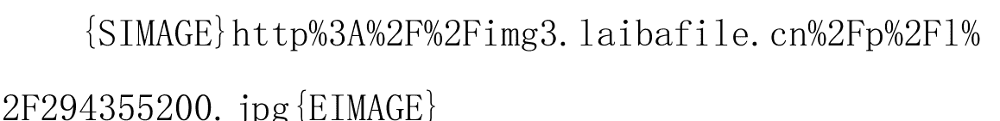
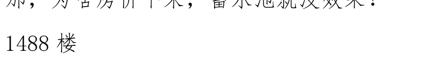

# 放眼2023~2024，慢慢写我的见闻。

我就是 ladisai

先提一个开帖的开端：

- 1. 美元加息，准备缩表。
- 2. 中国 M2 增速 5 月份低于 10%

首先，我不是什么经济大神，我只从单纯的实体人角度看这两件事，所以有和大家看法不一样的地方....只希望大家文明发言。当然，不文明，也不会怎样。

老美的联储，你可以简单形容成一个资金深不见底的大老板。加微信1101284955，获取更多好帖

在市场上不断的买这买那，钱用也用不完。

搞得现在手上一大堆商品（美债、股票什么的）。

将手上的商品卖给大老板的人，手上得了一堆的钱，怎么办？花呗~~

所以股市蹭蹭的涨，经济活动一片大好景象。

在这样的大环境下，得到钱的人，又把得来的钱满世界投资，想要赚更多更多的钱。

而我们，则是满世界投资举动中获益最大的。

得来的钱，又继续的在国内买买买。这里，你也要将盖房子、做基建啥的也当成商品哟！

然后，传导到一般老百姓，则是在这个买买买的过程中获益良多，得到了巨大的金钱。

国家一看，哟！经济这么活络，那钱（RMB）就不够使了，咋办？印呗。

简单理解就好，不用较真。

这样一来，我们的 M2 就增速停不下来，每年 10 几 10 几的往上走。

一回头看，自然就数额巨大。

钱和商品是相对的，商品和钱的比值是 100：100 时，那每一个商品就要对应一元钱。

但钱多了之后，如 150：100 时，每一个商品就会对应 1.5 元加微信1101284955，获取更多好帖。

现在，我们可以粗略的认为，600：200。也就是一个商品对应 3 元钱。

对，商品多了，但钱增加速度更多，所以以商品做基数，钱还是不值钱了。

长此以往下来，市场上的商品虽然增加的速度不小，但是钱增加的速度更快。

因此大家就有了这样一个幻想：就算我不断的增加商品，也跟不上钱增加的速度。

这叫什么？产销两旺。

那商品增加的速度超过了钱的增速叫什么？生产过剩。

之前的时代，是从产销两旺，往生产过剩的局面的一种进程。

只是按照行业别，有的还是产销两旺，有的已经生产过剩。

这个时候是各执一词的时代，有的人说我这行生产过剩了，活不下去了。

有的人说我怎么生产，就是跟不上钱进来的速度，加价都卖不赢。

细化到每一个行业里的实体人，就开始考验你的眼光及判断力了。

进攻型的人，脑子里想的就是扩产，借钱也要扩产！趁乱世将市场份额拿下就赢家通吃。

防守型的人，则是看到情况不对，就缩编、整顿、寻求自身的体质能在风雨中存活下来。

好，回头来看，我说的1和2。

大老板买买买之后，觉得没意思了，告诉大家：老子决定买的越来越少了。

那朝廷看见大老板买得少，甚至不买了，这市场就不需要这么多得钱（RMB）了，所以增速就下降。

好，大趋势如此，那如果商品得增速超过了钱得增速，自然商品得对应价值就会下降。

这样大家能理解了吗？

换句话说：大家勒紧裤带得时候到了。进攻型顺风顺水得时代过去了。这个观念很重要，实体人如果现在还没意识到，那么很抱歉，破产就在眼前。

如果提前意识到并且准备好了，那恭喜你，你有机会成为全能型，攻守自如，迈向百年企业。

放眼 2023~2024，是整个经济活动的重大转折点。

所以我一直强调：钱这种东西是浮动的，你的对手的规模也是浮动的。

不用在意这种浮动的东西，而是要专注于你自身的能力。

眼光和判断力，才是身为一个人的重要价值，而这个价值，加微信1101284955，获取更多好帖 目前见到的 30 年内，还无法被阿尔法狗之类的人工智能取代。

--------------------

一个时代的结束，意味着一个时代的开始。

在此，以一首诗作为结语。

> 黑兔走入青龙穴 欲尽不尽不可说 唯有外边根树上 三十年中子孙结

我想说：人生真的很有趣。

作者:我就是 ladisai 日期:2017-06-16 16:15

刚才，浙江的经理给我打电话，说现在突然间没什么订单了，心里有点慌。

所以正在着急的开发新客户。

这跟实际浙江的销售业绩无关，只是一种心理状态的着急。

因为我们这行，本来就是月中的几天会比较平淡，到了月底，按照采购部的习惯，就会补库存。一路补到月初。

但之所以会让他担任浙江分厂的经理，并且让他持有浙江分厂的一部分股权，就是他这种心态。认真、努力、肯拼。

自己当老板有风险，那么如果有人愿意在背后支持你，教你销售的技巧、让你从一个单纯的实验室工程师变成可以购车、置产的可能性。未尝不是一个好机会。

加微信1101284955，获取更多好帖 我们经理就就是这么选择的，而且靠着他的拼劲，让事业水涨船高。

套一句我们股东说的话：我就是要让厂里面出去的人，过了几年之后回过头来羡慕你们的成就比他们高。

目前，还算是做到了。

毕竟我们有经验，知道遇到客户会发生什么，遇到怎么样的情况该怎么做。系统化的告诉他，并且让他实际去操作和自己去遇到问题。两三年下来，他就成为了一个合格的，心态端正的销售，并且在一个相对稳定的环境下学习成为老板。

他做的很好，我很欣慰。

我一直强调，当老板，业务、厂务、财务缺一不可。
但其实最重要的，就是你怎么成为一个合格的业务，替公司创造销售额。
酒再香，巷子深了也没法。
很多坊间的书，什么教你说话啦，教你策略啦，如何成为一个合格的经理人啦。
厂里面的业务最后看完都是一句：没什么X用
用中国目前争议不断的武术来说，那些都是套路，实际上了擂台，客户不按照你的套路走，就只能回头吹：我上擂台怕用真力打伤打死他。
任何东西都是一样，没有实战，那就是屁。
任何事，不能神化，但也不必菲薄。
回归现实，就是要从实际历练过的角度看事情。
同样是吹牛逼，有的客户喜欢听，有的客户听了无聊，有的客户会被不断的、带有重复性的话语绕晕。
招还是那个招，大家都告诉你那个“招”，但真的告诉你你怎么从吹牛逼的过程判断客户现在的肢体语言表达出的是他喜欢、还是不喜欢的人，我没有见到。
而这才是决定什么时候用什么招的关键。
进攻型的个性没有不对、防守型的个性没有不好。但判断时机的正确与否，才是成功与否的关键。
我们经理已经学会了，所以我很放心，因为不需要再和他针对某个单一客户的情况再做说明提示，也不需要再为了某个大客户，专门要飞过浙江去处理完再飞回来。

所以，轻松。

希望大家都练能到眼力见100段。

作者:我就是 ladisai 日期:2017-06-16 17:31

@superstony2009 2017-06-15 13:22:13

LZ 也研究推背图来着？

---

没研究，只是稍微了解了之后觉得神奇。

周金涛先生研究康波周期，然后可以准确的判断他还在世的时候的中国经济周期，并且以此赢得了不少殊荣。

加微信1101284955，获取更多好帖

这告诉我们，人类的行为经过大量的数据分析之后，是可以提前判断未来的局势可能发展的趋势的。

你按照趋势走，基本不容易走弯路。

现在流行的大数据，也是按照你的消费习惯、浏览习惯，然后据此提供你“可能”想要的东西。

有没有发现淘宝、京东总是会跳出你想看的东西？这也是和康波周期一样的道理。

分析你的行为，然后根据资料来决定我的策略。

所以我说，学会看人、学会看人、学会看人。

算命也是一样，那是一种老祖宗经过大量的统计之后，将人的可能发展情况，以系统的方式整理，并且预测你的可能未来的一种学说。

神神叨叨，子丑寅卯的背后，其实就是统计学。

吹得神乎其神，那是自然，老祖宗是拿这个混饭吃，自然要讲得神奇一点，不然你怎么掏钱？

那么，每个行业都有天才，有没有那种天才是能够常人无法理解，只能够从他得所做所为去反证的？

有，特斯拉。他很多东西，至少在那个年代是死了之后要美国政府赶紧将研究资料收起来的。

达文西，在那个年代他的很多手稿都是不可思议的。

如果类似的那种天才，进入了统计学界，然后发现了常人无法想象的东西呢？

这本书，虽然版本众多，但至少金圣叹的注记版本在台北的故宫。

我们验证清朝之后的事，看看这本书写的对不对，就很有参考价值。

日常的工作压力比山大，宅男一枚的我，不去应酬喝酒放松，多出来的时间也要找点事做。借此来缓解工作的压力。

所以，就稍微的了解一下。

实践出真理，尤其是在这不断发展的历史进程中出现了10 年前可能不会这么判断的情况下，让我们一起期待2023-2024 年吧~

作者:我就是 ladisai 日期:2017-06-21 09:11

> @ugyu76 2017-06-18 09:39:35
楼主，你觉得在今天到 2023 年之间没什么值得期待的事情吗？

当然有很多期待的事会发生。

先谈和一般老百姓没那么直接相关的事

- 1、伟大航、路的开花结果。

会开出什么样的花，结出什么样的果，实在值得期待。

- 2、两库四声。

欸？为什么我要用“园”这个字呢？

再来谈和一般老百姓有比较大相关的事

- 1、二手房

二手房的首付会不会直接往 5 成 6 成 7 成去呢？

- 2、巨大城市化的开花结果。

巨大城市化会开出什么样的花，结出什么样的果呢？

- 3、智能化，自动化的进一步深化。

未来会对我们的生活带来怎样的便利，和对职业需求板块的变动带来怎样的影响呢？

这些大方向的事，最终会带来心理上的影响和生理上的影响。

太值得期待了。

> > 作者:我就是 ladisai 日期:2017-06-21 09:12

更正一下，

是两岸“圆”声。

书读少了不好意思。

> > 作者:我就是 ladisai 日期:2017-06-21 09:15

最近太忙了，压力很大。

人都不对了。

常常没办法好好入睡。

写帖子瞎扯淡的时间也比较少，请大家见谅。

> > 作者:我就是 ladisai 日期:2017-06-22 09:53

> > @苍如风 2017-06-21 10:57:05

楼主对自动控制行业的发展趋势有何看法？有什么建议能给想向这方面发展的我们吗？

--------------------------------------

自动控制行业的发展趋势，就是越来越有发展趋势。

以后人工贵了，不单单是薪水，来，不明白的人请自行到朝廷各机关官网了解下当老板请一个员工除了薪水以外，其他地方还要抽你什么费用。

不管内容复杂与否，只要使用者实际使用是觉得方便，就是有前途的。

科技，因人类偷懒而伟大呀。
科技，因人类偷懒而伟大呀。
科技，因人类偷懒而伟大呀。
所以自动控制行业一定有前景，只要好好做。

作者:我就是 ladisai 日期:2017-06-22 10:41

@nini 广药 2017-06-21 21:05:04

从前一帖子追到这帖子里来，楼主对各种现状的观察、
思考角度及前瞻性，使我们认识到一个老板与打工仔的区别。
现在感觉很多行业都不好做了，前途一片迷茫，一毕业就遇
到这高房价，辛苦工作一年也买不上深圳两平方，多么可悲。

加微信1101284955，获取更多好帖
你好，回了一大段，天涯抽风都吃不。

大几百个字呀.....
不能怪我，请怪天涯。
简单说结果：
不用担心已经发生的事实，要担心的是你有没有累积突破这个事实的能力。
我相信只要你一点一点的累积，慢慢你会发现：你买不起的东西都买得起了。
希望你尽早累积出突破事实的能力。

作者:我就是 ladisai 日期:2017-06-22 11:28

@三罘鷇 2017-06-22 10:58:41

很多人都说 2022 年左右有重大变革（五十年百年一次的那种），天涯的润土好多年前就这么说，可惜阅历太浅实在看不明白

---

不用去太过纠结明白或是不明白，就像我前面提的：那些令人期待的事。

发生了，会如何？不发生，会如何？晚发生，又如何？
我们尽力做好各种准备就行，不用纠结哟。

作者:我就是 ladisai 日期:2017-06-23 16:59

赶工、赶工、赶工，加班、加班、加班。

我们是最讨厌加班和赶工的公司，十余年来尽力的维持员工有基本的休息。

每天除了上班时间，下班时间到也不会要求加班。

只是在这个销售业绩创新高，订单消化不完的时候，只能选择请视为家人的员工帮忙。

还好，他们也能理解当下的情况，并且积极配合。

谢谢大家的帮忙，让我们能在这个不是很稳定的时局继续发挥。

大家辛苦了。

作者:我就是 ladisai 日期:2017-06-23 17:04

@未来指南 2017-06-23 12:04:27

黑兔走入青龙穴 欲尽不尽不可说 唯有外边根树上 三十年中子孙结

---

# 三十年中子孙结

- 重点在“不可说”
- 重点在“不可说”
- 重点在“不可说”
- 重点在“不可说”
- 重点在“不可说”
- 重点在“不可说”

所以，千万不要随意的解读，然后让自己惹上麻烦哟。

我们静静的期待那个时刻的到来即可。

作者:我就是 ladisai 日期:2017-06-24 09:44

@越难越简单 2017-06-23 19:03:57 加微信1101284955 获取更多好帖

今年的形势有点奇怪，接触的项目都特别的赶，5 个月建一个五星级酒店，半年建一个三甲医院，各种怪现象以前经济好的时候反而是没见过的。还连设计带施工。感觉政府在发力，铉绷的太紧了搞不好就绷掉的节奏。这年月就怕遇到瞎指挥的领导 上上下下的都累啊。

## 我们来假设一个情景：

> > A：有件事你自己心里有数就行，多的不要问，我也不会跟你说更多。
>
> B：您肯提点就太好了，您说，我一定照办。

> > A：嗯，不枉我看重你。记住，手上的事，能处理的赶快处理，后面可就没有了，明白吗？
> B：………明白！明白了！

> > 以上只是一种假设，说了，是假设！假设哟！！！！！！

作者:我就是 ladisai  日期:2017-06-26 14:44

前天一个客户被环保的无预警查厂了，
然后昨天镇的就礼拜天跑来复查，
礼拜天耶！！！
他们老总就赶紧的要我今天去一趟，帮他看看这个有什么解决的办法。

没办法，我们在广东一待15年，遇过的事多，见过的事也多。


最重要的，是因为我们比较好使唤。
一去，小年轻副总在，老板娘在，总监在，采购主任也在。
聊着聊着，我就尽力的把我知道的，和比较有利的处理方式告诉了他们。
也慢慢的了解了人家为啥会怼他们厂。

唉……刚刚很自豪的拿到了高新企业的认证，却没有提前把环评做好。
一拖又拖再拖。

> > 借用他们采购主任的话：这就好像一个有着红领巾的三好学生，突然被发现这货天天迟到，人家不来看看这货够不够资格带红领巾怎么行？

太显眼了嘛！

我必须说，开家工厂，环评现在是很重要的。

没有环评公司替你整改，出份报告，现在是没办法整的。

呵呵~他们请的“厂长”也是个人才，首先不赶紧的去确认怎么能够找到环保局认证的公司来处理，居然告诉他们“把不合规定的地方拆掉，立马拆！” 。

事情还能盖的住的时候，这样做也许还有效。不过现在真的晚了。

我很确认我把整个过程都说的异常清楚了，就看他们自己怎么办。

但站在外人的立场，他们最终决定怎么做，那我是没办法干涉的。

会议结束，采购主任送我出厂门，路上我再一次的提点了他们。

环评要做，环评要做，环评要做。

你去年要50万搞定，现在被人抓住痛脚了，估计要80，但是最终不做的话。

封厂、封厂、封厂。

希望他们能够将我没讲出来的话体会出来。

作者:我就是 ladisai 日期:2017-06-26 14:50

当然，最好的解决办法，是先在其他欢迎工业生产的市，另外找个壳，先把有问题的部门先搬过去，不要影响生产。然后，再将厂里面的不合格设备慢慢的整改。最后，要是整改不了（他们举了隔壁厂整改花了280万一样过不去），就可以无痛过渡的搬厂。

找到能帮你整改合格的公司，就平安的耗到风头过去。这也不做那也不做，会出大事的。

脑子一根筋，又不能找到能够处理朝廷辖下衙门的关系的人，一年的利润赔进去都不带响声的。

作者:我就是 ladisai 日期:2017-06-28 13:48

> > @驰骋多空 2017-06-27 23:24:28
> 
> 第 43 象的图，似乎是说二零二零有大事发生。一大一小两个人，也可以理解为一老一少，从而推演出一父一子。重点在子上，代表时间。同时两个人都在走，可以理解为同行或是跟从，跟字引申一下为庚字。联想起来就是--庚子年。

嗯，你说的有其依据，我尊重你说的内容并且表示理解。就让我们期待未来，并预先准备吧。

作者:我就是 ladisai 日期:2017-06-29 11:57

最近因为经济不好的缘故，有些公司想着的是怎么节约经费，创造价值。最简单的方式嘛....就是把空的厂房出租，借以平衡自己的开销。

这个行之有年，但其实是不合法的。

平常没出事，朝廷也懒得管你这么多，毕竟他们自己的事都整不完，这种游走边缘的事还真不是回回都查的出来。

可不巧，一个朋友就这么干了，而且还出事了。

经过是这样的，他空了一个车间，然后就租给了一个同行。

然后，在整改车间的时候，这个同行叫的施工队的人从高出跌下来，摔伤了。

施工队的人跑了，这个叫人来整改的同行也不认了，锅当然就由出租方背了。

首先，违反了三同时：

******************

“三同时”是指凡是我国境内新建、改建、扩建的建设项目（工程）。技术改造项目（工程）及引进的建设项目，其劳动安全卫生设施必须符合国家规定的标准，必须与主体工程同时设计、同时施工、同时投入生产和管理。

******************

再来，这个属于工伤，拿不出证据证明不是朋友叫来的人，所以人家一口咬定，你就百口莫辩。

别说出租了，整个车间被贴了封条。解禁遥遥无期。

而且还要应付受伤的人的 20 万各种赔偿。

**重点提示：搞实业的人，请各种小心，现在和以前不一样了，以前的方式，现在不能故技重施了。**

作者: 我就是 ladis 日期: 2017-06-30 10:48

我曾经说过，特朗普是那种我最不喜欢遇到的谈判对手。因为他太狡猾，而且不会给你回旋的余地。

也就是说，任何的谈判技巧和手段都对他没用，他只冷血的权衡你手上和他手上的筹码。

在筹码比你少的时候，他选择不跟你谈，用尽手段的不跟你谈；在筹码比你多的时候，用尽手段的逼你坐上谈判桌。

最王八蛋的，是他还会权衡双方的筹码后看情况选择是不是要在谈判完成后选择踩你的底线再继续测试。

加v信1101284955，获取更多好帖

如果你遇上这样的谈判对手，千万不要轻易的露出你的弱点，否则会很吃亏。

作者: 我就是 ladis 日期: 2017-06-30 16:12

会说起特朗普，是因为最近我们遇上了这样的一个谈判对手。

硬的绝对不行，软的其实他也是听了听，就当一阵风。

最终他权衡的，还是对他自身是否有利，并且不断的变化他的说法来踩你的底线。

这种人是最难以对付，也最麻烦的。

我们算是简单的了，因为没啥弱点，人家目前也不是针对我们。

其他的人嘛....算是就比较卡了，卡成狗的那种卡。
希望大家一辈子都不要遇到这种以力破巧的谈判对手，会让你以为累积无数经验的人生是假的人生。

作者: 我就是 ladis 日期: 2017-07-03 08:51

早上起来，翻了一下天涯的信息，发现有一样大家不断讨论，并且被找到空子钻的一种本不该成为炒作商品的东西又开始了负面的报道。

> 俗话说：贪心不足蛇吞象。

但，现实是，一条大蟒蛇，是不可能吞下大象的。

所以我一再说，不要去藉由这项本不该炒作的东西来妄想致富，尤其是你根本吞不下去的时候。

那只是必需品，买了就买了，不要总想着靠这发家。

因为大多数人，是没办法靠这个发家的。

要是杠杆搞大了，或是这东西跌价了，那么绝大多数人在物质或精神层面上是承受不住的。

量力而为，量力而为，量力而为。

再强调一次，现在是防守型的时代，不是进攻型的时代。

我虽然觉得最近发生的事都不是好事，但，未来会不断增多直到没人报道。

这是一种必然的无奈，不是你提或是不提就不存在的。

希望大家能够尽快放弃高杠杆的操作，尽快回归本源，储存自己的真实实力。

不要再瞎进攻了。

作者: 我就是 ladis 日期: 2017-07-05 08:28

昨天突然间接到客户的电话，说了一个让我充满问号又无语的事。

我们的同行居然在外面传：那谁的东西其实是我们家代工的。

我了个大去，这天大的屁谎都有不要脸的王八敢瞎扯，真是刷新我对这家公司认知的下限。

你明明就是一个别家公司的合伙人退股不干了之后偷偷的躲起来做的一个作坊，为了抢客户，居然可以教手下的业务员说这种鬼话.....

加v信1101284955 获取更多好帖

我一个02年开的工厂，如果还要靠你一家15年才开始搞的客户代工，那我还不如转行搞别的算了。

那是不是我也可以不要脸面的到外面去说，因为这家新厂，不，新的贸易公司其实产品是我家代工的，而且特别选用特别烂的东西，为了把价格降低抢市场呢？

格调，格调呀!!!!

客户拿了他们的样板试了下，东西完全就是不达标，还敢瞎说，我也真是醉了。

作者: 我就是 ladis 日期: 2017-07-06 09:59

> > @护戒 01 2017-07-05 21:06:45

> 这样写不是免费帮对方打广告了吗

我写的是“某”，如果在没有确切证据情况下，就指名道姓，那是要吃官司的。
所以只能写，也只会写“某”。
这点大家也要注意哟！否则官司吃不完滴。

作者: 我就是 ladis 日期: 2017-07-06 10:24

@苍如风 2017-07-06 08:02:12
楼主，你既然放眼 2013 了，能不能谈下你心里预计的后面这 5 年的社会经济环境。

预计呀... 我只能说现在是防守型企业（个人）的天下。
也就是说，防止突发事件的冲击力越大的，就越能度过后面突发事件可能频传的时代。
请注意，是“可能频传”。
这包括邻居们的不友善，养的狗到处拉屎撒尿，还有自己家里面的大小破事等等。
如果这些突发事件，我们朝廷有能力一一化解，那大家还是该干嘛干嘛。
最多就是面对越来越难挣钱的市场要勒紧裤腰带或寻找新方向罢了。
如果没能力化解，或是部分化解，部分无法化解。这就会对现在的情况有个叠加。

基本上我还是对朝廷化解问题的能力有一定的信心，毕竟越是复杂的情势，相比来说对我们战国时期诸子百家不断淬炼而来的，合纵连横（也就是斗地主绝对不去当地主，宁可留着3个炸也要拿来炸地主的习惯）的能力还是有根底在的。

但，要预测一定会怎样，这个我是真做不到。看看其他大神有什么想法。

我一直能做的，就是将局势划分成上、中、下三种大局，然后再将每一个大局划分三个小局。并且针对每一个小局设定计划而已。

除了本业以外，各种副业的计划与评估也要做，本业如何扩张及投入新技术也要做，当然，撤退的计划也要做。

而且每一种计划，都要依照最新的法规和要求。

所以我说，为什么撤退时会损失至多4成的原因在此，因为最差的撤退方式，就是会损失这么多。

所以，我能给出的最佳应对建议，就是尽量的储存现金。

因为世道如果是好，那你会有钱投资；世道如果不好，你会钱吃饭；世道如果不好了又转好，嘿嘿嘿，你手上的钱就可以买下优质的资产，并期待另一个资产爆发期的来临。

所以，尽量的储存现金，不管未来局势怎么变化，都能保有主动权。

作者: 我就是 ladis 日期: 2017-07-06 18:16

@yzz1658 2017-07-06 17:25:08

楼主，储存现金是rmb吗？据说以后会大通胀呀。

-----------------------------------

据说就是据说，这也就是我不做大神预测的原因。

因为，会，被，打，脸。

未来通胀也好，通缩也好，那都是一个时间节点的某种状态的形容词。

而且，在人类短短的生命里，完整的经济周期会遇上三次以上。

那么，问题来了，我们要探讨（死抓住不放）某一个节点的某一种状态，并且最后成为大神，和其他持相反意见的大神互怼，还是想办法让自己尽可能的在通胀及通缩的经济波动（还有更惨的滞涨）中保存自己的实力，进而让自己在下一次的波动中靠着培养出来的眼光和实力让自己财富进一步的增加呢？

历史是会重复的，虽然不会简单重复，但会重复。

不会简单重复的意思，就是经济的波动周期可能这次是7年，下次是10年，再下次是8年。这个说不准的。

康波周期也是有个范围不是固定死55年一轮回，那么，如果死抓住一点不放，后来呢？

每个人的体量是不同的，有人13年走被笑，那是因为他体量太大，不早点走，后面的变数他的团队计算不到。

那，多冒两年风险的人是不是就走不了了？如果他的体量没那么大，找接盘的人容易，自然可以多冒两年风险。

我们不是那种动不动一个交易就几个亿的人，自然在计算风险和获利机会上的方式和量体大的人不同。

既然不同，我们专注在自己行业上的情况为自己拟定计划就行。

做期货的和做实业的不一样，期货做螺纹钢的和玩黄小玉的也不一样。

更不要说实业上，做衣服鞋子的早搬家了，而做设备的现在搬你在别的地方能找到同样条件吗？

我不是大神，最多就是看看神仙打架，所以没办法告诉你未来什么节点会通胀，什么节点通缩。

我又不靠这混饭，真要出书，也只会把我这十几年的经历拿来告诉年轻刚入行的人业务要怎么跑才不会浪费时间。

所以，我这里没办法告诉你答案，钱是你自己的，思想也是你自己的，选择更是你自己的。

你想十里八乡的借钱买资产，然后赌通胀后稀释债务，我尊重你的意见。

毕竟算命这玩意，即便你会八字紫微，要算准，还得看见这个人，看见这个人的手相、面相、祖坟、阳宅。

只告诉别人你的出生年月日，所谓的命理师，也不过就是告诉你很笼统的东西，再深了，误差就很大了。

> > 你想相信你的据说，没问题。
> 希望有好的结果。
> 至于我说的东西有没有依据？依据就是没依据。

作者: 我就是 ladis 日期: 2017-07-07 09:19

讲一下昨天去客户那边遇到的事。

一个因为订单太多，所以另外成立一个新厂消化订单的公司，前几日打电话给我了。

后来我们的销售和对方新厂的采购价格也报了，接下来就是等订单。

不过，等了一周，屁事都没发生。

我昨天去了附近，然后想起了这件事。

虽然业务回复周六会去和采购见面，但我习惯将人以最大的恶意评估的习惯，使我直接找到了对方的副总。

去了之后，副总也疑惑于为何迟迟没见到我们的消息，就带我去采购部。

这采购也是一绝，完全装不知道，好，我也完全装不知道。

在副总的面前直接和采购要了联络方式，微信、qq 之类的，并且当着副总的面要了他们公司的营业执照复印件。

副总很爽快的给了，最后还亲自送我下楼，感谢我这次的拜访。

那么，整件事就确认了，都是那个采购搞鬼。

我就等等看后面有什么结果，再决定是不是要和副总说：报价早就给你们采购了，可能是采购没汇报吧？

用这个例子，说说阳谋和阴谋的差别。

所谓的阴谋，为什么要阴？要隐晦？因为实力不足，要获得好处，那你就得偷偷的来。

主要就是趁人不备，攻其要害。等到对方察觉，再来一个大惊失色。

这采购，使的就是阴谋。至于为什么要使阴谋...据业务说，之前有人找他报价，要的是同样的东西，然后就是各种下套。他又不是第一天了，自然不会理会。

后来采购就和副总说这业务已经离职了，胆子肥吧？

但阴谋这种东西，简单来说就是一旦被知道了，那么破解它分分钟。

那么，阳谋呢？阳谋简单讲就是以力破巧，不论你招式万千，我一个崩拳就让你飞退三尺，管你什么虚招都是屁。

这也就是在格斗界流传的，同样条件下，体重差超过30公斤那就没什么好打的原因。

因为力量已经远远超过了技巧能够反败为胜的可能。

就像我，明明是这家公司超过5年的供应商，管你采购怎么耍，最终我只要正面攻击，你就是得就范。

那么不管是阳谋，还是阴谋，最终决定该不该使的，都是情报。

也就是“算”

为什么特朗普麻烦？因为他在算计这条路上不但遇的多，而且每次情况都不相同。

每次的破产，就会导致他想尽办法找到再起的机会，然后，他再起了。

他的团队，也都是跟着他一路走过来的人，所以，很难和这种人谈判。

管他出阳谋也好，阴谋也罢，他出招前都算过了，所以最终出手时，不但已经站上了制高点，也已经计算过你会出的招式，并且刻意的露出破绽，导致你的阴谋以为得逞。

你岂又明白，其实他要的其实是后面的全面优势呢？

我依旧觉得，以我们这个战争数千年，什么正计奇技都留下无数记录的国家来说，不会随着人家的阳谋袭来而束手就擒。

一定还有什么法子的，一定，大家要对朝廷有信心。

我们一定能够用最小的损失，妥善的应对特朗普的。

作者: 我就是 ladis 日期: 2017-07-07 09:52

> > @诗和远方 999: 楼主,通缩国家和人民过几年苦日子。通胀可就不一样了,如委内、津巴等国。对吗？

扒开经济学家为了显示自己高大上而作出的一堆理论，

可以这样简单表述：

通胀就是一个欠债的过程，通缩就是一个还债的过程。

欠债嘛，总有一天会还完的。

但如果一路作，作到完全不可能还，怎么办？印呗。

那最终的结果就是拿命来换，人死债去，就是这么个理。

为什么希望大家现在量力而为？因为太多“你再不欠债那你就后悔”的消息了。

奇了，我不欠债还后悔了？

因为你欠债了，把钱转移给他，他就可以拿来还债了。

要做到这一点，就有很多讲究了，简单粗暴的讲究，就是宣传“你现在欠的债未来会让你找到想欠更多债来的人”

加v信1101284955 获取更多好帖

是的，在这种宣传刚开始一路玩到中后期，的确是这样子的。因为大家都认同了“你现在欠的债未来会让你找到想欠更多债来的人”的说法。

那我们就问问自己，现在是中期、后期、还是末期？

因为大家对事物的判断力不同，自然得出不同的答案。

我的建议，就是不要欠债，对了，还有不要借钱。

手头有钱的人，也尽量低调，不要炫富，不要让别人知道。

因为一旦找不到后面来接你的债的人，这个债就是你要还，还不出来咋办？折价卖东西呗。

你有钱，就可以在那个时候用很低的价格买原来很高的

东西。

我们不是津巴布韦的那种小地方，我们疆界广大，沃野万里，自然不会，也没那个胆子玩的那么尽。一旦玩的那么尽，请参考换代史。

作者: 我就是 ladis 日期: 2017-07-07 10:07

> @川 6 不息 2017-07-07 09:46:00

> 楼主对川普王很有兴趣哦。
> 这个业务咋处理的呢。

---

现在就是让销售员去跟进呗，他的客户，我们推一把就行。

加v信1101284955 获取更多好帖

如果采购还不就范，那么我自然就会出手。

希望这位采购不要这么死蠢就好。

我出手，那就是把这点破事总厂分厂同时宣传，他人格破产后还能不能待下去就有意思了。

哦，对了，这采购的底并不是公司的什么亲戚，没有后台的。真要陪他玩，没什么顾忌。

作者: 我就是 ladis 日期: 2017-07-07 10:23

> @川 6 不息 2017-07-07 09:46:00

> 楼主对川普王很有兴趣哦。

---

他是我们未来的谈判对手，当然要对他关注。

由商人而王天下的，我们这个地也只出了吕不韦，而且他还是依附在秦王手下的。

过去棒子出了个李明博，不过那家伙掌控的范围有限，所以没啥好谈的。

但这家伙不同，MB 世界最大贸易集团、军火集团、科技集团的 CEO，他的任务就是让这个集团发财。

这世界讲白了就是一旦有人发财，就会有人出血。

放眼世界，唯一还有血出的，除了我们能站出来喊一声“还有谁！！！”以外，还有谁？

当然要对他有兴趣，他是敌人，明确的敌人。


别以为他想加入伟大航路是我们的胜利，是我们的一条发财路子被盯上了。

TMD 这条发财路子我们就能搞，需要一个自称天使投资人来分钱干嘛？而且他还想分最大的那份。

对这种人，我有一句妈-卖-批不知当不当说。

对于对手我们当然要研究，因为最终大家是不会舞刀弄枪的，谈的，只是怎么分好处而已。

这好处分多了，万一把我们也分进去了，你有地去说吗？

所以这货一定要观察，并且在万一他觉得不够吃而朝廷选择肛我们凑数的时候……。

“喂，老婆，把那些管道打开来，我们要开启损失财产

的模式”

计划了。

作者: 我就是 ladis 日期: 2017-07-07 10:27

> > @世界的体验 2017-07-07 10:05:52
> 现在大部分人对于我党还是有些信心的，认为不会学津巴布韦

--------------------

我也觉得不至于，不过，这不妨碍我准备退路的举动。

作者: 我就是 ladis 日期: 2017-07-07 11:53

刚才在一个大神的帖子上，看见了他在疾呼“收费是为了论坛和楼主好”。

的确，楼主们辛苦的发帖子，如果能够转化成一种收入来源，我想当是吸引更多优秀人才发表言论的好方式。

就像我们给销售提成奖金一样，勇者是需要重赏的。

这十年来，天涯大神不断，如过江之鲫，但往往三两年就消失，所谓何来？

言论嘛，自然有其论述根基，因此，说进人们心坎里后自然就成为大神。

再加上反面论述的人言语空泛，不知所云，或者妄想借东风打开自己的知名度死命的怼。

就可以看到大神帖水涨船高。

天涯的立场也很简单：微-信也收钱，Q-Q也收钱，我提供了如此天地，还要冒着无数风险，干脆也来收钱补贴。

对论坛好，对发帖人也好。

我没有意见，因为大神帖往往可以提供一种参考价值：

看完正论反论后自我沉淀的参考价值。

不过，一旦收钱，那么就要办事，如同我们给业务奖金，

他就要负责增加客户，增加销售额一般。

只希望那些大神能够拿出更高的，有价值的文章，天涯

也能够切实管好那些无处不在的神奇小广告。

如果不能，那么给人收钱却不办事的印象，那往往会得

到严重的负面反馈。

就像我们把业绩不好的业务开除一样。

作者: 我就是 ladis 日期: 2017-07-08 10:17

加v信1101284955，获取更多好帖

昨天中午和朋友在饭桌上聊天，不可避免的会聊到一些

话题。

我们判断朝廷是不是真的有胆量和阿三动手，或者阿三

会不会认怂。

简单，就是在屡劝不听之后会不会在大会结束后，在我

们的地盘上来一场军事演习。

如果这个都没有，那么，大家就可以简单判断应该只会

在双方协商下解决。

而我们吃亏的几率大点。

如果我们军演，对方也军演，那就表示对方真不怕，不

管胜负都要来一场。

如果对方怂了，事情就云淡风轻，回到原点。然后再判断。现在穷嚷嚷，就好像是屁一样。

作者: 我就是 ladis 日期: 2017-07-10 09:42

唉，真的发现自己老了。

一位西安市的客户，找上门来要我们将产品的价格报给他。

按照一般程序，我肯定会要他们公司的地址、电话、传真、电邮神马的。

但，这位年轻人简单一句回复：现在...还有人用传真吗？


真的，老了。

我是因为要你将合同及报价单盖上公章之后回传呐！！！

双方都有个依据，我万一要告....告诉你你做错的时候才有白纸黑字呀岂可修！！！

看在对方是个注册资金5千万的公司，又是PY...不，款到发货交易，所以你身为年轻人的神回复我忍了。

只能再一次的告诉自己，嗯，老了。

作者: 我就是 ladis 日期: 2017-07-10 09:47

曾经说我是宅男一枚，天涯上的一些弟兄有点不敢置信。
那，我就跟大家说一个实证。
俺，是 B 站的会员，而且当初为了加入会员，两个账号
都通过了 B 站的审查。

就是 100 题答对 60（还是 70？）题才认证的那种。
虽然不想发弹幕，只是安静的看视频，但，俺，通，过，
了。
这样够清楚了吧？

作者: 我就是 ladis 日期: 2017-07-10 12:17

@神经病非非非 2017-07-10 12:04:45 加信1101284955 获取更多好帖

哈哈，原来楼主也玩B站啊，简直是追剧的神器，追楼
主的贴子一直追到了现在，特别佩服楼主布局的眼界和判断
事情的能力，希望自己也不断努力学习，能把我的生意做的
更好

-----------------------------------------------

能对你有帮助就行。
希望你生意越做越稳定。

作者: 我就是 ladis 日期: 2017-07-11 09:17

这一阵子看新闻，融创的举措有点奇怪呀.....
在乐视财务危机的时候接盘，然后又在万达卖家产的时The request was rejected because it was considered high risk是不是真的技巧，还是只是瞎扯淡，都还要验证呢！
我们几千年历史，不也曾经发生“黄巾之乱”吗？
“苍天已死，黄天当立”，立了吗？
我们做了基础的准备，保持警戒心就行。
一旦做好了应对计划，我们就应该将这件事抛开，专心过我们的小日子。
而不是一直放在心上，因为，人生病最大的两个来源，一是饮食，一是压力哟！
祝你天天开心过日子。

作者:我就是 ladisai 日期:2017-08-11 16:17

@萌萌哒小猪猪2017 2017-08-11 15:17:12

加v信1101284955 获取更多好帖

楼上，会算命呀，那你可以帮我看八字吗？私信你哦

---

你没有认真的翻我的帖子哟，

之前的楼层，我说了这么一句话，再重复一次：

***

> 毕竟算命这玩意，即便你会八字紫微，要算准，还得看见这个人，看见这个人的手相、面相、祖坟、阳宅。

只告诉别人你的出生年月日，所谓的命理师，也不过就是告诉你很笼统的东西，再深了，误差就很大了。

***

这门统计学，有很大的不确定性在，不是告诉我出生年月日就行了。

我会学这门学问，原本的目的也是为了防止公司的同事在某些状况下会出什么问题，我们可以提前关心他。

或者是销售同事在训练及培养的时候，依照他的情况做比较精准的培训。

人都不一的个性，自然我们在培训的时候要调整我们培训的方式。

如果在综合他的其他情况，我们可以在这个人有什么其他的想法时，提前的下一个套让他进套。

十几年来，我们公司出去两个人跟我们对着干，最后都倒闭收摊作为结局，是不是很有趣呢？

这门统计学，我只是学来辅助的，不会比靠这行吃饭的人强，期待我就是路子找错了。

不说别的，天涯会这门东西的大神就不知道多少了。

我不靠这行吃饭，所以不厉害的。

作者:我就是 ladisai 日期:2017-08-11 16:32

对了，我会这东西，除了两个股东和家里人知道外，厂里面的员工是没人知道的。

偶尔有厂里面的员工在我们股东的要求下（例如小孩出生要命名啥的），我才会帮他们算。

结果也是透过股东们的嘴，说是去请教了某个在厚街镇，湾湾来的师傅算出来的结果。

我，依旧是那个粗鲁、易怒、不修边幅，甚至会让那些有异心的销售觉得这死胖子凭什么占着这个位置的肥宅一枚，什么都不会的。

你们就当听人吹牛逼，不要当真了嘿。

> 作者:我就是 ladisai 日期:2017-08-11 16:36

> @萌萌哒小猪猪 2017 2017-08-11 16:30:41

心安了许多，不管怎么样，生活还要继续。谢谢楼主。

我的话能够对你有所帮助就行，希望你天天开心。

> 作者:我就是 ladisai 日期:2017-08-12 17:03

> @百钱只买三斤米 2017-08-12 16:21:42

加v信1101284955，获取更多好帖

癸卯 甲辰 或许才是黑天，但还不是深夜。。。

这个，我们只要做好准备，并且静静期待就行了。

这个时间段，是我们最接近验证千多年前的人是不是真正的天才。

说不定天才不是天才，那心悬的太高，反而容易落入一场空的下场。

所以，我们做好准备，并且静静期待就行。

> 作者:我就是 ladisai 日期:2017-08-14 08:53

> @ty_追梦人 804 2017-08-13 10:53:33

以前楼主以前最牛逼的贴是哪个？ 去拜读下。

都是废话帖子，哪里会牛逼呢？

你误会了，牛逼的帖子我写不出来的。

作者:我就是 ladisai 日期:2017-08-14 08:54

@Sam_Tseng_ 2017-08-13 11:19:38

楼主可知道广州治疗腰椎间盘突出哪个医院比较合适？

我对这方面没有研究，估计你得到其他的大神那才问的到了。

作者:我就是 ladisai 日期:2017-08-14 11:57

好啦

加v信1101284955，获取更多好帖

老家回来这半个月，都是帮手下销售在处理他们处理不了的客户问题。

什么采购不愿意见面，客户老总没时间约见，还有货款收不回来神马的。

全部都解决了。

告一段落的现在，差不多也到了我亲自出手扩大战场的时候了。

未来一段时间将会很忙，希望能够有更加好的战果。

大家遇到困难，千万不要简单的就放弃，要努力的尝试突破，不然困境永远就是困境了。

# 大家加油!!!

作者:我就是 ladisai 日期:2017-08-15 13:44

> > @护戒 01 2017-08-14 16:51:47

收款这件事，楼主能不能教一下该抱什么态度怎样回款？两个客户拖欠了十万，一年了，对我这小生意来说不是小数目。

我一直教公司销售的，是“态度要柔软，但意志要坚决”。客户拖欠货款，你就是很直接的去要，客户的说词，例如什么没钱啦，等出货了钱进来就给啦，现在货款难收啦，银行锁我们的账户啦，不一而足，但实际的结果就是“老子不愿意给”。

为什么我要说不愿意给，而不是没钱给？因为再怎么没钱，也不可能工厂还在正常运作，真正没钱，那是连工厂都运作不下去了。

那么，你要理解这一点，根据律师告诫过我们的：不可以当面用坚决的言词，说“不给钱就告死你!!”。因为这样对方可以说你恐吓。

你只要善尽你的职责，将催款通知书当面交给客户，并且做好记录，然后请他在某日期限之前给你回应，你什么多的都不用说，除了：请问贵司何时安排货款？然后，是的，对方有很大的机会不给，然后，你就准备好一切的资料，准备向当地的法院起诉他。

人嘛，一旦被起诉，很快的就会和你协商了，至少我们是见得多。

但，要快。

如果对方是已经财务状况危险到死猪不怕滚水烫，那你的钱就算是没了。

所以告官的程序，一定要尽快，要赶在所有其他供应商动手前动手。

记住，他正常付款的时候，你们才是客户与供应商的关系。

一旦他不付钱，你们就是债务人与债权人的关系。

走法律途径是天公地道的。

没告他商业欺诈，就算是给他留面子了。

现在的法制情况，不用来硬的，也不用吓唬他，请法院解决就好。

至少广东和浙江，都行得通。

> > 作者:我就是 ladisai 日期:2017-08-16 08:15

> > @真气贯顶 2017-08-15 20:20:18

> > 黑兔走入青龙穴 欲尽不尽不可说 唯有外边根树上 三十年中子孙结

# 2023 癸卯？

# 2024 甲辰？

# 敏珠到了？

---------------------------------------

不不不，不能再讨论了。

大家期待就行，剩下的就不能再多说了。

> 作者:我就是 ladisai 日期:2017-08-16 08:18

> @softiki 2017-08-15 20:35:47

楼主是我在论坛少有的比较钦佩的几个大神之一，我佩服你是因为你可以在经济环境变得越来越恶劣的时候反而能扩大销售，并且保证利润，这一点在实业企业中来说相当困难，在环境好的时候大家赚钱都很容易，但是在环境不好的时候还能保持一贯的增速，还能保证回款率，就不是一般人能做到的了，必须要有相当的自信和头脑，这点是我需要向你学习的。我在环境不好的时候就想着上岸，啥都不干，等经济变好以后再上，这点和你有很大差......

---------------------------------------

每天活在巨大的压力之下，也不是什么好事。

我不是大神，只是兢兢业业的在控制着事情不要恶化的loser，你千万不要谬赞我。

相比起来，我还比较羡慕你呢。

> 作者:我就是 ladisai 日期:2017-08-16 08:29

@烟花易冷往事如梦 2017-08-15 23:06:37

楼主，私信不能发照片，我发在这里了，对不起，麻烦你了呵

-------------------------------

人生中有不如意的事情，这是必然的。

当初我学习这个，也是想看看是不是真的有什么“规律”的存在。

但，我不是靠这个吃饭的，所以我没办法替你在这方面解答问题。

实在是不好意思，让你失望了。

我真的没办法回答你的情况的。

加v信1101284955，获取更多好帖

再说一次，抱歉。

作者:我就是 ladisai 日期:2017-08-17 08:57

一个行业做久了，就是有好处。

早上一个10年没合作的客户，现在自己打电话来要货。

缘分尽了，就不要强求，等双方缘分又有了（现在的供应商出事），自然又会回头找你。

未来是比你在一个行业待的时间是不是够长，品牌是不是值得人信任的时代。

所以，能够不轻言放弃，坐等其他撑不住的同行倒闭，最终就是你的胜利。

做对的事，坚持，很重要。

作者:我就是 ladisai 日期:2017-08-21 09:17

@半仓 2017 2017-08-18 14:13:39

最近环保要人命。准备关了。

--------------------------------------

环保是真的抓的很严，而且开出来的整改方案，都不是一笔小数目。

如果不是我们老早就做好了环评，估计现在也会受不了。
你辛苦了。

作者:我就是 ladisai 日期:2017-08-21 09:29

@健出一片天地 2017-08-19 09:28:06

楼主你好，我从老贴跟到现在，一说的古代算命统计学东西我也很感兴趣，但不知道从哪看起，主要是想了解这个统计体系应该看些什么书，看书的顺序是什么，看的时候有哪几个重点关键的东西应该特别注意，我看了些这方面的书但是越看越困惑，市场上各是这样的书实在是太多了，难辨真假，谢谢了。另外您能谈谈对周金涛先生康波周期，房地产周期，库存周期这些观点的看法，从周先生的报告和演讲中可以看出他对咱们的古代统计学也是有研究和应用的，这种两种理论之间是否有关系，先在这里谢谢您了，希望您能给我一些指导

--------------------------------------

这个嘛，我的顺序是这样。

首先，黄帝内经，这本东西不是单纯的医书，把它当成医书就有点不完整了。

我们传统的五术（山、医、命、相、卜）是根据老祖宗的阴阳、五行作为根基来发展的。

而坊间许多的书，首先强调的是“用”，也就是技巧。

但，要是不了解技巧的根本，就是阴阳五行的概念，那么自然就不知道那些所谓的技巧的根基在哪里。

而黄帝内经，正好就是让我学习传统阴阳五行理论的最佳入门。

人白天是怎样？晚上是怎样？四季是怎样？每一个季节过度的时候该怎样？


学习了这个基本，后面要看其他的书，就比较容易上手。

十天干和十二地支，本身就是一种表述阴阳五行的记号，所以要看懂，首先要知道什么是阴阳，什么是五行。

供你参考。

作者:我就是 ladisai 日期:2017-08-21 09:31

> > @大道奔流 2017-08-19 14:57:23
> 
> 向尊敬的楼主请教，有八年班主任的经验，收入低，想转行，您怎么看？

你想转什么行呢？

未来是收入不稳的时代，如果班主任的工作虽然收入不高，但是如果空闲时间多，能够拿来自我充实，或是拿来做其他的副业，也不一定就要马上辞职。

转行是自由意志，当然没什么不可以，但，你想转的行，你吃透了吗？

作者:我就是 ladisai 日期:2017-08-21 09:32

@canary35 2017-08-19 17:13:32

到底是文盲，居然有好几处没看明白

-------------------------------------

就是个日常吐槽帖，看不明白也无所谓的。

作者:我就是 ladisai 日期:2017-08-21 10:31

@健出一片天地 2017-08-19 09:28:06

楼上你好，我从老贴跟到现在，说的古代算命统计学东西我也很感兴趣，但不知道从哪看起，主要是想了解这个统计体系应该看些什么书，看书的顺序是什么，看的时候有哪几个重点关键的东西应该特别注意，我看了些这方面的书但是越看越困惑，市场上各是这样的书实在是太多了，难辨真假，谢谢了。另外您能谈谈对周金涛先生康波周期，房地产周期，库存周期这些观点的看法，从周先生的报告和演讲中可以看出他对咱们的古代统计学也是有研究和应用的，这种两种理论之间是否有关系，先在这里谢谢您了，希望您能给我一些指导

-------------------------------------

忘了回复你，对于第二个问题的我的看法。

康波周期，也是康德拉季耶夫对于经济大势以 50~60 年为一个大周期的看法。

我想周先生在研究康波周期之后，会很巧合的发现，按照传统阴阳五行理论，60 年为一个轮回。

自然就会想去研究看看。

这里面有没有相同之处，自然有。

不过，重复的方式，并不会简单重复。所以大势抓准了，后面还要微调。

库存周期，房地产周期，是大局面底下，作为有没有机会发财的一种波段评估。

这种统计学中的各种指数你看得越多，自然掌握的越清楚。

就好比八字理论中，大周期（60 甲子轮回）的固定流年周期下，每十年会更换不同的大运，这不同的大运，会和流年不断的交互作用，接着，再配合着你自己本身的八字，再来做综合的评断。

这种评断的交互作用，还要看你原本出生在哪里？现在住在哪里？从事什么职业？现在的心境怎么样？祖坟的情况好还是不好。

影响的因素太多，但，只要你知道的信息越多，你能够下断语的准确率越高。

周先生的地位，是靠投资报告准确得来的，因此，你也可以说他已经完全摸透中国市场经济的八字了。

你对这个人从头到脚都清楚了，自然就会比那些只知道他是几年几月几日什么时辰出生的人要准确了。

我们判断经济局势，自然也不能单纯的看我们这个行业而已。整体的大环境，国家政策，各地政策传导的强度，其他相关行业的交互影响。

现在 BDI 指数这么高，表示航运的春天已经到来。但韩进死在了黎明前，不是他运气不好，而是他眼光不够高，追高杀底，最终破产收场。

如此大型的企业对于前景的判断尚且如此，我们不过就是小老百姓，自然眼光不够高也是正常的。

各行各业都有这样的人，所以呢，我向来不看成功企业的成功例子，喜欢找失败企业的失败原因。

补不足，才能存有余。否则，就是竹篮打水。

作者:我就是 ladisai 日期:2017-08-21 11:38

> > @儒雅不是我的性格 2017-08-21 10:03:17

一直默默的跟着楼主的贴，希望能得到楼主的指点，现在环保这么严，卖冻品都说冻鸡肉一天两个价，会不会大通胀啊，如果现金在手，现在想买房不敢怕套在高点（也怕房产税），放手上又怕大幅贬值，如果 100 多万现金能如何应变保值。

------------------------------------------

嗯……我只能说说我的意见给你参考，毕竟我不是大神。

买房怕套在高点，我想依照朝廷的路子，房子在一个区间里面，标售价是不会有太大的波动的。

但标售价，和实售价，就想兑换外币的时候，有牌价和黑市一样，说不好的。

市场上的现金的确是在缓步减少的，具体请看每月公布的 M2。

举例，你和人借一笔钱 100 万，约定年息 12%，也就是说，每个月利息 1 万元。

以前你每个月收入是 10000，借钱的今年加薪 15%，也就是说，你每个月薪水会增加 1500 元。

加v信1101284955，获取更多好帖

你在保证每个月还利息的同时，还有 1500 元可以用。

而你每个月的支出，差不多 1200 元，所以够用。

但明年开始，加薪的幅度下降了，你每个月的生活支出增加了。

我们就先不提利息增加的事，光是加薪的幅度下降，生活支出增加，虽然短时间内你还是支应的过来，但时间一长，很有可能你就赤字了。

那么，在你借这 100 万之前，如果你有存下一笔钱，你现在就不用这么着急。

但情况还是不利的。

朝廷总共要支付的利息是多少，我们没数，市场欠下多少债务，我们没数。

我们有数的，只是你还放在银行里面的那笔钱。

那笔钱要怎么用？你可以在现在到处缺钱的时候，用年息20、30、40来赚钱，要承担的，就是别人把你的钱卷了跑路。

你也可以等到市场上的钱越来越少，等别人受不了的时候，再拿来用存款换资产。

你有空可以看一下最近很多伦敦有色金属（铜、锌、镍等）的涨幅，随便都比房子赚钱。

但是投资有风险，亏完分分钟。

加v信1101284955，获取更多好帖

因此，我觉得你可以把钱留着，等待你熟悉的行业，出现问题的时候，拿来购买资产。

做熟，是以后的主旋律。

作者:我就是 ladisai 日期:2017-08-21 16:56

哦？出门一趟，回来的时候居然发现我的帖子置顶了。

日常吐槽帖也能置顶，看来并不是一件好事。

天涯故旧离去的大神们，赶紧的，回来吧。

作者:我就是 ladisai 日期:2017-08-21 17:07

说说一个客户的事，

这个客户在广东西南某市，是一家原本在深圳，后来搬迁到广东北边城市的老板的哥哥。

因为弟弟用我们的产品算稳定，而且生意也越做越大，所以找上我们，要我们供应同样的产品给他。

我带着销售，去到那儿，哇！这车间就是个 90 年代的老破小，而且还是这个破烂工业区有空出车间了，就租下来，所以整个公司车间分散在几个地方。

老板也是拿着 iphone5 的老款，衣服也穿的很一般。这完全就是纯粹的低调广东佬的标准。办公室，也只有两个普通的桌子，1 米 2 那种。后来我们的产品测试了没有问题，这就传了合同过去。

钱，就，打，进，来，了。

一年销售额超过 7 千万，就开个日产的 1.6。但，现金是不缺的，作风是低调的，而且厂里面的人会自动自发的相互协调处理（亲眼见到的）

现在，就是要跟这种低调但是有现金的客户作生意。

> 作者:我就是 ladisai 日期:2017-08-22 11:03

我们附近一家搞家私的工厂，车间变成了空壳子。听厂里面的人说，十几台消防车，搞了几个钟，没搞定。原因居然是因为里面的家私漆是油漆，然后贴了个水性漆的标签。

有点基本消防安全知识的人都知道，你消防车用水是浇不息油的。

但老板不敢讲，所以消防的搞了几个小时的无用功。

最后才调了两台泡沫车，轻松搞定，当然，整个车间到了那个时候也烧了差不多了。

还好没人伤亡，不必上报，最多就是安监局和镇书记针对这个老总，好好的惩治一番。

严格意义上来说，最近一味的查消防，查环保，查安全，也是因为过去太多工厂便宜行事。

能省则省。

几年之前见过那个家私厂的老总，还跟我吹他现在因为成本问题，所以会买一点水漆当门面，绝大多数还是用油漆。

当时那个躲过数次检查的得意，和被老外压缩报价不得不降低成本的无奈，我还记在心头。

我就佩服他的胆子，虽然无奈，但一旦这种事发生，就从老板变破产。

奉劝很多做实业的，一定要把安全生产这一块重视起来，不然出了这种事，人生就全完了。

作者:我就是 ladisai 日期:2017-08-22 11:08

讲点开心的，

昨天下午一个在江西的客户终于同意了报价，并且开始订货。

以他们公司的规模（江西、江苏、四川），全部转单，大概可以增加我们的销售总额的五个点。

今天上午就这个事，还特地交代技术部一定要盯好质量。

# 值得开心，值得开心呀!!

作者:我就是 ladisai 日期:2017-08-22 12:06

> @u_101561491 2017-08-22 11:23:36
> 这个帖子不要置顶最好。其实很多东西不用言明。不然定数就会改变。

-----------------------------------------

定数会不会改变，我觉得倒是还好。
因为我只是单纯的不认为自己的帖子有资格罢了。
我不是什么神人，只是屁民，因此不认为自己说的东西
或是解读就一定就是对的。

因此，对于未来会发生的事，只是抱着期待的心，然后进行评估和拟定计划。

日常吐槽帖，加进了许多不必要的事，会让我觉得困惑。
大家还是把这个帖子当成小说或是瞎扯淡就行了。

作者:我就是 ladisai 日期:2017-08-22 12:53

哇！今天是什么日子？！

一个客户的技术总监中午打电话给我说介绍一家他们的代工厂给我，并且指定了用我们家的产品。

而且还说：

> “吹个小牛，只要我在这家公司，你们家的产品就能一直配合。”
> “你们家产品真的好，就是有点小贵。”
> “但是质量好，我们用起来也比较放心。”

哈哈哈！

今天晚上要请股东们一起饭了。

作者:我就是 ladisai 日期:2017-08-22 13:36

@东关街赵元帅 2017-08-22 13:02:01

楼主操心过度了。

你没有看到马云和刘强东近期发言吗？

他们愿意随时把支付宝，京东捐献党和政府。

我们马上要进入共产主义社会了。

偷着乐吧。

———————————————————————————————

加v信1101284955，获取更多好帖
When that day comes, I ll say goodbye to ya all.

作者:我就是 ladisai 日期:2017-08-23 16:27

我的天呐……真是涨水了，居然整个镇都泡水里了。

作者:我就是 ladisai 日期:2017-08-24 10:36

@向钱方奔跑 2017-08-23 18:30:59

一阴一阳是为道，天之道，损有余而补不足。

一花一叶一世界，新世界，条条大路通罗马。可否帮忙提一横批？

———————————————————————————————

这么高深，我答不出来的喔...

你是单纯的要吟诗作对，还是说要替公司或是某人的名字来做一组对联？

不过不管怎么说，都还是要请常年玩这个的人才有办法。

我最后一次玩这个，是我小舅子结婚的时候替岳父大人题的。

那都已经是10年前的事了，我连内容都忘了，何况，还是岳父大人给我面子才让我做的。并不是说我真的玩这个有什么水平，最多，就是农村里面比较给面子而已。

现在，早就不玩这种文字游戏了。

天涯应该有专门的大神的，我没办法哟。

抱歉。

作者:我就是 ladisai 日期:2017-08-24 11:02

瞎扯淡一下,

男人的文采，其实主要能够发挥的比较好的时候，是追女票的时候。

我当年追我老婆的时候，就比较会去写这玩意。

举例：

- 杨柳摇摆西湖边
- 丽人信步断桥前
- 美景何止镇情塔
- 人道春晓夏荷莲

是的，当年大概是写了这种类型的诗过。

不过，那时间是更久远了，而且，已经是我的极限。

现在，已经退化成大老粗了。

> 作者:我就是 ladisai 日期:2017-08-24 11:17
> 
> 更正一下，
> 
> 第一句是“杨柳轻摆西湖边”，不是摇摆。

> 作者:我就是 ladisai 日期:2017-08-24 11:19
> 
> 对了，我老婆不是浙江人，只是在交往前，正好前后脚去了杭州西湖。
> 
> 后来交往之后才知道居然还有这样一个故事，猿粪，真是没办法说呀。

> 作者:我就是 ladisai 日期:2017-08-24 13:42
> 
> 中午，和浙江经理讨论了浙江客户方面的问题。
> 
> 现在生意都难做，杀价竞争神马的，条件还越来越苛刻。
> 
> 的确，现在就是这样。
> 
> 全国现在关停了这么多的工厂，供给侧改革使得原料价格在没有需求增加的前提下上涨。
> 
> 图个什么？
> 
> 去，杠，杆呀！
> 
> 国企过去有那么多的债务，你没有现金流，债能够平稳的还出来吗？
> 
> 现金流哪里来？和民企相比，多支出了那么多的费用，充分竞争的环境下自然很难抢单子。
> 
> 何况，有些连合法合格的民企，都觉得头痛的小作坊，用尽一切的手段，以低到让人头晕的价格在争夺市场份额。

所以要供给侧改革，把不够资格竞争的供应商，全部关停。

这样，利用低价竞争的对手就少了，价格，就可以在一个相对稳定的利润空间。

欠的债务，那也就容易换，至少，银行也就容易贷款。

这都是环环相扣的，也是我一直对朝廷的管理手段相当高看的原因。

过犹不及，一个政策的实行，自然会“调整”，自然就有些合法合格的企业也暂时关停。

这就是供给侧改革。


我跟经理说，不用担心那个，现在更不应该做降价的事。

要努力去争取那些还愿意使用好产品的公司，共同把利润率稳定在合理的范围。

一旦你降价，没利润了，就会开始想别的办法，就会在下一次的供给侧改革中，失去依据国家政策调整的资本。

所以，一定不要走那条必死无疑的路。

作者:我就是 ladisai 日期:2017-08-24 13:53

> @kiomerob 2017-08-24 13:33:34
> 
> 楼主，现在有个项目。三个人合伙，项目的技术核心是我和的恩师，从成本到市场我们都认为是可以的。
> 
> 项目是做板材，我们的核心是粘合剂，可以完全环保无甲醛无 VOC。成本也非常的低，低到行业的人可能不相信的程度，也就是利润率非常的高。
> 
> 另外一个人出资，团队也是他的。合作有半年了，效率太低了。
> 
> 原因比较多，
> - 1，我个人认为一是出资人没有完整的计划，限定了产品范围，目前还是他之前的哪一块。其实我们能涵盖整个板材行业，这个推动了很多次。没有太多进展。
> - 2，出资人的团队没有专业人才，或者说从加工到财务很混乱。无法完整正常的产品实验。
> - 3，之前找了一个代工的工厂，产品满足我们设计要求了。但是市场推动没人完成，造成三个月的努力无疾而终，代工厂现在有自己做的想法，多次找我出来合作。我回绝因为是和恩师捆在一起，放弃了很多合作了。感觉这样耗着太痛苦。

---------------------------------------------

好，站在我的立场看，你现在的问题，就是业务问题，然后扯动到财务问题。

你们的出资人，个性偏保守，或者说，他不愿意或没资金投入到其他的行业里面。

你的恩师，在个性上也是保守的人。因此，你们三个人都没有销售能力，打不开局面。

至于一些细节，我想你也不会透露，我也有些部分不是很明白，所以没办法给你我比较明确的见解。

如果你觉得可以深聊，愿意把细节告诉我，你可以找找我上个帖子里面我留下的邮箱，把你觉得比较能说的事再说给我听。

要不然，我现在只能判断，你们缺乏销售人才。

而缺乏销售人才，你就算跟别人合作了，一旦你的东西被摸透了，你也没办法替自己创造商机，就只能看着别人发财了。

> > 作者:我就是 ladisai 日期:2017-08-24 16:00
> 
> > @kiomerob 2017-08-24 13:33:34
> 
> 2017 见那个帖子没找到你的邮箱，算是无缘吧
> 
> 整个计划当初是这样的，出资人，老师，另外一个人组建了一个销售公司，负责板材销售。另外那个人和出资人在板材销售这个行业一直做防火板材，他们现在的也是只在这块。市场太有限了。
> 
> 我，老师，出资人组建的是化工公司。前面说的那个代加工的项目，成本 800 不到，销售是不低于 1500 的。没有走下去，然我有种失落的感觉
> 
> 我现在的困境是，太强势介入板材销售公司是不是合适的？虽然说市场我也是有途径的
> 
> 比如现在市场最火的生态板，其实是甲醛释放量在 E0 然后贴三聚氰胺纸的一种板材。量非常大，我们的胶水比最便宜的可以节省成本 500。
> 我的想法是往各个板材里面全面渗透，但是合伙人给我的感觉不紧不慢。

---------------------------

你好，既然你们做的是化工公司，那我觉得你强势介入去卖板材，就有点不适当。

毕竟，低头不见抬头见嘛。

化工公司，本质就是销售你们的产品对吗？那为什么不能卖呢？是因为其他的板材行业账期太长，资金回笼不易导致的吗？

> > 加v信1101284955，获取更多好帖
> 
> 因为这涉及账务和成本核算，细节上不好说。我对你们那一行的了解有限，但家私行业应该量很大，你们的产品可用的范围又广泛，一定有个点是你们的出资人没有说明清楚的。
> 
> 你们的胶水既然能够适用在全部的板材合成里面，你们的出资人也想靠这个赚钱，肯定不会单纯的想着把这个配方捏在手上当宝贝。快速的铺到每一个板材生产公司，占据上游的市场，这才是硬道理。使用你们的胶水，做出来的板子没有甲醛和VOC，这么大的卖点，我想不透。
> 
> 正常来说，你们如果是独有的一种配方，在板材销售那块的成本自然也好控制。
> 
> 我实在不明白，这为什么不愿意卖给同行，因为板材成本你们永远有优势，还能从同行里面赚钱，还能够替同行省成本。而他们省下来的成本，会诱使市场广泛接受这样的产品。而一旦价格战开打，你们和使用你们的产品的同行会快速抢夺那些成本高的同行的市场。一方面增加你们的收益，二方面也会使你们出资人的板材公司在新的价格战中永远拥有成本优势。同样的胶水，你们卖给自己公司100块，肯定卖同行至少150-200嘛！
> 
> 所以我想不透，限制你们的不是业务，那就有比较大的可能是财务。
> 
> 接下来要探讨的就是比较涉及公司深度机密的事，首先是你知不知道你们公司的财务状况，再来是你愿不愿意说。
> 
> 如果你知道，而且你愿意说，你就发邮件到 ladisai@163.com 给我，我帮你看看能不能从财务这块找到问题。

作者:我就是 ladisai 日期:2017-08-24 17:18

> > @q981890922 2017-08-24 16:42:21
> 
> > 楼主有主见，思想，确实美元是否加息，对我们人民币有直接影响，我们得好好管理好自己的资产，做些理财来应对，比如炒外汇，如果美元加息我们就买它涨，赚来的钱可以抵消人民币的贬值，不过活在当下，把握现在的幸福，爷别太悲观了
> 
> 是的，做好准备，好好活着，因应世事的变化，来调整我们的方向。
> 
> 其他的，就不要想太多了。

作者:我就是 ladisai 日期:2017-08-25 08:37

@潜水艇上浮 2017-08-24 23:59:24

形势，形势，新形势！

调整，调整，再调整！

总体来说我是保守且悲观的。还有一个店在亏损，挨学校旁，我在调整商品结构成学生用品为主，小食品为辅的结构。如果这学期还不能扭亏，就得再一次关店了。也就是到年底前就得决定了，如果关这个店，就意味着未来五年只保留最核心的几个店和最核心的几个人，深练内功，等待东山再起吧！

我没什么现金，所以不存在如楼主所说的存钱等着抄底资产。现在只是降库存套现有利息的贷款一步步除平。几张信用卡用起还真是爽，没遭什么利息得笔钱用。

今年物价波动不是一般的大，1-5月复印纸连涨5次，今天又接到一个厂家口头通知，下月可能又要涨且极有可能还缺货，同时另一个厂家已经通知涨价且缺货了。理论上说我以前这么多存货都随物价上涨而保值上涨了，但由于业绩下滑，变现困难呀！

无所谓了，我也想开了，维持存在，招牌不倒就好！

现在除了处理业务上的事，就是看贴子长见识，编编自家公司的管理程序（要有核心技术，要智能化嘛），管管两个儿子，陪陪老婆！你别说，日子过得还蛮充实的哈！

----------------------------------------

# 其实你可以这么理解

一个经济体的变动，是有周期的。

就如同一年有春夏秋冬四季一般，春耕夏耘秋收冬藏。

不管是哪一个季节，我们必要去怨恨为什么季节来了，而是要及时为了季节来临时做好准备。

举例，现在是季节的变换期，也就是说，冬天来了。

北方的冬天可能还不必到，秋冬季节交替的时候就下大雪了。而南方呢？季节都结束了，估计有人还穿着短袖。

所以每个人面临的状况不同，但不论你在哪个地方，相对来说，冬天一定比夏天冷。

冷的时候，就要藏，也就是准备将过去收获的粮食储藏好。

我觉得你现在所做的冬藏的准备，是很好的。

而且，冬藏准备工作做的好的人，必然相比同样情况下都没有准备的人强。

让我们一起加油。

作者:我就是 ladisai 日期:2017-08-25 14:55

# 互联网跟帖评论服务管理规定

## 第一条 为规范互联网跟帖评论服务，维护国家安全和公共利益，保护公民、法人和其他组织的合法权益，根据《中华人民共和国网络安全法》《国务院关于授权国家互联网信息办公室负责互联网信息内容管理工作的通知》，制定本规定。

## 第二条 在中华人民共和国境内提供跟帖评论服务，应当遵守本规定。

本规定所称跟帖评论服务，是指互联网站、应用程序、互动传播平台以及其他具有新闻舆论属性和社会动员功能的传播平台，以发帖、回复、留言、“弹幕”等方式，为用户提供发表文字、符号、表情、图片、音视频等信息的服务。

## 第三条 国家互联网信息办公室负责全国跟帖评论服务的监督管理执法工作。地方互联网信息办公室依据职责负责本行政区域的跟帖评论服务的监督管理执法工作。

各级互联网信息办公室应当建立健全日常检查和定期检查相结合的监督管理制度，依法规范各类传播平台的跟帖评论服务行为。

## 第四条 跟帖评论服务提供者提供互联网新闻信息服务相关的跟帖评论新产品、新应用、新功能的，应当报国家或者省、自治区、直辖市互联网信息办公室进行安全评估。

## 第五条 跟帖评论服务提供者应当严格落实主体责任，依法履行以下义务：

- （一）按照“后台实名、前台自愿”原则，对注册用户进行真实身份信息认证，不得向未认证真实身份信息的用户提供跟帖评论服务。
- （二）建立健全用户信息保护制度，收集、使用用户个人信息应当遵循合法、正当、必要的原则，公开收集、使用规则，明示收集、使用信息的目的、方式和范围，并经被收集者同意。
- （三）对新闻信息提供跟帖评论服务的，应当建立先审后发制度。
- （四）提供“弹幕”方式跟帖评论服务的，应当在同一平台和页面同时提供与之对应的静态版信息内容。
- （五）建立健全跟帖评论审核管理、实时巡查、应急处置等信息安全管理制度，及时发现和处置违法信息，并向有关主管部门报告。
- （六）开发跟帖评论信息安全保护和管理技术，创新跟帖评论管理方式，研发使用反垃圾信息管理系统，提升垃圾信息处置能力；及时发现跟帖评论服务存在的安全缺陷、漏洞等风险，采取补救措施，并向有关主管部门报告。
- （七）配备与服务规模相适应的审核编辑队伍，提高审核编辑人员专业素养。
- （八）配合有关主管部门依法开展监督检查工作，提供必要的技术、资料和数据支持。

## 第六条 跟帖评论服务提供者应当与注册用户签订服务协议，明确跟帖评论的服务与管理细则，履行互联网相关法律法规告知义务，有针对性地开展文明上网教育。

跟帖评论服务使用者应当严格自律，承诺遵守法律法规、尊重公序良俗，不得发布法律法规和国家有关规定禁止的信息内容。

## 第七条 跟帖评论服务提供者及其从业人员不得为谋取不正当利益或基于错误价值取向，采取有选择地删除、推荐跟帖评论等方式干预舆论。

跟帖评论服务提供者和用户不得利用软件、雇佣商业机构及人员等方式散布信息，干扰跟帖评论正常秩序，误导公众舆论。

## 第八条 跟帖评论服务提供者对发布违反法律法规和国家有关规定的信息内容的，应当及时采取警示、拒绝发布、删除信息、限制功能、暂停更新直至关闭账号等措施，并保存相关记录。

## 第九条 跟帖评论服务提供者应当建立用户分级管理制度，对用户的跟帖评论行为开展信用评估，根据信用等级确定服务范围及功能，对严重失信的用户应列入黑名单，停止对列入黑名单的用户提供服务，并禁止其通过重新注册等方式使用跟帖评论服务。

国家和省、自治区、直辖市互联网信息办公室应当建立跟帖评论服务提供者的信用档案和失信黑名单管理制度，并定期对跟帖评论服务提供者进行信用评估。

## 第十条 跟帖评论服务提供者应当建立健全违法信息公众投诉举报制度，设置便捷投诉举报入口，及时受理和处置公众投诉举报。国家和地方互联网信息办公室依据职责，对举报受理落实情况进行监督检查。

## 第十一条 跟帖评论服务提供者信息安全管理责任落实不到位，存在较大安全风险或者发生安全事件的，国家和省、自治区、直辖市互联网信息办公室应当及时约谈；跟帖管理服务提供者应当按照要求采取措施，进行整改，消除隐患。

## 第十二条 互联网跟帖评论服务提供者违反本规定的，由有关部门依照相关法律法规处理。

## 第十三条 本规定自2017年10月1日起施行。

作者:我就是 ladisai 日期:2017-08-25 15:00

好啦，这么一来，我就得将真实资料留在网上了。

那么，依照我的初衷，我是选择留真实资料在网上，还是直接弃坑呢？？？

大家，十月一日之后，可能就见不到我了。

能跟大家度过这么长一段时间是很愉快的事，我很珍惜。

十月一日后，若是有什么相关的问题，欢迎大家写信到我的电子邮箱

```
ladisai@163.com
```

我会继续透过这个邮箱和大家交流的，其他不多说，缘分尽了就尽了，不必觉得可惜。

作者:我就是 ladisai 日期:2017-08-25 17:18

@无聊走走看看 2017-08-25 15:23:59

已经知道你是谁了，你不越界，没人找你麻烦。

------------------------------------------

即使是现在的状态，朝廷要找你，一样能够找得到的。

不过，这则新闻，背后的含义是不止有表面上那么简单的道理的。

这就和供给侧改革了一段时间之后，最终图穷匕见原来是原物料涨价救国企，和去库存一段时间后，开始推租售同权一样。

当下看，都觉得没啥，后面看，才知道原来是大棋的其中一步。

等到后面才知道，已经来不及了。

十一之后，风更紧，天更寒，更加需要整体性的稳固。

才能保证后面的局势能够得到更好的控管。

我在去库存的时候卖掉投资的房子，现在自然要跟随朝廷的脚步，支持朝廷的稳定。

我们，怎么会知道界在哪里呢？

对比李先生和王先生，春江水暖鸭先知呀....

能够和大家聊天很好，但有一点可能性会影响到我后面的应变规划的话，那就很不好了。

反正有什么问题，大家可以写信到我邮箱。
真的登入不进来了，以后这个ID就自然消灭就行。
天下无不散的筵席，何况我又不是大神，不觉得多可惜。

作者:我就是 ladisai 日期:2017-08-26 08:39

@子在川上 2017-08-25 20:20:23

楼主对租售同权怎么看

---

租售同权，同样是一个连环计的其中一计。

作者:我就是 ladisai 日期:2017-08-26 08:49

现在发生的事，我是这么看的，稳，这一个字的重点，就是“得民心者得天下”

加v信1101284955，获取更多好帖

简单来说，让大多数人支持，一个管理层就可以稳如狗。

更厉害的，是稳得老狗看了都要掉头走。

在绝大多数情况下，一个管理层是不可能让所有的人满意。

那么，我就选择让大多数的人满意。

一个公司怎么稳定？财务稳健，月月有薪水发，年年有薪水加，谁会不满意？

其中的重中之重，就是财务稳健。

然后，围绕在财务稳健的前提下，我们完成月月有薪水发，年年有薪水加的目标。

银行现在的财务问题说真的，解决了大半了。

放贷有利息增长，这才是银行稳定的获利来源。

但为什么不放贷？现在还在调整体质。

那银行怎么增加自己的体质稳定？将贷出去的钱回收。

我开帖第一楼就说了，现在老美这个大买主不买了，市场的钱少了。

银行贷款的大头都是借国企钱，像我们这种屁民公司借到的比例几乎算是毛毛雨。

现在国企因为这阵子的供给侧改革，还钱的能力大幅度的增加。

也就是银行慢慢的不但不必借新还旧，甚至能够回收贷款。

好，企业的贷款板块稳了，接下来就是房屋贷款板块。

以现在推出租售同权来说，代表着朝廷已经估摸着差不多那些手上有余钱，能够进来去库存的人都差不多进场了。

现在就是利用租售同权来稳定那些没有钱，但是有未来，有希望的年轻人。

反正那些后期协助消化库存的人，绝大多数是会乖乖还钱的。

别忘了，朝廷是没有个人破产法的。

你别以为房价跌了房子甩给银行完事，你这辈子都会被追债到死。

房产税的出台与实施，必然是朝廷觉得大多数买房子的人能够挖出来的前提。

看到租售同权，表示后面就很快了。

以上的诸多连环计，就是“月月有薪水发”。

那年年有薪水加呢？

带路政策就是年年有薪水加的连环计的其中一计，老客户业绩下降，我开发新客户。

新客户现在可能真没钱，量也少，但，慢慢的，说不定就大起来了。

我又不是现在就要新客户向老客户一样量叫这么大，我要的是新客户的业绩能够补老客户那一块下滑的损失就够了。

景气不好，是个都知道，但我现在布局新客户，小客户，等到他们量大了，老客户也稳定了，请问我整体业绩是降了还是比以前更大了？

所以，我们公司会发狠对付同行的时候，就是抢夺新客户的时候。

因为这不是面子问题，是底子问题。

底子足了，面子自然会有。

所以我们会广为宣传阿三的事，那是因为这事没有占到优势，就是阿三退兵的话，会严重影响到我们抢夺新客户。

特朗普的商人性格，前提还是房地产，我们的性格，则像是开工厂的老板。

各位干过实业的人，必然知道两者之间还是有很大差别的。

既然我们是开工厂的，想的，用的，做的，自然就会有一个套路在。

至少，我是顺着这个思维想，然后拟定应变计划的。错，或者是对，后面自然见分晓。

这是我的日常吐槽帖，我说我想说的，在还能说的前提下。

作者:我就是 ladisai 日期:2017-08-29 19:17

朝天长啸，仗剑行走四方唯我独尊。

福至心灵，驾鹤遨游天际撒手人伦。

谨以此帖，悼念我过世的父亲。

作者:我就是 ladisai 日期:2017-09-18 10:47

I'm so sorry for not answering your questions, but please give more time to calm down.

Thank you guys.

作者:我就是 ladisai 日期:2017-10-06 08:41

自我放逐了这么长的时间，感谢大家还愿意在这个破帖子继续的浪费时间。

我不单是没上天涯，连公司都没进来。

一整个月的时间，公司的同事们也都能体谅，心存感激。

我回到工作岗位了，也决定重新回到天涯。

谢谢大家的支持。

作者:我就是 ladisai 日期:2017-10-06 17:24

> @黄金 vs 股市 2017-10-06 08:44:50

> 神棍贴，别说五年后，明天你都无法预测

----------------------------------------

哦，我不是大神，所以没什么神棍帖之说。

更何况，我更没有预测，我只是对于可能发生的情况做出应变的计划。

我个人是很反对跳大神的，所以你说的“明天都无法预测”我十分同意。

充其量，这帖子可以归纳成三点：

- 一、啊...今天算是吃饱了，明天的饭钱够不够？不够的话要去哪里挣？
- 二、今天我挣饭钱的时候，遇到了什么事。
- 三、明天我想吃更好的饭，该怎么办？

加v信1101284955，获取更多好帖

绝对不是神棍帖哟！要看大神，请出门右转。

作者:我就是 ladisai 日期:2017-10-06 17:27

我刚回来，所以很多工作上的事还没有安排。

现在只是和底下同事聊聊，并且看了一下最近的销售成绩，看看有没有萎缩。

并且规划一下后面要处理的事。

短时间没办法马上和大家聊工作上的东西，请大家给几天时间吧。

作者:我就是 ladisai 日期:2017-10-07 15:29

最近的定向降准，其实是一件非常好的好事。

只要银行贷款给小微企业的金额达标，就可以降低存款准备金。

这对许多的企业来说，可以增加资金的来源。

拿到这笔钱，就可以有更加充足的弹药打仗。

看看连假之后，这项政策能不能对实体经济起到助力吧。

但，千万不要再把钱七转八转又转进房市了，不然，救命钱用完了，可就真的会死人了。

不过，真正体质好的企业，其实并不缺钱。至少我们公司的客户，靠贷款过日子的很少很少。

包括我们自己。

所以我说，这笔钱是救命钱，你企业不好好办，拿到救命钱没有用在正途上，后面要面对的是更加艰难的市场。

说白了，这是最后一次机会了。

好好把握。

作者:我就是 ladisai 日期:2017-10-08 05:44

> > @你能要点碧莲吗 2017-10-07 22:44:43

> 楼主，我问一个问题，实体现在不好做，主要是过剩，其实消费，没减多少！本来就过剩，拿到贷款干啥？利率再低也是有成本的，况且已经过剩了，再加大投入，连本都收不回来！去搞创新？去搞高科技？我认为是搞笑！要不就是靠借贷发工资，维持经营，这不就是僵尸企业吗？这样救，真的好吗？最后啥东西在天朝，目前被人为是只涨不跌的？唯房地产而已！这么多资金，最后大部分，还是进了地产！楼主的愿景是美好的，现实是残酷的！

> ------------------------------

首先你说的对，实体现在真的不好做。

达不到门槛的企业，本来就会被自然淘汰。

门槛是什么？业务、厂务、财务三者平衡加风险控管得宜。

但有没有很可惜就差一口气就过不了关的？当然有。我说过08年金融危机我们就差一点回不过气倒闭，如果不是后来金融宽松，钱好找了，我现在也没机会跟你们瞎扯淡。

这也就是我说：这次是救命钱。

我很反对把能用不能用的钱全扔进房地产，也是自身的例子。

当初我们得到的资金，如果扔进房地产，按照东莞的行情那笔钱大概增值顶天了3倍。

十年增加3倍看起来很多，但扣掉这十年从公司领出来过小日子的，屁都没剩下还要倒亏。

而这十年来，我们的销售额、利润和资产，何止成长3倍？

我们从公司已经拿走过日子的，还不用算进去。

救命，是救“一息尚存”的，僵尸企业，已经变成僵尸了，还有气息吗？

再说了，很多企业其实不是体质不好，是管理者的脑袋僵化了。

仗都不知道该怎么打了，多给你一点兵，最终你也是个“输”字。

我同意你的说法，现在是过剩的时代。

企业要发展，一味的谈创新、谈高科技，是无济于事的。

这个聊起来，就很广了，要系统化的整理，估计是几十上百万字。

加v信1101284955，获取更多好帖

这种繁重的事，交给更伟大的人，我这个辣鸡是办不到滴。

简单总结，我认为这对小微企业是好事，尤其是那些就差一口气的人。

政策嘛...能救一个算一个，自己要讨死，那是活该，怨不了别人。

几位弟兄说的，会不会最终流向房地产？概率大不大？

我认为....哦！说话要小心。

有很多弟兄都是江湖打滚多年的人，肯定知道有些事只能隐晦的提一下，不能说的太明白。

上有政策下有对策又不是今天才发明的词，但这不影响政策本身善意的出发点。

该鼓励点赞的，就要点赞。

期待能够救到真正的未来大企业家，期待。

作者:我就是 ladisai 日期:2017-10-09 08:19

@不服的石头 2017-10-08 23:03:38

楼主，货物运输行业将来有什么机会吗

-----------------------------------------

物流，当然有机会。

大家都不愿意做的事，嫌麻烦的事，你去做，就会有机会。

加v信1101284955 获取更多好帖

大家都想东西自己送上门，那你就做把东西送上门的事，解决别人的麻烦，你就赚钱。

以后物流业只会再大，不会变小。

十年后最多受到影响的，是物流的司机，因为无人驾驶、全自动化。

但物流业，本身是不受影响的。

作者:我就是 ladisai 日期:2017-10-09 09:31

等下要和同事去一个客户那边，这三个月七弯八转的，终于是把里面的水摸清了。

希望等下去了之后会有完美的结果

大家也要加油。

作者:我就是 ladisai 日期:2017-10-10 08:04

今天也是一个和底下同事一起去拜访新客户的行程，原来是一个湾湾的厂，现在则是一个湖南老板吃下了。

最近几年挂着“台”字的旗号的台资厂，结果实际老板是内地人的公司越来越多。

也算是一种有趣的现象吧。

作者:我就是 ladisai 日期:2017-10-11 08:48

> > @你能要点碧莲吗 2017-10-10 19:03:57

> 前几天，跟几个老板吃饭！席间说起来，税务问题，各个都是大骂，其中一个老哥，原话大意:税局跟黑涩会敲诈勒索没有一点区别！税局任务没完成，来找辖区内企业，标准是，财务状况良好的，让多补点税，明确告诉你，今年任务没完成，还差多少，大概几个企业分担，才让你分摊一点，隔壁某某家，生意不如你，但比你家分担还多呢！你赚多少，生意咋样，我们也是门清！不给肯定是不行！因为去年就来了一次，直接就是查账，有问题还要倒查追究，一查就查过往前五年的时间！查出问题，直接就是罚款，求爷爷 奶奶，送钱，好说歹说，不罚了，补补税！其实平时都没少喂它们！后来也跟他说，局里出来查，就是因为税收任务没完成的原因！一桌子几个老板，都是感叹做不下去了！利润看着高，大头都是行贿用了，自己其实落不了多少，现在税又这么重，还很难避！也都有关张的想法！

---

这个嘛。。。

以我们十几年来的情况，找一个有力的，能和税务单位做良好沟通的人全权委托他们公司来做会计帐，协助我们报税，是最简单处理的方式。

> 作者:我就是 ladisai 日期:2017-10-11 08:56

> @你能要点碧莲吗 2017-10-10 19:03:57

---

另外，闲聊一句话，关于生活小事：

我们做父母的，对于还没有工作能力，却每天要吃要喝的啃老一族，是很无奈的。

加v信1101284955 获取更多好帖

尽管我们嘴巴说破，但对于我们心爱的小孩，还是愿意在可能的范围下，给予我们能给予的。

可小朋友们怎么会知道赚钱辛苦呢？

我之前认识一个客户，十年前的事了。

老爸从台湾过来拼搏了十年，叫小孩来接班，结果有一次收款的时候，这位厂二代说：

> “这里太无聊了，所以每个周末我都到澳门去赌博”

他爸最后没办法，就把厂交给了底下的经理承包，回到了台湾去。

既然他们不知道赚钱辛苦，那么，我们该怎么办？

找他的朋友，转告他说：你爸真的没有钱了，再拿，你爸就破产了。

我们讲一万句话，真的不如他朋友的一句。

如果还是听不进去，那我们就提前准备，远走他乡。

留封“老子离开算球，你爱咋就咋滴，你自力更生的时候到了。”即可。

闲聊生活，闲聊生活哟。

作者:我就是 ladisai 日期:2017-10-14 05:52

@言极无信 11 2017-10-13 12:56:51

实业艰难，连贸易也是不妙。大环境压减供给，实际需求明显下滑，但上游价格猛涨，企业应对复杂局面乏力。小环境厂房租金上涨、社保费用上涨，税收坚挺，工人工资水涨船高，企业承担过多社会责任。感觉逐渐出现小微企业倒闭趋势，有点实力民营企业也在收缩，控制成本。再过三、五年能生存下来的民企能有60%? 无他，借楼主帖子随感而发。

60%?

根据统计，创业5年内能活下来的人大概不到5%哟。

其实，真正掌握大数据的，自然是朝廷。

不说别的，光是工商和税务，自然就可以判断出现在的情况是个怎么回事。

要不然，怎么会好好的搞一个什么定向降准？

我之前说过，未来的各行各业都将会“富士康”化，也就是优胜劣汰之后，市场会被少数几家公司掌控。

你没提升，要不了多久，就会出现怪兽级的竞争对手。

而且市场的门槛也会不断的垫高，要想继续赚钱，就更加需要足够的资源。

未来，不是小而精，就是大而广。

而这都要靠不断的钻研或是有巨大的资源。

随便注册一家公司，有点资金，就想赚钱的日子，早就离我们远去了。

作者:我就是 ladisai 日期:2017-10-14 05:57

@feekback 2017-10-13 17:55:08

请教楼上，可否购入黄金/金条以备不时之需。

未来一段情况的不明朗，我的建议就是尽量储存现金和约当现金。

你要买黄金来备“不时之需”，我个人不反对。

重点是：不，要，拿，饭，钱，来，赌。

有多余的闲钱，做综合配置，那你就买。

不要去考虑我买了黄金（白银、钻石、房子、翡翠、艺术品等都是）放着就会涨。

作者:我就是 ladisai 日期:2017-10-14 15:34

@我是一棵静默的树 2017-10-14 11:20:52

# 现在是不是不该买二套房？

如果是为了住得开心，又是自己的余钱，买也不是什么事。

但是投资，真的，没那个必要性，未来房子将会剥夺投资属性。

涨的价格，如果不够你付多出来的税费神马的，又何必把钱投进房子？

不如存定存。

你银行户头有几百万可以全款买房子，不代表未来的局势演变之后还会有其他人有这么多现金去接盘。

仅供参考。

作者:我就是 ladisai 日期:2017-10-14 15:37

> @健出一片天地 2017-10-14 11:53:39

> 谢谢解答，看越南全国是这样，可是您也说了，现在他像 90 年代的深圳，那么未来是非会出现一个像东京，首尔，台北，这样的城市，这三个城市都和越南条件类似，人口密度和土地面积相近，并且有长长的海岸线，越南也在搞改革，并且有体制改革。越南人均 gdp 是首尔的十三分之一，东京的二十分一。

你说的发展潜能不是没有，不过，有一个巨大的风险你没考虑进去。

东南亚排华，他们从骨子里讨厌来抢夺他们财富的华人和当地的华裔。

投资，是个人的选择，但从过去的历史来看，这个风险要考虑进去。

供你参考。

作者:我就是 ladisai 日期:2017-10-16 11:53

明天和同事一起去一趟韶关，顺便看看那边有没有潜在的客户。

早上 6 点半就要出发，预计待个两天左右。

希望有好的结果，加油！

加v信1101284955 获取更多好帖

作者:我就是 ladisai 日期:2017-10-20 09:43

这两天跑了几个地方，进度都还可以。

也和几个老总聊了未来的情况，

生意不好做，都不好做。

但值不值得放弃，倒还不至于。

还有一些奇闻异事，就不能说了，总之，赚钱的方式，不是只有一种。

后面，大家同样关心的，还是环保。

为了留一份青山绿水，暂时的牺牲和痛苦，是必要的。

就像吸毒一时爽，要开始戒就很痛苦一样。

关注环保的同时，很多新的商机也就出现了。

也值得大家好好的来思考哟。

作者:我就是 ladisai 日期:2017-10-20 09:56

@健出一片天地 2017-10-18 12:37:57

各位前辈高人，昨天爬梯出去看到了一条大舌头高谈阔论，内容真是惊世骇俗，听他说话很有水平，可内容太过骇人，晚辈又年少无知，阅历有限，这段内容还有上一次那几段内容难分真假，搞得我现在心神不宁，对未来不知所措，请各位前辈高人指点一二，是真是假，还是真假参半，几分真又来几分假

-----------------------------------------

我看事情是这样看的：

为什么，别人要发表某一个言论？

目的是什么？瞎扯淡？还是对自己有利？还是对某群人有利？

然后从动机，再分析。

最厉害的谎言，是在8分实话里，将2分的谎言凑进去。

而最终下结论时，则是诱导对方自己下结论。

那就变成了对方自己的理念，谎言也就稳如老狗。

再有第三方告诉你事实，那也会被视为谎言。

这就是：用最大的恶意来评估，然后加分加到自己值得信任对方。

你看到的这些文章，因为你选择相信，所以你才会恐慌。


如果你选择分析，你就会把对方说的内容当成一种参考。然后自己尽可能的去从其他的管道，收集更多的资讯，然后再回头检视那些文章的真实性。

我思故我在哟！

> > 作者:我就是 ladisai 日期:2017-10-20 11:39

> > @萌萌哒小猪猪 2017 2017-10-20 11:07:32

> > 楼主睿智，萌新想问最近股市怎么样，快双十一了，股市会有一波拉伸吗？

你好

先说结论

股票我不玩，所以不清楚。

再说闲话

19 大胜利召开，正式普天同庆的时候，你不庆就算了，还搞三搞四，这像话吗？

如果有人在这个时候刻意的要做空，那就是和安定繁荣过不去。

那，会有什么结果呢？

> > 作者:我就是 ladisai 日期:2017-10-21 08:49

> > @nysjqm 2017-10-20 18:27:00

> > 楼主，我一直有个疑惑，能否帮我解答？

> > 这几天开会，新闻媒体都在畅想我们的经济很快就会超过美国。我们凭什么这么乐观呢？用什么来支撑这个梦想呢？肯定不会是房地产、印钞吧。

> > 美国是用科技和军事支撑起来的美元霸权来横行世界，日本、韩国、德国等都是依靠国际贸易赚别国的钱。改革开放以后，我们能够快速发展，归根到底还是在西方主导的全球化背景下，通过外贸赚钱和学技术，才发财的。以后还依靠外贸来超过美国吗？

--------------------------------------------

经济超过美国，是我们一直以来的念想。

WILL BE 嘛，这个很快，在很多时候，是真的很快，10年内，20年内，都是很快。

但我们最重要的是走出自己的路子，创造属于自己的模式。

带路就是我们自己的模式，而这个成了，会是一个很大的改变。

所以我一直很期待，这个带路会带来如何巨大的改变。

你说的对，靠贸易，是不可能超过美国的。

要超越美国，首先要取得“定价权”。

也就是，世界上的大部分商品，除了美元计价，还要有人民币计价。

这个牵扯到的方方面面太多，不是马上就可以成的。

而且这涉及到全世界其他国家的利益，难度比起登月还大。

不乐观的话，事情要推动起来就更难了。

所以，我们应该乐观，也必须乐观。

但，千万不要痴人说梦式的乐观，要实事求是的乐观。

作者:我就是 ladisai  日期:2017-10-21 12:09

@健出一片天地  2017-10-21  10:15:09

楼主能说说我国现在制造业的具体情况吗，电视上吹的让我觉得我们的制造业水平已经超过美德日了，可我看了徐小年的说法是很多企业工业 2.0 的水平都达不到，您能说说我们的中高端制造业水平到底如何，低端的又流失到什么程度，有哪些是真正的优势产业，有哪些有真实力的企业，我水平有限，希望能借助您专业的眼光说说您的观察，如果能提供一个思路就更好了

----------------------------------------------------------------

你好，

工业 4.0 嘛，你简单这么想。

一件工厂，不管生产什么，车间不开灯，里面没有人，只有自动化设备不停的运作。

工程师在办公室盯着屏幕，然后依照联网的信息调整订单。

以这个为标准，自然有很多达不到。

那么，请问有多少老板是因为资金及订单不足，所以没###办法提升呢？

真的提升了，又有多少人会因此回家吃自己呢？

说的人有说的人的立场及目的，就像当初我去参加劳动局举办的安全生产会议的时候，讲师直接一句“没有钱你办什么企业？不要办企业了。”说的很轻巧，但有多少人能够接受呢？现实情况，总是和纸上谈兵的人不一样的。

那么，回头来看，我们中高端制造业的水平如何？提升当中，但那是要靠长时间累积的。我们30年走过人家100年的路，但有些东西，不是你能说缩短就缩短的。

我们连完整的经济周期都还没走完呢！因此，中高端要追上别人那几代人的积累，没有那么容易。

京东方开始生产OLED，并且供货给华为，看起来我们终于摆脱了三星的垄断。

但大家没去思考，OLED的生产线，是中国制造吗？

所以，我们中高端，还有很长的路要走。

至于低端，我说过，以我的客户：机械设备来说，东南亚猴子要追上，还要10年。

因为低端制造业，比的是供应链。

东南亚这一块，面临的问题和我们当年一样。

但，时间并没有站在我们这一边。

供应链，别的国家总有备齐的一天。

所以我们很多衣服鞋子你慢慢的看不到中国制造，反而是东南亚。

因为人家供应链齐了，产业就转移了。

我们将来面临的问题，和现在四小龙面临的问题一样。

工业保不住怎么办？一是内需拉上来，转世界工厂为世界市场。

二是提升自己的制造业，向高端迈进。

但，两条路，都会引发新的问题，这就不是我们小老百姓要操心的。

这个世界是浮动的，产业结构也是浮动的。

所以现下有什么优势？质精量大性价比高是我们的优势。

可是能持续多久？我也没办法说。

因为别的国家未来也会走着我们的路子，想办法赶超我们。

后面，就都是大方略的事，交给朝廷吧！

至于我能看见的，就是机械设备行业，目前还暂时没办法被东南亚取代。

因为供应链的关系。

###@ugyu76 2017-08-30 06:17:35

楼主，昨天看到下面这段话，以你的人生经验有什么看法？

大会前本应稳定为主，而如今却掀起环保风暴，说明更凶悍的大招还在后面，会是什么呢？有一招很确定，就是 "查税+增税"，查税主要针对企业，增税主要针对个人。"非居民金融账户涉税信息尽职调查" 是为了向拥有中国国籍却在海外存有大量资金的个人征税，同时由于调查涉及到所有银行存款达到六百万元以上的高净值客户，因此针对他们开展税务调查也是应有之义。这样一来，未来几年的大动作就一清二楚了，税务调查一定是全方位无死角的，房地产等固定资产、银行存款等流动资产，再加上海外存款，都在被调查统计而后征税的范围之内。企业主要是补罚并举，个人除了补罚之外还要征收新税种比如房地产税遗产税等等。而在中小民企大量关停，各类产品产能下降后，企业成本上涨压力最终还是会传导到消费者身上，通胀来袭，铸币税开征，而利润则主要被国企赚走，去填债务窟窿。今后国企的主要任务就是混改+收购，民企参股，民企破产，都是大势所趋。现在是查环保，牵涉面较小，今后一定是查税务，那才是真正的暴风骤雨。现在是针对私营企业主，今后一定是针对全体中产及以上阶层，房地产税遗产税等税一定会高税率征收，海外资产排查，个人大额资金排查，目的就是应收尽收，而且要补罚并举，只为达到中产及富裕人群为国家（政府+国企）债务买单的最终目标。今年大会之后，一切都会以迅雷不及掩耳之势落实到位，从对这几个商业大佬下重手来看，从不计代价搞环保来看，都可以确定，上层不仅有意图这样做，而且有能力这样做，下面就是政策如疾风骤雨的时段，其力度与速度会令绝大多数人瞠目结舌。2017年年底之前开启全面危机管控已经势在必行，只等大会开完，先前拟定的计划方案就会蜂涌而出，到时回望环保只能算是牛刀小试。还是国企好，终于等来了供给侧...，体制外的屁民就自求多福吧。

本来嘛，这些东西都是“稳”字诀里面的手段。
家里的弟兄要养，本来就要月月有薪水加。
收割的差不多了，就要换别的了。
农村里，加餐的时候，肯定是牛先杀，再来杀猪，再来杀鸡鸭。
只要家里稳了，自然就平安。
那，我们就要问问自己，你是家里人吗？加餐的时候，你是什么呢？
还好，套路虽然隐晦，但是脉络还是可循。
嘿嘿...不然下那么大功夫整退路所谓何来？
怕的就是自己因为要稳大局，而被排除掉呀！

###作者:我就是 ladisai 日期:2017-10-21 16:12

> @ty_王文凯 1 2017-09-01 10:43:40
楼主能不能 讲解一下环保之风下的原材料价格疯涨 我们企业做铜杆 销售没有产生任何变化 但是 资金消耗比原来大很多 去年 100 万三十吨铜 今年 150 万 三十吨铜 按照目前之风是不是应该囤原材料 但是按照你之前美元老大要勒裤腰带过日子 消费应该不行 为什么原材料还是普涨

---

因为我们在供给侧改革。

现在逼死的，就是低价竞争，靠牺牲自己利润而抢夺市场的人。

然后，再就是利用环评卡住，那些没有合格的人。

所以，未来真不能再靠价格活下来，要靠质量活下来。

###作者:我就是 ladisai 日期:2017-10-21 16:14

> @柚子梨花 00 2017-09-01 12:08:05
亲爱的楼主，对于个人投资，对于个人本身的投资，有没有好的推荐，迷茫期的小朋友求教~

---

个人本身的投资，是投资自己吗？

多念点外文书吧。

知识，是除了得阿兹海默症以外，不会遗失的东西。

如果你指的是有钱不知道哪里放...

那我是真没有办法，抱歉。

###作者:我就是 ladisai 日期:2017-10-23 10:01

呵呵，没想到，我居然短短时间，被涯叔吞了两篇回复。

唉！我能理解，我能理解。

现在不是说好的，和说不好的问题。

现在是：最好都不要说，甚至不要推测的问题。

吞回帖，保平安。

但，至少涯叔也要说一声吧。

吞了都不知道啥时候吞的，站在我的立场，不是一件好事。

###作者:我就是 ladisai 日期:2017-10-23 15:31

加v信1101284955，获取更多好帖

对了，各位弟兄们。

不要再问我退路是什么，或是怎么退了。

我不会说，也不能说。

跟我不会在这里告诉大家我的真实行业是什么一样。

说了，会影响现实生活的。

就别再问了。

就像我会从事这个行业一样，巧合罢了。

说了，你们也不一定就能顺着我的行业做。

大家龙有龙路，蛇有蛇路就行了。

不要再问了。

###作者:我就是 ladisai 日期:2017-10-23 17:13

刚才接待了一组新客户，哈哈~

有点规模的公司，来看厂是很正常的。

就怕他们不来，来了，就好说了。

好，来说说关于接待客户的层级，应该注意什么样的话不能说。

首先，如果是老板，记住不要聊公司员工有多辛苦，要聊管理员工有多难，要聊朝廷对我们有多严苛，要聊市场有多艰困。

如果是高管，那就要聊管理员工有多难，市场有多艰困，不要聊老板赚钱有多辛苦。

如果是采购，那就要聊现在市场有多艰困，不要聊老板赚钱难，要聊我们和同行的性价比有多高。

> > 加v信1101284955，获取更多好帖

话题的删选，永远是对方对你是不是有好印象的关键。

然后，再来聊双方的兴趣，双方的老家，双方对某些耸动的新闻的看法。

建立了共同感，自然就很好相处。

再来，细节要注意。

傲气凌人的確是一个套路，但万一对方不吃你这一套，你就会连哪里得罪客户都不知道。

像今天，是一位副总带着采购来。我依照当初去拜访客户的时候所得来的信息，带他到第二个生产车间去的时候，就坐着销售同事的车去。而不是自己开车子去。

如果对方是老板，那自然做法就要调整。所以，同一招，不能使用在不同的人身上。这样会造成对方没有“亲切感”。人不亲，土要亲；土不亲，人要亲。人土都亲，那么人家转单给你的几率就大增。毕竟，到哪里买不是买呢？嗯，以后写书的时候，要把这个写进去。

###作者:我就是 ladisai  日期:2017-10-25 09:18
@a6625454  2017-10-25 05:37:38

楼主，可以说说当今世界哪个国家或地区，没那么仇华（欺华）吗？

_加v信1101284955，获取更多好帖

中国！哈哈~~

为什么仇华？这有很深的历史渊源，真要说起来，太多了。

所以，我们没必要去说。

说了，引来的正反论证也会导致事情没办法收拾。

我们，只说现在存在的事实：大多数的国家和地区，的确对中国人没好感，应该说是有戒心。

怎么解决？

首先，我们国力强了，就可以解决欺善怕恶那些国家和地区的仇华问题。

再来，我们在当地的华侨，要尽可能的努力涉入该国家（地区）的政治圈子，民主选举不就是靠人多吗？我们人那么多，只要选举，何愁不能让我们的人成为当地的政治首脑？

长期的潜移默化之下，这个问题就可以慢慢的转化。时间造成的历史问题，也需要时间来慢慢解决。

我认为这两种路子（强大自己的国力，和增加国外地区的政治影响力），就可以在几个世代后解决问题。

当初我们怎么从黄河河套地区发展的，未来我们就在这个地球发展。

不用 WAR，我们也能成为世界第一。

###作者:我就是 ladisai 日期:2017-10-25 12:26

> @寒门... 2017-10-25 12:21:55
看了今天的七龙。眼镜都摔碎了。

——————————————

神仙打架的事，不用操那么多的心，这样对身体不好。我们把握好自己的身边小事，比起操心那个，要重要的多。

###作者:我就是 ladisai 日期:2017-10-25 13:55

> @七剑是个大五毛 2017-10-25 12:37:26
没立储君，某某之心，昭然若揭！紧随楼主，准备退路 ~~

揭又不是今天才知道，准备，自然也不能事到临头再准备。

不论如何，退路还是要留的。

再闲聊两句。

我们民间都看得见推背图，那么，请问信息管道比我们多得多的人，自然也看得见。

我们有点钱都会希望找个师父帮我们看看风水，查查八字。信息管道比我们多的人，当然也会希望有两个“老师”来指导指导。

再不济一点，或者是不相信别人的，就干脆自己学。

因为我们对未来有期待。

不是一定，而是人同此心，心同此理。

12年开始当总裁，了不起坐10年，到22年交棒。

那么，请问23-24年，如何期待一个新人能够动用全公司的力量，去干掉一个从我们这里叛逃出去的子公司呢？

那么，该怎么样，才有可能，有这个机会呢？

如果稍微找几个子公司来的人聊一聊，套一套话，就会发现一点：他们在3年前也万万没想到如今的子公司会演变至此。

很多荒腔走板的事，它还真的发生了。

你要说为什么？还真没办法回答。

有个子公司来的人私下是这么说的：原来以为生我者猴毁我雕是指马总经理，所以 08 年笃定他会升上来。因为后面很大机会会毁在他手上。

可他只能做到 16 年，和后面的图象凑不上。

正在百思不得其解之际，来了另外一头老鹰。

所以，自然就赌他升上来，而且按照后面的图象，20 年他一样会继续干。

然后，去应后面这个图象。

当然，我没有这位子公司来的人这么迷信，但也觉得有趣。

其实会开启我萌生退路的思想的，就是这位子公司的人，因为他告诉我退路的重要性。

加v信1101284955，获取更多好帖

这就是我一直还是在外面接触客户的原因，你不和别人交流，你就没办法吸收新东西。

再说一次，这就是闲聊，不可以当真。

###作者:我就是 ladisai  日期:2017-10-25 14:06

才和一个新代理商说了一会电话，回复就被吞了。

这吞的速度可真快。

没办法，事情就自己知道就行。

后面的局势，就让我们慢慢看下去吧

涯叔，理解你。

###作者:我就是 ladisai  日期:2017-10-25 14:07

@七剑是个大五毛 2017-10-25 12:37:26

没立储君，某某之心，昭然若揭！紧随楼主，准备退路

~~

-----------------------------

被吞了，唉！早知道就不闲聊了。

###作者:我就是 ladisai 日期:2017-10-25 20:12

嗯，代理商确定把订单下过来了。

被别人低价抢走的客户，没想到对方换老板了。而这个老板居然想多赚一手，所以找了他的另外一家公司来和我们谈代理。

这家公司是做切削液的，除了自己的这家机械厂，还有不少客户。

> 加v信1101284955，获取更多好帖

人是爽快，下订单后钱直接打过来，就是遇上了老手，在价格推拉上有点吃力。

最终，为了一口气（不让这个客户再捏在使用低价抢单的供应商手上），便宜点就便宜点呗。

偶尔为了这种事，也是要怒一下的。

没利润，至少保住了本钱，而且让对手少吃一口饭。

怼就怼，谁怕谁呀！

###作者:我就是 ladisai 日期:2017-10-25 20:14

@ugyu76 2017-10-25 20:01:43

瞎扯要少，退路要早，中午看完7个大爷，我就心中了了...

--------------------------------------------------

我被吞的闲聊内容，就提到了这些事背后的东西。
然后就被吞了，10分钟就....
所以，我这帖子，还是快点从置顶下架吧。
我都写的很隐晦了。

###作者:我就是 ladisai 日期:2017-10-25 21:00

@espn16500 2017-10-25 20:48:16

推背图

雕

毛子不是双头鹰吗？

这个雕应该不是弯弯

--------------------------------------------------

都被吞了，就不要再说了。
俺可是本分人来着，嘿嘿......

###作者:我就是 ladisai 日期:2017-10-26 08:53

说到昨天和代理商的对话，其实是从前天开始的。
前天经理跑来跟我说，有个代理商要来，老板S总不来，先派他们公司的经理来。
我们这经理，就是之前提过的，一开始做业务，一天打200通电话的人。
也算是老经验了，所以对他说的话，我也没有多做什么提防。
我错了。
这个代理商来了之后，两个人，一开始主讲时，是一个圆脸的人来谈。
笑脸迎人，对我的说法也是听的津津有味。
后来，圆脸的人听了很好之后，跟他一起来的，一位很瘦的人开始递烟。
整个开场介绍后，瘦的那个人开始说话：
“那价格是多少？”
“这个产品是 XXX，那个产品是 XXX”经理说完，我还觉得，嗯，有点低呀。
尽管是代理商，给出这个价格，也直接就没什么空间了。
“我来之前，也去了很多供应商那里了。”瘦的人说话，慢慢就觉得不对了。“你们的东西虽然是比别人的好，但是价格才是重点。”
“照你的价格，和别人的价格比，我们没有什么空间操作。”瘦的人开始主导整个谈判，而且那个风格，和我利用另外一个身份套别人价格的方式相同。“我知道你们原来的报价，也知道现在我们客户的报价，这样一比较，我们就没有更换的必要。”
我 X 你 mmp，中计了。
然后就是一阵沉默，我的风格，是不会在对手站上优势的时候，还意图在客户的心里，妄想靠话术扳回一城的。

因为看着他的谈话，我知道挽回颓势来不及了。

所以我选择沉默，并且表现出准备中止价格谈判的举措。

“我也知道 X 总说的，材料是没有偷工减料，而且其他的供应商，价格在低的同时，也同时把售后服务给省了。”

瘦的人知道可能谈判破裂，开始缓颊。但因为这个缓颊，我就知道真的遇上高手了。“价格我只希望能够在这个基础上降一点，让我们能做。”

然后，我又 5 分钟的沉默。

“今天拿的货，我直接付款。”瘦的人一表态，圆脸的人马上掏钱。“未来的订单，我们会先付钱，然后你们再发货。我们有诚意，希望的就是我们有空间。你们少担了被压款的风险，我们有利润的空间。”

好，缓颊了。表示还可以推拉一下。

“那这样，这个产品，我可以降给你，但是另外这个产品，就真的没办法。”在报价单上改动价格后，我直接拿给瘦的人看。“我相信大家要的是长期稳定的合作，而不是我们受不了价格而改动我们的产品品质。”

瘦子也知道差不多了，因为我的态度表明了，再压价，我就准备谈判破裂了。

沉默，有时候比话痨要能表达更多东西。

以上，就是前天第一次谈判的结果。算是接触的前半部，

至于昨天从早到晚的过程，下次再说。

###> 作者:我就是 ladisai 日期:2017-10-26 16:44
> @别崩着我 2017-10-26 16:21:46
楼主可以说一下外汇吗？

----------------------------------------------

外汇？我是个做内销实业的，所以外汇不懂。

你想知道的，如果是人民币对美元会不会涨还是跌，天涯大神多，他们回答的足够了。

我说了，不是变美分就是变5毛，没意思的。

我可是没办法帮到你的，抱歉哟！

###> 作者:我就是 ladisai 日期:2017-11-06 16:58
> @余ysy 2017-11-05 23:39:00
我不知道我的退路在哪

----------------------------------------------

这很正常，我也是花了很长时间，才拟妥了退路。

很多事，也不用去想怎么办，只要慢慢的做就行。

例如，假设一个月有 5000 薪水，要花 4800.

首先就是让自己开始做流水账。

看看自己的 4800 是花在哪里。

知道了自己是怎么花钱的，然后再思考：我能不能在某项支出上节约一点？

首先有了缩减开支，调整花费的想法，并且加以实行，

才能有足够的钱谈退路。

月光，要嘛就是花钱太凶，要嘛就是赚的不够。

赚的不够，就要想办法找薪水更高的工作。

但，如果花钱的方式不能调整，那么即便你薪水增加一倍，你也一样能把钱全部扳死。

大富由天，小富由俭。这个，是千古不变的道理。

我们可以从第一步：了解自己花多少钱，并且花去哪里开始做起。

千万不要说：等我薪水多少多少再记账。如果保持这样的想法，那就不用想了。

从第一步开始做起吧。

###作者: 我就是 ladisai 日期: 2017-11-07 09:22

@萌萌哒小猪猪 2017 2017-11-06 18:53:42

楼主说的有道理唉，可是双十一想剁手唉，咋办

---

哈哈哈~从02年开始，我也一直在虎门的电子城一楼的手机铺子买买买。

大概三个月到半年，就会以“这手机不是我心目中理想的手机”为理由，不断的购置新的手机，然后把旧的手机当垃圾丢了。

剁手嘛...谁不想剁呢？

买了笔记本，就觉得不好携带，所以买了个平板。手机稍微掉漆了，就觉得实在是难看买个新的。屏幕觉得太小了，就再买一个大的屏幕，买个转接头接上。觉得公司有一台电脑了，就家里再买一个打游戏。

谁不想剁呢？

不说别的，光是 HDMI 转屏幕的转接头，我就有 micro 的，迷你的，和原尺寸的。

移动硬盘神马的，更是买买买。

说多了，抱歉。

我要说的是：剁手和存钱，是可以取得平衡点的。

谁都知道电子产品更新换代快，所以，我们可以试着把换代的速度，从每一代都跟，到隔代跟，到隔两代跟。

加v信1101284955，获取更多好帖

记账是第一步，然后，接着就是做预算。

我一个月的薪水这么多，吃饭要用多少？住宿要用多少？路费用多少？

- 一项一项列出来之后，就知道怎么分配预算
- 会分配之后，就知道哪里可以调整预算
- 学会调整预算，那么，你就知道你可以花多少钱
- 也就知道买好东西要存多久

另外，好东西真的用起来时间长。

60 块一个的车充，就是比 15 块一个的耐用。

长期成本要记得算。

不是不能剁，要先知道能剁多少哟The request was rejected because it was considered high risk就给我有多远滚多远”这样的事我是不会说的。

我在这里分享的，是我过去以来对于某些事的看法，和形成这些看法的原因。

越是自信的认死理，越容易让自己陷入误区。

存疑、探究、分析、应对。

是我做事的准则。

和你分享。

作者:我就是 ladisai  日期:2017-11-25 15:07

最近两天，去了一家股票上市企业的子公司（被全额收购）。

采购经理人不错，看事情有自己的观点，而且也很热情的要我去他们的车间走走。加v信1101284955，获取更多好帖

在过程中，大概的跟他说了目前他们产品面临到的现况，他也相当的同意。

但是，必须要先到我们这里验厂之后，才能让我们测试样品。

这个我是欢迎的，没有比较，就没有信心。

不过我下周开始忒忙，因为股东们要出国玩去。

本人这个宅男，还是喜欢在家拼“吃鸡”。

会玩吃鸡，也是因为B站 up 主收了广告费推荐的。

吃鸡游戏，尤其是手游，操作的问题，导致枪法大家都不准，拼的就是谁能在最短时间内发现对手，并且从对手意想不到的角度开枪。

还要耐得住寂寞，躲在被人发现不到的地方当只乌龟缩着。

只是运气太不好了，有5次都拿到第二，一次都吃不成鸡。

看来还需要加油啊。

言归正传，大家年底到了，做实体的要多花心思收钱，今年收钱力道加大了，但效果增加有限。

明年会更难收钱呢！

作者:我就是 ladisai 日期:2017-11-28 14:46

哦，又一位天涯的大神宣布离开了。

且不论大神的观点是否正确，但恰巧在首都开始做“整理”的时候离开，总有让人不胜唏嘘之感。

我以前说过，稳，是朝廷的主要目标。

首都这些人在“稳”的过程中，以最简单粗暴的方式被整理了，可见得从朝廷的眼光中，他们不属于需要“稳”的范围。

这些人也许不会回到老家，而是往南方继续寻找生计。

但，从广州也开始准备“整理”的当下，难保未来各大城市不会也使用同样的招式。

那，他们该去哪里？

另外，再次重复我之前说的观点：不咸不淡的言论，会吸引不了眼球，不吸引眼球，就会使越来越多的人选择离开。

天涯，这是慢性的锁脖子呀，你们自己也要多加警惕。

未来，将比你们想象的有更多的“意外”。

大家，好自为之。

作者:我就是 ladisai 日期:2017-12-02 10:59

好耶!!!!昨天终于成功吃鸡了!!!!而且连续吃了3次!!!

辛苦的努力，总算是有回报了。

讲道理，我不算是个聪明的人，但是我够努力呀。

开三个账号，两个上了黄金，一个甚至上了铂金，才终于掌握到这个游戏的诀窍。

所以，趁这个机会告诉大家，虽然常常失败，但只要够努力，总是会有回报的，在后面的某个时间段。

所以，大家也要多多累积哟!!!


作者:我就是 ladisai 日期:2017-12-04 14:19

> @萌萌哒小猪猪 2017 2017-12-02 15:02:36
楼主，你也炒黄金？

我绝对不炒作任何东西，
所以你千万不要误会了。

作者:我就是 ladisai 日期:2017-12-04 17:05

我之前说，特朗普是个最不喜欢在谈判桌上对付的那种商人。

唉！这种人很可怕的，你以为一时半会的压制住他了，却不知道在你压制他的过程中，他已经从那些手段上摸估清楚了你究竟有多少实力，并且暗中不着痕迹的在一点一点的准备着对付你的招式。

如果你后面还有招，那么就还能够压制他，但是如果你没招了，你就准备接受他的反击。

别小看他现在“税”+“改”通过的意义，那很可怕的。

一个地产商老板，准备开工厂了。

尽管他一开始还不熟悉，但如果放着不管，让他一直学习，一直找问题，找解决方案。那后果不是闹着玩的。

前面这种基础的整改，他破产多次，早就比较熟练。等他这几年把整改搞好了，后面要是老美选了一个会搞工厂的人来接手他的工作....

作者:我就是 ladisai 日期:2017-12-05 14:12

> > @ugyu76 2017-12-04 18:14:53
> 
> 一个地产商老板，准备开工厂了。什么意思？？
> 
> 那位是以地产起家，擅长的是酒店、商住等行业。
> 所以对外宣传时是他的强项，推特放话，就是一种宣传，既便宜又有效。
> 而我们，比较接近工厂、实业、制造商。

所以对内团结取得共识是我们的强项，不过对外，就容易显得口拙。

冲突的根源，其实就是人家准备开工厂了。

这样你的明白？

作者:我就是 ladisai 日期:2017-12-05 14:17

@你能要点碧莲吗 2017-12-04 18:31:11

中国人啥时候都迷信个人，崇拜个人？至少不去盲目崇拜，迷信呢？

--------------------------------

羊群效应呗，

这个其实当年德国某人就玩的溜，

加上我们几千年来都是宣扬“圣君，天子”。

所以这个心态要调整，是要时间的。

一口吃不成胖子，

200 斤要明天就瘦到 140 斤，那也是不可能的。

古代那些错误的观念，得慢慢来改正的。

至于“大神”，那就是一个名词，形容：能够吸引眼球，写出许多人追捧的文字的“笔者”而已。

希望你不要太介意嘿~

作者:我就是 ladisai 日期:2017-12-05 14:19

@独钓一江秋 2015 2017-12-04 20:09:28

一切才刚刚开始，能挺过 2020 年？

这一轮美元升值周期还剩3年，预期美元还有7次加息：2017年12月1次，2018年3次，2019年2次，2020年1次。加息是导弹，缩表加减税是核弹。2018年才会开启美元指数主升浪，从美元指数年线趋势来看：高点会在105点左右。美元再加息一次，中美货币利差将不复存在，为遏制资金外逃人民币必被动跟进加息，加息将刺破中国经济泡沫。中国应对策略也就仅剩下管制加死挺、以拖待变至美元加息周期结束......

-----------------------------

你写的很有论点，也有你个人的预测，希望你多说说，让大家有多思考的空间。

有沟通，只有交流，才会碰撞出思想的火花哟！加v信1101284955，获取更多好帖

作者:我就是 ladisai 日期:2017-12-06 09:00

@u_113768285 2017-12-06 06:49:53

楼主房价会降吗？

------------------------------

哦，我不是大神，所以没办法跳给你看。

我再重申一次，我认为现在的房子是你有余钱，足够负担的前提下再买，和你买一块18K金带全表面满天星钻石的自动上链机芯表一样，是为了自我满足而买。

自己住了爽就好，不用在意赚赔的前提下再买。

如果我只能负担G-shock，却执意要四处借钱买Rolex，

那就没意思了，说不定还会被别人说是假货，或打肿脸充胖子，何必呢？

我到现在都还是戴着12年前买的表，和我的身份也相符，我想这样就够了。

不要想靠奢侈品赚钱，这就是我的观点。

作者:我就是 ladisai 日期:2017-12-06 10:01

> > @mrlishi600A 2017-12-06 09:39:32

楼主大神，对实业看的准啊，坐看减税政策对我国的影响

在商场上混久了，其实就是大概的情况说一说而已。是呀，这个世界是一个整体，地球村的概念。别家的做法，最终还是会影响到我们家。就看后续怎么演变了。

作者:我就是 ladisai 日期:2017-12-06 11:33

> > @你能要点碧莲吗 2017-12-06 10:22:10

楼主，回复我的内容，啥说了？被秒删

删了就表示不能说呗，既然是不能说，我们就当事情没发生过吧～

作者:我就是 ladisai 日期:2017-12-07 15:34

明天又要去忙告官的事了，烦死了。

作者:我就是 ladisai 日期:2017-12-08 16:59
搞了一天，终于搞定了。
法院已经收件，一月就立案。
现在法院真心人太多，案件也是堆得老高。
大家看来真的没什么流动资金呐。
所以，别听人吹自己资产多少，公司多大，车多好。
你银行现金能拿多少出来解决事情呢？？？
没有？那账面上的资产数字都是假的。

作者:我就是 ladisai 日期:2017-12-09 09:04
@渊墨晨 2017-12-08 19:23:49
楼主您好！我今年才毕业，找的工作也是日常审材料，没什么技术也不需要什么经验积累，想重新找个销售的工作，请问一下年前现在辞职好还是年后辞职好，做什么什么类的销售将来前景会好一些，麻烦楼主指点一下，非常感谢

什么类的销售前景好？嗯....
我们公司的销售人员存活下来，坚持到现在的，大概只有3成。
所以你问我什么类型的东西好卖，没有什么“好卖”的。
就跟“现在什么生意好做”是一个道理。
只能说，你掌握了销售这么技术之后，什么东西都能卖。
如果你想找个销售的工作，我建议你年后再考虑。

因为年底到了，现在要找新客户的机会会小一点。

作者:我就是 ladisai 日期:2017-12-14 16:39

> > @cbxxpjj 2017-12-14 10:55:08
> 流动紧张，企业的真实情况。

是的，大家都心思贼的很，想把钱留下，债赖掉。

作者:我就是 ladisai 日期:2017-12-14 16:40

> > @feekback 2017-12-14 10:58:55
> 货款难收，材料价格上涨厉害，这个冬天有点冷。明年的日子貌似更不好过。

是的，我现在完全没有办法看好明年的业绩目标。同比今年不要下降超过5个点，就是明年的胜利。

作者:我就是 ladisai 日期:2017-12-14 16:45
现在法院已经积压案件到吓死人的程度了。不过，也不是说现在没办法告官，会先由调解员负责通知原告被告调解，不来才会下一步。通常，大家收到法院电话之后，就会老实了。也愿意乖乖跟你协商，协商不成，就强制执行，再不要脸的人，收到准备强制执行通知的电话，也会乖乖拿钱出来了。

至少，目前最近的两个案子，都是这样子。

鱼死网破，对大家都没意思。

但，大家还是要抓个提前量。

千万不要等到对方宣布破产，那样子后面你就很被动了。

大家要做好：觉得不对劲就先告再说的心理准备。

先告的人，先保证你的权益。

晚去的，就没份了。

作者:我就是 ladisai 日期:2017-12-16 09:28

@u_113768285 2017-12-15 11:54:23

楼主美国加息对别国房地产有影响吗？

当然有，具体影响多大，那就要看朝廷的控制能力。

对于控制能力，我并不是褒义词。

作者:我就是 ladisai 日期:2017-12-16 09:29

@cbxxpjj 2017-12-15 21:13:33

看来加息的脚步快了。

————————————————————————

大家都加了的话，我们最多就是晚点加，不加是很难的。

最多就是拖，能拖多久是多久。

作者:我就是 ladisai 日期:2017-12-16 13:29

年底到了，各个做实业的弟兄千万多注意。

很多部门最近又开始动起来了，所以平常该注意的就要多注意。
免得没赚到什么钱，又要破财消灾。

作者:我就是 ladisai 日期:2017-12-20 09:03

一个新的客户，终于稳定下来了。
值得高兴一下。
对方老总也愿意为了质量，在我们的建议下购置新的设备，以期达到增加产能，缩短生产时间的目的。
是个年轻有为的实业人呐！
光是重新调整厂房空间，添购设备，还有重新刷地坪漆，估计就要小几百万。
和他们的工程师聊天的时候，他们对于公司明年的订单及行业前景，也是相当的看好。
他们这个行业可是做穿了的，在这情况下还能保持这样的态势，值得嘉许。
加油！

作者:我就是 ladisai 日期:2017-12-20 09:07

还有，一个接近广西那边的客户，新的厂区落成典礼要我一定要去参加。
反正酒店、花篮、横幅什么的都准备好了，就是人去贺一贺，也不是什么坏事。
从订单量来看，确实也是不断增长。

市场就是这样，不会全部没有订单，重点看你怎么活。能够活下来的，必然都是在市场上的尖子。尖子的日子，则是越来越好。希望大家也一起加油！

作者:我就是 ladisai 日期:2017-12-21 13:58

三天前一通电话说今天消防演练，大家火急火燎的检查、测试。

然后，就没有然后了。

看起来朝廷现在还是比较忙呀，事情一多，就顾不上去处理小厂的事了。

反正准备好了，随时来突击检查，也是不怕的。

加v信1101284955 获取更多好帖

作者:我就是 ladisai 日期:2017-12-22 08:57

> @u_113768285 2017-12-21 22:05:52

> 楼主现在天涯的大神们怎么都走了，是被打脸了吗？

当来则来，当去则去。

有的认为现在的局势已经无话可说，有的可能像你说的被打脸。

但，以我混天涯的经验看来，这十年来大神走走现现，也不是什么特别的事。

铁打的天涯，流水的大神。

只要天涯还在，大神就会一直出现。

希望天涯能够稳定的维持下去。

作者:我就是 ladisai 日期:2017-12-25 08:53

@ggb_1984 2017-12-22 09:52:19

关键现在天涯限制太多，好多大神弄一大段就被删，积极性搞没了

------------------------------------------

很多东西，涉及的层面太复杂，所以没办法显现。如果不先处理，后面很有可能会危及天涯自己。积极性之外，还有更高层面的考量。理解一下吧，毕竟我们现实生活中也是有很多不能说的。

作者:我就是 ladisai 日期:2017-12-25 08:59

@秋日芦荻 2017-12-23 08:10:46

对形势无话可说是国家对目前的国内外形势没有应对的积极措施，走一步算一步、能拖则拖吗？

------------------------------------------

我说有些大神们对形势无话可说的意思是：本大神都猜中了，没什么好再说的。有些事在还没发生前说说可以，发生了之后再说三道四，可就不是那么容易的了。而且，以这些大神们的能力，都能提前预测了，自然也会准备相应的措施。但，如果大家都知道这些措施了，那并不是好事。

谁也不想自己的退路被断了。
而且本就发自善心提醒，说实话和天涯的其他“ID”也非亲非故，
正儿八经的措施不会公然拿出来讲的。
我这段时间也给了一些建议，但不会在公开的场合说。
涉及私隐，和重大利益，还是要小心点好。

作者:我就是 ladisai 日期:2017-12-25 09:04

@琛哲_J 2017-12-23 21:04:40

还没写完就给上传了,,, 总 感觉天涯有BUG,, 每次上来要不注册名错误要不密码错误,,, 嘞啦个熊的。
兴趣索然。

加v信1101284955 获取更多好帖

但给楼主个赞是必须的，楼主非经济科班出身却能如此把握制造周期， 逞论社会、人生、世间造化,,,, 听君所言，胜过琼浆蜜液！

2324 的题目,, 这个跨度,,, 窃以为尚可商榷,, 大了。。。
2 年之内的东西， 据说虽然灰犀牛了， 但 2 年内的黑天鹅，应该暂且无人知晓（知天之人，应该命绝不久，SIGH!）,,, 何况 5 年以后事？？？。

你咋知道 5 年后不再连庄？ 黑黑。。。

以后经常经常关注,,, 烦就烦在回复上,,, 嗯嗯,, 胜于“防川”哪~~~~~~~~~~~~~~~~~~~~~

----------------------------------------

我这是日记帖，就是在时间点之前会继续在这个帖子废话。

如同我上一个帖子，14年开始，写到今年就结束一般。不会预测哪里有黑天鹅或者灰犀牛什么时候冲过来。那种事有大神扛着，我这个 nobody 没资格的。至于 5 年后不再连庄.... 你咋知道会再连庄？嘿嘿嘿....

这种事不可以瞎讨论的，讨论了就看不见了。欢迎你有空多来，有兴趣就浮上来说一下你的看法。

作者:我就是 ladisai 日期:2017-12-25 09:09

去参加客户的新厂开幕典礼，就知道自己还有很长的路子要走。

加v信1101284955，获取更多好帖

对方负责接待的人，半夜快两点还在发短信通知来宾天亮之后的行程。

他就是一位采购部的职员，不是什么干部。

这样的奉献精神，让我深感佩服。

至少，我家员工就不会有半夜还在为公司的事联系客户的举动。

像这样子对公司有向心力的员工，就可以很好的表现这家公司的未来一片光明。

能成为他们的供应商，并且跟着他们水涨船高，好事一桩。

作者:我就是 ladisai 日期:2017-12-25 09:09

> @川6不息 2017-12-25 08:25:26

楼主圣诞快乐！

-----------------------------

谢谢，也祝你双旦节期间事事顺心。

作者:我就是 ladisai 日期:2017-12-28 16:45

好啦！基本搞定一家新客户。

年底开会，面对手下的销售，也算是底气更足了一分。

要人家服你，靠的不是你是什么位置，而是你在这个位置上能不能拿出相应的成绩。

尤其是底下的人搞不定，而你出手处理，把看起来没办法搞的事处理掉。

加v信1101284955，获取更多好帖

那么人家自然就服你，至少，在有什么想法的时候得掂量掂量自己有没有本事怼。

这个客户可是用同一家供应商用了十几年，能够在言谈间靠着话术，取得测试样品的机会，并且在测试样品的过程中一并处理掉对你有恶意的人，取得高层的信任。

对方只要信任你，嘿嘿，卖得贵人家也觉得划算。

作者:我就是 ladisai 日期:2017-12-30 10:25

> @u_113768285 2017-12-30 06:55:52

楼主能给解毒一下吗？谢谢

```
{SIMAGE}http%3A%2F%2Fimg3.laibafile.cn%2Fp%2F1%
```

我的看法，其实就是：

- 儿子：老妈，我年底到了，不够钱过日子，你先给点钱我怎么样？
- 老妈：白给是不行的，现在家里收入少了，也没多少钱，你小子不能再这个挥霍下去了。
- 儿子：那怎么办？我要不是听你的话把钱都借给了亲戚，我也不会今天连过年的钱都没有呀！这事你不帮我处理，我借亲戚的钱又要不回来，年关过不去呀我！
- 老妈：现在你跟我说这些过去的事干什么？要你钱借给亲戚，你也不去看看那些亲戚是个什么捞松契冬，来开口你就借了。现在搞的不能收拾怪我有用不？自己的锅自己背，别老是说我要你借钱。给你财路指引，你不长眼瞎搞，怪我头上没用的。
- 老妈：反正你只要过年关，应付应付那些找你要钱的人。行，钱我先借你，让你能够应付。但过了年之后钱你就要还我，明白没？

作者:我就是 ladisai 日期:2017-12-30 10:37

最近接连出台了很多新方式，其实就是想对冲老美加息减税之后的冲击。

人家也要开工厂，妈的，要是客户都吸过去了，咋整？

我们这可是几千万张嘴等吃饭呀！

所以就一下出台这个，一下出台那个。

正常来说，争抢客户，最简单的办法就是你做的狠，我下手更狠。

但，我们不行啊！

几千万张嘴等着吃饭呀！

所以就只能做一些看起来有用，但实际效果并不是太大的新方式。

能对冲就对冲，不能对冲，那我也已经尽力了。

接下来就看命吧！

所以，今天下午的年终会议，我要聊的也正是应对明年的冲击，身为销售人员应当的态度和做法。

祝大家18年都平安。

作者:我就是 ladisai 日期:2018-01-01 21:59

@紫霞蒸蔚 2018-01-01 19:40:47

请问楼主，尽量多存钱，现金，意思是存活期，买货币基金都不行吗？

另外，祝楼主新年快乐，一切顺意！

你要投资货币基金？当然可以。

请留下生活所需的现金流，以月为单位，至少12个月。

然后多余的钱，你要玩什么都无所谓。

今天是元旦，不过我和却在一个客户那边与其他的供应商度过了一个老板跑路，由两个欠债最多的供应商组织的分产行动。

我们被欠的金额不多，是几十位供应商中最少的。

少到不过就是人家的零头。这两位供应商，把客户的设备卖了，然后协同律师发了工人工资、工伤社保、厂租水电、还有剩的，就由我们这些供应商分掉。

所以整个下午，就在客户那边渡过了。

老板？老板是湾湾，躲在老家不过来了。

一个 68 岁的老人家，奋战了 20 年，最后等待的是一个这样的结局，也是挺惨的。

这些供应商，有的是 20 年的合作伙伴，也知道老板如果不是走不下去，人也是一个好人。

但是，慈不掌兵。

人好，另一面就代表着工厂的内控就容易出现漏洞。

其他供应商说：来一吨的订单，到厂里面只剩下 600 公斤。

这个厂效益再好，也不可能长期支撑下去。

加上用了一个垃圾来管理，更是雪上加霜。

交流了一下，有一个做铸件的今年就被倒账了 4 家。

所以这种还有剩下钱可以分的，算是不错了。

2018 年，绝对是困难的一年。

大家要特别的小心谨慎，不要为了增长业绩，什么客户信誉一点都不做。

会死人的。

忙到6点，大家钱分好了，我们整体来说，材料成本算是收回来了。

算是虚惊一场。

祝大家今年都能够一帆风顺，有惊无险。

作者:我就是 ladisai 日期:2018-01-02 15:41

哈哈哈哈~~~

我 666 楼提到的客户，已经确认了报价和质量。

准备库存用完之后就改用我们的产品了。

现场的人后来发现是和我们负责的销售员一个地方的，这沟通起来就容易的多。

也没有那么大的排斥心态了。

后面的事，就交给我们销售员处理了。

说到我们这个销售员，我得提一提。

虽然在话术上没有办法做到让人很快的信任，但是人老实是天生的，因此做下来的客户，基本上都稳。

前几天他跑来跟我说了一个事

他：X先生，XX机械厂我不想做了。

我：哦？嗯，你从哪里判断的？

他：这样的，我发现这个客户的其他供应商，结款的时间太长了。就是一个润滑油，都要拖半年以上，所以我不想做了。

我：嗯，知道客户收款状况不理想，选择放弃是好事，我完全支持你的决定。

他：因为X先生您之前陪我跑了几趟，花了很多时间，所以我担心您会觉得可惜....

我：怎么会呢？我的工作，就是帮助你把去客户那边会遇到的问题处理好，如果这个客户有风险，我们首先肯定是选择不做。你不用担心我陪你去是浪费时间。

他：好，那我知道了。因为下半年的开发情况不理想，不是我没去跑，而是遇到的客户都不行，所以才会没进度。

我：这我都知道，我这十几年一样也遇过很多客户开发到一半，然后发现客户有问题就停止的例子（然后举几个给他听）。公司同事的努力，我都看在眼里，所以你不用担心。这家客户不行，我们提前发现，反而是一件好事。总比后面为了收钱还得去法院告他强。

我:现在我们这XX设备厂不是进展不错？这就很好啦！人家都主动说了，他们什么没有，就是准时付钱。你就针对这家厂好好搞就行了。反正现场的人跟你是老乡，有什么问题你就多沟通。上面的事我会帮你处理，你就好好争取他们的订单。这家搞好了，他们另外一家厂自然也就会搞到手，

好好加油！

除了我们公司的经理，其他业务员里面他最年轻，但业绩也最好。

努力，然后有经验的人分享并协助，事情也没那么难做的。

作者:我就是 ladisai 日期:2018-01-04 09:15

东莞最近的一个新闻，连我们这个跟他完全扯不上关系的公司都知道了。

过程是这样的：经理前天回到公司，就开始嚷嚷：某某企业，东莞最大的，倒闭了。

连他都不玩了，现在经济真的很不佳。

> 加v信1101284955 获取更多好帖

说这件事说了一下，我也就留心了“东莞最大企业”的印象。

昨天看新闻的时候，发现了这则新闻。

原来，是台升啊。

大概算是东莞最大的家私企业吧，不过因为市场业绩不振、加上环保的这两年罚了几次。

所以做出了这个决定。

这里面透露出的信息是：别看你规模大是行业龙头，朝廷的人弄你就弄了。

虽然可能不会预期到你真的被罚就不玩了，但，弄你就弄了。

这个是不是锅，有没有人背，那就不清楚了。

环保部门当然有权力去执行任务，但是一间如此大规模的厂不玩了，对于整个地区的经济流动，税务收入，还有离职人员的安置，都是很大的影响。

不过，东莞有钱，应该是看不上了。

绿水青山就是金山银山呐！

真正发愁的是税务部门的人，还好，我们不是一个镇的。

其实别看有些公司规模大的吓人，负担同样很大。

1000个员工，一个人平均5000，光是薪水就超过5000000。

五险一金，加上吃喝用度，说白了，只要一两个月没生意，你工厂的流动资金分分钟就耗光。

加v信1101284955，获取更多好帖

现在面临的是长期的亏损，虽然看起来反映在单个月上的数字不多，但年度结算吓死人。

让人无法抽腿的是：我觉得亏损还能撑下去，等下个季度就好了。

然后一个又一个季度过去，等到做出决定，都已经太晚了。

老本都亏掉了。

希望大家不要遇到这样的公司，也尽量避免自己的公司变成这样。

打工的或许会想：反正这一家没了，找下一家就是了。

但，真的会有下一家吗？

作者:我就是 ladisai 日期:2018-01-04 10:56

@世界的体验 2018-01-04 10:29:04

台升亏损几年了。郭山辉整个家具部门给卖了，只是不知道是谁收购

----------------------------------------

估计也是，亏损是早亏了。

这次的环保稽查，不过就是一个导火索。

讲真，台升的声明里面特别强调了环保，环保这个锅估计卸不下来。

其实台升在浙江还有厂，我08年的时候拜访家私设备厂时对方就说当时他四条沙发线关了两条。

所以趁着这次，缩小规模，然后减小经营不善的风评，把问题丢给“日益紧缩的环保政策”。

有心杀贼，无力回天呐!!!

嘿嘿，也是个高手哇。

作者:我就是 ladisai 日期:2018-01-04 17:48

@可可林 Vanessa 2018-01-04 13:28:55

一直默默关注楼主的文章，在这急功近利的环境里，能坚持做实业并做大做强的企业家，非常值得钦佩~

在此学到了很多做事做人的道理，谢谢楼主~

目前我基本是手持现金，买信托以及国企背景的理财产品，冲抵通货膨胀。

内心其实相当焦虑，但也不敢贸然投资。

如果说投资，也都是投资在自己身上，学习、锻炼、写作、旅行，不奢侈攀比消费，不盲目创业，抓紧手中的钱，维护和保持一个健康的身体……

做为一个普通人，在今后几年这样沉淀，是不是最合适的方式？还是有点消极被动了呢？

能够投资在自己身上，让自己变得更好，这哪里是什么消极被动呢？

这是好事，不要担心。

我们赚钱，本来就是要随大流，现在是逆境，那么我们自然就要保守一点。

为了下次大流来临时做准备，而不是空自的虚耗宝贵的资源。

刚才进来时，看见有人在怒骂以前出现的一个 ID，据说是个人在泰国那边的。

然后搞了一个把戏，接着就人间蒸发。

受害者自然也有自己要检讨的地方，不过骗子本身的出发点就是不对。

要骗你的钱，本来就会利用美丽的辞藻和看似有理的说法来诱使你入套。

大家记住一点：真的稳定的公司，并不会缺乏资金。

即便这家公司准备做大，资金基本上也不愁人投资。

轮得到众筹？轮得到陌生人？

你要拿钱投资我，我还怕你反过来把公司吃掉呢！

所以要是看到急于征求资金的，八成是骗子，一成是这个项目有问题，剩下的一成，才是这个项目的人根本不知道哪里弄钱。

我是往保守了说，所以实际上的比例更低。

大家都想当年微软、苹果、谷歌还是默默无名的时候投资他就赚大发了。

可有谁想到，人家在当时也是拼死命杀出来的。

所以，当某个人，在没有实质的东西可以拿出来，只能够用华丽的言辞希望你掏钱的时候，请不要相信。

宁可保守一点，总是比本钱被人拿走，人家还笑你笨强。

作者:我就是 ladisai 日期:2018-01-04 17:50

@你能要点碧莲吗 2018-01-04 16:03:38

天涯论坛，近十年，讨论最多的话题，好像就是房价！

下一个十年，讨论最多的话题估计是就业了！

近十年来，空间，朋友圈，微博，晒得最多的是，各种旅游，各种潇洒(尝试了未体验过的生活)，下一个十年，可能晒得更多的是，又体验了一次，以前常体验的东西！

哈哈哈哈哈哈!!!!

未来的确就业是主旋律，能守住自己的一亩三分，比什么都强。

至于晒生活的内容.....我不能同意你更多。

作者:我就是 ladisai 日期:2018-01-05 08:01

昨天，和经理聊天，发现大岭山和寮步有两家过去实力都很不错的机械厂，现在也跑路了。

我们的同行，大概垫了几十万的资金进去，这一下不剩了。

然后，结论是：还好当初没跟他们做生意。

哈哈~~~

作者:我就是 ladisai 日期:2018-01-06 10:34

@u_113768285 2018-01-06 07:03:38

楼主解释一下这又是闹哪一处啊


--------------------------------------

解释房价呀....这个我不是很懂。

只能用常理来思考。

为什么要限购限价？按照朝廷 GJCGG 的思路，就是限量，然后稳价。

你民间 KFS 不干？那我就利用官府的力量来调整，美其名曰：维护市场的稳定性。

那么，为什么要利用官府的力量做这件事？
无利不起早。

好，反过来说，为什么现在又不限了？
还是那句话：无利不起早。
细节再解释下去，封贴的可能性就高了。
给天涯小编一点空闲吧！
他们够辛苦了。

作者: 我就是 ladisai  日期:2018-01-07 08:14
今天必须起个大早，去浙江分厂一躺。
刚好赶上降温呐.....

作者: 我就是 ladisai  日期:2018-01-12 09:13
楼主你好今日任志强说未来货币一定会贬值是什么意思？

——————————————————————————
货币从长期来看，的确是贬值的。
以前的一毛钱能买东西，现在的一毛钱扔在地上也没人要。
未来呢？一毛钱能继续存在吗？
但就像人有生老病死一样，今天某个人跟你说：人是一定会死的。
想必也没人会持反对意见。

为什么？因为货币随着时间的增加,他也会增加(印钞) 大多数情况,货币增加的速度,会快过商品增加的速度。

但，某个时间段，当货币增加速度，不但跟不上商品增加的速度，反而还落后商品增加的速度时，你的做法就要改变。

现在，就是货币增加的速度，跟不上商品增加的速度了。

以任先生（姑且算是他说的）的说法。

他只说第一句，第二句：商品房未来一定会老化的。他不敢说。

水泥砖头神马的，请问现在看起来很好，30年后呢？

我厚街已经卖掉的房子，现在才10年，就老的让人害怕了。加v信1101284955，获取更多好帖

别光听别人说的，还要去想别人没说的。

作者:我就是 ladisai 日期:2018-01-12 09:16

@xfw00001 2018-01-11 21:22:10

楼主，好几天没来了，想念楼主

---

到浙江来的时间很赶，所以没时间。

先总结：长三角的情况除了天气更冷之外，其他都和珠三角差不离。

好的很好也很少，糟的很糟。

作者:我就是 ladisai 日期:2018-01-15 09:24

> @南山中人 hz 2018-01-12 10:53:54

欢迎楼主来浙江体验寒冬，呵呵

楼主先生可否有空时细说说“好的很好也很少，糟的很糟。”——————————偶就是在杭州绍兴之间的企业里，天天蹲在工厂里，外面的情况知之甚少，只大约听说柯桥轻纺市场和钱清纺织品原料市场情况不太好，这里是全国最大的专业市场哦，其他两眼一抹黑。。。

————————————————

好的很好，是现在我们在浙江的两个客户（湖州及南通）居然买地盖厂扩大规模，不约而同的投资了几千万。

坏的很坏，是我这次去浙江也对一个说好付钱但不付的（绍兴）进行了诉讼。

纺织设备的情况很一般，饿不死却也做不大。

设备都没人买了，相关的原料自然也不会有什么好结果。

我这次正好在长三角最冷的时候去，一周后，气温准备回升了，我又要回广东灭火。

我都无语了。

作者:我就是 ladisai 日期:2018-01-15 09:26

> @紫霞蒸蔚 2018-01-12 15:51:24

我一个朋友的公司，虽然是先款后货，但他说实业真是很难，就是今年的环保啊安全啊什么的都把园区的各个公司折磨了一遍。不停各种检查。。

希望大家的公司都发展的越来越好吧！希望真正做事情的人看到希望！

绿水青山就是金山银山。

各种检查那是必须的。

以前还会给面子，现在，面子都不给了，自然对实业人是痛苦万分。

但，为了给子孙留下一点东西，环境的重视，是一定要的。

有些误伤.....这也是无奈的现实。

只，能，接，受。

作者:我就是 ladisai 日期:2018-01-15 09:27

@xionghua11 2018-01-12 22:02:04

楼主:,:周四一供应商居然说放假了., 放假了不接单了

生意不好就早点休息呗,

趁着淡季，多在家陪陪亲人。

作者:我就是 ladisai 日期:2018-01-15 14:52

把手上的事处理了一个阶段，说说一个有趣的事。

我们 12 月份收到某客户的货款，然后打电话给法院进行撤诉。

结果法院接电话的人一问三不知之后留下电话要我们等消息。

后来，广东收到了“受理案件通知书”

> （2018）粤 XXXX 民初 XXX 号

要求我们今年4月份去出庭。

光是看这个，大家就知道现在法院有多忙碌了。

真的，情况不对，能快点告就快点，不然，估计等到黄花菜都凉了。

> 作者:我就是 ladisai 日期:2018-01-16 13:21

> @月池薰酱 2018-01-15 20:47:41

# 楼主对于小产权合法化怎么看？

加v信1101284955，获取更多好帖

必然要走的一条路。

本来嘛，怎么可能拆呢？体量到这么大了，拆掉是个大工程，而且没有任何利益。

注意，无利不起早。

那么，自然最终的路子是转正，收你一笔钱，然后再让你交税，再刮一点油水。

注意，无利不起早。

我们镇中心上的小产权都是银行的行长到行员买的，再加上开发商的亲戚。

等我知道消息，都已经没了。

注意，无利不起早。

作者:我就是 ladisai 日期:2018-01-16 13:27

> @南山中人 hz 2018-01-15 22:00:15

在某行业里 SX 商人的口碑是不怎么样啊，太精明了！
与职业经理人之间如此，与设备供应商之间也是如此！唉，
精明从长远看是好还是不善？这是个问题！

绍兴自古出师爷，自然对于一些事计较的比较细。
没什么不好哦的，这种精算的对手反而好弄。
昨天对方接到法院电话了，立马跟我们经理说月底安排
付钱。
为了一点小钱，变成老赖更不划算，大家都会算这笔账
的。
趁还能捏住对方卵蛋的时候尽快，别让对方跑路了你再
动手。


作者:我就是 ladisai 日期:2018-01-17 10:50

非常好，非常好。
一个 10 年前因为我去浙江弄新厂的事结果当时的销售
经理搞丢了的客户，现在又机会合作了。
这 10 年我们也算是精进了不少，希望明天能够有好的
进展。

加油！加油！加油！

作者:我就是 ladisai 日期:2018-01-17 11:57

呵呵呵....天上掉馅饼了。

居然两家客户自己找上门来，这是什么节奏？

虽然体量都不大，不过也是好事呀~~

作者:我就是 ladisai 日期:2018-01-17 22:43

怪了，怎么最近点进天涯总出现一些奇怪的广告页？

天涯是卖广告卖的有点疯狂了，还是说我中毒了？

其他的网站不会呀！！！

不解，不解呀。

作者:我就是 ladisai 日期:2018-01-19 09:19

前客户的拜访非常的顺利，现场经理估计是压力很大，从厂里面的生产流程如何如何，到老板10年来找来的人如何如何，到现在人力不足如何如何。

总共聊了1个半钟的时间，谈到实际产品大概5分钟。

其他都在聆听对方的话，并给出相对应的附和。

听他把心中淤积已久的话说完之后，简单的总结：你把报价报过来，剩下的好办。

原来的供应商正好要涨价，老板刚不久才为了这事发火。

建立起了顺畅的沟通管道，以后的合作自然愉快。

10年了，以前认识的人要么退了，要么炒了。

老了，真的老了。

作者:我就是 ladisai 日期:2018-01-22 16:20

上午去一个客户那边了解情况。

合作也有5年了,17年不但是这个客户交货数量最少的
一年，也是回款最不正常的一年。

我10点半到,采购经理说上午我是第三批人了。

供应商货款大概欠1500万,外面到期的应收货款超过
2800万。

也是减员，放假，缩编，年底全力催款的节奏。

我已经暗示,我们有些客户回款不正常已经告了。

然后开始聊别的设备行业怎么怎么,最后再请他们一定
要帮帮忙。

加v信1101284955 获取更多好帖
套路都是这个套路,我们大概占这1500万的...6万?

不过,因为是9月和11月的,已经超过约定的月结60
天,自然是要去给压力的。

希望他们这个月底能再给一点。

否则....

作者:我就是 ladisai 日期:2018-01-22 16:36

有些东西要再跟大家聊一下,

未来从事实业,一定要看利润率。

毛利(材料成本/售价*100%)不够20%的话,千万不要
傻干。

如果你100块的东西卖出去,只有20块的毛利润,那么，你这20块钱，要交增值税、人工、水电、厂租、五险一金（未来是六险二金）、运费、包装、所得税、设备折旧、其他杂费。

最后的税后利润，绝对不会高于3个点。

如果再跟客户谈月结，100万每个月看起来纯赚3万，一年纯赚36万，但你每个月要压80万在这个客户上。

结款时间越长，压得资金越多。大家可以去算算多久才能从这个客户上把钱赚回来。

以后是资金密集型的时代，白手起家已经真的不太可能了。

有多少钱，做多少事，千万不要冲动。

加v信1101284955，获取更多好帖

如果资金不够开户，顶了天你先从倒爷做起。做实业，真的比想象的难很多很多。

作者:我就是 ladisai 日期:2018-01-22 17:08

刚才接到微信，一个客户本月25日放假，3月1日上班。

老板是德国佬来的。

不过，他们款回得正常，所以没什么好怕的。

就是放假时间长了点。

我这行已经是技术门槛高的，所以毛利润保持的可以。

但他们那行，利润多得让我眼红。

不是一般的机械设备，一般机械设备顶了天大概就是18~20的毛利。

钢材16年底从1900到17年底的4800（现在有些已经拿到5000一吨），现在估计毛利还低些。

但景气不好的大潮来临，一样放长假。
08年的景象，这次只会更厉害，而且感受的人会更多。
大家要有充分的心理预备，并且及早准备。
当然，想返乡发（chuang）财（ye）神马的，请看我上面写的东西。
要做什么是你们的自由，但请好好的算一下。
不要冲动。

作者:我就是 ladisai 日期:2018-01-23 09:27

> @萌萌哒小猪猪 2017 2018-01-22 19:28:40
楼主的意思是经济危机又要来了，而且比十年前严重？
-----------------------------
是的，严重，而且涉入的人群范围更加广大。

作者:我就是 ladisai 日期:2018-01-23 09:35

> @卖拐卖拐了 2018-01-22 22:37:07
长三角一片繁荣，到处都是用工荒
-----------------------------
你走过长三角哪些地方到处用工荒呢？
你说说，我浙江分厂经理出差的时候我让他顺便去看一下。

做生意，最怕的就是信息情报的误判，若是你能提供行业别、用工数量这些信息，那说不定还可以调整一下未来的方针。

设备是工业之母，我这个几乎全行业设备都能接触的人得来的信息，目前判断是这样。

没人买设备，就等于没有人扩大生产，提前放假，等于没有订单。

请千万不要吝惜你的信息，在这里公布让大家都分享一下。

你说的用工荒，总不可能是房产中介房子卖不掉人员离职，所以造成的用工荒吧？

请千万说说你的信息，让大家有个判断的依据。

你肯发言，就表示你不是来讨骂的，没有人这么贱。

请一定要说说什么行业荒，拜托了。

作者:我就是 ladisai 日期:2018-01-23 09:35

> > @说话越来越贱了 2018-01-23 05:20:43

楼主说话方式有点像成都义散额！

——————————————————————————————

本人就是本人，不是其他人哟~

作者:我就是 ladisai 日期:2018-01-23 09:51

> > @萌萌哒小猪猪 2017 2018-01-23 09:40:13

楼主这么说，我好慌啊，这次该怎么过冬呢

你稳定的做一份工作，又没有房贷车贷的压力，这次的冬天，主要影响的人群不是你来的。

你反而可以趁这次机会，好好的见习一下经济的下行周期是个怎么回事。

这是难得的经验，避不开，我们就好好的学习，以后会有帮助的。

不用恐慌哟。

> 作者:我就是 ladisai 日期:2018-01-23 10:49

> @你能要点碧莲吗 2018-01-23 10:25:41

除了维稳的，以后哪有稳定工作呀？
除了不可替代的，不过也没啥不能替代的人
多数人焦虑在，保障低，不敢失业！攒点家底，不足以应对危机，钞票毛的太快！房贷基本上大多数人都有，大多数人都有的借贷，就不能简单归结为，非理性消费！

所以这次的紧缩，会影响的范围远远超过08年。

幸运的是，面对这样的局势，我比08年的时候要有准备的多，上一次当，学一次乖。

经济周期，我一直说我们还没有完整的经历过。

开始下行了，真的，开始下行了。

> 作者:我就是 ladisai 日期:2018-01-23 11:01

@老大 197273 2018-01-23 10:49:55

楼主，辛苦了，是不是应该（1-材料成本/售价*100%）

---------------------------------------

公式是这样吗？哈哈哈（冒冷汗）....
俺数学不好，多包涵。

作者:我就是 ladisai 日期:2018-01-23 11:02

@用户 6447354960 2018-01-23 10:10:48

楼主，当我看到2023～2024，我就想到黑兔走进青龙穴，
我最早就发现这个了，后来看到有网友也发现了，真是英雄
所见呀，不过我再补充一些，16年荧惑守心，不知你知道吗，
这个更可怕，心宿，人君之相，最凶天象中之最，荧惑守心，
上天审问天子之意，国家治理的好，赏，治理不好伐，还有
就是58～18六十年了，古代都有六十年人间一大劫，丁酉
年，是日入酉，丁火长生，夜晚来临，君子道消，小人道长，
今年是戌年，网罗煞，代表欺骗......

加v信1101284955 获取更多好帖

---------------------------------------

这个真不能讨论了，都是秒删。

我不想天涯小编太辛苦了。

作者:我就是 ladisai 日期:2018-01-23 11:06

@萌萌哒小猪猪 2017 2018-01-23 10:52:46

稳定工作，我没有呀，我还在找工作，遇上经济危机，
前途堪忧。

你在年轻的时候，遇到下行周期，其实并不是坏事。本来什么事都有生老病死，从低点出发，比高点滑落要好得多。有工作，就先积累经验，真找不到，就减少消费，养成节俭的习惯。不要太担心，换个心态，勇敢面对就行了。

作者:我就是 ladisai 日期:2018-01-23 16:51

> @ugyu76 2018-01-23 16:16:31
楼主，咨询一下，为什么你肯定这次是通缩（你的原话是紧缩）？加v信1101284955 获取更多好帖按照老爷们一贯的作风，应该是通胀呀，让所有人一起分摊危机。

经济发展过程中，是会有波动的。通胀，代表着开印钞机稀释债务。目前从 M2 增量来看，是紧缩。也就是说，为了防止“宏观性的风险”，目前不印钞。也不兜底地方衙门债务。那回到你说的，分摊危机。危机怎么分摊，考验着朝廷的智慧和手段。第一招就是房产去库存（16 年起到 17 年），看家庭负债

比例就知道成功了。

开发商的钱都是银行贷款出来的，开发商手上的商品变现了，银行钱就收回来了。

第二招就是国进民退，可别小看国家队的力量，环保大旗之下，什么都要让路。

国企和央企的钱也是银行贷款出来的，现在手上的商品不但能变现，还涨价之后变现，银行的钱就稳了。

那么，金融系统稳了，危机就解除大半了。加上不乱印钞，大家都过点紧日子，软着陆不就胜利完成了？

那危机分摊去哪里了？这个大家指的是谁？应该就很清楚了。

> 加v信1101284955，获取更多好帖 多的不能说，反正套路就这套路。

所以我一直说，千万不要妄想为了发财去买房子，要以买奢侈品的角度去买房子。

而且千万要衡量自己的能力，不要硬吞。

再说一下，通胀，从长期来看是通胀的。和人一定会死一样。

但经济周期不是只上不下，你手上钱都花完了，也没人借你钱了，离发薪水还有 10 天，请问这 10 天你不用吃方便面过日子吗？

没错，10 天后你就发薪水了，三个月后你还涨工资了，10 年后你还成老总了。

但眼前的这10天，你就是只能吃方便面。
这样你可明白？

作者:我就是 ladisai 日期:2018-01-23 16:51

@萌萌哒小猪猪 2017 2018-01-23 11:48:34

哎，不知道经济啥时候能好转？

---

希望很快就能好转，希望。

作者:我就是 ladisai 日期:2018-01-23 22:43

---

@维克多 3 2018-01-23 21:57:20

还是要补充一点，银行借给央企和国企100多万亿，供给侧改革，涨价只是暂时性的控制在贷款风险不发生违约，并没有彻底解决这个风险。风险依然矗立在那里！
一年利息只算5万亿，它们利润有几个万亿？还掉利息之后，再还本金要多少年？呵呵，30年40年就过去了。希望我和楼主能够顺利活到那个时候，再来顶贴，呵呵。

---

国进民退其实是没办法中的办法了，还记得之前的什么什么债转股吗？

还有银行破产法，还有理财产品不兜底，其实都是没有办法的办法。

现在局势真的很不好控制，但都是亲儿子，能不救吗？

浦发西部那件事，其实很好的说明了：银行也是会乱来的，乱来的银行，就让他破产吧！
要说简单的，人家加息，我们也加息，我们加得更快、更多！
老美的什么政策都是浮云了不说，我们还能赢得干死老美的机会。

但，朝廷亲儿子....没帮忙就已经够惨了，还扯后腿。不知道是老美运气好，还是我们不争气....

为什么 M2 的增加幅度这么快，其实都是还利息去了，现在降下来了，一是控制的差不多了，二是实在不能再印了，跟不上的，你就爱咋咋滴吧。

之前说过，朝廷要的是大局稳，我们要做的，就是不要变成朝廷追求 7 成稳以外的 3 成。剩下的三成，该破产破产，该倒闭倒闭。

那些买理财或是还把房子当成投资品的人，你要是哪天变成炮灰，那就算你倒霉。

朝廷的想法简单：反正，我们有那么大的空间，说不定，像打小日本一样，空间换时间，以拖待变，我们机会就来了。

现在手上现金还没祸害完的，千万不要把钱投进什么项目，或是借给别人，注意，你以外的都是“别人”。别人要借，请说“我买理财去了”，或是“我已经套在股市了”。

加v信1101284955，获取更多好帖

总之，不要露富。

现在就是只能吃方便面的那10天，你还傻逼一样的把
钱花了，那你就饿肚子（过去有个例子），或者去路上找人
做一票。

饿肚子现在估计是没办法了，今时不同往日，现在没那
么好的意志力。

做一票...世界是很小的，别人也是很饿的，给别人借
口联合起来打击恶霸，到时候你就无码分尸了。

所以，乖乖的吃方便面，别人家的狗杀不得，杀不得滴。

别狗没捞着，被人反咬一口得了狂犬病，得不偿失呀！

大家乖乖吃方便面吧！

加v信1101284955 获取更多好帖

作者:我就是 ladisai 日期:2018-01-24 13:56

> @nobody2018 2018-01-24 13:04:45
买了中行5~6个点的理财，露珠意思是这些也在很大风险范围吗

也不能说行还是不行，毕竟对自己了解的东西都可能有
疏漏，不了解的东西那就更加没有发言权了。

所以前面兄弟有问：什么什么行不行？我的回答一律都
是：随意，不要拿饭钱去赌。

留下足够的生活开支，其他的爱买什么就是个人喜好。

在朝廷已经明确说明“没有保本理财这回事”的现在，

风险多寡，自然是投资的人是比我更加清楚的。

你自己的钱，你一定比我更加着急，不是吗？

作者:我就是 ladisai 日期:2018-01-24 14:09

> @ai 小火宣 2018-01-24 12:51:07

刚看到除了美国，tpp 达成协议，这也是利空吧，只是没有了美国利空没那么大！

---

TPP....是一个信号。

是一个“为了大家的饭碗，我们群里的人自己玩”的信号。

那么，TPP 的成立原因是什么？相信大家都门清。所以是不会带我们玩的。

可惜，以前我们或许还可以透过 WTO 申诉 TPP 是进行贸易垄断，现在，人家都白字黑字说后悔带我们和毛子玩了，这条管道估计是没戏了。

除非我们的外交人员真的神了通了天，不然未来 TPP 是不会让我们玩。

但，TPP 老美现在不加入，不代表特朗普把工厂开好，需要向外输出产品之后，下一任的总统就没机会加入了。

国际社会的现实，真的令人无可奈何。

说多了也没有用，这是朝廷要操心的事，我们把小日子过好就行了。

作者:我就是 ladisai 日期:2018-01-24 14:24

@nobody2018 2018-01-24 14:10:53

谢谢楼主答复。

我的赌性不大，主要是不知道买啥，没投资渠道，只好买了货币型理财，稳健为主。

P2P 是不会碰的，赚个小钱即可，倒也没啥着急的，天朝没办法，属于小百姓能买的投资基本都是坑。

---------------------------------

朝廷的宗旨，一直都是“勤劳致富”，不会给太多机会让大家搞什么暴利又轻松的行当的。

朝廷要稳，我们现在也要稳。大家的想法是一致的。

作者:我就是 ladisai 日期:2018-01-24 14:47

@桔色灯光： 2018-01-23 10:09:41 评论

楼主，老家的人都是建筑工人，目前看起来还算就业比较好。一个堂妹做绣花，听说很多服装店老板跑路。关于设备更新少，是不是因为产能够了，所以大家不再加大投入？

另外还有，大量稍微有点资格的都在买房，甚至一些地方在抢房，如 17 年的杭州。是我们太悲观了，还是别人太乐观了，真实应该如何？这些年来，谨慎的人其实大多被社会发展甩下，而乐观的人，胆大的人更多是因为房子跃上一个台阶？

---------------------------------------

产能够了不再加大投入，这个是必然的。我只打算做这么多量嘛~~~ 但是不管怎么样，设备是会更新的，因为设备会折旧。一个赚钱的行业，老板宁可放着设备折旧老化，而不去把钱买新设备提升生产效率，不正是现在情况不好所以保守的体现吗？

老家建筑工人就业好自然是值得恭喜的，衣食无忧嘛！我老婆表姐在老家也是做建筑相关行业的（管道），生意也稳定呀。

加v信1101284955，获取更多好帖

国家这么大，一线正在发生的事，四线一点感觉也没有。传导总是有个过程的。

至于房子，反正想买就买，我一贯的态度就是“那是奢侈品，买得起就买。不要砸锅卖铁就行。”

没什么好看不懂的。

我也算是谨小慎微的人了，不过还好，怎么也算不上被社会发展抛下。

每个人都有他自己的活法，看了别人的活法，不一定适合自己。

你想胆子大一点当然好，我也祝福你成功。

作者:我就是 ladisai 日期:2018-01-25 09:35

马云：我认为全球化是不可制止的，没有任何人可以制止全球化，没有任何人可以制止贸易，如果贸易停止的话，战争就会爆发，贸易是解决战争的方式，而并不是引起战争的原因。

---------------------------------------------------------------- 分 界 线 ----------------------------------------------------------------

马老板这席话，有很深很深的含义在里头。
大家要理解他有说的内容，更要察觉他没说的后话。
最近风声紧，所以有些会有删帖风险的话就不能说明白了。
大家要学习自己好好思考哟~

加v信1101284955，获取更多好帖

作者: 我就是 ladisai 日期:2018-01-25 11:59

@yzz1658 2018-01-25 10:29:09
经济小白，莫名的信任楼主。

----------------------------------------------------------------

千万不要莫名的相信某个人，我也只是个 loser 而已，信我不是一件好事。
希望你在经济论坛里面多看，多思考，建立属于自己的模式哟。

作者: 我就是 ladisai 日期:2018-01-25 12:11

@yzz1658 2018-01-25 11:28:40
楼主，对这次的扫黑除恶怎么看

------------------------------------------------------------

# 扫黑当然是好事!!! 赞成!!!

但为什么要提出来？？？平常就没扫吗？？？

我最近在看“边境杀手”，然后查了一下墨西哥那边的官民相斗，看完只有感慨。

我们这里真的算是治安清明了，为什么？因为这些年，穷人的比例下降了。

15、6 年前，我曾经在厚街某个加油站被后方疾驰而来的摩托车抢过包，虽然他们没成功。

但那个年代，路边抢手机、抢包的事每个人多少都知道。

朝廷强调这一点，其实就是为了应对后面可能的失业潮和返乡潮所做的准备。

还有，被断定是黑帮的人，有巨大的刑事责任与财产没收。

既要（治安稳定），又要（民意支持），还要（补充国库）。

所以，千万不要露富，尽量低调，少去可能造成风险的场所。

祝福大家平安。

作者:我就是 ladisai 日期:2018-01-26 08:20

> > @余 ysy 2018-01-26 00:28:48
> 楼主，我遇见了烦心事，亲戚在广东办了公司，包装材料制造，1500 万，都是亲戚入股。我也有几十万的份额可以

入，我相信他的能力可以经营好，但我不能相信这个市场，
我觉得债务太多了，都是月结 90 天，万一哪家垮了，连累
一大片。我实在是纠结要不要投钱进去。不求楼主说入还是
不入，只想楼主指点一二，看看您对这件事的看法。

包材制造？纸板？流延膜？塑料袋？还是铝箔？

一般包材，用上 1500 万的初期投入，要看你做的是什
么，这样子有点笼统，我也没办法回答。

如果是做瓦楞纸板，1500 万就算你场地是租的，买完流
水线设备，进一批初期原料，你备用金一毛都不剩还要再增
资至少 1000 万。

如果只是做做纸箱，1500 万？500 万就是中型规模，小
型的 200 不到就能上。

所以没办法回答，不好意思。

你有更细节的资料，不好在这边说，请电邮
ladisai@163.com。不然我是不知道怎么回答你的。

作者: 我就是 ladisai 日期: 2018-01-26 09:37

https://wallstreetcn.com/articles/3059978

摘要：特朗普称，若美国能达成“明显更好”的协议，
他会重新考虑 TPP，对 TPP 持开放态度；他更喜欢双边贸易
协议。本周日本刚宣布完成新版 TPP 协议谈判。此前评论称，
日本预计美国可能只是暂时“退群”。

# 这就是分界线

前言：“但，TPP 老美现在不加入，不代表特朗普把工厂开好，需要向外输出产品之后，下一任的总统就没机会加入了。”

幻想特朗普是个疯癫老人，不值一提，美国会在他手下玩死的人，真的该醒醒了。

作者：我就是 ladisai 日期：2018-01-26 11:42

> > @月池薰酱 2018-01-26 10:54:28

# 美元暴跌？

就我的看法，把美元当成一件商品来看，现在这个基本上就是人为操作的痕迹。

从特朗普的主线：把钱赶回家，把工厂赶回家

现在的美元指数下调，对于这个主线是有益无害的。

美元指数跌，但是对于美国国内的购买力来看，那是无损的。

既然无损购买力，我美元下跌，你们这些外贸国家的外贸商品就得涨。

涨价，就划不来，就会把“到美国设厂”这个选项的优先程度提高。

我再进行关税保护，你就会更进一步的想把工厂设到美国。

欧元升值了，那我这些美资企业把钱换回去，你欧盟不是赚大发了？

没毛病。

还是朝廷的水平高，知道老美玩这个，直接把企业要去美国投资的管道“严加审查”了。

进一步避免了美元这个依旧是我们货币发行的主锚流失的可能。

伟大航路，其实也就是和欧洲建立起紧密贸易的布置。

想把世界版图重新划到 3、400 年前，那个美洲对世界基本没有影响力的时代。

大家都在较劲，都在拼杀，一边为了稳住自己世界之霸，一边为了重新划分世界版图。

你们这些神仙打架怎么打都行，千万别把世界重新推到 WAR 就好。

作者：我就是 ladisai 日期：2018-01-26 15:38

俺因为家庭因素，后天就要回老家帮忙照顾生病的母亲。

所以到时候，至年后，基本上就不太能稳定发帖了，请大家多多包涵。

这个时候，就体现出股东的好处。

因为我不在，他们依旧能保证日常营运的稳定。

合伙，有时候并不是一件坏事，找到有共同理念，相互信任，相互支持的伙伴，你才能够有底气去外面面对挑战。

祝大家都能找到值得信任的伙伴。

作者：我就是 ladisai 日期：2018-01-27 10:56

http://www.cbrc.gov.cn/chinese/home/docDOC_ReadView/84BF855655F54ECDA63CBBD0048F6C15.html

# 中国银监会关于

# 进一步深化整治银行业市场乱象的通知

# （银监发〔2018〕4号）

----------------提醒大家记得熟读的分界线----------------

这玩意出来了，简单说，就是：以后要想从银行贷款出来是难上加难。加v信1101284955，获取更多好帖。各地的银行，将会在这个“通知”的基础上再自行加码。那些现在想从银行贷款出来的人（含房贷），请尽快调整你的思考模式。
现在，和16年以前已经完全不一样了。
什么时候会放松？好好等吧。

作者：我就是 ladisai 日期：2018-01-27 10:58

@琛哲_J 2018-01-26 22:43:57

提前祝楼主春节快乐、阖家幸福、身体健康！
风雨飘摇，寒风凛冽之际，，健康和平安才是人生的真求，，楼主的许多对经、政的解读，在小甚以为然，难得看得那么透彻，更可贵是授人以渔的高风亮节，，，，，功德可诵！人生何处不相逢！期待再聆听楼主真知灼见之时。

--------------------------------

过完年之后就会回来，大家放心。看法嘛，又不值钱，能让你们觉得有帮助就行了。作者：我就是 ladisai 日期：2018-01-27 11:04

@余 ysy 2018-01-26 19:05:17多谢楼主回复，就是普通的塑料卷材，具体的我也不是很清楚，比较好的亲戚，不过距离很远也就没去了解。

--------------------------------

所以你也不知道实际上你亲戚搞得是什么？那我只能说，他真要你投资，请你带他去他的厂现场去看看。

然后，跟他要损益表，然后你请会计师帮你看一下。既然要你投几十万，又不愿意告诉你相关的市场、利润、前景。

你财务业务厂务都不知道，那和投 p2p 有什么不同？如果我公司要征求加盟商，至少也会告诉投资人你利润在哪里，有多少，做多久回本。

发展前途在哪里。而且也会告诉你基础的销售培训，让你知道怎么做。你亲戚这样要求投资，你就这样要求。

几十万毕竟也是一笔钱，不要乱投了。

作者：我就是 ladisai 日期：2018-02-03 10:15

回老家，比在公司的时候还累。毕竟在公司好歹是个管事的人，不想做的事，还有人可以指挥帮忙。

在家，就是单纯的儿子和父亲，啥事一个人全包了，从早忙到晚。

之前都让老婆一个人处理，真是辛苦了。

不过说实话，虽然辛苦，却希望能够快点赚到足够的钱，退下来留在家里好好的侍奉母亲，照顾小孩，和老婆闲话家常。

2018，继续努力。

加v信1101284955  获取更多好帖

作者：我就是 ladisai 日期：2018-02-13 04:52

昨天接到一个平常货款回收情况不错的客户老总发来的短信。

> “X 总，今天收到了一点小钱大家都安排了一点，先过年吧。”

唉...我是没回他，也不觉得回了有什么好安慰的。

总之，希望过完年大家的财务能够比较缓解。

对了，到了年前，整个公司的货款回收情况还算是达标的。

所以股东们在年终的分红比例又增多了一些些。

祝福大家都有个愉快的好年。

作者：我就是 ladisai 日期：2018-02-13 04:59

> @sunforest6 2018-02-11 01:16:19

楼主还没回来呀

过年，要多花时间陪陪家人哟~~~

作者：我就是 ladisai 日期：2018-02-13 05:06

> @ty_终于白首872 2018-02-03 09:35:37

楼主你觉得全民免费医疗可能嘛？现在社会矛盾真的好大！

全民医疗目前我知道做的最好的，是湾湾。
你有机会遇到湾湾，可以听听他们怎么吹的。
不过即便如此，每个人每个月交的金额也是慢慢的扩大，而且有很大的亏损是当地的朝廷补贴的。
所以，我可以告诉你。免费是不可能的。
社会的事实，其实真的是弱肉强食。
你吃了这一口，别人就吃不到了。
因此，矛盾是必然存在的。
所以，面对如此紧缩的当下。
请千万不要露富，千万低调，千万不要涉足风险高企的场所。
以免社会矛盾找上你。

作者：我就是 ladisai 日期：2018-02-15 07:35
提前跟大家拜年
祝福大家吉祥如意旺旺来
新年快乐。

作者：我就是 ladisai 日期：2018-02-24 13:47
累坏了，放假比正常上班还累。
休息一天，准备明天开始正式工作。
祝大家春到福到旺旺来。

作者：我就是 ladisai 日期：2018-02-25 08:46
挺好的，刚回来，就接了两个电话订货。
希望开年之后生意稳定。

加v信1101284955 获取更多好帖

作者：我就是 ladisai 日期：2018-02-26 08:19

> @渊墨晨 2018-02-25 14:57:15
请教一下楼主，我想找个快消品中小型制造公司做销售，时间久了以后也想自己做代理批发。不知道是投网上简历还是直接投公司。因为不了解又不知道投哪些公司。还望楼主指点一二，非常感谢

---------------------------------
网上投简历和直接投公司我想都要做的。
每家公司基本上都希望招募新的销售人员，所以应该挺好找的。
我们公司一般都是在 58 招人，你可以去试试。

作者：我就是 ladisai 日期：2018-02-26 08:21

@七剑是个大五毛 2018-02-25 21:03:37

今晚超多热帖都被扎口了，能看的越来越少了，天涯，唉。。。

> ------------------------------------

新年开始，大家还是多聊聊希望与美好，那些神马负能量的东西，暂时先别谈吧。

谁也不想还没元宵就有人一直触霉头不是？

作者：我就是 ladisai 日期：2018-02-27 15:01

没想到我没咋开口，小广告们还替我翻页了。

可以得，感谢啊！

加v信1101284955 获取更多好帖

作者：我就是 ladisai 日期：2018-02-28 10:55

看起来最近是真的要加息了，对于这个，最头疼的应该就是手里有大量房屋贷款的人吧。

这也就是一直以来我强调“把房子当成奢侈品买”的原因。

千万不要做你做不到的事，希望在这个升息周期，大家都能平安。

作者：我就是 ladisai 日期：2018-02-28 14:39

@ty_终于白首 872 2018-02-28 14:03:51

感觉不是加息，而是收税

> ------------------------------------

收税，是应付加息周期，朝廷解决地方衙门的日常用度的一个手段。

其中一个。

后面还会不会有个什么别的？端看朝廷目前节约的情况而再看怎么追加。

大家要特别谨慎，再特别谨慎。

非常的特别谨慎。

作者：我就是 ladisai 日期：2018-03-01 09:06

> @萌萌哒小猪猪2017 2018-02-28 23:32:35
现在出去难了吧。不知道买黄金能不能保值，唯一能做的就是该干啥干啥。祈祷世道不会太差。

加v信1101284955，获取更多好帖

把自己目前的日子过好，不要乱有什么想法，别听到什么赚钱的捷径就要去钻，那就是基本达标了。

作者：我就是 ladisai 日期：2018-03-01 15:05

和业务员聊天，他今年没回四川老家。

他说往年东莞市区（他住厚街与城区交界的地方）基本上过年也是人潮滚滚，今年就硬是没看见多少人。

人少了，就代表钱少了。

唉！离理想退休还有一段数字，还要祈求累积的过程中退路不要断了，免得到时候计划得重新拟。

按最坏的打算，时间，真的很紧张了……

作者：我就是 ladisai 日期：2018-03-03 07:56

@伤剑客 2018-03-02 19:28:13

借楼问个问题，都说今年难，现在四通一达都开始搞自己的物流了，含加盟费(难退)前期投资20万吧，老家刚好有个加盟点，地级市(分两个点)想做，但是怕啊，望楼主看到，物流前景如何？

物流不是不能做，但是首先你自己要知道，当地的物流情况怎么样。

在加盟之前，最好先自己去你那些物流站做个调研。

手段不拘，能套话就套话，能蹲点就蹲点，详加记录。

中国这么大，1234线城市每个地方的情况多少有点不同，所以要本地化。

你扔钱之前，好好的调研，至少要一个月以上。

为了一个打算做5年10年，还要丢几十万进去的生意，你花一个月以上的时间调研，不是很过分吧？

后来的人，一定啊要花更多的时间，去查访，去探测。

然后再决定做不做。

作者：我就是 ladisai 日期：2018-03-03 12:26

客户大了，什么牛鬼蛇神都找上门了。

烦，但是得处理。

毕竟，对方老总都发话了。

作者：我就是 ladisai 日期：2018-03-03 15:52

@驰骋多空 2017-06-27 23:24:28

第 43 象的图，似乎是说二零二零有大事发生。一大一小两个人，也可以理解为一老一少，从而推演出一父一子。重点在子上，代表时间。同时两个人都在走，可以理解为同行或是跟从，跟字引申一下为庚字。联想起来就是--庚子年。

-----------------------------------

@u_103564653 2018-03-03 14:02:21

啥意思？？？ 能否用通假字白话文说说

-----------------------------------

别说了，相关讨论都删了几次了。 给小编点空间吧，最近扎[ ]的帖子多了。获取更多好帖

作者：我就是 ladisai 日期：2018-03-03 16:01

@nysjqm 2018-03-01 18:50:02

非常赞同楼主的看法！时间紧张！

今天中午，几个要好的朋友在一起聚餐，也是说的这个话题。未来不确定，趁现在还能赚钱，要抓紧时间赚钱，增强自己的抗风险能力，时间已经不多，很紧张了！

-----------------------------------

是呀，竞争越来越大，时间越来越少。

作者：我就是 ladisai 日期：2018-03-03 16:11

@dataplu se 2018-03-01 21:45:53

楼主，按逻辑这要遗臭万年的，怎么还会这么做呢？说不通啊？假如是想青史留名的呢？现在这种状况也没别的办法，除了这么做？完了再大刀阔斧来？走一步看一步了，现在真的是胆战心惊。

按我开帖的那一句诗来看，会吹这种风，我一点也不奇怪。

胡乱瞎说两句：假设，这个世界，不过就是按照已经设定好的程序走，那么，我们不过就是高等生物眼中的SIM CITY的其中一个成分。

我们身在其中，不知道而已。

古代的巫术，其实就是一种指南，告诉你“这个程序的设定原理”。

简单用一个字总结，就是《道》。

道者，顺其自然。会发生的，你不让它发生，后面累积起来就会更厉害。

我们只是《道》的其中一个不起眼的成分，对于发生的事，无需静思恐极。

面对它，处理它，放下它就行了。

我们既不是位面之子，也不是穿越之人，随遇而安，备好退路就行了。

@心魔偈 2018-02-28 15:12:27

楼主说过，无利不起早，无利不起早，无利不起早，重要的事情说三遍。

若非套路者，或非远谋者，或非大能者，只能见招拆招，能藏意而顺应时势者几何？

屁民者，常人者，在大势面前懂与非懂，其实结果几乎一样，覆巢之下，安有完卵？安排退路，也只是尽人事，应时势，若天命浩然，也只能负力而前行，所谓“安而行之，利而行之，勉而行之，及其行，一也。”

汝所言，甚合吾心。

天下大势，自有天命应势。

其余寥寥，不过顺势之人。

世易则事异，事异则备变。

安吾身、吾友、吾家即可。

谨言慎行，佐以低调处事。

其余皆我等凡人力不及也。

作者：我就是 ladisai 日期：2018-03-05 11:15

@我就是 ladisai 2018-03-03 12:26:14

客户大了，什么牛鬼蛇神都找上门了。

烦，但是得处理。

毕竟，对方老总都发话了。

妈的，我们这种行业，居然连日资大厂都跨界来争食了是怎么回事？

他们都是一个订单上几百万的，我们这种十来二十万的客户也要？

这世道是疯了吗？

作者：我就是 ladisai 日期：2018-03-06 12:10

@一山水 1U 2018-03-05 20:21:24

@我就是 ladisai 楼主好！认真的看完您帖子，有个问题想您提供参考，我于 02 年在云南 5 线城市从业建材行当至今，76 年生人文化程度高小，目前所经营的建材行当也加v信1101284955 获取更多好帖受大环境和电商压迫于生计，难过！目前处于股份制经营状况，一年按股分配有余 15 左右，加上所投资的商铺一年总 40 有余。一堂哥于东莞长安从事加工设备和精密测量设备买卖，年销售 1 亿左右。堂哥有意退位，需找一位接班人顶替，又需公司组成新的产业非标自动化，找到位......

你肯学，我想没什么是学不好的，还有老师带，基本上不会有什么问题。虽然你的年纪和我一样都是76年，但不代表大叔了就没有学习和努力的动力与能力。只要你有兴趣，也不会影响你目前的收入太多，我觉得没什么不好。

说不定现实中我们还有缘相见呢~

作者：我就是 ladisai 日期：2018-03-09 14:57

> @健出一片天地 2018-03-09 10:56:11

楼主能说说易经吗，除了黄帝内经还有什么能理清思路的书吗

-------------------------------------------

易经我不是很懂，举个简单的例子，五行八字是C++的话，易经就是ASCII编码。

八字学到生死之道的门前我就没再继续了，易经就更加不懂了。

加v信1101284955 获取更多好帖

作者：我就是 ladisai 日期：2018-03-09 17:16

订单开始增加了，又回到了年前一直满订单的状态。

看来大家都已经正常开工了。

这是好事，希望能够继续。

作者：我就是 ladisai 日期：2018-03-12 08:23

为我国伟大光明正确的未来，我要点一个赞。

作者：我就是 ladisai 日期：2018-03-12 16:47

> @见龙可否在田 2018-03-12 15:07:19

楼主，本人月底去以色列工作。对以色列有什么看法？

-------------------------------------------

哇，以色列？！

对于一只井底蛙的我来说，这是多么新鲜刺激的旅程呐！

羡慕!!!!

以色列是一个全民皆兵的国家，同时意味着这个四战之地每天都是充斥着紧张的气氛。

但是在这样的环境下，以色列人还是不断的研究新产品。真的是不被环境所屈服的最佳典范！

我没什么看法，就希望你能够去那边看到学到新东西，然后回来与我们分享。

恭喜你!!!

作者：我就是 ladisai 日期：2018-03-14 13:45

> @我就是 ladisai    2018-03-12 08:23:55
加v信1101284955，获取更多好帖
为我国伟大光明正确的未来，我要点个赞。

> @ugyu76 2018-03-12 19:01:51
为了我国伟大光明正确的未来，我再帮你点 9 个赞，这样就凑齐 10 个了，十全十美嘛。反正我已经下车了，我要换乘另外的车奔向我的人生目标了。

恭喜你呀~~~

作者：我就是 ladisai 日期：2018-03-14 13:47

一个客户的采购经理换人了，原来那个退休了。可惜，关系原本挺好的，60 多岁的老前辈人生经历也丰富，学了不少东西。

新来的这个一听就是个年轻人，长江后浪推前浪呀。明天约好了去拜访，重新建立关系。希望是个能够好好交流的人。

作者：我就是 ladisai 日期：2018-03-16 08:06

大家千万要保重身体。这几天因为感冒的关系，差点影响了工作。昨天去客户那边，正好遇到暴雨，又严重了一些。状态差了很多呀.....

作者：我就是 ladisai 日期：2018-03-16 08:11

> > @sunforest6 2018-03-15 01:04:37
楼上，请教您下，因为以后需要长期跟材料打交道，建筑类的材料，怎么才能试出他们的低价呢，您上次有说过您可以在聊天中探出对方的底价，但是怎么聊呢。您的小粉丝一枚，万望楼主赐教，真心感谢

卖东西的人，自然就要学这个。聊天的时候，是很重要的。因为对方会有很明显的肢体语言，眼神，手的动作，脚的动作，说话的语气....再加上自己在言谈中尽可能的诱导对方的思想往对自己有利的方向，这样就可以基本查探出对方的心理承受底线。

但，这些以外，还有更加简单的方式：约他下班出来吃饭。

作者:我就是 ladisai 日期:2018-03-16 08:14

@木棉花9 2018-03-15 13:14:57

从广东回老家快1年多了,,,小生意也快支持不下去了，得重新选一个项目做，小楼主几岁，佩服老兄能修炼的如此老道,,,, 一直在想,, 有啥行业能做,, 做了,, 别人的弱点在哪里? 无论再强大的对手,, 总有弱点,, 一定会有。。。，,

-----------------------------

我？我76年的。

你说的对，再强大的对手，一定有弱点。就算是遇上富士康，也有这头怪兽做不到的地方。

> 加v信1101284955 获取更多好帖

用心观察，观察对手，也观察自己。

别人有航母，我们有导弹嘛!!!

作者:我就是 ladisai 日期:2018-03-16 15:18

哦？居然很多客户都有迁往内地的打算，尤其是安徽以及湖北，是大热门呐。

还好，我们早已经建立了将货物送往外省的通路。

得到的情报，供大家参考。

没有来源，也不保证泛用性哟~

作者:我就是 ladisai 日期:2018-03-21 17:14

最近真的也感受到年纪的增长，体力没有以前的那种自在了。

有时候长途开车，非得要买提神饮料来喝。

3、5 年前开车累了，无非就是喝点咖啡、可乐补一下咖啡因算球。

现在真的没办法。

这也是现在的人的一种无奈吧。

怪不得，现在的神马健康食品一大堆。

作者:我就是 ladisai 日期:2018-03-22 22:04

大家对于健康，都有属于自己的想法，这是很好的。

不过，更重要的，是适当的休息。

本人因为二舅爹的儿子结婚加上清明，所以回家几天，加v信1101284955，获取更多好帖

过了清明节再回广东。

有机会大家也要适当的找时间休息哟~

作者:我就是 ladisai 日期:2018-03-26 15:10

@ugyu76 2018-03-25 07:33:15

顺差锅和逆差锅打毛衣占，卖家和买家掰手腕~

你们问问楼主虽然有才，他敢和客户们硬刚吗？

+   ------------------------------------

在客户已经无法用话术“说服”时，一般情况下自然是不敢的，除非，除非，那个除非你不想跟这个客户做生意了。

作者:我就是 ladisai 日期:2018-04-01 20:33

谁都不愿意以一种两败俱伤的方式做事，所以呢，能够协商，都会协商的。

尤其是开工厂的，客户来的不容易呀，不到最后一步，都不会放弃的。

当然，面对自己厂里的员工，总是要说：吗逼，再得寸进尺，老子就给他好看！

最后，等谈完了，再跟厂里的人说：为了厂里的发展，和你们的饭碗，这个客户能留下来，就留下来。

反正，这次的谈判，我们也没有亏很多。

姿态做足了之后，该干嘛干嘛。

作者:我就是 ladisai  日期:2018-04-03 07:26

开工厂的，虽然跟客户新任总经理怼上了，但也不会就和整间公司都交恶。
加v信1101284955，获取更多好帖

生意做这么久了，里面一定会有埋下属于自己的“针”。

姿态做一做，接下来就给“针”有操作的空间。

“针”也会告诉你客户那边实际的底牌，方便你制定策略时不会做的过火或是做的不够。

所以，吵吵闹闹的过程是会有的，持续多久不知道。

不过，最终的结果，应该大家都能“理解”的。

作者:我就是 ladisai  日期:2018-04-05 21:46

@健出一片天地 2018-04-05 16:18:40

楼主能说说每个人的命运真的是都已经有了定数吗

要硬说“定数”，也不是特别的严谨。

因为你出生的当下，依照天上星宿排列出来的紫微斗数，或者是按照天干地支排列出来的四柱八字，都只是告诉你：未来的趋势应该会这样走。

你要是顺着走（大部分的人都是顺着走），那么走了一段年份之后，基本上就会固定下来了。

一旦固定下来，显示在外的你的皮相，就会表现出来。

所以，命理行业的人，在知道你的出生年月日时后，还会在交流的过程中看看你的面相、手相、谈吐、心理素质。然后确认你按照生命趋势走到了哪一个境界。

所以，即便是跟你同年同月同日同时生的人，你们有的生命趋势虽然一样，但是实际的命运也会不一样。

因为你们的面相、出生的地点、阴宅（祖坟）的位置、阳宅（现在住的地方）、都会影响你的命运。

以前的文献，就有同样时候出生的人，最终官的大小不同。后来人观察发现，因为一个官膝下无子，所以官大，另一个子孙满堂，所以官小。

所以生命趋势你可以类比成：你玩一个 RPG 游戏时，每项能力的值不同。给你追加的设定点数你怎么去用，加在哪个地方，也会造成差异。

但即便是能力值都相同，玩家是否努力，也会导致结果有差异。

但，你如果一开始是个法师，然后你死活要朝着狂战士的路子走，自然不容易走的好。

因此，了解自己的生命趋势，然后知道你适合什么，不适合什么。是有必要的。

但，这一门行业混饭吃的人，为了保自己的饭碗，不会这样跟你说。

> 只会告诉你：今年你财运不好，有大笔花销。明年财运可以。

我把结果告诉你，不告诉你为什么有这个结果，并且要注意哪些地方，你自然就年年来找我，然后年年送钞票给我。

所以，出生下来的生命趋势，并不一定就是“定数”。

+   - 你愿意改善你不足的地方吗？
- 你愿意发自善心的帮助别人吗？
- 你会远离那些奇怪的缘分（朋友）吗？

所以，我不认为是“定数”哟！

作者:我就是 ladisai 日期:2018-04-05 21:52

@ugyu76 2018-04-03 19:35:18

> 鹬蚌相争，愚民得利~ 但愿~

我们也这样但愿，不过在这个过程中，牺牲的总是屁民。

例如有的时候，客户要价要的狠了，或者是客户其实要价不狠，但是对方的老总说了：你们这件工厂就是垃圾，你们老板要好好检讨。之类的话惹毛了工厂老板。

两边怼起来了，然后老板一句：在跟他们没完之前，你们的福利减半，薪水砍三成。为了工厂好，我相信你们能得到！

“对了，到时候工厂会举行集资活动，你们以后的薪水里面的10个点，都参与集资。以后保你们发财。”

不管后面结果如何，都不会是对屁民有好处的。

作者:我就是 ladisai 日期:2018-04-07 08:45

@健出一片天地

谢谢楼主回复，能说说真的有善有善报，恶有恶报吗，这是宗教或政府拿来骗人的吗，感觉在生活中能够转移责任，抢夺功劳才能混的好，老实人总是吃亏，更气人的是有些人作恶没有底线，把别人毁了 自己不受惩罚，还越过越好。

---------------------------------------------------------------------------------

------------------------

哈哈哈~~善报恶报，首先要这么理解。

按照传统的说法，有一句话叫：祸延子孙。

还有一句话叫：富不过三代。

另外善有善报，恶有恶报后面还有：不是不报，时候未到。

好，如果上述的东西不能让你释怀，那么，恭喜你，你已经明白了“人生”。

传统的五术（山医命相卜），是以道家理论为基础而衍生出来的。

我们的传统民俗观念中的“来世”是后来佛家理论进来之后才有的。

道家理论里面，人是有“劫”的，所以要“趋吉避凶”。
因为当“凶”来的时候，除非你的命够硬，够强，否则最好是在“凶”来临前，避开它。

至于凶是什么？天灾是一种凶，人祸也是一种凶。
例如敌人围攻时，你是力能万人敌的吕布，也没办法真的击退十万大军。

不跑，就是死。早晚而已。

那么，面对坏人，你有两种方式，一是骑到他的头上。
好人要比坏人更奸诈，才能自保。
如果做不到，你就只能离开（避凶）。

道家理论，人首先要明白天道的运行，然后知道自己的位置，明白自己的不足之处，接着把自己的不足之处补足。

然后，把眼看着将要到来的事物判断出对自己是有利的，还是不利的。

有利的尽量使用，不利的不能扭转局面则远离它。

所以，如果你在生活中遇到了难以处理的劣势，别急着想“为什么不公平”，要先去评估为什么对方能这样做，他的长处是什么？然后你该怎么做。

另外，善报恶报的这种所谓“福气值系统理论”，还有很多其他的因素，并不是单纯的指个人的行为就能决定。

简单类比的话：人家的老爸有钱留下了大笔祖产，他就算犯点什么小事，也就是罚钱解决。

对犯错的个人来说，他是暂时感觉不到的。

如果他运气好，刚好一路花钱，一路靠罚款过关，到他死后，他的儿子发现没钱了，那只能够兢兢业业的过日子。

这样举例，希望你能明白。

不要管他福气值消耗完了没，想想自己该怎么做。

作者:我就是 ladisai 日期:2018-04-07 08:48

@a6625454 2018-04-06 20:29:08 楼主你好，请问可以推荐些自学命理、面相或者八字、周易之类的书吗？当然，不推荐也行。我就是对这方面比较感兴趣哈。

------------------------------------

先从“黄帝内经”开始，了解五行阴阳的运行基础，然后，网上随便找，都有很多古书的。

作者:我就是 ladisai 日期:2018-04-09 08:48

@u_113768285 2018-04-07 21:36:13 楼主如果贸易战开打了，国家会不会为了 GDP 的目标继续防水

------------------------------------

我觉得不至于，放水只会让自己在“摩擦”中更加的处于不利地位。

不管是美元储备，还是和国外使用我们的币交换物资。

> 作者:我就是 ladisai 日期:2018-04-09 08:54
> @密会真好看 2018-04-08 14:54:49
> 楼主大哥真的是一个很智慧的人，十分钦佩。反观自己，一无是处。工作十年，越来越迷茫，给人家打工就是混口饭吃，没有发展，没有奔头，一眼看到头。我好怕这种生活，想创业又没有这个勇气和自信。楼主大哥，我真的迷茫了。

先别把时间花在“迷茫”上，把时间拿来利用。

加v信1101284955, 获取更多好帖

真的觉得你的打工就是混饭吃，那么，你做的是什么样的工作？

正常上下班的，你应该把多余的时间拿来充实自己。

有很多在家就能接的单子，你觉得自己接不下，那就先把时间花在自己身上，让自己在未来能够接下。

如果你的工作是要不停加班的，那你就要思考，这个班加的是否有价值。

不管怎么样，我觉得“迷茫”中把时间浪费掉都是不妥的。

创业的选项嘛。。。请看看我前面回答其他弟兄关于创业的楼，希望对你有帮助。

作者:我就是 ladisai 日期:2018-04-09 08:57
@ugyu76 2018-04-09 07:23:08
楼主，你们老大貌似要被围殴呀，为这事我都好几天没睡着觉了，嘎嘎~

-------------------------

神仙打架虽然是个好谈资，不过千万不要为了这个而太过情绪化了，该睡觉就要睡觉哟~

作者:我就是 ladisai 日期:2018-04-09 08:58
@安钺元 2017 2018-04-07 22:37:40
新 J 已经停止 3P 投资，停止已 gdp 为导向的错误的政绩观了～～～

最好还是不要乱花钱，再有钱，也是不能一直撒的。

作者:我就是 ladisai 日期:2018-04-09 16:00
@安钺元 2017 2018-04-09 15:54:49
博鳌准备有多大的开放力度呢？川普最后甩出来的一千亿是否给他增加压力？真要打贸易战欧盟和日本加入，中国是否只有关门自己玩？反正也没多少美元能够带那些穷小弟玩了～～
当然，不管怎么说老百姓会被摩擦得更厉害一些，但对整个国家来说，开放力度大些，竞争增大，总是好事，多少都会削掉一些政府权力～～

我们的麻烦是：对于欧美是出超，对于亚非拉是入超。

其实只要把亚非拉的入超减少，出超减少一点也还是一个平衡。

就是花钱做大爷的机会少一点而已。

刚才和销售开会，也正说到这个。

贸易摩擦，最终麻烦的是屁民。因此，能多把货款收拢一点，就下力度做。

别摩擦还没结束，自己就耗不起了。

> > 作者:我就是 ladisai  日期:2018-04-09 16:45
> @安铖元 2017 2018-04-09 15:54:49
> 博鳌准备有多大的开放力度呢？川普最后甩出来的一千亿是否给他增加压力？真要打贸易战欧盟和日本加入，中国是否只有关门自己玩？反正也没多少美元能够带那些穷小弟玩了~~
> 当然，不管怎么说老百姓会被摩擦得更厉害一些，但对整个国家来说，开放力度大些，竞争增大，总是好事，多少都会削掉一些政府权力~~

回复被涯叔吞了，理解，理解。

> > 作者:我就是 ladisai  日期:2018-04-09 16:58
> @云朵的心情好 2018-04-09 15:56:14
> 楼主真是人生导师。

-----------------------------

这个称号我要不起呀.....
大神在隔壁哟，这里只是 nobody 的 loser 唠嗑罢了。
作者:我就是 ladisai 日期:2018-04-10 08:35
@ugyu76 2018-04-09 19:36:04
看昨晚川老板的推特，楼主你们老大估计已经跪了~

-----------------------------

说多了，又删楼，和预期的差不多那个德行。
毕竟，有话好商量嘛~
作者:我就是 ladisai 日期:2018-04-10 11:20

哇！了个去！
加v信1101284955，获取更多好帖
又删楼！！！！！

作者:我就是 ladisai 日期:2018-04-10 17:18
@pick3953 2018-04-10 12:27:53
紫微斗数原来我是不信的。十年前看了一下后来就没怎么看了。近来我再看一下，真的很准。人的命运难道是上天安排好的吗？

    有时真的很无助，排出来的盘很差。人生也是差到极点。并且流年到太阳天刑落陷化忌都会被炒。无论我在一个公司做出了多大的贡献也没用。不是不聪明不是不努力，该来的一定会来。不是说上帝关上一扇门会打开一扇窗吗？我的窗在那里。

---------------------------------------------

紫微斗数的好处，是很简单的可以看出一个人的“劫”大概在什么时候。
但建议你可以另外去看看八字的资料，可以明白自己的五行属性，然后尽量做一些补正。
虽然并不会立刻改善（毕竟劫就是劫），但可以慢慢的调整（减少劫来临时的冲击）。
希望对你有帮助。

作者:我就是 ladisai 日期:2018-04-10 17:25

> @ai 小火宣 2018-04-10 13:43:11
> 加v信1101284955 获取更多好帖
> 楼上是个可爱的老总，现实生活中不知严厉否？？？，喜欢听你的“课”，

---------------------------------------------

现实中，我可是很凶恶的。
属于充满杀气，不怒而威的大猩猩那样。
举个栗子，我曾经在晚上遇到的士司机在我后头不断的闪大灯，然后在路口等红灯的时候他刻意停到我的右边还摇下车窗。
接下来，我摇下了车窗，对着这位司机很有礼貌的笑着问：请问有什么可以帮到你？
然后这位大哥就赶紧摆了摆手，然后直接闯红灯跑了。

那是12年前的事了，不过可一点都没有虚构哟~~~

除了必要的公事，办公室的同事不会跑进我办公室来聊天。

作者:我就是 ladisai 日期:2018-04-10 17:29

@木棉花9 2018-04-10 17:23:43

资金不多在老家没法混下去了，，过几天重回去广东重新创业做回老本行电子行业，老婆留守着带小孩，，兴好高铁快开通了，2个半小时可到老家，解决思乡之苦，，瞎折腾啊，，，

我老婆也是带着小孩在老家照顾我妈妈。

哎呀，最近回老家扫墓一趟，结果某吃鸡游戏的排名从19XX 跌倒了快4000。

这两天勉强又补回到26XX，还得再接再厉呀~~

作者:我就是 ladisai 日期:2018-04-11 08:40

@pick3953 2018-04-10 19:34:10

楼主，我是不是在逆命而行呢？感觉很不顺，我也是近一个月才看一下紫微斗数的。命宫，身宫对宫。分别天机，巨门，庙旺。财官同梁入申，田宅宫天府。应该是财运很不错的。而与人关系的宫都是一塌糊涂。所以打工好像没有什么领导会喜欢我。有一个领导喜欢的也是很快下台了。一五年中接触股市，倒是感到十分得心应手。是不是应该做交易算了。三年不到本金已翻了好多倍，只是本金不多，才十万。所以还是有压力。

---

这个嘛.... 重申一遍，我算命不准的，所以没办法给你决定什么。

但按照我个人的想法，我觉得如果你年纪不大，最好还是把股票投资作为副业。

打工嘛，虽然不能赚到什么大钱，不过至少能保你的房租水电等基本开支。

专职做投资，和兼职做投资，心态很不一样的。

加v信1101284955 获取更多好帖

作者:我就是 ladisai 日期:2018-04-11 08:43

@ty_Star625 2018-04-10 19:26:11

> 楼主，你好,, TG现在要开放国内保险业，想问下国外保险进来有哪方面的好处，国内保险坑太多，都不敢碰！

---

国外的保险业，纯外资的话，应该比较不会抠字眼损害保险人的权益。

会让你觉得坑太多，一定是因为你听了一些因为抠字眼而最终遇到危机情况保险不出险的例子。

老外刚开始也这样，慢慢的，竞争者多了，大家珍惜招牌了，就不会这么干了。

消费者，最好的环境就是百花齐放的环境。

作者:我就是 ladisai  日期:2018-04-11 08:44

> @冰凌迷茫  2018-04-11 07:16:11
> 楼主可否等我孩子出生时给参谋个名字？还有三个多月

恭喜你哟~~~

作者:我就是 ladisai  日期:2018-04-12 09:35

今天怎么电脑打不开我的帖子？还好手机端还能打开。

作者:我就是 ladisai  日期:2018-04-12 11:48

终于能够打开了，可喜可贺。

其实运气不好的时候，千万不要放弃。

我们公司前年有个新同事，很长时间都没办法好好的开发出客户。

不过我们一直愿意支持他，并且细心的和他研究客户的反应。

现在，在局势那么不稳的情况下，这位同事居然做出了令人亮眼的成绩。

所以，轻言放弃是最可惜的，好好努力，最后有好结果的机会可是很高的哟~~

作者:我就是 ladisai  日期:2018-04-12 13:34@u_113768285 2018-04-12 12:28:54
楼主怎么看管清友在博鳌论坛的发言？？

你说的是：“XX：这次XX不一样”吗？
所以我一直说：买房子，要当奢侈品买。
不要想靠这个发财，不要做自己负担不了的举措。
时代已经不一样了，对，很多人是看到了现在价格还在高位，但是短期的几年内，不会让你获利脱手。
中期的间段内，那会变成一种沉重的负担。
心态摆正，当奢侈品买吧~

作者:我就是 ladisai 日期:2018-04-12 13:38

@u_113768285 2018-04-12 12:28:54
楼主怎么看管清友在博鳌论坛的发言？？

至于这位大师“买不起更要多买两套”......
人是有说话的自由的，我尊重他发言的权利，但是不会同意他的“借钱都要买”的言论。

作者:我就是 ladisai 日期:2018-04-12 21:22

@u_113768285 2018-04-12 18:43:42
删掉了??

是的，删的飞快。

作者:我就是 ladisai 日期:2018-04-13 13:54

> > @渊墨晨 2018-04-13 13:05:52
>
> 楼主您好！我也想算算自己的紫薇斗数和命运，不知道有什么途径，哪里算的准

------------------------------------------

其实，大多数的线上免费的紫微命盘的排盘，都能够很轻易的排出命盘。

八字当然也可以简单的排出来，也都是免费的。

这都是数学，不会说排不准。

接下来，就是解释命盘了。

解释命盘，你只要先学会阴阳五行的概念，接着再看下古书，基本就很容易解释。

就看你要不要花时间，花心思学习而已。

毕竟你只是要知道自己的命，不用算别人，只要关注在自己的东西就行了。

希望对你有所帮助。

作者:我就是 ladisai 日期:2018-04-14 13:29

> > @酒庄主 2018 2018-04-13 23:41:40
>
> 楼主。一直关注你的帖子。本人长期在意大利定居，这几年经常回国，看到国内发展速度很快，消费能力也很强。自己就在意大利拿了个酒庄的国内代理，苦于没能力打开市场。楼主有什么建议？

-----------------------------------------

先从京东、美团之类的开始吧，你拿下代理，一定有销售压力的，不然代理分分钟权益受损。

别想赚很多，但依照国内的尿性，定价一定不能太低。多出的利润，让哪些帮你卖的通路赚。

如果不行，那你就只能一家一家的从意大利餐厅开始推荐，然后再慢慢扩大到其他的西式餐厅。建立品牌之后，再推荐到五星级的酒店。

不过，时间会很久，而且费用也不低。

一点建议，希望对你有帮助。

作者:我就是 ladisai  日期:2018-04-14 13:36

@564124471 2018-04-13 23:41:36 加y信1101284955，获取更多好帖

很迷茫，不知道接下来路怎么走。解自己的八字参考什么书比较好呢，大哥。

-----------------------------------------

你要先明白自己的八字五行的意义，然后再明白 60 甲子的阴阳属性，接下来再看你十神喜忌，然后，你就可以看看古书作为参考了。

不明白前面的，什么书都会看不懂的。

八字是按照 60 甲子的排列，然后排出你基本的命盘，再佐以大运流年对你自己的影响。

说起来难，实际解释起来更难。

所以，不明白五行的阴阳属性，就不明白天干地支的配合之后的损益，接下来就没办法用十神做基本解盘。

所以，我推荐从黄帝内经开始，里面关于阴阳五行的讲解是很清楚的。

作者:我就是 ladisai  日期:2018-04-14 22:14

@酒庄主 2018 2018-04-14 18:42:35

看看能不能说话

-----------------------------------------------------------------------------

当然能说了，这帖子纯粹是瞎唠嗑帖，不会随便被封的。

作者:我就是 ladisai  日期:2018-04-17 21:09

@ty_Star625 2018-04-17 20:46:05

# 中国人民银行决定下调部分金融机构存款准备金率以置换中期借贷便利

2018 年 04 月 17 日  18:28 来源：  央行网站  编辑：东方财富网

分享到：

1257 人评论 765187 人参与讨论我来说两句手机免费看新闻财富号入驻直达

摘要

【中国人民银行决定下调部分金融机构存款准备金率以置换中期借贷便利】为引导金融机构加大对小微企业的支持力度，增加银行体系资金的稳定性，优化流动性结构，中国人民银行决定，从 2018 年......

看起来有点奇怪，不过，现在只要随口说说自己的看法，就会被删楼，我还是不要多说啥，我们只要支持国家的政策就行了。

作者:我就是 ladisai 日期:2018-04-18 22:51

> > @u_113768285 2018-04-17 22:18:26

房价房价又要涨了吗

嗯，如果这样就涨，也太看不起本国积累如此之久的：库存量了。

作者:我就是 ladisai 日期:2018-04-18 22:54

> > @ty_Star625 2018-04-18 07:36:55

现在基本是这样的；美元加息（2020 年）完成，缩表 2022 年完成，如果达成中美一致看法，美国加息或缩表完成，美国降息，中国降息、降准、人民币贬值，美国收购中国的金融股权和进入汽车等领域，那么 2023 年中国股市启动（那时注册制改革应该已经完成）2025 年股市见顶，2028 年房价反弹一次，到 2030 年中国经济调整完成，进入经济复苏，也就是说未来 20--25 年就跟日本一样，不会有大的通胀，处在通缩中，如果 2030 年后抓住机遇，中国......

我们当然都是希望我国能够进入发达国家的。
但首先，我们现在还是发展中国家，实事求是。
然后，我们一直努力往发达国家方向走。
至于要走多久，什么情况下算发达国家，这个和“年收入多少是中产”是一样的。
标准嘛……又不是不能调整你说是吗？
不过，我还是要说：我们正在往发达国家努力迈进。

加油!!!!

作者:我就是 ladisai 日期:2018-04-19 22:32

@ugyu76 2018-04-19 21:56:31

弯道超车一定要低调。一旦被发现超车意图，被挡住超车路线，要不是刹车，要不是翻车。某公司闪着大灯鸣着笛，被逼停一次还不改的，不被收拾才怪呢。

为什么不怼某为，先怼某兴呢？？？
让我想起了某鲜，无论如何都要拥有自己的蛋，有了蛋之后，后面至少比较好谈。
把边框做成看不见，还是落人家自己有处理器一筹的。
熊肚子饿的时候，只要你比身边的人跑的快，你就相对安全。
不过，熊吃了一个之后，会不会就饱呢？？？？
正在逃跑的人，手上有没有武器反击呢？？？？

不需要火炮，有个自动步枪就行。

但，万一只有一把菜刀，估计凶险就大了。

作者:我就是 ladisai 日期:2018-04-19 22:37

@渊墨晨 2018-04-19 11:26:15

楼主您好！麻烦问一下，现在经济不好，很多人回老家农村，买不起楼房或者买了也没有工作，是否农村自建房会比较多，开个自建房公司怎么样，恳请您指点一下

----------------------------------------

看自建房公司？？？就是做小包工头吧？？？

这属于一种机会财，发财是有很多条件的。

具体得看你所在的地方是不是能搞，有没有别人来分你一杯羹。

农村的排他性很高，你在自己的地盘上或许能做一下，但其他的地方你要能做估计难度就很大。

作者:我就是 ladisai 日期:2018-04-19 22:40

@ty_Star625 2018-04-19 10:28:10

未来三年都是加息去杠杆，然后调整两年，然后就是“卖”，未来中国的前景广阔，能举债混这10年，未来再“卖”10年。开放的清单列出来了，2008年到现在靠举债度日，以后靠出售国有资产吸引外资，这样能有效果嘛，这样对我等老百姓有好处嘛？楼主能帮忙解读下嘛，退路需要准备了嘛，一手好牌怎么弄成这样了！

我常常也在想，怎么我10次打到第二，最多就只有1次能吃到鸡呢？？？？？？

我的地势比他的高，我的枪还是装了消音的。

怪了，一轮乱扫，怎么对方一点伤没有，还发现了我，两枪就把我干了？？？？？

原来，系统还是有问题的。

作者:我就是 ladisai 日期:2018-04-23 19:54

> > @ugyu76 2018-04-22 22:38:46
>
> 实话实说，楼主你用的那个系统问题大了去了，还是软件最底层源代码的问题，要是真的从源代码层面改，改完基本就是个新系统了。就像从word变成了wps，虽都是文字处理软件，但其他的都完全不同了。

系统的问题，不在讨论的范围内，不说，不说。

我们又不是游戏的开发者，更不是码农，不懂的。

可以选择的，就是：游戏外挂太多了，老子电脑配置高，此处挂逼多，那就换别的游戏玩。

或者是：自己的电脑硬件不高，只能玩这个游戏，那就尽量当个老阴逼，能躲多隐蔽就躲多隐蔽了。

作者:我就是 ladisai 日期:2018-04-27 08:40

最近真是事情繁重，所以回帖子的时间少了。

手上待处理的事还有10件，希望5-1之前能完成。

祝福大家能够平安。

作者:我就是ladisai 日期:2018-04-28 17:50

祝大家五一快乐，虽然我依旧要去客户那边，没法休息。

但也希望你们能有个愉快的连续假期。

作者:我就是ladisai 日期:2018-05-04 08:42

@ugyu76 2018-05-03 21:42:32

楼主，我提前给你道喜了~~

因为你老大要那啥了~

就是中必那啥嘛~

加v信1101284955，获取更多好帖

您真是大客气了。

作者:我就是ladisai 日期:2018-05-04 08:43

@u_108431536 2018-05-04 08:08:41

楼主跑路了。

瞎说啥话泥？

俺只是这几天事情多，才不会跑路呢~

作者:我就是ladisai 日期:2018-05-07 14:47

首先说下最近的一个故事。

劝告采购部门的掌管者，别以为能够一手遮天。

业务部的一个同事，跟了一个客户跟了很久，但对方采购部门的人一直都不待见。

一年多下来，同事始终不放弃，终于，找到了对方的老总介绍我们公司的产品。

没一个礼拜，对方的副总打电话来了。

同事觉得自己去会失礼，就请我一起去看看。

去了之后，哦！这客户真的不小，帮很多设备厂贴牌。

和我们另外一个股票上市的客户规模相比不输。

进了接待室，副总是个广东本地人。

见了面，直接说了：以后有问题直接找我，不必经过采购部。

很好，这样免去很多事。

在去车间的过程中，我刻意的提了，采购部要忙的事很多，对于我们这种产品不过是“湿湿碎”的东西，自然就不会太关注。

但是……然后说了一堆我们产品在设备上的重要性。

副总：是呀，所以这件事我们老总比较重视，所以让我来直接处理。

然后，度过了一段大约一小时的愉快谈话时光。

在离开前，副总再一次强调：样品记得直接寄给我。

对，你们家同行产品是用了十几年了，稳定性没问题。

但一点比较都没有，你采购部不会被怀疑吗？你工程部不会被怀疑吗？

没有什么工业品是完美的，说出完美的，都是关系控管的很完美才会完美。

所以，采购部一定不要认为自己可以只手遮天，出事的时候，很可能就是走路的时候。

作者:我就是 ladisai 日期:2018-05-09 08:25

昨天，一个 10 年没做的客户，经过长期的布局，终于又到了“我把下一批单下给你”的结果了。

漫长，却值得。

而且这次的关系比起 10 年前的合作期间要来的更加稳固和妥善，就是对方老总不能知道我们以前和他们合作时的那个公司名字。

但，无所谓，我跟他们实际处理公司事务的经理关系铁呀~他不说，没人知道。

以前负责相关业务（见过我）的人全离职了，我等于是个新供应商（笑）。

这就是时间武器的伟大。

对了，先声明，我和那位经理没有什么不正当的交易，我们只是因为同岁、老乡、共同话题多，所以他喜欢跟我聊天。

我可是连一根烟都没有请过他，别瞎误会。

由这个，我们可以衍生一下另一个话题：是不是什么事都要谈钱才能做事？

不是哟！

质量过关，价格高一点是合理的。

能聊心事，不用请客吃饭都会帮忙。

难道，别人会真的差你那点“微信红包”？

大多数的人，缺乏的是一个交心谈话的对象。

跑业务的，如果这个功夫没学好，说白了，就是垃圾。

你给的多，人家给的更多。

你报价低，人家报价更低。

再来呢？这两种方式都不行了，你就做不开业务，拉不来客户？

那你还不如早点滚蛋。

作者: 我就是 ladisai 日期: 2018-05-11 11:15

楼主: 我就是 ladisail 时间: 2018-01-02 15:41:14

哈哈哈哈~~~

我 666 楼提到的客户，已经确认了报价和质量。

准备库存用完之后就改用我们的产品了。

现场的人后来发现是和我们负责的销售员一个地方的，这沟通起来就容易的多。

也没有那么大的排斥心态了。

后面的事，就交给我们销售员处理了。

说到我们这个销售员，我得提一提。

虽然在话术上没有办法做到让人很快的信任，但是人老实是天生的，因此做下来的客户，基本上都稳。

前几天他跑来跟我说了一个事

他：X先生，XX机械厂我不想做了。

我：哦？嗯，你从哪里判断的？

他：这样的，我发现这个客户的其他供应商，结款的时间太长了。就是一个润滑油，都要拖半年以上，所以我不想做了。

我：嗯，知道客户收款状况不理想，选择放弃是好事，我完全支持你的决定。

他：因为X先生您之前陪我跑了几趟，花了很多时间，所以我担心您会觉得可惜...

我：怎么会呢？我的工作，就是帮助你把去客户那边会遇到的问题处理好，如果这个客户有风险，我们首先肯定是选择不做。你不用担心我陪你去是浪费时间。

他：好，那我知道了。因为下半年的开发情况不理想，不是我没去跑，而是遇到的客户都不行，所以才会没进度。

我：这我都知道，我这十几年一样也遇过很多客户开发到一半，然后发现客户有问题就停止的例子（然后举几个给他听）。公司同事的努力，我都看在眼里，所以你不用担心。这家客户不行，我们提前发现，反而是一件好事。总比后面为了收钱还得去法院告他强。

我:现在我们这XX设备厂不是进展不错？这就很好啦！

人家都主动说了，他们什么没有，就是准时付钱。你就针对这家厂好好搞就行了。反正现场的人跟你是老乡，有什么问题你就多沟通。上面的事我会帮你处理，你就好好争取他们的订单。这家搞好了，他们另外一家厂自然也就会搞到手，好好加油！

除了我们公司的经理，其他业务员里面他最年轻，但业绩也最好。

努力，然后有经验的人分享并协助，事情也没那么难做的。

后续报告的分界线


这个客户，在经历了几个月的不联络后，又有新发展了。

上个月底，他们公司新来了一个厂务经理，和我是老乡。

然后打电话来说想用我们公司的产品。

我很有礼貌的说“我在开车，而且刚从老家回来，事情多，过几天再回复您。”

接着双方加了微信。

然后，我就不理他了。

和同事问起，同事说：因为他已经拒绝那边的采购部，还直说了：你们付款不及时我们不敢跟你做。

然后他侧面消息是采购部被他们老板屌了一顿之后，又换了这个经理打给我。

> > 我：“又怎么样呢？老乡是一回事，但是他只是管厂务的，又不能在付钱的时候说上话。所以没什么好多说的，你不用担心压力。”

> > 同事：“好，那我就还是不理他。”

五一后，经理又打电话了。我直接回复；“因为你们公司的付款风评，所以我们没办法和你们合作，大家都是老乡，所以我也跟你说。”

> > 经理：“你说的我知道，因为原来效益不好，因此才会拖欠货款，现在情况已经改善很多了。”

> > 我：“行，我和公司的业务研究一下，看看行不行。”

再隔了两天，对方的老总就直接打电话给同事，说了半天好话，还打包票以后不会延迟付款什么的。

> > 我：“既然这样，你想合作的话就试试看吧。风险的部分记得控管好，只要延迟付款，就上法院告他。”

然后，现在重新接触了，后续有发展，我会再跟大家说。

对方的采购量不是小，也算可以了。但不管怎么说，风险都是存在的。所以，大家还是要特别小心。

作者:我就是 ladisai 日期:2018-05-11 11:18

刚才看到一则新闻，南方风机的老板跑路了。

哇。。。我能说还好当年自己的实力不够，游泳实力不强而水又太深，所以对方采购部看不上我们，因此躲过一劫吗？

感谢老天爷~~~

作者:我就是 ladisai 日期:2018-05-11 20:59

怒推一波复仇者3

看完之后真的发现我们还有一段路要走。

国产电影，加油！

作者:我就是 ladisai 日期:2018-05-12 08:44

> > @yzz1658 2018-05-11 15:45:49

每天都来看看，楼主好人。千万不要弃贴

----------------------------------

弃帖，这个概率很低。

请你放心。

加v信1101284955，获取更多好帖

只是我毕竟还是个还在实体打滚的人，所以不会天天有时间更新。

有空闲的时候，一定会继续在这里唠嗑的。

作者:我就是 ladisai 日期:2018-05-14 08:29

> > @我就是 ladisai 2018-05-11 11:18:19

刚才看到一则新闻，南方风机的老板跑路了。

哇....我能说还好当年自己的实力不够，游泳实力不强而水又太深，所以对方采购部看不上我们，因此躲过一劫吗？

感谢老天爷~~~

----------------------------------

@维克多3 2018-05-12 19:34:04
楼主的帖子非常实在。未来的实体经济一定是有前途的。

-------------------------------------

@ugyu76 2018-05-12 21:54:51
楼主你对这句话怎么看？

-------------------------------------

一半同意，一半不同意。
七孔流血是七孔流血，死是死，千万不可以混为一谈。

作者:我就是 ladisai 日期:2018-05-16 14:41
本周五，就要去浙江分厂了。
希望在这个不景气的环境下，能够尽量的创造出更加好的结果。

加油!!!

FIGHTING!!!!

作者:我就是 ladisai 日期:2018-05-17 13:58

@健出一片天地 2018-05-17 12:23:25
周金涛先生预言18.19年是万劫不复之年,看看贸易战，
在看刘先生在政协的发言，现在想来真的很神奇。60年真是
一个循环吗，想想60年前的事，真是可怕。刚才发的可能
是有敏感字，好像被删了

-------------------------------------

关于预测，不论是国运的预测，或是对古书的发表看法，都是会被删的。

周先生的东西，可以作为一种当代的，对于潮流的走势的一种判断来看。

但多余的，有关他参考古代和现代统计学所得来的总结之类的东西，我们就不能深入探究了。

我们是定位在屁民的，既然是屁民，就是只能随大流，也只需要随大流。

其他的，就权当看戏即可。

朝廷研究这类古代统计学的人不少的，只是这些东西，绝对不会让屁民知晓。

也就不用去打探了。



这个，关于房子的事，我再重申一遍：

那是奢侈品，当奢侈品买，不要当成能致富的投资管道。

房子，用来住的。

按照自己的本事，不要过度消费。

http://news.ifeng.com/a/20180520/58372570_0.sht

# 刘鹤：中美达成共识，不打贸易战

我们国家，又为了国民艰辛困苦的，在美帝的步步紧逼下，取得了重大胜利。

中、必、赢

希望我们在可预见的几年后，能够摆脱现在的困境。

加油（泪流满面的握拳~~）！！！！！！

作者:我就是 ladisai 日期:2018-05-20 08:28

对了，中、必、赢，是 WILL BE。

加v信1101284955 获取更多好帖

作者:我就是 ladisai 日期:2018-05-21 11:06

在来到浙江利用电话拜访联络客户的过程中，发现大约有 15%左右的厂，出现了欠费停机的情况。

有 20 左右，直接听完介绍就表达出厌恶的情绪后挂电话，连“不需要”都没说。

只能说，目前情况看起来比我想的严重。

不过，因为我做电话拜访，数量还没有做的足够多，所以不能代表全部的真实情况，只是表述我现在遇到的问题。

请不要拿我的见闻作为数据，不代表真实情况。

作者:我就是 ladisai 日期:2018-05-23 16:23

@xfw00001 2018-05-21 22:51:06

隔几天就能看到楼主的文字，感觉很踏实，楼主，我心里已经把你称为我人生的导师了

导师不至于，就是个闲来唠嗑的大叔而已。
我写的东西对你有所帮助就好了。
作者:我就是 ladisai 日期:2018-05-23 16:24

@ugyu76 2018-05-23 06:37:56
昨晚看新闻，进口汽车整车和零配件的关税从7月1日起大幅下调，感恩~~

看看，这是不是中赢了？
不过嘛……大概没多久，价格就会调回去了。
作者:我就是 ladisai 日期:2018-05-23 16:26

加v信1101284955 获取更多好帖

@我就是 ladisai 2018-05-20 08:28:43
对了，中、必、赢，是WILL BE。

@ugyu76 2018-05-20 10:29:04
你能给WILL BE，定个时限吗？不会是一万年吧~

一万年这怎么可能？
我想起了一首歌的歌词：我真的好想再活500年~~~~~~~

作者:我就是 ladisai 日期:2018-05-31 15:39

@仙族_逸 2018-05-30 11:50:57

好久没更了

又忙又累，实在是没力气了。

等我这段时间处理好浙江分厂的事，再跟大家聊吧

作者:我就是 ladisai 日期:2018-05-31 15:40

闲下来就玩吃鸡神马的绝对是不可能的。

作者:我就是 ladisai 日期:2018-06-05 08:46

这次来到浙江，主要的问题，还是业务开展的不顺利。

对了，浙江5月销售业绩是开厂以来的单月最佳，周日连我们分厂经理都要加班到9点，我来浙江可不是说生意不好拉一波的。

但是，新的客户开发，却没有想象中的进展。

只能说最低限度的起到了“宣传有我们这家厂”而已。

300 多通电话，也只见了 6 家厂的老总，另外加了 7 家厂的实际负责人的微信与投放样品。

这个成绩并不理想。

还要继续加油。

作者:我就是 ladisai 日期:2018-06-05 08:48

@ugyu76 2018-06-04 20:54:43

楼主，我真诚的想你道歉，2 件事：1. 美帝贸易代表团灰溜溜滚回去了，连记者招待会都没脸召开。2. 我曾经说的鹬蚌相争，后面的那句话看来是不会实现了。

楼主，还是你厉害，拜服~拜服~

大张旗鼓不是好事，灰溜溜回去也不是坏事。

喜欢狗叫的也只有特老板，底下的人最重要是带东西回去。

后续有待观察，我们找好板凳，备好瓜子，手上拿瓶水慢慢看下去。

作者:我就是 ladisai 日期:2018-06-05 08:48

@ugyu76 2018-06-04 20:54:43

加v信1101284955 获取更多好帖

楼主，我真诚的想你道歉，2件事！1.美帝贸易代表团灰溜溜滚回去了，连记者招待会都没脸召开。2. 我曾经说的鹬蚌相争，后面的那句话看来是不会实现了。

楼主，还是你厉害，拜服~拜服~

大张旗鼓不是好事，灰溜溜回去也不是坏事。

喜欢狗叫的也只有特老板，底下的人最重要是带东西回去。

后续有待观察，我们找好板凳，备好瓜子，手上拿瓶水慢慢看下去。

## 1256 楼

作者:我就是 ladisai 日期:2018-06-22 07:54

哎呀哎呀，谢谢大家的关心，很久没登录了，不好意思。生意的开展困难不？当然，而且相当困难。但业绩还是稳的，请大家放心。就是未来业绩增长的点，现在看起来不好突破。19 年会是个麻烦。

因为这段时间在浙江，实际接触新客户时，大概有 15% 是：欠费、无法接通和换了别人用。70%是不需要，12%是觉得我们推荐的产品价格太高，已经用了非常便宜的产品替代。

只有少数中的少数，才会有谈的机会。

这次来，主要开展的是江苏的目标客户。近的就去吴江，远的甚至到海安。

可以说大家的情况都差不多。

对应到最近的经济局势，汇率加上股市，还有最后一波赶狗入穷巷的房市。日本当年怎么遇到的，我们差不多就在那个节点。

大家要谨慎面对。

还好，当年越南的计划中止，要不然现在怎么了也不好说。

未来的一段时间，没有新的增长点的话，大家要做好勒紧裤腰带的心理准备。

好的，情况就是这么个情况。

希望大家平安。

## 1266 楼

作者:我就是 ladisai 日期:2018-06-23 08:51

昨天，在不断的努力下，终于又联系上了一家股票上市企业的采购经理。（其实是5年前的那个离职了）

这次，不再像5年前的那样给软钉子，吃闭门羹，而是以非常开放的态度，邀请我们去见面。

换了人就是不同呀~~~

所以，即便现在见不到成效，也不要就放弃。

因为在后面，说不定就会降临机会，让你有突破口。

可惜我下周就要回广东了，交给浙江经理继续。

大家也要不懈的努力，后面不知道哪天就会有回报的。

加油呀!!!

## 1271 楼

作者:我就是 ladisai 日期:2018-06-24 22:09

> @夏风 780913 2018-06-23 09:31:03

楼主，有个问题请教你,我老家湖南农村的，现在政府有个政策，可以易地搬迁到县城里去居住，居住面积人均25平方，不用搬迁户一分钱,但是要拆掉现居住房子，说所有的山林田地还是本人所有。这个政策是什么套路，盼解惑。

谢谢

这是在朝廷的大方略上，各地衙门的细节处理。
山林田地是本人所有，但所有有多久？
一旦相关的文件有遗漏，或者立定这个策略的人离开了，
你家怎么证明你家？

## 1279 楼

作者:我就是 ladisai 日期:2018-06-24 22:10

> > @ty_135966376 2018-06-23 20:45:18
> 楼主，我们广西南宁房价均价1.2万左右，现在想买房，首付需要借，迷茫

加v信1101284955，获取更多好帖

需要借，就别买。
这超出了你的能力范围，就别做。
后面会很痛苦的。

## 1280 楼

作者:我就是 ladisai 日期:2018-06-24 22:18

> > @我爱小丫丫小龙龙 2018-06-24 11:07:16
> 跟楼主这看了好久，感觉耳目一新。我也来说说我感受到的经济形势吧。
> 
> 我在昌平区的郊区一个国企，母公司是前两年合并的巨无霸上市公司，曾经掀起过一翻腥风血雨，大家可能猜到了，就是股价从几元飙到几十，又跌回来的，被大家痛骂的那个。
> 
> 不过我没有买过任何股票。
> 
> 我们单位是这个巨无霸企业的子公司，原来以生产电力乃至蒸汽机车配件为主。近十年来由于上游企业产品的更新换代，我单位这块萎缩的很厉害。
> 
> 后来......

其实这个就是国企的毛病，没人负责。

集中力量办大事是好的，但问题在于，路子走偏了，投资失败了。

私企的老板要倾家荡产，国企的老总只屁股拍拍。

甚至毛事没有的，在所多有。

私企投资失败了，会自然消灭，然后留下的血肉会成为别人的养分。

国企，输血输血再输血，宁可僵尸化，也不能消亡。

我是国企老总，我也会瞎几把投资，钱不是我的，赢了我有面子，眼光好，输了怪罪市场，没毛病。

既然你是里面的人，对于这种现象，就暂且放宽心，做好自己的事，然后保养好自己的身体。

其他的，不是圈子里的人，是不会明白里面的运作方式的。

## 1281 楼

作者:我就是 ladisai 日期:2018-06-24 22:21

@donxin0264 2018-06-24 21:42:31
又降准了。。。楼主怎么看？

没怎么看，如果不降准，而是提升利息，现在估计除了世界杯上天台的，旁边还有更多欠债付不出利息的人陪你在上头看风景。
没别的招了，没别的招。

## 1282 楼

作者:我就是 ladisai 日期:2018-06-26 09:44

@daodao 嫣 2018-06-25 19:09:55
我觉得未来看病贵，吃喝贵。至于买房子都是小事了，一个人不能不吃不喝吧，吃喝，会不断涨价。

是的，这个贵，那个贵。
就像荔枝，卖不动，为啥？买不起了，所以少买点。
需求下降，二道贩子就开始压价，售价暂时是不能少的，先压进货价。
进货价一压，层层压，最后农民的利益就少了。
这时候，消费者的价格依旧高企，农民的利益已经大幅缩水甚至亏损。
然后，消费者看到了农民亏损的新闻，然后去菜市场问，价格依旧贵的缩手。

大家想，二道贩子为什么不降价？

因为我每年固定赚 XX 万的目标没完成呀!!!

要二道贩子降价，除非他的目标完成了，或者是季节要过去了，再卖也没人买了。

另外，说说为什么产地价格和市场价格差这么多。

假设荔枝产地是 2 元钱，二道贩子花了 1 元钱运费运到批发市场，成本就是 3 元钱。

那我至少要卖 4 元钱，不然没利润鬼要做？

水果贩子 4 元钱买进来,我还要花 1 元钱运到当地市场，然后付市场的管理费，个人的利润，其他零散的费用。

我不卖 8 元钱，我根本就是白做。

你消费者嫌贵，我小贩子觉得我很便宜了。

东西就是这么贵起来的。

好，那么，大家会问：农民不会直销吗？消费者得利呀！

首先，是我们国家都是小农，量都不大。

你量不大，从湖南运到广东你家，你知道 1 斤的成本换算下来，其实和你在市场上买差不多吗？

中间的物流费用吓死人的。

人家二道贩子量大，物流费其实相对便宜，你一次斤把两斤的，运费就让你吃不起。

更何况，农民每天专注种地，哪里会有人专门处理这种零散小单？

专门请一个人，薪水算下来更加不划算，还不如给二道贩子直接省心。

一个产业链会形成，必然有他不可动摇的原因。

想弯道超车，“模式”一时爽，最后变“共享”。

## 1290 楼

作者:我就是 ladisai 日期:2018-06-26 09:53

另外，和大家分享一个听到的栗子。

某华东化工厂，在环保稽查后，因为老板人在美国，左查右查，虽有违规，但情节轻微，所以环保也是责令整改即可，若整改不好，就开始罚款。

这老板也是人才，环保来查，首先想到的是“打电话给”X委书X加v信1101284955，获取更多好帖。

这位官受托，自然也就去关切一下。

这一关切，事情就大了。

> “你居然敢叫人打电话？！找谁来说都没有用！包庇者同罪！”

然后，这通电话价值35万。一个缺失20，另一个缺失15。

限期整改未完成，就封厂停工。

我经理在跟我聊这件事的时候，我直接说：现在环保归朝廷管，地方衙门的人，是越碰越倒霉。

> 绿水青山就是金山银山，大家复诵三遍。

## 1291 楼

作者:我就是 ladisai 日期:2018-06-27 12:06

@yzz1658 2018-06-27 11:04:49

国开行棚改项目合同签订审批权限回收总行 以后以实物安置为主(转载)。楼主，这是什么意思？棚改会停吗？

棚改停，没这么快。

你们现在看到的都是过程中的手段，朝廷的主要目的，是希望将城镇化尽快的实现。

为了实现这个目的，手段怎么使？

农民的确权是第一步（记得几年前的调查吗？），接着，

加v信1101284955，获取更多好帖

开始进行棚改。

棚改嘛，如果只是告诉你：你搬到城里去，你农村的房子收回集体。

请问你当时会照办的可能性多高？

城里房子这么小，我住的城乡结合部的房子这么大，我为啥要搬？

但如果换个方式呢？

你土地房子收回集体，然后我给你一笔钱，你买了城里的房子之后，还会有 多出来的钱买车加存起来。

城里的房子正在涨，早买早赚钱，你很快就富了。

你看隔壁村的老王，现在城里的房子涨了一倍，富起来了。

现在政策是帮你们，帮你们富起来。

你看到老王变成城里人，开着大奔，出手阔绰。回村里第一句话就是：我城里的房子涨了30万。

30万呀！什么都不用做就白赚了呀！

那还不赶紧的做？

甚至还会天天盼着什么时候馅饼砸头上。

随着房子不断的涨，棚改的效果就越加的明显。

因为人的劣根性，总是喜欢随大流，没办法的。

加v信1101284955，获取更多好帖

好，现在这个策略实施了2年左右，成果已经七七八八了。

接下来，自然就不会给出这么好的条件。

朝廷的策略总是先到先得的，历史以来都是如此。

国际金融的纠纷开始了，钱不能再这样乱撒了，当然就开始调整。

你现在棚改，不好意思，不给钱，给房子。

那你说给房子会不会有人上钩？当然会！

因为房子永远暴涨的观念不是电视上说，是街坊邻居说，而且你亲眼见到。

所以分房子也等于是给你钱赚，帮助你富起来。

但时空环境已经不一样了，这点要特别的注意。

最明显的例子，就是当年农村户口死活要依托关系改成非农。

结果非农一下子表皮的镀金褪色了，悔不当初一样。

棚改还会继续，但是快停了，而且表示城镇化已经快要完成了。

至于你手上的钱，及搬进城里之后靠什么过日子，那不是朝廷要想的事，你们自己想办法处理吧。

开滴滴，送外卖，你们总会有办法活下来的。

别忘了，当初是你们喜滋滋的求着闹着要棚改，朝廷可没有逼你们。

## 1296 楼

作者:我就是 ladisai 日期:2018-06-27 12:24

> > @石羊羊：2018-06-26 23:35:36 评论
> 
> 很多人看空，是真的没湾转了吗？

是哟，尤其是明年，大家会更加感受到空是怎么一回事哟。

大家总是看朝廷 11-5，12-5，13-5，为什么要做 5 年这么长久的规划？

5 年计划并不是规划，那是执行。

规划早就在更早之前做好了。

2025 成为真正的强国，那也是早就做好的规划。

所以不断的下饺子，尽快补齐我们不够的战舰数量。

不止是防御，还要造出足够的数量威吓……不是，宣扬国威。

但是我们的小心思，因为一些小把柄，被老美抓住了。

怨只怨伊朗这个白痴，老美封锁你你实际上没事就罢了，TM满世界宣传干个屌？

怕人家不知道你的设备从我们这里买的？

我们有些专（脑）家（残）也是，他妈什么鬼“中国不高兴了”？！

> 加V信1101284955 获取更多好帖

老美盯上了，然后一研究发现，真给我们这样发展到2025，西太平洋就要送人了。

然后开始怼，无所不用其极的怼。

在看得见的这几年，很多东西我们是没办法自己做的。

现在人家抓住你的痛脚就猛踩，我只能说TM的一群猪队友。

所以，未来这几年我们很难有什么好日子过，很难。

这也告诉我们，别TM总想逞口舌之快，会吃屎的。

你自己吃就算了，害的大家陪你吃，这人得多操蛋呀。

## 1297 楼

作者:我就是 ladisai 日期:2018-06-27 17:36

@小鱼儿美食 2018-06-27 12:44:13

楼主你好，我打算在今年农村建房跟，都是现在建材都猛涨，请问我要不要先缓缓，谢谢

你手上的钱够不够？在不借钱的前提下，什么时候修房子都不是坏事。

重点不在建材涨不涨，在你手上钱会不会透支。

不会透支无所谓，会透支，而且左右腾挪都会透支，那就不要。

## 1299 楼

加v信1101284955，获取更多好帖

作者:我就是 ladisai 日期:2018-06-28 09:11

@密会真好看 2018-06-27 18:43:11

楼主，哈市郊区回迁房，明年通地铁，4000 一平，值得买吗？天天看你的贴，在买不买上和我老公产生分歧了，我觉得不值得买来投资。

买来投资？！是闲钱的话，投资失败了，就当股票套住吧。

但如果是借钱，或是动用到自己的保命钱（日常生活开支*12 个月），那劝你们还是别想这个。

## 1301 楼

作者:我就是 ladisai 日期:2018-06-28 09:22

我再跟大家强调一次我的看法：
房子并不是拿来投资致富的工具，现在已经不是了。
那是奢侈品，奢侈品，奢侈品。
你有闲钱，爱摆显，爱买几套买几套。
亏了你也不在乎，赚了你也不在乎。
谁 TM 买一个江诗丹顿还估摸着以后会赚钱的？
那是戴在手上告诉别人：老子牛逼买得起的。
是别人说：我买同样的表比你买的便宜的时候，你嗤之以鼻，然后说：“买块江诗丹顿，我还在乎便宜那万儿八千吗？”的。
如果钱不够，你就安分点买个 apple watch，就算你去借钱买，人家也会笑你是傻笔的。
实在不行，买个便宜的智能手环也就罢了，别一门心思的想摆显。

## 1302 楼

作者:我就是 ladisai 日期:2018-06-28 11:11

> > @密会真好看： 2018-06-28 10:01:53 评论
> 
> 评论 我就是 ladisai：谢谢你，楼主！我也和我老公说现在根本就不能炒房了。他还是觉得国家肯定不会让房子降价的，相信大多数人都像他这样想吧！哎！

当初，朝廷肯定会分配工作的，

当初，朝廷肯定会帮你养老的，

当初，朝廷肯定会 XXXX 的。

别忘了，世间的任何情况，都是动态的。

就像人出生的时候需要的东西，和长大后需要的东西，中年时需要的东西，老年时需要的东西，会一样吗？

都是吃，年轻的时候可以随便吃的东西，老年之后，你还啃得动吗？

拿个例来说事（例如我姥姥 80 岁依旧一脚踹破 5 块砖头，一餐 8 碗饭）的都是扯蛋，说的是通例，所以别抬杠。

人本身是动态，朝廷也是，为了管（统）理（治）的需要，策略本来就会变。

都建国几十年了，还拎不清吗？

很多事项，都可以看见朝廷准备调整了，所以我说那已经是奢侈品。

你老公如果拦不住，你就跟他签对赌协议，三年（或其他短期年数）后，如果房屋的价值在扒开所有交易费用后，没有涨 XX 个点，你就收掉他 XX 个月的零用金。

若涨到了他预期的涨幅满足，你就按比例增加他的零用金。

白纸黑字，盖印食指，这样你老公才会肉疼，才会打掉他的自信，以后遇到事，才会愿意跟你商量。

涨幅，由他亲自定，亲自写。你可以在言谈中捧捧他，说他英明神武，肯定可以涨翻天，赶紧的，写个 10%太少，20%代表没自信，就从 50%往上走吧，涨 100%都觉得少了。

每个家庭或者有不同的相处方式，但，如果你老公就是要买，那你就找一个适合你的方法，赚取你个人的利益，加上让老公以后听话的途径。

目标没达到，甚至亏损，那对你个人来说损失不大。

目标万一达到了，在这件事上的实际利益你也可以分享。

> 不管怎样，记得用捧杀的方式，男人最抵不住这种方式，最容易签不平等协定。供你参考。

> 加v信1101284955，获取更多好帖

1303楼

作者:我就是 ladisai 日期:2018-06-28 14:14

@初醒 ty2008: 2018-06-28 13:42:45 评论

楼主的智慧用在这儿，有点儿屈才了。^_^

+   **************************************************

和才不才的无关，这只是一个有风险的解决方案而已。

手法上，其实有很多不确定性，不一定会完成的。

真要说上手段，是在老公觉得有念头萌生之前，将这个念头直接排除。

这样其实操作起来的时间宽裕度会高得多。

风险管理的最高境界，是让风险发生前解除它，这也是我不断追求的目标。

这个，就是闲唠嗑而已。

1306 楼

作者:我就是 ladisai 日期:2018-06-28 14:16

@七剑是个大五毛 2018-06-28 13:03:56

楼主又出来了，支持~

------------------------------------------

我没事的时候就会出现，有事（如玩吃鸡游戏，只是举个栗子，举个栗子）时，自然就出现的少一点。

我也不是专业写帖子的人，那种大神俺做不来，做不来。

加v信1101284955，获取更多好帖

1307 楼

作者:我就是 ladisai 日期:2018-06-28 16:59

@蓝千青 2018-06-28 16:18:13

楼主很多人都分析 2025 可能会第三次那啥为什么？能细说说不

------------------------------------------

第三次啥？WW-III？

那些分析的人是依据什么去分析的呢？

因为我没见过那些人的分析，所以我也不能告诉你为什么会那啥。

至少，我个人是没有觉得25年会那啥的。

目前所显现的变数，还没有令我做出这样判断的可能性。

或许那些大神们已经看出了什么，我才疏学浅，所以没注意。

我想说的是：大部分情况，打仗都不是一件有趣的事。

是很残酷的，对所有人来说。

世上绝大多数的人，应该都会尽量避免那种情况出现。

那是那种，今天上海某幼儿园发生的事无时无刻会在身边上演，但不会有维持治安的人出现制止的情况。

平安是福呀，平安是福。

1309 楼

作者:我就是 Iadisai 日期:2018-06-29 07:50

@ty_Star625 2018-06-28 19:06:20

楼主大哥，照现在的状况下去以后我的国能发展到什么程度，能帮忙分析下嘛，很多人讲有机会就出国，国外真的很民主，法制健全嘛？还有很多讲到这次经济危机我的国是暴风眼，以后如果资产价格到底了，在资产方面有什么值得买的（能升值）！

到什么程度？全世界发展到什么程度，我们大概也就差不离。

你说要赶超英美，目前看不见，但是想办法追一点是一点，却也不会太差。除非朝廷到时候玩坏了，不然出现极端事件的概率不大。

国外是民主呀，但是民主有好的栗子，也有坏的栗子。

主要是如果你有机会出国，你对当地的风俗民情了解吗？

法律规章了解吗？

很多国家的法律，是和我们现在许多的习惯相抵触的。

没了解清楚，很容易犯法，这个必须特别的小心。

暴风眼，当然，我们是全世界目前来说最肥的一头羊了，世界第二大经济体，世界第一人口国，外汇储备世界第一，出口型国家，内需又还没有建立起来，只是靠着几座大山在逼着老百姓消费。

任谁看了都觉得“嗯，有机会可以试试看宰不宰的动”

至于什么资产值得投资……这个不一而足，得看你的需求。

经济越乱，骗子越多，当你对某种资产有兴趣时，请千万自己做功课研究，别人云亦云。

1313 楼

作者:我就是 ladisai 日期:2018-06-29 11:13

@ty_Star625 2018-06-29 10:55:13

不能发表了

----------------------------------------

有回复被删了？

我们现在发言神马的必须非常注意，天涯小编们也难。

我也被删过不少，这也是没办法的。

相互体谅吧。

# 1316 楼

作者:我就是 ladisai 日期:2018-06-29 23:32

> > @七剑是个大五毛 2018-06-29 12:53:46

请楼主评下某大神的恶性通缩论。

----------------------------------------

恶性及良性，是相对的。

分阶段及地区，不能一概而论。

好比说，东北的12月，与海南的12月，气温肯定不一样的。

通缩是必定的，恶性不恶性，要相对的看。

当然，这位大神说的都是极端情况，就和当年“大物理”那位一样。

今年都8012了，大物理了吗？

事情的演变，大多数都是以“减轻伤害到最低”来行事的。

当年我回答“大物理”的时候，我记得是这么说的：有这个苗头，但没那么严重。

如今我也会这么说。

通缩是事实，如本帖开篇所说：大老板不再买买买了。
没钱了还装什么阔气？自然要轻点花钱，能省则省了。
现在所经历的，都是“由奢入俭难”的过程，痛苦是一定的。

但跟天台见比起来，还好，还好。

大家，多多培养节俭的美德吧。

1322 楼

作者:我就是 ladisai 日期:2018-06-29 23:42

> > @ty_Star625 2018-06-29 15:59:56

很感谢楼主大哥的回复，我就是一个经济小白，如果我的国不会走到拉美化的程度很欣慰，加油！我平时自己有在恶补经济知识，希望能够学到的知识对自己有所帮助，这次风暴之后资产价格探底，我想买店铺这类的不知好不好，只想改善自己的生活质量，尽量根据经济发展周期来，危机时尽量避开，楼主一直在讲风暴时不负债，手握现金，想问风暴过后现金有什么好用的去处嘛，问的有点多了，给您添麻烦了！

-----------------------------------------

现金，代表的是主动权。
自然好用了。
别人没钱的时候，资产300万，你开价50，爱卖不卖。

再还价，那就45，再不行，40。

最终决定人活不活下来的，不是资产，是现金。

一文钱逼死好汉明白吗？

买不买店铺，在价格真正探底之前，请先做好店铺的挑选技巧及知识积累。

我曾经为了开家汽车维修带洗车的店铺，守在镇里面生意最好的店附近，从早上开始蹲点，一台一台的记录进去洗车保养的车数。

然后，决定不做。

别信人的嘴，信自己的腿。

我当然也不希望朝廷最后把率土之滨带入拉美，实际看概率也没那么大。

加v信1101284955，获取更多好帖

但愿不会有那个选项，千万不要。

1323 楼

作者:我就是 ladisai 日期:2018-06-30 10:46

@yzz1658 2018-06-30 09:35:28

楼主，你说的现金是指美金还是毛票？

-----------------------------------------

都可以，日币、港币、瑞郎、欧元都可以。

但，日常生活，还是要以红色勾勾票为主，毕竟你吃喝用度都是用着勾勾票。

你拿其他外币，人家不一定认识，也怕是假的。

按需分配比例吧。

# 1325 楼

作者:我就是 ladisai 日期:2018-07-02 17:23

> > @ty_Star625 2018-06-30 16:32:05
> 楼主大哥，大家想知道的是风暴过后我们小老百姓有现金能做些什么对自己有帮助的事情，这些年的通胀把大家弄怕了！

这些年的通胀，呵呵~

10 年后，你就会换个说法：这些年的通缩，把大家都弄怕了。

历史会重复，不会一条直线走到底。

加v信1101284955 获取更多好帖

让我们拭目以待

# 1329 楼

作者:我就是 ladisai 日期:2018-07-02 17:25

> > @月牙儿儿123 2018-07-01 11:24:23
> 感谢楼主无私分享，祝生意兴隆！

客气客气，

也祝愿大家财源广进，八面进财。

# 1330 楼

作者:我就是 ladisai 日期:2018-07-03 08:15

> > @6776493 2018-07-02 19:17:41

楼主我看另外一个帖子说委内瑞拉的通货膨胀外因是用毛币结算石油，结果毛币超发乱发把人家经济搞乱了，外因真的是这个问题吗？内因就不讨论了。

---

这种多数都是推论，也就是“我觉得可能是这样”。

真的是这样的话，难道会没有解决的办法，放任事情严重到这个地步吗？

那边已经是人间地狱了，和我们在平和安详的地方不一样的。

> > 要知道，任何政权的掌握者，在实在没办法之前，都是希望国民维持在最低限度的温饱的。

温饱，就不闹事。

现在那边何谈温饱二字呢？

别人的推测是可以听听的，但不会是这么简单的“别人家的货币超发”而导致的。

1336 楼

作者:我就是 ladisai 日期:2018-07-03 08:16

> > @xionghua11 2018-07-03 07:15:52

. 真的鼓气勇气通缩，去掉僵尸，出清债务，满血复活也就2，3年而已，怕只怕还有个东西叫滞胀，这几个月看着缩了点，稍一熬不住，大水再来一波，08之后反复上演，

唯一不同是内外交困，也不叫人无贬基，一路畅贬，很可能贬一部分，胀一部分，跌一部分。冒似算最好结局了

-------------------------------------------

我们都不希望有这个概率发生，对吗？

1337 楼

作者:我就是 ladisai 日期:2018-07-03 08:24

@散了忘了痛了醒了 2018-07-03 07:18:13

从上一个帖子跟过来的，现在很迷茫，希望 LZ 有空不吝指点。

近期欲购一套房，原因有二:本人沉迷网络小说游戏，脑子坏了，拖成大龄剩男还没谈过，今年找了女朋友，没考虑清楚就怀了，感情的事故放一边，只能买套房尽快结婚。另外不懂经济，看了天涯七剑大江的帖子，对比身边想了想，(不少去沿海打工的今年回来了，开店或买房)以危机的传导时间和人们的惯性思维，对房价死心了，只能高位接盘。在这个桂西北的小县城，现在有 4 种房子:1、有不动产证的三个楼盘的 5/6 年房龄的二手，规划不好没停车位。2、各单位的集资房，新房二手都有，无证只能签协议，暂时可以停车。3、一个断断续续在建的楼盘，2020 年的期房，车位出租。4、县城周边村民自建的小产权房。前三种房价差不多，买的话得贷款 30W，后一种便宜，不用贷款。买哪种比较好呢？

第二个问题是生意上的，和人合伙做生意，因不善交际，本人只负责店务，看了LZ的三务论后对财务有了解，业务一直另一个负责，今年四家同行有两家开始搞价格战，竞争越发激烈，本人也试着去走了几个客户，但对自己表现很不满意，效果非常不好。请教LZ如果才能与客户有效沟通？该什么谈呢？

以前幼稚不懂，现在头痛欲裂。明天要去走客户，希望别又是过场，先到这，祝福LZ，望有空指点。

怀孕了，自然身为男人就要负责。如果只是安身，说真的，什么方式不会对你现在的生活造成影响（或相对较低），你就选择什么方式解决。但，如果为了长远打算，自然就要用别的方式来处理。既然你现在对财务有所了解，你可以先评估自己的现有财务状况。加上小孩生下来的相关费用，上幼儿园前的各种开支。等等等等，然后做出预算规划，该怎么花钱，钱从哪里找，做好之后，你会选择相对稳妥的方案的。至于业务....这三言两语说不清楚，新手记得诚恳，并且珍惜和别人见面的机会。你尊重对方，对方也会尊重你。价格战不是唯一能够争取客户的方式，让客户信任你，才是生意做不做的上的关键。

祝你成功。

1338 楼

作者:我就是 ladisai 日期:2018-07-03 12:24

@yzz1658 2018-07-03 09:49:52

如松总是说将来是大通胀，不知对不对。好多人信他。

我还是信任楼主。

我之前说过，钱从长远来看，是一定会毛的。
以前一毛钱能买的，现在买得到吗？
别说我们，美帝 30 年前的一美元，所代表的消费力，和现在的一美元一样不能比。

大家可以去翻翻我之前写的东西，这点从来是没变的。
但，在长期钱毛的大前提下，通货在某个经济模型下一定会紧缩的。

紧缩的象征是：薪水涨不上去了，大家开始节约花钱了。
因为之前欠的债太多，必须还钱了。
如果不还而是用不断印钱的方式稀释？呵呵，也可以去翻我之前写的东西：请参考换代史。

朝廷现在就是在想办法调整，不调整，那会如何？
之前不断的放水，然后利用水库（房市、股市、其他必要性及不必要性的商品）囤积过量的水。

后来发现，正常要用的现金流都拿去投资了。咋办？发债啰~

然后？请参考其他国家的经济过程。

最简单的例子，就在我们隔壁，那个分家多年的兄弟，过程就是这样。

薪水十几年没涨，财富不断的集中给富人。

然后？很快就没有然后了。

通胀、通缩、滞涨，都是经济的某个节点的形容词。不必特别在意。

重要的是后面可能的时间点我们会遇到怎么样的经济情势，我们要怎么因应而已。

1341楼

作者:我就是 ladisai 日期:2018-07-03 12:25

> @u_101561491 2018-07-03 12:23:04

老师，这才是我理解的房价啊。最终啥也得不到。拉涨也只是为了让你求之不得。政府是玩弄人性的高手。看透财富的真相后，其本质就是为了让更多人投入劳动而最终一无所获。这符合大国崛起，这符合商鞅变法。甚至是资本主义的精髓所在。溜驴！！！


----------------------------------------

这个，你敢说，我不敢说。

你牛逼。

# 1342 楼

作者:我就是 ladisai 日期:2018-07-05 10:08

> > @蓝千青 2018-07-04 20:27:08
> 楼主真的要走诸国这条道吗

诸国？什么诸国？

# 1346 楼

作者:我就是 ladisai 日期:2018-07-05 14:52

> > @蓝千青 2018-07-04 20:27:08

加v信1101284955，获取更多好帖

概率很低，非常低，除非傻事做尽，必须要换代了，不然这种概率很低很低。

# 1347 楼

作者:我就是 ladisai 日期:2018-07-07 08:43

> > @ty_Star625 2018-07-06 18:31:52
> 楼主大哥，毛衣战打了，能说说日后的走势，日本当年是不是同样的手法被弄成失去的20年，我们也会嘛？

失去20年？

首先看我们的态度刚不刚，如果硬要刚，那估计事情不好处理。

任老板说了，我们还有几十年差距。

我们现在只是在某些部分稍微的走在平齐的路上，但大多数情况，是落后的。

你拿着手枪在打野，人家手握着AWM，开着8倍镜，三级头三级甲的在400米外。

你是瞎开枪瞎跑位引起别人的注意给你来一下，还是找个掩体躲起来慢慢发育呢？

选择，会带来不同的结果，我不是朝廷里面的人，不清楚他们会如何选择。

因此，究竟会不会，我目前是判断不了的。

某报也说过：文章不会写了吗？

这句话也就表明了朝廷对于某些人喜欢放屁已经有所警觉了，并且要他们别他妈只会放屁。

经济纠纷只是刚开始，会有什么结局，我们还判断不出来。

只能看后面的情势，拟好应变措施。

现在能说的，就是：多存点钱。

# 拜见岳父岳母

然后，岳父岳母和老婆小孩要去宁波照顾小侄子

哎呀哎呀，有阵子不能接触网络了

暑假，永远是做父母的噩梦呀

深有体会，深有体会

1352 楼

作者:我就是 ladisai 日期:2018-07-16 08:11

> > @ty_蒲君 2018-07-14 09:34:49

变化很快！

加v信1101284955，获取更多好帖

变化是很快。

这次带小朋友见外公外婆，真的是....

列入 70 大城市的其中之一，居然发展的远远超乎我的想象。

不过 9 年左右，进步的很快。

但是我好奇的是，周边并没有什么大型的企业，或者是知名的企业，怎么支撑住一个 450 万人口的发展？

问了表哥、姐夫，也得不到什么结果。

我们在浙江分厂的市，也不过就是 400 多万，但因为是靠着上海，所以能够理解。

我们在的那个镇，房价也到了 4200，和县城一样高，让我有点惊讶。

不过，相比起浙江分厂的市，房价已经到了 22000，有着高铁、航运、高速，正准备和隔壁省争夺我们所在的镇拿来盖大型机场的市，房价不到 9000。

侧面来说，这个市还是没什么炒作成分的。

表示大家还是认真的做事。

时间比较短，等下次回去，再进一步的了解一下，看看2年后能不能开展新的生意。

## 1359 楼

作者:我就是 ladisai 日期:2018-07-16 11:09

> @ty_蒲君 2018-07-16 08:34:46
新区都是这样的，规划的很好，什么500强都入住，但房地产都在拉人是不争的事实，大干快上的房子，也堪忧……没有实业支撑，如何安居乐业？
———————————————————————————————
是的，没有实体支撑，一切都是镜花水月。
这也是我一直把房子视为奢侈品的原因。
衣食住行，住，没那么重要。

## 1362 楼

作者:我就是 ladisai 日期:2018-07-16 11:12

@总是要注册 ABC 2018-07-16 08:47:55
楼主，因为孩子上学买了套学校旁边的学区房四十几平米，82万，自己小区划片的学校真是太差了，没有更好的选择了所以买了这套学区房，楼主，你觉得现在买合适么

你不要借钱买，什么时候买都是自己开心。不存在什么合适不合适的问题。
你会这样问，估计就是除了买“学区房”，要解决孩子上学的问题还有别的方式。
好学校也有烂学生，端看父母亲怎么引导罢了。

## 1363楼
**作者:** 我就是ladisai
**日期:** 2018-07-16 17:30

> @秋陶陶 2018-07-16 15:18:56

加v信1101284955，获取更多好帖
一直默默追贴看帖，谢谢楼主。
每个人接触的圈子总的来说都比较小，目力所及有限，感谢楼主！假期愉快！

我也是在学习，
今天和业务员的一个客户谈报价，对方的采购可牛了。
完全没有协商的空间，让我一筹莫展。
后来和业务员谈，还以为是什么采购老手，或是资深业务转任采购。
结果，居然是个98年的小姑娘。
这世界很大的，我们的想象力还远远不够。

## 1366楼
**作者:** 我就是ladisai
**日期:** 2018-07-18 07:04

@ty_蒲君： 2018-07-17 13:21:23 评论
前两天，《彭博社》给出一个分析：贸易战可能会令中国的“去杠杆”泡汤，加大债务风险。

## 要如何去杠杆？
- 一是稳定收入
- 二是稳定收入
- 三是稳定收入

有多余的钱才能还债，要是收入减少了，那拿什么还？
川普当选时，我就说过这是一个很难缠的对手。现在，真的显现出他的难缠了。
他会好好的当完他的任期，因为现在的世界情势导致美国需要这么一个领导人。
我们被盯上了，就是这么简单。
别小看这样的“经济纠纷”，收入减少是要人命的。
朝廷的确可以让屁民“共体时艰”，但，这个限度，朝廷不可以以为现在的我们还能够“缩衣节食”到60年代的日子。
极端气候还正要开始呢！那才是真正会没办法估量的变数。
天！佑！中！华！吧……

## 1371楼
**作者:** 我就是ladisai
**日期:** 2018-07-18 13:28

> @手机党伤不起啊 2018-07-18 12:44:31
真是搞笑哦，楼主说了什么吗？就这么删掉了，你们是有多害怕我们知道点什么真相？？

删了就删了，无所谓的。
表示有些东西，即便经过了修饰，也不能够说。
大家记得：理解万岁就行了。
天涯也不容易的。

## 1373楼
**作者:** 我就是ladisai
**日期:** 2018-07-18 17:54

> @谜之th 2018-07-18 14:54:59
楼主会不会被销户啊 到时候哪里找楼主 @我就是ladisai

销户？这个我倒是不这么在意。
缘分嘛~来则合，尽则去。
真有那么一天，你们也不要觉得有什么吧~

## 1375楼
**作者:** 我就是ladisai
**日期:** 2018-07-19 12:51

上午，去处理客户的质量投诉。
一到车间，厂长、副总都在，一直怼一直怼。
跟公司的技术部联络，其实比较大的可能是对方的问题。
但，在客户周六就要出货的情况下，你是不可能跟客户说：其实是你们的问题，给几天时间你们自己做测试就可以证明了。
老总去泰国因为这个质量问题被他的客户屌了一顿，不会有心情听供应商说的。
所以，必须分成两个方面处理：更换更好的产品，保证他周六的出货。
再来，等到下周再请客户按照我们设计的检测流程在现场做检测，然后我们也要在现场。
不要在乎这一点点的损失，也不要因为自己有9成9的概率没问题就争这争那。
有问题，工业品是没办法的，谁也控制不到100%良率。
这个其实大家都能理解。
事情能不能办好，重点在于你处理问题，管理风险的手段。

- 吃亏就是占便宜

## 1377楼
**作者:** 我就是ladisai
**日期:** 2018-07-19 17:32

哦？有人帖子被封了？
流量及点击率是一个网站赖以为生的根本。
如果不是搞不定，我想天涯也不会随意的封帖。
相对来说，这是一种“俺已自了宫”的无奈。
我之前就有说过，最终，天涯也会要想办法面对这样的困境，
而且，会越来越麻烦。
以后像这样的东西会越来越多。
嗯，相比起来，删个一层半层的，算是轻了。

> > 加v信1101284955 获取更多好帖

## 1381楼
**作者:** 我就是ladisai
**日期:** 2018-07-21 07:13

> > @冰凌迷茫 2018-07-20 19:05:30
楼主，可否给小女起个名字？之前跟你提起过的，阳历7月20号中午12点51分，希望你能看到

---

之前跟我提起过？
请理解我有记忆力不好的问题，能告诉我是什么时候提到过的吗？
有小朋友出生是好事，恭喜。

## 1385楼
**作者:** 我就是ladisai
**日期:** 2018-07-21 07:16
@冰凌迷茫
要给您建议，还得先请教您的姓氏，不然没办法的。

## 1386楼
**作者:** 我就是ladisai
**日期:** 2018-07-22 11:54

> @冰凌迷茫 2018-07-22 09:16:16
2018年4月11号跟您说过。您跟我说恭喜吆。？？
-----------------------------

抱歉，我是真的记性不好。
加v信1101284955，获取更多好帖
事情没有写在本子上，半天之后就会忘记的那种。
恭喜，恭喜。

## 1388楼
**作者:** 我就是ladisai
**日期:** 2018-07-23 09:02

> @冰凌迷茫 2018-07-22 16:20:11
楼主客气了，还麻烦有时间给看看命里缺什么。我们这里路上有些算卦的，只是看上去年龄都很大，我觉得太老套古板，也没有交流过，不是太相信他们，您的帖子我是一路跟过来的，觉得您很有政治眼光，还想麻烦您给起个名字，我是想加您微信的，多少的给您个红包，不知您可否同意？
-----------------------------

千万不要，千万不要。
我只是在这里找个地方瞎唠嗑，不需要你搞这些的。
首先，你的女儿日元癸水，但八字其他地方克制太重，反而形成了八字体系中的从格。
说太多可能不清楚，简单的说：你女儿在55岁之前，受祖荫，得父母长辈疼爱，自身有才（霸）气。
以目前的说法，适合当官、也适合当领导者，上司也会提拔。
找的老公也可以，就是要管好，注意外遇问题。
但身体会有状况，尤其注意肝、肾。
你们可以好好栽培，从她的八字看来，她的父母亲也是很好的，不然也没办法得到“祖荫”。
八字取字，首先找与“土”有关的，如玉字、土字、石字等。
次选“火”字。
切记，不要选与“水”相关的字。
55岁之后运气走下坡，尤其注意朋友、同事所害。
因为只有八字，其他的并不知情，只能空泛的回答你这些。
要看人的运气，其实得了解手相、面相、阳宅、阴宅，出生地，父母等，才能准确。
希望你不要见怪。

## 1391楼
**作者:** 我就是ladisai
**日期:** 2018-07-23 09:12

如果实在找不到适合的名字，可以看看：孙-瑶-熹
供你参考。

## 1392楼
**作者:** 我就是ladisai
**日期:** 2018-07-23 09:23

@ty_蒲君 2018-07-22 21:24:03

> 中国人的不敢正视各方面，用瞒和骗，造出奇妙的逃路来，而自以为正路。
在这路上，
就证明着国民性的怯弱，懒惰而又巧滑。
一天一天的满足着，即一天一天的堕落着，但却又觉得日见其光荣。
在事实上，
亡国一次，即添加几个殉难的忠臣。
后来
每不想光复旧物，而只去赞美那几个忠臣；
遭劫一次，即造成一群不辱的烈女，
事过之后，也每每不思惩凶，自卫，却只顾歌咏那一群烈女。
……

这种无奈，其实是“人”的无奈。
我们算是有文字记录最长久的民族，可惜，人这种健忘的生物，总是会忘记过去发生的事。
因为事情没有发生到自己身上，都以为可以躲过。
等发生到自己身上，也已经太晚了。
然后，就只能逃避危险。
然后将自己的行为美化。
可惜，但，这是必然。
因为我们是“人”。
所以，大家要学会风险管理哟~~~

## 1393楼
**作者:** 我就是ladisai
**日期:** 2018-07-23 11:29

@ty_Star625 2018-07-23 10:53:40
楼主大哥，小弟也想麻烦你帮小女看看生辰八字，2017年10月23日（农历生日9月初四）上午10：30，目前取名王翊楚，能帮忙解说下，先谢谢了，本人自己也满信这个，也想请教下楼主大哥看哪方面的书能够学习这个知识！

————————————————————————

哈哈哈~我这帖子再搞下去就变成算命帖了。
统计学就是统计学。
52万次重复一遍的统计学有没有误差？当然有。
所以要配合周边的东西（手面相阴阳宅父母亲）来做综合判断。
所以，千万不要全部相信哟~~~
这就是我当成兴趣，也在年轻时找了很多命例解读之后，
得来的唯一心得。

***********************

王翊楚这个名字是爸爸拍板决定的吧？
名字取了就取了，也没什么大不了的，重点在父母亲的教育。
最多就是以后有相对大的概率，在钱财上的花销较大。
请养成日常节约的习惯。
至于小毛病造成的花费，做父母的请多担待，缘分嘛~
加v信1101284955，获取更多好帖
得来不易，又岂是钱能够换来的。
千万不要舍不得哟~~~
小朋友消化系统上应该是小有问题的，日常饮食请多注意。
尤其是36之后，在外注意口舌是非，在内多检查消化系统。
免得常常拉肚子。

***********************

中国的八字理论，是先阴阳，后五行，然后定四季，接下来才是细分到60甲子的重复。
所以，基本中的基本就是阴阳、五行、四季。
黄帝内经，就是一本最通俗的，讲明阴阳四季的书。撇开它的医学理论，它对阴阳四季的理论讲的最简单。建议你可以先看。

## 1395楼
**作者:** 我就是ladisai
**日期:** 2018-07-23 11:55

> @谜之th 2018-07-23 11:52:07
要算命了嘛??

————————————————————————————
不是好吧。
我从来就说了，我很不准的。
单独论子平八字这门统计学本身也并没有真的特别完善，何况我这个皮毛？
因此，一再申明，我不帮人算命，也更不会靠这个收钱的。
所以，别再问我了，谢谢大家。

## 1397楼
**作者:** 我就是ladisai
**日期:** 2018-07-23 13:56

> @健出一片天地 2018-07-23 12:40:40
其实大家有兴趣自己去看看算命的书，又不懂得来交流比较好，这样在网上问有点为难楼主了，对自己也太草率

————————————————————————————
交流我是没资格的，我自己都臭呢~~~
不过，有空多学一点东西真的是好事，希望大家都能找到工作以外的兴趣。

## 1399楼
**作者:** 我就是ladisai
**日期:** 2018-07-23 14:14

> > @冰凌迷茫 2018-07-23 14:07:50
谢谢，已使用。却是不能面谢您了。谢谢

对你有帮助就行，谢不谢的请你不要在意。
预祝你们一家平平安安~生活愉快~

## 1402楼
**作者:** 我就是ladisai
**日期:** 2018-07-23 14:23

> > @布丁味： 2018-07-23 13:34:59 评论 加v信1101284955，获取更多好帖
好好的一手牌，打得稀烂。哎。民不聊生的感觉，特别是这次疫苗事件出来，真的无语了。

******************************************************

这次的事，明显体现了实体为了赚快钱不择手段的恶果。之前还有卖给台湾省的高血压药原料是致癌物做的新闻，可惜一下子不见了。药的利润真的高哦，高的吓人。为什么还要这样？无良？我只能说人心过分浮动之后，就会层出不穷。
希望各行各业不要再用这样的方式做事，真是实体之耻。

## 1403楼
**作者:** 我就是ladisai
**日期:** 2018-07-23 16:44

@15962691255 2018-07-23 15:25:38
浮躁的心该怎么去？
兄弟朋友一心想发财，可是眼观不可苟同。
自己想在技术上突破，各种有待解决的问题使人静不下心来。头脑有时嗡嗡叫，有时静如处子。我是一个矛盾体突出的综合体啊.(做研发型技术的，但是对于大势又有感觉，一说马克思唯物主义，一说袁天罡推背图之妙。)

----------------------------------------

加信1101284955，获取更多好帖
哦，很好理解。唯物的盲点，在于只说看得见的。
200年前你说DNA序列，估计会被打死。
200年前DNA序列不存在吗？但对200年前的人来说，DNA序列就是唯心。
量子技术50年前看得见吗？50年前的量子假说是唯心（不能证明），放到现在，请问是假说还是现实？
我是这样想的，任何事情都是唯物，只是以人类之渺小，我们还在探索、发现的过程。
说不定我们不过就是造物（道）设定好的程序里面的一环，只是我们还在探索，所以现在才会将那些东西斥责为唯心。
任何事都是唯物，但，我们根本还没发现、还在探索的路上。

## 1406楼
**作者:** 我就是ladisai
**日期:** 2018-07-23 16:48

> > @寻道2011 2018-07-23 15:36:00
> 楼主评价一下银行和财政部互怼呗

------------------------------------
神仙打架你要我评价？！
你是嫌我这帖子命长吗？
别害我呀大佬~~~
我只是个NOBODY，没资格的。
我只能说：业务部和财务部面对一个谁也背不起的锅的时候，最终拍板接受损失的是老板。
我又不是老板，我怎么知道老板是决定怎么吸收损失？
我们车间上班的，就把东西做好就好了。
哪天老板拍板了，我们再说。

## 1407楼
**作者:** 我就是ladisai
**日期:** 2018-07-23 17:37

> > @金融爱好者2019： 2018-07-23 16:51:51 评论
> 评论 我就是ladisai：楼主什么都懂。佩服！楼主，八字的从格怎么定？日干无根，但年月时干有比劫，但这些比劫也无根，算从格吗？谢谢

************************************************************

***

这个就是请你们看黄帝内经的“五行四季”理论的原因了。
我们这样比喻：一小摊水，我们判断它凉不凉，首先看它是几月份生成的水。
不管那一年的气候炎热还是寒冷，你是12月生成的水，首先就要判断它是凉的。7月份生成的，首先判断是热的。
再来看，凉有多凉，热有多热。
从格就是：已经结冰了，就不要让它融化；已经沸腾了，就不要让它降温。
再分析下去，就变成和那些命理老师抢饭吃了。
我没打算靠这个赚钱，皮毛的东西更没理由和资格和大家讨论子平八字的内容。
别再叫我说了，我就是个菜逼，只是一个菜逼的。
我没事只是会打打吃鸡游戏，看看韩综、追追番剧。不学无术的肥宅。
别再叫我说有关统计学的事，也别再私信我要我回答问题了，谢谢大家。

## 1408楼
**作者:** 我就是ladisai
**日期:** 2018-07-24 07:37

@寻道2011 2018-07-23 15:36:00
## 楼主评价一下银行和财政部互怼呗

@寻道2011 2018-07-23 19:39:03
为毛删呢，随便说说呗，隐晦点不就是了。

很隐晦了，没办法，不让评论就算了

## 1410楼
**作者:** 我就是ladisai
**日期:** 2018-07-24 11:16
最近新闻一直有很多重磅的消息。
可整个行业却是在萎缩、萎缩、萎缩。
今天原材料供应商因为环保被查所以断货了，搞得我被客户一顿骂。
我只相信钱变紧了，大家千万要记得不要乱花钱。

## 1411楼
**作者:** 我就是ladisai
**日期:** 2018-07-24 12:53
@寻道2011 2018-07-24 12:35:05
毛衣战的语气又加了一句，由不想打，不怕打，追加了一句必要时不得不打，听着好像手里的牌又多了，楼主评论下呗，这应该不犯忌吧

夜路怕鬼怎么办？？？？？

## 1415楼
**作者:** 我就是ladisai
**日期:** 2018-07-24 12:53

> > @寻道2011 2018-07-24 12:35:05
毛衣战的语气又加了一句，由不想打，不怕打，追加了一句必要时不得不打，听着好像手里的牌又多了，楼主评论下呗，这应该不犯忌吧

不!! 这世上是没有鬼的!!!
但歌还是要唱，而且是红歌!!!!

## 1416楼
**作者:** 我就是ladisai
**日期:** 2018-07-24 13:44

> > @寻道2011 2018-07-24 12:58:09
按楼主的说法，要缩。可是，红票子大幅贬，刺激工厂出货，但是工厂进货可是要贵了，万一石油啦，铁矿石啦这些东西都贵了，那会不会一方面缩，一方面胀，搞成滞胀了，那不成上吐下泻了。

这是一个朝廷最不想发生的事。
危及领导权力。
我们也不希望这种事发生。
票子贬值，眼下还算是合理范围，这个倒不必担心。
超出范围，会外力逼使缩回的。
而且，不出国，不会有什么差异。
对内只要不生病，吃吃喝喝啥的也不会波动太大。
重点是要有最低限度的生活预备金（月日常开销*12）
以及不要乱投资。

## 1419楼
**作者:** 我就是ladisai
**日期:** 2018-07-28 13:53

> @老大197273 2018-07-24 22:31:15
楼主，请教一下，物理学类沿海城市就业好吗？

不好意思，我没这么懂，我只能说，在单纯的数字上，沿海的薪水高点。
但消费也高。
这个你考虑一下。


## 1430楼
**作者:** 我就是ladisai
**日期:** 2018-07-28 13:58

> @flybird9988 2018-07-26 09:56:08
可以理解成 2008 年金融危机之后全球的消费能力都下降了， 特别是欧美的消费能力（或者说相对之前的消费能力增长速度下降了）。。。。

这就是我开帖说的，大老板不愿意买买买了。
说白了，为什么人家会让东南亚接单？因为东南亚的产The request was rejected because it was considered high risk买过，最后都退货了，质量差到喜欢便宜的阿姨都没法接受，现在上市了！？多多朋友有操作过，老家产茶区，2块多成本茶叶，9.9一份，纯利有3块。卖的还不错，那茶叶我看了跟树叶差不多，买的人还不少，喝的人是什么心态，不懂！

**************************************************

这是一种无奈的心态。

喝得起500块的，会去买9.9的吗？

东莞市道滘镇这边的一个茶市，便宜的铁观音都要168呢。

我想喝茶，但是消费不起，所以我买9.9的，能满足我的“需求”，又不用花太多钱。

中国绝大多数的人，可以动用的资金都不多。

那，我见到别人喝茶，我也想喝喝看的时候，自然会想办法找最便宜的方式，因为资金不够嘛。

这就是现实，我们很多人有需要，但是实际上的资金没办法满足我们的需要。

所以，多多多。

改开几十年了，很多人还是只能先求有。好不好，是不是正品，无所谓了。

便宜就是王道。

这就是社会的事实，所以还有很多地方要扶。

加微信1101284955，获取更多好帖

# 1469 楼

作者:我就是 ladisai 日期:2018-08-06 14:52

> @ty_南方来的客 2018-08-06 14:50:01

请问楼主余额宝和理财通未来安全吗？谢谢。

我没买，而且我没这么神通广大哟~
你都知道是理财了，就是评估风险的大小而已。
你的钱，要靠你自己做功课的。
好好努力吧~~~

1471 楼

作者:我就是 ladisai 日期:2018-08-08 08:45

> > @datapluse 2018-08-07 20:42:02

楼主，你们原材料进价没涨吗？

当然涨了，油一涨，全世界的东西都要涨。
这就是毛利抓高一点的好处了。
我们对于这样的涨幅，还算是撑得住。
别人涨价，你不涨，差距拉近，大家就更愿意选择。
目前，还好，还好。

1474 楼

作者:我就是 ladisai 日期:2018-08-08 15:45

> > @深圳新军 2018-08-08 11:15:05

今天聊聊网友们关心的人民币汇率。

我说过，预测今年底人民币升值回到约6元，明年可能到5.5元，现在是6.9元了，被打脸了，哈哈。

不过我仍然坚持人民币汇率年底回到6元左右，就像我预测房价将在今年上半年会有明显下跌一样。

6月过了，房价没有明显下跌，但虽然我的预测月份不准，但趋势却很正确，而且，我预测房价从现在起随时都可能闪崩，至少下跌趋势正在快速明朗化。

预计7月份房屋销售面积和销售……

汇率呀……

这个是朝廷重中之重，虽然也有脉络可循，但还是别太多臆测。

可恶的特朗普!!!!

万恶的特朗普!!!!

加微信1101284955，获取更多好帖

捏着我们的出口创汇不放，让我们打起来伤筋动骨。

2000亿的关税，10%，和2000亿的关税25%，差天远了。

课税总额相当于5000亿的10%关税耶!!!!

可怒也!!!!!

这会造成多大损失知道不？？？

在这个关头，说什么都是不好的。

所以，千万不要妄议朝纲呀~~~~

1477楼

作者:我就是 ladisai 日期:2018-08-09 09:20

@xuguichi916 2018-08-08 16:34:54

楼主大才，这次二千，朝廷的反应也太冷了，主流都不聊这事，和几个月前的五百，完全是冰火二重天啊

---

原来一个尖，然后我们出唯一抓在手上的一张2，顺便放个嘴炮。

后来，因为对A要不起了。

# 1483楼

> 作者:我就是 ladisai 日期:2018-08-09 09:21

> @564124471 2018-08-09 08:58:26

以前我们公司社保都是按最低标准交，社保归财政部收，工资又缩水了。来源没得开，只能节流了。

---

哦，这件事，千万不要小看社保归别的衙门收的力道。大家皮绷紧一点。

# 1484楼

> 作者:我就是 ladisai 日期:2018-08-09 18:36

> @ty_Star625 2018-08-09 13:56:31

楼主大哥，翻墙了解到汤姆大叔人家的要求只是要公平贸易，兔子私下有和汤姆大叔沟通，特不靠谱说现在和兔子只是有些小争执，预期最终会发展成很棒的贸易关系，能解说说下毛衣战的走向嘛，东南亚猴子这次有没有机会赶超兔子，以后兔子还有机会向前发展嘛，再说一个事，我们现在开始农田种一年荒三年，这三年国家补贴，这是要干嘛了？

---

特老板，要的不是这个（公平贸易）。

# 1487 楼

作者:我就是 ladisai 日期:2018-08-09 18:38

> @许东生 X 2018-08-09 17:10:36

楼主，有种言论说，房价一旦下来，房市失去蓄水池的效果，天量的M2冲击市场，物价飞涨，外汇可能也会守不住，所以现在升也不行，降也不行

---

房市为什么是蓄水池？？



因为可以把钱锁住。

那，为啥房价下来，蓄水池就没效果？

# 1488 楼

作者:我就是 ladisai 日期:2018-08-09 22:27

> @ty_Star625 2018-08-09 22:04:28

感觉实体工厂去东南亚已经很多了，国内成本那么高，根本生存不下来，本国自己的企业也没多少发展成国际公司，西方很多国家都不允许中资购买高科技公司了，像这样TG怎么发展，感觉很迷茫了，国内会开启改革嘛，离开的企业不太可能回流了！

---

以前嘛，总可以想办法钻漏洞，现在真没有的。

根据过去的结果，离开了就不会再回来了。

你不是花钱的大爷，你是打工的。

# 1491 楼

作者:我就是 ladisai 日期:2018-08-10 09:13

天涯为了把站点维持住，很多东西都删掉了。

唉，以后太过尖锐的问题，请电邮：

ladisai@163.com

# 1496 楼

作者:我就是 ladisai 日期:2018-08-10 17:28

> > @小上茗女装 2018-08-10 09:38:33

请教楼上怎么看央行是否动基准利率

朝廷的事，我们不方便预测，没意义，而且会被删。

我们只能看动利率或不动利率然后准备应变计划。

应变计划也不能说，说多了会被删。

# 1506 楼

作者:我就是 ladisai 日期:2018-08-10 17:29

> > @Liu184057948 2018-08-10 11:33:01

冒味问一句，楼主是否有请人或者自己调整过自己祖上阴宅？

没有，阴宅在设立的时候，就已经看过了。

那是祖父辈的时候的故事，和我无关。

# 1507 楼

作者: 我就是 ladisai 日期: 2018-08-13 20:24

@louyujun1987 2018-08-11 16:29:25

楼主对分红型保险怎么看？

-------------------------------------------

怎么看？

就是一种理财商品，包装成保险的样子。

所谓的分红，是没有一个确定的数的。

没办法承诺你一定会怎样，而是比如说每年分红多少，你 20 年后就可以有多少。加微信1101284955，获取更多好帖

然后加上保险，哇！你赚爆了！！！

为什么我知道？因为我被介绍过，然后话术里面都是“假如”，“然后”。

听了就腻了。

你可以仔细了解，反正我 6 年前知道的是这样。

# 1515 楼

作者: 我就是 ladisai 日期: 2018-08-13 20:25

@zhixian520997 2018-08-11 18:27:44

感觉楼主很有智慧，很有套路。怎么做到？天生还是后天学习？

你吃了很多的亏，然后无数个夜晚夜不能寐，为的就是记住教训。然后多阅读别人怎么倒霉的过程，慢慢的累积起来的。之后你就会少走很多弯路。

# 1516 楼

作者:我就是 ladisai 日期:2018-08-13 20:29

> @商圣_后裔 2018-08-12 11:17:17

不知怎么这么多人看空，楼主能不能说说自己的观点？

# 我的观点？

加微信1101284955，获取更多好帖 我不知道你的“看空”怎么定义，我不“看”，我只依照我了解的情况，拟定计划。所以，没有观点。有的，只是计划上-上、上-中、上-下；中-上、中-中、中-下；下-上、下-中、下-下。倒是你，你说说你怎么不明白这么多人看空的。

# 1517 楼

作者:我就是 ladisai 日期:2018-08-13 20:30

> @小上茗女装 2018-08-12 22:11:19

楼主怎么不来了

我没空，就没来，有空就常上来。
最近在处理退路，所以不会有太多时间。
请注意，不是现在就退，不是，不是，不是。
而是要一点点的积累。

1518 楼

作者:我就是 ladisai 日期:2018-08-17 05:31

> > @alterddy1 2018-08-13 21:02:32

居然是 17 年的帖子，楼主是三元第二？

---

居然是 17 年的帖子？

我写东西大概很久了吧，只是以前大神多，所以你没注意而已。加微信1101284955，获取更多好帖

1530 楼

作者:我就是 ladisai 日期:2018-08-17 05:32

> > @馒头凉了 2016 2018-08-14 12:09:32

跟帖楼主有些时间了～似乎看到过楼主有行政诉讼的经历～发帖人因为1998年拆迁历史遗留问题有套学区房没办证，最近也要跟当地政府打行政诉讼官司～这事放在北上广应该好解决，放在西部落后地区就难办～哈哈～只是一种倾诉吧～这件事让发帖人也开始谋划30年以后的退路了～

---

我只能说你这件事真的麻烦，要赢，很难。
退路是一定要准备的，不能一条道走到黑。

# 1531 楼

作者:我就是 ladisai 日期:2018-08-17 05:33

> > @xionghua11 2018-08-14 22:45:15

楼主忙着卖房换美刀吧

---------------------------------------------

我并没有卖房，更没有换美刀。
你们只关心美刀，少发现很多东西。

# 1532 楼

作者:我就是 ladisai 日期:2018-08-17 05:36

> > @白龙夜风 2018-08-13 23:04:30

楼主 现在这种情况还能给孩子买重疾的保险吗？

---------------------------------------------

保险，你看着买。
这种对于未来不可预见的事做出的提防，本来就是一种赌。
我不能劝你赌或不赌，而是你只能综合评估自己的状况之后，再辅以和保险公司详细的条款解说，最后下决定。

# 1533 楼

作者:我就是 ladisai 日期:2018-08-17 05:40

> > @小上茗女装 2018-08-13 20:37:39

# # 楼主今天的 m1m2 怎么看

怎么看.....

钱紧了是事实，朝廷告诉你：钱多了多少，但不会告诉你，多出来的钱去哪里了。

朝廷的确在收紧，知道了这个，过程中的起伏，就不是这么重要了。

其他帖子大神们或许会有解读的，我这个 nobody 就算了。

# # 1534 楼

作者:我就是 ladisai 日期:2018-08-17 05:43

> > @寻道 2011 2018-08-15 10:33:52

问题是现在与石油相关的东西，已经大幅拉升了，比如甲醇，pta 之类的。怎么看怎么像滞胀消化不良要来。

一个经济体，最怕的是滞涨。

物价一直升，但是收入没升。

我一直不希望这种现象会持续，但，朝廷有朝廷的考量。

所以我准备退路。

# # 1535 楼

作者:我就是 ladisai 日期:2018-08-17 05:44

> > @金融爱好者 2019 2018-08-16 09:23:41

楼主，货币贬值，大宗商品暴跌，美指见底，金融危机要来了吗？

我不会用未来式。
混乱的情况，早就发生了。

1536 楼
作者:我就是 ladisai 日期:2018-08-17 05:49

@990176008 2018-08-16 17:13:22
呼叫楼主，汇率快破七了，大神怎么看？

破7不破，都是心理关卡，我不觉得会贬的多少。
什么贬到10呀15的，暂时看不见。你贬值过头，自然会有外力拉回。

就像当初升值多了，自然会有外力拉回一样的。
如果外力拉不回，那就会一路贬，超过朝廷控制能力。
然后，请参考换代史。
朝廷上头的人，重要的是维持长治久安，应该不太会选“换代”吧。

1537 楼
作者:我就是 ladisai 日期:2018-08-24 17:22

@9 非常不高兴 2018-08-17 17:29:23
我们老百姓没有退路了

多存钱，积累现金，就是退路。

# 1559 楼

作者:我就是 ladisai 日期:2018-08-24 17:23

> > @手机党伤不起啊 2018-08-20 02:11:03

股债齐跌，商品价格大涨是滞胀的表现吧？减税和刺破泡沫他们是不会有决心和勇气的，请教楼主，如果出不去，我们该怎么应对，以尽量保全自己的财富呢？

多多存钱，就是保全自己财富的最简单办法。

# 1560 楼

作者:我就是 ladisai 日期:2018-08-24 17:24

> > @中国龙9991sx 2018-08-23 22:05:56

看起来好神秘，高深莫测似的，其实就是一个屁

你说的对，我就是一个屁。

欢迎你发表不是屁的看法。

# 1561 楼

作者:我就是 ladisai 日期:2018-08-24 17:24

> > @tylyLK 2018-08-24 07:49:20

楼主最近忙什么呢

退路的准备，现在已经又告一个段落了。

# 1562 楼

作者:我就是 ladisai 日期:2018-08-24 17:25

> > @taozi0806 2018-08-20 16:59:39

坐等楼主来…

-----------------------------

忙完了，就来了。

# 1563 楼

作者:我就是 ladisai 日期:2018-08-24 17:32

关于退路的事，请大家不要再问了。

我并没有要立刻退，与股东们甚至还有新的项目要做。

退路是一点一点准备的，我能够掌握的东西，你们也掌握不到，所以说了也没有意义。

我的退路是要牺牲财富的。

不是“另外一个新的投资渠道”。

你们大多数要的是“新的投资渠道”，不但要保值，还要增值。

和我的退路不同，我说了，我的退路要损失财富3成以上。

所以，你们要的退路我不会，也没有。

就像前面的人说的：就是个屁。

你们请教他吧~~

我一不需要你们的钱，二来朝廷对于大家都做的事，就会把大门关上。

所以，不是换美元，也不是在香港开户，那些几年前就被盯上的东西，你们胆子大的可以试试。

就是这样，我说的就是个屁。

1565 楼

作者:我就是 ladisai 日期:2018-08-24 17:50

@dataplu se: 2018-08-14 20:54:29 评论

楼主应该是吸引投资者进来。

——————————————————————————

把我当成白马？

很多人是怎么做事的那是他的自由，但是这种接近诈骗的“吸引投资”，我自认为不需要。

请把我过去的帖子看一遍，从我10年的帖子开始看。

> “2011 年，让我想起了 08 年的那段往事。”

我他妈至于布一个局布8年，就为了套个一点点“投资款”？

你有这么闲，我可没有。

你说我写的东西对你没帮助，我最多就是笑笑。

世上比我厉害的人多了去，我生活唠嗑的东西自然不入流。

但你说我怀着“吸引投资”的目的，那请你不要怪我情绪不好。

谁要是能找出我：你把钱给我，我帮你发财。之类的相关言辞来吸引天涯的弟兄，欢迎你找，我从此不上天涯。

如果谁在天涯曾经投资我，而能找到相关的证据，请你报警。

诈骗可是要关很久的。

你他妈没证据就凭推论然后说我要拉投资，投资啥？说来我看看！！！

人格的侮辱可是我忍不下的，你最好不要再发言，有多远滚多远。

应该，我要是说你说这个话应该会吃屎，然后出门被卡车碾成肉饼，你觉得我可以这么应该吗？


带着你的“应该”滚!!!!!!!!!!!

# 1567 楼

作者:我就是 ladisai 日期:2018-08-24 17:52

> > @yzz1658 2018-08-24 17:44:48
> 楼主是打算移民吗

不是哟，不要再问了哟。

# 1568 楼

作者:我就是 ladisai 日期:2018-08-25 09:16

> > @芒果菠萝住别墅 2018-08-24 18:15:08

楼主的退路是：一个字，隐；两个字，退隐。可以这样理解么？

嗯.... 可以说是转战。

财富这玩意，并不是固化的，而是浮动的。

我今天买了一个小单间，付出的首付，就会让自己的资产缩水。

但若干年后，这个单间有人用更多的钱买了，交易完成后，资产就增加了。

我买设备，付出去的钱，让自己的资产缩水了。

但靠着这个设备，我做了更多的生意，收回更多的货款，加微信1101284955，获取更多好帖，那么，资产就增加了。

所以，不是退隐，是转战。

坐吃山空我是不干的，又不是已经赚了很多钱，命苦呀我。

不过，一定都是在自己能够承受的范围，慢慢的处理。

总得给小孩子留下些什么，你说是吗？

1576 楼

作者:我就是 ladisai 日期:2018-08-25 11:14

@小上茗女装 2018-08-25 09:41:44

楼主，现在去产能，相对来说商品变少，货币常规投放，那么价格上涨是为通胀，工资如果不涨那就是滞胀？

这么理解就差不离。
以后东西会越来越难卖，但是成本会逼得你不得不涨。
越卖不动，工人加薪就越难。
最后超过临界点，一涨工资，物价上涨的更快。
然后，实质的薪资就停滞，甚至倒退。
这就是我们分家的兄弟目前面临的情况，我相（祈）信（求）朝廷不要让经济环境变成这样。

# 1580 楼

作者:我就是 ladisai 日期:2018-08-25 11:16

> @可可林 Vanessa 2018-08-25 09:48:43

楼主估印是工厂或生产线转移到国外，东南亚一带？最大可能是越南或印度？同时转卖国内多余房产或工厂土地。

并不是，请不要再猜了，退路不会在公开的场合，说给和计划无关的人知道。

# 1581 楼

作者:我就是 ladisai 日期:2018-08-25 15:40

> @lijinty 2018-08-25 14:21:24

本来想卖一套房炒股的。可是房价一直不满意，因为桥对面的房子在一零年前已经一万。我的房子现在才七千元。还想等等，桥的这边今年是要建高铁的。看楼主很不看好房子。我这边城市化率只有百分之四十几。大部分都是到外面做建筑，工资普遍在一万元。回乡一级学校看看。小学几乎都没有学生了。

投资，这个我没办法帮你。只能按照当地的情况，自己好好的做评估。祝你平安。对了，现在乡下真的如你所说，人的数量跟不上了。未富先老，不是开玩笑的。

1585 楼
作者:我就是 ladisai 日期:2018-08-30 17:01

加微信1101284955，获取更多好帖
@商圣_后裔 2018-08-25 18:54:47

楼主希望川普被弹劾吗？或者中期选举失败吗？

哈哈哈~~
特朗普会有什么结果，我想我们可以观察。不过，被弹劾及期中选举失败的概率极低。

1593 楼
作者:我就是 ladisai 日期:2018-08-30 17:05

@lijinty 2018-08-26 00:02:24

楼主对周期天王怎么看，就是那个提出人生发财靠康波，说一九年是人生一个大机会的。我感觉他也是一个玄学高手，还用经济学包装起来了。

人会想算命，还有什么好算的？不就是什么时候升官发财吗？他做的，也就是替经济算命。周金涛是个高手，可惜，英年早逝。

1594 楼
作者:我就是 ladisai 日期:2018-08-30 17:06

> > @能 BB 吗 2018-08-27 17:22:00

难道楼主改邪归正，想携枪投共了？

我？我没投共啦，我哪里有这个资格？

1595 楼
作者:我就是 ladisai 日期:2018-08-30 17:07

> > @知 V 道 2018-08-29 17:41:01

楼主应该是首先处理掉手里一些房产，然后会投资一些生活必需品类的生意，孩子肯定会弄到国外。

别猜了，谢谢。我们公司刚刚和中集配上套，退路什么的真的没必要一直一直讨论的。

1596 楼
作者:我就是 ladisai 日期:2018-08-30 17:08

@a6625454 2018-08-27 07:57:34

找到楼主 11 年的旧帖。话说现在跟之前有啥不同呢？就是债务变多了，开始撒猪了。缝缝补补又三年。

历史虽然不会简单重复，但会重复。

1597 楼
作者:我就是 ladisai 日期:2018-09-07 08:36

@梅赛屌丝 2018-09-06 20:37:11

你不缴社保，（就要）你补缴社保。你不补缴社保，严厉打击到你无处可逃。黑龙江追缴社保的红头文件里的措辞！楼主日子也不好过了吧

是的，这件事，本来就不是可以等闲视之的。还好，我们并没有什么故意不交社保的情形，所以并没有什么影响。但最近几天去客户聊天的内容，大家却对这件事没有什么积极应对。真替他们的未来担心呐。

1604 楼
作者:我就是 ladisai 日期:2018-09-07 08:37

@ugyu76 2018-09-06 20:54:25

> “美国东部时间21点，美参议院以32:19的投票数，同意对中采取2000亿美元关税由15%提升至25%，关税实施时间为即日执行。”

美帝必将搬起石头砸自己的脚~，我为美帝即将受到的伤害高兴~~

大家鼓掌!!!!

1605 楼
作者:我就是 ladisai 日期:2018-09-07 08:37

@商圣_后裔 2018-09-01 06:31:33  获取更多好帖

记得楼主曾经说过2022年左右会有大事情发生，能透露透露不？

不能讨论，讨论就封帖。

1606 楼
作者:我就是 ladisai 日期:2018-09-19 06:51

最近都在中秋节送月饼，所以还没时间上来唠嗑。等事情结束之后再上来聊吧。

1623 楼
作者:我就是 ladisai 日期:2018-09-22 16:23

呼.... 大家中秋节快乐。终于，月饼送完了。一轮跑过，聊过，真的，景气极其的差。年底有多少人能活下来？真的不好说。10-1 过后，准备对还不付钱的客户进行提告了。生意就是这样，多了新的客户，然后老的客户也会出现等着挨告的。祝愿大家的公司都能平安。

1625 楼
作者:我就是 ladisai 日期:2018-09-22 16:32

请教楼主，现在还能拿人民币现金吗？感觉拿着很荒啊，什么都涨价。能拿的话拿到什么时候呢？

先别急，我们已经听到有公司经营不善被原价2成处理了。另外，我们镇上一家厂，因为老板不想管了，本来想作价2000万卖了。大家好朋友，所以和她聊了一下，觉得没必要处理掉。找个好的管理人员重新整顿一下就行了。然后，她就很希望我们能帮帮她。目前我们打算以入股 10 个点的方式，帮她经营。法人换成我的股东，然后找人帮她进行管理。算了一下，稳赚。在现有基础上，不用动什么东西，就可以保证 5 年回本。加上她厂里面的其他设备，甚至可以稳定利用后扩大。如果没有现金，请问你就算有投资机会，你能够抓住吗？别急着把钱花出去，现金，就是机会。担心钱贬值，应该要去打听打听有没有类似的机会。评估能不能赚到大便宜。

# 1626楼

作者:我就是ladisai 日期:2018-09-22 16:33

> > @小上茗女装 2018-09-08 14:42:56
> 
> 请教楼主，现在还能拿人民币现金吗？感觉拿着很荒啊，什么都涨价。能拿的话拿到什么时候呢？

现在这个时局.....钱贬值的再快，也不会比资产贬值的速度快的。

# 1627楼

作者:我就是ladisai 日期:2018-09-23 12:10

> > @yuqer 2018-09-22 21:01:44
> 
> 想楼主推选一篇天涯关于通缩的涯文给看看，以学习点这方面的知识，

我没印象，你可以自己多翻翻。

# 1633 楼

作者:我就是 ladisai 日期:2018-09-24 13:15

看到大家的祝福了，也祝大家中秋快乐。来自

# 1645 楼

作者:我就是 ladisai 日期:2018-09-25 11:01

大家要多保重自己的身体。昨天中午吃海鲜，晚上吃火锅，结果今天就开始这里痛那里痛。加微信1101284955，获取更多好帖。健康是本钱呀....

# 1652 楼

作者:我就是 ladisai 日期:2018-10-06 08:13

大家国庆过得如何？过了国庆，代表着要开始除旧布新。希望大家能够好好保重~

# 1661 楼

作者:我就是 ladisai 日期:2018-10-06 11:34

> @大毛也是大水 2018-10-06 08:26:44

国庆期间的各种信息给人一种山雨欲来的感觉，但是小老百姓真的不知道该如何抵御即将到来的危机。楼主有什么好的建议吗？

天灾（如台风）来临时，我们能做的，就是极力的防御。你看马先生多聪明？刘先生就差一点。加上范小姐的事，大家就应该要明白一点：不管你钱多钱少，财，不，露，白。如果你露了，请你挨刀的时候，就当作天灾来临没有把窗户封好，所以吹破了。极力的防御，极力的防御，极力的防御。

# 1663 楼

作者: 我就是 ladisai 日期: 2018-10-06 15:58

加微信1101284955，获取更多好帖

16 年中一个年轻人，离职了。我们公司小，每个车间的人都很辛苦，年轻人原来做了几年，后来发现外面有更好的工作，就选择离职。我们公司一贯立场就是：想走就走，随你高兴。结果，昨天打电话给我们负责厂务的股东说想回来。外面的世界看起来很美好，但是去外面一趟之后，就会发现，一个不加班、工作餐也不错（平均每个人入职第一年会胖6-10斤）、薪水也可以的工作，是不多的。我们车间工作的时候是辛苦，但是值得。对于走的人又想回来，我们车间的主任其实是很排斥的，但是没办法，现在产能大了，我们需要人手。所以我们花了一点时间和车间主任及厂长进行了沟通。并且设下了很多的前提，最后才让车间主任同意。毕竟最近打进中集的供应链也使得我们的订单又大了一些。熟手，总是比菜逼要来的简单进入状况的。

# 1664 楼

作者:我就是 ladisai 日期:2018-10-09 17:16

@ty_135608219 2018-10-08 09:59:19

请教楼主，好多人都在说通缩，可是身边的物价咋越来越高啊？

加微信1101284955，获取更多好帖

怕的不是通缩，真的，不是通缩。

# 1673 楼

作者:我就是 ladisai 日期:2018-10-09 17:20

山雨欲来风满楼，现在的局势，我持着最坏的打算。现在不是就能解决问题，钱，永远不是问题的根本。

# 1674 楼

作者:我就是 ladisai 日期:2018-10-19 10:37

大家要勒紧裤腰带，迎接未来的景气。本月应收货款创下新低，最近一直走访客户。得到的消息....请参考第一句。

# 1686 楼

作者:我就是 ladisai 日期:2018-10-23 12:09

哈哈哈哈~没想到我居然也被小广告看上了。

# 1762 楼

作者:我就是 ladisai 日期:2018-10-25 09:20

综合一些数字，看的出来现在的情况。每个人都可以找到他的立场并且做出自己的解读。不要单独听信一方的想法，要多自己思考。好了，我又要出门了。

# 1964 楼

作者:我就是 ladisai 日期:2018-12-08 10:54

最近因为小广告侵蚀，加上事情确实多，所以没有来这里。真的不好意思。不是因为顾着玩吃鸡，我连吃鸡都删掉了。而是真的太忙。忙什么？19年的布局，及18年的货款回收，还有每年重复一次的受训。我们现在有不少客户，过了元旦就要放假。所以19年的局势，会是一个不乐观的情况。整体的情势，别说小公司，也别说上市企业，连某国企（集装箱、特种车辆）都开始减产，你跟我说正能量，我都只会相信我的观察了。我肠燥症都犯了，你们就知道压力有多大。整体还是在可控制的范围，毕竟等这一天已经准备很久了，但实际操作起来还是累人。愿压力不会降临你们的身上，peace。

# 2054 楼

作者:我就是 ladisai 日期:2018-12-08 10:56

最近不会有什么正能量的表述，最多也是“我目前正跟负能量努力斗争”。大家最重要的是顾好自己的钱财，稳住自己的工作（事业）。


不要轻举妄动。

# 2055 楼

作者:我就是 ladisai 日期:2018-12-10 10:15

> @说话讲良心7 2018-12-10 09:09:31

> 楼主是好人，淡泊名利，不像天涯有的人。沽名钓誉。现实中却穷困潦倒。禁不起推敲

谢谢你的谬赞，我没有淡泊名利哟~~ 能多赚一点钱，让我早点财务自由，是我一直的目标。但是我知道自己的能力有限，因此不做沽名钓誉的事。说到能力，就不得不说我认识的一个朋友。他是个台湾人，大家认识也很久了。刚刚11月底结束没多久的台湾地方首长选举，在之前有和他聊天的时候谈起。

> >他说：“选举结果早就结束了。”那个时候是11月初。

然后，他拿了他9月底就写好的：6都市长选举结果给我看。然后，后来开票结果出来，真的是他写那个样子。这位大哥没有回台湾，就只是在这边看着碎片化的资讯，然后就预测结果。11月初在场的还有几个台湾人，而且是常常回台湾的，都对他的预测不以为然。然后，打脸了。这个例子，我的意思是说：聪明的人，能力强的人，基本上比我们想得很多。我们绝对不能自满，更不能自傲，要不然在真的聪明的人面前，我们只是人家眼中的笑话。

# 2068 楼

作者:我就是 ladisai 日期:2018-12-10 10:43

> >@a6625454 2018-12-09 08:35:01

这是周金涛 2016 年 3 月 16 日在一个沙龙活动中发表了主题为“人生就是一场康波”的演讲，文章有删减。

# 锻炼身体，2019年再回来

对于未来想提醒大家的一点，2018年到2019年是康波周期的平淡之年，60年当中的最差阶段，所以一定要控制2018、2019年的风险。在此之前做好充分的现金准备，现在可以发债，五年之后还有现金。对于个人来讲，今年明年卖掉投资性房地产和新三板股权，买进黄金，休假两年，锻炼身体，2019......

在一些大牛人的眼里，事情不必发生，他们就可以推测出结果。因此，我们还要学习的事情还很多。可惜，这样的人通常英年早逝，所以我们还是要时刻关注自己的身体。

# 2069 楼

作者:我就是 ladisai 日期:2018-12-20 09:29

@990176008 2018-12-19 22:39:31

说是世道走山火贲卦，要一切装饰焚烧殆尽，这是真的吗楼主？

这个我研究不多，所以没办法回答你：真的还是假的。不过，在大风潮之下，跟风的人绝对不会有好果子吃。也就是为什么我一直强调多储备现金的原因。

# 现金是什么？

现金是什么？现金是兑换一切实物（衣食住行）的根本。也就是说，你的房子不能够直接换车子，要房子兑换成了现金，才能够再去换车子。你手上的手机，就算是苹果的，也要先去兑换成了现金，才能够去换两瓶水喝。上面只是个比方，请不要较真。资产的下跌，是必然的，是必然的，是必然的。所以，在混沌不明的情况下，我们囤积兑换一切实物的根本，是一种自保手段。就算被烧到，损伤也是相对较小的。但，千万不要以为自保的手段可以反过来获利。

> 加微信1101284955，获取更多好帖

# 好，大环境讲完了，讲讲小环境。

中国地大物博，沃野千里，整体的大环境趋势，不会这么快的传导到各地的小环境。有没有在这个时候扩厂的？有。有没有在这个时候置产的？有。这也就是我们在网上永远都有人拿一些例子来反驳的原因，因为我们太大了。有没有商机呢？当然有，前提你得有现金。光是以我知道的商机，就有一些。可是那些商机看得到，吃不到。包括我。台湾省高雄市的房产，在这次韩国瑜当选之后已经快速的上涨。这个别说，看帖子的大多数人吃的到吗？我那个湾湾朋友说至少会涨4成，过两年如果稳定的话，翻倍都不奇怪。看到他说的那么开心，我也只能苦笑。这就是看得到吃不到的商机。你们的身边或许真的有商机，但是首先是要有详细的评估。劣势环境下的商机，不是远在天边，就是诈骗一堆。我觉得最简单的方式还是先稳住自己的工作（事业），然后徐图后进。加微信1101284955，获取更多好帖。不要急躁，不要急躁，不要急躁。

2082 楼
作者:我就是 ladisai 日期:2018-12-20 15:19

？！我刚写的东西被删了？！

2090 楼
作者:我就是 ladisai 日期:2018-12-20 16:22

@精彩 wonderful 2018-12-20 11:37:10

单位倒闭了，咋么保工作？楼主看过推背图

抱歉，删掉了就没法子了。我也不知道写了啥就被删掉~

2092 楼
作者: 我就是 ladisai 日期:2018-12-21 10:28

@梅赛屌丝 2018-12-20 21:27:20

个人及家庭债务规模风险可控，个人能保证一定的稳定收入来源，即可多储蓄现金，不是好选择！

我们对于“风险可控”的观点，大概有些不一致的地方。我认为，在整体的“负周期”结束前，储备现金这种事，是不能够停止的。加微信1101284955，获取更多好帖。举个例子，我们现在人在海边，突然看见海水退了，而且比较急。不管是不是海啸，你有一个越大的救生圈，对于后面存活下来的概率就会越大。没人知道会不会发生，程度有多严重，我们现在只是看到海水退了，而且比较急。有没有可能只是一场虚惊？当然有。但站在我的立场，我只能说“能够准备一个越大的救生圈越好”。不过，我同意你后面的半句话，稳定的收入来源，是根本中的根本。欢迎你有空多发表你的意见，大家一起讨论。

2103 楼
作者:我就是 ladisai 日期:2019-01-02 08:39

2019 年到了，祝福大家今年平平安安，顺风顺水。

2114 楼
作者:我就是 ladisai 日期:2019-01-04 15:32

> > @子在川上 2019-01-03 21:09:40

楼主对最近的房贷还到 80 岁，楼市政策出现松绑怎么看

怎么看呐...你觉得只到了 80 岁，还有能力还房贷吗？加微信1101284955，获取更多好帖。房子会一直想打，但是打不下来的主要原因，就是牵涉到的行业太多。而朝廷的首要任务，就是让绝大多数的人有饭吃。为啥？有饭吃就不闹事，是一种终极的维稳。因此，只要整体的经济开始下滑，各式各样的限制都会相对的放宽。规则还是那个规则，执行就不那么执行。要有个缓冲空间嘛~但这也侧面证实了，现在的整体经济下滑的严重程度，已经到了很多东西暂时不能执行太过火了。

19 年会不会是谷底，全看贸易战的后续发展有没有什么变化。

老美自己也不是很吃得住最近的变化，股票下跌这么严重，就可见一斑。

美联储会这么样的加息，很多也是一种不得不。

在他们的高度看事情，看到的很大概率是下一次的经济危机。

很多东西都是环环相扣的，即便是新闻透露出来的一星半点，我们也能够基本掌握大情势。

我们的主席新年后的那番谈话，其实背后有很多意义，但，不能瞎猜。

我没有什么判断，只想重新读一下我帖子的第十一篇文章，然后赞叹一下古人的牛逼。

## 2143 楼

作者:我就是 ladisai 日期:2019-01-04 15:38

一切的一切，就是：我们这边不能乱，至少要最后一个乱。

等别人都乱了，我们的乱，就不算是乱。

就算是最后撑不住了开始乱的程度比提前乱情况更差，大家都乱了，我们到时候就不算太乱。

这很可能会被删掉，所以另外写。

给大家一个问题：中华民族的伟大复兴，是什么？

站在某个高度上看，伟大复兴的小目标，其实没那么难。

机会到了，就千古留名。

## 2145 楼

作者:我就是 ladisai 日期:2019-01-08 15:22

最近嘛.... 算是有些好消息。

首先，在如此不景气的环境下，广东总厂的销售业绩突破了历史纪录。

再来，一些拖欠货款的客户，在最近开始慢慢的支付了应该支付的货款。

让我在告了3家客户之后，不需要再增加今年诉讼的数量。

希望大家在严苛的环境下，也不要放弃希望，努力的往前奔驰。

与各位共勉。

## 2151 楼

作者:我就是 ladisai 日期:2019-01-15 17:13

对了，最近年终餐会举行的很密集，我也听到了一点消息。

有个客户，专门做政府用的环保设备的，总共被欠了6亿。

地主家里也没有粮食，大家多保重。

## 2154楼

作者:我就是 ladisai 日期:2019-01-24 09:23

从上周五开始，我开着车经历了一趟从广东到安徽，再到江西，再回广东的历程。

奔袭超过3000千米，因为江西的大雾，还有客户的催促，我基本上都是开夜车。

很累，但是收获不错，为了猪年开年之后打下了良好的基础。

嘿嘿，打进“中”字体系的供应链（而且还是两个“中”），应该是良好过渡后面景气的最稳妥方法。

不过，很多地方都因为路况及视线不好，光是这短短几天，我就看见了几次车祸。

有撞别人的，也有自己撞防护栏的。

希望大家路上开车小心，注意安全。

## 2158楼

作者:我就是 ladisai 日期:2019-01-26 10:42

> @持久的大雕 2019-01-25 10:13:46
楼主失业了怎么办呀？

失业，少了收入在现在这个景气是大忌。

赶快找份工作，维持自己的稳定收入来源。

这个比什么都重要。

## 2160 楼

作者:我就是 ladisai 日期:2019-01-26 11:41

今年，大家都放假的比较早。

我这么些客户，唯一只有一家到 2 月 2 号才放假。

一般都是 25 号左右都走光了，少数甚至 20 号前就走人。

机械设备行业，今年真的不好过呢。

## 2161 楼

作者:我就是 ladisai 日期:2019-01-28 17:23

年关将至，预祝大家新年快乐，诸事顺利。

俺也要回家休息了，这段时间太累。

希望猪年大家都能平安。

来自

## 2167 楼

作者:我就是 ladisai 日期:2019-02-22 16:25

年过了，满满的行程和压力就来了。

祝大家今年平安。

## 2193 楼

作者:我就是 ladisai 日期:2019-03-04 15:40

最近景气不咋地，所以询价的人变多，相对的，骗价格的“疑似同行”也变多。

怎么分辨？并且又不会放掉可能的客户？这个就很关键。

今天正好有个人打电话来，死活的要问价格，也不说他是什么公司的。

面对这样的人，通常的销售人员都是：你样板来我看一下，我才能跟你报价。不然说个鸟？

但，实际上，可以从聊天的过程中，化危机成转机。

我微信聊天的过程，整个把它截了图，放到群里，给其他的人看看。

很多网上的“销售高手视频“，都会说：有诚意就会得到好结果。

狗屁的诚意，人性最关键的点是能不能够让一个心怀疑虑的人相信你，这个跟诚意无关，和你能不能够掌握他谈话过程中的一些关键点，让他对你放心。

这位远在浙江的客户，最后就决定拿他现在的供应商的样品寄到广东给我瞅瞅了。

## 2200楼

作者:我就是 ladisai 日期:2019-03-04 15:51

本来要聊的不是这个，是周六去客户那边的事。

我这个客户，原来在惠州，生意也稳定做了15年，但做不大。

但，去年，这个客户居然在原来的客户基础上，抢下了帮“X 为”做模块化网络设备周边的代工订单。

为什么？因为去年他心一横，搞了个新的厂房，并且将所有的工艺流程重新整改。

为了这件事，去年我也去了他的新厂几回，帮忙他处理他的工艺流程和稳定他原来客户的关系。

结果他现在，打进了 X 为的供应链。

周六他非常高兴，大家聊的也很开心。

这也是继两个“中字”的国企供应链以外，我们有做进另外的.....另外的大型”民营“企业的供应链的机会。

我们这个客户可是直接反驳客户，直接使用我们公司的产品。而事实证明，我们的产品比起他们指定的品牌更好。

没啥，因为我这个客户是按照我提供的工艺流程严格执行，所以效果自然就好。

> 他说：去年最惨的时候，手上连 2 万都没有。现在困境已经过去了。

这个故事告诉我们，并不是景气差，就除了缩手其他没有什么好做。

我们公司去年业绩也是创新高呢！

看着他现在阴霾尽扫，我也替他开心。

## 2201 楼

作者:我就是 ladisai 日期:2019-04-07 16:02

@行胜于言 2019-03-20 08:03:10

故弄玄虚了，话说的有点直，望楼主海涵！其实楼主的意思很简单，那些小屁民问换美元，投资商铺，海外移民什么的，格局真的不够。其实有点阅历的中年人一看现在的经济形势就明白，改革开放后，一直到 2012 年以前的那种欲望肆虐的黄金年代一去不返了而已。再加上点楼主这样（珠三角中小企业主）的经商经历和政治经济学常识，在天涯上就可以忽悠一大批小白年轻人了。不过是给那些焦虑没安全感的年轻人弄复杂了，无形中渲染了楼主的神秘莫测。


很简单，有点能力的做点实业，跟着国企（大型民企）混，成不了供应商，跟着打工喝汤也行，别花心思为低端金融服务业和网络传销做贡献，心态别这么浮躁，生活别太消费主义，别太追求新款数码产品和大车子大房子啊什么的，少受点电视上那些光怪陆离的宣传精致的生活影响，控制你的欲望。重要的是，手里存点钱，不用太多，100 左右，就够你用平和的心态度过余生了。当然不是 100 元人民币了！

----------------------------

你的第二段，我没办法同意更多。最多就是关于退休之后的准备金数字有所不同。

至于你的第一段对我个人的评论，我从来就没有要“渲染”自己，或者是“忽悠”小白年轻人。我发帖纯粹是唠嗑，没有要做任何有目的性的举动，不存在渲染及忽悠，你误会了。

这不是我第一个帖子，从开始发帖到现在，网上的弟兄一不知道我做什么行业（问了我也不说），二没在我这里得到什么“发财”的路子。真要有准备退路，那是要预着损失四成财产的准备，更不要谈“获利”。

纯唠嗑，纯唠嗑哟~

## 2208 楼

作者:我就是 ladisai 日期:2019-04-07 16:07

最近刚从老家清明节祭祖回来，今天第一天上班。

没别的事，就是催款。

期间因为几个客户来看厂（包括一家意大利外资）我人不在，搞得其他同事忙翻了天，真的很抱歉，也很感谢。

安监现在改成了应急办，大家从中就可以知道现在对于安全的要求，越来越高了。

平常大家要多多注意，不要给朝廷添麻烦。

祝福大家今年平安顺利。

明天又是一个一个的催款行程，累呀.....

## 2209 楼

作者:我就是 ladisai 日期:2019-04-11 16:42

@Automs2018 2019-04-08 19:42:35

近两年的情况，看来我们已经进入官僚垄断资本阶段了，各个行业逐步有巨大托拉斯形成，没形成的通过行政手段缔造成托拉斯，zf 想通过帝国主义的方式度过大考。楼主的选择是成为这些托拉斯的备件供应商绝对是大多数实业者的榜样；但对于普通人而言，祸兮福兮？

-------------------

祸和福，端看你怎么审视自身的立足点。
我早几年前就说过，未来的所有产业，都会慢慢的“富士康化”。
这是资本、技术、市场相互争夺的最终结果，历史的必然，那是没有办法的。
好好审视自己的立足点，慢慢的调整自己。
当年做 DVD 机是发财路子，今天你做 DVD 机估计饿死。
任何行业都会调整，世异则事异，事异则备变。
不可坚守死活不放。

## 2213 楼

作者:我就是 ladisai 日期:2019-04-11 16:43

能够为了将来世界上第一大民用机场而献上一份心力，是我最近最值得开心的事。
除了量够大，更是一份荣耀。

## 2214 楼

作者:我就是 ladisai 日期:2019-04-11 16:45

我老婆的同学，最近听说都跑回家养小龙虾。
我的天....还成立了“小龙虾交易市场”。
Good luck。

## 2215 楼

作者:我就是 ladisai 日期:2019-04-12 16:57

> @Automs2018

你的忧心我明白，不过再聊，就有点深入了，当你凝视深渊，深渊也在凝视你，明白？我个人认为，中国自古除非认为（有时候会误认就是了）实力大于对手太多，否则都是以和为贵。为了那种概率极低的事日日忧心，反而会影响日常的生活的判断。建议你建立了一个“应急预案”之后，把那种低概率的事就放在脑后，好好享受当下的人生吧~~应急预案备着就好。我自己也是有针对各种情况的应急预案，不过，现在主要的还是收款和扩张自己的销售范围。真有万一中的万一....总会有征兆的，征兆来了再针对问题解决吧~~

## 2219 楼

作者:我就是 ladisai 日期:2019-04-13 08:50

> @xionghua11 2019-04-12 20:50:52

怎么开年才多久就一个劲催款的？

-------------------------------------------

这位兄 dei~~一个劲催款好正常的渥~~~

## 2223 楼

作者:我就是 ladisai 日期:2019-04-15 14:41

刘老板这个知名企业老板，也撑不住亏损，要调整福利了。

这个，是所有企业都要面临到的一个问题：企业是为了赚钱而成立的。

没有利润，就像在家坐吃山空，总有没钱的一天。没办法，这就是我说的：社会的事实。

美好的乌托邦，是不存在的。我们每一个人，都要认清这个事实。

这种量体的企业都出问题，整体情况是怎么回事....一叶知秋吧。

----------------------------------------------------------------------------------

今天，我上午去了一趟已经中止合作4个月的客户那边，警告无法接受他们一再的“月底安排货款”。

并且对于后面将要发生的事“感到遗憾”。对，准备告了。