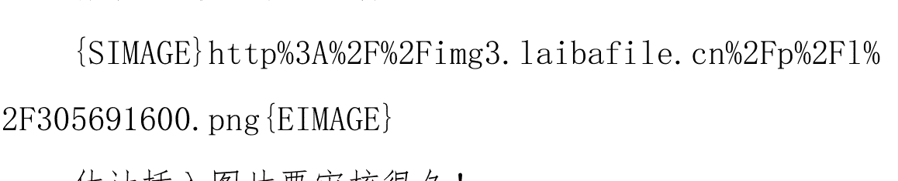
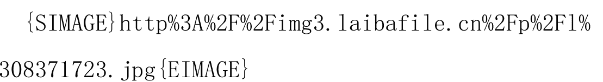
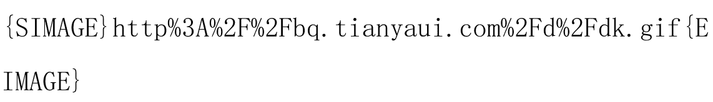
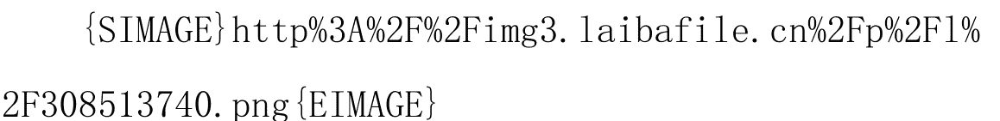
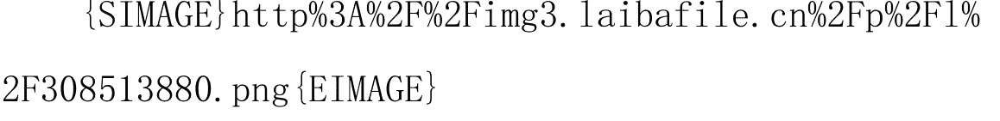
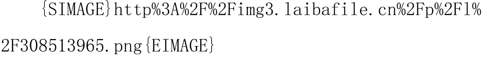
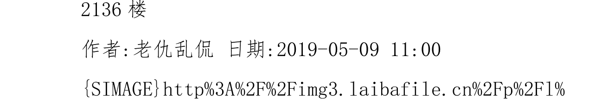

## 大格局：未来一年与十年！

老仇乱侃

一直想写这个帖子，一直没有太充足的勇气！

中国经济到了局点，未来十年是整个世界经济格局重新调整的十年！

想写这样的帖子，不仅仅对资料收集是个挑战，也对个人的能力做出了很高的挑战！

本着写帖子要认真的态度，今天鼓起勇气开此贴，希望各位给予斧正！

先开个头，内容慢慢写，先看是否能通过！

作者:老仇乱侃 日期:2019-02-15 18:13

各位朋友新年好！

很多公司已经开工，工厂也会在这几天都陆续开工！

这个节点开本帖，先祝各位朋友新年大吉，万事亨通！

老仇给大家拜年了！

1楼

作者:老仇乱侃 日期:2019-02-15 18:14

今天国内经济形势与全球经济形势，又是关键的一年！

这一年，注定是痛苦的——至少对于大多数人是痛苦的，无论国内还是国外！

2楼 作者:老仇乱侃 日期:2019-02-15 18:22

### 一、中国经济与世界经济形势

可能大家都没有关注到，2018年中国的整体GDP规模已经超越了英国脱欧后的整个欧盟。

2018年，去掉英国的欧盟经济规模和中国的经济规模，大约都超过了14万亿美元！中国的数值会略高于欧盟的经济总量！

相对于美国超过21万亿美元来说，差距还是很大，但中国经济规模这么快的速度超越欧盟，在十年前还是难以想象的！

9楼

作者:老仇乱侃 日期:2019-02-15 18:25

中国经济规模超越欧盟，说明中国已经成为全球的第二大市场！

中国经济有没有问题？当然有，而且问题很多！我在其它帖子里都讲过，这里就不再详细说！

中国在总体经济质量上，对比欧盟的差距依然是巨大的，这主要体现在科技、教育、医疗、养老等层面！从人均可支配收入上也是差距巨大！

10楼

作者:老仇乱侃 日期:2019-02-15 18:27

中国有中国的问题，欧盟则有欧盟的问题！

欧盟的问题就是毕竟不是一个国家，比如英国就脱欧了，意大利、希腊、西班牙的问题多多！欧洲老了，不复当年盛景！

11楼

作者:老仇乱侃 日期:2019-02-15 18:43

2002年欧盟统一使用欧元，2003年整个欧盟的经济规模为11.95万亿美元；同年，美国的经济规模为11.51万亿美元；而中国为1.4万亿美元。

当年的欧盟和中国差距十倍八倍是有的！

美国从2003年到现在还没有翻番，中国已经增长10倍！

14楼

作者:老仇乱侃 日期:2019-02-15 18:45

中国经济高速增长，不代表中国已经解决了所有问题！

当我们看到中国经济高速增长时，不要忘记中国现已存在问题；

当我们看到中国经济的问题时，也不应抹杀这种巨大的进步！

客观看待，是了解实质的开始！

15楼

作者:老仇乱侃 日期:2019-02-15 18:47

现在中国与美国、欧洲、日本的差距，就是最顶端一小撮高精尖技术，以及发展高精尖技术的制度土壤。

除此之外，中国已经具备横扫世界的产品能力！这种能力不仅仅是因为国人的勤奋，更主要的原因是中国是个统一的大市场！

16楼

作者:老仇乱侃 日期:2019-02-15 18:55

### 二、统一市场形成了中国的“工业粉碎机”能力

任何工业产品，只要中国人掌握了技术，都会瞬间白菜价！

很多人对这种杀价行为痛恨的不得了，其实是没有必要的，因为这是中国产品横扫世界的基础和前提。

举例来说，一个国内做牙刷的工厂，在国内潜在的市场就可以是几十亿把（包括酒店等，一次用牙刷）。基于这个市场规模，设计一个每年生产1亿把牙刷的生产线是可行的，甚至工厂可以规划一个生产几亿把牙刷的生产基地！

当一个牙刷厂可以生产并销售几亿把牙刷的时候，这个牙刷厂就有横扫全世界的能力！

那么，韩国这样的国家可以么？答案是不可以！他只能设计千万把级别的生产线，不能再多了！

当中国的牙刷厂和韩国的有牙刷厂在国际市场相遇的时候，面对的就是无悬念的竞争结果！

其实其它工业产品的形势差不多都是这个意思！

17楼

作者:老仇乱侃 日期:2019-02-15 18:56

中国的工业粉碎机必然从低端开始，一路向上！当我们看出口数据的时候也能看到这个规律！

中国出口最先的是衣服鞋袜，然后一路到今天的工业设备！

以后，中国是否有机会打到最尖端技术领域？我想是可以的——只要自己不作死！

18楼

作者:老仇乱侃 日期:2019-02-15 19:10

### 三、传统工业品处于长期通缩通道，而中国的工业生产能力加速了这个进程

从更长期的角度，传统工业品一直是处于“通缩”通道的！

其内在逻辑很简单——技术进步提高了效率！

以本人所在的建材领域看，今天的一个工厂的产出能力，在十年前可能是全行业的产出能力！

供不应求——供求平衡——供给过剩其实只用了不到十年的时间！

20楼

作者:老仇乱侃 日期:2019-02-15 19:13

传统制造业是没有前途的，最后只能剩余下来寡头，其它企业，甚至一些规模很大的企业都将被淘汰出传统制造业！

制造业对人力的需求也在快速减少，以前一个工厂需要1000人，现在可能200人就够了！

制造业对劳动力的容纳降低非常快，快到我们今天还以为制造业会有大量就业岗位的地步！

22楼

作者:老仇乱侃 日期:2019-02-15 19:14

传统制造业、传统行业正在被快速的淘汰，身居其中的企业和个人，也将被快速淘汰！

这里，包括上市公司，包括在企业内的高管、老板！

23楼

作者:老仇乱侃 日期:2019-02-15 19:17

传统制造业是啥？现在看来就是靠近个人消费终端的制造业领域！

比如与个人有关的衣食住行、通讯！

2018年，汽车和手机的产销都开始下滑，这是个明显的征兆！

身处该领域的企业和个人，要么成为寡头或者寡头的一部分，其它的都将被快速淘汰出局！

24楼

作者:老仇乱侃 日期:2019-02-15 19:19

金立、联想、TCL这些品牌手机被淘汰，只是开端，后面还有谁？

今天风光的企业，可能很快不风光！

25楼

作者:老仇乱侃 日期:2019-02-15 19:22

### 四、东南亚不会成为另一个中国，只会承接一部分小微企业

年前去了一趟马来西亚、新加坡，感觉马来西亚比珠三角要落后十年！新加坡小国寡民，也没啥发展前途！

马来人的懒散和印度人的笨拙确实难以与勤奋聪明的国人抗衡！如果东南亚发展起来了，那也是国内企业在东南亚的大发展，而不会是当地人如中国改开一样迅速的挤出外企！

加v信1101284955，获取更多好帖

28楼

作者:老仇乱侃 日期:2019-02-15 19:25

马来西亚三十多万平方公里，大约是中国的两个面积稍小省大小！经济规模居然不如新加坡，而新加坡的经济规模则不如香港！

我们知道，香港已经被深圳超越了，也就是深圳一市的经济规模，超越了香港、新加坡、马来西亚这样的地方！

而马来西亚的首都吉隆坡，也不过是刚过万亿规模的城市罢了！这在中国，大约是个二线城市！

29楼

作者:老仇乱侃 日期:2019-02-15 19:28

和马来西亚的华人聊天，感觉其对中国发展状态的一种自豪、羡慕！

和新加坡的华人聊天，一方面觉得新加坡的收入高，但对国人的富裕阶层则是一种高山仰止！

尽管这个结果我早就知道，但是特意找当地人聊聊还是感触颇深！

31楼

作者:老仇乱侃 日期:2019-02-15 19:30

国内的大市场，国人的才智，其实足够中国横扫世界经济领域！

需要的，就是合适的制度土壤而已。

加v信1101284955 获取更多好帖

33楼

作者:老仇乱侃 日期:2019-02-15 19:32

我曾经在我自己的公众号上说，国人和全世界都没有适应中国今天的状态！

国人还是没有大国心态，全世界还是觉得中国很穷很落后！

然而，中国已经是大国，中国有很穷的地方，也有很多穷人！

但中国也有很大的富裕阶层，也有很发达的地方！

34楼

作者:老仇乱侃 日期:2019-02-15 19:33

中国可以通过自己的大市场来教训一般的国家，比如韩国、日本、整个东南亚！

也可以教训朝鲜、蒙古这种另类国家！

36楼

作者:老仇乱侃 日期:2019-02-15 19:35

如果从个人发展的角度上看，一个中国人，最佳的发展空间依然在中国！

未来，中国周边国家，乃至全世界，学习汉语都是非常重要的事！

或许有天，我们可以去其它国家做汉语外教，收着不菲的工资！

38楼

作者:老仇乱侃 日期:2019-02-15 19:38

2019年，中国经济有很多风险和挑战！

其实老迈的欧洲，以及美国，风险和挑战也不比中国少！至于韩国、日本，那能腾挪的空间就更有限了！

中国有很多问题，无论经济层面还是社会层面！回避问题，高呼万岁不会让我们变得更好！

有句话说的好：如果嚎叫能强大，驴早就统一世界了！

41楼

作者:老仇乱侃 日期:2019-02-15 19:40

世界经济格局，在发生的巨大的变化，此时正当在局点！
中国超越了欧盟，前面只有一个美国！
而中国注定在未来十年，很多产品都会成为最大的单一市场！即使美国也不行~

44楼

作者:老仇乱侃 日期:2019-02-15 19:42

欧洲，到了这个世纪，其实已经无关轻重了！无论在经济、政治、文化、军事的任何一个方面！

俄罗斯也是如此，核武是唯一的底气！但核武要维护，要科研、要进步，所以美国看准了，俄罗斯玩不动了，所以敢退出条约！

> 加v信1101284955，获取更多好帖

45楼

作者:老仇乱侃 日期:2019-02-15 19:47

中国的问题没有多复杂，总结起来，我大胆的说说！

计划生育是巨大的败笔，本可以提前十年结束，可惜部门利益让开放推迟至少十年！

十年前我就觉得需要开放生育了，当时被口诛笔伐！现在调门统一了，却也迟了！

中国几十年的高速发展，超越一个个强国的经济规模，快速的接近美国，都是基于庞大的人口基数！这也是我们怼加拿大的底气！

48楼

作者:老仇乱侃 日期:2019-02-15 19:48

加拿大比中国还大，矿产也丰富，何以不是世界超级大国？不就是人口少嘛！

给加拿大五亿人口，加拿大立即成为超级大国！

我这种屌丝能看清楚的事，居然智囊团看不到？是我太聪明还是。。。。太蠢？

49楼

作者:老仇乱侃 日期:2019-02-15 19:51

正如我说的，美国有好的，也有不好的！

美国作为全球最终的产品消费国，你说这三四亿人口不牛掰，那就是吹牛掰！

美元是全世界国币和大众商品的对手盘，一国怼世界，你能说不牛，那只能说眼瞎！

希望证明美国不好的人，那真是蠢到家了！

50楼

作者:老仇乱侃 日期:2019-02-15 19:54

美国好，在于鼓励创新，并在养老、教育、医疗、科研条件上有足够的有优势！

这个优势，即使中国经济规模超越美国也不会短期内改变！

美国做的好的，足以国人借鉴；美国人做的不好的，我们也不用去学！

这事很简单，和五毛美分都没关系！

53楼

作者:老仇乱侃 日期:2019-02-15 19:56

中国在全世界经济格局的变化，其实中国企业和个人在全球范围内机会的变化！

这事我没有好好研究过，但直觉上觉得一定有很多机会！

这一如当年港澳台到中国投资的样子，只不过港澳台换成了中国，中国换成了世界！

54楼

作者:老仇乱侃 日期:2019-02-15 19:58

对于一般人，不能到发达国家去享受人家的福利，那么中国还是不错的！

中国国内的机会注定比高速发展时期少，但是会涌现巨头的机会！

对的，中国未来十年，就是巨头涌现的时期！

拼多多用了几年的功夫，走过了BAT十几年的路，正是佐证！

56楼

作者:老仇乱侃 日期:2019-02-15 19:59

换言之，未来十年，是中国牛掰人的舞台！普通人普惠式的机会变少了，但是巨头的机会反而增加了！

原因是：中国统一而有消费力的市场、中国在全球经济格局的地位。

产生十个八个新的BAT这种规模的企业，或许没有想的那么难！

58楼

作者:老仇乱侃 日期:2019-02-15 20:01

那么，普通人该怎么过？

这一年，后十年！

我先喝水，休息一下，再聊这个问题！

59楼

作者:老仇乱侃 日期:2019-02-15 20:37

> > @天边星光 365 2019-02-15 20:33:30
> 死三... 轰炸欧美不是梦！中国一统欧美！欧美颤抖吧！看我铁骑横扫千军！一统天下！

---

说过了，现在美国还在高精尖领域超越中国10年以上，或者更多！即使中国经济规模超越美国，这些领域美国也会照样领先下去！

但，大市场将解决很多问题，并加速这个过程！

70楼

作者:老仇乱侃 日期:2019-02-15 20:37

> > @藏猫猫的农夫和蛇 2019-02-15 20:31:27
> 搬个板凳坐着听楼主讲未来趋势。

感谢捧场

71楼

作者:老仇乱侃 日期:2019-02-15 20:37

> @ty 夏天 2018 2019-02-15 20:17:07

可以！有货！继续！

谢谢！

72楼

作者:老仇乱侃 日期:2019-02-15 20:38

> @君君爱 2018 2019-02-15 20:16:56

加V信1101284955，获取更多好帖

日子照常过，崩溃也没来。

崩溃倒是不会

但如果战略性的错误，长期停滞有可能

73楼

作者:老仇乱侃 日期:2019-02-15 20:38

> @乱谈琴 L 2019-02-15 20:21:28

鸡血鸡汤

好吧，管怎么有点味道

74楼

作者:老仇乱侃 日期:2019-02-15 20:39
@西风绕指 2019-02-15 20:14:24
中国的优势是后发，这种优势至少还有十年，当人均GDP达到二万美元以后，这种优势就逐渐消失。因此，未来一二十年，在中国发展绝对比国外快。。

————————————————————————————
初始速度慢，必然加速度会大点！

75楼

作者:老仇乱侃 日期:2019-02-15 20:39
@西风绕指 2019-02-15 20:10:07
美国最最最牛逼的，是吸引了全球最顶尖的人才并带走了其他国家的财富。
印度就是美国最大的人才制造国，欧洲的衰落归根到底也是人才的流失。

————————————————————————————
制度优势！

76楼

作者:老仇乱侃 日期:2019-02-15 20:42
现在就说我这样的普通人怎么办的问题！
首先要接受一个事实，那就是普惠式的大机遇是没有了！
以前张三、李四、王五都可以去摆摊，然后都摆出一个百货商店。

换言之，一个高速发展的领域，只要你参与其中，就能获得高速发展，哪怕你的水准差点！但以后，很难有！

普通人暴富，或许机会大多在彩票上了！万一运气来了也是可以的！

77楼

作者:老仇乱侃 日期:2019-02-15 20:43

普遍的暴富机会丧失，是市场发展到一定程度的体现，这是一种规律！

所以，就不用想着暴富，也不用想着收入暴涨的事！大多数人平平稳稳的过日子，是常态！

79楼

作者:老仇乱侃 日期:2019-02-15 20:49

其次，降低负债。

大家都想优哉游哉的过日子，都想住大房子，都想开好车（或许以后不需要买车了），但这往往是增加了负债！

一个稍微高档的小区，居住面积大点，每个月固定的支出就要两千元。

如果还是按照按揭，假如年轻人20年按揭，利息费用会达到接近贷款本金接近的程度！即使我们按照本金的80%——90%，则实际上就是增加了巨大的负债！

83楼

作者:老仇乱侃 日期:2019-02-15 21:51
@龙佳花颜 2019-02-15 20:49:14
楼主茶喝好了没？

-------------------------------------------

又做了宵夜

105楼

作者:老仇乱侃 日期:2019-02-15 21:52
说说负债的问题，假如一个家庭收入10万元到15万元，按揭100万，然后养一部20万的车，这个代价有多大呢？

106楼

作者:老仇乱侃 日期:2019-02-15 21:55
100万的按揭，按6%——6.5%的年息计算，20年需要支出的利息怎么也要80万左右，平均一年4万！

养一辆车上下班开开，算你用上15年，报废后价格为0，则折旧是每年1.3万，买保险、加油、保养算每年2万，这个车的费用合计是3.3万；

4+3.3=7.3万元

也就是每年要消耗掉收入的一半用于利息和养车！

109楼

作者:老仇乱侃 日期:2019-02-15 21:57
如果这个家庭在买房、买车后生了孩子，一个人失去工作，就必然陷入债务危机！

所以高债务不能持续，风险极高！尤其贷款买房买车的，将用未来生活品质做抵押！

110楼

作者:老仇乱侃 日期:2019-02-15 22:04

假如持有现金，租房，是个什么情况呢？

假如手上是50万贷款100万买房子，50万理财，按每年4%——5%的收益，大约20年的收益是110——133万之间。

假如是租房子，每年的利息在一般的城市补贴1万元即可，也就是租房子是增加开支1万元。

买车和打车之间差距也很大，有兴趣的朋友自己算！

买房子是在通货膨胀比较大的时候按揭比较划算，但我估计，未来通胀应该会显著下滑，因为没有那么高的增长率就不会有那么高的通胀，除非委内瑞拉化。

加v信1101284955，获取更多好帖

113楼

作者:老仇乱侃 日期:2019-02-15 22:05

当然，买房子和租房子的感觉是不一样的！打车和自驾也不一样！

买房、买车需要量力而行！

条件允许，当然没问题！

114楼

作者:老仇乱侃 日期:2019-02-15 22:06

至于丈母娘要不要要求买，女朋友是否需要房子才结婚，是另外一个问题！

量力而行是基本前提！

116楼

作者:老仇乱侃 日期:2019-02-15 22:09

第三，争取收入的多元化。

收入多元化这种事好像很近又很远，但仔细想想，其实谁都能做到，只不过钱多的效果好，钱少的效果差而已！

117楼

作者:老仇乱侃 日期:2019-02-15 22:11

一个人如果收入4000元/月，只要你能攒下一个月的工资，年底就能收到大约200元的“理财收益”！

如果存上8万元，每年等于多了一个月的工资；

我相信很多人都没有开过13个月的工资，那么你存十来万，就相当于有13个月或者14个月的工资。如果节省点，过年的钱就出来了！

119楼

作者:老仇乱侃 日期:2019-02-15 22:18

当一个人收入6000元每月，并能存下20个月工资以上时，其实资金增长会越来越快！

我经常想一个问题，如果我现在还在生产一线，有5000元工资我会怎么办？

我会住公司宿舍，每个月开支压缩到1000元，这样做5年，手上会有25万现金。如果工资还能涨点，那么我可以存更多！

这样第一笔资金就有了，之后这钱做股票或者继续理财都没有问题，工作就可以轻松下来！生活费用可以上涨一两倍也没有什么关系，资金自己就处于长期增长的趋势！

当然，如果牛人赚的多，那另说！

### 121楼
作者:老仇乱侃 日期:2019-02-15 22:20

其实，即使你现在每个月赚3、5万，也应该攒下第一笔资金，这个资金可以自我成长，成为未来收入多元化的一个来源，对家庭、事业大有好处！

> 加v信1101284955，获取更多好帖

### 124楼
作者:老仇乱侃 日期:2019-02-15 22:21

另外，兼职也是一条收入多元化的来源！

比如：
- 每天下班去滴滴。
- 如果喜欢文字，如我可以写文章经营百家号。
- 或者每天去做一两个小时的兼职。

这种事最适合年轻的时候做，做三五年后就为未来的生活打下足够的基础了！

### 128楼
作者:老仇乱侃 日期:2019-02-15 22:24

假如一个小伙子22、23岁参加工作，三五年手里有几十万，其实已经很厉害！当然你的原生家庭给你准备房子和大把钱自然是最好的，可以省去这一步！

穷二代和工二代，工作前几年吃点苦是必须的，这是你未来生活的基础！

### 130楼
作者:老仇乱侃 日期:2019-02-15 22:27

普通人，只能通过时间、最初工作时对自己的高要求、理财来累积自己的财富，并最终获得财富自由！

至于楼主本人，还没有这个条件，因为大学毕业就要养父母！所以只能更拼才能娶妻生子！

### 131楼
作者:老仇乱侃 日期:2019-02-15 22:30

未来一年，将进入通缩周期，或许这个周期要到2020年，我在其它帖子里说过这个问题！

通缩周期，关键就是现金！

在这个周期注定有人很悲催，有人会暂时失去工作，有人可能发生债务危机，这是对生活安排的挑战。

央行降准或者降息都是有可能的，这并不代表通胀上升，而更可能是流动性枯竭的补救措施！

### 133楼
作者:老仇乱侃 日期:2019-02-15 22:30

按揭买房，不要选在本年度，这很关键！

### 134楼
作者:老仇乱侃 日期:2019-02-15 22:32

最后，需要注意的是就业行业选择！

前文说到，长期通缩通道内的企业和个人都要逐渐出清一部分，在这些领域的朋友要早做准备！

尤其汽车和手机领域！

### 135楼
作者:老仇乱侃 日期:2019-02-15 22:35

汽车领域，无论从零部件生产还是维修，可能都会进入一个萎缩期！

假如共享汽车能够持续走下去，那么汽车销量将继续下滑，汽车零配件生产、销售、养护、润滑油领域，都会很快受到冲击！

> 加v信1101284955，获取更多好帖

整车的销售领域也会出问题，比如4S店！

这些会在未来的十年内发生！

### 136楼
作者:老仇乱侃 日期:2019-02-15 22:37

从产能的角度上讲，过剩的领域几乎处于各个领域的方方面面。

有前途的，不过是服务、金融、5G、生物科技等有限的领域。

### 139楼
作者:老仇乱侃 日期:2019-02-15 22:41

传统的银行业、卖场都将处于衰落通道，银行裁员不是梦！超市倒闭，专业卖场倒闭都将是常态！

而市政卫生、家庭电路维修、家政、保姆、创意产业、养老产业将成为就业主力！

### 140楼
作者:老仇乱侃 日期:2019-02-15 22:42

写到140楼了，写的累了，今天就先聊到这里！

### 141楼
作者:老仇乱侃 日期:2019-02-15 22:42

### 142楼
作者:老仇乱侃 日期:2019-02-16 16:36

这帖很热闹，感谢捧场！

### 226楼
作者:老仇乱侃 日期:2019-02-16 16:37

@Tantiansuodi 2019-02-15 20:50:01

先为你点赞顶帖！

----------------------------------------

谢谢，新年大吉

### 227楼
作者:老仇乱侃 日期:2019-02-16 16:37

@娇躯华仁堂 2019-02-15 20:50:12

抬好小板凳坐等楼主讲故事。

### 不讲故事讲实战！

### 228楼
作者:老仇乱侃 日期:2019-02-16 16:38

> @梦不会碎 2019-02-15 20:52:03

但现在还在讲美国老奶奶和中国老奶奶的故事

以前加杠杆的时候可以讲，那时通胀率高，加杠杆是划算的，而且民间杠杆很低！

现在普遍的高杠杆，则增加了风险

### 229楼
作者:老仇乱侃 日期:2019-02-16 16:39

> @幽蓝在水 2019-02-15 20:57:30

天涯有真神

过誉了！

感谢捧场

### 230楼
作者:老仇乱侃 日期:2019-02-16 16:39

> @芜湖小仙女 2019-02-15 20:58:48

格局这东西，有时候只有财富自由了才有谈的可能。

### 没有格局，不会自由
231楼
作者:老仇乱侃 日期:2019-02-16 16:40

> > @天不再那么蓝 2019-02-15 21:24:03

记号

少负债，少折腾，未来都是寡头的机会，老百姓折腾的时机已经过去了，平平安安过日子就是好。

对的！

232楼
作者:老仇乱侃 日期:2019-02-16 16:40

> > @天不再那么蓝 2019-02-15 21:25:33

贷款买房划不来，未来要么全款，要么租房流行！

### 贷款，不是不可以
在高通胀时，贷款是对的，尤其资产价格比较低的时候

现在世易时移

233楼
作者:老仇乱侃 日期:2019-02-16 16:41

> > @霜梅朵儿 2019-02-15 21:35:18

. 点赞支持楼主，楼主写的真好

感谢捧场

### 234楼
作者:老仇乱侃 日期:2019-02-16 16:42

> > @ty_风生水起 324 2019-02-15 21:37:00

固定成本已经临近收益的接点，所以近几年催生了很多短平快的金融游戏。固定成本首要是人工，房租或者厂房支出。大幅度增加了实体经济创业的难度！

---

市场成熟了，必然市场缝隙变小！

创业，只能考虑低成本创业

### 235楼
作者:老仇乱侃 日期:2019-02-16 16:42

> > @山清水秀x 2019-02-15 21:38:26

中国经济现在倒是真的到了十字路口了。

---

中国如是，世界如是

### 236楼
作者:老仇乱侃 日期:2019-02-16 16:43

> > @山清水秀x 2019-02-15 21:38:48

经济增长已经有掉头向下的趋势非常明显。

---

全球性的！

这是大势！尤其美国在某些方面已经有了不好的预期

### 237楼
作者:老仇乱侃 日期:2019-02-16 16:45

> @ty_风生水起 324 2019-02-15 21:39:10

由于劳动力减少，老龄化加剧，敬业精神变差，综合起来的用工成本太高，只有全部行业提价才能解决经济流通问题。

总体来说，就是运营成本提高很快，包括租金、税、人工、环保等；另一个层面是过剩，生产企业没有提价空间。

总体来说，全国性的脱实向虚是必然的趋势，只有早晚，不会改变！

> 加v信1101284955，获取更多好帖

### 238楼
作者:老仇乱侃 日期:2019-02-16 16:47

> @赖宝就是要抓牛 2019-02-15 22:01:26

进来拜读，慢慢看

感谢捧场

### 239楼
作者:老仇乱侃 日期:2019-02-16 16:48

> @我对不起你真的 2019-02-16 00:17:49

楼主有大才，点赞支持了，楼主牛逼

感谢捧场！

240楼
作者:老仇乱侃 日期:2019-02-16 16:49

@祖筠 2019-02-16 00:27:52

老师，假如手上有十万现金，有什么好的理财方法呢？

不敢当老师！

不同的年龄、经济状况会采用不同的策略！

稳当点，选个5%左右的理财方案吧

241楼
作者:老仇乱侃 日期:2019-02-16 16:49

> 加v信1101284955 获取更多好帖

@子思君朝与暮 2019-02-16 00:28:02

2019 给楼主点个发财赞，嘻嘻，希望 2019 我们都能暴富

大家都发

242楼
作者:老仇乱侃 日期:2019-02-16 16:50

@sccsman2018 2019-02-16 01:11:15

中心思想：     顺势而为

### 顺大逆小！
243楼
作者: 老仇乱侃 日期: 2019-02-16 16:50

> @天窗二 2019-02-16 09:06:34
楼主太乐观！十年后中国更穷，恐怖袭击会常态化（因为绝望的的人增多）。

----------------------------------------------------------------

### 所以打黑
244楼
作者: 老仇乱侃 日期: 2019-02-16 16:52

> @君君爱 2018 2019-02-15 20:16:56
日子照常过，崩溃也没来。v1101284955，获取更多好帖

----------------------------------------------------------------

> @老仇乱侃 2019-02-15 20:38:02
崩溃倒是不会
但如果战略性的错误，长期停滞有可能

----------------------------------------------------------------

> @TY51398 2019-02-16 10:37:20
股票做了几年了，天天中阳后横盘就能撑住了？就象房价天天涨，涨了十年翻了7-8倍现在横在那就能撑的过老美加息期？茅台又是一例子，你看看650以上能撑2年否.

----------------------------------------------------------------

不否认问题存在，也不否认一些问题的巨大潜在威胁！
其实，大家都玩的很艰难，包括美国！

### 245楼
作者:老仇乱侃 日期:2019-02-16 16:53

> @站在楼上观山景 2019-02-16 11:24:17
楼主的看法很片面，
以后 10 年，对大多数人来说，
是艰难的 10 年。。。。。。

请给个全面的看法！
以后未必好，或许是一种长期衰退，这种可能是存在的！
即看关键节点的战略性应对了！

### 246楼
作者:老仇乱侃 日期:2019-02-16 16:54

> @浮世一纤尘 2019-02-16 12:25:21
楼主，对昨天的中美贸易谈判有何高见？

还没谈妥！
如果把谈判拖到美国经济也下滑的时候，就更不好谈！

### 247楼
作者:老仇乱侃 日期:2019-02-16 16:56
中国作为一个巨大的统一大市场，本身就是个筹码！

这个筹码用得好就是利器~

### 248楼
作者:老仇乱侃 日期:2019-02-16 16:59

很多人提到通缩和通胀问题，其实这并不难判断！美元还没有结束加息，那就必然是通缩中！现在美联储只是表达含混的说放缓或者停止，但没有明确的表达进入减息周期，那么就还在通缩中！通缩体现在个人层面，就是大家都缺钱！

### 249楼
作者:老仇乱侃 日期:2019-02-16 17:00

说中国烂透了，这话一定说过头了！说美国烂透了，这人一定脑袋进水了！这个世界，既不那么坏，也不那么好！

### 250楼
作者:老仇乱侃 日期:2019-02-16 17:01

国内的问题只说了一个计划生育，别的就不说了！其它问题，我的帖子都提到，现在也不愿意细说，没意思~思~

### 251楼
作者:老仇乱侃 日期:2019-02-16 17:03

体制改革的阻力太大，只能这么讲！一个计划生育问题都要拖这么久，比计生更复杂更大的问题需要拖多久？我们这代人未必看得到！

### 252楼
作者:老仇乱侃 日期:2019-02-16 17:37

### 253楼
作者:老仇乱侃 日期:2019-02-16 19:42

> @谦谦君敬老 2019-02-16 17:40:23

跟楼主学习！

感谢捧场

### 263楼
作者:老仇乱侃 日期:2019-02-16 19:43

> @未来CEO2019 2019-02-16 18:40:24

看看我的地下城创意，你会知道什么才叫大格局。

把喜马拉雅山炸个大口子？还是把青藏高原地下掏空建立一个帝国？

### 264楼
作者:老仇乱侃 日期:2019-02-16 19:44

> @就让他好字 2019-02-16 19:04:07

云想衣裳花想容，这么丑还想涂口红？

天王盖地虎，是龙还是鼠？

### 265楼
作者:老仇乱侃 日期:2019-02-16 19:44

> > @杨柳上的春风 2019-02-16 18:45:43

说的有道理，特来分享。

感谢捧场！

### 266楼
作者:老仇乱侃 日期:2019-02-17 14:21

### 281楼
作者:老仇乱侃 日期:2019-02-17 14:39

每年过年其实我都会在公众号上写几篇文章，但是今年没写！没写的主要原因是懒！

我经常看到，很多文章在说西餐礼仪！其实对此我不是一般的反感！

老外不会用筷子，在中国吃饭我们嘲笑他们了吗？大多数人不是带着献媚的心思在看着老外拙笨的用筷子？

那么，牛扒为啥要6分熟才是高档？为啥左叉右刀？我用筷子吃牛扒为啥不行？只有不自信的民族才会把老外的习惯奉为圭臬！

我们不需要一定会西餐礼仪，或许西方人应该努力学习中国礼仪！

### 283楼
作者:老仇乱侃 日期:2019-02-17 14:41

中国当年为了被所谓的“国际社会承认”把老外捧的太高了，这个余毒今天都没有清除！

所有人都没有习惯中国，包括中国人自己！

### 284楼
作者:老仇乱侃 日期:2019-02-17 14:47

人若上百，形形色色的人都不会少！中国人太多，以至于各种旅游都是一拥而上，喧哗些，出现一些不文明现象是个概率问题！

对国人的口诛笔伐，包括国人自己，都觉得很正确，然而未必！

每月去柬埔寨的人数大约45万中国人，一年是接近500万！柬埔寨不过是1500万的小国，承载能力有限！

这500万中国人，充斥于一个小国，如果不觉得乱糟糟才奇怪呢！

这种事注定是一个中国现象，韩国、日本是做不到的！

### 285楼
作者:老仇乱侃 日期:2019-02-17 14:50

马来西亚不过三千多万人口，每年涌入旅游的国人有2000万以上！

每个月有接近十分之一马来西亚国民数量的国人去旅游，你说马来西亚人是什么感受？！

这不是中国人素质有多差，而是数量太大，超越了当地的承载能力！

### 286楼
作者:老仇乱侃 日期:2019-02-17 14:54

泰国人口六千多万，每个月去泰国的国人接近300万，这又是个庞大的数字！

人若上千，连海连天，人若上万，无边无沿！

这才是很多国家对国人的感受~！

说国人素质不足，有失偏颇！人多了，自然概率上就一定会有某些大家反感的事发生！

其它国家没有这个问题，比如加拿大、欧洲国家，即使美国也没可能中国这么大的旅游群体！

> 加v信1101284955 获取更多好帖

### 287楼
作者:老仇乱侃 日期:2019-02-17 14:55

这反过来可以说，中国人在塑造整个东南亚，假如中国人某天不去东南亚旅游了。。。。。

他们的小心脏都得扑腾扑腾的！

### 288楼
作者:老仇乱侃 日期:2019-02-17 14:57

印度人用手擦屁股，所以左手给递东西就是不礼貌！

但中国人不会用手擦屁股，用手擦屁股的国家需要习惯中国人不用手擦屁股的习惯，他们正在慢慢习惯，这个不需要呼吁！

### 289楼
作者:老仇乱侃 日期:2019-02-17 15:06

欧洲是近代文明的发源地，欧洲对于世界文明的贡献超越了其它任何地区！

文明有首创有传承，不能否认的是今天全球的政治、文化、经济、社会、制度，都是源于古希腊——罗马——西欧这条线路！

用语言否定都是没有意义的

今天我们的自然科学领域、经济领域和社会领域，并不是沿用老子、孔子、孟子这些先贤的道路。

> 加v信1101284955 获取更多好帖

我们除了文字和历史，其它都已经不是中国本身文明衍进的道路！四大发明很牛逼，但不要总吹！国人不要学韩国，不要把自吹自擂当本钱！

### 290楼
作者:老仇乱侃 日期:2019-02-17 15:09

好就是好，不好就是不好，承认不足是堵住漏洞填满缺陷的第一步！

当你学习数学、物理、化学的时候，你当知道，这里的学问绝大部分都是欧洲人的成就，人家就是在近代文明和现代文明走到了全世界的前头，不是你嘴上不承认就能否定的！

### 291楼
作者:老仇乱侃 日期:2019-02-17 15:11
但中国现在也算是接住了发展的下一棒，能不能走下去，能不能在此基础上更进一步，那就要看从国民到国家怎么看待中国，怎么看待世界！

我个人以为，西方最牛的地方在于“实事求是”，这句话听的很多，但确实是西方发达国家做的最好！

### 292楼
作者:老仇乱侃 日期:2019-02-17 15:14
我们太习惯于“一方面。。。另一方面。。。。”
我们太追逐于“既。。。又。。。。且。。。。”
不仅官方如此，百姓亦如是！

> 加v信1101284955，获取更多好帖

### 293楼
作者:老仇乱侃 日期:2019-02-17 15:17
从个人微观的角度上看：
既能保持现在的状态，又不冒太大的风险，且能获取巨大的收益，这就是普遍面临的困局！
我们只能选择“大风险、大收益”和“低风险、小收益”，这不仅适用于股票、期货，也适应家庭财务决策！

### 294楼
作者:老仇乱侃 日期:2019-02-17 15:19
我多次在天涯上说到“拨档子”的股票操作，但都无一例外被删除了！

我不知道为啥会被删除！我很反对阴谋论，不能相信这是“某些利益集团”因为我触动了他们的利益而删除我的发言。我有点百思不得其解！

### 295楼
作者:老仇乱侃 日期:2019-02-17 15:20
理论上，家庭资产配置似乎不能少了股票和基金这个选项！

因为，金融领域或许有“意外惊喜”，这是不得不配置股票类资产的原因！

今天再说一次拨档子，看看能不能存活下来！

### 296楼
作者:老仇乱侃 日期:2019-02-17 15:23
拨档子是典型的成本摊平法，是一个数学问题！

当然也是个概率问题！

先举个栗子！不是火中取栗，这个栗子可以给“不认为自己决定聪明”的人，聪明人都当韭菜去了！

### 297楼
作者:老仇乱侃 日期:2019-02-17 15:39
栗子：

一组数，它的范围是5——100；

你可以理解这个数就是价格，单位可以是元。

如果这组数长期波动于20——30之间，那么波动率就是50%。

### 299楼
作者:老仇乱侃 日期:2019-02-17 15:42
假如你的资金是10000元，你把资金分成5份。当价格达到25以下的任何值，你可以用你的一份资金买入。
比如刚好是25，你用1万元的20%，也就是2000元买入80份。
现在明确的是，5——25也分成5份，也就是5、10、15、20、25，你现在已经在25买了一份，之后你就等20的到来，或者30的到来。

### 300楼
作者:老仇乱侃 日期:2019-02-17 15:45
数学上的对应是这样的：

| 价格 | 对应份数 |
| :--- | :------- |
| 25   | 80份     |
| 20   | 100份    |
| 15   | 133份    |
| 10   | 200份    |
| 5    | 400份    |

这是朝着小数值方向的。

### 301楼
作者:老仇乱侃 日期:2019-02-17 16:20

估计插入图片要审核很久！
以上是个示意的图表，其实你的利润目标可以下移的，这没有问题！

### 306楼
作者:老仇乱侃 日期:2019-02-17 21:14
> > @老仇乱侃 2019-02-15 18:55:01
> 二、统一市场形成了中国的“工业粉碎机”能力
> 任何工业产品，只要中国人掌握了技术，都会瞬间白菜价！
> 很多人对这种杀价行为痛恨的不得了，其实是没有必要的，因为这是中国产品横扫世界的基础和前提。
> 举例来说，一个国内做牙刷的工厂，在国内潜在的市场就可以是几十亿把（包括酒店等一次用牙刷）。基于这个市场规模，设计一个每年生产1亿把牙刷的生产线是可行的，甚至工厂可以规划一个生产几亿把牙刷的生产……
> ————————————————————
> > @西北偏东10 2019-02-17 20:03:43
> 使劲吹吧，我就知道国产现在就好一点摩托造不出。离开合资产品，纯国产的汽车能开吗？有多少人买，国家最顶尖的军工步枪，手枪，坦克，导弹，飞机质量拿出去卖啥价知道吗？国产货只能哄国人，在外面有啥东西叫好的，？所谓的高科技大多还处于组装，仿制，骗国家补贴；

## 一个人的见识很关键！
哪怕以我自己的经验，中国制造的进步也是巨大的！
工业化最牛的就是那么几个国家：美国、德国、日本、英国、法国，韩国也算不错！
但今天在一般产品领域，已经很难见到这些国家的品牌，在更高的产品领域他们依然是霸主！
想想几十年前的一切电器、机床、精密仪器，中国基本都生产不了，现在，冰箱、电视机、空调、手机等一般产品领域，中国已经吃遍世界了！
我不否认很多领域中国还比不上发达工业化国家，但否认中国的进步同样是一种偏颇！

### 360楼
作者:老仇乱侃 日期:2019-02-17 21:14
@祖筠 2019-02-17 21:07:49
新 ID 也是楼主本人吗？
————————————————
是的！

### 361楼
作者:老仇乱侃 日期:2019-02-17 21:15
> @TZFUNDS 2019-02-17 20:28:20
> 个人觉得对整个人类社会而言，所有产品追求效率最大化成本最低化的结果不会很美好，特别当这种能力发生在一个二元社会结构及掌握在一位喜爱新衣的皇帝手中时。
> 在社会物资水平到了一定的成都，分配制度，贫富差别，才是体现一个国家幸福水平的重要指标。
> 科技，并不总是带来人类的幸福！
> 因为竞争，你却不得不参与到技术竞争中去，不参与，就是大清朝的结局！

### 362楼
作者:老仇乱侃 日期:2019-02-17 21:16
> @老仇乱侃 2019-02-15 19:59:58
> 换言之，未来十年，是中国牛掰人的舞台！普通人普惠式的机会变少了，但是巨头的机会反而增加了！
> 原因是：中国统一而有消费力的市场、中国在全球经济格局的地位。
> 产生十个八个新的 BAT 这种规模的企业，或许没有想的那么难！
> @葫芦岛港口 2019-02-17 21:01:53
> 政治环境好能吸引全世界的精英才是持续发展保持不败的灵丹妙药，其他的如人口红利只能用一次
————————————————
不反对，或者说很认同！
适合的土壤很关键！

### 363楼
作者:老仇乱侃 日期:2019-02-17 21:17
想想海底捞上市老板就移民，究竟是哪里出了问题？
我想，只要生意做的足够大，听到“剥削”两字没有不心凉的，没有不恐惧的！
思想的底层代码不改，这些状况就会持续发生！
无恒产，无恒心！

### 366楼
作者:老仇乱侃 日期:2019-02-17 21:19
@喜鹊 6688 2019-02-17 21:09:33
以后国家要是不普惠底层民众，就会混乱发生，
————————————————
贫富差距总会出现，阶层固化也是常态！
一个国家想解决这些问题，唯一的办法就是高速发展。
高速发展就会带来新的机会，打通一部分上升通道！

### 370楼
作者:老仇乱侃 日期:2019-02-17 21:20
> @宇宙飞船2018 2019-02-17 21:16:57
> 食品安全太差，不稳定人增多，农民离开土地完全靠打零工过日子太不稳定
——————————————————
食品安全问题是个巨大的问题，只能用严苛法律解决！
法律想执行的好，舆论监督就少不了~

### 372楼
作者:老仇乱侃 日期:2019-02-17 21:22
> @宗教文化论是五锚 2019-02-17 21:19:24
> 臭长
> 加v信1101284955，获取更多好帖
> 评人如评己
> 见字如见人

### 375楼
作者:老仇乱侃 日期:2019-02-17 21:23
城市的存在，是效率的需要！
从经济运转的角度上看，城市是最具经济效率的经济单位~
所任人口、资源向城市聚拢是一种必然的结果！

### 377楼
作者:老仇乱侃 日期:2019-02-17 21:25
@宇宙飞船 2018 2019-02-17 21:22:29
## 穷人晋级就要堵
——————————————————
经济上是马太效应的聚集地！
强者通吃，必然使成为强者变得更加困难，或许你还是个小苗苗就被收编或者抹杀了！

### 378楼
作者:老仇乱侃 日期:2019-02-17 21:29
@老仇乱侃 2019-02-15 22:20:12
其实，即使你现在每个月赚3、5万，也应该攒下第一笔资金，这个资金可以自我成长，成为未来收入多元化的一个来源，对家庭、事业大有好处！

————————————————
@葫芦岛港口 2019-02-17 21:25:40
现在存钱是傻子，银行印钞机能快过你攒钱的速度，通胀给你吃了
————————————————
高通胀已经成为过去，高通胀往往和高增长是直接相关的！
一个简单的公式是：M2=通胀率+经济增长率
可以眼见的是工业品是长期通缩的，经济增长或许再也不可能两位数，所以高通胀或者核动力印钞机都受到限制！
如果不考虑现实的限制，无锚印钞的结果就是委内瑞拉，我相信就是权力部门也不愿意看到！

### 380楼
作者:老仇乱侃 日期:2019-02-17 21:32
通胀对于很多国家都是盼望而不得的，比如日本，长期通胀极低，这导致了日本经济长期裹足不前！
美联储加息也是要看通胀率，因为过低的通胀率就是经济低迷。
经济增长和通胀都是正相关的，通胀往往比通缩要好些！
通缩通常就是经济危机！

### 381楼
作者:老仇乱侃 日期:2019-02-17 21:34
央行想无限扩张M2是不可能的，因为发行货币需要“锚”，也就是标的物！
所以经济危机时，想放水也要有章法，而不是无限印钞！

### 382楼
作者:老仇乱侃 日期:2019-02-17 21:38
张五常先生曾经建议中国以一揽子实物为锚，这样就能确保人民币的独立性，并减少对美元的依赖！
这需要一个制度设计！

### 383楼
作者:老仇乱侃 日期:2019-02-17 21:43
很多回复认为打工攒钱不现实，我认为这是基于一个人对生活的理解，或者说是一个人的三观。
我是假设一个人总归要结婚，要娶妻生子，要在未来走到财富自由、时间自由的角度做设计！
假如有人觉得月光也很幸福，独身也很不错，动不了那天听天由命或者自我了结。反正前面幸福了几十年！也是个人选择！

### 384楼
作者:老仇乱侃 日期:2019-02-17 21:44
作为一个 70 后，我的三观就是人总是要成家的，总是要有孩子的，总是要正确财务自由和时间自由的！
在这个前提下，年轻就需要吃点苦，这比 50 岁后吃苦要好点！

### 385楼
作者:老仇乱侃 日期:2019-02-17 21:49
5 年攒 20——30 万，只要一个年轻人有这样的目标，是可以实现的！
假如一个年轻人工作加兼职，每月收入达到 5000 元并不难。如果还能因为工作年限工资有所增长，兼职收入也有所增长，那么每年每月增加 600 元也是没有问题的。也就是 5 年后达到 8000 元/月的收益——当然这必须很辛苦！

### 387楼
作者:老仇乱侃 日期:2019-02-17 22:08
我计算了一个简单结果，就是这个人在完成5年苦修后，结余接近35万！这是按每月0.4%每年4.8%计算的收益。
如果按此收益，五年后不再存钱，每年依然有3.7万元左右的收益，相当于有一套房子在出租获得稳定收益！

### 391楼
作者:老仇乱侃 日期:2019-02-17 22:09
当然这是个理想状况，谁知道这5年内有什么意外花钱的地方？！
但即便如此，30万资金攒得出来！
我想问问，现在有多少人手上有30万现金呢？这笔钱好好经营，养老是够的！

### 393楼
作者:老仇乱侃 日期:2019-02-17 22:34
> @老仇乱侃 2019-02-15 18:55:01
> 二、统一市场形成了中国的“工业粉碎机”能力
> 任何工业产品，只要中国人掌握了技术，都会瞬间白菜价！
> 很多人对这种杀价行为痛恨的不得了，其实是没有必要的，因为这是中国产品横扫世界的基础和前提。
> 举例来说，一个国内做牙刷的工厂，在国内潜在的市场就可以是几十亿把（包括酒店等一次用牙刷）。基于这个市场规模，设计一个每年生产 1 亿把牙刷的生产线是可行的，甚至工厂可以规划一个生产几亿把牙刷的生产……
> > @西北偏东10 2019-02-17 20:03:43
> 使劲吹吧，我就知道国产现在就好一点摩托造不出。离开合资产品，纯国产的汽车能开吗？有多少人买，国家最顶尖的军工步枪，手枪，坦克，导弹，飞机质量拿出去卖啥价知道吗？国产货只能哄国人，在外面有啥东西叫好的，？所谓的高科技大多还处于组装，仿制，骗国家补贴；
> > @老仇乱侃 2019-02-17 21:14:16
> 一个人的见识很关键！哪怕以我自己的经验，中国制造的进步也是巨大的！工业化最牛的就是那么几个国家：美国、德国、日本、英国、法国，韩国也不错！但今天在一般产品领域，已经很难见到这些国家的品牌，在更高的产品领域他们依然是霸主！想想几十年前的一切电器、机床、精密仪器，中国基本都生产不了，现在，冰箱、电视机、空调、手机等一般产品领域，中国已经吃遍世界了！我不否认很多领……
> > @ZJWH1 2019-02-17 22:29:11
> 冰箱、电视机、空调、手机等一般产品领域，中国已经吃遍世界了？里面的关键部件比如变频驱动 IC，内存和 CPU 等等，智能操作系统没有安卓怎么办？生产一台车的利润比人家卖你几个传感器和一个控制器汽车配件的利润还低，这就是现状
——————————————————
中国不可能从吃不饱一步到达各个领域全方位领先，你说的是实情，但你觉得该怎么办？这些产品不做了？
看人赚钱眼红没意义，关键是自己能做到哪一步！只要持续的进步就好！
我们CPU做不好，飞机发动机做不好，但从用锤子敲打出一辆轿车到现在自动化生产线组装轿车也是进步不是？

### 397楼
作者:老仇乱侃 日期:2019-02-17 22:38
客观的看待这个世界，是正确认知世界的第一步！
我倒是希望中国在所有的领域都遥遥领先，问题是实力不允许，你说是不是？
从马车到汽车就是进步，从土路到高速路也是一种进步。
策略上有问题是策略问题，中国确实耽误了无数年的发展好时机！
但改开以来的进步也是现实而深刻的，你不能说没有用。
70 后的儿童时代都是匮乏的，匮乏到一年吃一回肉的水准，今天已经吃到三高了！

### 398楼
作者:老仇乱侃 日期:2019-02-17 22:41
很多人认为现代人疾病很多，以前少！
70 后的我，同龄人有很多残疾的、早夭的，很多上了年纪的人在家里炕上熬死的！
很多人死了都不知道自己得什么病了，因为根本没有钱去看病！
以前不是病比现在少很多，而是根本没有去医院诊断出来得什么病。
这里多嘴一句，伟大的中医在那个历程里并没有卵用，因为根本都不知道得的是什么病！

### 399楼
作者:老仇乱侃 日期:2019-02-17 22:44
现代的环境因素、食物因素，确实增加了的病的概率，这可以简单的推论出来！
但，更多的是提高了国人的寿命和生存质量！
我在上大学前打过一次吊针，还是自己特意去体验的，因为觉得吊针很高大上！
平常的疾病，说实话，没有觉得有生命危险是不可能去医院的。记得很清楚的是当时流行腮腺炎，大家都鼓着个腮帮子，最多吃点“正痛片”，或者用土方拿辣椒根、土豆泥碾碎了敷一下！

### 400楼
作者:老仇乱侃 日期:2019-02-17 22:48
最近，电影《地球》热卖！
这种影片在我上大学的时候国内根本拍不出来可以到北美上映的科幻类电影！
当时只能搞点什么《红高粱》之类的去卖土气，玩文化特色！
大学时看《TRUE LIES》，觉得中国永远都拍不出这种电影，二十年过去了，现在中国也可以玩了，很开心！

### 401楼
作者:老仇乱侃 日期:2019-02-17 22:49
还是那句话，中国有中国的问题，但中国确实和世界顶尖水平的科技在拉近距离！
中国制造，不完美，但是进步很快！

### 402楼
作者:老仇乱侃 日期:2019-02-17 23:03
再说大市场，拼多多用了三四年时间，在三四五六线城市完成了一个超过两千亿市值的企业，这种事情，在哪个国家都不会有，但在中国会！
看看拼多多，就是哪怕包邮九块九，只要基数够大，一样可以急速成为巨无霸！
这就是中国大市场的力量！

### 403楼
作者:老仇乱侃 日期:2019-02-17 23:05
不用怀疑中国大市场的巨大，这是个垄断牙签都能成为富豪的市场！
问题在于，谁能抓住这个大市场？普通人是没有机会的！

### 404楼
作者:老仇乱侃 日期:2019-02-17 23:08
其实在中国，我们甚至不需要考虑一个全国性的市场，一个市的市场就已经足够大了！
比如我知道的尚品宅配，一个市就可以做几个亿的生意~

### 405楼
作者:老仇乱侃 日期:2019-02-17 23:08
今天更到这里，各位明天见！

### 406楼
作者:老仇乱侃 日期:2019-02-17 23:08

### 407楼
作者:老仇乱侃 日期:2019-02-18 18:37
大家好，我来了！
小茶喝起，小烟抽起，闲侃继续！

### 443楼
作者:老仇乱侃 日期:2019-02-18 18:40
@黄忠老弓 2019-02-17 23:19:37
落后产业可以内部转移的东部转移到西部。落后产业依然可以升级，不能丢。
如果你了解物流，做过全国的生意，你就知道产业向西向内陆转移只是一个梦想！
陆路运输成本真的太高了！
从广东运输到东北，陆路要一千多元一吨，如果去新疆这个价格就更高了！
海运什么的，走上三百里，海运都到美国了！

### 444楼
作者:老仇乱侃 日期:2019-02-18 18:44
很多经济研究者和决策部门一直想着产业从发达地区向不发达地区转移的梦想！
这只是个梦想！
中国形成一个沿海经济带是有客观条件和成因的，不是简单的人、财、物的堆积。
一个城市不临大江大河，想实现均衡发展是不可能的，这个规律不仅适用于中国，也适应于整个世界。

### 445楼
作者:老仇乱侃 日期:2019-02-18 18:51
产业转移，是个很主观的思路，或者说是一种计划经济的思路！
产业来了，是因为它到了它最适合的地方！
产业去了，是因为原来的地方不合适了！
除非是新加坡这种城市国家，否则经济一定是不均衡的，而且一定是沿海发展的好，不能水路连接的地方发展的不好！

### 446楼
作者:老仇乱侃 日期:2019-02-18 18:54
中国这种土地面积巨大的国家，一个地方下雪，一个地方可能还要开空调，这个差距就更大了！
中国的产品是与全世界的同类产品竞争，真的走到需要长途汽运的地方，竞争力直接在国内汽运上消耗殆尽！

### 447楼
作者:老仇乱侃 日期:2019-02-18 19:06
> > @空竹盈金 2019-02-17 23:25:22
> 楼主此文写了很多真知灼见，分析了，从 2019 到未来 10 年的格局。
> 不过我觉得，中国还是活过 2019 再说吧。
> 巨坑实实在在摆在面前，2017 年就需要面对，却一直鸵鸟，拖了两年多，越拖情况越恶化。
> 这个坑迈不过，保社稷都成问题。
> ————
调整，本该是2015年，我当时也是这么认为！
现在推迟了几年，问题只会更大而不会更小！回旋空间变得更小，自然不是好事！
比如房价问题、居民部门债务问题、企业债问题、地方债问题，尽管在做着去杠杆的努力，但感觉收效不大。
经济发展速度快，经济调整的空间就大！经济增长放缓，则很多手段都不能用了！
这好比一个人生病，病轻的时候可以下点猛药，毕竟身体还承受得住。等到卧床不起，就要考虑下猛药身体抗不扛得住！

### 448楼
作者:老仇乱侃 日期:2019-02-18 19:07
中国现在的核心问题，表面是房地产泡沫问题，实际上是债务问题！
我个人估算，可能总的债务已经达到了300万亿人民币的水平，这很惊人！

### 449楼
作者:老仇乱侃 日期:2019-02-18 19:23
经济放缓，高负债水平，资金空转，这是巨大的风险！
但我不认为当下已经不可收拾！

毕竟，以当下中国的经济体量和构成，抗风险能力已经强大了很多！

451 楼

作者:老仇乱侃 日期:2019-02-18 19:26

所以，谈崩溃很具有个人主观性，有点哀其不幸怒其不争的意味！

我认为，2019年确实很关键，是个局点；处理得当，就是过个坎儿；处理不当，那真的可能是L型，但不至于崩溃！

452 楼

作者:老仇乱侃 日期:2019-02-18 19:27

> > @老仇乱侃 2019-02-15 22:30:47
按揭买房，不要选在本年度，这很关键！

---------------------------------------

> > @天天快乐小宝贝 2019-02-18 11:30:06
那选在明年？

---------------------------------------

先平稳过渡！

所谓除死无大事，保命要紧！

453 楼

作者:老仇乱侃 日期:2019-02-18 19:29

> > @长不胖的橘猫 2019-02-18 15:40:59

再漂亮的数据都架不住人均！

-----------------------------------------------

还是那句话，需要一个过程！
汽车从起步到 100 公里的时速，是无法跳过中间速度的！
从另一个角度看，中国还没有真的富裕，还有长路要走~

454 楼

作者:老仇乱侃 日期:2019-02-18 19:32

> @老仇乱侃      2019-02-17 22:49:54

还是那句话，中国有中国的问题，但中国确实和世界顶尖水平的科技在拉近距离！

中国制造，不完美，但是进步很快！

-----------------------------------------------

> @TY51398 2019-02-18 09:12:21

看了新闻听你这话很别扭，
2017 年我国芯片业进口额高达 2601.4 亿美元，约占世界的 68.8%。而同期的原油进口总额仅约为 1500 亿美元。
我想买个好点的螺丝刀，推荐国产的品牌，只要耐用，贵点也行

-----------------------------------------------

有瑕疵是必然，即使美国也依赖日本的电子配件！
高值的产品，中国做不了！那么是不是因为做不了高值的，就什么也不做了呢？肯定不是！

什么时候全世界最顶尖的产品都抢着到中国销售的时候，中国大约就可以解决问题了！

455楼

作者:老仇乱侃 日期:2019-02-18 19:35

> @超乎想象没你不行 2019-02-18 12:30:17

楼主买股票的思路，不是一直补仓吗，股票不是最忌讳一直补仓？

———————————————————————

为什么忌讳补仓？

很多股票类的书籍以及大神都在说要“舍得”的问题！

问题是又有多少股民因为听了这些话不亏损？

卖书的都不炒股了，大神也是收香火钱；只有韭菜孜孜不倦的被收割！

456楼

作者:老仇乱侃 日期:2019-02-18 19:41

457楼

作者:老仇乱侃 日期:2019-02-18 19:58

> @空竹盈金 2019-02-17 23:25:22

楼主此文写了很多真知灼见，分析了，从2019到未来10年的格局。

不过我觉得，中国还是活过2019再说吧。

巨坑实实在在摆在面前，2017年就需要面对，却一直鸵鸟，拖了两年多，越拖情况越恶化。
这个坑迈不过，保社稷都成问题。

> @wwjz1602 2019-02-18 20:44:58
层主真知灼见！楼主真的太乐观了，大国真的是能活过2019年再说！
楼主是懂经济的人，但应该是来维稳和笼络人心的，可人心早已向背，难呀，晚了！那怕早三年抓抓人心，为全民谋谋利，关心下底层民众的呐喊，解决些社会中存在的实际问题与矛盾，也不至于走到今天这步——内外交困，实在痛心。
19年全国许多单位能好好拿着正常工资都阿弥陀佛了。
此外，仅仅是贸易战吗，老百姓全部都能看明白的事，楼主博学多识看不明......

加v信1101284955，获取更多好帖

一味的抬高或者贬低都不是客观的看待中国的发展及现状！

相对于1998，今天中国的牌还是要多得多！

普通社会阶层，是因为习惯了中国几十年快速的发展，这是滥用杠杆、用高杠杆的底气所在！

眼下之中国，无论从体量的角度还是从结构性的推动力上看，都不足以让中国继续维持接近两位数的增长！

那么最近几年使用高杠杆消费的普通社会阶层必然遭受一次惨烈的打击！

但这种打击不足以让中国经济崩溃和社会结构瓦解，注定是一种阵痛，一如1998 年之中国！

463 楼

作者:老仇乱侃 日期:2019-02-18 21:04

中国经济高速发展的时间太长了，长到一代人的时间！
所以，我们总觉得经济发展是必然的，高速增长是正常的！但实际上，这不是普遍案例，这是建立在中国改开前接近崩溃的经济体系之上的！
这好比一个顽劣的孩子，一直考0分，突然开了窍，痛改前非！
从0分到10分，或许做对几道选择题就好了，加速度很快！

464 楼

作者:老仇乱侃 日期:2019-02-18 21:16

中国从2019年后的十年，其实能保持5——6%的经济发展速度就已经是很理想的结果了。或许低于5%也是有可能的。
经济增长率与就业率是典型的正相关关系，经济增长率下滑的结果必然是就业率不足，或者说失业率上升。

想了解期间关系的可以百度“奥肯定律”

中国需要7%左右的经济增长率才能确保充分就业，那么5%左右的经济增长率则对应的是千万级的失业人口！

465 楼

作者:老仇乱侃 日期:2019-02-18 21:21

所以，2018 年底开始的“稳就业”就提上日程了！因为这个逻辑没有多复杂，经济增长率下滑了，失业率必然上升！

我们看到官宣和经济界都把“稳就业”当成关键的目标，道理清晰明了~

增速放缓，一方面减少了新增就业岗位，一方面挤压现存的就业岗位，这是个大问题！

加v信1101284955，获取更多好帖

对于普通人，稳就业依然是最为关键的主题！收入减少可以压缩生活品质，但收入归零则是能不能过下去，房贷能不能供上，孩子能不能上学，有病能不能医治的问题。

466 楼

作者:老仇乱侃 日期:2019-02-18 21:22

就业，对于社会是关键问题，对于个人是要命的问题！有工作的，且行且珍惜！

467 楼

作者:老仇乱侃 日期:2019-02-18 21:26

春节过后，一方面再提用工荒，一方面全国性的担心就业问题，这并不矛盾！

这是企业能出多少钱雇人和个人多少钱才能去做这份工作的问题，这里出现了断层！

企业，3000 元/月雇佣人是极限，实际用工成本可能是50000 元/月；

个人，打工需要每月 4500 元才能 有所积蓄，维护家庭的运转，但只能拿到 3000 元/月；

一方面是钱多了用不起，一方面是钱少了过不下去，这是个双输局面！

468 楼

作者:老仇乱侃 日期:2019-02-18 21:29

一方面是企业出清的过程，不能控制综合成本的企业，要么雇佣不到人，要么雇佣到了也玩不下去！

另一方面，打工者要么无工可打，要么打工也不能养家糊口。

最后的结果是批量企业倒闭，批量失业人口！

469 楼

作者:老仇乱侃 日期:2019-02-18 21:31

2019 年，是对众多企业的生命大考；是对很多人职业生涯的生死大考！

恶性事件可能比往年都多些，生存的压力，才是最可怕的压力，容易造成一些心态的扭曲！

470 楼

作者:老仇乱侃 日期:2019-02-18 21:34

严峻的局面是必然的

楼主以为，不至于到了崩溃的层面！

连经济崩溃都谈不上，就不用说社会崩溃了！

就业不足，在楼主刚工作的九十年代到21世纪初，都是常态！

当时很多人求一份工作而不得，睡桥洞、公园的比比皆是！

当下之中国，要比当年好太多~

472 楼

作者:老仇乱侃 日期:2019-02-18 21:35

以前给人安排一个工作都是天大的人情，是足够一个人感恩多年的！

473 楼

作者:老仇乱侃 日期:2019-02-18 21:35

> @icebluetanya- 2019-02-18 21:31:53
有空来看看楼主给我们打的鸡血

好吧

你认为是打鸡血，那就算是鸡血吧！

474 楼

作者:老仇乱侃 日期:2019-02-18 21:42

今天的高负债、高杠杆，是建立在经济高速发展基础上的经济模式！

当经济增长开始放缓，高负债和高杠杆就必然要做出相应的调整，来不及调整的就会被无情碾压！

在一些领域会出现踩踏事件！

从今天看过去，2015 年或许就是一个降低杠杆和负债的节点！

可惜，后面是一轮房地产价格的暴涨~

这轮暴涨的后果是快速提升了居民部门的负债率，也透支了未来的消费能力！

475楼

作者:老仇乱侃 日期:2019-02-18 21:45

2018 年下半年，各种积弊开始显现端倪，并迅速恶化！

2019 年则是各种问题的集中爆发年，强制去杠杆或许是一种必然的趋势！

所谓的强制去杠杆，就是不可控的塌陷，一些人，一些企业，都只能眼看着泰坦尼克的沉没！

477楼

作者:老仇乱侃 日期:2019-02-18 21:47

作为一个普通的个体，需要重新审视自己及家庭的财务状况，尽量主动去杠杆，减少伤害！

我在前文提到的各种方案，其实就是对这种危机的应对方案，也是未来十年甚至更久远的应对方案！

478 楼

作者:老仇乱侃 日期:2019-02-18 21:48

> > @金沙河 2018 2019-02-18 21:43:41
> 
> 放开金融管制试一试！！

---------------------------------------

这个不用想的，命根子不会放的！

中国外储的底线是3万亿美元，这个必须保，所以以后会进一步严苛金融管理，锁定美元流出！

我们会持续看到~

479 楼

作者:老仇乱侃 日期:2019-02-18 21:54

> > @icebluetanya-: 2019-02-18 20:24:40 评论

低端的袜子鞋帽不能丢，不能象日本人产业升级后放弃那样，中国还有这么多人要养，一进一口就是好大的一块利润。宋朝时还养马（当然太夸张了，人家就剩马跟你换点盐粮食布匹了），至少不能全放弃。

==========

这个是由不得你的！

经济发展的结果是成本的全方位提高，成本挤出效应会让附加值低的产品无法立足。

保留低附加值产业的唯一办法就是提高生产效率，强行留没意义！

480楼

作者:老仇乱侃 日期:2019-02-18 22:20

> @tyt 自由之旅2: 2019-02-17 00:42:00 评论

> 评论 老仇乱侃:楼主大才啊，能详细谈谈脱实向虚吗？

======

关于脱实向虚，是我这两年慢慢品出的味道！

实体，很多时候是和制造业联系起来的。现在就以制造业来说明问题！

制造业这些年体现了两个特点：

1、生产效率迅速提升；
2、寡头化；

482楼

作者:老仇乱侃 日期:2019-02-18 22:27

现在一个电器企业提供全国的洗碗机不是问题，市场是有限的，但是产能是接近无限！

当市场不再扩张的时候——比如每年能销售的洗碗机就是那么多，就必然竞争的是存量市场，甚至是缩量市场。

此时，行业内就是个别企业通过渠道、资金、人才、区位优势扩张自己的产能，压缩同行的生存空间！

又因为，生产的效率总是持续提高的，所以一个企业最终占据全部市场的时候，结果就是这个行业用的人、产区面积都是减少的！

483 楼

作者:老仇乱侃 日期:2019-02-18 22:29

现实我们也看到了，现在中国的电器厂商，就是格力、美的、海尔，这个领域已经出清了大部分的同行！从行业的就业岗位来看，也是持续减少的。记得十几年前顺德到处的电器厂，现在已经减少很多了！

484 楼

作者:老仇乱侃 日期:2019-02-18 22:30

实体企业，面对的是有限的市场，在效率不断提高的前提下，在马太效应下，必然很快进入到行业整合、兼并，最后形成寡头化！行业内的企业数量也是在减少的！

486 楼

作者:老仇乱侃 日期:2019-02-18 22:31

所以实体经济发展的特征是：

1、持续挤出同行；
2、持续挤出资金；
3、持续挤出就业岗位；

487 楼

作者:老仇乱侃 日期:2019-02-18 22:34

挤出的资金、企业、劳动力就必须转移到其它领域，但其它实体依然在做着相同的事情，而新的实体领域的产生不可能那么快，结果就是要到所谓“虚”的领域去！

也就是所谓的第三产业！

第三产业，或者说服务业，外延比实体经济要大的多！

488 楼

作者:老仇乱侃 日期:2019-02-18 22:39

比如，以前需要去饭店吃饭，现在可以送外卖了！

送外卖就是新的就业岗位；

换言之，服务业就是帮你简单的解决问题的行业，你需要便利，给钱就行！

人总是希望越来越便利的，比如物流把货物送到家门口，比如上门洗车，比如外卖，比如不用手持现金的移动支付！

所以服务业的外延很大，很容易派生新的领域，这是政策上总是引导、支持服务业发展的原因。

毕竟一个大的就业领域很重要。

单单实体领域，中国人即使生产了全世界所有需要的产品，在未来也依然还要面对就业的新问题！

489 楼

作者:老仇乱侃 日期:2019-02-18 22:40

所以，脱实向虚是经济发展的必然规律；

因为实体经济没法容纳那么多的就业人口和资金，工业越发达，生产效率越高，实体经济对资金和人员的挤出效应就越明显！

490 楼

作者:老仇乱侃 日期:2019-02-18 22:41

> @杨柳上的春风 2019-02-18 22:30:17

又来向老仇同志学习了，赞一个。

感谢捧场！

491 楼

作者:老仇乱侃 日期:2019-02-19 08:59

> @老仇乱侃 2019-02-18 22:40:29

所以，脱实向虚是经济发展的必然规律；因为实体经济没法容纳那么多的就业人口和资金，工业越发达，生产效率越高，实体经济对资金和人员的挤出效应就越明显！

> @丛林观察员 2019-02-19 02:34:06

请问楼主：北大那个教授说的“中国需要去工业化”，是不是这个意思啊？这与现实社会大多在呼吁“拯救实体经济”的诉求有矛盾吗？

中国这样的大国，既不能去农业化，也不能去工业化。

农业和工业是生存基础，去掉了靠你给我剃头我给你擦鞋就能活下去？显然不现实！只能是领域的兼并、整合！

拯救实体经济是一个口号，也仅仅是个口号！实体经济的命根子是“收益率”，收益率不提高，就不会有资金、人才的聚集！

长期来看，实体经济只有兼并和整合！

501楼

作者:老仇乱侃 日期:2019-02-19 09:14

关于水泥砖头是不是财富的问题，很多人都对此有曲解！

一国经济发展之成果，必然以某种形式沉淀下来！

沉淀下来的方法有几个，一个是基础设施，这里包括桥梁、道路、城市地下系统、建筑，也包括各种科研实验室等等；

另一种是沉淀下物资，比如黄金、原油等；

还有一种是货币；

最后一种是教育和培训，也就是积累于个人的素养和能力中！

以中国的体量，大部分经济成果必然沉淀于各种基础设施，也就是钢筋混凝土和砖头是过去多年财富积累的一部分。

房子，也是一种财富的积淀，并非毫无价值！道路桥梁也一样！城市建设也一样！

504楼

作者:老仇乱侃 日期:2019-02-19 09:16

过去的几十年，我们看到几种财富的积累方式都在放大和增加！

比如房子变多了，变大了；基础设施变好了；城市变的更宜居了；

美元储备和黄金储备变多了；

整体的受教育程度提高了；

整体的素养提高了！

觉得房价高或者畸形，与水泥砖头是不是财富是两个问题！

505 楼

加v信1101284955  获取更多好帖

作者:老仇乱侃 日期:2019-02-19 13:28

正确看待问题，是解决问题的第一步！

逢中必反是个病，逢美必反也是病！都是神经病！

522 楼

作者:老仇乱侃 日期:2019-02-19 13:30

否认一切和承认一切，都是用偏颇替代主观！

还是那句话，中国有好的地方，有不好的地方，这没什么奇怪的！

一定说中国一无是处，那应该去朝鲜看看！

一定说中国宇宙无敌，那就看看芯片领域！

523 楼

作者:老仇乱侃 日期:2019-02-19 13:35

@魔都浪子 2019-02-19 09:39:44

楼主对社保怎么看，我们30岁左右的人，还能否拿到养老金，现在的年轻人（如果失业了，或者自主创业的）有没有必要自己交社保

----------------------------------------

社保，我在别的帖子说过，未来社保多有用取决于几个条件！

1、中国经济的发展情况；
2、未来的工作人口；
3、社保基金的经营情况；

最好的结果是压缩眼前的消费，在未来过的好点！

最差结果是现在未来双输！

不解决体制内对社保资金的腐蚀，不能提高人口出生率，基本上缴纳社保是不划算的，最大的可能是双输！

524楼

作者:老仇乱侃 日期:2019-02-19 13:36

@老仇乱侃 2019-02-15 19:48:58

加拿大比中国还大，矿产也丰富，何以不是世界超级大国？不就是人口少嘛！
给加拿大五亿人口，加拿大立即成为超级大国！
我这种屌丝能看清楚的事，居然智囊团看不到？是我太聪明还是。。。。太蠢？

@万千一叶 2019-02-19 13:17:31
这个思想不对。超级大国不超级大国的和屁民关系不大，关键还是人民的生活水平。依你的见解。加拿大政府可以随便移民了。

如果你问一个人想做美国人还是想做加拿大人，大部分人希望是美国人！原因很简单，强国可以在国与国之间的博弈中处于优势地位，更能为国内的民众获取机会！

525楼
作者:老仇乱侃 日期:2019-02-19 13:36

> @简单幸福20180229 2019-02-19 10:48:19
那媒体数字总结来发，有意思吗？

请说是哪个媒体？

526楼

作者:老仇乱侃 日期:2019-02-19 13:38
一个人，要先学会尊重别人，才会被尊重！上来就讲粗口就是没家教！有事说事，有观点说观点！上来就人身攻击，只能说明是个无脑的呆货！

527 楼

作者: 老仇乱侃 日期: 2019-02-19 13:40

@压力山大罗夫 2019-02-19 09:44:44

楼主有没有一种感觉，好像解说比赛一样。

无论你怎么倒挂金钩，左右突围，甚至少林足球，可是
说到最后有一种叫“中国足球队”的命运，却是无解的。

我非杠精。财富的沉淀应该是一种底蕴的增加和原始积累的成果体现。

以物质财富来说，教育、食品安全三大块的投入，
占到我们财政收入的多少？这是种族延续的基本保障。

加v信1101284955，获取更多好帖
再说精神财富，信仰、良心、道德大部分，哪一个不
是千疮百孔？那就算有了物质保障......

—————————————————————————

请问：
1、什么是底蕴？
2、什么是原始积累？

好高骛远，一抬手就是大理论，其实往往不能落实到实
处！

如果你觉得楼主说的不好，建议详细说说！

528 楼

作者: 老仇乱侃 日期: 2019-02-19 13:44## 国人缺的不是什么信仰、良心、道德，国人缺的是规则意识！

规则是一个社会的底层代码和基础架构，一个有明确规则的社会，才能衍生道德、良心和信仰！

整天讲道德，就真道德了？道德讲的还少么？

但讲道德架不住老人扶不起，讲道德也避免不了见义勇为被误拘！

为什么会出现这种情况？就是底层的规则建设出了问题，规则不支持扶老人，不支持见义勇为，那你无论怎么讲都没有意义！

> > 现实总是比口号更有说服力！

529楼 加v信1101284955，获取更多好帖

作者:老仇乱侃 日期:2019-02-19 13:46

如果，合同就是一张废纸，
如果，法律变成抹布，
如果，交通秩序都不能遵守，
谈良心、信仰、道德都是扯淡！

530楼

作者:老仇乱侃 日期:2019-02-19 13:48

整个社会，呼吁讲道德的时候，不如呼吁建立明确的规则！

我不认为一个社会连规则都不能遵守之前，还有什么良心与道德！

531 楼

作者:老仇乱侃 日期:2019-02-19 13:51

在论坛上发个帖子，实事求是的说话，就有人上来就粗口，我们寄望这种人有道德与良心？

显然是想多了！

连尊重别人的小门槛都没有过，谈更高大上的事情没有意义！

532 楼

作者:老仇乱侃 日期:2019-02-19 14:27

> @老仇乱侃 2019-02-15 22:18:18
当一个人收入6000元每月，并能存下20个月工资以上时，其实资金增长会越来越快！

我经常想一个问题，如果我现在还在生产一线，有5000元工资我会怎么办？

我会住公司宿舍，每个月开支压缩到1000元，这样做上5年，手上会有25万现金。如果工资还能涨点，那么我可以存更多！

这样第一笔资金就有了，之后这钱做股票或者继续理财都没有问题，工作就可以轻松下来！生活费用可以上涨一两倍也没有什么关系，资金自己就......

@万千一叶 2019-02-19 14:20:12

理想很丰满现实很骨感。这一段就是鸡汤。还玩起复利了。要是这样算下来一天存一块到老了也不简单了。更别提什么股票理财了。大多数人都理成解放前了。

--------------------------------------------------

连能实现的事情也要怀疑，那基本没有救了！

月息0.4%做不到么？每个月重新存一下做不到？

为了反驳而反驳，不知道你发言有什么意义！

534楼

作者:老仇乱侃 日期:2019-02-19 14:28

这楼愈发歪的厉害了！

连每个月重新存款都质疑，这需要多大的勇气？！

536楼

作者:老仇乱侃 日期:2019-02-19 14:30

@淋雨的蛙 2019-02-19 14:28:48

楼主的分析很在理，很实际，请教楼主如果50岁不想干的话到60岁10年存多少钱能够用，包括自己交养老金，最低的标准是多少？生活在7、8线小县城

--------------------------------------------------

看你具体花销情况了！

假如按现在在7、8线城市，有房子，无车，没有父母、孩子的抚养问题，那真的不需要多少钱！

或许 50 万就够了！

537 楼

作者:老仇乱侃 日期:2019-02-19 14:31

如果考虑未来的医疗，需要自己的现金补贴，那么需要加上五十万到一百万！

539 楼

作者:老仇乱侃 日期:2019-02-19 15:15

> @羽吹雪 2019-02-19 14:33:13

理直气壮做大做强国企!中小企业好了，老板们穷奢极侈，对屌丝毛好处没有，国企强了，你就是没工作，国家也有钱让你饿不死!国家没财富才可怕!

这个思路真聪明！

544 楼

作者:老仇乱侃 日期:2019-02-19 15:53

> @老仇乱侃 2019-02-15 22:18:18

当一个人收入 6000 元每月，并能存下 20 个月工资以上时，其实资金增长会越来越快！
我经常想一个问题，如果我现在还在生产一线，有 5000 元工资我会怎么办？
我会住公司宿舍，每个月开支压缩到 1000 元，这样做上 5 年，手上会有 25 万现金。如果工资还能涨点，那么我可以存更多！

这样第一笔资金就有了，之后这钱做股票或者继续理财都没有问题，工作就可以轻松下来！生活费用可以上涨一两倍也没有什么关系，资金自己就......

---

@万千一叶 2019-02-19 14:20:12

理想很丰满现实很骨感。这一段就是鸡汤。还玩起复利了。要是这样算下来一天存一块到老了也不简单了。更别提什么股票理财了。大多数人都理成解放前了。

---

@老仇乱侃 2019-02-19 14:27:38
加v信1101284955 获取更多好帖
连能实现的事情也要怀疑，那基本没有救了！月息0.4%做不到么？每个月重新存一下做不到？为了反驳而反驳，不知道你发言有什么意义！

---

@万千一叶 2019-02-19 14:54:19

不注重现实，就是你这个帖子的败笔。你以一个70后的生活方式去要求一个00后这是其一。其二大多数人最好的理财是存银行。其三现在的大多数青年不啃老很难达到买房娶妻的地步。更别提赚5000能存4000了。还有我希望楼主不要在提什么理财炒股了。你的理财炒股方法对你来说是适合的，也是赚钱的。但对他人来说就未必了。我也相信楼主的好心。但事实却是大多数的好心都在办坏事。虽然我不相信这世上有好坏。

——————————————————————————————

好的办法给合适的人，如是而已！

547 楼

作者:老仇乱侃 日期:2019-02-19 15:54

没有谁能做个放之四海而皆准的方案！
有人合适，有人不合适很正常！
至于觉得不合适的，那就选别的方法就好了~

548 楼

作者:老仇乱侃 日期:2019-02-19 15:55

不管是哪个年代的，你如果期望未来过上好的生活，且无资源，本帖就是对的！
至于啃老、喜欢做三和大神的，谁也挡不了！

549 楼

作者:老仇乱侃 日期:2019-02-19 16:00

普通人想过得舒服点，只能吃苦，谨小慎微，不放弃每一分该赚的钱！
想着享受，还想着未来会过得好，那是想瞎了心了~
社会上充斥着无数的暴富传说，以至于连普通人都想着一夜暴富！
事实证明，传说就是传说，是不可复制的普通人就是普通人，哪里有什么暴富的机会！

大多数暴富的机会都是真无底洞！

551 楼

作者:老仇乱侃 日期:2019-02-19 16:01

> @荆楚宏 2019-02-19 15:58:54

别泄气，我们顶你、拥抱你！

——————————————————————————

谢谢支持！

552 楼

作者:老仇乱侃 日期:2019-02-19 16:07

553 楼

作者:老仇乱侃 日期:2019-02-19 16:08

> @东方初阳 006 2019-02-19 00:24:07

看看楼主是怎么样被崩溃五毛攻击……

——————————————————————————

说崩溃的未必是五毛，只是认知能力不足！

不过确实有无数的崩溃论者来了，你料事如神！

554 楼

作者:老仇乱侃 日期:2019-02-19 17:20

> @弗兰克之果 2019-02-19 16:50:25

哎，楼主没看到近 10 年默默勤奋努力工作的人和 10 年前贷款买房的人之间的差距吗？正常人看完谁还吃苦受累，都想着买房坐地涨价。时代的氛围已经偏了，不要怪普通人不吃苦。

高通胀、高增长，就是努力加杠杆的时候！
通胀降低，增长降低，就是减杠杆的时候！
时移世易，不可一概而论！

560 楼

作者:老仇乱侃 日期:2019-02-19 23:55

@图图他妈妈 2019-02-19 17:55:01

楼主和论坛里七剑的观点基本一致，只是你的乐观点，他的悲观点，完全崩溃论。但总体来说，不看好未来房价，不负债，多存款。加v信1101284955，获取更多好帖

你仔细看了本帖？

569 楼

作者:老仇乱侃 日期:2019-02-19 23:56

@杨柳上的春风 2019-02-19 20:04:14

大放水大通胀，钱反而越来越难挣，房价会越来越高，现在没买房的以后更买不起了。

好吧
算是一种明确的观点！

### 570 楼

作者:老仇乱侃 日期:2019-02-19 23:58

> > @淋雨的蛙 2019-02-19 22:21:17

楼主对纺织行业的未来怎么看? 因为身处亚麻企业, 18年可以说非常火爆, 一些企业扩产扩锭, 经济不好肯定是受影响, 会不会出现大面积的失业!

拭目以待!

### 571 楼

作者:老仇乱侃 日期:2019-02-21 00:20

> > @小丘童: 2019-02-20 23:33:50 评论

评论 老仇乱侃新ID: 国企私企的观点不同。私企就是资本家逐利是第一位的, 老板挣了钱端自己兜里, 也跟普通员工以及社会没多大关系。国企是国家稳定的基石, 承担了无数看不见的社会责任, 偏远山区的铁路公路水泥路, 电线塔, 信号塔, 哪一个是私企干的? 对老百姓来讲, 稳定比增长重要的多。

持你的类似的看法不少见!

我问你几个问题先:

-   1. 国家收税, 从中央到地方, 民企收多少税? 国企收多少税?
-   2、收税是干啥用的？
-   3、你确认边远山区的基础设施是国有企业出钱修的么？有证据么？
-   4、改开前都是国企，穷的很稳定，请问你需要的就是吃不饱的稳定么？

608 楼

作者:老仇乱侃 日期:2019-02-21 00:23

民企缴税是超过全部税额的一半的，这些税算不算民企做的贡献呢？

民企贡献了 50%以上的税收，60%以上的 GDP，70%以上的技术创新，80%以上的城镇劳动就业，90%以上的新增就业和企业数量。

还认为民企没有国企重要，显然是缺乏基本的经济常识！

609 楼

作者:老仇乱侃 日期:2019-02-21 00:25

行政垄断利润极高，不是修几个信号塔就吃亏了！

如果放开准入，要求进入通讯领域的企业必须在老少边穷基建，大把企业抢着去做！

610 楼

作者:老仇乱侃 日期:2019-02-21 00:26

改革开放改的是什么？不就是让民企合法的生存么？！

由此，改开的成就就是中国民企的成就，而非国企的成就！

611楼

作者:老仇乱侃 日期:2019-02-21 00:26

612楼

作者:老仇乱侃 日期:2019-02-21 00:31

@祖筠 2019-02-21 00:29:49

祝楼主晚安好梦

---------------------------------------

晚安！

615楼

作者:老仇乱侃 日期:2019-02-22 21:44

加v信1101284955，获取更多好帖

646楼

作者:老仇乱侃 日期:2019-02-25 09:27

村村通公路，那资金哪里来的？

超过一半来自于对民企的税收！

也就是基建的大部分贡献来自于民企~

且，

没有民企的雇佣，中国80%以上的人口都要失业！

歌唱国企，抹黑民企，不是体制内的混蛋，就是在民企就业的白眼狼二百五！

715楼

作者:老仇乱侃 日期:2019-02-25 09:27

716 楼
作者:老仇乱侃 日期:2019-02-25 11:13
@不要以为是那样 2019-02-25 11:01:58
题目太大了，撑破了牛逼
--------------------
你看你怼这个呛那个，好像地球都装不下你一样！

722 楼
作者:老仇乱侃 日期:2019-02-25 11:14

> > @zlx30665: 2019-02-25 10:18:16 评论

从你这段发言看你就是个为某些资本势力（应该是主张国企私有化）摇旗呐喊的枪手，狐狸尾巴露出来了吧，还装那么高大上嘛？
========
如果你说的不是真的，你就死全家去吧！

723 楼
作者:老仇乱侃 日期:2019-02-25 11:15
动辄就给别人扣个帽子，是 WG 余孽！

724 楼
作者:老仇乱侃 日期:2019-02-25 11:17
评论(1)

> > @zlx30665: 2019-02-25 10:28:48 评论

你的格局呢？这么气急败坏啊，是不是挡了你们的财路了？把国有资产想占为己有真是罪不容恕，你是哪些资本的代言人？

有没有格局都不代表允许你满嘴喷粪！

725 楼

作者:老仇乱侃 日期:2019-02-25 11:17

> @zlx30665

速滚，不送！

727 楼

作者:老仇乱侃 日期:2019-03-01 14:01

> @荆楚宏 2019-03-01 09:07:31

老仇就是没事情做了就上来瞎鸡巴扯，有事做有钱赚啦，求他他都不一定来。。。

人要吃喝拉撒，孩子还小，赚钱是正事！

762 楼

作者:老仇乱侃 日期:2019-03-01 14:03

做实体，每年都是新挑战！

不过今年感觉招工好招不少~

只是我用不了那么多人，之前辞职的空缺，只补小部分就好了！

降低成本，降低生存门槛是正道！

763楼

作者:老仇乱侃 日期:2019-03-01 14:10

人总是不自觉的提高生活的成本！现在一年没有几十万都没法过，这就要求持续的赚钱能力！商品社会的特点如此！

764楼

作者:老仇乱侃 日期:2019-03-01 14:12

汽车与房产，对于一些人是增加收益的方案，对于另外一些人则是纯粹的消费品！不能因为买车买房增加现实收益的，其实就是消费品！

加v信1101284955，获取更多好帖

765楼

作者:老仇乱侃 日期:2019-03-01 14:14

所以说，投资房产，那至少都是要两套以上的房产才有意义！如果买房子就是住，除非你会换个城市居住，或者从市区换到郊区，否则都不能说是投资！汽车也是一样，如果仅仅是上下班代步，那就是消费品！如果汽车扩大了业务半径，提高了收入来源，那就是投资！投资与消费，很多人弄混了！

766楼

作者:老仇乱侃 日期:2019-03-01 14:16

我个人非常认同低消费，或者理性消费！事实上我自己的消费很低，或者说比大多数人都低！
除了抽烟喝茶，额外的消费我是基本没有的！
衣食比较简单！住的房子略大点，有车也是做公司的需要，没办法！

767楼

作者:老仇乱侃 日期:2019-03-01 14:18

768楼

作者:老仇乱侃 日期:2019-03-01 23:40

> @wilson_3000 2019-03-01 18:50:35
说 得很好，但是当下，又有多少人能够理性起来？房价过快增长，给80后造成了多少悲欢离合，上班，茶余饭后都在讨论多少套房子，每月还贷多少，没房说话自己都没底气，不知道这种心里感受还要持续多久，80后真的很悲催

-----------------------------

一夜暴富的故事太多，以至于大家都期望过一个类似贵族的生活，最后的结果就是顶不顺！

大城市最开始体现的是集群效应和赚钱效应，慢慢的发展下去，赚钱效应和花钱相互抵消，这个城市就不再快速扩大了！

事实上北京上海去年开始出现人口的净流出，就是生活成本上涨过快的结果！

794楼

作者:老仇乱侃 日期:2019-03-01 23:45

城市是最具效率的地方，但是随着人口密度增大，公共工程和服务投入相对于人口增加过快，最后导致了生活成本的飙升！

比如运输蔬菜到北京市，在某个阶段前，人口的增加反倒降低了运输到北京市的运输成本！但是当人口增加到一定幅度，比如当下，则运输一车蔬菜的成本反而上升了！

因为道路能不能直达目的地，因为道路拥挤车开不快，因为蔬菜生产基地需要更远的地方生产以满足更大的需求以及对耕地的占用！

795 楼

作者:老仇乱侃 日期:2019-03-01 23:46

这样，城市的扩张就有了天然的、无形的边界！

按生产企业的说法是，规模经济既有门槛也有上限！

796 楼

作者:老仇乱侃 日期:2019-03-01 23:48

我们看到，一线城市的实体企业在搬迁，而金融、文化、服务领域在崛起，很大的原因就在于生活成本的快速上升！

用更小的地方和更小的能耗，获得更大的收益就成为一种选择！

797 楼

作者:老仇乱侃 日期:2019-03-01 23:49

可以很现实的说，实体搬离市区，搬离大城市市区，是一个基本的趋势！

服务业，尤其是高附加值的服务业，比如金融、文化、科研等这类产业，才是未来各个大城市的核心产业！

798楼

作者:老仇乱侃 日期:2019-03-01 23:52

大城市的资本密集型、技术密集型的企业是选对了地方的！这些领域也是未来年轻人可以真的突破阶层限制的机会所在！

799楼

作者:老仇乱侃 日期:2019-03-01 23:52

800楼

作者:老仇乱侃 日期:2019-03-02 22:35

感谢各位捧场！

806楼

作者:老仇乱侃 日期:2019-03-02 22:37

南方又到了回暖天，湿漉漉的！

很能理解广东的学生看到“春雨贵如油”时的懵头转向！

中国很大，大到超越了大部分国家与国家之间的气候差距~

807楼

作者:老仇乱侃 日期:2019-03-02 22:40

昨天看了吴晓波的一篇文章！

对于吴晓波，我认为这是个理论经济学者，其实中国的经济学者大多是这个类型的！

这导致了专家学者说话在天上，感受在故纸堆，渐渐不会说人话！

不过，专业人士也总有他们强大的领域，比如数据来源和数据处理能力！

808楼

作者:老仇乱侃 日期:2019-03-02 22:42

吴晓波拿出了中国、美国以及全世界的财富集中程度！

从数据分析上看，中国富豪阶层占有的财富也不过是全体财富的四分之一强，而美国已经超越六成！

可见的未来，中国的财富必然会继续向富豪阶层汇聚，这或许就是未来十年财富流动的大趋势！

809楼

作者:老仇乱侃 日期:2019-03-02 22:44

财富在历朝历代的和平时期，都显示出强烈的马太效应！

掌握的资源越多，在竞争中的优势就越明显！

有了足够的资本，甚至都不用考虑十年或者更久的盈利问题，这种玩法自然是力大者胜！

810楼

作者:老仇乱侃 日期:2019-03-02 22:46

历史上的中国，走的就是土地被不断兼并的路线，最后引发社会矛盾和起义！

今天的互联网，则加速、强化了马太效应，我们看看马云们用了十来年时间超越很多百年资本主义国家的富豪家族就是个例证！

811楼

作者:老仇乱侃 日期:2019-03-02 22:48

互联网，看似给了相对普遍的机会，实际上则是强化了优势特征！

比如网红，一方面确实很多网红赚到钱，但更广义上，能吃上表演这口饭且吃的舒服的变少了！

加v信1101284955，获取更多好帖

812楼

作者:老仇乱侃 日期:2019-03-02 22:50

富豪阶层越来越富，富豪阶层的人数越来越少，这是财富分配上的大趋势！

未来，或许只要分两层就够了：富豪——普通民众

813楼

作者:老仇乱侃 日期:2019-03-02 22:50

814楼

作者:老仇乱侃 日期:2019-03-03 13:26

> @宝剑白马游江南 2019-03-02 23:34:12

楼主，话里话外，流露出对未来发展的信心，流露出大中国的自豪感。没错，我们是大国，只不过是面积大国，人口大国，贫穷大国。你认同拼多多的飞速发展超越了BAT十几年走过的路，可你仔细想想，那拼多多就是个地球垃圾的分销平台而已，这是一种不健康的经济发展。建国快70年了，过去的日用品质量多好，现在呢？人不要比虚名，一个国家也应该如此，什么超不超越欧洲，与我们百姓有什么关系？人家欧洲人环境优美，科技发达，人民……

我不谈爱国这回事，很多人说爱国，那很空！爱自己，爱家庭，和睦邻里，有悲悯之心，就是大爱！

中国有中国的问题，我写帖子从来没有回避过这个问题！但你必须考虑到，欧洲确实比中国的现代化早起步了很多年，再加上清末到1978年内部折腾、外部折腾，浪费了很多发展的时间和契机！

到了今天，沿海经济带的整体生活水平其实已经很不错，内陆省份差些！

### 821楼
作者：老仇乱侃 日期：2019-03-03 13:27

优势是比较出来的，也是积累出来的！

过分强调后发优势，也不客观！

比如，比白人努力的国人何以没有欧洲、北美的白人过得好？

### 822楼
作者:老仇乱侃 日期:2019-03-03 13:39

这个问题我们看中国发展的历史就知道了，30年前的劳动力比今天的80、90后要勤奋的多，但在效率层面，却没有可比性！

今天一个小青年开台挖掘机，就可以做到30年前几 十几百人用铁锹铲土！

勤奋固然重要，但是缺少高效率的工具！

今天欧美的技术也是吃的这种技术代差的利润。

### 823楼
作者:老仇乱侃 日期:2019-03-03 13:42

之前，发达国家吃中国的技术利润更多，我们只有人而没有任何拿得出手的技术！

到了今天，发达国家能吃中国的技术利润无论从广度还是深度上都在迅速的蜕化，这是现实而非想象！

以前我们只出口衣服鞋袜这些低附加值的产品，今天机械设备已经占据了相当的份额！

以后，欧洲和美国能通过技术获取垄断利润的机会会越来越少！

### 824楼
作者:老仇乱侃 日期:2019-03-03 13:46

至于“过去的日用品多好”这样的表达，是不切合实际的！

我们小时候，洗涤用品只有肥皂和洗衣粉，当年的洗衣粉含磷很高，但依然可以用来洗头！

不是以前的人金刚不坏，是因为没有足够的知识来认知这个事！

当时很多人头上生虱子，用煤油抹头去解决！

以前大量的使用“六六粉”，你可以查一下这玩意好不好！

### 826楼
作者:老仇乱侃 日期:2019-03-03 14:07

崇古非今，是儒家的老套路！也有足够的民众基础~
说几十年前这好那好，是不尊重事实！如果一切都好，就没有后来的改开了！

事实上，改开前总体来说就是不好的~

老百姓就是过个普通日子，吃不饱穿不暖，交通靠走，这种时代还去讴歌和赞美，是一种病态！

### 827楼
作者:老仇乱侃 日期:2019-03-03 14:15

@老仇乱侃     2019-03-02 22:48:44

互联网，看似给了相对普遍的机会，实际上则是强化了优势特征！

比如网红，一方面确实很多网红赚到钱，但更广义上，能吃上表演这口饭且吃的舒服的变少了！

> @蔡锦茗 man 2019-03-03 13:43:12

所谓优势特征，至少要从广度和时间两个维度看，高速网络的发展能稀释资本，使社会游资资本无法如以往那些汇集，难以做到以往那样的赢家通吃，其实是社会的进步，

就如那些网红明星，很明显的特征是，红的时间往往变短了，而且更被限制于小的范围，如上世纪 90 年代那些长红不衰全国传唱的现象很少见了，这就是资本被高速网络稀释化的结果，

其实从实体店的现状也可以看出，以往那些拼地段的资金投入，已被高速网络......

中国改开前，是统一口径的玩法！只能看样板戏的时代，或者某个媒体一家垄断的时代，确实容易让一个人红很久！

现代中国不是国家的常态，也不是民众生活的常态！

现在算是慢慢的进入常态，但依然还有很多以前病态的东西残余！

从做生意的角度看，信息、物流、人才、资金流动越顺畅，则制造寡头的能力越强，直到这些寡头被新领域的寡头所取代。

看数据，你会知道全世界企业的排行榜，占有经济的比重是持续稳定提高的！

这种事，发达国家在持续，中国在发生！

### 828楼
作者:老仇乱侃 日期:2019-03-03 14:17

几乎可以肯定的说，大部分领域都是先是百花齐放，而后逐渐分化，然后是兼并，最后走到寡头阶段！

汽车是个很明显的例子，美国、日本、德国牢牢占据头部！

小的汽车制造商的生存空间和话语权都在不断被压缩！

### 829楼
作者:老仇乱侃 日期:2019-03-03 14:17

### 830楼
作者:老仇乱侃 日期:2019-03-03 22:40

> @蔡锦茗 man 2019-03-03 19:35:29

嗯，其实历史上的规则，颇多虚伪之处，

国强时，自然遵礼法，可执干戚舞，国弱时，人相食、火刑柱亦不罕见，这些都是力量失衡的显相，

只是现代技术发展后，社会力量的平衡能力加强，也自然会对权力产生克制，看看未来一段时间的世界演化罢

-------------------------------------------

不觉得近现代欧洲的人比国人高尚，也不觉得他们的先祖高尚！

他们只是一脉相承的价值观，其实也是让社会减少摩擦的有效方案！

他们相信规则的力量，即使一个人想改变这种规则，也要绞尽脑汁的用规则改变规则！

比如英国脱欧，光搞脱欧的协议就要几年时间！如果不起草协议，那英国和欧盟的代价都太大！

所以重视规则不是他们高尚，西方形成的减少最大相互伤害的社会运转模式！

国人谈道德，用这个也建立了稳定的封建王朝，但到了近现代，这个玩法不行了！

### 851楼
我不以为从人的角度，欧美白人更善良！
人都是人，都有私欲，一味的谈哪种人高尚一定是错的！
欧美的价值观，具有继承性，是一整套的社会约束体系！
而且，富裕本身都是让同情之心、同理之心得到更广泛的推广和接受！
这些年城市里的小偷变少了，有硬件的监控系统约束，有软的整体富裕因素，就是这个道理！

### 852楼
作者: 老仇乱侃 日期: 2019-03-03 22:49
发达国家为啥可以少干活还能过的好，物资基础好啊，工具好啊！只要技术上能相对领先，就能持续这种福利！

西欧在1900年前一直是全方位的领先全世界，直到1900年美国超越了西欧！但美国人的初始构成也主要是英国人。

直到今天，欧洲的技术依然可以在全世界收割利润，美国更是如此！但亚洲国家，尤其日本和韩国，其实分了欧美白人很多利益！

如果中国这样的大国在技术上也能赶上来，不要说达到美国水平，即使达到日本的水平，也会在全世界范围对欧美形成巨大的挤出效应，毕竟人口基数和幅员摆在那里，再加上勤奋的天性，他们肯定怕！

### 855楼
作者:老仇乱侃 日期:2019-03-03 22:50

中国在技术层面博的头筹，既不是必然之事，也不可能没有过程的完成！

从个人的角度，我最担心的就是制度性内耗和约束，这个历史大家都清楚！

### 856楼
作者:老仇乱侃 日期:2019-03-03 22:51

### 858楼
作者:老仇乱侃 日期:2019-03-03 22:51

> > @世间何事123 2019-03-03 22:45:07

不破不立，大破大立的想法，玩得有些过了，有些危险

历史上，改良总是代价最小的！
问题是愿不愿意接受改良！

### 857楼
作者:老仇乱侃 日期:2019-03-11 19:56

### 910楼
作者:老仇乱侃 日期:2019-03-12 21:18

### 925楼
作者:老仇乱侃 日期:2019-03-13 23:44

### 968楼
作者:老仇乱侃 日期:2019-03-17 22:14

### 1003楼
加v信1101284955，获取更多好帖
作者:老仇乱侃 日期:2019-03-19 19:19

> @雨庐听雨夜如歌 2019-03-17 23:03:03
更看不出楼主的所說的有什么大格局。

你看不出或许很正常！

### 1011楼
作者:老仇乱侃 日期:2019-03-19 19:20

很多人喜欢别人嚼碎了再喂到嘴里！
我觉得具有独立思维才是更需要的~
每个人有具体的环境和条件，不可能有某个模式可以解决全部问题~

### 1012楼
作者:老仇乱侃 日期:2019-03-23 08:14

独立思考能力，是大部分人缺乏的能力！

我们的教育体系并不提倡独立思考，自小学开始，都是老师提问学生回答！

这个模式基本持续到大学，甚至到研究生、博士生！

### 1016楼
作者:老仇乱侃 日期:2019-03-23 08:16

提出问题的能力，从来不是教育系统的核心！教育系统的核心从来都是让学生回答！

几十年的学校生活，让大部分人形成了路径依赖，每个人都在挖空心思找答案、找捷径，并认为给出答案的人才是好人，才是对的人！

### 1018楼
作者:老仇乱侃 日期:2019-03-23 08:17

然而现实生活是复杂的，也是客观的！

当你连问题都找不出时，又哪里有什么答案？

找到问题，那就解决了一半的问题~

### 1019楼
作者:老仇乱侃 日期:2019-03-23 08:19

我写这个帖子，通篇都写了未来的趋势是什么，未来的机会在哪里！

不过还是有人再说我没有给出答案，这是连小学生总结“段落大意”的能力都不具备了~

### 1020楼
作者:老仇乱侃 日期:2019-03-23 08:21

经济趋势，现在看来就是美国趋势加上中国趋势，其它国家在当下不值一提！

比如欧洲，欧元区好像还没有开始进入货币正常化的阶段就面临了新的经济增长下滑！

所以，欧洲真的不值一提，这是个看不到经济未来的庞大经济体！

日本也是差不多的情况，负利率、负利率！

### 1021楼
作者:老仇乱侃 日期:2019-03-23 08:23

发达国家靠技术积累收割全世界，这是一贯的经济模式！

二战前是欧洲割全世界的麦子，二战后是美国割全世界的麦子！

以后，有能力割中国麦子的或许只有美国，我估计他们还能割一阵，直到中国的技术水平达到和美国类似的程度！

### 1022楼
作者:老仇乱侃 日期:2019-03-23 08:26

欧洲国家福利好、环境好，这是他们财富积累了几百年的结果，技术上的积累还可以在全世界有些收成，只不过在中国的收成越来越少了！

欧洲过得好的另一个原因是财富积累，还能获得资产收益，就像你没有技能没有企业，但你有祖产一个亿，吃利息还是能吃到的！

### 1024楼
作者:老仇乱侃 日期:2019-03-23 08:29

羡慕欧洲很正常，吹嘘欧洲来贬低中国没有意义，未来欧洲比中国要差得远！

吃老本总有个极限，这个极限很快到来！

如果细心看欧洲，会发现欧洲在各个领域的持续退却，包括文化、艺术、科技、人文！开创性的成果，欧洲占比越来越低了，这是典型的阶层滑落~

### 1025楼
作者:老仇乱侃 日期:2019-03-23 08:33

上世纪九十年代后，欧洲的发达国家，相对于美国大踏步向后！

日本在 1995 年后从美国经济体量的 70%下降到今天的 25%，差距是越来越大了~

美国在发达国家里一枝独秀，是非常牛掰的事情！

而中国在 2010 年超越日本后，日本现在的经济规模也不过中国的三分之一，差距在不到十年里拉开距离！

### 1026楼
作者:老仇乱侃 日期:2019-03-23 08:35

作为 70 后，我上大学的年代，外国人是总体被高看好几眼。
因为在众多的领域，外国人，尤其白人和日本人，确实远超中国~
但，今天的年轻人就没有我当年的感受了，什么日本人、欧洲白人，也就那样，没啥值得高看的！

### 1027楼
作者:老仇乱侃 日期:2019-03-23 08:36

不是我们年轻的时候没有骨气，是因为确实比不上人家；不是因为现在的年轻人有骨气或者眼界广，而是因为当下的中国有了些许吹牛逼的资本了！
人穷志短，马瘦毛长！

### 1028楼
作者:老仇乱侃 日期:2019-03-23 08:36

### 1029楼
作者:老仇乱侃 日期:2019-03-25 20:03

凡是语言上很暴力的人，内心里就是怯弱和卑微！如果有理有据就不至于张口爆粗！

### 1070楼
作者:老仇乱侃 日期:2019-03-26 09:50

### 1071楼
作者:老仇乱侃 日期:2019-03-27 19:52

### 1081楼
作者:老仇乱侃 日期:2019-03-29 10:40

### 1115楼
作者:老仇乱侃 日期:2019-04-03 22:02

### 1208楼
作者:老仇乱侃 日期:2019-04-05 00:52

### 1223楼
作者:老仇乱侃 日期:2019-04-06 00:16

加v信1101284955，获取更多好帖

回复 评论(3)

小小希腊语2019: 2019-04-05 16:00:02 评论

@小小希腊语

关于很多人说的美元相对于黄金贬值的问题，我一直有点疑惑，第一，1925年前后，一盎司黄金是35美元，今天是一盎司黄金1290美元，所以很多人说美元相对于黄金贬值了多少多少倍，但是这些人有没有计算一下，从1925年至2018年，全球黄金生产了多少？

====================

这个逻辑有点问题，但是从这里回复貌似正好讲在中间，从你下个评论开始说起吧！

### 1261楼
作者:老仇乱侃 日期:2019-04-06 00:18

> @小小希腊语2019：2019-04-05 16:00:36 评论

2018年中国开采的黄金是400吨，那么这93年来全球黄金总量增加了多少？其实你要是算一下（我算过），会发现其实按93年来美元和黄金的增量来计算，美元贬值没有那样夸张。

==============

首先你要清楚黄金和美元的区别，最大的区别就是生产成本！

### 1262楼
作者:老仇乱侃 日期:2019-04-06 00:21

所以，黄金的增量和美元的增量，是不可以等量齐观的！
这里就要说货币的本质了，也就是货币是什么的问题！
黄金是天然的货币，这句话大家都很熟！
但为什么是天然的货币？
因为开采成本和稀有性！

### 1263楼
作者:老仇乱侃 日期:2019-04-06 00:24

美元和黄金的区别就在这里！

黄金当然也能造成通胀，比如发现了富矿并发明了新技术！

但这仍然和“开印钞机”是两回事！

黄金成本和稀有，是美元不具备的，因此可以用黄金测量美元，但用美元测量黄金则有风险！因为印钞机掌握在人的手里，黄金的储量掌握在地球手里，且黄金开采永远不如美元那么简单！

### 1264楼
作者:老仇乱侃 日期:2019-04-06 00:26

这是黄金充当“一般等价物”的内在逻辑，即“黄金天然是货币”！

加v信1101284955 获取更多好帖

即使黄金开采量大增，美元依然相对于黄金贬值，那只能说明美元贬值的比想象的还要厉害！

### 1265楼
作者:老仇乱侃 日期:2019-04-06 23:33

### 1303楼
作者:老仇乱侃 日期:2019-04-07 14:14

### 1311楼
作者:老仇乱侃 日期:2019-04-12 18:56

### 1466楼
作者:老仇乱侃 日期:2019-04-14 20:03

### 1502楼
作者:老仇乱侃 日期:2019-04-16 21:13

@老仇乱侃     2019-04-16 08:23:33
最近跟着一位老师炒股票，实力不错；以前自己炒股亏了太多了，也是一次偶然的机会在东方财富网上结实的老师（东方财富的财经达人），也没收我费用人品非常好，得到老师需要粉丝,朋友们要是又需要的可以添加V信649969573备注上178添加老师，切记备注178，不然老是不会通过的；
老师每天都在分享给我们分享3支牛股，不定时还分享技术，真的很好，我现在每天都很充实，学习技术，今年争取跟着老师挽回损失，之后赚取利润。有需要的朋友尽快添加，现在添加还是免费的！


@健康      2019-04-16 09:24:00
好的，非常感谢，已经加上了，投资的路上今后一定跟随老师的脚步！

@倩倩      2019-04-16 10:21:01
我也加了

@dsjneinf  2019-04-16 21:09:13
谢谢，我也加了！

你们的脑回路真奇葩！
这个办法还能骗到人么？！

### 1569楼
作者:老仇乱侃 日期:2019-04-17 23:57

> > @sidesnow 2019-04-17 23:32:54

征收房产税的前题是要修改宪法，否则法里不通。

很多事不要想的太复杂！

计划生育政策和社会抚养费政策是否有足够的法理？

### 1593楼
作者:老仇乱侃 日期:2019-04-18 18:33

请朋友吃饭，环境不错！


来自

### 1603楼
作者:老仇乱侃 日期:2019-04-18 18:34

基于商务宴请的餐饮是不错的，门槛也不仅仅是资金！

来自

### 1604楼
作者:老仇乱侃 日期:2019-04-20 00:58

> > @老仇乱侃     2019-02-17 21:17:56

想想海底捞上市老板就移民，究竟是哪里出了问题？
我想，只要生意做的足够大，听到“剥削”两字没有不
心凉的，没有不恐惧的！
思想的底层代码不改，这些状况就会持续发生！
无恒产，无恒心！

----------------------------

@独孤求败 AH 2019-04-19 13:00:15
哈哈，毕竟说剥削说习惯了嘛。再说了，你敢说体质的
坏话吗？一切往资本家那里让他们背黑锅就得对啦。哈哈
楼主这样的人应该去国家当官才对。过点小日子还行，
说大方向有点没意思了。你能看懂的稍微明白一点的都能看
到。加v信1101284955，获取更多好帖

----------------------------

能理解你这么说话的心态！

### 1621楼
作者:老仇乱侃 日期:2019-04-20 00:58
开贴论事，不争短长！

### 1622楼
作者:老仇乱侃 日期:2019-04-20 01:02
城市，一直是各种要素的汇聚之地，哪怕是农耕文明也不例外！
资源的天然蓄水池，站的近的人自然容易获得这些资源，The request was rejected because it was considered high risk

是例外的那个“性善”的，防止自私的“恶”去作恶，就能维持底限！

### 1904 楼
作者:老仇乱侃 日期:2019-04-29 03:37

几千年的训话，敬上已经成为一种美德，以至于谁不敬上就要被呵斥“你是哪个小区的？！”

### 1905 楼
作者:老仇乱侃 日期:2019-04-29 03:39

东亚文化圈，人都被“敬上”“敬权”驯化的服服帖帖；
欧洲文化圈则一直在努力驯化“权力”，美国的体制就是这个驯化的登峰之作！

> 加v信1101284955，获取更多好帖

### 1906 楼
作者:老仇乱侃 日期:2019-04-29 03:44

在一些地方，明明可以正常办理的业务也需要“托人”“打招呼”，这就是典型的权力文化！
权力小的恭敬权力大的，权力大的要恭敬权力更大的！
有点权力，就要显示其权力的价值，就要给你横眉冷目或者软钉子不断！
其实就是不断地强调“我是有权力的，小看我就给你点 color see see”！
这几年方面有所改观，但仍然不可避免的憋不住，来一句“你是哪个小区的？！”

### 1907 楼
作者:老仇乱侃 日期:2019-04-29 04:23

> @订书针 2011 2019-04-29 04:05:41
很客观的分析,领教了,不过注意力不太集中,会歪楼
-----------------------------------------
道友早!
我这是不务正业了，天亮还要上班，嘿嘿~

### 1909 楼
作者:老仇乱侃 日期:2019-04-29 17:22

说说大家喜闻乐见的薪酬问题！
说薪酬，就不得不说所谓的“中等收入陷阱”问题！
有专家说，中国已经越过了这道坎，是不是真的呢？
我认为，这道坎还没有过去，不是过去了多少的问题，
而是没有过去的问题！
中等收入陷阱，起源于拉美，所以也叫拉美化，其实就是美洲美国以南的部分！

### 1918 楼
作者:老仇乱侃 日期:2019-04-29 17:28

所谓的中等收入陷阱，就是经济停滞，收入停滞，带有某种滞涨的特点！
这些表达可能比较准确，但还是太绕！
直白点就是：
1. 引进的外资和当地的廉价劳动力结合，使整个经济在某段时间得到快速发展；
2. 经济发展到一定阶段，生活成本开始变高了，对生活的品质的要求也变高了；
3. 新生代没有前一代能吃苦了；
4. 外资觉得无利可图，逐步撤出；
5. 低附加值产品不再有价格上的优势，高附加值的产品制造不出来；
这就是拉美化的坑！

### 1919 楼
作者:老仇乱侃 日期:2019-04-29 17:29

加v信1101284955 获取更多好帖
中等收入陷阱里的普通人，工资想上涨是很困难的，基本上在某条线上波动，而不是一条向上倾斜的曲线！

### 1920 楼
作者:老仇乱侃 日期:2019-04-29 17:32

通过上面的说明，应该可以清晰的看到，拉美国家和中国的路线是高度重合的！
唯一不同的是，中国内源性的经济实体比拉美国家做的好很多！
但就此推论中国已经跨过中等收入陷阱还为时尚早~

### 1922 楼
作者:老仇乱侃 日期:2019-04-29 17:46

如果，把一个国家看成一个整体，或者看成一个人，那么这个整体的人怎么能在无数人中可以过得好些？

### 数数条件：
1. 攒了不少钱，吃利息，这是资本收益；
2. 能做出好的东西卖给别人，尤其是别人做不了的东西，更能卖出高价，赚钱买排骨我就问香不香？！
3. 我拳头大，我把别人的财富抢过来自己用；

### 1923 楼
作者:老仇乱侃 日期:2019-04-29 17:49

总之，一个国家需要有赚取财富的能力，无论是吃利息、卖产品还是抢财富！
拉美国家三者都不具备，自然掉坑里了！
中国呢？
只能在第二条上想办法，因为财富的积累不足，也不可能发动战争去抢；
中国做产品，比拉美国家好得多，但又不具备不可替代的刚性！

### 1924 楼
作者:老仇乱侃 日期:2019-04-29 17:55

中国整体经济运转成本这些年突飞猛进，削弱了中国产品的竞争力，也削弱了制造业的盈利能力。
我们现实也看到了很多大企业的生产基地外迁。
这个过程与拉美国家在六七十年代走的路没有什么不同。
中国的出口增速明显放缓，甚至有些月份有所倒退，说明中国从国外赚钱的能力开始下滑，高峰期已过！

### 1925 楼
作者:老仇乱侃 日期:2019-04-29 18:00

对应国内，企业开始变得难以赚钱，个人也如此！
当打工的薪酬开始停滞——我指的是市场化的雇佣，和体制内的“精英”不是一回事，其实也是中国产品在全世界竞争力下降的国内反应。
能从国外赚钱回来，这个钱流入到哪里就是一个分配问题；加v信1101284955，获取更多好帖
哪怕流入工薪阶层的量不大，也终归是有流入，会推动薪酬的增长；
如果从国外赚钱变少了，那么普通的工薪阶层的薪酬不减少就算好了！

### 1926 楼
作者:老仇乱侃 日期:2019-04-29 18:05

按我观察，这两年的薪酬增长已经开始停滞！
这不意外，因为从全世界赚钱的能力开始减弱了，中国作为一个整体，财富流入变少了！
财富流入变少，感受最深的就是工薪阶层，因为这个群体对工资不是一般的敏感！
可惜，敏感没卵用，对镜自伤并不能解决什么问题！
普通人，资产、技术、认知都是普通的，很多工作岗位只要手脚能动就能做，替代性很高，在经济高增长的时候还可以梦一下美好生活，市场不景气首先受到打击的就是这个群体！

### 1927 楼
作者:老仇乱侃 日期:2019-04-29 18:10

大国的社会治理成本之高，超越了一般人的想象！低效率的经济单位，庞大的也超出一般人的现象。
所以很难形成美国式的生存模式，或者说需要比米国人多干些活才能过上美国普通人的好日子。对飚米国，前提是要减少消耗！不减少能耗，仅仅看米国人的日子没意义！

### 1928 楼
作者:老仇乱侃 日期:2019-04-29 18:14

所以，普通人的薪酬，想跟着通胀走，在未来是有困难的！
除非大国经济再来一次狂飙！
普通人，用普通人的智商水平，得过且过的工作态度，还想玩玩贵族消费，过上贵族生活，在哪个国家都是不可能的！
整体财富是有限的，资源是稀缺的，具有分配权力的必然占据更多的财富和资源！有增量的时候普通人可以喝点汤汤水水，没有增量还想得到更多是不可能的！
普通人都贵族化了，那精英不要上天了？

### 1929 楼
作者:老仇乱侃 日期:2019-04-29 18:19

最低工资的概念对体制内是有意义的，更长的假期也是！
其它在企业内的雇员，是玩市场化的套路！
这个观点估计很多人不认同，这里就举例说说！

### 1930 楼
作者:老仇乱侃 日期:2019-04-29 18:23


问题1
最低工资普遍定到8000元/月会怎样？
假如现在来这么个法律要求，那么大多数企业是先放假后倒闭，最后的结果不是拿到8000元/月的工资，而是工资归零！
那么，最低工资是1元，是不是企业就可以给员工开1元/月的工资？
那也不可能，哪个企业敢这么玩，员工就会在1分钟内走光光，企业瞬间倒闭！
所以，市场里，政府规定工资其实是没有实际效用的！

### 1931 楼
作者:老仇乱侃 日期:2019-04-29 18:29

有人会说老仇说的极端了，如果规定最低工资是5000，或者4500会怎样？
或者规定个更接地气的3000元/月工资怎么样？
能提供3000元以上工资的企业，没有任何影响；
不能提供3000元以上工资的企业，要么产品涨价，要么关门！
关门即减少了就业，也就是减少了整体的薪酬支付总额；
产品涨价，则提升了生活成本，工资不变的人就等于降低了生活品质；
这事很清楚，所以哪怕深圳上海也没定个3000元/月的最低工资！
加v信1101284955，获取更多好帖
最低工资保护不了什么，但看起来很不错！

### 1932 楼
作者:老仇乱侃 日期:2019-04-29 18:33

企业赚钱就要扩大生产，就要增加雇佣！
如果市场上需要的人不足，就会形成争夺，最终会提高薪酬水平！
反之，则减少雇佣和降低雇佣薪酬！

### 1933 楼
作者:老仇乱侃 日期:2019-04-29 18:34

最低工资标准，在经济高增长时期没有什么现实意义；在经济萎缩期，则降低了总体的雇佣人数，因为企业和个人只能选择月收入0元和月收入最低工资以上这两个选项。

### 1934 楼
作者:老仇乱侃 日期:2019-04-29 18:38

现在是世界经济的一个新周期的开始，中国则处于外资撤出和高技术不足的节点上，普通人的薪酬想“年年增加”，基本上是不可能的事情！
企业没有利润，就没有能力加工资，如果经济形势不好，降薪和减少雇佣也是必然的选择！

### 1936 楼
作者:老仇乱侃 日期:2019-04-29 23:43

加v信1101284955 获取更多好帖
大国的几十年马经教育，习惯于不认可经营者的价值，这是根子上的顽疾！
劳动人民劳动也不是为了共餐，是为了衣食住行柴米油盐！
劳动人民自我歌唱也要注意，目前思想上能达到“觉悟”层面的人，全地球不超过五个，自己歌唱要是自己都不信，那就是自娱自乐！
无论人分三六九等，还是肉分五花三层，都脱不出权名利！
劳动人民改造的苏联和大国，今天仍然没有过上美帝的日子！

### 1949 楼
作者:老仇乱侃 日期:2019-04-29 23:47

> @s jd5858:
位置不同，角度不同，当年计生委也声称是他们挽救了中国。每个人都觉得自己的角色最重要，本无可厚非，但倘若一直这样，未来只会在口水横飞中蹉跎。
======
这里有两个逻辑线
1. 当年计生委声称是挽救中国，但他们做工作的时候未必是这么想的，或许他们觉得自己权力很大很威风也未可知；
2. 精英始终是这个社会的少数派，就好比考上清华的高中毕业生是少数的学习高手一样。想不清楚问题本质的庸众才是这个社会的主体！
所以，既不能相信他们能想的清楚，也不能相信他们这么说的时候是发自本心~

### 1951 楼
作者:老仇乱侃 日期:2019-04-29 23:50

每个人都要相信，自己对自己来说是重要的，对亲朋好友是重要的，这就可以了！
再往大处想，肉就不香了！

### 自知，活到一定年纪就应该做到！

### 1952 楼
作者:老仇乱侃 日期:2019-04-29 23:53

往极端一点的方向说，如果一个人死了，能为其流泪的人超过 10 个就算不错了！
能够在十年后提起这个人的能有五个就算不错了！
所以，每个人都不要高估自己的重要性，普通人真的没有那么重要！

### 1953 楼
作者:老仇乱侃 日期:2019-04-30 11:19

4月公布的采购经理人指数是 50.1%，这个数字还是很巧妙的！因为高于 50%就是景气扩张，低于 50%就是经济疲软收缩！
这个数据是统计局公布的！
从分类上看，小微企业是在荣枯线以下的，为 49.8%！

### 1957 楼
作者:老仇乱侃 日期:2019-04-30 13:14

### 1959 楼
作者:老仇乱侃 日期:2019-04-30 14:02

国人的九年义务教育，让马经深入人心！
但事实上马经无论在实证上还是在有效性上都用不到~
凡是以马经立论的，我基本上都没有什么兴趣回复！
因为笃信马经的，基本上都是没有看过其它经济理论的人，凡有争议，一概依马经！
马经已经证明是行不通的，还以马经立论和引申，当是没有思考能力的人，不值一驳！

### 1961 楼
作者:老仇乱侃 日期:2019-04-30 14:10

以阶级和剥削理论，注定得出资本是血腥的，老板是黑心的！
改开以来，一直给外来资本超国民待遇，这是为什么？老板是黑心的为何要鼓励万众创业？

### 1962 楼
作者:老仇乱侃 日期:2019-04-30 14:16

财富是好东西，所以每个人都想得到！
财富不因为得到的人不同而在性质上发生了变化，财富就是财富！
从国家的概念上讲，发展经济手段可以是多样的，目的却是唯一的；
以后土地流转，按马经也是解释不通的！
说来说去，都是发展经济的需要，只有经济发展了，社会才有可能安定和谐！

### 1963 楼
作者:老仇乱侃 日期:2019-04-30 21:14

@ydlxby 2019-04-30 15:57:35
996 自己弄一身病。生活质量也不高。需要分给两个人干。就业就扩大了。企业盈利问题就需要所有企业都遵守劳动法。这样盈利门槛也降低了。
-------------------------
996 倒是未必弄了一身病，但是确实没有自己的时间了！
我最开始上班，比 996 还要厉害的多，身体倒是没有变差，只是自己的自由时间不足了！
至于雇佣更多的人去分担工作扩大就业，也是不现实的！
企业处于全世界范围的竞争，低效率的结果就是玩不下去！
所以，可以不 996，但需要提高效率，无论是通过自动化还是通过其它方法。
加v信1101284955，获取更多好帖

### 1976 楼
作者:老仇乱侃 日期:2019-04-30 22:15

@15962691255 2019-04-30 14:28:04
好好啊
对于自己来说，不要在一个钉子上发呆，大脑灵活，其实就是优秀了
郭佳大事也好，自己小事也罢。总体来说，都是少数人领先于多数人
就自己，无论好的环境和差的环境，整体比例是不会太大的变化的

### 这就是平衡
是！

### 1977 楼
作者:老仇乱侃 日期:2019-04-30 22:20

> @三个拳头 2019-04-30 15:40:24
这帖子，是不是有点太水了
上善，若水~

### 1978 楼
作者:老仇乱侃 日期:2019-05-01 14:37

> @ydlxby 2019-04-30 15:49:48
最低工资在扩张经济时期有维护工人权益的作用。最核心问题是创业门槛。我是指维持经营的门槛。小微企业应该成为社会主体。低税且没有黑白两道的骚扰。这样既解决了就业问题又解决了经济体潜力问题。
经济收缩期应该以保障就业为主。允许一些用工巨大的低效企业生存。不应该效率优先。国家投资基础设施多花一点钱。但现在投资潜力已经在前些年耗尽了。也许可以投资一些生态环保。
在经济扩张期，薪酬增长是最快的！所以经济扩张期最低工资没有意义，企业都抢着雇佣，必然会因为竞争而提升雇佣价格！
经济收缩期，企业面临0元和最低薪酬两种选择，在本质上降低了雇佣，并没有达到“保就业”的结果！

### 1983 楼
作者:老仇乱侃 日期:2019-05-01 14:40

所以体制外是市场化的薪酬，最低工资制度并未起到实际的效果。从普遍的意义上看，当下各地的最低薪酬大多只是个数字，实际薪酬都是远高于规定的最低薪酬！

### 1984 楼
作者:老仇乱侃 日期:2019-05-01 14:56

### 1986 楼
作者:老仇乱侃 日期:2019-05-01 14:57

五一假期，祝各位假期快乐！
生命不常有，假期不常在，愉悦自己就是赚了！

### 1987 楼
作者:老仇乱侃 日期:2019-05-02 17:14

### 1998 楼
作者:老仇乱侃 日期:2019-05-02 17:23

发个红包，终于验证了抢红包的主要是自动化程序！
基本上抢红包的ID所有的回复都是抢红包的，夸张点的抢了好几千个红包，但是没有任何回复和发言！
我就纳闷为啥每次发红包都秒杀呢，之前怀疑，现在验证了！

### 1999 楼
作者:老仇乱侃 日期:2019-05-02 18:37

### 2004 楼
作者:老仇乱侃 日期:2019-05-02 18:38
不知道打赏用户是什么意思！

### 2005 楼
作者:老仇乱侃 日期:2019-05-02 19:06

@黑夜里的影子 2019 2019-05-02 18:39:05
> @老仇乱侃 ：本土豪赏1根鹅毛（10赏金）
聊表敬意，对您的敬仰如滔滔江水连绵不绝。【我也要打赏 】
———
谢谢，明白了！

### 2008 楼
作者:老仇乱侃 日期:2019-05-02 20:37

@西风绕指 2019-05-02 17:52:28
楼主猜想一下今年如何解决财政缺口？
———
和一个家庭一样，不过是增收减支的问题！
减支困难很大，剩下的就是增收了！
加v信1101284955 获取更多好帖
增加国企利润上缴比例，国企混改卖掉一部分股票，借债~

### 2009 楼
作者:老仇乱侃 日期:2019-05-03 20:23

过去的几十年，社会和经济结构在发生着剧烈的变化！各个领域的是龙蛇并起，各路英雄和蔫坏神机各出！这就象在一个脸盆里扔了一块大石头，里面的水失去了波动的规律性！时至今日，则新规则层层叠加、覆盖、收束，一切区域平稳，甚至有点死水的味道了！

### 2015 楼
作者:老仇乱侃 日期:2019-05-03 20:26

从演员限薪，到大数据抓女票，然后是征信到处挂钩，构建了越来越密实的网络！我认为这未必是一种进步，须知，法治几乎是全世界发达国家的共同特征，无法可依的强制性政府规定一定要慎重！

### 2016 楼
作者:老仇乱侃 日期:2019-05-04 15:23

> > @huifeng2007 2019-05-03 23:09:47
楼主对秩序的成本不断地上升最后会陷入崇祯死结怎么看？
没有经济实力，一切都是空谈！
人，不外乎是衣食住行，如果这些都保证不了，那很多事情无法持续！

### 2019 楼
作者:老仇乱侃 日期:2019-05-04 15:25

我个人很不明白为何在房价问题上很多人戾气深重！
有房子的人不是罪，去诅咒有房子的人，仅仅是因为自己没有，是一种浅薄、乖戾、无知、狭隘的混合体！
这已经不是房空还是房多的问题，是典型的道德沦丧！

### 2020 楼
作者:老仇乱侃 日期:2019-05-04 15:35

很多时候，其实无需把经济复杂化！
大约是经济理论变得越来越复杂，导致对经济的解释越来越复杂~
经济有本质，不过就是产出、消费和分配问题，其它都是建立这个基础之上~
因为有国家，有主权货币，有利率，有汇率，让一切变得纷繁！
发展经济，总体来说就是增加产出的问题，换言之，就是增加整体财富的问题！

### 2021 楼
作者:老仇乱侃 日期:2019-05-04 15:38

之所以经济问题不是简单的产出问题，是因为产出不能独立存在，必须有消费；没有消费，产出就没法形成一个可循环的闭环，也就不可能持续的增加产出！

市场、金融、货币就是连接产出和消费的纽带，让产出更符合消费，让消费推动产出！

### 2022 楼

作者:老仇乱侃 日期:2019-05-04 15:51

我个人很不明白为何在房价问题上很多人戾气深重！

有房子的人不是罪，去诅咒有房子的人，仅仅是因为自己没有，是一种浅薄、乖戾、无知、狭隘的混合体！

这已经不是房空还是房多的问题，是典型的道德沦丧！

黑名单 举报 2020 楼 点赞 打赏 回复

## 评论 (2)

nujian1983a: 2019-05-04 15:36:10 评论

垄断土地，靠房地产剥削民众的政府，是什么

===================

这有点像白头山皇族的北棒子国的玩法：

- 1、美国不和它签署停战协议，它就要打南棒子；
- 2、美国制裁它，它就要打南棒子；
- 3、谁让它不开心，它就要打南棒子；

反正，没事就拿导弹、大炮比划南棒子！

有房子的没有资格去骂没房子的，没房子的也没资格骂有房子的！

没有房子，不是因为别人有房子才没有的房子；
有房子，不是因为别人没有房子而有房子的；
有房子的和没房子的都是个大群体，互相没有抢老婆和抱孩子跳井的血海深仇，也没有谁能理直气壮的对一个如此庞大的群体叫骂诅咒！

某热帖里，充满着对有房子群体的仇视，真不知道这种仇视是怎么来的！

难道这些人父母兄弟姐妹三姑六舅七大姑八大姨都住在荒郊野地？

### 2025 楼

加v信1101284955 获取更多好帖

作者：老仇乱侃 日期：2019-05-04 15:55

诅咒叫骂，体现的都是无能！

当年大国数亿人口骂美帝，骂苏修，也没把人家骂败了，反倒是自己饿的吃观音土！

鲁迅的很多话还没有过时，阿 Q 群体依然庞大！

### 2026 楼

作者：老仇乱侃 日期：2019-05-04 16:02

@疯狂民族 2019-05-04 15:49:32
我国GDP含金量不高

不知道怎么计算含金量！

从工业产出的角度，中国已经超过了美国和日本的总和，不知道算不算得含金量！

### 2027楼

作者：老仇乱侃 日期：2019-05-04 16:13

我对未来的 AI 时代，既兴奋又惶恐！

兴奋是因为这是改变整个社会结构的变革，很多问题或许能够解决！

惶恐的是，AI 时代或许要重新定义财富，也重新定义了人！

### 2028楼

作者：老仇乱侃 日期：2019-05-04 16:18

农业社会的特征的大部分人都自给自足，男耕女织，经济循环的路径很短！财富剩余不多，进入流通领域的财富也不多！

工业社会的特点是产出和消费形成了一个大循环，这个循环甚至是超越国界的，进入流通领域的财富很大，一个人可以商业致富，一个国家可以贸易立国！

财富是什么？是钱，是物资，是人的生存环境！

抽象点说，财富就是人类生存的稀缺资源！

### 2029楼

作者：老仇乱侃 日期：2019-05-04 16:22

稀缺的概念是市场经济的基础概念，简单来说，稀缺就是相对的“有穷尽”！AI 时代或许改变这个概念，或者说 AI 时代的所谓“稀缺”和工业社会有着巨大的差异！AI 时代或许能脱出人类现有的经济模式：产出——消费这个模式！

### 2030 楼

作者:老仇乱侃 日期:2019-05-04 16:25

这个题目有点大，尽管我也过一个类似的帖子！或许找个时间重新开一个新的帖子也不错！

### 2031 楼

作者:老仇乱侃 日期:2019-05-04 18:57

我对未来的 AI 时代，既兴奋又惶恐！兴奋是因为这是改变整个社会结构的变革，很多问题或许能够解决！惶恐的是，AI 时代或许要重新定义财富，也重新定义了人！

---

> @侃于市 2019-05-04 18:12:50

极有可能是一个噱头，就像生物工程一样吹上天，好像要改天换地，结果咋地，也就那样，给人类社会带来的推动有限。人工智能目前还是看不到希望的，但是自动化程度会提高一点，给社会带来一些便利还是可期待的。

> 能学习就能迭代，这是我对人工智能的判断！
阿尔法狗给了一个很好的按例！

### 2035 楼

作者:老仇乱侃 日期:2019-05-05 00:25
@老仇乱侃  2019-05-04 16:13:18
我对未来的 AI 时代，既兴奋又惶恐！
兴奋是因为这是改变整个社会结构的变革，很多问题或许能够解决！
惶恐的是，AI 时代或许要重新定义财富，也重新定义了人！

> @侃于市  2019-05-04 18:12:50
极有可能是一个噱头，就像生物工程一样吹上天，好像要改天换地，结果咋地，也就那样，给人类社会带来的推动有限。人工智能目前还是看不到希望的，但是自动化程度会提高一点，给社会带来一些便利还是可期待的。

> @老仇乱侃  2019-05-04 18:57:30
能学习就能迭代，这是我对人工智能的判断！
阿尔法狗给了一个很好的按例！

——————————————————————

@蔡锦茗 man 2019-05-04 23:56:30

随着模型复杂度的提升，则会出现最优解并不是可选解的现象，

原因很简单，算法是算法提出者的化身，但并不代表决策者的视角，

所以 AI 未来的发展，更可能倾向于边界明确的问题的推导，以及科学参数的推演和试错

——————————————————————

你大约不知道阿尔法狗的运转模式！

阿尔法狗并没有预设明确的规则和边界，它是不断的自我练习和学习，所以才能很快超越人类围棋的巅峰水平，这与你想的不一样！

阿尔法狗是典型的学习型人工智能！

### 2038 楼

作者:老仇乱侃 日期:2019-05-05 00:27

换言之，阿尔法狗在下围棋这件事上，是可以通过自我学习和迭代的！

如果把这个能力用在其它领域，想想吧，会出现多大的变化！

比如，数学理论，大约输入一个 1+1=2 这一个基础规则，就可以开始推衍数学体系了！

我想，这一天应该比想象的来的早！

### 2039 楼

作者:老仇乱侃 日期:2019-05-05 15:10

哪怕是自动驾驶技术得以普及，都是社会的一次大调整！

从农业社会到工业社会，农业社会的农民进了工厂，工业创造的就业岗位能够替代农业所提供的就业岗位。

但，人工智能这样的改变，总趋势总是减少就业岗位，而且是用最快的速度实现，这颠覆了以往的模式！

我经常想的问题就是未来就业该如何？还是否需要就业？是否还需要各种生产技能的培训？

### 2048 楼

作者:老仇乱侃 日期:2019-05-05 15:14

即使没有人工智能这样的大变革，仅仅延续现在工业时代的微创新，其实就已经对就业造成巨大的压力，到了一定时段也许就是毁灭性的打击！

现实一点看，生产领域确实用人越来越少了，大家都寄望于服务业！

假如是一种“微迭代”的模式发展，服务业或许还有机会解决剩余劳动力！

如果是“颠覆式创新”，比如 AI，那结果将大不同~

### 2049 楼

作者:老仇乱侃 日期:2019-05-05 15:21
@股票领航员： 2019-05-05 09:27:31 评论

不要把人工智能想的那么可怕，阿尔法狗也没有你想象的那么邪乎，它只不过是有超强的计算能力，你走一步棋，它能计算出你后面会走的所有可能性，然后选择一项能让自己胜出的走法，这个计算能力是人给它的，不过是个算法而已，什么学习能力

=======================

如果你还认为阿尔法狗还在用穷举法下棋，那么你后面的结论就都是有问题的！

穷举法是我们最容易想到的模式，事实上以前的“深蓝”就是这种思路的产物，当然玩的是国际象棋！

加v信1101284955，获取更多好帖

用穷举法很难解决围棋问题，在事实上，围棋的算法是超过“361！”这个数字的，因为提子后还可以再填入——类似《天龙八部》里的“珍珑棋局”玩法！

我之所以提起阿尔法狗而不是深蓝，区别就在这里！

### 2050 楼

作者:老仇乱侃 日期:2019-05-05 15:29

AI 需要的算力，未必要某台单机有多高的算力！

这有点类似工业时代生产大型机械，比如飞机的做法！

各个零配件工厂类你可以想象为各个具备算力的终端，比如电视机、空调、手机、电脑等具备算力的终端；

这些终端通过互联网（所谓的物联网）链接起来——类似于现实世界的各个配件厂之间的物流联系，形成整体的算力——更泛化的云计算；

泛化的云计算几乎能提供无穷无尽的算力，无论是瞬间算力还是持续算力！

### 2051 楼

> > 作者:老仇乱侃 日期:2019-05-05 15:34

大多数人认知的AI，还停留在“计算器的升级版”这个思路上，如果仅此，AI也就不能称之为智能了！

当机器具备学习、归纳能力后，其实可以取代几乎人类的一切生产活动，因为机器不需要休息，智能是几何级增长！

大多数人认为，“创造力”是机器不能拥有的，或者是不可能短期拥有的，这个说法其实也站不住脚！

未来的发明，主角必定不是人类！

### 2052 楼

> > 作者:老仇乱侃 日期:2019-05-05 15:36

人工智能走上前台，或许比我们想象的要快得多！

我想，十年内就会有某些看得到的变化~

### 2053 楼

> > 作者:老仇乱侃 日期:2019-05-05 15:46

2019年第一季度的各项经济指标、数据已经出来了，数据往往比想象更真实！

国家统计局的数据，我们只能拿到这个数据，未必真准确，趋势准确就好！

### 2054 楼

作者:老仇乱侃 日期:2019-05-05 15:48



规模工业企业的利润、营收、利润率！来源：国家统计局

### 2055 楼

作者:老仇乱侃 日期:2019-05-05 16:00

国家统计局的“规模以上工业企业”的样本是有问题的，比如去年销售3000万的企业，如果今年只销售了1000万，就会被剔除样本！

规模以上工业企业，指的是主营业务收入超过2000万的企业。

举例来说：
A、B、C三个企业，去年的应收分别是3000万、2200万、1800万
今年的应收分别是2800万、1500万、2500万
B因为应收减少而被剔除样本，C因为达到门槛而被纳入样本，从统计的角度，规模企业的应收增长了！
而事实上大家看到了，去年三个企业的总应收是7000万，今年是 6800 万，反倒下降了！
从工业规模以上企业计算，去年的总应收是 5200 万元（C 没有达到标准），今年总应收增长到 5300 万元（C 满足统计口径，B 被剔除）。

### 2056 楼

作者:老仇乱侃 日期:2019-05-05 16:05

尽管有瑕疵，但是体现的趋势应该是大体正确的！

2019 年第一季度规模以上工业企业的数据汇总归纳如下：

- 1. 应收增长放缓；
- 2. 利润率下滑；
- 3. 成本有所下降，但是利润下降的更快；

工业产品实际上处于“通缩”状态，也就是价格持续走低，利润率也持续走低！

### 2057 楼

作者:老仇乱侃 日期:2019-05-05 16:11

以下是国家统计局数据：

1—3 月份，在 41 个工业大类行业中，28 个行业利润总额同比增加，13 个行业减少。主要行业利润情况如下：专用设备制造业利润总额同比增长 32.8%，电气机械和器材制造业增长 21.2%，通用设备制造业增长 18.4%，非金属矿物制品业增长 13.6%，电力、热力生产和供应业增长 11.4%，石油和天然气开采业增长10.3%，纺织业增长3.6%，石油、煤炭及其他燃料加工业下降54.5%，黑色金属冶炼和压延加工业下降44.5%，汽车制造业下降25.0%，煤炭开采和洗选业下降18.0%，化学原料和化学制品制造业下降17.8%，有色金属冶炼和压延加工业下降12.6%，计算机、通信和其他电子设备制造业下降7.0%，农副食品加工业下降4.7%。

### 2058楼

作者:老仇乱侃 日期:2019-05-05 16:36

从规模以上工业企业的情况看,去年年底到今年的3月，有一个触底反弹的动作！如果从规律的角度上看，这或许是一次下滑的中继，波动性的反抽！数据映照现实，会不会是真的触底？我认为去年年底到今年年初不过是个短暂的底部！一季度的数据是不是反抽或反转，二季度会给我们答案！

### 2059楼

作者:老仇乱侃 日期:2019-05-05 21:49

### 2062楼

作者:老仇乱侃 日期:2019-05-06 04:50

> @蔡锦茗 man 2019-05-05 22:08:48

呵呵，以前也写过一些很受欢迎的商用算法模型，私以为，那种哗众取宠的词藻，自己为了突出业绩拿来哄哄老板就算了，拿来给开发人员表功，会被鄙视的哈，

以前写算法模型，最为头大的是，电脑是不知道对错的，必须要开发人员对此赋值，而开发人员并不是决策人员，所以开发人员赋于电脑的价值观，会被决策人员严重鄙视，

当然，继续添加算法的冗余量，让算法变得更聪明些，是可以的，但这很容易是为了解决一个问题……

由于一点私人需要，一直请专业人士帮我做程序的我也自学一点编程，做个简陋的程序倒是学会了，复杂的玩不来！

各种赋值，其实并没有起到决策的作用，是在赋予边界，换言之给了程序以整体的规则！这种玩法和智能没有什么关系！

### 2066 楼

作者:老仇乱侃 日期:2019-05-06 04:51

给予明确的整体规则，与给最基础的规则，是两个不同的玩法！

前者只能说是一种计算能力，没有学习和归纳能力！

### 2067 楼

作者:老仇乱侃 日期:2019-05-06 08:39

> > @开阿克 i 2019-05-06 08:31:16

呵呵道友每次都“呵呵”我都发毛了~~~

### 2069楼

作者:老仇乱侃 日期:2019-05-06 09:17

上周五是每月一次的美国“非农就业人口”数据公布日期！

这个数据在每个月的第一个星期五发布，如果这个星期五距离上月底太近则有可能推迟到下个星期五！

非农数据是目前全世界最重要的经济数据，每次非农数据发布，都会引来全世界范围货币汇率和大宗商品的剧烈波动！

加v信1101284955 获取更多好帖

上周五的数据，美国非农就业人口数据出乎意料的好，达到26.3万人，显示美国就业强劲！

但黄金却因此上涨，欧元等非美货币也来了个大反抽；

一些解释是认为薪酬增长过慢，引发对低通胀的担忧！

美联储一直对几个数字非常的关注，一个是通胀水平，一个是就业数据！

通胀水平过高，则经济过热，透支经济发展潜力；通胀水平过低，则经济出现紧缩，经济增长放缓！美联储的目标是通胀达到2%比较理想~

### 2070楼

作者:老仇乱侃 日期:2019-05-06 09:19

## 美国经济高速增长是全球范围的好事！

经济好，则美国的需求就旺盛，全世界各国的产品就有了最终的销售标的；

对中国来说，美国经济不出现问题是好事，一方面是出口问题，一方面是贸易战问题！

如果美国出现经济衰退，最大的可能就是中美贸易矛盾进一步激化！

### 2071 楼

作者:老仇乱侃 日期:2019-05-06 09:24

事实上，金融界对美国的经济持有非常大的怀疑态度，至于原因，我想不外如下：

- 1. 这一轮美国经济的增长，周期很长，而且相对其它发达国家过于炫目了，调整期只会越来越近；
- 2. 经济全球化，让美国经济不可能独立于全世界经济发展之外一枝独秀！各国，包括欧洲和中国都出现了经济增长放缓的征兆，美国不可能独善其身！
- 3. 美国一些指标可能预示着美国经济的高增长或许已经接近尾声，比如薪酬增长、通胀率、国债收益率等！

### 2072 楼

作者:老仇乱侃 日期:2019-05-06 09:27

经济不好官司多！

这个论段符合一国，也符合国与国之间的关系；

经济增长放缓，大家过得不好，就要找原因；大多数情况都是民众情绪高涨，排外思潮泛滥；

如果美国经济放缓，可能马上就要对主要贸易伙伴下手，中美贸易战可能重启并升级！

我希望美国经济再繁荣几年！

### 2073 楼

作者:老仇乱侃 日期:2019-05-06 09:29

世界和平的基础不是呼吁出来的，而是大家都有饭吃有衣服穿才不会有各种不可收拾的冲突！

每次世界大战，其实都和经济发展的瓶颈有关！

### 2074 楼

作者:老仇乱侃 日期:2019-05-06 09:31

如果未来几年，全世界经济进入收缩期，甚至是衰退期，中国和全球主要大国的关系将会迅速恶化，尤其是和美国！

### 2075 楼

作者:老仇乱侃 日期:2019-05-06 12:12

> @股票领航员 2019-05-06 11:52:02

> @老仇乱侃

中美问题，不是贸易不平衡的问题

美国印钱买中国的廉价商品，这有什么问题吗？

----------------------------------------

这个调门，是论坛上常说的！

这个说法当然不恰当！

### 2078 楼

作者:老仇乱侃 日期:2019-05-06 12:15

> @跟着大侠闯天涯 2019-05-06 10:54:38
必有妖！

没有什么妖不妖的，股票的问题我在另一个帖子说过，在本帖也说过！
反抽到 3200 只能定义是反抽，而不是反转！
股票是实体经济的权证，尽管 A 股是块找不到方向的烂木头，但也大概的是实体经济的权证！
实体经济，第一季度规模以上工业企业的利润是下滑的，小微企业的 PMI 在荣枯线之下，不具备牛市的现实基础！

### 2079 楼

作者:老仇乱侃 日期:2019-05-06 12:22

> @股票领航员 2019-05-06 11:52:02
中美问题，不是贸易不平衡的问题
美国印钱买中国的廉价商品，这有什么问题吗？

中国这几十年经济高速增长，民众的生活水平比改开时已经有翻天覆地的变化，基础设施已经领先全世界，你这个说法是解释不通为什么的！

如果按你的说法，改开时衣食住行都不行，那么现在应该更不行！

事实上呢？吃的都三高了，衣服谁没有几套呢？汽车保有率也上升了无数倍！人均住房也提升了好几倍！

### 2080楼

作者:老仇乱侃 日期:2019-05-06 12:24

说中国用廉价产品换纸票子，以为中国这几十年是吃大亏，显然是对经济的逻辑不够了解！

因为这个说法不能解释中国何以物质比以前丰富了，基础设施比以前好的事实！

美国的票子也不是随便印刷的！

加v信1101284955，获取更多好帖

### 2081楼

作者:老仇乱侃 日期:2019-05-06 12:28

美元究竟是财富还是纸？

如果别人不接受美元，美元就是纸！

如果美元可以买原油、黄金、矿石、粮食，美元就是财富！

所以，把美元看成纸显然是不对的，仅仅是纸，就不可能上面印刷了个100就能买一桶板原油！

客观的说，中国几十年的发展，就是依赖美国主导的国际贸易体系！没有这个贸易体系，中国就是一个大号的朝鲜。

### 2083 楼
作者:老仇乱侃 日期:2019-05-06 12:32
从买卖的角度上看，你觉得美元就是纸，你干嘛用实物来换？你觉得你卖的产品亏了本那干嘛还要卖？显然这件事是都觉得划得来才干的事情，没有谁有资格埋怨谁。

### 2084 楼
作者:老仇乱侃 日期:2019-05-06 12:36
美国人没有好心无偿的帮助中国发展；中国的国际主义精神也不会泛滥到无限制的送东西给美国！美国对中国的意见就那么几个点：
- 价值观，正如食人族认为吃掉老弱是正常的，而我们觉得太过残忍是一个道理；
- 契约精神确实不如西方发达国家，承诺的东西很多没兑现；
- 中国在战略层面对美国构成威胁。

### 2085 楼
作者:老仇乱侃 日期:2019-05-06 16:51
@西风绕指 2019-05-06 16:33:06
楼主，特朗普这回是来真的还是吓唬人？你怎么看？
反正我是一头星星，那是个疯子。

特朗普是个典型的目标论者，完成目标才是全部核心！所以，他做的每件事都让别人觉得很突然，其实证明很灵活，为了达到目标手段频出，且出人意料！从其上台以来看，想达到的目标基本都达到了，不得不说，这人是比较有办法的！

### 2089 楼
作者:老仇乱侃 日期:2019-05-06 17:11
回复被秒删，看来很多话不能说！

加v信1101284955 获取更多好帖

### 2092 楼
作者:老仇乱侃 日期:2019-05-06 17:19
@弥儿18 2019-05-06 17:12:42
我正好看到如果毛衣战，然后就点进去就没有了

从 2087 楼 跳 到 2092 楼



### 2095 楼
作者:老仇乱侃 日期:2019-05-06 17:25
> > @西风绕指 2019-05-06 17:15:17
可是，特朗普用商人思维来治理美国没问题，但作为全球影响力最大的美国，吃相太难看会导致什么后果？就不怕大伙不跟你玩了？
我认为特朗普是个好商人，是个好总统，但不是个合格的具有战略眼光的政治家。
奠定几十年实实在在的利益，未必比空谈“战略”就差了！

### 2097 楼
作者:老仇乱侃 日期:2019-05-06 17:40
加v信1101284955 获取更多好帖
> > @跟着大侠闯涯天： 2019-05-06 12:47:57 评论
一个愿意买，一个故意卖，这没有问题。一个愿意买，一个压低价格卖，这就有问题了。现在买家对卖家说，你对你的生产者好一点，不能这么便宜卖给我。卖家说，你有毛病啊，我少给做工的一点，卖给你便宜点，你怎么还嫌不贵呢？这故事绕吗？
这个思路确实很怪异！
你有没有想过，建筑是有标准的？用工是有劳动法保护的？

尽量不用价值判断，这是接近真相的办法之一！

### 2098 楼
作者:老仇乱侃 日期:2019-05-06 17:42
我倾向于事实判断，客观描述！

### 2099 楼
作者:老仇乱侃 日期:2019-05-06 17:47
人的主观感受，容易受到个人背景、阅历、知识的限制和影响！
比如日本人认为日本为了解放亚洲才侵略中国并和美国打仗，中国人认为日本是侵略要抵抗，美国人认为日本人攻击他们是错误而残忍的，日本人说我也是不得已！
这种玩法，基本上就变成了糊涂账。

### 2100 楼
作者:老仇乱侃 日期:2019-05-06 17:52
一个企业最核心的任务就是降低成本，提高利润！
企业的一切行为都是围绕着这个核心展开的，不存在这个模式本身对不对，是否善良还是邪恶的问题！
- 买东西的都想价格低，品质好；
- 卖东西的都想价格高，利润足；
- 工作的希望钱多、事少、离家近；
- 雇佣者都希望雇佣一个超人，任劳任怨还高效率，雇佣的成本低；

这里，没有谁在道德上高人一等，只是一种利益的博弈！

### 2101 楼
作者:老仇乱侃 日期:2019-05-06 17:55
企业没有能力维护整个社会的公正公平，这是法律的事情！
价值判断容易走进的一个典型误区是“谁弱谁有理”“谁穷谁正确”!
每个成年人都知道，有道理与正确，和身份无关！

### 2102 楼
作者:老仇乱侃 日期:2019-05-07 10:51
十几年前有个朋友上了 EMBA，然后就和我大谈“人文管理”“人性关怀”，强调过生日给个蛋糕什么的！
我说“与其做这些形式，不如给工资加上两百，因为这两百可以改善家庭的伙食，可以给孩子交学费，可以给老婆买件好衣服！”
谈人性，高举底层利益的大旗，本身并没有什么困难，但无益于底层获益！
说“为了劳动者”的基本都没有给劳动者什么好处，典型的口惠而实不至！不过是用假的“博爱”“善”来获取名利罢了！

### 2105 楼
作者:老仇乱侃 日期:2019-05-07 11:04

### 2106 楼
作者:老仇乱侃 日期:2019-05-07 11:14
@阳光海岸 18 2019-05-07 11:09:53
老仇慷慨！谢谢！这个红包够大，可惜我的手气。。。
下次有机会~~

### 2112 楼
作者:老仇乱侃 日期:2019-05-07 20:15
天涯都用上了自动过滤程序了啊？！

### 2115 楼
作者:老仇乱侃 日期:2019-05-07 20:17
我和大家对个眼神，明白的告诉我一下，嘿嘿


### 2116 楼
作者:老仇乱侃 日期:2019-05-08 14:57
广东已经下了一个多月的雨了，真心不舒服，精气神不够！

### 2120 楼
作者:老仇乱侃 日期:2019-05-09 10:25
4月中国社会融资规模1.36万亿,比去年同期减少4080亿！
4月M1月率是3.5%，年率是2.9%；
4月M2年率是8.5%；
整体来说货币投放增速处于相对合理水平，但社会融资显示整体经济依然不活跃，处于萎缩状态！

### 2129 楼
作者:老仇乱侃 日期:2019-05-09 10:33
4月居民消费价格指数（CPI）同比上涨2.5%；
4月PPI（生产者出厂价格）同比上涨0.9%；
这两组数据说明，通胀率是低于3%的，工业品价格没有跑赢总体通胀，实质上处于通缩状态，和本贴一直强调的观点一致！

### 2130 楼
作者:老仇乱侃 日期:2019-05-09 10:36
如果按：
```
M2=通胀+经济增长率
```
这个计算公式，现在的经济增长率大约在6%左右；
如此，实际经济增长水平应该是低于6%的！
其实哪怕经济增长能长期维持在5%，那也是极好的数字！

### 2131 楼
作者:老仇乱侃 日期:2019-05-09 10:43
广义货币增速低于10%不是常态，下面给大家发数据图，大家看起来就一目了然了！


这是1978年以来M2增速图，图中可见，中国M2增速低于10%是从2017年才开始的！

### 2132 楼
作者:老仇乱侃 日期:2019-05-09 10:45


八十年代到九十年代，是中国通胀的高增长期，20%以上是常态，最高的超过40%；

### 2133 楼
作者:老仇乱侃 日期:2019-05-09 10:47
加v信1101284955 获取更多好帖


2000年后，M2增长放缓，这其实与基数变大有直接关系！2008年的4万亿也导致了2009年M2增速的暴涨，达到2000年以来最高的28.42%；

### 2134 楼
作者:老仇乱侃 日期:2019-05-09 10:49
今天的M2，8.5%的水平，其实已经是比之前低很多的水平！

### M2的增速也能很好的解释万众瞩目的房价是咋来的！
> > @暂时 2016: 2019-05-09 10:50:28 评论
个人观点，仅供参考、货币是应对国内生产财富的，当能质财富产品生产得越多时，是需要货币大量提供的，这是布雷顿森林体系不能适应经济高速发展的原因，黄金与财富脱钩的内在因由，历史上黄金白银流通之外还需要大量的铜钱也是这种原因，物质丰富快速增涨时，需要大量货币流通。M2是应对经济发展的
经济增长率的数据也是有的，改开以来中国经济增长超过10%的年份并不多；1992——1995年经济增长超过10%，2003——2007年增长超过10%；以此对比M2增速，其实通胀一直比较高，很多年份应该超过10%；经济高速发展过程，通胀率高是一种正常现象和普遍规律，但不影响货币增速对房产价格影响的解释！


2000年以后的经济增长情况~

### 2137 楼
作者:老仇乱侃 日期:2019-05-09 17:36
股市，不仅仅是贸易问题！

### 2146 楼
作者:老仇乱侃 日期:2019-05-09 20:53
我认为这次的股市下跌属于正常的走势！
股市，固然有政策影响，有资金流入流出影响，有信心影响，最关键的还是经济的基本面！
美国股市牛市这么长时间，本质上还是美国整体经济处于少有的高速扩张状态！
很多人问及，为何中国的股市没有在长达几十年的经济增长中走出个长牛来？
这确实是个值得思考的问题！

### 2147 楼
作者:老仇乱侃 日期:2019-05-09 21:06
如果把股市比作一棵树，那么股市的成长就不仅仅是长高一个维度，还有一个维度就是长粗！
长高，可以看做是股指上涨；
长粗，可以看做是总市值上升；
假如我们看2003年中国股市只有不到五千亿的水平，
哪怕经过2018年尾的下跌，中国股市总值依然稳定在40——50万亿的水平上！2017年中国股市市值则是超过60万亿人民币！总市值的高速成长，当然的影响着长高的速度！

### 2148 楼
作者:老仇乱侃 日期:2019-05-09 21:09
另外一个原因就是股市的不规范，而且是多方面的不规范；从管理的角度看，规则的制定到执行层面一直有问题，尽管在逐步解决，但距离发达国家的管理水平还相差甚远！
所有人都知道，A股是政策市！什么是政策市？说白了就是加V信1101284955，获取更多好帖不以经营业绩为中心，一切围绕着政策炒作，说明有形的手干预太多，比如“恶意做空”！比如各种受鼓励的新能源！

### 2149 楼
作者:老仇乱侃 日期:2019-05-09 21:14
对于金融上的欺诈和暗箱操作的处罚也过于宽松！在欧美国家，金融犯罪与其它犯罪类型有明确的区别，适用“有罪推论”！真的触犯了相关金融监管法律法规，那绝对不是给两巴掌就完事的！
我们还处于罚点款，处置几个挡刀的就完事的阶段！真正的大型金融机构很少受到足够严厉的惩处！
这两年这方面在加强，算是向着好的方向“移动”，移动的意思就是蜗牛爬！

### 2150 楼
作者:老仇乱侃 日期:2019-05-09 21:15
上市公司的分红，已经形成大家都不分红的习惯，现在也在做这方面的约束和改变，不过也是太慢了！

### 2151 楼
作者:老仇乱侃 日期:2019-05-09 21:17
凡此种种，是中国股市走不出牛市的部份原因！
这里当然也包括现有股指的成分构成是否能覆盖整个股市的问题，经济大发展阶段群体性的一夜暴富心态等问题！

### 2152 楼
作者:老仇乱侃 日期:2019-05-09 21:19
最近两天股市快速回落并不出乎意料！
外部信息面因素，只是一个导火索，根子还在经济本身不活络，经济增长速度下滑的问题！
牛市的信心不会来自股市本身，只会来自经济基本面的反馈！
政策市可以有，也一直有，但是政策牛市很难！

### 2153 楼
作者:老仇乱侃 日期:2019-05-09 21:24
看各个领域，大都处于一种挣扎状态，这不是经济高速发展的现象，而是经济放缓、收缩的现象！
金融上体现的就是紧缩！
现在每天接到的电话，大多是放贷的电话，其实是用金融放水的方式对冲紧缩！
但是紧缩不是那么容易对冲的，拿到钱做成产品卖不出去一样没有用！

### 2154 楼
作者:老仇乱侃 日期:2019-05-09 22:07
企业利润增长下滑，小微企业挣扎求存，个人收入水平稳步下滑，这一切都证明可一件事：已经进入通缩阶段了！
现在的情况，只能说处于通缩的初期阶段，还没到达人人感受切肤之痛的阶段！

### 2155 楼
作者:老仇乱侃 日期:2019-05-09 22:08
我相信，改开以来四十年，很大一批人积累的财富将在未来几年化为乌有！
以后我们也许会经常听到这样一个谈话方式：
那几年……
留下一点渣渣现在也会过的好啊……
当初我……

### 2156 楼
作者:老仇乱侃 日期:2019-05-09 22:11
不甘于财富缩水，不甘于停滞不前的很多人，必然因为路径依赖而走进更深的坑！
现金为王，或许言过其实，但谨慎性的决策是必要的。
不仅仅要量入为出，还要留些余粮！

### 2157 楼
作者:老仇乱侃 日期:2019-05-09 22:13
这几年媒体一个劲儿的强调“新常态”
新常态是什么？
其实就是经济增长趋缓，财富效应散失，机会门槛高抬！
每个家庭，尤其是中年人，要主动降低杠杆，不要牛不喝水强按头！

### 2158 楼
作者:老仇乱侃 日期:2019-05-10 14:56
商务部新闻发言人就美方正式实施加征关税发表谈话；
美方已将2000亿美元中国输美商品的关税从10%上调至25%，中方对此深表遗憾，将不得不采取必要反制措施。第十一轮中美经贸高级别磋商正在进行中，希望美方与中方相向而行、共同努力，通过合作和协商办法解决存在的问题。
靴子落地！

### 2164 楼
作者:老仇乱侃 日期:2019-05-10 14:59
消息很突然，也很低调！
事情还没有结束，后面还有3000亿美元，会如何？

### 2165 楼
作者:老仇乱侃 日期:2019-05-10 15:05
美国征收中国产品惩罚性关税，意味着拖延了几个月的事情开始成为现实！
这事不仅仅是中国人关注，其实全世界都在关注，因为这不仅仅是2000亿的问题，而是代表着某些事情的正式开始！
说贸易战，其实是没有什么贸易战的，因为筹码不对等；中国出口美国五千多亿美元，美国出口中国不超过1400亿，中间的对华贸易逆差超过3000亿。手里的牌，美国人要多很多！

### 2166 楼
作者:老仇乱侃 日期:2019-05-10 15:10
对于大国，核心问题或许不在美国加关税这件事上，而是在于如何理顺内部经济结构，提高整体经济效率！
内部的结构性内耗，才是中国经济的根本大患；
只有中国内部的经济效率提升了，才真的有底气怼经济上的对手！
这几年事实上在内部结构层面出现了倒退，导致了当下的内外压力沉重。

### 2167 楼
作者:老仇乱侃 日期:2019-05-10 15:13
终于靴子落地，结果明确，或许并不是件坏事，最起码不用再担心这件事了！
金融市场预期比结果重要，现在结果来了，股市下午反倒是反抽到2900上方。
中国没有太好的反制手段，前面说了，筹码不对等！
真的美国对中国禁运才是可怕的结果，希望不要走到这一步！

### 2168 楼
作者:老仇乱侃 日期:2019-05-10 15:25
美中采用了不同的策略，特朗普是以压促谈，中国是以空间换时间，策略完全不同！
美国的目标是开放中国现在还没有开放的市场，比如金融、通讯等领域；
现实我们看到了，金融对外政策现在正在快速走向开放，在事实上已经按照美国的要求在做！只不过美国要求的更多，要求的深度更深！
我不反对策略性的妥协，力量不足硬怼，貌似有勇气，其实没智慧！

### 2169 楼
作者:老仇乱侃 日期:2019-05-10 15:30
不出意外，很多领域在最近几年会出现新机会，比如金融领域！
一块大石头扔到水里，总会引起各种新变化，新变化就是机会~
很多看起来糟糕的事情结果未必真的很坏！

### 2170 楼
作者:老仇乱侃 日期:2019-05-10 15:41
没有能力改变的，尽量通过自己的努力去改善，哪怕自己的力量很微弱，也不会全无作用！
如果改善也不能，那就去适应，照顾好自己的亲人朋友！
这个世界再冷漠，也需要要求自己不要做个坏人！

### 2174 楼
作者:老仇乱侃 日期:2019-05-10 15:53
> @百家说 2019 2019-05-10 15:37:21
中国精英要是没有负增长的决心，就不要谈未来！没有刺破房产的决心，就别天天装13！天天讲壮士断臂，尼妈，原来是要底层断臂来给精英吃饱！像楼主这种心术不正之人，还大言来骗吊丝，楼主你不觉得你很无耻？
本来不想回复你，回复你必然变成骂战！
但看你连发了好几层，我就正式的回复一下你！
你看起来声嘶力竭义愤填膺的样子，好像你为国人做了很多大事而不被承认一般的委屈，但你我都知道，你也只是在宣泄情绪，并没有为普罗大众做了什么真正有意义的大事！
你说的现象，现在天涯上随便拎一个人都能说出大概的话，这没什么好奇怪的，没有逻辑的大多数总是可以被引导，被煽动，缺少独立思维也是一种常态！
在每个媒体上，说大多数人愿意听的话，当然的更容易引起共鸣，但与对错无干！
我不反对你打着“为人民”发声的旗号说话，那是你的权利！
但你也应该注意到，你如果用泼妇骂战的方式说话，会让观者觉得你的素质很低！

### 2176 楼
作者:老仇乱侃 日期:2019-05-10 15:59
> @百家说 2019 2019-05-10 15:37:21
中国精英要是没有负增长的决心，就不要谈未来！没有刺破房产的决心，就别天天装13！天天讲壮士断臂，尼妈，原来是要底层断臂来给精英吃饱！像楼主这种心术不正之人，还大言来骗吊丝，楼主你不觉得你很无耻？
> @老仇乱侃 2019-05-10 15:53:45
本来不想回复你，回复你必然变成骂战！

The request was rejected because it was considered high risk

在上学！

### 2287 楼

作者:老仇乱侃 日期:2019-05-12 20:36

大城市汇聚的资源太多了，教育、医疗、信息、商业模式、就业机会、发展机会！

在大城市立足的第一件事就是住的问题，可以说有套房子就等于立足了！

以老仇个人来说，能在广东定居，并终老于岭南，前提就是有自己的房子，没房子想浮萍，心不安！

### 2289 楼

作者:老仇乱侃 日期:2019-05-12 20:44

砖头，对应的是财富的积累水平！

招人恨的说法是，不同财富阶段的人属于不同的物种，对财富的分配、使用、本质的理解完全是尿不到一个壶里！

为啥要到大家抢着买的地方买砖头？因为稀缺就是财富！

为啥要买大的？因为雇佣人打扫不是问题！

为啥买辣么多？因为喜欢！因为有银子的时候开森才是关键！

为啥要花辣么多钱给砖头装扮？因为喜欢！

屌丝不能理解“喜欢”的价值，积累财富为了啥？不就是念头畅快么？！

### 2290 楼

作者:老仇乱侃 日期:2019-05-12 20:51

财富积累到一定水平，卖房子变现这个念头，除非是要破产才会有的选择！

比如，张木头同志赚了很多银子，咱不论他是咋赚到的，反正就是有钱！

他的孩子长大了，孩子小的时候自己生意爬坡，没空管，现在有空了，娃娃已经变成到处约P的花花公子了！

张木头就想了，这丫的给他钱，指不定就去赌场一夜输个干净！但自己年老体衰，也不能确保自己的钱源源不断，关键是不能确保自己长生不老，咋办？

加V信1101284955 获取更多好帖

简单点，买砖头，买很多砖头！

亏不亏不重要，哪怕打折变成5折，给败家儿子确保生活品质不下降还是可以的！

这些人没有必要去卖多余的房产！大城市的房子，出租也完全能支付起未来的房产税，没啥可担心的！

关键是，张木头根本不用供房，一次性的解决儿子的问题才是关键！

### 2292 楼

作者:老仇乱侃 日期:2019-05-12 21:01

至于自家自住房，房价涨跌大约已经没有啥关系了！

农村是回不去了，养猪也养不来了，关键是不能适应农村各种家畜引来的苍蝇和到处的屎味，老胳膊老腿也干不动农业种植了！

房价影响最大的就是这几年开着高工资，买了超出承受范围的大房子这些年轻人，比如甲骨文解雇的这些人。

真正过剩的，北方的乡镇县城才是主力，一个县城的房子居然也能达到大中城市的60%，显然是不可持续的！这是风险真正高度汇聚的地方！

### 2293 楼

作者:老仇乱侃 日期:2019-05-12 21:19

更委屈的其实是霓虹国们，不仅失去了抱团压制厉害锅的机会，还被老大胖揍！

加v信1101284955，获取更多好帖

### 2296 楼

作者:老仇乱侃 日期:2019-05-12 21:48

> > @莜悠悠然然 2019-05-12 21:45:35

考虑一个问题要放长远来看，放到自己能看到最远的未来。会发现资源都是有稀缺性的。几个大城市的房子就是一种稀缺性资源，可能在我们这一代因为种种内外部原因看不到稀缺性的价值，但是下一代，下下一代呢？那些碰到拆迁机遇的人，他们的房子不也是上一辈，或者上上辈传给他们的吗？人家上几辈人就已经努力打拼了。

---

其实是大城市带来的福利，我从农村来，深刻的认识到大城市和山沟沟的区别！

大城市在资源层面，总是有优势的！

### 2298 楼

作者:老仇乱侃 日期:2019-05-12 22:09

> @hcqu2： 2019-05-12 21:53:16  评论

楼主，如果土地财政被抛弃了，国家找到新的经济增长点了。房子还会一直涨？

==================

首先土地财政不会一下子就没了，肯定是个渐进的过程；

其次，房产税的目的已经很明显，这是个更加长期、稳定且庞大的收入来源，完全可以对冲土地销售额的减少！

### 2299 楼

作者:老仇乱侃 日期:2019-05-12 22:25

我最看好 90 后的地方，不是他们聪明或者刻苦！其实每一代人在聪明程度上总体没啥大差别！

但是他们是从多元化价值观里走出来的，尽管不彻底，却比 70 后好得太多太多，他们的眼里已经不是“非黑即白”的二元论！

### 2302 楼

作者:老仇乱侃 日期:2019-05-12 22:26

> @昨天的玛瑙 2019-05-12 22:20:57

楼主还是偏传统的人哈

--------------------------------------------------------------------------------

回复一下，就被吃了！

70 后再能嘚瑟，骨子里还是传统的，因为我们接受的就是这种教育，基础源代码就是这个！

### 2303 楼

作者:老仇乱侃 日期:2019-05-12 22:43

### 2304 楼

作者:老仇乱侃 日期:2019-05-13 04:40

早早醒来，夜，寂静！

偶尔传来几声猫叫，是的，交配的季节又到了！

广东的这个春天有点呓，下雨都不提转移和走位，天天下，下了一个多月！


昨天才开始晴天，估计再晴天两三天又要下雨了！

去年冬至的气温是 28 度，今年夏至的气温是 18 度！

可惜了我的菜，本来寄望今年收成好，牛也吹了，让朋友到我菜地摘菜！

老天淋淋漓漓一个多月，几乎所有的菜都死了，这与去年天天艳阳天完全不同~

所以，农业确实看天吃饭的，没有太阳你啥辄都没，青菜价格上涨是必然的！

### 2315 楼

作者:老仇乱侃 日期:2019-05-13 04:43

所以搞农业，到广大的农村去，去做种植和养殖，那就直接掉坑里了！

老家有谚：家财万贯，带毛的不算；养殖不容易~

种植对天气的依靠更严重，这让我明白了为何温带是全球的粮食主产区，温带的气候更稳定，也有利于土壤恢复地力！东北成为中国粮食净产出最大的地区一点也不奇怪！

### 2316 楼

作者:老仇乱侃 日期:2019-05-13 04:51

热带的气温太高，土地的有机物分解过快！以广东为例，年初下的肥料，在八到十个月就分解殆尽，如果以年度给土地施肥（天然的肥料），那土地一定不会越种越好！

从土地的层面，温带的土地天然带着可以富集、叠加的性质！

老家1983年才分田到户，我家也分了几十亩田，种田这种事也算是轻车熟路，对土地确实有特殊的偏好！

### 2317 楼

作者:老仇乱侃 日期:2019-05-13 05:00

对于农村的生活，老仇印象深刻！

从劳动强度来说，有大片土地的农民其劳动强度远超在城市里的任何一个工种，也是这个原因，我不会怀念农民生活，那只是城里人不需要干活只看风景的世外桃源，却不是农民生活的多轻松多舒服！

### 2318 楼

作者:老仇乱侃 日期:2019-05-13 05:04

如果说当下遇到了一些困难，那也不过是相对于前几年舒服生活的一种困难，比起更早的时间，今天依然是个舒服的时间段！

今天能赚钱的途径比以前多很多，
钱，代表着物资财富和精神财富。
只是赚钱的道路有宽有窄，速度有块有慢而已！
很多时候觉得没有路了，未必是真的没有路了，或许仅仅是不想走羊肠小道，只想走康庄大道；想走简单成功的路，不想走复杂而平凡的路！

加v信1101284955，获取更多好帖

### 2319 楼

作者:老仇乱侃 日期:2019-05-13 05:08

一群羊，都走着同一条路，那么先行者会吃到最嫩最有营养的草，后面越来越差，最后的羊就要吃草根！
不存在所有的羊都走同一条路，能吃到相同的草的情况；
也不存在每天走相同的路，会有什么惊奇的发现与收获！
也不会所有的羊都是最肥的，即使整体羊群比较肥，也必然有最肥的，也有一批比较肥的！

### 2320 楼

作者:老仇乱侃 日期:2019-05-13 05:13

这是我一直以为所有的人都必要参与投机市场的原因！

投机市场，就存在着意外的可能和意外的收获！

现在小学中学都慢慢的建立了一些与理财、投资有关的课程，我认为非常好也非常必要！

在自然界里，杂食动物往往具备生存上的优势。没有肉可以吃草，偶尔有肉了就来一次高能积累！

个人和家庭收入也是一样，要有肉有草，只有这样才是安全的、稳定的，也有下一步晋升阶层的可能！

### 2321 楼

作者:老仇乱侃 日期:2019-05-13 05:18

种树最好的时间是十年前和今天。

先了解、积累知识，最终审慎的投入到各种投资、投机机会中是有必要的！

因为金融市场对周边资源依赖最小，甚至可以做为最后没有道路的选择！

一个人打工的过程总体来说在 35 岁之前收入是不断上升的，35 岁后则大多数人开始下降了。收入，很多时候未必是个人的能力所致，而是个人在企业内地位的提升，即对小系统的影响力的提升。

这种模式对平台的依赖是显著的，当失去平台的时候，收入可能滑落到 0 的地步，高不成低不就是长条。

### 2322 楼

作者:老仇乱侃 日期:2019-05-13 05:23

## 几乎所有的中年阶层滑落都是终生性的，例外的都是禀赋超绝，运气如虹的！

很多人在问中年危机怎么办的问题，其实没啥办法！

中年阶层滑落，或许只是你依赖的平台不要你罢了，走上社会大平台，没有人再给你那么多钱雇佣你，才发现阶层滑落！

阶层滑落，其实是在一个小系统里能力与收入不匹配，但年轻的时候没有发觉！

本质上，大多数中年危机都来源于能力长期欠费！

几十年的欠费，不会一朝有个妙计能抹平！

这个思路足够年轻人惊醒，依赖平台获得高工资的需要时刻审慎你离开现有的平台后价值几何？

### 2323 楼

作者:老仇乱侃 日期:2019-05-13 05:29

一个人学 融知识，总是回给你带来不一样的视角，也会为以后可能出现的问题做好相应的准备！

就拿股市这个绞肉机来说，从我了解的人看，大多数对金融知识的掌握是趋近于0的，对技术的理解几乎没有，对基本面的判断，则是个负数，不仅不正确，关键是跑偏的厉害！

炒股，如果按以时间换空间的思路去做，被割韭菜的概率其实极低！

贪婪、恐惧、道听途说、人云亦云是主要的问题！
想进股市以小博大，那真的和找死没有太大的区别！能在股市一夜暴富的永远是少数中的少数！如果只想跑赢通胀水平，反倒没有那么难了！

### 2324 楼

作者:老仇乱侃 日期:2019-05-13 08:14

> @筱悠悠然然 2019-05-13 08:09:40

楼主早啊，醒的真早呢

-------------------------------------

起得早觉得一天的时间很长，嘿！

### 2326 楼

作者:老仇乱侃 日期:2019-05-13 08:23

> @中国梦 1998 2019-05-13 08:18:06

楼主给大家普及一下体质内趋势，垄断行业以后未来会有什么变化？谢谢

-------------------------------------

话题有点大哈！

体制内分成很多块，垄断企业也分很多种！

### 2328 楼

作者:老仇乱侃 日期:2019-05-13 08:28

所有在龙国的企业，都有一个隐形股东，这个股东占有的股份大约 50——60%；

可以说，这是最大的集团公司！

集团公司内的人数一直在增加中，尽管正式职员号称只有几百万，但实际上吃集团饭而不事生产的人或许已经达到了2——3成。

集团的人一部分不事生产，靠分红收益来维持运转，还有一部分号称是企业，实际上是龙国投入产出比最低的经济构成部分。

所以龙国企业感到喘不过气来，直接的根子在这里！

### 2329 楼

作者:老仇乱侃 日期:2019-05-13 08:31

最近几年，集团不得不直视这个问题，因为吃集团饭的人太多，以至于企业开始出现不堪重负的情况。但直接减员是不现实的，历史上扁平化的努力一直是反目标效果的，现在这个问题已经没法回避！

那就首先减掉不关键的部门，减掉与社会稳定无关的部门！简单的办法就是只出不进，或者多出少进，现在已经开始这个进程！

### 2331 楼

作者:老仇乱侃 日期:2019-05-13 08:35

集团的企业部门，可能很快面临灯塔集团的企业部门的冲击，所以将强效率管理成为当务之急！

集团很清楚，自己的企业部门基因里就没有效率基因，所以要 HG，看能不能掺进来点效率基因。老仇以为这是扯淡的做法，侵吞集团 1 块钱都是侵吞集团财产，集团保安肯定要收拾你，谁还敢参与其中呢？

当然 HG 的目的不仅仅是掺入效率基因，也有变现的目标参与其中！

### 2332 楼

作者:老仇乱侃 日期:2019-05-13 08:36

集团的垄断部门，可能被外部力量破除垄断的力量！

我敢说，没有垄断力量的集团垄断企业，在市场里拼刺刀都是菜，没啥战斗力！

### 2333 楼

加v信1101284955，获取更多好帖

作者:老仇乱侃 日期:2019-05-13 16:14

老中医说剩余部分也增加相同的 XX

### 2336 楼

作者:老仇乱侃 日期:2019-05-13 20:46

中国针对美国 2000 亿美元商品加征 15%，总计 25%的关税，提出了反制措施！

600 亿当然没法和 2000 亿对等，着是双边贸易的特征决定的！

态度自然要有，这是一个大国应该有的反应！

可惜美国部分产品，中国绕不开，中国的产品，美国基本都能绕得开！

## 大家的筹码不对等！

### 2342 楼

作者:老仇乱侃 日期:2019-05-13 20:47

对于有利于中国技术进步和科级引进的项目，还是必须要放一马

### 2343 楼

作者:老仇乱侃 日期:2019-05-13 20:49

贸易战让黄金起飞了，可惜我的多单已经在上周平了！

### 2344 楼

作者:老仇乱侃 日期:2019-05-13 20:52

中美掐架升级，日本欧洲得利！

从中可以看出中国、日本和欧洲在商品贸易中的竞争性！

### 2345 楼

作者:老仇乱侃 日期:2019-05-13 21:05

黄金突破 92，追仓而入！

这一波能到哪里，可能要过 1300，达到 1310 附近或者更高！

### 2346 楼

作者:老仇乱侃 日期:2019-05-13 21:25

> > @huifeng2007 2019-05-13 21:18:45
>
> 汇率和股市双跌，市场不看好会谈前景。现在媒体闭口不提贸易战怕加剧恐慌情绪。

## 做多黄金，对冲一下！

### 2349 楼

作者:老仇乱侃 日期:2019-05-13 21:37

> @莜悠悠然然 2019-05-13 21:28:41
我的黄金十年啊，规划的生活计划全被打乱。我现在要是60多岁，我也无所谓了，人生本应该差不多到头了。

没有那么糟糕，不要过于悲观！
有困难是一定的，或许会有一些变化！

### 2353 楼

作者:老仇乱侃 日期:2019-05-13 21:41

外部不利因素确实不会短期消除，最起码还要5年！
希望内部发生好的变化，降低企业经营负担！

### 2356 楼

作者:老仇乱侃 日期:2019-05-14 10:15

黄金比特暴涨，股市瀑布，金融市场的激烈反应在意料之中！

### 2364 楼

作者:老仇乱侃 日期:2019-05-14 10:18

互怼，破坏的是整个大结构！
应该说这是国际经济结构大调整的一种必然，当年日本发展起来了，也遇到了类似的国际环境，欧美人称日本人是“经济动物”，体现了恐惧和厌恶的双重情绪！

### 2365 楼

作者:老仇乱侃 日期:2019-05-14 11:39

如果看老中医的发言就会明白，老中医认为中国在WTO的体系里获得了额外的利益，这是灯塔国的战略错误！老中医认为现在他在纠正这个错误！

既然光明正大的这么讲了，那就不会短期内改弦易辙。

老中医怼加拿大，怼墨西哥，怼欧洲，怼日本，怼印度，这其实都不是最关键的外交经贸核心，核心的经贸问题是中国！

加v信1101284955，获取更多好帖

作者:老仇乱侃 日期:2019-05-14 11:42

上面提过了，中国对美国的贸易顺差占据美国贸易顺差的一半，肯定是最显眼的目标！

日本和欧洲服气了，加拿大和墨西哥捋直了，等于“安内”完成！

最后的，最大的，最重要的目标留在了最后，可以集中精力与精神搞大圆满！

### 2367 楼

作者:老仇乱侃 日期:2019-05-14 11:46

本质上讲，美国、欧洲、日本、加拿大、澳大利亚，甚至印度都是同类国家，算是在政治结构和文化认同上的同一类！

例外的大国只有中国和俄罗斯！
在他们眼中，中俄算是格格不入的另类国家！

偏偏，中国的经济地位、政治地位和军事地位又是不可忽视的力量；

俄罗斯除了经济地位不行，其它方面的影响力也不弱于中国，甚至于老毛子滚刀肉的个性和性格暴躁的传统添麻烦的本事更强！

### 2368 楼

作者:老仇乱侃 日期:2019-05-14 11:59

加v信1101284955，获取更多好帖

现在中国在工业产出上已经是最大的国家，国际贸易中的一般商品贸易额也是第一！

美国精英层认为这是中国受惠于美国主导的国际贸易体系，其代表是WTO。

> 按老中医的说法
“中国在过去很多年都是平稳发展的，直到加入WTO才像坐火箭一样上升”
“真正最烂的协议是WTO”
“没有我们的帮助中国根本做不到这样”
“我们看一下中国经济发展蓝图，看一下吧，很有意思”
“我们不会再被利用”

> “我们不会再每年送 5000 亿（美元）”

老中医这样说，就不可能短期内改弦易辙，我相信即使本次喵站的事情全部落实，后面应该还有很多事情！

中国走大国之路，还要长期的博弈下去，考验智慧！

### 2369 楼

作者:老仇乱侃 日期:2019-05-14 12:06

如果，这次加关税没有达到米帝的目的，下一步老中医可能要重建一个贸易联盟！

老中医看不上“踢屁屁”，因为没有拿到最大的利益（老仇以为，这个协议的利益分配过于均衡，没有体现美国利益至上，也没体现美国的政治意志）。

加v信1101284955，获取更多好帖

美国主导的国际贸易体系，确实在数十年中让全世界受惠，使得全球经济高速增长！彼时，这个体系符合美利坚的利益。

到了今天，中国在这个体系里受益，并且成长到可能挑战美国霸主地位的程度，这个体系已经不再符合美国利益！

另外，不要认为美国重新搞个贸易联盟有多困难，也许踢屁屁拖沓冗长，但老中医要搞，保证玩的飞快！商人，最重视效率，老中医上台以来做的事情都是快刀斩乱麻就可见一斑！

### 2370 楼

作者:老仇乱侃 日期:2019-05-14 12:12

灯塔国和厉害锅现在已经角色互换，灯塔国希望主导一个新体系，厉害锅希望维持现有体系！其核心都是国家利益！

可以预见，未来会围绕着这个命题展开全球范围的博弈！

灯塔国的策略是先攫取能马上拿到手的利益，然后重建一个新联盟，这个新联盟可以以《北美贸易协定》的2.0版起步，然后囊括日韩、欧洲、澳大利亚、东南亚、印度这样逐次分级展开，并最终取代WTO。

> 老中医先把小弟收拾老实，不许唱反调，后面做事就容易了！

### 2371 楼

作者:老仇乱侃 日期:2019-05-14 12:18

加v信1101284955 获取更多好帖

中国的思路则是先确保WTO能持续运转，并争取美国不退出！之后通过一带一路来抗衡、瓦解美国的新联盟！

中美角力的战场是全球性的，当下核心战场在欧洲！

为什么在欧洲而不是倭国？

倭国政治、军事不独立，受米国的影响其实比欧洲还要厉害！棒子国也差不多是这个意思~

欧洲是米国人的祖地，是现在除了米国外经济最发达的地区。欧洲人对米国有复杂的情绪，尽管承认米国的强大，但还经常的不服气！

所以，欧洲对米国经常有很不客气的言论，米国也没办法，因为文化同根同源，联系千丝万缕！

### 2372楼
作者:老仇乱侃 日期:2019-05-14 12:21
比如法国，一直是和美国唱反调，这与英国跟随美国的策略大有不同！
如果找一个可能拆台美国的，法国是最大的可能！
中国如果能拉动意大利、法国，基本上就可以撬动欧盟了，最起码不会让欧盟完全和美国穿一条裤子！

### 2373楼
作者:老仇乱侃 日期:2019-05-14 12:27
博弈会长期化，不会很快结束！
来自
加v信1101284955，获取更多好帖

### 2374楼
作者:老仇乱侃 日期:2019-05-14 13:57
我曾经开过一个帖子，说股市牛市的前提，现在依然有效，股市现在没有牛市的基础！
可以预知的是，今年外储会有特别沉重的压力，经济层面的困难大概率会加剧！
中国经济不会因为贸易战而崩盘，但会因为贸易战而出现增长进一步下滑！企业经营的市场条件会恶化！

### 2377楼
作者:老仇乱侃 日期:2019-05-14 14:30
后续影响，股市的已经说了！
从整个中国经济来说，外储受到的威胁最大，过路费收得多必然影响最终的产品竞争力，中国产品在美国市场的竞争力受到巨大的压制！
前文说过，大国超过9成的顺差来自于美国，2018年的数据是超过3000亿美元。今年从现在开始，算半年，那么中国对美贸易顺差会在之后的半年内快速收缩！
如果把剩余的3250亿也加关税到25%，那么下半年对美贸易顺差或许会减少一半不止。
在没有加征剩余部分之前，可能这部分产品会加速出口，赶上一个空档期，不知道美国方面是否给了足够的时间来完成这个动作！
作者:老仇乱侃 日期:2019-05-14 14:33
贸易顺差减少，必然会影响到外汇储备，影响到人民币汇率！
可以想象，人民币汇率会在这一两个月出现极大的贬值压力！贬值压力会不会成为外储减少的另外一个通道现在还不得而知！
目前看来，全世界范围还没有能够替代美国市场的新市场，国内出口到美国的生产商会第一个承压！
作者:老仇乱侃 日期:2019-05-14 14:36
具体来看，沿海经济带受影响最大，毕竟是外向型经济！
作为出口最大的省份，广东省会更显著些！
经过两三个月，这个压力就会现实的传导到各个领域！
扩大国内市场，为企业减负，鼓励企业雇佣员工会成为政策主调！
货币政策在第一季度并没有放松，在第二季度必然会开始松动，以配合国内市场的启动和扩张。

### 2382楼
作者:老仇乱侃 日期:2019-05-14 14:41
无论怎么看，美国的替代市场不可能短期形成，哪怕做的再好也不可能！
所以，总的经济形势不会太好，阵痛期是必然的，也是必须的！
谈谈打打，打打谈谈是策略，最终结果应该是比较明确的！

### 2383楼
作者:老仇乱侃 日期:2019-05-14 14:48
芯片、商用大飞机是没有替代进口国的，美国的优势明确！
美国精英层已经很明确的提出“要么按要求来，要么老死不相往来”，无欲则刚，他们谈的目的不是想和中国做生意，他们只是想压制中国满足开放市场的条件，如果不满足，那宁愿不做生意了！中国谈的目的是想继续做生意，甚至不仅仅是你买我的，我需要的你还要卖给我！
主动权不在手，谈，就没有主动权，甚至没有最终决定权！
只不过是谈谈，希望妥协不要那么大的尺度而已！但对面的态度明确，给的时间不多，给的选择就只有两个，最后的结果很清晰！
我还是强调，妥协不是投降，也不屈辱，力所不及时能低头，是大智慧！
不顾忌面子，也需要大勇气！

### 2384楼
作者:老仇乱侃 日期:2019-05-14 14:53
加v信1101284955，获取更多好帖
中国需要时间，才能变成什么都能炖的大锅！
妥协是为了未来的不妥协，低头是为了走更长的路！
即使妥协了，力量大的时候还是可以接着谈，甚至由被动方变成主动方！
中国需要十年的时间，才有可能和第一名当面锣对面鼓的干一场硬仗，现在硬怼没意义！
所以我看各种消息，反应很快，总体低调，这是对的！
态度必须要有，轻易屈服确实有损国际形象；
低调点，留下以后妥协的口子，是明智之举！

### 2385楼
作者:老仇乱侃 日期:2019-05-14 14:57
轻易答应要求也不对，答应了，估计下面会继续有新要求！
老中医折腾盟友，可不是一次过，是一次接着一次！所以答应，也不能太快！
无论这次是怎么收场的，下一个问题都会如期而至！
重新定义中国，重新定位中国，是一个很长期的博弈过程！
我看这个过程要超过十年~

### 2386楼
作者:老仇乱侃 日期:2019-05-14 15:02
之前《新蜜蜂，我的哥》太高调了，Z0Z5 也太高调了，等于给对手提了一个醒！
我注意到，老中医和副手都提到这些东西！
或许是因为力量大了，开始不自主的显示存在和影响力，得到正反馈后的路径依赖！

### 2388楼
作者:老仇乱侃 日期:2019-05-14 15:21
> @Automs2018 2019-05-14 15:05:40
楼主，改开都四十年了，WTO 也快 20 年了，从内部来说都有足够的时间去调整自身的结构去适应外部环境潜在的变化……但实际上一切都是得过且过而已，体系的运转也老化了……
即使外部环境没有这么激烈运动，再过十年也是一样，到时也是还需要十年……
————————————————————————————————
外部压力，或许成为改变的动力！

### 2390楼
作者:老仇乱侃 日期:2019-05-14 16:12

### 2392楼
作者:老仇乱侃 日期:2019-05-14 16:58
又吃回复了！
加v信1101284955，获取更多好帖

### 2398楼
作者:老仇乱侃 日期:2019-05-14 22:32
下午写的又没了，歇着！

### 2403楼
作者:老仇乱侃 日期:2019-05-15 05:27
> @筱悠悠然然 2019-05-14 23:20:43
还好我外语不错。哈哈哈。能用上。虽说国内现在会外语的人很多了，但是不会外语的人更加多啊。外语毕竟是国际通用语言。美元是国际通用货币。
————————————————————————————————
英语有一般水平就够了，不用天好！
学习语言，关键是环境。英语不重要，本地语言才重要 ~ 不过，我估计你去几天就觉得还是中国好了！

### 2410楼
作者:老仇乱侃 日期:2019-05-15 05:29
@认真对待身边人 2019-05-14 22:52:17
关于理财的问题，有朋友私下问我，为何提出了“手上有 XX 万元怎么理财”这样的问题，我似乎没有什么好招数，只是建议现金理财！
我认为，几十万的储蓄，一半用来购买小银行的理财产品，给的回报比较高！ 另一半要到股市，用笨办法赚取每年超过 10%的收益！

### 2411楼
作者:老仇乱侃 日期:2019-05-15 05:56
伊朗问题发酵，美国已经向地中海领域派遣了航母群和轰炸机，并拟增兵 12 万到该地区！ 这个规模已经与美国打伊拉克时的力量相当！ 不断的向伊朗施压，或许是期待内部发生抗议活动，继而期待伊朗内部分化，并推翻现政权！ 老中医“极限施压”用的顺溜，也不排除引发战争~
中东就是个火药桶，是世界石油的中心！在这里打一场战争，石油价格就要上天了！
当然还有黄金也会上天！
老仇在想，撕毁伊核协议的目的是什么？如果证明了“没有足够的军事力量就不能保护自己”，是否会引发全世界范围的军火大赛？
如果这么玩，美国受益会很大，但是面临着更不稳当的世界局势！

### 2413楼
作者:老仇乱侃 日期:2019-05-15 06:04
当然，搞掉伊朗，美国对中东和中东石油的掌控会上一个新台阶，把世界能源之心牢牢抓在手里，也符合美国的利益！
或许还有个作用，就是向世界证明不答应老中医的要求后果很严重！

### 2414楼
作者:老仇乱侃 日期:2019-05-15 06:09
这是要将所有的威胁都打掉的模样，用最短的时间不惜一切手段消除一切潜在威胁的节奏！

### 2415楼
作者:老仇乱侃 日期:2019-05-15 07:12
纵观历史，大国兴衰有其脉络！
- 全球范围曾经出现的霸主更替，英国打败西班牙获得了世界霸主地位；
- 之后是德国两次挑战英国失败；
- 一战后美国挑战英国成功；
- 现在是中国挑战美国的过程！
尽管美国现在的 GDP 远大于中国,但从工业产出的角度,中国已经远超美国！
这里有个逻辑，就是几乎所有时代最强国家受到挑战时,财富创造能力都是被超越了。
现在美国的制造业，其实只占 11.6%，这基本上是一种规律，由财富的最大生产者向食利方向过渡！
这是美国希望制造业回归的根本原因！

### 2417楼
作者:老仇乱侃 日期:2019-05-15 07:21
伟大复兴是什么？就是汉唐中华地球第一强国！
复兴的就是这个~

### 2420楼
作者:老仇乱侃 日期:2019-05-15 07:23
谁复兴了中国，谁就是以后中国历史上的伟人！
被吃了三层楼，不能再说更多了！

### 2421楼
作者:老仇乱侃 日期:2019-05-15 07:25
所以中美在各个领域的博弈和角力，是必然长期化的，直到尘埃落定！
所以不用期望现在的贸易冲突结束了就没有其它事，也不可能是短期解决的，这已经不仅仅是经济问题！

### 2422楼
作者:老仇乱侃 日期:2019-05-15 07:29
博弈的初始阶段，挑战者必然处于劣势中！
各方面都吃亏几乎是肯定的，这个过程更考验智慧，对策略的要求比较高，因为没有掀桌子的能力！

### 2424楼
作者:老仇乱侃 日期:2019-05-15 07:35
从个人的角度上看，我们将见证这个角力过程；
搬小板凳嗑瓜子看热闹是不可能的，因为我们身在局中！
无论最后结果如何，几年的苦头怎么看都少不了！
就看怎么调整体制，补上最后一块短板的时间和可能性了！

### 2425楼
作者:老仇乱侃 日期:2019-05-15 09:09
> @wholepower 2019-05-15 08:10:05
我总跟我的国外客户说，你摊开世界地图，然后拿这几个标准一套：（1）广阔的地理范围；（2）巨大的人口数量；(3) 强有力的中央政府; (4) 统一的语言; (5) 统一的货币; (6) 区域内没有条块分割, 阻碍市场要素自由流通... 按照这几个标准一套, 世界上就美国, 中国, 欧盟, 印度: 中美就不说了, 欧盟神散形不散, 我买去欧盟的产品, 包装因为语言的原因就要做至少2种, 一种上面印5个国家的语言对照: 英, 法, 德, 意, 西; ......
-----------------------------------
是的, 一个大市场是大企业崛起的基本条件。人类的经济活动都是围绕着利益展开的~ 客观的说, 自由贸易确实惠及了更多人, 这点也不用否认!
加v信1101284955, 获取更多好帖

### 2434楼
作者:老仇乱侃 日期:2019-05-15 09:11
> > @sidesnow 2019-05-15 07:44:20 挑战失败的例子也有许多, 比如俄罗斯。
-----------------------------------
应该说是苏联 苏联在总产出上一直不高, 最高峰时也没有美国的70%, 还不如日本在经济层面给美国的压力大! 苏联在解体之前, 其实已经排在德国之后了!

### 2435楼
作者:老仇乱侃 日期:2019-05-15 09:12
@包了个喵 2019-05-15 08:59:59
仇老师早！无意中看到老师的贴，受益良多，特地冒泡感谢老师??????
-------------------------------
客气
欢迎常来浇水~

### 2436楼
作者:老仇乱侃 日期:2019-05-15 09:12
@bing20092009 2019-02-16 20:15:50
中国是 14 亿人的消费大国，有着 3 亿中产，做好内需，搞好服务业，潜力还是有的。。。
加v信1101284955，获取更多好帖
@wholepower 2019-05-15 08:00:07
我看的一篇报道是中国月薪差过2500人民币的不到3.5亿人口，这个是可口可乐是市场调研的结果，所以可口可乐的定价参考基本没有错。所以我不认可中国有庞大的中产的说法，所谓中产的财富都是固化在房产蓄水池的数字，不能自由支配在娱乐，健康，教育等方面。。。
-------------------------------
只能说积累还不够！

### 2437楼
作者:老仇乱侃 日期:2019-05-15 15:09
@莜悠悠然然 2019-05-15 14:35:56
问题又来了，到国外去工作，不会英文的人怎么办呢？没有真水平怎么办呢？这就给了靠本事和能力吃饭的人一些机会。那些亲戚关系，裙带关系进去的，他们倒是想出去啊，可是没本事啊。出去了能干嘛。想想还是留下吧。
会英文并不是一个多大本事，学习英文的目的是为了学习西方的文化。能够快速改变思维，让自己融入到世界文明中。
退后一步讲，就算国企出去布局了，关键岗位就算招关系户，请个翻译。但是拍板的人如果......
加v信1101284955，获取更多好帖
亏钱也不是大不了的事情！

### 2451楼
作者:老仇乱侃 日期:2019-05-15 15:28
今天公布了 4 月的各种数据，颓势明显！

### 2452楼
作者:老仇乱侃 日期:2019-05-15 15:59
> @承樹 2019-05-15 15:48:04
贸易战美国提出的条款！楼主这个能谈不？
百度有资料！
其实就是开放市场，给外资国民待遇！
核心部分就是通讯、能源、金融、影视文化等市场，资本信息自由流通；
这里面的顾虑，前面帖子已经说过~

### 2455楼
作者:老仇乱侃 日期:2019-05-15 16:08
@莜悠悠然然 2019-05-15 16:04:32
做个预测，在目前形势下，如果没有任何改变，出国打工的机会和人会越来越多。以前是到大城市打工，以后是到国外打工。或者回家种地。
几个发达国家的大门也在慢慢的在关闭，具体信息看新闻。加v信1101284955，获取更多好帖
没有芯片，什么都玩不动；
所以会改变，只是改变的大小和程度问题~

### 2458楼
作者:老仇乱侃 日期:2019-05-15 16:19
@老仇乱侃 2019-05-14 22:32:47
下午写的又没了，歇着！
@3e8h 2019-05-15 16:15:46
我这里有语言分析仪，结论楼主是粤北山区的农民，岁数过 65，文化程度初中。家庭资产没有过 60 万。没有退休金，要靠自己的子女养老。男性。
——————————————————————————————
厉害
真准，哈哈

### 2461楼
作者:老仇乱侃 日期:2019-05-15 16:35
@老仇乱侃 2019-05-14 22:32:47
下午写的又没了，歇着！
——————————————————————————————
@3e8h 2019-05-15 16:15:46
我这里有语言分析仪，结论楼主是粤北山区的农民，岁数过 65，文化程度初中。家庭资产没有过 60 万。没有退休金，要靠自己的子女养老。男性。
——————————————————————————————
@老仇乱侃 2019-05-15 16:19:13
厉害
真准，哈哈
——————————————————————————————
@3e8h 2019-05-15 16:30:31
你们家离江西的龙南县比较近吧。说话口气跟老表有些相似。
道友神奇
显然是袁天罡的推胸图学到精髓，并有别开生面另创一家的样貌！

### 2464楼
作者:老仇乱侃 日期:2019-05-15 16:44
@老仇乱侃 2019-05-14 22:32:47
下午写的又没了，歇着！
@3e8h 2019-05-15 16:15:46
我这里有语言分析仪，结论楼主是粤北山区的农民，岁数过 65，文化程度初中。家庭资产没有过 60万。没有退休金，要靠自己的子女养老。男性。
@老仇乱侃 2019-05-15 16:19:13
厉害
真准，哈哈
@3e8h 2019-05-15 16:30:31
你们家离江西的龙南县比较近吧。说话口气跟老表有些相似。
@老仇乱侃 2019-05-15 16:35:37
道友神奇
显然是袁天罡的推胸图学到精髓，并有别开生面另创一家的样貌！
----------------------------------------
@3e8h 2019-05-15 16:41:32
跟迷信没有关系，你发了很多帖子。俗话说：文如其人。通过你的语言可以分析出，你的大概情况。一台语言分析仪，价格是35000元。
----------------------------------------
恩，很高科技！
加v信1101284955 获取更多好帖
是您自己开发的产品么？我相信你的产品必然走遍五湖四海，折服宇内！
佩服佩服！
这么好的机器我觉得定价3.5万太低了，再高十倍百倍都不影响销售！

### 2466楼
作者:老仇乱侃 日期:2019-05-15 17:24
第二季度会给中国经济做个阶段性的总结！
从内部经济不振，到外部环境恶化，需要有个阶段性定性！

### 2470楼
作者:老仇乱侃 日期:2019-05-15 19:07
@老仇乱侃 2019-05-15 17:24:49
第二季度会给中国经济做个阶段性的总结！
从内部经济不振，到外部环境恶化，需要有个阶段性定性！
-----------------------------
@rk59 2019-05-15 18:20:22
事业单位的好处立刻显现。再多的企业垮台，省团委还是不会撤销吧。
我在省团委做个干事，不会有任何冲击。你说把我下到基层？那就到龙南县吧。做个县团委副书记也是不错的。
加v信1101284955，获取更多好帖
现在阶段确实体制内完全跑赢体制外，未来数年这个趋势不会改变！

### 2474楼
作者:老仇乱侃 日期:2019-05-15 19:08
经济上遇到的困难越多，体制内的优势越大！

### 2475楼
作者:老仇乱侃 日期:2019-05-15 20:10
@老仇乱侃 2019-05-15 19:08:04
经济上遇到的困难越多，体制内的优势越大！
-----------------------------

@rk59 2019-05-15 19:28:16

你说过，降低企业成本，增加企业利润。这是最重要的事情？不知道你是否抄袭了别人的经济观点。

成本越低越好，利润越高越好。这属于封建经济理论。资本家在工人罢工的时候，是会主动降低一些自己的利润的。

一个优秀的企业经营者，任何时候都不能把这两样东西放在最重要的位置上。

恶性降低成本，假疫苗就出来了。用老鼠肉替代猪肉做包子？不给工人发劳保？

你要平衡各方面利益。就是开一个小饭馆，你为了……

加微私信1101284955，获取更多好帖

你在体制内，远离经济，自然就这样说话了！

一个企业给的工资是市场决定的，这和体制内很不同！

你的工资低于市场水平，那就没人给你干活；远超市场平均水平，就损害了竞争力；

市场本身会去平衡你需要支付价码，而非靠着道德高尚觉悟无双！

假疫苗，那是犯法的事情，属于法律要解决的问题。你要区别违法经营和合法经营的区别。

2480 楼

作者:老仇乱侃 日期:2019-05-15 20:13

@老仇乱侃 2019-05-15 19:08:04

经济上遇到的困难越多，体制内的优势越大！

@rk59 2019-05-15 19:28:16

你说过，降低成本，增加企业利润。这是最重要的事情？不知道你是否抄袭了别人的经济观点。

成本越低越好，利润越高越好。这属于封建经济理论。

资本家在工人罢工的时候，是会主动降低一些自己的利润的。

一个优秀的企业经营者，任何时候都不能把这两样东西放在最重要的位置上。

恶性降低成本，假疫苗就出来了。用老鼠肉替代猪肉做包子？加微私信1101284955，获取更多好帖不给工人发劳保？

你要平衡各方面利益。就是开一个小饭馆，你为了……

举个高尚的旗子很容易！

但不要慷慨别人的财务和感情！

体制内学马经都已经入魔了~

2481 楼

作者:老仇乱侃 日期:2019-05-15 20:34

@老仇乱侃 2019-05-15 20:10:36

你在体制内，远离经济，自然就这样说话了！

# # 一个企业给的工资是市场决定的，这和体制内很不同！

@rk59 2019-05-15 20:21:37

老农民说话弱智了吧。工资是工人集体跟企业经营者协商制定的。企业经营者发的工资还不能低于最低工资。地铁亏损，工人的工资就会很低？很多单位都是亏损的，但是单位的职工待遇很高；有些单位很有利润，但是这个工厂的工人工资反而很低。要看你那个企业在政府眼里，高贵不高贵。

额~ 好吧，上一题！

加微私信1101284955，获取更多好帖

2484 楼

作者:老仇乱侃 日期:2019-05-16 00:57

关于国内市场的问题，最简单的方法就是玩凯恩斯主义！各种基建可以任务式的加速！突然觉得大湾区某桥建早了，应该现在启动才对，毕竟千多亿才放大陆一千台车，三地总共才一万多辆车，从经济价值角度是不划算的！如果现在开建，还能拉动一下水泥钢筋的产销，带动就业！

2502 楼

作者:老仇乱侃 日期:2019-05-16 01:00

前年回老家，连山沟沟的小河都修好了河堤，对农村的投入不可谓不大！

这些事最应该拿到当下来做，解决就业问题，拉动经济增长！

基建的问题多多，包括浪费不好控制，容易滋生腐败，后期维护费用与产生的经济价值不匹配等！

加微私信1101284955，获取更多好帖