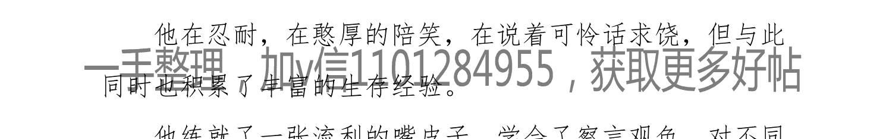
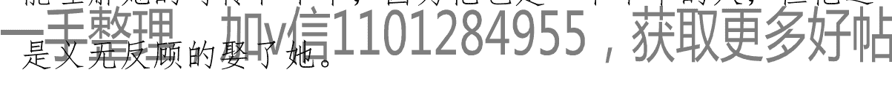
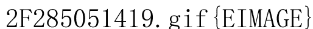

## **(长篇) 女性秘史◆那些风华绝代、风情万种的女人，为你打开女人的所有秘密**

FY 风月宝鉴

核心提示：这是一趟妙不可言、美色斑斓、刺激惊险、秀色可餐、爆笑连连的神奇探险之旅！

6000年历史，3000多位女性，她们的生命之花将在这里重新绽放。

两性本能，爱的技巧，性的秘密，它们的起源、发展、规律，将在这里一一为你揭秘。

那一个个风华绝代、风情万种的女人，她们的美貌，魅力，风情，命运。

那一个个惊心动魄、曲折离奇的真实事件，远比虚构历史剧更震撼人心。

◆ 如果你是男人/男孩，女人所有的秘密都将为你打开。
◆ 如果你是女人/女孩，你将不会再对男人有任何困惑。

绝对让你不虚此行！！

火爆上线，长期连载！

你，准备好了吗？Let’s go！！！

我爱历史，也爱女人。

在很小的时候，当我每一次读历史，都会被那一个个英雄豪杰、仁人志士所深深打动，然而最让我难忘的，却是在那波澜壮阔的历史长卷之间，不期而遇的那一张张鲜活美丽的面孔。

每一次的相遇都是如此特别、如此动人，让我念念不忘，深深着迷。

- 她们那足以融化一切的爱与柔情让世界变得更加温暖美好；
- 她们的绝代风华、万种风情征服了世界，改变了历史进程；
- 她们通过不懈努力在各个领域做出了让人瞠目结舌的成绩；
- 她们凭借聪明才智和独特个性谱写了属于自己的华丽篇章。

但却没有多少人真正了解她们。

作者：FY 风月宝鉴 日期：2017-08-01 08:31

她们如古寺里斑驳神秘的壁画，仿佛触手可及，近在咫尺，待你想细细揣摩，却又仿佛远在千里之外，隔着千年。

她们是如此陌生，又如此熟悉，总在不经意间出现在你的眼前、心间。

无数次，我都仿佛感觉到，那些女人躲在历史的角落里，在对我说话，对我笑。告诉我她们的秘密，她们的命运，她们的苦难与抉择，她们的喜怒和哀乐。

这种感觉延续至今。

这些感觉变成文字，就有了这部作品。

作者：FY 风月宝鉴 日期：2017-08-01 08:34

其实，相关的著作及文学、影视作品并不鲜见，但遗憾的是大部分都演绎过度，与真实的人物相去甚远，而且基本上都是关于其中某一个人、某一个时代，基于男性和男性社会的视角来写的，缺乏全面系统深刻的描绘。

这些远远不够。

我想要写的是一部以女性为视角，以史料为基础，涵盖有史以来、古今中外所有值得被后人铭记的女人的历史，一部女性通史。

那些女性谱就的一曲曲动人华章！

作者：FY 风月宝鉴 日期：2017-08-01 08:35

但我并不想把它写得像历史论文一样晦涩难懂。

因此，这会是一部集各种写作手法和有趣好玩的表达方式于一体的作品，绝对会让你读的妙趣横生，读的畅快淋漓。

当然，不仅如此。

一部作品如果只有这些，无论它多流行，都没有灵魂。

女人在人类社会发展过程中扮演了什么样的角色和作用？两性分化、两性本能、两性关系及爱情婚姻有着怎样的发展轨迹和规律？

女人何以成为最好的女人，男人何以成为最好的男人？

女人甚至整个人类的最终归宿又是什么？……等等。

我希望能给出我的答案，以我自己的思考方式。

另外，还有一项很实用的基本功能：那就是能让男人更了解女人，让女人更了解自己和男人。

作者：FY 风月宝鉴 日期：2017-08-01 08:36

论起题材，说它是小说，但基本上没有虚构和杜撰；说它是学术著作，又使用了小说的各种技巧，甚至有些地方经过了诗化或者说浪漫主义化的处理；说它是散文，整部书又是一个相互关联的整体，有铺垫、有高潮、有脉络。

好像都不合适。

因此，我曾戏谑的称之为“史诗”，写历史的诗（散文诗），而且其中确实包含了大量优美的诗歌，如果你不认可“史诗”的说法，权当这是一些历史和一些诗歌的合集吧。

最后一点，我喜欢简洁。

在文学创作中，我很推崇冰山理论，能用一句话说完的绝不用两句话，能用十个字说完的绝不用十一个字。所以在不影响人物形象丰满和鲜活的前提下，在不影响情节和故事完整的前提下，尽量保持简洁。

简洁而不简单。

简洁，是美中之美，是最本质的美。

我想完成的就是这样一部简洁、美、动人、幽默、真实、有态度、有灵魂，同时又兼具浪漫主义情怀的作品。我不知道能否做到，但我在努力。

为那些感动过我的女人，也为我自己。

作者：FY 风月宝鉴 日期：2017-08-01 08:38

> 落魄江湖载酒行，楚腰纤细掌中轻。
十年一觉扬州梦，多情却似总无情。
阅遍红尘风月事，试吟新诗与君听。
平生只有双行泪，半为苍生半美人。
——合杜牧、王世鼐诗《夜作抒怀》

作者：FY 风月宝鉴 日期：2017-08-01 08:39

让我们就此开始吧！！！

作者：FY 风月宝鉴 日期：2017-08-01 08:43

一手整理，加v信1101284955，获取更多好帖

## ◆◆第一部◆◆ 女神是怎样练成的

作者：FY 风月宝鉴 日期：2017-08-01 08:45

题记：

> “我已经老了。有一天，在一处公共场所的大厅里，有一个男人向我走来，他对我说：我认识你，我永远记得你。那时候，你还很年轻，人人都说你很美，现在，我是特地来告诉你，对我来说，我觉得你比年轻时还要美，那时你是年轻女人，与你年轻时相比，我更爱你现在备受摧残的容颜。
——杜拉斯《情人》”

作者：FY 风月宝鉴 日期：2017-08-01 08:48

## ◆◆第一章　女娲的秘密

作者：FY 风月宝鉴 日期：2017-08-01 08:55

多年以后，当每一个女孩都能穿着短裤露着性感的大腿、灿如夏花般从人群中飘过的时候，她依然是传说中那个人面蛇身的女神。

虽然她的真实模样并非这样。

无数的女孩梦想着成为女神；而她却只想做个平凡的女人。

作者：FY 风月宝鉴 日期：2017-08-01 08:57

这里有一份这位女神的档案：

| 项目 | 内容 |
| :--- | :--- |
| **姓名** | 女娲 |
| **别称** | 娲皇、风里希、风里栖 |
| **性别** | 女 |
| **年龄** | ？？（女神的年龄你别猜，猜来猜去也猜不明白） |
| **身高** | 不详，但拥有任何女性都没有的大长腿。 |
| **三围** | 保密（人面蛇身，既然是蛇一样的身躯，你就尽管往性感苗条、前凸后翘那个方向想象吧！） |
| **星座** | 未知 |
| **血型** | 待考 |
| **职业** | 创世女神，部落首领，同时还兼职红娘的工作。 |
| **特长** | 1、神通广大，每日七十变（要知道孙悟空总共也才七十二变）；<br>2、多才多艺，会笙簧等多种乐器，并拥有这些乐器的发明专利。 |
| **出身** | 没有任何记载，没人知道她从何处来，究竟何时出现，无父无母，也没有任何兄弟姐妹和亲戚朋友。 |
| **家庭情况** | **老公：** 没有。一直单身，开始是单身女孩，后来是单身母亲。再后来据说曾与伏羲在某一时期传过绯闻。对，就是搞八卦的那位，也有说伏羲同时还是她哥哥的，呃....，这关系，简直比娱乐圈还八卦。但目前已辟谣，纯属有人在背后别有用心的谣传和炒作。（后面我们将找到这些人，并发现一个无比惊人的巨大阴谋。）<br>**子女：** 由于极特殊的造人方式，所以数量极多，很久以后，她的后裔已有十数亿人。 |
| **主要成就** | 1、造人，人类始母神，别男女，通婚姻，创造人类并建立婚姻制度。<br>2、补天，熔彩石以补苍天，斩鳌足以立四极，使人类发展得以延续。 |
| **获得荣誉** | 1、地球第一届有突出贡献创造发明奖<br>2、“感动中国”舍身救人见义勇为奖<br>3、被本书列为“世界十大女神”之首 |
| **人生感悟** | 做女人难，做名女人更难，做女神难上加难！ |

作者：FY 风月宝鉴 日期：2017-08-01 09:00

> 开辟鸿蒙，谁为情种？《道德经》曰：道生一，一生二，二生三，三生万物。一切的开始都从这里开始！

那来自遥远时代的传说，夹杂着泛黄的记忆，浸透了蒙昧与好奇，却也揭示了女娲背后真正的秘密。她是女神，是母亲，是女人，是部落首领，同时还扮演了男人（神）的角色，承担着保护者和拯救者的责任。

那么，女娲为何会拥有如此复杂而又独一无二的形象呢？谜底将在那个辉煌而又残酷的时代到来之时揭晓。在此之前，我们还是先让女娲完成她女神的工作吧！

作者：FY 风月宝鉴 日期：2017-08-01 09:04

### ◆◆造人计划

作者：FY 风月宝鉴 日期：2017-08-01 09:05

有经验的人都知道，女神往往都是看着很高冷，其实很多女神内心都很孤独。

女娲也是如此。

天苍苍，地茫茫，女娲形影相吊、茕茕孑立于天与地之间。

此时天地虽然已经形成，但估计只完成了一期工程，一切都是那么粗糙和简陋：天上飞着奇怪的鸟类，地上爬着奇怪的动物，远方的火山喷薄着火焰，如一头巨兽不断的吐着舌头，好像也在无聊的自己逗自己玩。

女娲对眼前这些熟视无睹、意兴阑珊，丝毫没有现代人游览森林公园的兴奋与喜悦。

她折纤腰以微步，摇曳生姿，那些飞禽走兽自然也丝毫欣赏不了她的性感与风情。

无聊！整个世界都很无聊。

作者：FY 风月宝鉴 日期：2017-08-01 09:09

终于，在一条河边她停了下来，然后看到了水中自己那张迷茫的脸。

她很孤独。

于是，女娲决定做点什么来打发这孤独的时间。

做什么呢？

在那个年代，S个Pa、按个摩、美个容、泡个吧显然都是不可能的。女娲苦苦思索着，手里无意识的揉捏着刚才挖起的一块软泥；突然，在她脑海里涌现出一个新奇而疯狂的想法：

何不仿造自己的身体捏一些“自己”呢？

这个突如其来的念头让她莫名的感受到前所未有的欣喜和渴望。

既然如此，那就开始吧！

作者：FY 风月宝鉴 日期：2017-08-01 09:12

#### # 说干就干！

女娲按照自己的形象捏出了头、脸和上半身，然而就在要捏下半身的时候，她犹豫了。

我们知道，女娲是人首蛇身，所以下半身是连在一起的，但她这时并没有盲目模仿，而是充分发挥了创造和创新精神，把下半身分为两半，捏出两条腿来，并为之取了一个十分形象的名字：“人”。

因为女娲并不只是想捏出一模一样的“自己”，在她的心底还有一个更伟大的计划。

而那最天才的创意，就在两腿之间。

就是因为这一创意，世界就此改变！

作者：FY 风月宝鉴 日期：2017-08-01 09:15

女娲捏出了一个个小人儿，并在小人儿两腿之间，有的捏了一下，有的摁了一下，分成男女不同性别，然后在这些小人的鼻子上一吹，他们就动了起来，围着她闹着、笑着，叫她“妈妈”。

调皮的那些是男孩，他们打闹着，嬉戏着，折着树枝，掷着石块，嘴里还含混的叫着“凸凸凸凸凸……”，如同现在的小孩儿拿着玩具枪，一边射击一边模拟枪响；而那些文静乖巧的女孩则吓得“凹凹凹凹凹……”叫起来，怯怯的躲在了女娲身后。

作者：FY 风月宝鉴 日期：2017-08-01 09:16

整个世界好像都热闹起来了！

一股巨大的幸福感从心底升起，这是她以前从未有过的感觉，她发现自己是如此的爱他们，那么强烈的感觉到他们就是她的一切。

愉悦感和满足感占满了她。

她要造更多的人！

女娲夜以继日的重复着高强度的造人工作，没有周末，没有休息，但她任劳任怨，无怨无悔。

可是日积月累，她终于还是太累了。于是，女娲又想出了一个巧妙的办法：用藤条蘸着泥浆甩。

作者：FY 风月宝鉴 日期：2017-08-01 09:17

那藤条上下翻滚，跌宕腾挪，空气中仿佛弥漫着最灵动的音符。

一个个生命就此诞生。

由于改进了生产方式，所以工作效率大大提高。

批量生产嘛。

女娲很满意。

作者：FY 风月宝鉴 日期：2017-08-01 09:18

但这后来也有了问题。

有钱的人说，富贵的人是捏的，穷人都是甩出来的；

长得好看的人说，长得好的都是捏的，丑的是甩出来的。

以此类推，聪明的与笨的，有品位和没品位的，喜欢韩剧和喜欢美剧的，当然，还有使用不同手机的人……等等，花样繁多，数不胜数。

人人都找到了满满的优越感，人类的鄙视链正式形成。

作者：FY 风月宝鉴 日期：2017-08-01 09:19

又过了很久，造的人越来越多，女娲终于支撑不住了，仰面重重的躺在地上。

她感觉如此疲惫，又如此快乐，一丝幸福的微笑在她嘴角漾开。那些新鲜的生命围着她，欢呼着，跳跃着。

看着她的孩子们，她的眼神闪烁着世界上最美最柔和的光辉。

那是母性的光辉。

但女娲的工作并没有结束，她的计划才刚刚开始。

作者：FY 风月宝鉴 日期：2017-08-01 09:20

女娲把人分成男女两性，目的就是让两者结合，繁衍生息。

按理说，她应该把两性的关系变得简简单单，让男女能够更容易的在一起，更容易的获得幸福和快乐。

然而，女娲接下来所做的却与其最初目的完全相反。

作者：FY 风月宝鉴 日期：2017-08-01 09:22

她把男女之间的关系和爱情变成了世界上最变幻莫测、最难以捉摸的事情。

她让男女两性结合，却在两者之间设置了最神秘、最难解的密码，而把那打开密码的钥匙丢在了人类灵魂的最深处。

在以后漫长的人类发展过程中，两性关系出现了极其复杂的变化。

将有无数的悲欢离合，爱恨情仇上演。

将会有无数人因此痛不欲生，辗转反侧，甚至走向毁灭。

作者：FY 风月宝鉴 日期：2017-08-01 09:24

但女娲知道她必须这样做，虽然她爱他们。

有了这些，你们将能够战胜一切，征服一切，成为世界的主宰！

一手整理，加v信1101284955，获取更多好帖

人类按照自己的方式生存着，繁衍着，并且被一股巨大的力量驱动着不断向前发展，不断发现和认识更大的世界。

看着这一切，女娲很幸福。

只是我们知道这句话后面还经常跟着另一句：

幸福往往都是短暂的！

很可惜这次也不例外！

作者：FY 风月宝鉴 日期：2017-08-01 09:27

## ◆风月奇谭◆ 女娲与伏羲

作者：FY 风月宝鉴 日期：2017-08-01 09:27

在很多记载里，女娲与伏羲是兄妹及夫妻关系，而且他们结合的故事也很香艳。

相传两人想要结合繁衍人类，但又不好意思，于是就来到山上，对着云说，如果这是天意，就让这两朵云合到一块吧；

也有种说法是他们约定从两座相邻的山上相对滚下来，如果撞到一块就在一起。诸如此类，说法不一。

当然，云彩很神奇的合二为一，而他们也很神奇的撞到了一块。

于是他们就立刻开始了结合，但依然有些不好意思，就结草为扇遮挡着脸。

作者：FY 风月宝鉴 日期：2017-08-01 09:29

汉代绘画中有很多关于伏羲女娲的交尾图，女娲与伏羲后来生有四子，分别是青干、朱四单、白大然、墨干，别看这四位名字奇怪且姓都不同，却都是一个爹生的。他们自然也是神，主要工作是分管四季。

但事实上，这主要都是汉代及以后的人的附会（当然很多神话都是如此）。

在很长一段时间里，女娲和伏羲，是两个不同系统的神，彼此之间没有任何交集，这也是无论是造人还是补天，都不见伏羲的踪影，完全由女娲独自完成的原因。

作者：FY 风月宝鉴 日期：2017-08-01 09:30

### ◆◆孤独的补天者

作者：FY 风月宝鉴 日期：2017-08-01 09:31

那时的男神还像后来的男人一样喜欢打打杀杀。这一天，一个叫共工的水神和一个叫祝融的火神干了一架。很不幸水神输了，他很愤怒，而且他表达愤怒的方式很独特，那就是撞山。于是他一头撞向不周山。估计这位神的铁头功练得比打架功夫好，这一撞不要紧，天柱折，地维绝，天倾西北，地陷东南。麻烦大了。

作者：FY 风月宝鉴 日期：2017-08-01 09:32

一手整理 加v信1101284955 获取更多好帖

因为撑天的四根天柱断裂，天无法覆盖大地，地不能承载万物，整个世界摇摇欲坠仿佛一座风雨飘摇的破屋，时刻都有倾塌的危险。更多的灾难接踵而至：凶猛的鸷鸟从天空呼啸而来，用巨大而尖利的爪子抓走无助的老人和小孩。残忍的野兽从山林出没，成群结队，吞噬善良的百姓。大火蔓延，势如燎原，浓烟漫天，所过之处化为灰烬。北方的黑龙兴风作浪，洪水泛滥，淹没了村庄和大地。

作者：FY 风月宝鉴 日期：2017-08-01 09:33

放到现在，这就相当于火灾，洪水，地震，飞机轰炸，变异生物等灾难同时发生，而且还是全球性的。

拍成电影绝对是科幻、恐怖、灾难，史诗级大片。

要说世界末日，这绝对算得上最凶险的世界末日。

人类面临灭顶之灾！

作者：FY 风月宝鉴 日期：2017-08-01 09:34

一般来说，事情发展到这个地步，就会有救世主或者英雄挺身而出，拯救世界（再不出现世界就毁灭了）。曾经他们是宙斯、上帝、佛祖、安拉……，现在他们是甘道夫、蝙蝠侠、蜘蛛侠、超人……

然而这一次，然而在这个世界上最古老的救世神话之一里，出现的却是一个窈窕的身影。

对，女娲。

绝无仅有。

作者：FY 风月宝鉴 日期：2017-08-01 09:35

只是她还是那样的孤独。

没有同伴，没有帮手，她要独自面对所有的黑暗和邪恶。

但她不能退缩，不能逃避。因为这是她的一切。

毁坏破败的家园，流离失所的人们，老人无力的叹息，小孩惊恐的眼神，无不像一根根钢针深深的刺痛她的心，这种感受大概只有眼睁睁看着自己的孩子被狼叼走的母亲才能真正体会。

作者：FY 风月宝鉴 日期：2017-08-01 09:36

她不容许自己后退半步。

哪怕前面是万丈深渊，我也要保护你们，绝不会让你们再受伤害！

她不知道前方会遇到什么，她不知道结果会如何，但她现在想的只有竭尽全力，做好自己能做的一切。

作者：FY 风月宝鉴 日期：2017-08-01 09:36

女娲虽然焦急万分，但并没有急糊涂。

她深知要解决所有麻烦，首先要找到并解决问题的根源。

第一步就是补天。

因为所有的灾难都由此引起。

作者：FY 风月宝鉴 日期：2017-08-01 09:37

女娲收集五彩石，架起熔炉融化，然后挥手之间，彩石之水飞上天空，补在了天的漏洞处。

经过不懈努力，天的漏洞补上了，但女娲还是不放心，她又远赴重洋，斩断海中巨鳌的脚当做撑起四方的天柱。

天终于稳固了。

作者：FY 风月宝鉴 日期：2017-08-01 09:38

解决了天上的问题，下面该集中精力解决地上的问题。

世间最大的祸害，是北方一条兴风作浪的黑龙。

但她没有霍比特人诛杀巨龙那样的探险小分队，依然只能独自深处险地。

经过殊死搏斗，女娲亲手斩杀了黑龙，然后她又用芦灰堆积起来堵住了洪水。

地上的问题也解决了。

作者：FY风月宝鉴 日期：2017-08-01 09:39

天补上了，四极正了，火扑灭了，洪水止了，猛兽鸷鸟死了。

于是，世界和人类得以拯救。

看起来似乎很顺利，很简单。

没有人知道女娲遭遇了多少困难与艰险，经历了多少威胁和磨难，但她并不在乎这些，她在乎的只有人类能够好好的生存和发展。

女娲继续着她的工作。

作者：FY风月宝鉴 日期：2017-08-01 09:39

她背靠大地、怀抱青天，让春天温暖，夏天炽热，秋天肃杀，冬天寒冷。

她头枕方尺、身躺准绳，当阴阳之气阻塞不通时，给予疏理贯通；当逆气伤物危害百姓时，给予禁止消除。

从此，四季运行规律，阴阳调和，人民安居乐业。（《淮南子》）

而且女娲还是一个具有浪漫主义情怀的实干家，她用五彩石不仅补了天，还为天空增添了美丽的点缀。

彩石补天，天边因此产生了绚丽的云霞，激发了后世无数的诗人与爱情。

可以说，女娲为人类付出了一切。

作者:FY 风月宝鉴 日期:2017-08-01 09:40

炼石补天的奋不顾身，斩断鳌足的不顾一切，诛杀黑龙的九死一生，炉灰止水的竭尽全力，她恐惧过，她犹豫过，她胆怯过，但她都没有退却。

因为有一个信念一直支撑着她：人类在，我便在；人类不在，我便不在。

无论多么强大的力量，都不能动摇她这个信念。这种信念胜过狂热的崇拜，胜过金钱的诱惑，胜过死亡的威胁。

作者:FY 风月宝鉴 日期:2017-08-01 09:41

所有这一切，只关乎两个字：母性，“女人三性”的第一性。

它孕育一切，包容一切，承载一切，维护一切。

它所蕴含的精神力量也足以战胜一切。

但它远远不止母亲对孩子的爱那么简单，很快你就会发现它还有更复杂的一面。

那么，第二性呢？

作者:FY 风月宝鉴 日期:2017-08-01 09:43

## 第二章 夏娃的诱惑

作者:FY 风月宝鉴 日期:2017-08-01 09:44

伊甸园。夏娃坐在树下慵懒地吃着葡萄。

像往常一样。但今天注定和往常不一样。

因为在她背后，有一双眼睛一直盯着她。

2F279950345.

作者:FY 风月宝鉴 日期:2017-08-01 09:45

午后的阳光沉醉般洒在她丰韵而白嫩的身躯上，她的肌肤是如此光滑而细腻，每一寸都闪烁着诱人的光辉；她的身体是如此匀称而饱满，无处不散发着妩媚和性感，仿佛整个伊甸园的花草树木、鸟兽虫鱼都笼罩在她的女性魅力之中。

夏娃想起她刚来到这个世界上时，亚当第一眼见到她时的惊喜和兴奋。

他后来经常说，第一眼见到你的时候我就爱上你了。

> “你真美，真性感，我整个人都被你完全俘获了。”

那时她觉得自己是世界上最幸福的女人。

作者:FY 风月宝鉴 日期:2017-08-01 09:46

她还记得刚在一起时，他是那样的爱着她的身体，简直都让她有点搞不清他到底是爱她的身体还是爱她了。

“你真爱我吗？有多爱？”有一次，她问出了几乎每个恋爱中的女孩都会问的问题。

> “你是世界上第一个女人，也是我的第一个女人，我会永远爱你，而且只爱你一个人。”亚当说。

> “真的吗？我真是世界上第一个女人？你真的永远只爱我一个吗？”

“当然，你是我的肋骨做成的，你是我的骨中骨、肉中肉。你是我的，我也是你的，我们是一体的，少了对方，我们都不是完整的自己”，亚当深情地注视着她，目光真诚而热烈。

听着亚当的话，夏娃很幸福。

2F279950555.

作者:FY 风月宝鉴 日期:2017-08-01 09:51

在伊甸园，他们一块嬉戏，打闹，游玩，欣赏各种美丽的花，听鸟儿欢快的歌唱，享受着爱情的美好与激情，饿了就摘树上美味的果子，渴了就喝甘甜的泉水。

一手整理 加v信1101284955，获取更多好帖

他们就这样幸福地生活着，没有烦心事，不需要工作，也没有生存的压力。

作者:FY 风月宝鉴 日期:2017-08-01 09:51

可是时间久了，亚当再也不像以前那样时时刻刻都和她腻在一起了。

他经常到处攀援，奔跑，捕捉动物，忙得不亦乐乎，把她一个人孤零零地丢在角落里，任由落寞与孤单侵扰，只有晚上才会回到她身边。

亚当也曾带她一块去过，惊喜和刺激过后，她发现对那些并不感兴趣。她很失落，感到男女之间越来越多不同的地方，虽然她相信亚当依然爱着她，就像她依然爱着亚当一样。

她不知道亚当是对自己的身体厌倦了还是不像以前那样爱自己了。

作者:FY 风月宝鉴  日期:2017-08-01 09:52

> > “男人都这样吗？”夏娃又吃了一颗葡萄。

就在这时，在她的身后突然响起了一阵奇怪的声响。她回过头，看到了那个让她有些惊恐而又惊奇、惊喜的东西。

一条蛇。

它已等待很久了。

作者:FY 风月宝鉴  日期:2017-08-01 09:53

夏娃第一次见到这条蛇。但她却有种很奇怪的感觉，好像曾经在哪里见过似的。

> > “你看那棵树上的果子，多么鲜嫩，多么诱人，一定非常美味，你不喜欢吃吗？我从没见你吃过。”蛇问。

> > 夏娃莞尔一笑：“园中树上的果子，我们都可以吃； 惟有园当中那棵树上的果子，神曾说：‘你们不可吃，也不可摸，免得你们死。’”

> > “你们不一定死，因为神知道，你们吃了之后，就会拥有智慧，眼睛就明亮了，你们就能像神一样知道善恶。”

作者:FY 风月宝鉴  日期:2017-08-01 09:54

> > 蛇直视着夏娃的眼睛，“你不懂善恶，就像你不知道自己有多美，多迷人一样，就像你不知道亚当为什么对你跟以前不同了一样。因为你的眼睛被蒙蔽了。”

“真的吗？”

蛇并不回答，而是在树枝之间迅速地游走着，它是那样灵活，那样有力，那样敏捷。

夏娃不禁心旷神怡了。

作者:FY 风月宝鉴  日期:2017-08-01 09:55

“你应该看看更大的世界”，蛇狡黠地笑着说，“伊甸园不是你的全部，亚当也不是你的全部。”

但夏娃依然爱着亚当，她有些生气：“请不要再这样说了。我爱他，他也爱我，我永远不会离开他。”

“你相信他？”

“对，他从来不会欺骗我。”

一手整理 加v信1101284955，获取更多好帖

作者:FY 风月宝鉴  日期:2017-08-01 09:57

“唉”，蛇叹了口气，“他是不是告诉过你，你是世界上第一个女人？是不是说你是他的第一个女人，也是他唯一爱的女人？”

“那是自然，有问题吗？”

蛇摇摇头，眼神里满是难以置信：“那亚当肯定没有告诉你他和莉莉丝的过去了”。

“莉莉丝是谁？” 夏娃的心紧了一下。

蛇带着同情、可怜、似乎还有嘲弄她愚笨的表情看着夏娃：

> “原来你什么都不知道。”

于是蛇跟夏娃讲述了这个叫莉莉丝的女人的故事。

作者:FY 风月宝鉴 日期:2017-08-01 09:58

### 亚当的第一个女人

作者:FY 风月宝鉴 日期:2017-08-01 10:01

上帝创世纪时，在第六日造出了亚当，为了不让他寂寞，还另外造出了一些动物。但亚当总觉得少点什么，这些动物虽然可爱，跟他却没有共同语言。

他热切地恳请上帝造一个跟他相似的同伴。于是，上帝就造出了莉莉丝，世界上的第一个女人。

需要说明的是，上帝造莉莉丝和造亚当方法是一样的，都是用泥土捏制而成。

在伊甸园，亚当和莉莉丝幸福地生活着。一切看起来都是那样美好，就像亚当和夏娃现在一样。

2F279951848.

作者:FY 风月宝鉴 日期:2017-08-01 10:01

但莉莉丝却不是一个普通的女人。

她有自己的思想，有自己的想法，经常和亚当有不同的意见，这似乎并不是什么缺点，但在亚当当时看来，却是完全不能忍受的。

> 我是男人，你应该听我的！服从我！

> 我并不是你的附庸，我们是平等的！

莉莉丝坚持自己的看法，亚当也不愿让步，这样一来矛盾自然就会越来越多。

虽然如此，他们的感情依然很好，依然很幸福。他们依然相信会永远在一起。

但让他们想不到的是这些日常生活中的小矛盾却在不知不觉地日积月累着，只等那最后爆发的时刻。

在最后爆发之时，他们才惊讶地发现，原来所有的爱与耐心早已耗尽。

作者:FY 风月宝鉴 日期:2017-08-01 10:04

终于，这一天到来了。

出人意料的是，两人最终的决裂却发生在一件很美好的事上。

床第之事。

2F279952201.

作者:FY 风月宝鉴 日期:2017-08-01 10:05

事情的原委很简单：莉莉丝说“我不可在下”，而亚当说“我当在上，不可在你之下；你当在下，我在你之上”。

导火索就此点燃，长久积累的矛盾爆发了，谁也不愿再妥协，最终争论的结果不是谁上谁下，而是各奔东西！

思考了很久，痛苦了很久，莉莉丝现在终于下定了决心，离开亚当，离开伊甸园。

走吧，走吧，不要再犹豫了。

亚当，虽然我对你还有感情，但我必须离开了，咱们并不是一路人。

作者:FY风月宝鉴 日期:2017-08-01 10:07

亚当一下子慌了，他如此霸道地对待莉莉丝，只是感觉尊严受到了挑战，只是为了维护自己那可怜的自尊，却根本没想到会闹到这种地步。

他苦苦哀求莉莉丝。

但他并不知道，女人虽然在面对一段不合适的感情时常常会委曲求全、难以割舍，但一旦下定决心，却是无论如何都很少会回头的。

一手整理 加v信1101284955，获取更多好帖

看着莉莉丝毅然决然远去的身影，亚当感到撕心裂肺的绝望，他只有最后一条路可走，求助上帝。

而从后面的结果来看，上帝对感情问题也没有很好的处理方法。

因为他采取的方式简单而粗暴，只有两个字：恐吓。

作者:FY风月宝鉴 日期:2017-08-01 10:08

其实这也很好理解，从《旧约》就可以看出，上帝是个纯爷们，而且是没有任何感情经历的纯爷们。

他派了三个天使去追莉莉丝，并用严厉而不容置疑的口气说：“如果她愿意回来最好，如果不愿回来，告诉她，以后每天都会有她的100个子孙死掉”。

残酷吧！估计没有比这更残酷的惩罚了！

上帝相信莉莉丝很快就会回到亚当身边。

天使追了很久，终于在红海中央找到了莉莉丝。

他们将上帝的话告诉了莉莉丝，然后静静地看着她，他们本以为会看到莉莉丝惊恐的眼神，颤抖的身体，然后苦苦哀求他们，乖乖地跟着他们回去。

但他们失望了，莉莉丝的反应完全出乎他们的预料。

她望着远方，眼神闪烁着炽热的光芒，平静而坚定地说：

> “我是绝不会再回去的。”

天使感觉自己被彻底打败了，恼羞成怒，恶狠狠地威胁

> “我们要将你溺死在大海之中”。

> “躲开！”

莉莉丝轻蔑地看着天使，毫不畏惧，然后扬长而去。只留下天使呆呆地站在那里，六神无主，手足无措。

哪怕会受到诅咒，只要看到你们的名字、形象，就会让我失去力量；哪怕每天都会有100个我的子孙死去，都不能阻挡我前行的路。

因为，只有我自己知道我要走的路在何方。

2F279952748.

### 风月奇谭 莉莉丝的来历

作者:FY 风月宝鉴 日期:2017-08-01 10:11

在基督教诞生前近两千年的时间里，莉莉丝是苏美尔神话中的夜之女神。

在十世纪的典籍《本司拉的知识》中，莉莉丝第一次作为上帝造的第一个女人，亚当的第一个妻子出现。

后来，因为背叛上帝，离开亚当，莉莉丝逐渐变成坏女人的代表，她神秘，邪恶，充满诱惑，经常在夜里出现引诱男人，甚至还有传说她离开亚当后变成了魔鬼撒旦的妻子，并引发了天使战争。

当然，在基督教的正典里，莉莉丝是一直不被承认的。

作者:FY 风月宝鉴 日期:2017-08-01 10:23

### 女人之间的游戏

作者:FY 风月宝鉴 日期:2017-08-01 10:25

> “她是一个勇敢的女人，她知道自己想要的是什么。”

蛇叹了口气，看了看夏娃。

夏娃的眼圈早已泛红。

当然，不是被莉莉丝的精神感动的。

作者:FY 风月宝鉴 日期:2017-08-01 10:26

> 她喃喃地反复自语着：“亚当从来没告诉我这些，他为什么要骗我，他为什么要骗我。”

突然她又问道：“这些都是真的吗？我又怎么知道你不是骗我呢？”

“因为我对你没有企图和要求，没有企图自然就不需要欺骗。”蛇毫不在意。

夏娃默然无语，过了一会儿，她突然好像想起了什么，问了一句女人在这种情况下通常最关心的问题：

> “她美吗？”

作者:FY 风月宝鉴  日期:2017-08-01 10:26

“虽然在一个女人面前夸奖另一个女人的美貌是很不礼貌的行为，但可爱的女士，我的真诚让我不得不说，她确实是一个很美很美的女人，我再也没见过比她更美的女人了，”蛇说。

一手整理，加v信1101284955，获取更多好帖

“她那飘逸的秀发，丝丝如风，仿佛撩拨着人的灵魂；她那妖冶迷人的装束，令每个看到她的人都失魂落魄；她身上散发着青春的活力，凝脂般的美颈上挂着玫瑰和罂粟编制的花环；她用柔和的目光织起一张情网，没有哪个男人能挣脱，没有哪个男人能抗拒。”

2F279954385.

作者:FY 风月宝鉴  日期:2017-08-02 12:12

夏娃终于控制不住，泪水夺眶而出，她歇斯底里地叫着：

> “他肯定还忘不了她！他肯定还忘不了她！”

蛇冷静如雕像般看着失控的夏娃：

> “你应该有信心，你也是一个很美的女人，非常非常有魅力，足以让男人无法自拔，只是你自己并不知道而已。”

然后它说出了问题的关键：

> “因为你还没有拥有智慧。”

作者:FY 风月宝鉴 日期:2017-08-02 12:13

> “那我该怎么办？”

蛇看了看智慧树，并没有直接回答她，只淡淡说了一句::

> “你自己知道答案。”

作者:FY 风月宝鉴 日期:2017-08-02 12:14

对于夏娃来说，这是她第一次面对这样的艰难抉择。

她感到自己是那么痛苦，那么无助。

一直以来，她都那样天真烂漫，无忧无虑，她的世界很小，很单纯，也很幸福。从她来到这个世界上，她的世界就只有亚当，只有伊甸园。

她一直以为这就是世界的全部，世界就是这样。

在她的认识里，一切都是那么美好，没有欺骗，没有伤害。

但是，现在她才知道，连亚当都会欺骗她，还有什么是可以相信的呢？她从来没想过世界竟然如此复杂，男人和爱情竟然也如此复杂，连最亲密的人之间都会有欺骗。

作者:FY 风月宝鉴 日期:2017-08-02 12:14

我该何去何从？

夏娃心如乱麻，感觉自己现在正站在十字路口。
在她面前，摆着两条路。

作者:FY 风月宝鉴  日期:2017-08-02 12:16

### 第一条路：

继续这样的生活，装作什么都不知道，装作什么都没发生过，继续维持着虚幻的美好与单纯，祈祷着亚当能一如既往地爱自己、疼自己，傻傻地做自己，听从命运的安排和摆布。

这一条路是最简单的。

### 第二条路：

吃了那智慧树上的果子，让自己拥有智慧，变得更聪明，让自己变得更加美丽，更加魅力四射，让亚当离不开自己。

只是选择了这条路，就必须要经过艰苦的成长与磨砺，独自面对那些复杂和残酷。

因为那成长之路，没人可以帮你，只有你自己才能完成。

作者:FY 风月宝鉴  日期:2017-08-02 12:19

2F280032374.

作者:FY 风月宝鉴  日期:2017-08-02 12:20

可是我不能欺骗自己，我不想逃避。我要勇敢面对这一切。

夏娃在心底已经暗暗打定了主意，只是她还要等亚当回来。

亚当，即使你告诉我真相，即使你欺骗了我，我也依然会爱你，我绝不会抛下你的。无论做出怎样的选择，无论在哪里，我都会和你在一起。我绝不会像莉莉丝那样对你。

她是个坏女人，夏娃略带骄傲而鄙夷地想，我跟她不一样。

作者:FY 风月宝鉴 日期:2017-08-02 12:20

### 男女之间的博弈

作者:FY 风月宝鉴 日期:2017-08-02 12:22

傍晚的时候，亚当回来了，他收获颇丰，捕捉到了很多动物。

他是那样的兴高采烈，准备向夏娃炫耀自己的丰功伟绩。

一手整理，加v信1101284955，获取更多好帖

但他还没开口，就看到了夏娃生气的脸和发红的眼睛。

作者:FY 风月宝鉴 日期:2017-08-02 12:24

> “你这个骗子，莉莉丝是谁？”夏娃直截了当地问。

亚当心里一惊，但随即平静下来。

> “你在说什么呀，谁是莉莉丝？胡闹，我完全不知道你在说什么。”

夏娃看着眼前这个男人，她原以为自己是那么了解他，现在忽然感觉他原来如此的陌生。

2F280032565.

作者:FY 风月宝鉴 日期:2017-08-02 12:24

亚当看她不信，忙补充说：“上帝创造了我，然后又用我的肋骨创造了你，根本没有什么莉莉丝，不信你问上帝去。”

夏娃泪水流了下来：“亚当，我什么都知道了，你为什么还要骗我。”然后把蛇告诉她的事对亚当讲了一遍。

亚当知道瞒不住了。

作者:FY 风月宝鉴 日期:2017-08-02 12:25

“夏娃，我爱你，我不告诉你是不想伤害你，不想你伤心，我太爱你了，怕你离开我。”他说，并为自己创造这个今天还在被男人广泛使用的名言而沾沾自喜。

“那你保证以后再也不能欺骗我。”夏娃并没有太为难亚当，因为她心里还有一件大事要告诉亚当。

“好，我以后再也不会骗你，我一定会好好爱你。”亚当发着誓，然后问道，“谁告诉你这些的？”

这时他注意到了那条蛇。

亚当怒斥道：“你哪里来的东西？”

“我来自田地里，也来自你们的心里。”蛇神秘地笑着说。（请注意这点）

作者:FY 风月宝鉴 日期:2017-08-02 12:26

看到亚当理亏，夏娃知道她说出自己的计划的时机到了。

这个时候，他不太敢反驳自己。

但听完夏娃的想法，亚当犹豫了。

“上帝知道了怎么办？他会惩罚我们的。”

作者:FY 风月宝鉴 日期:2017-08-02 12:27

“你是不是男人啊？”夏娃彻底恼怒了，“我一个女人都不怕，你怕什么？”

她第一次感觉他是如此的懦弱，以前他是多么乐于在她面前炫耀他的勇敢和强大。

现在似乎一下子坍塌了。

男人往往一遇到这句话就会丧失所有抵抗力，尤其是在自己的女人面前，因为你实在无从反驳。

亚当感觉自己的尊严受到了侮辱：“好，就听你的。”

作者:FY 风月宝鉴 日期:2017-08-02 12:28

于是，夏娃伸手摘了智慧树上的一颗果子，给了亚当，然后又给自己摘了一颗。

他们的眼睛亮起来了，世界在他们眼中呈现出全新的模样。

作者:FY 风月宝鉴 日期:2017-08-02 12:29

夏娃(包括莉莉丝)代表的是“女人三性”的第二性：女性。

请注意，这里的“女性”并不是指女人，而是女人的美、魅力、吸引力、风采、柔情，对新事物的好奇心、同情心、爱心、包容、平和，以及基于女人本身的思想和价值观等。

与之相对的，则是男人身上所具有的“男性”。

2F280032868.

作者:FY 风月宝鉴 日期:2017-08-02 12:30

对亚当和夏娃来说，离开伊甸园，即使他们会受到惩罚，即使他们会在艰苦的生活中磨灭所有青春和激情，即使等待他们的不只是快乐和幸福，还有更多的苦难，但迈出这一步却非同寻常。

以亚当为代表的男人很快会得到一个男人想要的，甚至会得到更多。

而以夏娃为代表的女人虽然受到了更多更长时间的惩罚，但她们终会发现，所经历的所有痛苦和磨难，都不过是淬炼凤凰的火焰，而她们终将以更美的姿态飞得更高。

因为“女人三性”的第三性。

作者:FY 风月宝鉴 日期:2017-08-02 12:31

### 风月奇谭 失乐园

作者:FY 风月宝鉴 日期:2017-08-02 12:33

亚当和夏娃被上帝赶出伊甸园这一事件通常被称为“失乐园”，而他们也各自受到了不同的惩罚。

女人受到的惩罚是增加怀胎的苦楚，特别是生产的时候要遭受更大的痛苦和危险，同时还要依附丈夫，失去独立性，被丈夫管辖。

这样看男人似乎很占便宜，但是别急，男人受到的惩罚丝毫不比女人少。

他们必须要承担起养家糊口的责任，必须要在长满刺人的荆棘和蒺藜地里辛苦劳作，才能从中获得很少的食物，哪怕是汗流浃背，累死累活也不能停止，直到有一天累死归了土。

当然作为主犯，蛇也受到了诅咒，它必须独自爬行，并且只能吃土。而且蛇和人之间也开始相互伤害，蛇可以常咬人的脚，人可以打蛇的头。

人类和蛇的矛盾也就从此开始。

这似乎是一个《圣经》版的“农夫和蛇”的故事，而这个故事背后其实是在暗示着一个时代的到来。

2F280033035.

作者:FY 风月宝鉴 日期:2017-08-02 12:34

## ◆◆第三章 赫拉的武器

作者:FY 风月宝鉴 日期:2017-08-02 12:35

奥林匹斯，壮丽祥和，这是一片神的王国。

宙斯是众神之神，他推翻了他的父亲，获得了现在的位置。在这里，实力和能力决定一切。

事实上，到宙斯已经是第三代神王。

2F280033084.

作者:FY 风月宝鉴 日期:2017-08-02 12:37

赫拉轻轻带上门，开始在室内沐浴。

她用香水涂抹娇美的身体，梳好柔软发亮的金发，穿上雅典娜给她制作的精致华丽的锦袍，在胸前簪上金光闪闪的别针，在腰上围着一根闪闪发亮的腰带，戴上一对珍贵的宝石耳坠，罩上极其轻柔的面纱，洁白的双脚穿上一双别致的拖鞋。（荷马《伊利亚特》）

然后她静静的坐在那里，等候着他的到来。

她，要征服他！！

2F280033183.

作者:FY 风月宝鉴 日期:2017-08-03 13:07

此时的赫拉神采奕奕，光彩照人，浑身散发着沁人心脾的清香，她相信自己的美和魅力无人能够抵挡，她感觉自己仿佛都融化于这一片美、妩媚、性感与柔情的海洋。

女人的海洋。

作者:FY 风月宝鉴 日期:2017-08-03 13:08

都说女人如水。

当女人遇到水，男人就会软了腿。

作者:FY 风月宝鉴 日期:2017-08-03 13:11

比如当女人哭啼之时，娇弱含泣，梨花带雨，任你再铁石心肠，也会顿生怜惜之情。

就连形容女人含情脉脉的眼睛，我也一直认为最好的比喻就是眸如秋水，仿佛只要看一眼，你就会被淹没其中，融化其中。

2F280109020.

作者:FY 风月宝鉴 日期:2017-08-03 13:18

比如一场突如其来的大雨，衣衫单薄的她浑身湿透，湿漉漉的衣服紧紧贴着她性感的身体，那一条条优美的、柔媚的、性感的、诱人的曲线尽显无遗，仿佛世界上最伟大画家最伟大的作品，只寥寥几笔，就已勾勒出世间所有风情。
任你再坐怀不乱，都会情不自禁怦然心动。

2F280109378.

作者:FY 风月宝鉴 日期:2017-08-03 13:20

比如刚出浴的美人，洗尽铅华，那一身娇嫩白皙的皮肤经过滋养，水嫩异常，吹弹可破，犹如出水的芙蓉，清香动人；又如刚洗过的草莓，鲜嫩欲滴；
最要命的是，裹着浴袍，酥胸半露，柔顺的头发披散在光滑洁白的后背上，而那浴袍柔软轻滑，仿佛一不小心就会掉下来。
任你不是男人，也想做一回男人。

2F280109498.

作者:FY 风月宝鉴 日期:2017-08-03 13:23

而且对于女人来说，沐浴及刚出浴时往往是一个女人最温柔最女人的时候，无论你是叱咤风云的女强人，还是刁蛮强势的女汉子，莫不如此。

因为在沐浴的时候，是你面对最本真的自我的时候。
当你的手指划过自己的肌肤和身体的每一个部位，此时的你一定会柔情似水、娇媚无比。

2F280109637.

作者:FY 风月宝鉴  日期:2017-08-04 06:04

新的一天，突然就醒了，给自己加油！哈哈

作者:FY 风月宝鉴  日期:2017-08-04 12:04

赫拉深谙此道。

她是一个极其聪明的女人，也是一个拥有强大的自信的
女人。这种自信来自她绝美的容貌，来自她性感的身躯，来
自她那足以淹没任何靠近她的男人的妩媚风韵，来自她对自
自己的了解，更来自她对男人的深刻认识：


她了解男人想要的一切；
她了解男人最本能的需要；
她了解男人每一种心思和手段；
她了解男人几乎所有优点和弱点。

我知道你所有想要的，而你想要的任何一点，我都能给
你最好的。

作者:FY 风月宝鉴  日期:2017-08-04 12:06

这样的女人，对于任何男人来说几乎都已经是难以抗拒
了，然而对赫拉来说，却不仅如此，她有着更为强大的能力
和魅力。

她是一个成熟的、睿智的、有思想、有自己的追求和价值观的女人。

当她还是少女时，就已经显现出超凡脱俗的美，她的美貌会经常让森林里的鸟兽都看得惊呆掉，而那时的她就不想做一个躺在美貌上睡觉的女孩，她酷爱探究和学习，如饥似渴的缠着女神们追问世界上所有的问题，不厌其烦的听她们的各种讲解。

那时的她，就已经是一个有目标、有志向的女孩。

很多次，对着辽阔的天空，她也曾高喊她的梦想。

当然，那时的她也跟无数少女一样有着自己对爱情的梦与憧憬，她幻想着有一天，一个天神一样的、骑着雄鹰的英俊少年，乘风而来，带她飞，带她走。

作者:FY 风月宝鉴 日期:2017-08-04 12:06

而现在，她把自己收拾得干干净净，呈现自己最妩媚最柔情的一面，却是为了等待一个男人的出现。

一个拥有无比能力和权势的男人。她热切而充满自信地等待着他的到来。

不是因为爱情。

作者:FY 风月宝鉴 日期:2017-08-04 12:07

她已做好了所有的准备。

今晚，她要征服他。用她的无与伦比的妩媚，融化一切的柔情和不可抗拒的魅力。

这不是她第一次这样做，也不会是最后一次。

目的只有一个：

让他对自己言听计从，或者改变他原有的想法，从而实施自己的计划。

因为她相信自己的判断，因为相信自己是正确的。

作者:FY 风月宝鉴 日期:2017-08-04 12:08

在间谍片、宫斗片中，我们经常会看到类似场景：一个女人为了某种目的，用自己的美色征服她的诱惑对象或敌人。

或者在现实社会中，利用美色达到目的，谋取利益，求得升迁等等。

但赫拉所做的却与我们通常所想象的所有情况都不相同。这并不是一个香艳的权色交易的故事，或者刺激的美女特工的故事。

因为她要征服的是万物的主宰，众神之神，宙斯。最重要的是，对于她来说，宙斯还有一重很特殊的身份。

她的丈夫。

没错，她要诱惑和征服的是她的丈夫。

她是赫拉。奥林匹斯地位仅次于宙斯的天后，最有权力的女神。从某种程度上来说，这是神话版的妻子的诱惑。

而最大的区别在于她这样做并非只为自己。

当赫拉手持权杖，坐在天庭的黄金宝座上，众神都对她充满敬畏，受她驱使，随侍她左右的是季节女神奥雅丝、社交女神卡莉丝和彩虹女神伊里斯。

她雍容华贵，美丽异常，散发着女王般的优雅、尊荣，流露出威严而安详的神情，一头秀美的卷发从王冠上飞泻下来，双臂洁白如百合，华服香气四溢，一双美目炯炯有神，仿佛洞察着一切事物。

在她的脚边，则是美丽的孔雀。

因为孔雀的羽毛五彩缤纷，正如满心星斗的夜空的美丽壮观，而天空正是赫拉光彩照人的脸庞。

一手整理 加v信1101284955，获取更多好帖

2F280182629.

2F280182632.

作者:FY 风月宝鉴 日期:2017-08-04 12:13

事实上，她并非宙斯身边美丽的花瓶，而是一位真正拥有权力、行使权力的天后，她分享了宙斯一半的权力。

在与宙斯意见向左时，她经常与之激烈对抗，甚至采取各种手段、策略，与宙斯斗智斗勇，坚持实施自己认为正确的主张。

在这方面，她从未唯唯诺诺，从未唯宙斯马首是瞻。其实她完全可以不这么做，她完全可以什么都不管，但她还是义无反顾的选择了这条路。

因为在她看来，她是女人，更是天后，管理万事万物是她的权力，也是她必须承担的责任。

作者:FY 风月宝鉴 日期:2017-08-04 12:16

这是一个非常复杂的女性，一个非常有权力和影响力的女性。她端庄高贵却又无比诱惑，她权力极大却又备受宠爱。但她并非天生就拥有这些。

而围绕在她身上有一个谜团却也越来越让人困惑，只有当这个谜团解开之时，我们或许才能真正了解赫拉，了解赫拉的魅力所在。

这个谜团就是：赫拉是怎样成为天后的，她的权力又来自哪里？

这还不简单嘛？有什么好奇怪的！

赫拉的权力来自她的丈夫，因为她是宙斯的妻子，如果她不是宙斯的妻子，那她绝对屁都不是。

这不就是一个靠男人，靠自己丈夫的女人吗？

有这样的看法的人绝不在少数，而且不只是男人，很多女人一定也这样认为。

作者:FY 风月宝鉴 日期:2017-08-04 12:20

“你们果然并不了解”，我相信，面对如此质疑，赫拉一定会这样不屑的微笑着。因为只有她自己知道她经历了怎样不一般的成长之路。

而也正是因为这种常人不曾遇到的独特经历，让她意外掌握了那强大无比的秘密武器。

就是这武器让她无往而不利。

已是天后的赫拉依然会常常想起多年前的那个雨天。

她依然记得，那天，雨特别大，特别凉。

那个雨后，一个天真无邪、对爱情抱有无限憧憬的少女被强暴了；
但也就是从那个雨后开始，一个能够征服一切的天后诞生了。

2F280183101.

> 作者:FY 风月宝鉴 日期:2017-08-05 12:14

自国家的形式出现以来，女人获得权力的方式不外乎如下几种，简单概括就是：

- 靠老公；(老公宠爱或者体弱多病，老婆就多管点事吧。)
- 靠儿子；(老公早逝，儿子年幼，当妈的不管谁管。)
- 靠父母。(这一点比较特殊，女人真正能从父母继承权力，却是因为那个年纪轻轻就被残忍杀害的男人和那个被污蔑为妓女的女人在一部书中偷偷隐藏着的一句话。那是很普通很不起眼的一句话，但其威力在一千多年后却依然超过任何魔咒，像一把利剑劈开那似乎不可撼动的庞然大物。)

而赫拉却与以上这些情况完全不同。

> 作者:FY 风月宝鉴 日期:2017-08-05 12:18

众所周知，宙斯很花心，有能力有权势还很花心的男人通常都会有很多女人，而宙斯不但有很多女人，还喜欢给女人分类。

从生物学的角度来分，他的女人可以分为女神和女人。
从家庭关系的角度来分，这些女人可以分为妻子和情人。

而最奇葩的是，他的妻子还能分为妻子和合法妻子。（妻子还有非法的？既然非法为何又称为妻子？果然是神一样的逻辑。）

这一癖好，被现在有些喜欢按星座、血型、民族、国家找女人并给女人分类的男人继承并发扬光大。

作者:FY 风月宝鉴 日期:2017-08-05 12:20

那么，在这些女人当中赫拉处于什么位置呢？

首先，赫拉是宙斯的妻子。（看起来还不错）

然而，在宙斯七个妻子当中，赫拉排行老七。在宙斯三个合法妻子当中，赫拉排行老三。

很明显，如果论资排辈是怎么也轮不到赫拉的。

如果赫拉的权力来源是因为她是宙斯的妻子，那宙斯的其他妻子为何没有拥有赫拉这样的权力？

显然，这不可能。

作者:FY 风月宝鉴 日期:2017-08-05 12:22

那么，会不会是因为赫拉出身高贵呢？

要知道，赫拉不但是宙斯的妻子，还是宙斯的姐姐，而血统论在很长的历史时期都是非常有市场的，特别是在欧洲。

但很遗憾，在宙斯的妻子当中，丰收女神德墨忒尔是赫拉的姐姐，正义女神忒弥斯是赫拉的姑姑，她们拥有和赫拉一样的高贵血统，却并未拥有赫拉一样的权力。更何况赫拉被不受父母宠爱，她很小就被迫离开了父母，被人领养。

这一点也站不住脚。

作者:FY 风月宝鉴 日期:2017-08-05 12:24

赫拉会不会是因为子女而获得权力呢？

毕竟母以子贵在古代也是非常常见的。

不提这点还好，一提估计赫拉就要满脸都是泪了。赫拉这么聪明能干的女人，子女那才叫一个比一个坑娘啊。

我们来看看就知道了：

赫淮斯托斯，赫拉儿子（有争议），工匠之神，虽然多才多艺，但相貌丑陋，还是个瘸子。

被称为希腊神话版“武大郎”。

阿瑞斯，赫拉儿子，战神，嗜血，好战，凶残，别看被称为战神，但多次被打跪，以至于还曾放下武器求饶。

大哥，你到底是战神还是怂神啊？

作者:FY 风月宝鉴 日期:2017-08-05 12:31

另外几个也好不到哪里去。

赫柏，赫拉女儿，青春女神，听起来似乎不错，但其实只是个餐厅服务员，在宴会上给诸神斟酒。

厄里斯，赫拉女儿，不和女神，专门在敌对双方间散布痛苦和仇恨。

厄勒梯亚，赫拉女儿，生育女神，似乎在赫拉的儿女中算是稍微好一点的了，但连正式工作都没有，有时会代替赫拉管理女人生育的事，存在感很低。

你看看，赫拉的这些儿女，不是爱打架，欺负其他同学，经常被评为叫家长的模范先锋，就是爱嚼舌头，搬弄是非，到处惹人嫌。

再不就是工作不好，形象很差，没有存在感。

这样的孩子，有一个都让人够受得了，更何况是五个呢？

一手整理，加v信1101284955，获取更多好帖

作者:FY 风月宝鉴 日期:2017-08-05 12:33

再看看宙斯跟其他女人的孩子吧：

阿波罗，太阳神。大帅哥，阳光帅气，积极向上，拥有大批女粉丝。

阿尔忒弥斯，月神。美丽，可爱，善良，是无数人心中的完美女神。

赫拉克勒斯，希腊神话中人类最伟大的英雄，完成了十二项被誉为“不可能完成的任务”，解救了被缚的普罗米修斯，甚至诸神与巨人之战都要靠他才能取胜。

……

更不用说异常优秀的雅典娜了。

没有对比就没有伤害。显而易见，赫拉的子女在宙斯的众多子女中是很不受待见的。

赫拉心里那个苦，为什么这么好的孩子都是别人家的孩子呢？就这样还母以子贵？

别母以子跪就谢天谢地了。

很明显，以上皆不可能。

作者:FY风月宝鉴 日期:2017-08-05 12:35

这里不得不特别提到一个原因，这个原因在现代社会是被普遍接受的。

那就是赫拉的权力来自宙斯向她求婚时对她的承诺。

没有对其他女人做这样的承诺，所以赫拉能成为天后，并分享他的权力，而其他女人不能。

我们完全可以想象，在某一浪漫场景，男主角突然拿出准备已久的戒指，单膝跪地，用尽全身力气酝酿出最合适的语气和感情：

亲爱的，嫁给我吧！我愿用我所有的一切来爱你，我愿给你我所有的一切！

还是很感人的。

很合情合理，也很让人愿意相信。

很多女人相信是这个原因，因为她们喜欢男人的甜言蜜语，喜欢男人的誓言，即使她们遇到有的男人出尔反尔，也只是认为遇人不淑，或者这个男人不够爱自己而已。

很多男人相信是这个原因，因为他们希望女人能轻而易举就相信他们的誓言，从而能更快更容易的获得她们的芳心、爱情以及身体。

而只有赫拉自己知道，这个理由是多么荒谬可笑。因为她永远不会忘记多年前的那个雨后。

也许你还记得，在那个雨后，一个少女被强暴了。对，就是在那个相同的雨后，宙斯向赫拉许下了种种美好的承诺；

而那个被强暴的少女正是赫拉。

同样都是宙斯干的。

每当赫拉回首往事的时候，她都会毫不犹豫的相信，正是从那一天起，她逐渐成为现在的自己。

作者:FY 风月宝鉴  日期:2017-08-05 13:18

预告：

下一节将讲述宙斯与赫拉的感情纠葛，以及他是怎样并且为什么要强暴赫拉，而赫拉又是怎么处理这件事的呢？

作者:FY 风月宝鉴  日期:2017-08-05 14:07

这里再预告一下第一部《女神之路》重头戏之一的“维纳斯和潘金莲”章节。

在反复阅读《金瓶梅》并多次翻阅《水浒传》和《金瓶梅》的武大郎潘金莲部分后，我发现武大郎是一个非常聪明非常精明的人，甚至比你我一般人都要精明的多。

所以你会看到不一样的，但是更符合人性的武大郎，潘金莲，西门庆的形象。

个人感觉非常精彩。

并且潘金莲和维纳斯各方面都非常的像，

她们都非常美，

都嫁给了当时最丑的男人，

都爱上了丈夫的弟弟，

，，，，等等等等

把她两个对比着写也非常的有意思。

一定不要错过哦！

作者:FY 风月宝鉴 日期:2017-08-05 23:10

好尴尬啊，老贴怎么又被顶起来了一次，两个标题图片完全一样的帖子，怎样才能把老贴删了呢？必须向版主申请吗？

作者:FY 风月宝鉴 日期:2017-08-06 12:00

宙斯的花心是达到了一定境界的，他不放过任何他喜欢上的女人，只要他看上的，就会想方设法得到，哪怕是不择手段，不惜任何代价。

我要得到一切我喜欢的美的东西。

事实上，以他的权位、能力、地位、个人魅力、手段，完全可以说他能得到任何他想要的女性。

作者:FY 风月宝鉴  日期:2017-08-06 12:01

而当美丽娇艳的少女赫拉出现的时候，自然逃不过宙斯的眼睛。需要一提的是，当年他推翻父亲的时候，还曾把她拯救出来，而那时她还是一个不起眼的小丫头。

令宙斯无比惊讶的是，多年之后的再见，当年那个小丫头已然出落成了夺人眼球的美丽少女。

而同时，宙斯也惊喜地发现，这个小姑娘似乎一直对他有那么些意思。

这么好的机会，还不出手，等啥啊？
一手整理  加v信1101284955，获取更多好帖
宙斯很快就行动了。

说实话，这是一场实力悬殊的爱情游戏。一个是情场老手，一个是天真少女，并且是对宙斯很有好感的少女。

结果似乎毫无悬念。

作者:FY 风月宝鉴  日期:2017-08-06 12:03

宙斯自信满满、自认稳操胜券，但当他向赫拉表达爱意，以为赫拉会像一个小迷妹一样低着头、红着脸答应他，甚至娇滴滴的躺在他怀里的时候，却遭遇了平生最大的失败，搞得灰头土脸，无比尴尬。

因为赫拉冷冷的拒绝了他。

太出人意料了！

宙斯像斗败的公鸡垂头丧气了很久。

对于一个男人来说，性挫败往往是最不能忍受的，远比受到非议、打击，屈辱，甚至事业的失败更不能忍受，更何况是心高气傲，权杖在手，天下我有，纵横情场多年的天神宙斯。

你竟然敢拒绝我，竟然敢拒绝我宙斯！他很生气，却无可奈何。

作者:FY 风月宝鉴 日期:2017-08-06 12:05

宙斯喜欢过很多女性，诱惑过很多女性，得到过很多女性，但很难说他到底爱谁，然而现在宙斯却吃惊的发现，赫拉正在越来越多的出现在她的脑海里，在他心中正在变得越来越不可替代。

他感觉自己可以不要任何的女人，却不能没有赫拉。

赫拉的拒绝，更坚定了她在宙斯心中最重要的位置。

> 有个女孩曾经略带愤恨的对我说：男人就是贱，越是容易得到的女人越不懂得珍惜，越是不容易得到的越是视若珍宝。

这句话很有道理。

对于宙斯来说，更是如此。他感觉没有赫拉，自己都快活不下去了。

可是该怎么办呢？

作者:FY 风月宝鉴 日期:2017-08-06 12:07

自信、成熟、聪明、对女性经验丰富，拥有强大能力和无与伦比权势的宙斯，在赫拉面前却手足无措，毫无办法，活脱脱一个情窦初开就被心仪的女孩拒绝的少年。

但宙斯就是宙斯，一次的失败绝不会让他放弃。

> 赫拉，我一定要得到你，你是我的！

为了得到赫拉，宙斯苦思冥想，直到最后终于想到了一个极其卑劣且无耻的办法。估计他也实在没有更好的办法了。

宙斯相信，这一次他一定能够成功。

因为他抓住了赫拉最大的弱点：善良。而他将通过这一弱点，打通通往赫拉心灵之道。

一手整理 加v信1101284955，获取更多好帖

在离奥林匹斯万里之遥的东方，数千年后将有一个叫张爱玲的女人这样说道：阴道是是通往女人心灵的捷径。

没错，宙斯正准备这样做。

2F280303490.

于是，在一天的雨后，宙斯变成一只湿透了的杜鹃鸟，飞到赫拉的身边。赫拉并不知道这就是宙斯，看着冻得瑟瑟发抖的鸟儿，顿生怜悯之心，她轻轻地抚摸着鸟，并将其放到自己的胸口取暖。

就在这时，宙斯突然现了原形，并趁赫拉慌乱之际占有了她。先把生米煮成熟饭吧！（法律无情，切勿模仿！）

作者:FY 风月宝鉴 日期:2017-08-07 13:02

从现代刑法学的角度来看，很明显这就是强暴！而宙斯唯一值得庆幸的是生活在天庭，而不是现代法治社会。

我们完全可以想象赫拉的愤怒、痛苦和羞辱。破灭了，那少女时代对美好爱情的幻想！破灭了，那与心爱之人耳鬓厮磨、依偎温存、共同体验身体之爱的种种美好想象！

作者:FY 风月宝鉴 日期:2017-08-07 13:03

而宙斯马上开始下一步计划，他立刻影帝附身，苦苦哀求，恨不得把心掏出来真情告白，装孙子，求原谅。

所说的无非是我太爱你了，无法控制我自己，没有你我就会死之类的狠话，以及各种我会疼你一辈子爱你一辈子的我所有的一切都是你的之类指天发誓的诺言。

我所有的权力也可以分你一半，你将成为天庭最有权力的女神。除了我之外，众神都将在你之下。

也就在这时，宙斯给了赫拉权力的承诺。这确实是他不曾给过其他任何女人的承诺。

宙斯相信，这样他就能安抚赫拉，如愿以偿。

作者:FY 风月宝鉴 日期:2017-08-07 13:05

事实上，赫拉对宙斯是有一定好感，甚至心生爱慕的。因为在少女赫拉心中永远不会忘记当年那个把她从父亲的魔爪中拯救出来的英雄少年，这也是那个她一直幻想着骑着雄鹰带她走的英俊少年。因为宙斯的坐骑就是雄鹰。

作者:FY 风月宝鉴 日期:2017-08-07 13:05

但宙斯的女人不断，赫拉只能离得远远的，所以在宙斯向她求爱的时候拒绝了他。可让她万万没想到，宙斯竟然这样的事也干得出来。

但此刻的赫拉虽然愤怒、悲哀、无奈，却并不是一个手足无措的女孩。在最初的慌乱和绝望之后，她很快恢复了理智与冷静。她像看着陌生人一样看着宙斯拙劣的表演。

业余演员宙斯突然发现一双眼睛正冷冷的盯着他，一下子呆住了，陷入了绝望。完了，彻底完了，没任何希望了！

作者:FY 风月宝鉴 日期:2017-08-07 13:06

但赫拉内心深处一直爱着宙斯，所以思虑良久，她决定给宙斯一个机会。

宙斯，我爱你。从很小的时候开始。但你这样做不但得不到我的爱，反而让我更加不敢信任你。如果你真的爱我，真的想和我在一起，就需要答应我一个条件。我给你三百年的时间，这三百年内，如果你能用真心打动我，证明你是真的爱我，我就会嫁给你。但这三百年你都不能公开我们的关系。

作者:FY 风月宝鉴 日期:2017-08-07 13:07

宙斯还有别的选择吗？

接下来的事情我们都知道了，赫拉和宙斯的关系始终是个秘密。在天廷没有任何第三个神知道。这一秘密一直保持了三百年。三百年后，宙斯才最终赢得了赫拉的认可。他无比幸福的向众神公布了他和赫拉的关系，然后他们举办了盛大的婚礼。

值得一提的是，在婚礼上地母盖亚带来了金苹果。而这个金苹果以后将引出那个最美的女人，以及长达十年的残酷战争。

作者:FY 风月宝鉴 日期:2017-08-07 13:09

心理学告诉我们，当一个人对某个人或者事物投入越多，产生的感情就越深，也越难以割舍。

这种投入包括：时间、精力、金钱、心思、身体等等。

所以，当你想让一个人爱上你，或者更爱你，除了让自己变得更有吸引力、有魅力之外，最好的办法就是想方设法让他在你身上投入更多。至于是投入时间、精力，还是金钱哪个更有效，那要看他更看重什么，什么对他来说最宝贵了。这一方法，无论对男人还是女人，都相当有效，实在是治疗失恋、防止被甩、找到真爱之必备良药。

作者:FY 风月宝鉴 日期:2017-08-07 14:23

- 看本文的好处之一：
- 让男人更了解女人；
- 让女人更了解男人和女人；
- 让没有对象的找到对象；找有对象的更性福！

作者:FY 风月宝鉴 日期:2017-08-08 12:35

由此可以看出，赫拉绝对是拿捏男人心理的高手，哪怕是花心如宙斯，也被她收拾得服服帖帖。当然，宙斯对赫拉的爱也绝对是毋庸置疑的，他向赫拉付出和分享了他几乎所有的一切。

答案似乎已经很明显了。宙斯对赫拉的爱，最深；对赫拉的承诺，其他女人没有。这些似乎都在映证着赫拉的权力就是来自宙斯的承诺。

但未必真是这样。还有什么问题吗？恋爱中的言语似风。

作者:FY 风月宝鉴 日期:2017-08-08 12:36

一般来说，大致分为以下两种情况：

第一种，对于宙斯这样的爱情玩家来说，恋爱中的甜言蜜语和种种承诺，都不过是手段而已，他们自己都是不相信的，关键是表演真实，对方相信就好，而一旦目的达到，所说这些都将如风飘散。这是比较让人讨厌的一种。

而另一种看似似乎要好一些。那就是说的时候是认真的，是发自肺腑的，并且也愿意真心这么去做。然而这些话是有时限的。当爱情慢慢变得不那么浓烈，这些话也会不知不觉变得淡如风，抓不住，摸不着。这时你再让对方兑现当时的承诺，那就是一个笑话。

作者:FY 风月宝鉴 日期:2017-08-08 12:37

是的，恋爱中的言语似风。你可以说，也可以听，你可以让自己感动，也可以让自己相信，事实上这些也都是爱情的甜蜜与浪漫的一部分。

把恋爱谈成物理或化学课这么理性，就没有意思了。但是，你对这些一定不要太过较真。爱的时候怎么着都可以，不爱你或者不那么爱的时候，就完全又是另一回事了。

所以，归根结底，无论说的时候是不是真心，而最终结果其实是一样的。这是每一个恋爱中的人都会遇到的情况。而宙斯此后的所作所为也证明了这一点。

作者:FY 风月宝鉴 日期:2017-08-08 12:38

在与赫拉结婚后，宙斯依然故我，不改风流本性，花边新闻不断，虽然宙斯对赫拉一如既往的深情和爱恋，但是那些承诺可能早就被他抛在了脑后。这种情况，你又如何指望他信守当年分享权力的承诺呢。

即使赫拉得到了宙斯向她许诺的一切，但谁又能保证不会失去呢？历史上因为受宠而得到权力的女人不在少数，但多数都不长久，在失宠之后就都失去一切。

宙斯有很多妻子和女人，外面也还有一个个小妖精眼睁睁的盯着宙斯呢。赫拉面临着激烈的竞争。更何况赫拉的子女也把赫拉拉到了非常不利的地位。而在这种情况下，要想长久的保持住地位和宙斯的爱，谈何容易！

但赫拉还是做到了。因为她的秘密武器。

作者:FY 风月宝鉴 日期:2017-08-08 12:39

爱情是最变化莫测的，也是最脆弱不堪的。很多感情破裂的人不是最开始爱的不深，爱的不真，她们也有感天动地的爱情。只是感情是需要维护和经营的。

这种维护和经营不只是包容和理解，或者忍让。对于一个男人而言，作为女友或者妻子的，你不能把他单纯的当成你的男友或丈夫，而是要把他当成一个男人。了解一个男人想要的一切和最本能的需要，满足他，征服他。

当然，对于一个女人而言，男人也应如此。

作者:FY 风月宝鉴 日期:2017-08-08 12:40

赫拉正是这样做的。所以，她会像一个情人那样诱惑宙斯，征服宙斯，让宙斯经常能体会到家花也有野花香的那一面。同时，她也会像一个职业女性那样，积极参与社会管理，承担社会职能。她的世界不是只有宙斯，她的世界就是整个世界。

她用她的身体和柔情征服男人，她用她的智慧和才能征服世界。而这就是赫拉的秘密武器。永远美丽，永远充满魅力。

作者:FY 风月宝鉴 日期:2017-08-08 12:41

这就是赫拉。一个女人，一个妻子，一个通过自己的能力和魅力参与和改变世界的女性。她有思想，有想法，她美丽妩媚，风情万种，懂得自己的优势和想要做的。

虽然她也有无奈，但她知道抱怨是没有用的，尽力做到自己能做的最好才是最正确的选择。还记得当年那个经常对着天空高喊梦想的小女孩吗？她喊的就是：“我要做天后！”

作者:FY 风月宝鉴 日期:2017-08-08 12:41

是的，她实现了自己的梦想，而且做到很好！与赫拉相比，有一个女神则完全走上了一条非常强悍的道路，她的强大足以让男神黯然失色，以致于最后甚至超越取代了宙斯的地位。她，就是雅典娜。

作者:FY 风月宝鉴 日期:2017-08-08 12:43

## ◆◆ 第四章 我，就是雅典娜

作者:FY 风月宝鉴 日期:2017-08-08 12:45

雅典娜是一个很酷、很拉风的女孩。这一点从她的装束上就可以看出来：她戴着头盔，肩上蹲着猫头鹰，右手拿矛，左手持盾。

神盾覆盖着山羊皮，上有鳞状铁片，缠绕着巨蛇，中间镶嵌着蛇发女妖美杜莎狰狞的头颅，而最神奇之处在于，那女怪的目光可以使所有的东西变成石头。这是雅典娜设计斩杀了这个为害一方的女妖，并将她的头镶嵌在自己的神盾上。如此看来，美国队长的盾牌跟雅典娜的神盾比起来，都只能算是小孩的玩具了。

作者:FY 风月宝鉴 日期:2017-08-08 12:46

作者:FY 风月宝鉴 日期:2017-08-08 20:07
终于翻页了，第三页，自己马克一下，哈哈

作者:FY 风月宝鉴 日期:2017-08-09 12:33
而雅典娜从一出生就和一般女孩不同。一般来说，神的出生方式都很特别，但雅典娜绝对是其中最让人意想不到的一个，因为她是从她老爹宙斯的脑袋里生出来的。

事情据说是这样的：在泰坦之战结束后，宙斯成为了众神之主，并且娶了智慧女神墨提斯为妻。可谓当上CEO，迎娶白富美，走上人生巅峰。然而此时地母盖娅的预言却让他如坐针毡：在墨提斯生下所怀的女儿之后，将生下一个儿子，推翻宙斯，成为神人之王。

宙斯恐惧地皱起了眉头，他推翻了自己的父亲，难道也难逃被自己儿子推翻的命运吗？不，他一定要阻止这种事的发生，于是就在墨提斯怀孕的时候，宙斯一口把她吞进了肚子里。连女儿都不让你生出来，别说生儿子了。这下宙斯放心了，看你还怎么生！我绝不允许任何人争夺我的位置！

作者:FY 风月宝鉴 日期:2017-08-09 12:34
然而令宙斯始料未及的是：等到预产期来临时，他的头却越来越痛，而且总感觉有个什么东西在脑袋里踢他（胎动），宙斯惊呆了，无奈之下，只好请普罗米修斯（或火神赫淮斯托斯）用斧子劈开自己的头颅，令人惊讶不已的是：一位体态婀娜、披坚执锐的美丽女神从裂开的头颅中跳了出来，光彩照人，英姿飒爽。

她，就是雅典娜。只能让人感慨，宙斯这哥们确实是大神，身体各部位的器官都能通用。

作者:FY 风月宝鉴 日期:2017-08-09 12:35

事实上，如果以现在的观点来解读，这应该是一个从小就被父母当做假小子养的女孩，她的性格也像小男孩一样，只喜欢小男孩喜欢的玩具。终于有一天，小雅典娜问了她爹一个几乎每个小孩子都会问的问题：

> > “爸爸，我是从哪里来的呀？”

在中国的二十世纪及以前，老一辈的父母在回答孩子这个问题的时候，通常都会回答：土里刨出来的，野外捡回来的，洞里发现的等等，千奇百怪，各不相同。

作者:FY 风月宝鉴 日期:2017-08-09 12:36

事实证明，宙斯同志在这个问题上完全达到了中国老一辈父母的高水平。虽然他女人众多，儿女同样众多，却不是一个合格的父亲。他丝毫没有对孩子进行性教育或生理知识普及的认识，而是采用了后现代主义的解构方式，而且把二逼、无厘头的风格发挥到了极致：

> > “你是从爸爸脑子里蹦出来的啊。”

宙斯同志在把自己的脑袋变成子宫之后，还不忘绘声绘色的描述：“你出来的时候就拿着坚固的矛和盾，穿着金光闪闪的盔甲……”。

作者:FY 风月宝鉴 日期:2017-08-09 12:36

雅典娜或许根本不相信她的神棍老爹的话，但她对这个回答很满意。因为在她幼小的心里，她就已经盼望着自己长大后能够变成这样。为此，她不断的努力着，她知道选择了这条路，就必须付出比别人更多的代价。

她是如此的要强，如此的不甘平凡。她只想做最好的自己，从未想过自己要比男人强，却足以让几乎所有男神在她面前相形见绌。她终将成长得像宙斯描述的那样坚强、勇敢、能力非凡。

作者:FY 风月宝鉴 日期:2017-08-09 12:37

而此时的雅典娜也已出落成了一个让人惊叹的美少女。她的头发柔顺而充满光泽，全身上下都如象牙一样白，最好看的是她的眼睛，明眸善睐，楚楚动人。这是任何人只要看过一眼都永远无法忘记的眼睛。完全就是一个兼具智慧与美貌、还那么努力的学霸女神。

作者:FY 风月宝鉴 日期:2017-08-09 12:38

通常情况下，越是看着大大咧咧的女孩，反而可能胆子越小，看到一只蟑螂都吓得尖叫不止；而平时看着很娇弱的女孩，在危险时候，却可能会表现出让人惊讶的胆大。雅典娜却不同，她是真正的勇敢，此时的她又做了一个非同寻常的抉择，只为了有一天，自己可以骄傲的说：我，就是雅典娜！

现在，我们的学霸女神就要当兵入伍，开始军旅生涯。在未来的岁月里，她将以两场惊心动魄的大战证明自己的实力与强大，证明她才是真正的战神。女战神。我已经准备好了！

作者:FY 风月宝鉴 日期:2017-08-09 12:39

### ◆◆巨灵之战

作者:FY 风月宝鉴 日期:2017-08-09 12:40

佛勒格拉，天正昏，地正暗。雅典娜感觉自己正充满力量。敌人已迫近。

这是一场决定众神命运的战斗。生存还是死亡，天堂还是地狱，一切都将在此战决定。而他们要面对的是一群非常恐怖的巨灵。

作者:FY 风月宝鉴 日期:2017-08-09 12:48

所谓巨灵是地母盖亚和天神乌拉诺斯所生，身躯异常庞大，力大无穷，面目狰狞，长着杂乱的长须和长发，有着人的上身和龙的尾巴。众神与他们相比，犹如科幻电影里人类与恐龙的差距。

对巨灵来说，目的很简单也很明确，那就是：攻占奥林匹斯，打败众神，统治世界。他们阴森的狂笑着，咆哮着，发誓要把众神撕得粉碎。来吧，让这一切天翻地覆吧！

情况万分危急！奥林匹斯山上的众神全部严阵以待，做好了战斗准备，但他们依然感觉难以抵挡巨灵的进攻，于是，又请来了两位猛人，独眼巨人和百臂巨人（其实他们也是巨灵）。但面对多达一百五十多位的巨灵，差距依然十分悬殊。

我们可以把这场战斗想象成一场篮球比赛：众神队人数很少（主要是十二主神），但个人能力突出，拥有乔丹、奥尼尔、科比这样的名将；巨灵队虽然个人能力方面略差一些（差的极其有限），但一个个身材高大，力大臂长，全都跟姚明一样，完全占据身高优势。这种情况下，纵使众神队请有两个巨人外援，又有多少战胜对手的可能？最可怕的是后面还有一百四十多位同样身高、同样能力的同款姚明当做候补，随时准备上场。打不死你，车轮战累也累死你！

这仗还怎么打？

作者:FY 风月宝鉴 日期:2017-08-10 12:13

但即使如此，硬着头皮也得上，因为退后就意味着毁灭。战斗即将来临。众神都十分紧张，空气仿佛凝结成了固体。这是战斗来临前的宁静。

片刻安静过后，早已按捺不住的巨灵发起了进攻。他们站在几座高山之上，举起一个个巨大的石块和点燃的粗木，对着天空狂风暴雨一样向众神砸来，天地之间，顿时浓烟滚滚，一片火海。

从现代军事角度来讲，这叫炮火摧毁，而且是远程弹道导弹远程打击。要知道，巨灵们在地上，众神们在天上，这完全是仰攻，其射程和火力之厉害可想而知，绝非现在远程导弹可比。

作者:FY 风月宝鉴 日期:2017-08-10 12:31

作者:FY 风月宝鉴 日期:2017-08-10 12:33

众神也各施所能，发起了反击。对他们来说，虽然对战胜巨灵心存疑虑，但是有一点他们还是很有信心的：他们不相信巨灵能够攻上奥林匹斯。

巨灵虽然厉害，但也不是没有弱点，他们并没有上天入地的本领，那时又没有载人航天技术，想攻上天廷，简直就是妄想。只是他们和二战时期驻防马奇诺防线的法国士兵一样想不到，试图依靠坚不可摧的堡垒挡住敌人，最终也只能是妄想。

战争，最关键的因素永远都只有一个：人。武器是战争的重要因素，但不是决定因素，决定的因素是人。

> ——著名军事家、战略家毛泽东

作者:FY 风月宝鉴 日期:2017-08-10 12:35

就在众神信心满满的时候，出现了让他们震惊不已的一幕：巨灵们以巨大无比的力量拔起一座座雄伟的大山，把这些山如儿童玩积木般叠加在一块，然后如同攀登楼梯一样，向奥林匹斯发起冲锋。地利的优势顿时荡然无存，现在该怎么办？

作者:FY 风月宝鉴 日期:2017-08-10 12:38

战神阿瑞斯第一个发起了进攻。他早已受够了这样被动地居高防守，驾驶着战车像一头发疯的野兽一样冲向巨灵，然后一枪刺穿了其中一个巨灵，又残忍的驾着战车碾过他的身体。大怪物，够狠吧？让你们尝尝我战神的厉害！

他得意洋洋地回过头来，准备欣赏自己的战绩，然而他难以置信地发现，这个巨灵竟然还没有死。

作者:FY 风月宝鉴 日期:2017-08-10 12:39

众神全都惊呆了。这是完全出乎预料的情况，因为之前宙斯已经抢走了可以保证巨灵安全的不死之草，他们一直以为巨灵可以像人类那样被杀死。但他们依然是打不死的。这下完了。没得玩了。

众神都陷入了恐慌。镇定的只有宙斯和雅典娜。因为雅典娜已经看到了一个人爬上了奥林匹斯山。一个凡人。这个人正是雅典娜邀请来的。

作者:FY 风月宝鉴 日期:2017-08-11 07:02

我这算不算世界上第一部女性通史，第一部女性世界史，第一部以前所未有的格局和视角来描写女人、描写世界的宏大史诗？想象都好激动呢！自己都感觉好牛逼啊！（嘚瑟三秒，趁人没来，我赶紧跑。。。）

作者:FY 风月宝鉴 日期:2017-08-11 08:40

让我再装一下 X。本书的世界之最：

+ 1、世界上第一部女性通史；
2、世界上第一部女性世界史；
3、世界上第一部以前所未有的格局和视角描写女性、描写世界的宏伟史诗。

筒子们，让我们一起来创造历史吧！（大家轻拍，我怕疼～）

作者:FY 风月宝鉴 日期:2017-08-11 08:42

作者:FY 风月宝鉴 日期:2017-08-11 13:28
暂停一天，抱歉抱歉。祝大家天天快乐

作者:FY 风月宝鉴 日期:2017-08-11 20:27
谢谢，谢谢大家，今天没有更新还来了这么多人，真的非常感动。我会争取做到每天都更，当然，有时候有特殊的事偶尔请一下假，也希望大家理解。愿我们每一个人都开心幸福。

作者:FY 风月宝鉴 日期:2017-08-12 13:08

在很早之前，地母盖娅就预言了这次战争（其实是她鼓动的），并且她的神谕还显示：只有当一名凡人参加战斗，众神才能打败巨灵。

我们不知道为什么地母的预言总是比现在的天气预报还准，但好像在希腊神话里听她的话总是没错的。很明显，雅典娜很重视这句话。

于是，她请来了赫拉克勒斯。一个来自世间的凡人，却也是一个非凡的人。

看着赫拉克勒斯，微笑浮现在雅典娜的脸上。

作者:FY 风月宝鉴 日期:2017-08-12 13:09

接着神奇的事情出现了：赫拉克勒斯出现以后，被击伤的巨灵全都灵魂出窍而死。

终于可以把他们杀死了！

众神顿时兴奋起来，纷纷向巨灵发起攻击，赫拉克勒斯也发挥他神箭手的特长，射死了很多巨灵。

雅典娜冲向一个巨灵，毫不留情的杀死了他，然后剥下了他的皮，蒙在自己的盾牌上，于是，巨灵再也伤不到她。

一个个巨灵在众神的攻击面前倒下。

但有一个巨灵却依然怎么也杀不死！

作者:FY 风月宝鉴 日期:2017-08-12 13:12

这真是奇怪了。

每一次他被击中，滚落下去，可是很快就又复活了。

他重新爬上来，号召其他巨灵继续一次次向奥林匹斯发起猛烈的冲锋，连赫拉克勒斯对此都毫无办法。

他们眼看就要冲上来了！

在这关键时刻，雅典娜发现了这个巨灵死而复生的秘密。

她在英勇的战斗着，同时依然保持着机智与冷静。经过细心观察，她发现这个巨灵每一次都是在接触地面之后才能复活。

一个很绝的办法出现在她脑海，然后她告诉了赫拉克勒斯。

作者:FY 风月宝鉴 日期:2017-08-12 13:14

当不死巨灵再一次复活攻上来的时候，赫拉克勒斯同往常一样，一箭射死了他，但这一次他跟着巨灵一起从天上跌落下去。落地之后，在巨灵复活之前，他把巨灵高高举起，不让他接触大地。

于是，这个怎么也杀不死的巨灵就这样死了。

最大的麻烦解决了，对众神来说，胜利已经在望。

但剩下的巨灵依然在呐喊着冲锋着，在顽强的进攻，不愿接受失败。虽然他们伤亡惨重，但毕竟数量太多了，最后还是登上了奥林匹斯山。

他们蜂拥而上，扑向众神。

作者:FY 风月宝鉴 日期:2017-08-12 13:16

当一个巨灵突然出现在天后赫拉面前，她完全没有反应过来。但这个巨灵却被带着面纱的赫拉吸引住了，他突然脑子抽筋，忘了这是战场，竟然要掀起赫拉的面纱一看究竟。

就在这一刹那间，宙斯抓住机会，用雷电劈死了他。

同时，又有一个恐怖的巨灵向雅典娜扑过来，张牙舞爪，似乎要一口把她吞掉。雅典娜冷冷的看着他，并没有慌张。

突然，她以令人震惊的法力一下子把整个西西里岛搬来，狠狠地压在了冲向她的巨灵身上。

很熟悉吧？对，移山倒海。

这种感觉，孙悟空被如来佛祖压在五行山下的时候一定深有体会。

雅典娜的强大，不只令巨灵，也令众神震惊。

作者:FY 风月宝鉴 日期:2017-08-12 13:18

巨灵虽然英勇，虽然顽强，虽然登上了奥林匹斯，但他们已是强弩之末。

经过激烈的战斗，巨灵都被众神杀死。失败带给他们的只有悲壮的死亡。

战斗结束，众神取得了胜利，他们打败了进攻者，维护了自己的地位。

在此战中，雅典娜不但作战勇敢，杀死多个巨灵，而且善于运用谋略，在紧要关头，挽救了危局。虽然此战的胜利是众神的集体功劳，但雅典娜的贡献却不可替代。

作者:FY 风月宝鉴 日期:2017-08-12 13:20

而接下来的一场战争，雅典娜将再次展现她的英勇和料敌制胜的谋略。

在这里，她将打败嗜血的战神，并决定着谁将会最终取得战争的胜利。

雅典娜，只有经过战火的洗礼，你才能真正了解战争的艺术和残酷，才能成为真正的战神！

### 一个苹果引发的战争

作者:FY 风月宝鉴 日期:2017-08-12 13:27

特洛伊。战争已进行了十年。

确切的说，这场战争其实是一场人类的战争。因为一个绝世美女。

对，就是海伦。

只是现在，她还不是主角。现在的主角是雅典娜。

在希腊神话里，这场持续十年的战争，竟然是由一个苹果引发的。

有趣的是，这位苹果小姐绝对是世界第一串场王，甚至可以说，人类历史，就是苹果改变的历史。在人类社会发展的关键节点，你总会看到它不甘寂寞的身影出现。

作者:FY 风月宝鉴 日期:2017-08-12 13:29

起初亚当和夏娃在伊甸园偷吃的智慧果，据说就是苹果，从此以后，人类进入文明社会；

后来牛顿同志本只是想在苹果树下，乘乘凉，歇一会，一颗苹果掉下来砸在他头上，这一砸不要紧，人类从此进入近现代社会；

到了二十世纪，一个俊美的少年、私生子一不小心得到了一颗被咬了一口的苹果，人类从此进入个人电脑和互联网时代。

神奇！实在是神奇！

作者:FY 风月宝鉴 日期:2017-08-12 13:33

而现在这一次，是出现在一场盛大的婚礼上，一位人类国王和海洋女神的婚礼。它的出现，将引来一次争执，一个美女，一场战争，以及最终促使西方进入强大的罗马时代。

### 风月宝鉴

作者:FY 风月宝鉴 日期:2017-08-13 10:31

作者:FY 风月宝鉴 日期:2017-08-13 12:34

在这场婚宴上，作为娘家人，众神都受到了邀请，但不幸的是却偏偏漏掉了一位，不和女神厄里斯，这就是赫拉那个爱嚼舌头，喜欢搬弄是非的女儿。

不知是一时疏忽真的忘记了还是她人缘实在太差故意不请她（史料记载是借口餐具不够），总之不和女神是非常生气的。

~~好，你们不让我开心，我也不让你们好过。~~

作者:FY 风月宝鉴 日期:2017-08-13 12:36

于是，不和女神决定报复。不得不佩服，她虽然让人讨厌，却还是很有智慧的，毕竟挑拨离间也是需要很高的智慧的。一般人还真玩不转，稍不注意还很可能把自己给玩进去。

厄里斯却不存在这样的担心，那可是专业从事挑拨离间工作三百年，是撕逼届最资深的专家，经验相当丰富。

作者:FY 风月宝鉴 日期:2017-08-13 12:38

婚礼那天，厄里斯不请自来，并且带来了一颗光华珍贵的金苹果，但这却不是送给新郎新娘的礼物。她要给的是三位女神，因为她在上面写下了一行字，她知道，单凭这一行字就能够让这场充满欢乐的婚礼彻底变成闹剧。

当她把金苹果呈现出来的时候，在场宾客无不啧啧称奇，交口赞叹。在万众瞩目下之下厄里斯手托苹果，面带微笑，飘然走向这三位女神，奥林匹斯地位最高，也是最美丽的三位女神：赫拉，雅典娜，阿芙洛狄忒（维纳斯）。

作者:FY 风月宝鉴 日期:2017-08-13 12:40

宴会顿时安静了下来，所有的眼睛全部紧张的盯着厄里斯，因为他们都看到了苹果上的一行字：

> 献给最美的女神。

究竟会献给谁呢？

作者:FY 风月宝鉴 日期:2017-08-13 12:42

在这关键时刻，厄里斯突然停了下来，她并没有把金苹果给她们三个中的任何一个，而是站在她们面前，静静的看着她们。

这不是吊人胃口吗？

我们在观看比赛节目的时候，经常会遇到以下情况：

比赛进入最高潮，马上就要宣布冠军了，主持人却总是各种方法拖延时间，比如二姨刚搬了家，老舅家又添了个儿子等等，直到最后终于说道：冠军是……

正当我们屏气凝神、几乎都要竖起耳朵听结果时，突然画风又是一变，“广告时间，马上回来”，然后立刻以迅雷不及掩耳之势插播大量广告，让人彻底无语。

作者:FY 风月宝鉴 日期:2017-08-13 12:44

厄里斯停下来自然不是为了吊人胃口，或者插播广告，她没有《唐伯虎点秋香》华夫人那样随时随地都能植入广告的商业意识，而是这正是她报复计划的关键一步，她知道她们三个一定会争执起来。

你们一定会的，我相信。这就是我要的结果。

作者:FY 风月宝鉴 日期:2017-08-13 12:46

不就是一个金苹果吗？而且“最美的女神”是你厄里斯自己写上去的，没有经过评选，又没有公信机构认证，有什么权威性？谁在乎啊！

简直就是胡闹。

但不以为然的赫拉、雅典娜和阿芙洛狄忒很快感受到了空气中压力和氛围的变化。

我们知道，这是一场人类和神界的婚礼，参加婚宴的自然有众神和很多人类，在这种情况下，谁获得金苹果，谁就会成为最美的女神在神界和人间广为流传。

金苹果，此刻类似于金牌，获得者意味着就是选美比赛的冠军，而且有人类和众神共同见证。

无论你服不服，冠军就是冠军。你没有得到就是没有得到。就这样白白让出去，或者被人抢走了，以后还怎么在神界和人间混啊？出来混，都是要脸的。

而且这也不可能每年都来一次，大家轮流坐庄。

作者:FY 风月宝鉴 日期:2017-08-13 12:47

作者:FY 风月宝鉴 日期:2017-08-13 12:48

她们果然争执起来了。按理说，赫拉和阿芙洛狄忒为此争执还是可以理解的，但雅典娜就有点让人疑惑不解了。作为一个事业型女神，她事业心极强，一心扑在工作上，为什么会对是不是最美女神这么在意呢？但这也能从侧面说明，雅典娜外貌非常出众，完全是和天后，美神一个层次，而且也正符合她要强的个性。

争执当然是没有结果的，宾客们也都各执己见、莫衷一是，于是，她们只好让宙斯评判，宙斯这个老滑头知道判给谁都会得罪另外两个，我才不干这种傻事呢，于是他爽快地建议她们去人间找一个人，让他评判，并说他才最有资格。

这个人就是帕里斯，一个拥有绝美容貌的牧羊少年。

作者:FY 风月宝鉴 日期:2017-08-13 12:54

作者:FY 风月宝鉴 日期:2017-08-14 12:23

开更

作者:FY 风月宝鉴 日期:2017-08-14 12:24

既然你长得这么帅，肯定对美很有研究，告诉我们谁是最美的女神吧。

但少年很快表示：我真的是没有研究啊，实在无法判断你们三个谁最美。你让我选哪一只羊最美或许我还能选出来。

考验情商的时候到了！或许少年是真的无法判断，或许他是在等待着什么。

现在进入非常关键的拉票环节。

作者:FY 风月宝鉴 日期:2017-08-14 12:32

赫拉抢先发言：

> > “只要你把金苹果判给我，我会给你无上的权力，并始终保佑你成为一个非常富有的国家的高高在上的统治者”。

赫拉给出的关键词是权力，是啊，还有什么比权力和财富对一个男人更有吸引力？

有了权力，你就有了一切。

作者:FY 风月宝鉴 日期:2017-08-14 12:39

雅典娜打的是梦想和勇气牌：

> > “你想拥有不一样的人生吗？我会赐给你智慧和力量，让你有勇气去冒险，闯出一条英雄般辉煌的路”。

男人，天生喜欢征服与冒险，几乎每个男人都有一个英雄梦，甚至到了二十一世纪，一个叫高大胖的人，这个一口气上五楼都要气喘吁吁、甚是费劲的大胖子，都还整天念叨着：

> “人生不止是现实的苟且，还有诗与远方”

> “少年，跟着我去闯出一条英雄之路吧，让你的人生充满豪情与不凡！”

雅典娜相信她开出的条件最有吸引力。

作者:FY 风月宝鉴 日期:2017-08-14 12:41

看着赫拉和雅典娜发言完毕，阿芙洛狄忒才缓缓的说出了她的条件。她的脸上露出了自信的微笑，现在她就已经能够确定胜利者非她莫属，她是爱与美之神，没有人比她更了解男人的本能，连赫拉都不如她，更何况雅典娜。

她相信，她给出的条件少年无法拒绝。

作者:FY 风月宝鉴 日期:2017-08-14 12:49

> “如果你把金苹果给我，我会给你世界上最美的女人，让她疯狂爱上你，做你的妻子。”

你让我做最美女神，我就给你世上最美的女人。就是这么简单直接。

作者:FY 风月宝鉴 日期:2017-08-14 12:54

作者:FY 风月宝鉴 日期:2017-08-14 12:56

今天更新略少，抱歉。后面有点不太满意，需要修改，明天多更一点补上来

作者:FY 风月宝鉴 日期:2017-08-15 08:44

有知道这两字何意的筒子吗？哈哈

作者:FY 风月宝鉴 日期:2017-08-15 10:19

提前说明一下:今天感冒，暂停一天。昨天就有点不舒服，没想到今天真感冒了。不好意思啊，各位亲，这几天一直不稳定。但我保证所有拉下的一定会补回来的。一定会!决不食言!希望大家每一天都健健康康，快快乐乐。

少年不禁本能地一颤，胜负已分。他毫不犹豫的把金苹果递了过去。

好，现在，我们宣布比赛结果：

本届“最美女神选拔赛”冠军获得者是阿芙洛狄忒（雅典娜）小姐！

作者:FY 风月宝鉴 日期:2017-08-16 12:35

不得不说，帕里斯之所以做出这个选择，还和他自身经历有关。因为肯定会有人不赞同这种选择：年轻人啊，果然还是太年轻了，这么容易就精虫上脑，你只要拥有了权力和财富，想要什么样的女人没有？想要多少女人没有？你知不知道权力才是最好的春药？

作者:FY 风月宝鉴 日期:2017-08-16 12:36

我们在这里有必要简单介绍一下这位少年。

帕里斯并不是一位普通的牧羊少年，他的真实身份其实是特洛伊的一位王子。那么他为什么会沦落到在山上牧羊呢？

这还要从一个梦说起。

当年的特洛伊王后在怀着这个儿子的时候曾经做了一个很奇怪的梦，在梦中他肚中的胎儿在生下来后变成了一束火焰，烧掉了整座王宫。

王后很害怕，就去找预言者来解梦。预言者一听，这预示着这个孩子将会给我们的王国带来灾难和不幸啊，于是毫不犹豫的断言他将使特洛伊灭亡。

可怜的王后吓坏了，完全失去了理智和母亲对子女的情感，在孩子刚生下来不久，就派奴隶把这个孩子带走杀死，简直比《白雪公主与七个小矮人》里的后母王后还要狠心，好歹是你亲生的好不好，当然这个奴隶也和被派去杀白雪公主的那个猎人一样善良，他不忍心杀害小帕里斯，就把他放到了山上的松林里。很巧的是，一位牧羊人发现了他，并把他带回抚养。

就这样帕里斯成了牧羊人的儿子，长大后自然也就接他养父的班——牧羊，虽然家里很穷，生活艰苦，但小伙子却越长越帅，成为远近闻名的第一帅哥。

作者:FY 风月宝鉴 日期:2017-08-16 12:40

作者:FY 风月宝鉴 日期:2017-08-16 12:41

在三位女神因为金苹果找到帕里斯的时候，其实他已经有女友并同居了。

爱上他的是一位河神的女儿俄诺涅，她美丽可人，出身也好，当她第一眼见到帕里斯的时候就被他那俊美的脸庞和年少风流所深深吸引了，完全不顾他只是一个牧羊人的儿子而跟他在一起了。

看来看脸果然是不分国界和年代的。

然而当帕里斯听到三位女神开出的条件时，还是义无反顾的选择了世界上最美的女人，完全忘了他的女友，丝毫不顾她伤痛欲绝。

对于女人来说，爱情是那么容易就会被现实打败。

对于男人来说，爱情也竟然如此容易被美貌及更美的美貌打败。

作者:FY 风月宝鉴 日期:2017-08-16 12:42

作者:FY 风月宝鉴 日期:2017-08-16 12:43

而这位伤透了心的女孩，将在帕里斯最需要帮助的时候，拒绝伸出援手，眼睁睁看着他死在自己面前。

这是爱得有多深？才会恨得如此绝情！

作者:FY 风月宝鉴 日期:2017-08-16 12:43

是，帕里斯为何没有选择赫拉和雅典娜呢？

通常的解释是帕里斯认为他是王子，已经拥有权力和财富，并且认为他自己有能力去冒险。然而，我们且不论帕里斯此时是否就已知道自己是王子的身份，即使知道，他上面还有一位更加优秀、更加能力出众的哥哥，王位也是轮不到他的。

至于自己有没有能力去冒险，少年都是充满雄心壮志的。而帅气的外表给他带来的赞美恐怕也增加了他的自信。 所以我更倾向认为他之所以做出这样的选择，正是任何一个少年都可能的选择。

作者:FY 风月宝鉴 日期:2017-08-16 12:45

作者:FY 风月宝鉴 日期:2017-08-16 12:47

从生理学上来讲，一个男人在青春期、二十岁左右时期正是对异性最感兴趣，最充满好奇心想要去探究的时候，也是需求正正旺盛的时候，以后随着年龄的增长就要走下坡路，这一点和女人通常要到三四十岁从完全释放、达到高峰，完全不同。再加上少年时的不成熟，爱冲动，做出这样的选择很正常。

从另一方面来讲，这也是见识和视野的问题。帕里斯虽然血统高贵，但从从小到大都在牧羊人家庭长大，天天和羊群打交道，见到最大的官可能就是他们村长，缺乏必要的教育和阅历，他未必能真正懂得权力和财富的好处和巨大威力。而美女，实实在在的美女才是实实在在的，看得见摸得着的。

大概同样也是这一原因，让他在以后犯下那最不应该犯的错误，以致落得身死国灭的悲惨下场。

作者:FY 风月宝鉴 日期:2017-08-16 12:48

如果他到了三十岁、四十岁、或者五十岁所做的选择很可能会有很大不同。而且每一个男人所做的选择可能也会不同。

有些人就是爱江山不爱美人；有些人为了冒险、为了梦想宁愿离开心爱的女孩；有些人为了美女挥金如土，心甘情愿为其放弃一切；有些人忍受着孤独努力奋斗，努力拥有权力和财富，为了在以后得到更好的美女；……

作者:FY 风月宝鉴 日期:2017-08-16 12:49

权力、财富、冒险、征服、女人，是男人无尽的渴望与追逐，或许会因为不同的男人，以及同一个男人不同的状态和阶段而会有不同的侧重，却是男人永远的主题。

当然，这其中女人还是最普遍、最本能的。

如果是一般的美女，可能还有人会做出不同选择，但是面对世界上最美的女人，恐怕无人能够抵抗这种诱惑。

即使你平时都很理性，即使你身居高位，即使你阅历丰富。

作者:FY 风月宝鉴 日期:2017-08-16 12:49

从销售的角度来讲，阿芙洛狄忒准确地切中了帕里斯的痛点，拿出了他最需求最渴望的条件。任何一个销售人员如果能做到这一点，想要客户不主动找你买单都难。

阿芙洛狄忒胜利了，客观的说，她是实至名归的。但事情还没有结束，她要兑现对少年的承诺，找到世界上最美的女人，并把她嫁给少年。

问题就出在这里。

作者:FY 风月宝鉴 日期:2017-08-16 12:50

按理说，找到世界上最美的女人对阿芙洛狄忒来说并不难，她不用搞个选美比赛选出第一美女，也不用像星探那样守在街头苦等，毕竟她是女神嘛，然而当她终于找到世界上最美的女人，找到这个叫海伦的女人的时候，却不禁哭笑不得，几近崩溃。

完了！这事太坑了！

作者:FY 风月宝鉴 日期:2017-08-16 12:52

谢谢，谢谢大家，虽然咱这个帖子点击率不是最高的，但回头率却绝对是最高的。很开心，我觉得这点比点击率更重要。希望以后能有机会和大家一聚。

作者:FY 风月宝鉴 日期:2017-08-16 19:02

2F281099082.

作者:FY 风月宝鉴 日期:2017-08-16 19:03

2F281099118.

作者:FY 风月宝鉴 日期:2017-08-16 22:49

各位亲，给你每个人一个如来神掌那么大的赞，哈哈

2F281112819.

作者:FY 风月宝鉴 日期:2017-08-17 12:59

不好意思，今天稍晚了点，开更

作者:FY 风月宝鉴 日期:2017-08-17 13:00

因为她已经嫁人了，并且都已经有了一个女儿。如果她现在还未婚，自己不但能兑现承诺，同时还把最美的女人嫁给最帅的男人，也算促成了一段美好的姻缘，肯定会传为美谈，完全就是一举两得。可是现在不但不能一举两得，反而很可能一举两害了。

作者:FY 风月宝鉴 日期:2017-08-17 13:01

但如果不能兑现自己的承诺，肯定会被赫拉和雅典娜嘲讽；而兑现自己的承诺，就必须拆散她的家庭，更何况海伦的丈夫还是一位并不好惹的厉害人物。

这下可怎么办呢？

作者:FY 风月宝鉴 日期:2017-08-17 13:03

犹豫了很久，维纳斯还是选择了后者。少年要是问自己要回金苹果，要重新选择，那就丢人丢大了。反正你嫁的也是一个老头子，你过得真的幸福吗？我这样做说不定反而还是拯救了你。

嗯，就这样定了！

作者:FY 风月宝鉴 日期:2017-08-17 13:04

此时的牧羊少年已经回国当了王子。

于是，她鼓动帕里斯拜访斯巴达，并说在那里他将遇到他想要的女人。因为海伦就住在斯巴达，而她的丈夫就是斯巴达国王墨涅拉俄斯。

果然，当海伦看到帕里斯的时候，她的爱情之火被点燃了，在维纳斯的帮助下，他们私奔了。

这下可闯下大祸了！

作者:FY 风月宝鉴 日期:2017-08-17 13:06

要知道，这不是一个简单的私奔事件，而是一个很严重的政治事件。

作为一个国家的代表，你去别国进行国事访问，却把人家国家领导人的老婆拐跑了，这还得了！放到现在，那也会引发强烈的政治地震。

斯巴达三百勇士的故事早已告诉我们，斯巴达男人那都是一个一个牛逼傲气得上天了！

岂能受你这样的侮辱！

2F281144416.

作者:FY 风月宝鉴 日期:2017-08-17 13:08

墨涅拉俄斯愤怒异常，他找到他的哥哥，强大的迈锡尼国王阿伽门农，要知道，这不只是一个女人的问题，而是事关个人的尊严，家族的荣誉，国家的名声。

整个希腊都被动员起来了，十万希腊联军浩浩荡荡开赴特洛伊。

帕里斯，颤抖吧！我要将整个特洛伊都碾得粉碎。你从我这里拿走的，我不但都要夺回来，你还要为此连本带息、付出你所有的一切！

2F281144609.

作者:FY 风月宝鉴 日期:2017-08-17 13:09

长达十年的特洛伊战争就此打响。无数人都卷入了这场战争，而众神也不能幸免，他们分为两派，各帮一方。

站在希腊联军这边的以天后赫拉和雅典娜以及赫拉克勒斯为代表。

站在特洛伊这边的以战神阿瑞斯和阿芙洛狄忒以及阿波罗为代表。

宙斯当然是继续发挥他老油条的本色，一会儿帮这边，一会儿帮那边，典型的没有原则没有立场。

作者:FY 风月宝鉴 日期:2017-08-17 13:12

值得一提的是，在这里我们并没有详细介绍海伦，她那神奇的少女时代，她的爱情与选择，原因很简单，这是以雅典娜为代表众神的“主场”。

按照剧情分类，可以说现在上演的是神话版，作为一名战争女神，雅典娜是无可争议的主角，而作为一名凡人女子的海伦注定只能是无足轻重的配角。

她的存在，只是为了证明美貌能够引发灾难，只是为这场战争和这个国家的灭亡背锅。

但只要坚持就有希望，周星驰的经历告诉我们，死跑龙套的都能成为天王巨星，而我们拥有绝世容貌的海伦小姐终有一天也一定能从配角熬到主角。

当时光之轮驶向公元前 12 世纪的时候，她将正式担当凡人版的主演，而在那个版本里，一个美丽而平凡的女子的命运与抉择，以及深陷那场残酷战争的每一个人，都将得到最真实的演绎。

2F281145167.

作者:FY 风月宝鉴 日期:2017-08-17 13:16

巧合的是，几乎与此同时，在遥远东方的中国，一场类似的好戏也将上演，在那里，一个叫妲己的女孩，将被一位威猛而强大的末代帝王抢走，开始她不幸的命运。

如同海伦引发了特洛伊战争和特洛伊的灭亡一样，妲己也将引发一场残酷的战争——牧野之战，以及一个国家——商的灭亡。

同样，中国的神仙们也将分两派，各帮一方。

而妲己也将被认为是红颜祸水及美丽诱惑的狐妖承担起所有的罪名，是她引发了这场战争，是她导致了这个国家的灭亡。

作者:FY 风月宝鉴 日期:2017-08-17 13:17

2F281145364.

作者:FY 风月宝鉴 日期:2017-08-17 13:18

而同样，这两场灭国之战在历史上都具有深远的意义和影响。

特洛伊之战的幸存者将来到意大利半岛，开创罗马的王政时代，并将最终取代希腊以雅典和斯巴达为代表的城邦制，为罗马共和国和罗马帝国的奠定基础。

而灭商的周族部落将结束中国自传说中黄帝以来的部落联盟和邦国时代，开创大统一的大周封建王朝，形成中国的文化认同，进而把中国引向帝国时代。

作者:FY 风月宝鉴 日期:2017-08-17 13:36

而海伦和妲己，不过是在历史滚滚洪流中被命运裹挟的不幸而平凡的女人。从没人在意她们的喜怒哀乐，她们的命运与挣扎。只是，没关系。我已经做好了准备，在历史行进到她们所处的时代的时候，让她们作为主角，出演一回真正的自己。像一个真正的女人那样。

作者:FY 风月宝鉴 日期:2017-08-17 13:36

旁白结束，精彩继续。

现在，神话版的剧情就要进入高潮了。好，下面我们把战场交给雅典娜。

作者:FY 风月宝鉴 日期:2017-08-18 12:36

一手整理 加v信1101284955,获取更多好帖

### ◆◆战神VS女战神

作者:FY 风月宝鉴 日期:2017-08-18 12:36

战争第十年，双方依然处于僵持状态。

十年来，双方都付出了惨痛的代价。无数士兵战死疆场，无数英雄和将领马革裹尸。战争充分显示了它的残酷与嗜血。

到了第十个年头，包括众神在内，所有的人都失去了耐心。来一场大决战吧，谁胜谁负就此决定。不要再这样持续下去了！

作者:FY 风月宝鉴 日期:2017-08-18 12:37

于是，雅典娜亲自指挥希腊联军，战神阿瑞斯亲自指挥特洛伊军在特洛伊城外展开了一场决战。

这是女战神雅典娜和战神阿瑞斯的对决。谁才是真正的战神？谁将笑到最后？让我们拭目以待。

战斗开始！

作者:FY 风月宝鉴 日期:2017-08-18 12:37

阿瑞斯率先发动猛烈进攻，他呼啸着，咆哮着带领特洛伊军冲向希腊联军，阿芙洛狄忒和太阳神阿波罗也加入了战斗。

面对敌人的猛烈进攻，雅典娜平静而充满自信，她胸有成竹，指挥若定。因为之前雅典娜就已经劝和了希腊联军主要将领之间的矛盾，加上又是她亲自指挥，希腊联军势如破竹，连连得胜。

但意外还是发生了。

作者:FY 风月宝鉴 日期:2017-08-18 12:38

2F281225762.

作者:FY 风月宝鉴 日期:2017-08-18 12:40

在战斗中希腊英雄狄奥墨得斯不幸中箭受伤，希腊联军的进攻势头被遏制。雅典娜急忙治好了他，并加持他力量，让他去攻击阿芙洛狄忒，并鼓励他不要害怕与神作战。

在雅典娜的建议下，狄奥墨得斯采取了一个极为有效的策略。

他并没有直接攻击阿芙洛狄忒，而是对她的儿子埃阿涅斯发起猛烈攻击，并成功杀死了他的同伴，而且他深得雅典娜真传，立刻就用上了雅典娜的移山倒海之术，抛起一块巨石向埃阿涅斯砸去。

阿芙洛狄忒吓得半死，连忙赶到，挽救了儿子的性命。但狄奥墨得斯的目的就是想吸引阿芙洛狄忒过来。

我等的就是你。

作者:FY 风月宝鉴 日期:2017-08-18 12:41

趁着阿芙洛狄忒分心之际，他发起猛烈攻击并成功杀伤了她，阿芙洛狄忒丢下儿子，负伤而走，被迫撤离战场。

然后他继续攻向埃阿涅斯，这次是阿波罗被迫前来助阵，他多次向阿波罗发起猛烈攻击，虽然都被阿波罗挡回，但阿波罗为了保护埃阿涅斯，最后也被迫离开战场。

现在只剩下战神阿瑞斯了！

2F281225906.

作者:FY 风月宝鉴 日期:2017-08-18 12:41

但战神就是战神，他没有丝毫恐惧与退缩，仍然不断地咆哮着鼓舞特洛伊士兵往前冲击，战场形势再次发生逆转，希腊军竟然被杀的节节败退，并有多名希腊将领和英雄被杀死。

战争就是这样，转瞬即变。形势再度逆转！

雅典娜知道要取得战争的胜利，必须彻底打败阿瑞斯。她首先鼓舞起希腊军的士气，让他们抵挡住特洛伊军的进攻，然后带着狄奥墨得斯迎战阿瑞斯。

作者:FY 风月宝鉴 日期:2017-08-18 12:43

但她并没有与阿瑞斯正面搏斗，虽然她完全有这个实力，这一点已在巨灵之战得到证明。对于这个凶残而好斗的战神，维纳斯只是略施一计就打败了他。

此时的阿瑞斯如疯了一般，正在杀害一名希腊英雄，雅典娜使用隐身术，蒙蔽了阿瑞斯的眼睛，让他看不到她和狄奥墨得斯的接近，然后狠狠的刺伤了阿瑞斯。

作者:FY 风月宝鉴 日期:2017-08-18 12:44

阿瑞斯受伤逃离战场，他很委屈很不服，自己是被维纳斯偷袭的，最后竟然跑去找宙斯哭诉，其实这倒符合他一贯的英勇表现。

结果被宙斯一顿臭骂不像个男人，并禁止他再上战场。

作者:FY 风月宝鉴 日期:2017-08-18 12:46

雅典娜设计赶走了帮助特洛伊人的诸神，眼看希腊联军胜利在望，然而由于希腊联军的内部再次发生矛盾，希腊联军遭遇惨败。接下来双方战斗依然各有胜负，直到双方各自最伟大的英雄全都战死。

雅典娜倍感无奈，却也无可奈何。

2F281226137.

作者:FY 风月宝鉴 日期:2017-08-18 12:46

无尽的忧伤笼罩着希腊联军，同样也笼罩着特洛伊。这里有最无畏的战士，有最伟大的英雄。有懦弱的求饶，有无畏的赴死。

帕里斯也在此时死去。

在他的哥哥被希腊第一勇士阿喀琉斯杀死之后，为了给哥哥报仇，他一箭射中了阿喀琉斯的脚踵，导致阿喀琉斯感染而死。但他也被希腊最著名的神箭手用毒箭射中。而这种毒只有他在做牧羊少年时的女友俄诺涅才能解。

要知道当年为了世界上最美的女人，他曾毫不犹豫的离开她，而现在却只有她才能拯救自己。

真是莫大的讽刺。

然而当奄奄一息的帕里斯被拉到俄诺涅面前的时候，她依然难以原谅他当年的背叛。那无数个夜晚的流泪满面和伤痛欲绝让她拒绝伸出援手。

就这样，帕里斯痛苦地死在了俄诺涅面前。他终于为他的所作所为付出了生命的代价。

女人，通常比男人更心软、更善良，也更愿意帮助他人，然而一个绝情或者心怀仇恨的女人却往往比男人更心狠，更残忍。

这一点还将在很多女人身上得到验证。

该死的，不该死的，有罪的，无罪的，战争的死亡阴影笼罩在每一个人头上。

雅典娜知道，必须要结束这一切了。她夜不能寐，思索着彻底打败特洛伊人的办法。

终于，一个流传千古的计谋出现在她的脑海里。这一次，她将帮助希腊联军取得最后的胜利。

特洛伊人，是你们挑起了战争，你们必须为此付出代价！

作者:FY 风月宝鉴 日期:2017-08-18 12:49

2F281226325.

作者:FY 风月宝鉴 日期:2017-08-19 12:30

各位亲们，今日更新改到晚上了。祝大家周末愉快哦！

作者:FY 风月宝鉴 日期:2017-08-19 13:18

这里再预告一下，本文后来还会有

- 世界十大美女
- 世界十大女王
- 世界十大才女
- ......

等等的评判和排名。从全世界历史上所有的女人中挑选，并进行评判和排名。

当然我会把评判标准也列出来的，争取让大家信服。

但我不会把她们一下子全都列出来，而是在具体写到某个人物的时候会说明她的排名，以及为什么是这个名次。

其中入选 世界十大美女 的中国女人有三人或四人，而传统的中国四大美女只有一人上榜。

竞争相当激烈！

想知道都有哪些女人上榜了吗？

欢迎继续关注本文。

绝对有理有据，客观真实，希望我这个排名能得到全世界的认可。

作者:FY 风月宝鉴 日期:2017-08-19 13:21

中午没更新，所以跟大家报一个料，哈哈

2F281298805.

作者:FY 风月宝鉴 日期:2017-08-20 15:45

谢谢，谢谢那么多朋友专门为我而来，万分荣幸而深知自己必须再接再厉写的更好，可惜我没有灯啊，如果有灯我都给你们爆灯了，哈哈

作者:FY 风月宝鉴 日期:2017-08-20 15:59

坦率地说，其实我这篇文章发在煮酒论史是有点吃亏的，不是说煮酒不好，而是我这篇文章不说在煮酒论史板块成立以来没有出现过这样的，就是全国，全世界也是从来没有出现过。（这话好像吹牛逼啊，啊啊，其实我真的是一个非常谦虚，非常温和，从不把自己太当回事的人。）

而且不只是写给男人，还是写给女人看的。

其实我这篇文章原来是准备发在娱乐八卦的，结果提交了N次都没有通过，改了好几次标题，甚至正文都是如此。

后来我又发在情感天地，依然是提交了N次，无法通过。

最后发在煮酒，终于才通过了。（理解。毕竟也是写历史的，发在其他栏目不好。感谢煮酒）

我原以为煮酒的读者都是喜欢讲述我们每个朝代历史的，但还是有这么多读者喜欢，也是出乎我意料。

同时想不到还能给天涯给煮酒带来新的用户。

很开心!谢谢你们。

作者:FY 风月宝鉴 日期:2017-08-20 21:42

开更，不好意思晚了这么多。

作者:FY 风月宝鉴 日期:2017-08-20 21:45

上面更新的那一部分，一直不太满意，再加上@我嫌雨点小大哥的提醒，所以我又重新修改了一下，下面先把修改的发上来

作者:FY 风月宝鉴 日期:2017-08-20 21:46

战争第十年，双方依然处于僵持状态。

十年来，双方都付出了惨痛的代价。无数士兵战死疆场，无数英雄和将领马革裹尸。战争充分显示了它的残酷与嗜血。

到了第十个年头，包括众神在内，所有的人都失去了耐心。来一场大决战吧，谁胜谁负就此决定。

#### 不要再这样持续下去了！

作者:FY 风月宝鉴 日期:2017-08-20 21:47

于是，雅典娜亲自指挥希腊联军，战神阿瑞斯亲自指挥特洛伊军在特洛伊城外展开了一场决战。

这是女战神和战神的对决。谁才是真正的战神？谁将笑到最后？让我们拭目以待。

#### 战斗开始！

作者:FY 风月宝鉴 日期:2017-08-20 21:47

阿瑞斯率先发动猛烈进攻，他呼啸着，咆哮着带领特洛伊军冲向希腊联军，同时加入战斗的还有太阳神阿波罗和美神阿芙洛狄忒——战神曾经的嫂嫂，现在的老婆。

作者:FY 风月宝鉴 日期:2017-08-20 21:48

但现在是战斗时间，我们必须暂且把这事放在一边。战争，需要的是全力以赴。坦率地说，我们在影视剧中看到的战场上的卿卿我我、你依我侬都是扯淡。

战场是残酷而瞬息万变的，耽误一分钟你可能就会面临全面溃败，绝不会给你十分钟半小时让你把情话说完。

在铁与血面前，对一切情啊爱啊的处理都会简单粗暴。

俗话说：秀恩爱，死得快。在战场上秀恩爱？你可能会连怎么死的都不知道！

作者:FY 风月宝鉴 日期:2017-08-20 21:48

而事实上，即使他们没有秀恩爱，雅典娜依然还是聪明的抓住了这一点给了他们致命的一击，让他们狼狈不堪，受伤败逃。

##### 以一神对三神！

作者:FY 风月宝鉴 日期:2017-08-20 21:49

面对敌人的猛烈进攻，雅典娜平静而充满自信，她胸有成竹，指挥若定。因为之前就已经劝和了希腊联军主要将领之间的矛盾，加上又是她亲自指挥，希腊联军势如破竹，连连得胜。

但意外还是发生了。

作者:FY 风月宝鉴 日期:2017-08-20 21:49

有一位叫狄奥墨得斯的希腊英雄不幸中箭受伤，希腊联军的进攻势头被遏制。雅典娜急忙治好了他，与此同时她也想到了一个战胜敌人的计谋。

正所谓眉头一皱，计上心头。这样看雅典娜还真有点诸葛亮的感觉。

作者:FY 风月宝鉴 日期:2017-08-20 21:50

于是，这位狄兄因祸得福了，雅典娜不但赐给他力量，还现场教学，把自己最厉害的法术——移山倒海传授给了他。

当然，毕业于速成班的狄兄是没法像雅典娜那样移动整个西西里岛的，但估计像移动一辆轿车还是可以做到的。

雅典娜这样做是为了让他去攻击敌方的一个人。一个叫埃阿涅斯，年纪很轻，武力很差，也没什么名声的小伙子。为什么呢？

作者:FY 风月宝鉴 日期:2017-08-20 21:51

因为他正是战神与美神的儿子。

但雅典娜并没有想要杀害他，毕竟跟他父母以后还要做同事的，没有必要结下这样的深仇大恨。只需要给他一点教训就好！

神技在身的狄兄立刻抖擞精神，一心想要向老师汇报一下自己的学习成果，于是向美神的儿子发起猛烈攻击，并成功杀死了他的同伴，然后还现学现卖，使起了移山倒海大法，抛起一块巨石向美神儿子砸去。

一手整理 加v信1101284955，获取更多好帖

作者:FY 风月宝鉴 日期:2017-08-20 21:51

美神吓得半死，连忙赶到，挽救了儿子的性命。但这位狄同学的真正目的就是想吸引美神过来。我等的就是你。

作者:FY 风月宝鉴 日期:2017-08-20 21:52

擒贼先擒王。是的，这正是雅典娜的计谋：逐个击破，打败帮助特洛伊人的美神、战神和太阳神。剩下的特洛伊人就好战胜了。

作者:FY 风月宝鉴 日期:2017-08-20 21:52

根本不用雅典娜出手，狄同学向美神发起猛烈攻击并成功杀伤了她，充分证明了自己是一名天赋极高的好学生。

美神丢下儿子，负伤而走，被迫撤离战场。

然后他继续攻向美神儿子，好像要一心置之死地。这小子是不是疯了？吓得阿波罗也被迫前来助阵，他多次向阿波罗发起猛烈攻击，虽然都被挡回，但阿波罗为了保护这个倒霉的小伙子，最后也被迫离开战场。

现在只剩下战神阿瑞斯了！

作者:FY 风月宝鉴 日期:2017-08-20 21:53

但战神就是战神，他没有丝毫恐惧与退缩，仍然不断地咆哮着鼓舞特洛伊士兵往前冲击，战场形势再次发生逆转，希腊军竟然被杀的节节败退，并有多名希腊将领和英雄被杀死。

战争就是这样，转瞬即变。你永远想不到它会在哪一秒发生逆转。

作者:FY 风月宝鉴 日期:2017-08-20 21:53

雅典娜知道要取得战争的胜利，必须彻底打败阿瑞斯。她首先鼓舞起希腊军的士气，让他们抵挡住特洛伊军的进攻，然后带着学生迎战阿瑞斯。

但她并没有与阿瑞斯正面搏斗，虽然她完全有这个实力，这一点已在巨灵之战得到证明。对于这个凶残而好斗的战神，维纳斯只是略施小计就打败了他。

此时的阿瑞斯如疯了一般，正在杀害一名希腊英雄，雅典娜使用隐身术，蒙蔽了阿瑞斯的眼睛，让他看不到她们的接近，然后狠狠地刺伤了阿瑞斯。

阿瑞斯受伤逃离战场，他很委屈很不服，他认为自己是被维纳斯偷袭的，最后竟然跑去找宙斯哭诉，其实这倒符合他一贯的英勇表现。

结果被宙斯一顿臭骂不像个男人，并禁止他再上战场。

阿瑞斯，你并不知道，在战争中，智慧比武力更重要！

作者:FY 风月宝鉴 日期:2017-08-20 21:54

雅典娜设计赶走了帮助特洛伊人的诸神，眼看希腊联军胜利在望，然而由于希腊联军的内部再次发生矛盾，反而遭遇惨败。接下来双方战斗依然各有胜负，直到双方各自最伟大的英雄全都战死。

一手整理 加v信1101284955，获取更多好帖

堡垒是最容易从内部攻破的，不团结是最容易被打败的。雅典娜倍感无奈，却也无可奈何。

然而也许正是从这失败里，雅典娜最终找到了战胜敌人的奇计。

作者:FY 风月宝鉴 日期:2017-08-20 21:55

无尽的忧伤笼罩着希腊联军，同样也笼罩着特洛伊。这里有最无畏的战士，有最伟大的英雄，有懦弱的求饶，有无畏的赴死。

帕里斯也在此时死去。

在他的哥哥被希腊第一勇士阿喀琉斯杀死之后，为了给哥哥报仇，他一箭射中了阿喀琉斯的脚踵，导致阿喀琉斯感染而死。但他也被希腊一位著名的神箭手用毒箭射中。而这种毒只有他在做牧羊少年时的女友俄诺涅才能解。

要知道当年为了世界上最美的女人，他曾毫不犹豫地离开她，而现在却只有她才能拯救自己。

真是莫大的讽刺。

作者:FY 风月宝鉴 日期:2017-08-20 21:55

然而当奄奄一息的帕里斯被拉到前女友面前的时候，她依然难以原谅他当年的背叛。那无数个夜晚的流泪满面和伤痛欲绝让她拒绝伸出援手。

就这样，帕里斯死在了曾经深爱自己却被自己无情抛弃的女人面前。他终于为他的所作所为付出了生命的代价。

痛苦而屈辱的！

而在后面凡人版的剧情里，他虽然也难逃死亡的命运，但却已成长成一个真正的男人！

作者:FY 风月宝鉴 日期:2017-08-20 21:58

女人，通常比男人更心软、更善良，也更愿意帮助他人，然而一个绝情或者心怀仇恨的女人却往往比男人更心狠，更残忍。

这一点还将继续在很多女人身上得到验证。

作者:FY 风月宝鉴 日期:2017-08-20 21:58

该死的，不该死的，有罪的，无罪的，战争的死亡阴影笼罩在每一个人头上。

雅典娜知道，必须要结束这一切了。她夜不能寐，思索着彻底打败特洛伊人的办法。

终于，一个流传千古的计谋出现在她的脑海里。这一次，她将帮助希腊联军取得最后的胜利。

特洛伊人，是你们挑起了战争，你们必须为此付出代价！

作者:FY 风月宝鉴 日期:2017-08-20 22:01

### ◆◆木马屠城

作者:FY 风月宝鉴 日期:2017-08-20 22:02

雅典娜托梦给希腊联军统帅之一的奥德修斯，告诉了他打败特洛伊的最终办法。

这就是世界上最著名的计谋之一的木马计。

于是，在雅典娜的帮助下，奥德修斯三天就建造了一匹巨大的木马，比特洛伊的城墙还高。

这难道是想骑着木马像跨栏一样跨越特洛伊的城墙吗？当然不是！

作者:FY 风月宝鉴 日期:2017-08-20 22:03

客观地说，希腊联军是要比特洛伊人强大很多的，然而却多次转胜为败，其原因就是内部不团结，几位主帅经常撕逼。而特洛伊人之所以能够坚守十年之久，也是因为特洛伊城坚固和特洛伊人团结。

面对坚固的堡垒，团结的人心，再强大的军队都寸步难行。

作者:FY 风月宝鉴 日期:2017-08-20 22:04

对坚固的堡垒和不团结的人心，你可以从内部去攻陷它；对没有坚固的堡垒而只有团结的人心，你可以用实力碾压它。

可这两个条件兼而有之，那就真的麻烦了！

作者:FY 风月宝鉴 日期:2017-08-20 22:05

自古以来，能解决这个大麻烦的人都是超一流的军事天才。木马计就是这样一个经典的成功案例。

这一计策该怎样实施呢？

第一步，要建造一匹巨大的木马，木马肚子里要有很大的空间，可以藏下很多勇士。

这点似乎并不难。

作者:FY 风月宝鉴 日期:2017-08-20 22:06

第二步，要让敌人得到木马，并把木马拉进城去。

这点就不容易了。

要知道木马不会溜达，不可能趁敌人不注意自己偷偷溜进城去；也不可能把木马送到城门口，然后留个纸条这样写道：

咱们打了十年，我早已对你产生了很深的感情，因此在今天这个特别的日子，我想送给你一件礼物留作纪念。但是你们一定不要打开，一定不要打开哦，会给你们一个大大的惊喜的。

人家还不直接把木马拆个零碎？

作者:FY 风月宝鉴 日期:2017-08-20 22:07

但这难不住雅典娜和奥德修斯。高人之所以是高人，就是能够在没有办法的情况下，想出办法。

于是，神奇的一幕出现了：

特洛伊人惊喜地发现，希腊联军的战舰突然扬帆离开了。平时喧闹的战场变得寂静无声。

希腊人一定是坚持不住，撤退回国了！十年，十年了，你整天堵着我们家门口打，现在终于走了。

他们兴奋地跑出城外，欢呼着，跳跃着，却意外地发现海滩上留下一只巨大的木马。

这是什么玩意儿？

作者:FY 风月宝鉴 日期:2017-08-20 22:08

2F281394495.

作者:FY 风月宝鉴 日期:2017-08-20 22:09

特洛伊人惊讶地围住木马，不知道这是干什么用的。有人建议把它拉进城里，有人建议直接把它烧掉或者推到海里。

这又到了这个计谋成败与否的关键节点。

雅典娜的计划是让希腊联军假装撤退，同时留下木马，让特洛伊人当做战利品拉进城里。

但是特洛伊人真就会这样做吗？

作者:FY 风月宝鉴 日期:2017-08-20 22:11

只能说这可能会是特洛伊人的选择之一。而他们也很可能像上面有人建议的直接烧掉或者推到海里。

再或者打开木马一看究竟。

这样这个计策就彻底露馅，前功尽弃了。甚至被特洛伊人将计就计也不是没有可能。

喜欢《三国演义》的人都知道，诸葛亮神机妙算，无论定下什么计策，敌方都会像诸葛亮跟他们打过招呼一样照做不误。

但真正的战争却没有这么简单。

作者:FY 风月宝鉴 日期:2017-08-20 22:11

而此时主张把木马拉进城里的人也吃惊地发现，原来木马比城门还高。这还怎么可能拉进城去！

于是他很快放弃了这个提议。这下彻底玩完了。

难道是雅典娜他们在制作木马的时候量错了尺寸，不小心做大了一号吗？

作者:FY 风月宝鉴 日期:2017-08-20 22:12

在如此关键的问题上，他们自然不会犯如此低级的错误。而之所以把木马造的这么高，正是雅典娜的计谋的关键之一。

对，就是故意造的让你们拉不进城去的！

奇怪！

这个计谋就是想让敌人把木马拉进城去，然而又故意把木马造的拉不进城去。这不是自相矛盾吗？

作者:FY 风月宝鉴 日期:2017-08-20 22:13

而就在特洛伊人围着木马商讨到底该怎么处理的时候，在远处有一双眼睛正在目不转睛地盯着他们。因为关键人物就要出场了！

作者:FY 风月宝鉴 日期:2017-08-20 22:15

只是这个人既不是能征善战的勇士，也不是无畏英勇的英雄，而是一个普普通通的人。甚至有点懦懦柔弱，畏畏缩缩，一看就是那种胆小怕事，容易叛变的小人！

但他在这个计谋中却将起到最最关键的作用。

作者:FY 风月宝鉴 日期:2017-08-21 15:08

#### 【反思】：

出现了好几次断更的情况，当然我自己也总是认为是这种事那种事耽误了，但某种程度上说，这又何尝不是自己给自己找的理由呢？

因此，为了避免再出现这种情况，我准备从今天开始，每次都要头一天晚上写好第二天发的。争取做到除非特殊情况，绝不断更。

最后谢谢各位亲们的催更！

作者:FY风月宝鉴 日期:2017-08-22 12:36

开更

作者:FY风月宝鉴 日期:2017-08-22 12:38

在希腊联军的这次匆忙撤退中，他不小心落了单。然后很不巧地被几个特洛伊牧人发现，并且轻而易举地就被这几个牧人俘虏。

对于雅典和斯巴达这样“男人就是要屌，男人就是要猛，男人就是要不怕死”的国度，他也真是够窝囊的。

作者:FY风月宝鉴 日期:2017-08-22 12:39

牧人一看竟然抓住了一个希腊人，顿时如获至宝，自己也算是为国立功了，于是就绑着这个人去见特洛伊国王，国王还不得赏自己一大批赏金？

当这个神秘的希腊人被带到国王面前的时候，历史将在这片刻之间被决定。

作者:FY风月宝鉴 日期:2017-08-22 12:40

特洛伊国王今天很开心。

这是他十年来最开始的一天。他本来就年岁已高，而十年的战争和丧子之痛（帕里斯和他哥哥都已战死）更加快了他的衰老。希腊联军的突然撤退，让这个已经精疲力竭的老人终于长长地出了一口气。

然而和下面欢呼的士兵相比，多年的经验和智慧依然让他保持着冷静。

#### 希腊联军为什么突然撤退？

#### 他们还会不会再次回来？

#### 这其中是不是藏着什么阴谋？

作者:FY 风月宝鉴 日期:2017-08-22 12:41

这些都是他迫切想知道的答案。对此，他早已派出人去查探。而现在眼前的这个俘虏将给自己提供第一手的资料。

这个希腊人很快就老实交待了他知道的一切。

国王一边听着希腊人的讲述，一边紧紧地盯着他的眼睛，从他那带有惊恐的眼神里，国王相信他绝不敢说谎。

但他并不完全相信这些，他还需要更多来源的信息进行综合判断，这才是政治家、军事家的成熟做法。

只是他不知道他已经没机会了。

作者:FY 风月宝鉴 日期:2017-08-22 12:42

在问完这些紧要问题之后，国王又随口问了一个在他看来并不重要的问题：

#### 这个木马是用来做什么的？

是的，这个木马不过是一件战利品而已，顶多算是一件特殊一点的战利品。与上面那些问题比起来，简直不值一提。

作者:FY 风月宝鉴 日期:2017-08-22 12:43

> “这个木马是希腊人用来祭祀雅典娜女神的。希腊人估计你们会毁掉它，这样就会引起天神的愤怒。如果您把木马拉进城去，雅典娜女神一定会赐福特洛伊的。”

希腊人故作献媚地说。

国王思索之后，点了点头。那就这么办吧。

然而这时有人提出了疑问：

木马太高，要想把木马拉进城，必须把城门拆掉，这样真的值得吗？

国王却笑了：你说的这些我知道。但正因为如此，我才决定把木马拉进城的。

作者:FY 风月宝鉴 日期:2017-08-22 12:44

国王是在赌气吗？你故意造的那么大不让我得到，我就偏要得到。当然不是。

这是一种很微妙的心理活动。

如果你故意造的正好可以拉进城门，走的时候还故意留下，不带走或者毁掉，知道如果我拉进城里就会对我有好处还这样做，那说明你一定是有意为之，肯定有什么阴谋。

你怎么可能对我这么好啊！

相反，如果你想方设法不想让我得到，反而让人觉得这里面没有什么问题。

作者:FY 风月宝鉴 日期:2017-08-22 12:45

雅典娜正是准确把握了特洛伊国王这一心理，达到了一石二鸟的目的：不但卸掉了他的戒心，还让他主动帮自己把城门拆了。

这就叫技高一筹。

事实上，国王这样做也并不是完全因为迷信，而是这座木马绝对是进行爱国主义教育的绝佳教材。

特洛伊的子孙们，你们要永远记住你们的祖先曾无所畏惧地抵抗了强大邪恶的希腊联军十年，并最终打败了他们。

这座木马就是我们特洛伊精神的象征——永不放弃！

作者:FY 风月宝鉴 日期:2017-08-22 12:46

于是特洛伊人欢呼着拆掉城门，拉马进城。整座城市都变成了欢乐的海洋。他们开怀畅饮，在美酒和胜利的美梦中沉沉睡去，丝毫没有注意到危险正在悄悄逼近。

这将是他们最后一次睡去，很多人都将没有机会再次醒来。或者醒来了，也没有机会再睡去。

作者:FY 风月宝鉴 日期:2017-08-22 12:47

深夜，一片寂静。

突然，一个探头探脑的人出现了，他左顾右盼，悄悄来到木马前，轻轻敲了三下。这个人就是那个被俘的神秘希腊人。

木马里也突然传来一阵响声，然后一个又一个全副武装的希腊战士从里面跳了出来。他们像幽灵一样悄悄摸向城门，杀死了睡梦中的守军，然后迅速打开了城门，并在城里到处点火。

作者:FY 风月宝鉴 日期:2017-08-22 12:48

而此时佯装撤退的希腊联军早已趁着夜色悄悄返回，就静悄悄地蛰伏在特洛伊城外，只等这一时刻的到来。

一个个凶神恶煞的希腊士兵潮水一样涌入特洛伊城，迅速淹没了整座城池。

长达十年的特洛伊战争就这样结束了，而血腥的屠杀却刚刚开始。

作者:FY 风月宝鉴 日期:2017-08-22 12:48

是你们抢走了我们国王的老婆，是你们引发了战争，是你们让我们失去了无数的兄弟和英雄。

现在是要血债血偿的时候了！

作者:FY 风月宝鉴 日期:2017-08-22 12:49

特洛伊的结局是极其悲惨的：

全城被掠夺一空，烧成灰烬。包括年老的国王在内，男人大部分被杀死，妇女儿童大多被卖为奴隶。

当然还是有一小部分人逃了出来，他们背井离乡，来到了一个叫罗马的偏僻落后的小地方。

在这里，他们将再创传奇。

作者:FY 风月宝鉴 日期:2017-08-22 12:50

希腊人终于胜利了。荣耀属于雅典娜，属于希腊的统帅和国王，而那个被安排假装被俘的希腊人却没有留下名字。

但像他这样做的人却有一个专业的统称：

死间。

冒着九死一生的危险到敌人中间迷惑敌人。

木马计综合运用了以退为进，用间，瞒天过海等计策，充分显示了雅典娜的战争智慧和艺术。

雅典娜打败了战神，帮助希腊人打败了特洛伊人，她取得了所有的胜利。按理说，她应该高兴才对，然而此时的雅典娜却怎么也高兴不起来。

看着被摧毁的特洛伊城，看着被屠杀殆尽的特洛伊人，她流泪了。

她终于知道战争原来如此的残酷，残酷得浸透了无数人的血和泪。

一手整理 加v信1101284955 获取更多好帖

战争结束了，但战争带来的伤害却远远没有结束，即使是对胜利者也是如此。

十年了，他们也才终于可以回家了。

但此后奥德修斯在雅典娜的帮助下历经艰险才回到家乡，与妻儿团聚。他已经算是很幸运的了。（荷马《奥德赛》）

联军统帅阿伽门农也同样急切地想要回到家，回到分离十年的妻子身边。幸运的是，在归途中，他比奥德修斯顺利多了。

只是他想不到他娇美的妻子为了迎接他的归来，此刻正在家中为他精心准备一杯酒。

毒酒。

作者:FY 风月宝鉴 日期:2017-08-22 12:53

特洛伊战争让雅典娜对战争的看法发生了质的变化。战争如果真的无法避免，那它的目的也只能有一个：和平。

是的，她不但是战争女神，更是和平女神。她不惧战争，更保护和平。

而战神阿瑞斯则恰恰相反，他嗜血，残忍，崇尚战争。这正是雅典娜和阿瑞斯的最本质的区别。

作者:FY 风月宝鉴 日期:2017-08-22 12:53

但要避免战争，只是爱好和平是远远不够的，最关键的是秩序和法律。而此时发生的一件刑事案件，促使雅典娜召开了世界上第一次法庭审判。因为一个人的死亡。

他已经被害死了。

作者:FY 风月宝鉴 日期:2017-08-22 12:55

### ◆◆审判日

作者:FY 风月宝鉴 日期:2017-08-23 12:32

开更

作者:FY 风月宝鉴 日期:2017-08-23 12:32

十年前，阿伽门农决定远征特洛伊。

那时，他们还是如此的相爱。离别之际，两人紧紧相拥，难舍难分。

一个说着：我会等你回来的。

一个说着：我会尽快回来的。

然而，谁也想不到，这一别就是十年。

作者:FY 风月宝鉴 日期:2017-08-23 12:34

在他离开之后，她顿时感觉生活失去了重心，吃饭睡觉无时无刻不想着他，她天天为他担心，为他祈祷，祈求众神保佑他远离危险，保佑他能早日胜利归来。

她把心思全部用在教导他们的儿子身上。她告诉儿子，你父亲不在家，你一定要学会做一个男子汉。她想象着当他回来时看到他们的儿子如此优秀该是多么的开心！

但这依然挡不住她对他的思念。那时的她，做梦都是盼着他回来。

一手整理 加v信1101284955，获取更多好帖

作者:FY 风月宝鉴 日期:2017-08-23 12:34

如果按照这样的剧情发展，十年后，当他远征回国，她静静地站在那里，他走到她面前，不需要千言万语，只需说一句话：我回来了！

然后两人一定会再次紧紧相拥，泪水和笑容同时绽放在他们的脸颊。旁边站着他们已经长得很高很帅很优秀的儿子。

虽然经过了十年的漫长苦苦等待，但他们终将延续曾经幸福的生活。

事实上，她一定也无数次幻想过这一久别重逢的场景。

作者:FY 风月宝鉴 日期:2017-08-23 12:35

然而这一切都将因为一个男人的出现而改变！一个残忍的野心家，同时也是一个非常了解女人，洞悉女人，非常善于征服女人的男人！

他乔装打扮混入宫中，在她身边做了一个近侍。对他来说，这就已经够了，只要能给我接近一个女人的机会，我就能征服任何一个女人。

> 作者:FY 风月宝鉴 日期:2017-08-23 12:37

在别的男人看来，她是一个高高在上的王后，她的丈夫是希腊最强大的国王，最有权势的男人，他能给她最好的生活，最大的尊荣。在她眼里，绝不会看得上第二个男人！

一手整理，加v信1101284955，获取更多好帖

然而在他看来，他依然不过是一个女人而已，跟所有的女人一样。虽然他只是一个落魄的男人，虽然他现在一无所有。

> 作者:FY 风月宝鉴 日期:2017-08-23 12:38

和一般的近侍不同，他对她并不像仆人服侍主人那样，而是一个男人对女人的关心和照顾。虽然在她眼里他不过是一个下贱的仆人而已。

但这就是我的框架，这就是我的态度。我必须始终保持这样的关系模式，即使它是虚拟的，终有一天，你会感觉到我的不一样，感觉到我真正身份是一个男人。

而那时你将发现自己已经不知不觉、无法自控地爱上了我。

作者:FY 风月宝鉴 日期:2017-08-23 12:39

他在她不开心的时候哄她开心；他给她讲外面的世界那些新奇的人和事；他在她需要的时候陪在她身边；他在她不需要的时候也绝不会苍蝇似地在她面前出现。

他比她的丈夫更了解她的每一个心思，每一种喜怒哀乐，比她的丈夫做得更好，而他所展现出来的见识和能力也让她另眼相看。

他只是一个缺少机会的男人，她想，对他开始像其他仆人有所不同。

作者:FY 风月宝鉴 日期:2017-08-23 12:41

而他当然发现了这一点，马上开始了他的第二步计划，在一个经过精心策划的时机，他勇敢地表露了对她的爱慕之情。

这是不是太莽撞了？

毕竟有很多男人都是这样，当某个女人对他们稍微好一点，或者对他们笑了几次，可能都会猴急地表白，最后只能落个灰溜溜逃走的结果。

作者:FY 风月宝鉴 日期:2017-08-23 12:43

他当然知道这一点，但他依然这样做了，因为他知道到了让她意识到自己是一个男人的时候了。

她气得浑身发抖，狠狠地怒斥了他！你不过是一个狗奴才而已，竟然胆敢如此造次，竟然敢对我有非分之想。

是的，此时的他在她眼里依然不过是一个奴才，丝毫没有把他当成一个男人。

他在心里却笑了，毫不在意，因为他的目的已经达到。他知道她肯定会这样，他也没想过现在就能得到她。

作者:FY 风月宝鉴 日期:2017-08-23 12:44

在冷落了他几天，甚至在想过把他赶出宫去之后，她发现自己竟然有点离不开他。他是个不太一样的仆人，我又不可能爱上他，何必排斥他呢。

在她看来自己爱上他，和他在一起，简直就是天大的笑话，根本没有一点点可能。

一手整理 加v信1101284955，获取更多好帖

于是她找到他，摆出王后的威严再次狠狠地怒斥了他，让他明白自己的位置，做好自己该做的，再敢有其他非分之想，我就杀了你。

而他在心里却再次开心的笑了。他知道，她已经把自己当成男人了，虽然她自己都不愿相信。

作者:FY 风月宝鉴 日期:2017-08-23 12:45

此后，他更加用心的照顾她，关心她，以仆人的名义，像男人那样。只是再也主动不提对她的爱慕。

而她依然日夜思念着远方的丈夫，为他祈祷，盼望他归来。

作者:FY 风月宝鉴  日期:2017-08-23 12:47

一年，两年，她苦苦的等待着。

那曾经甜蜜的幸福时光是那样转瞬即逝，现在，时间却在一分一秒的折磨着她，让她度日如年。

她渐渐的发现丈夫的脸庞竟然有点迷糊了。

但战争依然没有结束，丈夫什么时候回来依然是个未知数。

她有点绝望了。

作者:FY 风月宝鉴  日期:2017-08-23 12:47

思念开始从甜蜜的苦涩变成痛苦的折磨，而那体内躁动的欲望也在一个个孤枕难眠的夜晚让她辗转反侧，难以抑制。

她渴望着再一次躺在丈夫那结实的臂弯里甜蜜入眠，她渴望着丈夫那强壮的身体能够一次次征服她。

然而他却离她那么远，远得看不见摸不着，远得好像根本不存在。

作者:FY 风月宝鉴  日期:2017-08-24 12:08

开更

作者:FY 风月宝鉴  日期:2017-08-24 12:08

与此同时，身边的这个男人却越来越多的出现在她心里，渐渐的超过了她思念丈夫的次数。

天平开始慢慢倾斜。

她和他在一起的快乐与她思念丈夫的痛苦形成了巨大的反差。她越来越离不开他了。

她像一个初坠爱河的小女孩那样，总是觉得和他在一起的时光是如此短暂，而当晚上分开之后，见不到他的时光又是如此漫长。

作者:FY 风月宝鉴 日期:2017-08-24 12:09

但她依然没有做好跟他在一起的准备。她已不是当年那个对爱情充满无限幻想的小女孩，而是早已为人妻、为人母。

她想起了曾经深爱的丈夫，想起了可爱的儿女。

如果跟他在一起了，丈夫回来了怎么办？儿女怎么办？

作者:FY 风月宝鉴 日期:2017-08-24 12:10

而他除了像往日一样的陪她、哄她开心之外，总是有意无意的让她知道自己一直在努力克制对她的爱，只是因为我真正的爱你，尊重你，即使得不到你我也只想一心一意对你好。

同时，他也开始极力讨好她的儿子，跟这个小家伙搞好关系，在她面前总是像父亲那样疼爱他，看他时眼神里都闪现着父爱的光辉。

那意思就好像在说：我会把你的儿子当成我自己的儿子的，不要再有什么顾虑了！

作者:FY 风月宝鉴 日期:2017-08-24 12:10

终于，他击溃了她感情和理智的双向防线，只差迈出那最后一步。但他依然保持着冷静，他知道现在稍有犯错依然可能前功尽弃。

而他必须把拿捏好每一个机会和每一步计划。

作者:FY 风月宝鉴 日期:2017-08-24 12:11

在某个美好的夜晚，在一间只有他们两个人的房间，他们相对而坐，喝着酒，天南海北的聊着，像一对情侣那样。烛光闪烁着，映照着她那酒精的作用下微红的脸，格外妩媚。

他们仿佛有说不完的话，不知不觉夜已经很深了，以往这个时候，她早就让他退下了，然而现在她却还没说他走。

他知道，今晚他将得到一切。现在是采取行动的时候了！

作者:FY 风月宝鉴 日期:2017-08-24 12:12

关键时候，男人必须主动！

他看了她一眼，她也看着他，眼神里流露出不一样的光彩。她感觉他好像要向自己靠近，心不禁一跳。

然而他却突然站了起来。

已经很晚了，我得走了。他说完，根本不看她的眼神，转身走开。

她吃了一惊，不禁站了起来，想说什么又不知道说什么，心里却是无比失落和难过。

作者:FY 风月宝鉴 日期:2017-08-24 12:14

然而他走了几步，却突然转身回来，紧紧的抱住她，疯狂的吻她。我爱你，我不想再忍了，哪怕明天粉身碎骨，我也不想再忍了！

她挣扎着，想要挣脱，却被他有力的胳膊紧紧搂住，然后她和他热烈的吻在一起。

那一夜，春光摇曳如这跳动的烛光。

作者:FY风月宝鉴  日期:2017-08-24 12:15

这之后虽然她偶尔也会有愧疚，有后悔，有自责，但她的心和身体都被这个男人占满了，也没有多少思绪去想她的丈夫。而他也开始暴露他的野心，他开始参与国政，和她一起治理国家。

他们像一对夫妻那样生活，像一对国王和王后那样治理国家。当然，瞒着所有人。

作者:FY风月宝鉴  日期:2017-08-24 12:15

曾经她天天祈祷着她的丈夫早日归来，现在甚至祈祷着她的丈夫不要回来了。我已经有了新的爱人，我已经有了新的家。

虽然你名义上还是我的丈夫，但你现在对我来说不过是一个外人而已。

是的，我曾经那么热烈的爱着你，但现在我对你的爱情已经死了。

而我现在爱的是我眼前的这个人。我只想和他在一起！

爱情，有时就是这么残酷！而打败他们爱情的是时间，是欲望，是心的孤独，是另一个可以取代他的人！

作者:FY风月宝鉴  日期:2017-08-24 12:16

当然，我们知道，虽然经历了十年的战争，阿伽门农还是回来了。只是这次久别重逢的温暖场景，却变成了杀人计划的开始。他离开了危险冷酷的战场，回到了温暖安全的家。而死神已在这里等着他。

作者:FY 风月宝鉴 日期:2017-08-24 12:18

他们幸福的生活被这个“闯入者”打破了，他们害怕事情败露带来的惩罚，他想要直接取代阿伽门农光明正大的成为国王。

那就杀了他！

于是，在阿伽门农洗澡的时候，他们杀死了他，并流放了她和阿伽门农的儿子。

坚决不能把这个小祸害留在身边！

他坚持这样做，而那曾经充满父爱的眼光也变成了阴森的狠毒。

作者:FY 风月宝鉴 日期:2017-08-24 22:54

这里回复一下@天空相遇朋友。

他的疑问是，看多了残酷爱情都有点不相信爱情了怎么办？

确实，我写的爱情和一般的爱情小说，感情剧都不一样。我力图写的真实。而真实往往让人觉得残酷。

为了把这个问题说清楚，我把我们通常对爱情的认识分成了三个层次。

#### 第一层次：

对爱情充满幻想，充满各种美好想象，认为爱情就是一切等等。

这类一般都是感情经历比较少，或者比较年轻的人的看法。当然还有一类人和年龄无关，他们即使经过了一次次爱情，受过一次次伤害依然会这样认为的。也可能他们理智上也有比较理性一点的看法，但一遇到爱情就身不由己。不得不说，这样的人也并不少见。

这种看法通常被认为是不成熟的。

#### 第二层次：

不再相信爱情，或者对爱情的认识比较理性。这样的人一般是受过伤的，或者被现实打败的。爱情能当饭吃吗？没有经济基础哪有爱情？找一个自己爱的不如找一个爱自己的，等等。是这类人的普遍看法。

这一类通常被认为是比较成熟的看法。

而我主要想说的是第三层次。

他们知道爱情的真相，知道爱情的脆弱，知道爱情的残酷，甚至懂得爱情的游戏。但依然相信爱情，相信爱情的美好。

因为爱情是世界上最美好最甜蜜最热烈的情感。为何要逃避它呢，为何要把它搞得一地鸡毛呢。

所以我把爱情写的如此残酷而真实，就是希望每一个人都能真正了解爱情。

真正了解爱情，并且依然相信爱情，享受爱情。这才是对爱情最成熟的看法。

作者:FY 风月宝鉴 日期:2017-08-25 12:52

开更（抱歉，稍微晚了会）

作者:FY 风月宝鉴 日期:2017-08-25 12:52

他如愿以偿的登上了王位，是的，通过征服一个女人得到一个王国。

他们终于可以名正言顺的生活在一起了。

当然，如果依然按照我们通常所熟悉的剧情，这个女人在被利用完后就会被无情的抛弃，最终在悔恨和泪水中孤独死去。

一手整理，加v信1101284955，获取更多好帖

然而真实情况却可能并非如此，只能说这是其中的可能性之一。

而关键因素还在她自己。

作者:FY 风月宝鉴 日期:2017-08-25 12:53

如果她有足够的容貌和魅力，让这个利用她的男人不知不觉的真正爱上她；如果她有足够的手段和权谋，确立自己的地位，让他无法撼动自己。

这些都是有可能的。只是他们已经没有机会经历这些可能性了。

复仇的火焰即将把他们无情吞噬。

作者:FY风月宝鉴 日期:2017-08-25 12:54

那个可怜的王子被迫流落异乡，然而他时刻没有忘记复仇。数千年后，一个叫莎士比亚的英国人写了一出著名的戏剧《哈姆雷特》，讲的就是这样一个类似的故事。

生存和死亡，这是一个值得认真思考的问题。

然而即使是死亡也阻止不了复仇的渴望！

最后，这个王子在历经种种磨难之后终于成功复了仇，杀死了杀害他父亲的凶手——他的母亲和她的情夫。

而且他比哈姆雷特幸运，因为他自己并没有与仇人同归于尽。

作者:FY风月宝鉴 日期:2017-08-25 13:01

2F281732745.

作者:FY风月宝鉴 日期:2017-08-25 13:02

然而想不到的是他的这一行为却引发了轩然大波！

问题不在于他复仇，而在于他杀死了自己的母亲。

一个人的父亲被母亲杀死，那么这个人应该杀死母亲为父亲报仇吗？

作者:FY风月宝鉴 日期:2017-08-25 13:02

2F281732794.

作者:FY风月宝鉴 日期:2017-08-25 13:03

我们可以想象，这一争论迅速成为当时的舆论热点。这其中一定有站在王子这一方的，认为他做的对的，奸夫淫妇，就是该杀；一定也有站在反方的，骂他禽兽不如不是人。
反正站站队，骂骂人，又不用付什么责任，还能获得一下骂人的快感和道德优越感，爽！
何乐而不为呢？

作者:FY 风月宝鉴  日期:2017-08-25 13:04

犹如现在的网络暴力一样，王子估计也实在受不了当时的舆论暴力，他痛苦不堪，惶惶不可终日，无可奈何之下，只能寻求通过法律途径来解决。
而他找到的就是雅典娜。

作者:FY 风月宝鉴  日期:2017-08-25 13:05

在了解事情的经过以后，雅典娜决定召集人间的法官共同审理此案，裁决最后的孰是孰非。
雅典城内最睿智的法官都被聚集到战神山上聆听这起案件。

一手整理 加v信1101284955，获取更多好帖

作者:FY 风月宝鉴  日期:2017-08-25 13:05

复仇女神作为原告代理人首先发言。
她反复强调一个观点，王后杀死的是丈夫而不是一个有血缘关系的人，被告杀死的却是自己的亲生母亲，相比之下，被告更应该受到法律的惩罚。

作为被告的辩护人，阿波罗则反复强调王后进行的是一场“蓄意谋杀”，被告人只是履行子女应尽的复仇义务。
原告被告双方就这一问题在法庭上进行了激烈的辩论。

作者:FY 风月宝鉴 日期:2017-08-25 13:06
作为本案的主审法官，最后雅典娜宣布法官们投票解决这宗争议极大的杀人案，每位法官都分到两个石子——黑色代表有罪，白色代表无罪。
巧合的是，投票结果不偏不差，黑白石子的数目正好相等。看来法官们对此事也是各有自己的看法，分歧颇大。
好像又有麻烦了。

作者:FY 风月宝鉴 日期:2017-08-25 13:06
但雅典娜手中还有两颗石子。她投向谁将决定此案的最终判决。
雅典娜毅然投下石子——白石。
于是，法庭当庭宣布王子无罪。

这就是（神话传说中）世界上第一次法庭审判。通过法律的方式，而非战争或仇杀的方式解决争端，让人类减少了杀戮及由此带来的世代仇杀的恶性循环。

作者:FY 风月宝鉴 日期:2017-08-25 13:07
在解决了这起案件之后，雅典娜几乎已经全面取代了宙斯的工作，成了名副其实的无冕神王。用现在的话说，就是负责全面工作的一把手。
她甚至还事无巨细，关注普通人的事情。比如，她曾帮女孩逃过婚，帮两个纺织女工讨薪，惩罚欠薪的等等老板。
一个典型的事业型女强人。

作者:FY 风月宝鉴 日期:2017-08-25 13:10

2F281733299.

作者:FY 风月宝鉴 日期:2017-08-25 13:10

然而即使如此忙碌，雅典娜依然保持着女人的一面。

她爱美，爱设计，同时还是一名优秀的服装设计师，她总是喜欢穿自己设计的衣服，甚至赫拉穿着诱惑宙斯的那件衣服都是找雅典娜设计的。

足见其水平之高！

作者:FY 风月宝鉴 日期:2017-08-25 13:11

雅典娜就是这样一位有能力、有魄力的事业型女人，同时也是一个美丽的、喜欢艺术的女人。

她几乎是完美的。

雅典娜，你是强大的，你是成功的，你是女人奋斗的榜样，在事业上你做到了女人的极致！同时还有一个女神，她也做到了女人的极致，她经历了很多不幸却也非常成功。从某种程度上来说，她和雅典娜都可称为女版的宙斯。

虽然她们的方式完全不同。

作者:FY 风月宝鉴 日期:2017-08-25 13:11

## ◆风月奇谭◆ 少女神狄安娜

作者:FY 风月宝鉴 日期:2017-08-25 13:15

2F281733566.

作者:FY 风月宝鉴 日期:2017-08-25 13:15

狄安娜是一名少女神，专门保护女孩不被欺负，可以说是女孩的知心大姐姐。而她的模样也永远都像少女一样。

她的工作就是背着弓箭整天在森林里巡视，抓那些偷看女孩洗澡的色狼。没办法，因为原始社会没有封闭的澡堂，河流湖泊就是天然的浴池。

她最快乐的事就是在森林里，在月光下，和一群山川水泽女神快乐的跳舞唱歌。

作者:FY 风月宝鉴 日期:2017-08-25 13:16

而作为一个女神，狄安娜的祭祀方式也是极其特别的。

每年祭祀的时候，都会抓来一些很调皮的、经常欺负女孩的小男孩，然后在她的神庙前，打屁股。

她，就像是少女时代的雅典娜。

作者:FY 风月宝鉴 日期:2017-08-25 13:18

雅典娜部分正式结束，那么和雅典娜一样被称为女版宙斯的女神是谁呢？

她，就是维纳斯。

作者:FY 风月宝鉴 日期:2017-08-25 13:19

## ◆◆第五章 维纳斯与潘金莲

作者:FY 风月宝鉴 日期:2017-08-26 12:21

唉，写潘金莲的时候写得我好几次热泪盈眶，不知道你们看的时候会是什么感受。

好希望大家也都有同样的感受，就是怕我的文字没有那么强的感染力，感动不到大家。

作者:FY 风月宝鉴 日期:2017-08-26 12:36

开更

作者:FY 风月宝鉴 日期:2017-08-26 12:37

奥林匹斯山上的众神一定记得，那个原本平淡无奇的日子，是怎样突然炸开了锅。

因为，那天平静许久的天廷来了一位陌生的女神。

如同平淡枯燥的班级里突然转学来一位美若天仙，美得让所有女生妒忌，让所有男生疯狂的女生。

或者单位里新来一位貌美肤白、身材火辣的女同事。

作者:FY 风月宝鉴 日期:2017-08-26 12:37

要知道，奥林匹斯的众神可都不是一般人。男神一个个都是高富帅，什么样貌美的女人没有见过；女神一个个都是白富美，什么样的美貌没有。

能让他们纷纷侧目的，绝非等闲之貌。

作者:FY 风月宝鉴 日期:2017-08-26 12:38

他们清楚的记得，当她走进来的时候，整个时间仿佛都已停止，所有神都不由自主的屏住了呼吸，目光全都情不自禁的聚焦在她身上无法移开。

安静！骤然而来的安静！

而与这安静相对应的，则是众神那丰富多彩、各不相同的表情，以及内心激烈如化学反应一样的情绪变化。

作者:FY 风月宝鉴  日期:2017-08-26 12:39
我们想象一下，抓拍如下：
张着嘴完全看呆了的，偷偷咽口水的；
热血沸腾，感觉要流鼻血的；
想看又不敢一直盯着看，偷偷瞟的；
自作多情认为自己缘分到了的；
内心暗暗发誓一定要得到她的；
目不斜视，心理鄙视，心想肯定是个骚货的；
立即编剧附体，脑补她种种过往的；
脑中不停上演各种或浪漫或少儿不宜的剧情的；
嫉妒的，本能的感觉自己的地位受到威胁的；
感慨的，惊叹的，迷醉的，难以置信的……
没错，几乎所有的情绪都在这里瞬间得到了集中展现，
如同所有的美都在她身上得到集中展现一样。

作者:FY 风月宝鉴  日期:2017-08-26 12:43
任何语言都无法真正描绘她的美，她身上的每一个部位，每一个细节都美得让人发狂。她那瀑布般的长发撒在她优美的颈项和白皙的胸脯上，她的纤细修长的手指会让你无比渴望、不顾一切的想被她触摸。
就连她那双脚都是如此动人，如玫瑰般白嫩，为她增添了更多迷人的高贵和优雅。
我天！这到底是谁啊？！

众神也已经开始窃窃私语，议论纷纷，而议论的内容无外乎对这位神秘而惊为天人的女神进行哲学上的终极关怀：她是谁？她来自哪里？她想要干什么？

2F281803172.

当她穿越众神，来到宙斯面前的时候，连宙斯都被她的美艳无双，仪态万方所征服。这个老流氓深深的咽了一下口水。似乎要有麻烦了。我们知道，宙斯对女人的原则向来都是只要看上的，都要想尽一切办法、用尽一切手段得到的，最要命的是到目前为止他的成功率是百分之百，从来没有哪个女人能够成功摆脱。完了！

她不会想到，从这一刻起，她的悲剧命运就已注定。而宙斯也不会想到，这一次他将彻底失算。这是唯一一个，宙斯喜欢，却没有得到的女人。

她，就是阿芙洛狄忒（阿芙裸地腿）；当然，她还有个更广为人知的罗马名字：维纳斯。

事实上，她不但拥有异乎寻常的绝美之姿，她的出生也同样的异乎寻常：

作者:FY 风月宝鉴 日期:2017-08-26 12:51

2F281803545.

作者:FY 风月宝鉴 日期:2017-08-26 12:54

据说世界之初，地母盖娅统治着一切；后来，从她的指端诞生了乌拉诺斯，这就是天空之神，也是第一代神王。

盖娅和乌拉诺斯结成了夫妻，起初乌拉诺斯表现得还不错，但随着时间的推移却逐渐露出了本性。

用一句话概况就是：他是一个很怪的神。

他唯一的爱好就是每天不停的从事生孩子的运动，他们生了很多子女，而盖娅从女神变成了生育机器自然是非常不满的，但是更让她想不到的怪事还在后面。

作者:FY 风月宝鉴 日期:2017-08-26 12:55

乌拉诺斯虽然很喜欢生孩子，但当这些孩子生下来之后，他又非常讨厌他们。

于是，他充分运用了从哪里来，回到哪里去的原则，让他们重新钻进盖娅的肚子里呆着。就这样孩子们一个个生出来，又一个个钻回盖娅的肚子。

我们可以想象一下，假如让一个人不停的把饭吃进去，吐出来，再吃进去，再吐出来，那这个人也绝对会很快就疯掉的。

作者:FY 风月宝鉴 日期:2017-08-26 12:56

盖娅简直忍无可忍，她决定废掉乌拉诺斯。但是此时的他已经非常强大，盖娅并不是他的对手。

那怎么办呢？

作者:FY 风月宝鉴 日期:2017-08-26 12:57

对于这样非同寻常的怪人，当然只能用非同寻常的办法。左思右想之后，她终于想到了一个很损的损招。

阉了她老公！

作者:FY 风月宝鉴 日期:2017-08-26 13:02

但当盖娅召集她的孩子们，说出她的计策的时候。他们却一个一个瑟瑟发抖，低头不语。

> 一手整理 加v信1101284955，获取更多好帖

因为乌拉诺斯这个怪爸爸，对他们来说太可怕了，更何况执行的是一个他们根本想象不到的任务。

就在盖娅失望透顶的时候，她最小的孩子克罗诺斯站了出来，眼睛透出坚毅和凶狠。

让我来吧。这一切必须要结束了。他勇敢的接过了这个不光荣而艰巨的任务。

作者:FY 风月宝鉴 日期:2017-08-26 13:03

于是接下来的事情就这样发生了：

在乌拉诺斯与盖娅进行造人运动的时候，克罗诺斯（藏在盖娅的肚子里）用一把尖利的镰刀趁机割掉了乌拉诺斯的器官，干净利落，一挥而就，其水平之高，令人折服，丝毫不亚于中国古代专门负责给宦官净身的专业人员。

乌拉诺斯恼羞成怒，狼狈逃走。克罗诺斯因为他的勇敢从此成为奥林匹斯第二代神王。(宙斯之父，后被宙斯推翻。)

作者:FY 风月宝鉴 日期:2017-08-26 13:04

估计是怕乌拉诺斯有自我缝合的神技，克罗诺斯本着做事做到底、送佛送到西的精神把乌拉诺斯的器官远远的抛了出去，扔进了大海里。在那溅起的泡沫之中，阿芙洛狄忒就此诞生。

显而易见，这是一个充满压迫、斗争、血腥、残忍、阴暗和暴力的故事。但出乎意料的是，当乌拉诺斯的器官掉进大海之后，接下来的画风却戛然而变。

因为升起来的是一个美得惊心动魄的美女！

作者:FY 风月宝鉴 日期:2017-08-26 13:06

2F281804244.

作者:FY 风月宝鉴 日期:2017-08-27 12:21

开更

作者:FY 风月宝鉴 日期:2017-08-27 12:22

少女阿芙洛狄忒刚刚越出水面，赤裸着身子踩在一只荷叶般的贝壳之上；她身材修长而健美，体态苗条而丰满，姿态婀娜而端庄；

一头蓬松浓密的散发与光滑柔润的肢体形成了鲜明的对比，烘托出了肌肉的弹性和悦目的躯体；
风神齐菲尔吹着和煦的微风缓缓的把她送到了岸边；粉红、白色的玫瑰花在她的身边飘落，果树之神波摩娜早已为她准备好了红色的新装；
碧绿平静的海洋，蔚蓝辽阔的天空渲染了这美好、祥和的气氛，一个美的和创造美的生命诞生了！

作者:FY 风月宝鉴  日期:2017-08-27 12:23

```
2F281861886.
```

作者:FY 风月宝鉴  日期:2017-08-27 12:23

完全是一幅唯美、清新、浪漫、青春的画面！

美诞生于丑，爱诞生于杀戮。最美的女神竟然如此诞生，似乎也在寓意、象征着什么。

其反差之大，实在让人震惊！

作者:FY 风月宝鉴  日期:2017-08-27 12:25

没有哪个女人能够像她这样从一出生就颠倒众生，她始终都是目光的焦点，无论在哪里都如众星捧月一般。

当她来到奥林匹斯之后，同样立刻抢走了其他女神的风头，成功摘得“最美女神”的头衔。

但是她并不知道，一种微妙的变化正在悄然发生。

作者:FY 风月宝鉴  日期:2017-08-27 12:26

因为太多的男神喜欢她，这也必然造成了一个结果：大家都想得到你，于是，大家都不想别人得到你。

那一双双炽热的眼睛全都盯着她。每个神都相信自己跟她才是一对儿，自己对她才是真爱。她最好的选择就是跟自己在一起。

爱情，在美貌面前总是来得毫不费力。有时候，其速度约等于光速——看到即爱上。

作者:FY 风月宝鉴 日期:2017-08-27 12:26

而在那角落里，有一双眼睛，也一直在注视着阿芙洛狄忒，眼神里同样充满着爱与渴望，却也闪现着自卑和绝望。

他一直都是远远站着，从不敢向前，因为他知道，他没有任何机会。如果他走到她面前，唯一能得到的只有她那嘲笑的表情，或者被吓到的尖叫。

只是谁也不会想到，不久之后，他将成为阿芙洛狄忒的丈夫。因为一个阴谋。

作者:FY 风月宝鉴 日期:2017-08-27 12:27

阿芙洛狄忒很快受到了重用，她的工作是主管爱、美、性与生育，其职位大致相当于现在的民政部部长，同时她还成了奥林匹斯公司董事会十二个董事（十二主神）之一。

火箭般的上升速度。

但需要特别说明的是，这是众神都同意和认可的。因为没有谁比她更适合这个职位。因为她的能力和天赋。而也正是这一点，让她以后有了改变自己命运的资本。

### 在她的美貌光环消失之后。

作者:FY 风月宝鉴 日期:2017-08-27 12:29

抢在众神之前，宙斯迫不及待的向阿芙洛狄忒展开了追求。在爱情上抢得先手，确实是很占优势的，即使你不是她认识的人当中最优秀的，最合适她的，她最有好感的，但因为你可能正好在她感到孤独或者想要谈恋爱的时候出现，一不小心可能你就成功了。

在追爱的过程中，时机真的很重要。

作者:FY 风月宝鉴 日期:2017-08-27 12:30

宙斯当然懂得这一点，一直以来，他的指导方针都是：近水楼台，先下手为强；屡败屡战，不怕撞南墙。然而我们的老情圣宙斯同志这一次的表现却完全不同以往。

他很快就被拒绝了，然后竟然很快就放弃了。

这也太奇怪了！完全不符合他的性格和行事作风！

作者:FY 风月宝鉴 日期:2017-08-27 12:31

对他来说，被拒绝之后百折不挠，哪怕使用各种不光彩的手段也是家常便饭，没有任何道德问题；而因为他是神王，自然也没有法律问题。

要知道，当年为了得到赫拉，他甚至先引诱再强暴，这是多没底线的一个人啊！

作者:FY 风月宝鉴 日期:2017-08-27 12:32

然而对阿芙洛狄忒，我们不知道他究竟遭遇了怎样的失败，也不知道是什么使他彻底断绝了对她的念想。

宙斯这一次也并没有来硬的。这一直是个谜。

唯一的解释应该是害怕情敌太多，霸王硬上弓会引起公愤。但有一点是确定无疑的，那就是宙斯对她的狠。

得不到你，我就毁掉你！

绝对是恨到一定程度了。

作者:FY 风月宝鉴 日期:2017-08-27 12:36

宙斯决定把阿芙洛狄忒嫁给自己的儿子。

他有很多优秀的儿子，比如阿波罗，小伙子英俊潇洒，如果和维纳斯结合，一个太阳神，一个爱与美之神，绝对是郎才女貌，妥妥的现代偶像剧的男女主角；

> 一手整理 加v信1101284955，获取更多好帖

比如赫拉克勒斯，人类最伟大的英雄，能力高强，英勇无比，如果和维纳斯结合，那也是英雄美人，相当的般配。

但宙斯却偏偏要把阿芙洛狄忒嫁给他的另一个儿子，一个非常特别的儿子：赫淮斯托斯。而这正是宙斯的报复计划。

作者:FY 风月宝鉴 日期:2017-08-27 12:41

客观的说，赫淮斯托斯其实还是很不错的。

他是火神和工匠之神，并且技艺高超，打造出了很多精美绝伦的物品。

但不幸的是，他同时也是奥林匹斯山上的最丑的神。

把最美的嫁给最丑的，宙斯也真是损到家了！

作者:FY 风月宝鉴 日期:2017-08-28 12:38

开更

作者:FY 风月宝鉴 日期:2017-08-28 12:40

这位老兄丑到什么程度呢？

据说他的母亲赫拉在生下他之后，因为看他实在太丑了，丑得让她开始怀疑人生，无法接受现实，以为生了个怪胎，直接失去理智把他扔下了奥林匹斯山。

自古以来，子不嫌母丑，做母亲的也绝对没有嫌弃子女丑的，自己的孩子那都是越看越好看。

赫拉能做出这样的事，估计也真是丑得惨绝人寰了，达到了让人看一眼，就会把三天的饭全都吐出来的极高境界。

但这还不是最可怕的。

作者:FY 风月宝鉴 日期:2017-08-28 12:46

```
`2F281924801.`
```

作者:FY 风月宝鉴 日期:2017-08-28 12:46

赫淮斯托斯技艺精湛，打造的物品非常精美，按理说，应该是一个心思细腻的人，放到现在也是一个极其出色的产品经理。

但他的性格却是非常的火爆粗犷，这样看起来似乎很爷们，未必是个缺点，不幸的是他对待感情和女人也是如此。

作者:FY 风月宝鉴 日期:2017-08-28 12:47

他有过一段糟糕失败的求爱经历，对象是我们的战神雅典娜。

不得不说，赫淮斯托斯选择雅典娜，应该还是经过深思熟虑的。

因为雅典娜性格刚烈，很有男人的一面，与一般的娇弱女人不同，和自己的性格颇有相似之处。

赫淮斯托斯可能觉得雅典娜应该会喜欢自己这一款的。

作者:FY 风月宝鉴 日期:2017-08-28 12:49

于是，在一次帮雅典娜打造盔甲的时候，他果断地向她表白了。在女神向自己寻求帮助的时候表白确实是个好机会。

但让人震惊的是，他表白的方式太过惊世骇俗。

他并没有含情脉脉地看着雅典娜的眼睛，告诉她自己多么爱她；也没有准备什么花啊礼物啊，然后单膝跪地表述衷情，而是——突然的直接开始强暴雅典娜！

简直是疯了！

作者:FY 风月宝鉴 日期:2017-08-28 12:49

结果自然是被英武的雅典娜挣脱，而他也彻底成了所有女神眼中的怪物。

从此之后，他经常能看到女孩们远远的看着他交头接耳，并爆发出一些奇怪的笑声，而当他稍微离得近一点，她们都会惊恐的跑开。

作者:FY 风月宝鉴 日期:2017-08-28 12:51

鲁迅先生的《阿 Q 正传》里，阿 Q 向吴妈表白时也是这种风格，他突然跪下，高喊：

我爱你，我要和你困觉！我要和你困觉（睡觉）！

这样看，这两位仁兄的水平还真是旗鼓相当，不相上下。

作者:FY 风月宝鉴 日期:2017-08-28 12:53

但其实阿 Q 主要是吃了没文化的亏，“我要和你困觉”这样的话，如果是徐志摩说出来，那可能就变成了“我想和你一起起床。”

这样效果可能就好多了！

同样的意思，不同的表达，意味完全不同。阿 Q 如果地下有知，一定会仰天长叹：没文化，害死人啊！

作者:FY 风月宝鉴 日期:2017-08-28 12:53

2F281925180.

作者:FY 风月宝鉴 日期:2017-08-28 12:54

但赫淮斯托斯则主要是性格问题。

他从小被遗弃，没有得到过父母的关爱和教育，加上相貌丑陋，身有残疾，倍受嘲笑和屈辱；

但他凭借自己坚强的意志，通过一点一点的努力，吃了数不尽的苦，终于成为了无与伦比的工匠，受到奥林匹斯众神的认可和赞许，才又重新回到天廷。

作者:FY风月宝鉴 日期:2017-08-28 12:56

这些经历造就了他强悍、粗暴、缺乏细腻的感情，不会爱和表达爱的性格。而这样的性格，对女人来说，实在是一个悲剧。

是的，很多女人都喜欢很爷们、很有男子气概、铁骨铮铮的汉子，但她们喜欢的不只是铁汉，铁汉后面还要带两个字：柔情。

你可以有时候很粗鲁，你可以有时候嘴里说些粗话，但你一定也要有柔情的一面。

如果只是铁汉那肯定是不行的。

作者:FY风月宝鉴 日期:2017-08-28 12:56

任何一个女人，嫁给这样的男人估计都会如同进了地狱。即使他身居高位，或者身家亿万，估计也没有人愿意（除了不怕死的，或者爱钱爱到死的）。

更何况是阿芙洛狄忒呢！

作者:FY风月宝鉴 日期:2017-08-28 12:57

所以当宙斯将这一决定告诉阿芙洛狄忒的时候，她几乎无法自控的笑了起来，然后如同看着神经病一样看着宙斯。因为这确实是难以理解的。

作者:FY风月宝鉴 日期:2017-08-28 12:58

你向我求爱，我都能毫不客气的拒绝你，现在你让我嫁给这样一个家伙，我凭什么听你的？

我要听你的，我要不敢违抗你，当时我就被迫跟你在一起了。

简直太可笑了！

作者:FY 风月宝鉴 日期:2017-08-28 13:00

这里有必要介绍一下奥林匹斯山庄无限责任公司的结构，它不是宙斯独资的，与很多人想象的不同，宙斯并没有说一不二、类似中国皇帝那样的权力。

这是一家股份制结构的公司，十二主神是董事兼部门经理，宙斯是董事长兼CEO。

作者:FY 风月宝鉴 日期:2017-08-28 13:01

所以阿芙洛狄忒有如此反应也是正常的，我也是董事之一，而且工作非常出色，工作上尊重你，听取你的意见也就罢了，在个人生活上你凭什么干涉我？

令她想不到的是，宙斯也笑了，胸有成竹而高深莫测的笑。

作者:FY 风月宝鉴 日期:2017-08-29 12:39

开更

作者:FY 风月宝鉴 日期:2017-08-29 12:40

阿芙洛狄忒很快就笑不出来了。

各部门领导开始找她谈话，做思想工作，言语是温和的、循循善诱的、苦口婆心的，目的也是善良的、无私的：都是为你好；

谈话也是很讲技巧的：他是很丑，但是他很温柔啊，而且对感情很专一，嫁给这样的男人多有安全感。

作者:FY 风月宝鉴 日期:2017-08-29 12:41

当然，潜台词也是显而易见的，只有一句：要么接受，要么卷铺盖走人。

原因很简单：你是一个新人。

作者:FY 风月宝鉴 日期:2017-08-29 12:41

但她依然没有慌张，因为她知道，有很多男神都喜欢他，他们一定会帮助她，支持她，在她需要的时候站出来替她说话。

她相信他们绝不会眼睁睁看着自己嫁给这样一个自己根本不喜欢并且如此丑陋的怪物。

很快，她就彻底失望而且绝望了。

作者:FY 风月宝鉴 日期:2017-08-29 12:42

那些平日里恭维她的美貌，围绕在她身边献殷勤的男神们突然都沉默了。

她看到他们看她的眼神变得复杂而疏远，却始终想不明白这到底是因为什么。

阿芙洛狄忒现在才发现自己是多么的孤立无援，而嫁给赫淮斯托斯却似乎已成不可抗拒的既定事实。一股巨大的压力压得她几乎喘不过气来。

似乎她不同意，就是奥林匹斯的罪人。

作者:FY 风月宝鉴 日期:2017-08-29 12:43

宙斯不愧是一位成熟的政治家。他知道，如果自己强行占有阿芙洛狄忒一定会激起众怒，祖父和父亲被推翻的前车之鉴一直提醒着他。

但他却可以利用这其中微妙的关系，把她嫁给赫淮斯托斯，而她根本无法拒绝。

作者:FY 风月宝鉴 日期:2017-08-29 12:43

宙斯首先找到赫拉谈了自己的想法，当然口吻是对儿子赫淮斯托斯婚姻大事的关心和忧虑，这孩子这么大了，还没有个家庭，当爹的我总睡不着啊。

而赫拉自然是欣喜若狂的，这样正好可以弥补自己对儿子的伤害，缓和与儿子的关系，再说万一阿芙洛狄忒被这个老色狼弄到手，她如此美貌，自己岂不是多了一个强有力的竞争对手。

当然后面一句话是不能说出来的。

两位最高领导一致同意，其他的就更好解决了。

作者:FY 风月宝鉴 日期:2017-08-29 12:44

对于宙斯的其他妻子（有的也是十二主神）来说，排除了潜在威胁，少了竞争对手自然是求之不得。

对于女神们来说，阿芙洛狄忒的美貌让她们妒忌得发狂，但你长这么美又怎样，还不是要嫁给连我们都看不上的，这让她们充满了幸灾乐祸，心理找到了平衡。

对于男神们来说，尤其是那些特别喜欢阿芙洛狄忒的男神，他们为何会突然转变呢？

作者:FY 风月宝鉴  日期:2017-08-29 12:45

要知道，人性是很复杂的。

一个人不会妒忌比自己好太多，或者差太多的，但却对跟自己差不多的充满了妒忌，见不得他们比自己好。

奥林匹斯山上的众神也是如此。

作者:FY 风月宝鉴  日期:2017-08-29 12:46

在他们知道自己没有希望后，他们宁愿阿芙洛狄忒嫁给远远不如自己的丑八怪，也不愿她嫁给跟自己不相上下的其他神。

一手整理 加v信1101284955 获取更多好帖 反正我也得不到，凭什么让那谁谁谁得到呢。而且嫁给赫淮斯托斯她肯定不会幸福，不幸福，自己就还有接近她的机会。

娶了她还要天天提心吊胆担心被其他神戴绿帽子，而这样不但没有这种担心，却依然可能得到自己想要的。

作者:FY 风月宝鉴  日期:2017-08-29 12:47

而这时，如果有谁站出来替阿芙洛狄忒说话，绝对会认为居心叵测，借此讨好她，是公然与众神为敌，其结局可想而知。

还想不想在奥林匹斯混了！

宙斯胜利的笑了，阿芙洛狄忒，这就是你拒绝我的下场。

除了接受或离开，你已无路可走。

作者:FY 风月宝鉴 日期:2017-08-29 12:54

当阿芙洛狄忒发现自己处于这样的境地时，她妥协了。

因为奥林匹斯是她的价值所在，最关键的问题是这是家独一无二的垄断企业，完全没有第二个选择（垄断害死人啊）。

除了妥协，她已毫无办法。

作者:FY 风月宝鉴 日期:2017-08-29 12:55

就这样，最美的女神嫁给了最丑的男神，温柔的细腻的感情丰富的阿芙洛狄忒嫁给了粗犷的不解风情的赫淮斯托斯。

作者:FY 风月宝鉴 日期:2017-08-29 12:56

如果我们就这件事做一个满意度的问卷调查，对阿芙洛狄忒也是相当不利的。

| 人物 | 满意度 | 备注 |
|---|---|---|
| 宙斯 | 很满意 | |
| 赫拉 | 非常满意 | |
| 宙斯的其他妻子们 | 很满意 | |
| 女神们 | 很满意 | |
| 赫淮斯托斯 | 最满意 | 本来以为要光棍一辈子，没想到平白无故捡了个最美的老婆，感谢天，感谢地，感谢阳光照耀着大地…… |
| 男神们 | 很满意，也很不满意 | 没有嫁给自己 |
| 阿芙洛狄忒 | 肯定非常非常不满意 | |

她愤怒，委屈，不甘心，却只能无可奈何的接受现实。

因为她知道，自己她还缺乏与命运对抗的实力。

而在她变得足够强大之后，她将成为最后的胜利者。

阿芙洛狄忒，默默的积蓄力量吧，因为你并不孤独！

作者:FY 风月宝鉴 日期:2017-08-29 12:59

她不孤独，是因为还有一个跟她一样的女人，一个在中国家喻户晓的女人。

这个女人就是潘金莲。

相传故事发生在北宋。

是的，在不同的时间和空间，她们却走上了相同得让人几乎不敢相信的经历和命运。

作者:FY 风月宝鉴 日期:2017-08-29 13:00

#### ◆◆潘金莲的少女时代

作者:FY 风月宝鉴 日期:2017-08-30 12:23

不好意思各位亲们，今天请假一天。

作者:FY 风月宝鉴 日期:2017-08-30 12:33

但也不能只请假不是?下面把我之前写的另一个开头发一下，大家可以看看到底哪个好

作者:FY 风月宝鉴 日期:2017-08-30 12:35

## 第一章 女娲的秘密

在这个世界上，有一种很神奇的生物，叫做“女人”。

是的，如果从生物学的角度来讲，女人和男人一样同属真核域、动物界、脊索动物门、脊椎动物亚门、哺乳纲、真兽亚纲、灵长目、类人猿亚目、人科、人亚科、人属、智人种。

但从进化链来看，如果我们把最早出现的生命——能产生新的生命的单细胞生物也看成是母体的话，那么，从单细胞进化到女人这种最高级的母体形式，已经有至少 36 亿年。

而从不能诞生新的生命的雄性生物的出现到进化到男人这种最高级的雄性形式，则仅仅只有至少 6 亿年。

足足相差 30 亿年！

作者:FY 风月宝鉴 日期:2017-08-30 12:36

而当人类出现之后，女性的复杂和神秘对于男人来说，就始终是个谜。

从最初的当神灵一样的崇拜，到后来当异类一样防控，以及现在当女神一样宠着哄着，挖空心思赢得女人的芳心。

女人，总是那样让男人捉摸不透却又欲罢不能。

其实这并不奇怪。

因为就连女人自己也同样常常感觉自己是个谜。

那该怎么破解这个世界上最大的谜呢？

作者:FY 风月宝鉴 日期:2017-08-30 12:38对女人不感兴趣、单身一辈子的牛顿先生用“力学三大定律”解决了地球上物体之间的问题；同样，为了解开女人这个谜，以及男人和女人之间的秘密，我们将女性身上所具有的特性简单地概括为“女人三性”。

所有的一切都将围绕“女人三性”展开！

而最先出现在我们面前的，就是“世界十大女神”！

作者:FY 风月宝鉴 日期:2017-08-30 12:39

开辟鸿蒙，谁为情种？《道德经》曰：道生一，一生二，二生三，三生万物。一切的开始都从这里开始！

多年以后，当每一个女孩都能穿着短裤露着性感的大腿、灿如夏花般从人群中飘过的时候，她依然是传说中那个人面蛇身的女神。

虽然她的真实模样并非这样。

无数的女孩梦想着成为女神；而她却只想做个平凡的女人。

## 这里有一份这位女神的档案：

作者:FY 风月宝鉴 日期:2017-08-30 12:41

大概就是这样的，不知道大家觉得这个怎么样

作者:FY 风月宝鉴 日期:2017-08-31 12:38

开更

作者:FY 风月宝鉴 日期:2017-08-31 12:40

当潘金莲被卖到张大户家的时候，一定也和阿芙洛狄忒第一次到奥林匹斯一样引起了轰动。

因为此时的她已出落得亭亭玉立，美艳无双。

而在轰动的人群中，也有一双充满渴望的眼睛，只是那双眼睛也闪现着绝望，如同赫淮斯托斯一样。

因为他也知道自己没有任何希望。

但谁都不会想到，戏剧性的一幕将同样发生在这个人身上。

同样的结果，不同的原因。

作者:FY 风月宝鉴 日期:2017-08-31 12:41

事实上，这已经是潘金莲第二次被卖了。

她是一个裁缝的第六个孩子，在家里，她注定是父亲不疼，母亲不爱的。

虽然家庭条件不是太差，但毕竟有这么一大群孩子，她只能穿姐姐穿旧的衣服，而有什么好玩的、好吃的也要让给弟弟妹妹。

不被重视，不被疼爱，有什么好的也轮不到她，即使轮到她也可能被哥哥姐姐抢走，被弟弟妹妹闹着要走。

这可能是每一个处于中间的孩子都会或多或少遇到的问题。

作者:FY 风月宝鉴 日期:2017-08-31 12:43

我始终相信，正是这种童年的经历形成了潘金莲后来的性格：

- 缺爱而无比渴望得到所有的爱；
- 争强好胜，总想得到最好的；
- 对会抢走自己东西的人毫不留情，残忍报复。

作者:FY 风月宝鉴 日期:2017-08-31 12:44

而很可能也是这个原因，让童年的潘金莲就表现出了一般小女孩少有的坚韧与倔强。

当她的母亲给她的姐姐妹妹裹脚的时候，她们总是哭着求母亲轻一点，缠得松一点；只有潘金莲咬着牙忍着痛一声不吭。

“妈妈，再裹紧一点吧！”她那稚气的声音说，却疼得眼泪早已在眼圈打转。

一手整理 加v信1101284955 获取更多好帖

她始终牢记着母亲的话：把脚裹得小小的，长大了就会有人喜欢，有人爱。

作者:FY 风月宝鉴 日期:2017-08-31 12:48

而她所受的苦也终于获得了回报，长大后的潘金莲拥有一双长约三寸的小脚，仿佛一对金莲一样。

说起来不知是心酸还是无奈，这双小脚将是潘金莲一生最大的骄傲。或许也是她唯一的骄傲。

甚至她的名字也由此而来。

没错，潘金莲，其实就是潘小脚的意思。幸亏现在的女孩都不是以这种方式取名，要不然估计满大街都是张美腿，李大胸，王美臀了。

作者:FY 风月宝鉴 日期:2017-08-31 12:50

潘金莲就是在这样的家庭成长着，然而即使这样的童年生活也没持续多久，不幸即将降临到她的头上。

只是她不知道，在她短暂的一生中这次不幸不过是个序曲。

作者:FY 风月宝鉴 日期:2017-08-31 12:51

在她九岁那年，父亲突然死了，家庭破产，眼看就要生活不下去了，怎么办呢？

她母亲卖光了家里几乎所有能卖的东西，最后眼光所到之处实在找不到东西可卖了，就不知不觉地停在了孩子们身上。

作者:FY 风月宝鉴 日期:2017-08-31 12:52

我无数次想象过这一刻，当小小的潘金莲紧张地盯着母亲说出结果的时候，她睁大眼睛，眼神里闪烁着惊恐，母亲还没说出口，她仿佛就已经听到了自己的名字。

是啊，自己是最不喜欢的那一个，除了自己还能卖谁呢？

作者:FY 风月宝鉴 日期:2017-08-31 12:53

然而当母亲说出她的名字的时候，她的眼泪还是忍不住夺眶而出。

她感觉自己被抛弃了，被自己的母亲、被自己的家、被自己至爱的亲人抛弃了。

虽然在这个家里她没有得到多少疼爱，可是毕竟是自己的家啊。

她从小在这里长大，一点一滴的记忆！

她和兄弟姐妹一块打闹嬉戏的快乐！

别了，这一切！

她就将被迫离开这里，去一个她完全陌生的世界。

一个人，就她小小的一个人，独自面对一切。

这一年，潘金莲刚刚九岁。九岁，正是现在的小孩上小学的年龄。

作者:FY 风月宝鉴 日期:2017-08-31 12:55

我曾有过几次陪朋友送他的儿子上寄宿学校的经历。在买好所有用品，办好所有事情就要离开的时候，这个十来岁的小家伙突然抱着他爸爸大哭起来，不让他爸爸走。

在反复劝慰周末都来接他回家之后，才终于说好了他。

但我现在依然记得他那不舍的眼神，他爸爸的难过。而当时的我情绪也低落了很久。

作者:FY 风月宝鉴 日期:2017-08-31 12:56

所以我从不敢想象小小的潘金莲被她母亲送到她的买主家里的场景。她那矮小瘦弱的身影跟在母亲身旁，仿佛雨后落地的一只孤独可怜的小鸟。

她恐惧，无助，却无法反抗自己的命运。

和上寄宿学校不同的是，她将再也不能回家，不但没有人每周或者每月接她回家一次，她和自己原本的家已不再有任何关系。

因为她已经不再属于自己的家了！

作者:FY 风月宝鉴 日期:2017-08-31 12:57

或许当时的她只是强忍着泪水，头也不回地往前走去。

被一个陌生人，领进一个陌生的大门。

等待她的会是什么呢？

作者:FY 风月宝鉴 日期:2017-08-31 12:58

买她的是当地的一个官员王招宣。招宣这一职务大概类似现在的军分区司令员。

中国古代的士大夫都有一个癖好，他们会买一些幼女，然后对她们从小就进行各种才艺的培训，化妆、服装、各种乐器，甚至琴棋书画等，待长大后供他们娱乐。而长相出众的有可能成为主人的小妾。

对这些女孩来说，这已是她们最好的结局。

作者:FY 风月宝鉴 日期:2017-08-31 12:59

潘金莲就成了这些女孩中的一个。

然而和我们以及潘金莲自己预想的被卖身之后的悲伤生活不同，在度过最初的陌生和不适之后，潘金莲发现她来到了一个意想不到的世界。

作者:FY 风月宝鉴 日期:2017-08-31 13:00

潘金莲就成了这些女孩中的一个。

然而和我们以及潘金莲自己预想的被卖身之后的悲伤生活不同，在度过最初的陌生和不适之后，潘金莲发现她来到了一个意想不到的世界。

作者:FY 风月宝鉴 日期:2017-08-31 13:01

如果从潘金莲的性格来看，这应该是她人生中最幸福的一段时光。

在这里她受到了很好的培训，学习“描眉画眼，傅粉施朱，品竹弹丝，知书识字”，而随着年龄增长，她也因为美貌逐渐显露而经常被特殊关照。

就是在自己家里，她也不曾有过这样的待遇。

一手整理 加v信1101284955 获取更多好帖

作者:FY 风月宝鉴 日期:2017-08-31 13:02

她有了很多好看的衣服；她学会了怎样把自己打扮得美美的并且喜欢每天都把自己打扮得美美的；

她学会了识字读书，还学会了各种乐器，可以弹奏出美妙动人的音乐。

按现在的标准，这绝对是一个艺术学院的校花级女神！

作者:FY 风月宝鉴 日期:2017-08-31 13:03

而根据她倔强不服输的性格，她也绝对是把每一门功课都学得最好的一个。她比她的每一个“同学”会更多的乐器，会更多的曲子；同时，她不但比她们每一个都漂亮，也比她们每一个都会打扮。

这是第一次，她感觉到自己可以凭借自己努力得到关心，得到宠爱，得到自己想要的。

是的，我就是要证明，我不比你们每一个人差！

作者:FY 风月宝鉴 日期:2017-08-31 13:04

那时的她甚至也像现在的女生一样有了自己的偶像：王招宣的夫人。

一个成熟，优雅，光彩照人，风情万种的女人。她是《金瓶梅》中最美的女人之一。

二十年后，她依然可以把西门庆迷得神魂颠倒。

作者:FY 风月宝鉴 日期:2017-08-31 13:05

这个要强的少女一定暗暗在心里确立了自己的目标：我将来也要做这样的女人！

她相信，凭借她的努力和长相，一定能赢得主人的喜爱。这也是第一次，她仿佛感觉自己能掌控自己的命运。

作者:FY 风月宝鉴 日期:2017-08-31 21:26

### 【集中说明】

关于潘金莲的父母对她特别不好的问题，看来引起了一些争议。下面我简单说一下我这样写的思路，和大家一起探讨。

其实《金瓶梅》原著中并没有明确写童年时期她父母对她多么不好。

我主要根据什么来写的呢？

1. 在她父亲死后，她是第一个卖掉的。至于她的其他姐妹有没有被卖的，书里没有提到，所以即使有，但潘金莲第一个被卖掉也是可以确定的。
2. 在王招宣死后，潘母把潘金莲抢了回去，然后又卖掉了，而这次卖到一对六十多岁的老夫妻家，很明显有着等这对夫妻死了之后，再要回来再卖掉的目的。完全把潘金莲当成了一件商品。
3. 一般的孩子众多的大家庭，确实存在处于中间的孩子被忽视的问题。倒未必是真不爱，而是孩子太多，顾不过来。
4. 这是我最主要考虑的，那就是潘金莲后来的性格。她什么都想争，想要控制一切。

在西门庆家，她试图控制一切，到处偷听各种消息，抢夺家里的财政大权，想独占西门庆的宠爱。

对威胁她地位，和脚比她还小，比她还更受宠爱的李瓶儿深恶痛绝，甚至设计害死了她儿子，也间接害死了李瓶儿本人。

作者:FY 风月宝鉴 日期:2017-08-31 21:34

而有这样的表现，由童年的缺爱，被忽视的原因造成的可能性最大。

而我在这样写的时候，还有一个参考，那就是乔布斯。他也是想要控制一切。极度没有安全感。这主要也来自他的童年。

他出生即被亲生父母抛弃，然后被收养。这让他一生都不能释怀。

而事实上他也并没有那么不幸。

他母亲虽然抛弃了他，但早就替他安排好了收养的家庭。

而他的养父母对他也特别好，而且由于他们不能生育，也不存在对乔布斯不如亲生小孩亲的情况。

甚至他们为了乔布斯上贵族学校，拿出了全部积蓄。

但这依然难以弥补被遗弃对乔布斯的伤害。

也形成了他最鲜明的性格，从而也影响到了苹果公司，和苹果的所有产品。

我在写的时候，在很大程度上也参考对比了潘金莲和乔布斯的性格

作者:FY 风月宝鉴 日期:2017-08-31 21:39

所以潘金莲的父母未必对潘金莲真有那么不好，只是在潘金莲心中这种伤害被放大了。

更因为是发生在她小时候，所以对她一生的影响都挥之不去。

而我在写的时候，就是站在童年的潘金莲的直观感受这个角度写的，

但我忽略了把这是她的感受，而真实情况未必真的这么差这一点点出来。

这是我的问题，感谢大家的提出。有什么问题，也欢迎每一个人畅所欲言。

作者:FY 风月宝鉴 日期:2017-09-01 12:31

开更

作者:FY 风月宝鉴 日期:2017-09-01 12:32

然而正当潘金莲离自己的梦想越来越近之时，不幸再次发生了。

这位王招宣很没福气，潘家有女初长成，他却一场大病死了。

潘金莲的母亲跑来大闹一场，把她要回了家。

虽然梦想破灭了，但不管怎样，自己好歹又回了家。

然而家里条件依然没有改善，依然要为吃饭问题发愁，

而她的母亲之所以把她要回来，是为了再次把她卖掉。

作者:FY 风月宝鉴 日期:2017-09-01 12:33

估计是潘母在这件事上尝到了甜头，她惊讶地发现原来一件“商品”是可以反复卖的，那我能不能把她卖到一个人家，几年后再要回来，再卖一次呢？

经过思考之后，她发现这个想法是可行的：把她卖给一个老头儿不就行了。过几年老头儿死了，自己还能再赚一笔。

当然，这未必只是因为这位做母亲的太过无情或者太过势利，或许也是为了生活实在没有办法。

生活，把她逼成了这样。

作者:FY 风月宝鉴 日期:2017-09-01 12:35

于是，潘金莲又被她母亲卖到了张大户家。这一次，她发现自己依然无力反抗命运，依然只能乖乖地服从母亲的安排。

只是她并不像自己第一次被卖那样无助了，她相信自己无论到哪里都可以做得很好，她已经不是当年那个什么都不懂、什么都不会的小女孩了。

她充满着自信。

然而潘金莲不会想到，她的悲剧命运就是在此注定。

作者:FY 风月宝鉴 日期:2017-09-01 12:38

```
2F282209748.
```

作者:FY 风月宝鉴 日期:2017-09-01 12:41

所谓张大户，就是姓张的大富豪，大概相当于现在的张土豪。

而张大户家实在是一个很特殊的家，家财万贯，房屋百间，仆人众多，相当的有钱。但奇怪的是，这样的大户人家，竟然只有张大户老两口儿，而且两个人都已六十多岁，却无半个儿女。

这么大一份家业该怎么办呢？

作者:FY 风月宝鉴 日期:2017-09-01 12:42

而他们没有孩子的原因，是张大户的老婆有不孕症。

在当时纳妾是潮流时尚的年代，像张大户这样的大土豪连个小老婆都没有本来就已经很奇怪了；而在老婆不能生育、偌大一份家产无人继承的情况下，依然没有娶小老婆，就让人实在无法理解。不说传宗接代吧，就是这份家业也得有人继承啊。

作者:FY 风月宝鉴 日期:2017-09-01 12:43

对此，惯常的看法是张大户特别怕老婆，怕了一辈子。

其实怕老婆的人自古以来并不罕见，但怕到张大户这样的，还真是鲜有其匹。

这背后有没有其他原因呢？

要知道同样非常怕老婆的抗倭英雄戚继光同志，就是因为老婆不生儿子，瞒着老婆一口气偷偷在外面娶了三个小妾。

一手整理，加v信1101284955，获取更多好帖

作者:FY 风月宝鉴 日期:2017-09-01 12:44

所以我一直怀疑张大户可能是上门女婿，这份家业是他老婆的父母留给他们的。而且这么多年来，他老婆也一直牢牢掌握着管理权。而张大户为了富贵生活，大概也就只能这样默默接受。

这也是一个不简单的女人。

作者:FY 风月宝鉴 日期:2017-09-01 12:46

潘金莲来到张大户家之后继续进修她的“学业”，学习各种才艺。

而现在她的美也像夏花一样越来越绚烂耀眼，美得让人完全无法忽视，美得张大户都蠢蠢欲动。

可是他不是已经都是六十多岁的老头子了吗？

作者:FY 风月宝鉴 日期:2017-09-01 12:47

六十多岁，按现在都已经是退休年龄了，然而每一次看到潘金莲的时候，张大户都感觉自己好像突然一下子年轻了很多。

年轻的不仅是心，还有身体。

他想得到潘金莲的欲望越来越强烈，强烈得如一个青壮年的小伙子。

作者:FY 风月宝鉴 日期:2017-09-01 12:48

一手整理 加v信1101284955，获取更多好帖

但有一个问题却是他不得不考虑的，老婆要是知道了怎么办？他犹豫了，不敢想象到底会是什么结果。

然而事实证明，在年轻美丽的女人面前，一辈子的夫妻也未必靠得住。

作者:FY 风月宝鉴 日期:2017-09-01 12:49

该怎么样就怎么样吧，管不了那么多了。咱都已经这么大年纪了，你还能把我赶走另嫁不成？

忍了一辈子的张大户决定雄起。这位白发苍苍的老头儿开始像狼一样寻找着机会。

作者:FY 风月宝鉴 日期:2017-09-01 12:50

而潘金莲却丝毫没有意识到即将发生的危险。

于是，有一次趁老婆不在家，年已六十多岁、完全是潘金莲爷爷辈的张大户，强行占有了年方十八、貌美如花的潘金莲。

不需要解释，不需要理由，也不用像宙斯那样需要考虑各方面的问题。任凭潘金莲再如何哭诉、反抗、呼天喊地都无济于事。

你是我花钱买来的，你所有一切都是我的！

作者:FY 风月宝鉴 日期:2017-09-01 12:51

是的，在计划得到潘金莲这个问题上，张大户考虑的都是老婆的问题，而丝毫没有考虑潘金莲愿不愿意。

在他看来，也根本不需要考虑。

作者:FY 风月宝鉴 日期:2017-09-01 12:52

潘金莲绝望了，她已经长大成人，对爱、对性都已经有了本能的感觉和意识，她也曾想象过自己很多种可能性，然而她从未想到自己会被这个老头子占有。

但她又能怎么办呢？

死吗？不，她才十八岁，她还不甘心；而只要还活着，就只能接受现实，接受命运。

作者:FY 风月宝鉴 日期:2017-09-01 12:54

于是，潘金莲开始接受和张大户保持着这样的关系，当然她也做了一个很聪明的决定，老老实实地服从你可以，前提是你给我更多的钱和首饰。

因为从第二次被卖，她就已经认识到钱的重要性。如果母亲有钱，如果自己有钱，那自己就不会被卖掉了。她把从张大户那里得到的钱财都偷偷地存了起来。她对自己的未来依然还有幻想、有希望。

作者:FY 风月宝鉴 日期:2017-09-01 12:59

```
2F282210759.
```

作者:FY 风月宝鉴 日期:2017-09-02 12:34

开更

作者:FY 风月宝鉴 日期:2017-09-02 12:36

但是接受命运也是不行的，潘金莲，命运将再一次地捉弄你。

张大户的老婆很快发现了两人的关系，她不但抖擞精神，大骂潘金莲是贱货，勾引自己老公，并对其进行身体上的折磨，从精神和身体上进行双重报复，战斗力相当强。

一手整理 加v信1101284955 获取更多好帖

当然，她也没有放过张大户，对其实行严格的监视居住。

老不死的，人老你心还不老！不信我治不了你。

作者:FY 风月宝鉴 日期:2017-09-02 12:38

张大户在老婆的淫威之下无可奈何，丝毫不敢反抗，但他依然放不下潘金莲，怎么办呢？

左思右想之后，这个可恶的老东西想到了一个很无耻的计划，一个比宙斯把美神嫁给火神更无耻的计划。

就是这个计划把潘金莲推向了无底深渊。

作者:FY 风月宝鉴 日期:2017-09-02 12:39

于是，一向吝啬的张大户突然宣布，他要帮潘金莲找一个丈夫，并且免费提供一切费用，包括嫁妆、酒席，甚至婚房等等。

天上连馅饼都不会掉，难道会掉下一个绝色大美女？

这一消息顿时像长了翅膀一样，顿时飞遍全城，所有人都开始议论纷纷。

张土豪，您这到底是真的还是炒作啊？

作者:FY 风月宝鉴 日期:2017-09-02 12:40

在得到张大户肯定的答复之后，全城光棍儿全都兴奋起来，一个个摩拳擦掌，兴奋异常，盼望着这个大馅饼能砸到自己头上。

一分钱不花就能娶到这样的老婆，还能倒赚这么多钱，这样的好事真是千年难遇啊。

再说如果以后能跟张大户搞好关系，把他认作干爹，那他整个家产不就都是自己的了！

想着想着，一种即将登上人生巅峰的感觉油然而生！

作者:FY 风月宝鉴 日期:2017-09-02 12:41

然而此时的张大户却无比的冷静，他这样做当然也并不是因为他突然善心大发，准备投身慈善事业。

关键在于他找来的那个人。一个叫武大郎的人。

作者:FY 风月宝鉴 日期:2017-09-02 12:42

武大郎，流动商贩，以卖炊饼为生，无固定工作，无固定住所。

定收入。年已三十多岁，无房无车。已婚丧偶，带一小孩。现租张大户房屋居住。

如果这是一张征婚启示的话，恐怕就是挂一百年也未必有女人应征。即使有，来了也会立刻跑掉。

因为我们还没提到武大郎的相貌。

作者:FY 风月宝鉴 日期:2017-09-02 12:43

他有一个绰号，正好非常生动形象的说明他的长相：三寸丁谷树皮。

三寸丁者，又矮又黑又瘦。

谷树皮者，皮肤粗糙，容貌干枯。

刻薄一点说，真是三分不像人，七分好像鬼，没有人样。

作者:FY 风月宝鉴 日期:2017-09-02 12:44

如果武大郎和赫淮斯托斯(拉丁文 Vulcan,音译武尔坎)能够相遇，估计他俩一定会抱头痛哭：咱俩才是亲哥俩啊！

而且两人的职业也很像，都是手工业者，一个是工匠(主要工作是打铁)，一个是卖炊饼的，并且还都与火有关。

缘分啊，兄弟！

作者:FY 风月宝鉴 日期:2017-09-02 12:46

没错，张大户就是要把潘金莲嫁给这样一个人，如同宙斯把阿芙洛狄忒嫁给最丑的男神一样。

命运竟然如此的巧合，中国和希腊，相隔万里，潘金莲和阿芙洛狄忒，这两位毫无交集，也根本不知道对方存在的女性，她们的命运开始第一次重叠。

作者:FY 风月宝鉴 日期:2017-09-02 12:48

当张大户把这一决定告诉潘金莲的时候，潘金莲也笑了。

她知道武大郎这个人，不就是在这租房子卖炊饼的那个吗？

大家都住的很近，她曾很多次和武大郎迎面而过，每一次他都热情的打招呼，憨厚的笑着。

或许也有那么几次，武大郎拿着几个炊饼，一边热情的塞给潘金莲和她的同伴儿，一边说：“姑娘，拿着吧，我做的炊饼特别好吃，特别香。”

依然憨厚的笑着。

作者:FY 风月宝鉴 日期:2017-09-02 12:49

那时的武大郎，对潘金莲来说，是一个长得虽然不好看，但人特别好的大叔。（武大郎天天风吹日晒，显老）

注意，这里是大叔，是真正的大叔，而不是某些偶像剧里的大叔。

在潘金莲心中，那种成熟稳重、有男人魅力的大叔，应该是王招宣。

作者:FY 风月宝鉴 日期:2017-09-02 12:50

她并不讨厌武大郎，但也从没想过和他会有什么关系。

嫁给他？她以为张大户在跟她开玩笑，略带开玩笑的笑着说：

> “不要吓我嘛，把我嫁给他干嘛，你不敢要我啦？”

她知道张大户有多喜欢自己，要不然他也不会在自己身上花这么多钱。

作者:FY 风月宝鉴 日期:2017-09-02 12:51

然而张大户却没有笑。他用一种不可置疑的眼光盯着潘金莲，缓缓说出了四个字：

这是真的。

潘金莲的笑容顿时僵住了，一股彻骨的寒意瞬间涌遍她的全身。那一刻，她感觉到天在晃，地在晃，天旋地转。

对此，潘金莲连反对的资格都没有。

要么嫁给武大郎，要么死，只有这两条路可以走。再不然就是激烈反抗，然后被卖到青楼。

她一遍遍哭着哀求张大户，张大户像雕像一样静静的看着他哭完。

她一遍遍哭着哀求张大户的老婆，张大户的老婆也像雕像一样静静的看着他哭完。

作者:FY 风月宝鉴 日期:2017-09-02 12:52

然后他们也会安慰潘金莲，所说的话与劝美神嫁给火神那些话大致相同。

女人啊，嫁给谁不是嫁啊，时间久了，你就会发现男人都一样，再说了，一个男人丑点怕啥，人好才是最重要的。再丑关了灯不都一样。

作者:FY 风月宝鉴 日期:2017-09-02 12:53

这些现在依然被有些女人奉为真理的话，在潘金莲当时看来不过是一些屁话，她依然一遍遍的向每一个她认识的人哭诉，所有人都表示同情但爱莫能助。

最后，她想到了她的母亲，然而一向战斗力很强的潘母也表示无可奈何，并且也开始劝女儿接受。

或许，她又从这件事中发现了“商机”。

作者:FY 风月宝鉴 日期:2017-09-02 12:54

一手整理 加V信1101284955，获取更多好帖

潘金莲妥协了

她不是接受了武大郎，不是接受了命运，而是她的心已死，她已变成了一具木偶。

你们爱怎么样就怎么样吧。

作者:FY 风月宝鉴 日期:2017-09-02 12:55

宙斯把美神嫁给那么丑的火神是为了报复美神拒绝自己，那么，张大户把潘金莲嫁给最丑的武大郎是为了什么呢？

为了继续得到潘金莲。

作者:FY 风月宝鉴 日期:2017-09-02 12:55

他想要继续跟潘金莲保持关系，但老婆却是最大的障碍，而他又不敢直接跟老婆闹翻，带着潘金莲私奔吧，即使他想，潘金莲也不愿意啊。

继续背着老婆跟潘金莲在一块呢？自己已经被监视居住了，恨不得上厕所都有人盯着，还怎么背着啊。

似乎已经毫无办法了。

但美女的诱惑能激发一个男人最大的潜能，张大户仿佛突然张良附体一样灵光一现，计上心头。

作者:FY 风月宝鉴 日期:2017-09-02 12:57

最关键的是卸下老婆的戒心，封住老婆的嘴，而最好的办法是把潘金莲嫁人。

这下你还能说什么。

但这里有一个很重要的前提：嫁的这个人必须越差越好，最好是又穷又懦弱的，自己可以给他一些好处，吃人嘴短，拿人手软，这样他就可以继续保持跟潘金莲的关系，而他也不敢说什么。

而潘金莲也会因为对这个男人极不满意，愿意继续跟自己像以前那样。

作者:FY 风月宝鉴 日期:2017-09-02 12:57

这种情况下，当然不能找那些帅的壮的，哪怕是很普通的一般男人也不行，日久也能生情，人家两个人要是越过越好，自己就只能靠边站了。

毕竟自己是个老头子，再有钱，到那时也完全没有任何机会了。

不管怎样已经把她名正言顺嫁出去了，总不能直接到人家家里去抢回来。

很明显，武大郎正是满足这些条件不二人选。

作者:FY 风月宝鉴 日期:2017-09-02 12:59

---

作者:FY 风月宝鉴 日期:2017-09-03 12:05

今天改为晚上更新，太困了，我要睡会

作者:FY 风月宝鉴 日期:2017-09-03 20:08

开更

作者:FY 风月宝鉴 日期:2017-09-03 22:38

---

作者:FY 风月宝鉴 日期:2017-09-04 12:40

开更

作者:FY 风月宝鉴 日期:2017-09-04 12:40

下面我们来总结一下张大户费尽心思为潘金莲拟订的择偶标准：

- 长相越丑越好；
- 家里越穷越好；
- 人越窝囊越好；
- 住得越近越好；

全世界恐怕都找不出第二份这样的标准，可以说，张大户为了满足自己的私欲，已经无耻到禽兽不如的地步了。
很明显，武大郎正是满足这些条件的不二人选。

作者:FY 风月宝鉴 日期:2017-09-04 12:41

但当张大户找到武大郎，告诉他这一决定的时候，武大郎也不敢相信这是真的，他又憨厚的笑了。

张老板，您这是故意逗我，拿我开心吧。

作者:FY 风月宝鉴 日期:2017-09-04 12:42

他当然知道潘金莲是怎样的女人，他曾无数次遇到潘金莲，她是那么美，那么迷人，虽然他也娶过老婆，也见过女人，但她们都跟潘金莲完全不能比。

潘金莲，是他见过最美的女人。

他还记得潘金莲第一次来到张大户家的时候，他站在那些轰动的小厮、仆人当中看着她，整个人都呆住了，他并不是一个见到美女就迈不开步的人，但那一刻，他的心底涌起了强烈的想触碰她的美的渴望，他也听到了他旁边的人的感叹声，赞美声。

但他很快清醒过来，因为他知道想的越多，就会越痛苦。

作者:FY 风月宝鉴 日期:2017-09-04 12:43

在这之后，他也从来不敢想象有一天自己能和她有什么关系。能够见到她，跟她说几句话，他就已经很开心了。

潘金莲对他而言，虽然近在眼前，却远如墙上画中的美女，仿佛不在一个世界。

他是一个很实在的人，他知道这是妄想，他知道自己是什么条件。

作者:FY 风月宝鉴 日期:2017-09-04 12:43

他已经三十多岁了，又长成这样，要什么没什么，老婆也死了，自己一个人辛辛苦苦拉扯着女儿，用现在的话说“家穷人丑，一米四九”，对别人，这可能只是一句玩笑调侃的话；对他，却完全就是他个人的真实写照。

哪还有什么女人愿意嫁给他？

他已经做好打一辈子光棍的打算了。

作者:FY 风月宝鉴 日期:2017-09-04 12:47

一手整理 加v信1101284955，获取更多好帖

---

作者:FY 风月宝鉴 日期:2017-09-04 12:47

然而现在张大户却告诉他，要把无数男人都梦寐以求、垂涎三尺的潘金莲嫁给他，但凡有点智商，都不敢相信这是真的，这玩笑开大了吧？

张大户要是把自己家里哪个老婆子或者丑丫鬟嫁给自己，他可能还会相信。但当张大户再一次确认这个消息的真实性的时候，武大郎不禁呆了半天。

作者:FY 风月宝鉴 日期:2017-09-04 12:48

> “可是，我连结婚的钱都没有。”

> “没关系，所有费用我都帮你出。你租那间房子又小又暗，跟个小黑屋似的怎么做婚房，我再给你换一间大的，房租也不问你要了。”

“你为什么对我这么好？”武大郎感动得眼泪都快下来了，就是亲爹也不过如此啊。

张大户却意味深长的笑了起来：

“你只需要答应我一个条件。”

作者:FY 风月宝鉴 日期:2017-09-04 12:49

在结婚前那几天，武大郎一直感觉自己在梦里一般，连走路都软软得，好像踩在云彩上。

他有时候会突然开心的笑出声来，自己终于娶到老婆了！自己就要娶到美得让自己想都不敢想的老婆了！

他有时候依然会怀疑这是不是真的，我武大郎真的有这样的好运吗？然而，已经装扮好的婚房，张大户给他新买的结婚衣服，那已经高高挂起的红灯笼，都真真实实的出现在他眼前，他一遍遍的看着，摸着，感受着那种真实感，仿佛害怕这些东西只是在梦里一样。

他有时候也会犹豫矛盾，我真的应该答应娶潘金莲吗？我是不是太不切实际了？她真的愿意跟我过一辈子？

当然，他有时候也会想起张大户的那个条件，那是一个任何有尊严的男人都不会答应的条件，但他依然还是答应了。

作者:FY 风月宝鉴 日期:2017-09-04 12:51

他知道自己根本配不上潘金莲，他知道他们根本不是一路人，他知道自己未必栓得住她，她未必肯踏踏实实跟自己过日子，他知道……

他知道即使前面是火坑，自己也会不顾一切的跳下去。

作者:FY 风月宝鉴 日期:2017-09-04 12:52

---

作者:FY 风月宝鉴 日期:2017-09-04 12:53

他就这样恍恍惚惚的，直到新婚之夜，直到他拥潘金莲入怀，却依然觉得这是在梦中一般。

他开心的笑着，发自内心的开心的笑着，即使他第一次结婚的时候，也没有这么开心过。

作者:FY 风月宝鉴 日期:2017-09-04 12:53

虽然他早已看到了潘金莲那发红而木然的眼睛，虽然自己跟她说话她并不理自己，虽然她只是毫无表情的任由自己摆布。

但武大郎并不在意这些。他已被欲望和幸福的狂喜淹没。

你已经是我的女人了，我就要得到你的一切了！

作者:FY 风月宝鉴 日期:2017-09-04 12:54

---

作者:FY 风月宝鉴 日期:2017-09-04 12:54

而与此同时，潘金莲正被无尽的绝望和痛苦所淹没。

她的眼睛早已哭红如洞房里的花烛，她就这样嫁给了这个男人，她就要跟这个男人过一辈子。

他不是她喜欢的，他不是她想要的，甚至都不是她选择的，这是残酷的命运硬塞给了她一个男人，一个丈夫。

作者:FY 风月宝鉴 日期:2017-09-04 12:55

她像木偶一样任由他那双粗糙的手在自己细嫩的肌肤上摸索。

她像木偶一样任由他在自己身上挥洒着欲望，汗水和喘息声。

虽然在那灼人的浪潮到来时，她忍不住紧紧的抱住他，然而当潮水退去之后，她依然愤恨地转过身去。

作者:FY 风月宝鉴 日期:2017-09-04 12:56

而武大郎满足的躺在潘金莲身旁，幸福得像个孩子。

那时的他一定觉得世界是多么的美好，而自己毫无疑问就是世界上最幸福的男人。

作者:FY 风月宝鉴 日期:2017-09-04 13:04

---

作者:FY 风月宝鉴 日期:2017-09-05 10:53

各位亲们：

因有急事，请假三天。

作者:FY 风月宝鉴 日期:2017-09-07 20:59

各位亲，我回来了！谢谢大家这几天的不离不弃，没有更新还来顶贴。等会回复大家的留言。

---

作者:FY 风月宝鉴 日期:2017-09-08 12:30

开更

作者:FY 风月宝鉴 日期:2017-09-08 12:33

武大郎是一个坏人吗？不！

他诚信经营，童叟无欺，热情礼貌，服务周到，每次卖炊饼的时候都面带笑容，从来没有发生过别人要买一块炊饼，他非要卖给别人两块的情况。他从没想过坑害别人，也从来没有害过别人。

他只想能够生存下去，只想有个家。

事实上，如果从他的经历来看，他是一个比潘金莲更不幸的人。命运在他一出生就给他开启了地狱模式。

作者:FY 风月宝鉴 日期:2017-09-08 12:35

他从小就比其他小孩儿矮小丑陋，经常被其他小朋友欺负和嘲笑，但他又打不过他们，所以只能抹着眼泪忍耐，这也形成了他后来的懦弱性格。

只是这一情况非但没有随着他的逐渐长大而有所改善，更大的不幸却已向他袭来。

他的父母竟然双双去世了！只剩下他和弟弟孤苦伶仃，相依为命。

但是武大郎并没有被命运打败，他用稚嫩的肩膀苦苦支撑起了这个家，像父亲一样照顾着弟弟。

作者:FY 风月宝鉴 日期:2017-09-08 12:37

幸亏他还会一门手艺——做炊饼，他苦心经营，省吃俭用，日子也渐渐有了点起色，弟弟也逐渐长大了，似乎一切都在慢慢变好。

而命运似乎也没有完全抛弃他，他也娶到了老婆，虽然以他的个人条件和家庭条件我们可以想象他娶到的老婆是怎样一个女人，但不管怎样，好歹有了个家。更之后让人开心的事情又来临了，他有了一个可爱的女儿。

他给女儿取名叫迎儿。

作者:FY 风月宝鉴 日期:2017-09-08 12:38

依据旧时取名传统和重男轻女思想，这名字大概有“迎来儿子”的意思，说明武大郎还想再生个儿子，但这何尝又不是想要着迎来好运，迎来美好生活呢？

这时候的武大郎是幸福的，充满希望的。

他相信凭借着自己的努力，日子一定会越来越好起来。

作者:FY 风月宝鉴 日期:2017-09-08 12:39

然而让他想不到的是，活泼可爱的弟弟随着长大成人却越来越不让他省心。

他把做炊饼的手艺交给了弟弟，希望弟弟能像自己一样做炊饼卖炊饼，攒点钱，将来也娶个老婆成个家，好好过日子，这样不就好了吗？

到那时他也就没有什么再操心的了。

作者:FY 风月宝鉴 日期:2017-09-08 12:40

只是没想到他弟弟不但不好好跟他学着做炊饼，反而天天跟一些社会青年混在一起，甚至还经常打架斗殴。

他曾劝过弟弟多次，但正血气方刚的弟弟怎么听得进去。

为此，他无可奈何，提心吊胆。

作者:FY 风月宝鉴 日期:2017-09-08 12:41

终于有一天还是出事了，这个老实巴交的男人实在不敢想象，弟弟竟然打伤了人成了通缉犯，最后不得不跑路。

而他也受到邻居们更多的嘲笑，最后加上生意越来越不好，在老家实在生活不下去了，只好带着老婆孩子来到一个陌生的城市打拼。

作者:FY 风月宝鉴 日期:2017-09-08 12:43

然而在新的城市，依然没有改观，甚至经常出现卖炊饼卖的连本钱都没有的情况，但好歹每天辛苦一天之后，回到家还有老婆做好的饭，有孩子可爱的叫爸爸，他再苦再累依然觉得有盼头。

但是不久之后，老婆也死了。

武大郎彻底崩溃，这一打击，对他来说完全不啻于当年父母双亡。

作者:FY 风月宝鉴 日期:2017-09-08 12:45

他刚刚三十多岁，“幼年丧父，中年丧妻，晚年丧子”这人生三大不幸，他已经早早的占据了两大。

但他还有个女儿，他告诉自己要挺住，他对自己已经不抱任何希望了。但为了女儿自己也要好好活着，把女儿养大。

他依然在咬着牙辛苦维持着这个家。

作者:FY 风月宝鉴 日期:2017-09-08 12:46

这就是武大郎在娶潘金莲之前的个人情况。可以说，他是一个好儿子，一个好哥哥，一个好丈夫，一个好爸爸，也是一个好商家。

在面临不幸的时候，虽然他绝望过，痛苦过，甚至也曾怨天尤人过，但是他的心始终是善良的，他始终与人为善。他是一个好人，一个实实在在的好人。

作者:FY 风月宝鉴 日期:2017-09-08 12:50

但同时他也是一个很复杂的人。

要知道，武大郎很小就独自面对世界，他经历的比大部分同龄人都多，而他从事的又是走街串巷的销售工作。

特别是在这个陌生的城市里，在法治严重不健全的古代社会，我们不难想象做这样的生意是多么的不容易。

作者:FY 风月宝鉴 日期:2017-09-08 12:51

他会遇到形形色色的人：

有钱的财主，仗势欺人的小厮，收保护费的地头蛇，经常拿了炊饼就走钱都不给的街头混混，甚至我相信武大郎也一定遇到过很多次，在某个僻静的角落，拿着刀子威胁他，抢走他所有钱的流氓无赖。

> 作者:FY 风月宝鉴 日期:2017-09-08 12:52

越是底层的社会，同情心越是稀有。

而其本质大概就是“跨阶层同情”。

一个人更容易同情比自己阶层低的人，而对与自己同阶层或者比自己高的阶层的人遭遇不幸大多抱着幸灾乐祸，看热闹不嫌事大的心态。

然而武大郎还是在这里生存了下来。

> 作者:FY 风月宝鉴 日期:2017-09-08 12:53

他在忍耐，在憨厚的陪笑，在说着可怜话求饶，但与此同时同时也积累了丰富的生存经验。



他练就了一张流利的嘴皮子，学会了察言观色，对不同的人说不同的话；

他学会了怎样讨好别人，怎样赢得好感与信任，拉近与客户的距离。

> 作者:FY 风月宝鉴 日期:2017-09-08 12:54

事实证明，他是一名非常出色的销售。

虽然因为大环境的限制销量很差，但是他却能很好的与各类人打交道，熟谙各种人情世故，真正做到了“见人说人话，见鬼说鬼话”。

> 作者:FY 风月宝鉴 日期:2017-09-08 12:55

而最明显的体现，就是他住在张大户家里的时候。

他不但能够和张大户家里所有的仆人打成一片，搞好关系，所有人都喜欢他，帮助他，并且连张大户对他都特别照顾。

在他娶潘金莲之前，张大户就已经不问武大郎要房租了。

完全可以想象其口才和社交能力是多么厉害。至少比你我一般的普通人要强很多。

即使放到现在，恐怕也没有多少人能做到这一点。

作者:FY 风月宝鉴 日期:2017-09-08 12:56

所以我认为一个真实的武大郎，一个真实的人应该是这样的：

一千整理，加v信1101284955，获取更多好帖

他懦弱老实，胆小怕事；他心地善良，从不作恶；他口才极好，很会做人；同时他也有自己的私心，有自己的欲望，有自己的生存智慧。

因为人，特别是我们这样的普通人，首先都是为了自己活着。

作者:FY 风月宝鉴 日期:2017-09-08 13:00

---

作者:FY 风月宝鉴 日期:2017-09-09 08:33

只更新半天的老贴点击量都过两万了……，

想一个月前我新来天涯什么都不懂，最开始在娱乐八卦发此文，多次不通过，后来又在情感天地发，也多次不通过（都是我自己不懂，不是天涯的问题），这样过去了好几天，都快绝望了，准备卸载天涯离开的时候，最后抱着试一试的态度（不开玩笑），在煮酒发，真没想到一下子就过了，当时我那个惊喜啊！但我对那个帖子排版一直不满意，所以第二天早上又开了这个新帖。老贴从此再没管它，没想到依然还有这么多人看。一路走来，诸多不易，感谢大家一路相伴！

作者:FY 风月宝鉴 日期:2017-09-09 08:47
存在留念，因为老贴和新帖基本上一样，连图片和标题都是，以前也多次发生过都被网友顶起，同时现在首页两个一模一样的帖子的情况。好尴尬。所以说不定哪天我就请求版主把老贴删了。哈哈
2F282707913.

作者:FY 风月宝鉴 日期:2017-09-09 12:17
最近事多，今天中午没法更新，这几天过去了就会恢复正常，抱歉

作者:FY 风月宝鉴 日期:2017-09-09 12:18
2F282718518.

作者:FY 风月宝鉴 日期:2017-09-09 22:52
当时一次次的发帖不通过，真的让我快绝望了，差一点就卸载天涯算了的，没想到我最后在煮酒试着发了一下，竟然通过了。其实我最初在煮酒发的时候也是不抱任何希望的，所以排版也没做好，导致第二天又重新开贴。当然，这些都跟天涯无关，完全是因为我对天涯不熟悉。

2F282750629.
2F282750632.
2F282750635.

作者:FY 风月宝鉴 日期:2017-09-10 12:36
开更

作者:FY 风月宝鉴 日期:2017-09-10 12:38
而在娶潘金莲这件事上，武大郎所做的正是绝大部分男人都会做的抉择。是的，他是很穷，是很丑，但他依然是一个男人。他才三十多岁，生理需求还很旺盛，自从老婆去世之后，他就再也没有碰过女人。而他基本上也没有任何再娶到老婆的可能。

作者:FY 风月宝鉴 日期:2017-09-10 12:39
其实不但是娶不到老婆，他这个样子估计就是去青楼，都得付双倍的价钱才有人肯接客，还得是那最老最丑很久没生意的。哇！那谁谁谁竟然接了武大郎，这是多久没有客人了！

### 简直就是砸自己招牌啊！

作者:FY 风月宝鉴 日期:2017-09-10 12:40
或许，在无数个孤独的不眠之夜，他也曾通过幻想着潘金莲寻找慰藉。而那时的潘金莲之于他，其功用大概类似现在单身宅男床边墙上贴的性感裸露的美女写真。贴近他最本能的需要，却依然遥远而陌生。

作者:FY 风月宝鉴 日期:2017-09-10 12:45
2F282772605.

作者:FY 风月宝鉴 日期:2017-09-10 12:46
然而命运却突然来了一个急转弯，竟然有人把她送到他的怀里，这是他做梦都不敢梦到的情节。这就像一个身材火辣的名模，带着数不尽的珠宝，还有豪宅来嫁给你。而你正好是一个三十多岁还没娶到老婆，一穷二白，这辈子也不可能再娶到老婆，甚至碰到女人的男人。

作者:FY 风月宝鉴 日期:2017-09-10 12:48
此时的你大概要面对这样的两种选择：

- 一、接受她。接受这个人人羡慕，很多男人对着她的照片流口水的女人，你将有一个家，你将有一个老婆，未来还会有自己的儿女。当然，负面结果也是有的，你很可能要因此承受被戴绿帽子的风险。

- 二、拒绝她。孤孤单单一辈子，一个人生活，一个人吃饭，一个人睡觉，一个人排解欲望，生病了连个给你倒水的人都没有，还很可能到老晚景凄凉。你告诉我怎么拒绝？遇到这种情况，除了脑子进水的，恐怕都没有人能够抗拒。

作者:FY 风月宝鉴 日期:2017-09-10 12:49
武大郎显然知道这次机会是多么难得，因为这很可能是他这辈子能够再次接触到女人的唯一机会。所以虽然他知道自己娶了她就是害了他，虽然他知道并能理解她的可怜和不幸，因为他也是一个不幸的人，但他还是义无反顾的娶了她。



但我们怪武大郎自私自利，把自己的幸福建立在别人的痛苦之上吗？

作者:FY 风月宝鉴 日期:2017-09-10 12:54
2F282772998.

作者:FY 风月宝鉴 日期:2017-09-10 12:54
我武大郎怎么了？我不过是想有个老婆，想有个家，像你们每一个男人一样。我不过是想要在辛苦工作之后回到家能有人给我端来一碗热腾腾的饭！我就这样一个最简单最基本的要求。我没有偷，没有抢，没有拐骗，没有强迫，没有买卖妇女，我只是被动接受命运给我的一点点的补偿。我有错吗？我会好好疼她爱她，我会尽我所能让她幸福，我只想和她好好过日子。我错在哪里了？

作者:FY 风月宝鉴 日期:2017-09-10 12:56
2F282773118.

2F282773119.

作者:FY 风月宝鉴 日期:2017-09-10 12:57
是的，武大郎只是想找个女人，想娶个老婆，而潘金莲未必是他想要选择。假如有这样两个女人站在他面前，任他选择：

- 一、自然就是我们的大美女潘金莲小姐。
- 二、一个很普通很平凡、哪怕是很丑的女人，比如他后来的邻居王婆女士。

以武大郎的务实性格，我相信他都很可能毫不犹豫的选择王婆而不是潘金莲。即使潘金莲的美让他迷醉，即使他对潘金莲有各种幻想。因为谁都知道潘金莲这样的老婆，即使你娶得到，也养不住。

作者:FY 风月宝鉴 日期:2017-09-10 12:59
但问题的关键在于，武大郎连第二种选择可能性都没有。你想让王婆女士嫁给武大郎？人家王婆还不同意呢！

作者:FY 风月宝鉴 日期:2017-09-10 12:59
只有了解了这些情况，我们才能真正体会武大郎在娶潘金莲时的幸福、犹豫、不敢相信与喜悦！他并不是没有注意到潘金莲的痛苦，他并不是没有想过要好好劝慰潘金莲，他并不是没有考虑过潘金莲会不会好好跟他过日子，他并不是没有在意着张大户那可怕的阴影。

作者:FY 风月宝鉴 日期:2017-09-10 13:00
只是所有这些，都在命运的狂喜里被淹没。这是根本无法抑制的狂喜！武大郎躺在床上，看着背过身去的潘金莲，他知道自己要做的还有很多很多，而在他心里早已有了想法和对策。潘金莲，你总有一天会心甘情愿接受我的！

作者:FY 风月宝鉴 日期:2017-09-10 13:03
2F282773442.

作者:FY 风月宝鉴 日期:2017-09-10 13:07
前面有朋友说，这样一天更新一段破坏故事的连贯性，也确实如此，这都过去快一周，还是在新婚之夜武大郎躺在潘金莲身边。哈哈

作者:FY 风月宝鉴 日期:2017-09-12 12:06
当然，也怪我中间请假了好几天。

作者:FY 风月宝鉴 日期:2017-09-12 12:24
开更

作者:FY 风月宝鉴 日期:2017-09-12 12:24
我们知道，在感情上，向来都是相爱容易，相处太难。有多少甜蜜幸福的爱情都被生活打败，从无限美好到一地鸡毛，生活仿佛是一块残酷而真实的试金石。只有经得起生活考验的爱情，才是真正合适的爱情。

作者:FY 风月宝鉴 日期:2017-09-12 12:25
对于相爱的人尚且如此之难，对武潘这样没有感情基础，强扭的瓜，想要好好生活更是不敢想象。而武大郎要做的，就是让潘金莲在生活中接受自己，甚至爱上自己。这简直就是不可能完成的任务。有可能吗？

作者:FY 风月宝鉴 日期:2017-09-12 12:26
武大郎的策略和现在有些男人的“爱妻宣言”颇为相像：对老婆永远都是打不还口，骂不还手；老婆永远是对的；如果老婆错了，那也是自己的错。他知道潘金莲心情不好，那我就忍着你，让着你；你看我不顺眼，你看着我烦，就对我发泄吧！我都包容你。早晚你会知道我才是真正的爱你。

作者:FY 风月宝鉴 日期:2017-09-12 12:27
当然只有这些也是不够的。女人是听觉动物啊，不哄怎么行。而这正是武大郎的强项。凭着自己这张嘴，他能在这个城市生存下来，他能把张大户所有下人都哄的服服帖帖，他能把张大户哄得不要房租。

作者:FY 风月宝鉴 日期:2017-09-12 12:27
他会告诉潘金莲，当年自己那么小的时候就一个人带大弟弟是多么不容易。（激发母性，彰显自己的责任感）他会告诉潘金莲，你幼年丧父，我父母双亡，我们都是一样的人，只有我能够真正懂你，疼你。（增加感情联系和共鸣）一手整理 加v信1101284955 获取更多好帖他会告诉潘金莲，我们都没有感受到家的温暖，都比一般人更渴望有个温暖的家。而我会比任何人都珍惜我们的家，珍惜你。（内心渴望的绑定）他会告诉潘金莲，即使自己多么的困难和不幸，都从未放弃过，只要有希望，一切都会好起来的。（给她以希望，让她看到未来。）

作者:FY 风月宝鉴 日期:2017-09-12 12:28
我就不信，就算你的心是百炼钢，我也要把它变成绕指柔。我就是要在日常的点点滴滴中慢慢融化它。时间能改变一切。潘金莲，你会慢慢就习惯的。习惯这样的生活，习惯我。丑一点怕啥，看久了就会习惯，就不觉得那么丑了。

作者:FY 风月宝鉴 日期:2017-09-12 12:29
而武大郎最大的杀手锏还在后面：孩子。我要让你尽快怀上孕，怀上孩子，等你有了孩子，生了孩子就更好办了。你可能会不爱我，但你不可能不爱你的孩子。这是每一个女人都有的母性。到那时，你还会不跟我好好生活吗？是的，我一定能够成功的。而我所需要的只是等待。

作者:FY 风月宝鉴 日期:2017-09-12 12:30
2F282896265.

作者:FY 风月宝鉴 日期:2017-09-12 12:31
这确实是很好的方法，然而武大郎很快发现，实施起来却很难。因为潘金莲的注意力根本不在自己这里。

### 什么？她是你的老婆？

在张大户看来，你不过是他情人保管员而已。

作者:FY 风月宝鉴 日期:2017-09-12 12:32
这里有一个非常惊人的细节：有很多次，当张大户来到武大郎和潘金莲的房间履行协议的时候，武大郎正好在家，然而每一次武大郎都很知趣的离开。有很多次，当张大户来到武大郎和潘金莲的房间履行协议的时候，武大郎正好在家，然而每一次武大郎都很知趣的离开。他轻轻关上门，只留张大户和自己的老婆在房间里。仿佛人家两个才是夫妻，而自己只不过是一个外人。屋外，武大郎近乎麻木的望着天。屋内，张大户饥渴难耐的望着潘金莲的脸。

作者:FY 风月宝鉴 日期:2017-09-12 12:33
但武大郎就一直这样心甘情愿忍耐下去吗？其实在他答应张大户这个条件的时候就考虑过这个问题。而他答应的原因，一方面是因为这是他唯一的机会，他必须牢牢抓住，你不答应，张大户就把潘金莲嫁给刘大郎，王大郎了，排队的人多着呢。

作者:FY 风月宝鉴 日期:2017-09-12 12:33
而另一方面，是因为他有一个巨大的优势，比张大户年轻很多。忍几年吧，反正他都已经是六十多岁的老头子了，说不定哪天身体就不行了。那样自己和潘金莲就能好好过日子了。熬也能熬死你！

作者:FY 风月宝鉴 日期:2017-09-12 12:34
而事实上事情发展得完全超出武大郎的预期。因为潘金莲的美貌吸引，张大户虽然焕发了第二春，然而他毕竟这么大年纪了，身体怎么吃得消。终于，玩的不亦乐乎的张大户把自己玩死了。

作者:FY 风月宝鉴 日期:2017-09-12 12:34
张大户的老婆知道真相后，愤怒的把武大郎和潘金莲赶了出去。没办法，两人只得另外租房居住。但这对武大郎来说却未必是坏事。最大的障碍消失了，从这时开始，他们才真正的像一对夫妻那样生活（以前是三个人的生活）。而他的策略也开始发挥威力。

作者:FY 风月宝鉴 日期:2017-09-12 12:35
潘金莲的心也是肉长的，随着时间的流逝，她开始逐渐的接受武大郎。毕竟这个男人一直在辛辛苦苦任劳任怨，包容自己的坏脾气，对自己的关心也无微不至。他也不容易啊。在潘金莲心中，武大郎那矮小的身影或许也慢慢的高大了一点。

作者:FY 风月宝鉴 日期:2017-09-12 12:36
2F282896572.

作者:FY 风月宝鉴 日期:2017-09-12 12:37
她开始愿意跟他聊聊天谈谈话了；她虽然经常骂他窝囊，但偶尔也会对他笑。而她那温软甜美的声音，也开始叫他大郎了。她开始慢慢接受这一切，毕竟人只要还活着，就要生活。更何况我们已经结婚了，不管我喜不喜欢他，是不是愿意，他毕竟是我的丈夫。我的人生已经这样了，还能有什么想法吗？

作者:FY 风月宝鉴 日期:2017-09-12 12:37
于是，每天早上武大郎出去卖炊饼，潘金莲关好门在家里等他；晚上，她会做好饭，等着武大郎回来。当然，她对武大郎依然不满，依然有痛苦，她把痛苦都发泄在了折磨武大郎的女儿身上。而家里的冷清寂寞也让她难以忍受。

作者:FY 风月宝鉴 日期:2017-09-12 12:38
要知道，无论是在王招宣家还是张大户家，那都是人口众多、非常热闹的大家庭，即使她小时候自己的家，也是一大群孩子。而现在只有她被整天关在这个狭小的屋子里，对着一个她越看越不顺眼的小女孩。

作者:FY 风月宝鉴 日期:2017-09-12 12:38
大概是太过无聊，潘金莲发明了一种非常有创意的娱乐项目。她坐在门内，把她那双让每个男人都渴望不已的小脚从门缝伸出去露在门外，没想到，还真吸引一批喜欢美女的男人来看。他们对着门唱火辣辣的情歌，讲荤段子，关心武大郎的身体是否健康（主要是腰力）和潘金莲是否幸福（主要是下半身）。

作者:FY 风月宝鉴 日期:2017-09-12 12:39
潘金莲每天都按时伸出去，他们每天都按时来看。一如现在的直播。只不过我们的潘主播根本不需要露脸，只露露脚就已非常火爆。那时要能打赏，估计潘金莲的门上会挂满各种鲍鱼，小火车等礼物。当然也可能有好事者在门上留言，是为弹幕。

作者:FY 风月宝鉴 日期:2017-09-12 12:42
2F282896912.

作者:FY 风月宝鉴 日期:2017-09-13 12:23
### 开更

作者:FY 风月宝鉴 日期:2017-09-13 12:24
潘金莲看着自己的这双小脚，想起了小时候自己为了它受了那么多苦，想起了她刻苦努力学会了那么多才艺，那时候她对人生，对未来充满着无限憧憬。而现在根本用不着了，属于她的只有这样平凡的日子。所有的梦想与希望都已遥远。什么都不要想了，你的人生就已经是这样了。

作者:FY 风月宝鉴 日期:2017-09-13 12:26
武大郎终于就要成功了。而真正标志着武大郎成功的是潘金莲主动跟武大郎聊一手整理，加v信1101284955，获取更多好帖大郎，咱们这样租房子住也不是长久之计，何况每月还要浪费很多房租，太不划算了，不如咱买一套房子吧。是的，潘金莲开始问武大郎要房子了。

作者:FY 风月宝鉴 日期:2017-09-13 12:26
这一在现代社会依然会被男人骂女人现实的问题，从另一个角度来看，其实正说明潘金莲开始认真考虑和武大郎的生活，开始为两人的以后打算了。然而武大郎却蒙了，喏喏的说：可是，我没有钱啊。

作者:FY 风月宝鉴 日期:2017-09-13 12:27
2F282959926.

作者:FY 风月宝鉴 日期:2017-09-13 12:28
这一在现代社会依然会被男人骂女人现实的问题，从另一个角度来看，其实正说明潘金莲开始认真考虑和武大郎的生活，开始为两人的以后打算了。然而武大郎却蒙了，喏喏的说：可是，我没有钱啊。

作者:FY 风月宝鉴 日期:2017-09-13 12:29
2F282960033.

作者:FY 风月宝鉴 日期:2017-09-13 12:30
结果自然是潘金莲臭骂一顿：你是不是男人啊，活了大半辈子看你混成了啥样。武大郎依然只是咧着嘴笑着。然而骂归骂，潘金莲却说出了让武大郎完全不敢相信的话：我有钱，还有很多首饰，你拿去卖了吧，然后用这些钱买一套房子。

作者:FY 风月宝鉴 日期:2017-09-13 12:31
到这里，谁还能否认潘金莲不是想要跟武大郎好好的生活？这足以证明，不管她爱不爱武大郎，至少她已接受了这一事实。这些钱都是她以前从张大户那里得到的，她当时都存着的，为了自己的未来做准备。那时的她或许她曾想过，以后要找一个对自己好、自己也喜欢的人，好好的一起过一辈子。哪怕他没有钱没有房子也没有关系，只要自己喜欢，自己满意。

作者:FY 风月宝鉴 日期:2017-09-13 13:07
然而命运却把她嫁给了武大郎。一个在任何方面都不符合自己想要的丈夫的标准的男人。但是她最终还是认可了他，接受了他。为了武大郎，她拿出了自己所有的一切，为了武大郎，她赌上了自己所有的未来。只因，武大郎是她的丈夫。

作者:FY 风月宝鉴 日期:2017-09-13 13:08
一手整理 加v信1101284955 获取更多好帖于是，流动商贩武大郎终于在寄寓的城市有了属于自己的房子。这是在中心大街，临街上下两层四间的一套复式结构房屋。后面还带有两个非常干净的小院落。需要说明的是，武大郎所在的城市虽然是一个县城，却是著名的通商口岸（临清）下辖的“一府两县”中的一个县，类似于现在深圳特区下辖的东莞。

作者:FY 风月宝鉴 日期:2017-09-13 13:10
武大郎心满意足了。他有了自己的房子，有了这么漂亮的老婆，等再有了孩子……，哎呀，简直幸福的不敢想象。在经历了那么多苦难之后，命运终于向他露出了笑脸。此刻的武大郎用“春风得意”形容也毫不为过。

作者:FY 风月宝鉴 日期:2017-09-13 13:11
等等，你以为武大郎的好运就只有这些了？不！更大的惊喜还在等着他！这一次他的人生境遇也将发生翻天覆地的变化。虽然你买了房子，娶了老婆，但是你武大郎还是卖炊饼的武大郎啊！你依然会被欺负，被嘲笑，甚至还多了一批羡慕妒忌恨你的人！但一个人的出现将让武大郎彻底扬眉吐气。

作者:FY 风月宝鉴 日期:2017-09-13 13:11
一手整理 加v信1101284955 获取更多好帖武大郎之所以叫武大郎，是因为他还有个兄弟叫武二郎（武松）。是的，在做了很久的背景人物之后，那个让哥哥不省心，不好好做炊饼过日子，天天混社会最后打伤人跑路的弟弟终于要出场了。

作者:FY 风月宝鉴 日期:2017-09-13 13:12
当兄弟二人再次见面的时候，他已是一位打死老虎，为民除害的英雄。并且因为他立下如此大功，不但犯罪行为被赦免，还被破格录用成了一名警察，担当刑警队大队长一职，成了县老爷面前的大红人！

现在，他终于成了哥哥的骄傲。

作者:FY 风月宝鉴 日期:2017-09-13 13:12

现在，每当武大郎卖炊饼的时候，每一个人都主动微笑着跟他打招呼，而那些欺负他的小流氓见到他，也都吓得躲得远远的。

还敢来抢我，勒索我？让我弟弟把你们全部抓起来。

武大郎真正感觉到了人生赢家是什么感觉！

作者:FY 风月宝鉴 日期:2017-09-13 13:13

然而他实在想不到，命运给他最快乐最幸福的一段时光，不过是更大厄运的前奏，不幸的种子已经种下，他即将失去一切，身死家灭。

这里非常重要，也非常不可思议的一点需要提到，武二郎和武大郎虽然是一母同胞的亲兄，长相却毫不相同。

作者:FY 风月宝鉴 日期:2017-09-13 13:13

别看武大郎长成那样，武二郎却是身材凛凛，相貌堂堂，高大健壮，充满男子气概，颇具好莱坞电影中型男硬汉的风采。

这对兄弟绝对可以原型出演一部《鼠兄虎弟》的电影。

让人不禁感慨：都是一个妈生的，差别咋就这么大呢？

作者:FY 风月宝鉴 日期:2017-09-13 13:15

2F282962180.

作者:FY 风月宝鉴 日期:2017-09-13 13:17

巧合的是，同样的感慨也经常发生在赫淮斯托斯身上。他也有个弟弟，同父同母的弟弟，并且长相上差别也是一个天上，一个地下。

他这个弟弟就是战神阿瑞斯。

没错，就是那个曾被雅典娜打败的战神，虽然他有点怂，但是长得却非常帅，身高体长，极其英俊。

惊人的巧合再次发生：阿芙洛狄忒爱上了阿瑞斯，潘金莲爱上了武二郎。

作者:FY 风月宝鉴 日期:2017-09-13 13:21

### 阿瑞斯与哥哥赫淮斯托斯

2F282962443. 一手整理 加v信1101284955，获取更多好帖 2F282962444.

作者:FY 风月宝鉴 日期:2017-09-14 12:34

### 开更

作者:FY 风月宝鉴 日期:2017-09-14 12:38

当武大郎领着武二郎第一次回到家的时候，当潘金莲与武二郎注意到对方的一刹那，两个人一定都呆住了。

武松不敢相信，自己的嫂子竟然如此漂亮，不敢相信哥哥竟然能娶到这样漂亮的老婆！

潘金莲不敢相信，自己“三寸丁谷树皮”的丈夫竟然有这样一位高大阳刚，一身男子气概的弟弟。

作者:FY 风月宝鉴 日期:2017-09-14 12:38

那一刻，武松的出现一定像一束光照进了潘金莲早已枯萎的灵魂里。

她感觉这个男人就是自己一直想要的那种男人，就是自己曾经无数次想象过的理想丈夫！

作者:FY 风月宝鉴 日期:2017-09-14 12:39

潘金莲，这个虽然经历了很多波折，虽然经历了不少男人，虽然已经嫁作人妻的女人，第一次恋爱了。

没错，在这以前她从未真正爱过。

作者:FY 风月宝鉴 日期:2017-09-14 12:39

对王招宣，她有的只是少女对男人的懵懂感觉，根本算不上爱，毕竟她那时还很小。

对张大户，这个强暴了自己，并把自己嫁给武大郎的男人，她有的只是狠与利益的交换。

对武大郎，她有狠，有讨厌，有嫌弃，同时也有同情和无奈的接受，却依然没有爱。

武松，是她第一次真正爱上的男人。

作者:FY 风月宝鉴 日期:2017-09-14 12:40

可是，他毕竟是自己丈夫的弟弟，我们之间真的有可能吗？如果我们真的在一起了，武大郎会怎么办？社会舆论会怎样看我们？

家庭伦理？社会舆论？

当我六岁被母亲卖掉的时候，家庭伦理在哪里？

当我十八岁的时候被张大户强暴的时候，社会舆论在哪里？

当我被张大户强迫着嫁给武大郎的时候，社会正义在哪里？

我傻不傻啊，还在乎这些。我自己的命运只能我自己才能掌握。

作者:FY 风月宝鉴 日期:2017-09-14 12:40

潘金莲决定自己掌握自己的幸福，她要主动出击，征服武松。然而你不在乎，不代表武松不在乎。

她不断告诫自己不能操之过急，必须谨慎行事，逐渐深入，让武松在不知不觉中对自己欲罢不能，然后再最后摊牌。

武松，你是否了解我的心呢？造化弄人，咱俩咱应该是一对儿。

作者:FY 风月宝鉴 日期:2017-09-14 12:43

2F283028253.

作者:FY 风月宝鉴 日期:2017-09-14 12:44

为此，潘金莲花了无数心思，步步为营了好几个月，而从整个过程来看，不得不让人佩服，潘金莲和赫拉一样都是拿捏男人心理的高手。

那么，潘金莲都是怎么做的呢？

作者:FY 风月宝鉴 日期:2017-09-14 12:44

#### 第一步，要创造和武松接触的条件。

最好的办法就是让住单位宿舍的武松搬回家里来住。当然不能说自己想让他回来住，而且你哥哥嫂嫂有房子，也有住的地方，你却一个人在外面住，让外人怎么看我和你哥哥啊。

这不显得我们不会做哥嫂，你们兄弟也不亲吗？

这样一句，武松根本不能拒绝。

#### 第二步，角色扮演，以嫂子之名，扮演妻子的角色。

当然，这个所谓“妻子”的角色是假性的，必须让武松觉得自己这样做只是嫂子对自己的照顾。

所以，每当武松下班回来的时候，潘金莲总是热情的打开门，慌着接过武松脱掉的外衣，帮他打洗脸手，给他倒水，问他晚上想吃什么，我都做给你吃。当然她也会问武松上班累不累，忙不忙，最近有什么案子没有，要注意安全，保护好自己之类关心的话。

让武松充分感觉到有一个老婆是多么的好，特别是有一个像自己这样的老婆在家里等着他回家是多么的好。

事实上，潘金莲可能也根本不是刻意的，而是在内心深处真正的把他当成自己的爱人，自己的丈夫来照顾。她在做这些的时候一定是非常开心的。

如果是表演的话，完全不可能几个月都是如此。

#### 第三步，形成肢体触碰的习惯，让他感受到自己的女性魅力。

她那张美丽袭人的脸，她那妖娆动人的身姿，她每一次打开门那美丽的笑容，她帮我接过外衣或者帮他掸去身上灰尘的接触。

当她柔嫩的手指隔着衣服触碰到武松的身体，当她一身香味来到武松身边。武松，你真的不会感觉我是一个女人吗，真的不会对我动心吗？

这里不要小看这种触碰所形成的行为惯性和潜意识植入。其实就是一个女人和一个男人之间的触碰。但千万不能激发性意识，而是要让对方知道，咱们这样只是出于礼貌或者朋友亲人之间的关心。

作者:FY 风月宝鉴 日期:2017-09-14 12:46

一手整理 加v信1101284955，获取更多好帖 2f283028398.

作者:FY 风月宝鉴 日期:2017-09-14 12:47

#### 第四步，表达对武大郎的不满，以及含蓄的表达对武松的欣赏。

武松，只要你的立场稍微客观一点，你就不能否认你哥哥根本配不上我，我们根本不应该在一起。

我没有任何要求，只想有一个我看的上的男人过一辈子。为了他我什么都愿意做。

这样让武松同情自己，同时知道自己并非不好好过日子的坏女人，动摇他对哥哥和自己的婚姻的合理性的看法。

作者:FY 风月宝鉴 日期:2017-09-14 12:48

2F283028469.

作者:FY 风月宝鉴 日期:2017-09-14 12:48

#### 第五步，性暗示和性话题，拉进两人的距离。

潘金莲曾问起武松的年龄，并且马上说出自己的年龄，说：“叔叔大奴家三岁”来暗示咱俩年龄上很般配，并且多次问起武松是否娶亲。

作者:FY 风月宝鉴 日期:2017-09-14 12:49

最绝的是潘金莲使出的下面这一招：

> 潘金莲：叔叔，我听人说你在外面养了一个情人，不知道有没有啊？（其实听谁说啊，故意编的）

> 武松：（有些脸红）哪里有，嫂嫂不要听人乱说，我武松不是那样人。

一手整理，加v信1101284955，获取更多好帖

> 潘金莲：叔叔这样的年纪，也该有个女人照顾你，伺候你了。哪天我托人帮叔叔说一个好的。

这表面上是关心武松的终身大事，其实深层的关心也是有的，潜台词很明显：武松，你也这么大了，真的一点不想女人吗，真的不需要女人吗？

作者:FY 风月宝鉴 日期:2017-09-14 12:49

2F283028556.

作者:FY 风月宝鉴 日期:2017-09-14 12:50

#### 第六步，两人独处，告白或者直接推到。这是最关键的一步，成不成功全在于此。

于是，在经过多次的关心、铺垫、暗示之后，在一个风急雪骤的下午，武大郎不在家，潘金莲决定最终摊牌。

作者:FY 风月宝鉴 日期:2017-09-14 12:50

屋内，炉火正旺，热酒正香。

潘金莲不断向武松劝酒。

在酒精的作用下，潘金莲两颊绯红，眼波流转，衣衫半露，朱唇轻启：

> 叔叔，你要对奴家有意，就和奴家喝了这杯交杯酒吧。

意思已经很明显了！武松，喝了这杯酒，我们就共度春宵吧。

作者:FY 风月宝鉴 日期:2017-09-14 12:53

一手整理 加v信1101284955，获取更多好帖

作者:FY 风月宝鉴 日期:2017-09-14 22:51

风再冷，我也不想逃，花再美，我也不想有，独自逍遥。

作者:FY 风月宝鉴 日期:2017-09-15 12:39

### 开更

作者:FY 风月宝鉴 日期:2017-09-15 12:42

她不相信武松对她不动心。

这个正值青壮年、身强力壮、精力旺盛的汉子，正值需求正旺盛的时候，却一直没有女人，加上自己又是女人中的女人。

面对主动投怀送抱，哪个男人能不动心？

作者:FY 风月宝鉴 日期:2017-09-15 12:43

2F283091850.

作者:FY 风月宝鉴 日期:2017-09-15 12:44

那么，武松到底动心没有呢？

根据以前的看法，武松就跟一个圣人一样，完全对女人不感兴趣，一辈子都没碰过女人，最后还出了家。

从人性的角度看，这肯定是不合理的，因为就连圣人如孔子都曾感叹“吾未见好德如好色者也”，以至于现在有人甚至怀疑武松是不是有心理疾病。

作者:FY 风月宝鉴 日期:2017-09-15 12:45

只是如果说他这种心理问题发生哥哥被害之后还是说得通的，但在这之前呢？至少没有证据证明他受过女人或者感情的伤害。

所以此时的武松应该依然是一个心理和生理都正常，跟大部分男人一样的男人。

既然如此，那他就不可能对潘金莲没有感觉，没有想法。

作者:FY 风月宝鉴 日期:2017-09-15 12:46

事实上，以我不惮以最大的恶意猜测人性的习惯，我认为，大部分男人在面对这样的情况都会沦陷。

当然，肯定也会有人义愤填膺的站起来怒斥：

扯淡！有几个人对自己嫂子有想法啊？这样的人简直禽兽不如！你这就是以小人之心度君子之腹。

是的，就现实世界的事实而论，这样的事情不是没有，但却也是极少数。

> 作者:FY 风月宝鉴 日期:2017-09-15 12:47

那又为何说大部分人都可能会沦陷呢？

这是因为大部分人都没有遇到武松这种情况的机会。

- 首先，你要是一个年纪轻轻的单身男人。
- 其次，你要有一个在全国或者全世界都少见的美貌的嫂子。
- 再次，她还对你情有独钟，挖空心思讨好你你照顾你，主动对你投怀送抱。

坦率的面对自己的灵魂，想象一下自己处于这样的情况，自己真的就一定能把持得住吗？

> 作者:FY 风月宝鉴 日期:2017-09-15 12:47

这样说来，这几个月来武松是不是一直在欲望和亲情，美女与哥哥之间挣扎呢？

未必！

因为上面所说是大部分男人，大部分之外还有少部分是不一样的。而武松正好就属于这少部分。

> 作者:FY 风月宝鉴 日期:2017-09-15 12:48

因为武松的情况太特殊了。

武大郎是他在这个世界上唯一的亲人。即是他的哥哥，也是他的父亲。从小他们兄弟两个就相依为命，去伤害自己的哥哥，与哥哥反目成仇？

不，这在他是完全不敢想象的。

这一点，任何出生在正常的家庭的人都是无法体会的，这种兄弟之间的感情，也是远远超过正常家庭的兄弟感情的。

为了自己的哥哥，他宁愿放弃一切，甚至自己的生命，更何况是一个女人。

而从后面事情的发展来看，武大郎对弟弟也是如此。

作者:FY 风月宝鉴 日期:2017-09-15 12:49

外，武松是混社会的人，是要脸的，一个人在社会上混最重要的是什么？

武松当然是没有钱的，所以他就要更加义气。如果他真的跟潘金莲有了关系，还怎么在社会上混？

那么哥们弟兄谁还敢再相信他？

你连像自己父亲一样把自己辛苦养大的哥哥都背叛，都伤害，更何况对我们呢？

对你再好又怎么样，谁敢相信你不会对我们背后捅刀子？

对于武松来说，这就是一念升入天堂，一念坠入地狱。

要么你接受，变成人人不耻的好色之徒；要么你拒绝，依然是人人称赞的一条好汉。

作者:FY 风月宝鉴 日期:2017-09-15 12:51

因此，武松对潘金莲在本能上是有感觉、在情感上是有感应的，但是他并没有挣扎，没有矛盾，因为在他内心里根本不允许自己有这样的念头，哪怕有那么一点点他也会毫不犹豫的扼杀。

但是他依然在潘金莲的主动追求中处于了被动接受的位置，不但没有拒绝，也没有有意的回避，甚至还曾经送给潘金莲依然，对于潘金莲两个人共处一室喝酒也没有排斥。

特别是孤男寡女，在一个小房间里一块喝酒，真的太暧昧了！

这又怎么解释呢？

作者:FY 风月宝鉴 日期:2017-09-15 12:52

很有可能从一开始他就把这些都逆向合理化了！

这是一种很普遍的心理现象。对于一件不合理的事情，但是你又希望这样，于是你就会本能的找理由去把它合理化，合理到自己能够接受。

说白点儿，就是自我安慰。不同的是，你自己可能根本意识不到这一点。

作者:FY 风月宝鉴 日期:2017-09-15 12:53

所以武松渴望潘金莲关心，长这么大还从没女人对他这么好过（母亲去世的早），他本能的渴望和潘金莲接触，长这么大他还从来没有跟女人这样亲近过。

于是，他的潜意识把这一切合理化成是嫂子对自己的正常关爱，就像他哥哥向父亲一样爱护着他一样。

对他来说，他根本意识不到自己在做什么。而他做的这些在潘金莲看来却都是积极的信号。

作者:FY 风月宝鉴 日期:2017-09-15 12:55

2F283092305.

作者:FY 风月宝鉴 日期:2017-09-15 12:56

然而当潘金莲端着酒杯递到他面前，一双眼睛勾魂似的看着他的时候，潜意识勾践的合理化堡垒瞬间崩塌了！

因为堡垒的根基已经抽去。

她根本不是像嫂子那样对你，她一直以来都对你别有企图，而且是一种悖逆家庭伦理的丑恶企图！

作者:FY 风月宝鉴 日期:2017-09-15 12:56

2F283092344.

作者:FY 风月宝鉴 日期:2017-09-15 12:57

武松愤怒的推开潘金莲，转身咚咚咚的下楼而去。我是一条铁铮铮的汉子，从小父母双亡，是哥哥把他辛苦养大，岂能做出对不起哥哥的事。

但这其中又何尝没有落荒而逃的成分呢？

他感到惭愧万分，原来自己一直在给自己找理由；他狠自己没有早点认识到这个妇人的用心。

我武松差一点就犯下了永远不可饶恕的罪过！

作者:FY 风月宝鉴 日期:2017-09-15 12:58

2F283092429.

作者:FY 风月宝鉴 日期:2017-09-15 14:58

网络上的一些解释：

逆向合理化（Backward Rationalization）

通过合情合理的逻辑使自己情感和行动上的决定合理化某一个结果的过程。

一定程度上来说，每个人都会对生活中发生的一些事情进行逆向合理化来解释。通过自己透镜的过滤，我们有了自己对现实的感知，对人们来说对自己行动合乎逻辑的解释是重要的，所以逆向合理化就产生了。

人的行为与自己先前一贯的认知产生分歧，从一个认知推断出另一个对立的认知时，会产生强烈的不舒适感、不愉快的情绪。人需要给自己找个理由来调节这种情绪，让自己能够接受，认为这一切都是合理的。这就是逆向合理化。

作者:FY 风月宝鉴 日期:2017-09-16 12:45

各位亲们，今天晚上更新（肯定会更的，已经写好，只是觉得还需要修改一下，所以改到晚上）

作者:FY 风月宝鉴 日期:2017-09-16 22:10

不好意思，晚的有点狠，虽然依然因为忙没来得及修改，但依然得发上来，不能食言。

作者:FY 风月宝鉴 日期:2017-09-16 22:12

### 开更

作者:FY 风月宝鉴 日期:2017-09-16 22:15

而潘金莲呆坐在房间里，面红耳赤，恼羞成怒，泪流满面，绝望悲怆。

她的爱情之梦破灭了，她感觉被自己侮辱了，甚至她有一种被戏耍的感觉。

作者:FY 风月宝鉴 日期:2017-09-16 22:16

这就好比你辛辛苦苦追一个人好几个月，在这期间对他好的不能再好，而他心安理得的接受你所有的付出，当然这期间也会送你一些礼物。

他会和你谈一些正常男女不会涉及的话题，他会答应你的邀约，在比较暧昧的私人空间一块吃饭喝酒，甚至有一些身体接触。

然而当你最后表白的时候，他却说我一直以来只是把你当普通朋友。

你会是什么感觉呢？

作者:FY 风月宝鉴 日期:2017-09-16 22:19

当然，对潘金莲来说，还有深深的挫败感。

一直以来，她都对自己的相貌、自己的手段、自己的魅力充满自信，她相信经过自己的努力一定能如愿以偿。

然而她实在想不到结果竟然是这样。

作者:FY 风月宝鉴 日期:2017-09-16 22:19

事实上，这真的不是潘金莲做的不好，只不过她正好遇到的是武松。

如果他不是父母双亡，除了哥哥没有一个亲人；如果他只是一个普普通通的男人，在潘金莲的温柔攻势面前，真的可能就沦陷了。

作者:FY 风月宝鉴 日期:2017-09-16 22:21

这里是有一个反例的。

和武松同城的市民韩先生就是这样一个人。他是一个游手好闲的光棍儿，他最大的爱好就是偷嫂子。最后被抓住了，闹得满城风雨，却依然乐此不疲，不以为耻，反以为荣。

但武松却绝不可能是这样的人，这是潘金莲失败的主要原因。

作者:FY 风月宝鉴 日期:2017-09-16 22:25

而潘金莲肯定是不会认识到这样做本身就是错的。她只会觉得被侮辱被戏耍了。

只有愤怒和怨恨！

你要对我无意，你可以从一开始就拒绝啊。

武松，你把你哥哥看得比什么都重是吧？那好，我就非让你们兄弟之间感情破裂。

没错，我要报复。

作者:FY 风月宝鉴 日期:2017-09-16 22:26

于是，她扯乱自己的头发和衣服，哭红了眼睛，等武大郎回来之后反咬一口说武松欺负她。

武大郎，你口口声声把我看的多么重要，现在我被你弟弟欺负了，我看你怎么办？

然而潘金莲再次失望了，武大郎除了好言相劝之外，并没有相信自己的话。

作者:FY 风月宝鉴 日期:2017-09-16 22:28

这一下对潘金莲的打击比被武松拒绝还大。

原来我在你心里，还没有你弟弟重要！

武大郎，你也在骗我，你也根本靠不住。

从这一刻起，她对武大郎好不容易积累起来好感信任与接受顿时全都烟消云散。

作者:FY 风月宝鉴 日期:2017-09-16 22:29

要知道，即使在到了现代著名的文学家鲁迅先生和其弟周作人就是因为周作人的老婆而一辈子兄弟不睦。

原因就是周作人老婆说鲁迅偷看她洗澡。

很明显，这两件事是有很大的相同之处。

作者:FY 风月宝鉴 日期:2017-09-16 22:30

客观的说，武大郎的反应和做法是很理智很正确的，至少比周作人正确的多，但在潘金莲看来完全不是这回事儿。

其实这不仅仅是潘金莲，即使现在哪个女人不是如此呢？

有一个非常古老而使用率极高的问题正是这一点最有# 力的证明：

当我和你妈一块掉进水里，你是先救我还是先救你妈啊？

是的，女人连自己爱的男人的母子之情都要胜过，更何况是一个弟弟。

潘金莲对这个家所有的归属感都消失了。

这所她自己花钱买来想要和武大郎好好生活的房子突然变成了牢笼。

她感觉自己仿佛被压抑得喘不过气来，再也不想在这里继续生活下去了。

第一次全心全意爱一个人就被残忍拒绝，爱情破灭了。

连续好几个月尽己所能，毫无保留的对一个人好，却被无情羞辱。

连自己最相信的会把自己看的比什么都重要的丈夫，竟然会把弟弟看的都比自己重要。

还有什么是属于我潘金莲的？

她对整个人生再一次彻底绝望了。

她感觉自己所有的付出都不值得，无论是对武大郎还是对武松。她感觉自己依然是被忽视的那一个，就像她小时候在自己家里一样。
她感觉在这里自己根本就是一个外人。
或许，此时的她在心里就已经打定主意想寻找机会离开。
因为这里，根本不属于自己。

相反，阿芙洛狄忒的运气比潘金莲好多了。
战神阿瑞斯对哥哥的老婆可没太多道德上的约束。他一直垂涎阿芙洛狄忒的美色，并且经常抱怨父母太偏心，把这么好的女神嫁给我哥哥，你看他那样！为什么不嫁给我呢，明明我们两个才是一对儿。

于是这两位一拍即合，郎情妾意，从此幸福逍遥。

潘金莲，继续等待命运吧，上帝为你关上一扇门的同时，一定会为你打开一扇窗。
虽然我们可以肯定潘金莲是不信上帝的，但上帝还是为她打开了一扇窗。
准确的说，是她自己打开的，就在她拿着叉杆放帘关窗之时，一件意想不到的事发生了！
此时，犹如天意一样，很恰巧的突然来了一阵风，很恰巧的吹掉了她手中拿着的叉杆，很恰巧的正好有一个人从下面走过，并且恰巧砸在那人头上。

这个人恰巧就是西门庆。

西门庆，青年企业家。虽然只有二十七八岁，却已是成功人士，他身材高大，相貌风流，用现在的标准来看妥妥的高富帅。

他从事的是药材生意，同时还放高利贷，可谓黑白两道通吃。

西门庆通吃的不只是黑白两道，还有女人。追逐不同类型的女人是他最大的乐趣。

按理说，这是一个和武大郎完全不同的男人，然而梳理一下这两人的经历，我们就会惊讶的发现，西门庆和武大郎竟然也有很多相似之处：

- 他们都是父母早亡；
- 他们都死了老婆；
- 他们的亡妻都给他们留下了一个女儿；
- 他们在某种程度上都靠了女人。武大郎靠老婆买的房子，并获得一定的生意资金；西门庆后来也是靠女人带来的大量财产迅速扩大生意。
- 他们最后的命运也都相同，都在某种程度上死于潘金莲之手，都死在潘金莲的床上。（一个被潘金莲灌进毒药，用被子蒙着活活毒死，一个春药吃的太多，被潘金莲强行要求行房纵欲而死）

但是，这些相似之处却也有很大不同：

西门庆虽然父母早亡，却给他留下了一套别墅和一个店铺。他正是以此为基础在本地混的风生水起。而武大郎只能靠卖炊饼辛苦维持生活。

西门庆虽然死了老婆，但他很快又娶了本地一个官员的女儿，并且还纳了几房小妾。而武大郎如果不是走狗屎运，肯定就是一辈子打光棍了。

西门庆有一个女儿，但他可以把自己的女儿嫁给京城的官宦子弟。而武大郎的女儿迎儿呢？

西门庆又高又帅，武大郎又矮又丑。

此外，他们对女人的态度也不同。
武大郎对女人的唯一愿望就是能娶个老婆，好好生活；
而西门庆则需要不停的变换女人，寻找快乐。

西门庆和武大郎，就好象是在两个平行世界里互为自己，如此相似却又截然相反。

现在，这两位老兄的平行世界开始交集了。
从潘金莲手中的叉杆掉下去的那一刻开始。

真的是天意吗？有可能。
那会不会是潘金莲故意掉下去的呢？也有可能

潘金莲此时的心态大概类似一个人在感情上被拒绝或者被伤害后的“报复性放荡”。

曾经，我有一位同学就遭遇过这样的不幸。
那是在一个舞会上，他和一个很漂亮的女孩一起跳舞，可能是太过兴奋了，和那个女孩有了一些无意中比较亲密的举动，不巧的是正好被他的初恋女友看到了（确定恋爱关系不久，还没同居），结果她女友可能是感觉自己遭到了背叛，直接就找了一个男孩去喝酒，当晚两人就开房了。
我那位同学痛哭流涕，却也追悔莫及。

潘金莲大概也想通过这种方式来同时报复武大和武二。
这里需要提一下，此时的武松已经因公出差去了京城，在临走前他反复嘱咐哥哥要看好潘金莲。

武大郎当然是听弟弟的话，每天晚出早归，守着潘金莲。潘金莲感觉自己像被监视居住了一样，她越来越讨厌武大，也越来越恨武二。

你们害怕我跟别的男人有关系，像防贼一样防着我是吧？
那我就偏要这样。

我们再来回忆一下这一场景，潘金莲只是在二楼，西门庆就在楼下的街道上，相距有多远呢？感觉很远，其实不过两三米而已。

假设我们站在二楼阳台，这时候从下面走过一个特别高特别帅，而且穿着绫罗绸缎，招摇过市的大土豪，很明显，想注意不到都不可能。所以，潘金莲肯定是看到了西门庆的。

那西门庆有没有注意到潘金莲呢？
应该也可能注意到了。

你正在街边走，前方很近的二楼突然有个天仙一样的美女突然打开了窗户，你会注意不到吗？更何况西门庆那双眼睛可是时刻都在扫描美女的眼睛。所以，很可能在叉杆掉下来之前，西门庆就已经看到了潘金莲，甚至抛个媚眼，给个坏笑也是有可能的。

那么也很可能西门庆正好走到下面的时候，潘金莲故意掉下叉杆想要撩拨一下这个男人。
只是她可能想不到会正好砸在这个人头上。

西门庆习惯性的刚想发作，一看是这样美貌的女子，顿时堆起笑容保持绅士风度。
潘金莲立刻装作是无心之失，连忙道歉。
故事或者缘分，往往都是在这样一次小小的意外中发生了。

不得不说，西门庆也是见过很多美女的，然而当他看到潘金莲的美貌却顿时像失了魂一般。真不敢相信这里竟然还藏着这样一个大美女，而且她很可能就是在给我暗示。

有戏。
不行，我一定要得到她！

西门庆当时就直接正事也不办了，满脑子都是潘金莲，但他很快发现自己竟然毫无办法。

因为潘金莲是个死宅（封建礼教束缚），整天大门不出，二门不迈，连接近她的机会都没有，任你再多的钱都没处使，再大的魅力都没处展示。

正当西门庆无计可施的时候，一个神秘的高人出现在他面前。

王婆。

这是一个很不起眼的老妇人，就住在潘金莲家对面，以开小店卖茶水维持生活，表面看起来实在是太普通不过。
但没有她，西门庆还真成功不了。

在武侠小说里，经常会出现如下场景：有一少侠，深受重伤，被人追杀，眼看就要遭受敌人毒手，这时，一个在街边打铁的灰头土脸的老人，或者衣衫褴褛的乞丐，突然出手相助，敌人纷纷败退，少侠得救，一问才知，此人原来就是曾经叱咤风云，却因某种原因退隐江湖不问世事的绝顶高手。

估计王婆就是这类人。

只是她会的并不是什么独门武功，而是一种很特殊的能力，一种足以让你纵横情场，战无不胜，笑傲风月的能力。

她一生的绝学总结就是那著名的“潘驴邓小贤”五字真经。

奇怪，天涯怎么发红包啊？我记得有一次在别的帖子里见过，就是在帖子里能够发红包，然后大家一起抢那种。为什么我发不了呢?到底是怎么操作的呢，有朋友知道吗

今天点击过百万，特别开心，本来想发个红包大家在楼里抢，大家热闹热闹，可是研究半天也没搞明白到底怎么发的？
我明明在别的楼里见过啊，难道我级别不够发不了？

从8月1号开始连载到现在，也有一个半月了。从最开始的点击量一天一千多，到慢慢的两三千，三四千，到写到赫拉的时候，一天超过五千。
直到写到维纳斯与潘金莲，人气才真正高起来。

这一切都是大家的支持，非常感谢大家

说实话，我来天涯，除了从贴吧跟过来的几个网友外(最开始在贴吧连载了几天)，在这里一个人都不认识，什么都不懂。
没想到还是认识这么多朋友，非常开心，非常欣喜。
我这个帖子从来没有上过热门，没有上过推荐，完全是
从一天一千多的点击熬起来的！
完全是大家的支持一点点积累起来的！
我什么都没有，唯一有的就是大家的支持。

谢谢，谢谢，谢谢大家，谢谢每一个点进来的网友！
谢谢大家的每一个回复！
希望有一天真的大家真的可以聚一聚！

还有呢，还有好多人没出来啊，亲们，在下楼留言，我给大家比个心，哈哈

这里特别说明一下：
@我嫌雨点小，雨哥打赏了一次，一次 800 赏金，一次 900 赏金，但不知道为啥第二次不显示。
不能让雨哥的一番好意被吞了，所以特别说明一下。
感谢雨哥，谢谢谢谢。

可能高人都是不轻易出手的，在西门庆拿出重金相酬并苦苦哀求之后，王婆才勉勉强强答应帮助他（其实是王婆欲擒故纵，借机敲诈西门庆更多钱财）。于是在王婆的精心策划下，一个精彩绝伦，步步为营，环环相扣的计划开始实施，而潘金莲浑然不觉（或者顺水推舟）坠入其中。

简单的说，其过程大致如下：

首先，当然也是要创造两人接触的机会。
潘金莲的办法是找借口让武松搬到家里来住，王婆肯定没法这样做。
那她想到的是什么办法呢？
让潘金莲到自己家来给自己帮忙做衣服！并且神秘兮兮而感恩似的说这些布料是一个大富豪大善人送给自己的。

其次，塑造形象，并且装作无意的给两人配对。
在西门庆出场之前，不断在潘金莲面前夸这个人多么多么有钱，人多么多么好，看我可怜，给我很多钱买东西（其实是王婆借机敲诈的）。
但就是不说是谁，吊足胃口，激发潘金莲的好奇心。

到这个时候，这个神秘人物在潘金莲的印象里应该是这样的：
高富帅，大老板，年轻有为，而且人特别善良，心好，出手大方，乐于助人，特别是孤苦伶仃的老太太，经常扶老太太过马路。
哪个女孩对这样的男人有免疫力？

是的，你本身是怎样的人并不重要，关键是你能给女人留下什么印象。
可叹的是，直到现在很多女孩常常还看不透男人的这套把戏，把渣男当宝贝。

与此同时，王婆还不断夸潘金莲手艺好，一个好心送我布料，一个好心帮我做好，千方百计暗示你们真是一对儿。
但就是不明说，而是让你自己这样觉得。

再次，制造偶遇，并进行一定程度的了解和接触。
在做足了上面的铺垫之后（需要几天时间），我们的大善人西门庆就该出现了，而他来到王婆家当然是继续对孤苦老人的慰问和关照。

真巧啊，这位美女是哪位啊？

王婆赶紧介绍，自然是再次把西门庆添油加醋的夸赞一番，然后再把潘金莲夸赞一番，你们两个都是我的大恩人，你们两个都是这样的好心。

然后西门庆故意说：我怎么感觉好像在哪里见过您呢？
潘金莲顿时脸红了：我的叉杆曾经不小心砸到过您。

连续两次神奇的偶遇，我的天啊，这不是缘分是什么？

而且这位神秘富豪不但如此年轻帅气，还是我以前就见过的。
在潘金莲的脑海中，可能要和西门庆发生点什么的潜意识可能就已开始萌芽。

最后，当然是和潘金莲的做法一样，让两人在私密房间独处，当然这个房间里一定要有酒，还要有床。

王婆装作非常感激，非要请两位恩人在自己家里吃饭。三个人推杯换盏，开始表演。

西门庆：小人不敢动问，娘子青春几何？
潘金莲：二十五岁。
西门庆：没想到跟我老婆一样大。（类似现在的你跟我前女友长得很像）
王婆：你不知道这个娘子可是温柔贤淑，多才多艺，不但会做家务，兴趣爱好也非常广泛。
西门庆：像这么好的娘子哪里找啊。

下面是西门庆痛诉家庭不幸福的时间：

你别看我在外人看来光鲜潇洒，可是我一点都不幸福啊。
家里虽然也有几个女人，可是却没有一个是我称心的。（其实刚娶一个小妾回家。）
可惜我辛辛苦苦把公司做的这么大，天天住豪华别墅，可以吃遍所有的山珍海味，可以买所有的名牌服装，却找不到一个真正懂我的女人一块分享。
唉，谁能真正了解我呢，找一个知己就这么难吗？

王婆：大官人，哪天如果碰到像娘子这样好的女人我给你介绍介绍一个，可不可以啊。
西门庆：求之不得，只恨我没有这个命，遇不到这样好的老婆啊。

双簧唱完，王婆感觉差不多了，找理由离开，留下西门庆和潘金莲继续喝酒。西门庆又开始关心起潘金莲的家庭生活：

西门庆：刚才忘了问了，请问娘子尊姓？（明知故问）
潘金莲：姓武。（古代女人都随夫姓）
西门庆：姓堵？（装作听错，武大郎肯定很让你堵心吧？）
潘金莲：姓武，你耳朵又不聋。
西门庆：错了，正是姓武。可是咱这里没几个姓武的啊，我只知道一个卖炊饼的叫武大郎，就是被称为三寸丁谷树皮的那个，不知道是不是你丈夫的族人？

潘金莲：（满脸通红，无地自容）他就是我丈夫。（故意这样问，哪壶不开提哪壶，通过让她对自己的丈夫感到丢人，摧毁她的丈夫）

西门庆：可惜啊，可惜。（此时的西门庆表情要极为丰富，先是呆了半天，然后不敢相信的样子）
潘金莲：可惜什么？
西门庆：我替娘子叫屈呢。可惜了娘子这样好的一个人，一辈子不就这样毁了吗？
不说了，喝酒，喝酒，原来咱俩都是不幸福的人。

潘金莲有点恍惚了，她感觉自己的头很晕，她看着眼前的这个男人，他的脆弱让她心疼，他的风采让她迷醉，他的能力和财富让她钦佩，他描述的生活让她渴望。
他所需要的正是自己这样的女人，而自己所想要的不也是他这样的男人吗？
我们为什么不能在一起呢？

西门庆注意到了潘金莲眼中的光彩，他知道时机到了，但他还需要再试探一下才能采取最后的行动，不然如果她愤怒的拒绝自己，自己就是要流氓了。

我是优雅的无赖，强迫女人？那都是下流的手段。

于是西门庆装作很热，脱掉外套，让潘金莲帮他放到床上，潘金莲不放，西门庆自己去放，同时装作不小心把筷子碰到地上。他重新坐下之后俯下身捡筷子，然后趁机摸了一下潘金莲的小脚。

要知道，在中国古代，女人的小脚就像女人的胸一样。如果潘金莲真的生气，她会直接站起来，甚至踢他一脚，然而潘金莲只是坐着不动，笑骂了他几句。

这就是典型的“嘴上说不要，身体却很诚实”，西门庆知道自己得手了，兴奋异常，顺势把潘金莲抱了起来。

娘子，我喜欢你，成全我吧！

这时候还需要潘金莲同意吗？傻啊，不需要，直接抱到床上去吧。

好，现在开始床上运动时间，帷幕缓缓落下。

哎哎哎，来天涯以来，我所经历的也太神奇，太一波三折了！
先是连续好几天发了很多次帖子都通过不了，就在我最后绝望的再试一下，不行就走人的时候，没想到一下子通过了！
今天又突然的被封杀十年，然后我不抱任何希望的试了一下，没想到这么快就解封了！
我爱天涯，我爱天涯，谢谢天涯大大！

对于潘金莲和阿芙洛狄忒来说，她们不再屈从于命运，她们都在努力着要把命运掌握在自己手中。从某种程度上来看，她们似乎都取得了胜利。
但她们不会想到，同样的危机正一步步向她们逼来。

The request was rejected because it was considered high risk可能他们最后分开了或者只是松散的情侣关系，因为阿瑞斯同时也有很多女神或女人。

值得一提的是，她曾疯狂的爱上了阿多尼斯，一个俊美的青年。然而阿多尼斯却对阿芙洛狄忒炙热的爱无动于衷。
在一次打猎时，阿多尼斯被野兽咬死，阿芙洛狄忒不顾满地荆棘，双脚被扎的鲜血直流，跑过去抱住他，痛哭流涕，悲痛欲绝。
据说她的血染红了白玫瑰，变成红玫瑰，而白玫瑰是跟随着维纳斯的出生一起出现的。（神话中玫瑰的诞生）

但这一次，潘金莲似乎要比维纳斯幸运。她先是想方设法占有了一个叫琴童的美少年，后来又喜欢上一个俊美青年，一个落魄贵族子弟。
陈敬济，西门庆的女婿。（在京做官的父亲被“双规”，住在岳父西门庆家避难。）

潘金莲这样做除了报复西门庆女人众多，太过花心外，大概想证明女人根本不比男人差的成分也是有的。
你们男人能够做到的，我们女人一样能够做到！

即使如此，从后来的发展来看，这很可能是潘金莲一生中唯一一次的比较纯粹的感情（对武松只是单恋和苦恋），因为喜欢和快乐而在一起。
虽然在伦理上也是有问题的。

这就是阿芙洛狄忒和潘金莲，不得不说，她们有着太多太多的相似之处：
- 她们一样的美艳超群，是自己所在世界的最美的女人之一。
- 她们一样被老男人陷害嫁给了当时最丑的男人。
- 她们的丈夫也有如此多的相似，并且都有一个英俊非凡、战神一样的弟弟。
- 她们都毫不犹豫地爱上了各自丈夫的弟弟。
- 她们都勇敢的追求自己想要的爱情和男人。
- 她们都敢于抗争，不屈从于自己的命运。
……
然而她们也有不同之处，而就是这不同决定了她们最终的不同命运。

阿芙洛狄忒当初之所以妥协嫁给赫淮斯托斯，是因为她知道自己在奥林匹斯没有根基，而她想要在此站稳脚跟，就必须忍辱负重，直到自己变得足够强大。
在那一个痛苦的日子里，她在不停的成长着进步着。
她工作出色，容貌非凡，逐渐成为奥林匹斯最有影响力的女神之一。她与很多有影响力的神建立了良好的关系。

她甚至和宙斯和解，改善了和宙斯的关系。作为爱神的她，还曾帮助宙斯追求过美女欧罗巴（欧洲即以她命名）。
而宙斯对她的态度也发生了根本的转变。

畜牧之神赫尔墨斯一直单恋着阿芙洛狄忒，然而却苦于没有机会。在阿芙洛狄忒与阿瑞斯的恋情败露的时候，这位痴情的男神竟然说道：

即使附上比阿瑞斯身上的三倍重的锁链，所有的神都在旁边嘲笑，我也愿意永远躺在金色的维纳斯身边。

宙斯看他实在爱的太苦，就想撮合他们，于是他就耍了一个花招，趁阿芙洛狄忒洗浴时，派遣秃鹰叼走其一只金鞋，而后由赫尔墨斯归还，从而创造两人接触的机会。
最后他们还真就在一起了。
但很明显，这一次，决定权完全在阿芙洛狄忒自己。天神宙斯所扮演的不过是类似中国神话中月老一样牵线搭桥的角色。

宙斯已经不能再强迫她，纵使她和众多男神保持着情人关系，她的地位依然不可动摇。
此时的她，无论是在爱情上还是在奥林匹斯，都已经完全掌握了主动权和决定权。
她是为人所津津乐道的爱与美的女神，她可以自由自在的过自己想要的生活，追求自己想要的爱情，支配自己的身体。
在这方面，她完全就是女版的宙斯。

可以说，她得到了她想要的一切。

而潘金莲，也曾幻觉似得认为自己可以掌控一切，她打败了西门庆所有的其他女人，她掌握了这个大家庭的财政大权。但在西门庆死后，她才悲哀的发现自己依然是命运的弃儿。
她将再一次被卖了。而这一年她已三十三岁。

她被暂时安置在王婆家里，等待着买主将她买走，仿佛一件旧货商店里待售的商品。
在这里，她遇到了西门庆；在这里，她做出了人生最激烈的反抗；在这里，她以为可以迎来新的人生。
然而现在，她又回到了这里。无情的命运仿佛恶作剧一般给她的人生画了一个圈。

我一直觉得冯小刚导演的电影《我不是潘金莲》，虽然好像也是在为女人说话，但这片名就是对潘金莲的侮辱啊

我赞美女人，也赞美男人；
我剖析女人，也剖析男人；
我批判男人，也批判女人。

可以想象，在这段日子里，当潘金莲透过那破旧狭小的窗棂望向窗外，望向天空，回想起自己三十多年的人生，一定五味杂陈，满心苦涩。
童年时裹脚的眼泪，十八岁被强暴的青春，出租屋里的绝望和哭泣，西门府上为争宠的绞尽脑汁。
还有他，第一次爱上一个人的幸福与甜蜜。
他，现在在哪里呢？他还好吗？
对面就是她和武大郎住过的房子，也是她第一次见到他的地方，这房子还是她拿出自己的积蓄买的，里面应该早已布满灰尘了吧。
或许，她还会想起出现在她生命里的七个男人。

王招宣：成熟稳重的大叔，给了她想要的生活和关爱，让她见识了一个更大的世界，在她少女的心里一定懵懂的爱着他，那时的她应该还不懂爱情。

张大户：一个无耻的老头子，她的第一个男人，不但强行占有了她，还把她强行嫁给了武大郎。他打破了她对未来和爱情的幻想，在无奈的接受中，她也学会了用自己的身体换取金钱，换取利益；学会了爱与性的游戏，用自己的身体当武器去征服男人。她应该是最恨他的。

武大郎：她肯定也是恨他的，然而他却是是她第一个真正意义上的丈夫，她依然愿意妥协。她曾经已完全绝望的放弃所有的希望跟他过一辈子。但基本上没有任何感情，有的只是认命而已。

武松：她第一次也是真正的爱着的一个男人，她曾无数次幻想着两人甜蜜的二人世界，幻想着他们能有一个幸福的小家庭。然而武松却不懂她的心，他不但丝毫不爱她，还深深伤害了她。因为他，她再也不相信爱情了。

西门庆：从一开始可能更多的就是她改变命运的工具，以及发泄欲望的工具而已。要说完全没有感情也是不可能的，毕竟人都是感情动物，一块生活久了连对阿猫阿狗都会有感情，何况是人呢。
但她对西门庆的朝三暮四未必同样充满了仇恨。这仇恨甚至远远大于感情，要不然她也不会在西门庆重病在神的情况下，强行与之发生关系，导致西门庆惨死。

琴童：完全就是为了报复和占有。

陈敬济：起初也有很大的报复成分，但他们之间也还是有一定感情的。

然而现在，这一切都如一场梦似的去了，像风一样，不留下任何痕迹。

王招宣死了，她的少女时代结束了。
张大户死了，她开始慢慢的接受命运的安排，尝试着一个妻子的角色。
武大郎死了，她又开始了新的挣扎和努力，似乎已经接近梦想的边缘。
西门庆死了，她又一次失去一切，从空中楼阁的重重幻象中重重摔下。

一切记忆，都随风而逝。她，依然孑然一身，如风中的飘絮。
我该去哪里？我的命运会是怎样？
每当想起这些问题，铺天盖地的孤独和无助，都会如洪水般向她压过来，塞满她的四周。

她唯一可以依靠的就是她的美貌，希望靠这一点能有个归宿。然而她已经三十多岁了，已经不年轻了。美貌总会被时间打败。
而当我失去美貌之后，我还能拥有什么？

幸运的是，陈敬济依然爱她，愿意娶她。或许，她又看到了人生的一丝丝曙光。

然而，就在她等待回家拿钱买她的陈敬济归来的时候，为兄报仇的武松终于找到了她。
是的，武松从未忘记她。

哪怕是两千里的充军，哪怕是辗转数年的光阴，他始终未曾忘记。
如同潘金莲也未曾忘记他一样。
他是她最爱的男人，爱到可以不顾生命。
她是他最恨的女人，恨到可以牺牲生命。
因为爱情的力量！因为仇恨的火焰！

服刑（遇到皇帝大赦天下）归来的武松得知西门庆已死，潘金莲正在王婆家待嫁，他知道报仇的机会终于来了。
这一次他吸取了上次太过鲁莽的教训，他告诉自己必须谨慎行事。

当武松出现在王婆的店里，假说要娶潘金莲的时候，潘金莲，这个聪明绝顶的女人，潘金莲，这个心计极深的女人，在听到武松的声音后，却突然像傻子一样，丝毫不考虑武松是找她报仇的可能，她兴奋得不顾一切的从躲藏的里屋里飞了出来。
我们终归还是要在一起！

那一刻，她看着武松，一定像一个苦苦思念的女孩看着久别重逢的情郎，脸上也一定带着最灿烂最幸福的笑容。
或许眼里还有泪水。
这个傻瓜！

她被杀死在武大郎的灵位前。
她始终无法掌控自己的命运。

今日更新结束

各位亲们，值此中秋国庆双节来临之际，祝大家：
生意兴隆 岁岁平安 恭喜发财 和气生财 心想事成
吉祥如意 国泰平安 招财进宝 一帆风顺 步步高升
出入平安 一帆风顺 双喜临门 三阳开泰
四季安康 五子登科 六六大顺 七星高照 八面顺风 九转功成，十全十美 百战百胜 万事如意 笑口常开 身体健康 工作顺利 一帆风顺 一门五福 喜气盈门 家业兴旺

十一期间暂停更新，大家好好玩，好好聚，好好开心，好好幸福，我也要放松一下，这期间虽然不更新，但我也会经常上来玩。有时间，没出去旅行的朋友也可以多来玩噢

一手整理 加v信1101284955，获取更多好帖


其实潘金莲也在成长，也在变得强大，在她嫁给西门庆，成为西门庆的六个妻妾之一之后，
在这样一个大家庭里，她是最富有心计的一个，她占据了西门庆绝大部分的宠爱，她掌握着这个大家庭的财政大权，她监控着这里所有的风吹草动。
没有人可以跟她一争高下。

当然她也不是没有对手，当那个叫李瓶儿的女人出现了之后，她感到了巨大的威胁，她的脚比她的小，她的美貌跟她风格不同却旗鼓相当，她比她有钱的多得多，她带来的嫁妆中的一张床就抵得上她这个人被卖的价格。
潘金莲一直视她为最大的敌人，事实上，她也确实彻底打败了潘金莲。

她做到了一件潘金莲没有做到的事情：为西门庆生了一个儿子，西门庆第一个也是当时唯一的儿子。
她被认为是西门庆一生唯一真爱的一个女人。（在她去世之后，西门庆不吃不喝，痛哭了三天。）
从某种程度上来说，她满足了一个男人对配偶的终极要求：

- 一、她很美，全身皮肤滑嫩雪白，脚极小（类似现在的胸极大），知书达理，气质出众。
- 二、她床上功夫极好，连西门庆这个情场高手在她面前都像小学生一样。她原本是某军队高干最宠爱的一个小妾，后来嫁给一个叫花子虚的男人，又从自己的公公（丈夫的太监叔叔）那里获得了宫中的房中术秘笈（此书后来落于潘金莲之手），以及具有神奇玩法的情趣用品。
- 三、她极其有钱，比西门庆还有钱，用现在的标准看绝对是一个身家亿万的富婆。最关键的是在她爱上了西门庆之后毫无保留的把所有的财产全部毫无保留的交给了西门庆，并且带来了一大栋别墅。而西门庆正是依靠李瓶儿带来的资金拓展事业，成功的从一个县级企业家一跃成为全省首富。
- 四、她是一个小鸟依人的小女人。虽然自己条件这么好，却一切为西门庆是从，全部身心的爱着西门庆，即使西门庆花天酒地、女人不断也不争风吃醋。
- 五、她还跟西门庆生了一个继承者（儿子）。西门庆虽然女人众多，却只有十几年前前妻留下的一个女儿，之后一直没有孩子，自己辛苦打拼创下的这么大一份家业将来交给谁？而李瓶儿很快就给他生了一个儿子，正好满足了他最迫切的需要。

什么是上得了厅堂，下得了厨房？
什么是上床像荡妇，下床像贵妇？
什么叫传宗接代？
什么叫一切以男人为中心？
李瓶儿把这一切都演绎到了极致。

虽然这其中有些是不值得提倡的，也是不符合现代女性意识的，但不得不承认，不论过去、现在还是未来，这样的女人恐怕很少有男人不爱的。
相反，假如有一个像李瓶儿这样的男人，估计也没有几个女人能够拒绝。
与本能有关，与时代无关。

相比李瓶儿，潘金莲只满足了其中一两条而已。
她很穷，不但不能给西门庆带来钱财，还要问西门庆要钱；她虽然美丽诱人，但爱吃醋，心机深，占有欲极强；她也一直没能给西门庆生个小孩。

我有的她有，我没有的她也有！
我真的不如她吗？

童年的阴影让她最憎恨别人夺走她认为本该属于自己的东西，潘金莲对李瓶儿恨之入骨，她展开了疯狂的报复。她设计害死了李瓶儿的儿子， 不久之后，李瓶儿也抑郁而终。

我最讨厌的就是别人跟我争！

然而这一切却依然只不过是徒劳的挣扎。她打败了所有的对手，却打不败那个社会环境。她再不服输，再苦苦挣扎，却始终无法冲破那个牢笼。

一手整理 加v信1101284955 获取更多好帖

在她被杀死之后，她依然背负了长久的骂名，她被树立为女人的反面教材，即使到了现在，她依然充满争议，大多数人愿意给她的，也只有一句感慨：这是一个不幸的女人。

这就是阿芙洛狄忒和潘金莲最大的不同，也是她们最终不同命运的主要原因。

赫拉的魅力攻势，雅典娜的强大能力，维纳斯的浴火蜕变，她们虽然方法不同，途径不同，却是为了同一个目的：实现自我的社会价值。
事实上，几乎每个希腊女神都有着自己的社会职能，扮演着属于自己的社会角色。或许她们没有赫拉、雅典娜、维纳斯那般耀眼夺目，却依然发挥着自己的光和热。

对于这些女神来说，或许我们表面上看到的只是她们的风流史，其本质却是她们独立的人格，独立的个性的彰显。
因为只有当一个女人能够自己掌控自己的命运的时候，她才能成为真正的自己。

这不仅是个人的，更是整体的。
潘金莲用她的血与泪告诉我们，个人能力再强，如果没有女人广泛参与社会的条件和氛围，依然只是徒劳的挣扎。

女人参与社会，创造社会价值，同时这也是实现个人独立和个人价值的手段。
此即“女人三性“的第三性：社会性。

虽然在相当长的时间里，女人必须在男人制定的规则里玩着男人的游戏。

作者：FY 风月宝鉴 日期：2017-10-08 12:36

2F284349498.

作者：FY 风月宝鉴 日期：2017-10-08 12:37

如果说天上的每一颗星星都对应着世上的一个人，那么希腊女神，这一颗颗璀璨之星，必然会有一个个光彩夺目的女人与她们遥相对应。

终归有一天，这些人会出现；虽然隔着很远很远，但她们一定会出现！

作者：FY 风月宝鉴 日期：2017-10-08 12:40

一手整理 加v信1101284955，获取更多好帖

作者：FY 风月宝鉴 日期：2017-10-08 12:45

2F284349868.

作者：FY 风月宝鉴 日期：2017-10-08 12:46

今日更新完毕，明天精彩继续。

作者：FY 风月宝鉴 日期：2017-10-09 12:13

下面这一部分会有一点点理论上的东西，但感觉还是不可少的，我删删改改，尽量用最简单最通俗的文字写出来，大家有那么一点点耐心哦，哈哈

作者：FY 风月宝鉴 日期：2017-10-09 12:13

开更

## 第六章 女人性

作者：FY 风月宝鉴 日期：2017-10-09 12:16

有必要系统说一下女人三性。我们都知道了：母性，女性，社会性。

母性是基础，是最原始最本能的，可以说，它不生不灭，始终存在。

女性是在两性分化之后出现的，对于女人个体而言，它也是本能的。

作者：FY 风月宝鉴 日期：2017-10-09 12:16

社会性是人类出现社会形态以后形成的，它是从母性和女性演化而来，却是更高层次的，超越本能的存在。

对女人来说，此三者，三位一体，相互促进，彼此交融，缺一不可。

作者：FY 风月宝鉴 日期：2017-10-09 12:18

2F284418979.

作者：FY 风月宝鉴 日期：2017-10-09 12:19

你注意到了，我现在说的只是女人。

那么男人呢，男人究竟有什么不同？

为此，我们需要先搞清楚何为母性。

作者：FY 风月宝鉴 日期：2017-10-09 12:20

有物浑成，先天地生，寂兮寥兮，独立而不改，周行而不殆，可以为天下母。……谷神不死，是谓玄牝，玄牝之门，是为天地根。
——《道德经》

作者：FY 风月宝鉴 日期：2017-10-09 12:22

2F284419173.

作者：FY 风月宝鉴 日期：2017-10-09 12:23

母性自然不是虚幻，不是虚无缥缈，当然肯定也不是物质。

既然不是物质，就会有存在的载体，那么它存在于何处呢？

答案：母体。

什么是母体？

作者：FY 风月宝鉴 日期：2017-10-09 12:23

要知道，母体绝不仅仅是指女人或者雌性生物。

从某种程度上来说，宇宙是母体，银河是母体，地球是母体，太阳、黑洞这些星体亦是母体；每一个能产生新的个体的生物自然也是母体，甚至国家、民族、学校等等这些社会概念，也能看成是母体。

对于我们每一个人来说，我们的国家是祖亲，我们的学校是母校。这是有道理和依据的。

作者：FY 风月宝鉴 日期：2017-10-09 12:23

要知道，母体绝不仅仅是指女人或者雌性生物。

从某种程度上来说，宇宙是母体，银河是母体，地球是母体，太阳、黑洞这些星体亦是母体；每一个能产生新的个体的生物自然也是母体，甚至国家、民族、学校等等这些社会概念，也能看成是母体。

对于我们每一个人来说，我们的国家是祖国母亲，我们的学校是母校。这是有道理和依据的。

作者：FY 风月宝鉴 日期：2017-10-09 12:29

2F284419423.

作者：FY 风月宝鉴 日期：2017-10-09 12:29

母体的本质是孕育，是生发，是承载，是前进。

但问题是：她为什么这样做，是什么驱动着她？有史以来，无数先贤、智者都在努力对此作出解释：

作者：FY 风月宝鉴 日期：2017-10-09 12:30

- 从生物的角度来说，是本能；
- 从科学的角度来说，是规律；
- 从道家的角度来说，是道；
- 从宗教的角度来说，是神的意志。
- 而从母体的角度来说，即是母性。

作者：FY 风月宝鉴 日期：2017-10-09 12:31

没错，这就是我要说的母性。

当然从概念上来说它是广义的。事实上，从宇宙到尘埃，从亘古到永远，万事万物，莫不如此。

150亿年前，大爆炸造就今日之宇宙，然而母性的存在却远远超过150亿年，也不仅仅局限于我们所知的宇宙。

> 作者：FY 风月宝鉴 日期：2017-10-09 12:33

2F284419566.

> 作者：FY 风月宝鉴 日期：2017-10-09 12:33

一直以来，它都是那样不生不灭、不增不减地存在着，像一股无形的力量，像一只巨大的手，操控着一切，驱动着一切。

宇宙的演化，生命的诞生，生物的进化，人类的出现，文明的形成，无不是它的杰作，而它真正被认识，却是从一个怀孕的女人开始。

这是一个广泛存在于世界各地、让人惊讶的事实。

一手整理 加v信1101284955 获取更多好帖

> 作者：FY 风月宝鉴 日期：2017-10-09 12:34

宇宙无沿，长夜漫漫。

当人类认知的启明星升起于东方，黎明尚未到来之际，朦胧的星光下，在那远远的天地相接处出现了一个非常奇特的女人的身影。

她挺着大肚子，一丝不挂，独自一人，姗姗而来。

> 作者：FY 风月宝鉴 日期：2017-10-09 12:35

没人知道她从哪里来，没人知道她是怎么怀孕的。

一切都是那么神秘。

> 作者：FY 风月宝鉴 日期：2017-10-09 12:37

2F284419795.

作者：FY 风月宝鉴 日期：2017-10-09 12:38

在聚族而居的山洞里，在拿着石块和木棍的人群中，在熊熊燃烧的篝火旁，她走到每一个人的面前，走进每一个人的梦里。

我们可以想象一下：天亮以前，一片寂静。突然，有一个赤身裸体的女人出现在你家门前，不停地敲你家的门，而且这个女人还身怀六甲，大肚圆圆……

### 这是什么剧情？！

作者：FY 风月宝鉴 日期：2017-10-09 12:38

然而，当这位孕妇出现的时候，那些原始的先民们，全都惊讶的看着她，然后跪拜在地，赞美她，崇拜她，并且敬畏她。

是你给了我们一切！

作者：FY 风月宝鉴 日期：2017-10-09 12:41

2F284420007.

作者：FY 风月宝鉴 日期：2017-10-09 12:42

于是他们（包括女人自己）开始对这个世界充满好奇：为什么女人竟然可以逐渐肚子变大，然后魔法般的诞下新的生命，并且拥有乳汁哺育他们长大？

为什么大地竟然和女人这么像，山川河流，春华秋实，长出很多植物和果实，孕育出鸟兽虫鱼，供给我们很多食物？

作者：FY 风月宝鉴 日期：2017-10-09 12:43

然后他们还把问题不自觉的上升到了哲学的高度：

世界是从哪里来的？我们自己又是从哪里来的？又为什么是这个样子？

天地为什么有各种灾害？

生灵为什么有生老病死？

人类从此进入“为什么”时代。

作者：FY 风月宝鉴 日期：2017-10-09 12:44

为什么？这一切到底是为什么？

于是，他们开始自己寻找答案。

当然，那时的人们是给不出科学的解释的，但想象力却由此生出了翅膀。从此以后，它将翱翔于整个天地，引领人类前行。

作者：FY 风月宝鉴 日期：2017-10-09 12:44

而在当时，所有的想象结合在一起，就诞生了大母神。

所以，有一点基本上是可以明确的，那就是最早被崇拜的神几乎全部都是女神，即大母神。

然而此时的她并不美，甚至显得粗糙而笨拙，一如儿童拙劣的画作，但她却能够让每一个男人为她疯狂，让每一个女人朝思暮想，而其中原因用一个非常形象的成语来形容就是：丰乳肥臀。

作者：FY 风月宝鉴 日期：2017-10-09 12:45

2F284420222.

作者：FY 风月宝鉴 日期：2017-10-09 12:46

肥臀，代表着强大的生殖力；丰乳，代表着强大的哺育力。

对人类来说，象征着生命的繁衍和哺育。
而扩而大之，象征着世界的存在和延续。

作者：FY 风月宝鉴 日期：2017-10-09 12:52

2F284420589.

作者：FY 风月宝鉴 日期：2017-10-09 13:19

不好意思，24楼和25楼之间少发了一段，补在这里

这是人类进化史上的一个里程碑。

从20万年前人类的大脑在容量上达到现代人类的标准之后，经过十几万年的发展，到了大约6万年前，人类在认识世界、解释世界、描绘世界上，终于取得了飞跃式的进步，完全能用突然开窍了来形容，用专业一点的话说，这叫“认知革命。”

犹如亚当和夏娃吃了智慧果一样，世界在他们眼中逐渐清晰起来。

作者：FY 风月宝鉴 日期：2017-10-09 13:21

2F284422151.

作者：FY 风月宝鉴 日期：2017-10-10 12:42

各位亲，今天改为晚上更新

作者：FY 风月宝鉴 日期：2017-10-10 12:42

2F284484454.

作者：FY 风月宝鉴 日期：2017-10-10 22:04

开更

作者：FY 风月宝鉴 日期：2017-10-10 22:05

正因为如此，她那凸起的肚子，丰满的胸部，硕大的臀部，甚至少儿不宜的生殖器，都成了被崇拜的对象。

于是她被刻画，被描绘，被雕塑，关键部位被突出，被顶礼膜拜。

一手整理 加v信1101284955 获取更多好帖

作者：FY 风月宝鉴 日期：2017-10-10 22:05

用历史术语讲，这是生殖崇拜和女神崇拜，但同时，这也是人类对母性（或者说道，规律，神的意志等等）第一次生动全面的感知和描述。

虽然披着女神的外衣。

作者：FY 风月宝鉴 日期：2017-10-10 22:07

不得不说，这种崇拜虽然是一种认识，但它却来自本能、源于本能，而且迄今依然影响深远。

看看那一个个被疯狂崇拜的女星吧！哪一个不是身材傲人，前凸后翘？

作者：FY 风月宝鉴 日期：2017-10-10 22:10

2F284525185.

作者：FY 风月宝鉴 日期：2017-10-10 22:11

在现代社会，一个女人如果拥有丰满的胸部和性感的臀部，必然能吸引到无数男人难以抑制的目光和不懈的追逐。

而源头就在这里。

历史在发展，社会在进步，而本能从未改变。

作者：FY 风月宝鉴 日期：2017-10-10 22:12

2F284525278.

作者：FY 风月宝鉴 日期：2017-10-10 22:12

但女神的形象在这之后却发生了很大的变化。

#### 第一次变化。

作者：FY 风月宝鉴 日期：2017-10-10 22:13

原来那个邋遢的孕妇不见了，变成了风华绝代、超凡脱俗的超级辣妈，

美艳，性感，能力超群！

她们不再只是母亲，而是创造着一切，掌管着一切。

作者：FY 风月宝鉴 日期：2017-10-10 22:14

用现在的观点看，这是一个自己生孩子，自己带孩子，一个人辛苦维持的单身母亲，最终奋斗成为大企业家或者大政治家的传奇故事。

而她们生育也不再依靠怀孕。她们在创造世界，她们在改变世界。

作者：FY 风月宝鉴 日期：2017-10-10 22:19

2F284525644.

作者：FY 风月宝鉴 日期：2017-10-10 22:20

- 在中国，她的名字叫女娲。
- 在希腊，她的名字叫盖娅。
- 在印度，她的名字叫雪山女神。
- 在日本，她的名字叫天照大神。

......

等等，数之不尽。

作者：FY 风月宝鉴 日期：2017-10-10 22:21

其中最具代表性的就是女娲和盖娅。

女娲创造了人类，并且在人类遭遇洪水之时，补天止水，拯救了人类；盖娅诞生了众神，并且在人类遭遇洪水全部淹死之后（就剩下一男一女两个人），重新创造了人类。

女娲司掌四季与天地，盖娅是众神之神。

一言以蔽之：她们都是这个世界的主宰。

作者：FY 风月宝鉴 日期：2017-10-10 22:22

而雪山女神和天照大神，则被认为是这个世界上为数极少的女性宗教最高神。

雪山女神，是印度教提比派（性力派）的最高神。其教义认为女神提比是宇宙的本源：梵，而一切众生“我”都是梵的化身，雪山女神（喜马拉雅山的人格化）则是梵的第一个化身。

作者：FY 风月宝鉴 日期：2017-10-10 22:24

2F284525897.

作者：FY 风月宝鉴 日期：2017-10-10 22:25

根据印度教的特点，雪山女神也是有化身的，那就是时母和难近母。

难近母相当于印度教般的雅典娜，只是她的造型要比雅典娜更拉风：她皮肤黄色，骑着老虎或狮子，手臂有时10条，有时8条，有时18条，每只手都拿着各种牛叉的武器。

作者：FY 风月宝鉴 日期：2017-10-10 22:27

2F284526032.

作者：FY 风月宝鉴 日期：2017-10-10 22:28

时母则是雪山女神的黑化版。

雪山女神有多美，她就有多丑；雪山女神有多温柔，她就有多粗暴，雪山女神有多慈爱，她就有多凶残。

其反应的大抵是女性的阴暗面。

作者：FY 风月宝鉴 日期：2017-10-10 22:28

而天照大神，也是极其特别的，她又名太阳女神，是日本神道教最高神。

在一般神话里，太阳神基本上都是男性，然而在日本，太阳神则是女性，她是高天原的统治者和太阳的神格化，被奉为日本天皇的始祖。

问题是，这些女神为什么会发生这样的改变呢？

为了一目了然，我们有必要打通生命进化的时间线。对此，根据不同的标准，自然是有不同划分的，而我们的标准是性的关系。

以此，自有生命以来大概可以分为以下五个阶段：

各位亲们，今天晚上更新

开更

第一阶段，母体性纪。时间：约36亿年前～约6亿年前。

这一阶段，生命在地球上出现，每一个生命体都是母体，没有雄性，没有交配，全都独自繁殖新的生命，因此又称孤雌繁殖。

这其实是一个单细胞生物的世界，很像单机游戏，大家都是各玩各的，没生各的。

作者：FY 风月宝鉴 日期：2017-10-12 21:51

我们假设其中有一个单细胞叫女娲。女娲同学每天也都是自娱自乐，她不断的复制自己，分裂自己，产生无数个自己，这其中有的同学GAME OVER不幸出局，而女娲同学和部分同学却不断过关升级，技能也越来越高。

就这样，女娲同学一直存在了三十亿年，因为她总能不断分裂出新的自己，因此依然年轻。

2F284666125.

作者：FY 风月宝鉴 日期：2017-10-12 21:53

#### 第二阶段，雌雄性纪。时间：约6亿年前～约170万年前。

雄性出现，也即有性生殖出现，为了更好的生存和繁殖，雌雄个体进行分工和基因交换，从而诞生更具生命力，更能适应环境的生命。

雄性从母体中分离出来，携带一部分基因，并且本身不再具备生殖的能力。它们必须以最快的速度，最强的活力，抢在竞争者之前找到自己的另一半，并且完成结合。

作者：FY 风月宝鉴 日期：2017-10-12 21:54

我们还以女娲同学为例。已经几十亿岁，玩了几十亿年单机游戏的女娲突然有一天感到特别孤单，于是她恋爱了，她找了一个伙伴和她一块合作。

爱情的力量是伟大的，她变得更加有活力。于是，其他同学也都纷纷效仿。竞争逐渐激烈起来，那些身体特别强壮或者帅气的（单细胞游的快的）就会获得女同学的垂青。

这样一来，单机游戏就变成了双机游戏，她们的升级也变得更快。

作者：FY 风月宝鉴 日期：2017-10-12 21:54

有的练出了到陆地上生存的技能，有的练出了开花结果（植物）的技能，有的练出了不需要控制可以自己行动（动物）的技能，甚至有一群猿类还练出了人工智能，它们可以做到自己发明创造，自己升级。

这一阶段性的关系，依靠雌雄的分工来完成，完全取决于自身的竞争力。

作者：FY 风月宝鉴 日期：2017-10-12 22:11

2F284667338.

作者：FY 风月宝鉴 日期：2017-10-12 22:12

#### 第三阶段，社会性纪。时间：约170万年前～约1万年前。

人类在这一阶段出现，并且形成了人类社会，要在这个社会上生存，必须承担属于自己的责任，不能只想到恋爱和交配，甚至反过来你的社会能力也影响到你的恋爱和交配。

双机游戏变成了联网游戏。竞争更加多元和激烈，混的好的异性不断，混的差的只能打光棍。

作者：FY 风月宝鉴 日期：2017-10-12 22:13

这一阶段性的关系，受到社会结构的深远影响。

通常我们认为的母系氏族就出现在这一阶段，但不得不说，母系氏族并不具有垄断地位，父系氏族一样的存在。而其区别在于，在竞争激烈的地区，多是父系氏族。而在平和的地区，多是母系氏族。

作者：FY 风月宝鉴 日期：2017-10-12 22:14

作者：FY 风月宝鉴 日期：2017-10-12 22:15

#### 第四阶段，男权性纪。时间：约1万年前～20世纪。

这一阶段是社会性纪的升级版，男人通过自己的武力和权力，建立起政权和文化，逐渐实现了自己对女性的绝对统治，在对女人的性的关系中，完全处于支配地位。

而性的关系，自然也是由男人的武力和权力，以及由此建立起来的政权和思想决定和分配。

作者：FY 风月宝鉴 日期：2017-10-12 22:15

崛起的男人甚至完全否定女娲等母神的存在，自己建立起自己的父神崇拜。

然而，权力有多大，责任就有多大，男人在得到很多的同时，也将付出沉重的代价。

作者：FY 风月宝鉴 日期：2017-10-12 22:19

2F284667671.

作者：FY 风月宝鉴 日期：2017-10-12 22:20

第五阶段，暂时保密（绝非性纪）。时间：公元21世纪～未来。

这是性的关系和文明发展的最高阶段，严格来说，根据其不同的发展形态也可分为三个阶段。

一切都将在本书结尾时揭晓。

作者：FY 风月宝鉴 日期：2017-10-12 22:22

一手整理 加v信1101284955，获取更多好帖

2F284667857.

作者：FY 风月宝鉴 日期：2017-10-12 22:23

注意：这五个阶段性的关系的变化是不断升级的过程，同时也是一个缓慢改变的过程。

但这并不代表着旧的关系模式就一定会被淘汰，其实它们基本上都是共存的，而新的性的关系则是代表着更先进，更高级的生存和繁殖能力。

作者：FY 风月宝鉴 日期：2017-10-12 22:23

事实上，女神的上述变化，正是由母性到社会性的转变和升华。其反应到神话上，就是出现了一个个很牛的女神。

既然当老大的是女性，各路女神也不甘示弱，纷纷登场，她们渗透到社会的方方面面。
通常，她们被称为“自然女神”，管理着自然界的事物，但同时这正是女人社会性的体现，也是那个时代女人社会职能的体现。

> 作者:FY 风月宝鉴 日期:2017-10-12 22:25
2F284668013.

> 作者:FY 风月宝鉴 日期:2017-10-12 22:26

# 这就是母性：
从女人的角度来讲，她生养，她哺育，她拥有最伟大最无私的爱；
从社会的角度来讲，她是社会存在的基础，她孕育文明，孕育思想，让人类和平相处，和谐发展；
从宇宙的角度来讲，她是一切事物的驱动力，甚至她就是整个宇宙本身。

> 作者:FY 风月宝鉴 日期:2017-10-12 22:26
> 宇宙间只有场和物质，其实，连物质都没有，只有场，我们所见到的一切都是虚幻。……我相信斯宾诺莎的神，一个通过存在事物的和谐有序体现自己的神，而不是一个关心人类命运和行为的神。
——爱因斯坦

> 作者:FY 风月宝鉴 日期:2017-10-12 22:28
2F284668126.

她是慈爱的，宽厚的，同时也是严肃的，无情的，并非一味纵容溺爱子女的母亲。她供给人类食物，有时却让食物短缺，让人类忍饥受饿；她给人类带来甘泉，有时却让洪水泛滥，吞噬万物。
对于宇宙，她也会突然来个大爆炸，推翻重来，形成一个新的宇宙。
她有属于自己的运行法则。正所谓天道有常，不为尧存，不为桀亡。

当然，它也并不总是眷顾女性。对女人来说，她们即将失去一切，而取代女人自身所代表的母性的，是父性。

女神的好日子就要结束了！
是的，现在就要说到男人了。

明天中午准时更新，不会再推到晚上了。大家稍微忍受一下理论性的东西，后面更加精彩。

作者:FY 风月宝鉴 日期:2017-10-13 12:25
开更

与女人相对应的，“男人三性”自然就是：父性、男性、社会性。

男性是相对女人的女性来说的，属于男人的本能。它是为了能更好的生存与繁殖，从母体分化出来的。

社会性自然也是社会形态形成以后出现的，从最开始与女人的社会性互补合作，发展到垄断社会资源压制女人的社会性，到最后不得不重新开始与女人合作，经历了复杂的变化。

而父性，则更为复杂。
因为从某种程度上来说，父性并非男人的本能，而是其社会性的一种变种，是伴随着私有制而来的。

这一点似乎太过残酷，残酷到我们每个人都不愿接受和承认。因为毋庸置疑的是，父爱也是伟大的，同母爱一样伟大。

然而这却是一个非常残酷的事实。其实不只是人类，整个生物界也大多如此。对，绝大多数动物都不具备父性。只有雄性，没有父性；只负责交配，不负责抚养。

可是，在私有制和父性出现之前，男性也承担获取食物，保护幼儿等责任，这难道不就是父性和父爱的表现吗？
事实上，这只是社会性的体现，相互协作，共同生存。与母性那种来自本能的生育抚育相比，完全不同。

当然，这丝毫没有减损它的伟大。

父性最大的特点是：它源于私有制，同时却极具社会性。一个很普遍的证明就是：父亲通常更注重儿女有出息、在社会上混得好；而母亲往往更注重儿女平安幸福。

在历史上，从母性到父性的转变，最具代表性的是是一位女神。一位世界上最著名、最有影响力、也是最复杂多变的女神。每天，全球数十亿人向她祷告：“我们的父”。不要奇怪，你没看错。

是的，女神；是的，“我们的父”。没错，我说的就是上帝。

没错，上帝是一位女神。

瞎扯吧？
莫急，容我慢慢道来。这是一个相当复杂的问题。

事实上，早就有人提出过类似疑问：为什么上帝不能是女人？为什么不能？当然能！但如果只是赌气似的问为什么不能并无意义。

若是这样，猴子也能问：为什么上帝不能是猴子？

关键要有实实在在，经得起考验和质疑的依据。而真理便在此中。
现在，我要告诉你为什么上帝真正是一位女神。
这是我经过反复思考、论证之后所得出的结果。

坦率地说，我绝非喜欢哗众取宠、刻意标新立异之人，我不敢保证绝对接近事实真相，但我可以做到确保所说全部有理有据。
因为我始终相信：有理有据，方能服人。

当然，首先我们必须要知道：上帝是谁？
最初，上帝是犹太教的神，然后发展成基督教的神，再后来变成了伊斯兰教的神，同时还换了个阿拉伯文名字，安拉。
也就是说，犹太教，基督教，伊斯兰教，崇拜的其实是同一个神。

而在这三教当中，对上帝的性别就有分歧：
-   1. 犹太教上帝：没有性别；
-   2. 基督教上帝：男性；
-   3. 伊斯兰教安拉：没有性别。

这其中，犹太教出现最早。基督教和伊斯兰教都是从犹太教发展而来。问题是，即使在犹太教里上帝没有性别，也不代表上帝就是女性吧？
很对。
但不要忘了，这三教有一个最大的特点，那就是上帝是绝对的、唯一的真神。
除了上帝，没有其他任何神！

但是，我们知道，最早出现的神，却是大母神。这一点是毫无疑问的。
因此，这就出现了非常尴尬的情况：
要么在上帝之前还有其他的女神，要么上帝从一开始就是女神。
这是一个悖论。无解。

当然，从犹太教起源于公元前 2000 年，并在公元前 14 世纪左右由摩西正式建立来看，上帝肯定是有原型的，也不可能是第一个神。然而犹太教的所有理论都是建立在一神论逻辑之上的，所以上帝必须是第一个神，也必须是唯一的神。
那上帝就只能是女神。
此外，还有一个证明，那就是在《旧约》中，神或者上帝，是一个阴性词。

再换个角度，上帝创造的第一个人亚当是男人，恰恰也说明上帝是女神。
为什么？上帝按照自己的形体造出亚当，不正说明上帝是男人吗？数千年来，很多人都这样认为，而这也成为上帝是男人的主要依据之一。

然而，你要知道，从母体最早分裂出来的，与母体完全不同的，是雄性个体。因为她之前分裂出来的其实都是和自己一样的自己。
所以，上帝是母体，是女神，第一次创造出的与自己不同的个体，必是雄性。在生物进化上，亦是如此。
同样还有一个旁证，希腊神母盖娅诞下的第一个神，就是男神。由此，我们甚至可以说，女娲造出的第一个人肯定也是男人。

那为什么我们会觉得上帝是男性呢？
这是因为上帝后来变成了一个男神。
在改变的背后，隐藏的自然就是男人崛起，父性形成。
这是世界上大多数的神话和宗教都面临着这样一个困境。

于是你会发现：女娲嫁了人，并且隐退；盖娅也嫁了人，并扶植丈夫当上众神之神；
印度教则出现了分裂，雪山女神虽然在性力派依然占据主神位置，在湿婆派，则完全变成了湿婆的小迷妹，她苦苦追求湿婆，面对爱答不理的湿婆，毫不气馁，付出了一切，最后湿婆才极不情愿地答应了她。
而天照妹子，也被一些人莫名其妙改了性别，非要说她是男神。
是的，变天了！

一手整理，加v信1101284955，获取更多好帖
好了，今天这点小小的不愉快就这样过去了，悟行也不是喷子，可能跟我观点不同而已，一直以来，他也回复了很多，大家也不要说他了。
悟行如果继续跟帖和讨论，同样的热烈欢迎。如果真无法接受我的观点，也不勉强。
如果有什么意见和建议，或者不同意我的观点的，非常欢迎大家热烈讨论，只要不涉及人身攻击，怎么样都没关系。
让这些都过去吧，让开心温馨继续在这里洋溢。

### 开更
现在已是大父神的时代！
他们纷纷出现在世界各地（排名不按先后）：
-   宙斯、佛祖、真主、梵天、湿婆、毗湿奴（印度教），奥丁（北欧神话），中国的上帝（与基督教的上帝完全不同，只是同名而已）、玉帝（中国道教）等等。

在时代的剧变面前，作为女神的上帝自然也难以避免。
要么隐退，要么改变，您看着办吧！很明显，在犹太教里，上帝选择了改变。
那么，上帝是什么时候改变的呢？
答案其实就在《旧约·创世纪》里。
从亚当夏娃偷吃智慧果，离开伊甸园那一刻起，上帝的性别就逐渐开始了变化，而在亚当夏娃的两个儿子从事不同的职业，并发生一起兄弟相残的杀人事件之后，彻底完成了转变。

# 《创世纪》第四章：
> > “有一日，那人和他妻子同房。夏娃就怀孕，生了该隐……，又生了该隐的兄弟亚伯。亚伯是牧羊的，该隐是种地的。……该隐与他兄弟亚伯说话，二人正在田间。该隐起来打他兄弟亚伯，把他杀了。”

对，从这个时期起，上帝从大母神变成了大父神。

要知道，这绝不是简单的田间谋杀，而是象征着游牧民族和农耕民族的战争。
在中国，秦汉与匈奴的战争，五胡乱华；在欧洲，罗马帝国和日耳曼民族的战争；成吉思汗及其后裔灭亡中国及西征欧洲……
世界战争史上最激烈、最惨烈的战争（两次世界大战除外），大都与此有关。这些战争不但影响了当时的世界格局，改变了历史走向，其影响力至今犹在。
所有这些，都从这次田间谋杀事件开始。

大母神已经不适合这个时代了，人类需要更强有力的大父神。
我们来看看作为大母神的上帝：她创造了天地万物，创造了人类，管理着伊甸园，而且作为女性的夏娃在与亚当的关系中也占据着主导地位（偷吃智慧果）。
而此后，上帝则突然变得完全不同：他杀伐果断，喜欢复仇，对敌人毫不留情；
害怕背叛，喜欢试探，有极强的控制欲，渴望所有人都在自己掌控之中，即使有恩典，也只有绝对服从的人才能得到。
夏娃也变得只能服从亚当，听从他的指挥。
上帝已经彻底变成了男性，或者说女神父性。
虽然犹太教和伊斯兰教坚持认为上帝是无性的，也是不可描绘的，但如果描述，那上帝的形象一定是男性。

然而后来一个男人的出现，将再次改变上帝的性别。他把上帝再次变成了一个女神，却挂着男人的形象，以父之名。这个人就是耶稣。
只是他无论如何也想不到，他所塑造的女性上帝，在他死后不仅就被统治者所利用，彻底背离他的初衷。因为此时依然是男人的时代。

在这个时代，女人的女性和社会性都受到了严重束缚，进而变成了妻性。
唯有母性（狭义）得以保留。
在这个时代，母性依然是如此美好，依然如此让人向往和迷恋，却也发生了一些让人意想不到的变化。
最具代表性的就是以下几位：
-   一个生过很多小孩，甚至还可能改过嫁却依然被认定为处女的女人；
-   一个本来是纯爷们，却突然移了民，并且不知不觉变了性的男人；
-   以及，那两位无论身份还是形象都发生了无数次变化的古老女神。

## ◆◆第六章 圣母玛利亚和妓女玛利亚

公元 1274 年，法国。里昂第二次大公会议正在召开。所谓大公会议，就是基督教的人民代表大会。这极可能是世界上规格最高的会议，之所以这样说，不是因为每次大会教皇、主教等基督教大部分有头有脸的人物都要参加，而是两千多年来，只举办了二十来次，平均一百年举办一次。其延续时间之长，间隔时间之久，可谓绝无仅有。

按理说，如此高规格的会议，讨论的应该是类似于现在的欧盟会议上关于国计民生以及欧洲的命运与未来之类的重大议题，毕竟大家平均一百年才聚在一起一次嘛。太不容易了！
但让人吃惊的是，这次会议在讨论完“正事”（如教皇的选举方式等）之后，却着重讨论了一个极其匪夷所思的议题。
那就是：讨论一个女人是不是处女！
不会吧？有没有搞错？
你要说此类话题，男人在茶余饭后，喝喝酒，吹吹牛的时候，或者男生宿舍卧谈会的时候，讨论讨论或许也无可厚非。
毕竟男人嘛，在一起哪有不讨论女人的？
但竟然是堂而皇之的拿出来在这样重要的会议上公开讨论，而且还是一群有学识、有地位的人，那就太匪夷所思了。
然而，这还不是最匪夷所思的。
最匪夷所思的是讨论的这个是不是处女的女人，竟然是一位母亲。
对，讨论的就是一位结过婚、生过孩子的母亲是不是处女的问题。
这个女人就是玛利亚，耶稣基督的母亲，因此也被称为圣母。
而会议讨论的结果是：
-   玛利亚怀孕的时候依然是处女。
-   玛利亚生下耶稣之后还是处女。
-   并且玛利亚终其一生都是处女。

服不服？就是这么神奇！
我相信，大部分人（非教徒）的第一反应肯定是：这怎么可能？
说实话，我的第一反应也是这样，但当我仔细分析之后，我震惊了！因为这样的事还真有可能发生。
前提是发生在当代社会。
首先，处女怀孕确实是存在的，虽然发生的几率很小（不懂的恶补一下女性生理知识），关键是生产的时候，肯定会破的，怎么办呢？
感谢现代科技，剖腹产。
也就是说，如果一个女人处女怀孕，然后剖腹产，并且一辈子不接触男人，那么她是可以在做到像玛利亚一样的。
当然，现在肯定没有哪个女人会真的这样做，那不是神经病吗？
再说即使做了，也不可能再成为圣母。
所以说这种情况如果发展在当代社会，理论上是可以实现的，而在古代，剖腹的技术是有的（在这一点上，日本一直走在世界前列），但你要说剖腹产，并且还能保证母子平安，那就是扯了。
根本不可能！

作者:FY 风月宝鉴 日期:2017-10-15 12:50
2F284831203.

作者:FY 风月宝鉴 日期:2017-10-15 12:52
那么，为什么要从这件事开始说起呢？

需要特别说明的是，之所以如此，绝不是为了指责什么，我对基督教始终怀着应有的敬意，而且我始终认为，与探究事情本身的原因与本质相比，指责毫无意义。

作者:FY 风月宝鉴 日期:2017-10-15 12:52
事实上，在探知真相之后你就会发现一点都不荒唐可笑，你要相信那些教皇、主教能够混到那个位置，智商绝不会比你我泛泛之辈低，他们也不是脑子突然进了水，其背后有着深刻的含义和目的。

这是基督教历史上影响深远的一次会议。

作者:FY 风月宝鉴 日期:2017-10-15 12:55
2F284831600.

作者:FY 风月宝鉴 日期:2017-10-15 12:56
而就在里昂的主教们在金碧辉煌的教堂里、通过口舌讨论的方式对玛利亚进行跨时空体检、并最终认定玛利亚终身童贞之前 1200 多年，
在伟大的罗马帝国辽阔疆域里，一个叫拿撒勒的毫不起眼的小村落，一对普普通通的青年男女订婚了！
他们有说有笑，兴高采烈，脸上洋溢着幸福的笑容。

作者:FY 风月宝鉴 日期:2017-10-15 12:58

```
`2F284831834.`
```

作者:FY 风月宝鉴 日期:2017-10-15 12:59

这是一对很平凡的男女。

与他们几乎同时代的凯撒、安东尼、屋大维以及用美色征服一切的埃及艳后等叱咤风云、高高在上的大人物相比，他们实在太渺小了！

他们只是生活在社会底层，极其普通的平民百姓。

作者:FY 风月宝鉴 日期:2017-10-15 13:00

她是一个单纯善良的普通女孩，普通得就像我们身边的女孩一样；而他则是一个背井离乡在此打工的小木匠。

这对幸福的小情侣，男孩叫约瑟，女孩叫玛利亚。

作者:FY 风月宝鉴 日期:2017-10-15 13:00

```
`2F284831944.`
```

作者:FY 风月宝鉴 日期:2017-10-15 13:01

当然，据说约瑟祖上曾经也是阔过的，因为有种说法认为他是犹太历史上著名的帅哥英雄大卫王的直系后裔。

然而也只不过是据说而已。

是真是假，现已无从考证。更何况即使是真的，这个直系后裔的含金量恐怕和中国蜀汉皇帝刘备的汉室宗亲身份不相上下，不值一提。

作者:FY 风月宝鉴 日期:2017-10-15 13:02

在拿撒勒的居民看来，你就是一个外来务工人员而已。没有任何特别之处。

所以从一开始，刘备只能卖草鞋，约瑟只能当木匠。

作者:FY 风月宝鉴 日期:2017-10-15 13:05

2F284832200.

作者:FY 风月宝鉴 日期:2017-10-15 13:05

所不同的是：刘备最后逆袭了，成了割据一方的皇帝；而约瑟，终其一生都是一名木匠。

为生活而辛苦工作，在平凡中度过一生。

是的，这便是我们大部分普通人的人生。

作者:FY 风月宝鉴 日期:2017-10-15 13:06


作者:FY 风月宝鉴 日期:2017-10-16 12:40

开更

作者:FY 风月宝鉴 日期:2017-10-16 12:57

但上天是公平的，幸福从来不会因为身份、地位和金钱而打折。

按理说，他们订完婚，然后结婚，生一群孩子，过着平淡而幸福的小日子，像大多数普通人一样，没有波澜壮阔的人生，没有感天动地的爱情，却有着平凡的幸福。

是的，这样没什么不好，真的没什么不好！

作者:FY 风月宝鉴 日期:2017-10-16 12:57

但接下来发生在他们身上的事情就很神奇了，确切的说是发生在玛利亚身上。

而他们的人生也将走上完全不同的道路。

作者:FY 风月宝鉴 日期:2017-10-16 12:58

订婚之后不久的一天，玛利亚心事重重的找到约瑟，然后对他说了一句让他无论如何也想不到的话：

我怀孕了！

作者:FY 风月宝鉴 日期:2017-10-16 13:01

2F284896527.

作者:FY 风月宝鉴 日期:2017-10-16 13:04

通常来讲，这似乎是一件好事，但在男人听到老婆或者女友说出这句话的时候，却往往会有各种不同的反应：

比如非常开心和兴奋的。这很好理解，要当爹了嘛。

比如假装很开心很兴奋，然后想方设法，讲道理，摆事实，好言劝慰或者很直接很粗暴的让女友去医院做掉的。这种情况通常是还没做好结婚或者要小孩的准备，甚至不够爱，或者不想跟女方结婚的。

作者:FY 风月宝鉴 日期:2017-10-16 13:05

比如一脸惊讶和不相信的。这样的大概都还只想谈恋爱，从没想过做丈夫和父亲的责任的。

比如以为是女方在对自己开玩笑，试探自己的。事实上，有很多女孩确实也喜欢用这种方法试探对方。

当然还有怒不可遏的。这种情况，通常是因为怀的不是自己的。

作者:FY 风月宝鉴 日期:2017-10-16 13:06

```
2F284896759.
```

作者:FY 风月宝鉴 日期:2017-10-16 13:06

很不幸，约瑟遇到的就是最后一种情况。

无异于晴天霹雳！

约瑟彻底懵了，然后是说不出的愤怒。因为他知道，自己虽然和玛利亚已经订婚，却从来没有同居过。

作者:FY 风月宝鉴 日期:2017-10-16 13:07

对于任何一个男人来说，这恐怕都是无法忍受的。设身处地想象一下，你订婚不久的未婚妻，突然怀了别人的孩子，你会不会疯掉？

谁的？到底是谁的？

作者:FY 风月宝鉴 日期:2017-10-16 13:07

```
2F284896853.
```

作者:FY 风月宝鉴 日期:2017-10-16 13:08

订婚的场景依然历历在目，缔结终身的幸福还在心底涌动，然而现在一切都没有了！订婚、未婚妻、怀孕、别的男人，这些词汇在约瑟脑子里飞快的旋转着，他感到一阵眩晕，天昏地暗。

他痛苦得有一种想要呕吐的感觉！

我只是想要一个自己爱、也爱自己的女人，我只是想要一个属于自己的小家庭，为什么就这么难？
上帝啊，我到底做错了什么？！

作者:FY 风月宝鉴 日期:2017-10-16 13:09

2F284897006.

作者:FY 风月宝鉴 日期:2017-10-16 13:10

“我怀的孩子就是上帝的”，看着几近发狂的约瑟，玛利亚吓得手足无措，声音低得几乎自己都听不到。
“什么？”
“我怀的是上帝的孩子！”玛利亚委屈地说，“那天，我在家里闲坐，突然来了一个天使，他说上帝想要和我生个孩子，将来做犹太的王，我就答应了，过几天，我就发现自己怀孕了。”

作者:FY 风月宝鉴 日期:2017-10-16 13:10

约瑟的脸已被痛苦挤满，不禁哑然失笑：
“玛利亚，你背叛我也就算了，还编出这么一个荒唐可笑的理由来骗我，上帝的，上帝的，你当我是三岁小孩子吗？”

客观地说，约瑟是信上帝的，他也相信上帝是全能的，可以做到任何他想做的事情。

作者:FY 风月宝鉴 日期:2017-10-16 13:15

“可是，玛利亚，告诉我，为什么上帝就选中你了，凭什么？别的地方不说，就在拿撒勒，像你这样的女孩都不只一百个，他为什么就选中你了？”约瑟大吼起来，“如果真是上帝的，你证明给我看啊，证明给我看啊！”

玛利亚的泪水已经夺眶而出，百口莫辩。

她怎么才能说清楚呢？她又怎么证明呢？

作者:FY 风月宝鉴 日期:2017-10-16 13:16

而最严重的问题在于，在当时的犹太地区，若是出现女孩未婚先孕的情况，这个女孩是要被乱石砸死的。

作者:FY 风月宝鉴 日期:2017-10-16 13:16

只是和有些得不到你我就毁掉你的男人不同，约瑟并没有这样做，他是一个好男人，他依然爱她，因此他并未声张，只是想偷偷的解除两人的婚约。

虽然我还爱你，但我们已经没法在一起了。

作者:FY 风月宝鉴 日期:2017-10-16 13:17

2F284897559.

作者:FY 风月宝鉴 日期:2017-10-16 13:17

然而很快一件事的发生让他彻底改变了主意。

几天之后，约瑟做了一个很神奇的梦。他梦到了天使，在梦中天使告诉了他事情的原委，和玛利亚说的一模一样。

作者:FY 风月宝鉴 日期:2017-10-16 13:18

这下还有什么好怀疑的？连上帝都亲自派人托梦给你了。

约瑟感到惶恐而荣幸。

玛利亚，我冤枉你了！

作者:FY 风月宝鉴 日期:2017-10-16 13:18

于是，他们高高兴兴的完了婚，然后在约瑟带着玛利亚回老家伯利恒（曾经的大卫王的都城）进行人口普查登记的时候，在一个马厩里，那个男婴出生了。

没错，耶稣。

作者:FY 风月宝鉴 日期:2017-10-16 13:19

当然，根据古代世界通用的惯例，作为上帝之子，耶稣的出生肯定要有很多异象的：

在东方，突然有一颗大星出现在几个博士前方，然后引领着他们来到出生地方，给耶稣送来黄金、乳香、药物等；

作者:FY 风月宝鉴 日期:2017-10-16 13:19

在伯利恒的野外，几个牧羊人在夜晚突然被光亮包围，然后他们看到有天使兴奋的赞美耶稣的降生；

总之，所有一切都在预示着耶稣不是一个普普通通的人，他是上帝之子，是未来之王。

作者:FY 风月宝鉴 日期:2017-10-16 13:20

2F284897721.

作者:FY 风月宝鉴 日期:2017-10-16 13:20

这么拉风的出场方式想不引人注意都难，自然也很快的惊动了当时犹大的统治者大希律王，大希律王一惊，这小子想搞事情啊，不行，我得先搞定他。

为了把威胁扼杀在摇篮里，大希律王决定杀掉耶稣，在无法找到耶稣的情况下，他下达了一道很绝的命令：处死伯利恒及其附近所有两岁以下的男孩。

> > 宁可错杀一千，也不放过一个！

作者:FY 风月宝鉴 日期:2017-10-16 13:21

于是，为了保护耶稣，玛利亚和约瑟带着耶稣连夜逃到了埃及，过了两年，在大希律王死后，他们才又回到拿撒勒。

在这里，耶稣将一天天长大，并将做出那个伟大选择，而玛利亚也将因此而成为圣母。

作者:FY 风月宝鉴 日期:2017-10-16 13:21

但，这就是我要说的玛利亚吗？

是，却不全是！

作者:FY 风月宝鉴 日期:2017-10-16 13:22

2F284897828.

作者:FY 风月宝鉴 日期:2017-10-16 21:22

我此刻正撑着伞，站在桥上，上来凑个热闹，哈哈哈哈

作者:FY 风月宝鉴 日期:2017-10-17 11:59

开更

作者:FY 风月宝鉴 日期:2017-10-17 12:01

在宗教或神话叙事逻辑里，这是没有任何问题的。但是在现实世界，任何一个稍微有点科学常识的人都知道这是不可能的。

而根据梦的成因来看，即使约瑟真做过这样的梦，也不能证明此事就是真的。

作者:FY 风月宝鉴 日期:2017-10-17 12:01

在那段日子里，他肯定日夜想着这件事，为此痛苦不堪、辗转反侧，同时他又是一个虔诚的犹太教信仰者，所以潜意识里，他希望这事是真的，而加上对自己遭遇背叛的心理排斥，他做这样的梦的几率并不小。

> 日有所思，夜有所梦。是也！

作者:FY 风月宝鉴 日期:2017-10-17 12:03

2F284974673.

作者:FY 风月宝鉴 日期:2017-10-17 12:04

我赞同并且支持基督徒相信这是真的，但我更愿意相信一个现实世界里的一个平凡的女孩，一个平凡的男孩，和他们的孩子。

一个平凡而幸福小家庭。

作者:FY 风月宝鉴 日期:2017-10-17 12:04

在现实世界里，那个叫玛利亚的女孩和那个叫约瑟的男孩，他们在订完婚之后不久就结婚了，他们虽然都信仰上帝，但并没有出现上帝，没有出现天使，也没有未婚先孕，只有甜蜜而幸福的新婚时光。

然后他们的第一个孩子出生了，就像我们身边每一个小孩出生一样。

作者:FY 风月宝鉴 日期:2017-10-17 12:05

平平凡凡，没有异象，却让他们深刻体会到初为父母的喜悦。

然后为了生活，或者薪水更高的工作，他们去埃及住了一段时间，两年后又回到了拿撒勒。

```
2F284975170.
```

作者:FY 风月宝鉴 日期:2017-10-17 12:12

可是，这些充满神话色彩的传说又是从何而来呢？

按现在的观点来看，这绝对是一场极具创意的营销企划，策划者就是耶稣或者他的门徒。而事实也已证明这是非常成功的，包括后面的耶稣的死而复生，都是天才级的策划。绝非一般人能够做到。

单凭这一点，就值得我们膜拜。

作者:FY 风月宝鉴 日期:2017-10-17 12:13

虽然宗教在历史上有不好的地方，但不可否认同样也是有其积极的意义的，更何况宗教已经成为我们社会和文明的一部分。

客观说一句：任何用宗教解释科学，以及用科学解释宗教的行为，都是耍流氓。

作者:FY 风月宝鉴 日期:2017-10-17 12:14

在古代，类似这样的神话或者宗教是塑造文化认同和集体意识的最有效手段。

如果我们把未来的世界一体称为“大同”，此类方式至少实现了“小同”。

作者:FY 风月宝鉴 日期:2017-10-17 12:14

2F284975375.

其实，在玛利亚童女生子之前二百多年，在中国也发生过类似的事情。这两个世界级的营销策划，一个发展成世界上人数最多的宗教，一个发展成世界上人数最多的民族。

而主导这一切的，在欧洲，是上帝；在中国，是一条龙。

和上帝一样，它也有一个大计划，也要借一个女人的身体生个孩子，做天下最大的王。

作者:FY 风月宝鉴 日期:2017-10-17 12:19

2F284975727.

作者:FY 风月宝鉴 日期:2017-10-17 12:20

只是和上帝喜欢童贞处女不同，这位龙哥的口味可能稍微重了一些，它选中的是一个至少已经生过四个小孩的已婚中年妇女。

在史书上，她的名字叫刘媪，字面意思也很好理解：姓刘的老妇人，或者刘老夫人。

我们就叫她刘阿姨吧！

作者:FY 风月宝鉴 日期:2017-10-17 12:21

事情是这样发生的：

这一天，刘阿姨正在湖边休息，一不小心就睡着了，然后就被正在苦苦寻找“代孕”的龙哥发现了，和上帝派天使做媒婆提前通知玛利亚一样，龙哥也派了一位神人托梦给刘阿姨，至于梦中情景如何我们不得而知，但面对这样伟大的使命，估计刘阿姨应该不会像小姑娘玛利亚那样害羞且矜持。

于是，突然之间，天昏地暗，电闪雷鸣，一条巨龙从天而降，匍匐在了刘阿姨身上。

作者:FY 风月宝鉴 日期:2017-10-17 12:22

```
`2F284975877.`
```

作者:FY 风月宝鉴 日期:2017-10-17 12:23

但龙哥却没有上帝那么幸运，就在它进行跨物种交配的科学实验的紧要关头，刘阿姨的老公赶到了。

麻烦了！直接抓个现场！还是上帝聪明啊，直接找个未婚的。

龙哥很郁闷，这明明是在野外，而且还有这样恶劣的天气做掩护，他怎么就知道了呢？

作者:FY 风月宝鉴 日期:2017-10-17 12:24

其实这并非刘阿姨的老公刘太公有未卜先知的能力，而完全是因为他太关心自己的老婆，下这么大雨，老婆还一个人在外面，不行，我要去接她。于是他冒雨来接自己的老婆，却看到了男人最不能忍受的一幕。

然后他完全呆掉了。

作者:FY 风月宝鉴 日期:2017-10-17 12:29

如果“作案分子”是一个人，刘太公绝对会毫不犹豫地冲上去和他厮打在一起。但这明明是一条龙啊，什么情况？刘太公并非屠龙战士，他能做的要么是不知所措，要么是用石块毫无杀伤力的攻击巨龙。当然有一点是可以确定的，最后他把老婆平安地带回了家。

作者:FY 风月宝鉴 日期:2017-10-17 12:29

当然龙哥也达成了它的目标，不久之后，刘阿姨就发现自己怀孕了，十月之后，生下了一个男婴，因为上面还有两个哥哥，所以这个男婴叫做刘三儿。

刘三儿一生下来就把人吓了一跳，因为长得太像他龙爸爸了（隆准而龙颜），真不知道刘太公看到之后是什么心情。

作者:FY 风月宝鉴 日期:2017-10-17 12:31

按理说，像刘三儿这样的龙族少年应该从小就天赋异禀，骨骼清奇，成为不世出的练武奇才，再或者异常聪明，成绩优异，上名校，进名企，成为人人羡慕的别人家的孩子。

遗憾的是，这位刘三儿同学却成了一个问题少年，整天游手好闲，不务正业。继续等待吧，刘三儿！机会只留给有准备的人。

而你，将继续平庸四十年！

四十年后，才是你的时代。

作者:FY 风月宝鉴 日期:2017-10-17 12:32

2F284976649.

作者:FY 风月宝鉴 日期:2017-10-17 12:33

在这四十年里，刘三儿天天胡搞瞎搞，还搞出一个私生子，混到三十多岁也还是光棍儿一条，后来好不容易时来运转有了份公务员的正式工作，终于娶到了老婆，却因为一次事件不得不放弃工作，离家弃子，逃到山里当山贼。

此时的他已经快五十岁了，而当年刘小三也变成了刘老三。

作者:FY 风月宝鉴 日期:2017-10-17 12:34

在那个年代，到这个年龄，基本上已经算是老年人(平均寿命短)，一只脚都迈进棺材里了。

都这样了，人生还有什么希望？龙哥这基因也太差了吧？！

作者:FY 风月宝鉴 日期:2017-10-17 12:34

然而，谁都没能想到，在此后的七年里，所发生在他身上的一切却比神话还神话：

他从山里走出来，推翻了当时世界上最强大的帝国(大秦)，打败了中国有史以来最勇猛的将领(项羽)，建立了一个延续四百年的大帝国(大汉)，留下了一个拥有十几亿人口的民族(汉族)。

而这一切，只用了七年，短短的七年。

没错，这个叫刘三儿的人就是刘邦。

作者:FY 风月宝鉴 日期:2017-10-17 12:35

2F284976861.

作者:FY 风月宝鉴 日期:2017-10-18 12:44

作者:FY 风月宝鉴 日期:2017-10-18 12:49

遗憾的是，刘阿姨并没有在有生之年看到自己最疼也是最操心的小儿子（刘邦的弟弟刘交是其同父异母弟）这样出息，她早早地去世了。

湖边奇遇是她在中国历史上仅有的一次出场，仿佛电影里面目模糊，一闪而过的群众演员。

当然，这仅有的一次出场也被包装得神乎其神。

作者:FY 风月宝鉴 日期:2017-10-18 12:50

事实上，她根本不可能有这样的奇遇，她不过是一个终生为家操劳、为子女操心的普通妇人。或许某天在湖边干农活时，真的遇到过一场大雨，真的被一条蛇或者别的什么动物惊吓过，但仅此而已。

活的刘阿姨确曾在此休息并小憩，然后突然狂风暴雨，她被结结实实淋了个落汤鸡。正当她焦急万分的时候，她的老伴冒着暴雨赶来接她回家。那一路上，他们相互搀扶，在风雨雷电中跌跌撞撞艰难前行，奔向那个幸福温暖的小家。

> 而他们的手也一直紧紧相握，紧得雨水都浸不进。

我一直相信这些平凡的幸福与感动同样感天动地。

### 幸福的家庭都是相似的，这些就是作为平凡女人的刘阿姨和玛利亚的幸福，也是她们想要的一切。

她们的家，她们的孩子，她们的丈夫，她们最大的愿望就是希望他们都好好的。她们不会想到自己会成为这些传奇故事的主角，这些故事对她们来说是如此陌生而遥远，陌生得如同现在的我们看着电视里的奇幻故事。她们不在意，也根本不想要。

作者:FY 风月宝鉴 日期:2017-10-18 12:58

很多年后，当坐上皇帝宝座的刘邦，以及有众多信徒追随的耶稣，在想起自己的母亲的时候，总能让他们想起的，是母亲那高声呼唤在外玩耍的自己回家吃饭的声音，是半夜看看自己没有盖好被子的关心，是生日的时候母亲煮的两个鸡蛋。

作者:FY 风月宝鉴 日期:2017-10-18 12:58

```
2F285051175.
```

作者:FY 风月宝鉴 日期:2017-10-18 13:00

当然，在他们的事业当中，他们的母亲正扮演着一个华丽而传奇的角色。不是因为虚荣，而是一种权力的游戏。

作者:FY 风月宝鉴 日期:2017-10-18 13:00

```
2F285051288.
```

作者:FY 风月宝鉴 日期:2017-10-18 13:01

对她们和她们的儿子来说，他们的伟大早已不需要这些传奇来装饰。王侯将相，宁有种乎？无论他们曾经多么渺小，无论他们的出生多么普通，都无法阻挡他们成为伟大的人，也无法阻挡玛利亚成为令人膜拜的圣母。

作者:FY 风月宝鉴 日期:2017-10-18 13:02

但，这就是我要说的玛利亚吗？

### 是，亦不全是！

现实是美好的，然而也是残酷的。从玛利亚和约瑟订婚开始，现实或许毫不留情地走向了它残酷的一面。

作者:FY 风月宝鉴 日期:2017-10-18 13:02



作者:FY 风月宝鉴 日期:2017-10-18 13:03

在两人订婚之后，当约瑟怀着对幸福生活的憧憬，盼着娶玛利亚的日子赶快到来之时，让他意想不到的事情发生了！

### 玛利亚怀孕了！

作者:FY 风月宝鉴 日期:2017-10-18 13:03

这一次怀的自然不是他的，然而却也不是上帝的。而是一个驻守在当地的叫 Pandeira 的罗马士兵的。也就是说，已经和约瑟订婚的玛利亚爱上了 Pandeira，并且和他发生关系，怀上了孩子。（犹太经典《塔木德》）

那么，玛利亚到底是出于什么原因和约瑟订婚？两人之间到底有没有感情？

作者:FY 风月宝鉴 日期:2017-10-18 13:09

2F285051864.

作者:FY 风月宝鉴 日期:2017-10-18 13:11

2F285052043.

作者:FY 风月宝鉴 日期:2017-10-19 12:34

各位亲，现在有点事耽误了一下，稍微晚一点就更新。有午睡习惯的不要等了，可以下午再来看噢。

作者:FY风月宝鉴 日期:2017-10-19 12:35

2F285119638.

作者:FY风月宝鉴 日期:2017-10-19 13:49

开更

作者:FY风月宝鉴 日期:2017-10-19 13:51

这里我们有必要介绍一下当时当地极其奇特的婚礼。

首先订婚都要长达三个月，而婚礼则要举行两次。首次婚礼通常在九月份举行，并且举行涂油仪式，这标志着婚姻的开端。

作者:FY风月宝鉴 日期:2017-10-19 13:51

然而你以为首次婚礼之后就可以“婚礼结束，送入洞房”了吗？

不行！

两位还是各回各家，各找各妈吧！

作者:FY风月宝鉴 日期:2017-10-19 13:53

2F285124375.

作者:FY风月宝鉴 日期:2017-10-19 13:54

想要同房还需要等到三个月后的十二月份，而且只有一个月的时间，也就是小夫妻同房一个月后还要分开。

这个月是非常非常重要的，因为它直接决定着你第二年能不能举行二次婚礼。而决定因素就是同居这个月里女方能不能怀孕。

那这个月还不加班加点，努力造人！

如果怀孕了，恭喜，第二年三月份举行二次婚礼，这才正式结为合法夫妻。

作者:FY 风月宝鉴 日期:2017-10-19 13:54

2F285124427.

作者:FY 风月宝鉴 日期:2017-10-19 13:55

但如果没怀孕呢？

我们都知道女人每个月只有一次排卵期，也就是能不能怀孕全在那几天，所以努力几次就中标的几率并不高。

这样怎么办呢？等第二年十二月份吧，你咧！如果第二年十二月份还没有成功呢？继续等吧！

这结个婚容易吗？

作者:FY 风月宝鉴 日期:2017-10-19 13:55

2F285124504.

作者:FY 风月宝鉴 日期:2017-10-19 13:56

在二次婚礼前，女方一般被称作“阿尔玛”（almah），意思就是年轻女人或者处女。注意这里的处女和我们通常所认为的处女并不相同。

此外，值得一提的是处女这个词。

在西方，在英语中为“virgin”来自拉丁语“virgo”，但这是一个多义词：第一种意思确实是指少女或者未有过性经历的女性，而第二种意思却是比较独立，不过分依赖男人甚至不需要男人的女性。

在东方，在古汉语中处女和现在的意思更是风马牛不相及。它通常指安安静静的女子，既包括未婚少女，也包括已婚妇女。

> 诸如“动如矫兔，静若处子”，“瘦竹如幽人，幽花如处子”（苏轼），便是此意。

因此有种说法认为，所谓玛利亚处女生子可能就是其在“处女”期间生下孩子。

那么，有可能是这样一种情况：

在玛利亚和约瑟举行首次婚礼并于十二月同房之后，玛利亚并没有怀孕，甚至可能第二年、第三年……都没有怀孕。

而在当时，如果女方没有怀孕，男方是可以以不孕的名义解除婚约的。与中国历史上生不出儿子把责任推到女人头上一样，这对女人是非常不公平的。因为很明显，问题也可能就出在男方身上。

### 凭什么全怪女人？！

作者:FY 风月宝鉴 日期:2017-10-19 14:00

2F285124867.

作者:FY 风月宝鉴 日期:2017-10-19 14:01

大概就是在这样的压力和境遇下，那个男人，那个叫 Pandeira 的罗马士兵走进了孤独、无望、备受折磨的玛利亚心里。或许他也厌倦了背井离乡的戎马生活，他也想有个妻子有个家，于是，他们在一起了。当然约瑟是不可能知道这些的，玛利亚也不可能主动跟他说。

虽然他们曾经幸福地举行了首次婚礼，虽然他们曾经也很相爱。但对他们来说，现在的感情已经不同以往。

约瑟或许还在等待下一个十二月，他或许在心里已经有了休掉玛利亚的想法。

作者:FY 风月宝鉴 日期:2017-10-19 14:02

2F285125044.

作者:FY 风月宝鉴 日期:2017-10-19 14:03

而在和 Pandeira 在一起之后，玛利亚很快就怀孕了，日渐隆起的肚子是骗不了人的，再这样下去必定会被人发现。

而如果他们犯下这样的“罪行”被曝光，是要被残忍地处死的。

怎么办？

于是，他们决定私奔。

去哪里？

当然就是去埃及了。

作者:FY 风月宝鉴 日期:2017-10-19 14:04

可能就是在去埃及的路上，玛利亚生下了耶稣，然后他们在埃及生活了两年，Pandeira 靠做木工维持生活，并且也改了个和约瑟类似的犹太名字，在两年之后他们又想方设法（找人或花钱摆平？）回到拿撒勒。

如果这种说法属于玛利亚的原型，那么，这就是一个敢于反抗欺压女人的习俗，勇敢追求自己的幸福的女人，一个为了爱情远走他乡的士兵。以现代观念而论，依然值得我们赞扬。

作者:FY 风月宝鉴 日期:2017-10-19 14:05

2F285125273.

作者:FY 风月宝鉴 日期:2017-10-19 14:06

然而这个最残酷最黑暗的版本就一定是真的吗？

也未必！

作者:FY 风月宝鉴 日期:2017-10-19 14:06

一个是宗教里的玛利亚，一个是现实中幸福夫妻的玛利亚，一个是关于背叛与真爱的玛利亚。到底哪一个是真的？或者说哪一种说法更接近真实？

作者:FY 风月宝鉴 日期:2017-10-19 14:07

```
2F285125466.
```

作者:FY 风月宝鉴 日期:2017-10-19 14:08

一个朋友在皈依基督教之前，也曾反复问过我这个问题。当时，我并没有直接回答她，只说了一句：信你所相信的。

作者:FY 风月宝鉴 日期:2017-10-19 14:08

坦率地说，当时之所以这样说，是因为我并不知道答案。我后来也无数次问过自己这个问题，然而虽然经过反复查证，却始终在三个答案之间摇摆，始终找不到让我信服的证据去完全相信其中一个，排除另外两个。

作者:FY 风月宝鉴 日期:2017-10-19 14:09

直到有一天，我突然豁然开朗。因为答案，其实就在我们每一个人自己心中。

作者:FY 风月宝鉴 日期:2017-10-19 14:09

```
2F285125618.
```

作者:FY 风月宝鉴 日期:2017-10-19 14:10

李安的《少年派的奇幻漂流》就是如此，一个独自从海难中逃得生天的少年，他的家人都死光了，整条船上的人也都死光了，这中间到底发生了什么？他又是如何生存下来的？

对不同的人，他讲述了不同的故事，而不同的人则相信不同的故事，看到不同的真相。

是哪个？你选择相信哪个？

这在表面上看似乎是一个唯物，一个唯心，但有时候界限真的没有那么明显。其实，在拥有足够的认识能力、判断能力之后，每个人看到的都是属于自己的真实。

作者:FY 风月宝鉴 日期:2017-10-19 14:13

2F285125951.

作者:FY 风月宝鉴 日期:2017-10-19 14:14

> > 已是基督徒的朋友告诉我：“我现在相信第一个玛利亚的故事是真的。”

我笑了，说：“很对”。

“你呢？”她反过来问我。

作者:FY 风月宝鉴 日期:2017-10-19 14:14

> > “我更相信第三个故事，然而，我更希望第二个是真的。”

她也笑了。

作者:FY 风月宝鉴 日期:2017-10-19 14:15

2F285126094.

作者:FY 风月宝鉴 日期:2017-10-19 14:16

现在，三个不同时空、不同经历的玛利亚已在拿撒勒齐聚，并且叠合成同一个人，这一年耶稣两岁。

生活安定了，有疼爱自己的丈夫，有可爱的孩子，玛利亚仿佛感觉到了幸福来敲门。然而，她并不知道敲门的根本不是什么幸福，而是不幸的恶魔。

作者:FY 风月宝鉴 日期:2017-10-19 14:17

2F285126225.

作者:FY 风月宝鉴 日期:2017-10-19 14:18

2F285126281.

作者:FY 风月宝鉴 日期:2017-10-19 14:20

本文开篇的引子   心有猛虎，细嗅蔷薇   这一名称就来自这里。

作者:FY 风月宝鉴 日期:2017-10-20 07:37

2F285168900.

作者:FY 风月宝鉴 日期:2017-10-20 08:40

我，一个浪漫的现实主义者，一个理想的实用主义者，而这也是本书的风格。

真实，实用，残酷，甚至有时毫不留情，同时在一些并不重要的地方又经过了一些浪漫主义化的处理。

作者:FY 风月宝鉴 日期:2017-10-20 08:47

2F285170802.

作者:FY 风月宝鉴 日期:2017-10-20 12:02

开更

作者:FY 风月宝鉴 日期:2017-10-20 12:06

耶稣一天天的长大了，他极其聪明伶俐，却也非常偏执、固执、敏感，总是让玛利亚不省心。

十二岁那年，他甚至走丢了一次。这次走丢在后世通常被解释为耶稣冥冥中受到神的指引，一个人偷偷跑到了教堂里听经。

只有玛利亚知道，当耶稣走丢之后，她是多么地心急如焚、撕心裂肺；而在找到他之后，又是多么地涕泪交加，喜不自胜。

作者:FY 风月宝鉴 日期:2017-10-20 12:10

2F285184661.

作者:FY 风月宝鉴 日期:2017-10-20 12:10

紧接着一个更大的不幸又袭向了玛利亚，不久之后，她的丈夫就去世了。幸福来得如此不易，却去得毫不留情。

作者:FY 风月宝鉴 日期:2017-10-20 12:12

然而玛利亚依然选择了坚强。她只想把耶稣抚养长大，培养成人。

根据当地风俗，玛利亚又嫁给了丈夫的弟弟，并且又生了四个儿子和几个女儿（也有说法认为都是和前夫生的）。

作者:FY 风月宝鉴 日期:2017-10-20 12:18

2F285184968.

作者:FY 风月宝鉴 日期:2017-10-20 12:18

在家庭琐事和日日操劳中，孩子们一个个长大了，玛利亚也老了，脸上爬满皱纹，头发也渐渐被岁月染白。耶稣继承了父亲的手艺，最终成了一名木匠。

等孩子成了家，好好的生活，我或许也就不用再这么操心了吧。

作者:FY 风月宝鉴 日期:2017-10-20 12:19

然而耶稣此时却表现出不安分的志向。他并不甘心只做一名木匠。他对宗教产生了强烈的兴趣，并且认为当时的犹太教已经过时。

> 我要创立一种新的宗教，我要开始一个新的时代，而我就是那最大的王。

作者:FY 风月宝鉴 日期:2017-10-20 12:23

2F285185202.

作者:FY 风月宝鉴 日期:2017-10-20 12:24

事实上，耶稣与一般的木匠确实不同。他有着天才的洞察力和感染力，他对受苦受压迫之人抱有深深的同情心，他无法忍受所有的不公和压迫。他注定不能做一个平凡的木匠，像他的父亲一样。他要重新建立这个世界的道德和价值观。

作者:FY 风月宝鉴 日期:2017-10-20 12:25

2F285185294.

作者:FY 风月宝鉴 日期:2017-10-20 12:25

身为母亲，玛利亚只想儿子好好的工作，娶妻生子好好生活，但她改变不了耶稣的想法，他还是像儿时那样固执任性，但她依然尽一切所能地帮他。因为她是他的母亲，因为她知道他做的是对的。

三十岁那年，耶稣甚至辞去工作，开始专职传教。他天才的思想，他非凡的人格魅力，感染了无数人，追随他的人越来越多。然而他过于相信自己的实力，对政治和国家机器也没有深刻的认识，过早地选择了与犹太教正面对抗。而他也因此把自己送上了十字架。

作者:FY 风月宝鉴 日期:2017-10-20 12:27

```
2F285185401.
```

作者:FY 风月宝鉴 日期:2017-10-20 12:28

在这些日子里，玛利亚一直担心受怕，坐立不安，当她知道儿子被抓，当她知道被判死刑，她痛苦得几度昏厥，却毫无办法。

在儿子被钉上十字架的那一天，她的眼泪早已哭干，她的嗓子早已哭哑，她已经虚弱得连走路都困难。但她还是去了，她要看着儿子被钉上十字架，她要陪着儿子一起经受痛苦。

儿子，就让妈妈陪你走完这最后一程吧。

```
2F285185503.
```

作者:FY 风月宝鉴 日期:2017-10-20 12:31

这个可怜的女人，这个不幸的女人，她用母爱的伟大照亮了耶稣最后的三天，给了他慰藉和温暖，让他有勇气去战胜痛苦、恐惧与死亡。

可是，对她来说，这些远远不够，她只想要他好好的活着，只要他能活下来，哪怕是用自己的生命去换耶稣，她也会毫不犹豫。

但她又能做什么呢？她只是个普普通通的女人，在罗马帝国庞大的国家机器面前，她只有无力的痛苦与绝望。

我该怎么办？我该怎么办？

玛利亚抬头望天。天无语。

作者:FY 风月宝鉴 日期:2017-10-20 12:35

```
2F285185767.
```

```
2F285185769.
```

作者:FY 风月宝鉴 日期:2017-10-20 12:36

此时，同样痛苦绝望的还有一个女人，她也叫玛利亚。因为住在抹大拿城，她通常被称为“抹大拿的玛利亚”。

作者:FY 风月宝鉴 日期:2017-10-22 11:23

```
2F285304856.
```

作者:FY 风月宝鉴 日期:2017-10-22 11:23

什么才是真正的文化自信？什么才是真正的强大？

是把别人的文化和文明全盘否定，视为垃圾？是把所有外国人视为禽兽？是把现代科学视为歪理邪说？这样不但证明不了你的强大和自信，反而赤裸裸地暴露了你的无知狭隘和深埋心底的自卑。通过贬低别人，从来都无法彰显你的强大。

作者:FY 风月宝鉴 日期:2017-10-22 11:24

如果有人把你和一堆大便放在一块，说，哇，你比大便好多了。你会为此开心，为此骄傲吗？

真正的文化自信，真正的强大，是客观地评价别人的文明和文化，学其精华，去其糟粕，并且可以优雅而自信地说：你们的文化确实很好，是很优秀。但，不好意思，我们的文明和文化可以比你们更好，比你更优秀。

真正的强大是你战胜了无比强大的对手，比所有优秀的选手都优秀。真正的强大是你拥有恢弘的气魄，兼容并包的胸怀。而不是通过把别人否定为垃圾，那顶多也只能说明，你比垃圾好那么一点点而已，甚至连垃圾都不如。

拜托，请不要这样侮辱、污蔑我们博大精深的中华文化！

作者:FY 风月宝鉴 日期:2017-10-22 11:26

我欢迎任何不同的观点，甚至激烈的指出我的错误都可以，因为我始终相信真理越辩越明，我相信我肯定有很多疏忽和错误的地方。但是对于反社会（否定其他所有文明），反人类（把所有有你口中的“蛮夷”视为禽兽），反政府（把自己搞成邪教领袖），不好意思，请不要再把这些言论出现在我的楼里。不欢迎！

作者:FY 风月宝鉴 日期:2017-10-22 11:29
2F285305104.

作者:FY 风月宝鉴 日期:2017-10-22 11:33
2F285305204.

作者:FY 风月宝鉴 日期:2017-10-22 11:40
借着这次争论简单说一下我写本文的目的，也好让大家能更好地知道你现在正在看的是什么书，以及能从这里收获什么。

我的第一个目的，让男人更了解女人，让女人更了解男人和自己。

通过揭示两性本能，爱的技巧，性的秘密，通过描写一个个男人女人的爱恨情仇，欲望与挣扎，爱情与背叛，来让我们能更认识爱，了解爱，获得爱的能力。

更懂得对方，更尊重对方，也能让对方更加幸福和快乐，同时也能让自己更能获得幸福和快乐。

我希望每一个人都能从其中的某些人物身上看到自己，看到自己爱的人的影子。我不喜欢枯燥的讲道理，我也不喜欢单纯的讲故事。

我希望在有趣精彩的故事里让每一个读者得到自己的启发。

这是最实实在在的功用，是我们每一个人都需要的，没错，我是一个实用主义者，不玩虚的。

作者:FY 风月宝鉴 日期:2017-10-22 11:43

我的第二个目的，为女性立史。

我想要梳理有史以来，甚至有女人以来，女人的发展，处境，在历史上扮演的角色和作用等等。我想要还原那一个个鲜活而美丽生命，让更多人知道她们的伟大，她们的命运，她们的喜怒哀乐。

真正的，客观的，像一个真正的人那样描写她们，还原她们。

而且，我认为，我们正处在一个历史的重大转折处，这是伟大的互联网时代，但这也必将是女人的时代。

所以，为女人立史，对女人的过往进行梳理和总结，非常必要。

那么，以前有没有专门写女史的著作呢？

其实很早就有了。

近两千年前，刘向就写过《列女传》，近现代以来，欧美也出现过一些女性的史学著作，国内也有一些。

但这些要么是像刘向那样完全的男权思维，甚至不惜公然的篡改历史，比如捏造桃花夫人的结局等等，不多举例。

要么是像有些极端的女权主义者那样，充满对男人的仇恨，充满偏激，和刘向走上了完全相反的道路。

而且大部分都写得跟长一点的论文似的，太过简陋，也没有流传度，只在女权圈里流行而已。

这些并不是完全没有可取的地方，但都远远不够。

所以我可以自信的说，你在看的是这样一篇文章：

-   世界上第一部真正的女性通史；
-   世界上第一部真正的女性全球史；
-   世界上第一部前所未有的格局和视角描写女性，描写世界的宏伟史诗；

当然，也有网友开玩笑说这算得上“世界第一奇书”

全书共 36 部，600 多万字。我希望写出女人的方方面面，女人的无限种可能性。

它对得起这样的称呼。

作者:FY 风月宝鉴 日期:2017-10-22 11:47

第三个目的，传播伟大的“中华文化，东方智慧”。

有些读者批评我不应该写西方的神话和西方的女性，当然我欢迎这样的批评，也十分感谢，但我要说，我之所以这样写，是因为我有一个梦想，是因为我对我们伟大文明与文化的热爱。

其实要真的只写中国历史上的女人反而更简单、更容易，因为单单是找资料就容易得多。

但我希望能写出一本能用“中华文化，东方智慧”诠释世界，概括世界的书，我要让全世界更多的人了解我们的文化，我们的文明，我们的历史，我们的智慧，对我们的文化顶礼膜拜。

而要这样做，就必须兼容并包，就必须理性客观，只有这样才能形成一个完整的世界观，才能把世界其他文化和文明纳入到我构建的体系之内。

海乃百川，有容乃大。这才是我煌煌中国，这才是我泱泱文化。

易中天先生的《中华史》是站在世界视角看中国，而《女性秘史》是以“中华文化，东方智慧”来看世界。

现在正是中国崛起的关键时代。很兴奋，我们正处在这样伟大的历史转折点。

-   到了中国征服世界的时候了！
-   到了中国人征服世界的时候了！
-   到了中华文化征服世界的时候了！

筒子们，让我们创造历史吧！！！

作者:FY 风月宝鉴 日期:2017-10-22 11:52

注：这里的征服不是侵略，不是殖民意义上的征服，而是一种文化上的获得认同和传播。

登高望远，草草写就，心情久久难以平静。因为是用手机写的，也没有修改，或许有不通顺的地方，以后我会再好好修改，好的修改完善。祝好。

作者:FY 风月宝鉴 日期:2017-10-22 12:24 2F285307374.

作者:FY 风月宝鉴 日期:2017-10-23 12:03 开更

作者:FY 风月宝鉴 日期:2017-10-23 12:04 她是一个年轻而美丽的女人，然而此刻的她却眼睛红肿，嘴唇毫无血色。她看着十字架上痛苦的耶稣，泪流如注，她永远忘不了第一次见面时，耶稣为她流的泪，她知道，此刻她再多的泪也偿还不了耶稣为她流的那一次。为一个素昧平生之人，因着那已经失去很久的大爱。

作者:FY 风月宝鉴 日期:2017-10-23 12:06 从那时起，她就认定了不顾一切支持耶稣、帮助耶稣实现他的信念。现在，除了约翰，他的门徒都已经因为害怕而躲起来了，那些平日里一个个慷慨激昂、义薄云天的男人啊，在关键时候却比谁都软弱。但她不怕，无论有什么危险，她都要陪着他，她要让他知道，我会永远相信你，永远陪着你。

作者:FY 风月宝鉴 日期:2017-10-23 12:06 2F285357927.

作者:FY 风月宝鉴 日期:2017-10-23 12:07

她懂他，她知道他不后悔。

对耶稣来说，死亡并不可怕，可怕的是死亡的过程。被订上十字架就是要让你痛苦而缓慢的死去，摧毁你所有的意志。

作者:FY 风月宝鉴 日期:2017-10-23 12:07

她一遍遍向上帝祷告，希望奇迹能够出现；她给他水喝，希望能替他减轻哪怕一点点痛苦，而她流的泪比耶稣喝的水还多。

终于，她看到耶稣闭上了眼睛，彻底没了气息。他死了！他死了！

一个年轻的理想主义者为他的梦想和野心付出了生命。

作者:FY 风月宝鉴 日期:2017-10-23 12:08

2F285358040.

作者:FY 风月宝鉴 日期:2017-10-23 12:09

她绝望得浑身颤抖，然而她咬牙坚忍，她知道自己不能只是悲伤，她要去给耶稣的尸体涂油，给他穿上衣服。

像一个妻子给一个死去的丈夫做的那样。

作者:FY 风月宝鉴 日期:2017-10-23 12:13

安息日之后的早上，她早早地去了。而就在她费力挪开放着耶稣尸体的石穴门前的石头时，她看到了一幅无论如何都想象不到的景象。

### 一扇崭新的世界之门已经打开！

作者:FY 风月宝鉴  日期:2017-10-23 12:14

2F285358286.

作者:FY 风月宝鉴  日期:2017-10-23 12:17

只是她想不到这一切的到来还需要两千年，想不到他们所坚持和坚信的很快就被人所利用。

此后，她甚至还被污蔑为妓女（1969年翻案），而现在又有人认为她是耶稣的妻子，是耶稣最信赖的人。

当然，她根本不知道这些，或许也根本不在乎。

只有她自己知道她是谁。

作者:FY 风月宝鉴  日期:2017-10-23 12:21

一手整理 加v信1101284955，获取更多好帖

是的，玛利亚，就是这样两个女人，她们一样的善良，一样的相信耶稣，这个孤独的梦想者和践行者，从未动摇，从未改变，同时也都为基督教的早期发展做出了重要贡献。

她们都默默的活着，默默的死去，没人知道什么时候，什么原因。

然而，她们最后却一个变成了终身童贞的圣母，一个变成了千夫所指的妓女。

是什么让她们有了如此截然相反的天壤之别？

现在，还不是揭晓答案的时候。

作者:FY 风月宝鉴  日期:2017-10-23 12:22

2F285358511.

作者:FY 风月宝鉴 日期:2017-10-23 12:23

当基督教被杀害耶稣的罗马帝国认定为国教的时候；当公元591年，教皇格雷戈里一世宣布玛利亚是妓女的时候；当他们自以为已经通过这种完美的方式，铸起密不透风的铜墙铁壁的时候；

他们不会想到，耶稣和玛利亚们已经偷偷在《新约》中留下了一句话，而这句隐藏在其中的话，将在那似乎牢不可破的男人帝国里撕开一个巨大无比的裂口。

无数男人将匍匐在地，跪拜那看似柔弱的女人。

作者:FY 风月宝鉴 日期:2017-10-23 12:25

```
2F285358624.
```

> > 一手整理 加v信1101284955 获取更多好帖

作者:FY 风月宝鉴 日期:2017-10-23 12:26

事实上，除了圣母玛利亚和“妓女”玛利亚，围绕在耶稣周围的还有另外五位玛利亚。这些玛利亚们，以及那些更多的默默站在耶稣背后的女人们，她们并不是单独的个体，她们并不是盲目的信从者。

她们有着自己的理想和信念，而耶稣正是她们的代言人和践行者。

作者:FY 风月宝鉴 日期:2017-10-23 12:27

虽然她们看起来如此柔弱，在男人的力量和权力面前似乎不堪一击。但她们从未放弃，她们始终坚信，世界不应该是这个样子。

从某种程度上来说，玛利亚象征着在男人取得绝对胜利之后，女人为接管世界所做的第一次努力。（第09部《以父之名》）

作者:FY 风月宝鉴 日期:2017-10-23 12:30

2F285358841.

作者:FY 风月宝鉴 日期:2017-10-23 12:34

2F285358967.

2F285358969.

作者:FY 风月宝鉴 日期:2017-10-23 12:38

## ◆◆第七章 变性的观音

作者:FY 风月宝鉴 日期:2017-10-23 12:38

在路边，一群小孩子在玩耍。

作者:FY 风月宝鉴 日期:2017-10-23 12:39

没人知道这群小孩从哪里来，也没人知道他们是怎么出现的。他们嬉戏着，打闹着，玩着堆沙的游戏，而其中最引人注目的，却是一个娇弱矮小的小女孩。

她那不算干净的小脸难掩说不出的清秀可爱，一双亮闪闪的大眼睛仿佛就是机灵的代名词。因为她主意多，反应快，就连那几个比她高比她大的小男孩也都乖乖地听她指挥。

他们在这里玩了多久。

作者:FY 风月宝鉴 日期:2017-10-23 12:40

这里荒无人烟，前面是迷蒙的荒野，背后是连绵的群山，所以半天没一个行人也是很正常的，然而在这条人迹罕至的路上，却突然出现了一群匆匆的赶路人。

一群非常奇怪的赶路人。

> 作者:FY 风月宝鉴 日期:2017-10-23 12:42

```
2F285359324.
```

> 作者:FY 风月宝鉴 日期:2017-10-24 12:28

开更

> 作者:FY 风月宝鉴 日期:2017-10-24 12:28

说奇怪，是因为这群人全都剃着光头，穿着奇怪的衣服，而且清一色的都是男人，他们风尘仆仆，衣衫脏乱，最主要的特征是又黑又瘦，一副严重营养不良的样子，手里还拿着类似乞丐上班使用的办公工具。

为首的是一个中年人，他面目慈祥，面带微笑，但却隐隐露出坚毅忍耐之色，气色很差，脸上几乎没有血色，仿佛在努力对抗或者忍受着什么。

在中国，这绝对会让人以为是一群丐帮的兄弟。

> 作者:FY 风月宝鉴 日期:2017-10-24 12:40

```
2F285408583.
```

> 作者:FY 风月宝鉴 日期:2017-10-24 12:40

当这群奇怪的人走过的时候，孩子们停止了游戏，站在路边好奇而略带惊恐的看着他们，只有那个小女孩勇敢的站在最前面，看着他们笑了。

> > “你们是干什么的呀？”女孩在问，大眼睛在闪。

作者:FY 风月宝鉴 日期:2017-10-24 12:41

> > “我们是一群修行的人，为了对抗贪婪和欲念，而一个人没有了贪婪和欲念，就不会被外物所诱惑、所控制，人世间也不再有战争和杀戮。你还是孩子，说了你也不懂。”为首的人说。

> > “可是你们为什么都剃光了头发呢，太阳晒得不疼吗？”女孩嘻嘻的笑着。

那人也笑了。

> > “剃光头发是为了省去打理的麻烦，最重要的是让人不关注自己，更好的做到无我。”

作者:FY 风月宝鉴 日期:2017-10-24 12:48

2F285408910.

作者:FY 风月宝鉴 日期:2017-10-24 12:48

> > “你们手里拿着的钵钵是什么啊，你们是要去哪里吃饭吗？为什么还自己带碗呢？”

> > “是的，这就是我们吃饭的碗，施主给我们什么我们就吃什么。”

“你们是乞讨的呀！”女孩惊讶的说，突然意识到说错了话而捂住了嘴。后面的孩子们看着这人并不凶恶，都大笑起来。

作者:FY 风月宝鉴 日期:2017-10-24 12:49

“我们不是要饭，你不懂。”中年人并不在意。

“真的给你们什么，你们就吃什么？”

“当然！我们吃饭只是为了不饿死，我们有更高的追求。”

作者:FY 风月宝鉴 日期:2017-10-24 12:50

小女孩眼珠转了转，嘴角露出一丝狡黠的笑，她突然抓起一把沙子，小手握得紧紧的，直勾勾的看着为首那人的眼睛：“我给你沙子你也不会拒绝吗？”

中年人一愣，但随即还是伸出了手中的钵。

作者:FY 风月宝鉴 日期:2017-10-24 12:51

所有人都以为这是玩笑，然而也出乎所有人意料，小女孩真就把沙子放到了钵里。孩子们兴奋地叫起来，而中年人身后的那一群光头男却异常生气。

中年人微笑着点了点头，“谢谢你，小朋友”，然后转身离去。

身后传来孩子们的一片欢呼。

作者:FY 风月宝鉴 日期:2017-10-24 12:52

其中一个光头男气呼呼的对中年人说：“这个小女孩太没有礼貌了。”

“就是的，即使她给你，你也不应该接的”，另一个光头男接着说。

作者:FY 风月宝鉴 日期:2017-10-24 12:53

> “你们不懂，”中年人意味深长的说：“千百年后，这个小女孩将转世为东方的女王，那里将是我们的信仰真正存身并发扬光大之处，得罪了她，我们的弟子就会遭殃，而我接受了她的施舍，我们的信仰将因她而深入到那个庞大国度里的每一个人心里。”

众光头有的点头，有的依然愤愤然摇头不止。

作者:FY 风月宝鉴 日期:2017-10-24 12:54

2F285409170.

作者:FY 风月宝鉴 日期:2017-10-24 12:55

一手整理 加v信1101284955，获取更多好帖

> “你们走到相反的方向去了，怎么可能到得了呢”，身后突然传来了小女孩的喊声。

> “这小女孩，真是的，知道我们去哪里吗，乱说什么啊。”

一个身材瘦削的，面容干枯的老头生气的说。

作者:FY 风月宝鉴 日期:2017-10-24 12:56

中年人却猛地一怔，他回头看了小女孩一眼，没有说话，然后带着众人继续赶路。

身后又传来了小女孩灿烂的笑声。

作者:FY 风月宝鉴 日期:2017-10-24 12:57

2F285409288.

作者:FY 风月宝鉴 日期:2017-10-25 11:52

各位亲：请假2~3天，祝大家开心每一天。

作者:FY 风月宝鉴 日期:2017-10-25 11:53

2F285450376.

作者:FY 风月宝鉴 日期:2017-10-25 11:53

2F285450394.

作者:FY 风月宝鉴 日期:2017-10-25 22:48

2F285482288.

2F285482290.

作者:FY 风月宝鉴 日期:2017-10-27 21:35

2F285582835.

作者:FY 风月宝鉴 日期:2017-10-28 12:46

### 开更

作者:FY 风月宝鉴 日期:2017-10-28 12:47

> >“一年，两年，三年……，已经六年了。”

古印度，公元前6 世纪的一颗树下，一位瘦弱干枯的中年人的虚弱地叹息着。他眼睛里已经没有光彩，面容上已经没有色泽，仿佛很快就要死去一般。

但他却不是一个病入膏肓奄奄一息或者饥寒欲亡、无家可归的人，因为他是故意这样的。

作者:FY 风月宝鉴 日期:2017-10-28 12:47

无数个日夜，他一直在努力对抗自己的欲望，他相信凭借自己坚强的意志，一定能战胜自己。

他本是古印度加比国释迦族的王子，他有着娇美的妻子，可爱的儿女，他是未来的王国继承人，将拥有人人羡慕的财富，至高无上的权力。然而在即将三十岁那年，他放弃了这一切。

为了一个梦想，也是因为恐惧。

作者:FY 风月宝鉴 日期:2017-10-28 12:50

2F285604076.

作者:FY 风月宝鉴 日期:2017-10-28 12:51

是的，他是幸运的，他一出生就拥有大部分人一辈子苦苦追求的一切，然而他也是不幸的，那就是他发现自己拥有的这一切，都是那么轻易就会失去。

因为他的国家是一个很弱小的小国，而在当时大国侵占、吞并小国是经常发生的事情，没有公义，没有理由，就看人家心情怎样。

作者:FY 风月宝鉴 日期:2017-10-28 12:52

这样你就能体会到他的处境了，他的王国，他的地位，他的财富，他的儿女，他娇美的妻子随时都可能被人抢走、杀死，身死国灭。

他有多幸福，就有多痛苦；拥有的越多，就会越害怕失去。

作者:FY 风月宝鉴 日期:2017-10-28 12:52

2F285604153.

作者:FY 风月宝鉴 日期:2017-10-28 12:53

在这样的情况下，有的人励精图治，默默积蓄力量；有的人纵情声色，得过且过；有的人无可奈何，孤注一掷（太子丹派荆轲刺秦王）。

而他却选择了一条完全不同的道路。

作者:FY 风月宝鉴 日期:2017-10-28 12:53

他看到了太多的争斗，太多的勾心斗角，太多的战争，直到有一天他突然领悟到，最根本的原因，是因为人的贪婪和欲望。他常常想通过自己的努力让人与人和平相处，让世界不再有战争。

可是，怎么才能彻底解决这一问题呢？

作者:FY 风月宝鉴 日期:2017-10-28 12:54

作者:FY 风月宝鉴 日期:2017-10-28 12:54

为了这一目标，为了世界和平，也为了找到保护自己的国家的方法，他尝试过禅修，然后放弃，继而辗转来到这里。

尼连禅河岸。一个无数人苦修的地方。

作者:FY 风月宝鉴 日期:2017-10-28 12:55

在这里，他穿着最破旧的衣服，以不被骂暴露狂为最低标准；吃着最粗糙的饭菜，以能够维持生命不饿死为最高标准。他对抗着对家庭的思念，对食物的渴望，对女人的生理需要，压抑着人的一切欲望和本能。

他还剃成光头，让自己不关注自己的形象，同时也省去了洗头和每天梳头的时间。

作者:FY 风月宝鉴 日期:2017-10-28 12:55

2F285604263.

作者:FY 风月宝鉴 日期:2017-10-28 12:55

他甚至从来不洗澡，哪怕浑身又脏又臭，皮肤奇痒难耐。反正什么是跟自己的身体渴望的，什么是自己的内心想要的，他都要反其道而行之，跟自己对着干。

作者:FY 风月宝鉴 日期:2017-10-28 12:56

类似于自己想要吃甜的，非要强迫自己吃辣的；想要吃肉，非要强迫自己吃草；想要看美女，非要强迫自己对着老太太看两个小时。

在这里，他是公认的意志最坚强，苦修最彻底的人。

作者:FY 风月宝鉴 日期:2017-10-28 12:57

2F285604325.

作者:FY 风月宝鉴 日期:2017-10-28 12:57

而一直以来，他也都对自己充满信心，他相信打败自己之后就能取得成功。我有坚强的意志，有常人所不具备见识和智慧。我一定能获得那终极智慧。

作者:FY 风月宝鉴 日期:2017-10-28 12:58

然而，六年了，到现在已经六年了！他不但没有达到预想的成功，反而感觉自己正濒临崩溃The request was rejected because it was considered high risk