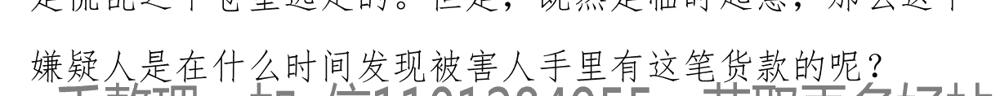
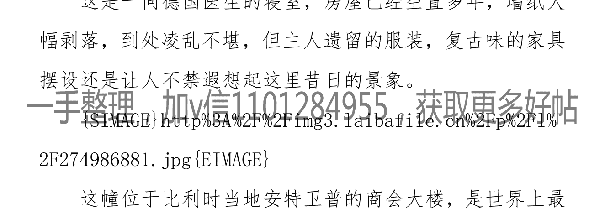
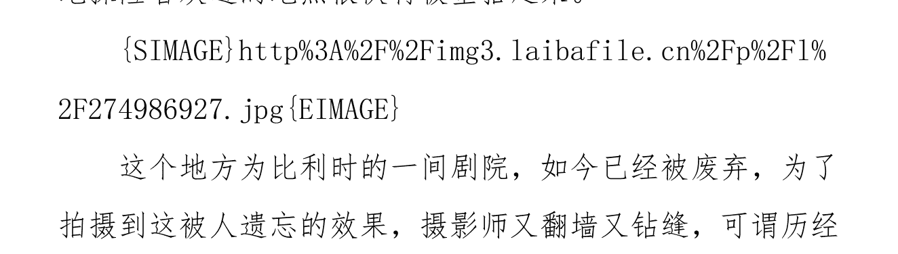

## 说说我身边三十年未破的悬案

老虎不是猫007

这件事情是楼主的同学和楼主讲的。她的父亲是事发单位保卫处的处长。所以基本上全程参与了整个事件。那时我们晚上宿舍熄灯听她讲这件事情的经过，吓得彻夜做噩梦。现在想想，30年了，应该已经过了法律规定的有效期了，很好奇那个凶手是谁，也许某天在街头和我们擦肩而过的就是他吧。最近重温南大碎尸案，也想说说这个案子。

事情发生在遥远的1985年年初，刚过元旦。地点是一个单位的宿舍楼里。也就是我同学父亲上班的单位宿舍。那个单位是个国家级的研究所，员工加在一起有3000多人，是个大型的研究机构。单位本身占地面积就很大，再加上后面一大片职工宿舍楼，到他们那边的公交车有一站的站名就叫“研究所”。可见单位之大了。

事情发生的那天是个周六，那时还没有双休，周六就是意义上的周末了。一月的北方天气格外寒冷。单位的午休时间是中午十一点半到一点半。因为大部分人都是单位离家不远，所以都是到单位食堂打饭带回家，自己热一下吃了休息一会再去上班。我同学的父亲也是这样，和他一起同行的就是案发事情的主人公之一，单位办公室的主任。

这里有必要说一下受害人的家庭情况，办公室主任是受害人的母亲，父亲是这个研究所的副所长。在单位这两口子基本上是实权派，巴结他们的人很多。两个人都是50出头，家里有一儿一女，女儿已经结婚走了，儿子上大四，也就是说如果不出意外，1985年的夏天就大学毕业了。而且分配单位也已经落实，这个年轻人在学校还有个女朋友，双方父母也见过面，准备明年结婚，房子嘛，这位副所长在单位就是主抓分房的，所以儿子的房子早就准备好了，这在单位也不是什么秘密。

由于天气太冷，我同学的父亲就和这位办公室主任几乎一路小跑进了楼栋，副所长住在3楼，我同学父亲住在5楼。到了三楼，道个别，同学父亲继续上楼，刚走了没两步，就听见主任有些着急的说：“我这门怎么推不开，”一边说着，一边敲门，喊她儿子的小名：“维维，维维，你在吗？开门呀！”那个主任是个南方人，身材瘦小，又是个女的，推了半天，那门也推不开。我同学父亲立刻放下手中的饭盒，过去帮忙。男的终究力气大，但是门刚被推开一道缝，一股子很刺鼻的味道扑面而来。再使劲让门开得更大一些，同学父亲看见地上一片殷红的颜色，他毕竟干保卫这些年了，脑子里立刻警觉了起来，但是那个主任可不是，顺着门缝进了屋，立刻一声尖叫，整个人也倒在了血泊之中。中午楼里家里都有人，这动静至少同楼层的人都听到了，而且他们这栋楼住的基本上都是单位里的领导或者高级研究员，在85年电话还是身份地位标志的年代，这个楼栋里的住户基本上家家都有电话。

同学父亲也不敢进去，只得先让对门的那家打电话报警，也不知道过了多久，反正同学父亲觉得比一年的时间还要长，警车终于来了。现场除了那位主任是后进去的，基本上没有别人再进入了。剩下的就是勘察现场，了解情况。我同学父亲是保卫处长，对单位人员很熟悉，他带着几个警察去入户走访。到了转天的下午，公安局在研究所的会议室开了案情通报会。当时市里很重视这个案件，一方面就要过年了，发生重大杀人事件不利于稳定，另外一方面，这个研究所是国家级的，他的所长的级别和市长的级别其实是一样的，都是副部级。公安局成立了专案组，我同学的父亲就算是专案组的外围成员吧。在会上，对于案件的定性是故意杀人。基于现场勘查，副所长家是个三室一厅的房子，而凶手活动区域仅限于客厅和洗手间，那三间房子根本没去，家里也没有丢失任何钱财，就连卧室放的300元现金，当时300元可是笔数目不小的钱了。那钱就放在桌子明面上，也根本没动。所以，来人的目的很明确，就是杀人。

但是，在现场，并没有提取到有价值的线索，比如脚印，指纹。在门上或者把手的位置都被人很细心的擦拭过了，现场唯一有点线索的东西就是两盒点心还有一个果筐里的苹果。因为经过家属辨认，点心早上出门之前没有，果筐是家里的，但苹果以前是没有的。所以，推测凶手借着送礼敲开了门，进门先是把点心盒子放在进门的桌子上，而后让男孩找个果筐把他带来的苹果倒进去，趁着男孩低头倒苹果的时候动手，虽然法医的鉴定结果没出来，但刑警的多年经验一看就是钝器击打造成的。副所长的儿子身高也就172，也不是那种很魁梧的，所以，凶手的力气很大，也就是在第一下击打，男孩就已经没知觉了。周围人也没有听到有人呼救或者任何其他异样的响动。要知道，副所长对门家里有两位老人，如果有声音，他们肯定会听到的。而且，刑警分析，凶手是将苹果放在一个很大的兜子里，杀完人后，将被血弄脏的衣服换了下来，连同凶器放在兜子里带走了。

过了几天，下去走访的民警终于搜集到不少有点价值的线索。案发当天上午，对面楼的一个老太太好像是看到凶手了。那个老太太家的阳台正对着案发的楼门，上午老太太在阳台上收拾东西，无意中抬头看外面，由于那天格外寒冷，楼下面一个人也没有，这时有个穿着蓝色棉袄，头戴雷锋帽的一个人出现在视野中，关键是他左手拿着两盒点心，右手拎着很大的一个布袋子，而且老太太记得很准确的时间，是上午10点整，因为她看见男子进了楼栋时候，家里开着的收音机正好准点报时。因为对面是住着主抓分房的副所长，经常会看到来送礼的人，所以那个老太太还心里嘀咕了一句：这么冷的天都来送礼。因为老太太很肯定的说那个男的是走着来的，所以民警就去到经过这里的公交车走访，另一路去点心的生产和销售地方调查。但是，事情还是有些疑问的地方，如果说男孩当时就死了，那怎么解释他最后的姿势是脑袋顶着门，那样凶手自己也出不去呀？所以也有一种意见就是男孩当时并没有死，凶手走了以后，男孩试图自救，因为他倒下的地方离大门很近，所以他想爬到门口打开门呼救，但是还是体力不支，最终没能成功，这样，也就解释了为什么最后他用脑袋顶着门。

去公交公司的一路民警什么也没查到，无论是司机还是售票员都没有印象，而且那天天气很冷，出门的人很少，车上的人也少，如果有这样一个大包小包的人，是会有印象的，但是，没有。去了点心的销售地方的民警也是空手而归，快过年了，买点心的人本来就多，再说，凶手也未必会自己亲自去买，所以什么都没打听到。而且，对于凶手的样子，也是基于那个老太太的描述，身高很一般，大概172-176的样子，偏瘦，其他的就一无所知了。于是，凭着这些模糊的信息，民警找到我同学父亲了解研究所内部的情况。从案发的种种迹象，这个凶手还是很了解研究所内部的情况，加上被害人的父亲又是主抓分房的副所长，意图就是报复杀人。看看研究所内部有没有和凶手外部特征很明显相同的人，有没有作案动机。

专案组特意有几个人进驻研究所，和保卫处的人分析案情。主要是保卫处的人提供一些可疑人员的名单，民警再逐个分析排除。当然和这个副所长吵过嘴、打过架的人是重点怀疑对象。后来，还真发现了一个有重点嫌疑的人。

这个人姓王，是他们研究所后勤搞卫生的，就是负责研究所内部大楼办公室清洁的。40来岁，有两个孩子，家里没房，一直住在单位一间12平米的小房子里，而且他是一个儿子一个女儿，都15、6岁，住在一起不方便，按理说应该给他房子，但是按理的事情多了，有几个是按理办的。这个人外形和凶手很接近，他曾经找过副所长吵过架，甚至还动手打了副所长，后来被人劝开了，有作案动机，而且搞清洁工作基本上在上午9点以后就结束了，他可以回家换上衣服，拎上东西去作案，而后再回来，1个小时的时间足够。公安局的人决定要正面接触这个老王。老王也承认自己非常恨这个副所长，自己在单位20年了，一直没分到房，还不是欺负他是个外单位调进来的。案发时间，老王说自己搞完清洁工作就在他们后勤办公室睡觉去了，证人没有，但是他不承认杀人，他说自己虽然恨他，但是他老婆没工作，如果他杀了人是要偿命的，他死了，那他家里的老婆孩子怎么办？虽然他说的有道理，但由于没有时间证人，还是把他列入重点怀疑对象。

这里也得说说这个副所长和他那个做办公室主任的老婆。之前说过，这两个人是研究所的实权派。巴结的人很多。但是，研究所里人际关系很复杂，一个所长，4个副所长。其中，所长和这个死了儿子的副所长极其不和，但是表面上还是你好我好的样子，可私底下经常互相拆台，各自也都有一帮底下人去冲锋陷阵的，这个副所长和他老婆也不是什么良人，对他有用的，分房或者别的福利肯定优先考虑，没用的，理都不理你。所以，在单位的口碑不是很好。巴结的人多，自然恨你的人多。

作者:老虎不是猫007 日期:2015-12-22 14:20

楼主吃完饭回来了，继续把这个案子说完啊。

之前的那个嫌疑人，就是做卫生的老王，虽然嫌疑大，但没有直接证据，动机有，但有动机不一定就会诉诸行动。这时，专案组又找出一个嫌疑人，是研究所的一个绘图员，男性，身高174，偏瘦。这个人是从外地考到本市的中专毕业生，分配到研究所工作，今年33岁，之所以怀疑他也是因为房子问题。他是外地的，住的是单位的集体宿舍，后来交了个女朋友，最后因为没有分到房吹了，后来辗转几个女朋友，都是栽在房子上了，有一次他喝醉了曾经拿着酒瓶子要砸副所长的脑袋。而且怀疑他还有一个特别奇葩的理由，现场不是有苹果吗？这个人的老家就出产苹果，而且他以前还曾经给这个副所长送过苹果，所以，有动机：由于分不到房子，导致单身至今；有时间：上午曾经消失了一段时间，自己说是拉肚子去厕所了，但缺乏证人；有条件：曾经去过副所长家，容易骗开门。这个人又被警察正面接触，但了解了一段后发现，他的确是拉肚子，还曾经到单位医务室开过药，请假去医院看过病，而且拉肚子这件事他们办公室的人都知道，消失的时间只有半个小时，半小时出门杀个人实在是来不及，于是，这个人就被排除了。乍一看，有嫌疑的人一大堆，但是真认真起来，又一个都没有。这时，专案组又有人提出可能侦查方向有误，光盯着副所长这条线了，或许是这个被害人在学校有什么仇家，年轻人嘛，感情问题什么的，于是，又到被害人的学校去深入了解，但是结果让人很失望。这个男孩性格很开朗，但没什么仇家，都是年轻人，拌几句嘴的事情有，而且临近毕业，都忙着落实工作事情，谁有闲心干这个。女朋友那边也没什么问题。一时间，专案组也没了侦查方向了，这时，也过年了。案子就先放下了。不过对于住在那个楼里的人来说，这个年过得的确不好，副所长一家出事以后就被单位安排到了别的地方，他家门上还贴着公安局的封条。晚上外面一片漆黑，上楼的人路过三楼心里直打鼓。三楼其他两户吓得晚上睡觉都睡不好，尤其是案子没破，心里委实不踏实。

过完年，专案组也撤出研究所了。但是还是会经常和我同学的父亲电话沟通。这次刑警们又怀疑死者的姐姐了，理由是父母重男轻女，姐姐在这个家里没地位，这也是警察暗访时听别人说的，群众说的也不假，但好歹也是亲姐姐，再说，一个女的也不可能杀的了一个男的，于是又怀疑姐夫，可姐夫没有作案时间。姐姐倒是不上班，但这么说又解释不通。

这个案子就这么搁着了，副所长和夫人遭此打击，一下子像换了个人。女的提前办了退休，男的虽然没退，但基本上不在一线了，上不上班，反正正常发工资，待遇不变。后来两口子一起回了南方的老家。

事情好像也就这样了。不过，在大家都已经渐渐忘记这个案子的时候，也就是快1998年了，我同学的父亲有一次在街上竟然意外碰到当年参与案件的一个老刑警，那个人已经退休好多年了，两个人见面感觉很亲切，就一起吃了饭，席间两个人都喝了不少酒，那个人对我同学的父亲说，也就是在案子过去快10年的时候，那时他快退休了，被单位找去了解情况，事情的起因是局里接到一封举报信，是说1985年这个案子的，信里说这个案子的幕后真凶就是当时研究所的所长，而凶手是个雇佣的杀手，整个事件最知情人是所长的小舅子，也就是单位当时一个不起眼的电工。凶手是小舅子负责联系并且安排的，局里也想把这个陈年旧案给了了，就找这个老刑警一方面了解情况，看看举报信可不可信，如果可信就让他带几个年轻人去了解一下，但他们去暗地里调查了那个所长的小舅子，是个老实人，不像能认识杀手的。所长已经去世了，那个副所长在南方老家也不知道音讯，最后，那个刑警说，从他了解这个案子看，那个无辜的男孩很可能是死于研究所内部派系斗争，只是，真的是一点线索和证据都没有。只能这样了。

作者:老虎不是猫007 日期:2015-12-23 15:32

今天上班有点闲，接着说一个听来的真实案件，不是悬案，但很诡异。

事情发生的年代是更为遥远的1971年，地点是在山西中条山脉某个山坳里的一家国家级的兵工厂。那时的兵工厂都是建在大山里头，主要是为了隐蔽和安全。虽然当时还是文革时期，但工厂处在大山里面，信息也相对闭塞，再加上军工企业管理很严格，所以单位还是很平静的。只是，快到秋天的时候，单位某个车间的一个工人失踪了。军工厂失踪一个人不是小事，一开始是发动全厂职工找，没找到，那个工人是石家庄人，打电话到他所在街道了解情况，但传来的消息是家中一切正常，没有这个工人回家的迹象。没办法，只得上报。也就在这个时候，单位里食堂的烟道堵了，这个食堂是兵工厂三座食堂中最大的一个，烟囱有几十米高，在清理的过程中发现了一具尸体，男性，全身多处骨折，当时也没有什么DNA技术，只是凭借身高、衣服和戴的手表判断就是失踪的那个工人。但是，接下来的问题是这个死亡事件如何定性。自杀？工人很年轻，只有19岁，是单位的文艺积极分子，平时唱歌样板戏什么的很拿手，性格也很开朗，宿舍里的人也反应，失踪前表现很正常，没有什么情绪低落之类的反常表现，至于情感方面，这个年轻人还没谈恋爱呢，用现在的话说，是一张白纸；那么他杀？首先动机是什么？他只是一个普通工人，不涉及权力争斗，也不涉及情感方面，再说，这个死法也让人觉得匪夷所思，法医结论是高空坠落，也就是说，他是从烟囱上掉下去的。如果说凶手先把他杀了，背着他爬上几十米高的烟囱，把他的尸体从烟囱口扔下去，且不说杀人的第一现场，只说凶手是怎么背着一个死人爬上烟囱顶端的？当地公安局还做了一个实验，找了一个全工厂最壮实的男的，背着一个身高体重和死者差不多的人，结果连5个梯子都没走完，就不行了。更何况，你扛着活人，他可以借你点劲，死人只会越来越沉；如果说凶手是蒙骗死者和他一起爬梯子，爬到上面再使劲一推他，这种情况事实证明不可能，那个梯子只能容下一个人，所以爬到上面一定是一个人在前面，一个人在后面，如果后面那个人想把前面的人推下去，是不可能的，你不好使力。

再者说，军工厂地处大山深处，随便找个山洼处一扔，没人发现，何必扔在烟囱里，而且早晚会堵，会被发现。那么，这个人既不是自杀，也不是他杀，但是就是从烟囱口掉下去的，如何解释这个事情呢？这个工人的家属也赶来了，他们是不认可自杀的，坚持认为是他杀，自杀和他杀都缺乏足够的证据支持，最后，公安局的结论是意外。可以理解为这个年轻人自己好奇，想爬到烟囱顶上去玩，结果掉了下去。只能这么解释。那时候的人也很老实，家里人也接受了结果，把他的遗物收拾了就回去了。我听完这个事情，偶尔路过很高的烟囱，总会看两眼，想象在某个夜晚，一个年轻人独自爬上高高的烟囱，也许他只是想看看外面的世界吧。还是真的被什么阴险的人骗上去的呢？

作者:老虎不是猫007 日期:2015-12-25 11:25

以前看过不少精彩、也很悬疑的真实案件。有机会好好整理一下，也算是《积骨寻踪》吧。今天说个案子，不是悬案、不是疑案，很简单的案件。但很有意思。

现在是个粉丝经济的年代，每个明星都在比拼自家粉丝数量。明星之间有什么恩怨也会导致双方粉丝掀起骂战。

楼主今天说的案件就是80年代初一个粉丝引发的。80年代初，国家刚刚从文革中渐渐恢复到正常秩序中，最明显的变化就是文艺的繁荣，那时虽然不叫明星，但街边上已经有些人悄悄兜售明星的照片，有国内的，也有国外的。

当时在中国男排，有个主攻手，人长得超级帅，男排嘛，用现在的话说，也是大长腿。球技也棒，所以一旦有国内的比赛，女观众比男观众要多的多，不过，那时的女粉丝还是很含蓄的，最多就是自己内心激动一下下而已，不像现在的，恨不得推到才“解恨”。

在当时的上海，有个女粉丝很喜欢这个主攻手，但是，可能觉得自身的条件确实也配不上人家，但又确实喜欢。当时的上海不是有上海电影制片厂吗。而那时中国最红的女演员就是那个厂子的，于是，这个女粉丝也不知道怎么想的，自己在街边买了一张这个女演员的明星照片，而且那期间的《大众电影》封面也是这个女演员，这个女粉丝就顶着这个女演员的名字给男排的主攻手写了一封信，连同《大众电影》杂志和街边买的照片一同寄了过去。80年代的通讯主要就是靠信件，那个男排的主攻手收到信以后，竟然相信了，可能那时的人也比较单纯吧，虽然女演员的信并没有用到什么爱呀字眼，但是字里行间还是可以感受到对主攻手的欣赏，于是，这个主攻手也回了一封信，两个人就开始鸿雁传书了一段时间，这期间，主攻手还把自己单位的电话告诉了对方，但那个女的是借用了女演员的名号，只得说自己总是在外景地拍戏，联系最好还是书信，如果有机会到北京，可以和主攻手见一面。这个单纯的运动员就一心想着和女演员见面，后来这件事情被运动员的领导知道了，不过，领导还是很支持双方的交往，特意给上影厂的领导打了电话，也就是这个电话，让事情败露了。上影厂的领导表示这个女演员结婚都快一年了，怎么可能给运动员写情书，还特意找来女演员了解情况，最终证实运动员是上当了。不过这个案件很好破案，因为每次写信都是寄到一个邮箱（不是网络邮箱啊），那时个人可以凭借单位证明到邮局租一个邮箱，每个月收很少的费用。警察很容易的就找到那个女粉丝了，很年轻，大概20出头吧，在工厂做工。她跟单位说自己正在学习，需要从外地寄学习材料，所以开出证明租了邮箱。事情真相大白。这件事情放在现在，顶多也就是粉丝的一个恶作剧，但那是在80年代初，而且，这个主攻手还给她寄过从国外比赛带回来的礼物，价值在当时也不是小数，所以最后以诈骗罪入刑，好像我记得是判了4年。天涯上的牛人多，大家知道那个男排的主攻手和女演员是谁吗？而且，后来在北京的一次聚会上，两个人碰到了，不过双方都略显尴尬。运动员后来去日本打球了，女演员后来去美国留学了。其实这两个人在当时人的眼里还是很般配的，可惜，没缘分。

作者:老虎不是猫007 日期:2015-12-25 16:09

解释一下，女粉丝是因为诈骗罪被判刑4年，那个运动员和女演员见到之所以有些尴尬，是因为运动员当年还是很喜欢女演员的，不然就不会回信了。算是一厢情愿吧。之所以可惜，是因为女演员后来和丈夫离婚了，就一直单身。形象上，觉得两个人很般配。

作者:老虎不是猫007 日期:2015-12-26 10:20

天涯果然牛人多，一下子就猜到是汪嘉伟了，潘虹那时的确也很红，不过女演员是张瑜，就是《庐山恋》的女主角，

作者:老虎不是猫007 日期:2015-12-26 11:29

最后说一个悬案吧。之所以放在最后，是因为这是楼主小学时候，同学家里发生的案件。那时楼主年纪小，有些事情记不太清楚了。但是，在我知道的几个悬案中，这是唯一一个活不见人，死不见尸的。

事件的被害人是楼主同学的姑姑。出事的时候30出头吧。楼主同学的姑姑是重点大学毕业的，学的是财务。分配到一家中型的国企做会计。23岁大学毕业，不到30岁就被任命做了这家国企的财务科科长。同学家里其他人不是初中毕业就是技校毕业，都是做工人的，所以，唯一拿得出手的就是这个姑姑了。而且还总有机会和单位领导一起出差甚至出国，那时我同学偶尔会把他姑姑出差回来给他买的东西带学校来，大家都很羡慕。

他姑姑出事的时间是个冬天的深夜，因为是财务科科长，所以家里装了电话。他姑姑也结婚了，姑父把孩子哄着了，自己也睡了，他姑姑习惯每天晚上看会书再睡，姑父是被家里的电话铃声吵醒的，迷迷糊糊间就听见自己媳妇说了两个“好，好”。而后进卧室对他说，单位有些急事，要现在去一下，当时的时间是夜里11点多，不到十一点半，姑父就说要不要送她，单位离家并不远，走路20分钟。主要是冬天外面很黑，一个单身女子会不安全。但姑姑说不用，单位有车来接她。于是穿好衣服出门了，而这一走，就再也没回来。

转天，姑父上班。姑父和姑姑是一个单位的。财务科的人说根本没有急事找她。这一下，姑父就蒙了，赶紧回家，全家人一起想，到底是去了哪里？后来，把昨天夜里的事情仔细梳理了一遍，觉得只有那个电话是关键，于是，姑父就去查了那个电话的来源，结果发现，那个电话是从离单位不远的一个公用电话亭打来的。于是，又去那个电话亭附近走访，但是，冬天深夜，根本没人看到什么。案子就这么一直挂着，活不见人，死不见尸。同学的姑姑就这么消失了。后来，单位考虑到姑父一个人带着孩子不容易，就给姑父分了一套房子，而且姑姑的工资，单位还连续发了三年，算是对家属的安慰。这个案子，到现在也没有破。

人就来找姑父，说你媳妇怎么没来上班，姑父就很惊讶，说昨天晚上不是就把她叫走了吗？说是有急事。可单位从领导到财务人员都说没打过电话。姑父说还是被单位的车接走的，可问了办公室和司机班，昨天单位的车都在库里，值班人员可以证明。那这个人哪去了呢？

单位最后报的案。一开始，公安的怀疑姑父，因为他是最后见到姑姑的人，所有的话缺乏对证。楼主同学的姑姑的婚姻有些不一样，之前说过他姑姑是重点大学毕业，可是他姑父连初中都没读完，就是单位车间一个工人，但是呢，同学的姑姑虽然有才华，人却长得很难看，我见过几次，具体相貌想不起来了，但当时一个很深的印象就是一个字“干”，缺乏女人的滋润，好像所有身体的胶原蛋白都提前流失没了。而他这个姑父虽然文化不高，但人长得很帅，仪表堂堂。公安怀疑是不是姑父外头有人，把姑姑给杀了。但是调查以后，发现姑父这个人虽然长得不错，也有些花心，但多数都是有贼心没贼胆，而且在厂里还是姑姑想法子把他从车间调到了供销科，这个人也没什么上进心，小富即安的那种人，没了姑姑，在这个单位都不知道该怎么混下去。所以，他的嫌疑倒没那么大。线索就是查那个打过来的电话，那时虽然没有来电显示，但公安局可以从电话局内部查到，而电话的确是从单位打出来的。于是又和单位晚间值班人员询问，但这些人表示下班以后，没有人进过单位，更何况是单位的办公楼，晚上一片漆黑，拨电话也是要开灯的。那时路上也不像现在有监控，而且冬天的夜里11点钟，外面也没有人，姑姑曾说单位会派车来接，这就说明她不会走出很远，那么是谁在深夜给她打电话，能让她出来，又把她带到哪里去了呢？

人一直没有找到。单位家里也调查了一圈，没什么人有嫌疑，或者有嫌疑的最后被证明没有动机或时间。案发后的一个月，有个单位保卫科的人到公安局反应情况，这大概是案件发生以来最有价值的一条了，这个人出事的时候正好在医院动手术，大家也没想起来找他了解情况。据说，在同学的姑姑失踪大概几天以前，一个晚上八点来钟，姑姑一个人到单位来，他正好在门卫，姑姑说自己的东西落在办公室了，取一下。后来这个人没事就在厂区里来回巡逻，突然发现姑姑一个人有些鬼鬼祟祟的到了单位办公楼后面的一个小凉亭里，还不时左右看看，这个人心生好奇，就躲在暗处观察，看见姑姑从包里拿出了一堆纸，然后开始点火烧，纸并不多，所以一会就烧完了，姑姑还用脚把灰烬踢飞了，然后转身离去。那个人后来也到凉亭那看了一下，已经烧得只剩灰烬了，什么也没看到。本着多一事不如少一事的原则，这个人也没报告，现在有人失踪了，他才决定说出来。由于失踪的是财务科科长，又有这个情况，单位的上级部门于是开始查账，但一圈下来，账上也没什么不对的地方，小错当然有，但那是正常的。案子就这样被无限期的挂起来了。直到我们高中毕业了，他姑姑依旧失踪，也不知道到底是去哪了，还是真的被掩埋了。谁在哪个冬夜用单位的电话把她叫出来，而她所烧的又是什么？都是未解之谜了。事情最后的结局就是同学的姑父到公安局开的证明，然后办理了死亡证。

作者:老虎不是猫007 日期:2015-12-26 16:54

烟囱那个悬案也许楼上的给出了一个很好的解释，可能是有人打赌吧，出了事情也不敢说明了，就糊里糊涂的了结了。任何时代都有付出生命却只为了很小的一件事情的年轻人。

作者:老虎不是猫007 日期:2015-12-27 09:13

再说一个，不是悬案，但有点意思。不过我不记得是在哪里看到的了。案件很简单，有个女的背着自己丈夫找了个情人，某天，丈夫出差走了，女的就把情人叫来了，结果两个人因为什么事情打起来，情人失手把女的杀了，结果情人就把女的藏在这家一个很久不用的木箱子里。后来，丈夫回来了，媳妇不在家，以为是回娘家去了，在屋里该吃吃，该睡睡，全然不知那个木箱子里有具尸体，还是两天以后邻居找来，说他们家有股怪味，大家帮忙查找怪味的源头，最后终于发现了木箱子里的尸体。负责现场勘查的一个法医跟刑警简单介绍尸体状况的时候说，由于是初冬，尸体还没有高度腐败，但已经开始肿胀，尤其是胳膊，尸斑的出现导致皮肤颜色呈深褐色，手一碰，就开始流水，就跟那刚出锅的蜜汁藕似的，案件一般都是以报案日期或发案地点来命名，结果这个案子的代号就叫“蜜汁藕”，最直接的结果就是办案的刑警们很长时间看见蜜汁藕就想吐。

作者:老虎不是猫007 日期:2015-12-28 17:29

所谓杀人，无外乎两种原因，一为情，一为利。像研究所案件和我同学姑姑那个案子，基本上都是为利。我同学的父亲在单位是保卫处，他这个人处事比较圆滑，即便如此，无帮无派的在研究所能保住目前的位置也是很不容易的。研究所文化人居多，越是文化越高的人，越不会直接开撕，而是暗地里给你下套，有时为了布一个局会花很长时间。所以，我同学的父亲从公安局的情况通报，隐约觉得这个不是报复杀人那么简单，这个凶手的背后其实是一派势力，可能在单位内部夺权斗争中一直处于下风，急红眼使出了最后一个狠招，他们清楚副所长夫妇有多珍惜这个儿子，借此打击你。不过也成功了，所以，他父亲一直怀疑的是接替副所长的那个人，但也只是怀疑，你没有证据。

我同学的姑姑，可能是知道了谁的秘密了吧，那是年纪小，觉得害怕，毕竟是自己见过的人失踪了。后来慢慢长大了，看电视里也说知道别人太多秘密其实不好。他姑姑这个人有才华，只是长得不好看，所以即使做到财务科长，单位里也没人对她说三道四，类似现在“潜规则”之类的事情从来没人往哪方面想过。但是人有时精明过了头，也会给自己找来杀身之祸。后来，我同学说，他姑姑的单位破产，地也卖了，做房地产开发。偶然路过，看见正在拆厂房，他忽然控制不住的想，会不会突然发现一具白骨，凶手是不会找到了，但起码也能让自己的亲人入土为安，可惜，什么也没发生。

作者:老虎不是猫007 日期:2015-12-29 12:55

跟大家说一个类似灵异事件的事情，不是悬案。最后真相大白后，发现是个很可乐的事。这是我同事的父亲，事情发生在更为遥远的50年代。他的父亲在工厂上班，是个很优秀的车工。50年代工厂总爱搞些技术革新之类的，他父亲是技术工人，所以技术革新也需要他。这天清晨父亲去上班，出门时告诉自己老婆回来要晚些，大概到家也要8点多钟，不要等他吃饭。他们家住在胡同的最里面，这是条死胡同。同事父亲骑车出来时发现胡同中间一户人家的老太太去世了，外面摆着花圈，那个老太太大家都认识，所以同事的父亲还琢磨要随礼，红白喜事嘛。

晚上加完班，同事的父亲骑车回家，结果半路自行车的车胎爆了，没办法，只好推车走着回家。那时正是秋初，天气也不是很凉，慢慢走着大概到胡同口九点钟。就在进胡同口的一刹那，同事的父亲突然看见那个去世的老太太就坐在路灯下面，静静的摇着蒲扇。那时电压也不稳，昏黄的路灯忽明忽暗的，老太太的身影也是时隐时现。同事的父亲登时觉得头皮发麻，腿就开始发软，赶紧转身推车走开，胡同口外面是一条小河，同事的父亲就坐在河边抽了两颗烟，定了定神。想着自己可能这几天连续加班，太累了。冷静了一下，重新推上车回家，这次，走到胡同口，他把车先立在旁边，悄悄探头看，结果，那个死了的老太太竟然还在那，而这次，老太太竟然扭头看见他，还伸出扇子朝他挥舞，同事的父亲大叫一声跑了。同事的母亲看看已经夜里11点了，丈夫还没回来，有些不放心，那时通讯业很落后，就出来到胡同口看看，发现自己丈夫的车在那，人却没了踪迹，结果在不远的河边发现丈夫独自跪在河边，嘴里念念有词，可也听不清说的什么，同事的父亲看见自己老婆，立刻一把抓住她说：“你出来时看见什么没有，胡同里有人吗？”老婆说：“都这么晚了，没人啊。”同事的父亲立刻起身拉着媳妇就走，进胡同时连自行车都不顾了，那时自行车是值钱的东西，老婆也不知道发生了什么，只得自己推车跟在丈夫后面。回到家，同事的父亲往床上一躺就起不来了，一五一十的把刚才看见的跟媳妇说了，他说那个老太太的魂魄找自己来了，原因是一年前他和老太太因为一点小事吵了一架，同事自己说他父亲缺点是有点小心眼。凡事爱计较。现在，老太太死了也不放过他，不然，自己的自行车出单位的时候还好好的，怎么半路莫名其妙就爆胎了，这是老太太的魂魄在作祟。尽管是初秋，天气不凉，他父亲盖着棉被还是说冷。第二天一早晨，同事的母亲去邻居那送丧事的份子钱，还不停的和人家道歉，让多烧些纸原谅他丈夫。邻居开始不明白，听同事的母亲把丈夫昨晚遭遇说了一遍以后，猛的一拍大腿，说：“弟妹，真对不住，我母亲有个孪生妹妹，那天来了就怕出来吓着大伙，所以晚上九点以后觉得外面没人了，出去坐会，结果让大兄弟看见了，老太太回来跟我说，好像是胡同口有个人在那探头探脑的，她一招呼，那人就跑了，还说别是真吓着谁，倒不好。原来是您家那位，赶紧回去说一声吧。”结果，同事的母亲回去一说，刚才还起不来床的父亲立刻爬了起来，什么事没有。不过，这件事情后来常常被同事的母亲闲来嘲笑父亲胆小的谈资。

说一个我小学时代的事情吧，这件事当时传的很是吓人，不过现在看来更像是个谣言。那时上小学四年级，都是就近入学。我们家和学校之间的路上有个公交总站，所谓“红衣女鬼”的事情就是从这个公交总站传出来的。

冬天，这趟公交车是末班车。从终点发车时上面除了司机、售票员，还有一个老大爷。这个老大爷是从终点到终点。去一个单位值夜班。因为每天都坐末班车，所以大家都认识，不过大爷不太爱说话，打个招呼就自己坐在汽车后面。冬天本来人就少，又是末班车，从终点站出来每个站台都是无人上车，售票员就站在前面和司机聊天。其中有一站站名是某个医院，站台上有个女的，车停了，女的从中门上车，挥了一下手中的月票，就坐在和大爷相对的座位上。公交车一般不都有那种倒座嘛，正好和大爷脸对脸。不过大爷一直看着外面，也没太注意。上车的女的穿了一件大红的棉袄，头上裹着围巾，也是红色的。冬天包裹的严实也没什么奇怪的。后面几站地依旧无人上车，车子也开得飞快，到了终点，售票员照例要说终点站到了，但是就在售票员回头看车厢的时候，惊讶的发现车上除了司机、售票员和老大爷，那个红衣女子不见了。因为中途只有这一个女人上车，售票员记得很清楚，而且后面没人下车，那女的哪里去了？大爷说自己一直看着外面，也没注意，加上车厢里没开灯，也很黑。司机这时把车厢灯打开，三个人同时走到女子坐过的位置前面，人是不见了，但地上有一摊红色的液体。事情过程就是这样，传言说那个女的不是在医院那站上车吗，其实这个女的是个将死之人，上车的不是人，而是这个女子的魂魄，她是想出去找个替死鬼，方法是要替死之人和她对视几秒，那个人就莫名其妙的死了，她的魂魄带着那个人的阳寿回到自己的本体，就可以接着活下去了。本来，红衣女子是想找那个大爷做自己的替死鬼，可惜大爷没看她，而且她的魂魄时间也不够了，最后只能化作一滩鲜血了。随后，就开始有人说，那天医院里接了一个女的，很年轻，被人杀了，送到医院也没救活，而且那个女的送到医院的时候穿的是一件白色的棉袄，售票员看到的不是红色衣服，是白色衣服被血浸透了。那时，我们上下学都要路过那个公交站，总觉得有个红衣女子站在那，怪吓人的。路上看见穿红衣服的女子，几个小伙伴就嘀嘀咕咕的说：别看她，别看她。”结果，有一天我们教数学的老师居然穿了件红色的衣服，大家就都不看她，老师就急了：“看我，看我，不然怎么学得会呢，你们要是考不好，我就变成鬼半夜敲你家门去。”我们那时考试是全区统考，成绩要大排名，老师是很在意的。结果，大家没办法，都抱着“视死如归”的心情看着老师听课，现在想想，很怀念那个萌蠢萌蠢的年纪啊！

作者:老虎不是猫007 日期:2015-12-31 13:16

所谓悬案，无外乎局限于一是技术手段，二是责任心。案件最后成为了悬案，我更倾向于后者。古代技术手段更落后，但还是有很多案件侦破了。案发现场除了不能告诉你凶手的样貌，其他的都可以从现场提取到。楼主上学时代看过一部德国电视剧，就是刑侦的，现在德国电视剧已经很少见到了，这个电视剧拍摄手法很独特，我们看过的像国产《重案六组》、《CSI》都是头10分钟交代如何发现犯罪现场，在15-33分钟，会发现很多嫌疑人，但最终被排除，真凶一般在35分钟出现，一番较量后，在42分钟交代实情，剩下的几分钟是用来让主人公做个结论式发言或者调侃几句。但这部电视剧不是，开头就说了案发整个过程，所以，观众知道凶手是谁，就看侦探如何破案。

其中有个案子印象很深。丈夫要杀死妻子，某天，妻子在浴室泡澡，躺在浴缸里，旁边还摆着一瓶红酒和一个酒杯，一边喝酒一边享受泡澡的舒适，全然不知道危险已在眼前。丈夫带着手套悄悄进了浴室，走到浴缸的一端，正对着妻子的双脚，把带着手套的双手靠近妻子的双脚脚踝的地方，猛地向后一拽，妻子瞬间滑进浴缸，一开口喊，水就灌进去，没一会就不动了。男的这时开始伪造现场，装成妻子是醉酒自己滑进浴缸溺毙的。由于妻子有酗酒史，所以一开始真的是当成意外处理，但法医提出不同意见，就是死者脚踝处有两个红色的环状印记，好像是被什么东西用力按住造成的。而且，死者体内的酒精含量并不高，说醉酒溺毙缺乏证据支持。后来，查到丈夫外面欠了一大笔债，而且妻子准备和他离婚，开始怀疑丈夫了，于是警察找到花样游泳的运动员帮忙做一个实验，就是运动员穿着游泳衣躺在同样规格的浴缸里，有两个医生在旁边监测身体数据，然后找个人拽住脚踝部分，发现人很快就容易失去知觉，当然还有其他方面的证据，最终这个丈夫承认了自己的罪行。

这部德国电视剧里还有一个案子，一个男的从小得不到母亲的关爱，长大以后就憎恨女性，于是总是在深夜跟踪单身女子然后杀害。其中有一个女的还是这个男的同事的女儿，他在后面跟踪时，那女孩害怕的跑起来，结果还是被他追上了，女孩认识他是自己父亲的同事，一开始还长舒了一口气，可看见男子的眼神就瞬间明白了，结果，这个男的把人家女儿杀了，事后还像模像样的安慰女孩的父亲。男的一共跟踪了9个女的，只有一个女的逃脱了，男的没追上，后来这女的成了警方很关键的目击者，为什么只有这个女的没追上，因为这个女的是运动员，是当时国内5000米记录保持者。

作者:老虎不是猫007 日期:2016-01-01 15:12

以前看过一部美国电影，据说是根据真实事件改编的。也是一桩悬案，不过后来真相大白，但实情却让人唏嘘不已。我还特意上网搜过，但信息量太少，没有结果。电影拍的很不错，就是整体格调有些阴暗，而且看完让人心里不好受。

故事时间是美国的70年代末，地点是一个小镇上。一户人家男主人是个木匠，女主人做家庭妇女，偶尔也做点零工补贴家用。有一个女儿和一个儿子，看上去是个虽然不富裕，但很幸福的家庭。某一天，男主人突然失踪了，报了警，也发动邻居帮忙找，但依旧没有结果，就这样人间蒸发了，女儿那时11岁，她很伤心，因为父亲与她的感情很好。而且女孩觉得母亲对于父亲的失踪虽然表面上很着急，但似乎是做给外人看的，她年纪虽然小，但觉得母亲的表现并不正常。母女之间不时爆发争吵，隔阂很深。70年代的美国小镇上，风气还是很保守，女孩高中快毕业的时候，和几个同学去湖边野营，由于都是女孩，其中一个据说和男朋友有了实质性的身体接触，于是几个女的晚上坐在湖边想听些刺激的，但有个女的表示自己只是见识了男朋友的那玩意儿，也只是用手和嘴帮了男朋友，实质性的接触还在探索中。一群人哈哈大笑，但女孩听了却彻底惊呆了，因为这些她帮自己的父亲做过。女孩9岁的时候，到父亲工作的木屋送咖啡，父亲对女儿说自己身体不好，但是为了这个家还有孩子们也得撑着。女孩就希望自己也可以帮父亲做些什么，于是父亲就说，其实他的病女孩就可以帮他，只不过开始会有一些难度，但他可以慢慢教会她。于是，在工作的木屋里，父亲把自己亲生女儿的手放进裤裆里，要女儿帮自己按摩，如果女儿做得好，父亲会偷偷给她一点零花钱，如果做得不好，父亲也不生气，还会“鼓励”她下次做好些，时间长了，父亲又开始说自己的病要好得快，用嘴做是最好的，每次做完都会叮嘱女儿这是他们之间的秘密，不要告诉母亲和弟弟。现在，女孩终于明白了自己一直引以为傲的事情是什么，精神一下子崩溃了，女孩的母亲在照顾女儿的时候告诉她，其实这件事情她是偶然发现的，她求自己的丈夫不要再做这样的事情，小镇风气很保守，一旦被外人知晓，女儿只有死路一条，但换来的是丈夫的一顿毒打。没办法，母亲只能眼睁睁看着女儿去木屋所谓的帮父亲“治病”。慢慢，女儿长大开始发育，母亲发现丈夫看女儿的眼神越发不对了，让她最担心的事情随时都会发生。终于，在丈夫熟睡的时候，妻子用绳子把丈夫勒死了。尸体被她在深夜运到一个枯井里掩埋了。

为了帮助女儿尽快恢复，母亲决定全家搬离小镇，找个地方重新开始。影片的结尾有些耐人寻味，女孩坐在车里，透过车窗看着即将离开的屋子，突然，父亲的脸出现在工作的木屋窗户上，正在看着她，冲女儿诡异的微笑。女孩吓得扑进母亲怀里。似乎在说，女孩心灵的创伤愈合需要很长的时间。

作者:老虎不是猫007 日期:2016-01-06 15:39

@brian80 2016-01-01 22:38:31

太好看了！

不过爬烟井那个故事有个bug，就是……万一，后来做实验的那个强壮的小伙子本来可以背人上去，但是为了麻痹警察，假装力不从心，因为他就是那个凶手……

所以换我会多指派两个人进行尝试，当然，从常理来说，自己爬上去概率是最大的，就像那个美国的兰可儿水箱溺毙……

蓝可儿那个我也看了视频，我更倾向于这姑娘嗑药了。

作者:老虎不是猫007 日期:2016-01-06 16:15

说到悬案，大家有没有看去年《今日说法》提到的一个案件。应该是为了配合刑法修订案吧，最后犯罪嫌疑人因为证据不足被无罪释放了。一开始，我觉得肯定是那种屈打成招的冤案，但是，看到最后，和死者家属的观点一致了：一点没冤枉他。

如果倒退20年，这个人就是“呼格案”第二。但是，一是赶上现在新刑法、二是这个犯罪嫌疑人身份特殊，不是呼格那种一介小布衣的草民。所以，他活了下来。

犯罪嫌疑人是云南省航空管理局的综合计划处处长，同时还是局长助理。叫老陈吧，45岁，离异，身边有个上初中的女儿，因为在单位负责一些迎来送往的事情，和在酒店做销售工作的四川女子小蒋认识，小蒋30岁，也是离异，身边有个还在上幼儿园的儿子。两个人婚姻经历颇为相似，慢慢有了感情，后来就开始同居，因为工作时间长，且收入不高，后来小蒋索性就辞职专心照顾家庭。

某一天，早晨老陈如往常一般出门上班。中午手机接到小蒋的一个短信，说自己在街上碰到了熟人，要晚回去一会，让老陈帮忙接孩子。但是，从这个短信以后，小蒋就失踪了。老陈找了一圈没找到，就给小蒋的哥哥打电话，他哥哥就带几个朋友开始找，最后找到老陈在昆明郊区的一处别墅，时值冬天，昆明虽然暖和，但郊外的草木有些凋敝，哥哥发现别墅不远处的一处土堆像是新的，这时距离小蒋失踪也有几天了，哥哥于是报警，最后警察挖出了一具女尸，穿着睡衣，口鼻、双手、双脚都被胶带裹住，哥哥认出这是自己的妹妹。

警方的调查最后证据都指向老陈。首先，是老陈手机接到的短信，调查显示这个短信发送的基站和老陈所在单位的基站是同一个，老陈的单位是航空管理局，单位本身就有一个基站，或者可以理解为死者要么是中午在老陈单位给他发了短信，或者是两部手机都在老陈手里，自己给自己发了短信，而且，短信中还出现了“麻烦你”三个字，作为同居三年的情侣，这样的字眼未免有些过于生分了，人为的痕迹更重；其次是老陈中午回了家一趟，公安认为他是去搬运尸体，而且在去郊区的高速公路探头中也拍到了老陈驾车的镜头；最后，也是最重要的是在捆绑死者的胶带上发现了老陈的大拇指指纹，而且是带血的指纹，杀人动机则是老陈虽然与小蒋同居三年，却没有结婚的打算，主要是小蒋和老陈女儿的关系不好，总是打架。小蒋的母亲说女儿打算和老陈分开，但想要一笔补偿费，如果不给，她就揭发老陈的贪腐行为，这才引杀身之祸。

老陈的律师不是一般人。找到了很多证据证明警方的偏颇，比如那个基站，中国移动出示了基站覆盖图纸，除了航空管理局，还有他旁边的几条街道，小蒋也可能会在这几条街道发出短信，虽然并没有证据证明小蒋到过那几条街道。至于在高速路被拍到，那是老陈去找小蒋的，搬运尸体，缺乏目击证人，只有血指纹律师也没办法解释，但血指纹只能说明老陈动过尸体，不能证明他杀了人，最后，还是被放出来了。

看完这个案子，第一直觉就是老陈是凶手。动机太明显了。作为一个省级公务员，他是不会和一个从农村出来，没学历、没工作还带个孩子的女人结婚的。但女的不同了，如果找一个局长助理，不仅有面子，而且她和孩子的户口都会转成城市的，所以，女的是不同意分手的，即使分手，肯定也是狮子大开口，老陈觉得留着终究是个祸患，最后，下了杀手。不然，怎么解释女的是穿着睡衣被杀的，总不可能穿着睡衣逛街碰到熟人吧。而且，没有证据表明有第二个人有杀这个女的动机和时间，只有老陈有。但最后，还是以缺乏主要证据，比如凶器在哪？怎么抛尸？目击证人没有，最后，还是放了老陈。

呼格的案子最后定性，主要依据是呼格指甲缝里有死者的血迹，这其实只能证明呼格碰了尸体，不能说明人是他杀的。可惜，呼格没赶上现在“疑罪从无”，但是，作为推动中国法制进程，还是起了很大的作用。

作者:老虎不是猫007 日期:2016-01-06 16:16

说到悬案，大家有没有看去年《今日说法》提到的一个案件。应该是为了配合刑法修订案吧，最后犯罪嫌疑人因为证据不足被无罪释放了。一开始，我觉得肯定是那种屈打成招的冤案，但是，看到最后，和死者家属的观点一致了：一点没冤枉他。

如果倒退20年，这个人就是“呼格案”第二。但是，一是赶上现在新刑法、二是这个犯罪嫌疑人身份特殊，不是呼格那种一介小布衣的草民。所以，他活了下来。

犯罪嫌疑人是云南省航空管理局的综合计划处处长，同时还是局长助理。叫老陈吧，45岁，离异，身边有个上初中的女儿，因为在单位负责一些迎来送往的事情，和在酒店做销售工作的四川女子小蒋认识，小蒋30岁，也是离异，身边有个还在上幼儿园的儿子。两个人婚姻经历颇为相似，慢慢有了感情，后来就开始同居，因为工作时间长，且收入不高，后来小蒋索性就辞职专心照顾家庭。

某一天，早晨老陈如往常一般出门上班。中午手机接到小蒋的一个短信，说自己在街上碰到了熟人，要晚回去一会，让老陈帮忙接孩子。但是，从这个短信以后，小蒋就失踪了。老陈找了一圈没找到，就给小蒋的哥哥打电话，他哥哥就带几个朋友开始找，最后找到老陈在昆明郊区的一处别墅，时值冬天，昆明虽然暖和，但郊外的草木有些凋敝，哥哥发现别墅不远处的一处土堆像是新的，这时距离小蒋失踪也有几天了，哥哥于是报警，最后警察挖出了一具女尸，穿着睡衣，口鼻、双手、双脚都被胶带裹住，哥哥认出这是自己的妹妹。

警方的调查最后证据都指向老陈。首先，是老陈手机接到的短信，调查显示这个短信发送的基站和老陈所在单位的基站是同一个，老陈的单位是航空管理局，单位本身就有一个基站，或者可以理解为死者要么是中午在老陈单位给他发了短信，或者是两部手机都在老陈手里，自己给自己发了短信，而且，短信中还出现了“麻烦你”三个字，作为同居三年的情侣，这样的字眼未免有些过于生分了，人为的痕迹更重；其次是老陈中午回了家一趟，公安认为他是去搬运尸体，而且在去郊区的高速公路探头中也拍到了老陈驾车的镜头；最后，也是最重要的是在捆绑死者的胶带上发现了老陈的大拇指指纹，而且是带血的指纹，杀人动机则是老陈虽然与小蒋同居三年，却没有结婚的打算，主要是小蒋和老陈女儿的关系不好，总是打架。小蒋的母亲说女儿打算和老陈分开，但想要一笔补偿费，如果不给，她就揭发老陈的贪腐行为，这才引杀身之祸。

老陈的律师不是一般人。找到了很多证据证明警方的偏颇，比如那个基站，中国移动出示了基站覆盖图纸，除了航空管理局，还有他旁边的几条街道，小蒋也可能会在这几条街道发出短信，虽然并没有证据证明小蒋到过那几条街道。至于在高速路被拍到，那是老陈去找小蒋的，搬运尸体，缺乏目击证人，只有血指纹律师也没办法解释，但血指纹只能说明老陈动过尸体，不能证明他杀了人，最后，还是被放出来了。

看完这个案子，第一直觉就是老陈是凶手。动机太明显了。作为一个省级公务员，他是不会和一个从农村出来，没学历、没工作还带个孩子的女人结婚的。但女的就不同了，如果找一个局长助理，不仅有面子，而且她和孩子的户口都会转成城市的，所以，女的是不同意分手的，即使分手，肯定也是狮子大开口，老陈觉得留着终究是个祸患，最后，下了杀手。不然，怎么解释女的是穿着睡衣被杀的，总不可能穿着睡衣逛街碰到熟人吧。而且，没有证据表明有第二个人有杀这个女的动机和时间，只有老陈有。但最后，还是以缺乏主要证据，比如凶器在哪？怎么抛尸？目击证人没有，最后，还是放了老陈。

呼格的案子最后定性，主要依据是呼格指甲缝里有死者的血迹，这其实只能证明呼格碰了尸体，不能说明人是他杀的。可惜，呼格没赶上现在“疑罪从无”，但是，作为推动中国法制进程，还是起了很大的作用。

一手整理 加v信1101284955，获取更多好帖

作者:老虎不是猫007 日期:2016-01-10 13:21

想起写这个帖子是在2015年的年末。每到一年新旧交替之际，大家都会有很多对新年的憧憬或者希望。许个新年的愿望是很多人的习惯。以前，自己也常常在新年钟声敲响的时候许愿，但是2015年是很特别的一年。从跨年上海的踩踏事件，8月天津的大爆炸、再到年底深圳的滑坡，突然觉得生命很无常，走着走着说不定就掉进了路面塌陷的热水井里、睡在家里，就被外面爆炸气浪推到楼下，好好工作着，就那么被土掩埋了。生命是坚强的，也是脆弱的。所以，岁末交替，说说这些悬案也好，灵异也罢，平安其实是所有愿望的基础。也是起点。春节也快到了，希望这个帖子里所有潜水的、冒泡的，大家都可以在猴年平安就好。人活久了，愿望反而变得简单了。新的一年，我们都要好好的。

作者:老虎不是猫007 日期:2016-01-10 16:11

天涯上果然牛人多，没错，是德国的《侦探德里克》，我记得这个系列里有个案子很有意思。有个商人生意失败，面临破产，结果他就想到把自己的工厂伪装成失火，骗保险公司。然后他就一个人去自己工厂纵火，看着火势起来了，就赶紧溜走了。回到家，一个人对着镜子练习第二天见了警察和保险公司的人如何应对，练了一晚上。第二天出门的时候还跟自己说；“就像平时一样。”结果他晚上放的火只是烧了他工厂的仓库，而前面的办公楼并没有殃及，所以，一进工厂大门，后面被烧毁的仓库是看不到的。但是，这个人第一次做这种事情，太紧张了，进了工厂就看见警察过来了，人家警察还没开口，他就主动说：“怎么会着火呢？”警察很奇怪的看了他一眼说：“你怎么知道着火了？”这时，他才注意到前面的办公楼是完好无损的，真的看不出着火的痕迹，于是一愣神，只得说是开车来的路上遇到个陌生人告诉他的。于是，这个人成了警方的重点怀疑对象。以前不是有那种一分钟找出凶手的小故事吗？我记得有一个很经典的就是警察问一个嫌疑人案发时间去哪了，那个人就说自己晚上出门去做什么了，为了说的清楚，还很形象的描述说：“那天晚上月亮又圆又大，满天都是星星。”结果民警认为他说谎了。

作者:老虎不是猫007 日期:2016-01-11 13:11

说个我同事亲身经历的案子。这件案子再次提醒我们，招聘一定要小心。

我同事是个男的，之前在一家做特许加盟的公司算是个中层吧。曾经有几年，在中国做特许加盟是很红火的。他工作的这个公司事做洗涤连锁的，就是大街上那些洗衣店。做连锁加盟的一个显著特点就是办公环境要好，这样会给有加盟意向的人公司实力雄厚的感觉，人家才会放心加盟，把加盟费交给你。他们这个公司办公地点在一处高档办公楼的一层，一个公司的直营洗衣店，洗衣店后面划分为三个功能区：洽谈区、财务室、老总办公室。这样有客户过来先参观洗衣店，了解后到后面洽谈、成功后跟老总签合同，最后财务室交钱。而公司其他部门就被老总放到了大厦地下室的办公区，因为租金便宜。我这个同事还好，是在一层，那些地下室的人只能透过一扇很小的窗户看见太阳。时间一长，有些人就觉得办公气氛太过压抑，干脆辞职走人。别人走还好，技术支持部走了两个人，对于加盟连锁，尤其是做洗涤，技术支持很重要，客户在洗衣过程中遇到问题都会打电话咨询，技术的电话是24小时开机，人家不干了，客户有问题得不到解决，就去找老总。于是，老总就让我这个同事赶紧找人，我这个同事在以前这家公司也是中层嘛。但是将近11月，人也不好找，压力很大。也就是在这种情形下，来了一个男的，权且叫他小伟吧。大家看着方便。身份证上显示这个小伟26岁，甘肃人，以前在一家洗衣厂做，后来洗衣厂倒闭了，出来找工作。同事看他也有经验，觉得不错，最后谈到待遇时，这个小伟说自己在洗衣厂都是管吃住的，现在出来还没有找到住的地方，那家洗衣厂虽然倒闭了，还允许他们再住一段时间，所以希望公司能提供住处。本来公司是不管住的，但考虑找人不容易，这个小伟又很合适，最后就让小伟住在公司地下室最里面的小屋子，那个小屋子没有窗户，算是个密室吧，主要是放杂物的。商业地产一般是不允许住宿的，哪怕是加班不得已住一晚上，也要跟物业值班打招呼，老总也是图省事，就没跟物业说，主要说了物业也不会同意。

小伟就正式上岗，他们地下室的办公大门就是普通住家那种防盗门，从里面反锁上外面是打不开的。小伟住进去以后，每天倒也不睡懒觉，9点上班，一般8点30就有人来了，小伟一般都已经在自己工位上工作了。只是这个人不是很爱说话，大家工作忙，能闲聊的时间也不多，有限的聊几句知道小伟结婚了，有两个孩子，打算工作顺利得话，就自己在外面租房，过了年把老婆孩子接过来。总之，很正常的人。

12月下旬，大家像往常一样来上班，只是这次大门没有开，有员工手里有钥匙开了门，小伟有时候出去买点早点也会锁上门的，所以，谁也没注意到什么异常。将近10点，洗衣店的洗衣工过来找小伟，说想问点洗衣的问题，大家才发现小伟不在，走到里面他住的小屋，敲门无人应答，打电话发现手机铃声从里面传出来，那个小屋的门没有锁，只是里面有个门别，里面的人插上，外面是打不开的。大家有些不安，就把我这同事叫来了，我这同事人高马大，用脚把门踹开了，一股酒气扑面而来，再一看，小桌上放了6个空酒瓶，还有残羹剩菜，大家一看，这是喝醉了，同事上去就想把他叫起来，结果一掀被子，那一幕这辈子都忘不掉，小伟的喉咙被划开了一个口子，鲜血浸透了床垫和棉被，所以地上没有血迹。

> > 一手整理 加v信1101284955，获取更多好帖

这个案子之所以是悬案，主要是小伟的身份不好确定。他应聘的身份证是假的，之前在洗衣厂工作倒是没说谎，但用的是同一张身份证，后来警方通过他手机的联系人找到一些他的朋友，发现在他们嘴里，小伟有很多身份，最后验证全是假的，遗物中有现金，但就几百块，存折也有，几万块。值钱的东西也没什么，凶手的动机也不明确。可以肯定的是哪天下班，有个人过来和小伟喝酒，小伟喝醉了，那个人痛下杀手，而后。自己开门走了。酒瓶上有除了小伟的指纹，但有指纹不等于知道凶手。警方调取了监控，但是在推测的案发时间，无人出入，后来想，凶手也许杀人后躲在某个角落，等到大厦上班时间人比较多，混在人群中出去了。

小伟的事情一出，公司老总是一悲一喜。喜的是小伟的身份确定不了，没有家属上门找他赔偿；悲的是出了凶杀案，那地下室没人敢去了，还得另花钱找办公室，而且物业还要罚钱。那个同事因为小伟是他招进来的，而且又目睹了那一幕，后来也辞职不做了。小伟这个案子也就成了悬案了。只是不知道在这个国家的某个地方，是不是有亲人还在等着小伟的归来呢？

作者:老虎不是猫007 日期:2016-01-12 12:21

> @u_102645598 2016-01-11 22:57:18
> @voice5252 2016-01-11 22:48:49.76
密室杀人吗 门市跺开的 凶手怎么出去呢

一手整理，加v信1101284955，获取更多好帖
同问

-----------------------------

这个问题当时我也问过同事，因为门是他踹开的，现场很混乱。警察还特意问了他，单位很多人都可以作证门是从里面插上的，凶手不可能有遁地术，所以怎么走的真是个谜。所以这个不是悬案，是玄案。后来我自己瞎捉摸。会不会凶手有什么特殊的工具可以在门外把门栓插上，但想了半天也想不出来有什么神奇的工具。

作者:老虎不是猫007 日期:2016-01-12 15:30

以前看过一个法制节目，案子是上海的。河里有具女尸，而且女尸已经怀孕了。这具女尸也是不好确定身份，但是根据女尸所穿衣服确定是个娱乐场所工作的女性，但是她的姓名全是假的，只不过最后找到她的同居男子，那个男的也承认杀人。我印象深，是因为那个男的有份很体面的工作，只不过和老婆总吵架，就到欢场去找小姐，碰到这个女的，算是包养吧。这个女的怀孕以后就想和男的结婚，但是男的不过是和她玩玩，根本没当真，而且男的妻子也是一位高级白领，最后，男的被逼的没办法，就把女的杀了扔河里了。案子虽然破了，但结尾登出了死者的照片，因为还是不知道她到底是谁。

看的案子多了，有点感慨某些家长对待女孩的态度。15、6就出去打工，而且还是那些娱乐场所，不学坏就已经很难得了，有几个是好男人。出了事，看那些家长嚎啕大哭，我就觉得当初干什么去了，别说家里穷，穷总比没命强吧。真不把女孩当回事。中央台的新闻调查《陇南婚事》，有个人说，过去计划生育抓得紧，生女孩不要，要么送人，要么挖坑埋了，就这样说出去，可是认真起来这是犯罪啊。即便养大了，十几岁就出去打工，也不闻不问。好像不是自己的孩子一样。女孩不是应该像公主一样捧在手里吗？

作者:老虎不是猫007 日期:2016-01-13 10:51

以前看过一本书《北京十大奇案》，其实也没什么奇的地方。不过里面说了个事情倒是有些可乐。

90年代，有个富豪，好像是香港的吧，给当时的北京市公安局捐赠了100台摩托车，公安局长大概是心情好，决定一台摩托上配备两名警察，每个警察再配备微冲，然后沿着北京二环路来一圈，美其名曰：展示北京公安强大实力。后来，有个警察临时病了，最后是99辆摩托，上面是两名肩背微型冲锋枪的民警。很是威风的在北京二环来了一大圈。第二天，北京市委要求局长写检查，局长就弄不明白，我展示公安实力，打造首善之区，怎么到又错了？市委也没明说，还是要他做检查，写了检查也不通过。局长有些急了，这时，一位北京市委成员找局长私下谈话：“你这样做，想没想过后果。99辆摩托，198个带着微冲的警察，中南海你也冲进去了。”局长这才恍然大悟，写了一份及其深刻的检查。总算是有惊无险的过关了。后来这个作家见到局长时，他已经退休了。作家就有些八卦的问他：“这样的火力配置，中南海冲得进去吗？”局长一乐：“冲是冲的进去，但是冲得冲不出来就不知道了。”

> 作者:老虎不是猫007 日期:2016-01-14 18:22

有句话说的好：冲动是魔鬼。说两个当年很轰动的案件，都是冲动的结果。而且受害人全是可怜的孩子。

第一个案件是个护士，从护校毕业进了医院就和一个医生勾搭上了。那个医生已婚。一开始护士年纪小，名份上不计较，后来随着年纪大了，开始逼婚了。医生的策略是拖，最后拖不下去了，只能摊牌说自己根本不会离婚。护士绝望了，本来拿了一瓶硫酸打算泼在医生脸上，结果改主意，跑到医生儿子上学的学校，全泼孩子脸上了。那男孩长的很好，算是让她毁了。后来庭审，护士说要让医生每天看见自己孩子那张脸，就会永远记得自己犯的错。护士最后枪毙了，男孩经热心人安排到美国治疗去了。不过，男孩很小，还不懂为什么会发生这一切，所以，在家里，只有他还和父亲说话，有好吃的还记得给父亲一些。

> 一手整理，加v信1101284955，获取更多好帖

第二个也是毁容的，当年很轰动。庭审的时候大街上都没人，即便是街边做生意的也是打开收音机听实况转播。也就是当年没有网络，要是那个案子放在现在，那就是“惊涛骇浪。”凶手是个女的，29岁时结婚，当时29岁算得上“高龄”了，男的30多岁。据说男的一直想出国，不过办不下来，所以耽误了。可是和女的结婚没多久，出国手续办好了，男的就跟女的说，自己先出去，稳定下来，让女的也过去。不过，出国需要一笔钱，男的就和女的商量把结婚的一居室卖了，女的先回娘家去。那时房子根本卖不上价钱。结果男的出国了，女的回娘家。但是，男的去了加拿大以后就杳无音讯，女的娘家妈没有了，和哥嫂父亲住在一起，时间长了嫂子有意见，没办法，女的就只能外面租房住。男的在加拿大其实已经和别人在一起了，孩子都有了。但是男的和女的没有离婚。于是，男的就拿出一笔钱，连同离婚协议一起给了自己嫂子，让嫂子转交。这是男的平生做得最错误的决定。贪财的嫂子把钱扣下，离婚协议给了女的。女的肯定不干，但找男的又找不到，后来辗转知道有笔钱，但男的嫂子就是说没有，这时女的又下岗了，一个女人。没有工作、没有住处、面临失婚，真的是要崩溃了，最后一次去要钱，反而被嫂子一顿嘲讽，最后她拿着硫酸到嫂子女儿学校，全泼在孩子脸上了。事情一出，舆论一边倒的朝向嫂子，女的家人说什么都是徒劳的，最后，女的被枪毙了。但是，后来她嫂子的表现让大家发现事情或许有另外一面，因为有很多好心人捐款，嫂子拿着钱开始给自己置办金货，买高档手机，买高档衣服，全然不管还在医院抢救的女儿，这时，有个南方的媒体设法找到了在加拿大的男的，男的最后承认自己给嫂子汇的款被她独吞了，那家媒体写了长篇报道，这时，我们这座城市的媒体终于沉默了，对于嫂子和女儿的全部报道一夜之间消失了，嫂子很可恨，只是可怜了那个无辜的女孩。

作者:老虎不是猫007 日期:2016-01-15 14:18

说到悬案，大家一定知道英国的那个“开膛手杰克”。很久以前，真的是很久以前，央视曾经播放过一部英国电视连续剧《恶魔杰克》。现在回想起来，那部电视剧的水准相当高。为什么呢？没有血腥、没有尖叫、但是你看的浑身发抖，那时我年纪小，吓得晚上一个人不敢睡觉。可以说，导演调动了一切电影语言营造出了恐怖、颤栗的气氛。而且，电视剧的语言简练精彩，英剧一直保持着较高的艺术水准。尤其是最后一集结尾：警方怀疑的几个嫌疑人都在暮色中出门，每一个人面对镜头表现出了诡异的神情，进而消失在了伦敦的雾色中。答案留给了观众。现在很多人知道卷福，但是最早一版的《福尔摩斯探案集》的表演者在我心中才是最出色的，只是很可惜，61岁时突发心脏病去世了。他是最接近柯南道尔笔下那个冷静、睿智又有些神经质的侦探形象。说句题外话，喜欢侦探小说的人发现没有，文学作品中的侦探背后总有一个不靠谱的警察形象，福尔摩斯、波洛、马普尔小姐还有中国的霍桑，虽然那些警察总是冤枉好人，但关键时刻还是虚心请教，避免犯错。那一版的《福尔摩斯探案集》几乎囊括了所有的精华：《四签名》、《海军协定》、《第二块血迹》等等，反而卷福的我到有些看着别扭了，也许是我老了吧。

作者:老虎不是猫007 日期:2016-01-15 18:09

以前有本杂志《民主与法制》，我曾经在上面看到过一个案子，当时差点成了悬案，也是一个小细节，抓到凶手。不过，要是悬案估计也就不说了。

80年代初，中国铁路上曾经发生过系列麻醉杀人案。事情开始是一趟列车到了终点站，卧铺车厢里的列车员发现上铺还有个人在那蒙头大睡，就上去喊他，不想那人已经一动The request was rejected because it was considered high risk

是凌晨，他推醒了同宿舍的工友，说他又看见那两个女孩了，要出去找他们，工友觉得他是梦游症，也没理他，结果第二天，就被人发现死在施工的楼下了。

99 年，网络根本不发达，但这样的流言却迅速传遍了这座城市。开发商从期房的销售不理想也发现了这些流言，但是，流言没有出处，你也不知道第一个说这个话的人是谁，又不好特意针对它发表声明，毕竟都是些封建迷信的东西。

但这些东西又真实的影响了销售，于是，接着新千年到来，开发商从寺庙请了高僧，做了一场法事，对外的意思是迎接新千年，为购房的业主祈福；但大家私底下认为，他这是在超度那些被他当成工程渣土拉走的魂魄。

法事做的很是排场，期房的销售似乎有些回暖。但是，还是有流言流传，只不过还是那些老套的说法，渐渐，大家的兴趣也就不大了。也就在此时，突然冒出一个事情，导致这个房子的销售又陷入困局。

事情是有个出租司机，本来送客人到这大楼附近，拉完这趟活，时间已经是凌晨了，司机也打算收工回家。路上经过大楼时，发现有个姑娘打车，司机还慨叹自己运气好，临收工还能拉趟活。姑娘上车坐在后面，司机就和女的聊天：“天这么晚了是加班吧，听说这个大楼可闹鬼，你一个姑娘家的不害怕？”后面的女的也没说话，司机就扭头一看，哪里还有什么姑娘，只有一个浑身是血的布娃娃咧着嘴冲司机笑呢。这个司机吓着魂飞魄散，马上下车拉开后门把娃娃扔出去，回家就病倒了。这个流言中又有司机的名字和出租公司名称。越发象真的了。

2000 年，房子不是那么的重要，房价虽然也高，但没有到后面的火箭式蹿升。加上那片地只是规划很好，但目前还是很荒凉的，所以，有些回暖的销售因为这些流言的叠加再次进入冰冻期。

作者:老虎不是猫 007 日期:2016-01-20 09:30

由于房屋建成后空置率很高，原本买房的人收了房也不去住，真是如“鬼楼”一般。后来这个开发商由于资金压力太大，把这个楼盘整体倒手了。

后来，过了将近5、6年吧，楼市的价格开始上升了，这个楼盘的接手人大幅提高价格，加上那时交通也起来了，所以楼盘销售也明显好很多了。

我那个地产的朋友说，其实根本没什么鬼怪之说，真相是同时看中那块地的另一个开发商没抢到地，而且他是本市的开发商，所以觉得很没面子。一开始就是类似于出气一样说的那些鬼怪故事，后来发现居然很有效果，受此启发就开始招人专门编这一类的段子，而这些段子也恰好契合了人们心里所想的，于是就像病毒式营销一样传播开来。当然，那个楼盘销售不好也不全是受这些段子的影响，其他方面的原因也有，这些只是其中一方面。

之所以想起说这个事情，主要是那时网络还是个新型概念，营销也只是存在于书本中。时间走到2016年，无论网络和营销，人们的认识都达到了一个新的高度。

一个热点事件，迅速就能在网上找到很多内容，发布者经常说的无外乎是：一个知情者、当事人的老乡、爆料人、网传、网曝、据传等等。但是，这些帖子你仔细看，会发现他发帖的主要目的是什么，想达到效果是什么。

就拿现在北医三院的事情举例吧，这件事情是非曲直要靠警方和医疗鉴定甚至法院辨明。其实，觉得中科院理化所就如同那个拿地的开发商，开发商拿地时没有考虑这块地的前世，理化所出公函时也没考虑后果。事情的发展也是很多言论满天飞，有网传家属要赔偿1000余万，也有逝者同学发文祭奠描述事发经过。这更像是两个在大街上吵架的当事人，向所有围观的群众都在说自己是有理的那一方。

如果，我是一个围观的群众。只说自己的感受。理化所明显棋输一着。

首先是公函，出具公函的目的不清楚，也许是被这个逝者的家属弄烦了，可能家属到女儿单位要求的，觉得你挂着中科院的大名，而且级别要比北医三院高。但是，这个想法其实很没用，北医三院无论是从行政主管还是业务主管，和中科院、理化所都不搭界。如果一个是理化所的所长、一个是北医三院所属地派出所所长到那看病，你觉得北医三院会更重视谁？其次，是祭奠逝者的两篇文章：自称同学的一份、老公一份。如果这两篇文章都是真的，那只能说学理科的人文科实在不咋地。老公的文章一大段的排比句：我再也不能如何如何，读来感觉不到伤心欲绝，反而透着假，还不如在网上找梅尧臣、苏轼悼念亡妻的诗放上去省时省力；同学的那篇有句话，大概是为了理化所那篇公函辩解一下：她是幸运的，遇到这样好的单位和领导。这句话与其是辩白，不如说是招黑。果然同人不同命。人家赶上了个好单位。如果我是一个农民，同样的事情发生在我身上怎么办？村委会要发公函吗？也写上：张三同志是我村农业骨干、在水稻插秧、小麦种植方面取得突出成绩、是我村不可或缺的劳动复合型人才，最后盖上大红章：中共中央国务院辽宁省委东兴县下面的某个镇、某个村几组。或者我是个小私企的员工，别说私企，就算是外企，拿张 A4 纸打印一份盖上章，北医三院理你吗？不当你面撕了就算是给你面子了。所以，马上网上又出来说女的和老公合开公司洗钱，一部分给了领导，所以领导才给他出了那份公函。

又回到了两个地产商之间的故事，一个散播言论，一个想办法突破困局。所以，我倒是想知道中科院理化所那样一个人精扎堆的地方要怎样反击，还是沉默是金呢。

> >作者:老虎不是猫007 日期:2016-01-20 13:56

> >@离雪薇蜜 2015-12-30 17:58:51

楼里几个写的案子文笔都和楼主差好多…所以文笔也很重要啊，同样一个点，一件事，文笔好的能引人入胜，让人看了欲罢不能呀！楼主就有这种文笔功力呀~不过楼好瘦呀！大家多写点呀把帖子养肥~

我好像周围没什么奇怪的案件。不过我爷爷以前是公安，是解放后第一代公安也是我们当地第一个刑侦队队长，他和我说过他办的一个案子，不过他说的时候我年纪比较小，爷爷又早就去世了，所以我记不清了也没法求证案子细节了。案子发……

----------------------------------------------

你爷爷是个很负责任的警察

一手整理 加信1101284955，获取更多好帖

作者:老虎不是猫 007 日期:2016-01-20 15:00

@老虎不是猫 007 264楼 2016-01-11 13:11

说个我同事亲身经历的案子。这件案子再次提醒我们，招聘一定要小心。

我同事是个男的，之前在一家做特许加盟的公司算是个中层吧。曾经有几年，在中国做特许加盟是很红火的。他工作的这个公司是做洗涤连锁的，就是大街上那些洗衣店。做连锁加盟的一个显著特点就是办公环境要好，这样会给有加盟意向的人公司实力雄厚的感觉，人家才会放心加盟，把加盟费交给你。他们这个公司办公地点在一处高档办公楼的一层，一个公司的直营洗衣店，洗衣店后面划分为三个功能区：洽谈区、财务室、老总办公室。这样有客户过来先参观洗衣店，了解后到……

> > @清和 1101 2016-01-17 19:05:59
> 
> 不是说门是从里面插上的吗？凶手走了，那男的死了，谁从里面插的门？

这算是密室杀人了，后来公安局的做过实验，因为那个密室的门缝比较大，看看可不可能从外面一点点把门栓拨过来，但没成功。

作者:老虎不是猫007 日期:2016-01-20 15:19

一手整理 加v信1101284955，获取更多好帖

说一个很简短的悬案吧。

知识青年上山下乡，当时上海的知青对口去云南。有个女知青夜里起夜，就一直没回来。找了一圈也没找到。失踪了一个女知青不是小事，更为严重的是这个女知青身份特殊，她的舅舅是时任国务院副总理的张春桥。

于是，当地把这个农场基本上翻了过来找，还是没找到。上报以后，公安局介入，怀疑有人对张春桥同志有意见，所以杀人泄愤。那些知识青年中成分不好的全部过堂，结果人还是没找到，倒是逼死、逼疯了好几个人。有部作品《知青奇案》就是根据这件事情写的。只不过借用了女的失踪为引子。

后来，张春桥作为四人帮成员被判刑，关于他外甥女的事情也就没人再提了。但确实是活不见人，死不见尸。

作者:老虎不是猫007 日期:2016-01-21 06:53

说到知青的案子，楼主以前在报纸上看到过一个。当时是为了纪念毛泽东主席发表“广阔天地，大有作为”号召百万知识青年上山下乡讲话多少周年吧，报纸采访了不少知青，其中一个人回忆里的一个案子。

地点是东北。有五个女知青失踪了，开始以为这几个人是跑回原籍了，那时也有知青受不了农村的苦跑回去的。但是，经过了解，并没有人回去。但是这五个女的就是找不到了，公安也来调查，还是没结果。

事情的转机出现在转年的夏天，有个村民向大队反映，村上有个类似于现在二流子的那种人，本来穷的叮当响，但是现在竟然手上戴着一块进口手表，关键那手表是女式的。于是，这个人被请到了公安局，经过辨认，手表是一年前失踪的女知青其中一人的，这个人的嫌疑立刻上升。

但是这个人大喊冤枉，他说，前几天在村上碰见了几个孩子，其中一个人手里有从城里买回来的糖。本来他是要抢过来的，结果反倒被那几个孩子合起来揍了一顿。之后，几个孩子提出来让他划船带他们去小岛上看看，回来就会分给他糖吃。他们这个地方挨着一片大湖，湖的远端有个荒岛，面积不大。其实那岛上什么都没有，只不过孩子没去过，比较新鲜好奇而已。

他划着船带他们上了岛，几个孩子刚开始还兴奋，四处跑跑。他以前来过，就一个人在边上等着，岛上是些低矮的灌木，也没有阴凉，太阳出来晒得不行。这时，他发现草丛里有个闪闪发亮的东西，过去一看，竟然是块手表，而且还在走着。这时，那群孩子也回来了，他怕被发现，就赶紧揣兜里了。事情经过就是这样。又找来几个孩子问，说的也一样。

于是，组织人手上岛查看，这下发现了五具尸体（确切的说是白骨）。但是问题来了，先不说死因，他们是怎么来的？游泳过来需要极好的水性，这些人显然不具备；划船过来的？这些人没一个会划船，必定是谁送他们过来的，那个人是谁呢？死者的死亡的位置也很蹊跷，如果是她们几个好奇这个荒岛，和村上某个人说好，把她们送到这而后几点再来接他们，结果在岛上遇到了什么突发的事情，那五个人应该是在一起的，可她们最后的位置很分散，东一个、西一个，看不出什么规律；如果被人诱骗上岛，凶手起码是个身强力壮的男人，似乎和这几个女的玩“狩猎游戏”，最后把她们一个个干掉。当初调查这几个女的身边的人，也没有谁符合这个特征。如果是接他们的船因为某种原因没到，让他们滞留荒岛，出事的时候是夏天，湖上经常有船来往，经过这个小岛的船很多，只不过没人上岛而已，她们呼救是听得到的。

检查白骨，不是枪击，也没有任何锐器或钝器形成的伤痕，那时技术手段也落后，最后，这个案子就被当成是个意外结案了。

作者: 老虎不是猫007 日期: 2016-01-21 09:09

这个一定要发一下：

一桩发生在20年前的凶杀案日前引发多方关注。前天，微信“老南京”发表文章《20年前轰动一时的“南大碎尸案”，今天起正式成为悬案》指出，今年1月19日是“南大碎尸案”20年追诉期的最后一天，杀人凶手或将就此摆脱法律约束。

```
一手整理 加v信1101284955 获取更多好帖
```

对此，公安部刑侦局昨天下午发布微博明确表态，对南大碎尸案永远追查到底。北京青年报记者昨日查询时也发现，“老南京”已将相关文章删除。

## “南大碎尸案”再度引发热议

20年前轰动一时的“南大碎尸案”再次回归舆论视线。

本月19日，微信公众号“老南京”发表《20年前轰动一时的“南大碎尸案”，今天起正式成为悬案》一文，其中指出，今年1月19日是“南大碎尸案”20年追诉期的最后一天，杀人凶手或将就此摆脱法律约束。

南大碎尸案又称刁爱青案，案发于1996年1月19日，地点为江苏省南京市，受害人为南京大学成人教育学院一年级女学生。受害人遗体碎片在其失踪9天后，也就是当年1月19日清晨，被一名清洁工在南京华侨路发现。凶手为消灭作案痕迹，将其尸体加热至熟，并切割成2000片以上。

案发后，南京市公安部门进行了大规模搜查，并成立了专案组进驻南京大学，但至今凶手仍未落网。

## 案件是否已过追诉时效

值得注意的是，这篇网络热传的文章，除了回顾了案发事实，还列举刑法条文指出，“南大碎尸案”已达20年，经过该期限的犯罪将不再追诉。

北青报记者查询发现，追诉时效是指按规定追究犯罪分子刑事责任的有效期限。

其中，法定最高刑为无期徒刑、死刑的，其追诉时效期限为20年。犯罪分子的犯罪行为已经超过刑法规定的追诉时效期限的，不再追究其刑事责任，如果20年以后认为必须追诉的，须报请最高人民检察院核准。

不过，很快也有质疑声音提出，尽管的确有“20年追诉期”的相关规定，但对“南大碎尸案”并不适用。

媒体援引江苏省公安厅有关人士的话指出，一起命案发生后，杀人凶手将尸体隐匿，没人报案，公安机关也不知有凶案的发生，因而没立案，这种情形才适用20年追诉时效。“南大碎尸案”是这些年来影响巨大的命案之一，公安机关当时就已立案侦查，虽然20年过去了案件也没有侦破，可并不意味着该案已经超过追诉时效。

## 公安部刑侦局表示追查到底

按照规定，在人民检察院、公安机关、国家安全机关立案侦查或者在人民法院受理案件以后，逃避侦查或者审判的，不受追诉期限的限制。

昨天下午，公安部刑侦局就发布微博明确表态，对“南大碎尸案”永远追查到底。

公安部有关人士指出，追诉期是针对未被发现的犯罪，对于已经发现的犯罪，以及逃避侦查或者审判的，不受追诉期限的限制。此案是公安机关已在侦查案件，警方必将依法追查到底，绝不放弃。

作者:老虎不是猫007 日期:2016-01-21 09:11

> > @老虎不是猫007 402楼 2016-01-20 15:00

> > @老虎不是猫007 264楼 2016-01-11 13:11

说个我同事亲身经历的案子。这件案子再次提醒我们，招聘一定要小心。

我同事是个男的，之前在一家做特许加盟的公司算是个中层吧。曾经有几年，在中国做特许加盟是很红火的。他工作的这个公司是做洗涤连锁的，就是大街上那些洗衣店。做连锁加盟的一个显著特点就是办公环境要好，这样会给有加盟意向的人公司实力雄厚的感觉，人家才会放心加盟，把加盟费交给你。他们这个公司办公地点在一处高档办公楼的一层，一个公司的直营洗衣店，洗衣店后面划分为三个……

@二月喵酱 2016-01-20 20:54:51
前面没细看，也许是自杀？

不是自杀。自己抹脖子和别人割喉力度是不一样的，伤口的形状和肌肉的走向也是不同的。法医给出的结论也是他杀。

作者:老虎不是猫007 日期:2016-01-21 12:39
@雯话 2016-01-21 11:21:35
借楼主的楼也来八一个我家乡的疑案。这个案子也是调查了 10 几年破不了，变成了悬案，结果后来竟然鬼使神差的抓到了凶手。

80 年代中期的某北方小城，这座偏僻的小城没啥名气，只是这里有一个原机械工业部直属的国家重点大学还挺有名的。凶案就发生在这所大学的家属区。某日，该大学的一个教授从学校回家，发现家中跑水了，水龙头没关，满客厅都是水，教授赶紧去厨房关水，无意中往卧室瞄了一眼，就这一眼吓得他魂飞魄散，......

有些悬案往往是查别的案子牵出来的，可见真正靠技术和分析破案的确实很少。还得有赖于犯罪嫌疑人的良心发现，主动交代。

作者:老虎不是猫007 日期:2016-01-21 16:26

前面有个层主说丢失核机密文件，让楼主又想起了一个悬案。

90 年代初，核工业有个会议在四川峨眉山召开。会议日程大概是 5 天，但是最后一天没有安排会议，就是让大家在峨眉山玩一玩。就是这一天旅游的时间，出了大事。

国家核工业部办公室的负责人失踪了。这个人掌握很多重要的信息，他的失踪可不是小事。公安、武警连军队都出动了。就像用篦子梳头一样，把峨眉山所有景点梳理了一遍，任何线索都没有，别说人了，连这个人的影子都没看到。后来，又发动当地群众，据说这个人有点爱冒险，怕他去了那些尚未开发的景点；其实他死亡与否倒在其次，主要是怕这个人是不是有预谋的叛逃或者被境外敌对分子劫持了。

后来，有个老农说出事那天他上山采东西，隐约听到有人呼救的声音，但是仔细听又听不到了。于是大家又让老农带路去了那一带，那里有个很深的天坑，又安排人下去找了一遍，还是什么都没有。最后，经验丰富的当地人说，这山里要是走丢一个人很不好找。寻找的工作持续了两个月左右，最终也没找到这位负责人。

即使他没有叛逃或者被劫持，所有他知道的机密工作全部要修改或者转移。所以损失是很巨大的。

2009 年，北京有个驴友独自一人去爬铁驼山，最后失踪了。当时看新闻，说北京户外大神们全去现场营救他，当时中国还没有专业户外营救的队伍或组织，发现了一些他留下的痕迹，但一直没找到他。那时山里气温很低了，虽然希望渺茫，但很多人还是坚持，希望出现奇迹。最后，这个人的老母亲都快90了，老人家倒是很明白，发了个声明，对大家表示感谢，同时也劝大家放弃寻找，不想有人因为找他儿子再送命。

2013还是14年，有一群爬山的人偶然发现了一具骸骨。当时猜测是这个人，但还没认定。如果真是他，其实他当时离这座山的主干道已经很近了，可能也是精疲力竭了吧。


作者:老虎不是猫007 日期:2016-01-22 10:15

以前韩国有个电影，讲述的是一个真实发生的绑架事件。不过案子最终也没破获。影片的最后还播放了绑匪的真实声音。

我们这座城市也发生过一起绑架案，事件是90年代的中期。最后绑匪发现家属报警了，于是撕票。公安局是第一次在电视上播出了绑匪的电话录音。由于当时电视背景是一片蓝色的幕布，印象很深。那个绑匪声音有些沙哑，电话里和被害人的家属说：“你放心，我是个讲道理的人，现在他很安全，只要钱到手他就回家，放心、放心。”“放心”那两个字重复了两遍。当时绑匪要的赎金是 120 万元，是个私企老板的儿子，当时 20 出头吧。后来孩子死了，老板就把这笔钱拿出来算是悬赏了。但是，虽然有很多群众提供信息，但案子还是没破。

过了得有 10 年吧，听说这个案子破了。也是别的案子的一个犯人供出来的。原来那个受害者有几个朋友，因为他比较有钱，所以出去玩什么都是这个人掏钱。其中一个朋友某次和一个亲戚提起来，说自己认识个有钱人，那个亲戚正好赌博缺钱，就打听清楚具体情况，找了两个帮手绑了人。结果可能当时公安局经费也不足，用了两辆汽车跟着交赎金的人的汽车，交替跟踪，结果被绑匪发现了，三个人出现了争执，这时候那个人质试图逃跑被绑匪失手杀了，结果那两个帮手害怕跑路了，这个主犯也慌了，匆匆把尸体处理了也上南方去了。

作者:老虎不是猫 007 日期:2016-01-22 10:17

@本号密码是 h12345 2016-01-21 23:52:02

楼主：老虎不是猫 007 时间：2016-01-16 11:17:11

一个刑事案件的发生固然有人性的缺失、情绪的失控、利益的冲突等因素，但其中很多案件反应的是一个社会大背景。特别是社会出现一些动荡的时候。新中国刚成立的时候，有很多案件是和特务有关的，有些是真抓到特务了，有些就是捕风捉影的。最出名的就是“徐秋影案件”，最后证明是假的。结果还排成电影了。改革开放以后，最多的是“投机倒把”和“流氓罪”，那时，……

其实当时警方考虑这个人不是个简单的为了包子杀人，他很可能有别的案底。这个卖包子的不过是顺手带过而已。

作者:老虎不是猫007 日期:2016-01-22 14:33

@guns216 2016-01-22 13:47:42

> > 说说我自己碰到的吧。那是初中还是小学记不清了，也就01年左右，当时是夏天七八月份，我跟我妈去离村里比较远的一块地里给地瓜翻秧，干了一会我渴了就想到山底下有个泉水那打水喝，我就从田埂上一级一级往下跳，当我跳到离最底下一层时候发现，因为刚下完大雨，这个地方形成了一条小河，但是河沟旁边的草丛怎么全是黑压压的一大片，我也没管那么多继续跳，结果跳下去之后，他妈的一大群跟豌豆式的绿头苍蝇朝我身上脸上打还有……

后来呢？

作者:老虎不是猫007 日期:2016-01-22 16:14

很多案子成为人们口中的悬案，固然有当时技术手段的局限、或者证据不足，难以定罪。但是，还有一种案子，其实本身不复杂，只是这个案子的背后有“赵家人”的影子。

这件事情发生在80年代初，案件的主角和我父母是邻居。楼主那时不太记事，整件事情也是以后父母提起来慢慢知道过程的。

那时，我们住在一个单位家属院，但是我父母并不是这个单位的，换房换过来的。家属院里有对夫妻，有两个女儿。大女儿生的十分美貌，二女儿却很一般。那时邻居偶尔闲聊还说：“这一个娘肚子里出来的，天上一个，地上一个”。大女儿叫小红，技校毕业以后分配到一家工厂当工人。

漂亮女孩总是不缺人追的。小红也不例外。但是，这些追求者小红的母亲一个都看不上。原因是：没钱没权。这位母亲总觉得自己女儿既然如此美貌，或许可以作为改变全家命运的资本。

小红的母亲是个很爱虚荣的人。虽然她和小红的父亲是一个单位的，但自从生了二女儿以后就泡病号不上班，也就是国企大锅饭白养活她，但是呢，家里的活也不干，婆婆全包了。所以，全家就靠小红父亲那点工资过日子，难免捉襟见肘。

小红的母亲不上班，也不出去干点什么，就是站在楼下八卦，或者打牌、跳舞。看见谁家买条鱼回来，就说：“我昨天才吃的鱼。”谁家做肉，就说：“我整天吃肉，都腻了，就想吃点青菜去去油。”其实，大家都是一个单位的，谁挣多少钱都门清儿，不过街里街坊的，也知道她就这么个人，也都不跟她较真儿。

小红的工资每月必须连工资条一分不少上交，家里的财政大权牢牢的握在女人手里。如果小红想买什么，母亲就说：“可惜我把你生的这么漂亮，那么多男的追你，不会让他们给你买，笨蛋。”问题是，人家男的花钱也不是白花的，后来，有个男孩的母亲就跑到我们家属院站在楼下骂小红，小红的母亲也是个厉害主，下楼跟那女的对骂，看热闹的人是里三层外三层。最后，愣是把那男孩的母亲骂趴下了，最后，男的母亲边往外走边说：“算了，算了，就当是我儿子睡了个婊子。”小红的父亲和奶奶人都不错，就是对于小红的母亲太过纵容和忍让，很多事情就是无底线。虽然大家都知道小红孩子本性不坏，但有这个母亲在后面站着，就算有心介绍男朋友给小红，最后想想还是作罢。

小红的母亲跳舞时认识了一个姐们，在市直机关幼儿园做饭。那女的见过小红。大概的意思就是象你女儿这样好看的人，要是在我们幼儿园工作，经常能接触到那些来接小朋友的首长家的公子们，说不定哪天你和市长就是亲家。小红的母亲很爱听这样的话，不知道是怎么个过程，还真把小红给调到幼儿园去了。周围邻居都挺吃惊的，虽然幼儿老师不是什么了不得的工作，但能进市直机关幼儿园还是需要点能量的，觉得小红的母亲这么办事不靠谱的人，居然还能办成一件重要的事情，不容易。

自从小红去幼儿园上班没多久，小红母亲的嘴里就开始说什么组织部长的儿子请她女儿吃饭，但是被她女儿拒绝了；明天宣传部长的侄子请她女儿看电影，还请他们夫妻一起去；总之，半个市委市政府领导班子成员的孩子基本上都拜倒在她女儿的石榴裙下。这时，小红的奶奶要回老家了，其实老家也没什么人了，投奔她的妹妹。老人没有工作，以前还能干活，现在年纪大了，不比从前了，每天都要听儿媳妇的闲言碎语。老太太也是个要强的人。觉得可能这一走也就不会再回来了，老人和邻居告别，有的人就说：“您干什么走呢？眼瞧着您孙女就飞黄腾达了，您得在这享福啊！”老太太听完苦笑了一下，长叹了一口气，什么都没说。

过了几个月，有一天，小红没回家过夜。晚上他父亲骑车到幼儿园去找，但人家说她下班就走了。转天上班，小红父亲又去了幼儿园，小红还是没来。但是，这次她父亲听一个老师说小红下班是被一辆汽车接走的。开车人和谁接的她不知道。又过了两天，来了辆小车把小红父母接走，汽车直接拉到了殡仪馆，小红死了。

小红具体怎么死的，一直没人说得清。邻居也是从小红父母泣不成声的叙述中听了个大概。那个接走他们的人自称是市委招待所的工作人员。从他的讲述中，小红那天下班一个人来到了市委招待所，开了间房；又让招待所小卖部的人送来了白酒，一个人开始喝酒，第二天，服务员收拾房间敲门无人应答，开门才发现人已经死了。送到医院，医生给出的死因是醉酒状态下，呕吐物堵住气管，简而言之，憋死的。

这个解释不要说明白人，傻子都看出有一堆问题。首先，当时的市委招待所不对外营业，只是负责接待各省来本市公干的政府人员，小红虽然是机关幼儿园的，但没有单位的介绍信根本不可能开房给她；其次，小红家在本市，她为什么要跑到招待所开房，幼儿园并没有给她指派公务活动；最后，小红所有的钱都在她母亲手里，没有钱怎么买酒。而且，虽然小红尸体穿戴整齐，但明显看得出来那衣服是人死了以后穿上去的，很别扭。对于小红父母的疑问，那个工作人员说，首先，的确不应该给小红办入住手续，但是，小红带着幼儿园的工作证，并且恳求工作人员，说是家里的人去老家看她奶奶，而她自己把钥匙落在家里了，本市没有亲属，所以要求住一晚；工作人员看她可怜，又有市直机关幼儿园的工作证，就给她开了房间。酒不是小红买的，是赊账；至于衣服，喝酒太多身体会发热，脱衣服是有可能的。而关于那个幼儿园老师说小红出事当天被车接走的事情，那个老师在后期调查时改口说自己看错了，那个人不是小红。

小红母亲的希望就这么没了，当然不行。于是，邻居看见全家经常早晨带着条幅、标语去市政府门口静坐，晚上再被警车送回来。反复很多回，有一天，全家人像往常一样出门，但晚上并没有往常一样被送回来。消失了一个星期以后，来了一辆卡车，下来5、6个人，把小红家东西搬空了。邻居好奇就上去问情况，人家也不回答，干完活开车走人，房子就空出来了。

后来，单位有人说，小红家的房子重新归单位分配了。虽然这一家人消失了，但传言却越传越盛。比较靠谱的说法是政府给了他们家一套大房子和一笔钱，还给她小女儿转了学校。出事后，小红的妹妹就从之前的学校退学了。小红的父母在单位的劳动关系也被一个神秘的人调走了，事后，单位劳资的人就说，那个神秘人是厂长亲自陪同来的，全程一言未发，所有需要他签字的地方都是厂长代劳的，走时，厂长给开的车门。有好事的就去打听，厂长就说：“就当什么都没看见。”

至于小红的死因大家推测，也是出事以后，邻居们才知道小红在那个幼儿园根本不是老师，就是个临时借调过去帮忙的身份。最初那个老师没说谎，确实是有人开车把她接走了，到了市委招待所开了房、喝了不少酒，至于发没发生性关系就不清楚了，人都没了，那个就不重要了。小红的死因可能（只是可能）真的是个意外，她不会喝酒，烂醉后导致呕吐物堵住了气管，但是和她在一起的人也没把她送医院，而是赶紧走掉，找了别人来收拾烂摊子。至于，那天带小红开房的人是谁，永远是个谜了。

美貌对于一个女人来说是上天赐予的财富。但是，如果没有一个好的家庭、没有好的教育、自己再没有心机，那财富就演变成灾难了。小红的奶奶评价这个自己亲手带大的孙女的一句话很中肯：“我这个孙女啊，小姐的身子，丫鬟的命。”

作者:老虎不是猫007 日期:2016-01-23 16:17

圣祖之孙某年去山东泰山巡游，行宫里遇见一年轻貌美的宫女。顿生爱慕之心。宫女也很喜欢他，两情相悦自然是好事，圣祖去世很多年，虽家人多不在朝中任职，但余威尚存。圣祖后代对门第观念也很淡化，两人成婚之后，婆婆特意送儿媳进入书院教化学习宫中礼仪、四书五经。

几年以后，三月朝中每年的百官大会之时，圣祖之孙喜获麟儿，只是诞下麟儿的母亲却另有其人。京城百姓颇感意外，因为并无听说此人休妻再娶。而后，有人告知，那位宫女不知何故已在天牢内去世。

作者:老虎不是猫007 日期:2016-01-24 08:25

@老虎不是猫007 2015-12-30 11:23:51

说一个我小学时代的事情吧，这件事当时传的很是吓人，不过现在看来更像是个谣言。那时上小学四年级，都是就近入学。我们家和学校之间的路上有个公交总站，所谓“红衣女鬼”的事情就是从这个公交总站传出来的。

冬天，这趟公交车是末班车。从终点发车时上面除了司机、售票员，还有一个老大爷。这个老大爷是从终点到终点。去一个单位值夜班。因为每天都坐末班车，所以大家都认识，不过大爷不太爱说话，打个招呼就自己坐在……

@如果没有忘记 2016-01-24 03:42:19

什么事情传到后面都会添油加醋，更别说是全国人民都盛传的公交车鬼事。这个故事传到我们魔都的版本是这样的，90年代在魔都不发达的地区晚间公交车接替主干线公交车接载乘客，有一天一个杨浦区的支线车在森林公园站接了两个维吾尔族男性乘客上车，他们当时左右驾着一个女人上车，上车时就自动声明这个朋友喝醉了，司机也没当回事儿，车开出一小会儿，车上原本的一个乘客——一老头儿突然跟隔壁坐的小伙找茬吵架，骂对方半天……

一手整理，加v信1101284955，获取更多好帖

帝都就是330路公交车

作者:老虎不是猫007 日期:2016-01-24 08:28

@老虎不是猫007 2016-01-17 10:03:14

之前提到建国以后抓特务的案件，想起了我亲戚父亲的经历。他那个也算是个悬案吧。我以前去亲戚家看过她父亲生前写的回忆录，老先生的字写得很好，不过可能和他晚年的精神状态有关，回忆录写得有些支离破碎，好像是想到哪里就写到哪里，没个章法。

亲戚的父亲以前是北平地下党的成员。在北平城里的一家药铺工作，是个账房先生。那时，做隐蔽战线工作开药铺是个很好的选择，因为解放区药品一直短缺，在白区工作的同志如果……

@费尔南多唐加西 2016-01-23 23:56:46

这个只算当事人的一种揣测吧。

闲话两句，提供另一种可能吧，见某些 KMT 老人晚年的回忆文集《文史资料选辑》中提到过，“CCP 华北的地下情报系统曾经两次被破坏大半，其中有一次更是几乎被连锅端”，或许是有碍 WGZ 的缘故，所以不可能广而告之。”

楼主提到的往事，更有可能是属于这种情况，不过现在更是时过境迁，别说当事人了，就是曾牵扯到的外围人员估计也基本已拱，都湮灭在历史长河中了。

当年这个亲戚的父亲之所以会精神崩溃，可能是内心总是纠结于此吧。很多历史的真想永远不为世人所知了。自己慢慢释怀吧。

作者:老虎不是猫007 日期:2016-01-24 21:41

说一个天津的案子吧。解放前的事情。不是悬案，但案件最后的结局却很是耐人寻味。

1948 年，天津有个陈姓公子，家里是开矿的，是个典型的富二代。他娶的太太也是系出名门。但是，这两个人的婚姻却很不幸福。女的骄横任性、男的整天寻花问柳，所以，两个人打架是家常便饭。后来，男的在舞场遇到一个犹太混血美人，公然带着这个女的出入自己的家中。

原配闹了半天没有效果，就搬回娘家。但是两人并没有离婚，丈夫还要负担原配昂贵的生活费。这天，原配一早晨出门找丈夫谈判。那时，都知道国民党快撑不住了，有钱人都琢磨去美国或者香港。原配让丈夫给自己美金、貂皮大衣、钻戒。但是，丈夫说如今自己家里也不比从前了，一下子拿出钱来也不容易了，女的见自己的要求一个也没达到，手里正好拿着一杯葡萄酒，就一下子把酒杯冲着男的扔了过去，男的一下子怒了，过去就掐住女的脖子，算是失手吧，把女的掐死了。

等男的明白过来，女的已经没气了。男的叫来自己那个混血美人，两个人合计了一下，先把女的尸体藏在了壁橱里，然后让二婆穿上原配的大衣和帽子，趁着佣人都在各自屋里干活，跑到外面，男的故意很大声的和原配送别，意思就是给那些佣人听的。到了晚上，两个人把原配的尸体放进一个大箱子里，然后女的开车出门找到自己一个犹太朋友，说是在人家地下室存点东西。

原配的家人见她一直未归，就找到这里，但是男的说她已经走了，佣人们都可以证明，后来娘家报了警，警方调查也是这个结果。就在这时，小婆那个犹太朋友正好要用自己的地下室，挪动那个箱子的时候，发现有液体渗出，而且有古怪的气味散发出来，有些疑惑的报警了。

两个人都被抓了，男的家里的确不必从前了，但“瘦死的骆驼比马大”。最后，男方行贿的金条摞起来和这个男的身高相等，男的也就不到170.算是留条命，男的判无期徒刑，女的判了大概是5、6年。

不想，服刑没多久，天津解放了。共产党整顿司法，主要是镇压那些恶势力、大官僚等。这个人是旧社会司法腐败的典型事件，结果男的枪毙，女的无期。

作者:老虎不是猫007 日期:2016-01-25 16:43

> > @游荡于天之涯 2016-01-25 11:50:03

看了楼主的帖子 深以为然
公安部门对南大案的表态 只是一个姿态 毕竟巧妇难为无米之炊

我觉得 当时的警察没有找另一个呼格吉勒图 我觉得是此案的万幸了

南大的案子当时太轰动了，一般人这样的案子真做不出来。我要是警察，心里肯定想着破案，因为想看看这个凶手到底是什么变的。不过，即使真的找到了，以那个凶手的心理素质，估计一般警察对付不了他。可惜啊，这个人就这样消失在茫茫人海了，他如果看到这些报道或者这些帖子，会是怎样的一种心情呢？会不会起身离开电脑，冲上一杯咖啡，打开音响，听上一段交响乐，在雄浑的乐曲声中面带满足的微笑回味当年的细节，而后嘴角流露轻蔑的一笑：这些愚蠢的警察啊！

作者：老虎不是猫007 日期：2016-01-26 10:00

《福尔摩斯探案集》里面有一集的名字是《一条带斑点的带子》。内容大家应该都知道。最后结尾处，福尔摩斯说：“世界上最可怕的就是医生杀人。”

几年前也是在电视上法制节目看过一个案子，说的就是医生杀人。

这个医生就叫他吴医生吧。吴医生是个凤凰男。出身农村，但是自小学习很好，大学考上了医科大学。本来省城的大医院要他了，但是最后还是被别人顶了，结果去了一家区级医院。区级医院基本上没什么发展，这个吴医生就准备辞职去深圳。这个时候，他实习时认识的一个医生给他介绍女朋友，这个女的也不是大学毕业，还比他大几岁，吴医生一听就不同意；但是介绍人说这个女的父亲虽然退休了，但之前也是一个医生，关键是省城那家大医院的院长和她父亲很熟，言外之意已经很明了了。

一手整理 加信1101284955，获取更多好帖

吴医生最后和女的见面，交往了没几个月就结婚了。女的算是剩女了，很着急结婚，但找的男朋友也要拿得出手，吴医生都符合；吴医生想借助女方的父亲调进大医院。这段婚姻中双方都带着极强的目的性。

婚后，吴医生终于进了这家大医院的外科。一年后，两个人生了一个女孩。日子如果这样走下去，也很好了。只是可惜，两个人一直在吵架。原因是互相都看不起对方。妻子觉得丈夫是个农村人，生活方式、穿衣品味都很差劲；自带一种优越感。丈夫觉得妻子连个大学都没读过，那种优越感在他看来就是个笑话，更让他愤愤不平的就是妻子良好的家境让她很多唾手可得的东西，恰恰是像他这样的寒门子弟苦苦奋斗、甚至放弃尊严都未必能获得的。

后来妻子带着女儿回娘家，丈夫常驻医院，两个人算是分居了。没多久，有关于吴医生妻子红杏出墙的传闻在医院散播开来，这让吴医生很没面子。本来他希望通过自己的业务能力证明自己不是靠着老丈人的关系，结果现在人家看他的眼神就是老丈人的关系之外再加上一顶绿帽子。吴医生就提出离婚，岳父亲自找他谈话，表示女儿被自己宠坏了，希望吴医生能包容她，此外，他会利用自己的人脉帮助吴医生事业更上一层楼，同时，也隐晦的敲打吴医生资历尚浅，意思就是“小子，翅膀还没长开呢。”吴医生也是权衡再三，最后没离婚，两个人又开始重新一起过日子。

但是，根本矛盾并没有解决。两个人还是无休止的争吵，眼看离婚对自己不利，吴医生就开始动了杀妻的念头。某一天，趁着妻子熟睡之时，他给妻子体内注射了一种药物，这种药物可以使人肌肉麻痹，呼吸麻痹，最后死亡。关键是这种药物在人体内存留时间很短，也就是即使尸检也不会发现。

但是，吴医生在杀人的方式上绞尽脑汁，但是很多问题他没考虑。一是他和妻子感情不和尽人皆知，妻子突然死亡，难免会怀疑到他；二是他的岳父就是个医生；三是这种药物管控很严，他是以科研的名义领出来的，但科研实验也有固定程序要走，而且那个科研实验根本用不到那种药物。

果不其然，岳父在悲痛之余对女儿的死因提出质疑，并要求做尸检。甚至报了警。最后，警方也是根据掌握的情况接触了吴医生，并没有拘留他。如果吴医生咬死不承认，遵循“罪疑从无”的原则，只能说他的嫌疑最大，死者身上有针眼、而在他家里找出针管，上面有吴医生的指纹；夫妻感情不和；吴医生曾经领出一种药物且不能说明药物的去向。但是，死者体内没有这种药物的成分，虽然你可以从药理的角度说明，但毕竟是你的推测。但是，这个吴医生自己承认了，原因是压力太大，太累了。本来以为杀了妻子可以解脱了，没想到反而让自己陷得更深了。他希望判自己死刑，大家都解脱了。最后怎么判的没说，只是他的岳母哭诉：“我这外孙女以后长大了，问她母亲是怎么死的？我怎么回答。说是被你父亲杀死的吗！”

看完这个案子的时候，我想起自己刚上班的时候，单位有个女领导。人很强势，她的女婿就是个凤凰男，我见过一回，长的眉清目秀，很帅气的男孩，眉眼长的有点像现在很红的杨洋。也是医生。这个女领导的女儿结婚以后一开始说还年轻，不要孩子。过了有两年吧，想要孩子，不知为什么，总流产。女领导为这事还很发愁。后来这个女领导退休没多久就去世了，心脏病突发。没多久，男孩就提出离婚，不过男的是净身出户，什么都没要，只要自由身。后来，单位就有传言说那女领导是让她女婿给害死的，之前，为什么她女儿总流产，也是那男的给弄的。当然，这种事情都是大家猜测，主要是觉得两个人的差距太大，男的必定是有所企图。也没凭没据的。顺嘴一说就完了。

只是，在婚姻当中，如果没有感情的基础，反而是各种目的占据了上峰，那离婚或许是最好的结局。

作者:老虎不是猫007 日期:2016-01-26 11:41

@老虎不是猫007   2016-01-26 10:00:38

《福尔摩斯探案集》里面有一集的名字是《一条带斑点的带子》。内容大家应该都知道。最后结尾处，福尔摩斯说：“世界上最可怕的就是医生杀人。”

几年前也是在电视上法制节目看过一个案子，说的就是医生杀人。

这个医生就叫他吴医生吧。吴医生是个凤凰男。出身农村，但是自小学习很好，大学考上了医科大学。本来省城的大医院要他了，但是最后还是被别人顶了，结果去了一家区级医院。区级医院基本上没什么发展，这个吴……> @清纯马甲小佳人 2016-01-26 10:33:09
门当户对的婚姻能保险一些。

以前总听说“门当户对”这个词。后来听了个讲座才知道“门当”、“户对”是中国古典建筑的专用名词。“门当”就是大门门口两边对应的：下面是一个类似正方形基座，上边是一个圆形的类似日晷的东西吧；“户对”是大门门楣上两个圆柱形的东西，这个“门当”“户对”都是有规定的，所以，一看你家门口的“门当”和“户对”基本就知道你的社会地位和经济地位。后来把这个词多用在青年男女的婚姻上，也就是双方的社会地位和经济地位相近的，似乎沟通和对事物的认知程度比较等同，隔阂不是那么大，有利于婚姻的稳定。

作者:老虎不是猫 007 日期:2016-01-26 16:45

> @流氓之狗 2016-01-26 15:44:12

{SIMAGE}http%3A%2F%2Fimg3.laibafile.cn%2Fp%2Fm%2F241172781.jpg{EIMAGE}

这两个人就外貌而言很般配。在中国很喜欢撮合问题相结合，可惜，咖位相等的人总是走不到一起。不能不说是个遗憾。

很多人看过电影《京城81号》，也就是朝内大街的81号宅子，其实那里不是什么鬼宅，只不过破败的景象容易让人浮想联翩罢了。

家里以前有老辈儿住在北平，那时很有名的鬼宅有两处: 东四钱粮胡同19号，另一个是东西四条胡同。楼主要说的是东四四条胡同的事情，四条胡同几号就不说了，还住着人呢。这件事情也是个悬案，当年的北平城里也是传得沸沸扬扬，传到我这也是第三代了，细节也许不是记得很清楚，但大致的情形是没忘的。

东四四条胡同里住着一户人家，姓何。何家祖上曾经有一手手艺，画鼻烟壶的内画，挣了很多钱。于是置办了很多房产，也是个”土豪“。不过“君子之泽，三世而斩”，到了孙子这辈，手艺没学会，学会了抽大烟，于是，祖上辛苦挣下的家业吞云吐雾间就没了。到了1948年，何家除了自己住的一个四合院以外就再无任何财产了。此时的何家，何先生抽大烟死了，两个女儿出嫁了，院子里只剩下何老太太、儿子儿媳还有两个孙子。何老太太的儿子是个傻子，没有工作能力。剩下的除了女的就是小的，没有进项，光有出项。没办法，何老太太决定将现在住的四合院的东西厢房租出去，也是个挣钱的法子。

没多久，两家房客便住了进来。西厢房是一对夫妻，河北人，孩子在老家，男的是东来顺面案上的师傅，收入不错；东厢房是一家四口，夫妻带两个孩子，男的是一位坐堂的中医。两家人面相看上去也都很和善，何家的两个孩子也和新房客的孩子迅速混熟了，院子里也多了些生气。

1948年春天搬进去的，过了大概半年的样子，一直相安无事。到了秋天的时候，一天早上，一个小伙计来给何家送菜。何老太太虽然如今日子不比从前了，但生活品质一直向以前靠齐，从来不买菜，都是菜贩给她们家送菜。这个小伙计敲门时才发现大门是没锁，手一推就开了，那时有的院子几家合住白天也不锁大门，伙计没在意，抬着菜筐进去。北平四合院一推门就是一道影壁墙，绕过来过了月亮门才是院子，可是，这个伙计走到月亮门这忽然停住了，院子里很安静，外面街面上的叫卖声听得真真儿的。只是，这种安静让心忽然生出一种不安的情绪，那伙计也就十六七岁，就站在那高声喊：“何大奶奶，何大奶奶，给您送菜来了。”也无人应答。伙计是进也不是、退也不是。这时，外面又进来一个人，也是个小伙计，那个人是东来顺的人派来的，那个面案上的师傅没来上班，头天也没告假，掌柜派他过来看看。

两个伙计于是进了院子就奔西厢房。那个东来顺的伙计就隔着门说：“鲁师傅，鲁师傅，”喊了几遍也无人理会，那门使劲一推，居然也没上门闩，两个人站在门外看见那个师傅躺在床上，被子蒙着脸。喊了这半天还是不理，两个伙计心里都有些敲鼓了，还是进了屋子走到床沿推了推躺着的人，还是没动静，两个人也不敢动了，回到屋外发了会愣，出门找巡警去了。

巡警来了，进了西厢房才发现这个鲁师傅被人勒死在床上了。然后又去了东厢房，坐堂的中医死在门口，脖子扭断了，媳妇和两个孩子被人用刀捅死在床上，都是一刀致命；再到何家，何家的儿媳死亡的位置和死法与那个中医一样，何老太太死在自己屋的床上，两个孩子和老太太睡，也未能幸免，里屋那个傻儿子是死在了地上，何家和坐堂的中医家里都被翻了一遍，但是，明显何家要翻得更厉害，好像在找什么东西。

出了这样的大案，警察厅也很重视，也是勘察现场、取证、向周围邻居了解情况。只是，这些死者里面是没有那个鲁师傅的媳妇的，问了那个小伙计，伙计说，鲁师傅在店里干了有五六年了，手艺不错，进来的时候也是有保人的。知道他是河北人，头一年才把媳妇从老家接来的，只是孩子还在老家没过来。住在院子里的人，除了鲁师傅的媳妇，剩下的都死了。要么那个女的被人劫持了，要么她也是同案犯。

四条胡同住的都是些普通人，不是什么大富大贵的。所以，这些年，即使日本人在的时候都很太平，如今出了这么大的案子，死了这么多人，一时间，一整条胡同的人都处在惊恐之中。因为鲁师傅的媳妇活不见人、死不见尸，大家不约而同的就怀疑这个女人了。何家这个院子的人似乎不像其他邻居那般爱闲聊，主要何老太太是个寡妇、儿媳妇嫁的是个傻子，所以不太爱说话；中医大夫的媳妇据说体弱，连自家屋门都甚少出来，这个鲁太太只是出门买菜和邻居说句客气话而已，也不大聊天，所以，邻居对于这个院子知之甚少。

只是，有一位教书先生说他偶然和那位鲁太太聊过几句，发觉她不是河北口音，反而有些山东沿海一带的腔调，他问了一下，那鲁太太说自己年幼时曾经在青岛住过几年。但是，东来顺的人说，那位鲁太太是位土生土长的河北人。来北平还是第一次出家门呢。所以，要么是她撒谎、要么这位根本就不是鲁太太，真正的鲁太太此时可能还在老家呢。

联系鲁师傅的家人也需要时间，那个坐堂大夫有个弟弟在北平，据他说，自己哥哥每天应诊收入并不多，家里的嫂子身体不好也要吃药，所以每月收入盈余很少。实在想不明白为什么要对哥哥全家下手。到了何家那两个外嫁的女儿了解情况，事情似乎出现转机了，因为何家被翻找得很厉害，那何家大姑奶奶就说，他们也是小时候听说，家里有祖上留下的一套鼻烟壶，价值不菲，但是，不到万不得已是不能拿出来的。也曾问过母亲，但被母亲一口否认，这两个姐姐主要是怕万一有这样值钱的东西落在弟妹手里，她们什么都得不到，所以，两个人还特意做了一次局，安排老太太全家出门看戏，她们两个作陪，然后让两个女婿去找去，结果也没找到。

后来，那个鲁师傅的家人赶了过来，果不其然，那个失踪的鲁太太是假的。

巡警也不时会找邻居了解情况，同时也说说他知道的案件的进展。现场应该是两个男的，因为门是从里面打开的，推测是那个假的鲁太太敲门进入，那两个男的随后进来，直接灭口不废话。那个假的鲁太太可能一开始是盘算要这个鲁师傅的钱，后来住在这个院子里不知道她是从什么途径知道了鼻烟壶的传说，于是召集同伙，估计这些人身上都有命案，所以才会如此杀人不手软，至于那位中医一家，估计怕他们发现，或者不太了解那个中医的实际收入，捎带手做了。

一手整理，加v信1101284955，获取更多好帖

那时国共两党一会和谈、一会打仗。时局也很乱，想调查也很困难，再说，谁都看出来国民党气数也到头了，一个个都想着自己将来怎么办。也没心思破案。这个案子最后就落在那个假的鲁太太身上。其实也没什么证据，匆匆结案。

只是，那宅子被用封条封上。秋天的深夜，何家那棵枣树的枣子熟透，就经常一颗颗从高处掉在院子里，声音仿佛像人的脚步声，把他两边的邻居搅得彻夜难眠。

作者:老虎不是猫007 日期:2016-01-27 06:58

@老虎不是猫007 2015-12-31 13:16:42

所谓悬案，无外乎局限于一是技术手段，二是责任心。案件最后成为了悬案，我更倾向于后者。古代技术手段更落后，但还是有很多案件侦破了。案发现场除了不能告诉你凶手的样貌，其他的都可以从现场提取到。楼主上学时代看过一部德国电视剧，就是刑侦的，现在德国电视剧已经很少见到了，这个电视剧拍摄手法很独特，我们看过的像国产《重案六组》、《CSI》都是头10分钟交代如何发现犯罪现场，在15-33分钟，会发现很多嫌疑人，但最......

@五国十二城 2016-01-27 00:35:38

这个案例是在向现代法医学一位传奇人物致敬啊，英国人伯纳德•史皮尔伯里，他亲历的一个连环杀妻案。凶手三次同一手段杀妻骗保。这位法医提出自己的假设，鼻腔和咽喉突然进水可能引起昏厥而突然失去知觉，这就可能对找不到受伤痕迹和缺乏溺毙的症状作出解释，但他翻遍溺水死亡的资料，几乎没有作者到鼻腔和咽喉突然进水对心脏和中枢神经引起间接的影响。

办案警官尼尔却很快接受这一理论，他雇佣了几位与受害者身高体......

天涯牛人就是多

作者:老虎不是猫007 日期:2016-01-27 12:29

@妓女大罢工 2016-01-27 12:01:08

楼主，有个疑问，鲁师傅难道不知道那个是假鲁太太吗？还共同生活了那么一段时间

这个鲁师傅背着自己老家的媳妇找的情人，对外统称鲁太太。

**作者: 老虎不是猫007  日期: 2016-01-27 12:34**

**@老虎不是猫007   2016-01-22 16:14:32**

很多案子成为人们口中的悬案，固然有当时技术手段的局限、或者证据不足，难以定罪。但是，还有一种案子，其实本身不复杂，只是这个案子的背后有“赵家人”的影子。

这件事情发生在80年代初，案件的主角和我父母是邻居。楼主那时不太记事，整件事情也是以后父母提起来慢慢知道过程的。

那时，我们住在一个单位家属院，但是我父母并不是这个单位的，换房换过来的。家属院里有对夫妻，有两个女儿。大女儿生的十分美貌，......

**@blueedw  2016-01-27 12:18:49**

其实我不明白，在机关幼儿园工作怎么就能经常接触到那些来接小朋友的首长家的公子们？难道那时还没计划生育，就算没计划生育也兄弟俩间也不会差这么多岁吧？一般不是首长司机来接孩子的吗……如果没计划生育的话，路上车应该也比较少吧。这个故事有很大的漏洞啊……想想首长家的公子们会去接自己的弟弟妹妹下幼儿园，有点搞笑了。

不是首长家的公子去接弟弟妹妹，而是当时幼儿园里有的人会做一些牵线搭桥的事情，成与不成就不管。那个在幼儿园做饭的女的有时会夸大事实。但确实有幼教的老师嫁给了一些有权的领导家的公子。小红的母亲估计也是看重这一点想飞上枝头变凤凰。

作者:老虎不是猫007 日期:2016-01-27 12:52

说三个案子，都是和文物有关的。

第一个发生在天津，90年代中期。一户人家祖上传下来的一幅画，唐伯虎的《双鹿图》，提到唐伯虎的名字，这幅画的价值就毋庸多言了。后来，这户人家打算把这幅画出手，但是没有献给国家，虽然献给国家也会得到一笔钱，但数量少的可怜。消息放出去以后，陆续有人上门看货，而这其中有两个人就起了歪心，打算把画偷走。不想偷画的过程中，户主夫妇突然回来了，因为之前彼此见过，这两个人只能杀人灭口了。后来，这个案子破获了，警方拿着起获的那幅《双鹿图》找专家鉴定，结果是这幅画是清末的仿品，没什么价值。却搭上了4条人命。

第二个不是案子，而是个官司。有个东北的妇女，她婆婆临终的时候给了她两件东西：一个镯子，一个瓷罐子，说是家传的宝贝，不到万不得已不能卖。后来，家里孩子病了需要住院做手术，女的没办法把镯子卖了，当时是60年代初期，地方的文物管理所有专门的鉴定、收货的专点，不允许私人买卖，只能卖给国家。那个镯子给了19元钱，解了燃眉之急。到了70年代末，家里又遇见事情了，这女的就把瓷罐子也卖了，给了90元钱。后来省里文物专家下来巡视，看见这个瓷罐子，看了半天，就问是多少钱收的。那个经手人还以为自己看走眼多给钱了，专家一听给了90元，就说：“再给她300元吧。”事后，那女的拿到钱高兴坏了。

时间一晃过去了几十年，女的也做奶奶了。为了看孙子，这个女的搬到省城。某一天看电视的时候，正好介绍省博物馆，女的偶然一抬眼看见专家正给记着介绍一件馆藏文物，就是她卖出去的那个瓷罐子，原来这个瓷罐子是个元青花，市值过亿。女的一听这心里就不平衡了，找到博物馆说价值上亿的东西，当年就给了他不到400块钱，希望能再补给她点。

博物馆也很同情她的情况，可是当年给她钱走的手续是很完善的，现在想给他补偿实在找不出理由，于是，博物馆就让这个女的到法院去告自己，法院怎么判决，他们就怎么执行。至于法院最后怎么判的，我还真不知道。

作者:老虎不是猫007 日期:2016-01-27 13:43

第三个案子是两个“雅贼”做的。这两个人倒是在书画方面的人才，可惜路子没走对。

两个人的盗窃方式是另辟蹊径。专偷五星宾馆总统套房的装饰画，那些画都是出自名家之手，价值不菲。

两个人分工明确，第一个人先住进套房，对画作进行鉴定、拍照，然后寻找买家，如果有人同意收购、付了定金。第二个人出马，先找人临摹，而后带着赝品住进总统套房，偷天换日。第二个人是学装裱的，所以不留痕迹。带着真迹大摇大摆的走出酒店。

最初的露馅是有个富豪住进了一家酒店的总统套房，约来一个画家喝茶聊天，那个画家就特意在房间的画作上驻足观赏，这一看，看出问题了，临摹只能形似，达不到神似的级别，而且专业的角度看这幅作品虽然画的不错，但画风明显不一样。画家当然不知道原因，就临走时和富豪说，这家酒店五星级的套房居然挂着幅假画，真是掉价。这个富豪听了就跟酒店的管理者反映了，管理者认为不可能，总统套房的画作都是在正式拍卖会上拍得的，怎么可能是假的？于是找来专家鉴定，这才发现了问题，于是报警。

一手整理，加v信1101284955，获取更多好帖

这两个人经过一番周折最终抓住了。一开始，他们只承认这一起案件，但是警方知道绝不会就这一桩，通过通讯来往、银行转账、以及起获的其他信息，最后这两人承认作案的有六七件，直到警方通知那几家酒店，他们才明白总统套房的画走被人换走了。而还有些酒店的画依旧是假的挂在那里，等待被人识破的那一天。

作者:老虎不是猫007 日期:2016-01-27 14:56

以前老话说，老物件是有灵性的。一般人压不住，反倒容易被迷了心。

其实，在我看来，不过是三岁稚子手捧金饭碗穿行于闹市，你没有能力保护它，反倒会因此丢了性命。

故宫博物院有位研究院朱家溍先生，他的家庭成员收藏了不少文物，最后去世前全部捐给国家了。很多人吐槽《盗墓笔记》里那句“交给国家吧”，其实，朱先生有句话说得好：“文物最好的归宿就是它应该待的地方。”一个清乾隆八仙祝寿粉彩瓶，它就应该待在紫禁城的南书房，你们家即使有200平的客厅，也摆不下他。所以，人家都捐了。一个不留。交给国家其实是个上上策。

央视音乐频道播过一个公益广告，不知大家看过没有。

内容是一个母亲看着孩子的背影自言自语：等你考上大学了，妈妈就享福了；等你工作了，妈妈就享福了；等你结了婚有了孩子妈妈就享福了。结尾是她孙女说：“奶奶，等我长大了，就让您享福了。”对于这个广告，我的评价就是一个字“呸”。

一个自己都不会享福的女人，居然出现在央视广告里，难道是要全中国的女性向她学习，男人去哪儿了？贡献完一颗精子就自己享福去了。

以前说：美国的国防部长难当，中国的宣传部长难当。

现在看来，我们的宣传工作也做得滴水不漏的洗脑了。

看过一本《古今奇案》，很多年以前了。里面有个故事的主人公和这个公益广告女的绝对有一拼。

古时有个女子10岁做了一家的童养媳。那家只有一个儿子，两岁。这个女的每天除了抱着自己的小丈夫还要做很多家务，很辛苦。好不容易熬到小丈夫长到可以成婚的年纪，不想一场疾病，几天功夫就死了。老两口很伤心，就和那女的说：“你还年轻，再找个人家嫁了吧。”但是女的不同意：“我虽然和他既无夫妻之名，也无夫妻之实，但我也是这家的人，侍奉二老是我的本分。”于是每天穿的很是朴素，辛苦劳作，孝顺公婆。这样过了快十年的光景，那个地方发生了旱灾，粮食歉收。他们一个弱女子带着两位老人日子就过得更是艰难。于是，公婆又说：“我们在也是拖累你，你还是不要管我们，自己找条活路去吧。”

一手整理，加V信1101284955，获取更多好帖

作者:老虎不是猫 007 日期:2016-01-28 09:53

楼主回来接着说。

上回说到家乡旱灾，公婆让女的自寻出路，不要管他们。但女的不肯。可是一个女的能力有限，养活公婆确实很困难。这天，女的突然跪在公婆和那个所谓的丈夫牌位面前请求他们原谅，为了养活公婆，她只能把自己的身体卖出去了。于是，这个女的每天浓妆艳抹站在门前，虽然她年纪也不小了，靠做妓女来供奉二老。

这天，他们这里来了一个皮货商人，住在附近一家很小的旅馆。商人孤身一人，就把这个女的叫来旅馆陪她，第一次还送了一支簪子给她。而后几天，女的每天都带着那支簪子来伺候商人，一共三、四天吧。最后一天晚上，这商人说自己明天就走了，给了这女的一些银两，女的还把和商人吃剩下的酒肉打包带走回去给公婆吃，结果出门天黑不小心还摔了一跤，酒肉都撒了一地，女的就慌乱收拾了一些回家了，到家才发现头上的簪子没了，心里懊恼不已，毕竟那簪子虽不好，但也能换几个钱。

第二天中午，县衙来人把女的抓走了，原来早上那商人被人发现死在客栈了，送那女的那支簪子就插在他的喉咙上。所带皮货也悉数不见。这女的是最大嫌疑人。县官认为就是这女的见财起意，趁着商人熟睡之际用簪子刺死他，但是抄了女的家，什么也没有。于是对女子严刑逼供，但是这女的就是不认罪，她说自己没有杀人，不能承认这种莫须有的罪名，而且要求县官尽快释放她，因为公婆在家不能没人照顾，乡里的人也给这女子求情，说她一直很本分，非常孝顺，即使做了妓女，街坊也知道她的难处，从未因此低看她。但是，女的还是被关着，公婆只能靠乞讨度日。

这时，换了一任县官。新来的父母官还是比较负责任的，他也觉得不是这个女的做的。而且商人所带的皮货不见了，于是他就使了个计策，故意发布公告说这个女的已经认罪，秋后待绞。同时安排眼线盯着收购皮货的商贩。没几天，有个收皮货的人就来禀告说有人来出手一批货，那个被杀的商人皮货上有自己的商号印记，所以他很清楚这货来路不对，捕快迅速将交货之人拿下，审讯才知道这个人是客栈老板的亲戚。

原来，那个客栈老板娘原本是瞧上了商人送那女的簪子，趁着天黑故意使绊子让女的摔倒，趁乱把簪子拔走了。老板看见妻子偷来的簪子突然心生一计，这夫妻二人深夜摸进商人的房间，用簪子将商人刺死，而后偷走皮货再嫁祸给这女的。看到女的已经认罪的布告，这两个人让亲戚代替他们将皮货出手。女的终于被放出来了。赶紧找到在街上乞讨的公婆，一个人抱头痛哭。

那个县官也很感动这个女的孝心，就给了她点钱，让她做点小生意养活公婆。这样过了几年，公婆先后去世女子便一人独居。县官有个做道士的朋友，就是那种“能以精诚致魂魄”的那种，也感动于女子的孝心，某天月圆之夜找到女子，带她到去世丈夫的坟前，让她与丈夫的魂魄相见。那女的跪在丈夫面前请求丈夫原谅她为了养活公婆做了妓女，丈夫还是十六七岁的模样，并没有怪她，相反还感谢她这些年来对父母的照顾，并且说以后每个月的月圆之夜他都会以魂魄的形式和女子见面，不至她一人如此孤单。但是女子坚决不同意，自己已经残花败柳之身，不敢再与丈夫面对。回家后第二天清晨梳洗干净便投河自尽了。

道士只能在月圆之夜见到死去丈夫的魂魄，于是到了下个月月圆之夜告诉丈夫赶紧去投胎，因为那个女子投河自尽以后因其孝心感天动地，已经投胎去了一个极好的人家，男的也赶紧投胎或可赶上两个人来世之约。

后来，这个县官将女子的事迹上报朝廷，申请为她建一座贞节牌坊。朝廷也批准，于是，一座贞节牌坊建成，上面记述了这个女子的事迹以供后人学习。

过去古代女子受教育机会很少，越是没有文化的人越容易受到精神控制。特别是这种披着所谓故事的外衣。故事里的女的符合封建思想所有的美德：从一而终、忍辱负重、吃苦耐劳、贞洁烈女等等。然后，在故事的结尾，告诉读者这个女的不修今世修来世，这不就投胎到一个极好的人家，而且即使做过妓女，还可以让朝廷给建了一座贞节牌坊，供后世瞻仰。

以上整理 加微信1101284955 获得更多好帖

我之所以讨厌央视的那个广告，就是觉得那个母亲和这个女的很相像，一个是公婆；一个是儿子。都是从一而终、吃苦耐劳、忍辱负重，可是人家古代还知道说说下辈子投胎到了好人家，这广告可好，让孙女说：“奶奶，等我长大了，就让你享福了。”这空头支票开的，等孙女长大了，接着给孙女看孩子。这辈子这是俯首甘为孺子牛，吃的是草，挤出来的是奶。连个下辈子都不给了。

好像女人就应该这样，这才是女子的行为楷模。记得王菲离婚不久，爆出她和谢霆锋的绯闻，就有人说：王菲也不管孩子，光知道自己谈恋爱。离了婚的女人就不能谈恋爱了，别说人家王菲本身就已经财务自由了。能做一个优秀的歌手，一个教育好孩子的母亲，能找人个彼此喜欢的爱人，享受生活有什么不好吗？一个女人如果自己都不会对自己好，也别指望别人能对你好。

### 作者:老虎不是猫007 日期:2016-01-28 11:05

> @abwanyiwan 2016-01-28 10:25:07

有点像小说，因为出现一些常识性错误，比如周末，以前的确是单休，但休的是星期天，不是星期六。还有，市长的行政级别一般为正处级或者正厅级，我国只有15个省级直辖市的市长为副部级，这是1994年后才确立的，之前叫副省级，其他的叫市厅级或者县处级。

------------------------------------

多谢指正

### 作者:老虎不是猫007 日期:2016-01-28 14:51

看到上面层主说的抢劫出租车的案子，想起来天津的一个案子。有个女的出租司机，有一次在天津站趴活，来了个男的，开始说了一个地方，也不远。女司机就开车带他去，可路上这人又说得接个朋友，于是又到了一个地方上来两个男的，这时，车上就有三个大小伙子了。当时是上午11点多，街上人多车多，女司机也没太在意。后来这几个人要出市区，出租公司规定出市区车是要登记的，女的就准备去登记信息，这时，坐在后边的男的就掏出刀了，告诉女的按照他们说的地方老实开车，他们只要车，到了地方自然会放了她。

车就在公路上飞驰，女的一边开车一边大脑飞速旋转想法子。这时已经出了市区，两边都是农村的菜地了。终于看见前面道边有个厕所，女的说要上厕所。有个男的下车跟着这女的到了厕所门口，女司机就说：“我一个女的上厕所，你也得回避啊。”那男的就说：“怕你耍花活，我就站那跟前看着你上厕所。”那女的一听也豁出去了：“那你现在就杀死了我吧，死我也不要这份侮辱。”看女的态度很坚决，劫匪也犹豫了，看看左右也没人，厕所里也没人，就站到一边去了。

这女的蹲在那从兜里掏出了笔（那时天津的出租车开票还是手写票），还有一张空白的出租车票，写上车牌号，被劫持，现在往什么方向开，请看到报警救我。然后就放在厕所地上找了块石头压在上面，临出去时女的忽然想到，这样一张纸条不会引起来上厕所人的注意，又从兜里掏出50元现金压在石头下面，心里想着：听天由命吧！

车子走到一个收费站，站着几个穿制服的人，那几个绑匪有些紧张，就派一个同伙下车打听，结果是查养路费欠缴的。几个人就商量从下面走，不上高速。这时，领头的就问女司机：你老实说，你这车养路费交齐了吗？”女的就说：“我这是出租车，不交齐了人家不让我上路。”那个人就说：“到时候别跟我们玩心眼，我们说话算数，到地方就放了你。”说完，后面那个人就把刀递到前面来了，副驾驶的那个人晃了晃手里的刀：“开车吧。”

一会儿，来了个养路费征稽站的人，女司机把车玻璃摇了下来，那个人看看车牌号就说：“都交齐了，可以走了。”也就在同一时间，那女的都没明白过来，人已经在车外面了，几个劫匪一愣神的功夫，几个枪口已经对准他们了。

后来才知道，那女司机从厕所走了以后，来了个女教师上厕所，一眼就看见那50元钱了。然后看见钱下面压着的纸条，觉得不像开玩笑，就马上报警了。警方根据女司机上面写的行车路线开始布控，为了不引起劫匪的警觉，就以查养路费为由。

三个劫匪全部落网，这三个人谁都不会开车。想着把车开到河北销赃，人嘛，抓住以后他们是坚决不承认会杀人灭口的。不过，谁会相信。那个女司机很机智，关键时刻，50元钱成功吸引了别人的注意，救了自己一命。

### 作者:老虎不是猫007 日期:2016-01-28 16:47

@老虎不是猫007 2016-01-06 16:16:52

说道悬案，大家有没有看去年《今日说法》提到的一个案件。应该是为了配合刑法修订案吧，最后犯罪嫌疑人因为证据不足被无罪释放了。一开始，我觉得肯定是那种屈打成招的冤案，但是，看到最后，和死者家属的观点一致了：一点没冤枉他。

如果倒退20年，这个人就是“呼格案”第二。但是，一是赶上现在新刑法、二是这个犯罪嫌疑人身份特殊，不是呼格那种一介小布衣的草民。所以，他活了下来。

犯罪嫌疑人是云南省航空管理……

—————————————————————

@Kumbaya      2016-01-26 23:01:05

这个案件让我觉得奇怪的点就是 如果是老陈杀得 他为什么要抛尸在自己别墅附近啊？ 这样不会引起怀疑么 还有那个关键点： 女方的家属看到有个小土堆就去翻开来看 看到女方遗体～～～～～

—————————————————————

@八月里的某一天  2016-01-28 16:23:52

那地方离男的别墅家不远，所以哥哥找到了

—————————————————————

这个案子我觉得警方应该继续侦查，如果找到真凶，也是还了老陈清白；如果有证据，还是应该杀人偿命。如果真的象有位层主说的，是老陈女儿做的，他不过是在给女儿善后，那老陈的女儿也不简单啊。邻居们并没有听见他们家有动静，女儿不喜欢这个女人，听说父亲要和她结婚，于是趁着女的熟睡，把她打死了。老陈知道以后，第二天还向往常一样上班，然后在单位用小蒋的手机给自己手机发短信，中午回家把尸体处理好，晚上再把尸体埋到别墅的后面，也就在搬弄尸体的时候，指纹沾到了胶带上。可是他为什么要把尸体埋到自己别墅附近呢？那不是引火烧身吗？他女儿不过15、6岁，有胆量杀人？这是现实版的《全民目击》吗！

### 作者:老虎不是猫007 日期:2016-01-29 09:34

> @为那记忆上锁 944楼 2016-01-29 08:18

> @老虎不是猫007 2016-01-28 14:51:40.863

> 看到上面层主说的抢劫出租车的案子，想起来天津的一个案子。

> 有个女的出租司机，有一次在天津站趴活，来了个男的，开始说了一个地方，也不远。女司机就开车带他去，可路上这人又说得接个朋友，于是又到了一个地方上来两个男的，这时，车上就有三个大小伙子了。当时是上午11点多，街上人多车多，女司机也没太在意。后来这几个人要出市区，出租公司规定出市区车是要登记的，女的就准备去登记信息，这时，坐在后边的......

> ————......

—————————————————————

> @爱在故纸 2016-01-29 08:34:57

是啊！今天上班路上我还在想，如果是我，我怎么办，咬破手指头吗？

————————————————————

楼主在天津生活过很多年，天津的出租车很长一段时间没有机打票，都是司机手写。有的人是单位报销就找司机要空白票，回去自己写。所以，一般司机的衣服兜里都会随时装着一支笔。这个女司机是个很机智的人。

### 作者:老虎不是猫007 日期:2016-01-29 11:28

喜欢悬疑的朋友一定知道希区柯克这位大师。楼主看过他的很经典的《精神病患者》。

对于一个普通家庭来说，有个精神病患者简直就是求生不得，求死不能。

我父亲单位在80年代后期分来一个男的，姓邵。中专毕业，在单位做个技术员。小邵个子中等，但人长得很帅气，单位里有一群喜欢保媒拉纤的大姐，就打听小邵的个人情况，结果人家有女朋友。过了几年，一同来单位的人陆续结婚生子了，只有小邵没动静，这时大家才知道他和女朋友分手了。不过那时小邵年纪也不是很大，单位很多人热心帮他介绍，不过小邵择偶标准说简单又不简单，两个字：漂亮。

漂亮这个东西，不同年龄、不同经历的人理解是不一样的。我妈还给他介绍过一个女的，当时我妈说那女的挺漂亮的，一双杏核眼，特别有中国古典美。后来见完面，小邵和我父亲说他不同意，原因是那女的长了一双死鱼眼。为了这件事，我父母回家倒是打了一架。我爸就嘲笑我妈死鱼眼看成杏核眼，自己什么眼神；我妈就急了，说杏核眼能说成死鱼眼，这个小邵眼神才有问题。后来我想，可能是角度的问题，杏核眼是从眼睛的形状上描述，死鱼眼是从眼神的灵动性上形容，大家理解的方式不同罢了。

到了中秋节，单位工会给各个科室发点过节的福利。小邵代表他们科室去领东西。工会有个大姐就把他拉到一边，想把自己亲戚的孩子介绍给小邵，手里拿着一张他们亲戚聚会的合影，指着那个女孩给小邵介绍情况。结果小邵拿起照片看了片刻，忽然笑了，看着大姐就说：“这叫漂亮？这叫漂亮？您什么眼神！管这样叫漂亮？”他说话的声音还越来越高，一旁来领东西的同事都听见了。大姐就不高兴了，说：“你不愿意就说不愿意，干什么阴阳怪气的？这不也是好心吗！”说着就把照片给大家看，让大家评评理到底这女孩漂不漂亮！同事们一看两人要打起来，就连拉带拽的给分开了。不过，从这以后，单位里是再没人给小邵介绍对象了。

转眼小邵已经31了，他妈急得不行，到处托人给他儿子介绍对象。后来也是人托人、人再托人，介绍了一个女的。在一家工厂的保健站工作，介绍说，这个女的30岁，以前也是工人，后来自己进修学医拿到了大专文凭，调进了现在这家单位，人很漂亮，也是挑的厉害，耽误到现在了。两个人见面，小邵发现对方介绍人没说谎，这女的的的确很漂亮，难得女的也看上小邵了，两个人关系发展迅速，女方家也一直催着结婚，毕竟女方会更着急些。认识了不到三个月两个人就结婚了。婚礼我爸也去了，说那女的确实挺漂亮的，有点象王祖贤，唯一的不足就是有些矮，也就158的身高。单位里的男的很羡慕小邵，等了这么久，还真等到了一个美人。结婚一年以后，女的生了一个女孩，人生大事基本都完成了，剩下的就是安安静静过日子了。

但是，就在坐月子期间，这女的有一天突然把家里的东西往楼道扔，看见什么扔什么，嘴里总喊一句话，可大家也听不清她说的是什么。那时女的娘家妈在这伺候月子，小邵家在二楼，他岳母就跟邻居说女儿和她怄气，说自己把孩子惯坏了，邻居也听听就过去了。出了满月，小邵的母亲过来帮忙带孙女，过了几个月安生日子，那女的又开始往楼道扔东西，嘴里念念叨叨也没人听得明白。邻居以为这回是和婆婆打架，可婆婆一副不知道发生了什么的表情。后来，小邵就去请岳母来，岳母说了半天也不管用，她女儿一直嘴里说一句话，但谁都听不清是什么。岳母让岳父带着女儿出去了，这次她跟小邵说实话，之前瞒着小邵，她女儿有精神病。

但是，这个并不是家族遗传，半路得的病。她女儿人很漂亮，追求的人也多。本来有个男朋友，后来女的上夜大进修认识了一个男的，家里条件很好，那男的死追她女儿，后来追到手了，可谈了一年多，男的家里送男的出国，于是两个人就分手了。漂亮的女孩总是很骄傲的，女孩有点承受不住失恋的打击，一开始只是沉默寡言，后来就是一个人自言自语，家里人觉得失恋也没什么，这么漂亮，追求的人有的是，也没在意。后来就发展到扔东西，她嘴里总喊的一句话就是：“找小王去。”那个最后不要她的男的姓“王”。没办法，送到精神病院治疗了一段，可这件事情街里街坊、女儿单位就都知道了，原来有追求者都撤了。后来，他们搬了家，又托人给女儿换了单位，瞒天过海的总算把女儿嫁出去了，觉得结了婚、生了孩子应该就好了，可没想到还是犯病了。

虽然觉得很对不住小邵，但是岳母还是希望两个人能好好过日子，毕竟女儿那么小。而且她也不是总犯病，有时有的。如果闹得太凶，就像今天这样吵着“找小王去”，就骑车带她到外面溜达一圈，哄孩子一样哄哄就没事了。

很多事情都是说说容易，做起来难。首先，小邵媳妇有精神病的事情迅速传遍了单位，好事不出门，坏事传千里。人们对小邵的态度从羡慕转为同情，当然也有幸灾乐祸。他媳妇上班的单位同样也是受害者，当初托人进去了，很多手续就是走个过场，结果保健站来了个精神病。所以，她媳妇上班与不上班单位根本不计较，工资照发。这女的要是正常情况呢，也是按时上班、按时下班，买菜做饭做家务很不错。但是一旦犯病就坏了，整楼的人都跟着遭殃。因为她犯病也没个预兆，有时扔东西还是好的，最坏的小邵不在家，公婆管不了她，她就拿把椅子坐在楼栋门口，无论男女老幼，谁进楼洞口就问人家：“你看见小王了吗？”你要说看见了，她站起来拉着你往外走，让你带她找去；你要说没看见，她就说：“那你回来干什么，出去找去。”没办法，人家只能打电话找小邵，好在单位离家不远，小邵回来就骑车带她出去溜一圈，回来再给她吃药，如果太厉害了，就只能送医院了。公婆觉得总这样对孩子不好，结果公婆带着孩子住回自己的房子了。

日子久了，小邵也扛不住了，提出离婚。可问题是他媳妇是个精神病，无民事行为能力，只能是监护人负责。岳母是她的监护人，岳母当然不同意小邵和女儿离婚，好不容易把有精神病的女儿嫁出去了，就开始劝小邵，还说将来他们老两口没了，这套房子也给他。看小邵态度很坚决，岳母就说上法院小邵未必赢得了官司，他们可以说小邵当初知道实情的。而这期间，这女的一直没犯病，很贤惠，这女的吧，犯病和不犯病就是两个人，如同现在韩剧那种“精分”。有时犯病砸东西，一会儿好了，看见屋里一片狼藉知道是自己弄得，不停和小邵道歉，甚至抽自己嘴巴。然后正常的时候加倍对小邵好，算是弥补她犯病时犯下的错。一想这些小邵的心又软了，只得作罢。岳母后来也是为了安抚小邵，出钱给他买了一辆摩托车，说以后女儿再犯病骑自行车蹬车太辛苦，骑摩托不是更省力嘛。让小邵真是哭不得笑不得。

日子基本上就是滚着过。谈不上什么生活质量。结婚五年多，还不到四十的小邵看上去和50的人没什么区别。10月的一天夜里，邻居又听见小邵媳妇闹上了，时间长了，大家习以为常，照旧是单元门锁门、而后摩托车发动。知道又带着媳妇找“小王”去了。

只是，这一去，女的再也没回来。后来小邵自己说：媳妇犯病这么久，他也摸出门道来了。“找小王”最好的地方是我们这的一个公园，因为以前这女的和小王谈恋爱总到这个公园里。不过深夜人家公园闭园了，但是，小邵发现公园大门往西走，围墙有个破洞，虽然小，但是他们两个人都瘦，可以钻进去。这次也不例外，他先让媳妇进去，他后面钻进去。可与平时不同的是，媳妇钻进去以后，就撒腿往前跑，嘴里说：“来不及了，来不及了。”他后面紧跟着，但是天太黑，公园的路灯也不是很亮，一会儿就看不见人了。他也不敢大声喊，怕公园巡逻的找来，就悄悄自己找，但是偌大的公园，又是深夜，实在找不到。后来他觉得是不是媳妇自己回家了，就出来骑车回家，家里也没人，又去了父母、岳父母家都没人。第二天天亮就和单位请假去了公园，先问了管理处的人，人家说夜里巡逻没见到他描述的女的，小邵就留了电话，又去别处找去。

又过了一天，还是没消息。小邵决定报警。这时，公园来电话了，他们工人在清理湖面垃圾的时候发现了一具女尸，让他过来看看。去了一看，就是他媳妇。公园报了警，警方最后给出的结论是溺水身亡，排除他杀。

办完了媳妇的后事，小邵跟单位提出辞职，说想换个环境。要去南方发展了。小邵走的很决绝，单位科室的人本来想送他，也被拒绝了。小邵走了以后，那房子就空着了。但是，一个流言开始传开，说他媳妇不是意外，是小邵给推下水的。而后的一切都是他在演戏。这个流言缺乏证据支持，全部都是推测。人家女的娘家都没说什么。

单位有个同事和小邵住一个楼，后来大家闲聊，那个同事说，即便小邵真的是把媳妇推下水的，从法律角度讲，精神病人也是有生存权利的；但从现实角度能理解他，真不是人过的日子，他媳妇要是再这样活几年，那死的人就是小邵了。于是，又开始说，如果小邵当初要是和谁谁谁成了，也不至于到今天。没办法，人生只能有一次，不像拍电影，这条不过，再来一条，那条好用哪条。假设本身就是很虚无的东西。如果人生真的可以像拍戏一样拍很多条，可能到最后你发现，还是第一条让你最满意。

> 以上整理 加微信1101284955 获取更多好帖

### 作者:老虎不是猫007 日期:2016-01-29 15:45

@老虎不是猫007 2016-01-29 11:28:52

喜欢悬疑的朋友一定知道希区柯克这位大师。楼主看过他的很经典的《精神病患者》。

对于一个普通家庭来说，有个精神病患者简直就是求生不得，求死不能。

我父亲单位在80年代后期分来一个男的，姓邵。中专毕业，在单位做个技术员。小邵个子中等，但人长得很帅气，单位里有一群喜欢保媒拉纤的大姐，就打听小邵的个人情况，结果人家有女朋友。过了几年，一同来单位的人陆续结婚生子了，只有小邵没动静，这时大家才知道他……

@清纯马甲小佳人 2016-01-29 15:28:47

小邵的女儿最后跟外公外婆一起生活了吗？

### 作者:老虎不是猫007 日期:2016-01-29 15:47

@老虎不是猫007 2016-01-14 18:22:24

有句话说的好：冲动是魔鬼。说两个当年很轰动的案件，都是冲动的结果。而且受害人全是可怜的孩子。 第一个案件是个护士，从护校毕业进了医院就和一个医生勾搭上了。那个医生已婚。一开始护士年纪小，名份上…

@胖闺秀的胖闺蜜 2016-01-29 11:43:25

真不知哪个渣男还活着吗

### 作者:老虎不是猫007 日期:2016-01-30 12:08

说个诈骗的悬案吧。

这件事情是楼主以前公司老总讲的。时间也是快过年了，公司里大部分外地的人都走了，剩我们几个所谓的“模范员工”坚守。每天上班也没什么事情，有一天，老总大概也是有些无聊，就过来和我们聊天，说起了这个案子。

老总圈子里的朋友大部分也是老总。我们老总曾经形象的比喻过经商的各个阶段：

- 第一阶段：下海自己游泳，各种泳姿。有的能坚持，有的不行上岸或者沉入水中。
- 第二阶段：游泳的过程中碰到了破门板之类的，能让你搭上喘口气。
- 第三阶段：能有个小木船，但是经不得风浪，弄不好又打回原形。
- 第四阶段：混得再好点就是游艇了，还是能经得住一些小风浪，天气好的时候晒晒太阳、做个海钓。
- 第五阶段：马云、王健林那样的航母是不敢想；不过回头看看后面无数还在海里游泳的后辈心里还是有些满足，所谓“比上不足，比下有余”。

我们老总认识的一位朋友，也就是案件的受害人就是这样。这位老总姓许，40来岁。大学毕业在国企供职，后来辞职经商，开的是广告公司，说身价过亿有些大了，但是几千万还是有的。有句话“不识庐山真面目，只缘身在此山中”，这位许总上当受骗说是掉进了别人设好的一个局，设局的人对他是有所了解，但究竟是谁，因为案子也没破，也就不得而知了，事情的经过是许总事后大家碰面时自己说的，之前圈子里已经传开了，许总的意思是我自己讲也是不怕丢人，给大家提个醒吧，加强警惕性。

一次饭局，许总认识了一位高女士。这位高女士气质很好，一问才知道人家是学音乐的，南方人。大学考入本市一所艺术院校，毕业以后就在中学教音乐，34岁，老公也是中学老师。后来女的辞职开始做教育培训，也是音乐方面的。因为知道许总是开广告公司的，高女士就说自己最近也要做宣传，就问问合作的可能。许总就说那约个时间公司谈吧。

为什么说设局人了解许总呢？许总结婚了，但老婆孩子在新加坡，只是寒暑假回国团聚。一个已婚的单身男人，不免让人对他的私生活充满了好奇和揣测。但是，我们老总说，许总这个人还是很谨慎的，按理说他开广告公司，经常有机会接触那些模特和十八线开外的明星，不是没有人明着暗着跟他表达过心意。但是许总一来觉得这些人心机太重，不过是用身体换机会；二来他不喜欢那种傻白甜或者是心机女，也不想惹麻烦上身。所以，一直很避嫌。

天涯上经常会有30多岁的女人自称大妈、大婶的，其实30多岁的女人论年轻是抵不过20出头的软妹子，但是这个年龄段的女性褪去了少女的青涩，有着一定的人生阅历，如果再有着良好的气质、不俗的谈吐，对这些40来岁的男人杀伤力是最大的。

这位高女士就是这样一个人。本来许总对她的那点小生意是看不上的，但是很欣赏这位高女士的风度与谈吐，这才约了她到公司见面。然而，涉及生意上的事情，尤其是在谈判方面，高女士肯定不是许总的对手，那种感觉很奇妙，许总自己说的，就像是一个看过黄片的处女第一次发生关系，虽然过程了解，但没有实战经验，知道手脚该往哪里放，但是姿势还是有些偏差，而且，紧张得脸上泛红，反而让人心生爱怜。许总就言语间说她好多东西都不懂就出来谈生意，小心被骗。那女的就低头一笑，34岁的女人笑容间带着些许少女般的娇羞，许总看着真是心神一荡。

生意自然没谈成。但是高女士知道了许总喜欢京剧，没多久约了许总看戏。许总一个人，下班也没事情，就去了。高女士对京剧很懂行，两个人共同语言多了起来。虽然生意上没往来，但是私下电话却多了起来，不过没有任何越界的话或者行动。这时，许总单位有点烦心事，主要是和单位的销售总监起了点矛盾，心情不大好。和高女士的电话自然也流露一二。高女士就约了许总喝茶，是个单间。一边喝茶一边劝许总，说了不少暖心的话，最后，女的说：“我也帮不上您什么，不过我会吹笛子，要是您不嫌弃，吹个曲子给您听吧。”说完，就在许总面前开始吹笛子，一曲作罢，许总是真感动了。商场征战本身就很累，家眷又不在身边，难得有个这样脱俗的女子听你倾诉、安慰你、最后还一曲清音解君愁。许总有些动情的握住高女士的手，但是人家高女士轻轻把手撤了出来。

自此以后，许总视高女士为知己。虽然生意上依旧没有往来。有一次通电话，许总说自己要出门一趟，有个客户请自己过去，是个南方城市，高女士就是南方人，问她知不知道。高女士就很兴奋的说，自己老家离那里不远，正好自己最近也要回家一趟，可以抽时间过去给许总做导游。后来想想，这完全是女的胡说，哪里有这么巧合的事情。但是，两个人还是在南方小城见面了，江南的石板路、丝丝小雨、共打一把雨伞，这些情调全都满足了，两个人也终于越界了。

回来以后，高女士给许总发了短信，表示那天完全是个意外，自己是有家庭的。希望今后不要再见面了。许总一时间倒有些怅然若失了。可是没多久，这个女的就打电话约许总见面。见面的主要事情是借钱。许总就问借多少，这女的就有些不好意思支支吾吾，一直讲不出口，许总心里开始觉得这女的可能和过往那些女的没什么两样，不过是披着清纯的外衣达到自己的目的。最后那女的开口说要15万，许总一听差点没笑出来，说你借这点钱干什么，女的就说自己只差15万，如果实在没有就算了，一时间她也想不好要找谁借。许总就说，这点钱还借什么，我现在就转给你，不用还了。那女的就有些急了，说怎么能不还呢，我给你借条都写好了。许总就说，借条我也不要。女的脸就红了，说你说这些话，是把我当什么人看了。许总就知道自己语失了。

一个月左右，高女士把钱还给了许总，还额外给了利息。许总没要。高女士就说，那就拿着钱请您吃饭吧。席间，高女士显得很高兴，许总就问原因，高女士挺神秘的也没说，只是说最近投资小赚了一笔。但是什么项目，许总却问不出来。又过了不到一个月，高女士又来找许总，这次不是借钱，而是拉许总投资。投资的项目，大概的意思是国家在某地有个大项目，允许社会资本进入，但是这个项目本身收益很高，所以社会资本投入已经被一个高干子弟垄断了，但是这个高干子弟本身没有钱，他只是拿到了可以投资的权利，钱你们大家拿，收益四六分成。也就是高干子弟拿六，你们大家分那剩下的四。投资进入门槛是1000万，高女士哪里有1000万，她说自己把房子抵押了，再加上东拼西凑的就是400万，希望许总能拿出600万，凑1000万，名字写许总的。这一点她信得过许总，毕竟两个人还有曾经的那一层关系。许总表示要考虑一下，毕竟不是小数目。他也查了，确实有这个项目，高女士给的资料也很详尽，最后，两个人一同去了那家公司，表面上是家投资公司。那个公司的老总给许总又很详细的讲了一遍，也是斟酌再三，许总同意投资，他把手里一套房子卖了将近500万，又添了一些，凑到600万，高女士也拿着自己的400万，一同以许总的名字投资。两个人私下再写一份内部的协定，表明那1000万里面有400万是高女士的。至此，完成了这笔投资。

那家公司给了许总一个网络账号，登陆网站，输入一系列的密码就可以实时看到资金的变化。当然，这个密码高女士也有。这期间，许总和高女士密会了一次，但是也就是这次密会之后，高女士的手机就打不通了，那个网站也打不开了。许总就去了高女士的公司，里面的人说，这个地方跟大厦签的是短期合同，就租半年。现在合同到期，人去楼空了。这下许总慌了，就去了高女士说的爱人教学的中学，那所中学的人说这里从来没有叫这个名字的教师。去了那家投资公司，人去楼空。600万还不至于伤到许总的筋骨，但毕竟是600万。于是报警，这时才知道上当的不是他一个人，还有两位公司老总来报案，但是骗他们的是不是高女士一人，还不知道。公安局调查他们说的那个项目，确实有，但是是国家投资，不允许社会资本进入，这是个彻头彻尾的谎言。

案子过去6、7年了，一直没破案。高女士也神秘的失踪了。许总也回到了原来的生活轨迹。只是，我听完这个案子，就跟同事说，有机会应该让这个高女士教咱们几招，会受益匪浅的。我那同事很不以为然：什么事情都是要看脸的。

作者:老虎不是猫007 日期:2016-01-30 16:34

@老虎不是猫007 1028楼 2016-01-30 12:08

说个诈骗的悬案吧。

这件事情是楼主以前公司老总讲的。时间也是快过年了，公司里大部分外地的人都走了，剩我们几个所谓的“模范员工”坚守。每天上班也没什么事情，有一天，老总大概也是有些无聊，就过来和我们聊天，说起了这个案子。

------------------------------
@水煮回锅肉 2016-01-30 13:17:10
这个骗局看起来很高深，其实非常的老套，色诱而已。只不过骗子的确沉着冷静心思缜密，一步步温水煮青蛙。放在战争年代，一定会是非常优秀的谍报人员。呵呵！

作者:老虎不是猫007 日期:2016-01-31 08:54
我很好奇那位高女士的真实身份。可能确实是搞过音乐的。这些老总也是经风雨、见世面的人，一般看人不会走眼，结果着了道了。而且人家交往中从来没有说过什么露骨的话或者有什么性暗示之类的动作，真是让你一步步深陷其中而不自知。这种本事估计学是学不来的。

说个我远方亲戚的事情吧，似乎又回到“门当户对”的老路上了。

我这个远房亲戚本来是住在帝都的，父亲是一家出版社的编辑，也是文化人出身。后来文革的时候给打成“右派”，全家都给轰出京城，下放到一个很小的城市。家里有三个女儿，大女儿因为受不了生活突如其来的变迁，自杀了。剩下两个女儿还小，也就凑合着活着。

直到文革结束，给她们的父亲平反，本来可以回帝都的，但是他父亲也是给斗怕了，觉得帝都那地方是非太多，还是在小地方待着吧，就跑到中学教书。他们家二女儿人长得很漂亮。很多年前，我看过她的一张黑白照片，19岁。真是天生丽质。二女儿算是他们当地出名的美人，最后嫁给了公安局长的儿子。生了一个女儿。生完孩子以后，这个二女儿总说自己腰疼，后来还专门上北京看的病，回来以后觉得好些了。

过了没多久，二女儿的丈夫给她一个说是从香港带过来的护腰，每天带着。晚上卸下来丈夫给这台仪器换电池，那台仪器裹得很严实，就是一个黑色的包包，也没办法打开看清楚什么牌子、什么样子。带着一段时间也没效果，就说不带了，但是这个丈夫还很不乐意，女的娘家妈也说，人家对你好，一片心意，就只能接着带着。结果有一天这女的在单位换衣服，不小心把护腰碰到地上，整个散开了，这才发现，这个黑色包包里面根本不是什么护腰的仪器，是个小型录音机。当时还没有随身听这类东西，应该是公安窃听时用的特殊装备。

这女的就火了，找他丈夫去了。最后是她公公出面向她道歉，说自己儿子是太爱这个女的了，担心她那么漂亮会做对不起自己的事情，结果想出这么个蠢办法。他已经把这个傻儿子臭骂一顿，这种事情不会再发生了。事情也就过去了。

但是过了不到一个月，二女儿就失踪了，严格说叫离家出走，还留下一封信。说是窃听事件让她很伤心，觉得夫妻间的信任没有了，要出门散散心，不必找她，过一段时间自己会回来的。但是，这一走就再也没回来。

对于女儿的突然离家出走，她的父母很怀疑。因为女儿不是这样一个逃避问题的人，而且她自己还有一个年纪那么小的女儿呢！公公是公安局长，自然也派出很多人去找，但是就是没有结果。我们国家法律有规定，一个人如果失踪几年以上，就可以申请死亡了。二女儿失踪大概是三年还是五年，给申请死亡，办理了销户。

可是，对于女儿的失踪，她的父母一直很怀疑。重点对象就是女儿的丈夫。因为女儿失踪不久，就有传言说他们的女婿外面有人了，而且那个女的已经怀孕了，而此时这个男的还是在婚姻存续期间。不过人家是公安局长的儿子，也无可奈何。你问他，他就说那是造谣，后来做父亲的根据线索还找过那个传说中女的家，确实看到那个女的，就去问人家，结果被人家臭骂一顿，再去找就大门紧锁了。问邻居也是三缄其口。老两口就更怀疑女儿的失踪不是那么简单，就到市委反应情况，但是市委最后的调查说是他们的女婿确实和一个女的有不正当关系，但是老婆失踪了，一时半会也找不到，他又是一个正常的男人，难免会忍不住。如果说有问题，就这点问题，别的并没有查出什么。

不过，最后公安局长说这个儿媳的失踪起因也是自家儿子，给了一笔钱，也不算赔偿，算是慰问金吧。但是，女的父亲没要，只是要回了外孙女的抚养权。后来他挺后悔自己当年没回帝都的决定，小地方真的是一手遮天，小民百姓的命，真的不是自己说了算。

作者:老虎不是猫007 日期:2016-01-31 19:17

我同事曾经和我说过他们小区的一个凶杀案。开始也是悬案，后来破案了。也说明悬案所以成为悬案或许是侦破的方向出了偏差，或许是忽略了案发现场的关键证据和细节。

被害人是个女的，五十出头，退休以后在离小区不远的一家药店卖药。丈夫开出租，有个孩子结婚单过了。

这天药店发现女的没来上班，座机、手机都打得通，就是没人接。于是给他丈夫打电话，丈夫说自己出门的时候媳妇还没起床呢。等到丈夫送完客人回家发现妻子已经遇害了。尸体就仰面躺在厨房和阳台的过道中，凶器扔在一边，就是从家里刀架上取下的刀。警方的现场走访没有什么有价值的线索，这家住在顶层，另外两家邻居都是上班族，出事时家里没人。邻居也没听到什么异样的呼喊或响动。提取到了脚印和指纹，算是有点收获。

鉴于财物没有丢失，一个五十出头的女人也涉及不到情杀，还是推断仇杀。这个女的几年前和婆家争房产，后来她得到的收益最大，当时几家人为房子闹得很凶，也说过一些狠话，所以，侦查的重点就放在这方面了。

一番查下来，也没有人和现场的脚印、指纹对的上。案件一时间陷入了停顿。过了一段时间，换了一个负责侦破的刑警。这个人把现场提取的物证重新梳理了一遍，其中有一样东西引起了他的注意。

这样东西是在现场有一些白色的粉末状物质，化验发现是人体的皮屑组织。量很少。刑警在走访药店的时候发现这个女的卖的药中有治疗牛皮癣的药膏。于是，又去了药店，再次向店员了解情况。这次，有个店员说了一个情况，但是她认为并不是很重要，之前调查也就没说。

有个不到四十岁的男顾客时常来买这种药膏。一个疗程大概4、5千块的样子。但是案发前几天这个人来了要求退货，说不管用。这种药膏是药店代销，所以要和厂家的业务员联系，对方也同意退货，就从当天的营业款中给他就行。不过，这个女的让顾客明天来拿钱。后来，中午大家吃饭的时候，这个女的说本来今天有钱给他，但是这个人一退货，她这个月的提成就少了，所以罚他再跑一趟。而且还说明天是不是要推荐他买点别的药，把损失补回来。这个女的卖货是把好手，很能说。

警察就问，那个顾客来了吗？店员说，转天不就出事了吗！大家心里也挺慌的，也没注意。现在想起来，那个人确实没来。这样看，那个人就有些奇怪，几千块钱就不要了？稳妥起见，还联系了业务员，业务员说那个顾客也没联系公司，款一直没退给他。

这种代销品一般都会让顾客留下联系方式，有促销活动方便通知顾客。警方找到了这名顾客的姓名和手机号。然后让业务员联系顾客，就说要当面退款，并且希望顾客配合填一张信息反馈表。

也是警方事先安排好，拿到了这名顾客的脚印和指纹。与之前现场提取的比对完全吻合，这个男的就被请到了公安局。

男的很痛快承认杀人。他本身是个牛皮癣患者，也是看广告有这种药膏，他的家离这个药店不是很远，所以一直在那买。但是一段时间发现效果不好，有懂行的人告诉他这种东西不是药，只是保健品，里面说不定含有激素类成分，刚开始抹上有点效果，后面就还是那样，没有治疗作用。所以他去退货。

那天早上出门之前也是因为这个病心烦，和妻子吵了一架。出门时就带着一肚子火。结果走到附近碰到要去上班的这个女的。本来是一同走到药店，但是女的看时间还早，就跟这个男的说自己家里还有治疗牛皮癣的特效药，让这个男的跟他去家里看看。两个人就到了女的家，女的就在阳台上找药，他就站在厨房等着。一会女的就拿着一种药膏跟他说疗效如何好，可偏巧这种药之前他用过，根本没效果。于是就拒绝了；可那女的有些不死心，又在阳台上找别的药，还是被他拒绝了，其实这时他就已经是压着火了，在他看来，这女的和骗子没什么两样，无非就是卖假药的。结果女的看他拒绝了自己的推荐，有些不高兴了，一边收拾阳台上的药一边说他看病舍不得花钱，这样病也治不好，还不听人劝等等。最后这些无谓的唠叨成了压死骆驼的最后一根稻草。早晨媳妇就已经唠叨半天了，现在还要听这个卖假药的女人的唠叨，正好手边是刀架，那女的背对着他收拾一堆药，他就取下一把刀，走了过去，那女的正好收拾完药扭身，两个人一照面，男的想都没想就把刀捅了进去，那女的刚喊出一声，男的就第二刀过去，女的就再没机会出声了。男的因为有牛皮癣的病，所以地上会有些脱落的皮屑组织。

当然，这是男的一面之词，女的已经死了，他的话也是死无对证了。不过药店里的人还是认可男的说的，因为这个女的卖货虽然好，就是话太多，每天从一进门嘴就不闲着。从销售的角度当然好，沟通无压力；但有时候说话得罪人自己也不知道，这次，真是应了那句话“不做死就不会死”。

说个绑架案。也是电视上看到的。这个案子中的各种意想不到、大惊、大喜、大悲的情绪转换真是应了一句话：生活比戏剧要来得精彩的多。

农村一户人家儿子被人绑架了，勒索赎金5万元。5万其实并不多，那户人家也不是什么大富大贵，不过是有些家底罢了。后来还是报案了，商量如何交付赎金、如何联系，一切由警方安排妥当后，约定的时间人也没出现，赎金也没拿走，这下家里人慌了神，怕绑匪撕票。就在大家心急如焚的时候，孩子自己回来了，脖子上用绳子绑着一颗手榴弹。

家里人赶紧小心翼翼把手榴弹从脖子上解下来，放在门外远远的地方，孩子身上有一封信，大概内容就是知道他们报警了，虽然孩子放回来，但是钱还是会要的，然后就是些威胁的话语。警方随后赶到详细问了孩子被绑架之后的情况，临走的时候，那户人家就指着远处那个手榴弹问警察，要不要拿走？有个年轻的警察拿起手榴弹看了看说这东西没用，是个假的。

孩子平安无事回来，家里很高兴。于是请了亲戚吃饭，屋里坐了一堆人，小孩大概8岁。就跟这些人说自己绑架期间的经历，说的兴起就跑到家里的堆杂物的房间拿出那颗手榴弹一边比划一边说，就在此时，那颗手榴弹突然炸了，这个孩子和离他最近的一个亲戚炸死了，还炸伤了几个人。

本来公安局觉得孩子也回来了，就把这个案子当成一个恶作剧看不是太上心了。结果出了这样的大事，成立了专案组，最后把那几个绑匪抓到了。三个邻村的村民。几个人好像听说这孩子的父亲出外干活挣了一笔钱，就想了这么个主意，但是后来听说对方报警了，几个人又害怕了，其中一个人家里原来承包鱼塘，有这么个手榴弹，其实在他家搁着很多年了，他觉得就是个废铁，绑在孩子脖子上也就是吓唬一下，没想到真能炸了。

这户人家本来高兴孩子平安回来，结果还是没了。就告到法院，起诉公安局，因为问过警察说没事，结果出了事。要求公安局赔偿。至于最后有没有赔，电视里没说。

作者:老虎不是猫007 日期:2016-02-01 16:32

看到帖子里所有的“年”字都是红色的，才想起来今天是小年了。亲们是在回家的路上，还是已经在温暖的家里舒服的躺着呢。提前祝大家春节快乐，就像某位层主说的，平安的活着就是很幸福了。潜水的、路过的、冒泡的，阖家幸福，身体健康，万事如意。过年好！

作者:老虎不是猫007 日期:2016-02-01 20:53

很多年以前，真的是很多年以前了，有个电视连续剧《刑警803》，看名字就知道是说上海的事情。为什么对这部电视剧印象深刻呢？这是我看过第一次描写心理变态犯罪的。里面的案例真实与否不知，每个故事都是由心理变态引发的。

其中有个案子印象特别深。有对年轻夫妻在上海打工，后来男的出事，去世了。留下媳妇和刚出生不久的女儿，生活一下子陷入了困顿。这时，有个中间人找到女的，说认识一对新加坡的夫妇，两个人没孩子。这次来上海目的是想要收养一名女婴。夫妻生活很优越，如果她的女儿被人家收养了，会很享福的。女的再三考虑，并且和那对新加坡的夫妻见了面，最后同意了。双方准备去办理正式的收养手续，可就在这时，那个女婴失踪了。只好报警了。

侦破的过程我记不太清楚了，最后那个偷走女婴的是和这个女的住邻居的一个畸形小矮人。这个女的平时对这个小矮人也不错，没想到他竟然做出这样的事情。电视剧最后，那个小矮人抱着女婴爬上了一座高楼，对着楼下来抓他的警察喊：“你们要是敢上来，我就抱着孩子从这跳下去。”女婴的母亲、那对新加坡夫妇和警察都在楼下看着他。那个小矮人突然喊出了女婴母亲的小名，原来这个小矮人和女婴的母亲自幼青梅竹马长大，但是男孩在10岁的时候从高处摔下来，造成残疾，永远不会长高。女孩后来和家人搬走了，也不知道男孩的事情。

但是，男孩的生活发生了天翻地覆的变化。从一个健康的孩子变成了一个畸形的小矮人。受尽了别人的欺辱和嘲笑。每每难过的时候，总会想起和女孩在一起时快乐的时光。后来，男的辗转来到了上海，竟然意外碰到了女孩，但是女孩已经结婚了，并且根本不认识他了，每次看到他也是同情的眼光。他也没有勇气告诉女孩自己是谁。后来，知道女孩的丈夫去世，很想去帮她，但是自己能力有限。可是，听说女他要把自己的孩子送人，他突然冒出一个想法，把女婴偷走了。这个孩子被他抚养长大，会是另外一个女孩，又可以让他回到童年那段美好的时光，这个女婴不会嫌弃他、不会嘲笑他，会让他永远生活在美好的时光中。

女婴的母亲终于知道偷走她的孩子的人是谁。于是跪下求他放过自己的女儿，表示自己不会嫌弃他，可以和他在一起。但是男的不同意，因为女孩已经长大了，他要的是童年的那个女孩，不是现在的这个女的。谈话间，警方的人悄悄爬上楼，趁男的不注意，制服了他，抢出了孩子。男的看见孩子被从他怀里抢走了，最后趁人不注意，跳楼自杀了。

大概有20集吧。全是这样的案例。那时，南有《刑警803》、北有《重案六组》。后来，自从那个规定，就什么都没有了。其实，电视剧中的案件并不是要告诉人们如何作案，而是警示世人前车之鉴，恰恰是为了阻止人们犯罪。真不知道那些一拍脑门子做出这个决定的人唱的是哪一出。

作者:老虎不是猫007 日期:2016-02-02 09:12

说到国产侦破片，“元芳”主演过一部《案发现场》里面有个案子印象也挺深刻的。

中国有句话“滴水之恩，涌泉相报”，意思大家都明白。但是这个电视剧里有个案子说的是另外一句话“久负大恩反成仇”。

案子发生在一家矿上。有个男孩和同学一起出去玩，发生意外。另外一个男孩为了救他被石头砸中，结果成了傻子。后来被救的男孩父亲做了矿上的领导，也是为了报答救命之恩吧，给了那个傻孩子家很多照顾。可以那家就有些得寸进尺了，有理的没理的要求一起提，不同意就带着那个傻孩子到矿上的办公楼前又哭又闹，弄得领导很尴尬。后来实在没办法了，这个领导有个心腹答应解决此事。

这个傻孩子每天就在矿上瞎溜达。于是这个心腹找了个人就哄着这个孩子进了一个废弃的矿井里，然后把他勒死，伪装成矿井突然塌陷，这个孩子就永远埋在里面了。然后，矿上出一笔慰问金，算是把这件事情了结了。

后来过了几年，这个领导和心腹因为某件事情利益分配不均，结果那个心腹以此事情为由要挟领导，反被领导灭口，破案的过程中引出了这桩旧案。最后警察在总结案子的说“久负大恩反成仇”。大概是救人与被救的两者心态都失衡了。

“久负大恩反成仇”

以前听家里老辈人讲过一件事。那时还是日本人占领期间，有个卖食品的店铺。某天来了日本宪兵队的人，通过翻译找掌柜。偏巧那天掌柜出门不在。起因是有人举报这家店卖的食品不卫生，日本人那时也抓食品卫生安全。就让掌柜到宪兵队走一趟。有个伙计站出来说自己就是掌柜，结果被带走了。等掌柜回来，赶紧花钱找关系把人救了出来，进去那一顿打，要是掌柜自己，命就没了。所以，掌柜很感激这个伙计的救命之恩。也不用他上班，全家都是老板养着。

慢慢，这个伙计也觉得自己很了不起，有恩与老板。态度上变得很傲慢无礼了，觉得这一切都是应该的。过了几年，掌柜去世了，换了儿子做主。对他也还可以。但是这个人染上了抽大烟，开销见多。少掌柜给生活费，但是抽大烟的钱是不给的。这个人就拿着一条长板凳，坐在店铺门口，大骂少掌柜忘恩负义，自己当年要是不挺身而出，现在他们一家人指不定在哪要饭呢，说的很难听，没办法，只能给钱打发他走。可过几天又来了，反复如此。

过了一阵，这个人忽然不出现了。他家里人报警说他失踪了。后来尸体在护城河里找到了，据说是淹死的。那家人没了主心骨，又哭哭啼啼的找到少掌柜，这次少掌柜给了一笔钱算是一次性打发了。后来有传言说是少掌柜找人把他给做了，免得他继续纠缠。

作者:老虎不是猫007 日期:2016-02-02 16:04

看到上面层主说的飞行员的事情，想起两件也是压不住火出的大事，不过涉嫌水表圈，就隐晦些说啊！

第一个是在东北某个小城市，有个水利专家，曾经和大领导是亲密的战友。那次是被邀请去考察当地的一个水利项目。中午还是晚上，他一个人去饭馆吃饭。结果那里正好有一帮当地黑恶势力的人也在吃饭。饭店的经营者不敢得罪那帮人，也不敢得罪专家，就让专家坐在一个小角落里面。吃饭期间，专家好像有什么事情，就大声说了一句（也可能没那么大声，但至少能被听见）。结果就被那帮黑恶势力的人听到了，他们就找茬，然后专家被暴打了一顿。饭店的人见是这帮人，就跑前跑后的张罗，对这位水利专家就有些怠慢了。专家脾气也不好，见自己点的餐一直没上来，就冲着服务员拍桌子，一下子惹恼了那帮流氓，对着专家就一通臭揍，结果打瞎了一只眼。专家的老婆认识那位首长的夫人，于是通过夫人找到首长，说当地公安机关包庇凶手，无法无天。首长一听就批示要一查到底。接手这个案子的公安局长雷厉风行，把这些流氓抓起来最后枪毙了好几个人。其实这些人有罪，但罪不至死。而且当地是少数民族聚居区，一直因为这件事情闹，但是，这个局长也是揣摩上面的意思办，丝毫不手软。不过，后来这位局长跟着另外一位首长混，最后出了事，跑到某国领事馆，闹得动静挺大。

## 第二个

恐怕很多人听说过，网上传的沸沸扬扬。河北某市，有个休闲中心。一天，有两位客人结账时说刚才不小心打碎了一个杯子，作价赔偿吧。那个大堂经理张口就要50元。结账的客人就说：“那杯子连5块钱都不值。”可大堂经理坚持要50，不给钱别想走。其中一个客人就说：“你知道我们是谁？”大堂经理就说：“我不管你是谁，这我说了算。”客人一听也就不再坚持，掏了50元赔偿金就走了。
第二天，休闲中心开门纳客，很是热闹得时候，来了一辆大卡车，下来一群全副武装的人，手里拿着工兵铲。那个中心上下4层，领头的人说，不许伤人，把这四层楼全给我砸了。那些人就开始把顾客和里面的工作人员往外轰。大堂经理一看，赶紧给老板打电话：“不好，有人来砸场子！”一会，看场子的人就带着小100人拿着冷兵器来了，可是到了跟前有几个人就说：“大哥，看对方这阵势不对劲。咱这买卖谁不知道后台是谁？你看这些人，行动整齐划一，一看就是训练有素，不是一般街面上的混混。”这时，这100来人里有胆小的已经消无声息的撤了，没一会这100来人就走了一多半了。大堂经理没办法，又给派出所打电话，所长倒是来了，跟领头砸场子的人就说了一句话：“只要不伤人就行。”说完开车走了。休闲中心的老板给后台打电话，后台根本不接电话。没办法，只得看着人把四层楼都砸完。不过，这还不算完。他还不能开业。老板亲自带着礼品到对方那去赔礼道歉，人家接受道歉，如果想开业有一个条件，就是把休闲中心装修好了，让他在再砸一遍，然后就可以了。老板一听直嚼牙花子，一时间没了办法，只能回去拿那个不懂事的大堂经理出气。

不过，当地老板姓认为砸的好，这样的淫窝早就应该砸了。

虽然事情过去很久了，但是也只能说到这了。看看就好，别多想。

作者:老虎不是猫007 日期:2016-02-03 10:10

跟大家说一个案子，有些蹊跷，但案子不是重点，重点是案子最后的结局，是我听过的最大反转的。

我一个同事，他是退休以后来我们这补差。这件事情是他亲身经历的。

同事以前是在蔬菜公司工作。先科普一下：计划经济时期，所有都是国家经营。农村种地不是你想种什么种什么，最多自己有块自留地罢了。每年蔬菜成熟时期，蔬菜公司都会派人去对应的乡村蹲点，国家统一收购，然后入库，再往各个区蔬菜公司派送，最后到蔬菜副食商店，至少在80年代流程是这样的。

这个同事上班时就是在蔬菜公司的仓库。那个仓库是新建的，占了农村一块地，于是占地的农民就变成了农转工。

这里有个小伙子，姓张，年纪20出头。人其实不坏，就是喜欢恶作剧。那时仓库里入库的冬瓜，冬瓜上面有一层细小的白毛，一不小心蹭到皮肤上又痒又红。这个小张就带着工作手套，往手套上蹭一堆白毛，然后看准那个干活的工友，往人家怀里两手一抹，那个工友不提防，身上痒痒得就不停扭来扭去，小张就跳到一边大笑一边说：“快看，有人跳迪斯科了。”

当然，有时事情也有闹大的时候。单位有个回民，小张替他打饭，结果他给人家饭里放了猪肉，那人吃了一口就吐出来了，结果为这事找到单位领导，那个人的父亲还来单位说这个人亵渎了他们的信仰，不尊重他们的教义，事情差点闹大。后来小张去人家道歉，领导和工友也解释说他文化程度低，还有就是喜欢恶作剧，但是凡事有个度，一定对他加强教育，最后给了个警告处分，扣了他半年奖金，算是了解此事。

这件事情以后，小张老实了一阵。但还是偶尔和别人开玩笑。一天中午，大家都在吃饭，唯独没看见小张。其中一个人吃完饭就回仓库了，不小心钥匙掉地上了，就在弯腰捡钥匙的时候，发现隔壁两个货架之间有个人的双脚离地，一直在那微微摇晃，一开始还以为谁比他先回来开始工作，也就几秒钟，觉得不对。就跑到隔壁货架那，这一看吓得不轻，小张在那上吊了。

那个人就一把过去抱住小张的腿，扯开嗓子喊人。但是仓库距离吃饭的地方太远，这个人也没办法，就那么抱着小张的两条腿。好在一帮人吃完饭往仓库走，有人听到了喊声，赶了过来。终于把小张放下，单位保健站的人也来了，七手八脚抬上车送医院，但是，到了医院医生说人已经完了。

这件事情蹊跷在于小张是自杀还是他杀，还有就是为什么。如果说是因为单位给的处分想不开自杀，那也应该早就自杀了，不会处分通知都几个月了，才想起来自杀；而且自杀的方式也很奇怪，那两个货架中间有根横梁，这根绳子是昨天干活时留在那的，当时说明天干活还得用，就扔在那吧。有个工友就搬了把椅子，站在上面给这根绳子打了个结，当时大家还开玩笑说这上吊合适，都备齐了。但是，小张上吊的现场是没有椅子的，他个子不高，蹦着都够不到绳子。后来有人说可以攀着旁边的货架爬上去，然后用手够到绳子，然后双手抓住绳子再来个引体向上，把自己的脖子套上去，双手再撒开绳子。这样做了个实验，但是地下放了椅子，以防意外。是完全可行的。

警方也认可这个实验，不过还得做尸检。人活着上吊和死后伪装成上吊是可以分析出来的。除非小张是被逼上吊的。如果是他杀，虽然小张爱搞恶作剧，但工友之间打闹很正常，别人也跟他开玩笑。还怀疑了那个回民，但经过调查，他没有作案时间。后来，尸检的结果出来。排除了他杀的可能性，就只能是自杀了。虽然这个结论还是让人感觉很牵强。死的有些不明不白。很多工人又是当地的农民，有人就说看见小张在仓库抓住一条黄鼠狼，他把那黄鼠狼剥了皮炖炖吃了，这是大仙找他索命来了。

鬼神之说是不可信的。但是，小张的家在当地农村是个大户人家，家里人不干，不认可自杀，天天一帮子人来单位闹。负责解决此事的领导就说：“你们要是不认可结论，找公安局，找我没用。”后来家里人又改口说，公安局说的他们信，但是不能说他是自杀，农村讲究这个，自杀不好。必须换个说法。后来单位就说：“那就算是意外。”但这个家属不同意。还是继续闹。最后单位说，那你们到底要怎样？

后来才知道，这些家属也不是瞎闹。如果算自杀，在农村确实不好听。算意外什么补偿都拿不到。家属要求算因公殉职。这样还能给点补偿金。单位一听就不同意，说因公殉职不是张嘴就来的，得有事情经过、见证人等等一系列的资料报上去，然后上级部门批准才能拿到钱，哪里是那么容易的。

于是家属就接着闹，最严重的时候躺在单位大门口，送菜的车出不去。然后晚上去领导家里，同吃同睡。时间一长，领导也受不了了。就跟单位搞宣传的说：“你随便编个材料，说小张是因公殉职，找几个人当证人签字，最后我也签字，大家知道是怎么回事就完了，赶紧把这些人打发了吧。”

搞宣传的人就赶紧加班加点写出材料，找干活的工友签字算是证明人。材料就报上去了。结果出人意料，局里一看材料，这写的事迹太感人了，怎么能是因公殉职呢？这是见义勇为啊！还给当成先进典型在全局大力宣传。那家人拿到了不少的补偿金，总算是不来了。

我那同事后来在局里的简报上看见宣传写的文章了，说你要不知道的，看了感动得落泪。知道怎么回事的，看完了感叹到底是文化人，白的也能说成黑的。

作者:老虎不是猫007 日期:2016-02-03 15:18

想起《重案六组》。楼主是这部剧的粉丝。第一部拍的剧情基本上是帝都的一些真实案例。其中有一个案子我还有点印象。

事发地是北影的宿舍楼，有两个女的被杀了。家中财物洗劫一空。问题是，这两个女的被杀的前一天刚好参加了慰问帝都干警的联欢会，转天就被害了，这不是跟帝都公安局叫板嘛！所以组成专案组破案。
这两个女的丈夫也都是演员。一个不出名，但他做得一个广告很出名，那时中央台总播：“每当我看到天边的绿洲，就会想起东方齐洛瓦”冰箱的广告，不过这个冰箱现在已经没有了。另一个的丈夫就是当时在中国大名鼎鼎的周里京。其实这个名字我都有些陌生，但是，他在当时中国的红的程度不亚于现在的峰峰、凡凡、洋洋。电影是《人生》、电视剧《新星》，据说《新星》里的男主人公县委书记的原型就是xidada。周里京的演技那也是杠杠的。那时八卦虽然不像现在这样偷拍之类的，但是周里京的婚姻大事还是上了报纸的，他太太是个优秀的舞蹈演员。当时有个大型舞剧《敦煌》，他的太太跳飞天，就是反弹琵琶那个。后来案子破了，是给这两家装修的工人其中两个做得。很多年以后，偶然看《鲁豫有约》，请了周里京，人已经老了不少了。他自己说，太太这样去世，心里很难过，很长时间走不出来。确实很长一段时间没在电视或电影上看到他了。现在，在北影教书，算是不错吧。
之前说的粉丝诈骗的案子，女演员是张瑜。当年张瑜和郭凯敏，用现在的话讲就是国民CP，合作了《庐山恋》、《小街》等电影。当时很多人都以为这两个人谈恋爱。郭凯敏年轻时也是帅的不要不要的。即使那时没有网络、没有八卦杂志，也总有小道消息传遍大街小巷。以至于郭凯敏结婚的消息，《大众电影》专门用一版来介绍他的太太。我没记错叫张芝华，也是一个电影演员，名气没有郭凯敏大。演过的电影《滴水观音》。唉！我记性怎么这么好！邻居家的姐姐很难过郭凯敏结婚的消息，那表情如同现在的粉丝听到偶像公开恋情时心脏骤停，一样一样的。不过后来两个人还是离婚了。现在的郭凯敏热衷于在婆婆妈妈剧里不是扮演老丈人，就是演好脾气的公公。全然看不出当年的风采了。岁月真是无情啊！那么美好的都带走了。也许再过二十年，会有人在天涯上告诉年轻人，你们看到的什么扮演院长、局长、老丈人之类的峰峰啊、凡凡啊、洋洋啊，当年也是颠倒众生的，没看到他们年轻时的风采是你们晚出生的遗憾啊！

有些歪楼了，纯属个人感想。大家见谅。

作者:老虎不是猫 007 日期:2016-02-04 11:52

说说电影里的案子吧。之前很多层主也说了韩国的《杀人回忆》、《那家伙的声音》、英国的《恶魔杰克》、美国的《黑色大丽花》、日本那个很出名的“黄片”等等吧。今天说说国产片。

如果从1895年的《定军山》算起来，国产电影反应案件的其实也不少：《火烧红莲寺》、《粉红骷髅》、还有解放前很有名的、据说吓死人的《夜半歌声》。49 年建国以后，主要是反特题材，这些电影一般都是以案件为引子抓出后台老板：《国庆十点钟》、《徐秋影案件》、《秘密图纸》、《虎胆英雄》。文革直接跳过。从 79 年开始，虽然现在的电影票房突破百亿，但是，这些年电影在题材上是不能和 80 年代相比的，那时电影票房压力不大，主要还是考虑社会影响。现在在影院已经见不到的题材在当时还是很流行和受欢迎的。

- 儿童题材：《四个小伙伴》、《泉水叮咚》、《苗苗》、《红衣少女》
- 农村题材：《喜盈门》、《咱们的牛百岁》、《月亮湾的笑声》、《布谷催春》、《许茂和他的女儿们》
- 工人题材：《街上流行红裙子》、《快乐的单身汉》
- 城市题材：《黄山来的姑娘》、《锅碗瓢盆交响曲》、《小小得月楼》、《人到中年》
- 戏曲题材：《五女拜寿》
- 体育题材：《沙鸥》、《潜网》
- 盗墓题材：《东陵大盗》、《夜盗珍妃墓》
- 文革题材：《巴山夜雨》、《泪痕》、《天云山传奇》、《牧马人》
- 军事题材：《高山下的花环》
- 革命题材：《刑场上的婚礼》、《七月流火》
- 历史题材：《火烧圆明园》、《垂帘听政》
- 武侠题材：《少林寺》、《木棉袈裟》、《金钟铁布衫》、少林系列
- 探案题材

探案题材在 80-90 年代主要分为几类，这些也是对当时社会现实的一种反应。

- 第一类是反应文革的，内容一般是一桩凶杀案牵出文革中的冤案《405谋杀案》、《戴手铐的旅客》、《R4之谜》；当时改革开放，沿海地区走私较多，所以反应文物走私的《港城追古扇》、《智截玉香笼》、《甲骨文之谜》、《古玩店的阴影》；另一类是反应社会问题《午夜两点》、《梅山奇案》。

先说《405谋杀案》，这电影开头就把人吓得不轻。影片开始：夜晚，女子一人骑车穿行在上海的里弄间。到了楼下锁车时抬头看见自己的未婚夫倚在窗前。女的上楼开门，男的没有动，女的就以为男的是因为自己晚归生气。一边道歉一边走过去，把手搭在未婚夫肩膀，这一搭不要紧，男的瞬间直挺挺的倒在地上，瞪着两只大眼睛，人已经死了。女的惊恐万分，双手放在耳边，长大嘴巴。瞪大眼睛，尖叫起来。那时的电影拍摄很喜欢给大特写，而且是没有一个延缓，直接镜头推上去，冷不丁没点思想准备心脏都要停了。

《午夜两点》是顶着恐怖片的头衔，但是电影的最大的梗我一直觉得是学习了好莱坞的影片《蝙蝠》。都是屋里的座钟藏着秘密，不同的是一个是午夜12点，一个是午夜两点而已。这部电影网上还能走到，1987年上映的，有兴趣，胆子大的可以看看。

《梅山奇案》据说是根据真实事件改编的。只不过做了改动。把犯罪分子改成了公安局长的儿子，影片的最后，公安局长亲手抓自己的儿子，两个人在片中对打，虽然精彩，但也被当时看电影的人吐槽了很久。

那些年的探案电影也是对社会的一种现实反应。改革浪潮袭来，很多人也渐渐迷失了自己。社会的变革带给小人物的不仅仅是机会，也是灾难。看自己如何把握了。但是，那时的电影也是有局限，反思有，但深度不够；而且当时的创作者还很少从人性的角度去解读。类似于现在的《烈日灼心》，探讨的不仅仅是案件本身，也是对人性深刻的剖析，试图让人们理解这些人的所作所为，重点不是烈日，而是一个”灼“字。

其实，很多死刑犯去刑场的路上会有一个研究犯罪心理的人陪同。聊聊天。毕竟”人之将死其言也善“，这时，有的人会说些真心话，再不说，就没机会了。也可以看清这些罪大恶极之人的内心，这对于以后的破案是有帮助的。虽然凶手你看不见，但其实你们一直在彼此较量。

一口气说了这么多，感觉自己在说上辈子的事情。”海日生残夜，江春入旧年“。新旧交替总是让人平生了许多感慨，谢谢楼里大家的鼓励。楼主也是为了不辜负大家，每天都在努力一铲子一铲子的挖掘记忆深处的东西，有好的故事一定要和好朋友一起分享。

作者:老虎不是猫007 日期:2016-02-04 14:59

看见层主说天津大学女研究生失踪的案子，想起来一件事情。

2000年左右吧，天津师范大学有个女研究生，新入校的。当时正好是十一放假。这个女的有个男朋友，两个人相约去爬华山还是黄山我记不住了。爬山的过程中，这个女的是换衣服还是嫌热要脱外套，结果不小心人就掉下山去了。结果可想而知了。

关键是，这个女的交男朋友、出去玩，完全没有告诉父母。她的父母一直以为她十一不回家是在学校学习呢。所以，得到消息完全不相信，后来相信了，开始怀疑那个男的，是不是他推下去的。事发突然，没有目击证人。

后来，男的单位人证明这个男的人品很好，不是那样的人，但女方父母还是不认可，坚持认为是男的干的，但是也没证据。最后好像男的还是赔偿了女方父母，不过这么优秀的女儿没了，钱有什么用呢？

作者:老虎不是猫 007 日期:2016-02-05 15:35

楼主老家是北京的，后来辗转离开了。

之前那个亲戚的父亲是北平地下党。还有一个亲戚是稀里糊涂的卷入一桩北平情报案中。

那个亲戚小时候爬树，结果摔下来，把脚给摔坏了，家里也没钱治，结果成了瘸子。成年以后由于有残疾，工作一直不好找。

21岁那年，胡同里有个老板。大家都叫他张老板，在东四开了一家车行。解放前有钱人也喜欢玩车，不过这个车是自行车。汽车也有，但就当时北平城里的路况，多好的车也没用。张老板的生意做得不错，他的客户里还包括梅兰芳的公子，顺便说一句，我外公当年看过一次梅兰芳的戏，就是人家张老板给的戏票，也不是白给的，帮了人家忙。但是我外公回来那叫一个激动，见人就说梅老板的戏有多好，还感叹自己家里是没有家谱，要不然一定得写到家谱上：某年某月看了梅兰芳的戏。

张老板后来又接手了一个生意，是做补习夜校的。缺个管理的人。工作内容类似于现在的前台。就是有人来咨询，给人介绍一个课程内容；有人报名，就收钱，然后给人写个听课证；晚上上课点个名；没事扫扫院子；冬天给教室炉子添煤；给上课的人烧水。亲戚也是小学毕业，这些工作干起来没问题。张老板也愿意找个可靠的人，毕竟涉及收钱的问题。大家街里街坊的住着，知根知底，所以也同意了。

亲戚就正式上班。这个补习学校是个安静的小四合院，有四位教师是长期聘用的，都是河北人，平时住在学校。其实，这几位都是地下党成员，这个补习学校就是他们的一个联络站，只不过接手生意的张老板和我这个亲戚都不知道。

工作也就半年多，某一天中午，亲戚正在院子里和一个老师聊天。门口忽然传来汽车声音，一会儿进来一群人，有警察、也有穿着中山装的人，把这个小院子里的人全抓走了。亲戚是个老实人，没见过这阵仗，吓得连话都说不出来了。后来是他自己回忆，说进的也不是警察局，也不知道是个什么地方。他和那些老师分开，自己一个人在一间办公室里，陈设很简单。过了也不知道多久，进来一个男的。穿着中山装。这个男的自己拉过来一把椅子，坐在亲戚的对面。亲戚看清楚这个人的长相，是个圆脸，没什么显著的特征，唯一印象深刻的就是眼睛，虽然说话很和蔼，但眼神却很严厉，似乎你说的每一句话都能被他看穿真相。

其实也没问什么，更像是聊天。比如什么时间来的学校、做哪些工作、对这些老师印象如何、平时来上课的是些什么人等等吧。也不觉得这些问题能问出什么。也就谈了20分钟吧，那个人就走了，又过了一会，来了一个年轻人，给我亲戚做了一份口供，签字画押，然后，亲戚就回家了。

回家第一件事，就是找张老板，结果张老板也被带走了。

过了有一个星期，张老板回来了。和亲戚迅速放出来不同，张老板是花了不少钱才出来的。不过，这也不难理解，我亲戚就是找他要钱他也没有。

张老板跟我亲戚说，因为花了钱，也知道点小道消息。这个补习学校是个情报中转站。来上课的人中有情报员把情报送过来，然后再由他们把情报转送出去。一直以来很安全。后来是一个情报员出事了，只是供出这个补习学校，但具体是谁没说。国民党的情报系统就安排了一个情报人员假扮来补习的社会人员，跟这些人接触。

这个情报人员很精明。在和老师聊天的过程中，说自己在电话局工作。工作内容也是他含含糊糊的说，但对方可以猜测到他能接触到一些重要信息。表现出的不过是个不满于社会不公的小职员，有点才华但是没背景，备受上司的盘剥。对于目前国共谈判的一些小市民的想法，但总体还是偏向共产党的。这四位教师都是地下党，其中一个人想发展他，于是跟小组负责人汇报，组织上还调查了这个人的情况，和他说的一样。于是就向他透露了一些要求，希望这个人能好好表现。最初这个人给的信息也绝对是真的。赢得信任以后，陆续接到了一些其他任务，也完成了。当然，作为国民党的情报人员，他的任务也完成了，这才有了补习学校所有人的被捕。

最后，那四位老师结果如何，亲戚也不知道。张老板退了学生学费，房子也就闲着了。也没心情再干了。至于抓他们的是军统还是中统就不得而知了。后来，这个亲戚解放以后进了工厂，还是很感谢共产党的。像他这样的残疾人是不好找到工作的。不过，想起那四位不知下落的教师，心里有些难过，但是，他也不敢去打听这件事。

亲戚后来看电视上那些国民党打人逼供，就说有些假。真正逼供是对方知道你是谁，你手里有东西，逼供不过是催你快点交出来。像我亲戚这样的，一看就知道你真是什么都不知道。所以，也不费力气。训练有素的情报人员彼此看一眼心里就有数了，你和路人还是不一样的。

作者:老虎不是猫007 日期:2016-02-05 19:38

《今日说法》说过一个案子。本身不复杂。但是这个案件悬在尸体发现的过程。

案子很简单。有个男的是铁路上的养路工。因为工作原因回家次数很少。妻子在家里做山货生意，有个帮手，是个男的。时间长了，妻子就跟这个帮手发生关系了。过了一阵吧，这个帮手就神秘的失踪了。

帮手有个姐姐，因为很久联系不到弟弟，结果报了警。警方就列为失踪人员。可过了几天，这个姐姐找到警察，说自己的弟弟给她托梦，说被人杀死了，尸体就埋在铁路旁的一片地里。梦里那片地姐姐看的很清楚。于是梦醒了就赶紧来找警察要带他们去找。警察也觉得这个说法太过荒诞，不过还是去了。就在铁路旁的一片地里，姐姐就说：“就是这。”于是就开始挖，结果真挖出弟弟的尸体了。

当时，警察直觉就是，姐姐是凶手。不过后来破案，知道凶手另有其人。我一直看到最后，想着姐姐这个梦肯定是要解释的，也没有。真的是个谜。如果弟弟托梦，为什么不直接告诉姐姐谁杀的他呢？如果人人都会托梦，这个世界上岂不是就没有悬案了吗？

作者:老虎不是猫007 日期:2016-02-05 19:48

《今日说法》说过一个案子。案情本身不复杂。丈夫是铁路上的养路工，因为工作原因回家次数很少。妻子在家里经营山货，雇了一个帮手，是个男的。日子长了，妻子就和这个帮手发生关系了。丈夫后来知道了，就把这个帮手杀了，埋在铁路边的一片地里。

这个帮手有个姐姐，很久联系不上弟弟就报警了，警方就列为了失踪人员，某一天，姐姐找到警察，说昨天晚上，弟弟给自己托梦，说他一个人躺在铁路边上的地里，梦里那片地姐姐看得很清楚，一定要带警察去找。

警察听了觉得很荒诞，不过还是去了。找到和梦里那片地很相像的地方，就开始挖，结果，挖出一具男尸，经过鉴定就是失踪的弟弟。当时，警察的第一直觉就是：姐姐就是凶手。但是后来经过调查凶手另有其人。到了节目最后，也没有解释姐姐的那个神秘的梦境。如果弟弟真的托梦，为什么不说凶手是谁呢？如果这个世界上人人都会托梦，是不是就没有悬案了？

作者：老虎不是猫 007 日期：2016-02-06 15:07

说个悬案，是个政治悬案。一说到政治就有点心慌慌。不过是国民党那边的。

之前说过有个亲戚稀里糊涂卷进了一桩北平情报案中。他有个妹妹，名字很好听：平和。意思也是一生平安祥和之意吧。可惜，事与愿违。

这个妹妹书念得很好，家里不是没钱吗，当时北平有个师范学校，不要学费，还管吃，发一年四季的衣服，想要考进去竞争很激烈，大概80人里录取1个。结果这个妹妹就考上了。毕业以后在小学教书，业余时间还做一些辅导的工作。当时收入是不低的。不过，这个妹妹经济上很独立，在挑选男朋友方面也很挑剔，一来二去就到了27岁。这个年纪现在都勉强划为剩女了，更何况是在40年代的北平。

后来，给一个民主人士的孩子辅导功课，女主人给她介绍了一个人，当时那男的52岁了。妹妹一听就不同意，但是女主人还是很坚持双方见一面。见面以后，这个男的给和平的印象非常好。男的姓崔，年轻时在京师武备学堂上学，打过仗，打过日本人，北洋政府时期曾经在政府任职，不过现在还是赋闲在家。但是这个人家里很有钱，是内蒙的一个大地主，家里有1万顷地，3000棵树等等。老崔酷爱摄影，有很高的一套摄影器材。带着和平在北平逛公园、拍照，而且人很浪漫，有时约会，还故意躲在树后面和和平玩“捉迷藏”。现在的话讲：把妹的技术一流。

一方面是年龄的压力、一方面也是老崔很吸引人、当然也有经济方面的考虑，最后嫁给老崔了。当时结婚典礼很隆重，但是有邻居去了以后，别人问如何呀，那人说：“金钱万能，金钱万恶。”

当时，这个老崔出钱在北平香山办了一所慈幼院，专门接收战争期间的孤儿。平和就辞去小学老师的职务，在慈幼院帮忙，也教大一点孩子识字。老崔虽然是赋闲在家，但是当时华北剿共总司令傅作义是他的学生，偶尔还会来找他。据说当年傅作义和日本人打仗的时候，情况危急，是老崔骑着自行车带他跑出来，救了他一命。48年，傅作义突然找到老崔，给了他一份委任状，是蒋介石亲自签署的，任命老崔为察哈尔地区（就是现在内蒙）什么救国军总司令，让老崔去内蒙。

老崔到了内蒙确实拉起一支队伍，但是，乌合之众，没几天就全军覆没了。他这个总司令就被押到北京了。当时平和的哥哥去看他，他倒是很轻松，因为当时共产党有政策，好像营以上的军官都不杀。所以还让给他带点冬天的衣服来。当时是快秋天了。并且告诉家人去找一趟傅作义，家里人去了，但人没见着。只是秘书出来了解了一下情况而已。本来还是比较放心的，结果，某一天，平和的哥哥在茶楼和几个人闲话，忽然街上一阵沸腾，站起来一看，原来是枪毙反动派的囚车经过，因为在高处，哥哥一眼就看见老崔了。当时眼前一黑，人就晕过去了。旁边的人不知情，又是灌水、又是扇扇子，醒过来也不敢说原因，就随口说自己中暑了。

第二天，报纸头版枪毙反动派名单，老崔赫然在列。结果平和也算是反属，发配内蒙了。当时状况很艰难，黑五类：地、富、反、坏、右。她占了四个。但是，这个女人很顽强，熬了过来，活到101岁才驾鹤西游。以前当小学老师是教英文的，所以英文说的不错，会弹钢琴、会跳舞，画画也很好，每每说起她，家里人都说：男怕入错行，女怕嫁错郎。

至于悬案，是那份蒋介石亲自签署的委任状，后来说是假的。原因有两种说法。其一是傅作义想和平解放北平，但是身为他的老师的老崔反对，所以他就伪造了一份总裁手谕，把老崔远远打发了。但是这个说法站不住脚，老崔是他的老师，但不过是一个富贵闲人，他没有那么大的能量阻挠北平和平解放的谈判；第二个说法是傅作义还是有自己的想法，不太甘心失败，于是伪造了手谕让老崔回内蒙召集人，内蒙是傅作义起家的地方，只能说，这两个人都错误的估计了形势，后来失败以后，傅作义即使想救自己的老师，但怕怀疑到自己，为了撇清干系，只能挥泪斩马谡了。据说，只是据说，毛泽东曾经拿着名单给他看，只要他圈上的人都不会杀，但他并没有圈老崔的名字。

至于那份手谕，老崔的后人去台湾旅游的时候还去了一趟国民党党部询问了一下，但是人家说战争期间很多文件遗失了，无法查到。手谕的真假也就湮没在如烟的往事中了。

作者:老虎不是猫007 日期:2016-02-06 15:10

明天就是除夕了，大家平安、健康、团聚。拜年，拜年。

作者:老虎不是猫007 日期:2016-02-07 11:19

说两个医案，我一直觉得医生和警察这两个职业有很多相像的地方。

医生是从身体上救人，警察是从思想上救人；医生综合各方面情况判断病情，警察通过证据抽丝剥茧，抓到元凶。

清朝有个名医叶天士，看过他的医案，里面两个故事颇为典型。

第一个，一个新婚的男子突然浑身肿胀，连眼睛都无法睁开。家里人请了叶天士。把过脉发现脉象平稳，不像是有什么重病，但是因为肿胀，无法进食，很是痛苦。这时，家里的仆人端来一些点心招待叶天士。哪个病人用手扒开自己眼睛看着点心，叶天士想着这个人必定是饿了。人感觉到饿说明没什么大病，但是他的肿胀又很厉害，一时间找不出原因。于是便和一旁的仆人闲聊，得知为了结婚特意将房屋翻建，又重新装修一边。叶天士忽然明白了，让仆人把男子搬到别处，没几天男的病就好了。原来是对房子里的油漆过敏。

第二个是个很让人唏嘘的医案。

有个寡妇，守寡快40年了。一直恪守妇道，当地为此特意为她修建了一座贞节牌坊。就在贞节牌坊落成前几天，这个女的忽然拿把剪刀，见人就说要杀人。请的大夫都说这个寡妇是失心疯，开的药也大多都是安神静心的。喝完药睡下还好，可以一旦醒了还是拿着剪刀要杀人。于是有又请来了叶天士。

把过脉，看过其他大夫的药方，没什么不对的地方，叶天士就让他的弟子继续把脉。自己在妇人居住的地方随意走走。这是一个安静的院落，看得出女主人非常勤快且爱干净。院子里有几株桃树，此时正是春天，桃花开的灿烂。从女主人卧室看过来，很是好看。

叶天士喊过人，说马上把这几株桃树的桃花全部摘下来，洗干净煮水给妇人喝了。说来奇怪，那妇人喝了桃花水，病立刻好了。

弟子不太明白，桃花虽有安神的作用，但药效远没有之前的大夫开的药有用。叶天士告诉弟子，其实妇人并没有病，那桃花水治的是心病。女子守寡40年，本来心已死，偏这时要给她立贞节牌坊，40年的辛苦也只有她自己知晓，春日，满树桃花开得灿烂，触景生情，难免不能自己，种种心境交织一起，才成了这个样子。所以，把桃花全部拔光，醒来看到枯枝败叶，原来还是和自己一样，心如枯井，这病也就好了。所以，看病不仅是病人的脉象、居住环境、个人经历、心情，影响医生判断的因素太多，必须要谨慎而为。

作者:老虎不是猫007 日期:2016-02-07 16:36

既然时光留不住，还是以更积极的心态迎接新年的到来。大家新年快乐。

作者:老虎不是猫007 日期:2016-02-08 11:34

楼主平时11点才睡的人，昨天看春晚，结果不到九点竟然睡着了。

春晚已经连吐槽的力气都没有了。

大过年，就不说案子了。说说日本的侦探文学吧。从江户川乱步，日本的推理小说一直有着大批的读者。其实，推理小说也反映了日本社会的各个阶层的状况，对于了解日本这个让我们很纠结的国家也有一定的作用。

看了这么多作品，有两个故事印象很深。

我们在探讨一个成年人的性格时，通常会追朔到他的童年时期。第一个故事，是个已婚男子，偶然遇到自己的小学同学。这个女同学丈夫去世了，带着一个7、8岁的男孩，日子过得很拮据。一开始是同情，男的偶尔会帮这个女同学，日子长了，两个人就发展成了情人关系。女的那个孩子似乎不太喜欢这个男的，对他冷冷的。即使他也会给他买些好吃的。慢慢的，这个男的就觉得这孩子对自己不仅仅是冷淡，甚至有敌意。某一天和女的亲热完半正小睡片刻，突然被人掐住喉咙，睁开眼一看是那个男孩，但是毕竟一个孩子。力气终究不如成人，最后男子把孩子摁住，开始死命掐住孩子。这时，女的从外面进来，见此情景狠命把男的推开，救下自己孩子。

到了警察局，男的说是孩子要害死自己，但是他的脖子上没有任何伤痕，倒是孩子被他掐得进了医院，所幸无大碍。但是，这个男的坚持说男孩要杀死自己。

警察就说：“他只有八岁，你想得多了。”

男的突然失控了：“八岁怎么了，我7岁的时候父亲去世了，虽然我的大伯很疼爱我，但是，不能代替我的父亲。一天深夜，我醒来找母亲，结果看见我大伯...伯在母亲房里，母亲就那样哭，大伯搂着母亲在安慰他。”
第二天，大伯带着他去海边的散步，结果只有他自己回来了，大伯失足跌落海里了。人们都在安慰这个吓坏了的孩子，但没人知道，是这个不到8岁的男孩趁着大伯不注意，把他从悬崖边推下去了。最后，男的对警察说：“不要小瞧了8岁的男孩，他会杀死要抢走母亲的任何人。”

第二个故事：东京某家旅馆房间里发现了一具裸体女尸。根据身边证件，女尸已经52岁了，不是东京本地人。生前发生过性关系。女尸的床上和身上都有金色毛发。但是，女尸身上没有任何伤痕，尸检结论是自杀，本来可以结案了，但是那个警察出于好奇还是调查了，结果却让人很唏嘘。
这个女的17岁时，二战爆发。女的初恋情人19岁去了战场，结果再也没回来。女的曾经发誓不嫁人，但是最后还是敌不过父母，嫁给了一个不爱的人，一晃很多年过去了，丈夫和他离了婚，她自己独自一人生活，这次来东京是旅行。
在她的遗物中有一张戏票，是反映战争期间恋人生离死别的话剧。根据旅馆目击证人的口供，最终找到了金色毛发的来源。

独自一人来东京旅行的女子，看完了戏，回想起了自己初恋情人，一直没能回来的爱人。于是，一个人在旅馆的酒吧喝了不少酒，就在坐着电梯回到所在楼层的时候，远远看见楼道的尽头有个穿着军装的男的身影出现了，是自己的爱人回来了吧，于是，带着醉意冲着那个人招手。两个人一同进了房间，酒醒了，女的看见地上的军装正在被一个金色头发的男人一件件穿上，女的看着男的穿好衣服开门出去了。她的包里有瓶安眠药，一直放在包里。似乎心愿已了，等到了与爱人的重聚，于是自杀了。

这个似乎是由“中老年妇女约炮事件”引发的自杀。但是，战争对于无论是中国还是日本普通人都造成了很大的伤害。很多日本的推理小说也反映了战后的“战争后遗症”，很多人都知道的《人证》，大概是最出名的。我们对于战争的反思作品，好的作品并不多。那些抗日神剧都是深的阿Q真传。自己意淫很多遍，壮怀激烈的战争最后演变成了插科打诨。

10 年前，央视海外剧场播过美国电视剧《兄弟连》，这部作品无论是制作、表演、配乐、对战争的反思、对人性的探讨，是绝对的精品。很奇怪这么好的作品当时收视率会那么低。

电影《人证》中关键的线索是注明诗人西条八十的《草帽》。影片结尾，那顶草帽在群山间飘荡，配上苍凉的音乐：

妈妈，我的那顶草帽怎么样了？
在那夏日从锥冰去雾积的路上，
落在溪谷里的那顶草帽！
妈妈，我爱那草帽！

可是，一阵清风将它吹走，
那世界，我是多么懊恼！
妈妈，那时迎面走来一位年轻卖药的，
藏青的绑腿加上手背套，
他花了多大的劲，想帮我捡，
可还是没捡到。
那可是个深谷，草又长得和我一样高。
妈妈，那顶帽子真的怎么样了？
那时盛开在路旁的野百合花，早就枯萎凋零了吧，
在那秋天灰雾朦胧的山岗上，
也许蟋蟀每晚都在那帽子底下歌唱吧。
妈妈，此刻的溪谷想必也像今晚这里一样，
在静静地下雪，越积越厚。
那有着光泽的意大利草帽背面，
积雪仿佛要将我写在上面的RS字母埋掉，
静静地、悄悄地埋掉。。。。。。

作者:老虎不是猫007 日期:2016-02-08 20:50

影视剧中的悬疑剧大部分会用到“精神病”这个梗。希区柯克的《精神病患者》、小李子的《禁闭岛》，几乎想到的悬疑、恐怖都和精神病相关。精神类疾病成因比较复杂，作为影视剧在探讨人性和制造气氛上提供的创作空间也很大。有些电影最后告诉你真相，有些最后还是留个悬念给你，自己猜。

看过一部美国电影，不是很出名。据说是根据真事改编的。剧情在真是案件基础上进行了再加工。

美国一个小镇上，妻子是全职太太，照顾刚刚几个月大的孩子。丈夫是镇上的巡警。这对夫妻家中的房子比较富裕，太太就贴了招租广告。过了几天，来了一个男的，风度翩翩，温文尔雅，自称是一位画家，来此地创作绘画。男的和女主人谈好房租住了进来。

平时，丈夫工作很忙。女的除了照顾孩子似乎对新来的房客很感兴趣。偶尔做点点心或咖啡端过去。和画家的短暂聊天很享受。但是，自从画家来了以后，小镇上接连发生几起杀人案，被杀者都是年轻女性，被一种很锋利的锐器割喉。

而那位画家时常晚上很神秘的出门，又悄无声息的回来。女子出于对画家的好奇很关注他，所以对自己做巡警的丈夫说，画家有些古怪，可以调查一下。但是，丈夫对她的话充耳不闻。

小镇上还是会发生年轻女子被杀的事情。警方也在一直尽力侦破。根据死亡现场的种种证据最后在一次凶手行凶的时候被逮个正着。凶手就是巡警的太太。

他的太太几年前在生孩子的时候遭遇难产，结果孩子死了，并且被摘除了子宫。女的接受不了这个打击，精神失常了。所以，家里需要照顾的孩子、风度翩翩的画家都是女子自己想像出来的，由于嫉妒那些年轻的女性，女的会在丈夫值班不在家的夜里出门用一把锋利的尖刀杀死那些街上的年轻女性。

事情到这也就算水落石出了。但是影片的结尾：另一位女性打开门，那个帅气的画家又出现了，很礼貌的说：“夫人，我听说这有房子出租，可以看看吗？”画家到底是不是真实存在呢？

另外一部美国电影虽然顶着悬疑片，但是这部片子本身是个很温情的电影。过年之际，说来也颇合时宜。

男主人公是个妇产科医生，自己有个小诊所。某一天即将有暴风雪到来，他的妻子却要生产了，为了安全起见，大夫还是开车和妻子一同来了自己的那家诊所。诊所里面有个值班的护士。妻子怀的是一对双胞胎，先是很顺利的生下了一个儿子，过了没多久又生下一个女儿，就在女儿刚刚生出来，妻子听见孩子的哭声就累的晕了过去。

然而，生下的这两个孩子男孩很健康，女孩确是一个唐氏综合症患者。丈夫的妹妹就是个唐氏患者，活到十几岁时去世了。丈夫认为自己的妻子接受不了这个事实，决定瞒着她。于是让护士把这个女儿送到福利机构，自己告诉妻子孩子生下来死了。

护士一直暗恋这位医生，对于他的这个决定惊讶不已，但还是开车去了。但是看待那家福利机构的环境，实在不忍心把刚出生的孩子放在那里，抱回自己家里。第二天，安慰了伤心欲绝的妻子，丈夫来到护士家里，看到并没有把女儿送走，对护士大怒，结果护士带着这个大夫的孩子搬走了，离开了诊所，离开了这座城市。

妻子还是很难过，尤其是看到儿子的时候，总是会想起那个失去的女儿。她很想和丈夫再生个孩子，但是医生却害怕又会生出一个唐氏综合症的孩子，对妻子刻意保持距离。在儿子上大学时，两个人终于离婚了。离婚不久，男的突发心脏病去世了。

妻子和儿子在收拾他的遗物时，发现酷爱摄影的父亲拍摄了很多女孩的照片。妻子就和儿子解释，他原来有个双胞胎的妹妹，可惜出生不久就去世了，虽然父亲不说，但看到和自己女儿一般大的女孩就会拍下来，想着自己的女儿如果还在也会这样大了。

收拾到最后，有一个带锁的小箱子，母子俩个费了半天劲将箱子打开，里面还是照片。不过这些照片是一个女孩不同成长时期的样子，而且这个女孩一看就是个唐氏综合症患者。箱子的最底下是一封信，信的内容很简短，大概意思就是这个女孩既然医生不愿意面对，她带着孩子生活，每一年会给医生寄一张女孩的照片。最后落款是护士的名字。

母亲是认识这个护士的，瞬间她明白了，自己当年生下的女儿并没有死。丈夫骗了自己20年。一下子她就愤怒了，把医生的拍的照片撕得粉粉碎。儿子安慰母亲说，这是父亲对她的保护。但是，这位母亲说：“你父亲认为我很脆弱，接受不了女儿是个残疾人的事实，那是他的想法。问过我吗？母亲是最勇敢的，20年，我不知道这个女儿的存在，和她分开了20年。”

母亲通过信件上的地址和护士联系上了，她的女儿虽然是个唐氏患者，但由于照顾得很好，也在学校上学，还交了男朋友。护士对女儿说，明天有一位非常美丽的夫人来看你，她也是位母亲。我希望到时你可以称呼她：妈妈。那天正好是母亲节，女儿手捧一束鲜花迎接母亲和哥哥的到来：“今天是母亲节，节日快乐，妈妈。”电影的名字《不存在的女儿》。

作者:老虎不是猫007 日期:2016-02-09 10:02

前几年，买过一本《清末民初侦探小说》，但是一直没看完，主要是这些文章都是文言文加白话文，看的很费劲。不过，每篇文章都不是很有意思的。

说一个《钉尸案》。案件也是说明为官者的观察仔细且锲而不舍。

有位梁姓官员，大概相当于现在的县长吧。微服出门去拜访上司。偶遇一名全身缟素的女子，一看就是丈夫去世的新寡。也没在意。偏巧此时起了一阵风，把那位女子的长裙吹起，露出里面红色的裤子。这位知县就有些讶异了，于是悄悄尾随了一段，看见妇人到一新坟前祭奠，但是虽然哭，但哭之不哀。

官员回府以后派人去打听，了解那女子丈夫无病而亡。所谓民不告官不究，但是，这位官员还是坚持要彻查此案。妇人说自己的丈夫暴病身亡，于是开棺验尸。消息一出，十里八乡的人全赶来看热闹，万人空巷，观者塞途。可是开棺以后，死者身上没有伤痕，书中的原话就是：

> 死者奕奕有生气，微特全身未腐，且亦体无伤。

一时舆论哗然。县长承担了很大的压力。

于是，他转变的调查方向，亲自乔装他服，四处侦访。

有天，投宿一户农家，见到了这家的儿子。那儿子也知道这桩公案，很为县官大人抱不平。两个人谈的很投机，县官见此人谈吐不俗，言语间似有隐情，转天出门之前提出要义结金兰，结拜过后说，昨天那件案子你似乎知情，却欲言又止？男子还是很犹豫，县官装作生气的样子转身要走，男的最后说：

> 此事关系甚巨，敢为一一剖之，然请守秘密。

原来这个人是个贼，只偷富人（当然穷人也没的可偷）。某天，准备去偷一户人家，结果走错路进了邻居家，只得藏在角落，准备伺机而动。这时，看见这户人家一男一女一边饮酒一边亲热，没一会，门外有推门的声音，女的赶紧收拾酒具，再看男的已经没了踪影。进来一个有些喝醉的男子，女的口称相公，相公进房便倒在床上睡去，这时，刚才没影的奸夫进来，手里拿着一枚长钉，猛向睡去男子发际中插入，男子辗地大号，不久即声浪寂静。这个小偷本来在县官验尸的时候就想在现场揭发，但碍于自己做贼的身份，投鼠忌器。

县官得知此情况，二次开棺验尸。果然于死者发际之内，检出巨钉一枚，长可六寸许。至此，奸夫淫妇不得不认罪。县官因为此事，名声大震，获得提拔。他找到那个结拜的小偷，许以钱财作为酬谢。

这是发表在1915年9月《小说月报》第八期的文章。

用现在的角度看，这个案子始于被风吹乱的衣裙。进而发现疑点，有目击证人，有凶器，但是这个证人本身是个小偷，他的证词是否可信，其次，长钉上是否有指纹，如果有也是奸夫的指纹，与那女子无关。女子其实完全可以把自己撇干净。

作者:老虎不是猫007 日期:2016-02-10 15:10

说一个我同学单位的案件。

我同学大学毕业以后托关系进了一家大型国企。不过，总厂进不去，最后分到分厂的财务科，刚进去做出纳。

分厂财务科一共六个人，两个出纳在外屋，里屋是四个会计。保险柜是总厂淘汰下来给他们的，据说是前苏联生产的，快一人高。两个出纳两把钥匙，缺一把都打不开。不过，科长手里还有备用钥匙。

财务科有防盗门，但是没有防盗窗。他们这座办公楼年代很久远了，正准备全面装修。到时候自然也就捎带手的装上了。这些年没有防盗窗也没出过任何事，可是，就在准备装修的时候，出事了。

我同学是案发现场的第一个目击者。那天她到单位很早，打开防盗门、开了办公室的门，一推门突然发现办公室有什么不对劲的地方，好像少点什么东西。他们办公室一进门是一个和银行柜台一样的长桌子，她发愣的这工夫，同事也到了，一进门脱口而出一句话：“保险柜呢？”

我同学这才反应过来，保险柜不见了。两个人再往里走，发现那个快一人高的保险柜静静的躺在地上，已经大门敞开。里面的东西，除了钱没了，剩下的都在。再看办公桌，全都被撬了。只不过全都被前面的挡柜遮住，一进们没看见。里屋的情况更糟，四个同事的柜子也都给撬开了。这时，别的科室的人听到同学的惊呼声也都赶来了，一看情况让两个人出来别破坏现场，这边立刻报警。

警方还是挺重视，来的人里包括分局主管刑侦的副局长。那时是9月，天气还是有点热，那个副局长一直手里拿把折扇，一边扇扇子，一边唉声叹气的，好像丢钱的是他。

现场勘察初步结果是窃贼从窗户进来的，那个窗户还是过去的插销，一撬就开，很容易。现场应该是3-4人，保险柜不是技术开锁，纯粹是用撬棍撬开的。当时，我同学听现场勘察的警察聊天说，那保险柜两个警察想抬起一个角，愣是没抬动。现场办公桌上的台历上有个如何撬的示意图，估计是贼现场画的。

勘察完现场，让大家进屋统计损失。其实，单位的损失不大，也没发工资，也没报销，丢的就是一些备用金，都算在一起也就不到 8000 块。但是，这个保险柜里有分厂领导小金库的 3 万块现金，但是不敢说，因为总厂也来人了，所以，报损失就只能按 8000 报。个人损失最大的是他们一个会计，这女的把家里的金货全放单位，认为单位比家里安全，这下全让贼拿走了。

公安局好像不太相信这么大的单位才丢几千块，一直说：“损失这个钱数可想好了再说，一旦我们抓到窃贼和你们的数不一样，那就麻烦了啊！”但是，分厂小金库总厂虽然知道，但具体钱数是不知道的，一旦说了，那眼前的麻烦就更大了。

作者:老虎不是猫 007 日期:2016-02-10 19:44

这件案子最倒霉的是那天晚上值班的人。值班室在一楼，值班的人当天晚上没在。这不是什么新鲜的事，因为单位有巡逻的人，所以值班就是个形式，晚上和巡逻队打个招呼就可以回家了。不出事没事，这下出了事，公安局把这个人先拘留了。

警察都走了，财务的人进来收拾屋子。这一收拾不要紧，在屋子那个大挡柜里面扫出一个塑料兜，里面是 2 万块钱。之前单位小金库有三万块，这钱是分成了2份，一个大信封里是1万，塑料兜里是2万。怎么也没想到这2万块竟然没丢。

这件事情让人匪夷所思。保险柜是被放倒了以后撬开的，这2万块无论如何也不会跑到柜子底下。后来大家分析，可能是其中某个贼想独吞这2万块，趁人不注意，扔到柜子下面，但是后来某些原因没机会拿出来，抱憾而逃了。分厂的领导很高兴，从这小金库里给财务每个人发了500块钱作为压惊费。

这个案子大概1年以后破案。线索是那个会计丢的金货，被某个贼送给了他一个相好的，那个小姐觉得款式太老，就找到打首饰的金店想熔了，重新换个样子。警方已经打过招呼，人家举报了。

后来，警方抓到了主犯，带着他来单位指认现场。那天单位休息，办公室主任接待的。后来说那个主犯还有好多案子，基本上是死刑了。人长得又瘦又小，钻窗户什么很灵巧。听警察说，这个人是技术开锁的，手艺是祖传的，他后来又自己琢磨如何技术开保险柜，但是同学那个单位的保险柜是他遇到的最难的，实在不行，最后来硬的了。他后来被抓到在审讯时还说，那次作案后，他一直琢磨怎么开那个保险柜的法子，警方告诉他那个保险柜是苏联生产的，他居然说：

> “这么说我是输给克格勃了，倒是不丢人。”

警察说，这个人聪明，就是文化程度低，没走正路。这个主犯在警车里还说，他也没结婚，也没孩子，他们家祖传的这点手艺，到他这算是到头了。

作者:老虎不是猫007 日期:2016-02-11 09:25

> @老虎不是猫007 2016-02-10 19:44:16

这件案子最倒霉的是那天晚上值班的人。值班室在一楼，值班的人当天晚上没在。这不是什么新鲜的事，因为单位有巡逻的人，所以值班就是个形式，晚上和巡逻队打个招呼就可以回家了。不出事没事，这下出了事，公安局把这个人先拘留了。

警察都走了，财务的人进来收拾屋子。这一收拾不要紧，在屋子里的大档柜里面扫出一个塑料兜，里面是2万块钱。之前单位小金库有三万块，这钱是分成了2份，一个大信封里是1万，塑料兜里是2万……

------------------------------

> @jaewon100 2016-02-10 20:18:08

> “小金库”是领导自己的私钱？还是什么不当得利？不能报？

------------------------------

小金库一般都是单位接的私活，或者通过某种手段变通得来的钱。虽然叫小金库，但有的单位小金库比单位合法收入还要高。管理小金库金额的多少，表明领导对你的信任度有多高。

作者:老虎不是猫007 日期:2016-02-11 14:28

说到春晚，我记不清楚是哪一年了，朝廷台的春晚曾经搞过一次身份证抽奖。就是在晚会的进行过程中抽身份证号，抽中的就是幸运观众。晚会也如期抽出了10个身份证号，也就是10位幸运观众。主持人还对着电视屏幕前的幸运观众说了很对拜年话。按理说这件事情也就到此为止了。有个地方的纸媒看到这10位里有自己省份的人，就想找他采访一下。结果查身份证号才发现，这个号码是空号，再一查另外9个，也都是空号。这下，舆论哗然。这不是拿大伙耍着玩吗！朝廷台也很紧张，禁止所有人接受采访。过了几天，才出来说，是工作人员的失误。春晚结束后，大家都休息了，没有和这些身份证的观众联系，所以没有发现问题。最后决定在公证人员的监督下，再进行一次抽奖，那年的元宵晚会，还把抽中的10位观众请到了晚会现场。在节目进行中，还特意让主持人介绍了这10位观众。算是中国比较早的危机公关吧。

作者:老虎不是猫007 日期:2016-02-11 19:31

《今日说法》说过一个“案中案”。事发地在深圳。有个人家中被盗，丢了一把古琴。但是，这把古琴并不值钱。可户主在装古琴的盒子里放了几个家里的存折。于是，一边到银行挂失，一边报警。

警方调查这起盗窃案，还是从二手市场着手。但没有线索。事情就这样搁浅了。过了一阵，失窃的户主在网上看到有人发帖，想找一个会古琴演奏的人教自己孩子。并且在网上还发布了古琴的照片。这个户主怎么看这把古琴象自己丢的那把，于是就主动应聘，去了那户人家，发现的确是自己被窃的。

户主将这个情况通知警方。警方通过物业了解这户人家：住的是高档小区，女主人是公司的高级白领，男主人就是公安局的。一看是本系统的，就打算询问一下男主人，可是在公安系统查了一遍也没有这个名字的。于是警方就上门拜访，问男主人古琴的来历，男的说是二手市场买的，但具体在哪一家说不清。鉴于男主人身份存疑，还是带到警局仔细询问。而这一问，牵出了案中案。

这个男的也不是公安局的，就是个无业游民。他当初遇到女主人时骗她说自己是公安局的。但是，结婚以后，他是没有收入的，于是就以盗窃为生。每次偷来的高级烟酒、手表、电子设备全都拿回家，然后跟媳妇说这是有人求他办事送的。就这样结婚9年，他媳妇一点没怀疑过。

网络征婚催生了一批诈骗犯。征婚的人里除了那些约炮的，占便宜的，其实还是有很多人是真心希望找到一个喜欢的人踏实过日子。但是，奇怪的是那些上当受骗的男女为什么总是在网上碰不到一起呢?他们也是高学历、高收入的人群，为什么最后总是上了骗子的当呢？是他们一恋爱就智商为零，还是骗子们的心理学学得太好了？

作者:老虎不是猫007 日期:2016-02-12 09:59

> @八月里的某一天 2016-02-12 09:38:28
>
> @老虎不是猫007 2016-02-11 19:31:54.867
>
> 《今日说法》说过一个“案中案”。
>
> 发生地在深圳。有个人家中被盗，丢了一把古琴。但是，这把古琴并不值钱。可户主在装古琴的盒子里放了几个家里的存折。于是，一边到银行挂失，一边报警。
>
> 警方调查这起盗窃案，还是从二手市场着手。但没有线索。事情就这样搁浅了。过了阵，失窃的户主在网上看到有人发帖，想找一个会古琴演奏的人教自己孩子。并且在网上还发布了古......

-----------------------------------------

入戏太深，自己也出不来了。

作者:老虎不是猫007 日期:2016-02-12 10:55

过年的时候，有以前的老邻居来串门，闲聊聊出一桩旧案。以前在我们这座城市小范围的引发一些波澜，但是真的不知道案件主人公是她的亲戚。整理了一下，隐去一些真实的、不重要的线索，主要是说这个案子的来龙去脉。

邻居家的妹夫八十年代初在国营的早点部卖早点。媳妇跟他是一个单位的。后来早点部也都倒闭了。但是，这个妹夫人很聪明，就找亲戚借了钱，自己开始经营、做早点。

卖早点要说发大财，那是不太可能。但比起上班挣死工资还是多不少的。而且，他的早点部位置好，挨着两所中学，就那些学生给他带来很是稳定的客源。也是辛苦经营吧，到了90年代末，不仅把原来的早点部翻修扩建，自己也买了房子。一般人看来很羡慕了。

2000年初，这个妹夫又接了给电视台什么晚会送盒饭的工作，他那个位置离电视台不远。我们城市电视台现在是搬到新址了，过去旧址是电视台一座楼、广播电台一座楼，但是，是在一个大院子里办公。妹夫和电视台的人混熟了，结果就承包了电视台的食堂。

这个妹夫别看，但是在管理上还是很有一套的。没多久，电视台的食堂办的让领导们都赞不绝口，而且，连电台那边的人都跑到这个食堂买饭。也就是这个时候，妹夫认识了一个电台的女主播。这个女主播是主持戏曲类的节目，这个妹夫是个戏迷。虽然女主播人不认识，但是听声音就知道是她。

日子久了，开始传出妹夫和女主播的绯闻。妹夫的老婆当然也听说了，但是她不太相信。为什么呢？妹夫当时不到40岁，那个女主播比他大快10岁，都奔50的人了，谁会相信。后来，媳妇还半开玩笑的问过丈夫，那个丈夫很认真的跟自己媳妇说，自己承包单位食堂挣钱了，别人看着眼红，所以开始造谣；另外是那个女主播正在竞争一个领导岗位，也是竞争对手给她造谣。当然，妹夫也承认和女主播有联系，那不过是正常关系，自己是个戏迷，所以女主播有什么活动的戏票都会给他。最后，妹夫还说：“人家怎么会瞧上我？一个卖早点的。”他媳妇想想觉得老公说的也有道理，也就不再追问了，事情就过去了。

过了半年左右，那个女主播突然遇害身亡了。被人杀死在自己车里。公安局把妹夫给带走了。妹夫是重点怀疑对象。原因有三个：一是在女主播的手机里发现两个人大量互动的短信，而且内容表明两个人的关系不一般；二是女主播的这辆车购车款是从妹夫的银行卡上划账出去的；三是案发时间是晚上11点，妹夫没有不在现场的证明。

妹夫在公安局承认自己和女主播有不正当关系。但不承认杀人。这个女主播的丈夫外面也有情人，也不回家。女主播的婚姻关系名存实亡。不过是顾着面子没离婚。两个人是因为喜欢戏曲聊得来，结果出轨了。但是，彼此心里都明白，谁都不会离婚的，说的不好听点，叫彼此需要；说的好听点，叫彼此取暖。他们之间没有利益纠葛，没必要杀人。公安局调查一遍，也缺少足够的证据指认妹夫，结果把他放了。但是，还是有嫌疑。

虽然暂时洗脱了杀人嫌疑，但出轨还是坐实了，媳妇跟他坚决离婚，他是有过错一方，最后分到了一套房子，和一个底商。其他的产业全归了媳妇和孩子。经营权给了媳妇。不过他还是有股份的。

案子一直没破，妹夫的嫌疑还是有。也有一些小道消息，但毕竟死去的不是什么年轻靓丽的女主播，传了一阵也就没人再提了。过了6、7年吧，在另外一个城市抓住一个抢劫犯，他自己交代在某年抢劫杀了一个女的。当时，夜里11点多，他一个人在外面闲逛，也是找机会。结果看见不远处有辆车停在那，车里开着灯，一个女的坐在驾驶位置好像在找什么东西，关键是车门没关，就那么开着。这个贼觉得机会来了，本来是想抢包，但那个女的突然大声呼救，深夜声音似乎传的格外远，贼有些慌了，拔出随身带的刀，一刀割喉。案子最终是破获了，总算是为这个妹夫洗刷了嫌疑。

不过，那个女主播就一个孩子，后来出国了。老公有没有再娶不知道。但是，这个妹夫却一直单身，也没工作。有股份、还有那个底商租出去也足够他生活。每天和公园的几个戏迷一起吹拉弹唱，倒也自在。只是，每年清明，只有他还去给那个女主播上坟祭奠。原来，家里的孩子想让妹夫和媳妇复婚，他媳妇就说，复婚可以，条件就是不许他去给那个女主播上坟，妹夫当时想都没想就拒绝了。但是他说，并不是自己心里有多放不下那个女的，那就是一个故去多年的老朋友。连给自己老朋友上坟的权利都没有，还是一个人过吧。

更自在。

作者:老虎不是猫007 日期:2016-02-12 18:50

以前看过一个案子，也是一个硫酸毁容案。这个案子特殊地方在于，罪犯是零口供，最后判决的死刑。

中国司法办案最为人诟病的就是“重口供，轻证据。”所以这个案件也算是中国司法进程一个很重要的点。

案件本身不复杂。事发地点是四川的一个小城市。一个男的交了女朋友，女的是小学老师。交往了一段，女的觉得双方不太合适，提出分手，但男的不同意。出事那天，女的学校因为有活动，需要很早到。男的就在路边等着，还是想要继续交往，见女的不同意，就把准备好的硫酸全都泼在女的脸上，然后自己跑了。因为案发时间很早，所以没有目击者。

女的毁容了，但无性命之虞。这件案子，有被害人的口供，现场有装硫酸的容器，上面有男的指纹，而且男的衣服和手上也有硫酸灼烧的痕迹。但是，这个男的就是不承认。说是女的栽赃陷害他。对于警方让他解释之前指向他的证据，他一句话不说。后来就问他案发时间在哪，他说和一个女的见面去了。但拒绝透露那个女的身份。公安局的就说：“如果那个女的给你做时间证人，你的嫌疑就洗清了。这可是性命攸关的大事。”男的就说：“我答应那女的不说出来，做人要讲信用。”最后，还是没说能够证明他没有作案时间的那个女的身份。

对于到底有没有那个女的，公安局表示怀疑。就以现有的证据上报检察院提起公诉。最后这个人被判处死刑。后来，在执行死刑之前又最后问他一遍，他还是说：“做人要讲信用，不能说出女的名字。”这是“零口供”被执行死刑的案件。

作者:老虎不是猫007 日期:2016-02-13 09:52

上面有个层主说个灵异事件。我以前有个男同事，特别相信这些。我们越是不以为然，他就越和我们说，生怕我们冲撞了神灵。

这个同事在26岁的时候，准备结婚。不过家里没有房，但是正好他们住的平房赶上拆迁。这样房子的问题就解决了，所以还是挺高兴的。签了协议，他们就找了周转房走了。但是，他大伯一家做钉子户，只留下大伯一人在那死守。那时，拆迁还不像现在那么“文明”，你不走就给你停水停电，所以，大伯每天要走很远打水备用。

刚过十一，同事来给大伯送点厚衣服，当时天已经很晚了，街上也没有灯，黑乎乎的。同事就拿着手电帮大伯去打水。拎着满满一桶水往回走，因为路很熟，所以也没开着手电。走着走着，忽然觉得一只脚被什么东西拽住了，走路有些费劲。那感觉就象有双手从后面抱着你的脚，不让你走。我同事那时也是血气方刚的小伙子，胆子也大。赶紧掏出手电筒一照，也是看了将近一分钟，才看明白脚上缠的是什么。

地上是一个死孩子，还连着脐带。那条脐带也不知怎么缠到他脚上了。这要是搁别人，早吓得一蹦三尺高了。也就是他胆子大，还用手把缠着的脐带拽开，拎上水走了。

他们拆迁那一片治安情况不是太好，也不知道这死孩子是怎么被扔在废墟里的。同事回去和大伯说了，大伯一听就执意要去找那个死孩子，说是一定要把那孩子埋了，不然会有报应的。我同事一听就急了：“又不是我把他扔了的，要报应也得找对人啊！”结果也没去，这事情就过去了。

后来，这个同事结婚以后，第一个孩子怀到9个月，死肚子里了；第二个孩子倒是生下来了，但浑身没一个器官是好的，最后放弃了；一直到快36岁，才有了一个女儿。他就觉得是当年那个死孩子找来了。后来，他就跟我们说，你们年轻，不明白，到了我这个岁数就知道了。

我倒是不相信什么鬼神之说。同事的遭遇只不过是巧合罢了，或者医学上也可以给出答案。但是，有句话我还是同意的。你年轻的时候有些事情的确想不明白，等到了一定年纪，就明白了。那是基于你经历的人、经历的事，让你能够更全面的判断再遇到的事情和遇到的人。不过，有些事情虽然想不明白了，已经晚了。所以，人生永远是遗憾的。你再活一次，同样的错误你依然会再犯一次。

前面有位层主提到《西部大案》，关于某些贫穷的地方毁三观的伦理道德吧。

最早说的那个年轻人掉烟囱里的事情也是听一位老人讲的。她年轻的时候曾经在那家兵工厂工作过，不过她是兵工厂附属医院的医生。

兵工厂建在大山里，最得益的就是附近村上的农民。特别是附属医院，那些农民看病就很方便了，而且为了搞好军民关系，收费也很低廉。医生们也愿意给农民看病，听诊器往身上一搁就问：“老乡，家里有鸡蛋吗？小米有吗？”当然，还是该给多少钱就给多少钱，不敢白要人家东西。那时计划经济，有钱想买也买不到，这样直接找老乡买，你得东西他的钱，双赢。不过都是私下的交易，毕竟这些都是资产阶级的尾巴。

-   医生，治病救人
-   司机
-   炊事员

大山深处，山高路远。出门一趟很不容易。司机就自然而然受欢迎。那时，常常有村民站在路边，满身满头都是黄土，就跟从土里刨出来的文物似得，等工厂的大卡车，搭车赶集或者办事。炊事员受欢迎一开始不仅我不理解，连这位当医生的老人当时也不理解。后来，还是一个来看病的村民偷偷告诉她原委的。

当时，兵工厂的职工全国哪里都有。虽然有探亲假，但毕竟大部分时间都是一群单身汉。久而久之，本着哪里有需求，哪里就有市场的原则。附近村民有的就开始悄悄做皮肉生意了。归根结底还是穷。做一套新的被褥，老婆在屋里接客，老公在外面放风。为什么炊事员受欢迎，因为他们不付现金，嫖资基本上就是两颗白菜，二两肉或者其他什么的，当然后来司机也加入进来，给点城里的旧衣服或者其他吧。

时间长了，工厂里的人都总结出附近村上的几位美女了。什么东村的“不能离”；西村的“万人迷”；南村的“一杆旗”。后来，那个“万人迷”来医院看病，家里的那位老人当时一听别人说，赶紧借口到诊室也一睹“万人迷”的风采，结果，要多难看有多难看，一嘴的黄板牙，脑袋上的头发都数得过来，跟个大烟鬼似的，当时就想，这些男的怎么下的去嘴呢？

这个不是什么悬案，就当个往事回忆吧。

作者:老虎不是猫007 日期:2016-02-15 13:23

以前有个同事在洗衣厂工作。

大型的洗衣厂因为设备噪音比较扰民，所以都是在市郊比较偏僻的地方。我那个同事在那算是个技术顾问。

洗衣厂主要清洗饭店和宾馆餐厅的台布还有厨师、服务员的工服。每天晚上人家营业结束了，开始都给收上来。夜里洗干净、烘干、熨平，第二天一早晨再送过去。

这家洗衣厂原来有个给员工做饭的女的，后来辞职不干了。老板就决定再招一个人。结果来了一个刑满释放的男的。

这类人员工作很不好找，所以这个人要求不高，工资也是正常水平的60%。老板就问他：“犯什么事进去的？”那人就说：“哥们儿叫我去打架，结果伤了人，就这点事。”一般人不太敢用这类人员，但这家洗衣厂老板本身184的身高，剃个大光头，脸上疙疙瘩瘩的，看上去跟黑社会似的。结果，他用了这个人给大家做饭。

私企老板都比较抠门，洗衣厂的伙食一直比较素。这个人来了以后，伙食水准直线提高。倒不是老板多给钱。这个新来的男的每天早晨跟着单位送货的车出门，到了那些饭店同事给人家送洗好的台布、工服，他就偷偷跑人家餐厅厨房，趁人不注意，就从冰柜里拿肉啊、鱼啊、鸡什么的，反正看见什么那什么，但不会拿很多。厨房里的人看见也不太会管，一家拿点，另一家再拿点，伙食当然是有鱼有肉。老板还挺高兴，不花钱改善了单位的伙食，有次还和同事说，这叫人尽其才。

一手整理 加v信1101284955 获取更多好帖

干了半年多，老板新开发了一家外企，给人清洗工服。这天上门送货，这男的又跑人家厨房拿东西，结果让外企的老板看个满眼，不仅出面制止，还中断了洗涤合同。并且要求洗衣厂赔偿。

老板觉得外企就是事多，于是让这个男的去跟人家道歉，这人不去。说我拿东西你不是不知道，要道歉也是你去。两个人闹翻了，做饭这人辞职不干了，说你把工资给我结清。

老板一听说：“你给我造成这么大的损失，我还没找你要钱呢，滚！”这人听了这话，一声不吭走了。

过了有一个星期，夜里洗衣厂开始干活，做饭这男的忽然又来了，在外面敲门，说自己那天走的匆忙，还有东西在这呢，进来拿一趟。大家私底下很熟，也没在意，就开门让他进来。

这一开门不要紧，他后面还跟着两个男的。外面黑夜看不清，三个人进了屋大家才看见一人身上一把大砍刀。洗衣厂十几个人全被赶到一个角落。这个人知道明天单位发工资。明天发工资，为什么今天来呢？这个老板也是有病，发工资的钱取出来得放在办公室呆一晚上，转天再发给大家。就好像这钱放一晚上，1万能变成2万。

一个同伙看着这十几个人，另外两个去老板办公室，过了有20分钟，两个人出来一挥手，三个人风一样的走了。十几个人愣了一会才想起来报警，一看电话线全给剪断了，他们这个地方手机信号不好，天黑也没人敢出门找地方打电话。一群人就这么呆到天亮才开车出门，找了个公用电话报警。

发工资的几万块全都拿走了，还有老板自己的将近一万块。不仅如此，老板有一件过万的皮衣，让这小子用剪刀剪成一条一条的。就说有多恨这老板。按理说，这个案子好破案。因为大家都知道犯罪分子姓甚名谁，连家住哪里都知道。

案子当然是破获了，侦破经过还上了报纸。我那个同事还纳闷，这么简单的事，看看报纸怎么报道。结果一看，真是闪瞎眼。那篇报道先是说几个蒙面窃贼翻墙而入，然后如何将员工手脚捆绑，继而大肆盗窃。接警后，员工因为惊吓过度，提供线索极其有限，给破案带来很大难度，警方如何通过地毯式排查，搜集了上千条线索，很多人长时间不能与家人团聚，领导如何在迷雾重重之下指明正确的侦破方向。不知道的人，看到这篇报道，太佩服警方了。

我那同事一边看一边骂，什么时候绑住我手脚了？我怎么就惊吓过度了？还是我告诉那帮人这小子姓名的呢！太能瞎编了。他们那老板看着报纸，几下撕得粉碎，扔在地上还拿脚踩几下：“这帮臭不要脸的，真是太他妈不要脸了！”

作者:老虎不是猫 007 日期:2016-02-16 09:45

看见上面层主说的偷马路防护栏的事情，也想起一件可乐的事。

有个收废品的，某天被叫到公安局去收废品。废品当中有个警灯，本身已经坏了。一块被他收走了。按理说警用设备报废了要送到固定的地方统一销毁。算是这个公安分局的人疏忽了。

那个收废品的还会点修理电线的活，回家摆弄一阵把这个警灯给修好了，不过，也没什么用，就扔一边了。

这天，他的一个老乡找他喝酒，看见这个警灯挺新鲜，就给要走了。

那个老乡有个红色的破面包车，他回去就把警灯给安上了，平时在郊区开车就打着警灯，很是威风。这天，他来城里办事，回去的时候遇到堵车，结果这人就把警灯打开了，社会车辆都纷纷避让，这人也是有点得意忘形了，前面就是一辆警车，他又打开警灯。那辆警车的警员一听警灯响，还以为是兄弟单位办案，也赶紧给他避让。等看见这辆破面包车直纳闷，哪个公安局还有这么破的车。结果一路跟着看见他开进村里的一户人家。警察就直接找村长去了解情况。结果，警灯没收，对那个人批评教育一顿。

作者:老虎不是猫007 日期:2016-02-16 21:01

大概是在80年代末、90年代初吧，中国北方一座城市发生过一桩大案：在公交车上用剃须刀片划女的大腿。这个案件最后告破还是应了那句话：一切依靠人民群众。

案件发生时间是在夏天，公交车早高峰。车上人挤人，当时有个女的觉得大腿突然钻心的疼，用手一摸，手上全是血。一下子就晕过去了。结果陆续又发生了几起类似案件。案发时间、作案手段一模一样，公安局做了并案处理。

但是，侦破工作却很困难。早高峰车上人太多，出事了大家都忙着惊呼、救人，从车上往下跑，所以回忆起来，都是支离破碎的，缺少有价值的线索。几起案件发生以后，连凶手是男是女还不清楚，不过，公安局还是倾向凶手是男性，女性似乎没这么大的胆量，但没抓住凶手之前谁都说不好。

虽然不清楚凶手性别，但根据受害者的一些共同特征，还是分析出一些情况。受害人都是身材高挑靓丽的年轻女子，刀片划伤的部位说明凶手的身高不是很高，有仇视年轻女性的心理因素，但仅仅凭借这些很难找到那个人。

但是，凶手却没停止作案。仿佛是对警方的一种挑衅。一时间，人心惶惶，能骑车的绝不坐车。据说，当时的公安局长一听市里让他去开会，就把辞职报告揣怀里。随时做好走人的准备。最后，公安局干脆让局里身材不错的女民警化妆去坐车，后面让两个男民警跟踪，期望引出凶手。但是，这座城市公交线路上百条，你也不知道哪个神秘人坐几路车，还是忙无所获。

一筹莫展之际，有个案发时间坐车的乘客来公安局提供线索，但是她自己也不是很确定。她说出事那天，车里太挤了，最后她站到司机后面一个稍微高一点的小台子上，所谓站得高，看得远。基本上整个车厢都在她的视线范围内。她发现车厢里有个男的总是不停的挤来挤去，一开始以为他要下车，后来发现不是。而且他专往漂亮女孩身边靠，当时她以为是个耍流氓的，出事时她也在车上，警察过来问话时，也是紧张没想起来。警察问她还记得住那男的相貌吗？最后做了一个模拟画像。警方就拿着这幅画像又把出事公交车的售票员一一问了一遍，有2个售票员对这个画像中的人有印象，反应也是这个人总是挤来挤去，只是把他当成不是小偷就是流氓。

但是，偌大城市，凭画像找人难度可想而知。但没办法了，把画像下发到基层派出所，再由派出所对街道进行秘密走访，主要是看看有没有认识这个人的。那个时候，大规模的打工潮还没有出现，所以还是认为这个凶手是本市人。

眼看到了秋天，案件还是在发生。这时，有个街道的人对公安局说，他到认识一个人和画像中的人很接近，不过，肯定不会是。本着死马当活马医的原则，公安局还是根据线索对那个人进行了秘密了解。

这个男的是一家工厂的工人，不到40岁。已婚，不过他的爱人是个残疾人，因为小儿麻痹双下肢严重畸形，必须依靠双拐才能行走。街道的人说，这个男的自幼家境困难，很长时间找不到媳妇，后来也是别人介绍找了这个女的，虽然残疾，但两个人过得还可以，没听说吵架什么的。

看上去，这个男的没什么疑点，或许就是和画像相像吧。但是，去男的工厂的人发现一个问题，这个男的工作时间是三班倒，凡是他早晨休息的时候，都是案发时间。这仅仅是个巧合吗？

公安局开始对这个男的开始24小时监视。过了快两个星期，男的作息时间很正常，没什么可疑的表现。就在大家准备撤的时候，一天早晨，男的把媳妇送到上班的街道工厂。然后把自行车放在一家商店门口，上了一辆公交车。此时，正是早高峰时间。跟踪的人立刻跟上，这个男的从这辆车下来倒另外一辆车，就这样不停地倒车。跟踪他的警察都不敢眨眼，生怕把他跟丢了。最后男的在快接近中午的时候到了自己单位附近下车，一个人慢悠悠进了单位大门。

整个专案组激动不已，这个男的嫌疑直线上升。他坐车没有目的地，只是一味的倒车，说明他在寻找下手的目标。立刻全组的人轮换跟踪他，终于在作案时出手抓住他。但是，那个女的还是被他划伤了，车里太挤，侦查员抓住他手的时候，他已经划完了。当时两个侦查员死死的压住他的手，手里的刀片还挂着细小的血珠。

这个人倒是很痛快承认之前的案件都是他做的。他家境很不好，最后只能找了一个下肢残疾的女人结婚。其实他岳父母对他不错，和妻子也还好。但是，看到街上走着的那些双腿修长、健康的女性，心中就生出不平衡的感觉。穷，就连享受那样美丽的腿的权利都没有。

第一次作案纯属临时起意，他厂里刮胡子的刀片让他扔了。兜里带着一个新的刀片，那个女的就站在他前面，个子高高的，高到需要他仰视。当时也不知怎么想的，把兜里裹着刀片的那层纸悄悄拨开，看见血出来的那一刻，他忽然有一种很舒服的感觉，就像一个在沙漠里走了很久的人突然看见一眼甘泉。

结果，他就一发不可收拾的作案。有一阵子不作案心里就难受，如同抽大烟的断了顿。

这个人具体作案多少起记不住了，最后审判结果是枪毙。

作者:老虎不是猫007 日期:2016-02-17 15:08

任何时代都有这种心理变态的人。

以前我们这座城市抓到过一个男的。他用装眼药水的小塑料瓶灌上蓝墨水，然后固定在自行车车把上。骑着车，路上看见前面哪个女的穿着新衣服或者好衣服，就在擦身而过一瞬间把塑料瓶里的蓝墨水挤到人家后背上。后来总有人报案，警方就加紧侦查，最后抓到他。问他为什么？他说，自己穷，给媳妇买不起好衣服，媳妇就老骂他，他就想出这么一个解气的法子。

以前一个同事是个女的。她说有一次下雨天回娘家。进了楼群，路边上站着一个男的，穿着一件长身的厚雨衣，同事经过的瞬间，那个男的突然说：“打听个道。”同事听见了很自然的一扭头，那个男的就把雨衣“哗”的一下打开，里面是裸体。我那同事吓得掉头就跑。到家跟自己妈一说才知道，这附近好几个女的都遇见了。但是，一直没抓到那个变态。

说个比较解气的。

我同事的母亲退休前在街道工厂算是负责人吧。工厂是给医院做帽子和口罩的。职工基本上都是女的。加工车间是一个半地下室，虽然有窗户但是白天也得开灯。结果有个变态男的，不知道什么时候就站在窗户外面冲着里面露出下体。工厂有年轻的小姑娘，吓得到处躲。可是你再从半地下室跑到上面，那人早没影了。反复很多次，报警也还是这样，这人似乎也知道你们抓不住他，有恃无恐。

某天，这厮又故技重施。正好给工厂送加工面料的师傅走在他后面，一下子把他按在地上。我那同事的母亲立刻带着几个结了婚的女的跑上来，手里拿着裁剪面料的那把大长剪子说：“今天我们几个老娘们也没什么可怕的，不就有个那破玩意吗？今天老娘给你做个小手术，以后我看你还那什么到处现去。来，按住他。”那男的吓得扯着脖子喊饶命，我同事母亲把那大剪子弄得“咔咔”作响，不一会来了一堆看热闹的，还说：“阉了他，中国多少年都没太监了，你就是最后一个“。最后警察来了说：”这样不行，有法律制裁他，你真把他阉了，你也得负法律责任，咱有理不能变没理啊。“把这小子带走了。

后来，同事母亲私底下说，我也就是吓唬他，出出气。哪敢呐！

我以前公司老总上过一个当。大家努力奋斗，想成为有钱人。其实有钱人挺累的，你有钱，算计你、琢磨你的人就多，给你设局、下套的人也多。

之前说的那个被色诱的老总吧，不管怎么说还可以报案，虽然人没抓到。我们老总上这个当都没办法报案，而且那个人还一直在你眼前晃悠，你也无可奈何。

我的前任老板50多岁，就喜欢做生意，研究市场。他自己说，他最大的缺点是没业余爱好。

我们公司除了自己生产产品以外，也会拿下一些产品的一级代理权。代理产品销售好的话，年底厂家会有优秀经销商的奖励大会，开会的地方一般都选在旅游胜地。老总们聚在一起当然少不了饭局或者一些活动。这个时候，我们老总就显不出来了，人家有会唱歌的、跳舞的、演奏乐器的，我们老总什么都不会，只能当观众。

时间久了，老总也觉得自己应该有点爱好。文艺特长吧，是一个让别人能迅速认识你的有力条件。人家可能一时记不住你名字，但会记得：哦，就是那个会弹琴的，或者就是那个唱歌特别好的，再或者很懂红酒的。你什么都不会，让人记住是有点困难。

慢慢的，我们老总找到了一个还不错的爱好：古董家具。我们老板娘不太认同这个爱好，你唱个歌也花不了多少钱，这个古董水就深了去了。老板觉得自己这个年纪再唱歌显得浮躁，和别人聊聊古董家具，显得自己很有内涵。

也认识了一些所谓的业内人士吧。后来也是朋友介绍，结交了一位专家，那位专家还陪着老总专门去外地的古董市场挑了几个小物件，回来以后老总还特意托人找别的专家给掌掌眼，人家说没打眼，东西是不错的。于是我们老总就对那位专家更信任了。

秋天的时候，专家跟老总一起出门去看家具，据说对方是专门收集古董家具的。家具确实不少，将近900平米的库房堆得满满的。那个专家看了将近1个小时，就说了几句客气话拉着老总走了。到了车上，专家就说，这一堆家具里有两件东西是很值钱的，不过他有些吃不准，过几天带上另外一位业内人士再来看看。

另外那位专家看过之后也认为是好东西，这个收家具的人不识货。趁他现在还不明白，干脆多买几件家具，把那两件好东西包括其中，算是捡个“大漏”吧。但是，那个收家具的不同意卖一部分，说这个仓库租期快到了，要是愿意就把这一堆家具全买走，打包价将近230万，如果不行就一件也不卖。

人的心理很奇怪。越是觉得捡了大便宜的时候，你就特别兴奋，脑子就不会拐弯了。一条道跑到黑。结果我们老总花了具体多少不清楚，但不会超过200万，买了这一堆家具。这事情就如同现在电信诈骗的受害人一样，汇钱的时候谁劝都不行，这钱只要一出去，立刻就想明白了。我们老总觉得事情不对的时候也晚了。

那一堆家具是用集装箱的货车拉到他现租下的仓库，那仓库一年的租金不到10万。据说这些家具总价值也就6、7万的样子。

我有个同事新装修的房子，我们老总非要送他一个炕桌。就是那堆家具里的。同事后来说：那炕桌上面刀劈斧凿的，坑坑洼洼。连个碗都放不平。扔在大街上都没人捡。后来他送给收废品的了。他一个邻居比较懂行，看过那个炕桌就说，这个东西倒是个老物件，就是过去那种不富裕人家用的。我同事就问，那不富裕到什么程度呢？那个邻居想了想就说：参考鲁迅先生《祝福》里祥林嫂跟贺老六的家庭水准吧。

可是那个专家现在还时不时给老总打电话，还约他一起去古董市场。鉴定古董看走眼的事情常有，你也怨不得人家。虽然表面上大家还是客客气气，但老总对于专家的邀请回答都是：不约，不约。

作者:老虎不是猫007 日期:2016-02-18 18:05

我以前同事有个高中同学，他们曾经一起到西藏旅行。那个同学说他小时候父母带他去过北京的雍和宫。那里一个喇嘛盯着他很久，然后对他父母说，这孩子应该上辈子是西藏的。不过也没在意，就当是玩笑吧。但是他听了以后，就特别想来西藏看看。

在拉萨的时候，有个藏族人给了那个同学一个就是拿在手里转的那种转经，彼此也不认识，就那么走过来给他了，我那个同事当时就在旁边，看个满眼。觉得他可能上辈子真是西藏人。

后来，他这个同学28岁时准备结婚，新房装修好了，开窗通风。同学就一个人坐在窗台上，手里拿着那个转经转着玩，他媳妇还提醒他窗户开着，注意安全。结果一眨眼的功夫人就掉下去了，新房在6楼顶层。

也许是意外，也许真的神灵召唤吧。如果是后者对他的父母也是一种安慰。

作者：老虎不是猫007 日期：2016-02-19 09:53

看过一个盗窃文物的案件，觉得比较有代表性，特别想说说。

2000年前后。青海某地山上有个庙，很小，但是有上千年的历史了。庙里主要是一些木雕的佛像，造型精美。而且由于地理位置偏僻，虽然历经千年，但保存非常完好。

县里文物局的人来了做了登记造册，并且找到当地一个村民，一个月给他200元钱，算是辛苦费吧，经常上山来看看就行。如果发现有什么破坏或者毁损再报告文物局。

那个村民也很负责任，基本上一个星期上山一趟。结果，有一次他生病，将近一个月没去。等身体好了，再到庙里，把他吓坏了。庙里的那些佛像简直是遭到一场“大屠杀”。基本上没有一尊佛像是完好无损的，不是断了一只胳膊就是脑袋少了一半，地上也是不少木屑。村民赶紧报警。

当时，省里文物局的人正好也在县里，就一起来了。这个专家看到现场心疼死了，这些历经千年的佛造像基本上全被毁了。盗窃的人是完全不懂文物这行的，全是蛮力又是敲又是凿的，被毁坏的佛像价值难以估计。对照县里文物局之前的底档，真正被盗走的是两尊飞天佛像。

这两座佛像是在大殿上面横梁上，长度大约一尺有余，一个是穿着红裙子，一个穿着绿裙子，所以就简称红裙子和绿裙子。估计是这两座佛造像是比较完整，而且比较好携带。

文物盗窃案一般都是从文物的销赃渠道往前倒着查。专案组从青海一路查到广州，也是在当地公安局的协助下找到最后一个出手的人。做了大量的工作，这个人同意帮忙，提供了最终买家姓名和联系方式。

专案组找到那个在香港的买家，对方倒是很痛快，表示把钱退回来就可以把文物归还。最后总算是拿到了这两座飞天造像。不过确实让人看了爱不释手。的确很精美。

盗窃的贼也抓到了，是两个藏民。听说那里有个庙，两个人就去了，但这些木雕的佛造像取下来很费劲，最后只有这两个飞天还是很完整，就拿走了。

这两个人找到买家，卖出了6000块钱。而最后那个香港买家出手的价钱是人民币2000万。两个藏民因为造成了巨大的损失，最后被判处死刑。

有一个关于长沙马王堆汉墓的纪录片。里面有个文物专家说，有人问他，你们考古的和盗墓的没什么区别，不都是挖别人的坟吗！虽然是个玩笑话，但专家还是很认真的解释：考古看重的是文物的历史价值。比如一个大墓的发掘，要历时几年甚至几十年。一个文物的出土，反映了当时社会的工业、农业、城市规划与建设、教育等等各个方面。我们说穿越，其实这些文物本身就带我们穿越时光隧道，让你更真实的看清百年、千年以前的人是如何生活的，有些文物可以推翻历史上对某个人物、某个事件的原来认识、有些可以填补历史某个时间段的空白。盗墓就不一样了。他们看重的是经济价值。目的性很明确，所以在盗墓的时候不会考虑其他，也许某些文物在这个过程中毁坏，或者墓穴被破坏。某些在他们看来不值钱的东西可能有很高的研究价值，由于毁损或许会造成对历史某个某个人或事件成为谜团，也许后代需要很多年才能解开，也许就永远是千古之谜了。

作者:老虎不是猫007 日期:2016-02-19 15:19

我忘了是在哪看到的。

80年代，有个贼，趁人不备，专偷商店的售货款。一旦被人发现，他跑得又特别快。所以一直没抓住他。

后来一次作案，正好碰上两个民警带着条警犬，那贼慌乱中跑进了一个新建成的大楼里。大楼外面是一圈围墙，也没后门。民警一看，把狗一放，然后在正门一边聊天一边等着那贼被狗咬住喊饶命。

等了半天，也没音，两个人就在大楼从一层往上找，最后在五楼看见警犬趴地上呼哧带喘的。这个贼很聪明，狗善于奔跑，但不善攀爬，尤其是爬楼梯，很费腿。这个贼就一直爬楼遛狗。看狗体力不支了，再从后面翻墙跑了。

后来这个人是怎么被抓住的呢？他又作案去，被售货员发现了，追了出去。正好有个路人见义勇为，就和售货员一起追，售货员先不成了，就剩贼和路人一前一后跑，跑了很久，最后也不用路人抓他，贼自己就累得瘫在地上了。后来才知道，那个路人是个退役的运动员，以前是练习马拉松的。

作者:老虎不是猫007 日期:2016-02-20 08:47

这个春节最热门的话题大概是上海女晒出的农村男友家的年夜饭，还有城里媳妇做完饭但却不能上桌，结果掀了桌子。

城乡差异不仅仅是经济上的，也有观念上的。

《今日说法》说过一个案子。案发地在石家庄。有个女的被人杀了，破案过程当然也很曲折，最后发现是她丈夫雇凶杀人。

女的是省委招待所的一名服务员，丈夫是市政府还是省政府的公务员我记不太清楚。女的家是农村的，找了这样一个老公，娘家人很高兴。而最后杀妻的原因也是因为娘家人无休止的要求。

今天女的哥哥要盖房，伸手要钱；明天女的老家谁有什么事，又要出头去管什么事，帮着办一下；压死骆驼的最后一根稻草是女的哥哥要买车，还是找他要钱，男的不给，最后打起来了。男的最后动了杀妻的念头。

不能一竿子打翻一船人。但有些农村人真的很喜欢开口找别人借钱，其实说是借，和要没什么区别。最后那个丈夫说受不了女的家人无休止的要这要那，他只是一个小公务员，没有他们想象的那么厉害。可是一旦不帮忙，女的就开始唠叨，觉得自己在娘家没面子，抬不起头。

有些人归结为农村经济落后，是穷。可过去还说人穷志不短。但城乡差距的确造成一部分人的心里不平衡，总觉得城里人有钱，给我们点又能怎样？另外一部人是本身不穷，但也是伸手要钱，就是爱占便宜的心态，不要白不要。这种观念根深蒂固，估计要完全改变这种起码得三代人以上。

我母亲有个同事是个女的，她就找了个凤凰男。是个医生。开始谈恋爱，女方家就不同意，可女儿乐意没办法。等结了婚以后，这女的算是知道了。可也晚了。

男的是个医生，他农村的亲戚就隔三差五来找他。真是大病来一趟也不说什么。感冒也坐着长途车来一趟，本来就感冒了不在家休息，还到处跑，说是来大医院放心。一旦这些亲戚来了，就住在他们家，住旅店多花钱。而且也不注意卫生，抽烟、随地吐痰。回来吃饭吃一碗，她得给人家盛一碗。你只要稍微流露出不高兴，那些人就说当年我还抱过你那、我还给你买过糖吃那、做人不能忘本、怎么连媳妇都管不住。一堆话等着你。最后给她烦的回了娘家。等到她生孩子，婆婆来伺候月子，什么都不带也就算了，走的时候还把同事来看她买的鸡蛋全拿走了。气得她差点没奶了。

我以前有个同事，爱人有尿毒症，经常去医院透析。经济上的确很拮据。后来单位领导找他说想组织职工给他捐钱。这个人拒绝了，他说救急不救穷。如果真是缺这点钱他爱人的病就能治好，不等领导找他，他自己就找组织了；可现在他爱人的病就是个无底洞。再说，这世界上没有白拿的钱，你真收了大家的捐款，明天你吃点好的，人家都有权利质疑你。，没办法，那人家钱手短。

我觉得什么时候农村人的认识可以到这个层次，那就说明是奔小康了。经济上奔小康，思想上也要奔小康。

作者:老虎不是猫007 日期:2016-02-20 16:19

以前上学的时候有个专业课老师，是个60年代初毕业的大学生。偶然一次闲聊，说了他一个大学同学的事情。

这个大学同学是个男的，人长得非常帅，所以一进大学，追他的女生就不少。其中有一个他们同班女同学，不过这个女的相貌很一般，大家觉得她的胜算很小。

可是过了一阵子，开始有传言说这个女的是个高干子弟。根据有二：一是当时是三年困难时期，虽然学院的粮食供给还可以，但大家还是肚子里没油水，这个女的每次从家回来都带一堆好吃的，尤其是猪肉炸酱，最受欢迎，可这些东西当时可是有钱也买不到的；二就是一次来个中央首长视察学院，当时他们正在上大课，这个首长和大家问了好就转身要走了，结果看见这个女同学，就径直走过来跟她握了手，旁边的人听见这个女的不是称呼首长，而是叫叔叔。

这下大家觉得帅哥要被这位女同学拿下了。

到了毕业的时候，这个男生留校了。同时也传出他要结婚的消息。但新娘可不是大家猜测的那位女同学，而是他们学院的一位女老师。这个女老师大家都认识。听到他们要结婚的消息，不是大跌眼镜，是眼球差点没掉下来。

这个女的31岁，比男的大8岁。而且相貌不是路人长相，是很难看的长相。所以，大家很不理解这个男生为什么做出这样一个决定。虽然女同学就是一般人，但毕竟年轻啊！这个女同学听说男生要结婚的消息，回宿舍大哭了一场。

后来才知道，这个女老师也是个高干子弟。同为高干子弟，这个女老师家里的后台更硬一些。那个女同学家里就是挂个名，手里没什么实权。所以，最后选择了这个女老师。

他们这位男同学后来真的做到了另外一个学院的院长位置，算是他们这些同学里混得最好的一个。那个女老师辞职下海经商，做对日本的外贸生意。

不过，由于做生意的原因，女老师总是待在日本。结果就开始流传院长的一些小道消息了。后来，女老师可能也是听到传闻了，就某一天来了个“突然袭击”。倒是没有捉奸在床。但是，在家里的衣柜里发现了很多不属于她的尺码的内衣裤，这下，姐姐大发雷霆，到学院大闹一场。本来私下的事情拿到台面上来，院长是当不成了。而且知识分子要面子，最后，只能辞职。

> “我们前院长辞职了。被大姐姐领着上日本去了。”

到了日本不到一年，那位大姐姐突然暴病身亡。虽然同学对于她的死因表示奇怪和怀疑，但人毕竟是在日本去世的，连女方的家人也没提出什么要求，事情就这样了结了。男的带着大姐姐给他留下的巨大的财富回到国内，找了一位年轻的女子结婚了。

说这是悬案有些牵强。我那个老师是想到这个事情颇有些感慨。

以前我们上学的时候有一句很励志的话“书山有路勤为径，学海无涯苦作舟”。其实人生无论是学习、工作、爱情都没有捷径可走。一旦有一条捷径摆在你眼前，那说明在捷径的路上你也是要付出代价的。

象他这个同学，如果和一般人结婚，他不一定会那么快做到院长，也可能一辈子也做不到院长。当年，姐姐大闹学院的时候，有个他们的朋友还去劝过女的，说这件事情你也有责任，自己在日本住好几个月，把一个大男人放在家里。

现在这样一闹，院长都做不成了。那女的就很没好气的说：

> >“这院长当初也是我们家给他的，现在拿回来没什么不对。”

她丈夫听了这话，脸色铁青。

得失取舍之间，什么抓住、什么放手，其实很纠结。你当时想要的，未必是你一直想要的；你当时放弃的，也许是一生最应该珍惜的。只是，年轻的时候，很多事情是看不透的。

作者:老虎不是猫007 日期:2016-02-21 09:27

有位层主提到了逆子杀父弑母的案件，也想起来两个当时很轰动的案子。

第一个是在陕西。有个高二的学生把母亲给杀了。他的父亲因为工作的关系每周才回家一次，这孩子就把母亲的尸体放在床底下。后来父亲回来发现了，带着他去投案自首。警察问他为什么，他就说，母亲对他很好，什么活也不让他干，就是让他念书。奋斗的目标就是考上清华大学。可清华不是你努力就能考上的。可是每天母亲见到他就这几句话颠过来倒过去地说，最后他实在害怕母亲看到他没考上清华的失望表情，就趁着母亲午睡时把她杀了。

第二个案件好像是青岛的。有对夫妇，他们儿子很聪明，小升初的时候考上了市重点中学。当然夫妻对孩子也是很溺爱的。

但是，到了市重点中学，都是各个学校的尖子生，他们儿子就显不出来了，而且后来迷恋打游戏，成绩直线下滑。巨大的心理落差让这个孩子有些接受不了，回家就拿父母出气。可是这对夫妇只是一味的纵容、忍让。

后来男孩中考进了一所技校还是中专。毕业分到一家国企。也不好好上班，最后干脆就不上了。夫妻两那时还都没退休，也不说什么。还是他们挣钱养活游手好闲的儿子。后来，两个人也退休了。儿子把两个人的工资本没收，让他们外面找补差的工作去，找不到工作不许回家。

于是补差又干了几年，实在干不动了。儿子也不让他们回家，只要回来就是打一顿。街道、派出所来过无数次，也不管用。老两口只能借助亲戚家，但这也不是常事。最后只能在这座城市流浪。

儿子后来让母亲回来，主要是给他收拾屋子、做饭洗衣服。父亲不能回来，要回来，进门必须先给他钱。有一次，趁着儿子不在家，父亲回来吃口饭，看见媳妇身上净是伤。

那天这个儿子回来的很晚，而且醉醺醺的进门倒头就睡。父亲和母亲做了这一生最艰难的决定，父亲动手把儿子给勒死了。

父亲投案自首以后，周围邻居、以前单位的同事、街道联名写了求情书。法院最后判三缓三。

回家没多久，来了个女的，领着一个小男孩。说这个男孩是他们的孙子，自己现在要找别人结婚了，不能带着这个孩子。老两口先是把孩子留下了，没多久就委托亲戚把这个男孩送给别人收养了。

最后记者采访了他，当然画面是做了处理。老头说，把自己亲孙子送人也是考虑很久的。一是经过这些年的折腾，他和老伴心力交瘁，实在没精力再抚养一个孩子了；二是那个男孩长得太像儿子小时候了，每次他都觉得是儿子在看着自己，以前儿子小时候出门忘带钥匙，他们住在一楼，孩子就总是过来敲窗户，现在晚上睡着，他都会突然惊醒，觉得儿子站在窗户外面看着他；三是他觉得作为父母，夫妻二人太失败了。

以前有个网友说自己工作很辛苦，后面一堆人就说其实自己的工作才辛苦。结果，有个人就问：那世界上最辛苦的工作是什么？

底下有个人是这样回答的：这世界上最辛苦的工作就是为人父母。

作者:老虎不是猫007 日期:2016-02-22 08:49

今天一早晨看新闻，上海有个女护士因为觉得男朋友拖延婚期，而且疑似和别的女人交往，先是给他下了安眠药，而后注射胰岛素，最后男朋友死了。两家原本应该是亲家的变成仇家。

我有个同学，人家给她介绍医生，她就不同意。说万一哪天两个人吵架了，他把她杀了，都不知道是怎么死的。

找个大夫做伴侣，好的方面就是有病不用慌，小病不用上医院，大病就医也比别人方便。坏的方面就是怕万一。
关键还是擦亮眼睛，选人很重要。

今天是元宵节了，过了这天，年也就算过完了。

该上学的好好读书，该工作的好好工作。2016年，又要开始奋斗了。大家努力！加油！

作者: 老虎不是猫007 日期: 2016-02-22 17:40

我小姨年轻的时候，有个人给介绍男朋友。两个人交往了不到一个月吧，中间怎样过程不太清楚，最后发现男的有精神病。当时我母亲就特别生气，说这家人真不是东西，自己儿子有精神病还给他找媳妇，这不是害人家吗！当时要不是我姥姥拦着，要找那家打架去。

后来，我们住的小区有个男孩，真的是我妈看着长大的。男孩不仅长得不错，学习也好，高考考上一所名牌大学。

这个男孩有个高中女同学，父亲是我们市里一个领导，那女孩考的是北京一所大学。男孩就想追求那女孩，但是人家一开始就很干脆的拒绝了。男孩可能有点接受不了，一开始就是在家长吁短叹，父母也没在意，毕竟这个连失恋都算不上，不过是表白被拒绝了。

时间一长，发现孩子有些不对了，等到上医院也晚了。男孩这种精神病倒是也不会伤害别人，也不砸东西。就是每天不停的自言自语，好像身边老是有个人跟他说话。

如果每天说话太多，就是病情严重的表现。所以他吃的药都是抑制神经兴奋的，原本挺好看的一个男孩子，开始发胖走形。

因为这个病，工作也一直不顺。他的学历到哪人家单位都要，但超不过3个月，人家主动要求他走人，每次还都是给他整月工资。而且由于药物因素，对神经系统伤害很大，他几乎也没有多大的工作能力了。

就这样，他母亲还是张罗给他找对象。还真找到一个。女的是一个私企的小白领。他母亲都准备到对方家里提亲了，人家还是发现了，这事情就黄了。

我过年回家的时候，我妈就说：“反正咱这的邻居谁都不会去说的。”当时我一听就想起到小姨的经历，就说：“我小姨当年的事情您忘了，还差点去人家那打架去呢！怎么现在看着这事到不管了。“我妈就说：”有些事，真不是那么简单，人家老两口也不容易。“

以前看电视上那些花钱买拐来的孩子和媳妇的，就挺气愤那些邻居，真是冷漠，助纣为虐。可现在事情在我眼前，扪心自问，要是人家不来主动问我，我也不会去说。因为那家真的是好人。看着好人做一件错事，真是为难。算是个帮凶吧。

作者:老虎不是猫007 日期:2016-02-23 09:20

看过两个关于文物鉴定的，算经济类案件吧。

帝都有个女的，做房地产挣了不少钱。也开始收藏名人字画。某次从拍卖行买了一副著名画家的作品《池塘》。花了大概400多万吧，可买回来以后就不断有人说这幅画是假的，她上当了。这个女的就辗转找到了那位画家，当时画家年纪很大了。他亲自看了这幅画，出了一个手写的证明，表示这幅画不是他本人画的。

女的就拿着这张证明到法院打官司，要求拍卖行退还款项，同时还要赔偿损失。可最后这女的败诉了。原因是画家手写的证明法院没有采信。因为有些拍卖的作品虽然是画家本人画的，但是属于他的早期作品，那时画家的画技还不是很成熟，有些画作的确画得不好。成名以后，别人再拿着这些以前的画找他，他本人都是不承认的。所以，画家本人不能给自己的画作出证明。

这幅画的真伪一直是个谜。

另一个是帝都南城有块地，若干年前拆迁后盖楼，而且拆迁户是可以还迁的。谁知，这一下子就好几年过去了，那块地，楼盖了一半就那么扔着。拆迁户等不起，几乎天天在那挂条幅、静坐。

区政府就找到开发商，让他尽快把工程做完。开发商说自己资金比较紧张，要找银行贷款。政府就负责联系，让银行了解情况，如果可以给他贷款，把楼盖起来。

银行要求开发商有抵押东西。这个开发商说自己有一套The request was rejected because it was considered high risk所以，我同学听了这件事，很坚定的认为当初她遇到的那个流氓就是这个老师。可是这个老师在后来教课和她接触的过程中，从他的眼神看，真没有那种“这个女生在哪见过”的感觉。

她就说，这个老师是人格分裂。上班是个受人尊敬的老师，下班是个油腔滑调、猥琐的流氓。

## 作者：老虎不是猫007 日期：2016-03-02 10:11

有个纪实文学《仰天长叹》，内容和之前云南那个航运管理局的老陈案子很类似，所以说说。

这个人是河南省的副省长，主抓农业。河南是中国农业大省。这个人原来是个学者，研究小麦方面很有建树，曾经是和袁隆平齐名的。在美国做过访问学者，后来算是走了仕途吧。

他媳妇原来是他们家的保姆，怎么上位的不是很清楚，但想必也是有些过人的本事。两个人还有一个儿子。岁数很小。所以我想这位副省长以前还有原配吧。

保姆和副省长之间的差距还是很明显的，所以，副省长后来想离婚，但这个保姆是坚决不同意，副省长就很烦心，结果他手下省农业厅的一个人自告奋勇帮他解决，就出面找个人把他老婆给杀了。

副省长的爱人被害，警方很重视，没多久破案了。凶手、中间人、副省长全抓起来了。一开始这个副省长是不承认的，

但大量证据面前也没坚持太久。在看守所里，天天写材料，要求留下自己一条命，哪怕关他一辈子，国家可以给他一块地，他就在监狱里研究小麦，所有成果都不要，全是国家的。

一审就是死刑，然后这个人还是坚持写材料。过了没多久，省委书记突然来看守所看他，他就又和书记说了一大堆话，无外乎就是留他一条命。书记也没表态，就走了。看守所的所长任职多年，事情基本上也看明白了。

果然，过了没几天突然要带他走，这次给他准备了一双布鞋。杀人案的重刑犯一般都带着脚镣，所以这个副省长提审一直是穿拖鞋，他还不明白，问所长说：“这次不穿拖鞋了？”所长就说：“这次走的路比较长，穿布鞋舒服一点。”

到了地方，给他宣读了死刑核准书他才明白。副省长的妹妹带着他的儿子来见最后一面，最后一刻，副省长也明白了，他妹妹一直在哭，最后他说：“你别哭了，我好歹说几句话，时间也不多了。”最后把自己的财产安排了一下，这个人主抓农业，也还比较清廉，有两套房子和几十万的存款。

副省长、农业厅的下属、凶手，三个人都是枪毙。

最后，这个副省长也想明白了，自己当初不应该进仕途。文人不太适合做官。而且他又不善于帮派运作，所以出了事情也没有谁愿意出面保他。所有一切，还是怨自己吧。一步错，步步错。

官场和单位一样，讲究“站队”。

你是哪一条线上的人，很重要。当然，也不是你想成为谁的人都行，人家也要看你有没有这个能力为我所用。

说的难听点，就是领导的一条狗。领导看谁不顺眼，你得先冲出去咬；领导想教训谁，你得先去骂；领导有事，你得去善后。好人是领导的，恶名你背着。这样你当然也会有好处，你有事的时候，领导才会替你说话，为你撑腰。万一你摊上大事了，领导权衡利弊，也许保你，也许先动手让你闭嘴。

这位副省长枪毙并不重，雇凶杀人和亲手杀人罪名是一样的。的确没人替他说话，尤其这种杀人案，都唯恐避之不及。再说，都是看着上面的意思，上面不发话，自然底下也就没人说话。

也可以不站队，保持中立。好处是利益集团的战争，血不会溅到你身上，坏处是有事没人替你说话，而且很可能成为几派势力较量的牺牲品。

汉哥当年一定要宝哥死，只是有一天没想到自己也是如此下场。看着电视上汉哥痛哭流涕的样子，何必呢？法律的缺失虽然会纵容你，但有一天也不能保护你，很平等。好歹也是一个带头大哥，哭哭啼啼的没点风范。

所以，要做穆仁智也不容易。黄世仁混得好，他吃肉你喝汤；混不好，他批斗，你陪绑。万一大难临头，就看谁的

手段和心眼多了。

做官可不容易。所以才会有那么多人得了抑郁症。

## 作者: 老虎不是猫 007 日期: 2016-03-03 11:44

电视上看过一个案子，虽然是杀人案，但是一点都不可怕，有点黑色幽默的风格。

事发地是山东一个小村子，住着一位接近百岁的老寿星。别看快百岁了，平时拄着拐杖还能出门转转。身体很硬朗。

这天中午，老头自己出门，走到同村一户人家就进去了。这里也住了一个老头，90岁了。

百岁老人进来和他闲聊天，就问了一句：“你媳妇呢？去哪儿了？”这个人的媳妇好几年前就去世了，一个村子的不可能不知道。当然，这个人都100岁了，也许是糊涂了。

可他不问不要紧，一问，到把90岁的这位火给勾出来了。这里面是有个故事的。

原来，这个100岁的人很久很久以前做过村长，仗着有点势力，就把这个90岁的人媳妇给霸占了，那个人也是碍于对方的势力敢怒不敢言，忍了！

现在，他这么一问。90岁这位就气坏了，心想，都多大岁数了，还想着我媳妇，人死了也还不放过。这么问我，不就是嘲笑我吗？戴了这么多年绿帽子。但是，表面上也没有流露出来。

100岁的坐了一会就要出门，这个90岁的就说：“我送

送你。”就跟在他后面，走到一个小河沟边上，那个90岁的一推这个100岁的，老头立马脸朝下掉沟里了，也就挣扎了一小会就不动了。

90岁这个回到家，打电话报警，说自己杀人了，要投案自首。不过，年纪太大走不动，最好警车过来接一下。

警察都觉得稀奇，90岁还能杀人，杀谁呀？后来到现场一看也明白了。这个90岁的就把杀人原因、过程，原封不动说了一遍。警察也不好办，抓走吧，这么大岁数，怕他在看守所出事，不抓吧，的确是故意杀人。

最后，让这个90的老头自己在家，哪都不能去。问题是，他也去不了哪儿。最后，法院也是走了司法程序，也判刑了，不过，考虑他年纪太大，也没执行。那个100岁的家里本来要补偿，这个老头说不给，白睡了我媳妇那么多年，我要过钱吗！

## 作者:老虎不是猫 007 日期:2016-03-04 09:49

我楼上的邻居是个精神科医生。前几年退休了。他说，很多人觉得不舒服，到医院去看病，其实精神类疾病也是越早发现越容易治疗。但是，大家都不愿意往那方面想，就像我前面提到那个因为表白受挫的邻居家男孩，其实家长早带他治疗不至于到现在这样。但是，都没引起注意。

精神类疾病就如同在你心上打了一个结，早期通过治疗，慢慢疏导，那个结或许还可以解开，越晚，那个结就勒得越

紧，再想打开就不容易了。

这个医生上班的时候有一个病人，那是80年代中期。这个女孩上面有个哥哥，下面有个妹妹。哥哥高考考得不错，进的是重点大学。这女孩学习也不错，但是高考时发烧了，晕倒在考场，只能等来年。到了第二年，女孩没发烧，可成绩很不如意，也就够上专科线，于是又复读一年，而这第三次参加高考是和她妹妹一起考了，结果妹妹也考上全国重点，她是哪也没考上。

> > 一手整理 加V信1101284955 获取更多好帖

因为妹妹的学校在南方，于是父母和哥哥就一起出发送妹妹去了，留下她一个人在家。虽然没考上大学，但是那时候有那种高级中专学校招生，这个女的于是进了中专。开学没多久，学校就找她家长，说这女的很奇怪，上课不听讲，在下面看书，老师过去一看，她看的是高考复习材料，问她看这干什么？她就说要参加高考，时间不够了。学校让家长先把她领回去，休息一段再来上课。

家长依旧没引起重视，他们也要上班，就把这女孩一人放家里，在家干什么也不知道。转眼放寒假，哥哥学校有事要晚回来，妹妹先回来了。刚进入大学认识了很多新同学，所以回家之后就总是说起大学里的生活和学习之类的。第二天早晨，母亲叫两个女儿吃早饭，也没有回音。就到她们住的屋子看，大女儿躺在那发愣，小女儿脖子上有根绳子，被人勒死了。

凶手就是姐姐。在公安局，她说妹妹晚上不睡觉，不停地和她说学校的见闻，她不想听，她还要早起背英文。可是，妹妹不经意说了一句：“姐，你要考上大学该多好，怎么连着三次都不过呢？”她终于想起来，她已经三次都不过了，想着以后还要听妹妹和哥哥说大学里的事情，她就很恐惧，怎么办呢？她没上过大学。这是个折磨。可是妹妹还在不停地说，到了后半夜，看到妹妹终于睡着了，她找了根绳子。过去把她勒死了。

还是公安局给她做得精神鉴定，最后结论是作案时处于发病状态，最后送到精神病院了。

这个女的在精神病院只要不提什么高考、大学之类的话，跟健康人没区别，表现很正常。后来，治疗一段时间让家里接她走，她父母来了医院一趟，说就让她在这待着吧，这样对她、对大家都好。

所以说，心结有时候勒得时间太长，如同病灶病变恶化一样，会演变成心魔。

## 作者:老虎不是猫007 日期:2016-03-05 11:15

说个悬案，很有黑色幽默风格。

前几年，我因为总去银行办事，和他们大堂经理很熟，那时，全国都在买基金，每次去银行要等很长时间。就跟她闲聊，听来这件事情。

我们总说那些什么都不会的人最后做了领导，其实领导

怎么可能什么都不会，只不过，领导的才能要在紧要时候才能发挥出来。

这家银行是支行，他们的行长五十多岁。某天上班，来的时候好好的，结果在办公室和同事说话的时候，人突然就顺着椅子滑下去了，送到医院抢救了十来天，还是去世了，据说是脑干出血。

这也算是牺牲在工作岗位上了，所以这位行长的追悼会也是极尽哀荣。

后事办完了，大家都琢磨新行长是空降还是就地提拔。这个时候，去世的行长的夫人来了，说想到自己爱人生前办公的地方坐一会，这个要求大家也能理解，再说，新行长人选也没定，那办公室也空着，就开门让她进去了。行里也怕她太难过出事，还特意找了一个女的陪着她。

可是，从那以后，这老太太天天来，到点上班，到点下班，比正常工作人员考勤都整齐。每天还得给她打饭、倒水、陪她聊天。时间过去一个月了，老太太也没有要走的意思，新行长到任了，也不好直接轰人家走，显得没人情味，可总不能老在临时办公室办公吧。

行里一开始觉得这女的是想提要求，但是侧面了解，发现她没要求。这个行长只有一个儿子，也结婚了。小两口都是大企业的高级白领，房子也有，应该没什么要求。行里把儿子叫来，儿子就说，自己父亲走的太突然，母亲一时接受

不了，他也劝过，不管用。就让她天天来这，也许过一阵子，她自己想开了就不来了。可问题是，过一阵子是多少天呢？这都一个月了。

新行长也很发愁，开会时，最后也说这个问题怎么解决？行里做行政的，算是办公室主任级别的就说：“这事交给我吧。”

周一，老太太又来了。这个主任就过来跟她说：“大姐，我们行里昨天大扫除，结果在这屋里发现一个包，想着应该是老行长的，您看看，是不是？”

这个包很小，是银行成立多少年的一个纪念品。上面还有不少尘土。老太太就拿过来，打开一看，里面是那些出差用的洗漱用具。女的眼泪就下来了：“是他的，没错，是他的。这个杯子我认识。唉，以前他出差，我就说你也带着我去，他就说，那是花公家的钱，不能占这样的便宜，以后我退休了，天天陪你出去旅游去，可现在，还没退休就……”说着泪如雨下，手颤巍巍的把小包里的东西一样一样拿出来摆在桌子上。到了最后，包里有个小塑料袋，打开一看，老太太的脸色就有些不对了，冲着主任和陪着她那个女的说：“这是什么？”那女的不太好意思说：“避孕套。”满满一个塑料袋都是。

去世的行长曾经有几年在单位传过和某位女士的绯闻，因为总是和那个女的出差。不过也没什么确凿的证据。后来

女的也出国了，事情也就不传了。不过，这位行长夫人应该有所耳闻。

老太太也不哭了，脸色变得铁青，一手抓起杯子扔了出去：“以前他出差，我就说你也带着我去，他就说，那是花公家的钱，不能占这样的便宜。呸！老不要脸的东西，感情带着这玩意找情人一起去了。可不是不能带我去吗！我还在这掉眼泪，我，我，我……”说着站起来：“我走了。”那位主任就跟在后面：“别着急，别生气，自己身体要紧，我用车送您回家。”从那以后，老太太再也不来了。

至于那个包，还真是行长的，那些避孕套，行里其他人看见主任就半开玩笑地说：“是老行长的吗？还是你自己放进去的？”主任就说：“仁者见仁智者见智。自己想去吧。”

所以，这也算是一桩悬案。

## 作者:老虎不是猫007 日期:2016-03-06 09:12

国家在60年代初期曾经由国务院倡议、部里组织了一只医疗队赴中国西北地区做巡回医疗。

医疗队的领队是部里的两位工作人员，级别也不高，就是一般工作人员。有两位医院的医生，算是专家。其他人都是在校学生。这些人以中医为主，那时候国家西医药品非常短缺，中药材相对要多一些，且价格低廉。

到了当地，医疗队要出示公函。当地人还是头回见到这样大规格的红头文件。那些领导跟领队说话都不敢坐着，一

水儿站的直直的。用他们的话说：这是毛主席身边的人来了。

没去之前，医疗队的领队就说了当地缺水，大家要节约用水。但到了当地才知道缺水到了什么地步。当地人吃饭是不刷碗的，用舌头舔干净，第二天再用之前，把碗扣在火上稍微用火烤一下，算是消毒。

医疗队先是到了牧区，牧民来看病的不少。但是由于人太多，加上医生大部分是在校学生，难免有没说到的地方。结果闹了不少笑话。

有个牧民是眼睛结膜发炎，给他开了氯霉素眼药膏，但是这个人几天后又来了，说不管事。一问才知道，没跟他说明白使用方法。他把药膏如同现在抹眼霜一样，在眼睛四周全抹上了，抹得闪闪发亮，结果医生告诉他，得往眼睛里面抹才管事。还一个牧民是牙龈发炎，就是有些上火，开了黄芪、黄莲，过几天这个人也来了，也是不管事，一问，牧民说那药太难吃了。想想也是，都是些苦寒的药。再仔细一问，他没按照医嘱用水泡，而是把黄芪、黄莲直接放嘴里嚼。可不是不管事吗！

医疗队还为此开了内部会议，检讨大家还是缺少对贫下中农的感情，今后一定要把使用方法说全了。

辗转来到了农区，这边看病之前要先唱一段当地人自己写的给毛主席的赞歌。其中一句给大家印象深刻：

> 毛主席，您是我们心中的红太阳。我们一分钟想念您六十秒。

在农区看病，人也很多，都要排很长时间的队。结果，某一天，出了事。

医疗队一个小伙子是给当地一个病人家送药，天很黑了，他打着手电送药回来的路上遇袭。医疗队领队看时间很晚，人没有回来不放心，又让两个人出去找，这才发现，赶紧送到县里医院，但人是昏迷了。给领队吓坏了，生怕出了人命，他回帝都没办法交代。

当地也很重视，全力破案。过了两天案子就破了。那个袭击他的人目标是他手里的手电筒。

当地人没见过手电筒，那天这个人带着家里人排队去看病，结果人太多，连着三天都没排到。也不知谁告诉他，说他们看病的人手里拿的那个亮亮的东西就是治病的，有时来看病的人喉咙有问题或者其他，医生就拿手电筒照一下。

这个人就信了，结果在路上就袭击了医生，抢了手电筒回家。当然啥用也不管。最后还给抓起来了。

那个遭到袭击的学生抢救过来也没什么大事，医疗队还特意去了那个劫匪家里给他家人算是送医上门吧，还是给那个人求了请，不然，他会被枪毙的。

这些事情其实也没什么悬疑在里面，算是记录那个年代的一个缩影吧。

## 作者:老虎不是猫 007 日期:2016-03-07 12:12
有位层主提到了 SNH48 那位成员烧伤事件。楼主也看到

很多媒体的调查，各种说辞都有，警方的结论没出，所以大家也都是猜测。但不管最后是意外也好、阴谋也罢，这个女孩子的演艺生涯怕是要戛然而止了。

偶像或者明星，在各家粉丝的心目中是美好的、神圣的。但是，在经纪公司的眼里他们就是产品。

我一直觉得，好的经纪人就是一个好的产品经理。所以，很多人参加选秀，也不一定非要名次，有个好的经纪人看上你其实才是最重要的。

经纪人可以给你包装、市场定位，根据这些给你做策划方案推向市场。就说那个“四千年美女”吧，我知道 SNH48就因为这个“4000 年美女”。其实这个营销方案和当年“芙蓉姐姐”“凤姐”如出一辙，不过是换个说法。但是有关热度啊，这个组合一大帮子人，观众分得出谁跟谁，但是一个“4000 年美女”，你肯定先知道她了。这是万里长征第一步，后面再一步步的诸如参加综艺呀、电影电视呀，经纪人对你有明确的规划，当然您自己也得争气。明星必须有人捧，最初的人气是捧出来的，后面的人气就是自己挣出来的，也不是没有花钱怎么捧都不红的人。

我记得有个女明星接受采访时，说自己原来的经纪人是母亲，后来她还是换人了。因为你自家人有时会纵容你，比如累了，有些戏你不想拍，母亲当然心疼自己孩子，就帮你推了，但也许这部戏接了对你后期发展很重要。经纪人看你

的眼光要客观，她会劝你接这部戏对你日后的发展有好处。有些戏是圈钱的、有些戏是圈粉的、有些戏是在这个圈子里拿得出手，证明你实力的。什么时候接什么样的戏，经纪人的考量很重要。市场越来越规范，要求也越来越专业化，自己人最终还是做个助理比较合适。

专业的经纪人重要性就体现在你有点红的苗头，自然有人打压你，很正常。但是他能帮你处理、解决、调和这些矛盾，能帮你接到大制作，瞬间逼格就上去了。有才华的人多了去了，可不一定所有有才华的人都会成功，为什么？缺乏懂市场的人给你运营。天涯上总有帖子说某某演员长的也好、演技也不错，就是不红。一方面是角色不讨好观众，另一方面也是没人好好运营这个演员。吴秀波、张嘉译，之前我看过这两个人演的不少戏，当时就觉得演的不错呀，怎么不红呢？《黎明之前》、《蜗居》终于红了，但是年纪也大了，别说女演员怕老，男演员同样如此。而且后期再不注意身体管理，看看嘉译叔现在都胖成什么样了！慢慢适合你的角色也越来越少了。

明星作为一个产品，是需要不断挖掘内在的潜力的。年轻时，颜值高，耍个帅什么的就行了。可人是会变老的，很快有比你还年轻、还好看的人出来了。那时，你要还是现在这个样子，那就是贬值、盈亏为负了，经纪人自然要寻找新的利益增长点。你就要被抛弃了。但是，要是你自身潜力提

高，稳定的演技摆在那，会有更高级的经纪人找你，求着你。

当年艺术团体改制，全员竞聘上岗。我记得电视台还播了个节目，是北京京剧院。院长当时开会就说：“您要是有于魁智的嗓子，不用竞聘，我上你家求着你去。”现在一群小鲜肉挤成一团，您要是有李雪健的演技，立马杀出来，没人拦得住。

所以，经纪人这个产品经理，把你推向市场，能不能走的长远，一方面是你自己、一方面是团队的支持，当然，我认为自己的努力是最重要的。毕竟，再好的团队，你自己不给力也是白搭。

能在各行各业冲出来的人，都不容易。谁没点辛酸泪。只是演艺圈表现的更为明显罢了。都想红，都想成功，奋斗的路上，旁人不给你下绊就已经是好人了。以前唱戏，有人在你润嗓子里水里下药，毁你嗓子；参加国际钢琴大赛，有人在琴键缝隙里放刀片，划伤你手指，毁人的招多了去了。有时在天涯上骂两句，那都是好的了。

《真心英雄》里唱得好：不经历风雨，怎么见彩虹，没有人能随随便便成功。为什么我们管那些成功的人叫“精英”。自身有水准、努力、躲得开明枪、被暗箭伤了咬着牙往前走，有一颗坚强的心。有一个好的团队支持，那个圈子成功都是千军万马过独木桥，为什么你掉水里了，人家到河对岸了。

所以，人不成功，不用怨谁，最后，还是自己不给力。

自己歪楼了，纯粹是因为这个女孩子的事情有感而发。大家谅解吧。

## 作者:老虎不是猫007 日期:2016-03-08 17:57

有位层主说的好，诈骗案件大多数到最后都是悬案。我们邻居老太太应该是经历悬案最多的一个人。这位老太太其实人很好。孩子结婚单过了，她丈夫比她小6岁，所以她退休时候，爱人还每天上班。她又没什么爱好，一年四季除了刮风、下雨、下雪之外，即使是冬天，也一定要穿着棉袄在外面站着，剩下的日子，恨不得一整天都在外面坐着。她遭遇的诈骗全是在外面坐着碰上的。

第一个案子要追朔到10年前。她在外面坐着，骑车过来一个女的，大概40岁左右。女的本来已经骑过去了，结果又回来，到老太太面前说：”大妈，您不认识我了？“老太太就有些发愣，这女的立刻蹲在她旁边说：”我是您以前的邻居，时间长了，您把我忘了，您那高血压怎么样了？“老年人大多数都有高血压、脂肪肝之类的慢性病，我们这位邻居也不例外，一听女的这样说，就觉得是自己年纪大了，记不住人了。于是，就和这个女的聊起了自己的高血压，然后这个女的就说：”我婆婆也高血压，但是遇到一个好大夫，吃他开的中药好了很多，这不是我又去拿了些，可不好拿药呢！人太多，这些是我费了半天劲抢来的。“结果，这老太太动心了，让人家让给她一些，那女的犹豫了一下，最后同## 一位老太太的几起上当受骗经历

疑了，老太太身上没有钱，还带着女的回家拿钱，还要留人吃饭，那女的拿走1200块钱。等到爱人回家，看见砂锅里泡的中药，就问她怎么回事。等听完她的叙述，觉得事情有些不对，拿着剩下的中药到药店，让人家给看看，结果，人家说这些不过是些树叶、树根，根本就不能吃。于是，先去报警，再把药扔了，损失了1200块钱。

### 第二件案子
还是在楼下坐着，大概上午10点，来了一个女的，火急火燎地跟老太太说：“大妈，您帮我个忙。我们单位在这做活动，结果凳子带少了，我们经理直说我。现在到处找凳子，您干脆把坐的小板凳卖给我吧，我给您30块钱。”这个凳子是原来邻居搬家不要的，她捡回来坐着，现在一想，一个破凳子能卖30块钱，合算啊。就同意了。女的掏出100元的一张，老太太身上还真有70块钱零钱给她。

回到家，老太太挺高兴，白得30块钱。于是决定去买排骨吃。到了卖肉的地方，人家一看就说：“大妈，这是张假币，您上当了。不过没关系，我明天早上去批发点上肉去，到时候混在货款里给对方就完了。”第二天这老太太再去卖肉那，那人说：“大妈，快别提了。我给人钱的时候，对方发现了，动手要打我，那假币让他撕两半了。”请问，老太太一共损失多少钱？

### 第三个案子
还是她在楼下坐着。来了一辆红色面包车。就是郊区农民到城里来卖点自家出的杂粮、面粉和蔬菜。老太太买了20斤面，那个小伙子就给送货到家，给钱的时候，老太太给他一张，他就说是缺角的、破的，让换一张，一共换了7张。也是晚上爱人回家听她一说，赶紧把那几张钱拿出来看，全是假币。不过，这个案子最后破案了，那个犯罪嫌疑人也是作案太多，他自己也忘了都去过哪，结果在一个小区被受害人认出来，报警了。他的家里人替他把损失都还上了。老太太去法院领钱去，回来还说，自己不是所有受害人里岁数最小的，还有比她年纪小的上当受骗。这是她所有上当受骗案子中唯一一个破案，退还损失的。

### 最近的一个
还是在楼下坐着，有个人发材料，说是附近写字楼里有家公司做健康讲座，去听课的人，听完课可以领三个鸡蛋。

这老太太没有爱好，社会常识基本为零。但是，你要是问她哪家超市做特价、那个市场东西便宜，她门清。而且最喜欢的就是听课领东西，反正她也没事。

这家公司是做药的，苗药。每次听课不仅最后走的时候给三个鸡蛋，还在听课过程中免费给药吃，必须当场吃下去。就这样听了五天的课，领了15个鸡蛋。最后一天，主讲人说：“大家吃过药以后，觉得管事吗？”听课的人里有雇来的托儿，就说：“特别管事，我现在连医院的药都不吃了。”这老太太久动心了，最后花了9988元，买了三个疗程的药。

交完钱，她还咨询那个主讲人，说自己有耳鸣的毛病，一直没治好，问问苗药有什么好方法。那个所谓的大夫就告诉她：五花肉二两、菖蒲二两，合在一起煮水喝就行。这个老太太就赶紧去买了，回家就开始做，开始喝。

夜里，老太太就开始吐，一直连胆汁都吐出来了。爱人只能叫了救护车送医院。到了医院，又是洗胃、又是输液，折腾了两天，总算是稳定下来了。买的那几个疗程的药，什么标识都没有，就是个三无产品。她爱人和儿子找那家公司，人去楼空了。

没办法，报警吧。这个老太太在我们这派出所是挂了号的。警察看见她爱人一进门就说：“又上当啦？”买假药的钱加上住院的钱，1万多吧。从这件事情以后，她爱人把家里的财政大权收回了，每天给她50块钱零花，所有存折一类的东西全部藏起来。

她爱人一训她就是：贪贱吃穷人，爱小便宜没够。这1万多块钱能买多少鸡蛋！

作者:老虎不是猫007
日期:2016-03-09 21:56

## 北平箱尸案

说个陈年旧案。

这个案子本身不复杂，但是围绕着案子，各路人等的表现却很让人玩味儿。前面写了天津那个很出名的《箱尸案》，这个案子和它很类似，只是案件中的人都是普通人，关注度也就没那么高了。

楼主的外公以前是河北宛平城的人，后来辗转到了北平。邻居是个姓赵的，也是河北人。虽然小地方不一样，但毕竟都是从河北出来的，所以算是邻居加好友。

这位赵叔（大家都这么称呼他）最早在一家做糖果的地方当学徒，后来就留在店铺做了个伙计，解放以后公私合营，进了食品厂。当年学徒时候，他有个师哥后来在全中国都很出名。天涯上都是年轻人，对这个人恐怕知道的不多，就是全国劳动模范，北京王府井百货大楼卖糖果的张秉贵。现在，百货大楼跟前还有他的雕塑。那时，外地人到北京来，到王府井一定要去百货大楼看张秉贵卖糖果，那是京城一景。

闲话少说。再说赵叔，大概是1947年吧，某天他的一个老家亲戚带着孩子来找他，说是想托赵叔给孩子在北平城里找个学徒的活。赵叔碍着亲戚的情面，不好拒绝，就应了下来。

亲戚的孩子是个男孩，16、7岁。认得几个字。大家都叫他小生子。一开始，赵叔想让小生子进瑞蚨祥，当时，在北平如果能进诸如瑞蚨祥、全聚德、同仁堂这样的店，就如同现在大学毕业直接进了央企，这辈子就算是拿下了。所以，竞争很激烈。最后小生子没能进去。不过，还是进了另外一家绸缎庄做学徒，虽然比不得瑞蚨祥，但也是一家不错的字号，位置也在前门附近。

绸缎庄选人要求很高，首先是个子不能太矮、长得要周正、身材要好、如果还是个机灵的娃，那就太完美了。因为绸缎庄的顾客几乎都是些太太、小姐一类的。有钱人家的太太来绸缎庄不是站在柜台那左看右看。坐堂经理立马招呼着坐下，上一碗好茶，太太看上那件料子、或者经理推荐什么新到的货，一招呼那些学徒：“去，把那匹料子抱过来，让太太看看。”如果太太看过以后说：“东西倒是不错，就是不知道上身好不好看？”经理赶紧把料子扯出二尺，往学徒身上一搭：“你看看，这料子上身效果多好，特别衬人，您先生穿上一定好。”学徒的都是年轻人，天生衣服架子，别说好料子，披个麻袋片都好看。人家太太看看也觉得不错，其实那料子穿自己老头身上，就如同现在淘宝的卖家秀和买家秀。

坐堂的经理也不是一般人能胜任的。眼观六路耳听八方。来的都是客，客人与客人之间的差距就大了去了。有的那些个什么姨太太之类的，看着这些俊俏的年轻后生，也是色心大起。借着把料子往人身上摆，看效果的机会，上下其手的摸个遍。那些学徒也不好发作，毕竟是主顾、是生意。这时，经理就得过来插科打诨的化解尴尬于无形。事后还要安慰学徒几句：“摸两下就摸两下，又摸不掉一块肉。”

这天，中午店里来了一位太太，后面跟着老妈子。经理一看是个生脸，是位新主顾。就很热情的招呼，因为经理看来人的衣服料子都是很不错的，断定是个有钱的主。果不其然，这位太太真是买了不少料子，也是用现金付账。最后，太太说：“我这个老妈子一会要去别的地方办事，这些东西太多，我一个人也拿不了，让你这个伙计帮我把东西送到家吧。”说着，用手指了一下小生子。

经理就问：“府上是哪里？”女的就说：“大方家胡同。”经理就说：“呦，可是够远的，这都快到了朝阳门了。”太太一笑：“放心吧，经理。到时候会给这位小兄弟几个茶水钱的。”于是，太太坐黄包车，小生子提着东西跟在车后面走了。这一走，他就再也没回来。

到了晚上，小生子还没回来。经理有些坐不住了，就让另外两个学徒跑到大方家胡同，因为不知道门牌号，就在胡同里喊名字，喊了一通，也没回音。又去了赵叔家，小生子也没去他那。一个大活人就这么活不见人、死不见尸。没办法，只能报官了。

警察是从黄包车查起的。立刻知道了门牌号。到了那一看，院门紧锁。于是找了街面上的巡警。巡警说，这个院子最早是个山东人住着，后来做生意挣了些钱，就搬到更好的地方去了，这个院子就这么空着。也就是前几天才住进一对夫妻，不过男的好像总是去外地，大部分时间都是女的和一个老妈子住着。

警察找到那个房主，这个人是专门跑北平到库伦（现在蒙古的乌兰巴托）一线的生意。很挣钱，但是，也很危险。以前是恶劣的自然环境，现在又是兵荒马乱的。不过，这位老板现在自己已经不跑了，专门雇人走这条路线。他算是升格做了管理者。

老板说，这个院子是自己的弟弟住着，也是才住进去不久。至于弟弟现在在哪，老板说可能是回山东老家了。警察又找到了那个老妈子，她的话让案件开始变得明朗起来。老妈子说，自己那天是去给太太取做好的衣服。等到她回来的时候，太太和先生都在，两个人说要出门一趟，把她的工钱结了，就让她走。这老妈子就说，他们短时间不回来，厨房还有不少青菜和肉，总得收拾了。两个人就让她都拿回自己家去，算是白给她了。这老妈子挺高兴，去厨房取东西的时候，发现厨房旁边的水井不知道什么时候放上一块木板，上面还压着块大石头。这时，太太跟在她后面，一个劲的催她，赶紧收拾东西走人。她也只是觉得奇怪，不过没敢多问。

警察还是申请了搜查令，打开这个院子，结果在水井里找到了小生子的尸体。北屋的小间房地上也发现了血迹。最后，在天津找到这两个凶手，押回了北平。

这位太太原来是济南府的一个妓女，被这位男士赎身以后，男的不敢把她带回老家。正好自己的哥哥在北平，于是就把她放到这个小院子里。因为没跟家里说自己弄了个外宅，男的不是经常在北平，院子里也只有这女的和老妈子两个人。

时间长了，这女的有些耐不住寂寞了。逛店铺买料子的时候，看上小生子了。于是找个借口把老妈子打发走，让小生子送东西，跟着自己回家。但是，进了院门以后，这女的忘了把门栓插上了，院门就那么合上了，外面人用手一推就开。

在北屋的小间里，这女的就开始挑逗小生子，不让小生子出门。小生子自然是要一边躲一边找机会跑出去，结果两个人在屋里就开始玩“老鹰抓小鸡”。结果，多少天不回来的老公偏巧这时回来了，这女的正逗小生子兴起，没注意男人进屋了。

这男的一看见这幅场景，气的先是给了女的一个嘴巴，然后开始打小生子。因为小生子已经死了，都是这两个人说的一面之词。总之，是小生子和这个男的对打，最后，男的失手把小生子打死了。两个人一时没了主意，这时，女的想起来老妈子快回来了，于是两个人把小生子的尸体扔进了水井里。又把屋里擦了一遍。打发了老妈子，连夜跑到天津去了。

事情到这，两个人都收了监。男的哥哥得救自己弟弟。警察也知道他哥哥有些钱，就挑着那个妓女总是改供词，意思就是男的是故意杀人，这样好伸手找他哥哥要钱。最后，他哥哥把自己在北平和济南两处房子卖了，才算是把警察这边摆平了。然后就是小生子家这边，还是警察出面从中说和，意思无外乎就是人已经死了，要他偿命无济于事。不如要些钱财，家里人过上好日子，小生子在天之灵也会欣慰之类的鬼话。

本来，赵叔是一直跑前跑后的。可最后开始谈钱的时候，亲戚把他甩一边了。这让赵叔很是忿忿不平。最后，那位凶手的哥哥出资，为小生子全家在北平买了一处宅子算是补偿，条件是他们家人对此事不再追究。法院还是照例宣判，但是也不会执行。事情这样就算是了了。

在北平那处宅子一开始还瞒着赵叔。后来他还是打听到了，在南城菜市口附近。是个很小的院子。赵叔就假装自己要买房，找了个居间人问了一下价格，那人说这样的房子现在也不多了，要价25两金子。小生子学徒的绸缎庄还给了一笔不少的补偿金。如果小生子的家人一直住在那，菜市口那边后来拆迁，也给了不少钱。小生子也算是牺牲我一个，幸福几代人吧。

作者:老虎不是猫007
日期:2016-03-10 06:45

打广告的能省省吗？在一个说悬案的楼里做广告，本身就有些诡异。

作者:老虎不是猫007
日期:2016-03-10 21:54

## 一个关于“见死不救”的旧事

说个听来的事情。曾经是个谜，最后还是“凶手”自己说出真相。

楼主的舅舅是从医院院校毕业的。当年上学的时候有个关系很不错的同学，这个人算是学院里的风云人物，他是学院党委书记的侄子。

这个男生的父亲在他上大学那年因病去世了。临终的时候就把自己这个儿子托付给大哥了。所以，到了毕业分配的时候，大家都认为，他是最不用发愁接收单位的人。

80年代中期，号召大学毕业生投身祖国边疆建设，所谓扎根边疆、建设边疆之类的吧。学院里也经常搞一些宣传祖国边疆的活动。那时，就有毕业生主动要求到祖国最需要的地方去。

这个男生呢，也不知道是怎么想的。也跟着那些人凑热闹。就拿红颜色写个志愿书，还得说这是自己写的血书；还上台慷慨陈词演讲，表明自己要扎根边疆的决心。他当时想的就是，自己是党委书记的侄子，肯定不会把他分到边疆的。

但是，让他始料未及的，真的把他分到青海去了。一听这个消息，当时他就傻眼了。赶紧找他大伯去，可是他大伯说，这件事情他也没办法，血书也写了，演讲也说了，现在反悔，肯定不行，必须要去。没办法，侄子又让自己母亲来求情，还是没用。最后，侄子的母亲看怎么都不行，也是急了，就站在书记家的楼下破口大骂，说是拿自己侄子去给自己脸上贴金，没人性等等。惹得一堆人看热闹。书记也是被缠的无可奈何，就找到侄子说，现在风声太紧，你当初表现的太积极了，无数只眼睛盯着咱们，所以，还是先去吧，熬个一年半载的，我想办法把你调回来。

侄子看看，也是法子想尽了。就很不情愿的去了青海。

到了青海的定西，最穷的地方。那时，给楼主舅舅写信，打开信纸，上面都是泪痕。可见生活之苦了。

侄子的母亲当初闹了一通以后，也不知道是谁，出于什么目的，把这件事情告诉了报社。我们这边的报纸就写了一篇文章，内容主要是这位书记不仅自己学术很有建树；而且还教育自己的家人，支援祖国建设，亲自送侄子到艰苦的边疆锻炼，为此还饱受家人的不理解和谩骂，但是，他还是于心无愧的。洋洋洒洒的文章真是描写了一个公正无私的党的好干部形象。这位书记也因此获得了不少荣誉。可是，他再想把侄子调回来，可就不太可能了。荣誉都给你抬到这样的高度了。弯不下腰了。

侄子在青海眼巴巴盼着，最后看真是没希望了。就跑了回来。但是，他的户籍都在当地呢。那时，粮食什么还是要粮本的。而且没有户口，连工作都不能找。最后，当地的单位给他下了最后通牒：要么回来，要么开除。

开除了公职，没有户口。侄子在这座城市生存都成问题。最后，帮人家拉平板车送货。或者冬天替煤场给人家送煤，什么苦都吃过了。他是快40岁才结婚，在青海当地他不敢结婚，一个人调动还好办，结了婚再想调动就很困难了。可是回到城市，他又没户口，没人跟他。最后找了一个工人，草草结婚算是完成了人生大事。

这样折腾到90年代末，总算是进了护士学校教书。户口也回来了。人这一辈子最好的年华也快没了。

他的大伯后来退休，两个女儿一个在国外，一个在医院做医生。都很不错。有一年过年，大伯给这个侄子去电话，说是家里有些年货，让他拿走，他也去了。

后来，他在大伯家打的电话叫救护车，说是老人昏倒了。等到救护车来了，医生一看，大伯早已经去世了。

大伯开追悼会的时候，他的两个女儿不让这个侄子进灵堂，说他是凶手。因为大伯是心脏病发作，而他就是医生，大伯尸体没有任何被抢救的痕迹。所以，女儿们一直骂他见死不救。

这个侄子就喊冤，说自己虽然学医，但是不做医生很多年了，很多东西都忘了。但是，这个说法有些牵强，他本身在护士学校教书，有点说不过去。

前几年，他因为有病，住院要做手术。楼主的舅舅去看他。也可能是生病的缘故，他就拉着楼主舅舅哭，说是梦见大伯了。当年他在阳台上把年货绑在一起，听见客厅里有响动，就出来看，大伯确实是心脏病犯了，药就在沙发旁边的茶几上，大伯看着他说不出话来，可他当时脑子一片空白，好像不会思考、也不会行动了，就那么看着大伯。

他自己说：“我当年是见死不救。我当时太恨他了。要是他当时说句话，也许我这辈子就不是现在这样。可这些年过去了，有时候想想，我是他侄子，不是他儿子。他做事先考虑自己也没错。怪就怪自己当年太年轻了。其实我大伯对我还是不错的。”

年轻时一个不经意的决定、一个没怎么仔细考虑就付诸行动的念头；若干年后，回头看看，恰恰是这些小到记不清缘由的决定，也许就改变了你人生的轨迹，你沿途看到的风景、遇到的人完全不一样了。生命之美，可能就在于他的不确定性和不可重复性。

且行且珍惜吧。

作者:老虎不是猫007
日期:2016-03-11 21:55

## 一起发生在90年代的“扶不起”事件

我们这座城市出过一件事情，大概是我听过的最早的“扶不起”。

事情发生在90年代中期吧。有个男的在商店里买了一块玻璃，就是那种放在沙发扶手旁边茶几上的小玻璃。店里已经把这块玻璃给磨好边了，这个男的就左手把玻璃夹在腋下，右手扶把，骑自行车走了。他也知道这样骑车有点危险，就走了一条平时没什么车的小路。

这条小路左手边是一片树林，右手边是公园的围墙。那时，正是3月，天气还有些寒冷，这个男的穿着一件棉服，在路上慢慢骑着。

右手边的围墙中间有个小门，是这座公园的一个侧门。门口站着五、六个青年男女。他们是一所大学组织团员活动，有些人还在公园里，他们几个就站在侧门一边聊天一边等同伴。

男的骑车从他们跟前过去，结果，也不知道是平衡没掌握好还是什么原因，这男的一下子连人带车往左侧摔了过去。巨大的声音也惊动了几个正在聊天的年轻人。看见男的摔在那，就一起跑过去把他扶了起来。但是，男的腋下夹着的玻璃则是摔成几块，还把他的棉服划开一个口子。男的站起来还有些生气，可能是没想到自己会摔倒。

也没对扶起他的人说声谢谢，就推着车走了。这些年轻人就琢磨找点东西，把碎玻璃从马路上移开。正想办法，那个推车走了的男人没走多远，突然连人带车又摔到了。倒下就起不来了。

这些人跑过去一看，鲜血从他左手边慢慢流出来。那时也没手机，路上也没有路过的汽车。这些人就跑到公园求助，最后是公园找了一辆车把他送到医院。可是还是因为失血过多去世了。摔倒的一瞬间，碎玻璃把他腋下的血管划开了，因为速度太快，他本人都没察觉。还起来推车走了一小段路才倒下的。

按说事情到此结束了。只是让人叹息男子这样的死法。可是男的家属不干，非说是那些大学里的年轻人撞到了他，跑到大学里又哭又闹。大学里感觉很莫名其妙，是他们第一时间施救的，怎么反倒怪到自己头上，而且，警方和医院都已经说明男子的死亡是自己失误造成的。和学校一点关系都没有。

但是，家属还是总来哭闹。最后，街道来人说这家人生活比较艰苦，这个男的是家里的顶梁柱，现在老的老、小的小，媳妇没有正式工作，也是“病急乱投医”。学校能不能看在他们困难的份上给点钱，学校立刻拒绝了，说我们救人不图他感谢，反倒要我们给他钱，这是什么道理？我们学校也是教书育人的地方，要是给她钱，以后我们还怎么教育学生做好事！

学校把这件事情反应到了报社，报道一出，大家都谴责这家人。他们也终于不闹了。但是，还是困难。街道就设法找到街里的一家国企，他们出面把男的媳妇安排到单位食堂，算是有份稳定收入了。

作者:老虎不是猫007
日期:2016-03-12 10:25

## 北平十大丧事之悬案

很久以前，看过一本介绍北平风俗的小说。当时说了北平10大丧事。其中排名第二位的很有意思，算是个悬案吧。

先说说排名第一的。是孙中山先生的葬礼，中山先生是国父，葬礼隆重理所应当。当时抬棺的一共是128杠，很是庄重。

排第三位的也有点意思。是个普通的家庭妇女。除了她家里人，没人认识她。为什么她的葬礼排第三位呢？这个女的是梅兰芳的四婶，当时也没电视，大家平时难得能看见梅兰芳，听说四婶的出殡有他，结果万人空巷，都去看梅兰芳了。虽然排名第三，但其实这位女士并不是主角。不知道地下有知，会作何感想。

说说排名第二位的。这位是当时住在北平的蒙古小王爷。按照官方的说法，他去骑马，结果不慎从马上摔了下来。当时找的大夫是为名医，姓孔。这位名医曾经给孙中山看过病，虽然开的药缓解了病情，但他明确告诉中山先生的家人，没什么希望了。而且这个人并不排斥西医，他是当时极少数可以看懂X光片的中医。

但是，这位蒙古小王爷还是在某天夜里去世了，而且怪异的是他新婚的妻子当晚就上吊自杀了。蒙古王爷决定要风光大葬这一对夫妻，所以葬礼的规模和人数一段时间无人出其右。当时，北平城里有个撒纸钱的人，据说他撒纸钱样式很多，但是报酬也高得吓人，但是蒙古王爷有钱，专门请了他。

丧事也办完了，大家也说道了有些日子，按说就消停了。可是，一些流言开始在北平城的酒楼、茶肆里流传开来。消息的源头无外乎是王爷府里的一些下人说的。

第一个版本：小王爷确实骑马摔伤了，孔大夫也看了病，开了药方。只是在这药方的最下面有一行字：忌圆房，一个月。意思就是小王爷是新婚，从马上摔下来养伤期间，不要和新婚的夫人发生关系，最好分房而居。

一开始也是这样，过了十几天，王爷新婚的妻子看丈夫也没什么情了，跟好人差不多。就悄悄溜进他的房间亲热，继而发生关系。可没想到，半夜这小王爷开始吐血，而且是大口大口吐血，去请了孔大夫，到那一摸脉，孔大夫说：“我也是无能为力了。”转身离开了。儿子没了，府上人忙成一团，那位新婚的妻子羞愧难当，结果趁着没人注意，就在屋里上吊自杀了。

第二个版本：小王爷骑马摔下来。也是请了孔大夫，最后开的方子还是有“忌圆房，一个月”的医嘱。也是分房而居。只是这位小王爷的父亲，老王爷垂涎儿媳的美貌，趁着儿媳一人居住，就跑过去非礼，不想儿子正好过来看望妻子，正好看见了，把儿子给气的当场吐了血，虽然孔大夫也来了，还是回天乏术。新婚的妻子觉得丈夫死了，家里还有个好色的公公，自己以后的日子不敢想，于是绝望的上吊自杀了。

这两个版本里都有孔大夫，于是，有小报记者就上门采访，但是孔大夫拒绝了。小报记者不死心，就说：“大家都认为您医术高明，可是现在有些流言说是小王爷的去世和您误诊有关，这与您的名誉有损，希望您接受我们的采访，也是为自己正名的机会。”孔大夫也不回应，最后闭门谢客，去外地访问老友去了。孔大夫的一言不发给这件本来就有些诡异的事情又蒙上了一层神秘的外衣，各种猜测都有。当时，北平城里不知道小王爷事情那就是不时尚。被 out 了。

平头百姓，生长于小门小户。对于深宅大院里的事情总是充满好奇。大家平时的日子不过是日出而作、日落而息。生活是极其平淡的。所以，一旦大宅门里有点什么不正常的事情，总会有各种流言传出。真假难辨。但在一定程度上也满足了大家的好奇心。

如同现在，天涯上总有一些帖子，诸如什么娱乐圈的小编、某个群演、家里某位叔叔是影视从业者，说些爆料。也没名没姓，全是首字母拼写。其实，这些爆料也是有真有假，虚虚实实，但是有些所谓的爆料是暗合了公众的想象，所以大家就觉得是真的。

要说乱，哪个圈子都乱。只不过你爆了学术圈的所谓乱，也没人看，因为你的首字母拼写没人猜得出你说的是谁，大家根本不认识。有些所谓的爆料就是起哄，看个热闹罢了。

有时挺想看看那种比较认真的分析贴，虽然是八卦，但是有点深度，能看得出，楼主是很认真的分析。比如，从经纪人的角度分析一个艺人、从导演、制片人的角度分析如何选角色、从公司老板的角度分析如何包装运营一个艺人，但是，这样的帖子太少了。

平时大部分帖子都是“王府里的下人”流传说来的各种说法。也就哄哄中学生。

这时以前写的一个帖子案件。这位老总就是古董家具让人骗走200万的人。

这是7年前的一件往事。之所以想起来说，是因为现在我们老总又要招司机了。私企不像国企，招人要提档案，甚至政审。看看身份证基本就可以了。所以，也留下了不小的隐患。说出来也是给广大私企的同行们在招人的时候提个醒吧。

我们这个公司的老总呢是个隐形的富豪，身家也是过亿的，不过人很低调。7年前开的车还是本田。不是什么好车。他本人也会开车，所以一直没有专职的司机。后来是参加一个行业大会，别的老总都是司机开车，可能我们老总觉得有些掉面，再加上有一次开车脑子想事情，不小心和别人追尾了，于是就决定招聘一个专职司机。

7年前网络招聘还不是像现在这样流行。我们当地的报纸有个服务专栏，可以免费刊登招聘广告，就是你把文字用邮件发过去，对方再给你发个确认邮件，没问题就正式登报了。当时面试来了4个人，最后留下的这个（权且叫他老周吧，就是个代号，大家看着方便。）主要是因为他家离单位不远，坐车也就6站地。而且关键的一点是，这4个人里，他的薪资要求是最低的。

老周大概40出头，中等身材，平时话不多。事发以后，我一直觉得老周要是做特工绝对没问题。因为他的长相太路人了，除了身高、身材你能说出个大概，几乎想不起来他的相貌，就像和你在街上擦肩而过的人，但我们平时在公司也是打头碰脸的，还是回忆不起来他的相貌，就像一个隐形人生活在你的周围，他看到你的一切，而你对他却浑然不觉。想想觉得有些头皮发麻。

老周刚来时的表现还是不错的，车开得很稳（这是老总自己说的），事儿也不多。平时老总不出门，人家就到楼上的工厂去自己找活干，或者去仓库帮忙，反正没看见人家闲着。这让我们老总很满意。这里有必要说一下我们公司大概其的情况，因为和后面发生的事情是有关联的。我们公司在高新区，这个大楼的3、4层是老总自己买下来的。3层出电梯左手是仓库，右手是办公区，4层是工厂区。办公区人不多，也就30人，仓库就2个管理员。大部分是工厂区的人。在私企里，规模还算是比较大的。

老周在到公司两个月的时候转正，不过他说自己在原来单位交保险，所以在这就是干活领工资，别的什么也没有。然后，奇怪的事情就开始一件件的发生了。

最初的一件事情是一个业务员下午到财务交收来的货款。现金6000元。我们单位财务无论收到现金还是支票，财务都会开一张内部收据，盖上章，表示款已收。单位的出纳就是老板娘。当时老板娘收到现金后并没有放进保险柜，而是顺手放抽屉里了。结果，下班时候核账，始终差6000元。害的财务那几个人都下不了班，帮她核对，最后还是现金差6000。但是业务那里有收据，证明人家已经把钱交到财务了。财务一共4个人，都是在公司干了5年以上的老人了，彼此都很熟悉，你也不好怀疑谁。最后，事情也就不了了之了。只在财务内部大家知道，我们根本不清楚发生了什么事情，只是知道那天财务加班到很晚。

过了一个多月，单位一个业务从银行取了4000多块钱准备下午去给他孩子交培训费。当时他一边数钱一边和同事说这件事情，所以不少人都知道。吃过午饭他就走了，但到了学校钱不见了。这个业务自己有车，所以他一口咬定钱是在公司丢的，于是第二天闹得公司鸡飞狗跳的，可这种事情你没抓到现行根本没用。那天他也报警了，警察也来了，做了笔录，但还是没啥用。这件事情就有这样过去了。

之后又过了不到两个月，我们老总在市区有个商铺，平时也卖点自己的货。这次是老周开车和老总一起过去店里看看。由于店里的电脑不行了，老总过去的时候给他们带了3000元的现金，让他们店里自己买台电脑，当时在店里老总亲手把钱交给店长，然后就说说店里最近的经营情况。第二天，人家送电脑来了，店长开抽屉拿钱，那3000元不翼而飞了。最后是店长自己掏钱垫上了。

几件事情过后，钱是谁拿的不知道。但公司气氛却变得异常诡异。以前大家来了把包一放就开始忙各自的。现在是先把包锁起来，或者有的人干脆公开说：“我今天就带了200元，谁愿意偷就拿走。”这样的话。看谁都像贼，看谁又都不像贼。我们老总也挺苦闷的，公司发生这种事情。但一时也没个头绪。

所谓常在河边走，哪有不湿鞋。老周被发现是在半个月后。那天是个周六，单位是休息的。可有个业务和卖场联系好了做大型促销活动。到了周五，货还是不够。从外地紧急发的货要周六早晨到物流集散地。于是老总就让老周辛苦些，早起会到物流集散地提货，然后到公司把一部分货倒到业务的车上，另一部分进仓库。周六早晨一切都忙完了，就剩下库房两个女的整理剩下的货，本来老周可以回家了，但他说自己早晨起得太早，想在公司小会议室休息一会。这也是可以理解的。老总临走的时候让仓库的人把办公区的门关上。既然老周要去休息，那也就不关门了。仓库两个女的忙着搬货，老周自己去会议室休息去了。

仓库两个女的忙完了发现有一批货没有苫布盖上。这是其中一个人想起来办公区小阳台上有，于是就去拿。小阳台是个开放的阳台，平时堆得都是易拉宝和一些杂物。因为有几个易拉宝是刚拿回来的，还没来得及拆卸，就像平时活动时一样摆着，所以那个管理员蹲下找苫布时，站着的人根本不会看到她。之前说了，仓库管理员是个女的，人长得瘦瘦小小的，也是40出头。她蹲在那刚要伸手拿苫布，就在这时，看见我们财务办公室的门开了，从并排放着的易拉宝缝隙中看见老周从财务室出来。当时那个管理员的心就一紧，因为当天财务室没人来的。接着就看见老周蹑手蹑脚的走到老总的办公室门口，手里握着一大把钥匙，随后没费什么劲就进去了。悄悄关上门。

仓库管理员看着这一切，心里就开始咚咚直跳。一时不知道该怎么办。但又怕同伴过来找自己，结果心一横，把鞋脱了，顺着边上一溜烟儿的跑回仓库。到了仓库就关上门和同伴说了自己刚才看见的。但是，这两个女的也不知道该怎么办。就你看我，我看你。这时，忽然听见老周在门外说：“没什么事情，我就走了。”这两个女的吓得差点没摊地上。用了最接近正常的语气和老周道别，看着他出了楼栋门，这才给老总打电话。

我们老总一听立刻打车回单位，又把老板娘也叫了过来。等到了中午，差不多公司里有二十人都来了，大家把之前丢钱的经过又想了一下，发现每次都有老周在场。今天的确没丢什么东西。但之前的几次回忆经过，却都没人能想起老周，所以我之前说这个人就像个隐形人一样。也可能在所有人的眼里，老周本来就不那么重要，或者像个幽灵一样站在人群里，看着你们分析案情，目无表情却在心底发出一阵阵的嘲笑。

但是，后面怎么办。要不要报警。我们老总最后还是决定不报警。可能他不想惹事，就当做是花钱消灾了。但人是不能再用了。于是让副总周一跟他谈话，也不是辞退他，就是说最近老总不需要专职司机，给他换个工作岗位。那个岗位基本就是辞退你一样。同时，让他发工资的时候到公司来领工资。

周一副总和老周谈完。老周表示不去那个岗位，所以就算是他自己辞职的。他最后说能不能把工资给他结了，副总说公司财务是有规定的，让他下月初来领工资，还和他开玩笑说这么急等钱用啊？是不是嫂子管得严啊！老周就呵呵两声。但是到了下月初，老周也没来，电话也没有。这个人就这么消失了。不过，老周走了以后，丢钱的事情就再也没发生过。后来，副总找到认识的一个警察，人家帮忙查了一下身份证，告诉副总，身份信息是假的。这下把我们老总吓得不轻，也就是他房子多。从原来住的地方搬家去了另外一处宅子。

一日遭蛇咬，十年怕井绳。我们老总这几年都不招司机了。最近也是确实需要人，就又开始招聘。还特意说，必须在面试的时候告诉对方要调档案，有污点的人可能就退缩了。唉，招人不容易，且找且看清啊！

作者:老虎不是猫 007 日期:2016-03-13 14:50

“命案必破”了，也就没有悬案了。但是一桩命案的发生，凶手的动机很多种。最难的就是那种临时起意。

《今日说法》说过一个案子。被害人是个饭店的厨师，下班回家的路上被人杀了。下班身上能带几个钱！所以，一开始是围绕着他身边的人，谁欠他钱，他欠谁钱，有没有感情纠葛的等等，最后查了一溜够，也没找到凶手。

后来是看视频，注意到厨师在回去的路上曾经有个迎面过来的年轻人，本来已经走过去了，又回头看了厨师背影几眼，然后就按照监控的路线找这个年轻人，最后抓到他，才知道这个人当天晚上没钱了，和厨师擦肩而过时候，看他有点醉醺醺样子，就临时起意想抢劫他，不想最后却杀了他。这是有监控，要是没有，怎么也不会想到是这个人，又怎么可能抓到他。

我同事有个亲戚在某个地级市当警察，他自己和亲戚说，有一次，他们那有个流浪汉被人杀了，也不知道这个流浪汉的身份，最后没办法，就和交通队联系，算是交通肇事死亡。

若干年前，做过规定，侦探剧是不能在黄金时间播出的。其实这不是侦探剧慢慢减少的主要原因。最大的问题是，你投资拍一部侦探剧，审查的时间会很长，如果你同时间投资一部抗日剧，抗日剧一轮都播完了，这边侦探剧还没审完呢！如果，我是投资方，当然赚钱是第一位的。

《重案六组》最早是海润投资拍的，后来就换了投资方。估计是钱少，最后两部不说剧情，道具都有些惨不忍睹了，好好的一个首都，拍的跟县城似的。后面，也就不再拍了。

那时不让在黄金时间放侦探剧，是怕有人看了学坏。侦探剧是为了阻止犯罪，不是为了犯罪教学的。坏人你不教他也能学坏，好人，就像《非诚勿扰》里葛优说的：有一天，杀人不犯法，我也下不去手。

和谐社会，是需要每个身处这个社会的人，亲身感受出来的。不是净屏就能出来的。

作者:老虎不是猫 007 日期:2016-03-14 19:09

昨天才看了电影《老炮儿》，是在网上看的。楼主有些年不去电影院看电影了，主要是被那些所谓的大片伤透了心。

这个电影是同事推荐的，说还不错。看完了，忽然想起来和我们这座城市多年前流传的一件事情很相似。

大概在 88-98 年间吧，不知道别的城市如何，我们这流行一种“洋破烂”。就是从日本、香港、台湾输送进来的旧衣服、围巾、鞋子一类的东西。当时，我们这有个烂尾楼，盖到第二层就没钱了，一直在那扔着。这些卖洋破烂的商贩就集中在那的一层，虽然是旧衣服，但是款式好、料子好，所以很有市场。尽管报纸也说，这些衣服有细菌、或许是从死人身上扒下来的，但依然抵挡不住人们购买的热情。

市场里有个商贩，是夫妻俩，都是单位下岗的，也不知怎么就干上这个了。后来，他们儿子初中毕业以后，也不上学了，跟着父母也做这一行。

进了 11 月的一天，是个星期一。俗话说“礼拜一，买卖稀”。更何况已经是冬天了，这个烂尾楼的一层没有窗户，所以四面透风。早上刚过九点，几乎没有几个商铺营业，大多数商贩都是中午才来。但是，那对夫妻的儿子却很早就来了。坐在摊上收拾货物。这时，来了两个中学生模样的男孩，拿着一套西服。问收不收。

这些商贩偶尔也收一些本市人从国外买回来，穿旧的衣服。但是很少。90 年代，那些有机会出国买衣服的都是非富即贵的人，衣服旧了可以给保姆或者穷亲戚，大都不会跑来卖衣服，又不缺那几个钱。这两个学生要卖的是一套男士西装，根本没穿过，全新的。那家就儿子一个人在，他看了看，衣服没有任何问题，就开始讲价钱，对方要 200 元，这个儿子还价到 150，最后成交，两个男孩拿钱走人了。

在这件事情上，这家的儿子犯了两个错误。一是这样的全新的进口西装，应该家里不会让小孩子拿过来卖，也没问清楚就收了，留下后患；二是他们行业俗称叫“洗兜”，就是最后成交以后要当着对方的面，把衣服所有的兜最后掏一遍，双方都看清楚没有任何东西，但是这个儿子也没做。

隔了一天，他们摊前来了两个男的，出示工作证，是市局的警察。其中一个人说，某天有两个男孩来卖一套西装，那是一件赃物，要求他们归还。这家的男主人就从后面的小库房把西服找了出来，其中一个男的就立刻把西服包装打开，从西服的裤子兜里掏出一张纸条，打开看了一眼，又和另外一个人交换了眼色，而后就说没事了，临走还告诫摊主，以来历不明的东西不要乱收。

事情过去有一周吧，摊主一家三口住的是平房，结果全部死于煤气中毒。这件事情还上了报纸，主要是提醒大家，冬季采暖要注意安全，不要留下隐患，造成悲剧。

转年快到清明节的时候，我们这都传说有位副市长跳楼自杀了，也有说开枪自杀的。因为这位副市长以前是警察出身，有枪不奇怪。传了有一阵子，到了快夏天，报纸上在很不起眼的位置登了一小条这位副市长去世的消息，但具体是因病还是意外都没说。

后来，这个流言就开始传播开了。

这个副市长有个上高中的儿子，某天缺钱花，但是不敢找父母要。他有个同学就给他出了个主意，把人家送你爸的那些没用的衣服拿出去卖了不就是钱吗！这两个孩子也是第一次去卖衣服，就拿了一件人家最近刚送的，就是那套西服。

晚上，副市长就问他儿子为什么不上学，最后就问出了西服的事情。这位副市长吓坏了，因为送他西服的人送礼的当天吃饭时就说了，要办的事情写了一张纸条放在西服裤子兜里了。这位副市长回来也忘了看一下。没想到西服让儿子给卖了。这张纸条的内容不仅是对方要就办的事情，还有行贿的金额和具体汇款的账户，那账户名字是副市长母亲的名字。

于是，副市长既然曾经是公安局的，就找了两个亲信去把衣服找回来。衣服是回来了，纸条也完好无损的在那，但是，副市长还是不放心，觉得这对夫妻和儿子一定是看到纸条的内容了，总是不踏实。最后还是找人把这一家三口弄成煤气中毒的样子灭口，总算是踏实了。可万没想到，事情还是败露了，为了保全更大的领导，他只能选择自我毁灭了。

这个流言传了很久，有说是真的，真到能告诉你那一家三口姓名和住址；也有说是假的，不过是把两件不相干的事情硬是联系在一起。到底那家儿子收的西装是不是所有事情的起因，没人说得清。假作真时真亦假，当事双方都已经在世界的另一边聚会了，是谋杀还是意外，那边算账吧。

电影里，六爷把证据装在信封里寄到了中纪委。最后，那个南方某省的领导也被查处了。算是个比较阳光的结尾。正义战胜了邪恶。但是，在现实中，如果你寄一封信到国家机关，比如国务院或者中纪委。这封信连这座城市都出不去，邮局就截留了，信的内容会被别人看一遍，无所谓的东西可以继续寄出去，有所谓的信件永远都寄不到。六爷那封信如果真的寄到中纪委，那是寄不到的。除非弹球儿亲自把信放到中纪委的举报箱里。而且查不查那位领导也不是证据说话，也是看上面想不想办他。

电影总是要给人以希望的，如同鲁迅先生的《药》里面，男主人公的坟上有几朵花，说明革命还是有志同道合的人，他不孤单。

最后，冯小刚、管虎两位导演合作。配角也都是大腕明星。如果我没认错的话，按照出场顺序：扮演小偷的是《少帅》里杨宇霆的扮演者、管虎他爸、他媳妇、张译、黄志忠、郭京飞、张一山、英巴图、陶泽如、师小红、江珊等等吧。其实觉得如果张一山扮演张晓波可能效果会更好吧，毕竟他是北京人，李易峰的台词有点让人出戏，虽然看得出他很努力了。和冯小刚喝酒那场戏效果不错，就是一张嘴说话听着可不像土生土长的北京人。

作者：老虎不是猫007 日期：2016-03-15 17:56

人性是世界上最难琢磨的东西。

就说北大学生弑母案。过去说一个人罪大恶极，无外乎杀父弑母吧。但是，这个学生在我们知道的细节中，并不是一个孤僻、古怪、阴暗的人。相反，学习好、阳光、顾及周围人的感受，每个人在跟记者的叙述中对他都是羡慕加崇拜。可想而知，他的母亲也是很多母亲羡慕的对象，有这样一个优秀的儿子，真是求都求不来的。

所以，案子发生了，关注的人大概都在想：为什么？

这样一个优秀的人为什么要精心策划杀自己的母亲，父亲去世了，他们不是最应该相依为命的吗；为什么要找一个性工作者做女朋友呢；为什么要安装监控探头，每天看一看被层层包裹的母亲的尸体；这对母子之间到底发生了什么我们外人不知道的矛盾，以至于要用如此暴力的方式才能解决！

过去总说望子成龙、望女成凤。恨不得孩子从幼儿园开始就一路名校。多少家长做梦都希望孩子能进北大。可怜天下父母心。要是现在有人说，你孩子明天上北大、清华，不过条件是做父母的必须死，我觉得肯定有父母愿意这么做。

父母最爱说的一句话就是：“我是为你好。”孩子最烦的一句话就是：“我是为你好。”为你好的心，你却不明白，这是最让人难过的。这个社会是现实的，评价一个人成功的标志也是狭隘的：名校的学历、高薪的工作、房、车。进了北大，美国留学，在一般人眼里这就是成功了一半了。如果这个孩子不过是个职高或者技校毕业的，有谁会认为他成功吗，最多就是个一般人。

另一个世界的母亲是不是也在反思自己呢？回想和孩子相处的点点滴滴，也许是哪里自己种下了祸根。这对母子其实都挺失败的，母不知子，子不知母。世界上最亲的两个人其实是一对陌生人。

还是那句话，世界上最难的一份工作就是为人父母。把一个孩子从那么小养到大，身上不留疤痕、学业有成、心理阳光、有着良好的性格、为人处世都很周全，太难太难啦！

作者:老虎不是猫007 日期:2016-03-15 18:05
@芥末青葱     2016-03-15 15:48:04
很喜欢看《今日说法》这个节目，除了很多悲欢离合、社会百态，更重要的是可以见识到各种人性。里面很多案子哪怕再惊险我过后一般都会忘记，唯独下面这个印象深刻，想起来就觉得毛骨悚然。

我记性远不及楼主，只记得故事大梗，出入处请看过的朋友包涵指正。

有个农村少年，大概 15、6 岁的样子就出来城里打工，干的什么活我忘了；有天有个男子来少年打工的店里消费了一笔钱（大概是几千块的样子），然后说身上没有带……

——————

@我哩个去呀 2016-03-15 17:06:17

不久前看过这个案子，少年是在城里的修理厂打工的，因为那天来修车的人没带够修车费，老板怕他赖账才派受害人一起回他家拿钱，当晚到家太晚了还一起吃了饭，约定第二天给钱。结果就因为修车人向父亲要钱时起了争执，父亲埋怨了他几句，他很生气，就和哥哥商量把少年害死，可怜的受害人被叫出去之后还以为是取钱的，结果走到悬崖边被推下去了，埋尸体的地方压着大石头，好像上面还长了一棵樱桃树~

——————

有的人就是这样，为了几百块甚至几十块钱，就能杀一个人。对生命缺乏敬畏之心。只想眼前，不想以后。这些轻易杀人的人也是也没把自己那条命当回事。枉杀别人，轻贱自己。

曾经有个案子印象很深，倒不是案情多么的复杂离奇，是围绕着被害人的财产，真是人脑子打出狗脑子，最后还搭上了一条性命。

大概是十年前或者更远，事发地点在深圳。一家三口被灭门了。因为男主人是凤凰卫视前副主席周一男，所以警方也非常重视，很快就破案了。

这家的女主人酷爱打麻将，因此认识了一群麻友，其中一个人看这个女的穿金戴银、出手阔绰，就动了歪心思。某天，找了两个同伙，以打麻将为由进了女的家里，将她捆上开始盗窃，这时她先生带孩子回来，于是也给绑上，最后收获颇丰，怕受害人报警，最后连五岁的小女孩也不放过，都给杀了。

案子破了，罪犯也伏法。事情算是尘埃落定。但是，这件案子后面发生的事情来了个大反转。

首先，男主人去世以后，留下房屋、股权和其他近千万遗产。但是，来申请财产保全的是另外一个女子，这个女的说明自己才是被害人的合法妻子。而现场遇害的女的只是和丈夫同居的人，而且那个女孩也不是丈夫的，而是女的自己带过来的。

这时，人们才明白原来被害男主人的妻子和儿子生活在北京。深圳的是情人。被害的女的是四川人，家属并不认可男方原配的说法。女的父亲说，自己女儿虽然后来结婚了，但是这个女孩是和这位副总生的，和现在那个丈夫没有任何血缘关系。同时，还找了几个证人，说明女的生前怀孕时就私下和她们说这个孩子和丈夫没关系。但是，女的丈夫不同意，说自己和这个女的是哪一年结婚、女儿是哪一年出生，不可能和这个副总扯上关系。为了分钱，连自己死了的女儿名节都可以随便拿去毁，岳父这样做太不对了。

这个遇害的女的曾经在若干年前和这个副总有过一段情，后来回了老家，找人结了婚，生了女儿。不过，她看不上自己丈夫，也不知怎么又和那位副总勾搭上了，就带着女儿找他去了。所以，最后DNA也证明，女孩和副总没关系。所以，副总的原配和儿子继承了他的全部财产。

但是，这位副总给这个女的在成都买了一套房子，名字是女的。结果，女的父亲和丈夫又为了这套房子开始打官司。主要是岳父不想跟女婿分这套房，但女婿哪里肯。双方又开始在法庭上互相说对方的坏话，岳父说女婿出轨，女婿说岳父根本不关心自己女儿等等。

双方都拒绝调解，最后，在法院宣判那天，岳父在去法庭的路上被车撞死了。女方家就说是女婿指使人干的，但是，警方调查，最后证明岳父的死确实是个意外，没有任何证据证明女婿卷入了这桩车祸中。

网上似乎还能搜到这个案子的一些细节，包括那个情妇的照片，人确实很漂亮，但是，这一场杀身之祸全是她引来的。

就像前面某位层主说的，出轨有风险，需谨慎。

作者:老虎不是猫007 日期:2016-03-16 21:06

说个关于骗子的电视剧吧。

天涯上不知道有没有人记得这部电视剧了。美国电视剧《假若明天来临》。

说的是一个女的如何从一个菜鸟成长为优秀的骗子加小偷的故事。

这女的出师以后，和认识的男搭档一起乘坐一艘豪华游轮去洛杉矶。这艘船上有当时前苏联两位著名的国际象棋大师。但是，这两位大师关系极其不好，甚至不能在一个房间呆着。这个男搭档忽然想到一个妙计，就跟这个女的如此这般一说。然后，男的就在公开场合宣称这位女士是前南斯拉夫的公主，致力于国际象棋的研究，是绝世高手，她要同时向两位象棋大师发起挑战。

两位国际象棋大师也很好奇，从来没听说过还有这样一位隐藏在民间的高手，也是出于好奇，就同意了，但是，这两位大师是不能碰面的，就分别在两个房间，女的呢，就辛苦一点，两边跑。

男搭档就召集船上的人下注，赌棋王赢还是这位南斯拉夫公主赢。比赛当天，这位女的先在一间房里看棋王走出第一步棋，然后再到另外一个房间，把刚才棋王走出的那招原封不动的跟第二位棋王出招。其实，这时，这位棋王就明白了，两个人是落人家套里了。这个女的根本不会下棋，不过是他们两位大师之间在下棋，这个女的就是个传递者。可事情已经开始了，只能硬着头皮走下去了。

然后，男的带着船上人投注的钱，偷了只小船准备走人，没想到那女的忽然出现在眼前。原来女的防着这位搭档，也找个机会溜了。两个人一边划船一边分钱。

到了洛杉矶，他们的师傅让这两个人去偷珠宝。这户人家住在保安非常严密的别墅里。事先要熟悉这个家里的成员姓名，家里的布局图等等。然后男的在外面放风，女的进去开保险柜。

结果，女的不小心触碰了警铃，一时间铃声大作。男的在外面都听到了，想救也来不及了。警察开着直升飞机已经到了。女的算是够随机应变，不到三分钟时间里，跑到女主人房间穿上她的睡衣，戴上浴帽，然后把脸上全都涂上面膜，特别冷静的给警察开门，表示自己是女主人叫来看房子的，然后说着这家人姓名的昵称，显得非常熟络；而且带着警察到处看看，说明自己对房屋也很熟门熟路，肯定是经常来做客。警察把警报器关上，还告诉她不要惊慌，这里的安保是全美国最好的，开着门睡觉都没事。那时还没有手机呢，也没办法核对信息，不过，这个女的虽然没能偷走珠宝，但是师傅还是表扬了她，临危不乱。具备一个好窃贼的素质。

作者:老虎不是猫007 日期:2016-03-17 13:24

楼主那个酷爱古董家具的老总在创业一段时间以后，公司业务走上正轨了。原来公司的财务都是找人兼职做，出纳就是老板娘。后来，老板娘病了一段时间，这期间老总就把自己的侄女叫了过来，做出纳。

这个侄女是老总哥哥的孩子，来的时候也就20出头。老总对于财务过钱的事情还是比较倾向于用自己人，放心。

干了一年左右，也没出什么大错。这时，我们老总在旁边城市拓展业务做得不错，就成立了一个办事处，把自己的侄女派了过去，一个月回家两次。出外是有补助的，所以薪水也提高了不少。

那个办事处对外的账也是找个兼职帮忙做，其实基本上就是瞎编的，糊弄税务局。对内的账是这个小女孩负责，每次她回家的时候，就把货款全部背回来，最多的时候有30几万的现金。因为走高速，所以老总为了省那汇款手续费，每次都是她一个女孩子自己带钱。现在想想，没出事真是万幸。

老总对这个侄女还是不错的，后来有两次公司的年度优秀员工都是她。优秀员工是单位出钱去泰国旅游，老总就连侄女父母的钱也出了，让他们全家一起去玩。

这样过了有三年吧，办事处的业务开展的很顺利，老总就在本市招聘了一个专职的会计去那负责账务处理。包括对外和对内。

以前对内的账，总公司也不看，就是看女孩报的总销售额和汇款对的上就完了。这个会计去了以后还挺负责的，就把所有内部关系捋顺了。有一次，会计做对内的账时，发现少了一张仓库的出货单。

办事处有个小仓库，偶尔也对一些经销商卖点货，仓库的出库单一份留存、一份给经销商、一份连同现金给出纳。出纳收好钱在留存那张上盖章签收，这套流程算是完了。这个会计发现有一张出库单漏下了，就问仓库是不是作废了。仓库的人就说：“没有，我把留存那份找出来了。”一看，是卖了6000元的货，也盖章签收了。于是，就找到这个出纳，女孩有些不高兴的说：“在我这，月底给您。”可到了月底也没给会计，会计再找她要，女孩就很不耐烦说：“我忘记放哪了，找到再给你。”

从此以后，女孩和会计是住在一个房间里，关系就开始变得很不好了。女孩总是跟会计说，这公司是他叔叔开的，跟她自己家的一样，想让谁来谁就来，想让谁走谁就走。

会计也听出来了，后来借着回家的时间，找到老板娘了，那时，老板娘身体恢复得不错，在总公司做出纳。会计就把仓库那张失踪的出库单事情都说了，最后跟老板娘说：“不是非要在这家公司干，但事情要说清楚了。我是会计，她是出纳。我不管她跟老板是什么亲戚关系，她有事我知道不说就是我的责任。”

结果，老板娘带着公司财务的人某一天突袭了办事处。发现那张失踪的出库单就在出纳的办公桌抽屉里放着呢。问她钱呢？她说在她自己的银行卡上，找了一个人陪她到银行取钱，发现卡上只有几百元。最后，这女孩就说她先买东西花了，反正月底交账的时候会补齐的。其他财务的人查账也发现不少问题，出纳电脑里库存报表和仓库每月给她的报表全都对不上。也就是说，仓库卖货消减库存，但是出纳这也没有现金入账、库存也没减少，那钱去哪里了？

老板娘觉得事情严重，就把老板叫来了。老板亲自和侄女谈话，最后她承认自己是现金不入账，放自己那花了。因为总公司那边对于办事处的库存报表也不看、也不要。她觉得有机可乘。但是，具体拿了多少钱，女孩支支吾吾说不清楚。

老板决定留下两个会计继续查账。但是，这个侄女趁人不注意，把公司准备查的账私下全部烧毁了，想查也查不了了。

但是，这下老总气坏了。这样的做法后果太严重了。销毁证据。而且这个女孩可能也是仗着自己是老总的侄女，一副无所谓的样子。老总决定报警。

这时，女孩的哥哥来了，大骂老总没人性。自己女儿不过是拿了他几个钱，竟然要报警。肥水不流外人田。怎么也是自己人享受了。一旦报警，女儿这辈子可就完了。最后，连老总的妈都出来了，要求他不要报警，有什么事情，一家人坐下慢慢说。

最开始查账时，统计出来的数字就将近13万了，而且这个女孩一开始也不配合。统计时也困难重重。后来，账都让她烧了，也就无从查起了。13万，当时是2003年，在我们这能买套一居室的房子了。

最后，老总还是没报警。他哥哥夫妻都是下岗的，也没钱赔给他，有钱也未必会给。但是我们老总挺伤心的，觉得自己对哥哥一家不错，结果却是好心没好报。

从这件事情，老总也接受教训。凡事也不能全都依靠什么亲戚、知根知底。根本在于你的企业管理、相关制度要跟上。如果当初总公司对于办事处有着完善的监督机制，想犯错误都没机会。

作者:老虎不是猫007 日期:2016-03-18 10:52

电视上看过一个案子。

事发地点是在东北某个城市，当时是冬天。

警方接到报案，有个独自下学回家的女生在用钥匙开门的一瞬间，被后面尾随的一个男的挟持进屋里强奸了。后面，又陆续接到类似几起报案。警方发现作案时间、手法很相似，就做了并案处理。

但是，由于被害人都是13、4岁的女生，巨大惊吓以后，很难回忆凶手的容貌。就连身高都说不太清楚。确实给破案带来很大难度。不过，有一点，这几起案件的受害人却说得非常一致和肯定：就是凶手没有穿外套，就是一件毛衣，而且是蓝色的。

这让警方感到很奇怪，凶手是尾随被害人进的楼道，他也许骑车或者步行，不可能在冬天的东北连外套都不穿，他自己也会被冻僵的。

案发时间大都是在学生下午放学，也就是4点左右。那么什么样的一个人，可以在东北的冬天不用穿外套，还可以在城市各个角落随处走动呢？

最后，警方的答案是，凶手是一个司机，最大的可能性是出租车司机。车里有空调，他不需要穿外套，而且受害人的家庭地理位置基本都是在大道上，停车很方便。警方为此还做了一个实验，让一个民警开出租车跟踪一个独自放学回家的女生，一直跟踪到楼道女生进屋。后来，问这个女生知不知道后面有人跟她进了楼道，女生说知道。但是她用眼角余光看到后面这个人连外套都没穿，就以为是楼里的邻居，所以也没在意。

当时这座城市出租车的数量也不是很多，而且嫌疑人作案也留下了生物检材。所以，警方就和出租车公司联系，以司机体检为借口，拿到了所有司机的生物样本。逐一对比，最后找到了一个比对成功的人。

这个人三十几岁，对于警方的询问，他也没太抵抗就招了。某一次他去看黄片，看完出来以后就有些忍不住了，结果路上看见一个独自回家的女生，就开车在后面跟着，看见女生进了楼栋，他也赶紧下车跑几步跟上，如果女生敲门，他就要么借口找人，或者直接上楼走开；如果女生用钥匙开门，他就找机会进屋作案。

最后，这个男的被枪毙了。

感觉以前的法律好像很严格，不像现在，动不动要保护嫌疑人的权利，什么事情拿钱来，最后都是死缓。

《今日说法》有一次看过一个案子，前妻报复前夫，动手把人家屋里的窗帘点着了，因为是晚上，一家人在楼上睡觉，也没察觉，最后前夫出差在外躲过一劫，妻子、妻子的侄女、还有侄女的同学全给烧死了。就这样，最后前夫回家赔了几百万，前妻是死缓。这事在过去，绝对是死刑。后来说那个前妻是有点抑郁症，而且她只是想吓唬一下，没想到事情后果如此严重。真是哗了狗了。

作者:老虎不是猫007 日期:2016-03-19 08:42

前几年，南京有个案子。有个富二代把自己年轻美貌的妻子乱刀砍死了，起因是他的一个朋友说他媳妇和别的男人不干净。事情在全国挺轰动的，当时，男方的律师评价自己的当事人：年纪太小、结婚太早。

我们这以前也有一桩，不是刑事案件、算是民事案件。和南京的案子正好相反，是结婚太晚。

事情源于一桩民事案件。一对老夫妻到法院告儿子的朋友在儿子醉酒状态下未能尽到照顾的义务，导致儿子死亡。

这个朋友也出庭了。他感觉自己很冤枉。说那天是个周五，死者下班后约了他和另外几个人一起聚会，席间确实喝了酒，但是这个朋友喝的不多。因为自己不喝酒，而且和死者住在同一个小区里，所以，大家散了以后，他开着死者的车回到小区，当时车就停在死者家楼下，从车到他们家楼栋口的直线距离也就100米，而且这个男的很清醒，根本没到醉酒的状态。他们一同下了车，道别以后，这个朋友就一溜小跑回家了。至于为什么这个男的没有回家，反而又返回车里睡觉，最后死在车里，他也不清楚。但是，自己确实尽到照顾的义务，告自己没有道理。

当时聚会的朋友也作证，说明那天没喝多少酒，这个男的和大家道别的时候很正常。但是，法院后来调解，跟被告说，人家老夫妻只有这一个儿子，虽然尽到义务了，但是出于人道上的考虑。是不是给一些补偿，就算是抚慰吧。最后，男的出了2万元。可是，老夫妻也不要。

这个被告在庭上就说，虽然理解对方丧子之痛。但是，这件事情真要说有责任的人也不是自己。而是他们的儿媳妇。

周五当天，男的是给妻子打电话说明晚上有聚会，要晚回去，当时他就在旁边听着，电话里明确说了要和谁一起聚会。自己丈夫深夜都不回来，打手机不接电话，也可以给他打电话，事情也不至于发展到今天这个样子。

媒体本来关注点是这个案件中朋友到底有没有尽到义务。但是，也很好奇为什么这个男的距离家咫尺之遥，非要睡在车里。丈夫一夜未归，妻子也不说打电话找找。就开始探究这对夫妻的关系。

死者殁年40岁，36岁才结的婚，妻子比他小一岁。都是大龄未婚青年，所以认识了不到三个月就结婚了，婚后生了一个儿子。在外人看来，两个人工作都很不错，男的在哪工作我忘记了，但是女的是税务局的。也有房、有车，现在结了婚，有了儿子，不是很好嘛。

大概是成为被告觉得委屈，那个朋友就对媒体说，虽然人死为大，但是这个男的婚姻似乎不是那么和谐，至少在朋友聊天过程中，谈到自己的婚姻和妻子，男的说的话没超过10个字，总是“就那样”、“还行”等等，只有说到儿子时，话才多了起来。感觉夫妻关系很一般。

死者的父母也说这个儿媳妇不好，从嫁过来那天就没怎么看见过她笑过。老公晚上不回家，连个电话都不打，也不问，根本没把儿子放心上。

虽然这位妻子拒绝了所有的采访，但是，有个自称是她母亲的人对媒体说，这个男的一点都不关心自己女儿。生了孩子以后是他们老两口给看着，有一天，女儿打电话回家，说自己发烧了，让父亲陪着去医院，他们就问说，你老公不能请假呀！回答是老公跟着单位一起出去旅游去了。而且是知道自己媳妇病了的情况下，后来这个娘家妈还找到女婿谈了一次话，女婿也认错了，说是那次旅游主要是为了和单位领导拉近关系，为以后自己的发展铺路。确实是自己考虑不周。总之，又说了一些其他诸如对自己女儿不好的行为。

谁是谁非大家也不好判断。所谓“清官难断家务事”。最后，赔偿也不了了之了。

婚姻这件事情，太早或太晚都不是很好。太早，心理上还是个孩子，不太懂得包容和沟通；而且缺乏生活的阅历和经验，遇到一些觉得过不去的坎儿时候，手足无措，乱了方寸，容易导致极端行为的发生；太晚，人生的经验和阅历是有了，遇事情也知道该如何应对了，但是，考虑的事情就会比较多了，人就会变得很计较了，而且，这些年的爱情、深情、热情、激情也都耗费的所剩无几了，过尽千帆皆不是了，剩下的就只有平平淡淡了。再没点责任心在里面，搭伙过日子都索然无味。

我没住在你心里，你心里也没有属于我的地方。婚姻生活不可能是百分之百的爱情，但至少要有40-60%的爱情在里面。没有爱情的婚姻生活，只能自己买花自己戴了。

能在最好的年纪遇到最好的人在一起，是一件很幸福的事情。

如果遇不到，就对自己好一点吧。

作者:老虎不是猫007 日期:2016-03-19 20:30

以前《今日说法》说过一个案子，其实这个案子也就是犯罪嫌疑人自己心理崩溃了，警方并没有什么直接的证据证明他杀人了。

案发地是在东北某个城市。冬天的某个清晨，一位老板在单位等自己的同事，两个人昨天约好了一起出发去另外一个城市出差。不过，过了约定时间，同事还是没有来，打电话也不接。老板有些着急，就找到她家里，同事丈夫说女的一早晨就走了上班去了。既然上班了，但是没到单位，那这个人去哪里了？一个大活人，就这么人间蒸发了。

报案以后，警方也没找到这个女的，就这么活不见人，死不见尸了。过了一阵子，热力公司的工人检修热力井，结果，在井下发现一具女尸，经过辨认，正是失踪的那个女的，而这个热力井距离她的家还不到50米。

那么是谁把女的杀了，扔进了热力井里呢？查了一圈下来，也没找到什么可疑人。这时，女的父亲找到警察，他怀疑自己的女婿。

岳父说，女婿当初和女儿谈恋爱时他就不同意，因为这个女婿家太穷了。但是没想到女儿怀孕了，没办法，就只能同意了。

结婚了。女婿是在矿上的矿工，按说收入不错，不知什么时候染上赌博的恶习了，不仅把自己的工资都输了进去，还偷走了岳父的一张存折取钱继续赌博，最后被他们发现了，家里人没收了女婿的工资卡，每天给他几十块钱的零花钱。但是，从那以后，女儿女婿经常吵架。

警方也怀疑女婿。因为他是最后一个见到被害人的，而且他在矿上工作，经常下井，而被害人最后是被放进了热力井里，作案的话，女婿熟门熟路，可是，没有证据，动机、凶器、作案工具什么都没找到。只有怀疑。

后来，岳父又找到警察，说有一次女婿喝了酒，坐在那，他就走过去问女婿：“你跟我说实话，她是不是你杀的？”女婿闷了一会儿说：“不是，我背不动她。”警方是从这句话得到启发的，你没有背过她，怎么知道背不动，还是背过的。

于是，警方又开始围绕女婿做了一番调查。虽然只有一些零散的证据，比如说，发现尸体时的那个女包，其实并不是女的那天要背的包，出差时女的是背的包其实放在单位了。说明凶手并不知道女的转天要出差。女的老板证明，那天她去女的家里找她时，她丈夫的反应说明他根本不知道自己妻子当天要出差。

警方开始直接接触被害人的丈夫，几番较量下来，男的最后自己承认是他杀了妻子。原因很复杂，主要是两个人性格反差很大，女的性格开朗活泼，交际很广，他则是个内向寡言的人，也听说不少关于妻子的谣言；另外就是自从他赌博的事情东窗事发以后，在家里就越来越没地位了，那天，妻子回来以后，两个人言语不合，内心积聚很久的怨气爆发，杀了妻子。如何处理尸体上，他看中了家门口的热力井，本来想背下去，但是背不动，最后等到深夜无人时机，把妻子的尸体拖到楼下，打开热力井盖，本身他就是矿工，对井下不陌生，把尸体放在了里面。

最后，在他们家里，警方找到了男的作案的时候穿的鞋，尺码和鞋印与现场提取的对上了，好像还有其他证据吧，最后男的终于是落网了。

如果这个男的是个心理素质好的人，这个最后恐怕也是个悬案了。

作者:老虎不是猫 007 日期:2016-03-20 08:38

说个间谍的案子吧。

说到间谍，我们通常能想起来的都是影视剧里的，诸如007啊，以前演过一部英国电视剧说的是军情五处、以色列的摩萨德、俄罗斯的克格勃、美国的中情局还有我们著名的朝阳区群众等等吧。

其实我们普通人是很难接触到间谍的，一方面是接触到了你也看不出人家是间谍，除非对方挑明身份；另一方面，咱一个小老百姓实在也没有接触的必要，你能告诉人家什么情报？

我母亲学院里有个教授，是个贫下中农的儿子。他有个很著名的段子。以前开党小组学习会，他就说自己父亲给地主扛长活，结果被地主把腿给打折了，一家人怎么生活艰难。说了有好多年。结果到了80年代中期了，他快退休了，有一次又说这件事情，当时有个年轻教师突然就问他：“那地主为什么把您父亲腿给打折了呀？”以前这个问题没人问，想想也知道，肯定是地主非常残暴呗！这老爷子估计是快退休了，也说了实话：“唉！我爸把地主的小老婆给睡了。”

到了90年代初，学院忽然把这老爷子给返聘了，而且他还当选了我们市的政协委员。大家觉得很奇怪，返聘的事情不是没有，但都是退休前就说好的。象他这样都退休几年又返聘的是没有的。

学院里老干部处的人就说，这老爷子隐藏很深，他有个哥哥，是国民党的少将。虽然手里没有一兵一卒，挂个名，但是人家也是少将啊！现在是统战的对象。所以，才返聘他了。

有人就问：“他们家不是贫农吗？怎么还出个少将呢？”学院人就说：“不奇怪！当年地主太过残暴，他哥哥就跑出去闹革命去了，不过，是进了国民党那边了。”

这个人的哥哥后来从台湾回到大陆，看了看家里还有的亲戚，还在本市住了几个月才回去的。

不到一年吧，学院忽然又和这个教授解聘了，政协委员也不让他当了。也不再说他了。大家就又觉得很奇怪。可是也打听不出内幕消息。人就是这样，越是不知道，就越想知道。谁都有好奇心。

又过了几年，才终于有消息在坊间流传开来。这个老爷子的哥哥是个国民党高级情报人员。其实，回来是有目的的，当然不是与他弟弟有关，而是与弟弟的亲家有关。别看这个教授就是个教书的普通人，他亲家是国家某个军区的副司令员，只不过当时已经离休了。

这个哥哥来大陆，就说要宴请所有的亲戚，当然也包括了那位亲家。后来，两个人席间聊得还甚是愉快，亲家住在市里的干休所，邀请这位老哥去做客，还给他看了不少自己以前当兵的照片。

虽然 49 年以后，成败已定。但底下的暗流涌动是一直没停的。在那位国民党少将返台不久，这边也收到消息，说对方是个情报人员。至于有什么情报被窃取了，还不太清楚。毕竟那个副司令员离休好几年了，他也接受了调查，整个那个军区也相应做了小范围的调整。

学院里的人都说，这个弟弟说不定也是潜伏下来的吧。这些年。组织上都没调查出他还有个国民党的哥哥，隐藏也很深啊！不过，哥哥来主要是冲着他弟弟的亲家，所以，这个老爷子经此事后，也是回归以前的退休生活就完了。

早年台海危机，这边演兵操练，十八般兵器是全都用上了。海那边自然是恐慌的，结果选举时阿扁就安慰民众，说稍安勿躁，一切尽在我们掌握之中。说完，就把我方的操练方案全盘公开了。消息传来，满朝震惊，人家怎么拿到如此机密文件，我们还操练什么？不是给人家看笑话吗！调查以后，才发现对方买通了一位骠骑大将军，于是立刻押入天牢，人证俱全，就准备开刀问斩了。这个将军父亲也是曾在内阁供职，为了救子一命，长跪午门不起，最后看实在是没希望了，就拿了一瓶鹤顶红，算是以死替子谢罪吧。最后，这位将军削职为民，也没发配宁古塔，与披甲人为奴。听来的，真假不知。

虽然领导人握手说是：渡尽劫波兄弟在，相逢一笑泯恩仇。但是，私底下的较量是一直没停的。

作者:老虎不是猫 007 日期:2016-03-20 10:19

http://ebook.tianya.cn/html2/searchdo.aspx 给自己做个广而告之吧。

作者:老虎不是猫 007 日期:2016-03-20 13:56

http://ebook.tianya.cn/html2/chapter.aspx?bookid=78149 这个可以打开

作者:老虎不是猫 007 日期:2016-03-20 18:33

http://ebook.tianya.cn/html2/chapter.aspx?bookid=78149

作者:老虎不是猫 007 日期:2016-03-21 11:44

说个北京的案子。

有个女的，是位全职太太。先生是做生意的，所以家境不错，就是先生工作太忙，很少有时间陪她。

这个女的给儿子报了一个游泳的培训班。定时陪着儿子去上游泳课。游泳教练据说曾经是一位世界冠军的启蒙教练，人很负责任，教的也很好。这个教练当时可能是已经离婚了，记不太清楚。日子久了，这个女的和这个教练共同话题多了起来，两个人有些越界了。

女的丈夫似乎在外面也有人，最后夫妻协议离婚，由于夫家条件好，女的就把儿子的抚养权给了丈夫。

不过，和这个游泳教练也没有马上结婚，只是作为恋人关系交往。

冬天。北京下了一场大雪。女的给教练打电话，说在郊外的湖边有野鸭子，想去看。两个人就开车去湖边看野鸭子。男的看见结冰的湖面上有一些汽车轮胎印记，于是也把车开上了湖面，结果出了意外，冰面破裂，连人带车全掉进了冰冷的湖水里。

男的毕竟是游泳教练出身，短暂惊慌后还是迅速脱身，爬上了岸边。但是，再想救这个女的已经是来不及了。这一刻大概是这个教练人生中最艰难的时刻，考虑许久后，独自一人离开，也没报警、也没告诉女的家人，就当做什么事情没发生过一样。

女的家人联系不上她，就来找这个男的。男的装作也很久没联系上她的样子，还像模像样的和女方家人一起找她。于是，这个女的就这样人间蒸发一般的失踪了。

过了几年，有人发现郊外的湖里好像有东西。于是施工作业，打捞上来一部汽车，车里有一具女尸（严格讲已经剩骨头了，但是鞋子还在），最后根据DNA确定是失踪的那个女的。

警方没有费什么力气就找到这个教练了。其实，女的从失踪开始，她的家人就怀疑这个男的，但是没有证据。这下，找到了男的汽车和女的尸体，一致认为是教练谋杀了她。这个教练就喊冤枉，说自己没有要杀这个女的动机，那天他从水下脱身以后，不是不想救人，但是实在是没办法救了，后来自己不报警，是觉得没人会相信他说的话，一个游泳教练救不上来自己的女朋友？他以后还要靠教人游泳为生，这样会没人用他了。

警方最后的调查也排除了谋杀的可能，但是，事发后隐瞒实情真相，男的是有责任的。最后，法院大概是判了这个男的缓刑吧，但要赔偿女方一定的赔偿金和精神损失费。

> > “夫妻本是同林鸟，大难来了各自飞”

生死存亡时刻，能把生的希望让出来的大概只有父母给子女，别人都是先顾自己。这是人的本性，无可厚非。

如果说这个教练不喜欢女的，似乎不对；但有多喜欢，其实也没那么多。救不出来，是能力问题也好、体力问题也好、环境问题也好，没人会苛责。但是，后面的知情不报、隐瞒事实就是男的不对了。

如果他是真心喜欢这个女的，不管别人怎样怀疑、质疑、误解，也一定要把女的遗体打捞上来。怎么忍心让她一个人躺在黑暗、冰冷的湖水里。可是，这个男的后面在法庭的所有陈述都是在说自己的为难、无奈。所有的事情中，他一直想到的是自己，根本没考虑过那个女的。在他看来，反正女的已经死了，可他还活着，还要继续生活，还要面对众人的眼光。

“我爱你”三个字，做永远比说要难。平平淡淡日子见之于细节，生死存亡时刻就看各自的造化了。

“他其实没那么爱你”这句话听了确实有点让人难过。

作者:老虎不是猫007 日期:2016-03-21 21:09

前几天刚看了《解救吾先生》。想起来若干年前，我们这座城市飞机场来了个女的，说自己是刘德华的未婚妻，让机场用飞机把她送到香港去。后来，机场设法联系到了女孩的家人，把她领走了。

那些年，“粉丝”这个称呼还没有呢，一律叫追星族。而就是追星族，引发了一个案子。

案子发生的时间是九十年代末、新世纪之初。有个女孩，上初一。周五早晨，父亲开车送她上学，因为学校门口路很窄，父亲就停在前一个路口让女儿下车了。

这个父亲到了单位，老师的电话也到了，说他女儿今天没来上学。父亲说不可能啊！我送的她。

好在学校门口有监控，看见女儿在学校门口站了一会，来了一个男孩，两个人交谈了几句，女孩就跟人家走了。这下可把女孩父亲吓坏了，赶紧去报警。

警方看了监控，觉得他女儿是认识对方的，而且也没人强迫她，是自愿和人家走的。就说，是不是女儿交了男朋友，他们不知道。最后，还是老师细心，找来女孩平时在班上比较不错的同学询问。几个女生看见警察也来了，有些害怕，支支吾吾地总算是把事情说明白了。

这个女孩喜欢谢霆锋，世纪之交那几年，小谢还是很红的。某天，谢霆锋到本市来商演，这个女孩没有买到票，但是也去了。门口有个主办方放的很大的箱子，用于小谢的歌迷放给他的礼物，这个女孩就把自己给谢霆锋写的一封信放进去了。过了几天，这个女孩跟同学说，谢霆锋给她回信了，说过几天要接她去香港。同学听了还挺羡慕她。然后，昨天女孩跟她们说，明天谢霆锋就派人过来接她，她暂时还不能和父母说，等到了香港见到谢霆锋以后再说吧。

警察就问：“信呢？”女孩没敢把信往家带，就放在学校课桌里了。警察一看那信，信纸上面是我们这一所大学的名字，也就是说，这个信纸是大学里的便签纸。信封上有邮局的戳子。警察就先到邮局了解信是从哪个信筒收上来的，然后去了大学了解情况。

一番周折吧，最后找到学校监控里男孩的父亲。他父亲在这所大学里做行政。男孩的父亲说儿子最近生病了，没上学，应该在家休息呢。到家一看，两个孩子都在呢，坐在那看一堆谢霆锋的海报。

事情到底是怎么回事呢？这个男孩的父亲喜欢集邮。认识了一个收废品的人，就说，如果收到带着邮票的信，就给他送过来。那天，女孩把信放进主办方的大箱子里以后，人家基本上都没看，就全给收废品的收走了。本来，这个女孩信封上就没贴邮票，收废品的也是夹在里面给了这个集邮爱好者。

男孩有时就帮他父亲拆信，把有价值的邮票剪下来，结果就看见女孩这封信了。刚巧，这个男孩也喜欢谢霆锋，就冒充谢霆锋给她写了封信。但凡有点脑子的人都能看出来是假的，可这个女孩居然信了。两个人书信往来，男孩就大胆约这个女孩出来，女孩居然就跟人家走了。

万幸，这个男孩真不是个坏孩子。就是觉得这女孩有点傻的可爱，怎么说都信，就跟这个女的说，自己家是谢霆锋在这设的办事处，先在那待会，下午送她到机场。两个人就在男孩家里看男孩收集的谢霆锋的海报、图片之类的，中午这男孩还给女孩煮了一包方便面。

提心吊胆了快一天，总算是有惊无险。但是，女孩的父亲也反思自己，总是让孩子念书，人都念傻了，没有一点社会经验，完全不懂得如何保护自己。

楼主亲戚的孩子，今年上高一。女孩。超级喜欢李易峰。有一次说是李易峰过生日，非要送人家礼物，找父母要钱买。她父母肯定是不同意。她是学过画画的，最后说自己画一幅画送给人家。

先不说这幅画画好了怎么送给人家。她画的画是极难看的。也不知道哪里来的那么大的自信。我劝她说画好了，拍个照片发到人家微博下面，送个祝福就完了。不行，一定要画好送过去。跟她父母说话她是顾忌，跟我说话，指着手机里李易峰的照片就说：“我老公帅吧！帅吧！我都想好了以后我们孩子叫什么名字了，你想听吗？“楼主觉得这孩子就是一个精神病，只能说：“等你跟他结了婚以后再说啊，美好的东西留到最后分享。”

以前天涯上有个帖子说很多粉丝送的诸如鲜花之类的，最后都扔了，这话我信。你送人家东西之前，先想想送的东西有用没用，你都觉得没用的东西，人家也没用，最后，只能给了收废品的。

这种类型的精神病好在是阶段性的，过了这个年纪自己就好了。所有的可笑、疯狂、傻气、激动最后都归结到了一个词“青春”。

作者:老虎不是猫007 日期:2016-03-22 20:50

以前在哪看见过专门说那些菜鸟警察的，我忘记是不是天涯上了，印象深的有几个。

第一个是小警察和老警察深夜巡逻。那个老警察上厕所去了，小警察在外面等着，忽然听到很凄厉的惨叫：“来人呐，来人呐！”小警察等不得厕所里那位了，喊了一句：“我先去看看情况，”转身就循着声音跑了过去。

那时，路灯也不是很亮。远远看见有个男的似乎被困在了铁栅栏里，出不来，一直在那喊：“来人呐，来人呐。”小警察赶紧跑过去，一边四处观察周围情况一边说：“同志，我是警察，出什么事了？”

一手整理 加V信1101284955，获取更多好帖

那个人看见警察，喜出望外地说：“民警同志，您来得太及时了。我给这个单位送货，晚上没人给我开门，来，您跟我一起喊吧。”说完，就用手拽住铁栅栏又开始喊：“来人呐，来人呐。”

第二个是上级单位发出协查通报，有一个有重大杀人嫌疑的男性犯罪嫌疑人潜逃。要求各级公安机关要加大追查力度，各个公交枢纽、旅店、宾馆等地方重点查找，通报最后还特别说明，这个嫌疑人随身携带枪支，大家务必小心。

这个菜鸟警察也加入到协查的工作中，负责调查旅馆客人信息。几个人一组到旅馆里核对房客的身份信息。当时比较廉价的旅馆都是大通铺，几个男的正在聊天，看见警察进来，讲明情况，都开始拿包找身份证。这个小警察一直仔细观察这些人的举动，发觉其中一个人行为有些不同寻常，动作迟缓，似乎在谋划什么事情，那个人的手不像别人翻包找，而是慢慢伸向枕头底下，枕头下面会不会是一把枪，说时迟、那时快，这个小警察一个箭步上前，死死地按住了那个房客，其他警察也一拥而上，这个房客被几个人压在下面，疼得嗷嗷直叫，一时间，房间里乱成一团。

最后，掀开枕头，那个男的手里拿着一张身份证，其他什么都没有。小警察这次脑洞开得有点大，最后，还得领导向对方赔礼道歉。

最后一个，几个菜鸟警察节日期间被安排晚上巡逻。因为是冬天，外面很冷，几个人就都坐在巡逻车里聊天，后来也不知道谁提议，说天这么冷，外面连个人影子都没有，咱们把车开到背静地方睡觉吧。于是，就把车开到两个单位之间的夹道里，几个人就睡着了。

正巧那天，新上任的公安局长在分局局长的陪同下走基层，慰问节日期间坚守工作岗位的干警。就走到他们负责巡逻这片来了，可路上没看见警车。那时是有卫星定位系统的，就问局里，说警车在哪呢？局里负责的人看着显示图就说：“就在您附近，就在您边上。”可是路上没有任何警车。最后，局长下车步行，走到夹道那终于看见警车了，凑近一看，几个警察睡得正香呢！

这下分局局长挨了大处分。几个小菜鸟的日子就更难过了，被要求连续三个月每天晚上上街巡逻，时间是凌晨1点到凌晨4点，白天还得继续上班，谁不愿意，脱官衣走人。

作者:老虎不是猫007 日期:2016-03-23 06:19

@老虎不是猫007 2016-03-22 20:50:02

以前在哪看见过专门说那些菜鸟警察的，我忘记是不是天涯上了，印象深的有几个。

第一个是小警察和老警察深夜巡逻。那个老警察上厕所去了，小警察在外面等着，忽然听到很凄厉的惨叫：“来人呐，来人呐！”小警察等不得厕所里那位了，喊了一句：“我先去看看情况，”转身就循着声音跑了过去。

那时，路灯也不是很亮。远远看见有个男的似乎被困在了铁栅栏里，出不来，一直在那喊：“来人呐，来人呐。”小警察赶紧跑过去，一边四处观察周围情况一边说：“同志，我是警察，出什么事了？”

那个人看见警察，喜出望外地说：“民警同志，您来得太及时了。我给这个单位送货，晚上没人给我开门，来，您跟我一起喊吧。”说完，就用手拽住铁栅栏又开始喊：“来人呐，来人呐。”

第二个是上级单位发出协查通报，有一个有重大杀人嫌疑的男性犯罪嫌疑人潜逃。要求各级公安机关要加大追查力度，各个公交枢纽、旅店、宾馆等地方重点查找，通报最后还特别说明，这个嫌疑人随身携带枪支，大家务必小心。

这个菜鸟警察也加入到协查的工作中，负责调查旅馆客人信息。几个人一组到旅馆里核对房客的身份信息。当时比较廉价的旅馆都是大通铺，几个男的正在聊天，看见警察进来，讲明情况，都开始拿包找身份证。这个小警察一直仔细观察这些人的举动，发觉其中一个人行为有些不同寻常，动作迟缓，似乎在谋划什么事情，那个人的手不像别人翻包找，而是慢慢伸向枕头底下，枕头下面会不会是一把枪，说时迟、那时快，这个小警察一个箭步上前，死死地按住了那个房客，其他警察也一拥而上，这个房客被几个人压在下面，疼得嗷嗷直叫，一时间，房间里乱成一团。

最后，掀开枕头，那个男的手里拿着一张身份证，其他什么都没有。小警察这次脑洞开得有点大，最后，还得领导向对方赔礼道歉。

最后一个，几个菜鸟警察节日期间被安排晚上巡逻。因为是冬天，外面很冷，几个人就都坐在巡逻车里聊天，后来也不知道谁提议，说天这么冷，外面连个人影子都没有，咱们把车开到背静地方睡觉吧。于是，就把车开到两个单位之间的夹道里，几个人就睡着了。

正巧那天，新上任的公安局长在分局局长的陪同下走基层，慰问节日期间坚守工作岗位的干警。就走到他们负责巡逻这片来了，可路上没看见警车。那时是有卫星定位系统的，就问局里，说警车在哪呢？局里负责的人看着显示图就说：“就在您附近，就在您边上。”可是路上没有任何警车。最后，局长下车步行，走到夹道那终于看见警车了，凑近一看，几个警察睡得正香呢！

这下分局局长挨了大处分。几个小菜鸟的日子就更难过了，被要求连续三个月每天晚上上街巡逻，时间是凌晨1点到凌晨4点，白天还得继续上班，谁不愿意，脱官衣走人。

--------------------------------

@银砣砣 2016-03-23 02:14:01

第一个没懂

一手整理，加v信1101284955，获取更多好帖

第一个，警察听见有人喊“来人啊”，以为是有什么危险状况，其实那个人是个司机，给这家单位送货，可是值班室没人给他开门。这句话喊全了应该是“来人呐，送货的，开门！”。

作者:老虎不是猫007 日期:2016-03-23 12:47

楼主可能不太适合讲冷笑话。

前几年不是总去银行么，有一次遇见大堂经理聊天，我就说：“最近连着三天我每次拿号都拿的是250号。”

本来想着这个经理会大笑说：“你怎么连着三天都是250啊！”

结果，她听了也没反应，就说：“巧合呗”。

后来我又讲给同事听，人家也没什么反应，没听懂还是觉得这个梗没意思呢！

作者:老虎不是猫007 日期:2016-03-23 17:12

楼主说个忧伤的案子吧。

是在我们当地的法制节目看到的。

有对夫妻有两个儿子。家里住房本来就不宽裕，到了两个儿子要结婚的时候也没房。没办法，就在院子里自建了两间平房，勉强算是帮儿子结了婚。

大哥的单位不错，是卷烟厂。赶着最后一批福利分房，弄到个楼房的一居室。小儿子是一直和父母在平房住着。

大概2000年前后，平房要拆迁了。虽然是自建房，但是最后也算在拆迁面积之内。不过那时候不是给房子，都是给现金。等于老两口加上两个儿子，分别给了数目不等的现金。

大儿子拿钱又买了一套两居室，把自己以前住的房子租出去了。小儿子这时候抖机灵，把房屋拆迁款全都放到股市里，然后一家三口和父母挤到一起住了。他觉得这笔钱在股市一定会大发横财，可是，中国的股市，哪是你一个小老百姓能想象得到的！

2013年，小儿子在股市的钱剩下不到4万块了。这时，他儿子也到了要交女朋友、结婚的年纪了。小儿子和父母商量，把父母现在住的两居室让给孙子结婚用，然后父母跟着他们外面租房住。

父母虽然不愿意，但是不能看着孙子因为房子打光棍。最后找到大儿子商量，说你只有一个女孩，不如把最早的那个一居室让出来，给我们老两口住吧。你弟弟让他自己外面租房去。

大儿子不同意。说他自己把到手的房子败光了，现在不仅惦记父母的房子，连我的房子也想着，这些年，吃的用的全是父母掏钱，他已经占够便宜了，还没完，不行。你们最好不要把房子给他，最后连老窝都没了，他会管你们？

弟弟知道以后，就天天劝父母立遗嘱，把房子留给孙子，最后一家三口跪下来求，父母也是没办法，就写了遗嘱。

房子给了孙子结婚。老两口和小儿子外面租房住着。没多久，小儿子就开始挑唆父母找大哥，开始琢磨大哥那套房子。大哥后来知道房子已经给了孙子以后，也不再和父母来往了，把那套一居室卖了。

小儿子一看房子也没法惦记了，就开始嫌弃父母了，变着法的逼她们走。这才闹上法庭。大儿子接受采访时说，父母的做法让他太伤心了，这些年，一直要他让着弟弟，结果呢？老两口钱也没有，房也没有，只能租房度日了。

这个案子既不是悬案、也不是有人命在里面。有句话叫“手心手背都是肉”，做子女的希望父母能够一碗水端平，

其实这碗水真端不平。父母一般都偏向混的不好的孩子，总觉得他过得不好，能帮就帮一把，所以重视情，就忽略了理。

以前我一个同事一直说他母亲喜欢大哥，因为大哥有钱，总给她钱或者买一堆东西。用他的话说：“我们到家，我妈也就说一句来啦！我大哥一到家，我妈眼睛都放亮光。恨不得围着他转。”言语间很是羡慕嫉妒。

后来，过了几年以后他才知道，他大哥给母亲的钱、物品都让母亲私底下给了小女儿了。大哥和小妹妹因为一些事情，不说话。但是小妹妹生活挺困难的，只能母亲讨好大哥，然后再把大哥给的东西转给小女儿。

同事知道以后，他母亲还特意嘱咐他千万不要跟大哥说，万一知道了真相，以后就什么也拿不到了。

一手整理 加V信1101284955，获取更多好帖

归根结底一句话“可怜天下父母心”。以前独生子女，好坏就这一个。现在也放开二胎了，这碗水如何端平，挺考验人的。

作者:老虎不是猫007 日期:2016-03-24 06:46

以前的银行并不是像现在这样柜台玻璃一封到顶，而是上面留有很大的空隙。八、九十年代曾经发生过不少震惊全国的抢劫银行大案，所以，就开始陆续对银行内部设施进行改造，让犯罪分子无缝可钻。

我们这座城市大概是在92年前后全部改造完成的。就在改造工程收尾阶段，发生了一起银行抢劫案。

被抢的是个小储蓄所，已经在门口贴出告示，几号开始就关门改造，大家可以去附近别的银行办事。

这天早晨，储蓄所刚开门营业不久，还没有顾客呢。来了两个人，进门就把储蓄所的门关上，然后说：“抢劫，都不要动，谁动打死谁。”两个人手里都有枪。

储蓄所很小，也就4、5个人，当时都吓懵了，没想到抢银行这种事情能让自己赶上。最后，劫匪抢走了42万，出门走了。

当时银行也是有监控系统和警铃的，抢劫的一瞬间，银行里的人太紧张，忘了按警铃报警了。

这在当时，可是个大案。不到一个星期就破案了。破案的关键是有人举报了。

实施抢劫的是两个只有19岁的男孩子，本市人。两个人是同学，在一所职高读书。抢了钱以后，开着家里的摩托车走到一个背静地方，两个人就把钱分了，然后各自回家。其中一个男孩找了自己女朋友，给她买了她一直想要的首饰，那首饰价格很贵，不是他一个孩子能消费得起的，卖货的营业员觉得可疑，她倒是没往抢银行上面想，只是觉得这两个孩子不会是偷拿了家里的钱，所以报警了。警方顺藤摸瓜找到另外一个人，这个大案算是告破了。在另外一个人家里找到了钱和枪，枪是假的。

警方去了两个人读书的职高了解情况，到那一看吓一跳，

女生一个个都是浓妆艳抹，男生全是纹身，不知道还以为到了什么黑社会的聚集场所，根本没有学校该有的气氛。而且不管男生女生，提到这两个人，都是一脸的钦佩，好像很遗憾去抢银行的为什么不是自己。

记者决定深入采访，就集中问了几个学生。他们的观点虽然略有不同，但大致意思是一样的，觉得自己现在的生活看不到希望。这个学校基本上就是收钱，也不教你什么，上不上课也不管，毕业也不管分配，能不能找到工作也不知道。所以都是在这混日子的人。为什么羡慕、钦佩那两个人，因为至少他们还有个目标，还有胆子实施，他们是既没有目标、也没有胆量，这样的生活让人挺绝望的。

都是在人生最美好的年纪，应该对生活充满想象和憧憬的，却感到绝望，让人感到很震惊。一个在最好的年纪就已经把自己给放弃了。

因为是重刑犯，记者不能采访那两个嫌疑人，但估计两个人的想法和那些同学都差不多。最后，两个人都是死刑，上刑场之前，家里给买了一套很不错的新衣服穿上，这两个孩子家里都不富裕，一直在物质上比较亏欠孩子，现在都死到临头了，就把以前孩子想要但舍不得买的衣服给买了。来生，重新做人，别再走错路了。

人生特别像一辆公交车，没有返程的公交车。你看到的风景都是崭新的，会有一些人上车彼此认识，也会又一些人

下车互相道别，他的魅力就在于前途的未知，你总是会想，下一站会看到什么风景、遇到什么人。

要是刚上车，就把自己人生一眼望穿了，看透了，似乎也就没有坐车的必要了。

又回到鲁迅先生那句很有名的话：希望本无所谓有，也无所谓无。就像世上本没有路，走的人多了，便也有了。

绝望的时候，还是要给自己一点希望，也许在坐到终点站之前，还有更好的风景等着你，没看到多遗憾。

作者:老虎不是猫007 日期:2016-03-24 14:56

曾经有几个案子，不是大案、也不是悬案，但是在中国引发了不小的争论。

九十年代，出租司机是个高危行业。一个司机在深夜遇到了抢劫，司机在搏斗中败下阵来，不过这个劫匪只是抢走了他的钱和手机，也没要车、也没要他性命。转身扬长而去。

司机有些气不过，自己一天辛苦的钱就这样被他抢走了。就上了车开车朝劫匪撞了过去，那个劫匪被撞死了。

司机被关了起来，最后被判刑15年。当时很多人都替他喊冤，尤其是出租司机行业，如果这样不是助长了劫匪的气焰吗！甚至这些司机还把法院用车给围了起来，以示抗议。

后来，法律专家站出来解释判决的原因，这个劫匪的抢劫行为已经结束了，那么司机正确的方式是要么抓住他送到公安局、要么跟踪他看他住在哪，然后报告公安局、或者记录下车牌号。

住他的长相，报警等警察抓他，在犯罪嫌疑人已经终止犯罪后，再开车撞他，这个司机本身就已经开始犯罪了。等于是两个案子，一个抢劫、一个撞人，所以要分开审理。道理是这样，但是按照专家的方法，这个劫匪漏网的可能性是很大的。

但是，不管怎么说，把人撞死了，也是有点防卫过当的情节在里面，只是15年，真的是很重了。

另外一个，是有个女生骑车去商场。等从商场出来，正好看见一个女的在偷她自行车，于是女生就在后面追，当时正是下班高峰，车多人多，那个女贼也是一不小心，从车上摔了下来，结果把腿摔骨折了。

没想到的是，这个女贼把女失主给告到法庭，要求失主赔偿她医药费。原因是她的骨折是失主追她导致的，这个女失主气坏了，真是恶人先告状，我为什么追她，还不是因为她偷我的车？要是法院判她赢，那明天我也上街偷车去。最后，法院还是判了小偷输了官司。

我们这座城市以前晚上交警夜查，主要是查那些摩托车，有些摩托车应该报废的，但是一直违规上路。后来，某一天看到一辆摩托车开过来，肉眼判断就是一辆报废车，那个开车的人自己也明白，就顺势一拐弯想溜掉，交警就开车在后面追，那辆摩托车也是慌不择路，连人带车掉沟里了，那个开车人死了。

家里人告到法院，最后判交警违法，赔了钱。从此以后，再夜查遇到类似情况，即使对方闯卡，也不能追，防止出意外。

有些案子从以前的老眼光看，似乎太过宽松或者太向着犯罪分子了。大概这也是重视人权的一部分吧，那些罪大恶极的人也是有辩护律师的，他们也是有权利可以享受的。

作者:老虎不是猫007 日期:2016-03-25 11:47

楼主高一时的英语老师是个女的，插队那一批。后来恢复高考，她自己又考上我们这的师范大学，做了教师。

其实，最早开贴的时候就想说她父亲的事情，但是信息太少了，所以就放下了。后来还是看《老炮儿》，里面有句台词，就是龚叔电话里说的：

有些事情不是你们这些小老百姓能想象的。

这句话倒是给我启发了，所以决定说说。

英语老师的父亲是我们这党校的老师。大概是70、71年吧，快冬天了，她们家是平房。她的父亲早晨上班前还说，回来有时间把炉子和烟囱收拾一下，马上入冬要用了。

可是这一走就再也没回来。

她的母亲是个医院的护士，丈夫一夜未归有些担心，就第二天跑到学校去问，有个老师说上午看见他了，吃过中午饭以后就没见到人。然后是学校值夜班的人，这个人的话很关键，他说那天晚上快7点了，他在门卫那坐着，当时门卫已经生炉子了，他就一边热饭、一边听收音机，时值11月，

七点外面已经黑下来了，这是隔着门卫室的玻璃看见有个人推着自行车从党校大门出去了，虽然天黑没有看清脸，但是她父亲的自行车有点问题，老是“咣当咣当”响，所以这个门卫就认定是她父亲。而且从描述的穿着也的确是当天出门时的打扮。看来是下班走了，那去哪儿了呢？

母亲就和亲友沿途找了一遍，怕是出了意外什么的，可一路问下来，也没有结果。一个大活人，就这么活不见人、死不见尸了。学校里领导基本上都被打到了，现在的头头是个造反派起家的，他也是按照门卫的说法，人已经走了，出什么事情和单位没关系。报警吧，那时候砸烂公检法，报警也没什么用。

一手整理 加V信1101284955.获取更多好帖 文革结束以后，她的母亲又去找学校，以前被打倒的领导虽然复职了，可是人家说她爱人一不是迫害致死、二不是在学校出的事情，学校看在一家生活困难的情况下，可以适当给点补助。

后来，这个老师回来以后，和母亲继续找过父亲以前的同事，想问清楚当天到底发生了什么？也没问出个所以然来。她的父亲是个沉默寡言的人，平时在家里不说单位的事情，所以具体单位里有什么，家里也不清楚。

这些年也过去了，慢慢在心里也释怀了。后来，和我们学校一个历史老师说这件事情，那个老师就给她分析，说也许是意外，也许是他父亲卷入到了什么政治风波中。党校这

个地方，说是研究党的历史、党的建设、党的发展，但是有很大一部分人是和上面有着千丝万缕的联系，领导需要什么样的理论，你就要找出理论的出处、理论的论据来。报纸上很多署名评论员文章大多出自政研室或者党校之手。所以，这件事情也查不出个头绪来。

> 所谓江湖之远的人，是不理解庙堂之高的。当年周恩来去世，有个年轻人写了一份周恩来遗书，也许只是出于对周总理的热爱，但是，这份遗书却掀起了轩然大波，最后，这个年轻人差一点被枪毙。现在回头再看这份遗书，真是那句话：一个小老百姓，有些事情真不是你能想象得出来的。

所以，我们老师和我们说她父亲的事情出了以后，母亲就不允许他们家的孩子学跟文字打交道的学科了。所以有的学医、有的学机械。她说，你们现在高中，马上也面临高考选专业，尽量避免什么中文系、历史系、哲学系，都是危险的学科。

作者:老虎不是猫007 日期:2016-03-25 20:47

楼主的高中英语老师有个中学同学，用现在的话说，是个文艺女生，喜欢《红楼梦》、喜欢背普希金、莱蒙托夫的诗、二胡拉得很好。两个人是一趟火车插队走的。城市里再怎么困难，也是城市。到了农村以后，简直是无法想象的，结果那个女生去了一个多星期就上吊自杀了。所以这个老师很感叹，说这个同学生错了年代。

以前有个案子。八十年代，一个女生从老家考上一所名牌大学，这个大学旁边有个邮局。邮局在八十年代扮演者极其重要的角色：寄信、拍电报、长途电话、邮寄包裹、汇款等等，都要依靠邮寄来完成。

这个女生定期要到邮局取钱、寄信，一来二去就认识了一个邮局的小伙子，那个男的长得很好，两个人就开始交往。也不知道怎么，女的后来怀孕了，一开始不知道、知道了害怕不敢说，最后别人都看出来了，学校把女生的家长从老家叫了过来，父母一看本来应该读书的女儿，现在挺着个大肚子，气坏了，可是现在堕胎也来不及了。没办法，学校看在女生一直表现不错的份上，让她自己主动退学了。

女的后来和邮局的小伙子结了婚，生了一个儿子。可是，接下来的日子却是更加艰难。首先，女的没有城市户口，那时政策是孩子的户口只能随母亲，也不能把孩子的户口落到女方老家去，那样再弄回来就太麻烦了，这个家里有两个人是没有户口的。孩子的奶粉都拿不到供应，只能买贵的，本来男方家里就不是很富裕，俗话说：贫贱夫妻百事哀，所以，两个人总是打架。

过了一阵子，女的经人介绍，去了一家国企做临时工。结果和这个企业的副厂长勾搭上了，那个副厂长答应帮忙给她解决户口。后来，在女的孩子快上小学时候，副厂长还是做到了，把女的户口调进来了。

这个女的跟着这位副厂长日子久了，也看不上她原来那个老公了，想离婚和这个副厂长结婚。但是人家不肯，说自己老婆身体不好，如果离婚，会要了老婆命的。这个女的也是鬼迷心窍了，找个机会去了副厂长家，把他老婆杀了。

毕竟女的不是作案高手，没过太长时间警方就破案了，女的最后判的是死刑。临死之前，婆家也没人来，娘家也没人来。看守所的人就问她最后有什么愿望，这女的就说想听一遍《梁祝》。一时间也没有，有个警察还不错，特意骑车回家取来磁带，拿着录音机过来要放给她听，这女的又改主意不听了，说：“我这样的人不配听这么高尚的爱情曲子。”

楼主老师的同学如果生在现在，一定是个出众的文艺女青年，说不定后面有一大堆的追求者，可以坐在咖啡馆里边上 网一边刷手机，日子过得很是自在、惬意。

而这个女杀人犯，如果生在现在，人家大学毕业结婚生子全完成了，说不定就是人们口中的人生赢家。

以前我也觉得她们生错了年代。但是后来经过了一些事情，再看这两个人的遭遇，到不那么认为了。还是自身的原因，不能把所有的悲剧都怪在时代的头上。

有很多人经历了下乡插队，但是还是熬过来了。而且有些人的眼光是很长远的。楼主的的那个老师就说，当时他们知青点有个女的，父亲原来是个挺高级别的领导，那个女生就偷偷念英文，当时她挺不理解的，学这个有用吗？我们要

在农村呆一辈子。可那个女的就说：“国家不会永远这样，最后还是需要人才。”虽然不理解，但是楼主的那位老师也是受人家影响，也开始偷偷念书。后来，事情的发展果然如那女子所料。

悲剧的发生，有一部分是时代的原因，但也有自己的原因。换在现在，这些人说不定又会因为什么事情还是走到老路上去。

适者生存。我们改造这个世界，但同时也要慢慢学会适应世界的改变。谁都没办法彻底改造对方，就只能相互适应、相互妥协。

> > 作者:老虎不是猫007 日期:2016-03-27 10:21

很久以前播过一部英国电视连续剧，说的是军情五处的。当然剧情都是很间谍有关的。年代久远，但是其中有一集还是有些印象的。

电视剧开头说的是一次抓捕行动，一个来自南美某国的间谍落网。这个人的女儿在英国念书，他是以探望女儿的名义入境的。

女儿自然是不相信，就跑过来说父亲只是个普通人，不是什么间谍。父亲就安慰女儿，说不会有事情，肯定是哪里误会了。很快他就能出去。最后，父女分别的时候，女儿还帮父亲整理了一下有些凌乱的头发。

这次会面以后不到半小时，那个落网的间谍突然死了。

尸体解剖没有发现任何致死的原因，不明原因的死亡。调查员想了半天也想不出问题出在哪里。于是，就找到一个若干年前叛逃到英国的南美间谍，向他请教。

这个人仔细听了那个人被抓、和女儿见面、分别到死亡之前的所有细节。最后说，问题出在女儿身上。这个女儿很可能跟死者毫无关系，是个假冒的女儿。他们之间肯定要传递什么情报，只不过还没来得及。在他离开自己的国家之前，就已经听说国家的安全部门正在加紧研究某些有毒制品，毕竟南美那边守着一大堆有毒的植物和动物。其中有一种毒物可以混在指甲油里，在女子替男的整理头发时，悄悄弄些粉末落在头皮上，毒物会在人体温度作用下渗透进去，一定时间后让人毒发身亡。但是尸检什么都查不到。调查人员说：

> > “可那个女的抹着有毒物的指甲油，她是怎么生存下来的呢？”那个人就说：“所有研制出来的毒物，同时必须要研制出与之相配的解药。”

行动小组制定了周密的抓捕计划，毕竟这个女的要是随便用指甲一划，小命就没了。但是找到这个女的时候，她已经死了。尸检结果证明她身上什么有毒物质也没有，而且也请教了医学专家，对方说那样置人于死地的毒物应该是不存在的。这其中是有医学原理在里面的。这样看来，那个叛逃的间谍也说谎了。

最后还是抓到了那个叛逃的间谍，这个人是假叛逃。但

是，南美那边托人给英国，说他们愿意用两个被抓的英国间谍换这个人。双方最后选定交换的地点在亚洲某国。

在亚洲某国的边境附近，等待交换之前，英国行动组的人就说：“没想到你还能变出了指甲油带毒的假话来骗我们，不过为什么要把你的同事也杀掉呢，嫌她碍事？”那个间谍就说：“我没杀她，是你们的人动的手。”之后，这个间谍说：“能回到亚洲真好，虽然时间很短。我曾经在东方工作了几年，他们这边有个很神奇的东西，人只要吸了一下，就会丧失思维，完全被对方所控制。我一直想找到，可惜时间不够了。”英国那个人就笑了：“你以为我会相信？”那个南美间谍意味深长的看了他一眼：“我就是说个笑话。要分别了，总要留点临别纪念吧。”

间谍生涯就是真真假假、虚虚实实。有时说的瞎话太多了，自己也记不住哪个真，哪个假了。所以，很多间谍遇到别人和你聊天就特别紧张，不知道自己那句话就把自己给卖了。

以前看过一篇文章，说的是二战期间日本特务头子土肥原贤二。这个人是个中国通，不仅会说中文，甚至会将一些地方方言。

他套情报基本上不会刑讯逼供之类的，就是聊天，还是特别亲切的聊天，最后根据你说话的内容基本上情报就到手了，当然，能和他聊天的人也不是一般人。

我们电视剧里出现的土肥原贤二大多是不出场、或者是个大配角的身份出现。形象也是阴险狡诈、残暴冷酷。这篇文章中提到日本战败以后，东京军事法庭判处他死刑，当时美军去搜查他的家，本来想着他在中国多年，肯定会有不少中国的珍贵古董，结果家里很穷，后来问了他的一个秘书，那个人说确实收了不少东西，一部分用来送给日本内阁成员、一部分变卖换钱给了在战场阵亡的下属家属了，他自己倒是没留东西。

说这些当然不能改变这个侵华日军的本来属性。历史人物有时受很多因素的影响，如同那些间谍一样，后来人看他们也是虚虚实实、真真假假。为什么当年阎崇年的《正说清朝十二帝》那样火，是因为大家看了太多的戏说，最后，就想知道历史上这个人到底是什么样的！

> > 胡适说：历史就是个小姑娘，打扮成什么样就是什么样。 走进历史的人物其实已经安息了，之所以被后人拿来说，无非是某些人的情形暗合了现代人当下的心态罢了。

以前提到张学良与赵四小姐、徐志摩与陆小曼、鲁迅与许广平，都是感动他们的爱情。所有影视作品也是展现他们的追求自由、大胆而炽热的感情。可当时代走到今天，人们开始焦虑于自己的感情，开始对婚姻充满的不安的时候，发现在这些曾经感动我们的人物背后还有于凤至、张幼仪、朱安这样的原配。以前我们对她们要么不屑一顾、要么就是批批判的态度，现在回头翻翻资料看，她们其实也是受害者，那些动人的爱情背后是她们孤单、寂寥的背影。

于是，舆论又开始翻转了。这些原配的隐忍、付出和无奈有了重新的解读。徐志摩从才子变成了一个有文化的渣男。其实，不是洗白、也不是抹黑，所有的信息都是让我们能更公正、客观的看待一个历史上的人物。他的成就不是因为他的道德、感情就能随便抹杀了。

为什么说学历史危险。吴晗写过一部《海瑞罢官》，往好了说“以史为鉴”；往坏了说“借古讽今”。你要是想在家做道哥德巴赫猜想题，就是想给你扣帽子也得琢磨半天，安全系数还高些。

有句话说得好，距离一个历史人物越遥远，看他的眼光就越理性。那时因为和这个人有关联的利益纷争统统烟消云散了。

庙堂之高居久的人，都会考虑一个问题“历史会如何评价自己。所以，某些人会尽量找人写一些对自己有利的文章，以期流芳百世；而对自己不利的文章，销毁！所以，不要说三十年的悬案、三百年的悬案也是有的，真相，永远都是相对存在的。

作者:老虎不是猫007 日期:2016-03-28 17:31

性骚扰案件99%最后都是悬案。

以前我们这报纸上登过一个，不是案件，就是匿名当事人给记者打电话，说说自己心里的苦闷吧。

这个女的30多岁，以前是一家医院的护士，医院规模小，后来就算是倒闭了吧。她还是托了人进了一家房地产公司做个文职。平时办公室就她一个人。公司有个人事的副总，不到50岁，看到她的简历，知道她以前做护士，就没事过来和她聊天。一开始还好，问问医学问题。后来就变味道了，总是说自己性能力方面的事情，很多时候，话已经非常露骨了，这个女的本来工作就是托人进来的，对方又是主管人事，不好发作，就说自己原来是骨科护士，对副总说的那些不懂，但没有任何效果，依然时不时过来跟她聊天。没有任何肢体骚扰，但是这些言语让你每天工作非常不高兴，又无可奈何。语言骚扰也是性骚扰的一方面。

这个女的也没办法去告人家，你可以录音，但人家说我是咨询医学问题。性骚扰最大的问题就是不好取证。除非你录音、录像，即使有证据，你也要考虑清楚后果，三思而行。

以前北京有个案子，女孩25岁，大学毕业以后在一家很有名的计算机公司工作。后来，她是到法院告自己的上司对她进行性骚扰。也提供了比如手机短信，但是最后法院还是判原告败诉了，因为证据不充分。但是，女的是不能继续在公司工作了，而且，再找工作，除非是圈子外的公司，在计算机行业内部找工作有些困难了。那个上司已经给一些公司打过招呼了。

性骚扰中，女性是很吃亏的。就如同遭遇家暴的女性跟旁人说：“我丈夫打我了。”别人肯定反问：“为什么打你？”遭遇性骚扰跟别人说，别人不会问也会想：“为什么性骚扰你呢？”

性骚扰的原因多种多样，有的是占便宜、有的是公司内部矛盾反应到你那、有的是想挤你走人等等。

我以前公司有个销售总监，他只要和女的说话，如果女的坐着，他站着，一定会说着说着就把手搭在你肩膀上，这个动作让人很不舒服，而且手还不时用力摁你肩膀一下。那些女的也只能开玩笑地把他的手挪到桌子上：“您扶着桌子，桌子比人稳当。”不然你怎么办？骂他？有些人就只能是那种半开玩笑的几句话带过。

之前有个一个案子是女方打赢官司。也是女方告对方性骚扰。双方都是学校的老师。后来，女方提供了一盒录音带，里面的内容是无意间录下来的，男的是想性骚扰女的，让对方辞职，然后把自己老婆弄进来。结果，证据在那，男的最后自己辞职走人了。

这样的事情太少太少了，大多数时候都是女的吃哑巴亏。毕竟这个世界还是男人和金钱统治着。

至于隔壁那个性骚扰全公司男同事的，如果所有内容是真实的，只能说这个女的和公司在沟通上出问题了。没有那个公司会以这样的理由辞退员工的，也给自己找麻烦。

以前有部电视剧《女人不再沉默》，说的就是性骚扰。沉默和爆发都需要付出代价，孰轻孰重，自己真要想好了。

作者:老虎不是猫 007 日期:2016-03-29 10:26

隔壁有个帖子是说明星的住宅。看到那些豪宅，也就明白为什么那么多人哭着喊着要做明星了。

当时，有人就评论说，明星一个人住这么大的房子不害怕吗？

楼主也有同样的疑问，要是我自己住，回家第一件事情就是把所有房间打开检查一遍，也是看多了那些恐怖片。可惜，没这机会。就是下辈子，我都不敢轻易说能住上这样的房子。

> 一手整理，加v信1101284955，获取更多好帖

倒是想起来两个案子，说说吧。

第一个案子就是不久前的北京。郊外有一个别墅楼盘。这个别墅群规模不小，别墅的价格其实也不是贵的离谱。不过，冬天这里住的人很少。因为这里不是集中供暖，而是自采暖，就是家里配个锅炉，烧天然气的。如果采暖期要是把别墅全都烧暖和了，是笔不小的挑费。于是，有的人就是夏天住在这，冬天就搬到城里去了。

结果，有个贼发现这一点了。夜里翻墙进来，摸到哪一家，撬门进去，或者顺着窗户爬进去，看到桌子上的灰尘就知道长时间没人住。他就住下，白天把人家家里值钱的烟酒之类的拿去卖，晚上回来在别墅里看电视、洗澡、睡觉。日子过得很是惬意。而且，他也不是总在一家住着，东西卖的差不多就换一家。这次他又新到了一家，而且意外发现这家衣柜里男主人的衣服刚好他能穿。穿着男主人的衣服、白天继续卖人家值钱的东西，晚上回来住。

某天晚上，这家的女主人外出办事，回来走高速堵车，结果就绕道别墅这，因为很晚了，就给家里打电话，说自己在别墅住一夜，明天早晨再回去。这个女的也是进门就直奔卧室，也没洗漱，也没脱衣服，蒙上被子忍了一夜，第二天起来就开车走。出大门时，有个保安认识她，就说：“怎么没和您老公一起走啊，我刚才看见他了。”这女的就很奇怪，说：“你看错了吧，昨天就我一个人住在别墅。”保安很肯定的说：“我刚才巡逻过来，正好看见您老公从别墅出来，没看见正脸，但是那件羽绒服我认识。”女的一听，更觉得奇怪了，就带着保安又去了家里，这才看清楚家里柜橱里的烟酒全都没了，而且衣柜里老公的羽绒服确实不见了。最后，在女的父母住的房间发现有人居住的迹象，于是报警了。

警方调了监控，女的确认这个人不是他老公。结果晚上回来时抓住他了。这个贼晚上睡得太死了，根本不知道女主人回来了，女的早晨又醒的太晚，和贼也没打上照面，算是阴差阳错的错过了。一审问，才知道这个贼冬天就在小区这样很舒服的过的，赶紧通知业主回来清点损失。

第二个案子年代久远了，好像是 90 年代初期。是在东北，哈尔滨吧。有个男的和媳妇因为某些原因被人劫持了，劫持地点就是他自己家里。这个男的父亲曾经做过领导，不过已经退休了。男的和妻子孩子保姆住在一起。是保姆报警的。

警方和武警一起解救人质，但是，这个男的家面积将近有 400 平，是在顶层，他自己又花钱做了改造。房间的格局很复杂。保姆是新来的，一时半会说不清楚，警方就找来他们夫妻的亲戚和朋友一同回忆房间的布置，同时派人和劫持者谈判。折腾了一天多的时间，最后还是对方主动放人的。警方进到房间内看了，后来说幸亏主动放人，真强行进入，那屋子弄得跟迷宫似的，等找到，人都凉了。

这样想，住个一间屋子半间炕的，在被人劫持的情况下，也不是坏事。

问题是，谁会劫持一个住一间房子半间炕的人呢？

作者:老虎不是猫 007 日期:2016-03-29 21:08

前面提到过两个硫酸毁容案，都是天津的。一个是“黄志红毁容案”，一个是“刘金凤毁容案”，这两个女的最后都是死刑。

但是，在她们两个案子之前还有一个硫酸毁容案，事发地在上海。当年这个案子是轰动全国的，我记得那时《南方周末》是整版报道这件案子。

受害者姓潘，是个很漂亮的上海女孩，中专毕业。也是别人给介绍了一个男朋友，这个人是大学毕业。一开始，好像是女的追男的，女的性格是开朗活泼的，男的比较稳重内向，一开始大家都很看好，后来女的觉得两个人性格可能有些合不来，就提出分手了，但是男的不同意，最后让女的到自己单位再谈一次。

这个男的大学专业是化学，在实验室里，男的把硫酸整个泼女的脸上了，毁容是很厉害的。最后男的判了死刑。现在之所以不判死刑，可能是有民事赔偿部分。那时候，大概是90年代初，好像也没有民事赔偿说法。这个女的后来是民间资助去美国做了整容。我记得后来记者在机场还采访过她，那时，她从美国整容回来。心态恢复不错，她说本来要整个包着脸，后来觉得自己迟早有一天要面对世人的眼光，干脆，就这样走出来吧。还是挺有勇气的女孩，以前照片真的很漂亮。

想起以前看过一个案子，一个女的和男友领证结婚了。两个人一起去驾校学车，结果出了意外，男的没事，女的成了植物人。驾校也赔偿了，因为男的是女的合法丈夫，赔偿款就全部让男的领走了。

可是，这个男的也不在医院守着媳妇，因为知道也没希望了。只有女孩的父母天天在医院看着她。而且，很快，他们就听说那个女婿已经开始相亲了。女孩的父母也明白，女儿这样也好不了了，早晚也是要离婚的，干脆还是离吧。但是，要求男的把女儿的赔偿款全部拿出来。

但是男的找各种借口不给，最后虽然离婚了，但女方父母只拿到赔偿款的一半，于是又开始为另一半继续找男的要，最后找到法院，法院也判男的败诉，可是男的就是不给钱。这时候医院发现，那个已经是植物人的女孩竟然是已经有身孕了，但是因为之前已经用了很多药，这个孩子是不能要了。但是，女方父母就找到男的，说如果还不给另外一半钱，他们就让女儿把孩子生下来，无论呆傻都给这个男的。这时，男的已经准备要再次结婚了，最后双方达成协议，女的把孩子打掉，他给另外一半钱。

只不过，在协商的时候，男的就说要扣除两万块，这钱是他在医院伺候女的时候发生的费用。男的是在会计师事务所工作的，每笔费用都详细记录在一个本子上。从他从家出来做公交车车费、在医院的饭费、买矿泉水的水费、复印女的病例复印费、一笔笔记得非常清楚。

女的父母是在不愿意再和这个女婿纠缠了，于是同意扣除两万，剩下的全部打过来，他们再让医院安排给女儿做堕胎的手术。

这个世界上，自私也不是什么不好的事情。爱自己的基础上才能去爱别人。但是，这两个案子中都是不仅没爱情、也没感情，剩下的都是自私，极端的自私。

作者:老虎不是猫007 日期:2016-03-30 14:12

说两个案子，犯罪分子有一个共同点：都很辛苦。虽然这辛苦是自己作的。

第一个案件曾经被改编成电视剧。

内蒙古某座城市的一家银行金库，有个职员在金库做出纳。一般这种地方都是两个人一起工作。开门的钥匙也是两个人保管。往下面支行放款的时候也是一人清点、一人复核。但是规定如果没有得到有效的执行和监督，那就是一张废纸。

金库是两个人开门，但是出纳只有男的一个人。但是他倒也是个老实人，一直没出过错。一次，他的一个亲戚找到他，说是自己在某个地方投资一个项目，问他要不要投点钱，肯定以后是挣钱的。说的男的动心了，但是他本人是没什么钱的，于是就打起了金库的主意。擅自从金库拿走了30万现金给了亲戚。他想的是不错，等挣了钱就把这30万还回去。神不知、鬼不觉的。

没想到这30万一分都没回来，全赔进去了。这下这个职员是彻底傻眼了。也不知道应该怎么办。就只能自己在金库守着这个秘密。

为了不被发现，他也不申请调动、也不敢休息，即使生病了也坚持上班，带病工作。这样一干就是几年。期间因为出众的工作态度，还被行里评委了年度优秀员工。

后来，行里看他人的确不错，就调他去一家支行上班，他一直不肯去，但这次无论如何是躲不开了，但是要走之前是要整个核对金库的金额，做工作交接的。一旦核对，他拿走30万的事情就会被发现。这个人也没办法了，只好跑了。

内蒙古警方也是行程数万里，找到了他的落脚点，抓到了他。最后，盗窃银行金库，枪毙了。

第二个案子是天津的。有个国营的首饰厂，丢失了大概5公斤黄金。案子一直没有破。偷黄金的人是厂子里的一个职工，以老实而著称。没人怀疑过他。

这个人把黄金偷出来也不敢拿到市面上去卖，就藏在家里墙壁的一个夹层里。这个夹层是他自己趁着家里没人的时候自己弄的。

这样在家里一放就是十几年。他们家的生活一直不是很好，所以，这十几年的日子过的紧巴巴的，有时还得找单位申请困难补助。而且后来换房，他不肯走，说是舍不得周围的邻居，其实是怕再住进来的人发现这个夹层。好不容易，忍到首饰厂倒闭了，工人都下岗了，他觉得现在应该不会有事了，就偷着拿出一小条金条，到市场上去卖，说是家里老人传下来的。

但是他忘记了一件事情，首饰厂的金条每一块上面是有编码的。当年丢失的时候，所有编码在公安局是有备案的。那个收购的人立刻上报了，警方对照编码，就是十几年前首饰厂丢失的黄金。

这个人十几年如一日，没吃过好的、没喝过好的、没穿过好的，就连给他换大一点的房子这种好事都找个理由拒绝了。人生唯一的乐趣就是想到墙壁夹层里有黄金这件事。

结果刚拿出来卖就被抓到了。最后也是枪毙了。

老实人是不能做贼的。因为太老实了，贼做得都很辛苦。

作者:老虎不是猫007 日期:2016-03-31 09:50

> @老虎不是猫007 2016-03-30 14:12:49

说两个案子，犯罪分子有一个共同点：都很辛苦。虽然这辛苦是自己作的。

第一个案件曾经被改编成电视剧。

内蒙古某座城市的一家银行金库，有个职员在金库做出纳。一般这种地方都是两个人一起工作。开门的钥匙也是两个人保管。往下面支行放款的时候也是一人清点、一人复核。但是规定如果没有得到有效的执行和监督，那就是一张废纸。

金库是两个人开门，但是出纳只有男的一个人。但是他倒也是个老实人，一直没出过......

----------------------------------------------

> @怪王 2016-03-31 09:06:06

附和lz也讲几个关于银行的案子吧，基本没有悬案。但是里面的内容很值得人深省。

+   1. 和lz的第一个案子差不多，具讲述人描述应该是上世纪90年代的，东北某市，那个时候的银行跟现在的不太一样，哪不一样呢，感觉那个时代的银行国企更像政府，而现在就是简简单单的企业。这个案子不仅不能说是悬案，简单的不能再简单，银行保卫科小刘晚上值班，值班就是守着大门口，那个时候的银行保卫属于经警，就是经济警察，不似现在的......

---

多年以前《经济与法》说过类似的案例。也是某个银行不打招呼进行抢劫银行演练，结果有个银行的女职员为这件事情受刺激了，不敢出门。自然也就不能上班了。结果银行要开除她。最后女职员和银行对薄公堂。银行的意思是，演习如果事先通知还叫演习吗？不就是为了锻炼大家在紧急情况下的应急反应，别的人都没事，怎么就你有事？觉得这个女的是装的，为了提前混退休。

但是，女的家人说这个女的确实受刺激了。人本来就各有不同，不是所有人都能在紧急情况下机智冷静面对。如果真的遇到抢劫，那也没办法，可是这是事先未通知的演习，所以银行要承担责任。

最后，法院还是判银行承担责任。

作者:老虎不是猫 007 日期:2016-03-31 15:17

楼主的舅舅不是在医学院校上学嘛，那个时候也是文革刚结束，人都被斗怕了，不敢学那些跟文字沾边的东西，于是让他学医，这样上保君，下保民，还可以顾着自己身体，觉得也不错。

不过，舅舅到觉得学医没意思，人家读四年是本科毕业，他得学6年，也是本科毕业。最后，上班工龄还比人家少两年。

楼主的舅舅说过他们大学里的一个留学生事情。他身上也有桩悬案，不过那时舅舅已经去实习了，细节也是听别人后来和他讲的。

这个留学生是南斯拉夫人，是个男的，27岁。那时南斯拉夫还没分裂呢。这个人来本身就让人觉得有些不太理解。这所院校是西医院校，留学生都是来自亚非拉，欧洲国家从来没有。因为欧洲社会主义国家一般留学都是去苏联，学中医才来中国。这个南斯拉夫人学西医居然跑到中国来，觉得很奇怪。

而且，这个人来了以后，也没有具体要学习哪一方面的，课程和老师都没办法安排。负责留学生的老师是个很认真的人，就一直跟在院长后面问，最后，院长说：“你问他想学什么，就行了。”

这个留学生是个巴尔干大帅哥。会说一口流利的英语。他说主要想学习一下针灸，这还是中医。最后，又联系中医学院的人，定时到这边来给他上课，同时还得安排英文的翻译。之所以这样接待，主要是这个人的父亲是南斯拉夫政府部门的一位部长，算是个“官二代”。

虽然是个帅哥，但是当时留学生有自己的公寓楼和食堂，跟普通学生还是分开的。而且那时，中国的大学里能说一口流利英语口语的人真是不多，跟他沟通起来也费劲。这个学校里有个来自苏联的女教师，那时中国和苏联关系虽然还没有解冻，但民间交往悄悄开始了。结果，这个南斯拉夫的留学生和这个苏联女教师就勾搭上了。两个人都是已婚状态，这在中国是不能容忍的，不过人家是外来人，只要没触及法律问题，管理者就睁一眼闭一眼。私底下还打趣说：“怎么着也都是社会主义阵营，只要没便宜了帝国主义就行。”那时，东西方冷战，还是华约和北约斗法的年代呢。

这两个来自社会主义阵营的男女就在中国过起了自己的小日子。隔了有三四个月，那个苏联女教师的老公来中国看她。三个人还在留学生食堂一起吃饭，最最让中国人大跌眼镜的是，那个女教师的老公居然一直带着一顶绿色的帽子。

当然，外国人是不知道中国有“绿帽子”的典故，所以，戴个绿色的帽子也没什么。可是，学院里的人都知道他老婆和那个南斯拉夫人的事情，三个人坐在一起本身就有点搞笑，她老公居然还戴个绿帽子坐那一边吃一边谈笑风生，那画面，想想都觉得让人崩溃。

后来这个女教师回国了。剩下南斯拉夫帅哥一个人，有些形单影只。但是，没多久，有个本学院的女学生和他关系开始亲密起来。

一开始，大家都没在意。因为那个女的长得实在是难看，觉得就是纯友谊。现在想来可能是东西方审美不同吧。可后来，女的频繁出入留学生公寓，有人就报告学校了。女生的班主任还特意找她谈话，意思就是这个留学生是有家室的，学完就走了，你可别犯傻。这女生还有些委屈，说自己主要是想和留学生交谈，学习英文，将来自己要出国深造。对于某些打小报告的人来说，就是“燕雀安知鸿鹄之志”。

可是到了 10 月的时候，这个女生神秘失踪了，宿舍也看不见人，上课也不来，家里也没消息。最后，在学校外面的河里发现她尸体了，是被人掐死后扔进河里的。而留学生公寓和这条小河就隔着一道围墙。

事关人命，虽然那时还是挺把外国人当回事的。安排翻译，这个南斯拉夫人接受了警方的询问，他承认案发当天女的曾经到过自己的宿舍，但是只是聊天，没有别的。后来女的自己走了。但是女的独自离开也没有人看见。

没过多久，这个男的就回国了，因为也没什么证据指向他，所以让他走了。送他去机场的时候，有个市政府外事办的工作人员，一同回来的路上就和学校的人聊天，这才知道，这个南斯拉夫人在本国也是惹下点事情，到这来不是为念书，是为了避祸。那个外事办的人最后说：“惹祸精到哪都惹祸。”

那个女学生的案子一直也没破案。但毕竟是上学时候出的事情，最后，还是学校给了点补偿，具体多少也没人知道。不过，女的有个弟弟安排在学校上班了，算是照顾一下吧。

作者:老虎不是猫007 日期:2016-04-01 15:09

看到某人评论的念书念傻了。想起一桩拐卖人口案件，当时也是很轰动的。

有个女研究生，坐火车是回家还是回学校，具体记不起来了。火车对面坐着一个小女孩，面相很和善，一口一个“姐”叫的甜着呢。这个小女孩看上去年纪也不大，说自己是做生意，一听这女的是研究生，非要她和自己一起去做生意，还说事成以后有很多好处吧，大概情形是这样，具体细节想不起来了。

> 一手整理 加v信1101284955，获取更多好帖

反正这个研究生后来下车和女孩一起去了，到了地方，女孩消失了，研究生这才明白，那女孩是个人贩子，把她卖到了某地农村。这下，真是叫天天不应叫地地不灵了，学校看她没来上课，就给家里打电话，家里说她走了。最后具体怎么找到她，如何解救的，不太清楚了。但是，那个人贩子抓到了，那女孩小学都没毕业。

这个案子当时关注度很高，记着还采访买这个女研究生的那户农民，她的“婆婆”一直掉眼泪，说钱都白花了，哪怕生个孩子再走也行啊。

大家那时就说，这女的是读书太多，是个书呆子。一点社会常识都没有，最基本保护自己的能力都很欠缺。

作者:老虎不是猫007 日期:2016-04-02 07:31

借61楼层主的话题多说一点。天涯上的牛人就是多，观点和论点条理清晰，关键是三观正。

虽然现在女性的地位在中国已经相比较过去提高了很多，但还是有很多人想出很多变相的法子，不能说侮辱女性，但听着不是很舒服。比如什么“反手摸肚脐”、“A4腰”、“iphone腿”等等，这和过去女的裹“三寸金莲”区别就是强迫和不强迫。都是欣赏女性那种变态美。

真正的美是健康的美、独立的美。

前几天那段包贝尔结婚所谓“闹”柳岩的视频，楼主也看了。不管最后几方当事人如何回应或者干脆不回应，这件事情的确很恶劣。闹也是要讲究一个度的，作为新郎应该在婚礼前和各方沟通好，诸如我这个婚礼的基调什么，怎么样既开心又保证不低俗。都是聪明人，自然会懂。而且你自己把婚礼细节和流程设计的高大上，也是提高你在观众中形象的一个很好手段，大家会觉得包贝尔原来是个很有品味的人。看见那张几个伴娘举着他的照片，包贝尔一只手指勾着柳岩的下巴，极其猥琐，活脱脱的一个流氓无赖形象跃然而出。以后有这样的角色导演倒是可以考虑他。你一个新郎就主动上手这样“闹”，自己把自己的婚礼变得俗不可耐，关键这个婚礼还是孩子都一岁了才办的。现在有些明星热衷结婚几年以后开始办婚礼。对外说是以前条件简陋，现在补上。没条件办婚礼不代表两个人的感情不好，有的婚礼奢华无比，最后不还是分道扬镳了。孩子都上学了，办哪门子婚礼？

大家之所以对这段视频深恶痛绝，一方面是视频里的人都是平时喜欢的明星，看见他们这样让人太过失望、另一方面觉得身为明星都这样不尊重女性，可见根深蒂固的思想想要去除还是任重道远。

明星其实就是经纪公司的一个产品，如同你花钱买个杯子，卖家只会告诉你杯子的好处，难道还能跟你说这个杯子的坏处，有坏处也是极力隐藏起来的。所以，明星看看就好，别当真。就像别人跟你说这个杯子有磁化、保健、过滤一系列的功能，听听就好，其实他就是个喝水的杯子而已。

作者:老虎不是猫007 日期:2016-04-02 19:34

说一个有点黑色幽默风格的案子。
中国在九十年代某个时期，抢劫杀害出租汽车司机的案件频发。某个地方当年出了几起案件，都是抢车，没伤人，但是案子一直没破。
这天，有个女的到公安局报案，说自己老公是个出租车司机，目前被劫持了。警方就问她有什么证据，这个女的就说，现在不是经常发生这样劫车案件嘛，她就和老公定了个规定，每天上下午各往家里打两个电话报平安。可是今天已经是下午了，一直没有电话打过来。她就打寻呼台找老公，可还是没音信。她不放心，就跑到出租车公司，发现公司通过车载对讲机也联系不上他，肯定是出事了。

警方就到出租公司了解情况，对方说一开始能联系上，好像是带着客人出城了，但是出城以后就联系不上了。警方就赶紧按照之前联系上的时候说的线路布控，最后在一个收费站看见这辆出租车了。车上有两个男乘客。也是迅雷不及掩耳之势，拿下犯罪嫌疑人。解救出司机。

到了公安局，那两个嫌疑人不承认，说他们是某单位的职工，租车去另外一个地方参加会议。警方当然不相信。

这边也从司机那了解情况，可那司机一脸茫然说：“没人劫持我，谁告诉你们我被劫持了？”警方就说，那你不是和家里人约定好报平安打电话嘛！这个司机就说：“我今天碰到一个肥活，这一路上着急把客人送到地方，我知道她呼我，可我在路上也不能停车找电话呀！那个车载对讲机时好时坏。所以大家觉得找不到我。”

那边审讯的人联系上了两个乘客的单位，证明没有说谎，这下警察可傻眼了，抓错人了，这可咋办？

最后，刑警队的队长出面给人家赔礼道歉，同时说明情况，表示今天也是多种因素凑到一起了，才造成这样的误会。他们公安局出面。用警车把两个人送到目的地，并且会相应做出一些经济补偿。

可是这两个人不同意，也不用道歉，也不用经济补偿，那个会议就开一天，他们现在就是长翅膀飞过去也晚了。最后，两个人说，他们只需要和公安局局长合个影就行。这下，队长就不同意了，又不是什么光彩的事情，让局长跟人合影？

但是，这两个人在公安局不走，所谓请神容易送神难。非要和局长合影留念。实在没办法，只好跟局长说了情况，局长当然不同意，说：“这哪行？明天人家要是把照片往报纸上一登，我这脸就算是丢大了，全国都是独一份，不去！”

可两个人无论怎么说，就是这一个条件，并且表示绝对不会把照片放在报纸上，他们就是想和公安局长合个影，仅此而已。

局长也是没办法了，只好同意在公安局的大楼前面和这两个人照张相。局长很严肃，两个人站在局长的两边，还说：“局长，您笑一下。”

这件事情是几年以后才曝光的。当时还是作为一件比较正面的事情宣传，公安局办错案不可怕，但是要勇于纠正，就像这个局长，还主动和错抓的人合影留念。认个错就那么难吗？

作者:老虎不是猫007 日期:2016-04-03 15:11

楼主有个亲戚曾经在北京百货大楼工作，很早以前了，当时他在卖鞋的柜组。

这桩案件是他后来说的，至少在他退休的时候，这个案子是没破案的。

事发时间是80年代，那时结婚不都流行什么“三转一响”嘛，其中就有手表。当时女方一般都要求是瑞士表。

百货大楼那时新到了一批进口手表，夜里就有人去排队等着。开门营业以后那一批手表就一抢而空了。但是，到了晚上核账的时候，收的款，柜组和银台对不上。于是，一群人就开始查账对账，最后，柜组有一张销售小票，但是银台没有。而这张柜组手里的小票，柜组组长审核发现问题，它上面盖的收讫章是反的，说明什么？说明有人买了别的东西，交款以后，把印泥未干的收讫章盖到了手表的销售小票上，所以手表的销售小票上的章是反的。这个人以非常小的消费套走了一块进口手表。

于是报警。警方当然要询问犯罪分子的身高、相貌、体态等一系列问题。但是，那天买手表的人实在是太多了，人声鼎沸的。也正是由于人多，才导致售货员审查收款小票不严，造成了损失。售货员也想不起来具体那个人的相貌，人太多了。

排除了内外勾结作案的可能性，有一点基本可以肯定，那个买手表的人应该是本市人。那么接下来从哪里入手查找呢？楼主也不知道当时的公安人员是如何工作的，但是这个案子一直没破案。

那个时候北京的一些国营商店，如果营业面积不是很大，每个销售柜台和收银台之间有一根细铁丝连接，当然铁丝会架得比较高，什么用处呢？售货员开出销售小票，连同顾客交的钱裹好，铁丝上有夹子，用夹子夹上，然后使劲一划，夹子顺着铁丝就到了收银台，收银台收款、找钱，同样也是放在盖好章的小票里，再使劲一划，就到了柜台，一笔销售就做完了。

楼主小时候很喜欢到商店里看这幅景象，觉得很神奇。总是外公带着我去看。现在，外公不在了，神奇的商店也不在了。突然间很怀念八十年代的北京，生活永远是慢悠悠的。夏天的晚上，外公和我一起抱着一卷凉席，从东单一直走到天安门广场，把凉席往广场上一铺，然后坐在那看着满天的星星，凉风吹过来特别舒服。有些人能在广场上呆一整个晚上，等到第二天升旗了才走。那个时候，胡同里有个邻居，每年过年都要回老家，老家是哪里呢？就是大屯，现在奥运会主会场那个地方。现在想来，不就是从二环到四环的距离吗！

也许是清明节吧，有点伤感。外公一直觉得楼主是他孙子辈里应该最有出息的人。曾经有一段人生很灰暗的时候，我甚至想，他去的早也好，看到我不过是个平庸之辈，不能光耀门楣会很失望的。

这些年过来，觉得平淡的过一生，没有惊涛骇浪、没有心惊胆战也是种幸福。怀念一个人，其实也不一定要去扫墓，因为回忆里的点点滴滴都有它的影子在，其实，一直他也没有走远。

作者:老虎不是猫007 日期:2016-04-04 08:58

其实很多悬案也好、或者是破获的案件也好，有一部分是被害人的安全防范意识有些薄弱。

看过一个案子。一个年轻的女孩没来上班，头天也没有和公司请假，打手机一直无人接听。女孩老家是外地的。由于有份资料在女孩那，所以单位就按照地址找到女孩的住处，敲门没人开门，但是仔细听，屋里传来哗哗的水声。又找租房的中介、联系房东。房东来了开门，这才发现女孩死在浴室的地板上，淋浴一直没关，似乎是在洗澡的时候猝死。

但是，法医的鉴定结果是女孩被人掐死的。警方就从那天女孩下班的监控视频查起，一直查到女孩坐公交车下车，也没发现有人跟踪她，门锁也没有被破坏的痕迹。女孩身边也没丢钱，也没有被性侵。一时间也没了头绪。

这时，负责查看监控视频的人发现一个蹊跷现象，就是女孩所住地方是没有监控的，但是，在案发当天午夜12点，在附近大街上有个穿着卫衣的人似乎和被害女孩很相像，因为之前看监控时，警方对女孩所穿的卫衣印象深刻，结果在女孩已经死亡以后的时间段，竟然又看见这件衣服，难道是女孩的鬼魂？

这世界上自然是没有鬼的，仔细看，发现这个人虽然穿着一件类似的衣服，但走路的姿势不太像个女的。女孩的同事看了也说不是。但是这个人的出现很让人心生怀疑。

观看视频的警察此时又有一个发现，就是女孩坐车到了公交总站下车，在向外走的时候，突然朝着另一个方向看了几眼，而后就走了过去，之前没注意到，似乎被什么东西吸引过去了。但是监控没有拍到那个方向的画面。

警方又去了公交总站，发现旁边大厦有个探头也对着这里，于是调取视频，发现女孩是和一个男的交谈了几句，然后一起走出了监控视频。女孩同事看了表示不认识这个人，但是女孩一个同学看了却说这个男的也是她们的同学，不过毕业后一直在老家。

警方找到这个男孩，本来是要了解情况，没想到这个男孩看见警察，自己到先交代了。

原来这个男孩最近失恋了，心情不好，就从家出来散心。结果在公交总站偶然碰到了这个女孩，虽然做同学时候关系也不是很熟，但毕竟他乡遇到，彼此也很高兴，女孩就邀请男孩到自己家做客。

吃饭的时候，男孩就说了自己失恋的过程。本以为从女孩这能得到些安慰的话，不想，这个女孩不仅没有安慰，反而说这个男的自己没本事，挣不来钱等等。男孩本来心情就不好，一句宽慰的话没听到，就和女孩吵了起来，进而两个人开始发生肢体冲突，最后男孩失手把女孩掐死了。

他就把女孩尸体拖到浴室，衣服脱光了放在花洒下面，然后穿上女孩的卫衣跑了。

无独有偶，《今日说法》说过一个案子。某个小城市的河里发现一具女尸，警方查清尸源是一个家庭妇女，有两个孩子，老公在外地做生意，家境不错，这个女的平时就是接送孩子上下学，操持家务，想不出谁会杀她。但是，这个女的长得很漂亮，所以，有关她被害的谣言就传的满城风雨。

警方也是根据监控视频查看女的案发时间的活动轨迹。发现在走过某个路口以后，这个女的就失踪了。而后再看监控，发现这个路口左拐有家花店，老板在当天晚上曾经开车去过河边，这趟道走的很是诡异，于是去了那家花店，在二楼的小隔间里发现的属于被害者的头发。

花店老板承认自己杀了这个女的。事发当天，这个男的因为店里生意不好和妻子大吵了一架，妻子走后，这个被害者进店，男的就一直陪着这个女的楼下、楼上看了一圈，可是女的什么也没买，男的就有些不高兴了。从二楼下来的时候，女的不小心把楼梯边摆的一个玻璃花瓶踢倒了，花瓶也碎了。女的倒是同意赔偿，结果两个人就赔偿金额发生分歧，结果就吵了起来，老板本来生意不好、之前又和媳妇吵架，结果没控制住，把女的掐死了。

他就把女的尸体放在二楼的小隔间里，晚上觉得外面没人了，用车把女的尸体运到河边，扔河里了。

案子的两个人其实还是缺乏安全防范意识，第一个觉得是自己的同学、第二个觉得大白天、大街上很热闹，但是，她们都忘了，虽然熟人也好、大白天也罢，她们都是在一个相对封闭的空间和男人单独相处，女性毕竟在力气各方面相较于男性吃亏，所以一旦发生争执，除非你大声呼救，否则没人知道这发生了什么。

我们这座城市前年夏天发生一个案件。有个烟酒商店老板娘被人杀了。那个店是个底商，两边都是商铺，前面是个公交站，每天人来人往，很是热闹。夏天开着空调，所以门窗都是紧闭的，店里的监控视频拍下了歹徒行凶的全过程，这个歹徒杀了人之后就把尸体挪到后面的小仓库里，拿着钱大摇大摆的出门走了。后面有人推门进来买东西，一看屋里没人就都走了，最后还是老板办事回来，才发现出人命了。

事后，周围几家商铺也是吸取经验教训，大家联合安装了报警装置，只要遇到危险，立刻按铃，别的家就报警，或者哪怕跑过来看一眼都行。

有些人犯罪是临时起意，比如看见商店里只有一个女的，觉得有机可乘。这时，哪怕门口有个人站在那或者推门说句话，歹徒都有可能放弃罪恶的想法，毕竟做贼心虚。

作为女性，安全意识是要无处不在的。比如去应聘，如果面试地点太过偏僻或者公司只有一个人男的，都要先三思而后行。安全比工作重要。

现在社会发展迅速，但是很多人背后复杂的意图很难一眼看穿。所以，只能加强自己的安全意识，特别是女性和一个男的在一个相对封闭空间单独相处，尽量不逞一时口舌之快，也许有人觉得哪有这么多坏人，其实有些人不是坏人，只是时间、空间、情绪都给了他可乘之机。

还是那句老话：小心驶得万年船。

作者:老虎不是猫007 日期:2016-04-04 18:55

写了这么多，也看了很多层主贡献的精彩故事，发现《今日说法》的收视率真的很高，难得朝廷台有个这么长寿的节目。

楼主记得原来朝廷台有个主持人叫肖晓琳，后来去美国进修了一段时间，回国以后创建了《今日说法》这个节目，她是主持人，也是制片人。后来撒贝宁接受采访的时候说，他来《今日说法》面试，肖晓琳看见他以后，就偷偷跟同事说：“这是哪找来的一个人，怎么长的跟猴似的。”

后来看见《今日说法》播出后效果非常好，各地电视台就陆续推出自己的法制节目。

其实很多节目形式都是朝廷台开的先河。综艺类的春晚、正大综艺、综艺大观；妇女类的《半边天》；生活类的《为您服务》、《生活》。但是这些节目陆陆续续就都没了。

最早综艺节目其实办得还是不错的，可能身为朝廷台，总是这也不能说、那也不能说，顾忌的东西太多了，所以就变得畏首畏尾，地方台要顾虑的方面少，所以放得开。

当年朝廷台在《新闻》后面有个小知识类的节目叫《历史上的今天》，说一些历史上发生的事情。一开始还挺受欢迎的，后来某一期节目说的是历史上有个海上钻井平台出事故的事情。节目播出以后，据说有个副总理打电话给电视台，说你们这个节目播出伤了几万石油工人的心，结果这个节目就彻底不播了。

有些节目停播也是因为节目本身没有创意，象《为您服务》，原来还说说生活小窍门之类的，后来一点点就从黄金时间挪到下午播出，再后来节目内容变得很是贫乏，两个女主持在那聊天，关键聊得还不好，后来一个退休了，一个去当扮演邓颖超的专业户了，这个节目也看不见了。

《半边天》现在也看不见了，我都不知道还有没有这个节目了。记得当年一期很励志的节目，讲了三位女性，一个高校教师、一个外企白领、一个全职太太，最后这三个人放弃了原本安静的生活，开始创业，创业做什么呢？做直销。整个节目就是给直销做了一个大大的广告，然后这几个人就非常成功了，房车都有。

但是特别可笑的是什么呢？这个节目播出没多久，一套的《焦点访谈》就播了打击传销的节目，而要打击的就是《半边天》里那三个女的创业参与的产品。而且《焦点》的记者还问一个讲师，说你在给大家上课时表示达到什么级别就可以有别墅、有汽车等等，那现在你就是这个级别，我想看看你的房车，那个讲师就说，我说的就是一个理想，一个目标，不能具体化。

当时我就觉得，一个电视台，怎么节目之间也不好好商量一下，这不是自己打自己脸吗？

作者:老虎不是猫007 日期:2016-04-05 06:44

说两个体育的案子，主要是两个案子非常相像。

第一个案子是一个省的举重队，领导找一个队员谈话，大概的意思是目前他的成绩也就这样，没有往上提高的空间了。现在，运动员退役给的钱是比较高的，看看要不要考虑退役。

这个运动员表示退役可以，但是如果不要钱，可不可以给他安排在体育训练系统内的工作，但是领导不同意。没办法，这个运动员最后还是同意退役。因为有一些手续要办，所以还得在运动队待上一阵子。

这个运动员还不错，就说反正我也没事，就帮着给其他队友准备器械、帮忙打水之类的工作。

没几天，这个队代表省去参加国内的一个比赛，结果在进行尿检时竟然全体都是阳性，这下问题大了，最终确认以后，对所有队员禁赛、全国系统内通报批评、教练也停职检查、领导也停职。但是大家伙都喊冤，说就算我们要用兴奋剂也不会傻到全体都用。最后，决定报警。

警方来了以后，几乎没费什么力气就找到元凶，就是那个要退役的运动员。他的目的也很简单，发泄让他退役的不满。

事情虽然调查清楚了，但要想解决对队员和教练的惩罚却很困难，因为毕竟是一个队里的事情，人家怀疑你们是找了个替罪羊给自己开脱，即便不是，也是自身队内管理出现问题。

关键是，这个给大家投放兴奋剂的运动员并没有受到任何惩罚，因为他给队员喝的水里放的是一种带有违禁成分的营养液。说他投毒？不是毒；说他杀人？谁也没死；法律上不好界定他的行为，只能算作是一种过分的恶作剧，公安局教育一下就给放了。

这个人拿着退役的补偿金走了，一大堆问题却留给了举重队的队员和领导等待解决。

另外一个可能很多人都知道，就是大概是2000年，南京全运会，有个孙姓女运动员，先在北京跑马拉松，拿个冠军，而后坐着飞机到南京跑女子一万米，又拿个冠军。当时，把前来观礼的一个世界级教练都惊着了，找了个懂英文的记者，一定要见一见这个女的教练。这个教练就说，他们有一套自己发明的赛后恢复方法，就问外国人知不知道“五大连池市”，这个地方温泉发达，他们的恢复就是有赖于温泉水的作用。总之，洋洋洒洒说了一大堆，彻底把外国人给说晕了，当时那个外国人跟翻译说：“中国，真的是一个神奇的国家。”

可没两天，就爆出这个女运动员赛后尿检阳性，服用了兴奋剂。这女的就开新闻发布会，说自己是被人陷害了。

马上，有个男的到公安机关要投案自首。说是他往女运动员喝的水里放了东西。

这个男的是女运动员的师弟，据他说，自己一直暗恋师姐，觉得师姐又是马拉松、又是一万米太辛苦了，就想着要帮她补一补，于是在一万米比赛当天给她喝的矿泉水里放了一种营养液。

而关于这种营养液是什么名字，从哪里取得，师弟说的甚是诡异，营养液的名字记不住了，是他在北京天安门广场一个公共厕所里捡来的。

这个女运动员还在五大连池市的法院告了他的师弟，最后官司也打赢了，师弟要说明情况、赔礼道歉。女的拿着法院的判决再去向禁赛部门提起申诉，最后，可能还是没成功。

运动员也好、教练也好，只要成绩好，很多问题就都掩盖了。一旦成绩不行，大家就要找原因，最后，很多管理上的问题就暴露出来。所以，成绩是运动员和教练头上的紧箍咒。

“马家军”当年是何等风光，到处作报告、演讲。跟厂家合作出什么“中华鳖精”，现在回头看看，简直就是笑话。

但是，也是时隔二十年才曝光的。

当年前苏联解体，有1个体操教练出了本书。前苏联的体操曾经非常好，她在书里说，苏联的研究机构发现女性在刚刚怀孕的时候，体能比平时提高10%左右，于是，就监测所有女体操运动员的生理期，临近国际大赛时让男性教练和她们发生关系，这样怀孕以后体能提高非常快，比赛结束再去堕胎。

当时看完觉得太耸人听闻了，可后来想想，体操又蹦又跳、又翻跟头的，难道不会流产么？

作者:老虎不是猫007 日期:2016-04-05 18:06

我们说个奸夫淫妇的案子吧，这是楼主上学时，学校组织学习看到的，别的都忘了，只有这个印象深刻。

女孩和男孩从大学入校没多久开始谈恋爱，毕业时，一个分到电视台；一个分到广播电台。前面有个案子提到过，我们这座城市电视台和广播电台是在一起办公的，不过是两个办公楼。

大学四年的恋情、加上又是在一个广播大院里办公。两个人就打算结婚了。可是，男方的父母不同意，原因是女方家里太穷，他们觉得自己儿子长得好、有学历、工作也不错，可以找到更好的，没必要被穷人拖累。男的坚持了一段时间，最后还是放弃了。

女的很伤心，觉得在一个院子里办公，偶尔也会碰到，有些受不了，最后调走了。但是，女的说，我这辈子要么不嫁人，要嫁也得找一个比你条件好几倍的人。

后来，这个女的真的嫁了一个局长的儿子。确实条件比之前那个男的好。

一晃十年过去了，这样各安天涯也很好，可是，女的所在单位组织活动到电视台录像，两个人又碰到了，男的已经是电视台的编导。结果旧情复燃。

女的觉得自己现在条件已经很好了，家里拆迁分了房子，弟妹也都成家走了。想和男的各自离婚，重续前缘。

楼主也说了，感情上，男人是理性动物、女人是感性动物。最后，这个女的排除一切阻力离婚了，孩子也给了男方，就等着男的离婚，可是一等好几年过去了，男的一直找各种理由推脱。

这个女的有一天约男的到自己家里做客，说也不再想和男的结婚这件事情了。准备出国。临行前和男的吃顿饭，算是告别。

其实女的在喝的酒里下了毒，男的最后死了。这女的抱着死尸睡了一整夜，第二天去投案自首了。

为什么印象深刻，因为这个案子各种言情小说的因素都有了：初恋、分离、重逢、怨恨、爱而不得、因爱生恨等等，那时和同学还一直讨论这个女的这样做对不对。

有的说女的勇敢、有的说这女的下贱、也有说男的不对，死有余辜。

现在想想，感情这件事情错过就是错过了，若干年以后的人不是当年的那个人、感情也不可能是当年的感情了。还是看不开。

作家程小青先生在《霍桑探案集》里，某一个故事结尾，霍桑说：“情场上最煞风景的一句话就是——愿天下有情人终成眷属。”

### 作者：老虎不是猫007 日期：2016-04-06 06:56

有一年，楼主城市的报纸发起一个活动，就是大家投稿说一说自己名字的由来，比如名字是谁给起的、有什么讲法、有什么意义之类的。参加者很踊跃。印象深的有两个，一个人的名字叫“常江”，和“长江”同音。他说给他打电话的人上来就说：“长江、长江，我是黄河，我是黄河。”他就深吸一口气说：“常江在此，黄河请说。”第二个是一位曾经在部队工作过的人提供的，他说当时部队有两个宣传干事，一个叫“李竺夫”，另一个叫“李月福”。两个人都是说话带家乡口音的，他们打电话自报家门时最有意思，

一手整理，加v信1101284955，获取更多好帖

一个说：“喂，我是李竺夫啊（你祖父啊），”

一个在电话那头说：“啊，我是李月福啊（你岳父啊）。”

当时和同事看这个的时候，大家不免也说说自己名字的由来。楼主一个同事，姓就不说了，名是两个字，叫“大过”，大家就问他：“你这有什么讲法吗？”

这个人就说：“别提了。”他出生的年代是中国计划生育执行最严格的时候。父母在一家工厂上班。那时，工厂里有负责计划生育的人。不是你想生就生，必须在她那排队。后来，同事出生以后，这个负责计划生育的一算他出生日子和在她那登记日子，知道同事的父母是未婚先孕，于是给反映到了厂党委。因为他父母都是党员。党委开生活会对两个人提出严厉批评，还给他父亲党内记大过一次，他父亲做检查的时候，最后说：“为了牢记这次教训，我给我儿子起名字就叫大过，警示我一辈子。”

然后从这说起来父母单位那个负责计划生育的女的，此人在单位得罪人无数。因为想生孩子得在她那排队，所以不少人还得给她送礼，但是有时她收礼也还是不办事。还特别喜欢传小道消息。无中生有的事情最拿手。

某一天她没来上班，那时家里也都没有电话，第二天还是没来上班，可是警察找来了。他们单位后面围墙外，是一条臭水沟，旁边是一片小树林，平时很少有人去那，因为太过偏僻了。一天早上有位带着两条大狗的农民从那过，看见一具女尸躺在臭水沟里，报了警。

单位人一看，就是那个女的。是被人用钝器击打头部，而后脸朝下推进水沟里的。最后是溺毙的。那条臭水沟不是很深，最多就到成年人的膝盖。

公安局就到厂里了解情况，不是劫财、更不是劫色，那女的都50了。肯定是报复杂人。

结果公安一了解情况，单位里恨她的人不要太多。当时，她死了第二天，单位食堂就包饺子，虽然谁都没明说，但心里都知道是庆祝她终于死了。这些年人员能混成这样，也是不容易。

我同事的父亲当年也是被警方怀疑对象，但是最后排除了，因为他父亲身材瘦小，而那个女的虽然个子不高，但人很胖，没点力气的人弄不动她。而且在案发现场提取到了脚印，显示凶手应该是个个子很高的人。

调查了一圈也没什么进展，警方后来私底下对厂里人说，就看这些调查材料，这女的真是该死。虽然这样说话有些欠妥当。

一手整理，加v信1101284955，获取更多好帖

后来同事父母一起调离了那家单位，案子破没破也就不知道了，不过，至少在他的父母和单位同事还能联系上的三、四年里，案子是没破的。

### 作者:老虎不是猫007 日期:2016-04-06 12:58

和颐酒店事情恐怖的不是这女的呼救无人理睬、也不是事后各方的态度冷漠，而是在北京，天子脚下。都可以这样明目张胆。联想起去年《新京报》记者报道的地铁5号线天通苑北站的黑恶势力，那里距离天安门的距离才多远，黑社会，听着都觉得像在说梦话。但是，这些都是的的确确发生的事情。

司法腐败才是最大的腐败。因为本应该受保护的弱势群体反而成为了被侵害最严重的。一个没有法制的社会，从江湖之远到庙堂之高全都没有安全感。

### 作者:老虎不是猫007 日期:2016-04-06 15:01

楼主约了几个朋友出门玩一趟，大概要一周时间就不更新啦，跟涯友们告个假。旅途中也和几个老友再聊聊，看看他们还有什么干货可以和大家分享的。

层主们努力啊！

### 作者:老虎不是猫007 日期:2016-04-13 14:18

楼主回来了啊！

唉！累成狗了！

说一个旅途听来的事情吧。


这个朋友以前在一家大型国企工作。当时单位有个销售科，科长是个男的，姓名就不说了。有个外号叫“面条”。主要是说他的外形像面条。瘦瘦的、身体软软的、走路总是给人感觉踩着棉花，不是那么“脚踏实地”。

这位科长50多岁，媳妇已经退休了，有两个女儿，大女儿结婚了，小女儿也准备结婚，应该说日子过得不错。

有一天，这个科长没来上班。打家里电话，媳妇说昨夜一夜未归；打手机，无人接听。就在大家都不知道出了什么事情的时候，公安局给单位来电话了，让单位去一趟看守所，这个科长给抓起来了。

单位人也不知道具体出了什么事情，赶紧开车去了。到了地方才知道事情原委。

原来，这个科长是嫖娼被抓了。单位的人听了都不敢相信。公安局最近正在加大力度打击卖淫嫖娼，抓了不少性工作者。做了一番工作以后，这些工作者们为了配合警方的行动，就按照自己手机通讯录里的恩客姓名一个个往外约，这个科长就是被这个方法约出去的。而且，在公安局里，警察居然发现有好几个性工作者的手机里有这个科长联系方式。看他一副“衰男”的模样，想不到居然精力如此旺盛。

把单位叫过来是因为科长要求的，解决方式有两种：要么交钱、要么坐牢。科长跟单位的人说，多少钱能不能单位先替他交上，然后从他工资里扣除。

交罚款的依据是4000元人民币，交了4000就可以走人了。但是，这个科长同时有5个性工作者给他打了电话，他也承认了和这些人之间的关系，所以他交款是5*4000，共计2万元整。

单位当然不肯掏钱，正规国企，2万元出去了，没办法走账啊！结果，还是把他老婆找来了。

这时，他老婆才知道真相。气的要发疯了。坚决不同意交钱。直接跟警察说：“政府最好把他枪毙了才解气呢！”

不过，这个科长有个老妈，都快80了，最后找了他的兄弟姐妹凑钱把他弄出来了。他老妈还到儿子家门口，把媳妇给骂了一遍，大概意思就是为什么我儿子要嫖娼？那时因为你这个做媳妇的太差劲了。这也就是新社会，要在过去，早都娶进门了，家里还有你的地方。这一闹不要紧，单位、邻居、客户全都知道这件事情了。科长没办法，出来以后，回了父母家，从单位办了一个提前退休，算是有个结果吧。

不过，这件事情让单位的人议论了好久，想不到一副软塌塌的样子，居然认识5个“小姐”，后来事情就传的越来越没边了，说成这个科长同时和5个女的一起发生关系，大家都说：“平时看不出来，还给人起外号叫面条，哪里是面条；简直就是自带小马达的电钻啊！”

过了几年，单位保卫科的人去开会，遇到一个公安局的，闲聊说起来这个科长的事情。那个警察说，当年办案经费紧缺，他们治安总队尤其缺钱，加上有市里的人大代表反应卖淫嫖娼活动比较猖獗，所以集中打击了一次，这才发现一个收钱的好方法。他们科长认识5个“小姐”这事情一点都不稀奇，据他知道的，有个男的认识20多个呢，光罚款就交了十几万，在公安局提起来都是有名号的。

以前看《重案六组》第一季的时候，有个情节，就是警察办案要冒充一个富二代，就找了个关系，借来一辆跑车，没想到和犯罪分子发生枪战，把人家名贵的跑车给弄坏了，事情汇报给局长，当时局长就说：“别跟我说，找治安总队去，让他们抓几个卖淫嫖娼的，收上钱来还给人家。”

写了这么多，也看了很多层主贡献的精彩故事，发现《今日说法》的收视率真的很高，难得朝廷台有个这么长寿的节目。

楼主记得原来朝廷台有个主持人叫肖晓琳，后来去美国进修了一段时间，回国以后创建了《今日说法》这个节目，她是主持人，也是制片人。后来撒贝宁接受采访的时候说，他来《今日说法》面试，肖晓琳看见他以后，就偷偷跟同事说：

> 这是哪找来的一个人，......

说到《正大综艺》多说两句，那时的中国几乎没有什么像样的综艺节目，所以，突然有一个这样带着大家旅行、看海外电视剧、带着嘉宾做一些竞猜的节目，收视率有多高就不用说了。

这个节目也推出了一个日后红遍中国的女主持：杨澜。不是很漂亮，但知性、优雅，带给大家很不一样的感觉。

杨澜后期留学美国以后，换了不少主持人。其中有一段时间是程前和王雪纯、程前和姜丰也搭档过。程前是原来上海著名演员程之的儿子，后来过继给了程之的弟弟。程前在当时中国年轻男主持人稀缺的情况下，算是不错的一个。姜丰是那一年亚洲大专辩论会脱颖而出，加入央视。但是，这两个人主持《正大综艺》效果并不好，很多时候姜丰基本不说话，那时的节目还不是直播，都是录播。据说是抗议程前总是抢话，以至于姜丰自己连说话的机会都没有。当然，那个时候，这个节目似乎也是走入了综艺节目的通病，形式很难出新，节目老套，观众也没了当初的热情。程前当年有个女朋友，现在很出名，就是央视的董小姐，据说她是程前曾经交往的女友中时间最长的一个。

楼主还是很欣赏董小姐的，看她主持《中国诗词大会》觉得这个人是有文化底蕴的，不是那种花瓶主持，虽然她本人也是气质很出众。“一姐”也不是那么好当的，特别是在央视这样一个“藏龙卧虎”的地方。

### 作者:老虎不是猫 007 日期:2016-04-14 19:27

死刑犯最难熬的是行刑前的最后一个晚上。

虽然说：“不怕死，不过是头掉了碗大的疤。”真到了那天前夜，能吃得下、睡得着的人有，极少。

看守所对待这些人是比较宽容的，因为面对死亡，很多犯人情绪的表达是不一样的。但是尽量不要出什么事情，第二天把人移交给武警，就算是完成任务。

所以，看守所会安排人陪着这些死囚，说说话，聊聊天，人之将死，就算是罪大恶极也愿意回顾一下自己不光彩的人生。

中国在九十年代曾经有段时间火车上频发抢劫、杀人、强奸的案件。那时火车也没有安检，什么都往上带。有点年纪的人应该有印象，那时过年有人带鞭炮，结果鞭炮炸了，造成人身伤亡。火车站就经常把那些血淋淋的图片挂在进站口的地方，意思就是“血的教训”要牢记。

有个犯人就是在火车上制造抢劫、杀人案件被判死刑。最后一夜，他是东北人，想吃饺子。可是两盘饺子端上来，只吃了三个。就开始抽烟，跟人聊天，说他第一次跟着师哥出去作案，在火车上师哥看见一个带着密码箱的男的，两个人就决定抢他。结果那个人好像感觉到了他们的企图，从枕头底下拿出一把一尺长的刀，开始削苹果，一边削一边看他们，师哥就偷偷跟他说：“这个人道行比咱们深，还是算了吧。”和他聊天的人就说：“好多人管你们叫东北虎。”那人一听就急了：“我要是东北虎就好了。最起码是国家保护的。你听说过东北虎咬死人被政府枪毙的吗？唉，怪就怪当初爹妈少生了咱两条腿。”

还有一个女的，说起来也是可怜。总是被丈夫家暴。后来为了躲丈夫，就出门跑到外地做了小姐，认识了一个男的，这个人出手很大方，对这个女的也不错。其实，这个男的是全国通缉的一个要犯，抢夺警察枪支，打死两个巡防队的队员。可是女的完全不知道。

某一天，这个女的丈夫找到她了。又是一顿毒打，这个女的吓得就找那个男的。结果，那个男的把她丈夫一枪爆头。两个人连夜找了个僻静地方把人埋了。这个女的非但没害怕，还很高兴这个男的帮她除了一块心病。而且这个女的特别喜欢打麻将，还总输，每次都是这个男的给她钱，也没怪她。女的就觉得和这个男的在一起特别有安全感。

后来男的就带着她一起作案，一开始她也是害怕了，毕竟是杀人越货的勾当，可这个男的就说，你已经杀了你丈夫了，手上不干净了，还怕什么。结果这女的就跟着男的作案，最后被判了死刑。

最后一夜，看守所找了三个罪行比较轻的人陪着女的打麻将，还特意给了钱让她们玩，不过提前说了，这三个人都让着她，就让她一个人赢钱。这女的一打麻将好像也忘了明天要上刑场的事情，那三个人就是给她点炮、喂好牌，结果还真是赢了不少钱，正高兴呢，一看表，已经快凌晨五点了，这女的一下子表情就变了，最后说：“赢了钱有什么用，也没时间花了。”

还有个男的，二十出头的时候交了个女朋友。某一天，这女朋友找他来，说有两个小混混欺负她了，一定要男朋友给自己出头，结果他就带把刀去了，混战之下两个人都让他捅死了。这个人就跑了，潜逃了将近5年，还是被抓住了，最后也是死刑。

他母亲来看守所看他就一直骂：“你糊涂啊！人家结婚、生孩子什么都不耽误，你呢？人不像人、鬼不像鬼的过了5年，现在连性命都要搭上了，傻吧。”这个男的最后说：“杀人偿命，我认了，其实最难过的不是要死了，而是到现在，我都已经想不起来当年那个女朋友长什么样子了。太年轻、太冲动了。”

最后一个女犯人是当年破获的一个拐骗、贩卖人口的主谋。这个女的本身就是被拐骗的。结果她自己还继续骗别人。她说是被她老公胁迫的，如果不干，就会被打死。被抓以后，她老公也确实把事情往自己身上揽，但是证据在那摆着，不是嘴上说说就可以的。这个女的一夜就在那说自己两个孩子，没了父母以后日子可怎么过。后来陪她聊天的人就说：“你光想着自己孩子，被你拐骗的孩子父母心里多难受，你想过吗？”女的也不说话。后来就一直沉默。

到了刑场上，那天是他们夫妻两个一同被执行枪决。也算是不求同年同月同日生吧。前面也说过，过去行刑犯人都是五花大绑、最后跪在地上，一定要跪直了，这样子弹过去你自己也没什么痛苦。

这个女的和他丈夫两个人是并排跪着。最后开始瞄准时候，男的突然大声喊了一句：“媳妇，跪直了。”算是最后表达一点关心，也许还有点爱吧。

### 作者:老虎不是猫007 日期:2016-04-15 17:13

今天看新闻，说一个男的白手起家成了老板。后来在婚恋网站注册，找了四个老婆，还是一个城市安一个家。最后东窗事发被四个老婆以重婚罪告上法庭。

北京前两年也有一个案子，女的在婚恋网找了个男友，很有钱，网站信息标明是丧偶，后来一直拖着不结婚，这才发现其实是有原配的。最后女的也是把男的告上法庭。

几年前看电视上讲过一个发生在上海的事情，不能说是案件。

有个男的生活在上海，也是在婚恋网站征婚。看资料时，发现一个女的条件不错：26岁，本地人，独生女，本科学历，在会计师事务所工作。看照片也是肤白、体瘦、个高。于是就把自己个人情况写了一下，发了封站内信。

> 一手整理，加v信1101284955，获取更多好帖

没几天，女的回信。在网上聊了几天以后见面，双方还都很满意，就开始交往。过了一个多月，女的说自己要去香港出差，问男的带不带东西，男的就说带手机吧。大概给了女的6000元现金，也没要任何凭据。

从那以后，女的就玩消失了。男的只有她的手机号码。苦寻不得。某一天在一个网站浏览时，发现一个人发帖讲述自己受骗经历，和自己一模一样，于是设法联系到了那个人，见面一聊才发现他们是被同一个女子骗了，于是两个人开始广泛发帖寻找相同经历的人，结果来了5、6个人，其中一个还是这个女的中学老师。

中学老师说自己认识女的父母家，几个人联系了媒体一起去了一趟，女的家里只有母亲在家，而且她母亲厉害不得了。把几个男的骂了个狗血喷头。还跟记者说：“我女儿是什么样子的人，上市公司老总都在追求我女儿，怎么瞧得上这些人。”

那些受骗的男的就是要求要么告诉女的现在地址，他们去要钱；要么父母帮他把钱还了。最后警察也来了。了解了情况以后，跟这些男的说，这件事警察不能管。

为什么呢？不能说女的是诈骗。诈骗是要以虚构事实为前提，这个女的在网站的资料是真实的，她的确是本科学历，只不过是大专读完又读了专升本，但也是国家承认的学历；的确在会计师事务所工作，只不过做的是前台；的确去了香港，只不过不是出差，而是去旅游。而且女的确确实实也是单身。所以，这是普通的民间借贷纠纷，还是到法院起诉吧。

可是这些人手里什么凭证都没有，去法院打官司是要看证据的，所有钱款全部是现金给的女的。没人证、没物证。

记者也曾经拨打女的手机，要么关机、要么无人接听、好不容易接通了，女的一会儿说马上就给他们钱、一会儿说给他们东西、一会儿说自己被人追杀躲在外面、总之没一句实话。

后来采访邻居，大都回避了镜头。有个知情人做了画面处理说，邻居都知道这个女的，从小嘴里就没实话，大家都被她骗过，只不过是邻居，最后父母帮她还了。那些人的钱，估计是要不回来了。

婚恋网站鱼龙混杂。每一个照片的背后也许是一颗期待幸福的心、也许是一颗隐藏阴谋的心。所谓：知人知面不知心。网站也很难全都审查到了。

但是，虚拟的网络最终也要回到现实的社会中来。所以，线下没找到好的，线上也一样找不到好的。你的高度决定了你能看到的人，和能看到你的人。

现在有句话不是很流行吗：你是什么样的人，决定了你能找到什么样的人。

诈骗就两种：骗财、骗色。

把握大方向：不能贪心，无论对钱还是对人。老话说得好：你觉得自己发了大财的时候，说不定就是你上大当的时候。

谁都喜欢浪漫。可遇事的时候先仔细审视一下自己：是能消费得起浪漫的人吗？虽然现实很残酷，可总比上当受骗强。

### 作者:老虎不是猫007 日期:2016-04-16 11:58

这个也是旅途听来的。一共就听来了两个事情。

其实之前跟这位朋友不是很熟，但是飞机上并排坐着，就聊了起来。发现我们竟然都是英格兰队的球迷，于是从莱因克尔、阿兰希勒、加斯科因、保罗因斯、贝克汉姆、皮尔斯、内维尔兄弟、索思盖特、大卫·西曼、欧文、辛克莱尔；从96年欧洲杯到98年世界杯这通热聊，顺便还感慨了一下南斯拉夫队：博班、苏克。他们走远了，我们青春也没了。
一说足球就刹不住车了，说回案件本身。

这个朋友98年刚参加工作，在一所中学做老师。案件就是98年发生的，为什么记得清楚呢？因为98年法国正在举办世界杯。

学校里有个女教师，当时37、8岁吧。她的母亲有糖尿病。本来是去医院输液的，后来觉得医院输液室人实在是太多，就跟医院商量，把药拿回家，在门口的社区医院输液。

其实，药拿回家，是老太太的女婿帮她输液。她的女婿是药学院毕业的，在一家大型制药企业工作。会量血压、测血糖、输液都做的不错。邻居有时看病拿药回来不太明白的地方就也找他咨询，人家很是耐心的解答，所以，街坊对他评价很高，都很羡慕老太太能有这样一个女婿。老太太自己也常常在街坊面前夸女婿孝顺、懂事。

这次，还是女婿给她输液，但是却出了意外。老太太输液完成后人已经不省人事了。送到医院抢救了一天，最后还是死亡了。而且医院发现，给老太太输的液体竟然是葡萄糖营养液，给一个糖尿病人输葡萄糖，怎么可能不出事。于是，医院报警了。

警方把嫌疑最大的女婿控制起来了。女婿也说不清楚了。他说岳母的药都统一放在一个柜子里，本来就剩一瓶药了，The request was rejected because it was considered high risk方的算是彩礼吧。因为女的父亲退休前是个官员，婚礼没有大办，就是家人在一起吃个饭。房、车、装修、家电等等全是女方出的。

后来他们朋友聚会也见到这个女的，个子不高，也就155，长相嘛，看惯了就好。不过性格不错，没有因为家境好就盛气凌人，反而很是小鸟依人。大家都有些羡慕这个男的。

女的是在事业单位，结婚没多久要竞聘副处长职位。但是最后没通过。女方父亲通过内部人询问，对方说你女婿经商，如果任命你女儿做了副处长，会有利益输送的嫌疑，所以没批准。

这个男的很多年以前，姑姑开了一家公司，他的姓名做了法人。但是这些年一分钱也没给过他。女的父亲就很不高兴，让女婿赶紧把法人变更，下次女儿还要接着竞聘。但是法人变更也是需要时间的，这期间，正好女的父亲过生日，两家人吃饭，席间岳父又说起这件事情，数落亲家：

> > “你说你们有什么，要房没房、要车没车、要钱没钱，除了长得好点，一无是处，结果还给我们拖后腿，我女儿的发展要是耽误了，损失就大了。”

结果是越说越激动，连那个开公司的姑姑也骂，最后连亲家的父母也骂上了，说是不会教育孩子。

男的父亲很孝顺，一开始不还嘴，两口子就低着头听人家训，后来一听连自己父母都骂上了，就听不下去了，男的父亲就说：

> > “好办，离婚。离婚不就完了吗！”

最后宴席是不欢而散。到大家旅游时候，那两口子还冷战呢！

我回来和同事聊天说起这件事情，觉得女的父亲有些过了。可我同事不这么认为：

> > 花6万就娶个媳妇，房车都是人家的，还想要自尊心，是不是要的有点儿多了？

都说人穷志不短，可是，人穷怎么可能志不短呢？天底下没有白来的东西。总是有得有失，自己想开了就好。

作者:老虎不是猫007 日期:2016-04-23 07:18

九十年代，我们这座城市出过一个案子。虽然也上了报纸，但是细节并没有说的很详细，一笔带过了，那时楼主还在上学，因为当事人是教育系统的，所以听学校老师议论才知道。

这个男的在教育系统工作，不过不是老师。大概是30出头结的婚，九十年代这个年纪结婚就算是有些晚了。据说这个男的属于那种心比天高的，总是认为自己怀才不遇，一直奋斗也没个结果，最后也是迫于舆论压力，找个女的结了婚。后来生了个女儿。

在女儿几个月大的时候，教育系统每年都要办职工运动会。这个男的乒乓球打的很好，每年都是他代表单位去。今年也不例外。最后也没有悬念的拿了第一名。

第二名，也就是败在这个男的手里的是一个刚参加工作的小女生。赛后跟这个男的说，想跟他学学打球，自己每星期都来体育馆练球，问问男的愿不愿意教她。男的家离体育馆也不远，就同意了。

这样，两个人经常见面打球。慢慢的，关系从打球开始就变得不那么纯洁了。女的也知道男的结婚有孩子，不过好像也不介意。在交往过程中男的才知道女的父亲是位领导，级别不低，男的似乎有些别的想法了。关系持续了没几个月，男的就开始向女的表白，说想永远和她在一起。不过，男的婚姻是个障碍。

女的就说，等您先离婚再说吧。期间两个人还是保持情人关系。前面那么多大家身边的案件，都是一方离婚、一方死活不离，最后动了杀心。可是这个男的都没有问他媳妇，因为男的想着媳妇肯定是不同意离婚的，于是开始琢磨别的途径了。

在一段时间内，这个男的表现和媳妇很恩爱，然后在媳妇睡觉的时候是用通电的方式把媳妇电死了，而后看见睡在媳妇身边的女儿，一想带着孩子，人家女的肯定还是不同意，而且没了亲妈这孩子日后也是受苦，干脆心一横把女儿也电死了。然后伪造现场，看起来像是妻子和女儿意外触电而死。

还真的瞒过警方一阵子，因为杀妻这种事情常有，但下手杀自己女儿的人可不多。所以开始并没有怀疑他。但是随着调查的深入，所有证据开始指向他了，而且他的情人也浮出水面了。男的被拘留了审查，警方找到那个女的，女的也承认两个人是情人关系，但对于男的杀妻灭子毫不知情，并且表示，和他就是玩玩，即使男的真离婚了，也根本不会考虑这个人的。

男的最后是死刑，一个家也就这么完了，女的父亲觉得事情闹得有些大，设法把她送出国了。男的毁了自己的家，换来的是人家两个字“玩玩”。

当时听完了老师说的，觉得这个男的有点像《红与黑》里的于连，小人物一心往上爬，最后还是悲剧。

如果说阶级可能有些敏感。我们说圈子吧。每个人因为社会地位的不同，所处的圈子是不一样的。

> 一千整理 加v信1101284955 获取更多好帖

就说楼主以前的公司老总，身家也是过亿的，他的圈子里也是一些老总，大家从公司规模、员工数量、资产状况、年龄各方面都很类似，这样一起聊天话题很多，也会有共鸣。真要让他和马云坐一起，聊什么？人家有人家的圈子，等到哪一天你实力到那了，自然而然会有人带你进那个圈子聊天了。

普通人没钱、没背景想要成功确实不容易。要么你天赋异禀、要么就是别人都没发现商机的时候你看到了，抢了先机。事情都已经四平八稳的运行，你想出头，很难。

最近再追《欢乐颂》。原著我没看过。其实生活中大部分人都是邱莹莹和关雎尔这样的女孩。其实像她们那样已经很不错了，最起码受过高等教育、在上海这样大城市能有份还不错的工作，家里不拖后腿，还能不时给点接济。

很多人不喜欢邱莹莹，其实这个人物很真实。生活中这样的女孩一抓一大把。资质平平、相貌平平、年轻也不太会说话做事。可是我们不都是这样过来的吗？如果最后邱莹莹逆袭了，那我倒觉得不真实了。生活有时候就是不公平，你努力了一年，可能结果还比不上人家一分钟。

白富美有她的世界，你有你的生活。两条平行线永远不可能相交，除非她破产或者你逆袭了。

生活不是童话，心地善良会有仙女给你置办行头去参加王子的舞会。还是凭本事挣钱自己给自己买双鞋穿上走路才最稳当。

作者:老虎不是猫007 日期:2016-04-24 18:57

18年的时候，我们这曾经在电视上公开征集破案线索。

这个案件的被害人发现过程也是很有戏剧性。当时是冬天，凶手将被害人的尸体扔在一个老旧小区的绿化带里面。

那个绿化带外面是一圈低矮的灌木，里面是草坪，后面是并排的塔松，最后面是一堵围墙，尸体就在塔松和围墙之间。别看小区平时人来人往，但是没有人会往那里多看一眼。

有一天，小区的一个老大爷出门买东西回来，半路内急。实在憋不住了就进了绿化带，准备解决。结果一低头看见松树和围墙之间有双脚，大爷心脏不好，当时就吓得晕了过去。路人发现倒在地上的大爷同时也发现了那具尸体。

公安局一开始认为这么身处闹市，却又极为隐蔽的抛尸地点，说明不是死者就是凶手，可能在这个小区曾经或者现在住过。但是调查后，却没有认出死者。尸源不能确定，侦破也没有方向。

在这个女尸的后背，有一串纹身。从形状上看像是那种阿拉伯字母，但是请教了语言方面的专家，没人认得出是哪一国文字。于是公开在电视上征询线索，看有没有纹身师知道纹身的含义，或者通过身体特征谁知道死者的姓名。

关于纹身，虽然有很多人给出了自己的推理，但是都没什么实质性的帮助。不过还是有人根据死者身上特征，证明了死者的身份。和之前警察判断的一样，是个在娱乐场所工作的人。

这个案子破获没用很长的时间。凶手是这个女的男朋友。她的男朋友就是个纹身师。那个纹身就是男朋友帮她做的。

死者是个在夜店工作的，比男朋友大五岁。杀人的原因是男的虽然做纹身，但是很久没工作了。所有开销都是女的承担，日子久了，女的就提出分手。男的也同意，不过希望女的给自己一笔钱，但是女的不给。结果男的起了杀心，就把女的掐死了。

之所以选择那个抛尸现场，是因为男的有个老乡以前在那租过房子。对环境他很熟悉。知道那个小区没有物业、没有监控。晚上化装成送快递的把尸体扔在那了。至于那串纹身，也是郎情妾意的时候，男的给女的创造一串只有他们两个能看懂的文字。

当然没人解得开，除了他自己。

作者:老虎不是猫007 日期:2016-04-25 14:00

80年代有两部电影，在上映之初都遇到了一些阻力，但命运截然不同。

一部是1981年拍摄的《知音》。这部电影遭到了蔡锷后人的反对，沟通以后，蔡锷的后人认为自己的先祖和小凤仙之间并没有什么，电影当中对两个人感情描述过多，而对于蔡锷将军本身做出的贡献叙述却很少。

有些历史学家对于蔡锷和小凤仙的故事并不认同。认为蔡锷当初之所以找小凤仙，不过是借此麻痹袁世凯，认为他不过也是个声色犬马之人，没什么威胁。但是所谓英雄美人，符合大众的审美。于是以讹传讹的就成了一个所谓佳话。

后来，电影也做了一些小的改动。但是电影本身并没有说蔡锷任何不好的话，所以还是很顺利上映了。以前流行一句话：跟对人很重要。典范就是小凤仙。一个妓女，本来是被人所不耻的，但是，就是因为跟了蔡锷，一下子个人形象飙升了多少档次。

楼主记得电影里有个场景：小凤仙和蔡锷逛公园，看到一个年轻人在写生就过去欣赏。结果这个男的画中太阳是黑色的，小凤仙不解就问道：“为什么太阳是黑的？”年轻人叹气说：“袁贼当道，暗无天日。”小凤仙一听，从头上拔下簪子，刺破手指，用指血将黑色太阳染红说：“四万万同胞的鲜血会将他染红的。”

无论是张瑜电影版小凤仙、还是刘晓庆和蒋勤勤电视剧版的小凤仙，形象都是美丽、知书识礼、有情怀。至于历史上真正的小凤仙是什么样的人，可能无从知晓了。

另一部电影是1987年的《孔府秘事》。据说这部戏是根据孔家某位后人回忆录改编而成的。

事情是围绕孔家一位小妾的死亡展开的。这位小妾有两个女儿，在生下小儿子后没多久就去世了。小妾的女儿在回忆录里写的是母亲临死前将正房夫人给自己投毒一事告诉了乳娘，但是最后在证据面前正房夫人找了替罪羊抵过。

电影将要上映之时，孔家的另外几个后人提出异议，并且说当时情况复杂，这位小妾确实产子不久去世，不过是因病，并非像她女儿所说遭人投毒。电影如果没有强大的证据支持，就这样乱写，毕竟是孔子后人，有辱先祖的形象。

电影就这样被无限期的搁置了。孔家的后人大部分在49年移居台湾。后来另一个孔家后人还写文章叙述自己童年在孔府的生活，期间回忆到这位小妾，说她不仅人美而且还很善良，可惜生子不久因病去世，似乎从侧面证明没有什么阴谋，普通生老病死而已。

这个故事如果换成《王府密事》、《张府密事》可能都不会有问题。不过是封建大家庭内部的勾心斗角、尔虞我诈罢了。如同巴金先生的《家》一般。但是一旦牵扯上“孔家”，事情变得有些不好办了。毕竟孔子的儒家思想贯穿中国封建社会，是读书人的领袖。作为孔子的后人，学习、领会儒家思想似乎应该比旁人更进一步。家庭也应该是非常和谐美满的，当为天下之楷模嘛。

所以，没有确切的证据证明回忆里的事情是否真实存在，这部电影当时还是被禁了。

有些人，有些事，随着时间的推移，已经是淹没在历史的迷雾中了，想看清是不可能了。

作者:老虎不是猫007 日期:2016-04-26 15:13

以前楼主还上学的时候，我们住的地方有个人很出名。这个人是个单位的司机，有两个女儿，小女儿游泳很好，入选了国家队，当时在我们这挺轰动的。那年代能在国际大赛上拿冠军，就跟英雄没什么区别。虽然很多人不认识这个司机，但是一说女儿在国家队的，大家都知道。后来，他这个小女儿可能也是成绩没什么上升空间吧，回到地方队，参加完了全运会就退役了。当时，运动员退役还是国家给安排工作，给他女儿安排的是银行的工会干部。其实也很好啦，但是他女儿不愿意去，一心要出国留学，后来办好手续去美国了。当时，邻居们一说起来就是：“你看人家的孩子，银行都不去，上美国了，就是有出息，错不了。”

过了有个五、六年吧，某一天，美国那边给司机家里打电话，他女儿出事了。由于是越洋电话，那边的人中文也不是很流利，大概的意思是他女儿游泳淹死了。

大家伙听了都不信，人家是游泳健将，从小就在水里长起来的，怎么可能是游泳淹死的？事情紧急，好像还是加急办了护照，要到大使馆去签证。当时，这司机和他爱人都退休了，是街道派了个人跟着到了北京，一路上那个街道的一个劲安慰说这个签证办起来应该很容易。但是，人家大使馆拒签了。

司机一下子就急了，说我女儿死在美国了，连最后一眼都不让看，什么国家！后来又找人询问原因，人家说明拒签理由以后，街道那人就立刻没了脾气。

司机两口子是一个单位的，赶上国企不景气，全都下岗了。都五十好几的人了，找工作很困难，可又不到退休年纪，生活有些艰难。这时，男的找人说可以办理病退，于是两口子拿了2万元钱，给了中间人。

那时，如果办理提前病退，符合条件的只有两种情况：一是癌症，还得是晚期；二是精神类疾病。也是中间人去找那些有疾病的人，花钱买人家病例。然后造假。其实这是一种伪造文书诈骗罪，但是，有些人在当时钻了管理比较松的空子。最后，这两个人的提前病退办下来了，中间人说了，癌症要求的东西实在太多，很难，就给他们两个人办了精神类的疾病。当时倒没什么，可是你办理签证，人家大使馆一看这是一对精神病，当然不可能让你入境。

两个人想解释，他们不是精神病，只是为了提前退休，可人家只承认白纸黑字写的，你说的根本不听。于是，美国也去不成了。只能当地的华人社团帮忙办理后事，整理遗物最后给寄过来。好像听说他女儿在美国也是做游泳教练，教小朋友学习游泳。似乎日子过得也不是很富裕。

关于女儿的死因，也没人说得清楚。一个能入选国家队的运动员，怎么会淹死了？实在是匪夷所思。他女儿也没结婚，在美国有没有男朋友也不知道，每次都是她往家里打电话。

小女儿去世以后，这个司机两口子突然就变得很老了。以前，小女儿一直是他们的希望。现在希望也没了。

很多人形容运动员是金字塔，众多的基数，最后能够站在塔顶端的也只有一个人。那时候他女儿在我们市里已经很出名了，可是到了国家队连个水花都没泛起来。果然是人外有人、天外有天。

楼主的母亲以前总说，我们原来那一片有个男孩长得特别好，在少年宫合唱团做领唱。后来让八一电影制片厂选演员给选走了。当时大家都觉得过不了多久，人家就是大明星啦。可是一晃多少年过去了，也没看见荧幕上有他。后来，八一电影制片厂拍摄了解放战争期间的三大战役，当时要求工厂学校都要组织去看。楼主的母亲看了以后回来说，看到那个男的了。好像是《辽沈战役》里扮演一个国民党的军官，镜头多说有3秒钟，但是就这三秒钟，楼主母亲就看到他了。还感叹人也老了，当年也是那一片拔尖的人，结果在电影里就是个人肉背景板。

有时候想想，能站在塔尖上的人，那得是多优秀的人。又有多少人在攀爬的过程中摔了下去。即便是摔下去了，楼主还是很羡慕他们的，至少人家还是爬过了，我是压根连金字塔在哪都没找着。

作者:老虎不是猫007 日期:2016-04-27 10:22

## 说一个网友见面引发的案件吧。

北方某个安静的小城市里有个女的，家境不错。没想到遇人不淑，结婚没多久丈夫就出轨了，女的对此非常气愤，离了婚。

离婚以后的日子有些无聊，女的就上网注册了QQ，结果遇到一个男的，也是离婚的。两个人有很多共同语言，后来语音通话，男的声音非常好听。

某一天聊天，男的邀请女的到自己所在城市，女的犹豫了一下还是同意了。临走之前，和自己的姐姐说了这件事情，姐姐一方面支持她寻找爱情、一方面也提醒她要注意安全。

男的在东北一座城市里。见了面，女的有些失望了，男的虽然声音好听，但人长得并不好。尽管如此，女的还是留了下来，算是同居吧。

男的经营一家很小的餐馆，自己做厨师兼老板，女的就做服务员兼管账。一晃快要过年了，女的父母让她回家过年，两个人这才分别。

女的回家以后，就不是很主动联系男的，主要也是对男的不是很满意。过完年没多久，这个男的突然给她打电话，说自己已经到了女的所在城市。女的有些吃惊，还是把男的接到家里，男的说自己把小饭店盘了出去，带着钱想到女的家乡发展。

女的找了自己姐姐出主意，姐姐就埋怨她不该将男的带到家里。于是姐姐出面在附近旅馆订了一间房，让男的住到那里，约定转天姐妹两个一起找男的说清楚，让他死心赶紧走。

可没想到，男的住进旅馆没多久就发病，旅馆联系了这姐妹两个，把这个男的送进当地医院以后，虽然控制住了病情，但是医生说这个男的肝有很严重的问题，这里医院治不了，还是送大医院吧。

男的住院花费都是他卖自己那个小饭馆的钱，原本也没卖多少钱。剩下的不多了。没办法，这姐妹两个就开车送这个男的去大医院，可是半路上男的就陷入昏迷了，怎么叫也叫不醒。两个女的也没了主意，以为男的死了，一商量，最后索性把人扔在了道边，开车自己回家了。

姐姐回家以后，还是心神不宁，结果被丈夫看到了。听了事情的来龙去脉，大骂两个人糊涂，赶紧带着姐姐一方面找人、一方面投案自首。男的本来就昏迷了，大冬天扔在路边，早就没气了。

姐妹两个最后都被戴上了法庭，本来只是一个网友见面、发展到恋爱，结果却是如此的惨烈。

普通人其实也都挺向往浪漫的。但是浪漫这个事情不是所有年龄段的人都能享受的。为什么少女们喜欢那玛丽苏的电视剧，那时因为她们年轻，未来有很多的不确定性，还有幻想的资本和权利。上些年纪的人为什么瞧不上那些剧，是因为生活已经告诉你，没戏啦。

生活每天不能说是万箭穿心，但隔几天就有一支箭穿心而过。难过的不是负箭而行，而是拔出那些箭看看，居然没有一只是爱神丘比特射出的！

作者:老虎不是猫007 日期:2016-04-29 10:19

以前法制节目说了一个事情，不能说是案子。我们常说天下最难捉摸的是人心，这个事情大概能很好的诠释这句话。

有四个人，在网上约好了一起去爬山。那座山是以险峻著称。当然这四个人在爬山之前彼此也不认识，不过是在网上互相聊过几次。

爬山的过程中出了意外，四个人中比较年轻的一个男的为了救大家，自己掉下山摔死了。剩下的3个人经过一番挣扎和讨论，最后统一口径说男的是自己掉下去的。他们害怕说出真相，男的家属会要求赔偿。因为有这三个人的证词，最后经过法医检验，给出了意外身亡的结论，事情就算是到此为止了。

但是，在随后的几年中，三个人中有个女的，一直饱受心灵的煎熬，最后实在忍受不了，还是对媒体公开了事情的真相，向男的家属道歉。另外两个人最后也承认了事实，也是公开道歉并赔偿了。

总算这几个人还不是那种大恶之人，还是良心发现，还了救命恩人一个真相。

当时看到这个事情，想起来以前看过一部美国电影，剧情和这个正好相反。主演是和朱迪福斯特合作过《沉默羔羊》的安东尼霍普金斯。

他在电影里扮演一位亿万富豪。一次，他带着自己年轻美貌的妻子、私人健康顾问、秘书、还有两位朋友搭乘私人飞机去度假。没想到飞机在飞行途中出了故障，结果迫降在了一片森林里，跟外界完全失去了联系。不过万幸是飞机上的人都没事，于是大家收拾一下东西，准备走出这片森林。

可是，没有想到，这个森林里有一头饥饿的熊。一开始熊成功袭击了这群人，并咬死了富豪的一个朋友开始，这些人就陷入了深深的恐惧。随着第二个人被熊咬死，人的心态开始发生变化了，一方面要提防险恶的自然环境、一方面要小心熊的袭击、一方面剩下的几个人也是各有各的小算盘。而在这中间，富豪意外发现了妻子和健康顾问之间有私情。

随着熊的步步紧逼，其中几个人觉得富豪年纪大了，又受了伤，带着他是个累赘，干脆把他一个人扔下，他们几个年轻、跑得快的赶紧逃命要紧。

结果，富豪清晨醒来发现就剩自己一个人了。不过，电影里主角都是自带救命光环的。逃命的几个人还是没能逃脱熊的袭击。最后，富豪意外的在森林里和妻子还有健康顾问重逢了。

这时，奸夫淫妇就想着把富豪杀死，这样妻子变成了遗孀，富豪的大把财产就全是他们的了。可是最后，奸夫被突然闯进来的熊给杀了。富豪的妻子立刻跪下求丈夫原谅自己，并且保证会以后一心一意对待丈夫。

富豪也是老谋深算的人，表面上还是同意原谅妻子了。最后在河边与熊的对决中一把把妻子推了过去，送到熊的嘴里。不过，这老爷子也是开了外挂，把熊杀死了。

等到他一个人走出森林并且获救，赶来的媒体对他进行采访。富豪很激动的说：

> > “我的妻子和朋友们为了救我而失去了生命，我感谢他们，并且永远怀念他们。”

说得一旁听着都很动容。

最后，坐在直升飞机上，富豪最后看了一眼那片森林，事情的真相只有他和那片森林知道。

### 作者:老虎不是猫007 日期:2016-04-29 11:46

@daisy831 2016-04-29 11:16:33

@老虎不是猫007 现在才看到。。。楼主说的好详细，搞得像凶手就是你一样

以前看过一部小说。里面的凶手作案以后，看到公安局破不了案，他自己匿名给公安局写信，言辞激烈的要求公安局侦破此案。似乎也是一种胜利者的满足。

### 作者:老虎不是猫007 日期:2016-04-30 20:33

大概在八十年代末，我们城市出过一个案子。一个国企的女厂长被人杀死在办公室里。凶手当场就抓住了。女厂长也是我们这边比较有名的企业家，所以葬礼很隆重，凶手也伏法，事情也就这样结束了。报纸上曾经报道过这个案子，凶手作案的主要原因是报复行凶。

过了将近十五、六年吧，我们公司招聘一个工程师。一次闲聊，他说自己刚参加工作时的单位，楼主忽然想起来就说：“你们那个单位是不是有个女厂长被人杀了？”那个人挺惊讶的：“想不到这你都知道，是有这件事情。”

不过，这个人说，事情其实远没有当年报纸说得那么简单。那时他也刚进单位，出了这么大的事情，单位里几乎人人都在议论，最后，有几点大家觉得很蹊跷的地方，不过都是私下说说而已，毕竟凶手当场就抓住了。

回到上世纪的八十年代，这家国企的工厂有个分厂，说是分厂，其实所有职工加起来也没超过20个人。虽说国企是大锅饭，但是大锅饭也分有鱼有肉、清汤寡水。分厂效益不好，一般人都不愿意来。

这时，总厂给分厂派下来一位女厂长。这个女的原来是总厂的一个科长，从科长到厂长，看似升职，其实是明升暗降，与其说升迁，不如说是流放。

但是，这个女厂长真不是一般人，几年的时间，将这个二十几个人的分厂发展成为有200人的效益非常好的企业，女厂长也得到了很多荣誉。

也就是在这样的情形下，发生了凶杀案。这个案件蹊跷的地方有几个：

- 一是这个凶手是下面车间的一个基层工人，他找厂长并不是报复之类，而是对于车间给自己安排的工作时间有意见。但是问题是，一个基层工人，如果对自己的工作时间有异议，首先是要找车间主任、主任说不通可以找副厂长、最后才是厂长。但是，他是直接就找了厂长，跳过了中间几个人。案发后，公安局曾经问过他，这个工人说，他觉得厂长是单位最大的领导，找她问题解决的快。

- 二是在案发头一天，这个厂长刚刚换了办公室，是在那天快下班时很匆忙换的，也没有大张旗鼓的搬家具，就是把一些办公文具拿了过去，很多管理层的人都不知道，可是，这个工人却是当天径直就找到了厂长办公室，为什么他的消息会如此准确呢？

- 三是作案的凶器是一把水果刀，这把刀是女厂长的私人物品。案发时就放在办公桌上。凶手交代说他和女厂长言语不和，继而发生肢体冲突，后来看见桌上的水果刀，冲动之下就拿起来杀了人。但是，那个办公室没有任何水果，案发时间是早上九点，这个女厂长桌上摆着一把水果刀做什么呢？

- 最后就是凶手交待和女厂长发生了肢体冲突，应该会有很大的声响。女厂长所在办公楼的三层，这一层只有三个办公室，两边一个是技术科，那天全体技术人员外出培训去了，办公室没人，另一边是副厂长，按理说他应该听到。可是面对警察的询问，他说什么也没听到，这似乎有些说不过去，因为警察在他这办公室，隔壁女厂长屋里的声音听得很清楚，隔音很差。后来，副厂长又说，自己那天感冒了，吃了药，一整天都晕晕乎乎的，确实没听到。

工程师说，总厂和分厂之间有着复杂的人际关系，让这个案子总有一些诡异的气氛在里面。这个女厂长和总厂关系很不好，分厂效益好了以后，就一直致力于独立，想彻底换个名字，成为一家新单位。但是，总厂不撒手。本来，分厂是没有财务的，所有账都在总厂。后来效益开始好了，总厂就派了个会计过来，但是女厂长很不喜欢这个人，觉得他是个总厂的细作。一直很排挤他。最后，女厂长把自己姨妈找来当会计，让那个会计走人。这下，总厂不干了，因为分厂是没有人事权的，所有招人都要经过总厂。当时，总厂派人过来一定要那位姨妈走人，女厂长就堵着门不让走。事情闹到局里，最后虽然局里批评了女厂长，但是给了她人事权和财务独立核算的权利，这和独立没什么两样了。只是，每年还要上缴给总厂利润的一部分。

就是在这种情形下，那个总厂派过来的会计某一天突然在分厂僻静的地方上吊自杀了。他家里人不干，在单位闹，最后还是女厂长拿钱摆平了。女厂长还是一直跑局里要求改掉分厂的名字，成立新的公司。

局里正在讨论这件事情的时候，出了凶杀案。职工私底下觉得这个凶杀案来的很及时。总觉得背后有人，可是凶手最后枪毙了，没人拿自己性命赌上帮总厂领导除掉眼中钉。或许就是这个女厂长没那个命呢！女厂长去世以后，那个分厂的副厂长转正成了厂长，女厂长那个姨妈也卷铺盖走人了。本来要查账的，但是这个姨妈突然说，要不要大家一起死，这句话说了以后，账也不查了。据说，女厂长为了独立，往局里送了不少细软，真查账，最后就查到局里领导了，投鼠忌器。

后来的几年，这个分厂慢慢又回到了以前的老路，老本也都吃光了，总厂也倒闭了，分厂自然也不存在了。

听完工程师的讲述，最大的一个印象就是：会计工作太危险了，赚钱倒在其次，关键是还有生命之虞。

### 作者:老虎不是猫007 日期:2016-05-01 07:58

大早晨的就看到“成都女孩悉尼遇害身亡”这样令人难过的消息，而且凶手居然是和女孩朝夕相处的姨夫。

出门在外的女孩，父母总是不放心的。所以，一旦有亲戚在当地，都会尽可能让孩子和人家住在一起。觉得这样更安全，而且如果遇到事情也有个人可以商量，给你意见。没想到，身边的人最后下了狠手，女孩的父母现在会不会后悔让女儿和这一家人生活在一起了。

真可惜了这样一个漂亮的女孩，美好的生活的画卷还没有展开，就戛然而止了。

### 作者:老虎不是猫007 日期:2016-05-02 08:50

去年报道过一个案子。一个地产商人和几个朋友去水库玩，期间这个商人看见一个漂亮女孩，想和对方开个玩笑，结果不小心造成对方溺水身亡，后来赔偿了女方家里几百万，事情就这样结束了。媒体觉得这件事情很奇怪，到底是什么玩笑能造成死亡，就算是无心，也有刑事责任在里面，赔钱就一了百了了？

看这个案件想起前面楼主说的以前胡同邻居赵叔亲戚小生子遭遇，最后也是对方拿钱了事。

最近一直在看《欢乐颂》，觉得这部戏一直在强调阶级差异。什么人和什么人做朋友，有钱人可以瞧不起穷人的虚荣心，借着有钱可以随便戏耍那些他们眼里梦想高攀的穷人。

作者一直很欣赏安迪那样的女性，最后让富人阶层都觉得离不了，可是生活中有几个女性能做到安迪的位置，凤毛麟角吧。

很多年以前，流行看香港女作家梁凤仪的财经小说，里面的女主都是受到欺骗也好、背叛也好，利用专业的金融知识打败对方。当时看的热血沸腾，可是现在想想，不过是小说罢了。

楼主以前听过一件事情，一个下岗职工找到自己小学同学，这个同学是个报社记者，希望能通过他找到另外一个小学同学，帮忙问一下自己申请的个体营业执照为什么一直没批准。那个记者很奇怪问：“大家都是同学，你自己怎么不去问呢？”那个下岗职工很不好意思地说：“人家现在是工商局的副局长了，我不过是个下岗的，怕不理我。”这个记者同学就很感慨，当年三个人在小学时，形影不离，绝对的好兄弟。很难将记忆里那个意气风发、明亮的少年和眼前这个苍老、唯唯诺诺的中年男子联系在一起。

小学时，不管各自家庭情况如何，大家还是很亲密的。但是，到了大学、社会上，很多人由于所在圈子的不同真的是渐行渐远了。同学会，说是回忆学生时代的友谊，其实在社会上混久了的人，不过是借着同学会看看有没有可以为我所用的关系，没用的人跟你寒暄两句就已经很不错了。

忽然想起以前学过鲁迅先生的《故乡》，他印象中的闰土还是那个带着银项圈、在明亮的月光下在海边捉猹少年，可是再见面，他口中的闰土哥却开口叫他“老爷”。我们那时学习，老师就说这是半封建、半殖民地社会对中国农民的压榨，其实现在看看不过是生活教会了闰土阶级差异而已。

那时年纪小，学习文章，很多只是学个皮毛。若干年以后，在社会上经历很多，再读那些文章才能体会作者的深意。好文章可能就是这样，不会随着时间的流逝而褪色，反而随着读者年纪的增长更能读懂他。

现实生活的确很冰冷，也就明白为什么还有人喜欢那种王子和灰姑娘一样的文艺作品了。可能在冰冷中生活太久，我们也象那个卖火柴的小女孩一样，还是需要划一根火柴寻找一些瞬间的温暖吧。

### 作者:老虎不是猫 007 日期:2016-05-04 06:44

以前看过一本法制的杂志，其中有篇文章是介绍一位很优秀的法医。

文章前面提到，作为一个法医，除了专业知识、缜密的思维、心细如发等等，还要有强大的心理素质。因为那些案发现场不是每一个人的心理都能承受的。

文中举了个例子，公安局曾经录用两个女孩，专门负责抄写案件的卷宗，那时也没电脑，都是靠人手工抄写，后来干了几个月，那两个女孩提出调岗，因为实在是抄不下去了，卷宗里那些作案的过程每一个细节抄写时，你都要读一遍。人性最残忍的一面暴露无遗。

不仅仅是恶心的问题，每天抄这些个，心情会变得很不好，看世界都是黑暗的。

这个法医刚入行时，也是师傅带徒弟的模式。老法医带着他去现场。一开始他表现得很好，并没有象很多人那样害怕、不适应、恶心等等。老刑警还表扬他，做事很认真。这个人自己也觉得表现不错。

某一天，又出现场。还是师傅和他一起去。案发现场是一具无头女尸，但是看颈部连接地方，应该是头被割下来不久。于是，大家在尸体被发现的屋子里找人头。最后，还是这个法医找到了，人头被扔在了米缸里。当时法医什么事情也没有，按照自己正常的工作流程做事。直到回到单位吃饭，一碗米饭端上来，终于还是忍不住了。

不过，老法医在安慰他的时候也说，这份工作总有个过程，他这也算是变相出师了。

文章记录了法医参与的几个案件，楼主唯一记住的一个是在一个偏僻的地方发现一具裸体女尸，当然没有任何可以证明她身份的东西。但是，这位法医在检查尸体时，在女尸的头发里发现了一小片植物的叶子，后来请教专家，说这种植物是一种南方的物种，在本市是没有的。不过，可以到植物园去看看，他们那里刚刚引进了一批南方的植物。

最后，破案就是靠这片叶子。凶手是植物园的一个园艺师。这个女的是他的情人，两个人晚上在植物园的种植培育基地亲热，女的亲热完了还是要求男的离婚，结果言语不合，男的把女的掐死了，用一辆小推车把尸体运到外面的时候，在上面覆盖了不少修剪下来的树枝，其中有片叶子落到女的头发里了。

尸体虽然不会说话，但是还是可以告诉你全部的真相。我记得这句话好像是《CSI》里谁说的！

### 作者:老虎不是猫 007 日期:2016-05-05 11:15

一手整理 加v信1101284955 获取更多好帖

最近不是在看《欢乐颂》嘛，电视里总是富人、穷人、阶级这些敏感词汇。楼主想起天津一个案子。

确切说是民事案件。

有一家人，从南方某个小地方辗转到了天津，做服装生意。也是打拼多年，算是小有成就吧。

这家的女主人有一次因病住院，医院里有个护士是本地人，长得很漂亮。这家的儿子就看上了。但是这家儿子长得不好，个子又矮，医院里别的同事已经看出来男孩对女孩有意思，但是不太看好。

但是男孩挺执着，一直追求女孩。等到母亲出院了，也还是经常到医院找这个小护士。最后，居然是抱得美人归。

两个人结婚了。

结婚前，双方父母见面时，女方家里就说一定要有房，男方家里也同意，但是在房子落户在谁的名下问题上，女方父母提出来要写女儿名字。男方家里也是经商多年，还是有点头脑的，不同意，女方说如果不写她的名字，婚就不结了。男孩很喜欢女方，最后还是写了女的名字。

结婚没多久，女方就把全家都带到新房子里。生活在一起有很多矛盾，最后，还不到半年就过不下去了，男的提出离婚，女的就说，离婚，可以，你收拾东西走人。男方当然不能同意，房子是我们出钱买的，可女方说，什么你出钱买的，这是我们娘家给女儿的陪嫁，房子跟您们没关系。

事情当然不能善罢甘休，男方最后起诉到法院，还聘请了一个很著名的律师。这个案子之所以受人关注，主要是原告被告双方的庭上辩论，而且作证的证人必须出庭，不能以书面形式，一定要接受对方律师的询问，所以，旁听的人很多。

虽然房产证写的是女方的名字，但是被告要举出事实证明买房的钱是从哪里来的。通过什么方式到了房地产公司的户头。男方提交了所有收入证明、买房从银行划款证明等一系列证据。

到了女方这里，一会说自己祖上是做官的，对方律师就说，在哪一朝、什么地方、做得什么官？女的也说不上来；后来又说祖上是经商的，留下古董了，钱是变卖古董所得，律师又问古董是什么古董，卖给谁了？女的就说，我不知道买家姓名，联系不上。女方的意思就是我把古董卖了，现金给了男方，他们去买的房，不然为什么会写我女儿的名字！

古董一说，因为找不到强有力的证据，法院不采纳。男方请的律师找了多位证人，有女方父母单位的同事，以前的邻居。这些人出庭作证，证明女方家里生活一直很困难，母亲不上班、父亲是工伤吃劳保、奶奶没工作，还有一个正上学的弟弟。总是，以收入判断是绝对买不起房的；至于家里祖上做官也好、经商也罢，邻居出庭说，从未听说，这家的爷爷去世前就是个在大街上摆摊修鞋的，一家人祖上是从山东逃难过来的。总之，祖宗八代都让人扒了个精光。

最后，法院还是判房子归男方所有，两个人接着打离婚官司。

刚开始有彩票的时候，有个专栏作家，说买彩票的都是穷人。因为自己没那个挣钱的本事，所以只能将希望放在运气上。看过国外赢了彩票的人，没几年又变成穷人了，守住钱的能力都没有。

富人之所以瞧不起穷人，一是觉得穷人没本事，所以穷；二是觉得穷人不上进，所以穷；三是觉得穷人因为没本事、不上进，所以总想着占便宜。

人穷，似乎怎么做、怎么说都是不对的。跟富人靠近一些，觉得你有所图；疏远吧，说你自卑心作祟。

所以，穷人怎么办呢？努力、上进、奋斗，如果这一切都做了还是老样子，该怎么办呢？

### 作者:老虎不是猫007 日期:2016-05-05 15:05

楼主前面写过一个天津的女司机智斗劫匪的案件。

还有一个老太太智斗交通肇事者的事情。

说是智斗，有些过了，但是这个老太太关键时刻不糊涂，不惊慌，而且将事情分析得头头是道，确实不是一般人。

有个老太太，85岁。某一天晚上出门遛弯，她住的是一个新的小区，很偏僻。马路全是新修的。结果，有个人开车闯红灯把老太太撞倒了，这个人下车看了一眼老太太，发现被撞者倒地不省人事了，一看四周也没人，就把老太太抱上车放在副驾驶，然后开车一路狂奔。

老太太上车没一会儿就醒了，司机就说：“我送您去医院。”可老太太看看路，不是去医院的方向，心里也明白几分了。也是稍稍静了一下心，就说：“小伙子，你把我放到路边就行了，我没什么事情。”可司机一言不发，很紧张地盯着前方。老太太继续说：“我今年都85了，也活够了。可你不一样啊，这么年轻，万一一时糊涂了，这辈子赔给我这么个要进棺材的人，不值啊！”那个人突然大声说：“别说话。”然后继续开车。

开了没多久，这个人忽然停车，把老太太放在路边，自己开车走了。老太太就在路边坐着，也动不了。等了不知道多久，有个骑自行车的路过，借人家电话叫了救护车同时报了警。

送到医院，这个老太太就是小腿骨折，没生命危险。后来没多久就找到了肇事者，这个年轻人朋友过生日，他喝多了。但是，撞人的一瞬间，酒也醒了。其实他也没想好要怎么办？送医院、还是扔路边、还是杀人灭口，不过，老太太的那番话还是起了作用，他也觉得自己如果杀人灭口从性价比上说不值。最后，还是把老太太扔路边了。

人遇到事情，脑子容易乱。没了方寸。这时，谁能在最快时间理清思路，在保障自己安全的条件下，能最快说服对方，这就叫做：机智。

### 作者:老虎不是猫 007 日期:2016-05-06 13:50

说到悬案，不知道涯友们有没有喜欢足球的，若干年前中国的甲A联赛时候，那时一片繁荣背后是一大堆的问题，其中辽足有件事情，很蹊跷。

当时辽足有个运动员，楼主如果没有记错，应该姓曲，记得是个长得很很好看的男生。当时他在辽足球迷中有个外号，叫“小妹”，意思就是人长得好。

这个球员足球也踢得不错，但是，某一天，他的队员开车带着他和另外一个女的出门，事后证实那个女的是他队友的女朋友。结果出了车祸，另外两个人都没事，只有这个姓曲的年轻人伤势严重，最后是高位截瘫。

本来这个球员家里就不富裕，指望儿子在球场上能踢出名堂，家里也能熬出来了。结果，希望也没了。后来在法院审理这个交通案件的时候，有很多阴谋论涌出来。车上那个女的是关键证人，结果出国了。在机场跟这个姓曲的球员父亲说：“我现在什么也不敢说，如果以后有机会，会说出一切。”当时看这些报道，也不知道真假。

不过，那时楼主觉得如果有人要害这个运动员，那这个害人的方法、技巧得掌握多么娴熟才行。保证在撞人的一瞬间，车里只有要加害的人受伤，另外两人完好无损。再说，他只是一个年轻球员，左右不了比赛，害他做什么？

后来，好像有个体育节目报道了一家人在北京治疗。原本挺好看的一个男孩，因为坐在轮椅上，加上药物的原因，胖得走形。而且，家里钱也很是捉襟见肘。男孩的父亲出门去买了福利彩票，回来时还和记者说：“我只买福利彩票，唉，中国体育太让人伤心了。”结果也没有结果，就是一起普通的交通事故吗？

那些年的甲A确实火爆中带着血腥。记得有一年青岛当时的主场吧，客队住的酒店还是裁判住的酒店，晚上一伙人冲进来就打打杀杀的。当时酒店里，青岛市里的领导正在宴会厅宴请一个外国的代表团，外面就开打，造成了很坏的影响。结果，山东省领导都震怒了，下令严查，最后也是找了几个替罪羊了事。

那些年的甲A也好，中国体育也好，其实悬案挺多的，我们知道的，不过是冰山一角。

### 作者:老虎不是猫 007 日期:2016-05-06 17:42

楼主以前单位有位行政总监，工作能力很强，一开始还以为是老总高薪挖过来的，后来这个人自己说了，他原来是自己辞职走人了。

这个人很孝顺，后来母亲得了病以后，也是四处求医，但是效果不太好，人一天天的虚弱。这个人的母亲很迷信，这时，有个单位的人找到他母亲，说在他们老家河北有个神医，能通阴阳，可以帮忙让神医给看看病。

老太太一听就特别乐意，于是这个党办主任开车，带着母亲和同事去了一趟。那个神医也是一番表演吧，最后说，老太太还有10年的阳寿，但是她命里犯了一个姓黄的人家，现在人家那边不干，一直在阴间闹着要老太太的命。也就是他法术高，给镇住了。但是，这也是一时的权宜之计，如果想彻底去根，干脆给老太太办一场“丧事”，算是给阴间那户人间有个交代等等吧，说得跟真事似的。本来说是不要钱，可哪里不给钱呢，最后给了人家2000块钱。

回来以后，这个人的母亲就太太催着给自己办“丧事”，毕竟是假的，也怕吓到邻居，还得挨家挨户的跟人解释一遍，最后，“丧事”办得很风光，母亲也很高兴，那几天确实精神头见好，可是，没过一个月，人还是不行了。

正式的办完丧事，这个人回到单位刚上班，领导就找他谈话，说是他之前给母亲大办丧事，关键还是个假丧事，影响很不好，而且他本人还是党办的主任，这么做就更不对，要求他在全局党员会上做深刻检查，不仅这样，党办主任也别当了，下到车间做车间主任去。

一手整理 加V信1101284955，获取更多好帖

这个人本来是接受组织安排的，但是后面到车间他是不同意，最后一气之下辞职走人了。

走了以后，也是冷静下来，觉得这件事情从头到尾都不是那么简单。他在单位这些年，还是有几个不错的同事。打听来的消息是新上任的领导想把自己人安插在党办做主任，但是又没有理由让他走人，正好这时他母亲病了，那个牵线搭桥的人其实是向新领导示好，贡献了这个计策。

这时，他才明白人家是知道他母亲的弱点，投其所好，请君入瓮。

不过，后来那个献上计策的人也没得到重用，因为新领我觉得对待这种反水的人可以利用，但不能重用。因为不可信。

作者:老虎不是猫007 日期:2016-05-08 08:54

昨天看《新闻调查》关于河南“王娜娜”事件。说实在的，像这种顶替别人上大学、找枪手替考、或者想法子通过所谓考试集团内外作弊，都是些有点钱、有点小能量的人做的事情。

家里有个亲戚说，他们县里领导的孩子高考，旁边安排的全是好学生，随便抄。结果，那孩子抄了一个能上清华的分数，但是他心里也明白，所以也不去，就报了省内一所高校，就这样开学没多久，学校就把他退回来了。他爹就亲自去了一趟学校，还是那句话“能用钱解决的事情就不是个事儿”。

以前看过一个案子。有个应届毕业生到法院告自己的母校，说学校押着自己的毕业证不给。要求学校返还自己的毕业证书。

但是，学校说，这个学生虽然读的是本科，但是他是以委培生的名义进来的，当初就说好了没有毕业证。

学生不认同这种说法，并且出示了学校给自己开的一份证明，这份证明上明确说该学生的毕业证书还没有办好，但学习成绩和在校表现都很好，希望用人单位可以考虑。

学生说，没有毕业证，学校为什么要给他开这样一份证明。学校的解释是，这个学生平时表现确实很好，临近毕业，大家都在找接收单位，这个学生找到学校，希望能给他开一份这样的证明，只是方便自己找工作而已。谁想到，学生会利用学校的好心反过来诬告自己。

法院后来又找到这个学生高中的班主任，这位班主任说，这个学生其实学习一直很好，但是高考发挥失常，本来打算复读，不过家里经济上也不是很宽裕，这时，有个委培生的名额，班主任问男生去不去，其他学的东西都一样，就是最后没有毕业证书和学士学位。男生最后同意了，但是还是要交给学校一些钱，也不多。

事情也算是真相大白了，最后男生败诉。接受记者采访时，男生说了一番话，他说自己一进学校就知道将来毕业时没有毕业证书，但是，有个学校里的人告诉他，每年学校按照录取新生的人数向教育部上报毕业证书的数量，但是入校的学生数量和最后毕业学生数量是不一样的，因为会有一些学生因为各种各样的原因最后没有读完大学，所以，在毕业证书的数量上是有可操作空间的，自己从入校表现一直很好，其实在这个可操作空间里给自己一个毕业证书。

楼主的舅舅以前在大学读书时是班长，他说，他们班上的花名册里有个人名字，一直就是以姓名的形式存在，谁也没见过她，只是看名字猜测是个女的，他曾经问过班主任，但班主任没理会。后来，过了若干年，偶然一次碰到班主任，这才说，那个人确实是个女的，父亲是位领导，这女的也不用来上学，就是最后毕业时给份毕业证书，不过，虽然有毕业证书，但毕竟是没学习过，好像被她父亲弄进一个还不错的单位医务室工作了，那份工作，中专学历都是绰绰有余的。

楼主的舅舅也看了男生的那个案子，他说这个男生和他家里在处事上有问题。既然知道毕业证书有可操作空间，就应该平时和教务处的人、系主任都搞好关系，这种事情私底下操作难度不是很大，结果还耍个小聪明以为拿到所谓证据了，借此到法院告学校，学校就是想给他也不会给了。

楼主以前一个同事就说，他们一个亲戚很有钱，不过孩子高考落榜了。对于有钱人来说，大学学历就是个锦上添花的东西，有最好，没有也不差它。


一次很多亲戚聚会，认识了一个在高校工作的小头头，本来这位亲戚只是感慨一下，自己孩子没考上大学，很遗憾。但是，那个人后来忽然联系亲戚说，他可以帮他办一个大学学历，所有一切全是真的，只是问问亲戚打算出什么价码。亲戚不是有钱吗！就问对方的意思，那个人要一套房子，不过面积不用很大，说也是孩子要结婚没房，不然他不会想到这个法子。

最后达成交易，这个学校的人给她孩子弄了整个一份假学籍档案，应该说是“货真价实”的假学历，你到哪里查，都是真的。但是就是班上从来没有谁见过这个同学，和楼主舅舅曾经遇到的是一样的，就是以姓名的形式存在于这个学校、这个班。

这就是所谓的僵尸同学或者也叫影子同学。

作者:老虎不是猫007 日期:2016-05-09 10:49

不管是找街上办证买的假学历还是那种“货真价实”的假学历，一句老话“假的真不了，真的假不了”。

四年大学生活的点点滴滴是从你收到录取通知书，准备行囊时就开始了，新的校园、新的同学、新的生活，新的老师；宿舍里的那些恩怨情仇、每天带着饥肠辘辘的身体和对食堂饭菜绝望的心情排队、骑着自行车穿梭于那些教学楼之间的匆忙、最对不起的是校园里那些蝉，因为暑假纷纷逃离，没能听到八月它们最热烈的歌唱，大学四年也是慢慢接触社会过渡的一个过程，这些不是一纸假文凭能代替的。

以前楼主有个同学，他们公司有个副总想买个假学历，假学历对于有钱人来说就是个锦上添花的东西。这个副总人很谨慎，最后选了一个厦门大学的学历，因为他还认真调查过，厦门大学在我们这边录取的人数很少，也就是撞上校友的机会非常小。

怕什么来什么，有一次陪老总应酬，对方是国税局的，结果席间谈起学校，不想国税局的那个人就是厦门大学的，发现这里有个学弟，高兴得很，拉着他赶紧聊起来，把这个副总给尴尬的，生怕自己说漏嘴。后来见到这个国税局的人就跟耗子见了猫似得。

你说一个谎话，就得用一百个谎言去圆它，挺累的。

**作者:老虎不是猫 007 日期:2016-05-09 17:15**

我们也把几个诈骗的案子合在一起说吧。

第一个案子是在 2000 年左右，那时房地产市场开始一片繁荣，有个新成立的地产公司，在招聘会上招聘各类人才。来了一个应聘者，是个女的，清华大学数学系毕业，29 岁。女的说自己原本在外地一所很高级的国际学校教书，后来因为家庭原因回来。女的应聘职位是出纳。

公司最终录用了她。上班将近一个月不到，女的有一天没来。手机关机、座机不通，因为保险柜的钥匙在她那，很多事情等着她办理，公司最后用备用钥匙打开保险柜，一看现金全没了，又让会计去银行打对账单，发现这不到一个月的时间里，这个女的向一家公司划账小八百万，而那家公司大家谁都不知道。

公司报了警。一查才发现女的学历、身份证全是假的。

但是抓到这个女的过程也很有意思。有一天会计跟着警察去银行查汇款的底单，出来时，会计看见马路对过站着一个白衣女子，突然发觉就是那个出纳，女的也察觉到了，飞速转身就跑，警察就在后面追，最后追到了。

女的的确是本市人，高中毕业，划款的那家公司是他男朋友开的，男的开公司，女的去应聘出纳，然后把钱划过来，再提现，钱提的差不多就往南方跑。结果还没把钱都提完就被抓到了。

第二个案子里的女骗子真的是从少年骗到青年，从青年骗到中年。少年时代的行骗没具体说，从青年时代女的就以交友为名义开始行骗。那时，网络征婚还没开始，都是报纸征婚广告。女的就给那些征婚男士写信，目标也是那些条件看上去不错的，见面时，女的一般表现很大方，主动付钱，男的自然就不好意思，于是趁着男的去洗手间或者不注意时，拿走钱包溜了，作案不少起，结果也判了不少年。

等从监狱出来，青年变成中年了。女的又开始冒充电视台编导，在大商场里专门找那些面容姣好的女孩，说自己是电视台某节目的编导，目前正在为节目找演员，看女孩气质各方面还不错，如果女孩愿意，可以先为女孩买一件衣服换上，然后再跟着她到电视台录像。那些女孩年纪都不大，一听还能免费得件新衣服，自然乐意。于是女的就让女孩在试衣间里试新衣服，她在外面替女孩拿包，趁着女孩试衣服，把女孩钱包拿走，等女孩试好衣服出来，自己的包就在地上扔着。

后来，警察去抓女的时候，双方都是老熟人了。

> 女的一看见警察就说：“怎么又是你啊！”那警察说：“怎么又是你啊？”这女的回答记者提问说：“我不会干别的，就会骗。”

后面这个骗子和前面层主提到的很相像。

楼主以前有位同事是河南人，他的表哥在老家开了一家小诊所。有一天，表哥给这个同事打电话，大概意思是他在一个医药杂志上投了一篇稿，好像是治疗风湿病的，结果前几天杂志给他打电话，说这篇稿子获奖了，可以给他发一个牌匾，不过需要他支付一定的工本费，人民币 4800 元。

表哥的意思是，这 4800 元他可以拿，毕竟落款是北京什么委员会，在镇上行医有这么个牌匾也很提气，但是他不放心，对方地址是在北京，所以让楼主的同事过去看看，如果确实有这么个单位，那他就汇款过来。

楼主的同事把那个委员会的电话要了过来，发现这个委员会没有座机，全是手机。拨通以后，对方是个男的，同事就说我现在就在北京，您单位具体地址在哪里，我直接把钱送过去。那个男的就说单位在四惠，可具体门牌号就是不说，再问就急了，说我们是保密单位，地址不公开，愿意汇款就汇，不愿意拉倒。楼主同事当时就说：“你是个骗子吧！”那男的就说：“你敢说我是骗子，你等着，我弄死你。”同事就说：“我这是公安局，正给你定位呢。”对方一听立刻挂了电话。

可问题是，他跟表哥说了事情经过以后，他表哥居然有些怀疑，说同事只打电话，怎么没亲自去一趟，同事就说，他不告诉我具体地址，四惠大了，我上哪找他去，不就是个牌匾吗？你给我 4800 块，我在北京随便找个店，都能帮你做一个，还用他？

作者:老虎不是猫 007 日期:2016-05-10 13:45

说到诈骗犯，肯定会想起日本很有名的那篇推理小说《敦厚的诈骗犯》。电影《天下无贼》里黎叔也说最烦那些抢劫犯，一点技术含量都没有。

做个优秀的诈骗犯也挺不容易的。以前有部美国电影，是个喜剧片，也是美国一个很有名的喜剧演员主演的。年代久远，名字想不起来了。

电影里一个老骗子，冒充某个不存在的欧洲流亡王室的王子，专门骗那些有钱的老女人，帮助他所谓的复国；另外一个小骗子，冒充某个英华世家的继承人，骗那些年轻的有线女性。

一手整理，加v信1101284955，获取更多好帖

本来这两个人诈骗对象是不一样的，所以也没有交集。某一次，两个人同时来到一个度假胜地寻找目标，有钱人也就那么几个，最后两个人在资源分配上产生矛盾，于是在酒店大堂，两个骗子做了个决定，两个人同时向一个女人下手，谁最快从女的那获得第一笔钱，谁就算赢了。另外一个人自动认输走人。问题是，找谁下手呢？

正想着，酒店门口来了好几辆豪车，一群人簇拥着一位年轻女士进了酒店，很是排场。两个人很好奇这位女性的身份，一打听才知道这个女的是全美著名的清洁产品继承人，号称为‘清洁公主’，于是决定就冲她下手。

双方在行骗过程中允许对方拆台、使坏、下绊，这样如果能从容躲过方显出道行高深。当然，笑料也是在这过程中产生的。

最后，两个人都要成功了，这个女的把两个人叫到一起说：“这些天你们对我的好我都会记在心里，不知道该怎么感谢你们。”两个骗子这时都婉转的表达让女的给自己钱，但是女的说自己没有钱。两个人当然不相信，你是清洁公主，是继承人，怎么可能没钱？

那女的就说：“也许你们误会了，我就是个普通的客房服务员，每天清洁客房总是会用到那些清洁产品，我自己觉得很好用，平时日常也会买来自己用，后来这个产品搞活动，我中奖了，除了一个“清洁公主”的称号之外，还有豪华个人旅行。所以我才能像个有钱人一样来这享受，还能遇见象你们这样的好人，其实之前我对生活都有些绝望了，是你们给了我生活下去的勇气。”

一手整理，加v信1101284955，获取更多好帖

两个骗子一听，真是五雷轰顶，这些天的钱和功夫这是白搭了，但是这个女孩的纯真也感染了两个人，最后，两个骗子还拿出一些钱给了女孩，让她回到平凡的生活中还能好好生活。

女孩最后走了，两个骗子百无聊赖的继续寻找目标。这时，来了一个酒店的侍应生，给了两个人一张纸条，上面是个地址。

按图索骥，在一个汽车旅馆的边上，女孩坐在一辆车里等着他们。

其实这个女孩也是个骗子，本来置办行头来这也是找目标的，一开始女孩也以为自己遇到两个有钱的傻瓜，后来发现这两人是自己的同行，干脆骗一骗他们，试试水深，最后还是女孩赢了。

影片最后，三个人联手，迎着朝阳上路了。

有钱人身边，真是处处有陷阱，当个有钱人也挺累的。

作者:老虎不是猫007 日期:2016-05-11 10:23

《欢乐颂》虽然大结局，但是这部电视剧引发了关于阶级、出身的社会大讨论。甚至现在已经有人把中国社会划分成9个阶级。若干年前，曾经有过这样一个划分，一共是十个阶层，楼主只记得第一类和最后一类。

一等人，是公仆，老婆孩子享清福；十等人，主人翁，拎着饭盒学雷锋。

若干年前，有个案子，看完以后，觉得这世界上唯一不能更改的就是你的出身。

有个女孩出差去外地，结果在酒店遇害。凶手没过多久就抓住了，因为酒店走道是有监控录像。

当时说这个案件的重点是：女性单身在外，一定不要露财，这个遇害的女孩就是掏出钱包是里面厚厚一沓钞票被嫌疑人看到了；二是要有警惕心，嫌疑人尾随受害人一路到了酒店，以客房服务名义叫开门，如果客人本身并没有主动要求客房服务，一定要先打电话问前台确认再开门；三是嫌疑人抢劫，受害人大声呼救，引得嫌疑人乱了阵脚，用刀杀了受害人。

但是，楼主看这个案件的时候发现，被害人和凶手都是25岁，但是生活真是天壤之别。女孩出生在一个很优越的家庭，从小受到很良好的教育，可以说是一帆风顺，学历好，工作好，生活好；凶手出生在四川一个偏远的农村，父母离异，少年辍学，没学历、没技术、关键家里还有一个老婆和两个孩子要养活，凶手在酒店走廊往被害人房间走的过程中，曾经狠狠甩了甩头，好像也是下了很大决心，被害人的案发后母亲看着视频哭得很伤心，曾经不由自主的说：“女儿，你快跑啊！坏人来啦。”

两个年轻人，年龄相同，出身不同，受的教育不同，却在一桩刑事案例碰到了一起。不由得让人很感慨。那时楼主还想，如果凶手和被害人出生时调换一下，会不会命运又不一样了？

《王子与贫儿》的梗经常被用在影视剧里。琼瑶奶奶的《梅花烙》，本来是寻常人家的儿子，变成了王府的小王爷；本来是格格的却变成了走街卖唱的江湖艺人。只不过，影视剧里的相遇不管是喜剧还是悲剧，都和爱情相关；而生活中两个出身差异极大的同龄人相遇确是如此惨烈的结局。

以前看过一个美国的电视连续剧，有个女奴生了个儿子，当然奴隶的孩子还是奴隶，这时庄园奴隶主也生了个儿子，这个女奴是个白人，所以让她给奴隶主的儿子做奶妈。刚生下来的孩子相貌都差不多，结果，这个女奴动了心思，把自己儿子和奴隶主的儿子调包了，这样她的儿子就是奴隶主了。

后来，两个孩子长大了，这个女奴放弃了给自己的解放证书，为的就是能天天看见自己亲儿子，可是那个亲儿子不知道实情，反而很讨厌她，没办法最后说了事情真相，结果她亲生儿子竟然要杀人灭口，最后还是那个真正的奴隶主儿子救了她。

这个女的最后想明白了，将真相公之于众，亲儿子因为杀人未遂被流放，女的决定跟着亲儿子一起去流放地，而那个养子，真正庄园的继承人，因为从小和奴隶一起生活，对他们感情很深，拥护了解放奴隶的运动。

以前日本的山口百惠和宇津井健演过一部电视剧，也是杀人犯的女儿和检察官的女儿在孤儿院一次大火中资料被互换了，结果两个人的命运发生了很大的转变。

但是，在这些互换梗的影视剧里，似乎那些出身很好的孩子到最后依旧很优秀，而那些出身不好的孩子即使在一个优越的环境里，最后还是变坏了，似乎又回到了血统论的老路上。

最后，说一句发自肺腑的话，又要到一年高考时，如果说人生第一个出身是父母给的，那第二个出身就是高考自己争取的。虽然学习艰苦，但是走入社会，你会发现，相比较其他努力的形式，学习其实是最轻松的，努力吧，为自己，为将来。

作者:老虎不是猫 007 日期:2016-05-12 09:40

@风从心过 123 2016-05-11 21:12:38

雷洋嫖娼事件，炒作的沸沸扬扬。

我说一下我的想法，大家勿要喷我，仅代表个人观点。

国家一再的查卖淫嫖娼，为什么屡禁不止，因为有社会有需求，因为男女比例差、贫富差等，一味的堵，反而增加强奸案的发生。

可以借鉴新加坡等国家，允许在一定区域内从事服务，不能随便、到处开设。现在呢？明面看不允许，可是哪里少了这种服务。

前几天我出差，住的如家，现在不允许小姐发名片，服务员直接给每个客房门前……

这件事情里最让人不明白的就是雷洋的那些同学，刚出来事情就赶紧发声明，说他肯定不会去嫖娼，原因有几个，一一列举。不管这个人有没有嫖娼，如果是警方过度执法，警方也要承担责任。事情都没有弄清楚，着急忙慌的干什么？

作者:老虎不是猫007 日期:2016-05-12 10:28

说一个案子吧，是我一个同事讲给我听的，大概是2011年的事情。

同事住的是高层，一共三栋大楼。曾经是我们这最早盖起来的高层之一，刚刚落成的时候，里面住的人都是非富即贵的，不过这些年沧海桑田的，里面的住户也换了好几轮了，到我同事搬进去的时候，早就是“旧时王谢堂前燕，飞入寻常百姓家”了。

而且，由于落成年代很早，也没有物业管理。就是个开放式的小区，不仅楼道脏乱不堪，电梯里经常不知道谁在里面撒尿，到了夏天，骚气味道能熏死人，后来还是住在楼里的几个大妈义务把电梯给打扫了一遍，而且那个电梯也是老坏，小区丢车和入室盗窃事情也偶有发生。

11年快入秋的时候，他们住的一号楼发生了一桩凶杀案，有个女的被人杀死在9层和10层楼梯的中间位置。报案人是一对老夫妻，去医院看病回来，因为电梯又坏了，两个人就搀扶着爬楼梯，那个楼道感应灯也不灵光，好在是下午，借着小窗户的光还能看见路。就这样上到9楼，看见一个女的躺在地上，两个人还以为是谁摔倒没爬起来，还过去问话，这时才看见地上的血迹，结果本来老太太没什么病，这一吓到在医院住了一个星期。

一番调查，这个被害人不是这里的居民，而是来小区送货的。被害人是个女的，五十出头，原来是公交系统的售票员，后来公交都改成无人售票，就转岗做别的，刚退休没两年。现在在一家做保健品的公司专职送货，因为公交系统职工有个福利，坐车不花钱。一个月送货到多少钱数可以拿保底，再往上的部分享受提成，女的当天就是来送货的。根据现场看，应该是抢劫杀人，因为找到了收货那家人，对方给了3000元左右的货款，女的也是当面点清走了的。
抢劫杀人看上去也是临时起意，因为现场还有几张散落的面值百元的纸币，说明两个人发生了一些争斗，嫌疑人也是慌乱之中仓皇逃走的。但是，既然是临时起意，那么这个嫌疑人是在什么时间发现被害人手里有这笔货款的呢？
一开始警方怀疑是收货人周围的邻居，因为这栋楼里当时有不少群租房。他们高层的布局是一层八户，两部电梯，收货人在楼道最里面，紧挨着是楼梯间的那扇门。他的邻居都是上班族，案发时都在上班，整个楼层八户只有两户家里有人，也都是7、80的老人，不可能抢劫杀人。
这个被害人送货到15层，她是在9-10层之间遇害，那时楼里电梯已经坏了，女的就自己从楼梯走下去，会不会是在楼梯上自己数钱被嫌疑人看到了，见财起意。后来证明也不可能，因为收钱的时候已经点清了，而且楼道里又黑，不可能把钱拿出来摸黑数一遍。那她是在哪里碰到嫌疑人的呢？这个楼里没有监控录像，最后警方调了小区外面街上的

监控，也没发现什么可疑地方。

就在这时，作案的凶器被发现了。是一把匕首，扔在小区外面的绿地里面，被绿化的工人发现的，上面还带着血迹。警方看见这个凶器，忽然间就明白了。

凶手后来被抓到了，是谁呢？就是经常在这几个楼栋里贴小广告的人。为什么说警察看见凶器就明白了呢？这些贴小广告的原本就是贴上广告就走，后来又多了一项工作，就是在贴广告的同时，把那些和自己广告上有业务冲突的小广告撕下来。但是那些小广告贴上就很难撕下来，所以，这些人就手里带把刀，贴好自己的，再用刀把对手广告上的电话什么的刮下来。后来，因为此事，几个贴小广告的人打了起来，甚至动刀划伤了几个人，被警方处理过，所以警察一看见那个刀，立刻明白了。

凶手那天就是来楼道贴小广告的，正好走到15层，在那刮别家的电话，听见收货人和送货人在门口进行钱款交接。那个收货的老头耳朵有些背，所以他自己说话声音很大，这个人听得一清二楚。

正好这个人外面因为一些原因欠了钱，也是临时起意，想把钱抢过来。看见受害人在等电梯，他就站在受害人旁边，伺机动手。结果电梯坏了，于是就跟着受害人一起下楼，本来他就是奔钱去的，受害人在他用刀威逼之下也把钱给他了，结果他转身要跑的时候，受害人就反身想往楼上跑而且开始喊人，这个人就急了，想让她别喊，结果追上迎面一刀，那时天气也不是很凉，所以穿的单薄，这一刀正好捅在心脏上，男的也慌了，跑下楼时还掉了几张钞票，出门随手就把刀扔在了路边绿化带里。

那个受害人家里很困难，之所以出来找活干，也是为了给儿子攒钱买房，事情一出，那个保健品公司老总要全权负担赔偿，因为退休人员也不可能给上社保了。但是那个老总拖着一直不给钱，结果女的家属给他告上法庭。

出了这件事情，小区居民联名要求居委会牵头，赶紧找物业。太危险了，以前也说要找个物业，但意见总是达不成统一，这下虽然还有人不同意，但绝大多数还是赞成了，总算是建成封闭小区，装上了门禁，有些安全保障了。

## 作者:老虎不是猫007 日期:2016-05-13 09:26

说到这些天关于人大硕士嫖娼被抓，死因不明的事情，楼主忽然想起来若干年前同事说过的一个“有趣”的事。

这个同事也是拐个弯认识一个消防队的小领导。某一天，这个小领导带着几个人例行消防检查，当时有几个单位是不合格的。晚上，其中一个检查不合格的洗浴中心给小领导打电话，说是希望他再来一趟，有些消防的问题想请教，言外之意大家心里明白。

就在洗浴中心一番热情招待后，小领导躺在床上正休息呢，忽然进来一个员工，说警方来突击临检。这个小领导一直在消防一线工作，用他自己的话说，干消防的穿衣服速度比脱衣服速度快，穿好衣服准备择路逃走，仗着他对这个洗浴中心的了解，也是他身手不错，转眼从四楼到了二楼，这是已经听见上面有人在喊：“跑了一个。”

跳到一楼，这个消防领导是撒腿就跑，后面有人在追，而且还厉声呵斥：“站住，别跑。”这小领导心想：“这不就是说废话呢嘛。不跑等着被你抓，老子就完了。”也是他底子好，这一路狂奔，最后成功甩掉追兵，突围！

后来一起吃饭，这个小领导不无自豪的回忆这段经历，而且表示现在警察战斗力太差。旁边人就说：“知足吧，赶上作战能力强的，您还有时间在这说这个！”

楼主觉得那位硕士可能也是在被抓一瞬间想办法逃脱，想着自己一直踢足球，奔跑能力不错，所以想跳车逃跑，能跑掉更好，此为上策；万一没跑掉呢？他用行动做了说明。

警方在抓捕的时候，一旦遇到那种死命抵抗的，都会认为是有案底或者有别的案情，当然不会想到这是个体制内的人。说不定觉得也许一次扫黄捞到一条大鱼，基层警察升职空间并不大，万一撞上一条大鱼，起码能有个立功受奖。

所以，紧急关头，最短时间内判断事情对自己的孰重孰轻，采取什么行动，有多大把握成功。能瞬间想明白然后付诸行动不容易。

有些想不明白的，人大历来是新闻系最为出名。那些同学校友发声明之前难道不去新闻系请教一下，如何才能更打动公众吗？

## 作者: 老虎不是猫007 日期:2016-05-14 09:08

说个悬案，是楼主打车，听司机说的。

这个司机家里兄弟两个，都是开出租。其中哥哥那辆车是嫂子开白班，哥哥开晚班。很辛苦，但挣到一些钱。

九十年代，出租车司机被杀、被抢的案子时有发生，所以大家都很小心，毕竟安全是放在第一位的。

那一年的大年三十那天，本来嫂子是不准备出车的，过年嘛，忙碌一年也得在家收拾一下，结果楼上有个邻居有事情想请她出车，嫂子就去了。想着送完人很快就回来，可是这一去就再也没回来。

到了下午，还是不见人，就给那个邻居打电话，邻居说把她送到地方车就回去了。后来警方调了路面的监控，邻居没说谎。猜测是回来的路上又碰到什么叫车的人，结果遭遇不测。

尸体是过完年上班，在一家很偏僻的单位附近的草丛里发现的。车没了，身上的钱和手机也没了。后来，警方也找到凶手了，线索其实就是这个抛尸地点，因为这条路太偏僻了，一般人根本不会认为这里面还有路，应该是熟悉这个工厂的人。

凶手曾经在这个工厂打过工。也找到他在外省的家，人也确定了。可是嫌疑人潜逃了，一直没消息，案子就这么搁着了。家属去问，也就是正在找嫌疑人的下落。

后来那个警察和家属说，这个嫌疑人家里穷得真是家徒四壁。以前也有一个出租司机被杀的案子，那个嫌疑人是个富二代，家里很有钱。也是潜逃了，后来家里通过律师找到被害人，说愿意出钱赔偿，条件就是求得家属原谅。那个被害的司机家里很困难，日子都快过不下去了，同意了，嫌疑人家里给了300万，拿到被害人家属的原谅信，让那个人出来投案自首，最后判了15年。

这个一路和楼主聊天的司机很感慨，有钱真是能鬼推磨。可惜，杀他嫂子的是个穷人，可话又说回来，有钱人为什么要杀人劫车呢？那不都是极个别的，“运气好”，才赶得上。

另外一个悬案是个派出所的民警说的，这案子是他刚参加工作时参与的，过了将近有11年了，也是没破案。

案发地是个地下室改建的小旅馆，让一个私人给承包了。有间客房总是有异味，结果在床底下发现了一具女尸。这具女尸旅店服务员认识，就是住在这间房子的房客，但是和她同住的还有一位男士，而且还是那位男士结账走人的。本来以为女的也走了，结果竟然被害了。那个男的嫌疑肯定是最高的，但是第一步是确定尸源，旅店登记是用女的身份证，一查是假的。服务员说这两个人关系很亲密，因为白天出去的时候都是手牵手，还有说有笑的，表情很轻松，像是外地到此来旅游的。无法想象男的最后下手把女的杀了。

那时主干道有监控，但别的地方监控还不是很普及。这个旅店倒是有监控，但是坏了，老板也不修，搁在那就是摆个样子。

没办法，只能发协查通报，看看有没有什么失踪人口和这个女尸对的上。不过，办案的警察推断，这两个人肯定不是夫妻，因为年纪都有40上下，夫妻是不会手牵手的，应该是情人关系，也许这个女的想逼婚或者别的，男的没办法只能痛下杀手了。不过，由于不知道女的真实身份，而且过去那么久也没有什么有价值的信息反映上来，这个案子就搁下了。

也不知道女的有没有家人，是不是以为她还在某地愉快的生活着呢？

## 作者:老虎不是猫 007 日期:2016-05-15 08:52

过去没有网络的时候，小道消息传播速度虽然比不上现在，但是也不慢。只不过，那时没有现在的自媒体，可以迅速出面否认或者澄清，只能任由消息以讹传讹的发酵。

楼主记忆里听到的很著名的小道消息就是当年中国很著名的“奶油小生”的老婆，在大年三十下午在家里上吊自杀。当时在火车上、公交车上、马路上骑自行车的，都是议论这件事情。当然，若干版本也是广为流传，而且也没有人出面做出澄清或者说明。

这件事情放在现在，也是足以击倒任何一个当红演员的。而且那时这个“奶油小生”遇到一个强劲对手，日本的高仓健。其实呢，演员有各种类型，花美男、硬汉、糙爷们儿等等，观众各取所爱。可那个时代文艺形式很单一，并且当时有篇文章说“新时期社会主义建设需要什么样的银幕形象，难道是那种整天哭哭啼啼，情啊爱啊的吗？”高仓健当时有部电影在中国上映《远山的呼唤》，里面有个他驯马的镜头，真是把男性的阳刚之美展露无遗。

于是，这个“奶油小生”算是彻底告别银屏了，有家事、也有观众喜好的改变，很多原因吧。直到若干年以后才凭借老版《三国演义》诸葛亮咸鱼翻身。

网络刚开始兴起的时候，印象深的一次大规模讨论是2000年，某位男歌手遇刺一案。因为本身案情的最后反转，网络上各种声音满天飞，经常是某人爆料：然后像模像样的讲述事情经过；或者行内人揭发，一时间这个歌手之前的好形象全没了。当年，那位男歌手也是一线的，就这案件，一下子跌到没人看得见的那条线了。当时为了迎接新千年，中央台每天播出一个MV《永不分开，世界的爱》，群星唱的。到这个男歌手那部分，声音保留，影像全删了，观众一看，肯定是有问题了。之后再复出也没了当年的盛景了。

而后是08年底、09年初，好像是哈尔滨酒吧打人致死案。当时网络标题是：四名警察打死无辜市民“，瞬时群情激奋，怒斥警察滥用公权；没多久，出现另外一个帖子，说被打的几个人并非普通市民，而是官二代，而且这些人父亲是在哪里做官，姓甚名谁说的一清二楚。于是题目又变了，因为被害人姓林，变成了“四提辖拳打林衙内”。最后，还是央视做了一期节目，采访了受害人，他的父亲是做批发袜子生意的，家境不错，但根本不是什么帖子里提到的局长之类，然后事情的视频也陆续出来，只能说，双方都有错，谁也没站在有理的制高点。

网络最大的一次“盛况”是药家鑫一案。当时大概所有网络都在议论这件事情。当然，最后的结果大家也都知道。其实这个案件应该让很多网民反思一下，一个人应该是什么罪，负什么样的刑事也好、民事也好的责任，应该是证据说话。为什么那么多人都在第一时间想到媒体呢？

大概是很多人对于中国司法的不信任，觉得自己只是一个小民百姓，遇到不公平没人替我说话，所以必须把整件事情扩大影响，做到人尽皆知，你想做手脚，碍于舆论的压力，一双双眼睛盯着你，你不敢！

其实这是一件挺悲哀的事情。因为公众对司法的不信任。

就如同雷阳的案件，为什么那些同学也好、校友也好在第一时间就把事情抛出来，也是在争取舆论的支持和关注，你警方如果敢搞什么猫腻，大家都看着呢！

公众为什么关注，也是担心自己会不会是下一个受害者，会不会也是死得不明不白。其实，这也是件好事，公权力受到监督，知道现在网络的力量有多强大，对于公权力自身的收敛也能有点效果。

天涯到今年也才17岁，放在一个人的人生里，还是个懵懂少年。但是17年，网民的成熟速度已经很快了，从最早的一窝蜂，到现在很理性的看待事情，不再是某个人一喊冤，大家都群情激奋的帮忙声讨，也是认真查找有哪些漏洞，听听对方的发声，不再盲目的给人当枪使。

网络其实如同我们人生的很多阶段，童年的天真无知、少年的好奇、青年的热血澎湃，现在，我们也开始慢慢进入中年的理性和冷静了。希望这个阶段可以持续得久一点。

## 作者:老虎不是猫007 日期:2016-05-16 20:33

以前有个系列漫画，叫《笨贼一箩筐》。

有个案子，里面的贼不仅笨，而且运气也不好。

事发地是个县城，这个小县城有一条商业街，但是这条街的生意也不是很好，休息日人还多一点，平时工作日冷冷清清的。

某一天，一个商户被盗了。这个商户租下门面并没有经营，而是做了一个周转用的库房。这天来拉货，打开卷帘门才发现被盗。而且窃贼偷的方式很是匪夷所思，这个贼是从马路对面的一处房子挖了个地道过来，但是清点货物发现并没有丢失什么，这就怪了，这个地道不是一个人能完成的，几个人挖了半天，最后什么也没拿，不科学啊！

后来，这个店铺的主人说，自己是做中药材生意的，前一阵进了一批冬虫夏草，那时，这种药物价格被炒得很高，就存放在这里，但是没几天他就运走了，可能那几个贼消息滞后了，以为还在这，所以就来了。

警方后来从马路对面那间窃贼租下的房子入手查，留下的租房人的身份证件当然都是假的，这些人还像模像样的签了一年的合同，预付了半年的房租，虽然那时房租不多，但也是几万块钱。警方一直觉得事情不是这么简单，虽然那批冬虫夏草价值有将近40万，但是这个偷窃方式确实很罕见。

过了不到一年时间，这个县城有座庙，地宫被盗了。而作案的手法还是这条商业街，还是租了一个商铺，还是挖地道，最后挖到了地宫，窃取了文物。

这时，警察才明白，这条商业街紧挨着庙的围墙，上次那个药材库房被盗，也许贼是冲着地宫来的，只是最后哪里出了问题。

文物案件都是倒着查。最后终于找到这几个贼。

一共是四个人。最后一个人是这次案子才参加进来的。那三个人参与了上次药材仓库的案件。警方猜测的没错，他们一开始就是冲着地宫的文物来的，结果哪里没算好，挖到药材仓库了，只能匆匆逃走。回家闭门思过吧，一致认为是技术不到家，结果找了一个同伙，这个人是个大学老师，有些怀才不遇，也不知道怎么想的，就加入进来，这次找准了位置，算是挖到地宫，拿到文物。

文物是到手了，几个贼也很高兴。但是，真正要找买家的时候，发现愿意出手接盘的人没有，大多数人对于他们手里的东西似乎兴趣不大。一直在手里没卖出去，直到警察抓住。

后来，县里文物局的人说，这个庙很小，也不出名。地宫里的文物曾经被拿出来过，后来鉴定价值不大就又给放回去了，没想到会有人打这些东西的念头。

几个贼听完警察复述文物局的话，很不相信。他们在这个案件里投了很多钱、精力、力气，租房的租金、每天还得挖地道、一开始那次挖错了；这次又是几个人凑钱付房租、又是挖地道，好不容易拿到文物，指望发一笔大财，把投资的钱狠狠赚回来，结果不仅东西没卖出去，还得坐牢。

真是竹篮打水一场空。做个成功的贼也不是一件容易的事情。

## 作者:老虎不是猫007 日期:2016-05-17 09:31

接上面评论说干什么都有风险，其实犯罪本身也是有风险和成本的，风险大家都知道，成本其实也要核算，如果一个案子投入和回报不成比例，就得三思而后作。

以前有个案子，有个男的冒充上市公司的老总骗财骗色。

但是他在行骗之前也是要按照上市公司老总的标准包装自己，比如座驾、司机（还得给司机买身制服）、秘书、自身的行头等等，这些开销是很大的。

而且，在行骗的过程中，不能一见面就找对方要钱，总要先培养一下感情。比如请对方吃饭，地点也不能是路边摊，还得是高级饭店，不时送对方一些小礼物，但是这些小礼物也不是几块钱的东西，都是名牌货。这样，水到渠成再找对方开口要钱，对方也放下戒心了。

后来东窗事发，这个人被抓了起来，最后在庭审的时候，对于自己诈骗金额他是有异议的，辩解说，虽然自己骗钱没错，但当初他在这些女人身上也是花了不少钱的，这也是他的成本，应该和他实际收入抵消，剩下的金额才能算是他实际诈骗金额，但是法院并没有采纳。

接受采访时，骗子说那些上当受骗的女人是不值得同情的。这个骗子本身并没有结婚，因为他个子不高，长的也很难看，原来就是个饭店的厨师，在他看来，那些女人并不是看上他了，而是看上他的钱和上市公司老总的身份，如果没有前两项，这些人不会多看他一眼，所以，骗这些人他也毫不留情。

交往时候，总会说：人好就行；被分手时候也是：您很好，是我的问题。

人好难道有错吗？其实那不过是句客气话罢了。言外之意是你不好，没钱、没房、没车、没趣、没感觉，没颜值，最后安慰性的说一句：你很好。

所以，颜值、房、车、学历、身份、情趣，加项越多证明你能做到几重恶人，还是永远当老好人。

我们努力学习、博览全书、到处旅行，要求进步，其实最后是为了让自己做个“坏人”，也是这几年才刚想明白的一件事情。

不知道看到帖子的人同意吗？

## 作者:老虎不是猫 007 日期:2016-05-17 15:28

刚刚在微博上看到的：十年修得赵医生、百年修得王柏川、千年修得包奕凡、万年修得谭宗明；可我们身边大都是白主管；十年修得邱莹莹、百年修得樊胜美、十年修得曲筱绡、万年修得何立春，可我们身边大都是樊胜美的嫂子。可见，遇到什么样的人，和自己的修行有很大关系。

为什么现在人们这么重视高考，一个好的大学学历不仅仅意味着日后一份体面的工作，也可能是一段美好姻缘的基础。

当然，什么事情努力都可多可少会有回报，唯独感情例外。但是修行好了总是没错的。

## 作者:老虎不是猫 007 日期:2016-05-18 10:55

其实，有一个圈子里悬案是最多的，就是官场。

楼主也是最近两年才知道我们这座城市大概20年前官场上的一桩悬案，现在说应该无所谓了，因为悬案的当事人不是死就是在国外隐居了。

其实这种事情在任何一个地方的官场都会上演。只不过现在我们才知道当时发生了什么，不过，知道的也是道听途说而来，真相可能还要等很久，也许是永远等不到真相。

我们这市政府原来有个常务副市长，楼主那时不太明白常务副市长和副市长之间的区别，当时有个人给我讲常务副市长是在市长出国访问、或者因病住院等不在的情况下，代理一下市长的职权。不能说是下任市长的接班人，但起码也是组织上比较看重的同志。

但是，这个常务副市长后来还真的成了市长。干了两届以后，原来的市委书记去人大了，大家都觉得他应该是当选书记了，没想到组织上空降了一个市委书记。我们这边人就议论是不是上面不喜欢这个市长、或者他有什么问题，总之是谣言四起。这样一来，这个市长就有些尴尬了，其实他年纪也不是很大，那时才60出头吧。书记当不成，市长已经满两届了，结果他就在市长位子上不走。

空降的干部分很多种，有的就是上面有人，在下面市里做做样子，履历上添上一笔，然后就走了；有的却是要扎根在这，大干一场。很不幸，这位空降的市委书记属于后者。那时电视上看两个人很是一团和气，私底下却是撕得很厉害。市长本地经营多年，人马众多；书记上面有人，也有些在市里这些年不得志的开始投靠。个中计谋也不是我等小民百姓能明白的。这个书记有个侄子，在外地工作，后来到本市来投靠叔叔，这个侄子确实是研究生毕业，那时不是外企最热门嘛，他就要求进一家很著名的外企，但是专业不对口，本来老外是不同意的，可是管委会的人就开导老外：你知道他是谁吗？在中国要入乡随俗。于是这个侄子就进了这家外企，每天也没什么事情，就是给他媳妇打电话，当着那么多人，跟他媳妇叙述离别之苦。

一个结了婚的单身男人，后来有个管委会的高层吧，主动出面关心他，带着他去一些洗浴中心什么的，慢慢两个人就成了好朋友。后来，这个管委会的高层就借着这个侄子的关系进了市委书记的圈子。

市委书记当时在我们城市的据点是个酒店，经常借着一起吃饭或者洗澡之类的开会，内容无非就是和市长那边怎么“协调”工作。这个管委会高层进入圈子大概有一年多以后，某一天晚上，大家又在酒店开会，开会之前有人带进来几个年轻的女孩子，正玩得高兴呢，突然进来一群人，这些人不是警察，而是纪委的，还不是我们市里纪委的，是上面派来的人。

最后，书记走人了，也没说因为什么，反正工作需要。市长成为了代理书记，没过多久就把“代”字去掉了。终于成了市委书记。

大概在任有六七年吧，某一天，我们这的一位副市长突然身亡了。有的说是跳楼、有的说是开枪自杀。后来说，这位副市长曾经是公安局长，那位书记的派对是他带人侦查上报的，后来给了副市长的位子。现在，似乎有人要清算几年前的老账，这位副市长离奇身亡也是为了保护某人。

但是事情到这还没结束，那个管委会的高层后来也做到了副市长，他也是突然消失了，谁都找不到。过了好一阵子，才突然现身，结果是被上一级纪委的人带走了，异地审理最后以贪污受贿判刑。

一个死，一个锒铛入狱，这位市委书记很久都没有露面。后来选举说是要上调到中央去。本来大家还以为他没事了，可一打听去的部门就是个闲职，到了一定级别的官员如果调任以后，以前的秘书可以随着去三个月，方便工作交接。可是这个书记秘书突然有病不去，书记也没去，然后没多久，人就死了，当时我们这报纸连消息都没报道。

有好事的人还打电话到媒体询问，那边的值班编辑就说：“不知道，没听说。”声音里充满了不耐烦。遥想当年，报纸上头版可是通篇都是他的新闻、讲话、视察。

随后，这个书记在我们这座城市所有的题字全都给抹了，我们这原来有个单位，门口是一块天然的大石头，据说花了很多钱买来的，把书记的题字刻在上面，结果想抹都抹不掉，最后找来起重机把石头给搬走扔了。

听了这些或假或真的消息，忽然想起《红楼梦》里最后那几句：乱哄哄你方唱罢我登场，反认他乡是故乡，到头来，都是为他人作嫁衣裳。

很多人都享受做官时的风光、众人的俯首帖耳、权力的魅力的确不可抗拒，但是一旦繁华落尽，能一身憔悴在风里就不错了，就说那个公安局长出身的副市长，他死后，转天拉到火葬场就烧了，骨灰也不留、墓碑、墓地都没有，家人都在国外，下场很是凄惨。那个原来在管委会的人，有个弟弟在管委会工作，刚一出事，单位立马让他走人。其实他这个弟弟也不是什么担任要职，就是个普通职员，能在一个好单位混到退休就知足，可是人家一定要他走，因为这是一个态度，要让新上任的领导看到和前任划清界限的决心。你走不走其实是个小问题，态度是个大问题。

作者:老虎不是猫007 日期:2016-05-18 13:00

听说总理到沈阳菜市场去调研，走到肉摊前，总理问：“肉不错，生意怎么样？”答：“平时挺好，今天一斤没卖。”“为什么？”“因为您来了顾客不让进。”总理：“那我买2斤。”答：“不卖。”总理：“为什么？”答：“因为您来了，刀不让带。”总理：“刀没带也行，就买这一块儿。”答：“那也不能卖。”总理：“为什么？”答：“因为你没来时每斤20元，你来了每斤2元，卖一斤亏18。”总理说：“那就按每斤20元来一块儿。”答：“那也不卖。”总理：“又为啥？”

答：“因为我不是卖肉的，我其实是个武警。”总理：‘把你支队长叫来！’ 答：‘支队长在卖海鲜！’

也是别人发过来的，看个乐吧。

作者:老虎不是猫007 日期:2016-05-19 11:48

《白日焰火》这部电影楼主还真看过。

中国在国际电影节上得过大奖的电影，楼主看过的真是屈指可数。第一部是《红高粱》，可能那时年纪小，对于电影里的什么“野合”、反抗日本人之类的理解不深，反而是有个镜头一直记到现在：好像是酒坊里的伙计在一起聊天，有个伙计从裤腰那找到个虱子，然后拿起来看一眼放嘴里了。那时，就有人批评这部电影之所以得奖就是“露丑”给外国人看，符合外国人眼里的中国而已。

后来完整看下来的就是《霸王别姬》。别的获奖电影主要是看不进去，最多15分钟就挂了。

一部电影如同一部著作，每一个看的人因为自身经历的不同会有很多面的解读。

《白日焰火》基于一个碎尸案，所以还是有悬念在里面。当然得奖的电影不能和普通探案剧一样，只是讲述案件发生、破案、擒凶等等。还是要上升到探讨案件中的人性问题。不过看完以后有几个地方有些不明白，后来还是网上说在内地上映删减了很多。所以不是很连贯。但是这部电影里的几个主要角色比如王学兵饰演的丈夫，因为最初没交代第一个被害人是被女主还是她丈夫杀的，但是这个丈夫为她的确付出了很多，所以他不允许女主和别的男人在一起，开始一桩桩作案；而主人公设定是一个失败者，所谓人生不如意十之八九。一个失败者更能引起观众的共鸣。这部电影的主人公张自力（是这个名字吧，如果我没记错）离婚、因为工作疏忽最后被调离岗位、酗酒、骑一辆破车，所以在这个案件里的他的锲而不舍也是为了证明自己。一个成功的人可能不在乎别人一句奚落，但是失败的人心理是很脆弱的，可能一句玩笑话都能击倒他。而和桂纶镁的关系中有性欲、有利用、有感情，但是最后还是利用占了上风，情感部分很少，最后用放烟火来表达对女主的愧疚吧。一开始不太明白为什么叫《白日焰火》，可能焰火的绚烂需要夜空这块幕布，而白天灿烂的阳光一是不需要焰火，显得多余；二是没有背景幕布，衬托不出焰火的美，似乎是在说女主的。而这部电影也再次证明在情感世界里，男人是理性动物、女人是感性动物。深情款款的男人也就是偶像剧里能出现，现实生活中不能说没有，只能说没看见。

其实楼主觉得这部电影叙事结构很好，现在电影能把一点事情说清楚就不容易。好多导演总是要让人觉得自己有才华，一部电影又是各种叙事结构混搭、又是各种电影语言运用，最后忘了自己要讲一个什么故事了。电影一上映还抱怨观众看不懂，没人理解他。一个人看不懂是观众的问题，一堆人看不懂那就是导演的问题了。

《白日焰火》这部剧里有个演警察的叫余皑磊，就是《解救吾先生》里的绑匪、《少帅》里的杨宇霆，演得了警察、绑匪、总参谋长，可正可邪，演技很好，可惜，不红。也许好演员不需要大红，好好演好每一个角色就行了。

作者:老虎不是猫007 日期:2016-05-19 14:09

以前有两种类型剧是很受欢迎的：反腐剧和探案剧。

最早的《大雪无痕》、《大江东去》等等，后来不让拍了；探案剧黄金时间不让播，而且审查时间很长，不仅是 GD 审，还有 GA 也审，所以很多剧里即使有 JC 贪污或者刑讯之类的表现，最后一定要找个人让人心生同情的原因，表示他并非是个坏人，而是为某种原因所迫而已。不然，审核是通不过，还得反复修改。

《大江东去》是以沈阳的“慕马”案为原型的。这个大案被查出之前，沈阳出了一次交通事故。有个火锅店的老板，有辆奔驰车，招聘了个司机。结果有一天，这个司机老家来亲戚了，他就开着老板的这辆奔驰去接人，可能是他喝酒了，结果出了车祸，撞倒了一个石碑，车毁人亡。

但是，事情到这没完。这个司机人虽然死了，但他撞的不是一块普通的石碑，而是一个文物，是下马石。过去属于官员到此要下马的一个石碑。是个很有名的文物。

结果沈阳故宫博物院就把司机及其家属、老板告到法院。家属自然是赔不起，老板说第一，这个车是司机私自开出去的，我不知道；第二，就是赔偿，我也赔不起，不过是个火锅店，卖多少盘羊肉能挣回这个石碑钱？

过了没多久，就爆出时任沈阳市长的马向东贪污案，结果沈阳人就说，下马石被撞，马向东下马。

据说，马向东之所以被发现，和他好赌有关。有一次国安的人在澳门执行秘密任务，也是采用密拍方式，回来在看当时的录像时，发现其中一个人很眼熟，最后证明是马向东。一个市长出门去赌博，肯定有问题，结果一路查下去，快把当时的沈阳市委、市政府一锅端了。

好像前几年，有个也是沈阳的副市长，还是清华毕业的，某一天突然沉尸护城河了，当时他参加同学聚会没多久，聚会的人感觉他很疲惫，似乎压力很大，没想到很快就出事儿了。具体是什么原因，一直都没个说明，又是一桩悬案了。

作者:老虎不是猫007 日期:2016-05-20 10:10

以前也是在天涯上看到的一个帖子，那个楼主好像说自己是个警察，办案过程中遇到的比较灵异的事情，后来那个帖子也找不到了，楼主只是转述一下那位楼主帖子里的两个事情。

第一件，是他和同事开车去外地办案。开了一天的车，到了当地以后和地方同行联系上，对方说那个嫌疑人已经派人盯着了，晚上估计也得去蹲守，这个警察因为开了一天的车，需要休息，就让同伴去蹲守了。

当地的警察带着他到了下榻的住处，是个两居室的房子，因为是南方，天气开始炎热起来，但是这个人一路上很累就简单洗了一下睡了。

但是睡得很不踏实，总是做梦。梦见屋子里灯被人打开了，灯光很亮，他怎么也睁不开眼；而且屋里有个女的来来回回的走，他甚至听得到那个女的走路鞋子发出的声音，偶尔还有女的说话声音，可说什么听不清楚。好不容易睁开眼，屋子里很安静、黑漆漆的，才明白是个梦。但是自己已经一身汗了，只得起来好好洗个澡，然后又躺下继续睡觉。

可是还是做梦。这次依旧是被灯光照的很亮的屋子里有个女的走来走去，不过看清女的穿着一件紫色上衣，似乎在絮絮叨叨的说着什么，这个警察在梦里被女的吵得不行，结果又醒了。还是安静且黑暗的房间，只有他一个人。

警察外地办案，随身携带的枪支都要搁在保险柜里。这个警察觉得既然是女的总在梦里出现，说明屋子阴气太重，枪是属阳气的，也不管什么规定了，把枪从保险柜里拿出来，放在枕头底下，然后，那女的就再也没出现，一觉到天亮。

早上，当地警察来接他去吃早饭。坐在车上，这个警察突然问：“那屋子里是不是死过一个女的？”对方没说话，警察又说：“那女的是不是穿了件紫色衣服？”那个警察很吃惊的看着他，后来说，很多年前，抓了个女的，好像是赌博还是什么，就暂时关在那个房间，结果也不知为什么，那女的在屋子里上吊还是从那屋子里跳楼了！没想到，这些年了，还是阴魂不散。

第二个是这个警察晚上在派出所值班，来电话说是辖区有个女的跳楼自杀。赶过去叫了救护车、维护现场，那女的人已经完了，所以剩下的就是勘察现场，看看是他杀还是自杀。后来给的结果是自杀。

过了没多久，自杀女的家人不认可结果，说女的没什么过不去的大事，不可能自杀。局里就来电话，让这个警察和同伴去一趟女的家里，出事以后，那个家一直封着。看看还有什么可疑的地方吧，也是给死者家属一个交代。

这个警察就和同事去了，一进门开灯，第一眼就看见女的照片摆在桌子上，之前维护现场时见到过女的死亡样子，现在看见照片心里有点别扭吧，这个警察就顺手把照片扣在桌子上了。

和同事一个在卧室、另一个在书房开始查找，其实也没什么东西，两个人也是有些漫不经心的翻翻、就在这时，屋子里的灯突然灭了，瞬间一片漆黑。就算是警察胆子大，不由得也喊了出来，但是，很短时间内，灯又亮了，两个警察在客厅汇合，都有些惊恐的样子，稳定了一下情绪，看看没什么事情就准备走了，到了门口的时候，另一个警察忽然间惊呼，之前被扣着的照片不知什么时候被翻了起来，又好好地立在那里了。这下，两人都有些不淡定了，赶紧走人。坐到车里，突然这个警察想起来，今天是这个女的“头七”。

当时看那个帖子，这两个事情印象很深，不知道那位楼主真的是警察还是文学创作了。但是看完觉得挺渗人的。所以就“拿来主义”吧。希望那位楼主不要见怪啊！

作者:老虎不是猫007 日期:2016-05-20 13:08

楼主看的时候觉得是文学创作，不过写的挺好的。

警察一般有纪律，不会轻易透露案情。公安局里一般有宣传处，职能类似于西方的公共关系科。破案的一些案件，如果比较具有典型意义，可能会写成文字给媒体。

记得多年前，天津有个案子，当时披露在《知音》杂志了，案件中提到了一位男演员，这个演员是天津人，当时送他女朋友坐火车回北京，女朋友好像也是电影学院的。不过，两个人是吵架了还是赌气，男演员自己扔下女朋友就走了，当时原来的天津站正在改造，这个临时火车站过去是个货运站，晚上人比较少，结果这个女的被一个民工给强奸杀害了。

后来这个男演员就告《知音》杂志，这篇文章内容失实，给他名誉造成损害。杂志就说，文章是当时一位参与办案的民警写的，和杂志社没关系，这个男演员把要诉讼的主题搞错了。最后，也忘了法院是怎么判的。

作者:老虎不是猫007 日期:2016-05-20 16:23

说到骗子，就要哭死了。从来没被电信诈骗，没想到，被一个自称新加坡人的死骗子骗了钱，先是找我问路，我说了不知道，他又说他电话不能用，问我借电话给他找的人打电话，问我能不能陪他等等，他朋友来接他，给他指路，最后有说他朋友不能来，然后让他朋友转钱到我的银行卡上，又说能即时到账，让我先借给他一点钱，明天钱到了，借我的钱扣除剩下他在来找我拿，……

我今年在成都的香格里拉下电梯时就遇到一个衣冠楚楚的中年北方口音的男子对我说他出差钱包掉了，我告诉他有困难找警察。过了一个月在澳门的一个大酒店又遇到一对自称来自北京的中年夫妇说输了一百多万没钱了，我没理会。

看到这些说自己某种原因没钱需要帮助的，楼主想起来若干年前，翻盖手机刚开始流行，价格是很贵的。有一次，夏天晚上在外面往家走，前面有个穿的很破的男的，背着一个孩子，沿途就和那些纳凉的人要钱，一般外面乘凉的人身上不会带很多钱，但是这个人一路走下来也收获不少。因为楼主一直在他后面，看他走到一个有些僻静的角落，看看左右没人，从兜里掏出一个翻盖手机，开始打电话。当时估计那些给他钱的人都舍不得花钱买一个翻盖手机。记得那时很风光的M家出了一个可以旋转360度的手机，确实很炫，价格是7600元。以后，在街上看见这些要钱的，一律不给，而且在心里把他们暴打一万遍。

作者：老虎不是猫007  日期：2016-05-21 09:14

有个案子的被害人楼主是认识的，虽然是点头之交。

07年总去银行，那个女孩在银行工作。长得真是个美人，明眸皓齿，相貌不输给明星。后来有一次看新闻，说本市发生一起当街行凶案件，是由感情矛盾引发，最后男的把女的刺死后自杀未遂，被抓了起来。

后来楼主去银行还和大堂经理说起来这件事，那个大堂经理很低声地说：“就是我们行的，那女的你见过啊！”虽然不熟，但是那么漂亮的女孩香消玉殒，还是挺惋惜的。

那个大堂经理说，凶手也是他们银行员工，在另外一个分行工作。这两个人从初中就谈恋爱，坚持到现在也是不容易，本来开始谈婚论嫁了，不想有个在他们银行对公开户的一个很年轻老板看上这女孩了，一直追求，时不时开着豪车过来接女孩下班。

女孩一开始不同意，后来是因为什么事情在单位受了点委屈，心情不好就跟这小老板抱怨了，这小老板的确没什么，但是他父亲是一家国企房地产的老总，在这家银行光是账面流动资金就好几个亿，结果人家老总出面，银行又给了这女的一些变相的补偿吧。

于是女孩心里的天平就倾斜了。过去银行工作和工厂工作没什么区别，可后来工厂都倒闭了，银行工资高、福利好、工作说出去也体面，所以想办法挤进来的人也多，不是有钱，就是有背景。所以，一旦利益纷争时候，最早被领导牺牲的就是那些没钱没背景的底层员工，这个女孩可能也是考虑到这一层了，所以跟那个初恋提分手。谁知道这个初恋认死理，最后竟然做出这样冲动的举动。

出了事，单位也去人了。那个男孩就说自己接受不了，那么多年的感情，那么多的海誓山盟、甜言蜜语怎么连一辆豪车都敌不过呢？
爱情这东西很美好，但美好的东西都脆弱。别说豪车了。以前我一个同事9月装修，认识一个小工，这个小工是和女朋友一起住。12月的时候偶然碰到他了，同事顺嘴就说：“你女朋友好吧？”那个小工就说：“我们分手了。她嫌弃我住的地方没暖气，找了个有暖气的男朋友走了。”

以前有部西班牙老电影叫《我爱你》，女主是个富家千金，喜欢一个穷画家。不顾家里反对跟画家私奔了，这个女孩很纯真，每次都眨着眼睛很深情地跟画家说：“我爱你”，后来画家就把女孩说话时的样子画了一幅画，名字就叫《我爱你》。

（图片底部内容未完整显示）

爱你》。可是两个人穷啊，冬天买不起炭火，这个女孩冻得直哭，画家就说：“说你爱我。”可女孩哭着怎么也说不出口，后来还是回了自己家，遵从父母之命嫁了门当户对的一个公子。过了很多年，女孩变成了贵妇，画家终于成了著名画家，开了自己的画展，贵妇也去了，看到了那副《我爱你》，表示多少钱她都要买，但是画家说，多少钱他也不会卖。

现在流行一句话“勿忘初心”。既然是“初心”，肯定是年轻时候的信念、信仰、梦想、情感。但是人在年轻的时候，对社会、对世界、对人生的理解是不深入的。就如同你站在山脚下说：“我一定要爬到山顶。”但在爬山的过程中，很多问题是你想象不到的，那些坚持梦想最终成功的人固然可敬，但是那些懂得适时放弃、转变的人也不是失败者。以前有个人酷爱写作，立志要当一个作家，但是他的稿子每次都被退回来，当时还没有电脑，都是他自己一个字一个字写在稿纸上的，又一次退稿时，里面附了编辑的一张纸条，大概意思是这些年他的作品并没有太大的进步，感觉他不合作家这条路，不过这些年唯一进步的就是他的字写得很不错了，这个人想了很久，最后放弃作家的梦想，改行教别人写硬笔书法去了，也得到了不小的成功。

初心其实应该理解为一个很大层面的概念。很多人都是我要做音乐、我要做电影等等，从你要做到开始做再到成功，天时地利人和差一样都不行。不是一直一直坚持到最后“阵亡”才叫不忘初心，懂得学会放手、放弃、选择、改变也是不忘初心。

能坚持做一个有原则、有理性的善良且温暖的人就是不忘初心了。

作者:老虎不是猫007 日期:2016-05-22 08:18

2005年的时候，楼主曾经在帝都工作过一段时间。亲眼见过一个骗子。

帝都活跃着很多骗子，有政治圈的，恨不得中南海都是他们家开的；有经济圈的，手里握着几十个亿的项目投资；有金融圈的，整天就是资本、期货、并购；有艺术圈的，人家别人的画按平方尺卖，他的画得按寸卖；有学术圈的，你想拿诺贝尔奖他都能帮你运作。这些骗子就跟韭菜一样，割一茬接着长，无尽无休。

我们公司老总有一次带着我们参加在国贸举办的行业展会，当时有个老总的朋友也来参展，晚上就一起吃饭，正好两边职员人也不是很多，就一起去了，席间，这个朋友打电话叫来一个大师，书画大师，据说他的画连中央领导都收藏，很不得了的人物。

那个大师是被这个朋友用车接来的，看上去很排场的一个人，一边吃饭一边和我们说关于书画 收藏方面的学问，看上去倒是个文化人的样子。

过了不到一个月，那个大师不请自到的来楼主公司，找我们老总。中午也是请他吃了饭，后来老总说这个大师登门拜访大概意思就是，自己在北京政界认识不少人，如果老总有什么事情办不了或者不好办可以找他。我们老总似乎对这个人不太感冒，因为如果真有人脉，都是别人在后面求着你，怎么会主动上门找生意。也没怎么理他。

大概半年以后，那位大师被抓起来了。是老总朋友公司一个员工来我们这办事说的。因为诈骗了他们老总将近100万元，那个员工说：“报了警，警察就让我们约那个大师出来吃饭，说是在包厢动手抓他。这警察抓人可是够猛的，那大师身材也算是魁梧吧，让警察这么一抱摔，人直接就扔地上了，半天他自己都没缓过气来。”

后来楼主就问他，这位老总为什么会上当受骗？员工就说，他们老总看人家开会所很挣钱，所以也想效仿，就在南二环那边租了一个院子，花了将近700万装修，一开始想得很好，因为会所是销售会籍卡，一张卡20-50万不等，卖出几十张卡，本就回来啦。可是，开业至今也没卖出几张卡，每天的运营开销却很大，所以很发愁。

这时，遇到一个曾经在高级会所工作过的人，那个人就跟老总说，会所和产品是一个道理，就是你的卖点在哪？人家那些老板为什么要花钱来你这家会所呢？无非是扩充人脉，结交想结交的人，哪些人是老板想结交的呢？在帝都，当然是庙堂之高的人，并不需要很高得级别，司长什么的，能做主或者能给指条明路的人就行。

可是他们老总认识的人无非也是和他差不多的，庙堂之上的人真不认识，就算你认识，人家也不可能泛泛之交就跑到你的什么会所给你当金字招牌。一筹莫展之际，认识了这位大师，这个大师说自己帝都政界人脉很广，因为很多要人喜欢他的画，算是以画会友吧。还帮那个老总出主意，说我帮你弄几个知名画家过去，邀请那些政界的朋友算是书画聚会，附庸风雅嘛，这样人气来了，还发愁会籍卡卖不出去！

于是，借着这样的名义，从老板那先后拿走了不到100万。后来被警察抓住了，这个人真身是个南方小城市的一个小学老师，教画画的。后来辞职来帝都，一开始是想着跟人拜师学画画，后来也没学成，也不好意思再回老家了，就这么天天招摇撞骗过日子，这不是第一次被警察抓到了。那些钱让他也挥霍的差不多了，无非是衣锦还乡时散了。

他们老板连投资带受骗，加上这一段时间运营，也将近1000万没了，那个会所最终也没搞起来，但是租期没到，想着转租，也一时找不到接手人，就只能在那扔着，从老家找了个远方亲戚在那看大门。

作者:老虎不是猫007 日期:2016-05-23 10:31

据说江苏那位交警之前是在学校教书的，后来考公务员做了交警。现在看来，还不如一直在学校教书稳当呢。

警察这个职业说起来是维护正义，其实个体警察也是弱势群体。

The request was rejected because it was considered high risk钱一张，但对于一个没有收入的学生来说，看第一遍可以找家里要钱，可第2-18遍总不能再找家里要钱了吧。就只能把家里给的早点钱省下来，早点钱一般是2分钱，攒够了看一次二班长去。不过那时同学关系很好，大家也知道她喜欢那个二班长，买早点以后就分给她点，不至于饿坏了。学校有时上半天课，就几个人跑到北影厂门口去等着，希望能看到某个演员。有时候还真能看见那些演员骑着自行车进厂出厂，想起来也是一段青春的记忆。

不过，明星有明星的生活，你有你自己的日子要过。可以脑补一万遍自己和明星的偶像剧情节，但还是要回到真实世界里，生活在一个城市，但永远是两条不会相交的平行线。

一手整理，加v信1101284955，获取更多好帖

作者:老虎不是猫007 日期:2016-05-28 16:13

> @baoliangtang 2016-05-28 13:12:39

楼主我也歪一下。今天看了今日说法，又是一个证据不足嫌疑人被释放的案例。嫌疑人的无罪解释自己都说不圆，但最后还是自由了。他是中国法制化进程中的侥幸者，非常同情受害者（此农村男的女友，城市独女，美术专业）。

----------------------------------------------

这个楼主也看了。很多案子公安局怀疑某人其实也是要有证据的，有些人可能最后证据证明清白，有些人最后证据证明不了他杀人，所以只能放了。

冤假错案，有些是办案人缺乏专业素养。比如“呼格案”，凭借他指甲里有死者的血迹，而且还有其他一些蛛丝马迹，再加上那时重口供不重证据，之前提过的云南老陈的案子也是最后证据不足，把人放了。

法治进步是好事，但是对那些心理素质极其好的犯罪分子来说，逃脱的机会就更大了。

作者：老虎不是猫007  日期：2016-05-28 20:04

也是前几天看电视上一个法制节目，说的案子叫《花季少女死亡之谜》。但是没看完，因为实在是太气愤了。

大致内容是有位母亲家在青海西宁附近，她自己说脾气不好，很拧，经常跟家人闹别扭，而自己的女儿在脾气性格上也随了自己。后来这位母亲接触到一个学佛的人，了解了一些中国传统文化，诸如《弟子规》一类的书籍，感觉在脾气性格上有很大改变，而且自己这个女儿也很喜欢这些传统文化，那个学佛的人就向她们介绍一所专门教授这些传统文化的学校，母女两个就做了个很重要的决定，让15岁的女儿辍学去那所传统文化学校学习。

那所学校在江苏徐州，不仅不要学费，而且还管吃管住。费用全部来自社会捐赠。过了几个月，这位母亲来学校开了一次家长会，女儿就闹着要回家，她就教育孩子做事情要坚持，劝慰了几句就回青海了。没多久，学校给她打电话，说她女儿病了，但是从青海到徐州上千里的路程，等这个女的赶到，学校带着她去了一座寺庙，她女儿已经死了，尸体就停放在寺庙里。

那个学校的校长就给她下跪了，说她女儿病的很突然，没有任何征兆。但是，在徐州处理女儿后事的过程中，这个母亲发现事情不是那么简单。那位校长在接受采访说得很轻松，说这个孩子只是有些拉肚子，让义工开车送到校长住的地方调养几天，上车时候还好好的，到了地方人就不行了。可是学校的生活老师却说，那个女孩上车就是别人给抱上去的，已经口吐白沫了，但是校长不让送医院，自己给她灌姜水，一点效果也没有。

家长听了更伤心了，决定做尸检，担心女儿是不是被人害死的。可是因为尸体停放时间太长了，已经开始腐烂，真正死因查不到了，但是法医还是确定是疾病引起的死亡，具体是什么疾病查不出来了。

女孩的父母就将学校告上法庭。这个校长解释说，她觉得女孩病得并不严重，而且学佛的人生病不需要上医院；人死后不报警是因为学佛的人从来没跟警察打过交道，不知道；最后还说女孩父母告她真是没道理，因为女孩想回家，但是母亲不让，所以女孩就觉得既然你们不让我回家，那我就死给你们看，所以是她自己有这个要死的欲望，不能怪自己和学校。

法庭一调查，这个学校根本没有任何办学资质，里面的老师也没有教师资格证，校长只有初中文化，就是个假学校。
最后，怎么判决没看，因为太生气，恨不得钻进屏幕里把那个家长和校长暴打一顿。

> 现在流行一句话：不要站在道德的制高点去评价别人。

因为一家有一家的难事，不在你身上，你也体会不到。所以最好不要对别人的行为品头论足。但是，这位母亲也真是放心，18岁考大学，有的家长都不让孩子去远地，就是担心一旦有什么事情赶不过去。

楼主也是猜测，这位母亲的女儿可能学习不是很好，不然怎么连义务教育都放弃去学传统文化，可能也是希望提起女儿对学习的热情，曲线救国吧。但是去那么远的一个地方，也没有好好考察一下学校的资质，把女儿一个人扔在千里之外的地方，真想得开。

信仰这个东西，包括学佛也好、信教也罢，一定要掌握好一个度。过了就是走火入魔。而且有些人打着这些名义，其实行的是敛财之实。

以前有一阵气功治病红遍中国，没事就在体育馆开大会，什么发功治病，甚至大师根本不用到场，在中国或者世界某个地方发功，弟子在现场接功再传给大家就行。真有人信，楼主当时一个同学的母亲就深信不疑。还没事作为服务人员给大师的弟子联系接送车辆什么的，后来，有个大师弟子私底下找到她，说是让她再找几个人当托，就是发功现场那些收到气功一会哭一会笑的。这时，同学母亲才明白原来这是一群骗子，算是醒悟的。其实那些弟子最早也是被大师骗了的，后来跟着一起行骗分钱。记得当时有个大师还出了一本书，说是他一发功能影响太阳黑子的出现频率，吹牛都说的没边了，可是居然有人信。所以这可怜之人必有可恨之处。

其实这些大师还是修行不到位的，有的大师跟官员走到一起，提供一个官商交际的平台，打着修行的幌子不仅敛财还能认识不少领导，有了更大、更稳妥的保护伞，只要自己不作，还是可以享一世荣华富贵的。

说回这个案子本身，做父母是个辛苦活。遇到一个省心的孩子，那是福气；遇到不省心的孩子，还是得自己亲力亲为。有的人总是恨不得找个人替自己管教孩子，以前是推给老师，后来是推给培训机构，孩子网瘾戒不了就找那些什么所谓的学校，最后孩子被人打死了还得和学校打官司。世界上没有什么事情有捷径可以走，你自己的孩子你都没办法管好，难道指望别人帮你教育成才，人家有时间还管自己孩子去呢！

作者:老虎不是猫007 日期:2016-05-29 09:10

前面说过一个关于结婚太早或太晚都不太好的案子。后面有位评论的人说，也许那个男的回家了，但是可能被媳妇给轰出来了，所以睡车里出了意外。

正好这几天在微博上看到一个事情，那位男士的经历和案子里的男的很相似。

这个男的大学毕业以后做过一阵北漂，认识了一个同样是北漂的女孩子，两个人感情很好。有一次男的因为应酬喝醉了，回来以后吐的哪都是，女的一夜没睡，又是照顾她，又是收拾屋子，洗单子。过了两年，男的父母让他回老家，好像他是独子。女的虽然和他不是一个省的，但是也跟男的回去了。

可是男的父母不喜欢这个女的，一来嫌弃她是外省的，二是女的学历只是大专，最后就是男的考上当地公务员，可女的只是在一家私企工作。最后女的还是放弃回了自己的老家。

一手整理，加v信1101284955，获取更多好帖

这个男的后来结婚了，是男女双方父母撮合的，也谈不上感情，几乎就是父母在后面推着走进婚姻殿堂。这个男的觉得他和这个妻子都不算是个人，就是为了繁衍后代而存在的牲口。一次，男的单位聚会，喝多了。回家就在卫生间吐，他妻子过来很不耐烦地说：“你到外面去吐吧，声音这么大，吵到孩子了。”男的一听站起来就出门，关门的一瞬间看见他妻子拿着空气清新剂正在卫生间喷着。

坐在车里，男的就想起来以前那个女朋友，不仅照顾自己，还会给他熬汤暖胃。一个大男人，深夜坐在车里失声痛哭。

后来他跟父亲聊天时候说了这件事情，可父亲说：“我们是为你好。”男的就说：“可我过得不快乐。”父亲就说：“谁都是这么过来的，习惯了就好！”

去年有部电影《剩者为王》，里面女主父亲一段话说得很好。如果大多数父母都能有这个父亲的心态，那些什么相亲角就可以消失了。

结婚是为了让自己的快乐加上另一个人的快乐，而不是陪葬自己的快乐只是为了孝顺父母。只是，在中国，能够让大多数父母认同这个观念任重道远。很多时候，在被舆论、被亲人、被环境裹挟着，特别能深刻体会一个词“身不由己”。

作者:老虎不是猫 007 日期:2016-05-29 17:36

@老虎不是猫 007  2016-05-28 08:32:44

纯属自己生个楼。

主要是 李易峰 撞车事情这几天一直是娱乐头条，天涯八卦上也有很多帖子，有挺他的，也有倒他的。热闹的场面让楼主想起以前听过的马志明说的相声小段：有个人很爱看热闹，某一天听说有个地方着火了，立刻撒腿就跑过去看。回来以后，有邻居就问他：怎么样啊？火大不大？怎么着的？伤人没有？火怎么扑灭的？这个人一脸郁闷地说：“嘛呀，连个火苗子都没有，光冒点烟，真没劲！”

一场车祸，围观......

@无敌小马甲 MT 2016-05-29 09:37:03

同意楼主的观点，我也追星，谁年轻的时候没有喜欢过一两个明星，这些是人之常情。我喜欢的最久的就是周杰伦，到现在也一直喜欢。以前每天都是听他的歌。但是我最多就是上网看他的新闻，买一两张专辑，现在出来工作了，有钱了，我才去买演唱会的门票，我以前一直都没有问父母拿钱买明星的东西，即使是 Jay 的专辑，也是我自己省生活费买的。

现在有很多十几岁的孩子去追星，动不动就租大屏幕庆祝生日，买各种名牌等等送给……

这位层主说得在理。追星也得理性，不能没了自我，为了追星而追星。其实谁年少时候都喜欢明星，追星也是量力而行，有钱捧个钱场，没钱捧个人场。人家出专辑，有钱就买，演电影就去贡献票房；没钱就上网帮人家聚点人气，力所能及。

有次在电视上看娱乐新闻，说是有个韩国明星来中国开见面会。粉丝就集资给人家买水果，不仅买，还得给削皮，装好包装。那个记者采访时候，有个粉丝就说他们是几点起来，去批发市场买，所有水果削好还要用温水冲一遍，然后她说：“我们买的水果质量特别好特别甜，”说完怕记者误会她偷吃，就说：“我是切的时候掉下一小条尝了一下。”那个记者就问：“你这家也没给你爸妈削过水果吧？”那女生就有点不好意思了。其实偶尔一次，如果刚好明星来你所在城市，翘课去一次也没什么，青春嘛，能理解。千万别变成那种疯狂粉丝，人家走哪她跟哪，还花钱雇黄牛车跟着人家。其实这样的人也不是粉丝，不过是在追星过程中自我的一种满足，就她知道明星第一手资料，觉得很酷。而且现在衍生出所谓的“粉丝经济”，什么见面会的手牌、拉环之类，还集资给偶像买什么礼物、上剧组探班给媒体也买礼物，让人家不要委屈了自家偶像。

有时候看那些追星的粉丝样子，一方面觉得年轻真好，做多傻的事情都会被原谅；另一方面觉得年轻也不好，上当受骗最多的就是他们。

换成了楼主这样的，明星就坏了。别说花钱抢什么见面会门票，白给我我都不去。大晚上在家待着不好么，去见面会场，吵吵闹闹的，远远就看见个小人脑袋，看也看不清楚，真人也又不能上手摸，有钱自己买点好吃的、买点穿的、出去旅行比什么不强。看他去？

> > 作者:老虎不是猫007 日期:2016-05-30 12:38

这个案子也是听同学说的。事发时间在1987年，为什么同学记得如此清楚，因为那一年的春晚有费翔《冬天里的一把火》。

楼主的同学当时年纪不大，也是后来陆续从大家闲聊中听来的。楼主也是又转了一道手，所以细节上不一定很准确了。

　　楼主同学的父母都是在钢厂工作，钢厂也不是很大，同首钢、宝钢是没办法比的。那片住宅区是钢厂建成大概10几年以后修建的，都是平房，地址不是什么街、什么道，而是“段”，住在几段几排几号，这样划分。

　　被害人当时17岁，还在上高中。那天是个星期天，因为姐姐生了孩子，所以她下午去姐姐家看孩子去了，晚饭也是在那吃的。姐姐家离娘家不远，走路大概15分钟。晚上七点女孩离开姐姐家，自己回家。

　　当时是冬天，为什么没人送女孩呢？一是路很近；二是那一片住的都是一个厂的，治安一直很好；三是虽然是晚上七点，但是街上还是有行人的；最后就是女孩走的这一路上都是住家，晚上家家也都有人，没觉得不安全。

　　而且，80年代人还是很有正义感的。有一次也是晚上，有个女的骑自行车，结果她的鞋带松开也不知怎么缠的脚蹬子上了，这女的一时慌神就大喊“救命”，当时好几户人家都出来人了，以为是遇到坏人，后来才知道是个意外。

　　可是女孩一直没回家，最后女孩母亲找到大女儿那，才知道女孩早就走了。于是邻居、家人一起拿着手电筒就沿着女孩回家路找，最后是在倒垃圾的水泥池子旁边找到的，女孩让人给勒死了。

　　他们钢厂宿舍治安一直很好，一下子出了这么一件恶性案件，一时间都人心惶惶的。公安局也很重视，连同钢厂保卫科成立专案组。被害人没有被性侵，也没被抢劫，当时她身上只有二十块钱，并没有被拿走。凶手作案似乎就是冲人去的，这个女孩连反抗的机会都没有。

案发那几天，他们宿舍区到处能看见警察，入户走访，做询问笔录。女孩遇害后是被人运到这个垃圾池旁的，这里不是第一现场。但是走访后，并没有人听见什么异样的声响，或者有人喊“救命”，唯一一条线索，是一个骑自行车的女的，她说案发时间她骑车时看到一个男的背着一个女的，不过当时天很黑，路灯也不亮，而且她扫了一眼就拐弯了。

这是唯一一个目击证人，但是也说不好到底是不是凶手。现场也没有脚印、没有凶器，但是根据被害人的脖子伤口和身高判断，凶手个子不低，而且力气很大，几乎是“一剑封喉”，而且这种勒死人的方式说明凶手要么当过兵、或者是个民兵。

既没有性侵、也没有劫财，被害人又是个社会关系简单的学生，学校老师说，这个女孩平时性格内向，不太爱说话，学习不错。警方就倾向于仇杀。但是谁会和一个女学生有仇呢？这时，警方就开始怀疑女孩遇害是家庭内部人员所为。

这个女孩家庭比较特殊，是双方丧偶后带着各自子女重新组成的。继父有两个儿子，大儿子跟生母一起，小儿子和父亲一起；女方只有两个女儿。重点调查继父的两个儿子，大儿子已经结婚了，案发时间在单位加班，小儿子倒是部队的，但是是现役，远在千里之外，根本不可能；母亲这边就是一个姐姐，还在家坐月子，姐夫那天也是单位加班，有证人证明案发时间没出去过。然后范围又扩大到母亲和继父或者家人有没有得罪谁，但是还是没有线索，连个嫌疑人都没找到。

案子一时间就这么搁着了，但是影响确实不小。那时，晚上街道上都没人，哪怕出门倒垃圾都得两个人一起去。连那个春节都没过好。后来，专案组也撤了，案件改有刑警队负责。

过了快一年，也是冬天，有个女生在老师陪同下到公安局去，也不能说是报案。就是说点事情。这个女生有个哥哥在部队当兵，那时好像要地方上开个什么证明，这个证明需要到区政府的武装部去开，正好女生那天只有半天课，家里就让她去办这件事。证明开得很顺利，但是武装部负责开证明的人后来跑到女生学校来找她，说想和她交朋友，女生拒绝了，结果这个男的在女生放学路上截住她，还好有个老师路过，那个男的跑了。女生很害怕，老师就陪着她到公安局来，算是反应情况，希望公安局出面调查一下那个男的，算是警告吧。

换成是个社会青年，连个治安案件都算不上。但是，警察很好奇，觉得一个在区政府工作的人怎么会干这种事情。

就去了一趟，没惊动那个男的，就是找他领导侧面了解一下。领导说这个人是本市人，在部队当兵时表现很好，推荐上的军校，本来要留在部队，但是因为家里有困难，所以主动要求转业回来。在单位表现也很不错，已婚，有个儿子。唯一的缺点就是总爱和单位小姑娘打打闹闹，据他本人说，是自己从小家中姊妹众多，所以有点习惯了，但没恶意。可是，单位领导说，这个人好像也是因为男女问题最后没有留在部队，并非他自己说的家庭原因。

去的警察就让领导把这个人的资料拿来看了一遍，也没什么特殊地方。其中一个警察翻的就是来找他开证明时要填写登记的一个本子，因为来开证明的人不多，所以那个本子上记载的是最近两年的。也就是随手翻着，忽然看到一个很熟悉的名字，这个警察曾经进过钢厂宿舍区杀人案的专案组，对被害女孩的名字印象深刻，看了看日期，大概是快入冬的时候。

这个武装部的工作人员身高快180，当过兵，而且业务素质好，喜欢拈花惹草，跟被害人有交集。虽然没有任何证据证明，但是，这倒是条线索。于是，就把情况反映到了刑警队负责的人那。

随后的走访中，女孩的家属承认女孩确实给在部队的哥哥开了证明。但是，女孩并没有跟任何人提过这个男的骚扰他或者跟踪他。于是，警方就按照那个登记表的信息找了两年之内去开证明的女性，最后一共有5个人表示这个男的找过她们，说要交朋友，但是都被她们拒绝了。这五个人年龄全部集中在16-22岁之间。所有开证明的人中16-22岁年龄段的也只有这5个人。

即使这样，也没证据证明什么。但是警方觉得如果这男的就是凶手，很有可能跟踪过这个女孩，说不定宿舍区有人见过他，拿着照片秘密走访，不过过去快一年了，谁会想起来。没什么结果。

另一方面，警方安排人跟踪这个男的，考虑对方当过兵，所以安排了几组不同的人跟踪。没过多久，那边传来消息，这个男的开始跟踪那个女生，并且一直在女生家附近转悠，

虽然可疑，但警方手里也没什么证据，万一对方是个心理素质极好的人，你一张牌没有，贸然抓人反而让自己被动。

最后，对这个人家里做了一次秘密搜查。在家里壁橱发现了一捆绳子，提取了一些绳子的纤维拿回去。而纤维化验结果和死者指甲里留存的纤维是对的上的，也就是说死者指甲里的纤维就是从这捆绳子里拽下来的。

这个男的被抓了起来。一开始他不承认，不过后来也认罪了。据说是有处女情结，因为他结婚时候，妻子已经不是个处女了。在他看来只有22岁一下女孩才会是处女，不过他也没性侵谁。至于为什么要杀那个女孩，他说是女孩拒绝他的时候表情很是不屑，好像很瞧不起他，伤了他的自尊心。结果星期天就在女孩家附近转悠，本来是想把女孩杀死拖走，后来觉得女孩背着太重了，就扔在垃圾池边上了。

当然，也有一些其他传闻，但是都不足信。这个版本是可信度比较高的。用现在的眼光看，这男的应该是个变态。唯一让人不解的是，遇害女孩真的一次都没有和家人、老师、同学提到过这个男的骚扰和跟踪，是真的不屑一顾，还是觉得事情羞于启齿，如果早一点说了，或许还能避开这个变态的魔爪。

作者:老虎不是猫007 日期:2016-05-31 17:40

@被自己萌哭了 2016-05-31 14:35:34

讲一个我自己小姑最真实的案件，案件人是我小姑，我小姑当时80年代长的还可以她老公就是那时候来我家这边一眼看中她的，后来我小姑就嫁给他了，生了两个儿子当时都几岁吧，后来男的出轨了外面找了一个女的但是那时候都不敢明着说 离婚 之类的，男的经常打我小姑。后来就是我小姑整个活不见人死不见尸体的那种。当时报案警察没怎么管就说家庭纠纷，但是那男的给了我奶奶几千块钱那时候几千块钱很值钱的。男方那边人和我……

------------------------------

以前看过一个悬疑小说。夫妻两个都出轨了，但是都觉得对方肯定不会同意离婚。于是就想着把对方害死。表面上还装得像一对恩爱夫妻。最后双方都陷入对方设的局内，最后两个人都死了。看完这个故事，觉得这夫妻两个真是绝配。

## 作者:老虎不是猫 007 日期:2016-06-01 14:42

最近看新闻，美国辛辛那提市的动物园，有个孩子不慎掉进了大猩猩池，最后为了保护孩子，把大猩猩射杀了。那个大猩猩还是濒危物种。

由这则新闻想到几年前，东北某地有位母亲带着孩子去一个私人经营的动物园。那个动物园很不正规，而且很多手续都没有办。不过，作为一个游客这些是不知道的。

动物园里有一头熊，本来是有隔断挡着的，但是似乎隔断坏了，有很大缝隙，可以直接钻过去到关着熊的笼子，而那个笼子只是正面几个木头柱子拦着，非常简陋。

结果这个孩子和母亲都钻过去，非常不幸那个孩子一伸手，手就被笼子里的熊一口咬住了。后面母亲为了救孩子所做的举动引发了一场讨论：母爱伟大还是父爱伟大？

一般都认为，母爱与父爱是同样伟大。但是记者当时在街上随机采访：如果熊一口咬住孩子的手，你会怎么做？接受采访的父亲一般都会说：报警、联系公园管理者和饲养员。而真实事件中那位母亲是怎么做的呢？熊一口咬住孩子手的时候，这位母亲立刻把自己的手往熊嘴里塞，希望熊能咬住自己，放开儿子的手。不过熊还真是咬住她的手，放开他儿子了。

后来母子两个被送到医院，儿子的手没事；母亲的手被熊咬伤，但还是保住了。虽然医院的男医生很佩服这位母亲的勇气，但并不认为这样就代表母爱比父爱伟大。于是医院的女医生就打电话给媒体，因为她们认为这个举动凸显了母爱的伟大。

正好北京当时出了一个事情，有个男的开车带着自己儿子，儿子坐在副驾驶。那辆车好像是撞车了，结果起了火，这个男的自己迅速跑了出来，他儿子则活活烧死在车里。事情一出，很多人都认为那儿子肯定不是亲生的，后来证明就是亲生儿子，大家都特别不理解，怎么连亲生儿子都扔下不救呢？

这个父亲后来说，不是不想救，撞车一瞬间人有点发蒙，再回过神来，车门已经变形了，想救但是无能为力了。

父爱与母爱的表现形式可能不太一样，也不是没有自私的母亲和无私的父亲，因人而异。但是在紧急事情发生的一瞬间，人的第一反应，应该是内心最真实的想法，很能看出一个人究竟是爱自己多一点还是爱亲人多一点。

> 作者:老虎不是猫007 日期:2016-06-01 17:56

前几天不是中国有个游客在海洋世界，在海象池那背对自拍，结果让海象给抱到水里了，饲养员想去救人，结果自己也死了。据说海象是和人类做游戏，但是它可不知道人不能长时间一直呆在水里不呼吸。那个海洋世界当时可能也没机会射杀海象救人，即使要射杀，会不会先计算一下一只海象的价钱和游客、饲养员的赔偿款哪个更多呢？

若干年前的春晚，姜昆说过一个相声《虎口遐想》，里面有几句话放在现在倒是应验了：“我这样死了，一点价值都没有。最多明天报纸来一小条：一青工昨日游园不慎掉入虎园被老虎吃掉，望今后游人加强安全意识。完了，连个照片都没有。至少应该报纸头版来张照片给我配个黑框，也算死的值了。”后面还有一段就是：“你们谁都不用救我了，去把电视台找来，一会拍老虎怎么吃我，卖给国外挣点外汇，也算哥儿们为九五计划做贡献了。”

## 作者:老虎不是猫007 日期:2016-06-02 10:05

以前八卦上有个帖子是吐槽那个《走进科学》节目的，那节目有很多期不是走进科学，而是变着法子吓人、故弄玄虚。

后来记不得是在哪个台看了一期节目，其实这倒是符合走进科学的主题。

在湖南省有个小县城，山清水秀。县城里有一座庙，从唐代开始修建，保存完好。县里的文物局就在这个庙里办公。白天吧，远处山峰叠翠、近处溪水潺潺；一到晚上，远处山峰好像一个卧着的巨兽，黑暗中依稀看得见庙宇的轮廓，配上音乐有点渗人。

晚上文物局下班后，有四个保安在那里值夜。每个人晚上按照固定时间，按照自己巡逻的路线巡视。

这天有个保安晚上开始巡查，他的路线主要在后殿，像往常一样一边拿手电一边走着，后殿有个小回廊，保安走在里面，忽然，听到身后有脚步声，心里不由得一紧。立刻停下脚步仔细听，发觉那脚步声已经从身后走到自己旁边了，赶紧用手电筒一照，可旁边什么都没有。保安也是在县城里的普通人，没受过什么训练，这莫名来的脚步声把他吓得不轻。回到值班室就和其他保安说了这件事。其他人一听就笑话他胆子小。于是到了二次时间巡查，另一个保安就陪他一起去，这时正好是子夜时分。

这回两个人似乎胆子大了些，开始有说有笑的。又走到回廊处，仔细听，什么都没有。很安静。之前的那个保安想着是不是自己出现幻觉了。就在要走出回廊时候，突然又有脚步声传来，声音非常细碎，似乎是一个人步伐小但很急地在走，依旧是从他们后面走到身边然后到前面消失了。这下两个人都听到了，证明不是幻觉，赶紧回到值班室，几个人一同讨论。

之所以如此害怕是有原因的。他们县城前几天有个工地挖出一口棺材，几个民工以为挖到宝贝了，就把棺材打开，结果在里面发现一具干尸。等到文物局的人到了现场，棺材里面的东西全都被翻了出来，那具干尸就被扔在地上。文物局的人就很生气，说这些人这样对待一个死去人太不尊重了，是要遭报应的。也许是被这几句话吓得，后来有人就陆续交还了从棺材里抢走的东西。

文物局的人看了以后，认为这具干尸是位女性。从棺材的材质到棺内的物品，似乎说明这个人是个外乡人，也许是路经此地的时候出了意外或是得了疾病去世，家人身边也没有多少钱，凑些散碎银两，买了副薄棺，草草把她葬了。但是，湖南天气潮湿，居然有一副保存完好的干尸的确让人惊讶，于是就把尸体暂时存放在后殿，准备研究一下这个女子的年龄、死亡原因、朝代等诸多细节。

这几个保安一想，不会是这个干尸夜里起来和他们几个玩捉迷藏吧。这可太吓人了。但是，事情又没办法说，总不能跟领导说那个干尸诈尸了，天天晚上跑出来玩，谁信呐！

就在这时，庙里来了一个古建队，主要是对庙里的建筑做一次维护性的修缮。古建队白天干活，晚上下班另有住处。奇怪的是，从古建队以来，神秘的脚步声消失了。几个保安就想，这是因为古建队都是男的，男人一多，这阳气就足，所以到了晚上尽管人不在这，阳气不散，所以那女干尸被吓住了，不敢出来。因为是维护性的工作，不到10天就结束了，队里有位师傅和文物局的领导说，他有事情要赶回老家，不和队里其他人一起走，能不能让他在庙里暂住一夜，转天一早晨就动身回家了。领导也同意了。几个保安也知道这件事，还和这个人开玩笑说：“我们这晚上可有女鬼啊！”那个人笑笑也没说话。转天早晨，几个保安交班要走了，还是没看见那个人动身，就来找他，这才发现，那个师傅已经死了。公安局来人了解情况，几个保安觉得都出人命了，工作也不能再干了，干脆说出来吧。但是，大家都觉得匪夷所思，怎么可能是鬼呢？鬼也杀不了人啊！因为那位工人身上没有任何伤痕，所以几个保安就认为他是被鬼吓死的。几个人说的有鼻子有眼，文物局就派了几个职工晚上一起守夜，到了晚上果然也听到脚步声了，虽然不相信是鬼，但事情总要搞清楚，最后，请了省里的专家来。

专家到了以后，夜里也听了脚步声，又把庙的周围看了一遍，说，不是鬼。一说大家就明白了。

这个回廊的旁边就是庙的围墙，以前围墙的外面是一条小路，只不过堵死了，无人经过。后来，这条路堵死的地方不知被谁给弄开一个口子，总有人从那经过，鞋和石板的撞击声音通过某种原理，就传到寺庙的回廊处了。白天后殿几乎没人来，所以也没人知道，晚上周围静谧无声，脚步的声音就听得很清楚了。古建队进来的时候，正好后面的小路整修，所以无人经过。古建队走了以后，那条小路的翻修也结束了，脚步声又出现了。至于那位在庙里去世的人，最后法医认定是心脏病突发死亡。算是个意外吧。

## 作者:老虎不是猫007 日期:2016-06-02 14:04

@万能的小正太 2016-06-02 11:29:21

来讲一个近期的案件。

我们这某老旧小区里面有一户人家，案发那天，家里面有妈妈、4岁女儿和1岁的儿子。这户人家家住5楼。据说，当天妈妈有事需要下楼一趟，就吩咐好4岁的女儿，女儿正在看电视，1岁的儿子在小床上睡觉。据说这位妈妈经常临时出去办事让女儿在家，女儿很乖，一直没有出过什么事。这一次也如往常一样，妈妈交代好之后，掩着门就下楼出去了。

妈妈办完事，大约半小时之后回来，推开门喊女儿名字。这……

> 一手整理 加v信1101284955 获取更多好帖

看这个想起北京一个新闻。一对老夫妻，是孩子的爷爷奶奶。这天吃完晚饭，想着带4岁的孙子去遛弯，但是孩子不去，非要看动画片。这对老夫妻也没多想，就说，你好好在家看动画片，我们出去遛弯去。等回来的时候，那孩子已经从高层坠楼了。因为就孩子一个人在家，谁也不知道发生了什么。

小孩子的兴致说来就来，一会东一会西。一眨眼没看出还要出问题呢？这要在国外，爷爷奶奶是会被起诉的。看孩子责任重大。

天津有个新闻，姥姥带外孙子去一个老同事家里，中午一起吃饭，当时吃的是炸酱面，其中菜码里有煮熟的黄豆。这个姥姥光顾和同事说话，就没顾上这个外孙子，结果这孩子吃黄豆的时候卡住了，两个老太太谁也不会正确的救人方式，结果这孩子就这么憋死了。

怎么跟女儿、儿子交代？说他存心，肯定不是，无心之过，可是一生之痛啊！

## 作者:老虎不是猫007 日期:2016-06-03 10:35

对于案件，每个人的关注点是不一样的：有的想知道动机、有的着重行凶过程、有的关注凶手的心理历程等等。

楼主有个同学，他们家五楼发生过一个凶杀案，而他的关注点又不一样了。

这个同学的住房是新落成的，那时还是单位分房，都是那种二居室的房子。他们家住4楼，五楼到顶。

五层有一家人，父母和两个女儿。大女儿和小女儿年龄差的比较多。当时造成这种原因是因为我们国家计生政策不是一开始就强制只让生一个。一开始是提倡一对夫妻一个孩。后来就开始传言再不生就赶上强制了。所以有些夫妻也是本来家里一个孩子，觉得再不生，以后想生也不让了，就赶着末班车再要一个。

大女儿已经参加工作了，小女儿还在上小学。这对夫妻比较特别，刚搬进来的时候，某一天晚上打架，一开始就是拌嘴，后来就听见楼上砸锅摔碗的声音，再后来就听见女的歇斯底里地喊：“你有本事杀了我，杀了我呀！”一会那女的就喊：“杀人啦、杀人啦，救命啊！”

邻居一听要出人命，就过来劝架。一进屋就看见女的披头散发的坐在屋子地上，一地狼藉。男的手里拿着一把擀面杖，瞪着眼说：“今天我打死你，看你还闹不闹。”一番劝解，总算是不打了。

可是没过几天，又开始这样。邻居们都给总结出来了：先是动嘴皮子、然后是肢体冲突、高潮就是杀人救命之类、最后是哭哭啼啼结束。时间一长，大家也见怪不怪了。也不去劝架了。特别的是，人家两口子打架时候一副你死我活的架势，可没两天就手牵着手到土产店去买锅碗瓢盆，然后再过两天又给摔碎了，然后再去买。楼里都知道，他们家的餐具、茶具等日常用品都是常买常新。

秋天的时候，刚开学不久。晚上这家女的很突然的喊：“杀人啦、杀人啦、救命啊！”但是没喊几句声音就戛然而止了。楼主同学的父亲在楼下还说：“今天这吵架有意思，掐头去尾，就留中间。”然后也没听见男的声音，一切归于平静了。直到晚上快九点了，他们大女儿带着小女儿从亲戚家回来，才发现父母已经被人捅死在家里了。

来了好多辆警车，有警察就入户了解情况。这时大家才反应过来，那女的喊是真有人要杀她。可谁都没当真。

一楼有个老头，平时吃完晚饭习惯在门口站着抽烟，据说，晚上看见有个年轻人从楼门口出来，当时两个人还对视了一眼。不过天黑了，老头眼神又不济，没看清长相。不过，一想到自己看见的可能是杀人凶手，老头吓得不轻，带着老婆连夜跑到儿子家去了，据说是怕凶手杀人灭口。

不过那几天，楼里其他人家日子的确不好过。以前这对夫妻打打闹闹的，大家也是烦的不行。现在人没了，两个女儿暂时去了亲戚家，倒是安静了。可是安静的有些吓人。

案子倒是破得很快。凶手是这对夫妻大女儿的前男友，据说是恋爱不成起了杀心。本来是去杀大女儿的，没想到不在家，结果就把这对夫妻给捅死了。

后来公安局的民警还给楼里居民开了个小会，算是通报一下案情吧。而楼主同学关注的点就是这个凶手的名字，那个人叫郭一富一城。

当时正是香港四大天王风头正起的时候，课间他和我们一说完这个案子和凶手的名字，通常会站起来模仿郭富城标志性的姿态开唱：灯初上夜未央，来往的人多匆忙……对你爱-爱-爱不完“然后拿出尺子模拟刀子，冲着一个男生过去就是”噗噗“两刀，那个男生也不含糊，立刻表情痛苦捂住肚子，瘫倒在椅子边上，一只手还要颤巍巍地指着他说：“郭-富-城，没想到你是这样的人，啊！我死了。””

去年在街上看见汤唯主演的《黄金时代》，导演是许鞍华。一时间感慨香港电影的黄金时代和我们的青春都一去不复返了。

## 作者:老虎不是猫007 日期:2016-06-03 14:59

以前有部电影，名字叫《廉政风暴》。光听这个名字是不是觉得很像我们的主旋律电影，但是看了以后才知道，是讲香港廉政公署如何成立的。

电影里描述的当年香港官员非常腐败，连街边摆摊的小贩也不放过，都要孝敬。后来香港发生了一次大规模的示威游行，就是抗议官员腐败。结果英国政府商议结果就是在香港成立专门监督官员行为的廉政公署。

想起来可能也是香港是个人口几百万的城市，一个廉政公署基本上搞定。几十年过去，香港成为世界上廉政的典范。希望香港可以一直坚持下去。

最近找案子，把以前的旧杂志翻出来看。看到一篇香港警察接受采访的报道。这个警察曾经在港英政府时期在警界做到比较高的官衔。他回忆自己刚加入警队的时候，也是香港政治很腐败的时候。有一次，两个老警察带着他在海上巡逻，接到报警说有个人跳海自杀了。把船开过去以后，人已经被捞上来了，但是已经死了。死者是个很年轻的女性，还穿着校服。第一次看见死人，这个还是菜鸟警察有些紧张。可是那两个老警察的表现却让他大吃一惊。

其中一个人跟另一个人说：“我打赌这妹仔还没跟过男人，这么死了太可惜。我们干脆轮流给她上最后一课吧。”那个人就大笑，于是一个开船，一个就开始脱裤子了。这个警察当时都不敢相信，居然警察也可以这样，本想出面阻止，可一转念，自己只是个刚入行的小警察，他们哪里会听自己的。但这么做肯定是不对的。

好在他脑子快，赶紧说：“先等一等，我看一下。”那个裤子已经脱了的以为他也要过瘾，就说：“没轮到你，一边去！”这个人就说：“我阿婆以前是帮人驱邪的，我跟着她也学了不少。不是所有死人都可以这样的。先让我仔细看一下。”说着就上前盯着死者的脸端详一会，然后说：“这个女子脸上有一股黑气笼罩，说明她是有怨气的。你看，我们来的时候明明天气晴朗，可现在突然有块云彩把太阳罩住了，说明怨气冲天。一旦和他发生关系，肯定会被怨气缠上，话我已经说到了，这是因为两位一直对我很照顾，我才冒犯天仙说了这些话，保重，保重。”

那两位老警察让他这么一通胡说，也拿不准了。最后把脱了的裤子又提上，但是还是不甘心，最后还是做了一些猥亵尸体的行为。最后，还让这个菜鸟警察给他们找阿婆求个避邪的符，去去晦气。

后来做到很高警衔，这个人也觉得如果当年有廉政公署，他一定回去举报。现在警界确实比之前好太多了，起码没人敢公开收钱。

## 作者:老虎不是猫007 日期:2016-06-06 11:41

几天前有个新闻，说是一位年轻的母亲带着不满五岁的女儿去和在外打工的丈夫团聚。因为白天丈夫还要上班，这位母亲就带着女儿去了附近的一个公园，结果两个人都失踪了。警方找了很久，最后找到了两个人的尸体。都是被锐器击打致死的。至于是什么人、为什么，因为还在侦查，所以不得而知。

一般来说，去公园身上应该不会带很多现金，所以，凶手大概是劫色或者想抢孩子吧。瞎猜的。

这件事情想起楼主以前同事说过她的一段经历。

2005年，五一放假。这个同事和男朋友去杭州玩。她的男朋友在杭州有个业务关系户，特意在一家军队的招待所给找的房子。两个人到了以后，同事兴致很高，就想出去，可是那天杭州从早上就开始下雨，结果男朋友就说等天晴了再出去。为此，两个人有点闹别扭，同事一赌气自己冒雨出去了，男朋友在招待所睡觉。

其实外面雨也不是很大，这个同事就一个人打着伞走走停停的，那时杭州所有公园的门票都取消了。这个同事自己走着走着就有些迷路了，但是雨中杭州景色很美，别有一番情调，所以她也没怎么着急自己迷路，想着一会儿遇到其他游客问一下就行。

也不知道走到哪里，就她一个人，倒是很清静。这个同事也不知道是进了一个什么地方，有那种回廊，一个人坐在那休息的时候，发现不远处有个男的，好像也是旅游的。当时同事心里还想着一会儿跟他问路。于是就多看了那个人几眼，但是每次一看那个男的，男的似乎也在看她，而且男的有点鬼鬼祟祟的，其实那个男的个子很高，戴着一副黑边眼镜，文质彬彬的。可是就是让人有一种不安的感觉。同事忽然意识到这偌大的地方只有他们两个人，毕竟出门在外，警惕心还是要有的。于是就站起来朝外面走。

走到外面大道上，发现外面小路上没人，而且湿气很重。因为心里有些不安，走路的步伐就快了些，想着赶紧找个人问路。而这时，那个男的也跟了出来，就在她后面。一开始，同事还安慰自己，人家说不定也是游客，像自己一样刚好一个人，可后来发现不是，这个男的不看周围景色，似乎一直在看她，这不同事更慌了。可这时候，雨又下大了，周围还是没有人，只是在很远处可以依稀看见零零散散的雨伞。也是慌不择路，同事就进了一个好像是个院子，她自己后来也想不起来到底是什么地方了，反正有很多竹子，很茂盛的竹子，这时，那个男的脚步开始加快了，同事就开始跑，一边跑一边回头看，那个男的并没有跑，但是步子很快，下着雨，南方的雨不是那种倾盆大雨，而是春雨绵绵，所以某个回头的瞬间同事还是能看见男的面孔，表情很阴冷。当时她真是急的要哭出来了，什么叫做“叫天天不应叫地地不灵”。

也不知走到哪了，有个小亭子，亭子里有三个人在避雨，但是同事就像看到救星一样几乎是飞了过去，冲着其中一个女的很大声地说：“姐，你们去哪了，我找了你们半天。”人家当然一愣，然后同事赶紧过去小声说：“大姐，你帮帮我，后面那个男的好像是个坏人，一直跟着我。”亭子里是三个女的，大概都是40几岁左右。这时，那个男的竟然也进了亭子里，一直在亭子边上站着，看上去像是个避雨的游客。三个女的其中一个就跟我同事很大声地说：“让你乱跑，人生地不熟的，遇上坏人怎么办？行了，也歇够了，走吧。”和这几个人一起走，同事依旧在不停地打哆嗦。后来人家一路把她送到一个在路口执勤的交警那，帮她问清楚路才和她告别。那个交警看同事确实吓得够呛，还特意帮她把治安警察叫来了，警察问她经过以后，也觉得这男的意图不轨，不过也没出什么事情，就说下雨天不要去人少的地方，尤其是单身一个女孩子。最后用车把她送回招待所的。

等进了屋，看见男朋友，同事这才哭出来。这一天遭遇真的是惊心动魄。茫茫人海，她特别感激那三位大姐，要不是人家出手，真不知道会出什么事情。

有一年，楼主也是去杭州旅游。哪里是看景，全是看人。可是不担心遇到同事的经历，因为实在是没那个条件了。看来这美景之地，人多了也不行，人少了也不行。不过，楼主那个同事一是运气好，二是她自己警惕性也高。

旅行这件事情，真不是说走就走，还得做好功课。安全是第一课。

## 作者:老虎不是猫007 日期:2016-06-06 13:49

> > @小世上 2016-05-31 18:13:36

求小说，求楼主推荐小说

层主去看楼主的小说吧，天涯文学版块搜索一下《同妻十年》，给自己做宣传还有点不好意思。

## 作者:老虎不是猫007 日期:2016-06-07 06:42

> > @aimushroom2 2016-06-07 01:10:32

可以给个链接吗？我没有搜索到

http://book.tianya.cn/book/78149.aspx

这是以前在法制杂志上看到过的一个案子，看完感觉就一个字“累”。

有个男的在一家大型国企上班。工厂里有个女孩长得很漂亮，追求者众多。这个男的相貌平平，家境也不是很好，所以对于这个女孩也只有暗恋的份。根本凑不到人家眼前。

后来工厂一次体检，这个女孩查出骨癌，必须把一条腿截肢。这下追求者全跑了，可是这个男的去了，说不管这个女孩成什么样子他都愿意娶她，照顾她。从此每天到医院去照顾女的，没想到医院对于女孩的诊断是误诊，弄错了，女孩没什么事情。但是，这次的经历让女孩特别感动，觉得患难才见真情，那些天天甜言蜜语的人根本经不住考验，于是，就嫁给这个男的了。

男的家境不是很好，结婚以后，父母把自己住的平房腾出来给他们，另外又找了一个很小的房子住。一开始，男的觉得自己很幸福，以前只能暗恋的女神现在就躺在自己身边，真是睡觉都要笑醒。

但是，日子久了，烦恼也开始来了。他们住的是一个平房大院，一个漂亮女人总是容易成为焦点，经常有男人过来和女的搭讪，当然也没说出什么出格的话，就是聊聊天什么的。但是，这个男的很不高兴，经常给邻居脸子看，时间久了，居然没有男的敢和这个女的说话了。为此，夫妻俩还打过架。也就是这样吵吵闹闹的过了也十几年，也有了儿子。

这时赶上国企下岗，当时为了保护双职工，夫妻在一个单位的不能都下岗，只能走一个。本来女的就说自己下岗吧，可男的一琢磨，这女的下岗在家没事，肯定会没事生事，说不定和别的男人勾搭上，他上班也不知道。于是，这个男的主动要求自己下岗，让女的在单位上班。他说，男的下岗工作好找。这样，女的继续上班，男的下岗在家。

可是在家，男的又不放心。万一女的在单位和别的男的勾搭上怎么办，以前两个人在一个单位，还可以看着，现在自己在家，得不到消息了，就没事天天往单位跑，时间一长，两个人又打架。

毕竟一个人的工资还要养孩子是不够的，这个男的后来找了一份工作，但是薪水很少。所谓贫贱夫妻百事哀，还是打架。过了一阵，这个男的找了一份工作，地点在郊区，一周休息一天，管吃管住。男的本来不想去，但薪水高，想想养家的压力，最后把自己母亲找来，美其名曰是自己不在，担心媳妇害怕，让婆婆来陪着。其实就是看着媳妇。

总算是可以安心上班去了。每周六晚上回来，周日下午就得坐车回去。郊区线路的车设施也不是很好，颠簸一路很累。可是，他每次回家，媳妇就把儿子打发住到奶奶那去，然后要求发生性关系。而且表现得非常亢奋，男的也是四十几岁的人，本来上班就累，坐车颠簸一路更累，在夫妻生活上就很敷衍，可是媳妇表现却是很兴奋，弄得他疲惫不堪。

但是这个男的又开始想，为什么媳妇会这样，是不是和什么别的男人发生关系了，觉得对不起他才这样？就开始去旁敲侧击的问母亲，没结果；又去问儿子，什么也没问出来。还是不死心，一次回来，孩子仍然不在家，他决定要摊牌，想知道妻子到底为什么这样。最后还是什么也没问出来，居然没吵架。媳妇说：“那就离婚吧，跟你也过到头了。”说完转身就睡了。可男的不这么想，认定媳妇是找好下家了，所以不要自己了。自己跑到屋外抽了一包烟，回来用枕头把媳妇给捂死了。

对着媳妇的尸体愣了半天，他出门去到派出所投案自首。

后来在做笔录的时候，这个男的就说，他一个人走在深夜的大街上，只有他一个人，其实从他家到派出所不远，也就15分钟的路程。但是，他走得特别累。就一个人坐在马路牙子上，看着街边路灯发出的黄色光晕，想不明白事情怎么会走到这样地步。他原来觉得娶到了女神，应该会幸福，但是这些年他过得特别累，总是在担心媳妇会不会出轨，会不会不要他了。就这样在纠结中过日子。曾经幻想过的幸福生活就过了几天。后来这个男的并没有判死刑，虽然调查他妻子没有任何出轨的事实，但是岳母那边看在孩子的份上原谅他了，判了无期。

爱情可以跨越很多障碍，但婚姻不行。婚姻的天平要想一直保持平衡，双方的砝码必须相等或相近。男的之所以能娶到女的，大部分原因是医院的那次误诊，但那是感动，不是爱。两个人的关系中男的一直是处于自卑的地位，相信男的是喜欢女的，但他最在意的是女的容貌，并没有在以后一起生活的岁月里了解妻子，知道她究竟是一个什么样的人。爱情都是自私的，但是一种卑微到了极点的自私就是偏执了。

若干年前，杨丽娟为了见到刘德华付出了极大的代价。退一万步，就是她真嫁给刘德华，不会幸福的。你和人家砝码差太多了。你需要用多大的力气把高高抬起的天平一端压下来，这个过程不会感受到幸福，更何况感情世界付出和收获一直是不对等的。

## 作者:老虎不是猫007 日期:2016-06-08 16:23

楼主的舅舅曾经在医院工作过。说过一个案子，不是什么大案，当然也不是悬案，但是这个案子很好的诠释了什么是“真爱”，真爱是加了引号的。

事情的起因源于一所医院的收费处。若干年前的收费处不像现在都是明亮的大玻璃，缴费人员站在柜台外面一目了然。

那时的收费处就开一个很小的窗口，也就比那耗子洞大点有限。有一段时间，有人到医院的管理处反应，在收费处交钱，明明数好钱数，可到了里面总是差钱，虽然差的金额不是很多，可不是一个人遇到这样的问题，是有不少人都有类似的情形。

医院方面就悄悄把和这个收费员一起工作的女同事找来，了解情况。这个女同事一开始支支吾吾说自己一直专心工作，什么没看到。后来医院人就说：“如果你这样说了，将来真查出她有问题，你可也跑不了。”同事听了这才说，看见某一次女的收费，拿出几张十块的放进下面抽屉里了，剩下的就真不知道了。

医院干脆报了警，警方认为这女收费员还会继续作案。果然没几天，有个患者家属交住院费2万元，这女的就说人家钱不对，还差200元，守着的警察冲了进去，在下面的抽屉里发现了200元现金，而且这2万元钱全部做了记号。抽屉里的200就是从2万里拿出来的。

收费员很年轻，才19岁。一笔笔的问她，她也很爽快的承认了。其实这个女的家境不错，没必要这样做。问她作案动机是什么，这女的就说，有一次医疗系统开培训会，她认识了另外一家医院的一个人，是做后勤工作的。那个男的30岁，一开始跟她说自己没结婚，就以恋爱的名义两个人发生关系了，后来男的也承认自己结婚了，但是表示可以离婚，需要时间。

两个人就保持这种不正当关系。某一天男的说自己老婆同意离婚，但是需要一笔钱，可是一时间他也拿不出这么多钱来。这个女收费员为了和男的在一起，就在自己工作上动了歪念头。每次拿出的钱连同自己工资都交给这个男的，由他保管，争取快些存到对方老婆要求的钱数，然后离婚。

这个女收费员表示，一切责任都由自己承担，与男的无关。不能因为这件事情毁了男的在医院的前途。但是，警方还是要找男的了解情况，这男的一口否认。说根本不认识那个女的，是有人栽赃陷害他。但是，警方在搜查女收费员家里的时候，发现一张纸条，上面是男的写给这个女的一封很肉麻的情书，最下面还有一行小字：今收到现金多少多少钱，用于我们的爱情。

警方拿着纸条又找那个男的，这回男的承认他和女收费员之间不正当关系，也拿过钱。可这个男的并不是所谓要和妻子离婚，筹集离婚补偿费。而是他妻子在单位和别人合伙做生意赔了钱，家里的存款已经都让妻子拿去还债了，还有缺口，男的就想起自己这个小情人，知道她家境好，就编了这么个理由骗钱。男的想着女孩是从家里拿钱，没想到女孩会从工作中私下截留药费。

警方又到这个男的妻子工作单位调查。他妻子并没有和任何人合伙做生意。而是把家里钱倒贴给了自己的初恋。这位妻子瞧不上丈夫，当年因为某些原因和初恋分开了，现在又碰到了，而且初恋还没有结婚呢，于是两个人又走到一起，初恋说自己辞职要开公司，这女的就鼎力支持，把家里存款都给了人家，骗自己丈夫说是跟人合伙做生意赔钱了。于是丈夫骗女收费员，然后拿钱；妻子骗丈夫，把丈夫从收费员那拿到的钱给初恋。初恋呢？初恋已经有女朋友了，结婚装修和买家具电器都需要钱，于是又把初恋从丈夫那骗来的钱给了自己现任女友。

事情总算是真相大白了。好在这个“深情”的链条上就到最后那个现任女友打住了。她没再往下给谁。整个链条上的人好像都很痴情、专一；可又哪里不对？哪里不对了呢？

楼主的舅舅一说这件事情，最后总结性说一句话：“都病得不轻。”

## 作者:老虎不是猫 007 日期:2016-06-09 17:53

以前看过一个案子，放在现在，这个案子可以写成一部小说了，不过有阴谋，只是没有复仇。

有个女的，家是农村的。母亲很早去世了，上面有两个大哥。女孩高中毕业以后去了省内的一座城市打工。

农村一般谈婚论嫁都比较早。这个女孩回家的时候，父亲很高兴地跟她说，有人来提亲了，对方条件不是一般的好，而是非常好。

男的是县城里税务局的干部，父母也都是正式的国家干部。有房没车。就是男的年纪有些大，30了，之所以这么大还没有结婚，据说是男的很要求上进，一直边工作边读书，没怎么考虑终身大事。

女孩虽然年纪不大，但是觉得双方差距太大。人家本科毕业，自己只是高中；人家是正式国家干部，自己一直在私企打工；人家是城市户口，而她是农村户口。心里想着，这男的肯定不是一般的难看，不然怎么会耽误到现在呢！

后来去见面，男的个子不低，长得一般人，就是人比较黑。女孩的父亲后来听女儿一说，还说，男人嘛，黑点怕什么！而且，男方是很快给消息，表示同意。而且男方那边表现得很着急，通过媒人一直问，什么时间定亲、下聘礼、摆酒席。

女的父亲很高兴能攀上这样一门亲事。男的都30了，着急也是可以理解的。于是一切速度加快，两个人先摆了酒席，算是结婚。登记的事情可以后面继续办。

但是，一直到两个人摆酒席为止，女孩和这个男的就见过一次面。而且摆完酒席的当天晚上，男的忽然发烧了。女孩觉得自己要去医院照顾男的，虽然没有登记，但摆了酒席就是夫妻了。可男的父母就说，女孩一天也很累了，还是他们照顾，女孩休息吧。

第二天，女孩一早晨起得很早到医院去看丈夫，病房里只有丈夫一家人。丈夫看见自己妻子好像一脸不认识的样子，态度很冷淡。女孩的婆婆就说，自己儿子一病了就这样，以后他们两个相处长了就好了，还是让女孩回家休息，医院有他们就行。最后还亲自把女孩送出医院，看着她上了车。

女孩原来打工的地方还有些工作总是找她。女孩本来想等着丈夫出院再去一趟单位。现在觉得她也帮不上什么忙，就跟婆婆说想先去一趟原来单位，时间不长，两天就够。婆婆非但没不高兴，还很支持。特意嘱咐女孩在原来单位可以多待几天，把工作交接好再回来。这一切都好，不需要她挂念。

虽然觉得丈夫一家很好，但女孩还是感觉哪里有点不对，可自己又说不上来。在原来单位待了 2 天，女孩就赶紧往回赶。谁知等她回来，才发现，刚结婚的丈夫死了。

丈夫是死在医院里，公公婆婆根本没见到。似乎没有人记得起她这个新婚丧偶的人。好像大家集体失忆了。也没人告诉她丈夫是怎么死的。女孩有些不甘心，就偷偷找人问，最后还是医院一个已经辞职的勤杂工告诉她，男的很早就查出来得了肝癌，这些年一直在到处求医问药治疗，一开始还不错，后来就一点点不行了，至于为什么要和女孩结婚，说得简单一点，就是死马当活马医，找个人结婚冲喜。

这时女孩才明白，为什么人家有那么好的条件会肯娶她，为什么不先领证而是先办酒席，为什么男的看她的眼光如此冷漠，像个路人。她只是人家用来冲喜的工具。

虽然没有领证，但是摆酒席事情大家都知道。在所有人眼里，她就是一个新婚丧偶的寡妇。而且，更糟糕的事情是，女孩村里人觉得刚结婚男的就死了，说明她克夫，将来谁还敢娶她？

没办法，女孩只能暗地里搜集证据，证明男的和她结婚时候已经病入膏肓，而她是完全不知情的。现在想来，当时第一次见面，男的不是长得黑，而是脸色不好，面色是灰黑色了。但是，谁会往哪方面想呢！

这个官司打的很艰难，因为女孩缺少证据。而且男方家属指责她其实是知道冲喜这件事情，那时因为他们同意帮女孩把户口农转非，再给她找份正式工作。只不过儿子死了，女孩达不到目的才告他们。

因为没有登记结婚，女孩并不是男的合法妻子。最后法院判决还是给了女孩一定补偿。不过女孩在当地也待不下去了，最后还是远走他乡了。

所以这婚姻的天平要想保持平衡，你总要拿一些东西来换砝码。也许是青春、也许是容貌、也许是金钱、也许是尊严。

## 作者:老虎不是猫007 日期:2016-06-11 15:23

韩剧《我的鬼神君》里有个情节：男主上学时候遭遇过校园暴力，后来长大以后成为了一个明星厨师，算是事业有成。一次偶然同学相遇，得知学生时代那个总欺负他的人过得不是很好，在一家公司做清洁机的推销员。于是男主就在自己餐厅做了一桌山珍海味请同学聚会。席间，对那个当年欺负他的同学言语奚落，总之气氛很是尴尬。后来，那个男的在给男主打电话时，对于当年的事情道了歉，男主听完道歉，这些年的怨气一下子也释然了。后来还带着那个同学推销清洁机器。

其实，很多年也就是等这一句话。

以前有个案子，事发地在东北。这件事情好像是从网上一个帖子开始的。有个男的莫名其妙地就成了众人关注的焦点，那个帖子说了他很多坏话，但是男的认为帖子里的事情都是子虚乌有，对自己造成了人身伤害。于是报了警，可警方也没找到那个原始发帖人。

中间还发生了很多事情，都是针对这个男的。于是男的就想自己到底得罪谁了，可想了半天也想不出来。可是生活节奏完全打乱了，女朋友也要和他分手。

最后，这男的还是通过警方了解到一个人，因为这个人嫌疑最大。但是缺乏证据。这个男的也不认识这个嫌疑人，弄不明白为什么要这样对自己。后来还是和以前的同学一起聚会时候，别的同学听他说了这个嫌疑人名字，提醒他，这个男的也是他们的同学。这时，大家这才想起来。原来一起欺负过人家，是不是时隔多年家人报复啊！

这男的这时才终于想明白了事情的原委。就找到那个当年的同学，问他为什么这么做？可这个人根本不承认，还说这个男的精神有问题。但是网上帖子对这个男的影响一直有，没办法，又找到这个同学，说当年事情是自己年纪小，大家不懂事情，如果男的心里有怨气干脆现在骂自己或者打自己都可以，只是希望以后不要再打扰自己的生活。可是这个男的就是不承认。

于是事情就僵在这里，后来男的就找来当年的同学，大家一起找那个男的，一起向他道歉，但是这个男的就是不承认自己是始作俑者。不过，还是接受他们的道歉。

每个人性格不一样，也许你觉得是个玩笑，但是在另一个人那里就是欺辱。但是彼此的沟通很重要，学生时代确实年纪小，很多事情暴力解决还觉得自己很牛。等到长大以后明白那时的自己多幼稚，但是有些伤害造成已经弥补不了。这件事情也许是那个同学做的，也许不是，如果不是因为对自己生活造成巨大困扰，可能这个男的已经忘记当年的事情了。

现在校园暴力事情层出不穷，其实有些人长大以后也不会是那种所谓的坏人，日后若是在视频里看到当年的自己，肯定会后悔。所以，这些人的家长其实很有责任，一是自己孩子欺负别人，给人家造成伤害；另一方面，自己心里也是一道永远抹不去的残酷记忆。

## 作者:老虎不是猫 007 日期:2016-06-12 10:54

今天看新闻，杭州13年前的别墅命案终于告破了，希望所有悬案最后都可以水落石出。

我们总说人不要轻易露富，说不定什么时候会给自己带来杀身之祸。

有个案子是上海的。

有位女士，人非常聪明，硕士毕业以后，在一家外企工作，几年功夫就已经是有房有车了。唯一有点遗憾的是，这些年忙于工作，个人问题一直没有解决。

30岁的时候，这个女的被任命为某个大区的经理，需要到外地工作两年。女的本身不是上海本地人，于是就委托朋友把自己在上海的房子租出去，因为有两年时间用不到。

这个朋友就带着打算租房的人来看房子，当时他们一行是6个人。用钥匙开门以后，大家就开始看房子，结果在卧室很意外的发现有个男人在里面。那个男人的表情有点尴尬，就说自己是这位女士的朋友，帮她处理些私人物品。说完就有点慌张的走了，临走时手里拿着一个小包。

因为这位女士是未婚，领人看房子的朋友以为是不是她的男朋友，大家还不知道，所以也没多想。房子看完以后，对方表示愿意租下，条件事先都已经说好了，于是这个朋友就给女的打电话，想问一下打款方式，可是电话一直关机，这在以前是没有过的。

于是，又和其他认识这个女的朋友联系，都说最近对方手机一直关机。这个朋友有点不放心了，就给女的家里和公司打电话，居然全部联系不上她。

朋友决定报警，而且和警方说，他觉得那天看房子时碰到的男的很可疑。当时突然看见屋子里有个男的有点突然，没多想。现在女的失联，回想那个男的气质和神态，绝对不会是这位女士的男朋友。

警方调了小区主干道的监控，在最近一段时间内，发现那个男的频繁出入小区，看起来对于这个小区非常熟悉。但是，从和那些看房子人碰面以后，男的就再也没出现过。拿着监控里的照片，警方进行了走访调查，其中有个小区外面的商户认出这个男的，就是不远处一家洗衣店的员工。

那家洗衣店的老板也承认这个男的曾经在这里打工，最近刚辞职。通过身份信息查到这个男的老家，警方最后在他老家的医院里找到男的。男的妻子在医院住院，他正在照顾。

这男的承认是他把那位女士给杀了。原因是他妻子住院需要一大笔钱，可是他没有钱。于是就盯上这个女的了。为什么呢？因为这个女的平时总去他们洗衣店洗衣服。而且看上去很有钱的样子，无论是办卡还是充值，都没推脱过，总之，是个花钱很痛快的人。因为，偶尔这个女的会让洗衣店把洗好的衣服送到家里，所以他认得女的家。结果这个人就趁着送衣服的机会，把女的杀了，抢走她的钱包。

可是这个男的也是第一次杀人，竟然没有问银行卡密码，所以根本取不出钱。而且现金也没多少。他趁着晚上给客户送衣服的机会，把女的尸体藏在车里，扔到郊外的一个垃圾处理厂。然后白天再去女的家里看看有什么值钱东西拿去卖，换些钱给媳妇治病。不想那天竟然碰到一群看房子的人，当时把他吓坏了。赶紧辞职回老家。

所以说，这人还是低调点好。本来这男的也没有杀人的意思，可是妻子病了需要钱，这位女士就成为了他考虑的目标，以后衣服还是自己洗吧。

## 作者:老虎不是猫007 日期:2016-06-13 15:46

作为一个普通人，守法公民，总觉得那些什么黑社会、黑恶势力距离自己很遥远。

楼主有个亲戚，住的附近有个大型农贸市场。每天她都要去那买菜。市场一进门的地方有个老头，严格意义讲也不能说是老头，大概五十几岁的样子，白胖白胖的一个人，慈眉善目。每天坐在一个破的躺椅上，听着收音机的评书联播。任何人看到他都会认为是个退休无聊打发时光的人。

有一天，我亲戚听邻居说，中午那市场来了好多警察，第一个就先抓门口那老头。老头还想跑，结果警察直接给他来个抱摔，就这一下子，那老头再让人从地上抓起来，脸上的皮都蹭掉了，怪吓人的。邻居还说：“那老头身体素质还真好，要我这样的，一下子就直接把我摔倒火葬场去了。”

后来大家才知道，这个老头是个菜霸。市场里的经营商户都要给他钱，所有蔬菜价格他说了算。市场里的管理者还得听他的。他每天坐在门口就是监督市场的“正常运营”。可看表面真不觉得这人是什么菜霸。

可是市场里的商户对于这个被抓走的菜霸还是讳莫如深，问也问不出什么。后来又有传言说，这个老头不过就是给人看场子的，背后还有实际控制者。现在事情闹得有些大，所以就先收手等一阵子。

若干年前，在河南郑州出过一件事情。全国都很轰动。有个男的，类似于现在的黑社会，在一片商业区收保护费。这个男的父亲是个离休干部，以前也是个官员，但是级别并不是很高。文章没有表露，这是楼主自己猜的。

一次，这个男的带着手下和另一派为了争地盘大打出手。场面很是混乱。那时还没有特警，最后是公安和武警出动，鸣枪示警根本没用，最后只能开枪了。

这个带头的男的被打死了。不知道是被击毙了，还是开枪被流弹打中，总之是死了。那时，如果不是被执行枪决的，尸体都还给家属。这个男的所在的团伙又推举了一个新老大。新老大决定要为去世的老大办一个豪华葬礼。一方面告诉那些其他团伙，自己是新老大，另一方面也是所谓“江湖义气”。

为什么楼主猜测被击毙的那个人父亲级别不高呢？如果他儿子是被击毙的，他可以去找上级，因为虽然儿子不成器，但打架斗殴罪不至于死，但是他也没去。那些同伙要大办丧事，他也不阻拦。看得出，他心里还是有怨气，只是没办法说出来。所以，大办丧事也是合了他的心意。

葬礼在殡仪馆举行。最奇葩的是这位去世的老大生前酷爱抽烟，于是在遗体旁边特意安排一个小弟，点燃一支烟用嘴嘬两口，然后放在死者的嘴里；死人是不会抽烟的，隔一会把灭了的烟拿出来扔一边，再点一支插嘴里，循环往复，直到葬礼结束。当时报道还有这张照片，那时看觉得很害怕，现在想来倒是有几分滑稽。

### 一千整理 加v信1101284955 获取更多好帖

这件事情在郑州当地造成很坏的影响，很多人都觉得如果这样一个被政府击毙的人大办丧事，可以理解为是一种挑衅行为。后来涉事的人员还是被处分了。当然这个人的父亲例外。他说自己不知道。

黑恶势力其实到最后，大部分也是悬案。因为真正幕后的人还是不知道是谁。以前唐山有个黑社会的，最严重的事情是一个马仔打死一个巡警，居然什么事情都没有。后来打击这些黑恶势力，找出这个人的保护伞，据说是个派出所的民警，当时没人信；可能官方也觉得说不过去，后来说又找出背后更大的保护伞，是省厅的一个副处长。而传言还有更大的后台，不说了。

官场特别讲究一个词：切割。出了事情，能保住就保住，实在保不住就切割，如同灭火要挖出一条隔离带一样。你在火里面烧死，保全隔岸的人。到最后，只能是说不清道不明一桩桩悬案了。

### 作者:老虎不是猫007 日期:2016-06-14 11:34

N多年前，在《知音》上看过一个案子，是个悬案。

记得郭敬明的《小时代》第一部上映的时候，好像和另一个导演高群书掀起过一场骂战。具体原因就不多说了。但是郭敬明有句话倒是印象深刻：这世界上永远有人不年轻，有人正年轻。

人看书、看电影、看电视也是分年纪的。比如十几岁就喜欢看那些傻白甜的东西，而且很相信。所以说代沟是永远存在的，因为她没到你这个年纪，没有你的人生经历，不能要求她像你一样淡定、现实，那就不是年轻人了。

楼主曾经有一段时间喜欢看《知音》、《读者》、《青年文摘》等等吧。所谓知音体，那时看得还挺感动的。

这个案子讲述的是中国北方农村，有户人家有个小儿子。小儿子身体虽好，但是智商发育迟缓，上到小学四年级就退学回家务农。平时农闲的时候跟着他的叔叔去镇上打些零工，虽然智商不够，但是力气有。叔叔负责和别人谈价钱，他负责卖力气，抗个大包什么的，最后分他一些钱。

因为周围人都知道这个男的智商有问题，所以他一直也没结婚，转眼就30了。父母很着急，托了很多媒人，条件放宽到什么二婚带孩子的、寡妇、甚至对方智商也有点问题都行。好不容易来了一个媒人介绍，父母就带着小儿子去相亲，结果发现那女的不是傻，是疯，让她父母关笼子里。这男的虽然智商有问题，但还是有些认知能力的，坚决不肯。父母也觉得，家里有个傻儿子已经够呛了，再来个疯媳妇，日子别过了。没同意。

一转眼男的33岁了，父母就想着干脆从兄弟孩子里过继一个给他，算是将来有人养老。就在这时，来了一个媒人还带着一个女的，那女的说自己是隔壁村子的，家里有个远房亲戚，今年28岁了，结过婚，老公去年死了，孩子留在夫家自己出来了。最近女的父亲得了大病，急需钱，女的听了这家条件，愿意嫁过来，条件当然就是钱了。

父母就带着小儿子去相亲，发现这女的长得很漂亮，看上去也很年轻。小儿子立刻表示同意。剩下的就是彩礼问题。

一切谈妥以后，这女的就正式嫁了过来。因为娘家人在外地，所以婚礼就是那个亲戚代表了。结婚以后，这女的生了一儿一女。日子就过得还可以。

某一年快入夏的时候，上小学的孩子中午放学回家。看见母亲一个人坐在床上发愣，也没做饭。这女的就说自己不舒服，让孩子去奶奶家吃饭。两个孩子吃完饭要去上学，临走时回家打个招呼，看见母亲一个人睡了，就也没说话走了。

下午快3点了，婆婆想着中午听孩子说儿媳妇不舒服，就过去看看。发现院门也没锁，虚掩着。走进来一看，儿媳妇躺在卧室地上，身上被砍了好几刀，人早就没气了。老太太吓得连滚带爬出了门，一路喊着杀人了。

警方接到报案来了不少人，因为他们这个地方有年月没出杀人案了。还是很重视。一路人勘察现场，一路人去下户走访。

现场勘察的结果确是他杀。凶手是以和平方式进入的，院墙周围没有发现攀爬痕迹，应该是从大门进来的。死者头上和身上被砍了几刀，致命的一刀在胸部，但是没有遭到性侵。死亡时间大概是下午13点-15点之间。也就是说，如果她婆婆早来一会，说不定能碰到凶手。

接下来警方发现女的身上有不少未解之谜，首先她的身份信息是假的，找到那个远房亲戚，那个女的一看出了人命，说了实话，这个女的是一个人贩子领过来的，说是女的欠了人贩子不少钱，没办法还上，就拿自己抵了，所以收的彩礼一大部分给了那个人贩子。于是警方又去找那个人贩子，可一时半会也找不到。在村里走访，村民说这个女的很少出门，也不跟大家聊天。原因主要是她嫁的是个智商有问题的人，这个丈夫脑子缺根弦，别人问什么都说。刚结婚那时候，有村里的老娘们或者那些小无赖就问男的：跟你媳妇一晚上几次啊？怎么样啊？说说吧。“这男的就说，问什么都说。于是，那些人偶尔见到他媳妇就拿这些话还问人家，所以女的几乎不出门。为这件事情，男的父母还和那几个老娘们打过一架。但是也是无可奈何。

警方又把村里的几个无赖、二流子、平时品行不端的人；最后范围扩大到周边几个村一起调查，最后不是没有作案时间就是缺少证据，都不是。

那个带女的过来的人贩子一直没有消息。最后警方把女的丈夫带走了。因为调查下来，他的嫌疑最大。

首先，现场勘察没有找到任何陌生人的脚印、指纹。这个男的有自己家钥匙，可以和平方式进入；其次，凶器是家里的菜刀，刀上都是男的指纹，虽然是自家菜刀，但警方了解，男的平时根本不会做饭，怎么就那天刀上有他的指纹；最后，男的说不明白自己那天案发时的活动时间。

这个男的当时跟着一个亲戚在镇上批发市场等活，一般都是亲戚和客户讲好价钱，男的帮人家搬货，再用三轮车送到指定地点，人家把钱给他。数钱还是会的。可是那天，亲戚自己先接了一单生意走了，就只剩下男的一人在那，他说后来有个人过来让他拉货，价钱是他自己谈的，也给人送到地方，收了钱回来。可是让他说出这单生意送货地址，他说记不住，收了多少钱，也记不住，根据他的描述，警方也找不到那个地方。后来，为了慎重起见，就在电视台播出协查通报，说明时间、地点，如果有谁找这个人送货，站出来给他做个做个证明，播了一周也没人来。

也许是男的智商有问题，记不住，说不明白，但警方认为他在撒谎，因为在村里的调查，这个男的虽然智商有问题，但是他们夫妻关系不好众人皆知，这个男的有好几次把女的打得在村里到处跑，曾经有人要报警，但是这个女的给拦下了。而且警方做过一个实验，男的骑着三轮车到村口，把车放在隐蔽地方，回家杀了妻子，再骑车回到批发市场，时间完全够用。

### 一手整理 加V信1101284955 获取更多好帖

女的肯定有什么问题，可是他丈夫嫌疑最大。但是，丈夫家人不同意。因为他智商有问题，很多描述是不清晰的，不能因为他没说清楚，或者没有找到时间证人就说他是凶手。这个男的家里在当地是个大户，到处找，甚至跑到北京上访。最后那个男的还是被放出来了。

因为一直没有找到那个人贩子，也不知道这个女的到底是哪里人？为什么会欠了人贩子一笔钱？他们住的那个大院一直被警方贴着封条，也回不去。那个男的就时而不是爬上邻家的房顶，看看自家院子，杂草都长的快一人高了。

### 作者:老虎不是猫007 日期:2016-06-15 09:54

楼主若干年前在帝都工作过一段时间，有个同事私底下闲聊说过她弟弟的事情。一直想说，但是一直找不到比较合适的语言来形容事发的年份，经过也不好说。楼主今天说这个事情，如果有人看到最后没看明白，也不要问。就当作是楼主在胡说八道，得了失心疯。

同事和弟弟在帝都一家大型国企工作。她的弟弟是 1988 年的年底结婚。她们家的条件在当时还是不错的，弟弟结婚后和媳妇住在一间平房单过。弟媳妇是公交公司的售票员。那时，弟弟家离楼主同事家不远，走路大概是 20 分钟。

1989 年的四月，同事的弟弟出差了两次。每次时间也不长，就三四天的功夫。到了 5 月份，弟弟就和姐姐说，觉得自己媳妇有点怪，主要表现是情绪不大对头，好像有什么心事，可是他问也问不出来。所以想让姐姐去沟通一下，一来都是女人，二来弟媳和大姑姐关系还不错。

那时 5 月份，帝都不是很重要的工厂大部分都放假了。因为交通总是出问题，很多人上班都不能正常到岗。所以，楼主这位同事和她弟弟还有弟媳都放假在家。同事就和弟媳算是闲聊吧，最后弟媳终于说了最近反常的原因。

事情要从弟弟出差那次说起来。丈夫出差那天刚好这女的也休息，本来她年纪也不大，89 年才 25 岁。一个人就出门闲逛去了。结果碰到了车队一个司机，这个司机 37 岁，离婚的。两个人碰到了以后，那个司机就请女的吃了一顿饭。饭后司机说天有点晚了，送女的回家，到了家门口，男的就说女的结婚他也没来，没机会看看她的新房。按理说自己丈夫不在家，就不要带男人回家，可是也许是同事关系吧，弟媳也没想太多，就让对方进屋参观。这男的进来坐在沙发上就不走了，又开始说起当下帝都的热点问题，时间就越来越晚了，最后也不知道怎么回事，两个人发生了关系。那个司机后来找到女的，说如果女的要是对于他的要求反抗，就告诉她丈夫去，所以后来两个人又发生了几次不正当关系。

总算是明白了。同事还担心弟弟会承受不住，找那个司机打架去。不过她弟弟倒是很冷静，表示说要去找那个司机谈一谈，和自己妻子还想过下去，所以谈话目的让对方不要再骚扰妻子，另一方面看看找个人把妻子从那个车队调离。当时楼上这个同事听完，感觉弟弟是真长大了，像个男人样想问题了。

过了几天，车队一个人来弟弟家里通知说，车队领导让所有人都要出勤。交通必须要保证。那时，他们车队从5月中旬一直放假，这次要求都要上班，克服一切困难。同事的弟弟那天下午还特意找到姐姐，说明天他跟着媳妇一起去车队，主要是外面有点乱，那么早一个女的出门他不放心，另外如果有时间跟那个男的谈一下，让对方死心。说完就走了。送走弟弟以后，同事看了一眼日历，时间是1989年6月3日。

这之后，她弟弟就失踪了。同事和丈夫还有父母找了很多地方，医院、单位、甚至殡仪馆，都没有，当时情况很复杂，有些地方他们根本进不去。找弟媳问那天到底发生了什么，弟媳也说不清楚，只是说他们被人群冲散了，当时她也很害怕，一直躲在一个角落不敢出来。同事甚至怀疑是不是弟媳伙同那个奸夫把弟弟给害了，可是她弟媳最后跪在她眼前，指天画地说没有。

人一直没有音讯，但后面问题又来了。她弟弟的户口怎么办，活不见人，死不见尸。按理说人失踪几年是可以申报死亡的，但是她弟弟失踪的时间点过于敏感，派出所不给办。当时帝都的治安管理是勤王之师负责，找到那去，说明情况，人家说你回家等着吧。有消息通知你。等了几年也没人联系。

后面那个弟媳又要和别人结婚了，可是如果弟弟的户口不注销，理论上她还是有丈夫的人。最后，又找了很多部门，总算是把户口注销了。到底她弟弟在那天深夜的帝都发生了什么，谁也不知道。大概永远是个悬案了。

所以说这普通人是禁不得风浪，一阵狂风过来，不知道多少生离死别就发生了。

不要评论，不要回复，不明白也不要问。还是那句话，楼主得了失心疯了。

### 作者:老虎不是猫007 日期:2016-06-15 16:27

> @风从心过123 2016-06-15 15:03:06

讲一个80年代的事，我那会上初中，住的单位平房大院，有一天放学回来，看到大院当中停一辆大车，上面堆的好多木料，两大缸腌鸡蛋，毛毯，皮夹克等，院子里人们在观望，有警察出出进进的，有一个正给这些东西照像。

有户人家的男主，在车管所工作，被抄家了，据说那次车管所让一窝端了，好几个人被逮了，叫贪污受贿罪。

80 年代刚改革开放，可以搞承包了，于是有好多单位和个人买了大车跑运输，上牌照就得求车管所的人……

---

这位层主说的行贿，那两大缸腌鸡蛋。楼主想起来我们这也是80年代，抓出一个医院的副院长。罪名也是受贿。那时行贿也是不给现金，去副院长家里都是拎着点心匣子。最后抄家时候，在副院长家的床铺地下发现好几个大缸，里面全是点心。据说这是最近刚收来的，有些点心吃不了就埋在他们家后院地里了。那个副院长有个姐姐家里挺困难的，收了那么多点心都没说给他姐姐送点，后来医院的人说，这个副院长很低调，怕给了姐姐点心以后她说出去，影响自己的仕途。不过，副院长两口子都抓了起来，孩子没人管，最后还是姐姐接过去照顾的。劳动人民永远是那么朴实。

### 作者:老虎不是猫007 日期:2016-06-16 09:33

以前楼主在帝都工作的时候，单位定了几份报纸。没事的时候，楼主翻翻报纸打发时光。那时网络征婚还没有呢，报纸中缝经常有征婚广告，正常的征婚广告一般都是性别、年龄、身高、体重、学历、工作、收入，而后说说爱好等等，对另一半的要求。起码在楼主所在城市的征婚广告都是这些。

但是，帝都报纸的征婚广告真让楼主开眼，年轻一些女的征婚内容是这样：我叫小丽，今年 22 岁。父亲经营一家装饰城，年初父亲因车祸去世。我不懂经营，现寻觅一位有缘人帮我经营企业。条件不限。

当时一看这广告，这是征婚还是招聘呢？而且所有那些广告全都一样，都是要么父母双亡、要么不是死了爹就是死了妈，然后留下巨额财产，这个孤女就带着这些财产找人来接收。年纪大一点的征婚就是丈夫死了，或者移情别恋，但重点也是留下一笔财富或者有多少商铺，什么可以卖掉商铺~~随你回乡创业。再年纪大一点，五、六十岁的，全部是国外移民，百亿身家，要求对方善良、贤惠，最好还带个孩子，而且还能帮你和孩子移民。

比楼主先来的同事说，这些广告都是骗子。这报纸也是矛盾，这一版是征婚广告、另一版就登拆穿这些广告的案例。怎么都是报纸挣钱。

这些广告偶尔就被同事们当成笑话念，觉得不会有人信。可还别说，真有人上当，不过这些上当的人也不值得同情，都是想占便宜，最后自己吃了大亏。

有个案子，一个女的是个超市理货员，丈夫和她离婚了。她带着一个上中学的儿子过日子。这个女的似乎是要跟前夫怄气，一定要找一个比前夫好百倍的人再嫁。于是就留意报纸和杂志上的征婚广告。后来在一本杂志上看到一则征婚启事：男，46岁。国家部委公务员。有住房四套，在多家煤矿企业持有股份。欲寻一位善良、贤惠、通情达理女子，户籍不限，带一子更好等等吧。

这个广告本身就有很大问题，首先，一个国家公务员还在几家企业持有股份，就算有贪官这种事情不稀奇，但稀奇的是这怎么能拿到明面上来说呢？难道这个人和楼主一样得了失心疯了吗？真要有这个公务员，拿着广告直接到纪委就可以举报他。可是这个女的就信了，辗转让对方骗走了几万块钱，最后明白了。也晚了。

很多年以前，前苏联有一部电影叫《红帆》。内容大致和《灰姑娘》差不多。有个小女孩自幼丧母，和父亲相依为命。女孩偶尔会被其他孩子嘲笑，她父亲就领着她来到海边说：“其实你是一个公主，有一天会有一位王子乘着红帆船来接你。”然后在遥远的地方，还真有一个是王子还是巨富的儿子记不清楚了，后来就真的乘着红帆船来接长大的女孩了。那些以前嘲笑她的小伙伴都目瞪口呆地看着。生活不是童话，但是这些女的心里真的还住着一位小公主。可惜，现实社会没有王子乘着红帆船来接你。

过了几年，网络征婚开始兴起了。其实网上征婚还是有一部分人是真心希望找到合适的人。但是鱼龙混杂，真的要睁大眼睛仔细甄别。楼主有个同事，曾经说过一件事情，她在婚恋网站登记以后，认识一个男的，对方自称是外企高管，经常去国外出差。一次在Q上聊天，这男的就说自己在美国纽约呢，然后怎么想这个女的如何如何，其实两个人还没见面呢，就是在网上看过对方照片。楼主这个同事当时随口问了一句：“哎，纽约现在几点？”结果那个人半天没回话，后来说没带表。这之后男的就不联系同事了。想来是骗局无意中拆穿了。

看多了这些在婚恋网站上当受骗的案例，总有一件事情想不明白。那些受骗的人中很大一部分条件很好，学历高、收入高，按理说不应该被骗。而且为什么这些真心想找另一半的人没机会碰到呢？

### 一手整理 加v信1101284955，获取更多好帖

后来看一个法制节目，最后请了一位心理专家，专家说得还是有些道理的。他说，这些“三高”人群征婚，大部分人首先长得颜值不是很高，路人相貌。但是学历和收入的因素吧，这类人内心还是有些小傲娇的，所以经常是条件相当的人碰到了，可谁也放不下身段和傲气，互相看不上对方。可能也是不爱吧。但是这些单身久了的人，内心虽然强大，因为一个人要保护自己，其实内心也很脆弱，对爱情也很渴望，骗子虽然学历不够，但是心理学还是懂一些的，他会想尽办法触碰到这些人内心最软弱的地方，让他最快时间缴械投降。学历高不代表社会经验丰富，同这些混迹社会久了的人在一起，学历高并不占便宜。

当然也不是所有人都会受骗，有些人警惕性还是很高，言谈话语之间能发现对方的漏洞。一个人一天撒谎不难，一个月都撒谎就不容易了。而且，王大伟不是说了嘛，男女交往切记不要过太多的金钱，骗子诈骗是有时间成本的，时间一到看你扎不出血就需找新的猎物了。
单身的人寻找另一半的路途上是很不容易的，披荆斩棘、百折不挠、屡败屡战。所以请身边的人也对他们好一点吧。

### 作者：老虎不是猫007 日期：2016-06-16 16:03

最近芒果台不是在播《翻译官》嘛，楼主对这个职业也是很好奇，所以贡献了不少收视率，后来发现对于这个职业描述很少，更多的还是爱情，最后还是弃了。

天涯上的层主们不知道还有没有人记得，若干年前吧，酷爱交响乐的领导人带领那一届集体成员在中外媒体面前亮相。按照惯例，要一一介绍一下成员名字，旁边有个翻译就对应翻译。介绍到最后一位时候（这一位就是日后接棒的清华毕业生）说：“这个年轻人是……”。这句话其实很好翻译：“the young man is……”。结果那个翻译也不知道怎么想的，张嘴就说：“the young woman is……”那些记者就大笑，然后介绍者平时就以自己英语好自称，于是很大声笑着说：“young man, young man”。那个翻译戴着一副眼镜，好像根本没明白了发生了什么，但是立刻更正了。

可是，到了见面会快要结束的时候，有个算是结束语吧，他还是给翻译成了“young woman”。底下记者又是一通笑。按理说这么重要的场合，安排的翻译也应该是很出色的，会犯这种错误。

作者:老虎不是猫 007 日期:2016-06-17 10:48

现在是个自媒体时代，只要有公众社交账号都可以发布消息。比如：“我们小区着火了。”或者：“我们这昨晚发生命案了。”作为治安管理的公安局总要对引起社会关注的信息做出解释也好、辟谣也罢。

在90年代初可不是这样了。那时学生间总会有人传一些什么诡异的、离奇的、恐怖的事情，也没人证明真假，不可能同学告诉你他们那出了个命案，你跑到公安局核实真假。公安局也不会搭理你的。

楼主有个同学说过一个案件，细节都知道。因为他们亲戚在那个小区做保姆。但是到现在，也不知道他说的是真是假，因为没有任何媒体报道过，也许是悬案就不说了，破案的才说呢。

90年代初，因为城市扩建，我们这郊区有个村子的地被政府规划了。村子里的居民户口全部变成城市户口。拆迁每户给了好几套房子，虽然失去了土地，也没有正式工作。但是这些人靠出租房屋也能生活。而且当时他们村上大队转型成了一家房地产开发公司，所有村民都是股东，每年年底还有不少的分红，所以日子过得很悠闲。勤劳一点的就找份工作算是打发时光，懒惰一点的就天天打麻将，打牌。

村上的房地产公司开发了一个别墅小区，一部分用来卖，一部分给了村民居住。当时别墅对于普通人来讲就是个奢侈品，一套几十万，现在听着觉得便宜，放在 20 几年前就是天价。

后来有个明星来我们城市做宣传，还参观了那个别墅，一听价钱，都没犹豫就定了 2 套，那时第一次觉得明星真有钱。据说公司还给那明星打了折，希望他回北京帮忙宣传一下这个楼盘。

到了 90 年代中期，那个别墅入住率已经很高了。因为名声在外，很多人都知道那里住的都是有钱人，所以安保是很严格的。像楼主同学那个亲戚做保姆，不过她这个保姆不住在那，早上去，晚上回。工作内容就是买菜、收拾屋子、洗衣服、做饭。即使这样，得交身份证复印件、街道开的证明、户口本的复印件，小区里还得办理出入证，很麻烦，要不是看着给钱多，早就不干了。

因为做保姆，所以小区里也认识其他一些保姆。偶尔一起出门买菜，也会闲聊几句。到了夏天的时候，有一天中午，伺候主人家的父母吃了中饭，这个保姆就在厨房刷碗、收拾。这个小区都是独栋的别墅，每一家都有些距离，有钱人嘛，隐私很重要。这个保姆中午没有睡午觉的习惯，就在客厅窗户那往外看，外面太阳很刺眼，也很晒，所以街道上空无一人。

这时，忽然跑过来一个女的，一边跑还一边往后看，好像后面有人追似的。保姆就有些好奇也往后看，也没看见人。而且这个女的慌里慌张的。一转眼就跑出保姆的视线了。

第二天保姆来上班，发现小区里面好多警车，警灯闪烁，很紧张的样子。一问保卫，说是昨天小区发生命案了。有一户人家夫妻两个被杀死了，晚上儿子从寄宿学校放学回来发现的。

这个消息一下子就传遍了整个小区。没一会就有小区的保卫带着警察入户走访了，就是问昨天上午有没有什么可疑的人和事情，因为出事的别墅距离他们家很近，就隔着一座别墅，而隔着的那座别墅一直无人居住。

这个保姆就想起来昨天中午看见的那个慌里慌张的女的，就跟警察说了。因为那一天她也只看见这么一位可疑的人。小区出入是很严格的，业主有卡，家里请的佣人也都要在保卫处登记，有人来小区拜访业主也要登记，出门时还要出示业主签字的出门条。要查那个可疑的女人并不难。

但是在那天门卫登记的册子上并没有找到符合的人。这就有些奇怪了。难道是这个保姆看错了。于是又让这个保姆回忆那个女的穿的什么衣服，头发什么样子等等。听完叙述以后，就把小区保卫处所有人召集开会，讲明案件的严重性，如果有谁那天隐瞒了什么，一定要说实话。

果然有个小男孩站了出来，这个人是年初刚来这做保卫的。部队复员的。也是看中他部队经历才招进来的。男孩说那天老家姑姑来了，到这看他，后来他就领着姑姑参观一下这个小区。出入走得都是他们保卫的通道，所以没有记录。

警方找到了那位姑姑，她表现得很紧张。说那天本来是侄子陪着自己参观，后来侄子有事情走开了，她就一个人逛。因为听侄子说有些别墅没人住，她就大着胆子走到窗户那往里看看，也是好奇没见过。后来，走到一户别墅前，又往前凑，这是窗户里突然出现一个男人的面孔说：“你找谁？”把她吓一跳，也是怕给侄子惹麻烦，就慌忙跑掉了。警方就问她是在那个别墅看到那个男人面孔，姑姑说想不起来了，因为这些别墅造型都一样，她分不出来。采集了这位女士的脚印、指纹，但是和现场都比对不上。证明凶手不是她。但有可能她看到了凶手。

被害的夫妻两个是南方人，做酒类生意。出事以后，男的弟弟从南方赶了过来料理后事。并且把侄子带走了。

后来小区里有传言说，那对夫妻所谓酒类生意就是个幌子，实际上这一家人都是干走私发家的。家里书房被翻了个底朝天，好像找什么东西。但是小区的保卫一直很严格，凶手是怎么进来的呢？后来调查，这个业主曾经在当天清晨很早开车出门，上午 10 点左右开车回来，凶手应该在车上，也就是说，被害人和凶手是认识的。至于为什么要把夫妻二人杀了，又要找什么，估计是利益纷争吧。

楼主同学那个亲戚自从出了这个案子，每次上班在别墅里呆着都有些害怕，总觉得背后站着人看着她。后来就辞职不干了。这个案件最后结果也不知道了。

作者:老虎不是猫 007 日期:2016-06-18 10:41

说一个案件，总结就两个字“杀熟”。

有个老总，年轻时候也是在国企工厂工作，后来下海经商，也是经营有道吧，几年下来也小有积蓄了，于是买了一辆汽车。那个年代，有私家车也是件挺了不起的事情，

这个老总当时住在工厂分的房子，他们厂区宿舍没什么收入高的人。所以，突然某个人有辆私家车还是很醒目的。

没过几个月，这个老总家就被盗了，他们全家出去旅游，回来发现被盗了。不过损失不是很大，毕竟出门旅游，家里没有放很多现金。不过，有件很奇怪的事情就是，这个贼把家里的电视机遥控器拿走了。这台电视是日本进口的，贼不偷电视，反而拿遥控器，这个举动让人无法理解。那个遥控器离开电视就是个废品。

这件事情也让老总意识到自己在这片宿舍区的确有些招眼了。于是卖了旧房，又在一处比较高档地方买了新房。没想到的是，搬进新居不到两年，家里又被盗了。这次损失就很大了，家里有不到三万的现金，是老板娘取来明天要给付的货款，同时还丢了两块表，那是准备送人的，算下来大概是将近7万多元的损失。这次，警方在现场提取到了一枚比较清晰的指纹，可能是贼要找东西的时候心急，把手套拿下来，不经意间留下的。

又过了一年多，这个老总的女儿上高中，为了离学校近一些，老总又买了一套房子靠近学校。原来这套就租出去了。新家也是住进去一年多，再次被盗。因为之前两次被盗经历，老总在防盗方面还是做足了功夫，而且家里只留下少量的现金，但是这次失窃比较吓人的地方不是财物的丢失，而是在他们女儿的房间床上发现一些液体痕迹，一开始以为是窃贼在上面撒尿了，后来化验发现是窃贼在他们女儿床上自慰留下的东西。一时间，让老总夫妇惊恐不已，怕是什么变态，赶紧把女儿送到爷爷奶奶家去了。

这次失窃过了不到一年，公安局来消息，说老总家的被盗案破案了。而那个窃贼让这位老总大吃一惊。不仅认识，还非常熟悉。

这个贼是老总在工厂上班时师傅的儿子。以前在厂区宿舍住的时候，老总和师傅就住上下楼。以后虽然搬走了，但是老总人不错，每年过年还去师傅家里拜年，自然闲聊天也会提到自己现在住在哪里等等吧。

那个师傅的儿子人很腼腆，跟人说话脸都会红。像个大姑娘一般。真没人把他和窃贼联系在一起。公安局的警察说，这个人一直是单独作案，没有同伙，而且一直没有被抓住过。所以没有案底。这次是作案时被户主堵在屋里了。而后通过指纹比对，他才招认了几次作案。

老总想不明白为什么要偷自己，和他们家关系很好，没有什么地方得罪他。后来警察说这个人第一次作案就是偷老总家，算是练练手，为什么要拿那个遥控器呢？是因为有一次这个男的去老总家，拿着遥控器看看，老总的女儿那时年纪不大，但是说话很冲，就一把夺过来说：“看什么看，又看不懂。”结果这个人就记在心里了，把那个遥控器偷走扔到河里去了。

> “即使我可以不追究，您也不用给我弥补，可那些被盗人家怎么办？你都能弥补吗？”

最后，那个师傅无可奈何地走了。

作者:老虎不是猫007 日期:2016-06-18 22:11

前几天翻看自己收藏的剪报时候，有一侧旧事，虽然不是悬案，但是还是想说一说。

不知道天涯上的人还知不知道胡志明这个人。他是越共领导人。曾经在40年代时候，那时越南当局也是到处通缉他。后来胡志明就悄悄来到中国广西。当时中共地下党的负责人觉得他一个单身男人活动会不方便，容易引起别人的怀疑，就安排了一位女同志和他假扮夫妻。

这个女的姓吴，不过也不一定是真实姓。两个人假扮夫妻协助胡志明的革命活动。过了一阵子，胡志明在和中共方面的领导人见面时候说：“我和这位吴同志相处很好，她人很不错。现在时间也有空闲，不如就把我们的事情办了吧。”

当时中共方面也是乐见美事一桩，就同意了，可是在这个节骨眼上，那位吴姓女子失踪了。找了很多地方都没找到。就怀疑是不是被敌人抓走了。而胡志明在越南工作也要他赶紧回国。虽然很不放心，但是还是回国了。

后来，胡志明成为了越南的领导人。还特意找机会询问那位女同志的下落，中国方面给出的答案是一直再找，但一直没有下落。

胡志明去世的时候，终生未婚。

又过了若干年以后，才有人说出当年的实情。

那位女同志并未失踪，而是被组织调走了。原因是当时越共方面的人找到中共方面，说明胡志明同志是越共的领导人，曾经有一句誓言：越南革命不成功，他不结婚，现在革命还没有成功呢，如果他结婚，那会让很多还在为革命而努力的同志伤心的，因为结婚的行为说明胡志明对于越南革命成功没信心了。他的婚姻不是他个人的事情，而是整个越南革命的事情。

而当时有的国内地下党成员认为，这只是其中一个原因，还有一层意思越南方面没明说。如果胡志明找了一位中国女子结婚，特别是这个女的还是中共地下党成员，担心在中国面前，越共就没有秘密可言了。

那位吴姓女子据说长得端庄大气，知书识礼，能让越共领导人念念不忘，想必也是一位很优秀的女子，后来这位女士也是终生未嫁。

读到这则文章时候，楼主年纪不是很大。胡志明给我的印象就是个白胡子老头，没想到还有如此深情。而那位女士，可能一般男人也入不了她的心里吧。

若干年前，法国拍过一部电影《中南半岛之恋》当然这部电影是从殖民者的角度解读越南的革命。如果有人要是以胡志明和这位女士的经历为蓝本拍一部电影《越南之恋》，应该很好看吧。可能越南方面是不会同意的。毕竟胡志明是越共的象征。

一手整理 加v信1101284955，获取更多好帖

不过，这件事情让人挺感动的，两个生逢乱世的男女，最后没能在一起。这一世虽不相见，却不相忘。

作者:老虎不是猫007 日期:2016-06-20 10:24

楼主说个长一点的事情。

之所以说这个事情，是因为早上看新闻，那件事情还上过《今日说法》。有个女的因为自己不能生育，和丈夫违法代孕生了一对龙凤胎。后来，丈夫急病去世，留下的不仅有这对双胞胎，还有上千万的家产。这个女的虽然是遗孀，但是这对龙凤胎孩子不是她的，专门找人代孕，所以她和孩子没有任何血缘关系。

丈夫的父母都还健在，就为了这对龙凤胎打官司，不仅是孩子，还有孩子背后几千万的遗产。《今日说法》那次判决是爷爷奶奶胜诉，这次新闻是女方上诉中院，中院这回判女方胜诉，要回了孩子的抚养权。

若干年前，有部美国电视剧，由真人真事改编。但那个事件主人公名字楼主真记不住了。万能的涯友如果知道还望告知。

有位夫人，家里三个女儿，个个貌美如花。这些女儿的男朋友也不是普通人，不是哪一国的王子，就是什么名门巨富的继承人。

三女儿后来嫁给一个富商，那个富商年纪已经很大了，不过两个人还是生了一个女儿。可没过几年，那个富商就死了。好像是富商的遗产按照遗嘱，妻子不能继承，孩子可以继承。当时这个小女儿可以继承 800 万美金的财产，在当时美国的二、三十年代，这可是笔巨款。按理说这个遗孀就成为自己女儿的监护人，同时也是 800 万美金的实际控制人。

可是，死去丈夫的妹妹不同意，围绕这一大笔财产，周围有关联的人迅速分成两个阵营。女的身边有个姐姐站在她一边，而对方，就是孩子的姑姑，最后竟然把女的亲生母亲拉到自己阵营。连亲生母亲都反对自己女儿争夺抚养权，对方胜算大增。

这个遗孀虽然不是傻白甜，但是毕竟经验不足，加上请的律师也不是很给力。而且自己的母亲都站在对方一边。印象特别深的就是遗孀的贴身女仆出庭接受律师询问，问及对女主人的印象，女仆就说：

结果，一听这话，法庭旁听的媒体记者就跟疯了似的往门外冲，赶紧回报社发消息，当时的美国对于同性恋可不是现在的态度。

> 也没什么特别的，她人很和蔼。只不过，有一次，某位夫人（也是个社交名媛）来访，在家里住了一晚，第二天早上我去送早餐，出来关门时候，看见她们两位象情人一样亲吻。

最后，遗孀失去了女儿的抚养权和监护权。只能是在节日或者假期见到女儿。而且孩子的姑姑一天到晚跟这个小女孩说她母亲的坏话，搞的母女关系一直很紧张。

过了很多年以后，事件中的小女孩变成了一位老奶奶。有记者采访她，最后一个问题是：最珍惜的东西是什么？她说：

那张照片被放在一个很精致的相框里，放在案头。电视剧的结尾也就定格在那张照片上。

> 小时候和母亲一起照的照片。

钱是个好东西，有时候钱太多了，反而让家庭反目成仇，最后分崩离析。

楼主以前单位有个同事，家里兄妹五人。本来相处很不错。他们大哥是武汉大学毕业的，算是家里最有出息的一个，后来分配到市政府工作。大概是30几岁时候，大哥要下海经商，一开始生意做得不错，有一次大哥要扩大经营，需要筹资，家里人就都拿了些，楼主这个同事当时出了4万。

可没想到生意竟然赔了，而且赔的很惨。大哥就把自己房子卖了，都不够还债的。那些债还是先还的外面人，自家兄弟还是先欠着。后来，大嫂带着孩子住在娘家，大哥则是一直居无定所的漂在外面。一面给人打工一面挣钱还债。

过了几年以后，楼主同事的父母住房拆迁了，当时不给房子，给拆迁款。那住房是父母的私产房，最后给了将近200万吧。按理说这是父母的财产，如何分配是他们自己的事情。结果父母就把钱拿出一部分给大哥还债了，后面买了一个两居室的房子写的大哥的名字，父母意思就是，你们其他人已经有房子了，可是大哥还没有呢，他还有个儿子，将来也需要房子。

可是，这下其他孩子不干了。都盯着这200万呢，结果一下子没了，什么都要不到，除了把当初借的钱还了，可当初4万能和现在4万相提并论么！

几个兄弟姊妹还咨询律师了，可律师说那是父母个人财产，怎么安排是他们的事情。告也没法子告。

但是还是气不过，因为大哥从小就很得父母宠爱，学习好，以前也不说什么，但是觉得这次过分了。于是几个孩子过年谁也不去父母那。后来母亲得病住院，因为大哥还要上班，就雇了护工看护。就这样大女儿还跑到医院冲着自己母亲就说：“你还住什么医院，早点死了不就完了吗！害的现在大家分摊医药费，我可没钱，都让你那个好儿子掏钱吧。”

本身做化疗的人更需要加强营养，楼主的同事狠不下心，最后买了点排骨给媳妇，说熬点汤送过去吧。结果媳妇把排骨全给自己儿子吃了，煮了一锅粥送了去。这件事情是同事后来才知道的，他父亲说：“五个孩子，对得起这个就对不起那个，实在是分不开了。别再为了让这件事情让你们夫妻闹别扭，家庭不和了。”

后来母亲去世以后，父亲和大哥一家住着。依旧是过年谁也不去，而且和大哥不来往。

同事有时候也挺感慨的，以前没钱的时候虽然苦，但是还是很快乐，现在一家人谁都不理大哥，心里也有些过意不去。大哥儿子后来结婚，男方这边谁都不去。本来大哥挨个打电话请，可是大姐接电话就说：“去可以，到时候我就把桌子全掀了。”

为什么呢，还是为了钱。

作者:老虎不是猫007 日期:2016-06-21 14:40

以前有部电视剧《公关小姐》，能看过这个戏的人都是暴露年龄的。电视剧的片尾曲当年风靡一时：当我遇见你的那一瞬间，爱海就升起风帆……。“不要说那年月大家对公关不理解，前几年有个公关公司的老总做客访谈节目，说公司新招聘的女员工租房，房东一听是做公关的，立马不租了。对这个职业还是有误解。

以前明星出事不知道什么公关，但是也会有一些其他办法或洗白、或博同情。

曾经有个歌星叫红豆，当然这是艺名。算起来和腾格尔、那英是同时期的人。小伙子人长的不错，北京人。唱歌也很好。曾经红过几年。后来被北京警方抓获，罪名是”猥亵男童“。当时看到这个新闻很多人都大吃一惊，想不到平时看起来清新健康的人，怎么会有一个这么恶心的”爱好“，人被判了刑。

后来，过了一阵，有篇文章说到他是很小的时候就开始登台演出，他的父亲负责演出事宜。每天的演出很多，那时年纪小，偶尔会有情绪不高的时候，他父亲二话不说上去就是一顿拳打脚踢。导致他有些心理疾病，总是会在那些小男孩身上寻找安慰。其实是个挺可怜的人。同时也说他在服刑期间认真改造，积极参加文艺演出等等，获得减刑，表现很好。

看完之后，知道一些以前不知道的事情，心里多少让人有些心生同情。出狱以后，沉寂了一段时间，可是过了没多久，又让警察抓住了，罪名和以前一样，这次事情一出，算是从此销声匿迹了。

94-96 年，中国原创音乐井喷的时候，有一首风靡大江南北的歌曲《笑脸》，歌手是谢东。虽然不是帅哥，但是随着歌曲的传唱度，也算是暖男的标签吧，还是很受欢迎的。结果过了很多年，很多人都不太记得他了时候，爆出吸毒。关于吸毒这件事情，谢东母亲说法是儿子交了一个很不靠谱的女朋友，言外之意是被女朋友带坏了；朋友的说法是谢东有很多的好的想法、思路，但是最后都没实现，很苦恼，最后找毒品解脱。这个节骨眼最大的新闻是王朔爆出谢东是侯耀文的弟弟，当时好多人都不信，可是王朔说出来了，侯家兄弟毫无反应，也没说栽赃、也没说造谣，看来是真的。从戒毒所出来，谢东一度回到公众视线，甚至还做了戒毒宣传大使，可没过几个月，又复吸了，大使头衔也没了，这次谢东母亲说的是：我也不管他，我得先顾我自己。保重好身体是第二位的。

一手整理 加v信1101284955 获取更多好帖

张默第一次吸毒，张国立给媒体发的通稿说的是自己是一个失败的父亲，没能教育好儿子。其实，楼主觉得张国立捧儿子的心普通人都看得出来。张默演的《济公》里面，张国立找来很多好友给做配，什么大电影都带着张默，张默也不是一点演技没有的人，可是，就是不红。等到张默第二次吸毒被抓，张国立连话都不说了。一言不发。是啊，还说什么呢？不过，张默倒是也不发愁，只要不作，他父亲已经把孙子辈的钱都挣出来了。

明星犯错，一回还可以找很多理由说说，讨得大众同情。但再犯错，就很难翻身了。

哪个圈子都很功利，演艺圈表现得比较明显，觉得明明自己起点比别人高、比别人有才华，可是却不如人家红。心里难免会不平衡。女的吧，相夫教子的也就这样了；男的不行，还要养家糊口呢。

记得有个男演员后来有些名气时候接受访问，他说自己最落魄的时候，都不让媳妇看电视。因为认为那些电视里的演员演的都不如他。直到慢慢有人找他演戏，有些名气了，这种状况才结束。

心理落差太大，难免会找别的东西作为情感宣泄和寄托。毒品有时候就是个很好的对象。吞吐之间，很多烦心事也就忘了。

进了演艺圈的人，谁不想红。可红这件事情，天时地利人和都有了，都未必会红。有时候是个人经营、有时候真的是命。所以，为什么演艺圈很多人最后信佛，不找毒品，总要有个排遣心中郁闷的法子吧。

其实楼主觉得演艺圈的人心理已经够强大了。明天要是有人给我机票、礼服让我去戛纳蹭红毯，我都不去。多难为情，怎么好意思站在那，谁都不理你。但是人家很多人就有这个本事，回来还得说得恨不得整个戛纳都被我倾倒。

想想也是，就和你挤公交车一样，你不使劲往上挤，谁会主动给你腾出地方来。所以，要拿出一副我上不来车大家都别走的气势来。

所以，过去老话说：吃开口饭是最难的。你红吧，人家妒忌，巴不得你翻船；不红吧，踩着你，冷落你。红也不能犯错，多年努力就付之东流了；不红也不能犯错，让人通过这种方式知道你，真是 loser 中的 loser 了。

唉，活着真是不容易啊！

作者: 老虎不是猫007  日期: 2016-06-22 09:56

说这个案子之前要先科普一下。

以前读过作家冯骥才先生的小说《三寸金莲》。书里对于三寸金莲是这样说的：大概女孩长到7、8岁就要开始裹脚了。家里的大人做些软糯的东西给她吃，意寓小孩的骨头也像这些吃食一般柔软。这当然是求个心理安慰，不顶用的。然后把女孩的脚只留大脚趾，剩下的四根脚趾斜着生掰下到脚心处，人为的做一次骨折，然后拿裹脚布一层一层缠，一边缠还要一边勒紧，这样脚越小长大以后嫁人就会越好。

裹脚从何时兴起楼主没查过。但是裹脚的女子脚越来越小，可是身体还在发育，那样小的脚要撑起一个发育良好的身体实在是勉为其难。所以不要说跑了，就连正常走路都不可能大步流星。只能一小步一小步的往前蹭着走。但是，某些男人喜欢，觉得这才是端庄女子应有的模样，走路不快、颤颤巍巍、哆哆嗦嗦，犹如弱柳扶风一般，真是美啊！

现在说回这个案子。发生地是在北京的70年代末，80年代初。后来楼主小时候常听大人闲聊说起这个案件，那是小，还有些害怕。现在又问了问母亲，整理一下来说一说。

北京那时胡同里有很多上年纪的老太太，是经历过裹脚的，不过后来社会开始放足，就也跟着不裹脚了，但是那个脚还是有些畸形了，比三寸金莲大，比正常脚要小。当时有商店还卖一些专门给这些老太太的鞋，但是绝大多数的鞋都是自己做的。

某一个冬天的傍晚，天已经黑下来了。有个老太太出门上厕所，回来时走在胡同里，突然从后面有一股巨大的撞击力把老太太推到了，脸朝下摔地上了，老太太有点摔懵了，过了几秒钟才开始喊救命，旁边邻居应声出来，赶紧把她扶了起来，这时才发现老太太脚上的一双鞋没了，裹脚的人是没办法穿袜子的，都是自己做的所谓袜子。这时家里人也过来了，把老太太扶回家，只是手有些擦伤，并无大碍。也就算了。后来有个街道的居委会主任无意当中和派出所民警提起这件事情，才知道这已经不是第一起事件了，这之前就已经发生过三起袭击老人的案件了，共同点都是丢了鞋，还有一个相同点就是这些老太太之前都是裹脚的。可是，这些人都没有受很严重的伤，丢的鞋也根本不值钱。所以警察也没立案侦查，就是私底下跟街道居委会的人说一下，让大家多注意。怀疑是个流氓干的。

当时，首都的治安还是很好的，象楼主家所在的胡同最严重的案件就是有个男的扒女厕所。尽管私底下也提醒了，但是还是出了件大事。

有个 80 多岁的老人，冬天到外面上厕所，回来时遇到了袭击，而这次力度非常大，老太太摔倒的时候头正好撞到了一块凸出的砖头上，毕竟是 80 几岁的人了，结果送到医院抢救了三天，还是去世了。这一下事件性质就不一样了，上升到人命案了，而且这个去世的老太太一个亲戚是个著名翻译家，也算是有点影响力的人。警方就开始全力侦查，可是案子一直没破。成了悬案。

那时外公是街道的治安积极分子。还从街道领回来很多彩纸，用毛笔写上什么防火、防盗之类的，挨家大门上贴上。然后再和家里有这种小脚老太太的重点说一下，所以那时要是有条件，晚上这些老人去厕所都得跟着人。

到了 80 年代中期，外公也是听片警说那个案件破案了，非常巧合破的案。

派出所最开始有人来报案，说是辖区有个独居的男性死在房间里了，不知道是自杀、他杀、还是意外。这个人是副食商店的员工，那天没来上班，单位派人去家里看见窗帘拉得很严实，一切都是还没有起床的迹象，可邻居说觉得奇怪，这位每天都起的很早，于是开始敲门，一直没有反应，可昨天晚上大家是看见他在家的，这才来报案，怕真出什么意外。

警察赶到把门打开，当时正是春天。不存在什么煤气中毒。人已经去世了。现场要勘察一下，分析他杀、自杀等其他原因。

这是一间不到 20 平米的房间，去世的人有两个女儿，都已经嫁人另过了，爱人七、八年前去世了，他也没有再婚，一直一个人住。小屋的里面有一个柜子，像是放一些衣物的地方，不过上面有一把锁。把锁打开以后，一开柜门，警察都惊呆了，整整一柜子全都是码放整齐三寸金莲，而且还不是什么很好的、做工精美的，全都是有人穿过的，柜子里的气味有一种说不出来的“酸爽”。

这个独居男子的去世老婆肯定不是小脚，这一柜子鞋是谁的？警察想起来几年前那个袭击人抢鞋的案件，就把情况上报了。

一手整理 加v信1101284955, 获取更多好帖

这一柜子的鞋被公安局全部拿走了，但是问题是那些反映情况的人没有立案，所以也就没有什么可比对的证据。但是，这里面有一双鞋是那个遭袭击去世的老太太的，家人辨认证明是她的。但是，这也不能证明就是这个人是凶手。

走访这个人生前单位，他是正式职工。平时就是卖这些油盐酱醋。后来，单位也是为了便民，做了一辆小推车，这个人就每天上午 10 点左右推车到附近胡同去卖些东西，什么火柴、肥皂之类的。方便那些出门不便的人。而那些遭到袭击被抢鞋的人，全都是在这个人行走的范围之内，而且大家对他印象很好，说有些小脚老太太走路不方便，他还特意上门服务，把东西给人送到家去，很受大家欢迎，为此，还被评选为系统内的先进个人。

虽然这些证据也不能完全证明这个人就是凶手，但已经很接近了。只是他人已经死了（据说是突发脑溢血），只是把情况通报了去世老人的家属。这个案子状态还是个悬案。

整理完这个案件，脑子里出现一个画面：深夜，男的将窗帘全部拉严实。然后昏黄的灯光下，这个男的悄悄打开锁，很小心的取出一双三寸金莲，慢慢凑近鼻子，轻轻嗅一下，表情很是享受，再把口鼻深深埋进去，不行啦，太污了！什么时候，什么社会都有变态的存在。

作者:老虎不是猫007 日期:2016-06-23 12:25

征婚当中的诈骗已经不新鲜了，但是今天说的这两个案子都是比较另类的那种。

第一个是有位母亲，着急女儿的婚事，就天天在婚恋网上浏览。刚好看到一位男士资料，男的35岁，硕士学历，现役军人。目前在国防部工作，而且资料里似乎很多语句暗示这个男的是个红三代。薪水、工作都很令人满意，关键是这个男的在最后内心独白中也说了一直单身的原因：首先是工作忙，曾经在基层工作，又是海岛、又是雪山哨卡的，其次是这个男的承认个子不高，还不到170，可是他又不是随便凑合的人，所以就一直单身。

这位母亲觉得这个男的言语很诚恳，就在网上和这个男的聊了起来，感觉还不错。就向女儿推荐，虽然个子矮，但是其他条件太好了。婚姻嘛，综合考虑。这个女儿就也开始跟这个男的在网上聊，后来见面，男的确实不高，白白胖胖，挺和善的一个人。而且见面聊和网上聊感觉都很一致，男的人很风趣，讲了很多自己在部队的趣事，女的觉得还不错。后来，两个人还一起出门旅游，女的都已经做好同居一室的准备，可男的还是开了两间房，对女的非常有礼貌。这让女的和父母一致认定这个人了。

过了没多久，男的忽然说自己有个同学突然病了，急需一笔钱，可是他出来时没带那么多钱，女的一听二话不说就给了男的一万，后来又陆续以其他借口要了几万走，再后来，男的就消失了，联系不上。

> ~~一手整理 加v信1101284955，获取更多好帖~~

女的也没胆子去国防部问去，就找了警察。可是警察调查下来，这人是个骗子，身份信息、学历、工作单位等等全是假的。最后也抓到男的了，一开始他还很是嚣张：你们考虑过抓我的后果吗？警察心里有数，自然不怕他。但是，这个案件最让警察大吃一惊的是这个骗子不是个男的，而是货真价实的女的。

认定的诈骗数额也随着报案人的增多而增加。一个女的冒充男的，竟然还骗了这么多钱，有些“神奇”。

犯罪嫌疑人说她从小就很能打架，男的都打不过她，所以有好多女生都需要她罩着。但是长大以后，她这个土肥圆是不得男人喜欢的，没人追求她。她的学历也不高，曾经去过很多地方打工，社会经验倒是很丰富，而且经常有人把她误认成男的。

最后，干脆，她就假扮男的，专门骗那些征婚网站里渴望婚姻的高收入女性。一方面是骗钱，一方面也是得到了一种似乎在童年那种被人崇拜和依靠的感觉，但是，这个女的又不是个拉拉。

有个心理学家分析说，作为女人，她觉得自己很失败；但是最为男人，觉得自己很成功。于是在现实与幻想中间，选择了幻想。这样让自己会过得更快乐，不过前提是，不应该骗人。

第二个案子是楼主这个城市的。

一手整理 加v信1101284955 获取更多好帖

有七个女的陆续到公安局报案，说是在网上征婚遇到了骗子，骗钱后就玩消失，这个人冒充是个富二代。

虽然知道这个人留的姓名和工作单位肯定是假的，但是警察还是要根据现有信息调查。但是，没想到的是，调查结果是这个人在网站登记所有信息全是真的。

他是单身，是个富二代，而且家里还不是一般的有钱，在网站登记的千万还是保守的，其实家产是过亿的，展示的照片里房、车、别墅也都是真的。

既然所有信息都是真实的，这不能说是诈骗。于是警方就到了男的家里，他父亲听了事情来龙去脉很生气，赶紧让助理准备好钱，请民警把那几个事主叫到公安局，一一赔偿并且道歉。

七个女的在公安局听完民警关于情况的介绍，只有一人同意赔偿拿钱走人了。剩下的六个就开始互相打架，都说对方勾引自己男朋友。原来坚不可摧的受骗联盟瞬间土崩瓦解。

一看打得不可开交，公安局就先把这六个女的分开，一一做工作。最后，还是有两个女的不要赔偿，坚决要这个人：“我们不是要他的钱，一定要他当面说清楚。”

没办法，公安局就只好说：“既然你们一定要说法，我就可以告诉你们。”

原来，警察也好奇，这个男的条件如此之好，不缺人追。没必要跑到网上来征婚。后来这个男的说，他和另外一个富二代的朋友打赌，说要是他在网上征婚能骗来几十个女的跟他上床，结果最后能上床的只有12个，既然输了就要给人家钱，可是家里管的严，手头没有钱，就只能和这些上过床或者还没上床的女人“借”。

说起来，还是偶像剧害人不浅，总是有什么富二代冒充穷二代，最后遇到灰姑娘的故事。弄得好多人都觉得自己会是女主角，其实，也就是个群演。

作者:老虎不是猫007 日期:2016-06-24 11:48

奇怪，忽然看不到评论和回复了，是楼主出了问题？还是天涯出了问题？还是贴子出了问题？

作者:老虎不是猫007 日期:2016-06-24 17:19

微博上看来的一句话：口袋里的钞票最薄情寡义，身上的肥肉最不离不弃。

其实都是说自己一不努力赚钱，二不努力减肥。

作者:老虎不是猫007 日期:2016-06-26 08:37

昨天电视台看到一个案子，因为这个案子忽然又想起南大碎尸案了。

昨天播的案子发生在1999年，山东枣阳，有个14岁女孩失踪了。过了几天在村边的河沟里发现了一些人体残肢，最后经过验证就是失踪女孩的。由于尸体被肢解，警方就怀疑是屠夫干的。把这个村子和附近几个村子20-40岁男性筛了一遍，重点是做过屠夫的。可是一点结果也没有，于是这个案子就成了悬案。

一手整理 加v信1101284955，获取更多好帖

到了今年年初，这个村子又发生了一起杀人案，手法和17年前一模一样。不过这次由于有了监控视频，最后找到了凶手，就这这个村的一个村民。为了劫财把一个43岁的妇女给杀了。

警方怀疑17年前的案子也是他干的，但是17年前这个人只有17岁，想不出能那么残忍。而且警察手里一点证据也没有，只能是诈一下，结果这个人很干脆的承认了。

起因是17年前，这个17岁青年是村里的治安员，一个雨夜碰到放学回家的女孩，结果两个人发生了口角，男的一气之下就把女的掐死了，回家拿了刀和几个化肥袋，顺着骨头关节方向开始肢解，然后抛尸。

这个人说自己家庭里面母亲溺爱、父亲是棒打。所以一方面做事时候有恃无恐、做完事有恐惧父亲责骂，反复纠结中造成了他爱逃避、不想负责任却又喜欢享受的性格。

忽然想起南大碎尸案。当年分析这个人是男性、独居、有可操作的空间、职业是医生或者是屠夫。但是象这个案子中的凶手，年纪不在当年警察调查范围，职业也不是，属于根本没进警察视线的人。

南大那个碎尸案的嫌疑人可能内心深处无比希望警察抓住他，让身边人都大吃一惊，原来这个人就是凶手，平时看不出来啊，很忠厚老实，看他抛洒碎尸方式，觉得这个人是一个希望“一鸣惊人”的人。但是，当年可能他也错过了警察的调查，或许警察根本没怀疑过这个人。

美国“黑色大丽花”的凶手去世都很多年了，谁也不知道为什么要这样对一个女子。或许是对妓女的憎恶。当年，手贱搜索了“黑色大丽花”的照片，女尸那“蜜汁微笑”真的让楼主彻夜难眠。

作者:老虎不是猫007 日期:2016-06-27 11:29

这几天楼主这里都是高温，天气热得真是干什么都提不起兴致。正好周日有个亲戚来做客，就是楼主的舅舅，听他闲聊说了个事情，不是案子，就是那种“好心有好报”的故事。不过，这故事可是真实的。

时间是在 90 年代初。楼主舅舅在医学院的附属医院工作。事情的女主是他的同事。这个女的是外地人，原来从医学院本科毕业以后就分配在当地医院临床工作，后来考研究生考到我们这里。毕业以后就留校任教了。户口也落在本市。

后来这个女的结了婚，丈夫是药物研究所的，算是在本市安了家。可是这个女的结婚两年一直不怀孕，检查发现是女的问题，就开始治疗。也就是治疗期间，男的出轨了，小三挺着肚子，带着两个哥哥来学院找她，意思就是你自己不生孩子，就不要赖在这里不走，那两个哥哥一脸横肉的样子，跟流氓似的。女的在本市也无亲无靠的，最后还是单位出人直接跟药物研究所商量，这是男方有过错，理应赔偿。男的单位从男的工资里按月扣除给了女的 一些补偿吧，但是很少。

离了婚，这女的多少觉得面子上挂不住，就主动申请去附属医院工作。可是这“好事不出门，坏事传千里”没几天，医院那帮小护士就传开了这女的感情生活。经常背地里议论人家。其实这女的人不错，性格也很好，可惜就是不能生孩子。中间几年也有人给她介绍对象，各种原因最后也没成。

那时，医院经常夜间急诊排这个女的班，反正你单身，也没事，更何况还住在单位宿舍，下班连医院大门都不用出。这女的也不说什么，倒是很敬业，那时楼主的舅舅还感叹，这好人都没什么好结局。

一晃女的 38 岁了。有一天她休息，下午出去办事。结果在医院门诊大厅看见一个女的抱着孩子，那女的一看就是个农村人，土里土气的。医院那时候也没有导诊，这女的似乎不太了解看病的流程，问人家也都爱答不理的。

女医生就过去问是不是看儿科，这农村女的就跟抓住一根救命稻草一样粘着女医生，结果从挂号、看病、划价、拿药都是女的帮着弄好的。最后，那农村女的千恩万谢的，两个人就一路出了医院，一问才知道原来坐车居然顺路，这女医生就说：“干脆我把你送到住处吧。”

等到了地方，才知道，别看这女的农村人，原来是给一个副市长家做保姆的。这次她女儿带着外孙子来看她，结果两个人都病了，女儿病得轻些，就让她先带着孩子去看病。保姆就说，既然您是大夫，能不能看一眼我姑娘，要紧不要紧？这医生心眼好，就同意了，跟着进了副市长家，帮着保姆的女儿看了病，到没大碍。正要走，结果副市长回来了，保姆和副市长是拐了八道弯的亲戚，就跟副市长说了今天这位医生热心帮忙。

那位副市长很热情，就说了几句客套话。本来要走了，结果保姆说要不要给副市长也看看，自己姑娘来了就病了，可千万别传染给副市长。这女医生就又给副市长看了看，没毛病。同时还说保姆女儿和儿子主要是水土不服，不会传染的，或者如果实在担心，就从饮食上多注意一些话。

这是她和副市长的第一次见面，后面两个人怎么发展的大家不知道了。这个副市长夫人去世好几年了，两个孩子都在国外深造，家里就他和那个保姆。反正最后这女的嫁给这位副市长了。不过当时没人知道，女的很低调，副市长没有从政之前是在大学教书的，所以这女的跟单位人说自己二婚的爱人是个大学老师。当时她39岁，副市长53岁。

就这样一年多，这女的还是该上急诊上急诊、该值班值班，没有流露一丝一毫自己是个官太太的样子。

有一次，又是这女的值夜班，那天正好是她生日。结果晚上，副市长特意来医院看她，院领导这时都下班了，可是保卫处的一个人认出那个车牌号了。当时单位保卫处的人必须牢记市领导的车牌号。

这个副市长是主抓文教卫生的，没多久，院长、党委书记一千人等就都从家赶回医院。看见副市长就说：“也不知道您这么晚来，咱们会议室吧，我们向您汇报最近的工作情况。”

那副市长一摆手：“误会，误会。我今天不是以领导身份来的，主要是今天是我夫人生日，过来陪陪她。”

院长和书记一听眼都直了，没听说市长夫人在我们医院工作。后来一看这女的，这才明白。赶紧让女医生回家，可是副市长不同意：“别影响你们工作，该值班值班，我这也就回家了。生日年年都过，不在这一年。”说完就走了。

可是院长和书记不行了，赶紧让女的回家，用院里的车送。至于今天女医生的班，他们顶替了。

从此以后，每天上班，院长和书记必定先到女的办公室请个安再开始一天的工作。那些背地里议论她的小护士，一见面就“姐姐”叫个不停。全院都把她当菩萨供着。

过了一年多，那位副市长调中央某个部委去了，她就跟着去了北京。

人走了，但是传说还在。当初她热心帮助那位保姆的事情会经常被人说起来。可是，就算想做好事，也不能先问人家：“你认识市委市政府的人嘛？是亲戚吗？保姆也行。”所以说，这个女的是好心有好报。

作者:老虎不是猫007 日期:2016-06-28 12:20

> > 一手整理 加v信1101284955，获取更多好帖

现在高考也结束了。下面说的这件事情得从某一年的高考题目引出来。

1962 年高考作文题是两个：《说不怕鬼》、《雨后》。

大部分人都选择《说不怕鬼》，因为议论文比较好写；《雨后》写成散文吧，用词不当会被人认为是资产阶级思想，毕竟是 1962 年。

当时有个笑话，任何时候都有考试紧张的学生，一个考生把《说不怕鬼》愣是给看成《说不怕兔》，在那绞尽脑汁想为什么人不能怕兔子。后来出了考场和同学分享考试心得，这才发现自己看错考题了。不过，那位学生学习很好，还是考上了名牌大学。

楼主以前有个同事，90 年代初住在单位分的宿舍里。那个宿舍其实就是一间平房，在一个大杂院里面，住的基本都是一个单位的人。

冬天的时候，靠着一进大门那家的女的在家里洗澡。当时条件不比现在，冬天洗澡要么去单位的职工浴室、要么就是去外面国营的大众浴室。最后就是把自己家炉子火烧的旺旺的，然后倒上热水，热蒸汽一起来，洗澡也不是很冷。

这个女的洗完澡可能是热，也没穿衣服，就那么裸体在屋里洗衣服，可是她忘了屋子里长时间处于密闭状态，结果煤气中毒了。如果倒在地上可能还有救，但是她是蹲在地上洗衣服，人就一头栽倒洗澡盆里了。没一会她丈夫回来，开了门发现大事不好，赶紧站在院子里叫人。

因为情况不明，有上年纪的人就说赶紧把人抬出来过过风，可是院子里有别的女的胆子小，不敢进屋，她丈夫就拿了一床被子给她盖上，这时楼主那个同事和另外一个男的进去帮着她丈夫把人抬出来了。楼主同事还说，那女的其实并不胖，可是三个男的抬她竟然很吃力，忽然想起以前家里老人说：死人只会越来越沉。心里就已经觉得这女的不行了。

抬人的同时已经有邻居去公用电话那叫救护车了，没一会医生来了，一看就说人没了。当时大家都有点接受不了。一个院子住着，可能刚才还说话呢，转眼人就没了。

办完后事，男的带着孩子去了父母家。这间屋子就空着## 作者:老虎不是猫007 日期:2016-06-29 11:49

了。尽管去世的人是死于意外，平时和大家关系也都很好。但是每次回来晚了，路过那间黑漆漆的屋子，心里还是有些发毛。

过了快一个月，大杂院里有个人家里来亲戚，自然要聚一聚，喝几杯。闲聊时候当然就说了邻居女的煤气中毒身亡的事情。那个亲戚起身要上厕所，那时公共厕所一般都在胡同里，走出去要很远。这个亲戚有点图省事，就在靠近大门的地方，也就是那间空屋子旁边解决。谁知尿了一半时候，忽然听见空屋子里面传来一声：“唉”是女人很哀怨的叹气声，这个人虽然喝酒了，但没喝多，刚听完这空屋子里死人的事情，猛地听见这一声叹气，吓得立马坐地上了。后半泡尿差不多全弄到自己裤子上了。

邻居听见声响就出来了，扶起这个亲戚，听他哆哆嗦嗦说完刚才听见的，都吓得汗毛倒立。赶紧各自回家。可是这间屋子闹鬼的事情就传开了。那时晚上娱乐活动也不多，冬天大家也经常串门打牌、聊天什么的，这一下子，没人敢来这个院子了。越发的阴冷吓人了。

楼主这个同事胆子大，就和其他邻居商量：“那有什么鬼？估计是那亲戚自己听错了。不行咱们晚上几个人一起守着那房子看看，有什么鬼！”后来，晚上还真是几个人守在那，可什么动静也没有，很安静。

快过年的时候，一天晚上有个人回来很晚，路过那间屋子的时候隐约听见屋子里有动静，这个男的胆子也大，顺手抄起一个煤铲，大声说：“哥几个赶紧出来，鬼又来啦。”

喊这一声不要紧，一会儿出来好几个男的，手里都拿着家伙，大家很紧张盯着那间黑洞洞的屋子。屋子里什么声音也没有了。站在最前面的人顺手一拉门，那间屋子的门竟然开了，一群人立刻退后好几步，有人就拿着手电筒往里照，屋子面积不大，一开始也没发现有什么，但屋子门是怎么打开的？

这时，屋子里突然有个声音传了出来：“别打我，别打我，我自己出来。”没一会走出一个人，大家一看认识，就是胡同口那家的小儿子，那年也就18、9的样子。把他爸爸找来了一说终于明白了。哪里有什么鬼，这小子整天不务正业，手里没钱花。听说这家女主人出事以后房子空着，就想着来偷点什么。大杂院的大门基本上没有锁的，只是很晚的时候院子里的人排个班轮流把大门带上而已。

那天这小子进来时候也没人看见他，那家的锁是碰锁，很容易就打开了。可是摸黑在屋子里找了一圈也没找到什么值钱东西，这个贼就不由自主的在黑暗中叹了一口气，谁想到外面有个撒尿的主，刚听完女主人意外身亡事情，以为有鬼呢！外面一阵忙乱着实让这个贼心慌不已，可是一会就没动静了。于是就悄悄开门溜走了。

听说大家都认为是鬼，这个贼也就放心了。快到过年了，结果他忽然想起来那天在屋子里好像摸到一件皮袄，若真是拿去卖了换点钱花也好。就又去了。而且他觉得即使自己弄出声响别人也会以为是鬼，所以有些放肆了，谁想到遇到了一院子不怕鬼的人。

这贼的父亲跟大家都认识，虽然来偷了两次，但是也没丢什么东西。（这是事后本家来了确认的），就没把他送派出所，让父亲好好管教去了。

甘肃白银案子，那位层主写的很细致。其实中国很多案子刚发案时候是不会向社会公布的。

警方的说法是中国老百姓的心理承受能力很差，一旦公布会引起社会的恐慌，谣言四起的局面，倒不如不知道的好。而且，一旦公布，会给警方很大的压力，可能有些案子真的限于很多条件的缺失而破不了案，那时，警方怎么向群众交代呢？

《重案六组》里有个案子是劫杀出租车司机，那个人连续作案，后来出租司机就说，再破不了案子我们就用出租车把公安局大门围起来，一起按喇叭，告诉他几天没破案。后来，总算是被领导和各方面给压下去了。但如果那种局面真出现，让警方颜面何在呢！

楼主小的时候，经常听说哪个区出现“杀人狂”的说法，说的有鼻子有眼，可是多年来也没人对此澄清是谣言还是真有此案。

其实，公开案情对那些普通民众是有好处的，最起码大家能警惕些，而犯罪分子说不定看到也会有所收敛。现在不同过去，自媒体很发达，有些事情捂是捂不住的。

很多年前的法制节目说过一个案子，有个小城市接连发生好几起深夜杀害单身女性的案子，一直也没破案。后来破案是两个联防队员深夜碰到一个单身男子，看见他觉得形迹可疑就上去盘问，男子口音是本地人，19岁，在一家工厂上班，也没什么问题，之所以深夜在街上游荡，他说自己刚下夜班，想去大排档吃点东西再回家。联防的都已经让他走了，错身的一瞬间发现这个人上衣那好像有东西，近看才能看清楚，于是又叫住他，搜查时这个人开始反抗，不过还是被制服了，上衣里放着一把细长的匕首，深夜带着匕首在街上，肯定有问题。

带回去审问才发现这个人就是好几起命案的嫌犯。他确实在工厂上班，不过不是夜班。晚上去看黄片，有点欲火焚身，就带着刀到处找女人，可是那些女的肯定反抗，结果就把人给杀了，看完黄片就去，去了找到人想强奸，但是一旦对方反抗他就杀人，几起案件下来，一个人也没强奸，都杀了。这个节目当然是说警方锲而不舍的查案，联防队员的细心，可是如果发生案件两起以上，能够并案处理，适时向社会公布，其实可以挽救一些人的性命。

楼主也不是上下两院的议员，要不然就写个折子递上去，比如警方办案的时候遇到什么样的案件、性质到了什么程度、预期危害有多大、条件能满足就向社会公布，让犯罪分子陷入到人民群众的汪洋大海中。估计即使有这样的提案，公安部那就通不过。

## 作者:老虎不是猫007 日期:2016-06-29 17:49

> @hggg1234 2016-06-29 17:00:04
>
> 一直追贴，终于看完了。
>
> 我也说一个我家族里的凶杀案。案件发生在90年代初的小县城，当时我上小学几年级记不清了。受害者是我表姨，在我模糊的印象里长得至少一米七的瘦高个，白白的特别漂亮，案发时已婚有一个一岁多的女儿，两口子都是法院的，家住在法院家属院，一墙之隔就是看守所，我小姨当年在她家帮她看孩子。我回忆起来，当年经常听我妈表扬我表姨，还有我表姨夫平常对我表姨有多么的好。
> 当天两口子不知为何......

---

层主最后那句“深夜两点，和凶手一起走了20分钟”，让楼主想起很多年前一个案子。具体案情忘了，主要是有个情节和这句话很相像。

当时是夏天，那时空调不是很普及。所以天气炎热难耐的晚上，很多人都在大街上呆着。有个男的大大概是50几岁，凌晨2点多还在外面街上站着，光着膀子，扇着扇子。街上已经没什么人了，也就他一位。

这时候，过来一个男的。夜深人静，突然过来一个人，自然很引人注意。而且那个人径直朝这个50几岁的男的过来，开口问路，这老头用大蒲扇一指，也没说话，男的也没说谢谢就走了。事情就过去了。

没过几天，警察找这个老头，询问那天深夜是否有个男的问路，老头一回想说，有这个事。警察就问，你没注意到男的有什么异样吗？这老头一摇头：“没有，挺正常的一个人。”

后来才知道，这个人是个杀人犯。那天问路之前刚杀了一个人，据说被杀的人是欠债不还。问路的时候这个人身上有一大片血迹，可能那个老头近视，还是心大真没看见。按说事情到此为止了，可是那老头细思恐极，从此以后，晚上只要天一黑立马回家，坚决不出门了。

不过楼主倒觉得，这样的人乍一看有些可怕，其实应了那句古话“冤有头，债有主”，他和欠钱不还的人有仇，杀了人，但是路人与他无怨无仇，所以不会再举刀；那个表姨夫和表姨有仇，杀了她，但不会因此迁怒小姨，所以一起走20分钟，甚至时间更长也不会有加害的念头。

虽然杀了人，但是基本上的理智还有，怕的是那些失去理智的人，或者心理变态的人，随时随地都能举刀杀人且毫无理由。

## 作者:老虎不是猫007 日期:2016-06-30 10:26

楼主有个亲戚曾经在一家大型军工企业工作，大概80年代中期参加工作的。进了厂就是个小学徒。

当时他们车间里有个工人，年纪有50了吧，整天闷头干活，少言少语的。日子长了，就听说这个人曾经是个军人，从老家参军以后因为在部队表现很好，就提干了。后来转业地方，进了这家企业。当时还是60年代的事情。

> 楼主亲戚就问师傅：“他在部队就已经提干了，怎么这些年过去了，还是在车间当工人，是不是犯错误了？”
>
> 他师傅就说：“以后有时间再跟你说他的事情，复杂着呢。”

这个人在60年代初转业到单位，最初进的是管理设备的部门，是干部指标。当时按照政策，这个人老家的妻子孩子都可以跟过来。于是这个人就给家里拍电报，让她们一起过来。

接站的那天，单位怕东西多，还特意派了一辆车去的。开车的司机回来说，这个人的妻子长得身高体壮，皮肤黝黑，要不是没有一巴掌宽的护心毛，真以为是黑旋风来了。当时他媳妇背着两个大包袱，那司机一个大男人，就一个包袱愣是没拿动。

车上那个女的就说，孩子不肯来，又哭又闹，婆婆也舍不得，所以自己先来了。司机走的时候，这个女的还给了司机自己家摊的大煎饼，当时可是困难时期，给几个煎饼挺不容易的。

两个人住在单位分的平房里，因为孩子没跟过来，所以平时也没有那么忙。夏天的时候，这个男的带着妻子去公园划船，结果不知怎么船翻了，别看妻子人高马大，但是不会游泳，丈夫倒是会游泳，可是没看见他在哪。不过那年代群众的觉悟都很高，没一会就有几个小伙子跳入水中，大家齐心把女的救了上来。算是有惊无险。

转眼到了冬天，某天晚上，男的要去单位值夜班，临走时把炉子弄好。早上起来时，媳妇突然觉得天旋地转，她自己心里明白是煤气中毒了，可是一个人就已经瘫在那了，挣扎着爬过去，拔开插销，好在他们家的门是向外开的，猛地一推，门就开了。这时别的邻居也发现了，赶紧过来施救。虽然煤气中毒不深，但是冬天衣着单薄，受了寒，大病了一场。

这样到了转年的初夏，这女的突然开始跑肚拉稀，一天要好几趟，男的就说我送你去医院，女的怕花钱，就说吃点药看看吧。可是情况越来越重，最后送到医院过了刚两天，人就没了。后来这个丈夫说，他媳妇是个节俭的人，那天吃了半块已经发霉的窝头，当时没在意，现在想想，可能就是那半块窝头要了她的命。

就在大家都在为他媳妇英年早逝感到惋惜时候，女的妹妹从老家赶了过来。手里拿着好几封信。径直找到厂领导，说她姐姐是被男的害死的。

原因主要是她姐姐给自己写的信。这个女的在老家也认识了几个字，偶尔会给妹妹写信，其中内容也提到了前两次的遇险。在她妹妹看来，就信中的描述，很令人生疑。

第一次落水那天，天气情况很好，无风。两个大人划船，周围也没有别的船只发生碰撞，怎么会翻船？第二回煤气中毒，女的信中说自己丈夫太粗心了，走的时候把炉子风挡堵死了，而且盖火上面的小孔也被堵住了，这些很能说明男的是别有用心，蓄谋已久。

虽然说法确实让人心生怀疑，但毕竟缺少证据。单位也没报案，找了保卫处的人先去公园和邻居那调查。公园里的人对那件事情印象很深，他也觉得奇怪，那天没风，居然会翻船，而且翻船以后女的在那扑通着，几个人跳下去把她救上来，而这时她的丈夫也不知道从哪就冒出来了，当时就站在岸边看着那些人救自己老婆，不知道还以为他和水里那个女的毫无关系。

邻居方面说的就有些含糊了，出了事情大家忙着救人，没人注意到那个炉子。再说，即便是很多有经验的人都难免在晚间封火时候出了岔子，所以很是说不好。

最后，又找到医院，医院给出女的死亡原因是“中毒性痢疾”。当时医疗条件有限，只是说病人送来的有些晚，但并没有发现什么让人怀疑的地方。

事情的调查算是告一段落。也没有什么结论。仅仅觉得这么多的巧合集中在一个人身上，确实让人怀疑，但要说这个人害死自己妻子，没有确凿的证据。

虽然没证据，但是单位挡不住死者妹妹的闹，最后就说干脆让男的去车间劳动去，降为工人身份，算是惩罚吧。

过了一阵，文革开始了，单位领导被打倒，换成革委会。乱哄哄的闹了好几年，这件事情也没人提起了。

到了80年代初，这个男的给单位新领导写信，反映自己个人情况，说如果自己有问题，就把他送到公安局，要杀要剐随便，如果他没问题，恢复他干部身份，补偿他这几年的损失。

但是，也没人管这件事情。这个人就一直在车间当工人。而且出了事情以后，也没人敢给他介绍对象了，觉得如果是真的，这个男的心思太缜密了，太吓人了。最后找了一个寡妇，带着2个孩子。

都说一日夫妻百日恩，真的如果规划很久，实施好几次谋杀，那可能心里确实是不爱吧，而且想着媳妇肯定是不会同意离婚的。

所以婚姻当中两个人彼此相爱也要彼此独立，有问题千万要沟通。别一言不发就下狠手。

## 作者: 老虎不是猫007 日期:2016-06-30 18:03

早上看新闻说北京地铁6号线，有位乘客突然晕倒，其他人纷纷出手相救。后来才知道那个人是天涯的副主编，不过很遗憾没能救过来，只有34岁，真是英年早逝啊！都说人生能有几回搏，可是太过拼命，身体就顶不住了。一路走好吧！

## 作者: 老虎不是猫007 日期:2016-07-01 14:29

@陌上小可 2016-07-01 12:53:51

时间：八十年代中期，地点，华北平原某小村。

人物：精神病患者某甲及一系列乡亲

某甲已婚并有三个女儿，大概其精神病原因，总臆想邻居小媳妇儿某乙要跟他搞暧昧，三番五次骚扰某乙，事发时某乙和丈夫已有八个月大的儿子。

事发是个傍晚，某甲一个胡同的邻居看到某甲的大女儿喊着救命从家里跑了出来，看到邻居说她爸爸把妈妈杀了，还要杀她们姐妹三个，正在追杀她，这时候某甲拿着把菜刀，一丝不挂的追了出来，......

---

说到精神病，以前看过一个关于中国精神病人的纪实报告。其中提到一个女的，刚结婚的时候挺正常一个人，生了两个孩子。后来背着丈夫找了个情人，这个女的家里是开小旅馆的，她就在前台接待。

某一天，丈夫出差了。这个女的又去找情人厮混。早晨起床，发现情人就死在她旁边，脖子都快给砍断了，这女的在情人的血液里泡了一夜居然毫无察觉。

出了人命只好报案，如实说明两人关系。警察也觉得奇怪，她就睡在情人旁边，什么样的凶手能在女方毫不知情的情况下杀死男的，开始怀疑女人与丈夫合谋。后来调查丈夫没有作案时间。

最后发现作案凶器，开始指向这女的了。女的就说自己没有杀人，但是凶器上有她的指纹。但是这女的表情是真的 很无辜。最后给她做了精神鉴定，发现她是个精神病，有那种妄想症。

这女的外婆就是个精神病，而且她小时候居然是外婆照看。她神志清醒的时候说，外婆在她小时候夜里总是出去，她觉得害怕，就从厨房拿一把菜刀放在枕边，觉得安全。

既然是精神病发作时期，也不承担刑事责任。过了一阵，这女的又回家了。不过，她丈夫坚决要求离婚，说妻子出轨对自己不忠，而且老丈人家欺骗他，没有说明女儿是个精神病。

他们邻居都说，这男的肯定要离婚。出轨事情放一边，谁还敢和这女的一起睡，到半夜拿刀给你脑袋砍了。

第二个是我大三时候去亲戚家串门，一进楼道就能听到撕心裂肺的哭声，楼上各种人的哭声，我还以为谁家老人去世了。亲戚告诉我，三楼夫妻俩的13岁男孩跳楼了，跳楼之后警察在调查跳楼原因时，发现了孩子留下的遗书，大概内容就是父母给的压力太大了，放学之后他不想去各种补习班，只想和同学一起去打篮球。感觉自己力不从心，达不到父母期望的样子，自己解脱了，父母也解脱了。亲戚还拿出一本相册给我看跳楼男孩和我弟弟一帮小......

---

这位层主说的很让人深思。以前楼主有个同事，她的儿子其实已经很优秀了。可是每天上班听她说的就是如何让儿子学习再提高，怎么才能考上清华北大。一味的压力最终孩子精神崩溃了，每天很恐惧出门，觉得外面全是坏人。而且精神病一旦发作，就把家里所有能摔的东西全摔了。一年的时间，家里几个月，精神病院几个月。后来同事退休了，一个在家陪着孩子，一个外出补差挣点钱补贴家用。

同事几乎不和认识的人来往了，有一次街上碰见了，她扭头就走了。想着还是理解她吧。估计已经后悔死了。

以前人们说这世界上谁的野心最大，答案是：准妈妈。孩子没有出生就已经想着未来的他是什么样子了。可是最后到了生的时候，最大的心愿就是他健康；孩子小的时候自然望子成龙，其实最后的心愿还是希望他能平安健康快乐的过完一生。

幸福走了，才发现其实幸福一直在身边，我们都忽略了。

## 作者:老虎不是猫 007 日期:2016-07-02 18:01

前面有位层主提到保密工作。楼主有个邻居，他的女儿是外国语大学毕业，专业是日语。大学期间交了个男朋友是她同学。

后来那个男的就被一家单位招聘走了。据说是保密单位。待遇非常好，去了就分一套房子。但是邻居的女儿好像不太喜欢男朋友的工作，最后分手了。

若干年前，看过报纸上一个采访。那个女的说谈恋爱的时候，男的就说他的工作比较特殊，会有时候消失很长时间。

不过因为女的喜欢这个男的，还是结婚了。

男的单位有个服务机构，算是后勤吧。如果男的不在家，有什么困难可以和那个后勤联系。那时候，条件不像现在，买米买面这么方便，都是一个电话，单位后勤就给送来。诸如什么孩子入托、上学都是单位后勤给安排。生活上还是真是排忧解难的。就是这个男的经常回来一两个月，然后就不知道去哪儿了。也不能问，问了也不会说。对外只能说丈夫是做外贸的，经常外派到国外去。

楼主以前认识一个在税务局工作的人，他是部队转业到地方的。当时还让他进安全部门，但是他不去。

后来一次吃饭时他说，其实进了安全部门，也不一定让你从事什么危险工作，深入敌人内部，就像电影里看到的。大部分人是给你一个假身份，然后你就在某个地方开始生活，象平常人一样结婚、生子，就这么过日子。也不给你什么经费。只是有任务或者某个事件需要你配合的时候，才会“唤醒”你。

据说97年前后就是这样去了很多人到那边，没有任务，就是生活过日子。但是会定期报告当地人的一些思想什么的，也是提供给当局做出判断的一个重要根据。

## 作者:老虎不是猫007 日期:2016-07-03 15:07

前面层主提到的南方日报社记者诱奸女实习生的事情。

不知道大家记不记得，有快10年吗？有个全国连锁教育公司老总，也是强奸单位女员工，后来那个连锁牌子就看不见了。

那个教育品牌名字看上去特别象一个日本引进名字：叫山木还是一木。

他们的老总还是央视春晚的常客，有几年春晚老看见一个大胡子戴眼镜的男人在春晚会场正襟危坐。

事情一出来的时候，也是否认的，但是陆续又有好几个女的开始报案。而且那个老总好像有点生理问题，每次都要用到按摩棒。当时有个刚招进公司的应届生，这个老总好像言语间知道小女生还没有男朋友，马上对人动了念头，设法叫到自己的住处。后来这个女生因为是个处女，没有一点性经验，根本不知道对方到底是射还是没射。

看完事情的整个报道，当时第一感觉就是这央视春晚现场观众都是些什么人？

后来这个老总是被判刑六年还是几年吧。

## 作者:老虎不是猫 007 日期:2016-07-05 14:43

最早前面说过那个中条山军工厂工人掉烟井的事情。那是她们军工厂三大悬案之一。
楼主也是听这位老人说的。她是1969-1979年在那家军工厂的医院工作。掉烟井和另外一个悬案是她工作时候发生的，还有一桩是在她还没来军工厂时候发生的。也是后来听同事说起来。

军工厂地处大山深处，平时也没有什么娱乐活动，所以有些事情传来传去难免会添油加醋，她说的是最被人接受的一个版本。

这家军工企业当时属于总后勤部。下面是四个分厂和一个库房，简称四厂一库。别的厂子主要都是生产领章帽徽、军用地图。但是唯独有一个分厂很神秘，具体生产什么说法不一。有人说是生产最新的坦克零件。但是这好像是应该属于总装备部管理。

军工企业管理还是很严格的，比如书信都是要检查的。可能平时写信自己不注意，会跟家里说一些工作上的事情，但是“说者无心，听者有意”难免被一些敌特发现什么。比如……The request was rejected because it was considered high risk之外，还报了其他项目，其中有接力跑。她们3班的水平不高，到了刘同学最后一棒，已经是最后一名了，结果人家大长腿甩开了跑，最后反超拿了第一。尤其是她跑完以后那副表情，给人的感觉就是：“小意思！”帅的不要不要的。就连楼主班上那个“一心只读圣贤书”的学霸跟她擦肩而过时，都不免偷瞄人家两眼。

楼主有个小学同学在3班，课间楼道里碰上会聊几句，她说那位刘同学是有男朋友的，她们班上有几个人看见过。那个男的晚自习之前时间会偶尔过来找她。有人说是原来学校的学长；有的说是个大学生；还有的说是澳大利亚的华侨，也不知道消息来源是什么，得出这么多不一样的结论。

一手整理 加v信1101284955，获取更多好帖

刘同学在班上有个闺蜜，每次见完男友回来上晚自习，闺蜜都要询问见面的细节。两个女生就私底下传纸条，一问一答。通过一个男生帮他们传递。

可是后来，纸条上的内容严重泄露了。广为传播，楼主现在还记得当时流传最广的一问一答是：“他摸你了吗？”答：“摸了，他手很滑。”对于处在男女懵懂时期的青少年，这两句话真是够好好回味的。

可是刘同学就怒了，但是她也没怀疑闺蜜，两个女生琢磨，一致指向泄密者是帮他们传纸条的那位男生。怀疑的原因不仅是这个人传纸条时可能会偷看，还有中午放学后在学校吃饭的人，3班只有男生一人，另外一个女生也带饭，但是这个女生的母亲是本校教师，每次都是在母亲的年级办公室吃饭休息，下午快上课才回到班里。中午大家的书包都不能拿走，她们怀疑男生趁着班上就自己一个人，偷翻她们书包看了日记了。

那男的个子很高，学习也不是很好，每天上课从不坐在椅子上，而是盘腿盘在椅子上，为此得了一个外号“老衲”。据说一心向佛。

刘同学和闺蜜曾经在课间严厉盘问“老衲”，他不承认。而且言语间还颇有调戏的意味，这下惹恼了运动健将了。叫上校外的男友和闺蜜，放学路上堵这个“老衲”，狠狠教训了他，后果却是很严重，造成“老衲”手臂骨折，好像肋骨也折了两根。这件事情以后，几个人就都不来上学，停课解决问题。

这时，大家才知道，刘同学的男友既不是学长、也不是大学生、更不是华侨，就是一个在饭店西餐厅端盘子的服务员，19岁。因为过了18岁，这个男友被公安局给刑拘了，两位女生因为年纪小，先交由家长看管。

这次的暴力事件还有目击证人，是事发地对面工厂的几个工人。当时他们在楼上从事检修作业，正好看到了。而他们的证词说的是刘同学全程没有动手，打人的是她的男友，后面造成受害人骨折的是那个闺蜜用棍子打的。

最后，餐厅服务员家里认识公安局的人，不知道怎么操作最后也没进监狱，可能是赔了不少钱；刘同学虽然没有动手，但事情因她而起，全校通报批评，还有个什么处分记不住了；闺蜜除了赔偿损失之外，让学校给开除了。来办手续的时候，闺蜜的母亲一直不停地骂她，什么难听的话都骂出来了。

楼主的班主任当时开班会时候还说，最傻的人就是那个闺蜜，这事跟她有什么关系？本主没动手，她倒上赶着去动手打人，她父母都是无钱无背景的老实人，出了事情一没人脉、二没金钱，最后倒霉的就是你。所以，你们不要没脑子跟在别人屁股后面瞎掺乎事情，闹大了，别人有人保着，你有吗？

校园暴力过去有、现在有、将来还会有。只不过现在的人知道手机拍视频上传，过去没这个条件。但是不代表过去的校园暴力就比现在少。国家的法律真应该改改，不能一味迁就未成年，最后都是赔钱教育了事。违法成本太低。想那位刘同学，到时候该上课上课，没有一丝一毫做了不对的事情，很后悔的感觉，相反，好多人知道以后还得对她退避三舍，反而助长了她的气焰。认为就应该这样。中学时期，很多人的世界观在形成中，修改法律不仅是为了保护那些被打的同学，对这些打人的学生其实也是一种保护的方式。

> 一手整理，加v信1101284955，获取更多好帖

@阿盈 G 2016-07-12 13:24:58

说的很对。

其实更应该让那些不好好学习跟着别人混日子的学生看看。

几年前的一帮高三生，三四个抱团都不学，老师苦口婆心也没用，家里也管不了。上课睡觉下课打球，就这么混到高考。结果录取的时候，其中一个上了一本。因为人家爸是本省电视台的副台长，高三下半学期就开始打着飞的各处艺考，他自己说家里光打飞的钱花了十几万……后来读了全国出名的一所艺术大学的主持专业。

另外，一个家里也有小小能量，......

----------------------------------------------------------------

严重同意。

楼主邻居家有个男孩，中学读的是那种校中校。就是重点中学里面再开一所学校，高额收费。

男孩的母亲在他上学之初说：“你上学要多和那些好学生做朋友，学习人家。”这孩子也确实跟人家交朋友，结果连书都不怎么念，他说：“人家好学生都不念书。”给他妈气的：“这孩子怎么这么没心没肺呢！人家好学生表面不念书，背地里努力；你是表面不念书，实际也真是不念书。”结果，一考试，人家满分，他不及格。

一手整理 加v信1101284955，获取更多好帖

作者:老虎不是猫007 日期:2016-07-13 15:14

最近天气炎热，涯友们要注意防暑降温啊！

给大家讲一个悬案，其实可以当个黑色幽默来听。

中条山那家兵工厂有三大悬案，说了两个，这是第三个。

工厂里有个职工是本地人，真实姓名没人记得，只知道他的外号叫“大头”。

“大头”是个残疾人，就是那种小矮人，头大，四肢短小粗壮。“大头”的父亲就是个小矮人，也没人嫁给他。后来，“大头”的父亲娶了一个带着两个孩子的寡妇，估计那寡妇肯答应嫁给他也是为了母子三人不被饿死。

后来跟这个丈夫生了6个孩子，4男2女，全都随了父亲，再生一个就可以召唤白雪公主了。可生活不是童话故事，6个孩子中2个女孩都没活过10岁就死了，4个男孩最后生病、意外，就剩了2个，就是大头和他哥哥。

等到了“大头”和他哥哥长大以后，当地政府不许这两个人结婚，说你们回头又生出一群小矮人来怎么办。

但是兵工厂招收了“大头”在单位工作，主要是有什么不是很要紧的出差任务都让他去，因为这个人做任何交通工具都不要钱，他身高不够，而且那时社会风气很好，像他这样的残疾人出门总是得到不少人的帮助和照顾。

过了好几年，“大头”的哥哥在40几岁的时候结婚了，找了一个女的比他大十几岁，想生也生不出来了，即便这样，政府还是让人带着他哥哥做了结扎，算是一了百了。

“大头”一直没结婚，不过他年纪也不小了，一是没人嫁给他；二是他结婚就必须做结扎。他自己也不肯。

过了有个两年多，某一天，“大头”到单位，说要开证明去结婚，而且他不需要结扎，因为他已经生了一个儿子了。这下把单位人吓一跳，什么时候？跟谁？

后来才知道，这“大头”找了一个流浪到这的女的，也不知道这女的身份，他就偷偷把女人藏在一个偏僻的地方，后来女人怀孕了，结果生下来的孩子很健康，没有一点遗传到父亲的任何特征。所以，“大头”就来找单位，说要开证明去办结婚证。

单位当然不给他开，说你未婚生孩子，犯了很严重的错误，不深刻反省，还想着结婚？

可“大头”不干，就天天往负责的部门跑，最后那个人被他缠的没有办法，可是还是不能开证明，“大头”就火了，揣上菜刀来找他，结果进大门时候被门卫给拿下了。最后，单位负责人说：“不是我们不给你开证明，是为你好。那个孩子一点都不随你，怎么证明是你的种呢？”

这么一说，“大头”自己都愣了，也是，他们兄弟姊妹6个，都随他爹。怎么到了他这生的孩子就一点都不随呢？

那时候也没什么“DNA”技术，于是这个就成了兵工厂三大悬案之一“亲子疑云”。

@沉烟烙 2016-07-13 17:16:38

我家这有个老头，去剪头发跟人家胡吹，说自己中了五百万，退休工资多高多高，最后剪头发的到他家把他杀了也没翻出来多少钱，所以做人还是低调点好

因为层主这句话想起《今日说法》说过一个案子。新疆某村有个老光棍，因为穷一直没结婚，这个人也是极度的抠门之人。有一次遇到了一个女的，老光棍跟女的胡吹，说自己家里有多少多少钱，那女的居然信了。就跟着老光棍回家鬼混。

女的虽然结婚了，丈夫就是法律意义上的一个人，私底下还有个情人。于是女的找来情人密谋，想抢走老光棍的钱。最后被老光棍发现，一番打斗，一对情人把老光棍弄死了，就开始在他家里找钱，翻箱倒柜也找不到，最后是在家里厨房还是堆杂物的地方，发现地面有一块砖头松动，撬开砖头发现一个很小的布包，两个人颤抖着双手打开，是一沓钱。一共八十元整。

最后案子破了，八十元钱，搭上3条人命。

所以，没事不要胡吹自己发财了，你不知道被什么别有用心的人盯上了，这样的案例不少。

作者:老虎不是猫007 日期:2016-07-14 14:03

最近看解秘，突然想起件陈年往事，不是悬案，死的人算是罪有应得，但活着的人就一言难尽了。主人公是妈妈的小学同学，姓W，我叫她W阿姨，今年六十多岁快七十了。W阿姨是上海人，爷爷奶奶是上海的资本家，有好多家工厂。解放初期，人到中年的爷爷奶奶思想进步，把家产全部捐给国家，带着儿女来到我们这个北大荒，支援边疆建设。W阿姨的父亲母亲当时刚结婚，就跟着公公婆婆一起来了。W阿姨的父亲，是我们这个城市第一个学英语......

--------------------------------------------------

想起来一件事情。

上海电影译制片厂有个很优秀的配音演员叫邱岳峰，就是英国电影《简爱》中为罗切斯特配音的。声音真的是充满了魔力和丰富的表现力。记得电影快结尾处，罗切斯特眼睛瞎了，带着狗坐在林间小路的椅子上，简就走了过去，那个狗是嗅到简的气息，有些躁动，罗切斯特就说：“哎，我说，那有人吗？”后来可能意识到是简，就说：“简，是你吗？是你吗？简？”颤抖的声音中充满了那种不确定和激动，真的是打动人心，和角色完美合一。

据说引进这部电影是给旗手看的，这些演员配音完毕还得把电影批斗一番。当时配音的李梓就觉得很佩服简爱这位女性，可是也不敢说出来，直到文革结束，译制片厂的一位领导才说：“我们当年就是给人家唱了一场堂会啊！”

说远了，配音的邱岳峰是个混血儿，解放前认识很多朋友，其中一个是警察。有一天，邱岳峰休息没事，就去找这个警察，那个警察就说：“既然没事，跟着我去抓人吧。”其实他也没动手，就是那时候年轻，跟着人后头看热闹。不想那天抓的是一个地下党，后来那个人可能是枪毙了。

文革一开始，就有人把这件事情翻出来了，说是邱岳峰去告密。可是他解放前也没加入党组织，后来又说他是国民党的特务，但是也没有证据，最后就让他自己好好反省。虽然没什么罪名，但也没给他什么好脸子看。只得谨小慎微的活着，文革结束以后，他也到处找，可是他确实跟着人家去抓人了，这件事情是有的。也没给他什么结论，也是郁郁而终了。

但是作为配音演员真的是太出色了，充满磁性的声音。表白那一场搂着简：“简，我爱你。”

：“别取笑我了。”

哎，当时楼主虽然年纪小，被大叔的声音迷得心猿意马，后来才知道声音的背后有那么多心酸、坎坷的人生经历。

作者: 老虎不是猫 007 日期:2016-07-15 10:01

楼主最近也在看《解密》，主要也没什么电视剧可看。昨天看见陈学冬嘴上那两撇小胡子，总觉得是小孩充大人样。容金珍这个角色不好演，也是难为了他。虽然很努力，但是还是不尽如人意。

一千整理，加v信1101284955，获取更多好帖

也是昨天看电视，说容金珍是个大英雄，最后翟莉嫁给了他。听家里的母上大人说起一件往事。

50年代是个非常崇拜英雄的年代。从朝鲜战场下来的重伤员回到祖国，受到了很高的礼遇。虽然都是缺胳膊断腿，可还是有很多女孩愿意嫁给他们。

这其中一个战斗英雄，一条腿被炸断了，就这样还有几个女孩追他。最后找了一个工人结婚了。工人阶级那时候地位也很高。两个人是很让人羡慕的一对。

过了将近有不到10年，到了60年代初，这个战斗英雄有一天突然自杀了。服用了大量的安眠药。他一直看病的医院医生说，这位英雄不仅仅是缺了一条腿，而且身上还有其他伤，可能也是受不了伤痛的折磨吧。想不到在战场上没有倒下，最后却输给了病痛，也是让人很唏嘘不已。

警方当时还是按照规定要做一下调查，确认是自然死亡还是其他。可是在和死者妻子谈话过程中，发现这个女的言语非常混乱，而且神态也不正常，一开始以为是丈夫突然离开，造成了精神上的刺激，但是到了最后，这女的自己承认是她把丈夫给杀了。原因很简单，因为丈夫一直打她。

两个人结婚算是自由恋爱，没有所谓包办或者组织安排。为什么这个英雄要打老婆呢？邻居也证实女的确实遭遇家暴，次数也是非常频繁，据说家暴的原因是战斗英雄认为妻子对自己的伤痛不闻不问，漠不关心。可是妻子就说，丈夫是总说难受，她送他去医院看病了，可医生说这是后遗症，没办法，只能给他开安眠药，这样晚上才能睡着。但是，丈夫即使吃了安眠药作用也不大，晚上睡不着就和她说话，可她第二天要上班，而且也困了，就没怎么理会，就因为这些挨打；而且由于丈夫是个残疾人，家里很多重体力活都要她来干，本身就很累了，还要挨打，离婚在当时被认为是一件极其丢人的事情，娘家也帮不上忙，朝鲜战争也好几年了，这些英雄在现实生活中也慢慢褪去耀眼的光环了，从前的崇拜也好、爱慕也罢，在生活的柴米油盐中也都磨没了。可是离婚不行，她死又舍不得孩子，最后就把安眠药放在面汤里给丈夫喝了。

最后那女的并没有被判死刑，邻居和单位都给她求情了。

很多年以前有部电视剧《好想好想谈恋爱》，说了四个单身女性的恋爱。其中有个就是导演管虎的夫人梁静演的，当时她爱上一个有残疾的音乐家，这位音乐家的扮演者就是歌手李琛，他本身也是一个残疾人。戏里的梁静由于爱慕音乐家的才华和他交往，两个人很是亲密，后来一次到音乐家的家里，听他讲音乐，正在沉迷时候，音乐家不小心从轮椅上摔了下来，结果梁静费了九牛二虎之力才把他扶了起来，那一刻，音乐家的光环瞬间消失了，最后走在回家路上的梁静失声痛哭，两个人分手了。

英雄也是人，是一个在某些方面特殊的普通人。而且没有什么是永垂不朽的，不可能会记得你一辈子。重新回到一个普通人的世界，和一个有残疾的人生活在一起，需要付出得太多太多了，一开始想的都很好，但是真的困难落在眼前，你身边的人帮不上你任何忙。那种无助和失落真不是普通人能承受的。

曾经在北青报上看过一个故事，真假不知。有个男的，他的哥哥人很帅气，女朋友自然也很漂亮，两个人感情也很好。可是后来他哥哥出了车祸造成高位截瘫，女朋友也说了要不离不弃。但是他的哥哥拒绝了，还是让女的离开自己。这样过了有10年，他哥哥最终还是去世了。在处理遗物的时候，有一把轮椅，当时卖给一个收废品的。那个人检查的时候，摸到扶手位置，忽然说：“这怎么坑坑洼洼的？”两个人把轮椅翻过来一看，扶手下面的位置有些凹凸不平，看了很久才发现是一个“心”字，那是他哥哥以前女朋友的名字。这十年的光景，他哥哥怀念女友的时候，就会默默在扶手下面用手写这个“心”字。

不再见，却想念。这样的结果比最后被生活的现实折磨得仇人一般要好很多。

作者:老虎不是猫007 日期:2016-07-16 15:41

有些悬案是真实存在的，可是有些悬案看上去怎么都像是人为弄出来的。记得前几年看过一个节目，说综合种种证据证明“川岛芳子”并没有被枪毙，而是偷天换日，最后在姑子庙里出家了。

川岛芳子是谁就不用普及了。抗战胜利后，国民政府对她进行了审判，最后也是几番较量，最后判处她死刑。

据说当时川岛芳子一直希望可以效仿李香兰。因为李香兰开始也是按照叛国罪，后来提供了日本户籍证明，最后改为间谍罪。于是她让在日本的养父川岛浪速给开一份她的日本户籍证明，可是养父最后寄过来的是说明两个人收养关系的文件，间接说明她本身就是中国人，不是日本户籍，关键时刻，养父也是撇清干系。

之所以说是悬案，其一是枪毙川岛芳子的时间很存疑，当时一般都是下午行刑，可是这次媒体接到通知是第二天清晨，一大波记者赶到以后，不让进大门，都守在门口。后来突然开门，让记者拍照，清晨光线也不好，而且那个女士头部中枪，脸上全是血，根本看不出是川岛芳子。

就在不久以后，有个女的来警察局，说自己的姐姐关在这里，可是莫名其妙的失踪了。当时都怀疑是让这个女囚顶替了川岛芳子。但是，当时负责行刑的人坚决予以否认，后来他还写了这个事情经过，说跟川岛芳子讲了要对她执行法院审判时候，她的表现一开始愣了一下，后来要了纸笔写了一份遗书。

既然一直有这个说法是有人顶替，后来好像在东北某地的一座姑子庙里，有个出家人，这个人据说就是川岛芳子，当时经办救他的是她的哥哥。兄弟姐妹多也是有好处啊。这个人有一副自画像，还有一件遗物，有两个人一直坚持认为姑子庙里的人就是川岛芳子，于是带着这两件东西跑到日本，找了李香兰，但是李已经快 90 岁了，说李香兰一看到那个自画像脱口而出：“这是哥哥，这是哥哥，”据说川岛芳子和李香兰一直兄妹相称。另外一件物品想找曾经担任过川岛芳子秘书的人看一下，但是没想到那个人已经去世了。

事情似乎到这也就这样了，凭着一副所谓的自画像就说川岛芳子没有死，太缺乏证据了。可以说在行刑过程中有很多地方不合理，那个神秘失踪的女囚确有其人，但是要把这些事情全都串联在一起，缺少很多关键环节。这个节目其实也是回顾了川岛芳子的一生，相信她还是接受了历史的审判。

以前看老照片，川岛芳子还是个小女孩的照片，真的很难将这个天真害羞的小姑娘和日后谍海浮沉的女间谍联系到一起。她的命运最后还是被她的父亲肃亲王主宰了。

作者:老虎不是猫007 日期:2016-07-18 10:15

昨天看到两个案件，一个刑事，一个民事。

刑事案件是在山西有个煤矿，一次出了事故，有几个矿工死了。当时每家赔偿了50万元。

其中一个出事的矿工的媳妇拿到50万以后，带着两个孩子住在县城里。后来也是偶然认识了一位在邮局开车的司机，两个人就开始暧昧。这位司机是有家室的，后来知道以后跟司机离婚了，离婚妻子带走一个男孩，给司机留下一个女孩。

马上，那位寡妇就带着自己两个女儿住进了司机家里。每天寡妇不上班，就是白吃、白住、白穿这个司机的。虽然在邮局工作，但是司机的收入并不高，每个月只有二千多元，要养活2个大人和3个孩子，日子开始捉襟见肘了，而且寡妇后带来的孩子和司机前妻留下的孩子又不和，总是闹矛盾。这个司机就想着能和寡妇结婚，正式成为夫妻，可是寡妇就以种种理由推脱，两年以后带着自己的两个孩子玩消失了。

音讯皆无。

这个司机不甘心，就跟单位请假到处找女的，后来在北京找到了。女的说司机一个月收入太少，根本不能养家。可是司机说，你跟我的时候就知道我一个月挣多少钱，怎么现在告诉我嫌我挣钱少了？这次谈话不欢而散。

司机用仅有的一些钱在北京二手车市场卖了一辆极其便宜的二手车，然后看着女的出门上班，开车把女的撞死了。

法庭审理时，司机就说这几年女的和她的孩子一直吃穿用度都是自己的，她们根本一分钱都不掏。最后嫌弃他了，就玩消失，撞死她是自己咽不下这口气。但是死者的家属不这么认为，说司机和女的交往目的也不单纯，他其实一直惦记那50万的赔偿金。最后看得到手，就起了杀心。

司机没有任何财产可以赔偿受害人家属，但是最后判决还没有出来，估计死刑是逃不过了。

民事案件是有位男青年到法院起诉前女友，要求对方返还两个人交往时候给买的一部汽车。

据说女的是位平面模特，可能人长得很漂亮吧。男的是个外企职员，恋爱期间，送给女的一部汽车，花费大概有个三、四十万，但是这也是男生倾尽全力了。可是最后女的并没有和男的结婚，所以要求对方返还。

汽车写的是女的名字，所以一开始女方说，这是自己这些年收入所得买的，与男的无关。但是法院对于女方收入调查发现，女的收入是很不稳定的，一下子拿出几十万买车提供不出足够证据；后来女的又改口说确实是男的买给自己的，本来分手她是要归还对方，只不过工作忙，没时间。可是对方的母亲三天两头跑到自己家楼下破口大骂，给自己精神上造成了严重的损害，所以就索性不还了。

法院一调查，女孩的周围邻居没人听到过有人在楼下骂过她。于是法官就找女孩谈话，一一指出她说了几个谎言，这些都是要承担法律责任的。女的最后可能是害怕了，还是还了汽车，可是上面也不知道是什么弄的，划了好几道子。男孩的母亲最后接受采访时说：“汽车拿回来就行了，别的就算了吧。当初怎么劝都不听，现在损失些金钱让孩子明白这女的是怎么回事，就值得了，以后找个好女孩踏实过日子吧，真折腾不起了。”

过去有句老话说得好：穷养儿子，富养闺女。人其实都有虚荣心，家境好一点的女孩，物质上不是极度缺乏，所以日后在恋爱上不会过分在金钱方面要求对方，而更多的注重精神层面的交流，攀比心没有那么重。而且恋爱期间，最好不要和对方要很多钱的东西，一旦分手，如果是对方提出来的还好，东西人家就不计较了；可要不是，人家肯定会要回，你不给，又是剪不断、理还乱的复杂关系。最好是双方在花费上差不多，你花100，我花80，不要太多占便宜，天下真是没有什么便宜可占的。

象第一个案子的寡妇，既然你觉得司机是冲着你50万来的，居心不良，你可以不理他。快两年，天天自己不花钱，就吃男的，问题是司机挣得又不多，最后还玩消失，可不是把对方惹急了，当然司机采取这么极端的行为是不对的。但是对于一个收入不高的人来说，为了女的离了婚、付出这么多却没有任何回报，自然急眼了。

第二个案件中的模特严格意义上说和无赖也差不多，女无赖其实比男无赖更不好对付。男的人不错，可是不会看人。也算是花钱买教训了。

爱情当中肯定有自私的成分在里面，无私的爱有，但更多还是存在于文学和影视作品中。你可以为梁山伯与祝英台化蝶哭得稀里哗啦，但生活中还是得多留个心眼。不然，你觉得自己是无私的爱，人家可把你当傻子耍了。

一千整理 加V信1101284955，获取更多好帖

作者:老虎不是猫 007 日期:2016-07-19 16:06

大概是7、8年前有一桩案子，后来在嫌疑人父亲不停的奔走上访中，最后改判了。一般说来，大家都会认为又是警方造成了冤假错案，但是回顾整个案情，举得警方怀疑嫌疑人也不是空穴来风。这个案子有点意思，所以跟大家说说。

有个女孩从农村到城里打工，在一家夜店做服务员。夜店晚上下班都很晚。这天也不例外，已经是凌晨了，女服务员为了安全起见，就拦下一辆出租车。坐在后排座的时候，她意外发现有个男士的手包在那，显然这是上一位乘客遗落的。

如果这时候，女孩主动向司机说明，也就没后面牢狱之灾了。但是她也是一时贪念，下车时把手包也带走了。

女孩有个表哥也在这个城市打工，且住的不远，于是就把表哥叫来，两个人打开手包一看，里面有个纸包，除此之外就什么也没有了。打开纸包再一看，原来是分装好的一小包、一小包的毒品。按说普通人不可能一下子识别出毒品，但是这个表哥认识的一个朋友就吸毒，所以他一眼就认出来了。表哥就说，干脆把这些毒品卖掉，得来钱他们一人一半分了。

但是在销售毒品的过程中，表哥很不幸被警方抓住了，他很痛快地就把表妹给供了出来。女服务员在公安局就说了这些毒品是自己在出租车上捡的，但是，警方不相信她说的话。最后还是以贩卖毒品罪起诉，这女的被判刑是8年还是10年记不清了。

女孩的父亲不相信女儿会卷入贩毒，就开始四下奔走上访，历时也是一两年，最后女孩重新改判，不久因为羁押时间和判刑入狱时间也相同了，就释放回家了。

看了整个案情，觉得警方之所以不相信女孩也是有原因的，首先女孩的说法让人表示怀疑，如果确实有个毒贩交接毒品，他怎么会把如此重要的东西落下；其次是女孩的职业，如果是一个公司白领或者别的行业，可能还有点相信，但她是在夜店工作，那里本身就是毒品泛滥的重灾区，有些服务员就兼职推销毒品，最后，她的表哥又认识吸毒人员，说不定是那些吸毒人员以贩养吸，雇佣女孩去接头。

那辆出租车最后有没有找到，楼主记得不是很清楚了。即使找到，也只能证明女孩确实打车，但这不能洗清女孩没有贩毒的嫌疑。

如果女孩说的全是真的，那真是一念天堂、一念地狱。以前楼主刚上班的时候，单位有个职工，星期天和几个朋友聚会，在其中一人家里玩牌。中间有个人说有点累，就在卧室躺会，这个人身上带着 1200 元现金，是一会去交保险的。吃饭时曾说起来，大家都知道。

过了一会，几个朋友走了，主人家出去买点东西。这时，屋里就剩下他和那个卧室睡觉的人。也不知道这位职工当时怎么想的，趁着人家熟睡之际，把 1200 元钱偷走了。问题是，偷完钱他也不着急走，还在屋里坐着。一会主人家回来了，那个朋友也睡醒了，要走的时候习惯性一摸口袋，发现钱没了。

当时这个人就说：“都是哥们，别开玩笑，我真有事，赶紧把钱还给我。”这个人也没吱声。最后没办法了，只能报警，警察来了也说：“谁拿的赶紧掏出来，我们如果翻出来性质就不一样了！”这个人还不说话。

最后警察在他兜里翻出钱来了，他还嘴硬：“这是我媳妇给我买东西的。”可那个朋友就说：“我这钱都是有标记的，不信您看，都用蓝笔画了个圈。”警察一看真有，每一张都有，最后我们这位职工给带走了，怎么判的记不住了，但是让单位给开除了。

不是你的，永远都不是你的，也许现在你拿到了，但是最后还是会以别的方式从你那拿走，上天是公平的。

作者:老虎不是猫 007 日期:2016-07-20 09:51

最近看电视新闻，发觉世界忽然变得很不太平。这边法国尼斯国庆惨案、那边德国列车少年袭击伤人案、台湾大巴车惨案、中国南方水灾、泥石流，在这些天灾人祸面前，人的性命真是脆弱得不得了。

> 一手整理 加v信1101284955 获取更多好帖

想起来楼主四月份去旅行的时候，坐着大船去海岛，那个岛上没有人工码头，只有一座浮桥。所以快到岸边的时候必须大船上的人倒到小船上。结果，楼主在从大船往小船跳的时候很不幸就掉海里了，好在昨天晚上在酒店游泳池温习了两个小时的游泳课程，而且那天知道要去海岛，身上穿着泳衣呢，所以一瞬间就浮上来了，朋友把我拽了上来。

不过倒是没什么事情，就是身体有些擦伤，到了医院，医生连纱布都不给我用，擦了点酒精消毒就完事了。楼主掉海里的时候，手里还拿着一个包，关键时刻，包我没撒手，一直紧紧拿着，人家拽我时候，我第一句话就是：“先把包拿上去，看看东西少不少？”后来，我那一堆朋友说我真是舍命不舍财。

所以看到台湾大巴出事，真的很替那些人难过，如果不出事情，晚上就已经到家了，结果离机场还有三公里却出事了。

这里得说楼主一个朋友有远见，我们旅行的时候他就说，这个大巴车上男性居多，而且是年轻男性多，这是好事情，万一真有事，小伙子也有点力气。那时，就当他开玩笑。现在看台湾这件事情，这团里男性才8个人，除去老的、小的，真正能顶事的人也没几个了。

楼主以前旅行，上了大巴车就睡觉，以后这个毛病可是要改，不然真出事都没明白过来。

今年年初还说，去年有很多事情让人感觉生命无常，平安是所有希望的基础。今年日子过半，再一看，真是世事无常啊！能平平安安的活着就太知足啦！所有潜水的、冒泡的涯友们，下半年一定要小心翼翼地活着，为自己，为家人。

作者:老虎不是猫 007 日期:2016-07-20 15:00

接上面有位层主说的，很多地方都有什么“鬼宅”、“鬼湖”、“鬼楼”等等。记得若干年前，文革刚结束，说是在南方某地有个湖，一到晚上湖里就传出很多声音，乱糟糟的。仔细一听，有很多喊冤的，据说当地在文革武斗的时候死了不少人，最后尸体都被扔进湖里。

这个消息就开始不胫而走，经常有人来湖边哭自己逝去的亲人。当时省里也来人调查，说是情况属实，上报中央。最后开始为在文革中的很多人开始平反。其实现在想来，是要给那些人平反，利用这样一个所谓的“湖鬼”来造势而已。哪里有什么鬼！

以前楼主有个同事，他以前在一家很大的企业，生产钢窗的。这家企业曾经是亚洲最大的钢窗生产企业。那时，单位里有个大礼堂，职工活动、看电影、演出都在这。后来企业也不是很景气了，这个礼堂就一直关着，不开放了。

到了 2000 年以后，某一天，礼堂窗户玻璃碎了好几块，当时单位后勤也没有引起重视，就那么扔着，也没想着把窗户给按上。

一手整理 加y信1101284955 获取更多好帖

那时钢窗厂为了缩减开支，把几个车间的厂房出租出去，所以整个厂区里人员组成就比较复杂了。有一天，后勤的人把礼堂大门打开，算是巡视一遍，这是每个月例行公事。可这一次吓坏了，那个礼堂大幕的后面有具男尸，而且死亡时间已经不短了，好在当时是冬天，要是夏天，不可想象。

这个案子倒是没费什么力气就破案了。死者是出租厂房的那家小公司的工人，外地来的，他和女朋友，也是一起的工友，顺着破碎的玻璃爬进来，跑到大幕后面亲热去了，结果中途这个男的突然就不动了，可能是引发心脏病了。那个女的年纪小，也不敢说，就匆忙辞职回老家了。

算是一个意外，也涉及不到什么凶杀之类的，可是从那以后，厂子里就一直流传那个礼堂里面闹鬼，什么大幕后面总有人影子晃啊、听见有女的笑啊、说的有鼻子有眼，就像亲眼见过。

再后来，厂子里的领导就说，这个礼堂正好守在厂子最边上，听说总有闹鬼的传闻，虽然不相信，但是放在那看着也确实不吉利，最后给卖了，等于把大礼堂的那片地卖给一家房地产公司了。

再后来，过了有五六年，厂子就彻底倒闭了。也是他听别的同事说，他们的厂长后来给检察院抓起来了，罪名自然是受贿。起因就是那个大礼堂，当时厂长就想卖了，可是怕有人反对，正好死了人在里面，就找几个亲信造势说有鬼，弄得人心惶惶。然后顺水推舟地卖给房地产公司，人家给了他不少的回扣。

为什么会被发现呢？因为这个厂长太吃独食了，居然不明白“独乐乐不如众乐乐”的道理，一分钱都没分给别人。于是把人家惹恼了，联名写了举报信，告到检察院。

所以，贪污这件事情，千万不要一个人贪，那样风险也是一个人承担；一群人贪，都是一根绳子上的蚂蚱，风险共担，这个厂长还是没明白。罪有应得。

作者:老虎不是猫007 日期:2016-07-22 09:50

很多事情发生大家觉得是偶然，其实偶然中也是有必然的成分在里面。有些案件也是人的性格所致。

昨天电视上说一个案子，很简单，警方根据监控不到六个小时就破案了。

内蒙呼伦贝尔有个黑车司机，平时拉客人跑远地都是不放空，去带着客人，回来也得稍个客人。而且每次都是都有客人跟车回去。

偏巧这一次就没等到跟车回去的客人，因为天气寒冷，司机就电话预定了旅馆，准备休息。也是巧了，在网上经常聊天的女网友

作者:老虎不是猫007 日期:2016-07-22 09:51

哎，想点保存结果点了发送了，手滑！

作者:老虎不是猫007 日期:2016-07-22 10:36

经常聊天的女网友正好也在海拉尔区，就相约见面喝酒。

黑车司机就喝多了，三个人打车，女网友先送他回旅馆，可是黑车司机觉得出租车司机绕远了，于是两个人在车里就开始了争执，最后黑车司机不给10元的车费，两个人就开始在车前打了起来，女网友劝架也不成，最后女网友赌气不管，走了。剩下两个男人继续为了所谓的“荣誉”打架，最后那个出租车司机终于倒在地上不动了。而那个黑车司机则转身迅速逃跑了。

警方最后在地下车库抓到了来取车的黑车司机。听到和自己打架的人已经死了，这个司机崩溃了。其实他只是想在女网友面前不丢面子，没想到要了对方的命。

这个黑车司机一直说这一切都是巧合，每次自己开车送客人来，总能等到回去的客人，可这次就没有；按理说应该回宾馆休息，可联系上了女网友见面；因为知道今天走不了，所以喝了太多的酒，如果不喝酒火气就不会这么大；平时身上不带刀，结果就那天身上带着一把刀。总之，一切都是偶然，所有的偶然碰到一起了。

其实，这倒也未必。这个凶手曾经因为故意伤害被判刑，说明不是一个很能控制自己情绪的人。而且在网上聊天说自己是一个大型影视机构的导演，参加过很多影视作品的拍摄，满嘴瞎话。至于带刀，可能开黑车也是为了自身安全，所以带刀防身。

一手整理 加v信1101284955 获取更多好帖

虽然罪不至死，但是两个家庭因此陷入黑暗之中。以前，楼主身边有个同事，他亲戚的孩子就是那种不能控制自己情绪的人。本来工作很稳定，和同事开玩笑，急眼了，过去一搂对方脖子，结果造成对方颈椎坏了，判刑三年，单位也给开除了。好不容易出来，又找了一份工作，去街上小卖部买东西，人家骂自己孩子，但是他觉得是在骂他，和人家吵了起来，给人家来了个背摔，把人家弄骨折了，又进去了。二进宫再出来，连工作都找不到，天天在家骂自己父母，都快35了，还得让父母养活，愁得也不知道该怎么办了！

冲动是魔鬼，总是爱冲动的人，也许真的是魔鬼附体了，可谁是驱魔人呢？

作者：老虎不是猫007 日期：2016-07-23 10:43

楼主的舅舅不是学医的嘛，曾经在北京一家非常有名的医院里进修过一段时间，在那段时间，他们医院有一桩悬案。

新中国建立以后，在对外交往上，由于帝国主义的封锁，主要朋友都是亚非拉的。后来改革开放，有不少外国人以各种名义来到中国。而那时候，文革结束没多久，大街上都难得能看见一个外国人，所以一旦遇到外国人，也不管人家是那一国的、干什么的，统统都是外宾。所以，有人说那时候出国的中国人都是精英，来中国的外国人都是垃圾。这话虽然有失偏颇，但一定程度是有道理的。

而且一直到现在，对待外国人的政策还是周恩来制定的：外交无小事，事事要请示。所以沾了外国人总是很麻烦。

舅舅在医院进修期间，有个外国人住院。住的还是高级病房，关键是这个人也不掏钱。国籍是东欧某国的，据说是个来中国高校学习的留学生。病症主要是发烧、反复发烧等等吧。医院还抽出精兵强将给他会诊，精心治疗一个月后，这个人就死了。当时还通知了那一国的大使馆，最后人家大使馆料理了这个人的后事。事情也就算完了，就这样，院里还开会总结为啥没给人家治好，是专业差距还是不走心等等。

过了有了两三年，舅舅去北京开会，特意找到当时医院The request was rejected because it was considered high risk嘛，往前挤啊，这下可好了，可把老虎看清楚了。连老虎有几根胡子都看清楚了。”

这《虎口遐想》最起码还是动物园的老虎不理你，给你遐想的时间。野生动物园的老虎可不行，连想的时间都不给，一口就叼住不撒嘴。

那里面还有句台词是姜昆说：“这动物园老虎是人工饲养的，没什么野性。”唐杰忠说：“不是，我听说动物园为了培养老虎的野性，经常放些活鸡、兔子什么的，让他们练习捕食，今天还没喂呢！”姜昆：“那完了，我这正好给老虎练习用了。”说不定八达岭那只东北虎心里也是这么想的：今天饲养员又开始投放活……这是活什么呢？以前真是没见过，和饲养员好像啊！

作者:老虎不是猫007 日期:2016-07-29 10:28

以前楼主单位有个同事，姓姜，人很好，很幽默。一直是出差，哪里都去，所以一起聊天也会说出出差遇到的一些事情。

在刚参加工作，老姜还是小姜的时候，有一年，师傅带着他一起出门。火车经过郑州的时候停车，常出门坐火车的人都知道，郑州是个中转大站。小姜和师傅都有些睡意，眯着眼睛坐在位子上，这时，过来一个男的，从两个人头上的行李架取包裹，然后扭身走了。

刚才还有些瞌睡的师傅立马站起来，一拍那个人的肩膀：“哥们儿，这包是我的，你拿错了。”那个人立刻把包放下说：“哎呀，真是拿错了，对不起。”说完就走了。

师傅等到火车再次启动，才跟小姜说：“刚才那个人肯定不是拿错了。咱们行李架上的东西就这么两件，还能认错？再说，如果真是拿错了，一般人的反应是一定先仔细辨认一下这个包，可是这个人看都不看就还了回来；而且，如果拿错了，肯定要继续找自己的包，可是这个人放下包以后转身就走了，手里什么都没拿下车，是不是有问题！”小姜就说：“既然这样，找警察吧。”师傅说：“我们出门在外，自身安全是第一位的，这样的人，不好确定是一个人作案还是一个团伙，人生地不熟的，东西保住了就行，尽量不惹麻烦。”

小姜后来自己出门，也是牢记师傅的教诲，一直没出过事情。后来有一次出差去青岛，办事都是坐公交车，那时也就是85、86年的样子，坐公交车时候，上来一对青年男女，站在车厢里就开始接吻，那年代还没那么开放，车上人都跟看西洋镜似的看这两个人，姜师傅自然也不例外，还伸长脖子看，一站地那对男女就下车了。等到姜师傅也下车想起来掏兜买东西，这才发现兜里的80元钱没了，80元在那年代不是小数目，一个月工资才多少钱！回想一下，那对男女嫌疑最大，肯定两个人商量好了，上车接吻分散车上人的注意力，同伙再开始行动偷钱。

还有一次，姜师傅也是好心，结果自己惹了一点麻烦上身。吃完饭，在家门口附近遛弯，这时，有个女孩站在公用电话亭那，看见姜师傅就说：“老师傅，能帮我一个忙吗？我想给男朋友家里打电话，可是他们一听是我的声音就挂，你先帮我接通了，照着我写好的纸条念就行。”

姜师傅是个热心人，正好那天也是百无聊赖，就拿着纸条拨通电话，对方也接电话了，老姜就按照纸条内容念了一遍，很简单，就是约男孩在某地见一面。念完了，老姜还想电话里劝男孩几句，结果女的把电话给按了。还道了谢，老姜就跟女孩说了半天，最后觉得自己做了一件好事，带着愉快的心情回家了。

过了没几天警察找上门来了，向老姜某年某月的某一天，是不是在某地打过一个电话，认不认识接电话的那一方，老姜就把那天经过说了一遍。最后才知道，确实是男女双方感情问题，本来女孩打电话对方一听就挂断，结果换成老姜的声音，男孩听完了内容，就赴约去找女孩，两个人言语不合打了起来，最后男孩把女孩给打成重伤了，女孩进了医院，男孩进了拘留所。

其实这件事情和老姜也没有太大关系，他不帮忙打这个电话，女孩也还是有办法见到男孩，只是平白无故的惹上警察上家里，也是有点心跳的感觉。最后，老姜说：“还是不要介入别人家的纠纷里，不了解情况，无缘无故的惹上麻烦。”

## 这叫什么事？

作者:老虎不是猫007 日期:2016-07-29 17:37

> > @一床牡丹 2016-07-29 16:52:21 楼主不要放弃更新大业

-----------------------------------------

也要谢谢各位层主，没有他们的努力，大业也是很难完成的。

作者:老虎不是猫007 日期:2016-07-31 09:08

> > @吾心安处即是故乡，自己挖的坑要填上啊！

作者:老虎不是猫007 日期:2016-07-31 10:57

楼主来说一个同学遇到的事情，有点悬。

一手整理 加v信1101284955 获取更多好帖

楼主的这个中学同学，大学专业是建筑设计方面的，毕业后毕业以后进的是一家研究所，工作大概有三年多吧，原来的上司跳槽去了另一家公司，回来挖他。那一家的薪水待遇各方面都不错，其实这家研究所也很好，就是国企，按部就班，多年的媳妇最后未必能熬成婆，于是这个同学也是考虑很久，最后辞职走人了。

新的公司里，每个人都有一个工作用的QQ号码，上面的好友也都是业务和生意往来方面的。楼主这个同学接手的时候，本身电脑里就有QQ号了，所以不过是熟悉这些好友都是哪个业务往来户的人就可以了。

工作了一段时间以后，某一天突然有个好友在Q上叫他，是个女孩子的头像，对方上来就说：“我下周去欧洲出差，要带东西吗？”同学一看，这个人此前从未说过话，可能是已经不做生意的客户，联想到自己前任是个女生，也许找人家帮忙带过东西，就回了一句：“不用，谢谢，我是新接手的，是个男同志，不需要那些。”然后那个人似乎并没有因此就打住，而是开始聊上天了，诸如什么时候来的呀？工作还熟悉吗？以前那位同事走了也没和自己打招呼之类的话。

从此以后，这个女的时常在Q上招呼一下楼主的这位同学，也没什么重要的事情，就是闲聊天，因为同学的工作也是时忙时不忙，而且这个女的说话很幽默，所以还聊得可以。

但是，同学一直心里有点疑问就是，这个女的总是出差，不是欧洲就是北美，但是问她具体在公司负责什么工作，却说得很含糊，一涉及到工作，这个女的回答似乎总是让人得猜一阵，同学就觉得这个人有点不坦诚。

又过了一阵子，这女的又说自己去了土耳其，因为同学一直都想去土耳其，所以就多问了几句，但是女的回答一直很躲躲闪闪，好像很怕问到一些细节的东西。最后，女的就说，我在土耳其拍了好多照片，不如发给你吧，你自己看看。本来同学是想要的，但是之前一直觉得女的很可疑，就说，稍等吧，这一阵忙，过会再找你。

于是就问了同事，这个女的公司名称听没听过，同事说没有。又找了挖他过来的那个上司，当成一个小事情闲聊说了。可是那个上司很警觉，说你赶紧把这个人删除吧，搞不好是我们的竞争对手搞得埋伏，通过一些文件传输，可以技术手段侵入你的电脑内部，获取一些文件。楼主这个同学一听，吓出了一身冷汗，赶紧跑回工位，把这个人删除。后来，公司还出台一个规定，所有工作QQ一定要仔细甄别，那些长时间不说话，或者不谈工作的，最好尽快和对方公司核对人员信息，不要随便在Q上和陌生人说话。当时同学一说这件事，楼主想到的一个词就是“商业间谍”。当然，这个人到底是不是商业间谍或者还是个有预谋的骗子就不得而知了。

在以前，还有MSN的年代，很多公司传输文件都用这个，很少有人用QQ，据说是用QQ传输文件容易造成丢失或者被人截取，也不知道真假，可是这些年，QQ还在，MSN最后却消失了。

> 作者:老虎不是猫007 日期:2016-07-31 14:49

今天的《今日说法》看到法医秦明和他师傅陈琳了。不白看。

> 作者:老虎不是猫007 日期:2016-08-02 16:27

楼主说一个陈年旧事吧，我是不知道的，听母亲大人唠叨那些年的往事，觉得有些感慨。说起来把我们那条胡同里的人家一一写一遍，也算是另一版的《京华烟云》了。小人物的命运折射的是大时代的背景。

先要从北平那个年代说起来。胡同里有户人家，一位太太带着一个女儿住在很小的院子里。那个院子本身其实是一个大的四合院的小跨院，后来改造，变成了一个独立的院子，虽然小，但很精致，娘俩住完全够用。

院子里的这位太太姓王，很多人也许会问：丈夫呢？这就有些说来话长了。

王太太家是河北农村的，在王太太还是个小姑娘的时候，家里给她定了一门亲事，夫家是同村的。后来，夫家的人来到北平，一番奋斗吧，有了一家小剧场，很小，和长安大戏院是不能比的，也没有什么名角来这演出，都是些小戏班。不是大富大贵之家，但是毕竟做生意，家境还是颇为殷实。

但是王先生是不喜欢王太太的，一来包办婚姻没感情；二来王太太也不识字，没办法交流。几年后，因为王太太生了一个女儿以后身体不好，没办法再生了，王先生理所应当的娶了一房小妾。这个小妾就是曾经在王先生的剧场演出的一个唱大鼓书的艺人。

这个小妾进了门以后也很争气，一口气生了3个儿子，除了最小的儿子后来得急病死了，剩下两个儿子。王先生的父母很高兴，就从东城搬到西城大宅子看孙子去了，剩下王太太和女儿在这个小院子里生活，每个月差人送生活费来。

日子这样平静过了几年，后来王先生的父母去世了，王太太的苦日子也开始了。小妾总是在生活费上克扣，而且也不按时给。每次王太太都要领着女儿不是去剧院找就是去家里找，每次要钱都是极其费劲。王太太也不会什么，后来还是别人帮忙，给她找些帮人洗衣服之类的工作，算是勉强能维持。

北平改名为北京以后，新的婚姻法开始实行。原来旧社会是允许一夫多妻的，新社会必须一夫一妻，以前历史遗留的可以保持原来的生活状态，但是在重新登记婚姻关系的时候，必须一夫一妻。结果王先生在登记时候是和小妾在一起，把王太太给排挤在外了，据说王太太曾经去求过，但是没用。

原来的原配变成了小妾，小妾扶正成了正室，后来那个小妾还来了一回王太太这里，表面上是看她，实际上是奚落她来了，最后还是邻居看不下去，把她给轰走了。

王太太似乎和王先生也没关系了，虽然没离婚。生活上也是自力更生，没再找王先生要过钱。这样到了文革初期，有一天，王太太找到王先生的单位，说是要检举揭发王先生的问题。

王先生的剧场在解放以后公私合营，把他重新分配到了剧场工作，还是干经理。文革初期，王先生本来就有些惴惴不安，因为他出身不好，是地主。其实这件事情要怪王先生的父亲，他们家在河北农村本来是贫农，结果进了北平有些钱了，他父亲就回老家买地，几年下来，硬生生把自己身份从贫农变成地主，谁想到后来又开始划成份了。

王太太要检举揭发的是王先生的那个唱大鼓的老婆，单位就问她：“你揭发她什么？”王太太就说：“她是个日本特务，汉奸。”证据就是一张报纸，报纸上有这个艺人和日本军官的合影，虽然报纸已经泛黄发脆，但是照片还是能清晰认出是谁。

一手整理，加v信1101284955，获取更多好帖

这下子可不得了了，王先生经理也不要当了，老婆给抓了起来。天天审查，批斗，交代问题。王太太就每次批斗之前都上台，说自己是个贫农出身、不识字，但是看清楚了这两个汉奸的面貌，所以这些年坚决和他们划清界限，宁可饿着也不要他们一分钱，这些情况也确实属实，邻居都可以作证。王太太被当作正面典型宣传，而王先生和艺人老婆则天天批斗。

本来王先生胆子就小，这天天批斗，结果有一天突然中风了，那个唱大鼓书的艺人实在受不了这么挨批，趁人不注意跳楼自杀了。两个儿子一个为了表决心，很小的年纪就去了大西北，从此杳无音信；另一个则是得了精神病，每天就知道疯疯癫癫的傻乐，一家人也就这么完了。

文革结束很久以后，王太太在80年代中期去世的。她的女儿后来和别人说，那张报纸其实是她最先发现的，母亲用这张报纸包裹的是当年父亲娶母亲的合婚贴，虽然已经不作数了，可是母亲还是很认真的保管着。直到有一天她看见报纸上的那张照片，就跟母亲说：“这个不要脸的居然和日本人照相。”母亲是不识字的，听了以后，就很认真的问她有没有看错，得到确定答案，母亲把合婚贴给撕了，拿着报纸去检举揭发去了。母亲这些年只有一个空的正室名分，可连这个最后都没了，不能说她没有杀人的心。”

其实，若干年前，日本人占领北平的时候，为了显示所谓的亲善，也会摆拍一些照片，比如日本士兵背着老太太过河啊、给小朋友发糖啊、和一些中国人的合影之类，这张照片也是如此。本来是可以说清楚的，但是赶上文革那个时代，加上王先生和那位唱大鼓书的夫人平时也不围人，所以一下子大祸临头，千张嘴也说不清楚。

王先生一家也只有这个女儿了，而那位艺人老婆日本汉奸的罪名也一直挂着，因为家里已经没人了，所以没有谁去替她说明情况，洗刷罪名。后来，王太太的外孙子知道这件事情，递交了申请，最后说明是时代原因造成的莫须有罪名，日本汉奸的罪名终于给取消了，当然是没有任何补偿的。总算是一代人的恩怨就此画上句号了。

作者:老虎不是猫 007 日期:2016-08-03 09:19

说到日本人，想起一个老家儿说过的笑话。

1945年，日本投降以后，在中国的日本人基本上就是过街老鼠，人人喊打。那时候，我们家旁边就有一户日本人，每次看见周围邻居，都是深深鞠躬，不过她也不是什么军队家属一类的，具体是因为什么来中国也不清楚，回日本的时候把拿不走的东西就送给左右邻居了。给了我们家一套日本和服，后来让楼主的姥姥给改成被面了。

这个笑话就是某一天，一个乡下人进城办事，因为不认识路，所以想找个人打听道。于是拦下一位路人：“跟你打听个路？”还没等说话，那个人就一摆手要走，这个乡下人也是执着：“我这还没说去哪儿呢？您怎么就摆手说不知道。”那个人就更急了，结果一不留神说了句日本话，这下不得了，周围中国人一听：“这有个日本人，揍他！”一帮人上来对着人家一通拳打脚踢，正在这个当口，又过来一个人，冲着这群人说：“八嘎呀路”。一群人听了更是炸了窝了：“日本都投降了，你还敢骂我们中国人，肯定两个人是一伙的，一块揍。”又扑上去揍后来的这个人。那个人挨揍的人急了，用中文说：“别打我，我是中国人，我是中国人！”可是大家非是不听呢：“你都说日本话了，还敢冒充中国人，就揍你！”然后这个人就说：“我真的是中国人，我是用日本话骂那个日本人，咱们用中国话骂他，他不是听不懂嘛，你们误会了。”这时一群人才停手，一听这人说话确实是京腔京韵，知道是误会了，可是再找那个日本人，早趁乱逃跑了。

作者:老虎不是猫 007 日期:2016-08-04 10:34 @阿二是个吃货 2016-08-02 06:51:01 看见很多位都提到家里教育过不要吃陌生人给的吃的或者喝的。我就想起来一个事，倒不是陌生人给的，而是公共场合提供的水，没毒，就是不卫生。

有一年冬天，我去酒仙桥的中国银行，拿号排队坐着等。座位旁边有一个热水机，时不时的有人过去接杯热水喝，银行自己的工作人员也在那接水喝。

我等了很久也有点渴了，就走过去拿了个纸杯接水。接到四分之三的时候犹豫了一下，想着接满算了，坐着慢慢喝。结果最后一下开水……

看见这位层主说的，想起以前在报纸上看到过的一则趣事。有个翻译，接待一位外国的工程师。这个工程师来中国是负责进口机器设备的调试。每天翻译都带着工程师去工厂附近一家餐厅吃饭，这个工程师虽然是外国人，但是对于中国菜还是很喜欢的。

有一次翻译偶然进了一次后厨，发现那里面真是脏的可以，弄得他自己都没胃口吃饭了。可是附近只有这一家餐厅，想着只剩最后一天，这工程师就回国了，忍了吧。

最后一天，工程师和翻译照例又来餐厅吃饭，翻译就说：“今天是最后一天了，你想吃点什么？”工程师就说某一天吃的一个蔬菜很好吃，但是他又形容不出来蔬菜的样子，于是工程师站起来说：“我到后厨给你找去。”说完就直奔后厨了，翻译立刻想到如果这个外国工程师看见后厨脏乱不堪的样子，一定会晕过去的。一会儿，工程师兴奋地举着一颗油菜出来说：“就是这个，就是这个。”翻译很惊讶，这个工程师看见那么脏的后厨竟然无动于衷，这不科学。于是拿着那颗油菜也进了后厨，惊讶的发现，后厨整洁无比，每一个厨师都是一身洁白的工作服，不知道还以为自己做梦呢！后来一问才知道，今天卫生大检查，他们昨天一夜没睡，突击出来的效果。

作者:老虎不是猫007 日期:2016-08-04 15:10

昨天新闻里说，有个小三开车把正室给撞了，造成正室子宫破裂摘除、正怀着的一对双胞胎也流产了。现在这小三都是要上天的节奏。

楼主知道一个事情，之所以说是事情而不是案件，主要是具体情况不了解。也是道听途说来的。

2005年的时候，在北京工作过一段时间。那时我们办事处6个人，租了一个国企的二层小楼，一层办公，二层住宿。平时自己做饭，伙食费给的不少，所以生活上还是很不错的。

当时公司有个业务关系户，老板姓章，当时42岁吧，东北人，大高个。他在北京开了一家美容院，当然，美容院不是主要的，主要是发展加盟连锁，然后卖给那些加盟户美容产品。章老板说自己是从法国留学回来的，专门研究化妆品的。楼主看过他带来的宣传材料，总觉得哪里不对，后来还是一个同事说：“他根本没去过法国，那些所谓在法国的照片都是在深圳世界之窗拍的。”那时楼主还年轻，就说：“那不怕被别人看出来？”：“他脸皮厚，看出来也没事，有的是瞎话等着你呢。”

这个章老板租住一个一居室，离我们这里不远。没事就过来找我们聊天，但是每次聊天的时间把握都很微妙，全是到了饭点的时候，跟着我们一起吃饭。本来我们伙食费是比较多的，也不缺他这双筷子。不过，作为一个聊天动不动就是几百万生意的人，这样的表现还是让人有些跌眼镜。

章老板一个人在北京住着，那时我们同事间闲聊还说，他老婆真放心，章老板人长得很排场，像个大老板的样子，难道不怕他在外面包养个什么人，而且他干的是美容行业，天天接触那些美容师。多危险呐！

我们办事处的经理后来说，这个章老板起家是靠的老婆，老婆娘家在当地是有些势力的，章老板离开他老婆就什么都不是。别看在北京做加盟连锁，他手里一分钱都不掌控，全是电话请示东北方面，那边点头汇款，直接到对方账户，他连钱都看不见。每个月的生活费给的也不多，要不然他为什么经常跑到咱们这来蹭饭，那是给自己省的烟钱。至于那个美容院，也是老婆的亲戚在管理，没他什么事。之所以放他出来，是因为两口子在一起总打架，不得安生。

这位章老板的老婆娘家在当地是做玉石生意的，很有钱。

即使这样，最后章老板还是出轨了，找了一个女的，很年轻，也就20出头。不知道是怎么认识的。他带着女孩来过我们办事处，当然也是来蹭饭的，一开始介绍说是他的助理，可是两个人的眼神，外人都看着不一般，所谓助理就是糊弄鬼呢。

过了有一年，章老板的老婆突然来北京了，说是章老板失踪了。问我们经理见没见过他，经理说没见过，真不知道去哪儿了。等到他老婆走了，经理给章老板打电话，告诉他整个过程，让他自己赶紧想办法。

原来章老板和那个所谓的助理同居，还生了一个儿子。一开始不敢告诉他媳妇，想着办法从媳妇那骗钱，后来可能是被发现了，就玩失踪。这期间还和我们经理借了不到一万块钱。

至于后面的事情，还是过了有一年多听我们经理说。章老板带着那个小三回了东北，有一天，他们公司的司机带着小三母子出门，结果连人带车调进河里了，司机脱身，但是小三母子都溺亡了。据说是司机酒后驾车造成的。因为那个司机家里也没钱，于是章老板的太太出面给小三家里的补偿。

章老板后来和我们经理通过一次电话，主要内容就是还之前借的一万元钱，期间提到这件事情，难过的在电话里就哭了，哭的是他的那个儿子，对于那个小三只字未提。我们经理觉得事情不是那么简单，既然章老板的老婆在当地是有些势力的，搞不好就是他们弄得这么一出，看似偶然交通事故，其实都是人为的。只是可惜了两条人命。我们经理还说，章老板只字不提那个小三，满口都是儿子命短，真是替那小三不值。

楼主的邻居曾经在一楼的花园种了一棵玉兰树，将近有10年的光景吧，那棵树长得枝繁叶茂，开始有一些很漂亮但是叫不上名字的小鸟在那里安家。每次见此情景，就想起那句“没有梧桐树，引不来金凤凰”。说到底，女人生活不能没有自我，就是牺牲也得有个度，不然你的付出未必能获得收获。几年前吴秀波的《离婚律师》有一集就是，女的牺牲自己，最后男的功成名就找小三要离婚。最后女的提出举行离婚典礼，把红盖头再给自己盖上，送出门去。这中间说了很多怀念过去的话，戏里最后男的放弃小三，回到正室身边，但是这个剧情是根据真实案例改变的，真实的主人公男的在法庭上，听着正室的陈述也是泪流满面，可最后还是离婚了。

女人不能太自我，但是也不能没有自我。总是把希望寄托在男人身上，最后不能说全都失望，但失望是大部分。就像章老板找的这个小三，可能觉得他很有钱，自己又生了儿子，母凭子贵可以过上好生活。这种想法太天真，那些嫁得好的女人大部分自己就很优秀，即使你嫁的时候很一般，但是结婚后依旧要努力，一旦懈怠就有可能会被新鲜血液替换。所以，千万别想着找个人养着我，或者我拼命付出日后感激我，这两种模式都不可取。

楼主以前公司那个老板娘就很让人佩服，可以在家不上班，喝喝茶、美美容。但是人家坚持在公司上班，有不会的，没关系，可以学，可以问。慢慢也成了公司管理的骨干，平时帮着老总管理员工，是个很不错的贤内助。其实，我们那位老总人品不错，真不是那种到处花的人，但是，你架不住有的女的往上扑，所以，老板娘挡在老板前面，想把老板扑到了，先得从我身上踏过去。有些女人一看这架势，也就撤了。

革命路上肩并肩、手牵手，大家共同进步当然最好。即使有一天，身边人真的要和你说再见了，没关系，一样可以潇洒的祝福，转身走掉。说到底，人最后还是得靠自己。所以，就没有什么是失去了不能活的。

## 作者:老虎不是猫007 日期:2016-08-05 09:09

昨天因为说到小三的事情，提到了以前公司的老总。想起一件事情，我们这位老总曾经招聘过一个经理助理，这个职位要求比较高，能够协助总经理完成一些日常事务，参与公司一些重大决策。后来，来了一位应聘的女士。这位女士是南药毕业的，中国药学院素有南药、北药之说。北药指的是沈阳药学院、南药指的是南京药学院，都是很好的学校。一般北方人从南药毕业的比较少。这位女士简历显示从学校毕业以后在一家大型国企药厂工作，后来辞职南下广州，也是在一家很有名的外企担任中层管理，总之各方面条件很优秀，之所以回来，是因为孩子要小升初了，所以要顾家，薪水方面少一些无所谓，也是年纪大了，不想在外面飘着了。

于是，我们老总就录用了她，作为经理助理工作能力还是很不错的，总是跟着老总见客户、出差什么的。工作了有半年吧，很偶然的一次报销，这助理把老板娘给惹着了，最后没几个月还是辞职走人了。

作为经理助理，有时候需要独立承担一部分对外应酬交往的工作，会有一些租车车费、餐费的票据报销。这个助理有时候拿着一堆出租车发票要老总签字。我们单位当时报销规定是出租车票要在背面注明什么事情、租车的始发和终点，然后还要有主管领导的签字才可以报销。

这女的本身就是经理助理，所以主管领导就是老总。有时候，老总觉得她报销的车费太多了，一看就知道是借着报销“夹带私货”，可是身为老总也不好在出租车票上和员工较真，就也不说什么，给她签字报销了。

但是老总也不能不说话，不然以为我好骗呢！就开玩笑说：“助理呀，这租车票有些多啊！工作太辛苦了。注意休息啊！”这助理似乎是没明白老总的意思，下次报销比上一次的还要多，老总有些忍不住了，就挑出几张有问题的票问她，这助理也是40岁的人了，结果在老总办公室用很软糯的口吻说：“哎呀！人家也记不住了嘛，老总啊！给我签了吧，啊！”说这话，跑过来拉着老总胳膊一边晃一边说，就是在那撒娇。老总一个男同志也没办法了，最后只得“投降”给签字。

有一次，这女的有故伎重施，正好让老板娘看见，立刻脸就沉下来了。没几天，报销制度就改了，助理的所有报销全部由老板娘审核，这下她自己拿来的票就很少了。而且每张都写得很清楚。但是时间不长，她就主动辞职走了。

原来楼主有个同事说，有些女的不一定很漂亮或者很有才华，但是会在适当的时候撒娇，这让男领导很没有办法。而且人家撒娇还不招人反感，觉得在装嫩，也是一种本事。

一手整理 加v信1101284955，获取更多好帖

如果你既不漂亮、也无才华、不会适当时候撒娇，那就老老实实工作吧。

## 作者:老虎不是猫007 日期:2016-08-07 10:45

大概在 1982、83 年的时候，北方某座城市有个化工厂，生产过程中会产生一些化工废料。按照当时的流程，废料全部送到废料场，然后固定时间会有车来把废料运走。

三月份的时候，运废料的车又来了，在装车的过程中，从废料池里发现了一些人体的残肢，这下可把那些工人给吓坏了，赶紧报警。

警方赶到以后，把废料池象过筛子一样给过了一遍，又动用警犬把废料场搜查了一遍，最后摆到法医工作台上的是一副人体的躯干和双下肢，没有双上肢和头颅。不过因为是三月份，天气寒冷，残肢保存的很好，没有腐烂的痕迹。

虽然没有头颅，但是就躯干部分看出是一位女性，法医对残肢的解剖证明这位女性死亡时间在一周以上，残肢部分没有伤痕，年纪在16-30岁之间，没有生育过，是位年轻的女性。

警方一开始猜测死者是不是和化工厂有关系，比如职工或者职工家属等等，但是调查发现，化工厂职工没有失踪，家属也没有失踪，只得开始在城市里报失踪的人口中比对。

八十年代，要说刑侦的技术手段，和现在是没法比的。但是，那时候流动人口非常少，而且大家都是在国企上班，私营和个体经济几乎没有，所以调查什么事情很容易。大部分人都是生活在户籍所在地。

很快，有符合条件的两个失踪女性情况报了上来，一个是一家企业的工会干部，23岁，在单位加班后骑车回家，路上失踪了；另一个是一家粮店的职工，18岁，出门看电影的路上失踪了。

那时候也没有什么DNA，确定身份很不好办，不过，在女尸的残肢腰部有个胎记，根据家属提供的情况，认定女尸是粮店的职工，姓张。

张姓女生只有18岁，参加工作不到一年。调查了她本人和家里情况，非常简单，没有任何复杂的社会关系，女生还没有谈恋爱，不涉及情感问题，在单位表现也不错，同事给的评价都很好，与周围邻居关系很融洽，想不出谁能对一个 18 岁的女生做出碎尸、抛尸这种残忍的事情。

被害人这里也找不到什么有价值的线索，警方开始把目光投向发现尸体的废料场。如果凶手带着这些尸块，肯定要有交通工具，而在当时有车的人基本都是单位的车，私人是要达到一定级别才会有汽车的。

于是又和废料场的所有职工谈话，主要是了解最近一两周有没有什么他们感觉奇怪的事情或者人，大家一定要知无不言，哪怕是很细小的事情，即使觉得肯定和案情无关的，也要说出来。

一手整理，加v信1101284955，获取更多好帖

经历了一轮又一轮的谈话，终于有个人说了一件事情，虽然确实和案件本身看上去没什么关系，但警方却发现了一些微妙的联系。

这个人是废料场的一个工人，一周前的一天晚上，是他值班。废料场每天晚上有门房值班的，同时安排一个职工晚上值班，这样每天晚上都是两个人。因为都是些个工业废料，也没有人会来偷这些东西，所以晚上两个人按照固定线路巡逻一遍也就完事，毕竟三月初天气寒冷，谁也不愿意长时间待在外面。

这天晚上，巡逻完毕，外面忽然有人敲门，来人是门房值班同志的熟人，过来找他也没什么事情，送了些东西来，并且来人在他们这坐下开始聊天，当时已经很晚了，本来两个值班的人打算睡了，可是来人一直和他们聊天，可是也没什么内容，就是东拉西扯，过了好长时间，这个人终于告辞了。来人走后，他还问了门房值班的，门房说这个人是自己的中学同学，原来一直没什么交情，后来知道自己儿媳妇在医院当护士，也不知怎么某天忽然热情起来，前几天在街上碰到过他，今天来了，可能是有什么住院的事情要找他吧。

警察马上找到那个门房，他很痛快的承认有这件事情。之前没说是觉得没什么重要的，那个同学是个极端势利眼的人，有用就跟你走得近，没用理都不理你。现在大概觉得有事情要有求于他，所以突然间对他热情起来。

事情看起来确实没什么重要的，和案情也没什么联系。最后警察就问了一下，那个人姓名。门房一说，警察突然间愣住了，这个人就是死者粮店的负责人。会是巧合吗？

警察就问这个人是怎么来的？门房说：“骑自行车来的，到我这路不近呢！真不知道怎么想的！大晚上骑车这么远的路，就是来找我闲聊。”

虽然暂时没有什么可怀疑的，但是警察总觉得不会这么巧，死者尸体被在这里发现，而关键时间她的领导又深夜诡异的骑车到这里来找门房闲聊。而且之前还来了一次，聊天的内容涉及门房的工作内容，如何巡逻，怎么看都不是简单的闲聊。

警方开始暗地调查这位负责人，但是这个人也没有什么不对的地方，是个老职工，再过几年就退休了。工作上也是勤勤恳恳。看上去是个模范员工。

在 外围调查的民警反应了一个情况，一周前有个职工晚上下夜班，路过废料场时候，看见墙外边停着一辆汽车，因为天黑也没看清楚车牌号，但是看见汽车门上喷的标识很像暖瓶厂的图标。

## 作者:老虎不是猫007 日期:2016-08-07 10:47

警方根据这个证人的证言做了一个实验，开了一辆同规格的汽车，发现蹬着汽车可以翻越废料场的围墙，然后一路走到废料场抛尸。如果这样的推断合理，那个凶手就不是一个人了，应该还有同伙。

又调查车辆，暖瓶厂的汽车司机在接受调查时候有些支支吾吾的，感觉有些顾虑。最后警方做工作才说，车是被仓库一名职工某天借走过，转天就还回来了。因为违反单位纪律，所以不敢说。

借车的是单位仓库一名库管，是个女的。又问她，她说车是爱人借的，也是爱人单位领导用车，他们帮忙的。而这个库管的爱人竟然和死者是一个粮店的同事。

警方开始直接找那个借车人的爱人问话，那个人一开始说了很多原因要借车，但是最后都圆不回来。终于精神崩溃说了实话，人是他们杀的，抛尸也是他们干的。这些天实在是承受不住了。

这个人嘴里的“他们”是三个人，负责人加上两个粮店职工。这几个人几年以来一直贪污粮店的粮食，一开始是负责人一个人贪污，他原本以为自己有机会可以晋升，但是却一直没能上去，心态失衡了，开始贪污找平衡。后来被他和另外一个人发现了，负责人也痛快，干脆把这两个人拉了进来，大家一起贪污，这样更安全。而这个18岁的小女孩，参加工作没多久居然发现了他们贪污的事实，于是让这几个人去找上级部门说明情况，不然她就亲自去说。

本来负责人是想故技重施，拉小女孩入伙，可是她根本不同意，还给了他们限期。星期天，3个人在这个人媳妇单位暖瓶厂的仓库商量对策，还是想再和小张谈一次，就打发他去找小张，于是本来打算去看电影的小张被拉到仓库里，可是小张还是不同意，而且叱责他们侵占国家便宜，如果几个人再不去自首，那她就要去了，小张说话声音越来越大，这时，忽然听到有人脚步声过来，于是几个人就让她别说话，可小张竟然还是大声说他们的种种罪行，没办法负责人就上去捂住她的嘴让她别出声，也可能是劲大，小张最后死了。

几个人在仓库里傻了眼，一时间也不知道该怎么办。最后还是负责人说得赶紧把尸体处理了，不然大家都得死。可是这样一具尸体，想从工厂大门出去实在是难度太大。最后，仓库里有个工具箱，里面有工具，而且这个仓库角落有个水池子，三个人就开始分尸，然后用暖瓶厂的包装袋裹上，暂时锁在一个空的工具箱里。然后再借车，把尸块拉出去，出单位时候一般门房要检查，不过大家都是熟人也就走个过场了。

最后，粮店的负责人找到废料场和两个值班人聊天，那两个人负责把尸块扔进废料池。这个主意也是负责人想出来的，他曾经去过一次那，知道他们巡逻时间。不过，因为太过紧张，抛尸的两个人以为都扔完了，按了一下喇叭给个信号，负责人听见了就赶紧告辞出来。结果路上几个人才发现还有双上肢和头颅没有扔，最后实在没办法就找了一个偏僻的地方浇上煤油点火烧了。因为天黑，最后焚尸地点几个人都说不清楚了。

算起来这个小张当年18岁，应该是60年代生人。那个时代的人接受的教育都是要和一切丑恶现象做作坚决的斗争。至少在楼主上小学的时候，什么刘文学、草原英雄小姐妹、赖宁都是我们学习的榜样。

但是，进入社会以后，总说社会是复杂的，其实复杂的不是社会、是人心。真的面对持刀的犯罪分子，危险是看得见的。看不见的危险就是类似小张遇到的情况，你面对的不是歹徒，而是一个利益集团，而你伤及了这个集团的利益。这种时候，斗争也是要掌握方式方法，小张只有18岁，她把面对持刀歹徒的方法用到了这些人身上，步步紧逼，反而给自己惹来杀身之祸。其实表面上看出问题也要装傻充愣，然后偷偷向上级反映情况。这样直接和几个人摊牌，只能把对方逼上绝路了。不过，小张也只有18岁，这样年纪的人要想出一个万全之策也确实有难度。

若干年前，刚开始高度公路收费的时候，出过一个“窝案”收费员集体贪污票款，当时是有监控的，但是他们人为破坏监控，然后开始贪污。后来之所以查出来，也是因为这里的监控总是出问题，引发了怀疑。其中有一个收费员说，自己是不想参与的，但是身不由己，你不参与，别人就开始怀疑你，辞职都不行，没办法只能把贪污的票款全部存起来，案子出了，原封不动上交。即使这样，这个人虽然免于刑事诉讼，但是最后还是开除公职了。

以前上学的时候，总说郑板桥有句名言叫“难得糊涂”，当时喜欢开玩笑，学习不好没关系，人家古人都说了“难得糊涂”。有一天长大了，面对社会上的各种人和事，特别是遇到一些利益勾连的事情，忽然发现“难得糊涂”这几个字的真正含义。回味无穷啊！

糊涂也罢、明白也罢，人最后都是要守住自己的底线。能够学会如何聪明的保护自己，不害人，也不能被别人害。特别是面对极其复杂的局面时候，挺难的。

这是很早以前看到过的一个案子，可能有些地方记的不是很准确了，最开始想说，是因为觉得和“南大碎尸案”有一点点象，不过后来事情多，倒忘了这个案子了。现在觉得，其实也是一个面对坏人坏事如何有效斗争的案例，每个人最终都会走向社会，也许会面对那些艰难的局面，希望能够坚守原则的同时也能保全自己。

## 作者:老虎不是猫007 日期:2016-08-09 09:43

以前楼主看过一个纪实报告，关注点是城市里得了失眠症的人。

每个失眠症患者的发病原因都不太清楚，这里说的失眠症不是那种心里有事睡不着。不管有事没事都睡不着。

报告里有个患者说，得了这种病的人身体也不疼、也不痒，就是晚上睡不着觉。每天深夜，睡个把钟头就醒了，再也睡不着了。一个人坐在床上，整个世界都陷入梦乡，只有他清醒着，有那么一刻觉得世界把自己给忘了。

在这个报告里提到过一个案子。有个失眠症患者，很多年都睡不着觉了，可是最近几年，越是睡不着就越是闹，惹得家里人都对他不满了，最后他想到一个法子，每天晚上如果实在睡不着，只要不刮风下雨，就骑车到外面闲逛。

大晚上深夜，路上也没车也没人，仿佛世界就剩下他一个。某一天，这个人又出门骑车闲逛，发现路边有个人躺在那，走近一看。闻到一股酒气，知道是个喝醉的人睡在路边了。当时天气也不冷，睡在那一夜也出不了人命。这个人就打算起身走人，但是看到这个醉酒人睡的如此之香，顿时有些羡慕，然后走过去看着这个熟睡的人，最后他拿自行车后衣架上的一根绳子把这个人给勒死了。动机没别的，羡慕嫉妒恨。

这个案子当时一直没破，因为案发时间是深夜，没有目击证人；当时也没有监控；关键是凶手和被害人之间一点交集也没有，无论如何也想不到他的头上。大概两年多的时间，这个人一共杀了3个人，都是醉酒倒在路边的。

后来被发现源于他在最后一次作案的时候，拿走了被害人戴的手表。那时一块很不错的进口表。这个人回家就把手表扔抽屉里了，跟他老婆说是捡的。结果老婆的亲戚结婚，为了显示大方，老婆就把这块手表送了人家。而对方跑到钟表店去换表带，这样的高级手表发票上都是有编码的，被害人提供给警方编码，警方自然要通知那些钟表店，于是钟表店的人看到这块表就联系警方了。

循着线索找到这个失眠症患者时候，警方都没怀疑他，确实这三个遇害者跟他八竿子打不着。但是他的自行车引起警方注意，而且后衣架上的那捆绳子一直在那，提取样本以后发现和死者脖颈和指甲里的纤维是一样的，出自同一根绳子。

虽然都是间接证据，但是这个人在公安局还是承认了自己所作所为。动机很简单，为什么他睡不着，可有些人走到哪都能睡着。本来很久以前就想自杀，可实在对自己下不去手。于是就开始对别人下手了。

死刑去对他来说，是种解脱，终于可以长睡不起了。

有些病虽然不是缺胳膊断腿，不是开刀做手术的大病，但是很折磨人。真是求生不能，求死不得。当然像这样的是很极端的案例，但是这部纪实报告其实也是提醒大家很多看似无所谓，不耽误吃喝的小病危害还是很大的。

人呐，有什么别有病，没什么别没钱。老话说得就是好。

## 作者:老虎不是猫007 日期:2016-08-09 15:26

楼主不是很擅长讲笑话，前两天，有个同事早晨上班，因为家距离单位不远，都是骑车上下班。

这天清晨，刚刚下过一场雷阵雨，空气清新，偶尔刮过的小风也很是凉爽。同事就骑着车融入清晨早高峰的上班大军中。

这时，一直骑在他前面的一个男的，在车座上坐的好好的，忽然开始猫着腰、抬着屁股骑车，同事看到心里还想：就骑个普通自行车，还学人家专业骑行的姿势，真是装逼。正琢磨着，那个人屁股冲着同事的脸，突然放了一个很响的大屁，一下子气味顺风就飘了过来。给同事这一口气噎的，差点没断气。

坐在办公室还说，这一个大屁，都不怕把裤子炸裂了。

若干年前，有部警匪剧，其中情节是两个警察审犯人，警察问道：“某某某你认识吗？”犯人一脸茫然：“谁？”警察：“别装糊涂，你俩以前好的什么似的，这么快就忘啦？”犯人仍旧一脸茫然，最后反复提醒，终于想起来了说：“哎呦，他呀！这哥们儿最大的特点就是放屁特别响，所以他的中文名字我们都不记，主要记他那个罗马尼亚名字。”警察：“那他罗马尼亚名字叫什么？”犯人：“屁屁奇. 轰内撕裤”。

## 作者:老虎不是猫007 日期:2016-08-10 15:01

前面说过一个因为失眠引发的杀人案。现在说一个因为梦游症引发的案件。

有一所大学，开学有2个多月了，学校找到一位男生的家长，说：“你们孩子有梦游症，你们知道么？”家长表示不知道，还是第一次听说孩子有梦游症呢。最后商量的办法就是孩子先继续上学，家长每个星期有两天带他去看中医治疗。

就在刚开始看病没多久，这个学生坠楼身亡了。因为是凌晨，大家都认为他是梦游症，结果坠楼了。警察勘察完现场以后，又开始找同宿舍的室友和周围同学了解情况，最后综合判断是他杀还是自杀。

虽然梦游症的人在梦游过程中会做出一些危险的举动，但是在梦游状态下自杀还是头一回听说。而且这个男生在大家印象中是一个很活泼、很讨人喜欢的人，不可能潜意识里想自杀。

虽然这样想，但是一切还是要以证据说话。让警方一直纳闷的是死者在梦游过程中要爬上窗台，纵身一跃，而且死者坠楼以后的姿势和很多跳楼自杀的不太一样，还有一点是死者的鞋，那是一双拖鞋，如果说死者在生前穿着拖鞋跳楼，那拖鞋应该在他尸体的脚上或者周围一定范围内，但是这双拖鞋和尸体的距离很是遥远，怎么分析似乎都不应该是那个位置。

但是也没有其他什么证据，警方就和死者的室友又做了一次沟通，在这次的笔录中发现其中一个室友的证词和之前出入很大，而且在问话的过程中，这个人明显紧张。其实第一次警察就发现了，那时觉得可能年轻人第一次看见身边人死亡，也能理解。但是大家都在慢慢恢复，他还是和第一次一样，让人有些生疑。

警察问话即使有些怀疑也会不露声色，开始和你闲聊什么的，一方面是观察，另一方面也是找你的漏洞。最后警察就说要提取所有室友的指纹，还安慰大家说这就是工作流程，不要紧张。

结果这个男生终于受不了了，跟警方交代说，人是他给推下去的。他和那个梦游症的男生有矛盾，总觉得这个男生在挑拨他和其他室友的关系。因为知道男生有梦游症，这天凌晨也是无意中醒来，看见男生梦游症发作，开门出去了。他也赶紧跟了过去，本来就是想吓唬一下他，看见男生走到窗户那，忽然想来个恶作剧，把他抱起来半个身子悬在外面，这样他也就清醒了。

可没想到，就这么一抱，男生也不知怎么人就整个出去了，最后拖鞋留下了。当时他有点没反应过来，好像不知道发生了什么。过了几秒钟才明白自己杀人了，也是最快时间想到男生有梦游症，大家会认为他是梦游时候不慎坠楼，于是把那两只拖鞋使劲扔了出去。因为天黑，也没看见扔到哪里了。

警察说要取指纹，他忽然想起来自己扔了那两只拖鞋，上面有自己的指纹。所以不等警察找他，主动坦白了。

其实他也糊涂了，就算拖鞋上面有指纹，他们是室友，有指纹也很正常，说明不了什么。

一手整理 加v信1101284955，获取更多好帖

以前楼主有个同事，他叔叔就有梦游症。同事上中学那时候，有一天深夜被父亲叫起来，两个人跟着梦游症的叔叔出门了，一路上看着他脚步轻快地走着，最后走到附近一个小花园的椅子上，坐在那似乎在自言自语什么，同事父亲不让打扰他，说梦游症的人突然被打扰后会打人的，所以父子俩就那么看着，最后默默跟着叔叔又回了家。

第二天再看见叔叔，很正常一个人，于是很搞不懂怎么会有人得梦游症这种怪病。

作者:老虎不是猫007 日期:2016-08-11 10:20

有句话说得特别好：性格决定命运。决定命运的当然不仅仅是性格，但是不否认很多案件中的被害人或者是凶手最终都是输在了性格上。

一个人性格的形成一般会追溯到他的童年时期，成长的家庭环境和日后所处的社会环境。不管以前马加爵的案子还是后来林森浩的案子，都可以看到性格的影子在无时无地影响着他们。尽管上了大学，而且还是很好的大学，可最后还是把自己输得精光。

有些人性情孤僻不善与人沟通，而且又很敏感，所以一旦觉得大家在说什么，就认为是在说自己。可是又不知道应该怎样和大家融合在一起，这是最要命的。

原来北京有个案子，在肯德基的快餐店里有个员工拿刀把另一个人给捅死了。原因是他认为死者一直在背后说自己坏话，离间他和其他同事关系。但是其他同事的证词说，这个人平时不和大家说话，即使主动和他搭讪，对人也是爱搭不理，时间长了可不是就不和他说话了嘛。而且死者也并没有离间他们关系，甚至在平时的闲聊中根本就没提到过他。真不知道为什么会有这种想法。

事后调查，凶手是个下岗职工，作为4050人员进了肯德基工作，他爱人原来也是个下岗职工，但是后来努力上进，工资是男的几倍。于是男的觉得自己很没用，慢慢心态失衡，一看到别人在一起热聊，就觉得是在说自己，嘲笑他收入不如媳妇高。其实，单位同事根本没人知道他媳妇收入多少。

以前楼主在北京工作的时候，有一段时间总去银行，那个银行有个大堂经理，男的，年纪也不大，其实他很热心，有什么问题都帮你解答，但是总是给你一种感觉就是“冷”，没事你是不愿意和他闲聊的，总是一副拒人于千里之外的样子。

后来有一次楼主约了几个人出去旅行，正好在银行办事的时候偶然和这人提了一下，结果他感兴趣也想参加，于是就一起去了。旅途中可能人比较放松，没有那么多的戒备了，楼主就说觉得他这个人不好接近，他也承认。说他在刚出生的时候，两只手有问题，十个指头都不分缝，类似于鸭子的脚掌一样，医生说这不是什么大问题，长大一些做手术切除就行。但是因为这个，小时候每次出门都带着手套，偶尔被别人看到了就会像看外星生物一样看他，所以他经常把两只手放在背后。当然后来他做了手术，也没留下任何后遗症，正常升学工作。但是幼年时代的经历让他即使现在，也会下意识的把手背后。而且不太喜欢和人多说话，不是不想，而且在童年时代缺乏和人沟通的经历，所以长大了依旧不太懂如何与人交流。当然他不是一个坏人，而且有着一份很不错的工作和不错的收入，但是在内心深处，依旧很敏感，怕受到伤害。

有人说，心里医生其实大部分都是骗子，也不是。好的心理医生能够让你说出内心深处恐惧的东西，慢慢调整自己的情绪，找到一个能够与人交流的方式。所以要对每一个孩子微笑，也许你的笑容让他知道，世界是温暖的。

作者：老虎不是猫007 日期：2016-08-11 16:59

2011年的时候，应内蒙古亲戚的邀请，楼主和家人一行六人去那做客。

出发的时候还是很兴奋的，想象着“天苍苍，野茫茫，风吹草低现牛羊”的内蒙古大草原。但是到了那却是失望的，亲戚住的是一个很安静的小村庄，很多人都出去打工了，平时在村里都看不见个人。离着大草原开车还得好几个小时呢！

尤其是他们村里的路，还是那种土路。每次汽车一过，就是一次小型的沙尘暴。这样恶劣的环境，居然还有人在村口路边蹲着聊天，过一次汽车，他们身上就落一层土，那时楼主就想，这要是一天过个几百辆车，到了晚上估计这几位就被“活埋”了。

一堆亲戚凑在一起就是打麻将，楼主麻将打得很不好，总输钱。好在亲戚家有位老同志也不喜欢打麻将，于是我们就开始闲聊，从他们村上的情况说起来，结果说到了一个案子，算是个悬案，不过，虽然出事的就是村里的一户人家，但是毕竟不是什么好事，很多细节人家也不愿意说，他又是听来的，信息量就不是很丰富了。

出事的这户人家姓王，算是他们村里的大姓。户主老王承包了一个将近80亩的果园。每年到了丰收的季节，老王会雇佣大量的短工来帮忙，主要工作就是摘果子、包装、装箱、发货一条龙。而老王的手机里存着一些工头的电话，每年快到日子就联系他们，那些工头再去组织人过来。

果园的一侧盖了一排平房，就是给那些雇工住的地方。家里的女人就忙着给这些工人做饭，因为人数众多，所以每次做饭忙不过来还得找村里其他家帮忙。

在2010年的时候，又是一个摘果子的季节。雇工也都到齐了，大家每天就开始有条不紊的干活，在这次来的人里面，有个年轻的小后生，看模样也就20出头，虽然个子不高，但是长得倒是很帅，一群干活的老娘们没事就逗他，什么黄色玩笑都开，这小后生也不答话，就是脸红红的很羞涩，但是这副样子更是惹来一大波的挑逗。其实也没什么，大家都知道是开玩笑。工作很辛苦，也算是解乏的一个有效方法。整个工作干完了，工人们拿到结算的工资，各自散去，再来就是明年了。

到了2011年快过年的时候，老王忽然接到了一个电话，对方自称是呼市的警察，问他认不认识一个人。这个人老王当然认识，是他女儿，然后那边警察就让他来一趟，他女儿出了点事情。

老王家里一共有6个孩子，前面5个都是女孩，最后老六是男孩。大家一看也明白这是一定要儿子造成的。也不知道这个地方计划生育是怎么搞的！

在呼市出事的是家里排行老四的，村里人都叫她四丫头。中学毕业以后就跟着一个亲戚在呼市打工，两个人是住在一起的。那个亲戚虽然说是亲戚，但其实没什么关系，就是嘴上那么一叫。

报案人就是这个亲戚，她的男友在北京打工，正好最近辞职休息，就跑到北京去找男朋友了，两个人租住的地方只有这个小女孩一个人。亲戚从北京回到呼市的租住地，开门发现女孩房门紧闭，以为她上班去了，没一会听见屋里有手机铃声，仔细一听是女孩屋里发出来的，结果这才推门进去，女孩还在床上睡着，蒙着被子，手机在床头柜上不停响着。亲戚就说：“都几点了，你怎么还不起来上班？”这么一推，才发现有些不对了，打开被子一看，女孩虽然貌似睡着了，但是人已经死了。

亲戚吓坏了，从她早晨回来开门进屋，这么长时间她一直和一具死尸在一起。

至于四丫头是怎么死的，具体情形在村里流传很多版本，被掐死的、被毒死的、被勒死的等等。因为老王不提这个情形，大家也只能瞎猜。

警方把老王找来，一是确认死者身份，二是做个笔录，看看作为父母有什么情况可以提供，帮助破案。但是老王是一问三不知，不知道女儿在哪上班、不知道在呼市有什么朋友、不知道女儿在呼市的具体居住地址，唯一知道的就是女儿的手机号。他的解释是，知道那么多他也记不住，就记一个手机号，有事情打电话问就是了。

一起合住的亲戚最多就知道四丫头在一家超市做收银，除此以外和什么人交往、有什么朋友、经济状况一概不知。警方后来在死者的手机里查到一个频繁出现的手机号，根据这个手机号找到了一个男的，经过邻居辨认，这个男的最近一周之内来过很多次女孩的住处，有很大嫌疑。

而找到那个男孩以后，老王才发现，这个人就是去年果园收获时来的那个帅气的小帮工。不过根据警方的调查，这个帮工虽然看上去很小，但真实年龄是27岁了，已婚，有两个孩子。目前在呼市打工。

男的交代说，和四丫头是去年在她家果园帮工时候认识的，后来很偶然去超市买东西碰到了。发现两个人租住地离得不远，于是就开始来往。虽然他已经结婚了，但是还是跟小女孩开始谈恋爱，男的承认自己欺骗，但不承认杀人，虽然那出租屋里到处都是他的指纹。

这个案子之所以成了悬案，是作案动机不明。如果是这个男的杀人，为什么呢？女孩只有16岁多，而且看通话记录确实认识这个男的没多久，不超过一个月，时间长了，还可以理解为女孩逼婚引发杀人，刚过一个月就逼婚，时间确实短了点；如果是图财，女孩一个月的收入就只够她自己开销的，根本存不下钱；如果是起了色心，事发当晚周围邻居没有听到任何呼喊声音，要知道，他们出租屋隔音效果很差。一时间警方也没了头绪，一过年，这案子就搁下了。

过了年以后，警方又调查了一圈，主要是四丫头能接触到的人，比如：打工超市的老板、出租屋的房东、手机里的全部联系人一一厘清，要说警察不负责，那是瞎说，但就是没找到任何有嫌疑的人。

老王照旧过自己的日子，似乎这个四丫头的死对他造成的打击也没多少。有一次是村长陪着老王去的呼市，回来说，连警察都看不下去，训老王：“是你亲生的孩子吗？怎么一问三不知？16岁出门你也真是放心。”老王倒是一脸的无所谓。

> “是你亲生的孩子吗？怎么一问三不知？16岁出门你也真是放心。”

他们当地计划生育好像说法比较多，大概是一般家庭可以生两个，如果都是女孩，再生就要交罚款了，老三出生以后也不知怎么没交钱，可是老四还是女儿，本来不要，送人了，可是过了半年人家又把老四给退回来了，从老四开始交的罚款，所以老王不是很喜欢四丫头，对她也不上心，家里所有好的资源都是给儿子了。

村里有人碰到老王问他：“你姑娘的案子咋样了？”老王手一挥：“随他去吧。”

楼主听完这个案子的第一反应就是，那个可怜的女孩若有来生，就投胎到一户把女孩奉若掌上明珠的人家去吧。

最近有则新闻，说是一位赴美探亲的女士在机场免税店买东西时，打了女店员，被警方抓住了，一时间很多人感叹国人的素质怎么一直没提高。但是后来出现反转，说是那位华裔女店员似乎有盗窃这位女士信用卡的嫌疑，因为在洛杉矶有这样的犯罪集团，专门在机场偷窃即将登机客人的信用卡，然后疯狂盗刷，因为客人在飞机上，手机接不到提示，到了目的地即使发现了为时已晚。

楼主想起以前看过一个案子，有位出差的男士在一家五星大酒店离店时候，要刷卡结账。这位男士就拿出自己的信用卡，前台的接待接过卡的时候，男士的手机忽然响了，于是他开始接电话，就在这期间，很偶然用眼睛的余光看到，接待小姐把自己的信用卡放在一个黑色的小机器上刷了一下，但是并不是刷卡机，而且当时前台只有接待女一人。

男的很仔细，就很客气地问刚才刷的机器是什么，女的就说是连接刷卡机的机器，他们五星级酒店设备和一般地方不一样。但是这个男的还是很疑惑，说我经常出差，也住过五星级酒店，从来没有听说过这样的事情，你拿上来我看一下。接待女就说这设备很贵，不能随便给客人看，然后就马上在刷卡机上刷卡，让客人输入密码，但是客人很坚持，两个人就僵在那，这时酒店的大堂经理过来了，客人又重复了一遍自己的要求，经理也很纳闷，但是这个接待女一言不发站在那。

最后客人报警，警方来了以后找到那个机器，警察一看就知道是读卡器。女的被带到了公安局。

这个女的是正经本科毕业的大学生，原来有一份很好的工作。但是她交了一个男朋友，人品很不好，也不工作，总是想一些漫无边际的事情。他跟女的说自己要创业，但是没有资金。女的手里也没有太多的钱。于是这男的说，让女朋友辞职，去酒店应聘前台，客人结账的时候，把客人的信用卡放在读卡器上，盗取卡内信息，他们专门找人去破译密码。但是这样的方法要讲究时间性，注意观察周围情况。也成功了几次，但是钱还是少，于是男朋友让她去五星饭店，那里的客人都是有钱人。

女的也曾经在操作过程中遇到有疑问的客人，都被她瞎编的谎话给骗过去了，虽然酒店有监控，但是由于她的动作隐蔽，一直没人发现，而且那个监控也没有专人去仔细看。

警方通过调取监控，找到了其中一些受害人，他们还正在纳闷自己的信用卡为何会被人盗刷。其中一个人曾经质疑了接待女的奇怪行为，但是为何没有深究，对此那个人解释说，他是第一次住五星级酒店，怕再问显得自己很老土，并且接待女的解释还让他觉得五星级酒店就是高大上。

作者:老虎不是猫007 日期:2016-08-12 21:20

看新闻说又有很多人借着所谓的“解冻民族资产”招摇撞骗。其实这些受骗的人也是贪心，而且也不想想，真有这些资产也是国家出面，哪里轮得到一群老百姓。

若干年前，倒是国家出面要回了一笔巨款，楼主也是看的一本报告文学才知道这件事情。

事件的主人公曾经在伪满洲国做官，所以经常来往中日之间。在20世纪30年代末把老婆孩子送到日本居住、上学，自己在抗战末期跑到日本一家团圆了。好景不长，抗战胜利以后，他作为战犯被遣送回国，家属也一起回来。作为汉奸罪被判刑入狱，最后死在监狱里了。

这个人只有一个儿子，在少年时代还是青年时代因为一次意外，瞎了一只眼。到了文革期间，因为父亲的问题，母子两人也是生活得很是艰辛。到了80年代初期，有一天，忽然有人找到这母子俩，来人是政府部门的，目的是要了解一件事情。

死在监狱的那位汉奸在日本期间，曾经利用手里贪污受贿来的钱购买了日本东京银座的大量土地，当时日本房地产价格并不高，而现在随着日本经济的腾飞，东京银座的地价已经高得惊人了。

一开始，汉奸的妻子死活不承认，最后做了大量的工作，并且让他们相信这次并不是要整他们，只是希望他们母子配合政府把这笔资产从日本要回来。汉奸的妻子最后承认有这件事情，但是购买土地的所有地契、证明文件等等在文革时候全部烧毁了，留着害怕给自己招祸。所以，即使他们母子愿意配合，空口无凭，人家日本政府也不可能让你顺利拿到那些资产。

文革时候，中国已经取消律师这个职业了，很多从业律师作为被改造对象都进了工厂或者去了农村。最后，政府在一个公园的绿化小组找到一位曾经很优秀的律师，让他代表那母子两人去日本打官司。

了解了案子的具体内容以后，律师觉得这个案子不好打。手里没有任何证据，但是这个时候，还有不少人自称就是那位汉奸的遗孀和儿子，纷纷来到日本递交申请，要继承这些地产的所有权。

于是，日本的法庭开庭审理这个案件。因为大家手里都没有什么过硬的证据，所以一时间也不知道谁是李逵、谁是李鬼。中国的这位律师最后跑到东北的资料馆，查找了很多当时伪满洲国时期的报纸和杂志，因为在那些新闻或者专访中，有汉奸遗孀接待日本官员夫人的照片，同时在日本也努力找到了他们母子在日本居住生活时期的一些朋友、同学，希望他们出庭作证。

但是在庭审过程中，还是出现了一些失误，比如法官询问遗孀，丈夫最后的归宿在哪里，本来可以说被判刑，后来死在监狱里。但是这位遗孀不敢说，怕说丈夫死在GCD的监狱里又给自己惹麻烦，所以支支吾吾的态度让人生疑。中间甚至胜算很是微弱。这时候，这位律师真是锲而不舍，继续在东北的各个资料馆里查找比较有说服力的证据。

和他们一个法庭打官司的人从世界各个地方来，有台湾的、有香港的、有日本的、还有从美国来的，有些人带着一个瞎眼的儿子上庭，口口声声自己就是真正的汉奸遗孀。

虽然日本法庭比较认可中国方面提供的证据，但是还是担心这对母子也是假扮的，最后有位同样是日本战犯的遗孀出庭，她的回忆和中国这位遗孀的回忆是基本一致的，最后，日本法庭还是将东京银座等地的地产继承权判给了来自中国的这对母子。

官司是打赢了，那位律师也重新获得了律师资格，为国家服务。而那对母子，最后国家给了他们两套房子算是报酬吧，至于那一大笔钱最后的去向，作品里没说，最终也不知道怎么处理了。

所以，那些沉迷在什么解冻资产里的人，还是快醒醒吧。那好事轮不到你去。

作者:老虎不是猫007 日期:2016-08-13 09:55

这几天看帖子里有人说孙杨的队友上演的一出《宫心计》，有句话说得好，有人的地方就有江湖，别说运动队了，哪都有这样的事情发生，无论年代、无论地点。

以前楼主舅舅在医学院上学的时候，他们学院有个男教师，姓宋，作为一所西医院校，这个人除了自身的专业之外，对中医也比较感兴趣，算是最早的那种中西医结合吧。

一次，学校来了一个日本代表团，到这里来参观交流，其中有一项就是观摩课。上课的就是这位宋老师，在课上他不仅讲了本专业的一些东西，还结合中医说了一些自己的看法，代表团里有个成员在课后还和这个宋老师做了很长时间的交流。

随着日本代表团走了，事情也就告一段落。没多久，又来个一个日本企业家代表团，市长和书记都接见了。在欢迎宴会上，有个代表团的成员请求能不能找一位中国医生帮他看病，这个人就是宋老师，当然这不是什么问题。也很顺利的让宋老师帮日本友人看了病。

然而，一下子人们的注意眼光都集中到了这位宋老师身上。80年代，中国刚刚改革开放，文革封闭的时间太长了，导致中国人那时看见什么国外的人或者东西都是一副看西洋镜的样子。说崇洋媚外不好，但确实有一段时间外国什么都是好的。

连日本著名企业家都找这个宋医生看病，可见人家是深藏不露。于是，包括市长、书记、局长都先后找宋老师看病，那时候，宋老师所在系的办公楼前总是有小轿车等着他。一个星期总有几天和领导一起吃饭，一下子成了学院的红人，连校长都要给他三分薄面。

很多人都听过一个相声，说的是穷人乍富：“等我有钱了，买烧鸡、买炸糕。”当时听觉得好笑，但其实这个相声寓意是很深刻的，一个普通人突然间炙手可热了，很多人其实是手足无措，搞不清楚方向的。

宋老师那时不过在30几岁，乍然走红，自己也是有些飘飘然了，加上身边开始围着一群拍马屁的人，一时间也不知道自己几斤几两了。这个时候，学院里开始涨工资了，但是那时候工资不是所有人都涨，每个系给几个名额，符合规定条件的人可以涨工资。系主任觉得宋老师天天和领导吃饭，也是巴结他，就把一个涨工资名额给他了，按理说以宋老师的资历是不够的。但是在那个年代，你可以有很多荣誉，但是该没钱还是没钱，那是一个注重精神世界的年代。

所以，宋老师并没有高风格的让出这个名额，而是笑纳了。但是系里另外一个教授不干了，本来应该是给他的，于是找到系领导闹去了。这个老教授有两个儿子，也跟着父亲到学院来，碰到了这位宋老师，结果言语不和就有些肢体接触，宋老师虽然会看病但不善于拳术，很快败下阵来在楼道里抱头鼠窜，那两个儿子就在后面追，还真追上了。扭打之中几个人一同从楼梯摔了下去，宋老师给摔成了脑震荡，两个儿子进了公安局，老教授受到惊吓，最后犯了心脏病死了。

系里的人一看涨工资的名额又空出来了，又开始争。最后系主任说：“这涨工资名额还是给了老教授，人家都付出生命代价了，你们谁要还有意见，去那边找他理论去。”宋老师后来出院，但是还是有后遗症，最后安排到学校图书馆。

工作，本来挺有才华的一个人就这样悄无声息了。

学院里和宋老师没什么利益纷争的人，都为他扼腕叹息；而和他资历相当的人，表面上叹息，心里却是很高兴，那几天，学校附近餐馆里总能看见举杯相庆的老师，当然这是楼主舅舅猜的，也不一定是。

很多人都知道“大衣哥”，其实他最早在老家因为唱歌遭到一些人的嘲笑，觉得一个农民研究唱歌，精神有问题。但是后来“大衣哥”出名了，也挣到了一些钱，不过“大衣哥”并没有最先把钱用在自家，而是帮村里修路、修水管之类造福村民的事情。算是回馈大家。不能不说“大衣哥”会做人，虽然我挣了一些钱，但是造福村里乡亲，先大家，再自己。别人即便想黑你也黑不起来了。况且人家也没什么黑料。

人都有妒忌之心，尤其是大家各方面条件差不多的情况下，为什么成功的是你，而不是我？有些人看不到别人为成功付出的汗水、泪水，即使看到也是选择性忽略，但是你成功、你数钱他看到了，于是千方百计往前跑，追上你不是为了一起进步，而是为了把你拉回来，重新回到和自己一样的起跑线上，他心里就平衡了。

“攻城难，守业更难”。能够站在金字塔的塔尖已属难得，还要在塔尖一直站住，自己不掉下去，还不能被别人拽下来，就更难。同行嫉妒你会骂你；那些失败者会把你当成情绪的宣泄口，也骂你；抢资源、抢代言，还要接着骂，甚至设局陷害，我们羡慕人家功成名就的时候，也要想着他们承受着多大的压力。

还有很多人，因为这样那样的原因消失了，或者像宋老师和前面说过邻居司机的女儿，如同灿烂的烟花，绚烂过后就是死一般的寂静了。

作者:老虎不是猫007 日期:2016-08-16 13:08

最近八卦论坛上已经被王宝强离婚事情刷屏了。不过，这位的离婚，倒让楼主想起来两个关于出轨离婚的比较特别的案子。

第一个是楼主同事的邻居，邻居儿子在一所大学教书，人长得一般，但是媳妇很漂亮，是儿子追了很久才追到的。不过结婚不到两年，这个女的出轨了，最后被丈夫发现，两个人就准备离婚，因为没有共同子女、也没有什么房产之争，所以离婚事情办的比较顺利，两个人约好某天下午到民政局去办离婚。结果那天上午，她丈夫出车祸去世了。

正在离婚当口，丈夫车祸去世，于是谣言四起。但是调查发现，这确实是一起偶然的交通事故，和阴谋不沾边。事故责任方也给了赔偿金。男方的父母是坚决不肯将赔偿金分给儿媳妇的，因为下午两个人就要离婚了，凭什么给她？于是媳妇把公婆告上法庭，虽然媳妇承认是自己婚内出轨，但是毕竟丈夫出事的时候他们还没离婚，所以这是她应当的权利。法院也支持了遗孀的要求，还是将赔偿款的一部分判给她了。当时一听判决，她婆婆就晕过去了，虽然法院的人很同情老夫妻，但是法律就是法律，没办法。

第二个案件上过电视。有个男的，通过什么途径认识的女的忘记了。但是两个人很相爱，就结婚了。但是结婚两年了，一直没孩子。后来到医院检查是男方有问题，女的也没说什么，就安慰男的配合医生治病。病治了一段时间，没有起色。妻子就有些不乐意了，男的工作很不错，收入很高，对于妻子的情绪也看出来了，自己有毛病就不能怨人家，于是百般讨好女的。也不让女的出去上班了，就在家做全职太太。还给女的买了一辆汽车作为生日礼物。

可是女的不会开车，就报名去驾校学习。考取驾照没多久，女的终于怀孕了。丈夫当然很高兴，既然怀孕了，就不要自己开车了，还专门给女的聘了一个司机。过了几个月，女的生了一个小女孩，每天让司机开车带着媳妇和女儿出门去玩，丈夫努力工作挣钱。

但是，过了一段时间，丈夫还是听到了一些风言风语，主要是他媳妇和司机之间的一些传言，最后丈夫布了一个局，捉奸在床。

丈夫提出离婚，在法庭上，他坚决要求女儿的抚养权，说我的女儿不能跟着这样的母亲生活，会被她教坏的。可是妻子冷笑一声说：“什么你的女儿，孩子根本就不是你的。”

于是大家都猜测孩子的父亲就是那个司机，可是妻子说：“司机不是我孩子的父亲，孩子父亲的身份我不会说的。”最后，男的虽然拿到了大部分财产，觉得妻子背叛自己、孩子也不是自己的，就算赢了也是个输家。

现在是里约奥运会如火如荼，很多人还记不记得08年北京奥运会之前，朝廷台5套筹备已久的奥运频道开播仪式上，张斌的妻子胡紫薇大闹了开播现场，原因就是张斌出轨事情被她发现了。据说胡紫薇当时去现场本来只是打算仪式结束了和张斌谈一谈，没想到有人偷偷告诉她，那个“小三”已经怀孕了，结果一下子精神崩溃了，在台上大闹。当时台下坐着很多领导，对于一个很隆重的发布会最后被什么婚外情搞的一塌糊涂非常气愤。胡紫薇也由此被北京台停职了。

胡紫薇和张斌都是离异的。后来是胡紫薇大胆追求张斌，最后两个人走到一起。不知道现在两个人是不是还在一起。但是还有不知道几线的小明星蹭热度，动不动就据传此人是张斌的“小三”，然后自己再“很委屈”的发个声明辟谣。

不管女追男还是男追女，关键还是两情相悦，追不过是一个态度的表现。一方热度有，做了很多事情，看上去很感动，心里也许真感动，但那不是爱。日子久了，那一点感动的火花也没了，有些人还好，能守住自己的底线，或者哪怕离婚再找；可有些人就不同了，会开始勾人或者被人勾。即便是两情相悦的人结了婚，婚姻之中也是需要经营和维护的，也是要有很多心思在里面，否则一旦双方陷入那种无话可说的模式，难免不会有外人趁虚而入。

想起来钱钟书先生的《围城》，冲进去和冲出来都无所谓，怕就怕那些城外的人不冲进城里、城里的人也不冲向城外，而是搭个梯子在城头上谈起恋爱，算什么呢？

作者:老虎不是猫007 日期:2016-08-17 10:33

打官司不能没有个好律师，新中国建立以后。有一阵取消了律师这个职业，原因是认为律师是为有钱人服务的，属于资产阶级那一派。

楼主母亲有个同事，姓葛，小时候总来我们家，叫她葛阿姨。人长得个子不高，白白胖胖的，笑起来很是和善。总之是个很讨人喜欢的人。

后来也是听她和母亲聊天，葛阿姨的祖父就是个律师，曾经在解放前的上海市很出名的大律师，代理过很多有名的案件。葛阿姨的父亲那时候在上海，全家住的都是花园洋房，家里有好几个佣人。典型的资产阶级生活。

那时也没有搜索引擎，楼主也不知道真假。后来等到网络发达了，还曾经上网搜过，也没有这么个人，不知道是不是葛阿姨自己吹牛呢。

但是她祖父的去世倒是很蹊跷。葛阿姨也是听她父亲说的。祖父出事的时候是冬天，南方的冬天有些阴冷，那天祖父并没有去办公室上班，而是在家里等着一个客户的来访。

一般律师如果是在家里接待客户，说明这个客户或是比较重要、或是有些隐秘事情不好在办公室说。吃过早饭，祖父就独自一人呆在二楼的书房，祖母在客厅吩咐女佣人一些事情，外面有个杂役（负责修建小花园的花花草草、打扫院落、迎来送往一类事情），整个小楼只有这几个人。安排完女佣和杂役的工作，祖母就回到二楼卧室休息去了。等到听见敲门时，已经快中午了，敲门的是女佣，询问是否可以开饭。祖母就问祖父那边和客人有没有谈完，但是得到的答案是从早晨到现在就一直没来过人，书房就祖父一个人。祖母也没说什么，就让女佣喊老爷吃饭。可是女佣过去敲门一直无人应答，房门也没上锁，就推开门，结果看到祖父一个人倒在书桌旁，吓得赶紧喊人。

医生来了以后，发现祖父已经死亡了。至于死因不太好说，因为身上没有任何伤痕，他倾向于是心脏病突发，主要是祖父虽然当时只有四十几岁，但是人非常胖，葛阿姨也是听她父亲说，那时候祖父的裤子洗完晾上，远远看去就是一个正方形，而裤子应该是长条的，足见那时祖父有多胖。

涉及到了人命，警察局也来人了。尤其是出事的是一位大律师。现场除了祖父之外，没有发现其他人的指纹和脚印，因为书房祖父平时是不允许家里其他人进来的。唯一让人觉得奇怪的，就是书房的一扇通往阳台的对开小门，时值冬天，那扇小门却是大敞四开，冷风不停的刮进来。本身屋里温度就不高，为什么还要开那扇门呢？

因为要确定死因必须尸检，但是祖母是不愿意的，最后事情也就按照突发疾病死亡处理了。至于那扇门，可能是祖父胸闷难受，想开门透透风吧。

而那天要来的客户却没人知道是谁，为什么爽约。警察局还调查过，但是祖父身边的秘书和助理全都不知道。祖父在出事的头天下班前告诉秘书，明天下午自己才会来上班，仅此而已。

而翻阅祖父最近代理的案件，询问了一些人，都不承认曾经和祖父约过上门拜访。

但是祖父去世以后，家境就一年不如一年。最后举家从南方迁到了北方定居。葛阿姨的父亲也是做律师职业的，家里后来变得有些钱了。但是，葛阿姨说，也不知道为什么，他们家是基因不好还是以前祖父做律师的时候做的恶事太多，他们家里的男人都活不长，她的两个叔叔也是不到六十就去世了，而她父亲刚过完六十大寿就急病也去世了。她的两个哥哥，一个四十几岁就得病去世了，另外一个是五十岁的时候自杀了，原因一直不知道。可是他们家女人活的年头却很久，她祖父的妹妹活到91岁才去世，姑姑现在八十几岁还天天打麻将赢钱，她也是身体特别好，真不知道为什么？

作者:老虎不是猫007 日期:2016-08-18 10:21

前几年楼主城市有个民事案件，一家六个孩子分成两派争家产，官司打到法院。

庭审的时候可能大家情绪都有些激动，互相开始漫骂，法官不得不一再维持秩序。好不容易回到正常的庭审秩序上了，因为一个证据，大姐认为二弟说谎了，站起来就指着二弟说：“你胡说，真不要脸。”二弟一听也火了，站起来就说：“说这话的时候也不看看自己，咱们谁不要脸，你18岁的时候就跟人家瞎搞弄大肚子，还是我和咱妈带着你上农村找人打胎呢！也就你那个傻逼老公让你给糊弄住了。”这几句话一出口，法庭上突然安静了几秒钟，因为这个案件是公开审理的，还有很多人在那旁听。大姐的老公和孩子就坐在下面听着呢！

结果大姐受不了这个，回家自杀了。官司最后终于打完了，大姐的丈夫又另案起诉二弟，要求名誉赔偿。案子最后什么样也不得而知了。

曾经听过一个离婚案，有位妻子和丈夫离婚以后，把以前丈夫和她说过的单位某些人的坏话都写成信，寄给那些人。信件的内容不是妻子捏造的，确实是丈夫在两个人感情好的时候跟她讲的。那些收件人一看内容也明白了，这下，丈夫在单位也呆不下去了，只能辞职走人。虽然这位离婚的前妻达到目的，不过以后也没人敢娶她了，万一哪天一言不合就把枕边话都告诉别人，怎么办！

所以说，害你最深的人就是身边的亲人，你所有最隐私的事情她都知道，一出手就是致命的。即便你什么亏心事都没做，但你不可能不在背后议论别人，说点什么。到了反目的时候，全成了对方枪里的子弹。

古话说：人生若只如初见。可是不可能所有遇见的人就是第一面，总会有人要和我们开始交往。更何况人在不同时期经历不同事情也是会变的，所以人与人交往中能够看清什么样的人君子之交、什么样的是深交、什么样的人绝交、什么样的人是挚友，真心不容易。你对人家好，可不一定人家就会对你好，凡事还是得多留个心眼。

作者:老虎不是猫007 日期:2016-08-19 15:39

很早以前看过作家冯骥才的《一百个人的十年》，算是纪实性的文学作品。主要是访问了100个人文革十年的故事。看了一段时间以后还是放弃了，不是人家写的不好，主要是太惨了。看得心里难受。

姜昆曾经说过一个相声，讽刺文革时期买块肥皂都得在说话之前先来段语录。楼主没有经历过文革，听相声的时候还乐得很开心。后来看了《一百个人的十年》再回想那段相声，一个偌大的国家，每个人说话之前都先背语录，没有人认为这可笑，都很认真，想想觉得不寒而栗。整个国家都不正常，你也只能跟着变得不正常。

记得南斯拉夫分裂的时候，媒体报道过一件事情：一对邻居，平时关系一般，点头之交。不过一个是克族、一个是塞族，前南冲突爆发以后，其中一个邻居失踪了，最后在他家后院找到了这个人的尸骨，就是邻居干的。所以，那时候有个战地记者说，战争或者是动乱最能把人类内心深处的恶魔引出来，为什么？因为社会秩序、法律秩序都受到了破坏，无法保护弱者和普通人了。没有了约束，自然恶者大行其道。

以前在楼主住的那条胡同里，有户人家，男主人是国民党的一个军医，但是在抗战胜利不久就去世了，至于是阵亡还是自然死亡不知道。不过政府还是给了他们家一笔钱，所以生活还是可以的。

解放以后，虽然男主人曾经是国民党，但是人已经去世几年了，家里老的老、小的小，也没有为难过她们。还给这位遗孀安排了一份工作在工厂里。她们还是很感激的。听母亲说，那位遗孀相貌一般，为人很和善，总是让胡同里的孩子到自己家去玩。他们家是一个很规矩的四合院，种的树还有花，看得出，女主人还是一个很热爱生活的人。

文革刚开始的时候，她们家也没事。一群孤儿寡母，胡同里这些年的老街坊，没人说什么。结果，这位遗孀所在工厂有个工人，后来当了造反派的头目，盯上这位国民党的遗孀，先是让人家别在办公室工作，改造自己，去清扫厂区道路，后来又说人家的住房是剥削来的，愣是把人家从四合院里轰走了，赶到他们厂子边上一间平房里，然后他自己说单位把这套房子征用了，最后，他们全家住进来了。明眼人一看就知道，什么人家是反革命之类的，其实就是他想要这套房子。

过了几年，“四人帮”也垮台了，那位遗孀也开始带着孩子到处反映问题，想要回自己的房子。那位造反派已经下台了，但是那个院子已经被单位的几户人家给分着占了，跑了好几年，最后算是平反吧，只是给了两间平房，因为你是国民党那边的人，没人替你说话。

那位遗孀一直气不过好好的房子就这么平白无故的没了，最后没几年就去世了。后来那个四合院拆迁，住着的那几家分了不少房子走。

以前有句话：好人不长命，坏人活千年。过去不理解，觉得好人怎么会不长命呢？那些坏人坏事做尽才应该早死啊！后来想想，可能那些好人都是那种老实人，没什么心机，不太会算计，被欺负或者暗算了，也没什么反击的能力，但是一直生气啊，气大伤身，所以最后也算是活活气死了吧；而坏人就不一样了，阴谋不仅得逞，而且被陷害的一方没有能力反击，所以高兴开心，身心愉悦，自然活的长久。

作者:老虎不是猫007 日期:2016-08-20 15:04

今天的《今日说法》看完真的是有话要说，因为信息量实在是太大了，可能很多事情媒体都没说清楚。

也许有人并没有看节目，简单复述一下。

题目是《六千七百万理财迷局》：有对退休职工老夫妻，儿子在澳门，觉得他们退休工资不高，生活有些清苦。于是就通过年利率2%贷款6000万，给父母在内地做理财，赚取中间的差价。老夫妻拿着6000万在银行买理财，几年下来本金从6000万上升到了6700万元。

这时，银行的理财经理向老夫妻推荐了一款新的产品，利息很高。老夫妻同意用6700万购买这款产品，钱也汇过去了。就在快要到期还本付息时候，理财经理突然上门拜访，而且中间利用家里只有丈夫一人在家，偷换了老人手里的理财合同。而偷换的那款产品最后是血本无归，老夫妻不认头。

这件事情，就是想知道自己的6700万元怎么会忽然间不翼而飞了。于是开始了漫长的寻找、质证、最后对簿公堂。

大概内容就是这些，但是看完这个案子，觉得有些奇怪的地方。首先是本金的来源6000万，这不是个小数目。老人的儿子一直没有露面，让人很奇怪这6000万是怎么借来的，如果是银行贷款，要么有抵押、要么有项目操作，如果是私人，得多有钱的人一下子拿出这么大一个数目，每年还只收2%的利息，而且如果觉得父母退休工资少，日子过得艰苦，一个月多给出1万，足够了吧，这6000万的本金放心给年迈的父母去操作？要知道，老父亲都82岁了。一直到节目结尾，他父亲一直说：“我儿子借来的钱，现在怎么办？”

整件事情，当事各方都说自己是无辜的，都给出了自己对这件事情的理解。

首先是银行，银行认为在这件事情上他们一点责任都没有。这个理财经理在上班时间干私活，向客户推荐的并不是本行产品，事后这个人呢也主动辞职了，所以银行不承担任何责任。

其次是产品发行方信托公司，他们的说法是，这对夫妻以前曾经在他们公司买过产品。大家认识。某一天，另外一家资本管理公司的员工找到他们，说这对老夫妻要定向投资给山东一家企业，但由于种种原因，不好直接投资，希望信托公司做一款理财产品，由他们购买后投给这家企业，信托公司也同意了。后来投资失败，老夫妻不愿意接受血本无归的事实，于是撒谎编出所谓有人上门偷换理财合同的故事，想挽回损失。

老夫妻的代理律师版本是这样：信托公司最早通过银行理财经理卖给老夫妻一款产品，但是这款产品最终没有发行成功，本来应该退还老夫妻这笔钱，但是这样信托公司会损失一笔中介费，于是他们让理财经理去老夫妻家里偷换合同，给了老夫妻另外一个理财产品，最后，这个理财产品亏损，6700万元血本无归。

而记者通过调查发现，信托公司做的这款理财产品最终投向山东一家企业，实地造访，这家企业已经倒闭了。而这件企业的负责人正在北京躲债，而他又向记者说了另外一个版本的故事：他的企业是做环保型餐具的，产品一直出口国外，由于需要扩大经营急需资金，这时来了一个北京的担保公司老总，表示可以帮助他发起私募基金，最后一共私募资金8000万元，但是，就在8000万元到了专用账户时候，担保公司的老总利用欺骗手段骗走了账户的U盾和密码，私自转走了5600万元，这位企业老总一直追着担保公司要债，最后担保公司的老总因为非法吸收公众存款，被刑拘了，而山东这家企业的老总也应为到期不能兑付，诚信缺失被列入黑名单，无法继续从银行贷款，企业倒闭了。

6700万元的去向似乎有了着落，但能不能要回来就不知道了。这钱怎么来的也没说清楚，怎么去的也没说清楚。会不会是这笔钱来源并不合法，而老夫妻的儿子想通过私募投资的手段让这笔钱在资金池里打个滚，洗钱成功上岸。可没想到最后钱也没了。或者是担保公司老总盯上这笔6700万，然后布了一个局，找家企业发起私募，然后可以给这家企业负责人一笔好处费，信托公司拿到中介费，剩下的钱担保公司拿去还债，6700万就这样没了。反正最后担保公司老总被刑拘了，各方都可以把责任推到他的头上。

理财的乱象太多，别说上当的都是老头老太太，就说易租宝，或者北京、上海的那些理财骗局，被骗的不少都是企业老总、公司董事、明星，不能说他们糊涂、不明白，最后也都被骗了不少钱走。

银行、信托公司、资本公司、证券、中间人等等，真不是老百姓可以看明白的。可是，国家在这方面似乎也没有更好的监管手段，一出事就说老百姓决定理财之前要了解清楚，不要为了高利息而上当受骗。最后还全是你们贪便宜的错。

作者:老虎不是猫007 日期:2016-08-21 16:30

在2000年初的时候，加盟连锁非常流行。那时候，北京每年都会有个加盟连锁大会。

楼主有个同事就曾经在这股大潮中被骗走了几万块钱。

当时有个楼上的邻居让她周日和自己去参加一个招待会，地点就在家门口，据说只要到场的人不仅可以免费吃点心，还有精美礼物赠送。楼主那个同事也是没事，就跟着邻居去了。说的没错，确实有很多免费的小点心随便吃，这个招待会其实是个加盟连锁的推荐会，主要加盟的是一款咖啡机，这个机器是做咖啡用的，普通人家不会买，是专业咖啡店里使用的。那么你加盟什么呢？只要你买了这款咖啡机，然后你购买的咖啡机放在咖啡店里，从这台机器上每卖出一杯咖啡，你作为机器的所有人可以提2元钱。会场人很多，有很强烈的音乐播放，每个介绍人都热情得不得了，还有已经加盟的人热情的讲述自己加盟后的美好经历。楼主那个同事动心了，正好家里有几万块钱，想着买台机器放在店里，卖出一杯咖啡提2元，怎么也能把本钱赚回来，于是就交了钱加盟了。可是等她把咖啡机买回家，才发现根本不是那么回事。首先，她得自己去找咖啡店放机器，咖啡店凭什么让你放？其次，就算咖啡店同意了，一杯咖啡提2元，得卖多少杯才能回本？最后，她那台咖啡机就在家里落灰，几万块钱算是打了水漂。

啡就挣2元钱，不是很好嘛！于是就交钱办了手续，对方让她到银行开个户头，提成的钱是账期45天打到这个户头，就等着在家收钱吧。

其实这个加盟有很多问题，首先这个机器并没有卖出咖啡多少杯的数量显示，你怎么知道咖啡店一天卖了多少杯呢？其次，咖啡机到底是放在哪家咖啡店里也是个问题，对方不告诉加盟商，所以，这个提成你自己根本就无法核对，他给你多少钱就是多少。但是，这提成压根就没给过，同事后来去交钱的公司找去，人家已经是人去楼空了。几万块钱也打了水漂。报警了，但是警察说不算是诈骗，而属于合同纠纷，建议同事和其他受骗人去法院打官司，可是，对方人都跑了，就算你告赢了，损失也没地方要了。


楼主以前在北京的时候，认识一个北京人。他有个亲戚在河南老家，有一次来北京说是要做加盟连锁。也是看电视广告，是做豆腐的。厂家说可以到北京实地考察，他们负担来往车费和免费提供住宿，免费负责传授做豆腐的手艺，很周到吧。他那个亲戚就来北京住在人家提供的宿舍学习，做豆腐也不是很复杂的手艺，几天就学会了，于是让家里亲戚汇款过来，买了对方做豆腐的机器设备，兴高采烈的回家了。设备到了家安装好以后没多久，亲戚就给北京的人打电话，说遇到麻烦了。原来在厂家的广告中，卖点不是做豆腐，而是做五彩豆腐，什么绿色的菠菜豆腐、紫色的水果豆腐，可是回家以后，用机器只能做出大家平时看到的白豆腐，那个五彩豆腐按照说明一步步来，确实怎么也做不出。于是他让北京的亲戚帮他去问问，亲戚也不好推辞，那个学校在北京郊区，非常远，开车去了以后，人家态度一反之前的和蔼可亲，不仅冷冰冰，而且还有几个彪形大汉时不时的面露凶相。没办法，只能报警，可警察来了也没有什么好的解决办法，还是双方协商解决，最后那个厂家同意再寄一份学习材料给他仅此而已。到了最后，那个五彩豆腐也没做出来，加盟费也不退，再过一年，厂家也没了，又是人去楼空。

后来曾经爆出一个大案，是一个家族式的骗局。做加盟连锁骗局必备的几点一是要有铺天盖地的电视广告，二是一家很高级的实体旗舰店，三是明星代言。电视广告内容务必要说明二点，其一是加盟后非常省心，总部包办一切；其二是非常赚钱，不到一年就买房买车。挣到加盟费达到一定数量了，就玩消失，人去楼空。然后重起炉灶另打铁，再复制一次，接着骗。因为这些人也摸清了国家在这方面法律上的空白，合同纠纷而已，不会对自己采取措施。这个家族之所以最后被警方查处，是因为被骗的人闹得太凶了，以至于有人以跳楼相威胁，毕竟很多人被他们骗的已经家破人亡了。

楼主曾经那个同事，做洗涤加盟连锁的，曾经说过，那些想加盟的人，都是新手，对某个要加盟的行业并不了解，而且实话说，有些懒。其实，想做生意哪有不辛苦的，真像广告里说的，总部包了一切，你就负责收钱，想什么美事呢！就拿加盟洗涤连锁吧，说是从选址开始负责到底，其实根本不管，就是收你的加盟费，让你使用他的招牌。而且卖给你的洗涤机器，后期的洗涤化料都巨贵无比，一把最小号的洗衣刷，买进价格是3.5元，卖给那些加盟商是15元，所以，后来有的加盟商做久了也明白了，开始进些别人的货，不找厂家进货了。

做生意这件事情其实是很辛苦的，下至一个沿街店铺的小老板，上至上市公司的大老板，都是操碎了心。哪里像电视剧里写的那些高富帅，天天就是谈恋爱，公司的事情理都不理，可是到了结尾还是做成了几十个亿的项目，那几十亿的项目就跟玩似的。以前楼主公司的那个老总，自己说，夜里睡到三点就睡不着了，脑子里想的事情太多，千头万绪都是你自己琢磨，企业的发展、员工的管理、事无巨细都是你，因为给别人又不放心。挣钱吗？挣钱！累吗？真累！给人家打工挣点钱尚且不易，自己做老总怎么可能喝喝茶、聊聊天，钱就拼命往你家里跑？你以为自己是王石啊！

作者:老虎不是猫007 日期:2016-08-22 16:00

@u_111220061 2016-08-22 11:43:27

@老虎不是猫007     同妻肿么还木有更新啊

有啊，更新到了第二十六章。

作者:老虎不是猫007 日期:2016-08-22 16:01

> @u_111220061 2016-08-22 11:43:27

> @老虎不是猫007 同妻肿么还木有更新啊

----------------------------------------

有啊，更新到了第二十六章。多提宝贵意见，谢谢支持。

作者:老虎不是猫007 日期:2016-08-22 16:43

所谓改革的浪潮，一个浪过来，有的人借势上去了，有的人被大浪不知道扔到哪里去了。

想起楼主原来一个同事，那是1998年，楼主上班没多久，我们城市引进外资，来了一个香港人，投资盖一座商厦。打地基的时候，市委书记、市长全去了。很是热闹。

这座商厦建成以后是一个个小商铺，所以购买人买下来以后，可以自己经营，也可以委托给商厦的管理委员会经营，这个委员会帮你把商铺租出去，替你收租金，你就在家等着数钱就行了。

楼主有个同事，她老公是最早开始停薪留职出去做生意的，两个人当时还是很有投资眼光，就盯上这座商厦的店铺了。于是就考察了几次，觉得没问题，售楼处里面贴满了那位港商于市领导的合影。于是一次性付清款项，买了一间商铺，当时具体钱数她没说，可能比较谨慎，不愿意露富吧。

一转眼到了该交房的日子，那个商厦还是一座地基在哪儿扔着，据说是投资人没钱了。跑回香港筹钱去了，但是这一走就再也不回来了。好几百人的购房款都在投资人那，也要不回来了。

不过，这些购房人在98年能一下子拿出几十万、上百万的钱，也都不是普通人，就联合到市委市政府去反应情况。市政府也有人出面接待了他们，最后答应从中协调，把事情给解决了，但是，这协调也没有结果，这些人的钱一拖就是两年要不回来。不过，这些人中有的人是神通广大的，联合跑到北京，也不知道通过什么关系搞到了大领导（就是那个酷爱交响乐）的行车路线，在路上堵他，也堵到了，也把反映情况的信交上去了。当然解决最后还是要回到本市。

最后，市里派出一个工作小组，让所有购房人一一登记，然后挨个谈话，内容主要是你购房的资金来源。因为市里的领导也发现了，有很多购房人的钱并不是自己的，而是挪用公款，这一谈话要求提供收入证明，有一批人就打了退堂鼓，剩下还有不少人，有的人也是那种做生意挣的钱，然后市里谈话的人就说，那先查查你们公司的帐吧，没问题，证明你的收入确实合法，市里就先把钱给你垫上。那些年，私企挣钱有很多原罪，那些帐就不能查，真较真都是问题，买房的钱没要回来，再让税务局罚一笔，于是又一波人撤了。最后就是剩下楼主同事这样的人，说有钱吧，那是跟上班族比，说没钱吧，其实就是有个小作坊，税务局也没有那么多人手查你，最后，把她的本金退给她了，利息就算了，能把本金要回来就不容易了。

后来，同事说，为了这件事情，原来她体重130斤，结果几年下来，瘦成96斤了。真是着急上火啊！而且有很多小道消息满天飞，有的说这件事情其实有市里领导的孩子也参与了，不然为什么一直找不到那个港商；也有的说，那个去北京堵领导的人回来以后就莫名其妙失踪了，家里人也找不到他，说不定让人给弄死了；还有人说，表面上是给你钱了，不过你也在政府那挂号了，说不定什么时候就找你麻烦了。这些传言弄得她心神不宁，老公晚回来了，她就开始胡思乱想。

那个只有地基的工程扔了快十年以后，终于有人接手了，盖了一座商厦，但是建成以后开业两年就关门了，改成一座民营医院，没一年也完了，再后来改成了写字楼，出租率不高，也是勉强维持。

有人就说，这楼的风水不好，而且沾上人命了，怎么弄都不会好。

作者:老虎不是猫 007 日期:2016-08-23 11:50

里约奥运会也结束了。从1984年的洛杉矶到2016年的里约，感觉随着国家经济的发达和实力的增强，国人对于体育金牌的认识也渐趋理性了。以前只要中国队和日本队比赛，就一定要上升到什么勿忘国耻之类的层面，其实那就是一场比赛。

中国乒乓球曾经是第一个拿到世界冠军的项目，这些年乒乓球的发展也是中国体育进步的一段历史。

记得在文革初期还是后期，有一次去日本比赛，但是有个运动员的压力太大了，重压之下可能是承受不住，就把自己的乒乓球拍给毁了，然后报案称有个窃贼进入她们运动员房间，很多物品遭到了毁坏。当时正好是要和日本队比赛，出了这样的事情很恶劣，日本警方非常重视，展开侦查，最后发现报案人前后话语很不一致，矛盾点太多，最后证明是假案，事情出在日本，又要和人家比赛，回国等着这位队员的处分是可想而知了。

乒乓球队里一直有个说法就是“让球”，虽然没人承认过让球存在，但江湖上一直有这样的传说。

曾经的何智丽据说就被队内安排在比赛中让给队友，何智丽当时答应了。但是在比赛中表现却是异乎寻常勇猛，她的对手一直暗示她，却被她视而不见。最后何智丽拿了冠军，但是回到国内受到了领导的严厉批评。最后去了日本。也正是基于以上原因，在那次亚运会上对阵邓亚萍，改名为小山智丽的何智丽完全是个日本人的做派，每赢一个球必定大喊一声，那场球也是邓亚萍这些年比赛唯一输掉的比赛。但是电视直播让中国人对于何智丽的印象糟糕到了极点。而这种让球的传言一直困扰着乒乓球队，到了刘国梁在奥运会上拿冠军的那次，很多人都说是决赛中王涛让球了，虽然后来王涛解释了很多次，没有让球，但是还是有人这样说，其实对于刘国梁是很不公平的。乒乓球队最早让球的传闻是李富荣让球给庄则栋，因为当时庄则栋已经是连续两届的世界冠军了，如果蝉联三届，奖杯可以永久归属中国，所以决赛李富荣就让球了，可是这也是个传说。

中国是举国体制，有些规定要服从国家安排。但是让球对于运动员本身不是很公平，虽然让球的运动员享受的待遇和冠军是一样的，但是毕竟奖杯上刻的不是你的名字。而且，你是有实力、有机会拿到冠军的。

相比较让球，运动队里的竞争也是相当激烈。以前美国女子花样滑冰有个女运动员，在选拔赛上落选了，结果她指示男朋友去袭击队友，就是在停车场埋伏，然后看到那个女运动员出来以后，用棒球棒打对方的脚踝，这样伤残了就去不成冬奥会，机会就给她了。可惜，袭击最后失败了，警方根据现场的监控视频抓住了男朋友，男友也很不仗义地供出了幕后指使人。两个人双双进了监狱。虽然服刑时间不长，但是出来以后，这个心理阴暗的女运动员混的很惨。

很多人虽然看着运动员拿奖牌、升国旗、奏国歌很自豪。但是这个职业真心不容易，一是淘汰率太高、二是最后弄了一身伤病、三是耽误学业。咱们国家注重奥运金牌，如果你拿到奥运金牌，基本上这辈子就算是拿下了，自己有本事当然更好，就算是个一般人国家也会安排一份稳定的工作，最起码没有后顾之忧了。不像那些运动员，就算是世界冠军，一旦退役，给一笔钱就不管了。即使有些人想跳出体育这个圈子，但是没有一技之长，现在社会很难立足。

以前楼主城市出过一件事情，有个退役的运动员找到体育局，说了自己生活困难，要求解决。可是她的退役都是符合程序的，体育局就说给她转到街道，让街道帮忙解决，最后，这个女的回家自杀了。一方面经济压力、一方面也是身体的伤痛折磨，可是很长一段时间不让报道，因为体育局觉得这样的报道会让以后没人练体育了。这件事情于是变成了一个“流言”。

作者:老虎不是猫007 日期:2016-08-24 09:39

说个诈骗案，就是最近发生的，几个月的时间了，案子也还没有破呢！

楼主这边的社区有个比较大的活动中心，有些运动器械和十张乒乓球台，每天来打乒乓球的人很多，曾经这些人还自发组织过比赛。

今年5月初的时候，活动中心来了两个年轻人，在一进门的公告栏上贴了一张很大的海报，内容是区里和某家企业联合举办业余选手乒乓球大赛，参赛者有年龄限制，18-65岁之间都可以参加，免费的，然后各区的获胜者再进行比赛，最后取得前三名成绩的人，由这家企业出资可以免费前往里约观看奥运会中国乒乓球队的比赛。

去里约这件事还是很遥远的，但是这张海报上有一点很吸引人，就是所有报名参赛的选手在比赛那天均可以得到赞助企业免费提供的一套水具，海报上还有礼品的图片。这样一想，打一场比赛，不论输赢还能得一套水具，也是可以的。

于是一群人就围着两个年轻人咨询，年轻人就说：“这上面有电话，可以电话咨询，我们就是负责张贴海报。”有人就打电话咨询，对方说的意思和海报上基本一致，唯一不一样的地方是要求所有报名参赛的人员在网上填写报名表的同时，还要交纳200元的押金。这个押金在比赛当天，只要选手参加完比赛就当场退还。

对方给出的解释是：因为这是一项群众活动，比较松散。报名以后，主办方要根据报名人员进行比赛配对，可是一旦有选手比赛当天不去，那比赛的进程就会打乱，所以这200元押金其实就是督促你一定要来比赛。

这样的解释也是合情合理，而且以前也有自发组织乒乓球比赛，遇到过说好来参加，最后没几个人来的情况。大家一合计，不少人就按照要求登陆网站，输入了个人信息，填写了报名表。对方根据手机号发过来汇款的账号和开户行，但是尽管开户行有很多，汇款帐号并不是区政府，而是一个个人的名字。也有人打电话问了，毕竟这年头骗子太多，对方的解释是如果汇入对公账号，退款的时候会比较麻烦，汇入对私账号，程序比较简易。

大家也没太计较，只有200元钱。汇了款以后，就等着发信息通知哪天去比赛。可是这信息就是等不来。最后有人跑到体育馆去问，人家说没接到通知有比赛，体育馆一直到9月份的场地都已经订出去了，根本没有什么乒乓球大赛。

几个人又跑到区政府问，人家也不知道有这么个赛事。建议他们报警。

到了公安局报案以后才知道，不仅是我们这个社区，好几个社区都遇到了同样的诈骗。金额一时间还不知道总数，但就我们社区大概是不到1万元，有几个上当的人根本就不会打乒乓球，就是看着海报冲着那套水具报名汇款的。

后来，街道给各楼的楼长还开了会，通知说，以后再有什么人来进行宣传也好、免费服务也好、助人为乐也好，一定要和街道取得联系，如果单位或者个人在社区开展活动没有在街道备案，都视为是不合法，千万不要相信，更不要随便掏钱。

作者:老虎不是猫007 日期:2016-08-24 09:40

@u_95235990 2016-08-24 00:10:17

@老虎不是猫007    5170楼    2016-08-22 16:43:00

所谓改革的浪潮，一个浪过来，有的人借势上去了，有的人被大浪不知道扔到哪里去了。

想起楼主原来一个同事，那是1998年，楼主上班没多久，我们城市引进外资，来了一个香港人，投资盖一座商厦。

打地基的时候，市委书记、市长全去了。很是热闹。
这座商厦建成以后是一个个小商铺，所以购买人买了以后，可以自己经营，也可以委托给商厦的管理委员会经营，这个委……

酷爱交响乐的领导也喜欢民乐，最喜欢听的是《辣妹子》。

作者:老虎不是猫007 日期:2016-08-24 10:24

前面有位层主提到了北京星河湾业主被预谋绑架，但是这位业主警惕性极高，最后发现阴谋，在霄云路故意造成追尾事故，迫使犯罪分子暴露。

最近，这个案子开庭审理了，两名绑匪分别判刑5年和5年半。其中一个绑匪说：过程也很辛苦，尤其是在通州郊外挖地窖，准备用来关押人质。那个地窖挖了不行，于是毁了重新挖，再挖还是不行，又毁了重新挖。也是费了老劲了。

> 一千整理 加v信1101284955，获取更多好帖

而为什么会想到要做绑架，两个人说是若干年前看了一部电视剧，描写香港绑匪张子强的《插翅难逃》，也不想想，连张子强都插翅难逃，更何况你们两个了！

作者:老虎不是猫007 日期:2016-08-24 15:33

有位层主提到过有认识的人找不到了，家里找了算命的，算了一卦说：“人没死，在水边附近。”这样一连几年得到的是同样的答案，直到某一年算命说：“人不在了。”算命真假不知，不过，这个事情让楼主想起很多年前看过一个案子。

事发地点就是一个很大片的水塘，长满了芦苇。是在山东还是东北某地想不起来了。

在火车站附近有个自发形成的招工点，来打工的外地人一下火车就可以直奔这来了。这天，有两个男的来招聘，工作内容就是割芦苇，包吃住，工钱给的也不少，而且不压钱，因为割芦苇是一个季节性的工作，所以只要工期结束就结钱。条件还不错，有不少打工的都来报名，不过，这两个招工的也有些奇怪，偏爱那些第一次出门打工的人。

一行人上了面包车，赶往工地。车子开了很久，终于到了。下车一看，满眼都是一望无际的芦苇荡，四周连个人影都看不见。到了住的地方才发现，条件不是一般的差，简直就不是给人住的地方。而且，招工的人还要求他们上交身份证，说是怕他们私自跑了出问题。当下就有人提出来不干了，要求走人。组织者一听，突然就变脸了，立刻又进来两个人，把门一关说：“这一带都是我们大哥的地盘，你们这些外地人想走可没那么容易，不留下什么胳膊、腿之类的，别想走。而且，跑也没用，这方圆几里地的人都听大哥的，看见你们也会把你们抓到送回来，看见那个做饭的没有，就是私自逃跑被抓回来，被我们大哥亲自割舌，成了哑巴啦！”

就这几句话，可把这些初次出门打工的人吓得不轻，关键是给他们做饭的人确实是个哑巴。于是没办法，只得上交身份证，开始每天割芦苇。工作辛苦不说，这两个监工对这些人非打即骂，可是一想到对方是一派黑恶势力，自己一个外乡人，还是忍了吧。

就这样，干了几个月的时间，这些人的愿望已经不是挣钱了，而是能不能活着出去见到家人。最后这件事情是如何暴露出来的呢？当时市场上有几家卖芦苇产品的，就属其中一家的价格最低，竞争对手纳闷这样低的价格怎么可能不赔钱！就想找个人私底下打听，但是居然一点消息都不知道。

竞争对手也是发了狠了，最后托人是从那个做饭的哑巴那知道事情原委的。那个哑巴就是管做饭，平时住在那里，但需要采购食材，每次都是一个人开车带他到镇上去采购，偶然一次这个哑巴落单了，对手那边的人这才稍有点了解。后来趁着他们再次到镇上采购，设计调开了那个开车人，终于知道事情来龙去脉了。

对手赶紧把事情通知了警方，一举捣毁了这个“奴隶窝”，解救出十几个工人。这些工人在向警方的叙述中，描述了一个可怕无比的黑社会，杀人如麻、割舌挖眼，所以他们根本不敢跑。但是警方在随后的调查中发现，这个团伙一共就四个人，本来这四个人合伙承包了这个芦苇塘，但是承包的时候信心满满，真开工才发现核算下来不仅不赚钱，几个人的本钱都得赔光。其中一个人曾经在监狱里呆过，他想到了这么一个法子，这些初来乍到的打工的人，本身就觉得自己一个外乡人最好不要惹麻烦，胆子小、本地没亲戚、孤立无援，而他们就是向这些人描述成自己是一个黑社会团伙，无恶不作，冷酷残忍，这样才能吓住这些打工的人，于是他们的芦苇产品价格才会如此之低。至于那个做饭的，并不是什么偷跑被割舌，那个人天生就是个哑巴，而且是有舌头的。不过是用来吓唬这些打工人的一个谎言。

但是谎言还是起作用了，这些打工的一共十几个人，而平时看他们的才两个人。十几个大男人要制服两个人是很容易的事情，但是这些人就一直忍受他们的谩骂和殴打，不敢吭声。后来警方也问，为什么不跑？他们说，这方圆几里都是他们的地盘，跑也跑不出去。干脆忍了吧，最后说不定能发善心给我们一点钱，让我们走。

本来以为这只是一件偶发事件，但是随后几年，又连续出现了控制他人自由在煤矿挖煤、砖厂烧砖等等，按理说法制社会是不应该出现这样的事情，但是，就是出现了。说到底，还是监管部门的失职，因为这些出事的地方全是“黑工厂”，可是，没有人管，也没有人问，真是“生死随他去了！”

作者:老虎不是猫007 日期:2016-08-26 10:48

楼主的公司每年8月都组织职工旅游，就是周边省份旅游景点转一圈。坐过大巴车的人都知道，座位之间的距离很小，根本伸不直腿，尤其是坐一夜车，很受罪。楼主就想着早点到集合地点，争取坐到第一排，比较舒服一点。

到了以后一上车，看见副总坐在第一排，另一边的第一排还空着，楼主就赶紧坐了过去。排是导游的位子。不过，这辆大巴车还是那种老式的，在司机位子的旁边还有一个单独的座位，于是楼主就坐在那了，看风景和前面的路况很清楚，心里还挺高兴的。

等到发车以后和司机一聊天才知道，这个司机上午刚刚开了一夜的车。拉着一个团回来。然后又到公司办事情，也没休息，晚上接着又开车带我们这个团。等于他一天一夜没休息，楼主当时就不淡定了，司机也看出来了，就说：“没关系，我这人，越忙越精神。放心吧。”说完瞟了一眼坐在那边第一排的导游说：“她胆子小，不敢坐你这，其实这个位子是她的。”

楼主想睡也不敢睡了，就开始和司机搭话，怕他万一疲劳驾驶，这一车人说不定就交代了。不过那个司机也很爱聊天，一路上就说起来。

这个司机原来是在运输场上班，后来单位也黄了，他们就下岗了。他们运输场有个领导，算是一把手吧。单位虽然没了，但是这个一把手调到了局里，好多人都说这位领导在运输场的时候贪污受贿，一直有人到局里甚至市里告他，可是他也一直毫发无损。

在局里，这位领导有自己的专车和司机，而那个司机就是从运输场带走的一个人，跟着他到了局里。

虽然一直有人举报，这位领导也一直安然无事。不过为了避嫌，还是对他进行了所谓的“调查”，就是走个形式。“调查”结束，宣布领导没有问题，算是吃了一颗定心丸。

调查结束，局里安排这位领导出差，本来说好是转天早上走，结果到了晚上，忽然来电话，说必须马上走，那边情况比较特殊。这位领导也没多想，就在家里等着车来接自己。专车到了以后，领导发现给自己开车的不是平时那位专职司机，而是一位很陌生的人。那个人就说自己是新来的，专职司机病了来不了。

这位领导就上车了。后来，他们的车在高速上出了车祸，司机没事，这位领导由于严重撞击头部当场死亡。局里还给他安排了很隆重的葬礼，给了他妻子一笔抚恤金。事情就算是到此为止了。

一手整理 加v信1101284955，获取更多好帖

因为他们运输场一直有人举报这位领导贪污，现在他人也死了，举报也没什么意义了。后来运输场的老职工聚会的时候，说起这场车祸都觉得奇怪。因为此前那个专职司机跟他们是一个单位的，就有人去问他，那个人就说自己那天确实生病了，没办法开车。可是顶替他去的那位司机在出事以后就消失了，单位也再没有看见此人，关键是之前单位司机班就没有这么一号人。那场事故是他们的全责，可是那个司机也没听说是被刑拘了，还是被判刑了，就无声无息的没有人提起了。

而那位专职司机没多久，被局里提升成了司机班的负责人。按理说他是这位领导从原单位带过去的，领导人已经死了，靠山也没了，可是他反而混的更好了。

后来有人说，事情其实起因在于那次所谓的“调查”。这次“调查”中，这位领导其实说了一些事情，但是重点不是在于他本身的贪污，而是他贪污的钱往上面送了。这位领导本来的意图是敲打一下收他钱的领导，如果在“调查”中不全力保他，那对不起啦，我可要把你也咬出来了！于是，“调查”过关了，可是那位神秘人也不想被人威胁，就布了一个局，跟专职司机先达成交易，而后那名同样神秘的司机出手，把事情弄干净。

当然，这也是大家凑在一起各自凭借想象和能知道的事实相结合出来的。因为据了解，他的那次出差其实可有可无，不是什么重要的事情，是去参加一个会议，早上到和中午到没区别。

然后这个司机就给楼主分析说，那个神秘的开车人技术不是一般的好，因为你要保证自己没事，还得置坐在副驾驶的人于死地。接着这位司机就一边在告诉开车一边给楼主讲如何在高速行驶过程中怎么操作，把坐在副驾驶的人置于死地。

他就越说越高兴，借着偶尔闪过的车灯光，都能看见唾沫星子横飞。关键是他每说几句还不忘安慰一下我：

> “你那没事，别害怕。”、“你放心，我开车，很安全。”

坐在大巴车副驾驶的楼主真的是一夜不眠，为了图个舒服，把自己放在这么不安全的一个地方。

旅行团的司机说，他们运输场的人之所以一直告，是因为那个去世的领导有座别墅，就他们那个破单位，工资一年都不发，他居然能买得起别墅，瞎子都看得出来有问题。可是人一死，事情也就完了。不过他老婆后来又嫁人了，那个男的带着父母孩子一起住进了那栋别墅，他用生命换来的，最后给了别人享受了。不知道地下有知会做何感想。

作者:老虎不是猫007 日期:2016-08-28 07:23

早上打开电脑就看到甘肃白银案件告破，本来上来想说一声。结果同志们比楼主还迅速。看来关注这个案子的人太多了，悬案告破是最大快人心的事情。也是天网恢恢疏而不漏，希望有一天南大碎尸案也能有破案的一天。

前一段时间说是要重启白银案件调查，估计那个时候就已经知道凶手是谁了。

以前有很多猜测，说凶手已经去世等等，没想到他居然就生活在白银市，如果偶然聊天听到别人说起白银案，真不知道他是作何反应。

相信后续案件的很多细节会公布，毕竟这么多人都看着。

估计这个案子肯定会上《今日说法》，28年，到底那个点突破，最后找到真相的呢？

作者:老虎不是猫007 日期:2016-08-28 08:27

这几天肯定会被白银案告破刷屏的，不过楼主今天说的案子是个关于信任和诈骗的案件。

楼主有亲戚在2005年的时候在北京天通苑买房，不过那时候天通苑俗称“睡城”，除非是真没有房子住的人，能在城里有个睡觉的地方一般都不住在那。

亲戚也不住在哪里，但是她有个同事住她楼上。于是就托人家帮忙看一下，有什么事情告诉自己一声。

后来邻居说，也是住在这栋楼里的一个女的，最近在打官司，还让邻居给她出证明。

这个女的不是北京人，但是毕业以后一直在北京工作。男朋友也在北京，双方家庭催着他们结婚，但是没有房。05年北京的房价还没上涨，但是对于一般人来说，没有上涨的北京房价也是高不可攀的。

这个女的在单位算是个小头头，于是她就找到一位同事，这个人是北京土著。女的想买天通苑的房子，但是那里的部分房子虽然价格低，但只卖给具有北京户口的人，女的手里的钱也不多。就和这位同事商量，以他的名字去买房，自己掏钱，房产证当然写同事的名字，过一阵时间再把房子过户到自己名下。

同事也答应了，事情进展很顺利，没多久房子就到手了，女的也开始装修住了进去，准备自己的婚礼。

就在这时，帮助买房的同事妻子忽然到法院起诉男的的要求离婚，而这套天通苑的房子是两个人婚内财产，要求分割。

这个女的当然不同意，虽然房子在同事名下，但是钱是自己出的。

到了法院，需要双方提交证据，主要是资金往来的证据链。就是说，这个钱首先你要有证据证明你出得起，其次是怎么样通过一系列的汇款最终到了房地产公司账户。女方当然能提供出完整的证据链，但是同事那一方也能提供出一套完整的证据链，只不过最后汇款到房地产公司账户的钱汇款明细没有，同事说当时自己是用现金付款，因为当时开的发票显示交款方式是：现金。

不过房地产公司也表示，交款方式默认现金，不管是现场现金交款还是银行汇款，都是显示现金。

虽然女的有很明显的证据，但是由于案子没有判下来，一家人也是心神不宁。女的母亲为了这件事情旧病复发进了医院。

最后，这女的让邻居出证明，说自己是一直住在这，平时和大家闲聊也能说明房子是自己出钱买的。但是，这个邻居证明几乎没有用，就算你在这住，也不能证明房子是你出钱买的，而且在央求邻居出证明的过程中，还有人说，你一个外地人怎么能占我们北京人的便宜呢？便宜是那么好占的吗？还听了一堆闲言碎语。

这个女的方式说不可取吧，但是当时很多人都采取一些非常手段买房。也成功了。只能说女的买房这个方法风险太高，你怎么知道同事不会见房眼开。不要说同事，就是亲戚之间有的时候通过这种方法也会闹出很多官司。毕竟取得方式非法，自然就给了后面不法分子很大的操作空间。

最近看见经济学家郎咸平的一场官司。感慨颇多，现在没有人相信读书无用论，但是读书不能死读书，能够活学活用才是硬道理。而郎教授就是此间的佼佼者。看完他的案子真的是既佩服又害怕。佩服是运用法律、财经相结合如此之好，害怕是如果有这样一个丈夫或者情人，真是分分钟玩死你。一下是楼主转载过来的。

素有“最敢说真话的经济学家”之称的郎咸平郎教授，最近又一次被卷进舆论的漩涡。与之前为“泛亚”“快鹿”站台惹来大妈怒斥外，此次“郎旋风”与一个女人的故事成了八卦者的小料。

一手整理 加v信1101284955，获取更多好帖

## 郎咸平

### 始于一桩买卖，郎教授吃定900万

公司秘闻 (ID：high3c) 从中国裁判文书网上发现，郎咸平与一名名为缪洁晶的女士因买卖合同纠纷，在法院公然开撕。有公开资料显示，这位出生于1980年的缪洁晶曾是一位空姐，是郎教授的前女友。

此前，上海市宝山区人民法院查明，2012年，郎咸平向上海馨源文化传播有限公司（简称“馨源公司”）购买铜质佛像、铜质上师像、西藏阿里地区佛像、程丛林画作、清螺钿红木家具七件套等，共计货款1600万元。当时郎教授向民生银行（600016）借款900万付了第一笔，但物品一直没交割。

一向敢于讲真话的郎旋风，一气之下将对方诉至法院，请求解除买卖合同并判令馨源公司返还货款900万元，还须支付所产生的利息，缪洁晶对上述还款义务承担连带责任。

为何郎教授紧抓缪洁晶不放呢？其实，馨源公司是家一人有限责任公司(自然人独资)，成立于2011年5月，缪洁晶法定代表人。缪洁晶当然不服，其表示确实收到上述款项，但货款当天已经按照郎咸平的指令将这些钱款转付给案外人上海高汉新豪投资管理公司。钱款系郎咸平实际使用。缪洁晶说，买卖合同与她本人没有关系。

### (馨源公司工商信息)

上海高汉新豪投资管理公司是什么来头？据馨源公司爆料称，该公司实际管理人是郎咸平亲属。这家公司注册了一个名为“郎基金”的商标，在金融圈颇为知名。另有公开资料显示，这家公司的总经理为郎咸平之子郎世玮。

对这个案子，一审法院判决馨源公司还款。郎教授不服，称馨源公司作为一人有限公司，股东应当证明公司财产独立于股东财产，否则应当对债务承担连带责任。最后二审同意了教授诉请。

馨源公司注册资本只有10万元，理论上缪洁晶至少得承担 900 万退款中的 890 万。估计缪洁晶知道此事后，整个人都不好了。

为送出的房产，郎教授通过几场官司赢了事情并不是这么简单。她与郎教授的官司也是打了几个回合，但都没有一个好结果。

这事儿还得从郎教授性格说起，在圈内，郎教授不仅风流倜傥，还出手大方。有消息称，教授有 6 任前妻，且有给每一任前妻、女友送房产的习惯，甚至对于演出接机的美女也出手不菲。动不动就把自己 20—30 万的出场费赠予对方。在圈内有“堪比刘銮雄”之称。

在郎教授的第 6 段婚姻当中，就很有可能与缪洁晶出轨了（后面详细展开）。但不久之后，郎教授便与缪洁晶在法庭开撕了。教授作为原告，向缪洁晶追索送出的房产。但是据自媒体小逻辑爆料，这次官司教授失败了，因为赠予的房子不能要回。

小逻辑透露，随后，教授联手前妻出手了。前妻起诉教授非法处置夫妻婚内财产，要求返还购房款。根据 (2014) 宝民一(民)初字第 2147 号民事裁定显示，这次前妻赢了，判缪洁晶返还购房款。

缪洁晶以管辖权上诉，但是法院驳回上诉，作出了终审判决，要求缪洁晶返还购房款。而这次判决，公司秘闻 (ID：high3c) 从一份判决书中可以作证。

郎教授并不甘心，再将缪洁晶诉至法院，于是，你看到了最开始的故事。王宝强与马蓉离婚，在向法院起诉时，原本资产上亿元的他却需借款缴纳诉讼费。郎教授可不同，他懂财经，利用法律细节，不仅一口气将送出的房子要了回来，还让对方负债900万。

> 知识就是力量，我爱学习，学习使我快乐！

### 郎教授要买的佛像、师像值多少钱？

在最开始，我们提到郎教授在2012年花了1600万元，向馨源公司购买铜质佛像、铜质上师像、西藏阿里地区佛像、程丛林画作、清螺钿红木家具七件套。这些物件到底价值几何？公司秘闻(ID：high3c)挑选几件逐一看看。


### 铜质佛像

铜佛像是指用铜或青铜铸造的佛像。这类佛像中有相当部分表面鎏金，故又称“金铜佛像”。大型室外的佛像一般为铜佛像。

自2006年香港苏富比佛像拍卖专场后，佛像收藏成为一个约定俗成的跨门类收藏专项，近期，随着佛像拍卖备受追捧，佛像收藏市场开始水涨船高，佛山佛像收藏市场也热度不减。

在2013年的一篇艺术品拍卖报道称，在3月份的纽约佳士得东南亚艺术专场中，有50多件佛像现场拍卖，成交价大多在 30 万-50 万美元之间，最高成交价为 280 万美元。

### 程丛林画作

出生于 1954 年的程丛林，曾是“伤痕美术”的代表人物之一，他关注极其普通、极其平凡的人们的生存状态，如实描绘他们的悲欢离合。不作夸张，不加美化，内心负载亲眼所见，亲身所历的那些卑微人物无怨无悔的生命状态。程丛林赋予他们人性的关怀，表现出人物内心的精神力量。

其作品多为中国美术馆及香港冯平山博物馆、台湾山美术馆等海外艺术机构及私人收藏。

早在 2007 年的嘉德秋季拍卖上，程丛林的油画代表作品《华工船》，专家组为其估价达到 2000 万—3000 万元。业内人士称，该天价创造了四川当代画家作品的拍卖估价之最。

### 《华工船》

由此可见，郎旋风不仅享有圈内有“堪比刘銮熊”盛名，其个人品味也不在众人之下。

作者:老虎不是猫 007 日期:2016-08-29 15:52

过去有句话：三百六十行，行行出状元。

随着时代和科技的进步，新兴的职业越来越多，有些职业的内容是很有含义的。

大概 2000 年初吧，楼主跟着老总参加一个行业的酒会。席间老总们当然会互相认识新朋友，不忘老朋友，交换名片之类的。当时有个三十出头的人跟我们老总交换了名片，寒暄两句。

过了一阵，这个人忽然登门拜访，但是老总不在，他也没有提前预约。不过他认识楼主，就很主动过来搭话。

这个人名片显示来自一家咨询公司。主要业务是帮助企业在上交所上市。如果你有一家企业，想借壳上市，他的公司帮你运作。但是我们老总暂时没有要上市的计划，所以就很客气地想送客，但是这个人就说，他还有一项业务，如果老总感兴趣可以介绍一下。

这项业务确实很奇特，就是两个字“合影”。合影的人都是官员，你想找哪个官员合影可以提前预约，有机会了通知你，合影成功再收费，价格看合影的官员官衔高低而定。

> 一手整理 加y信1101284955，获取更多好帖

后来楼主把意思转达给了老总，我们这位老总比较低调，不太爱和官衔过大的官员来往。虽然可能会有便利，但是对方手上握有权力，可载舟亦可覆舟，翻手为云覆手为雨，闷头挣点钱就行了。不想太过惹眼。所以就没有再联系他。

但是某一天，这个人又来了。表示目前就有国家级领导人在本市，如果想合影随时安排。今天是顺路，另外一家公司的老总就预约了他们的业务，捎带脚看看我们老总有没有这个想法。

虽然还是拒绝了，但是还是随后和那位老总取得联系，对方承认有此事。而且就在不久以后，特意让我们老总去他那看了合影。听他说过程很简单，领导人去一家工厂视察，而后在这家工厂的会议室召开会议，发表了一些讲话。而他就一直在会议室旁边的屋子等着，会议结束以后，有个人带着他站在楼道里等着，不一会，会议室里领导人和陪同人员走了出来，领导人的秘书指着老总说：“这位是某某某。”这位老总赶紧过去主动握手问好，而领导人也笑眯眯地打个招呼，然后就走了，旁边有人站在那抓拍。回头把照片给你，你给钱就完事。

不过那张照片一看就知道是抓拍的，因为领导人只有侧面，正面的没有。不过那位老总很满意了，放大挂在墙上，谁一进他的房间，第一眼就看见这张照片。

我们老总有点动了心思，就约个时间见了那位咨询公司的人。详细了解了一下。听后来老总闲聊说起来，那个人表示这样的业务看上去似乎是稳赚不赔的，但还是有不确定因素在里面。比如说，本来安排好了，但是领导人今天生气了，心情不好，秘书就给眼色，于是这事就黄了；或者本来合影已经成了，但是领导人出事了，这张照片就算是作废，为了信誉还得找机会补给对方其他领导人的合影等等。

不过，我们老总觉得奇怪，领导人的秘书应该不会缺这点小钱花，随便透露个消息钱就来了，何必挣这样的钱？那个人就解释说，老总说得对，秘书确实没必要挣这样的钱。他们这样的公司实际上没几个人，而真正幕后老板是谁，他们也不知道。但是幕后老板的级别不会很高，这样的公司几乎没有什么成本，除非是国家级别的领导人要和秘书通气，其他什么来的部长之类的，根本都不用打招呼，上来就安排人照相。而那些部长有些人是知道的，但是也不说什么。

而领导人的秘书之所以这样做，也是为了和地方搞好关系，不要小瞧了这些级别不高的人，他们才是会永远扎根在地方的官员，很多情况他们比那些省长之类要更了解。毕竟不能一辈子当领导人的秘书，到年头了，也要外放个什么封建大吏，到时候你知道自己去的是哪一省，说不定就有当年有求于你的官员在那，熟人熟路更有利于自己后期开展工作。再者，万一在某省遇到点私人的麻烦要处理，不可能直接打电话给省长、省委书记，就私下打给这些官员，悄悄把事情处理了。而这些官员也是极其乐意效力的，觉得自己这样一个地方官员可以在领导人秘书那挂上号，何等荣耀。至于领导人知不知道秘书在安排自己呢？领导人的心思自然不是平民百姓能猜出来的，所以是个谜。

人家做领导人的秘书，自然也不是一般人，很早就已经开始布局了。你要钱，人家要关系，各取所需。

我们老总当时也是图个新鲜，就也预约了，最后和当时的央行行长合了影。后来，一个在银行工作的副行长看见了，就说：“这机会应该给我，我跟他合影才是正理。你跟他合影有什么用！”

再过了几年，那个人忽然不干了。问起来原因，他说很复杂，有些事情容易把自己卷进去，所以就辞职走人了。这样的合影现在也有，只是不多了，因为信息时代，自媒体很发达，想唬人有些唬不住了。

楼主这样写不会被查水表吧，以上都是杜撰的故事，看看就行了。

作者:老虎不是猫007 日期:2016-08-30 10:26

其实看白银案的凶手和之前很多人根据案件猜测也不是很一致，比如那时候觉得凶手是独居、性格比较孤僻、有性功能障碍等等。但是现在看到真凶现身，他有两个孩子且都很优秀，有一份工作，虽然不是很爱说话，但是亲戚之间也是走动的，平时喜欢赌博，就像我们身边的一位邻居，很普通，有一些特征明显的缺点，但是你会忽略他。而且他甚至还会和周围邻居说起白银市发生的这些案件。

> “普通，有一些特征明显的缺点，但是你会忽略他。而且他甚至还会和周围邻居说起白银市发生的这些案件。”

所以这个人是不是个双重人格，平时他是一个很不起眼的小人物，平凡的生活、平凡的日子，波澜不惊。但是从这个人曾经想考飞行员判断，他觉得自己是个应该很了不起的人物，现在这样的生活并不是他想要的，或许是童年或者青年某个时期，痴迷穿红衣服的女子，于是第一次作案开始一发不可收拾，表面上和别人讨论案情，内心深处是无比激动，因为这个案子是我做的，但是并没有人找到我，把那些公安当成猴耍的团团转。而眼下这平凡的生活，不过是一种巧妙的掩饰。这样想来，内心也就接受当下的生活了。

但是这个人还是头脑冷静的，所以看见开始大规模的排查、留指纹之后，还是安静了，不再作案。也许心中那种成就感已经满足了。

若干年前有个案子，可能有些人还有印象，在南方某个城市，夏天发生多起入室强奸案。当时空调并不普及，很多人夜里睡觉只是关上纱门，给了这个犯罪分子很大便利条件。当时也是人心惶惶，但是都关上门窗就快热死了。所以警方压力很大，布置很多警力和联防一起夜间巡逻，但是案件还是发生，现场曾经找到犯罪分子的生物检材和指纹，但是大规模的指纹比对也没有发现嫌疑人。

最后怎么找到这个犯罪分子楼主记不清了，但是这个人和之前警方推断是很不一样的。接触他的人都说这是个老实人，话不多，他的工作是个木匠，受雇于一位老板，帮别人打家具之类的。很少和外人接触，因为是外地人，工作的车间也不在案发城市，所以每次排查都漏下他。而在之前警方的分析中，除了体格健壮一条吻合，其他诸如本地人、熟悉城市地形等等都对不上。当然，警方的分析也是基于被害人的描述，有些被害人惊吓过度，回忆出现错乱也是能理解的。

而这个人落网以后交代他是夜里睡不着，就一个人骑车到这边城市来，可能小城市离得不是很远，看到有些人家图凉快，门窗并没有关好，也是年轻，毕竟一个单身在外，很久没有碰到女人了，就色胆上身犯了很多案子，最后给枪毙了。

白银案件告破，很多人的注意力集中到了南大碎尸案。或许有一天这个案子真破案了，我们看到的凶手和想象中的迥然不同，他或许是个儿女双全、父慈子孝，在众人眼中一个极其普通的人。

人是有多面性的，我们眼睛看到的不一定就是真实的。

作者:老虎不是猫007 日期:2016-08-31 10:52

今天早上看新闻，电信诈骗把一个清华大学的老师1700多万骗走了，注意是1700多万呐！所以评论里有人说，骗子以后还是要骗有钱人，看看人家，小2000万没了，人家也没死，还是活的好好的，如果你骗了一个贪官，他连报案都不敢。

一千整理，加v信1101284955，获取更多好帖

过去老话说：艺人的钱，今天挣今天花，穷人的钱万万年。穷人挣钱的本事有限，所以一点钱都要好好攒起来。而艺人挣钱容易，所以挣了就花，不攒钱。当然有些艺人生病不能演出了，日子过得就惨了。

以前楼主的外公认识一个朋友，这个人开了一家车行。前面帖子里说过，旧社会北平的路况不好，所以那时有钱人都是玩自行车，再高级一点就是玩摩托车。这家车行的张老板的客户有很多名人，其中包括末代皇后婉容的弟弟，这位国舅爷是玩摩托车，解放以后在北京街上照开不误。他的驾照是政府特批的，没有年龄限制，后来是80还是90岁了，还开着摩托上街，警察一看就给他拦下，不过人家一出示驾照，警察就放行了。当然这是个小八卦。

张老板和楼主的外公住的比较近，经常来往。他的大孙子后来作为知青去了陕西插队。某一年，老哥俩正在院子里闲聊，外面进来两个年轻人，也是一身知青打扮。这两个人说是和张老板的大孙子在一起插队的。这次来是因为张老板的大孙子在村子里惹了麻烦，现在被公安局给关起来了，正好他们两个回北京探亲，让他们帮忙给捎个话，然后家里给筹措些钱，他们带过去到那边把事情给了了。

张老板最心疼这个大孙子，一时间也慌了神，就赶紧问来人，他的孙子到底是出了什么事情，能被关进公安局里，这两个人就说张老板的孙子在插队的地方和一个女的有了不正当关系，人家告他强奸。在当时，强奸可是个不得了的大罪，不仅犯罪分子本身要被判极刑，连家属都跟着抬不起头来。张老板的太太一听人差点瘫在那。

张老板于是告诉来人说自己马上去筹钱，大概需要多少？那两个人就说肯定是越多越好，当地有很多关系要一一打通。那两个人就说他们过两天再来，到时候带上钱一起回插队地方。

人走了以后，张老板就和楼主外公商量该怎么办，不过一旦沉下心来，张老板也发现有些地方不太对。首先如果他的孙子真的被关进了公安局，按理说是要通知家属的，事情只有没到公安局才有可能私了，但是家里也没接到通知，那时候虽然通讯落后，但是电话总比火车要快吧，这两个知青坐着火车从陕西到了北京，而插队那边却一点消息没有，不太对；其次是这两个人，虽然是北京口音，但是说话间眼神很闪烁，虽然知道张老板孙子姓甚名谁、家庭住址、上学的学校，但是一旦问到插队的情况就说得很模糊，关键是两个人中另外一个显得年纪很小，根本不像个插队的知青。张老板最后决定自己去派出所问一下，那时虽然文革刚开始，但是首都的秩序还是可以的。民警听了觉得事情有些蹊跷，就电话联系陕西方面，一番折腾，说那边什么事情都没有，可以肯定是骗子。

到了约定的日子，那两个人还真来了。民警就躲在屋里等着他们呢。审讯才知道，他们并不是知青，其中那个年纪大的，有一次坐火车偶然碰到了张老板的孙子，因为都是北京人，自然带着几分亲切，就聊了起来，说话间张老板的孙子就说了自己的学校和家庭，最后到站下车还把自己家庭住址留给对方了，说有机会去他那玩。

可是这个人并不是个好人，反而想到了这么个法子骗钱，不过他也是第一次作案，有些心慌，就带着表弟去了，那个表弟才小学刚毕业。

后来张老板赶紧给孙子写信，千叮咛万嘱咐，不要在火车上和陌生人说起自己的隐私，对方是什么人你不知道，幸亏这次识破骗局，要不然损失就大了。

时代进步了，骗子的花样也是百出。但是万变不离其宗，而咱们守法公民也得牢记一点，就是我的钱绝对不能给你，遇事虽然惊慌，但还是要保持一份冷静，骗子要的就是你一时的慌乱，然后浑水摸鱼。

作者:老虎不是猫007 日期:2016-09-02 11:31

甘肃白银案告破，估计会有很多研究犯罪心理学的专家，希望能和这个犯罪分子好好聊聊。研究犯罪心理的人来说，这是一个很值得研究的对象。

有时候生活中一些人一些古怪的行为确实不太好理解。以前有个同事，也是闲聊说到她的一个经历，也不是什么悬案，就是最后事情也没个定论，没个答案。

楼主这位同事大概在23岁时候，亲戚给介绍了一个男朋友。她在大学时候有个男朋友，但是对方是个广东人，毕业以后，女的不愿意南下，男的也不愿意北上，于是就和平分手了。

亲戚介绍的这个男朋友28岁，大学专业学的是气象，后来毕业以后在军队服役，部队在南京。但是他是家里的独子，父母年纪大了需要照顾，于是这个人就转业回地方，接收单位是市里的气象局。大学毕业、工作单位也是很稳定、收入也还可以、家里有房、身高174，总之看上去这是个各方面情况都不错的小伙子。

同事的那个亲戚就说，也就是这个人刚从南京回来，还没来得及找女朋友，这样好的条件，我一听就赶紧想到你了，愿意就见见吧。

楼主这个同事就相亲去了。第一次见面，对这个男的印象还不错，相貌就是个路人长相，不过综合各方面情况觉得还是交往一下，了解一下。

这个同事的母亲是个中学老师，偶然和另外一位老师聊起女儿的婚姻大事，就说了刚交往的男朋友情况，那个老师也是热心人，就说：“我有个学生家长也在气象局工作，要不要帮你打听一下这个小伙子的情况？”同事母亲也同意了，就是侧面了解一下在单位的表现之类。过了几天，人家真给回音了，那个学生的家长说这个人刚来单位时间不长，也不是很了解，不敢把话说的太满，只是说希望这位老师的女儿能仔细了解这个人，毕竟婚姻不是儿戏，不要太急着嫁人之类的。

听上去似乎很多话没有说，给人很大的一个遐想空间。但是再问，人家坚持说不是很了解，单位确实有这个员工，但具体脾气秉性最好自己了解清楚。没根据的话不能说。

可越是这样，同事的母亲心里越是含糊。于是就问同事，和男的也见了好几次了，自己感觉如何，这个人到底怎么样？

同事那时候也年轻，也说不出特别具体的感受。反正男的话确实不多，性格上属于比较内向的人，除此之外没觉得有什么特别的地方。

后来，两个人还是继续交往，但是最后还是分了。分手的原因说起来有些奇怪，主要是明确男女朋友关系以后，这个男的当然会有一些比较亲昵的举动，可是他亲昵的动作让人很不理解，别人都是搂抱亲嘴之类，他不一样，是摸你耳朵，然后把手指头伸进耳洞里，是那种手指头拼命往里钻的那种，好像恨不得把两只耳朵打穿，有一次可能劲使大了，弄得同事脑袋疼了好几天。这种癖好每次两个人见面都会上演，最后实在忍不了了，再加上之前那些让人心生疑窦的传言，就分手了。

分手以后，又联系上了那个在气象局工作的家长，对方听见分手了就说，她也是和人事处的人说起来，对方关于这个男的情况也说的很暧昧，只是说了一句，如果真是给人介绍对象，绝对不会考虑这个男的。但是为什么？却没说。

后来我们分析，是不是男的在部队有什么错误，所以让他转业了，或者男的有什么原因转业，但是具体属于秘密不能说。

作者:老虎不是猫007 日期:2016-09-03 17:30

> @Sasakyo 2016-03-25 14:22:44 一手整理 加y信1101284955，获取更多好帖 也讲个我身边的事吧。有点灵异。

在我还没出生之前，父母曾在一个乡村小学做过几年老师。这个小村是个少数民族自治村，依山傍水，生活很宁静。

当年因为土地不多，村里决定上山开荒。在其中的一座山上，发现了一尊石人像。据我爸说，石像有鼻子有眼，面部样貌逼真传神。但村里人谁也说不清楚他的来历。

当时村长觉得这尊石像有碍开荒，找了几个人想用雷管炸了它。很多人出来反对，说这种没来历的东西可能是什么……

> @新月又照梨花落 2016-09-03 15:07:10

看到这个层主写的，我也来说一个吧。

确切时间大概是十几年前了，那时候我们这个区还是一个刚成立没多少年的经济开发区，其实在开发区成立之前，这里都是一些村子，开发区成立以后，因为要进行各种的基础建设，开发区中心附近的一些村子，因为土地原因，基本都很富裕了。其中就有一个村，他们村的书记姓张，这个人虽然文化程度不高，但是很有一套管理能力，所以这个村是当年整个开发区最富裕的村子吧。

随着该村经……

对于这些鬼神之说，确实可以不信，但是还是要有敬畏之心。

二手整理，加v信1101284955，获取更多好帖

以前楼主单位有个男的，在单位遇到一条蛇。就是那种没有毒的草蛇。当时我们这民间有三大仙：蛇、刺猬、黄鼠狼。遇到这几样东西都是主动避让的。

可是这个人那天看见这条蛇以后，其实那条蛇就是在草丛里爬，而且那个地方平时根本没人去，但偏偏那天他和几个同事看见了，同事都没说什么正要走，可这个人就举着一块砖头要砸那条蛇。别的同事还劝阻，他也不听，愣是把那条蛇的头砸稀巴烂，最后把那条蛇剥皮炒炒吃了。

事情过去有一年了，这个人有一天下班不回家，在单位和同事打牌。他家离单位不远，于是老婆就打发他儿子来单位找他。没想到单位门口有个工地施工运渣土，都是大车。他儿子只有9岁，结果让一辆大车给轧死了，也是把脑袋给压烂了。

你要把两件事情合在一起，有些迷信。但是真的会给人很大的联想。还是尽量不要涂炭生灵。

作者:老虎不是猫007 日期:2016-09-04 08:45

> @孝和睿 2016-08-31 19:36:57

看到前面因情而疯的婆婆，想到我家也有。我爸爸的小舅，就是我奶奶的弟弟是40年代末清华大学毕业的，当时在学校有个女朋友，都准备求婚了。可惜后来这个姑娘被人截胡，跟一个国军少校去了台湾。我这个舅爷爷很受打击，一度精神失常，后来也是时好时坏。好在家里不差钱，一直好好养着。

我妈妈的小舅，就是我姥姥的弟弟同样是40年代清华大学毕业。这个舅姥爷毕业后就留在北京工作。文革时舅老爷受到批斗，精神一下就不好……

楼主也觉得这位层主的母上大人很可爱。以前不是有个笑话：自己小时候总考虑一个问题，就是我长大了究竟是上清华呢？还是上北大呢？后来长大了，才发现是自己想多了。

但凡我们身边有清华或者北大毕业的，真是要高看人家几眼，毕竟清华北大也是从小就被父母灌输，融入血液，一直努力但真的能力不及的学校。

楼主从前有个邻居就是清华的，现在这一家人都搬走了。当年他考上清华时候，在我们这个小区也是挺轰动的。他的父亲激动得一天没吃饭、没睡觉，太兴奋了。在申报志愿的时候，这家人都不是很懂，就把报志愿的权利给了孩子。那几年，最热门的是生命科学，都说未来中国靠的就是生命科学之类的话，于是这个男孩就报了生命科学专业，好像清华大学有个生命科学学院，学的专业是细菌。一转眼四年过去了，到了毕业分配的时候，他的这个专业如果进研究所，学历有些低，某些大型医院倒是需要这个专业，但是你就不是一线工作人员，而是二线了，收入就受到很大影响。最后决定考研究生，考研期间，也是找了一个清华师兄开的公司，在人家那里做计算机工作，薪水给的不高，算是挣个零花钱吧。可是研究生没考上。男孩就放弃研究生开始找工作。

可是找工作吧，也遇到一些问题。本专业的高不成、低不就。跨专业收入就受到很大影响，而且你不是这个专业，再学新的知识，虽然是清华毕业的，但学习起来也不是那么轻松能学会的。所以，有一度甚至埋怨父母当初报专业的时候也不劝劝他。

男孩最后在一家公司做计算机软件开发。薪水一个月不到一万，这个数目对于清华毕业的真心不高。而且这个男孩还有个女朋友，是医科大学的，正在读研究生，女的家里条件不好，男的工资还要贴补女朋友，有时候还得找家里要钱接济。

等到女朋友博士生毕业了，想留在北京医院可以，但是不给解决户口，最后女的辗转找到上海一家医院，人家同意解决上海户口。于是这个男的跟着女朋友去了上海，北京的工作也辞职了。

到了上海以后，女朋友户口落在上海了，但是两个人还是住在医院提供的宿舍里。楼主的邻居最后卖了家里一套一居室的房子，那几年房价还涨上去呢，只卖了50万左右，给了儿子算是在上海买房的首付。因为儿子年纪也不小了，应该结婚了。

又过了不到两年，还是没有结婚的迹象。老两口忍不住了，到了上海一趟，想看看新房如何，顺便问问什么时候结婚。

可是到了以后，发现儿子住的地方怎么看也不象新房，里面的装修和家具也是很老旧了，最后在老两口的逼问下，儿子说房子没买，那50万自己留了10万，剩下的都给了女的，女的选择出国继续深造去了，两个人也没结婚，目前他一个人在上海租房过日子。

楼主邻居听了这话，差点没气死。说你把钱都给她了，也没结婚，这钱怎么算呢？是借？是给？还还不还？

什么答案都没有，两口子又回来了。忍不住就和邻居说了，最后说：我这个儿子就是会读书，不会看人。就这么把钱给了人家，现在人家出国了，他也出不去，将来钱不还怎么办？原来在北京的工作已经有些起色了，为了跟女的去上海，全都不要了。到了上海也是重新再来，现在想回家，也是怕父母问起钱，不敢回来。

我们都希望自己或者孩子考上清华北大，毕竟这是你能力和智力最直接的体现。但这也只是成功了一半，后面一大段人生的路靠的不仅仅是智力，还有你的社会阅历、情商等等。楼主这个邻居要么是不会看人、要么是为情所困，最后算是人财两空了。至少，在他们搬走之前，男孩还是一个人在上海工作，守着一个渺茫的希望。

作者:老虎不是猫007 日期:2016-09-06 15:42

看看能发言吗？

作者:老虎不是猫007 日期:2016-09-06 15:43

总算把号要回来啦！之前发的东西都没了，整理整理再发出来吧。谢谢大家的关心啊！

作者:老虎不是猫007 日期:2016-09-06 18:01

> > @sainsburyBBC 2016-09-06 17:35:32

恭喜出狱

谁那么无聊封杀楼主！之前说什么了吗？

我也在想，是不是我之前发的内容太敏感了。怎么办？这个内容的事情就不说了吧，换了别的。看到被封杀自己都心头一惊呢！

作者：老虎不是猫007 日期：2016-09-07 10:58

说些不敏感的吧。

最近郭德纲和曹云金曾经的师徒在微博上开撕，个中缘由，不熟悉内情的人确实不好说什么，很多事情都是公说公有理，婆说婆有理。

楼主曾经从国企出来以后，去了一家私企应聘，那时候年纪也不大。面试过程中，这家企业的老总就说自己公司别看是个私企，但是在规模上已经不输给中型国企了，目前的业务范围辐射华北和东北还有内蒙的一部分，总之，他的公司前景很不错。

一手整理 加v信1101284955，获取更多好帖

进入公司以后，管理层除了老总，还有一位总助，姓高。这位高助理是南方人，也是个穷地方，所以大学毕业以后也是在国企短暂待了一年就跑出来了，一直跟着我们这位老总，将近10年的时间，从最基层一步步熬到总助。在公司里，高助理的位置基本上就是“一人之下，万人之上”，如果老总出差，那都是高助理说了算，十万元以下金额的款项支出，高助理签字就能生效。

楼主去了的下半年，这位高助理突然被检察院叫走了，传说他涉嫌职务侵占。主要是我们公司几年前在开发区买地建了厂房，从最初的规划到拿地、建厂房、装修、采购设备、机器、人员招聘都是高助理全程负责，现在他也是兼任工厂的厂长。

这一下子公司就跟炸了窝一样，好多人都不是很相信，高助理看上去很老实实在的一个人。那些天，财务的会计上班不干别的，就是把几年前的帐翻出来，找出高助理签字报销的凭证，开始挨张复印，提供给检察院，最后愣是把一台复印机烧坏了。老板每天上班都是铁青着脸，一点小事，就在公司大发雷霆，在他跟前绝对不能提高助理的名字。老板娘也跑到公司，见人就跟祥林嫂一样，说这些年是如何如何对高助理好，而他怎么忘恩负义，无耻之极，说到恨处拍桌子打板凳的，公司的气氛着实不好，走路都得小心翼翼，生怕弄出响动惹来麻烦。

到了年底，又传来消息，说高助理从检察院出来了，没事了。不过公司是不回来了，老总把他开除了。

大家又开始议论，这贪污那么多钱一点事情没有，怎么可能！是不是把钱还上了？后来说没还钱，至于为什么老总不追究了，原因不得而知了。

后来楼主从那家公司走了以后，碰到一位同事，这位同事是这家单位的顾问，也是和老总认识很多年的了。因为楼主已经辞职走人了，他觉得和我说无所谓了。

这位顾问说，人有很多种，有的人是从年轻时候就对自己将来有规划、有的人是一开始没野心，随着时间、地位的改变逐步有所改变了，高助理就是后者。

一开始在公司真的是很努力工作，确实学到了很多，但是慢慢你就发现，依据你的能力，其实你也可以自己管理一家公司。老总后来也慢慢觉察到了高助理的变化，也曾经拿话试探过，但是也没有什么结果。

不过老总就开始留意他了，而最后这次被检察院叫走，说他职务侵占，主要是在工厂机器设备采购上向供应商索贿。不过这件事情有些蹊跷，这样大型机器的采购都是有回扣的，老总商海多年不会不知道，可是他让助理全权负责去谈，是过于信任还是有什么别的目的就不得而知了。而助理被检察院叫走以后，也并没有很惊慌，托了一个中间人去找老总，他自己手上也有一些老总经商中的把柄，不是威胁，就是双方把底牌都晾一下，觉得能谈，就坐下来谈谈，没必要杀敌一千，自损八百。

谈的结果就是高助理接受被单位开除的结果，老总对于他之前索贿事情不再追究，而高助理自己开公司不能涉及北方市场，必须在南方，至少10年以内不能到华北地区来。

不过这位顾问说，有些事情是老总有意设的局，让这位高助理自己往里跳，目的就是看出来他的野心，有些把柄握在自己手里，将来成为竞争对手也是占据有利形势，而高助理也不是没心眼的人，曾经也是老总左右手，很多见不得台面的事情他也知道，惹急了我也给你捅出去。最后，双方都能找到一个平衡点，算是体面的分手吧。

别看老总平时总说：我希望每一个从我公司出去的人都混的好。那是就那么一说，真要是说走了以后比在这混的好，心里也不是滋味。万一你再回原单位炫耀一番，人心散了，队伍不好带了。

所以高管跳槽以后，最忌讳就是在原公司挖人、或者还在同一块地里刨食，抢了别人的资源就是抢钱。

原来我们这有个公司，也是高管自立门户开公司，原来公司的老总开业时候还去祝贺，表面上真是兄弟情深。结果呢？背地里原来那位老总暗地里挑事，高管创业不到一年连着打了6场官司，最后公司也倒闭了，灰溜溜地走人了，那位老总踌躇满志地用这个例子教育公司其他管理层，想走人，也得看自己有没有这个本事。

没有谁对不起谁，大家都是聪明人，心知肚明地在世人面前做个君子之交也就算了。能够在大庭广众之下公开对骂，也只能说明没能够好好沟通，其实这样还是两败俱伤。对于自身公众形象还是有不小的损害。

有事情还是要多沟通，别一言不合就揭老底，能混出来的没有白莲花，谁说不定都有些不足为外人道哉的往事，既然往事不堪回首，还是各自都留些颜面吧。

作者:老虎不是猫007 日期:2016-09-08 17:33

@空谷幽兰花自香 2016-09-08 00:34:51

我们贴子里说了很多关于单身女生提高安全防范意识的案件。但是这个女孩子的案例真是让人不寒而栗：人无伤虎意，虎有害人心。遇到这样问题性格的人，设了一个局等你进来，真是防不胜防。而且还是和被害人认识的，多少就会放松了警惕性。可是，仅仅是简单的交往，怎么可能看出这个人心理变态呢？只能说女孩真是太无辜了。

作者：老虎不是猫007 日期：2016-09-09 09:57

最近不是在看《麻雀》嘛，贴子里也说了几个曾经做过隐蔽战线的事情。

一手整理 加v信1101284955，获取更多好帖

楼主刚参加工作的时候，单位有个离休干部，如果没有记错这个人姓秦，很多年了。大家知道，离休干部基本上是泛指解放前参加革命工作的人，随着时间推移，这样的干部就会越来越少了，原本我们单位有10几个，最后就剩下这一位了。他离休已经很多年了，单位在职的人几乎没有和他共过事的。但是这个人每个月都要到单位来一趟，就是报销医药费。

那时候，医改还没有完全实行。还是老的公费医疗模式。职工的医药费都是单位自行承担。这个离休干部的药费是百分之百全报。

姓秦的这位离休干部当时年纪不小了，将近有80了，而且他有一条腿还是瘸的，每次都是一瘸一拐的来单位报销，而他报销的单据也是五花八门，什么都有。一看就知道全是家里人看病写在他的头上，不过看在那么大年纪且是离休干部，单位也就睁一眼闭一眼了。

过了几年，他去世了。家属拿着抢救单据来单位报销，可是单位一看这单据问题很大，老秦一共住院不到一周，最后总共花了药费不到12万，这是抢救吗？这是抢钱呢！而且真正治疗的没多少钱，全是开的药。一看就知道，老秦的子女这是最后一次再沾父亲的光。

于是单位不同意报销，要求老秦子女把有问题的单据拿出去，这些人当然不同意，就天天在单位闹，当时老秦的一个女儿就躺在经理室的门口，不让经理出去。哭着说自己父亲为革命奉献了一辈子，现在就是一点医药费都不给，吃水还不忘挖井人呢？大骂领导没有良心等等。

> 一手整理 加v信1101284955 获取更多好帖

单位里的人对于老秦的事情都知之甚少。都是听来的，说他以前参加革命工作，负责情报的传送，后来有一次被捕了，敌人也是严刑拷打，腿被打折了，一嘴的牙齿都是一颗颗生拔下来的，不过老秦也是没有泄露半点机密。当时听完，觉得确实不容易，子女借着父亲某点私利也能理解了。

事情拖了好几个月，单位出面找医院协商，家属承认是找了一个熟识的大夫大量开药。最后一共报销了不到两万的药费，其实真正用于老秦抢救的费用没超过2000块。

事情也过去了，到了过年的时候，单位退休办照例要去看望一些曾经担任领导职务的老领导。和这些人闲话间就说了老秦的事情。其中有一个人年纪比老秦稍小一点，听了以后说：“他算哪门子革命工作，满嘴瞎话，也就是年头长了，没人知道罢了。”

从这位老人的嘴里，大家才真的知道事情的来龙去脉。

老秦在解放前就是一个农民。有一天他赶着一车草料正走着，过来一个人，看见老秦就说：“后面有人追债，我先钻你车里躲一下。”但是一直到把这人送进城，也没看见追他的人。也许是走岔路了。因为老秦和这个人是一个村的，大家也都认识，道个谢就分手了。也没多想。

解放以后，村里人才知道这个人是中共地下党，现在城里做大官呢！老秦自然也知道了，就把当年自己掩护他的事情说了，老秦的父亲就带着老秦找到城里，那个人现在是个副区长。老秦和他父亲就说：“当年我们掩护你，是不是就算是参加革命了，现在也解放了，这论功行赏也得有我们呢！”副区长当然不同意，但是老秦就和父亲天天去找，最后那位副区长实在被纠缠得没办法了，就写了一个当年的经过，说组织如果认可就完，不认可我也没办法了。

最后也不知道老秦和他父亲怎么弄得，还是认可了他的行为，算是参加革命工作了。不过老秦文化程度也不高，就安排进了工厂当了个普通工人。算是吃上公家饭了。

可是到了文革的时候，这位副区长被打倒，说他是个阴谋家之类的，热衷于搞自己的小集团。扔进了监狱。而老秦因为当年和副区长的那点“渊源”，也被列入小集团成员之内，也是天天批斗，腿就是那时候被造反派给打折的，他受不了，就写了材料，说明自己当年就是掩护了那位副区长，真的和他一点关系都没有，属于被欺骗的那类人，也不当什么工人了，还是让他继续做农民吧。结果，又被发配回农村去了。

文革结束以后，那位副区长平反，又重新参加工作。老秦也去找组织，说明自己当年是被造反派胁迫，那些写的东西都是不作数的。也是找了好久，最后算是恢复了他的身份，重新安排工作进了楼主这个单位。但是工作没几年就离休回家了。每次再见到他，就是来单位报销各种费用。

后来，街道还聘用他作为什么老革命义务讲解员，就是到中小学去演讲之类的。老秦一开始不知道“义务”两个字就是免费、不要钱。还特别高兴答应去了，讲完伸手找人要钱，这才明白“义务”两个字的含义，结果不干了，非让人家给钱，弄得很不愉快。

也是从老秦事情才知道，刚解放的时候，像老秦这样的人不是他一个。总有人找组织说自己当年帮了谁，就是参加革命了，得给自己什么样的待遇之类的。这些人，危险时刻，就学鸵鸟，脑袋一埋，什么都不知道；天下太平了，立刻站出来跳着脚慷慨激昂说自己如何如何临危不惧，和敌人作斗争，其实不过是在不知情的情况下顺手帮了个忙而已。同他们相比，那些真正惟祖国和信仰不可辜负的人，才显得那么伟大和高尚。也许那些真正有信仰的人，反而沉寂在历史的长河中，而那些投机分子说不定有些人到“青史留名”了。有句名言说得好“历史就是个小姑娘，打扮成什么样，就是什么样”。真正的历史如同歌里唱的：一页风云散，变幻了时空。担当生前事，何计身后名。

作者:老虎不是猫007 日期:2016-09-09 17:54

@老虎不是猫007 2016-09-09 09:57:33

一手整理 加v信1101284955 获取更多好帖

接这位层主的，若干年前有部电视剧《潘汉年》，当时播出的时候还是小小的轰动了下，毕竟是全景展示隐蔽战线工作。后来还播出一个专题片，就是说那些党的地下工作者，看那些介绍，工作的危险程度比什么《潜伏》、《悬崖》、《黎明之前》真是危险100倍，当时有个女的地下党，具体过程忘记了，拿到了一份非常绝密的计划，过程也是惊心动魄，那个女的解放以后就在妇联工作，当时听完觉得，这样大的功劳，就在妇联做妇女工作，怎么着也得当个副总理级别的。

那个片子里提到一位真是牺牲在黎明之前的烈士，解放以后，建国是5周年吧，请他的遗孀去北京参加国庆招待会。到了北京以后，工作人员就陪着她在北京街上逛逛，走着走着，这位遗孀突然间就泪流满面了，工作人员一看以为她是怀念自己的丈夫，就劝慰她，结果她说：“不是，不是，我是高兴，因为我看到了新中国。”当时看到这，自己鼻子都一酸。据说这个事情后来还被编到了一部电视剧里。

> 不是，不是，我是高兴，因为我看到了新中国。

最危险的时候，能够加入党，为党出生入死的人，是真有信仰。和平时期入党，动机就不好说了。所以说，大浪淘沙，紧要关头才能看出入党誓言，谁是发自肺腑、谁是言不由衷。

@小映生活 2016-09-09 14:23:32

说得对，我们这个就有一个真正的地下工作者，跟这老秦一个待遇，医疗费实报实销，全县也就他有这待遇，县委书记都没有。有人就打他主意那医疗发票让他去报，然后82分。被他严词拒绝，说不能辜负组织对他的信任。他自己子女想让他报点儿发票都不行。最初的那群共产党员真的是有信仰的，他们真的是希望实现共产主义，这也就是为什么当年共产党能打下天下的原因。

作者:老虎不是猫007 日期:2016-09-12 10:57

楼主要说的下面这个案子内容上有点“恶心”，所以要是正吃饭或者吃零食一类的同志们就暂且先不要看了，嘴里没有食物的时候再看不迟。算是提前预警吧。

楼主的舅舅当年上大学的时候有个高中同学，舅舅在医学院，那个同学在理工学院。理工学院里面女生相对较少。他们学校出了一桩很奇特的“案件”。

某一个时期的晚上，学校教学楼的女厕所出现了一个流氓。最早发现的是一个女生，晚上上厕所的时候里面还有个一女生，也没在意。但是发现那个女生的行为举止有些怪异，不免多看了几眼，发现不太像个女生，就大着胆子问他：“同学，你是哪个系的？”结果那个人一下子慌乱了，夺路而逃。

这下子学院就传开了，有个流氓经常男扮女装混入女厕所，偷窥女生上厕所。学院保卫处的人也加紧巡逻，特别是女厕所附近，当时还有传闻说这个流氓已经成功混进了女生宿舍，这下更是气氛紧张了。上厕所的女生没人敢单独去，都是三五个成帮结伙的去。

大概这样过了有一个多月，终于有一天晚上保卫处抓住这个人了。就是在女厕所抓了个正着。

学院保卫处的人先审了他。结果这个人就是本校的学生。平时表现还不错。那年代也没有变态这个流行词，统称就是流氓。想不到平日里勤奋好学的莘莘学子，晚上竟然是一个窜进女厕所偷窥的流氓。这个人被抓时，身边带着一个包，死死攥在手里。好不容易才拿过来，打开一看，差不点把一群人给弄吐了，包里面全是女生来例假时候的例假纸，应该是女生上厕所替换下来的。

那时候没有卫生巾之类的，商店里卖的都是长条形状的卫生纸。一张张纸被殷红的经血浸透，散发着阵阵异味。

保卫处的人一看，这种人也能上大学，简直是恶毒之极了的流氓，赶紧扭送公安局吧。但是，这个学生一直喊冤，说他之所以进女厕所并不是要流氓，而是为了治病寻找药。自然没人相信他的鬼话。女厕所有什么能治病的药？骗谁呢？

可是这个学生就说：“你们不能不调查就把我送公安局，我没骗人，真的是治病。”据这个男生说，他家在外省，考进学院以后没多久，发现自己脸上开始脱皮，全身只有脸上脱皮，别的地方都是好好的。于是去了医院，医生给他开了一种涂抹的药膏，使用了三个月，却一点效果都没有，还是脸上不停地脱皮，弄得室友对他颇有意见。后来他给家里写信说了这件事情，家里就给他寄了一些钱，让他再去更好的医院看看。

到了一家比较有名的皮肤病医院，看完也是开了药膏，但是依旧不管用。为此男生很是苦恼，这时候男生的父亲和单位同事一起出差来本市，那个同事以前是个中医，帮他看一下以后，口头给他一个方子，就是搜集女生带有经血的例假纸，然后放在一起点火烧，把焚烧过后的纸屑碾碎成末，然后抹在脸上，反复揉搓，每周两次就行。这种事情男生怎么好开口找女同学帮忙给自己拿，就只好简单给自己化妆成个女的，趁着晚上女厕所没人的时候去纸篓里翻，一开始也觉得不可思议，但是使用了一段时间以后，发现病情得到了很大的改善，于是就开始大规模的去女厕所拿纸，想着多攒点纸屑末，毕竟每次进女厕所都提心吊胆的。

学院保卫处为了这件事情特意去了男生老家一趟，见到那位中医了，他也承认有这件事情。这是以前他学医的时候，师傅告诉他的一个偏方，因为这个中医只是一个业余的，具体什么原理他也不知道，不过既然是真的，偏方也确实有效，学院就没把男生送进公安局。只是每次再进女厕所，都是学院保卫处的人先清空，然后跟着他进去拿“药”。后来，这个男生的病也好了。

楼主舅舅的同学找到舅舅说：“过去你们西医不是一直瞧不上中医吗？说是有意无意的骗子。这件事你给我说说，为什么女的带着经血的例假纸烧了，然后抹脸上就能治病，而且还能把病治好了？”

当时舅舅也不过是个大二的学生，自然也说不出个所以然来。就跑去问教授，但是问到的教授每次听完这件事情的表情都是：“装神弄鬼糊弄人。”没人解答舅舅的问题，最后也就不了了之了。

后来，屠呦呦拿了诺贝尔奖，楼主的舅舅又想起这件事情了，还后悔说，当初如果自己能够好好钻研一下，说不定现在拿奖的就是他了，可是这些年过去了，他一直也就是停留在想一想的阶段。

###作者:老虎不是猫007 日期:2016-09-13 11:09
@xhxwawh 2016-09-08 11:20:19

我小时候记得有一对婚外恋的怎么也离不了婚，结果两人是真爱，一起殉情了。关键是在长城上两人用自制雷管爆炸的，尸骨无存，还炸坏了一段长城，是否感天动地不知道，起码塌了长城，和孟姜女差不多了，还上了报纸。其实那两个原配们没感情了离婚拉倒，何必闹得国家人民要修补著名文物，这点上我不喜欢原配们的那点执念，遇到那种宁死不屈的　爱情　就危害大了。

一直记得这个长城爆炸案，在天涯上无意中搜到了一个，跟楼主印象中的又不太一样，不知道是不是？以下为转载。

> > 1988年深秋，我在北京工运学院进修学习。一天早晨，我在校园柿子树下做操，听着半导体播报的早间新闻。突然，一则消息使我一怔。“昨日，长城第四烽火台附近发生一起爆炸案，死者一男一女，系吉林通化松树镇煤矿人。正在参加国际计算机会议的新西兰女专家也被炸伤，经抢救无效死亡。初查炸药是自制的，有关情况正在调查中。”？
> > 吉林省，通化矿务局，这是我工作的地方，松树镇煤矿，是我局下属的一个生产单位，是我非常熟悉的地方，怎么和爆炸中国的象征长城，怎么和伤害外国专家联系在一块？怎么能在早间黄金时段的新闻联播时间里迅速传遍国内？肯定说，一定会引起国际舆论，当时国家总理正在新西兰访问。
> > 下面的新闻我也没听什么，便往宿舍走。刚进走廊，我到成了新闻人物。我班是全总举办的工会领导干部进修班，对时事政治特敏感，大家来自全国各地操着南腔北调。“喂，那一男一女是不是私奔？”“炸死外国人这事要麻烦。”“总理访问新西兰，这时候炸死新西兰专家，有啥背景？”……？
> > 我上哪知道。
> > 毕竟是家乡那头出了这么大轰动全国的事件，我的心也总在想。那时，通讯条件很有限，我往单位挂过长途电话，得到的只是零零散散的信息。正巧，有公事，我从北京返回通化，基本搞清了松树长城爆炸案的真相。
> > 几天后，我回到北京，一天下午，我去中国社会科学院青少年研究所 1093 办公室，张荆同志约我谈拟发表在《青少年研究》杂志上的一篇论文。谈毕，该所的一位副所长知道我是通化局的，知道长城爆炸案的情况，非常热情地和我攀谈起来。他说，他听到新闻后，立刻向公安部打了电话，询问情况，公安部例行公事做了回答，觉得太笼统。据说《中国妇女报》、《法制天地》、《青年月刊》等二十多家报刊的记者都去了松树，这也许是有关男女恋爱的轰动题材。比如，男女双方勇敢地冲破封建家庭的束缚，不顾世俗偏见，毅然相恋相爱，谱写新时代梁山伯与祝英台的悲壮。透过这个事件，表现了压抑着青年个性发展的贫困文化环境的现实意义，我们研究所有兴趣给予关注。副所长的一番逻辑分析后，便认真地听我介绍情况。
> > 我告诉他，那死者男的叫关，女的叫张，1974届中学毕业，在校是同学，他俩不过是一对偷情男女，兔子吃了窝边草，都是有家室的人，愣是泡在一起胡扯六拉。在松树山沟里呆腻了，跑到北京，浪的两人照完相，跑到长城去风光。觉得跑出来这么多天，松树家里一定找翻了天。怎样回去面对家人，面对父母，面对同学，两人愣是没主意，索性喝酒，借着酒胆，又是一阵拥抱，那关拉响了怀里的炸药。这小子有个惊天动地的命。国际计算机会有一姐俩，分别在两个国家的公司效力。在会议上见了面格外高兴，于是甩开了队伍比赛向烽火台奔跑，恰好是跑到了炸药爆炸处。就像是一起交通事故，是多少种因素偶合在一起一样，长城爆炸案就是一件普通的毫无任何背景和其他什么的殉情案，只不过在特定的地点——长城，炸死特定的人物——新西兰小姐，特定的时间——总理访问新西兰，结果，一件普通的案子则就变得扑朔迷离，沸沸扬扬满中国。
> > 那位副所长听着听着，不在给我续水，我看到他一脸失望。从社科院出来，已是黄昏，我深深地吸了一口北京的空气。
> > 我在想我说的可是真的。

###作者:老虎不是猫007 日期:2016-09-14 10:15
楼主以前有个同事不是在洗衣厂工作么。后来辗转去了另外一家洗衣厂，这家厂子是专门清洗医院的什么床单、病号服之类的，大家也都知道，医院的东西，都是些血啊、液体之类的，确实比较恶心，不过工资给的比较高。

2003年“非典”的时候，洗衣厂的洗衣工都跑的差不多了，简直到了无人可用的地步，可是活也得接啊！最后连老板都亲自上阵了。洗衣厂负责送货的司机到还是不错，一直坚持上班。每天都穿着隔离服往返于医院和单位之间，不过也是骂骂咧咧的，说自己是冒着生命危险在工作。

后来有一天，司机和楼主那位同事说，“非典”对于他这个司机来说，最大的好处就是开车随便。因为有一次他开车违章了，坐在驾驶室里，远远就看见交警冲他招手，心里叫了一声苦，下了车往交警跟前跑，这时交警看见他穿着那身隔离服了，立刻“嗖”的一下倒退出一丈远，冲着他就摆手：“走吧，走吧，赶紧走！”终于司机明白这身隔离服也是有好处的，03 年没有那么多摄像头，结果他那车就随便开，想怎么拐就怎么拐，就是旁边车想骂他，一看他这身隔离服，立刻猛踩油门跑了。也算是“非典”的一个小花絮吧。

当时洗衣厂还负责清洗妇产医院的那些单子，按理说清洗之前是要每一张单子往大型洗涤机器里面放，不过很少有人这样做，都嫌脏。一大包裹着的单子就往机器里面塞。这天晚上，正开始洗单子，来了四个警察，进门就问妇产医院的送来清洗单子在哪？回答是已经在机器里洗着呢。

警察就说：“有没有在单子里看见一个刚出生2天的婴儿？”一群人都说没见到。妇产医院清洗的单子和那些该处理的医疗垃圾是分开的，不可能单子里还带这个孩子。洗衣服时候倒是洗出来过零钱什么的。

但是警察很坚持要把所有送来的单子看一遍。于是就停了机器，放了水，单子一个一个拽出来，足足费了快一个小时，别说！最后还真在机器里发现一个孩子。真的很小很小，比男人的手掌大不了多少，让洗衣粉给洗的非常干净，白白的。小手小脚都很分明。警察也没说什么，让工人找了个布裹上，放进塑料兜里带走了。

第二天送单子去，同事就问医院的人，那孩子是怎么回事？医院的人就说，有个女的来生孩子，孩子出生以后有些问题，就送到新生儿病房去了。没想到那个孩子的母亲是个小三，原配得到消息找来了，最后化妆成医院的护士把孩子抱走了。可是那个孩子离开医院的医疗辅助系统没几个小时就死了。

孩子失踪了，医院就报警。最后警察没出一天就找到了凶手是原配，问原配孩子在哪？原配就说，她看见孩子死了很害怕，就抱着孩子回到医院，正好看见后门有一大堆单子堆在那，就把死孩子往里面一放，随手用单子裹了裹，就走了。

警察去找那个孩子的尸体，是要确认死因，到底是原配给害死的，还是由于原配带走孩子导致他没有得到治疗死亡的。

从那以后，在往机器里面扔单子时候，工人还不时开个玩笑：“小心着点，万一里面裹着个大姑娘怎么办？”

###作者:老虎不是猫007 日期:2016-09-17 08:11
今天一早晨就被乔任梁去世的消息刷屏了。

楼主知道乔任梁这个演员是因为看了《我们相爱吧》这个节目。节目里，有一期是乔任梁带着徐璐去家里见父母，当时徐璐和乔任梁的父亲聊天，翻看家里的照片时，他父亲说自己工作一直在外地还是外国记不清楚了，很遗憾错过了乔任梁成长的很多瞬间，现在，自己也退休了，可是儿子却忙起来了，言语间有很多亏欠。现在想想，唯一的儿子没了，而且是抑郁症，父母心里得有多难过。

以前看电视或者电影，特别羡慕那些人住的大房子、大豪宅、大游泳池，可是现在想来，人家操的那份心、付出的精力也是自己比不上的。所以一份付出一分收获，安安分分的做个老实良民，每天吃完饭出门散步遛狗也是一种幸福，看上去显得挺没上进心的，但是，相比那种光鲜夺目、众星捧月的生活，这样日出而作、日落而息，悠然见南山的生活似乎更合乎自己现在所拥有的能力。

不去羡慕谁，不去贬低谁，舒心过好自己的日子最重要。

> > 就像乔任梁的一个粉丝说的：其实他没死，而是在世界一个角落安静幸福的生活去了。

###作者:老虎不是猫007 日期:2016-09-17 08:58
说一个文革时候的旧案吧。

这个人的父亲和楼主的外公认识，算是朋友吧。

他的儿子是解放前大学毕业的，家里姓周，因为自小眼睛大，有个外号叫周大眼。解放以后，因为大学生很稀缺，周大眼在工厂里很受重用。

可是到了文革的时候，因为家里成分不好，是资本家，周大眼也被单位下放到车间去劳动了。

其实他们周家这个资本家的名号实在是冤。本来是家里一个远方亲戚在一家工厂有股份，虽然和那个亲戚有走动，但关系并不密切，也没得过什么钱、物的帮助，日子过得很清贫。到了48年的时候，那个亲戚忽然找上门，说一家人要去香港住上一段时间，工厂里的股份转到周大眼父亲名下，算是帮忙。他们家也不明白是怎么回事，觉得亲戚之间，帮个忙不算什么，就同意了。可是后来年终分红也不给他们。再后来解放了，那家工厂也倒闭了，这个股份也就不了了之了。

可是周大眼的父亲在履历里可有这一条，就是曾经担任某公司董事一职，当时没什么，也没人追究，可到了文革，没事都能编出事情来，更何况你确实做过某公司的董事。

周大眼为了表示自己积极改造，平时就住在工厂里，当时一间宿舍住三个人，其他两位都是贫农出身，周大眼的意思就是自己和贫农住在一起，接受思想改造，早日靠近组织。一个月也就回家一回。

有一天早晨，同屋一个人起来发现自己的手表不见了。当时，中国第一块手表还是天津的海鸥表，解放前的手表全部是进口表。所以，那个人就报告了单位的保卫科。文革时候，也是砸烂公检法，保卫科里都是些个造反起家小混混，什么也不懂。

屋子里三个人，只有周大眼的成分不好，是个资本家。于是就怀疑他偷了手表。把他的床铺、衣服翻了个遍。也没找到。又跑到他家里搜查一遍，还是没找到。最后居然怀疑他把手表邮寄走了，可是能寄到哪里去呢？总之是没找到，周大眼当然坚决不承认。

虽然没有证据，也没找到赃物。单位里还是把周大眼调出车间，让他去干厂区修路、补路的最艰苦工作。因为成分不好，虽然冤枉，但是也没办法，只能去干活。事情没有定论，但是单位里很多人都认为就是周大眼干的，看他的表情、眼神都不一样，周大眼只能默默忍受，没人给你说话、辩解的机会。

事情过去快一年了，手表的下落依然不知道。周大眼继续干着厂区修路的工作。后来，也是因为心情不好，加上旧病复发，最后还不到 46 岁就去世了。

周大眼去世以后不久，那个丢表的职工又到保卫科去，说现在最大的嫌疑人也死了，他这手表就找不回来了！那可是他最值钱的东西了。这时，保卫科换了一批人，其中一个是部队复员回来的，以前做过侦察兵。本来这个案子不是他经手的，但是这个人比较负责，还去了他们宿舍看了看，时隔一年，所谓什么案发现场都没了，这个侦察兵就仔细询问了案发当天的经过。

丢表的人就说，屋里三个人。他晚上回来的时候因为很累了，也没洗漱，把手表摘了放在桌子上就上床睡了，另一个人已经先睡了，只有周大眼最晚回来，所以他最有可能趁着自己睡着了，拿走手表，据为己有。可是后来一直没找到赃物。

那个保卫科的人看了看周围环境，最后让人把屋子里的家具全部集中到中间，仔细观察了好几天，最后说，这手表我能给你找到，就让人开始挖屋子一角，最后在一个老鼠洞里找到那块手表了。

因为丢表的这个职工是个炊事员，出事当天，单位革委会的人要宴请某人，弄来几条鱼，这个炊事员下了班也走不了，就在食堂炸鱼、做鱼，鱼味也自然而然的传到了戴着手表上，本来平房宿舍里有老鼠，但是都是男人，也没人介意这些。深夜，老鼠出来，虽然视力不好，但老鼠的嗅觉灵敏，这块沾染了炸鱼味道的手表，在老鼠的大脑中就不是一块手表，而是一块炸鱼了，于是老鼠就悄无声息地叼走了这块手表。

手表找到了，周大眼的冤屈算是洗清了，可是，他人已经死了，也没人觉得要对他的死负责。后来，周大眼的父亲带着儿媳妇来单位，想讨个说法。可问题是，对于周大眼的事情单位并没有出示过任何公告、通报之类，所以现在也没有需要给他什么平反，再说，他最后是自己病死的，和丢表事情没关系。

因为周大眼的父亲一直找，单位甚至迁怒于破了这个案子的那位侦察兵，最后那个人没办法自己申请调走了。

最后一次，周大眼父亲再去单位，单位保卫科的人从外面拿出一只死耗子来，说这个就是偷表的耗子，被我们抓到打死了，罪魁祸首就是它，你拿走吧，想怎么办都行。

###作者:老虎不是猫 007 日期:2016-09-18 09:15
> @风从心过 123 2016-09-17 17:27:13
> 讲一个以前看过的神奇的事：
> 以前,我家有一本旧书<收藏>,不知从哪来的,扔来扔去的,很旧了,一天我实在没书可看了,就打开看了看,一看还挺有趣的.其中讲了一个事,不知你们听说过"螺旋子"没?
> 作者讲他曾经听说有户人家有螺旋子,他就去这户人家看了看，两个很小的东西，从祖上传下来的，平时就放在一个装茶叶的盒子里，活了多少年了，他们也不知道，反正一代一代传下来的，这东西的神奇之处在生小孩的妇女，拿在手里生小孩不痛苦……

层主，我也看到过这样一个报道。有个女的家在东北，有一次帮助了一个路过的外乡人，那个人为了表示感谢，送给她一对虫子，这种虫子要养在大米里面。据说是妇女生产时候，如果遇到难产，可以把这对虫子吃下去，然后孩子就可以平安生出来，而那对虫子就会附在刚出生的孩子身上。再取下来，继续养在大米里面。因为这个女的两个孩子出生都很顺利，所以也没试过这对虫子到底管不管用。后来那个笔者还看见这对虫子，想拿着去有关部门鉴定一下，但是那位女士不同意。他又咨询了一些搞妇产科的医生，都对此一笑置之。

###作者：老虎不是猫007 日期：2016-09-18 17:55
前两天看新闻，说是当年刺杀里根总统的人从精神病院出来了，在里面住了大概31年。这个人是因为迷恋影星福斯特，刺杀里根是为了引起心中偶像的注意。福斯特就是那个和周润发演《国王与我》的那个女影星。因为电影《被告》拿过奥斯卡影后的，据说是个同性恋。

不说八卦。里根在过了两年多准备第一次访华，对前期赴美协商访华事宜的中国一位副总理表达了担忧，因为有些国家对于美国和他本人都带着深深的敌意，所以，不知道中国在安保方面能不能让他放心。那位副总理表示，任何人或者国家敢在中国制造事端是绝对不可能的，希望总统阁下放心。

就在里根飞机到达飞机场以后，有两路人马也悄悄出动了。一路是在去飞机场的路上，一路是在里根车队经过的一个胡同口。第一路去飞机场的，没走出多远就发生了车祸，轻微刮蹭，被交警带走了；另一路在胡同口装出一副旅游的模样，也被突然出现的女警官“友好”地带走了。

某国的大使馆里，那位大使紧张地盯着外面的马路，如果成功，则车队根本就不会从他眼前过，结果，没一会就听见开道车的声音了。大使气的拿起手中的枪站在窗口瞄准，下面的街道上，几个男的正朝他的方向看过来，大使也知道自己被人盯着呢，而且他也不敢开枪，虽然大使馆里面是自己的地盘。

涉及某些国家在他国地盘上的一些小动作，都是本着大事化小、小事化无的原则处理。那些可疑人带走，但是不会说破，只是告诉对方，我已经洞悉一切，还是住手吧。

那次里根的访华也很成功。以前上政治课，西方有个人说过一句话：我们没有永恒的朋友和敌人，有的是永远的利益。当时楼主上学还主要批判这句话，现在看来，一点没错。国家与国家之间，考虑的不就是相互利益吗？

俄罗斯和土耳其原来闹得成什么样子，土耳其要政变的消息还是普京告诉土耳其总统的，结果一下子关系大大缓和，局势一旦平静了，土耳其的总统亲自到俄罗斯又是道歉、又是赔偿的，俄罗斯呢？也不是非要告诉他们，只不过政变背后有美国人的影子，出于自身考虑，还是告诉土耳其了。考虑的不就是国家利益嘛！

当年老布什访华，正好是在中国农历春节期间，没出正月，结果送礼送了一双鞋，一只脚印着美国国旗、一只脚印着中国国旗，寓意中美友谊。可是中国传统习俗中，没出正月是不买鞋的，因为“鞋”和“邪”同音，虽然外国人不知道这些，但老布什在中国多年，再说还有礼宾司和美国驻中国大使，都忽略了。

最后，总理收下这双鞋，还笑着说自己并没有什么想法，怎么可能？没过几个月，事情就证明这“鞋”送的多么有“寓意”。

###作者:老虎不是猫 007 日期:2016-09-19 16:39
过节期间听朋友说了一个事情。

这位朋友最早住的是父亲单位宿舍，就是那种老楼。大概是在10年前吧，他们家一楼有个女的，刚刚办了退休手续，也不过才 50 岁。儿子大学毕业以后被单位外派去了深圳，要呆两年。女的就琢磨着找个什么工作干干，就在这时，有个熟人来找她，问她愿不愿意帮别人看小孩。

小孩的父母都是外地人，在本市上的大学，毕业以后都在医院工作。孩子出生以后，双方家里的老人不是身体不好就是在外工作，反正都没人过来帮他们看孩子。他们这个住的地方离医院很近，夫妻就把孩子放在这，平时抽空过来就能看看孩子，放假再接走。

女的听了觉得自己能干，就同意了。那对夫妻还特意过来看看女的居住环境，也很干净，双方把费用都谈好，就正式把孩子交给女的照看了。

到了孩子一岁多的时候，夏天，女的丈夫出门买菜去了。女的一个人在家看孩子。就在这时，门口有人敲门，当时大门没关，就是里面的纱门锁着，女的抱着孩子到门口一看，门外站着一个女的，年纪约莫 60 上下，个子不高，皮肤黝黑。

女的也没什么防备，打开纱门问：“你找谁？”门口女的说自己是孩子的奶奶，过来接孩子的。这句回答让看孩子的女的有些发懵。虽然和孩子的父母平时很少交流，就是说说孩子的情况，但是最近来接孩子没听他们提过孩子奶奶过来了，而且，很关键的一点，孩子父母都是山东人，可是这个奶奶确是一口南方口音。

于是保姆就说：“这孩子是他母亲交给我的，还是让您儿子或者儿媳妇过来吧，我也不认识您。”门口女的突然间嘀咕了几句话，保姆也听不懂，说着就要关上纱窗了。这时，那老太太突然用手挡住纱门，探头好像要说什么，保姆就也凑近一点。说时迟那时快，老太太突然伸出双手想抱走孩子，不过因为保姆一直紧紧搂着孩子，没成功。但是这一下，可是让保姆吃惊不小，赶紧大声喊：“抢孩子啦，抢孩子啦！”

楼里邻居听见都出来了，那女的立刻跑了。保姆可是吓得不轻，抱着孩子坐在地上，浑身直发抖。这时，邻居就说赶紧和孩子父母联系，可是电话一直不通。好在医院离这不远，有个邻居就骑车到单位去找他们了。

没一会，孩子母亲过来了。抱着孩子就不撒手。过了好一阵子，总算平静了，给男的家里打电话，男的母亲接的电话，证明一直在老家，没出门。那来的这个自称孩子奶奶的人是谁呢？

最后决定报警，警方来了做了询问笔录。这件事情很奇怪，来的这个女人到底是谁？看样子她是熟悉情况的，知道医生夫妻的孩子在这，也知道他们的父母都没过来。可是，这个人是怎么知道的呢？

猜测是不是邻居或者医生单位的人在闲聊中说了这个情况，说者无心，听者有意，于是这个女的就想了这么个办法。后来有个别的楼栋人说，早晨出来就看见一个又黑又瘦的女的站在院子里，一直来回溜达，也不知道是干什么的。

想来，这女的是不是盯梢，看着保姆丈夫走了，觉得家里就一个女人，即使抢孩子也是有几分胜算的。

经过这么一出，保姆也不敢再看这个孩子了。医生夫妻特意请假在家照顾孩子，可是这些都不是长久之计。最后，好像是在他们夫妻居住的小区又找了一个保姆。

而这个抢孩子未遂的老太太则一直没有找到，她的动机和如何知道孩子在这的种种细节也就无从知晓了。

作者:老虎不是猫007 日期:2016-09-20 09:13

要是贴子里有那位亲在文学版块看过楼主的《同妻十年》，帮忙给我的作品打个分数，谢谢。

作者:老虎不是猫007 日期:2016-09-20 11:59

也是楼主同学说的一个案子。

楼主这个同学一直在一家美容院做美容。这家美容院的前台总有个女的坐在呢，关键她并不是前台接待。不过，那个女的个子高、气质好，看上去像个哪家的养尊处优太太。就以为她也是经常来美容的客户。

后来听美容师说，这个女的是老板的妹妹。最早在一家国企的服装厂工作，当时服装厂组织自己的模特队，就把这个女的吸收进来，跟着单位销售科的人到处走，参加订货会。那时，这个女的已经结婚有孩子了，出去一看，原来世界这么大，心就野了。加上本来她人长得漂亮，总有男的围着，最后和丈夫离婚，孩子归了男方，她自己回娘家住了。

没多久，国企就倒闭了，女的也下岗。她没有什么技能，最后跑到哥哥开的美容院帮忙。但是她这个人除了身高相貌是优点以外，就再无长处了。静态看着还很好，但不能说话，一开口就是国骂，不然后面的话说不出来；也没什么学历；好高骛远。本来让她跟人学着做个美容师，但是她也不学。后来让她管理店里的美容产品，她私底下拿着到外面去卖，因为觉得哥哥给的钱不够花。没办法，就只能什么工作都不安排，每个月发点工资，不至于饿死她就完了。于是，她就每天坐在前台和来的顾客聊天，这是唯一的工作。

过了有半年，忽然看不见她了。问了才知道，老板把她开了。原因是他这个妹妹似乎正在勾引某客户的老公。因为那个客户的老公经常开着一辆宝马车来送太太，这个妹妹就盯上了，觉得自己外形条件比那个客户好太多了。这下把老板给惹火了，美容院里大部分都是这些结了婚的中年客户，要是知道自己员工勾引人家老公，这生意还做什么？

从此就看不见这个妹妹了。后来再听说她的消息是被人杀了，但是凶手还没找到。公安局还来过美容院调查，因为案发前一周，这个妹妹到美容院来了，找她哥哥借钱，说她自己的钱被人骗走了，要借点钱出门去找那个骗子。

警方后来找到那个骗她钱的人，原来这个妹妹被哥哥辞退以后，就一直跟这个男的住在一起。两个人都是企业下岗的，也没找工作，就在一起玩仙人跳，挣了钱两个人分。后来这个男的也不知道说了什么，把女的存了钱骗走了。可是最后男的父母帮男的还了，而且男的也没有作案时间。

这个妹妹的社会关系极其复杂，光是手机里的联系人就有300多个。她的尸体是在郊区一个废弃的引水渠里发现的，具体怎么死的不知道，因为警察来的时候老板也在，大家都不好意思问。

那个案子好像一直也没破案，或者破案了，楼主同学也不知道。

最早开这个贴子的时候，说过在火车站杀人事件。诚然，无论是火车站那些强买强卖的，还是这个老板妹妹，说起来他们都是自身有很大问题的人，即使不下岗，也会走到类似的结局。

但是，中国在第一次大规模下岗潮出现的时候，确实引发了很多的社会问题。以前，很多人在国企上班，不管好坏，到日子有人给你发工资，有公费医疗，到时间你得去上班，每天生活是有方向的。一旦下岗，很多人的生活就失去方向了，他对未来没有规划，不知道该去哪，该怎么办。虽然那时候也有很多帮扶创业的项目，可是，大多数人都不是那种走脑子、花心思的人，最多的人就是那种今天来上班，你告诉我干什么，我给你干好了就完，那种具有开拓性、挑战性的工作不是所有人都做的来。

于是出现了很多案子都是由于下岗引发的。当时我们这有个企业，两口子在一个单位。都让下岗，男的一生气拿刀把企业副厂长给捅死了。从那以后，又出台规定，两口子在一个单位的不能同时下岗、劳模不能下岗。可是，单位都没了，你不想下岗都不行。

中国经济确实飞速发展了。但是发展的背后，不能只是记得那些挺立潮头的弄潮儿，还有很多在国家转型阵痛期付出巨大代价的人。

能称之为共和国儿女的人，在楼主看来，应该有三批人称得上。一是抗美援朝的志愿军、二是上山下乡的知识青年、三就是下岗潮中那些下岗的职工。这些人真是应了那句歌词：我把青春献给你。

我和我的祖国的确是一刻也不能分割。风平浪静时候，体会云淡风轻；一旦海上起了风暴，我们这些浪花说不定就一朵朵被拍死在沙滩上了。

> 作者:老虎不是猫007 日期:2016-09-20 15:41

楼主的《同妻十年》要是能有这贴子的点击量就好了。说明还得加油啊！加油！

> 作者:老虎不是猫007 日期:2016-09-21 10:34

现在中国流行直播，什么都要直播，也造就了一批走红的网络主播。

曾经在10几年前，中国流行的是声讯台。报纸上全是声讯台的广告。而且连很多电视台、电台也和声讯台搞联合。

那时楼主的城市电台晚间有个节目，模式是这样的：节目组先在奖金池里放100元底金，然后主持人开始出题，知道答案的听众拨打声讯台电话，答对了，奖金归你；答错了，奖金池里的奖金数额就增加20元，如果5个人答错了，就是增加100元，依此类推。可是他的题目真的是简单至极，比如问：美国首都是哪里？这简直就是白给钱。可是你打声讯台电话，开始要听很长一段音乐、最后结果就是打不进去。可是打进去的人全都答错了，听着节目，奖金池里的钱一直在增加，就是没人答对，急的你在电话前抓耳挠腮，一点办法都没有。后来才知道，那电话普通人根本就打不进去，那些回答问题的人都是安排好的，挣得就是你的电话费。

曾经有一年，前苏联解体后的一个国家发生了歹徒劫持幼儿园人质事件，电视台一直在报道，因为已经有人员伤亡了。结果有一天新闻中间，主播就说要观众参与有奖竞猜，下面显示的竞猜题目是：最后死亡人数会是多少人？楼主一看这题目都觉得太过分了。果不其然，第二天，人家大使馆就跑到外交部提抗议去了，还得给人家赔礼道歉。给出的说法是，没有及时审核声讯台的题目，造成严重后果。

我们这座城市曾经出过一桩绑架案，起因就是声讯台。有个女的下岗以后，在一家单位给职工做饭。这家单位就是个声讯台。后来，负责人发现这个做饭的女的虽然年纪已经46岁了，但是声音非常好听，就像个20出头的小女生。于是就动员她做声讯台的服务小姐，工作不过是每天陪人聊天，又轻松挣得又多。女的也同意了，培训了几天就正式上岗。

那些打进电话的以男性居多，而且聊天也躲不过都是带颜色的话题。不过既然女的都46了，儿子都20了，也就不在乎什么，真是有什么说什么，收入倒是比之前做饭多了一些。

这些打进电话的人中，有个男的，年纪只有15岁。他每次都要和这个女的聊很久。日子长了，就有些喜欢这个未曾谋面，只闻其声的姐姐了。想着能不能找个时间见一面。女的当然不能同意。

恰在此时，女的那个20出头的儿子交了个女朋友，想给人家买个电子产品，但是价钱有些昂贵。结果，那个15岁的小男生有一次在电话里邀请女的见面时，女的就半开玩笑说：“你给我买个MP3吧，这样送给我的时候不就看见我了吗。”没想到小男生真答应了。这下女的犯难了：去吧，那是不可能的；就露陷了，就是找人代替都不行，声音对不上；不去吧？有真是舍不得那个MP3。最后，女的自己去了。

一见面，小男生就愣了。女的就解释说，自己是女生的妈妈，她反对女儿这样冒失地和陌生人见面，要求小男生以后不要再给女儿打电话，礼物也不要了，拿回去。这小男生到有些不好意思了，说自己不是个坏人，就是很简单想和她女儿见个面。礼物既然已经带来了，还是拿着吧。

女的在声讯台还给小男生打电话，说自己母亲对自己管教很严，那天居然把自己锁家里，不让两个人见面，为此她还难过了好久。

就这样，女的在电话里冒充小女生和小男生谈恋爱，三番五次找人家要东西，然后在自己扮演女生的母亲到约会地点拿东西。可是时间一长，总是要东西，就是见不到女孩，每次见得都是一个胖胖的中年妇女。虽然和女儿的声音很像，但小男生还是想见到女孩。

这样，一拖再拖，最后小男生急了。找了两个同学帮他，还是约女孩来拿送她的礼物。看见又是这个中年妇女来了，就和另外两个同学把女的绑架了，不让她回家，就让女儿来才放人。可是打女儿电话，没人接；打女儿手机，手机在见面的女的身上。男孩有些怒不可遏，连女儿的手机都随身带着，送了这么多东西，想不到这个可恶的母亲还是不相信自己。于是和几个同学对着女的一顿拳打脚踢。女的受不了，只好如实相告，可是男孩当然不信，又招来一顿胖揍。最后女的不动了，几个男生以为她死了，匆匆跑了。还是一个路过的发现地上躺着个人才报警。

女的在医院一开始还不敢说，支支吾吾的态度让警察到对她起了怀疑。最后说了实情，也找到了那几个打人的男生。不过由于都是未成年，先让家长领回去了。这件事情双方都有过错，最后男的家长负担了女的在医院的医药费，女的也把骗来的东西能还的就还了，事情也就这么算了。

作者:老虎不是猫 007 日期:2016-09-22 14:21

说一个很久以前看过的案子。

当时是 80 年代，有个北方城市。

北方冬天黑的比较早，所以大部分人就很少出去了。加上那时候娱乐活动也少，所以基本上过了 8 点以后，街上行人、车辆就很少了。

这座城市有条河，河边是一条大道，两边都是树木。因为天气转冷，所以到了晚上就没什么人了。不过还是会有些下夜班的人从这条大道经过。也就是在这种情况下，发生了两起抢劫杀人案件，被害者都是女性。

公安局一时间没有找到什么有价值的线索，一是没有目击者，二是当时条件差，也没什么监控视频。只是提取到了脚印和指纹，但是，城市中这么大，要找到比中的人犹如大海捞针一般。

但是就在侦破过程中，又发生了第三起案件。被害人还是女性，同样是抢劫杀人。公安局这时候想到一个方法，因为被害人都是女性，所以想找女性民警作为诱饵，在大道上引出犯罪嫌疑人。

公安局找了一个女的，原来是部队的女兵，身手了得。就让她化装成一个下夜班的女性，在大道上走，试图引出犯罪分子。一连半个月，每天深夜女民警都化妆下班在道上走着，可是平安无事。将近一个月，什么事情都没发生。没办法，就把女民警给撤下来。

刚撤下来没几天，又发生案件了，但是这次被害人被抢救过来。终于有一个目击者了。但是警方到了医院以后，被害人的口述让人很失望，她什么都没有看到就被打到了。不过，在昏倒之前，唯一比较清晰的记忆就是听到了很清脆的铃声，之后就什么都不知道。

这时候，在案情研究会上，有个老民警提出了自己的观点。他觉得犯罪分子是很缺钱的，但是为什么没有对乔装打扮的女民警下手？说明犯罪分子警惕性很高。这个女民警虽然化妆了，但是一来她身手不凡，所谓艺高人胆大；二来后面又保护的民警跟着。所以每次乔装在路上行走，不像一般女子那样急速走，从步伐就看出内心的不安和惊慌。这个女民警走的犹如散步，让犯罪分子起了疑心，不敢贸然动手。

吸取教训，公安局又找了一个女民警，特意让她走的像是一个下夜班、不得不从经常出事地经过的人，很害怕却又无可奈何的样子。

保护的民警只能远远跟在她后面，太靠前怕被犯罪分子发现。这女的就这样快速走着，忽然听到马路对面传来一阵清脆的铃声，正寻声望去，突然发现身后有个黑影靠近。也是女民警受过训练，躲过了身后的袭击。再转身过去，后面人已经顺着河的护坡跑了。好不容易找到机会，这女的就发出信号，后面的民警也全速追过来，终于抓到了一个人。

经过审讯，作案的一共两个人。他们作案手段很不一样。晚上在护坡下等着，看到下夜班晚归的女子，其中一个人负责摇铃，铃声会吸引人的注意力，另外一个就拿着棒子悄悄在身后猛地一击，拿了包就跑。

而两个人作案的原因除了需要钱以外，还有一个很诡异的目的。他们都是近郊的村民。那边暗地里有人组织赌博，两个人手气不好，总输钱。结果，村里有个老人，也不知道是出于什么目的，跟他们说，手气不好是因为没见血。以前他听过，有个人在赌场赢钱的秘诀是杀了人，看见血，手气就来了。

这两个人对此深信不疑，决定在河边作案。因为这里到了晚上人很少，作案抢钱是一方面，重要是见血，转手气。男的他们不敢，怕万一做不成；于是目标就是下夜班的女工。

案子是破了，两个人也是死刑。就是那个告诉他们什么见血能转手气的老头，最后面对警察的质问，他说，根本没什么见血能转手气的说法，都是他自己胡编出来哄弄他们的，没想到他们当真了。

后来看过一个外国的侦探剧，有个案子犯罪分子也是这样。不过他是一个人，深夜把铃铛拴在马路对面的树上，他站在马路这边，手里控制着绳子，看见有女的过来，周围又没人，就用手拽绳子，马路对面树上的铃铛就响，分散路人的注意力，然后他再作案杀人。做完案子，再上树把铃铛取下来。

当时就想，虽然人种有区分，可是这坏人做起案子来，害人的想法和手段却是出奇的一致。

作者：老虎不是猫007 日期：2016-09-23 14:25

前几天有个新闻，有个骗子利用各种虚假身份，什么南航机长、富二代、国家公务员，在征婚网站骗钱骗色。后来有个受骗的女的发帖，找到了和她有同样遭遇的人，一共五个，找到这个骗子，五个女的把这个男的一顿臭揍以后报警。

警方的调查，男的就是个无业游民，住在一个十平米的房子里。就是靠诈骗为生。

前面说过很多在征婚网站受骗的人，男女都有。其实现实中，那些受骗的人条件都是不错的，耽误到了现在，总希望找到一个很好的人，不辜负自己这些年的等待。可惜，生活不是言情小说，总是在结尾安排一个 happy ending。

很多年前看过一个日本电视剧，名字忘记了。虽然时间久远，记忆很多东西会有偏差，但大致情形是不错的。

这个电视剧的女主是个来东京打拼的女孩，在一家高档商场卖衣服。既然是高档商场，工作中总是能看见有钱人，日子久了不免对人家也是心生羡慕。女主认识一个作家，闲聊中也流露出这个意思。作家有些不以为然，说可以做个实验，只要方法得当，女主完全可以嫁给那些她羡慕的权贵阶层。

这个女主有一个很不错的先天条件，就是长得很漂亮。于是，作家让她先辞职，因为做为销售收入不低，但是社会地位不高，而且权贵阶层要的是面子，不在乎你挣多少钱，反正也没人家挣得多。

而女主下一个单位是一家慈善机构，做野生动物保护工作，总是要依靠捐款才能活着，一个月的薪水很低。女主认识了一个出身外交世家的高富帅，这个高富帅还是个很单纯的人。于是作家就告诉女主，第一次约会要早到15分钟，但是不要出现在见面地点，而是躲在暗处观察。看到高富帅出现以后，再一溜小跑过去，务必要娇喘吁吁，表现出对于自己迟到一两分钟的不安和内疚。高富帅一看女孩这样，心里平添了几分好感，不过是迟到几分钟，就这样不安，觉得女孩很可爱。

这样交往一段时间以后，高富帅带着女孩回家见父母。男孩的父亲是日本常驻瑞士某国际机构的代表，这次母亲回国就是为了儿子的婚事。交谈中，男孩的母亲就问及女孩工作，于是女孩把自己准备已久的关于野生动物保护之类的长篇大论说了一堆，把男孩母亲愣是给唬住了，对女孩很赞赏。

冬天，男孩一家人邀请女孩去滑雪。清晨在和男孩母亲一起准备早餐的时候，母亲说：“以后我儿子就拜托给你了。”等于同意了女孩和儿子的婚事。

当然电视剧里有很多情节，楼主能想起来的也就是这些了。女孩终于实现了自己的梦想，可以嫁进外交世家。但是她高兴不起来。

找到作家，女孩说自己后悔了，因为她不喜欢什么野生动物保护工作，还是希望去商场卖服装。虽然喜欢男孩，但是觉得自己这样骗人家是不对的。而且之前为了能够达到目的，很多事情都是临时抱佛脚，如果真结婚在一起，迟早会露馅的。最后女孩和高富帅说了实情，请求他的原谅。男孩虽然原谅她，但还是离开女孩，两个人分手了。

女孩并没有回到商场去卖衣服。一个偶然机会，她发现很多电视剧摄制组需要那些古董家具和摆设，于是她开始找到搜集这些古董家具之类的东西，联系剧组出租给对方，算是开始自己一点小事业。

某一个阳光灿烂的下午，女主刚刚谈妥一桩生意，出了大门在街上碰到高富帅和新婚妻子。她很大方走过去，以普通朋友身份向对方表示了祝福。

这部电视剧有句话当时记住了，但是不太理解，现在想来觉得挺有道理的。大概是女主最后和作家说的，自己和高富帅谈恋爱虽然很幸福，但是感觉就像一直踮着脚尖在走路，虽然个子变得高了，拉近和高富帅的距离，但是总这样走路太难受了，坚持不了太久，最后摔跟头的还是自己。

作者:老虎不是猫007 日期:2016-09-25 08:58

昨天看了百花奖的颁奖晚会，可能是红毯看多了，口味也就上去了。百花奖的红毯简直是“群魔乱舞”。

相比红毯的闪瞎眼，最后奖项归属更是让人无语了。如果真想让李易峰和杨颖拿奖，干脆提名时候就找几个还不如他们的人放上去，没有对比就没有伤害嘛！比如，组委会可以把楼主放上去，人家观众一看，都不知道我是谁，瞬间觉得这二位得奖就非常合理。

以前年纪小，曾经还买过《大众电影》杂志，把上面的选票剪下来，很认真地填上自己喜欢的演员，再很小心的寄出去。那是一份热爱电影的心。

这些年，楼主这颗心也被糟蹋得差不多了。什么评奖都说自己“公开、公平、公正”，但是，没有什么事情能做到绝对公正，就说奥斯卡也不是百分之百的公正，内幕有，不过我们不知道而已。

但是，人家评奖总是大面上要过得去。虽然你觉得有内幕，但也说不出太多。我们的百花奖这些年一如既往地刷新你的认知。

查了一下资料，是第 23 届百花奖。当时男女主角奖得奖人分别是一位潘姓男演员和一位我也想不起来名字的女演员。评奖结果一出来，舆论哗然，可是这就是结果。你有证据说人家操作评奖吗？没有。既然没有只能接受。问题是，百花奖是观众评选的，而影帝和影后获奖电影还没有公映呢？那些投票观众是从哪里看到的呢？后来组委会解释，这些电影已经小范围的放映过了，所以有资格参加评选，而且也获得了观众最多投票。想来都觉得奇怪，小范围公映了，能有几个人看过？也就是说所有看过的人都投票给他们了，那能有多少票？

获奖以后的媒体见面会，因为那个影帝个子不高，那些摄影记者就一个劲喊：“拍不到，站高点！”最后这位影帝是站在凳子上举着奖让大家拍。后来有个记者就说，咱们国家这影帝怎么好意思拿出去跟人家外国人说。不是他个子不高，而是他演得也不好，说是影帝实在有些过分。但这就是事实。

所以说，一个奖项如果一直这样下去，最后吃亏的还是奖项自己。因为含金量太低了，没有演员因为拿了这个奖事业可以更上一层楼、接到更高规格的代言、拥有更多的粉丝，只是在履历里可以加上这一条而已。而且如果演技达不到，最好不要去拿奖，反而让自己成了个笑话。就像那位潘姓影帝，谁看见他会想到他曾经是百花影帝？获奖电影叫什么名字，扮演的角色是谁？自己说出来都觉得尴尬。

有句话说：实至名归。像昨天那样的得奖叫：欲速则不达。

达。

有人捧、有流量、有话题度都是好的，但最关键您还得自己有演技，所有圈子里能站稳脚跟的除了后台、金钱还有就是自己的本事。

### 作者:老虎不是猫007 日期:2016-09-26 11:47

说到警察，楼主一个同学说过一个事情。

他们单位坐落在城市比较繁华路段，是个三层小楼，外面是很宽的人行道，再外边就是马路了。两边都是商家，所以平时人来人往很热闹。

去年大概是5月份吧，属地派出所的民警找到他们单位保卫科，说是要开展“警民和谐”活动，活动地点就在他们单位门口的人行便道上，让他们单位帮忙给摆几张桌子和椅子，然后提供点开水就行。

保卫科就连同后勤给布置了。活动当天，电视台、电台都来人采访，现场也是红旗招展、人声鼎沸，民警一边派发宣传材料，一边解答市民提问，现场效果不错。

采访记者一撤走，民警的热情也就不那么高涨了，平时就两三个人在那坐着，没人来咨询就几个人各自玩手机，活动要持续一周左右。

到了活动第三天，电视台的记者又来了，说上回拍摄活动的是个实习记者，资料采集不是很到位，导致在电视台无法播出。所以这次过来想补录一些。民警就说，这现场什么彩旗之类的东西都没了！那记者很淡定说：“没关系，我就是需要一些民警耐心给群众解答问题的素材，其他的彩旗之类我后期制作都给揉进去。这样，你们找个群众，随便让他问个问题，然后你们解答一下就行。”

民警就找了楼主同学那个单位保卫科一个人，让他扮演吃瓜群众。可是那个人死活不同意，说自己紧张，换个人吧。这时候，另一位民警从路过的人里随手找了一个，跟他说明来意，那个人倒是很痛快愿意配合。

这样民警就告诉那个群众他要咨询的是孩子户口问题，台词就一句，主要是拍摄民警如何解答问题的画面，这个群众就录个侧脸。

拍摄很顺利，民警也感谢了那位路人的配合，事情也就到此为止了。第二天，果然电视台播出了这个新闻。

派出所的活动也结束了，他们单位保卫科又把桌子椅子重新搬回去。这时候，来了一个女的，找那个派出所的民警。搬桌子的人就告诉她，活动结束了，有什么问题得去派出所问去。

事后，派出所的民警跟楼主同学单位保卫科的人说，那个女的找到派出所，说电视上新闻播出的那个咨询问题的路人，是个诈骗犯。曾经在两年前以男女朋友交往为前提，从她这骗走将近20万元钱，报案后一直没有抓到此人，那天偶然看电视发现这个群众的侧脸非常像，就来这的派出所问一下。

于是，负责这起诈骗案的警官和派出所的民警一起调监控，找到了这个路人的视频，经过辨认，就是那个犯罪嫌疑人。又是倒监控，在本市某个小区找到犯罪分子了。他又化名某个虚假身份，正和一个女的同居呢！民警及时的赶到，算是阻止了另一起诈骗案件的发生。

> “这随手在路上一抓，就抓到一个犯罪分子。他胆子也够大的，这边犯了案，还敢上电视！找死吗不是。”

> “看来这活动得经常搞，说不定又能随手抓到什么坏人。”

### 作者:老虎不是猫007 日期:2016-09-27 10:56

楼主的姨妈有个中学同学，毕业以后分配在百货商场做售货员。当时年纪也不大，因为工作单位离楼主家很近，有时候就过来找姨妈玩。就叫她小秦吧。

有一天，小秦和楼主的姨妈说，别人给她介绍了一个男朋友，叫小文，家也在这附近，小秦的父母就让楼主的外婆给打听一下，这家人品如何，男孩怎么样。

楼主的外婆很负责任，特意找到居委会的老姐们问了问。最后告诉小秦，这个小文家里最早是在北京南城住，在天桥卖艺为生。后来解放以后，就进了专业剧团，是搞曲艺的，具体是什么，楼主也说不上来，那些西河大鼓、梅花打鼓、乐亭大鼓都是傻傻分不清楚的。小文父亲已经去世了，家里只有母亲和一个哥哥、一个姐姐。

说起小文父亲去世，倒是可以一说。他父亲在剧团是个演员，曲艺演员。文革时候，有位首长来视察演出，就是很小规模的演出，观众没几个人。当时首长坐在下面椅子上，身边坐满了热爱她的群众。小文的父亲也想挨着首长，但是已经没有位置了。于是他父亲就一屁股坐在首长脚边上了，首长一看还说：“同志，地上凉，这样可是会生病的。”结果他父亲接了一句：“没事，没事，坐在您脚边是我的光荣。我就是您的一条狗。”那位首长听了以后，哈哈大笑。

文革结束以后，那位首长也进了监狱。单位开展批判“四人帮”的讨论，结果他父亲当年这句话又被人提及了，说他也是“四人帮”的余党，好在那时候拨乱反正，不搞什么连坐，总算是做个检讨就过去了，可是他父亲经此一吓，有些神经兮兮的，没几年就去世了。

听了这些情况，小秦的父母就不是很乐意。觉得他们家庭无论是硬件条件还是其他都和自家格格不入。那时候，戏子还是被很多人瞧不起，尽管已经叫演员了，但是很多戏子身上还是会有旧社会的恶习。

但是小秦很乐意，因为小文人长得很帅，楼主的姨妈偶尔提起来还说，那现在什么小鲜肉和小文一笔，差远了。也没见过本人，也不知道到底帅成什么样子。

可是没想到，小文的母亲居然也不愿意这桩亲事，觉得自己儿子长得这样好，可以找到更好的人。最后拖了一年多，还是分了。分手没多久，小文的母亲逢人就说，他儿子交往了一个女朋友，是个日本华侨，马上结婚就跟人家去日本了。大家都不太相信，在80年代初的中国，华侨是个很时尚词语，代表着金钱、荣誉和现代化。过了有一年，小文从单位辞职，真去日本了。

但是这一走，小文就音信皆无了。原来他母亲还说接到他的信件等等，后来连信也没有了。这个人就这样消失了。但是他母亲倒是不那么认为，每次孙女或者外孙子想买东西什么的，她就说：“等舅舅回来给你们买，比那些人的好多少倍。他在日本发财了，太忙，想回来也脱不开身。”有邻居还说：“那你让孩子去问问，说不定能联系上。”小文母亲就说：“找谁？问谁？家在这，他自己不认识！”

但是这些年小文就是没音讯，后来他母亲年纪大了，就在门口坐着：“发财了，就不要老娘了，没良心。”

以前楼主的外婆娘家也是比较有钱的，后来她父亲染上抽大烟，家里的积蓄也就一点点没了，最后已经是一贫如洗了，父亲就去偷家里的房契，母亲不干了，再这样下去，一家人就要流落街头了。最后全家一合计，把这个抽大烟的老爸给轰出去了，不让他回家。消失了一阵子以后，有个老邻居总去天津，有一次从天津回来跟外婆的母亲说，在天津码头看见日本人运送华工的船，有个人看着特别像外婆的父亲，因为抽大烟，全家对他痛恨至极，听了也没什么反应，这事就过去了。

到了80年代，楼主的外婆忽然想起这件事了，就说，自己父亲也在日本，是不是也发大财了。当时外公一听就训了她一顿：你爸爸是个抽大烟的，说不定到了日本就死在那了。再说，就算他活下来，你也不想想他多大岁数了，还发大财？想什么美事呢？

以前楼主上学的时候，学过一篇课文。名字我怎么也想不起来了，那个作者的家庭很普通，母亲在他很小的时候就念叨家里有个叔叔很早出门去闯荡，那时总说，有一天你们的叔叔会衣锦还乡，我们就不用过现在这样的日子，就过上好日子了。有一天，全家攒了很多日子的钱做一次短途旅行，母亲给作者一点零钱去买牡蛎，这时夫妻俩惊讶地发现那个卖牡蛎的就是他们念叨了这些年的叔叔。他混的不好，于是父母赶紧躲开，生怕这个叔叔看到他们，从此以后，家里就再也不提这个叔叔了。

普通人，没什么大本事的普通人，喜欢把自己的命运绑在别人身上，等着别人的光芒照到自己。虽然说，改变命运和生活要靠自己，但是一旦自己能力达不到的时候，就很容易转向别人了。虽然希望是极其渺茫，微乎其微，或者说根本就是自己在那意淫，但是还是很享受这样幻想的过程：门口突然来了高级汽车，下来西服革履的老人，颤巍巍地说‘这就是我的家啊！终于回来了，然后拿很多没见过的高级东西送这个、送那个，其乐融融的样子让人很是痴迷。

后来有机会接触到了一些算是有钱人吧，觉得这样的想法很幼稚。如果没有能力改变自己，也得有点尊严，因为有钱人比你还抠门，想从他那里平白无故拿钱是绝对不可能的。归根结底，就算没什么能力，依靠的也还是自己。这世上，谁都靠不住。

### 作者:老虎不是猫007 日期:2016-09-29 09:30

就昨天跟一位朋友吃饭，听她说了两件事情，也是她身边发生的真实事件。虽然楼主发在贴子上，没有问题，但是毕竟万一被人家网上看到了，也是不太好，就只能隐去一些真实的东西，不过主体是不变的。虽然不算是什么悬案吧，但是还是很让人唏嘘不已的。

第一个事情的是一位学校的老师，不过不是一线搞教学的，就是学院里做行政管理的。她年轻的时候也就不到20岁吧，组织安排嫁给了一个干部，这个人也是初婚，比女的大了将近有20岁。两个人生了两个女儿，后来都在国外。女教师在55岁退休，可是退休不到半年，她的老伴就中风起不来了。

不过，作为老干部，当时组织上是补贴一笔保姆费，所以这位女教师雇了一个保姆照顾老伴的生活，她自己还是很悠闲的。而且在家里看着那个中风的丈夫每天哆哆嗦嗦样子，心里也烦，正好有个同事在附近游泳中心游泳，这个女教师不会游泳，也是为了打发时光，就跟着人家到了游泳中心，问问她这把年纪的人还能不能学？

游泳中心教练说没问题，反正女教师也是不差钱，就说干脆一对一教学吧。于是，每天风雨无阻去学游泳，还别说，进步非常快，后来参加学院退休办组织的旅游，在海里游泳一点问题没有，随便游个1000米就跟玩似的。学院退休办在退休教师风采宣传栏里，还特意说了这位老师，希望其他退休教师也可以像她一样，退休生活多姿多彩。

可是，有一天，学院来了一个女的，指名道姓说这位女教师勾引她丈夫，希望学院出面管管。勾引的那个人就是游泳教练。

学院里的人自然是不相信的。一来女教师和游泳教练年纪相差20多岁，快赶上母亲和儿子的年龄差了；二来虽然这位女教师身材修长，气质很好，但是年轻的时候在学校一直作风正派，没听说她跟谁打情骂俏，招蜂引蝶，所以，学院里的人就说这女的自己搞错了，给人造谣也是要负法律责任的。女的一直不干，最后好说歹说骂骂咧咧走了。

学院退休办的人好心，觉得这女教师是不是什么事情得罪人了，这样给她造谣。还特意找到她，说了事情经过，让女教师自己小心。谁知道这女教师自己承认了和游泳教练之间的不正当关系，不过，她也表示会把事情处理好。

于是这件事情在学院里掀起了轩然大波，女教师和丈夫相差20岁，和情人相差20岁，真是前无古人，后面有没有来者也不知道。学院里说什么的都有。

而在游泳中心，这件事情也传开了。那个游泳教练被单位停职了，而这个女教师竟然还跑到游泳中心，找到领导说这件事情错不在这个教练，她可以从此以后不来，希望不要处分教练，有什么错都是她的。

游泳教练的媳妇想找这个女的打架，最后被这个教练拦下了，说如果打人可以出气就打他好了，不要打那个女的，人家也快60了，再打出个好歹来，就真得进监狱了。

女教师孩子在国外，老公中风也管不了她，已经退休，学院也不能把人家怎么办，一时间倒是很自由，也没觉得这事情有多不好意思，难为情之类的，每天该怎么生活还怎么生活。

大学里知识分子居多，所以说她不要脸之类话的人很少。没事了，几个老师还聚在一起从各种角度分析女教师的心理状态。当时比较被认同的一种说法就是，这个女教师嫁人时候年纪很小，没谈过恋爱就开始结婚生子了。而且和她丈夫年龄差距，两个人也没什么共同语言，然后一晃人就已经退休了。

但是学习游泳的过程中，可能和那位教练之间有什么火花，让她第一次体会到了恋爱的感觉，而那位教练一开始可能就是把她当成母亲级别人对待，日子久了，似乎年龄差距慢慢消失了，两个人共同话题越来越多，最后还是越界了。

当然，这两个人对于未来都是没有想法的，最后还是要回归自身的家庭。不过，被游泳教练媳妇这么一闹，人尽皆知了。最后，那个教练单位给了他一个处分，事情也就完了。

曾经有一段时间，很流行组织安排婚姻。可是安排的婚姻很少有般配的，你说给安排个什么唐山海之类的，也就认了，可你偏给安排个李默群之流，可不是小姑娘不高兴吗？最后一想，反正也退休了，没人管了，不是再不疯狂就老了；而是再不疯狂人就没了。

这也算是中国版的《密会》吧。

楼主提供这样一个素材，谁要是愿意也写个小说《花样奶奶爱上我》。

### 作者: 老虎不是猫007 日期:2016-09-30 10:57

前几天，牢其中出狱了。很多人对他可能没什么印象了。楼主那时候年纪也不是很大，对于他因为什么进了监狱没能弄明白，但是有点记忆的就是这个人的相片，据说他很喜欢模仿某位伟人：梳一个大背头，然后穿一件很长的灰色大衣，凭栏远眺，照片给的是个背影，左手指向远方，也不知道是指什么呢！当时关于他的身世有很多传闻，最后进了监狱才知道他不过是个平民而已。

悬案很多并不一定是杀人现场、遍地是血，凶手隐形于闹市，在芸芸众生中看着警察忙碌却找不到他。很多悬案的悬，在于背后有一张可以翻云覆雨的手，但是你却看不见。那些杀人的悬案殃及是一个人、一个家庭，但是背后那张看不见的手，殃及就是一群人和一群人的家庭了。

很多年前，楼主有个同学应聘一家单位。职位是负责实验室。单位在开发区。人家也录取她了，单位提供班车，工厂占地面积不大，但是什么办公楼、厂房一应俱全。招聘人也说，现在单位是筹备期，可能工作不是很多，希望大家不要过于松懈等等吧。

楼主那个同学上班以后发现，她的实验室在办公楼3层，整个一层就她一个人，坐在那怪害怕的，那时候网络也不发达，手机也只是打电话的工具，一个人很无聊。关键是每天真是没有事，没有实验需要她去做，就是坐着干拿钱。

说起来是没什么不好，可是作为一个正常的职场人，天下可没有免费的午餐。天天这样无事可干，一开始说是企业筹备期还能理解，可是半年过去了，情况没有任何变化，楼主同学心里就有些慌了。

就在这个时候，公司里的负责人找她，让她在一份实验报告上签字，可是我那同学是个很认真的人，觉得自己根本没有做这些实验，不能在实验结果上签字，万一出事，也是要负责任的。

那个负责人很不高兴，大声嚷嚷，3楼就一个实验室，回声很大。但是我那同学就是不签字。等到了下班在楼下等班车，才发现人家班车早走了，没等她。那时是冬天了，天都黑了，开发区大路上连个人影都没有，别说车了，同学没办法，只能自己一个人走到最外面的大路上，一边走一边哭。转天找那个负责人去，人家让她辞职走人，结果我同学不干，说要找劳动仲裁，拖了一个星期，对方说给她两个月工资，让她走人。同学也明白这单位不是什么正经单位，也不愿意再跟他纠缠，同意辞职走了。

但是一直没明白的是，这个单位白养着一群人是为什么？后来，遇到一个做投资担保的人，那个人分析，这家公司的母公司可能要上市，但是规模或者其他地方不符合要求，就暂时注册或者买一些小公司，达到要求上市。所以，就是编造虚假数字或者实验报告和财务报告，让人家知道他在全国各地有公司，确实有厂房和办公楼，还有职员。目的就是上市圈钱，所谓的资本运作。最后坑的是那些散户小股民的利益。当然，这也只是那个人自己的分析，最终到底幕后是谁，目的是什么，无从知晓。

以前有支股票名字叫“银广夏”，楼主不炒股，不知道这名字对不对。原本单位有个同事，曾经因为这支股票真是一夜暴富，因为手里有原始股，上市以后一下子身价过千万了，所谓男人有钱就变坏，这位同事暴富以后偷偷在外面安置了外宅。可是好景不长，银广夏因为什么问题最后被证监会处理了，他手里的股票也开始大幅缩水，一下子又变成普通人了。算是一枕黄粱吧。那时候，他偶尔会去开股东大会，因为有其他公司想运作借壳上市，买下他们这些比较大的股东手里股票，但是价钱总是谈不拢，一直拖着，最后也不知道怎么样了。

所以，炒股票像我们门口那位邻居就挺好，能挣个菜钱就心满意足。所谓的内幕消息怎么可能到你这，到你这的也就不是内幕消息了。一夜暴富有，但是轮不到平民百姓。也许中国最早的股票市场造就了这样的人物，但是大家都嗅到钱的味道了，就没你什么事了。

### 作者:老虎不是猫 007 日期:2016-10-06 20:27

一手整理 加v信1101284955，获取更多好帖

今天看新闻，深圳有个13岁的女生失踪了。最后见到她的小伙伴说，那个女生说鹿晗会来接她。想起来前面写的那个同样13岁女生相信谢霆锋来接她。时光过去了很多年，孩子还是那个年纪，只不过偶像从谢霆锋变成鹿晗，也许再过十几年，还会有这样的事情，不知道那时候那个偶像又是谁，历史总是惊人的相似。

过节期间，少不了聚会。听来一个往事。

楼主的外婆舅舅在解放前住在北平城朝阳门外，那时候出了朝阳门就是农村了。这个舅舅有四个孩子，其中二女儿在城里上中学。因为楼主外婆娘家姓徐，就叫她小徐吧。

在45年抗战胜利以后，有一天小徐照例上学去了，结果就失踪了。家里把亲戚、同学、朋友家中找了个遍，就是不见人影。最后没办法，找了算命的，有的说人往西走了，有的说往南走了，可是最后还是没找到。

过了不到半年，在舅舅家门前那个很久不用的磨盘下面，发现了，不是小徐的尸体，是一封信。小徐留下的，信的内容大概就是家里不要找她，她已经出门找工作去了，会很安全的。这才知道，她的走是有准备的，但是，毕竟一个女孩子在外面，家里还是很担心。

到了50年，小徐回来了。穿的是军装。原来她在学校就接触那些进步思想，后来在北平地下党帮助下，和另外几个同学一起去了延安。由于是中学生，在那个年代也算是个文化人了，所以在延安也是负责宣传之类工作，回到北京以后，组织上安排她进了大学学习，后来一直在报社工作，最后退休的时候是某个报社副刊的主编。

退休以后，因为大家都是亲戚，住的也比较近，会偶有走动。有一次这个当年的小徐自己说起来，她到了延安以后，大概是在47年时候，组织上找到她，给她一项任务。

当时地下党有个同志在上海工作，他的履历上太太是个土生土长的北平人。现在需要这位太太的出现，小徐虽然没有受过特工训练，但是这个任务的安全系数还是很高的，不需要你去传递什么情报，就是需要你出现一下，配合工作，时间也不会很长。

小徐就同意了，但是也还是对她进行了一些简单的培训。在上海，那位同志是在金融部门工作，确实危险性不是很高。这位同志主要是深度潜伏，也是为了将来有一天上海解放以后，可以在稳定金融、平抑物价、主要是经济工作的潜伏，那时候党已经为管理城市做准备了。

在上海待了不到半年，小徐就回延安了。到了五几年时候，北京召开金融工作会议，小徐作为记者要参与报道工作，也就是在这次会议上，小徐看见了当年在上海和她假扮夫妻的那位同志。几经辗转，两个人对于再次重逢都很高兴，小徐就请他吃饭，席间这位同志说，他目前还在上海工作，不用潜伏了，不过，由于工作需要，他很快就要动身去广州了。

小徐请这个人吃饭，还有另外一个心思。当年给她在延安培训的人说过，组织上安排假扮夫妻的人选时候，也要进行一番考量。当然业务能力是第一位的，其次就是这两个人在外貌、气质、性情和学历各方面也要相匹配。因为隐蔽战线，最忌讳的就是惹眼，最好的就是泯然众人矣。如果夫妻两个人外貌差距甚远、或者沟通都有问题，难免会给人遐想和好奇的空间。普通人让别人八卦一下无所谓，但是对于做地下工作，总是让人好奇，不知什么时候、什么事情就送了性命。

小徐觉得，既然组织上都觉得他们两个人挺相配的，经过那段时间接触，她对这个人很有好感，现在人家要去广州了，离着几千公里，于是，就鼓足勇气跟人家表白了。男的听了有些吃惊，不过很快平静下来，说这件事情很重要，他需要仔细考虑。会在离开北京之前给小徐答复。

那几天小徐过得很是不安。终于，那位同志托人带给小徐一封亲笔信。内容自然楼主也不知道，但是最后的结果是人家婉言拒绝了小徐，至于因为什么，不知道。

小徐当然很难过，那时候她已经到了谈婚论嫁的年纪，给她介绍朋友的人挺多，但是这个人在她心上，自然别人也进不来。最难过的时候，小徐甚至跟单位请假，一个人坐火车去上海，到曾经两个人假扮夫妻住的地方站着，掬一把泪，凭吊一下自己的爱情。

> 一手整理 加V信1101284955，获取更多好帖

可能也是因为一直忘不掉那个人，小徐35岁才结婚，在那个生几个孩子都不管的年代，她也只有一个孩子。

而从那次饭局以后，小徐就再也没有见过那位同志。天涯海角，各自珍重了。

想起来写这个事情，是因为偶然看到《笑傲江湖》里宋丹丹说，以前爱一个人，觉得如果这个人离开我了，那我肯定活不成了。可是现在时隔多年，再回头看看，谁离开你，你都能活着，而且活得很好。

小徐当年可能表白被拒绝了以后，也很难过，觉得世界都崩溃了。可是很多年以后，也可以很平静地向别人讲述自己当年的故事。

张爱玲说过，人这辈子，谁都有三四件事情拿出来说一说。失恋也好、表白被拒绝也好，在人的一生中，也许都算不上可以拿出来说一说的事情。

爬一座山最困难的时候，会觉得自己肯定爬不过去，肯定会死在山上，可是一旦你翻过了这座山，再想想自己在爬山过程中的各种想法，会觉得当时的自己真是傻的可爱。

作者:老虎不是猫 007 日期:2016-10-10 21:29

听来两个事情，因为比较相同，就说其中一个吧。

事件中的女主人公，就叫她小刘吧。小刘的家境很不错，父母都是医生，原来她还有个哥哥，后来出了意外，去世了。小刘就成了家里唯一的孩子。

小刘自小学习就很好，从一所名牌大学毕业后，进入一家知名外企工作。因为工作能力突出，在不到30岁的时候被任命为某个大区经理，在那个月薪3000，就算是高薪的年代，小刘的年薪就已经突破40万了。

但是同事业上的一帆风顺相比，小刘的感情生活很不顺。一方面也是工作太忙，没时间；另一方面小刘虽然能力突出，但是人长得很一般，也不注重打扮。都说大龄剩女不好找，这有钱的大龄剩女更不好找。穷人她肯定不要，可是和她财富、地位相当又未婚的男士，当然更青睐于年轻、漂亮的。

时间一晃就过去了，小刘已经38岁的时候，她父母实在是急了，劝她说：“如果你没钱，我们也不劝你了。可是

> 咱家这么有钱，你不结婚，也没孩子，这一大堆财产将来给谁呢？必须结婚！"

也就在这时候，一个客户给小刘介绍了位男士，是一家大型饭店的老板，年纪比小刘大一轮，50岁，原配去世了，只有一个儿子，已经大学毕业参加工作了。两个人交往了不到两个月就结婚了。

在小刘结婚以前，小刘和自己的父母做了几件事情，就是把小刘名下的房产、有价证券、现金存款等等全部过户到父母名下，这样，结婚的时候，小刘其实身无分文。有钱人嘛，时刻都要脑子里有根弦，保护好自己的财产。

结婚以后，男方就搬进了小刘和父母居住的别墅，一起生活。过了一年，小刘生了一个儿子。父母总算是放心了。一家人就好好过日子吧。

孩子到了三岁的时候，小刘的丈夫忽然病了，心脏突发疾病，送到医院打了好几个支架。这下也不能去上班了。也就是这个时候，小刘和父母才发现，这个男的并不是什么大型饭店的老板，只不过是人家聘用的一个管理者，算是高管吧。

说起来，一个高管和小刘也还算相配，但是，现在他不上班，也没有收入。男的似乎没什么钱，可能和小刘一样，结婚前把财产都给儿子了。

这下小刘的父母不愿意了，可是已经结婚了，也没办法。

男的不上班，天天在家里晃来晃去，本来两个人结婚也不是有什么感情基础，小刘看着男的就开始烦了，既然房产已经过户给父母了，就让母亲把这个男的轰出去，这当然是不行的。但是一大家子开销也是不小的，一套别墅300多平，每平米的物业费就是8元，家里有两个保姆，养着三条狗，三辆车，男的一分不挣，还享受这些东西，最后，小刘一家已经不让男的上桌吃饭了，每次都让保姆端他屋里去。两个人也早就分居了。

就在这样的气氛中，男的前妻儿子来了，说他做生意亏钱了，希望父亲能资助他一些。但是男的表示自己没有钱，不行就找继母要一些，小刘当然不给。于是这儿子就说，既

> > 一手整理 加V信1101284955 获取更多好帖

然不给钱，那他只好把房子卖了，然后带着老婆孩子一起住进继母的别墅里，小刘和父母一听就炸了窝了。于是一家子天天打，但是也没个结果。

突然，某一天，这个小刘的父母提出来一家人出门旅行，因为最近大家为了很多事情弄得很不高兴，所以旅行缓解一下紧张的情绪。男的本来不愿意去，但是耐不住大家劝，就去了日本旅行。

但是就在旅行过程中，这个男的去世了。原因是心脏病突发，死在日本了。日本方面给出死因也是因病去世了。

回来以后，男的儿子不答应，就天天到别墅来找。于是大家从儿子的言语中得知，这个男的随小刘一家去日本以后，

说是小刘父母天天让他泡温泉，最后男的是突发心脏病死在温泉里了。

儿子就说，自己父亲本来就有心脏病，还打了支架，可是这家人明明就是医生，还劝父亲去泡温泉，就是摆明了想害死他。

但是，这样闹却没什么结果，最后找了中间人调解，男的确实是没什么钱，这一点他儿子也知道。协调的结果，小刘好像是给了男方儿子些钱，具体多少也没人知道，从此以后，就算是两清了。

后来楼主还问过舅舅，他说得了心脏病的人，确实不太适宜泡温泉，因为长时间在温泉里泡着，温度增高容易造成血管扩张，血流速度加快。但是，并不是说泡温泉就一定会引起心脏病，所以如果说小刘一家人想要杀了男的，证据也不足。再说，毕竟是孩子父亲，一旦男的没了，孩子以后不就没爸爸了吗？

小刘的母亲可能是觉得谣言太盛，还和别人说：“我们问心无愧，别看是做医生的，救人的法子会，杀人的法子我们可想不出来。都是那个儿子心有不甘，到处造我们的谣。”

真假可能只有当事人自己知道。

作者:老虎不是猫007 日期:2016-10-10 21:33

@小兔子艾米 2016-10-10 17:50:20

楼主，你不去当个作家，都白瞎了你这个人儿！

单纯因为层主这句话，其实这世界上有很多人：长得好看的、有才华的、有能力的人，最后都是因为这样或者那样的原因白瞎了。以前，楼主觉得那些获奖感言总会说一句：自己很幸运。那是应景之词，现在想来也不是，人能成功有很多因素，幸运也是其中一个。

> 作者:老虎不是猫 007 日期:2016-10-11 13:46

说一个小事情，说之前，要先普及一点情况，在很多年前，曾经允许政府机关开办企业，做生意，那时候，有很多机关单位都有自己的第三产业。

按理说，这样是不对的。政府机关作为游戏规则的制定者，本就参与其中，有失公允。但是，当时就是这样一种情况，后来，是朱镕基上台以后，开始逐步清理，要求政府机关的第三产业要么关门、要么独立，不允许再和政府部门有勾连。

楼主曾经有个同事，以前在一家房地产公司工作，这家公司当时就是某个政府部门开办的。因为当时是允许的，所以那位同事招聘进去还是很高兴的。作为一家地产企业，虽然工资水平很一般，可是福利待遇很好。

某一天，公司要求几个人周六到单位加班，其中就有楼主的那位同事。快到中午的时候，需要用财务章，可是财务的出纳怎么也打不开保险柜了，会计出纳一起试了很多次，

最后连她们自己都乱了。可是领导急着用财务章，几个人站在财务门口面面相觑，都没办法。

最后，领导冲着楼主那位同事说：“去门口，把老杜叫来。”这个老杜是他们公司办公室主任，人长得很一般，个子不高，黑胖。走在路上，你绝对不会多看他第二眼。

老杜进来以后，领导就让所有人都退出财务室，然后跟老杜说：“把保险柜打开，要快！”老杜看了一眼那保险柜，也没说话。

财务室只有老杜一个人，过了有30多分钟，老杜把财务室门打开，一招手。几个人鱼贯而入，保险柜门还是关着的，这时，老杜一拉手柄，门开了。赶紧拿出章盖上办事去。老杜之前还跟老杜说：“最近你这也慢了不少，业务生疏了。”老杜一笑，没说话。

楼主那个同事所在的这家地产公司上级单位，名字不好直说，就是做那种潜伏和反潜伏工作的。

当时，老杜还跟加班的几个人说：“大家注意保密，今天事情不要说。”楼主当时听她讲完还说：“那你跟我说了，不就泄密了吗？”那个同事就说：“我当时年纪小，真让他吓唬住了。现在一想，单位都解散了这些年了，再说，也没给我封口费，所以，现在是逮谁跟谁说。”

想起来这个事情，是因为前一阵子《麻雀》里，唐山海为了机要室的锁，又是献吻，又是献身，去偷钥匙，最后还

被发现了。楼主就想起来这个事情里的老杜了，因为从同事的言语形容中，老杜是个其貌不扬的人，估计苦练开保险柜功夫，主要是在行动中真是要献吻、献身，别人恐怕不接受，所以还是自己下功夫，求人不如求自己吧。

作者:老虎不是猫007 日期:2016-10-14 14:25

楼主以前读中学的时候，班上有个教美术的老师。到现在都记得他姓陈，长得有点像那个唱歌的腾格尔，头发永远是油腻腻的，就跟半年没洗似的。冬天的时候穿一件羽绒服，袖口地方油亮亮的，站在学校操场上一边嗑瓜子一边站着抖腿，那时候楼主同学就说：“你看陈老师，哪像个老师，跟个盲流似的。”

这个陈老师上课倒是受学生欢迎，并不是他教的好。而是他上课基本不教什么绘画，因为也没人学，于是陈老师就盘腿坐在讲桌上，开始给学生讲一些稀奇古怪的事情，那时候大家年纪也不大，倒是挺爱听的。楼主印象深的有两件，一个是关于封建迷信的，另一个是个案子。

封建迷信的其实可以不说。但是楼主也没弄明白陈老师说这个故事什么意思，是他自己没听明白吗？

这件事情是陈老师的爷爷年轻时候遇到的。他的爷爷过去是个在集市乡镇贩布的小商贩。有一次遇到一个人，此人声称自己可以通阴阳，于是陈老太爷就央求那位法师带他到阴间去看看，新鲜嘛！耐不住软磨硬泡，最后同意了。不过，

提了一点要求：只能看，千万不要开口说话。否则人就留在阴间回不来了。

于是，年轻时候的陈老太爷就吃了法师的一颗丸药，睡着了。魂魄跟着他去了阴间。到了阴间一看，其实和阳间也差不多，街市上也很繁华，法师说自己要办事情，让老陈自己转转，最后在一个水池边等他。

老陈自己到了水池边以后，正好看见法师也过来了，就跟他一挥手。谁知这功夫，一个鬼从后面过碰了老陈一下，老陈下意识说了句：“看着点。”结果出事了，他就只能留在阴间，回不去了。

法师赶紧回到阳间，老陈家里发现他长睡不醒，哭哭啼啼要给他办丧事。法师掐指一算，某村的一条母狗下了一窝小狗，其中一只通体雪白，就是老陈转世投胎。于是赶紧过去，买下那只狗，然后做法事，让老陈魂魄回来，总算是终于回到阳间。

当时听完这个事情，楼主同桌就悄悄附耳说：“感情陈老师的爷爷是小狗变的。”

另外一个是他讲的案子。那时候是文革结束不久，陈老师家里住的是一片工厂宿舍区。其中有个寡妇也住在这一片，按理说她不能算是寡妇，她的丈夫文革后期某一天去工厂参加武斗，结果就失踪了。文革时候，砸烂公检法，什么失踪、下落不明的事情有一些，所以也没人在意。只当她是个寡妇。

后来就有一些风言风语，说这个寡妇偷人，都是些桃色绯闻。陈老师那时候还是个半大孩子，放暑假的时候，几个孩子百无聊赖，说起了这个寡妇，决定一起去捉拿那个奸夫。于是晚上几个人相约，三、两个人一组，分别守住一个路口，看看到底谁到寡妇家去风流。

一连几个晚上，什么都没有。有几个人觉得没意思就撤了，剩下陈老师还有三个人坚持。有一天晚上，陈老师和另外一个孩子又守着路口隐藏好。到了深夜，街上已经没人了，两个人悄声商量要不要走，正在这个时候，那个寡妇出门了，而且行迹十分可疑，总是东张西望的，这两个孩子一想，这是她主动找奸夫去了，立刻睡意全无，在后面悄悄尾随。

不过，这个寡妇并没有进任何一家。而是一直走到了大道上，然后跑到对面的树林里去了。陈老师他们一想，原来是和奸夫去小树林里幽会去了。可是天太黑，什么都看不见，只好作罢。

第二天，几个伙伴碰见了，陈老师就把昨天夜里看到的说了一遍。于是大家就跑到小树林里去，只是发现有个地方土被人挖过了，别的也没什么。

其中一个孩子的父亲是个警察，这孩子回家一说经过，他父亲引起重视了。就带着几个同事去了一趟小树林。在那片挖过的地方看了看，又挖了挖，结果挖出几块人体碎骨，这就上升到命案了。

通过大规模的搜索，找到了一些人体骨骼。因为有人看到寡妇黑夜到这来过。公安局就传唤她了。那个时候，文革刚结束，还不像现在，对于证据要求那么严格。到了公安局，几个人一吓唬，寡妇承认那骨骼是她丈夫的。人是她杀的，就给埋在那里了。至于为什么深夜又去挖，是因为她听说那片树林要砍了，扩建道路，担心遗骨被挖出来，暴露自己，所以就去挖出来，又给埋在自己家院子里了。
去她家那个院子，果然挖出剩余骨骼。寡妇说，丈夫以前总喜欢打她，但是又担心她的哭喊会引来邻居，每次打她都带着她到树林里来，有一次实在忍不下去了，失手把丈夫杀了。因为天黑，也没人看见，所以她就自己把丈夫给埋了。
但是法医不同意寡妇的供词，因为从遗骨上看，这个丈夫生前是遭受到了毒打，骨骼有很多地方骨折迹象，寡妇一个女人是做不到的，肯定还有其他人。怀疑寡妇当时就有情人，与情人合谋害死丈夫，然后埋尸。
但是，这个寡妇一口咬死人是自己杀的，与旁人毫无关系。最后也没判她死刑，因为邻居证明男的生前确实经常打她。
当时，女的有三个孩子。大儿子都已经参加工作了。照顾另外弟弟妹妹的事情就交给他了。
那位陈老师说完这个案子，还说这个寡妇还是很不错，最后没出卖那个情人。不过，楼主倒是觉得，也许寡妇想保

护的人并不是什么情人，说不定当时案发现场那个毒打丈夫的就是他们的儿子，因为自小看母亲被父亲打，知道父母一去小树林就是要打母亲了，于是儿子跟着，最后为了保护母亲把父亲杀了。母子两个赶紧埋尸，最后东窗事发，母亲为了保护儿子咬死是自己一个人做的。不过，这也只是我的猜测。

作者:老虎不是猫007 日期:2016-10-16 11:11

说一个楼主父亲单位系统内的一个案子，这个案子发生的时间是八十年代中期，那时楼主年纪也不大，听说有杀人案，心里还挺害怕的。

被害人并不是和楼主父亲一个单位，而是同一个系统内，所以，消息传开，也知道了很多内幕吧。

被害人遇害时候年纪并不大，也就26、7岁。在单位党办工作。原来是在市政府，后来调到企业。

很多人看过电视剧《一地鸡毛》就知道，若干年前的公务员和现在是不能比的。那时候在市政府工作不是什么好工作，待遇差、工资低，很少有人愿意去。相反，企业待遇好、薪水高，关键还有奖金。这个女的虽然学历不是很高，只有中专，但是在八十年代，这样的学历也就可以了，而且女的公公是我们市的副市长，所以通过关系进了某个局里效益最好的一个企业工作。

女的遇害时间是下午，被人用刀子划破的颈动脉，失血

过多而死，发现尸体的是家里的保姆。当时，公婆一起去了外地参加会议，丈夫和朋友打牌去了，孩子在娘家，保姆去买菜，只有她一个人在家。

据说现场没有撬锁痕迹，室内也没有打斗迹象，也没有财务丢失，看起来和抢劫杀人无关，更像是情杀或者仇杀。

情杀是最早排出的，这个女的在上中专的时候，再一次和对面大学联谊活动上认识了副市长的儿子，就开始交往。但是，女的家境不好，而且是非常差，学历也不高，所以副市长家里根本没看上她，但是女的后来未婚先孕了，八十年代，未婚先孕是很丢人的一件事情，女的父母就不干了，那时候，副市长还不是副市长，正在努力争取过程中，为了不出乱子，最后同意了这门亲事。

因为婚前感情基础也不好，所以结婚以后，女的和丈夫隔三差五打架，邻居都知道。这样，公安局就开始怀疑女的丈夫，但是一来她丈夫没有作案时间，关键是在凶器上提取到的指纹中，也没有丈夫的指纹。

调查单位是不是和谁有仇，单位人就说，虽然领导没有明说，但是大家都知道女的是副市长的儿媳妇，巴结还来不及呢，谁还敢跟她有仇？也没有结果。

这时，公安局又觉得家里保姆嫌疑很大，因为有邻居反映，案发前一天，被害人曾经大声训斥这个新来的小保姆，甚至动手打了她。而且保姆说是买菜去了，但是买菜一个小时足矣，可她却用了两个小时，时间上说不过去。保姆就说，

自己确实因为犯了错误被女主人打骂，那天买菜路上遇到了同样做保姆的老乡，就忍不住跟老乡诉苦，结果耽误了时间。警察找到那个老乡，证明保姆没说谎。

市政府的家属院有个传达室，不过临近春节，迎来送往很多，而且大爷年纪也不小了，根本记不住谁跟谁。

一时间也没了方向。这时候，警察就又去案发现场看了一遍，还原现场。沙发前的茶几上放着一个搪瓷的果盘，上面有一个削好、切开的苹果，似乎女主人一个人在家削苹果吃。而最后，正是这把锋利的水果刀，要了她的命。

沙发最边上，有几件叠的很整齐的衣服，一开始公安局也没注意这些衣服。这一次就问保姆，这衣服为什么放在沙发上，不收起来。保姆说，那是女主人的几件旧衣服，原本给她，可是她觉得太旧了，没要。就放在那了。

家属院里有保姆的人还是比较多的，快到春节，保姆也要回老家。所以一般都是会给一点钱和一些旧衣服让她们带回去。也没什么奇怪的。不过这个保姆又说：“我说不要，女主人还不高兴，说我一个农村人还挑三拣四，结果她就放在那，说是等哪天朋友来了给她。”

保姆嘴里的朋友是被害人的一个闺蜜，两个人从小学到中学一直是同学，那个闺蜜也经常来家里做客，保姆也认识她。

以防万一，公安局调查了一下那个闺蜜，大学毕业，在

一所中学做老师，家里也很不错。不过还是去了一趟学校，找她了解情况。但是，见了面，发现这个闺蜜很紧张，她自己说是听到同学出事，心里有些害怕，因为自己胆子小。但是，最后提取的指纹和凶器上的指纹对上了，关键在前期调查时候，这个闺蜜可是说案发时间她并没有去过那里，说自己在逛商场，还有鼻子有眼说的去了哪一家商场，现在看来，她在说谎。

最后，那个闺蜜承认人是自己杀的。至于为什么？原因就有些复杂了。她和被害人自小一起长大，被害人在各个方面都是不如她的，所以一直以来，在朋友关系上，她是有心理优势的。

但是，随着被害人嫁进了副市长家里，关系一下子反转了。虽然有着大学学历，但是在这中学教书挣不了太多钱，可是她一个中专学历的人却因为是副市长的儿媳妇，想进哪个单位进哪个单位。而且在继续朋友关系中，她们之间的地位开始变化了，总是她求着被害人了。

这次来访，她是希望被害人可以跟公公说说，帮她换个工作，不想在学校教书了，可是，从她一进门，被害人连水都不给到，说是保姆出门了，想喝可以自己到。至于她的请求，几乎没听见一样，最后说自己也困了，等于是下了逐客令。其实她已经要动身穿外套走了，可是最后，这个被害人叫住她，指着沙发上几件衣服问她要不要，本来打算给保姆，

可是保姆不要。

这等于是在侮辱她，女教师忍不了，于是说起被害人之前生活的种种窘境，觉得她不过就是个要饭的，靠着身体上位，结果被害人过来就给她一个嘴巴，正好水果刀就在眼前茶几上，本来是想划一下，吓唬她，也不知怎么，划开了她的颈动脉，一下子她也傻了，看着鲜血喷出来。扔下刀，自己跑了。

写下这个案子，是因为前几天看了一篇文章《希望你好的人没几个》，那位作者事业上取得了一些成绩，但是身边和她熟识的人，对于她的成绩，似乎冷言冷语更多一些，于是发出这样感慨。

其实我倒觉得，她的言论有些以偏概全，而且没有考虑很多历史原因。这里的历史原因主要是，你在人们眼中，一直以来是个什么样子。

就像楼主以前那个邻居，人家考上清华大学。在人们眼中，这样的人是应该生活的很好的，对于未来她取得成绩也好、成功也好，不奇怪；相反，如果他没成功，没有过得很好，大家才会奇怪。

那篇文章作者，在前面也说自己一直默默无闻，似乎没人关注过他，一直以来都是她羡慕别人的份，这样别人在和你的交往中，占据心理优势，一旦你获得了成功，他们第一反应不是祝贺，而是奇怪，为什么？这个是要什么没什么的The request was rejected because it was considered high risk我叫MiMo，是由小米大模型核心团队开发的AI助手。我将帮你处理这份OCR文本。

## 作者:老虎不是猫007 日期:2016-10-26 10:52

么社会经验，得占便宜就占。

同事说的这件事情，楼主想起很久以前的往事。

很久以前，CCAV 有两档综艺节目：《正大综艺》和《综艺大观》，在当时几乎还没有什么综艺节目的时候，这两个节目收视率很高。

后来，《综艺大观》正式开始实行现场直播。因为以前中国的电视技术不是很先进，所以，很多节目全是录播，现在说个现场直播没人稀奇，但是那个时候，真有人不知道什么是现场直播，当时《综艺大观》的主持人倪大姐还在节目中解释了半天：何为现场直播。

后来，在节目的播出过程中，大家终于明白什么是现场直播了。

有一次，倪大姐现场要进行采访，受访对象是一群老干部，也是为共和国作出贡献的。一字排开接受采访。一开始还是很顺利，可是到了倒数第二个人，是个老太太，倪大姐拿着话筒采访，也不知怎么那个话筒最后到了老太太手里，然后老太太拿着话筒就说起来没完了，还越说越激动。倪大姐站在她旁边，脸上的笑容都僵硬了，可是又不能上手抢，干着急没办法。想着能趁着老太太喘口气的功夫，把话截住，可是这老太太说话都不带停口气的，最后总算是说完了，才把话筒还给主持人。

后来，这件事情给了很多主持人教训，话筒一定要拿在自己手里。因为是直播，一旦话筒给了别人，万一他胡说八道，尽管可以切信号，但是影响就会出去了，挽救不回来。象那天的场面，说是直播事故也不为过。

结果，某一次现场直播时候，男主持人要采访某人，那个人想把话筒拿过来，男主持就是不撒手，两个人就在那暗地里较劲，电视机前的群众看得那叫一个乐。

还有一次，也是倪大姐的《综艺大观》，那期是什么内容记不起来了。也是要采访一位观众，这位观众好像是个地方的干部，坐在观众席的第一排，年纪看上去也有 50 多岁了，气质挺儒雅的一个人。

倪大姐就坐在他旁边，提出自己的问题。可是谁都没想到，这个看上去挺儒雅的人，把手立刻放在倪大姐肩膀上，就不拿下来了。现场直播，倪大姐也不好发作，还是满面笑容地采访他。而这个人即使在接受采访，自己说的时候，手还是不拿下来，还在倪大姐肩膀上来回游走，到了最后可能还不尽兴，看得出来用手轻轻捏倪大姐的肩膀，当时我们看电视，根本没听老干部说什么，就看他的那只手。

也就是那时候没有网络，放在现在，估计节目还没播完，网友就能把这厮的是什么变的，扒个底掉。

后来大家分析，那个老干部可能也不明白什么是现场直播，还以为最后走的时候，让身边工作人员说一声：“那骨节掐了别播。”。结果，这现场直播，把他那点德行全给散出去了。

## 作者:老虎不是猫007 日期:2016-10-26 10:52

说司机的事情里面还落下一个。

这个人的姐姐和楼主母亲经常一起健身。她的弟弟在政府部门给一位领导开车，作为领导的专职司机年头也不少了。这些年鞍前马后的也是很辛苦。主要不是身体辛苦，而是心累。

大部分领导的司机都是心腹之人。虽然平时也有很多实惠，但是关键时刻你也要顶上，为领导分忧出力。邻居的弟弟人还是个老实人，不太会说瞎话。也正因为如此，领导的夫人对他很放心，每次领导在外面有个什么艳事，都是司机去跟夫人解释，他一副老实巴交的样子，夫人居然相信他的解释。

有一年，领导快退休了。司机就跟领导说，自己孩子大专毕业以后，一直没有个稳定工作。能不能帮忙给找个稳定工作。领导一口答应了，还很感慨地说，自己也要退休了，临走之前一定帮忙把司机孩子工作的事情弄好。

没多久，领导跟司机说，高新区管委会正在招聘，他已经跟对方打好招呼了。让司机孩子去参加笔试和面试。不过，他跟司机这些年的关系，可以不收钱。但是托人办事情，别人总是打点一下的，司机就说：“要多少？您说吧。”那位领导就说：“人家要12万，我帮你划下来2万，10万封顶。”

司机就回家取了十万给了领导。

没多久，司机的孩子就去了管委会工作。不过，由于他的专业没有适合的岗位，就暂时安排他在管委会大厅里做咨询，有人来管委会办事，告诉人家去几楼找谁。

到了领导快要退休日子，某一天，这个领导找到司机说：“最近有个事情，咱们一把手本来今年也要退，可是最近他一直在活动，可以延迟退休。我也得找他活动一下，这样也可以延迟退休。不过，最近这钱都让我媳妇买了理财了，拿不出来。你看，能不能先借我15万，回头理财钱回来我还给你。”

司机觉得，领导如果可以延迟退休，那他也能再过几年好日子，就能混到退休了。马上取了15万给了领导。

可是，到了退休日子，领导就走了。没有延迟退休。司机一听，心里也不好受。想着自己那15万，就去找领导去了。领导恨恨地说：“我凑了30万，给一把手送去。他说可以保我退休返聘，结果他到日子退休就走了，正主都走了，许诺也就跟废话一样了，可惜，那30万他也不退给我了。不过，你放心，借你的钱我会还的。”

过了快1年，领导才把那15万退了回来，连个利息都没给。司机的媳妇想去要，让司机拦住了。说：“咱们孩子在管委会，说不定后面还需要领导帮忙呢！别去了。”

司机的儿子在管委会合同是一年一签，每年都要考试。

人家有一天通知他儿子，来了有两年了，每次考核都不过关，所以合同到今年就不续签了，算是合同到期，自动解除劳动关系了。

再去找领导，人家说，现在管委会又换了一批人，他认识的也都走光了。也没什么办法了。司机挺失望的，临走的时候，那个领导送他到门口，还念念不忘地说：“哎，要是当初我能延迟退休，说不定还能帮上你。这手里没权了，自然人家也不认你了。给一把手那30万，我还去要过。那不要脸的老东西说，如今我也下台了，没机会捞钱了，你这30万，就算是最后给我留的念想吧，怎么都不还给我。”

## 作者:老虎不是猫 007 日期:2016-10-26 11:12

感觉现在生活越来越好，大家都能解决温饱，就开始想些之外的事情。

我也谈谈小时候的经历，小学的时候去上学，大冬天六七点还没亮。那时候还是好学生去的比较早，我们的学校在巷子的最里面。走在巷子门口的时候看到一个老头子，居然光着屁股，天那么黑就我一个人，当时吓得我大脑一片空白，然后老头儿猥琐的笑着走了。那件事给我留下了好大的阴影。尤其后来看素妍的时候，边看边哭觉得小女孩很可怜，真庆幸当时的我还好……

看层主说的，想起来有一年楼主上初三，那一年的元旦，班里准备用班费买点食材，全班同学一起包饺子。

早晨要很早赶到学校。楼主书包里还装了根擀面杖。下了公交车还要走一段时间。因为那时候天亮的晚，走在大道上路灯都还亮着，那时候也是年纪小，全然不害怕，想着大家一起包饺子，还挺激动的。

可是，走着走着，就看见不远处的树后面站着个人，衣服还随风飘动着。当时路上几乎没有人，楼主心里就有些害怕了。就走到了马路对面，一边走一边朝那棵树那边偷瞄着，想着万一那个人冲过来了，我就往楼群里跑，然后随便找一家敲门，清晨，家里都有人。实在不行，我书包里还有根擀面杖呢，到时候，一杖劈下去，保住自己再说。

带着这一堆复杂的心情，继续往前走，这时才看清楚，那棵树上面挂着一件破衣服，就那么随风飘动着。

虚惊一场。

## 作者:老虎不是猫 007 日期:2016-10-27 10:08

几年前，河南那边盗墓很猖獗。当时有个记者去暗访。那时候收购文物的人为了防止村民掉包，都是跟着下墓。于是这个记者也跟着爬盗洞。

身上带着密拍设备，整个电视画面只看到晃悠悠的一片黑，还有粗重的喘息声。这个记者爬到一半真受不了了，氧气太少，有点喘不上气来。那个盗墓贼还劝他：“没事，适应了就好。”

最后，拿出几件彩陶俑，记者带着东西回到北京，专家鉴定，都算得上一级文物了，不过，由于没有得到很好的保护，彩色部分已经脱落太多了。价值上打了折扣。

这个记者和盗墓贼闲聊就说起他们卖货的酬劳，随口问到：“你们自己不能直接找买家交易吗？那样拿到的钱更多啊！”那个人就说：“你以为我不知道，可是咱不认识那边的人啊，这条线被那些文物贩子防的死死的。以前我们这有个人挖出一件宝贝，由于和文物贩子价格没谈拢，就自己带着照片和资料去了广州，东西被他藏起来了。可是，人都没到广州，路上就出了意外。尸体发现的时候，都烂的不成样子了。最后，那件宝贝还是被他的家人卖给了文物贩子，大家心里都知道，凶手就是这些人。你能怎么办？”于是，大家还是老老实实在村里继续盗墓，不再想着出去了。

以前看过一篇文章，是一个喜欢收藏的人写的。大概90年代初，他和另外几个藏友去了一趟山东，在一个自发形成的古董集市上淘宝。有个朋友看中了一件瓷器，可是觉得有些地方不满意，那个卖家就很热情地说，自己家里还有一些存货，离这里不远，大家可以一起去看看。

到了这个小贩家里，果然有不少东西。几个人就在那挑。这个人不太热衷于瓷器，看到屋子外面坐着一位老太太，就过去和她闲聊。那位老人就说：“你们是什么东西都收么？”

他就说：“自己喜欢的就行。”于是老太太从怀里掏出一件东西，是一对鸳鸯玉佩，非常小，但是很精致。这个人一看就喜欢上了，最后划价以 300 元买下。路上，几个朋友也看了，虽然不太懂玉器，但是都觉得东西不错。

过了有 10 多年，社会上开始流行鉴宝。这个人就带着这对玉佩去了现场。专家看这件东西时候，时间极其漫长，别的专家也过来看，当然问他是如何得到这件东西的，气氛让这个人莫名有些激动。

最后，专家告诉他，这对玉佩，玉本身的质地并不好，所以价值不会很高。但是之所以看了这么长时间，是因为玉佩的雕工非常好，看得出，当年雕琢这对玉佩的人至少是个大师级别的，但是问题是，这种雕工并非中原所有的，而是结合了中原一带和古代波斯的技艺与手法。

文物非常讲究收藏的传承，比如这件文物收藏的路径非常清晰，价值就会更高。可是这件东西，来历有些不清楚，加上本身质地不行，所以价值上大打折扣。但是，专家就问这个人，愿不愿意出手卖给他，他本人愿意出价 2 万元，这个人当时很犹豫，专家一看就说：“那我就不夺人所爱了，不过，你的这对玉佩绝对有故事，还是个很精彩的故事，可惜，年代久远，不得而知了。”

又过了几年，这个人把玉佩送到北京一家拍卖行参加秋拍。最后是以人民币 6 万元成交。买家是一位企业老总，据说买了送给太太。

特别小的时候，看过一部电视剧，我记得名字叫做《玉蜻蜓》，讲述的是苏州评弹艺人的事情。故事的引子就是一对玉蜻蜓。这对鸳鸯玉佩，不知道有怎样的故事在几经辗转后遗失了。

## 作者: 老虎不是猫007 日期:2016-10-28 09:29

@猪猪贝贝418 2016-10-27 11:02:20
大家开脑洞 写一部荡气回肠的 爱情 故事吧

露珠抛砖引玉啊：女主是一名生活在现代社会的女性，在北京大学历史系攻读博士学位。不过，由于体型肥胖，在婚恋市场一直处于被人挑选地位。某一天，女主做完研究工作已经是深夜，不想在半路遇到劫匪，为了护住研究资料不被抢走，最后被捅伤，昏迷不醒。

于是女主就穿越了，醒来已经是到了初唐的长安。灵魂附在了一位长安城里最红的歌舞伎身上。无数达官显贵追求她。被誉为长安城里最美的女人。

女主凭借自己对唐代历史的熟悉，周旋于各色人物之间。其中认识了一位波斯王子，两个人两情相悦，这位王子来到大唐跟随一位大师学习玉器雕刻。同时，女主的美貌和才华吸引了包括李渊、李世民、李建成、李元吉的迷恋，满朝文武都爱上了她。

最后，李元吉通过卑鄙的手段得到了女主，李世民一怒之下发动玄武门兵变，血洗李元吉府中时候，波斯王子为了救女主被杀身亡，临死之前将自己精心雕刻的鸳鸯玉佩交给女主。爱人已死，女主最后自杀身亡。若干年后，李世民在其子寿王的妻子身上看到了女主曾经的模样。

女主回到现代，原来她伤的不是很重。主要是脂肪太厚，刀子没有捅到要害。只是，身上多了一件鸳鸯玉佩。她却想不起来怎么回事了。

估计真写成这样，能把人恶心吐了。博君一笑吧。

## 作者:老虎不是猫 007 日期:2016-10-28 15:34

昨天听来的一个事情。

露珠和同事中午吃饭时候聊天，说起来有个汽车品牌的广告，可能好多人都看过。就是一位丈夫带着妻子去了某品牌汽车专卖店，然后经理就说，现在是下午13点14分，祝愿你们感情可以一生一世之类的吉祥话。广告最后还特意标明是根据某专卖店真实事件改编而成的。

说起这个广告，同事就说：“我跟你说个有意思的事情吧。”

同事有个姑姑，今年50出头，从国企下岗以后，也是几经辗转去了一家私企做业务员，一干就是快十年。这家公司的老总和同事姑姑年纪不相上下。她姑姑就特别欣赏这个老总，不仅有能力、而且对待自己老婆那叫一个好。不仅经常秀恩爱，还在太太过生日的时候特意定了烟花，那个烟花绽放的时候，能拼出太太名字里的一个字。

有一年的年初，在制定业务员的全年工作时候，老总为了鼓励大家，就说：“如果哪一位完成全年任务，明年公司淡季的时候，送出国游。咱们也不去什么新马泰，直接欧洲游。”

到了年底，一核算，有三位业务员完成任务了。于是老总就让这个同事的姑姑去旅行社，看好行程。他直接掏钱。

同事这三个人是两男一女，旅行社就说：“您这个要出单房差，如果后期有人可以和您拼房住还好，如果没人那您就得补单房差了。”姑姑就回公司跟老总汇报了，老总挺痛快说：“单房差也没多少钱，补就补吧。”

但是，过了几天，旅行社来电话说，又有人报名了，是个小女孩，可以和她一起住，就不用交单房差了。

几个人很高兴的踏上了欧洲之旅。和同事姑姑住在一起的那个小女孩看来是一个人旅行。因为住在一个房间，所以大家自由活动什么，同事姑姑就也带着这个小女孩，一起拍照一起玩。还是挺高兴的。

做业务的人都比较能聊，言谈话语间这个女孩说自己还在读大学，可是现在正是开学上课阶段，女孩改口说自己学校管的也不严，所以能出来旅行。家不在本市，出来旅行的钱是父母给的。

可是，同事姑姑就和那两位男同事说，这女孩看年纪可不像大学生，怎么看也是奔30的人了。男同事就说：“咱们出来玩的，管那么多干嘛，你要不放心，就把值钱的东西放我们这，回屋就是睡觉去。”

这天结束一天行程，同事姑姑洗完澡出来，那个女孩进去洗澡。一会，女孩手机响了，同事的姑姑开始没在意，可是接连响了好几遍，她就想着可能有急事，如果再响起来就把手机给她递到浴室去。

手机又响起来时候，同事姑姑就过去了，结果一看显示是他们老总的名字。一愣神，也算她反应快，一下子钻被子里装睡觉，等到女孩出来，她就睡眼惺忪地说：“是不是你手机响了？我这睡着了，也不知道是做梦呢？还是手机真响了？”女孩应了一声就完了。

回来以后，同事的姑姑就忍不住和亲戚说了，觉得这女的肯定跟老总有什么不可告人的关系。怎么那么巧，一开始要补单房差，可是她跟老总刚汇报完，立刻就有人报名了。看来这个女的是老总的情人，老总出钱让她出来玩。一路上怎么看都不觉得她像个大学生，因为在欧洲旅行，同事的姑姑还恶补了好几天的英文，一起自由活动带着这个女孩，也是觉得既然她是个大学生，肯定英文还不错。可是发现，她是完全不会。于是对这个女孩身份产生怀疑。

以前，同事姑姑还总跟同事说：“你以后找男朋友就找像我们老总那样的，又能挣钱，又会体贴人，又懂情趣。”现在也改口了：“这男人看来有钱就变坏。想不到，我们老总那样的居然能养个情人。”

## 作者:老虎不是猫 007 日期:2016-10-29 08:55

这两天我们的邻居韩国那边挺热闹，说是朴槿惠总统居然被邪教控制了。人家国家的事情，看看就好了，各种原委也不清楚。

不过，说到邪教，以前听说最多的就是刚解放的时候被肃清的一贯道。其实，后来还有一些，但是都不成气候，到了1999年，才知道了那个教的厉害。

大概90年代初的时候，楼主有个同学的亲戚，远亲，要是不出事，她都不知道自己还有个这样的亲戚。因为邪教被卷入了一桩杀人案。

事情细节也不太清楚，因为毕竟是不来的远亲。也是通过认识的亲戚传过来的。

这个出事的人，姓于，当时大概是40多岁，在一家国企当工人。是个男的。后来在车间工作的时候，出了一次很严重的工伤，虽然被抢救过来了，也痊愈出院，但是留下了很严重的后遗症。这个症状有点类似于医学上的那种“干燥症”。就是身体的皮肤不会排汗、口腔唾液很少、没有眼泪。

看上去这位于同志表面上恢复得很好，但实际这个后遗症很折磨人。因为皮肤不能排汗，所以夏天，他不出汗，但是身体是热的，所以那种难受跟谁说谁也不明白；唾液很少，所以在饮食上很多东西都不能吃，只能吃一些流质的，比如面汤、稀粥之类；难过了想哭，可是没有眼泪。关键是到医院找大夫，可大夫也束手无策，治不好，这是伴随终身的后遗症。

所以，原本脾气很好的人，变得喜怒无常，家里经常摔锅砸碗的。最后，老婆跟他离婚带着孩子走了。

于同志出院以后，单位照顾他，给他调到了工会，本身没有什么具体工作，就是单位养着他。所以上班和不上班都行，不强制要求。

在一次去医院取药的过程中，这个于同志认识了一位病友，那个人就给了他一本书，关于宗教一类的书。说看看会有很大帮助，自己原来得病以后和老于一样，就是看着这本书，不仅心情，身体都好了很多，而且邀请老于去他们活动小组参加活动，可以更快领会书中的含义，对身体恢复帮助更大。

老于就去了参加了一次，果然觉得很好。那里有一些人和他一样都是久病不愈的，一起聊一聊，心情确实不错了。而且这个活动小组还特别关照老于，得知老于在工会工作，还让他帮忙给印制一些小组活动的宣传材料。

老于工作就突然来了热情，每天出满勤，在工会帮着自己那个小组活动印制材料之类。还把一些材料分给单位的同事看。大家觉得老于现在情绪不错，不像从前半死不活的，也觉得挺好。

到了转年快冬天，老于就被公安局抓起来了，涉嫌杀人。消息传到他单位，同事都吓了一跳，老于这体格还能杀人？

单位得出人去公安局一趟，回来说，老于那个什么小组的人一起在组长家里练功。当时现场有5个人，其中一个人练着功突然就说自己看见了恶魔，那个恶魔就在身边一个人的体内，说着就去厨房拿了把刀，说要打开那个人的身体取出恶魔，听说现场血腥无比。反正最后是把人给杀了。但是整个杀人过程中，其他3个人都不阻拦。那个组长还说好，这是帮助那个被杀的人早日驱除恶魔，得到身心安宁。报警的是他们楼下的邻居，因为听楼上又是喊、又是叫的，特别害怕。

虽然老于涉嫌犯罪，但是考虑他的身体状况，警察没有拘留他，让单位带回去了。可是，其他同事一听事情经过，再也不肯让老于上班了，哪天万一老于看见他们身体有恶魔，拿刀怎么办？

工资照常发，只是老于再也不能上班了。后来警方在那个组长家里找到很多非法出版物，都是什么所谓的“领袖”写的，循着线索，最后在山西五台山附近一个村子里找到了那个“领袖”，他是当地一个农民，有一次病好了以后声称自己得道了，就开始以“领袖”自居。那个组长是离婚以后，偶然看到“领袖”的书，自费去了一趟山西，找到“领袖”，最后成为了我们这一个区的组长，发展成员。

邪教这个东西，外人听来觉得就是骗人的一堆说辞。而且很纳闷为什么有人会信？老于其实是个很好的例子，邪教有时候吸收人并不是马上跟你讲他的一套所谓的教义，而是发现了像老于这样的弱者，他一开始接近你是关心你，让你体会到温暖，然后再一步步地引诱你上钩，悄无声息地完成洗脑的步骤。

就像有人说的，出门去找算命的人，大多数是混得不好或者比较失意的人，在看不清未来，人生前途很迷茫的时候，才会去找个算命的来安慰自己。老于这样被家庭抛弃了，亲戚们忙着自己各自的生活，也没那么多时间关心他，最后让邪教钻了空子。

有句话说得好“穷则独善其身，富则达济天下”。成功当然好，但是失败以后的日子其实是最考验人的。有些人能够规划好自己的“潦倒人生”，而有些人则破罐破摔了。其实能够做到史玉柱和褚时健的人极少，但是失意时候能够有足够定力把握自己，看清以后的路，没有突破人生的底线，其实也是一个英雄，自己的英雄。

春风得意应该怎么过？虎落平阳又该怎么过？是要认真想一想。

### 老虎不是猫 007  2016-10-28 15:34:09

昨天听来的一个事情。

露珠和同事中午吃饭时候聊天，说起来有个汽车品牌的广告，可能好多人都看过。就是一位丈夫带着妻子去了某品牌汽车专卖店，然后经理就说，现在是下午13点14分，祝愿你们感情可以一生一世之类的吉祥话。广告最后还特意标明是根据某专卖店真实事件改编而成的。

说起这个广告，同事就说：“我跟你说个有意思的事情吧。”

同事有个姑姑，今年50出头，从国企下岗以后，也是几经辗转去了一家私企做业务员，一干就是快十年。这家公司的老总和同事姑姑年纪不相上下。她姑姑就特别欣赏这个老总，不仅有能力、而且对待自己老婆那叫一个好。不仅经常秀恩爱，还在太太过生日的时候特意定了烟花，那个烟花绽放的时候，能拼出太太名字里的一个字。

有一年的年初，在制定业务员的全年工作时候，老总为了鼓励大家，就说：“如果哪一位完成全年任务，明年公司淡季的时候，送出国游。咱们也不去什么新马泰，直接欧洲游。”

到了年底，一核算，有三位业务员完成任务了。于是老总就让这个同事的姑姑去旅行社，看好行程。他直接掏钱。

同事这三个人是两男一女，旅行社就说：“您这个要出单房差，如果后期有人可以和您拼房住还好，如果没人那您就得补单房差了。”姑姑就回公司跟老总汇报了，老总挺痛快说：“单房差也没多少钱，补就补吧。”

但是，过了几天，旅行社来电话说，又有人报名了，是个小女孩，可以和她一起住，就不用交单房差了。

几个人很高兴地踏上了欧洲之旅。和同事姑姑住在一起的那个小女孩看来是一个人旅行。因为住在一个房间，所以大家自由活动什么，同事姑姑就也带着这个小女孩，一起拍照一起玩。还是挺高兴的。

做业务的人都比较能聊，言谈话语间这个女孩说自己还在读大学，可是现在正是开学上课阶段，女孩改口说自己学校管的也不严，所以能出来旅行。家不在本市，出来旅行的钱是父母给的。

可是，同事姑姑就和那两位男同事说，这女孩看年纪可不像大学生，怎么看也是奔30的人了。男同事就说：“咱们出来玩的，管那么多干嘛，你要不放心，就把值钱的东西放我们这，回屋就是睡觉去。”

这天结束一天行程，同事姑姑洗完澡出来，那个女孩进去洗澡。一会，女孩手机响了，同事的姑姑开始没在意，可是接连响了好几遍，她就想着可能有急事，如果再响起来就把手机给她递到浴室去。

手机又响起来时候，同事姑姑就过去了，结果一看显示是他们老总的名字。一愣神，也算她反应快，一下子钻到被子里装睡觉，等到女孩出来，她就睡眼惺忪地说：“是不是你手机响了，我这睡着了，也不知道是做梦呢？还是手机真响了？”女孩应了一声就完了。

回来以后，同事的姑姑就忍不住和亲戚说了，觉得这女的肯定跟老总有什么不可告人的关系。怎么那么巧，一开始要补单房差，可是她跟老总刚汇报完，立刻就有人报名了。看来这个女的是老总的情人，老总出钱让她出来玩。一路上怎么看都不觉得她像个大学生，因为在欧洲旅行，同事的姑姑还恶补了好几天的英文，一起自由活动带着这个女孩，也是觉得既然她是个大学生，肯定英文还不错。可是发现，她完全不会。于是对这个女孩身份产生怀疑。

以前，同事姑姑还总跟同事说：“你以后找男朋友就找像我们老总那样的，又能挣钱，又会体贴人，又懂情趣。”现在也改口了：“这男人看来有钱就变坏。想不到，我们老总那样的居然能养个情人。”

> @rita7588 2016-10-30 01:18:39
> 如果小三怀孕了 感情天平就难说了

象他们这种级别的老总，这个年纪，除非是想要个男孩，一般情况下都不会同意、也不给小三怀孕的机会。大家各取所需吧。

记得是老舍先生写过一个作品叫《离婚》，当时有些南京政府官员派到北平来，夫人担心北方的严寒风霜毁了自己的皮肤，不会跟过来。于是，就有中间人给这些官员在北平物色情人，前提就是，不能怀孕，算是包养起来。等官员任期届满走人，情人职责也到期，两不相欠。

曾经楼主公司的老板娘说，行业协会组织一些会员单位老总出国游。大家彼此都认识，本来老板娘要跟着，结果老总说，大家都不带夫人，就我一个人带，不合适，你还是别去了。老板娘比较听话，就真不去了。

可是，有个老总的媳妇就跟过去了。回来以后给我们这位老板娘打电话说：‘你知道为什么不让咱们去吗？我才算明白了。’原来，到了欧洲某国以后，其中一位老总到了驻地，就找到当地导游，点名要妓女服务，其他几个老总也一起招妓了。

一开始，这位老板娘不知道。还觉得怎么这些老总出门，自己丈夫不跟着，特意主动说：‘你别考虑我，去跟他们一起聚会去。要不然显得不合适。’最后他丈夫没办法，实话跟她说：‘夫人既然这么宽宏大量，那我可就去了。’当然，我们那位老总并没有招妓，可能是看见自己老婆认识的闺蜜跟着，有所忌惮吧。

虽然我们老板娘知道了，可是也没去质问丈夫，就当什么都没听见。在丈夫出去偷吃这件事情上，有个女人是宁可丈夫找妓女，一手钱，一手活，天亮走人，从此江湖不见，倒也干净，因为这样没人会威胁你的地位；有些比较文艺的老板娘，宁可丈夫找一个德才兼备、成熟美貌的人来威胁自己的地位，至少说明丈夫是个有品位的人，而去找一个妓女，觉得对自己是一个侮辱。

找一个特别有钱的男人其实挺没安全感的。

### 老虎不是猫007 日期:2016-11-03 10:39

楼主的舅舅知道楼主在写贴子，其中有几个是关于他说过的事情。于是也是热情高涨，跟楼主又说了一件他同学告诉他的事情。这位是舅舅的高中同学，大学读的是中医学院，工作没几年又去读了研究生，后来就留在中医学院任教了。

他们中医学院最早会接受朝鲜的留学生，后来随着时间推移，朝鲜学生就没有了。但是，中韩建交以后，韩国留学生日渐增多。

虽然韩国学生多了，但是当时并没有像现在这么多的韩国料理和韩国商品贩卖的，所以，这些韩国留学生经常抱怨手里有钱没地方花。

过了几年，他们学院对面开了一间朝鲜料理店，名字很有意思，叫做：三千里江山。而店主人是一对来自朝鲜的夫妻，其中那个男主人曾经就是在中医学院留学的北韩学生。

尽管知道是北韩人开的店，但是大家到底一个民族，口味也都差不多。所以，很快，很多韩国留学生就成了店里的常客，那时候，才知道原来韩国人是多么地能喝酒。

但是，过了没多久，关于这家店主的身份就有了很多说法，最为广泛的就是，这个店主人是北韩的间谍。

原因有几个：其一是这个人早年在中医学院留学，还有教过他的老师，据他们说，这个人出身很普通，并非是什么所谓的官二代或者有背景，纯粹就是组织上信得过，而且学习确实很好。这说明，这个人并不是因为家里有背景所以跑到中国开饭店捞钱；其二是这个人经常和一些韩国留学生一起喝酒、聊天，这就是在套取情报呢；最后是曾经有人来学校了解过这个北韩老板在留学期间的事情，还找到了一些已经退休的教师了解情况，传闻这些人是属于国家安全系统的。

后来，舅舅的同学本来有一次想请舅舅去那吃饭，因为不太喜欢那个口味，就没去成。那位同学还说：“别小瞧了这家店，关系错综复杂，听说有北韩特工、也有韩国特工、还有咱们这边的，朝鲜半岛的局势可全在这里面了！”话当然是玩笑话。

就连学院里的韩国留学生也不太认同这个店是间谍机构。在他们看来，韩国所谓官二代和富二代出国留学，都是首选美国；像他们这样来中国的留学生，算得上属于接近中产阶级，有点钱，但也不是太有钱。中国距离韩国路途近，而且当时中国的物价算是便宜的，在他们看来，家里完全能够负担。但是，他们这些人不可能知道什么国家机密或者军事情报的。

老师就觉得，这些学生还是太年轻。间谍也分很多种，和这些人接近当然套不出什么重要情报。但是推杯换盏之际，还是能够知道一些韩国社会基本情况，这个人主要家庭成员，做什么工作，对于政府目前有什么看法等等，方方面面的都需要，人家报告回去，自然有人会做进一步情报分析。

到了98年，亚洲金融危机开始。韩国遭受重创。很多留学生家里都受到牵连，有的人开始节衣缩食，有的直接就停课回家了。虽然这样，三千里江山这家店生意并没有受到太大影响，因为还有很多中国学生光顾。

到了2000年初，这个店的老板娘忽然看不见了，老板说她回国了，过几个月再回来。话说完没几天，这个老板也找不到了，因为店里的员工都是中国人，大家就找老板要薪水，怎么都找不到他。

没办法，这些人就一起又是报警、又是找劳动仲裁。最后，警方就找到那个老板在本市的房子，敲半天门也没人开，找了开锁的人，打开门进去才发现，这个老板已经死在屋子里了，因为涉及外国人命案，还是通知了大使馆。

最后，来了一个自称是老板亲戚的人，把员工的工资补齐，而后又把那家店个处理了，人就回去了。而最后死亡调查的结果，老板是突发疾病死亡，属于自然死亡的。

原本学院里很多人都觉得这个老板不简单，这次突然死亡跟加深了大家的印象。觉得他是不是什么事情被人灭口了，传得神乎其神。接手店铺的人，重新装修后改成了一家中餐馆。后来，舅舅那个同学偶尔去那吃饭，总会想起那对朝鲜夫妻，也不知道他们是不是真正夫妻、这个人当初来这留学是有意为之还是因为这段经历被选中、曾经在这里发生的故事也没人知道真相了。

### 老虎不是猫007 日期:2016-11-04 11:13

楼主有个同事前一段时间装修房子，和那个工长聊得不错。

工长是四川人，姓孟。他说，他们家最早出来的是家里的二叔，后来陆陆续续很多亲戚跟着也出来打工了。

这位孟工长最早就是跟着二叔学徒，几年以后也算是能独当一面了，二叔就跟他说：“你也不要去外面的施工队了，我们是亲戚，再说，你年纪小，我也得照顾着你，就跟着我干吧。”谈好了工资以后，二叔又说：“每个月我给你点生活费，然后大数的钱我给你存着，等过年时候一起给你。这城里陷阱多，你还小，我怕你上当，回头这辛苦钱再给人骗了。”孟工长想想也是，再说自己的二叔，也没什么不放心的，就同意了。

到了快过年，孟工长的钱却还是没影子，又不好意思去问，可是快回家了，大家都在忙着给家里人买东西，于是就去找了二叔，可是二叔听完没理他。过年回了家，孟工长的母亲一看，孩子居然没带钱回来，就问了事情的来龙去脉，然后带着他去找二叔，到了二叔家，正好二叔熬了一锅粥端出来，听完母子俩的来意，突然把一锅粥扔在地上，孟工长一看就说：“行了，钱我也不要了，以后大家也不用往来了，真是再见，再也不见。”

虽然不往来了，可是还有其他亲戚联系着，所以一些家庭变化还是知道的。

孟工长的这位二叔有四个孩子，三个女儿一个儿子。为了要儿子，二婶也是拼了命，最后四十出头时候，总算生了儿子。

随着儿子逐渐长大，二叔就琢磨自己年纪也大了，也是要落叶归根的。为了以后打算，就拿出这些年的积蓄，在老家县城里盘下一家小旅馆，他的意思就是，自己辛苦了一辈子，儿子就不用辛苦了，将来老俩口在守着儿子，守着这家小旅店过日子就行了。

不过，由于儿子年纪还小，旅店的经营就交给二婶，可是二婶身体不好，没有那么多精力和能力，于是旅店的实际控制人就是二女儿和二女婿。

二叔这个儿子虽然自小就宠爱有加，但是还算老实，平时倒也不惹是生非。18岁中学毕业以后，也没继续上学，就开始在旅店帮忙做点事情。

这家旅店刚刚招聘了一个前台接待，二叔这个儿子也不知怎地，和这个小女孩谈上恋爱，那个女孩比二叔这个儿子大三岁。二叔知道了很高兴，就说，赶紧跟女孩父母见面，两个人结婚，赶紧给他生孙子。

可是，就这时候，女孩忽然病了，而且病情发展很快，到了医院才知道，是白血病。过了不到半年，人就已经不行了，女孩最后的心愿就是能穿上婚纱。最后，二叔的儿子算是完成女孩心愿吧，两个人在医院举行了一场婚礼，不过就是形式上的。女孩婚礼结束没一个星期就去世了。

办完女孩后事以后，二叔担心自己儿子太伤心，就让二女婿带着他回村子里住几天。反正孩子妈也在家呢，正好母子俩做个伴。

回到家某一天，二叔这个儿子失踪了，大家怎么也找不到，最后是在他们村子里的一个废弃池塘里发现他的尸体了，溺水身亡了，警方调查结论是排除他杀，怀疑是自杀或者意外。

这下二叔整个人都崩溃了，原来儿子、儿媳妇、甚至连孙子都可以想象了，没几天功夫，什么都没了。人一下子就老了二十几岁，也不出门打工了，就天天在家愣神。

可是，这个孟工长就听别人说，二叔儿子的死并非象大家说的，是殉情。都怀疑是被二女婿害死的。因为这家旅店在二女婿经营下，生意很好，可是二叔说，只要儿子一结婚，他就回老家，旅店就给儿子了。等于二女婿这些年其实白干了，都是给人家打工呢！再者，当初二叔的儿子筹备婚礼时候，很多同学或者朋友来帮忙，大家就担心他会难过受不了，不过，虽然是难过，但是二叔这个儿子给人感觉是还算平静，没有想象得那么痛不欲生，毕竟年纪不大，和女孩感情也没有那么深。说他殉情，基本没有可能。

而且，二叔的儿子一死，家里财产就是三个女儿分了，尤其是二女儿，经营旅店这几年，挣了不少钱。可能是也听到了这样的谣言，二叔的二女儿还曾经站在村子自家屋前，大骂了一顿，主要是说有些人红眼病，见不得别人过得好，给人造谣。连警察都说，弟弟是自杀或者意外，然后又跑到弟弟坟前哭了一顿。说自己如何委屈之类的。

当然，弟弟已经死了，二女儿一家是最大的受益者。旁人有这样的怀疑也在所难免。

也不知道是真的意外，还是真被人暗算了，还是这个男孩真不想活了。

### 老虎不是猫007 日期:2016-11-05 19:43

最近我们这出了一桩案件，不是什么悬案，但是看了以后真是让人感慨万千，唏嘘不已。

有对夫妻，都是在一所重点中学教书。他们的儿子很优秀，从国内一所重点大学毕业以后，赴美留学，毕业以后就在美国工作，而后结婚、生子，算是定居美国了。

过了几年以后，儿子回国，跟父母说，自己打算在美国创业开公司，但是前期投资没有着落，既然父母只有他一个儿子，干脆把这边的房子卖了，跟着他去美国，他也一定会孝顺他们，为父母养老送终的。

老俩口一想，就这么一个儿子，能帮就帮吧，于是把国内的学区房卖了将近 300 万人民币，和儿子一起去了美国。

此时，在美国的家里，儿子有两个女儿，一个四岁，另一个只有两岁。太太因为照顾孩子，没有出去上班。老俩口开始帮着儿媳妇看孩子，照顾家里，儿子拿着父母卖房子的 300 万人民币加上自己的积蓄，开始创业了。

过了将近几个月的新鲜期以后，一起生活的矛盾开始显现出来了。首先，这个家里是不说中文的，虽然儿媳妇也是中国人，但是为了女儿更好的和别的小朋友相处，只说英文。老俩口就觉得这个家里，他们就是外人，每次孙女和儿媳妇说话都是英文，他们根本听不懂；其次是居住地方没有商店、没有超市，每次出门买菜都要开车去，两个人谁也不会开车，而且去超市那些英文东西也看不懂。有一天，老俩口让儿媳妇下班回家带些菜回来（因为公婆来了，所以儿媳妇去工作了），儿媳妇一听就不高兴，说：“我上班已经很累了，你们在家又没有事情，为什么不能去买菜？”老俩口就说：“我们不是看不懂英文嘛。”儿媳妇就很不耐烦：“你们为什么不学呢？不是给你们买教材了吗？就知道天天在家等着人伺候。”

老两口就很生气，等儿子下班就跟儿子说了。儿子也没办法，只能说：“回头我去和她说，大家住在一起，和为贵吧。”老人一想，就这一个儿子，为了他没有后顾之忧，忍了吧。

有一天，这个婆婆带着孙女去超市，因为小孙女非要买一袋饼干，老人不同意，最后忍不住打了她两下，结果超市报警了，婆婆被警方带走了，她在警察局解释自己并不是要打她，只是在教育孩子，而且并没有真正用力打，即使这样，婆婆还是要承担司法责任，只不过允许先保释回家。

回到家，儿媳妇当然不高兴，又是一番争吵。老俩口最后没办法，就说：“干脆，你把当初那300万还给我们，我们回国吧。”儿子就很为难：“现在正是创业阶段，还是缺钱的时候，你们怎么能这么做呢？”事情没有答案，算是不了了之了。

到了年底的时候，有一天儿子出门走了。儿媳妇本来也要走，但是因为一点小事和婆婆发生了口角，老两口旧事重提，说等儿子回来，要了他们那300万，然后回国去。

儿媳妇突然就怒了：“你们不要总是拿这300万说事，300万是你们自愿给他的，不是什么借款，也不是投资，你们拿得出借条吗？有投资合同吗？美国是契约社会，我们美国子女不会给父母养老送终的。你们想什么呢？愿意走，明天就走，我免费给你们飞机票。”于是，老俩口和儿媳妇爆发了一场强烈的争吵。

老头心里特别难过，因为这 300 万，不仅有卖房的钱，还有两个人退休以后，帮别人补课一分一分挣来的钱，算是全部身家了，而且，在国内，怎么说也是教师，出来进去，碰到左邻右舍对他们是很尊重的，可是在这里，总是看儿媳妇和孙女的白眼，总是受气。

这时，儿媳妇已经开始和婆婆有肢体冲突了，公公一气之下，进了厨房拿把刀，把儿媳妇捅死了。而婆婆在儿媳妇倒地以后，还觉得不解气，对着儿媳妇脑袋还踹了两脚。最后，公公被警方带走了，法官提出了 100 万美元的保释金，儿子根本拿不出来。公公在拘留所把床单撕了上吊身亡了。

儿子带着母亲和两个女儿回到了中国，因为没有房子，只能暂时租房住。而这时候，已经去世的儿媳妇的父母在法院起诉他们，要求赔偿。

官司一时间还没有结果。

这个案子折射出很多问题：东西方文化的冲突、万年不变的婆媳矛盾、老人如何处理自己的晚年生活。

以前，很多人都觉得儿子的生活是成功地，其实，由于儿子所学专业在美国找好工作并不容易，这才想到了自己创业，但是创业在哪一国都不容易。不然也不会想到了找父母卖房这样的主意。而且，异国他乡，生活上已经有诸多不习惯，象儿媳妇这样基本上已经接受美国文化的人，自然和土生土长的公婆格格不入。

以前，楼主有个同事，她的女儿后来作为技术移民定居加拿大。楼主这个同事倒是不装，有什么说什么。她退休以后去找女儿女婿生活，用她自己话说：“进门第一件事情就是上交工资，不然，女儿女婿都有意见。”但是，好歹她是有房子的，不过是在加拿大住一阵子就回国了。总是有条退路的。

过去说外国好是崇洋媚外，其实，就算美国有多好，这个国家也是有缺点和短板的。中国经济发展最大的一个好处，就是能够更加客观的看待其他国家，不盲目崇拜、也不肆意贬低。《我爱我家》里英若诚饰演的归国学者总是和文兴宇饰演的爷爷互怼，其中爷爷就说：“你不要说是报效祖国才回国的。我们组织上调查过你，你是在美国找不到工作，吃救济金，最后回国的。”现在，回国发展的大部分人也是着重自身的发展，报效国家的话很少有人说了。

至于儿媳妇说老两口不学习英文，有时候，人不到了一定岁数，很多事情你不理解。记得某一年清明节时候，央视有个专题是对去世的亲人说心里话。有个情节楼主记得很清楚，有位女士说：“我以前老说我母亲不愿意运动，就是懒。”

等我自己到了这个岁数，我就明白了，真是动不了了，可我那时候不理解，我对不起我母亲。”人都已经60几岁了，真学不动了，能晚上记住中午吃的什么就不错了。

按理说，应该有很多人羡慕这对夫妻，他们有一个很优秀的儿子，可最后，却是这样的结局，谁的错呢？儿子想发展事业，父母想帮儿子，最后却是悲剧结尾。

### 作者:老虎不是猫007 日期:2016-11-08 17:44

可能有些人还记得李安导演早期作品《推手》，写的就是一些台湾的父母跟随子女定居美国后的事情。

男主角是当时台湾的实力派演员朗雄主演的。也是和美国的儿媳最后产生矛盾，离家出走。都70岁的人了，在华人的餐馆里面打黑工，因为老板不肯付工钱，起了争执，这位老爷子过去是练气功的，报了警以后，几个美国警察愣是拽不走他，后来惊动了媒体。儿子还是在电视新闻里才看到自己父亲的。

记得影片结尾，父亲最后住进了一家类似养老院的机构，闲暇还开设培训班，教别人推手。算是自得其乐吧。

这部电影年代比较早，那时候可能台湾会遇到这样的问题，大陆是最近这些年才开始有了这些问题。怎么都不好解决。

楼主的那位同事，现在身体还好，还可以自己照顾自己，和丈夫一起去加拿大，一起回来。偶尔她也会想到，如果他们两个人中的一个先去了，另一个怎么办？去加拿大？还是留在国内。

去了加拿大，女儿也没时间照顾她，工作、孩子、生活，哪里有时间管她，即使去了哪里，也是把她往养老院送，唯一和国内的不同，就是你有事情的时候，女儿可以第一时间赶到。

所以，她也和女儿说过，决定还是在国内，走不动了也在国内，不去加拿大。别看在中国，天天说嫌弃人多。到了加拿大，尤其他们住的地方，走出去二里地未必能看见一个人，所以，每次回国，看到熙熙攘攘的人群就有一种特别的亲切感。哪里也不如家好。

中国未来的养老问题是个大命题，有人说，现在进入养老市场是最好的时机，每个人都会老，希望有一天，人们老得可以从容，真的可以是最美不过夕阳红吧。

### 作者:老虎不是猫007 日期:2016-11-09 14:39

说一个案子，就是发生在我们街道的，因为楼下住的就是街道办事处的工作人员，听得比较仔细。

成为一个案件的凶手，原因有很多，有的是蓄谋已久、有的是一时冲动，有的则是不知道怎么，走着走着就把自己走进了死胡同。

我们这片街道上，原本有一家人，姓宋，父母有一儿一女。女儿出生以后，因为打针原因，最后成了聋哑人，儿子倒是没事。

后来，女儿从聋哑学校毕业后，进了一家福利工厂，找的丈夫也是个聋哑人。儿子倒是不错，大学毕业以后进了国企，是个工程师。

随着儿子年纪增大，婚事也提上日程。不过，遇到了一些困难，首先儿子没有婚房，和父母住在一起，而且家里还有一个聋哑的姐姐，经济上不是很宽裕，不时还要接济一下，小宋也是大学毕业，不可能随便一个人就同意，事情就耽误了下来。

到了小宋31岁的时候，正好姐姐和姐夫的平房拆迁，看他们是残疾人，还照顾多给了些钱。小宋的父母一看，和姐姐商量，想把现在父母的房子也卖了，一半钱给儿子买房交首付，另一半算是给姐姐，买一个更大的房子，以后他们老两口就和女儿一起过。

这样，小宋终于是有了自己的房子，虽然不大。在33岁时候，终于结婚。结婚不到半年，有一次，小宋出差，提前回来，到家才发现家里客厅竟然站着一个裸男，卧室媳妇也是裸体，明白媳妇背着他出轨了。

虽然媳妇是过错方，但是真要打离婚却很麻烦，主要是证据。而且结婚时候，家里的装修和家电时女方出钱，本来说好给女方一点钱就算两清了，可是在法庭上，女方突然提出，这婚房有一半他们的钱，得给她们。小宋的父母都是老实人，一听就急了，这是我们卖房子给孩子交的首付，怎么能有女方一半的钱？母亲本来身体就不好，一打官司，连气带急的突发脑溢血，住进了医院，最后成了植物人了。

婚总算是离了。但是小宋母亲成了植物人，每天维持就是一大笔费用。小宋的父亲很难过，说你母亲这辈子不容易，没享过福，不能就这么让她走了，得治病。但是治病是需要钱的，最后一商量，把小宋的婚房又给卖了，还了银行贷款，剩下的钱全部给了医院。小宋只好外面租房住了。

坚持了一年多，最后小宋母亲还是去世了。房子也没了。这时候，小宋的那家国企也倒闭了，一个人分了几万元钱就打发了。

小宋有本科学历，工作能找到。但是婚姻就更困难了，还是没房。一次偶然机会，小宋遇到了以前大学的同学，这位女同学结婚了，孩子都已经上小学了，但是丈夫在澳大利亚，一去就是五年，很少联络。小宋和女同学最后在一起同居了。

女方的父母知道，但是不管；女方的公婆在深圳给他们的女儿看孩子，自然也不知道。于是小宋和这位已婚女同学带着孩子出双入对，不知道的真以为他们是一家呢！

这个女同学觉得自己丈夫那边肯定有人了，不知道什么时候就该和她谈离婚了。所以跟小宋同居，也是给自己留个后手。一直和小宋说，必须让丈夫先提出离婚，这样可以多拿些钱。

小宋当然也没天真到那种地步，背着女同学也不间断地相亲，但是总不成功。因为没有房子，所以相亲的女的要么是离婚带孩子的，要么就是大龄剩女。离婚带孩子的小宋没怎么看上，大龄剩女条件高的，瞧不上小宋；条件差的，小宋还瞧不上人家；总算是能碰到一个条件还算相当的，时间不长也会被同居的女同学给弄黄了，最后，小宋也心灰意懒了，就等着女同学离婚，然后他们两个结婚了。

可是，过了几年，女的丈夫从澳大利亚来信了，他拿到了永久居住权，让老婆孩子一起过来，同时还表示，这些年了，过去的事情希望双方都不要再过问，大家以后还是夫妻，还要在澳大利亚好好过日子。

女的知道事情以后，居然没有告诉小宋，一直瞒着他办理各种出国事宜。但是，孩子不会保密，最后小宋还是知道了，一天夜里，小宋带着已经睡熟的同学孩子，送到了姐姐家里，说是同学病了，在医院，他没时间照顾孩子，所以送过来，帮忙照看两天。

其实，那天夜里，小宋把他那个同居的女同学杀了。然后送完孩子，自己去公安局自首了。

小宋后来说，他一直以为女同学会离婚的，这些年两个人感情还是不错的。但是，他没想到亲密无间的人，竟然会背着他偷偷办理出国手续。然后，把他一个人扔在这。这些年，他又算是什么呢？而且，如果再让他回到以前一个人生活的日子，想着就会感到无比的恐慌，仿佛世界上就剩下他一个人了，最后，他觉得把女的杀了是个很好的结局，女的不用走了，他余生也有地方住了。

### 作者:老虎不是猫 007 日期:2016-11-11 10:40

2000年初,我们这出了一桩案子,嫌疑人最后当场毙命,由于案发现场只有被害人和嫌疑人两个,所以事后也是依据被害人和勘察现场给案件定性,报纸上曾经报道过,不过,大家还是很好奇嫌疑人的作案动机是什么?

被害人住在一栋企业自建的住宅楼里。当时已经怀孕快9个月了，因为身体原因，在家休息。丈夫不太放心她一个人在家，不过，好在楼里面大部分是一个单位的职工，都认识，就委托楼下的一对退休夫妻帮忙照应一下。

孕妇自己在家休息，大约上午快10点半左右，突然有人敲门。他们家是在顶层六楼，孕妇就起身出来，问是谁？门外回答是检查煤气管道的，透过门镜，看到来人确实穿着一身工装，背着一个工具袋，也没多想，就开门了。

来人个子不高，发型是那种小平头，很普通。进来以后就到了厨房，打开煤气灶的开关，看了看火苗之后说：“没什么毛病，都正常。”孕妇也没在意，这时，大门是关上的，来人转身要走，孕妇就准备打开门送他，这时，那个人突然一把拽住女的，然后猛地一推，俩个人就都倒在地上了。

本来孕妇身体就不舒服，猛地倒地一惊一吓，人瞬间就昏过去了。不过，这个楼房由于是自建房，隔音不好，巨大的声响让楼下那对老夫妻也一惊，他们倒是没想过有坏人，只是想着会不会孕妇身体出了什么状况，于是俩个人就一起上楼开始敲门，因为一直没人开门，担心出事，老夫妻又找别的邻居帮忙，五六个人在门口商量，最后有个人就说：“我把门踹开吧，”门是过去那种老式的碰锁，一使劲就能踹开。

把门踹开以后，大家看见孕妇躺在地上，一致认为是出事了，就赶紧打急救电话。正忙着，忽然听见楼下有人喊：“有人跳楼了！”又是一惊，有人走到窗户前一看，楼下躺着一个男的，身下开始流出血。

公安局开始调查那个跳楼身亡的男子，随着调查的深入，这个男子的作案动机成迷。首先，男的在一家事业单位工作，是个工人，二十来岁，没有结婚，和父母一起住。单位同事的反应是这个人平时工作很一般，同大家关系也很一般，总之，是个没有什么特别地方的人，此前没有任何违法犯罪记录，算得上一个守法公民。案发当天本来他是休息的，但是对父母说要去单位加班走了。家庭略微有些特殊，嫌疑人的父母是各自离婚以后，重新组织的家庭，所以，尽管是独生子，但是还是有同母异父和同父异母的兄弟。家庭条件说不上多好，但也没多差。经济上没有欠债或者赌博的恶习。

其次，这个嫌疑人和被害人是没有任何交集的。此前两个人彼此不认识。如果说是入室盗窃，一般犯罪分子遇到家里有人的，为了控制风险，都会借口敲错门或者找错人避开。如果说是入室抢劫，这家人并没有什么钱，因为都在一家工厂，而且工厂效益并不好，这一点谁都知道，这里的居民还曾经戏言，贼是不会来这的，都知道这一片是工厂宿舍，效益不好的工厂宿舍，住的都是穷人。

因为被害人住在六楼，警方的调查，嫌疑人是直接上楼敲的被害人的门，其他家没有遇到过。那他想干什么呢？个二十来岁的年轻人，穿着准备好的工装和工具袋，然后坐车来到这里，直接上六楼，进门就把女主人推倒在地，然后听到了楼下邻居上来敲门声音，初次作案开始慌神，于是选择从窗户出去，想攀爬着到一楼逃跑，最后不小心坠楼身亡。

最后，警方的定性是入室强奸未遂结案。

### 作者:老虎不是猫007 日期:2016-11-12 17:06

楼主有个同学，说过他们邻居的一桩悬案。

这个邻居没有正式工作，就是那种算是流氓混混加无赖。怎么养活自己呢？那时候，电影院如果有好电影，有些人买不到票，就会高价买黄牛手里的票，这个邻居就和黄牛做配合，如果看对方是单身女性、或者是老人孩子，反正是那种弱势群体吧，黄牛先卖给你票，然后他就找个机会把票抢走，然后再把票还给黄牛，黄牛就分他一些钱。也有人报过警，但是没什么用。

后来，他们城市商业中心搞了个卖彩票的活动，每个星期天都有。是政府举办的，所以每次都是一堆人挤在一起买彩票，开奖。

除了一堆什么锅碗瓢盆之类的，还有个一等奖，是现金，不过，这个现金奖项不能当场兑现。必须获奖人拿着彩票去指定地方领奖。

楼主同学的这个邻居，就每到星期天，和几个混混在那混着。如果听到或者看到有人刮到一等奖了，他们就想办法，把彩票从那个人手里偷过来，偷不过来就动手抢过来。当然，抢的时候也是跟着中奖人到了比较偏僻的地方。一等奖大概是现金几百元吧，在那个年代还是不少的。也报过警，但是这种彩票不记名、不挂失，所以破案也很困难。虽然政府后来整顿了几次，但是这些人还是野火烧不尽、过两天又开始了。

楼主同学住的那时候还是平房，天天听这个邻居回来吹自己今天又偷了几回，抢了几回，不以为耻，反以为荣。当时心里还想，怎么和这样的人做邻居！

到了冬天的时候，开奖依旧在进行。这次，又有个人中了一等奖，那个邻居就想着偷过来，一般他们的法子就是几个人挤到那个人身边，找了理由和你攀谈聊天，分散你的注意力，同伙伺机偷彩票，或者表面上装好人，提醒你要收好彩票，其实是看你把彩票放在哪里，然后就有同伙跟着中奖人，找个偏僻地方抢了。当然，也不是次次都能成功。

这次，那个中奖人警惕性很高，偷是没成功。于是这个邻居和另外一个同伙就跟着他，不过那个人走的很快，两个人在后面几乎要小跑才能跟上。那个中奖人似乎知道后面有人跟着，也是慌不择路，跑进了一片毗邻商业区的平房，那里正在拆迁，都是些空屋子。后面跟着的两个人心里高兴了，这么偏僻的地方，下手更容易。

可是，那个人就那么走着走着就不见了，两个人也是想抢彩票的心切，干脆就分开找那个人，其中另一个人，一直没找到，转了好几圈，当时也没有手机联系，最后就回去了，可是楼主同学那个邻居是一直没回家。

到了第二天中午，还是去拆迁的工人，发现了那个邻居的尸体，报了警，大家才知道他死了。被人用刀捅死的，留在身体外面的刀柄上，并没有发现任何指纹。警方就找来当天一同去的同伴问话，那个人就把当时情况说了一遍。

案子就这么搁着，一直没有进展。当时，都说要么就是跟踪的那个人也是个狠主，知道这两个人想抢彩票，所以自己主动进了那片拆迁区域，等着你上门动手，但是也有人不同意，彩票一等奖虽然不少钱，但毕竟杀人是要偿命的，为了几百元钱就杀人，有些不划算。所以，还有人认为，凶手就是那个一同去的同伴，说不定他们之间有什么矛盾，趁此机会动手，然后把这个凶手的罪名按到那个被跟踪的人身上，毕竟这些混混平时看上去都是称兄道弟的，其实大家心里都有自己的小九九，一言不合开打的事情稀松平常。那个同伴可能也听到了这样的传闻，见人就给自己辩白，同时还把警察抬出来，说如果我有罪，警察早把我抓起来了，还能让我这么自由吗？不过，这个被杀的邻居老婆也不是个省油的灯，经常带着孩子去那个被怀疑的同伴家里又哭又闹的，其他邻居知道这两个人都不是什么好鸟，所以，也不劝架，乐得看他们恶人互相打架。

直到楼主同学家里平房拆迁，这个案子也一直没破案，后来，那个现场卖彩票的活动也取消了。

### 作者:老虎不是猫007 日期:2016-11-14 10:47

@吃素神教圣骑士 2016-11-14 04:50:31

2000年左右亲属回东北，当年的同学已经是市里某医院的院长，两人叙旧时院长讲了这么一个朝鲜医生的故事。

中朝有官方指定的交流，朝方派了一个男医生过来实习，据院长说此人医术很高，同事们都很喜欢他，另外觉得他可怜，因为这人无论吃什么都狼吞虎咽说朝鲜吃不到，都是挨饿人吃人什么的，这些事我想大家都听说过。

此人有个嗜好就是吸烟，只是他国吸不到在东北很享受这种谁都请他吸的生活，于是等他要回国时，不知......

------------------------------

@kgyc123 2016-11-14 09:26:20

好可怜

------------------------------

单纯看到层主这个关于朝鲜的事情，想到以前楼主母亲单位有个人，曾经在朝鲜留学，是公派过去的，留学的时间大概是90年代末，2000年初的时候。毕业以后，在驻朝鲜大使馆工作了两年，后来回国了。

他说，在朝鲜留学的时候，他们留学生的饭菜都是不错的。有一次，快要放假了，但是他有一门功课不及格，因为学习起来有困难，所以一直发愁如果补考还不及格怎么办？这时候，有个在国内的人去朝鲜公干，两个人是一个系统内的，就一起吃饭。那个人也曾经在朝鲜留学，算是他的师哥。

觥筹交错间，说起自己补考的事情很是发愁，师哥微微一笑：“我告诉你法子，保证你补考一定过。”于是附耳悄悄说了几句，那人一听，立刻喜笑颜开。

快到补考时间，这个人就趁着没人注意，从留学生食堂拿了两个鸡腿包裹好，然后找到教授，若无其事第说：“老师，这是我准备的报告，您看一下。”那个教授面无表情接过东西走了。

最后，补考结果出来，他及格了。

没几年，这个人就回国了。后来，偶然遇到了当初教他这个法子的师哥，两个人又一起吃饭喝酒，席间，那个师哥就说最近有事情，又去了朝鲜，本来想看看老师，但是，学校却告诉他，那个老师已经调走了，具体去哪也不知道。总之，人是没有见到。

师哥后来说，别是咱们的鸡腿给老师惹祸了吧。

在朝鲜，如果外国人想见到本国公民，必须要提交申请，批准以后，两个人见面，都要有组织上的人全程证明，要不然，会给这个人带来很大的麻烦。

后来，这个人说起那个教授的时候，一脸的遗憾，其实，如果他考试不及格或者补考不及格，也无所谓，影响不大么。

但是，如果真的被查出教授收了他的鸡腿，麻烦就大了。希望他真的只是调走了。

### 作者:老虎不是猫007 日期:2016-11-15 11:49

说一个悬案，与其说是案件，不如说是个黑色幽默。

北京在很久以前，有四个很出名的菜市场：东单菜市场、西单菜市场、崇文菜市场和朝内菜市场。现在当然都没了，已经物是人非了。

楼主家离朝内菜市场很近，小时候记得那个菜市场超级大，东西也很丰富。后来听说了一件小小的、但在当时又有些严重的悬案。

1972 年，美国总统尼克松访华，这个访华代表团里包括了很多美国记者。随着尼克松的访问，也要看一看当时的中国的方方面面，也向美国和世界人民报道那个时候的中国。 其中，朝内菜市场就是负责接待美国记者团的一个单位。

尼克松访华是冬天，早在之前，街道居委会就挨家挨户地说明，当然没说美国总统要来。只是说，在什么时间朝内菜市场有接待任务，那一天可以去买菜，而且那一天买菜什么都不要，什么粮票啊、油票啊、副食本啊、肉票啊，统统不要了，随便买，但是！有一样，你可以买，售货员也会卖，只是你买完了，最后还得还回去，不还？那个时代，如果胆敢不还，后果，哼哼！你懂的！

美国记者来的时候，当然会在现场找几个人访问一下，那些人也是安排好的。当时有个老大妈，手里拿着一条鱼，跟美国记者说：“现在我们生活好了，这条鱼我准备回家怎么做，”等等吧，回头采访完毕，自己偷偷溜到后门，把鱼再还回去。那个时代就是这样，也不奇怪。

所以，楼主外公那天去了，看看热闹，什么都不买，因为你买完了还得给送回去，何必那么麻烦呢！

尼克松走了以后，没几天，街道居委会开大会，通报说，那天有人买了东西，但是没有还回去，这是很严重的问题，要求在什么规定时间，必须交代自己的问题，为什么买了东西不还？
那时候，大家的觉悟还是很高的，有什么怀疑的人或者事情都会举报。70年代，还轮不到朝阳群众呢！住的都是大杂院，谁家吃什么都瞒不过别人，所以大家回去想想，也没觉得邻居有谁不对劲，家里是肉多了？还是油多了？或者鸡蛋多了？

过了几天，看来是没有人主动交代问题，街道又开大会，组织大家学之类的，要求触及灵魂深处，一定要挖出那个买了东西不上交的人。

楼主外公很好奇，到底那个人买什么东西没上交？就找个时间去问居委会的大妈。大妈很无奈，说：“我们也不知道是什么东西，反正菜市场说东西对不上，就让我们查，怎么办？我们又不是警察，只能靠自觉和大家检举。”

### 作者:老虎不是猫007 日期:2016-11-16 10:36

说一个吹牛引发的案件。

这样的案件不在少数，以前曾经报道过，一个孩子，父母是收废品的，在网吧里和网友聊天，这个孩子就说自己父母是富豪，一通猛吹，最后网友约他见面，把他给绑架，索要赎金。

吹牛这件事情，吹好了，让人肃然起敬、凭添几分神秘；

吹不好，轻者让人笑话；严重就是有性命之虞了。

以前，我们这出过一个案子，在郊区一个偏僻的地方发现一具男尸，警方通过本市失踪人口和其他信息，确定死者身份。

这个人二十出头，在本市口腔医院工作，本市人。警察到单位、家里、街道走访一圈，这个人技校毕业以后就分配在口腔医院，主要是做假牙。工作很稳定，人也还可以，跟同事相处没什么结仇结怨的地方。只是，在走访最后，这个死者在医院的一个同事说，这个人 人品都还行，唯一一点就是有点爱吹牛。不过这也不能算是什么很大的缺点。

在死者街道走访的时候，有的人就跟警察反应，这家人母亲和儿子都挺爱吹牛的，明明是在口腔医院里做假牙的工人，每次跟别人一说，就是口腔医院的大夫，也不想想，有二十就当大夫的吗？不过街里街坊的，听听就算了，现在话讲“人艰不拆”嘛。

这时候，另一路警察注意到，死者的工资卡金额有变动了，调查发现是有人从自动柜员机取钱了。后来找到取钱人，这个人说是朋友委托她去的，而委托的朋友，就是这个死者的前女友。

之前，找到这个前女友调查过，她说两个人已经分手了，而且分手时间不短了。那为什么死者的工资卡会在她这？一开始，前女友说是死者送给她的，这当然是胡说了。最后，前女友承认是自己找人想教训死者，没想到最后失手把人打死了。

教训死者的原因很简单，因为死者骗了她。当初两个人交往是家里长辈介绍的，说男的是口腔医院的大夫，收入很高等等，女的在一家服装专卖店做销售，当然很乐意。虽然见面觉得男的长相很一般，但是毕竟是医院的大夫，每次出去都是女的花钱，交往一段时间，女的有个朋友去口腔医院看牙，就和医生提起闺蜜的男朋友也在这当大夫，不过，口腔医院规模不小，不可能所有人都认识，可是后来这个闺蜜还是知道了，那个男的根本不是什么大夫，而只是一个工人。

这个前女友听了勃然大怒，这段时间花了不少钱了，可最后男的只是一个工人，根本不是大夫，于是找个时间，叫了几个帮手，把男的约出来让他还钱，可是男的不给，说自己没钱，于是一通拳打脚踢，最后也不知道谁出手重了，把人给打死了。

前女友拿走了他的工资卡，让朋友帮忙取钱，算是弥补自己的损失，结果让警察发现了。

当时这个案子看完，心里就觉得纳闷，这个前女友难道刚交往的时候不想想吗？有二十岁就在口腔医院做大夫的吗？基本那个时候，没有研究生学历都进不了医院工作，二十岁还是在读大学的年纪，而且，她身边就没有一个人提出过这种质疑吗？

作者:老虎不是猫007 日期:2016-11-17 09:54

以前楼主说过一个关于公司老总招聘司机，结果来了个小偷。现在人员流动很频繁，很难把一个人的背景调查仔细。

楼主有个同学，在一家做快消品的企业工作，大概是有十年前吧，公司一年的流水就已经接近亿元了。所以公司员工不少，而且每年都要招聘大量的业务员。

有一次，公司商超部门招聘进来几个业务员，其中一个女的是个外地人，也是这次招聘进来的。当时简历写的她是个吉林人，和丈夫都在本市打工，孩子在老家。以前也是干业务出身的。

楼主的同学和她接触过几次，公司里大部分都是本市人，外地人很少，东北那边的就她一个。但是，觉得这个女的口音很怪，因为总是看小品里的那些东北话，所以觉得这个女的东北话不是那么地“东北”，不过，东北幅员辽阔，不同地方的口音差别也很大，所以也没在意。

转眼试工期满了，人事部门对于新晋职工要进行考评，谈到这个东北的女业务员，总体感觉还可以，工作上也没出什么大错，就是商超和公司里有些人对于她的年纪表述不太一样。这个女的看简历是34岁，可是她跟好几个人聊天时候，说的自己年纪都不一样，有时候30岁，有时候32岁，还有一次说自己37岁。不过，业务人员本身嘴里就经常跑火车，没什么实话，所以也就没在意，算是考核过关，正式转正了。

这家公司，有个行政总监，男的，将近40出头吧，平时单位的什么后勤、前台、物流都是归他负责，早上很忙，但是到了下午就没什么事情了。

这个行政总监有个高中同学，以前在公安局市局重案组工作，后来，由于在单位站错队伍、跟错人，走了背字，被下放到派出所做了一个闲职，所里的人也知道他是流放来的。也没什么人理他，处境比较尴尬，好在派出所离他们单位距离不远，于是下午就经常过来找他聊天，时间长了，跟这些做管理岗的人混个脸熟。

有一次，这个警察又过来了，正好他的同学外出办事还没回来。就和前台闲聊。正好楼主的那个同学也在，几个人说话功夫，那个吉林的女业务员回来开发票，临走的时候在门口也和他们说了几句话，然后就走了。

“我一直觉得这个女的东北口音很怪，您也是见多识广的人，知道她是吉林哪块的吗？”

那个警察也是四十出头，头发不知道是不是因为心情原因，几乎都白了，个子很高，戴着眼镜，看上去不像是个刑警，倒像是个知识分子。这个警察几乎眼皮都没抬说：

“这个女的不是吉林人，她应该是内蒙人，东北口音其实是为了掩饰她的内蒙口音。”

这下大家就都有些好奇了，为什么要掩饰呢？那个警察后来就说：“虽然如今我也没什么权了，不过查个身份证的事情还是能办的。”人事部门就把她的资料调出来，过了一天，那个警察就告诉他的同学，这个女的身份证是假的。

这下，人事部门有些紧张了，不清楚这个持有假身份证的女的有什么意图。好在商超部门的业务人员不经手货物、也不经手钱，只不过是个终端的维护，但是，老总还是不放心，让行政总监找个理由辞了她。

那个警察后来还说，其实公司应该聘用他做人事经理，虽然对于人事管理一窍不通，但是他看人还是很准的。过了有三年吧，那个警察看自己在公安局这么待下去也没什么前途，最后辞职去了一家上市公司，做了个副总。

而那个女业务员，虽然把她辞了，但是大家还是很好奇，为什么用假身份证，是自己没有身份证？还是有什么其他原因，导致必须用假身份证？

作者:老虎不是猫007 日期:2016-11-18 10:28

最烦的就是无孔不入的广告。

作者:老虎不是猫007 日期:2016-11-18 15:44

完了，完了，小广告盯上楼主了，没完没了地发，还好天涯删除的速度很快。

作者:老虎不是猫007 日期:2016-11-19 09:40

楼主的舅舅在医院工作的时候，有个女同事，她丈夫是车祸去世的，当时他们的女儿才只有5岁。过了几年，医院里开始有热心人给她介绍男朋友，不过这个女大夫很谨慎，主要是她有个女儿，这些年媒体总是报道继父强奸继女的新闻，她也很害怕。

大概是在2009年的时候，有个同事给这个女的介绍对象，这个同事的一个亲戚在大学教书，平时晚上会教授成人教育课程，在上课过程中认识一个男的，39岁，比女大夫小1岁，辽宁人，最早在本市当兵，后来要退伍的时候，托了关系，花了5万元，买了一个本市的户口。

介绍人说这个男的前妻就是本市人，后来出轨跟别的男的好了，这个男的也有个女儿，归了前妻，为了女儿最后把房子给前妻了，他现在在一家房地产公司做办公室主任，平时就住在公司老总的一套闲置房子里。基本情况就是这些。

女大夫和这个办公室主任见了一面，这个人身材高大，长得不错，很有排场。第一次见面，主要是看看外貌、初步了解一下。不过，这次见面让女大夫有些不高兴的是她询问男方的工作单位，因为之前知道是在房地产公司，闲聊自然就谈及是什么公司，开发过什么楼盘之类，但是这位办公室主任一直没有正面回答过。好像在顾忌什么。

虽然有些小疑惑，但是女医生还是决定再了解一下，到了第二次见面，女医生还是委婉地问男方工作单位，而这次男的竟然说：“我单位保密。”这下女医生火了，什么单位，还保密，看来人家是不愿意，那就算了吧。

过了有半个月，那个媒人又找到女医生，说男的还是有心交往。女医生就说：“这男的一点诚意都没有，问个单位，告诉我保密。”那个媒人就说：“你不知道，这个男的虽然平时在房地产公司上班，但私底下他自己还有生意，是做物流运输。他老家的亲戚都过来帮他了，那天见你之前是因为公司有点问题，解决不是很顺利，心情不好。”女医生考虑再三，最后还是拒绝了。原因一是男的学历有点低，二是这个所谓保密单位，三是觉得这个人有点复杂，不是他们这种老实人能够相处的人。

过了有个三四年，这个女医生后来找了一个中学教师，又结婚了。后来碰到了当初给她介绍办公室主任的媒人，那个媒人就说：“你看你现在过得不错，当初没答应和那个男的交往是对的，这给人介绍对象真是责任重大。”

详细了解，女医生才知道，当初那个办公室主任在本市当兵，有一次很偶然地机会，这个男的认识了一个来部队的女的，那个女的算是个官二代，一眼就瞧上这个男的了。可是女的家里不同意，这女的也有点能量，先是给男的弄了一个本市户口，而后又借着家里的权利和影响让男的开公司，很多资源都是女的给办来的，女的意思很明确，这个男的有钱了，再娶她，家里也就会同意了。

没想到，这男的有钱可就变坏。和一些女的不清不楚，这下把官二代弄急了，可这个时候，官二代怀孕了，没办法，女方家里就同意了婚事，两个人算是正式结婚了，后来有了女儿。

消停了几年以后，这男的又开始外面偷腥去了，这下官二代终于怒了，不仅离婚后把他轰了出去，算是净身出户，而且公司也收回归了自己。男的没办法，就暂时到朋友的房地产公司帮忙，都不能算是正式员工，所谓办公室主任都是编出来骗人的，所以，当初女医生怎么问，他都不说。至于男的自己开的那个什么物流公司，也让他前妻弄黄了。前妻说了，只要我在这，他别想混下去。

男的没办法，后来去了外地发展，他的那些老家亲戚也跟着去了。生意依旧没什么起色，有一天，这男的喝了酒开车上路，出了车祸死了。

当时楼主舅舅知道以后还挺好奇，哪个官二代这么厉害，都不给人活路，这样逼人家。后来听说是以前的市长，有个干女儿，据说经历和媒人说的能对上，不过，那个市长因为后期出了事，被抓起来了。这个干女儿远走加拿大了。

如果那个男的能再坚持几年，说不定就熬过来了。

作者:老虎不是猫007 日期:2016-11-19 19:21

可能有人听过或者看到过这个案子，算起来这个案子离普通人还是很遥远的。

## 卡地亚 (Cartier) 传奇故事之尼娜·黛尔 (Nina Dyer)

### 珠宝失窃案

1978 年 1 月 13 日，曾为尼娜·黛尔 (Nina Dyer) 女士所有的猎豹作品和另外二十件珍贵的珠宝，搭乘法国航空班机前往香港，不幸的是，这些无价珍宝从未抵达香港。飞机上发生了什么事？

展览原定于 1978 年 1 月在卡地亚 (Cartier) 香港精品店开幕。数年来，卡地亚 (Cartier) 一直希冀搜集一系列重现其历史的古董作品，这个想法在 1969 年佳士得日内瓦拍卖会上，首次得到命运之神的眷顾。全球最奢华的珠宝收藏之一出现在拍卖目录上，这来自己故的尼娜·黛尔 (Nina Dyer) 女士 (1930-1965)，也就是前凡泰森男爵夫人 (ex-Baroness von Thyssen)以及前阿加汗撒翠汀公主 (Princess Sadruddin Aga Khan)。

尼娜·黛尔 (Nina Dyer) 出生于锡兰，她的父亲是英国人而母亲是印度人，在 1950 年代在巴黎开始自己的模特生涯。她的性感、美貌和异域风情赢得了欧洲最富有男子们的心，他们彼此竞争，绞尽脑汁去寻找世间罕见的奇珍异宝来取悦她。

她的第一任丈夫凡泰森男爵 (Baron von Thyssen) 是德国最大工业王国的继承人，送给她一条黑珍珠项链、一座加勒比海小岛、一件栗鼠毛皮大衣、两只活生生的猎豹及许多极尽奢华的钻石。然而他们在 1956 年离婚。

一年之后，尼娜·黛尔（Nina Dyer）再度下嫁全球最富有男子之一的阿加汗三世（Aga Khan III）之子撒卓汀王子（Prince Sadruddin），这位王子甚至比她的前任丈夫更慷慨，他在卡地亚（Cartier）购买最奢华的宝石，并订制了一整套猎豹系列珠宝。这整套系列镶嵌2000颗钻石和400颗蓝宝石，其中包括一条手链、一只胸花别针、一只胸针、一枚戒指和一对耳环。

然而第二次婚姻并未比第一次持久，王子与尼娜于1962年宣布离婚。此后尼娜越来越与外界隔绝，隐居在位于巴黎附近嘉什的宅邸。她在1965年7月3日选择结束自己的生命。

四年后，尼娜·黛尔（Nina Dyer）华丽的珠宝收藏在日内瓦拍卖会上被分散到四方。卡地亚（Cartier）买下了著名的猎豹系列珠宝中最为精致的三件作品：手链、胸针和胸花别针。

1978年1月13日，这些知名的猎豹作品和另外二十件珍贵的珠宝，搭乘法国航空班机前往香港，不幸的是，这些无价珍宝从未抵达香港。飞机上发生了什么事？这些珠宝是在巴黎登机时被偷了？还是抵达香港的时候？过了近十年的时间，仍然没有任何线索显示珠宝的踪迹……

一直到十年后，尼娜·黛尔（Nina Dyer）的猎豹珍藏才再度回归卡地亚（Cartier）的怀抱。1988年12月，随着一则简短却温馨的新闻发布： 遗失多年的猎豹珠宝终于被寻回，“感谢一位一直以来持续不断追踪珠宝下落的私家侦探”

想搜索到这位女神的照片，但是一张都没有。

不过，找到了一些关于这些珠宝的图片。


其中一个胸针是属于温莎公爵夫人的。

想不出这个女子到底美成什么样子，嫁给了两个富有的男人，最后都离婚了，年纪轻轻就结束自己的生命。幸还是不幸呢？现在，只有说到这些珠宝，才会想起她的名字，不过，注定和这家珠宝一样，成为了一个永恒的故事。

作者:老虎不是猫 007 日期:2016-11-20 09:35

最近被林丹出轨的事情刷屏了，楼主以前也知道一桩出轨的事情，和林丹这个情形很相像。一手整理 加微信101284955，获取更多好帖

这个人是楼主一个同事，以前闲聊时候说起她的姑姑。

同事的姑姑大学毕业以后，大概在 27、8 岁时候结婚，当时应该是 80 年代后期。男方是一家工厂的技术员，也是大学毕业。由于男方家里没有房，所以两个人结婚以后就住在一个女方亲戚家的小平房里，是跟人家借来的，也不要什么租金。

因为那间平房比较潮湿，所以，姑姑怀孕以后，娘家母亲就让她先搬回来住在娘家，环境也要好一些，方便照顾。女婿是每天下班先回丈母娘吃饭，然后晚上回那间平房睡觉。

到了冬天的某一天夜里，姑姑觉得自己要生了，家里人就手忙脚乱地送她到了医院，那时候也没有什么手机、座机都很少。姑姑的父亲就连夜从医院出来，到女婿住的地方送信，让他赶紧到医院。

好不容易到了地方，担心女婿睡得太死，听不见敲门声，而且岳父手里是有钥匙的。于是就赶紧开门进屋，这一进去不要紧，看见女婿和另外一个女人赤身裸体睡在一起。

气的岳父随手抄起火炉子边的煤铲就要打，结果被女婿夺了过来。

到了天亮，姑姑在医院生了一个儿子。回家以后，家里人怕影响她坐月子，也不敢说。女婿倒是很识趣地每天来岳父母家报到，帮忙干活。这时，借他们房子的亲戚找了过来，说以前你女婿一个人住的时候，我就听周围老邻居说，他经常往家里带女的，开始还不信，可不是一个邻居这样说，我告诉你，现在孩子刚出生，以后把你这个女婿管紧一点。

同事的姑姑歇完产假要回去上班时候，父亲就告诉了她事情真相，怎么选择，让她自己做决定。

当时周围人都骂男的，但同时也说，孩子刚出生，不能离婚，这样到给了别人位置。不过，同事的姑姑那时候虽然还不到30岁，却做了一个让人很惊讶的决定：离婚。不能接受一个男人在自己最痛苦的时候，居然和别的女人鬼混。

但是，同事这个姑姑也不是一时冲动做这个决定，首先她是一个建筑设计院的设计师，工作稳定且收入不低，完全有能力自己养活孩子；其次，家里也支持她，思前想后，把问题都想周全了，正式提出离婚。

那个男的当然不肯，又是下跪、又是掌嘴、又是痛哭流涕，真离婚了，他连住的地方都没有。但是，同事的姑姑倒是很坚定，最后拖了将近1年，还是离了。

后来，她的姑姑自己在设计院内部改革时，成立自己的项目部，带着几个人独立承接设计项目，确实收入不菲。也是在工作过程中，认识了另外一家企业的中层管理人员，那个人也是离婚的，接触了得有快6年了，最后结婚，过得很好。

所以，楼主那个同事的母亲就常常让她以姑姑为榜样，女人说到底还是要独立，不依靠任何人也能过得很好。那个曾经的姑父后来没联系了，也不知道过得如何。自从离婚以后，也不给抚养费、也不看孩子，这样的男人，对自己亲生儿子都没有留恋，可见当年离婚是正确的选择。

以前，我们总是说，所有被辜负的，希望未来的日子能被珍惜。但是，这个珍惜是有一个前提，那就是你要先自立自强，总是站在原地等着谁来可怜你，谁会可怜你？

受伤害的人总说：他毁了我的生活。其实没人能毁了谁的生活，过日子还是在你自己，像这位姑姑，找到了一个情投意合的爱人，她的儿子也很有出息，家庭很幸福，自己事业也算是很成功，应该感谢当年那个出轨的丈夫，不然怎么会有今天的幸福生活。

作者:老虎不是猫007 日期:2016-11-21 10:54

上周六的《新闻调查》说了一件发生在 13 年前，山西临汾地区翼城的凶杀案，陈述种种疑点，力求警方能够找到真凶。名字就叫《谁是真凶》。

这个案子和我最近知道一个案子有些类似的地方，今年 9 月份，楼主的母亲参加同学聚会，听其中几个同学说起她们一个老同学儿子的遭遇，回来跟我说了，但是不许我在网上说，因为怕别的同学会看到，母上大人以后还要在同学的微信群里混呢！

但是周六看完《新闻调查》以后，实在是手痒，所以，只能虚实结合说这桩案子了。

在我国西部某个欠发达省份，有的很小的八线城市，有一对周姓夫妻，家中有一儿一女。儿女读书都非常好，女儿研究生毕业以后，在香港工作，后来辗转定居新加坡了。儿子也是就读一所百年名校，研究生毕业时候，正好他的导师和美国一家研究机构有合作，所以就理所当然地去美国参加合作研究工作。

在北京房价还没有开始上涨的时候，小周就已经在四环买了房子了。真是应了那句话：知识就是力量，而力量转化为金钱。即使没有开始上涨的北京房价也不是一般工薪阶层能够买得起的。

小周在事业上很出色，但是情场却一直失意。主要原因是小周虽然是学霸，事业有成，青年才俊，但没有那个俊字。据楼主母亲同学见过的人说，小周身高还不到 1.65 米，而且多年研究工作，头发已经快全秃了，戴着一副度数很深的眼睛，肤色很黑。当年他研究生毕业的时候，一开始可以留校任教，他父亲老周还开儿子玩笑说：“你个子这么矮，回头往讲桌后面一站，远处的同学都看不见你脑袋，还以为老师没来上课呢。”

所以，普通人小周看不上，可他看得上的人，又瞧不上他。这样因果循环，就耽误下来了。虽然小周父母很着急，也想劝他放低条件，但是一来小周不肯，二来他总是不回家，不是美国、就是北京，父母想劝他也看不见他。

有一年秋天，小周的一个老家同学给他打电话，知道他目前在北京很高兴，说自己有个同事要到北京去进修，想请小周帮忙去机场接一下再送到目的地。小周一口应承下来。按照约定去了机场，也接到了人。

这个人是小周那个城市电视台的女主播，来传媒大学进修几个月。这个女的平时给小周打电话，说自己是第一次来北京，也不认识什么人，既然小周是自己的老乡，又在北京生活多年，可不可以有时间带她在北京逛逛。

女主播身材很好，而且个子不矮，长得很是端庄。是小周喜欢的类型，虽然不敢表白，但是小周还是很高兴陪着女主播在北京的各个景点逛。

主播到处走走。佳人相伴，平时很普通的风景也变得有趣多了。

转眼就要过年了，小周和女主播一同回了老家，同时告诉父母，他要和女主播结婚了。小周的父亲虽然着急儿子婚事，但是在见过女主播以后，还是劝儿子三思而行，因为他们这个小城市，没有什么瞒得住的。女主播的名声可不是很好。但是架不住儿子愿意，最后就在家乡领证结婚了。

刚结婚没多久，女主播就辞职跟着小周到了北京，然后辗转去了美国。这个女主播比小周要小8岁，到了美国还得继续学习语言，结婚刚一年，这个女主播在语言学校又勾搭上一个国内的富二代，两个人最后已经公开同居生活了。

小周自然气不过，动手打了女主播。结果人家报警了，警方又把小周给带到了警局，当时在美国的中国同事告诉了小周父母，父母就很着急，不知道那边事情到底怎么样了。还是小周在新加坡的姐姐，跟公司请假飞到美国，知道了事情的来龙去脉。小周父母都是老实人，就跟儿子说，这女的也不是真心跟你过日子，别勉强了，没什么好结果，跟他离婚吧。找个踏实人过日子吧。

于是，到了过年之前，两个人先后回到老家，准备离婚。但是就在这个当口，女主播失踪了。小周的岳母天天来他们家里闹，让他交出女儿，这个年过得极其烦心。

过了年以后，在他们当地一个垃圾堆里，有个拾荒的人发现了一具女尸，报警以后，经过 DNA 验证，确定是女主播遇害身亡。

公安局破案也是有个既定流程。在这个流程里，小周的嫌疑最大。女方婚内出轨，小周气不过，杀了女的，然后抛尸。于是小周被请进了公安局，经历了警察的车轮战盘问，案发时间，小周在家，作证的只有他的父母，此外没有任何人可以给他证明不在现场的证据。

别的嫌疑人也没出现，那个富二代家在其他省，警方还去调查过，证明他没有作案时间。这个案子在当地颇为轰动，几乎是一段时间街谈巷议的热点话题。小周虽然嫌疑最大，但是也没有什么直接证据证明他杀人了，警察也是看人下菜碟，知道小周是个有美国绿卡的人，对他还算是客气的。但是没收了他的护照，不让他出国，随时配合接受调查。

可是，这案子一直没破，小周就一直这样呆在家里。可是美国还有工作呢，不是所有工作靠电子邮件都能完成的。小周和他父亲就总去找，但是每次听到的回答都是“正在查，有消息通知你。”

美国的工作就这样暂停也不是事，最后本来是小周负责的项目也换人了，在之后，那个研究小组和小周解除了工作合同。

这样的日子持续了两年多，公安局还是没破案，但也不给小周护照。最后，有个北京的同学，认识一个人，这个人的父亲是他们省的一位高官，托人家给问一下。那位高官就打了一个电话，也没说什么，就是有证据抓人，没证据就把护照还给他。即便日后能够找到小周杀人的证据，还是可以通过外交手段把他引渡回来的。

总算小周拿到了护照，但是国外的工作已经没有了。他去了也没什么用，就回到了北京，在导师开的一家公司做一些指导研究的工作。经过这几年时间，小周老了不少，原本身体健康的母亲因为这件事，落下心脏病的毛病了，听见电话铃声就浑身发抖。

案子过去了有八、九年，一直没有破案。女主播在当地关系也是错综复杂，当时老周劝儿子不是没有道理，可是谁让几子喜欢呢?最后,总结为命中劫数吧。

作者:老虎不是猫007 日期:2016-11-22 09:05

说起小周的案子，觉得一方面是女主播人很漂亮、二也是因为小周年纪大了，其实心里也着急结婚，尤其是遇到这样一个女子。据说那个女主播学历不高，后来结婚以后，曾经给小周介绍过女朋友的媒人还说：“他不是以前只要重点大学本科学历的人么？这女的好像也就是个大专学历吧。”言语间很是不高兴。

虽然护照还给小周了，可是父母还在当地生活，办案的警察遇到别人询问女主播案子怎么样了，就说：“这高智商的人犯下案子，不好破。”还是把小周当成最大嫌疑人。

前面说过关于那个大山深处兵工厂的事情。

因为兵工厂有家医院，所以附近老乡也会来看病。楼主的那位亲戚当年刚到兵工厂医院的时候，晚间会排值班，有一次赶上这小地方食品厂的厂长来看病。

在那个 70 代初，当地食品厂的点心有个段子。

有位同志在点心厂的经营部买了几块桃酥，走在路上，拿起一块正要吃，不想一不留神掉到了地上，想弯腰捡起来，这时迎面开过来一辆大卡车，这个人没办法只好闪到一边，眼睁睁看着大卡车轮胎从桃酥上压过去。没想到桃酥竟然没被压坏，只是深深地陷进了土地里，那个人想用手抠出来，但是压得太实。正在一筹莫展之际，又过来一个人，递给他一根江米条，于是用江米条把桃酥从地里给撬了出来。

> “这巧妇难为无米之炊，我没东西啊！能用这面团团给你们做出来就已经很不错了。”

厂长听过这个段子，只是说：

关于这个厂长，当地一直流传关于他的一件事情。

厂长和他的媳妇是自由恋爱，而且当时厂长家里不同意的，原因是女方家里太穷。但是这两个人很坚持，后来男方家里没办法，只好同意了。女的据说人长得很清秀，在那个小地方也算得上美人了。

结婚不到十年的时候，女的单位失火了，那年代的人，都是宁可牺牲自己，也不能让公家损失。救火过程中，女的被严重烧伤了。送到医院，后来又去的上海救治，虽然命保住了，但是人已经不复当初了。尤其是面部损伤颇为严重，还留下一个毛病，可能是大火烧坏了肌肉组织和神经，总是控制不住流口水，每天就得像几个月大的婴儿一样带着口水巾。

但是当时的组织给了女的很高的荣誉。还组织作报告。那些轰轰烈烈的，最后都有落幕的一天。事情慢慢过去了，人们会被别的事情取代关注的热情。但这个女的身上的伤不会因为人们关注转移而消失，经常因为伤痛找领导要求费用去上海治疗。

一开始，领导还是支持的，可以随着时间的推移，领导也换了一拨接一拨，后面的领导都不知道是什么事情了。再然后，领导就觉得你烦人了，每次都顶着一张毁容的脸，话也说不利索，领导也开始给你脸子看了。

本来也曾经是当地小有名气的美人，落得如今境遇，心情自然不佳，还有伤痛折磨，回到家里更是没好气了。邻居就开始听见这对昔日恩爱夫妻出现争吵了。

又过了一年多，开始流传这个厂长在他们那个食品厂有个相好的。只是流言，也没石锤。没人看见过，也没人捉奸在床。

这种流言持续了一段时间，有一次，食品厂出了一桩工伤。有个女的在搬运货物的时候，被身后没有放好的箱子砸死了。发现她的时候，人已经死亡一段时间了，后来公安局给的结论是意外死亡。那个女工家里领到了补偿，事情就完了。

但是这个女的，一直是厂长绯闻里的女主角，她的意外死亡总让人觉得事情没那么简单。首先，女的死亡时间是在半夜，大半夜不睡觉，搬什么东西？其次，每年当地都要慰问那些什么劳模或者英雄，每年都有厂长夫人，但就在女工死亡的那一年，突然把她名字取消了。

流言中，这个厂长半夜溜到厂里仓库去和女工鬼混，没想到老婆在后面跟着呢。两个人亲热的场景都被老婆躲在箱子后面看到了。然后趁着老公躲开，女工穿好衣服的时候，老婆把箱子给推了下去。其实，厂长是带着老婆去投案自首的，但是考虑到当地这些年就出了一个这样的救火英雄，最后算是让公安局出面，给一个意外死亡的证明，但是关于厂长老婆的事迹，以后就不再提了。

楼主的亲戚印象中那个厂长，个子不低，人长得很排场。总是笑呵呵的，跟人说话总喜欢开玩笑。和包庇凶手的人联系不到一起。

联想起最近林丹出轨事情，想当年无论是陈赫还是林丹，婚礼都是极其隆重，极其浪漫，让人心生羡慕。我想，当年婚礼上的誓言肯定都是发自内心的。

但是，有一首歌的歌词写的好“因为承诺不敢信，因为誓言不敢听，所以安心的牵你的手，不去想该不该回头。”多少的深情也好、痴心也罢，还是抵不过岁月的磨砺，最初的誓言已经消失在风中了。婚姻是人生的另一个崭新开始，其实很多人走进去的时候，并没有准备好，嘴上说着“风雨共担”，但真遇到风雨或者台风的时候，才看出来我爱你有多深，月亮代表不了谁的心。

作者:老虎不是猫007 日期:2016-11-24 09:34

说一件很小的事情吧。是楼主一个同事若干年前相亲的一个奇怪遭遇。

那个同事当时26岁，介绍人是她们的邻居，这位邻居是卖保险的。据邻居介绍，男方是他的一个客户亲戚，当时36岁，未婚，上小学的时候父母离异，父亲算是净身出户，把家里一套两居室的房子给母子俩了。母亲一直没有再嫁，跟着儿子过，据说有能力买房，目前没有车。男方的工作单位是很有名的中粮集团，因为中粮在全国有很多公司，他这个单位是做外贸的，这个人算是中层管理吧。收入不少。

楼主那个同事听了不太愿意，主要觉得男方年纪有些大，但是架不住媒人天天催，说男的条件如何好，不去很可惜。最后，同事母亲就说：“人家那么热心，不行就去见一下吧，万一确实好呢，男的大十岁没什么。”

同事就让媒人把双方手机号交换了一下，准备联系约定见面时间和地点。短信联系的时候，肯定要互相打招呼，说几句客气话。就是这几次短信交流，同事发现这个男的组织语言时候有个毛病，不用第一人称代词，所有用“我”字的地方，全部用他名字代替。比如说发短信：您好，我是张三，是张阿姨介绍的。如果还想了解什么关于我的情况，可以随时问。有问必答。这个人是这样发的短信：您好，这里是张三。张三是张阿姨介绍的，如果想了解任何张三的问题，随时问，有问必答。

楼主同事就觉得很奇怪，没有人这样说话。后来短信交流发现，他都是这样。如果问：在做什么呢？回答：张三在看电视，或者张三觉得某件事情应该如何等等吧。同事忍不住，就问他为什么这样说？那个人的回答是：张三是做外贸工作的，给海外发送外贸文件都是这样写，所以就养成这种习惯了。

这个回答让人觉得不太可信。正好单位有人的亲戚就在服装外贸公司，于是就托人问一下，那个人也觉得很奇怪，而且很热心的说，我们这座城市，如果象中粮集团这样的大单位，做外贸是可以打听出来的。

过了几天，人家来消息说，中粮集团在这只有一个仓库，每天就是出货、进货，管理岗也是物流一类人员，根本没有什么外贸职工，看来那个人的身份有待核实。

同事的母亲就去问邻居，邻居一听就说：“哎呀，我也不太清楚，我再给你问问吧。”然后就没消息了。可是那个男的还发短信催着见面，同事本来就不是很愿意，正好回答说两个人不太合适，做个普通朋友吧。

那个男的还继续回短信：张三觉得很合适，为什么会有这样感觉？同事没办法，只得直接说：我实在接受不了您说话方式。于是两个人就算是完了，也没见面。可是，从这以后只要是节日，这个人会给同事手机发短信，开头依旧是：张三祝您节日快乐等等。从元旦到春节一个不落。一开始同事还有点害怕，觉得这个人在纠缠，后来别人就说：“可能是群发的，你也别在意。”

后来过了好几年，有一次同事遇到一个研究心理学的人，就把自己经历跟他说了，让人家帮忙分析一下。这个研究心理学的人说，没有见到本人，知道的信息也很少。所以，也就是姑且一说，你姑且一听。可能这个人的语言模式和本人经历有关，他很小父母离异，母亲一直没有再嫁，肯定对儿子非常好，甚至宠溺，所以导致这个人在自我认知上有点欠缺，如同3岁以里的孩子，不会用“我”，凡是涉及到自己的，会统统用“宝宝”代替，可能这个人也是这样吧。

作者:老虎不是猫007 日期:2016-11-25 11:54

说到这个相亲男，总是不用第一人称代词“我”，每个人和自己出身的家庭、后期教育、人生经历、脾气秉性不同，奇葩每一年都会有，天涯总会有一些人发帖吐槽自己相亲遭遇，其实再过十年，现在上中学的人也进入相亲年纪，你就会发现，这样的奇葩依然会有。

楼主这个同事主要是遇到了一个很不靠谱的媒人，媒人这个岗位想做好了，还真不是很容易。以前听过一个同事，说她的相亲经历。

这次的媒人倒不是不靠谱，而是非常认真，但是凡事也不是认真就能做好，尤其是相亲这件事情。

当时同事下班回家，一进门连鞋都没换，就被母亲拉着又出门了，两个人坐上出租车，母亲才说是带着她去相亲，因为正是下班高峰，所以路上还堵了一小会。

最后出租车停在了一家研究所门口，因为已经下班了，所以研究所的大楼已经全黑灯了，只有门口传达室还亮着灯。楼主那个同事就跟着母亲进去，发现不大的传达室或坐或站着好几个人。

过了一会，才弄明白，母亲在研究所有个朋友，给她介绍男朋友，于是女方介绍人加上男方介绍人和男孩，还有男孩的嫂子一起来了。女方这位介绍人把传达室的保卫轰到院子里巡逻去了，然后还很热心买了橘子、瓜子、花生，分别做了一个介绍以后，几个人依旧有坐着，有站着，一边嗑瓜子一边吃橘子，一边看着楼主同事和那个男孩，还说：“别太害羞，有什么想问的就问，”还用胳膊捅捅男孩说：“大小伙子，主动点！” 当时同事那个尴尬，哪里是相亲，简直是一群人坐在这开茶话会呢！那男的任凭大家怎么说，就是坐在那不说话，最后楼主同事急了，就站起来说：“我们出去走走吧。”想着离开这个尴尬的环境，没想到那个男的看了她一眼然后说：“外面太冷了。”

这样一说，看来男孩对她有也没什么兴趣了，可是还得继续坐在这，也不好开口说走，就那么坐在那听着一群人东拉西扯，跟坐牢似得，将近两个小时才算走人。

后来她自己给别人介绍对象，就吸取经验教训，成功率还是不低的。

很多人都看过《法医秦明》。法医的职责无需多言。而且在很多案件的关键点上，法医给出的意见是很重要的。比如，一个人的死因，究竟是外力所致，还是外力只是个诱因，死者本身就有隐形疾病。这对于嫌疑人在法律上量刑就大不一样了。

以前楼主公司的老总有个朋友，也是开公司的。这位老总以前在药厂工作，后来自己出来创业，专门卖保健品，在郊区有自己一家规模不大的药厂。

他从自己以前工作的国企挖来一个厂长，这个人姓侯，老家在新疆，大学毕业以后分配在药厂工作，国企那时候不景气，就同意跳槽到了这家私企，做了药厂的厂长。

几年时间过去了，侯厂长30几岁，一直没有结婚，但是一直有同居女友。而且他的女友都是那种比他要小8、9岁那种小女生，全是外地在这打拼的，和他同居一两年就分手走了。

公司老总还劝过侯厂长，让他找个女的正经过日子，这些小女生就是把他那当个暂时落脚点，而且都二十出头，没人有和他有结婚的打算。可是侯厂长也有自己的苦衷，虽然他有户口，但是没房、没车，每个月虽然收入还不错，但是除去房租、生活费也剩不下什么了。而且侯厂长也不是随随便便什么人都看得上，可他真看上的又瞧不上他，总是这么一个循环。

到了侯厂长35岁那年，别人给他介绍了一个女的，比他还大两岁，也是未婚。见了几次面以后，女方就提出结婚打算了，可是侯厂长一直犹犹豫豫的，介绍人就问他怎么想的，他似乎意思是很纠结，可能他没瞧上那个女的，但是如果拒绝了，也不知道后面还有没有更适合的。都说女的不能等，男的不怕晚。那是说男人有钱不怕晚，没钱的男的还不如女的呢！

最后介绍人就说：“愿意就结婚，不愿意就散，这种一辈子的事情也别勉强。”结果就分手了。这是春天的事情。到了冬天，侯厂长遇到了那个介绍人，闲聊知道那个女的结婚了。人吧，有时候很奇怪，你明明不喜欢，可是听到人家结婚的消息，心里还不是滋味。

正好，周末侯厂长有个大学同学来这出差，两个人就聚在一起吃饭，本来晚上八点就吃完散了，可能两个人都觉得不尽兴，又找了个小酒馆，接着喝酒，回忆青葱岁月。本来气氛很好，可也不知道为什么，说着说着就拌嘴、继而动手打了起来。

后来还是酒馆老板和旁边几个人给劝开了，劝开以后，两个人酒也醒了不少，忽然又和好了，借着坐下又开始喝酒，可酒店老板也不敢卖给他们酒了，借口打烊，这才算是彻底散去。

周一，侯厂长没来上班，打手机，接电话的是个警察。这才知道，周日清晨不到五点，有个遛早的大爷发现路上躺着一个人，走近发现还有些气息，人家打了120，可是送到医院也没抢救过来，还是去世了。

接下来就是侯厂长的死因，因为他脸上有伤，而且调查也有人证明事发当晚他和别人发生肢体冲突。侯厂长的父母就认为是那个同学造成的，但是同学表示两个人打架只是轻微碰撞，他脸上也有伤，所以不能说是打架最后造成他的死亡。

最后双方同意尸检找出真正的死因。法医就登场了。经过漫长等待，最后法医给出的结论，侯厂长并不是因为打架最后导致死亡，而是醉酒躺在路边，冻死了。虽然同学不承担刑事责任，但家属可以追究他的民事责任。好像后来协调，那个同学赔偿了侯厂长父母一部分钱。他们公司老总最后也给了一万元钱，算是丧葬补偿吧。

侯厂长去世以后，他们公司同事就说，如果当初他答应和那个女的结婚，现在也不会出这样的事情了。其实，每个人都想追求幸福，更何况侯厂长也是大学毕业。也算是企业的中层管理。

一个人身在异乡，远离亲人和家乡，并不只是单身这么简单，要面对很多问题，生计、个人发展、在婚恋市场挑来挑去、人际关系等等，可能有些苦是不足为外人道哉的。所以，并不是为了孤单，而是找不到出路，看不到希望，只能买醉图一时的快乐而已。

时间过了很快，一转眼又快到年底了，可能已经有人在开始抢回家过年的车票了，盘算着可以带多少红包回家。每一年，似乎总是到了年底就变得异常不太平，总要有些人因为各种各样的原因或悄悄的、或轰动全国的离开，等不到团聚的那一刻。

不知道看到这个帖子的有多少飘在外地的异乡人，希望大家在岁末年尾，能够平安。那些在异乡的经历、那些曾经遭受的艰苦，最后都是人生一笔珍贵的回忆和财富。最困难的时候，请记得一定要咬牙坚持下来。

作者:老虎不是猫007 日期:2016-11-30 11:08

以前楼主住的胡同里有位老太太，小时候每次看见她，都喊她何姥姥。印象中人很瘦小，当然那个时候年纪也很大了，她特别爱吃冬瓜，每次聊天就是做冬瓜汤或者炒冬瓜。

在何姥姥很年轻的时候，也就是谈婚论嫁的年纪，媒人给说了一门亲事。男的是个高中毕业生，在一家报社做记者。高中毕业在解放前也算个知识分子了，但是所谓报社记者，虽然是真的，但那家报社就是个很小的花边报纸，类似于现在的娱乐八卦公众号，平时报道些个扑风捉影的事情，不是逼格不高，是非常不高。自然收入也就不是很多。

> 一手整理 加v信1101284955 获取更多好帖

虽然有些地方不是很如意，但是小何看中对方高中毕业，识文断字，所以自己很乐意，于是就结婚了。

结婚以后，生了3个儿子，日子过的也不是很富裕，勉强而已。

解放以后，小何的丈夫就进入了政府机关工作。那时候，做个公务员收入不是很高，但说明你是组织上信得过的人，起码政治上、思想上都过硬。

日子过的依然不是很富裕。但起码比解放前要好很多。到了文革初期，有一天，何先生失踪了，找了很多地方，最后说被抓起来了。原因是，何先生是个台湾特务。当时何太太都傻了，自己丈夫怎么可能是个台湾特务呢，一辈子都在北京待着。接待她的人后来说，不是组织上认为他是台湾特务，而是以前抓到的一个台湾特务，出来指认他，说两个人曾经在北平训练班认识，一起参加过培训。后来组织上就调查，因为资料很多都缺失了，之前是一直没有找到有力的证明，现在，找到一份学员名单，上面有何先生的名字，确凿无疑。

何太太也没什么文化，人家说的言之凿凿，而且证据充分，似乎一切都板上钉钉了。就带着孩子回家了。后来，何先生并没有被判死刑，是无期徒刑。而何太太一家也从政府公务员家属变成特务家属，真是天上地上的差别。

但是日子过的很艰难，一个女的带着三个孩子，而且都是男孩。个中心酸可能只有自己知道吧，而且亲戚知道这件事情以后，都躲得远远的，生怕惹祸上身。

到了文革后期，快80年代初，突然来了几个人，找到何太太，说当年何先生的事情因为证据不充分，不能认定他是特务，给他平反了，不仅给了补发的工资，还说在过春节之前就可以把手续办好，让他们去接何先生出狱。

判刑也是证据充分，放人是证据不充分，反正何太太也搞不懂。到了那天要接何先生出狱，他们家两个儿子就借了一辆平板车，到了监狱终于见到父亲，但是何先生已经自己走不了路了，两个人一个人蹬车，一个坐在车上抱着父亲，这样寒冷的冬天一路骑行终于回到了家门口，不过很可惜，还没进家门，何先生就已经死了。

据说是因为何先生爱吃冬瓜，所以何太太每次做冬瓜的时候，就觉得先生没有死，算是纪念一下吧。

至于为什么说何先生是特务，过了很多年以后，也是何先生儿子想知道实情，就一直找。有个了解情况的人私底下跟他说，何先生其实真实身份是北平地下党成员，所以解放以后进了政府机关，但是他的领导，也就是当年北平地下党的领导，在文革初期卷入了一些政治斗争，于是把何先生也卷了进来，可能何先生是帮助以前的老领导做了一些事情，于是就有人为了打击这一派势力，找出了一份学员名单。那份名单是真实的，但是当时进入那里学习训练是组织上知道的，可是审查时候，却不承认了。算是政治斗争的牺牲品吧。

以前小时候看见这位何太太，人很亲切。平时喜欢逗逗小孩子，夏天坐在树底下和周围邻居东拉西扯，看着很普通的一个人，没想到居然也经历了这样的人生。脑海中总会有一幅场景：漫天风雪中，大儿子艰难地蹬着板车，二儿子拿着被子抱着奄奄一息的父亲，何太太带着小儿子在门口迎着风雪等着一家人的团聚，可是，到了门口，何先生却离开了。除了一声叹息之外，还能怎样呢？

作者：老虎不是猫007 日期：2016-11-30 17:58

想起一件很小的案件。

大概是在2000年初的时候，有人到公安局报案，说自己汽车上的车标不见了，看样子是被人偷走了。

丢失车标的都是好车，类似奔驰这样的。看到这个案件的时候，才知道原来有人喜欢收藏这个，比如象奔驰那个方向盘的车标、美洲豹的那个豹子车标还有其他的。因为被偷的车不多，那时候监控也不是很全，案件也没什么进展，就这样搁置了。

转过年，有个很有名的外企全球 CEO 到访本市，那个 CEO 特意把自己的座驾空运过来，就是银天使那个。就在这位 CEO 坐车到会议中心开会时候，这辆车的车标被盗了。

这件事情影响当然很坏，CEO 还要面见市政府的领导，本来车前面有个银天使，现在没了，肯定不高兴，同时说明城市安全有问题，必须破案，找回银天使。

好在，那个会议中心的车库是有监控的，发现了一个嫌疑人，穿的西服革履的，看上去像是个工作人员，但是把会议中心的单位问了一个遍，都说没有这个员工，看来是冒充的。

那时候，监控还不是很完善，不能做到一段一段往回倒，就只能民警地毯式的询问了，最后找到一个公交车的售票员，她有印象，这个人是在某个小区上的车。

就这样一层一层找，最后终于找到嫌疑人了，让警方惊讶的是，这个嫌疑人是个重点中学高二的学生，学习很好。在他家里他的房间，发现了很多汽车的车标，据说这个男孩酷爱这些。

男孩被抓起来的时候，他的母亲很难过，哭着说：“我一直为你活着，可你从来都不是为我活着啊！”

作者：老虎不是猫007 日期：2016-12-01 10:06

关于汽车的车标，我觉得家长也许知道，但是作为一个孩子上高二的家长，未必知道这些车标的价值会那么高，也许还觉得是个不值钱的小玩意，自己孩子捡来玩的。因为很多在孩子眼里价值连城的宝贝，在成人世界觉得一文不值。

原来天涯上有个帖子，说一个动漫迷收藏了很多手办，结果被一个亲戚的熊孩子全部拆开玩了，后来找亲戚理论，人家根本不在意，觉得不就是玩具吗？能有多贵！

家长了解孩子的吃穿用度，但未必了解孩子的世界。

作者：老虎不是猫007 日期：2016-12-01 14:28

接着说一件往事。

还是那个在兵工厂的老人告诉我的。当年她们大学毕业以后，被分配到了这家工厂，因为是生产军需产品的，所以附近还有一小部分的驻军。

那时候，国家对于这些知识分子，是一边使用，一边改造。要努力靠近工农群众。所以，每个季节都安排这些人参加野营拉练。必须参加，如果找借口不去，证明你的革命立场有问题。

一开始，还是很认真的。但是日子长了，就有些烦了。后来，和这些来带她们的士兵也混熟了，因为她们这批人主要是附属医院的，谁保证自己不生病啊？互相照顾一下，将来看病也方便嘛。

所以，带队的士兵也就开始睁一只眼闭一只眼，大家都过得去就完了。回去认真写一个报告上交完事。

快入冬的时候，又开始野营拉练了。这次人数很少，算上带队的小班长一共才5个人。这5个人就有说有笑地走着、歇着，那天虽然是冬天，但是天气格外好，太阳照在身上暖洋洋的。大家心情也很好。

走着走着，旁边是一个面积很大的湖，几个人就站在那欣赏风景。快要走的时候，一个人提议，不如让老乡用船把她们送过去，如果按照正常路线是要绕这个湖一圈的，走个捷径。

老乡也很淳朴，也不要钱。就划船渡她们。几个人坐在船上还唱上歌了，总之是非常高兴。眼看快到岸边了，这时，船上的人谁也没有动，湖面也很平静，也没有风。在一切都没有预兆的情况下，这艘小船突然就翻船了。一船人就毫无思想准备地被扣在了下面。

一般会游泳的人，遇到这样突发情况，落水一霎那都是赶紧上浮，可是这个人猛地一上浮，脑袋先撞上了倒扣的船的船板，当时，心里一凉，想着：完了，这辈子就交待在这了。

万幸，她们船上划船的老乡还有那个班长，水性都很不错。真是拼了命把几个人都给带出了被船扣住的范围。虽然穿的比较多，天气又冷，但是既然靠近岸边，几个人互相帮着总算是都安全上岸了。

那个班长坐在岸边，浑身都在哆嗦，过了好一会，班长站起来说：“同志们，我们一定要排除万难，不怕牺牲………”念了一遍毛主席语录，几个人终于重新站起来，虽然都是惊魂未定，但必须在规定时间赶回去。一路上，那个班长都是表情凝重，今天如果有人出事，那他也别想活了。

后来，几个人琢磨这件事情，觉得奇怪，无风、无浪、很是平静，怎么会翻船呢？那个老乡常年在那，不可能操作不熟练啊？有个人就说：“我听说咱们还没来的时候，单位有个女的，为了救一个落水的当地孩子，结果自己死了，可是尸体一直没找到，会不会是………”

话还没说完，另外几个人冲过去就是一顿胖揍：“英雄你都敢污蔑，不想活了，这要是让别人知道了，看怎么批斗你！”

作者：老虎不是猫007 日期：2016-12-02 10:57

最近深圳“罗笑笑”事件被炒得沸沸扬扬，天涯上也有帖子专门说这件事情。其实有个观点楼主是赞同的，就是真正能够引起大众关注的，背后大都有推手，一己之力很难完成。那些真的是倾家荡产、上天入地无门的老实人，没这个本事，也不知道方法。

曾经在网络很不发达的九几年，我一个同学说他们单位领导的事情，跟这个“罗笑笑”事件很像。

他们那个单位效益一般，领导姓段，是个50出头的人，把家里的什么七姑八姨都弄进单位，平时这些人就是他的耳目，时刻竖起耳朵听着谁对自己不满，然后开始算计人家。所以，单位里的人也都知道，不敢多说。这个单位就跟他们自己家开的差不多。

这个段经理有个孙子，生下来以后发现有先天性心脏病，当时医院说孩子太小，等再大一些做手术。到了孙子快5岁的时候，准备做手术了，手术费总共是13万元。在医保还不是很完善的当时，孩子的药费是随着母亲单位报销，一般是报销一半左右。可是这个段经理的儿媳妇单位已经进入破产程序了。段经理把儿媳妇放在自己单位，也不上班，就是吃空饷，但是不转人事关系，因为原来那个单位破产程序走完，正式职工是可以分钱的。

但是，这样一来，孩子的药费就不能及时报销了。13万对于当时的普通人来说，是一笔不小的费用，但是对于象段经理这样的人来说，根本不算什么。他儿子结婚的房子就是花了将近40万买的商品房，说没钱，真没人信。

他的孙子本来手术是定在春节以后，医院让他们春节可以回家过。但是这个段经理不让孙子出院，就在医院待着。医生觉得奇怪，因为他孙子的病情不严重，回家没问题，但他就是不走。反正过节期间，医院有的是空床，医生也就不管了，愿意就住着吧。

到了春节大年三十，市委书记来医院慰问节日期间坚守岗位的医生，自然顺便也看看还在住院的这些患者。然后，这位段经理就赶紧跑到书记前面，握手致意，然后就开始和他儿子一唱一和表演，说孩子是因为没钱做手术，所以只能春节不回家。段经理的儿子就说，自己父亲虽然是个经理，管着一个不小的工厂，但是平时经常拿钱出来资助工厂的困难职工，家里也没有什么积蓄，总之，这是一位一心为公、公而忘私的好干部。书记挺感动，节后一上班就打电话给系统所在的局里，说你们想办法，不行搞个募捐什么的，帮助人家渡过难关，平时都是人家帮助别人，现在人家有困难了，组织可不能袖手旁观啊！

系统内谁都知道这个段经理什么德性，但是这是市委书记亲自打电话安排的，捐款后还要上报，你上报数字小，说明不给书记面子，没办法，只得全系统给他家捐款，最后应该捐了不到 20 万元，都给了段经理。

事后才知道，段经理是在市委认识人，知道书记会在大年三十去医院慰问，也是筹划了很多天，想着怎么说才是最惨的，果然书记上当了。段经理觉得自己快退休了，已经没有什么机会捞钱了，所以能省一点是一点。现在拿到捐款，儿媳妇那个单位破产程序还要走几年，风头过了，拿着单据再去报销，还能回来一笔钱。

而且，单位里到处都是他的耳目，也没人敢明目张胆地去说。不过，后来还是有消息传到了书记那里，又怎样？反正他也退休了，钱也到手了。无所畏惧了。

当时听完就觉得，天下还有如此无耻之人，真是活久见。

作者：老虎不是猫007 日期：2016-12-04 08:55

楼主有个远房亲戚，虽然血缘上比较远，但是因为住的近，也经常走动。关系还不错。

今年7月底的时候，她的儿媳妇生了一个女儿，当然很高兴，就说满月酒大家一起聚一聚。谁知满月的时候，儿媳妇忽然病了，一家人又是孩子又是大人，忙得不可开交，就说，那就百岁宴再聚会吧。

百岁宴时间到了，却没人通知聚会。就在11月底，这个亲戚突然找到楼主的大舅，说能不能过去看看她的孙女，大舅就说：“孩子是病了吗？”这个亲戚突然就开始掉眼泪，细问才知道原委。

这个亲戚有个妹妹，原来是个医生，后来还曾经被单位派到美国学习了一阵子。现在退休以后被一家莆田系的医院返聘，月薪一个月将近1万元吧，妹夫也退休了，两口子一起住在本市。姐姐得了孙女，她自然要去看看。孩子满月没多久，这个妹妹去了一趟，临走的时候跟姐姐说，她认为这个刚出生一个月的孩子有自闭症。

这话要是咱们普通人说，估计大嘴巴子早就抽上了，但是她这个妹妹是研究自闭症的专家，这个姐姐还总以自己有个专家妹妹自豪，结果听妹妹这么一说，心里很是别扭，知道楼主的大舅是学医的，就来找他说说。可大舅说，我不是研究自闭症的，这刚满月的孩子怎么看出有自闭症？这个妹妹得出这个结论的原因是，这个刚满月的孩子不爱理人。

楼主大舅跟楼主说了这件事情。都不是研究这些的，真不知道这个妹妹怎么认定刚满月的孩子有自闭症。

不过，大舅说了一件以前楼主没听说过的事情，是有关这个研究自闭症专家妹妹的丈夫。这两口子原本都生活在四线城市，妹妹和这个妹夫不是原配夫妻。妹夫第一次结婚是在25岁左右，结婚大概是不到半年吧，某一天，妻子留下一封信，说自己走了，希望妹夫不要找她等等。这个妹夫当时也年轻，还以为妻子跟自己怄气，回娘家住几天，也没在意。到了一个星期以后，还主动到岳母家去接妻子，可是岳母一家人说，女儿从来没回来过。这时，一家人才开始着急找人。

当时应该是 80 年代初，他们当地出门就是公路和火车，都没消息。最后没办法报警。然后，剩下的就是岳母和女婿家不停地打架。岳母说女婿把女儿害死了，女婿说是岳母一家把人藏起来了。双方谁都没有有力的证据，光是打嘴架。公安局调查说女婿没有作案时间，邻居也作证说两个人没有吵架，那人呢？那时候不像现在，人口流动很大，一个人想隐姓埋名相对容易，那年代突然谁家来个陌生人，不等你去派出所备案，居委会大妈就先找上门来了。每个人都被户口牢牢定死在户籍地。她一个年纪轻轻的女的，能去哪里呢？

因为活不见人、死不见尸，按理说，当时规定，人失踪三年以上没有消息的，可以申报死亡。但是，女的家里不答应，每次都要去派出所闹，所以每次申报都是无疾而终。这样，男的虽然没有妻子，可还是已婚的身份，他也不能找人结婚，只能单身。而且当地很多人都知道他媳妇消失得不明不白，虽然公安局说他没嫌疑，但是都觉得事情很诡异，即使他恢复单身，估计也没有哪个女的敢嫁给他。

事情就这样拖着，一晃好几年过去了，这个男的都三十好几了，他的出走的妻子依旧活不见人、死不见尸。这几年当中，听说哪里出现什么投河的、跳崖的，都去看看，说不定是他出走的妻子，可每次都不是。那时候也没有 DNA，有的已经腐烂不堪了，根本认不出是谁！

可事情一直这样拖着也不是办法，最后，男方的家里找了一个中间人，双方调停，男方赔偿女方家里一笔钱，女方同意把户口注销，算是死亡。总算男的恢复单身，可是他这个年纪，加上前妻的事情，一直也没人敢嫁给他。现在结婚的这个妹妹，当时是35岁还是38岁，一直没结婚，现在这个年纪都是剩女了，更何况在当年，于是这两个人就走到一起，结婚了，后来有一个女儿。不过，男的前妻事情对他影响很大，两口子一起跑到深圳去了。而他那个前妻一直音信皆无，谁也不知道发生了什么，是真被他害死了，还是自己离家出走隐匿他乡、再或者是寻了短见，只不过一直没被人发现？最后真是个谜了！

作者：老虎不是猫 007 日期：2016-12-07 11:16

很多年以前，北京有一个民事诉讼官司，说的也是这种“死而复生”的事情。

有个男的，北京人，结婚没多久就去日本打工了。在日本挣得钱很大一部分寄回家里给媳妇，但是从某一年开始，媳妇忽然找到婆家，说收不到丈夫的信息了。那时候网络也不发达，手机也很是昂贵的东西，信息来往都是信件和电话。婆家人也做了尝试，发现也是联系不上，就这样几年过去音信皆无。后来，妻子找到派出所，要求注销丈夫的户口，提供了一系列的证明文件以后，丈夫户口被注销了。然后，妻子马上又和别人结婚了。可是，就在妻子再婚没过一年，前夫从日本回来了。而前夫身份已经是个死人了。为了恢复自己的身份，丈夫开始要开具一堆的证明文件，证明自己还活着，而且还要告前妻，为什么在知道自己还活着的前提下要注销自己的户口。

妻子的解释是说，丈夫一直没有和自己联系，原来日本的电话也打不通了。既然婆家也联系不上，这些年没人主动和自己联系，所以认为丈夫失踪了，最后注销了户口。

而丈夫的解释，是自己一直和妻子有联系，这些年妻子一直知道自己的去向。而妻子之所以要这样做，是因为她很可能是出轨了，然后想到一个办法，拿着自己在日本打工的钱和别的男人在一起，然后想办法不让自己和家里父母联系，只和她通话，这样表面上妻子和他保持联系，暗地里却告之所有人，他失踪了，然后等几年水到渠成，到公安局注销了他的户口，如果不是他这次回来，还不知道事情变成这个样子。

记者曾经采访了妻子，她说自己确实是联系不上丈夫了。对于丈夫说的两个人一直保持联系的话，均予以否认，说这些都是丈夫在说谎，试图往她身上泼脏水，然后在后面的官司里占据主动。从头到尾是丈夫的阴谋。

而丈夫面对记者，只是说：“如果这是我的阴谋，那为什么这些年在日本打工的辛苦钱都在她那？我现在打官司就是想要回这些钱。“”

但是，对于为什么这些年只和妻子联系，而不和家中的父母亲戚联系，男的没有正面回答。

这个案子是很多年以前的了，很多细节记不太清楚，如果丈夫说的是真的，那这个妻子心机真是太深了。最后结尾也没说法院是如何判决的。

作者：老虎不是猫 007 日期：2016-12-08 16:18

楼主的姨妈是在85年左右结婚的，嫁过去大概是不到半年吧，那条胡同有户人家失了火，不过没有殃及四邻，但是他们家已经烧没了。

这户人家姓王，有个老太太在大火中被烧成了重伤，送到医院一直在抢救。有邻居到医院去探望，回来以后说，那个王老太被罩在一个大玻璃罩里面，据说疼得彻夜嚎叫，打了杜冷丁都不管事。

姨妈的婆婆就说：“这些都是她的报应，谁让她不安好心。”

这户人家的男主人姓王，解放前结的婚，但是结婚几年，夫人一直不生养，后来看医生是女方有问题，于是王先生照例要纳妾了。女方的娘家怕女的没孩子，在夫家受气，于是决定把大夫人的妹妹嫁过来做妾，过去话讲，叫做姐俩着了一个道。

这位妹妹嫁过来以后生了四个孩子，长子算到大夫人名下。这样算是安生过了几年。到了解放以后，妇女解放，在家的全职太太都动员出去上班，但是大夫人考虑家里孩子多，需要照顾，就让妹妹出门上班了。她留在家里包揽了全部家务。

到了文革开始，这条胡同里都是些个普通人，所以文革就是早请示、晚汇报，然后组织大家游行庆祝发布了最高指示之类，最多的变化就是胡同墙上多了一堆的大字报而已。生活还是一如往常，只不过平静中偶有微澜。

到了文革中期，72年左右，王家的二夫人突然去告发大夫人去了，说是大夫人说了一些对最高领袖的不敬之词。而且大夫人也承认了这些话是她说的。那时候，邻居还想着，看来要组织大家批斗大夫人了，可是，真是万万没想到，最后大夫人给枪毙了。那时候，枪毙都要说明为什么，是说了什么话，还是做了什么事，蹊跷的是，大夫人是因为恶毒攻击最高领袖，但是怎么恶毒没说，因为那些话实在是太不堪入耳了。

他们那条胡同很不起眼，结果出了一个这样的案子，都轰动了。不过，邻居知道是二夫人告的密，从此以后，跟她说话也加着小心，别哪天不自知说漏了嘴，再被人家告发了。文革结束没几年，王先生就去世了，剩下二夫人，也就是被火烧伤的王老太一个人和小儿子一家住着。

着火的原因是因为王老太自己在床上吸烟引发的，损失都是自己承担。那时候虽然还有公费医疗，但是他们家又是被火烧、又是住院，也没什么钱了。街道就组织大家给捐款，然后派人送到医院。对于王老太的病情，传的很是邪乎，说是因为她已经不能自己进食，肚子里的那些蛔虫饿的实在受不了，就顺着肠子一直爬到了嗓子眼，然后就顺着嘴里爬出来了。现在看，当然是瞎编的，但是那时候是真相信。

王老太后来还是去世了，准备丧事的时候，在她名下的大儿子来了，接待各位过来探望的邻居。后来和别人闲聊过程中，大儿子说，大夫人是个文盲，解放后的扫盲班也没去，平时在家里就是这些家务，所以见识不高，说话也都是些个老娘们的话。为她引来杀身之祸的其实是一个黄段子。

她和二夫人，也就是自己妹妹在家里做被子，那时候，家里有一座主席的半身像，是那种瓷质的，白色。可能是做被子累了，大夫人就跟自己妹妹说，这主席的瓷像应该做一个全身的那种，因为她是个文盲，也不知道瓷像制作过程，以为是先做一个裸体的，然后再做一件衣裳，然后把衣裳给这个裸体瓷像穿上。就拿着裸体瓷像说起黄段子了，没想到这些话被自己妹妹原封不动举报了。关键是，人家找大夫人问的时候，她并不认为这是什么了不起的事情，很痛快地承认是她说的。最后，被枪毙了。

总算是知道大夫人是因为什么被枪毙了的。同时也觉得这个妹妹这么做确实太坏了，不知道她是真的觉得这话侮辱了最高领袖，还是因为私心想除掉大夫人才这么做的。恩恩怨怨也都随着当事人的离去，烟消云散了。

作者：老虎不是猫 007 日期：2016-12-08 17:54

@老虎不是猫 007     2016-11-30 17:58:47

想起一件很小的案件。大概是在2000年初的时候，有人到公安局报案，说自己汽车上的车标不见了，看样子是被人偷走了。

丢失车标的都是好车，类似奔驰这样的。看到这个案件的时候，才知道原来有人喜欢收藏这个，比如象奔驰那个方向盘的车标、美洲豹的那个豹子车标还有其他的。因为被偷的车不多，那时候监控也不是很全，案件也没什么进展，就这样搁置了。

转过年，有个很有名的外企全球CEO到访本市，那个CEO特意把自己的座驾空运过来，就是银天使那个。就在这位CEO坐车到会议中心开会时候，这辆车的车标被盗了。

这件事情影响当然很坏，CEO还要面见市政府的领导，本来车前面有个银天使，现在没了，肯定不高兴，同时说明城市安全有问题，必须破案，找回银天使。

好在，那个会议中心的车库是有监控的，发现了一个嫌疑人，穿的西服革履的，看上去像是个工作人员，但是把会议中心的单位问了一个遍，都说没有这个员工，看来是冒充的。

那时候，监控还不是很完善，不能做到一段一段往回倒，就只能民警地毯式的询问了，最后找到一个公交车的售票员，她有印象，这个人是在某个小区上的车。

就这样一层一层找，最后终于找到嫌疑人了，让警方惊讶的是，这个嫌疑人是个重点中学高二的学生，学习很好。

在他家里他的房间，发现了很多汽车的车标，据说这个男孩酷爱这些。

男孩被抓起来的时候，他的母亲很难过，哭着说：“我一直为你活着，可你从来都不是为我活着啊！”

------------------------------------------------------------

@rita7588 2016-11-30 19:27:15
母亲没发现那些车标吗

------------------------------------------------------------

以前楼主家的邻居是位老太太，退休前是一家研究所的研究员，丈夫原来是一个单位的，后来文革的时候卷入了“内人党”事件，自杀了。老太太有一儿一女两个孩子，后来都结婚单过了。这位老太太看上去很是慈祥，但接触下来就发现人很厉害，她自己说：“我一个寡妇，带着两个孩子，如果不厉害，还不让人给欺负死。”

有一天，这个老太太的儿子来看母亲，然后说起一件事情，儿子是一个公务员，在物价局工作。今天来的原因是单位也是照顾公务员吧，有个优惠购房的政策，儿子打算把自己住的一套小两居室房子卖了，然后购入一套大的房子，但是手头钱不够。所以跟母亲商量，让母亲把这套小两居也卖了，然后把钱给他，换一个大三居室房子，一家人住在一起，方便照顾。

老太太听完儿子的意思，非常痛快地拒绝了。可是儿子不死心，隔几天就来劝母亲，有一天，都跪下求母亲。老太太就冲着跪在眼前的儿子说：“孩子，人活到一定年纪，很多事情才能想明白，我今天跟你说的话，你也许不明白、不理解，没关系。等你活到妈这个年纪，你就明白了。父母可以为子女活着，但是子女可不是为父母活着的，也别来了，我是不会同意的。”这次以后，果然儿子不来了，即使来也不提这段事情了。

后来，那位老太太和邻居说，把自己住的房子卖了，给儿子买房，将来房产证上写儿子名字，万一后面和儿媳妇打起来了，她连去的地方都没有，就算是不打架，虽然人是群居动物，但是还是需要各自独立空间的，自己一个人住着也自在，想干什么干什么，所以，不跟儿子一起过，虽然为人父母，但是孩子已经长大了，不能所有一切都是为他们活着的。这个观点在当时，有人理解，有人不了解，不过事实证明，这位老太太当时的决定是对的。

作者:老虎不是猫 007 日期:2016-12-09 11:55

@自在 de 海豚     6341 楼 2016-12-04 19:37:00
特意激活了天涯账号来告诉楼主，追了这个帖子以后我也怀孕了，现在胎儿六个月了!!!!!

__________________________________

@yurong_       2016-12-08 13:51:21
我感觉我追了快一年了，怎么还没怀上??

@自在 de 海豚      2016-12-08 14:54:47

加油！我是军婚，两地分居五年多了一直很难怀上，都打算放弃，准备今年年底抽时间去试管了，结果莫名其妙怀上了，嘿嘿！祝你也好孕！

@熊猫眼小丸子      2016-12-09 00:58:49

我也要接好孕，大家一起努力… 层主早生贵子！

@小胖子家的壮壮 2016-12-09 09:47:37

我从楼主开贴那天就开始追，到现在了。希望我也能有好孕。

一手整理，加v信1101284955，获取更多好帖

亲们如果真的都追贴怀孕了，回头集资做个“送子观音”的匾给楼主吧。

作者:老虎不是猫007 日期:2016-12-09 15:46

楼主的舅舅以前有个朋友，是在部队服役的，后来转业回到了地方。

他曾经跟楼主的舅舅说过一件在部队遇到的事情。

当年舅舅的这位朋友负责训练新兵，这一次征兵来的主要是四川的兵源，其中有一个新兵，姓崔，长得个子不高，瘦瘦的，顶着个大脑袋，两只大眼睛，见人未曾开口先笑，属于那种长相特别讨喜的，大家都很喜欢他。

新兵训练开始以后，发现这个崔姓的新兵有点问题。新兵第一是要记住部队番号，但是这个小崔就是记不住，怎么教都不会，好不容易记住了，过几分钟一问又忘了，第一步都进行不下去，就别说后面的训练了。而且进一步了解，发现这个新兵不仅是这个问题，他连自己老家地址都说不清楚，只是记得自己名字和来自四川，剩下的就说不明白了。看样子也不像是装的，是真傻。

最后一开会，决定把这个兵给退回去。部队就和那边地方的武装部联系，那边也同意了，就说：“等我把那个人的资料找出来，办手续。”但是，这一找，出问题了。没有找到小崔的资料，所有的资料显示，地方武装部根本没有上报这个人。基层的武装部也很奇怪，就要了小崔的资料去查，这一查，问题更大了，因为地方上报资料说，按照登记的地址找过去，家庭父母姓名都对得上的就一家，但是这个叫小崔的人已经死了，死亡不到一年时间，也就是说，部队把一个已经死了的人给招走了。

知道情况以后，部队的人都倒吸了一口冷气。不过，大家都是党员，自然不相信什么鬼神只说。而且部队领导知道了以后特别生气：“拿我们军队当什么了，连鬼都往这送，这要是真打起仗来，输赢还真说不好了，让他们把事情调查清楚。”

又过了几天，地方来人说是要把这个崔姓新兵领走，领导不同意，因为来人根本说不明白为什么会有一个死人来当兵，不让把人领走，这个小崔就一个人住在一间房子里，还有专人看管他。

过了几天，忽然发现这个小崔不见了。别的人就说，那几个地方上的人似乎能量很大，也不知道使了什么法子，部队的首长同意放人了。

一直到现在，也不知道这个爱笑的小崔到底真实姓名是什么，又是怎么一番手脚，进了部队。他糊涂成那样，难道家里人不知道会露陷吗？而地方上的人是如何操作的，也不得而知了。

前几天和几个朋友吃饭，因为其中一位迟到，所以等她的时间，楼主就说了帖子里的第一个案子。另一位朋友听完就说，他认识的一个人就在一家国家级的研究所工作，偶尔聚会，跟他说了不少研究所的事情。

这家研究所在北京，刚招聘进去的人都要进行为期一周的培训。其中一项就是介绍研究所的历史。通过这次培训才知道，我们国家很多研究所都是按照数字排序，打头第一个数字基本上就是代表了这个研究所的研究方向。比如“7”打头基本上是舰船一类、“2”打头就是关于航空一类，大致是这样。研究所全国各地都有，隶属关系不在当地，是国家直属。但是，工作人员的户籍都是当地的。

这家在北京的研究所待遇不错，尤其是如果你是外地户籍，一旦签订工作合同，户口立刻进北京，而且配偶、子女的户口也一并解决，办事效率很高。当然，这里面也留下了一个很大的可操作空间。就是有些在外地的研究所，所里一些领导想让自己孩子进北京发展，互相算是个利益输送，只要硬件达标，北京这家研究所就会录用这些领导的子女，有些人是符合条件的，但是也有极其个别的，学历水分就很大了。

那个在研究所工作的人就说，单位有好几个这样进来的，本身也没什么本事，就是仗着家里有背景，不过，研究所这么一个大单位，随便安排几个人还是富富有余的。他们单位工会原来有个小女孩，大学一毕业就进了研究所，在工会工作，据说就是某个外地研究所领导的孩子，年纪轻轻，在北京房车皆有，工作也很清闲，和她一起工作的同事说，这女孩家境优越，研究所的工资根本不够她花的，而且平时闲聊，话里话外的意思是来北京是父母的意思，她其实并不是很喜欢在北京工作。唯一让她高兴的是，在北京追星比较容易，经常请假去追星去，所以这一个月工资七扣八扣也剩不下什么。不过人家有背景，工作又是个闲职，也没人跟她计较。只是让那些辛苦工作的苦逼们心里颇有些忿忿不平。

工作了有三年多，这个女孩某一天突然辞职走了。说是把北京的房、车都处理了，出国进修去了。研究所人员出出进进也很正常，说两天便没人再提了。

但是，过了一段时间，有个小道消息流了出来。说这个女孩所在市的高招办贪污窝案爆发，被调查的几个人为了自保开始互相咬，其中一个就有关于这个女孩学历问题，那边专案组来人做了调查，也就是这个背景之下，女孩辞职出国了。

楼主所在城市在N多年前，也出过一个高招办主任贪污案，当时在他家里搜出好几套高级西装，里面都是装着一万元的红包，因为西装没有穿过，里面有钱，这个主任也不知道。不过，抓他的时候，他已经病入膏肓了，还没等到宣判，人就死了。

当时有个参与办案的人说，那些什么高考差几分，没考上大学的孩子，都是父母无能，在这个案件里，有个行贿的人，孩子差了100多分，结果让这个主任一番操作，最后上了个二本。

以前就听一个人说过，那些什么高考买考题、或者带着耳机进考场接收答案、或者找人替考，顶多算是有点钱，有权的人，县长儿子高考，旁边坐的都是好学生，随便让他抄，监考老师根本不敢管。权力再大一点的，让孩子从小学就是保送，一路就进了名校，不需要考试。权利如果再大的，就是名校求着您了。

父母如果能力高一点，孩子自然就轻松一些，反之，就不一样了。每个人都不能选择自己的出身，虽然有位名人说过“我们不接受命运的摆布”，那是有些人，确实能力出众，非常人所能企及，他们可以跳出命运的摆布，但是大多数人，可能最后抗争了许久，能有一丁丁的改善就已经很不错了。

以前楼主的母亲有个朋友在北京，那些年拆迁，他们两口子一共分到了8套房，在北京，而且因为年代早，那些房子都是四环以里的，两个人只有一个儿子，除去自住的两套，剩下的全部出租。所以，他们的儿子不上班，你努力工作、拼命奋斗是为了让自己过上更好的生活，可是现在生活已经很好了，没必要那么逼自己，于是，人家天天就是旅行、摄影、户外，那时候，微信发的全是旅游的风景照片，原来楼主还时不时的进去发点评论或者点个赞，后来就不行了，你这天天咬着牙早出晚归、堵车担心迟到扣钱、为了工作突如其来的事情而崩溃时候，人家照片里不是在马尔代夫海水里划船、就是希腊圣托里尼岛上的阳光、一会非洲草原的壮阔、一会欧洲小镇的宁静，最后气的楼主TMD把丫删了，眼不见为净。

一手整理 加信1101284955 获取更多好帖

不过有时候还是羡慕他，尤其是生活是从上个月发工资活到下个月发工资，工资没到手就得计划那些花钱的去处，于是到手的工资还没捂热乎就已经所剩无几了。可是人家是财务自由了，只要每个月房租钱一转账到卡里，把租金规划好，剩下的就是玩，享受人生了。

以前有个广告：人生就是一段风景，在乎的是看风景的心情和陪你看风景的人。可能我们出身不同，看到的风景也不一样，有时候工作中一个千头万绪、极其麻烦的事情最后被你依靠个人能力出色地搞定了，那份喜悦也是他无法体会到的，既然不能跨越到他的风景里，就还是安心的沿着自己的这条风景线走下去吧。

套用极限挑战里的话：这就是命啊！

作者:老虎不是猫007 日期:2016-12-11 09:34

周六的《今日说法》说了河北聂树斌案件。这些年看被平反的冤案，犯罪嫌疑人都是或多或少跟案件有些渊源，但是聂树斌案件仅仅是因为他符合群众口中那个“经常骑着一辆蓝色山地车，在附近瞎晃悠的男青年”。如果不是王书金落网主动交代，估计这个案子也就永远石沉大海了。

其实案件本身不复杂，之所以用了21年才平反，应了那句老话“你说一个谎话，就必须用后面100个谎话去圆第一个谎话。”而且当年办案的民警后来都升职了，如果同意了你的申诉，不是给自己惹麻烦吗？有时候想想，把一个无辜的人硬是说成杀人犯，最后枪毙了，真是铁石心肠的人才做得出来的。

以前在法制节目看过一个案子，某地有个小学，学生都是寄宿制。公安局用了不到一周时间就破案了。凶手就是学校的一个老师，当天晚上是他在学校值班。被害人的家属为了感谢民警的破案神速，特意送了锦旗和牌匾表示感谢。

可是，这个案件被移交司法机关以后，发现根本没有什么实际证据来证明凶手杀人了，最基本的强奸都没有生物检材可以提供。最后案件被发回公安机关重新侦办。那位老师就一直关押着。他的家人同时也一直在申诉，过了有几年，这位老师证明无罪，就给释放了。这下，被害人的家属不干了，说当初告诉我们案件破了，锦旗也送了，牌匾也送了，现在又说凶手另有其人，不行！天天去公安局不走，要求把当年做锦旗和牌匾的钱还给他们，然后马上破案。

媒体就也去了当地采访，但是公安局不接受采访。也是找到了案发那一年的报纸，上面有一篇文章就是讲述案件侦破经过的。

那个版面很大，上面还配上了一副图。画面中一个戴着大盖帽的民警，两只眼睛犹如两个手电筒一样发出两道光束，光束的尽头是一个无所遁形的、浑身颤抖的犯罪分子。而在这篇报道中，没有任何的破案线索或者证据查找，通篇就是一些文学描述，比如“他和民警的目光对视，然后很快躲开了。”“他咬着牙，低着头，不停的吸烟。”“终于，他狠狠将烟头掐灭在烟灰缸里，沉默了几秒钟，哑着嗓子说‘是我干的’”“在这场正义与邪恶的斗争中，正义必胜”之类的话。

而到了这个法制节目的最后，依然没有说真凶有没有落网，这个小女孩的被害在当时是个悬案。

作者:老虎不是猫007 日期:2016-12-14 10:15

楼主以前那个做洗涤的同事，有一年，大概是05年，出差去外地参加行业展会。住宾馆的时候认识了一个同行，晚上聊天，听那个人说起自己的一段工作经历，觉得挺有意思，后来跟我说了。

那位仁兄姑且叫他老李吧。老李原来是在日化企业工作，后来单位破产以后，去了一家洗衣厂工作。

几年以后，当地公安局来了一位新局长，所谓“新官上任三把火”，这个局长在自己的施政中，有几件是改善民警的条件，具体实施就是在每个分局都成立洗衣房，主要是洗民警的制服。

老李经人介绍去了其中一家分局的洗衣房。算是个负责人吧，收入还可以，有保险，但是公安局的福利是享受不到的，当然也不会纳入编制，最多就是个临时工，相对而言比较稳定。

开始工作以后，说是给民警洗制服，但是洗衣房就在分局后面的一排平房里，头头脑脑的就经常把自己家的衣服拿过来洗。老李说，这些现象他已经见怪不怪了，而且那些人拿来的都是些个诸如大衣、羽绒服等等在家比较难洗的衣服，反正一只羊也是赶，两只羊也是放，左右都是洗衣服嘛。

后来，这个分局来了一个主抓宣传的领导，用现在比较流行的词汇，就是：公共关系科。这个领导还有自己的专车和司机，自从他知道单位这个洗衣房以后，每周都要让司机送过来一个非常庞大的包袱皮，里面是他们一家三口一周换下来的脏衣服。如果单纯就是些个外套、床单之类的东西，老李也不说什么。但是居然还有他们一家三口的内衣，包括乳罩和内裤，你说你们两口子都是四十几岁的人，也就不要脸了，可是这个领导的女儿当时在上高中，居然她的内裤也在其中，这个领导的夫人是个全职太太，一条内裤，随便用手揉两把完事，也送到洗衣房，那些洗衣工几乎全是男的，真不知道怎么想的。而且有一次，拿来一条床单，上面全是血，那个司机说，是领导女儿来例假不知道，全都弄到床单上了，一般人都会觉得很丢人，自己在家洗了，可是人家就又拿到单位洗衣房了。每次还都要洗干净、熨平、叠好，再用包袱皮给司机拿回去。老李就说，我觉得自己这么大年纪，什么人、什么事没见过，可是这个领导真是刷新了他的观点，真是林子大了，什么鸟都有。

后来，洗衣房的人给这个领导起了个外号，就叫“包袱皮”。大概过了两年，突然有一天，大家在工作的时候，有个人说：“怎么好久都没看见‘包袱皮’过来了。”这样一说，大家才想起来，不仅“包袱皮”没看到，连他司机都没见到了，估计是调走了，如果他调走了，那真是他们洗衣房的一件喜事。

又过了一阵子，突然来了一个女的找老李，老李不认识这个人。交谈才知道原来这个女的就是那位领导的夫人，看上去慈眉善目的一个人。跟老李说，有人想整他丈夫，搜集不少黑材料，其中有一条就是把自己家衣服送到单位洗衣房，女的就说，你出个材料，证明一下我丈夫是清白的，以后我丈夫没事了，不会亏待你的。

老李一想，自己也一把年纪人了，不亏待能到哪里去。再说，天天洗你们家内裤，正气不过呢。于是就说：“那不行，我要是写个材料，就是作伪证，这洗衣房这么多人呢，谁不知道，咱们得守法。”其实还想训训这女的，内裤都能拿过来洗，得多不要脸。不过，没说出口。

老李后来通过局里认识的人打听，那位领导到底出什么事了？有些人就告诉他，那个领导从前办过一个案子，据说是冤假错案，被冤枉的人家属一直告，以前好像有人罩着他，现在靠山倒了，所以开始办他了，至于他把家里衣服拿到单位洗，其实都不叫个事。他老婆也是没办法了，到处找人给出证明。这一家子人都是那种占便宜没够的，平时也不围人，所以现在没人帮他。

不过好像从那以后，分局领导再送过来的自己家衣服就少了很多，又过了几年，说是有社会上言论，公安局的福利太好了，衣服都有人给洗，他们洗衣房就撤消了，改成公开向社会招标，老李也就从那离开了。

作者:老虎不是猫 007 日期:2016-12-15 10:53

既然我们这个楼主要说的是一些案件，有悬案，也有破案的。案件肯定会涉及到了一些城市的阴暗面，阴暗面每个国家都有，发达如北美、欧洲也好，也有坏人和黑社会。这与每个国家体制无关，只要是人、有欲望、最后人性被欲望控制的，案件是不可避免的。

天涯是个大社区，五湖四海的人聚在一起，就象邻居串门一样，闲话、聊天、唠嗑。或博君一笑、或感慨唏嘘，真的没有什么倾向，楼主既不左倾、也不右倾，更不是机会主义分子，是个无党派人士。

楼上的城市正在开展追缴那些欠缴党费的活动。楼上的邻居是一对老夫妻，退休已经快 20 年了，党员关系在街道。每天都有街道的工作人员到他们家里做工作，让他们补缴党费。老夫妻已经 N 多年不交党费了，这次算下来要补缴大概 6000 多元，他们当然不肯。街道为了促进他们尽快交，又给打折，最后是 2000 多元，老太太还是不肯交，老头倒是很有觉悟，说：“交吧，这些年国家也给涨了好几次工资了，不能涨工资的时候往前跑，交党费的时候往后撤。”总算是补缴齐了。原来，老太太为了不交党费，还提出要退党，但是街道当然不同意，每年街道要上报党员数量，这个数字只能增加，不能减少。

楼上的老太太姓马，退休前是卷烟厂的职工。卷烟厂效益一直非常好，所以她退休金拿的不少。她后来说，退党倒不是对党有意见，主要是自己年纪大了，也不能为党做什么贡献了，不给党拖后腿就不错了。闲聊间她还说，当年上班进国企，只要出师了，最重要的一件事情就是入党。因为在当时大环境下，进了一个单位，就是要入党。入党是一切后续工作的起点，入党不一定会升职、当官，但是如果你不入党，升职和当官是肯定不可能的。

他们卷烟厂的党委书记是个50出头的人，那时候总会有入党积极分子跟组织汇报思想，或者组织找你谈话。按理说，这种跟组织汇报思想也是一层层的来，比如车间找车间党委书记。但是，他们厂的党委书记总是会时不时深入基层，找一些入党积极分子直接去厂部书记办公室汇报思想。而书记找的这些人，有一些共同特点：女性、未婚、面容姣好。

慢慢地，工厂里就传出一些流言了。这个书记的办公室只要跟女性入党积极分子谈话，一定是大门紧闭、窗帘拉严实。谈话原本不是这样子的。有流言传出来不奇怪。过了两年多，这个书记有一次下班路上被人袭击，痛揍了一顿，躺在床上将近一个月没起来，公安局破案，案子倒是简单，是工厂某个女工的男朋友做的。原因很简单，因为这个书记跟自己女朋友耍流氓。

公安局开始调查，但是书记矢口否认，说这是对他的造谣诽谤。但是，跟组织汇报思想，首先必须是两个人一同跟积极分子谈话，一个人有些说不过；而且即便是一个人谈话，也没必要连窗帘都拉上。后来，工厂里有人说，这个书记倒不是要强奸女工，而是在屋子里猥亵女性，因为全都是未婚的，那个年代，传出去最后倒霉的还是女的，所以就全都忍了，直到某个女工气不过跟自己男朋友说了，遇袭事情出来，这件事情背后的隐情才算是从地下走到了地上。

书记一口咬死不承认，而愿意出来指证的人又非常少。最后也不能拿他怎么办。不过，鉴于影响不好，这个书记出院没多久，就被安排提前退休了，他当然不同意，天天夹着包来单位，占着书记办公室不走，新来的书记没地方办公。当时他们单位里的人都说：见过不要脸的，没见过这么不要脸的。僵持了一个月左右，卷烟厂保卫科的人过来把他架走了，然后通知门卫，重点盯防他，不允许他进厂。总算是不来了。

马奶奶说，自己年轻时候也是入党积极分子，只不过长得不是很好看，没有被书记看上，所以入党时间拖了很久，快 30 岁才入党。要知道现在还要补这么多的党费，当初那么要死要活的入什么党啊！这句是老太太的原话，可不是楼主有倾向才这么说的。

其实，入党与不入党，不必上升到多么高的高度。党在最困难的时候，你入党，那是信仰，也是楼主最钦佩的人。

现在很多人入党，更多是自身发展的考虑，不过也不能说就没有那些信仰坚定的人。马奶奶那个时候入党也是对自身发展的一个考虑，才会选择入党，只不过，职业生涯结束了，入党并没有给自己带来更多的好处，而且现在又要往外掏钱，觉得得不偿失，所以多少有些怨言，也能理解。

作者:老虎不是猫007 日期:2016-12-16 10:34

> @米莎姐姐 2016-12-15 15:43:26 其实应该是进退自由啊，想退就放她走呗

楼主听说这次追缴党费，一方面是加强党员的组织观，另一方面也是摸一下家底，一直对外说是8000万党员，到底有多少人？在职有多少？退休有多少？一般公职人员、事业单位没问题，都是按部就班扣缴党费，那些国企下岗或者去了外企、私企，个人创业的，真的是很多年都不交党费了。

作者:老虎不是猫007 日期:2016-12-16 16:08

楼主复制过来

## 凯里银行行长灭门悬案现转机：18年后真凶浮出水面

18年前，银行行长一家被杀害时所居住的宿舍楼。目前，该栋宿舍楼只剩下为数不多的老住户了。

> “2016年7月5日，凯里市某正科级干部黄某某涉嫌严重违纪，正在接受组织调查。州纪委监察局 2016年7月6日。”

——这是一则在网络上公布的普通违纪消息。

5 个月前，它被淹没在浩瀚的新闻稿件中，毫不起眼。

但到了 2016 年 12 月初，这条稿子的点击率激增，与此同时，一条爆炸性消息在黔东南州凯里市传得沸沸扬扬：“18 年前，发生在凯里市的银行行长灭门案，告破了。”

而犯罪嫌疑人，正是这位被纪委调查的正科级干部黄某某。

一名被纪委调查的正科级公务员，牵出一桩 18 年悬而未破的灭门大案，贵州都市报冲锋记者对此展开调查。

值得一说的是，嫌疑人杀害银行行长的凶器中，有一把手枪，这把枪，是当时凯里市大十字派出所副所长安某的配枪。

早在银行行长被害的 44 天前，派出所副所长安某就被杀害了。

随着犯罪嫌疑人被锁定，18 年前的这桩灭门悬案，又重新回到人们的视野。

### 派出所副所长被害

1998 年 10 月 17 日，星期六，深夜。

凯里市大十字派出所副所长在回家途中，被人杀害。18 年后，凶案发生的地方，已经发展成为中博商业步行街，凯里最为繁华的商业中心之一。

这位成为副所长不到一年的公安干警，当时头部和身体遭受重创，最终被杀。与此同时，配枪丢失。

一位当时参与采访此案的贵州都市报记者，看到办案民警从尸检室出来的时候，一脸凝重。

谁也没有想到，这个案件竟然18年未能破获。

更让人意外的是，就在派出所副所长被杀害44天后，这把已经丢失的配枪子弹弹壳出现在中国银行凯里支行行长乐贵建的家中。

乐贵建及其妻子，14岁的女儿以及一位邻居全部被杀害。

这其中，乐贵健身中两枪，而子弹，则来自于派出所副所长丢失的那把配枪。

被杀的时候，乐贵建只有43岁。

这是1998年12月1日中午，凯里市418医院家属区某栋501号房，乐贵建的家。

没有人能说得清这一天中午到底发生了什么。

即使住在对面的余可也不知道，虽然案发时他在家，但在睡午觉，并没有听到枪声。事后，有公安模拟枪声，在他听来，也仅仅是像“温水瓶打碎的响声”。谁能想到，这个一直以来都其乐融融的小区，会发生持枪杀人案呢？

无数人都在替乐贵建惋惜。

在当地人的话语中，“乐”和“罗”同音，一些网络帖子的爆料中，误将受害者的姓氏写成了“罗”。熟悉乐贵建的人更喜欢叫他乐行长。一位年过七旬的老人评价说，乐行长非常懂礼貌。虽然他当“那么大的官”，但见面之后，还是会特别有礼貌地喊声大姨妈，虽然声音不大，但这位老人听得到。

在乐贵建家对面的邻居余可看来，乐贵建的警惕性一直都不高。

1995年，两家人同时装修房子。中国银行凯里分行的人特意在5楼的楼梯上安装了一道铁门，由乐余两家共用。但这道铁门并没有起到什么作用，“乐行长晚上回来的时候，经常忘记关这道铁门。”

余可经常都是深夜12点之后才睡，他已经养成了一个习惯，当听到乐行长在门外喊女儿“娴娴”开门进去之后，他就会悄然出来给铁门上锁。

然而，这样的弥补措施并没有什么用，乐行长被杀了。身中两枪，其中一枪直接打在乐贵建的脑袋上。

作者:老虎不是猫007 日期:2016-12-16 16:09

18年之后，余可回忆起乐行长时，仍觉得他很和善。一起装修那会，两家人往来特别频繁。相互串门，看看各自的装修风格。“他对人特别客气，没有一点官架子”。

### 14岁小女孩被杀害

一同被杀害的，还有乐贵建妻子和年仅14岁的女儿。

乐贵建的妻子叫房晓远，当时是418医院的人事科科长。袁凤来曾在418医院财务科工作。她的办公室斜对门，就是房晓远的办公室。

两个人虽然在工作中的接触并不多，但她们都有一个共同的爱好，跳舞。于是，她们一起加入了医院的宣传队，经常跳舞参加比赛。

在袁凤来的印象中，房晓远是个重承诺的人。“只要她答应你的事，就一定会做到。”袁凤来说，此外，房晓远的能力也很强，宣传队的一些对外事宜需要协调，都是房晓远去办。

让袁凤来印象深刻的是，房晓远对女儿的教育也特别严，有一次，袁凤来和房晓远母女到同事家做客，女儿喊人的声音有点小，离开同事家时，房晓远就教育起女儿：“你怎么不喊人？”远远的袁凤来甚至看到房晓远还推了女儿一把。

或许正是这样严格的教育，住在乐家对门的余可记得，“娴娴特别懂事，嘴巴也甜，一遇到人就喊。”

余可说，娴娴只比自己的二女儿小一岁，两个小女孩的关系也很好。

“娴娴过生日的时候，还会邀请女儿到她家里做客。”余可说，他特别喜欢这个懂事的小女孩。

和余可一样，418大院的邻居们，提到这个小女孩，都竖起大拇指表示夸赞。

> “凶手实在太残忍了，连这么小的女孩子都不放过。”

16栋一户居民回忆：案发中午自己也在家，就是一点响动也没有听到，直到第二天下午才听隔壁邻居讲述。

### 邻居前去“劝架”被杀

案发时，住在隔壁栋的一名妇女正好打开窗户晾衣服。她听到一声小女孩的惨叫。声音来自于501号房，这个妇女暗自嘀咕了一声，这家人打娃娃，打得太凶了。她似乎有些不忍心，但考虑到对方是领导家，自己贸然劝架有些不妥。

她便找来邻居刘巧云。

刘巧云是418医院放射科登记员。

她的丈夫曾经在中国银行凯里分行当乐贵建的司机，两家关系特别好。在邻居们看来，乐贵建夫妇平时的工作都很忙，有的时候，甚至照顾不了女儿的生活。

于是，很多时候，娴娴直接就到刘巧云家里吃饭，刘巧云也乐于照顾这个懂事的小女孩。

得到消息的刘巧云，先是朝乐贵建家打了一个电话，但是无人接听。

她决定亲自去劝架，然而，谁也没有想到，这个膀粗腰圆，比常人魁梧的女子，一去再也没回来。一位曾给刘巧云缝针的医生透露，刘的身上总共有21处伤，每一处都很严重。

刘巧云的丈夫找了一天，都没能找到妻子。他曾去501号房乐贵建的家看，大门紧闭，敲门也没有任何回应。又去刘巧云上班的地方问，得到的答复是没来上班。直到第二天下午，他才知道，原来劝架的妻子，已经倒在血泊当中。

### 嫌疑人把煤气罐搬到客厅

作者:老虎不是猫007 日期:2016-12-16 16:10

余可站在乐贵建家门外，见到了案发后的场景。

乐贵建跪扑在沙发的转角处，他的妻子房晓远趴在卧室门口，女儿娴娴则躺在另一个卧室门口，而刘巧云的尸体，则横在501房门口。

> “整个客厅非常凌乱，被褥被人拖出来，堆在客厅。”

余可记得，嫌疑人还特意从厨房把煤气罐搬到客厅，并将煤气管砍断。余可看得很清楚，煤气管道切口整齐，没有毛刺，“由此可见凶手的刀是多么锋利，用刀是多么的狠。”余可说。

煤气罐的旁边，还摆放着电炒锅，锅里还有烧糊的菜。

在余可看来，这一切的放置都是有目的的，他还注意到，电炒锅的旁边还有两瓶打开的茅台酒瓶。

余可看到的场景，被赶到案发现场的法医证实。这位法医接受贵州都市报冲锋记者采访时说，死者乐贵建的身边，还撒有一些纸币和平时收集的纪念币等，但数额并不大。

> “很显然，凶手把两瓶酒倒到锅里，然后打开电炒锅，试图用燃烧的酒精引爆煤气罐。”余可猜测说，或许是煤气罐的余气不多，这才没有发生爆炸。

### 嫌疑人浮出水面？

18年过去，“派出所副所长被杀案”和“银行行长灭门案”被黔东南州公安系统称之为“凯里两案”，这个案子一度惊动公安部。公安部曾派一名副部长到凯里督办，由顶级专家协助，并悬赏巨额资金缉拿凶手。但案件一直未破，而案件当中的种种谜团也引发人们诸多猜想。

贵州省公安厅和黔东南州当地警方从未放弃侦破。

住在418大院的居民们，几乎每年，都能看到警方的办案人员来到案发现场，那个让无数居民心悸的501室。

贵州都市报冲锋记者了解到，关于如何锁定黄某某为凶手，众说纷纭。有人绘声绘色地描述，正科级干部黄某某的亲属犯事被验DNA，结果发现与当时犯罪现场的DNA吻合度较高，便对他全家进行查验，由此查出了黄某某。也有人说，黄某某家所在的社区进行指纹录入登记，当录入他的指纹时，仪器突然响了起来。于是，黄某某被捕。

比较可信的版本是，黄某某的确是被指纹“出卖”的，但“功劳在纪委”：黄某某因违纪被纪委部门调查，在录入指纹环节，仪器突然大声“滴滴滴滴”地叫了起来。经过比对，他的指纹和18年前的凶杀案现场指纹高度吻合。由此，一个违纪事件牵出惊天巨案。

纪委查案录入指纹，导致案中案浮出水面是否属实呢？

连日来，贵州都市报冲锋记者在凯里经过多方求证，多位在纪委部门工作的人表示，他们内部的确有这一传闻，但一切案情以官方即将召开的新闻发布会上公布的内容为准。

贵州都市报冲锋记者了解到，公安部和贵州省公安厅已经于几天前抵达凯里，与黔东南州公安局以及凯里市公安局一起，对此案作进一步调查。

### 灭门案改变了他们的生活

凯里市418医院家属区(以下简称“418大院”)所有的楼房，都有20年以上的历史，楼房旁边，修上两个水泥墩子，这是防止路过的汽车撞到围墙。这些老房子，再也经不起任何冲撞。

红色的砖裸露在外，道路两旁绿树掩映，显得格外协调。每栋楼都是5层，每层住着两户人家，住在这里的人，都是418医院的职工和家属。

这么多年，这里一直很安静祥和。每一栋楼都挂着由城西街道颁的“平安楼栋”牌匾。

当然，这里的祥和是除了那件事。

作者:老虎不是猫007 日期:2016-12-16 16:10

每一个住在418大院的人，都知道“那件事”。

501号房。418大院的居民们都对这个房子闭口不谈，他们甚至一步都不敢靠近这个房子。

房门刷着绿漆，整整 18 年，这个当初由主人刷上去的新漆已经变得斑驳，甚至连本来的颜色都分不清。但在灯光照耀下，依然能反光。

住在对面的住户，觉得反光看着“挺害怕的”，便找来一块门板，把 501 的房门“封”上。

18 年前，住在 501 号房的银行行长乐贵建一家，惨遭杀害。

随着时间的流逝，这起曾经惊动公安部，轰动全国的大案，逐渐被人们所遗忘。留下深刻记忆的是，受害者的家属们、418 大院的居民们以及曾经和这起案件有过关联的人们。

### 请风水先生做法事

所有的 418 大院的邻居都是在 1998 年 12 月 2 日的下午知道这事的。

而此时，已经距离案发过了整整 24 小时。

如今，60 多岁的冯玉桦仍旧记得，那天冷得吓人。

4 具遗体被逐一抬下楼的时候，冯玉桦站在自家房子的窗边，静静的看着这一幕，整个身体都在颤抖。这些被抬出来的人，可都是自己的邻居，几乎每天都有见面。

他们会笑着打招呼，喊自己一声“大姨妈”。而现在，都变得冰冷彻骨。

楼下，家属们在焦急地等着，每抬下来一具遗体，就引来一片哭声。冯玉桦深受感染，也跟着默默流泪。

418 大院的人，无论老少，没有一人睡觉，他们烧上一堆篝火，为曾经的邻居，如今的死者守夜。

这个灭门惨案给每一个 418 大院的家庭造成不小的心理阴影。

距离 501 号房最近的三栋楼房居民们，还特意请了风水先生，杀一只羊，到每家每户做“法事”，辟邪。

> “说来有点讽刺，都是高级知识份子，却做着这样让人难以理解的事。”

一位居民有些自嘲地说。这个做法，甚至被 418 医院领导批评了。

> “但这正好从侧面反映，这起轰动全国的凶杀案给 418 大院的居民们带来怎样的心里阴影。”

距离 501 室最近的三栋居民们，各家出钱，一起吃了顿饭，算是相互安慰。

然而，这一顿饭，远远不能解决居民们隐藏在内心深处的恐惧。

### 搬到外面住了 7 年

一个住在 501 号房同一栋的李姓的居民，因为害怕，搬出去住长达 7 年。

> “对这个凶杀案确实感到害怕，更害怕的是凶手再杀个回马枪。”

接受贵州都市报冲锋记者采访时，这位李姓居民说。

只要案子一天未破，这种担忧就一直存在。

这7年当中，家中的家电家具都没有带走，每隔半个月，会来一趟家里，拿着需要穿的衣服，立刻就跑，一分钟都不敢久呆。

每次来拿衣服，绝对不敢一个人。都是一家人集体行动，拿着各自的衣服，再走。

即使7年之后，再搬回来住，仍旧会觉得有一丝阴森。

他们做的第一件事，就是花一笔昂贵的费用，换上一扇结实的防盗门。在此之前，用的是铁皮门，看起来厚实，其实一踹就坏。

因为就在一栋楼的缘故，很长一段时间，李家的门总是有很多陌生人敲，有的是警察，有的是记者，还有的是看热闹的其他人。久而久之，李姓人家觉得麻烦，就决定不再给陌生人开门，必须是有保卫科的人带，才开门。

和李家一样，418大院很多居民都出去避了一段时间。

冯玉桦就是其中一个，她当时在418医院门诊部当医生，把自己此前没有休过的假全休了，累积下来有一个月的时间，然后回到龙里老家“躲起”。

即使一个月之后，她回来了，也必须要亲戚送到家门口，方才敢进屋。即使大门检查了几遍，反锁了又反锁，但冯玉桦还是害怕得整夜睡不着。

她就起来看电视，一直看到天亮。

那几个月，一直都是这样持续着，晚上睡不着，白天上班打瞌睡。干什么事情都没有状态。

### 惨案改变了很多人的生活

> 作者:老虎不是猫007 日期:2016-12-16 16:11

每一个住在 418 大院的人，都知道“那件事”。

501 号房。418 大院的居民们都对这个房子闭口不谈，他们甚至一步都不敢靠近这个房子。

房门刷着绿漆，整整 18 年，这个当初由主人刷上去的新漆已经变得斑驳，甚至连本来的颜色都分不清。但在灯光照耀下，依然能反光。

住在对面的住户，觉得反光看着“挺害怕的”，便找来一块白布，把 501 的房门“封”上。

18 年前，住在 501 号房的银行行长乐贵建一家，惨遭杀害。

随着时间的流逝，这起曾经惊动公安部，轰动全国的大案，逐渐被人们所遗忘。留下深刻记忆的是，受害者的家属们、418 大院的居民们以及曾经和这起案件有过关联的人们。

### 请风水先生做法事

所有的 418 大院的邻居都是在 1998 年 12 月 2 日的下午知道这事的。

而此时，已经距离案发过了整整 24 小时。

如今，60 多岁的冯玉桦仍旧记得，那天冷得吓人。

4 具遗体被逐一抬下楼的时候，冯玉桦站在自家房子的窗边，静静的看着这一幕，整个身体都在颤抖。这些被抬出来的人，可都是自己的邻居，几乎每天都有见面。

他们会笑着打招呼，喊自己一声“大姨妈”。而现在，都变得冰冷彻骨。

楼下，家属们在焦急地等着，每抬下来一具遗体，就引来一片哭声。冯玉桦深受感染，也跟着默默流泪。

418 大院的人，无论老少，没有一人睡觉，他们烧上一堆篝火，为曾经的邻居，如今的死者守夜。

这个灭门惨案给每一个 418 大院的家庭造成不小的心理阴影。

距离 501 号房最近的三栋楼房居民们，还特意请了风水先生，杀一只羊，到每家每户做“法事”，辟邪。

“说来有点讽刺，都是高级知识份子，却做着这样让人难以理解的事。”一位居民有些自嘲地说。这个做法，甚至被 418 医院领导批评了。

> > “但这正好从侧面反映，这起轰动全国的凶杀案给 418 大院的居民们带来怎样的心里阴影。”

距离 501 室最近的三栋居民们，各家出钱，一起吃了顿饭，算是相互安慰。

然而，这一顿饭，远远不能解决居民们隐藏在内心深处的恐惧。

# 搬到外面住了7年

一个住在501号房同一栋的李姓的居民，因为害怕，搬出去住长达7年。

“对这个凶杀案确实感到害怕，更害怕的是凶手再杀个回马枪。”接受贵州都市报记者采访时，这位李姓居民说。

只要案子一天未破，这种担忧就一直存在。

这7年当中，家中的家电家具都没有带走，每隔半个月，会来一趟家里，拿着需要穿的衣服，立刻就跑，一分钟都不敢久呆。

每次来拿衣服，绝对不敢一个人。都是一家四人集体行动，拿着各自的衣服，再走。

即使7年之后，再搬回来住，仍旧会觉得有一丝阴森。

他们做的第一件事，就是花一笔昂贵的费用，换上一扇结实的防盗门。在此之前，用的是铁皮门，看起来厚实，其实一踹就坏。

因为就在一栋楼的缘故，很长一段时间，李家的门总是有很多陌生人敲，有的是警察，有的是记者，还有的是看热闹的其他人。久而久之，李姓人家觉得麻烦，就决定不再给陌生人开门，必须是有保卫科的人带，才开门。

和李家一样，418大院很多居民都出去避了一段时间。

冯玉桦就是其中一个，她当时在418医院门诊部当医生，把自己此前没有休过的假全休了，累积下来有一个月的时间，然后回到龙里老家“躲起”。

即使一个月之后，她回来了，也必须要亲戚送到家门口，方才敢进屋。即使大门检查了几遍，反锁了又反锁，但冯玉桦还是害怕得整夜睡不着。

她就起来看电视，一直看到天亮。

那几个月，一直都是这样持续着，晚上睡不着，白天上班打瞌睡。干什么事情都没有状态。

### 惨案改变了很多人的生活

冯玉桦是在上个世纪70年代末住进来的。

每年的中元节，冯玉桦都会记着给这四位老邻居烧纸钱。她不清楚别的邻居们是否也是这样做，但她坚持这样，一半是怀念，另一半是害怕。

事实上，冯玉桦在退休之前，是一名医生。她曾经遇到很多没抢救过来的病人，也见过很多遗体，“甚至让我给死人穿衣服都可以。”冯玉桦说，但她确实害怕这起灭门案。

虽然已经过去18年。

越来越多的老邻居们离开了418大院。

他们陆续退休，有的跟着儿女去大城市居住，有的纯粹就是为了逃离这个地方。

最受影响的，是距离501号房最近的三栋楼房居民。

原先总共30户居民全部住满，如今算来，经历过这个案件的老住户们，仍旧住在这里的不超过10户。

大院里又来了一批新的住户，他们中，长的住了5年，短的住了一年。对于18年前的那段往事，“只是听说，具体就不知道了。”

有的租客甚至不知道曾经的案发现场就在自己的楼上。

这些年，418大院也在悄然发生着变化。

原先这条路，外面的人可以随意通过，262厂的工人们都是从这里路过，灭门案之后，道路的另一端就被封了，陌生人能进小区的少之又少。有时候，偶尔闯进来几个陌生人，都会被警惕的小区居民们盘问。小区每一栋房屋的一楼大门，也都换成了电子门，如果是陌生人想进入，必须在楼下按门铃呼叫，得到主人许可，方才能进入楼道。

18年的时间，太长。灭门案发时，冯玉桦的小外孙当时只有3岁，如今已经是大学三年级的学生了。

李家人的大女儿，当时在外面读书，在知道这个案子发生之后，便毅然选择留在深圳。从此便很少回家。

死者房晓远的弟弟，再也不愿回忆18年前的场景。

“不愿谈这个事，这是伤痛的事。”贵州都市报记者见到房晓远的弟弟时，他如是说，要我回忆当时的情景，还是很难过。

死者刘巧云的丈夫，之后患病，“不知道是癌症还是抑郁症，最后跳楼身亡。”有知情人士告诉记者。

### 法医心中的“刺”

最早报道此案便是贵州都市报记者。

虽然已经过去18年，但他仍旧记得当初采访时的一些细节，嫌疑人作案手段非常专业并且凶残。对乐家未成年的女儿，手段残忍。

和这个案子关联的是派出所长被杀，尸检的现场不能进去。出来的警察的表情非常凝重。凯里的城市小，这个案件在当地像一场地震，人心变得脆弱。

压力也同时给了当时的黔东南州警方。当地把派出所副所长被杀案和银行行长被杀案合并叫“两案”，一直像两块石头，压着他们。

这个案件在侦破过程中，搞过几次悬赏，征集线索，甚至请李昌钰帮助破案，但都没有进展。

贵州都市报记者在这18年间，一直在关注两案的进展。只要和当地公安接触，都会聊到两案。

他所知道的事，“两案”专案组一直没拆，如果拆了，就意味着放弃希望，会给老百姓带来压力。

另外一个格外关注此案进展的是一名曾参与此案的法医。

可以说，他一直遗憾了18年。

银行行长灭门案发生之后，他就参与了进去。他清楚地记得，仅仅是到现场勘验就用了整整5天的时间，如果是平常，2天的时间已经算多的了。

这么多年，案子一直未破，成为他心里的一根刺。他几乎每年都会关注这个案子的进展，直到他退休。

如今，网络上众多人发帖说警方已经锁定犯罪嫌疑人，他迫切地想知道，嫌疑人的作案动机到底在哪里?当初他究竟是怎样作案的，又是如何逃跑的?

事实上，网上对“两案”的讨论，早在2013年4月就已经有了。网友在论坛上写《突然想818，98年凯里市中国银行行长被虐杀灭门惨案》，讲述银行行长全家被杀的经过，彼时，距离该案件发生15年。短短2个小时，就有几百名网友跟帖留言互动。

不过，记者核实发现，这个网帖的可信度并不高，多处说法都有问题。比如，受害者银行行长姓“乐”而非“罗”。除行长一家之外，另一位受害者姓“刘”，而非姓“黄”。

这个帖子的热度一直不减，直到2013年9月、2014年、2015年一直都有人在回帖关注。

这意味着，即使过去这么多年，依然有人在关注着这起案件，他们期待着凶手被绳之于法。

2016年12月7日，有网友在这个帖子下面回复“案子终于破了，整整十八年。”再次掀起新的舆论漩涡。

作者:老虎不是猫007 日期:2016-12-16 16:14

每次有沉积多年的悬案告破，都会让人想起1996年的“南大碎尸案”，20年过去了，那个真凶什么时候落网呢？

作者:老虎不是猫007 日期:2016-12-19 14:30

这两天北方雾霾，结果周六楼主一个朋友非让我出来，说有个快十年的悬案告破，电话里不能说。于是，顶着雾霾请她喝了杯咖啡。

这个朋友和楼主做过几年的同事，后来大家各自去了别的单位，但是一直关系不错。以下是她讲给我听的。

这个同事大学专业是给排水，毕业以后在一家国企上班，单位里说：“你一个小姑娘，给排水总得去工地，都是些大老爷们，也不合适，干脆跟着工程科，学做预算吧。”结果，她就该行做预算了。

工作不到3年，那家国企也不景气，快要进入破产程序了。他们部门领导就说：“我们年纪大了，在这也就凑活了，你年纪轻轻的，出去发展发展，别耽误了。”于是，她就开始投简历，找工作。

有一次，在一个大型招聘会上，有个是某个高新科技开发区下属的工程公司，招聘预算员，她就给投了一份简历。没一天就接到面试通知。对方在电话里告诉她下午2点来面试。

这个公司虽然离她家距离有些远，但是做公交车很顺，所以她就如约前往。

找到地方以后，这是个3层白色小楼，一楼既没有门卫、也没有保安，于是她就一个人上到二楼，按照电话里通知找到人事部205，看看表，一点半，她到的有些早，但是在一楼她看见工作时间写着是下午一点半上班，于是敲门，但是里面没反应，估计是没人。这时，楼道里有扇门打开，出来一个男的：“你找谁？”：“我是来面试的。”：“哦，人事部没人，你先到三楼等着吧。”

同事就去三楼，但是走到楼梯间的时候，发现自己鞋带开了，就弯腰在那系鞋带。楼梯间有两扇玻璃门，其中一扇门也不知道什么原因被报纸给覆盖着，同事正好在那系鞋带。

就在她直起身子时候，听到楼道里传来关门声音，通过报纸缝隙，看见有个女的从人事部出来。当时她就纳闷，从她敲门，到走到楼梯间，一直没见到有人进入人事部，也就是说，她敲门的时候，人事部是有人的，那为什么不给她开门呢？

也没多想，既然有人从人事部出来了，同事就赶紧从楼梯间出来，迎面走过去说：“您好，我来面试的。”

那个出来的女的年纪大概有四十岁左右，虽然年纪上去了，但是看得出来，年轻时候长得不错，是个美人。穿着一套蓝色西装工作服。看见同事以后就说：“你到三楼会议室等我。

三楼会议室里，同事等了半天，快两点半了，那个女的和一个男的进来了。男的身材不高，很瘦，头发很长，估计得有两个月没剪发了，油腻腻的。带着一副眼镜，没精打采的样子。

坐在会议室大圆桌子一侧，男的开始面试。女的坐在一旁。自始至终，女的也没介绍面试官是什么职务。

开始面试的问题也是老一套：介绍自己的学历、工作经验等等。同事在说的时候，那男的一直在挠头皮，然后开始用手抖弄头发，很用力的抖弄，头皮屑开始纷纷落下，由于会议室的桌子是深褐色的，不一会，他面前就清晰看见一片白色的头皮屑。

女的则一直仔细端详自己的指甲，偶尔抬头看一眼同事。同事说完以后，男的没开口，女的就说：“为什么要从国企走呢？国企不是很稳定嘛。”同事就说：“我们单位不景气，现在快进入破产程序了。工资都发不出来了。”那女的眼睛都没抬说：“为什么不跟公司共渡难关呢？要是哪一天我们单位也不行了，你是不是立马跳槽啊！”同事就觉得奇怪，单位都破产了，工资也不给了，我在那能怎么样呢？就说：“我们单位除了留守的，剩下都让回家了，就算我想上班，也进不去了。”然后那女的又说：“工资发不出来，你怎么生活呢？”同事就说：“我上班这几年还有些积蓄，也是和父母一起生活，他们也能帮我一点。”女的马上接话：“这么说，你是啃老族喽。”同事这时火就大了，找工作，说你不跟原单位共度难关；原单位不发工资，说你是啃老族，好像处处针对她，面试到现在，一个专业问题都没问，就在这说这些没用的。不过那时候年纪小，也不敢怎么样，还笑着说：“是啊，我也不想做啃老族，这不就出来找工作了嘛。”然后男的就问了关于薪资待遇什么想法，同事就说：“按照您单位的要求走。”那男的忽然变得很不耐烦，还继续弄着眼前那堆自己的头皮屑说：“我问你，你有什么真实想法就说出来，不要躲躲藏藏。”当时同事就愣住了，没觉得自己说的有什么不对，怎么就是躲躲藏藏呢？这次面试在很尴尬的氛围中结束，结果也可想而知，人家也没录用她。

现在楼主这位曾经的同事自己也做HR了，在一家网络游戏公司。她说的悬案告破，是上周单位加班，有个刚招进来的小女孩父亲不放心，就到公司来接她下班，因为来得有些早，就在公司前台那和楼主这位同事聊了一会。

小姑娘的父亲说自己已经退休了，反正也没事，就过来一趟。言语间说起单位，原来这个人就在那家工程公司工作。同事就想起若干年前的那次招聘遭遇，就说：“看来我跟您没有缘分做同事。”于是，就说了自己那次应聘情况。

那位父亲听完就乐了说：“我可以告诉你什么原因，也就是我退休了。也不用顾忌什么。那个女的是公司人事部部长，男的是公司副总。两个人都结婚了，但是一直保持不正当男女关系，而且在公司是人尽皆知。原本人事部还有个人事专员，后来受不了这个女的，申请调到同级别其他公司去了。人事部就这一个女的办公，所以，中午副总就去人事部，两个人锁上门干什么？外人不得而知。不过，如果只是单纯亲嘴之类的，那等一会是会开门的，一直不开门，估计在屋里是干大事呢！

至于对同事面试态度不好，不奇怪，因为她来得太早，打扰了两个人的好事，而且敲门声音还那么响，还敲了好半天，全楼道都听见了。

同事说：“我现在也做人事工作了，想起那次面试，一直想不明白。原来人家在里面欲仙欲死的，我就在外面拼命敲门，是太煞风景了，难怪那么对我，这算不算悬案告破！”

作者:老虎不是猫007 日期:2016-12-20 10:43

昨天在微博上看了一个短篇动画《火车火车进山洞》，忽然想起来一件往事。

楼主小时候在北京住的院子是个里外院。外院是一家姓孙的人家。有个老太太，我们小孩都叫她孙姥姥。孙姥姥没有工作，后来在街道的帮助下办了一个公用电话，这样能有一些收入。

那时候，有电话的人家非常少，所以公用电话的使用率非常高。要是楼主没记错，打一次电话是二分钱，送一次电话是五分钱。

胡同里有一个老师，在一所中学教语文。有一次，有人打公用电话找他，孙姥姥就跑去送电话，那个老师来了以后，接完电话要走，孙姥姥就说：“还没给钱呢！”当时，不管来打电话还是接电话，都是放下听筒，然后给钱。这位老师听孙姥姥一说，就说：“我给钱了，一进门就给你钱了。”孙姥姥就有点着急了：“没有啊，你什么时候给我钱了！”然后那位老师就急了：“我一个教书育人的，没必要五分钱不给你。这钱是小，但是关乎我的人品，你把话说清楚，我怎么没给你钱!”孙姥姥也不会说，但是一口咬死他没给钱。因为只有他们两个，没有旁证，算是无解了。

> “还没给钱呢！”

> “我给钱了，一进门就给你钱了。”

> “没有啊，你什么时候给我钱了！”

> “我一个教书育人的，没必要五分钱不给你。这钱是小，但是关乎我的人品，你把话说清楚，我怎么没给你钱!”

两个人争吵声越来越大，门口邻居都听见了，就过来劝架，一个坚持没给钱，一个坚持给钱了。最后说，那实在不行就去派出所找民警吧。结果，那个老师一听就说：“我也没时间跟你们这耗着，算我倒霉，给您一角钱行了吧。”孙姥姥也急了：“该多少给我多少，我虽然穷，也不是要饭的。”

> “我也没时间跟你们这耗着，算我倒霉，给您一角钱行了吧。”

> “该多少给我多少，我虽然穷，也不是要饭的。”

事情过了一天，这位老师的母亲过来找孙姥姥，替儿子给她道歉。都是老邻居，就别见怪了。老师的母亲就说：“我儿子也是心里烦，所以说话也不注意，别跟他一般见识。”

> “我儿子也是心里烦，所以说话也不注意，别跟他一般见识。”

这个老师在学校教书，他的爱人也是个老师，教英文，但两个人不在一个学校。两个人有个儿子，孩子在不到一岁的时候被确诊为智力发育迟缓，这样的话两个人是可以申请二胎的。不过，这时候，有个新加坡的代表团来北京访问，其中有几个虽然是华人，但是不懂中文。那时候搞英文的翻译非常缺，于是就把老师的媳妇给叫过去帮忙。代表团里有个男的对这个翻译一见钟情，回国以后给女教师写信，因为寄到单位，老公也不知道，后来知道的时候，妻子提出离婚，到新加坡找那个男的去了，孩子也不要了。

被人带了绿帽子不自知，现在带着一个傻儿子，介绍对象人家一听这条件，连面都不见。所以他心里就烦。

过了几年，这个教师在相亲的时候，跟对方说谎话，说自己没孩子。后来带着女方来见母亲的时候，老太太就把那个傻儿子先送到邻居家，让人帮忙给看半天，连蒙带骗的总算是又结婚了。但是，过了没一年多，新结婚的女方还是知道了，但是孩子已经有了，再说离婚也不现实了，闹了一阵子，也就罢了。但是有一个条件，决不允许那个傻儿子进门。

傻儿子就一直和奶奶生活，时间一直在飞逝，一转眼傻儿子也长大了，奶奶也衰老了。以前别人欺负傻子，奶奶就跑过去大骂人家，后来，再有人欺负他，奶奶也只能叹口气把傻孙子领回家，已经没有力气和别人骂了。

有一天，这个老太太领着孙子出门，清晨扫街的人看见还问：“这么早是上哪啊？”老太太就说：“上医院看病去，晚了挂不上号。”一去就好几天没回来，邻居不清楚怎么回事，就问居委会，居委会又去找她儿子。转了一圈，最后才知道，老太太带着孙子到了一个大开洼地方，把孙子给推下去了，看着他淹死，自己到公安局自首。

因为老太太已经80出头了，觉得时日无多。一旦自己死了，这个傻孙子就没人管了，即便儿子管，也是扯不断的麻烦。以后别人再欺负他，也没人能保护他了。还是自己眼睁睁看着他死了，到心安了。

虽然犯人自首，证据也都确凿，但是公安局也没让老太太在拘留所待着。把她给送回家里，只是让派出所关注一下。老太太的儿子被公安局叫走了，当时街道的人也在场。儿子就替母亲说话，跟民警说：“我妈年纪大了，肯定是糊涂了，才这样做的。再说，她也是做了件好事。”民警一听就说：“您也是教书的，杀人什么时候成好事了？”男的就不说话了。但是，从公安局出来的时候，一点也看不出他难过，反而有一种想乐不敢乐的表情。

倒是老太太的邻居，在那个傻孩子头七的时候，凑了点钱给他烧了点纸。唉，生下来就是个悲剧。

作者:老虎不是猫007 日期:2016-12-21 13:59

一转眼已经是2016年的冬至了，北方习俗这一天要吃饺子。想起来2015年的时候，突然很想把同学告诉我的那桩悬案说一说，结果一发不可收拾到了今天。真心话，这些年，除了给手机充电，楼主真没有什么事情可以坚持一年以上。

天涯是个大社区，也许我们隔着千山万水、隔着万里重洋，但是在这个虚拟的社区里，却近得好像邻居，没事坐在一起闲聊，感谢一路上有这么多潜水的、冒泡的，给了楼主给多鼓励、支持、同时也指出楼主的很多错误地方。果然天涯上高人、牛人多。在此一并谢过。

海内存知己、天涯若比邻，2017年就快到了，又长了一岁，心态也更趋于平和了。希望所有邻居能平安、健康。珍惜和亲们相处的好时光，也希望大家在2017年不负好时光，还可以一起相伴在天涯看风景。

大家圣诞快乐!新年快乐!

作者:老虎不是猫007 日期:2016-12-22 11:28

说一年代有点久的案子，虽然不是悬案，但是在侦办过程中的一个小细节，挺让人心生感慨的。

以前工资还不是都打到工资卡里的时候，全部是单位财务到银行取钱，然后现金发给职工。过去都是国企，人数众多，而发工资的时间又基本相同，所以每次去银行都是热闹非凡。

楼主上班以后，有幸作为特邀保镖参加过工资的护送过程。那些单位，最少的工资总额也在300万左右，多的能到快上千万，还得找银行换零钱，发工资是细致到了角和分。

而且那时候发工资也不是拿着现金支票取钱就给，单位还有个工资本，上面要写上发工资的总数和细项，可能那时候国家也是控制，不让企业巧立名目乱发钱。这个工资本要到银行单位专管员签字盖章，才能给你取钱，不过，后来这些就陆续取消了。

当时，他们银行另外一家支行，也是为了方便企业，就把单位六楼的会议室做了一个改造，让企业以后再发工资时候，就直接上六楼，审核工资本、核印、取钱一条龙，方便、快捷、同时也安全。

本来总行还想推广这项便捷企业的方法，结果就出事了。

那个支行是租用了一家企业的六层大楼，改造了一番，一楼是营业大厅，旁边有个小门，走进去是上楼到各个科室。有楼梯，还有一部电梯。某一天，又到了发工资的日子，几个人在等电梯，可是打开门以后，发现里面躺着一个女的，已经死了，身下有一滩血。可把那几个人给吓得不轻。

不过，银行的这部电梯是带有监控的，所以案件不到48小时就破案了。凶手是附近一家国企的职工，曾经也是作为特邀保镖来过几回。这个人有个不良嗜好就是赌博，输了钱居然借高利贷想翻本，结果可想而知。为了还钱，他想到了发工资日子，银行取钱人多，都是大数，随便抢一些就够还钱了。

因为之前来过好几回，所以他也是轻车熟路到了六楼。就站在会议室外面找机会。看到那些三五成群来的，自然就放弃了。这样等了一上午也没机会，只能下午再去碰运气。

一般发工资日子取钱都集中在上午，下午来的就很少了。

那个被害人是一家分厂的会计，单位司机开车送她过来，想着银行大楼里能出什么事，司机就在车里睡大觉，让会计自己上楼取钱。结果出了意外。但是，在看监控的时候，发现了一个小细节，就是这个凶手一开始盯上了另外一个女的，那女的也是一个人来取钱的。电梯里只有他们两个人的时候，这个人就已经开始在女的背后往外拿刀了，那种切西瓜的刀，刀柄已经露出来了，可就在这个当口，电梯停了，又上来一个男的，凶手迅速把刀放回去了，然后一路到了一楼，没机会作案。

被害人上了电梯以后，还是只有他和凶手两个人，凶手作案过程中电梯也没停，然后他是在杀人抢劫后一下了电梯，然后从楼梯走了。因为一楼等电梯的人发现有人死在电梯里，一时间乱作一团，也没有人注意是否有人从楼梯下来出门。其实凶手拎着被害人箱子就从她们单位车前经过，可惜那个司机在睡觉，也没看见。

第一个女的如果不是中途有人上电梯，那惨遭毒手的就是她了，第二个女的就会没事。正是中途上电梯的男的无意中救了女的一命，而第二个女的则没有那么好的命了。

曾经有一阵子，电梯进去以后，关上门就是一面镜子，当时还有人说，这样电梯里就是一群人同时照镜子，显得有些尴尬。据说这样做就是为了预防犯罪，后面人在干什么，前面的人一目了然，即便是有所不轨，打得过、打不过放一边，起码给你一个抵抗的机会。

### 作者:老虎不是猫007 日期:2016-12-22 15:48

楼主的舅舅有个中学同学，上学的时候立志要做一名外交官。所以特别注意练习演讲，可能对于他的理解来说，外交官就是需要经常演讲吧。

有一年暑假，外交部安排了一批外交官在他们学校培训。这位同学听到这个消息激动异常，可以近距离接触外交官，多么大的荣幸啊！但是那时候学校管理很严格，本校学生也不让进来。这个人有个亲戚在学校小食堂工作，就让亲戚把他带了进去，带个大口罩给这些外交官打饭。

后来，楼主的舅舅就问他：“怎么样？见到那些外交官，是不是更坚定你的理想。”那位同学一撇嘴：“什么呀！你是没看见。我在那给他们拿窝头，一人两个。那些人就拿筷子一只上插一个窝头，然后两只手举着两个窝头就走了，就那样子，还外交官，简直就是个要饭的。一点气质都没有。我是不会再去当什么外交官了。”

曾经听楼主的母亲说，我们家有个远亲，还真做过外交官。这个远亲有多远呢，就是楼主母亲的姨妈的丈夫的大姐的儿子，叫小军。

这个小军是五十年代考上大学，学的是俄语专业。那时候，跟苏联关系正是蜜月期，苏联的今天就是我们的明天。学俄语是大有前途的。

毕业时候，小军被分配到了外交部，算是做翻译工作。当时大家一听都挺高兴的，闲聊还说：“那会不会让小军去苏联啊？”小军并没有去苏联，而是去了新疆。听到这个消息，还挺纳闷，一个学习俄语的人，上新疆干什么？后来解释说，外交部在新疆有个工作组，至于这个工作组具体什么工作，楼主也不知道。反正小军去了新疆。那时候，大家才知道，原来外交部的信件都不是走普通邮政，哪怕就是一封家书。外交部有专业的信使队负责传递信件。估计那些信件组织上也要检查一下，万一透露什么情报给帝国主义呢！

一手整理 加v信101284955 获取更多好帖

可是，小军工作没多久，中苏关系就不行了，那时候楼主外公的单位车间有个新来的工人，正经大学毕业，为什么要当工人呢？他就是学俄语专业的，没用了。大家就很担心小军，不知道他怎么样？后来，来消息说他也准备从新疆回来了。不管前途如何，回来是第一步。

但是，小军说回来，可一直也没回来。就在望眼欲穿的时候，从新疆来了几个人，说小军有严重的政治问题，现在人下落不明了，如果他回家，家里一定要向组织报告，不然就按照同案犯对待。

家里人吓坏了，不知道到底出了什么事情，也不知道应该问谁？说是找找外交部，可站在外交部门口谁也不敢进去。

有一天晚上，小军忽然回来了，而且他没有敲门，是翻墙进去的。弄得他爸还以为家里进贼了。父母当然关心小军到底怎么了？出了什么事？可是小军简单吃了些饭，就说自己马上还要走，找家里要点粮票和钱，没说什么就走了。但是，出去没走多远就被人抓住了，带回了新疆。

再然后，文化大革命也如火如荼开始了，新疆那么远，就算担心，也没人能够去的了那，那时候，小军的父母天天唉声叹气，不过，虽然抓走了小军，但是对于他的家人倒是没难为。

到了80年代中期，小军才回来，母亲已经去世了，父亲还在。小军在新疆一直坐牢，现在放出来了，他就回北京天天找，要求为他平反。最后的结果是户口回到了北京，也给他安排了一家工厂，算是工厂退休人员，起码工资有了，生活不发愁了。小军从毕业分到外交部没多久，就去了新疆，没想到再次回到北京竟然用了几十年的光阴。

后来，父亲去世以后，小军就住在父亲留下的房子里。也没结婚，一直一个人。到了90年代，中苏关系解冻，边境贸易火爆以后，大量需要俄语人才，这时，有人就想起小军来了，可是他侄子就说：“算了吧，他现在能知道中国话怎么说就不错了。”这些年的摧残，人已经废了。

小军去世很多年以后，有一次他的侄子说起来他的事情。因为从他回来以后，没有跟任何人说过自己为什么要被抓、被判刑。侄子也是从偶然看到的一些申诉材料猜测，小军当时在新疆时候，写了几封信，这些信件并不是给家里的，而是给组织的，主要是对当时主政新疆的某个领导不满，说了一些这个领导在工作上的一些事情。但是信件内容那位领导还是知道了。这才惹来大祸。

小军侄子的分析大概是分两个：一个就是，小军年轻气盛，可能有些地方看不惯，就写了信反映，但是，他毕竟涉世未深，考虑不是很周全，觉得自己是有什么说什么。但是被检举方不是这么想的，因为小军背后是外交部，肯定认为这是谁在后面捣鬼呢，所以到处抓他，最后被判了刑；另外一个就是小军的检举信背后确实有人，出了事情，也保不住小军，只能丢卒保帅，算是委屈小军了，而且从后期小军回到北京给他安排工作的迅速程度，那个猜测也许更靠谱。

但是小军一直没有给小军平反，因为那位领导一直都在前台活跃着。

### 以前听过一个观点

说为什么抓起来的贪官都是些个寒门出身。是不是因为原来家里太穷，所以一旦手里有权就赶紧捞钱，穷怕了。那个观点认为，贪官的原因很复杂，不是几句话就能说清楚的。但是，世家子弟也不是没有贪污的，只不过人家家里也是经过风浪的人，在很多事情上可以给出指导和意见，比如那些钱可以收，那些钱风险大，就不要收，真出了事，也知道找谁托人。寒门子弟，一来很多事情家里是帮不上的，全靠自己打拼，出了事，也没人能帮着去问，烧香磕头都不知道找谁？

过去有句话，叫做“三代出个上等人”，其实三代也就是改变一下自己的生活方式，晋升一个阶层，想晋升一个阶级，真是太难太难了！

最后说句闲话，那位主政新疆的，真的不是三五九旅的那位。

### 作者:老虎不是猫007 日期:2016-12-27 11:30

前面说过楼主邻居的妹夫因为承包电视台食堂，结果和电台女主播有了不正当男女关系，差点把自己卷进女主播被害案中。

最近，邻居过来闲话，说那家又出事了，这次是差点把邻居给卷进去。

邻居的妹妹和妹夫离婚以后，各自也都没有再找，但是也没复婚。因为妹夫坚持要每年给女主播扫墓。

妹妹就一个人过日子，生活是不发愁的。今年十月初，这个妹妹过生日，楼主的邻居就去了，到了才发现，家里就妹妹一个人，孩子都没来。打电话问，说是忘了。妹妹就特别难过，一边吃寿面一边掉眼泪，楼主的邻居就劝她，自己也没怎么吃，最后饿着肚子回来了。

到了10月底，这个妹妹给她打电话，让姐姐帮她一个忙，就说生日那天，妹妹的大孙子也在，是他们三个人一起吃的寿面，一旦有警察找她就这么说。楼主邻居一听，怎么还有警察找我？心里就敲鼓，刨根问底问，为什么要这么说？这个妹妹没办法，就说，她的大孙子在她生日那天和同学聚会，结果打起来了，大孙子算是帮凶吧，让姐姐给做个证明，就说大孙子当时不在场，这样公安局就不处罚他了。

楼主邻居的丈夫一听就说：“别听你妹妹的，如果警察来找你，实话实说。说假话是作伪证，再说了，那天那么多人打架，看见他的人多了，警察就信你一个人的，那还有别的证据呢！”

没几天，警察真找楼主邻居了，问的也就是她妹妹这个大孙子当天行踪。邻居自然实话实说。但是，最后也是想给妹妹这个孙子说点好话，就跟警察说：“孩子还小，要是没造成什么严重后果，罚点钱算了，千万别把他关起来，不然这辈子不就毁了么！”结果警察一听就说：“绑架事还不大，也就是他年纪小，不然都够枪毙他的了。”

到了最近，楼主邻居才知道，原来她妹妹的这个大孙子不是跟人聚众斗殴，是绑架。这个妹妹的大孙子今年14岁，上初中。平时也不好好上学，这么小的年纪交了女朋友，第一个女朋友19岁，那时他才13岁，后来过了一年，又认识一个女朋友，多大呢？25岁。一个19岁的，一个25岁的，抢这个14岁的“小鲜肉”。

倒不是“小鲜肉”长得好，主要是出手阔绰。他们家别看就是做餐饮，但是地段好，所以还不是很用心经营，生意也是不错的。这孩子的父母是分居，但是没离婚，因为利益已经纠缠在一起了，离婚对谁都不好。所以就是各过各的，爹在外面找，妈也在外面找，没人管孩子，就是给钱。

这个25岁的女朋友很想留住这棵摇钱树，但是19岁的也不撒手，最后这25岁的出主意，让“小鲜肉”找人教训一顿19岁的，“小鲜肉”也不念着和19岁的好过情分，真找了几个人教训这女的，本来教训完了就放人，也不知怎么，这“小鲜肉”忽然想到找19岁女孩家里要点钱，他可能年纪小，也没觉得有什么，但案件性质就变化了，公安局历来对绑架案很重视，没几天就破案，抓到了这些人。

这下父母着急了，连着奶奶也跟着着急，后来听说案发那天正好是自己生日，还居然想到联系自己姐姐给作伪证，楼主邻居就说：“我要是听她的，现在我也得进去了。这家人就是上梁不正下梁歪。他们家那个老头子年轻时候就外面胡搞，弄得儿子也学他，外面胡搞，现在连着大孙子也这德性，我看，他们家这生意也差不多了。”

以前，楼主在北京有个亲戚的亲戚，他们家最早住在王府井大街，家里就摆了个茶摊，卖大碗茶，后来逐渐发展到夏天卖冷饮，冬天卖糖葫芦。王府井大街，最废物的人，就是天天卖矿泉水，一个月下来也是吃香的、喝辣的。所以他们家生活非常好。

这个爹就很得意，自己说：“念书没有用，你上了北大清华一个月能挣多少钱！那外地人拼命念书，是为了进北京，要个北京户口，我们就是北京人，又有钱，不用那么辛苦念书，会个加减法就行了。

可是后来王府井大街改造，他们住的房子拆迁。他就不走，非要给他底商，但是政府不同意，发展到了钉子户，好像是最后还是给了他几套房子，才走了。

然后他把房子分配完，这家子人就开始指着房子过日子，就是靠房租活着。老子一辈就是读书无用论的观点，儿子一辈学历都不高，然后到了孙子一辈，学历依旧不高，天天就是无所事事混日子，其中一个因为吸毒，戒毒所都是几进几出了。

以前央视做过一期节目叫“家风”，那个贪官苏荣还说：“这个节目我都不敢看。我是什么家风？我自己都不好意思，太惭愧了。”也不知道他说的是真话假话。

但是，一个家庭的家风很重要，就像楼主邻居的妹妹、北京那个亲戚的亲戚，从老一辈就没有好的家风，但是这种“家风”却得到了很好的“传承”，也许一开始只是寻花问柳、道德有问题，再发展就是一步步往深渊里滑了，而那个推手恰恰就是老一辈的人。但这样的结果是他没想到的。一开始。他甚至觉得这些财富都是我打下来的，虽然栽树，却没给子孙留下守护大树的本领，也只能是树倒猢狲散了。

过去老话说：“富不过三代”，其实，金钱财富可以传承，但是更重要的是精神财富的传承。

### 作者:老虎不是猫 007 日期:2016-12-28 10:11

以前楼主也觉得，再过个二、三十年的，那些经历过文革的老人也逐渐走进历史了，也就没有了所谓的“五毛”了。但是，随着时间推移，觉得不是那么简单。

所谓一派势力，其中人员组成也很复杂，并不一定是为了一个共同的目标，只是暂时走到了一起。有些人是怀念当初那个年代，对当下很多问题和现象看不惯，觉得并没有解决好社会上的很多问题；有些人是在改革开放中失去了既得利益，而在之前他们是属于利益团体中的一员，算是被剔除出了利益圈子，心有不甘；有些人是在如今社会失败的人，觉得如果在若干年前我可能会过得比现在好，于是开始加入这个派别；还有一群人就是那种纯理想主义，其实现在和当年参加革命是一样的，各自出身不同、怀有的目的不同，但是走到了一起。

一手整理 加y信1101284955 获取更多好帖

楼主就认识一个人，绝对的毛派。他的父亲当年是国家计委的领导，计划经济时候，国家计委权利相当大，这个人在父亲的安排下进了一家非常好的国企，可是后来改革，计划经济转型成为市场经济，国家计委也取消了，他父亲也退休。随之而来的国企改革，他人也下岗了，生活也发生了巨大变化，没有了父亲权利的庇护，也找不到好的工作。于是逐渐靠近毛派组织了，真说有多大的信念，楼主到不那么认为。只不过是怀念过去一去不返的好生活罢了。

五毛也好，公知也好，如今四平八稳的社会，也看不出什么。所谓大浪淘沙，真到了关键时刻，才看出真正有信仰的人是谁？谁又是在那借个平台发泄心中对现实不满的人。

### 作者:老虎不是猫 007 日期:2016-12-30 16:48

2016年倒数第二天了，楼主不说什么可怕的、有思想的案件，说个悬案，但是有点可乐的悬案吧。

楼主以前有个同事，最早住在平房区。后来在90年代末期时候，他们那里开始拆迁了。他们住的是个大杂院，邻居不少。其中有一家人，屋子前面有一颗槐树，听见拆迁的风声以后，这家人想把槐树砍了，盖一间小房，想着能多要一些钱或者房屋面积。但是，最后不知道因为什么，事情搁浅了，房子没盖起来，槐树依旧矗立在屋子前面。

拆迁工作开始以后，陆续有人签了协议走人了。这家人一直不走，想当钉子户，然后跟拆迁办的人谈条件，最后就是这颗槐树，说是必须要给他一万块钱，因为是他父母亲手种的如何之类的。拆迁办一开始不同意，说要不树就留着吧，这家人就说不管留着还是砍了，你都得给我钱。最后同意了，可他们又反悔了，觉得钱要少了，接着开口要3万元。这下，拆迁办火了，不同意。于是这家人就不走。

拆迁办也不理他了，看着别的邻居陆续搬走，这家人虽然心里有些敲鼓，但是还是决定死扛到底。

也就在这个时候，不知道是哪里传出来的消息，说是这一片拆迁区域有一颗神树，树皮可以包治百病，说的有鼻子有眼，具体到某个重病缠身的人，吃了树皮磨成的粉，病就好了；或者某人就是摸了摸这棵树，病就好了，就能怀孕啦，等等吧。

然后就有人说这颗神树，就是那位钉子户家前面的槐树。于是陆续有人过来偷偷撕树皮，过些日子就发展到一群人成帮成伙地过来撕树皮，本来这家就留了一个老爷子看房子，哪里抵挡得过这些人，于是就把孩子们喊过来，但是实在架不住人多，就报警，警察倒是来了，可是看了看又走了。

就这样这家人和来偷树皮的人开始了没完没了的游击战，奈何阻挡不住人们的“热情”。没过一个月，那颗槐树的树皮已经被剥的所剩无已了，经过这一番折腾，那颗树慢慢也枯萎了，没有熬过最后一个冬天。

这家人眼看着树死了，但是也没有证据说是拆迁办的人放的消息，可是谈判的东西少了一样。而且拆迁办一直不理他，他自己倒有些沉不住气，主动跑去找人家，也没多要到什么钱，最后签了协议，搬走了。

大家一直说，所谓“神树”能治病的消息，其实就是拆迁办的一个小阴谋。

### 作者:老虎不是猫007 日期:2017-01-05 15:43

去年12月30日几个同事一起吃饭，席间说到了跨年。

跨年这件事，基本上是年轻人的专利。2015年上海跨年踩踏事件中遇难的人中，除去极个别的例外，基本上是不超过30岁的年轻人。可能也只有年轻人对跨年才有热情，上了年纪的，对于时间就像英国电影《三十九级台阶》中的男主一样，扒住大本钟的分针，内心的呐喊就是：时间啊！你他妈的能不能走慢一点！

同事说了一个她从前闺蜜在跨年时候遇难的事情。

同事这个闺蜜生于1972年，父亲原来在国企算是个中层，后来承包了一个项目部，收入有了很大增加，所以算得上自小家境优越了。不过，难得的是，虽然生活很好，但是闺蜜倒不是那种娇生惯养、颐指气使的大小姐。而且，他们家里只有她一个孩子。

闺蜜高考成绩不是很好，但是在父亲的一番运作下，还是进了一家学院，读了大专，毕业后就在父亲的项目部管账，算个出纳吧。

原来这个闺蜜是有个男朋友，后来分手了。到了她25岁的时候，有人给介绍了一个男的，算个凤凰男，老家是陕西咸阳那边农村的，本人倒是名牌大学毕业，在一家事业单位工作，那个单位福利好，但是工资水平一般。男的29岁，一直住在单位宿舍，每个月工资还得支持家里一部分，所以一直也没有交到女朋友。

闺蜜去相亲了，这个男的个子不低，长的倒也文文气气，看上去还不错。闺蜜的父母后来也见了小伙子两回，觉得女儿马上就26岁了，真要是耗到了28、9，那就是别人挑你了。所谓婚姻，主要看你图什么。

女方当然看中男方的学历和工作，男方呢？只要结婚，房车都有了，何乐不为。所以，谈了没多长时间，就准备结婚了。楼主那个同事，当时觉得闺蜜嫁得有些亏，难道一个重点大本的学历就这么牛么！而且男方家里基本上都没出钱，房子从装修到后面的家具全是女方出的，这个男的算是捡到宝了。

结婚以后，转眼到了99年的年底，当时不是很流行新千年跨年么，这个闺蜜的丈夫说，希望两个人一起去海边迎接新千年的第一道曙光。闺蜜当然很高兴，就同意了，两个人开车去海边。

不想，路上出了车祸，男的受了轻伤，但是闺蜜却伤重不治，去世了。闺蜜的父母赶过去办理女儿的后世，交警也要调查车祸的原因。在医院看见女婿的时候，闺蜜的父亲就问他车祸的经过。女婿就说，他们走高速，结果走过了，最后改走别的路，天黑，路面上有冰，车子一滑就侧翻了，闺蜜被巨大的惯性甩了出去，头刚好碰到了一块石头，所以去世了。

回来以后，某一天，有个警察突然找了这个女婿，询问他当天事发经过。因为闺蜜在去的途中，中间在休息站曾经给母亲打了一个电话，言语中提及车上并不是他们夫妻二人，还有一个女的，好像是要跟他们一起去，话语间有些不太高兴。

可是女婿在说事发经过的时候，一直说车上就两个人。闺蜜的父亲也是经商多年，还是有点人脉的，所以花钱找了个警察私下调查。警察调查的结果是，当天车上确实还有一个人，是个女的，是女婿的大学同学，在一家外企工作。警察到这个女的单位找她做了调查，女的说是跟男的是大学同学，邀请她一起去跨年。

但是，警察和闺蜜的父亲都觉得事情不是那么简单，不然，为什么女婿一直不提这个人呢！女婿的解释是：他觉得没有必要，人家只是搭车而已。而再进一步的调查，女婿跟这个女的曾经是一对恋人，后来没成，也是因为女的家里嫌弃男的太穷，死活不同意。现在，女的也有恋人，但是跨年夜，女的对恋人说单位加班，不能约会，结果却坐在老情人的车上，出了车祸。

> 一手整理 加y信1101284955 获取更多好帖

更让闺蜜父母生气的是，闺蜜做的是副驾驶位置，后来是女婿让自己媳妇跟同学换位置，如果不换位置，死的人就是那个同学。而且，知道岳父私底下找警察调查后，女婿还特别生气，认为调查他无可厚非，但是到自己同学的单位调查，给同学带来非常不好的影响，同学的那位恋人就是知道这件事情以后，跟她提出分手。

闺蜜的父母很难过，唯一的孩子没了，女婿不说自责，反而指责他们对待他前女友的做法。好在闺蜜的父亲还是有心眼的，结婚的婚房是闺蜜母亲的名字，只有车是闺蜜的名字，一场车祸，那车基本上也就报销了。婚后，男方的工资有一部分还要支持家里，大部分开销都是闺蜜的工资负担。这个女婿趁着岳父母难过之际，把存款大部分都转走了。

闺蜜的父亲一气之下，找到警察说怀疑女儿是被女婿给害死的，但是警察说，私底下帮忙调查没问题，但是这个车祸确实是个意外，没有人开车技术好到可以害死别人，保证自己不受伤、或者只受轻伤。

后来，闺蜜的父母从农村又领养了一个男孩，但是男孩长大了以后，对他们并不是很好。

楼主那个同事说，其实闺蜜对这个丈夫谈不上多爱，可能她丈夫也不是多爱她，两个人好像是匆匆忙忙就进了婚姻殿堂。彼此并没有多深的感情，那时候刚结婚，大家打趣她的时候，她好像显得也不是那个兴奋，有些淡淡的。可能两个人在婚姻中都有不甘心的地方，但是，又都没勇气单身，凑合过也行，分开也行，就看遇到什么样的考验了。

作者:老虎不是猫 007 日期:2017-01-06 11:29

去年 10 月的时候，楼主的一个亲戚参加饭局，是她婆婆的同学聚会，因为婆婆身体不是很好，所以她就陪同参加。这个饭局的做东人也有 70 几岁了，同学聚会是个由头，主要的意思是告诉大家，他父亲的问题组织上终于解决了。

也是这个亲戚跟楼主说了事情以后，忽然发现，这世界上很多人、很多事其实都有我们不知道的另一面，而那一面可能是真实的。

接下来说的就是亲戚婆婆的同学的父亲的经历。

这位，姑且叫做王先生吧。王先生在解放前，国民政府时期是个警察，然后到了抗日战争时期，由于所在城市沦陷，等于警察局是归了日本人统治，也就是在这个时期，王先生突然飞黄腾达，做了警察局的局长，当时有多红呢？他过生日，日本当地驻军的最高长官都亲自来祝贺。然后就是抗战胜利，大家觉得王局长百分之百的汉奸，没跑了。可是，接收大员一来，王局长还是王局长，没有丝毫变化，国民政府说，王局长是个卧底人员，身在曹营心在汉。为党国还是做了很多事情的。唯一的遗憾就是位置没能再进一步，还是警察局局长。

接下来就是新中国成立，王局长所在城市解放以后，还是继续当着局长，变成公安局长。那时候，有人找过组织，说这个王局长曾经在解放战争时期抓过我党的地下党，在抗日战争时期也抓过抗日爱国人士，还亲自签署命令枪毙过几个人。但是，反映的问题石沉大海，没了音讯。

转眼就是文革开始了，终于有人来调查这位王局长，当时他已经不在工作岗位，算是退休了。也被抓过，但没几天就放回来了。然后就这么过日子，偶尔给他开个批斗会，算是解闷吧，到了80年代初，王局长去世了。一辈子基本上没受过什么罪，家里日子过得也很好。

但是，王局长的儿子，也就是同学会饭局的做东人，一直以来总是找组织，说他的父亲是我党的卧底人员，在国民政府和抗日战争及解放战争期间都做过很多工作，但是文革开始后，就受到了不公正的待遇，要求平反。曾经前几年，他跟同学们说，他的父亲是个高级情报人员，所谓高级，就是卧底以后，组织上轻易不会唤醒你，一直属于沉睡者。平时工作该怎么干，就怎么干。让你抓人，你就抓人，让你杀人，你就杀人。所以，知道高级情报人员身份的人基本不会超过两个。解放后，他父亲一直做公安局长就说明组织上是知道他父亲的身份的。

但是，文革中，父亲的身份被抹杀了，组织上又不承认了。而且，当年证明人也找不到了，所以父亲也就说不清楚了。现在，正是通知他，当年的证明人找到了，所以父亲的身份得到了证明，这些年也是沉冤昭雪了。

楼主的亲戚就问婆婆：“他都70几岁了，那能给他证明的人居然还能找到，得多大岁数，还不得快120岁了？”

婆婆也不知道具体事情来龙去脉，还是饭局以后给另一个同学打电话，对方说，这些年王局长其实没受过什么委屈，至于他是不是我党高级情报人员，不太清楚。但是，这位王局长可不是个一般人。能够在不同的政治环境下如鱼得水，不是什么人都能够做到的。

传说，王局长其实哪个党也不是，只不过凭借警察的身份，在各个政治利益集团中间来回穿梭，算是游刃有余吧。而且，他手里肯定有些东西，就是所谓的底牌，在任何政治环境下，都能成为他和对方谈判的筹码。

以前看电视剧，那些情报人员出生入死，然后到了文革时代受到了怀疑，心里还挺气愤的。后来看《伪装者》里面大哥明楼的原型，五重间谍。可能战争时代，每个情报人员为了保全自己，都会伪装成好几重身份，周旋于日本人、延安、重庆及美国等势力之间。甚至有些情报人员为了一些情报交换，会把手里的东西卖给一些对手，就如同做买卖一样，最后各取所需罢了。当时看电视剧《潘汉年》，真是上至将军，下至青红帮，三教九流没有不认识的。身份的确复杂，可能有些事情他们自己都很难说清楚了。战争时期，非常情况必有非常的对策，但是对于和平时期的人们，很难理解，而且的确有些情报人员做了一些越界的事情。王局长的高明之处就在于，能够在各方势力面前找到保护自己的最佳方式和办法。

想起来楼主另一个亲戚的父亲，前面帖子里提到的那个底层情报人员，就那样被无端地牺牲了，最后也不知道事情的真相是什么。这高级和底层的区别一下子就看出来了。

作者:老虎不是猫007 日期:2017-01-07 14:11

今天《今日说法》说了黑龙江肇东16岁女孩杀母案；去年北京丰台有个39岁的女的，用水银把自己母亲毒死了；也是去年，微博上说过北京石景山有位母亲被自己儿子打死了；再有就是去年轰动全国的北大学生杀母案。

楼主在上初中的时候，我们学校附近有个单位新建了办公楼，落成以后，还没有迁入的时候，找了个退休大爷给看大门。楼是新建造成的，也没有任何办公家具和财务，所以觉得挺安全的。结果，我们学校有个男生，一个人，跑到新建的楼里，把每层楼的灯绳都拽了下来，还把门把手弄坏了好几个。后来被看门大爷发现了，在逃跑过程中，因为这个男生不慎摔倒，被大爷给抓住了，他为了脱身，就和老头扭打起来，过程中随手拿起砖头给大爷开了瓢，万幸没造成更严重的后果，但是毁坏公司设施，还是被警察抓了起来。学校在周一升旗仪式以后特意全校通报。

后来听班主任说，这个男生的父母一直在外地工作，在他快小学毕业的时候才回来。以前每次探亲假回来的时候，都想着要弥补长时间见不到孩子的内疚，所以在物质上从不亏欠儿子。所以时间一长，这孩子的性格就被宠坏了。那天是因为找父母要钱未果，一生气，路过那个公司大楼的时候，想着既然你们不给我钱花，那我也得让你们非把这钱花出去不可。因为最后所有的损失都要孩子的父母承担，而且数目不小。

专家说，未成年人犯罪，往往根源在身边的成年人身上。北京石景山的儿子弑母案没有披露更多细节，但是从邻居口中，看出这位可怜的母亲生前对儿子很宠溺，每次都是邻居报警，可是一旦警察要带走儿子，母亲就说自己身上的伤是自己不小心磕碰造成的，所以警察也无能为力，女儿水银毒死母亲案子，也是父母在孩子幼年时代在外地工作，回来以后，女儿和父亲关系很好，但和母亲却非常糟糕，在父亲去世以后，母女关系降至冰点，每天如果不吵架，邻居都会觉得不正常。而且，在法庭上，女儿说起给母亲喂水银的过程，非常冷淡，就像在说一件别人家的事情。至于那位北大学生杀母案，似乎一直也没有抓到他，所以也没人知道原因。

优秀的孩子，普通的孩子，甚至混账的孩子，最后做了一件相同的事情，朝自己的至亲下手。虽然我们总说养儿防老，但是父母一般都不会在自己老了以后麻烦孩子，如同路遥的《平凡的世界》里说的，即使死，也是自己偷偷躲到一边去死，不给子女找麻烦。但是为什么，这些父母和子女最后的关系竟然走到了所谓的“生死之交”呢？

看黑龙江肇东的案子，真不能说这对父母不管孩子，对孩子不闻不问，哪怕有些地方做错了，但是他是沟通了、长谈了，可最后还是这样的下场。就像原来有个案子，也是父母和子女之间的矛盾，母亲就说：“市面上能买到的关于教育子女的书我都买了，但是我们家的事情书上都没有说啊，我真不知道怎么办了？

虽然每个父母都是从孩子成长过来的，但是进入成人的世界以后，那个孩子的世界就再也进不去了，而且世界是在变化的，现在孩子的世界和曾经的世界也不一样了。所以现在看到这些案件，总是会想起那些失独家庭再要孩子的，如同前一段东北那个64岁又生孩子的母亲，等到她的孩子16岁，她都80了，真不知道还能不能和孩子沟通了，又该如何面对孩子的青春期叛逆呢？

我想，这些父母其实是爱孩子的，只不过这爱的过程中，找错了方向，再想回来，却不能了。

作者:老虎不是猫007 日期:2017-01-14 10:25

前一段央视的《今日说法》播出的一个案子《深渊》，可能涉及子女的教育问题，引起的反响确实挺大。至少我身边的人空闲都会议论这个案子，顺便也说自己和子女之间的关系。

大概在快10年前，在一个法制节目中看过一个庭审，这个案子其实和黑龙江肇东案子有些相同之处，也许有些细节记得不是很清楚，唉！都是可怜天下父母心。

案子是发生在北京。有一户北京本地居民，家中有位快80岁的老母亲，老人是一个人独居，子女只是偶尔过来看看。后来觉得老人一个人在家不放心，就通过熟人介绍，请了一位保姆。

保姆的工作就是日常照顾老人，其实那位老太太生活可以自理，保姆也就是买菜、做饭、洗衣服、收拾房间，陪着老人出门遛遛，工作不是很累。这个保姆是个四十来岁的女的，也是从农村来北京打工，丈夫去世了，有两个儿子，都已经参加工作了，在别的城市打工。

说起来，这个保姆的生活压力应该不是很大，毕竟最艰难的时刻已经熬过去了，但是，子女偶尔过来看望母亲时候，从老太太嘴里了解到，这个保姆平时生活非常节俭，几乎不乱花一分钱，而且，当时快过年了，小区里有些居民因为工作太忙，没时间给屋子做大扫除，这个保姆就跟老太太说，利用晚上自己的休息时间，去人家家里帮人家做扫除，可以挣点外快，增加收入。

老太太看她这样辛苦，还劝她说：“你也别太累了，我看着都觉得辛苦，万一身体出问题了，挣得钱还不够给医院的呢！”可是这个保姆说她必须得工作，多挣些钱，因为两个儿子还没有结婚呢，房子就是脑袋上的一个紧箍咒。老太太看自己劝也没什么效果，便不在说了。

过了将近有个两年，某一天，这个保姆突然间，毫无征兆地从雇主家里跳楼身亡了。雇主家里被这件突如其来的事情都吓傻了，想不出这个保姆为什么要跳楼。最后，警察给出死亡鉴定是自杀。

但是，闻讯赶过来的保姆的两个儿子不认可，认为自己的母亲是因为给雇主家里擦玻璃，失足掉下去的，要求雇主家里赔偿。

最后事情闹上了法庭，雇主说，自己家里从不让保姆擦玻璃，每年过年之前，擦玻璃都是自己爱人去干，因为是高层，也就是擦个大概其。两个儿子又说，自己母亲身上有很多伤痕，肯定是被雇主家里虐待了，不过，通过法官的实地走访，邻居都证明，老人和保姆关系很好，再说，一个八十几岁的老人，她想虐待人，可也得有那力气啊！但是，两个儿子还是不认可，说那些邻居都是帮着雇主，欺负他们。

打官司也非常耗人的精力，本来因为保姆突然跳楼，家里老人受了惊吓，期间住了两回医院，一家人又是医院又是法院，实在是精疲力竭。在法官开始调解后，僵持了一段时间，最后同意给对方五万元钱，但是，不是赔偿款，就是看在保姆在家里也做了几年，也不容易，算是一点心意吧。总算是，把案子了了。

忙完了案子，老人的子女就商量，干脆把老人住的房子装修一遍。换个心情。就在收拾东西，准备装修的过程中，在老人的床铺褥子下面，发现了大概不到十封信，都是保姆的儿子写给她的。当时手机已经很普遍了，但是这个保姆没有，和儿子就是通过雇主家的座机联系，偶尔也会写信。

雇主家里很奇怪，保姆的私人信件为什么放在母亲的褥子下面。因为信都是已经拆过的，他们就看了看，这些信通篇的中心思想就是两个字：要钱。各种原因，什么跟女朋友出国旅游啊、过年要去看望上司啊、买房要交首付啊，等等，甚至连水电费的钱都要。而且，信里面还会流露出，自己母亲只是个保姆，如果自己不是生在这样的家庭，可能现在就已经怎样怎样了。看得雇主一家人真是感慨万千。

过了有半年多，那个保姆的两个儿子忽然又来北京，又把雇主一家给告了，原因记不太清楚了。但是，这次官司真是让雇主一家气愤已极。第一次已经拿了五万块了，自己原本就没有错，这下好了，人家缠上你了。于是，通过律师，把那几封信交到了法院，而且这回还有个去世保姆的老乡，愿意出来作证，说去世的保姆曾经找她借过钱，谈及借钱的原因，说是儿子现如今交了女朋友，开销很大，虽然借了钱，但是那个保姆也说，借钱是用来做些急事，为了哄女朋友让自己母亲借钱，有些过分了。当然，过了一段时间，钱还是还上了。

那几封信在法院公开读了出来，两个儿子本来的要求就有些过分，最后法院也没支持，以他们败诉完结。

这个若干年前的案子和现在黑龙江的案子有些相似，但又有些不同。孩子和父母之间一旦出了问题，走向极端的家庭，家长无外乎几种，撇开那些不学无术，根本不配做父母的人不说，有两种类型的家长，一种就是霸道总裁，孩子所有的一切都安排好了，你必须按照我给出的路径走，不要问为什么，我是为你好。虽然父母都希望孩子有出息，但是最后还是希望孩子的一生可以过得平平安安，无风无浪，做个富贵闲人是最好的，可是诗情画意度过一生。不希望孩子去冒险，去闯荡，因为父母年纪已经大了，真要是孩子遇到什么难处，他们已经没有太多的能力去帮助了。

还有一种父母就是保姆这种类型的，和子女的关系不是父母子女，而是主子和奴才。一切为了孩子，自己活着的唯一理由就是为了孩子，没有自我。孩子就是自己的天。而且会因为自己没本事，帮不了孩子而分外自责，是自己欠了孩子的，如果生在别的家庭，可能孩子过得会更好。在这种心态的驱使下，主子越发脾气大，而奴才越发卑微。

我们都喜欢孩子，喜欢他们天真无邪的眼神，喜欢他们的童言无忌。但是，有一天当他们开始不听话、顶撞、甚至会离家出走的时候，总是想，岁月到底做了什么？为什么曾经那么听话的孩子会变得如此桀骜不驯，到底是哪里出了问题，想往回倒，可惜，时间却不允许倒带。

> > 想起一句歌词：这一世，为谁辛苦为谁忙？也辛苦了，也忙了，最后的结果却不是自己想要的，到底哪里出了问题？

## 分享一个没有和任何人说过的梦

去年底做了个奇怪的梦，梦见我舅舅，他一身古装打扮，表情严肃沿街走来，身前身后跟着大批整齐的仆从，场面相当壮观，许多人在街边围观，我是其中之一。

梦里我一边想，舅舅不是过世了吗？一边喊了声舅舅。舅舅看了我一眼没理，继续走。

然后听见我表嫂喊：阿爸

隐约听见我舅舅嗯了一声，表嫂就开开心心的跟着我舅舅一起走了。

梦里的我有点发冷，在想舅舅不理不睬是在怪我没参加他的丧礼吗？表嫂干嘛跟着去啊？

惊醒后迷迷糊糊又睡着了，早晨起来还有点发冷、发愣。

然后，大概是七月份，我表嫂病逝了。听到这个消息我立马想到这个梦，怕怕。

阿弥陀佛

---

@34 岁的叶子 2017-01-14 23:46:41

我家发生一件和这个一样的事情，我堂姐做梦梦到黑色的车，然后我大伯和三爹都跳上去了，我堂姐在头上摸下来一朵白花。注意：第二天我堂姐就和大家说了，当时大家就觉得不好，半个月后大伯检查出肺癌；半年后过世，大伯过世不到几个月三爹也过世了，当然三爹一直病歪歪的：

梦这个东西的确很神奇。过去很多人都说梦里出现的事情就是白天的一些经历，所谓梦是心中想。以前楼主看过一篇小说，很短，几百字的，大概内容就是有个男青年去医院看病，睡眠不好，多梦。而且总是一样的梦，就是梦里会出现一串数字，但是总是记不住，醒了就忘了。大夫对于他的这个病也束手无策，只能开点安神的药。

这个男青年有个师傅，就是工厂里的师傅。想了一个法子，说你每次做梦如果看到这个数字，就努力记住第一个，下次做梦记住第二个，反正每天都是相同的梦。过了一段时间，这个男青年就还真的记下了全部数字。

但问题是，就算数字记全了，也不知道是什么含义，那时候还没有彩票呢！这个师傅就天天对着数字发愣，也不知道应该从哪里破解。

某一天，师傅有个亲戚过来，看到了这串数字，大惊失色。说你怎么会有这样一串数字，太不吉利了。师傅就问亲戚。你知道这数字什么含义吗？那人点点头说，这数字我太熟悉了，尤其是前几位排列方式，这是火葬场骨灰盒的编号啊！

师傅就带着徒弟到了火葬场存放骨灰盒的地方，终于找到了那个数字编号的骨灰盒。男青年一看骨灰盒上的照片，终于明白了。是被他抛弃的前女友，后来自杀了。她以这样的方式让前男友找到了自己。

作者:老虎不是猫007 日期:2017-01-19 14:10

好多年以前有个案子，案件本身不复杂。但是衍生出一个新名词：超雄性。

现在看，这似乎是一个溢美之词，但在当年，这是一个描述病态的词语。

案件好像发生地是上海，也许我记得不是很准确。有个女大学毕业生，分配到了一家事业单位。女的不仅年轻，而且面容姣好，性格也很温和。初来单位，对谁都很客气。单位里有个勤杂工，负责打扫卫生、给办公室打开水、擦桌子一类的事情。因为女大学生对他很客气，也不知道怎么想的，觉得这女的喜欢自己，于是就开始追求人家，这当然是不可能的，那年月，大学生还是很稀缺的，不像现在，满大街都是大学生。

但是，这个勤杂工锲而不舍，上班也去找、下班非要送，休息日去人家家里，怎么说都不行。女的很无奈，找了单位领导、找了勤杂工的家里人，也管过，但是没有作用。后来，听说女大学生准备和男友结婚了，这个勤杂工拿刀把女的捅死了。他的家里人为了给他脱罪，说他有精神疾病。但是最后鉴定结果，他是完全行为能力人，可以对自己的所作所为负责，被判处死刑。

专家解释说，这个人的行为并不是精神疾病范畴，属于人格畸形，就是那种“超雄性”人格。想要的就一定要得到，现在回想，有点霸道总裁，可惜，霸道这个词用在总裁身上没问题，勤杂工就不可能是霸道了。

以前，楼主有个邻居，是我们这京剧团的，不过他不是演员，算是行政那一类的工作人员。他们京剧团原来有个女演员，工青衣，扮相好，嗓子也好，曾经参加过全国青年京剧演员大奖赛，虽然没有拿到名次，但是那次大赛，让女演员开了眼界，就在单位停薪留职，准备闯荡北京。

不过，哪里是那么容易的，虽然确实有资本，但，不是好的就一定会被大家认识。这女的在北京呆了几年，也没什么名堂，最后灰溜溜的回来了。可是，走了这几年，原来和她关系不错的领导已经调走了，新来的领导该捧别人了，明里暗里的挤她。女的也有些心灰意懒，就找个人结婚生子去了。

等到孩子上了幼儿园，女演员也没什么事情了，这时，京剧院开了一个小剧场。能容纳不到 200 人，每天上午一场、下午两场，晚上一场，票价 20 元封顶。演出的演员都是些个年轻人，初来乍到的，大舞台是上不去，就在小剧场锻炼一下。

这个女演员也去了。本来她唱的是不错的，所以，时间不长，就有了不少粉丝。不过呢，这些粉丝都是些个老年人，不会像那些年轻粉丝一样，动不动送偶像礼物。最多就是签个名、合个影而已。

在这些人中，有个男的，年纪大概40出头，每次这个女演员的戏必到，散场后一定要到后台和女演员说上几句话才会走。本来粉丝数量也不多，所以女演员对这些人态度一直很好。

日子久了，女演员在自己家附近超市还碰到过这个粉丝，偶遇后还聊了几句，在往后，女演员在很多地点总是能够碰到这个粉丝，孩子幼儿园门口、父母家附近，自己家附近，再傻的人都觉得有问题了，女演员就有些害怕了。但是男的也没什么危险举动，只是碰到你，和您聊上几句。

但是这件事情让人不舒服，最后女演员和这个粉丝摊牌，问他到底在干什么，为什么自己在哪都能碰到他？男的就说，自己很喜欢和女演员聊天的感觉，觉得他们两个在一起有很多共同语言，他感兴趣女演员的一切：她的家庭、她平时都在干什么，总之，她的一切他都感兴趣，想知道。

尽管遭遇女演员的训斥，但是这个男粉丝初心不改，依旧每天跟踪她。女的没办法，只得报警。警方调查，这个男的是个下岗职工，离异，跟着母亲过，每天生活就是靠着母亲的退休金。母亲知道以后，说自己管不了孩子，这个孩子性格有点轴，警方虽然口头警告他了，但是男的还是继续跟踪，他说他也管不住自己，每天必须要看到这个女的。

事情发展到最后，男的找到女演员，要求她和丈夫离婚，和自己结婚，在他看来，和他结婚才会幸福。女演员当然不同意，她的丈夫是个生意人，为了躲避这个“疯子”，干脆把女演员和孩子送到新加坡去了。

男粉丝见不到女演员，跑到她父母家里，挟持了他们，最后是被警察抓到，关进了监狱，不知道通过改造，能不能治好他的心病。

前一段，王力宏在商演的过程中遇到矿泉水袭击，后来曝光，袭击的那个人认为自己是王力宏的女朋友，一直这样认为。包括王思聪也有个粉丝，一直认为自己是他的女朋友，甚至还给王健林写信。

这些所谓的“变态粉”撇开真有精神病的不说，大部分人都是性格上有缺陷的，而且这些人有一个共同点，就是在社会上混的都不好，并没有什么很好的社会地位或者身份，但是却都迷之自信，总认为偶像只有和自己在一起才会幸福。

大部分人，喜欢某个偶像最多就是多关注，再不行，去看看真人，满足一下自己。能越界的人极少，但是真有极少数这样的人，每天都沉浸在自己的世界里，总是幻想各种和偶像的情节，越发不可收拾。我相信这些人虽然被很多人认为是精神病，但其实不是，只不过是性格方面出了问题。

这样的锲而不舍用在好的地方，说不定已经很出色了，但可惜，在错误的路上越走越远了。精气神用在对的地方，叫做执着，用在错的地方，就是偏执。

希望这样的“超雄性”和“超雌性”越少越好。

作者:老虎不是猫007 日期:2017-01-20 16:19

几年前有个案子，本来挺简单的一个民事纠纷，最后演变成了超级复杂，难以说清的疑难官司。到现在，楼主都觉得那案件挺神奇的。

有个女学生，在北京求学。某天，买了某品牌的笔记本电脑。但是这台笔记本电脑买来以后，用了没多久，就经常性死机、黑屏等诸多问题。返厂修理也不行，女生本来要求退货，协调再三，最后厂家也同意了，但是女生要求赔偿她因为修理电脑发生的一系列费用。在这个沟通过程中，好像女生认识一个男的，这个男的自称是清华大学毕业的，给这个女生出了不少主意。后来，女生要求这个品牌赔偿自己人民币500万元，品牌的媒介总监也和这个女的沟通了很久，但是女生很坚持，最后双方敲定在北京某饭店见面。

女生到了以后，对方除了品牌的负责人，还有两位陌生人，他们是北京海淀警方的。原来这个公司报案了，女生被以敲诈勒索罪名被刑事拘留了。

这个女生是石家庄人，母亲经商。在拘留所呆了挺长时间，最后好像也没起诉她，出来以后，她的母亲把她送到澳大利亚去留学了，算是避开风头吧。

过了快一年，在澳大利亚留学生论坛里，有个人发帖找这个女生，就是那个清华大学毕业的人，说当年的事情完全是一手整理 加v信1101284955 获取更多好帖

是厂家和警方联手搞的，必须找他们要个说法，于是女的再次回国，两个人一起把厂家告上法庭。

这个官司当年央视还报道过，公说公有理婆说婆有理。厂家说他们做法没有问题。虽然承认是自己的产品质量有问题，但是对方狮子口打开，声称如果达不到要求，就会在很多媒体公开这个厂家产品的质量问题，到时候厂家会得不偿失。而且要求赔偿的金额已经超出了厂家的最大想象空间。而女方则说，500万的数字她的确说过，但是那是因为自己的问题总是得不到厂家的快速解决，于是脱口而出，只是一时气愤话语，根本不做数。没想到厂家竟然做了录音，然后据此报案，说自己敲诈勒索。

这个案子中，其实那个女生看上去似乎没什么主意，都是那个男的在背后出谋划策。和厂家律师见面会上，厂家聘请的是一位大律师，自然就开口问这个男生是哪家律所的，男生也做了应答，但是人家回去一查，发现根本没有这个人。再一看，他根本没有律师执照。而在后面法院立案过程中，男的又是身体不好，又是吐血，搞得像要死了一样。法院本来要送他去医院，但是他坚持要先立案。

只是这个案子最后结果是什么，楼主一直不知道。是厂家赢了，还是这个消费者赢了。当时很多人觉得，这件事情其实是消费者和厂家，在产品质量问题上沟通的一个极端案例。因为那个厂家是大品牌，所以消费者觉得他是店大欺客；厂家觉得消费者一点小事大做文章，属于刁民，理应惩治，不然谁都会认为自己是块唐僧肉。

这个案件里最神秘的就是那个男的，一会说是女学生的朋友、一会说是表哥、一会说是男朋友；身份一会是律师、一会是研究生；学历一会是清华大学，一会又不是。女生的母亲觉得自己女儿之所以会有牢狱之灾，全是这个男的弄的，在后面出主意，出事了自己先跑，现在看没事了，有怂恿女儿打官司告状。

有涯友记得这个案件的么？最后是什么结果，谁赢了？

作者:老虎不是猫 007 日期:2017-01-22 10:00

南大的案子过去这么久了，其实大家想知道凶手到底长什么样子？作案的动机和经过。很多人都从各个方面流出的信息分析凶手到底是怎样的一个人，比如有单独的房间、冷静、做过医生或者是屠宰方面工作，仇视女性等等。

以前看过一个法治节目，说的是入室盗窃专题。其中一个贼深夜潜入一户别墅，但是被男主人发现了，那个贼拿出随身带的匕首，把男主人逼退到卧室，而后开始盗窃，然后大摇大摆走了。

男主人在接受警方询问的时候，说这个贼非常沉着、冷静，很有条理，一看就是个惯犯。但是，抓住那个贼以后，发现年纪很小，算是自己第一次行走江湖吧。被男主人发现以后，他心慌得不得了，只能模仿以前师傅的路数，拿冷兵器、然后恐吓，能吓住就吓住，实在不行就跑。

这个案子其实让人觉得，也许我们看见案件本身细节，能联想到的凶手和实际凶手之间还是有差距的。南大的这个凶手也许只是激情犯案，但是发现死人以后，没办法，只能想办法毁尸灭迹，我们觉得他冷静、残忍，都是从他对尸体的处理方法上看，也许他切的每一刀，手都是颤抖的。唯一让人不理解的地方就是，他为什么不埋尸，而选择扔在大街上，似乎希望被人发现，真是个矛盾体。

当年故宫举办展览的时候，有个贼进去偷珠宝，所有人都认为是个江湖大盗，飞贼等等。但是真抓住他，发现身高还不足1.6米，警方都觉得是重拳打在了棉花上，所以有很多人都怀疑他是不是真正的贼，因为故宫的围墙不是一般人能跳下来的。

真希望所有悬案都有告破的一天，让冤魂得以安息，让大家看到真正的凶手真面目。

作者:老虎不是猫007 日期:2017-01-23 14:15

楼主的小姨妈曾经在若干年前差点卷入一场杀人案中，我们家都是老实人，她是唯一一个跟公安局刑警沾了边的人。

1987年的时候，楼主年纪还小，不太明白发生了什么事情。这是最近我从亲戚嘴里听来的，不过可能不是很真实了，毕竟过去这些年了，很多细节已经想不起来了。但是，楼主觉得这个案子有点意思，倒不是有多醒世，多大意义，就是纯粹地有点“黄”。

楼主的小姨妈在一家大型的国企工作，具体职位就是个工会干事。小姨妈结婚比较晚，30才结婚，后来怀孕以后，到了后期要歇产假了，工作要找人交接一下。他们是总厂的工会，下面还有几个小型的分厂。当时从分厂临时调上来一个女的，27岁，姓苗，让她和小姨妈做工作交接。本来工会事情也不多，所以很快就做完交接工作了。

等到了小姨妈歇完产假，回来上班，事情却发生了很大变化。这个原本在动力分厂，临时调过来的女的，死活不走了。而且连领导都找小姨妈谈话，让她和这个小苗调换一下，去分厂工会，工资待遇不变。

楼主的小姨妈那里肯？就是歇了一个产假，回来职位就从总厂工会变成分厂工会了！于是不同意，开始和这个小苗撕逼了。每天小姨妈上班就到总厂的办公室，两个女的坐一把椅子，什么事情都是一起做，就跟连体婴儿似的。谁也不肯让步。工会主席是个老好人，谁都不得罪，这样的场景维持了将近有快一个月，每天上班都是精疲力竭的。

到了5月份的时候，某天早上，大家来上班。小姨妈到了单位以后，意外发现那个小苗没有来。正纳闷呢，突然传来消息，说小苗被人杀了，杀死在动力分厂的办公室里。

发现尸体的是和小苗在一起的同事，分厂也有工会，定岗是2个人，这个同事早晨来上班，分厂的办公楼是个简易的小二楼，工会的办公室在二楼的最里面。过去国企的办公室门上都有一块玻璃，这个同事开门的时候，透过玻璃看见小苗死在办公室里，身上、地上、办公桌子旁边都是血。

警察来了以后，勘查现场，然后就是调查死者生前的一些情况。很快，所有人都怀疑楼主的小姨妈，因为这两个人为了总厂工会的职位已经撕逼很久了，没人不知道。警察也找了小姨妈，因为她正在哺乳期，简单问了问就让她回来了。但是，很多人还是觉得她的嫌疑最大。因为现场，小苗是被人割喉的，但是裤子被褪到了膝盖以下，上衣被推至了乳房以上，可是并没有被性侵，似乎是伪造现场用来迷惑他人的。

可是小姨妈一介女流，怎么可能用这么惨烈的方式杀人。

警方还怀疑了小姨夫，不过那天他上夜班，有好多人作证，没有作案时间。那时候，小姨妈的压力可是不小，经常在单位被人指指点点的。

警察只能是通过还原小苗被害当天的时间轨迹来找出蛛丝马迹。五点下班，但是小苗是六点出的工厂大门，晚了一个小时，是因为副厂长找她谈话，当然是因为工会职位同事不和的事情，从单位到家以后，吃过晚饭，小苗对丈夫说去娘家一趟，这一走便没回来，丈夫以为她住在娘家了，没在意。

但是，在小苗的遗物当中，有两张电影的票根，时间显示是案发当天的，找到电影院，工作人员居然认得小苗，主要是那天来看电影的人不多，而小苗不是一个人来的，同行的还有一个男的，而且这两个人坐在偏僻的角落，根本不看电影，就在那瞎摸。87年，社会风气还是很好的，工作人员最后拿手电筒照他们，算是警告吧，这两个人才算有所收敛。但是，那个男的可不是小苗的丈夫。

根据电影院工作人员的描述，最后警察很惊讶发现，那天和小苗在电影院里暧昧的男的，是动力分厂厂长的儿子，也是动力分厂的一个电工。这个男的被叫到了公安局，这男的好像是个挺怂的人，没几分钟就承认自己和小苗有不正当关系，那天两个人去看电影，在电影院了就已经欲火焚身了，可是工作人员一直盯着他们，最后两个人商量回单位，到小苗的工会办公室去亲热，小苗现在虽然在总厂上班，但是分厂办公室的钥匙也有。

他们这家国企是属于那种三班倒的企业，晚上工厂里也是灯火通明。为了不让门卫发现，两个人从厂区另一个入口进来，那个入口的值班室经常没人。但是，为了避嫌，又不能一块走，于是小苗先走，男的过一会再走。可没想到，半路上男的碰到自己父亲，也就是分厂的厂长，问儿子为什么晚上不在家，跑到单位来，结果把儿子给拽家去了，也没时间告诉小苗，想着，小苗等不到自己，肯定也回家了，没想到居然被人杀了。

虽然，电工这样说，但是他没有时间证人，而且和被害人还有不正当男女关系，说不定被害人以此为要挟，最后招致了杀身之祸。于是，这个电工被列为了头号嫌疑人。

调查过程中，小苗在男女关系上的一些事情逐渐被挖了出来，这个女的似乎并不只是有分厂厂长儿子一个情人。这个分厂的厂长为了洗清儿子的嫌疑，跟警察说，小苗其实和总厂的副厂长，就是案发那天下班和小苗谈话的那个，也有不正当关系。

他之所以知道，是因为这两个人亲热曾经被他和书记亲自捉到。因为那天晚上，分厂的厂长值夜班，结果在总厂办公楼上厕所的时候，发现副厂长的办公室传来一阵响动，本来以为是贼，但是悄悄走过去从声音判断是男女的“肉搏战”。当时，他们办公室门的上方有个窗户，于是这个分厂的厂长就一溜小跑找来一个椅子，站在椅子上踮着脚往里面看，屋里没开灯，但是凭借月光还是能看见沙发上一男一女交媾的模样，分厂厂长看了几眼，就赶紧蹑手蹑脚地去找也是值班的书记，书记一听，赶紧两个人一起悄无声息地跑了过来，两个人一起站在椅子上往里面看，算是免费看了一出黄色录像带，等到里面事情结束了，趁着两个人都没穿上裤子，分厂的厂长从门上面窗户爬进去，算是捉奸成双。

但是，书记并没有处罚这个副厂长，也没举报他，因为书记有个什么短处被副厂长攥着。算是达成了一个默契，谁也不要追究对方。分厂厂长这样说，主要的意思是，这个小苗并没有表面上那么简单，可能是卷进了厂子里的一些权利利益纠纷，这才招致杀身之祸。自己儿子就是个不学无术的人，不会做杀人的事情，他没这个胆子。

副厂长也承认了事情，但是不承认自己杀人，他说，小苗只是要求他把自己从动力分厂调到总厂，案发当天找她谈话，其实是告诉小苗，会继续给楼主的小姨妈施加压力，尽快把两个人撕逼事情解决。并没有要加害她的意思。

副厂长当天倒是一直在单位，但是很多人看见他一直在车间，并没有作案时间。

事情一时间也没有嫌疑更大的人，相比较这些人，楼主小姨妈的嫌疑到没那么大了。而且，也正是由于小苗的死，小姨妈才知道谁在她背后给她撑腰，于是跑到他们上级单位去告状了。这个副厂长因为乱搞男女关系，最后接受处分给调走了，总算是没人和小姨妈抢工作岗位了。

不过，小苗的死一直没找到凶手，因为怀疑的对象无论是指纹和脚印都和现场采集到的不一致，警察把他们单位所有男职工的指纹和脚印都采集了，没有对得上的。而这些现场的指纹和脚印显示凶手是个男的。但为什么把女的裤子脱了，上衣扒了，却没有发生关系？有些让人不理解。

2001年，宣布北京举办08年奥运会，楼主小姨妈的单位被撤销了。老职工退休，年轻的自谋职业，给点补助，不老不小的国家虽然安排，但是安排的不是很让人满意，好多人选择拿补助自谋职业去了。

这件案子就这样没结果，算下来，也三十年了。小姨妈退休都好几年了，有时她自己都说，真相知道凶手是谁！为什么要杀了小苗？

作者:老虎不是猫 007  日期:2017-01-25 10:39

快过年了，就不说那些怪血腥的事情了，我们说一个悬案，是个涉及道德伦理范畴的案子。

有个小城市里，时间大概是春天吧。有位五十出头的女的，某一天出门办事，等到事情办完，已经过了中午12点了。因为急着回家，也没有在外面买东西吃。

回家的路，如果走大道，时间要长一些。于是这个女的就开始走小路，但是要过一个铁道。这条铁道是附近一家大型工厂运输材料物资的，平时也没有人在道口值班。

女的走到道口，发现也没有火车经过。此时中午时分，也能只有她一个人。就在要踏上铁轨的一瞬间，这女的忽然觉得天旋地转的，人一下子就倒在铁轨上了。只要一睁眼，觉得世界都在飞速地旋转，整个人也开始跟着转起来，非常难受。于是，只得将眼睛紧紧闭上。

但是她心里是明白的，知道自己是躺在铁轨上，这样非常危险，万一来了火车怎么办？可是，身体却已经不听大脑的指挥了，就是动弹不得。这时候，似乎是听到了火车鸣笛的声音，女的心里更加焦急，但就是不能动。

万分危急的时刻，忽然一双手拖住女的身体，把她拖出了铁轨，虽然闭着眼睛，但是女的觉得对方似乎力气并不大，很吃力地拖着自己，好不容易靠在路边的树下，火车飞驰而过，声音非常大。

等到火车过去了，女的依旧不敢睁开眼睛，只能闭着眼睛一边道谢，一边说自己是突发状况。对方的声音很年轻，听上去像个小孩子，而且女的问他，他也说自己是附近小学的学生，中午去学校上学路过这里看到的。女的就担心孩子上学迟到，说：“我已经没事了，歇一会就好，你走吧，上学别迟到。”那孩子还嘱咐了几句，最后走了。

又过了一会，女的觉得自己好些了，才慢慢睁开眼睛，路上依旧一个人没有，尝试着站起来，刚才的身体不适已经全然没有了，就是觉得很疲惫。

回到家，女的把刚才的事情跟家里人说了，大家都说：“这得好好谢谢那个孩子，如果不是人家，你就没命了。”因为知道孩子是铁道附近学校的学生，于是这个女的就去那个小学，把自己的经历说了一下，学校一听也很高兴，说我们教育出了这样一个好学生，一定要找到。

可是时间过去了一个星期，学校里广播了，老师也在各班里说了，那个学生依旧没有出现。没办法，最后学校和这个女的一同找到了当地的电视台，记者就跟着女的，把当天的事情几乎重新演了一遍，也是希望找到那个见义勇为的学生。

电视台的播出，让这座小城的人们都知道了这件事情，可是依旧没有人站出来说自己就是那个人。
又过了快两个星期，终于有人站出来说自己是那个见义勇为的少年，但是让人奇怪的是，这次不仅有人站出来，而且还一下子出来了两个人。
那位女士当时一直闭着眼，但是知道帮助她的就一个人。现在出来两个，看来其中一个肯定是假的。
可是两个孩子都说自己才是那个帮助女士的男孩，对方是在说谎。一时间也不知道谁是李逵，谁是李鬼。
学校找到了警察，不过警察不建议他们报警，只是私底下帮忙，询问一下两个少年。

和两个孩子认真谈了话以后，警察觉得这里面有问题。因为这两个孩子叙述的事情经过非常一致，和电视台报道的没有出入，这就有些不正常了，因为电视台的报道是从那位女士的角度，而作为当时帮助女士的男孩，肯定会有些不一样的视角，可是，这两个人说的重合度太高了。
警察就分别找到两个孩子，问他们说：“当时呢，这位阿姨还问了一个很关键的问题，就是‘现在几点了？’你们还记得当时是怎么回答的吗？”两个孩子分别做了回答，这次的答案就很不一样了，虽然回答的都是时间，但在时间上是不一样的。而根据那位女士时候的回忆，当时帮助她的那个少年说的是：“我没有戴表，不知道几点了。”所以，那位女士尽管还没有睁开眼，还是劝他赶紧去上学，别迟到。因为两个人谁都不知道当时几点了。

警察再次耐心细致的做了两个孩子的工作，终于，这两个人都承认，他们都不是那天见义勇为的少年。之所以这样做，完全是家长要求的。

而家长为什么要让孩子冒充呢？一开始，学校里的广播和电视台的新闻，他们都知道，但是也都没有放在心上，还在家里讨论，为什么那个少年不站出来，这是做了一件好事情。

事情的转折是在当地一所重点中学的校长，在接受采访时侯说，如果这个孩子站出来，那么作为对这种好人好事的奖励，可以免试录取这个孩子进入他们中学。这两个孩子平时学习很一般，是考不上重点中学的。结果，两家的家长虽然素不相识，却在这个问题上心有灵犀，决定放手一搏。没想到还是被警察看穿了。

以前看纪晓岚的《阅微草堂笔记》，说某地有个风俗，家中有人去世多少天的时候，那个人的魂魄会回来一趟。这时候，家中所有人都要出去，避免见到不应该看到的东西。然后，有个富裕之家，按照风俗在那天全家出门了，有两个贼，不约而同想到了这一点，决定到富裕户家里去偷东西。结果两个人在富裕户家里碰到了，都把对方当成了真正的亡者鬼魂，都被吓晕了过去。等到那家主人一家回来，看到屋里地上躺着两个陌生人。最后，全都被官府捉了去。

作者:老虎不是猫007 日期:2017-02-03 14:03

天涯又抽风了，辛辛苦苦打了一大堆，全没了。我需要平复一下受伤害的心灵。

作者:老虎不是猫007 日期:2017-02-04 09:16


最近找资料偶然发现的图片，那时候的妓女排行前三名，也算是那个年代人们的审美吧。

作者:老虎不是猫007 日期:2017-02-06 17:15

之前那一段辛辛苦苦打完了，却不明原因消失了，再重新整理思路却怎么都回不来了。这一段是以前的存货了。

作者:老虎不是猫007 日期:2017-02-06 17:15

过年期间，李易峰发了一条微博，主要内容大家都知道，就是澄清关于有人造谣说他“吸毒”事情。这个传言从去年一直到今年，终于让李易峰也忍无可忍了。

谣言分几种，大部分谣言都是有目的性和指向性，即使是平地起谣言，也都是有因有果的。

2003年非典横行时候，我们这边有个谣言说是有个司机，开车行走在路上，前方出现两条蛇，司机看见了，但是没停车，继续开了过去，两条车惨遭碾压丧命。非典就是蛇神的报复。破解办法就是熬一锅绿豆汤，午夜十二点喝下去，然后在燃放一挂鞭炮，方可消灾。这个谣言的结果就是绿豆和鞭炮脱销。

有些谣言就是得罪小人。以前《公案》里说过一个贞洁烈女的故事，说是一个品行端正的未婚女子无意间得罪了一个媒婆，媒婆就造谣说女子和别的男子私通，而且都已经怀孕了。这个谣言导致女子已经说好的婆家悔婚了，女子去告状，这个媒婆就联合了医生，号脉说女子确实已经怀有身孕，女子没办法，只得一身缟素到了县衙，当着所有人的面，自己用刀将肚子划开，最后力气没有了，她的哥哥帮她划到底，让大家看看到底有没有孩子在肚子里。所以尽管死了，最后还是被奉为了贞洁烈女，所谓“人言可畏”，尤其是在封建社会。

而有些谣言一开始不过是民间的流传，最后被人利用，成了大事件。

清朝乾隆年间，杭州有个桥的水门塌了，有个包工头带着施工队进行维修，这时，包工头的一个熟人找到他，这个熟人和自己的侄子有些矛盾，于是将侄子的生辰八字写好，让包工头将写有侄子生辰八字的纸片放在水门施工的木桩顶端，打入水中，他们俗称此举为“叫魂”，被叫者会耗尽精气，非病即死。陆续还有几个人，因为和别人有矛盾，于是如法炮制。而那些被诅咒的人得到消息，将包工头扭送官府，官府也做了调解，事情也就结束了。

没想到，这样的所谓“叫魂”竟然传到了萧山，几个和尚开始因此大举施法，和将生辰八字打入水中不同，和尚是“剪辫叫魂”，就是把男子的辫子剪了，而当地县衙以和尚此举为妖术，将几个和尚打入大牢。但是，这种“剪辫叫魂”的法子却沿着京杭大运河传到了江苏、山东等地。

彼时，山东巡抚发现了这种“剪辫叫魂”的案件以后，灵机一动，不仅抓了所有跟案件相关人员，而且将此事上奏朝廷，认为这种“剪辫叫魂”绝非妖术那么简单，背后是“反清复明”的人在作怪。

乾隆时期，满汉关系并非那么融洽，所以，皇上看到奏折很重视，连发两道上谕，要求各地方官也学习山东巡抚认真态度，严查各地方“剪辫叫魂”的案件。但是，很多地方并没有这种传言，可是如果上奏朝廷说没有，难免会给皇上留下敷衍了事的印象，更何况，现在没有，不代表将来没有，而虽然很多案件并没坐实，还是抓人，上报。

事情从起因1月，到了11月，不到一年的时间里，几乎大半个中国都被卷了进来，一时间，人心惶惶，而乾隆后来也是派人深入调查，知道事情的起源是怎么回事，最后下令停止了关于“剪辫叫魂”事情的查办。但是，还是有很多人、很多家庭因为剪辫叫魂事情而家破人亡。

其实，最初不过是民间的一种谣言，最后演变成了一场灾难。

很多谣言到了最后，其实都是悬案，查不到源头，或者知道，但是种种考虑也不能说。想来，李易峰可能也知道是谁一直在背后给他造谣，但是，也没办法说破。可能这就是，江湖上必须要挨的“刀”吧。

## 作者:老虎不是猫007 日期:2017-02-09 14:12

## @老虎不是猫007  2017-02-06 17:15:47

过年期间，李易峰发了一条微博，主要内容大家都知道，就是澄清关于有人造谣说他“吸毒”事情。这个传言从去年一直到今年，终于让李易峰也忍无可忍了。

谣言分几种，大部分谣言都是有目的性和指向性，即使是平地起谣言，也都是有因有果的。

2003年非典横行时候，我们这边有个谣言说是有个司机，开车行走在路上，前方出现两条蛇，司机看见了，但是没停车，继续开了过去，两条蛇惨遭碾压丧命。非典就是蛇神的报复。破……

## @林被盗哥 2017-02-07 08:30:07

这个叫魂的故事好像有看过，忘了在哪里看到的了，楼主能说说吗

有人提到婉容皇后招魂安葬事情，其实，从清朝末期摄影技术引入中国，婉容是为数不多的留在照片上的封建社会皇后。可能很多人对于她的关注，更多的是她的命运。

当初婉容大婚的时候，有个英国记者，买通一户人家，悄悄藏在他们家窗户那，偷看大婚仪仗队伍经过，虽然婉容结婚已经是北洋政府了，但是清王室的大婚普通百姓是不能围观的。

满人结婚是在晚上，那个英国记者后来的文字描述中，大概的意思就是觉得很诡异，因为当时是晚上，那时候的路灯也不亮，惨白惨白的，看着一队人马从街面上陆续经过，很像中国古代对于阴间招魂的描述，可能也就是从这个场景，拉开了婉容悲惨命运的大幕。

同样是皇后，婉容和隆裕受到的后世人们的关注是很不一样的，原因大概也是首先婉容是封建社会最后一个皇后，最后一个从大清门抬进紫禁城的，其次是她长得很符合中国传统美人的面相，细长眉毛、细长眼，而且端庄大气。懂英文，喜欢摄影，而且从为数不多的照片就可以看出，她很时尚。很多人都说，婉容长得像扮上妆的梅兰芳。

关于婉容，倒是有个悬案，就是很多人都知道婉容和侍卫私通，还生了一个女儿，因为婉容抽大烟，所以那个孩子生下来没多久就死了，侍卫被枪毙，婉容是知道真相以后才精神崩溃的。

但是，有个曾经侍奉过婉容的侍女，后期定居香港，她曾经出面澄清，说婉容皇后并没有和侍卫私通，也没生过孩子，如果当时婉容怀孕，那作为他们这些伺候她的人，怎么可能逃脱日本人和溥仪的惩罚。但是，在很多影视作品里，《末代皇后》、《末代皇帝》等等，都描述了婉容怀孕的事情。就连婉容皇后的后人，也反对影视作品这样说，但是没什么用。

溥仪在后来自传里说，他三岁登基，本来应该是太监伺候他，但是那时候，宫里早已经人心涣散，太监忙着喝酒赌钱，就把他交给那些宫女带着，而那些长期生活在宫里的女人，似乎都有些变态，经常拿着他的性器官把玩，等到成年以后，对于男女之事就很没有兴趣了。还有一种说法，就是溥仪是个同性恋，因为宫里曾经流传太监评价皇上是‘不走水路走旱路’，当然这些都是流言。

婉容是病逝在现在吉林省的延吉市，终年只有42岁。这42年，见证了大清朝的覆灭、北洋政府、国民政府、伪满洲国、抗日战争，终于安静了。我相信，她没有和侍卫私通，到死都还是个姑娘。那么美，却没有找到喜欢的人，疼她、爱她、照顾她，本来她是皇后，嫁给了国家最有权势的男人，可最后，那个男人还是无情地抛弃了她。在远东军事法庭上，念念不忘的是那个谭贵人。

红颜薄命吧！

## 作者:老虎不是猫 007 日期:2017-02-09 16:45

上几张婉容皇后的照片吧。


说到冤案，其实每一个冤案的背后就是悬案，真凶没有落网，真相没有揭开，还要冤死无辜者，冤案的背后其实比悬案故事更多。

《杨乃武与小白菜》的故事已经人尽皆知了。当年有一部电视剧说的就是这个。印象最深的就是在清朝，如果想要翻案，只有进京告御状。当时，告御状是需要极大勇气的，因为告状之人是要“滚钉板”的，那个板子比普通人形要大一些，上面全是钉尖朝上的钉子，告状人面朝下整个人扑上去，然后衙役抬着板子进去，告状人呈上状子以后，开始背诵状子全文，不能背错一个字，只要错一个字，立刻抬出去，之前的努力全是白费。所以，杨乃武的姐姐去的，而且在去之前特意在当地找了一个老学究，帮忙给状纸润色，那个老学究看完以后就说：“只有一句不妥‘江南无日月，神州无青天’，既然江南和神州都无青天，那你还告什么呢？不如改为‘江南无日月，神州有青天’更好。”

最后，这个御状被准了，其实和一个字的改动关联并不大，之所以最后惊动了慈禧，主要是接这个案子的官员，熟悉慈禧心中所想，当时的慈禧很忌惮江南官员势力逐渐增大，有些不太把自己放在眼里，所以，这个案子给了慈禧一个很好的机会，借此铲除江南官员的势力。很多冤案的平反，其实远不是青天大老爷那么简单的。

若干年前，有部电影《海狼》，内容就是在二战期间，一群犹太人在一艘船上为了躲避迫害，但是他们每到一个港口，除了补充补给，那些国家却不愿意收留他们，于是这些人就在海上不停地漂泊，靠岸、再漂泊。慢慢，很多船上的人开始绝望，有的自杀，有的自相残杀，结局记不住了，但是挺悲惨的一部电影。

犹太人非常会经商，当时在德国，很多富裕家庭都是犹太人，有一种说法，希特勒之所以迫害犹太人，是想夺回当时德国的国家经济权，不知道是不是直接原因。但是，曾经有一段时间，在欧洲反犹太情绪还是很严重的。最著名的就是 19 世纪法国的“得雷福斯案件”。

这个案件百度是可以搜到的，就不多描述了。但是，这个案件之所以成为冤案，和当时法国反犹太情绪是脱不了干系的。所以，很长时间以内，尽管所有人都知道他是被冤枉的，可是都缄默不语。

有些冤案是无意造成的，后面有意掩盖之前无意犯下的错误；有些冤案是一开始就是个阴谋，无论哪种冤案，翻案都及其困难，所以，那些有勇气揭开冤案幕后真相的人，是非常让人钦佩的。

## 作者:老虎不是猫007 日期:2017-02-11 15:30

今天是元宵节了，按照传统观点，过完了今天，2017年的春节也就正式过完了。无一例外，身边的人今天也是在狂刷微信、微博，忽然觉得，我们天天微信、微博，其实并不是为了找存在感，而是每天很认真地感知身边的生活，每天的酸甜苦辣、喜怒哀乐。

前几天，我一个同事和我聊天，说起她一个亲戚，是个“剩女”，前段时间病了，一个人跑去看病，说完以后，叹了口气，结论是：年轻的时候太过挑剔，导致自己把自己耽误了，现在生病了，身边连个人都没有。

人在生病的时候也是最脆弱的时候，有个人能给你手里递碗热水，都能感动的热泪盈眶。曾经在去年，天涯上有个帖子，是个女白领，和母亲同时病了，工作上又遇到一些不顺心，上网来吐槽。后来帖子也沉了。估计病好了，又满血复活了。

“围城”里的人看“围城”外的人，看法大致是相同的：孤单寂寞空虚冷。

我们羡慕那些因为爱情走进婚姻殿堂的人，也钦佩那些在婚姻里又遇到更适合自己的人而懂得退避的人，但也尊重那些单身的人。他们每天努力上班、认真工作、攒些钱出去旅行或者买些好的东西犒劳自己，安静生活，提升品质，不妨碍社会、不妨碍他人，没有因为将就、凑活，让最后的婚姻生活每天鸡飞狗跳，打爹骂娘，不好吗？为什么总是有人会说：别跳了，差不多就行了，等到真的有一天过的不好了，第一个站出来的人还是当初劝你草草结婚的人：你看，挑了这么久，还是过成这样了。所以说，人不能活在别人的嘴皮子里，要活在自己的主见里。

以前，特别不喜欢街边的那些小馆，觉得似乎档次太低，也不够卫生。如今走在北方刺骨的寒风里，看着街边那些小馆被温暖的蒸汽覆盖，不禁心头一热。想着里面的人坐在那，不多时店家端出一盘热气腾腾的饺子，一小瓶白酒，抿一口酒，瞬间酒精的作用在舌尖绽放，促使每一条被寒冷冰封的神经瞬间打通，热辣感传遍全身，再来一口饺子，热气一腾，足以对抗外面的寒风，若此时，来位故人，一碟油炸花生米、一碟麻辣肉，一口酒、一口肉，说着往昔的故事，烈酒若没有好故事，没有好听众，精彩也打了几分折扣，于是，冬天，也就不再寒冷寂寥了。

2017 年，我们又长了一岁，又迈上了一个新台阶，风景看得更远了，世界也更辽阔了，天空也仿佛更接近了，站在了一个新的起点，希望大家都有好的开始。

2017 年，又会发生什么呢？未知才是最大的悬念。

## 作者:老虎不是猫 007 日期:2017-02-12 10:04

正月十六了，不知道昨天的元宵或者汤圆网友们都吃得如何，我们接着说个案子吧。

这个案件发生在 2000 年初，就在我们这座城市，当时上过报纸。

案发地是在一片即将拆迁的平房区，有些住户签了协议搬走了，房子就被扒了门和窗户，有些住户不签协议，还继续住着。但是那些空了的房间，因为没有人住，就被一些别有用心的人利用，把窗户用塑料布挡上，门也找个东西挡上，或者在里面吸毒、或者是卖淫，所以人员情况极其复杂。

也就是在这样的背景下，在一处拆迁的平房房间里，发现了一具女尸，全身赤裸，被人用绳子勒死，而且生前还被性侵过。案发现场除了这具全身赤裸的女尸，再没有别的东西，比如衣服、证件、皮包。当然这个女人生前不可能是赤裸走进房间的。凶手拿走了她的东西，就是不想让警方知道她是谁。

一开始，警方认为这个死者应该是个卖淫女，被嫖客杀死在房子里。因为之前发生过这样一起刑事案件。但是，仔细检查尸体以后，发现女子的胃里有安眠药的成分，而且关键是，这个女的身体虽然显示生育过，但是皮肤光滑细腻，看得出生前保养得很好，在这个地方的卖淫女大多都是外来务工人员，而且年纪偏大，并不是什么美人，嫖资就几十元。怎么看这个死者都不太像那一类人员。

警方有很多查询死者的方式，其中一个就是找本市失踪人员信息，最近两天，有个失踪人员的基本条件和这个死者很接近。失踪的女子姓张，是个事业单位的行政人员，33岁，已婚，有个上小学的儿子。

报案人是她的丈夫，说妻子周六回娘家照顾生病的岳母，大概中午从娘家出门，结果从此消失了。到公安局认尸，最后确定死者就是报案人失踪的妻子小张。

小张的丈夫是个生意人，自己有一家小公司，生意还可以，所以家里条件不错。丈夫也说不明白为什么自己妻子会死在那样一个地方，无论他们家或者是岳母家都没有住过、或者有亲戚在那。单位同事对于死者的说法并不太多，因为小张来到这个单位时间不长，单位领导解释说，小张的公公曾经在这个单位做过领导，算是照顾家属，所以才把小张最近半年调了过来。和同事们接触不多，所以大家对她也不了解。但是，在私底下接触的时候，还是有位同事告诉警方，这个小张其实之前一直在家待着，不过后来儿子上小学了，事情也就没那么多了，她就出去跳舞，小张人长得漂亮，身材又好，可能他丈夫不放心，这才通过公公的关系，把她弄进这里，有个班上，对她也算是有个约束。

警方又找到了小张经常跳舞的地方，可是提到她的名字，常去那里跳舞的人没一个知道的。直到警方拿出照片，这几个人才恍然大悟。

这时，警方才知道，小张在舞厅里给自己生造了一个身份。生活中她是小张，一个孩子的母亲，一个丈夫的妻子，生活优越幸福；舞厅里，她是小邱，一个二十八岁没结婚的女子，喜欢跳舞。

一个和她走得比较近的女的说，这个女的一直说自己没结婚，所以她还很热心地给她介绍对象呢，而且双方还见过面，交往了一段时间，后来因为没有碰到这个女的，也就没问发展怎么样了。

警方就又找到了那个和小张相亲的男的，35岁，在一家医院做管理工作。这个男的说两个人接触了几次，最后还是小张不同意，所以就没下文了。

事情到这，除了发现死者喜欢以双重身份生活以外，没发现谁有重大嫌疑，最后为了谨慎起见，还是把那个相亲男的个人信息整理了一遍，不过有个意外发现，就是这个男的户籍地址显示，他是住在案发地那个等待拆迁的平房区，而且他们家就在案发现场那个平房院子里，事情应该不会这么巧吧？

因为现场有提取到的一些痕迹，包括女尸身上的一些生物检材，所以这个相亲男很快落网。

他说，自己原本不是在医院工作，而是一家企业的车间工人，但是由于不满意自身的处境，就一直上夜大、电大一类的继续教育，后来总算是拿到了本科学历，又托人终于进了一家医院工作。

不过，这些年忙着学业和工作事情，个人问题就一直没解决，后来有位认识的大姐给他介绍了被害人，说是女方28岁，还没有结婚，见面以后，他很满意对方，所以就想着能尽快结婚，但是女的却总是态度不够明朗，但是也不说明是因为什么，可是还总是牵着他，弄得他一天到晚五迷三道的。

后来，女的终于明确拒绝自己。但是他不愿意，一直找女的，这女的为了让他死心，就编出自己已经结婚，而且还有孩子，年龄造假的事情，这让他很不能忍。于是就把女的骗到了自己家的院子，那个院子里已经没人居住了，找了个别人家的空屋子，先是把女的捆了，强迫她喝了下了安眠药的水，然后吓唬她说其实水里面有毒药，就想让女的说实话，然后他会给她解药。可是最后女的说得和之前一样，她33岁，有丈夫和儿子，之前都是骗自己的。

不过，女的一会安眠药发作，就昏昏沉沉的，反正周围也没人，男的干脆就把女的性侵了，可是完事以后，想起来，如果就这么把她放了，她肯定回去报警的，自己辛辛苦苦好不容易找了份还不错的工作，一切就这么完了。这样想来，心一横，把女的勒死了。拿走了所有的衣服和证件，想着找不到她的身份，案子也就没办法破。

其实，这男的傻了，即使把女的放了，这个女的估计也不敢去报案。不过，这都是乱猜的。

以前电影或者电视里，那些悬疑剧或者恐怖片的主人公，大部分都是属于人格分裂，然后主人格和副人格开始作案，较劲。

也许我们来到世间，都只能按照自己的生活方式生活一回，有时候，羡慕演员，可以体验很多种的人生，也许在每个人的内心深处，都想着以另一种身份在这个世界上的另一个地方生活着，体验不同的生活、交往不同的男女朋友，遇到不同的奇怪事情。或许是我们对于当下生活的不满意，又或许是当下的生活太无聊。可最后，我们还是要有一条底线守住，就是别触犯法律和道德底线，这个小张，纯属自己作死。

## 作者:老虎不是猫007 日期:2017-02-14 16:37

我们一直觉得杀人这件事情，一为情，一为财。当然情里面包括就多了，其中就含有仇恨。

总觉得杀人，肯定是有深仇大恨，其实很多案子并不是如此，有些杀人理由在常人看来，根本没到取人性命的地步。

原来《今日说法》有过一个案子，有个女学生晚自习被人杀死在学校操场的厕所里。调查一圈，最后从杀人凶器入手，发现真凶是死者的同桌，杀人的原因就是觉得死者学习比她好，长得比她漂亮。

以前有个案子，挺轰动的。有个男生死在一个很偏僻的树林里，死因是被人活活打死的，因为男孩的父亲在单位算是个中层领导，所以警方一开始怀疑是有人报复杀人。但是，调查以后，发现男孩的父亲并没有和任何人有深仇大恨，平时大家关系都不错，于是又调查男孩在学校的关系，男孩上初二，品学兼优，和同学关系很不错，还多才多艺，学校老师对于他的去世很惋惜。

而最后，警方找到了凶手，是男孩的三个同学，而且他们的父亲还在同一家单位工作。对于杀人原因，很简单，因为男孩学习好，而这三个男孩学习一般，于是他们经常被父母和那个男孩相提并论，总是挂在嘴边：“你看看人家，同样都是一样的教材，一个老师教，为什么人家可以考满分，你就考这点分数，让我们在单位抬不起头来。”而后，慢慢地，从学习延伸至更多方面，接人待物、说话做事等等，甚至出门买东西都不如人家孩子买的便宜，什么都不如人家孩子。

某一天，放学以后，这三个孩子站在路边说话，今天刚发了考卷，正好看见那个学习好的孩子远远走过来，想着今天到家没别的，肯定又是父母一顿唠叨，心里就来气，偏偏父母都在一个单位，偏偏他们都在一个班，于是三个孩子决定，在父母训斥自己之前，先揍一顿这个好孩子出出气。

几个人连哄带骗把好孩子拉到偏僻地方，开始对他拳打脚踢出气，一开始就想着出口气，没想着要出人命，但是，这个年纪的孩子下手没轻重，等到意识到出了人命的时候，几个人也傻眼了，可能及时送医院还有救，但是害怕，几个人就溜回家什么也没说。导致了最后的悲剧。

可能很多人在人生任何时期，都从父母嘴里听到过“别人家的孩子”，也许比自己好，也许不如自己。那些比自己好的，真要是努力看作榜样倒还好，就怕父母总是硬拉在一起比，最后孩子自己烦了。

原来我有个同学，实在受不了他妈不停念叨楼上邻居家的孩子，一赌气从厨房拿了把刀，说：“你也不用总跟我说他，今天我就把他捅死，看以后你还说谁！”当然事情是没成，不过从那以后，他母亲倒是被他镇唬住了，很长时间不提邻居家的孩子了。

榜样应该有，别人优秀的地方也应该学习。但是千万别抬高别人、贬低自己，别人哪里都好，自己孩子哪里都不如对方，最后结果常常适得其反。

做父母不容易，做个好孩子也不容易，因为太优秀最后没了性命，到哪里说理去！

## 作者:老虎不是猫007 日期:2017-02-15 12:16

金正男同志遇害身亡，这世界上又多了一桩悬案，谁干的呢？

一堆人分析来分析去，金正恩，日本人、韩国人猜了一溜够，也没人知道真相是什么？也许真相永远不知道了，唉，生在帝王家，也有无奈的地方，不全是享受。

作者: 老虎不是猫007 日期: 2017-02-16 14:05

生活中，大都是普通人，过着普通的生活，都是良善之人。很多案件有时候告诉我们，人，有时候会有多坏，还是那句老话：害人之心不可有，防人之心不可无。

先说一件小事，不是什么案件，也是楼主听来的，关于一个“坏人”的事情。

楼主有个同事，她的姐姐插队去了甘肃，后来和一个当地人结婚，算是定居在那了。国家有政策，知青的子女符合政策可以回父母的原籍，于是她的女儿就回来了，落户在姥姥家里。因为姐姐还在甘肃，而姥姥姥爷年纪又大了，就委托给妹妹照顾一下。

一转眼，女孩已经大学毕业，找了一份还可以的工作。唯一有点让人着急的就是一直没结婚，转眼就快 30 了，楼主这个同事就很着急，觉得有些对不住姐姐对自己的托付。

到了女孩 29 岁这一年，经人介绍，认识了一个男的，在外企工作。男的 31 岁，当时交往双方感觉还都不错，楼主同事就希望他们尽快结婚，毕竟双方年纪也都不小了。女孩也是这个意思，但是总不能自己主动，就盼着男孩主动开口，这一等就是快一年，楼主那个同事期间还跟男方的家属见了面，但是男方父母好像管不了儿子，总拖着也不是办法，就问男孩的意思，男的就说想等家里平房拆迁，然后买个大房子再结婚。

这期间，女孩已经和男孩同居了，她觉得遇见自己喜欢的人不容易，可以等。过了几天，女孩到姨妈家里，说男孩那天回来，特意给她买了叶酸片，说是让她每天按时吃，她有一天没吃，男孩还不高兴了。姨妈就劝她说，还是早点结婚的好，夜长梦多。正好姨妈的女儿回来，她女儿是在药店工作，看见叶酸片以后，说不对，这不是叶酸片，而是避孕药。还特意拿来相同包装的比较，确实不是叶酸片，而是用装了叶酸片的瓶子放进避孕药。

一家人快要气炸了，找到男孩。男的不承认，说是他们诬陷栽赃。

楼主那个同事就说：“别跟他了，这都什么人啊！其实他根本没打算跟你结婚，要不然还能弄出把避孕药当成叶酸片给你，就怕你怀孕他甩不开。”

到了最后，那男的给这个女孩发短信说：想不到，你这么个没心眼的人居然还想到这一点了，跟着我，多学点吧！

爱情里，还是得睁一只眼，你不知道眼前人是良人还是人渣。

当然，这不算是最坏的人。曾经在电视上看过一个案子，

有个男的，找自己老乡前后一共借了十万元钱。后来老乡催着他还钱，可是他没钱还，就心生歹念，跟老乡说，如今自己在海南三亚，让老乡过来，一方面是自己把钱还了。另一方面是自己招待老乡几天，算是给了利息。

老乡没想太多，如约而至。这个人也是热情接待。然后趁着晚上，带着老乡走一条很偏僻的街道，那条街上有个井盖，提前被他拽了起来，上面铺了一层报纸，男的特意让老乡走里面，走到报纸上，人一下子就掉了进去。然后，他迅速把井盖盖上，生怕被路人听到井下人的呼救，还站在那待了半天，最后搬来一块石头压在井盖上。

第二天，不放心，又过来在井盖上站了站，仔细听了听。其实，这个人不知道，这条街道虽然偏僻，但是安装了监控探头，他的所作所为全部都被拍摄进去。

掉下井的那位老乡是个女的，也算是她命大，下面并不是全是水，而是有个小台阶让她踮起脚可以呼吸，其实她一直想自救，但是井壁光滑，一个人根本爬不上去。最后，她把自己衣服脱了下来，只穿着内衣内裤，用衣服系在井壁有个凹槽的地方，这样拽了试了好几次，终于够到了井盖，然后可以把手指从井眼位置伸出去。

终于有个路过的人，看到井盖的井眼地方竟然伸出一个手指头，仔细听有微弱的声音传出来。这个路人有些害怕，喊来其他人，拉开井盖，总算是把女的救了上来。

被害人的亲口供词，加上监控视频，警方找到男的，就这样，他还是矢口否认。说是女的欠他钱，想不给，所以就编出这么一出苦肉计来陷害他。即便是看了监控，还是不承认。

为了十万元钱不还，煞费苦心地害人。其实他这样做很危险，因为那个井盖被他拽起来以后，很长时间上面都是铺的报纸，等着让被害人一脚踩空，也就是那条路偏僻，如果是别人先到一步，说不定就掉下去了。

所以说，纳兰的词写得好：人生若只如初见。可惜，最后才发现，初见的美好都是错觉，深入了解了一个人，才知道有些人是多么可怕。识人是一种本领，希望每个人都学会，保证自己不受伤害。

作者: 老虎不是猫007 日期: 2017-02-17 16:39

看了这么多，写了这么多案子，有陌生人作案，也有枕边人作案，哪一个更让人不寒而栗呢？可能还是枕边人吧，每天和你同进同出，一个屋檐下生活，一口锅里吃饭，说着笑着，心里却在盘算怎么杀了你！想想都觉得吓人！

作者: 老虎不是猫007 日期: 2017-02-17 16:56

因为金正男的遇刺身亡，想起来好几年前的一桩特工行刺案。

坦率的说，北韩特工的能力在世界上还不是人尽皆知。一般比较厉害的象大家都知道的：前苏联克格勃、美国联邦特工、还有一个很厉害的就是以色列的摩萨德。

若干年前的那桩行刺案，就是以色列特工暗杀哈马斯的一个高层，当时也是在第三国，那个哈马斯高层当时住在一家酒店，以色列的特工一共是7个人，6男一女，分别持有4个国家的护照进入该国，然后伪装成游客、或者出差的公职人员身份进入酒店。

当时在电梯里的监控看到，其中有三个还是两个特工和那位被暗杀的人共乘一部电梯，几个特工一身运动装，感觉像是刚去网球场打完球回来。

最后这几个人把哈马斯的高层给杀了，而且几个人还是全身而退。由于他们所持有的都是假护照，当时记得有澳大利亚还是加拿大的，这些国家也不愿意得罪哈马斯，就分别发声明强烈谴责这种暗杀行为，并且将那份假护照公之于众，记得那位女特工长得还是很漂亮的。

百度搜一下就知道摩萨德有多厉害，能和克格勃和美国中情局齐名，确实有独到之处。真不知道这些特工都是怎么培养出来的，不过有一点，做特工的人心理素质都很过硬，象我们普通人，遇到点事情就慌神是万万不行的。

若干年前，前苏联有部电视剧《春天的17个瞬间》，讲述的就是一位前苏联特工深入德国内部，拿到很多一手情报的故事。当时前苏联的赫鲁晓夫还是哪位领导，看完这部电视剧以后，一定要为这位英雄颁发勋章，后来创作人员解释，这是很多人的事迹综合到了一个虚构的影视人物身上，实际的那个人是不存在的，但是领导既然说了要颁发勋章，就一定要把勋章发出去，不然领导没面子，最后没办法，就把勋章给了电视剧里主人公的扮演者，很多人的出生入死，最后勋章给了一个演员，虽然那个人也是前苏联的功勋演员。算是前苏联官僚主义的一个典型事迹吧。

作者: 老虎不是猫007 日期: 2017-02-17 17:00

忽然想起来，谁要是有时间可以另开一贴，专门说说中外历史上那些著名的暗杀时间，有图有真相的那种。
比如，中国历史上很有名的“荆轲刺秦王”，还有韩国“闺蜜门”主人公父母都是死于暗杀。这样看来，北韩的暗杀似乎只是针对韩国。

作者: 老虎不是猫007 日期: 2017-02-19 14:34

昨天听来一个事情，是一件发生在90年代的案件。
讲这件事情的人当时年纪也不大，刚二十出头。住在一片平房区，算是老城区吧，大规模的平改还没有开始。
他们住的院子里，有位姓王的老同志，退休以前是个大学里的行政人员。算是尊敬长者，大家就都称呼他王老师，实际他并不是老师。
王老师虽然是个普通人，但是他们家祖上很显赫，曾经是很有名的民族资本家，这一带的平房其实大多数都是他们家的产业，文革时候因为害怕批斗，就都上交国家了。文革以后，因为当初上交的时候给了很少的钱，国家算是落实政策，就又补偿了一些。王老师也分到了不少，至少在当时，是一笔可观的钱数。

这个王老师有两个女儿，都已经结婚走了。生活上没什么负担。不过，王老师平时特别喜欢收藏，这个在当时还不是被很多人理解的爱好。尤其喜欢那些老古董家具，但是因为自身住房条件有限，所以，基本上收来一件比如箱子什么的，就把自己家里原来用的箱子处理掉，直接把衣服放进收来的老家具里。

即使这样，家里的空间也是越来越局促，于是这个王老师就花钱买下了院子里一间没人住的平房，专门存放那些收来的老家具，这个举动在当时，并不是被人所理解，尤其是王老师的老伴，经常为此和他吵架。

一手整理，加v信1101284955，获取更多好帖

有一天，这个王老师从外面回来以后，很兴奋，然后就找人把自己家里睡觉的床搬走，过了半天，又从外面搬进来一张大床，就是那种古董家具的大床，老伴自然一如既往和他争吵起来，但是无济于事。

后来邻居造访，王老师就告诉大家，这个床不是一般的床，是过去皇上睡觉的龙床，也是偶然机会被他看到的。一开始邻居不信，还私底下打趣这个王老师，天天睡龙床，可是身边侍寝的只有一个女人，这个“皇上”也挺可怜的。

直到有一天，有个电影厂的导演，找到这里，想要租下这个龙床拍电影，但是被王老师一口回绝了，大家这才意识到，王老师天天睡觉的真是一张龙床，不是他自己胡说八道呢。

这张龙床让王老师睡了大概有个五六年，但是王老师这五六年里变化却很大，原来他是个脾气很好的人，现在却越来越爱发火，动不动因为一点琐事和老伴吵，和邻居吵，甚至和回家来的女儿女婿吵，弄得很多人都不太爱理他，家里人也有些嫌弃他。

有一年冬天的时候，因为一点琐事，王老师把自己老伴给失手打死了，起因就是老伴跟他抱怨这张床睡得不舒服，想换一张床。

为了这点小事，就把和自己相濡以沫了几十年的老伴给打死，让很多人都难以理解，王老师锒铛入狱以后，两个女儿就带着人把家里的那些老古董家具全都处理了，包括那张惹事的龙床，现在想来，可能处理了的都是很有价值的宝贝，估计损失惨重，但是人都没了，谁还有心情去计较经济价值呢！

王老师被判了刑，进了监狱，不过他年纪也不小，估计也不会让他在监狱里干什么重活，至于后期什么时间出狱，因为拆迁，也不知道消息了。

当时出事以后，大家都议论说，这张龙床是有灵性的，王老师一个普通人，根本压不住他，于是就被这东西迷了心窍，开始行为颠倒反常了。一定是着了道。

这种想法得到了很多人的认同，其实现在看来，王老师可能是收藏这些东西入迷了，每天开始担心这些宝贝，而且家里人不支持他，所以平时的积怨最后来了一个大爆发，导致了最后的悲剧。

楼主一直觉得，收藏这件事情，普通人小小的玩一下，愉悦心性就可以了，不能搞得特别大，很多藏品不是一个布衣能保护得了的，最后反而给自己招灾惹祸。不值钱的可以留在身边，值钱的最好上交国家，身边也就少了歹人的惦念，对自己是有好处的。

作者: 老虎不是猫007 日期: 2017-02-20 16:49

一手整理 加v信1101284955 获取更多好帖

@老虎不是猫007 2016-09-20 11:59:50

也是楼主同学说的一个案子。

楼主这个同学一直在一家美容院做美容。这家美容院的前台总有个女的坐在呢，关键她并不是前台接待。不过，那个女的个子高、气质好，看上去像个哪家的养尊处优太太。就以为她也是经常来美容的客户。

后来听美容师说，这个女的是老板的妹妹。最早在一家国企的服装厂工作，当时服装厂组织自己的模特队，就把这个女的吸收进来，跟着单位销售科的人到处走，参加订货会。那时，这个女的已经结婚......
———————————————————————————————

@Mulimulimuli 2017-02-20 16:04:31

我父母就是在下岗浪潮中双双下岗的，当时我7岁才上一年级。。。父母都是没有什么本事的人，个体户什么都干过，都没干长。。。双方感情也不好就在这段时间里。互相埋怨对方没有本事。分居7、8年直到我高中。这段时间，父母不来往，也不赚钱。我就和爷爷奶奶生活在一起，两位老人和姑姑接济我的成长。有吃有穿，不难堪的活着。

那个时候从来不敢要任何的东西，自己很懂事，什么都不要。知道父亲很辛苦。

后来到了大学......

> 看到层主的这个亲身经历，想起来《忠犬八公》美国版的电影里，男猪脚的女儿带着男朋友回家，父亲就问了女儿男朋友一个问题：“你爱我女儿吗？”，男朋友自然说：“我爱她。”父亲于是说：“艰难的时候，记得这句话。”

我们其实当初都是因为爱情在一起的，但是面对艰难的时候，可能很多人已经忘记了曾经的爱情了。

所以还有一句名言：夫妻本是同林鸟，大难来了各自飞。

艰难的时候，希望我们都记得还有爱情。

作者: 老虎不是猫007 日期: 2017-02-21 11:24

武汉面馆杀人案，有很多种说法：沟通不够、凶手有精神病、还有说凶手是个老实人，被逼急了，说法不一。

警方的说法没有出来，会有很多种的猜测，但都仅仅是猜测而已。

曾经在中国足球还是甲 A 的年代，有一次，北京国安的主场，突然有个人从观众席跳下看台，跑到了场地中央。当然，他很快就被现场执勤的警察给带走了。这只是一个小花絮，不过，后来警察调查得知，这个人在单位是公认的最怂的一个男人，所以为了证明自己不怂，采取了这样一个方式。

老实人其实是没办法变坏的，也没办法做坏事。因为太老实了，在做坏事的过程中难免会有考虑不周到的地方，所以，一旦老实人做坏事，现实肯定反手就给老实人一个耳光。老实人一旦被激怒了，会忍，实在忍不了了，就会采取过激和极端的行为。

最早看过一个案子，这个案子平淡无奇。就是报复杀人，一个单位的职工，其中一个人杀了另外一个，让人发指的是，凶手扎了死者八十多刀，可谓太过残忍。警方问他为什么要扎对方那么多刀，这个凶手说：“我家里有日记本，你们看了就知道了。”

警察后来在凶手家里找到了日记本，发现密密麻麻记满了对方是如何欺负自己的事情经过，几乎隔三差五，这个死者就找机会欺负凶手。

凶手是单位公认的老实人，而有些人就喜欢欺负老实人，觉得我今天骂你，你不还嘴，明天我踢你一脚，你也没事，于是就养成了习惯，开始肆无忌惮地欺负你，因为你不还手或者还嘴。

不过，人终有被逼急了的一天，俗话说：狗急跳墙，兔子急了还咬人。于是这个老实人终于爆发了，他不会绞尽脑汁计算人或者阴谋诡计陷害人，那只有一种办法，就是杀人。

所以，凶手说：我最后是没力气了，要不然，日记本上我记一笔，现实中就要扎一刀，其实我还是便宜他了。

虽然单位人都能证明这个死者确实在平时工作中老欺负凶手，但是那时候还是判了凶手死刑。

人的性格形成以后，很难再改过来。这件事情上，虽然老实人让人同情，但是，很大程度上这件事情发展到这个地步，他自己也有责任，忍让也是要分人、分事情。自己合理的事情就不能由着别人肆意欺负，让对方知道，我骂他，对方是会还回来的，自然下一次就有所忌惮了。

有时候，很多人，该撕还是得撕。

作者: 老虎不是猫007 日期: 2017-02-22 11:36

楼主前面的楼层里说过公司老总因为喜好古董家具，结果被人给骗了的事情。

买来的那些不值钱的古董家具堆放在一个租来的仓库里。不过呢，老总就挑了几件看上去还不错的家具，有的放在自己别墅里，有的放在公司里，还有两件给了他岳父岳母。

岳父母家里是新装修了一遍，老总就说，这种老家具环保、没污染，比那些新家具好，结果就搬进去两件家具，一个柜子，一个条案。

那个柜子大概是有一人高，只有上面开了两扇门，下面是全封闭的。这个设计也挺奇怪的，也不知道这个柜子在过去是放什么东西的，因为从上面打开柜子，如果用手探到底，那必须是成年人大弯腰才可以做到。

那个柜子搬进去的时候，上面两扇门是开着的，岳母觉得这么个大柜子，空洞洞的，开着两扇门，看着有些吓人，就使劲把上面的门给关上了。

到了深夜，因为岳母年纪已经很大了，平时睡觉有些轻，起来去洗手间的时候，路过这个柜子，走到柜子跟前的时候，黑夜里，那个柜子紧闭的两扇门突然“吱呀”一声，自己打开了，突然间吓了老太太一跳，也没多想就把门给合上了，等到上完洗手间出来，趁着台灯的光，看见正好午夜十二点，而那个本来关上的柜子门，突然间又自己打开了。这下，老太太不干了，非说柜子里面有鬼，夜里爬出来，死活让搬走。

老总嫌弃为了一个柜子，还得雇车运到仓库太远，就让公司里的人给柜子搬到了公司的一个专卖店里。反正那里晚上也没人，无所谓。

然而店里的人过几天也吐槽这个柜子，下班时候明明上面两扇门是关上的，第二天早上上班一开门，柜子的门必定是敞开的，而且只是晚上才打开，白天那两扇门关得好好的，于是店里人也说这个柜子里有鬼，每天晚上爬出来活动。

后来店里有个顾客，从前是个木匠，他平时喜欢研究这些老物件，特别是跟木头有关的。据他的研究，这个柜子的门设计得时候就有问题，而且也是很多年了，没有保养，所以这个两扇门即使关上了，它自己慢慢往外拱，只是这个往外拱的过程普通人也不注意，到了晚上正好这个劲把门给拱开了，里面并没有什么鬼，只不过是设计有瑕疵，加上年久失修而已。

作者: 老虎不是猫007 日期: 2017-02-23 10:14

说一件往事，关于家暴的往事。

楼主刚上班的时候，单位里有个同事，年纪大概有个五十出头，她们家兄弟姐妹八个孩子，最大的和最小的年纪相差有十几岁，有一次，记得是冬天，大家闲聊的时候，这个人说起了她的大姐，一个家暴和复仇的故事。

我们总说艺术是来源于生活，其实生活的精彩，艺术并没有表达出五成。

楼主这个同事在家中排行老五，说起她的大姐时候，正好是大姐去世一周年时间。

她们家的大姐年轻时候相貌一般，但是画画很好，不过一来家里孩子多，也没钱培养她；二来那时候的父母也没有这个意识要培养孩子。所以，大姐后来进了工厂，做了一个工人。

到了适婚年纪，有人给大姐介绍了一个男朋友，对方在一家国企工作，因为工作关系，被外派到了外地，不过，过一年就可以回来。楼主这位同事当时家里条件并不好：孩子多，经济条件差，而对方家里只有姐弟二人，姐姐已经出嫁了，父母都有正式工作，有房，所以，女方家里还是挺认可的。

借着男孩回来休假的机会，两个人见了面，双方还都挺满意。因为男孩见完面又去外地了，两个人的恋爱更多是书信往来。现在想起来，弊端也在于此。直到结婚，两个人见面的机会没超过五次，所以单凭书信很难了解一个人。

过了一年，男孩回来了，两个人张罗结婚事情。到了婚礼当天，快要结束的时候，男方的母亲拉着女方母亲的手说：“唉，总算把我们家这个魔王给弄出去了。”这句话说的时候并不是开玩笑的口吻，真是叹着气说的，一下子，让娘家妈有些不知所措了。

那天回家以后，老太太反复琢磨亲家的这句话，越想越觉得不对劲。因为娘家离大姐结婚的新房不远，最后娘家妈带着楼主同事去了一趟。

她们住的也是平房，有不少邻居。一进院子，就看见院子里站着几个人，对着大姐结婚的新房指指点点的。娘家妈就过去敲门，一开始怎么都不开门，最后门终于打开了，进屋一看，大姐脸上全是血。

后来才知道，两个人回到新房以后，大姐吐槽了男方家里买了汤勺难看，其实就是个玩笑话，结果这个大姐夫照着大姐脸上就是一拳。娘家妈虽然极度生气，但是毕竟是新婚当天，就这么回娘家，让邻居笑话。于是，就严厉批评了女婿，看着他当面认错道歉，事情就算是了解了。

不过，后面的事情说明，新婚当天的那一拳不过是个开始。这个姐夫似乎不会和人争吵，只会动手，而且有时候旁人觉得没什么的事情，都可能惹来他一顿拳头。时间没过多久，楼主这个同事就发现，大姐得了就像现在人说的：应激性障碍。就是如果你和她离得很近，突然一抬手或者抬腿，大姐就立刻后退好几步躲开。

为了制止大姐夫的这种行为，娘家妈曾经找过大姐夫单位的领导，但是没想到的是，这次的反映问题给大姐带来最为严重的殴打，被打得手臂骨折，要不是邻居拦着，估计会被打死。这样做的原因，是因为娘家妈反映的问题，让大姐夫错过了单位的一个内部提拔。大姐夫认为大姐在毁他前程。

大姐结婚的时候，并没有计划生育，但是她只有一个孩子。因为好几次都是被打流产了的。楼主同事当时想让他们离婚，但是那时候离婚被认为是一件很不光彩的事情，还有一个很现实的问题是，一旦大姐离婚了，她住在那里呢？娘家没有多余的地方给她。于是，就只能这样忍着。

这位大姐夫后来还做到了单位的车间主任，然后和单位……一个女的开始保持不正当男女关系，本来大姐对这个男人已经死心了，爱跟谁就跟谁，不理自己正好清静些。谁知这样也不行，你表示自己对丈夫出轨的愤怒会挨打，你不闻不问还是会挨打，怎么都不行。

有一天，这个大姐和母亲一同出门买东西，可走在路上发现有东西落在家里。就跟母亲一同回自己家，结果，就在开门以后，发现在里间卧室里，丈夫正和一个女人赤身裸体在一起鬼混。

男的一点没有惊慌，让女的穿好衣服先走，然后自己也穿上衣服坐在那还抽烟，一脸不屑地看着大姐，大姐的母亲也不知道该怎么说了，这样一个男人让自己女儿给摊上了。男的抽着烟站起来准备走了，结果就在穿外套的一瞬间，突然倒在地上，也说不出话来，很快就不省人事了。

大姐和母亲第一反应当然是找人借车送医院，或者出门打公用电话叫救护车。但是，很快大姐就一把抓住了要出门喊人的母亲，而母亲也第一时间明白了女儿的意思。两个人就站在屋子里看着躺在地上的男人。

最后，也不知道过了多久，确认男的没气了，这才出门打电话叫救护车。送到医院，人早已经死了。死因是脑溢血。医院开了死亡证明，办完了后事，也没人提出质疑，事情就这么结束了。

楼主同事的大姐后来把房子租出去，又在娘家附近租了一间房子，带着女儿生活。拒绝了很多人给她介绍相亲对象的请求。

一直到女儿结婚，她一直是一个人。后来生病住院的时候，大姐跟楼主的同事说，虽然大姐夫已经死了，但是她也没能觉得轻松多少，因为总是做梦梦到这个男人，每次梦境都是一样的，就是他们第一次见面的场景：那个男人穿着干净得体，冲着她浅浅一笑。当时她的心动了，却不知道这笑容背后是个魔鬼。

## 作者:老虎不是猫007 日期:2017-02-24 15:22

这个案子是很早以前从报纸上看到的。

案子是一个知青的回忆。

当时是文革后期，插队的地方那些人似乎也没什么力气折腾了，同文革初期相比，倒显得安静了不少。

那时候，每个周末，当地一家大型企业会放映露天电影，虽然当时文化生活极度贫乏，但是露天电影几乎全是样板戏，那些样板戏随便一个人，倒着都能背出来。于是，露天电影放映的时候，除了一些个铁杆粉丝，剩下的就是一群孩子追来打去的，根本没人气。

有一天，这个知青实在是无聊，就和同样几个知青去看露天电影。没想到，那天放映的是一部罗马尼亚的电影，之前也没看过，内容记不太清楚了，剧情也不是很紧张，但是总好过那些样板戏。

就在电影将要结束的时候，出乎所有人的意料，剧中的男女主人公竟然接吻了。放在如今，太过稀松平常了，但是，那是在文革后期，天天批斗资产阶级时代，而且那个吻还非常长，甚至能听到嘴唇触碰的微弱声响，露天场地的一群人都傻眼了，没见过。直到电影结束，一堆人还坐在地上、板凳上愣神，回味刚才的那个吻。

消息一下子像长了翅膀一样传遍了所有角落，到了又一个周末，得知还是要放映这部罗马尼亚电影，十里八乡的人全来了，整个露天场地像一锅刚煮开的粥，人挨人，人挤人。

到了电影快结束部分，终于等到了传说中的那个吻，刚才还热闹无比的场地瞬间安静下来，人们一个个都伸长脖子，瞪大眼睛，支楞起耳朵，生怕错过了任何一个细微的小动作，不时还有人伸出舌头舔一舔自己的嘴唇。

一手整理 加v信1101284955 获取更多好帖

这部电影算是保留节目，只要知道放映这部电影，一定是人山人海。

又过了不到三个月，在工厂旁边的一条小路上，有个年轻女工被人掐死在那里。虽然是文革中，但是警察还是很快找到了凶手，是一个同样很年轻的村民。问他原因，他说，自己其实和这个女的并不认识，那天，看完电影，脑海里挥之不去的就是那个吻，就想着也找个人练一练，正好前面走着一个女的，就上前想要和她接个吻，没想到那女的反抗很激烈，原本这个男孩也就作罢了，可是那个女的却开始不依不饶，拽着他去派出所，他一害怕，就反手把女的摁在地上，本想着让她闭嘴，别惹来其他人，结果一不小心，把人给掐死了。

事情一出，虽然罗马尼亚也是社会主义国家，不好批判什么。这部电影彻底被禁映了，再也看不到了。

## 作者:老虎不是猫007 日期:2017-02-26 10:43

可能很多小女生听童话故事，都是从《灰姑娘》开始的。

楼主今天说的这个就是身边发生的《灰姑娘》故事，也许大家觉得男主角并没有那么的“王子”，其实楼主也是个普通人，身边接触到的阶层里，觉得这个人就算是个“王子”了。

“灰姑娘”能够嫁给王子，其实除了容貌，更重要的还是心机，虽然很多人讨厌身边心机太多的人，但是都很希望自己能多一点心机。

只是在这段“王子与灰姑娘”的故事中，除了容貌、心机之外，还多了一个：就是欺骗。所以，注定这个故事的结局不是：从此以后，王子和灰姑娘过上了快乐的生活。

楼主的母亲有个大学同学，是个女生。上学的时候不仅衣着朴素，而且在学校组织劳动中，也是表现突出，任劳任怨，脏活累活抢着干。大家都觉得，这个女生一定是苦孩子出身。

到了毕业的时候，一个偶然机会，才知道原来这个女生的父亲是东北某个地区的地委书记，虽然算不得什么高干子弟，但是人家也是个官二代，重要的是，身上真没有那种娇生惯养的习气。

这个女生毕业以后回了老家，后来和一个同样是官二代的男生结婚。她的丈夫后来做到了也是东北某个市的副市长，曾经楼主母亲去过一次那，回来以后说，人家接待非常热情，那个副市长的丈夫倒也没什么架子，挺平易近人的。

这位同学和他丈夫只有一个孩子，是个男孩。虽然家里出身官宦，但是这个男孩很优秀，基本上没怎么靠家里。大学进的是一所知名学院，学的是建筑系，毕业以后就进了一家知名的建筑设计事务所。陆续参与了很多国内知名建筑的设计工作。也是一步步脚踏实地，到了现在，可以自己带团队，独立承接设计项目。

一直以来，他的父母都是以这个儿子为骄傲。同学们也都说这孩子有出息，本来可以靠父母，却偏偏自己很努力，这样的孩子谁不喜欢。

不过，他这个儿子的个人问题一直没有解决。一方面，也是他很优秀，自然就很挑剔，另一方面，曾经也谈过感觉还不错的女朋友，但是他工作太忙，没有那么多时间陪着对方，有的女朋友比较粘人，最后只能遗憾分手了。虽然父母比较着急，但是也知道儿子工作忙，压力大，不好天天唠叨。

到了儿子35岁的时候，年初同学聚会还说儿子没有女朋友，到了年底儿子就结婚了。大家都很好奇，想知道到底找了怎样一个女子？怎么认识的？

转年又开始聚会的时候，这位同学一副心满意足的样子来参加。带着儿子媳妇的结婚照片给大家看。一边看，一边跟大家说起来两个人相识的过程。

他的儿子单位过完年开始搬家，进入另外一个高级写字楼。他儿子每天中午都会自己走着下楼，到一楼的咖啡店买一杯咖啡。其实，他是有助理的，不过这也是为了锻炼身体，放松神经的一个方式。

春天的时候，他儿子照例走下楼，结果在楼梯拐角处，下面有个人上楼，不小心撞到了一起，对方手里的咖啡撞击之下，有一部分洒到了男的衬衣上。其实，咖啡杯都是有盖子的，也不知道为什么对方的咖啡没有盖上盖子。

对方是个年轻女孩，一看咖啡溅了对方一身，忙不迭地道歉，然后抓住男的手腕就这么一直到一楼，一楼有个洗衣店，女的就说要帮男的把衣服洗干净，她付钱。

这个同学的儿子这时候才真正看清楚，对方不仅是个年轻女孩，而且长的很漂亮，颜值高有时候会给自己带来很多意想不到的便利，于是心软，就说不用了，但是女的很坚持，就把自己的手机号留给男的，说把洗衣服的钱告诉她，她来结账等等。

两个人就算是联系上了，这个女的比男的小10岁，是在楼下一家培训机构做运营。很活泼，也很有情趣。母亲同学的这个儿子，虽然很优秀，但是比较专注于自己的专业，加上工作又忙，没有什么业余爱好，所以挺无聊的一个人，正好有这样一个知情趣的女孩喜欢自己，关键这女孩还很独立，不是那种处处都需要男朋友的人，于是，两个人很快在一起，没多久就带回家见了父母，结婚了。

女的是山东人，家里父亲去世了，只有母亲和一个哥哥，母亲已经退休，在家里开了个小商店，哥哥是当地的一个小公务员，已经结婚了。看上去也是个老实普通本分的家庭。本来，男的想带着父母亲自去一趟女的老家，以示重视，但是女的说，自己老家那边路不是很好走，而且男方父亲曾经中风一次，不适合长途跋涉，反正自己母亲年纪还不是很大，就让哥哥带着母亲到了东北，算是亲家见面。

后来，这个女的和设计师结婚以后，生了一个儿子，为了照顾孩子，就辞职做了全职太太。每次同学聚会，这位同学就带着孙子照片给大家看，虽然生了孩子，但是她儿媳妇看上去还是非常年轻漂亮，大家就都说：还是好饭不怕晚，你看，现在过得多幸福。唯一，让这位同学有些不爽的是，女方老家总喜欢提要求，比如买房能不能赞助些钱，家里要添新东西能不能赞助些，总之，每次要求都离不开钱。不过，儿子倒是很大方，每次都满足。

到了今年要聚会的时候，这位女同学没来。一问才知道，家里出了一些事情，一个就是她爱人又中风了，这次比较严重，得坐轮椅了；再一个，就是这个儿媳妇，得了精神病，住了精神病院。

大家一听都很惊讶，前年还好好的，怎么会进了精神病院呢？一个和这位同学关系很好的人说：

> “唉，都不知道。这个女的隐瞒了他们家的家族精神病史！”

原来这个女的家里一直有家族精神病史。所以，男方提出去女方家里的时候，她想了法子不让去，就是担心到了当地，万一和左右邻居说话，会被戳穿真相。本来一直好好的，谁想到某一天突然发作了。

而且，最要命的还不是这个，女的是奶奶有精神病，但是她父亲那一辈有三女一男，目前只有她父亲发病，最后死在精神病院；到了她这一辈，哥哥没事，但是她开始发病了；这不得不让人担心她生的儿子以后会不会发病。

原本那位同学心宽体胖，每次聚会都是说自己要减肥，就是减不下来，出了事以后，一下子瘦下去30斤，当然人也一下子老了10几岁，非常憔悴。

其实，她这个儿媳妇后来结婚以后，过了几年才自己说，当初的那个转角遇到爱，也不是缘分，而是她设计的。因为她认识男的设计所前台，知道这个男的是个单身，也知道他每天会走楼梯去买咖啡，所以特意等在那，等了有好几次都错过了，结果，某一天终于成功了。不过也是因为女孩长得漂亮，要是长得丑的，转角转晕了也没戏。

母亲的这位同学现在很发愁，同时也对这个儿媳痛恨不已，还有女方的娘家，合起来骗他们，不仅仅是骗儿子，连家里的后代都有可能被女的连累，想想就头疼欲裂。

胜利不会属于傻白甜，而是给了心机婊。但是最后还是老话说得好：身体是革命的本钱。没有好身体，笑不到最后。

## 作者:老虎不是猫007 日期:2017-02-26 18:41

因为这个帖子里说了几个关于精神病骗婚的事情，真的是发生在身边的普通人遇到的。特别想多说两句。

每个人都有追求幸福的权利。就如同这个追求建筑师的小女生，花了点心思，这不为过，为了自己喜欢的人，不花心思才是不对的。虽然知道自己有家族精神病史，但是，很多人都不会往坏处想。的确，有一些人虽然有这种病史，但是终身不会发病，而且不发病的时候跟好人一样，甚至比好人还优秀，你让这样一个优秀的人为了不确定什么时候会发病的疾病，就一个人孤独终老，也不太现实。

但是，这样的事情，你坦白的结果大多数都会是对方先打退堂鼓，毕竟生活不是影视剧，大家还得从实际角度出发。所以，很多人就抱着侥幸心理，过一天是一天。但是，真的有一天发病，那就不是一个人的悲剧了。所以，这样的事情被谁摊上了，说恨吧，也能理解，说不恨吧，又不可能。只能劝自己，就当是在凡间的历劫吧。

## 作者:老虎不是猫007 日期:2017-03-01 10:21

说到天津大悦城两个孩子坠楼事件，楼主想起来同事说过的一个事情。跟这个有点像。

楼主同事孩子上初中，学校有个女教师。这个女教师有个儿子，出事的时候大概16、7岁吧，上高一。

女教师的丈夫在建筑公司，是个项目经理，当时在外地一个工程项目，平时回家次数很少。女教师那时候正带初三毕业班，也很忙，孩子上高一住校。

有一天，孩子回家来的时候，跟母亲说自己最近有点发烧，虽然学校医务室给了药，但是吃了药好些，过一阵又开始发烧，女教师当时很忙，就没怎么往心里去，嘱咐孩子不仅要按时吃药，而且不能总是跟着同学打球，那样会反复感冒的。

事情就这么过去了，过了有半年多，男孩的反复发烧一直没好，后来还是孩子的奶奶到学校给他送东西，听说了以后，带着他去了医院。到医院一系列检查之后，男孩被留下住院，又是一番检查，最后确诊是淋巴癌。

这个病发展很快，不到一年男孩就去世了。虽然说不上是因为女教师的疏忽大意造成的，但是作为母亲她还是很自责，尤其是孩子的奶奶一直不饶她，说她是害死自己孙子的凶手。

眼看着孩子就快18岁了，突然间没了。任谁也接受不了。而且最难过的还不是这个，你有孩子，生活是有希望的，每天看着他会翻身了、会爬了、会自己吃饭了，生活中虽然很辛苦，但有孩子支撑着你。

现在什么都没了，也不知道人生的方向在哪了，而且她的工作就是老师，每天上班看着和自己孩子一般大小，内心是一种折磨。虽然学校体谅她，暂时不用上班，但不能就这么一直不上班。

学校给她调了岗位，但是最后这个女教师还是跳楼自杀了。因为她在遗书里写了，总是睡不着觉。闭上眼就是孩子从小到大，跟过电影一样，后来就发展到开始幻听，总是觉得孩子在楼下叫她。

人生总会有很艰难的时刻，虽然说咬咬牙就过去了，但没有经历过的人永远不会懂得那是怎样一种经历。曾经在电视上看过一个失独的母亲说，她用了快五年的时间才让自己慢慢找到了生活的规律，没有孩子的生活规律，虽然没有解脱，但总算是让自己习惯了这样的一个生活方式。而有些人，在没有找到这个规律，这个改变的时候，承受不住，最后只能解脱自己了。

如同失恋，你爱的人离开了，以前你所有梦想都破灭的时候，很难回到一个人的状态，这需要调整，慢慢调整回没有爱人的日子。

有些调整是扒层皮，有些调整是要你半条命。天津大悦城的事件是这个父亲的疏忽大意，余生里可能会永远背负这个噩梦，很难解脱了，即使未来他再有了孩子。做父母，真心不容易。

## 作者:老虎不是猫007 日期:2017-03-02 14:15

犯罪动机有很多种，其中有一种就是那种“好人”犯罪。

很多年前。楼主在北京有个亲戚，算是远亲吧，这个人的媳妇也是命苦。在十几岁的时候，因为得了肾结核，被摘除一个肾，靠着余下的一个肾，过了几十年的时光，倒也没什么事情。

然而，到了她不到五十岁的时候，剩下的那个肾也不行了。当时解决办法，要么换肾、要么就是死路一条。换肾是行不通的，且不说肾源，单就换肾的一大笔手术费，就是家里承受不起的。

就在绝望的时候，医学上出现了一个新的解决办法：血液透析。虽然救不了命，但是却是延缓病症的一个法子。人在，法子也许以后会出现的。

这样开始了透析的治疗，一开始是一周透析一次，再往后病情发展，变成一周透析两次。透析的费用是可以报销的，那时候没有医改，报销都是去单位。万幸楼主这个远亲单位不错，每次报销都没费劲，饶是如此，她丈夫去报销时候，也要听人家几句唠叨。因为她是后调入这个单位的，没工作几年，却要人家承担一大笔血液透析费用。

做透析的次数多了，就也认识了几个病友。大家同病相怜，互相可以说说心里话。其中有个女的，是最早一批个体户，和丈夫两个人一起做点小生意。一开始做透析的时候，医生知道他们是没有单位给报销医药费的，就说了一下，那个男的丝毫不在意，还给医生看了一下存折，上面有17万的存款。当年17万可不是个小数字。医生觉得，你有钱就好办了。

开始透析以后，眼看着那17万每天一点点的减少，男的又要照看媳妇，又要做生意赚钱，但是挣钱的速度追不上花钱的速度，后来再见面，那女的见了楼主的亲戚说着话就开始掉眼泪。说自己没钱治病了，还是有公费医疗好，当初不应该辞职，可能过几天就永远看不见她了。

病人之间的情绪是相互感染的，本来血液透析就是个没有办法的办法，真有人最后透析透着，人就完了。楼主那个亲戚心情也开始变坏了。

等到再次见面，那个女的突然情绪又好了，说现在不用为钱发愁了。因为他儿子找了个女朋友，女朋友家里很有钱，人家给承担了。当时楼主那亲戚还很是感慨：真是逢凶化吉了。

就这么又过了半年多，某一天，警察找到医生了解情况，就是那个女病人的。原来，这个女的有个儿子，大学毕业以后分到一家很不错的单位做财务工作，手边经手现金数量很大。看到父母因为治病没钱而发愁，这个儿子就想到了自己经手的那些钱，于是伪造了领导的签字，每个月都支出一笔钱用于母亲的透析，还跟家里撒谎说是女朋友家里负担的。后来，是上级单位审计时候，对于领导签字表示了质疑，这才东窗事发。

虽然单位也很同情这个男孩，但是确实是违法了，而且他们家也根本赔不上这笔钱。最后只能判刑了。从儿子被抓时候开始，亲戚再去透析，就没看到过那个女的，也不知道她还在不在世了。

你说她儿子是坏人吧，很多人都不这么认为；可你说他是好人吧，他违法了。关键问题是那个时候对待这些个体户，保障体系不完善造成的。国家政策上的疏忽造成了个体的悲剧。

若干年前，有部从美国引进的电视连续剧，当年它的播放曾经轰动一时。就是《加里森敢死队》。一个美国中尉，带着精通偷窃的“小偷”、会开保险箱的“casino”、模仿各种人物的诈骗犯”戏子“、擅长飞刀的”酋长“，深入敌占区执行各种任务。

其中有一集说的是执行人物需要一个善于模仿他人笔迹的，就从监狱里找了一个人，这个人非常聪明，模仿得滴水不漏。可是执行任务过程中，他想自己开溜，结果被流弹打死了，任务也只能中途作罢。

再次从监狱找了一个模仿他人笔迹的，但是这个人明显不如上一个，而且显得非常畏畏缩缩的。几个成员很是瞧不上他。后来一起聊天，问他为什么进的监狱，这个人就说：”我原来是个银行职员，后来孩子病了，家里没钱。于是就伪造了行长的签名，弄了一笔钱，虽然我进了监狱，但是我孩子病好了。“几个成员因为这个原因，对他改变了看法。

以前看过一个纪实文学，说在监狱的犯人也分成很多种：最让人瞧不起的是强奸犯、最让人提防的是政治犯、最不能惹的是杀人犯，还有好几个，记不太情楚了。

在保障体系中，每个国家都会有不完善的地方，希望这样的不完善越来越少，可以让好人永远是好人。

大概十五六年前，楼主还住在老楼里的时候，隔壁楼栋一楼住着一位胡阿姨，退休前是一家事业单位工会干部。工会，大家都懂的，平时喜欢帮职工解决个人问题。这个胡阿姨也不例外，后来退休以后也没什么事情，正好也有人找她帮忙介绍对象，就算是做起红娘，在我们居住的这一片也是小有名气。

胡阿姨的爱人很早就去世了，只有一个儿子，研究生毕业以后去了上海工作，家里就她一个人。关于胡阿姨爱人的去世，说法不一，因为她爱人是个烈士。有人说是个警察，抓捕犯人时候因公牺牲了；还有人说，她爱人是个国安的，执行任务时候牺牲的，这种事情也没办法当面问人家，不过，那时候觉得，要是国安的，第一次觉得自己离特工很近。

胡阿姨帮人介绍对象还是很负责任的，有时候孩子的父母过来，她都说要见一见孩子本人，聊上一阵子，也是仔细观察这个孩子的外貌、脾气秉性有个大致了解。这样也好看手边有没有适合的人，掂量着觉得两个人合适，就安排见面。虽然本主来的时候，胡阿姨都要看一下对方的户口簿、身份证和学历证书，但是安排见面时候还要说一句：我就是负责牵线搭桥的，一定要仔细了解清楚对方。毕竟人家胡阿姨也不收钱，还要搭着茶水、瓜籽花生零食，没必要给自己惹麻烦。

有一年快夏天的时候，有个人给胡阿姨打电话，说自己是某人（胡阿姨认识的熟人）介绍过来的，也是为了孩子的终身大事，问问什么时间登门拜访方便。后来，电话里的这个女的如约而至，虽然穿的很是朴素，但是胡阿姨一看衣服料子就是高档货。来人还特意买了些水果给胡阿姨，她有一个儿子，今年34岁，从国外留学回来，现在一家外企做高管，因为学业耽误了个人大事，加上儿子又性格内向，回国两年了，也没认识什么女朋友之类的，自然家长着急。

这位母亲给胡阿姨留下很好的印象。家长其实也是一面镜子，有的家长来之前也不打电话，就自己上门，也不管人家胡阿姨是午休还是干别的事，甚至有的家长来了就开始聊## 作者: 老虎不是猫007 日期: 2017-03-08 14:29

天也不走，到了饭点还得胡阿姨管饭。而这个女人行为处事给人的感觉很舒服。

后来胡阿姨见到了那个男的，外貌一般，说话做事和他母亲一样，很周到得体，于是胡阿姨就给他介绍了几个不错的女孩子，见面以后，同意和其中一个女的交往。

但是过了不到三个月，那个女的来找胡阿姨，说联系不到这个人了，而且他还从女的那借了9万元钱，当时9万可不是个小数。胡阿姨也开始打电话，也是联系不上。没办法，报了警。

这个案子后来破案了，让人大跌眼镜的是当初来的女的，并不是男的母亲，而是他媳妇，女的比这个男的大16岁。

每次诈骗两个人以不同形式出现，母子、上下级、亲戚、路人等等，但就是从来不会以夫妻形式出现，其实他们的真实身份倒是夫妻。两个人就是以行骗行走江湖，警方是从山东把他们给抓回来的。在那也是征婚诈骗。

以前，王大伟教授做节目时候说，男女交往，切记半年以内不要有规模很大的资金借贷，因为骗子也是有时间成本的，一旦看从你这骗不出钱来，自然就寻找下一个目标。很多骗子就是心理学家，知道你心中最薄弱的地方在哪里，所以，不能轻易被一些小细节打动、感动，继而丧失了心理防线。

虽然帮人介绍对象，成就一桩美事，也是功德一件。但是，接触人多了，真的是什么奇葩都有，这里有个比较极端的事情。

也是一位母亲给儿子来找对象，这位母亲也是早年丧夫，一个人带着孩子过，自己也没再找。儿子研究生毕业以后，进了一家三甲医院做医生。因为胡阿姨也是早年丧夫，所以两个女人颇有共同语言。

后来也见到了那位医生，同样相貌一般，但是自身条件不错，有房有车，算是个优质男。胡阿姨就很热心给男的介绍女朋友，但是很快就发现了问题，这个男的母亲几乎天天往胡阿姨家里跑，看了不少女孩子照片，几乎没有一个让她满意的，她挂在嘴边一句话就是：我儿子很优秀，不能马虎了。在一般人看来，这个女孩已经很不错的，她都能挑出毛病。

胡阿姨就说，那就让你儿子自己过来看，那位母亲就说：我能替儿子做主，我儿子很孝顺。事情到这，胡阿姨也看出来了，她儿子至少在她这是找不到女朋友了。但是这个女的是胡阿姨以前单位同事介绍过来的，总还是要客客气气的。胡阿姨就给那个同事打电话，同事就说：我们是邻居，她天天找我，我也没办法，只好推到胡姐你那了，其实咱们感觉差不多，这女的压根就没想给她儿子找女朋友。

又过了两三年，有一次年底，胡阿姨单位每年都会给退休职工发点福利。去单位领东西的时候碰到了那位同事，就想起那个医生，谁知同事就说：“我跟你说，那个医生跳楼自杀了，特别惨！”把胡阿姨吓了一跳，原因是男的后来认识了一个女朋友，但是他母亲不同意，因为觉得女方是个本科学历，太低了，必须和他儿子一样也是研究生才行。最后他儿子跳楼了，警方找到了一封遗书，很简单，就一行字：我死了，我和你就都解脱了。这是留给他母亲的。

以前就听老人说，嫁人不能找那种寡妇妈，因为母子相依为命，一旦儿子结婚了，她会有一种很大的失落，觉得有人把儿子抢走了，把她的爱也抢走了。所以，心理上有些扭曲。如同张爱玲的《金锁记》。也许时间久了，有些人就真的用一把无形的锁把自己的心锁上了，而那把钥匙也在岁月的磨砺中遗失了。

作者: 老虎不是猫007 日期: 2017-03-09 11:37

楼主以前在北京工作的时候，我们老总在北京有个忘年交，是位老同志，曾经担任过某个局的局长，不过是很多年前的事情了。但是在我们老总刚到北京创业的时候，人家确实提供过帮助。

后来，每到过年，我们老总就准备一份礼物送过去。有一年是我和同事去送的。这个老局长是和小儿子住在一起，当时去的时候，开门的是小儿子的女婿，楼主自然是把礼物奉上，闲话几句就走了。

过了有几个月，这位老局长的小儿子忽然到我们这来，说是他父亲要过生日，问问我们老总来不来？然后坐下就不走了，开始东拉西扯。说起来，虽然父亲是局长，但是这个小儿子却只是一个宾馆的后勤，想来也不是什么能成气候的孩子。

说了半天话，也是扯闲篇。楼主当时就说：“上次去您家，看见您女婿了，小伙子真不错，长得好，还有礼貌。”本来是没话找话，谁想到这个小儿子突然声音提高了八倍说：“就他！切！就是靠着那张脸骗了我女儿，我死活瞧不上他。别看天天客客气气的，心眼多着呢！都用在我闺女身上了。我劝他说，也得在单位往上奔一下，做个项目负责人什么的，都当成耳旁风。一点不知道上进，也就是靠着我们，一个外地人，现在成了北京户口，住着二环里的房子。这不是，前两天，他爹妈来看他，说是来看我们老爷子，那点心思，我一眼就看穿了，想着省钱，不去住宾馆，在我们家蹭，想得美！告诉我闺女，别让你公婆住你们家，就让他们住宾馆。什么人！“

说的义愤填膺的，让楼主都不知道后面怎么接话。还是后来听老总说，这个小儿子的女儿女婿两口子都是银行的，收入不低，两个人是大学同学。不过，那个女婿确实是个外地人，而且家境不好。这个小儿子总想着让女儿也找个做官的家庭男朋友，结果找了一个外地的很普通家庭，所以瞧不上这个女婿。

以前，我们这出了一桩案件，女婿把丈母娘给杀了。总听说婆媳不和会引发很多悲剧，很少听说女婿和丈母娘会走到如此极端程度。案件报道以后，原因也是女婿家境不好，丈母娘一直瞧不上，话里话外讽刺，甚至挑着女儿跟他离婚，再找好的。也是平时生活中的鸡毛蒜皮小事，最后累积到了一定程度的爆发。

当时印象尤其深刻的是，女婿在接受警方调查时，说那个被杀的丈母娘有个很奇怪的理论，叫做”摘苹果“。大概意思就是，生活如同一座苹果园，而幸福就是挂在枝头成熟的红苹果。如果男方家庭条件好，有经济基础，那夫妻二人可以直接找个梯子上去摘苹果，摘得多了，还可以分给双方父母、亲戚朋友等；如果男方有一定经济基础，那就如同有把椅子，站在上面踮起脚尖，勉强也能够到那些苹果；如果男方家里啥都没有，那就只能两个人搬砖，说不定还得把双方父母叫来一起帮忙，累死累活的，别人已经坐在那吃上苹果了。如果有机会找个经济基础好的，为什么要累死累活地搬砖呢？觉得这个女婿不会有什么未来，所以干脆另找好的。男的气不过，动了杀心。

很多年前，有个男的，得了绝症，自己写了一本书，把这些年感悟写了进去。当时很出名。这个男的同妻子就是大学同学，也是家境各方面都不如妻子，原本娘家不同意这门婚事，只不过是女儿很坚持，所以男的结婚以后，拼命工作，得病前是一家房地产公司的副总，即使病了，知道自己时日无多，也担心将来妻子和孩子的生活，这本书发行的稿费和版税也算是让家人生活无虞了。算是个很有责任感的男人，不过这些年的生活也很累。因为你要向所有人证明，这个女人当初选择你是没错的，现在你让她过得比很多人都好。

似乎又回到了门当户对的老路上来了。虽然门当户对曾经作为封建思想饱受批判，但是在某种程度上还是有正确性的。两个人的原生家庭不同，成长环境不同，会带来很多需要日后磨合的地方，特别是一方心理上的自卑和另一方心理的优越感。

就如同楼主在北京遇到的那个小儿子，其实他本身真没什么可说的，就是宾馆后勤，但是他的出身让他保持那样一个态度，尽管自身不咋的，可还瞧不起别人。其实我一直觉得，他的女婿可能也一直瞧不起他，只是不敢表现出来。一个明着瞧不起，一个暗着瞧不起，这样的家庭，想和谐，太难！

> 作者:老虎不是猫007 日期:2017-03-09 11:37

现如今，很多人都说造谣成本几乎为零。

其实，很多年前，造谣成本也不高。

曾经有一个案子，是在电视上看到的。没有血腥、没有人命，但是真比杀人还要疼很多倍。杀人是要偿命的，但是这种方法，却没什么惩罚。

有对夫妻，很普通的人，有个正在上中学的女儿，日子过得很平静。某一天，丈夫在单位突然接到一个电话，对方详细且正确地说出了他的家庭成员、家庭住址、单位等等私人信息，那时候还不是个人隐私被疯狂泄露的今天，所以丈夫很惊讶。但是对方却没有亮明身份，只是说，自己是个好心人，有些事情看不下去了，他老婆和别的男人在一起，让他注意，别糊里糊涂当了王八还不自知。

这样的电话，任谁接了，也不会当成个恶作剧了。男的心神不宁一天，可是回家看到妻子，也说不出口问。只得暗中观察。过了几天，那个神秘电话又来了，又开始说他老婆如何如何不守妇道、不要脸，这回话就说得难听了许多。丈夫忍不住就问对方，如果看不下去可以告诉他细节，真是妻子出轨，他会自己解决的。但是，那个人依旧半遮半掩，只是不停地谩骂。

随着时间推移，电话的频率开始高了起来，不仅限于丈夫单位电话，甚至把电话打到了女儿的学校。丈夫最终忍不住，问了妻子。但是妻子表示自己清清白白，不可能和任何人有越轨行为。两个人开始了争吵，而正在上中学的女儿因为父母吵架，也心情低落，学习成绩一落千丈。

丈夫倒是个明白人，把整个事情捋了一遍，觉得没那么简单，那时候手机不普及，也不能随时随地录音，就买了一个录音笔，只要来电话知道是这个神秘人，就能录下多少录多少。而且，这个人的电话内容基本上都是谩骂和诋毁，没有任何实质性质的东西。丈夫把录音给妻子听了，妻子觉得这个声音很熟悉，很像单位一位已经退休的女员工。但是两个人关系一般，但也没有什么不好的地方，即使见面也是客客气气的，所以也不敢肯定。

电话依旧不知什么时间打过来，最后丈夫报警了。这个案件别看事情不大，但是破案难度却不小。那时候没有监控，而这个人打的电话全部是街上的公用电话，范围也是有东有西，不好分析。

妻子给警察说了自己的疑惑，但是也不敢肯定是单位那位同事，因为两个人并没有矛盾。警方根据妻子提供的线索，监控了那位已经退休的同事，最后竟然发现，那个打电话的神秘人就是这个同事。

进了公安局以后，这个同事一开始不承认，后来看到证据以后，就开始装疯卖傻。她的家里人说她从退休以后，精神状态就不好等等。因为这位嫌疑人还有其他疾病，在拘留所也没待几天就回家了。

妻子一直不明白，这个前同事为什么要这样做。但是她一直疯疯傻傻，原因不得而知。最后法院判了刑，但还是有缓刑。说给赔偿，也没到位。道歉是家属代为道歉。

但是这件事情本身，给这个家庭带来的伤害确实非常大的，很长时间都承受着巨大的精神压力。孩子心情也不好，甚至影响到了中考，一家人暗自的猜忌、跟踪、争吵，最后全部是一位精神状态不稳定的退休同事造成的。

那位丈夫后来接受采访，红着眼睛说：“真有心要杀了她，太不是东西了。”可你也不能付诸实际，那样，接受法律制裁的就是你了。

如同现在，很多人随便发个帖子说，某个什么什么明星如何如何，大家一通乱猜。这种造谣，只是以一个英文大写字母开头，即便指向是你，你也不好站出来澄清。告也没办法告，人家会说：我说是你了吗？都是那些网友乱猜的，告他们去。

前几年，有个明星看到网上有给她造谣的帖子，真报警了，警察也抓住了发帖人，是两个15岁的中学生，进了公安局就失声痛哭，说我们错了，就是觉得好玩，有意思。你说你怎么办？真较真，且不说他们只有15岁，基本上也不受什么法律惩处，就是真要走法律程序，别人又会说：一个大明星，跟几个孩子过不去，没气量。

造谣大部分时候都是有目的的。比如抢影视资源、抢代言等等。把你搞臭，这样投资方或者商家就犹豫了，机会就来了。或者看到你有红的架势，打压一下，先给你300杀威棒。

还有一种造谣就有点意思了，往往是那种比较极端的粉丝。如同当年给奶茶妹妹造谣的，打官司也输了，就在微博上哭穷，说是富人欺负穷人。估计那位宅男以前视奶茶妹妹为女神，看到女神找了老刘，心里接受不了，在微博上造谣出气。

但是，这样谣言成本很低，给林心如造谣的，最后也不过是销号而已，那个说某小鲜肉吸毒造谣的，也不过是禁言一个月。

谣言成本低，最大的原因是不好找到证据，人传人，你也不知道谣言的源头在哪？可能有些谣言还是当事人自己放的呢！

最后，作为吃瓜群众，还是得擦亮眼睛，提高认知能力，明辨是非。不传谣、不信谣。能够雾里看花也不容易。

## 作者: 老虎不是猫007 日期: 2017-03-09 17:04

> > @手机用户 323745 2017-03-05 22:19:00

> > @老虎不是猫007     1461 楼   2016-02-12 18:50:00

以前看过一个案子，也是一个硫酸毁容案。这个案子特殊地方在于，罪犯是零口供，最后判决的死刑。

中国司法办案最为人诟病的就是“重口供，轻证据。”所以这个案件也算是中国司法进程一个很重要的点。

案件本身不复杂。事发地点是四川的一个小城市。一个男的交了女朋友，女的是小学老师。交往了一段，女的觉得双方不太合适，提出分手，但男的不同意。出事那天……

这个案子是当时在电视上看到的。称之为中国第一个”零口供“定罪的案件。印象很深刻的就是最后执行死刑之前还问那个男的，如果案发时候有时间证人，就提供给警方核查。但是那个男的就不说，最后说了一句，大概意思就是，答应别人不说，所以就是不能说。不过，很多人都觉得他不过是找借口，泼硫酸的人就是他。

## 作者: 老虎不是猫007 日期: 2017-03-13 10:30

这个案子是同事贡献出来的。

楼主这个同事在2013年的时候去了一家公司。这家公司办公地点是一个高档小区，其他几栋高层都是民用住宅，只有这一栋是商住两用，而且只有这栋大楼在临街位置，和其他几栋高层隔着一层栏杆，那些上班的人根本进不去这个小区。毕竟住的都是有钱人，都非常惜命，办公用的地方，鱼龙混杂，当然要搞好安保工作。

同事的公司在15层，每层公司依据规模不同，数量也不一样。小公司多一点呢，每层就有个7、8家，大公司多一点呢，就2、3家。他们公司在这层的最里面。

冬天的时候，公司有个项目组经常加班，某一天，有个女员工加班都快到9点，看看手里活差不多了，就没有等其他同事，自己一个人走了。电梯门打开的时候，里面还有一个人，穿的非常严实，因为是冬天，这个女的也没在意，在电梯里开始裹上围巾，准备穿羽绒服。

就在这个当口，旁边那个人突然拿出一把水果刀，抵住了女的脖子。女的猝不及防，但是第一反应就是自己遇到了抢劫，可是那个人并没有说话，而是把其中一只手伸进女的衣服里，开始乱摸。电梯就这样一直往下走，也一直没停。到了一楼，男的跟没事人似的走了，女的已经被吓瘫在电梯里了。

尽管女的报了案，但是后来又有两个女的遇到了这样的事情。根据描述，应该是同一个人所为。一时间，整个楼里都人心惶惶的，别说加班了，就是中午出去吃饭都是一帮一伙的。物业还特意给每一个公司发了信，如果非要加班的，临走时候给物业打电话，物业派人做保镖。

这样多种举措，总算是太平了，很长时间没有犯罪行动了。物业的人说，警察认为那个犯罪分子应该是熟悉大楼内部结构，知道会有人加班到很晚。所以，怀疑是曾经在大楼里工作过的人，还特意找了一些公司了解情况，比如有没有解聘或者辞退的员工之类，但是电梯视频里显示，这个犯罪嫌疑人身材矮小，看样子连160都没有，而且把自己裹得非常严实，也没有发出声音，受害人因为害怕，也想不起来什么关键线索。从楼栋门口的监控看，这个人跑出去以后就拐进了一个小胡同里，那是没有监控的，所以，看来这个人对这个小区和周边环境确实很熟悉。但是调查一圈，也没什么线索。案子就这样搁浅了。

到了2014年的秋天，这个案子居然破案了。过程倒是应了那句话：踏破铁鞋无觅处，得来全不费工夫。

这个楼是23层到顶，23层有一家汗蒸房。因为劳资纠纷打了起来，老板就报警了。因为双方情绪都很激动，警察就把两方带到了派出所。分别谈话。那个员工觉得老板拖欠自己工资，就跟警察说自己工作很不容易，说着说着，就说起来去年楼内电梯里的变态案件。

这个员工就说，他觉得来汗蒸房的有个客人就很可疑，还曾经和老板说过，结果被老板给数落几句，说他疑神疑鬼，传出去不好，得罪客人。

警察也是有一搭无一搭跟员工聊天，那个员工就说，他们汗蒸房的客人基本上都是小区里的人，因为并没有冲澡的条件，所以，来的人都是里面一套家居服，外面套一层厚外套，汗蒸完以后再回家冲个澡。

这个客人也是小区里的业主，个子很矮，但是上肢很发达，听说他以前是体操运动员。这个人虽然也跟人有说有笑的，但是总是让人觉得不舒服，好像隔着一层。而且眼睛里总是带着一层寒意，让人觉得不好接近。原来这个人和其他客人一样，来汗蒸也是随身带个零钱包而已，可是后来他随身带着一个很大的运动提包，当然这也没什么。不过很少有人来汗蒸带着大提包。

本来是闲聊，但是警察倒是觉得这个员工提供的情况有点意思。如果是来汗蒸的客人，那对于大楼内部情况当然会了解，如果是业主，那对于小区周边情况自然也很了解，最后是这个人曾经是体操运动员，受害人都曾经提到这个犯罪分子力量很大，尽管看上去身材矮小，一下子很对情况居然和这么个人都对上了。再次看视频，那个汗蒸房的员工一眼就看到了嫌疑人带着的提包，证实和来汗蒸房客人带的提包是一样的。所以，这个人是有预谋的，每次做完案，将衣服换下来，再从提包里换上一身别的外套。这样，即使检查出入小区视频，即使背包相同，但是衣服不一样，也不容易怀疑到他。

后期调查，这个人就是住在小区的业主，原来是个体操运动员，退役以后又去上学，目前在运动康复研究所工作，老婆家里经商，比较有钱，所以买的这里房子，邻居经常看见这个男的岳母带着孩子在楼下玩。

男的后来被警方带走了，至于作案动机，也没说。不知道是受刺激了，还是个变态。不过，事情出了以后，这家人就搬走了，可能是受不了邻居的指指点点吧。

不过，听完这个案子，想起来《天下无贼》里那句名言：开好车的就一定是好人吗！警方一直把调查重点放在这个大楼里那些公司的员工身上，从来没往小区业主身上联想，恐怕也是因为知道这个小区住的都是有钱人，觉得有钱人怎么会做这种事情呢？可是，有钱人就一定都是好人吗？

## 作者: 老虎不是猫007 日期: 2017-03-15 10:22

陈凯歌导演有部经典的电影《霸王别姬》，当年这部电影在选择程蝶衣的扮演者时候，有两个人选：张国荣和尊龙。中间有些波折，后来张国荣找人画了一个京剧旦角的扮相，上了某杂志的封面，配的话就是：陈凯歌，你可迷醉。最后，定了张国荣扮演程蝶衣，过了几年，尊龙在电影《蝴蝶君》中也扮演了一位京剧演员，旦角演员。

因为《蝴蝶君》这部电影，想起来很多年前一桩案件。有些人的悲剧是生来就注定的。

现在破案有两个外部条件不可或缺：DNA 和监控探头。但是，这若干年前，没有 DNA 和监控探头的时候，案件也得破案。不过那时候有一点比较好，人员流动小，走到哪都需要单位介绍信，街道介绍信，没有这些寸步难行。

一手整理 加v信1101284955 获取更多好帖

这个案件发生在武汉，也许楼主记得不对。但是，案件中有一条江。江里发现一具男尸。尸体已经腐败了，自然身上也没有什么能证明他身份的东西。只能和失踪人口做比对，不过倒还真有一个失踪人员的身高各方面比较相似。

这个男士今年 40 多岁，是一家工厂的干部。离异后又再婚，跟前妻有一个孩子。平时在单位和同事关系也不错，没什么仇人；婚姻方面，据说和前妻离婚是感情不和，但是在和前妻的接触中，总觉得前妻有些怪怪的，警方就觉得男子的死亡会不会和这段失败的婚姻有关，但是前妻否认了，最后也没办法跟警方说：这个去世的丈夫其实就是名义上的丈夫，因为他有很严重的先天生理缺陷，根本没办法过正常的夫妻生活。当年前妻和别人未婚先孕，两人也是各取所需结了婚，但是跟一个不正常的男人没办法生活，最后算是和平分手，但是都不会说出对方的隐私。

警察后来在医院找到了这个死者的就医档案，确实是有生理缺陷。那怀疑的对象就转移到了现任妻子，会不会是婚前男的骗了女的，婚后发现了，一怒之下痛下杀手了。现任妻子说，死者虽然只是一个单位普通职员，但是京剧唱得非常好，自己也是个京剧爱好者，就是这些票友自发活动的时候认识死者的。现任妻子也是离婚，本来是喜欢死者的京剧，但是接触久了以后，这个男的主动说了，自己是有缺陷的，不适宜结婚。但是女的因为离婚后，没地方住，挤在娘家很受气，也算是各取所需，就和这个男的结了婚，算是给自己找了个能睡觉的地方，跟古代的“对食”没区别。两个人平时的生活起居、财务都是分开的。

但是，这个现任说，男的在被害前几个月，认识了一个男的，那个男的京剧唱得也很好，两个人关系很密切，这种密切有些超越了普通人之间的关系。现任很委婉地说，因为生理缺陷的原因，这个男的似乎已经放弃了自己男性的身份了。那时候同性恋还属于流氓罪的一种，但是，她偶尔知道那个男的经常找死者要钱。

没费什么力气，警方就找到了那个男的，最后他也承认是自己杀了人，最后抛尸江中。杀人原因很简单：为了钱。这个凶手也是喜欢京剧，认识了被害人。但是他本身性取向是正常的，不过因为家里遇到一些事情，手里缺钱，一开始确实找被害人借钱，想着手里有钱就还上，可没想到这个被害人最后把他给睡了。当时觉得太丢人了，可是借钱不用还了，就这么借钱然后发生关系，直到有一天，这个凶手受不了，提出分手，被害人不同意，说如果分手要么还钱，要么就把两个人的关系公之于众，逼他出手杀人。

当然，因为被害人已经死了，所以这些也都是凶手的一面之词。

以前看过一个关于同性恋的纪实报告，其中说到关于这些同性恋的人员组成，里面很复杂。有一种人其实并不是同性恋，但是因为有先天的生理缺陷，最后不得已改变了性取向；还有一种是作为社会性别的男士和女士，因为外貌，他们并不受异性的欢迎，但是某一天，他们发现一旦改变恋爱关系中的性别，反而到受欢迎了。所以，有的女的一身男装、有的男的开始变成女性，不是所有同性恋都是生来喜欢同性。

想来，如果不伤害别人，其实也未尝不可。虽然我们可以容忍孤单，但是心里还是渴望被爱和关怀的。

作者:老虎不是猫007 日期:2017-03-16 14:14

昨天在微博上闲逛，看到了一个征婚平台广告。

这些年，也觉得自己什么都见过了，很多事情见怪不怪了。但是那个征婚平台上的推荐人条件真是让人不能忍。经常发一些帅哥，不是富二代，就是自己创业事业有成，都是青年才俊，基本上是那种出得厅堂、入得餐堂，非常拿得出手。

这世界上才貌双全的人很多，看看也就完了，跟楼主也没多大关系。但是，昨天看到这个平台又推荐一个人，依旧是大帅哥，牙医，年薪五十万。这个真是忍不了了。楼主认识一个牙医，医科大学六年本科，毕业分到某个医院的口腔科，那家医院虽然很出名，但是口腔科并不出名，大部分人看牙还是去口腔医院，于是乎，他的收入并不高，最后自己辞职做医药代表去了。

那位征婚的，年纪28岁，就算是18岁参加高考，六年大学，24岁毕业。28岁就能年薪五十万？别说去私营医院或者是外资医院，那些地方招聘时候，一是看资历、二是看你能带来多少客户，也就是资源，资源就是钱，而且提成比例是很苛刻的。就算是自己开诊所，剔除运营成本，年薪能到五十万的凤毛麟角。

以前，有个外资医院聘请过一位牙医，这个人拔牙非常在行，很多人都是冲着他才去的这家医院，忍受了高消费。即使这样，一个月的月薪也不到1万元。

就像那些商业出租房屋的广告，推荐的永远是地段好、朝向好、价格适中的，但是你打电话过去想看房，那个房子你永远也看不到，不是租出去了，你晚了一步；就是没时间带你看房，房主不在，钥匙不在，一堆理由。最后，也就明白了，这个房子就是个鱼饵，诱你上钩。

楼主有个同学，公司里老总的母亲经常来，这位母亲很强势，生怕别人骗她儿子的钱。后来老总结婚了，媳妇也很强势，这下公司里又是帝党、又是后党，打工的就得站队了，最后帝党获胜，太后放权了。

不过这个太后是个闲不住的人，也不知道是受了谁的蛊惑，接手了一家婚介所。拉着自己的妹妹一起干。太后的妹妹老伴去世很多年了，也没什么事情，就跟着姐姐当媒人。

一手整理 加v信1101284955 获取更多好帖

在居委会附近租了一个里外间的房子，外间接待客户，里间让相亲的男女见面。运行了一段时间，效果尚可吧。某一天，婚介所来了一个男的，五十多岁，气质儒雅，一看就像是个知识分子。

这个人来了以后是给自己征婚，条件很不错。结果，太后的妹妹自己动心思了，想着自己守寡多年，居然碰到了这么一个很不错的人，就找机会给人家打电话，约人家出来，那个男士对太后的妹妹似乎也很感兴趣，两个人很快关系就密切起来。但是，过了一段时间，男士忽然态度转变，对这个妹妹爱答不理了。妹妹就不明白，也不敢跟姐姐说，最后算是不了了之了。

但是，从那以后，她们婚介所的生意就愈发差劲了，几乎没有新会员。这下太后着急了，想了一些办法，也没效果，最后只得转让。

没想到，再次转让的下家居然是那个和妹妹关系暧昧的男士，原来他是另一家婚介所的股东，为了生意，卧底调查竞争对手，不惜牺牲了色相，不过，最后成功了。

太后知道了真相以后，大骂妹妹糊涂，同时也感慨如今生意难做，竟然要到如此地步，想着自己确实落伍了，遂金盆洗手，从此远离江湖。

作者:老虎不是猫 007 日期:2017-03-17 15:11

楼主有个同学，毕业之后分配到了一家国企。后来国企改制，七改八改的成了私企。但是老总就是之前国企的一个领导，单位的什么都没变，就是企业性质从国企变成了私企。

这位领导当时50出头的样子，平时楼主的同学和他接触也不多。知道他是个官二代，父亲曾经做过一任县长，虽然县长是个七品芝麻官，但是也是有品的，比咱们普通老百姓还是高一个阶层的。

这位老总虽然平时看上去很是和蔼，但是听说此人城府极深。不过楼主的同学接触了两回，也没觉得怎么样。

国企改制以后，事情比较多。老总家里有兄弟姊妹三人，妹妹就在办公室工作，弟弟在工厂里做领导。安排得还是很不错的。但是，时间久了，问题就来了。弟弟在工厂领导得还是可以，但是妹妹就不行了。

这个妹妹态度上不太好，每次跟人说话都是一副盛气凌人的架势，很让人不能接受。而且她曾经骂一个员工的时候说：如果不是我们，你早饿死在大街上了。大家在单位工作，都是凭着各自的能力，不像过去国企养活闲人。这个态度，自然员工关系搞不好。但是，她是老总的妹妹，即便有天大的不满，只要还想干下去，也就忍了。

老总依旧每天忙忙碌碌，跟妹妹开些玩笑。似乎对于她平时的所作所为概不追究。过了一段时间，这个妹妹因病做手术，需要请假。她走了没多久，突然某天来了一个男的，顶替了她的位置，然后公司就宣布，这个妹妹因为身体原因，自动离职，离开公司了。

本来妹妹在公司就不围人，这下走了更好。可是，没多久，这个妹妹自己来了，呆在办公室不肯走，说要回来上班。最后被老总给劝走了。这时，大家才知道，其实老总很久以前就已经找到妹妹的替代者，但是一直不露声色，等到机会一到，立刻把妹妹扫地出门。

这个妹妹也是走得不甘心，后来又来公司，找到几个她认为跟她关系不错的同事，请大家吃饭，席间就说，大家集体建议，让她回来。其实，这些人不过是处世圆滑，不和她发生正面冲突而已，再说，谁也是看着老总的脸色办事，自然打哈哈想把事情圆过去就算了。

一群人就开始给妹妹劝酒，转移她的注意力。这个妹妹也不顾自己刚做完手术，一通猛喝，没一会就已经微醺了。说话就不是很注意了。说起同是兄妹，让她走，但是却不让最小的弟弟走，待遇不一样。然后开始骂这个大哥，城府深，谁都看不透他，别说兄妹了，就是他们父亲都看不透他。

大概越说越生气，这个妹妹有些激动了，说起来一桩往事，不想却不小心泄露了一个旧日的香艳往事。其实，她的本意是想说这个大哥城府深，是由来已久的。

这位老总的父亲做县长的时候，有一次媳妇单位有事情，要求下基层，一去就是一个多月。偏巧这个时候，当时正在上中学的老总不小心把腿摔骨折了，伤筋动骨一百天，就在家休养，妹妹送到了奶奶家照料。

下基层的母亲回来照顾了几天又走了，平时都是做县长的父亲中午回家给他送饭，收拾一下。当时老总学校有个老师，是个临时工，知道这是县长的儿子，想着巴结领导，这样也好给自己早日转正，于是就经常来家里给学生补课。补课持续了一个月以后就结束了。

但是过了几年以后，这个教师，当然已经转正了。突然找到了县长，说自己要辞职和丈夫一起去别处了。临走的时候有件事情，就是她的小儿子，其实不是和丈夫生的，是县长的孩子。丈夫后来知道了，但是碍于面子没发作，现在要走了，肯定不会带着这个孩子。如果县长不认，就把孩子送人。

期间肯定会有波折，最后县长没办法，向老婆摊牌，求得老婆原谅以后，就想着把孩子接过来。但是不能直接接到自己家，不然没办法解释。最后先是把这个孩子放在老婆娘家一段时间，然后说是娘家亲戚的孩子，父母没了，他们收养了。这样过渡了一下才到他们家里。

为什么说这个老总从小城府就深呢？因为在县长向妻子摊牌过程中，说到和女教师发生关系都是在家里，也就是给学生补课的时间段。县长家里住的是一个院子，发生关系的房间和老总休息的房间挨着，不可能一点声响听不到。一开始以为是孩子年纪小，对于男女之事不明白，可后来母亲找孩子谈话的时候，这位老总说他知道，声音那么大，他不可能听不见，再说，当时他也是个正在发育的少年，虽然对于男女之事一知半解，但是这点是明白的。

后来，母亲就说：那你为什么不告诉我呢？如果这样，可能事情就不会发展到今天这个地步了！结果，这个老总就说：我当时想着，爸也算是有把柄在我手里，万一哪天用得上呢？

作者:老虎不是猫007 日期:2017-03-20 16:47

昨天亲戚聚会，其中一个喜欢热闹的人没来，结果听说她女儿在实习单位遇到了一桩大事，有点受了惊吓。

楼主这个亲戚算是个远亲，知道她女儿目前正在某个单位实习，那个单位很不错，不过想进去没有大门路是不行的，这个实习工作是学校给她们找的。

事情发生得很突然。这个亲戚的女儿在某部门实习，部门领导是个男的，四十多岁，个子也不高，戴着一副眼镜。女儿在那实习，有一次加班有点晚，这个女孩的父亲去接她，看见过一回，还打了招呼，所以有印象。

出事那天，也是凑巧。本来大家中午都是出去吃饭，这个女孩一直也是这样。可是，那天是个周一，上周日她们家请客，剩了不少东西，于是女孩的母亲就说：你明天带饭吧，不然都浪费了，也是好东西。

于是，女孩就周一上班带饭。中午，同事们都出去吃饭了，女孩自己在微波炉热好饭以后，就坐在工位上吃饭。这时候，她们的这位部门经理从自己屋子里走出来，在大厅里来回踱步。似乎并没有看见工位上的那个实习生。

周一那天一上班，这个部门经理来了以后似乎情绪不好，实习的女孩进去送文件的时候，他就歪在椅子上闭目养神，但表情很痛苦，好像很不舒服。因为是个实习生，加上性格也比较内向，女孩也没说话，就把文件放在桌子上走了。

中午，这个部门经理就一直这样来回踱步，似乎一直在考虑什么事情，然后回屋穿上外套，走了出去。

女孩吃完饭正坐在那上网，就听见外面很是嘈杂，跑到窗户前面看，才发现有人跳楼了，她们那是19楼。

没错，跳楼的就是那个部门经理。女孩因为是最后一个看见他的人，所以公安局给她做了询问笔录。不过，这女孩胆子小，晚上做梦居然梦到了那个部门经理，吓得都不敢去实习单位了。

以前，她在那实习的时候，说那个单位福利很好，只不过家里实在没有人脉把她弄进那个单位。出了这件事情，她父亲说：这好单位看来也是一堆的事情，不进去挺好。

这件事情上了新闻，但是没有细说。不知道那个部门经理跳楼是因为公事还是私事？看来也是思想斗争了很久，最后下决心了断了。难以想象，那个人生最后一个上午的时光是怎么过来的！

> > @未折腰 2017-03-20 22:14:53

### 再说说本地80年代中期发生的一起凶杀案

两个萍水相逢的人，因为住宿住在了一个房间，一个人口无遮拦的夸了富，另一个心怀叵测的动了贪念，一念之差两条人命。

话说两个在外行商的人，投宿在一家招待所，两个人闲聊几句感觉投机，晚上就去买了些小菜白酒在房间一起吃饭。一个人是做针织品的，另一个是做茶叶生意的。酒酣耳热，针织品就带着些炫耀的口吻说自己一年能赚很多钱，具体数目不详，但茶叶哥听在耳里记在心里，……

单纯因为层主的这个案子，想起来很多年前看过一部印度电影。剧情很简单，有个巨富的儿子，幼年时代因为误操作父亲的枪，伤了旁人，这孩子年纪小，害怕，就离家出走了。一直没回来。

若干年后，巨富去世了，儿子是唯一遗产继承人，经过张贴公报，儿子知道了事情真相，决定回家继承遗产。然后在火车上，和几个人聊天，巨富的儿子也是个十足的缺心眼，别人问他这是要去哪儿？他就是实话实说：我要回家继承遗产。然后说了事情的经过。没想到，那几个人是坏人，动了歪心思，就乘机先打听细节，最后把男的打昏扔下了火车。

> 一手整理 加v信1101284955 获取更多好帖

几个骗子利用之前知道的细节，回家认亲。（那时候也没有DNA一类的），于是顺利继承遗产。

这个缺心眼的孩子被扔下火车以后并没有死，而是失忆了。（很多国家影视剧都喜欢失忆这个梗）辗转又回到了自己家附近。

某一天，巨富的遗孀病了，对假儿子说：“孩子，以前母亲生病的时候，你就会为母亲唱一首歌，今天再为我唱一遍吧。”骗子当然不会唱，就想敷衍过去，这个时候，失忆的孩子唱起了这首歌，终于真正的母子相认，坏人受到了惩罚。皆大欢喜。

印度电影虽然不错，但是歌舞太多，一言不合就开唱、跳舞。刚开始看，还有点新鲜感，慢慢就觉得形式大于内容了。而且很多情节都是极端的不合理，为了情节生搬硬套，逐渐退出了在中国电影市场的主流市场。

单纯因为层主的案子想起来这么一个电影，情节有些相似。

作者:老虎不是猫 007 日期:2017-03-21 15:10

前几年，流行霸道总裁文。一时间，霸道总裁满天飞。回想起来，《今日说法》曾经说过一个案子，算是个另类的霸道总裁。

案件如果没记错是发生在陕西，有个女的到公安局报警，这个女的是个房东，原来租房的女的按时打款付房租，可是最近突然房租也不给了，手机也不接了。房东着急，就拿着钥匙到房子去看，这才发现，女的已经死在出租房里了。

根据现场勘察，有几点比较重要的东西，一个就是垃圾桶里的避孕套，里面有疑似男性的精液，床头柜上的台历上有个手机号，而且在台历上还发现了一枚指纹。

调取监控视频，发现在案发当晚，有辆车驶入小区，显示坐在副驾驶的就是这个死者，开车的是一位男性。通过台历上的手机号，警方找到了手机的主人，惊讶发现，他就是案发当晚开车带着死者回来的男的。

男的在公安局倒是很痛快地承认，自己和死者是情人关系，但是不认可自己杀人，说当天走得时候，女的还是活着的。但是，男的嫌疑很大，他是已婚身份，说不定女的提出一些要求，男的达不到，然后为了避免不必要的麻烦，杀人灭口。

这时，警方倒是没有急着下定论，虽然男的嫌疑确实很大，但是还需要其他证据支持。通过其他一番调查，发现这个死者虽然对外宣称是个公司职员，其实在夜场的三陪小姐。这样一来，她的社交范围就很庞大了。一系列的走访以后，发现女的和一位总来夜场的男士关系比较亲密。

这个老板有过案底，出狱以后由于工作不好找，就自己创业开了个公司。就在这个调查过程中，警方发现了一个很有意思的地方，就是这个老板和死者的情人有了交集，死者的情人妹妹曾经是这个老板的秘书。

死者的情人说，他的妹妹确实给这个老板做过秘书，而且还和老板发展成了恋爱的关系。但是，后来他们了解到，这个老板有案底不说，和自己妹妹谈恋爱的时候还没有离婚，于是家里激烈反对，哥哥为此让妹妹辞职，后来老板到自己家附近找妹妹，被哥哥骂了一顿，轰走了。

也就是这次以后，这个老板对哥哥怀恨在心。某天在夜场喝酒，遇到了死者，于是心生一计，由他出钱，包装一下这个小妹，让她去勾引哥哥，当时说的是，让对方算是身败名裂。

这个哥哥就是一个普通职员，收入不多，特别是有了孩子以后，家庭生活压力陡然增加，于是就利用下班以后时间，开黑车。这个夜场小姐就创造机会，坐上了他的车。然后说自己是一家公司的销售，经常出差，需要用车，双方留了手机号。

时间久了，女的就说自己一个人在此地闯荡，很是孤单，言外之意就是勾引。这个做哥哥的一时也没忍住，就和女的发生了关系。

案发当天，哥哥和女的在出租房里发生关系以后，开车离开。这个老板随后赶到，看到了垃圾桶里的避孕套，觉得时机成熟了，于是杀了这个女的，又用手将台历翻到写有男的手机号那页，不过这个动作，也不小心留下了自己的指纹。

最后，老板被警方抓住，他自己也承认了杀人经过。经过此事，妹妹也明白了老板不是什么好人，不再误会家人了。

当时看这个案件的时候，觉得真理解不了这个老板的脑回路，就算是想报复，居然要杀人，难道不知道杀人是要偿命的吗？就那么有自信，认为警方不会识破他的阴谋。

其实，说到霸道总裁，霸道之所以会被人们喜爱，是因为这个所谓的霸道是基于爱的前提，爱对方，希望对方好，而且这种爱也是被对方所接受的。尽管过程显得不讲道理，但是还是充满甜蜜的。

像这样的霸道总裁，你家里人不同意，我就设计陷害，这就不是霸道，是偏执与狭隘了。

作者:老虎不是猫007 日期:2017-03-22 10:20

这几天陪着母上大人看《因为遇见你》，期间母亲说了一件往事，不过这件陈年旧事也是母亲从外公那里听来的。

抗战期间，北平沦陷，我们家住的那条胡同住进来两户日本人。其中一家的房子就挨着楼主家的房子。虽然日本人占领了北平，但是当时的老百姓打心眼里瞧不上这些日本人。可能生活习惯不同吧，这户日本人住进来以后，就把墙边又另开了一扇小门，平时大门不走，就走着小门。所以，当时，别的住家就说：“这日本人就会这些旁门左道，上不得台面。”

到了抗战胜利以后，当时让这些日本人集中到某个地方，统一把她们送回日本。这户人家平时和中国居民也不来往，但是也没做过什么欺负中国人的事情，临走的时候还把家里一些东西送给中国邻居了。

这户人家平时也看不见男主人，但是有个不到一岁的小女孩。后来听说她们私下找到认识的中国人，想把这个小女孩送人，不带回日本了。

据说是男主人去世了，至于这家男主人是做什么的，一直都说不清楚。有的说是侵华日军，有的说是帮着日军做生意的普通日本人。这家日本人的意思就是，如今男主人死了，她们回到日本也是前途未卜，而且战后的日本百业凋零，经济很差，很多日本人当时如果不是环境不允许，其实都不想走。况且孩子这么小，一路上颠簸，怕也受不了。所以，想找一个经济好一点的人家收养她。

没多久，就另一条胡同有户人家，有两个儿子，一直想要个女儿，于是一拍即合，收养了这个日本女孩。

那户人家经济条件不错，后来他们家的一个儿子还进了《人民日报》社做编辑。

到了中日邦交正常化以后，八十年代中期，这个日本女孩的亲生母亲曾经来中国找她。不过，有点像这个《因为遇见你》电视剧一样，这个亲生母亲和女儿见面，并没有像很多人想象那样感动，而是很尴尬。

日本生母据说在日本经营餐饮，算比较有钱吧，这个女儿当时年纪也不小了，在一家小学当老师。按理说应该是不错，可是这个日本生母对这个女儿不太满意，见面后一再问陪同的中方人员，是不是她的女儿，还说虽然离开女儿很多年了，但是记得女儿很好看，言外之意觉得面前这个中年妇女不好看，而且不满意为什么她没有读大学，只是做个小老师等等，翻译每次翻译后，场面就陷入沉寂，就听见屋里钟表的走字声音，真是尴尬之极。

那个日本女儿有两个儿子，跟着母亲一起来见外婆。这个日本外婆就单单对小儿子特别热情，说小儿子长得好，继承了她优秀的基因，于是，就想带着小外孙回日本，不过孩子也不愿意，父母也不同意，只得作罢。

也没感谢收养女儿人家，也没表现出离别多年的牵挂，就这么淡淡的来，挥一挥衣袖走了。

因为当时和外国人见面都是要有陪同人员的，我们这边居委会也去了人，后来一说起见面的这些事情，邻居们就说：“这小日本就是不地道，当年人家给她养孩子，现在连个谢字都没有，还说孩子难看不随她，她自己有多好看！那外孙子长得好，也是我们大中华的优秀基因，跟她有个屁关系！”

以前看过电视上一个节目，当年飞虎队在中国的时候，有个战地医院的女护士，也是美国人，跟飞虎队一个飞行员谈恋爱，可是那个飞行员后来牺牲了，这个护士当时已经怀孕了，生下孩子以后也是自己没办法抚养，托医院的中国医生给找个收养人。

后来，当地有个算是民主党派的人士收养了这个男孩。

那个男孩长大以后听保姆说，他刚被收养的时候，保姆带着他有时候坐车出去，经常会看到有个外国女人站在街边往车里看，过了一阵就见不到了。可能是孩子的生母想看看自己孩子的收养环境吧。

这个孩子跟着养父母定居北京，进了一家工厂，做了个工程师。他也知道自己的身世。中美建交以后，曾经托志愿者帮他在美国寻找亲生母亲，但是都没结果。

某一年，飞虎队的成员访华，其中就有几个当年战地医院的护士，这个人就去了，也见到了这些人，年代久远，加上信息太少，这些人也不知道他的身生父母具体情况。不过，这个人逐一拥抱了这些飞虎队的成员和那些护士，跟着记者说，拥抱她们的一瞬间，就像是亲生父母拥抱了自己一样，这辈子的心愿已了。

很多人都说，血浓于水，自己的孩子，隔多少年一眼就可以认出来。但是，环境的不同，教育的不同，即便是亲生孩子，隔阂还是会有的。希望天下骨肉不会分别。

作者：老虎不是猫 007 日期：2017-03-23 12:05

楼主说一个黑吃黑的事情。

这件事情要说，得先说一下事情的背景。

在90年代末到新千年中期吧，加盟连锁在中国蓬勃兴起。当然，这个行业的快速发展和当时的社会大环境密不可分。

当时，中国的国企正在经历大规模的关停并转，大量的国企工人、干部开始下岗也好、提前退休也好。有的人可能分到了一些钱，有的是什么都没有。面对这样的下岗潮，国家也出台一些政策，其中就有鼓励个人创业。

确实有些人在那样的环境下被激发了小宇宙，逐渐做了老板。但是，不是所有人都能创业，有些人还是逐渐沉沦了。

加盟连锁也就是在这样的大环境下应运而生。加盟的主要行业很集中：餐饮小吃、服装、饰品、家居装饰这几大类。

通常情况下，做加盟连锁的公司分为几类：第一种是确实在做生意，也还算正规，就是挣客户的加盟费，还有就是加盟以后的进货差价。楼主前面说的密室杀人案中，那个就是洗涤行业加盟连锁的，卖给加盟商的产品差价非常之高，5元钱进货价格，卖货价格能达到150元，暴利。别听什么总部经常派人下店指导，没人指导你，都是下店看你有没有卖总部给你的供货，一旦发现你用了别家的材料或者产品，就要扣你钱等等处罚。

第二种是一开始做正经生意，后面做不下去了，就开始跟传销一样，就是挣加盟费，其他什么都不管了；最后一种就是，一开始就是骗，找一个黄金地段，做个旗舰店，谁来考察都热情接待，好吃好喝好招待，加盟费一旦到手以后，一年时间，就注销或者跑路，然后重起炉灶另开一家。

这些公司，不管正经生意也好，骗子也好，有一点是一样的：广告做得好。一般都是请个明星代言，然后广告内容就是两点，非常轻松+非常赚钱。其实，自己创业怎么可能轻松又赚钱。

但是，那时候，大批下岗也好、提前退休的也好，都想着找点事情做。这些广告的内容也是投其所好，都是下岗以后偶然加盟，然后开始走上发家致富的康庄大道了。一时间，加盟连锁是当时中国最火的行业。

楼主同事的弟弟就是这样，他和爱人原来都是一家工厂的，厂子倒闭以后，拿到了很少的一些钱，可是正是上有老、下有小的年纪，必须要干点什么。偶然就发现了这个加盟连锁的广告，是做服装的。每套衣服价格都不高，分成5、15、25，最高就到55元的童装。两口子觉得还不错，就亲自到北京总部考察，对方的接待别提多热情了，两个人考察之后非常满意，除了加盟费之外，还有店铺选址和装修等费用，一共加在一起八万多元吧。

非常期待的开业了，但是总部发过来的货，基本上就是一堆烂布，别说卖了，擦地都嫌弃。两口子于是去找总部理论，同考察时候的满面笑容不同，总部这时候先是推脱、拖延，最后就是横眉冷对了。

八万元对于这个家庭就是全部身家了，而且其中还有借亲戚的钱，真要不回来就全家喝西北风了。去了无数次总部，还是要不回来。法院也去了，报警也报了，都是徒劳。

这家的男主人，也就是楼主同事的弟弟，原来单位认识一个人，这个人算是个混江湖的。他成名之战是有一次家里拆迁，面对来强拆的队伍，这位爷面不改色说：“我这个人是个狠人，有多狠，”说完，掏出刀，从自己小腿上削下一片肉，然后放自己嘴里嚼着吃了。面前那些强拆的一看，一会儿全溜了，比不了。

没办法，就找了这位爷。人家听完了说：“要回来不成问题，但是一共八万元，我这一帮兄弟也是人吃马嚼的，给你要回来了，扣除成本，到你手里就没什么了。不过，咱们是同事，我就不难为你了，别管了。”

过了有两个月，八万元钱给他了。那个男主人欣喜若狂，就买了东西去感谢对方，这位爷就说：“不用谢，实话告诉你，这次一共找对方要了15万，给你8万，我还剩不少呢，以后有这活多给我介绍啊！”

至于怎么要回来的，具体情形人家没说，楼主自己也不知道。不过，既然是混江湖的，肯定也是江湖事江湖了。

黑吃黑是肯定不对的，特别是一个法治国家。但是有些存在的东西，肯定要有其存在的合理性。就像这种游走在法律空隙的公司，谁都拿他没办法的时候，只能黑吃黑了。但是，随着加盟连锁总是出事，引发群体性事件，国家也开始出台一些监管措施，而且，慢慢大家也明白了，这些不过是美丽的谎言，所以，尽管现在在很多地方卫视的非黄金时段依然可以看到加盟连锁的广告，但是，已经不复当年的盛况了。

作者:老虎不是猫 007 日期:2017-03-24 11:45

楼主以前公司的老总，算个隐形富豪吧。他有个两层上下的底商，自己开了一家规模不小的药店，一层是店铺，二层是仓库。

药店是卖中药的，所以需要一个专门抓中药的师傅。后来招聘来的这位师傅姓李，大概60出头。这个李师傅生活境况也挺让人同情的。他的爱人前几年去世了，和儿子住在一个一居室的房子里，眼看儿子到了适婚年纪，但是没有哪个女的愿意结婚以后和老公公住在一起，所以一直找不到对象。最后，老李就到外面租房住，把一居室给儿子结婚用。到了药店上班以后，过了一段时间，和老总提出来，能不能让他住在二楼仓库空地，这样一来晚上可以看店，二来他也省了笔房租钱，大家都合适。老总考虑一下也同意了。

很多人看见老李住在店铺，都以为他是外地人，其实他是本市人。平时也不回儿子家，逢年过节也是吃顿饭然后又回到店铺，没办法，生活就是这般现实与无奈。

有一天，老总和李师傅商量，想开晚间售药，反正老李住在店里，店铺边上改造一个售药窗口，晚上有顾客就按门铃，销售额老李可以拿提成，因为是晚间，所以提成比例会高一点，老李也同意了。

其实，晚间卖药的收入并不多。不过，老李说了，人上了年纪，睡眠时间也少了，能挣一点就挣一点，儿子结了婚也不能总住在一居室里，将来买房也需要钱。

到了快入冬的时候，这天晚上，老李照旧睡在店铺一楼那个简易沙发上，听着收音机，迷迷糊糊要睡着的时候，门铃响了。老李起来开了灯，看了一下表，是凌晨快3点了。

打开那个售药的小窗口，因为外面有“晚间售药”的广告灯，所以，顾客的脸看的很清楚，是个小女孩，年纪二十不过，说是要买退烧药，但是名字她记不住，一直比划那盒药的外包装。老李就给她拿过来几种，但是女孩说不是，又拿过来几种，还是没有。老李就介绍说，有几种退烧效果很不错，可以用，但是女孩就是不同意，然后说：“叔叔，您开门让我进去，我一看就知道是哪种。”老李就说：“店里的退烧药都在这，你进来也没用。”又磨蹭了一阵，最后女孩悻悻地走了。

转天上班，老李就和店里的同事说起昨晚的遭遇，店长听了觉得有问题，按理说，凌晨3点出来买药，肯定是着急的，不然说也不会大晚上跑出来。但是，这个女孩为什么一定执意要老李开门进来呢？一个女孩子，难道不害怕吗？

店铺的外面也是装了监控的，店长就调出监控。发现当天深夜，确实有个女孩子站在那说着什么，不停地在扭动身体，显得很着急。不过，继续看监控，发现在女孩说话的过程中，旁边伸出一只手在推她，好像在催她。

店长觉得有问题，就跟属地派出所说了。派出所又把其他监控找来，发现一路上是两男一女，其中一个男的腋下还夹着一个类似棒子的东西。这样一看，真是惊出一身冷汗，如果老李当时开门，那后果真是不堪设想。

其实，店里晚间并没有什么营业款，不过是留下几百块的零钱备用而已。老李说，一来，晚间给对方开门，即便是个小女孩，他也觉得不安全；二来，这女孩在老李询问的过程中，显得很慌乱，而且明显答非所问，老李也起了疑心。

小心驶得万年船，老李的谨慎小心让自己避免了一场灾难。

作者:老虎不是猫007 日期:2017-03-25 10:59

小心使得万年船这句话真是说得好。很多时候，可能确实是我们自己吓自己了，但是谨慎总是没错的，而且还有一点，就是千万别过分热心，很多时候，犯罪分子就是利用了人们的善良，其实善良本身没错，而且是应该发扬光大的。但是，善良的前提也是要保护好自己，再去帮助别人。

楼主在北京工作的时候，单位有个司机。他的姑妈就在北京，所以，逢年过节也要抽空去姑妈那里看看。有一次，楼主和这个司机外出办事，他顺路去了一趟表姐家里，送些东西。楼主在车里等他的时候，远远看见了那位表姐，个子很高，虽然有些年纪了，但是身材保持不错。回单位的路上，司机就说，这位表姐生活过得不错，最近刚从单位退休，丈夫也退休了，不过被郊区的一家企业聘用，每周周五回来，周一早晨跟着单位的车去上班，只有一个儿子，最近刚结婚单过了，日子过得还是很舒心的。

大概过了不到半年，这个司机在单位接到表姐夫电话，说他的这位表姐失踪了，想用他的车去找找。司机当然要帮忙，跟着找了几天，也没消息。

过了一段时间，听别的亲戚说，表姐夫报警以后，警方就开始调查，他们居住的地方也算是市中心了，监控倒是很多。看见表姐周一大概上午快十点出门，其实她出门表姐夫是知道的。因为周日晚上，表姐就说，周一回娘家看看。

但是，在出了小区往公交站走的路上，表姐遇到了一位军人，和对方说了什么之后，就坐着对方的车走了。看过监控以后，表姐的家人和亲戚都表示，表姐从来就不认识什么部队的，他们也没见过监控里的这个军人。

表姐失踪那天出门之前，曾经给娘家打了电话，说自己快中午能到，还让给她留饭。但是，到了下午快二点了，人也没来。娘家只有一个老娘，跟着大儿子过，大儿子很多年前离婚以后也没再找，孩子也结婚单过了，而且这个大儿子有些耳聋，也懒得打电话再问了，爱来不来吧。

丈夫一周才回家一次，孩子又结婚单过。于是，这个表姐其实从周一就失踪了，直到周五丈夫回来，看见家里没人，而且一直到晚上也没人回来，一溜电话打下来，才发现一周之内竟然没人再见过自己老婆了。这才着急找人，报警。

警方后来调查发现，视频里面的军人开的那辆汽车虽然挂军牌，但是经查是假车牌。开着假车牌的军人身份自然存疑。

还是顺着监控寻找那辆汽车行走的路径，看见它停在了一个停车场里。询问管理员，但是对方记不清楚，倒是有印象有两个军人打扮的男子和一个女同志坐在车里。而后这辆车一路向西，西边主要是一些部队聚集地，但是查找监控却找不到这辆车的踪迹了。有部队的人看过视频以后指出，视频里的军人军装是假的，普通人看不出来，在部队的人一眼就能看出哪里是假的。

这个表姐遇到了开着假车牌汽车的假军人，后果让人不敢想象。但是，在表姐家小区门口的监控里，警察发现这个假军人在和表姐说话之前，还曾经和一位女士说话，但那位女士随后就走了。

一番走访，终于找到了那位女士，也住在附近，是一位公司职员。她说，自己那天出门办事，遇到这位站在车边的军人，上来询问她附近哪里有银行。他们这边地处闹市，银行很多，于是就告诉对方一个最近的银行，但是这位军人说自己是外地到北京办事的，路不熟，想请女士上车帮忙带路，女的拒绝了。

案子虽然没结果，但是警方判断，这位表姐肯定是遇到了诈骗团伙了。大概在那个时候，有个新的诈骗形式：首先是路边有个人，拦住一些上年纪的大爷大妈，说自己是个外地人，初来乍到，办完事情了，但是车坏了，想修车，发现身上现金不够，但是他身上带着美金，所以打听银行在哪？想换钱。如果对方告诉他银行在哪，他就会说，自己车坏了，不想走开，这样，能不能好心帮忙，让对方给他换一点现金，比外汇牌价要低一些，这样对方不是白帮忙，中间差价就算是对方的辛苦钱。

其实，他们手里的根本不是美金，都是外国一些作废的货币，主要是老年人不认识这些外币，就会上当受骗。

另外一种诈骗方式，前面跟之前一模一样，但就是骗你上车，第一个“钓鱼”的骗子跟被害人谈话的时候，车上另外一个骗子都已经听到了，一旦被害人上车，就会给同伙发信息，到某家银行跟前守着，然后创造一个被害人带路到银行，正巧有个银行职员在外面站着，于是，和被害人一起的骗子就拿出事先准备好的纪念币，冒充的银行职员就会说，这个纪念币很值钱，现在银行正在高价收购，就说：“怎么就这么几个？多了才好。”于是，那个骗子就会跟被害人说：“你看，我们是外地人，没带多少钱，也不知道这个纪念币这么值钱，现在知道哪里还有，可是没钱买入了，您能不能借我们一点，反正也看到了，这边买入，转手卖出，中间差价立马到手。”

本来被害人不过是好心领着他们到银行，现在看到这样一个发财的机会，难免会动心，说不定就会取钱，然后跟着骗子再去进货，买入纪念币。等到骗子看到被害人取完钱，就会把接下来的戏份演完，然后找个机会脱身，让被害人自己带着纪念币上银行兑换，等被害人到了银行，才会明白自己手里的不是什么价值连城的纪念币，而是分文不值的一堆破烂。

如果看监控，那这位表姐等于是遇到了第二种诈骗形式，于是又调取了附近所有银行的监控，果然在一家工行的门口看到了表姐和几个人的身影，但是，这些诈骗犯罪分子也知道那里有监控，所以只是看到身影一闪而过，具体情形没看到。

既然汽车后来一路向西，就推断表姐说不定中计，准备和他们一同去买入纪念币。可是家里的钱虽然是表姐在管理，表姐夫也是知道的，所有存款都没有动。也就是说，表姐并没有取钱。这样看来，也许表姐在中途已经发现这些人的诡计，但是没能脱身，也许言语惹恼了罪犯，引来杀身之祸。

由于没有找到案发的车辆和人员，这个案子一直搁置着。经此一遭，表姐夫也没心思上班了，有一次，楼主单位的司机去看他，回来跟我们说这说着都掉眼泪了。表姐夫其实不过60出头，看上去像80的人，跟司机说，好几回做梦都梦见门外钥匙响，表姐开门进来了。可是醒了一看，屋子里只有他一个人。

善良、热心助人是全社会提倡的美德，但是前提是，保护好自己，不要让这些善意成为犯罪分子利用的工具。

当然，还有最重要的一点，任何时候，不要起贪念。

作者:老虎不是猫007 日期:2017-03-26 07:50

@何处是归路 2013 2017-03-26 01:52:24

记得事情刚发生的那一个月里，网上讨论非常热烈，不少人从科学角度来分析：死者是从30楼掉下来的，到了中层被横梁接住才停止下坠，也就是说坠落的高度至少有15层楼，那么最终的尸体即便是完整的也已经血肉模糊了，可警方公布的把尸体从横梁上吊下来的照片却看到尸体非常完整，并无明显血迹。另外，尸检结果显示死者体内酒精浓度已接近酒精中毒水平，在这种情况下还能有意识、有力气掰开防盗网跳楼吗？

另一大疑点就是三……

层主说的这个案子我也看到过，据说警方当初定性这个案子的时候，是根据走访得来的一个信息。就是一位住户听见激烈的争吵，其中有个女性的声音说：三个男人怎么只给一个人的钱。

就是因为这句话，所以觉得女的是个性工作者。后来调查说不是。让人觉得很难过的是，这个女的父亲是被人杀害的，那个案子一直没破案。现在，她自己又死得很是蹊跷。

作者:老虎不是猫 007 日期:2017-03-26 08:31

楼主以前看过一个故事，好像是《儒林外史》里的，也许是记得不对。

故事的名字叫做《丫小姐》。说的是清朝年间，有位朝廷高官，新近纳了一个小妾。这个小妾原本是府里的丫鬟，这有了新宠，自然要冷落了旧人，于是，有个同样的小妾，就说：“她算的什么新夫人，不过是府里的丫鬟，我看，就叫她丫小姐吧。”这个外号瞬间就传开了。

当时清朝允许有钱人花钱捐个小官，不过，不是花钱就立刻可以做官。而是等到有了空缺时候，你才可以去补缺。算是预备役干部吧。有个人，已经花钱了，但是一直没有等到补缺。眼看年纪一大把了，时间不等人。这个人的老婆就说：“那补缺也是要看钱，看背景的。如今我们没有靠山，即便是有空缺了，谁会想到咱们。所以，还是要出门走走路子的好。”

几经辗转，这对夫妻认识了这位丫小姐，某天是丫小姐的寿辰，夫妻就去祝寿，趁着丫小姐喝的有些微醺的时候，就把自己的要求说了，希望丫小姐在高官面前美言几句。这丫小姐既然喝得有些高，说话也就没有把门的，于是说：“我如今去求老爷，也没什么由头，不如这样，我认你做我女儿吧，这样也好说些。”丫小姐18岁，那个等着补缺的人的老婆都50了，可是这个女的一听，立刻跪下说：“母亲大人在上，受女儿一拜。”

等到丫小姐第二天酒醒了，这个夫妻又一同过来给“母亲大人”请安，虽然知道是醉酒的话，但是也没办法了。丫小姐只得去求老爷，最后外放了一个小官给这对夫妻。

故事是这么个故事，当时看，只是觉得为了做官真是什么都不要了。

2000年初的时候，那时也没什么综艺节目，最受欢迎的应该是流行音乐节目，年轻人喜欢，原来是一个主持，后来增加了一个外景主持，没过几期，就只剩下那个外景主持了。换人倒也无所谓，反正那个新主持人也是青春靓丽，挺养眼的。

看得出来，这个新主持人是电视台力捧的，每次重大晚会都是有她，虽然还站不到中间位置，但是刚毕业就能参与重大晚会，就很不错了。不过，唯一让人不理解的，是这个女主持人喜欢说英文，每次主持节目，不管现场有没有外国人，都要说上几句英文，后来看介绍，人家是英语专业毕业的，可是这样做也是不忘初心吧。

隔了几年，这个女主播忽然看不见了，再过几年有出来了，看访谈，人家是回家生孩子去了。复出以后，自己开始做制片人策划节目，还兼做主持人。

开设的是个美食节目，楼主还看过几期，发现这个女主播做的美食节目极其不接地气。一般美食节目都是请个厨师，教老百姓一些做饭的小窍门，她这个节目没有请厨师，都是她一个人做饭，关键看她的手法就发现，此女不会做饭；请嘉宾也是她的闺蜜、同学、电视台同事等等，会做饭的人极少，来了就是互相一通吹捧，要不然就说介绍贵族吃饭礼仪，老百姓估计几辈子也用不上。

那时候楼主问了身边的人，反应都差不多。想着这节目估计寿命不长，肯定没什么收视率。但是出乎意料，这节目一直顽强存在，女主播依旧是电视台力捧的。每年电视台招商大会，这个节目都是第一个介绍的。

再过一年多，这个节目和这个女主播一同神秘消失了，也看不见女主播在电视台重要晚会上露面了。

后来，楼主的公司赞助了电视台一档节目，有个业务员经常来公司，听她说，这个女主播上大学的时候，认识了一个电视台的副台长的儿子，所以毕业以后就进了电视台做主播，什么节目收视率高，她就去那个节目。没人管得了。

后来，她的老公公升任副市长了，她就开始自己做制片人。虽然她那个美食节目收视率一塌糊涂，但是招商确是赞助最多的，其实那些赞助商是为了巴结她公公。再后来，老公公跟的那条线出事了，老公公进去了，她带着孩子去了新加坡避祸，这才消失。

这个业务员说，老公公出事以后，电视台有个女的副台长也跟着被调查了。当初这个女的知道女主播的公公手里有权，为了当上副台长，也不知道怎么，非说女主播和她已经去世的母亲很像，一定要认女主播当干妈，那时候女主播不过30出头，那个女的都40多岁了，认个干姐妹也就算了，非要认一个比自己小十多岁的人做干妈，实在让人难以理解，还是有个高人说，认干妈其实只是个表象，实质是告诉女主播的公公，只要提拔她，她就会像女儿一样忠心不二。这是表达忠心的一种方式，你们这些小民怎么会明白！

所以说，这历史总是惊人地相似。

曾经有位爱吃泡面的女主播，就是那个在某次世界杯转播，因为阿根廷出局而潸然泪下的人，在被调查以后，网上出现过一篇她的自白书，真假难辨。如果是她本人写的，那就有些太白莲花了。

开篇写的是她的成长履历，说自己很优秀，这点楼主也赞同，无论身高、气质、学历都是很优秀。中部写自己如何进入电视台，之后由某人带入，进了所谓的圈子，高级圈子。然后就开始了她白莲花的历程，所有人都是有心计的，除了她；所有男的都是喜欢她的，但是她瞧不上这些人等等吧。

其中，她提到，有个高官之子追求她，最后她没同意。

那个人后来娶了一位舞蹈演员出身的女子，有些人为了讨好这位公子的老婆，就在电视台专门开设了一档节目，好像叫做《舞蹈世界》，让她做主播，主持得很烂，节目也没什么收视率，但是就是一直顽强存在。还是后来，这个尊贵的儿媳自己不愿意做了，节目才撤下来。

如果知道名字也不要说出来，免得被封号。

### 作者:老虎不是猫 007 日期:2017-03-27 15:53
@201749 2017-03-27 10:08:36

一时激动着打完了。也没细看就发了上来了。再看一遍，发现有许多错别字，大家理解一下，将就着看吧。

说出来只为提醒一下，以后要是出门在外了，遇到点什么事，先要看一些关键人的态度再做决定。比如在车上，司机或售票员。我说的这件事就是非常明显的。当然有的司机和售票员也不怎么样，这时就要本分，守住不贪、不占小便宜的心了，独善其身是最好的。 若真觉得自己能力超群，那就达济天下助人也行。

以前楼主有个同事，某一天下班早，一个人骑车在路上，由于没到下班高峰，路上行人稀少。只有道路两边有几个小摊贩。这时候，马路上突然横躺着一个鼓鼓的大钱包。楼主这个同事当然看见了，就下车了。这时候，过来一个男的，跟这位同事说：“大哥，既然咱们都看见了，那就是都有份，我们找个地方，看看里面有多少钱，分了吧。”这时候，楼主同事明白过来了，这么大一个钱包，道路两边的摊贩都是瞎子！于是，立刻躲远一些说：“我不要，你都拿走。”说完，骑车就走了。

过了几天，楼主同事在那些摊贩的摊上买东西，说起几天前遭遇，那个摊贩就笑着说：“这是一个诈骗团伙，就在这一带活动。”他们都知道，但是人家也是明哲保身，本着多一事不如少一事的原则，不管。

还有楼主另一个同事的婆婆，用她的话说，这位婆婆要是身上长了毛，那就是比猴还精。结果，就是这样一个精明的人，在农贸市场买菜，碰上了别人掉了金戒指的骗局，让人家把她手上的戒指和脖子上的金项链全都骗走了。很长一段时间，婆婆觉得丢人，不敢和别人说，后来是因为儿媳妇们以为她私下把金货给了谁，打了起来，她没办法，才说了实情。虽然报了警，但是也无济于事，东西是找不回来了。

所以，还是要控制住自己的贪念，以前相声大师侯宝林说过一句话：

> 你觉得自已占了大便宜的时候，说不定就是你吃大亏的时候。

### 作者:老虎不是猫 007 日期:2017-03-29 15:36
楼主有个高中同学，大学上的是音乐学院。

不过，毕业的时候，工作不好找，我们这座城市，没什么艺术院团。一般人都是去北京或者上海，楼主这个同学家里不同意他远走，最后还是托了人，进了党校。

一个学音乐的人，进了党校，除了工会，也没有别的去处。他的那些大学同学找工作不是很顺利，最后竟然开始羡慕他了。虽然党校的工资水平不高，但是福利还可以，而且稳定。

这位同学在那工作了4年以后，辞职去了一家培训机构做老师。这个决定好多人都不理解。因为党校稳定，而培训机构和党校相比，风险比较大。

这位同学后来和大家一起吃饭，说了一番话。楼主觉得还是有道理的。他说：其实上班这几年，在哪里工作都是辛苦的。国企有国企的不容易、私企有私企的艰难、外企有外企的辛苦、机关事业单位自然也有不容易的地方。关键还是看个人的能力、事业发展前景等诸多条件。

党校的环境确实不适合他，在那里四年的时间，外人看来不错，也不加班、福利工资都是按照国家标准、工作也是四平八稳。但是，党校氛围确实他不喜欢。其实，在培训机构累不累，肯定累。老师也要参与到招生的工作中，没有学生，这个学校还有什么存在的必要性，面对家长，什么人、什么品性都有，有时候也挺崩溃的，但是这样的辛苦和不容易他能接受，但是，在党校，别样的辛苦和不容易他很难适应。

按理说，他在工会，平时事情也不多，很难与人发生什么利益冲突，就是这样，他还是被人暗算了一回，其实到辞职，他也不明白那个人为什么要暗算他，因为两个人没有交集。后来，临走的时候，他就问了工会主席，主席淡淡说了一句：那个人已经习惯了，喜欢欺负你这样没根没靠的人，算计别人会有一种成就感。

这句话让他觉得挺可怕的。在他刚上班的时候，因为事情少，工会办公室也经常过来人闲聊。有一次，说到了一件往事。

大概在90年代初，党校有个后勤处，处长姓王，不到四十岁。这个人据说人很世故、油滑。在党校上下下算是比较吃得开的人。那时候，党校的办公地点还不在现在地址，当时正在筹建过程中。

盖新楼是个肥缺，这个王处长就想方设法让自己做了新址筹备处的负责人。每天忙忙碌碌的，显得很辛苦。新址建成以后，大家搬进新的办公楼。这个王处长因为负责新址建设有功劳，还被评为了那一年的单位先进工作者。

本来觉得王处长还要在上升一层，但是，有人匿名举报，说他贪污工程款，大肆接受施工方的行贿。检察院就到了党校来调查情况。其实并没有带走王处长，毕竟就凭着一封举报信，很难给人定性。

但是，随着调查的深入，王处长虽然每天还上班，但已经不像从前那样泰然自若了。显得忧心忡忡。大家都觉得这次他是有问题了。某天晚上，王处长忽然来了单位，跟值班的人说，要进办公室拿点东西。值班人也没在意，尽管也知道他可能有麻烦了。

但是，王处长一直也没出来，值班人还进楼里看了一下，发现他的办公室锁着门，以为他是不是从后门走了。第二天早上，王处长没来上班，办公桌上有一封遗书，说自己是被人冤枉的，现在只有一死来洗清冤屈。

这下，单位就跟炸了锅一样，报警找这个王处长，找了一天，最后某个工人到楼顶去修理东西，发现这个王处长的尸体，身边有个空瓶子。看样子，是服毒自尽了。

王处长一死，检察院的调查也断了线索，最后也没个定性，他这算是畏罪自杀还是单纯自杀。但是，依照王处长的性格，如果有冤屈，也应该活着才能洗刷干净，死了就更说不清楚了。可他偏偏选择自杀，多少让人表示怀疑。

也有消息说，这位王处长并非自杀，或者即使自杀，也是被逼无奈。举报信虽然只是针对他，但真正的目的是他背后的那个人，因为王处长这些年得来的钱，不仅仅是自己留着，大头是给了上面，上面再继续往上送。举报的目的，就拽出萝卜带着泥，这一条线上的蚂蚱都拉出来。

领导的原则是，下面人出了事要保，不然以后谁还给你做事。但是，如果实在保不住了，就要切割，把自己摘干净。

一旦被舍弃的小卒子开始不满，或者有所行动的意图，那没办法，就只能动手了。

那瓶毒药也许是王处长自己喝下去的，也许是被别人灌下去的。当时的心情，可能有很多人一辈子都体会不到的绝望吧。

曾经有一年冬天，下了一场大雪。楼主当时的国企外墙上有那种自上而下的三道铁丝网。因为年代久远，很多地方的铁丝都已经断开了，也没人去修补。大雪过后的转天上班，在铁丝网上挂着一只大白猫，身上被断开的铁丝网紧紧缠着，这只白猫已经冻死了。看着它吊在那的样子，想着昨晚的风雪之夜，它估计是沿着外墙行走，不知怎么被铁丝缠住了，想挣脱，却越来越紧，也许它大声呼救过，但是，这样的风雪之夜，即使有人听到猫叫，又有谁会来救它呢？

本来单位有个人找了梯子，把这只猫的尸体给弄了下来。说是要扒了皮吃猫肉。后来看见这只猫的眼睛半开半闭，有些吓人，也没敢吃，挖个坑，把它埋了。

事后，想起同学说的那个党校的王处长，一只猫和一个人，最后的绝望心情应该是一样的吧。

### 作者:老虎不是猫007 日期:2017-03-30 18:02
@aimushroom2 2017-03-30 17:10:07
昨天芒果台一部新的电视剧 反贪题材的开始播出 特别好看 都是老戏骨 感觉这部剧播出后楼主会有的评论了

---

反腐题材的电视剧其实收视率一直挺高的，比如很多年前反映沈阳“慕马大案”的《大江东去》、《大雪无痕》等等吧，后来说是影响不好，这些电视剧给群众的印象好像党里没有好干部了，就给禁了。

当年那部《大江东去》，男主角是李幼斌演的。真是暴露年龄。然后电视剧的结尾是男主角给他的继任市长一封信，大概意思是希望他吸取自己的教训如何如何，很难，尤其是某些地方官场气氛不好，政治环境差，你想做清官是不可能的。有的时候不是收钱的问题，而是你不收钱就是不跟领导站在一个战壕里，领导不信任你。思想上不能一致，那就只能不换思想就换人。

### 作者:老虎不是猫007 日期:2017-03-31 09:25
@聪明糊涂xi 2017-03-30 22:58:16

第三个故事是我朋友的妈妈。说起来，我这个朋友算是道上混的。他怕他妈被骗，专门提醒她。为了加强印象，朋友特地强调，那些骗子装的都是假钱，顶多第一张和最后一张是真钱，千万别贪便宜！

没过多久老阿姨在菜场就遇上骗子了，包一丢，第二个人出现，劝她捡钱。这老阿姨也不客气，把钱捡起来，第一张钱最后一张钱抽出来，非常潇洒的说，我只要这些，剩下的归你！骗子当场蒙逼，嘴里说，阿姨，你这是做什么？老阿姨......

---

看到层主说了这几个诈骗的案件，想起来楼主上学的时候学校普法说的案子。之所以学校普法，是因为案发的地点就在我们学校附近。

楼主的中学附近有一家大型商场，有一伙骗子就围绕商场周边开始诈骗。

- 第一种诈骗方法是：团伙中的一位女性，在商场前面的大街上拦住一位男士，大概意思是自己想给爱人买衣服料子做衣服，但是不巧爱人没跟自己一起来，看这位先生身高、体型和自己爱人很相近，所以，帮个忙，给当个模特。
那时候人也都很单纯，这样一个简单的请求都会答应。
于是就跟着骗子进了商场，然后女骗子就找那种最贵的面料，开始在男的身上比划，很是像模像样，还不时和热心人沟通颜色等等吧。最后，骗子就说料子颜色有些看不好，能不能把料子带到商场外面太阳底下看看，售货员也同意了，然后这个骗子就带着料子消失了。售货员看到买布人迟迟不归，就找那个模特，模特说，我不认识那个女的，就是路过帮忙而已。而售货员看两个人，以为是两口子，所以才放心让女的带着料子到门口。这样，价格昂贵的面料就被人骗走了。

- 第二种，和上面很多层主说的异曲同工。扔钱包的算是这个诈骗形式的升级版。那时候，是有个人在商场周边路上走着，然后一个人从后面过来，拦住路人说：“同志，刚才我在路上捡到一块衣服料子，是您丢的吗？”一般人的反映，如果自己没有买料子，肯定都说不是。
然后这个骗子就说：“您看，这上面还有商场的销售小票呢！”而那上面的价格也是很昂贵的，说明这是块好料子。于是，骗子就进一步说：“反正也没人知道，干脆，咱们分了吧。”骗子当然不会找把剪刀，把衣服料子一分为二，于是设法从受害人那里拿到金额低于销售小票的钱，然后料子给受害人。等到受害人很开心的回家，以为自己用很少的钱买到了很好的料子的时候，会被家人发现，其实他买了一块假料子，上当了还不自知。

社会一直在进步，骗子的诈骗手段也是不断翻新，但是，本着不起贪念的原则，骗子最后也是不能够得逞。

### 作者:老虎不是猫 007 日期:2017-03-31 11:51
刚刚在微博上看到，浙江第一悬案告破。估计南京警方压力更大了，陈年悬案告破，人们又会想起南大碎尸案了。

### 作者:老虎不是猫 007 日期:2017-03-31 11:52
http://weibo.com/ttarticle/p/show?id=2309404091270631966803

### 作者:老虎不是猫 007 日期:2017-03-31 14:29
> @老虎不是猫 007 2017-03-16 14:14:45
昨天在微博上闲逛，看到了一个征婚平台广告。

这些年，也觉得自己什么都见过了，很多事情见怪不怪了。但是那个征婚平台上的推荐人条件真是让人不能忍。经常发一些帅哥，不是富二代，就是自己创业事业有成，都是青年才俊，基本上是那种出得厅堂、入得餐堂，非常拿的出手。

这世界上才貌双全的人很多，看看也就完了，跟楼主也没多大关系。但是，昨天看到这个平台又推荐一个人，依旧是大帅哥，牙医，年薪五十万。这个真……

---

不是没有人从相亲平台遇到合适的人。但是，很多相亲平台为了吸引会员加入，往往会有一些虚假广告成分在里面。

这样敢于大胆做虚假广告，还是受惩罚的机会很小。比如，找个男模什么，说自己是个高富帅。一旦有人相信，注册会员想见这个人，征婚的服务人员就会告诉你，这个高富帅是什么金牌、钻石、祖母绿级别的会员，想见面还要加钱。

真把钱交够了，要么这个人很忙，约不到；要么这个人对你条件不满意，不同意见面；再或者就算见面了，也可以说不适合，不同意。然后就给你一些条件极其不好的人，你又不愿意。

如果有会员对这些高富帅的身份起了疑心，婚介是不管的，你只能凭借一己之力调查。如果真被你调查出对方是假身份，婚介所可以说，是这位会员自己瞎写的，最多也就是审核不严格，部分退你会费。想全退或者给点补偿，门都没有。

以前，我们这就又这么个案子，上了新闻，不是因为男的被骗，而是找婚介要自己的会费，本来婚介也承认自己有疏忽，但是他说会员自己不当心，为什么借钱给对方，婚介所一再要求不能有金钱往来。

最后答应男会员，退他一半会费。但是，就这一半的会费，两年时间也没给他，最后找了媒体，媒体追了将近一个月，总算是退钱了。

想来，这婚介机构也是钓鱼相亲法吧。

### 作者:老虎不是猫007 日期:2017-04-01 12:10
看到有位层主说了灵异事件，楼主也来说一个。

楼主有个同事，是个小女孩。算个拆二代，家里拆迁，给了4套房子，两个两居室，两个一居室。其中两套出租，另外两套她和父母一人一套。

这个小女孩还没有结婚，不过希望自己一个人住，但是她和父母的房子都在一栋楼里，只不过楼层不一样。父母住两居室，她住一居室。

平时的生活都是父母上午过来帮她收拾屋子，下班在父母那吃完饭再上楼到自己房子。很有规律。

春天的时候，女孩的父母报名参加一个夕阳红旅游，要去12天，嘱咐了一些话以后，父母就出发了。

女孩倒是挺自觉的，觉得父母不在家，自己也勤快些收拾一下房间。这一勤快，到有些不对了。

扫地的过程中，女孩发现家里不时会有一些短发出现，是那种烫过的短发。一开始还没介意，但是，每天都有。女孩和母亲都是长发，而且女孩的家里并没有来过这种烫过的短发女人，细想，女孩有些害怕了。

事情的原委是这样，女孩住的这栋楼是23层到顶，两部电梯，一层有八户。女孩住的16层，其中六户是自住，另外两户出租，一家是一对夫妻带着孩子；另一家是两个女的合租。去年冬天，那个合租的其中一个女孩突然跳楼自杀了，虽然没有遗书，但是警方给出的结论是自杀。出了这样的事情以后，另外一个女孩也搬走了，那房子就一直空着。楼主的这个同事并不认识自杀的女孩，但是既然住在一个楼层，难免会有打头碰脸的时候，而且，有一次，同事在电梯里看见那个女孩的头发染的不错，有心想问，但是没好意思，不过仔细看了好一阵子。

现在，自己家里出现的这个头发似乎和那个跳楼女孩一样。因为一层是八户，户型是对应的，所以那个跳楼女孩住的房间户型和她的完全一样。楼主同事就有些不寒而栗了，想着那跳楼的女孩是不是心有不甘，回来走错房间了，跑到她这来了。

越是这么想，就越觉得屋子里到处都是那个已经去世女孩的身影。甚至睡觉时候，都觉得那个女孩睡在自己身边。

没办法，同事就搬回父母家睡觉。但是父母的房子更大，晚上睡觉还是不安生。更吓人的是，那短发居然跟着她过来了。

虽然害怕，可是也不知道跟谁说，就自己折磨自己，搞得一天到晚也没精打采。

早上刚来上班，女孩是做平面设计的。每天早上，主管都要过来给她布置工作，这天也不例外。

女孩坐在工位上，主管就站在她身边。正说着话，一旁过来一个同事，看见主管说：“你这人不对，一边跟人说话一边梳头，你看看，掉了一家小女孩身上一堆头发。”说着，过来给掸一下。

这时，女孩才发现，自己身上确实落下不少她们主管的头发，拿起来一看，居然和自己家里的一模一样。

闹了半天，女鬼是主管。

作者:老虎不是猫 007 日期:2017-04-04 08:34

楼主以前有个邻居，他们家兄弟姐妹有六个，其中，最小的弟弟是最有钱的。那时候，就问她，这个小弟弟是做什么生意，那么有钱？她很不屑地说：“卖黄盘的。”

这个小弟弟最早在国企上班，后来开始泡病号，最开始是倒腾黄色录像带，然后就是黄色光盘。

有一次，这个弟弟和哥哥姐姐一起吃饭，就说：“你们光看见我挣钱了，没看见我花钱的时候，这有些钱在我这也就保管一会，马上就得给别人。”

这个弟弟在家附近的一条街上租了一个很小的档口，专门卖这些盘，当然表面上都是些正规的东西，只是有人偷偷问时候，才会拿出来真货。但是，这个生意也是有风险的，万一被人抓到了，怎么办！

这个弟弟一开始是行贿一个派出所的民警，后来觉得一个小警察消息未必灵通，设法认识了辖区派出所的副所长，几乎每年逢年过节、所长家里人过生日，都要送礼。

一番糖衣炮弹打过去，副所长自然也是投桃报李。消息不仅准确，而且一般提前两天就能告诉他。甚至连跨区行动都能提前通知，这让小弟弟非常满意，当然，副所长也会说，自己这些消息也是付出了金钱拿过来的，言外之意自然大家都懂。

过了一年多，这个辖区出了一桩恶性杀人案。一个按摩小姐被人杀死在出租房里。破案以后，发现凶手是个不满16周岁的学生。杀人原因，是他看了很多黄盘，于是也想效法片子中的那些动作，就找了一个按摩小姐，可问题是，完事以后，之前答应的金额，小姐不同意了。如果不拿钱过来，她就闹到客人家里或者学校，这孩子一害怕，正好旁边有一把剪刀，就给这个按摩小姐割喉了。

警方调查男孩的黄盘是从哪里来的，男孩就说了这个小弟弟的档口。但是，这个消息被副所长知道了，当天已经很晚了，副所长连夜给小弟弟打电话，让他赶紧销毁，不然麻烦就大了。

小弟弟两口子于是也不睡觉了，在家里开始把黄盘整理在一起。他的档口平时并不放这些黄盘，都是上班带过去，下班带回来。整理出好几大箱子，可两口子又犯难了，怎么销毁呢？

运出去？运到哪里？是烧了、还是扔水里？最后，这个弟媳妇想起来了，他们住在一楼，二楼那家房子空着没人住。于是让小弟弟爬到二楼窗户那，把窗花扒开，打开门，几大箱黄盘就存在人家空房子里了。

果不其然，第二天，警察上门了，但是什么也没有搜到，这种事情，没有确凿的证据，也不能说明什么。最后，查了几个小的“毛毛虫”，然后大规模在郊外焚烧销毁，电视台也录像，领导也慷慨陈词，事情也就过去了。

风平浪静之后，这个小弟弟在市里的高级饭店宴请副所长，酒过三巡，副所长指着他说：“就你这些年卖的黄盘，都够枪毙的了。”也许是酒精的原因，副所长说了些心里话，大概是意思，这些钱小弟弟送给他，他也就是捂一会，然后继续往上送，不然，大家都送，你不送，替领导做事，还得给领导送钱，不然，干部讨论会上，谁替你说话，为老百姓做事，老百姓说你好，没用！

那时候，很多派出所的所长、副所长都已经明码标价了，地段好、辖区好企业多的地方，一个所长标价接近千万元。你不贪，怎么往上送钱。

当然，上面的人收到钱以后，他也得继续往上送。大家都是要求“进步”的好干部嘛。

《人民的名义》里，陈岩石给省委班子上课，说战争期间，党员的特权就是抢着当敢死队成员，打仗第一个往上冲。老头讲得很好，很动情。班子成员听得也很动容，有用吗？没用！

历史是历史，现实是现实。大环境导致清官难做。过去封建社会，还是“三年清知府，十万雪花银”。想做清官，想为老百姓做事情，还是整个官场风气的转变是最重要的。

作者:老虎不是猫007 日期:2017-04-08 10:34

这件事情发生在很早以前，是楼主一个同学的事后说的，颇为感慨和唏嘘。

楼主这个同学家住在一楼，以前环境挺好，窗户外面是草坪和几株桃树，春天的时候，草色返青，桃花妖娆，春色无边。

可惜，后来这条道路拓宽，草坪和桃树都消失了，变成了人行便道，原来的人行便道拓宽成了马路，这下，他们就变成临街了。

那时候，也个只现在临街做个生意什么的。白天还好，尤其到了晚上，特别是夏天的晚上，人来人往、车来车往、打牌、喝酒，喧闹无比，想睡觉根本睡不着。特别让人烦的是在人行便道上说话的，你听得清清楚楚，可是又无可奈何。

深秋的时候，情况好转了些，毕竟天凉了，在外面的人少了些。楼主那个同学某天晚上睡觉，迷迷糊糊觉得有人说话，听不清说的什么，但是肯定有人在说话。就站起来掀开窗帘，看见便道旁的马路上停着一辆黑色轿车，驾驶室的门是开着的，一个男的在抽烟，旁边模糊看见有个女的靠着他，两个人在说着什么。

楼主同学一看就觉得是谈恋爱的，转身回去接着睡觉了。

但是，后来连着几天，这辆车都会停在那，画面也没什么变化。不过，同学看的次数多了，就发现这两个人岁数都不小了，肯定40往上，怀疑是不是婚外恋，不然，谈恋爱去的地方多了，怎么非得两个人在车里谈。

有一天，楼主这个同学从居住小区抄近路去车站，走在路上时候，忽然发现前面一个正在和人说话的女的很眼熟，擦肩而过的时候，那个女的也多看了她几眼，后来想了半天，终于恍然大悟，那个女的就是晚上在车里和人亲热的人，怪不得眼熟。这样想来，也许不是婚外恋，说不定是离离异、丧偶什么的，两个人在车里亲热一番，然后女的下车回家了，倒也说得通。

从秋天到冬天，这辆车一直约会停在我同学家的窗户前，同学也会偶尔偷窥一下，虽然她觉得自己也有点变态。

进入冬天以后，车辆就再也没出现过了。快过年的时候，同学家里来了两个警察，找她了解情况。

警察给了她两张照片，一个女的，一个男的，问她认不认识？我同学一看，确实不认识。然后警察就说，之前走访的时候，旁边楼栋一楼的住户反映，这个女的和男的经常在路边车里约会，而停车的位置是正对着同学家的窗户。

这下，楼主的同学想起来了，就把自己看见的告诉警察，其实也没什么，因为人家说什么她也听不清楚，就是经常听见那个女的笑声，看起来关系很亲密。也没提供什么有价值的信息。不过，警察也没说调查是基于什么案件。

过了年又快到春天的时候，还是他们街道的一个人告诉同学，之前警察来调查的案件破案了。

照片里的女的被害了，警察调查的是一桩杀人案。现在案件破案了，凶手是原配和原配的姐姐、姐夫，三个人杀人后，利用那辆轿车抛尸。

太过详细的同学也不知道，大概其是这样的：男的是一所大学的教授，53岁。好像教授的和珠宝有关，因为他自己私下在我们这的珠宝一条街开了一个商店，店铺里有三个店员，被害的女的就是其中一个店员。

这个店员44岁，离婚后带着儿子和父母一起生活。和教授同时也是老板发展成了情人关系。被害的原因是她私底下找原配摊牌，要求上位，原配是个农村过来的人，脾气不好，结果带着姐姐、姐夫居然杀人了。

当时，楼主同学听完觉得这个教授水平也不咋地，一个教授，原配是农村的，情人是个售货员，什么审美品位。

可是，后来派出所的民警说，这个教授原本也是农村的，父亲去世早。母亲把他培养到了大学毕业，可在儿子结婚这个问题上，母亲担心娶个城里的媳妇会对自己不好，就要求儿子找个农村的结婚。儿子孝顺，结果真找个农村媳妇结婚了。自然也没什么共同语言，凑合着也过了这些年。

警察其实一开始怀疑整件事情幕后操纵者是这个教授，因为后期调查发现，他还有一个情人，是他的学生，不仅年轻、漂亮，而且也很有气质。教授只是承认自己在道德上是个人渣，但是坚决不承认自己操控了任何人。

那辆车是教授的，虽然上面到处是他的指纹，但是案发时间他有不在现场的证据。开车的是原配的姐夫。

而且原配也承认都是自己干的，教授丝毫不知情。

警察也想不明白，教授既然已经有一个年轻漂亮的情人，怎么会又发展一个44岁的姿色全无的中年情人。不过，调查时候，别的熟识被害人的人说，虽然这个女的已经44岁了，但是相对比较单纯，有些不谙世事，容易上当。

事情也许是，教授知道想和农村的结发妻子离婚是不可能的，除非她死了。可是看中了自己店里的这个员工，故意追求她，让她相信自己是爱她的，希望和她结婚。女店员觉得自己中了头彩，就傻里傻气的跑去和原配摊牌，而原配的脾气秉性也被教授摸透了，借刀杀人。两个人都解决了，可以和小情人双宿双飞了。

当然，这一切都是推测，没有任何证据能证明。现实就是，原配伙同姐姐、姐夫杀人抛尸，等待法律的制裁。

同学和我说这件事情的时候，很感慨，说：

> > 这算不算是悲剧版的《灰姑娘》，觉得自己被王子看上了，其实王子看上的不是她，是她的这条命。

有时候，同学会偶尔站在窗边，看着外面，仿佛又看见那辆黑色的轿车，女的笑的很开心的声音，男的烟头在黑暗中忽明忽暗。她哪里知道，男的是带着很大的阴谋在哄她开心。

所以说，那些玛丽苏的文学作品永远有市场。不是过了那个年纪的人就对这种题材免疫了，即使不相信，但精神世界里，依然存着这样一颗玛丽苏的心。总是幻想着那个王子来麻醉自己现实生活的平淡。

作者：老虎不是猫007 日期：2017-04-09 08:08

以前好像说过，这官场上的悬案是最多的。

记得几年前的微博上，有个人发了张照片，是一张聚会的照片。然后，这个人说，他们是清华大学的毕业生，一起聚会。其中一位是东北某省会城市的副市长，正好当时在北京，也来参加。

虽然也是谈笑风生，但是明显感觉到了笑容背后隐藏的疲惫和憔悴。觉得毕竟是副市长，政治压力大，能理解。

聚会后没多久，这位副市长忽然不明原因沉尸护城河了。最后给出的原因是自杀。做为同学一场，在微博上发张照片算是纪念他。

到底是自杀还是他杀，什么原因，都是一团谜。

一直说，做官的人，都是铁面无私。铁面有些人做得很好，无私就不好说了。以前哏都的那位公安局长，很早以前就说他有问题，可是每次都涉险过关了。后来传言为了保住自己，给“周某”送了2000万。

当时，有个基层民警，因为身患癌症，家里生活陷入了困顿，经过媒体报道，有很多人送去了关心和慰问。这位局长也去了，还很慷慨激昂说了一番话。现在想想，觉得挺黑色幽默的。他的铁面就做得很好。自己贪了那么多钱，然后像模像样地区慰问一个生活困难的基层民警，还得说一番冠冕堂皇的话。不仅是铁面，而且还是铁心。

后来那个“周某”自己也烂掉了，他也就跟着进去了，没能平安着陆。

别看官员进去了，说得一个个都是悔恨不已，都是一时说一时的话。当年重庆的文强进去了，感叹如果自己不是局长，还只是沙坪坝一个基层小民警，日子该有多好；历史上的韩信也曾经感叹当年一介平民，晚饭后，和父亲牵着家里的大黄狗去城外看夕阳的情景。可是，那时候的文强也好、韩信也罢，谁又不是一番报复在胸呢！都想着成就一番事业。权利，永远有着让人欲罢不能的魔力。

以前，当地官员为了讨好“周某”，专门修了一条很好的公路，通往他们家祖坟。每到了清明日子，各级官员就络绎不绝地前来扫墓，关键是，临走的时候一定要告诉“周某”的家人：告诉首长，我们来过了。

这才是重点，《人民的名义》一群人挣的是什么，还不是权利。钱先放在一边，有了权利，才没有人敢忽视你、才会敬畏你，不然，清明节，为什么自己家墓不扫，跑去别人家扫墓！

所以说，“周某”这个人不太好，如果是个明白人，这些来扫墓的官员一个都不重用，不替老百姓办事，反而去给上级官员祖坟扫墓，心里肯定没装着百姓。

其实，《人民的名义》第一集，丁义珍在酒店有个办公室。当时，很多地方的官员都流行第二办公室，白天在单位是第一办公室，那个地方就是个说官话的场所，不办事。想办事的都去第二办公室，在酒店的长包房。

当时，有个新闻。某省新到任的省委书记开会，说：“我来这先要解决的一个问题，就是很多官员不回家。弄得老百姓给省委的家属楼起外号，叫‘寡妇楼’。这个问题不解决，说明官场风气不好，某些官员真是忙到三过家门不入了吗？还是别的地方有自己的什么金屋了？”

国家，有国才有家。家就必须要有一个过日子的样子，早就该好好收拾一下了，净化风气了，不然家都不像个样子，国就跟别提了。作为千万老百姓，当然希望国家好，毕竟一场风暴袭来，最先倒霉的还是老百姓。

作者:老虎不是猫 007 日期:2017-04-09 14:16

想起来一件小事。

楼主有个亲戚住在帝都，大概2000年前后，夫妻先后下岗。丈夫倒是很快在一家私企找到了工作，但是老婆工作一直不稳定。

这个老婆以前在国企的工会工作，是个文艺积极分子。能唱京剧、跳舞什么都很在行。但是，现在那些私企哪里来得工会，想找这样的工作不容易。

闲着有时候也无聊。于是就跑去跳舞。忽然发现很多事情都是跳舞给跳出来的。

跳舞的时候，亲戚的老婆认识了一个女的，看上去很有人脉的样子。就想着能让她帮自己找份工作。

没多久，那个女的还真给消息了，说有份管理岗的工作，希望她来试试。

亲戚老婆就去面试，地点在一处非常高级场所。工作内容就是管理服务人员，帮助她们和客人进行良好的沟通，如果她们和客人发生任何矛盾，要先行解决，实在解决不了，再有单位出面。当然，上岗以后，单位要进行一周的培训。工资是一个月大概1万元。

当时，亲戚都不相信自己的耳朵，以前在单位最高不过几百块，上千元，现在1个月1万元，立刻应允了。

可是，回到家一商量，老公表示怀疑。毕竟自己老婆也没什么学历，什么管理工作，一个月给一万？应该打听清楚一些，不能那么随意同意。

楼主这个亲戚还真去那酒店附近居民区打听了。结果知道，那家饭店里面有个高级娱乐场所，附近老百姓都知道，说得直白点，就是妓院。

再看自己老婆应聘的职位内容，这不就是旧社会的老鸨吗！

回家以后立刻说：“这工作辞了，一是不能去，而是去了你也做不了，三是万一出事，咱们家可都是老实人，没人去捞你。”

他老婆还有些不情愿，但是拗不过，最后不去了。可以后再去跳舞，还是能碰到那个介绍人，介绍人还一脸遗憾说，现在已经招到人了，一个月一万的拿着，说你老公就是胆小，咱们那地方都是有后台的，根本查不到那去。

过了有五六年，那地方让政府给端了。一群人判了不少，至于其中有没有当初那个老鸨，就不得而知。

作者:老虎不是猫 007 日期:2017-04-10 11:12

从楼主亲戚那件事情上，感觉普通人最好不要去沾染什么非法的勾当。就算是对方说什么有后台之类，你又没看见，真出事了，后台跑了，也就拿这些小鱼小虾开刀。

以前，公司有个销售。说自己曾经在一家电视直销公司工作。那家公司办公地点很隐蔽，平时在各大电视台打广告，然后雇佣一批小孩打电话，卖的东西全是假冒伪劣。消费者就算上当了，也找不到公司地址，无可奈何。

有一次，又遇到了消费者打电话投诉，这边售后的人最后在电话里和对方对骂，而且还骂赢了。可是，万万没想到，对方是个有点势力的人，这位爷咽不下这口气，就开车到了帝都，动用了卫星定位，最后找到了直销公司。

警察也来了，一群人都被抓进了局子。老板也在其列。但是老板一言不发。警察就从会计那入手，会计是个女的，没什么经验，警察就说：“把问题都交代清楚了，你就可以回家了。”

会计惦记家里还有孩子，就竹筒倒豆子，全说了，可是，说完了，就走不了了。老板即使在会计全部说了的情况下，依旧一言不发。

最后根据会计说的情况，倒是查到了一些证据。老板判了两年，那个会计也判了一年。后来，他们公司一些漏网之鱼就说，如果会计坚持不说，根本不会有事。警察也是一边吓唬、一边安慰，双管齐下，普通人根本没那么多江湖经验，上当全撂是经常的事情。

作者:老虎不是猫 007 日期:2017-04-15 09:32

刚刚在八卦上看到一个帖子：你是超越了父母阶层，还是后退了。

忽然觉得原生家庭很重要，倒不是说官二代、富二代，普通人如果想保持住，继续呆在父母这个阶层，家长的因素很关键。

楼主在上初中的时候，班上有个男生，记得姓白。虽然是个男生，但是皮肤很白，和他的这个姓倒是很般配。这个男生用现在的话说，就是双商都很高。学习好，而且很会和老师搞好关系，是我们班的班长。

当然，也有一些班上的男生不买他的账，觉得他曲意逢迎，属于那种谄媚的小人。曾经有个男生在自习课的时候，模仿他讨好班主任的情节，表情很是不屑。

后来，还是另外一个任课老师和我们说，这位班长在8岁的时候，父亲就去世了，母亲在他小升初那年带着他改嫁，继父家里也有一个男孩，关系相对复杂，说话做事自然不像我们那么随便，所以心眼自然要多一些，说话自然也刻意一些。

到了中考的时候，虽然白同学学习很好，但是那次却发挥失常，依旧分数只是够上区重点，市重点达不到，所以，老师的意思他就继续留校上高中。

可是，这个时候，白同学的继父不同意。因为他母亲当时下岗了，应该算是很早那批下岗的人员，继父收入也不高，而且继父的儿子也在上学，学的还是美术这么个烧钱的专业，所以，继父的意思是，既然这样，不如报个中专好了。

那个时候的中专和现在的中专意思是不一样的。首先社会的大环境还是国企当道，外企虽然待遇很好，但去的人并不多，私企几乎没有多少。那时候的中专取分不比重点高中差，甚至有的重点中专取分和市重点高中是一样的。

究其原因，大家觉得中专毕业，参加工作就是干部身份；大学毕业也是干部身份，但是中学毕业参加工作早，这样工龄就长，将来升职加薪都会有好处，关键是，你进了中专，双脚就等于进了工作单位的大门，而且都是很好的工作单位；就算是进了市重点高中，也只是一只脚迈进了大学，万一那一只脚迈不进去呢？那可就是待业青年了。

所谓三十年河东三十年河西，现在回过头再看，中专就不合适了，人家读四年是大本，你读三年是中专，而且随着国企的衰落，外企和私企的兴起，加上高考改革，中专学历被视为低学历了，所谓干部工人的身份也只是在国企或者事业、公务员编制才管用。

但是当时确实是这样一个情况。白同学的母亲在家里说不上话，又没有什么亲戚肯帮忙，最后同意小继父的提议，进了一所师范类的中专，毕业以后去向是去教小学。大家虽然觉得可惜，但是当个小学老师也不错，事情也就这样过去了。

再后来，听说白同学中专毕业以后，并没有进小学，去了区教育局，从区教育局又进了区政府。

过了有快7、8年，楼主碰到了一个中学同学，聊起天的时候，他很惊讶地告诉我，当年那个白班长被判刑了，判了四年，原因是贪污受贿。

当时我都不信，觉得他不过是个区政府的办事员，人家行贿也不会给他的。楼主那个同学就说：“你不知道，后来他们区里下面有家企业改制，他是负责联系的对接人，也不知道是怎么，上面那个领导，算是个副区长受贿，他也跟着收了不少。最后一起进去了。”

事情听完了，心里总是有些难受。那时候就想，如果当年白班长的父亲没有去世，家里条件尚可，怎么样也会让他去读大学，大学毕业以后参加工作，如果不是他母亲那么弱势，总是在经济上紧紧巴巴的，可能也不会见钱眼开收那么多，又或者在这样大是大非的问题上，能有个明白人指点他一下，也不会走到监狱里，曾经很好的一个人，就这样毁了。

一个人的成功，尤其是草根阶层的成功，是很不容易的。不仅父母帮不上你，甚至可能在你人生关键时刻给你指了一条错路，当然他们不是要害你，只不过从他们的社会经验、受教育程度只能到这了，再加上平时不帮忙的穷亲戚，一看你发迹了，全过来抱粗腿。

如同《人民的名义》里面那位公安厅长，他的黑化其实也是有一个过程的。一个研究生、学生会主席，毕业就被分到山区司法所，怎么陈岩石知道把他儿子一毕业就弄到省检察院呢？还不是欺负人家厅花是农村出来的吗？现在说是要从基层培养，那怎么陈海不从基层培养呢？别说什么跪下求婚、哭坟，一个草根要想上位，你就别要什么自尊了，所以，这样的人一旦上位，就会拼命把自己丢失的尊严找回来，才会说：我要的是世界在我面前低头。

觉得厅花挺可怜的，就因为美貌，被一个心理变态的老女人看上了，想尽办法制造障碍，利用她报复社会、报复男人，最后走上一条不归路。

所以，对侯亮平那两口子没有好感，生来优越，却说人家下跪得来公安厅长，你是没生在那样的家庭，一帮子穷亲戚在后面拖累你，说陆毅演得不好，其实不然，主要他的这个人物生活中就没有，就算有，也是给利益集团扫清障碍的工具，有的时候，悲观的认为，反腐其实就是利益集团的重新洗牌。

作者:老虎不是猫007 日期:2017-04-16 11:35

说一个也是因为“黄色”引发的案件。

在网络和自媒体很不发达的时候，公众的信息还是普遍来自于报纸，所以，那时候很多家庭都会订晚报。每天回家，吃过饭，休息的时候看看报纸是很多人的习惯。

但是，有段时间，晚报里面都会有一张广告，就是那种男性壮阳的广告。标题字大大的，说是多少味名贵中成药组成，疗效有多棒等等。然后就是选登患者来信，那些患者不仅有名有姓，连身份证号都有，看上去都是真的。

但是，对于这些患者的来信，楼主看完真心觉得，如果真有这些患者，可真是心太大了，什么都往外说，有些来信明显感觉就是假的，编出来的。

曾经有个来信给楼主留下深刻印象，有位男性，52岁，下岗职工，在信上说，因为下岗以后，年纪大，找不到工作，于是被老婆嫌弃，后来身体也出问题了，在夫妻生活上经常不行，最后老婆跟他离婚了。他没有工作、没有家庭、没有收入、连性功能都不行，于是，他就想到了死。

但是，到了河边以后，他忽然发现自己身上还有几百元钱，想着干脆把钱挥霍了再来投河。于是带着钱来到了闹市区，走过一家药店时候，发现了这种保健品，经过店员的耐心解释，最后他花光了身上的钱买了这些保健品，吃完以后，身体立刻有了反应，可老婆已经离婚了，这个人就在街上找了一个妓女，没想到，千年枯树又逢春，总算是把这些年丢失的尊严找回来了，办完事，他主动跟妓女坦白，自己没钱，要打要骂全凭她。没想到，妓女一点怪他的意思也没有，反而一把把他拉进怀里，说：“我不要钱，我只要你。”从此以后，他和妓女过上了“性福”的生活。

这个文章如果内容属实，那起码这个男的是嫖娼罪，妓女是卖淫罪。后面两个人幸福生活，证明妓女还在卖淫，这个城市的治安管理看来问题很大。

时间一长，就有很多市民给报社打电话，对于他们居然刊登这种黄色广告表示愤慨。报社听到反应以后大喊冤枉，说我们是国家办的报纸，怎么能做这种事情呢！

后来一调查，原来是报纸从印刷厂运出以后，送往各个站点，有保健品公司的人就和站点负责人说好，分报纸的时候，就把这些广告夹在里面，报社是一无所知的。

整顿以后，情况好了一些。但是，没过多久，这样的黄色广告又出现了。这次倒不是站点负责人故技重施，而是那些保健品公司联系了送报员，让他们在送报的同时，就连同这种小黄文广告一同塞进报箱，当然送报员也会得到些报酬。

又是一番整顿，虽然情况改进，但依然不能完全杜绝。

到了快入冬的时候，出了一桩案件。

从十月份开始，要进行下一年度的订报工作。每个送报员都有任务。

有位女性送报员，在送报的同时，看看家里有人，就问一下续订下一年度报纸的事情。这天送报时候，房门打开，房间里只有一位老大爷，很热情地表示要续订，让送报员进来把钱给她。送报员也没多想，就进来打算开票收钱。没想到，这位老大爷一把抱住她，就开始往床上弄，女的被突如其来的动作吓住了，回过神开始大喊救命，拼命反抗，好在她年轻些，那个大爷年纪确实大了些，终于挣脱跑了出来。

喊救命的时候，周围邻居都听到了，有些人已经跑过来，一看女的衣衫不整，神情恍惚，就报了警。

等到警察赶到以后，发现女的倒还没事，那位大爷反倒不行了，赶紧送医院，抢救了好几天终于抢救回来。

时候得知，这位大爷快80岁了，老伴几年前已经去世了，一个人独居，偶尔孩子们过来看看。由于订报，他总是会看到这些小黄文的广告，其中有一篇文章，就是所谓的读者来信，说的是一个和他年纪相仿的大爷，也是独居很多年，由于服用了这种壮阳药，居然睡到了一个四十多岁的漂亮寡妇，最后两个人喜结连理了。大爷就动心思了，偷偷买了药，可是他一个人住，也不认识漂亮寡妇，就想到每天来送报的这位女送报员了。

估计女送报员来送报了，就赶紧服药，然后假意要订报纸，让女的进来，开始他的计划，只是没有料到，自己年纪太大，体力不支，没能得逞。

医院的医生说，这些所谓的壮阳药几乎全部是假药，有的里面加入了其他成分，让人确实在短时间内“血脉喷张”，但是，对身体的伤害极大。年轻一点的人还能抵抗，这位大爷不仅年纪大了，还对女性使用暴力，身体负荷过重，自然差点连命都没了。

大爷每天看的小黄文，恰恰是女送报员每天送的夹带私货。女送报员也收了保健品公司的好处，她也有责任。鉴于没有造成更为严重的后果，老大爷的家人向受害人做出了一定的赔偿，达成和解，事情就这样了结了。

经过整顿，报纸的小黄文终于没有了，这些保健品公司又开始转战电台的深夜谈话节目了。

作者:老虎不是猫007 日期:2017-04-22 09:00

楼主亲戚的亲戚最近遭遇了一场诈骗。

亲戚的亲戚，确切说是楼主姨夫那边的人，姑且化名姓张，叫他小张吧。

小张是位男士，33岁，大学毕业以后在一家银行工作。工作、收入都比较稳定，家里也是有房有车，算得上硬件还可以的。

本来小张有个女朋友，已经开始谈婚论嫁，那时候亲戚一给小张母亲打电话，听到的就是准备装修婚房、亲家见面等等。可是，最后分手了，具体原因不太清楚，小张的母亲只是很笼统地说，女方家里事情太多，真是伺候不了。

从那以后，小张开始相亲，但是总也不成。亲戚说小张虽然硬件还可以，但是软件不太好，首先身高只有165，而且这些年开始发胖，视觉上又拉低了身高，人长得比较粗，脸上有些疙疙瘩瘩的，所以，一说条件，女方一听身高，有的连见面都不肯；或者见了，也是对小张不满意，总是遇不到合适的人。

去年年初，楼主的亲戚帮小张介绍对象，女方是个儿童医院的护士，31岁，身高各方面都可以，而且也没有嫌弃小张个子矮。

可是亲戚兴冲冲给小张打电话，他却不太愿意，觉得女的一来年纪大，二来一听亲戚说女方相貌一般。亲戚有些不高兴，电话里就说：“我比你母亲年纪还要大些，得说说你。那年轻漂亮的有，我们门口饭店的服务员就又年轻、又漂亮，介绍给你，你愿意吗？又该嫌弃人家没学历、农村的，那又年轻、又漂亮、学历又好的人，为什么要找你呢？自己好好想想，年纪也不小了，别让父母为你操心了。”

一番数落，电话里小张也没生气，还一直向亲戚道歉，说自己会去见面的。

定好了是周日上午十点，在一家大型购物中心。亲戚想的挺好，到时候双方介绍人一介绍完，他们就自己找个地方聊天，互相了解，挺好。

到了约定时间地点，女方和介绍人已经到了，双方就说些闲话，十点过了，小张却没到。亲戚就给他打电话。因为小张是自己一个人住，电话里，小张声音懒洋洋地说：“哦，我还没起呢，等会啊，估计12点能到。”

一席话，把女方和介绍人惹火了：“这都是什么人！不是拿我们耍着玩么？太不尊重别人了，不见也罢，不是什么好人。”弄得我亲戚跟在人家屁股后面。一个劲赔不是，丢死人了。

本来回家想着给小张打电话，兴师问罪，结果人家关机了。后来，姨夫就说：“知道他什么人就完了，以后他的事情也别管了，算了吧。”

后来，楼主亲戚给我打电话，说了一遍，事情过去了好几天，说起来，依旧是气得不行。

过了有半年多，小张找到女朋友了。认识的过程颇有戏剧性。

那天小张单位加班，出来已经很晚了，偏偏赶上堵车，开车的司机走下车想看看前面发生了什么。

小张前面一辆车是个女司机，互相说了几句话，那个女的拿着快餐店新买的晚餐，小张因为一直没吃饭，看见那个晚餐有点控制不住。没想到人家女孩看出来了，很大方让给他了。

这个过程中，小张知道女孩是个平面模特，而工作单位恰好离小张的银行很近，小张有点动了心思，就非要请女孩吃饭算是还账。

反正两个人就这么认识了，发展成了男女朋友关系。小张的母亲说，小张很喜欢这个女孩，对方才 24 岁，很年轻，带着她出国旅游好几次，总是给买东西等等吧。

那时候，楼主的亲戚还感叹，看来这男的都喜欢年轻漂亮的，而且人家居然还找得到。

今年前一个月，小张的母亲突然生病住院了，亲戚过去探望。这才知道，生病的原因并不是身体出了问题，而是气的，小张让人家给骗了。

女的身份是假的，根本不是什么平面模特，算是个那种外围吧。年纪也不是 24 岁，而是 29 岁。是警方一次抓嫖的时候，给抓到的。因为女的手机里有小张的电话，一开始都怀疑小张也是嫖客，后来经过核实，发现还真不是。但是，陆陆续续女的从小张那拿走了将近6万元钱，加上给她买东西、旅游，差不多10万元没了。

10万元对于小张来说，算是伤及发肤，没有伤及内脏。但是，花了这么多钱，这么多心思，最后对方是个妓女，不得不说太丢人了。

小张的母亲一开始不知道，后来才知道，气的一下子住进了医院。

很多人不喜欢相亲，因为太过刻意、目的性太强。两个人坐在那，行就继续了解、结婚、生孩子、过日子；不行，就是路人。

年轻，总是希望寻找到一种心动的感觉。认识的方式很重要。如同小张和这个外围吧，如果真是有人给介绍，说不定他倒要怀疑对方，不是本市人，有没有了解清楚对方底细等等，但是，那样一个情境下认识，女孩给他的印象很好，就忽略了一些原本很重要的东西，比如对方的身份、工作、学历等等。

《人民的名义》火了许亚军，很多人又跑去看那部《李春天的春天》，特别是最后一集结尾那段。当时这部剧热播时候，有一篇剧评，题目印象很深《所有人都需要童话》，这部剧被认为是中年版的《灰姑娘》。

之所以这样说，是因为剧情在现实生活中不太可能发生，最后钻石王老五的小女友那么容易就放弃了，而梁冰又只是钟情于李春天这个剩女。

但是，尽管不相信、尽管所有人都知道最后两个人一定会再次遇见，但是，还是会守在电视机前，看着李春天扑向梁冰的怀抱，紧紧相拥在一起，那一刻，多少人的少女心让自己瞬间也泪流满面。

很多人责怪小张自己作，太过挑剔，不现实，最后上当受骗。但是，我想小张也是想找个自己喜欢的人，可能有些方面确实过了，可谁不喜欢年轻漂亮的呢？说不喜欢一个特定情境下，一个让人印象深刻的初遇，那份心动可能是期待已久的。

骗子都是很好的心理学家，知道你缺什么，她就给你什么。最后，陷进去就是理所当然的事情。

也许小张和那个护士才是最合适的，无论工作、收入各方面，但唯独没有心动。生活当中，哪里有那么多的心动，所以我们才会喜欢电视剧里的那些情节，那些情节让我们心动了。弥补了生活当中的一些遗憾吧。

作者:老虎不是猫007 日期:2017-04-22 16:55

@铿锵史诗 2017-04-22 15:55:02

其实，我觉得《李春天的春天》那个结尾是败笔。

梁就应该和别人结婚，留下李春天。

如果我是导演，最后的结尾会是：

梁无意间在橱窗外看到在店里试衣服的李春天。
李春天自然那么阳光，穿着得体而合身的新衣服，笑意冉冉。
梁若有所思，慢慢走开。
这才是生活，而且已经是加工升华后的生活。
所以，我会喜欢《爱乐之城》的结局。
一别两散，各自欢喜——才好。

> > 层主的这个结尾其实和我当初看电视剧时候想的有些不谋而合。整部电视剧的剧情交代，梁冰因为妻子的出轨，和其他一些事情，有心结没有打开，但是在和李春天的交往中，慢慢感化了他，其实他们做朋友更合适。
但是，这样的结尾比较符合大众的口味，李春天这样好，最后应该有个好的归宿。而且他们在世贸天阶兜兜转转，最后看见了彼此，也贴合了“只是因为在人群中多看了你一眼”泪点在最后。

而我希望的是，李春天最后和梁冰做朋友，大方祝福他幸福。戏中李春天的春天是梁冰给的，我是希望最后结尾编剧表达，李春天的春天是自己给的。不需要靠任何人。

作者:老虎不是猫007 日期:2017-04-23 14:54
单纯是因为今天的《今日说法》，让人真是不得不说两句。

也许有朋友没看这期节目，简单复述一下：

广州有位海归先生，在国外发展了20年又回国，这些年一直单身。回来以后，朋友给他介绍了一位段小姐，但是双方都没看上对方。过了快两年，那位段小姐怕自己年纪太大生不出孩子，想找个捐精人。于是和这位海归又联系上了，两个人一番协商最后达成一致。

后期在段小姐怀孕四个月的时候，双方还是领了结婚证。可是孩子出生两个月以后，段小姐就把男的给轰出去了，从此，不让他再见到女儿。

两个人的离婚被法院驳回，但是海归依旧见不到自己的女儿。

事情大概就是这样。节目的嘉宾倒是一针见血指出：事情闹到今天这般地步，完全是男女双方违背了婚姻的本质造成的。

不过，楼主看节目，倒觉得，这对男女倒真是绝配。男的接受采访。一口一个：“我回国要找个大美女，要找个大美女。”后面说到自己和段小姐的第一次见面为什么没同意，还是：“我要找个大美女，还有就是她个子矮。”

那位段小姐也不是一般人，怀孕以后让男的签了协议，就是放弃孩子的抚养权、姓名权等等，即使领了结婚证，生了孩子，要和男的假离婚买房，而且还是让男的签协议，买房的首付和还贷款都是男的来做，即使离婚了也得男的继续，最后是男方父母不同意，提出拿养老钱全款买，但是写男方母亲名字，也不行，说立遗嘱，将来给孙女，也不行，最后男的为了安抚女的，还给了她三十万现金。

男方的律师说得好，段小姐其实压根没想过和他过日子，但是希望男的为自己和孩子日后的生活买单，天底下哪有这么便宜的事情。

这样的男的，也就是应该找个这样的心机女，才是最合适的。男的年纪奔50，女的年纪奔40，居然还把婚姻和孩子当儿戏，真是大千世界，什么人都有。

作者:老虎不是猫007 日期:2017-04-25 10:12

每一座城市，都会有一个或者几个知名的夜店，例如京城的“天生人间”等等吧。

楼主这座城市曾经在90年代末到2000年的头几年，也有一家很著名的夜店。

名字很有意思，四个字。前两个字是老板的名字，后两个字叫“寒舍”。例如老板名叫李二狗，夜店的名字就叫做“二狗寒舍”。开业初期，还在电视上做过广告：某某寒舍，有空来坐坐。

但是，到寒舍去坐坐的代价是不菲的。进门起步价格就是3000元消费，这对于那时候一个月普通人工资还不到1000元的大众来说，简直就是天价了。

所以，很多人对于去那里消费的阶层统计：要么是公款、要么就是敌人的糖衣炮弹。

寒舍的神秘之处不仅仅是高价，还有就是后面的背景。因为那时候也是严查卖淫嫖娼的，但是尽管谁都知道那里充斥着卖淫，可是每次打击都没有“寒舍”。似乎警察选择有目的性的忽视。

后来，也是警察去扫黄，查了一家小酒吧，当时街上有很多围观的群众，那个小酒吧的老板就指着警察骂：“有本事查寒舍去，就知道拿我们这些小鱼小虾开刀。”那个警察也不恼，还笑嘻嘻地说：“没后台还敢卖淫，不查你查谁？”因为围观人很多，这个段子迅速传开。

关于寒舍的后台，众说纷纭。但是有后台是肯定的。因为寒舍的老板，他的座驾车牌号是一串“2”，那时候“2”的含义和现在是不一样的，那个老板后来和别人解释为什么要这么个车牌号，意思是他是个二把手，所谓站前台的，后面还有人。

靠山是谁？一开始有的说肯定是公安局局长、也有说是副市长等等吧。开业几年以后，寒舍生意很好，黄赌毒齐备。就准备扩大营业面积。但是，由于寒舍本身身处闹市区，周边已经没有地了，他的右边是个石油大楼，左边是警备区直属幼儿园。

最后，那家幼儿园搬家，房子归了寒舍使用。这件事情，让很多人对于寒舍的后台更加好奇不已。

首先，在一家幼儿园旁边开夜店，本身就不合适。但是证照都批下来了。说让搬家就搬家，那可是警备区的地方，于是，有传言说寒舍的后台有军方背景。

楼主同事邻居的孩子中专毕业，招聘去了寒舍，做收银员。寒舍的薪水给的很高，所以一家人听说被录用了还挺高兴的。

可是，他们有个亲戚是警察，一听说这件事情，就劝他们别让孩子去。因为那个地方太复杂了，别看就是个收银员。怕亲戚不相信，那个警察就说，头一两年，有个收银员在寒舍被一个店里的客人给强奸了，当时那个小女孩吓坏了，就打了报警电话，警察也出警了。

一手整理 加v信1101284955 获取更多好帖

但是，大堂经理虽然让警察见到了报案人，可是不允许警察带着小女孩离开，说这件事情他们自己解决，会给小女孩一个公道。

结果，那个二把手也来了。把那个强奸小女孩的客人给找到了，一顿臭揍，当着警察的面。最后那个客人给小女孩下跪，然后找朋友送钱算是赎身，这才走了。警察就站在一边看着，不说话。

二把手的意思就是，敢在我店里强奸人，就是不把我放眼里，以后在道上还怎么混！是个人就敢放肆，我这店还开不开了！得知道我不是好惹的。

小女孩算是拿到了赔偿，但是，店里很快有人找到她，说既然这样了，别当什么收银了，干脆下海吧。结果，本来挺规矩一个女孩，算是干起来妓女的营生了。

楼主同事那个邻居一听，还不太相信，说：

> “这还有没有王法了？”

那个警察亲戚就说：

> “在权力面前，王法是什么？”

邻居就和楼主同事念叨这件事情，还是不相信。楼主同事就说：

> “那不是什么好地方，钱给的再多也别去，咱们都是老实人，不适合那种地方。”

最后还是没去。

这样繁华的好多年，结果有一天，二把手突然失踪了。账上钱也提光了。那些供货商天天在寒舍门口坐着不走，来了一堆警察维持秩序。有传闻说，二把手的靠山倒台了，这个店也撑不下去了，所以二把手把钱都拿走，跑到国外去了。

曾经繁盛的寒舍终于彻底变成了真正意义上的寒舍，全然没了往昔兴盛时候的热闹，风吹雨打中逐渐变得破败不堪了。

从一家夜店的繁荣兴盛到破败不堪，可能也见证了权力的更迭和兴衰。

不知道是不是寒舍把那片地方的财气用光了，后来那个楼干过很多行业，私人医院、美容院、餐饮等等，可最后都是关门结局。

一直到现在，也没人知道寒舍背后的靠山到底是谁！那个二把手是不是真的跑到国外去了？

作者:老虎不是猫007 日期:2017-04-25 12:54
@老虎不是猫007 2017-04-22 09:00:02
楼主亲戚的亲戚最近遭遇了一场诈骗。
亲戚的亲戚，确切说是楼主姨夫那边的人，姑且化名姓张，叫他小张吧。
小张是位男士，33岁，大学毕业以后在一家银行工作。工作、收入都比较稳定，家里也是有房有车，算得上硬件还可以的。
本来小张有个女朋友，已经开始谈婚论嫁，那时候亲戚一给小张母亲打电话，听到的就是准备装修婚房、亲家见面等等。可是，最后分手了，具体原因不太清楚，小张的母亲只是很笼统地说，女方……

@林道真 2017-04-25 09:50:25
我觉得小张最大的问题不是挑剔，是情商太低，如果对护士不满意，一开始就应该明确拒绝，如果觉得抹不开介绍人的面子，那就去见见，完了再找个借口说觉得不合适就行。他一开始答应得好好的，事到临头又表现得这么无礼，完全是在打女方和介绍人的脸，这就是人品问题了，不像个三十多的人干出来的事，传出去名声也不好听，以后谁还敢给他介绍？

同意层主的看法。其实，说到给别人介绍对象，介绍人挺重要的。有些介绍人不太靠谱，总是乱点鸳鸯谱，时间久了，被介绍的人也烦了，但是有些人情世故又推不开，或者刚一说不太合适，介绍人就一堆话等着教育你，不可否认，没结婚在很多人眼里也是生活不成功的一种体现。

所以，你去相亲，即使你不愿意也要去的情况下，就很能看出一个人接人处事的态度了。有的人就故意表现很差劲，各种粗鲁、无礼等等，就是让对方说不愿意，瞧不上。其实，完全没必要，萍水相逢，虽然以后就是路人，但是给一个陌生人一个好印象也没什么不好。

做个红娘其实很难啊！

作者：老虎不是猫007 日期：2017-04-25 15:00

说到红娘，楼主想起前不久一个事情。

楼主有个同事，事后跟我说这个事情，只是单纯想讨论这个男的为什么要这样做？

楼主这个同事因为工作关系，和银行很熟。银行里有个男士，47岁，夫人去世6年了，女儿刚上大学。

楼主同事是个热心人，一听就说：“这哪行，将来孩子结婚走了，一个人不算过日子。”就好心要帮人家介绍对象，但是对方借口工作忙，没接。

过了一阵子，楼主那位同事给银行的男士又介绍对象，女方43岁，在一家私企算是个中层，离婚，有个儿子跟着前夫，只是周末或者放假才和母亲团聚，平时也是一个人生活。同事觉得挺合适的，就给介绍，银行那位男士也同意见面。

后来，楼主同事给那位女士打电话，询问见面情况。没想到，那位女士非常不高兴，说男士素质不高，见面是在一家购物中心外面，本来想着应该找个地方坐一下，可是男的似乎没那意思，而且谈话间抽了三颗烟，最后女的实在不能忍，主动提出结束此次见面。

楼主那个同事觉得奇怪，因为银行那位男士曾经说过自己不抽烟、不喝酒，怎么刚见面上来就抽三颗烟？

后来去银行也没见到那位男士，男士也没有主动打电话，同事也没有打电话再问原因。事情就这样过去了。

楼主同事和我讨论这件事情，楼主的看法就是：人不能以自己对生活的理解，看待别人的生活状态。

同事觉得男的一个人过，日子肯定孤单，家里没个女人，不算过日子。那是你这么想，这位男士未必觉得现在生活有什么不好。从他第一次拒绝同事的介绍就看得出来，所以，到了第二次，觉得再推脱不合适，干脆给你来个“狠”的，让你索性绝了再次介绍的念头。

热心虽然好，但不能随意拿自己态度揣测别人的生活，主观认为别人过得不好，非要帮忙。除非别人主动提出来想找个人作伴，不然，千万别太过热心，最后，连见面互相都觉得尴尬了。

作者：老虎不是猫007 日期：2017-04-26 10:21

昨天看《外科风云》中，有个情节：剧中有位母亲刚出生的孩子有先天性疾病，陆晨曦一直劝她给孩子做手术，这位母亲犹豫不决，说：“我只是希望他以后能健康的活着。”

因为这句话，想起来从前一件往事。

事情发生在天津，大概是快 10 年前了吧，当时还上过《东方时空》，在全国都引起很大的反响。

天津当地有个妈妈论坛，一些新手妈妈和准妈妈经常在一起讨论孩子的问题。某一天，有个人在论坛发帖子，说自己的表姐刚生了孩子，但是孩子是属于先天无肛症，俗语就是：生了个孩子没屁眼。想在论坛里问问有没有人知道好的医院能治疗这种病？

立刻也有一些人给了建议，但是过了几天，发帖人就不再来了。

又过了十几天，某位经常在论坛的妈妈偶然又看到了那位发帖人，就问了一下她表姐孩子的情况。

发帖人说，家里已经放弃那个孩子了，把孩子转到一家临终关怀医院去了。

这下不打紧，论坛里立刻掀起巨大反响，有几个经常在论坛里的妈妈表示气愤，自己的孩子怎么能不救呢？决定实施行动，解救那个孩子。但是，找了一圈职能部门以后，发现什么问题也解决不了。

首先找了公安局，但警察表示这个不属于他们管，又找了妇联，妇联表示可以联系，但了解情况以后也表示无能为力；又找了工会，但工会表示不可理解，为什么要找他？没办法，几个妈妈最后找到了媒体，希望媒体曝光。

媒体的介入，让事情受到了前所未有的关注。甚至央视的记者找到了孩子母亲的娘家，孩子的外公在门口简单回答了记者几个问题。说自己女儿26岁结婚，如今32岁了，刚有了这个孩子，可如今孩子得了这个病，他们也很难过，所有事情都是孩子父亲全权做决定。

尽管媒体介入，但是事情依旧没有任何改观。孩子依旧在临终关怀医院。孩子父亲电话接受采访谈：“这个孩子不仅仅是先天无肛症，还有其他疾病，曾经私底下问过医生，如果治疗，需要大量的金钱和物力还有人工，而且最好的结果就是人工造瘘，也就是说，这个孩子必须终生携带俗称的“粪兜”，可她是个女孩子，以后要上学、要工作，如何面对别人的目光，更何况这样的情况，让她今后的生活少了很多乐趣，而且以后有哪个男生愿意找一个随身带着“粪兜”的女孩，权衡利弊，最后决定放弃。”

事情似乎要告一段落了，然而这时候，有个自称是作家的女子，从外省打着飞的到了天津，和论坛里的妈妈汇合，然后一起到了临终关怀医院，以孩子母亲名义把门骗开，将孩子带到了北京的和睦家。

孩子的父亲后来得到消息，也到了北京，并且报警。和睦家医院门口，救护车、警车、媒体车辆，一时间热闹不已。

警方将双方带到了警局。一方指责亲生父亲漠视生命，一方指责对方多管闲事，自己的家事自己解决。

好像最后是达成协议，父亲表示会带着女儿去医院治疗，不再送到临终关怀医院。事情到这以后，楼主也没有知道结尾如何。

现在，流行一句话：不要站在道德的制高点上指责别人。

当时事情一出来，舆论就是两大阵营：一方说亲生父亲太狠心，而另一方说只是理智战胜情感。事情没发生在自己身上，谁都可以出来说两句。楼主还是理解那位父亲的选择，毕竟要为孩子一生考虑，现在你是个热点，大家关注，过几天，就会被新的热点所取代，公众也会慢慢将你遗忘，但你的生活还得自己继续。

以前看过一个动物节目，一群狐猴要大规模迁徙，但是一个小狐猴生了病，身体虚弱，而他的母亲如果带着他，是追不上大部队的速度，留下来，母子就是一条死路。那位母亲自己上路，但是期间回来了三次，每次都是希望自己的孩子能够跟自己一起走，等到第三次回来又走了，就再也不回来了。相信对于那位狐猴母亲，这样的决定也很艰难，其实作为母亲，动物和人类情感是一样的。

理智大过情感，就是冷漠占了多一点；情感大过理智，就是盲目多了一点。

理智与情感之间平衡点，其实不好找。

作者：老虎不是猫007 日期：2017-04-28 16:26

> > @family999 2017-04-26 12:48:43

看过一篇报导，一位母亲含辛茹苦把一对双胞胎儿子抚养成人，双胞胎患先天脑瘫，这位母亲几十年间未出过门，全部时间都在悉心照料着他们，随着孩子长大越来越重，母亲年纪也大了，给孩子洗澡、抱上下床越来越力不从心，终于有一天崩溃了，在给双胞胎洗澡时亲手杀死了他们，法院量刑时邻居们为她申请减刑，纷纷说她这些年来不容易，没有人帮她，只有她一个人努力撑着（不知道孩子爸爸哪里去了）。所以我理解那位爸爸的选择。

层主说的这件事情让我想起来，原来楼主的父亲单位有对夫妻，他们有一个儿子，那孩子长得虎头虎脑，非常惹人喜欢，但是，长到了7、8岁的时候，这孩子总是喊腿疼，到医院看病，也没看出什么名堂，觉得孩子长得快，所以当成是长身体的自然现象。

结果，到了9岁的时候，孩子已经走路抬不起腿了，就像上年纪的人一样，蹭着走。这下家长吓坏了，到了北京看病，最后确诊是一种罕见的基因类型疾病，就是父亲和母亲的基因不合，这样的孩子生下来以后开始好好的，一到了7、8岁就这样，基本上活不过15岁。

但是，这种疾病多发于男孩，如果生女孩，生病的概率也有，但是会很低。所以，医生建议他们夫妻再怀孕，做一个胎儿性别鉴定，如果是男孩就别要了，女孩就生下来。

那时候已经实行计划生育了，但是他们夫妻有医院的证明，拿到了二胎指标。怀上以后一做鉴定，又是个男孩。男方的母亲很传统，就说：“别听大夫瞎说，咱们没有那么倒霉，生下来。”于是，又有了二儿子。

大儿子果然如同医生所说，从10岁以后就瘫痪在床上，吃喝拉撒全要人伺候。没过两年就死了。小儿长到了7岁时候，疾病也开始爆发了，当时这女的精神快要崩溃了。可是没办法，这时候，男方的母亲也明白医生说得没错，要么他们夫妻生个女儿，要么各自离婚再找，再生个健康的孩子。

但是，女的这些年已经心力交瘁了，身体不允许再生了。她那个婆婆就让儿子和她离婚，再找一个人。

开始那男的不同意，可后来架不住母亲天天唠叨，最后算是净身出户，把房子留给女的，自己又找了个人结婚，后来生了一个女孩。

最可怜的就是这个前妻，守着每天都日渐衰弱的二儿子，心情能好才怪！单位里很多人都谴责那男的，他也没脸上班，就托关系调走了。

二儿子活到了 14 岁走了，前妻就搬回家和父母住在一起。听说经人介绍，找了一个中学老师结婚，过得还不错。

那时候，父亲单位的人就说，这女的没有准主意，如果当初 B 超知道是儿子就做了，那二儿子也不用后面受那么多罪，如果后来生个女孩，也许夫妻就不会离婚。

作者：老虎不是猫007 日期：2017-05-03 20:56

我们每个人都曾经是个学生，有过难忘的学生岁月。不知道涯友们还记不记得上小学时候写过的作文题目。

说下面的事情，要先说楼主 10 岁那年，班主任安排写的一篇作文。题目是《二十年以后的我》。

那时候，宣传要树立远大理想，所以二十年后，应该刚三十而立的我们都是什么物理学家、化学家、数学家等等，反正都是“大家”。

班上有个女同学，姓董，借用宋冬野的《董小姐》，我们就称呼她董小姐吧。董小姐当时是区少年宫合唱团的成员，歌唱的很好。每年元旦联欢会都会有她的表演。所以，她的作文就是二十年后的她是个歌星。

我们那个时候还不知道什么奥斯卡或者格莱美，最高的艺术殿堂就是央视的春晚。所以，董小姐作文的结尾就是她在午夜十二点钟声敲响之前，和李谷一一同唱响《难忘今宵》。

到了六年级时候，大家都面临小升初。董小姐因为专注于歌唱，功课有些跟不上。班主任就找她的母亲谈话，希望她进入补习班。但是，董小姐的母亲拒绝了，说孩子的父亲已经联系好了一所很有名的艺术中学，班主任一听，也就不再说什么了。

我们那个时候基本上班里都是独生子女，但是董小姐家里还有一个哥哥，她是那时候稀有的二胎。

董小姐的父亲在一家国企是个领导，所以家境很好。家里也愿意花钱培养她。楼主说的就是董小姐父亲的事情。

他的父亲也就在这一年的冬天，某一天晚上回家吃了饭，说晚上要连夜赶到石家庄去，那里有个会议，明天就是最后一天了，必须今天连夜走。

到了晚上十点来钟，司机过来接他，两个人一起走了。结果路上出了车祸，两个人全死了。

伤心难过是肯定的，不过，这是因公殉职，单位肯定要给抚恤金的。但是，事情就是这么奇怪，单位的人表示，不知道董经理为什么要连夜赶去石家庄，那里确实有个会议，但是单位并没有报名；如果董经理一定要去，也要和办公室主任打招呼，办手续。司机出车是要有记录的，但是，单位司机班并没有任何记录。

事情有些匪夷所思。而且，去世的司机老婆和董小姐母亲说的还不一样，董小姐母亲说丈夫去参加会议，司机老婆说丈夫是跟着领导去见客户。

但是，不管是会议还是客户，都没有证据支持。可是，死者的家属不答应，一旦认定不是工伤，那就意味着拿不到抚恤金，日子怎么过！于是就开始无休止的争吵和打闹。

一开始，董小姐还是上学的，后来也不来了，每次都是舅舅过来学校给她请假，说一说家里事情的进展。

楼主那时候是语文课代表，经常要去办公室帮老师的忙。老师们私底下也很八卦，就说起来董小姐父亲的事情。

大家也觉得很奇怪，大晚上为什么非要去石家庄，而且还没有告诉单位。董小姐的舅舅说是单位故意整董经理，因为他是一把手的有力竞争者。可是，就算是整人，怎么就能肯定他们开车上路就一定会出车祸，还就肯定会都死了！

如果不是单位整人，最有可能是董小姐的父亲在外面有什么私活，没告诉单位，还私自用单位的公车。

董小姐的母亲和父亲是一个单位的，因为丈夫是领导，所以几乎不上班，但是工资奖金是一分不少的，就是照顾家里。

现在，丈夫没了，眼看着抚恤金拿不到，就带着司机老婆跑到局里告状。可是，迅速就也有人跑到局里告状，说董小姐的母亲仗着丈夫是领导，长期吃空饷；而且违反计划生育政策生二胎等等。

最后，局里出面调解，单位给了一笔钱，但是数目很少。不过，司机的钱比她要高，因为司机不知情，只是一个执行者，领导发话也不好不去，实际情况实际处理吧。

董小姐后来又来上学了，班主任还特意在班会上嘱咐我们，见了她不要问东问西的，也不要提她的父亲，只是多陪着她玩就好了。

现在想来，可能还是个孩子，董小姐似乎沉寂了几天，但是同学们一陪着，又开始有了笑容。

不过，哪个艺术高中她也进不去了，原本也是父亲的关系，现在父亲没了，自然人家也不收了。她成绩很一般，后来进了一所普通中学。

作者：老虎不是猫007 日期：2017-05-05 14:26

说一件听来的事情。

楼主刚上班的时候，也是个要求进步的好青年。有一次，单位组织入党积极分子参观博物馆。

那次的展览是一些烈士的遗物，楼主也没跟着讲解员，就和另一个同事跟在最后面自己看。现在回想起来，似乎记忆很模糊了。唯一印象深刻的就是那些遗物中有一把手枪，非常小，似乎是女士专用的。枪是用来杀戮的，可是却做得如同一件艺术品。这是那次参观最深的印象。

因为展厅面积也不大，前后一个小时就学习完了。国企嘛，自行解散，下午就可以回家了。不过，博物馆也有其他展厅，既然来了，就都看看。

当时，有个展厅陈列的是一些佛造像。佛教玄妙精深，一般人也就是看个热闹而已。正好展厅里有个工作人员，看上去五十出头，和我们聊了起来。

他说，我们这是个工业城市，没啥文物。我们博物馆的镇馆之宝拿出去，人家文物大省的博物馆总会投来“会心一笑”，说白了就是瞧不上呗。

这次展览的佛造像，其实是在五十年代的时候，当时全国都在大炼钢铁。我们城市有炼钢厂，可是某个文物大省没有，算是支援吧，就把民间收集来的原材料运了过来。其中就有这些佛造像。

本来也没人在意，可是博物馆有位专家，他的亲戚在炼钢厂，听他一说，赶紧跑过去看。发现有些佛造像还是有一定的文物价值，和厂里负责人一说，人家也支持，就说：“您是专家，看着办吧。如果有价值的就拿出去，别糟践了。”

专家就领着同志们一起仔细鉴定，抢救出一批有价值的文物，也就是今天我们在展厅看到的一部分。

那个工作人员就说，当时那个文物大省的公安局还打来电话，说他们那出了一件杀人案，两个男的因为钱财问题（具体啥情况，那个工作人员也没说清楚），其中一个男的正好手边有个佛造像，结果扭打过程中，用这个佛造像把另一个人打死了。后来又抛尸。虽然最后抓到他了，但是凶器一直找不到，不好给他定罪。

好不容易知道是个佛造像，但是已经被凶手给捐献出去，拉到钢厂大炼钢铁了。本来已经不抱希望，就是打个电话问问，没想到被博物馆的同志抢救出一批，于是赶过来看看，有没有那件凶器。

没想到还真找到了，而且在佛造像的眼睛处，居然发现了血迹。最后证明和死者血型相同。不过那时候也没有DNA，不知道是不是还有其他证据证明那个凶手杀人过程。

总之，博物馆当时都很高兴，不仅发现一大批有价值的文物，关键是这些抢救下来的文物还帮助公安局确定凶手。

不过，让人难过的是，到了文革时候，那个专家年纪也不小了，可是居然还被造反派批斗，原因就是他抢救的这些佛造像，被认为是宣传封建迷信，阻止社会主义建设，最后给扣了个反革命的罪，老先生也是生气，后来一病不起，某次带病被批斗会以后没几天就去世了。

----------------------------------------

> @秋天里的风信子2 2017-05-05 15:38:35

我读过很多文革时期的资料，外国把当时和纳粹时期相比较是有原因的。

曾经有人把红卫兵和ISIS相提并论，其实大不一样。那些ISIS的人表面上是摧毁文物古迹，其实是把那些文物倒卖到国际黑市，换钱来增加武器装备。我们红卫兵可不是，真是觉得要破四旧，多少珍贵的文物就这样给毁掉了。

以前楼主的姥姥就说，那时候大街上扔垃圾的地方，总是会看到什么金项链、金戒指之类的，没人敢捡，就那么扔着。

一个社会的风向不是几个人能改变的。

当年塔利班在阿富汗的时候，非要把“巴米扬”大佛给炸了，好多世界级的文物专家都发表言论，希望不要炸，这是世界级的文物，但是不行，塔利班的发言人说，这种雕像不适合被很多人来朝拜。最后按上多少吨炸药给炸了。

从此以后，再也见不到“巴米扬”大佛了。精神控制很可怕。

作者:老虎不是猫007 日期:2017-05-06 21:38

在这个世界上，有一些摄影师或者喜欢刺激的人，去看那些荒废的建筑。某些大型的建筑因为各种原因荒废了，但是并没有被拆除。于是，在岁月的流逝中，灰尘、植物、昆虫、动物迅速占领了这个地方，多少年过去以后，带来了一种荒凉的美，甚至是诡异的美。

曾经楼主看过一个节目，说在英国有个古堡，也是荒废的。荒废的原因据说是闹鬼，因为古堡的某一任主人的妻子出轨，主人很生气，把妻子锁在了塔楼里，最后给活活饿死了。而在妻子死了以后，经常会有住在古堡里的人，发现深夜有女人在走廊里面走动，敲门，询问可不可以给她一点吃的。最后，古堡荒废了。

很多人相信，在那些被荒废的建筑里，会有一些人类不能解释的神灵存在。

楼主说一个事情，是我的一个同事的亲身经历，我相信不是神灵，而是内心的一种执念。

在假期制度没有修改之前，没有端午假期、没有清明假期，五一还是长假的时候。这位同事和丈夫带着孩子，和表哥一家三口，一行八个人一同去了郊外自驾游。

那时候农家乐还不是很普遍，同事的丈夫正好认识一个人在那边，所以两家人就一同去了。

旅程时间前后不过三天，在最后一天，准备吃过中午饭就回去了。上午大家去爬山，临出来之前，招待他们的当地人说，这山上有座庙，原本也是有住持和小和尚的，后来文革时候，造反派跑到庙里，砸毁了那些神像，住持也被打死了，小和尚下落不明。那个庙这些年也就荒废了。

不过，随着这些年村里多了些信佛的人，虽然没有钱重建这座庙，但是不定时会去那个庙里拔草清理什么，算是为佛祖做点事情吧。尽管荒废，但是还算干净整洁，看看也可以。

楼主同事就和其他人一同前去。那座庙很小，转了一遍不过半小时就完了。后来，别人说要到后殿拍照，而同事因为当时有些低血糖，有点不舒服，就坐在前殿的台阶上等着他们。

整个前殿当时只有她一个人，因为随身带着糖，吃了以后就觉得好多了，太阳晒在身上很舒服，她就站了起来，准备走到后殿和大家汇合。也就在她站起来转身一瞬间，清楚看到前殿大厅里面站着一个人，看着她。

而那个人，是她去世十多年的前夫。

楼主这个同事和现在丈夫是二婚，初婚的丈夫和她是中学同学，28岁那年出差死于交通事故。因为尸体毁损严重，家里没让她去看。

前夫去世五年以后她再婚，因为头婚并没有孩子，所以她二婚找了一个是初婚的男的。当时，介绍人还说：人家不错，不嫌弃你是个二婚的，人挺好。

当时同事和我们说这件事情的时候，哭得挺伤心的。前夫就站在前殿里看着她，身上穿的是她给他买的那件格子毛背心，她也没觉得害怕，只是站在那不能动。时间过去多久也不知道，直到其他人走了过来，再看，人已经不在那了。

同事说，她丈夫刚去世时候，她整个人情绪是乱的，晚上睡不着，白天也没心情做任何事情。后来，是别人领着她去了寺庙，听见和尚念经的声音，忽然觉得心里安静了不少，虽然不信佛，但是后来很长一段时间去听和尚念经，算是走过了那段最难熬的时光。

她觉得是不是自己丈夫的魂魄附在那个死去的住持身上，然后显形来见她。可是就只有那么一次，以后再也没有了。

同事和第一任丈夫结婚不到一年，丈夫就去世了。而且去世很突然，根本来不及反应。有时候，我们身边的人病了很久，很多年，这样去世，尽管也难过，但毕竟心理上有一个接受的过程，还算可以面对现实；而像同事这样，没有过程，人的情绪得不到宣泄，堵在心里太过难受，总要找一个出口，这时候，佛教就发挥了他的作用。

同事在经文的背诵声中让自己平静了下来。但是在她的内心深处，还是没能忘记自己的第一任丈夫，后来，我们大家就劝她，说这是去世的丈夫看她来了，知道她过得很好，也就放心了。

有句古诗说的好：
> 但愿人长久，千里共婵娟。
可惜，这世界上的人总是不可能永远长久的，生离死别总是要经历的，尘归尘、土归土，也许真的会在某个地方看到曾经的亲人看着你，我相信那不是灵异，而是爱。

我们彼此心里一直都有对方。

楼主前面说的那个同事在废弃寺庙居然看到去世的前夫事情，很多时候，很多现象是解释不清楚的。

本来这个事情想放在清明节说，毕竟是寄托思念的日子，后来各种事情，拖到了后面。

因为这个同事的遭遇，想起来曾经的另一个同事，她的母亲去世时候是91岁，那时候她的儿媳妇要生孩子，家里人都在忙着迎接新生命，更何况她的老母亲也病了很多年了，所以去世的消息并没有让她觉得多难过，因为有一个心理接受的过程了。即使是在火葬场，哭是肯定的，但是更多是那里气氛的影响所致。

忙完了母亲的丧事，见到熟人一听老母亲是91岁去世，都安慰她说：“这是老喜丧，有福气的人。”很长时间，她也这么认为。

忙着照顾孙子，日子就这么平平淡淡的过去了。直到孙子开始上小学，被父母接走了，她才闲了下来。

有一天晚上，她忽然梦见去世很多年的老母亲。

梦里，母亲穿着那件她很喜欢的蓝色外套，灰白的头发。她们就这样沿着一条很热闹的街道逛着，街道上很繁华，人很多。两个人一家店一家店进，却没有买什么。母亲一直没说话，直到进了一家卖表的店，母亲说：“你不是一直想买块表吗？看看，买一块贵的。我掏钱。”

再后来，母亲兴致盎然的逛街，而同事却有些累了，坐在外面等着母亲。再后来，母亲就消失在热闹的人群中了，找不到了。她一着急，醒了过来，才发现是一场梦。

后来和我们说的时候，同事说，她刚上班的时候，家里生活比较拮据，本来想买块好的手表，家里却有些力不能及。还是上班几年以后她自己攒钱买了一块表。想不到在梦里，母亲竟然说了掏钱给她买块表。

因为家里有六个孩子，而她行三，中间的孩子似乎总是被父母忽视。那块手表一只让她耿耿于怀，而这个梦，让她难过的是，其实母亲一只都是记得的，托梦也要告诉她，一只想给她买块好的手表。

那几天，想起来她就会哭一阵子，其实母亲去世的时候并没有太强烈的感觉，而那个梦让她明白，母亲终于去了。

世界上最疼我的那个人终于去了。她其实一直都是爱你的。

可能有些话，活着时候没能说出口，托梦告诉你，心里一直都惦记着你。

作者:老虎不是猫007 日期:2017-05-13 08:11

从一个诈骗案说起。

某个公司要招聘高管，因为是高管，自然要求条件也很高。

没多久，一份应聘者的资料吸引了单位负责人的注意。应聘者毕业于北京大学，曾经有海外工作经历，参与过某个上市公司的整体上市，还参与过某个汽车公司的并购案，总之，就是企业苦苦寻觅的人。

不过，这家企业规模并不大，所以，还担心对方看不上自己这样的企业。面试时候，应聘者也是侃侃而谈，说的话大部分都是专业术语，面试官都不是很懂。越发觉得对方不是一般人。

但是，入职没多久，公司里的人就发现有些不对。既然说自己有海外工作经历，为什么连英文文件都看不懂呢？做了背景调查，发现确实有他简历上说的这些并购、上市，但是这些事情里面并没有他这个人。

公司找他谈话，最后这个人承认造假，但是因为不肯退还已经拿走的薪水，被警察抓了。

在看守所，男的说，自己大学没考上，就一个人到了北京，在北京大学旁听。他觉得自己是有本事的，所以出去闯荡，但是这些年下来，他发现其实自己没那个本事，但是又不甘心于回家做个普通人，于是，就开始招摇撞骗，慢慢，自己都习惯于自己编造的假身份。如果有一天让他做回真实的自己，可能他都没办法活着了。

这是一个很简单的案子，很快就消失在公众的视野中了。

楼主的城市有份报纸，每周末有一版叫做：倾听空间。
就是把讲述人真实姓名隐去，
愿意的话说明一下讲述人的年龄、学历、职业、婚姻状态。就是说说自己的故事。

而故事大部分也是恋爱、婚姻、出轨、职场纠纷、家庭财产纠纷等等。我们每个人都有好奇心，想知道别人的生活，所以，这个版面的故事挺受欢迎，有时候会成为周一上班大家讨论的话题。

有一次，看了一个故事，想起来觉得挺难受的。故事的讲述人女性，化名王女士，46岁，职业没说。已婚。

她说自己有轻度的抑郁症。很多人知道抑郁症，还是2003年张国荣的纵身一跃。王女士说，自己的姐姐也有抑郁症，41岁的时候跳楼自杀了。现在，她从单位算是内部退休在家，时常想起这些年自己走过的路，也在分析自己和姐姐的世界。特别想找个说说。就打了报社的电话。

王女士说，她们家的先人曾经留学海外学医，回国以后创办了一家私人医院。解放以后，公司合营，先人在医院担任院长，这是家族最为辉煌的历史。

但是，先人去世以后，这个家里就再也没出过什么能人了。她们的父母都在大学教书，算是个书香门第吧。姐妹两个小学时候学习很好，尤其是姐姐，拿过很多荣誉。家里也对她们寄于很高的期望。

但是，上了中学以后，两个人的成绩就有些跟不上了，请过家教补课，但是似乎成绩就是没有提高。最后，姐姐勉强考上了大专，妹妹则根本没考上大学。

这个妹妹跟记者说，也许那个时候，姐姐的抑郁症就已经埋下隐患了。但是谁，包括她自己都不知道。

大专毕业以后，姐姐被分配进了一家区级医院的药房工作。而妹妹似乎命好，虽然高考落榜，但是去了某个很好的中专，毕业以后进了事业单位，工资一般，但是稳定且福利好。

姐姐在32岁的时候，打算自己创业，和别人合伙开药店，找了父母还有她这个妹妹筹钱，但是药店在经营了两年以后，还是倒闭了。欠了一堆债。这次创业的失败，导致姐姐婚姻破裂，只得搬回家和父母一起住。而父母的养老钱被她创业赔光，心里也难受，偶尔也会数落她几句。失婚、创业失败、失业，想起来，那时候姐姐的抑郁症可能开始显现了，但是谁也没重视，包括她自己。

后来，姐姐去了一家公司上班，做了销售。工作了几年，虽然姐妹之间也通电话，但是都是泛泛说几句，毕竟大家都忙，没有时间深入聊天谈心。

过了一阵子，就是姐姐自杀前几个月，妹妹老公单位组织旅游，于是老公带着孩子去了。姐姐在她这住了一晚上，那一晚，姐妹两个似乎回到了从前，躺在一张床上聊天，说了很多从前的事情，一开始还是很高兴的。可是，姐姐说起前几天去医院看病，那家医院就是她们的先人创办的，现在讲述医院历史的宣传栏里还可以看到先人的照片。

姐姐就开始哭了，说虽然父母都在大学教书，但没什么本事。自己一直希望可以光耀门楣，考上医科大学，做一个医学专家，那样和别人提起先人更是一脸骄傲。可惜，她没做到。上高中时候，班主任曾经对她说：“你呀，不是不学，是笨。”这句话她一直记着。

原本想着证明给所有人看，她不笨，她可以做的很好，可事与愿违，最后证明，她确实笨，很多事情做不来，想承认这一点，她用了很多年。

那次去医院，给她看病的大夫才 30 多岁，女的，很漂亮，看着她那么熟练的询问病情，她打心里羡慕，妒忌，然后也没看病，就一个人坐在医院历史的宣传栏下，发呆。姐姐就对妹妹说：“你说，老天爷是不是偏心眼。我羡慕才貌双全，但至少你得给我一样吧，要么我漂亮，要么我有才华，要么我性格好，八面玲珑，现在要什么没什么。我都不好意思跟人说这家医院是我的先人创办的，我现在不过是一个小私企的小员工而已。对不起先人，为什么有些人可以那么聪明，考那么高的分数，可我怎么努力都做不到，其实我活到 30 几岁就已经死了，这些年都是多活了。前几天，咱妈学校搞体检，她不去。我问她为什么不去，你知道妈怎么说，她说，人老了，比什么，就是比孩子。我这两个孩子，连个大学都考不上，混成这样，我没脸去见那些老同事。”说完，开始放声大哭。

当时妹妹吓坏了，搂着姐姐也开始哭，劝了她好半天，总算是不哭了，第二天，姐姐心情似乎好了，说是把心里话说了出来，觉得豁然开朗，笑呵呵地走了。

没多久，她就跳楼自杀了。

姐姐的遗嘱并没有提到自杀原因，只是对自己微薄的财产做了一个分配。妹妹也不知道，是不是在那家医院，那个漂亮的女医生成为了压死骆驼的最后一根稻草，抑或是母亲的那些话。

姐姐去世以后，妹妹也开始出现了抑郁症的早期症状。不过，她的单位还不错，最后让她算是内部退休回家了。

> > 有一句话概括得好：我不满意现在的状态，但我无力改变。

特别是像姐姐这样的人，不能说她的人生起跑线有多高，但起码比很多人要好一些。而且起跑以后，她曾经是跑在很多人前面的，可是，慢慢，那些跑在后面的人超过她了，而她从站着跑已经逐渐变成跪着走，甚至开始爬行了。那些曾经被姐姐俯视的人，现在开始变成她要仰视了，在心理上她是不接受的。

如果姐姐是个浑浑噩噩的人，安于现状的人，日子也就这么过了。可偏偏不是，她希望改变自己的现状，但是当一颗不安分的心和平庸的能力搭配在一起，似乎前景已经注定不会很好。

我想跳出现在的位置，但是不仅没有跳出去，最后还弄了一身伤。

戏剧小舞台，人生大舞台。我们很多人，生来注定要做个配角，衬托主角的光环。所以，我一直觉得演员是个残酷的职业，有些演员注定一辈子演配角；戏里说错一句话会被灭口，走错一步路会惹来杀身之祸，武功再高、智商再高，最后还是会败给主角。因为你是配角。

生活中我是个配角，我确实能力达不到，我承担不了主角的压力，我演绎不了那么充分的角色，所以也不必羡慕主角的鲜花和闪光灯。如同我羡慕安迪可以租下海边的大别墅，凭海临风，但她的工作我确实做不来。

一手整理 加微信1101284955 获取更多好帖 我想，我还是理解那个姐姐的。她不甘心，却又缺乏能力和方法去改变，反而每一次的挣脱会因为能力的欠缺惹来一身伤。别人质疑你，怀疑你，不相信你，唯一的解释就是你的能力让他们对你缺乏安全感。最终，你沦落成了配角。

曾经每个人都希望在人生大舞台上做主角，但最后生活告诉我们，接受现实，安心做个配角其实也挺不容易的。

有时候想想，觉得佛教很伟大，创立出了前世、今生和来世。你现在过得不好，可以说，也许我前世过得好，或者我来世再努力等等。人有的时候需要麻醉自己一下，至少会活得快了些。

作者：老虎不是猫007 日期：2017-05-14 10:02

其实我觉得那些不喜欢现在生活，却又无力改变的人，还不是最惨的。有些人其实是有能力的，只不过由于某些原因，不能再往上一步了。

以前，楼主有个邻居，是个中医大夫，已经退休了。不过他医术很不错，一直在外看病。收入也不错。平时邻居谁有个小病或者问题找他，都很热心，和邻里关系很好。

有一次过年，坐在一起聊天。他说，退休前，曾经给一个公司老总看病，给看好了。老总挺高兴，请他吃饭。

席间，老总就说，希望可以和他有个深度合作，由老总出面包装大夫，毕竟他的学历、资历都是真实的，然后一起开门诊，生意肯定好，收入大家分。

一开始大夫是同意的，随着接触的深入，发现这位老总胆子很大，什么都敢往外说，几乎要把这位大夫塑造成一位包治百病的神医，而且有些宣传夸大到离谱。大夫提出修改意见，老总却不同意，说如今老百姓就认这个。

大夫是个很谨慎的人，觉得这样虚假宣传，将来真惹出事情，会有麻烦，最后拒绝了。

那些活在宣传里的神医，大部分都有虚假成分在里面。但是，两个字：大胆。什么都敢说，而且真的是很多人相信。

如同马悦凌或者张悟本之类的大家都已经很熟悉了。以前，我们这查过一个所谓的神医，他原来是工厂保健站的，后来也是找了一个团队合作，给人看病。

他看病的方式很奇怪，只看一次。例如你找他看病，他也是望闻问切，然后给你开出一副药，最后告诉你：下次别来了。

可是人就是这样，越不让来越来，最后门庭若市，甚至出现号贩子倒号的景象。最后被政府查处以后，说这种方式是团队的一种营销理念。

楼主以前有个同学，在广告公司。我们报纸的一个版面被他们公司买断，经常登一些软文。

有一次，刊登了一篇也是关于某神医的软文。这位神医出身中医世家，祖上是如何悬壶济世，到了他这又是如何继承发扬光大等等。

最好笑的是说到神医成就显著，就连美国都知道他了。某一天，美国移民局亲自给他打电话，希望他移民美国，这位神医断然拒绝：我是一个中国人，可以去美国给美国人民看病，移民是不可能的。然后移民局的官员不死心，还劝他说：我们美国有很良好的养老和教育体系，您的父母和子女可以和您一起过来。神医又一次断然拒绝：我的父母和子女都非常热爱祖国，他们是不会去的。再说了，我的父母还有其他子女，他们也不会同意的。移民局的官员还是不死心，又说：这样，您和您的父母子女还有兄弟姐妹一起移民美国吧。还是拒绝，最后，移民局的官员不无敬佩的赞叹：神医真是爱国啊，欣赏您的这种精神。

当时看完。一口水差点没喷出来。这美国移民局的官员是个受虐狂吧，这么三番五次求着他。就给我那同学打电话，他说，这篇软文不是他们公司写的，是那个神医自己写的。当时他们也提出修改，但是被神医拒绝了，说就这样刊登，你不信，但是有大把的人相信。

后来我就问：那这个神医真的是这么神奇吗？什么中医世家、著名医学院毕业、那些科学院、世界名人录都是真的吗？

同学说：假的，全是假的，什么中医世家，他们家以前是卖咸菜的。他就是一个跟着江湖游医学了几个月出师的人，看病千万别找他，全给你耽误了。

知道内情也就罢了，可是有很多还不知道的人，真是相信报纸广告说的，甚至千里迢迢过来找他。不是他病看的好，而是敢说瞎话、敢吹牛。

而那些有些真本事、有能力的人，往往比较谨慎，知道其中利害关系，可是应了那句话：撑死胆大的饿死胆小的。

社会有时候确实有些地方是畸形的，有真才实学的人，往往因为不会宣传而养在深闺人未识，那些招摇撞骗的人，则夸夸其谈，口若悬河一般骗人无数。

记得当年桑兰刚出事的时候，国内一群中医西医专家站出来，这个说我看病，八个月就能下地走路，那个说要是找我，不出半年就能重返赛场，这些年了，桑兰不是还是那样吗；傅彪刚去世的时候，也有神医说，这是没找我，不然他死不了等等。

所以，真不能被有些火了的专家蒙蔽双眼，不能被他们专家的阵势吓到。套用外交部发言人的常用语：我们听其言，更要观其行。

作者:老虎不是猫007 日期:2017-05-14 18:39

网上找了一些废弃建筑的图片，每一张都有着难以言说的诡异和神秘。

这是一间德国医生的寝室，房屋已经空置多年，墙纸大幅剥落，到处凌乱不堪，但主人遗留的服装，复古味的家具摆设还是让人不禁遐想起这里昔日的景象。



这幢位于比利时当地安特卫普的商会大楼，是世界上最早的证券交易所。由于不能达到消防安全条例的规定，所以从2003年就被停止使用。不过如今有投资人考虑将其改造成集购物饮食和住宿于一体的消费场所，因此这个非常受当地探险者欢迎的地点很快将被重拾起来。



这个地方为比利时的一间剧院，如今已经被废弃，为了拍摄到这被人遗忘的效果，摄影师又翻墙又钻缝，可谓历经艰辛。


这里是英国的一个庄园旧宅内的书房，木制家具保留完好，随处可见各种书籍，有一定年代历史，应该有不少值得珍藏的好书，搁置在这里真是浪费了。


这里是比利时被废弃的修道院，大门左右的两尊宗教神像依旧完整无损。


这里是英国在 1923 年建的精神病院“West Park”，2003 年全面关闭，但绿色的帘子依旧挂在那，这个颜色在这样的场景里面看了真让人毛骨悚然。


废弃的儿科医院，为什么这么阴森恐怖呢。


废弃的托儿所，几十年前设计的木马都比现在的木马有艺术感。


作者：老虎不是猫 007 日期：2017-05-14 18:41

剧院的照片传错了


作者：老虎不是猫 007 日期：2017-05-18 14:51

> >@老虎不是猫 007 2017-05-10 20:52:43

楼主前面说的那个同事在废弃寺庙居然看到去世的前夫事情，很多时候，很多现象是解释不清楚的。

本来这个事情想放在清明节说，毕竟是寄托思念的日子，后来各种事情，拖到了后面。

因为这个同事的遭遇，想起来曾经的另一个同事，她的母亲去世时候是91岁，那时候她的儿媳妇要生孩子，家里人都在忙着迎接新生命，更何况她的老母亲也病了很多年了，所以去世的消息并没有让她觉得多难过，因为有一个心理接受的过程了。即使……

有几句话特别想说，很多事情是到了一定年纪才能明白，以前别人跟你说，不是你不爱听、不懂，而是经历的事情少。

以前小的时候，夏天，楼主没有午睡的习惯。外公怕大家都睡着了，我一个人玩，出事情，就给了我一个任务。

让我拿着家里的鸡毛掸子站在院子里，做什么呢？轰落在枣树上的麻雀。那些麻雀是来偷吃枣子的。

然后楼主很认真的执行这个任务，拿着鸡毛掸子站在院子里，听见小鸟的叫声，就挥舞鸡毛掸子，很小声地说：“去，去，一边去！”那声音也就自己听得见。现在想来，跟个傻子一样，可那时候觉得这是一个很严肃的事情。

外公当时认识一个老中医，每天下午二点到三点去人家家里扎针灸。午睡起床后，带着我一起去。

到现在，还回想的起来，夏天的午后，阳光依旧耀眼，胡同里除了我和外公没有任何人。外公领着我，慢慢走着。但那时候的我，很不喜欢外公领着，总是挣脱一个人往前跑。然后外公就追上我，坚持领着我。一路走到大夫家里。

人年纪小，总是对周围一切充满好奇心，总想着要出去看看。现在想来，如果要是知道有一天会失去外公，我会紧紧握着他的手，一刻都不分开。

如今走在街上，看着那些牵手的情侣、爱人，那些被父母领着的孩子。总有一天我们会走散，或许就是因为这样，才格外珍惜在一起的日子。

怀念那个时候的自己，怀念那个时候的北京。时光终究一去不复返，还好有这些温暖的事情可以回味。

作者：老虎不是猫 007 日期：2017-05-19 15:03

钱钟书先生在《围城》书中曾经形象比喻了大学里职称评定。

讲师评成副教授，如同富人家把丫鬟纳成小妾，有曲折，但是还算顺利；从副教授到正教授，如同把丫鬟扶正，难度很大。

那些年在北京的时候，某一天楼主出门办事，事情办完已经是快中午十二点了。坐在公交车上，这个点车上人很少，零星散落在车厢里。

楼主坐在最后一排，我前面隔着两个座位，是个老大爷。灰色羽绒服，红色围巾，银色白发，从后面看，老大爷还挺潮的。

公交车走了没有两站地就开始堵车，楼主看着车窗外，挺无聊的。这个时候，前面那位老大爷忽然接了电话，一时间，整个车厢都是他讲电话的声音。

那时候刚过完春节，还没到元宵节。老大爷的电话就是评论这一年的春晚，挨个节目点评，不时间还哈哈大笑。

说了一会，车开始启动了。老大爷的这个电话也没讲完，似乎对方在电话里说了什么，老大爷就说：“唉，他来北京找我吃饭。你知道，一般情况下，我是不会主动联系他的。虽然以前大家都是同事，不过，今日不同往日了，人家现在是黑龙江省的副省长了。”

一听这话，楼主不由得将目光从车窗外移到了老大爷身上，心想：这公交车上居然还有人认识黑龙江省的副省长，不简单啊！

仔细看了几眼，楼主忽然觉得事情有些不对。前面这位老大爷虽然还在讲电话，但是他举在耳边的手里其实什么都没有，也没带着耳机。这就说明，他就是在那自说自话呢！只不过表演得太好了！

过了几站地，老大爷依旧说着电话，然后停顿了一下说：“我到站了，回头回家再聊。”说完还把手象征性地往兜里一放，起身下车了。

没等楼主发问，旁边一个中年男性就说：“这大爷是不是有病啊？他手里没有电话。”一旁的售票员自始至终都是很平静的表情，这时才说：“就是有病。我们都已经见怪不怪了。”

售票员说，这个老大爷以前在一所著名大学里教书的。因为职称评定和其他一些事情，和领导起了矛盾，最后就成这样了。他就住在下车地点附近小区。每天都坐他们公交车，从家附近那站坐到终点，再从终点回来。每天上午一趟，下午一趟。不过，他这个病有一点好，就是不伤人，也不会惹乱子，就是经常自言自语。

售票员最后说：“这有文化的人得了精神病和那没文化的还是不一样，平时就听着他自言自语，说得也都是什么国际形势、国家发展，可惜了，这么个有文化的人。”

曾经，我一直觉得大学老师是个很好的职业：稳定、收入很好、有寒暑假、不用坐班，说出去社会地位也不错。当然，大学里也有大学的艰难之处，尤其是评职称、申请科研项目，都是文化人，撕逼的事情也不少。

以前，楼主大学里某个系的系主任，此人最大的特点就是喜欢琢磨人。偶尔看见他闭着眼睛，不是闭目养神，那是指不定又琢磨要算计谁了。这个人和人说话有个特点：不说废话。即便是闲聊，也是有目的性的。所以，他只要和你说话，你不要扭头就忘，要思考：他为什么和我说话？这番话是什么意思？想说明什么？不仔细想，死都不知道怎么死的。

本来，这个系主任可以再进步一下，但是这么能算计的人，没算计好，站错队了。只得再从头，收拾旧山河。不过希望也不大。

一手整理，加v信1101284955，获取更多好帖

系主任有个儿子，也不是读书的料。所以，高中毕业就被父亲送到日本留学，学成回国，又是通过父亲的关系，去了本地最大的旅行社，做了导游，就是跑日本线。

系主任的儿子结婚生子都没说，后来被人知道了，系主任就说，自己大小也是个领导，说了这些事情怕有些人送礼，要廉政嘛！

不过，大家也好奇，儿媳妇是做什么的，怎么和儿子认识的等等，要知道，当时系里不少人给他儿子介绍过对象，都没成。

系主任就说，儿媳妇是个日本人，空姐，因为儿子总是往返日本，就认识了。儿媳妇家是东京的，父亲是个大公司的中层，母亲家庭妇女，还有个姐姐，也结婚走了。大概情况就是这些。如今生了孙女，老婆去儿子家帮忙去了。

到了这一年的年底，系里置办了一些年货。因为很多老师的家就在学院后面，系里就找了学生，分成几组，踩着平板车给老师家送去。当时就说，如果家里没人，就放在邻居家。

本来大家以为系主任家里肯定没人，可没想到开门的是他老婆，正忙着往里搬东西，这时候，一个女人带着孩子从卧室走了出来。

有两个女生站在那，看见这个女的，想着就是系主任的儿媳妇，知道她是日本人，不过，口头的日语还是会几句，就用日文问好，但是出乎意料的是，这个女人毫无反应。两个女生一想，是不是自己日语不标准，所以人家没听懂，于是就改成英语问好，还顺便用英文夸她女儿长得漂亮。再次惊讶的是，那女人还是没反应。这时，系主任的夫人走了过来，一把拽住女的就往屋里走。连对学生道谢都没有。

回来的路上，几个学生就分析这件事情：如果说日语说得不标准，人家没听懂也就算了；但是，英语就是几个简单的单词，又不是长篇大论，作为一个飞国际航线的空姐，不会连这个都不懂吧。

事情很快就传开了，很多人私底下议论，大家觉得这个儿媳妇的身份多半是吹牛。系主任的儿子就是个很普通的人，也没什么才华，不过是靠着老爸混日子。凭什么人家日本飞国际航线的空姐不远万里嫁到中国来，图你什么呢！

对于学院里的传言，系主任倒是解释了几回，说是那些学生没礼貌，他儿媳妇很反感，所以根本没理会她们而已。

不过，那些学生可不干了，因为不是他那个系的学生，说话也有些有恃无恐。说那个女的表情不是不高兴，就是一脸懵圈的状态，根本不是日本人，估计是什么越南、柬埔寨地方来的。

最后他儿媳妇到底是哪里人，是个谜。

作者：老虎不是猫 007 日期：2017-05-21 08:25

## 文革旧事与人性观察

最近有件事情，就是已故的评剧名家新凤霞的家属，在微博上说曾经同是中国评剧院演员张少华在文革时候带人抄了新凤霞的家。后来，张少华在微博中也做了澄清。毕竟是些陈年旧事，有些微澜，但水花不大。

因为这件事情，楼主想起来一件案子。

也是好几年前，齐白石大师的后人状告一位著名画家。这位画家曾经是齐白石的学生。后来为了表达对老师的敬仰和尊敬，特意将自己名字改成“师白”，寓意师从于齐白石。但是，到了文革初期，也是这个学生，写了一张大字报，痛批自己的老师，并且说要将名字改回来，跟老师彻底断绝师徒关系。不过，文革以后，画家又把自己的名字改成“师白”。

如今这位齐白石当年的学生，也是著名画家。正在筹备自己的画展。齐白石的后人到法院告他，就是让他不能用“师白”二字，因为当年大字报是他自己写的，白纸黑字。用他自己原来的名字。

这位学生辩解说，当年文革，自己一来年轻，二来身不由己。总之，有很多无奈。但是，不同意改名字。

这桩民事案件最后法院怎么判决，楼主也不知道。

还有一个事情，中国有位相声大师，文革时候被批斗，他的一位学生上台揭发他，说到激动之处，上去给自己老师就是一个大嘴巴。文革过去以后，某一年，相声界有个聚会，当时有媒体也在场。有位青年相声演员走到这位大师旁边，说：“我是某某的学生，也是您的徒孙。”这个年轻人嘴里说的老师，正是文革时候抽自己老师嘴巴的人。于是，这位相声大师当着众多人的面，对于年轻演员的话，根本没理会，仍然自顾自和旁边人说话，让那个年轻相声演员有些尴尬。

楼主外公以前在北平做些小生意，算是养家糊口吧。境况有点像《欢乐颂》里面的王柏川。有个很小的门面房，雇了两个小伙计而已。

当时，外公也是通过其他人认识了一位大老板，姓孙。孙老板当时拥有全北平最大的一家车行，生意很大。外公和人家是没办法相提并论的。但是偶尔也会到孙老板车行坐一坐，有时候到了中午，就外公出钱叫上外卖，大家一起吃，觥筹交错之间，商机也许就有了。

孙老板也给外公介绍过生意，也是人家看不上的小买卖，但是对于外公这样的小生意人就很不错了。

解放以后，公私合营。外公和这位孙老板就算是都进了一家工厂，不过外公是个小干部，孙老板是副厂长。

到了文革，孙老板被揪出来批斗，说他是什么大资本家，剥削阶级的代表等等。工厂里有人来找外公，让他站出来揭发孙老板的罪行，也是党考验他的时候到了，如果表现好，将来考虑让外公做单位的工会主席。

外公后来拒绝了，当然也失去了提拔的机会。不过，厂里有以前孙老板的伙计，有两个人站出来揭发他。一是说他算计伙计的工钱，当时进行先做学徒，一般学徒头几年都是在老板家里做下人，但是每个月还是会給点零花钱的，就这些钱，最后全让老板娘给算计走了。

譬如说，老板娘让你去打酱油，本来是5元钱，她就给你2元，剩下3元得你自己掏。如果你傻乎乎问：钱不够，买不了。那你就一辈子当学徒吧。另一件事情，就是冬天烧煤，孙老板家里有钱，烧得是山西大同的煤，这种煤质量好，但是送来的时候块比较大，学徒得拎着煤筐在外面，将大块的煤敲碎成几小块，然后再放进炉子里。但是，怎么敲能让煤不仅碎成几块，而且煤渣少，这是个技术活。经常有伙计弄得时候，一地煤渣，被老板娘抽了嘴巴。

如今这些全成了孙老板的罪行。外公后来跟母亲说，其实孙老板和他相处时间并不多，这个人的人品还是不错的，但是，也不是没给过外公难堪，人家毕竟是大老板，又偶尔会给自己生意，有些难听的话，也就不放在心上，出门混江湖，还能那么不禁说。但是，让他揭发人这种事情，做不来。倒不是上升到什么道德高度，主要也是老实人，踩着别人爬上去这种事情，真是不会。所以，这辈子就只能做个老百姓了。

社会四平八稳的时候，虽然也互相算计，但大多数情况下还都过得去。一旦社会陷入了动乱、战争时候，很多人内心最丑陋的一面就被诱发出来了。因为没有了法律的约束，变得肆无忌惮。

再者，很多被批斗的都不是无名鼠辈，你一个窝囊废，人家也不会瞧上你。那些被开批斗大会的，都是业界的翘楚。人红，在任何时代不仅会被人喜爱，也会被人妒忌，一旦得了机会，恨不得弄死你。况且，人在红的时候，难免不保证自己有些地方做的不完备，人情世故有不周到的地方，即使你做的再好，也许有些话伤人而不自知。现在，机会来了，不斗你斗谁！

现在谁红，都有人黑你，造谣，无中生有。其实，这些都还算是在法律范畴里。真要是放在文革，这些红人算是彻底遭殃了：你还走红毯，还走到国外去，肯定是外国间谍，里通外国；你还代言奢侈品，帝国主义的走狗，资本主义的应声虫。帽子一扣一准。

回到最初张少华这件事情，不管真相如何，事情已经过去了，那样一个黑白颠倒的时代，真正能守住自己本心的人不容易，有些人是典型的投机分子，而且有些人就是在任何时代都能混得风生水起，也不必再纠结于此了。

我们还是希望生活在一个法制的社会，那种“杀人不犯法，我也下不去手”的社会，真不是良民能呆得住的。

如果说文革能有一点点好处，那就是能让人更迅速、更清楚的认清一个人的人性。

## ‘神医’骗局与人性之思

作者：老虎不是猫 007 日期：2017-05-24 18:00

前面说过那些年被追捧过的所谓的“神医”。其实，“神医”背后都是隐藏着一个利益集团，表面上的繁荣都是利益集团刻意营造出来的，为的就是套取你口袋里的钱。关键是，钱被他们拿走了，病是一点没治好，而且还耽误了病情。

说到“神医”，当年的风云人物胡万林，他在终南山装神弄鬼的时候，还曾经被青涩时代的司马南打过假，据说司马南差点没能走出终南山。

胡万林当年就是使用芒硝治病，有不少病人慕名前来，很多是得了肝病，肝腹水造成腹部隆起，都是抬着进去的。而芒硝具有脱水的效果，所以病人是抬着进去的，自己走着出去的，说明没几天病看好了。果然是“神医”！其实，病没治一样，没几天，肝腹水又来了。

但是宣传的效果是惊人的，好多人根本不听医生的劝，执意要去找胡万林。当时中国有个很有名的现代舞蹈家，叫陶金，以前有个著名电影演员也叫陶金，就是和白杨一起出演过电影《八千里路云和月》（好像是，年代久远，记得不太清楚）。这个舞蹈家是跳现代舞的。

后来他也是得了肝病，也去找了胡万林，一开始也是效果立现，陶金本人还挺高兴，可后来还是不行了。他的遗孀说，最后病晚期，由于身体是胆囊还是那一部分破裂，造成他流出的眼泪都是金色的。挺可惜的一个人，89年央视春晚还有他的舞蹈。

以前有个同事，说他老家有个亲戚，孩子得了白血病，本来是在医院治病，孩子的母亲也不知道从哪看了广告，说某家医院治疗效果好。就从正规医院跑到了那家医院，一开始确实有效果，全家都很高兴。然后就是不停催促你交钱，每次说的话就是：“再交2万元，保证好。”等你交了2万元，治疗一段时间，又跟你说：“再交3万元肯定好了。”

就这样一点点的挤牙膏似的把你榨干，等你没钱了，医院就说：“不是我不给你治病，你没钱了。我没办法。其实，只要再交5万元，肯定好了就。”

到了最后，楼主同事那个亲戚也终于明白了，就是骗你钱。初期的所谓病情好转都是些治标不治本的小伎俩，骗骗你。

而这些医院，也是把很多钱放在宣传、搞好和公检法的关系，你告也告不赢。

有句古话说得好：病急乱投医。可能没病的时候，总是觉得这些人傻，上当受骗。真有病了，只要一听说哪里可以治病，可能心里知道是个骗局，但还是抱有一丝侥幸的心理。毕竟，人都是怕死的。

以前，看过一个故事，说在美国有个男的生意失败，各种不顺，于是他不想活了。看到有个地方，叫：自杀中心。这里能够给你提供完美的自杀方案，处理你一切身后事宜。于是男的立刻到了自杀中心。

中心让他入住进一个很豪华的套房，安排一个女士接待他。据说来自杀中心的人比较多，所以得排队来。这期间，那位接待他的女士每天过来陪他，开导他，过了一段时间，这个男的不想自杀了。开始憧憬以后努力奋斗的生活。于是又提出了要离开这里。

自杀中心来去自由，但是男的之前是填写过一个表格，就是放弃生命的授权书。到了男的离开的前夜，怀着对新生活的无限向往睡着了，这时候，门被打开，放进一股无色无味的毒气，男的在自杀中心自杀成功。

故事结尾，那位接待他的女士得到了老板的奖赏，自杀中心是这位亿万富翁所建，他最大的乐趣就是把想自杀的人劝解到不想自杀，在他们即将开启新生活的时候，再悄无声息地夺走，完成他们刚进中心时候的心愿。有一种特别的满足感。

那些骗人的医院和这个富翁做法有些相反，把一个拼命想活的人往死路上引导，但是却打着让你重生的旗号。

都是被金钱扭曲的变态心理。

## 解梦与身体之兆

作者：老虎不是猫 007 日期：2017-05-29 09:01

楼主以前在北京工作的时候，单位有个同事，她的外祖父是个盲人，解放前以给人算命、解梦为生。

解放以后，这些都被归为封建迷信，外祖父的职业生涯也就戛然而止了。

这位同事后来说，以前也觉得解梦这种事情是封建迷信。但是后来发现，事情也不尽然。

梦有时候是心中所想，就是所谓日有所思夜有所想；有时候是身体的一种反映。以前大家可能学过文言文《晋侯梦大厉》，梦就是身体疾病的一种体现。

曾经看过一个事情，有个人做梦，梦见自己脚上就跟装了弹簧一样，走路一下子跳的很高，然后在忽忽悠悠落下来，一起一落之间让他觉得很不舒服。这个梦一段时间经常做。

一次到医院看病，很偶然跟医生说起来。大夫就说：“那有可能是你夜间血压升高，造成你难受。换个降血压的药试一试吧。”果然，换药以后，那个梦就再没有出现过。

有些梦是心中所想。楼主有个亲戚的女儿不是喜欢李易峰嘛，经常见面和我说李易峰有多好。我就说：“你又没见过他，又没有共过事，怎么就总说他好！”小女生就说：“你不知道，有一次我做梦梦到峰峰了。他请我吃水煮鱼。然后把鱼让我吃，他把碗里的辣椒都给吃了。”粉丝这样说，我还能说什么？

楼主这个同事说，八十年代初，她的外祖父还活着的时候，住在一个院子的一个邻居悄悄找了过来，那时候虽然解梦是封建迷信，但是还是有人经常偷偷找外祖父来解梦。

这个邻居是个男的，四十出头。他就跟外祖父说，自己做了一个梦。在梦里是个公园，很美。他走得有些累，正好前面是个假山，就打算在假山下面坐一下休息。

正要走过去的时候，假山的缝隙突然钻出一条蛇。这条蛇身形不小，而且通体金黄，好像是纯金打造一般。冲着他突然张开嘴一下子扑了过来。当时他就惊醒了。

那位同事的外祖父文革时候也被批斗过，害怕了，就推说自己年纪大了，也糊涂了，说不好了。最后三言两语给打发了。

过了一天，这个邻居很高兴地过来说，那个梦是个财梦。因为他今天上班路上捡到了5元钱，八十年代初的五元钱还是点钱。外祖父就附和说：“那不是挺好！”

又过了一阵子，这个邻居又过来说：“那条金蛇看来可不是给我带来5元钱的财，是一大笔财。”问了才知道，这个邻居老丈人最近卖了一间私产房，是间平房，当时卖了不到五百元人民币。

现在五百元不是什么钱，可在八十年代初可是个可观的数字。这个邻居就很兴奋，一直叨叨自己要发财了。

又过了几天，他们两口子吵架，后来才知道，邻居老丈人卖房子的钱是要给自己儿子筹钱重新翻建旧房。

按理说，房子是老丈人的，人家怎么安排资金是自己的事情。可是这个邻居不干了，觉得那个梦就是暗示自己要发财，这五百元怎么自己也要分一些。就去老丈人家里闹，结果和小舅子打了起来。打架双方都很激动，有些控制不住，小舅子顺手抄起当时生火用的火钩子，一下子抡了过去，把自己姐夫一只眼睛打瞎了。姐夫进了医院，小舅子进了监狱。

出事以后，楼主那位同事当时年纪不大。听见过邻居过来找外祖父解梦。就想问问他出事和这个梦有没有关系，但是外祖父什么都没说。

后来想想，可能那条梦里的蛇就是人潜意识里的贪念，其实梦里是告诉了你结果，但是，贪念一起来，说也阻止不了，最后还是被狠狠咬了一口。

### 作者:老虎不是猫 007 日期:2017-06-04 07:41

07年的时候，楼主一个同事去银行办事，那时候人比较多，所以就坐在那等着。

楼主这个同事是个性格开朗活泼的人，属于跟谁都是自来熟。于是就跟旁边同样等着办事的一位男士聊了起来。

这位男士西服革履，带着一副眼镜，看上去很有排场。聊天时候，男士说，自己大学毕业以后在一家国企上班，三十出头就已经做到中层了。但是他个人觉得国企的按部就班不适合自己，就毅然决然辞职，去了保险公司。

从基层卖保险做起，现在他已经是保险公司的副总了。本来是有别的保险公司挖他，但是现在的保险公司又是给他买房、买车，就是不放他走。

楼主那个同事有个侄女，当时中专刚毕业，工作一直没找落。就跟这位副总说，自己侄女找工作时候总是碰到保险公司给打电话，但是侄女性格内向，哪里是卖保险的料。

这位副总就说：“不一定卖保险啊！我们公司有内勤的岗位，平时就是输入保单信息什么，很轻松，薪水福利也很好。”同事一听，就说：“那能帮我们办一份这样的工作吗？”那位副总很痛快点头：“遇见就是缘分，咱们今天聊得特别好，这个忙我帮。”于是，两个人互相交换了电话号码。

同事就给自己大哥打电话，但是在电话里，她可没说和这位副总不过是在银行办事萍水相逢，而是改口说副总是自己的好朋友。大哥就打电话给这位副总联系，副总说，让小女孩带着简历到保险大厦来见他，不过，既然是熟人帮忙，不要公开找他，最好到了楼下先给他一个电话。

小女孩就带着简历如约前往。到了楼下给这位副总打了电话。副总没一会从保险大厦走出来，穿着西装，胸前还挂着工作证，显示是副总经理。

只不过收了简历，然后就让小女孩走了，连大楼都没进。然后就给小女孩父亲打电话，说女孩的学历不高，他们这样的公司，这样好的位置，都是大学本科学历才行，事情不好办等等。说到最后，其实就是要钱。

女孩的父亲也有心理准备，只要能让孩子有份好工作，花钱认了。于是这位副总借口什么体检费、政审费等等，前后要走了不到四万元钱。可是工作是一点影子都没有。最后女孩父亲急了，说办不成就退钱吧，副总电话就打不通了。找到保险大厦，人家保险公司说单位根本没这个人，这才明白是上当了。

警察没多长时间就破案了，对方也不是什么保险公司副总，就是一个无业游民，长期靠诈骗为生。一开始，这个骗子还不承认，因为和对方拿钱都是现金，也没有什么打收条。可是，他们每次给钱的地方是个小饭馆，那个饭馆外面居然安了监控，每次收钱都被拍了下来。

虽然骗子认罪了，但是钱已经被挥霍了。肯定是还不了了。这下，楼主的同事就惨了，天天被哥嫂打上门，找她还钱。主要原因就是，如果她说是萍水相逢，他们还能有点警惕性，可她偏说是自己的好朋友，哥嫂就觉得知根知底，放心把钱给人家了，这下钱没了，工作也没找到，只能找你了。

同事也没办法，被她哥嫂闹得不安生，最后听说是出了一部分钱才算是完。但是双方关系肯定是闹僵了。

楼主在北京的时候，一次跟着单位参加行业展会。会后，几家比较相熟的企业人聚会，其中有一个企业来的时候，里面有个穿着警服的人，互相介绍时候，说这个人是北京市公安局市局的一个处长。当时还觉得，这家企业人脉还挺广的，连市局都认识人。

吃完饭以后，大家就去唱歌，这个处长也跟着去。当时楼主就觉得奇怪，因为一般警察，只要不是必须情况下，没人愿意穿着警服。因为穿着警服，大家就认为你是警察，一旦遇到什么情况，肯定找你。可是，这位处长不仅穿着警服，还跑去唱歌，实在是胆子够大。

回来以后，有个同事就说，那位警察有些奇怪，怀疑的理由和楼主一样。不过，大家都是一面之缘，随后也就忘了。

过了一阵，那家企业的员工给我们打电话，说如果谁想办理北京市户口可以找他，因为他认识那位处长，人家能量很大，可以办理，之前已经给别人办过了，很顺利。当然还是要钱才行。

我们也没这需求，自然也没理会。过了快半年，那家企业来人办事，说那个员工被开除了，原因就是他总是说自己认识什么公安局处长，能帮人办户口，真有人找他，结果最后上当了，那个什么处长就是个骗子。这个员工也是受骗的，没被抓进去就算是好事了。

上当受骗人的情况各不相同，但心态都是一样的，认识了一个有权的人，希望利用对方的权利帮自己办事。

以前看一个人的人脉，往往指的是手机通讯录，现在有微信朋友圈，这个圈很神奇，把过去比较抽象的东西具体化了。

看看一个人的朋友圈，大概也就知道这个人的社会地位了。如果某一天，你的朋友圈里出现一个高出你很多阶层的人，而这个人又很热情地和你聊，那就要打个问号在心里了。

不是一个级别、一个层次的人做不成朋友。因为你们没有共同的话题，聊不到一起。你关心的他不关心，他关心的你也不懂。

以前楼主在北京认识一个人，她退休前是中央党校医务室的。经常见到一些封疆大吏，那些人偶尔也会来医务室，聊得很不错。临走时候也会说：“有时间到我们那去，我好好招待你。”这就是句客气话，真别当真。你真去了找他，他都不认识你是谁。

普通人，没钱没背景，平时办点事情很难，就算你磕了一百个头，事情都未必能办成。如果突然有个人，而且是有权利的人主动向你示好，十有八九有诈。

千万不要被电视剧里那些跨越阶级、阶层的友谊所迷惑，人看清自己在社会上的位置不容易，有时候很残忍，但已经是普通人了，就说明手里钱不多，看清自己总比让人把钱骗去更好。

### 作者:老虎不是猫007 日期:2017-06-08 18:14

一年一度的高考又开始如火如荼进行，微博上高考四十年的作文题，有多少人在岁月的时光里找到了当年青涩的自己。

说一个案件，大概快有20年了，但是印象很深。

案件很简单，一个保险公司的中层贪污了大量的保费，金额上千万元，后来被判处死刑，枪毙了。

这个案件之所以作为人们茶余饭后的谈资，主要是贪污款的去向。据说是被犯罪嫌疑人挥霍了，但是说起来20年前，消费远不如现在来得这么快捷，有那么多奢侈品可供花销。这千万巨款有很大一部分下落不明。

人们流传，其实贪污的不会只是他一个人，肯定是一群人，也就是保险公司的窝案，只不过最后把他抛出来当了替罪羊。

这些都是街谈巷议的，没有什么证据，流传一阵也就罢了。

案件中的一个细节让楼主很感兴趣。警察在搜查嫌疑人家里的时候，发现一个很精致的小箱子，还有一把锁。想来是很重要的东西。打开一看，是几本毕业证书，都是中国知名学府的，不过，经过鉴定，全是假的。

嫌疑人交代说，这些毕业证书是他去南方出差时候买的假证，其实也没什么用，单位里谁都知道他只有高中毕业文凭。这些假证不过是闲暇之余，自己偷偷拿出来YY一下的。

嫌疑人高考落榜，通过父亲的关系进了保险公司，那时候保险公司还没有雨后春笋般的蓬勃发展，左右就那几家，都是国企。嫌疑人就是个基层员工，靠着自己的努力一步步成长起来，业绩很好。也通过成人继续教育拿到了本科毕业证书。

但是，在一个论资排辈的地方，很难出头。尤其是一旦有人想提拔他，总有人出来拿他的学历说事，即便他是国家承认的本科学历。但是成人教育的本科和全日制的本科还是有区别的。

虽然后来他还是做到了中层，但是高考落榜始终是心里的一道伤痕。通过贪污得来的钱，挥霍的时候总算找到了一些平衡。即便这样，他在接受民警询问的时候，总是有意无意说起自己的学历，是本科，读大学时候如何如何，当初高考是因为生病，所以才会发挥不佳等等。

虽然经常有人说，上帝为你关上了一扇门，但同时也打开了一扇窗。那不过是安慰的话，能考上大学当然是最好的。毕竟一个名校的毕业证书是一块很好的敲门砖。可以省了不少力，不然，你要通过百倍的努力告诉别人，你是优秀的。

不过，九百万考生，总会有人落榜。可能也是来到这个世界上面对的一次大挫折，人生总有遗憾，希望能在以后的生活中慢慢释然。

尽力了就可以了。

### 作者：老虎不是猫007 日期：2017-06-11 21:02

楼主昨天听来一个事情。

这位讲述者有些年纪了，年轻的时候在海南三亚当兵。

那个时候，虽然宣传有阶级敌人，要加强戒备，但是并没有什么危险的事情。每天就是站岗、巡逻，日子过得挺无聊的。别看守着现在很多人都喜欢旅行目的地的三亚。风景确实很美，但是那时候却没有看风景的心情。

尽管没有阶级敌人，但是也要和当地的艰苦自然环境斗争。最危险的就是蛇。

曾经有个战友夜里起来上厕所，摸黑找自己的鞋，但是脚上忽然感觉很凉，打开手电筒一看，才发现自己的鞋上盘着一条蛇。

还有一个战友，某天外出，遇到一条当地有名的毒蛇，这种蛇在草地里爬行速度奇快，普通人根本跑不过它。好在那个战友经验丰富，往土地里跑，这样蛇的速度就跟不上了，才算是捡了一条命。

当时是困难时期，部队首长算是额外批准，允许战士可以在休息时间带枪上山打猎，改善伙食。曾经有几个战士用机关枪打死一条蟒蛇，剖开蟒蛇肚子，里面还有一只小鹿。

但是好景不长，很快就又不允许带枪打猎了。据说，是有人认为，战士带枪打猎，而当地有村民上山抓蜈蚣，当地的蜈蚣体积巨大，是中药的好药材。万一战士看错，带枪误伤了村民，那错误可就大了。于是，这项规定就取消了。

而取消这项规定半年以后，出了一件事情，证明取消规定是个多么英明的决定。

当时，有个村民消失了，是个女性。据说是跟着哥哥上山抓蜈蚣，兄妹走散了。妹妹一直没有回家。

部队的领导也派出战士参与到了寻人的队伍中，最后在一片茂密的丛林中发现了女村民的尸体。而死亡的原因很是诡异，是被人用枪打死的。

这下事情就严重了，当时还找到站岗的士兵了解情况，可是并没有人听到枪声。部队又紧急排查所有武器和子弹，还有战士的出勤情况，最后发现并没有奇怪的地方。

女村民的尸体被带走检查，那几天，部队几乎恢复到了一级战备的状态。后来听人说，那个女村民身上的子弹并不是他们部队配备的子弹，看来杀害她的肯定不会是驻地部队的人。但是，一个女村民，不过是上山抓蜈蚣，被害的地方也是很不起眼的，身上除了枪伤并没有其他伤痕；也没有性侵的痕迹，那时谁杀的她呢？

战士们私底下也议论这个事情，觉得会不会是有敌特分子悄悄潜入当地，无意当中被女村民撞上，为了防止暴露，杀人灭口，用的可能是无声手枪。

分析和猜测都没有证据支持，最后这个事情也就不了了之了。听说国家给了这户村民一些补偿。

但是，他们驻地部队的领导还是因为这件事情受到了处分，说是马虎大意，给了阶级敌人机会。可是那个阶级敌人到底是谁，也没人知道？他又是怎么到了当地，如何保证自己不被发现的，都是个谜。

### 作者:老虎不是猫 007 日期:2017-06-14 13:59

高考结束一段时间了，楼主想起以前看过的一个案子。

这个案件年代久远了。很多年前的高考试卷印刷都是保密的，一种是交给印钞厂来印刷，还有一种是让监狱里的印刷厂来做。都是为了保证高考试题不被泄密。一旦高考试题造成外泄，那影响就太大了。

某一年的某地的高考，那时候还不是现在全国各省自主命题，是全国统一高考。有个地方的监狱负责印刷高考试卷。这个监狱有个领导，她的女儿就是要参加高考，本应回避规则，她是接触不到的。但是，这个领导授意了底下人，联系到了印刷高考试卷的犯人，最后把高考试题给偷出来了。

拿着已经做好答案的试卷，监狱的这位领导给了女儿。让女儿抓紧时间背下答案。可是，这个领导就忘记了一件事情，她的分数比之前有所提高，但不能提高太大，这样会让人怀疑。

结果，高考成绩出来，监狱领导的女儿考了他们全区第一名。这件事情让这个女儿学校的老师和同学都很惊讶。虽然有那种超常发挥，但是所谓超常，也是在平时学习的基础上。而且超常的分数也不会高出很多，平时考200分，高考超常，考出了600分，那是不可能的。

而且学校里有人知道这个考生的母亲在监狱工作，怀疑是有，可是没有证据。但是，还是有人写了信告到了当地的高招办。

高招办把信转给了公安机关，没费什么力气就查到了这位监狱领导的头上。不过，因为此次高考试题泄密没有造成大范围的影响，所以取消了她女儿的高考成绩，这位领导也因此锒铛入狱，但是判刑并不是很严重。

以前，封建社会科举制度，一旦发生科举试题泄密，基本上都是要拉到菜市口砍头的。

现在那些高考中替考、买答案传送进考场，其实说到最后，你没学过，知识永远也不属于你。混个普通大学也许行，这要是进了重点大学，入门就得现了原形。

知识这种东西，还是掌握在自己手里比较好。

### 作者:老虎不是猫007 日期:2017-06-15 11:40

黄磊的《深夜食堂》预告片一出，楼主就觉得满满日系风格。每个国家国情不同、文化不同，日版里的剧情能让人感动得稀里哗啦，一旦生硬植入中国版，就是尴尬无比了。

其实，中国的深夜大排档故事也很多。别说自己亲身遇到，就是坐那听别人讲的故事，也如同我们桌上的食物一般，酸甜苦辣都有。

大概有十年前了，某一次和单位同事加班，然后大家一同去吃大排档。

当时正是8月份，晚间街上也是热闹非凡。吃饭的几个人中，有个女的是在电视台的广告公司做业务经理。

大家边吃边聊，其中一个同事说起自己亲戚的姐姐遇到了负心人，正犹豫要不要离婚。那个电视台的业务经理喝了一口啤酒说：“妹妹，你姐遇到的不算是什么坏人，我给你说一个，你就知道这人自私起来，能坏到什么程度。”

之前就说过，我们这座城市，广播电台和电视台是在一起办公，都在一个院子里。

广播电台当时有个编辑，姑且化名叫他周编辑吧。

周编辑大学毕业以后进入广播电台工作，这个人从学历、工作能力、家世背景，都很一般，没什么出众的地方。他的爱人在一所中学教书。两个人工作都很稳定，收入不说多，但也算可以，觉得日子过得还不错。

唯一遗憾的就是，周编辑结婚多年，一直没孩子。究其原因，据说是他老婆第一次怀孕的时候不注意，流产了。也不知道是那次的手术没做好，还是老婆身体原因，从那以后就落下习惯性流产的毛病，每次怀孕都保不住。

时间久了，周编辑也觉得老婆这样怀孕、流产，对身体伤害太大了，最后一商量，索性不要孩子了。就两个人一起过吧。后来买了一辆汽车，经常利用假期一起出门自驾游，反正日子在你自己过，别人有时候还很羡慕这两人。

有一年，周编辑开车带着老婆去北京玩。当时北京不是有宜家嘛，两个人就去逛宜家，本来没打算没什么，可是老婆看上一个小家具，正好那时候做活动，觉得很合适，就买了。

但是，把家具往车里装的时候才发现，可以装下，但是就只有司机位置能坐人了。于是两口子一合计，周编辑自己开车回家，老婆坐火车回家。

周编辑开车到家以后，给老婆发了一个短信，很快老婆回了一个字“好”，随后周编辑又问“你到哪里了？”没有回复的短信，再打电话，手机关机了。周编辑以为老婆手机没电了，也没在意。

转天，老婆依旧没回来，从那以后，就音信全无了。周编辑报了警，警方也去了北京，调取了监控，十几年前的北京监控还不像现在这么齐全，也没找到周编辑老婆的视频资料。

没有任何征兆人就消失了。那一年周编辑的老婆是四十六岁，身上也没带多少钱。很蹊跷地没了踪影。

案子还在调查中。单位人都不知道怎么安慰周编辑。两个人也没孩子，现在老婆下落不明，他的心情可想而知。

让所有人没想到的是，周编辑的岳父母跑到单位来打他，一口咬定就是他把女儿给害死了，他就是凶手。

这一闹不要紧，单位人才知道一个事情。原来，周编辑结婚以来一直没孩子，问题不是他媳妇，而是他。他的精子有问题，可以让女方怀孕，但是生不下来健康的孩子，很容易就流产、或者造成死胎。

而这些，周编辑一开始是知道的。但是他不说，自己偷偷看病吃药，其实是拿他媳妇的肚子，作为检验自己吃药的治疗效果。每次媳妇一怀孕，他就满怀希望，而后面不是流产、就是引产，就知道治疗没效果，这种情况从两个人结婚以后一直持续到了女方快42岁时候。

总算是周编辑死心了，还假惺惺跟媳妇说，是自己不嫌弃她不能生孩子，愿意一辈子和她在一起。岳父母一开始也以为是自己女儿有问题，还一家人对周编辑感激不尽，觉得女儿生不出孩子，亏欠人家，都有些抬不起头。

可是，一个很偶然的机会，周编辑的爱人发现了他看病的资料，这才明白原来一直是丈夫有问题。

其实，最开始就有医生说过，生育是男女双方的事情，让周编辑也过来做检查，可是周编辑拿出了一份医院的检查结果，说明他没有任何问题。后来才知道，那份结果是他找人伪造的。

女方这些年不是流产就是引产，不仅落下一身病，而且也生不出孩子了。即使和周编辑离婚，也不能保证找个人能生出孩子。

周编辑就跪在岳父母跟前，痛哭流涕，抽自己嘴巴，求他们原谅，说自己是太爱老婆了，不能容忍老婆离开自己，所以才会一直隐瞒。

但是周编辑的老婆坚决要求离婚，也是在这个前提下，周编辑百般讨好老婆，两个人一起去北京玩。所以，岳父母怀疑这是周编辑的阴谋，因为离婚，他是有过错的，要拿出一笔钱，而且事情的真相会被人知道，所以他才杀了女儿。

周编辑老婆失踪这件事一直没有下文。有人说确实是周编辑杀了人，只不过没有证据；也有人说，那个女的只是为了摆脱周编辑，因为他死活不肯离婚，于是就玩失踪；家里人这样闹也是做做样子，同时也让单位人都知道周编辑是个什么人。

周编辑虽然还上班，表面上大家关系不错，可是私底下都说，没想到，原来还以为周编辑是个暖男，其实是个不折不扣的渣男。

周编辑这样的人，其实不会爱上任何人，因为这个世界上，他只爱自己。

### 作者:老虎不是猫 007 日期:2017-06-15 18:00

最近楼主的邻居遇到了一件怪事。

这个邻居早上出门上班，一开房门，门外地上放着两个萝卜，就是那种绿色的萝卜，一长一短，一胖一瘦，安静的并排躺在门口。

邻居看了其他家门口，并没有。然后从三楼一路走到一楼，哪一家门口也没有萝卜。

想着是不是邻居悄悄放的，就敲门去问，也没有。一家人回来对着地上的萝卜直发蒙，忽然想起来前几天给了负责清洁的大姐几包旧衣服，也许是人家给的。

可是遇到那个保洁大姐一问，她也没给过。这下，这萝卜的来源倒是成迷了。

来历不清的萝卜，邻居也不敢吃，最后偷偷给扔了。

我问他，是不是谁路过他门口的时候，不小心掉出来，然后也不知道。他很认真地说：“不可能，那两个萝卜一看就是摆好的，掉出来肯定不会那么规整。”

虽然萝卜给扔了，但是谜团没有解开。胡思乱想中，觉得会不会是什么盗窃团伙做的暗号，转念一想，这暗号的成本有些高。于是又跑到物业去打听，最近附近或者小区有没有盗窃案件发生，暗号是两个萝卜。物业的人觉得很奇怪，最后说，没有，最近很太平。

来历不明的两个萝卜，让邻居一家很是烦心了几天。

这也算是个悬案。

### 作者：老虎不是猫007 日期：2017-06-16 13:53

大概有个十年前了，楼主一位同事，住在一栋老楼里。那栋楼是一梯四户，左右各一户，中间两户那种。

楼主那个同事住在一上楼梯的右手边。那时候家里订报纸，某次从报箱拿报纸的时候，发现在报箱旁边的墙壁上有几个用红粉笔划的道子，类似一个“井”字。

他们那个楼道的灯经常坏，所以平时不注意。那天也是天色尚早，这才看见。这个位置小孩子需要踮起脚尖才能够到，所以想着是小孩子玩游戏，也没在意。

过了几天，楼长收电费的时候，跟大家说，前面楼有几家白天被盗了，都是家里上班没人的，提醒大家如果家里有值钱的东西，最好收好、藏好，或者送到银行的保险柜里。

这个楼长就说起来，盗贼之所以屡次得手，是因为他们之前踩点，会在白天家里没人的房间门前做记号，同伙看见记号心里就明白了。直接动手。

楼主那个同事立刻想起来自己报箱旁边的记号。于是又打着电筒仔细看，这一看不要紧，发现那记号竟然又有增加。赶紧找到片警，说发现了盗窃团伙的新动向。

片警就带着派出所的警察一起过来，看了那个记号以后，说：“没事，您也别着急。这不是盗窃团伙的记号，是发小广告的划的。”

楼主同事这才知道，他们这个楼里因为没有门禁，每天白天会进来各色人等：发广告的、通下水道、办证、送报纸、做促销。这些人全都有自己特有的记号，一来是标明这栋楼自己已经“扫”过了，二来也便于这些人的上级来检查工作。派出所的民警对于什么型号是那种人员所留都很清楚，记录在案。盗窃团伙一般是不会留这种记号的。

作者:老虎不是猫007 日期:2017-06-18 15:08

这两天的《今日说法》说到了月子中心的乱象，真是不说不知道，一说吓一跳。在普通人眼里很是高大上的月子中心，竟然连个监管单位都没有。

想起来楼主一个同事，她上班时候坐车总是碰到一个女的，大概60不到。因为总是遇见，算是面熟，偶然一次就聊了起来，算是车友吧。

这样大概聊了一年多，某一天，这位女士就跟楼主同事说，以后坐车就碰不到她了，因为她已经要辞职不干了。

这个女的原本在一家事业单位医务室工作，退休以后经人介绍去了一家体检机构上班，工作不算很累。可是最近，这家体检机构新换了一个大股东，投资很大做宣传，把体检机构的所有人重新包装一遍，几乎没一个人的资料是百分之百真实，到了她这，除了名字是真的，剩下的全是胡编。她觉得自己一个退休的，不少吃少喝，犯不上担着风险，也讨厌造假，所以干脆辞职走人。

楼主同事还听说过那家体检机构，的确宣传很是高大上，如果不是这个曾经的局内人说出真相，还想不到那些贴在宣传栏的人资料居然是造假。

无独有偶，那一阵，我们这查抄了一家民营医院，这家医院主治精神类疾病。里面的大夫宣传全是名牌医科大学毕业，曾经是那家著名医院的主任级医师，有着多年丰富的临床经验。

等到监管部门跟这些大夫一一核对，别说医师资格证，毕业证这些，有些人原来根本就不是大夫，那些简历、介绍全是假的。

里面所谓的“医生”就说，进来医院给他们培训的是医院的一个股东，这个股东培训他们就三点：一，来的人不管男女老幼，只要进来，一律确诊有精神病；二，一定要开他给他们写的明细单上的药品；三，达不到开药金额的，第一个月警告，第二个月直接走人，他这不养闲人。

在这样的高压条件下，这些所谓的“医生”可不就是只要进门就是精神病，然后一定要开出大比例的药品，这样自己才能继续在这个医院存活下去。

也有人担心出事，大股东就说，没关系，他的人脉很广，出了事情，他去摆平。结果，人家来检查，他自己倒是溜得很快。

以前，楼主有个朋友，牙有些黄，就买了一种广告宣传能美白牙齿的牙膏，那个产品还附赠什么牙齿美白等级卡，用多长时间，就拿出卡对照自己牙齿，看看美白提升几个等级，结果用了一年，什么等级也没提升。

有一次，她去看病，遇到一个老中医，看病过程中就说了这件事情，那个老中医就说，凡事一定要看本质，比如说牙膏，说到底它的本质是什么：清洁、清新口腔，至于其他的作用，有些可能有，有些就是虚假宣传，如果一支牙膏能把口腔什么病都治好了，还要口腔医院做什么！

有句话是“对症下药”，很多人迷信中药，药材越多越好，其实不然，药在治病的同时，也是有一定的副作用，可是很多人就是觉得，药材越多、越名贵，治疗效果就更好。所以，才会有什​​么名贵中草药，32 味、48 味，听上去觉得高大上，实则不然。可是有些人就是迷信，再说开药又有提成，何乐不为呢？

一手整理 加v信1101284955，获取更多好帖

如今生活提高了，有钱人有，愿意花钱买更高级的服务。但，不是有钱人就一定能弄明白另外一个你不熟悉领域的潜规则，其实，《今日说法》这两期的节目意义很大，让很多人看到了月子中心的监管盲区，能够尽快制定相应的行业规则和监管部门，这样，两个可爱的宝宝也算是没有白死。

最后说一句，以前没有月子中心和月嫂，那时候的人难道就不生孩子了吗？

作者:老虎不是猫007 日期:2017-06-21 15:08

> 以前听过老人说，不能做趁人之危的事情，不仅不道德，而且以后会遭到报应的。

那时候年纪小，也不是很明白里面的意思。

大概 10 年前，单位组织出去旅游。楼主和另外一个同事住在一个房间。顺便说一句，如今年纪大了，回过头看看，觉得人真的是 10 年一个阶段。20几岁的时候，出去外面玩一天，回来如果有人打电话说：“晚上出来玩啊？”立刻说：“行，等着我，这就来。”过十年再有人这样说，肯定回道：“算了，饶了我吧，就让我死在床上吧。”

那时候还年轻，白天玩了一天，晚上依旧毫无睡意，就和我那同事，两个人披着床单，坐在床上聊天。也不知怎么说到了趁人之危了，同事就说了一件事情。

同事父亲单位有个工会主席，这个人人品很不好，不仅属于那种睚眦必报的小人，而且喜欢占女的便宜，现在的话就是性骚扰女性。

可是，这个人的表哥是上级局里的一个头头，所以，单位的人也是尽量不惹他。

某一年，单位有个男职工，夜里在家突发疾病死了。这个人家里留下一个老母亲，一个年幼的孩子，他的媳妇是农村人，在单位算是个临时工。家里的顶梁柱一下子没了，一家人都有些六神无主了。偏巧这个时候，孩子又病了，死亡职工的媳妇就哭哭啼啼跑去找单位领导。

按理说，这时候正是工会主席出面，组织职工捐款，尽力帮助孤儿寡母。结果，这个工会主席带着一个男的，私底下去了这个职工家里。

他以前听说，这家有个传家宝的镯子，值些钱，于是就说自己带了个这方面专家，看看镯子如果值些钱，就变卖了救命。那个所谓的专家看了好半天，最后说着镯子是假的，根本不值钱，最多 200 元，不能再多了。

这下一家人都傻眼了，急的直哭。这工会主席就说：“没关系，我和这位职工虽然不熟悉，但也是多年的老同事了。你们家里困难成这样，我都看不下去了。这样吧，这个镯子我要了，给你 2000 吧。”

其实 2000 元，对于当时治病杯水车薪，可是那一家人还对工会主席感恩戴德。当时，单位里的人虽然看不懂这位工会主席的做法，但是意见空前统一的就是：这小子没安好心。

后来，看孩子治病还是缺钱，那一家人就把房子卖了，总算是病治好了，但是没地方住了。老母亲就跟着儿媳去了农村，从此也没了消息。

这个工会主席的女儿一直学习美术，后来考上了外地的一所美术学院。工会主席挺骄傲，女儿上了大学，他就很主动请客。席间，也是自己喝多了，跟几个人说，其实他这个工会主席没什么油水可捞，供女儿学美术经济上也挺紧张的。后来，把那个当年 2000 元买了的镯子卖了，他自己知道那镯子值些钱，没想到居然卖了不到 9 万块，这下女儿上大学的学费全出来了，高兴地不得了。

这下，单位人都知道为什么他当年要 2000 元买那个镯子了。弄的人家卖房子看病，他到落下一大笔钱，可是又怎么办呢？如今不就是好人不长命，坏人活千年，而且还活得特别好。

一转眼，这个工会主席的女儿大学毕业，又考上研究生。但是，有一天，学校突然通知他，说他女儿出事了，让家长来一趟。

陪同工会主席一起去的，就有楼主同事的父亲。

到了那，才知道工会主席的女儿自杀了，是上吊死的。

而且还知道一个更让人震惊的消息，他女儿自杀的时候，已经有快 5 个月的身孕了。

这下工会主席算是炸了，女儿是他的骄傲，现在人不仅没了，而且还居然还未婚先孕了。和他媳妇两个人追着学校负责接待的人打，楼主同事的父亲和另外两个同事拦都拦不住。最后好说歹说劝了半天，知道他女儿怀孕跟学校接待的人没关系，于是又开始怀疑女儿的导师，不过导师是个女的，又怀疑导师的丈夫，就这么每天魔怔一样，怀疑这个，怀疑那个，可最后发现都不是。

学校认为自己没有责任，毕竟他女儿读研究生以后并不住在学校，校外的生活，学校只负责帮忙调查，所以，学校只提供人道方面的补偿，金额也不高。

工会主席哪里肯干，天天和媳妇两个人在学校堵着校长。警察都来过好几次了。而且，楼主同事的父亲和另外同事也不能不回单位了。最后只能剩下工会主席和媳妇两个人在那。

工会主席也不上班了，非要找到让她女儿怀孕的人。单位一开始同情他，也就不计较考勤，可是不能总这样，通知发了好几遍，也没回音，就打算开除他。可是，有人就说，算了，也是单位老人了，又遇见这样的事情，再说，就他那人，你现在开除他，一旦他腾出手来，肯定要回来找。

最后，单位给他办理了提前退休，他就和老伴常驻女儿上学的城市，誓死找到真凶。

单位里平静了以后，大家私底下议论，如果当初工会主席没有趁人之危，花2000元买下那个镯子，也就没有钱供女儿读美术学院，说不定女儿现在还是好好的。

不过，也有人说，就工会主席那种人品，估计女儿天天耳濡目染，也没学出好来。觉得趁人之危会有报应，没想到报应来得这么快。

作者:老虎不是猫 007 日期:2017-06-23 11:48

大概是前几年，我们这出过一桩刑事案件，两个人在晚间大排档打架斗殴，最后其中一人的一只眼被打瞎了。

几乎每年夏天，大排档总要出些打架斗殴事情。但是，这个案件的凶手是个博士生、被害人是个硕士生。在人们印象中，打架斗殴都是些市井流氓类人才做的事情，两个高学历的人，怎么会打起来，而且结局如此惨烈？

打架最直接的起因是言语不和，继而动手，最后双方控制不住情绪，酿成惨剧。

随着案件深入，媒体也知道了这起案件背后的故事。

这个博士生来自于一座小城市，学习的专业是个非常冷门的，每年招生人数很少，毕业就业面也很窄，但是我们这有个研究所，基本跟他的专业对口，所以，本科毕业以后，他就一心想着进这家研究机构。

不想，人家说，现在本科学历已经不行了，进人很困难，最好是研究生学历。这个学生想想也是，觉得家里条件也还可以，就接着报研究生，三年过去了，又申请进入这家研究所，可是，三年时间，研究所，这三年进来的人基本上都是研究生毕业，所以，这个学历没有优势了，最好是博士生毕业。

这个男的当时也考虑了其他就业渠道，但是由于是冷门专业，可用的地方几乎没有，除非换专业改行。可是，他觉得自己已经念到了研究生，转行很可惜；再者，薪资待遇也没有让他特别满意的，最后，一咬牙、一狠心，又念了博士生。

念博士生的时候，这个人也算是脑袋开了点窍，借着机会和研究所的人有了接触，常常无偿帮人家做实验或者写资料等等，总算是能接触一些研究所内部消息了。然而，有人告诉他，如今研究所已经是今不如昔了，也开始内部改革，年纪大的提前退休，年轻的，刚招进来的，有的给了补偿辞职走人了。

博士生心里开始敲鼓了，果不其然，到了毕业时候，研究所的人是只出不进了。这下，希望算是没了，他就开始找工作了。然而，还是遇到了在硕士毕业时候同样的问题，庙小的，人家也养不起他；想找庙大的，还找不到。毕竟是博士生了，薪酬待遇也不能太差，所以，总是谈不拢。

想着自己如今也28岁，奔30的人了，有的同学已经做到了中层或者主管，成家立业，可是自己还是连个工作都没有，能引以为傲的就剩这份博士生的学历了。心情很是不好，就在这时候，大家一起出去吃大排档，本来想着整理心情，接着找工作。可是没想到，一起喝酒的，也是他这个专业的硕士生，很激动告诉大家，他已经找到工作了，就是去了那家研究所。

这个消息让博士生惊讶不已，不是已经只出不进了吗？为什么师弟还能入职。这个师弟大概是兴奋喝多了，就说，自己父亲一直给所长开车，鞍前马后这些年了，最后快退休，就提了这一个要求，最后所长同意了。

这个师弟想来也不会来事，本来师哥没进去，心情就不好，还火上浇油，说虽然自己父亲只是一个开车的，但是关键时刻还是能帮了自己；而师哥的父亲虽然是中学教师，但是关键时刻帮不上忙，说完还挺高兴，弄得周围一帮人很是尴尬。

本来博士生找工作一直碰壁，心情糟糕，现在听到自己心心念念了这些年的工作，居然被一个硕士生抢了，而且是在根本不录取人的情况下，通过关系进去的，一下子控制不住自己情绪了，手里的啤酒泼了对方一身，继而两个人打了起来，最后硕士生眼睛被打瞎了一只，博士生进了监狱。

若干年前的《重案六组》也说过类似一个案子，一个大学发生杀人案。也是一个博士生杀了一个硕士生。起因是博士生要看书，开着灯，硕士生认为灯光影响自己休息，两个人因为这个发生冲突，最后博士生趁着硕士生熟睡，把他杀了，抛尸到了学校一个很荒凉的地方。而真正原因，也是博士生觉得自己前途渺茫，而硕士生不仅毕业，而且还找到很好的工作，羡慕嫉妒恨吧，灯光成了压死骆驼最后一根稻草。

以前，楼主学校的校长说过，大学不仅仅是教会你一门专业，更是教会你适应这个社会的能力。可能你毕业，不一定专业对口，不一定是你想要的，但是学校教会你学习能力，你要适应社会，而不是让社会来适应你。

再者，人这辈子多少也要经历一些挫折和坎坷，再遇到事情，会有心理准备。总是一帆风顺，虽然人的年纪不小了，但是心是一颗玻璃心，加上以前学习好，总是被人捧着，遇到一点挫折往往难以承受。其实，回过头看看，是多大的事情呢！

大部分人其实都很难读到博士生，一个博士生的学历就足以秒杀很多人了，优秀的人不仅仅是优秀的学习能力，同时还应该有优秀的适应能力。金子在哪都发光。

又是一年夏天，很多学校周边的小酒馆弥漫着离别的气息，前途漫漫，希望这些刚出校门、踏入社会的新鲜人可以学会适应社会的本领。

作者:老虎不是猫007 日期:2017-06-25 14:23

说到人心险恶，楼主看过一个案件，人有的时候，为了一己私利，真的是什么招数都想得出来。

案件发生在北京。有个女的，和丈夫都是中学老师，两个人结婚多年，感情很好，有个儿子，家庭虽然普通，但很幸福。

没想到，丈夫在40几岁的时候，查出癌症，没多久就去世了。女的因为伤心过度，已经没办法上班了，一直在家里休养。

女的所在学校有个同事，和女教师关系很好，算得上闺蜜。这个闺蜜从女教师丈夫住院时候就一直帮忙，后来看到女教师心情不好，干脆搬到她家里，陪着她住了一阵子。也就在这期间，两个人说了很多话。

女教师就说，家里以前很多事情都是丈夫出面，自己算是丈夫身后的小女人，如今丈夫没了，真不知道如何面对以后的生活。这些年，两夫妻也是省吃俭用，算是攒下了将近50万的存款，因为只有一个儿子，如今儿子刚上班，要交女朋友，要结婚，可是这50万的存款在北京，连个首付都不够，想着这些，根本睡不着觉。

可是，不管怎么样，生活还得继续。闺蜜陪着一些日子，女教师心情好些了，又开始工作。心里对这位同事兼闺蜜充满感激。

过了一段时间，闺蜜找到女教师，说她有个好朋友，是做生意的，现在手边有笔大生意，但是缺钱，如果肯借钱给她，利息会很高。这笔生意是稳赚不赔的，所以这样的好事，她立刻想到了女教师。

女教师觉得既然是自己的闺蜜介绍，应该错不了，更何况利息很高。但是，还是有些不放心。闺蜜就说：“这样，我来做保人，如果到时候还不上钱，那我来替她换钱，总该放心了吧。”

于是，女教师取出多年的积蓄50万，借款给这位老板，时间是一年，对方也写了借条，闺蜜作为保人也签字。

时间总是过得很快，转眼一年过去了，50万的借款却一直没有按时归还。女教师很着急，不停催促闺蜜。

过了一段日子，闺蜜终于说，可以还钱了。女教师就给了自己一个银行卡号。可是，闺蜜不同意，说这样不行，借条还在你手里呢！女教师又提议，大家一起到银行，一手还钱，一手给借条，这样两清，闺蜜一开始同意，可后来又反悔了，说，干脆，就我们两个人带着现金到你家，这样最清楚。

想着能尽快把钱拿回来，女教师也同意了。一个休息日，女教师和儿子在家，闺蜜带着女老板如约前来。

一进门，闺蜜就说：“看看，现金都在这呢！你这有验钞机吗？出了假币我不负责。”女教师特意准备了一台验钞机，可是闺蜜和女老板又改变主意了，说是不相信女教师准备的验钞机。还是大家一起去银行方便。正准备要一起动身去银行，闺蜜忽然说：“你看，我是保人，这件事我责任最大。这样吧，你们把钱和借条都放在我这，到了银行，你们两清以后，我把借条还了，这样也就算是我尽到责任了。”女老板率先表示同意，立刻把一兜子钱放到闺蜜那里，女教师一看就也把借条拿出来放到闺蜜那里。

一行人下楼要去银行，本来女教师和儿子要坐闺蜜的车，可是闺蜜说车里有钱，她不放心，让女教师走着去银行，女教师没办法，就和儿子步行去银行，其实，也正是这个细节，最后算是让事情真相大白。

女教师和儿子到了银行，闺蜜和女老板却一直未到，想着两个人开车，按理说应该比自己先到，怎么会一直没来呢？打电话，不想，电话里闺蜜说：“钱已经还给你了，怎么还打我电话，你这借条都已经还给我了，咱们已经两清了。”

这一番话，让女教师震惊不已，几乎说不出来，只得先报警。

警方接警，听了事情的经过，找到了闺蜜和女老板，双方在派出所做了询问笔录。闺蜜和女老板说的一样：她们如约到了女教师家中，把 50 万现金的钱还了，女教师把借条给她们，双方两清，她们下楼回家，女教师带着 50 现金和儿子一起去银行存钱。

最后，这个案件闹到了法院，女教师起诉闺蜜和女老板，让他们还钱。而闺蜜和女老板表示，借条已经还了回来，说明 50 现金已经给了女教师，不然她怎么可能把借条给自己。而女教师表示，对方给自己设局，骗走了手里的借条。

女教师所在学校的校长给了书面的证明，说明女教师是个很本分的人，这件事情女教师曾经让校长出面协调，可是校长找到闺蜜刚说了几句，闺蜜起身摔门而走。

双方都说自己委屈，但是因为女教师只有她和儿子在场，拿不出更有力的证据。这个时候，法院发现，女教师小区外面有个单位门口有监控，就调取了监控录像，监控里显示，女教师手里拿着一个袋子，后面是她儿子，两个人一前一后缓缓从监控下走过。

因为闺蜜和女老板从前笔录里，包括庭审时候，一直说把 50 万现金还给了女教师，她放进一个袋子里，和她们一起下楼，她们乘车回家，女教师和儿子去银行存钱。但是，在监控里显示，女教师手里确实有个袋子，而当时正好有风，袋子轻轻随风飘动，如果按照闺蜜和女老板的笔录，袋子里有50万现金，不可能随风飘动。

因为这个细节，法院判定闺蜜和女老板并没有归还50万借款，所以，应该在一定时间内，归还50万借款和利息。

尽管法院做了判决，但是钱女教师还一时半会拿不到，这件事情，也给了她一个很深刻的教训。

很多人判断，闺蜜和女老板实际上是到了还款期限，却拿不出这笔钱，而女教师又催促得紧，闺蜜当时还信誓旦旦当了保人，一旦女老板还不上钱，她作为保人就得把钱先垫上。于是，两个人就想着这么一个法子，把女教师手里的借条骗了出来。

> 一手整理，加v信1101284955，获取更多好帖

所以说，这交朋友也好，亲戚也罢，交心需要有个度，不能什么话、什么秘密都说。可能当时的环境下，觉得这些没什么，还找了个人倾诉，缓解紧张焦虑情绪，可是，此时彼时，一旦换了一个时间、可能当时无心的话就变成了别人手里捅向你的匕首。人都是自私的，亲生父母不会害你，旁的人就真说不好了，毕竟，知人知面不知心。在利益面前，很多人先想到的是自己。

作者:老虎不是猫007 日期:2017-06-26 11:13

楼主来说个有意思的事情，不是什么悬案，单纯觉得比较有趣。事情是这样的，楼主认识一个人，这个人目前在派出所，以前在我们这公安局的市局工作。不知道大家所在的省份公安局是如何设置工作部门的，我们这市局九处负责刑侦，十处是负责领导的安保，十三处事负责经侦，后来经侦单独分开了。当然还有其他部门，记住的就这些。

这个人原来在十处，负责领导安保工作。比如领导节日慰问，他们要负责事先安排路线，也要进行所谓的“踩点”。

这个人就说，某一年，有位中央的首长来我们这视察，一般首长视察的路线都是事先敲定好的，当然也有首长临时改变计划，去了其他地方，他们都要相应作出工作安排，工作压力也不小。

这位首长当时去了高新技术园区，因为那里算是我们这领导的一个样板，也是他这些年比较突出的政绩。多说一句：一般领导视察，看看发展，检查工作是一方面，更深层次的原因很多，有的是要考察一下当地这位领导，适当时机要提拔；有的人是有些人告状，领导过去明着考察、暗地里也是听听情况；还有的就是借着视察达到一些其他目的了。

这次领导的视察主要是考察一把手的工作，相对还算轻松。高新产业园区当时有个展厅，主要是一些进驻的企业情况，首长进来以后，会有工作人员主动给首长引路。而在引路这一点上。首长的秘书和他们负责对接的人说，要往那些互联网企业跟前引，不要往什么保健产品方面引路。

这位负责安保的人听了有些不解，私底下就问：“这首长不都注意保健吗？听听保健品介绍也没什么，怎么还不去呢？”市政府的一位秘书就说：“你不知道，这里面有事情。”

据说，在某一年，有位人大的领导去了某地视察，当时正好举行商品交易会，这位人大领导就去了。在一家保健品企业驻足，那家保健品企业负责人就赶紧上前，拿出自家公司产品，一通介绍。赶紧有人就拍下照片。

而后，这家企业就把首长拿着产品的照片印刷到了公司的宣传页上，大肆宣传。这家企业的产品，跟首长宣传时候，说的是提高免疫力，强身健体。可是到了对老百姓宣传，则是提高男性性功能，其实就是壮阳药。

老百姓不知道怎么回事，拿着宣传页，看到那位首长，第一反应就是：这首长也有这方面毛病？

后来，那位首长知道了，大发雷霆。可是他已经没有实权了，只能打电话到那个省的工商局，工商局也就是给个面子，说我们严厉查处了，其实也没罚多少钱，睁一只眼闭一只眼过去了。

不过，这件事情也给了很多视察的领导一个警惕，不怎么往保健品站台靠近。更何况，如今互联网是个朝气蓬勃的产业，站在那，不管听不听得懂，显得自己还是很有水平，跟得上时代的发展。

所以，那次首长一进门，就站在一家互联网公司站台，因为事先不能说明是哪位首长过来，只是告诉这些企业，那天会有领导过来。以前总是市里领导过来，所以企业也不重视，就是安排单位负责技术的人去了。

不过，哪位技术员讲解的很好，很通俗易懂，从首长的提问就明白，他的介绍首长听明白了。所以，在那个站台驻足很长时间，最后还和那个技术员合影。等到那家企业的老板知道时候，首长都已经走了，听闻自己员工表现很好，公司老总还特意给这个员工发了1万元的奖励。

作者:老虎不是猫007 日期:2017-06-28 18:12

楼主来说个悬案吧，我今天手机丢了，但我不知道是谁偷走的。唉，也是自己大意了，平时背包一直很注意，唯独今天忘记了，等到发现耳机里歌曲没了，还以为是手机出问题了，再看，背包最外侧拉链已经打开了。

虽然报了警，但是也知道，手机找不回来了。那手机用了快一年半，希望下一位主人可以善待它。

夏天，也给涯友们提个醒，一定要小心手机，真是不经意间就被偷走了，完全没感觉。

活了几十年，第一次丢手机。

也总结了丢手机以后要做得事情：

- 第一，先到银行把绑定的银行卡里面钱取光。
- 第二，打10086将手机卡停卡。
- 第三，打电话到支付宝客服，挂失支付宝账户。
- 第四，补卡以后修改所有密码。

作者:老虎不是猫007 日期:2017-06-29 17:09

@dgy6060 2017-06-29 13:11:59

看了这么久也来说一个，我家附近前几天晚上发生了命案，被害人是姐妹俩，一个12岁，一个15岁，小的已经死亡，大的还在医院抢救，在她们妈妈的情夫家发现的，据说凶手就是她妈的情夫，一个残疾人，起因是女的要分手，男的不同意，这女人就走了，去外地找她老公了，(女的还没离婚，男的老婆死了)，把俩孩子交给妹妹带，男的给女的打电话让她回来，不然杀她女儿，女的不同意，男的把孩子骗到家里杀了后把门锁上就跑了，女的家......

层主说的案件和很多年前北京一个案子很相像。有个女的，丈夫跟别的女人跑了，她一个人带着三个孩子，就是靠卖烤红薯为生，这个女的有个男朋友，男的平时对她和孩子还不错，就是爱喝酒，一喝多了，就开始发酒疯。女的受不了提出分手，男的一开始同意了。过几天自己在家喝酒，又喝多了，借着酒劲到了女的住处敲门，女的不开门。男的火开始上来了，回到自己住处，找了打火机，跑到女的房子那放火，最后母子三人全部烧死了。男的被抓以后，迷迷糊糊还跟警察说：唉，她是个好女人，对我也好。我也想不明白为什么自己要放火，就是喝多了。

想着女的也很可怜，原来的丈夫扔下三个孩子跟别人跑了，找个男朋友，就因为刚分手，就放火行凶，遇人不淑！

作者:老虎不是猫007 日期:2017-06-30 15:49

以前在说那个移民美国的公公杀儿媳的事件中，说到楼主母亲有个同事，她女儿移民加拿大了，虽然是女儿，老两口去了也是先把工资上交。

这位同事的女儿移民时间比较早，大概是90年代后期吧。算是技术移民，那时候好像移民是算分，比如你的学历、专业、年龄、经济收入等等，她女儿是计算机专业，正好是当时加拿大缺少的人才，所以分数很高，但是女儿的丈夫是西医，加拿大并不缺西医，而且丈夫毕业院校西方也不承认，又减了不少分。

本来已经不抱希望了，但是同事女儿在中国工作过的都是外资企业，比如日本的NEC，美国的摩托罗拉，最后居然通过了，两口子一起移民加拿大。

那时候很多人一听移民，还是很羡慕的。不过，最近她女儿回国一趟，看见国内的发展，有些后悔了，因为如果不走，在国内的工资其实和加拿大是一样的，可惜，也回不来了。

如同外地人跻身一线城市一样，一定要买房，这样才算是扎根。这位同事的女儿在加拿大奋斗了不少年，终于买了房，位置很远，需要从住处开车到火车站，坐半小时火车到城市，然后再换乘地铁到单位。很辛苦。

而且，同事说，她女儿住的地方很荒凉，周围就自己一户，得走出几里地才能看见人。原来在国内，看见街上那么多人，心里就烦，去了加拿大，街上没人，走着走着，心里又开始害怕，觉得渗得慌，等到一回国，看见乌泱乌泱的人，心里算是安定了。所以说，不出国，不知道祖国好。

这位同事前一阵刚回国，打电话给楼主母亲，说自己虽然人回来了，心里却很不安。原因是两个，其一，她和丈夫去加拿大时候，因为住的地方周围没人，两个人就在那开荒种菜，不然一天闲得难受。过了几天，来了一辆警车，说是个逃犯可能跑到了这一带，还给他们一张罪犯分子的照片。这下不要紧，老两口吓得晚上都睡不好，一有响动就起来看，等到他们回国，那逃犯也没抓到。

其二，有一天，老两口在附近散步，忽然一群警车呼啸而过。后来看新闻，说是有个个人，把自己女朋友杀了，然后开车到这边抛尸，警方那天是带着嫌疑人去犯罪现场挖尸体去了。

又受惊不小，晚上，总觉得四周都不安全。不过，她女儿女婿倒是无所谓，一直说加拿大治安很好，也不知道是真不害怕，还是安慰他们。

九十年代到2000年初，中国有些移民成风，楼主有个同事，姑妈在加拿大开了超市，就游说他过去，思考再三，还是没去。因为他觉得未来中国其实比加拿大有潜力，当时，我还问他：“这么相信祖国？”结果他说：“这是其一，其二就是，加拿大太冷了，我体寒，还是呆在温带比较合适。”

算是不上什么悬案，就是因为那天说起移民，想起来这些事情，算是自己自言自语吧。

作者:老虎不是猫007 日期:2017-07-01 09:58

上周，以前的同事给楼主打电话，告诉我有位以前的领导去世了，问我要不要参加他的葬礼。想了几秒钟，还是拒绝了。

这位领导是楼主进入社会以后的第一个领导。虽然没去葬礼，但是心情却很不平静。因为，就在年初的时候，居然做梦梦到他了。

那个梦现在都很清楚，当时我在路边站台等车，远远看见他走了过来，步履蹒跚，像是中风了，头发随风飘动着，样子很是憔悴。他没看见我，就这样一步步走着，后面这样就忘记了。

现在，听到他去世的消息，有些纳闷？为什么会梦到他呢？我们作为上下级，关系其实并不是很好。

楼主的这个领导，暂且化名姓吴，当时四十多岁，是我们处的处长。个子不高，将将到160，但是皮肤很好，作为一个男同志，他的皮肤甚至要好过很多单位的女性。圆脸，五官还是不错的，喜欢跳舞和抽烟。

记得那时候刚招聘进入单位，得知处长喜欢抽烟，还买了两条好烟，趁着中午同事不在，怯生生地去给领导送礼，语无伦次地说了些客套话。吴处长推让了一回，便笑纳了我的送礼，然后同样说了些诸如大家关系都很不错，有难处、有困难一定要告诉他等等。

现在还记得起来那时候我们彼此说话的语气，和当时窗外小鸟的鸣叫声，仿佛昨天一般，如今却是物是人非了。那时候年轻，天真以为，给领导送礼，不奢求领导照顾，但不会为难与你，现在想想，确实天真。

吴处长虽然个子不高，但是喜欢驾驭高大的东西，比如摩托车，他的摩托车非常高，每次看到他颇有些吃力的骑上去，心里总是想笑。

有个单位同事还跟他说：“老吴，以后你随身带个小板凳，踩着板凳上去，然后拿脚背再把板凳勾上来，多方便。”

开摩托车必定是要带着头盔，吴处长的头盔颜色颇有些怪异，属于绿不绿，黑不黑那种颜色。

有一次，他去局里参加会议，当时会议室已经聚集了很多人，刚一进去，正要找地方坐下，正好台上主持会议的人是老吴的同学，他正在台上试麦克风，看见老吴很高兴，朝他摆了摆手，然后说：“老吴，我昨天在街上看见你了，你骑着摩托车，带着绿帽子。”

话音刚落，会场哄堂大笑，吴处长有些尴尬，只得也笑了笑找地方坐下了。

绿帽子这句话让吴处长尴尬是有原因的。

曾经的单位老人跟楼主说过。

楼主所在的国企是个年代悠久企业，所谓历史悠久，职工关系就很复杂，父一辈、子一辈，兄弟姐妹，恨不得一家子都在单位，所以人际关系很是复杂，你得罪一个人，就是得罪了一串人。

吴处长的母亲原来是单位食堂负责卖饭票的，父亲是下面车间的工人。当时，单位里都盛传吴处长的母亲和食堂负责人有不正当男女关系，而证据就是吴处长最小的弟弟，说那个孩子根本不是他们老吴家的种。

那时候也没有 DNA，即使有，人家老婆老公都没说话，旁人犯不上瞎操心。那位食堂负责人的老婆据说很怕丈夫，管不了；而老吴就在单位，不会听不到传言，可是也是一副什么都不知道的样子。所以，单位里人就说：这老吴，要么装傻，要么真傻。

这种情况持续了好几年，到了新一任领导上任以后，有一天傍晚，这位食堂负责人骑车回家，当时已经过了下班的点了。传达室门口坐着几个人玩牌，食堂负责人也没在意，继续骑车出门。

不想，冷不丁出来一个人，一下子拦住他的车把，说：“别着急回家，跟我们玩会儿牌再走。”拦住车的人是单位保卫处的处长，说着话就把他车把上的提包拿了下来，这一拿不要紧，保卫处处长就说：“呦，这提包这么沉，放什么好东西了？”顺手拉开拉锁一看，包里放着午餐肉的罐头，还有几条收拾好的鱼。

保卫处处长这一系列动作很快，食堂负责人根本来不及反应，一下子愣住了。单位有很严格的制度，说不清来源，这些东西不能让你带出去，更何况是食堂负责人。

这个负责人也说了东西来源，什么亲戚来单位送给他的等等。最后都证明是说谎话。没办法，只得承认是自己从食堂偷拿的，于是开始查食堂的账，发现账目很是混乱，作为食堂负责人，难辞其咎。本来要开除他，念在也是老职工，就让他自己找个单位，申请调走。

这位食堂负责人调走以后，陆续他的几个亲戚也迫不得已离开单位了。食堂也整顿一番，新的领导也上任了，事情算是告一段落。

然而，作为曾经食堂负责人情人的老吴媳妇，虽然并没有说她什么，可是老吴忽然不干了。那时候大家住的都是单位宿舍，这个老吴突然开始打老婆了，以前从来没有过，打人的原因也是五花八门，什么饭做得咸了，衣服没洗干净，跟他说话声音太大，而且动起手来丝毫没顾及，周围邻居劝也不行，最后，老吴的老婆实在受不了，跑回娘家了。家里只剩下吴处长和他姐姐，还有那个最小的弟弟。

那时候，正好学校放暑假，老吴就每天上班前给姐姐留些零钱，让他们去单位食堂买点吃。

有一天，吴处长和姐姐都在家，老吴突然心血来潮，要带小儿子出去游泳，本来吴处长也要去，老吴就火了，说：“你那功课都做完了吗？你要是跟你弟弟一样聪明，学习好，我就带你去游泳，在家写作业，不写好了，回来看我怎么收拾你。”

而这次游泳，出了意外，小儿子淹死了。老吴回来嚎啕大哭，伤心欲绝的样子让人真是看了也要落泪。警方最后给出的结论也是意外，不过老吴作为父亲也有责任，那个地方也不是正规游泳池，就是一个大水洼，怎么能带孩子去那种地方游泳。不过，人已经没了，而且当时去那个大水洼的人也不再少数，意外是最合理的解释。

单位里一直都说，那个食堂负责人出事，和老吴没关系，主要是他和现任领导关系不好，本来让他走人，可他就是不走，于是，保卫处出手，借着他偷单位食堂东西，让他滚蛋了。

但是，这个食堂负责人走了以后，他的亲戚在单位也待不住了，最后都走了。老吴这些年的绿帽子，一直不敢吱声，也是忌惮那位食堂负责人在单位的势力。如今势力没了，他开始复活了，整天挑刺打老婆出气，至于最小儿子的死，很多人认为是老吴故意的，毕竟那天大水洼人很少，出事以后，连个证人都没找到。

虽然事情过去很多年了，但是老吴这个绿帽子的外号一直保持着，从没旁落他人。现在，虽然他的儿子当上处长了，这段历史很多人都知道。所以，现场主持人也可能无心的一句话，让吴处长很是尴尬。

单位历史悠久，总会有很多故事可说。如今，吴处长也不在了，那些故事慢慢随着单位解散，也消散在时间的记忆里了。

可能这样的故事在很多单位都会上演，有人的地方，就有故事。

中国访问学者章莹颖绑架案终于找到了凶手，之前被害人的亲戚和朋友都说，她是一个很有警惕性和戒心的女孩，不会随便和陌生人走。

现在，凶手身份也曝光，同样也是那所大学的博士生。

戒心这种东西，有当然好，但是，有时候戒心往往因为对方一个熟悉的身份或者相对熟悉的角色而丧失。

以前香港TVB演过一个破案剧，详情记不起来了，但是有个细节很清楚，有个女孩被害，家人和朋友都说她是个好女孩，平时戒心很强，不会随便被陌生人骗走。而案件的细节表明，这个女孩的一些相对私密的东西，比如平时活动轨迹，凶手一清二楚。但是她没有男朋友，周围人也调查没有嫌疑，案件就陷入了瓶颈。

这个时候，办案警察好像是去理发还是做什么，无意当中受到了启发，最后，凶手是被害女孩的发型师。发型师在给女孩做头发的时候，女孩就开始聊起自己的一起生活事情，并没有觉得发型师是陌生人，没了戒心。想不到，这个发型师是个变态。

楼主原来有个同事，也是那种绝不和陌生人说话的。但是，一次坐火车，却和对面的人聊的热火朝天，当然那个人倒是没什么歹意。究其原因，是因为那个人看到同事拿着的水杯，上面是同事中学成立50年纪念，而那个人也是那所中学毕业的，算是校友。虽然不认识，但是以个校友的身份，距离立刻拉近，到下火车时候，同事依然不知道那个人姓甚名谁，家住何方，但是却没了防备心。

以前说过，在外面，尤其是火车上，不能随便吃或者喝比人递过来的东西和饮料。其实，聊天时候，尤其是有些人，很会掌握别人的心理，知道很多人对陌生人有戒心，但是，一旦突破了陌生人这道底线，戒心不能说没有，但是会大大降低。

曾经看过一个案件，有个女孩在放学回家的路上被人强奸杀害。那条路平时女孩并不走，因为太过阴暗，别说女的，男的走都会有些害怕，所以，一个女孩会走那条路本身就让人生疑。

但是，女孩的同学都说，和女孩分手道别的时候，她其实走的是另外一条路，也就是平时走的大路，那为什么女孩会又重新走回来呢？

那时候也没有监控，只能找目击证人，费了很多力气，终于找到一个人，这个人说，那个时间，他看见有个男的骑着自行车，后面带着一个女孩，但是只是远远看见背影，正面他也没看见。

而女孩被害的地上确实有自行车车轱辘的痕迹，只是那种自行车当地很普遍，没办法找。不过，在案发现场发现了一种矿物质，这种东西不是当地的，而有这种矿物质的地方是当地一家工厂。

警察这时发现，女孩的父亲就在那家工厂工作，怀疑有人报复杀人，但是问过单位的人，都说女孩父亲为人很老实，并没有和任何人结怨。

现场遗留的脚印其实有些残缺不全，但是警察也是为了敲山震虎，故意说掌握了犯罪分子的证据，在全场提取所有男性的脚印，这一下子，终于有人心理防线崩溃，自己主动自首了。

凶手和女孩的父亲是一个车间的职工，那天他确实在回家路上碰到了女孩，也很热心要骑车带女孩回家，因为那条小路比较近，而且路上人少，所以两个人就走了那条路。

凶手说，他和自己老婆常年两地分居，而那个女孩当时17岁，发育得很好，并且，坐在车后座上，两只手环抱着他的腰，还不停地扭来扭去，他有些生理反应，控制不住自己，就把女孩强奸了。

看到女孩哭哭啼啼样子，觉得一旦回家告诉她父亲，自己这辈子就完了，结果上去把女孩掐死了。

如果一个陌生男子，主动要求骑车带你，一般女孩都会拒绝，更何况还要走一条很阴暗的小路，但是，这个男的是父亲的同事，平时也会接触到，所以，戒心就没了。导致了最后的悲剧。

其实，戒心对于陌生人更容易，而对于相对熟悉的人更难，能在和熟悉的人相处中依旧保持戒心，更难。

作者:老虎不是猫007 日期:2017-07-08 09:21

说一个多年前的往事吧。

楼主的母亲多年前有个闺蜜，两个人是小学、中学同学。两家住的很近，隔着一条胡同，经常上学一起走，放学一起回家，到对方家里做作业、一起玩，尤其是暑假、寒假，有时候就住在对方家里。

闺蜜姓黄，家境不错。母亲是医院的一名助产士，父亲是报社的编辑，闺蜜还有一个小她四岁的弟弟。闺蜜的母亲姓徐，虽然是助产士，但是邻居还是都叫她徐大夫。

曾经我们很多人，在很小的时候，会羡慕过身边的一些人，希望有一天自己长大了，也能像他（她）那样。

闺蜜的母亲徐大夫就是楼主母亲小时候的榜样。觉得有一天自己长大了，可以做一个医生，治病救人；可以找一个像闺蜜父亲那样温文尔雅的知识分子；可以生一儿一女两个孩子；可以住在像闺蜜家这样温馨的四合院里。

这个闺蜜家的四合院很小，但是很精致。是闺蜜爷爷名下的私产房。门前有几个高台阶、朱红色的两扇门，走进来是影壁墙，转过来就是一个小院子，种着香椿树和枣树，屋檐下摆着好几盆茉莉花，院子里总是飘着淡淡的清香。家里还有两只猫，一只每次看见都是在呼呼睡大觉，另一只则是精神抖擞，在院子里来回走动，像个忠诚的哨兵巡逻。

徐大夫每次看到都是忙碌的身影。不是收拾屋子，就是打扫院子，再不然就是抱着一大澡盆的衣服在水池边大洗特洗，要不然就是在厨房做饭，难得看见她有闲下来的时候。

但是，这不也是普通人的生活么！

初一下学期某一天，楼主母亲照例早上去闺蜜家找她一起上学。但是敲门却无人应答。后来还是邻居出来说：

“这家好像遇到些事情，家里没人。你赶紧上学去吧，别迟到了。”

放学后，母亲又去了一趟，依旧大门紧闭。

隔了两天，班主任找母亲说，闺蜜的妈妈那天夜里因为急病去世了，现在一家人正在办理后事。这几天也不能来上课了。让母亲把笔记和作业都留好，等闺蜜复课后给她补习。

顺便也帮她恢复一下心情，毕竟是母亲去世。

楼主的母亲和徐大夫太熟悉了，一时间都难以接受。这样一个大活人说没就没了。回到家自己还偷偷哭了几回。

等到闺蜜复课，果然人显得很憔悴。现在爷爷奶奶过来帮忙照看她和弟弟。那天放学以后，楼主母亲陪着闺蜜回家。这是徐大夫去世以后第一次进这个院子。

那时候楼主母亲就明白为什么闺蜜心情不好了。似乎这个院子任何地方都能看见徐大夫的身影，仿佛一会儿她就会端着茶杯从正房走出来，热情招呼说：“来啦，天太热，喝点水。”第一次明白了什么是“物是人非”。

作者:老虎不是猫 007 日期:2017-07-08 09:21

一手整理 加v信1101284955 获取更多好帖

这个院子没有了女主人的打理，也变得有些凋敝了。茉莉花也枯死了，那两只猫，一只跑了就没再回来，另一只某一天死在家里的房顶上了。闺蜜有些害怕，楼主母亲就自告奋勇住下来陪她。有时候夜深了，外面月色很好的时候，闺蜜就说：“你看，我妈是不是站在院子里呢？我不敢看，你看看。”哪里有什么人，院子里安静得让人窒息。

但是，住了几天，楼主母亲一直没看见闺蜜的父亲。闺蜜就说，父亲自从母亲去世以后，就一直没再回过这个院子，住在爷爷的房子里，爷爷住到这个院子里，算是换房住了。大概是睹物思人，怕难过。

到了初三时候，闺蜜说自己父亲又结婚了，继母是父亲一个单位的。这件事情让楼主母亲有些吃惊，觉得自己原配死了不到两年，怎么那么快又结婚了，好像哪里不对，小说里都不是这么写的。楼主外公那时候听了还说：“不结婚一个人怎么过，谁还等谁一辈子，就你信书里写的，这读书多是没什么好处。”

再后来，毕业、工作，楼主母亲和闺蜜失去了联系。直到过了快40年，两个人很偶然又联系上了。楼主母亲到北京去的时候，就住在闺蜜家里。两个人又像小时候一样，睡在一起，无话不谈。

也正是这次，闺蜜告诉楼主的母亲，当年她的母亲，也就是徐大夫不是因病而死，而是自杀。这件事情是爷爷告诉她的。那时候她已经参加工作了。

至于母亲自杀的原因，很难说清楚。最直接的原因是母亲出了一次医疗事故。当时停职在家。

但是，了解了医疗事故的过程，觉得为这件事情自杀可有些不值。

闺蜜的母亲是个助产士。某一天，医院来了一个要生孩子的。本来生孩子这件事情需要折腾很久，所以徐大夫就按照平时的规定正常处理，当时医院里还有几个实习生在那。可没想到，这个女的属于那种急产，就是很短时间就能把孩子生出来，没等徐大夫这边准备好，人家那边孩子已经生出来了。

（水印文字）一千整理，加v信1101284955，获取更多好帖

其实产妇旁边围着一圈实习生，谁伸手都可以把孩子给接住，可是实习生觉得自己都没戴手套，没消毒，谁也没伸手接。这个孩子就这样大头朝下掉进了下面的污物桶里。虽然事后检查孩子并没有事情，但孩子家属不同意，说孩子头那么软，这么掉下去，会有后遗症，所以拒绝接孩子出院。

其实让徐大夫停职在家，也是出于保护她。那个孩子的父亲总来医院。所以如果徐大夫为了这件事情自杀，有些说不过去。

作者:老虎不是猫007 日期:2017-07-08 09:22

闺蜜知道母亲是自杀以后，一直不相信。就开始回忆出事那天母亲的言行，越发觉得母亲不是自杀，那天母亲情绪很正常。一切都是和往常一样，没看出情绪上有什么不对。唯一不一样的就是晚上没吃晚饭，说自己不饿。到了深夜，闺蜜在屋里睡下了，听见院子里厨房那边有动静，想着母亲肯定是饿了，自己又开始做饭了。后来说是母亲做了一碗面汤，把安眠药放了进去，然后把面汤全吃了。

闺蜜的父亲因为要赶稿子，一直在正房写东西，很晚才回卧室睡觉。早上起得很早，一边穿衣服一边跟徐大夫说话，但是一直没有回音，就用手推了推她，这一推，发觉不对劲，才发现人已经叫不醒了。

等到从医院回来，在卧室床头柜的日历上，写着一行字：我太累了，想好好睡一觉。那是徐大夫自己的笔体。

公安局也是综合所有情况，认定徐大夫是自杀。

但是楼主母亲的闺蜜不这么认为，甚至觉得是父亲杀了母亲，即使不是亲自动手，也是在发现母亲自杀行为后没有制止，而是放任。

闺蜜这样认为是有根据的，因为她的父亲会模仿母亲的字迹。以前她和弟弟的功课都是母亲负责，经常需要家长签字的地方也是母亲签字。有一次母亲随单位的医疗队下乡，本来父亲签字也没什么，可是父亲就模仿母亲笔体，没有被老师发现，父亲还挺得意。如果是父亲发现母亲做了一碗面汤，然后偷偷放进安眠药，然后再模仿母亲笔体写上一行字，完全可以做到。

闺蜜这样想，越发觉得父亲像个凶手。实在忍不住就跟爷爷说了，结果把爷爷气的不行，说：“你父亲是能杀人的人吗？早知道你这样想，就不该跟你说实话。”后来也是闺蜜的舅舅劝她，说不会是她父亲杀了母亲，这种想法太荒唐了。

闺蜜的舅舅也是离开北京很多年，直到退休才回来。舅舅的话，闺蜜还是听的。舅舅也觉得自己姐姐不会因为医疗事故自杀。但是她自杀的真正原因可能更多是源于对婚姻生活的绝望，当然这也是舅舅自己的分析。

作者:老虎不是猫007 日期:2017-07-08 09:22

闺蜜的父母最早是经人介绍认识的，也就是相亲。但是就一面以后，没下文了。原因是闺蜜父亲不同意。徐大夫长得很一般，而且还比闺蜜父亲大两岁。

按理说，事情也就这样了。但是没想到闺蜜父亲家有个亲戚得了妇科病住院，又碰到了徐大夫，徐大夫人虽然长得一般，但是情商很高，把这个亲戚哄得特别高兴。那个亲戚当时就在报社工作，天天跟闺蜜父亲夸徐大夫，最后两个人居然又走到一起，结婚了。也算是普通人的逆袭吧。

但是结婚以后，虽然徐大夫很喜欢自己丈夫，可是日子久了，两个人性格上的差距就显露出来。

徐大夫虽然只是个医院的助产士，但是人很能干，且要强，而且好面子。特别希望自己的丈夫能够在事业上要求进步，有个一官半职，觉得说出去很有面子。但是闺蜜的父亲，用现在的话说，是个文艺青年。平时发了工资，也是出去买书，买唱片，无意官场。而且对于妻子的一些讨好领导行为还很是看不惯，两个人不是没吵过架，只不过不是那种摔东西，搞得四邻不安的大吵特吵，而是压低声音那种争吵。这些闺蜜也听见过，甚至听到了母亲小声的哭泣。

但是，夫妻之间过日子不可能不吵架，不是要慢慢磨合嘛。谁也没觉得有什么奇怪的地方。一辈子不红脸到有些不对劲了。

闺蜜也说，自己后来长大了，也开始恋爱、结婚。回想起自己父母的婚姻，觉得母亲在那段婚姻中的付出是很大的。

几乎家里所有的事情都是母亲在做，父亲很少会搭把手。那时候年纪小，母亲就说，父亲是有文化的人，做大事的人，这些家庭俗事还是她来做。但是，她父亲不就是报社一个普通编辑嘛，成了什么大事了！

闺蜜一直想不明白，母亲为什么要自杀，按照舅舅的说法，父亲并不爱母亲，所以母亲绝望了。但是，她还有两个孩子呢，难道不想想，如果自己死了，两个孩子以后的生活会是什么样？怎么忍心呢？

作者:老虎不是猫 007 日期:2017-07-08 09:22

闺蜜母亲自杀的原因总是分析不出来。楼主的母亲就说，以前小学毕业的那年暑假，她经常找闺蜜去玩，有一次中午在人家家里吃过饭，两个人在屋里睡着了。醒过来的时候，隔着纱窗，看见院子里闺蜜的父亲坐在树荫下看书，徐大夫坐在他旁边缝衣服，院子里很安静，偶尔会有麻雀的叫声打破这种宁静。徐大夫偶尔抬头会看着丈夫，隔着纱窗都能感觉到徐大夫眼神里的爱。那时候，楼主的母亲就觉得这幅画面太美了。日子要是一直这样该多好。宁静、安详、平和又充满爱。

现在回想起来，徐大夫的眼神中其实包含了很多情绪，只不过一个小女孩是看不懂的。张小娴说，世界上最遥远的距离不是天涯海角，而是我在你身边，你却不知道我爱你。那感情世界里最残忍的事情不是没能跟爱的人在一起，而是过了十几年，你的眼里依旧没有我。

那我算什么呢？可能徐大夫最后终于得到了答案，才决定离开。而闺蜜的父亲也许是觉得对不起妻子，从此不再踏足这个她生前倾注了心血的小院。

有时候想想，人这一辈子，如果在最好的年纪遇到彼此相爱的人，生活在一起，是幸福的事情；而能够多年以后，感情依旧不变，视你为眼中珍宝的，不仅仅是当初的爱，更多还是这些年的心思和努力。

生活当中，处处需要勤奋：工作要勤奋，过日子要勤奋，感情更要勤奋。

其实，徐大夫为什么自杀，这些年也没人能说清楚。

前一段时间杭州保姆纵火案，各种缘由媒体说了很多。

楼主一直觉得，保姆和雇主的关系是很微妙的。尤其是在那些大富之家做保姆，心态一定要好。如果总是忿忿不平，觉得同人不同命，那还是不要去的为好。

以前，楼主在北京的时候，单位有个女同事，她的姐姐就给一户有钱人家做保姆。

同事的姐姐以前是一家国企幼儿园的阿姨，后来国企倒闭了，也下岗了。在外面转了不到两年，以前国企一个人给她打电话，这个人目前在一家高档公寓物业工作，想介绍她去做保姆，雇主家里有个快1岁的男孩，给的薪水不少，同事姐姐考虑再三，最后看在钱的份子上去了。

本来是说做到她退休就不干了，但是一来雇主家，人还是不错的，二来和那个小男孩时间长了有感情，结果就一直干，直到孩子上了小学。

孩子一上学，保姆的事情就少了，每天就是买菜、做饭、收拾屋子等等。雇主家曾经和保姆说过，喜欢用北京本地阿姨，觉得一来北京人，比较可靠；二来也是城市的，好沟通，三来，阿姨心态也好，相处比较融洽。

但是，这样的好心态，被一件很小的事情就打破了。

雇主家的男孩正在上小学，参加了一个诗歌朗诵比赛，平时有个辅导老师来家里辅导。初赛和复赛都是女主人开车，保姆跟着一起去的。说是如果孩子表现好，进了决赛，父亲就也亲自来加油。

保姆每周会休息一天回自己家，偶然碰到邻居，说起这件事情，没想到，邻居家的孩子也参加这个比赛，也在外面找老师辅导。

过了几天，晚上吃过饭，保姆正在收拾屋子。女主人参加聚会不在家，男主人在阳台躺椅上抽烟，孩子在做功课。

保姆正好在阳台附近整理东西，听到男主人在接电话，而电话内容让保姆很惊讶，原来，这个诗歌朗诵大赛的赞助商就是男主人公司。他的儿子是内定的第一名，剩下的二、三名也让男主人拿去送人情了。所以，普通人，不管你发挥好与不好，前三名跟你一点关系都没有，不过是去凑热闹的。

这件事情其实和保姆没关系，她也没有家人参加比赛。但是，邻居家的孩子也是她从小看着长大的，一想到那孩子那么努力的去参加辅导，其实不过是做了一次免费群演，心里很不是滋味。

后来，又在家门口碰到邻居，邻居还很高兴，说孩子进决赛了，一听保姆说雇主家的孩子也进决赛了，还调侃说：“呦，那我们就是竞争对手了！”保姆心里暗自苦笑：“你算哪一门子竞争对手啊！”

决赛如期进行，果不其然，最后前三名和保姆无意中偷听到的一样。几个拿了优秀奖的孩子还很高兴，他们当然不知道，也许按照实力，前三名是他们的。

同事的姐姐从这以后，心态有了一些变化。虽然知道，如今的比赛都说公开、公平、公正，其实就那么一说，也没人真当真。那些比赛毕竟离你很远，看看也就完了，这次比赛就在身边，真是看到了什么是不公平，但又无可奈何。

这件事情和悬案无关，只是因为杭州保姆案，想起来曾经的这件往事。后来，同事的姐姐在那个雇主家做到孩子上小学五年级，辞职走了。

作者:老虎不是猫007 日期:2017-07-17 14:39

楼主在以前的案子中说过，过去公安局和派出所没有现在的协警的时候，都是找属地的国企派人出来帮忙。这类人人事关系都在原单位，但是上班去公安局或者派出所。大概有个两三年就换回来。

楼主单位就有这样一个人，原来是司机班的，去了分局也是在刑警队开车。过了几年，他自己主动要求回来的。

问其原因，他说很生气，因为自己在那，活一样不少干，但是到了发东西的时候，却没有自己的。尤其是过年的时候，下班了还得继续开车给领导们家里送东西，连送带搬，忙活一通，最后连个带鱼的尾巴都不给他，不干了！

回来以后，没事的时候，大家就会说：“你在刑警队，肯定知道不少案子，说说吧。”也不知道为什么，他却总是找个理由推脱了，说自己就是开车，又不经手案件，不清楚。

有一年冬天，快过年，大家也是没什么事情，坐在办公室嗑瓜子，忽然，这位同志来了兴致，说了一个案子，并不是刑警队办的案件，而是治安总队那边的案子，也是另外一个和他一样，在公安局的临时工讲给他听的。

下面就是楼主这个同事说的案件，听完觉得有些变态，也深感大千世界，真是什么人都有。

简单说，这是一个卖淫嫖娼的案件，但是，有点特别。

案件的最初被发现，来自于一个很不起眼的民事纠纷。

一对老夫妻报警说被人打了。警察现场调解无效，就带着双方到了派出所。老夫妻说，他们居住的地方算是个高档公寓，一梯两户。对门虽然表面上是个住宅，其实是个公司，但是平时公司员工人很少，也不是很吵，所以一直安然无事。

这天是星期天，公司本来没有人，但是却爆发出很大音响声音，老夫妻受不了，几次上门理论，对方虽然表示立刻改，但是却依旧我行我素，老夫妻忍无可忍，最后双方从言语冲突升级到了肢体冲突，直到警察到来。

打人的女的自称是公司老板，另外一位男士是她朋友。而警方在问到那个男士的时候，男士虽然也说和女老板是朋友，但是双方却说不出对方姓甚名谁，家住何方。警方觉得事情有些不对。

两个人的手机都在警方那里，男士的短信提示音经常响起，而短信内容让警方发现这个男的应该是个卖淫人员。

卖淫不稀奇，男的卖淫更不稀奇。但是这件事情奇怪的地方在于，这个男的是个残疾人，缺失了半条腿，和老夫妻发生肢体冲突时候，就是他用拐打了老头，不过打空了。那位女老板当然不承认嫖娼，坚称两个人是刚认识的朋友，但是女老板的手机短信显示她也说谎了。

最后还是男的扛不住，说了实情，他确实是上门提供卖淫服务的，女老板是今天的客人，下午还有一单生意要做。

从这里顺藤摸瓜，警方发现了一个卖淫团伙，让人惊讶的是，这个团伙从组织者到成员，都是男的，都是残疾人，全是肢体残疾，智商正常。

团伙的头目被抓到以后，从他的手机还有家里的笔记本里发现不少线索，找到一些女性嫖客。这些人被陆续“请”到公安局，除了缺乏证据的被放走，最后证据确凿的有三个人，两位女性老板，另一个是个白领，这三个女的一个是离异，剩下的是已婚，不过和丈夫的婚姻名存实亡，各玩各的，最后交的罚款，还居然是她们的丈夫派人送过来的。

倒是很和谐。

警察觉得奇怪，女性嫖娼不奇怪，可为什么都找残疾人呢？那些曾经被抓到的“鸭子”不管其他，但都是身高马大，身材健硕，而且相貌还是可以的。这些残疾人，看相貌倒是都还可以，只是一个个缺胳膊断腿的，怎么想这件事情都觉得别扭。

一手整理 加v信1101284955 获取更多好帖

而那些女性虽然交了罚款，但是一直三缄其口，只是承认嫖娼，但原因却一直不说。而卖淫的这些男的，也都说是生活所迫，工作不好找，家里生活困难等等。

警察叔叔也是有颗八卦的心，后来和那个组织者闲聊，一边抽烟一边说，这个组织者不经意间说，这些女的就喜欢找残疾男士发生性关系，因为残疾人肢体残缺，导致在性关系过程中，很多普通人的体位他们是做不到的，同时也就造成了一些普通人做不到的体位姿势，而这些女性就喜欢这样奇特的体位姿势。

另外，毕竟男士残疾，在性关系中稍稍出于弱势，让这些女性有一种心理上的优越感和强者姿态。

而关于之前那场和老夫妻的民事纠纷，起因是音响太吵，可能是女客户有些特殊要求，至于什么特殊要求，组织者说自己也不清楚，客户是上帝，如果客户的要求不是很过分，他们一般都满足。

这是第一次听到这种案件，楼主同事一边嗑着瓜子一边评价：“真是嗑瓜子嗑出个臭虫，什么人都有！”

作者：老虎不是猫007 日期：2017-07-20 15:41

前两天，楼主的大舅病了，去看望的时候，闲聊间他也正在看《我的前半生》。

舅舅说，以前他大学实习的时候，在一家规模很大的医院，带他们这些实习生的是小鹿大夫。

小鹿大夫人长得很好，已经结婚了，妻子是医院做行政的，两个人有个女儿。应该说看上去很幸福。

有一天，小鹿大夫说，有个甲亢的女病人，甲亢这种疾病的临床表现有很多，其中有两点比较突出：眼球外凸，脖子有些变粗。小鹿大夫让实习生逐一摸一遍这个女病人的脖子，感觉一下有什么不同。

那天，他们这些实习生很感激这个女病人。因为在医院实习，经常会遇到病人不配合，当然也不能全怪病人，人家来看病，有些打下手的活让实习生做，病人知道了有些别扭，担心实习生做不好。而且觉得自己看病，一圈人围着看，很不好意思。象这个女病人如此配合的很少见。

过了一段时间，医院里传出绯闻，说小鹿大夫和那个女病人有不正当男女关系。对于这个传言，很多人都表示相信，虽然那个女病人有甲亢，但是人长得很不错，那个年代也不兴化妆打扮，素颜就已经很漂亮了。不过，女病人也结婚了，感觉只不过是两个好看的人一段露水姻缘罢了。

但是，谁都没想到，两个人竟然认真了，都分别回家要求离婚。那个时代，离婚还不像现在这样普遍，更何况是出轨离婚。

女病人的丈夫是一家国企的中层领导，亲自来医院找小鹿医生谈话，倒是没打架。而小鹿医生的夫人也找那个女病人谈话。当然没成功，两个人似乎是铁了心要离婚，然后在一起。

医院领导也出面了，一点用没有。领导一生气，原本要送小鹿大夫去进修，也不让他去了。最后，真离婚，然后两个人结婚了，结婚那天，还真是就这两个人，连个道贺的都没有。

楼主的舅舅后来上班以后，虽然不在那家医院，但是消息还是会听到的。大概过了有快十年，那个女的自杀了。据说是有抑郁症。

小鹿大夫后来也提前退休，有人说是去了私人医院，也有人说是去了南方。

至于女病人最后自杀，说是两个人结婚以后，甜蜜了一段时间，但是还是会爆发争吵，而且双方在离婚中因为有过错，所以牺牲很大，都觉得自己牺牲那么大，对方要更好给予自己更多的关爱，一旦得不到，心里失落很大，女方表现尤为突出，这样一年又一年的，最后得了抑郁症，自杀了。

舅舅听到这个消息的时候，又想起那年实习的时候，小鹿医生一本正经地给大家讲解甲亢，然后让大家逐一摸女病人的脖子，一个人摸的时候，其他人有的记笔记，有的低头写东西，都很忙。

楼主舅舅当时在低头写东西，偶然抬眼，看见女病人眼光投向小鹿医生的一瞬间，带着一丝笑意和温存，当时觉得有点不对，可是这个眼神很快就过去了，舅舅以为是自己看错了。

一手整理，加v信1101284955，获取更多好帖

回想那个眼神，再想想女的最后自杀，真是感慨万千！前半生没有遇到对的人，可能后半生也没有遇到对的人。我们都希望出现的人就是最后的人，可这个人确是最后终结你的人，爱对了，也爱错了。

作者:老虎不是猫 007 日期:2017-07-21 14:35

> @老虎不是猫 007 2016-05-19 14:09:14

以前有两种类型剧是很受欢迎的：反腐剧和探案剧。最早的《大雪无痕》、《大江东去》等等，后来不让拍了；探案剧黄金时间不让播，而且审查时间很长，不仅是 GD 审，还有 GA 也审，所以很多剧里即使有 JC 贪污或者刑讯之类的表现，最后一定要找个让人心生同情的原因，表示他并非是个坏人，而是为某种原因所迫而已。不然，审核是通不过，还得反复修改。

《大江东去》是以沈阳的“慕马”案为原型的。这个大案被查出之前，沈阳......

---

接慕马大案说一点其他事情，当年有一部电视剧，就是根据“慕马大案”改变的，是李幼斌主演的《大江东去》。在这部电视剧里，有个女演员，饰演的原型就是慕绥新的女儿，也是利用父亲职权经商致富。

这个女演员很漂亮，曾经在《金粉世家》里演一个姨太太，和陈坤有不少对手戏。楼主想说的是这个女演员后来去世了，去世的方式很是意外。

根据当时的报道，这个女演员找到了一个情投意合的夫君，某一天，父母和男朋友都在家，这个女的去客厅拿眼镜，她的近视眼比较厉害，也不知道怎么碰倒了鱼缸，而鱼缸的水又导致她滑到，结果不偏不倚倒下的时候，脖子被鱼缸碎玻璃扎到，大出血，虽然送到医院，但是已经来不及了。

那时候，看新闻，觉得太诡异了，意外来得太突然了。

以前，楼主上小学的时候，有个同学，我们住的比较近。记得有一次，同学一个楼层的邻居儿子结婚，我还和同学过去一起看热闹。那家的女主人五十出头，现在记不起来相貌The request was rejected because it was considered high riskThe request was rejected because it was considered high risk是不明白。

真正死因，还有待警方的调查，楼主只是因为这个事情，想起来以前一个同事讲的身边人的经历。

楼主这个同事酷爱跳舞，是舞厅的常客。跳舞时候，认识了一个男的，这个男的是某个单位电教馆的职员，工作、收入都很稳定，家里有一个女儿，爱人也在一家事业单位，日子过得殷实且平静。

男的虽然喜欢跳舞，但并不是那种很“花”的人，纯粹就是喜欢跳舞，如此简单。

后来，楼主同事去舞厅，就看不见他，有些奇怪，因为这个人是舞厅的常客。某一天，他的爱人找到这个舞厅，说自己丈夫失踪了，一直找不到，请大家帮忙，提供线索。

直到快过了一个月，楼主同事才听别的舞伴说，这个男的找到了，不过是一具尸体了，是几个驴友在山里发现的，尸体已经腐败了，通过 DNA 才确认的。

警方结论是高处坠落，简单说是坠崖身亡。男的家人不认同是自杀，说男的在单位从不与人发生争执，与家人相处很好，这些年夫妻感情和谐，怎么会自杀，肯定是一个人登山，出了意外，是意外身亡。

可是，男的是上班时间跟单位请假，说有事情要去办。从那以后人就失联了。难道一个人请假去登山？而且什么装备都不带？再说，只知道男的喜欢跳舞，没人听说他喜欢登山。可是，如果是自杀，谁也想不出原因，况且，自杀说出去不好听，于是就都按照意外身亡定论了。

男的去世一年以后，这家人要把房子卖了，正好有个和去世男的关系不错的舞伴，她愿意出资购买，于是双方完成了买卖协议。

因为男的家里还是很古老的装修，所以房间要重新装修一遍。他们家里的暖气还是那种用木头包上，中间有几个木栅栏的那种，装修工人在拆除的时候，意外发现暖气缝隙中间全是一封封的信，因为长时间被暖气烤着，已经发黄变脆了。

凭着还能读的一些信件看，全是去世的男的自己写给自己的。很多都是安慰自己的话。好像男的年轻时候很喜欢跳舞，但是家里条件有限，最后只是成了一名普通职员。心中那个舞蹈的梦想也就永远是梦想了。

随着年纪增长，这种缺憾越发严重，总是让他感到深深的遗憾和难过，就开始自己给自己写信，然后趁人不注意扔在被包着的暖气缝里面。表面上，他是一个很和蔼可亲的人，脾气好，家庭好，工作好，还有这一个不错的业余爱好，但是，内心深处，确实觉得自己这一生过的不甘心，没能成为想成为的样子。毕竟，他认为自己是有能力的，阴差阳错就错过了。

这种折磨与日俱增，单靠写信已经缓解不了，又不去看医生，想死不是一天两天，是准备了很久，而且还是有一种如释重负的感觉。

了解一个人其实很难，不是所有人都愿意敞开自己心扉，诉说心情，因为有时候说了也没用。可能离开时候会出奇的平静。

可能有些人在某一方面确实有过人之处，但是天时地利人和缺了一角，结果泯然众人矣。有些人能接受，平平淡淡过日子；可有些人不行，总是喜欢钻牛角尖，又不肯对任何人说，慢慢的，这心结就越发牢固了。

有些时候，让人难过的不是“不能够”，而是“不甘心”。

作者:老虎不是猫007 日期:2017-09-01 10:23

最近歌手杨坤遭到了一个私生饭的骚扰，老实说，听到这个新闻，楼主还挺吃惊的：杨坤居然有私生饭。一直以来，那些私生饭都是流量的专属嘛！

楼主对于杨坤的记忆，是某一年逛超市，正好播放《天下无贼》的主题曲，从超市出来的时候，满脑子都是：那一天，那一天，我丢了你。不过，对于杨坤一直无感，就是觉得这个人长得有些猥琐，其实他倒也没什么负面新闻，也可能有，只是楼主不关注，不知道。

想起来以前楼主城市有个疯狂粉丝，她追求的倒不是什么明星，而是我们这电视台的男主播，算是上演了一出《爱上男主播》的大戏。

楼主这座城市的电视台，从我看地方新闻时候，并不是现在一男一女搭配着来，而是一个人播新闻，今天男的，明天换女的。特别是那个男的，相貌真是一言难尽。一张大饼脸，发型既不是大背头，也不是厚厚刘海，更不是三七开；而是头发分缝是从一直耳朵上方开始，然后一片式覆盖头皮上方，发梢落在另一只耳朵的上方。暴露出硕大的一个大脑门，一个大鼻子放在正中间，那时候化妆也不咋地，看他播新闻，就注意到两条黢黑黢黑的眉毛，和一细条猩红的薄嘴唇。

当时都传说这男的是台长的干儿子，因为我们台长是个女的，倒是没传出绯闻，估计这相貌要是下去嘴，那这台长就太彪悍了。这个男的霸屏将近快10年，总算是换人了，那次也是电视台公开对全国招聘，说是引进优秀人才。

终于亮相的男主播果然相貌英俊，小伙子一看就特别精神，立刻赢得一致好评。工作了不到两年，忽然有个女的跑到电视台门口，说是这位男主播的爱人，要进去找他。

电视台都是武警站岗，门卫负责审查证件，如果找人，也是门卫打电话，本人或者栏目组派人出来接。于是门卫就给这个男的打电话，那主播一听，开始还以为找错人了，确认以后说，自己还没结婚呢？哪里来的爱人？

但是门卫让她走，这女的却不肯，还硬要往里面闯，最后是武警把她弄到外面。可是，以后这女的隔三差五就来，站在门口等着男主播。而这位主播并不是本地人，就住在电视台的单身宿舍，每天跟着单位定点的班车走。

有一次，这女的看见班车上有男主播，就拦车不让走，最后，依旧是武警四个人手脚一起把她抬走的。

谁都看出，这女的精神有问题，电视台就设法联系她的家人，女的家族中，有个叔叔是精神病，所以，也就基本确定她也精神不正常。一下子没办法了，跟一个精神病讲理，时间久了，好人也会疯掉的。

女的在电视台外面等这时候，因为楼主这边住的离电视台比较近，有两个邻居大妈没事跑去看热闹，回来还绘声绘色学一遍，最后还不忘总结一下自己：唉，我也是闲的！

不过，这女的这种情况持续时间不长，有小半年就不去了，谁也不知道为什么就不去了，也许又有新目标，喜新厌旧了。

不过，那个男主播待了没几年，就转投上海电视台了。我们这个地方，怎么都留不住人，本地人留不住，外地人就更留不住。

其实，大部分的粉丝还是很好的，那些变态粉丝并不是追星变态，不过是披着追星的外衣，隐藏自己变态的本质。

作者:老虎不是猫007 日期:2017-09-03 11:34

有句话说得好：有人的地方就有江湖。

我们生存的世界是个大江湖，而这个大江湖又是由若干个小江湖组成的。有时候，不曾深入其中，真是不知道身边的那些隐藏江湖风浪。

楼主曾经去的那家经营医疗器械的公司，过年时候要求有人值班，那一年楼主是大年初四值班，正好有个业务员过来，她是公司老人了，主要是往药店铺货，说起来药店的江湖规则。

平时最普通不过的药店，我们不过是进去买药，经她一说，竟然也是一堆江湖规则。

药店，不论是国营、私企、股份制，基本经营模式差不过，有一部分是自营柜台，有一部分是外租柜台。外租柜台的员工考勤是店里管理，其他是外租厂家负责。

一般外租柜台的销售进店之前会有培训，不仅仅是业务，还有就是药店的一些江湖规则。

比如说，你是外租柜台的销售，如果有顾客进店向你咨询，你要知道他咨询的药品是那个柜台在销售，不能一问三不知；其次，若是正好自营柜台没人，你可以代开票，这里面也是有学问的，如果这种药品和你所卖的是竞品，那么要先本着药店自营柜台第一，如果顾客不愿意买，才可以推荐自家产品，不要和药店自营的抢生意；最后，要和周边柜台搞好关系，这样你不在或者休息时候，人家也可以帮你销售，平时也要帮助店里搞好促销活动等等，营业员之间的小心机不比宫里少。

这样一听，顿时发觉平时看起来简单无比的卖药，自己可能都干不来了。那个业务员就说，她负责的一家店就曾经出过事情，不过也说不好是谁干的。

那家药店是国营，上下两层，地处繁华，所以客流量不少。一楼全部是自营，卖药品；二楼一上楼梯就是六个外租柜台，两个是一组，归一家，一共三家。迎着楼梯的卖保健品，中间是卖性保健品，最后一家还是卖保健品。

想必大家也看出来了，第一家和最后一家都是保健品，产品名目也是大同小异，所谓同行是冤家。这第一家守着楼梯口，卖货的大姐姓张，又高又胖，大家都叫她大张姐。

大张姐非常热情，而且自己位置又好，见人上楼就很热情招呼：“大妈，买点什么？”：“大兄弟，买点什么”等等。人家要是买别的，他给人家指路，买保健品，那自然就按住在自家柜台。

不过，这样一来，最后一个柜台的那家，同样卖保健品的就惨了。客人在大张姐这就被截留了，即使有几个“侥幸”到了她这里的，能够行成销售，一个月下来这营业额也是惨不忍睹。

最后这家也想了一些办法，比如联合店里搞促销，或者在店门口多放置写易拉宝之类，开始还有些效果，不过，有些客人糊涂，一上楼梯以为是大张姐这家，而大张姐也不含糊，来者不拒，有时候这做活动还能带动大张姐这的销售。

本来大张姐的销售业绩已经很好了，但是她这个人很强势，甚至有时候看见顾客站到最后一家柜台，如果凑巧那里没人，她就过去想法子把客人拽到自己柜台，为这个事情，最后那家的销售差点跟她打起来。

按理说，药店的江湖规矩，客人在别家柜台，哪怕人家暂时不在，也不能过去抢客人，虽然大张姐知道自己不对，但是也坚决不会认错，反而有时候跟顾客聊天，说什么最近那家卖保健品的柜台有很多人来退货，吃了也不管事等等，店长为这个出面找大张姐谈话，不过，大张姐这个人是永远有理，你说一句，她那有二十句准备好的等着你。

过了一快半年，最后那家卖保健品的撤柜了，那个销售也调到了其他药店。临走时候，和她关系不错的几个店员说：咱们晚上聚聚吧，算是为你送行，以后不能在一起做同事了。

晚上大家一起去吃烤羊腿，本来没请大张姐，知道她们关系不好，谁知道大张姐不请自来。喝了不少啤酒，说了一堆难听的话，也不知道是喝醉了，还是清醒着，本来一顿散伙饭，因为大张姐最后是不欢而散。

夏天的时候，大张姐晚上下班，那天外面下着大雨，天色很暗。大张姐家离着药店不远，所以穿上雨衣，骑着自行车回家。

路上有一个地方正在修路，挖了一条挺深的沟，沿着沟的边沿放的那种很小的圆锥隔离栏，大张姐沿着隔离栏骑车，这时候后面突然一股力量往侧面推了她一把，结果她连人带车全都摔进了沟里，因为下大雨，她根本看不清后面推她的是谁。

身体大部分是软组织挫伤，这些到还是轻的，主要是她摔下去的一瞬间，沟里也不知道是什么硌了她腰一下，很长时间，她站久了就腰疼。

因为当时没有证人看见，监控也是模糊不清，不知道是故意为之，还是不小心撞到的。大张姐后来上班以后，没事就琢磨这起事件，跟别人说，她出事那天，到药店后院取车，骑出来以后，看见药店正门站着一个男的，穿着雨衣站在药店的屋檐下抽烟，因为下雨，也看不清脸，可是她后来仔细回想，觉得那个人抽烟的神态很像之前撤柜的那家保健品公司销售的丈夫。因为他来过药店几回，在门口抽烟时候被她看到了。但是又没证据，只能自己猜测。

药店里的人就说，大张姐这样怀疑人家，也说明她自己也知道自己的所作所为招人恨。

那个业务员最后说，这个大张姐也是多灾多难。曾经有一年冬天，她从药店下班，那天街上路灯坏了，很黑，结果遇到了抢劫，其实大张姐包里没有什么钱，慢慢大张姐看清那歹徒虽然是个男的，但是身形极其矮小，而她自己是又高又胖，也不知道哪里来的勇气，竟然开始和歹徒搏斗，混战之中被歹徒刺中腹部。

送到医院，以为伤的很严重，没想到，大张姐太胖了，尤其是腹部，全是厚厚的脂肪，竟然无大碍，这胖有时候也能救自己一条命。

作者:老虎不是猫007 日期:2017-09-10 11:09

楼主以前公司安装了一整套监控系统，某天出了故障。因为很紧急，来修理的人是他们公司的副总，姓严，这个人曾经来过几次，也算熟悉。

那天修理好了以后，已经过了下班时间。老严有些不好意思，说是自己耽误了大家，非要请吃饭。时值盛夏，大家就跑到大排档撸串喝酒。

老严平时不太爱说闲话，有事说事，无事也不扯什么八卦。不过一喝了酒，人就马上变了，话就开始多了起来。

总结起来，他说的算是《我的前半生》吧。闲来无事，楼主写一写，电脑前在座诸公看一看。

老严高考时候，还是千军万马过独木桥。很不幸，老严高考落榜了。那时候，高考落榜就是失业在家。一家人很是发愁。

这个时候，班主任找到老严，说目前本市几个重点中专面向高中毕业生招生，这些中专以前只招收初中毕业生，学制四年；现在招收高中毕业生，学制两年，毕业包分配，都是好单位。

老严最后进了银行中专，毕业以后会被分配到银行工作，这下，学校和工作都有着落了，一家人很是高兴。

两年很快过去了，到了要分配的时候，可是人家银行开始要求干部年轻化和知识化，年轻化老严符合，知识化不符合，银行不要中专生，最差也得是大专，还的是那种国家全日制的，什么电大、夜大、高自考统统不要。老严班上26人，最后只有4人去了银行，全是家里有背景和人脉的，而大多数只能眼巴巴等着学校想办法。

老严的母亲想起来自己娘家有个亲戚，在一家效益很好的中型国企做领导，可是两家这些年一直没有来往，如今有事情想起人家，有些不好意思。但是为了儿子有个好工作，就舍下脸去求人家，不出所料，被对方礼貌而冷淡的拒绝了。

没办法，不能一直呆在家里，老严去了一家农村信用社，离家远不说，还是个临时工。这时候，那位在国企的领导爱人生病住院，而医院离老严家里很近，老严的母亲立刻冲上前，把伺候病人的工作一把揽了下来，而后就像对待亲妈一样，无微不至地伺候了22天，也不知道是人家感动了，或者不想欠人情，老严被招进了那家国企。

按照老严的专业，他是应该进财务，但是人家财务不缺人，老严就去了单位的设备中心。其实老严倒是喜欢这份工作，他本来就是个技术宅男，喜欢跟机器打交道，没多长时间，就把单位的这些设备都搞清楚，甚至后来他能动手把设备修理好。大家也知道他是领导的亲戚，又很好学能干，所以连续几年都是单位的先进员工。

而这家单位效益确实很好，工资、奖金、福利这些，就连那些进了银行的同学都羡慕不已。老严也像同龄人一样，恋爱、结婚、生子，日子过得很滋润。

30 岁的时候，老严的儿子刚六个月大。这一年，老严在单位做领导的亲戚出事了，被检察院带走，罪名是贪污受贿和渎职，据说后来坐实的贪污金额就有 400 多万。老严是领导的亲戚，自然也受了牵连，被停职调查。

不过，老严这个人，平时醉心于技术，对于权术并不上心。原本他的亲戚看他还算能干，想提拔他，但是老严不上道，为此，亲戚还对老严的母亲说，老严这个人不上进。现在看来，当初的不上进倒是救了老严一命。

虽然没事，被解除调查，但是原本的工作岗位是回不去了。单位里的人知道老严靠山倒了，也不像从前那般敬着他了，人事处也不给他安排新岗位，每天就在单位漂着。

不安排工作，就意味着收入锐减，只发基本工资。老严孩子还小，到处都是要钱的地方，他也找过人，但是后来对方告诉他：如今单位上层权利争夺白热化，没人记得你。你找也没有用，先过几天“自在闲人”的日子，至于什么时候安排工作，只能等，时间谁也说不好。

老严无可奈何，只得每天早上到单位人事处点个卯，而后哪凉快哪呆着了。他从来没有像现在这样渴望有个工作，有张办公桌，可惜，没人能帮他。

而家里爱人也不答应，每天跟他吵，说事情没有着落就不要回家，最后一赌气，带着孩子回娘家了。

老严也很烦，每天回家的路上有个公园，他没事，就进去看那些老头下棋，也就在这当中，遇到了一个眼镜男。

那个男的自称56岁，是一家研究所内部退休人员，也是没事，在这打发时间。老严来公园总能碰见他，就多说几句，眼镜男就问老严在哪里工作。老严不好意思说自己在单位挨整，就顺嘴说自己是某个单位的，如今单位进入破产清算，等拿到清算费用再找工作。

眼镜男似乎很喜欢和老严说话，两个人甚至一起中午在酒馆喝了几顿酒，关系变得熟络起来。

快到秋天的时候，老严岳母过生日。因为自己工作的原因，和妻子关系一直不好，老严也想借此改善，特意备了一份厚礼去贺寿。当时亲戚们也都来了，大家先在岳母家说会话，然后去饭店吃饭。

老严正在和亲戚闲聊，此时岳母喊他，但是他没听到，自然没理会。这时候，老严的妻子突然站出来，照着老严的腿狠狠踢了一下说：“我妈跟你说话呢，你还不搭理，这一屋子就你挣钱最少，装什么装！”

老严当时愣住了，屋子里满是尴尬的寂静，也不知道是怎么到了饭店，总之，寿宴很热闹，似乎大家都忘了发生了什么。

那天，老严一个人骑车回到家，坐在地上失声痛哭。他觉得自己活得太失败了：大学没考上，上了中专，却没有工作；如今这份曾经让他骄傲的工作，是自己母亲给人当老妈子换来的；是啊，他有什么啊？所以，自己老婆才能当着一屋子亲戚给他没脸。

第二天，老严尽管心情糟糕到了极点，但是也得上单位去报到，如今正走背字，平时无所谓的事情现在人家都能拿出来说你，不能给人家落口实，回头说你没来，扣你工资，原本挣得就不多了。

从单位出来，又到了公园，遇到了眼镜男，似乎看出了老严心情不好。眼镜男就说：“走吧，别看下棋了，我带你去个地方散散心。”两个人一起骑车，过了有半小时，到了一个居民区，就把车放在那，开始步行。又走了 10 多分钟，到了一个单位的前门，老严一看，单位是：纺织机械厂，早就倒闭了。

门卫看见眼镜男，打开大门，两个人一直往里走，到了一处很隐蔽的小二楼，此时，老严听见里面有声音，进去一看，才发现这是一个赌场。

眼镜男示意老严去玩一玩，但是老严推说自己没带钱，眼镜男就说可以先跟赌场借钱，他做担保，老严又说，自己先看看，以前也没玩过。其实，在赌场的每一分钟，老严都在想，他该如何脱身。

并没有为难老严，最后和眼镜男一起离开，路上，眼镜男指着路边的豪车说：这些车的主人原本第一次来的时候和咱们一样，都是骑着自行车，玩了几次以后，就换豪车了。老严随声附和，可心里却是很不赞同。

回到家以后，老严又把以前摆弄的线路和机器拿了出来，从前是没心情，可是从赌场出来，他发现还是这些机器更可爱。

再也没去公园，也没有见到那个眼镜男。老严就这样在家呆了快半年多时间，单位终于有消息了，在青海成立了一个项目部，需要人，问他去不去。老严本来不想去，家里孩子小，缺人。

但是，老严的媳妇倒是痛快，说你现在有机会不去挣点钱，天天在家大眼瞪小眼有意思啊？去青海那边，工资待遇不仅和从前一样，每个月还有 1400 元的高原补贴。

老严去了青海两年，回来的时候虽然挣了不少钱，但和妻子离婚了，他不在的这两年，媳妇出轨了。

自从那次当着娘家人狠狠踢了自己一脚以后，老严就觉得心上始终有一根刺，对于离婚倒是能接受，就是觉得对不起孩子，那么小，就在单亲家庭长大。

不过，这次在青海的工作，他认识了一个私企的老板，那个人很欣赏老严的技术，于是鼓动他跳槽，而老严所在的国企已经今不如昔了，思前想后，最后辞职走了。现在在这家公司做了副总，收入比之从前当然高出很多。

曾经老严也想过那个眼镜男为何要引自己入套，主要原因可能是自己无意中说的单位清算，等着拿补偿金走人。眼镜男可能听说这几万元的补偿金，于是就带着老严去赌场，可能老严如果真的开始赌博，眼镜男从里面有抽成。不过，这些都是事后老严的猜测。

以前，香港的歌手徐小凤唱过一首歌《顺流逆流》：不知道在这圈中转到这年头，只知道在这圈中经过顺逆流。

老严当时四十出头，这个年纪可以回顾一下自己的前半生。人都希望自己经历顺流，顺风顺水，自然轻松不少。但是生活不可能只有顺流，逆流的时候，也许有好心人帮你一把，拉你一下，或者几句话点醒你，但可能更多的时候，没人帮你，自己不能迷失了心智，老严这点很好，最落魄的时候，坚守了底线，而且一眼就看出了眼镜男的谎言，所以没把自己陷进去。

判断一个人好坏，平日里你好我好的时候很难，只有遇上事情了，关键时刻你才看出这个人可交还是要断交。

前半生里遇到逆流，不一定后半生就全是顺流，但是，我们可以把前半生在遇到逆流的经验去面对后半生的未知和不可测，不会那么慌张和惶恐了。

有时候想想，谁都希望这辈子平平安安，无病无灾，但是真的遇上的时候，我们能够守住本心，不至于雪上加霜。所以才会有那句“福无双降，祸不单行”名言。

人这一辈子可能都会有一个人深夜痛哭失声、孤独无助、忐忑不安的时候，经历过了，才发现岁月静好是多么幸福一件事情。

很多年纪大了的人，开始喜欢京剧，那些咿咿呀呀的唱腔不再如年轻时候听的那般索然无味，为什么？抑扬顿挫之间，其实是听到了这些年经历过的人和事，人生百般滋味全都在里面了，你听懂了，也老了。

### 作者:老虎不是猫007 日期:2017-09-16 15:37

前一段播出了网剧《鬼吹灯之黄皮子坟》，说到黄鼠狼，很多人都知道这货是民间传说的三大仙之一，楼主一个同事曾经和我说过关于黄鼠狼的故事，楼主这个同事是1974年参加工作的，那时候才17岁，在蔬菜公司。前面那个蔬菜公司爱开玩笑的小张，诡异的死去事情，也是他告诉我的。蔬菜公司里有个同事，别人都叫他老姚，但其实这个人姓崔，只不过他和别人说话的时候，喜欢摇头晃脑，一副过去老学究的做派。但这个人本身连中学都没读完。同事就说：“你说话老摇脑袋干什么？”久而久之，给他起了个外号叫：老摇，谐音就成了老姚，至于他姓崔这件事情，很多人倒不记得了。

老姚有五个孩子，四个男孩一个女孩。媳妇是农村的，在一家工厂做临时工，所以这一家子收入并不多，而孩子多，且男孩多，日子就不是很富裕。每个月老姚都要到单位工会去申请补助。

有一次，楼主这个同事，那时候还是个20出头的小伙子，看见老姚借了住在单位的单身汉煤油炉子，煮了一锅东西，看得出来是肉，心里很好奇，觉得老姚不是那种一个人背着全家吃肉的人。

转天和自己师傅说了，师傅就叹了一口气说：“他也不容易，我跟你说，他吃的是老鼠肉。自己在咱们单位食堂抓的。”楼主那个同事一听吃惊不小，觉得似乎只有过去闹灾的时候，才有人吃老鼠肉。师傅就说：“老姚家里孩子多，那些个儿子哪个不能吃，他又偏心疼闺女，有点好的都给家里了。毕竟他也是个壮年男的，也馋肉，他自己说那些老鼠都是单位食堂养大的，吃的也是米面，不像外面的老鼠那么脏，所以自己才敢放心吃。唉，都不容易。不过，你可别跟他一块吃。”

过了一阵，楼主那个同事又看见老姚用煤油炉子煮东西，就凑前看了看，然后说：“这就是老鼠肉啊？”老姚看了他一眼没说话，用勺子捞出一点说：“尝尝？”楼主那个同事想起师傅说的话，没敢接，转身走了。

走出去一会，后面过来一个人，拉住他说：“幸亏你没吃，你知道那锅里煮的是什么？告诉你，是黄鼠狼的肉。”

老姚在食堂不仅抓住过老鼠，还抓到过黄鼠狼，他还和别人说，黄鼠狼的肉很好吃，有点类似于鸡肉，旁的人谁也没吃过黄鼠狼，自己也没有发言权，听他一个人说。

8月的时候，老姚本来应该下班走了，但是在单位和别人打牌，那时候大家住的都在单位附近，经常下班不回家，在单位打牌或者闲聊。晚上九点过了，老姚的媳妇看他还不回家，就让大儿子去单位找，没想到两个小儿子也要去，于是三个孩子就出了家门去父亲单位。

路上大儿子要撒尿，让两个弟弟先在前面走，他随后就到。没想到，单位门口停了几辆拉货的大卡车，那两个孩子身材小，大货车盲区看不见，结果倒车时候都给轧死了。

单位的车是有责任的，给了老姚赔偿，当然那时候看着还不少。老姚五个孩子变成了三个，而且马上大儿子也上班了，家里终于不再吃补助了。老姚也不用再去食堂抓老鼠了。

不过，后来单位里人说，原来老姚吃黄鼠狼肉的时候，别人问他：“老姚，你吃了几只黄鼠狼？”老姚说：“本来抓到三只，结果跑了一只，这东西不好抓，一共我就吃了两只。”联想到老姚三个孩子的遭遇，无论说的，还是听的，都倒吸了一口冷气。

楼主那个同事曾经很认真的和我说：“有一年，我和师傅两个人在单位仓库卸货，当时货还没来，我们两个人就在门口说话，这时候借着月光，看见一只黄鼠狼站在门口空地上，站起来，两只前爪互相一搭，然后对着月亮念念有词，那情景真不是我骗你瞎编的。有些事情，不能不信！”

### 作者:老虎不是猫 007 日期:2017-09-17 07:49

前两天看《巡视利剑》，看到了原来哏都的那位公安局长，在法庭上还哭天抹泪的，也不知真假。

曾经有个哏都的同学和我说过一件事情，不过不知道是不是这位局长在任的时候发生的。

90 年代末，哏都自行车偷盗现象比较多，我那同学就丢过两辆自行车，也报了案，不过也没什么用。

后来，派出所和居委会联合通知，公安局推出一项防止自行车被盗的新举措：防盗车牌。这个车牌分为主牌和副牌，主牌安装在车把上，副牌由自行车主人保留，一旦自行车被盗，失主拿着手里的副牌过来报案即可。这样一套车牌工本费是 30 元。

但是，问题来了，如何防盗呢？

派出所警察的解释是：这个车牌上牌时候，需要车主带着购车发票和居民户口簿，到属地派出所或者居委会办理，一旦被盗，他们凭借失主手里的副车牌寻找丢失车辆速度会快一点。

但是大家心里疑问还是没解开，怎么就快一点呢？难道小偷不知道把车牌换了，或者干脆卸掉？

种种疑问没有解开，于是去上牌的人数寥寥。

楼主同学有个亲戚就是在派出所工作，有一天忽然给他打电话，说如果车牌没上，干脆到他们这边来上车牌。算他的一个业绩。现在派出所每个民警身上都有任务，必须完成多少，不然就要扣工资。

车牌的工本费从 30 元降到了 10 元，倒是上牌的人还是不多。那时候，哏都有个非常有趣的现象，大街上经常可以看到警察，在自行车道上站着，看见自行车车把上没车牌的就拦下，说：“上个车牌吧？”不过不强制，你如果不同意，他也不能不放你走。

有的民警和辖区企业关系好的，就找企业帮忙，企业出钱给职工上车牌，也不要发票或者户口簿，给钱就给牌。

有的人上了车牌，结果自行车还是丢了，找到派出所报案，说你这个防盗车牌不管用，拿着立案的通知，你就可以不再花 10 元钱给新买的自行车上车牌了。

想起来觉得可笑，但是这件事情真实发生了。过了一阵，几乎自行车都上了车牌，但是自行车偷盗却依然发生，再过几年，上过的车牌各种毁损，全都烂掉了。这件事情也就没人再提了。

如同一出闹剧一般，只不过所有人都做了一次群演，而主演是谁，却依然不知道。

### 作者:老虎不是猫007 日期:2017-09-17 18:16

说到楼主那位曾经在蔬菜公司的同事，也是个很有趣的人，楼主很多故事其实都是和他闲聊听来的。

这个同事姓崔，和那位吃黄鼠狼的人同一个姓。他的家也是在蔬菜公司附近，原来的蔬菜公司都建在市区偏远地带，后来随着城市的发展，这些偏远地带逐渐也成了黄金地段。

蔬菜公司早就没了，地也都给卖了。但是这些过去职工居住的平房区却一直没有拆的动静。也不是没有房地产开发公司看上这块地，只不过调查一圈以后发现，这里住的都是些个下岗工人，很多老少三代挤在一起住，私搭乱盖很严重。

一旦要拆迁，很多人都指着这个机会赌上自己后半辈子。

曾经有个地产公司的老总就说，这些个穷人个个就跟那饿狼似的，眼都绿了，恨不得扑过来恶狠狠咬我们几口肉下来，问题太多，水太深，还是谨慎为好。

这一谨慎，老崔他们拆迁就又没信了。虽然市政府年年说，这里问题一定要解决，但是牵扯太多，最后都没了下文。

有些条件好一些的，买了别处的楼房搬走，这里的平房就租出去了。时间一长，人员成分就有些错综复杂了。

老崔他们这个院子还都是原来单位的老职工，互相都是知根知底的。可是他们隔壁院子一大部分都租出去了，住进来一些身份存疑的人。说他们身份存疑，是这些人平时也不上班，有些人就站在胡同街道边上，也不知道是干什么的。

过了一阵，一个院子的人告诉老崔，那个院子里住的都不是什么正经人，女的就是站街女，卖淫；男的充当打手。没想到和这样人做邻居，大家都觉得很没有安全感。

日子久了，老崔也品出来了，这个院子里的人，其实还不是卖淫那么简单，似乎在玩仙人跳。有时候深夜睡着觉，外面一阵喧哗，就知道又有人入套了。

虽然大家都知道，可谁也不敢去反映，担心这些人的打击报复。而这些人，对于胡同里的人，平时也不会骚扰，最多就是点个头而已。可能也是他们所谓：兔子不吃窝边草吧。

夏天的时候，胡同口多了一个卖小吃的商贩，夫妻两个。女的负责收钱，男的负责卖东西。一个改装的小车，上面放了好几样小吃，男的胖胖的，四十多岁。他们卖的熟食味道还不错，老崔也买过好几次。

熟悉了就多聊几句，男的就说，自己和媳妇下岗，也不会别的，他们家祖上就是干这个的，算是有些手艺，勉强养家糊口吧。老崔还善意提醒，说明胡同里有些人是卖淫的，要小心！

男的就乐呵呵说：“我知道，他们还上我这买过东西呢，咱不怕，我媳妇在旁边呢。没事。”

小商贩在这一干就是两个多月，每天和胡同里出出进进人打招呼，混得很熟。

某一天，老崔下班回家。胡同口没看到小贩的车，还有些纳闷，怎么今天收的这样早。

一进门，老崔爱人就急不可待地说：“今天出大事了！”原来中午警察来了，把旁边院子那群人连锅端了。老崔听了也没惊讶：“早就应该抓他们，现在我看都有些晚了。”他媳妇就说，这还不是最重要的，最重要的就是胡同口那对小商贩，其实是警察乔装改扮的。

当时抓捕时候，正好有个邻居要出门，看了个满眼。他们这个犯罪团伙有个比较重要的负责人，是个女的，平时总爱穿一双白色皮拖，她还经常去小商贩那买熟食，那个小商贩还跟她开过玩笑，给她取了个外号叫：小白鞋。

今天中午，小白鞋又去那买熟食。转身走到胡同中间时候，那个小商贩忽然从后面叫住她说：小白鞋，站那别动，你只要动我就开枪。小白鞋和正要出门的邻居都看见了，那个白白胖胖的小商贩双手都拿着枪，枪口冲天。

小白鞋愣住了，要出门的邻居也愣住了，不太相信眼前看到的一切。过了几秒钟，眼看警察过来了，小白鞋扔下手里的熟食转身要跑，那警察果然开枪了，不过是冲天鸣枪，那个邻居后来说，长这么大还是第一次听见真正的枪声，感觉一点都不真实。

枪声把小白鞋给吓住了，果然不敢再跑，这时候陆续警察都过来了，也不知道刚才都藏在哪里了。然后看见他们带着那个院子里的人，陆续出了胡同，上车走人。

那几天，整个胡同人都在议论这件事情，老崔就说，这以前听说过地下工作者，觉得挺神秘的。经历过这个化妆成小商贩的警察，真看不出是个警察，平时聊天一点破绽也没有，感觉就是个自己创业的下岗职工。

后来听说，那个警察在家世背景上没说谎，他们家过去就是卖熟食的，平时买的那些熟食上都是他自己在家做出来的，可能成本公安局给报销了吧，不知道利润怎么算？

### 作者：老虎不是猫007 日期：2017-09-22 20:42

说到卧底，楼主知道一个旧事，但是细节不祥。

这件旧事是由一个小吃引出来的。在北京还是北平的年代，楼主的外公很喜欢一种小吃：烧羊肉。

一手整理 加v信1101284955，获取更多好帖

这烧羊肉的做法楼主也不太清楚，那时候，胡同口有家清真牛羊肉铺，平时卖些牛羊肉，由于肉质新鲜，且价格公道，所以生意很好。肉铺里有个老师傅，带着个小伙子，做些烧羊肉。

楼主的外公平时走到胡同口，一闻见这烧羊肉的味道就走不动，上前说：“伙计，来二两烧羊肉。”伙计应一声，赶紧上称称好，这烧羊肉的包装也很有特色，绝不是现在什么破塑料袋，用的是早上现采摘的新鲜荷叶，要的分量少，就半张荷叶，包好，用草绳捆好，拎着就回家了。

到了家，也不必寻碟子寻碗，打开荷叶包装，烧羊肉的焦香和着荷叶的清香，迅速香遍屋子每个角落。温一壶酒，就着烧羊肉一吃，完事把荷叶一扔，特别环保干净。

这烧羊肉的小伙计是个山东人，个子不高，也不太爱说话。外公那时候喜欢逗他：“哎，人家山东大汉，个子都高，你怎么这么矮，冒充山东人吧？”小伙计也不答话，就是嘻嘻一笑而过。

北平和平解放以后，公私合营，这肉铺并入了国营的副食店。但是还是以前肉铺的老人，就是看不见那个小伙计了。

过了一阵，外公才听以前肉铺的人说，那小伙子是个共产党，算是地下党成员，如今有别的任务，所以不在这了。大家一开始都不信，觉得那不过就是个孩子，怎么就和地下党扯上了。但是，确实千真万确。真是大跌眼镜。据说，这小伙计算是个交通员，这个清真肉铺也算是个情报中转站。

楼主前面说过有个亲戚的父亲在北平做地下党，也说过在补习学校的那些地下党。曾经那部电视剧《北平无战事》，想来这傅作义也不是个肯随便就同意和平解放的人，一方面是正面战场的节节胜利，另一方面是北平地下党的工作太出色了。连傅作义的女儿都策反了。

北平的和平解放也是很多股力量促成的结果。如果没有足够的底气，跑去和傅作义慷慨激昂一番，保护北平古城，也不过是书生意气罢了。

正面战场和隐蔽战线终于相逢在和平解放的北平，只是这重逢的喜悦，再想到十几年以后红区和白区开撕的惨烈，真是让人不胜感慨。

说回烧羊肉，楼主曾经偶然路过一家小吃店问过老师傅，老师傅还颇为惊讶我居然知道烧羊肉。不过他说，烧羊肉不出数，而且再用荷叶做包装，这价格就贵了去了，算是轻奢侈品了，一般老百姓不是买不起，只是要犹豫再三。不过，北京月盛斋还有卖，不是荷叶包装，而是真空包装。

记得某一年某省的高考作文题是《我愿意生活的年代》。如果可能，忽然想去看看旧时的北平城，去前门青云阁吃些小吃，说不定还能碰到鲁迅先生；到北大旁听胡适先生的课，顺路再去看看北大图书馆那个一口湖南口音的图书管理员；到大世界楼下看陈独秀先生散发《共产党宣言》传单；坐着人力车看看从东四牌楼到沙子口要多少钱；去那家胡同口的肉铺看看这烧羊肉到底如何做的。还有好多，一时间却想不起来了。

可能我们现在厌倦的当下，正是若干年后的人无比怀念的从前。往事不可追，犹可忆。还是珍惜当下吧。

### 作者:老虎不是猫007 日期:2017-09-23 10:01

进来悬案少，我们说个不省心的熊孩子事情吧。

这个熊孩子是楼主一个亲戚的孩子，虽然是远亲，但来往还算多。

熊孩子打小就不省心，上小学四年级的时候，和同学课间在教室里打闹，结果把同学胳膊弄骨折了，他妈就得跟单位请假，带人家去医院，交住院费，买营养品上门赔礼道歉。

初中二年级的时候，因为他们家有间空着的平房，结果他带着班上一个女孩在那间平房过夜。被女生家长告到了学校，虽然事后证明没什么事情，但是也被女方家长好一通臭骂。

上了职高以后总算安生了些日子，他学的是酒店管理，毕业以后分到了一家央企下属的酒店，工资虽然不是很高，但福利待遇都不错。可是，不到一年，他因为和上司打起来了，辞职不干了。

从那以后，他的工作很不稳定。今天这家干几个月，明天那家干几个月，哪一家的时间都没过一年。有时候，失业在家时间长达一年多，父母还得给他交着各种保险。

失业就意味着没收入，原来的女朋友也吹了，天天在家待着，本来就胖，越发不可控制地长肉。最后，这熊孩子父亲急了，跟他大吵了一架，总算是第二天爬起来出门找工作去了。

工作没见到踪影，却被他父亲发现某天开着一辆汽车回来。追问之下，他才说，这汽车是一辆二手车，总价四万元，他没有收入，这四万是从爷爷奶奶和小姨那要来的。每个月油钱开销是爷爷负责。

给亲戚夫妻气的，赶紧上银行取钱，挨家还钱。但是车已经买了，毕竟是一辆二手车，也卖不上价钱，就先开着吧。

好不容易找到工作，也交了新的女朋友，而后似乎人也年纪渐长，不再像从前那般任性胡闹了，结婚以后，特别是有了孩子以后，人也稳重了许多。亲戚也觉得很是欣慰。

某一天，一家人正吃饭，突然门外有敲门声，说是居委会的人。开了门以后，一下子进来好几个大汉，找到亲戚的儿子以后，一把摁在墙边。

这时，来人表明身份，是警察。上门抓人的原因是熊孩子在网上买枪。公民是禁止持有枪支的。在家里的壁橱夹层，找到了那把枪和一小盒子弹。熊孩子也承认自己在网上买枪。

眼看公安局的人就要把孩子带走，亲戚急红了眼。想起来有个很要好的同事儿子，就是做刑警的，还认过她做干妈。

一手整理 加v信1101284955 获取更多好帖

赶紧给人家打电话，也真是凑巧，这个刑警正好在家休息。立刻打车过来，跟来抓人的同行亮明身份，看看能不能通融一下，他担保，这家孩子就是好奇，绝不是要买枪犯事。枪带走，人就不要带走了，事情就这样抹平如何？

来的警察一看确实是一个系统的，提的人名字也都认识，好说歹说，算是同意，警告了几句以后带着枪走了。

等警察走了，楼主这个亲戚一下子就摊在地上了。那个做刑警的干儿子就说，幸亏今天他在家，自己也就是个普通警察，如果一旦被带进分局，那事情麻烦就大了。轻则一年，多则三年牢狱之灾等着你了。

楼主那个亲戚就跪在他儿子面前说：“你妈不年轻了，也六十几岁的人了。你也是上有老，下有小的人了，能不能安分点，让你妈我多活几年，算我求你，行吗？”

所以说，这人要是没个背景、没人脉，千万别干犯法的事情，抓的就是你。

### 作者:老虎不是猫007 日期:2017-09-29 10:21

楼主听来一个招聘面试时候遇到奇葩的故事。

有个同事，哥哥在一家企业做人力资源。这家企业原来是个私企，后来也不知道怎么运作，被一家国企收购了，顶着国企的名号，但管理上跟私企又差不多，他哥哥的原话：我们单位属于“混血儿”。

单位是生产保健食品的，最近需要招聘一些员工，陆续新人也都到岗了。只有设计部，有个产品包装设计岗位，招聘有些麻烦。

麻烦主要原因在于，单位看上的，人家嫌弃工资低；人家愿意来的，单位觉得业务能力不够。左右不合适，就一直没招上人来。

周五，人事部电话约来一个面试的。同事哥哥做面试。面试地点是单位人事部旁边的小会客室。

这个会客室很小，一个圆桌子和两把椅子，外加一个小沙发和一个饮水机。玻璃门，上留天，下留地，中间用装饰材料一挡，照顾一下隐私。

应聘者是个女的，穿着正装。简历上显示年纪30岁，大学毕业，专业就是包装设计，算是对口，以前在一家广告公司工作，干了有四五年，后来公司倒闭了，这又出来找工作。女的带着自己的作品，谈吐也还可以，比起之前那些来面试的，无论从穿着和打扮还是很接近职场的。有些做设计的人，总是想凸显自己的艺术范，弄得都像行为艺术，和职场显得格格不入。

同事哥哥对这个人还算满意，但是问了一个问题，因为简历上女的30岁，而大学毕业证书上看，她是23岁毕业，而参加工作却是在25-26岁之间，那么刚毕业时候在做什么，为什么没有工作经验？

女的就说，自己刚毕业时候一心想法国留学，就在家学语言，后来留学事情也是多变，最后没去成。但是在学习语言期间，通过培训班认识了几个户外运动爱好者，所以就跟着他们去了全国各地挑战户外运动，什么青海、西藏，自己还爬过多少座山，趟过多少河，说起来滔滔不绝，有些刹不住车了。

同事的哥哥觉得此人还行，于是就说：“你在这里稍等一下，我去看看设计部的主管在不在，你们从专业角度再谈谈，稍等。”说完了就出去了。他来的时候，手里拿了一个记事簿，新领的，还没有用过，上面也没有写字，就放在桌上没拿走。

设计部的主管也在，就带着女的到了设计部，而后同事哥哥回到自己办公室。下班时候，在电梯里碰到了设计部的主管，对方说这女的业务上还可以，既然现在招人困难，让她来试试吧。

周一上班，同事哥哥正要让手下人通知女的来办入职手续，这时，办公室负责安保的人叫住他。

一同到了监控机房，负责安保人说，他周日接到一个其他部门电话，说是在他们面试完毕以后，其他部门也用了小会客室接待客户，之后客户来电话，说U盘落在小会客室了，但是去那找了，没有，于是让查一下小会客室监控，看看对方是不是真的把U盘落在那了，也许是记错了呢。

负责安保的周一来了就查监控，却意外看到很诡异的一幕。监控里角度当然是俯视，看见同事哥哥起身离开，这是去找设计部主管了。他的那个全新记事簿就放在桌子上。

面试者看到面试官走了以后，站了起来，走到玻璃门前朝外看了看，而后走过去把记事簿拿过来，开始翻看，因为是新的，上面一个字也没有。

这个女的不知道屋子里有监控，虽然趁人不在，翻看别人东西很不礼貌，但尚能忍受。而接下来一幕，让楼主同事的哥哥真是目瞪口呆了。这个女的把记事簿翻到后面几页，扭头朝只有她一个人的屋子里面左右看看，然后朝上面开始啐吐沫，这篇啐一点，另一篇再啐一点，啐了三次，然后合上记事簿，放回了原处。

上本子，放回原处。

没一会，同事哥哥进来，带着她去见设计部主管。跟在后面的面试者，脸上还流露出一丝笑容。

整个事件因为监控是黑白的，没有声音，看着女的在自己新领来的记事本上啐唾沫，这一幕让人不禁后脖子发凉。

同事哥哥赶紧跑回办公室，拿出那个本子，翻到后面，果不其然，那几篇纸张皱巴巴的，气得赶紧扔得远远地。

本来想打电话，臭骂女的一顿，后来一转念，算了，别理她了。

事情就算完了，但是同事哥哥想起女的大学刚毕业时候有几年空白期，她说是想出国学语言，又是玩户外，现在看来，也许都是胡说，说不定此人精神有问题，那几年是住院治病，或者不适宜外出工作。

从此以后，再招聘，一旦看到有工作空白期的人，如果解释不能足够说服人，一律放弃。

让那个女的给吓得有心理阴影了！

作者:老虎不是猫007 日期:2017-10-01 18:54

各位天涯的高邻们，双节快乐！

作者:老虎不是猫007 日期:2017-10-01 19:01

楼主有个朋友，最近碰到他，听他说了一件事情，特别简单一件事情。

某天，他上自己的 QQ，发现一个邮件。发件人并不认识，但是那个文件没什么问题，就打开看了。

内容有些敏感，他看完以后，犹豫了一下，发给了认识的另外两个朋友。

过了几天，他的 QQ 号就被封了。封杀的理由一大堆，其中一条特别吓人：颠覆国家政权。

朋友很是忿忿不平：我一个穷教书的，怎么能颠覆国家政权呢？

于是开始申诉了，可是也没人理他。

可惜他用了这许多年的号，可能真的要不回来了。

作者:老虎不是猫 007 日期:2017-10-06 14:24

楼主有个前同事，在一起做同事有六年时间，虽然后来大家去了不同单位，但是还是经常联系，关系一直不错。

这位同事跟我说，她母亲所居住地方今年 4 月份出了一桩杀人案。以下是她说，我整理的。

同事母亲住的地方是个老旧小区，1976 年唐山地震以后建成的。小区没有物业，有很多出口，只有和大道相通的那个路口有监控。

小区有个存放自行车地方，正好在她母亲的楼下，母亲家的阳台正好看见这个自行车库。这个存放自行车的地方面积并不大，最前面是一个里外小套间的房子，看车人居住。

原来的看车人是一对下岗夫妻，就在这个小套间里过日子了。日子过得很快，一转眼，最初小区里年老的，走了；中年的变老年了；青年变中年了；年轻人长大也离开了。剩下的都是老年人居多了。

存车的人越来越少，那对下岗夫妻也熬到退休不干了。于是，这个自行车库最终也关门了。这个地方是属于街道的，没多久就改成了库房，租给了别人。但是原来看车人住的地方并没有一并改成库房。

最开始，这个小套间租给了一对湖北夫妻，成了裁缝店，然后有改成烟酒店、房产租赁等，但是时间都不长，最多两年就换老板了。

直到后来一对东北夫妻接手，改成了小区便民食堂。这对夫妻很热情，食堂提供午餐和晚餐，炒几个菜，做几大锅粥，还有主食。小区里老年人居多，懒得做饭，就去便民食堂买两个菜，打一锅粥，回家一吃，省煤气也省水，很方便。夫妻两个人不仅爱说话，也爱干净，和小区居民关系相处很好。

过了几年，夫妻两个不干了。他们是因为儿子在这上大学，所以跟过来，如今儿子大学毕业，要南方了，两个人也得跟着儿子去南方。

东北夫妻走后，便民食堂又被另一个本市人接手了，还是继续开食堂。大家一听还挺高兴。可是，随着新的食堂开业，居民很是失望。同原来那对东北夫妻相比，这个本市的人不仅懒，而且做饭手艺相距甚远。此人也不炒菜，也不熬粥，就是饺子和面条。饺子很难吃，甚至还不如普通人做的好。那对东北夫妻给他打下的良好群众基础就这么被浪费了。

这个人也不太爱讲话，便民食堂开了快三个月，除了知道他姓裘，47岁，剩下的就再也问不出来了。

楼主同事的母亲还曾经和同事分析过这个男的，因为他们家阳台正好可以看见便民食堂。说这个男的有点奇怪。比如：食堂是属于街道的产业，虽然每个月租金不多，但也是要交的，这个男的自从开业以来，经常性三天打鱼两天晒网，人家歇班，他也歇班；人家上班，他不一定上班。那么这营业额够房租吗？另外，这个男的看上去貌不惊人，衣着也很随意。

> 作者:老虎不是猫007 日期:2017-10-06 14:27

操作失误，还没有写完，就发上去了。

> 作者:老虎不是猫007 日期:2017-10-06 15:20

接着说：

男的虽然貌不惊人，衣着随意，总之路人一个。但是经常接二连三往小食堂带女的，女的还不是同一个人。小区老奶奶眼睛一个比一个毒，很快就捕捉到了这一切。这个男的到底哪里好呢？还经常换女人，让人对他充满好奇心。

有一次，同事母亲觉得天气不好，不想出门，最后就跑到楼下这个便民食堂，打算买些花卷。这个男的后来增加了一些包装好的馒头和花卷，也不是他做的，是从别的地方进货。

那天刮大风，食堂是对开两扇门，其中一扇门已经被风刮开了，同事母亲前脚刚迈进去，发现屋里没人，而从里面小套间传出一些声音，同事母亲没多想，就往里面走，说：“有人吗？我买包花卷。”结果，走到里屋门口，发现地上躺着两个人，上面是男的，光着屁股，上身穿着衣裳。

同事母亲虽然60几岁，到底是个女的。当时心里“咯噔”一下，赶紧转身出门，气得说不出话来。后来和别的邻居说了自己所见，从那以后，再也不去那买任何东西了。

这样的便民食堂依旧开着，半死不活地开着。那个男的偶尔会蹲在门口抽烟，同事母亲从阳台上看见都不免骂一句“流氓”。

到了今年4月份，某天中午，吃过午饭正在睡午觉。忽然楼下一阵喧哗，警铃大作。同事母亲赶紧起来走到阳台，发现楼下的便民食堂被警车保卫，一群穿着“刑事侦查”的人正在走来走去。

同事父母也不睡觉了，拿了两把凳子，坐在阳台上溜溜看了一下午。

警察走后，小区一下子就炸了锅，楼下全是人，交换着各种各样消息。

从屋子里抬出的尸体是那个姓裘的男的，至于是怎么死的，不知道。尸体发现的过程倒是知道。

这个姓裘的，从某个人处进货那些馒头和花卷，但是有日子没给人家结账了。那个人打电话，一开始通了没人接，后来就关机了。今天，这个人到这来找他，敲门没人开门，透过门上的玻璃发现屋子里有个电动车，这个人也是动了歪心思，就找了个砖头，把门上的玻璃敲碎了，打开大门，想着拿电动车抵账。

没想到一开门，一股气味愣是把他推了出来，一开始他以为是屋里什么食材腐烂了。结果，进屋以后，在里间发现了一具尸体，这男的吓坏了，本来想跑，一转念觉得不行，还是实话实说好，于是报了警。

警方肯定也要走访周边居民，但是也没问出什么，大家已经不关心这个男的什么时候来的，什么时候走的。唯一有几个比较八卦的老太太提到了男的经常带不同女的来这。

便民食堂被警方上了封条，小区里很长一段时间都在讨论男子的死亡，个个化身神探，想要揪出凶手。当然，也可能是死于自身疾病，警方还没说是自杀和他杀。

警方后来又来过几回，结论是他杀。虽然同事母亲并不喜欢这个人，但是正对自家阳台的地方出了杀人案，而且她们家阳台旁边就是路灯，晚上，惨白的灯光照着便民食堂那两扇门，看上去很是渗人。

到了今年九月初的时候，街道人说这个案子破案了。凶手是男的带回来若干女的当中一个。

这个男的是本市人，离异，有个儿子跟着前妻。房子也给了前妻。男的是和自己母亲一起居住。这个男的也不知道从哪里认识这些女的，然后就是发展那女朋友关系，这些女的都是外地人，男的和她们交往过程中，说自己有个哥哥在公安局工作，可以花钱解决户口。虽然他和很多女的都说过，但是似乎显示上当的只有凶手一个人。

凶手已婚，有个儿子上初中。她的丈夫是属于那种甩手掌柜，家里什么事情都不管，经常性一个人出门找不到了，而后过一阵子又回来的那种。说女的有丈夫也行，说没丈夫也行，大千世界，怎么活着的人都有。

女的在一家饭店做服务员，偶然认识这个男的。她很想给自己儿子办个本市户口，这样高考时候就好办了。正好和这个男的一拍即合。女的给了男的五万元钱，但是结果可想而知。

那五万元钱也要不回来，女的就急了，这是她积攒了很多年的积蓄。最后一次努力，是给这个男的打电话，男的就在电话里说，女的可以带上一瓶酒到这个便民食堂来，如果女的把自己灌醉了，那么钱就还给他。

女的还真相信了，带着酒来找男的。男的就说：“卡就在我兜里，如果我醉了，那你就把卡拿走，卡上写着密码呢。”

最后，男的真喝醉了，女的就掏出了那张卡。卡是被一张纸裹着，上面写了一行字：傻子，我没钱。

女的还真的去了附近银行查询，卡上就几十元钱。钱没了，还被戏弄了，于是女的回来，拿刀把男的杀了。

因为男的母亲习惯他经常失踪，也不找他，所以他死在食堂很长时间，如果不是要账的，可能还发现不了。

那五万元钱，被男的给了自己儿子，因为他儿子大学毕业以后，想托人进一家好单位，钱送进去了，但是工作却一直还没有音讯。不知道是不是也被骗了。

因为房子里死了人，那个里外小套间的屋子就一直空着也租不出去了，每次路过那里，总觉得阴风阵阵。

同事母亲还说，这女的也是傻，也得先打听一下，男的是不是有个哥哥在公安局啊，再说，就算上当受骗了，也得报警啊，现在杀了人，钱也没了，丈夫是那个德行，儿子怎么办！

千整理加v信1101284955获取更多好帖

据说那个凶手只有小学文化，可能对事物的判断也缺乏能力，别人说什么就是什么，加上想给儿子办户口的迫切之心，还有家里一个万事不管的丈夫，遇事也没人商量，才会上当一错再错。

作者:老虎不是猫007 日期:2017-10-12 21:42

以前有本杂志，当然现在这本杂志也有，就是大名鼎鼎的《故事会》。楼主以前上小学时候经常买，有个故事现在还记得。

上海有个火柴厂，有位女工，人长得很漂亮。被厂长的儿子看上了，要和她谈恋爱。厂长儿子性情顽劣且不务正业，女工不同意，但不敢直接拒绝，怕被打击报复。可是自己的确是单身，一时间不知道该如何是好。

这天，在车间上班，将一盒盒火柴包装好。忽然灵机一动，就将自己个人情况和联系方式写在小纸条上，放进了一盒火柴里，算是那时候的一种另类的征婚方式。

过了一天，女工就后悔了，这种事情也太不靠谱了。万一再遇到一个连厂长儿子还不如的人怎么办？但火柴已经出厂，走进了商店，也不知道会被谁买走。

没几天，真有人通过信件和女工联系了。女工也怀着忐忑心情和这个人见了面，对方长得很不错，人也很朴实，直接说自己家里条件不好，如果女工觉得不好可以拒绝。

但是女的觉得这男的不错，就开始和他交往。厂长儿子一直在催，女工就说自己已经有男朋友了。厂长儿子一听就不干了，说：

> >你找的男朋友是做什么的？万一是坏人怎么办，不行，得让厂里人事科的去搞个外调。

这一调查不要紧，才知道，男的是个官二代，父亲是市委书记，厂长和他儿子立刻蔫了。

故事有个很好的结局，那时候看的还很替女工揪心，生怕她遇到坏人。

现在，想来，也就是个故事。

说起这个，是因为十一期间，对门邻居过来聊天。她有个小妹妹，是个小学老师，今年刚好退休。觉得自己年纪还可以再干几年，于是就在网上找工作，去了一家婚介所面试。

这家婚介所有自己的网站，面试时候，老总说，他们的客户都是高端人士，所以红娘要求在谈吐、气质、修养方面很高。最后，录用了这位老师。

邻居的妹妹开始了为期一周的培训，然后就正式上岗了。一开始想得挺好，觉得帮别人成就姻缘，还能挣钱，两全其美。但是随着工作深入，这位老师发现她把事情想简单了。

所谓高端人士，大众理解肯定是那些高收入、高学历的人。婚介所对外是这样说的，但其实何谓高端人士呢？只要你缴纳会员费越高，你就是高端人士。

而且，缴纳会费时候，也要求这些人带着身份证、户口本或者学历证书，有企业的还得带上营业执照等等能证明的东西。实际上，只要交钱了，这些都不重要，愿意拿来也行，不拿也没人催。

来咨询的人，培训时候也有相对应的固定话术。来的无论男女，没交费之前，先把你夸一遍，诸如：你条件多好啊，就是给耽误了，我们这前两天刚好来了一个男会员，和你特别合适，你只要缴纳多少多少钱，就可以和他见面，这说不定人生大事就成了。

无论男女，来了基本都是这一套。一旦交了钱，态度就开始转变了，开始说你的缺点了，诸如你年纪大了，个子不高，相貌不是很好等等，当然说的方式比较委婉。

反正合同规定给你介绍多少个人，不包成功。如果合同快到期时候，再用条件好的人吊你续费或者缴纳更高的会费。

来的人都会担心遇到骗子，培训时候让红娘跟咨询的人说，他们公司的网站和公安部还有教育部联网，绝对放心。其实都是骗人呢！你是老几，人家公安部、教育部跟你联网。

邻居的妹妹觉得这工作自己做不来，全是在那骗人。正好这时候，来了一个咨询的，妹妹负责接待，来人是个男的，他们婚介所也是女多男少，所以男的都是稀有资源。

这个男的只是问了几个简单问题，但是对于有多少女会员、女会员的工作、收入问的倒是很仔细。最后同意入会，选了一个29800的会员。交了钱以后，相应的学历证书和身份证一直没有拿来。

邻居妹妹很负责任，就打电话催他。没想到这个人打了投诉热线，说这个红娘态度不好，要换一个人。并且在换红娘以后，还拿着各种证件来了，似乎有点示威的意思。

邻居妹妹就看了他的身份证复印件，觉得有点问题，因为她刚退休时候，在街道帮忙，做了三个月的人口普查工作，对于身份证很敏感。觉得这个人的身份证看上去有点不对，最后发现，身份证号少了一位。

老总听了邻居妹妹的反应，非但不重视，还很不耐烦的说：“也许就是少一位呢！不要总怀疑别人，疑神疑鬼的。”

邻居妹妹本来也不想干了，于是辞职走了，总共干了不到三个月。用她的话说：也不算白干，见了不少奇葩，当然也确实有想找个人结婚的。她的心得颇为新鲜，可以说来大家听听：

在她看来，这些来婚介所的人，撇开那些居心叵测的人不说。为什么那些渴望找个人结婚的反而还是找不到呢？这个妹妹有个“阳台理论”。

一楼的人想找二楼的，二楼的却看上三楼的，平行楼层的人却互相瞧不上，都喜欢找个比自己更高的，高处的瞧不上矮处的，更高的又攀不上，于是都在自己的阳台上守着孤单，等着缘分的垂怜。

作者:老虎不是猫007 日期:2017-10-14 20:50

楼主说个比较有趣的事情。

这件事情年代久远，也是某一天突然想起来了。当然也不是悬案，没事和大家唠唠嗑吧。

楼主 26 岁那年，也是周末下班回家，看见桌上放着一张演出票。

楼主的母亲说，今天碰到了邻居小王，小王今年评选上了市级还是区级什么先进个人，他是街道的干部。这张演出票是我们这京剧团慰问这些先进个人的专场演出。

小王不喜欢京剧，于是就把演出票给了楼主母亲。他还生怕楼主母亲不去，就告诉说，去的时候，凭着这张演出票还能换一份精美礼品，是某企业赞助的，具体是什么他也不清楚。

演出是周六晚上七点半，但是到了下午楼主母亲又不想去了。可又惦记那份精美礼品，就派楼主出马。说：“你愿意听就听，不愿意就待一会再走。别拿了礼品转身就走，不合适。”

演出的大礼堂离我们家很近，步行20分钟就到。

楼主进了大礼堂，果然凭借演出票拿到了一份礼品，是一个红色的手提袋，上面还写着某街道小王的名字，第一次知道他叫王晶。

进了演出厅，门口检票的人一再提醒大家要对号入座。楼主这张演出票的位置还不错，在12排。

坐在那等着演出开始，这时候人还不是很满，楼主看了看演出手册，都是一些比较经典的京剧折子戏，觉得听听也无妨，既来之则安之嘛。

就在演出快开始的时候，突然大厅里响起了那种进行曲，很多人都站了起来。楼主也跟着站起来，想知道发生了什么事情。

没一会，我坐的这排过来一行人，最前头的人在引领后面的人。这时，楼主才看清楚，被引领的那个人是我们的市委书记。

然后，让楼主没想到的事情发生了，市委书记就坐在了我旁边的位子。还伸出手和楼主握了握手。

然后，楼主就不淡定了，心脏狂跳。倒不是见到市委书记激动，而是担心万一书记问我什么问题，比如街道工作啥的，我咋回答？我不是本尊啊！

再然后，本来想着听一会就走人，可市委书记坐在我旁边，我再怎么好半途走人！

就这么怀着忐忑心情坐在那，难受劲别提了。

偷偷瞄了书记几眼，发现他很投入地听着京戏，不时和他另一边的人说几句，完全没理会楼主。这才稍稍放了心。

演出结束以后，书记还上台接见了所有演出人员，并且合影。临上台之前，又伸手和楼主握了手。

事情已经过去很多年了，后来楼主才知道，这位书记是个戏迷，本来那天根本没他什么事情，他自己临时决定来的。而那场演出的组织者是个有心人，知道书记喜欢京戏，所以那一排中间位置都留出来了。边上的票到了楼主手里。

虽然书记和楼主握手两次，但全程其实是无视楼主的。这也不奇怪。

过了有十年，这位书记就郁郁而终了。曾经在我们这座城市也是呼风唤雨的人，去世的消息在报纸上只占了很小的一条。

看到他去世的消息，楼主又想起来那年的演出，十年之前，偷瞄他看京剧时候专注的神情，我们那时候距离如此之近，感觉却是两个世界的人。十年之后，我们果然还是两个世界的人。

作者:老虎不是猫007 日期:2017-10-18 21:50

楼主所在的城市有个生产电视机显像管工厂，也是大型国企了。不过，九十年代初就倒闭了。但是，厂区的地点很好，算是靠近城市中心区了，被一个地产商买走，开发商业地产。

不过，这个地产商只拿了工厂土地的三分之二，另外三分之一被另一家拿走，开发成了一条酒吧街。

这个想法倒是不错，一来也是学北京工体、三里屯，二来，旁边就是高档写字楼，那些白领下班去酒吧街放松一下，生意自然是不发愁的。

一手整理 加V信1101284955，获取更多好帖

酒吧街开业伊始，生意确实很好，天天车水马龙，夜夜笙歌。可是没到两年就不行了，我们这里和北京不能比，北京有多少驻华使馆、外企公司，我们这大部分还是本地人，下班就回家，即便是年轻人，酒吧街的消费水准不低，也不是所有人可以经常去的。

这条酒吧街的开张与关张对于楼主来说，都只存在于新闻里，楼主从来不去那。

过了些年，楼主的公司要申请银行贷款，需要担保公司做担保。联系工作的时候，认识了担保公司一个副总，姓周。

某一天周末，和老周下班在某家酒吧聊了聊，说起了那个已经关张很多年的酒吧街。

老周就说，当年他倒是经常去。酒吧街里有个名字叫“蓝桥”酒吧，可能取自魂断蓝桥吧。酒吧的投资人据说是个内蒙人，做能源生意的。不差钱。

所以，这家酒吧和其他酒吧比起来，没有那么多乌七八糟的事情，相对还是比较干净的。酒吧有个驻场乐队，主打摇滚，名字叫“黑胶唱片”。乐队的主唱叫吉米（当然是假名字），瘦高个，长发飘飘，人长得很帅气，所以，酒吧里除了喜欢摇滚的，还有一部分吉米的迷妹，每天上座率不低，到了周末更是会爆满。

老周去的次数多了，和这个吉米也聊过几句。发现这个人有些傲气，你如果对音乐理解比较专业，他就多跟你说几句；要是说的不对路，就敷衍你些话，但是他敷衍的特别情绪化，对方能很深刻感受到这种轻视，所以也得罪了一些人。

总体说来，吉米是这个酒吧的台柱子。傲气一些也能理解，毕竟人家还是有才华的，恃才傲物嘛。

那时候，正是中国大陆原创音乐风起云涌的年代，校园民谣、摇滚乐很是红火。吉米当然不是仅仅做个酒吧歌手那么简单，他的最终目的地是北京，在这家酒吧驻唱只不过是维持生计的手段。

时不时吉米就跑到北京去，跑些人脉或者找些老乡关系，看看能不能带带他，但是这是何尝容易的事情，他的毛遂自荐通常都是石沉大海，在北京也能接到一些演出，但是也没什么水花。

曾经在酒吧的其他顾客和老周说起过，吉米和他们一起聊天，点评过当时在中国大陆比较走红的摇滚乐队，说他点评还是挺专业的。那时候还打趣说：“咱们得珍惜和吉米相处的时光，说不定那一天人家就成了大明星了！”

在酒吧街往下坡路走的时候，老周又去了几次。但是都没有看到吉米，但是这个“黑胶唱片”乐队两个吉他手还在，不过只是演奏一些曲子而已。

最后一次到酒吧，老周就问其中一个吉他手：“吉米呢？一直没看见他，去北京了？”

那个吉他手沉默了几秒钟说：“他死了。”

老周听了心里一惊，连忙问：“怎么死的？为什么啊？”

店里客人也少，吉他手就坐在那和老周说了起来。

吉米一直往北京跑，终于某一天来了一个人找他。这个人是北京一家酒吧的老板，邀请吉米去他那，说了很多前途一片大好的言辞，吉米也同意了。不过，人家邀请的只是吉米一个人，不包括这个乐队其他人。

吉米也同意了，一个人跑去了北京。吉他手说，他们这些做摇滚的乐队，分分合合很正常，谁不是先考虑自己的发展？只不过，他招呼都不打一声，就溜走了，事情办得有些不地道。

关键问题还不在这，吉米是以个人名义和酒吧签约，因为他人气高，所以拿的也多。现在走了，算是个人单方面解约，总要给人家赔偿吧。

其实，酒吧幕后老板也不缺钱，但是你就这么黑不提白不提走了，也不沟通，老板自然咽不下这口气。就跑到法院起诉他，他也不去应诉，当然法院判他败诉，进入到了强制执行阶段，可是吉米一没房，二“没钱”，一副你能拿老子怎么办的样子，就是没钱！

强制执行还在继续中，到了冬季，吉米从北京回到老家，参加一个高中同学的婚礼，婚礼结束以后，又跟另外几个同学去唱歌。当时已经是凌晨了，在回家的路上，吉米遇到了抢劫，他的手机、手表和钱包都被抢走了，而且那个劫匪还用刀捅了他两刀，这两刀并没有捅到要害，但是由于那天温度很低，加上路上没人，吉米就只能自己爬，最后失血过多，加上天气寒冷，就这么死在大街上了。还是早晨扫街的发现他的尸体。

这个案子当时也没破案。吉米在当地也小有名气，关于他的死有很多流言，比如他得罪了酒吧的幕后老板，人家报复他；还有说他跟当地黑道大佬的女人不清楚，谣言满天飞，不过，随着时间流逝，慢慢也就没人再提他了。

老周最后说，若干年前，中国摇滚圈里的红人：郑钧、臧天朔、唐朝乐队、黑豹乐队，曾经联合翻唱了邓丽君的经典曲目《夜色》，他说：“唉，你是没听过吉米翻唱这首歌，那场景，整个酒吧人都疯了！可惜了，可惜了，太可惜了！”

楼主也没听过吉米唱的《夜色》，不知道到底有多好。只是觉得，才华对于一个人的成功，肯定是重要的因素。

但是成功不仅仅只要有才华就行，有时候，我们背负才华，犹如背着自己找到了奇珍异宝一般，总想着找个舞台，展示给路过的行人，告诉他们这世界上还有如此之好的东西。

但是，这些“奇珍异宝”需要我们的保护；不被别人抢走；需要我们不断地挖掘，才能满足路人的需要；需要我们精心擦拭，才不会被世俗烟火熏得黯然失色。

吉米有了才华，还没来得及展现给所有的人，就这样匆
一手整理 加v信:101284955 获取更多好帖
匆离开了。也许是个意外，叹口气：唉，没那个命；也许是阴谋，还叹一口气：唉，怪谁呢？冤有头，债有主，头是谁？主是谁？似乎随着吉米离开，都不重要了。

作者:老虎不是猫 007 日期:2017-10-21 16:19

楼主说个窝案，这个窝案不是什么惊天大案，只是觉得企业有各种规章制度，但是没人认真执行，就是一张废纸。

楼主工作关系，有个企业，是做洗涤化料的。他们生产的化料不是针对普通老百姓，而是供给高档酒店洗衣房或者外面洗衣店。

企业老总原来是德国汉高的工程师，技术上没的说，企业经营上也有一套，所以企业发展很快，在市里有 200 平的办公区，开发区有将近600平的生产区。

工作流程大致是办公区根据客户订货，给厂区发生生产计划单，厂长根据计划单填写生产领料单，工人们每天拿着领料单到原材料库领料，生产出成品后再入成品库。

这家企业的主要产品是以液体类的，比如：去渍剂、去污剂、除锈剂、蛋白垢等等，但是客户中也有洗衣工厂，所以洗衣粉类的产品也有，但是量不大，生产洗衣粉的车间只有两个人。

洗衣粉类的东西，比如：漂粉、彩漂粉、中和酸剂、加酶洗衣粉，这些在生产过程中都会最后多出一点，不可能生产50公斤，最后出来正好50公斤，多一点也是合理的，所以，生产流程中也规定，每次生产的产品填写入库单时候，都要把多出的那部分注明，库管和车间都有台账，等到这些零头凑够一个包装，就一次性清零。

这样规定是没问题的，但是车间人工不是很稳定，工人有时候不干了，或者库管不干了，在一次次的工作交接中，有些东西就放弃了，比如车间和库管的台账。

每次车间多出的洗衣粉就扔在一边，也没人管。

有一年快过年时候，老总带着业务员去拜访客户，其中有一家洗衣厂，因为进货量不大，所以老总只是到洗衣车间找到负责的洗衣大工，聊了几句，拿了些礼品过来。在走的时候，不经意看到车间堆放洗衣粉的地方，有自己家的中和酸剂，但是包装是一公斤的，老板对自家的货是了若指掌，知道所有产品规格包装里，中和酸剂没有一公斤的。但是表面上不露声色，回来后，让业务员去找那个洗衣工厂大工私底下了解一下。

业务员反馈回来的信息是，中和酸剂是他们单位送货司机现金卖给工厂的。又去查了交款记录，并没有收到这笔钱。

老板就私下找人盯着这个送货的司机，直到有一天看见他装货的车上有一箱东西，打开一看，是各种小包装的洗衣粉类产品，就问他怎么回事？

司机回答是，他以为这些东西没有用，所以准备拿回家洗衣服使。可是拿回家为什么还要做成像模像样的包装，司机解释是他用不了可以送人，既然送人，总要像个样子。

车间那两位工人和司机的回答是一样的，于是就问他洗衣工厂的事情，这件事司机很痛快承认了，说那天送货，知道工厂没有中和酸剂，正好他有，就给人家了，钱确实自己拿了，可以补交给公司。

之前有没有这样的行为，三个人都矢口否认。因为没有账，人员更迭又很快，也没有证据证明这三个人总共拿了多少产品到外面私卖，最后老板挨个找他们谈话，如果承认一直有这种行为，他可以既往不咎，当什么都没发生；如果只承认这一次，那他就开除他们。最后这三个人都自己主动辞职走了，没等老板开除。

从这件事情以后，老板又加强了监督和核查的力度还有次数，不过，过了两年，又碰到那家单位的人，问了一下，说如今核查的事情不了了之了，原因是财务人员换的也比较频繁，谁也不愿意来开发区查账，能脱就脱，一年也查不了两回账。

企业管理是个大问题，规章制度最后也是要人去执行，私企人员更迭快，出现问题频率高；而国企人员稳定，但是也出问题，以前好像是长春一汽出过一桩窝案，工人把好的汽车零件冒充残次品换出来，然后卖给一些汽车修理工。能成功的原因是大家在一起混久了，不好意思认真核查，好像不把对方当好人。

私企、国企这样，外企呢？楼主在北京的时候，有个亲戚在一家知名的快餐连锁店做店长，是做披萨饼的。她就说，店里的那些负责做卫生、刷碗的工人，经常性到操作区拿吃的，看见了说几句，她们就冲你“嘿嘿”一乐，看不见的时候，什么都拿，不过不能带出去，只能大家吃了。每天打烊以后，集团会有收当天剩下食材车过来，这些人就把披萨饼的面全都烤成饼胚，然后大家一分。其实后厨和清洁区都是有监控的，拍到了，又能怎样？他们招人只要北京本地人，所以不好招人，只能睁一眼闭一眼，大错没有就算了。

谁都不是天使，谁都有私心，或者贪欲之心，所以才要规定这些管理制度，把每个人的贪欲之心关在笼子里，为了他，也为了企业。一旦有漏洞，就只能依靠个人道德和对法律的敬畏之心了。

作者:老虎不是猫007 日期:2017-11-04 16:34

不知道大家有没有无意中看到别人秘密的经历？

楼主有！

那时候是刚参加工作，楼主单位技术处有个赵姐，大概40出头吧，172的身高，肤色虽然黑，但是黑的很健康，很有韵味，高鼻梁，深眼窝，怎么看都像个新疆人，但她确实是实打实的汉族。赵姐性格开朗，喜欢和人开玩笑。她爱人楼主也见过，就是一个很普通的路人，但是皮肤很白，单位人都开玩笑说这对夫妻是典型的‘黑白配’。

转过来年的五月，很普通的某一天，楼主下午出去办事，那时候国企管理比较宽松，下午办完事就可以不必回单位，直接回家就行。

办事完，楼主骑自行车准备走个近路，没想到半路车胎扎了，好在路边有个修车的牌子，但是修车人在花坛后面，颇为隐蔽的位置，修车师傅说这样是为了躲城管。

师傅在那给车胎补带，楼主站在一边看着。这时候远处走过来两个人，当年楼主还年轻，眼神是极好的，一眼就看见女的是赵姐，但是她身边手挽手走在一起的男士却不是她爱人，而是一个陌生男人。

老实说，手挽手走在路上，对于一对中年人来说，看上去颇有些怪异，而且两个人极其亲热，不时互相亲一下对方。楼主当时吓得赶紧拽过修车人的小板凳，背对着他们坐下，茂密的花坛挡住了他们的视线，也没发现楼主。

后来过了几年，这个赵姐45岁时候主动申请下岗，一个人跑到南方干直销去了。而那个神秘的男人，楼主也不知道是谁。

若干年以后，我把自己这段经历讲给一个同事听，哪知道他一拍大腿说：“这经历我也有。”

楼主这个同事2008年大学毕业，和另一个同学一起来我们这发展。租了一个一居室房子，同学住卧室，他住客厅，中间有道简易拉门隔开。

这个一居室是个老旧小区，优点和缺点都很明显。

优点是地理位置好，交通便利，周边配套设施完善，也是封闭管理，有门禁，相对比较安全；缺点是年头太久，隔音不好。尤其是他们租的房子是一楼，楼上邻居夫妻总打架，每次一打架就往地上扔东西，对他们来说无异于一次小型轰炸；而且那个女的还喜欢蹦脚骂人，一蹦脚，楼主的同事就和同学万分惊恐盯着天花板，好像楼上打架的这对夫妻随时会“呼”的一下掉下来，灰头土脸出现在他们眼前。

过了一年，这对夫妻把房子卖了，新房主也不过来住，只是把房子简单收拾一下租出去了。

新租户是一对青年男女，看样子是同居关系。男的有一次在门口碰到楼主同事，两个人走了一段路到公交车车站。男租户是体育大学毕业，在郊区一所国际学校当老师；女的是音乐学院毕业，原来是在一家教育培训机构工作，后来得了一场大病，如今在家休养。之所以租这里的房子，是离医院近，方便复查和拿药。只不过，男的所在学校离这里很远，所以他是周五晚上回来，周日晚上回学校，平时都是女的一个人在家。

楼主同事见过那个女的几回，个子很高，肤色很白，只不过因为大病初愈的缘故，看上去很憔悴，没精神。不过，他和同学很知足，因为楼上只有一个女的，没什么声音，很安静。

> 一手整理 加v信1101284955，获取更多好帖

楼主这个同事当年所在公司总部在南京，因为全国战略调整，他们这个分公司被裁撤了。消息其实从3月份就有，终于在10月份落地，等到办完所有手续，拿到补偿金，已经是12月初了。

楼主同事一想，眼看也快过年了，还找什么工作，干脆给自己放个“寒假”吧。于是开始了白天不起，晚上不睡的“放荡”模式。

12月下旬，和他一起租住的同学出差了，他晚上就跟几个朋友吃饭、唱歌，等到回家时候，已经是凌晨快1点了。

但是回到家兴奋的睡不着觉，可能是喝酒的缘故。就裹上防寒服，在厨房的小阳台上，把纱窗开一条缝隙，开始抽烟。

烟。

此时已是万籁俱寂，看过去没有人家还亮着灯。一颗烟抽完，这时候门口忽然传来按门禁的声音。

他们一楼这个小阳台和门禁是平行的，因为凸出一块，所以无论谁在门口，从阳台窗户稍微歪下头就能看见人。因为凌晨，楼主同事也看不清是谁，不过对方的门禁似乎坏了，这个人开始打手机。

楼主同事准备回客厅睡觉，却发现自己楼上传来响动，果不其然，一会听见下楼的脚步声。他们楼道是有声控灯，楼主同事站在门口，透过猫眼看见楼上女租户下楼，大概也是匆忙，裹着防寒服的里面还露出粉色睡衣的领子。

外面来人进了楼道，透过猫眼看见女租户走在前面，那个进来的男的跟在后面。此刻，楼主同事还以为是女租户家里来了什么亲戚，就在通过一楼，准备上二楼时候，后面男的忽然一把抱住女的，两个人开始嘴对嘴啃了起来，女的也不拒绝，全然不知道一楼门后，有只眼睛在看着他们。

楼道里灯一会就暗了下来，只有男女气息声传过来。没一会，男的咳嗽一声，灯又重新亮了，两个人随后上了楼。

楼主同事在楼下听声音，知道两个人进了门，然后一阵小声的嘈杂，就恢复平静了。

这下也睡不着了，无意当中知道了一桩绯闻。楼主同事更加兴奋，也不睡觉了。等到重新又听见楼上开始有了动静，就仔细听声音猜测动作，听见关门声音，赶紧跑到猫眼处等着，看见那个男人下楼，出了楼道大门，消失在了黎明前的黑暗中。

等到一起合租的同学回来，赶紧把所见所闻告诉他。两个人还分析一下这个神秘男人是会谁？他结婚没有？以前有没有来过？如果两个人相爱，又都没结婚，完全可以先分手，然后在一起；如果是男方结婚了，那这女的这么做就太不合适了，既对不起现任男友，又破坏对方家庭。而且两个人很替她男朋友不值，因为女的没有收入，房租和一切生活费全是男的出，结果男朋友不在家，她还勾引别人上门。以前说不定也有，只不过深夜都熟睡，自然不会知道。

一手整理 加v信1101284955 获取更多好帖

> > 还是那句话：若要人不知，除非己莫为。

作者:老虎不是猫 007 日期:2017-11-12 08:42

楼主的父亲某年和单位同事一起出差，当时坐在火车上，旅途漫漫，除了沿途的风景，就是和周围的人一起聊天。

当时一起坐火车的一个人，他们单位有一个很出名的全国劳动模范，楼主父亲就问那个人，这个模范是不是真的象宣传稿上说的那样。没想到，引来那个人一通长篇大论，说那个劳模如何阿谀奉承领导，如何投机取巧，在单位名声如何之臭，总之，没一个优点。

也许是妒忌吧，不能随便听一个人的片面之词。

不过，有些先进个人的事迹，确实不能听宣传稿上的，可能要实地探访他身边的人，才能知道真假。

这就如同现在的娱乐八卦，真假消息满天飞，普通人也没办法核查消息的真伪，所以，我们相信的，是我们潜意识里认为他或者她就是这样的人，其实没什么石锤。

楼主有个同事，她的公公曾经是个全国劳动模范，在商场里卖鞋的。她说自己老公公确实是一步一个脚印干出来的，对于各种鞋的制作工艺、材质等等，了若指掌，每次给顾客推荐都很合适，如果现在做个某宝客服，绝对合格。

他们商场过了几年，又出了一个全国劳动模范，是个女的，在商场卖服装面料。那些年，很多家庭都习惯买面料，找裁缝做衣服。

一手整理 加v信1101284955 获取更多好帖

这个女的之所以能成为全国劳动模范，倒是有些她自己的小心机。

首先说，作为一个卖服装面料的售货员，业务上是合格的，对于各种服装面料也是了解很全面，而且她自己就会裁衣服，所以也能给顾客很好的建议。

这个女的有个舅舅，当时在市委家属大院看大门，于是这个女的每次都带着一些面料的样品，主动上门给那些领导夫人们去看，还给他们一些裁剪衣服的建议，我们这和北京那种地方不能比，不是有专门的人上门量体裁衣，或者提供面料。这个女的这样的服务获得了夫人们的一致好感。自然和领导聊天时也会提及。

某次开会，领导就点名表扬了商业系统，说他们想顾客所想，上门提供服务，这种为人民服务的思想很值得提倡。

于是，商场领导二话不说，提名这个女的做了全国劳动模范的候选人，但是在汇报先进事迹的时候，把主动上门给领导夫人送布料，换成了给五保户和孤寡老人。

其实，并没有要贬低这个女劳模的意思，那时候流行一句话，能干也要会说。领导很忙，不会什么都看见，所以你干了十件事情，却只说了一件；人家干了一家事情，却说了十件，而且还要让有权利的领导看见，这样上升的速度会更快。

这个女劳模后来被一路提拔，成了商场的主要领导。那时候，楼主同事的公公已经退休了。再然后，就是几年当中，商场不断改制，变更，甚至闹出商场员工为了维护权益，集体到市委静坐的事情。

又过了几年，楼主同事的公公偶然遇到了单位一个同事，楼主公公在单位上班的时候，这个人刚入职，算是认识，但不是很熟悉。

这个同事如今岁数也不小了，跟楼主同事公公说，那个女劳模出事了！

听说是一直有单位人反应她，在单位改制过程中有贪腐行为，不过好像她在市委有靠山，所以一直平安无事。如今靠山倒了，她自己想出逃海外，在机场被警方带走了。因为当年曾经大肆宣传过她的事迹，如今成了阶下囚，觉得影响不好，所以把消息给压下来了。

> >楼主同事公公就说：“那你这消息是千真万确的？”那个同事说：“自然，咱们公司管理层的办公区不是有宣传栏嘛，曾经做过全国劳动模范的照片都在那，那天领导亲自通知我，说把那个宣传栏撤了，其实不是为了撤宣传栏，主要是把她一个人的照片拿下来太明显了，所以您就跟着她受牵连了。”

楼主同事公公回家还说，当年给她报先进事迹的材料，其中有一个段落，就是说这个女的主动向老同志取经，特别是曾经做过全国劳动模范的某某同志，更是对她言传身教，把为人民服务的思想毫无保留地传给她。其实，那个女的压根跟同事的公公就没请教过，不过是见面点个头而已。

> >楼主同事的公公很不服气，说：“当初那先进事迹报告这一部分都是瞎编的，如今我却要跟着她受牵连，现如今在单位就剩下那一张照片了，这下也没了。”

作者:老虎不是猫007 日期:2017-11-12 16:21

其实，楼主想起来劳模的事情，还是源于若干年前的一则新闻。

90年代末，当时已经是年底了，我们这每年新闻都会播出评选的年度市级先进个人优秀事迹。

年度先进个人一共10人，每天晚上播出一个。

这天是播出最后一个人的，这位是个女的，在某事业单位做资料员，年龄是49岁，18岁参加工作。先进事迹主要是平时工作认真，资料整理非常整齐，装订很合乎规范，特别介绍就是有一次，人家给她的资料里，有一张标注作废的，但是她也整理好装订起来，后来发现，其实那张作废的才是最重要的，为单位挽回了损失。

当时看完新闻，就觉得纳闷：这是干什么了？怎么就成了先进了？平时哪个单位这样人不是一抓一大把。

尽管当时网络并不发达，上班以后，大家还是议论，觉得仅凭这些就是市级先进个人，实在有些说不过去。可是，这样的人为什么能评选上先进，内幕谁也不知道。

过了快15年，有一次，楼主工作中遇到一个人，闲聊时候得知，这个人是90年代中期大学毕业，进了电视台工作，后来电视台成立其他公司，他就主动要求调岗。

我们就闲聊，结果就说到了当年这个市级先进个人，没想到，这位老哥说：“这事我知道，那时候我就在电视台，负责写新闻稿的就是我大学同学。”

这个女的其实一开始并不在那个事业单位工作，是后调入那个单位的。她学历也不高，但是要求安排工作一定要轻松些。因为她老公是市里的一个主要领导。

单位从不管，愿意来就来，工作愿意干就干。就这样，年底铁定是单位的先进个人，因为先进个人是有一笔奖金的。

过了三俩年，这个夫人觉得单位的先进个人没意思，于是要求提名她做市级先进个人，领导马上答应，上报事迹。据说一开始给打回来了，后来赶紧和审核人说明这是某某领导的夫人，这才通过的。

然后就是电视台要拍摄、采访，发新闻稿。当时的记者都头疼，因为她实在没什么可说的，就连那保留什么作废的资料，也是后来发挥想象力编出来的。当时的编导都说：“这样的人评上市级先进，简直就是个笑话。”

作者:老虎不是猫007 日期:2017-11-18 07:47

楼主在国企上班的时候，单位财务处有个蒋会计，她的儿子有精神病。这在单位是人尽皆知的事情。

这个病据说是蒋会计的儿子上中学时候得的，好像是青春期那种精神分裂症。她的儿子性格内向，且不爱说话，被同学欺负了，不敢跟家里说，也不敢跟老师说，就自己忍着，最后行为越发奇怪，虽然也治疗了，但是为时已晚。

蒋会计儿子病情的主要表现就是不能出门，觉得外面的世界很危险，即使父母陪同也会表现得很是不安。

前几天，楼主和一个同事聊天，无意中说起了这件事情，那位同事跟楼主说了他童年时候，邻居家里的一件事情，因为事情最后也没有定论，姑且算是桩悬案吧。

期初，楼主觉得如果给这篇文字起个名字，应该叫做《消失的女人》，但是后来觉得还是叫《味道》比较合适。

我们每个人第一次去外人家里，也许是同学、同事、朋友，除了眼睛看到的，还是就是嗅觉闻到的气息，这种气息是一种混合产物，包括生活在这个空间里的家庭成员人数、生活方式、饮食习惯等等，每个家庭的气味是不一样的。

楼主这个同事，他的父母都是一家制药厂的职工，住的是单位分配的房子，邻居绝大多数也是单位同事，每个家庭里都飘着淡淡的药味，这种味道充满了他的童年和少年时代，即使现在，安静的时候，闭上眼睛，似乎还能嗅到那种味道。

1987 年，（这个年份楼主同事记得很清楚，因为那一年的春晚，台湾歌手费翔唱了《冬天里的一把火》，瞬间“点燃”了整个中国。）5 月的时候，他们这个楼的顶层，也就是 5 楼搬进来一个新住户。

搬家那天是个工作日，楼主同事的奶奶当时坐着个小板凳在楼栋口，和另外几个老太太一边摘菜、一边聊天，突然过来一辆小货车，几个大小伙子开始搬家具。因为知道五楼那家换房走人了，这是新邻居过来了，几个老太太就停下手里的活计看着，家具不是很新，样子基本上是 70 年代的，没几个来回就搬完了。这个时候，很奇怪的事情发生了，最后从小货车上下来两个人，一个男的，看样子 50 开外，细长眼睛细长嘴，头发有些花白，他先下车，扶下一个女的，

当时5月，天气已经很热了，这女的把自己包裹得严严实实，带着帽子，口罩和墨镜，几乎看不见她的脸，能判断出是个女的，主要是脚上那双带跟的女式皮鞋。

两个人很迅速进了楼栋，一阵脚步声渐远，几个老太太互相议论，猜测着女的是不是刚生了孩子，没出月子，所以这样打扮。

过了快一个月，汇总各方面信息，终于知道五楼新邻居的大概情况。男的是一家单位的车间主任，女的是一个小学老师，两个人都是52岁。有两个儿子，都已经结婚单过了。不过，这位小学老师，因为几年前和单位闹纠纷，导致精神受了刺激，出现精神类疾病，表现就是不能出门，只有家里是最安全的。在家时候很正常，一旦出门状况就不可控制了。

一手整理 加v信1101284955 获取更多好帖

所以，家里所有对外的事情都是男主人做。这也解释了为什么搬家那天，女主人会那样一番打扮。

虽然知道女主人有精神病，但是她不出门，大家也不认识她，所以日子过得还是一如既往的平静。

他们楼里每个月的水费是住户轮流收取，到了日子，自来水厂的抄表员把水表的总表数和钱数写在一个小条上，放进一楼的信箱里，轮到谁家要代收水费了，就挨家挨户查水表，算出钱数，再去收水费，钱齐了，就交给居委会，对方转交给自来水厂的人。每个月都是如此。

这个月轮到楼主同事家里收水费了。水表一圈查下来以后，楼主同事父亲回家就说：“五楼那家是挺邪乎的！”
那时候楼道里没有什么声控灯，同事父亲打着手电筒到了五楼。他们是一层三户，但是五层的另外两户因为各种原因不住在那，所以这一层上就这位车间主任和他爱人两个人。同事父亲敲门敲了半天，才听见里面说：“谁呀？”：“邻居，来查水表。”然后就又没声音了，过了一会，同事父亲有些不耐烦，想要继续敲门，门忽然开了，只开了一条细小的缝，递出来一张纸条，上面写着水表数。收费时候也是如此，你在外面说钱数，然后门开一条小缝，出来一个信封，里面是钱数，正好的。

楼主同事母亲就说：“他们家里那个女的不是有精神病嘛，可能这样大家都安全，挺好的。”

到了1990年的冬天，12月的时候，五楼的那位车间主任忽然挨家敲门，问邻居有没有看见他爱人，因为他回家发现爱人不见了，这个问题让邻居很是无可奈何，其中一个人就说：“这我们连您爱人长什么样都不知道，就算看见了，也不知道是您爱人啊！”车间主任顿时恍然大悟，赶紧回家找了一张彩色照片，楼主同事的父亲当时也看了，说那个女的就是个路人长相，相片应该是在单位照的，坐在办公桌前，摆了一个批改作业的姿势。

尽管邻居也帮忙找了，但是车间主任的老婆依旧下落不明。也找到属地派出所，报了案。还是音信皆无。

距离五楼的女主人失踪快20天，这天下班，四楼的邻居在楼下碰到了这位车间主任，两个人一起上楼，本来四楼的想问问他媳妇的下落，后来一琢磨还是别问了，两个人一前一后很是沉默的上楼。

到了四楼，这个邻居自家钥匙却找不到了，就站在门前使劲翻自己的包，这就是这个空档，突然听见五楼传来一声闷响，声音不大，好像什么东西倒了。就赶紧跑上去看，这一看不打紧，那位车间主任一半身子在门里，一半在门外，看来是刚打开门突然晕倒了。

邻居赶紧喊人，大家伙上来七手八脚把人抬起来，发现一点意识都没有。他们这离医院很近，也就一站地的距离，就找人骑过来一辆三轮车，几个人抬着车间主任上医院。

一阵忙乱以后，楼主同事父亲没有跟去，和另外两个人站在五楼，这时候几个人才发现，以往这个颇有些神秘的五楼，每次敲门只开一条缝的家，今天门户全开了。

几个人好奇的在家里转了一圈，发现非常整洁，包括床单、台布几乎是全新的。地面一看就是经常清洁打扫。不像是一个独居男人住的。家里找不到一张照片，他们那个楼当时没有暖气，都是自己生炉子，同事父亲还看看炉子，已经灭了，想着不知道车间主任到底是什么病，什么时间能回来，就放弃了帮他生炉子的念头。

虽然屋子很整洁，但是几个人在里面时间稍微长一点，都有些不舒服的感觉，至于为什么不舒服，也说不好，几个人就走出来在楼道里抽了一支烟。

一支烟抽完，帮忙把门带上，就各自回家了。

当时楼主那个同事还在上学，正在写作业。父母坐在一旁聊天，说起今天那位突然发病的车间主任和他那个干净过头的家，还有就是为什么那个干净的家待的时间一长会不舒服。

楼主同事母亲就说：“你不是说炉子灭了吗？可能是煤气，毕竟门窗关着，通风不好。”同事父亲摇了摇头：“不是，煤气我能闻不出来吗？不是煤气，是......”想了一阵，父亲突然说：“我觉得是一股子血腥味。”话刚说完，同事母亲就说：“别胡说！”

车间主任被送到医院以后，说是犯了高血压，并无大碍，出院后直接被儿子接走了，五层彻底没人住了。

但是，关于那间屋子飘着血腥味的传言却不胫而走。楼里的小伙伴又发明了一个新游戏，就是谁敢在五楼待得时间长，谁胆子就最大。结果某一次游戏，几个人打闹不小心从五楼楼梯跌下，其中一个人把腿摔骨折，从此，五楼彻底没人去了。

楼主这个同事说，这个车间主任失踪的爱人一直没有找到。但是在他少年时代的想象中，总会有一副画面，就是深夜，车间主任把爱人杀了，原因很简单，和一个精神病人生活痛苦不堪，然后开始像劈劈柴一样把媳妇剁了，一点点放进炉子里烧了，所以家里那股血腥味久久不能散去。

当然，这一切都是想象，没有定论。

作者:老虎不是猫007 日期:2017-11-21 16:33

最近遇到邻居，听他说，我们这有个开黑车的司机被人杀了。

楼主这个邻居经常出差，就跟一个开黑车的司机建立长期联系，只要出门就给他打电话。

这个案件也是他坐车时候，听司机说的。

警察已经找他们这些司机了解被害人情况，具体遇害情节没透露。

这个黑车司机今年54岁，妻子已经退休了，两个人只有一个女儿，是个平面模特。去年刚结婚。女婿是个私企的老板，据说挺有钱。今年春天的时候还出钱让岳父岳母去了一趟日本旅行。

所以，这个遇害的黑车司机生活压力并不大，每天上午出来趴活，下午三点以后，去一家洗浴中心泡澡，然后休息一会，就回家吃饭了，不像那些司机一样很辛苦。大家对他的生活状态还挺羡慕。

这个人平时只和几个熟悉的黑车司机聊天，不熟的人也就是点个头。给楼主邻居开车的就属于不熟悉的，所以警察来了，他能提供的情况很有限。

听说车没有被劫走，至于人是怎么被杀的，怎么发现的，都一无所知。

作者:老虎不是猫007 日期:2017-11-24 11:05

说一个楼主听来的案子，为了大家看着方便，写的是楼主同事，但其实是拐了几个弯的人告诉楼主的。主题是案件，谁说的，并不重要。

楼主同事的父亲过去是个军人，八十年代转业到地方，去了一家化工厂，在保卫处工作。

这家化工厂算是个超大型国企，鼎盛时期职工人数将近4.5万人，有自己的职工医院、子弟小学、子弟中学和一所技工学校。

八十年代，正是要多快好省建设社会主义、实现四个现代化的年代，即使环保还是个比较陌生的词汇，化工厂也是污染大户，在远离市区的偏僻地带，就算是如今，那地方也还是很偏僻。

那时候到化工厂上班，除了工厂的班车，还有几路公交车，但是人多车少，每次上班都把人挤成相片。

化工厂马路对面，是一片荒地，一直闲置着。突然有一天，那片荒地上来了许多的卡车、推土机、挖掘机等等，一片热闹景象。

问了才知道，原来是火葬场要搬到这里来。那时候，化工厂保卫处里有个男的，姓魏，大家就叫他小魏，开玩笑说：

> “咱们这单位生老病死都是全套的。你进厂，这几万人的大厂，总能找到男女朋友吧，结婚以后，就在职工医院生孩子，孩子以后上子弟小学、中学、技工学校，毕了业再进厂工作，人死了就拉倒马路对面一烧，这辈子就这么没了，多省心！”大家听了，哈哈一笑就过去了。

过了 2000 年以后，化工厂的效益就开始下滑很严重了，一方面是污染企业，有很多限制，开始市里让他们搬迁，但是没钱；想卖地，可地产商一来觉得地点偏僻，二来谁都知道是污染企业，怕房子盖好了卖不出去，总之，事情就这样耽搁下来。

但是，很多分厂已经关门了，年纪大的提前退休，年轻的跑出去找出路，剩下的下岗回家。很快，曾经喧闹无比的工厂车间一下子沉寂下来。去厂区的公交车也不是那么拥挤不堪了。

由于很多分厂关门，而厂区的路灯也坏了，先后发生了几起不法分子夜里来到厂区偷盗事件，公安局也破案了，还给化工厂发了一份加强单位内保的通知书。

单位里就组织保卫处的人，一方面加强巡逻和内部管理，另一方面，单位联系了一个收购废旧物品的公司，把关门的几个分厂车间设施全部拆卸卖了，那几天，大卡车进进出出，总算是拉完了。这些空空荡荡的车间，把门窗全部用砖头封死，彻底不留隐患。

工作进行到了 11 月，还有两个分厂车间设备没有拆完，当时说是过了年以后继续干。于是，他们保卫处的人就得继续巡逻这两个分厂的厂区。

那年冬天，某个晚上，他们保卫处是两人一组巡逻，小魏和另外一个人一组，在厂区走着，也没有路灯，黑乎乎的，没有手电筒几乎寸步难行。走了一段，碰到了另外一个巡逻小组，四个人在五六级的大风中冻得嘴都张不开。

几个人跑到一个废弃车间，虽然依旧冷的如同冰窖，但最起码没有风，其中一个人给大家分了烟，抽着烟，终于缓过来一些，就说了几句闲话。

放在从前，分厂都有保卫科，根本轮不到他们保卫处巡逻。可今时不同往日了，以前夜间巡逻就是个过场，值班表自己随便填，如今领导还嫌弃他们保卫处人多呢？正想法子减人，他们这些人大多大年纪也大了，技能单一，去外面也找不到什么好工作，虽然觉得能不能熬到 60 退休说不好，但过一天算一天吧。

一支烟抽完，四个人出了车间继续往前走，小魏忽然说想撒尿，大家伙就说，那你就尿呗，都是男的，怕什么！小魏说，这风这么大，我还是去那个车间里尿吧，几个人还说了几句又黄又骚的话调侃他。

等着三个人巡逻回到值班室，小魏却没有回来。交完班，另外几组人又出去了。等到他们回来时候，小魏依旧毫无踪影。这下，大家觉得有些不对了，全体出动去找，结果在他们避风抽烟的车间，发现了小魏的尸体。

公安局来了不少人，一番调查。也给当天晚上值班的所有人做了笔录。调查初期当然先排除了当天一起值班人的嫌疑。

虽然嫌疑排除了，可这几个和小魏一起躲在车间抽烟的人，后面等着他们的是一个大麻烦。

首先，尽管这两个分厂已经没有人了，但是车间都是上锁并且贴上了封条。而这四个人在进出那个废弃车间时候，如果有一个人对车间门还开着的门表示怀疑，那么后面的悲剧就可以避免；其次，警方在现场发现的烟头，化工厂是禁止吸烟的，作为老化工人，而且是保卫处的人，带头违反纪律，更为严重。

关于这两点，案发当天这几个保卫处的人也解释了，关于没有注意到车间门是开着的，因为虽然这个分厂车间确实都锁门且上了封条，但会有一种情况，就是还在生产的车间有时候会跑到这些关门的车间拿些设备，一开始还叫上保卫处的人，撕了封条，然后再贴上封条，可后来，就不那么认真执行了，有时候告诉一声保卫处那是好的，有的根本不说。

抽烟的确是他们不对，主要觉得分厂已经不生产了，没有危险，就放松了警惕和约束。

而警方根据案发现场的分析，当时这四个人进入废弃车间的时候，应该凶手就在现场，他们是来偷东西的，看见这四个人进来，就躲在一边没出来，看到四个人走了，于是他们也准备走，没想到和来撒尿的小魏撞上了，那个贼应该是两个人，其中一个很迅速给了小魏脑袋一下，所以小魏都没来得及出声就躺下了，其实那时候还没有断气，发现他的时间太晚了，本来伤就重，加上天气寒冷，所以人就这么没了。

案件还在侦破过程中，单位意见是那三个人也是老职工了，开除也不好听，算是让他们下岗吧。起初那几个人不愿意，找到楼主同事父亲，他父亲那时候是单位保卫处处长，可是事情闹成这个样子，小魏虽然也有责任，但是他已经死了，单位还要拿出一笔抚恤金来，没有挽回的余地了。能按照下岗算已经很不错了。

小魏的葬礼就在马路对面举行，那天小魏的爱人哭的很厉害。葬礼完毕，大家伙过了马路，回到单位。

下午快下班的时候，几个人并排走，不知道谁说：

> > “唉，以前小魏活着的时候，说单位什么都管了，找对象，结婚、生孩子、孩子上学、工作，然后死了往马路对面一送，一烧，这辈子就完了，这不是说他自己呢吗！”

楼主同事父亲听了这话，葬礼上没掉眼泪，那一刻却控制不住哭了，不是哭小魏，而是觉得国企那个辉煌的年代一去不复返了。

作者:老虎不是猫007 日期:2017-11-29 15:32

看到隔壁的帖子，主要说在北京高档社区开便利店，八卦一下这些有钱人的内容，楼主想起来以前在北京时候的一件事情，不是悬案，自己歪个楼，跟大伙权当唠嗑吧。

2005 年的时候，我们公司参加一个在北京的展会，是个国际性的。展会期间发了很多名片，也收了很多名片。

展会结束以后大约半个月，有个人依照我们发出去名片的地址，找到我们北京公司。这个人是开洗衣店，在北京一家高档社区，主要是外国人聚集区。

他带来一条女式半裙，真丝的质地，上面不小心滴上来了油渍。丝绸这种材质的东西，滴上油渍很不好清洗，因为它的质地很薄，不能使劲搓，这个人不敢下手弄，找到我们。

我们公司的技师想了一些办法，最后虽然没有完全弄下去，但表面上是看不大出来，交差是没问题，这个人很高兴，买了一些洗涤化料走，留下个地址，说以后有机会可以去他店里做客。

这个客户的特别之处在于，他是个俄罗斯人。他的叔叔以前在俄罗斯驻华使馆工作，是个后勤人员，合约期满以后就回国了。他们那个地方很小，名字别说中国人，俄罗斯人也没几个知道的，加上他叔叔又离婚了，孩子们也都成家单过，觉得没什么意思，加上在北京这几年，很喜欢北京这座城市，于是又杀回北京，开了家洗衣店，主要客户就是一些外国人。

他叔叔很喜欢这个侄子，就把他带到北京，还花钱送他去北京语言大学进修中文，不过，这个人的中文说的还是磕磕绊绊，不是很流利。

转过年来，这个俄罗斯小伙子来电话，说他们洗衣店需要一些洗涤化料，不过也不着急，有时间路过他这可以送过来。

正好我们过几天要去送货，顺路去了一趟他的洗衣店。店面不是很大，前面就是一个柜台，后面是已经洗好的衣服，整齐挂在那里。倒是窗明几净，阳光照过来，很是暖洋洋的。

柜台前面放着一张小桌子和四把椅子，让楼主吃惊的是他店里坐着好几个人，那四把椅子根本不够用，小小店铺人气很高。

一手整理，加v信1101284955，获取更多好帖

我们就跟着他店里的洗衣大工去了后面，那个大工问了几个关于洗衣的问题，然后留了电话，结了账就走了。

过了几天，晚上，那个洗衣大工打电话咨询点洗涤过程中遇到的问题，因为他只住在店里，所以就闲聊了几句，我们技师就说：“你们家生意还真好，那天我们去那，坐在柜台前的都是客户吧。”洗衣大工就乐了，说：“我们家生意好得归功于我们二老板。”技师不太明白：“为什么？”电话里，那个洗衣大工就说：“人家小伙子长得帅嘛，那些个什么全职太太，孩子上学，家里有保姆，屁事没有，就天天长在我们店里，调戏这个二老板，不过他们说英文，我也听不懂，但是意思还是能感受到的。所以，我们店里生意好，有一次，大老板，就他叔，给一个日本女人老公衬衫没洗好，他大侄子奉上香吻一个，那日本娘们立刻喜笑颜开，什么事不提就走了，这可是我们的镇店之宝，没了他，这店就得关张。”

这时候，我们才意识到这个俄罗斯小伙子确实人长得不错，个子高高的，体格非常健硕，二十二岁，但是有着很强的少年感，对于那些将近40的外国夫人们，确实很有吸引力。

我们技师就说：“这天下没有免费的午餐，他叔叔为什么放着自己孩子不带来，非要带这个侄子呢？估计他自己孩子长残了，姿色远不如这个大侄子，估计这店里一多半生意都是侄子“色诱”来的。

作者:老虎不是猫007 日期:2017-11-30 13:48

刚刚看了《今日说法》，被内容给气坏了，必须说说。

可能有些人没看到，简单复述一下情节：有个女的，是河北人，在宁波打工，认识了一个来自四川绵阳的男的，两个人相识相爱以后结婚，把家落在了河北，后来生了一个女儿，过了几年以后，因为聚少离多，感情出现危机，男的偷偷把女儿带回四川绵阳上幼儿园。而女的虽然提出离婚，但还没有进入程序，这期间，女的认识了邻村一个23岁的男青年，开始以男女朋友相称相处。

因为看到女朋友思念孩子，这个23岁的男友就提出他们一起去四川绵阳，再偷偷把孩子抱回河北。但是在偷孩子的过程中，被人发现，有个当地人见义勇为，23岁的男朋友丢下孩子想跑，却被市民围住殴打，最后竟然死了。

而第一个见义勇为的人因为在录口供的时候提到自己打了男的脑袋一拳，而尸检表明正是这一拳导致男子脑部病变，引发心脏病死亡，民事部分要赔偿死亡男子家属8万元人民币。

见义勇为男子家中并不富裕，还很捉襟见肘。于是，他们提出能不能让被抢孩子的家庭也出一部分，但是孩子的奶奶拿出各种理由推脱，面对记者询问：“没有去他们家看看人家吗？”老太太斩钉截铁说：“不用。”说完就低下头，可能她也觉得实在没脸面对镜头。

最后，见义勇为的男子拿出积蓄3万元，又借款5万元，凑足赔偿款，刑事部分是不予追究。

结尾部分是最耐人寻味的，23岁男朋友因为帮女友抢孩子，送了命；而见义勇为的当地人因为误伤“人贩子”赔偿8万元，最后事件中被抢孩子的父母，就是闹离婚的这对，和好如初，继续过上幸福的生活。

那个送了卿卿性命的傻男友，真是不值；而见义勇为的人，他说了一句话：见义勇为时不后悔，事后才后悔。

不求对方感谢，但是却还搭进去8万元钱。感觉以后可能见义勇为的人会更少了，因为真是在制止犯罪过程中，出现什么意外，最后这个意外的后果却要是个体来承担。

以前，楼主城市有个女的，冬天为了救掉进冰窟窿的孩子，最后导致自己身体神经系统紊乱，被救那家人一分钱医药费都不出。当时这个女的才19岁，毕业分配，单位是看在她见义勇为上才录用的，后来国企也倒闭了，因为这个病，她一直也没有结婚，只能和父母一起生活，30多岁还得靠父母退休金度日。

在媒体报道以后，因为这个女的在家时间学习了绘画，最后有家出版社同意录用她，为出版物做插画。

记者采访她的时候，问她考不考虑找个人结婚，这女的就说：‘不考虑，因为结婚照顾是双方的，而我不能照顾对方，还得连累别人，现在正慢慢适应一个人的生活，因为父母不可能永远陪着你。’文章没看完，因为心里太难受了。

那时候就觉得，很多话都是不对的。不是说“好人有好报”嘛，“救人一命胜造七级浮屠”嘛，可是这样好的人，却因为救人导致自己一生孤单，还疾病缠身，很不值得。

以后见义勇为，前面要加上两个字：理性。面对有人受到不法侵害，不能冲动，先报警，然后只能暗中观察，算是做个线人，真冲上去万一打起来，谁还想的起来哪一条法律不能这样，或者不能那样，最后受伤害的却是好人。

谁的权益都要保障，那好人的权益怎么办？

作者:老虎不是猫007 日期:2017-12-09 14:30

很久以前看过一个纪实文学，说的是在海外留学人群。其中有一部分是说在日本留学人的生活。

当时有个人去日本留学，说是留学，其实就是去打工挣钱。这个人在国内是个木匠，到了日本以后，也找到一份木匠的工作，不过收入也不是很高，更何况还有租房等生活费的支出。

这时，有个同乡找到他，说有份工作，收入很高，但是很辛苦，问他愿不愿意做。这个人就说：“想挣钱还能怕辛苦，说吧，什么工作？”

不过，同乡说了工作内容以后，这个人真是倒吸一口冷气。

工作就是：背尸人。

日本有些住在高层的人，因为各种原因在家中去世以后，殡仪馆的车在楼下等着，去世人的遗体得靠人一层一层楼背下来，电梯当然有，但是不让尸体坐，不吉利。但是，背着一个死人从高层往下走，除了心理上的恐惧，还有对人体力的极大挑战，所以本地人基本没人干，都是外籍劳工做。

但是工资很高，而且每次还有额外收入。因为你背着尸体下楼，其实在楼梯过道是可以休息的，但是，每层楼的楼梯口都会有居民等着，往你口袋里塞小费，因为有个死人在楼梯间大家觉得晦气，所以，楼层越高就意味着你的收入越高，同时也会更辛苦。

这个人第一次去只是跟着别的背尸人看个流程，主要人家也要考察你一下，别背到半路一害怕，把尸体扔在楼梯间，自己跑了。

这个人开始正式做了背尸人，确实太辛苦，当然收入也高，不过有时候也能碰见在楼梯口不愿意给钱的，看见你在那想休息，就不停给你鞠躬，就是不给钱。这个人心软，看见人家鞠躬不好意思，就只得不休息，接着下楼。

有个也是做背尸人的，也是中国人，说自己没什么技能，只有一身力气，所以在日本就干这个，付出辛苦，也确实挣到了不少钱。不过，有一次，在背尸的过程中，因为楼层太高，这个人力气透支太大，不小心连同尸体一起滚下楼了，送到医院，没能抢救过来，人生最后时光，他还是坐了电梯下来送到救护车里。

楼主后来曾经把这个事情说给一个同事听，这个人是在楼主单位补差的工程师。他听完给楼主讲了他的一段背尸经历。

大概是90年代中期，他还在一家国企工作。有一次，单位要引进一台设备，联系好了以后，准备让设备科和技术科各出一个人，去那个厂家一趟。本来这件事情两个人去足够了，可是最后去了7个人。

这7个人是分乘两辆轿车出发，第一辆车是办公室主任和后勤科一个女的，外加这个女的不到 11 岁的儿子。另外一辆车是技术科的这位同事，还有设备科一个人。

为什么去引进设备，需要办公室主任和后勤科的人呢？其实不需要，这个办公室主任和后勤科女的是一对情人，两个人各自都有家庭，双双出轨，在单位是人尽皆知的秘密，神奇的是，双方的配偶都不曾来闹过或者有什么过激行为，也算是“本事”。这次借着引进设备，其实就是公费旅游，因为这个设备生产单位靠海边。到了地方，他们去工作，主任带着情人和情人的儿子就玩海去了。

为办公室主任开车的是个老司机，50 出头，为楼主这个同事开车的是个 27 岁的新司机，驾龄不过 4 年。出发前，新司机还说：老司机带带我。老司机答应得也很痛快。

在市里还算不错，车速也不快，到了高速上，这老司机的车就跟脱缰的野马一样，甩开了速度往前开，不是开车，是要起飞了。新司机一开始还调侃两句，后来就直接开骂了，一边骂还得一边加速度跟着，怕丢了，老司机认路。

楼主这个同事和设备科的那个人本来想着上车补个觉，眼看着车速一再突破极限，两个人谁也不敢睡了，瞪着眼睛注视前方，生怕出事。

下了高速，老司机速度不减，终于在一个路口一变灯，他们这辆车停下了，老司机的车开走了。

于是，几个人只得自己问路，总算遇到一个熟悉路的，很详细告诉他们。等开了不到十分钟，发现前面有车祸，因为那条路很宽，却没有多少车，所以尽管发生车祸，路并没有堵上。有几个人已经在帮忙了。

走到跟前，设备科的那个人突然大叫：这不是咱们的车吗！这下，他们三个人都有点愣住了。

几秒钟以后，才反应过来下车救人，老司机和坐在副驾驶的那个10岁孩子已经被甩出车外，人已经完了。有热心人找了块布给盖上了。

坐在后面的办公室主任和那个后勤科的女的似乎还有气，于是赶紧把这两个人挪到他们车上，当地人告诉他们，前面不到一里地有家医院。

因为太过紧张，楼主这位同事已经记不太清在车里细节，到了医院，等不得医院的推车，楼主这个同事就背着办公室主任进了医院，喊着：救人，救人。

当时他记得很清楚，办公室主任的手在他眼前晃着，而且手指一直往前指，似乎让他往前面走。

等到把两个人送进了抢救室，楼主这位同事和其他两位才算稍稍回过神来，身上又是汗，又是血，互相看着，都觉得对方挺恐怖的。

楼主这个同事就跟医院借了电话，给单位报信，让赶紧过来人处理后续事情。

没多久，新司机跑过来告诉他，办公室主任已经去世了，而且医院的医生说，人送来的时候就已经完了。

楼主这个同事当时一听就说：“不对，不可能。我背着他进了医院，他那手一直在动，就这么往前指着，我记得很清楚。”不过，也没人听这些话。

单位陆续来了人，那辆轿车里，除了后勤科女的重伤，但是抢救过来以外，剩下的人都没了。

设备也别引进了，单位出了这么大的事情，还得成立处置小组。

因为是打着引进设备名义，所以这几个人都算是因公殉职，单位还得出抚恤金。反正那段时间是很“热闹”。

后勤科女的虽然保住了命，但其实活下来更惨，首先她带着孩子一起出门了，可是孩子死了，她活着，而且车祸中由于撞击，导致大脑颅骨受损，所以她出院以后，几乎是换了一个人，以前虽然算不上厂花级别的，但是在单位也是小有名气的美人，加上有颇有些聪明，一场事故以后，变得有些反应迟缓，和从前判若两人了。夫家觉得孩子也死了，她也变傻了，保持这段婚姻也毫无意义，就和这女的离婚了，而且没给她什么钱，把孩子的死全部归到她的头上。

后勤科其他女的，原来因为她是办公室主任的情人，给她几分面子。如今主任也死了，她也废了，算是有仇报仇，经常拿话或取笑、或奚落她，看她有些呆傻的表情，很是有一种“大仇得报”的快感。

后勤科的科长人还不错，私下对这几个女的说：差不多就行了，放在从前，你们敢么？有本事找厉害人欺负去，如今她已经这样了，杀人也不过头点地吧！

后来，这女的父母找单位领导，给她办了因病的内部退休，回家了。

楼主这个同事某一年住院做手术，和主治医生说起自己背着办公室主任进医院的经历，就说，主任没有死，那个地方医院小，医生业务水平有限，才会这样胡说。

不过，主治医生说，人有的时候会有这种情况，人虽然已经死了，但是神经系统并没有完全停止，还会做出一些动作，在外人看来这个人其实还活着，但是他的确是死了，因为符合医学上死亡的几个要素就判定为死亡了。不过这种情况大多发生在人刚刚死亡时候，所以，也许那个办公室主任抬上轿车的时候，人确实还有一口气，但是可能这一路上就已经完了，所以楼主这个同事背着他的时候，他已经是一具尸体，但因为神经系统还没有完全停下来，才会看见他的手指一直在动。他们医生在医院里，生死见多了，不新鲜！

作者:老虎不是猫007 日期:2017-12-16 15:28

不知道大家发现没有，《今日说法》很长时间已经不说什么命案了，内容几乎都是什么邻里纠纷、拐卖妇女儿童、骗婚等等。看来社会很和谐嘛！

楼主来说个命案吧，是我们这座城市的时间大概是2000年前后。

这个案件是从一则谣言开始的。

据说有个刚上初一的女生被人贩子拐卖了，孩子的母亲已经疯了。后来，传言有所改变，不是初一的女生被拐卖了，而是一个刚上初一的男生被杀，听说尸体发现的时候，身体器官全部被掏空了，甚是恐怖。

11月底，公安局通过电视台向社会公开征集线索，大家这才知道事情的原委。失踪的确实是一个刚上初一的男生，不过不是什么器官被拿走，一直就是失踪，因为缺少线索，所以才会向社会公开征询。

失踪的男生是今年夏天刚刚考入一所市重点中学。11月初，那天是个周三，下午学校刚开始上第一节课，不想外面修路的施工队伍不慎将供电线缆割断，造成那一片大面积停电。通过了解，电一时半会来不了，学校决定让学生放学回家。并且还让班主任告诫学生，尽量直接回家，不要在外面多做停留。而且那天外面温度骤降，还飘起了小雨，很是阴冷，相信也没几个学生愿意待在外面。

失踪的男生和另外一个同学一起坐公交车回家，下车以后，那个男生就算是到家了，这个男生还要继续走一小段路。所以，这位同学就变成了最后一个看见失踪男生的人。

从和同学告别，这个男孩就消失在了那天阴冷的小雨中，再没有人看见过他。父母回家以后，发现男生还没有回家，联系同学知道学校提前放学，而联络亲戚，男生也没有到任何人家里去，这下着急了，找了一整天依旧音讯皆无，这才报警。

警方调查发现男生是个好学生，平时学习好，和同学关系也好，老师对他的评价也不错。而且一个中学生，劫财不太可能，他身上没有多少钱；劫色，更不可能。于是，重点转到男生父母这边，是不是父母在外面惹了什么事情，对方迁怒于孩子。

男孩的父母都有着很体面的工作，母亲是大学讲师，父亲是外企的中层，单位里同事对他们评价也很好，没有和任何人结仇结怨。

时间过去这么久，也没有人打电话要求赎金，既不是绑架，也没有发现什么深仇大恨，那么男孩为什么会失踪呢？

那时候监控很少，线索不多，对于破案很不利，最后，警方决定向社会征集线索。

电视台发出协查通报以后，确实有人反映一些情况，不过都证实不是什么有价值的。案件就这样僵着，直到 12 月底，一个重要的目击证人出现，让案情峰回路转。

这个目击证人说，男孩失踪当天，他有个高中同学已经办好出国手续，准备第二天就飞往国外，而他也要被单位外派到外地一个项目部工作。两个人约好见一面，于是他开车到了同学家附近，同学说自己家前面正在拆迁，车不好开进来，让他到附近有个新落成的大厦，在那边等他。

于是，这个人将车停到了大厦后门，那里有个员工专用通道，电话告诉对方自己的位置以后，这个人就坐在车里等着。

也就在这时候，过来一对“母子”，吸引了这个人的注意。这两个人是迎着车头过来，在离车头几米的地方进入了大厦的员工通道。

目击证人说，这对“母子”给他印象很深，一来等人本身就有些无聊；二来，当天下小雨，这对“母子”打着一把伞，而那位“母亲”将伞的大部分都给了孩子，自己有一多半身体都被雨淋着。虽然雨并不大，但是这位目击证人看到此情此景，还是颇为感叹母亲的伟大。

这是男孩失踪以后，出现的最重要的线索。通过证人的描述，男孩既然和这个人同打一把伞，说明关系不远，是熟人。目击证人形容了一下那个女人的身材和衣着，说完以后，男孩的父亲惊讶的说：“这个人好像我大嫂啊！她穿的那件皮夹克是我爱人给她的，因为我爱人发胖穿不了，而我大嫂一直很瘦。”

警察找到了大嫂，请她来公安局接受调查。而这位大嫂进了公安局大门，没等警察问她，自己就先跪下说男孩是被她害死的。

为什么这位大嫂要害自己的亲侄子呢？原因两个字：房子。

这家三代同堂，老父母亲有四个孩子，两男两女，大哥是老大，中间两个女孩，最小的是失踪男孩的父亲。

四个孩子中，最小的儿子最有出息，大学毕业，在外企工作。虽然孩子手心手背都是肉，但是父母还是偏爱比较有出息的孩子，所以老小得到父母更多的偏爱。

大哥大嫂结婚比较早，转眼他们的儿子到了谈婚论嫁的年纪，但是一直不顺利，一家三口还住在一个一居室的房子里。因为没房子，大嫂的儿子恋爱一直不成功，好不容易找到一个女孩，但是对方要求不跟父母住在一起，并且要求结婚要买个两居室房子。

尽管在 2000 年前后，虽然房价没有如今这么高，但是房子在任何时候对于普通老百姓都不是随随便便就能买的。更可况对于大哥大嫂这样普通工人，平时收入就不高。

一开始大嫂提议双方出首付的钱，以后月供孩子自己还。但是女方不同意，因为女方家里更穷，而且女方自己没有工作，而大嫂儿子收入也不高，所以房子的首付不仅要男方出，以后月供也得男方还。

大嫂觉得如果单凭自己一家之力，确实太难了。但是儿子已经快 30 了，于是琢磨干脆把这个一居室卖了，自己和大哥外面租房住，但是这样一来，他们老两口的工资不仅要租房，还要替儿子还月供，压力太大。

这时候，大嫂想起来公公和婆婆除了自己住的一居室，另外还有一套一居室出租，每月能收几百块的租金。于是让丈夫去和老父亲商量，把那个一居室卖了，给大孙子结婚买房子用。

大哥去找了父母，但是这个提议被父亲一口回绝。理由是，他们年纪大了，退休金也不多，这个房子的租金补贴他们平时的药费开销，虽然拒绝了，但是老父母给了大儿子3万元钱，算是帮助买房的钱，而两个妹妹生活也不宽裕，两个人一起出了1万元，并且说明这一万元算是孩子结婚他们随礼。

于是大嫂把所有希望寄托在了小叔子身上，没想到的是，对于借钱的要求，小叔子一家竟然拒绝了。因为他们刚刚全款买了新房，并且换了汽车，手里已经没有钱了，爱莫能助。

这下大嫂非常生气，认为小叔子一家是故意不给钱，他们是高收入人群，不可能手里不留钱。于是，和丈夫商量，还是继续打老公公那套出租的一居室主意。

夏天时候，小儿子的孩子考上了市重点中学，全家摆酒席庆祝。席间，也不知道老爷子是喝多了，还是故意说给大嫂听的，拉着小孙子的手说：“这些孙子辈里，就数你最有出息，爷爷还有一套房子，以后给你，卖了房子去出国留学。”

大嫂当时听见了，心里咯噔一下。这时候，儿子跟她说，女朋友怀孕了，说如果房子再没有信，孩子她就打掉。

大嫂一听孙子要没了，决定还得去求老公公，可是这一次还是失败了，老公公告诉她，房子得留给小孙子以后出国留学用。让她不要再想了。

回家的路上，大嫂有些失魂落魄。这时候，丈夫就说：“主要咱孩子学习不好，再者，要是小弟生个女孩，估计老爷子也就不会把房子给她了，两个孙子，总会有比较的。”

这些话，让大嫂脑袋里突然出现一个念头，就是如果小儿子的孩子没了，那房子就肯定会给她的儿子，那么她的孙子就能保住了。

这个念头一旦进入了她的头脑，就挥之不去了。这天是周三，下午她要去大厦做保洁工作。而那家大厦正好离着小儿子一家不远。也就是在路上，她遇到了自己的侄子，还是这孩子主动上前喊的她。

也就是在那一刹那，大嫂突然说：“你妈不是胃不好嘛，我给她拿了些中药，你跟我去单位一趟，省的我再跑了。”

于是她打着伞，和男孩一起进了大厦。一路上，大嫂都是心事重重，其实她根本没在意会不会有人看到他们。

这座大厦刚落成，内部装修做完，正在做清洁工作。大嫂带着男生到了四层，是走的楼梯。然后对男孩说：“你看见那个房间了吗，药就在一进门的桌子上，你拿走就回家吧，我还得忙呢。”

其实，在昨天，大嫂清洁工作进行中，大厦的物业工作人员给她一个牌子，说四层有个门，但是推开门，里面可不是房间，而是一个深井，以前施工留下的，那个井直通地下负3层，而且井下面都是钢筋，别有人不知道，一开门脚迈空，这掉下去就没命了。让她清洁时候，把警示牌挂上。

大嫂就看着男孩一步步走向那个房间，然后开门，再然后一声惊叫，再然后就是死一般的沉寂。

壮着胆子，大嫂走到门边，看着男孩掉到下面，似乎还在动，大嫂看看四下无人，先是把门关上，警示牌挂好，然后一个人跑到外面，拖来一块大的板子，一个人拖到四楼，从门口扔了下去，彻底把男孩盖住，这样即使有人开门，也不会看到男孩。

剩下的，就是听到男孩失踪的消息，然后像模像样地跟着众人到处找，安慰心急如焚的弟媳。

警方在废弃的电梯井里找到了男孩的尸体。大嫂在公安局里，还跟警察说，让他们告诉自己丈夫，她可以一命抵一命，但是房子的事情要抓紧，她未来的儿媳妇肚子不能等。

警察告诉她，她未来的儿媳妇根本没怀孕，不过是为了催促她赶紧买房使的小伎俩。

作者:老虎不是猫 007 日期:2017-12-17 22:05

很多案件看多了，就会发现有一类犯罪分子，他们不是那种生性顽劣，作恶多端的人。相反，在生活中，他们几乎都是周围人眼中的老实人，好人。

其实，这类人犯罪一个很重要的根源，就是某些事情侵犯到或者触及到了自身的利益，为了自己的利益，法律在他们眼里已经可以忽略了。

说到底，就是自私。现在，有个词使用频率很高，就是：底线。无论做事、做人都是有底线的，法律的底线和道德的底线。

触及底线，最后害人害己。案件中的大嫂可能觉得自己很伟大，颇有牺牲我一个，幸福全家人的想法，但是，这种她嘴里的“牺牲”，是建立在别人巨大痛苦之上的。

作者:老虎不是猫 007  日期:2017-12-25 12:14
圣诞快乐！提前祝元旦快乐！

作者:老虎不是猫 007  日期:2017-12-31 08:53

以前在国企上班的时候，每年年末都要写工作总结。这件事情曾经让我很烦心，毕竟年底工作又多，还要腾出时间写这个东东。

总觉得自己的工作也没什么创造性，今年做的工作和去年也没什么不同，后来，索性把去年的工作总结找出来，照抄一遍，然后把最后落款日期一改，上交完成。因为那工作总结也没人看。

曾经在办公室的档案柜里，看到码放很整齐的工作总结，一年又一年的。后来，单位也黄了，至于那些工作总结，估计最后的归宿也是废品站了。

这些年，也不再写工作总结了。又是年末了，忽然开始怀念工作总结了，回忆从一月到十二月，慢慢一段段回忆把这一年连接完整了。

原来自己就是这样走过了时光，时光其实很公平，不快不慢，不疾不徐。快慢的感觉，不过是因为我们心境、年龄、经历不同，而生出的感觉罢了。

还有十几个小时，2017年将要走进历史了。2018年，渴望温暖，但也无惧风雨，继续前行。

大家元旦快乐！

2018年，继续做邻居。

作者：老虎不是猫007 日期：2018-01-06 14:23

楼主过节期间在单位值班，碰到了负责我们这片治安的民警。

和他聊过，这个人以前在刑警队，后来外出执行任务出了车祸，他伤的不轻，即便如今过了这些年，冬天的时候，早晨起来半边身子都是麻的，得好一阵子才能恢复过来。

他以前参与过的一桩案件，案发时间是2000年，到了2014年，案件才破案。那时候他已经不在刑警队了，但是人家也告诉他了。

遇害的是一名女性，本市人，殁年38岁。以前在国企上班，后来出来自己干，她做的是保健品代理，就是那个曾经在中国很有名的“太太口服液”。如今不知道还有没有这个牌子了。

算是挖到了自己的人生第一桶金，这个女的就正式从单位辞职，开了一家小公司，算上她也就5、6个人。

2000 年的时候，这个女老板跟公司里人说，自己要出门考察，目的地是广东。到了广东以后跟公司通了一个电话，然后人就消失了。

她的尸体是在距离考察那家公司很远的一处荒地发现的。被人用一块石头反复击打头部致死。随身的包不见了，但是在离尸体一公里远的地方找到了，里面的钱包、手机没有了，还丢失了一本通讯录。

死者的尸体没有被性侵，而且在她的指甲缝里找到了不属于她的血迹。推测是生前和凶手搏斗时候，挠伤了对方，所以血迹才会留在指甲缝里。

虽然找到了脚印、指纹、血迹，但是茫茫人海，怎样去找这个凶手呢？

女老板来考察的这家企业位于正在建设中的开发区，很是荒凉。既然死者的钱财没有了，初步怀疑凶手偶然碰到死者，看到她一个单身女性，生出歹意，但是在抢劫过程中遭到了女老板的激烈反抗，最后变成杀人抢劫了。因为开发区正在建设中，有不少民工，所以当地警方就把调查重点放在了这些人上。

The request was rejected because it was considered high risk时候，竟然发现儿子比自己还要显老。这些年经历了什么已经不需要用语言说明了。

到了最近，知青如果在当地退休了，且唯一子女不在身边，可以要求回到子女户籍所在地。秦大个带着媳妇终于回到了北京，虽然户口还是在当地，他其实可以转回北京。

楼主的亲戚偶尔会和几个当年的知青聚会，其中就有秦大个，如今年纪上来了，秦大个的身体也开始变得不那么“大个”了，他说，自己也想不好要不要在北京，毕竟拿着陕西四线城市的退休金在北京生活，能维持，但不会富裕。北京也不是当年他走时候的北京了，很纠结。

老秦说，小的时候，背过很多唐诗宋词，其实，那时候很多诗词只是死记硬背，并不理解其中含义。这其中就有贺知章的《回乡偶书》：

> 少小离家老大回，乡音无改鬓毛衰。
> 儿童相见不相识，笑问客从何处来。

明白这首诗的含义，老秦用了半个世纪。尤其是儿童笑问，自己确是老泪纵横。故乡似乎正在变成他乡，曾经百般想要离开的他乡，却有些千丝万缕难以割舍的情结。何去何从呢？

楼主小的时候，北京有一种汽水，品牌叫：北冰洋。还记得那时候的夏天，手里攥着家长给的钱，拎着小菜篮，到副食店去换汽水。后来这个品牌就没有了。

过了这些年，北冰洋又恢复了。喝到嘴里，还是原来的味道，还是原来的配方，可那个无忧无虑的童年，终是回不去了。

作者:老虎不是猫007 日期:2018-01-20 15:09
哎，有个文具店杀人案的，我说过吗？自己都忘记了。

作者:老虎不是猫007 日期:2018-01-25 10:32
之前那个《文具店杀人案》比较长，楼主只能休息日再写了。

今天有点闲，说一个以前听来的事情。

每年时不时就有新闻，都是关于高校导师性骚扰、把研究生当苦力、甚至连奴才都不如了，总是要闹出人命，社会才会投过来一丝关爱的目光。

在很多人看来，高校应该都是些文化层次高的人，有文化、有修养，怎么可能做出这样的事情呢？

还真别说，文化人坏起来，真是流氓都挡不住。

楼主有个朋友说，他们学院里有个研究生导师，他招研究生，目的性很强。漂亮的，自然不言而喻了；还有就是家里有权势的，可以帮他扩展人脉；还有一部分，就是无权无势，也没有相貌优势，但是学习好的，帮他搞科研。

虽然知道这位导师目的性强，但是每年报考他的研究生人数还是很多。究其原因，这位导师是院长的妹夫。

高校有些时候如同后宫，导师得宠，跟着他的研究生自然也是恃宠而骄；导师要是冷宫里的，那学生也是人人得而欺之。你的导师是院长的妹夫，到了论文答辩时候，谁敢不通过？后面的进修、就业、甚至出国交流，都会优先考虑。

所以，尽管这位导师也被学生闹过一些小纠纷，但是水花不大，最后也悄无声息了。

这位导师有个男学生，属于那种家里无权无势，自身相貌也很是一般，就是学习好。每天都是帮着导师做实验，有时候为了等数据，就睡在实验室，很辛苦，就这样，还经常被导师训斥，瞧不上。

大家看在眼里，也没办法，这个学生就属于那种任劳任怨干活的那种，当时有些人私下议论，其实这个学生很不错，不过，导师估计不会让他那么快毕业，不然他的研究成果谁给做呢？那些漂亮的，或者可以利益交换的，虽然不努力，但照样会顺利毕业。

到了毕业时候，这位任劳任怨的研究生被导师推荐出国交流去了，这下大家都跌破眼镜，觉得不可思议。这位导师难道是被学生感动了，或者转性了？

后来，终于有人知道了原因。这位学生不仅平时要做实验，写报告，还负责给导师家里买东西、送东西等等杂事。导师和夫人早就貌合神离，经常性不回家，夫人不过是贪图这个名分，所以两个人表面维持恩爱的样子。

结果，这个夫人瞧上了这个苦逼学生，两个人在一起的证据没有。但是邻居看见过这个学生曾经借宿在师母家里，而且是经常性的。

学院里人就说，这个孩子聪明，你们都走导师途径，但是别忘了，师母是院长的妹妹，走这个途径不是更快更有效。

导师也可能一开始不知道，后面知道了也不好发作，只能认了。还装作很大度的样子推荐学生出国交流了。

作者:老虎不是猫007 日期:2018-01-26 09:52

说到文化人，楼主说个陈年旧事，楼主母亲告诉我的，她也是听楼主外公说的。

在北京还是北平的年代，楼主外公一家还没有自己的房子，而是租房子住。

房东是个寡妇，带着三个孩子，就靠着出租房子维持日常生计。大家都称呼她于大奶奶。

租客当中，有位中学教员，姓楚。那年代，普通人能受教育的不多，初中毕业就算是文化人了，大多数都是文盲。

楚先生是个中学教员，邻居们对他都很尊敬。尤其是于大奶奶，她娘家是河北的，写信都要麻烦楚先生，她口述，楚先生写，然后给她念一遍，没问题就寄走了。跟房客写个什么条款，也找楚先生帮忙。大家虽然是房客和房东，但是街里街坊，关系相处还不错。

后来，到了48年，战事吃紧，北平的房价也是一降再降，楼主外公就赶在这个节骨眼上，买了一个小小的四合院，搬走了。但是，距离于大奶奶房子不远，后来，于大奶奶还特意过来一趟认认门。

某一天，就是解放军开始围城的时候，于大奶奶忽然过来，找到外公，说了一件事情。

因为解放军围城，傅作义也是天天喊口号，誓与北平共存亡，那时候家家让拿黑布糊窗户，各种折腾。解放军在城外天天打炮弹，弹片都落到了东单广场。

于大奶奶也不识字，看着楚先生天天看报纸，就聊天问他，这仗到底能不能打起来？楚先生就说：“哪里用打仗啊，如今共军已经拿下了张家口，这北平城就是一座孤城，没有外援。人家共军现在把城一围，到时候一断粮，饿也把咱们饿死了。”于大奶奶就害怕了，说：“那怎么办啊？”楚先生就说：“我看，这共军怕是要赢了。不过，”他突然话锋一转，说：“于大奶奶，共军来了，先遭殃的是您这样的啊！”

于大奶奶就愣住了，说“楚先生，别说笑话了，我一个寡妇，为什么要遭殃啊？”楚先生就说：“这共产党最恨的就是资产阶级，您这一大堆的房子，可不就是资产阶级嘛，听说别的地方斗这些什么房东啊，地主啊，可厉害呢，还出了人命。”于大奶奶一听就害怕了，说：“那我怎么办啊？您这是有文化的人，给出个主意。”楚先生就说：“好办，你找个居间人，把名下的房产可以放到别人名字上，做个买卖字据，这样，您名下房子就是自己和孩子居住，也合理了，共产党还能不让人有地方住吗？”于大奶奶说：“那放谁名下呢？”楚先生这时候，就表示自己和于大奶奶住了很多年邻居，如果信得过他，他可以帮忙，把房子先过户到他的名下。后面如果共产党进了城，风声过去了，再过户回来。

于大奶奶娘家在河北，夫家在北平也没什么人，一时间不知道该怎么办，最后找到楼主的外公，跟他讨意见。

楼主的外公一听就觉得这事情不靠谱，稳妥起见，就说：

> “我们隔壁胡同也住着一个文化人，是个报社的主编，比那个中学教员还有学问，以前他儿子在我这买过自行车，我去过他家，我带着你去那问问。”

那位主编听了事情的来龙去脉，连忙劝说于大奶奶千万不要把房子过户，如果这样就上了别人的当了。虽然自己对共产党也不了解，但是总不至于进了城就没收别人合理合法的房子，共产党在战场上节节胜利，很大一个原因就是得民心，这样失民心的事情应该不会做。

于大奶奶听了，这才放心，事后也没和那位楚先生翻脸，只是说自己不愿意，楚先生也就不再提了。

不过，这件事情，让于大奶奶意识到有文化的重要性，所以竭尽全力供她的三个孩子读书，后来，她的其中一个孩子从北京外国语大学毕业，一直从事外文翻译工作。

人如果没有文化，即使万贯家财，也终是守不住的。

作者：老虎不是猫007 日期：2018-01-31 11:00

楼主有个朋友，以前在一家股份制企业做财务工作。

有一次，她和我说了一件事情。大概在2005年的时候，他们公司老总想开拓华东市场，所以一直想寻找一个熟悉华东市场的营销人才。也是别人介绍，过来一个负责华东的营销总监。

这个人据说此前一直在华东市场工作，对那边情况非常了解，有很多人脉。入职以后，确实工作能力很出色，老总不止一次开会时候夸奖他。

某一天，这个人和老总一起喝酒，微醺之际，老总很高兴地说，公司奖励他一台笔记本电脑，让总监自己去买，价格在一万元以里就行。

过了没几天，总监就拿着发票到财务来报销，金额一万出头。过了快3年吧，这位总监辞职了，老总还特意给他开了个欢送会，会上，双方都表示，非常珍惜这几年时间的相处，彼此祝愿单位和个人都会有更好的发展，说到动情处，不禁都有些眼眶湿润。

这位总监走了一段时日，楼主这位朋友从财务主管处听来一则传闻，事情是这样的：就在这位总监报销购买电脑费用后半年，有两位警察到单位来找他，说是了解一些情况。后来，这位总监还“无意”中和同事们说，警察找他，是为了他们楼下住户失窃案，问他有没有听到或者看到什么，协助警方破案。

但是，财务主管说，老总经商多年，官面上认识人，通过熟人打听，才知道，警方破获了一个盗窃集团，这个集团偷了不少笔记本电脑，而后销赃给一家专业做电脑的小公司。这家公司将赃物重新做系统，再作为二手笔记本电脑出售，不过，购买人一般为了售后方便，都会留下联系方式，警方这样才找到了这位总监。

大家看到这，也知道问题是什么了。既然买的是二手电脑，对方也不会给发票，那么总监那张报销的发票是哪里的呢？而且经过验证，那张发票也的确是真的，并非假发票。这些，也是后来老总单独找财务主管一一核实过了，不过嘱咐他不要声张。

然后，就这样相安无事过了几年，直到最近这位总监辞职。

财务主管说，其实这位总监在这几年里，一直小动作不断，没少私底下划拉钱，而老总也知道。但是不说破，究其原因，还是因为总监确实给公司带来了切实的客户资源和利润，与他私底下的小动作两相比较，老总还可以忍受。

而这位总监也是个聪明人，并非贪得无厌，总是能在你接受的范围内犯错，你说吧，觉得会因小失大，老总也是明里暗里的点他一下。

这几年，老总也在借着总监在华东的人脉，发展自己的人马，渐渐总监的那些资源逐一拿到手里了，开始对他有些脾气了。总监也明白，于是主动提出辞职，双方最后和谐落幕。

楼主同事之所以说这些，是颇有些感慨。因为曾经公司有个业务员，就是那种最普通的业务员，有一次，跟主管说，他有个客户要过生日，算是做个客情，买两瓶酒送给客户。主管请示老总也同意了。可是，后来老总发现，那个客户压根不过生日，至于那两瓶酒送给谁了，老总也不问，直接把这个业务员开了，两瓶酒钱从最后工资里扣除。

她感慨的是，明白了一个词：价值。

这人呢，必须有价值，你有了价值，别人才会欣赏你、靠近你、忌惮你，即使犯错，对方也会因为你的价值而容忍你；可是一旦你没有价值，就只能具备高尚的品德了，所以说，这德才兼备的人，才是如此稀缺！

作者:老虎不是猫007 日期:2018-02-01 10:44

最近有则新闻，就是黑龙江那个被爷爷、父亲还有几位村民性侵的女孩，这个案子有几个人还在监狱里服刑，有些人一直在上访伸冤，至于应该站在那一边，还是让子弹再飞一会吧。

但是，最近儿童被猥亵、性侵的新闻屡屡出现在媒体上，连曾经的拳王泰森都说自己在儿童时代被人性侵过，爱尔兰国宝级的乐队主唱也在儿童时期被侵犯过。

原来看过一则新闻，有位英国的妇女，大概三十几岁，在她九岁的时候被自己亲生的爷爷猥亵过，当时她爷爷趁着四下无人，竟然把舌头伸进自己孙女的嘴里，后来女孩跟奶奶说了，但是奶奶选择沉默。她只得尽量不去爷爷那里，实在不行去了，也是在人多的房间里，不和爷爷独处。

现在，她的爷爷已经93岁了，每当看到爷爷仗着自己年纪大，依旧无所顾忌的抱那些女童，这个女的觉得自己有必要站出来说明真相，不让更多的孩子遭到毒手。但是已经过去这些年了，早已经没有证据。不过，女孩有记日记的习惯，在她满满一箱的日记本中，找到了几篇她被爷爷猥亵以后记录的文字。

最后，法官凭着这几篇日记，认定她的爷爷猥亵了女孩，虽然年纪已经很大了，但是依旧把他收监，认为这样的人在外面对孩子是个威胁。

楼主以前有个同事，她曾经说过一件事情。那时候她的儿子刚一岁多一点，她算是个全职妈妈，每天都会带着孩子在小区的小广场上玩一会，那个钟点，大多是带孩子出来的，大家在一起有很多共同话题，相互借鉴一下育儿经，还是很愉快的。

其中，有个女的带着一个小男孩。女的很喜欢和别人聊天，自我介绍说是四川人，在这家做保姆，男主人总出差，女主人总加班，双方老人年纪大了，也看不了孩子，所以，家里几乎就是她和这个孩子。如今，这孩子也快三岁了，马上要上幼儿园了，让他再疯玩几天吧。

那个小男孩长得不错，很清秀，算是在这些孩子里相貌比较出众的。某一天，大家依旧在广场上看着孩子，这个保姆接到一个电话，因为广场上比较吵，所以，保姆就托付楼主同事帮她看一下孩子，拿着手机走到稍远地方接电话。

这时，有个女的凑了过来，跟楼主同事说话，她说自己也住在这个小区，跳完广场舞在这歇会，然后开始自言自语说，自己孩子大了也不结婚，不生孩子，不然自己也可以像他们这样在这带孩子。

楼主同事还安慰她几句，这时候老太太突然一把拉过那个小男孩，嘴里说的也是一些长辈喜欢孩子夸奖的话，诸如：这孩子可真可爱，招人喜欢，几岁啦？等等，没什么过分的地方。

楼主同事这时候也接到一个电话，打电话时候，依旧可以听到这个老太太跟小男孩的对话，听见老太太说：“让奶奶亲一下，可喜欢你这个小脸蛋呢！”

就在楼主同事放下电话的一瞬间，看见老太太不住地亲孩子，而且竟然是嘴对嘴地亲，尽管是个孩子，什么都不懂，但是还是有一种生理本能的抗拒，孩子就一直在往后躲。楼主同事见状赶紧过去，把小男孩抱了起来，说：“别烦奶奶了，我们该回家了。”

即使这样，老太太依旧是笑容可掬地轻轻拍了拍男孩后背，然后说：“让奶奶再亲一下，”说着还要亲，男孩把头扭到一边，同事就说：“别了，这孩子脾气暴，算了。”

老太太这才有些“恋恋不舍”走了。

同事就拿出纸巾给小男孩擦嘴，心里很乱，可能楼主文字表述长，但其实这件事情发生时间很短，同事也不知道该怎么说，说了有谁会相信，就只能跟小男孩说：“以后除了爸爸妈妈、还有爷爷奶奶、姥姥姥爷可以亲你，别人谁都不行，不想让她亲，你就大声嚷嚷，记住了吗？”男孩似乎还是太小了，似懂非懂点了点头。

同事觉得：总说生个女孩让人操心，担心会被人欺负，可如今，生男孩也让人操心。

有时候，我们总是提防陌生人，但是有些人，比如同事、邻居、远亲或者只是一个小区的居民，其实在某种程度对方也是陌生人，只不过他的身份让我们放松了警惕。

就像同事提到的那位大妈，一个女的，本身让人警惕度就不高，况且她的年纪真的是可以做奶奶的，相貌也是无公害的那种，所以，看孩子貌似是个省心的事情，但其实，是个高风险的工作。

作者:老虎不是猫007 日期:2018-02-01 17:25

## 有了娃，就开始提心吊胆？

其实，孩子永远让父母提心吊胆，不管她或他是个蹒跚学步的孩子，还是风华正茂的青年，亦或是四十不惑的中年。

楼主上大学的时候，学校有个教授，当时67岁了，是返聘的。有一次，他过马路，被一辆自行车撞倒了，送到医院，好在无大碍。

这位教授的老娘已经92岁了，身体特别好。还在家人的陪同下到医院看望自己67岁的儿子，坐在病床边唉声叹气说：

> “真是不让人省心，跟你说过多少回了，过马路要看二慢三通过，你是不是又忘了？真是不听老人言吃亏在眼前！不长记性。”

教授在一旁也不敢吱声，一个劲点头称是。

听到这个事情，那时候觉得有些好笑。这些年过去了，想起来觉得很感动，有父母在，人生尚有去处，没了父母，人生只剩归途。

希望天下父母都安好。

作者:老虎不是猫007 日期:2018-02-04 11:11

楼主注册这个账号是几年前的事情，但是在天涯上潜水确是很早了。

这些年随着网络的迅猛发展，你在电脑前是个人还是一条狗，其实很好分辨出来。网络年代，没什么秘密可言。

围观了这快十年间一些社会非常关注的，在天涯上，或者说网络上几乎全民参与讨论的案件，有的时候，法庭外远比法庭内要热闹，而法庭外的热闹绝非一群无事闲人喧哗，而是想通过法庭外的舆论影响法庭的审判。

08年还是09年的时候，哈尔滨出过一个案件，几个警察休息时间去酒吧，和另外几个年轻人发生冲突，最后有个年轻人死了。事情刚一出来，全民激愤，警察打死人了！一致声讨警察；可是后来，没几天，事情忽然发生极大反转，说是那几个青年都是“官二代”。记得非常清楚，当时天涯上有个帖子，把这几个青年的父亲官职、姓名说的一清二楚，不由得不让人相信。

所以，原来是“四民警打死守法公民”，后来标题改成“四民警拳打林衙内”，因为被害人姓林。于是，这死者又不被同情了，说他平时也是仗势欺人，这次是遇见横茬了，算他倒霉。最后，还是央视调查，说死者的家境不错，父亲经营纺织品批发，有些钱，但远没到大富大贵的地步。其实，案件本身很简单，警察停车的时候过猛，吓到了被害人，本来几句话就能说开的事情，最后言语冲突升级到肢体冲突，酿成惨剧，只能说，双方都有责任，只是在这责任大小的过程中，真真假假的消息充斥网络。

到了西安药家鑫的案件，可以说是打到了舆论登峰造极的地步。这个案件的结果大家都知道，法庭外的精彩远胜于法庭内的辩论，一开始说药家鑫是个军二代，也是有名有姓，后来否认说不是；再到庭审现场有个药家鑫的师妹说被害人不要脸，抄车牌，这句话成为了当年的名句，药家鑫的母校出面否认这个人是本校学生，再到药家鑫在看守所过春节时候上台引吭高歌，也被认为是他有后台的一种标志。

那个时候，似乎所有网络舆论都被引导，谁要是敢说一句同情药家鑫的言论，立刻会被一群人攻击，连公安大学的李玫瑾接受采访时候，用“这孩子”代替药家鑫的名字，也被认为是药家鑫有后台的象征。终审之前，网络达到峰值，那时候印象最深刻的一句话就是“今天药家鑫不死，中国法律就死。”

最后即使药家鑫被执行了死刑，依旧在微博上会有人贴出所谓在纽约“偶遇”药家鑫的照片。而颇具讽刺意味的是，药家鑫执行死刑以后，他的父亲还是把赔偿款给了被害人，可是被害人的娘家和婆家为了这笔钱大打出手，而担任被害人法律顾问的人，一直在旁边看着，有记者问他为什么不干预，他说：“我就是来看热闹的。”

其实，这件事情，药家鑫被判死刑，从他作案手段，不觉得冤枉他了，但是法庭外太多东西影响着人们，很多当时激起民愤的言论被证实都是假的，那又是谁炮制的呢？

到了李天一案件，网上依旧是热闹非凡。不过这回没几个冲着李天一同学，大概是把路人缘的好感都败光了。

不过，微博上依旧有人在混淆视听，当时，有个微博说和李天一在一起的另外几个人背景很深，都是国家级的子弟，其实李天一是给他们几个背锅。那时候楼主看到这几个人父亲的名字，觉得这谎话编的也很是没水平，就是市井小民按照自己生活逻辑编排出来的。

在普通人看来，似乎像李双江这样的人物，肯定会认识很多大人物，认识这我到信，但是这些大人物的孩子会和李天一一起玩，这我是不信的。

以前香港有部电视剧，其中一个富豪，算是千万级别的，遇到财政危机，到处借钱。有人说，你不是认识某某某嘛，找他借啊！富豪就说：“其实香港富豪也是分圈子的，你是那个级别，就进那个圈子，不是那个级别，平时见面或许会点个头，但人家根本就没把你放眼里。”

李双江在普通人看来，是很了不起，人民艺术家。但是他根本就不是那个圈子的好么！警方也披露了和李天一在一起的那几个人，都是些很普通人家的子弟，也只有和他们在一起，李天一这样的人才会被崇拜。

这样的情况其实也不能埋怨当事人的律师或者团队，因为很多人一旦遇到事情，往往比拼的不是证据和真相，而是我有人、有后台、有背景等等。普通人一旦遇到事情，往往很焦虑，会担心自己不能受到公正的对待，所以双方只能在法庭外先打起舆论战，然后博得公众的同情，再通过舆论影响法官的审判。

不过，这些年过去了，公众的心态也被锻炼出来了，一旦遇到事情，不再如从前一般立刻站队，而是选择旁观，让事情再发酵一会，让子弹再飞一会，或许真相自己就跳出来了。

The request was rejected because it was considered high risk

可是事情已经传遍了，去哪儿人家都不要。最后，局里在郊区有个技工学校，老曾去那总务处忍着去了。

老曾虽然走了，但是依旧时常被人提及，大家说：“这老曾睡厨娘好处多，完了事，还能从食堂小仓库拿点西红柿、茄子、土豆之类的，回家跟媳妇说，我下班路上买的，又新鲜，又便宜。”别人接口道：“便宜什么，让人家睡了一回，才换来的菜，哪里便宜？”

作者:老虎不是猫007 日期:2018-03-09 13:46

言归正传，我们说个案件吧。

以前楼主城市有个木材厂，规模很大。厂区外面有一条铁路，专门运送木材的。木材厂比邻铁路的厂区围墙里面，有几座简易的三层小楼，是单位的单身宿舍。单身汉有两种：一种是未婚的单身汉，另一种是已婚的单身汉。已婚的那些，就是老婆、娃不在身边，定期要申请探亲假的那种。

这些单身汉平时休息时候挺无聊的，那时候正是80年代末，90年代初，娱乐项目也不多。后来有人注意到，厂区外面铁路路基两边，都是荒地，有的人就趁着回老家探亲机会，带些蔬菜种子回来，平时休息时候就开荒种地。不为能收什么，反正闲着也是闲着，有个事干。

到了收获季节，有的菜送人，有的拿去食堂，大师傅炒几个菜，喝酒吃菜，热闹一番也就完了。

这种模式逐渐被其他单身汉模仿复制，逐渐厂区外面连成一小片的职工自留地。

大概是10月份时候，某一天，有个单身汉跑到自己的自留地里看看，收拾收拾，却发现地里躺着一个人，走近一看，是个女的，叫也无反应。单身汉赶紧跑回单位，喊来别人，直到单位保卫处来人，这才打电话报警。

警方勘查现场后，和木材厂保卫处的人通了气。菜地里的是具女尸，就是前两天失踪的附近一所中学学生。这个女学生在下午放学到晚自习之间，出去后再没回来，家里找了一天多，没想到在铁路边遇害了。

由于死者生前遭到了性侵，警方把怀疑的重点就放在了木材厂这些单身汉身上。分析是不是某些单身汉出来收拾自己田地，碰巧遇到女生单身一人，单身汉嘛！控制不住自己的生理冲动，侵犯了女生，事后怕暴露，杀人灭口。

前面说过，厂区外面这条铁路，就是运送木材用的，铁路两边都是荒地或者大开洼，平时白天都人迹罕至，这个女生一个人跑到这里来干什么？

警方后来在遇害女生学校调查才知道，当时电视台正在播出台湾电视连续剧《几度夕阳红》，电视剧里经常会出现男女主角一起看夕阳的场景，于是附近这所学校的女生就纷纷效仿，三五成群，趁着上晚自习之前一点时间，跑到这条铁路上来看夕阳。出事那天，本来这个女生是约好同学，但是那个同学临时有事情去不了了，她才一个人只身前往，没想到遭遇毒手。

想想看，那个年代没有手机和朋友圈，不然，说不定小女生还得和夕阳一起来个美美哒自拍，然后发个朋友圈说：嗯，今天来铁路边看夕阳了，可惜没有何慕天（几度夕阳红男主的名字）。

调查一圈，也没有什么重点嫌疑人。但是，有一路警察是做走访工作的，那条铁路穿过去就是大路，然后再走一点就到了遇害女生的学校。这一路警察就走访，有个小卖部的老大爷说，他天气好的时候，就坐在外边看街景。那天，有个男的骑车从铁路那边过来，结果连人带车摔了，响声引得他多看了两眼，反正觉得那人有些惊慌，从他眼前骑车过去了，就这么一个人，所以印象深刻。

对于骑车人的相貌，大爷记不住了。不过，大爷在叙述经过的时候，提到一点，就是这个人自行车后衣架上有一件棉服，当时不过10月份，没有人会穿棉服，而且这件棉服的款式看上去像是单位的工作服。

警察把木材厂周边的单位研究了一下，发现离着木材厂不远，有个冷冻仓库，那里的工人进冷库都要穿上棉服，拿着冷库的棉服让小卖部大爷辨认，大爷认定，那天看到的人自行车后衣架就是带着这样一件衣服。

而且，如果骑车从冷库出发，从木材厂铁路边走，算是抄个近道，但是，凭着这些，也不能说这个人就是凶手，虽然那条铁路偏僻，也不是没有人走。

不过，在现场提取到了一枚足印，警察也是联系了冷库的保卫处，偷偷提取到了那位职工的足迹做了比对，结果证明一致，这才正面接触他。

面对警察，这位职工也没废话，直接承认自己杀人事实。他那天下午班从单位出来，想着抄近路回家，结果远远看见一个女生站在铁路上，看看四下无人，本来想着摸上几把就走，可是这一摸上控制不住自己了，把女生给强奸了，又怕事情败露，最后杀人灭口了。

女孩子也可怜，没等到何慕天也就罢了，结果来了一个大色狼，还搭上了自己的性命。

所以说，这影视、文学作品看看也就罢了，千万不要以为自己就是女主角，随便走在铁路边就能碰到个富二代；随便打个专车就碰到上市公司老总；随便走错房间就碰到身家过亿的青年才俊。

大部分现实中这样的偶遇，最后遇到的不是变态、就是流氓。自身安全才是最重要的，故事就是故事。

作者:老虎不是猫 007 日期:2018-03-13 11:47

2007年，总是去银行，认识了一位银行大堂经理，他的母亲以前也是银行职工，这个银行陈年旧案，就是这位大堂经理告诉我的。

大堂经理的母亲是1977年参加工作，一开始在一家小储蓄所里。听说，在没有电脑的年代，都是手工记账，利息也是手工算出来。那时候，这个小储蓄所里只有三个人在柜台上办公，一般客户来了，第一个人办理手续，第二个人核对，最后一个人给钱。

那时候，银行工作远不是今天这般行情，甚至还比不上工厂里的工作来的让人羡慕。

到了80年代中期，他们银行分来几个大学生，那时候大学生是稀有资源，根本不会放到下面的储蓄所，都是在分行里当宝贝一样供着。

这位大堂经理的母亲当时所在的储蓄所里，有个女孩，姓钟，年纪不过20出头，模样很一般，现在想起来，穿个白衬衫，梳着两个小辫子，样子要多土气有多土气，不过，那时候讲究的就是艰苦朴素，这样穿也没什么。

这个小钟偶然一次去了分行办事，一眼就相中了新分来的大学生，正好，她一个亲戚也在分行，就让人家帮忙介绍，但是见了一面以后，大学生不同意。但是，小钟是个很有毅力的人，锲而不舍的追求，加上她亲戚在分行也帮了不少忙，最后皆大欢喜，终于和大学生结婚了。

那时候，大学生很受领导重视，前途是一片大好。但是，过去了十年以后，事情的发展却并不像大家想的一样。

小钟因为业务娴熟过硬，而且很善于和人沟通，加上分行的亲戚，很快走上了领导岗位，在一家支行担任领导工作，而她那位大学生的丈夫，却依旧只是一个默默无闻的小职员。

女主外，男主内其实也没什么。可是，小钟是个上进心很强的人，自己进步快，可是丈夫却一事无成，慢慢就对丈夫有些嫌弃了，后来竟然是小钟提出离婚，谁也想不到，当年小钟追对方，真是追的无路可逃，现在，居然是她提出离婚。

如今换成小钟的丈夫死活不同意，于是就这么抻着，耗了一年又一年。到了2000年，小钟再次提出离婚，这次连单位也不管了，觉得也没感情就离吧，没想到，小钟的丈夫，那位大学生，竟然用刀捅了小钟，送到医院没抢救过来，人就这么没了。

小钟的丈夫最后并没有被判处死刑，一来是因为用刀捅人的时候，两个人发生激烈争吵，双方都有肢体接触；二来两个人的孩子给父亲求情；最后银行也说了好话，判了个无期。

小钟的丈夫之所以不同意离婚，是觉得自己很没面子，因为当年小钟追他，人尽皆知。在家里一直是他高高在上，可这些年过去，事情发生了反转，虽然自己只是个小职员，但是被当年苦苦追求自己的人嫌弃，他受不了。离婚也应该是他提，绝对不能是小钟提。

这位大堂经理的母亲日后回忆，当年小钟追对方的时候，因为他们储蓄所离着分行比较近，中午时候，小钟就骑着自行车去分行给大学生送饭，都是对方喜欢的菜。因为赶时间，所以自行车骑得飞快，有一次，差点被车撞到。那时候，同事们还取笑她说：“为了爱情，命都不要了。”

没想到，一语成谶。

在爱情里或者婚姻里，有人喜欢那种“我无人有”，比如我不是大学毕业，但我爱人是大学毕业；或者我体育不好，音乐不好，那就找一个有艺术细胞的人结婚，弥补一下。这种想法其实没有错，但关键还是看这个人性格、品德，小钟光是看重大学文凭，忽略了这个人性格缺陷，悲剧或许一开始就已经注定了。

作者:老虎不是猫007 日期:2018-03-15 10:12

楼主有个朋友，曾经跟我说过一个关于他家里的悬案，这个悬案他跟他的前女友、他太太、楼主、还有几个人说过，但是得到的答案却空前一致，今天说一说，看看大家看完楼主的叙述，得到的答案是什么。

楼主这位朋友，祖上是经商的，有些钱，买了一处很大的宅子，有正房、东西厢房和南房，带个大院子的那种。

但是曾祖父那一辈却只生了两个儿子，人丁有些不够兴旺。这两个儿子，就是楼主朋友爷爷那一辈的人。

兄弟两个先后结婚，各自生了四个孩子，等到这八个孩子长大了，那时候结婚没房，就开始在这个大院子里自建房，然后是厨房，几年间，本来很是不错的院子，一下子变得曲曲弯弯，犹如小型迷宫一般，初来的人，甚至会迷路。

但是，楼主的这位朋友自幼就长在这样的环境里，在他看来，这个院子带给他很多童年快乐的回忆，非常有感情。

因为都是亲戚，所以，小的时候，他会和那些兄弟姐妹一起玩耍、一起捉迷藏，饿了随便进一个屋，都会管饭，有事情，大家都一起帮忙，非常和谐。

楼主这个朋友的爷爷是兄弟两个中的弟弟，哥哥他们孙子辈的就叫大爷爷。大爷爷的夫人很年轻就去世了，那时候大爷爷才37岁，后来有人来给大爷爷说媒，但是女方是个黄花大闺女，一听进门要给四个孩子当后妈，立刻打了退堂鼓。媒人有些不甘心，就说，这家还有个小儿子没结婚，不然看看跟小儿子有没有缘分。这个小儿子就是楼主朋友的爷爷。

楼主朋友说，他的爷爷是因为幼年时代生病耽误了，所以脑袋瓜子有些不灵光，幸亏赶上了新社会，在一家国营企业做了勤杂工，这要是在旧社会，非得饿死不可。

于是，这个黄花大闺女就嫁给了小儿子，他们就成了后来的爷爷和奶奶。

在这个大院里，大爷爷基本上是做主的，一来因为脑子快，二来也是因为大爷爷能挣钱。那时候，他们这些孩子总能从大爷爷那得到很多好吃的，所以，孩子们都很喜欢大爷爷。

楼主朋友16岁那年，中考刚结束。大爷爷跟着单位组织的旅游去了外地，没想到因为突发心脏病，死在了外地。家里的孩子得到消息以后，都赶过去处理后事。

那一年的8月份，楼主朋友一个人睡在自己的小屋，那时候还没有空调，唯一的风扇吹出来的都是热风，楼主这位朋友是被热醒的，觉得胸口有些闷，于是关了电扇，打算出屋透透风。

虽然院子很黑，但是已经住了这些年，闭着眼都知道该怎么走。可能是热晕了，原本要往大门方向走，结果他往里面走了，这时候，看见黑暗处有个人坐在屋前，仔细看，才看清是他奶奶。

楼主朋友就迷迷糊糊说：“奶奶，你怎么在这？”奶奶就回了一句：“你也热的睡不着啊？过来，我给你扇扇，”说着还用手里的蒲扇冲着他扇了几下，其实也没什么作用。没一会，奶奶站起来走了，也没理会他。

楼主朋友这时候清醒些了，看看，原来奶奶是坐在已经去世的大爷爷住的房间门口。这间屋子靠里面，于是他就走到外面，想着能凉快些。

又过了几年，他们住的院子终于拆迁了，虽然大家不在一个院子，但基本上还在一个小区，还是总能碰见。

那时候，他已经参加工作了。有一天，因为外出办事，地点正好离着他小叔叔工作单位很近。这个小叔叔是他奶奶快45岁时候生的，年纪比他大不了多少。

小叔叔特意请他中午吃了饭。道别以后，他站在站台等公交车，看着小叔叔远去的背影。也就是在这时候，他忽然发现，小叔叔的背影像极了一个人，就是他的大爷爷，再想想，发现小叔叔的相貌都长得很像大爷爷，同他父亲也好，还有两外两个姑姑长得都不一样，反倒是和大爷爷家的孩子有几分相似。

这个念头一旦有了，就挥之不去。以前他是个小孩子，很多事情也不懂。现在想想，大爷爷37岁时候没了老婆，但是那时候也是一个精壮男子，就一直单身一人，生理问题怎么解决的？

又想起大爷爷去世以后，他奶奶深夜坐在大爷爷住过的房间屋前，是在悼念什么吗？难道说，自己的奶奶和大爷爷之间有什么吗？

但是，被他问过的人，都否定了他的疑问。因为这是亲兄弟两个，基因这东西说不好，也许哥哥的孩子就是长得象弟弟呢！至于深夜坐在大爷爷屋前，毕竟大家在一个院子里生活，而且家里的主力是大爷爷，怀念一下也没什么。

楼主这位朋友一直很想问问自己的父母，但是却一直不敢，担心父亲听完了他的疑问揍他。

也可能是他多想了。

作者:老虎不是猫007 日期:2018-03-15 14:32

楼主朋友这件事情，想多了确实有些疑惑。

如果说，大爷和弟媳妇有什么，那是两厢情愿，还是半推半就，或者根本就是威逼利诱呢？

就算是弟弟头脑有些不灵光，但绝不是傻，两个人整天在一个院子里，低头不见抬头见的，真的会瞒天过海，瞒过了所有人的眼睛？

从深夜奶奶坐在已经去世的大爷房门前，说明她对于这个亲人的离世还是很在意的，是出于亲人之间的在意，还是另外一层的在意呢？

都说庭院深深深几许，这一个深字，说明有很多外人不知道的故事。

一手整理 加v信1101284955 获取更多好帖

楼主朋友家这个院子，才一进的院子，这要是大宅门里七、八、九进的院子，故事还不多了去了！

作者:老虎不是猫007 日期:2018-03-21 13:24

楼主的母亲有个表哥，他原来在一家工厂工作，也不知道自己怎么运作，去了国家某个部委，当时也是让人很惊讶的。

以至于楼主的家里人都认为，这位肯定会光宗耀祖，但是，直到退休，他依旧是小科员。

楼主要说的这个案件，就是发生在他们部委里的，虽然不是什么惊天大案，并无太多血腥，但是今天看来，还是很发人深省的。

案件发生在八十年代末期，那时候大学生还是国家分配工作。每年部委都会有新分来的大学生。

当时有两个一起分来的大学生，都是湖南人，一男一女。男的就化名小周，女的就化名小吴吧。

小周和小吴不仅大学同校，高中也是同学。小周一直暗恋小吴，但是小吴在学校属于女神级别的，虽然小周学习也不错，而且家里在当地也颇有势力，可依然得不到小吴的青睐。

后来两个人一同考到了北京的大学，小周本来打算表白，可女神到哪里都是女神，很快就有了不少追求者，小周又只能把爱默默埋藏了。

大学毕业以后，两个人进了同一个部委，小周终于鼓足勇气表白了，可是女神很干脆拒绝了，她对于小周只有同学和老乡情谊，别的都没有。

小周很难过，这时候，单位开始援藏任务，小周主动报名走了。等到他回来的时候，女神已经结婚了。小周觉得自己是时候结束这段漫长的暗恋，也找个人成家立业吧。

就在小周开始频繁相亲时候，小吴的爱人出车祸去世了，这个时候，小吴已经有了四个月的身孕。

小周以老乡和同学的关系开始帮助小吴，家里所有的事情他都包了，带着小吴去医院做检查，生孩子他在医院守着，出院他跑前跑后，不知道的都以为他是孩子的父亲。

这样的日子持续到了小吴的孩子一岁，小周再次表白，可能是这一段时间的行为感动了小吴，女神终于答应了小周，和他结婚了。

如果事情像所有童话故事结尾那样：从此王子和公主过上了幸福的生活，就好了。这段婚姻中，无论是小周还是小吴，都忽略了另一对夫妻，就是小吴去世丈夫的父母。

小吴去世的丈夫，是家中唯一的男孩，很优秀，却不长命。父母很难过，但是唯一的安慰是还有个孙子，所以，去世丈夫的父母一直留在北京帮着带孩子。本来，小吴的父母也来过一段，但是南方人不习惯北京的生活，再者家里也有事情，待了一段时间就回去了。

这样，同一屋檐下，小周和小吴，加上小吴的前公婆生活在一起。公婆虽然人很勤劳，但是却并没有处理好和小周的关系，这也是悲剧发生的很大原因所在。

小吴的前公婆经常时不时怀念自己已经故去的儿子，小吴和亡夫感情很好，所以几个人想起来就不禁潸然泪下，一开始小周还劝解一番，但是时间长了，他们几个人哭哭啼啼的样子让小周很尴尬；而孩子一天天长大，奶奶就经常拿着孩子亲爹的照片说：“这是你亲爸，看看！”一旦小周想管教孩子，爷爷奶奶就先不答应，以至于后来小孩子也学会了，只要小周说他，马上顶嘴：“你又不是我爸。”而且，爷爷奶奶一年回老家两次，小周和小吴带着孩子跟着一起回去。老两口对左右邻居也说：“这是我亲孙子。”然后人家一家人很亲热，总是似乎在有意无意冷落小周。

对于这些，小周一开始还好，但日子长了，谁心里都会别扭，就和小吴抱怨。而小吴的态度一直是两边和稀泥，或者让小周让着一些老人。

别小瞧了鸡毛蒜皮的小事，鸡毛和蒜皮说起来就是废物、垃圾，但是一旦星星之火点着，立刻烧起来，瞬间能点燃周围所有易燃物品。

小周就这样一直忍耐着，不仅仅是小吴的前公婆，还有就是小吴一直不肯再生孩子，而小周老家的父母每年都会催。最后一次，小周和小吴长谈一次，小吴同意等孩子上了小学，就让前任公婆回老家，自己会考虑和小周生个孩子。

可是，到了孩子要上学的年纪，前任公婆并没有要走的意思，两个人因为这件事情爆发了激烈的争吵，而小吴的前任公婆也参与进来，进而双方打了起来，小周毕竟还是年轻，虽然对方两个人，小吴在一旁劝架，结果，因为一时情急，小周失手把小吴的一只眼睛打瞎了。

小吴瞎了一只眼，小周银铛入狱。

这件事情当时在单位很轰动，大家私底下也会议论事情的谁对谁错。

现在有个流行词：暖男。小周的行动一开始算得上是暖男，但是这暖男也不是遇见谁都暖，对方得是他喜欢的人，暖男也是有所图的。

电影电视里的暖男是情节设定，万年备胎，最后还得大度祝福女主幸福，挥一挥衣袖走人。可生活中不是，暖男也是有目的的，一旦付出了这些，却没能得到相应的回报，谁都会心生怨恨。

最后，爱情还是应该双方的，找一个爱你的人，或者你爱的人，开始可能会幸福，但结局未必美好。

作者:老虎不是猫007 日期:2018-04-01 12:54

最近影视剧的桥段都是出奇的一致。

《老男孩》中，林依晨失恋喝的酩酊大醉，结果是刘烨送她回酒店，悉心照顾；《南方有乔木》里，同样是喝醉的白百何，也是遇到陈伟霆这样的帅哥给送回家，还很是绅士的守了一整夜。都是坐怀不乱的柳下惠。

一手整理 加v信1101284955，获取更多好帖

现实生活中可就不是这么美好，甚至很险恶了。

楼主有个同事，说起她楼下邻居女儿的遭遇。这件事情发生在手机还不流行的年代。

楼下邻居是对老夫妻，独生女，比较娇宠。这个女儿24岁时候结婚，后来生了一个儿子，夫家做点小生意，不是大富大贵，但家境还算殷实，所以，这个女的自从生完孩子，就不上班。日子看上去过得还是比较舒心的。

孩子快一岁的时候，女的丈夫因为家里生意需要，经常去兰州，有时候需要在当地住上一两个月的时间。这个女孩的母亲说过她，既然她也不上班，干脆跟着丈夫一起去兰州。可是这个女的说自己一个人弄不了孩子，更何况她不习惯于兰州的饮食和天气，于是也就作罢了。

俗话说：不听老人言吃亏在眼前。过了没一年，这个男的就在那边认识了一个女的，迅速打得火热，那女的在当地似乎有些人脉，对男的生意上颇有帮助，结果，男的回家提出离婚，妻子当然不同意，也是打得昏天黑地，那时候，她们楼下经常性传来不是哭就是骂，邻居就知道，女孩回来找父母哭诉，或者女婿上门谈离婚事宜。

最后还是离婚了，具体男方给了什么补偿，女方家里并没有说。孩子判给了女方，没多久，女的带着孩子回了娘家。离婚的女人，而且是被小三插足，心情自然不会太好。

某一天，这个女的母亲在楼下和邻居拌了几句嘴，起因是，一个邻居的女儿32岁了，还没有男朋友，另一个人就打趣说：“你看那谁的闺女，还不到29岁，都离婚了！”结果这女的母亲不乐意了，小吵了几句，最后让别人给劝开了。

女的在楼上大概也听到了，晚上一个人出去逛街，因为心情烦闷，就跑到酒吧喝酒，一个单身女人，没一会有个男的过来跟她说话，期间也不知道两个人喝了多少酒，最后男的找了出租车说是送女的回家。

结果出租车也不知道开到哪里，等女的有些清醒时候，发现周围是一片黑漆漆的小树林，那个“好心”送自己回家的男人，正在脱裤子，女的想跑也跑不动，结果让人家给强奸了，男的完事自己走了，女的好一阵子才回过神来，收拾一下出来。

树林外面就是公路，也没有车，这女的就一边走一边哭，这时候，有个男的骑着自行车过来，问她怎么回事，女的就像抓到救命稻草一样，把事情一五一十说了，男的一听很气愤，说：“赶紧坐在后面，我骑车带你去派出所报案。”

女的就赶紧坐在后衣架上，可是，没想到，这个男的也不是好东西，骑车骑了一段以后，到了一条小路上，看看四下无人，他又把这个女的强奸了，然后自己骑车走了。

女的这下算是彻底崩溃了，再也不敢动了，就一直躲在暗处一整夜，直到天亮才出来，碰到几个女的，这才报案。

最后，这两个男的都抓到了。

好男人都活在电视电影里，生活中还是长点心吧。

作者:老虎不是猫 007 日期:2018-04-04 14:02

关于那个失婚女人去酒吧喝酒，结果先后遭到两个男人强奸的案件，中国有句话：屋漏偏逢连夜雨，还有一句：福无双至祸不单行。

两句话的理解就是，一般人遇到一件烦心事也好，或者难事也好，通常情况下会手足无措，或者心神慌乱。

在这种情况下，一件事情已经让人焦头烂额了，可能在别的事情上会考虑不周，或者没心思考虑，才会给坏人有机可乘。

所以，这人在失意的时候，才更要提高警惕性，才要更坚强，因为脆弱的时候，免疫力最低的时候，才是最容易“得病”的时候。

> > 作者:老虎不是猫007 日期:2018-04-08 14:51

最近有个新闻，关于原北京大学中文系教授沈阳，疑似和他的一位女学生自杀有关事情。

孰是孰非，似乎最近有了些眉目。

楼主想起来以前家里一位老人说过的一件往事。

这位老人曾经是六十年代的大学生，在一所中医院校。

他们学院里有位教授医古文专业的老师，此人姓周，并非大学毕业，但是能在大学教书，肯定有不凡之处。周老师曾经拿出所有积蓄买了全套《二十四史》，古文造诣很高。

周老师长得就是个路人水平，三十出头，身高还不到170，皮肤黝黑，小平头，平日里穿着一件中山装，很是不引人注意。

但是，一旦听过周老师讲课的人，用现在的话说：立刻圈粉。为什么？课讲得太好了，特别是在讲课过程中，引经据典，而且对于熟读中国历史的他来说，各种历史典故顺手拈来，讲到慷慨激昂地方，群情振奋；讲到悲伤地方，一众人都眼眶湿润；讲到有趣的地方，大家哄堂大笑，总之，只要是周老师的课，一定满座。

也许就是陷于周老师的才华，有位女同学开始喜欢周老师，一开始就是暗恋，常常跑去找老师问问题，或者讨论话题，再往后，就有些半公开的喜欢老师了，对于这位女学生的喜欢，周老师其实是拒绝的，因为他已经结婚生子了。

事情本来也就到此结束了。可是没想到的是，这件事情被很多同学知道了，因为这个女生皮肤很白，结果大家给她起了个外号“白骨精”，六十年代的“白骨精”和今天的“白骨精”完全是两个意思。

女学生受不了这个，一时想不开，从学校跳楼自杀了。

出了人命，在任何时代都是大事，周老师虽然经过调查，确实没有和这个女生发生任何关系，但是既然人已经死了，他脱不了干系，结果下放劳动去了。女学生虽然付出了生命的代价，在六十年代，让学校赔偿家属是绝对不可能的，而且还被扣上了“没有树立正确的恋爱观”帽子，还被大家组织学习批斗了一番。

其实，在大学里，有时候老师的年纪和学生相差并不多，也有学生和老师结婚的例子。但是，有的老师人品不好，大学里老师很少会强奸，毕竟知识分子，考虑后果比较多。但是，有些老师会诱奸，学生毕竟涉世未深，而且有些女生偏文艺一些，有的老师就投其所好，写首诗，听个曲，一点点引诱女学生，这种人是最卑鄙无耻的人。

说到底，大学已经是进入社会的最后一步了，虽然是象牙塔，但并不纯洁。学生，尤其是女学生，很多事情一定要和家里沟通，父母也许并不懂得专业知识，但社会经验还是有的，也许，那位北大女学生，如果事情一开始就和父母说了，就不会走到自杀的那一步，自己人死了，父母也老了，可是那个禽兽教授却活得好好的，姑娘，不值啊！

作者:老虎不是猫007 日期:2018-04-12 16:10

有人给楼主打赏了。瞬间又有了动力!!!

作者:老虎不是猫007 日期:2018-04-13 16:14

> @201749 2018-04-13 10:11:05

现在的人啊，为了不劳而获，可真是什么招儿都能想，都敢想，也敢出手。实在让人防不胜防，接受不了。

今天上午也忙着，用手机接到一个短信，内容为：

> 王大哥，我是在**上学的大学生，养母生重病实在没法，你能帮助我吗，我会用我的初次来感谢你……

一时以为是别人发错了。因为我姓王，也不是大哥。再说别人的养母病了，关我一个陌生人什么干系啊，也就没理会。好大一会，才突然了悟过来，我忽略了最重要的两……

--------------------------------------

有些人上当受骗真的挺让人无语的，记得楼主在北京那段时间，三环外很多公交站，被那些所谓重金求子的广告铺满了。那时候等车，这些小广告都是当成笑话看，可没想到，还真有人上当。

电视台报道说，有个收废品的男的，小学文化，看到这些广告就信了，给人家打了电话，一番联系，最后被人骗走了 4000 元钱。收废品的没办法，跟老婆说了，两个人狠狠打了一架，然后到了派出所报案。

最后，警察问他，在众多“重金求子”广告中为什么选择了这个，报案人说，他仔细比较了一下，觉得这个广告中的女的长得最好看！

作者:老虎不是猫 007 日期:2018-04-14 11:14

前一段时间，有个不大不小的新闻。

有个北大的毕业生，对于母校即将到来的校庆，推出了一个产品：口红。品牌是“颐和园路5号”，别名：北大红。

这样有情怀的产品，甫一推出，立刻大受欢迎，销量不错。

但是，随后，有知情人爆出，这个毕业生简历涉嫌造假，她的本科和研究生是在北大，但博士生不是，而且，虽然情怀有了，但是口红这样一个产品，起码要有生产许可证等一系列资质，这个北大红却啥都没有，口红其实是个三无产品。

当时，有篇评论文章，名字写的好：没有北大红，只有想红。

总觉得，名校毕业的人，身有才华，学有所成，应该是低调的，想红这两个字都是属于那些所谓网红和低俗小市民的。

楼主在北京的时候，姥姥家住的胡同里，有个北大毕业的人，这个人是方圆几条胡同第一个考上北大的，风光了好一阵子。但是，岁月变迁，这个人如今还住在这条胡同，而且很不乐意提及他北大的文凭。

究其原因，大概是觉得自己混的不够好。他毕业的时候，还是国家分配工作，去了中央电视台，在国际频道，因为他是英文专业毕业的。

在普通人看来，这个工作很是高大上了。这些年，他一直在中央电视台。就是一个普通工作人员，没升职，也没跳槽。楼房给了儿子结婚，他搬回胡同住。同其他同学比起来，他混的不好，所以，几乎不提自己是从北大毕业的。

楼主前面说了这些，是为了引出下面要说的案子。

这是最近才从同事那里听来的。如今天下太平，案件也不多啊！要珍惜！

楼主这个同事去年秋天回父母家的时候，听他的姐姐说，他们小区底商一个理发店，有个理发师离奇失踪了。

这个理发师叫小钟，年纪24、5岁，虽然不是楼主同事姐姐的发型顾问，但是每个月都去剪头发，也混个脸熟，见面点头之交。

理发店每个发型师一周休息一天，小钟是周四休息，据同伴说，小钟那天睡到下午快1点才起来，整理了一下内务，到了快四点，说是有个老乡聚会，就走了。这一走，就再也没回来。

小钟的宿舍是单位的集体宿舍，有管理规定，不允许无故夜不归宿。小钟一晚上没回来，打手机关机。其他同事一看，小钟的东西都在，不像是那种不辞而别，就开始给他老乡打电话，都说没见到他，他老家是河南的，回老家不可能。

第二天，店里又组织人去找小钟，依旧没结果，只得报警。

这是楼主同事年前听来的。最近他又回家，知道案件破案了，凶手也抓到了，因为片警跟居委会的人说了大概其，所以大家也知道了大致的来龙去脉。可能警方也不想人心不稳，或者以讹传讹之类的。

小钟不是失踪，而是被杀。凶手就是住在这个小区的一个男的。知道凶手的时候，小钟的同事都不信，因为这个凶手是小钟的客户，不仅他，他们全家都是小钟的客户，平时不过是理发师和顾客的关系，双方既无感情纠葛，业务金钱纠纷，为什么要痛下杀手呢？

因为案发时候，只有凶手和死者两个人，具体到底发生了什么，谁都不知道，只不过，凶手最后的交代和案发现场，警方勘察高度一致，而且一些遗留的DNA也比对上了，所以认定他是凶手。

这个凶手48岁，男性，住在这个小区时间不长，也就4、5 年时间。他在一所教育培训机构当老师，爱人在一家事业单位工作，有个上高中的儿子，看上去很是普通的一家人。

根据这位凶手的交代，他是一所名校毕业的，至于那个名校，就不说了，这也不是什么光彩的事情。

毕业以后，先是去了国企，后来跳槽去了外企，那几年算是他的光辉岁月，事业生活发展很顺利，而且在外企也算做到了准高层了，可是，没想到，外企的人事内斗，最后他成了牺牲品，辞职走人了。

其实，以他的学历和资历，找到一份不错的工作不难，但是他有些高不成低不就，就在家里耗着，这期间，要命的是，他染上了赌博，把在外企时候挣下的家业输了大部分，为了还债，把好地段的房子卖了，还了钱，然后换到了这个有些老旧的小区，他戒掉了赌瘾，去了培训机构做了补师。

这些年，即使做老师收入还可以，他也一直过的很颓废。尤其是和当年同学的发展相比。那天是周三，周四他们大学同学举行毕业25周年聚会，所以他去了理发店做头发。可能从他内心深处，是不想参加同学聚会的，但是又不好意思推掉。剪发过程中，小钟提了一句，说是会员卡里钱不多，要充值了，他没理会，小钟也没再说话。头发剪完，一般都是洗一遍，然后吹干，做个造型。但是，小钟忙着旁边一个烫发女子，只是让学徒给把头发吹干。凶手这时候心里有些不爽，觉得小钟瞧不起他，但是并没有发作。

周四中午同学聚会，凶手觉得这顿饭吃的很难受，一群人都捧着成功人士，没有谁在乎他。他被忽视了。

回来的路上，他很意外看到了小钟，这个时候，他还没有什么情绪上的不对，昨天的不愉快似乎也忘记了。

小钟说是老乡聚会，但是其中有两个人临时被叫走了，大家只得约下次，所以他正想找个地方吃饭。于是，理发师和顾客就坐在一起，在路边喝酒撸串。

正是这次吃饭，小钟跟凶手说，他打算自己开店，和几个老乡就谈这件事情。可能是喝了酒的缘故，小钟话多了，开始滔滔不绝。

然而，刚从同学聚会失意而回的凶手，对于小钟一番话，心里却很不是滋味。他觉得自己名校学历，外企高管，最后落得屈身一所补习学校讨生活，看看同学们一个个巴结混的好的，而自己却无人理会。对面这个人不过农村出身，恐怕连高中都没读过，如今也要自己开店做老板，昨天分明就是看不起他，才会怠慢他。

接下来的事情，凶手说当时的自己已经不是自己了，身体开始被魔鬼控制，内心只有一个念头，就是杀了眼前这个瞧不起自己的人，仿佛他就是那些势利眼同学的化身。借着小钟不胜酒力睡在他车里，他开车把小钟拉到偏僻地方，然后动手把人勒死，抛尸，回家。一路上，觉得心情很舒畅，仿佛了结了一段恩怨一般。

我们很多人，从孩提时代，就经常听大人说：“好好学习，将来考上清华北大。”也许有人考上了，但是，大多数是考不上的。

其实，考上清华北大并不是一段艰苦的结束，而是另一段艰苦的开始，因为你是名校的学历，你必须做的比别人更出色才行，不然，别人就会说：看，他还是北大的，怎么连这个都不会。”

意味着你必须混的好，是个成功人士。当年很有名的“北大屠夫”陆步轩接受采访时说，自己给母校抹黑了，对不起母校，他一个北大毕业的，却跑去卖猪肉，你要混成个连锁店 CEO 也行，就是一个猪肉摊位，让人觉得难以理解。

名校之所以是名校，有着深厚的文化底蕴和精神传承，但是，在世人眼里，底蕴和精神是无形的，更多说到名校，还是出过多少历史名人，多少政界要人，多少巨富商贾等等，大家比着给母校捐钱，盖楼，尽管你不偷不抢，却只是一介布衣，连个学者都混不上，自然会看低你几眼。

名校是荣誉，也是负担，如何把负担转化成动力，或者如何化解负担，自身心态要调整好。这个过程，甚至比读书更难。

作者:老虎不是猫007 日期:2018-04-19 16:55

春节期间，柏林电影节开幕。中国电影导演胡波的《大象席地而坐》，得到了组委会某个竞赛单元的奖项，但是因为他本人已经去世，所以是他的母亲代替领奖。

也是因为这个奖项，让胡波又走到了很多人的视线中，有篇文章，采访了胡波生前的朋友和同学，试图还原他人生最后一段时光，想知道这样一个有才华的，尚不足 30 岁的人，为什么选择用一根绳子在狭小的楼梯间里结束自己的“芳华”。

采访了很多人，也推测了很多原因，比如收入的不稳定、比如失恋，比如理想和现实之间的差距等等，最后也没个答案。

我们羡慕那些有才华的人，才华让他们一出现，就“闪闪发光”。才华可以让一个人衣食无忧，获得很好的收入和社会地位。

所以，当一个有才华的人突然自杀，而周围人又找不到合理解释的时候，自杀原因就变得很是扑朔迷离。

楼主有个中学同学，在她小学五年级的时候，他们学校有个教体育的老师，这位老师的女儿考上了北京大学。

当时在学校是很轰动的，因为是本校子弟，小学自然也是在这里上的，所以，学校很高兴的还在校门口拉了一个布标，大意就是祝贺我校某某年毕业生考上了北京大学。楼主这位同学的母亲也在那个学校教书，回到家说：“陈老师这两天走路都发飘，感觉随时都能腾云驾雾了。”不过，人家孩子考上北京大学了，飘飘然可以理解。

后来，这位考上北大的师姐，还回到自己小学的母校做了一次演讲，楼主的同学坐在第一排，清楚看到了她胸前的北大校徽，心里别提多羡慕了。然后就开始幻想自己有一天也考上北大，荣归母校的情形，后来事实证明，确实只是幻想。

我们中学毕业以后，还是偶有来往。有一年过年时候，大家聚会。聚会散了，我们几个又一起接着喝酒，当时也不知道怎么说起了北京大学。楼主这位同学就说：“还记得我以前说过的，我母亲同事的女儿，她爸是体育老师，考上北大的，那女的后来自杀了！”

一手整理 加v信1101284955，获取更多好帖

当时听了真的很惊讶，习惯性问道：“为什么？”回答也很干脆：“不知道。”

同学说，那位小学的师姐大学毕业以后，进入了很有名的一家国有银行总行，她大学学的就是金融，算是专业对口。关键，人家户口进了北京，那家银行福利也特别好，每次她父亲说起来的时候，总是引来一堆人的羡慕。

到了他女儿大概30出头的时候，来消息说是在北京出事了。那时，体育老师还没退休，所以学校派了两个人跟着去了北京。

到了北京，女儿单位也有人接待，才知道是自杀了，给父母留了遗书，至于写的什么，不得而知。办完后事回来，这位体育老师几乎变成另外一个人了，头发全白了，也不爱说话了，有时候上着体育课，突然间就哭了出来。想想也是，自己孩子没了，可是天天看着别人家朝气蓬勃的孩子，能理解，后来为了照顾他，就办手续把他调到区教育局了。其实，这位体育老师还有一个女儿，但是很一般，所有的希望都在小女儿身上，但是人就这么没了。

体育老师调走了，大家心里疑惑并没有消除。平时讨论都是：这女孩为什么自杀？

在大家看来，她的状况是很多人羡慕不已的，北大学历，国有银行总行工作，良好的福利和完善的薪资，所以一开始，都怀疑她的自杀是感情问题，但是陪同的人后来说，跟对方单位人聊过，说她没有男朋友，而且后来有她大学同学也来了，说前一段一起吃饭，确实目前没有男朋友。

如果不是感情问题，那会是什么原因呢？工作不顺心，或者遇到什么坎坷觉得过不去了？单位人说，女的工作能力很强，算是单位重点培养的人，正准备安排她出国学习，她也同意了。这次学习回来，那就要委以重任了。这种情况下，真是对生活充满憧憬的时候，怎么会自杀呢？

体育老师后来从教育局退休，跟所有人断了联系。再没有人见过他。

某一年快入冬的时候，楼主这位同学在客厅里铺了一张很大的塑料布，然后开始坐在地上和母亲一起做被子，一边干活一边聊天。

后来说到了体育老师和他的女儿。同学的母亲就说:“那时候陈老师喜欢说自己这个小女儿，听说在中学里考试，100分是满分，人家考了99.8都不高兴，回到家都不吃饭，自己跟自己较劲，为什么我会不仔细，不认真，这0.2分本来可以不扣的。唉，那时候，我回来还跟你说: ‘看看人家孩子，多严格要求自己。再看看你，考60分，就高兴的欢天喜地: 哎呀，我及格了，太好了。’现在看来，这没心没肺、没皮没脸活着也挺好，最起码还能给我做被子。”

现在的电视剧，特别热衷描写精英阶层，主人公一出来就是名校学历，而且学历还高的吓人，会几国语言，每天衣着光鲜的出入高档社交场所，出国就跟我们去趟隔壁超市一样随便，动辄就是豪车、私人飞机等等，但是对于这些精英的工作，描写并不多，似乎精英一味就是谈恋爱，帅哥美女环抱。

真实精英生活并不是完全这样，如果这样美好，还自杀做什么？可能人家承受了我们想象不到的压力，而我们看到的只是一个外表。

作者:老虎不是猫007 日期:2018-04-21 16:38

楼主很多年前，在法制杂志上看过一个案件，那个案件的破案过程挺复杂的。当时看到最后真想水落石出的时候，有些地方没看懂。本着看不懂就问的原则，楼主就去问父母，结果被母亲说：“你学习怎么不拿出这股问到底的尽头，这没用的东西到非要问到底。”碰了一鼻子灰。

若干年以后，总算是明白结局了，可是案件的过程也忘得差不多了。那个案件过程很是曲折，楼主今天就化繁为简，说一说这个案子。

案件发生的年代是上世纪 80 年代中期的一个冬天。

一位女士赤身裸体死在自家卧室床上，她是被人用睡衣的带子勒死的。

这个女的年龄大概 30 出头，已婚，丈夫是个军人，在部队工作，有一个儿子，因为放寒假，在姥姥姥爷家里住。

发现尸体的过程是这样的，每周日，有个女的来被害人家里，帮忙打扫卫生。那时候通讯不发达，大家也都是约好时间就来。这个女的每周日来做卫生已经快半年了，这次也不例外。但是，敲门一直无人开门，于是就下楼到公用电话那里，给女的娘家打电话，娘家来人用钥匙打开房门，这才发现女的已经遇害了。

被害人首先是军队家属，而且，她的父亲是当地卫生局的局长，刚刚才退休，出了这样的事情，自然公安局很重视。

首先，调查的是报案人。这个女的说，自己的儿子在卫生局工作，为了升职，知道局长的女儿一个人住，而且此人不擅长家务，于是就自告奋勇，每周日来人家家里帮忙打扫卫生、洗洗衣服之类的。为的是局长在退休之前，给儿子提拔一下工作。

警察又问了邻居，邻居说，这个女的因为丈夫在部队，平时住在这里的时间并不多，大多数时候还是和父母住在一起，所以，邻居碰面的机会也不多。

依据法医给出的死亡时间，女的是在周六那天遇害的。而她的工作单位对于她没来上班也毫无反应。单位人解释说，这个女的父亲是卫生局局长，所以她的考勤可有可无，反正都是全勤。当时也快过年了，不来上班大家司空见惯了。

中间警察其实走了很多弯路，过程挺复杂，但是楼主也记不住了，只是这些过程是为了反映出被害人的性格和经历。

警察找到了最后一个见到死者的人，并且和死者一同回到住处，是个女的，快40岁。这个女的后来承认，人是她杀死的。原因很简单，因为托死者办事，而她却一直拖着不办，一时气急，没控制住。

这个凶手是当地医院的一个护士，离婚。因为觉得护士工作很辛苦，她也是偶然碰到了死者，知道对方的父亲是卫生局局长，就想着巴结一下，说不定对方父亲一句话，自己工作就可以调动了。

让她没想到的是，这个局长的女儿很平易近人，一点没有领导子女的架子，还热情邀请她去家里玩。

接触时间一长，这个护士终于明白了，这个已经结婚，且有孩子的局长女儿，是个同性恋。

想着自己也离婚了，为了把工作调动成功，护士心一横，满足了局长女儿的要求。两个人这样的关系保持了半年多。

最后一次，因为知道局长已经退休了，觉得自己工作调动无望，于是护士再次找到死者，想问个明白，而死者依旧那一堆废话搪塞她。

凶手在和死者发生关系的时候，越想越生气，一时间没控制自己，用睡衣带子把死者勒死了。

楼主当时没有弄明白最后发生什么，主要是当时杂志也写的含含糊糊，可能太直白了也不行。看到两个女人躺在床上亲热，还觉得躺在一块说说话，怎么说着说着就把对方给勒死了呢？

今天楼主说的虽然是案件，但是侧重点更多是被害人的家属。

旁观者看一个案件，往往是案件的破案过程，作案动机，对于其中的恩怨情仇等等，或感慨、或唏嘘、或发人深省。但是，这其中，有一个群体，就是被害人的家属，对于他们而言，伤痛是伴随一生的。

楼主有个朋友，他们单位有个女孩，同事在一起时间久了，这女孩说了她姐姐的案件，和她们家这些年的心路历程。

女孩的姐姐年长她八岁，从小学习很好，大学毕业以后，自己凭能力考进一家银行工作。26岁那年结婚，属于那种从小就让父母省心的孩子。

因为那家银行有个不成文的规定，女职工结婚三年以后，才可以要孩子。当然，如果你结婚就生孩子也没什么，只是后面的加薪升职都会受影响。但是，这些都是心领神会的东西，银行不会放在明面上说。

他们那家银行无论是工资和待遇，在同行业里都很好，大多数人，只要不是属于意外，都会遵从这个不成文的规定。

女孩21岁那年，还在外地上学，她姐姐终于怀孕了。全家都很高兴。由于前几个月，新成立了一家分行，女孩的姐姐被调了过去，成立伊始，工作量很大，加班是常态，而且经常是深夜11、2点才到家。不过，每次都是姐夫开车去接，倒也没什么。

某一天，姐夫出差了，女孩的父母觉得姐姐已经怀孕了，既然姐夫又不在家，就让姐姐回娘家住着来，方便照顾。正好有个同事顺路，每次都是把姐姐放在小区门口再走。

就在姐夫即将回来的前一天，银行又是加班到深夜，等到姐姐和同事到了娘家小区门口时候，已经过了凌晨12点了。不过，这时候，小区门口保安室里是有人的，姐姐还一边走一边给父母打电话，说自己已经进了小区，有个5、6分钟就到家了。

但是，父母在家等了快半小时也没等到姐姐，打手机关机了，父亲待不住了，就打着手电筒下楼，结果，在前面一栋楼拐角处发现了姐姐躺在地上，身边全是血。

这个案件没多久就破案了。凶手是一个24岁的年轻人，有吸毒史。那天到小区来就是盗窃的，但是一直不顺利，什么也没弄到。沮丧时候，碰到了慢慢走过来的姐姐，决定抢劫她，但是姐姐死抓住手包不放，而且大声喊，凶手脱身心切，一刀割喉了。

凶手被抓住了，但是他没钱赔偿，他自己外面还欠着几万块的外债没还呢。最后，这个凶手被枪毙了。

但是，事情不是随着凶手被枪毙，就完结了。对于她们一家人来说，折磨才刚刚开始。首先，这个小区就住不下去了，因为出来进去都能看到姐姐遇难的地方，这对于亲人就是一个折磨，没办法，全家把房子卖了，换到别的地方住；然后就是父母每当看到街上别人牵着的小孩，都会掉眼泪，说：“要是你姐姐还活着，孩子也应该这么大了！”原来，父母身体一直很好，自从姐姐去世以后，母亲身体先不行了，三天两头去医院，父亲虽然还好，但是一下子就老了许多。

每年过年，家里也没什么气氛，外面鞭炮一响，一家人就开始掉眼泪。姐姐去世以后的第五年，姐夫又结婚了，生了孩子，开始了新的生活，因为担心后面的太太不高兴，慢慢和前岳父母断了联系。

这个女孩一直是每一年都带着父母出去旅游，为的就是让他们慢慢散心，忘是不可能忘记，只是希望伤痛能小一点，所以，看到媒体上报道的那些凶杀案，她总是会心里一紧，因为知道，这世界上又有人要经历和他们一样的过程了。

作者:老虎不是猫007 日期:2018-05-04 14:47

## 楼主说个年代遥远的案件，这是最近才听来的，案件也没破案，觉得挺蹊跷的。

楼主在北京住的那条胡同是南北走向，我们家住在胡同口。出门向南走，是另外一条东西向的胡同，两条胡同交汇之处，有个两进的院子，住着4户人家。

其中住在里院的一户人家，男主人姓侯，叫侯芳莲，没错，这个很女性化的名字，它的主人却是个纯爷们。

侯芳莲以前在空军服役，后来转业回到地方，因为在空军他是飞行机械师，所以回来以后，就分配去了首都机场，做了地勤。

这件案件发生在1983年的四月，距离现在很遥远了。

那天是个工作日，上班的上班，上学的上学，胡同里很是安静。偶尔会有清脆的自行车铃声传来，打破这份宁静。

天气晴好，侯芳莲住的那个院子，有三个老太太，坐在外院一边摘菜，一边闲聊。上午大概快10点的光景，突然有人敲门，几个老太太抬眼一看，院门那站着一个年轻人，年纪三十上下，穿着干净整洁，中等身材，四方大脸，一身正气。

这个人很有礼貌地说：“请问，侯芳莲同志住在这吗？”

几个老太太立刻回答：“是啊，是住这，您是？” 这个人就说：“我是他以前空军的战友，来北京出差，给他送点东西。”

老太太听了说：“呦，真不巧，侯家人都不在，要不然东西放在我们这，回头转交给他吧。”

那人一听，突然一愣，然后说：“坏了，坏了！”

北京大妈很热心，赶紧招呼来人坐下，还给他倒了一杯水，这时，来人说了详细经过。

这个人并不认识侯芳莲，但是他认识侯芳莲在空军的另一个战友，名字叫张楠，虽然转业回了北京，但是侯芳莲和张楠还是有书信联系，这个张楠曾经给侯芳莲邮寄过治疗胃病的中药，这次，就是委托他再给侯芳莲带些中药过来。不过，这些中药是收钱的，当时，张楠把中药给他的时候，他已经把钱垫付了。想着到了北京，把药给了侯芳莲，拿到钱，再给自己家里亲戚买些北京特产带回去。

可惜，人算不如天算，侯芳莲不在家，这下他手里没有钱，就没办法给亲戚从北京代购了。一口气说完，这个军人还说：“老侯同志家里不是一直有他岳母在家吗？” 几个老太太说：“唉吗，不凑巧，他岳母这几天回小儿子家了。”

看到来人一副为难的样子，几个老太太一合计就说：“同志，你这中药多少钱？如果不多，我们先凑上，把钱给你。”

来人一听，很高兴，就说：“这种药一共是78元，是找的当地老中医，没有发票和收据，不过，钱是没有错的，我是个军人，不能干那些坑蒙拐骗的事情，”说着拿出了自己的军人证，在老太太眼前晃了晃。

78元，在1983年也是个钱数了，几个老太太互相看看，觉得也凑不上，但是不能让解放军同志为难，就各自回家先拿出钱，最后还差50多元，于是有个老太太特意去了一趟银行，取了钱出来，一共78元，给了这位解放军。

解放军很激动，临走的时候，给老太太敬了礼，还说：

> > “一定要把这份情谊带回部队，向首都人民学习！”

晚上，侯芳莲同志回来以后，老太太把中药给他，说了事情的来龙去脉，转天，老侯赶紧到银行取钱，还了邻居，连声道谢。

一手整理，加v信1101284955，获取更多好帖

过了有快半个月左右，侯芳莲家里来了警察，原来是他自己报的案，原因是被骗了。因为收到中药以后，侯芳莲就给部队的战友张楠写信表示感谢，没想到，张楠迅速回信说，自己从来没有委托任何人给侯芳莲带药，询问了周围人，根本没人最近去北京出差。怀疑他遇到骗子了。老侯还带着中药去了药店，人家师傅一看，说这些根本不是中药，都是些干枯的树叶和杂枝。根本不能喝。

那个时候，冒充军人诈骗是个很严重的刑事案，派出所上报到了分局，分局特意来人了解具体情况，那天的三个老太太就是现场目击证人。

通过了解，发现这个骗子非常熟悉侯芳莲家里的情况，比如在空军服役，战友姓名叫张楠，一直和岳母住在一起等等。所以，请被害人回忆自己身边有没有这样的人，但是，老侯想破脑袋，也想不出是谁。

警察怀疑老侯的这个空军战友，但是被老侯一口否定了。他的这个战友，用现在的话说，是个“红二代”，父亲原来是某个军区的副司令，文革时候被打倒了，如今复出工作，出门都是带着警卫员的，怎么可能骗他78元？

警察就特意去了一趟空军部队，见到了这位张楠，他也说不明白，因为自己身边确实没有这样的人，可是，看这个骗子的言谈举止，他对于两个人之间关系很了解，因为侯芳莲确实有胃病，他也的确给他邮寄过中药，身边知道这个情况的人，自己已经筛了一遍又一遍，但确实没有可怀疑的对象。

事情就这样僵着，没有什么进展，那时候火车票也不是实名制，骗子的口音，几个老太太说得很不一致，有的说是普通话，有的说是河北话，另一个说是山西口音，三个人听出了三个地方。

唯一能有些眉目的，就是过了一段时间，在部队的张楠来信说，他曾经去航校学习，而在学习这段时间，部队的宿舍曾经搬过一次家，他的东西是战友帮忙搬运的，但是，回去以后，发现有个专门放来往信件的盒子找不到了，那里面就有和侯芳莲的书信，是不是被谁捡到了，趁着去北京的机会，实施了一次诈骗？

这大概是楼主身边最早的隐私泄露，被坏人利用了的案件了！

作者:老虎不是猫007 日期:2018-05-13 10:20

## 楼主同事贡献了一个案子。

这个案件发生在1988年。

楼主这个同事，当时住在父亲单位的宿舍。这个宿舍是个筒子楼，一共两层，大家都是一个单位的，所以互相都认识。

楼主同事家住在二层靠北最里面，与他家隔着两个房门是一户姓王的人家，他们家在二层占了两个房间，一个里外间住的是夫妻两个带两个孩子，对门一个单间住的是王师傅的母亲，邻居都叫她王奶奶。

1988年，王奶奶刚好66岁。这个王奶奶和别的老太太有些不一样，一般老人也不上班，平日里肯定会聚在一起说话聊天，看见小孩也逗一逗，就是那种很慈祥的感觉。但是，王奶奶不一样，她这个人很严肃，跟人聊天也不超过五句，平时呆在屋子里也不出来，感觉是个性格很孤僻的人。

楼主同事是个70后，那时候正在上中学。有时候会和母亲讨论这个王奶奶，楼主同事母亲就说，这个王奶奶是个苦命的人，她大概是16、7岁结婚，王师傅，也就她儿子刚出生不满三个月，丈夫就死了。具体怎么死的，王奶奶不说，旁的人也不好问。总之，王奶奶19岁，不到20岁就开始守寡。

所以，王奶奶自己说过，她那么年轻就守寡，也没打算再找，所以，必须严肃，一来，丧偶之人，平时不可能乐呵呵的；二来，拒人于千里之外的表情，也可以吓退那些不怀好意的人，久而久之，自己也就不会笑了，整天都是这幅样子，她已经习惯了。

楼主同事听了很不了解，19、20岁，对于一个女性来说，正是如花似玉的好年纪，就算她丈夫死了，为什么不再嫁了呢？当然，这种疑问，也就是自己想一想，没人能给他答案，又不可能亲自去问本主。

这一年的八月，单位组织职工旅游，王奶奶的儿子媳妇是一个单位的，加上孩子放暑假，就打算一起去，但是王奶奶不去，因为她年纪大了，不想动。

职工出发旅游的第二天晚上，单位礼堂放映电影，筒子楼里的大部分人都去看电影了。转天早晨，大家发现王奶奶的屋子大门紧闭，那个时候是夏天，空调还是个稀罕物，很多人家，如果家里有人，都会在门口挂个帘子，保持室内通风，凉快一些，只有家里没人的，才会大门紧闭。想着，也许王奶奶出门办事，也就在意。

晚上，出门旅游的人回来了，王奶奶的儿子敲门，但是母亲一直不开门，儿子是有钥匙的，打开房门惊呆了，王奶奶死在了屋子里，脖子上缠着电线。

这个案件当时很轰动，他们这一片治安一直很好，就连小偷小摸都没有，如今出了杀人案，一时间筒子楼里的气氛空前紧张，本来八月份天气炎热，但是家家睡觉都是大门紧闭，女同志晚上出门上洗手间，都得找人陪同，小孩子就更不用说了，楼主同事家跟出事的王奶奶房门，隔着不远，那时候，楼主这个同事放学都不直接回家，先去同学那，等父母下班了再上同学家接他，一起回去。

案发以后，警察要勘察现场，访问有无目击证人。但是，出事那天，筒子楼里二层的住户，一部分去旅游了，一部分去看电影了，几乎没人。后来，找到一个目击证人，这个人也说不好看到的是不是凶手，不过，他肯定那个人不是筒子楼的住户。

这个目击证人是单位后勤处的职工，那天他到家才发现，刚才买的东西落在自行车车筐里没拿上来，于是转身下楼。

就在下楼的时候，碰到一个上楼的人，这是单位宿舍，他就习惯性看了一眼，发现来人面生，楼里住户他都认识，所以心里下意识又多看了一眼，不过，惦记着落在自行车里的东西，他也没太在意，以为是谁家来客人了。

警察就问他时间，这个人很肯定说是7点，因为他下楼以后，听见有电视机传出来《新闻联播》开始的声音。

王奶奶的遇害让警方觉得很棘手，因为被害的是个老太太，守寡多年，社会关系不是简单，而是几乎没有，经过清点，家里也没有丢什么东西，门锁没有被破坏，来人似乎是以和平方式进入，王奶奶的儿子一口咬定，自己母亲不可能有什么朋友造访，父亲很早以前就去世了，随着他爷爷奶奶过世，在本市就没有亲戚了；母亲的亲戚在河北老家，几年都不会见一次，肯定是小偷借着什么名义敲门进来，想抢劫没成，就杀人灭口。

可是，警察问了几圈，那天在筒子楼里的人，并没有听到有人呼救，案发现场也没有打斗的痕迹，况且，王奶奶是解放以后在一家街道小工厂做些杂事，退休金很少，大部分都贴补家用，手里并没有什么存款，这些情况，邻居们都知道，那个小偷这么不长眼，来他们家偷东西。

警方不认是小偷，因为小偷如果不慎失手杀了人，肯定会在现场翻找一些有价值的东西，可是现场非常整洁，看来凶手就是冲人去的，可是，一个寡居了快50年的老太太，谁能跟她有这样的血海深仇，必须取其性命呢？

案子还在侦办过程中，王师傅一家暂时住到了单位安排的其他住处。筒子楼里的小道消息一个接一个，说什么的都有，但是最后发现都是假的。

大家也希望公安局可以早日破案，结束目前这种提心吊胆的日子。

一直到了冬天，王师傅一家也搬了回来，只是和邻居间除了点头问候，不怎么说话，可能之前的那些小道消息他也略知一二了。

元旦之前，公安局通知单位保卫处，说案件破了，让王师傅到公安局来一趟。

单位保卫科的人陪着王师傅去了，回来以后，虽然说是保密案情不让说，但是，还是流传出了一些。

这个凶手据说是王奶奶多年的情人，当然这个情人还是有待商榷的。毕竟当事人一方已经死了，有些情况没办法核实，单凭一方的证言，姑且一听。

凶手在解放前是个杀猪的，解放以后，几经辗转，最后在肉联厂上班。他结过婚，也有孩子，可是后来老婆带着孩子和别人跑了，他就一直一个人过。

若干年前，有人曾经把他介绍给了王奶奶，两个人见过一次，但是没成，据说是王奶奶不同意，不是不同意他，而是王奶奶并没有再嫁的意愿，那次见面是给介绍人一个面子而已。

事情原本也就这样了，可是没想到，过了一段时间，王奶奶又找到他，跟他借钱，说是家里孩子工作事情需要托人，可是手里实在没钱给对方买东西，这个人就借钱给了王奶奶，可能也知道自己还不起钱，两个人就发生了性关系，之后，他们就有段时间保持这种关系，男的给钱，女的上床。

曾经这个男的提议两个人结婚，总这样也不是个事情，但是，王奶奶不同意，说她好不容易守寡这些年，这辈子就这点光荣的事情，不能毁了。

男的比王奶奶小六岁，今年正好退休。没想到在最后一次体检时候，查出来他有早期肺癌，男的就找到王奶奶，因为之前两个人柔情蜜意时候，王奶奶说过，虽然他们没有结婚，但是自己的儿子也会为他养老送终的。

但是，那天他见到王奶奶以后，这个老太太矢口否认自己说过那样的话，还让他赶紧走，这些年虽然拿了他一些钱，但自己并不欠他的，因为都“肉偿”了，两个人两不相欠。

男的心里突然间空了，觉得这些年给了王奶奶不少钱，以至于自己并没有多少存款，如今看见自己病了，说出这样的话。想着反正也是要死的人了，索性拉上一个垫背的，就拿了凳子上一截电线，趁着王奶奶不注意，从后面把她勒死了。王奶奶没提防，连喊一嗓子的机会都没有。

案子虽然破了，但是让大家都没想到，平日里很是严肃的王奶奶居然还一直有个情人，最后居然死在情人手里。王师傅大概觉得很没面子，就花了一段时间，换房、换工作走人了。

楼主那个同事一直不明白，王奶奶是对第一个丈夫情深似海，所以守节终身，还是觉得守寡很光荣，所以拒绝再婚。

那个凶手也说，他不明白王奶奶为什么不跟自己，以前觉得可能王奶奶瞧不上自己，想找个好的，可是暗中观察，也没看见她和谁有暧昧不清的关系。如今解放了，你守寡年头再多，也不会有人给你立个贞节牌坊。

他们筒子楼里有个中学老师，大家闲聊时候，这个老师分析说，王奶奶没有上过学，也不认识字，对于一个文盲来说，她的精神食粮几乎都是从听到的故事，说书得来的，很多旧社会的说书也好，故事也好，都是宣传妇女守节，贞节牌坊的，不要小瞧了这个，它的洗脑功效是很强大的。

所以，王奶奶就觉得自己守寡是很光荣的事情，楼主同事也回忆起来，王奶奶在有限的和别人聊天时候，总会说起来：“我守寡快五十年了，从来没让别人在后面戳过脊梁骨。”

每每听到别人听见守寡快五十年惊讶的表情，王奶奶就一脸傲娇，仿佛是个很光荣的事情。

人这一辈子，总得有几件事情可以拿出来说一说，对于王奶奶来讲，能说一说的就是自己守寡的年头。王奶奶生活的时代与我们太过遥远，不理解，觉得可笑，但是它就是真实发生的。

作者:老虎不是猫007 日期:2018-05-18 11:35

## 跟大家伙儿闲聊天说个事情。

楼主有个高中同学，他大学毕业以后，进了一家国企下面的全资子公司。那家公司是我们这的明星企业，效益非常好，没有过硬的关系根本进不去。

楼主这个同学的父亲在那家国企担任中层，所以和下属子公司领导层也认识，这样他才得以顺利入职。

楼主这个同学是学财务的，但是想进财务部，他父亲的关系就不行了，于是就先在办公室干些行政工作，虽然刚入职工资不高，但该有的福利一样不少，就那些福利也够我等羡慕很久了。

这家公司的老总是个不到32岁的年轻人，可谓是青年才俊。关于他的事情，单位里有很多传言。

因为这个老总的父母就是国企的老职工，所以对他和他们家，基本上是知根知底的。这位老总学历并不高，从技工学校毕业，进入国企，做了一个普通的车间工人，平时也没看出有什么过人之处，但是，在他28岁那年，国企成立了这家子公司，当时职工人数很少，没什么人愿意到这家公司，这个年轻人算是毛遂自荐到了子公司担任领导职务。

没想到，一个平时根本没有管理和运营经验的工人，竟然把这家公司带成了明星企业，真是让人大跌眼镜。有人觉得是不是他有靠山，虽然他们家很普通，也许老婆家不一般。

但是，很快就有人站出来否定，说这个人老婆家跟他们家一样普通，再说，你看见过那个官二代会找一个普通工人？

这样看来，人家确实是有本事，毕竟英雄不问出处，结果最重要。

楼主这个同学在那家企业干了快一年的时候，正在到处找关系，看看转正以后能不能进财务部工作，这时候，一个天大的噩耗传来，公司一把手，那个30出头的总经理，在外出路上遇到车祸身亡了！

公司上下也是乱成一团，当时，楼主同学说，这位经理的治丧委员会人数众多，光是讣告上经理名字前面的各种头衔，加在一起超过了30个，但是有什么用呢？命没了，只能说：天妒英才。

葬礼办完，新的经理到任，一切又回到了正轨。过了有半年，突然检察院来人了，把他们公司，上家国企公司的领导层全部带走，整个公司已经是群龙无首了。

检察院的调查涉及到了公司的方方面面，不过，楼主同学因为一直在干行政，敏感和重要部门没他什么事，所以，最早被筛查出去，算是没事了。

过了快两年，楼主那个同学已经不在那家公司了，才听以前同事说，那个遇到车祸去世的经理，其实根本没有任何能力，在子公司就是一个摆设，但是他自己也得到了很多好处，国企的高层成立这家子公司是为了方便他们自己掏空国有资产。

这个经理虽然学历不高，也知道自己是个摆设，但是有些机密他也知道一些，于是他就把这个东西作为证据保存了起来，据说是放在一个很秘密的人手里，告诉对方，一旦自己己出事，肯定是被人谋杀，他就把这些证据寄送到检察院。

警方经过调查，去世经理遇到的车祸并非故意，而是偶然。但是保管那些证据的人不知道，以为是谋杀，于是就把证据送到了检察院，这才有了检察院后来的一系列动作。

楼主这个同学事后说，他在公司做行政时候，接触过几次那个经理，觉得那个人没什么架子，性情很随和。有一次，他因为要找经理签字，就一个人到了经理室外面，当时经理室的大门是半开着的，透过门缝，看到那个经理侧脸看着窗外，似乎感觉整个人很迷茫，楼主同学当时觉得，经理是不是在为企业的未来筹划，现在想来，可能也是对于自己未来感到迷茫吧。

而最后，到底经理将证据交到了谁的手里，依旧是个谜。

作者:老虎不是猫007 日期:2018-05-21 13:15

天涯最近好安静啊！记得威廉王子大婚的时候，还有个帖子专门说一说出席嘉宾的着装，到了哈里王子结婚，我翻了翻，居然没有！有故事的帖子真的不多了！

作者:老虎不是猫007 日期:2018-05-21 13:37

1988年的时候，快到冬天。

楼主父亲单位在郊区有个项目，要赶在入冬之前把地基打好，所以加班加点干活。

那个项目部不远有个村子，有些地方需要协调的，就和当地村委会也有一些沟通。

入冬以后，项目部活就少了很多了。附近村子进入冬天，也是到了农闲的时候，那时候娱乐活动也不多，尤其是农村，有一些无聊至极的村民甚至还跑到他们工地外围，看看施工的，也不怕冷。

快11月底的时候，村子里出了一桩天大的新闻，村长的二女儿把自己丈夫杀了，随后就去公安局投案自首了。

一下子，平静的小村庄如同一潭死水，投下一块巨石，瞬间“水花”四溅。

村长家里大门紧闭，但是大门口周围都是些三三两两的村民，或站或蹲，如同谍战剧里特务盯梢一般。

隔着大门听见村长家里稍有个动静，就能演绎出不一样的新闻。

某一天，村长家里突然“铛”了一声，事后知道是竖着的一根木头被风吹倒了，但是到了村民嘴里，就是村长老婆上吊自杀把凳子踢倒了，当然给抢救过来了。尽管解释了声音是怎么来的，但是大家还是津津有味议论着村长老婆如何踩着凳子上吊的情形。

工地距离村子有些距离，不过农闲时候，会雇佣一些当地农民做临时工，工地负责人偶尔也听听这些村民的议论，不过是权当饭后谈资，没太放在心上。

某一天，很普通的一天，工地负责人忽然发现工地外围多了一些村民，而且对着工地指指点点，议论纷纷，但是你上前去问，大家就一哄而散了。

后来找到在工地帮工的当地人，才知道，有传言说，村长的女儿是和工地一个小白脸好，所以才会谋杀亲夫，这件事情是和小白脸商量好的，所以那个小白脸也被警察抓走了。

工地确实有个小白脸，是单位的工程师，任务完成，人家就回单位了，负责人觉得哭笑不得，就解释了，可是没人信，眼看着热闹的人越来越多，负责人怕出事，还特意把那个小白脸喊了回来，让他露露面，粉碎谣言。

可是，这个谣言是粉碎了，新的谣言又出现了，说是这个小白脸和村长女儿有一腿，不过没参与杀人，所以调查完毕就放出来了。

工地负责人气坏了，可是又无可奈何。你管的住一个人的嘴，管不住悠悠众口，这谣言真是应了那句老话：按下葫芦起了瓢。反正造谣的总有说辞。

最后一摆手：随他去吧，爱怎么说怎么说，自己高兴就好。

案子审理完毕，警方也给出结论，确实是村长女儿杀人，原因很简单，不是什么出轨、奸夫这些刺激性的，就是家暴。

但是所有人，包括凶手的父母、亲人，都不认同这个原因，甚至连楼主父亲在工地的同事，听了都觉得不可思议。

在很多人看来，男人打你了，你就把他杀了，这也太过分了。很多当地村民，特别是女的，就是不信警方说的，反正得有个奸夫，不然她们不死心。

但是，村长的女儿并没有判处死刑，而是无期徒刑。

社会走到今天，国家也出台了《反家暴法》，但是，对于男人打女人，很多人的理解还是有误区。

最直接的例子就是，一旦一个女人被丈夫或者男友打了，听到的人第一反应就是：他为什么打你？就连楼主母亲也是这样想的，有一次电视上说关于家暴的话题，有个很年轻的女的说丈夫每天都打她，楼主母亲看了就说：“这肯定有原因，不然平白无故为什么打她？”

村长的女儿受家暴不是一天两天，村长也管过，但是不管用。88年，在农村，离婚是一件很丢人的事情，估计村长的女儿也想，这样下去，说不定哪一天就被丈夫打死了，干脆，我先把你打死吧。

作者:老虎不是猫007 日期:2018-05-25 11:34

在隔壁楼看到有人说一件旧事。

许多年前，很轰动的为林彪儿子“选妃”事情。

这件事情范围之广确实出乎很多人想象。楼主在帖子里说过家里有位老人，曾经在中条山兵工厂工作过，帖子有几个事情都是她告诉我的。

她们那个兵工厂也是隶属于军队的，好像是总装备部吧！当时，她们单位有个话务员就被挑走了，说是去北京进修，隔了很多年才知道，其实也是被领导看好，参加“选妃”去了。那女孩长得确实很好，不过，去了半年多就回来了，算是全国100强，估计80进50时候，淘汰了。想来，于她也是好事。

初中生时候，楼主曾经看过一本书，名字叫做《红颜劫》。那本书的作者是采访了张宁。几乎算是自传体吧。

关于相貌，那本书里，有一张张宁16岁参军照片，小姑娘长得很清纯，五官非常周正，不是什么倾国倾城，但是，是个标准中国古典美人，柳叶眉，杏核眼，通鼻梁，樱桃小口，整体气质比较象老版《西游记》里的女儿国国主。

不过，这些女孩相貌很重要，但更重要的是家庭出身。张宁的父亲是军队的干部，级别虽然不是很高，但肯定根红苗正，那些地富反坏右，长得再好也不行。不过，张宁的父亲很早就去世了，当年，她的母亲听说她被送到北京，大概猜到一些，就找团长去理论，差点打起来。

那本书里，确实写了当年作为舞蹈演员，张宁在印尼被总统的儿子追求，一直追到机场，还送给张宁一条手绢和一把匕首，据说是当地人象征纯洁坚贞爱情的。不过，组织上还是给拦下了，两个人也没成。

回国没多久，印尼政变，当时总统府受到叛军冲击，而这位总统的儿子就是总统侍卫队的队长，结局忘了，是死了还是下落不明了，总之，跟了他，也没个好。

那本书里的情节，用现在的眼光看，有点霸道总裁爱上我的劲头。比如说，书里的情节，当时邱会作的老婆很热衷此事，大部分人是总后勤部选上来的。就举行一些联欢会或者看电影之类活动，让叶群或者老虎（林立果小名）看一看，然后呢？我们的女主自然也去了，那些女孩子多数是搞文艺的，所以自然很亲切的围在叶群旁边，但是我们的女主并没有，而是一个人孤单单站在外面，于是，她成功的引起了老虎的注意。

似乎叶群并不喜欢她，觉得她不是很会来事，但是儿子喜欢，叶群也没办法。算是一步登天，毕竟是中国最顶端的家庭了。那时候，张宁坐着空军的专机，碰到邱会作的小女儿，两个人可以聊一路。后来粉碎“四人帮”以后，这个邱会作的小女儿在医院做清洁工。

感觉张宁的人生起落很大，曾经是个普通演员，而后进入了顶级阶层，再然后，又被打回底层。也不知道，她有没有爱过那位老虎，空军作战部参谋。

其实，楼主一直不明白，作为高级领导，行事应该很低调才对，尤其是子女婚事，找个门当户对的就完了，为什么要这样大张旗鼓的“选妃”呢？

那本书里，有个情节倒是有趣，叶群和工作人员聊天，说到儿子的婚事，林副主席就说，可以到锦州去看看，当年我们打锦州时候，那里的女孩长得不错。说完，叶群自己笑了，说：“咱们首长行军打仗，居然还能注意到锦州姑娘长得好！”

之所以没有登上飞机，她说是有人给她喝的东西里放了安眠药，所以，老虎去敲门时候，她已经沉沉睡去了，不然，也会摔死在蒙古的温都尔汗草原。

那架飞机的黑匣子保存在俄罗斯，曾经通过外交手段交涉想要回来，但是没结果。只不过，高层访问的时候，俄罗斯方面口头说了黑匣子的记录，因为没有听到黑匣子的记录，也只是单方面的佐证。

当年为首长开飞机的飞行员，都是精挑细选出来的。据说驾驶室里保持三个人，其中一个随时待命。而“九一三”那天，机长本来接到命令休息一晚，第二天飞广州，但是晚上飞机就起飞了，他没去，也没人叫他。

虽然躲过一劫，但是后面是对他很长时间的审查，审查虽然通过了，但他也不能再做回飞行员，后来通过组织安排，去了北京 798 电子厂，已经退休了。他写了一本书，将自己出事前后几天的过程记录下来，不为别的，这是一段历史。

作者:老虎不是猫 007 日期:2018-05-25 14:24

整件事情里，最冤的其实是在飞机上的飞行员。当时，周恩来曾经要求和他们通话，但是没有回答，估计是被控制了。

可问题是，最后都死了，怎么算呢？因公殉职？叛逃？

飞行员听上去很是高大上、当年待遇也非常好，可是你毕竟是个小人物，在这样的历史大事件面前，你都可以微小到忽略不计了。

害的也只能继续躺在蒙古草原上，也没有人给你定性，可家里却跟着受了不少苦。

没办法，你赶上了，命中注定。

作者:老虎不是猫007 日期:2018-06-06 10:46

如果不考虑收入、尊严和其他，楼主倒是愿意开一家说书馆，布置带点禅意，干净、透亮。有阳光照进来，几张桌子，几把椅子。

桌子上有茶壶、茶碗，想喝水自己倒，有瓜子，没花生。

然后早上、下午、晚上各说几场。有客人自己想说的，也可以上台。忘了的地方就自己瞎编糊弄过去。时不时和来的客人打打嘴架，争辩一番，但是绝不动手，因为楼主武力值很低。

这样一天天过得可能也会很快乐吧。

唉，一转眼又到高考了，其实人生每个阶段都是在参加考试，做出选择，如果财务自由了，真想说书过完下半生。

9302 楼

作者:老虎不是猫007 日期:2018-06-06 10:46

如果不考虑收入、尊严和其他，楼主倒是愿意开一家说书馆，布置带点禅意，干净、透亮。有阳光照进来，几张桌子，几把椅子。

桌子上有茶壶、茶碗，想喝水自己倒，有瓜子，没花生。

然后早上、下午、晚上各说几场。有客人自己想说的，也可以上台。忘了的地方就自己瞎编糊弄过去。时不时和来的客人打打嘴架，争辩一番，但是绝不动手，因为楼主武力值很低。

这样一天天过得可能也会很快乐吧。

唉，一转眼又到高考了，其实人生每个阶段都是在参加考试，做出选择，如果财务自由了，真想说书过完下半生。

作者:老虎不是猫007 日期:2018-06-09 16:14

楼主下周要出差，所以就先不更新了。提前祝大家端午节快乐！

一手整理，加v信1101284955，获取更多好帖

9328楼

作者:老虎不是猫007 日期:2018-06-19 18:21

大家端午节都过得咋样？楼主今天刚上班，之前出差也没时间上网更新帖子，争取后天更新。

9365楼

作者:老虎不是猫007 日期:2018-06-21 17:38

楼主刚听来一件事情。

这位同事是个70后，大学毕业以后，进了一家国企工作。

他们单位总务科有个科员，姓牛，这个人说话满嘴跑火车，听他说话得仔细甄别，哪句是真的，哪句是假的，哪句是真假混在一起的。很累，但是也挺有趣！

比如，某一天，单位开干部大会，老牛迟到了。领导问他问什么迟到，他就说，自己坐公交车上班，结果在车上抓了一个小偷，所以耽误时间了。

领导就说，那你把坐的几路公交车告诉人事处的，回头他们核实没问题，就不扣你钱。老牛就说，我干好事不留姓名，钱该扣就扣吧，我不在乎。其实，他就是迟到了，还编了一出什么见义勇为的事情。

老牛当时年纪四十出头，他的父亲曾经是单位的中层领导，家境还可以。也不知道怎么教育，培养出他这么个不靠谱的儿子。

某一天，中午休息，老牛在办公室展示一个钱包。他说，自己前几天去一个朋友家喝酒，回来的路上看到这钱包，想着失主肯定很着急，说不定会回来找，就一个人在原地等啊，等啊，等啊，终于等到了失主，是个女的，而且颜值不错。那女的没想到会有人在原地等，心里可高兴、感动了，于是把钱包里的钱全部拿出来想感谢他，但是，他这样的好人，怎么可能要呢？最后，推拉半天，女孩将钱拿走，钱包给他留作纪念。

这个故事说完，单位人都知道老牛是个啥样人，他这么一说，大家也就一听，都没在意。不过，那个钱包确实不错，看上去是个高级品。

过了几天，公安局来人把老牛带走了。问题就出在那个他捡来的钱包上了。

就在老牛说完钱包来历转天，单位保卫处的人去派出所开会，会上除了一些单位内保事情之外，还说了最近出了一件抢劫杀人案，被害人被抢走了一个钱包，还出示了那个钱包的商品图，因为昨天老牛说自己和钱包来历时候，保卫处的人正好也在，所以印象很深，于是就跟派出所的人说了，这才有了公安局带走老牛事情发生。

原本大家也知道，钱包来历肯定不会象老牛讲的那样，估计是他捡到了一个空钱包而已。在公安局说清楚，很快就回来了。

但是，事情远不是大家想的那么简单。老牛进去了，却很难再出来。他被列为了这个恶性案件的头号嫌疑人。

首先，这个钱包确认是被害人的。而老牛说是去朋友家喝酒，而后捡到钱包，遇到了女失主，双方交谈，最后友好分开。

但是，第一，他说的那位朋友，否认那天他来自自己家里喝酒，这一点老牛说谎了，后来，老牛改口说是自己出去骑车闲逛，因为很无聊，但是没有证人证明；然后是说见到钱包，遇到女失主也是他说谎的，只是捡到一个空钱包，后面一系列事情全是他瞎编的。

问题是，公安局的人不信，因为被害人长得确实不错，而老牛跟同事说的时候，也提到被害人很好看，如果他没有见过，为什么会这么说呢？经常跟犯罪分子打交道，如果你说的话没有证据支持，警察会习惯性认为你很狡猾，在和他们兜圈子。

老牛是单位的人，而且他父亲还曾经是单位的中层，保卫处的人也去公安局打听消息。也跟公安局的人说，老牛这个人，虽然嘴上经常性胡说八道，但是这个人没胆子杀人，这些年的同事，大家还是很清楚地。

再说，就算他杀人了，还能拿着被害人的钱包满世界嚷嚷，生怕别人不知道，这不是自取灭亡嘛！

但是，这个案件棘手地方在于，案发那天下了一场雨，现场没有指纹和脚印，丢失的只有现金，如果有首饰或者其他物件，也许在销赃环节还能有些线索，只是现金，太不好找了！

所以，公安局拿老牛当成最后一线希望了，他没有时间证人，拿着被害人的钱包，而且知道被害人长得很漂亮，说明他是见过被害人的，只要足够耐心，说不定老牛就是突破口。

单位保卫处的人也没办法了，公安局的警察不是单位同事，不可能那么了解老牛。只能期待真凶尽快被抓住。

过了一段时间，依旧毫无头绪，老牛因为缺乏证据，被释放了。单位保卫处的人接他回来。整个人都变了，让吃饭就吃饭，让喝水就喝水，如果没人问他，可以一天不吃饭也绝不说话。

人也不像从前那样了，说话小心翼翼，生怕说错了，而且说话时候，会时不时用眼睛偷瞄对方。大家一看，这是在看守所里呆傻了。

不过，也好，老牛这满嘴跑火车的毛病倒是让警察给改过来了。

9379楼

作者:老虎不是猫007 日期:2018-06-22 16:54

如今公众人物喜欢给自己立个人设，比如：逗比、吃货、耿直、小仙女等等。

一手整理 加v信1101284955，获取更多好帖

但是，这个公众人物私底下究竟如何，恐怕也是和他亲近、经常接触的人才会知道。

楼主有个同事，她曾经在一家经营进口果汁的公司工作过。他们公司的产品比较高端，普通超市或者商场是看不到的，一般都是在外国人经常去的地方才会有销售。

大概是07、08年的时候，他们公司入驻一家高端商场的地下超市，当时和商场谈的时候，就答应入驻以后，会有几次促销活动。

考虑到光顾超市的外国人比较多，促销时候，特意到外国语大学找了两个学英文专业的学生，一个上大三、另一个是研一。

有一天，负责这个超市维护的业务员巡店，碰到这两个促销员，听说她们今天一下子就卖出去7箱果汁（一箱果汁是6瓶，每瓶大概是500毫升）。业务员挺高兴，问她们是怎么卖出去的，听两个促销员说了一段小花絮。

那天早上一开门营业，两个小姑娘正在准备，这时候，进来了一男一女。女的虽然带着大墨镜，但其中一个促销员还是认出她是我们这电视台的主持人。

这个女的算是当家花旦，主持的都是大型晚会，就是那种需要语气铿锵有力、激情饱满的。

女主持身边有位外籍男士，两个人什么关系不清楚。

两个促销员忙着手里的活，没注意女主持和外籍男士正在逐步靠近她们这边。这时候，促销员听见外籍男士用英语说：“这两个女孩挺漂亮！”确实，这两个促销的女孩都长得不错。

让人大跌眼镜的是那位女主持，可能觉得这两位促销员不过是打工一族，女主持用正常的语气，基本在促销员位置听得很清楚的语音，用英语说：“漂亮有什么用，还不是干这种下贱的工作。”

当时，两个促销员一听，互相看了一眼，都不太相信，是这个女主持嘴里说出来的话。虽然她们不是本市人，但在这里上大学，电视节目也看过不少，对这个女主持还是熟悉的，真是太诧异了。

这时候，这一对男女已经走到她们促销的台前。两个促销员先是用中文说了一遍促销的活动，而后开始用流利的英文介绍，男士有点惊讶，用英文发问，两个女生就说她们是外院的，勤工俭学。

这时候，女主持的脸色有些不好看，很快就笑了笑说：“孩子们也不容易，我们也得支持。”于是，她自己主动买了4箱果汁，那位男士买了两箱。零散又卖了一箱，这样是销售了7箱。

本来其中一个促销员想把女主持的言论发到网上，但是另一个劝她说：“没用，你没图没真相，人家说你造谣怎么办？”业务员也说，女主持一下子买了好几箱果汁，用意其实也很明确了，就算作是她的道歉吧。

不过，再从电视里看到那位女主持深情的朗诵，总觉得恶心。

9383楼

作者:老虎不是猫007 日期:2018-06-25 17:53

居然又翻页啦！

9403楼

作者:老虎不是猫007 日期:2018-06-26 14:27

说说这个文具店杀人案。

这是楼主以前在北京时候，同事告诉我的。犹记得那天正好停电，偌大的房间里点着蜡烛，把我俩黑影投在白墙上的情形。

楼主这个同事，家在北方的一个三线城市。1998 年时候，她正在上高一。

当时她是属于高中留校，另外一个初中同学中考以后去了一所中专读书。那所中专离初中的母校不远，骑自行车 12 分钟，两个人初中关系一直很好，所以还是经常有来往。

那所中专位置坐落在一条胡同的里面，一条小马路直接通到学校门口，两边都是民宅。既然守着学校，道路两边甚至附近的居民都纷纷做起小生意，文具店、零食店、快餐店等等。靠山吃山靠水吃水嘛。

一手整理，加v信1101284955，获取更多好帖

当然挨着学校路两边的民宅，被认为是黄金地段，生意好。这其中，有个老太太。身材不高、且胖，喜欢戴着两只套袖。她也是利用自己住宅开了一个小小的文具店，店面不大，有三个人就转不开了，老太太经常性坐在外面，招呼同学进来买东西。

不过，这个老太太似乎脾气不太好，总是能听见她尖细的声音在高声骂着什么，后来一打听，说是老太太货数量总对不上，她怀疑有学生偷她东西。

到了 11 月初的时候，老太太罕见的没有开门做生意。她是一个人独居，有三个孩子都已经结婚单过了。第一天倒没什么，第二天还是没有开门营业，在以往，老太太如果出去都会和邻居说一声，所以，大家不放心，敲门也无人应答。

屋里窗帘拉得很是严实，又看不到什么。

没办法，有邻居就给老太太的大女儿打了电话，大女儿很快赶了过来，确认母亲并没有去弟弟妹妹那里，依旧敲门无人应答，最后报了警。

警察把门打开以后，大女儿跟在警察后面进去，一进去是文具店，旁边有个小门，进去是客厅，然后有间里屋，是卧室。

屋子里光线很暗，拉开窗帘以后，还是悄无声息。卧室床上躺着一个人，蒙着被子。警察把被子打开以后，老太太仰面躺在床上，赤裸身上插着一把刀。鲜血全部让被子、裤子吸收了。卧室被翻得很乱，但是存折都在，丢失的只有老太太身上的耳环和戒指，还有就是几百块钱的零钱，是为了做生意换的。

他们这个小城市，已经很久没有发生命案了。一时间轰动了。尤其是这所中专，每天课间、甚至上课时候，连老师都能说出几个小道消息。当然，也没几个是真的，都是以讹传讹罢了。

不过，最早警察怀疑对象，确实是这所中专的学生。案发前几天，有两个学生互相打掩护，从老太太的文具店偷东西，被发现以后，两个人就跑，其中一个成功逃脱，另一个就没那么幸运了，被老太太的邻居帮忙抓住了，扭送到了学校。最后，家长和老师出面，赔礼道歉，并且五倍赔偿算是把事情了了。

警察怀疑是不是两个学生报复杀人，毕竟这两个孩子口碑并不好。而且案发深夜，他们也没有时间证人，但是，老太太尸体上的凶器，刀柄部分有指纹，经过鉴定不是这两个孩子的，算是洗清嫌疑。

另一个被警察怀疑的，是一个租房者。这个人是个外地人，在这座城市落脚生活，他曾经找过老太太，希望租下她的房子，有些临街的住户就这样，搬到别的地方，把临街房子租出去。

租房者觉得，老太太就一个人，去哪儿住都方便，也不用辛苦做生意，起早贪黑的。而且每月还有不菲的租金收入。但是，洽谈了几次，老太太都拒绝了，最后一次，两个人还吵了起来，让周围人劝开才算完。

会不会是这个人租房不成，恼羞成怒，深夜入室杀了老太太呢？然后伪造杀人劫财的现场，但是，经过指纹比对，这个人也不是。

老太太有三个孩子，两个女儿一个儿子。他们说，自己母亲虽然脾气不太好，但是住在这里不少年了，周围邻居相处都不错，这一点警方调查中也证实了，大家都知道，老太太就是刀子嘴，豆腐心，没有什么坏心眼，想不出谁会这样做。

这时候，有个老太太对面的邻居提供了一条线索，说是案发当晚，他一觉醒来，听到外面下雨了，惦记着厨房那边会不会漏雨，就起来到厨房看看。他们家厨房的窗子正对着被害人的大门。因为被害人大门前有个路灯，晚上，借着路灯，他看见被害人大门前站着一个人，由于打着雨伞，不怎么能看清脸部，但是从衣着看是个女的。

因为凌晨，雨夜街头，一个单身女子站在那，邻居就多看了几眼，而后回到床边，看看表，是凌晨快两点半了，当时心里还想：这女的胆子也大，深夜就不怕有坏人。

尽管是案发时间，但是一个女的站在那，也不能证明人就是她杀的，再说，调查中，也没有显示老太太和哪个女的有什么深仇大恨。

警方也和被害人的孩子说了，不想，大女儿跟警方反应说，其实她的弟弟是离婚后又再婚的，以前的那个弟媳似乎对老太太怨念颇深。

究其原因，弟弟结婚前，老太太就不喜欢那个女的，而后又生了个女孩，自己母亲重男轻女严重，更加不喜欢这个儿媳妇，总是掺和到弟弟的生活中，弟弟本人也不是个有主意的，最后还是离婚了，不过后面再找的弟媳还真给生了个儿子，老太太自然很高兴。

警方又调查了这个前妻，发现她案发时间在外地出差，没有作案时间。这时候，警方收到消息，有人变卖首饰，就是被害人的戒指，警方找到销货人，是个20出头的小伙子，他说，东西不是他的，是他表弟，因为表弟年纪小，担心收货人盘问，就委托他来卖。

这个人的表弟也被警方找到，他说东西是女朋友给她的，至于怎么来的，他也不知道。

等到警方找到这个女孩，惊讶发现，她就是老太太儿子和前妻所生那个女孩，今年只有14岁。

女孩说，案发那天，她是晚上去找的奶奶，因为父亲一直没有给生活费，奶奶一开始不肯给，后来被她磨得不耐烦，就把手上戒指拿下来给了她，说卖多少钱就算是给她的了。

这时候，女孩的指纹和凶器上的对上了，这说明女孩就是凶手。

在证据面前，女孩承认是她把自己奶奶杀了。原因是她怀孕了，但是没钱打胎，男朋友也找不到钱。

自己母亲在外面出差，给她留下点生活费。而且，她也不敢和母亲说自己怀孕了。但是孩子是要打掉的，到哪里去搞钱呢？她去找了父亲，没敢说真实原因，只是撒谎要到了二百元，还差很多。

这时候，她想起来，自己奶奶开了一间文具店，平时收入应该不少，可是这样上门去要，估计老太太是不会给她的，干脆去偷。

于是，女孩又找到父亲，趁他不注意偷偷拿走了奶奶的房门钥匙。跟着男朋友深夜跑了过来。男朋友在外面望风，她进去偷钱。去的时候，男朋友给了她一把刀，万一老太太发现了，可以拿出来吓唬她，反正是自己亲孙女，发现了报案也没什么用，可以说是抚养费纠纷。

女孩拿着钥匙开了门，进去。想着老太太应该睡着了，就打开手电找钱，没想到老太太竟然没有睡着，警觉问是谁，还没等女孩回答，老太太就喊了起来，这下女孩吓坏了，一下子用刀扎了过去，想阻止她出声，没想到老太太竟然是裸睡，这一刀实打实扎了进去，等到女孩明白过来，老太太已经死了。

既然人已经死了，女孩就开始放心大胆找钱，但是除了罐子里放着的几百块钱零钱，就没找到其他大面额的钱，没办法，只好把老太太的戒指和耳环取了下来，想着还能卖点，把堕胎的钱筹到了。

警察问女孩，杀了自己的亲奶奶后不后悔，女孩一脸无所谓，因为这个奶奶跟她一点感情都没有，她们虽然有血缘关系，但是彼此很是陌生，甚至有些恨意，因为女孩母亲总说，若不是她奶奶从中搅局，她和孩子父亲不会离婚，她也不会是在一个单亲家庭里面成长。她如果在一个正常家庭里面，可能也不是现在这个样子，所以，这一切，最后还是怨到了奶奶身上。不想杀她，但是杀了她，也不后悔。

各地方情况不一样，楼主说的这座城市路灯是亮一整夜的，不会停一段，再亮一段。

## 9417 楼
作者：老虎不是猫007 日期：2018-07-05 11:57

最近可能真的天下太平，楼主这个帖子居然还在第一页上飘着！！！

## 9449 楼
作者：老虎不是猫007 日期：2018-07-07 09:41

楼主曾经工作过的一个单位，规定春节期间职工要轮流值班。

某一年，大年初三，单位值班的有楼主，另一个是财务部的一个会计。

闲着没事，我们两个人就聊天。那个会计是个男同志，刚好和楼主一样，都是从国企出来的，比较有共同话题，今天说说这位会计给楼主说的一件事情。

这位会计是90年代初参加工作的，从财经学校毕业以后，分配到了国企。这家国企是个制药厂，职工有7、8千人。总厂财务处他是进不去的，就去了分厂的财务科，但是距离也不远，从分厂财务科到总厂财务处，骑车大概6、7分钟。

制药厂有位总会计师，是个女的，当时不到50岁，路人相貌。但是，这个人很强势，一来她业务上很牛，二来她和制药厂一把手是情人关系，这在单位是个公开的秘密。

楼主这位同事，当时在分厂工作，平时见到这位总会计师的概率不大。上班有个两年多，楼主这位同事主动辞职走了，去了一家外企工作。因为觉得在国企，虽然工作稳定，薪水一般，但是真心学不到什么，因为管理太细，每个人手头就那点事，有一个月就全熟悉了，你想接触到其他，很困难。

走了没两年，他一个同学还在那个单位，跟他说了一个很劲爆的新闻。那位总会计师疯了！！！

楼主这个同事很吃惊，追问原因。

说是前一段时间，这位总会计师有些无精打采的，看上去人很憔悴。细问原因，说是睡眠不好，晚上总是会做噩梦。大家不免安慰几句，有热心的同事拿来一些有助于睡眠的偏方或者补品一类。

但是，效果不好，总会计师依旧睡不好觉。有一天，财务处两个女的就给总会又介绍偏方，总会就说：“你们如果家里允许，不如到我那陪我一个晚上，说不定会好些。”这个总会N多年前离婚，有一儿一女，都在上海工作，那个两室一厅的房子只有她一个人独居。

这两个女的也是为了巴结总会，就一口应允。下班后，跟着总会回了家。

后面是两个人叙述经过，大致一样。

吃过饭，三个女人就坐在沙发上聊天，电视是开着的。那天天气有些闷，听说晚上有雨。到了快11点，总会依旧精神奕奕，但那两个女的有一个扛不住，就跑到书房去睡觉，另一个睡在客厅沙发上，总会也就自行去了卧室。

睡在客厅里的女的，因为离窗户近，听见下雨声音，就起身走到窗前看看，这时，是晚上快凌晨2点。这个时候，她忽然听见从卧室传出动静，仔细听，是有节奏的敲击声，女的有些疑惑，就悄悄走到卧室，声音越来越大，因为卧室门是虚掩着，夜里黑，也看不清，这女的就敲了敲门，没有回音，大着胆子把门打开，看见总会穿着睡袍，站在床边，对着衣橱方向，一个人在那跳舞，刚才听到的敲击声，是她双手发出来的。

总会看见有人站在门口，也不说话，依旧在那自行舞蹈。这女的倒是有些害怕了，走到书房唤醒另一个同事，两个人一同过来，想着总会或许是梦游了，就走过去打开灯，屋子里一亮，总会忽然一屁股坐在地上，哭了起来。

然后，总会跟两个女的说，她深夜无法入睡的原因，主要是每次睡觉，到了凌晨以后，衣橱里就会出现一个白衣女子，手舞足蹈开始跳舞，她躺着，会听见声音；站起来，就会看见跳舞的女子，只要看到女子，就会不由自主地跟着跳舞，无法控制自己。打开灯，跳舞的白衣女子就消失了。但是只要关上灯，会立刻出现。周而复始，她已经快疯了！

两个同事也没了办法，总会从那以后，就不来上班了，没多久，被她儿子接到上海，听说进了一家治疗精神病的疗养院。

总会计师在单位多年，一直是呼风唤雨，突然精神失常，带来的动静不小。传闻有很多，一个是说，多年前，财务处有个小女孩，做出纳岗位，有一次，这个小女孩挪用了将近4000元现金给了男朋友，后来东窗事发，虽然小女孩家里将钱补上了，但是这位总会计师坚持把小女孩法办，小女孩最后跳河自尽，听说家属还来单位闹事，后面怎么解决的就不得而知了。现在，小女孩的魂魄找她来了，因为小女孩跳河时候，穿的就是一条白色裙子。

另一个说法是，总会计师和一把手是情人关系，这些年两个人合作没少从公家口袋拿钱，最近，一把手临近退休，本来说好会返聘，继续做领导岗位，但是，突然上级来了命令，说是不仅不返聘，还要做离职审计，恰在这个当口，总会计师疯了，是不是太巧合了呢？

审计工作还是正常进行，不过，最后也没查出什么要紧的事情，有些小过失，但是不足挂齿。

所以，这位总会计师发疯，是真的有女鬼索命，还是假装，或者真的就是精神失常，在他们药厂讨论了很久，可谁也给不出权威答案。

## 作者：老虎不是猫 007 日期：2018-07-14 15:15

最近天气炎热，小伙伴们注意防暑降温。

说个案子，时间是九十年代初的。也是最近听北京的亲戚闲聊说出来的。

楼主这个亲戚如今已经退休了，九十年代在北京一家工厂里做行政类工作。

他们工厂车间工人是三班倒，这位工人的遇害，还是警察找到单位才知道。

工人姓宋，离过婚，也没有再婚，一个人独居，中午在家里被人给勒死了，大概丢了不到100元的现金。警察过来走访，看看死者在单位有没有和别人起什么争执，有什么仇怨。

宋师傅原来是个电工，而且会修理一些家用电器，诸如电风扇、电视机之类。按理说，电工那时候在单位还算是吃香的，又有修理家电的手艺，应该混的比较好。可是，这个宋师傅却和车间主任打了起来，最后竟然被临时借调到单位存车处去看自行车，车间主任还讽刺他说这是升职，存车处处长。

如今他被害，谁会是凶手呢？

过了没多久，公安局就来消息，说破案了，让单位去一趟。

带回来的消息让人大吃一惊，凶手是被害人的儿子。

这位宋师傅是插队那一批，回城以后和老婆离婚，据说儿子跟着前妻过，而宋师傅也没有再婚，醉心于自己修理家用电器上。

警察说，这个凶手并没有和宋师傅前妻过，一直在陕北住着，最近才来北京投靠老宋，但是被拒绝了，最后把老宋给杀了。

大家百思不得其解，于是各种渠道找信息，汇总以后，基本上可以还原出老宋这些年的生活轨迹。

老宋插队去了陕西。在当地和另一名北京女知青结婚，后来生了一个儿子。有了知青回城的消息以后，本来应该他们一家三口一起回去，可是女方家里只能给女的找到接收单位，最后女的就说自己先回北京，再想办法弄回他们父子。

可是，女的回去没多久，没等来好消息，到等来了女的离婚协议。老宋就急了，往返陕西和北京几次，都没结果，最后还是离婚了，孩子给了老宋。眼看着知青点人是越来越少，老宋急眼了，觉得带着孩子是个拖累，就一狠心，把孩子送给了当地一户人家，自己也回了北京。

这个孩子一直被养母抚养长大，可是后来养母得病去世了。而这个家里，只有养母对他好，因为这个家里不缺男孩，多一个反倒是负担。养母临终前告诉了男孩身世，让他去北京找自己的父母，而走之前，养父告诉他，不管亲生父母找不找得到，男孩都不必再回来了，家里也没他的地方了。

这个男孩是带着惴惴不安的心情到了北京，想象自己会遇到的各种情况。但是，看到老宋以后，反而心安了些。因为老宋是一人独居，虽然房间只有12平米的平方，但是能容纳自己。

可是，万没有想到，老宋对于这个若干年不曾相见的儿子，没有激动的泪水或者惊喜，反而有些不耐烦，确认是自己儿子以后，脱口而出就是：我和你妈个子都不矮，可你怎么这么矮？

男孩说，养母家里穷，而且人家家里也有儿子，总不能好的先给他吧。父子的会面气氛一直很尴尬，男孩说了自己来北京就是找父母的，不回去了。可是，出乎他的意料，老宋拒绝儿子和自己在一起，这让普通人觉得很难理解，老宋没有再婚，也没有子女，正好儿子来了，一起做个伴，将来为自己养老送终，不好吗？

但是，老宋说，男孩没有北京户口，自己也没有本事为他弄到北京市户口，没有户口，男孩就找不到正式工作，只能打零工，这样，就意味着收入会很不稳定，最后，还是自己在养活他，于是，自己的生活水准也会下降。

男孩求了很多遍，并且一再强调，如果老宋不收留他，他就没地方可去，因为生母已经出国了。但是老宋还是拒绝了。最后给了男孩几百元钱，让他回陕西去。

男孩拿着这几百元，在外面流浪了几天，最后又回去找老宋。当时正好是中午，老宋是晚班，看见男孩，老宋一脸的不耐烦。把之前的话又重复了几遍，还是没结果。老宋还是让男孩走。这时候，外面正好下起雨来，男孩就说，能不能让自己在这等雨停了再走？老宋也不说话，一个人躺在床上睡觉。

男孩就坐在椅子上，想着自己这些天在街上流浪，看见从自己身边经过的那些男男女女，自己其实也是个北京人，也应该和这些人一样，有个很温暖的家，有父母，说着一口京腔。但是，现在的自己，一口陕西口音，生母出国了，生父不要自己，养父也嫌弃自己，唯一喜欢他的养母也去世了，正在感叹着，茫然无措的时候，居然听见老宋在打呼噜，一下子把男孩的火“腾”点着了，想着自己出了这个门也没有去处，而这一切都是当初父母的自私造成的，于是过去，拿了屋子里的绳子，把老宋给勒死了。

警方之所以能很快找到凶手，是调查过程中，这个男孩最先找到的是老宋以前一起插队的一个同学，那个人告诉男孩老宋家的地址。

老宋的后事是单位出人给办的。那位以前一起插队的同学也来了。很多人都不理解老宋为什么不认儿子，那位同学说，老宋自私是一方面，而且这些年和孩子也没感情，还有就是可能老宋觉得自己混的不好，曾经老宋上中学时候，学习不错，回城以后，想着要参加高考，但是种种原因放弃了。本来挺有抱负的一个人，最后和领导打架，被发配到单位存车处看自行车，可能人生很失败吧。

老宋的儿子在看守所里说，自己出生就是个错误，他的存在，对谁都不是个好消息，所以，还是和父亲纠缠在一起，到了那边，会继续和他算这些年的帐的。

## 9508楼
作者：老虎不是猫007 日期：2018-07-22 11:24

最近天气热，感觉自己这条命都是空调给的。

大热天，说个感觉阴森森的案件吧，这个案子是楼主舅舅的高中同学说给他听的。

楼主舅舅这个同学姓孙，在他11岁的时候，刚刚考完试，和小伙伴们玩耍的时候，不小心把腿摔骨折了，出去玩是不可能了。但是，你让他天天在家躺着也是不可能的，毕竟他是个孩子，呆不住，哪怕腿骨折了。

最后，爷爷奶奶想了个办法，每天早晨在院子大门口的门廊处，放上一张小桌子和一把小椅子，然后老俩口把他抬过去，一边做暑假作业，一边看着胡同里来来往往的人和车，小伙伴偶尔过来和他闲聊，也挺好。

一个人坐着烦了，他就慢慢自己挪到门槛，坐在门槛上，身子斜倚着门框，看看胡同深处。日子久了，这位孙同学也琢磨出一些规律，胡同里一早一晚热闹，中午人最少。因为上班的都走了，老人孩子中午都午睡，但是，孙同学没有午睡的习惯，即使中午时分，也一个人在门廊里呆着，太阳晒，就窝在门廊里面，不晒的时候，就坐在门槛上。

有时候，一个人坐在门槛上，看着空无一人的胡同，只有呱噪的蝉声和胡同里上下飞舞的蜻蜓，看着天上厚重的云彩，感觉世界似乎已经停滞不前了。

某一天，是个阴天，孙同学中午照旧坐在门槛上，看着空无一人的胡同。就在他也有些昏昏欲睡的时候，听见一些响动，就睁开眼睛看，这时候，在离他有不到50米的地方，有一男一女和一辆自行车，女的身材高挑，穿着一件碎花上衣和半裙，男的是一件白衬衫和一条深色裤子，两个人隔着自行车在说着什么。

胡同里只有这两个人，孙同学的注意力也被吸引了过去。没一会，男的忽然用手抚摸女的脸，虽然只能看见他们侧脸，但是还是明显感觉到女的有些不好意思，但是很享受这个过程，不过，那个年代还是很保守的，很快，女的就把男的手拿开了，然后，女的进了院子，男的也调转自行车准备走了，在一瞬间，男的回头看了一眼胡同，眼神正好和孙同学对上，不知道为什么，孙同学心头一凛，似乎看到了什么不应该看到的东西。

晚上吃饭时候，孙同学就把中午看到的情景和爷爷奶奶说了，老俩口一边吃饭一边念叨，说那女的是胡同口老魏家的闺女，初中毕业以后，去了副食商店卖东西，听说找了个男朋友，是个文化人，似乎是个什么记者，具体在哪里老魏两口子也说不清。

就在孙同学看见这对小情侣的第二天，老魏家的这个闺女失踪了。

本来转天她是早班，下午下班以后，这女的就失踪了。找了几圈，还是没找到。又过了三天，在郊外一条引水渠边上发现一具女尸，经过辨认，确认是老魏家的女儿。

孙同学知道这件事情，心里还有些害怕，因为前一天才看见她，梦里还能梦见她被那位男士抚摸脸庞时候害羞的模样，一天的功夫，这人就没了。

过了快一个月，这个案件破案了。凶手是女的男朋友，就是那天送她回家的人。也是和孙同学确认过眼神的人。

本来这个案件，一开始公安局并没有怀疑这个男朋友，因为从被害人单位和家里知道的信息是两个人马上就要结婚了。当然没理由杀人。

可是，去了男的单位了解，发现男的单位竟然没有人知道他要结婚，甚至不知道他有女朋友。这就有些奇怪了。

但是，这位男朋友并没有作案时间。案发当天，他有采访任务，而且被采访人住在郊区，非常远，和被采访对象取得联系，发现时间没有什么问题。但是还是觉得这个男的有些不对劲，就私底下了解一下这个男的情况，结果，有个同事说，案发前一天，这个男的跟同事借了一辆车，说是去郊外办事。而这个同事的车，恰好有一处划痕，和郊外发现的女尸旁边的痕迹很吻合。于是警方立刻传唤了这个男的，在证据面前，他交代了犯罪事实。原来，他早就有了别的女人，但是又不想背负抛弃未婚妻的骂名，于是精心策划了这起谋杀，伪装成抢劫杀人的假象。他借车去郊外，就是为了运尸和伪造现场。那天孙同学看到的含情脉脉，不过是一场最后的告别表演。而那个回头的眼神，或许不是发现了孙同学，而是对自己罪行的一丝心虚和惶恐。

事其实是想说男的很好，跟公安局说，这位同事很好，工作努力，这次采访任务本来不是他去，但是他却主动要求，毕竟是夏天，天气热，采访对象住的远，交通不方便，这位同志特意换了一双球鞋，说是骑自行车去方便，天这么热，骑自行车一来一回，辛苦程度可想而知啊！

这一番话，倒让公安局上心了，因为现场尸体旁边发现了脚印，看上去确实是球鞋的脚印，而现在同事提到男的特意换了球鞋。

于是，申请了搜查令，对男的宿舍翻了一遍，找到了一双刷的很干净的球鞋，但是，这双球鞋和现场提取的是吻合的。

男的被带到了公安局，他也不是什么反侦察意识强烈的人，很快就撂了。

男的是外地人，大学毕业以后分配到了报社做记者。因为偶然一次去副食店买东西，认识了被害人。被害人长得很好，一来二去两个人就熟悉了，开始交往，但是，日子长了，男的觉得两个人在很多方面不适合，提出分手，可是女的不同意，说如果男的不和自己结婚，她就去男的单位找领导，说男的欺负她。这男的家庭出身不好，父亲是个小资本家，能进报社也是费了一番周折，一旦女的找到领导，说不定他不仅会被赶出报社，而且连北京都呆不住了。可是，他又不想和女的结婚，最后，思来想去，只能把女的杀了，一了百了。这个计划他设计了一段时间，平时跟没事人一样和女的约会，保证会和女的结婚。然后这次采访任务确实不是他去，但是他看到了机会，就主动请缨接了过来。

那天中午。女的下班，把女的送到家门口时候，和女的说第二天下班以后坐车到某地和他汇合，带女的去一个很好玩的地方，同时希望女的不要对同事说。

然后他正常点出报社，换上球鞋，骑到半路戴上手套，到了汇合地点，还骑着带着女的走了一段，到了一个偏僻无人的引水渠边上，领着女的过去，看着四下无人，把女的掐死了。再然后，自己骑车一段时间，拦下一辆货车，让对方捎自己一段路，保证时间上合理，整件事情进展非常顺利，他回来还自己回想了很多遍，觉得不会有什么纰漏。

但是，唯一疏忽了他的球鞋，本来他应该扔了，可是这个男的自从父亲被打倒以后，家里境况一落千丈，日子过得很紧张，手里钱不多，没舍得扔，最后成了关键证据。

而那个热心捎他一段的司机，虽然不好找，但那个时候都是国企，虽然嫌疑人不配合，可是最后还是找到了。

男的当然是被枪毙了。

日子过去了几十年，孙同学从一个懵懂少年也步入花甲之年了。但是那条胡同这些年变化有，却不大。偶然一次和当年案发时候居委会主任的儿子聊天，对方说，那时候也没啥隐私，公安局曾经和他的母亲说，那女的其实已经怀孕了，所以才一定要和男的结婚，才会想法子威胁他，男的这才起了杀心，他的母亲一想，人都死了，就让她干干净净地去吧，这一点就没说。

偶尔坐在门口，孙同学看着远处，还是会想起那个午后，那对浓情蜜意的男女，会想起女的被抚摸脸庞时羞涩的样子，却不知道第二天这手就要了自己的命。

## 9559 楼

> > 作者:老虎不是猫 007 日期:2018-07-26 14:12

看过很多案件，感觉人与人真是大大的不同。

有的受害人，过几年能走出阴影或者阴霾，开始新的生活；有的人则不行，总是深陷其中，不能自拔。

以前，楼主看过一个案子，说一个男的，老婆和单位领导有染，某一天，他出差了，老婆把单位领导叫到家里，两个人共赴巫山云雨，事毕，都有些倦了，就双双沉沉睡去。不想，有个贼从雨水管爬了进来，开始偷东西。

女的睡觉轻，结果一张口喊了出来，小偷怕引来邻居，自己难以脱身，抽出随身带的刀，一刀一个结果了这对偷情男女。

丈夫出差回来，发现老婆和另外一个陌生男人赤身裸体死在自家床上，案件是破案了。

这男的老婆出轨的事情也人尽皆知了。那房间是个凶宅，卖是卖不掉的，于是男的就自己继续居住，过了几年，又娶了新妇，生了孩子，在那个宅子愉快地生活。

一般人想来，这房子死过人，而且还是两个，而且还是被凶杀，可是人家也住的好好的，并没有什么不适应。

而另外一个案件，说起来都算不得是什么案件，某个女的下班，结果半路遇到了一个流氓，那男的露出下体，女的一惊呼，引来邻居出门查看，变态男跑了。

感觉就是个治安事件，但是那女的从此以后，不敢一个人出门，总是担心外面世界不安全，说是那个变态男会过来报复等等，本来女的已经结婚了，丈夫一开始还是好言相劝，时间久了，也开始烦了，最后和女的分居。

这一下对女的刺激更大，回到娘家以后，整日以泪洗面，最后跳楼自杀，但是被人救了。

两个案件比较，觉得后面那个案子子女的是不是反应有些大，或者本身就是那种精神脆弱的，变态男只不过是个导火索而已。

就像很多人都会失恋，但有的人能走出来，找到归宿，有的人则是一直徘徊不前，将自己不幸福的生活统统甩锅给前任。

有些伤痛是一辈子的，但是不等于一辈子都会不幸福。伤痕谁都有，旧日伤痕其实只是对自己过往生活的标记，警醒自己，但是不是阻挡幸福的高墙。

有些人总是会说“你看某某，经历了那种可怕的事情，现在居然还笑得出来？”无论经历多可怕的事情，自己没有做错什么，为什么不能笑？

## 9578 楼

作者:老虎不是猫 007 日期:2018-08-01 11:16

哎，如今天气热，看看案子，也算是自带空调了。今天太热了，楼主明天更新。大家注意防暑降温，千万别中暑。

## 9603 楼

作者:老虎不是猫 007 日期:2018-08-02 13:44

最近有个朋友给楼主打电话，说她做了一个很是怪异的梦，必须要找人说说，不然心里甚是不安。

大家不要嫌楼主啰嗦，这个梦是一定要说的，因为要引出下面的案子。

有时候，楼主会脑洞大开，觉得其实我们白天的世界才是梦境，而深夜的梦境才是现实。白天的我们在梦游，深夜梦境里的我们其实在认真的生活。

楼主朋友这个梦大概是这样的：一个夏天的清晨，天气炎热。太阳明晃晃的，照得让人睁不开眼。早晨上班，却意外发现远处浓烟滚滚，似乎是哪里着火了。交通堵塞，于是楼主这位朋友打了一辆黑摩的，可惜走到半路也走不了了，摩的司机是个身材瘦小的女人，看不清前脸，她很热心地背着楼主这位朋友，说是自己熟悉路，可以走附近村子绕到单位，保证不会迟到。

七绕八绕，这位摩的司机也迷路了，却意外走到了失火地方，是个荒芜的工厂，里面杂草丛生，浓烟滚滚，楼主这位朋友还想着要不要拍照发个朋友圈，证明自己如果迟到也是事出有因。

这时候，来了一些警察，听到路边有人说：“抓到人了，孟湘抓到了！”

梦境结束，回到现实中。

楼主朋友之所以有些恍惚不安，是因为“孟湘”这个名字。如果白天，某人问起这个名字，她一定斩钉截铁说不知道，不认识。但是，经过这个梦，她想起了这个名字，和这个名字联系起来的一个案子。

楼主这位朋友98年大学毕业。大三实习时候，学校让自己联系实习单位，她因为家里有些关系，去了当时的纺织集团总公司。

本来楼主这位朋友专业是平面设计，但是那里根本没有这方面的实习岗位。正好，纺织集团在进行将以前资料数据化工程。纺织集团的前身是纺织局，原来下面有19家企业，90年代末，纺织业不景气，关停并转以后，目前还在经营的只有7家公司了，剩下的那12家企业都没了，但是一些资料放在集团总部，总部就打算把这些企业的资料弄进电脑里，这样查起来也方便。

资料放在总部那个巨大的地下室里，楼主这位朋友实习就是干这个，整理材料，录入电脑。这个工程很庞大，到她实习离开时候，也只进行了一小部分。

资料是一个单位一个单位进行，也就是在整理材料时候，发现了这个案子。

案子发生在1979年的夏天。单位是纺织六厂，是个火灾，死亡一人，烧毁了将近半个仓库和整个一个单位的资料库。

烧死的是个女职工，确切说是单位的临时工。这个女的名字叫孟湘，当时还不满16岁。她的父母都是单位职工，有两个哥哥，一个已经结婚，另一个当兵走了。

纺织六厂建立在一条河边，河对岸是单位的职工宿舍，单位和宿舍所在地名字叫“小泥沟”，连接厂区和宿舍的桥也叫“小泥沟桥”。

孟湘虽然快16岁，但是她只上到小学二年级，生活上可以自理，但是智力发育迟缓，每天都和父亲在车间里做些杂事。不过，人还是很听话，你只要告诉她干什么就行，而且纺织厂车间都是女的，大家也不会欺负她。每年国企都有安置残疾人的名额，孟湘的父亲和单位说好了，等到过了年，按照标准可以把孟湘转成正式工。

这一年夏天，孟湘的父亲下中班回家，孟湘中午去食堂找母亲去了。她的母亲在单位食堂工作，父亲自己径直回家睡觉去了。

等到一觉醒来，天色已经有些暗了，但是家里还是自己一个人，就开始做饭、吃饭，然后出门纳凉。

快晚上八点，孟湘的母亲回来，这时，夫妻俩才发现孟湘并没有和母亲在一起，这才有些慌神，找了邻居和同事家里，都说没看到，于是又返回厂里继续找，还是没找到。这时，厂区巡逻人发现有仓库冒出浓烟。

纺织厂是防火重点区域，本身单位就有自己的消防队，但是，那几天气温高且干燥，纺织品又属于易燃物，而且那天还有风，于是火借风势一下子就起来了，厂区消防队已经不能应付了，当时调集了市里几个消防队，用了快4个小时，才把火扑灭了，等到消防员进到过火区域检查，发现一具尸体，虽然处在火灾的中心区，但是尸体并没有被烧焦，肉眼仔细看，还是能辨认出，就是那个正在被父母到处找的女孩：孟湘。

这个火灾经过调查，发现现场有小半盒火柴，这就说明不是天灾，而是人为。而孟湘死在里面，人们怀疑是这个女孩纵火。而且，经过法医的尸检，孟湘并不是死后被人扔进仓库，她是因为吸入大量浓烟窒息而死。

但是，问题是孟湘是个智力发育迟缓的女孩，她到仓里来干什么？仓库和厂区之间是有围墙和大门，大门有值班的人，孟湘是怎么进去的呢？

公安局做了实验，找了一个和孟湘身材、身高差不多的人，如果徒手攀爬，可以翻墙进去，（这里说一下，这个仓库和厂区之间的围墙很矮，而且围墙很长，墙内外都是茂盛的杂草，所以，如果一个人翻墙进去，操作上是完全可能的。）问题是，对于孟湘一个有些智障的人，她能不能自己完成。

孟湘的父母、所在车间的工人都接受公安局的询问，要求每一个职工都写出自己案发当天的活动轨迹，如果有人能够回忆起孟湘在某个时间点做过什么更好。警方试图从大家的回忆中找到孟湘的活动轨迹。

这时，有个职工和警察说，起火那天下午，厂子门口有人找她，她就一个人骑车从车间到厂子大门口，路上碰到了孟湘，她和孟湘并不在一个车间，但是知道这个女孩。也没跟孟湘打招呼。但是，就在她骑车拐弯的一瞬间，扭脸看见厂区宣传栏后面有一只手臂伸出来冲孟湘招手。但是，因为骑车速度关系，也就是一瞬间的事情。

孟湘的父母坚决不认可女儿是纵火犯。而且当天晚上火势很大，怎么偏偏小半盒火柴完整保留在了现场？更何况还有那位职工的证词，说明肯定是有人栽赃嫁祸。欺负孟湘是个弱智。

孟湘对于很多人来说，就是个背景板，没人认真看过她的脸，和她聊过天，甚至有些人都不知道车间里还有这么个人，很没有存在感。但是，这时候，有个食堂的人和警察说，曾经有一次，孟湘来食堂找母亲，但是母亲不在。她们就让孟湘等一会，孟湘就一个人在食堂外面的空地上自己玩。过了一会，她出去倒水，看到孟湘竟然在划火柴，吓得赶紧一把夺了过来，训了她几句，结果孩子就哭了。一看也没造成啥后果，还转回头安慰孩子两句，让她走了。事情也没跟孟湘的母亲说。

耐人寻味的是，第一个证人找到公安局改口了，说自己那天骑车速度快，加上宣传栏那有树叶遮挡，可能没看清或者看花眼了，毕竟是这么大的事情，一定要小心谨慎，没有明确把握还是不能乱说。

79年，文革刚刚结束，但是人们的思想还不是完全从文革中挣脱出来。公安局没有破案，小道消息倒是传的很快，有的说是有男的欺负孟湘，怕被发现，想毁尸灭迹；有的说是孟湘自己淘气，跑到仓库划火柴玩，结果把自己烧死在里面，还有的说是孟湘隐藏很深，以前她就是装傻，其实是个女特务。

多荒唐、多神奇的故事层出不穷，但是没一个是真的。

案子就这样一直拖着，没个结果。楼主那位朋友看到的是单位里部分人写的自己活动轨迹，当时单位保卫处留存了一份，最上面附的就是整个案情叙述，但是没有最后破案的消息。

楼主这个朋友很是好奇，想知道最后凶手是谁？可是，在集团总部问了，没人知道，毕竟过去很多年了，集团总部几乎没有六厂的职工。而上点年纪的职工，也大都是道听途说来的整个案件。

到了她实习快离开的时候，有一天，去人事处办事，人事处的人见到她就说：“小姑娘，来得正好，这个人以前是六厂的。”

站在那的是个中年男子，以前他在六厂是个干部。如今关系放在集团，但是人在外面谋生。

这个人告诉楼主朋友，公安局并没有给出确切的结论，但是怀疑是孟湘干的。怀疑的依据就是食堂职工的证词。事情最后处分了当时仓库看门人，因为孟湘是怎么从厂区进入仓库的，谁也说不清，只能是看守仓库的人失职。

孟湘的父母不认可，女儿智力上有残疾。但是她为什么要一个人跑到仓库去，肯定是有人带她过去的，然后纵火，嫁祸给女儿。可是，也拿不出什么证据，而公安局那边，有食堂职工的证词，说明孟湘有偷偷玩火柴的习惯，也许做父母的不知道而已。

但是，当时厂里还有一种言论，就是火灾的关键点并不是仓库，而是仓库旁边的资料室，据说资料室里有些见不得光的材料，让当时的领导睡不着觉的东西，怎么才能销毁呢？可能执行人想到了放火，但是纵火也是重罪，于是有某些人把眼光盯上了孟湘这个智障的女孩，可以把事情推到她的头上，毕竟她是一个智力有残缺的人。死了也好解释。仓库和厂区之间的那个值班人很可疑，但是他一口咬死没见到人，虽然受了处分，但后来还是做到了仓库主任的位子。这一点很不容易，因为失职造成火灾的重大过错，最后还能升职，也是奇迹。

当然，这些也是大家的猜测，拿不出什么真凭实据。

至于是什么东西让当时的某些人睡不着觉，可能还是和文革中的一些事情有关。所以，六厂的资料都是从 1979 年夏天以后的，前面的全部烧毁了。

孟湘的父母一直找单位和公安局要说法，而公安局和单位之间也是互相扯皮。最后，孟湘的哥哥当兵回来，给安排进了厂里保卫处工作，家里算是不再找了，等于变相补偿。

不过，让人觉得很惊奇的是，孟湘的这个哥哥，上班快 8 年的时候，还是夏天，和单位同事一起去游泳，结果莫名其妙的淹死了，当时没有目击证人，大家是收拾东西回单位时候，发现他人不见了，还以为他提前走了，可是到了单位也没看见人，这才有点疑惑是不是出事了，最后，下水捞了快一整天，才把人打捞上来。

单位里后来有传言，说是孟湘的哥哥想调查妹妹死因，所以被灭口了，但是依旧无凭无据。

若不是楼主朋友一个梦，还想不起来这桩陈年旧案。

## 9606 楼

作者:老虎不是猫007 日期:2018-08-03 14:55

居然被删了，楼主辛辛苦苦打的字啊！

## 9612楼

作者:老虎不是猫007 日期:2018-08-03 14:56

幸好楼主有留存，再来一遍。

## 9613楼

作者:老虎不是猫007 日期:2018-08-03 14:56

最近有个朋友给楼主打电话，说她做了一个很是怪异的梦，必须要找人说说，不然心里甚是不安。

大家不要嫌楼主啰嗦，这个梦是一定要说的，因为要引出下面的案子。

有时候，楼主会脑洞大开，觉得其实我们白天的世界才是梦境，而深夜的梦境才是现实。白天的我们在梦游，深夜梦境里的我们其实在认真的生活。

楼主朋友这个梦大概是这样的：一个夏天的清晨，天气炎热。太阳明晃晃的，照得让人睁不开眼。早晨上班，却意外发现远处浓烟滚滚，似乎是哪里着火了。交通堵塞，于是楼主这位朋友打了一辆黑摩的，可惜走到半路也走不了了，摩的司机是个身材瘦小的女人，看不清前脸，她很热心地背着楼主这位朋友，说是自己熟悉路，可以走附近村子绕到单位，保证不会迟到。

七绕八绕，这位摩的司机也迷路了，却意外走到了失火地方，是个荒芜的工厂，里面杂草丛生，浓烟滚滚，楼主这位朋友还想着要不要拍照发个朋友圈，证明自己如果迟到也是事出有因。

这时候，来了一些警察，听到路边有人说：“抓到人了，孟湘抓到了！”

梦境结束，回到现实中。

楼主朋友之所以有些恍惚不安，是因为“孟湘”这个名字。如果白天，某人问起这个名字，她一定斩钉截铁说不知道，不认识。但是，经过这个梦，她想起了这个名字，和这个名字联系起来的一个案子。

楼主这位朋友98年大学毕业。大三实习时候，学校让自己联系实习单位，她因为家里有些关系，去了当时的纺织集团总公司。

本来楼主这位朋友专业是平面设计，但是那里根本没有这方面的实习岗位。正好，纺织集团在进行将以前资料数据化工程。纺织集团的前身是纺织局，原来下面有19家企业，90年代末，纺织业不景气，关停并转以后，目前还在经营的只有7家公司了，剩下的那12家企业都没了，但是一些资料放在集团总部，总部就打算把这些企业的资料弄进电脑里，这样查起来也方便。

资料放在总部那个巨大的地下室里，楼主这位朋友实习就是干这个，整理材料，录入电脑。这个工程很庞大，到她实习离开时候，也只进行了一小部分。

资料是一个单位一个单位进行，也就是在整理材料时候，发现了这个案子。

案子发生在1979年的夏天。单位是纺织六厂，是个火灾，死亡一人，烧毁了将近半个仓库和整个一个单位的资料库。

烧死的是个女职工，确切说是单位的临时工。这个女的名字叫孟湘，当时还不满16岁。她的父母都是单位职工，有两个哥哥，一个已经结婚，另一个当兵走了。

纺织六厂建立在一条河边，河对岸是单位的职工宿舍，单位和宿舍所在地名字叫“小泥沟”，连接厂区和宿舍的桥也叫小泥沟桥。

孟湘虽然快16岁，但是她只上到小学二年级，生活上可以自理，但是智力发育迟缓，每天都和父亲在车间里做些杂事。不过，人还是很听话，你只要告诉她干什么就行，而且纺织厂车间都是女的，大家也不会欺负她。每年国企都有安置残疾人的名额，孟湘的父亲和单位说好了，等到过了年，按照标准可以把孟湘转成正式工。

这一年夏天，孟湘的父亲下中班回家，孟湘中午去食堂找母亲去了。她的母亲在单位食堂工作，父亲自己径直回家睡觉去了。

等到一觉醒来，天色已经有些暗了，但是家里还是自己一个人，就开始做饭、吃饭，然后出门纳凉。

快晚上八点，孟湘的母亲回来，这时，夫妻俩才发现孟湘并没有和母亲在一起，这才有些慌神，找了邻居和同事家里，都说没看到，于是又返回厂里继续找，还是没找到。这时，厂区巡逻人发现有仓库冒出浓烟。

纺织厂是防火重点区域，本身单位就有自己的消防队，但是，那几天天气温高且干燥，纺织品又属于易燃物，而且那天还有风，于是火借风势一下子就起来了，厂区消防队已经不能应付了，当时调集了市里几个消防队，用了快4个小时，才把火扑灭了，等到消防员进到过火区域检查，发现一具尸体，虽然处在火灾的中心区，但是尸体并没有被烧焦，肉眼仔细看，还是能辨认出，就是那个正在被父母到处找的女孩：孟湘。

这个火灾经过调查，发现现场有小半盒火柴，这就说明不是天灾，而是人为。而孟湘死在里面，人们怀疑是这个女孩纵火。而且，经过法医的尸检，孟湘并不是死后被人扔进仓库，她是因为吸入大量浓烟窒息而死。

但是，问题是孟湘是个智力发育迟缓的女孩，她到仓里来干什么？仓库和厂区之间是有围墙和大门，大门有值班的人，孟湘是怎么进去的呢？

公安局做了实验，找了一个和孟湘身材、身高差不多的人，如果徒手攀爬，可以翻墙进去，（这里说一下，这个仓库和厂区之间的围墙很矮，而且围墙很长，墙内外都是茂盛的杂草，所以，如果一个人翻墙进去，操作上是完全可能的。）问题是，对于孟湘一个有些智障的人，她能不能自己完成。

### 9614楼

作者：老虎不是猫007 日期：2018-08-10 15:48

库和厂区之间的围墙很矮，而且围墙很长，墙内外都是茂盛的杂草，所以，如果一个人翻墙进去，操作上是完全可能的。问题是，对于孟湘一个有些智障的人，她能不能自己完成。

孟湘的父母、所在车间的工人都接受公安局的询问，要求每一个职工都写出自己案发当天的活动轨迹，如果有人能够回忆起孟湘在某个时间点做过什么更好。警方试图从大家的回忆中找到孟湘的活动轨迹。

这时，有个职工和警察说，起火那天下午，厂子门口有人找她，她就一个人骑车从车间到厂子大门口，路上碰到了孟湘，她和孟湘并不在一个车间，但是知道这个女孩。也没跟孟湘打招呼。但是，就在她骑车拐弯的一瞬间，扭脸看见厂区宣传栏后面有一只手臂伸出来冲孟湘招手。但是，因为骑车速度关系，也就是一瞬间的事情。

孟湘的父母坚决不认可女儿是纵火犯。而且当天晚上火势很大，怎么偏偏小半盒火柴完整保留在了现场？更何况还有那位职工的证词，说明肯定是有人栽赃嫁祸。欺负孟湘是个弱智。

孟湘对于很多人来说，就是个背景板，没人认真看过她的脸，和她聊过天，甚至有些人都不知道车间里还有这么个人，很没有存在感。但是，这时候，有个食堂的人和警察说，曾经有一次，孟湘来食堂找母亲，但是母亲不在。她们就让孟湘等一会，孟湘就一个人在食堂外面的空地上自己玩。过了一会，她出去倒水，看到孟湘竟然在划火柴，吓得赶紧一把夺了过来，训了她几句，结果孩子就哭了。一看也没造成啥后果，还转回头安慰孩子两句，让她走了。事情也没跟孟湘的母亲说。

耐人寻味的是，第一个证人找到公安局改口了，说自己那天骑车速度快，加上宣传栏那有树叶遮挡，可能没看清或者看花眼了，毕竟是这么大的事情，一定要小心谨慎，没有明确把握还是不能乱说。

79年，文革刚刚结束，但是人们的思想还不是完全从文革中挣脱出来。公安局没有破案，小道消息倒是传的很快，有的说是有男的欺负孟湘，怕被发现，想毁尸灭迹；有的说是孟湘自己淘气，跑到仓库划火柴玩，结果把自己烧死在里面，还有的说是孟湘隐藏很深，以前她就是装傻，其实是个女特务。

多荒唐、多神奇的故事层出不穷，但是没一个是真的。

案子就这样一直拖着，没个结果。楼主那位朋友看到的是单位里部分人写的自己活动轨迹，当时单位保卫处留存了一份，最上面附的就是整个案情叙述，但是没有最后破案的消息。

楼主这个朋友很是好奇，想知道最后凶手是谁？可是，在集团总部问了，没人知道，毕竟过去很多年了，集团总部几乎没有六厂的职工。而上点年纪的职工，也大多都是道听途说来的整个案件。

到了她实习快离开的时候，有一天，去人事处办事，人事处的人见到她就说：“小姑娘，来得正好，这个人以前是六厂的。”

站在那的是个中年男子，以前他在六厂是个干部。如今关系放在集团，但是人在外面谋生。

这个人告诉楼主朋友，公安局并没有给出确切的结论，但是怀疑是孟湘干的。怀疑的依据就是食堂职工的证词。事情最后处分了当时仓库看门人，因为孟湘是怎么从厂区进入仓库的，谁也说不清，只能是看守仓库的人失职。

孟湘的父母不认可，女儿智力上有残疾。但是她为什么要一个人跑到仓库去，肯定是有人带她过去的，然后纵火，嫁祸给女儿。可是，也拿不出什么证据，而公安局那边，有食堂职工的证词，说明孟湘有偷偷玩火柴的习惯，也许做父母的不知道而已。

但是，当时厂里还有一种言论，就是火灾的关键点并不是仓库，而是仓库旁边的资料室，据说资料室里有些见不得光的材料，让当时的领导睡不着觉的东西，怎么才能销毁呢？可能执行人想到了放火，但是纵火也是重罪，于是有某些人把眼光盯上了孟湘这个智障的女孩，可以把事情推到她的头上，毕竟她是一个智力有残缺的人。死了也好解释。仓库和厂区之间的那个值班人很可疑，但是他一口咬死没见到人，虽然受了处分，但后来还是做到了仓库主任的位子。这一点很不容易，因为失职造成火灾的重大过错，最后还能升职，也是奇迹。

当然，这些也是大家的猜测，拿不出什么真凭实据。

至于是什么东西让当时的某些人睡不着觉，可能还是和文革中的一些事情有关。所以，六厂的资料都是从1979年夏天以后的，前面的全部烧毁了。

孟湘的父母一直找单位和公安局要说法，而公安局和单位之间也是互相扯皮。最后，孟湘的哥哥当兵回来，给安排进了厂里保卫处工作，家里算是不再找了，等于变相补偿。

不过，让人觉得很惊奇的是，孟湘的这个哥哥，上班快8年的时候，还是夏天，和单位同事一起去游泳，结果莫名其妙的淹死了，当时没有目击证人，大家是收拾东西回单位时候，发现他人不见了，还以为他提前走了，可是到了单位也没看见人，这才有点疑惑是不是出事了，最后，下水捞了快一整天，才把人打捞上来。

单位里后来有传言，说是孟湘的哥哥想调查妹妹死因，所以被灭口了，但是依旧无凭无据。

若不是楼主朋友一个梦，还想不起来这桩陈年旧案。

最近和家人说起北京双胞胎青岛溺亡事件。

楼主家里这位老人，给楼主贡献了好几个案件，就是那个在中条山里的兵工厂。

从这对双胞胎溺亡说起来，当年他们兵工厂在中条山里。职工医院也会给当地老乡看病，听那些老乡说，这中条山很大，有些地方，别说几十年，上百年也没人去过。若干年前，有个打猎的人迷路，九死一生回来，听说迷路途中，进了一个山洞，那洞里很是诡异，里面居然还有苹果，结果这个人又冷又饿，也想不了这许多，拿起苹果就吃，多亏这个苹果，他才活着回来。

农村没什么娱乐活动，平时又喜欢传一些神啊、鬼啊的事情，所以这段经历被一传十、十传百，很快就众人皆知了。当然，在传说中添油加醋是不可避免的。

过了几年，这件事情虽然还有人说，但已经没那么火了。可是，突然有一阵子，又来了一个传闻，说这中条山里有台湾特务，证据就是这个猎户说的，怎么可能在大山里，人迹罕至的地方会有苹果呢？这是台湾特务隐藏的据点，他们在山里架设电台，给台湾发情报，这些人其实是阎锡山的部队，被打散了，一部分就跑到中条山里继续反动活动。

这个传言开始说的有鼻子有眼，一时间人人都信。说是猎人当时要是再仔细看看，说不定能抓到敌特。可惜就拿了个苹果走了。

那时候也没有政府辟谣什么的，由着这些人乱传。

过了一年的夏天，当地几个孩子突然失踪了。村里出动很多人，也没找到。家长急的直跳脚，最后找到兵工厂，说是帮忙找孩子。可惜，还是没找到。过了两天，有个村里的孩子支支吾吾地说，那几个孩子是去找台湾特务了，本来也有他，但是他害怕，所以临阵脱逃了。

大人们就问，怎么去？有没有听到他们的路线，那个孩子一直摇头，说挑头的孩子14岁，他说自己认识路，剩下的几个孩子就跟着他，这些孩子带了些干粮和水，清晨就出发了。怎么走，他真的不知道。

茫茫中条山，哪里知道孩子是走的哪一条路！

后来，这几个孩子一直音信皆无，为了安慰家里人，就说，他们几个孩子，势单力薄，肯定是找到台湾特务了，但是被特务劫持到了台湾，等着那一天我们解放台湾的时候，再救他们回来。其实都明白，这几个孩子是没了。但是，家里人接受事实总要有个过程吧，这样想，心里还好受些。

虽然我们都是从孩子长大的，但毕竟我们已经不是孩子了。对于儿童的心理也不是很了解。有时候，一个孩子还好，只要成双，胆子就大了起来，结伴做一些一个人不敢但是又很想做的事情。也许，对于这对双胞胎来讲，可能想趁着母亲不注意时候，来一次她们理解的“冒险”，比如到海边踩踩水，却越走越远，终于回不了家了！

曾经在前面某个楼说过，很多案件中被害人的心路历程。

面对意外，家里人是最难熬的。这对双胞胎事情一出，很多人都指责那位母亲，同时会说，我自己带孩子时候如何如何仔细和小心。

其实，有的时候，不是自己多小心，而是自己很幸运，没出事。

白岩松说，不必指责这位母亲，她遭受的惩罚已经很残酷了。而残酷的何止现在，这一生都是逃不脱的噩梦，每一次梦里都会出现午后的沙滩，海边手牵手的俩个小女孩，站在水里看着母亲，阳光照得看不清她们的脸，想过去阻拦，却发现自己既不能走、也不能喊，更不能跑，只能眼睁睁看着海水慢慢吞没她们。

这样的经历，没遇到过的人，千万不要站在某个高处指责别人。你说这件事情有警示意义？不太可能，因为大多数人都有侥幸心理：怎么会是我？我怎么可能这么倒霉！

最后，希望这位母亲能尽量走出这件事情的阴影吧。逝者已去，人生还得继续。

### 9655楼

作者：老虎不是猫007 日期：2018-08-15 10:50

楼主以前上小学的时候，大概3年级，我们学校后面，修了一个花园。

这个花园的名字叫做“瀑园”，因为一进花园，迎面就是一座很高的人造假山，然后是人工瀑布，花园落成的时候，瀑布一开，确实很壮观，那天附近居民都跑去看了，人山人海。

过了两年，附近居民对于瀑布也看惯了，而且那个瀑布也不是什么时候都开，只是逢年过节才会有。公园里平日也是那些老头老太太的天下，下棋、锻炼、聊天。

有时候，和同学放学会从那个小花园穿过去。那个公园的门口，总是蹲着一个人，年级14、5岁的样子，身材瘦长，皮肤白皙，但是一看长相就知道，是那种智障人士。

每天他都会蹲在那，似乎也不觉得累或者腿麻。偶尔站起来，来回走几步，但是很快就迅速蹲下，好像地上有什么宝贝。

楼主同学就说，这个人就住在附近，是个傻子，不会说话，每天生活就是蹲在地上看蚂蚁。有好几次，他就抓起地上的蚂蚁往嘴里送，因为都是他奶奶带着他，所以公园里总能听见他奶奶高声呵斥他的声音。

到了我们小学毕业那一年的春天，这个男孩看不见了。楼主那个同学的奶奶在居委会工作，消息灵通。听他说，这个男孩死了。他趁着奶奶不注意，一个人爬上了瀑布的假山，那座假山石严禁攀爬的，平时确实会有那些调皮的孩子爬上去，但是那些孩子都是智商正常的人。

这个男孩爬上去以后，没站稳，自己从假山上掉了下来，一开始并没有摔死，送到医院以后，家属对于救治并不积极，最后算是自生自灭了吧。

后来还有一种说法，说家里对于这个孩子已经有些厌烦了，他的智障是一生的，根本治不好，而且还需要一个人的精力看着他，否则不知道什么时候就闯祸。那天，他爬上假山时候，有人告诉他的奶奶了，可是他奶奶并没有管，而是继续和周围人聊天，旁边有人就提醒他奶奶说：“他这样很危险，不行就喊公园的管理员吧。”这个孩子奶奶就说：“我去找管理员，这孩子我也管不了了，让管理员喊他下来。”

可是，直到男孩出事，有人跑去找管理员的时候，才发现孩子奶奶也不知道去哪里了，反正是根本没找管理员。

事后，男孩的家人也不难过，也没嚎啕大哭或者神情哀伤。很平静地给他料理了后事。

小学毕业以后的那个暑假，楼主和同学跑去那个公园玩，再也看不见那个蹲在地上的男孩，瀑布的旁边是几个带着牙牙学语的孩子母亲，一个个粉雕玉琢的，很是招人喜爱。

忽然又想起了那个男孩，依稀记得他是皮肤白皙的，身材瘦长，若是智商正常，想必他的奶奶一定对他爱护有加，家里人也是把他奉若珍宝。

可惜，他是个智障，是个麻烦。在一次次的惹麻烦中，消耗掉了所有人的耐心和爱心，最后，即便他的去世真的是个意外，所有人听到这个消息，不是难过，而是解脱。

曾经有一次和几个同学去划船，可是到了公园才发现，湖面上已经全是船了，忽然间没了兴致。几个人就漫无目的地溜达，到了一个展馆外面，大牌子上写的是：优生优育展览。

到现在，楼主都想不起来是谁提议，我们几个孩子跑去看优生优育展览。进到里面才发现，所谓的优生优育，其实就是畸形的胎儿，一个个被浸泡在福尔马林里面，有先天没有手脚了，有大脑或者小脑发育不全的，还有奇形怪状的，总之，看到完，感觉像是看了一次恐怖片一般。

后来突然想起那一次的参观，觉得那些泡在药水里的孩子，若是健康的，也是会被父母抱在怀里，万般疼爱的，可是因为残疾，只能被泡在药水里供人参观。

优生优育没有错，想起那个死去的男孩和那些放在试剂里的胎儿，其实他们或许没有错，只是基因不和，或者药物原因，最后没能来到或者短暂来到世间。

如果我不完美，你还把我当做你的宝贝吗？

### 9687楼

作者：老虎不是猫 007 日期：2018-08-26 10:21

楼主说一个虐待案件。

虐待儿童，尤其是继母虐待儿童的案件这几年经常见诸各种媒体，曾经有一次，和一个朋友讨论这个问题：儿童是可爱的，即使是外人看见，都不免逗一逗，抱一抱，为什么这些继母却如此凶残呢？

楼主那位朋友就说，不幸的家庭各有各的不幸，虽然别的案件他不知道，但是就他身边发生过一件继母伤害案，不一定具有代表性，只是个案说一下。

事情大概发生在90年代末，楼主这位朋友的母亲在一家事业单位上班。他们单位财务处有个女性会计，当时大概是99年，这个女的快33岁，还没有结婚。算是大龄剩女，据说之前有过两个男朋友，后来分开了。

这家事业单位工作稳定，但收入不是很高。女的家里还有哥哥和嫂子加上外甥和父母，一大家子人挤在一起，全家的希望都是赶紧把她嫁出去，一来了却一桩心事，二来最实际的是可以腾地。

到了2000年初，有个亲戚给这个女的介绍了一个男的。39岁，丧偶，带着一个8岁的男孩，但是男孩是跟爷爷奶奶一起生活，这个男的是一家国企的销售人员，收入倒是不低。

两个人见了几次，女方家把这个男的视作最后一根救命稻草，全家似乎都是求着这个男的，不到三个月，这个女的终于结婚了。

女的结婚快半年的时候，楼主这位朋友母亲跟她不是同事吗，正好某天没去上班，单位发的福利没有领，这个女会计就帮忙代领，因为两家离的不远，楼住朋友的母亲就走着过去，到对方家里拿东西，还进去坐了一会，说了一小会话。

女的继子也在家，小男孩看上去乖乖的样子，很主动问候大人，然后就回到自己屋去写作业了。坐了一会，楼主朋友母亲起身告辞走人。到了门口，又站着说了几句话，因为楼主这位朋友的母亲是面对房间，说话功夫忽然看见那个小男孩跑到客厅，拿起茶几上的茶水，倒在沙发上。朋友母亲忍不住叫了出来：“哎，你干什么呢？”

小男孩可能没提防，看着两个大人有些不知所措，猛地跑回屋子关上门不再出来。

女会计送朋友母亲出门，走了一段之后忍不住终于哭了。说当初结婚时候，说是男孩跟着爷爷奶奶，可自从结婚以后，男孩就跟着他们过。平时丈夫对儿子百依百顺，因为觉得孩子没有生母很可怜。爷爷奶奶时不时过来对自己挑三拣四，毕竟她也是刚结婚，之前有些事情做的不是很周到，但是男方家人却不给她适应时间，也不会帮她，只是一味指责。

这个男孩表面上乖乖的，其实经常给自己捣乱，可是在人前却很是尊重自己的样子，弄得她想教育这个孩子也不敢说什么重话，更不要说动手打。

丈夫经常出差，回来便是和儿子亲近，对她也就是那么回事。朋友母亲就说，既然不喜欢，为什么要嫁呢？

女的就苦笑，说自己家境不好，家里已经嫌弃她了，觉得她挺大岁数不结婚，说出去街坊笑话，哥嫂嫌弃她占着一间屋子，所以，尽管和这个男的没什么感情，还是结婚了。男的娶她是因为看她单位工作稳定，收入稳定，仅此而已。

所以，平时回来，她说孩子一些不好行为，希望做父亲管教一下，男的总是一脸不信任或者不在乎。

她很想离婚，可是，离了婚，她没有地方住，而且，刚结婚又离婚，娘家丢不起这个人。

楼主朋友的母亲说，这个会计其实人不错，只不过没什么心眼或者心机，而且和人沟通上有些欠缺。

当时也不好说什么，就劝她说尽快要个自己的孩子最好。

又过了半年多，女会计倒是没怀孕，却用滚烫的水把男孩给严重烫伤，被送进了公安局。这件事情当时上了报纸，很多人看到后都到医院给那个男孩捐钱，痛斥继母的行为。

警察来单位调查，他们单位人还不错，没说这个女的什么坏话。负责调查的警察问到楼主朋友母亲的时候，她跟警察说了自己去对方家做客看到了一幕，不是为女会计开脱，只是说，以前我听到这种虐童案件，也恨不得上去把继母痛打一顿，现在我身边有人虐童，可是我痛惜那个孩子之余，其实恨不起来这个同事，她不是坏人，也想做一个好的继母，只不过，当个合格的继母远比自己孕育一个孩子来得更辛苦，因为她一个人孤军奋战，周围人不仅没有帮她，反而给于她更多的不信任、甚至制造麻烦，而她又不是一个八面玲珑、战斗力爆表、遇神杀神的开挂“大女主”，离婚又离不了，最后走了极端。

负责办案的警察大概四十多岁，对于朋友母亲的谈话颇为感慨。其实，很多虐童案中，人们在指责继母的时候，忘记了父亲，父亲在虐童案中扮演了很重要的角色，要么偏听偏信、要么不闻不问，出了事，脖子一缩，人一躲，完事。

有时候，人年轻，总觉得很多事情很简单，但人生经历多了，就明白，不是所有事情都是 1+1=2 这么简单，有时候无奈，深深的无奈比一刀结果更折磨人，真能把人逼疯了。

### 9733楼

作者：老虎不是猫 007 日期：2018-08-29 16:21

距离 100 楼还有点小距离，楼主也得向各位学习，努力添砖加瓦。

### 9759楼

作者：老虎不是猫 007 日期：2018-09-03 11:59

楼主有个朋友，最近才刚听她的母亲说了一件年代久远的案件。

楼主这个朋友的母亲是 1986 年结婚，当时结婚的婚房是在一个大杂院的平房，里外间，外面有个小厨房。在那个年代，就已经很不错了。

大杂院里住着 8 户人家，基本上和楼主朋友父亲都是一个单位的，是一家国企的机床厂，楼主这个朋友的母亲是个医院护士。

邻居中有个女的，姓黄，当时大概 36、7 岁，有个上小学的儿子，夫妻两个都是机床厂职工，女的是单位车间工人。

因为名字中有个莹字，所以年纪大的叫她小莹，年纪小的叫她莹姐。

如今回想起来，这个莹姐人长得很一般，也没什么出挑地方，唯一比较的长处就是特别能说，喜欢热闹，院子里没她就觉得冷清。

转眼夏天，时间楼主这位朋友的母亲记得很清楚，刚好是她嫁到大杂院快一年。住过平房的人都知道，平房比较不方便的就是没有卫生间，大家都得去公共厕所，尤其是上班早上，公共卫生间总是排队。

偏巧这一年的夏天，他们这条胡同卫生间扩大改造，让胡同里的居民暂时去别的地方卫生间。他们住的这个大杂院离着大街位置较近，大街上有个厕所，平时院子里居民也多事去那个厕所，所以胡同厕所改造对他们这个院子影响不大。

这一天清晨，刚过了5点，大杂院里有个老大爷，每天早晨都是这个点出门遛鸟，这时，看见小莹也出门，穿着睡衣，眼睛迷迷糊糊，半睁半闭的，大爷还开玩笑说：“小莹，你这眼睛都没睁开，别出门让车碰到。”小莹嘟囔着说：“哪有什么车。”

小莹年轻，又着急上厕所，一路小碎步往前走，老大爷遛鸟，慢悠悠在后面，没一会两个人就拉开了差距。

看着小莹出了胡同口，右转走向厕所方向，大爷依旧有节奏的甩着鸟笼子在后面走着。这时候，突然从胡同口划过一道黑色东西，然后就听见很大的声音，再然后又是一阵刺耳声，再然后又平静了。

大爷不知道发生了什么，赶紧小跑几步出了胡同口，看见远处地上躺着一个人，瞧着衣服模样似乎是小莹。大爷一时间愣住了，恍惚一阵才马上跑回胡同喊人，刚进院子喊人，大家伙还都在睡梦中，过了一小会才明白过来发生了什么。

那时候虽然有救护车，但是因为离着医院近，所以还是几个大男人七手八脚把小莹抬上三轮车，送到医院，抢救了一天，人还是没了。

这件事情很轰动，附近几条胡同还开了积极分子大会，说大家早晨出门买菜也好、锻炼也好，一定要注意交通安全，有些司机清晨看见路上人少，开车就野，这不就出事了吗！

交警过来勘察现场，寻找目击证人，可是跟在小莹后面的那个大爷啥都没看到，出事就在一瞬间，根本没反映过来。

虽然那个年代没有监控，但是那时候也有一样好：车少，知道颜色，根据现场轮胎印基本上也能推测出是什么车。

而且那时候，修车的地方基本上也都是国营的，所以没多久就找到了那辆小轿车。车辆是属于一家研究所的，是所长的座驾，不过，所长本人不会开车，而且案发时间，所长在外地开会，这辆汽车本应放在单位的车库里，但是研究所办公室人说，司机说有个朋友结婚想用车，所以就让他借走了。

警察找到那个司机，他说自己确实是帮朋友接新娘子去了，回来的路上出了车祸，因为婚宴上喝了酒，算是酒驾，撞到了道边的树上。

可是，那辆汽车的撞击痕迹明显不是司机说的那样。最后，司机承认是自己开车撞人。

他和这个小莹原本是一对情侣，后来因为小莹的父母嫌弃他家里太穷，两个人最后没成。各自结婚后，就没有来往。最近几年，两个人共同认识的朋友突发意外去世了，在那个人的葬礼上碰到以后，可能是那一段时间两个人过的都不是很好，结果竟然旧情复燃，发展到了婚外情。

至于为什么要开车撞死小莹，司机说他也没办法，本来两个人说好，只是情人关系，不影响各自家庭，但是最近一段时间，小莹总说自己再也无法忍受丈夫，要求各自离婚再结婚，但是男的并不愿意这样，一开始不同意，后来就拖着，小莹说，如果还没有行动，她就去找男的老婆摊牌，男的听了有些恐惧，因为他研究所这份工作是岳父想办法谋来的，如果离婚，可能工作不保。

而且，当初在一起，也不过是了却当年没在一起的遗憾，如今时间一久，男的似乎也心生厌倦，已经想着找时间说清楚分开了，可女人却想着要长长久久，既然没有谈判空间，只能下死手了。

因为两个人浓情蜜意时候，他曾听见女的说过，目前上洗手间麻烦，自己要起的很早，这样才能避免排队，于是，他开车躲在附近观察了三四天，终于在第四天动手了，虽然已经想好应对之策，但是假的真不了，还是露馅了。

案件虽然破案，小莹的后事也办好了，可是院子里忽然间显得很是寂寞，听不到小莹叽叽喳喳的说话声，总觉得少了些什么。按理说，小莹是搞婚外情，自作自受，可是，大杂院里的人似乎并没有嫌弃她，甚至头七时候还聚在一起给她烧了纸，作为妻子，可能小莹不合格，但是作为邻居或者同事，大家还是记得她的好。

忽然想起一句话：一段感情中，认真的人总是受伤最深，这次，是连命都没了。

一手整理，加v信1101284955，获取更多好帖

作者:老虎不是猫007 日期:2018-09-05 11:27

很多案件发生，其实究其原因，有些就是“意难平”。楼主很多年前有个同事，他的爷爷奶奶都在市政工作，住的房子也是市政的职工宿舍。那个楼房建于70年代初期，所以已经很是老旧了。到了2001年的时候，住在老两口对面的邻居，把房子卖了，买房人也不是陌生人，是卖房人的姨妈，买这套四十多平的房子，是给儿子做婚房，可想而知，买这样一套老旧的小房子给儿子结婚用，姨妈家的生活其实也是很一般的。这套房子在那个房价还没有飞涨的年代，最终是以不到6万元成交的。

过户手续都办完以后，正好是夏季，那位买房人还特意过来和邻居说，等到九月天气凉快了，就开工装修，到时候肯定会给邻居带来不便，大家还得多担待些。

手续办完过了一个月，来了消息，这个市政的职工宿舍要拆迁了，一次性货币补偿。算下来，大家最后到手的差不多有26、7万元。那个时候，买一套新房也不过15、6万元，还是地段不错的。

自然，楼里的居民都欢欢喜喜签了协议拿钱走人。

因为大家还是在一个单位，即使退休了也经常到单位去活动，后来知道，那个卖房的人知道消息以后，内心无比的失落和不平衡。

因为大家都是关系很近的亲戚，所以过年时候还是会见面，这个卖房的人推杯换盏之间，就说，自己运气不好，当初卖房时候考虑到了姨妈家境不好，没有狮子大开口，现如今姨妈拿到了那么多的拆迁款，是不是应该拿出一些补偿一下自己呢？

姨妈倒是也觉得亲戚这样想在所难免，毕竟时间只是一个月。于是提出来给他再补偿2万元，可是卖房人不同意，要6万，本来席间就喝了些酒，姨妈的儿子不高兴了，就说了几句，诸如：别太过分的话。这下卖房的也急了，酒精作用下说了些很难听的，于是就大打出手，结果，双双进了医院，惊动了民警。

到了最后，因为卖房人伤的比较重，连同住院费、医药费、误工费等等，一起给了3万元的赔偿。

事情传开，大家都觉得卖房人有些过分了，毕竟这件事情人家能拿出钱来给你，也是看在都是亲戚的面子上，若是买家是个陌生人，你好意思找上门去要钱么？

可能有些事情，也知道自己做的过分、不对，可就是转不过来这个弯，觉得一口气闷在心里，就是难受，这下，也受了伤，住了院，挨了疼，一下子，好啦！想开啦！这口气出来啦！

纯属没事找事！

一手整理，加v信1101284955，获取更多好帖

作者:老虎不是猫007 日期:2018-09-07 11:09

楼主父亲单位食堂原来有个大师傅，姓乔。

楼主对这个人没太多印象，大概上小学时候，放学到父亲单位见过几次，就是记得人很黑，微胖，喜欢笑。那时候，楼主背着个书包，乔师傅看见了乐呵呵说：“哎呀，做大学问的人啊，这孩子将来肯定有出息！”

楼主那时候年纪小，听了这话顿时觉得心里美滋滋的，后来发现，乔师傅只要见到背着书包的孩子，都是这一句，很是郁闷。

乔师傅当时五十出头，他和老婆都是山东人，辗转到了这里。孩子已经结婚单过，就只是他们两口子过日子，负担不是很大。

乔师傅住的房子是单位的简易楼房，就是那种中间有楼梯，房子左右两边也有外跨梯子那种。

这年夏天，乔师傅的爱人接到老家母亲书信，信中说老母亲腿摔骨折了，可是儿媳妇不孝顺，经常打架拌嘴，乔师傅爱人见了信，想到母亲在家中受罪，一刻也不能等，马上到火车站买了车票，临走时候，嘱咐老乔自己这些天要小心、注意安全等等，就上车走人了。

老婆一走，老乔立刻过起了快乐单身汉生活，每天晚上下班以后，用公家的肉蛋菜给自己做小炒，反正食堂负责的对他也就睁一眼闭一眼，然后拿着饭盒扭哒扭哒回了家，到家以后，取出偷偷藏着的小酒瓶，喝一口小酒，吃一口自己炒的小菜，听着收音机里的评书，那叫一个美！

酒足饭饱，要么床上躺着，要么出去和同事侃大山或者看人家下棋，悠哉快活。

老乔住的房子是个里外间，旁边屋子是一对夫妻带着儿子。这几天，因为放暑假，孩子去了爷爷奶奶那里，丈夫是单位司机，开车去外地了，妻子一个人在家。这个女的其实倒没什么，就是一个缺点：又馋又懒。

平日里老公在家，她就得做饭。现在老公不在，路过老乔屋子，隔着门帘闻得见饭菜的香味，这女的某天就找了个由头，进了老乔的屋子，坐在说话不走，再进一步，就是手里多了双筷子，再进一步，就是和老乔你一杯、我一杯喝上了。

按理说，这件事情是不太好的，毕竟一个已婚妇女，丈夫不在家，跑到另一个已婚老头屋子，偏巧人家老婆也不在家，说出去有些不好听。

但是，这两个人平时在单位口碑还不错，倒没什么斜的歪的，所以，路过老乔屋子的人，即使看见了，也没多想。

这天，早上快六点，睡梦中的人突然被一声惊声尖叫吵醒，然后是一个女人高声谩骂，大家赶紧出来看，发现声音是从老乔的屋子里传出来的。

过去一看，老乔媳妇堵在门口，怒气冲冲的样子如同个青蛙一般，嘴里什么词都往外蹦，很是难听。

这时候，有凑到跟前的人，发现老乔屋里有个女的，正是经常进来蹭吃蹭喝的女邻居，一脸尴尬，畏手畏脚的不知如何是好。

老乔则是一脸懵圈状态，三个人的神情完美诠释了捉奸捉双。

后来才知道，老乔的媳妇到的早，还没有公交车，刚好遇到一个平板车，人家师傅不错，正好顺路到这边，就一路把她捎带过来，老乔媳妇从家里带了不少土特产，两个大包袱，一个人扛着就回来了。到了自己门口，怕惊醒老乔，就自己拿钥匙开门，可进了里屋，却意外发现屋里床上躺着一对裸体男女。

老乔媳妇气炸了，她一个直脾气的人，哪里忍得了，于是全单位都知道了。

可是女邻居后来要报警，说老乔强奸她，那天是老乔硬把她拽进屋，然后灌醉了她，趁着她不省人事，将她强奸。

可是单位保卫处的人把她拦下了，说强奸哪里说有就有，警方还是要看证据的，你们周围那么多邻居，你以为大家都没长眼睛啊！你天天上人家家里吃喝，谁不知道？

这件事情也谈不上强奸，只能说两个人都喝多了，半推半就的那样子了。

一个女人，跑到一个老婆不在家的男人那里喝酒吃菜，有什么风险自己没考虑好吗？

事情最后，老乔办了退休，和老伴一起回到山东老家，而那个女的，被调到了单位在郊区的一个分厂，老公也跟着过去了。

一段香艳往事就此成了单位若干年不朽的话题。

9841 楼

作者:老虎不是猫 007 日期:2018-09-10 16:53

忽然之间，me too 似乎在中国也有渐起之势。

现在很流行一个词，叫做：人设崩塌。意思大家都明白。

说到人设崩塌，最有代表性的，是在这个词还没出现时候的赵忠祥。

当年有多少人是听着赵忠祥的声音长大，看着他主持的春晚度过一个又一个年三十。所以，赵忠祥跟饶颖的事情一出，尤其是石锤一堆，对这个人的敬重就像山体滑坡一样，瞬间成为大坑。

最近一系列的，各个圈子的名人都与性骚扰或者性侵的嫌疑，楼主也过来蹭个热度，说说我听来的一个事情。

有个朋友的表姐，大概2004年时候移民澳洲了。她这个表姐是个学霸，从一所知名大学毕业以后，进入一家国家级研究所工作，过了两年跳槽去了外企。

这家外企是90年代初期进入中国的，全球五百强的大公司。工资福利等等简直不要太好。

不过，这外企进入中国，也得入乡随俗，虽然在招聘的时候，全日制本科以上学历是一道门槛，但是有些利益交换的地方，这条招聘规定也有松动的时候。

这件事情的女主角就是属于招聘松动下，进入公司的“关系岗位”。

这个女的，我们就化名夏女士吧，夏女士原本是高中毕业，进入街道工厂做了工人，自己通过国家继续教育，拿到了大专和本科学历。就在那家街道工厂做个文职工作。

过了几年，街道工厂倒闭了，夏女士有个远房亲戚在开发区管委会工作，通过这层关系，得以进入外企，在销售部做个文员。

所谓的文员无非就是打杂，帮着销售人员整理文件、材料，替大家跑财务送报销单据、结算等等工作。但是，对于一个通过成人教育能入职的人来说，夏女士很满意现在的工作和薪水。这份文员的工作，如果是本科毕业的新人，最多干三年就转岗了，夏女士一干就是八年。

进入单位的时候，夏女士32岁，他们单位第一次签合同是三年，第二次是五年，后面就是无固定期间合同了。

眼看着夏女士马上就要拿到无固定期限合同了，这个时候，忽然爆出一件让大家都觉得匪夷所思的事情。

夏女士找到公司高层，投诉销售部总监猥亵她。

本来夏女士是找到高层说的，应了中国那句古话“好事不出门，坏事传千里”。估计老外也都有颗八卦的心。反正公司管理层很快就都知道了，但是，谁都不信。

为什么呢？

这个夏女士，前面说了，她进入公司是32岁，如今8年过去了，已经40岁了。她有个12岁的儿子，夏女士身材不高，大概有156的样子，偏胖。一头短发，肤色发黑，脸上还有些黄褐斑，往好了说是路人水平。

销售总监呢？全球五百强公司大中华区的销售总监，不是随便一般人可以做的。这个总监46岁，身高183，由于坚持健身，身材很好，头发是那种银灰色（据说人家是特意染成这个颜色的)，带着眼镜，有点斯文败类的意思。家人在美国，本人也是美国名校学历。

这样说吧，别看夏女士和这位总监是在同一个楼层、同一个办公区域办公，但其实，这是两个世界的人。

现在，夏女士说销售总监猥亵她，谁信呢？

况且，猥亵也好，性骚扰也好，整个事件发生，都是只有两个人，没凭没据，不能红口白牙就说人家侵犯你了。

所以，事情发生以后，总监除了例行向公司高层做了说明，自己很无辜以外，工作生活一如往常。根本没把这件事情放在心上。

~~当时公司里盛传夏女士拿不到无固定期限合同，是因为销售总监和人力资源那边没说她好话，所以心存怨恨，这才诬陷对方。~~

夏女士后来找到她的亲戚，那个亲戚已经退休走人了。不过，夏女士不是找他帮忙，是让他在管委会找个英文流利的人，因为夏女士英文不足以流利表达自己的所思所想。又担心公司的翻译会不会没有把意思翻明白。

最后，夏女士带着自己找的翻译，又一次和公司高层见面，不过，这次夏女士带着证据。原来，自从这个总监猥亵她以后，夏女士觉得有必要留存证据，于是花钱买了一个超薄的随身听，平时只要离开工位，就带着一个装文件的盒子，把这个随身听放在盒子里，从外面看根本看不到里面有个录音机。

大概是有两次，这个总监猥亵她的时候被录了音，磁带一放出来，大家也听得出来是这个总监的声音。不过，这个总监依旧很情绪稳定说，自己是被人设计陷害了，至于为什么要这么做，又是谁？总监自己也说不清。

最后，总监被调离公司，夏女士还是拿到了无固定期限合同。

不过，这位朋友的表姐说，这位总监被调离，其实和性骚扰事件关系不大，一则是女方有证据，二则，也是最主要的，是这个销售总监的业绩不佳，如果他业绩很好，那事情可能就不是今天这个结果了。

很多人还不能理解，这个看上去风度翩翩，颇有人格魅力的男士，为什么会去性骚扰一个年长色衰的女人，他们这家公司，多漂亮的，多才多艺的，学历高的，比比皆是，怎么单单会对这个女人下手？

后来，有个心理咨询师到他们单位来开讲座。有人就那这件事情咨询他，这个咨询师的意思是，有些男人从骨子里是不尊重女性的，他性骚扰一个相貌和各方面都很一般的女性，一来，是觉得这女的不会声张，面子上不好看；二来，觉得喊出去也没有人会信；要的就是这个效果，戏耍一个路人女子，你又无可奈何，心理上会有一种满足。其实，这是对女性的轻视和侮辱。

因为这件事情，想起来以前读过的那些童话或者那些霸道总裁文，每每读到王子爱上灰姑娘、或者总裁沉迷上平民女子时候，心理总有一种小激动。后来想想，瞎激动个啥！大多数在现实生活中都是假的，灰姑娘也好、普通路人女子也罢，在王子和总裁眼里，最好不入对方眼才是最好的，最安全的，入了对方眼，有时候倒是一种灾难。

当然，心机女另算。

9865 楼

作者:老虎不是猫 007  日期:2018-09-13 17:38

也是100楼了，坚持了快3年不容易，纪念一下。谢谢大家支持，楼主老泪纵横!!!

9902 楼

作者:老虎不是猫007  日期:2018-09-16 12:57

一晃三年，时间飞逝。

感谢各位层主和涯友的添砖加瓦，也努力搜集更多的身边普通人故事奉献给各位，鼠标点击之余，也品味人生百态吧。

楼主曾经的公司是做医疗器械的，有个业务员，她和我们说过一个事情。

这个业务员来我们公司之前，在上一家公司也是干业务。

那家公司主营体育用品，在我们这商场和超市都有专柜。

这个业务员主要负责几个商场的专柜。

有一次，大概是秋天，她去商场对账，顺便和柜台销售聊一聊，了解最近销售情况。那天是个周一的下午，所谓“星期一，买卖稀”，体育用品在商场五层，更是人烟稀少。这里一部分是柜台，卖一些体育用品，另一部分是卖运动服饰。

业务员和销售隔着柜台，正说着话，忽然，销售员压低嗓音说：“姐，你不要特意看，假装不经意的，看那边那个眼镜男。”

这个业务员有些纳闷，还是假装转身看了一眼，因为匆匆一瞥，只是看到一个身材削瘦的男子，脑袋上头发几乎都没了，戴着一副眼睛，穿着一条西裤，一件白色衬衫，仅此而已。

一手整理 加v信1101284955，获取更多好帖

业务员回过头问：“这男的怎么了？”

销售就说，他们这个商场，有几个问题客人，在商场是有“案底”的，比如，有几个人利用商场七天无理由退换，总是过来买东西，然后再退。但是，既然商场有这个规定，你也不好说什么，上升不到道德或者人品上。

但是，眼前这个男的，在商场里可是“赫赫有名”，他曾经因为调戏商场女销售，被处理过，而最严重的一次是三年前，他们柜台是一年半前入驻，这个销售也是听别的同事跟她说的。

三年前那次是个夏末秋初，当时是个周二上午，商场刚开门，同样没什么人。五层这里，有个销售运动服饰的卖场进新货，那个卖场就两个售货员，一个整理货架，另一个蹲在地上整理新到的货。

整个五层那时候都很安静，偶尔能听到销售之间打招呼的声音。也不知道什么时间，这个眼镜男走到蹲着女孩身后，看看私下无人，另一个销售也是背对着自己，就很快掏出了自己的生殖器，在女孩后面各种动作。

就在他正很”嗨“的时候，楼面经理正好过来，这个经理是个男的，正好看到这一幕，大喊一声：“干什么呐？”说着就过去一脚把他踹到，这个楼面经理是从部队转业的，有些身手，眼镜男自然不是对手，但是被大喝一声的时候，这家伙竟然射了，还射到了蹲着女孩的后腰一些。

因为这家卖场是有监控的，有证据，这个男的被警察带走了。在派出所，商场保卫处的人见到了眼镜男的母亲，出乎很多人意料，这个眼睛男的母亲人虽然相貌一般，但是说话谈吐都很好，并非那种蛮不讲理或者耍无赖之人，后来一问，这位老太太和丈夫竟然是一家国家级研究所的研究院，都是高级知识分子。

这一对有文化的人，怎么培养出这么一个变态来？

这位母亲就说，当年她和丈夫并不在本市工作，而是在国家的一个研究基地，孩子出生以后，一直是给婆婆抚养，因为公公很多年前去世了，所以正好让孩子和寡居的婆婆做伴。

婆婆在儿子三岁的时候，生了一场大病，她和丈夫回来伺候的两个多月，当时商量不如把儿子带走，减轻婆婆的压力，但是婆婆死活不同意，于是就托人介绍了一个保姆，不仅带孩子，还得做家务顺便照顾老人，当时给的工资比较高。

那个保姆是个很瘦小的女人，但是很能干，而且后期他们夫妇回到研究基地以后，婆婆还写信来说，这个保姆对孩子特别好，非常细心等等，让他们放心。

这个保姆就一直在家里干着，直到儿子小学毕业那年，保姆有事情请假几天，她的大姑姐带着女儿过来，大姑姐的女儿当时15岁，吃过午饭，大姑姐和母亲在院子里说话，女儿在屋里午睡，忽然，女儿喊了起来，婆婆和大姑姐循声过来，眼前一幕让她们惊呆了，儿子骑在女孩身上，正在用力扯女孩的裤子，大姑姐上去一把拽下男孩，跟手就是一巴掌。

后来，在婆婆和大姑姐的严厉审问下，男孩说这些都是那个保姆教的，而且一直以来，他和保姆经常这样做，互相把玩对方的性器官。

大姑姐很震惊，一开始不相信。因为平时家里只有母亲、侄子和保姆，子女很少来。婆婆听了也不信，总觉得孩子是不是在学校学坏了，母女两个就没说话，当成什么都没发生就完了。

过了几天，这母女两个借口出门，把保姆和孩子留在家里。过了一会，两个人突然杀了一个“回马枪”，发现保姆竟然裸体搂着男孩，画面实在不堪入目。

这个保姆承认自己侵犯了男孩，说是她忍不住，因为男孩长得很好看。按理说，应该报警，但是，婆婆的做法只是让保姆走人，以后也不要再见男孩，否则她就报警，为了谨慎起见，让保姆写了一份算是供词吧，然后事情就这样了。

大姑姐不明白为什么，孩子的奶奶就说，一旦报警，大孙子势必会被父母接走，她又是一个人了，再说，一个男孩子，算不得什么吃亏，以后教育一下就行了，而且还嘱咐自己女儿，不许对兄弟和兄弟媳妇说半个字。

于是，这个男孩就这样上了中学，但是，在学校因为对女同学无所顾忌的触摸，最后让学校给劝退了。他们夫妇一直在研究基地，不太了解事情来龙去脉，每次赶回来也是匆匆忙忙，最后，这个男孩上了一个技校，去了一家工厂，后来，还是因为猥亵女同事，被单位开除了。

而等到他们夫妇回来时候，婆婆已经去世了，这件事情还是大姑姐住院病重时候告诉他们的，不然只是以为孩子管教不严，被黄盘毒害至此。

这位母亲后来说：“我说这些，不是为了自己儿子开脱，他犯了错，应该收到惩罚。事情到了今天这个地步，是我们做父母的责任。不该事业心太重，总觉得孩子跟着奶奶不会受罪，没孩子在身边，少了很多羁绊，能静下心来做事情。可是，谁想到，如今，想操心，想管教他，却什么都做不了了。他已经长大了，中毒太深了，我跟儿子说“这世界上若是有解药能治好你，做父母的就是拼了老命也去找”可我儿子说：“早干什么去了，晚了！”

销售跟我们业务员说，她听了这件事情以后，觉得无论如何，孩子还是应该在自己身边长大，做父母的责任，省是省不下的，早晚有一天，得让你操心几回。

本来挺好的一个孩子，被变态的保姆和自私的奶奶和事业心太重的父母毁了这一生。

## 9960 楼
作者:老虎不是猫 007 日期:2018-09-19 12:11
突然间就几万楼了

## 10001 楼
作者:老虎不是猫 007 日期:2018-09-21 11:02
说个案子，一个朋友告诉楼主的，上了我们这的报纸，案件被害人就是她们邻居。

楼主这个朋友父母都是市政下属企业工作，住的是单位的宿舍楼。她们楼上，也就是三楼，住着一对夫妻，带着一个儿子，女的就在市政工作，姓秦，大家叫她小秦，男的在银行上班。

过了些年，在银行工作的男的算是平步青云，一路提拔，于是买了大房子，搬家走人。但是这件旧屋，既不卖，也没有出租，就那么空着，当然，作为楼下的住户，他们家是很乐意的，毕竟楼上没人，很是清净。

又过了五六年，这女主人，从小秦变成了秦姐，忽然找人开始简单装修这间旧居，然后时不时回来住上几天，邻居间碰到了，她就说老公出差，儿子在外地上大学，她一个人住在大房子里害怕，而且也想念这些老邻居了。

可是，别的人告诉楼主这位朋友的父母，事情哪里是秦姐说的这样。

秦姐的老公如今已经是一家银行分行的行长了，身价自然不一样。可是，这男人一旦有了权势，便有女人往上靠了。

秦姐的老公也不例外，据说，只是据说，在外面也是有人的，不过，秦姐正宫地位倒是很稳固，所以也就睁一眼、闭一眼，落得个清净。

但是，毕竟心里是不高兴的，所以有时候和老公打架拌嘴过后，就一个人跑到老房子里静静心。否则能怎么办呢？又不能离婚。

秦姐已经退休，因为老房子离着医院比较近，就没事跑到医院做理疗。也就是在医院的时候，认识了一个女的，约莫四十岁上下，人很健谈，说是来给自己母亲拿药，也不知道怎么着，竟然和秦姐一见如故，偶尔还来秦姐的老房子坐一坐。

这个女的跟秦姐说，以后她就不去医院给母亲拿药，因为通过一位大师，母亲的病大有好转，秦姐一听颇感兴趣，就多问了一些，这女的就说，这位大师是隐居闹市的高人，如何如何神奇等等，把大师的“英雄事迹”一一介绍。

秦姐虽然对于老公在外面有小三一事，已经接受，但还是心有不甘，听着这位大师如此神奇，当下心里也是有了小心思，就主动要求见大师一面。

于是，那女的就带着秦姐去见大师。这大师是个男的，一见到秦姐，竟然“扑通”双膝跪地，眼含热泪，泣不成声。这下可把秦姐给吓到了，好一会，这大师止住了哭声，站了起来，说：“你不认识我，我是你前世去世的姐姐，今世又见面了。”

一手整理 加y信1101284955，获取更多好帖

这秦姐家里有兄弟姊妹五个，其实她的父母第一个孩子是个女儿，只不过八个月大的时候得病死了。

秦姐立刻觉得，这大师不一般，竟然连这等事情都知道，而她从未对人提及。于是，对大师顶礼膜拜，佩服五体投地。

既然对大师相信，秦姐就把自己的小心思和大师和盘托出，自然是让老公回心转意，不再找小三之流。

大师满口答应，说是会对小三做法，让她生不如死等等。但是，做法会消耗大师的功力，秦姐是不差钱的，于是就给了大师辛苦费，但是具体钱数说法很多，比较认可的是分了三次给，总金额加在一起是不到八万元。

事情到这，也不过是诈骗类的案件，你不说，警察也不会去主动抓人。

可是，钱也出了，老公却依旧如昨，没有丝毫改变。秦姐有些耐不住，找到大师去问，大师就说，那小三前世是个什么妖精，修炼成精，很是难搞，自己如今功力耗费太多，难以抵抗，仅仅是通过食补根本不够。

秦姐就问：“那大师你怎么才能补充功力呢？”这大师就说：“采阴补阳呗！”意思很明确，希望秦姐能够献身，这可不是什么“龌龊”勾当，而是为了挽救自己的丈夫。

秦姐想了一想，最后竟然同意了。和大师共赴巫山云雨。

可是，这大师竟然在屋子里放了秘拍设备，秦姐和大师的“近身肉搏”全程录下来，而后，拿着这视频资料敲诈秦姐。

一手整理，加v信1101284955，获取更多好帖

这时候，秦姐才明白是落在人家的局里，有心想给钱，可又怕事情无尽无休，思前想后，自己报警了。

大师被抓了起来，秦姐这时候才知道，当初在医院里碰到的女的，其实经历和她一样，也是被这个大师敲诈，最后大师说，只要找到一个继任者，这位女士就算自救成功，从此不再骚扰她，于是，这个女的就钓上了秦姐，但是，她还是不能幸免，依旧被大师敲诈。

事情上了报纸，虽然被害人全是化名，但是，在他们宿舍楼里，还是传开了这件事情。应了那句话“好事不出门，坏事传千里。”

秦姐跟老公的婚姻基本上是名存实亡，老公对于她被骗财骗色究竟是个啥态度，大家自然不知道。但是案件发生以后，秦姐的那套房子还是委托中介给卖了。

一晃快到中秋节了，我们远在天涯，但是近若邻居，借着《红楼梦》里贾雨村的一首诗祝愿大家中秋节快乐，无论合家团聚，还是异乡漂泊，内心的丰富，永远是幸福安宁的源泉！

时逢三五便团圆
满把清光护玉栏
天上一轮才捧出
人间万众仰头看

## 10023楼
作者:老虎不是猫007 日期:2018-09-30 10:31

提前祝大家国庆节快乐。

## 10069楼
作者:老虎不是猫007 日期:2018-10-11 21:05
十一期间听来一个很有趣的事情，跟悬案没关系，只是单纯觉得，这种事情一般都是在电视剧里的情节，没想到生活中居然能出现，所以，楼主自己歪个楼，跟大家说说，权当没事闲唠嗑吧。

楼主这位朋友有个同学，在一家集团公司财务部工作。这家集团公司是一家私企，但是规模不小。下面有很多家分公司，但是分公司不是独立核算，所以每个月都是把财务报表上报总公司，他们总公司财务部再汇总，出报表。

2015 年的时候，公司曾经做过一次招聘，其中就有给下面分公司财务招聘会计。总公司的财务总监是个 60 出头的老太太，但是业务上很厉害，是老板重金聘请的。

这次面试，有个应聘者给财务总监印象很深，是个女的，姓佟，35 岁，未婚，大专毕业以后，又自学的本科，专业上一问一答还是可以的，人 167 的身高，相貌很清秀，总监就觉得，这样一个女的，条件不错，怎么会 35 了还没结婚？不过，面试时候也没有问到这些。

这个佟会计算是入职到了下面分公司，别的同事还说，这 35 了，别上几天班就结婚生孩子！财务总监就说：“都这个年纪了，哪里那么好找？已经耽误啦！”

总监说得还真是没错，这个佟会计入职以后，曾经有热心人把另外一家分公司的车间主管介绍给她，那个主管 40 岁，也是未婚。旁人觉得很合适，可是那个男的一口回绝，说女方年纪太大，担心生不出孩子。

总监听了就说：“你看，这女的年纪大了不好找，要么你自己看不上，你看上的，人家还想着找个年轻的呢！”

到了 2017 年，佟会计依旧是单身。这一年的夏天，总公司财务部有个会计，要到医院动手术，最起码要休息3-4个月，财务总监决定从分公司调一个会计过来。思来想去，把佟会计借调过来，一则她家离这近，二来，她是单身，加班什么的没困难。

佟会计来了以后，第一件事情，就是把歇病假同事没办完的工作做完。

因为分公司不是独立核算，所以关于税务上的事情都是总公司会计经手去办。这个休假的会计去税务局办的事情其实已经差不多了，就差专管员签字和所长签字。

同事们都很热心，告诉佟会计怎么坐车到税务局，专管员是谁，所长姓杨，签字就可以了。

因为税务局离着远，佟会计到了下午回来，总监简单问了一下，知道事情办完了，说了一声辛苦。

谁知到了晚上，专管员给总监打电话，详细询问这个佟会计是怎么到公司来的，家住何方等等吧，总监吓了一跳，以为佟会计是不是在税务局说错话、办错事了。

专管员电话里就说，其实事情办的很顺利，但是，这个佟会计吓了她一大跳。

他们所长，也就是杨所长的爱人，大概去世不到两年，因为所里人员更迭也快，也就是她这样的老人，见过杨所长的爱人，那么问题来了，这个佟会计和去世的杨所长爱人长得很像，以至于她看见佟会计的第一眼，还以为自己“活见鬼”了。

财务总监马上接了一句：“我们这个佟会计还是单身呢，你看，要不给你们杨所长说说吧。”

沿着这个思路，两个人一下子兴奋起来、激动起来、嗨起来。

可是，兴奋劲头一过，那位专管员说：“不行，这样贸然去说，万一不成，咱们好心倒办了坏事，还是从长计议吧，你们那位会计都这个年纪也没结婚，肯定不是随便谁都行，我们所长的意思我也探一探再说。”

转天，财务总监见到佟会计，轻描淡写地说了她相貌颇似杨所长去世的爱人，然后说：“你知道就行了，以后去办事，见到杨所长也大大方方的，问个好。”

从此以后，只要是去这个税务所办事，一定是佟会计。而那个专管员也是创造机会，让杨所长看见她，后来，专管员和财务总监说，本来觉得没戏，可是一次偶然机会，看到杨所长特意找了个由头到楼下，跟佟会计说了好一阵子话，看来还是有戏的。

过了几个月，那位会计身体恢复健康上岗了，佟会计也回到了分公司。专管员再一次打电话给财务总监，说杨所长居然问她，最近没看到佟会计，为什么？

财务总监就找到佟会计，把事情挑明了，没想到佟会计说，当初财务总监告诉她长得和杨所长去世的爱人有点像，她还觉得有点尴尬。可是这位杨所长接触下来，人还是不错的，只是希望杨所长不要把她当成前妻的替代品，那样双方都不会幸福。

反正意思双方都明确了，这位佟会计真跟杨所长谈起了恋爱。后来，有一次，佟会计和总公司的人一起去税务局办事情，那个同事回来说，杨所长远远看见佟会计，嘴角眉梢都是笑意，脸上写满了温柔，果然，爱情是不分年龄的，真是甜蜜得过分啊！

楼主朋友的同学说，这位佟会计人很不错，虽然也没问过，为什么一直单身。性格有些内向，业务上也不错，喜欢摄影，他们分公司组织旅游，摄影都是她，老总都说，这个佟会计摄影是有些门道的，和同事出国旅行，英文方面也都是她负责。

而那位杨所长，身高183，长得很排场，42岁，有个上中学的儿子，不过佟会计和孩子母亲长得很像，估计相处起来相对容易。

楼主朋友因为这件事情，颇为感叹，单身的人，如果没有遇到合适的，就努力做好、完善自己，那个对的人出现了，就努力争取，缘分，真的是妙不可言。

## 10099楼
作者:老虎不是猫007 日期:2018-10-12 11:53
之所以把这件事情写出来，也是希望借着这个甜蜜的事情，所有单身的人都可以遇到对的人，彼此幸福的在一起，如同童年睡觉前听到的童话一般，虽然我们不是王子和公主，但幸福是一样的。

## 10103楼
作者:老虎不是猫 007 日期:2018-10-23 21:07
楼主说这个案件，先从一个相声说起。

若干年前，相声表演艺术家侯跃文和石富宽说过一个相声，名字记不住了，大概内容是讽刺那些草台班子、粗制滥造的电视剧。

当时还不流行投资这个词，找钱叫做拉赞助。

相声一开始，侯跃文作为逗哏说自己想拍摄一部刑侦题材的电视剧，但是一直找不到钱。好不容易找到了一个生产立式大座钟的座钟厂，人家给了赞助，当然也是有条件，就是要每一集的电视剧都体现他们座钟的重要作用，算是最早的广告植入吧。

于是，电视剧开拍，第一集，在荒山野岭发现一具无名女尸，侯跃文扮演刑警队长，来到现场以后，对法医说：“被害人死亡时间大概是什么时候？”法医说：“据我的初步判断，时间大概是，”这时，法医对着土坡下面大喊一声：“抬上来。”两个警察抬着一口大座钟艰难爬上来，法医对着座钟说：“案发时间大概是几点到几点。”最后，还不忘对着座钟夸赞：“真是好座钟，走时精确。”

作为捧哏的石富宽说：“带块手表好不好！”侯跃文说：“人家手表厂不给赞助啊！”

这个相声年代很早，不过，很多年前，钟表厂的确是个好单位。

楼主有个朋友，她父亲曾经在钟表厂工作，效益最好的时候，他父亲甚至动员当时中考的她，不要去考什么高中，就考钟表厂的技校，毕业以后上班一年，收入比大学毕业生还要高。

好在楼主这个朋友没听她父亲的，时间证明，这个朋友的坚持是对的。

钟表厂曾经发生过一个杀人案，但是很简单，楼主以前也没写，不过，这几天，忽然觉得这个简单的杀人案其实也是颇为耐人寻味的。

国企当年不叫经理什么，都是厂长和党委书记。他们钟表厂的党委书记，算是单位的一把手，在40岁的时候，生了一个儿子。当时这位书记已经有两个女儿了，有了儿子，而且那时候被提升为了副厂长，算是年轻有为了。

书记这个儿子成长的年代，恰恰是他父亲官运亨通的时候，所以，他的人生几乎是被父亲安排着走的。

进了钟表厂的技校，然后没上班就被送去大学委培，回来就是干部，进入管理层。后期，虽然他父亲退休了，但是，单位的高层不是他父亲的徒弟、就是他父亲一手提拔，自然也不会亏待他。

他的人生就是这样一帆风顺，没吃过苦、也没受过累、更没操过心。

到了2000年以后，钟表厂就已经不行了，开始大规模下岗，到最后，就留了不到15个人的留守处，剩下的都回家了。

书记的这个儿子自然也回家了，其实一开始他的生活还是不愁的，虽然书记在任的时候并没有贪多少钱，但是拿了不少房子，这个儿子结婚时候就是四室一厅的房子，还有一套两居室的房子，租一套，住一套，勉强生活也过得去。

可是，书记这个儿子不甘心，觉得自己不是一般人。也不知道受了谁的蛊惑，竟然把两套房子卖了，拿着钱去做生意，结果全赔进去了，最后只得跟着父母一起生活。

父母的工资养活他们一家三口，书记这个儿子就一直无所事事。每年，钟表厂给下岗的40往上职工600元补助，年底领一次。

这些钱的来源，就是钟表厂厂房的出租。其中，有一部分厂房是租给了原来钟表厂的一个工程师，这个人算是个凤凰男，在单位还算不错的时候，人家就下海跑到南方发展，算是捞到了人生第一桶金，回来以后，租了原来厂里的房子，还雇佣了一些原来的老技师，开了自己的公司。

这个公司办公地点，和钟表厂留守处在一个院子里，后期因为人家公司扩大，留守处就搬到了后面。

书记的儿子不知道，就还是到了这个院子，人家门口也是有门卫的，偏巧，那天公司正在卸新买的办公家具，书记儿子就也进来，碰到了站在院子里的那位公司老总。两个人以前在钟表厂也是同事，都认识。

书记的儿子其实想到这个私企来上班，但是私企不是国企，不会养活闲人，书记这个儿子什么样，人家心里很清楚，一直婉言谢绝。

这天，看见公司正在进新办公家具，知道公司规模扩大了，然而还是没有雇佣自己的意思，书记儿子心里有些不痛快。

老总也看见他，就说了一声：“拿补助不在这，后面。”最后这“后面”两个字说完，还用下巴示意了一下。

没想到，这个很平常的动作，激怒了书记的儿子，本来找工作就总碰钉子，他曾经算是钟表厂的“皇太子”，却沦落成了来领补助的境地，当年一个个把他奉若神明的人，如今却对他几乎视而不见。

现在已经开始用下巴跟他说话，明摆着瞧不起他，于是双方就发生了口舌之争，对方正在搬家具，没时间理他，而且周围还有其他人，就给劝开了。

书记的儿子去领补助，没想到临近中午，发钱的人下班回家了。

一手整理 加v信1101284955 获取更多好帖

想着就是因为在前面打架耽搁了，气不打一处来，于是扭身回去又找那个公司老总继续理论。

这时候，大部分人都在小食堂吃饭，听到激烈的喊声跑出来的时候，发现书记的儿子手里拿着组装家具工人的工具刀，而公司老总则弯腰蹲在一边。

等到众人赶过去，才发现那个老总上身有血，送到医院以后，没多久就去世了。

书记这个儿子也进了拘留所。虽然后期并没有判处死刑，但是这辈子算是出不来了。

而那个公司，因为老总死了，老总的爱人也不懂经营，整体出让了。有些本来还能有份工作的钟表厂老人，又失业了。

一手整理，加v信1101284955，获取更多好帖

认识凶手和被害人的钟表厂老职工，都说，凶手其实被他父亲耽误了，前半生都是被他父亲安排，而后半生没了父亲权力的庇护，他自己已经不知道该怎么安排自己了。虽然年纪已经不小了，但是说话做事还是如同一个孩子一般。

书记的儿子，说来也是一个官二代，但是这每个阶层的人，起跑线是不一样的，同普通大众相比，你似乎在终点，但和更高阶层的人比，可能你的起跑线一点也没优势。

关键，一旦自己不努力，你的起跑线是会变化的，慢慢向后移动，最后，远离了你曾经让人羡慕不已的起跑线。

看似你在岸上，别人在海里，其实，谁在岸上，谁在海里，谁最后淹死，不确定性太多了。

## 10159楼
作者:老虎不是猫007 日期:2018-10-25 17:33
说一件颇有年代感的事情。

楼主有位朋友，这件事情是他祖父的一段经历。

他的祖父是安徽人，姓黄，解放前家境一般，只是说温饱能解决。后来祖父的父亲染上抽鸦片，本来家底就没什么，一下子就败光了。

大家都知道，这人染上鸦片瘾，就是六亲不认了。父亲为了抽烟片，竟然偷着把自己两个亲生女儿给卖了，媳妇一听，连气带病没多久也撒手人寰，只剩下父子两个。

办完了妻子的后事，父亲一个人在前面走，虽然极度怨恨父亲，但那时候祖父是个只有14岁的孩子，只得跟在后面，这时候，父亲转过身，对着自己儿子说：“你别跟着我，再跟着，我一脚踢死你！”

从此以后，祖父就再也没见过自己的亲生父亲，也不知道他最后的归宿是哪里。

于是，14岁的祖父开始了流浪生涯，过了一年多吧，遇到一支部队，那时候祖父也不懂得什么国民党、共产党，反正谁能让他吃上口饭，有件衣服穿就行，至于打仗，他本来就已经是个孤儿了，生死也就无所谓了。

但是祖父运气很好，参战以后，小伤有，但是都无性命之虞，而且是绝对的无产阶级，很早就加入共产党，算是党信得过的同志。

到了 1948 年，部队解放了一座北方城市，祖父，也就是当年的小黄同志，因为有些文化，就留下来作为接收城市资产的人员，参与到了接管这座城市最大的第一监狱工作中。

第一监狱里有我党的地下党同志，所以主要是听他们介绍情况。地下党的同志说，接管工作很复杂庞大，一部分是狱警，另一部分是犯人，他们主张先从狱警开始清理审查，犯人再逐个审查案件，有冤情的一定要平反昭雪。工作最好由易到繁。

48年夏天，监狱从社会上招进来一批新人，都是学生，这些人社会关系简单，且没有在监狱这个复杂地方工作很久，先对他们进行分辨，合格的先上岗，以后再慢慢考察，发展成为组织相信的中间力量。

第一监狱里一共分来 8 个人，其中有个小周同志没来。其他人就说，这个小周情况特殊。他的父母成亲以后，一直没有孩子，就抱养了小周，所以家里就这一个孩子，父母都在一户生意人家里做佣人，住的也是东家的房子，所以家境还可以，供小周读到高中毕业。

前一阵子，为了躲避战乱，小周的父母跟着东家一起去了乡下，没想到遇到了一伙流寇，惨遭灭门，小周一下子失去了双亲，接受不了，一直没能来上班。

The request was rejected because it was considered high risk

是丈夫做什么的，人家也不说。

老宋夫人和那位一同做美容的太太，经常相约喝茶、逛街，言语间判断对方确实是自己需要的人，甚至听到对方打电话的内容也是帮别人平事，很多事情，不能说得太详细，自己体会明白就好。

这期间，老宋夫人还带着那位女士一起去了一趟欧洲，是私人定制的高端旅行，费用当然是老宋这边全出。对方也说要自己给钱，但是那里能让人家掏钱，后面还得求人办事呢！

老宋夫人关于在美容院的真正目的，一直没跟丈夫和儿子说。只是很偶然一次，和别的亲戚聊天，说起来之间事情，言语间对自己的布局很是骄傲。

正好，这个亲戚有同学是在派出所工作，就说，那你跟她一起出国，肯定有她的姓名和出生日期，我找人帮你查查，确认没错不是更好吗！

老宋夫人觉得这个提议还不错，就给了对方信息。可是，没想到，查到的让她大吃一惊，这个女的是个刑满释放人员，被判刑的原因就是诈骗。

老宋夫人一听，开始还不信，后期明白了，要去报警，这时候，才发现，她手里什么证据都没有。

这个美容院玩的就是”只可意会不可言传“，所以，什么和官员太太认识，什么所谓的平台，那都是你想象出来的，没有录音录像证据，所有一切都是你自己想当然的。对方确实花了你钱，但是那是你自愿请人家的，不能说人家骗了你。

对方是因为诈骗进了监狱，但是不能因为人家一次犯错，就说人家现在还是在搞诈骗，一切都是你自己想多了。

至于那个保险代理人，同样没有证据，美容院和这个所谓的夫人、还有美容师之间到底是串联还是个人行为，都不知道，如果想知道，也可以，深入敌人内部做卧底，时间久了，肯定会有证据的。

但是，老宋夫人哪里是那种人，听完了分析，吓得再也不敢去了，对于那位保险代理人，只是切断了后期联系，不再从他那购买任何保险，耐人寻味的是，对于老宋夫人如此反常举动，那位保险代理人竟然毫无反应。

一手整理 加V信101284955 获取更多好帖

## 10265楼
作者:老虎不是猫007 日期:2018-11-17 11:05

说一个案件，年代久远，虽然不是悬案，但是颇为感慨。

楼主有个朋友，她是97年上的小学，这个人体育非常好，教她的体育老师是个快退休的老头，偶然一次和几个同学在一起时候，说了一件学校曾经的往事。

在1984年的时候，时间记得很清楚，因为那一年中国体育代表团重返奥运会大家庭。

当时是5月底，一天中午学生放学，那个时候，根本没有家长接送，都是几个顺路的同学排成一队一起回家。学生走的差不多了，这时候，忽然开过来一辆小轿车，速度奇快，还没等众人反应过来，一位老师已经躺在远处，而校门口有几个倒在地上的孩子。

84年，这位体育老师还算年轻，他赶紧扶起倒在地上的学生，发现他们都没事。再一路跑过去，看到躺在地上的那位老师，心里感觉不妙，这个女老师只有呼出去的气，已经没有往里吸气了。

果不其然，送到医院没多久，那位女教师就去世了。

肇事车辆跑了，学校一方面通知属地派出所报案，一方面要安抚去世女教师的家属。女教师很年轻，只有24岁，从师范学校毕业后，在低年级教授语文。

一个年轻生命就这样没了，大家感到很惋惜。同时根据现场这位体育老师和学生的表述，女教师是为了保护学生而牺牲的，这一点太伟大了。

学校有个老师是报社特聘的通讯员，于是写了一篇通讯稿，亲自送到报社。第二天，报社来了一个记者，说社里领导很重视，特意让他来采访，希望和这位英雄的女教师一起共事的其他人，每个人写一份关于女教师的回忆文章，他汇总后，要给女教师发专稿。这个女教师的形象会让全国人民都知道。

大家都是老师，自然对写文章不会怵头，再者，事情确实感人。于是乎，转天，老师们就纷纷交出了自己写的稿件。

学校领导还安排人找到美院的老师，说要为女教师塑像，放在校园里供师生瞻仰。

过了快三天，肇事车辆找到了，凶手既然已经落网，就等着法律制裁，学校依旧按部就班的筹备女教师的追悼会和后面一系列纪念活动。

但是，又过了一周左右，忽然一切都停下来了。记者走了，塑像也停了，追悼会也不办了，似乎什么都没发生过，只是学校少了一位女教师。

有些同志不明白，可去问，也得不到什么明确的答复。

得不到准确答案，谣言就开始泛滥了，有的说，肇事者是个有来头的人，学校大事化小、小事化了；有的说是对方给了女教师家里一大笔钱，家属也就不知声，不再让报纸宣传了。

过了一阵，学校保卫科的科长说是搬家，请大家去做客，认认门。

坐在新房里闲聊，自然话题离不开去世的女教师。保卫科的科长说：“我这么一说，大家这么一听，千万不要外传啊！”画外音就是：一定要外传啊！

- “我这么一说，大家这么一听，千万不要外传啊！”

凶手抓到以后，一般人交通肇事逃逸，都会给自己找很多理由，什么错把油门当成刹车、精神不好，注意力不集中等等，但是，这个司机抓到以后，上来就告诉民警，她就是要撞死女教师。

肇事者是个女的，29岁，在一家国企做办公室副主任，会开车。她说，自己以前就是单位小车班的司机，后来认识了一个同事，这位同事比她小5岁，两个人恋爱结婚，有了孩子，看上去很美满，而且，她的丈夫可不是一般人，是国企上面所属局局长的小儿子，不然，她怎么能进办公室做副主任呢！

但是，结婚没多久，他们夫妻感情就不好，如今孩子都有了，丈夫却要和自己离婚，而究其原因，她终于发现，丈夫有了外遇，就是这个女教师。

她们两个人私下碰过面，但是女教师丝毫不退让，而且还嘲笑她年纪大、根本配不上男方。这个女的也想着不行就离婚，但是娘家不同意，因为攀上局长的儿子，对于娘家是很光荣的事情，一旦离婚，肯定会被亲戚、街坊邻居瞧不起。

离婚不行，在一起过也很难，而女教师又步步紧逼。原配实在承受不住，于是开着单位的车，上演了撞人的一幕。

本来，原配说是自己不小心等等，那就是交通肇事案，可是她上来就说自己要撞死女教师，那就是故意杀人案，性质大大不同。

当然，说女教师和自己丈夫有婚外情，得有证据，那个年代没有短信、微信，但是有书信，女教师在学校教语文，文笔还是很好的，给男方写的情书很是火辣热烈，而且，从书信内容推测，女教师是有婚前性行为的。这下，为救学生光荣献出自己生命的女教师，实际上是个和别人丈夫乱搞的女人，光环瞬间消失。

肇事者怎么判一时间没有定论，但是女教师的事迹要缓一缓了。后期，学校还找到这位体育老师，因为事发时候他也在现场，让他回忆，车冲过来的时候，是冲着人群，还是冲着女教师，可是，出事就在一秒钟，谁也讲不清楚，事情也就不了了之了。

最后，女教师也没能按照烈士待遇走，肇事者因为开着单位车，所以国企出了钱补偿。原配没有被判处死刑，但是还是和局长儿子离婚了。据说，局长儿子曾经写信，强烈要求判处原配死刑。

体育老师说，那时候听到这个消息，还想着是不是局长儿子对于女教师有感情，可是在和原配离婚不到半年，局长儿子又结婚了。

两个女人为了一个男人，一死一坐牢，最后快活的还是那个男人。

## 10305 楼
> 作者:老虎不是猫007 日期:2018-11-17 21:59

楼主知道一个案件，上过我们这报纸，但是年代久远，记得不是很清楚了，那个案件也很简单。

前几天和一个同事聊天，忽然想起这个案件，很多时候，发现从某个角度解读，这个案件其实很不一样。

现在的人，对于搬家公司已经很是熟悉了。但是，若干年前，是没有搬家公司的。乔迁之喜，都是找单位同事帮忙，然后做顿好的，犒劳大家。

后来，有了第一家搬家公司，做事专业，收费合理，简单，又不需要欠同事人情，很快受到市场的认可。

我们这第一家搬家公司，名字叫顺民搬家，老板名字叫张顺民，如果不是为了更新帖子，楼主估计没有谁还记得这个名字了。其实，这位张总很有头脑，在那个不知道何谓营销的年代，我们这报纸经常半版的广告都是这位张总，他的创业史，成长经历等等，其实那不过是通稿和软文，但大众还以为他是啥先进人物，报纸写的报道。

到了2000年初，这位张总失联了，单位人联系不到他，家里也找不到他。一开始公安局认为是同业竞争，因为之前不久发生过一个同业恶意竞争，继而绑架对方的恶性案件。但是，绑架是要赎金的，这个案件毫无动静，直到在郊外垃圾场发现张总的尸体，才成为了杀人抛尸恶性案件。

案件侦破经过上了报纸，因为毕竟被害人是我们这的名人，虽说他的公司尽管是第一家，第一个吃螃蟹的人，但是市场发展迅速，顺民搬家已经退出同业排名前十位了。

公安局的调查最后的疑点到了张总的小舅子身上，这个小舅子曾经和张总同在运输厂工作过，后期在顺民搬家上班，酷爱赌博，这次又欠了赌债，想让姐夫帮忙还钱，但是张总没答应，因为和他姐姐马上就要离婚了，没必要再帮她还债了。小舅子觉得很绝望，就和张总争吵，两个人动起手来，最后小舅子把姐夫给杀了，开车抛尸到了垃圾场。

案件似乎完成了，但是后期的调查中，发现这个案件的主谋其实是张总的老婆，小舅子不过是执行者，张总老婆也被逮捕了。

在看守所里，张总的老婆说，他们当年是郊区村里的农民，因为运输厂占地，他们变成农转工，进了工厂上班，和张顺民结婚的时候，对方家里非常穷，连手电筒都没有，但是她觉得这个男人有能力，愿意和他在一起，什么都没要，房子、彩礼，婚礼都没有，就这样跟着他，好不容易，有钱了，但是男人不要她了，有了新的情人了。虽然张顺民给了补偿，但是远远不够，而且未来公司的收入她也不能享受了，失去了老总夫人的头衔，就像两个人相扶相伴一路走来，好不容易到了幸福的终点，他感谢您，却不再爱你了。

以前，楼主一直觉得关于彩礼是封建婚姻观留下的糟粕，要彩礼一直是婚姻中移风易俗摈弃的重点。那些在影视剧中、新闻中要彩礼的女性和他们父母，无一不是贪婪、世俗、庸俗的代表。

但是，某天和同事聊天，他说他老家舅舅女儿，大学毕业以后在上海工作，找了男友是个凤凰男，两个人家庭都来自农村，但是这个女儿和男的结婚真的是裸婚，什么都没有，一开始男方家里对女的好的没话说，毕竟人家彩礼、房子什么都不要。

可是，这种情绪也就持续了一段时间，如今两个人孩子都上幼儿园了，原来还说办婚礼，现在女方一提办婚礼，男方家总是含糊其辞。如今和男方打架回娘家，男的连电话都没有，根本就没把你放眼里。

楼主同事的母亲就说，谁让这女的当年什么都不要就跟人家结婚，现在人家甩你都不会犹豫。

我们相信，当年说的情话都是真心的，但是人是会随着时间变的，毕竟大部分女的都不是智慧和美貌兼具，不是偶像剧的女主，能逆袭、落难了能有男主站出来拯救。在你年轻的时候，你估值最高的时候，一定要彩礼，虽然这话有些过，但是只有这样，那个男人变心的时候，他会想，我跟她离婚，可是当年结婚时候，我给她的彩礼是我和全家一起艰辛打工挣来的，是我父母恨不得给人家下跪借来的，现在离婚，就都是女方的了，我流血了，我割肉了，我疼啊！如果你什么都不要，那离婚的时候，他自然不心疼，毕竟结婚时候也没付出什么，一纸休书就打发你了。

婚姻其实也是一个资产的重组，不能什么实际成本都没有，完全付出。

总觉得自己人过中年，很多事情想明白了，才发现，还是活的年头更多的人，生活经验更丰富。所谓安全感，房子不会变心、真金白银不会变心，但是人是会变心，经历过很多事情，就会发现，安全感不是至爱亲朋带来的，还是能抓在手里的东西，一套房子能遮风避雨、真金白银能让自己衣食无忧，这些才能带给你更多的安全感。

老人们常说，做人得多留个心眼。这个心眼也是爱别人前提是先学会如何爱自己。如何聪明的爱自己、保护自己。

年纪大的人，是不喜欢那些偶像剧和言情剧，因为生活经历告诉她们：太假！

## 10308楼
作者:老虎不是猫007 日期:2018-11-20 20:21

刚刚看新闻，说某位耽美作家小说《攻防》涉嫌淫秽等罪名，被判刑10年半，吓得赶紧把我的小说《同妻十年》重新看了一遍，还好没什么过分描述，这年头，干啥都有风险。

## 10327楼
作者:老虎不是猫007 日期:2018-12-01 16:20

- @liuyuan96zl 2018-12-01 12:57:19
哪里可以看到你的《同妻十年》？

{SIMAGE}http%3A%2F%2Fimg3.laibafile.cn%2Fp%2Fm%2F2F302812166.jpg{EIMAGE}

——————————————————————

## 10369楼
作者:老虎不是猫007 日期:2018-12-01 16:21

2018年最后一个月。再次感慨，时光太快！

## 10370楼
作者:老虎不是猫007 日期:2018-12-08 13:42

楼主这里天气降温很厉害，但是今天早上出门走了一遭，虽然风大，但是阳光很好，晒得很舒服。

冬日的午后，就着一杯茶香，跟大家闲聊几句。

最近美国的老布什去世了，在他的葬礼上，小布什几度哽咽，但是完成了致辞。

说到老布什，楼主以前帖子也说过，他做美国总统时候，1989年，大春节来访，送了一双靴子，都知道中国人过年忌讳送鞋，因为和“送邪”谐音，老布什在中国多年，这样一个举动似有深意，果不其然，89年的4-6月，中国经历了一次深刻的思想和肉体动荡。

以前看过一个采访，对象是曾经的中国驻美大使，这位大使和老布什关系不错，曾经某一年，大使拜访老布什，那时候小布什还不到40岁，言语间，老布什说这个儿子不行，年纪不小了，还是不成熟，很是放纵自己等等。

大使就宽慰老布什，说我们中国有句话，男子四十而立，过了四十岁就会慢慢变好的，果不其然，人家后来当了美国总统。

小布什是2000年参加竞选，本来当时选举结果说是他胜利了，可是后来有些州的选票说是有问题，美国大选计票方式很复杂，于是，又开始待定。当时小布什的竞争对手是民主党候选人戈尔，这哥们做过克林顿政府的副总统。

结果还在待定，小布什就带着一大家子人跑到华盛顿，开始听国务院的工作汇报，给总统的文件也得给他一份，弄得他就已经是美国总统了。戈尔那边不干了，可是也没啥办法，只能等结果快点出来。

拖了好长时间，最后好像是美国大法官裁定，说是小布什胜利了。

后来，别人说，小布什后面是老布什，人家爹就是当过美国总统，华盛顿的政治人脉还是有的，戈尔虽然出身也不错，但是他的父亲不过是个地方还是国会议员，跟老布什不能比。

虽然当了美国总统，可是国内还是有声音说小布什赢得不体面等等。生意音大，但是经常嘀嘀咕咕也挺烦人。这时候，又一哥们出来“帮”小布什了，谁呢？本拉登！

2001年，著名的911爆发了，这是二战以后，美国本土遭受的最严重恐怖袭击，本来家里人在哪斗嘴，突然外人打进来，嘴也不斗了，一致对外。

小布什发表慷慨激昂的演讲，那架势比得上二战的罗斯福，发出通缉令，出兵阿富汗，跟欧洲的盟友通报情报，欧盟的那些人立刻予以回应，说我们也得出兵帮你，开放欧洲领空，让美国飞机飞越等等。结果，阿富汗的塔利班都没怎么抵抗，就溜之大吉。

这以后，小布什算是巩固了在国内的地位，被视为国家英雄，这段选举的片段也就很少再提及了。

小布什 2008 年退休，对于他的评价，中国方面认为他发动了不知所谓的伊拉克战争，但是中美关系搞得不错。

等到了特朗普时代，才发觉搞好中美关系对于两国是多么重要，你这一心搞发展，人家一心到处挑事，发展路上总是给你使绊。

一手整理 加v信1101284955 获取更多好帖

老布什的葬礼上，小布什的致辞个人觉得很不错，西方人比较外向，东方人内敛，总觉得在一个人葬礼上笑，是很大的不尊重，可能过了一段时间，跟被人回忆逝去的亲人时候，会想到他或她生前的一些趣事，才会笑。

2018 年即将过去了，这一年每一天都过得很认真，但回想起来，似乎每一天又是那么模糊，一眨眼，就一年没了。

这一年，逝去的名人也很多，有的是自然规律，有的是意外，有的是病魔，他们的离去，似乎也预示着一个个时代的远去，有人正年轻，有人正老去。

2019 年，不奢望、不恐惧、不希冀、不畏惧，生活有哭有笑，这原本就是生活该有的样子，希望大家平安，宁静，幸福。

## 10404 楼
作者:老虎不是猫007 日期:2018-12-11 10:34

天津的丈夫杀妻骗保案，很多人看后都说，结婚前一定要睁大眼睛认清这个人，可是，要怎样才能睁大眼睛呢？就是把眼珠子瞪出眼眶，也未必能看清一个人的真实内心。

从新闻报道看，两家的经济情况都不错，不是那种没钱、没房的人家，但是，这个男的居然想到跑到泰国普吉岛去杀人，伪造现场，从天津机场出发时候，还给父母发了其乐融融的视频和照片。

这些视频和照片背后是筹划已久的杀人计划，想想都不寒而栗。

事情败露，女方父母质问男子为什么杀害女儿，男子答：过不下去了。

> > ：“过不下去可以离婚啊？”

男子没做声。

沉默的背后，其实原因很复杂，不是三言两语可以说明白。

比如：如果过不下去离婚，双方父母会不会同意，最主要，妻子会不会同意，毕竟两个人还有一个20个月大的女儿？

比如：离婚后，男子之前在银行的工作已经辞去，很长时间他是没有工作的，这样离婚，他以何为生？财产怎么分割？

思来想去，只有把妻子杀了，骗到几千万的保险，后半辈子生活无忧，而且选择在泰国杀人，可能也是考虑万一事情败露，复杂的外交和法律，可能他也不会偿命，泰国如今也在去死刑化，说不定做个几年牢又 出来了？当然，前提是事情败露，如果没败露呢？

楼主帖子里说过很多枕边人痛下杀手的案例，很多涯友也说，想离婚就说，赶紧离，免得被人杀了，可是，有的人根本不会跟您说，说不定在外人面前还使劲秀恩爱，然后再悄无声息的杀了你，说不定在你的葬礼上哭得比谁都伤心，可怜你躺在棺材里，知道真相，却没办法说出一切。

如果这个世界上有超能力，我选看清一个人的内心。

虽然这样会更难受！但至少保命啊！

## 10418 楼
作者:老虎不是猫 007 日期:2018-12-14 16:53

很多案件其实都是悬案，楼主记得很多年前看过一个报道，说一个警校的学生去实习，公安局让他整理档案，有一些建国以后 50 年代的案件都没破案。

后来，这个人遇到研究犯罪心理的专家，那个专家说，他以前查资料的时候，还看见过晚清时代没破案的案件。

## 10438 楼
作者:老虎不是猫007 日期:2018-12-15 14:17

最近天津的杀妻骗保案件颇为轰动，楼主想起来以前一个同事说起他亲戚家姐姐相亲的事情。

这个同事亲戚姐姐，大概在2010年左右，当时是32岁，还没有男朋友，她母亲很着急，经常给这些亲戚打电话，让大家帮忙给她女儿介绍男朋友。

后来，这位姐姐曾经的同事，给她介绍了一个男朋友，男的36岁，在银行工作，丧偶，没有孩子。

亲戚觉得这个男的条件不错，工作稳定且有房有车，而且这个年纪没有孩子，觉得对以后的婚姻也不错，很是乐意。

大概在男女双方见了两次面以后，女方有个同学，人家父亲在银行的总行工作，算是稳妥一些，把人家打听了一下男方的情况，如果没啥问题，也就基本定了关系。

可是，受托方过了一周以后，打来电话，首先，人家表明，自己并不认识这位男士，也是再托人了解，只是把对方反应的情况，原封不动，尽量一字不差的复述过来，至于和这位男士是否继续交往，大主意还是自己拿。

这位银行的男士在学历、工作经历、父母这一块没说谎，但是，他的所谓丧偶，指的是第一段婚姻，结婚是26岁，28岁的时候，和第一任妻子去海南旅行，他们去的并不是公众熟悉的旅游景点，而是那种所谓的野海滩，荒无人烟的，然后他的妻子据说是游泳时候被海浪卷走了，后来费了半天刚刚打捞上来。

当然，这个人并没有买保险之类的，警方做了一系列检查，证明确实是溺水身亡。这就是他在和楼主同事的姐姐相亲时，说的丧偶情况，基本一致。

但是，这个男的之后还有一段婚姻，他隐瞒了。

自从第一任妻子去世以后，男子直到32岁才又结婚，新娘比他小了将近8岁，是个在酒店做销售的。两个人相识是在一个吉他培训班，这个男的说，因为第一任妻子去世，心情一直不好，就想给自己找个爱好，报名去学习吉他，正巧认识了这个女孩，因为住的顺路，就下课以后送女孩回家，女孩爱说爱笑，让他从上一段悲伤中解脱出来，走到一起也是水到渠成。

结婚以后，这个女孩因为单位离家远，就暂时先辞职，另找工作。

但是，结婚快一年的时候，这个女孩自己在家上吊自杀了。没有遗书。

警方调查，是自杀结论，但是，自杀的原因一直没找到。前面也说了，这女孩爱说爱笑，不是那种很阴郁的人，辞职也半年了，原来工作单位也没有纠纷，家中财务状况也是正常的，这就很让人费解。

女方的父母只有这一个女儿，不接受自杀的结论，一直找。警方就只能接着调查，一时间焦点都集中在了这个男的身上，特别是了解到他上一任妻子溺水身亡的事情。但是，这个男的并没有作案时间和嫌疑，也没听说和妻子吵架，也没有从妻子死亡事情获利，所以，最后结论还是自杀。

只能说这个男的很倒霉，第一任溺水身亡，第二任莫名其妙自杀，坏事情都让他一个人摊上了。

但是，从此，行里熟悉的人，没人敢给他介绍女朋友了。因为，经常会有各种各样的言论流传出来，反正迷信的、邪门的，什么都有，打听消息的人也没有具体描述。

听完了对方的叙述，楼主同事的亲戚也犹豫了，虽然嫁人事大，但前提是保命啊！亲戚自己说，女儿原本也不是个多机灵的人，一家人都很老实，想着安稳过日子，也禁不住什么吓人的事情，思来想去，还是让女儿和这个人分手了。

一手整理，加v信1101284955，获取更多好帖

10447 楼

作者:老虎不是猫007 日期:2018-12-17 10:24

其实说到天津骗保杀妻案，从正常思维看，这个案件的漏洞太多了，你说他没有预谋，肯定是不对的，但你说他有预谋，随便一个点都会暴露他。

首先说杀人的过程，凶手交代是摁住妻子的头进入水里，这样活生生将女的淹死。但是，死后还有尸检这个过程，自然溺水身亡，和受到暴力溺水身亡的是不一样的，虽然尸体不会说话，但身体在死后呈现的症状都会无声说明，她在生前都遭遇到了什么。

其次，就算他侥幸逃过了尸检，但是回国以后，申请保险赔偿，即便你有泰国警方开出的证明，这么一大笔赔偿款，难道保险公司就不调查了吗？

关键，他的保单签名全部都是伪造的，保险公司完全可以以这一条就拒绝赔偿，而且还得告他保险合同欺诈。

再次吐槽保险公司，根本在被投保人完全不知情的情况下，为了保险业绩，就办理这样的保险业务，如果保险公司负责任一点，说不定女方可以发现丈夫的图谋，也许就能避免一场悲剧的发生。

10456 楼

作者:老虎不是猫007 日期:2018-12-18 10:28

一手整理 加信1101284955 获取更多好帖

最近在追《大江大河》，感觉改革开放献礼片，这部剧算是最有质感的。

其中关于雷东宝这个角色，楼主曾经的同事，他成长的村子，曾经是全国闻名的先进典型村，村支书是全国劳动模范，什么先进党支部等等荣誉加身，后来在90年代末，被抓起来判刑，最后是死在监狱还是保外就医死在医院，就不是很清楚了。

这个同事生于80年代，他的父亲经常讲起这个村支书。

改革开放伊始，这位村支书确实和电视剧里面的雷东宝一样，目的很简单，就是想着脱贫致富，而且人家不是自己一个人先富起来就不管村子里的乡亲，而是想办法带领大家一起致富。

致富的道路上也是很不容易的，低三下四也好、遭人白眼也罢，电视剧里展现的也就是现实中的冰山一角而已。

后来，他们村子是赶上国家基础建设，钢材大量短缺的机遇，一下子发家致富了，家家都搬进了村子统一为村民盖的二层小楼，村里免费教育，免费医疗等等。

这时候的这位村支书其实依旧不改自己淳朴本色，经常在村里会碰到他，谁有啥事，去村委会或者书记家里都能找到他，有啥说啥，这位同事的父亲每每回忆那个时候，总是唏嘘不已，很怀念那几年的时光。

后来，这个村子的事迹被市里领导看中，做宣传典型，不仅是地方，甚至是国家级的党报和电视，那时候，书记就不怎么能在村子里见到了，不是出差演讲，就是接受各种领导接见，总之，很忙。

再往后，村子里有些人开始聚集在书记周围，这些人大多数都是些喜欢阿谀奉承的谄媚小人，开始说，总有人来村子里取经，书记家里不能太寒酸，于是，在半山腰给书记大兴土木盖了别墅，从山脚走到书记家，开车还得10分钟，而且在山脚就设了大铁门，普通村民想见书记是不可能的。

于是，村子里的村民基本上就见不到书记，都是他身边的人代为传话，至于这话有没有传到、传到了多少，谁也不知道。

再往后，书记之前建立的那些工厂，逐渐被书记的儿子、女儿、儿媳、女婿，还有侄子、侄女等等占据领导岗位，但是这些人能力很不均衡，有的人根本管理不了企业，可是人家是书记的嫡系，你有本事，根本见不到书记。

一开始，很多村民都以为是这些亲戚把书记架空了，不过后来才知道，这些也都是书记自己安排的，因为肥水不流外人田，就算是给自己亲戚败光了，也总好过让外人来管理。

这样金玉其外败絮其中的过到了90年代末，这位书记的纵容还是出了事，之前就出过很多事，都是拿钱还有其他手段给摁下去了。

这次，是一个在工厂上班的村民，因为觉得岗位安排不公，找到厂长理论，厂长是书记的侄子，几句话不和，厂长让人把这个村民给打了一顿。

可是过了一天，这个书记的侄子在村子里被几个不明身份的人给暴揍了一顿，侄子也没调查，想当然就认为是这个村民所为，于是带着一群人上他家里，当着他父母的面把人给活活打死了，然后给了他父母几万块钱了事。

他父母哪里肯，就趁着看管他们的人不注意，跑出村子，一路到北京告状。其实，以前也有人到北京告状，之所以不成功，主要是因为当年市里树立这个村子为典型的市长调任中央，处理他还得顾着首长的面子，很多时候事情的处理就是睁一眼、闭一眼。

可是，如今情形不一样，那位领导退下来了，而且有人正搜集他的黑材料，这个状告的正当其时。

于是，公安局立案调查，可是，警车连村口都进不来，然后是公安局长进不来，副市长进不来，最后市委书记亲自出面，算是让进来，但是空手而归。

这下子，可是惹了众怒，市委书记开会说：“国有国法，这个村子不是法外之地，我就不信，还真是不能从村子里带走嫌疑人了。”

后来，听说是请示中央，动用了军队，村口那些人一看军队来了，一下子作鸟兽散。然后不仅带走了嫌疑人，工作组开始进驻村子调查。

到了这位书记被带走的那天，听人说，书记哭了，说这些村民没良心，当年若不是他不要命的带着他们脱贫致富，能有现在的生活，一个个偷着往调查组跑，说他的坏话。

最后，调查结果也出来了，这位书记涉嫌贪污、挪用公款、侵吞大队财产等等，被判刑，其实，抓起来的时候他身体就不好，后来好像是保外就医，但是没几年还是去世了，他们家在村子里的影响也是逐渐消失了。

这些年也过去了，时不时村子里的老人还是会想起他，客观说，这个人早期是不错的，但是，人会随着时间而发生变化。

特别是以前，虽然国家有政策，可是很多人胆子小，不敢，书记胆子大，敢想敢干，有些地方，的确是他一个人拍板，而且事后发现，这个决定是对的，时间一长，就养成了一个人说了算的习惯。

后期，一群小人围着他，书记说什么这些人都是一堆的奉承，书记伟大、书记英明，人呢，谁不喜欢听好话，久而久之，开始脱离群众了。

恰恰是这些日日奉承他的小人，工作组来了以后，这些人一看书记确实不行了，马上调转枪口，纷纷控诉书记的累累罪行。

这些罪行有些是真的，有些就是这些人瞎编的，当时流传最广的就是，书记滥杀无辜，村子里谁反对他，就打死扔到后山去，时间久了，后山就形成了万人坑，楼主那位同事就说：“这简直就是瞎说，把我们村子拢一拢也没有一万人。”还有一个，就是他安排一个人，这个专门为他点烟，工资一个月开一万。其实，这个事情也不完全是，主要是这个人算是他身边的工作人员，有时候看见书记掏烟，就顺手用打火机给他点上，不存在专门找人给点烟。另外还有什么，找未成年女孩给他跳裸体舞，都是瞎说。

改革开放四十年，在这四十年的改革浪潮中，有些人挺立潮头，有些人跌落海中，成功的背后，还是付出了巨大的代价，其实，回顾那些在改革中落水、殒命的人的人生轨迹，深刻领会到祖国是大海，而我只是海中的一朵浪花。

10463 楼

作者:老虎不是猫 007 日期:2018-12-18 16:25


扛着枪，唱着歌，昂首迈进2019年，感谢各位涯友的鼓励和支持，新年大家一起努力吧！比个小心心!!!

10472 楼

作者:老虎不是猫 007 日期:2018-12-20 11:44

就像前几天的热搜：不知爹富王思聪，于是很多人都开玩笑说：爸妈还要瞒我多久，咱们家是不是很有钱？可能网友的爸妈说不定也在想：我的爸妈要瞒我多久，我们家很有钱！爸妈的爸妈说不定也在琢磨：我的爸妈是不是解放前很有钱，快告诉我把钱藏在哪里了？

还是老话说的对，三代出个上等人，不是说有学历、有钱就是上等人，上等人包涵了很多方面，更多是指气质、内涵、修养、见识等等，学历和地位已经是必备的了。

所以，世界上最难学的课程就是：投胎学。

10481 楼

作者:老虎不是猫 007 日期:2018-12-22 14:49

一转眼冬至了，大家吃饺子了吗？话说，南方人冬至也吃饺子吗？

10489 楼

作者:老虎不是猫007 日期:2018-12-22 14:50

一转眼冬至了，大家吃饺子了吗？话说，南方人冬至也吃饺子吗？

10490 楼

作者:老虎不是猫007 日期:2018-12-26 14:14

自己动手翻页

10501 楼

作者:老虎不是猫007 日期:2018-12-27 16:32

快要过新年了，有案子楼主就先不发了，留着过年。

说个听来的很有意思的事情。

楼主有个朋友，她的母亲退休前在民政局工作，有一段时间是办离婚手续的。其实，在民政局办理结婚和离婚，如同每天都在你眼前上演着电视连续剧，有喜剧、有悲剧、也有温情剧。

说个且喜且悲的剧，悲喜感受，也是如人饮水冷暖自知罢了。

大概在90年代中期，来了一对夫妻，办理离婚。可问题是，这两人结婚还不到一个月。那时候闪婚闪离不多，所以工作人员也是规劝，看看有什么不可调和的矛盾，不到一个月就离婚，是不是在前期恋爱中有人不诚实、或者家庭矛盾，总之，以他们的工作经验，刚结婚就闹离婚的无外乎就那几个原因。

但是，这对夫妻离婚原因很是奇葩。提出离婚的是女方，原因竟然是男方拉屎太臭，实在忍受不了。

工作人员一听原因，一开始是惊掉下巴，再然后是想笑不敢笑，差点憋出内伤。觉得这也能算个原因离婚，实在不可思议，于是开始调解。

但是，女方很坚决，说你们谁要是觉得她很奇葩，可以早晨去她家，等到男子方便时候，站在门口感受一下。

自然没有人这样去做，离婚与否是你们自己的事情，不是离婚人少，他们工资还能增加。

可是，那个时候正好开展什么全心全意为人民服务的活动，要求每个政府部门都要组织公务员开展活动，他们民政局的宣传科听说了，觉得这个不错，不就是早晨去人家家里嘛，若是调解成功，正好有了汇报材料，当然不能写成去闻人家拉屎的味道，可以换成别的，但前提是，他们得去一趟，别让人说材料造假。

于是，楼主这位朋友的母亲和另外两个同事，共计两男一女，就约好时间，上门实地考察。

这两口子住在一个一居室的楼房里，三楼，楼主朋友母亲是个女的，不好意思站在卫生间门口，就和女方一起在卧室聊天，两位男同事站在客厅里。这个一居室的卫生间没有窗户，就是那种所谓的“暗厕”。

男子进了卫生间，没一会，坐在卧室床边的朋友母亲先是闻到一股焦糊的味道，而后就是那种什么东西腐烂发酵的味道，然后就是这几种味道的混合，一开始还能忍受，再往后，这几股味道的合并，开始刺激你的胃和喉咙，胃就开始难受，喉咙开始觉得有什么东西往上撞，不能开口，那种感觉仿佛是置身于一个巨大的垃圾填埋场，有人往你身上一下一下的扔垃圾或者泼脏水，慢慢让你要窒息的感觉。

楼主朋友的母亲一开始还忍着，想往外走，又怕别人说自己娇气，不能忍，后来，看见两个男同事出去了，也借口出去了。

走到楼下，赶紧大口呼吸，刚才差点被人掐死的感觉。这样一来，他们也不好规劝女方，你们自己都没忍住，更何况你们是一天，人家要天天忍受。

女方说，刚开始她和男方也觉得，因为这种事情闹离婚，实在可笑，就想了一些办法，比如装排风扇，但是没有窗户，排风也排不到哪里，然后从饮食下手，少吃荤腥、辛辣等食物，但是还那样，去医院看病，后来医生说，这个男的是消化系统有问题，什么食物到了他这，就如同加大发酵一般，所以排泄物的味道就很刺激。

没了办法，女方忍受不了，就提出离婚，男方也没再坚持，最后还真离婚了。

但是，民政局宣传科的人不满意这个结尾，最后写活动汇报时候，用尽了词汇，形容这些公务员如何为了减少离婚做出的努力，起个大早，到办理离婚的当事人家里去闻大便的味道，然后帮助当事人想办法解决如何让大便不臭的问题，带着当事人去医院，简直比父母还操心，最后，当事人撤销了离婚申请，看着一对夫妻带着笑容并肩离开了民政局，又继续幸福生活，民政局工作人员脸上露出欣慰的微笑。

这个报告还得到了市里的大力赞扬，甚至想让电视台去报道这件事情，可事实是当事人离婚了，于是他们就想办法找了借口，将采访事情给拦下了。

10506 楼

作者:老虎不是猫 007 日期:2018-12-28 17:16

转载，出处楼上也没有考证，时间太久了。

## 民国悬案--- 特别经费失踪之谜

### 特别经费失踪之谜

-   一、一百二十两黄金莫名消失

1949年11月下旬，中央公安部、社会部向华东局、东北局、华北局的公安部、社会部发出机要件，要求对件内所注明的发生于新中国成立前我党我军各个历史阶段的若干起尚未侦破的悬案进行调查。分发给华东局的案件中有一起中央特别经费失踪案，经华东公安部、社会部研究决定由上海市公安局进行调查。

要说清这起案件，先得了解一下中共党史上的临时中央。中共党史上曾经出现过两个临时中央。第一个临时中央诞生于1927年。1927年4月12日，蒋介石公开背叛革命，向共产党人和广大革命群众挥舞屠刀，制造了震惊中外的“四一二反革命政变”。一时间，血雨腥风笼罩全国。7月12日夜，根据共产国际执行委员会的紧急指示，在苏联顾问鲍罗廷的参与下，中共中央在汉口秘密进行了改组，由张国焘、李维汉、周恩来、李立三、张太雷组成临时中央委员会，代行中央政治局职权。8月7日，按照临时中央成立时的决定，中共中央在共产国际的帮助下，于汉口召开紧急会议（史称“八七会议”）。会议对临时中央的机构进一步完善，选出以瞿秋白为首的临时中央的临时政治局。1928年6月18日至7月11日，在莫斯科举行了中国共产党第六次全国代表大会，正式选举产生了中共中央政治局和政治局常务委员会。这样，第一个临时中央就完成了历史使命，于1928年9月2日结束工作。

1931年9月中旬，党史上的第二个临时中央在上海诞生。组建这个临时中央的原因是，1931年1月7日召开的中共六届四中全会上，共选出中央政治局委员九人，候补委员七人，合计十六人，政治局常委为向忠发、周恩来、张国焘。到了9月中旬，在上海的政治局委员只有周恩来、卢福坦、陈绍禹（王明）、刘少奇四人，仅占政治局成员的四分之一，他们已失去“代表多数”的作用。同时，周恩来将赴中央苏区工作，陈绍禹将去莫斯科担任中共驻共产国际代表团负责人。这样一来，上海的政治局成员远远不足半数，按照党章规定，政治局已不能行使其职权。共产国际远东局指示中共成立临时中央政治局，并提出组成人员的具体建议。

1931年9月中旬，周恩来、王明、张闻天、秦邦宪（博古）等四人在博古家里开会商议此事。商议的结果是，由博古、康生、陈云、卢福坦、李竹声等人组成临时中央政治局，报请共产国际审批后，第二个临时中央随即投入工作。

本案发生的时间，即第二个临时中央开展工作后不久的1931年初冬。临时中央在处于白色恐怖中的上海从事革命活动，所需经费无论再怎么节省，也是一笔相当大的数目，否则，不但无法开展正常工作，连中央机关自身的安全都无法保障。而当时处于地下活动中的临时中央，既无法筹款，也不能开展募捐，这样，只能通过两条渠道解决这个难题：

一是由苏区建立的红色苏维埃政权拨款，二是向共产国际申请援助。这两条渠道中，通常都是以第一条为主渠道，第二条属于辅助渠道。况且，共产国际拨款并非通过银行、邮局汇款，而是安排秘密交通员从境外辗转进入中国，然后再送到上海，其中曲折多多，风险极大，所需时间少则两三月，多则半年，指望等米下锅不大现实。因此，当时主持临时中央工作的博古起草密电，与瑞金的中华苏维埃政府取得联系，让 即予拨款。

当时苏区的经济情况不容乐观。但是，苏区政府还是全力支持临时中央，决定拨给临时中央黄金一百二十两（十六两制老秤）。以当时的白色恐怖形势，长途调运钱款也只有黄金最为便利。这件事由时任中华苏维埃政府财政人民委员（相当于如今的财政部长）林伯渠负责落实，林伯渠批了条子让从苏区银行“按额调拨”，最后送来的是一堆各式各样的黄金首饰——都是打土豪没收来的，但是，这些黄金首饰零零碎碎的不易携带，于安全有虞，因此，得设法改进一下。于是，就请金匠把首饰高温融化后制作成十两一根的“大条”，装入一口按照金条尺寸专门制作的白铜小盒，盒口用锡焊封。

苏区的具体经办人员想得很周详。考虑到这笔数额巨大的经费从江西送往上海得经由若干个地下交通员之手，这就有一个交接验核的过程，交割成功后，下线交通员得给上线交通员一个确认收货的凭证：这个凭证是一个银元大小的汉字，由林伯渠亲笔书写，写后请刻章店铺用经沸水反复煮过的硬木刻成一枚比象棋子薄些的印章样的东西，刻成后按笔画破解成七件。七个笔画代表着七个地下交通员，事先将各个笔画和锁具、钥匙各一分寄至（或者送达）预定交接地的地下交通站。上下线交接时，凭暗语相认，以下线钥匙打开上线的锁具确认，交割完成后下线交出笔画，上线则把他掌握的锁具交给下线。上线凭笔画向组织证明他已经完成了使命，已变成上线的原下线交通员则用上线给他的锁具去与下一站交通员接头。完成使命的交通员返回后把收条凭证一笔画交给组织，组织则按照规定的方式把这一特殊凭证辗转送交苏区汇总。

这个出自林伯渠之手的作为凭证的汉字：快。至于哪个地方，根据保密规定，林伯渠是不知道的，筹款、拨款是财政部的职责，运送那就是其他部门的事儿了。这种情况以前也有过，使用的收条凭证可能是其他汉字，或者并非汉字而是另外的方法。如果运送顺利，那就可以把这些凭证撇开不问，通常是全部笔画还没送回苏区时，对方已经把顺利接收的信息传递过来了。凭证只是发生意外情况时才用得到，不幸的是，这笔历年来苏区向上海方面拨送的金额最大的经费，恰恰遭遇了不测，从而用到了这个汉字凭证。

特别经费运送线上的第一个交通员是1931年11月6日从瑞金启程的，按预定的路线，应该是这样的：瑞金——南平——福州——温州——金华——杭州——松江——上海。这条路线有些绕，但安全系数大。满打满算，用一个月时间是可以到达上海的。可是，等米下锅的临时中央从11月底开始发电向苏区询问，一直到12月22日，一共发了五封催询电报，苏区这边于是意识到出问题了。当时，林伯渠是不知道的。直到1932年元旦那天下午，苏区政治保卫局局长邓发拿着业已收到的“快”字的前六个笔画来请他鉴定是否原件，他方才意识到那笔特别经费出了问题。

“快”字的最后一笔——捺，没有送到苏区。苏区政治保卫局于是启动了调查措施。经林伯渠确认，已经送来的那六个笔画确是原件，刻章匠也确认是由其亲手制作的东西。于是，苏区政治保卫局断定：特别经费在运送过程中，前几站均无问题，事情出在松江至上海的那一站。

苏区政治保卫局试图对此事进行调查，可是，以当时的条件，想去远离江西苏区、紧靠上海的江苏省松江县进行调查，那简直是难以想象的。不说其他，光是潜入白区的安全风险就高得难以预料。当然，还有一个办法，那就是请机关设于上海市区的中共中央特科的情报人员协助调查。苏区这边也确实这样做了。上海的特科情报人员进行过调查，可是，由于运送特别经费启用的秘密交通员都是由中央个别领导直接掌握的，按照组织规定，这种秘密人员的姓名、地址，是不能透露给其他任何人的，这种情况只能由与其建立组织关系的上线向其进行调查。所以，特科方面的调查也未能进行下去。一个圈子绕下来，已是三个月后了。于是，政治保卫局只好向苏区政府打报告，要求由苏区政府出面与临时中央那位掌握秘密关系的领导联系，请其安排对此事进行调查。那位领导之前知晓特别经费未能运到中央，不过，虽然交通员是由其提供的，但按照规定，提供后就不能过问苏区方面怎样使用这个交通员，因此并不了解其他情况。这时由中央向其交代后方才清楚是怎么一回事，于是就立刻联系松江那位承担最后一站运送特别经费使命的秘密交通员。可是，已经找不到此人了！

十八年前的调查结果就是这样的。

特别经费未能送到上海，产生了以下严重后果：因没有资金及时营救，九名被捕的同志遭到杀害；一次预先布置好的为配合“一·二八淞沪抗战”而举行的日资产业大罢工流产；三名伤病的地下机关同志因无医疗费用及时救治而死亡；四名牺牲烈士的家属因未能获得组织及时的经济救助而流落街头，最后失踪，等等……

现在，新中国成立，有条件查清该案了。本来，按照行政区划来说，该案应该交由苏南行署公安处去调查，因为松江其时属于苏南行署管辖。可是，以苏南行署公安处的警力和能力，恐怕难以胜任，所以最后还是决定交由上海市公安局承办。毕竟松江紧挨着上海，况且，根据案情，调查的触角也有可能伸向上海。

于是，这起被称为“特费失踪案”的案件就下达给了上海市公安局，同时下达给上海市警方的还另有五起其他历史悬案。为此，上海市公安局决定抽调一批精干侦查员组建一个名唤“悬案调查办公室”（简称“悬办”）的临时办案机构。“悬办”下设六个调查组，“特费失踪案”由第三组负责调查。

第三组有蒋文增、徐立鼎、胥德深、邬泓四名侦查员，蒋文增为组长。四人接受任务后，随即从“悬办”杨家俊主任那里调取了华东公安部转来的卷宗。蒋文增拿到手里就马上掂出了这个案子的调查难度：卷宗袋轻飘飘没一点儿分量！打开一看，果不其然，就是一份材料，两页纸，是关于该案案情的简单介绍，下面倒是盖着中央公安部、中央社会部的印章。四个侦查员传阅后，马上研究怎样着手进行调查。讨论下来，最后决定去北京，向林伯渠秘书长当面了解情况。

于是，次日——1949年12月6日，蒋、徐、胥、邬四人登上了北上的列车。抵京后，等了三天，就见到了中央人民政府秘书长林伯渠。林老日理万机，但还是给了他们二十分钟时间，于是侦查员就有了如上所述的那番对该案背景、情况的了解。那么，地下交通员的情况呢？林老不无遗憾地说，如果邓发同志还在，他可能说得清楚。

但林老还是向侦查员提供了一条线索：记得瑞金派出的那个交通员好像姓秦，曾给高自立同志当过警卫员。

高自立这个名字，如今大多数人听着都会觉得陌生，可在当年江西苏区，那可是一位赫赫有名的人物。他是1925年参加革命的老一辈革命家，井冈山时期是与罗荣桓、粟裕一起担任连队党代表的战友，后来又担任红三军团政委兼军委书记，组建中华苏维埃政府时，他是土地人民委员（相当于如今的国土资源部长）。新中国成立后，高自立在东北担任中共中央冀察热辽分局委员兼财经委员会书记。

侦查员随即离京前往沈阳。他们还算去得及时，高自立当时因长期操劳已经患病，不到一个月（1950年1月9日）就去世了。当时，侦查员未能见到高自立，但达到了此行目的，高自立看了递交的条子后，答称：警卫员小秦，名朴，江西萍乡人，现在解放军第十二兵团任职。

十三兵团当时在广西，于是，侦查员调头南下奔赴南宁。

### 一、松江交割

在南宁郊区的一座营房，蒋文增四人见到了副师长秦朴。

秦朴1931年时作为一名地下交通员，按照组织纪律，并不知道自己运送的是什么东西，也不知道收货方的真实姓名、身份等信息。因此，他事先事后都不清楚执行的是什么使命，甚至连那东西最后是否送到目的地也毫不知情。一直到上海警方的侦查员出现在他面前，他才恍然大悟，说怪不得那玩意儿沉甸甸的！他对于十八年前他执行的那桩特别使命还保存着完整的记忆，他告诉侦查员，当时他是政治保卫局领导下的一个秘密交通站的地下交通员，对外身份是瑞金城内“盛福饭庄”的跑堂，饭庄老板就是他的领导。虽说在苏区红都，可是他们干地下交通的是不能公开真实身份的，为了这趟使命，组织上特地安排饭庄为他制造了一次假工伤，对外称被大米包压出了内伤，要去南平找名郎中李冲一治疗。然后，就带了要运送的物品于夜深人静之际悄然出发了。

从瑞金到南平二百五十公里，秦朴骑马走了六天，所走的路线都是组织上事先安排好的。秦朴抵达南平时是下午两点多钟，随即前往南门关帝庙，他的下线是关帝庙的庙祝。旧时的庙祝，就是管理庙宇的人。关帝庙与文庙一样，是没有僧人入住的，所以庙董会就物色一个忠厚勤快、无田地房产的贫苦之人，全家可入住庙内占用房产两间，免租耕种庙产田地若干亩，世代承袭。庙祝的职责是负责管理庙宇，上香插烛，添油掌火。秦朴并不知晓这个庙祝下线姓甚名谁，也不清楚对方长相如何，只知道应该对上暗语，对方的钥匙开得了他手头的锁，就把东西交给对方，确认无误后收下对方的凭证，话都不说一声立马走人。秦朴拿着庙祝给的凭证返回瑞金，交给饭庄老板，这趟差就算是出完了。那个凭证，他直到此刻还不知道是什么东西。侦查员在纸上写了一个“快”字，他这才顿悟，说原来我拿回来的是这个“快”字的起笔啊，怪不得就是比黄豆稍大的一粒。侦查员要求秦朴回忆那个庙祝是怎么一个人，秦朴说记得对方三十来岁，肤色黝黑，中等身材，眼睛比较大，再多的特征就说不出了。当晚，在向上海挂长途电话汇报情况后，第三组获得“悬办”的指令：直接去南平找那个以庙祝身份为掩护的地下交通员调查。“悬办”不知通过什么渠道调取到当年中央保存下来的绝密档案，找到了十八年前那条运送特费的秘密交通线自瑞金到杭州的六名秘密交通员的姓名、籍贯、年龄等资料，唯独没有从上海去松江执行使命的那位交通员的情况。

于是，第三组即赴南平，很顺利地找到了当年的庙祝、如今的县委副书记。接着，去福州，下温州，转金华，一路顺藤摸瓜竟然都还顺利，最后抵达杭州。

杭州这个地下交通员名叫刘志纯，四十六岁，因早已与党组织失去联系，所以新中国成立后还是老百姓一个，在一家竹行做店员。侦查员向其调查那次去松江跑交通之事，刘志纯说那次跑交通我还记得很清楚，因为那是我最后一次为组织上效力。刘志纯说他是1931年2月加入的中国共产党，那年他二十七岁，是武林门那里的“茂福竹行”的伙计，因为小时候上过两年私塾识得一些字，空闲时经常捧着老板订阅的《民国日报》阅读，一个干体力活的竹行伙计有此举 动，这在当时算是有点儿稀罕的，于是就引起了附近一所小学的夏校长的注意。夏校长是中共地下党，可能受了组织上的指示，开始有意跟刘志纯接近，借给他一些进步书刊，时不时还跟他聊聊天下时势。最后，夏校长认定他是一个富有正义感、追求进步的青年，于是就发展他人了党。入党后，却没让他参加什么活动，甚至夏校长也不来找他了。两个月后，夏校长来竹行跟老板聊天，瞅个空子交代给刘志纯两句联络暗语，让他牢牢记住。又过了十几天，学校放暑假了，夏校长再也没出现过。刘志纯好生纳闷，一直跃跃欲试地想着要为革命事业出些力，可是却无人来跟他联系。直到当年年底，他回嘉兴老家去探望患病的老父途中，忽然有一个看上去比较时尚的中年妇女跟他对暗语，说组织上已经把你的关系转到上海了，以后上海方面有事会找你联络的，并当场交代了新的联络方式和暗语。就这样，刘志纯在本人一无所知的情况下，成了一名由中央直接掌握的秘密人员。

之后，刘志纯一共执行过三次任务。第一次是跑了趟老家嘉兴，在轮船码头接了一位从松江坐船过来的患病男子，从嘉兴坐火车把他护送到杭州，将其安顿在西湖畔的一家旅馆后，事儿就办完了。另一次是从杭州把一份情报送往上海，他住进了法租界的一家旅社，当天就有人前来取走了情报。那份情报是一卷绵纸，上面一片空白，估计是用密写药水写的什么重要机密。上线是个富家女打扮的三十来岁的女子，当场让他把棉袄脱下来，把绵纸藏在里面。第三次就是跑松江了。

之前半个多月，他收到一封南京来信，里面用暗语写着让他从次日起计算的第十六天至十八天，每天中午十一点去西湖“楼外楼”前等候接头。半月之后，他在第二次去“楼外楼”时与一个穿国民党军官制服的男子接上了头。对方向他交代：一个月之内会有人在某天晚上去竹行（刘志纯是单身汉，晚上独住在供职的竹行内），对上暗语后，双方交接一件东西。刘志纯收下这件东西后，应在当天或者最迟不超过次日动身离开杭州前往松江，抵达松江后入住火车站前的“汉源栈房”，如无意外，应该很快有人来找他接头办理交接。如果三天内无人来接头，第四天则应返回杭州，把东西藏好后照常生活，组织上会另外安排人来接头取物。交代之后，那军官把笔画凭证、锁具、钥匙交付给他。

1931年12月1日晚上七时多，有人来敲竹行门。那是从金华过来的上线交通员。当然，对方不可能向刘志纯作自我介绍，两人对上暗语后马上办理交接手续，然后，对方就向他挥了挥手转身出门，融入了寒风呼啸的浓浓夜色之中。

刘志纯于次日以探望在青浦（当时属江苏省）的亲戚为名向竹行老板请假。老板说你去青浦要从松江走的，正好，你拿着我的信去松江城里的“大天营造行”找张老板，快到年底了，请他把七月间买的那批毛竹款子结一下，最好是付现钞，不能的话就从银行转账，但必须你一起去，用你的名义划账，这样他就没法向银行取消划出的账了。刘志纯于晚上十一点多登上了前往上海的夜班火车。当时火车跑得慢，中途又不知何故临时停了一段时间，抵达松江已是12月3日上午七点了。他在车站旁边的一个小摊上吃过早点，就去了“汉源栈房”。

因为一宿未睡，刘志纯入住客栈后就躺下睡觉了。一觉醒来，已是下午四点。客栈是供应三餐的，稍停他就让伙房送来晚餐吃了。踱出房间，旁边就是账房，正跟客栈老板、账房先生打听“大天营造行”怎么走法时，从门外进来一个人，三十五六岁，身穿黑色棉袍，头戴同样颜色的绒线帽，后半部分的帽檐放下遮挡着寒风，一张脸被风吹得略微泛红，双手拢在袖管里，微微佝偻着背脊，嘴里冒着热气，向账房打听是否有一个杭州来的竹行先生入住。刘志纯估计来人是接头的下线了，当下就拱手道：“敝人姓刘，是杭州‘茂福竹行’来松江出差的，先生可是找我？”

对方冲他上下一打量，微微点头。于是，刘志纯就邀其去房间。两人入室坐定后，对上了暗语。刘志纯出示锁具，对方从怀里掏出一串钥匙，选出一把就打开了。对方笑了笑，从钱包里取出凭证——“快”字的倒数第二个笔画——撇，交给刘志纯。至此，交割完成了。对方冲刘志纯点点头，拎着装着特费的小皮箱一声不吭地出门而去。

对于刘志纯来说，这趟使命乃是一次冒险之旅——那个下线刚离开五分钟，警察就来盘查客栈了。那时对共产党查得很严，警察又打着乘机敲竹杠的主意，对外码头来的看上去稍稍有些油水的旅客很感兴趣，刘志纯竟然也入了他们的法眼，反复盘问他来松江办啥事儿。幸亏刘志纯出示了竹行老板给“大天营造行”张老板的那封讨债信，警察才没再追问下去，但还是搜查了行李。刘志纯事后每每想起那一幕，就禁不住心惊肉跳：如果下线晚来几分钟，那“货”可就玩儿完了，说不定还得搭上自己的性命。

刘志纯返回杭州后的第五天，有一个顾客来竹行谈生意，要查看现货情况，老板就让刘志纯领往后院。到了后院，那人见四下无人，忽然说出了暗语。刘志纯于是知道是自己人，是来取凭证的，就把一直藏在身上的那个“撇”交给了对方。至此，刘志纯的任务就算圆满完成了。而他的地下工作生涯也结束了——之后一直到杭州解放，再也没人来跟他联系过。他估计是掌握他这个关系的上级领导出事了。按照当时组织上的规定，脱党这么长时间，他已经不是党员，早已还原成一个寻常百姓了。不过，杭州解放后他还是去找了军管会、市委反映当年的情况。正因为他的反映，这次侦查员才得以打听到他这条线索。

这样，“悬办”第三组终于查摸到了当年运送特费的秘密交通线上的最后一道环节：松江的那个穿黑色棉袍的男子。那人拿到货后去了哪里？为什么没把特费送到上海，甚至连人也失踪了？要查明这个疑团，得去松江撞运气了。

1950年2月1日，第三组的四名侦查员从上海前往松江开展调查。（未完待续）

### 特别经费失踪之谜

### 三、穿黑色棉袍的中年男人

松江原属江苏省辖地，建国初期江苏省撤销改为苏南、苏北两个行政专署，松江划归苏南行署，成为松江专区驻地。

蒋文增四人抵达松江县城后，先去专区公安处。如此重要的案件，自然得到了公安处的积极配合，当即指令松江县公安局指派专人陪同上海同行调查。松江县公安局指派了侦查员老马，会同蒋文增四人随即开展工作。

蒋文增简单介绍了案情，说从刘志纯介绍的情况来看，对那个不知姓名、住址、职业身份的下线交通员的调查难度非常大，想先找当年刘志纯下榻的“汉源栈房”去打听一下。老马是松江当地人，熟悉本城情况，说“汉源栈房”早在抗战爆发那年就关门了。这也在蒋文增的意料之中，毕竟十八年过去了，而且还几经战乱。蒋文增问：“那么，那家栈房的老板、账房什么的还能找到吗？”老马说：“这个倒可以试试。我记得以前曾经听人说过，‘汉源栈房’的老板林汉源是住在南门的，要不，我领你们去南门打听打听？”侦查员自然点头，于是立刻动身，一边走一边心里祈祷当年的林老板还住在原处。

到了南门，一打听，林汉源倒是没搬家，不过已经中风三年卧床不起了。侦查员跟他提起十八年前那个寒风呼啸之夜曾经发生过的一幕，他一脸茫然。这也难怪，别说人家已经年届六旬且中风卧床了，就是健康人只怕也很难回忆起十八年前的那一幕。那么，当时另一个在场人，那位账房先生如今在哪里呢？侦查员想撞撞运气。问下来，得知账房先生名叫褚国宝，后来“汉源栈房”关了，他去轧米厂做司磅员，现在应该还在那里。

来到轧米厂，却得知这个司磅员已经不在了，不是死了，而是国民党松江县法院给他换了个地方，送往苏州监狱去吃牢饭了。那是1947年春天的事儿。业已五十挂零，步入知天命门槛，且一向老实守法的褚国宝不知哪根神经搭错了，竟然卷入了一桩土匪抢劫案，据说是向沾着些许亲戚关系的一个土匪提供了本地一家富户的情报，致使该富户遭到抢劫。后来案子被警察局侦破了，土匪供出了老褚，于是他就被判处五年徒刑。江南地区解放后，人民政府对关押的犯人进行了甄别，认为褚国宝属于货真价实的抢劫团伙共犯，应当留在监狱继续吃免费伙食，这样，他就被留了下来。

四名侦查员当晚上了松江开往苏州的夜航船，于次日早晨抵达，直接前往监狱找褚国宝：可惜的是，尽管褚国宝身体健康，精神也正常，但无论怎么启发他也没法回忆起十八年前有一个杭州竹行的旅客曾入住“汉源栈房”，更记不起那个身穿黑色棉袍的中年男子。

大失所望的侦查员正要离开时，褚国宝说，当年“汉源栈房”的账本，在1937年底栈房关闭时他都带回家去了，记得一共有二十二本，不知对你们是否有用？侦查员于是问明了褚家的住址，为获取方便，还让他当场写了一纸给其家人的条子。

当晚，四个侦查员宿于苏州。晚上聚在旅馆房间里谈论案子，对于褚国宝的那些账本不敢寄予什么希望，因为住店的是刘志纯，而不是那个穿黑色棉袍的中年男子。不过，总是聊胜于无，至少可以对刘志纯所说的他前往松江的日期是否准确无误有一个考证的依据。

次日，侦查员坐了一天轮船返回松江，上岸后直奔褚家，取走了那二十二本账册。当晚在下榻的旅馆翻查下来，证实了刘志纯所言不谬，他确实是于1931年12月3日在“汉源栈房”住过一个晚上，但这于他们要寻找其下线并无帮助，所以还得研究下一步调查工作应该怎么进行。

议了一阵，侦查员胥德深忽然想到了一个问题：据刘志纯所说，那个下线交通员是双手拢在袖管里进的“汉源栈房”，从刘志纯对当时情景的陈述来判断，客栈老板和账房对于这个黑衫人的出现一脸的茫然，那说明此人并非松江本城人，而是来自于外码头。根据刘志纯之前与上线的交割情况来看，黑衫人可能事先已经赶到松江来了，所以，他在松江应该是有一个落脚点的。这个落脚点的情况，黑衫人在接头时是否在刘志纯面前露出过什么蛛丝马迹呢？

蒋文增、徐立鼎、邬泓三人交换了一下意见，认为这个推断具有一定的合理性。于是，蒋文增就决定再向刘志纯了解一下当年他与下线碰头时的细节。鉴于第三组已经连续奔波了两个月，颇有些疲惫了，蒋文增于是决定第二天由他和胥德深两人去杭州，徐立鼎、邬泓留在松江休整。

第二天，2月5日，蒋文增、胥德深乘坐火车前往杭州，刘志纯受竹行老板差遣去郊区办事了，隔了一日侦查员才见到他。在侦查员耐心的启发下，刘志纯终于回忆起了一个之前调查时遗忘的细节。他记得十八年前那个黑衫黑帽的男子在验证过“特货”后，从钱包里取那个木质的“撇”时，他无意间朝对方打开的钱包里瞥过一眼，看见里面有一张薄薄的折拢起来的纸。

蒋文增顿感兴趣，问道：“纸？那是一张什么样的纸？”刘志纯皱着眉回忆：“好像跟客栈账房开给我的那张预付款收据差不多吧。”

当时的旅馆业，对于旅客住宿的收费方式跟如今略有不同。熟客的话进门开房人住，什么都不用付，到离开时一并结账支付即可；生客登记人住时就要付定钱，但那不过是意思意思，通常只须付相当于住宿费的10%的金额。付钱后，店家会给旅客一纸凭证，上面写着房号、定价和预付款数额，作为入住和离店结账时的依据。刘志纯认为那张折拢起来的薄纸与“汉源栈房”开给他的那纸收据应该是一样的，小而薄，也是蓝色的。

除此之外，刘志纯没能再提供其他更多的内容，不过这也够了。侦查员蒋文增、胥德深返回松江待在杭州火车站候车时，缩在一个无人的角落里对这个细节进行讨论，很快就取得了一致意见：按照当时地下工作的惯例，由于白色恐怖造成的出行不稳定性，通常上下线交通员接头时都是约了数天时间的，有两三天的，也有三五天甚至一周的，最长的个把月也有。下线应在约定日子内的某个时段前往某处接头。因此，那个黑衫人下线跟刘志纯接头的日期应该也是非固定的，可能是两三天，也可能更长。据刘志纯回忆，那天对方走进“汉源栈房”时什么东西也没带，双手拢在袖管里。这样，可以认为他可能是松江当地城厢镇上的，因为如果是城郊人的话，这个时间城门已经关闭，他无法出城。松江城拢共也就那么大一点儿，城里的老住户都是抬头不见低头见，活到四十来岁的客栈老板、账房先生应该是认识他的，可是，据刘志纯回忆，那人进来向账房打听“是否有个杭州来的竹行老板入住”时，客栈老板、账房先生都是一脸陌生，不但没跟对方打招呼，连脸上也没显露出纹丝跟来人似曾相识的神情（这方面的观察对于一个地下交通员来说是至关重要因此，可以排除对方是松江城厢人。

黑衫人作为一名地下交通员，应该知道自己的运气未必那么好，能够一下子就撞到刘志纯，所以，他应该是作好在松江待上一天以上才能跟杭州来客接上头的思想准备的。如此，联系到刘志纯看到的其放在钱包里的那张薄薄的蓝纸，侦查员就认为他从城外进入城厢后，可能已经在某家旅馆登记下榻了。蒋文增、胥德深在登上从杭州开往上海的火车时，已经统一了下一步的调查思路：调查松江城里的旅馆。

回到松江，另两位侦查员徐立鼎、邬泓已经等急了。蒋文增遂将去杭州调查到的情况和分析向徐、邬两人说了说，临末道：“不过我们先得有个思想准备，这桩活儿不大好干，别说相隔了兵荒马乱的十八年了，就是太平年代的小几年，要想查到是否有人下榻过还是一个大难题哩！不过，干我们这一行就是这样，只要有一丝希望，就要付出百倍的努力。”

于是，立刻着手行动。先把他们下榻那家旅馆的钱老板请来，跟他聊了一会儿，获得以下情况：十八年前松江城里有五家旅社——“汉源栈房”、“清福阁旅馆”、“邢天华客栈”、“九峰三泖旅社”和钱老板的这家已经开了三代的老牌“大福祥旅馆”，后来，“汉源栈房”关了，就只剩下四家。去年松江解放后，“邢天华客栈”也关闭了，目前就剩下三家了。侦查员向钱老板请教：那么，是否有可能查到十八年前的某一天某旅客曾经下榻过哪一家旅社呢？

钱老板摇头：“可能性很小，你们到我这里来查的话，我们还保存着至少三十年的旅客入住登记账本，其他店家就难说了。‘邢天华客栈’呢，肯定没了，因为他们那天关门时，邀我去喝了散伙酒的，我亲眼看到邢老板吩咐伙计把一应账簿什么的都烧掉了。”

蒋文增听说“大福祥”还保存着当年的账簿，就请钱老板把民国二十年也就是1931年的账簿拿出来，说要查一查。查下来的结果是：1931年12月2日、3日那两天，只有松江本城的“富贵糕团店”的老板周德冲来订过一个房间。那是给谁订的？又是什么样的人入住？账簿上都没有记录。侦查员请钱老板问了两个当年曾经在“大福祥”干过的老伙计，都说年月隔得太久，记不起了。那么，“富贵糕团店”是否还开着呢？钱老板说还开着，老板周德冲也活得好好的，一顿能吃两大碗饭。那就去拜访这位周老板吧。

周老板还记得十八年前向“大福祥”订房间之事，那是为了接待他的亲家，上海来的“聚财绸缎行”账房先生刘羽定。刘账房现在在哪里呢？周老板回答：“他早就死了，是十二年前因痨病不治而死的。”

侦查员寻思那人别就是跟刘志纯接头的黑衫人，于是就问周老板对方是什么模样。周德冲的老婆拿来了照相簿，说那里面有账房先生的照片。一看，跟刘志纯所说的黑衫交通员大相径庭。

这样，一家旅馆就排除了，剩下还有两家——“九峰三泖旅社”和“清福阁旅馆”，次日侦查员登门调查。他们倒也像钱老板一样保留着账簿，不过，并未发挥作用，这两家旅馆那几天生意清淡，并无客人上门。

如此，线索就断了！

### 四、就是这个老药工？

这时，第三组收到了市局“悬办”通过部队机要员捎来的工作情况通报。通报中说了至目前为止各组的办案进度，第三组与另外两个组并列末位，这使蒋文增等四人顿感脸面无光。不过，通报中也有对第三组有启发的经验介绍。承办“军统、‘中统’迫害民主人士系列案”的第五组的调查就有较大收获，该组的经验是：不厌其烦，向看似无法调查的方向伸出调查触角。蒋文增看着似有所悟，对另外三人说我们手头这个案子是否也存在这种“看似无法调查的方向”呢？

四个侦查员议下来，觉得这个方向似乎是存在的：既然前面已经认定那个黑衫交通员是事先就已经抵达松江城内的，很可能是入住了哪家旅馆，这已经没法调查下去了。但是，“很可能”并非百分之百，还有一小部分是“不可能”。这个“不可能”中包含着另一种可能性：黑衫交通员并未入住旅馆，而是借宿于松江城里的某户与其有亲友关系的居民家里。

侦查员对这种可能性进行了论证，还真找不到理由一下子将其排除，于是就决定顺着这个方向伸出触角开展调查。这就需要请松江城厢镇派出所协助了。不过那时开展此类工作远比六十多年后的今天便当得多：流动人口少；家家户户都有人待着；由于历史原因形成的生活模式，街坊邻里间的关系几近透明，谁家来过什么客人请过几次客不但户主一家记得清清楚楚，就是邻居也回忆得起来；最关键的一点是：派出所通过全镇各街（并非如今所说的“街道”）居民委员会可以比较容易地向全镇各家居民查询。

侦查员跟派出所一联系，派出所当即通知各街居委会主任到所里参加紧急会议，所长将要查摸的情况说了说：民国二十年，也就是1931年12月3日，那天是入冬以来的第一个结冰天，请大家或者开居民大会布置，或者通过各居民小组长下去，反正要求逐家一一问到，看当时谁家来过亲戚朋友，是一个穿黑色棉袍戴黑色绒线帽的中年男子。

布置下去后，全城立刻同时开始查摸。工作效率确实很高，也不过一天半时间，各街居委会的查摸结果就已经报给派出所了。可这结果却使侦查员大失所望，是清一色的“没有查到”四个字。调查工作进行到这一步，四名侦查员纷纷摇头，可以用两个字来表述：无语！

无语之后，蒋文增就说看来松江这里已经没啥线索可以调查的了，我们回上海吧，过了春节再作计议。其余三个侦查员也无办法，只有点头赞同。这时，侦查员胥德深向蒋文增请假，说这边的松江军分区司令部有他一个叫杜复明的山东老乡，是司令部的参谋，他跟杜已经四五年没见过面了，想乘这个机会去看看对方。蒋文增说你怎么不早说呢，去吧！

没想到，这一去，竟然获得了一条线索！

## 10512楼
作者:老虎不是猫007 日期:2018-12-28 18:19

胥德深去军分区司令部后，立刻往众侦查员下榻的旅馆打了一个电话，说杜参谋请蒋文增三位一起过去吃个便饭。盛情难却，蒋文增三人于是就去了军分区司令部。杜复明是一个热情豪爽的山东汉子，让伙房给炒了四个菜，买了两瓶白酒，请胥德深四人畅饮。众人吃着，觉得菜肴炒得极好，赞不绝口。杜复明觉得很有面子，就唤出厨师老柏来跟客人见面，说上次许司令（指时任华东军区副司令员许世友）来松江视察，也是老柏掌的勺，许司令也称赞了，还敬了老柏一杯酒呢。那年头讲究人人平等，侦查员于是就请老柏入席一起吃。席间闲谈时，杜复明问起胥德深等此次来松江出差的事由，胥德深说是调查一桩十八年前的案子，费了好大劲还是没有头绪。这时，一旁的老柏忽然开口了：

> 我知道那年头松江这边还有一个可以住宿的地方哩，不知道你们调查过没有？

话一出口，四个侦查员的眼睛立时齐崭崭地盯着老柏，静候厨师往下说。

老柏是邻县金山县人氏，早年去上海学烹饪，1930年学艺满师后，放单飞的第一个码头就是松江，应新开的“富春楼”之邀当了大厨。当时，松江的一些国民党党政军头面人物都喜欢来“富春楼”请客应酬，有时在衙门或者驻地设宴请客，就把老柏请去掌勺。松江城里的“松（江）金（山）青（浦）中心保安团”司令部，乃是松江各衙门中请客最多的一个。老柏去的次数多了，就跟保安团司令部的那班人混熟了，对那里的情况也了解了一些。其中一点是，保安团司令部经常要举行军事会议，召集分驻于金山、青浦的军官来开会。那时保安团只有团长有一辆自备小车，不可能用来接送，这些军官来来往往就只能乘坐每天只有一班的轮船或者公交车。交通如此不便，当天肯定是无法返回各自驻地的，这样他们的住宿就成了问题：由于保密原因，事先不能向旅馆订房间；而临时借宿吧，经常难以保证足够的床位。为了解决这个问题，保安团司令部向“江苏省保安总部”（当时上海郊区诸县属江苏省）请示后，在司令部内设立了一家有五十张床位的招待所。

招待所对内营业，其服务对象首先是来松江出差的保安团军人，有时床铺有空闲，也接受社会旅客，但必须有保安团连长以上熟人介绍并要取得一名营级军官的签名担保方可入住，当然是收取费用的。对于外地旅客来说，入住保安团招待所有一点显而易见的好处，那就是不必如同入住其他社会旅舍那样睡到半夜三更会被人唤醒了查这个问那个，也不用担心把行李翻得乱七八糟，其中贵重物品有时甚至还会不翼而飞。因此，能够入住保安团司令部招待所那是再好不过了。不过，由于有严格条件，能够入住的人也不多。而知道保安团内部招待所可以入住非保安团军人的，那就更是微乎其微了。这可能也是侦查员之前调查时没人提到此处的原因。

蒋文增、徐立鼎等四名侦查员闻讯大喜，盯着老柏问那个内部招待所十八年前是哪个在负责管理，那人还在不在。老柏掰着指头算了一算：“十八年前……那就是民国二十年，那时我还没离开松江，记得那年的12月31日，我还被保安团司令部叫去替他们掌勺烧了四桌菜迎新年哩，当晚我就住在他们那个招待所里了。对了，那个负责的人姓顾，是青浦人，名字好像叫‘三才’。”

“那么，这个顾三才现在在哪里呢？”这个，老柏就说不上来了，因为他第二年就离开松江，再没跟保安团的人打过交道。不过，既然有名字，可能还是查得到的。侦查员当下就取消了返沪的主意，当晚聚在旅馆房间里商量应该去哪里调查顾三才。想来想去，最后决定向松江专区公安处打听。

次日，侦查员去了专区公安处。问下来，关于保安团的档案现在都堆在库房里。于是就去翻阅，意外发现档案堆里竟然还保存着保安团司令部内部招待所七年来（1930年至1937年）的全部住宿人员登记资料。于是，马上翻查民国二十年12月初那几天的住宿人员记录。这就比查阅社会旅馆的登记簿方便多了，因为要找的目标——黑衫人并非军人，只要盯着非军人旅客就行了。查下来，发现那年12月1日至5日那几天中，入住的非军人旅客一共只有三个：一个姓张，是南汇县周浦镇上的酱园老板，另一个是张老板的太太，两人是来松江访友的，入住保安团招待所的担保人是保安团副团长厉友光；另一个来自上海，名叫梁壁纯，其担保人是保安团营长郭洪顺。梁壁纯于12月1日中午入住，至12月4日清晨离开。

这个名叫梁壁纯的上海来客引起了侦查员的兴趣，于是查看附在登记簿上的郭洪顺出具的担保函。这个郭营长看来是上过私塾的，小楷写得还看得上眼，内容是，被担保人梁壁纯系其族叔郭北昌所开的“祥德源国药号”的店员，前来松江向“余天成中药堂”联系采购中成药。档案显示，郭洪顺系保安团第一营营长，江苏省金山县人氏，1933年因贪污被解职，去向不明。

这样，要查明梁壁纯是不是那个地下交通员，只有找郭洪顺的族叔、中药店老板郭北昌了。当天下午，四名侦查员就登上火车返沪。回到市局，先去向“悬办”领导汇报了办案情况。杨家俊主任说同志们辛苦了，马上要过年了，本来应该好好休息几天，放松一下，但现在看来不行，你们几位还得继续辛苦，因为这案子北京已经来电催问过调查进展了。

## 10513楼
作者:老虎不是猫007 日期:2018-12-28 18:20

其实，领导不说，蒋文增等人也不打算休息。第三组的工作进度落后于其他组，他们心里已经很不安了。况且，既然有线索，还是早一天去查清楚，免得夜长梦多。

于是，2月16日除夕上午，侦查员胥德深、邬泓去了上海市卫生局，调查到“祥德源国药号”是1909年10月15日经法租界公董局获准开业的一家两开间中药店，老板名叫孔钟声，店址在金神父路119号。1923年，孔钟声将该店盘给江苏省金山县人郭北昌。1941年9月，郭北昌因病去世，10月，“祥德源国药号”向法租界公董局申请注销获准，于10月23日正式歇业。

离开了卫生局，胥德深、邬泓心有不甘，商议干脆去一趟那家中药店铺的原址，向那里的商家打听一下，指望能撞到好运。于是前往已经改名为瑞金路的那条原法租界内的马路，可是，毕竟那么些年过去了，时过境迁，连门牌也已经重新编制过了。一番打听后找到“祥德源国药号”的原址，现在是一家鞋帽店，不管老板、账房、店员，竟然谁也没有听说过“祥德源国药号”。两人不死心，再向马路对面弄堂的年长居民打听，说以前有过中药店，后来关门歇业了。那么听说过有一个叫梁壁纯的店员吗？一连问了三个居民都摇头，最后问到了一个六旬老翁，这才得到肯定的答复：有一个店员梁先生，说话带上海郊区口音，叫什么不清楚。这位梁先生药工技艺了得，“外堂”（指在店堂按方抓药）、“内堂”（指在里面炮制处理中药材，乃是一项专门技术）都是一把好手，是那家中药店本事最好的先生。

> “那么，后来他到哪里去了？”
>
> “后来？没有后来！听说那位梁先生有一天突然失踪了！”

胥德深、邬泓返回市局向蒋文增汇报上述调查结果，蒋文增说：“突然失踪了？这就对了，‘特费’不也是突然失踪的吗？”

当然，调查要继续进行下去。不过，往下如何调查，还需要讨论。这样，几个人春节就没外出调查，而是窝在屋里讨论。2月20日，年初四，第三组侦查员再次出动，执行节日期间议定的调查方案：寻找当年在“祥德源国药号”工作过的员工，看能否从他们那里了解到梁壁纯的情况。

四个侦查员分两路进行查摸，一共花了三天时间，获得了以下情况——“祥德源”确曾有过梁壁纯那样一个外堂、内堂本领都首屈一指的药工师傅，他是前任老板孔钟声雇用的，后来孔钟声把店盘给郭北昌，经郭老板再三挽留终于答应留了下来，成为“祥德源”的技术权威，后来“祥德源”的药工差不多都是他带出来的徒弟。梁壁纯说话带上海郊区口音，听说是江苏省嘉定人。

梁壁纯为人谦恭，内向敛言，正直仗义，再加上他那手技艺，使其成为“祥德源”上下都很喜欢的一个人。郭老板把他视为第一心腹，不但店里的事情桩桩跟他商量，有时甚至家里拿不定主意的事儿也要问问梁先生。大约1927年夏天开始，由于郭老板身体有疾，原先由他亲自掌握的进货渠道就渐渐地交给了他所信任的梁壁纯。 “祥德源”的中药进货渠道与当时上海滩以及周边的所有中药店一样，都是从专门经营中药批发的药材行进货的——这是指的中药原药；中药还有一部分药是成药，即经过加工的膏、丸、丹、散，这部分药，大店、名店是自己加工制作的，小店铺也有加工，但病家往往对于小店铺加工的成药持怀疑态度，于是后来就改为向大店、名店进货。松江的“余天成”就是这样一家闻名江南地区的名店， “祥德源”的中药成药，自梁壁纯接手负责进货以来，经郭老板同意，就由原先从上海市区某店进货改为从“余天成”进货了。梁壁纯1931年12月初的松江之行，估计就是去跟“余天成”谈明年的成药订货事宜的。之所以“估计”，是因为关于进货那样的大事，只有郭老板和梁壁纯两人商议，属于商业机密，别人见之都得走远些。

那次梁壁纯离沪去松江后，过了大约三四天返回“祥德源”。那天，梁壁纯是上午九点左右回来的，和以往每次去外地出差一样，回店后的第一件事就是给每人送一样小礼品，通常都是当地的土特产，这次也是，每人一盒松江产的桂花香糕。然后，梁壁纯喝了一杯学徒李小庆递上的茶，对郭老板说：“我这次出差有点儿累，这会儿想先去睡一会儿，下午再来向您报告一应情况。”郭北昌点头说好，还关切地询问要不要去附近的广慈医院找西医看看。梁壁纯微笑称谢，摆手说不必，然后就离店而去。这一去，竟再也没有回来！

“祥德源”的学徒、店员一共有七人，其中四人是住在店里的，梁壁纯和另外两个店员老朱、老焦不住在店里，朱、焦家住上海，梁壁纯据说在沪没有家口，租了房子独自居住，租金是由药店出的，这还是前任老板孔钟声立下的规矩。那天下午，郭北昌等到四点多钟快打烊时还没见梁过来，只道他生病了，就差学徒小福子前往其下榻处看望。下榻处不远，也在法租界。小福子骑着店里送药的自行车过去也就十来分钟，速去速回，向郭老板禀报说那里是铁将军把门，没有人。郭老板立刻亲自赶去，果然！向邻居探问，都说梁先生已经走了好几天了，没有回来过。郭老板立刻向法租界巡捕房报告，巡捕请了锁匠把房门打开，里面整洁如常，却一眼就可看出确实已经数日没住过人了。

巡捕房把郭老板带去询问，发现其并无卷款潜逃之嫌，也无其他案件牵扯，更未见其与人口角发生争斗被害的可能，因此也就没有立案，甚至连笔录也没做。这件事渐渐地就无声无息地过去了。“祥德源”的人，从此再也没有见过梁壁纯。

### 五、曹家渡大劫案

第三组在调查中还有一个收获：从当年的“祥德源”学徒，如今的“雷允上”药工师傅李小庆那里获得了一张1931年“祥德源”吃中秋团圆饭时拍摄的全店合影，其中自然有梁壁纯。这张照片拍摄得很清晰，保存得也好，虽然因为时间久远有些发黄，但请市局技术处的专家稍作处置后就光鲜如新了。

1950年2月24日，侦查员邬泓、胥德深带着这张照片前往杭州请刘志纯辨认，刘志纯一眼就认出了梁壁纯。至此，终于可以确认当年“祥德源”店员梁壁纯就是那个前往松江与刘志纯接头并交割了“特费”的地下交通员。2月26日，第三组四名侦查员开了一个案情分析会，对如何开展下一步工作进行了研究，认为往下要做的就是：揭开当年梁壁纯的失踪之谜。这个谜底肯定与“特费”有关。

当然，寻找梁壁纯当时凭空消失的线索，具有相当的难度。侦查员分析，梁壁纯是平静地结束松江之行返回“祥德源”，然后不露声色地消失的。而从事后郭老板以及法租界巡捕房去其住处查看和向邻居了解到的情况来看，他其实自12月1日上午离开住处后就没再返回过。因此，似乎可以得出这样的结论：梁壁纯对于自己的“失踪”是有准备的，也就是说，正是他自己制造了失踪。梁壁纯为什么要制造失踪？显然与他作为地下交通员所完成的任务有关。可能是梁壁纯在完成交割后有意或者无意间发现他所运送的“货”竟然是一百二十两黄金，从而起了贪婪之心，于是，他就决定侵吞黄金，然后远走高飞。

除此之外，另有一种“非侵吞”假设：梁壁纯返沪后去“祥德源”前，还没有向其下线办理交割。他先去了趟药店，然后再去办交割，就在离开药店前往接头的途中出了事。出了什么事？会不会是被捕了？这种可能性可以排除，因为当时组织上在追查这个案子时也曾考虑过这种可能性，动用了法租界、公共租界以及国民党上海市警察局、国民党淞沪警备司令部以及“中统”的所有内线进行了秘密调查，各方均无关于这方面的消息。所以，第三组的观点倾向于梁壁纯侵吞了这笔巨额财富。这样，调查方案也就形成了：寻找梁壁纯，可先从查摸其当年的家庭住址作为切入口。

之前，侦查员了解到梁壁纯是嘉定县人氏，在上海没有家口，每年大约回家两三次，都是在药店生意最清淡的时候。可是，嘉定是个大县，光城镇就有城厢、南翔、黄渡、安亭、娄塘等，梁壁纯家住嘉定的城镇还是乡村，是哪个镇抑或哪个乡？调查工作的第一步，看来先得解决这个问题。

次日，侦查员分两路开始调查，一路是蒋文增、邬泓去查原法租界公董局留下的商业档案，查询“祥德源国药号”向公董局申请变更时递送的材料，指望能够从中找到店员资料；一路则是再次去向当年与梁壁纯在“祥德源”共过事的那几个药工师傅了解，希望他们能够回忆起与梁壁纯家乡有关的什么事儿来，好作为寻访梁壁纯家庭住址的参考。

这两路调查全都没有见效。法租界公董局的档案里，有受理登记时“祥德源”的原始材料，也有关于从老板到店员的健康状况资料，可是，根据法国管理者（法租界公董局商业处和卫生处）的规矩，他们只分别负责登记开业申请和健康检查，而那是不必登记店员的家庭住址的，所以内中并无侦查员需要的内容。而另一路对“祥德源”原店员的调查，也未有什么收获，梁壁纯不愧为一个有资格执行临时中央重要秘密交通使命的地下人员，用现在的说法就是具备一个优秀情报人员的基本素质，在那么长的时间里竟然没向朝夕相处的同事聊起过哪怕一星半点儿关于自己家乡的细节。

这样，第三组就只好退而求其次：既然说是嘉定的，那干脆就到嘉定去查查，指望能够撞到好运。

这个运气还真给他们撞到了。侦查员到了嘉定县城，先去县公安局。县局接待的徐副局长听明来意后，说这事好办，我马上跟县工商联的同志联系，请他们找几个中药店铺的老板、账房、老药工师傅开个座谈会，请他们回忆一下嘉定地面上以前是否有过一个在上海法租界“祥德源国药号”工作的名叫梁壁纯的老药工。

结果，人到齐了，这个会却没开起来。怎么呢？竟是意外惊喜：最后一个到县工商联的是七十三岁的嘉定“积福堂中药店”创始人陆积福。“积福堂”传到他儿子手里后经营了数年，就在战火中遭到焚毁，但老爷子是当地中药界权威，所以药店虽然不在了，名望是摆着的。这回工商联召集全城中药业的主要人物开座谈会，当然也少不了他。老爷子坐定后，那些后辈都来向他请安问候，他就问今天开什么会，怎么事先没发书面通知。工商联的人就告诉他公安局来电要求协查一个什么样的对象，请大家回忆一下咱们嘉定以前有没有那么一个人。陆老爷子听着就笑了，说还调查什么，梁壁纯就是我们“积福堂”出去的，算起来，他是我收的第一个学生子（沪语，即学徒）。

侦查员得知这个情况，自是喜不自胜。可是，往下就喜不起来了。据老爷子说，梁壁纯家住嘉定南门外，婚后生育了三个子女。其妻小名贞姑，黄渡镇人，原无业，后来梁壁纯忽然失踪，光靠以前的积蓄难以谋生，就把嘉定这边的房子卖掉后拖着三个子女回黄渡娘家做起了小生意。那还是民国二十年左右的事儿，后来情况如何不清楚。侦查员连忙向老爷子请教：“贞姑娘家住在黄渡何处，您老知道吗？”

老爷子说：“贞姑刚拖着子女回黄渡头一年过年时，我请人给她捎去过一条猪腿、一条青鱼和一些小孩儿吃的糕点零食，她收到后马上给我写来一封信表示谢意，记得信封落款是黄渡千秋桥堍。”

第二天，3月2日，第三组一行人去了吴淞江畔的黄渡古镇。还是先到派出所，一问，民警说千秋桥那里是有一条长街，可是没有听说过单身妇女拖带着三个子女过日子的。侦查员徐立鼎一口山东话，说那是十几年前的事儿了，现在那妇女应该是步入老太太行列了，子女呢，肯定已经长大成人了。派出所所长也是山东人，一听乡音分外亲切，说我们是山东老乡哩！老乡放心，立马查！

查了半天，竟然让民警给打听到了：贞姑大名叫陈孝贞，以前确实住在长街上，后来全家搬走了。什么时候呢？邻居回忆说是抗战时期，大概民国三十一年前后吧。

民国三十一年就是1942年，那年他们全家搬到哪里去了呢？这个，那么多邻居没有一家知道的。他们是那年秋天的一个夜里悄悄走的，反正家里打开后门就是河浜，一条小船载走了他们，听说东西都没带，光带走了各人的衣服——那是第二天听贞姑的姆妈说的，她们是住在一起的。不过，她也没说过贞姑去了哪里。

走得如此神神秘秘，颇有当年梁壁纯的行事风格，侦查员越发怀疑：难道是梁壁纯在与家属中断九年联系后，忽然把他们接走了？

“那么，那位老太太如今还在吗？”
“没了！今年正月里走的。不过老太太死时，贞姑回来了。”

侦查员寻思那就有戏，既然来办丧事，那就会跟其他亲戚接触，接触之中难免要说说各自的生活、家庭成员状况什么的，只要贞姑说过片言只语，那就可能成为线索。赶紧找贞姑家的亲戚去调查吧。抵达黄渡的第三天下午，侦查员终于获得了一条线索：贞姑后来果然是被其夫梁壁纯接往上海浦东的，现住在浦东洋泾镇！

3月4日晚上，洋泾镇上的钟表匠、五十六岁的申继谷——即当年的临时中央地下交通员梁壁纯，被“悬办”第三组请进了上海市公安局。与此同时，侦查员对梁壁纯的住处进行了搜查，无甚发现。后在梁壁纯的提示下，从灶膛下挖出了一份密藏于陶瓷药罐里的文件——是曹家渡一家旅社为梁壁纯出具的证明。

梁壁纯向第三组的侦查员作了以下陈述——当年法租界“祥德源”老板郭北昌有个胞弟名叫郭斗昌，是留学英国回沪的机械工程师，1926年在制造局供职时秘密加入了中共地下党，后来上海三次工人武装起义时的部分武器就是由他提供的。1927年3月，由周恩来、王若飞领导的第三次武装起义获得胜利，迎接北伐军进入上海后不久，蒋介石就发动了“四一二政变”，上海的中共活动全部转入地下。郭斗昌是技术型力量，未曾暴露中共党员身份，但也以“养病”为由暂时离开了制造局住到了法租界“祥德源”来避风头。郭斗昌在中药店住了三个月，与梁壁纯十分投机。梁壁纯性格内向，心里却是剔透，原本就有追求进步的潜愿望，在郭斗昌的启发下，很快就产生了向中共靠拢的念头。于是，郭斗昌在1927年7月离开上海前往南昌前（后牺牲于南昌起义中），跟梁壁纯作了一次正式谈话，说他离沪后会另有人来跟梁壁纯接触，如有什么要求可以跟来人谈。不久，果然有一个自称“老屠”的人来和梁壁纯联系。这个老屠，次年成了梁壁纯的入党介绍人。

梁壁纯入党后，组织上让他利用“祥德源”店员身份做情报交接的秘密工作。他的活动范围是上海市及周边郊区，每次他都能圆满完成使命。渐渐，使命却下达得越来越少——经过考验后，他已经成为中央直接掌握的秘密交通员。正是因为上升了级别，所以最终才有了1931年12月初的那趟松江之行。

与当时为运送“特费”而特地建立的这条漫长的秘密交通线上的其他地下交通员一样，梁壁纯也不知道自己这次执行的是什么任务、运送的是什么东西，只知道必须安全、快速地完成这桩使命，领导向他交代使命时严肃地叮嘱：人在物在！物丢，要掉脑袋！这是之前执行其他机要使命时从未有过的严厉措辞。

之前数日，“祥德源”老板就已经几次催促他去松江跟“余天成”联系明年的成药生意了，而且请正好来上海办事的族侄、“松金青中心保安团”营长郭洪顺写了一纸下榻于松江城内保安团招待所的担保书。

梁壁纯于1931年12月1日清晨离开上海前往松江，抵达后先去保安团招待所登记入住。这段日子正是保安团开会淡季，招待所床位大多空着，管事人见梁壁纯拿出的是郭营长的担保书，客气地给他安排了一个正面对着司令部大门口的单人房间，收了押金，给了他一张盖着保安团司令部大印的出入证和一张纸收据（就是被刘志纯瞥见的那张薄纸）。这张出入证相当于入住这家内部招待所的房卡，可以自由进出司令部。而出了司令部后，又有一项强大的功能：可以用来对付来自保安团或者警察局岗哨、巡逻队的盘问和搜查，至于各条街道上的保甲人员自己组织的什么巡逻队，那更是一帖老膏药，一出示就灵光。这也是梁壁纯抵达伊始立刻就去登记的原因。

然后，梁壁纯先去了趟“余天成”，跟人家洽谈了业务。下午两点，他去了火车站对面的一家茶楼，在二楼正对出站口的位置选了个临窗的座位，唤来跑堂，拿出一枚银洋，说他要把这个位置包下来，时间是从此刻开始到5号下午关门，这银洋是茶资和小费。此后三天，每天上午七点到下午四点，梁壁纯就一直泡在这里。要一壶茶，拿出带来的账本和一个只有两个巴掌大小的算盘，喝茶、抽烟、算账，这是当时茶馆里常见的一幕。

12月3日清晨七时多，刘志纯从火车站检票口出来的第一时间，就被梁壁纯盯着了。这倒并非他眼睛尖，而是因为根据规定，刘志纯穿了比较容易识别的衣服、戴了约定的帽子。于是，梁壁纯就知道这是上线来了。他移步下楼，出门时正见刘志纯从门外经过，就佯装散步尾随其后，一直看对方进了附近的“汉源栈房”。

当晚，梁壁纯即去“汉源栈房”接头，完成交接后返回保安团招待所时，他在路上遇到了保安团的另一支夜间巡逻队，唤住他盘问，但一见他出示的司令部出入证就马上放行了，领头的班长还连声表示歉意。

1931年12月4日上午，梁壁纯携货离开了松江。事先，组织上考虑到携货返沪时，在松江车站上车应该无事，但到了上海下车出站时可能就很难说，那段时间，敌人对每趟来自江西、福建、浙江方向的列车都盯得很紧，因为那里是“赤区”。因此，领导交代梁壁纯应绕道青浦走水路返沪。松江、青浦两县相邻，当时没有公路，两个县城之间的往来靠走水路，有一班小火轮。梁壁纯于上午九时许坐上轮船，至下午五点方抵青浦东门外的轮船码头。然后，立刻买了一张前往上海的轮船票，上了停靠在另一条小火轮。那条小火轮被青浦人称为“上海班”——意思就是开往上海的班船，也是每天一班，傍晚六点出发，次晨六点驶抵上海。上船后等候了一会儿，“上海班”准点启航了。梁壁纯不知道，他此刻面对的是一趟危险之旅，十二个小时后，他将面临人生的巨大变故！

从青浦走水路前往上海，先是在大盈江一直行驶到也属于青浦县的一个小镇白鹤，在那里进入苏州流往上海的吴淞江（流入上海后就称为“苏州河”），顺着这条江一路往东，最后在上海市区西侧的曹家渡轮船码头停下，这就是终点站了。吴淞江在当时乃是强盗出没之地，当地不少住户白天伪装良民下地耕作，晚上去吴淞江上做蒙面大盗。因此，从白鹤到北新泾乃是一段危险之旅。不过，梁壁纯那夜并未遭遇强盗。这倒不是因为那天晚上太冷，老乡们赖被窝，而是因为梁壁纯所乘坐的小火轮并非强盗的“作业范围”。盗亦有道，当时活跃在吴淞江上的强盗的规矩是：不抢官船、客轮、邮船；不抢郎中、邮差、教书先生和老弱病残、叫花子，至于妇女，那是属于他们的工作对象的，但只限于抢劫，不能劫色，否则就要执行“内部纪律”。因此，梁壁纯在吴淞江上旅行时没有遇险。可是，他注定逃不过一劫，到了曹家渡码头，提着行李上了岸，叫了辆黄包车欲去其法租界住处时，黄包车还没行得一两分钟，他就遇劫了！

曹家渡那时有座横跨于苏州河的木桥，叫“曹家渡桥”，内河航运轮船码头位于木桥的北侧。梁壁纯登上码头后，迎面来了一个年轻车夫，冲他点头哈腰道：“这位先生，您坐车吗？”

梁壁纯点头：“去法租界金神父路，多少钱？”

车夫说：“那段路有点儿远，天又冷，您先生可怜我们穷苦人，赏个六七角吧。”

梁壁纯说：“就给你七角吧，车好的吧？”

车夫说：“我那车是去年的新车，正宗从日本进口的东洋车，收拾得干净，您先生一看就清楚了。”

车夫把梁壁纯引领到码头外面马路一侧一溜儿停着的一排黄包车前，指着其中一辆请他上车。果然是辆新车，收拾得很干净，梁壁纯于是上车。车夫拉他出了码头，一拐弯就是曹家渡桥了。这座木桥又高又陡，往上拉是颇有些吃力的。车夫正拉得吃力时，不知从哪里蹿出一个人来。冬天的早晨六点钟，外面天色尚暗，路上灯光电力不足，梁壁纯又是近视眼，还没看清那是一张什么样的脸时，那个佯装帮车夫推车上桥的家伙忽然一伸手将一团散发着药味的纱布蒙住了梁壁纯的口鼻，梁壁纯顿时失去了知觉。

等他苏醒过来时，发现自己躺在床上，头脑犹自一片迷糊，挣扎着动了动，撑起半截身子，借着从窗外映射进来的微弱灯光打量四周，发现是一个房间，陈设极简单，一床一桌一椅一床头柜。正奇怪自己怎么躺在这样一个地方时，房门“吱呀”一声打开了，有人闪了进来，开灯招呼：“先生醒啦！哎，您这一觉睡得可真长啊——一早上到现在，一口气睡了整整十八个钟头呢！”

梁壁纯还是没有想起自己出现在这里的原因，于是问：“我怎么来这里了？你们这里是……”忽然发现对方一身旅馆茶役装束，于是恍然，“你们这里是旅馆？”忽地一下子想起自己是怎么昏迷过去的，下意识地一跃而起：“哎呀！我的行李！”

茶役指着床尾说行李在这儿，没丢。梁壁纯心稍一松，可是，起身去看时，那里只有一个小旅行包，那是装零星东西用的；另一个装“特货”的小皮箱，哪里还有影子？当下一阵急火攻心，险些晕倒。梁壁纯强迫自己镇定下来，检查了行李包，里面的东西包括钱包在内一样都没少，劫匪抢去的就是那个小皮箱。

这个皮箱里装的是什么？领导交代使命时没说，也许领导自己也不清楚，可是梁壁纯和上线交割时一看那白铜盒的体积、重量，就知道那肯定是黄金了。这么些黄金，价值几何！难怪领导要说“人在货在”了。现在，人在，货已经不在了。应该怎么办？报案？那是自投罗网。辜负了组织上的重托，执行任务时出了如此大的事故，即使领导事先不说，梁壁纯也知道自己绝无生路。在那个年代，许多事情发生后是没有条件调查的，组织上没有理由相信自己的解释，那就只有执行纪律，而执行纪律的方式统一称为“锄奸”。

梁壁纯认为，如果自己确实是“奸”，那被组织上锄掉也是活该。可是，现在他却不是“奸”，尽管他的行为已经给组织造成了比普普通通一个叛徒、内奸远远大得多的麻烦，可是，若就这样被锄掉，那真是太冤枉了。因此，梁壁纯决定趁此刻还有决定权的时候，给自己留条性命。那就赶紧离开吧，还磨蹭个啥呢？不，梁壁纯不能保证自己真的能逃掉，因此寻思得留下一段真实的记载，即使被组织上当“锄奸”掉了，这段记载也会告诉后人：梁壁纯是无心之失，而不是叛徒、内奸。于是，梁壁纯就问茶役：“你们这是哪家旅馆？”

茶役已经察觉到不对头，小心翼翼回答：“曹家渡大旅社。”

“你们老板姓什么叫什么？”

“东家是蒋博捷，管事的是经理乐书秋。”

“立刻把你们乐经理唤来！”

“他不在店里，明天上午会过来的。”

“不行！立刻去叫他。发生的事情之大，别说经理了，就是你们老板也负不了这个责任！一不留神，上海滩就再也没有曹家渡大旅社了！你信不信？”

茶役被梁壁纯的声色俱厉镇住了，点头退出，稍停重新进门，告知说已经派人去请乐经理了。经理家住梵航渡路，不远，半个钟头可以赶来的。

梁壁纯要跟旅社经理谈一谈，要求旅社方面出具一个书面证明，为他证实自己是在着了劫匪的暗算之后，在失去知觉的情况下丢失了那个重要的皮箱。这个证明，“曹家渡大旅社”肯出吗？肯，尽管多一事不如少一事，但如若不出，梁壁纯一报案（他们哪知道其实绝对不可能去报案的），“曹家渡大旅社”就将卷入一桩巨案。在那个年头，被警察局搞成“劫匪同谋”也不是没有可能。

因此，当乐经理睡眼惺忪地从家里赶到旅社后，听梁壁纯说他丢了一箱黄金，惊得目瞪口呆。梁壁纯生怕对方被吓昏了，于是就赶紧指出尚有补救之法，乐经理自是乐意。于是，当下就唤来了昨天上午在旅社门口迎进梁壁纯的茶役以及为其办理住宿登记手续的账房先生，梁壁纯也是经过他们的陈述方才知道是怎么回事的。以下是旅社出具的文字证明内容，简述如下——

“民国二十年十二月五日晨六时零七分，两个穿深色棉衣的年轻男子（其中一个外罩蓝色夹风衣）领着一辆黄包车来到敝号，车上坐着一个浑身散发着烧酒气味的穿黑色棉袍、戴黑色绒线帽的男子。茶役王老三把来人迎进门，在门外帮着把黄包车上的两件行李取下，一是旅行袋，一为小皮箱，后者有点儿沉。穿风衣的男子向账房先生章依发登记单人房间两间，时间为一昼夜，预付了房钱。另一男子和车夫将醉酒男子抬进一楼三号房间，该男子留下入住对面的四号单人房间。风衣男子即携小皮箱坐黄包车离开。

“至下午六时许，四号房男子打开三号房，片刻唤茶役裘青入内。裘见醉酒男子正在酣睡，身上酒味已淡。那男子掏出两枚银元送给裘，说我有事要出去一趟，可能回来得稍晚，麻烦你替我留心着点儿我的朋友，他醒后要吃什么点心之类，劳你去外面买一下。男子遂离去，一直到六日晨三时多醉酒男子睡醒也未见归来。

“醉酒男子醒后称其名叫梁壁纯，丢失褐色小皮箱一个，内有百两以上黄金；又出示船票称昨晨其刚乘坐青浦至沪的小火轮抵达曹家渡码头，雇乘黄包车欲往法租界寓所，黄包车经曹家渡木桥时突遭袭击，昏迷中被匪徒掠入曹家渡大旅社。”

旅社方面在上述内容的三页文字上均加盖店章并由经理乐书秋、账房章依发亲笔签名以作证明。梁壁纯收起后，叮嘱说日后不管何人来此询问今日之事，若非系我梁壁纯所托，请避而不谈。如来人见面即自语“念漆”（当天系1931年12月6日，阴历十月廿七，沪语“廿七”的读音是“念漆”）作为暗号，你们听到这暗号方可讲出今日真相，可保你们无恙；如果不予道明，势必怀疑你们系劫匪同党，到时候后悔就晚了！说着，起身拱手作别，出门而去。

梁壁纯对于自己今后的出路已经作了考虑，他不能再以梁壁纯的名字在上海市区生活下去，甚至不能居住在市区，至于嘉定老家，那就更是必须立刻切断关系了。于是，他就决定弃家出走。为使日后万一被组织上发现，对今日之事进行调查时留下另一条证据，梁壁纯决定在出走前回一趟“祥德源”。

那天，梁壁纯离开“祥德源”后，就去了浦东洋泾镇。那里有一座破庙，有一次他去洋泾执行秘密使命时曾去躲过雨，与庙里唯一的一个老和尚很谈得来，当时意识到那里可作为万一遇到紧急情况时的栖身地，于是就对老僧说起过以后来做居士。现在，真的要去做居士了。

梁壁纯在洋泾破庙做了两年居士，后来，老僧病逝，临终留给他一些钱。梁壁纯以前跟着郭老板那党员老弟、留洋机械工程师学过修理钟表，寻思就以此为业吧。从此洋泾镇上就有了一个钟表摊，摊主名叫申继谷。抗日战争爆发后，上海一片混乱，梁壁纯动了打听家人下落的念头。先雇人去嘉定打听，未果；寻思妻子儿女可能投奔黄渡娘家了，于是就另外请人去黄渡打听，果然在那里。于是，他悄然潜往黄渡，取得联系后将全家秘密迁往洋泾定居。

梁壁纯做完上述陈述后，第三组请示领导如何处理，“悬办”领导请示局领导后，说先予留置，生活上可给予适当优待。

次日，1950年3月5日，第三组侦查员前往曹家渡调查。“曹家渡大旅社”还在，而且还是原班人马。侦查员试了试，梁壁纯所言不谬：他们没说“念漆”时，尽管出示了市公安局的证件，对方只是摇头；待到说了“念漆”，这才松口。了解下来，情况与梁壁纯所说的一致。

### 六、谁是十八年前的案犯

3月6日，“悬办”第三组开会，对案情进行了详尽的分析，最后得出结论：把梁壁纯所说的情况结合他跟家庭长达九年的断然分离、“曹家渡大旅社”方面的证言等综合起来看，“特费”被劫基本上是真实可信的。

这样，目光就该转向十八年前那个寒冷的清晨发生在曹家渡桥头的抢劫巨案了。这是何人作的案？为何能铆得那么准，竟然一下子就盯上了梁壁纯，然后果断下手，抢的就是那个小皮箱？这难道是一起有专门针对性的抢劫案，就是为了抢劫梁壁纯运送的那笔“特费”而来的？

侦查员对此作了反复研究，最后排除了这种可能性，因为第一，这是一桩由临时中央直接布置的极为重要的绝密使命，手中掌握着国家权力养着那么多专门力量用来侦探此类机密的敌人一方尚且不知，江湖上的江洋大盗又是凭什么知晓这项机密的呢？第二，劫匪是在曹家渡码头盯上梁壁纯，将其骗上车后出了码头在曹家渡桥下手的，这说明对方并非与梁壁纯同时坐轮船从青浦来沪的旅客，这又可作为排除作案必然性的依据。第三，从劫匪作案的手段来看，他们所策划的那一套其实比较简单：先是冒充黄包车夫等候在码头上，待轮船靠岸旅客上来时，对众旅客进行迅速扫描，选准作案对象，上前招揽生意，诱骗目标上车后作案。黄包车上桥时，车速自然减缓，同案犯当即上前贴靠，这时无论是乘客还是可能出现的路人，都不会注意，更不会产生警惕，他们往往以为是有人相帮推一把助助力——那年头不学雷锋，这都是收费的，由车业公会统一给推车人一点儿报酬，车业公会的钱当然是向每个车行收取的，羊毛出在羊身上，说到底还是每辆车的车夫自己挣来的——而劫匪此刻就可迅疾下手，将沾了麻醉药物的帕子蒙住被害人的脸部，通常几秒钟就可令人失去知觉；也有挣扎的，那就要使用拳头或者钝器了，将人击昏。然后，拿出事先准备好的烈性白酒乱洒一通，使受害人变成“醉鬼”，再拉到事先物色好的旅馆动手抢劫。

那么，应当怎样侦查这起历史悬案呢？侦查员的想法是：调查历史悬案，应该去找历史人物。这里所说的历史人物，就是旧上海的刑警。梁壁纯当年所遭遇的这种抢劫案，料想不会是上海滩第一起，也不会是最后一起，也许能从当年侦查过此类案件的国民党上海市警察局的刑警或者租界巡捕房刑事部的捕探那里获得一些线索。

于是先去找民国二十年时管辖曹家渡的警事机构，可是，一打听却是有点儿小麻烦，这麻烦来自曹家渡所在的普陀区历史上的地理归属和行政管辖。上海市普陀区这个名称，是抗战胜利后才定下的，1945年先被国民党上海市政府划定为上海市第十三区，次年改为普陀区。那么之前呢？之前的花头就大了，曾经划归过上海、宝山、昆山、嘉定等县以及法华、闸北、真如、彭浦、蒲松等区。另外，有一些区域还是公共租界越界筑路时强行占领成为租界地界的。至于民国二十年本案发生时的案发地行政归属，则分为两个区：梁壁纯遇袭的曹家渡桥北侧桥头，属于真如区；实施抢劫的“曹家渡大旅社”，则属于法华区。第三组决定：就找普陀区、长宁区的旧刑警调查。

3月8日，第三组在长宁公安分局召开了一次座谈会，十八名有着至少二十年从警经历的原法华、普陀警察局和公共租界巡捕房的旧刑警受邀前来参加。这些旧刑警中，有的建国后被公安局留用，继续干着刑侦工作，有的则在建国前或者建国后改行从事其他工作，也有的早在建国前就已经退休赋闲在家了。第三组组长蒋文增向他们说了发生于民国二十年冬的那起抢劫黄金案件(隐去了关于“特费”的内容)，说请诸位前辈相帮分析一下那是一伙什么样的案犯。这下可就热闹了。这些老刑警个个听说过当时发生过的同类抢劫案件，有一半以上还曾直接参与过对这种案件的侦查，有的破了，有的没破。归纳起来，侦查员得知民国二十年前后两三年，也就是1929年至1933年这段时间，上海滩的公共租界、法租界和华界诸区都曾发生过麻醉抢劫案，作案手法各异，有的在人力车上下桥或者路坡时下手，然后把人拉到旅馆、破庙甚至临时租用的民宅内行劫；有的在开往宁波、南京的轮船二等以上舱房里下手；有的在饭馆的包房包厢里作案；还有的在戏院、电影院下手。此种犯罪，听上去似乎很厉害，其实技术含量很低，只要胆大妄为，手里拥有作案的必备工具人力车、麻醉药物，就可行动了。当然，还得具有确认对方肯定有货的眼力。这个，只要具备通常小偷扒手的经验就行了。1932年是此类案件的发案高峰期，受害者甚至包括国民政府高官的眷属、外国侨民以及来沪访问的外国官员及其随员。

1932年8月，由公共租界工部局牵头、法租界公董局参与，提出上海的租界、华界警务机构联手打击麻醉抢劫犯罪活动的建议，获得了国民党上海市警察局、淞沪警备司令部侦缉大队的响应。于是，从9月1日开始，全市各中外军警机构联手行动。但那时警匪一家的现象绝非个别事例，另外还有帮会掺和，所以声势虽大，效果却微。不过，打击总比不打击好，麻醉抢劫犯罪活动毕竟收敛了一些。真正使这类犯罪活动发生率于次年初夏下降到低谷的原因，并非警方的打击，而是市民的防范意识不断增强，另外，因麻醉药物紧缺价格大幅度提高，导致案犯作案的机会大大降低，再加上上海滩的帮会以及犯罪团伙内部内讧不断，最后竟然就像有一个总头目下了一道严令似的，于一周之内大家都不去干麻醉抢劫了。

与会旧刑警回忆下来，在他们经办和听说过的麻醉抢劫案件中，并无此刻第三组要调查的内容。他们认为，按当时的案犯结构、行事风格、思维方式等来看，犯下曹家渡黄金劫案的那伙案犯，可能并非帮会中人，甚至也不是黑道中人，而只是几个受当时不断发生的麻醉药物抢劫案的传闻诱惑引发了贪婪之心的青年，纠合作下了这样一起巨案。他们作案的成功仅仅是一种巧合。

一个老刑警说：“我冒昧地打听一下，四位政府同志所说的被劫黄金数量巨大，究竟是多少？是不是超过五六十两了？”

蒋文增说：“实不相瞒，被劫黄金是超过百两的！”

老刑警说：“那这个案子肯定没有破获，也没有接到过报案，否则，别的不说，报纸还不大登特登了，甚至闹得全上海皆知！”

他的观点获得了所有与会刑警的认同。最后，这些旧刑警热心地为侦查员出主意：你们可以去提篮桥监狱向那些建国前就已经被判刑，以及虽是建国后被判刑但在建国前有过抢劫、盗窃案底的在押犯进行调查，也许，他们中有人曾经听说过什么人跟该案有涉也有可能啊。

第三组采纳了他们的意见，起草了一份协查通知发往提篮桥监狱。提篮桥监狱收到协查通知后，通过开会和监区广播对在押犯进行宣讲，要求凡是知晓1931年冬曹家渡黄金抢劫案线索的，随时可向政府检举，检举内容一旦查实，将视为重大立功表现，可以报请法院减刑或者提前释放。这项调查进行了三周多，监狱方面虽然向第三组提供了他们所了解到的多条由在押犯人提供的线索，可是，侦查员调查下来，要么落空，要么无法查下去。于是，这个原先寄予着很大希望的调查方式无疾而终。

4月7日，“曹家渡大旅社”的经理乐书秋忽然跑到市公安局来找第三组组长蒋文增，说前天晚上他值班，跟职工（就是以前的茶役）裘青聊天时说到当年那起案子，裘青说他前两天晚上睡觉时做梦，梦中见到了当初强盗作案时使用的那辆黄包车，是“大牌照”，号码是300169。乐经理初时也没在意，回家跟学医的儿子说起时，儿子说国外有科学家研究成果称，做梦中回忆到的情形很多是当初真实一幕的还原，把人催眠后与其进行对话，可以获取隐藏在潜意识中的事实真相。所以，儿子认为裘青所说的牌照号码可能是真实可信的。乐经理听儿子说得有鼻子有眼，于是就来向侦查员反映。

侦查员这边正陷于山穷水尽的境地，听说此事不禁产生了兴趣。他们四人都是山东老区过来的，从事公安工作最长的不过四年时间，文化程度最高的是初中二年级，根本没接触过外国资料——国内的也还没机会接触哩。他们向市局技术处的留用老专家请教，专家说国外确实有过这方面的实践，应用于案件侦查、事件调查等方面还是取得了一些效果的。于是，第三组就决定试着调查裘青梦到的那个牌照号码。

旧上海分为三个地界：公共租界、法租界和华界。三界当局都有权发放车辆牌照，不过各自发放的通行范围仅限本界。这样，就给各类车辆的全市通行造成不便。于是，“三界”当局经过协商，决定发放一种区别于本界而可以全市通行的牌照，这就是“大牌照”。乐书秋反映的涉案黄包车的牌照就是那种牌照，从打头数码30来看，还是具有一定可信度的，因为案犯曾经对梁壁纯说过“这辆车是去年的新车”，“去年”就是1930年，“大牌照”是统一由公共租界发放的，租界当局采用的是西历——就是阳历，30系1930年的简称。后面的0169，大约是1930年发放的第169块牌照。

侦查员了解下来，抗战胜利后，公共租界的一应档案资料均交给了国民党上海市警察局。上海解放后，这些资料留下到了我们的公安局手里。于是就去市局交警处查询，得知有这部分资料，还原封不动放在那里。侦查员于是就去翻阅，查了两天，总算查到了300169“大牌照”黄包车的车主，是公共租界北京路上的“云间跳舞学校”老板曹胜林。

## 10516 楼

作者:老虎不是猫 007 日期:2018-12-28 18:27

往下，就是寻找曹胜林其人了。四个侦查员从4月14日开始寻找，一直找到5月上旬，方才找到曹胜林——他已搬迁去了苏州，改行做了乐器厂的厂长。问下来，曹胜林承认他以前有过那样一辆黄包车。那么，1931年12月上旬那个时段，那辆车给谁使用了？曹说没给谁使用啊，一直是我自己在用，那是我的私家车，我干吗自己不用给别人去用呢？侦查员问有谁可以证明，曹说要么你们去问我的车夫吧。

车夫老凌在上海，这时已经翻身当了主人，是人力车行业工会的脱产委员了。侦查员找到他了解下来，证实曹胜林说属实。这样，线索就断了。

第三组人人沮丧，但还是得打起精神继续盘算该怎么行动，议来议去，寻思监狱调查过了，没有获得线索；看守所还没有调查过，全市二十余家看守所的人犯中是否有人有曹家渡黄金抢劫案的线索呢？

正当侦查员在讨论这个问题时，线索出现了！

### 七、大盗伏法

前面说过，3月8日，“悬办”第三组曾经召集了十八名建国前供职于国民党警察局、帝国主义租界巡捕房的旧刑警开过一个座谈会，相帮分析案情。线索的发现，就是跟当时的一位与会者相关的。这个与会者名叫曾丰，五十四岁，原是法租界巡捕房刑事部华捕，从1923年一直干到1943年法租界被收回为止，然后就离开了警界，去一家船舶修理厂当管理人员，管的是安保工作，相当于现在的企业保卫科长。保卫科长当到上海解放，曾丰生了一场大病，病愈后就不再去上班，在家里赋闲。今年3月间第三组邀请他去参加座谈会时他就在休养阶段。

座谈会参加过后，曾丰继续休养。休养到5月头上，一天半夜忽然有人敲门，进来了几个公安局的便衣，问明姓名、籍贯、年龄后，就把他带走了。去哪里？思南路上的上海市第二看守所。犯了什么事儿呢？曾丰自己也弄不明白。

> 一手整理 加v信1101284955 获取更多好帖

一个星期后，等来了第一次提审。曾丰这才知道原来不是他犯了事，而是要问他当年几个巡捕房同事的事儿。那几个同事，是和曾丰一起考进法租界巡捕房的，有的进了政治部，办的是政治案子，有的和曾丰一样进了刑事部，当了刑警。因为是一起进门的，所以几个人很谈得来，还曾磕头结拜了兄弟。后来，法租界被收回，巡捕房转为汪伪政权的警察局，大家也就各自散伙，好像只有一个留下来替汪伪政权效力的，后来又干过国民党的警察，再后来，上海解放了，谁也不知道谁了。现在，上海市公安局政保一处的民警要曾丰交代当年他的那几个同事在法租界办过的几起案件。曾丰压根儿就没有办理过跟政治相关的案子，觉得实在没啥可交代的，但这事光靠口头说没用，又找不到旁证，于是寻思只好坐牢了，坐到警方调查清楚为止。

曾丰坐的班房属于第二看守所里的一个大监房。其时解放不过一年，还在清理阶段，抓的人多而杂，曾丰那监房一共关了二十来个人犯。那时候看守所还没有一套严格的管理制度，人犯待在里面不需要劳动，整天除了等着提审、吃饭，就是闲磕牙瞎聊天消磨时间。同监的人犯听说这个老头儿以前乃是巡捕房的刑警，如获至宝，都盯着请他聊聊以前破案的事儿。曾丰闲着也是闲着，就跟人家聊了起来。聊了几日，有一次就说到了曹家渡那桩黄金抢劫案。曾丰毕竟是老刑警，看似信口开河随便说说，心里却明白，每个案件都是按照他所知晓的事实说，这个曹家渡黄金抢劫案也是这样，他说这是1949年入冬后没几天发生的，当时竟然没有报案，案子一直拖到解放后，如今共产党的警察在进行调查。

说这个案子那天是1950年5月10日。过了一天，有个同监人犯悄悄把曾丰扯到监房一角，向他咨询一个政策问题：人民政府说“坦白从宽，将功折罪，立大功受奖”，如果有谁检举像您老昨天说的那个曹家渡黄金抢劫案那样的解放前的案子，算是立功吗？

曾丰是老刑警，一听顿时明白有戏，于是说这个自然，现在是人民政府在办该案，谁为公安提供线索协助破案，那当然是立功行为。小老弟你若是知道那个案子的线索，倒还真是值得检举一下的，肯定有好处啊！这样吧，反正咱有的是时间，你先把情况跟我说一下，我帮你出个主意，看应该怎样检举——这检举也有说法的，以前旧社会有人检举不得法，不但没有好处，还把自己的性命送掉了呢！

对方吓了一跳，于是就把情况一五一向曾丰和盘托出——这个人犯名叫冯安宝，三十四岁，资本家出身，他的老爸冯定飞是开机修厂的，以维修汽车、摩托车等机动车为主，因为是以修理摩托车起家的，所以行业内给其起个名号叫作“摩托阿飞”——阿飞是昵称，并不是说他是花花公子。而他唯一的儿子、此刻正准备提供曹家渡黄金抢劫案线索的冯安宝，倒是一个纨绔子弟，喜欢拈花惹草，这次就是因为被控强奸而折进局子的。

冯安宝要说的是民国二十年也就是1931年的事儿，那年他虚岁十五，因为小时候患过“奶痨”，发育不良，所以十五岁的少年看上去也就不过十二岁样子。冯安宝有个表兄，名叫吉家贵，长其十岁，那年二十五了，已经娶妻，那是家里给他张罗的。但他似乎对家庭生活并无多大兴趣，喜好的是结交朋友，舞枪弄棍，做过几份工作，但多做不长。1931年的时候，吉家贵刚刚辞去一家舞厅看门人的工作，说要考察市场，改行做生意了。

冯安宝年少体弱，却好动调皮，平时在外面玩耍时免不了受人家的欺负。他吃了亏，就告诉吉家贵，让表兄替他出头。吉家贵是会国术的，又有一帮子朋友，所以只要他出面，别说对方也是少年了，就是把老爸抬出来，人家也得服帖。而吉家贵呢，贡献也不是白白作的，他的家境远不如表弟，就时不时到阿姨家来蹭饭，有时一住就是十天半月，还经常怂恿表弟向家里要钱买这买那，买的自然都是他需要的东西。冯安宝是独生子，娇生惯养，家里谁都顺着他，反正他只要跟着表兄折腾，随便叫他干什么都是愿意的。

1931年10月16日是冯安宝的十五岁生日，家里自要好好庆贺一番。早在前几天就开始筹备了，刚从舞厅辞职的无业人员吉家贵自然要来帮忙，于是就住进了冯家。没想到，这一住就是两个多月，竟然一直住到12月上旬。对于冯安宝来说，那是极欢迎之事，因为这个表哥太会玩了，而且还会邀请他的两个结拜兄弟阿古、小克来一起玩。那二位比吉家贵小两三岁，也是习练国术之人，当然，和吉家贵一样不过是“三脚猫”，略懂些皮毛而已。

冯安宝记得那段时间表哥经常玩的就是拉黄包车。冯安宝的老爸“摩托阿飞”六七年前置办了一辆私家黄包车，那是一辆二手车，用到1930年就换了一辆崭新的日本进口的新车。“摩托阿飞”的财运似乎很好，仅仅过了一年又有了一辆七成新的轿车，那是人家作为债务抵押给他的。小轿车进门后，那辆黄包车按照通常人家的处理方式，就要“出送”（沪语，送出门处理掉之意）了。可是，由于冯安宝跟着表哥他们把黄包车作为玩具拉着玩，家里就同意他的要求先把车子留着，等他们玩厌了再“出送”。

这样玩了两个来月，吉家贵、阿古、小克三个已经能把车拉得像模像样了，特别是阿古，一招一式活脱就像职业车夫。而冯安宝呢，渐渐就玩厌了，他不拉车，当乘客。坐黄包车对于冯少爷来说并不新鲜，因为家里有私家车，他以前想坐时就让车夫拉他去哪里兜一圈的，早就不当一回事了。再说，天气冷了，坐车有风，倒不如坐在家里怀里抱着个手炉舒服，况且他还要上学，快到年底了，功课也比较紧张。这样，他也就不大热心了。而吉家贵他们还是乐此不疲，最后干脆把黄包车拉回自己家去玩了。

这样，这辆黄包车一直拉到大约这年的12月上旬的某一天，吉家贵忽然把车擦拭得光洁一新地送回来了。从此，吉家贵对黄包车就不感兴趣了，而且人也不大过来了。整个寒假，冯安宝一直盼望着表哥过来带他出去玩玩，或者叫几个朋友来家里玩玩扑克打打康乐球也好，可是，吉家贵除了过年时和其父母来拜年以外，整个寒假影子都不见。后来听说吉家贵去做生意了，在公共租界开了一家“吉家欢南货店”，竟然经营得很好，几年后还在城隍庙旁边另开了一家分号。

而冯安宝呢，老爸的生意倒还是做得风生水起，即使抗战时也没受影响，而且竟然在胜利后未曾被国民党方面作为“汉奸”来敲诈，简直是一个奇迹。可是，渐长渐大的冯安宝却不成器，成了一个纨绔子弟。尽管十年前冯安宝就已经结婚，而且早已有子女，可是他什么职业都不干，整日就是吃喝玩乐，重点是玩，以玩女人为主。这在旧社会还可混混，到了新社会就不行了。终于，他被人告进了公安局，说是强奸，于是就直接由市局治安处下令拘捕。这在当时通常是市中级法院直接承办的刑案，判刑至少十年。冯安宝初时尚不知晓，时间稍长方知大事不好。于是他开始关心自己的命运，听说“坦白从宽，将功折罪”，于是就挖空心思想立功，只是因为他以前在社会上一起厮混的都是小开，没有罪行可以检举。这回听曾丰在监房里聊起曹家渡黄金抢劫案，不知怎么由案犯作案时使用的那辆“去年的新车”联想起当年自己家里的那辆黄包车，寻思那不是有点儿像吗？时间也对得上号，还有案犯人数也是三个。当下心念一动，就想那起抢劫黄金巨案不知是不是表哥和阿古、小克他们三个作的。

当下，曾丰听冯安宝如此这般说下来，寻思听上去有点儿像，不过以他的办案经验，这种举报的准确性是比较低的，尤其是举报人在知晓案情后的举报内容，往往容易有意无意地朝案情方向靠。所以，是真是假，得由公安局调查。曾丰于是就对冯安宝说，这案子太大了，你可以要求直接向看守所所长报告。看守所所长接到冯安宝的检举后，立刻跟市局“悬办”取得联系。第三组立马全体出动，于5月11日夜审检举人冯安宝。侦查员在认真听取了冯安宝的当面举报内容后，提出了一个问题：“你家的那辆黄包车是什么牌照？”

“公共租界工部局发的大牌照，号码是300196。”

四个侦查员几乎同时一个激灵：“曹家渡大旅社”提供的也是公共租界“大牌照”，号码是300169，看来是茶役错把尾数96记成69了。这后面有戏！

侦查员当即调集了数名警察，立刻出动，连夜拘留了“吉家欢南货店”老板吉家贵，同时对其住所和店铺予以搜查，搜得白铜盒一个，后经梁壁纯与刘志纯辨认，正是当年经手交割的那个。

吉家贵被捕后，对这桩已经相隔十九年零五个月的抢劫巨案作了交代——案犯一共三人，除他之外是其狐朋狗友刘阿古（阿古）、庄克（小克）；策划者是他，其动机是筹款开店，原准备作案多次，筹足款项方可歇手，哪知一出手就是一百二十两黄金，人各获四十两后就此歇手。

向表弟冯安宝家借黄包车玩耍，纯是为筹备作案工具，以及学习拉车，作案后即把黄包车还给冯家。为防止引起外界怀疑，三人从此就基本不接触。抗战胜利后，吉家贵曾在外滩偶遇阿古，方知小克已死，阿古现在北京路经营一家五金商行。

1950年5月12日晨七时，第三组拘捕了另一案犯刘阿古，并对其所开的五金行及住宅进行了搜查，未获赃物，但有黄金首饰十四件，疑系用其所劫黄金打造，遂予没收。

另一案犯庄克，生前住卢家湾区杜家园蟠桃坊，侦查员登门，得知庄克于1934年经人介绍，拜海上闻人杜月笙为师，1937年抗战伊始受杜派遣参加由戴笠组建的“抗日别动军”，次年与日寇作战时阵亡，抗战胜利后被国民政府追认为烈士。侦查员对庄宅进行搜查，其父母主动交出庄克1937年参加“别动军”时交给他们保存的两根“大条”——黄金二十两。这两根“大条”经侦查员请当年瑞金县城金匠辨认，确系出自其手。

至此，这起发生于1931年的巨案终于破获。

1950年11月18日，吉家贵、刘阿古以抢劫罪被判处死刑，立即执行；梁壁纯被判有期徒刑十年，当时尚未有“玩忽职守”、“重大责任事故”等相应的罪名，他是以“历史反革命罪”被判决的，但判决后却将其释放了，以“反革命分子”身份交由地方监督管制，于1959年病殁。

因检举而立功的小开冯安宝半年后释放；旧刑警曾丰的行为也被视为“立功”，且经调查认定其确实与原同事无涉，于当年7月间释放，由区政府将其安排到物资公司当了一名看门人。

这个特别经费消失之谜其实真的可以拍成电视连续剧了，刚解放之初，有很多这样的案件，如果拍的年代感强，演员都是好演员，收视率不会低。

不过，剧本要好好打磨。

## 10527 楼

作者:老虎不是猫007 日期:2018-12-31 15:43

借楼上的吉言，还有几个小时2018年就走进历史了。

祝愿楼里的各位邻居2019年和顺平安。

大家新年快乐！

## 10557 楼

作者:老虎不是猫007 日期:2019-01-11 11:58

感觉如果有些钱，可以也到广电总局去立项，拍个电视剧，收视率还是应该有保证的，这样的悬疑剧，只要拍摄不是很离谱，表演不是太差劲，应该错不了，哪个投资人给投些钱？

## 10627 楼

作者:老虎不是猫007 日期:2019-01-14 11:18

其实，这个拍成电视连续剧还是可以的，首先，年代设定是在解放初期，新中国刚刚成立，各方势力依旧不死心，觉得还有翻盘的机会，而且，很多旧社会的陋习并未完全褪去。

很多案件背后并不是那么简单，而是各种势力盘根错节的表现。
可以在剧中设定一个几人小组，小组成员各有各的拿手绝活，不一定要表现案情，而是展现新旧社会更迭中的社会风貌，展现新社会带给普通群众的热情和鼓舞。

案件很好看，从什么角度解读很重要。

## 10661 楼
作者:老虎不是猫007 日期:2019-01-15 15:49

最近楼里广告有点多。

## 10671 楼
作者:老虎不是猫007 日期:2019-01-16 10:48

说一件小事，最近一个朋友告诉我的。这位朋友在一家企业做财务工作，去年11月份，他们公司谈了一家在深圳的供货商，业务方面是生产部门去洽谈的。后来开例会，生产部门就说，已经谈妥了深圳那边的供货商，最近就准备申请付款手续。以上都是前提。例会开完后没一天，作为财务负责打款的这位朋友，忽然座机接到一个电话，电话那边是个操着南方口音的男子，很是礼貌说：“我们是供货商，最近公司账号出了点问题，您这样，加一个 QQ 号码，让我们财务把新的公司账号发过去。”
因为刚开完会，所以这位朋友也没多想，就电话里记下了对方说的QQ号。
也是巧了，刚记下号码，正好生产部门的人过来，于是就顺便提了一嘴，那个生产部门的人就拿出手机给深圳供货商打电话，一问，对方说公司账号没有问题，是谁打的电话？
楼主那位朋友电话里也没问对方姓甚名谁，但是，知道这个电话是骗子打过来的，顿时也是出了一身冷汗，不过他们公司所有汇款的账号都是经手人填写，这个骗子给财务打电话，最后还是会露馅的。
只不过，让人不明白的是，这个电话是在开完例会不到一天就打了过来，是正好赶巧了，还是对方怎么知道的，难道信息被监测了？如果骗子可以监测公民手机信息，那也太可怕了。
后来，财务和生产部门人说起这件事，生产部门人觉得，和深圳方面沟通大部分是在QQ上，可能内容被骗子监测了，所以才会推算时间，正好赶上点，但是，因为每个公司财务汇款制度不一样，这样成功几率也不是很大。
正因为这件事情，原本公司里有些人觉得汇款手续繁琐，现在也感到繁琐还是有好处的，不然一大笔钱就这么让人骗走了。

作为一个不是很关注八卦新闻的人，平时了解八卦也就是去那些门户网站的娱乐版块，以前比较喜欢搜狐，觉得有些文章还是有深度和态度的，后来，可能搜狐把娱乐版块外包出去了（楼主自己猜的），也开始和其他门户网站一样，变成标题党了。
楼主有个同事，基本上被标题党一骗一个准。
有一次，她很是神秘兮兮跟楼主说：“你知道吗？巩俐有个女儿，年级都不小了，跟一个男明星谈恋爱，我就看了个标题，没点进去看。”然后，我们一起找到她说的这个新闻，点开一开，说的是一个叫张慧雯的女演员，她在电影《归来》里饰演巩俐的女儿，在电视剧《琅琊榜2》了和刘昊然又饰演一对情侣，于是，这篇文章的标题就成了“她是巩俐的女儿，现在和刘昊然谈恋爱”。
从那以后，这位同事再看到一些标题很是夺人眼球的，基本上都会打个问号，不再上当。
有时候，很烦这些标题党的文章，往往都是一个套路，什么她如何如何，网友：………；或者截取文章中一句话，前不着村后不着店，标题和文章内容一点关系都没有；再或者标题耸人听闻，文章中在最后一句话澄清；又或者，说句大标题，然后当事人仅三个字回应，等你点进去看，这三个字就是“不知道。”
想来这些小编也是靠着点击量过日子，标题不惊悚，自己日子不好过。
每次看到这些标题，总是让楼主想起中学时代买那些香港八卦周刊的经历，中国大陆媒体，可不可以大气一点，香港这个地方，看上去各种高大上，骨子里还是个小地方。

## 10689 楼
作者:老虎不是猫007 日期:2019-01-18 09:22

楼主最近太忙，有时间再更新。

## 10719 楼
作者:老虎不是猫007 日期:2019-01-19 11:09

一大早晨就吃了一嘴瓜。
吴秀波事情从去年中秋节闹出来，估计公关花费了波叔不少细软，本来以为事情抹平，各自安好，只是波叔的形象受到了些小小的冲击。
没想到，居然女的被拘留了！
想起来楼里面提到过的一个案件，曾经这件事情也很轰动，就是某个笔记本电脑厂商报案遭到一个消费者的敲诈勒索。
一般如果警方立案，尤其是涉及到了像吴秀波这样的公众人物，如果没有太过于硬的证据，不敢轻易妄动，毕竟还有社会舆论，如今自媒体这么发达。
象之前那个案件，当时厂家是向海淀区经侦队报案，提供了和消费者的通话录音等一系列证据，消费者辩称自己根本没打算索要 500 万人民币，只是因为电脑质量问题得不到解决，一时气愤脱口而出，但是，后来还是有证据表明事情不是她说得那么简单。
所以，这个波叔的绯闻女友，因为事情细节都不清楚，如果被人套路了，估计是在一些谈话上被人设计、引诱了，而且她本身估计提的要求也有些出乎波叔的控制范围了，所以，这件事情基本上对方已经想好棋局怎么下，事情怎么一步步解决。
可惜这个女孩，跟了人家7年，还是没能看清这个人的本来面目，好好的青春，真是喂了狗了。
怪谁呢？只能怪自己眼瞎、心瞎。
一手整理 加v信1101284955，获取更多好帖

## 10731楼
作者:老虎不是猫 007 日期:2019-01-19 17:38

今天有两位原配大娘子发了声明，是谁？大家都知道，就不说了。
这两位正室原配发声明肯定不会是出于爱情，这个年纪了，相信她们心里比谁都明白，任何年代，金钱永远比爱情更靠得住。
前面楼里说过一个案件，当年嫁给爱情，不要彩礼，后来男方事业有成，就不要你了，最后女方痛下杀手，杀人动机也不是因爱生恨，而是财产分配不公。
曾几何时，看过一个小寓言，说一个赶路的人，走在一条路上，看见路边一个石头上坐着一个歇脚的人，那人说：“这条路不通，我刚从前面走回来，你不要往前走了。”但是，赶路人不相信，自己非要走一遍，发现确实此路不通，折回来碰到第三个人，于是也好心告诉他此路不通，但那个人也不信，坚持要自己走一遍，结局可想而知。
每个人因为年纪不同、经历不同、成长环境不同，对于很多事情的看法是不一样的，裸婚、不要彩礼等等，当年确实是爱情，谁都相信，谁都会认为，我找的人肯定将来不会变心，他不是那种人，但是千万不要小瞧了环境对人的改造，人慢慢会变的，纯情少女是如何变成黄脸婆的、玲珑少年又是如何变成渣男的？自身和环境因素都很重要。
但是，没有用，吴秀波也好、朱军也好，不是第一个，也不是最后一个。所以才有了那句话：历史总是惊人的相似，其实不是历史相似，而是书写历史的人千百年不会变。
前两天看了一篇文章，说香港的八卦杂志，这些年过去了，八卦杂志的标题没变、内容没变，只不过文章的男女主角从楼主认识的人变成了不认识的人。
再过若干年，当 10 后、15 后很惊讶的说，某某明星出轨了，00 后的人会一脸不屑的在网上发帖：上了年纪的人告诉你什么是出轨男的高级操作。
曾经很想长生不老，现在想来，长生不老很没意思，因为活几百年，你看到的不过还是人的七情六欲衍生出的相同的故事。

## 10736楼
作者:老虎不是猫007 日期:2019-01-23 15:14

这些股票的广告真是烦不胜烦，举报了还要过来，再举报！

## 10757楼
作者:老虎不是猫007 日期:2019-01-24 16:09

各位亲人，此楼盖到现在，也是历时3年时间，大家原本是将自己看到或者听到的案件发在楼里，或警醒、或感慨、或唏嘘，如同一个说书馆一般，之前是楼主自己私藏过一篇《120两黄金失窃之谜》，我转载也说明确实不知道出处，“我是一手整理 加信1101284955 获取更多好帖 是白玉堂”层主也是很热心把一些案件整理发在楼内，说真心话，即便是转载一篇文章，就是复制粘贴，也是不容易的，因为天涯发帖有字数限制，所以楼主很感谢“我是白玉堂”的辛苦付出。
既然知道了这些文章的出处，喜欢这种风格的朋友可以去今日头条那里仔细阅读，天涯上邻居众多，每个人口味都不一样，各种各样都要尝一尝，但请不要戾气太重，动不动就搞人身攻击。
再次感谢“我是白玉堂”，千万别生气，大过年的，真不值当。

## 10763楼
作者:老虎不是猫007 日期:2019-01-27 12:23

楼主说件往事，不是案件，马上就是小年了，说件有点搞笑的往事。
楼主小学的时候，当时大概是四年级吧，那时候我们学校周边都是居民区，没有什么商店。
后来，学校门口来了几个摆摊卖小零食的商贩，一开始学校也没管，随着买零食的学生越来越多，摆小摊的商贩也越来越多，那时候还没有外来务工，都是附近居民，也不晓得那些零食都是哪里批发来的。
学校慢慢觉得这种现象不好，就让传达室的校工驱赶这些人，他们就辗转去了学校南墙根那边，继续生意。
当时摊贩其实也没那么多，最多时候有10几个人，少的时候几个人，卖一些零食和画片之类的小玩意。
经常来的小贩中有个女的，她个子不高，但是很胖，脸色有些不好，总戴着一个口罩，平时推着一个小推车，车后面放个板子，到了南墙根，把小推车停好，东西一样一样摆出来，把小木板架在小推车上，东西再一样一样放在小木板上。
女商贩留着短发，冬天是一件蓝棉袄，夏天是一件碎花上衣和一条肥大的阔腿裤，小学里流行起外号，这女商贩在小学生中有个外号，叫“方片4”，因为她个子不高又胖，看上去像个正方形。
不过，她的生意一直很好，虽然戴着一个大口罩，丝毫不影响她和学生的交流，当时她大概是50出头，应该是退休的人员。
我们学校的校长，姓侯，是个50出头的男性，据说是个印尼华侨，但是为什么这个华侨回国，又是怎么做了小学校长，过程楼主就不清楚了。侯校长个子不高，大概173、174的样子，很瘦，尤其是夏天，一件短袖衬衫，风一吹，就看见干瘦干瘦的小身板，不过倒是有些仙风道骨的样子，像个小学校长。
侯校长人很严肃，平时在学校走廊或者课间操时候，又或者当着全校学生训话，从来没看见他笑过，以至于很多学生都有些怕他。
这一年的春天，学校二年级出事了，二年级总共有六个班，其中两个班里发现共有3名同学得了肝炎，尤其是其中一个班的两个得肝炎同学，居然还是同桌。这下班级很多学生家长坐不住了，反映上去，教育局、卫生局一下子来了很多人，最后学校停课一周。
一周以后，虽然复课，但是肝炎的来源还没有弄清楚，一时间学校的卫生状况达到了一级戒备。每天都是不停消毒，不停洗手，所有到的地方，全是消毒水的味道。
我们班主任就说，这肝炎说不定就是那些卖小零食的小商贩传播的，这些人一没有营业执照，二没有卫生许可证，卖的东西入口，但是制作过程说不定很脏，学校三令五申，可是你们就是不听，校长开了教师会，在会上，校长要求各个班主任一定要管好班上学生，如果哪个学生再去买小贩的零食，班主任承担责任。
小学生还是很听话的，那段时间，果然去买零食的人少了一多半，但还是有人去。
不过，毕竟是小孩子，过了一阵，还是挡不住零食的诱惑，还是偷偷去买。这天中午，还没到上课时间，学校南墙根有 4、5 个小贩在卖零食，每个摊位前都围了不少学生。
侯校长骑着自行车从大道上过来，正好看见，后来才知道，当天他是去教育局开会，肝炎的来源依旧没查清楚，但是侯校长还是被教育局领导批评了，正好一肚子火没地发，又看见学生在买零食。
在侯校长心里，认定这些零食就是肝炎的来源，顿时怒气大发，锁好自行车就怒发冲冠的过来，一群学生正围着摊贩，而摊贩正忙着推销，谁也没注意过来的这个人。
侯校长一把抓住一个孩子的后脖领子说：“你是哪个年级哪个班的？”这下，围着的学生才发现校长站在身后，呼啦一下子做鸟兽散，被抓住的那个男孩子想跑，但是跑不了，吓得放声大哭。
侯校长气还是没消，看见“方片4”正在收拾东西，正好两个人离着很近，就用一只脚把“方片4”的小推车狠狠一踢，那小推车也有些年头了，一歪一倒，车上的零食瞬间撒了一地。
“方片4”可不是小学生，一个退休的老娘们自然不会怕校长，顿时不干了，指着校长鼻子就开始骂，然后就开始动手动脚，校长这一只手还抓着学生，应付不来，只得先把学生放了，那孩子连滚带爬就跑了。
校长和“方片4”就开始一边互相指责，一边有些小范围的肢体冲突，随着校长说他们这些小贩东西不干净，学生得肝炎都是他们传染的，“方片4”大怒，肢体冲突升级，但是，重点是，虽然侯校长是个男的，可他打不过“方片4”，没出三个回合，竟然被“方片4”压在身下，“方片4”一把扯下自己的口罩，说“你不是说肝炎是我传染的吗，我今天就传染传染给你。”说完，竟然“惨绝人寰”地强吻了我们校长。
这时候，有人已经告诉了学校传达室的人，可是小学里女教师多，传达室又找到后勤，后勤再带着人去，耽搁了些时候，侯校长已经被强吻了。
事情闹到了派出所，侯校长报案，说“方片4”侮辱了他，必须抓起来判刑。民警当然也不会这么照做，于法律上也没有条款对应，只得先调查。
后来听说，这个“方片4”原来是在运输场食堂工作，已经退休两年了，卖的零食基本上出自她自己之手，因为有胃病，所以导致口腔气味不好，总是戴着口罩。也没啥大问题，因为是无照经营，所以损失也没让侯校长赔偿，事情就这么了解了。
后期，确实有一段时间学校南墙根没有摆摊的出现了。
侯校长依旧很严肃的出现在学校的操场、教学楼和训话中，只是，学生中议论，说侯校长以前严肃，现在也严肃，只不过以前的严肃是冷漠，现在严肃中，戴着一丝丝哀怨。

## 10778 楼
作者:老虎不是猫 007 日期:2019-02-01 17:51

以前东北下岗潮的时候，报纸可不是这么说的，一听下岗，一派欢欣鼓舞的景象，也是现在，过去很多年了，政策上有些松动，毕竟当年的下岗潮和现在没什么关系。真是苦了一代人。

## 10800 楼
作者:老虎不是猫 007 日期:2019-02-03 11:47

前面层主说到保媒拉纤事情，大概去年楼主才知道，原来保媒在很多地方，如果成了，媒人会收到红包的。
楼主有个朋友，在她32岁的时候，有人帮她介绍男朋友，楼主这个朋友在银行工作，收入不低，人长得很一般，但是自己有房有车，家境也很好，而且关键，她家里给她的自由度很高，并不是那种催婚催到亲人反目的地步。
这个朋友的中学同学母亲给她介绍的男朋友，对方在天然气公司工作，是个工程师，收入各方面也很好，38岁，一直没有结婚是因为条件高。有房没车。
楼主朋友听了觉得有点成不了，自己虽然条件不错，但相貌很一般，男方条件高，未必看得上自己。
怀着比较复杂心情去见面了，见到男士本人，戴着一副深色眼睛，个子不高，说话时候总是一副天不怕地不怕的样子，再深入了解工作，发现这个男的就是技校毕业，在天然气公司做普通工人，楼主朋友觉得两个人合不来，还是她结账同男子告别。
后期，男的通过微信联系，说想再见一面，楼主朋友就礼貌谢绝了，万万没想到，这个男的开始在微信上漫骂，说的话很难听，这位朋友只能将他拉黑。
后来，她碰到同学母亲，说了这个男的没有礼貌的言行，本来想着媒人会说，自己对这个人也不了解，以后不要理睬他等等，没想到，这个媒人竟然说起这位朋友，说她已经这个年纪了，不要再挑了，能有个这样未婚男子主动约她，要珍惜，以后恐怕就没有了。
把楼主这个朋友不是气疯，而是惊呆了，没想到竟然还有这样的言论。真是“长知识”了。
后来听说，那个男的母亲说了，谁能给儿子介绍成对象，会付一笔不菲的感谢费，所以这个媒人才会有了这样一番“惊天动地”的言论。

## 10809 楼
作者:老虎不是猫 007 日期:2019-02-05 09:23

大家新年快乐！

## 10816 楼
作者:老虎不是猫 007 日期:2019-02-17 10:24

过年前几天朋友聚会，听来一个颇为感慨的事情。
这是楼主的朋友的对门邻居告诉他的。
对门邻居的儿子上初中，任课教师里有一位教授物理的杨老师，这位杨老师是个男性，年纪50出头，人很老实，少言寡语，但无论做教师还是为人都不错，学校的学生和同事对他评价很高。
杨老师的爱人比他还大三岁，已经退休，儿子也结婚单过，生活上并没有什么负担。
不过，这个杨老师的爱人平时不怎么在家，而是经常去一个亲戚家里，有时候甚至在人家家里住上几日。
这个亲戚是杨老师爱人娘家那边的，说是表姐，但其实，和这位表姐好像两个人的爷爷是亲兄弟。
为什么如此和这个表姐投缘呢？其实，这位表姐的丈夫是做生意的，家里很有钱，住着大别墅，以前杨老师爱人小时候，和这个表姐经常一起玩。杨老师爱人的经典名言就是：没有人喜欢和穷人来往。
杨老师不太喜欢自己老婆天天住在人家家里，也曾经说过她，但是没啥作用。有一次，杨老师的爱人从这个有钱的亲戚家回来，带回来两个蛇皮袋的东西，都是人家整理不要的，她全拿回自己家。
杨老师很生气，就给扔了，这下媳妇不干了，跟杨老师大吵了一架，内容无外乎是：你这个男人没本事，但凡你一年挣上几千万，我用得着去人家那赔笑脸吗？杨老师嘴笨，说不过老婆，后来一想，老婆已经退休了，不去那，说不定又干什么，为了这个伤了家里和气也不值当，索性就不管了。
不过，杨老师的爱人去人家那，除了捡回人家不要的东西，时不时也能跟着这位表姐出门旅游，费用都是表姐出，有时候跟着人家上超市，买东西也都是人家结账，其实杨老师家里不差这几个钱，但是是不是能占点便宜吗？杨老师的爱人乐此不疲。
2017年的时候，杨老师正在学校上班，突然接到电话，说他老婆在医院。
等到杨老师和学校同事赶到医院，爱人已经去世了，一句话没留下。
本来是住在娘家表姐家里，怎么会在医院去世，而且医院里只有一个男士，是开车送来医院的司机，表姐家的人都没见到人影。
医生给出的解释是病人突发心梗去世。杨老师的爱人确实心脏不太好，之前还犯病送去医院治疗了一阵子，这也是杨老师不太和爱人争吵的主要原因。可如今人在医院没了，表姐一家不露面，怎么去世的？过程什么都不知道。
杨老师和儿子就去联系那位表姐，可是人家直接让律师出面，那个律师是个不到 30 岁的年轻人，一见面就趾高气扬，说什么和委托人啥责任没有，病人是自然死亡等等，杨老师学校也去人了，眼看着就来气，有理有据说并没有要责怪谁，只是想了解事情的经过，作为死者的亲人，他们有这个权利。
第二次会面，来了一个年纪稍长的律师，看样子还是主点事情，言语也很和缓，说：出了这样的事情，谁都没想到，他的委托人也是和杨老师不熟悉，见面怕难堪，所以委托他全权代理这件事情。
这位律师带来了视频资料，为什么会有视频资料呢？事情还得从头说起来。
杨老师的爱人住在这个表姐家里，表姐有两个女儿，大女儿据说是女婿出轨，大女儿为了找到确凿证据，雇佣了私人侦探，根据私人侦探给的消息，准备去捉奸。这种热闹事情，杨老师的爱人自告奋勇也参加，所以，全程录像。
学校的同事没有看到录像，毕竟涉及他人隐私。后来，是杨老师儿子说，自己母亲是跟着捉奸一群人后面进去的，因为屋里面人多杂乱，而且机器主要是对着出轨的男女，所以需要仔细找，才能找得到，但是，确实母亲是在拍摄半程中间坐在椅子上，看得出来是有些不好受，可能也不好意思说，后来慢慢从椅子上滑了下来，这时候，一群人注意力都集中在野鸳鸯上，根本无人理会，直到过了一阵子，还是后面跟着的保姆发现的，这才又是叫司机，又是抬人，其实如果刚开始感觉难受就送到医院，可能也就没事了。
事情总算是弄明白了，让人很是寒心的是表姐一家的态度，一直不露面，只是委托律师处理，后来，那位年长律师也说，杨老师一家人确实很有修养，本来对方是打算出一些钱，但是杨老师没要，只是丧葬费用是表姐那边出的。
后来，杨老师回家，把媳妇从人家家里拿来的那些不值钱的东西，全部都扔了。这回，也没人唠叨了。
2018年，有个名词，叫做：勉强社交。大概是两层含义：一种是指和自己性格合不来，但是有求于对方，只得捺着性子交往；一种是身份、地位、收入都不在一个层次的交往。
前一种好歹是为了某些利益，后一种如果不是纯粹的亲情、友情或者利益勾连，真是没必要。
杨老师的爱人和对方算是远亲，收入也差很多，其实从后面人家对待她的态度就知道，压根没把她放眼里，只不过，来个人热闹些，不来也没啥，你对于人家可有可无。可惜，杨老师的爱人是个喜欢小便宜的人，每次从人家家里拿些不值钱的东西，跟着人家旅游自己不花钱，上超市结账不用自己付费，心里就觉得高兴，觉得占便宜了。只是，在人家眼里，你可能就是个笑话。

里，越发瞧不起你了。

楼主有个朋友说过，过年时候，看人家给你送礼，大概齐就知道你在人家心里是个什么位置了。以前，他爱人不过是个普通交警，有个曾经的同学，如今也是有钱人，偶尔过年聚会，就会把家里什么不要的三无产品带过来给她，关键还说的很是冠冕堂皇，好像给了她什么了不得的东西，她也知道，但是碍于面子，也没点破，出门随手扔了便是。后来，她老公调任车管所某个重要职位，没等到过年聚会，这位同学就和爱人亲自登门，送了重礼，不过，楼主这位朋友很是客气拒绝了，说是有纪律，不能收礼。

随着时间的变化，人与人之间身份、地位、社会职务也会发生变化，我们怀念纯真年代，也明白现实的残酷，所以有些美好还是藏在心里，偶尔回味比较好。

现实中，还是对自己有个清醒的认识比较好。

## 10847 楼

作者: 老虎不是猫007 日期: 2019-02-19 18:04

今天是元宵节，下班之前祝愿大家节日愉快，2019年的春节就算是都结束了，明天好好工作，努力挣钱！

## 10860 楼

作者: 老虎不是猫007 日期: 2019-02-21 11:11

楼主说一个听来的事情，很搞笑。

楼主一个朋友，他大学时代，学校里有个老教授，德高望重，虽然退休了，但是依旧在教学一线工作。

这个老教授喜欢养鱼，平时去花鸟鱼虫市场买鱼食什么的，认识了一个鸟贩子。某一天，这个鸟贩子说自己手里有一只八哥，可惜是个“脏口”，不值钱了，打算弄死这个八哥。

老教授听见了，就说：“大小也是个性命，这样，你卖给我吧，我们家就老两口，也没什么人来访，它愿意骂人也是我们听着。”鸟贩子一听挺高兴，收了教授成本价，卖给了他。

不过，这个八哥到了教授家里，并没有骂过人，就会说一句“你好”，然后就很安静了。教授再去市场给鱼和八哥买吃食，那个鸟贩子听了还说：“这八哥养在有学问的人家里，也跟着变文明了。”

到了过年前，按照惯例，市委安排人到一些知识界名人家家里去慰问，这个老教授年年都在慰问名单里，倒不是敬仰他的学识，主要是他曾经教过的一个学生在国务院工作，据说是某位副国级领导的秘书，大概市委里有人想走这条道结识一下这位秘书。

来慰问的是个副市长，所谓这种慰问，不过是说些身体健康，老有所为之类的拜年话，闲聊一阵，电视台也录完像了，大家就起身告辞。

走到门边，本来一直很安静的八哥忽然说：你好，大家也是一阵热情哄笑。那位副市长饶有兴致地走到鸟笼子边上，指着八哥跟教授说：“您老是热爱生活的人，有金鱼，有八哥，多有兴趣。”说完，就冲着笼子里的八哥说了一句“你好”，转身要走。这时，笼子里的八哥突然说了一句：“臭不要脸的。”

这句话大家听得很清楚，想笑又不敢笑。那位副市长也听见了，气氛突然很尴尬，然后副市长干笑两声出门而去。

因为当时跟着的有学校后勤的人，所以事情很快就传开了，一时间好多人都知道这位老教授家里养着一个会骂人，且敢骂副市长的八哥。

过了不到半年，那位副市长因为经济问题被双规了，然后再过年慰问，这个教授家里就没人去了，估计是怕碰到这个会识别贪官的八哥。

## 10869 楼

作者: 老虎不是猫007 日期: 2019-02-28 10:54

刚在北京卫视播完的《天下无诈》，作为《重案六组》的忠粉，楼主还是追了追，虽然剪辑有些混乱，但是制作还是可以的，只是王茜的脸真是不忍相看。不过，电信诈骗和凶案毕竟不能同日而语，看收视率也就一般吧。

不过，作为一部普及电信诈骗的电视剧，看看还是有些积极意义。

楼主说个身边人经历的电信诈骗案件，颇为奇特。

楼主以前有个同事，她的姐姐前半生过得很顺利的，中学毕业进了护士学校，然后直接去了一家三甲医院做护士。25岁那年结婚，27岁生了儿子，丈夫是在一家国企做工程技术人员，典型的中国三口之家，没有房贷、没有车贷，收入稳定，日子过得岁月静好。

到了同事姐姐38岁这一年，某一天，丈夫跟着单位的车出差，周二上午走，计划周五晚上回来。

周四晚上，夫妻俩通了电话，说了些小事，然后丈夫说周五就回去了，这边事情完的早，可能周五下午就到家了。

这天晚上，同事姐姐做了一个梦，在梦里她似乎和同事出去旅游，坐在一辆旅行轿车上，车子在公路上飞驰，旁边是一条波涛喷涌的大河，两边是陡峭的山崖，从车窗望出去，对面山崖上挂着很多棺材。这时候，大河忽然涨水，掀起很高的浪，而那些被浪波及的棺材则纷纷掉落，一想到棺材里的……，同事姐姐这时候就醒了，不过时间也才不过半夜。

第二天上班，和同事说了，同事一致认为这是个好梦，俗话说：见棺发财。让姐姐去买彩票，说不定能中大奖。

大奖倒是没中，周五晚上，接到通知，姐姐丈夫单位的车，在高速上出了车祸，一共五个人，两死，两重伤，一轻伤。而死者里面，就有同事姐姐的丈夫。

因为丈夫离世很突然，姐姐一时间很难接受，于是同事的父母为了安慰照顾女儿，就搬过去和女儿外孙子一起住。一段时间，只要想起来，几个人也是相顾无言，惟有泪千行。

过了一段时间，看上去姐姐的精神恢复还不错，但是，因为这件事情落下一个病根，就是特别相信自己的梦，只要晚上做梦了，第二天一定要找到解梦的，书上、网上、认识的人、所谓的大师等等。

这期间，让人也骗了一些钱财，本来作为至亲想劝她，但是似乎劝人的言语很苍白，反正钱也不多，就算了。

某一天，这个姐姐夜里做梦，梦见自己儿子要从一个高台往下跳，她想着危险，就阻拦，可是儿子还是跳了下来，然后就立刻找不到儿子了。

醒了以后，姐姐一早晨都坐立不安，跟着儿子去了学校，目送他进了教室，这才上班去。

上午快12点时候，姐姐突然接到一个电话，对方自称是某个医院的，有个男孩姓名、学校、班级，班主任姓名都说清楚，说是上体育课出了意外，现在需要手术，让汇款到医院账户。

按理说，姐姐本身就是医院的，如果本市医院，她很快就能联系到对方，可是因为这个梦，她竟然相信了电话里的内容，跟谁也没说，就直奔银行。可是到了银行以后，ATM排队人太多，她就哭着求人家让她先汇款。银行工作人员上前了解情况，一看就是遇到电信诈骗了，但是同事姐姐死活不相信。这时候，警察也来了，同事姐姐就一遍遍跟人家说，她丈夫出事时候她做的梦，现在又做梦了，儿子肯定出事了，近乎于歇斯底里。

警察就带着她去了儿子的学校，一看孩子好好在那上课，同事姐姐这才整个人瘫在地上起不来了。

后面情绪平静了，警察又跟她普及个人信息泄露等一系列知识，这才明白差点就铸成大错了，还好银行及时帮她阻止了。

从这件事情以后，同事姐姐情况有所好转，不再执着于自己的梦境了。

这件事情，表面看是电信诈骗误打误撞，巧合了。其实，过了这些年再看，之前的种种行为，更多是亲人突然离世以后的不适应，情绪无法宣泄出来。亲人离开，不是后事办完，新生活就开始了，走出来，需要很长时间。每个人的表现不一样，万幸身边的亲人对这个姐姐很好，很有耐心，还是自己慢慢走出来了。

## 10887 楼

作者: 老虎不是猫007 日期: 2019-03-03 10:38

昨天看了一眼《都挺好》，里面那位母亲很严重的重男轻女，楼主想起曾经的一位同事，说起她的太奶奶。

当然，她出生时候，太奶奶已经去世了，小的时候，从大人那里知道，太奶奶生了5个儿子，也就是同事的爷爷辈。当时，还觉得这太奶奶很厉害，生的全是儿子，一个女儿没有。

后来长大了，和母亲闲聊，才知道，这太奶奶一共生过11个孩子，其中5个儿子，6个女儿。想来是这六个女儿都没能活到长大成人？同事母亲就说，根本不是，是生下来以后，看到是女儿，太奶奶自己下手给弄死了。最大的活了不到两个月，最小的只活了不到1个小时。

这些是同事的奶奶告诉儿媳妇的，同事奶奶是从同事爷爷嘴里听来的，同事爷爷是从哪里知道的呢？是同事的太爷爷告诉他的。

听完了，楼主这位同事有些不寒而栗，想不通为什么对自己的亲骨肉下手，而且是6个孩子！

后来同事说，他们家里祖上是帮人修建房屋的，类似于现在的包工头，谁家盖房子，他们有个施工队，就上门去服务，所以，家里比较富裕。太奶奶实际上是这家老爷妾室所生，而且这个小妾还是不得宠的，只生了太奶奶一个女孩，家里还重男轻女，所以太奶奶小时候不得到父亲的喜爱。

后来长大了，父亲对于这个妾室所生女儿的婚事也并不上心，就从施工队里找了一个工匠，入赘过来，不过，只是住在他们自己的小院里，包工头家里的财产是没有份的。

可能也是这一系列的事情，加上知道父亲喜欢男孩，所以太奶奶为了得到父亲的喜爱，加上也许未来男孩多，可以分到一些家产，就采取了这样一个方式，生了女儿就自己弄死。

太爷爷本来就是入赘过来，根本没有话语权，所以，对于自己的女儿被亲生母亲弄死，也无可奈何，只是若干年以后，和自己儿子们说起陈年旧事时候，提了一嘴而已。

这种重男轻女的思想，在楼主这位同事家里，一直到她父亲这辈，才算是改了过来。她爷爷还是看重男孩，小时候过年给压岁钱，女孩的金额是男孩的一半。所以，她爷爷后来去世的时候，她一点都不难过，上午参加葬礼，晚上出门旅行去了。

## 10898 楼

作者: 老虎不是猫007 日期: 2019-03-05 17:43

刚看到新闻：褚时健去世了。功过是非，后人评说。但是，经历人生辉煌，却有牢狱之灾，唯一的女儿自杀，人生大起大落之后，还能创业成功。虽然对他的评价众说纷纭，不过他的确把自己活成了一个传奇。

## 10911 楼

作者: 老虎不是猫007 日期: 2019-03-08 11:49

今天说个让人很感慨的案件。这是楼主曾经的同事说给我听的，他在北方一个三线城市。这个案件上过他们那的报纸。案件最开始是一个老人跳楼自杀，当时是深夜，快天亮，扫街的人发现尸体。

为啥说是自杀呢？这个老人就住在附近的居民区，刚过60岁，爱人前几年去世了，老人和已经离婚的女儿住在一起，平时帮忙看着外孙女。

民警了解情况，邻居们都说这个老人很不容易，他的爱人之前一直病着，好不容易给爱人伺候走了，老人也退休了，想着带带外孙女享几天福，没想到老人自己身体也开始不好了，可能是不想拖累孩子，才走了这条路。

看上去这是一个让人忧伤的自杀案件。但是随着警察的深入了解，发现一些可疑点。首先，这个老人虽然身体也确实不太好，但是没有什么要命的大病，如果是因为简单的小病，就不想给子女惹麻烦跳楼，有些说不过去；其次，和这个老人熟悉的棋友更是不理解，因为老人唯一感兴趣的就是下棋，经常和大家约好时间下棋。自杀前一天，神情自若，而且下棋闲聊，还和大家说起日后的一些生活规划，可不像是晚上要寻死的样子。另一个情况就是，老人和唯一的女儿感情很不好，吵架是家常便饭，更有甚者，会父女动手。

邻居们劝架，也会探听为什么会父女失和，但是老人只是说，女儿离婚以后心情不好，过一段时间就慢慢平静了。但是这都离婚两年了，依旧争吵不休。

对于父亲的自杀，女儿当然很悲伤，哭得死去活来。这个女儿是个幼儿园老师，平时工资也不高，有父亲帮着，日子过得还可以，现在父亲也去世了，未来生活怎样过，女儿心里也没底了。

似乎这就是一个自杀案件。

可是法医的尸检，发现死者身上有些伤痕，猜测是与人推拉撕扯造成的，也就是说，这个死者自杀前曾经与他人发生过肢体冲突。

警察又去问死者的女儿，她很悲伤地说，父亲自杀前和她发生了争吵，他们动了手，因为之前打架已经很平常了，所以争吵完，她就带着女儿睡觉了，没想到父亲想不开自杀了。

民警了解情况，也是和这个女儿闲聊一般，话题中也问了为什么和父亲关系不好等等，这个女儿回答也没啥大问题，只是说自己离婚，心情不好等等。但是，这个女儿的态度让人觉得有点怪怪的，哪里怪，也说不出来。

之所以没能以自杀结案，关键是这个死者的外孙女，外孙女已经快上中学了，她找到警察，说外公出事的那天，母亲和外公一起去了楼顶，可是没多久，母亲自己回来了，外公却没回来。她当时装睡，没问过，到了天亮，才知道外公跳楼自杀的消息。她怀疑，外公的死和母亲有关。

警方再次询问这个女儿，这次她倒是很痛快承认，是自己把父亲推下去的。原因很简单，这些年她一直非常痛恨自己的父亲。

这个女儿是个70后，她说自己上小学的时候，学习很好，是班长和学习委员，但是小升初考试没有发挥好，只能进入一所普通中学。可是，当时父亲有个朋友在一所重点中学教书，有能力把自己弄进那所中学，不管是借读也好，其他也罢，但是父亲不去，不喜欢求人；等到她中学毕业，中考发挥依旧不好，但是当时有机会缴纳2万元借读费，进入重点高中，可是父亲说母亲生病，家里经济上不太好，于是她去了幼儿师范，早早进入社会挣钱养家。

不过，这个时候，她一边上班一边参加成人教育，在她读专升本的时候，学校有个机会，可以参加国际班培训，去英国学习半年，这样回来以后，自然可以找到一些双语国际幼儿园的工作，收入各方面都会增加不少。可是，父亲依旧不同意，而且她当时的工资加在一起也不够，只能作罢。

后来结婚生子，再离婚，回到娘家和父母一起住。生活上的不如意，加上工作上的不顺心，特别是同学聚会，发现过得最不好的竟然是自己，心里很不是滋味。

一路回想，她认为自己今天的人生失败，都是父亲不肯尽心培养自己。如果当初哪怕肯为自己花一点钱，她都不会落魄到今天地步，所以跟父亲关系一直不好。

而且，她觉得父亲挑拨自己和女儿关系。那天本来是想和父亲谈话，但是觉得八九不离十会争吵，干脆两个人去楼顶，这样也不用打扰到周围邻居。可是最后，两个人又开始打起来了，她自己往回走，看见父亲站在楼边抽烟，突然跑过去，一把把父亲推下楼。当时忽然有一种很轻松的感觉，可是，没多久她就后悔了，因为父亲死了，退休金也没了，未来的生活会有困难了。

其实人过得好与不好，你说和学历没关系，不大可能，但也有很多学历不高的人，过得也很好。楼主觉得，其实有时候父母给子女花钱，知道花了这个钱，实际上是不会有什么太大的作用，但是，作为父母愿意花钱，算是自己尽心尽力了，将来你不成才，也不要埋怨父母。

可能作为孩子，父母批评我们时候，听得最多的就是：这个家里最贵的，是给你买的，花了那么多钱上培训班，学这个、学那个，最后你就考了这个分数，你对得起谁？这个被气得的父亲可能很理性，看着女儿一步步走过来，知道花钱也是白花，但是作为女儿并不这么想，父女间又这些年缺乏沟通，走到了悲剧的结尾。

十年前，我们年轻，有激情、有梦想、有野心，十年后，逐渐知道，其实自己很平庸，甚至在平庸的人里，都算不得冒尖的。很多人可能回首往事，会找些原因，为什么自己混的不好。能直面自己的无能，也需要勇气，有些人会甩锅给别人，父母就承担了很大的责任，比如，关键时刻，父母没能指明前进的方向；家里穷，没钱上更好的学校；人脉少，不能进入更好的单位，这些都是我们混的不好的原因。也许是，也许不是，但是，自己心态要调整过来，别抱怨任何人，努力过自己的日子，好也罢、坏也罢，都是自己的一生。

## 10923 楼

作者: 老虎不是猫007 日期: 2019-03-15 14:26

说一个楼主听来的很是匪夷所思的案件。

讲述人是楼主一个前同事，案件大概是在2002年，当时他还在上初中。

2002年春天，一个很平常的周末晚上，和每一天都没什么不一样。

但是，到了第二天早上，他们小区里的人都在传，说是昨天晚上，小区发生了入室劫持人质事件，不过，警方已经将嫌疑人控制，人质也成功获救。

很多人听到这个消息都很惊讶，因为深夜很安静。有人就说，出事的那家在小区最里面的楼，好像在四层还是五层，下面的住户也是听到了很大的动静以后才知道出事了。

觉得，过不了几天，新闻里或者报纸上就会说，可是却啥动静也没有。于是，又开始有消息流出来，说是人质事件其实解救失败了，死了一个，所以警方就不说了，觉得丢人；还有消息说是人质都死了，不能说，不可说。

再过了好长时间，这个案件似乎快被大家遗忘了，忽然楼长在某个休息日找到大家，说是有时间晚上到他家里，跟大家说一下前段时间，小区发生的那个人质劫持案件。小区几乎所有楼长都被社区传达了。

谁都是有好奇心的，特别是听说这个传闻已久的案件，所以，晚上，楼长家里人到的很整齐。

楼长就说，自己也是听来的，先是公安局告知属地派出所，所里的社区民警再告诉他们这些楼长，记得多少说多少吧。

出事那天晚上大概9点钟左右，市公安局110指挥中心接到一个有些奇怪的报警电话，说他奇怪，是报警人的语气很平缓，说话有些前后顺序混乱，不像一般报警人，虽然顺序会乱，但语气都是很着急的。

这个报警人是个女的，听电话里声音大概50往上。她先说了自己家庭住址，然后说自己是个退休的人民教师，和老伴两个人住，这几天，老伴到外地看望老战友，家中只有她一个人。今天她出门办事，回来的有些晚，到家已经快9点了，就煮了速冻饺子吃。可是，饺子煮熟了，却发现家里没有醋了，就出门到邻居家借。

他们这一层是三户，出门右手边这家，是一个寡母和女儿女婿外孙一起过，女婿经常出差，不怎么在家。老太太和自己年纪相仿，经常互相串门，很熟悉。

但是，今天去借醋，这个老太太行为很是反常，不仅不让她进门，还有些神情紧张。等到把一碗醋给她时候，明显碗底还有东西，她有些害怕，也没多说就回了自己屋。

进来才发现碗底是一个报纸的一小角，上面写着两个字“救我”。老太太说自己也不知道该怎么办，家里只有她一个人，只能打电话给110。

接警员就汇报了这件事情，似乎显示这个传递纸条的老太太遇到了什么事情，难道会是被人绑架或者劫持？

警方就先是找到了属地派出所的社区民警，让他联系居委会先了解一下这户人家情况，另一方面，让报警人不要挂电话，和他们保持联系。

社区民警汇报说，经过了解，这户人家是个租户，确实家里男主人经常出差，平时就是岳母和女儿带着两岁多的外孙子居住。

这时候，已经有警察陆续悄无声息赶到了出事的小区，找到了住在该楼的楼长。但是，那个报警电话却很是意外地挂断，再也联系不上了。

不过，既然已经到出事地点了，警方就先跟楼长了解报警人和被劫持人的情况。这一了解，事情又不对了。

楼长说，被劫持人如果在四层，那不能会有邻居报警，因为四层一共三家，中间那家，也就是报警人所说的自己住的位置，房子一直空着。那家确实住着老两口，但是两年多以前就搬到儿子家去了，房子一直空着。楼长甚至当着警察面给那家人打了电话，证明他们最近并没有回来。一上楼梯那家，房主是个律师，因为买了新房也搬走了，这个旧房也一直空着。也就是说，实际四层只有这个租户一家人在那，别的房子都没人。

那这个神秘的报警电话又是谁打来的呢？楼长看了一眼那报警电话，眼神有些发愣，随后说：

“这个电话我熟悉，不就是四层租户家那个老太太的手机号吗？”

那个老太太因为是个租户，家中没有座机，就给了楼长这个手机号码，有事情好联系她们。

那么这个老太太用自己的手机号，伪装成他人报警救自己，拿警方开涮？

为了谨慎起见，警方就找了一个女刑警，冒充街道办事人员，跟着楼长一起到了那家人门口，敲门说，有个租户调查表，明天一定要上交，街道人员过来让填写一下。

老太太脸上似乎很是为难，防盗门始终只露出一条缝隙。经过楼长一再解释和道歉，这才开了防盗门，站在那有些手足无措的看着楼长和冒充街道办事员的警察，然后说：

“去我那屋吧，那有桌子。”

这是一个两居室的房子，客厅不大，两间屋子分别是老太太和女儿女婿居住。此刻，两间屋子的门都关着。随着老太太进了那屋，整个房间都很安静，屋子里也很是整洁，看不出有任何异样的地方。到了老太太的房间，关上门，老太太的表情忽然很是怪异，指着女儿住的房间，拿笔写下：

“他有刀。”

也就是说，嫌疑人用刀挟持女儿和外孙，让老太太不要声张。

乱说话，可是问题来了，这嫌疑人劫持人质，居然还让人质可以自由给邻居开门，甚至让到屋子里，甚至可以自由和其他人交流，嫌疑人难道有什么问题吗？
这个女警察就借口说要看看租户的身份证，因为女儿的身份证在自己屋子里，那个老太太就浑身哆嗦，不敢去，女警察走到房门口，仔细听了一下，里面没有声音，于是还是让老太太说是要拿身份证，先开灯，老太太就哆嗦着进去开灯，这一开灯不要紧，随着灯亮，屋子里传出女人的惊声尖叫和小孩的哭声。
楼下的警察听到声音，惊觉出事了，一股脑往楼上跑，动静确实不小。但是，等进了门的警察发现，屋子里客厅站着一脸蒙圈的楼长，小屋是紧紧抱在一起的老太太、女儿和哭闹的小孩，女警察从阳台上走进来，整个房间都没有看见嫌疑人的影子。
时值春季，窗户开着，难道嫌疑人发觉有被发现的风险，自己跑了？警方又开始跟在小区外围的人联系，在小区里面和周边搜查，也没有发现可疑人员。
只能把这对母女带走调查了解。
首先是报警的手机号，既然是受害人自己的手机，而且跟公安局的留存声音比对，这就是一个人，自己用自己的手机，伪装成另外一个人报警，为什么？
但是，即使在这样的证据面前，这个老太太不承认是自己打电话报警，一直说是警方搞错了，而对于入室劫持人质的嫌疑人，母女两个说的完全不一样，至此，可疑肯定，这是一出恶作剧。

可是，这对母女的表现并不像是那种拿公安局寻开心的样子，似乎确有其事。但是，这样做是为什么呢？

终于联系上男主人，这个男主人说，自己的岳母和妻子有癔症，之前在老家犯过一次，坐长途汽车回家，结果说是有人追杀她们，最后跑进公安局求助，后来证明是癔症发作所致。

这种病，发作也没有什么时间段，岳母和妻子的病症主要是环境变化，比如在长途汽车站，人多、嘈杂，就会引发发作，而这次，因为四层只有她们母女和孩子，另外两家都没人，会产生不安全感，由此会引发癔症，自以为有坏人入室劫持她们，然后会想象出一个邻居去报警等等，这一切都是她们自己想象出来的。

其实，公安局接到报警以后，虽然一方面安排人去现场，但是根据多年工作经验，觉得这个报警电话有很多可疑的地方，但是谨慎起见还是派了特警过来，但是女侦查员根据多年经验，判断室内应该没有歹徒，可是老太太的表情又不像演戏，让她一时间也有些犹豫。

母女两个后来被送进医院，过了一段时间，从这个小区搬走了。

又过了些日子，公安局这才让社区民警告诉居委会，居委会又通知楼长，算是层层传达，总算知道这个案件的来龙去脉了。

## 10938楼

作者:老虎不是猫007 日期:2019-03-21 15:43

楼主一个朋友，78年出生，改革开放的同龄人，她大学学的是纺织专业，毕业时候通过家里关系，进了一家纺织面料的研究所。

这家研究所当时是隶属于纺织集团，工作了两年，这位朋友就跳槽去了日资的外企，那家研究所死气沉沉，实在不适合她。

一手整理 加V信1101284955 获取更多好帖

到了去年夏天，她逛街时候意外碰到了单位的人事处长，就是给她办理入职的那位。老太太已经退休多年了。

一起闲聊，说的除了各自近况，更多就是单位一些老人的事情了。

这位处长去年4月份刚参加了一个葬礼，是原来单位老所长的。言语间很是感慨，说这位老所长结过两次婚，每一段婚姻中都有一个儿子，如今人去了，葬礼上两个人儿子都没出现，是所长的妹妹忙前忙后，据说大儿子在外地开会，回不来；小儿子在国外定居，也不回来。

老处长就说，这位所长可能楼主同事没啥印象，当年在单位也是叱咤风云，想不到人生最后一站却如此凄凉。

说起这位去世的所长，老处长讲了一件往事。

大概80年代后期，研究所分配来几个大学生，这也是研究所最后一批分配来的大学生。那时候，单位里总有些喜欢“管闲事”的同志，一看大学生来了，就跑到人事处打听听看看，长得不错的，立刻会被挑上，然后热心推荐给领导的儿子、女儿一类。

其中有个小吴姑娘，对于她，热心人都没啥兴趣，主要小吴姑娘相貌很一般，家又是农村的，觉得没啥价值。

不过，看档案，这个小吴姑娘学习不错，在大学专业课成绩也很好，一个农村的女孩，若是没有些能力，也不会改变自己的命运！

过了几年，老所长当年还是个中层领导，找到还是人事处办事员的处长，说自己10岁的儿子学习不行，他和爱人工作很忙，看看所里找个大学生给孩子辅导一下，补习费该怎么给就怎么给。

这件事情听起来很容易，所里大学生很多，一个10岁孩子的功课谁都能辅导。但是，事情并不是这么简单。

首先，这个所长和爱人是二婚，所长的爱人觉得自己年轻漂亮，喜欢暧昧的撩人，如果找个男的辅导，所长担心自己媳妇挑逗小鲜肉；如果找女的，所长爱人会警惕，因为所长和现在的爱人，就是因为所长婚内出轨走到今天的。如果不是因为所长上面有人力挺，他早就在研究所待不住了。

这个人选要仔细考虑。于是老处长挑选了小吴姑娘，这个人选顺利通过了所长和媳妇的严格考核，正式上岗工作。
说是给辅导费，但是基本也没给过，小吴姑娘也没主动要过，就算是白使唤人。
不过，小吴也没有因为不给钱就偷工减料，所长儿子的成绩还是说明了一切。所长很高兴，虽然钱没给一分，但是随着他自身地位在单位的巩固，也是给了小吴姑娘不少的恩惠。
一转眼，所长儿子也上初中了，单位分来的大学生也陆续结婚生子，只有小吴姑娘依旧单身，不是没有人给她介绍，但是一来她家在农村，二来人相貌非常一般，最后，小吴也不是个没想法的人，不是谁她都同意，所以就渐渐剩下了。
过了一段，所长又找到小吴，说儿子要中考了，让小吴接着再给辅导一下，如果这次儿子中考考得好，他想办法给小吴解决住房问题。
在后面的中考，所长儿子考上了市重点，所长也兑现诺言，私底下给小吴运作出一个一居室的房子，但是小吴不能对单位其他人说，那个房子只能说是自己租的。要知道，以小吴的资历，在所里福利分房是不可能的。
小吴当然对所长感恩戴德，更是不计酬劳给所长儿子补习功课。
到了所长儿子上高二的时候，有一天，所长跑到处长家里，很是严肃地跟她说了一件事情，而处长必须保密。

事情让人事处长震惊不已，小吴怀孕了，而孩子的父亲就是所长的儿子，正在上高二的学生。所长是压低声音，但还是能感受到话语里带着极大的愤怒，事情已经出了，想着怎么解决，人事处长带着小吴去堕胎，然后这件事情谁都不要再提。而且小吴同意从单位辞职，也不会再和所长儿子见面。

带着小吴去医院堕胎，人事处长到有些不好意思，似乎怀孕的是自己，而不是小吴。两个人一路上无话，过了不到一个月，小吴真的辞职走了，去哪也没人知道，有的说回老家，有的说是去了深圳。

到了夏天的时候，所长的儿子找到人事处长，问她小吴老师去了哪了？人事处长当然说不知道，她是真不知道。男孩有些难过，说小吴老师走了，也不跟我说，我想去找她？人事处长就急了，说小祖宗，你最好先把大学考上，将来毕业，有了一技之长，想去哪儿都没人拦得住，想跟谁在一起也没人拦得住。

男孩听了这话，意味深长的看了人事处长一眼，处长觉得自己失言了，就又说了几句场面话，让这个孩子走了。

虽然所长很愤怒，那是因为他是局内人，作为局外人，人事处长觉得看似两个人相差10几岁，绝对不可能，但是，小吴谈恋爱一直不顺利，可是她也是需要爱情的，而所长的儿子，所长这个家庭看似完美，其实，所长热心权利，对孩子并不怎么上心；所长爱人只关心两件事情：美容和打牌，儿子的成绩只不过是他们拿来炫耀的东西，并没有谁实际关心这个孩子想什么。

而小吴老师和这个男孩相处，两个人慢慢互相了解，互相信任，虽然发生肉体关系，作为成年人，小吴老师有很大责任，虽能理解，但不支持。

如今老所长去世了，小吴姑娘也不知所终，所长儿子在国外生活，听说也结婚生子了。又是一年夏天，却物是人非。人事处长跟楼主同事说，有些事情不说，就没机会说了，反正事件的主要角色死的死，走的走，说了也没啥。

一手整理 加v信1101284955，获取更多好帖

作者:老虎不是猫 007 日期:2019-03-24 09:48

去年和今年陆续发生了好几起孩子杀害亲生父母的案件，初读新闻，觉得这哪里还是个孩子，简直就是人间恶魔，连亲生父母都能杀，这世界上还有谁他不能动手的！

楼主城市以前出过一个案件，大概是在90年代末，当时也很轰动，很有警示意义，只是可惜，虽然大家讨论了那么久，可是这样杀母弑父的案件直到今天却依然在发生。

案件中的父亲是个很普通的工人，和爱人在一家工厂工作，有一个儿子，很普通的三口之家。

这个父亲有个爱好，喜欢收藏算盘，这个已经退出历史舞台的物件，也算是一种冷门收藏。有一天，这个父亲不知从哪里得到一个品相、做工俱佳的老算盘，爱不释手，回家后就在房间里把玩。

舞台的中国古代发明。我们常说，人有点爱好是好事。但是，爱好这东西，平时陶冶情操，丰富业余生活倒还好，真到了痴迷的地步，对于普通人来讲，到未见得是什么好事。

这个父亲痴迷于收藏算盘，各个年代、各种材质、各种形状等等，为了收藏算盘，还曾经被人骗过几回，但是仍旧痴心不改。

收藏是需要金钱的，一个普通工人家庭，哪里有那么多钱去买算盘，生活经常入不敷出。后来，单位不景气，两口子有下岗，生活更是雪上加霜。

老婆实在受不了这个丈夫，最后和他离婚，因为娘家经济情况也不好，儿子就留给了父亲，这位母亲跟着自己哥哥一起偷渡去了法国，案发以后，公安局曾经联系过这位母亲的娘家，但是娘家人说，到了法国以后，兄妹就分开了，目前家里谁都联系不上这位女儿，也不知道她究竟过得如何。

离婚以后，儿子给了爷爷奶奶生活照顾，这位父亲没了家庭的羁绊，更是一头扎进收藏算盘的天地“遨游”。

爷爷奶奶年纪也大了，除了能保证孩子温饱之外，其他也做不来了什么，等到孩子上了中学，更是心有余而力不足。

没有父母的催促，孩子自身也不是那种自觉性很强的，又不喜欢学习，加上来自于单亲家庭的自卑，很快和社会上一些不三不四的人混到一起。

这期间，他逃课去打游戏，结果欠了某位大哥一笔钱，其实数目并不是很大，但是他不敢回家和爷爷奶奶要，更不敢跟父亲要，但是那位大哥逼得很紧，最后，这孩子想了一个办法。

他找到那位大哥，说让他假扮成有个不错的算盘要出手，然后联系自己父亲，等到父亲带着收算盘的钱到了，想法子把钱骗走，这样就算是他还钱了。

这位大哥其实年纪也不大，于是又找了一个上了年纪的，一辈子都不正经的老头冒充想出手算盘的人，几个人联合起来演一出戏。

经过联系，这位父亲同意看货，于是到了这个老头家里，可是几句话就露馅，父亲知道自己上当了，就想着脱身离开，老头原本也是帮忙，见到对方已经察觉，也没太强求。

可是。哪位大哥是个十几岁的孩子，年轻气盛，眼看着事情不成，干脆上手抢钱，混乱之中，父亲就高声大喊“抢劫”，结果被这位“大哥”捅了一刀，这一刀正好伤在心脏，父亲就这样死了。

但是案件的主策划是儿子，被警察一锅端了。

但是，对于父亲的死亡，这个儿子一点也不难过，在公安局说这件事情的时候，态度很是轻松，好像在说别人家的事情一般。

记着当时去采访警察，警察说，也问过这个孩子，为什么父亲去世了却不难过，孩子说，因为和父亲一点感情也没有，父亲爱算盘胜过他这个儿子，并且说为了收藏算盘，他几乎没有任何好一点的玩具或者衣服，全被父亲拿去买算盘了。

这个世界上，做父母是不需要考试的。不是所有人都适合做父母，但是他们成为了父母。有些孩子运气好，长大了，但有些孩子却没那么幸运，遇到好人或者自带光环。但是，这些孩子初来世间，都是天使，是谁把天使变成了恶魔的？

种一棵树，希望他成才。若在它还是树苗的时候不狠心剪枝整修，等到他长成大树，长歪了，再想去把它扳直过来，才发现，下面的根已然扎得太深了。

楼主最近听来一个很久以前的案件，时间久远，不过关注点不是在案件本身。

跟我讲这个案件的人出生于70年代末，她小时候还有那种公审大会，就是在体育场，犯人身上挂着大牌子，上面写着名字，再用红色颜料的笔在名字上画个大大的叉，宣读完罪行，直接拉赴刑场，执行枪决。

不过，那个时候，她年纪还很小，只是有个模糊的印象而已。

等到她上初中的时候，学习上一般，不是学霸，也不是学渣，反正班上40个人，排名她就总是在15-25之间徘徊。

有一次，她考试考了全班第22名，母亲很生气，在家里训斥她，家长嘛，说着说着就陈谷子烂芝麻全想起来了，没完没了，她虽然不耐烦，但是表面上也不敢发作，只得给个耳朵听着。

这时候，一旁父亲说话：“差不多了，让孩子先吃饭吧，不是也没考倒数第一嘛，再说，这真是学习好，别回头又像二中那个案子，再引来杀身之祸。命要紧。”

后面话题就被岔开了，父亲成功把母亲的火力引到自己身上，她暂时安全了。

不过，父亲嘴里那个什么二中的案件，倒是引起了她的好奇心，后来找个机会就问父亲。

父亲就说，二中那个案件还是很多年前，估计那个杀人凶手早就出来了。不过，在当地是不能混下去了，因为当年公审大会，那个女孩也被带上来了，还当着下面好多人宣读了她的罪行。父亲也在下面，所以知道这个案件。

这个凶手杀了自己同班同学，被害人也是个女生，一开始，大家觉得会不会是女生之间的争风吃醋引发，后来说不是，这个案件杀人理由很奇葩，一般杀人案件都是为情、为财或者是妒忌。但这个不是。

这个案件被害人学习很好，凶手学习不好，所以觉得肯定是妒忌学霸，所以痛下杀手。可是凶手跟警察说，她杀了被害人不是妒忌她学习好，学习好的人班上也有几个，但是她并没有杀她们。

那为什么单单对这个女生下手呢？理由让警察难以理解，是因为这个女生长得太丑了。

没错，因为长得丑，学习好，所以被杀了。

我们通常理解都是，一个女孩子，长得漂亮，学习好，自然让人羡慕同时，也会招人嫉妒；可以，一个女孩子长得丑，学习好，居然还能找来杀身之祸，真是理解不了凶手的脑回路。

这个凶手说，她可以接收一个同学比她漂亮，比她学习好，但是不接受一个女孩，比她丑，但是比她学习好，要么丑且笨，要么美且聪明，既丑且聪明就不行。怎么看她怎么不顺眼。最后因为一点小事，竟然动手杀了自己同班同学。

> > 父亲说：闺女，你看你长得也就这样，学习和长相还是很般配的，万一学习好了，招来那些奇思怪想的人，真要了你性命，不值啊！

楼主这位朋友第一次真实意识到了自己的颜值，本来考试没考好被母亲训斥，都没掉眼泪，听了父亲一番语重心长的话，反而难过掉了三对半的眼泪。

楼主最近听来一个很久以前的案件，时间久远，不过关注点不是在案件本身。

跟我讲这个案件的人出生于70年代末，她小时候还有那种公审大会，就是在体育场，犯人身上挂着大牌子，上面写着名字，再用红色颜料的笔在名字上画个大大的叉，宣读完罪行，直接拉赴刑场，执行枪决。

不过，那个时候，她年纪还很小，只是有个模糊的印象而已。

等到她上初中的时候，学上一般，不是学霸，也不是学渣，反正班上40个人，排名她就总是在15-25之间徘徊。

有一次，她考试考了全班第22名，母亲很生气，在家里训斥她，家长嘛，说着说着就陈谷子烂芝麻全想起来了，没完没了，她虽然不耐烦，但是表面上也不敢发作，只得给个耳朵听着。

> >这时候，一旁父亲说话：“差不多了，让孩子先吃饭吧，不是也没考倒数第一嘛，再说，这真是学好，别回头又像二中那个案子，再引来杀身之祸。命要紧。”

后面话题就被岔开了，父亲成功把母亲的火力引到自己身上，她暂时安全了。

不过，父亲嘴里那个什么二中的案件，倒是引起了她的好奇心，后来找个机会就问父亲。

父亲就说，二中那个案件还是很多年前，估计那个杀人凶手早就出来了。不过，在当地是不能混下去了，因为当年公审大会，那个女孩也被带上来了，还当着下面好多人宣读了她的罪行。父亲也在下面，所以知道这个案件。

这个凶手杀了自己同班同学，被害人也是个女生，一开始，大家觉得会不会是女生之间的争风吃醋引发，后来说不是，这个案件杀人理由很奇葩，一般杀人案件都是为情、为财或者是妒忌。但这个不是。

这个案件被害人学习很好，凶手学习不好，所以觉得肯定是妒忌学霸，所以痛下杀手。可是凶手跟警察说，她杀了被害人不是妒忌她学习好，学习好的人班上也有几个，但是她并没有杀她们。

那为什么单单对这个女生下手呢？理由让警察难以理解，是因为这个女生长得太丑了。

没错，因为长得丑，学习好，所以被杀了。

我们通常理解都是，一个女孩子，长得漂亮，学习好，自然让人羡慕同时，也会招人嫉妒；可以，一个女孩子长得丑，学习好，居然还能找来杀身之祸，真是理解不了凶手的脑回路。

这个凶手说，她可以接收一个同学比她漂亮，比她学习好，但是不接受一个女孩，比她丑，但是比她学习好，要么丑且笨，要么美且聪明，既丑且聪明就不行。怎么看她怎么不顺眼。最后因为一点小事，竟然动手杀了自己同班同学。

说完案件，父亲说：闺女，你看你长得也就这样，学习和长相还是很般配的，万一学习好了，招来那些奇思怪想的人，真要了你性命，不值啊！

楼主这位朋友第一次真实意识到了自己的颜值，本来考试没考好被母亲训斥，都没掉眼泪，听了父亲一番语重心长的话，反而难过得掉了三对半的眼泪。

## 11016 楼

作者:老虎不是猫 007 日期:2019-04-13 15:04

最近日子过得很是平静，也没啥案件，不过，楼主倒是听来一个事情，写出来大家看看吧。

楼主有个朋友，她的亲戚是个拆迁户，家里颇为有钱。住在一个比较高档的公寓里。住在亲戚对门的邻居，是一对夫妻，带着一个女儿和公婆一起住。

刚搬进来的时候，也是很普通的一家人，没几年，老公去世了。婆婆原本身体还好的时候，能自己下楼晒晒太阳、吹吹风。后来身体就不行了，一开始是腿没劲，后来就只能每天在屋里待着，再后来，说是眼睛也出了问题，几乎是失明了，儿子带着母亲去了很多医院，最后也还是维持现状。

原本婆婆身体好的时候，婆媳关系很一般，这下身体变差了，婆媳关系也跟着不好了。经常听见婆婆高声呵斥儿媳，左右总是那几句话，什么好吃懒做，花她儿子的钱等等。

儿媳曾经和邻居吐槽，说自己娘家家境好，从一怀孕就没上过班，在家做全职太太，都是娘家花钱，如今老公在国企分厂做了副厂长，但是并没有沾他什么光。

邻居们就劝她，说婆婆原本是个正常人，如今路也走不了，眼睛也几乎看不见，脾气能好才怪呢？多忍让些吧。

到了这家女儿上高一的时候，家里请了一个家教，报销往返车费，辅导费据说也是数额不菲，因为这个家教业务上很牛，还是托人才请到的。

家教老师是个35、6岁的男子，邻居这位全职太太还说，自己看到过一些报道，说是男性家教老师有些人品德败坏，引诱女学生，她很注意这方面，平时老师补课都是在客厅，她就坐在旁边，弄些水果小食品，休息的时候让女儿和老师吃一点，然后了解一些女儿的学习进展等等。

过了一年吧，楼上朋友的亲戚某一天突然发现，对门全职太太和女儿已经很久没有见到了，偶然碰到男主人，他说自己岳母病了，爱人回娘家照顾，女儿也跟着一起去，所以会很长时间看不到。

别人家的事情，听了也就过去了。没想到，另一个邻居说，事情并非如此简单，有内幕。

这个捅出内幕来的人，是这家婆婆的保姆。

这家的婆婆和儿子儿媳经济上是分开的，婆婆雇保姆的钱是儿子出的，平时买菜做饭，老太太和保姆单做，不跟儿子儿媳一起吃。保姆就和老太太一个屋子里住着。

保姆说，老太太有一次趁着儿媳不在家，和儿子长谈了一次，内容她不知道，但是谈话完毕，儿子的表情很凝重。

又过了几个月，保姆都已经忘记了那次长时间的谈话，家中女主人突然说自己母亲病了，然后收拾东西就走了，但是那个表情让保姆觉得女主人没说实话。

某天深夜，保姆已经睡了，但是并没有睡着，突然大床上躺着的老太太开始自言自语，老太太一直有自言自语的毛病，保姆一开始也没在意。可是听着听着，老太太就说，什么儿媳妇表面上很是正派，背地里却勾引给孙女补课的老师，以为自己眼睛瞎，就看不见，可惜，虽然眼睛瞎，但是耳朵不聋，一次次和老师寒暄聊天，老太太能够感受到儿媳话语里情绪的变化，从最初的平静到后来的越来越激动，躺在屋子里都能感受到后期儿媳妇心跳的加速，老太太就在那说：

一手整理 加v信1101284955 获取更多好帖

谁还没年轻过，你以为我眼睛瞎，可是耳朵不聋，鼻子也很好使，空气里都是恋爱的腐朽味道，我会闻不见？

保姆越听越精神，觉得老太太并非自言自语，而是说给她听的，这样做的目的似乎是要她往外传，这样儿媳妇也就没脸回来，家里只有保姆和经常回来住的儿子，似乎安静了不少。

楼主朋友的亲戚听了很震惊，觉得那个女主人虽然并非美貌，但姿色还是有一些，平时说话也没看出什么妖艳的样子，怎么会和补习老师勾搭到了一起，这补习老师没勾引学生，勾引了学生的母亲，又是什么操作？

最后，不得不佩服那位瘫痪在床的母亲，腿不能动、眼睛看不到，凭着耳朵和鼻子愣是从几句寒暄和聊天中，嗅出出轨偷情的味道，不是一般人。

11057楼

作者:老虎不是猫 007 日期:2019-04-14 20:10

接上面这个事情说，其实在楼主刚参加工作的时候，一个办公室办公的，有个刘姐，当时她是 42 岁。

那时候楼主算个新人，初来乍到，多听多看，少说话。

后来过了几个月，才知道这个刘姐和公司一位副总有不正当男女关系。

虽然那时候楼主年纪小，但是和这位刘姐相处一段时间，慢慢能感觉到一些不一样的地方，而不一样的地方，都和那位副总有关系。

比如，刘姐很喜欢在和别人对话中，主动提到那位副总，无外乎是副总做了什么正确的决定，或者是在什么事情上表现很突出、英明果断等等，说到激动的地方，甚至会手舞足蹈地学起来。

楼主这样一个新人，都觉得刘姐表现不太一样，因为说到这位副总的时候，她的眼睛里放光，和说其他同事迥然不同。

但是没多想，因为那时候还是很单纯滴。

刘姐和副总平时在单位遇到，表现其实很正常，就是上下级的说话，甚至会开个小玩笑，但是，你总觉得这两个人表情有些不一样，似乎想掩饰什么，相处的模式有点生硬。

单位里，人精多了去了，不要说这样想掩饰的，就是偶然飘过的一个眼神，都会被人捕捉到。

后来，刘姐也知道她和副总的关系是公开的秘密，有一次颇为感伤的说，她的婚姻很不幸，但是也不能离婚，只能换个活法，不然就是死路一条。

虽然一对出轨男女是各取所需，但是一想到她说起副总，亮晶晶的眼神，楼主想着，还是有爱的，虽然不道德。

那位婆婆，虽然眼睛瞎，但是媳妇和补习老师觉得自己语气是正常的，但是眼睛瞎的人，听力往往会变的高于常人，你的语气变化和里面的那种兴奋激动，是藏不住的，只不过自己不自知罢了。

11060 楼

作者:老虎不是猫007 日期:2019-04-14 20:10

接上面这个事情说，其实在楼主刚参加工作的时候，一个办公室办公的，有个刘姐，当时她是42岁。

那时候楼主算个新人，初来乍到，多听多看，少说话。

后来过了几个月，才知道这个刘姐和公司一位副总有不正当男女关系。

虽然那时候楼主年纪小，但是和这位刘姐相处一段时间，慢慢能感觉到一些不一样的地方，而不一样的地方，都和那位副总有关系。

比如，刘姐很喜欢在和别人对话中，主动提到那位副总，无外乎是副总做了什么正确的决定，或者是在什么事情上表现很突出、英明果断等等，说到激动的地方，甚至会手舞足蹈地学起来。

楼主这样一个新人，都觉得刘姐表现不太一样，因为说到这位副总的时候，她的眼睛里放光，和说其他同事迥然不同。

但是没多想，因为那时候还是很单纯滴。

刘姐和副总平时在单位遇到，表现其实很正常，就是上下级的说话，甚至会开个小玩笑，但是，你总觉得这两个人表情有些不一样，似乎想掩饰什么，相处的模式有点生硬。

单位里，人精多了去了，不要说这样想掩饰的，就是偶然飘过的一个眼神，都会被人捕捉到。

后来，刘姐也知道她和副总的关系是公开的秘密，有一次颇为感伤的说，她的婚姻很不幸，但是也不能离婚，只能换个活法，不然就是死路一条。

虽然一对出轨男女是各取所需，但是一想到她说起副总，亮晶晶的眼神，楼主想着，还是有爱的，虽然不道德。

那位婆婆，虽然眼睛瞎，但是媳妇和补习老师觉得自己语气是正常的，但是眼睛瞎的人，听力往往会变的高于常人，你的语气变化和里面的那种兴奋激动，是藏不住的，只不过自己不自知罢了。

11060 楼

作者:老虎不是猫007 日期:2019-04-21 10:36

最近一个朋友说了个案件，因为年代久远，她都已经忘记了，看了电视剧《因法之名》又想起来了，朋友说，我懒得写，说出来，你写吧。

这位朋友出生于 1992 年，在她上高一的时候，学校有个什么安全月活动，请了一些交警或者青少年心理专家，给学生们讲一些安全知识等等，作为学生，觉得有意义，但是没意思，大多数讲课的人，都讲得毫无生趣。

某一天，来了一个退休的警察，讲校园安全。那天本来中午大家精神就不好，没一会阶梯教室里就不少人昏昏欲睡了。

老警察也看出来了，就说：

> > 干巴巴讲道理确实没意思，我讲个杀人案件，这个案件很有警示意义。

一听说杀人案件，一下子所有人都来了精神，竖起耳朵，仔细聆听，生怕漏掉关键情节。

案件发生在 1988 年的 10 月份，本地有个钢厂，算是个小型钢厂，在全国是排不上号的。不过，作为本地最大的一家国企，有自己的厂区和生活区，面积也不小。

在 1988 年春天，钢厂里有一对夫妻闹离婚，那个年代，离婚虽然有些不太光彩，但也是有人离婚的。不过，这对夫妻离婚颇受关注。

受到关注的原因，主要是女的长得不错，算是个清秀佳人，在工厂幼儿园当老师；男的和厂里一把手厂长有些亲戚关系，不过此人学历不高，能力也不行，所以尽管是“皇亲国戚”，也只是在车间当工人。

女的家里条件并不好，还是因为和这个男的结婚，得到了不少照顾，家境这才有些起色。

按理说，这样一门亲事，怎么可能离婚呢？

大家就传闻，男的有生理疾病，两个人结婚五年了，可是一直没孩子。而且，有人看见男的经常吃药，和厂长的亲戚离婚，看来女知道男方的病是好不了了，下决心离婚。

两个人的离婚从春天闹到了夏天，最后到了秋天，一直也没个准确消息，慢慢工厂里的人也说烦了，事情就这样搁着了。

10月的一天，女的跟单位请假，说是要陪母亲去医院看病，早上，女的跟家里人说，因为到了换季时分，她的冬天衣服还在自己家里（开始闹离婚，这两个人就分居了），所以先去家里收拾衣服，回来吃过午饭，再跟母亲一起上医院。

生活区都集中在一起，从娘家骑车到自己家，也就10分钟的距离。女的骑车走了。到了午饭时间，人并没有回来，母亲就叫上倒班休息的小儿子，一起去女儿家里，发现大门紧锁，敲门也没有应答。母子俩只能先去医院。

从医院回来，已经是下午快5点了，女儿还是没有回家，因为娘家有女儿家里的备用钥匙，于是母子二人拿上钥匙，再次去了女儿家，想着看看女儿是不是收拾了衣服，又或者根本就没回自己家。

因为女婿和厂长有亲戚关系，所以，女儿家住的是个独立小院子，一进门是院子，左右手分别是厨房和杂物间，中间是里外间的客厅和卧室，这在当时，已经是很不错的住房了。

母子俩用钥匙打开大门，看见客厅的门敞开着，屋里一片狼藉，心里有些哆嗦，就喊着女儿的名字往里面走，在卧室发现女儿已经倒在血泊中了，母子二人立刻扑了上去，人早已经凉了，可是作为亲人难以接受，就不停喊着“救命，救命，来人！”

一手整理 加V信1101284955 获取更多好帖

这时候，已经有下班的人，不少人听见呼救，就冲了进来，于是，案发现场遭到了很大的破坏，以至于后期刑事侦查，想提取有价值的线索，几乎不可能了。

他们这座小城市，文革闹成那样，都没出过杀人案，公安局很重视，派出了不少人去现场，其中就有这个作报告的老警察。

他说，当时案发现场周围几乎人山人海，胡同里外都是人，有的人把二八自行车放好，站在车后衣架上看，有的搭个梯子，爬到电线杆子上看，有的干脆爬上房顶看，那场面，终生难忘。

经过认真勘察，发现家里虽然乱，但是并没有丢失任何东西，所以，凶手就是奔着杀人来的。

死者母亲就说，根本用不着破案，就是死者丈夫干的，他有生理疾病的事情因为女儿提出离婚，被大家知道了，心中生出怨恨，趁着女儿回家拿衣服，就把女儿给杀了。

这个案件最大的嫌疑人就是死者丈夫，他有作案动机，但是，有作案动机不代表一定会付诸行动，警察就到单位调查死者丈夫。

真是巧了，那天死者丈夫没上班，而且他跟单位也没请假，他跟警方说，自己在家睡觉，也就是说，案发时间，他没有时间证人，关键是，他之前一直上班，偏偏死者遇害那天他没上班，一下子，他的嫌疑直线上升，被警察带走了。

后期，男的解释说，他因为自己生理缺陷事情被大家知道，觉得抬不起头，很早就不想去单位，可是母亲在家里总是唠叨，没办法，只能硬着头皮上班，正好那天母亲有事情出门早，他就也没去上班。

不管怎么解释，他没有时间证人，又有着强烈的作案动机，是本案最大嫌疑人。

案件还在侦查阶段，死者的母亲就买了锦旗送到公安局，这让办案警察很为难，只能好言好语把死者家人劝走。

虽然丈夫嫌疑最大，但是这个案件有些地方是不能解释清楚的，比如说，屋里的一片狼藉，说明死者生前和凶手进行过激烈的搏斗，因为案发时间，周围邻居都上班上学，后期走访并没有人听到搏斗声音和呼救声音，死者遗体的指甲缝里，发现了血迹，而血型并非死者，这就说明，搏斗过程中，凶手身上也有伤。

而这些，和死者丈夫都不吻合。死者身高155，娇小玲珑，而丈夫身高是183，而且体格健壮（从外表看是个猛男，没想到会有生理疾病），如果想灭口，一个回合就搞定，哪里还用得着把屋里弄成这个样子，而且，关键一点，这个丈夫身上并没有任何伤口，所以，尽管他没有证人，但是，说他就是凶手，也太过牵强。

这个时候，有一个负责走访群众的老警察，说了一件事情。

他在走访死者邻居的时候，那家也是独门独院，是两口子带着两个儿子，女主人案发那天回娘家了，大儿子在郊区的一所技工学校上学，休息日才回来，男主人上班了，小儿子上学了，似乎没啥问题。

但是，在询问过程中，小儿子脸上有很多伤痕，警察就随口问了一句，小儿子面无表情说，是在学校和同学打架了。男主人还顺势给了小儿子一耳光，骂骂咧咧半天。

但是，这个老警察临走时候，貌似不经意看了几眼小儿子脸上的伤，似乎不太像和同学，男生之间打架弄成的，倒像是和女人打架被挠的。

专案组就让这个老警察去小儿子学校了解一下，得知案发当天，这个孩子根本没来上学，为此，学校还请了家长。

这个只有 15 岁的孩子，难道就是杀人凶手？

于是，这个孩子被请到了公安局，一开始，他还是能有问有答，后期很多问题就开始胡编了，毕竟他只有 15 岁，没多久就承认，人是他杀的。

这个孩子在学校里曾经找一个所谓的校园老大借了 2 块钱，没想到，后来那个老大说利滚利，他要还的不是 2 元，是 10 元，他一个孩子，上哪里找 10 元钱去！可是，每天下课那个老大都来教室找他，甚至威胁他，结果案发那天他索性就不去上课了。

早上正常出门，因为老大威胁他的时候，说自己在校外也有人，如果不按时还钱，那走在路上说不定就会被一个路人冲过来往死里打，这个孩子害怕，就出门的时候，往书包里放了一把削水果的尖刀。

在外面转了一圈，估计父亲上班走了，这孩子就回家，可是，回到家以后，想着这样也不是办法，还是欠人家 10 元钱，而且再不还钱，这 10 元说不定就滚成 20 元，自己就更还不上了。

这样想着，忽然想起来旁边邻居，因为闹离婚，已经很久没人住了，干脆去看看，说不定有钱，或者偷点东西卖了，总之把钱还上就行。

于是，男孩从自己家墙边爬墙到了邻居院子，可是，客厅门的锁他弄不开，就在这时候，听见外面有自行车停放的声音，就赶紧跑进杂物间，这时候，死者开门进来，又开门进了客厅。

死者长得不错，进来以后，因为要收拾衣服，就把外套脱了，里面穿了一件高领薄衫，这个男孩因为看黄色录像，结果也控制不住自己，偷摸跑出来一把抱住了死者。

死者没想到家里竟然藏着一个人，吓得大叫起来，等到看清楚是邻居家的孩子，就厉声训斥，没想到这个男孩已经丧失理智了，结果两人在客厅里就扭打起来，女的开始大声喊男孩父亲的名字和周围邻居的名字，男孩害怕了，结果从包里拿出刀子，一刀刀捅了进去。

直到女的倒在地上不动了，男孩才彻底清醒过来，明白自己杀人了，他又把尸体从客厅拖到了卧室，对这个举动，男孩的解释是：这样尸体可以被人发现的晚一点。然后，他想起了自己最初到这个院子的目的，就翻了死者的背包，在钱包里拿了10元钱走，其实钱包里还有钱，但是他没多拿。警方侦查时候，看到死者钱包在，里面也有钱，就认定没有财产损失。

男孩因为鞋上面有血迹，所以把鞋拿在手上，穿着袜子爬上墙头，回到自己家，把血衣藏在自己床下面，惊魂未定的待到下午，去学校把钱还了，然后回家和父亲说身上的伤是和同学打架造成的，结果，又惹来父亲一顿打，算是过关了事了。

死者指甲缝的血迹和男孩血型完全一致，死者的钱包一直封存在公安局，上面提取到了男孩的指纹，虽然不是很完整。再加上其他证据，认定男孩就是杀人凶手。

案件算是破案了，这时候，办案民警觉得可以收下死者家属的锦旗了，可是没想到，这回人家非但不给锦旗，反而说民警制造冤假错案，不敢惹厂长的亲戚，找了个学生来顶罪。

这一点让警察始料未及，就耐心做死者家属的工作，给她解释，但是死者母亲根本不听，就是认定女婿是杀人凶手。

后来，还是别人说，其实公安局的证据死者家属心里明白，他们希望杀人凶手是女婿，这样可以跟单位要条件，现在凶手只是个学生，什么条件都要不到了。

讲这个案件，其实根源一个在学校，校园里的暴力，另一个在家庭，凶手家庭教育有很大问题，校园安全是个大问题，觉得不就是小孩子打打闹闹，但是，私下泛滥的黄色录像，10 元钱的高利贷，引发了一个杀人事件。

治安从来都不是孤立的，往往是一连串的事件，杀人、抢劫只不过是这个一连串事件的最激烈反应。

作者:老虎不是猫007 日期:2019-04-27 11:15

北大学子弑母案的嫌疑人最近被抓获了，当天就上了热搜。

其实，对于这个案件，大众的好奇不仅仅是案件的各种疑惑，更多的是，为什么要弑母？

不是没有出过孩子杀害双亲的案件，但是，这个嫌疑人，在他没有成为嫌疑人的时候，他是大家眼中很优秀的人，肯定有些父母看着他会想:如果我的孩子也能像他一样优秀该有多好？

更多的人，可以说更多的父母关心的是，这对母子是怎么走到今天这一步的。

一手整理 加v信1101284955 获取更多好帖

媒体披露的细节让人看了真是不寒而栗，据说被害的母亲真的以为自己会和儿子一起去美国，还和同事说起这件事情，同事们听了还很是替她高兴。回过头再看这件事情，其实是儿子为了杀害母亲埋下的伏笔，这样母亲消失了，单位的人也以为是去美国了，不会再有疑问。

很多人都在猜，是不是母亲对于儿子的控制欲太强，导致了儿子的逆反心理，或者是母子间沟通不顺畅，抑或是母亲的要求太高，儿子根本达不到等等。

曾经楼主一个朋友，他的邻居是一对在研究所工作的工程师，夫妇二人只有一个儿子，他们对儿子要求很高，有件事情他印象很深，这个孩子喜欢围棋，平时会研究围棋，但是因为学习成绩没有达到父母的要求，父亲就认为是围棋影响了儿子的学习，在楼道里把孩子研究围棋的书全烧了，而上下楼的邻居都看到了。

在这个孩子 30 岁的时候，这对夫妻先后因病去世了，那个男孩一直自己一个人过，期间也有热心人想给他介绍女朋友，但是，男孩的条件只有一个，结婚不要孩子，原因就是，他认为做合格的父母太难了。

偶然一次，楼主这个朋友和男孩长谈了一次，男孩说，他在收拾父母的遗物时候，发现父母年轻时候有很多爱好，但是，这一切都是在父母去世以后他才知道的，如果时光能穿越，其实他挺想去父母年轻时候看看他们，或许大家会成为好朋友，不明白，为什么这些年，父母怎么就变了，是因为成为父母才变成现在这个样子的吗？

男孩最后很是伤感的说：我觉得和父母之间隔着很浓的大雾，彼此都看不见对方，我们是最熟悉的陌生人。

11108 楼

作者:老虎不是猫007 日期:2019-04-29 15:35

总有这些凡人的广告，举报都举报不过来，千万不要相信这些所谓的炒股大师，都是骗子。

11122 楼

作者:老虎不是猫007 日期:2019-05-05 21:04

早上看微博，说优速的董事长意外身亡；晚上再看微博，说是董事长夫妻双双身亡。

优速全国有7万员工，管的了7万人，最后却没能和妻子沟通好。想起来之前那个冲动杀人的制药公司前任老板；带着学员和妻子家属大打出手的挖掘机老总，果然，钱多了也不是什么好事情。

大部分民企都是家族、夫妻背景，没钱，或者钱不多的时候还好，一旦掌握的钱到了某种程度，利字当前，什么夫妻、父子，关系都要重新洗牌了。

11147楼

作者:老虎不是猫007 日期:2019-05-08 15:58

楼主说一件校园往事，这个是楼主朋友中学发生的，但是在她入学的时候，这个事情已经过去5年了，可是总会有老师和她们这些学生或聊天、或课余说起，也算是给她们这些当年的妙龄女子一点警示吧。

事情从1991年说起，那一年9月，中学开学。高一新生来自于各个学校，当然也有本校直升的。大家还在认识和磨合阶段。

高一某个班的班长姓徐，是个女孩子，她初中就是这个学校，班主任对她很熟悉，所以暂时让她当班长。

徐班长学习不错，人也很开朗，很快和新同学熟络起来。开学两个月以后，班上转来一位新同学，是个男生，姓张，人长得有点糙。后来，大家知道，这个张同学是个借读生。

张同学初来乍到，学习有些跟不上，成绩有点难看，而且他人也很内向，不太合群。

徐班长作为一班之长，就主动帮助了一下这位张同学，无论是学习上还是和同学关系上。

张同学有点感动，就说自己内向是有原因的：一来他之前一直是农业户口，初三的时候才批下来城镇户口、此前童年和小学都是在农村；二来他是借读生，怕同学们歧视他；三就是自己学习不是很好，有些自卑，种种原因，导致他不合群。

徐班长听了觉得没啥，说以后学习上的事情找她，不要因为自己是借读生就自卑，学习搞上去了，没有谁会瞧不起你。

反正在徐班长的帮助下，张同学的学习成绩有了很大提高，这个张同学很感谢徐班长，不过，大家都是学生，也没啥钱。不过，张同学说，自己爷爷以前是村子里的木匠，他小时候跟着爷爷学木匠活，干得不错。

为了感谢班长的帮助，张同学自己打了一个小书柜，还一个人愣是扛到了徐班长的家里。这件事情徐班长后来说了，全班同学都很惊讶，这个张同学竟然能自己打个小书柜，以前真是没瞧出来。

到了高二开学以后，这个张同学的后劲开始显现出来，不仅学习好，而且因为自小在农村长大，他的生活能力比其他同学要强不少。

他比男生要高出一截，和老师、同学相处也很是融洽，慢慢，这个借读生竟然做了副班长。

这样，班长和副班长会有很多时间相处，慢慢，同学间就传开，说这两个人谈恋爱了。虽然很多人的初恋都是从校园开始的，但是学校一直是明文规定：学生不能早恋。

不过，对于徐班长的恋爱传闻，似乎连老师都不反对，为什么呢？

这个徐班长是她父母四十多岁才有的孩子，所以她才16、7，父母都60了。而且，这个孩子非常胖，不是一般的胖，一个青春正二八的人，肚子大的跟怀孕5、6个月似的，就是因为身材，徐班长体育永远需要补考，所以，啥优秀学生跟她都没关系，因为体育总是不及格。

据说，徐班长的肥胖并非是后天多吃不运动造成的，主要是她父母结婚以后一直没孩子，就到处求医问药，反正那些药对于精子和卵子的影响比较大，造成孩子先天就这样，好在智力是没问题，而且徐班长学习很好。

老师们对于徐班长的恋情似乎还挺感兴趣，有时候徐班长到老师办公室去，老师们还拿她的恋情打趣一下，小胖姑娘一害羞，脸红红的，还真是挺可爱的。

而且，老师们对于张同学也很肯定，觉得徐班长别看年纪小，看人眼光还不错，这小伙子挺好的。

就在大家都认为这件事情很好的时候，张同学和外班的一个女生开始暧昧了，很多人都知道了，不过，表面上大家还是表现的一无所知样子。

直到有一天，晚自习之前，徐班长和张同学在教室角落出板报，张同学是个小木匠，绘画也不错。不知怎么，两个人忽然吵起来的，吵架一开始是说张同学画的东西位置不对，后来也不知怎么，吵着吵着就说到外班的那个女生，徐班长说张同学想着那个妖精，所以注意力不集中等等，张同学一直否认，到了最后，可能是急了，当着全班那么多人就说：

> > 大家都是同学，你不要总是以我女朋友自居，你什么时候是我女朋友了，我什么时候让你当我女朋友了？也不看看自己，你看看你坐在这，有一丁点女孩子的样子吗？就是一堆肉，一堆腐朽的肉！

徐班长哪里听得了这个，立时急了，一边哭一边骂，有女生赶紧上来劝她，男生也过来把张同学拉走，后来，徐班长收拾书包，晚自习也不上了，回家了。

之后几天上课，两个人谁也不理谁，然后，让人意想不到的事情发生了，徐班长跳楼自杀了，她们家附近有个高层，她从楼顶纵身一跃，结束了自己花一般的年级。

徐班长是有遗书的，但是遗书没公开。毕竟出了人命，而且人家父母就这么一个女儿，虽然是在校外自杀，但原因肯定在校内，父母找到学校，追根溯源找到了张同学。

反正张同学是借读生，学校让他走人，剩下的也没啥了。

老师们常常说起这件事情，会想起那个胖胖的小姑娘，哪里来的勇气抛下父母，从那么高的地方跳下来呢！

老天对于每个人都不公平，比如，有的人生下来就有钱、地位、或者美貌等等，但有的人生下来却啥都没有，徐班长毕竟年纪太小，她可能想到自己即使再学习好、再开朗活泼，也没有男孩子会喜欢她，不敢想未来，觉得未来会很残忍对待她，所以选择了逃避。不好评价，毕竟不是本人，心情没办法体会。

只是觉得，张同学有渣男的潜质，如果不是他的言语刺激，也许徐班长不会这样，想来二十多年过去了，那位张同学也是人到中年，不知道还会不会想起高中时代那个胖胖的小姑娘呢？

一手整理，加v信1101284955，获取更多好帖

11155 楼

作者: 老虎不是猫007 日期: 2019-05-15 10:43

法律面前，人人平等，其实在某些情况下，这种平等反而保护了恶人，伤害了好人。

11169 楼

作者: 老虎不是猫007 日期: 2019-05-17 17:30

说个有意思的小事。

楼主有个朋友，他也曾经在北京工作过几年。

他的老家在北方一个小县城里，父母在一家国营的工厂工作，那个工厂不大，也就不到 200 人的小厂子。

他的父亲在车间里一直任劳任怨，业务上也很过硬，干着车间主任的工作，但是没有名分，工资也不上涨。母亲就很不愿意，说这样太不公平，咱们跟厂长送礼，让她提拔一下。

厂长是个女的，非常强势的一个人。但是，礼也送了，厂长也很热情，可后面还是没音讯了。后来，一个退休的厂里老人跟他们夫妻说，这个厂长不是不认可父亲的能力，只是觉得父亲不是他们这条线上的人，跟自己不是一心，可是，提拔别人又没什么能服众的，厂长也很纠结。

这样又拖了一段时间，突然有一天，厂长把楼主朋友的父亲叫到办公室，说是让他出差去北京，目的是去买个零件。其实那个零件邮寄过来就行，此次出差的真正目的其实是让朋友的父亲干别的。

什么事情呢？

这个厂长有个儿子在北京，据说是大学毕业以后，留在北京工作，而且厂长还给自己儿子在北京买了房子。出差目的是，让朋友的父亲看看，儿子那房子有些小问题，反正是些修修整整的工作。

朋友父亲一听就不乐意，觉得拿自己当个佣人使唤，可是回家母亲一听就说，这是厂长考验你呢！看你是不是尽心，差旅费又不是自己花，不就是去干活嘛，有什么舍不下脸的？

父亲没办法，只好拿上车票去了北京。

到了地方，他先是联系厂长儿子，可是电话通了却没人接听，打了很多遍，都是这样。于是，朋友父亲就先去买零件，在那又打电话，还是无人接听。

于是，父亲只得联系厂长，没一会，厂长回电话，说让父亲报警，她儿子肯定失踪了，不然不会不接电话，朋友父亲就想，这报警怎么说呢？

正犹豫着，厂长电话又来了，说：“我给你卡里打过去4万元钱，你把钱交到哪里哪里就行了。”

朋友父亲就问这是什么钱，怎么回事，厂长很不耐烦说：“不要问了，按照我说的做就行。”

一手整理 加v信1101284955 获取更多好帖

朋友父亲也不高兴了，就说“这不明不白的钱我也不收，我也不管。”

最后，厂长只得告诉朋友父亲，她儿子在北京嫖娼让警察抓起来了，这是去交罚金，不然警察联系儿子单位，那儿子工作就保不住了。

朋友父亲做完了这件事情，回到单位没多久，就被任命为了单位的副厂长，主抓生产。