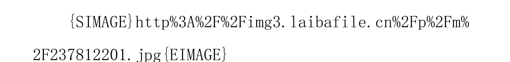
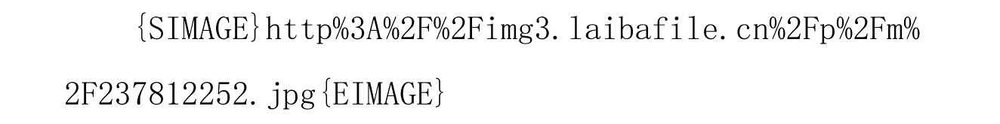
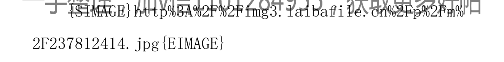
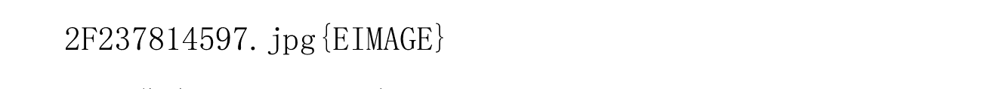
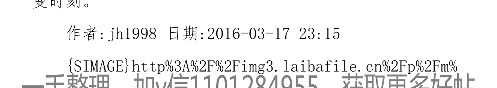
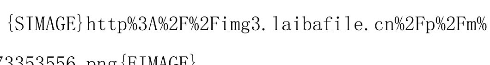

# 揭开达芬奇密码：房价十年暴涨为那番，未来暴跌到几时

jh1998

现在前面的话：这篇文章主要内容其实在 2010 年已经写过。原贴在 http://bbs.tianya.cn/post-house-199206-5.shtml 。不过当时这篇文章的目的主要是活动活动脑子，防止脑子生锈。写的过程很随意，想到哪写到哪，所以条理性相当不足，阅读起来比较困难。实际上，能够看懂的有，但极少。最近看到不少年轻人为房子所困所苦，也看到不少所谓专家在极力忽悠，甚微感慨。遂把过去写过的东西整理起来。先发一个提纲，提纲的内容有时间再慢慢添加。一般人看基本能够明白个七七八八，如果等不及，就去耐心看原贴吧。原贴内容虽未条理，却有多年、多人的跟贴记录，也是个观察、思考大众的一个好机会。

在写正文之前，先聊一下关于商品定价几个基本原理。

- 定律一：供不应求，不管表面上是什么交易形式，最终价格形成一定是“拍卖制”，价高者得。
- 定律二：供过于求，不管表面上是什么交易形式，最终价格形成一定是“投标制”，价低者中。
- 定律三：成本和价格是什么关系？粗俗点：毛关系。实际上：是没有任何直接关系。

## 过去10年暴涨的达芬奇密码：

- 1. 供不应求是基础。
- 2. 独生子女财务杠杆是根因。
- 3. 多种垄断谋大利。
- 4. 投机资本推波助澜。

## 关于房价的若干谬误：

- 1. 货币发行量过大，所以房价才会涨，不会跌。
- 2. 中国人多地少，土地稀缺，中国房价不会跌。
- 3. 小城市有泡沫，大城市没有泡沫。
- 4. 土地财政不取消，房价不会跌。
- 5. 政府不该调控，应该完全市场化。
- 6. 买房的人那么多，政府不会让房价大跌。
- 7. 调控是为了降房价。

## 关于未来的预测：

- 1. 供需合适平衡。
- 2. 何时开始跌。
- 3. 会跌到多少？
- 4. 政府会做些什么？

### 一些建议：

等不及的去看原贴吧。结论就是原帖的标题，没有修正。

没有时间啊，要教娃写作业，现在的教育真是坑爹。

原帖标题，按可比价格，2015 年底前腰斩，2020 年再次腰斩。这个结论不做任何修正。

给还没有买房的80一代：

- 1. 如果现在没有资金接盘，不要赶这趟浑水。
- 2. 不必焦虑，房子很快就会大幅下挫，这是客观规律，不必信我，看我的话是否有道理。
- 3. 未来恶性通胀的概率有，但极小，这也是客观规律，重度老龄化的国家很少会恶性通胀。
- 4. 去旅行，去读书，去结交朋友，多关心财经，多陪陪父母。
- 5. 投资健康，有能力多生个娃。未来孩子值钱，健康值钱。
- 6. 做个正直、善良的人。社会会变化。

## 一、关于商品定价的几个基本原理。

定律一：供不应求，不管表面上是什么交易形式，最终价格形成一定是“拍卖制”，价高者得。

定律二：供过于求，不管表面上是什么交易形式，最终价格形成一定是“投标制”，价低者中。

这两个定律适用于商业社会的各个领域，既然主要是讨论房地产，后面主要从房地产领域为例子。

房地产的终极购买者是普通大众，和普通大众交易的是开发商。所以在这个层面，是开发商和购房者（普通大众）博弈。

开发商为了制造房子，需要采购原材料：土地、设计院、建筑公司。

过去十年，因总体上房子供不应求。

在销售房子的过程中，是“拍卖制”，是“房子只为有钱人制造的”（任志强语）。

土地来源于政府，政府直接采用了拍卖制。在这里是开发商价高者得，开发商通常会按照房价预估计算，这块土地我能够出多少价格。而政府却不知道这块土地能卖多少，在过去，常常看到土地的成交价格高出底价太多，政府被讶异了。:)

设计院这块占比不大，实质上这块是“投标制”。

建筑公司门槛不高，建筑公司的数量很快上升，所以也基本上“投标制”，在十年盛宴，他们只能赚点辛苦钱。在极端的情况下，甚至需要垫支，承担很大风险。

建筑公司，需要采购钢筋、水泥、劳动力等。在这里只谈论劳动力，在十年的前半段，劳动力供过于求，所以在中国最赚钱的产业链里面，他们干着最辛苦的活，只能拿着最微薄的收入。然而，最近几年，劳动力市场发生变化，劳动力（苦力）开始供不应求，价格形成机制变了，那个老板给的钱多跟谁做。一下子，这几年劳动力（苦力）价格暴涨。幅度远超房价。

那么，从这里有两件事情可以轻易得出结论：

- 1. 过去十年，这个大蛋糕里面谁应该分走最大部分？实际上的结果可以看最近的新闻“全国工商联统计称房价中61%被政府拿走”。这是客观规律起作用。
- 2. 未来，一旦房子供过于求，整个价格形成体系该如何传导？

以上讨论的是宏观层面的市场，现在来聊聊微观的市场运作。

作者: jh1998 日期:2013-04-06 12:49

由于房地产天然具有的地段垄断性，在某个局部市场，供应是定量，而需求是个变量，如何让需求>>供应，这是房地产商的营销运作团队需要考虑的问题。于是：广告、分期开盘、开盘现场拉来很多托、公开销控表（开国际玩笑，这个是商业机密，为啥随便给你看？？）、提前发放啥优惠卡……

一手整理 加v信1101284955，获取更多好帖

作者: jh1998 日期:2013-04-06 13:07

定律三：成本和价格是什么关系？粗俗点：毛关系。实际上：是没有任何直接关系。

相信大家都被马克思骗了很久了。是的，没错，价格和成本没有任何直接关系。

唯一有关系的是：亏本的事情没人干，没人愿意把商品以成本价卖出，于是，不干了，供应就少了，假定需求是个变量。那么很快供应和需求很快恢复平衡。

然而，对于房地产市场，老马的规律却有着很大的局限性。

- 1. 房子和其他商品有不同的地方，房子有几十年的生命周期，这个远比一般商品要长很多。
- 2. 新房子和旧房子的功能几乎一样。你可能不愿意用别人的二手手机，却很少拒绝二手房。
- 3. 有人可以买几台电视、一台放客厅、一台放卧室；却很少有人上半年睡这个房，下半年去那个房。

所以，房子一旦供过于求，就短期内很难恢复供需平衡。这也就是底特律的房子可以一双鞋就可以买到的内在逻辑。中国会不会出现底特律的价格？

作者: jh1998 日期:2013-04-06 19:10

## 二、过去10年暴涨的达芬奇密码：

- 1. 供不应求是基础。

过去的十年，随着经济的发展，大量的就业机会出现在大城市，大量的农民工兄弟到城市谋生，随着大学的大扩招，大量的大学毕业生留在大城市工作。

需求那一端：

在 2000 年左右，那时房改还不太久，时间上，当年的人们几百元工资是常态，商品房是绝大多数人可望不可及的事情。

最开始，是比较富有的阶层，后来，是部分先富起来的市民，再后来，是大学毕业生阶层。截至目前为止，绝大多数农民工兄弟对于商品房是想都不想的，他们并不参与商品房的游戏。（这里要特别注意一下，不少专家老拿人口数量来糊弄人，其实这个问题要具体问题具体分析）

供应那一头：

这个有详细数据哈。可以度娘之。

这里面的数据也要特别区分。绝大多数农民工兄弟也并不参与商品房的游戏。城中村或者宿舍才是他们的容身之所。

总之，在 2000～2010，在绝大多数时间里，供<求。这是十年房产盛宴的基础。

作者: jh1998 日期: 2013-04-06 20:30

## 2、独生子女财务杠杆是根因。

90年代，大学生还是天之骄子，大多数人毕业后去了国企或者机关，但统统都叫干部，今天流行的说法是公务员。

那个年代，是国企开始下岗的年代，那个年代，是机关（政府部门）还多是清水衙门的年代。有不少人受不了一张报纸看一天的日子，按耐不住寂寞的心，下海南下打工生涯（这拨人是那个时代的佼佼者）。

然而不是每个人都如小马哥那么幸运。多年以后，绝大多数人还是过着平淡的生活。回过头看看曾经的同事和同学，却在那里享受着最大的盛宴。

时代的浪潮裹挟着每个人的命运。不管你智慧还是愚钝，不管你曾经勇敢还是懦弱。

扯远了，这些和房产关系不大。只能说哥开始老了。

2000 年左右，南下的大学生大多心怀梦想，赚点钱要么存着，要么寄回故乡，帮助父母。即使有些许积蓄，大多想做什么？

对于房子，绝大多数人没有多少迫切的想法。房子，不是结婚的前提。所以房子的需那一头，不是那么大。供那一头，虽也不多，然而也远非供需失衡。所以那个年代，北上广深的房子并不那么贵，2、3000 的比比皆是，还有 0 首付。那个时候，从事 IT 行业的一般 1 个月工资可以买个 2、3 平米。那时白领打工者最好的年代，再不会回来了。

后来，80 后来了，这一代人，不少是独生子女。

70 后买房，问：多少钱，答：40 万。70 后摸摸口袋，最多只有 30 万，最终一定以 30 万成交。

后来，80 后买房，出 40 万，开发商说：不行啊，有个 80 后出 80 万啊。80 后想了想，父母那里可以掏 100 万，开发商对另一个说：有人出 100 万了。另一个想：岳父母还可以掏 50 万，150 万。那最终一定以 150 万成交。

80 一代，注定了幸福的童年，悲惨的中年。（这也是时代裹挟着每个人）

作者：jh1998 日期：2013-04-06 20:46

从某种意义上说，80 一代，不是别人，恰恰是你们自己才是泡沫盛宴的制造者，然后每个人又都被裹挟着。

作者：jh1998 日期：2013-04-06 22:34

这世界，愿意求知的人很少。这是悲剧。

作者：jh1998 日期：2013-04-07 19:59

## 3、多种垄断谋大利。

需求随着人口的城市化、80 一代人口进入婚育年龄，“刚需”蜂拥而至。

供应那头，其他所有的要素都是市场化的，供应很快上来了。

然而土地完全掌握在政府手里。政府采用了拍卖制。拍卖制抬高了单价，更可怕的是，政府的收入是有计划的，在一年内不能增长太多，否则下一年就不好弄（做过销售的应该都很好理解这个啊，业绩太好，到了年底就要控制住，留到下一年）。这下子，越垄断->越涨价->土地供应缺少->....

这里请大家思考一个问题：当房价开始下降时，土地供应这块该如何传导？

除了政府垄断土地以外，房地产作为“不动产”，天然就有地段垄断性。另外，政府还垄断了公共资源（铁公鸡、学校、医疗、甚至产业布局）的分配。大城市啊大城市啊，你不涨才怪哦。

市场经济的核心是自由竞争，所以政府唯一需要调控的是反垄断。

房地产是不动产，天然就有地段的垄断性。十年调控，啥措施都搞过，唯一没有做的就是反垄断。（为什么？？）。

从市场经济的内在逻辑来说，限购就是一种反垄断措施，所得税（累进）或者房产税其实都是一种反垄断特别税。资本主义的故乡德国深知其中道理。

问题是：这些东西需要一开始就实施啊。到了泡沫后期，如何是好。

有意思的是：居然有人把这个措施解读成以后不让买了，就更要抢了。

作者:jh1998 日期:2013-04-08 17:44
欢迎拿出逻辑辨驳。回复第51楼(作者:@11464 于2013-04-08 15:00)
一看喷老马的价值规律就知道楼主斤两了.

作者: jh1998 日期:2013-04-08 17:44
欢迎拿出逻辑辨驳。回复第 51 楼(作者:@11464 于 2013-04-08 15:00)
一看喷老马的价值规律就知道楼主斤两了.

作者: jh1998 日期:2013-04-08 19:17
这世界没有神，如果你认为有，那我很难跟你对话。任何理论都只适用于特定环境和条件。我喜欢有人对我说的提出质疑。复第 51 楼(作者:@11464 于 2013-04-08 15:00)
一看喷老马的价值规律就知道楼主斤两了.

作者: jh1998 日期:2013-04-09 21:18

## 4. 投机资本推波助澜。

投机像山岳一样古老，那里有机会，投机资本就蜂拥而来。投机者并不在乎投机的标的物是什么，只在乎它是否在涨!!!

投机在中国房市占多大比率，没有人统计过，实际上也不知道多少。十年单边上涨的市场，诸位可以自行判断有多少投机资本在里面。

如何定义房子的投机：准确的说，超过你自住的那套就可以定义为投机。

有人说：我只是为了保值，钱不值钱，不买房子干什么？

这话背后是什么？？是房价要涨的预期。是一直在涨的惯性，这就是投机。

更可怕的很多刚需其实也是投机者，带着房价还会涨的心理、超过实际购买能力去买房，这也是投机。So Crazy!!!

大的投机就不去谈它。

谈谈小的。股市5000多点的时候，每顿饭局，股票是必谈话题，然而股市中小散最多波及到白领。

而这十年，房子一直是话题。街头巷尾，从城市到农村，每一个角落。

对于价格：投机资本只干一件事情，推涨助跌。临界点就是价格不动了（包括跑不赢银行利息）。

一手整理 加v信1101284955 获取更多好帖 作者:jh1998 日期:2013-04-09 22:01

这倒未必。后面会分析。中国的特色及社会现实决定了恶性通胀不大可能，后面会分析。复第57楼（作者:@jingyuanliu2010 于 2013-04-09 07:44）
> 恶性通胀会有,只是持续时间长短的问题.

作者:jh1998 日期:2013-04-09 22:30
> @jh1998 55楼 2013-04-08 19:17:34
这世界没有神，如果你认为有，那我很难跟你对话。任何理论都只适用于特定环境和条件。我喜欢有人对我说的提出质疑。

@11464 58楼 2013-04-09 09:57:11
太多喜欢以批老马哗众取宠的小丑. 也不多你一个.
老马从来就不是神,他是社会科学家,所有的结论都是
有社会实践基础的.
至于价格和成本的关系都不值一驳. 建议你好好看看
高中课本里面价格和价值的区别,如果已经带了有色眼镜去
看,存心挑刺,什么都学不到.
至于价值是不是社会劳动时间的凝结,无数批老马的都
想找出其他的参照物都失败了,我看好你哦.如果还用沙漠
里面一杯水价比黄金来反驳价值规律的话......

对于评判和指正。一贯会认真看。
不过看了半天，没看懂你想要表达什么。

另：
- 1、我不认可阴谋论也不知道你从那段文字里面看出阴谋论。一切都是客观规律。
- 2、关于价值，世间万物皆有价值，唯有交易产生价格。

作者:jh1998 日期:2013-04-10 21:10

## 关于房价的若干谬误：

- 1、货币发行量过大，所以房价才会涨，不会跌。

第一个误区：十年 M2 增长了多倍，快接近 100 万亿。所以房价还要涨。

第二个误区：未来还会依照这个数据发行货币。

要解释这个问题，就不得不解释纸币和铸币税，关于它们的定义请 baidu 之。

我这里想说的是：

- 1. 政府并没有想要刻意搞那么大 M2，想反一直为 M2 那么大发愁。
- 2. 在 M2 暴涨的时候，中国政府并没有占到多少便宜，铸币税实际是美国政府收了，便宜是美国政府收了。中国政府哑巴吃黄连，有苦说不出。

### 货币是什么？

这个跟赌场一样。你拿 100 元进去，就会给你兑换 100 个游戏币。游戏币在赌场内流通。进来的人很多。赌场老板就要多发行游戏币。

赢了 200 个游戏币，要走了，赌场会给你兑换成 200 人民币。美国的游戏币全球流通。中国的游戏币只能中国流通。由于赌场永不关门，永远有一部分人在里面玩，那么理论上，有一笔人民币赌场老板可以拿出去花了，这部分略等同于铸币税。

中国政府由于想要就业及外汇，采用了出口补贴（即出口退税）政策->大量外汇入超->强制兑换外汇->被动发行人民币->货币乘数->M2。

中国外汇占款 3 万亿美元，约产生 20 万亿基础货币，在货币乘数的作用下，产生约 100 万亿的 M2。几乎一毛钱铸币税都没有收到。

那么，谈这个和房价有什么关系呢？

> 风雨下黄生有个观点：不是 M2 推涨房价，而恰恰是房价大涨推高了 M2。

我认可这种说法。

- 其一：房价内在规律，老外的投机资本看得清清楚楚，热钱涌入。
- 其二：房价大涨，需要消耗 M2，政府被动加大 M2，否则就要通缩。

一千整理，加v信1101284955，获取更多好帖

那么未来会如何变化？

- 1、房价停滞->外国投机者卖出->兑换外汇出逃->被动销毁人民币->M2 减少。
- 2、出口补贴的政策会变么？

作者: jh1998 日期:2013-04-10 22:01

### 2、 印钞四万亿 推高了房价。

印钞四万亿，这是冤枉了央行啊。没有的事情。前面讲过，中国政府的发钞机制。

中央四万亿，以及地方十几万亿，其实全是借债，大部分投入了铁公基。(所以这几年银行日子才那么爽)。

房价大涨跟四万亿其实没有多少关系，唯一有关系是，与此同时，政府放弃了以前的地产调控措施，放松了房市中的投机。由于房子供需内在因素的原因，上涨预期还在，大量的投机资本涌入房市。

作者: jh1998 日期:2013-04-10 22:03

+   3. 中国人多地少，土地稀缺，中国房价不会跌。

这是个非常能忽悠人的大问题，实际上忽悠住了很多人。

> 有关这个的真相，请参见中山水寒的《大国空巢》一书。

针对一种观点： 大城市无地了。所以......

其实要了解真相，并不需要多高深的知识，只需要具备加减乘除的能力。

老家在农村的也可以自己算算。自行评估。和中国人口最密集的城市-深圳对对比。

中部典型农村： XX 镇 面积 94 平方公里，人口 3.4 万。密度：361 人/平方公里。

密度最大的城市：深圳 2020 平方公里 ，人口 1000 万。密度：4950 人/平方公里。

4950/361=13.71 倍。这是个什么概念？？

就是：不用把农村的院子种上房子，不用把坟地平了，不用把山推了，不用把湖填了。

只需要把 农村的房子加上 12.71 层就够了。

可是你看到深圳最近的房子有多少低于14层了？

盖房子的地少么？

深圳是短期可以观察的好样本。

有好事者，统计近期搜房深圳二手房挂牌量大增。

Me:

抛盘量大增不奇怪。

奇怪的是： 好多 06/08 的房子现在以毛坯的形式出现。

这让 那些，忽悠深圳房子紧缺的专家们情何以堪。

> 作者:jh1998 日期:2013-04-11 22:14

瞎喷M2的真多，不知其然亦不知其所以然。

> 作者:jh1998 日期:2013-04-12 20:22

+   4. 中国城市化率才刚过50%，将来会达到85%，按照1%每年计算，每年1000多万人进城，至少还要20年。

城市化率，中国官方的数据是2012年刚过51%。

关于这个数据，是有不少人质疑的，曲子有篇文章指出，中国世界的城市化率实际在70%。

李迅雷有篇文章写得不错，

http://www.ftchinese.com/story/001048978 春节观感：

十字路口的中国。中国的农村基本上只有老人和部分带小孩的妇女。能够出去打工的基本全出去了。

# 我的观点：

1、 中国的城市化在人口数量方面基本结束，未来城市化率不会有太多的增长。

2、 中国未来必然有一波逆城市化，现在在城市打工的50后、60后的农民工绝大多数要返乡养老。

3、 未来，根本就没有每年1000万人进城。

4、 中国这样的面积的国家，城市化率不会到达85%。七成五是极限了。

作者: jh1998  日期:2013-04-12 21:20

> @jh1998 84楼 2013-04-10 22:03:22
> 3、中国人多地少，土地稀缺，中国房价不会跌。
> 这是个非常能忽悠人的大问题，实际上忽悠住了很多人。
> 有关这个的真相，请参见中山水寒的《大国空巢》一书。
> 针对一种观点：大城市无地了。所以.....
> 其实要了解真相，并不需要多高深的知识，只需要具备加减乘除的能力。
> 老家在农村的也可以自己算算。自行评估。和中国人口最密集的城市-深圳对对比。
> 中部典型农村：XX镇 ......

-----------------------------------

在深圳搜房网，以关键词 二手房 毛坯 统计，共找到106430条房源

作者: jh1998  日期:2013-04-13 09:41

# 黄金一晚整这么多。

作者: jh1998 日期:2013-04-13 16:28

+   5. 小城市有泡沫，大城市没有泡沫。

每次泡沫盛宴，最终龙头都是跌得最惨的，犹如曾经的长虹、中远洋、中石油。

反而一些所谓垃圾跌得不是很多。（人家本来就没有怎么涨吗。>）

作者: jh1998 日期:2013-04-13 21:31

+   6. 土地财政不取消，房价不会跌。

这是很多无知者的常用的证据。典型的因果不分。

恰恰是内在规律使得土地财政成为可能。在过去10年里充当了“盐引”，被抽取了巨量的隐形税。

那么未来如何演进？？ 一些城市，要么无地可卖。 二三线城市，鄂尔多斯的地你会去买么？

作者: jh1998 日期:2013-04-13 21:42

回复第 91 楼， @jh1998

瞎喷M2的真多，不知其然亦不知其所以然。

——————————————

> > @与君共醉梦里他乡 108 楼 2013-04-13 18:16:42
> 
> 楼主这里说的没错，外汇占款才是中国货币增加的原因，而且池子不是房地产，而是提高存准。

——————————————

房子不是啥池子。恰恰是房价过高是推高 M2 的主要原因之一。

简单来说，是房地产有利可图，各方（个人、房产企业、地方政府）从银行大量贷款，促使资金紧张。也就是所谓提高了货币乘数。

设想一下，房地产无利可图，就不会从银行贷款，银行的贷款贷不出去趴在银行。货币乘数就乘不起来。

作者：jh1998 日期：2013-04-13 21:43

> > @成长中的人 109 楼 2013-04-13 20:32:07
> > 
> > 天涯的大神还真多啊，你的预测有有吗？
> > 
> > 因为你只有说话的权力，没有调控的权力，所以一旦形势有变，调控之手就不会闲。
> > 
> > 我党希望房价大跌吗？大跌后，土地财政还能继续吗？几千万公务员吃什么喝什么？
> > 
> > 真是大神啊！

——————————————————————————————

这跟党有啥关系，只不过党利用了客观规律而已。客观规律发生变化了，情况必然变化。

作者：jh1998 日期：2013-04-14 20:13

+   7、政府不该调控，应该完全市场化。

前面分析过，房子是不动产，是具有天然地段垄断性的东西。如果不反垄断，那谁垄断它，就可以人为制造供需失衡，谋取利益。

从这个角度讲，政府调控应该是反垄断。（然而，十年调控，除了这个没有真搞，其他啥都搞过。 有意乎？无意乎？不懂乎？）

为啥囤粮、囤盐就被瞬间打击？？

教育、医疗一样具有某种天然垄断性的特征（时间上），没有想好就那么匆忙市场化？？

作者:jh1998 日期:2013-04-14 20:14

+   8、买房的人那么多，政府不会让房价大跌。

这个没啥好说的，中石油的接盘者那么多？ 也没见几个人跳楼。

客观规律谁又能真的挡得住？

+   9、调控是为了降房价。

调控是为了让散户接盘。这世界，只有散户（中国还没有个人破产法）不会跑路。金融就安全了。

作者:jh1998 日期:2013-04-15 21:56

# 四、关于未来的预测:

### 1、供需何时平衡。

供应:按照 2010 年人口普查数据,户均 1.02 套。据 2013 年时任国务院总理温家宝两会政府报告公开披露,2012 年底,中国城镇和农村人均住房面积 32.9 平方米、37.1 平方米。

关于需求这端：新增需求前文分析过。

有人说：户均跟我有什么关系，有人 100 套，我一套也没有。

户均其实就是宏观供需的数据，犹如股市的大盘指数，犹如人均手机 1 个、犹如户均电视 1 台、犹如户均 0.4 部车。

基本上可以断定，供需平衡在 2010 年完成。

作者: jh1998 日期:2013-04-16 22:45
中国房子和黄金一样，很多人把它们当货币，其实都不是了。

作者: jh1998 日期:2013-04-18 19:22
喜欢一句话。势比人强，逆势必亡。      回复第 120 楼
(作者:@都被占用 2012 于 2013-04-18 07:56)

@jh1998 感觉房价不会象先前那样大涨，要说跌估计zf也不愿意吧！各个阶层的利害关系所致吧！

================

作者: jh1998 日期:2013-04-18 21:23
@都被占用 2012 118 楼 2013-04-17 11:42:36

@jh1998   你好，看了好久你的帖子，呵呵，感觉见识不一般！

说说我的情况：我在西安，手里三套房子，前天出手了一套小的旧房子，不知道是对是错？LG让卖，我不想卖，不过最后还是卖了，看看身边的朋友，手里三四套房子也没有出手啊。

谈谈你的看法，谢谢！呵呵。

———————————————————————————————

这么大额的投资/投机/消费。别人没法给你意见的。要自己做决定。

你要是问我什么时候才是房价的6000点。我其实也没有办法回答你。那是神才能干的事情。

在股市里面，有人喜欢吃最多的利润，在右边出货。和股市不同的是，房子的流动性不是很强。

作者: jh1998 日期: 2013-04-18 21:25

数据：

国家统计局最新数据，截至3月末，商品房待售面积42441万平方米和35292万平方米的在施工面积，按照人均30平方米计算，足以解决1.2亿人口的住房问题。

作者: jh1998 日期: 2013-04-18 21:26

### 2、何时开始跌。

如果市场的参与者都是“谢国忠”们，那么价格的拐点应该早于商品供需转折点（相对过剩），也就是要早于2010年。

然而，很遗憾，不是，这个市场的参与者是普通大众，（尤其是丈母娘和女人）。现阶段，中国普通大众具有一个特色：无知而不求知，从众随大流，按照习惯行事。尤其是丈母娘和女人，这不是要骂人。孔夫子说过“唯小人与女子，难相处也”，小人，指小孩，无知、情绪化是也。犹太人也知道并利用这点，据说他们只做女人和小孩的生意，何也，无非是好忽悠啊。

另外，十年单边上涨的现实，足以让思维习惯固化成宗教一样的信仰。谢国忠们一个个预言破产，任志强一次次说对，让大众的思维已经深深惯性，不愿去思考任何问题。市场会继续亢奋，直到最后一个勇士来接盘，或者等到商品绝对过剩。

正是这种思维定势，让鄂尔多斯那个地方，不可思议，硬生生地建成了一个鬼城（这要怎么样的一群人，才能干成这个事情啊）。

-   鄂尔多斯泡沫破了，他们说：那是西部小城市。
-   温州泡沫破了，他们说：省会人会越来越多：
-   贵阳现危机了，他们说：内地有可能，北上广深人那么多，怎么可能。
-   有一天，北上广深（深圳应该是最先）开始了，他们说：我的房子不会，地段好。

......

唯一能够打破这种思维惯性的，除了血淋淋的现实的学费，就不可能有其他任何东西了。

然而犹如信仰破灭后，人会彻底崩溃一样，在这个时候，会出现过度恐慌。所以泡沫破灭一定是用“爆”来形容。

我无法预测这天会是什么时候。然而，这一天终究会来，最晚也晚不过2015。

因为最后能接盘的勇士：80后最小都已经26岁了。

90后一是人口数量大减，二是要么父辈已经囤积，要么根本无力。

关于80、90年代的人口数量请参见人口普查数据。更详细的分析请见中水寒的“大国空巢”。

深圳是短期可以观察的好样本。我一直认为犹如鄂尔多斯（温州）是资源城市典型、贵阳是内地省会典型一样，深圳会是一线城市的典型。

有好事者，统计近期搜房深圳二手房挂牌量大增。

我的观点：在搜房网上，以二手房、毛坯为关键字搜索，是10万的天量数据（当然，这个数据需要认真考量），不少06/08的房子现在以毛坯的形式出现。

这让那些，忽悠一线城市房子紧缺的专家们情何以堪。

作者: jh1998 日期: 2013-04-19 21:41

比特币 非常有意思。

从比特币里面可以了解货币的本质。

作者: jh1998 日期: 2013-04-19 22:01

读懂比特币； 就能读懂投机和投资。

作者: jh1998 日期: 2013-04-20 23:01

### 3、会跌到多少？

房价从十年前到现在，大城市基本都在4倍左右。

10 年前供不应求，10 年后供过于求，按照可比价格，哪里来回哪里。

今后几年总量过剩，用可比价格，价格更要低于 10 年前。

这就是“2015 年腰斩，2020 年再次腰斩”的内在逻辑。

作者:jh1998 日期:2013-04-20 23:10

@mtianku 123楼 2013-04-18 21:18:29

慢涨缓跌

历史上，所有的泡沫几乎都是慢涨暴跌的。如果有意外的，请告诉我，让我涨涨见识。

作者:jh1998 日期:2013-04-21 11:34

# [经验交流]房价将在5年(2015)内腰斩,在十年内(2020)年再次腰斩。

31347 530 房产观澜 2010-02-03

@mystock001 137楼 2013-04-21 09:32:58

楼主脸皮太厚了吧。2010 年你说 2015 年腰斩房价，现在 2013 年了，怎么还涨了不少？

从一开始，你看到我提过 2013 年不涨了么？

从一开始，我就提过即使 2010 继续上涨，我也不奇怪啊。

这世界没有神，没有谁能够预测明天 下多大雨还是刮多大风， 但是正常的人都知道 6 个月之后是冬天。

作者：jh1998  日期：2013-04-21 11:44

关于调控，有几句话想补充。

这世界，散户，炒股少有动用杠杆的。

但即便如此，开户时都需要做风险评估，测试你跌了多少，你会怎么反应。需要提示你“股市有风险，投资需谨慎”。

股评家即使吹牛没边，“股市有风险，投资需谨慎”都必须提醒的。

然而房子，这调控，那调控。却任由杠杆横行。没有任何风险警示。

任由各色 托家胡吹，没有任何警示。 难道，有一天暴跌了，他们替你还款么？

你要说没有任何阴谋，那至少是严重失职啊！！！！！！

作者：jh1998  日期：2013-04-21 11:51

对于普通人，必须修炼一双慧眼。看透这中间的门道。该规避的就需要规避。

因为，没有任何人会替你承受风险。

因为，你无力承受这么巨大的风险。

作者：jh1998  日期：2013-04-21 11:54

房产泡沫破灭，这是神都挡不住的客观规律。

泡沫破灭之后，会不会有大萧条时代，会不会大规模失业。这一切都是未知数。（后续若有时间，就专门聊聊这个话题）

哥活半生，看见过 当年下岗工人 的悲惨命运....没人会替你承担责任。

作者：jh1998 日期：2013-04-21 19:27

@861569893 144楼 2013-04-21 12:17:47

现在zf根本不是在调控，如果像美国那样，由zf估价征房产税，有谁还愿意多持有几套住房？现在中国的房地产开发乱象丛生，真正做到规范化的有多少？zf不会压低房价，银行要生存，经济要发展。参考国外的例子，遏制房价的措施有很多，只是zf不想用而已。政策雷声大雨点小。未来几年，年轻人还得处于水深火热之中。

------------------------------------------

为什么要相信zf?它的利益和你的利益是一致的吗？

为什么判断“zf不会压低房价，银行要生存，经济要发展” 这就是思维定势。

为什么得出结论“未来几年，年轻人还得处于水深火热之中”。

作者：jh1998 日期：2013-04-23 22:27

有时候，等待是一种品质

作者: jh1998 日期:2013-04-24 22:36

> > @hedshan 151 楼 2013-04-24 14:32:54
> 
> 只要不搞房产税，或只是象征性的（极低税率），中国房价真的会只涨不跌。
> 
> 因为：
> 1. 各阶层收入在稳定增长，
> 2. 国人特别是女人最喜欢房子，
> 3. 国人勤俭

-   1. 房产税只是一种销售税而已，对价格无直接影响。至于间接影响前文分析过。
-   2. 各阶层收入在稳定增长，收入增长和价格也没有关系。
-   3. 国人特别是女人最喜欢房子，女人并不喜欢房子，她们只喜欢当下最贵的东西，最热门的东西。自行车、手表、缝纫机；电视、冰箱、洗衣机。女人是商人之友，未必是男人之福。:)
-   4. 国人勤俭国人并不是天生勤俭。都是被逼而已。莫非官员、富二代、官二代不是国人。

作者: jh1998 日期:2013-04-24 22:37

-   1. 房产税只是一种"消费税"而已，对价格无直接影响。至于间接影响前文分析过。

作者: jh1998 日期: 2013-04-25 20:57

@jh1998 154 楼 2013-04-24 22:36:02

-   2、各阶层收入在稳定增长，
收入增长 和价格也没有关系。

-   3、国人特别是女人最喜欢房子，
女人并不喜欢房子，她们只喜欢当下最贵的东西，最热门的东西。 自行车、手表、缝纫机；电视、冰箱、洗衣机。
女人是商人之友，未必是男人之福。 :)

-   4、国人勤俭
国人并不是天生勤俭。 ......

------------------------------

一手整理 加v信1101284955 获取更多好帖

@hedshan 156 楼 2013-04-25 09:00:38

-   1，全民收入稳步增长，导致民间闲钱增长，储蓄增长，通货稳步膨胀。中国投资渠道只有房产靠谱，所以上涨。
-   2，女人过去喜欢的贵东西都被更贵的取代，如摩托车，汽车取代自行车，彩电，液晶彩电取代黑白电视等，但房子在可见的将来没有东西取代。男人挣钱女人花这是生物学决定的。
-   3，国人比西方人勤劳节俭很多是事实。农民工租住城中村，群租等就是节省钱未在老家二三四线城市买房。农村人现在......

------------------------------

# 思维惯性是个有趣的东西。

作者：jh1998 日期：2013-04-26 22:33

鄂尔多斯从媒体消失很久。

其实，做投机/投资的，应该长期跟踪这个地方。这是个多么值得研究的事情啊。

作者：jh1998 日期：2013-04-28 19:35

> @everdonkey 147 楼 2013-04-23 13:45:24
> 
> 确实存在一个这样的考虑，都是在说泡沫破了之后将会经济危机、社会大乱，是不是故意放出来的舆论？当年的股市大崩盘，有跳楼的，也没见谁跑到 ZF 去闹事啊。
> 
> 现在如果舆论造起，如果泡沫破了将会后果如何严重，那么就是忽悠所有人维护继续涨，甚至有可能是 KFS 或者 ZF 在造这个势，让游戏继续玩下去，至于是否真的如此，也未可知。
> 
> 房价的大幅下跌 和经济危机 是个什么关系？ 这是个问题。
> 
> 房价的大幅下跌 和社会是否会大乱是个什么关系？
> 
> 严格的来说，没有直接关系。但是确实有可能引发这些问题。

在中国，由于政府的特殊性：

最大最紧急的危机是大规模失业。

# 二是大规模的通胀。

作者:jh1998 日期:2013-04-28 19:43

房地产行业解决了很多体力劳动力的问题。 这些体力劳动力处于社会底层，一失业生活既无着落，这些劳动力就业如何解决？？ 这也就是 为何开始继续鼓吹 新型城镇化的原因之一。 08年外贸危机，立马狂拉基建，也是害怕大规模失业。

### 其二：债务问题会否影响金融动荡。（这是可能引发金融危机的问题）。

所以调控的目的之一是让刚需接盘，刚需一不会跑路，也不会引发危机。

作者:jh1998 日期:2013-04-28 19:49

在中国，大规模的通胀 最直接的影响是底层的劳动人民。

过去十年，通胀不小：仔细看看政府的措施：

-   1. 农村底层劳动人民：免了一些税收。由于农村还是自行解决吃喝问题。通胀没有影响基本生活。
-   2. 城市低保：这个和通胀的涨幅基本同步，
-   3. 其他族群：没有大规模失业。

# 未来：通胀会继续吗？

作者:jh1998 日期:2013-04-28 21:11

-   4. 政府会做些什么？

在中国，政府是个非常强有力的一方，在房地产这个市场，政府更是如此。预测未来的变化，不能不预测政府的行为。政府可能有千百种策略和措施，我只预测真正对市场能够产生影响的，而且实际能够起作用的。（难度系数：5星。期待预测准确度：6成）

### 4.1 房产税
### 4.2 新型城镇化
### 4.3 小产权房
### 4.4 宅基地流转

（这些都还是思考题，如果有人想提出更合适的问题，也一并思考了）

一手整理 加v信1101284955 获取更多好帖

> 作者: jh1998 日期:2013-04-28 23:09

对于鬼城，媒体好像全部消失了一样。没有了进一步报道了，反而集中报道一线城市。这种静默的、诡异的氛围应该让每个谨慎的人深感恐惧。

> 作者: jh1998 日期:2013-04-29 22:26

今年的经济啊。悲催了。

> 作者: jh1998 日期:2013-04-29 22:56

> @jh1998 167 楼 2013-04-29 22:26:35

今年的经济啊。悲催了。

街边的小店啊。是经济链条的末梢。

一排店面，哗啦啦关了接近 1/3 了。一家甜点点、一家礼品烟酒店、一家发廊、一家网吧。剩下的 2 个中介、2 家银行、1 家便利店、一家发廊、一家手机店、一家床上用品店、一家

作者:jh1998 日期:2013-04-30 20:58

> 回复第 63 楼， @1193214295

> 回复第 19 楼(作者： @jh1998 于 2013-04-05 20:47)

原帖标题，按可比价格，2015 年底前腰斩，2020 年再次腰斩。这个结论不做任何修正。

==================

楼主啊，房子是普通意义上的商品吗?它可以流通吗?南京的房子可以拿到北京去用吗?房价跌落的唯一因素是这个区域外来人口不再增加!没有外来人口，房子都卖给谁?!即使有人炒房，但炒房的人将房子卖给谁呢?还是外来人口!

> @仓耳子 169楼 2013-04-30 09:33:21

用一个一刀切的结论来说中国的房产，不管你是怎样的智者都必定会失败，

一刀切切的是大盘。个股的情况确实会有差别。前文也已经说了部分。

原理都是一样的。有心分析的，自个分析吧。

作者:jh1998 日期:2013-04-30 23:21

> 这世界，有人只说你爱听的话。
这世界，有人只说真话，你不爱听。
闻过则喜的境界，谁能做到。...

作者:jh1998 日期:2013-05-01 12:26

指的是那些？回复第174楼(作者:@孤独骑士KK于2013-05-01 00:50)

楼主有没有考虑系统性风险的发生呢？现在周边情势复杂多变哦。

作者:jh1998 日期:2013-05-01 20:49

### 4.1 房产税

发达国家的惯例，房产税是地方政府最大的财政来源。
中央政府让渡了一项重要权力给地方政府，地方政府却扭扭捏捏，何也？
主要原因：地方政府的利益和现有的利益格局还没有完全分离。
对于还有地可卖的地方政府：通过土地一级市场获利远比房产税来得低成本、高收益。

对于没有多少土地可卖的地方政府（典型如深圳）：这里面的利益相比较为复杂：
一方面利益集团还没有从土地财政中脱离。需要一段时间撤退。
另一方面高房价对地方政府的利益开始产生伤害，企业开始流失，税源开始减少。
中央政府那边，一方面需要防止暴跌引发的金融风险，另一方面也要防止大规模失业的出现。
所以就这么你不做，我也不说的扭捏着。

未来的预测：等到各方达成一致了，国际惯例那时必然的。

> @天安聚宝阁 179楼 2013-05-01 21:30:54

Mark，有些道理。但是缺少系统性和数据支撑。
城市改善性需求，人口流入，通货膨胀等因素考虑不全。

这世界：真相是好简单的。不需要用华丽的数据做支撑。
用华丽的数据来支撑的必然不是真相。
城市改善性需求，人口流入，通货膨胀等因素考虑不全。
---》这些要写起来 话就罗嗦了。毕竟不是主干。

多了一地的 Mark。

更希望有人提出质疑和问题。

作者: jh1998 日期:2013-05-02 20:36

> @jh1998 105 楼 2013-04-13 16:28:53

+   5. 小城市有泡沫，大城市没有泡沫。

每次泡沫盛宴，最终龙头都是跌得最惨的，犹如曾经的长虹、中远洋、中石油。

反而一些所谓垃圾跌得不是很多。（人家本来就没有怎么涨吗。:&gt;）

---

> @maxmin_sina 183 楼 2013-05-02 02:38:02

这点的论述很单薄，毕竟 IC 的工作机会/福利都在大城市

---

话分两头说：

- 1. 一头是所有的预期，最重要的是惯性预计，全部在当期价格上已经兑现。
- 2. 大城市的工作机会/福利 未来如何？？ 逃离北上广深，是经济人（自然人、企业、甚至政府的投资）在用脚投票。

作者: jh1998 日期:2013-05-02 20:42

> @jh1998 105 楼 2013-04-13 16:28:53

5、小城市有泡沫，大城市没有泡沫。

每次泡沫盛宴，最终龙头都是跌得最惨的，犹如曾经的长虹、中远洋、中石油。

反而一些所谓垃圾跌得不是很多。（人家本来就没有怎么涨吗。:&gt;）

----------------------------------------

> @maxmin_sina 183 楼 2013-05-02 02:38:02

这点的论述很单薄，毕竟 TC 的工作机会/福利都在大城市

----------------------------------------

> @jh1998 219 楼 2013-05-02 20:36:57

一手整理 加v信1101284955, 获取更多好帖

话分两头说：

- 1. 一头是所有的预期，最重要的是惯性预计，全部在当期价格上已经兑现。
- 2. 大城市的工作机会/福利 未来如何？？ 逃离北上广深，是经济人（自然人、企业、甚至政府的投资）在用脚投票。

----------------------------------------

第一个道理： 和股市是一样的。

第二个道理： 在中国：大城市的工作计划/福利，不仅仅是 经济规律在起作用，政府在其中起了很大的作用。未来，政府的资源会如何分配和倾斜。

中央政府的投资：必然向中西部倾斜。

全国各个地方政府其实是互相竞争关系。这个挺有意思，

作者：jh1998 日期：2013-05-03 20:15

@逃离拆哪 267楼 2013-05-03 17:16:15

回复第103楼（作者： @jh1998 于 2013-04-12 21:20） @jh1998 84楼 2013-04-10 22:03:22 3、

中国人多地少，土地稀缺，…… =========

哥们你来过深圳么。你知道深圳这弹丸之地有多少人么。

你要不要来看看这个城市所有小区的夜晚亮灯率。。。看搜房网，得结论哈哈。傻不傻

——————————————————————————————

我只不过用简单加减乘除来说明一个“谬误”而已。

这个对于老家在农村的朋友，可以自己计算、感受一下。

只要用心计算，真相常常很简单拿。

老家不在农村的，很难建立起基本概念。

作者：jh1998 日期：2013-05-03 20:23

@Archangel_S 238楼 2013-05-03 13:45:32

楼主大才！令人敬佩！

对于国内今后通胀可能性小的观点，您似乎分析的还不是很详细。可否劳烦赐教？

目前国内这个乌烟瘴气，人心惶惶的样子，实在令人忧心。如同利剑悬头，不知道何时才会落下。希望麻烦那些雷政富们替百姓解下这剑？对不起，红霞妹妹正叫咱有急事儿呢......

没人希望自己的国家会乱，但是面对这样的状况，明眼人总想尽量做些准备.

依阁下看，是否拿些美元，欧元在手，也是一个可行......

恐慌的大多是白领（底层的体力劳动者反而收益不少）。这些年，白领受苦了。未来估计还要苦好一阵子。在困难生活还得继续。如果说到要对冲贬值风险的话，有一种说法是：100 美元黄金+100 美元。这中做法过去基本一直有效。未来有没有变数还得研究。

作者：jh1998 日期：2013-05-03 20:30

> > @michal0716 327 楼 2013-05-03 20:26:07
> 楼主你的观点太主观了，货币超发对楼市没有影响？太不能让人信服了吧，没有那么多资金进入楼市，它能这么涨？楼市本身就是蓄水池的作用，那么多流动性要不是去楼市，早就通胀的不行了。
> 四万亿投资对楼市没影响？这你也太扯了吧，说得我连看下去的兴趣都没了

货币超发是个时髦的词汇，啥事都可以拿这个说事。

但我建议，拿这个说事的，试着自己计算一下，如何超发的、How？

作者: jh1998 日期:2013-05-03 20:36

> > @youjiantaohuaan 231 楼 2013-05-03 11:11:21

道理是这样了，可是有几个80后能等到房价下跌的一天？没房的压力，孩子上学的压力让你不得不去接盘，因为大家从心理上已经经不起这样的折磨了。水深火热的生活，一点也不为过

-----------------------------------

自己的路自己走。

自己的责任自己负。

但遗憾的是，80独生子女一代，并没有经过有责任方面的锻炼和考验。

没房有什么压力？小孩上学还有私立小学可选。

这就叫折磨啦？万一以后负资产外加失业，又当如何？

作者: jh1998 日期:2013-05-03 20:49

> > @windysoft2 239 楼 2013-05-03 13:50:16

不可能出现暴跌、、

- 1. 农村几亿人要进城 三线的人想进一线 巨大的需求在那里（估计7亿人是有的）看看在上海的安徽人有多少 广东的湖南人

- 2. 印钞机在加班 整体物价都在上涨
- 3. 从高速公路节假日免费到禁止吸烟 国家行政干预已经无敌 假设就算暴跌了 国家会征收 100%的税费 冻结过户手续办理 阻止房价下跌

- 1、 几亿人？7亿人？那些人？都是谁？自己试着自己计算一下？加减乘除就够了。

2

作者: jh1998 日期:2013-05-03 20:52

> > @18637575657 288 楼 2013-05-03 18:04:43

推荐楼主看一篇冰冷的经济真相，那个作者我觉得说的很好！未来有太多的不确定因素，要想预测房价，就得先看ZF的政策，其中九零年那个预测作者说的也很清楚明白，做人要像贾诩一样能善始还要能善终，不要把话说绝对，未来充满变数，过好放下吗？

看了冰冷的经济真相，不少观点很好。也比较认同。

不过一开始就逮住一个大bug.（如果后面的分析基于此，那文章的价值需要先打个问号）

还有个无法监督的印钞机：年平均 CPI 算 15%（仅 2010 年我们的 GDP40 万亿，货币发行量（M2）却是 70 万亿，相当于我们每创造 1 元钱财富，央行就发行了 1.8 元人民币。）

作者: jh1998 日期:2013-05-04 11:13
看了这篇文章，逻辑上有不少硬伤。强烈不推荐。
复第 343 楼(作者:@jh1998 于 2013-05-03 20:52)
@18637575657 288 楼 2013-05-03 18:04:43
推荐楼主看一篇冰………

=========
作者: jh1998 日期:2013-05-04 12:45
关于人性，天涯海神总结的非常精彩。回复第 515 楼(作者:@xin2v 于 2013-05-04 11:54)
楼主不必较真，看帖的多一半不是经济学专业的。不必为二货劳神，请楼主专心科普……洗耳恭听

=========
作者: jh1998 日期:2013-05-04 16:46
@qingquanqing 498 楼 2013-05-04 10:18:28
@jh1998
我极少上天涯，没想到上来一看见贵贴，竟然想要冒泡了。连自己都感到意料之外啊，请教您一下，我们家最近正为怎么才能买房而犯愁。我们本身有房，可是因为家里人多，不够住了。但是我们本身资金不足，想要存几年钱再买，可是又担心房价两三年后再再翻一番，存下来的钱都不够房价翻倍的数儿！我们是小城市，目前房价六千多均价，最高的房价大约是九千多到一万多一平米。这样的小城市有可能……

----------------------------------------

这种事情自己需要拿主意哦。

把我写的全文看完吧。小城市：供应量太大了。单靠信心是无法维持价格的。

作者: jh1998 日期: 2013-05-04 16:51

有很多人，带着自己的情绪和立场来看这个贴。

我只是试图解释客观规律而已。

有很多人，老那国家或者政府说事。

我更正一下：在哥的词汇里，国家是个地理或者历史名词，不是一个利益主体。

一手整理 加v信1101284955，获取更多好帖

说到政府，这里面有一大推的利益主体：中央政府，地方政府。

中央政府里面有一大堆的委、办、局。

它们有着不同的利益诉求。

作者: jh1998 日期: 2013-05-04 17:06

### 4.2 新型城镇化

在分配问题短期无法解决的前提下，在城市房地产饱和或者已近开发殆尽之后，如何解决 1、巨大的就业问题。2、防范金融风险。

发展城镇化可能是为数不多的解决方案。所谓新型城镇化，核心依然会是房地产。

将农村的宅基地货币化，交换成工作所在地的住所，是一种存在潜在可能性的路径。

这个还得继续观察（也许有投资机会）：

- 1、如果定位成让农民上楼，无疑是一种灾难。
- 2、如果定位成让先富起来的人的升级消费。让一部分人过上美式大宅的生活。是不那么坏的选择。

作者: jh1998 日期:2013-05-04 17:14

有些人说我用阴谋论说事。

如果非要讨论这个的话。

我的观点：这个世界是灰色的，时时刻刻、到处都充满着“阴谋”和“算计”。

军队有参谋部，政府有各种研究室，企业有营销部门，个人有算盘……

我其实不关心“阴谋”，我关心什么样的“阴谋”会得逞，什么样的“阴谋”难成功。

作者: jh1998 日期:2013-05-04 17:15

> @mm8185 542楼 2013-05-04 16:52:56

楼主，大量大学生毕业在一二线城市工作，却因没房子而只能挂集体户。集体户不给小孩落户，小孩不落户没法上学等种种现实问题，逼的人不得不买房。这种刚需对楼市有影响吗？

当然有影响。这个对需求那端有影响。

作者: jh1998 日期:2013-05-04 17:41

## 10、房地产价格暴跌，经济就跨了。

几个基本概念：房地产价格不是房地产行业的全部，房地产行业更不是经济的全部。

价格的崩盘，对于房地产行业来说，对有些企业是悲剧，对有些企业可能是机会。由于家电行业大洗牌之后还有格力这种。

价格的崩盘，对于房地产关联的一些下游行业，如装修、家电、家具行业来说，可能反而是好事。

价格的崩盘，最大的风险在于房地产行业和金融绑定的比较厉害。

个人，7成借贷。这个对于金融有多少影响呢？

在前文也已经讲过一部分了。调空是为了让散户、刚需接盘。

另外：对于抵押给银行的房子，平均价格要远低于现有成交价格。

因而，个人信贷这块对于金融威胁不大。

- - 企业：地产商贷款。这个好多年前就卡得比较死了。
- - 地方政府：用土地抵押贷款。这个么。不分析。

作者: jh1998 日期:2013-05-04 17:56

## @jh1998 80 楼 2013-04-10 21:10:48

关于房价的若干谬误：

- 1、货币发行量过大，所以房价才会涨，不会跌。
第一个误区：十年 M2 增长了多倍，快接近 100 万亿。
所以房价还要涨。
第二个误区：未来还会依照这个数据发行货币。

要解释这个问题，就不得不解释纸币和铸币税，关于它们的定义请 baidu 之。

我这里想说的是：

- 1、政府并没有想要刻意搞那么大 M2，想反一直未 M2 那么大发愁。
- 2、在 M2 暴涨的时候，中国政府并没有占到多少便宜，铸......

## @yxiaoxiao2006 550 楼 2013-05-04 17:45:37

先赞一个，关于货币发行量，个人觉得货币量发行过大，至少是房价上涨的重要原因之一；有报道不是说现如今的 100 元的购买力只相当于十几年前的 30 元；通货膨胀避险也是房市投机的重要原因之一吧。

这里面要分清楚，因和果的关系。

供求关系-》价格涨-》感觉“才有避险的价值”。为啥不去买家店避险？

作者: jh1998 日期:2013-05-04 18:08

> > @projectkk 265 楼 2013-05-03 17:16:19
> 楼主推荐点实在的经济学的书吧…

天涯海神的《金融幻象》写得很系统
《这个国家会好吗？中国崛起的经济学分析》写的也不错。

作者: jh1998 日期:2013-05-04 18:16

> > @醉爱白龙江 537 楼 2013-05-04 16:17:40

如果可以，我重读大学，选择经济学。这样我就不用看这些经济帖，而不知道谁说的有点道理。

每个人都该学学经济学。都该学习理财基本技能。

中国的教育应把这个而不是啥思想、英语列为必修课。

作者: jh1998 日期:2013-05-04 21:18

> > @中华中华 568 楼 2013-05-04 20:58:43

- 个人感觉：
  1. 政府的想法是将房价稳定在目前的价格水平上，然后通过通胀，通过提高人们的收入水平慢慢解决房价过高的问题，不是之前提出了个五年收入翻一番的目标么，通胀呢，大家都能感觉的到。
  2. 经济形势不好，房价也许会跌 20-30%，但是腰斩的话，可能够呛，再次腰斩就更难看到了~

--------------------------------------------------

未来大幅通胀的可能性接近于零。不知道我前文有没有论述这个。

对于任何政府来说，都希望通胀，因为可有抽铸币税。

- 1. 但是日本十年通缩。Why？？
- 2. 对于中国，因为政权的特殊性，基本上封闭了这种可能性。(或者换个方式，如果那样做，就得Crash，都Crash了，房子也不值钱了。保命要紧、保肚子要紧啊)。

### 大幅通胀

作者: jh1998 日期:2013-05-04 22:02

一手整理 加信1101284955，获取更多好帖

## 3、未来会大幅通胀吗？

看到好多人预测这个，用通胀来淹没高房价。我的观点是不会，未来大幅通胀的可能性接近于零，甚至可能有一段时间的通缩。

对于任何政府来说，都希望通胀，因为可以抽铸币税。

- 1. 但是日本十年通缩。Why？？
不是它不想，而是它不能啊。人口老龄化之后，通胀是件很难的事情。
- 2. 对于中国，因为政权的特殊性，基本上封闭了这种可能性。
（或者换个方式，如果那样做，就得Crash，都Crash了，房子也不值钱了。保命要紧、保肚子要紧。

稳定影响到政府的核心利益。为了核心利益，其他边缘利益必须丢弃的就要丢弃。

最大的不稳定因素就是大规模失业。在大规模失业的基础上再来个大通胀，各位自己想想如何？

所以，从这个角度讲，它不能。

已经建好了的房子，已经 developed 的城市地产，并不能带来大规模就业的机会。那么，高高在上的房价符合它的核心利益么？

作者: jh1998 日期:2013-05-05 07:57

> @天行健奈何桥 583 楼 2013-05-05 00:40:37

一手整理 加v信1101284955，获取更多好帖

再说下四万亿的事情，就说12讲的投入铁公基，一般修一条国道的路，都是省市配套，省里的钱有中央的也有省里的，当然有些项目是争取到大量中央补助，比如交战略路，那地方基本就不要出钱了。这些都是中央的钱，一般只要一个项目批下来并且做了，省补这部分都会到位，中央从来不差钱，省级只要不是西部省级财政宽裕的条件下也都是到位的时间问题。缺钱一般是地方市县一级，所以地方的债务问题才会越来越突出，因为地方官员要……

这个世界啊。最缺的是独立思考的能力。和打破沙锅问到底的精神。

成人世界啊，思维定势。

这位知道发改委、世行、国开行。远比一般人知道的要多。

可是啊，他就一口咬定了印钞。

不去想四万亿到底指的是是个啥东西。

不去想即使它真的是印钞，这个钞到底是怎么流通的。

作者：jh1998 日期：2013-05-05 07:58

百度结果：

初步匡算，实施上述工程建设，到 2010 年底约需投资 4万亿元。为加快建设进度，会议决定，今年四季度先增加安排中央投资 1000 亿元，明年灾后重建基金提前安排 200 亿元，带动地方和社会投资，总规模达到 4000 亿元。其中 4万亿投资分布情况如下：

- 保障性安居工程：2800 亿元；
- 农村民生工程和农村基础设施：3700 亿元；
- 铁路、公路、机场、城乡电网：18000 亿元；
- 医疗卫生、文化教育事业：400 亿元；
- 生态环境：3500 亿元；
- 自主创新结构调整：1600 亿元；
- 灾后的恢复重建、重灾区：10000 亿元

作者：jh1998 日期：2013-05-05 08:07

有些人，相信政府投资惹的祸，却不去想它到底是怎么运作的。

发改委每天都在工作。每月都有项目要批。

四万亿并不是突然冒出来的。四万亿那年之前一直都批项目，都在投资。

只不过之前，节奏都是控制的，有些项目你有钱（不用花中央的钱）也不让你投。

那一年，外贸形势突变，失业严重（请特别注意：失业这个词），没有办法，突击批项目：

以前不让投的项目，批。赶紧的，投资吧。没钱？啊？我贴点。

作者:jh1998 日期:2013-05-05 08:17

很多人诟病四万亿。

但是可知那是在失业威胁下的不得不的选择，几乎是唯一的选择。

作者:jh1998 日期:2013-05-06 21:00

上天涯的，基本上是受过高等教育。上经济论坛的，经济素养，应该高于常人，看这里的回帖，可知中国的教育，何等失败。

作者:jh1998 日期:2013-05-06 22:00

@面前一扇财富门 656 楼 2013-05-06 21:35:59

未来 10 年，房价会跌到一个你惊讶的位置；股市会涨到你不敢想的位置。各位仔细梳理下D的经济脉络。把各位高层发言梳理成线，就会有些发现。GD 高层可不是吃干饭的。

> （还有大家担心的地方债，会证券化后被千千万万股民消化。土地流转又是一个造富大机会）

别高看别人的智慧。别低估别人的无知与愚昧。

土地流转可能是个机会。但绝非大机会。

对有些人，象过去十年的房地产这样的机会不会再有。

对有些人，掉进房地产的大坑，一辈子翻身的机会可能都没。

作者:jh1998 日期:2013-05-06 22:04

人一生，真正的机会窗非常少。错过机会窗，静静等待也许大多数人最好的选择。一手整理 加v信1101284955，获取更多好帖

有时候，该赢却没有赢，就是输了。

有时候，该输却没有输，就是赢了。

作者:jh1998 日期:2013-05-06 22:07

> @hedshan   157 楼 2013-04-25 09:11:56

5，因建筑工人越来越少，建筑工工资不得不越来越高，今后中国不会像过去十年那样高速大量建房了。
综上，中国房价不会降只会涨，也许涨幅没有过去那么高罢了。

> @都被占用 2012 643 楼 2013-05-06 10:10:07

> @jh1998    同意最后一句话。

自己私下里女人的想一下：国家明年六月动产统计，意欲？ 难道是给一些人些时间处理自己手里的不动产？难道想通过这个动一下一些人的神经？意欲？

----------------------------------------------

建筑成本 和价格 有什么关系？
都已经看了这个帖子，还这么幼稚。我还有啥好说的呢？

作者: jh1998 日期:2013-05-06 22:28

> @khtkw 658 楼 2013-05-06 21:55:30

持有没成本就不可能降

一手整理 ，加v信1101284955，获取更多好帖

你去问问鄂尔多斯的房东，问他便宜点，卖不。

作者: jh1998 日期:2013-05-06 22:32

有人找我要 QQ 号。我很少玩 QQ。偶尔玩玩微博。微博里面还是有不少人 有真知灼见的。

作者: jh1998 日期:2013-05-06 22:58

有梦就去追梦吧，不走寻常路也是种活法。复第 654 楼 (作者:@万流奔腾r 于 2013-05-06 21:03)

> @珊瑚与海带    279 楼 2013-05-03 17:49:03

房地产其实就是一场运动……

作者: jh1998  日期:2013-05-07 20:01

你写的首先得能够说服自己。如果你确实想讨论这个问题的话。回复第 666 楼 (作者:@社会主义土豆牛肉 于 2013-05-06 23:59)

呵呵，楼主忽略也一些东西，看看我在房观发的帖子..

正是你忽略的

作者: jh1998  日期:2013-05-07 21:44

@踩惰 624楼 2013-05-05 19:06:51
同样是经济论坛的帖子 同样跟房价有关
http://bbs.tianya.cn/post-develop-1299874-1.shtml 而这篇帖子就看出真水平~

希望LZ 不要再误导大家~

----------------------------------------

呵呵。

M2 是什么？ M2 与房价的关系如何？

这是个衡量一个人是否具有金融基本常识的 小题目。

这样一个情绪化的帖子 这么多人看得起劲。

在市场中，有些人注定是猎物啊。

人民日报为 M2 捍卫的帖子，虽然很多人不喜欢，但是基本逻辑是正确的。

作者: jh1998 日期:2013-05-07 22:06

呵呵，楼主忽略也一些东西，看看我在房观发的帖子..

正是你忽略的

> @社会主义土豆牛肉   666 楼 2013-05-06 23:59:00

中国楼市，毫无疑问是有泡沫的，并且这泡沫，放到国外早崩了，为什么中国能维持呢？原因如下

1. 中国人民的吃苦耐劳，任劳任怨，这点不用多说了。这可理解为支付能力提升。
2. 中国城市的房子相对于国外来说，被赋予了更多的属性，比如户口，学位等，而对于对于一个女人来说是至关重要的，所以房子一定程度上还影响着你的结婚生育权，所以中国房子对于中国人的重要性远大于外国房子相对于外国人，这点可以理解为中……

> @万流奔腾r   669 楼 2013-05-07 08:48:29

如果这样的话，未来中国的社会矛盾将会很激烈。

> @社会主义土豆牛肉   672 楼 2013-05-07 11:46:34

其实一线城市已经是这种态势，除了百分之一的佼佼者，其他的年轻人都买不起房，都是租奴和鼠族，即使是那百分之一还得耗尽三家两代人的存款。现在房租抵不上定期利息，更抵不上房贷，仍然不降价，底气就是一线城市的房子控制了中国最优质的社会资源，如果只是居住功能，早崩了。要解决这现象就要缩减地域发展差异，像德国绝大多数人居住在小城小镇，而他们的生活收入水平和柏林汉堡慕尼黑的比起来，并没有像中国那样的……

> > @万流奔腾r 677楼 2013-05-07 22:01:44
> 李总理的城镇化不知可行？

城镇化的话题，我前文也已经提过。经济上有很大的可行度。政治上可能是必须、急迫的。

作者:jh1998 日期:2013-05-07 22:09

呵呵，楼主忽略也一些东西，看看我在房观发的帖子..正是你忽略的

> > @社会主义土豆牛肉 666楼 2013-05-06 23:59:00
> 中国楼市，毫无疑问是有泡沫的，并且这泡沫，放到国外早崩了，为什么中国能维持呢？原因如下

1. 中国人民的吃苦耐劳，任劳任怨，这点不用多说了。
2. 中国城市的房子相对于国外来说，被赋予了更多的属性，比如户口，学位等，而对于一个女人来说是至关重要的，所以房子一定程度上还影响着你的结婚生育权，所以中国房子对于中国人的重要性远大于外国房子相对于外国人，这点……

--------------------------------------------------------------------------------

你的这些问题，我前文都好像已经提过。不爱看，不思考。我也没有办法。

作者: jh1998 日期:2013-05-07 22:12

呵呵，楼主忽略也一些东西，看看我在房观发的帖子

一手整理 正是你忽略的加v信1101284955，获取更多好帖

> @社会主义土豆牛肉 666 楼 2013-05-06 23:59:00

中国楼市，毫无疑问是有泡沫的，并且这泡沫，放到国外早崩了，为什么中国能维持呢？原因如下

1. 中国人民的吃苦耐劳，任劳任怨，这点不用多说了。这可理解为支付能力提升。
2. 中国城市的房子相对于国外来说，被赋予了更多的属性，比如户口，学位等，而对于一个女人来说是至关重要的，所以房子一定程度上还影响着你的结婚生育权，所以中国房子对于中国人的重要性远大于外国房子相对于外国人，这点可以理解为中……

@万流奔腾 r 669楼 2013-05-07 08:48:29
如果这样的话，未来中国的社会矛盾将会很激烈。

@社会主义土豆牛肉 672楼 2013-05-07 11:46:34
其实一线城市已经是这种态势，除了百分之一的佼佼者，其他的年轻人都买不起房，都是租奴和鼠族，即使是那百分之一还得耗尽三家两代人的存款。现在房租抵不上定期利息，更抵不上房贷，仍然不降价，底气就是一线城市的房子控制了中国最优质的社会资源，如果只是居住功能，早崩了。

要解决这现象就要缩减地域发展差异，像德国绝大多数人居住在小城小镇，而他们的生活收入水平和柏林汉堡慕尼黑的比起来，并没有像中……

德国制造业很发达。制造业造成了这种城市发展格局。

中国的制造业可以比较分析。

作者：jh1998 日期：2013-05-07 22:15
以制造业为主的格局，并不会造成大城市格局。
以高端服务业为主的格局，可能会造成大城市格局。

因此，中国以制造业为主体的城市，大城市化格局不可持续。

作者:jh1998 日期:2013-05-07 22:21

呵呵，楼主忽略也一些东西，看看我在房观发的帖子..正是你忽略的

@社会主义土豆牛肉 666楼 2013-05-06 23:59:00

中国楼市，毫无疑问是有泡沫的，并且这泡沫，放到国外早崩了，为什么中国能维持呢？原因如下

1. 中国人民的吃苦耐劳，任劳任怨，这点不用多说了。这可理解为支付能力提升。
2. 中国城市的房子相对于国外来说，被赋予了更多的属性，比如户口，学位等，而对于一个女人来说是至关重要的，所以房子一定程度上还影响着你的结婚生育权，所以中国房子对于中国人的重要性远大于外国房子相对于外国人，这点可以理解为中……

@万流奔腾r 669楼 2013-05-07 08:48:29

如果这样的话，未来中国的社会矛盾将会很激烈。

@社会主义土豆牛肉 672楼 2013-05-07 11:46:34

其实一线城市已经是这种态势，除了百分之一的佼佼者，其他的年轻人都买不起房，都是租奴和鼠族，即使是那百分之一还得耗尽三家两代人的存款。现在房租抵不上定期利息，更抵不上房贷，仍然不降价，底气就是一线城市的房子控制了中国最优质的社会资源，如果只是居住功能，早崩了。

要解决这现象就要缩减地域发展差异，像德国绝大多数人居住在小城小镇，而他们的生活收入水平和柏林汉堡慕尼黑的比起来，并没有像中国那样的……

> @万流奔腾r 677楼 2013-05-07 22:01:44

李总理的城镇化不知可行？

一手整理，加v信1101284955，获取更多好帖

> @jh1998 2013-05-07 22:06:52

城镇化的话题，我前文也已经提过。
经济上有很大的可行度。
政治上可能是必须、急迫的。

城镇化的发展，短期内可以预期的影响：

1. 就业机会分散到城镇，对大城市劳动力进行竞争。
2. 制造业会有部分搬迁到城镇。
3. 只有高端服务业发展起来的大城市，才能继续维持大城市的位。

作者: jh1998 日期:2013-05-07 22:33

@hedshan 157 楼 2013-04-25 09:11:56

5，因建筑工人越来越少，建筑工工资不得不越来越高，今后中国不会像过去十年那样高速大量建房了。
综上，中国房价不会降只会涨，也许涨幅没有过去那么高罢了。

--------------------------------------------------

@jh1998 661 楼 2013-05-06 22:07:34

建筑成本 和价格 有什么关系？
都已经看了这个帖子，还这么幼稚。我还有啥好说的呢？

一手整理，加v信1101284955，获取更多好帖

@hedshan 670 楼 2013-05-07 08:48:56

楼主之所以预测错误，就在于只看到表象，看不到深层次的东西。建筑工工资高不是房价的主要因素，但今后中国不会像过去十年那样大量建房了，新房供应减少，二手房主都是不缺钱的主，中产和富人手里都有几到几十套房，只要不征存量房产税。不会降价卖房。

国家的收入倍增计划，人口的稳定增长，每年新婚买房，这些都是助推房价的因素。再就是国人都不会满足于一套房，只要有钱就会购多套房，不少东北人在家乡有……

买：很多时候，只有一个理由。它在涨。
卖：很多时候，只需要一个理由，它在跌。
其他扯蛋不用太多。

作者: jh1998 日期:2013-05-07 22:45

回复第 581 楼， @天行健奈何桥

就像 LZ 原帖有人回复的人说的，我现在也是非常反感动不动就是五年十年来扯淡的人，如果你真有本事把五年十年的事情预测出了，依据现在金融杠杆的操作方式，你现在身价没有上亿，你就是个笑话，而事实上就是。

其他的咋咋呼呼的东西我也没办法认真看，因为过往这样的赌来赌去的帖子看多了，不过就是继承中国文人的光荣传统，玩弄文字游戏，其实对中国的社会结构，经济状况没有实质性的描述。中国是个中央集权的国家，但同时是一个至少名义上的全球第二经济体，这样的国家，情况的复杂非常难以想象，而 LZ 这样自以为是的人就喜欢按自己的想象，没有大量严实的数据支撑，没有任何调研的样本，凭着一些不知道那里来的数据，指点江山，好为人师，事实上多少曾经的热血青年被这些看似高深其实狗屁不是理论耽误了，让手上本来可以做点事情的那点现金被耗尽了。

lz 想当然的地方我也没工夫一一列举，单就你说的 4 万亿都是银行借债……

@勇绝天下 610 楼 2013-05-05 13:26:43
+1，楼主这些言论知识误导人，当年我也误信此等言论，害我多投入多少钱买房。

过去十年暴涨 是客观规律的必然啊。
未来暴跌 也是客观规律的必然啊。

作者:jh1998 日期:2013-05-09 22:25

@fotusd 687 楼 2013-05-08 10:52:39
我这边，东莞，好多楼盘，从去年卖到现在，一分钱都没有涨，但是还在卖力做广告。真的好卖，还用搞这么久嘛？

@shedongdong 692 楼 2013-05-09 15:05:35
东莞就是最早实行 20%征税的城市 实行了几年了

长期实行 所得税，会减弱投机方面的影响。
不过东莞是以制造业为主，长期来看，供应大于求。

作者:jh1998 日期:2013-05-09 22:26

@hlfas 693 楼 2013-05-09 15:30:47
楼主观点概括起来就一句话，房价涨是因为 80 后到婚零产生庞大的需求，而他们家庭又有财力（独子）。其他投资投机资金都是配角，一旦出现跌势跑的比谁都快。这倒是和我们的直观感受相符。没有详尽的人口数据，80 后这批婴儿潮大约88年结束，之后适婚人口情况如何，会下降多少，而供应量是否也会下降？楼主的意思似乎是投资投机资金一旦看到苗头而撤退，抛出的存量就足够打压房价到腰斩了，这个不好说。

———————————————————
这个已经有鄂尔多斯和温州的先例了。

作者:jh1998 日期:2013-05-11 14:51
@琴瑟齐鸣 697楼 2013-05-11 13:50:07
楼主大部分观点都赞同，但是以后大跌存有异议！

———————————————————
未来只能预测，只有时间才能证明。
2010年哥写原帖的时候，对于结论把握度是多少。哥说：8成。
今天，你要是再问我这个问题。哥说：9成5。
哥现在干的事情，已经不是寻找证明和逻辑来证明这个了。
哥在思考有没有方法可以做空。

作者:jh1998 日期:2013-05-12 16:37
回复第699楼，@wflag
是怎么可以做空

———————————————————
@shedongdong 701楼 2013-05-12 09:35:00## 同问

还在观察中，如果大家有好的想法，请多多交流。目前还没有手段可以直接做空。（如果可以借来房子，卖掉，几年之后再买回来还了。多好。必赚）。

间接手段应该还是有的。不过效果估计没有那么好。

作者: jh1998 日期:2013-05-12 16:40

今年的经济和就业形势，岌岌可危。

作者: jh1998 日期:2013-05-12 16:43

最间接的做空手段（思考中）：这条产业链中的相关方。

一手整理 加v信1101284955，获取更多好帖

- 有大量库存的房产公司；
- 建筑公司
……

作者: jh1998 日期:2013-05-18 10:52

大妈们，你们还好吗

作者: jh1998 日期:2013-05-18 23:15

> > @牧云D 715楼 2013-05-18 22:24:55
> 撸主继续啊

我的观点基本已经讲完了。有啥具体的问题可以切磋。有悟性的应该能够看懂。看不懂的估计一生也不会明白。

作者：jh1998 日期：2013-05-19 16:13

路过愉康，发现六千馆和它楼下的金店已经关门。这两家店可是开了很多年。萧条，比想象中要严重。

作者：jh1998 日期：2013-05-25 22:31

回复第718楼， @jh1998

路过愉康，发现六千馆和它楼下的金店已经关门。这两家店可是开了很多年。萧条，比想象中要严重。

@秋云D 721楼 2013-05-20 23:02:41

撸主，我发现我们这虽然一手房仍在升价，可二手房降了，这算前兆么

一手房现在情况下，根本上就不能或不敢明降，只能死扛。二手房交易双方都比较分散，基本能够反应供需双方的心态。

作者：jh1998 日期：2013-05-26 09:33

巴菲特早早卖了中石油。高盛已经卖光了工行。

### 这一次，中国恐在劫难逃。

作者: jh1998 日期:2013-05-26 09:37

市场主义背后的逻辑是：自由、公平的竞争能够提供效率，能够创造更大的价值。这里面有几层含义：

- 垄断是妨碍自由、公平的竞争的，所以必须反垄断。
- 市场并不能够解决分配的问题。(这个需要其他的托底机制，如最低工资、最低社会保障，否则就不是竞争而是竞底了。)
- 竞底和竞争是两回事，竞底不会创造最大的价值，反而会破坏长期价值。早期的资本主义和当下的中国很多情况下是竞底。

所以市场主义者，第一件要做的事情是反垄断。犹如欧洲。市场主义者第二件要做的事情是妥协出托底机制（防止竞底现象）。

教育、医疗、住房市场化的大方向是理想主义的。但是没有解决好反垄断、托底机制就匆忙上马，结果就走向了市场的反面。而教育、医疗、住房恰恰都具有某种天然的垄断性特征。

作者: jh1998 日期:2013-05-26 09:43

一个良性竞争的社会是：人人为我，我为人人。一个竞低的社会是：人人害我，我害人人。然后就是所谓“激情燃烧的岁月”。

作者: jh1998 日期:2013-05-26 10:00

解释一下高盛、银行、地产、M2的关系。

理论上：有多少M2，就对应了同比规模的贷款。

这些年：贷款的都是那些：
- 地方政府
- 企业
- 个人

地方政府：多以土地抵押。

个人：买房子贷款的很少吧。一套房贷款规模几十～100万左右。

企业：抛掉房地产企业，普通中小企业有几个能贷款到几十～100万的？

房价一直上涨，与房产相关的贷款都是优势贷款。然而，在未来，这个故事会继续吗？

鄂尔多斯、温州、曹妃甸的工农中建交，你们的效益还好吗？

作者: jh1998 日期:2013-05-26 20:52

> > @jh1998 726楼 2013-05-26 10:00:29
> 解释一下高盛、银行、地产、M2的关系。

理论上：有多少M2，就对应了同比规模的贷款。这些年：贷款的都是那些：地方政府、企业、个人。地方政府：多以土地抵押。个人：买房不贷款的很少吧。一套房贷款规模几十～100万左右。企业：抛掉房地产企业，普通中小企业有几个能贷款到几十～100万的？房价一直上涨，与房产相关的贷款都是优势贷款。然而，在未来，这个故事会继续吗？......

一手整理 加v信1101284955，获取更多好帖

@孤独骑士-KK 729楼 2013-05-26 12:24:06

正因为如此，楼市不会出现暴跌，而上涨幅度小于CPI的阴跌是中央ZF喜闻乐见的。

看到这样的言论，总有对牛弹琴的感觉。

作者：jh1998 日期：2013-05-31 23:54

极度贫富悬殊的社会现实，大量的产能过剩，天量的地方债，潜在的大规模失业和萧条。而一些都那么静悄悄，不管是胸有成竹还是运筹帷幄。抑或是死猪不怕开水烫。对普通人来说，都不是好兆头。

作者：jh1998 日期：2013-06-01 20:27

做个正直、善良的人。社会会变化 可不可以讲讲怎样理解这句话

@shenlan1558 745楼 2013-06-01 02:51:18

正直、善良的一面，是展现给家人的……

价格取决于供需。社会缺什么，什么就开始值钱。社会缺诚信机制，阿里就创造了支付宝。以及好评、差评等等。诚信有了交易系统，诚信就开始值钱了。正直、善良对整体社会来说，是创制了财富而不是消灭了财富的。未来只缺交易系统而已。

作者:jh1998 日期:2013-06-08 23:00

独生子女政策对中国社会影响真大啊。浪费至少16年时光，花费无数金钱，培养出700万大学生。可是怎么可能有那么多脑力岗位啊。

作者:jh1998 日期:2013-06-16 11:19

百度来一段1929：

1929～1933年经济危机爆发的根本原因也是资本主义制度的基本矛盾，即社会化大生产和生产资料私人占有之间的矛盾。在资本主义社会，在经历了两次工业革命之后，生产力飞速发展，社会分工也越来越细。这就要求各个生产部门必须密切协同、步调一致，进而形成社会化大生产。但在资本主义社会，由于生产资料归私人所有，少数垄断资本家占有大部分生产资料，他们为追求利润，不断地扩大再生产，这就势必打破平衡，引发恶性竞争，激化社会生产各个部门之间的矛盾，进而导致经济危机。

### 经济危机发生的直接原因是什么呢？

- 第一，生产与消费之间的矛盾，广大劳动人民的日益相对贫困，是导致供需矛盾扩大的主要原因。美国在20年代社会经济虽有较大发展，但资本家为了攫取高额利润，千方百计降低工人的工资，使广大劳动人民的收入增长水平远远赶不上经济发展水平，这就限制了社会实际消费能力的增长，造成市场的相对狭小。因此，产品并非出现了绝对过剩，而是由于劳动人民的日益相对贫困而无力购买，出现了相对过剩。这是导致供需矛盾扩大的主要原因。
- 第二，分期付款和银行信贷刺激了市场的虚假繁荣。20年代后半期，美国市场日益盛行分期付款，以此来刺激消费，造成市场的虚假繁荣。这种繁荣不是社会实际消费能力的增长，而是一种提前消费的形式。用句时髦话来说，就是所谓“花明天的钱，办今天的事”。但随之而来的很可能是消费的疲软。而资本家为眼前利润所驱使，盲目扩大生产，使得生产和销售的矛盾日益尖锐。
- 第三，过度的股票投机活动。当时美国的股票投机活动非常猖獗，不但有职业投机者，一些普通的美国人也参与股票的投机，把它作为致富的捷径。人们不但把自己的积蓄全部投入，甚至向银行贷款购买股票，结果造成这一时期股票价格被大幅度哄抬，发展到令人难以相信的高度，股票以其账面价值的3倍到20倍的价格卖出，这大大增加了金融市场的不稳定性，为货币和信贷系统的崩溃准备了条件。股票市场的这种投机活动恰好掩盖了生产和销售之间本已存在的尖锐矛盾，使矛盾最后激化，直接导致了经济危机的爆发。
- 第四，贫富差距过大，市场相对狭小。

一手整理 加v信1101284955 获取更多好帖

> 作者:jh1998 日期:2013-06-20 20:52
这几天货币，黄金，股市，何等热闹。

> 作者:jh1998 日期:2013-06-20 21:01
这很正常啊，6000点买股票的全是散户，问题是，散户的那点资金能撑几天？

> 复第755楼(作者:@千秋蓬 于2013-06-20 08:57)
从楼主发这个帖子开始，广州房子差不多涨了百分之三十左右吧，周围楼盘只要一开盘，基本好位置的会在十……

> 作者:jh1998 日期:2013-06-23 10:07
有实力参与房产游戏的大妈本来就不是普通人。早年下岗的大妈们没资格，农民大妈没钱。那些大妈们本来就不是普通人。回复第765楼(作者:@千秋蓬 于 2013-06-22 10:24)
我有很强的感觉，楼主和赵括基本是一个类型的选手，理论一套套，一般人是说不过你的，赵括也是这样，兵……

作者:jh1998 日期:2013-06-23 10:11

10年后进去的多是普通人。谁赢谁输。谁输得起，谁知道。

作者:jh1998 日期:2013-06-23 11:21

楼主有几斤几两，楼主自知。普通人最大的悲剧是没有本钱，输不起。

作者:jh1998 日期:2013-08-03 10:40

最近表面好安静。:)

作者:jh1998 日期:2013-08-03 21:01

恐惧是世人难以规避的情绪。因为恐惧作出极端不理性的决定。集体的不理性....即使是身居高位，也因为恐惧不稳定，而吃下四万亿的毒药，如今，地方债犹如包不住的火山。

作者:jh1998 日期:2013-09-04 17:47

温州的房价在破灭中。却传来农村土地流转的消息。这世界从来就没有永恒的盟友。

作者: jh1998 日期:2013-09-06 00:19
这这这什么理解力？复第783楼(作者:@远上横山竹叶青 于 2013-09-05 21:00)
@都被占用 2012 775楼 2013-08-12 15:30:19
@jh1998 ......

作者: jh1998 日期:2013-09-06 22:43
兄台华为的？华为是个值得深入研究的企业，和房地产不同，正能量远多于负能量 ....回复第789楼(作者:@远上横山竹叶青 于 2013-09-06 07:59)
回复第788楼(作者:@jh1998+于+2013-09-06+00:19)
这这这什么理解力....

作者: jh1998 日期:2013-09-07 11:32
一个地王从购地到成品销售，通常需要四五年的时间，几乎没有任何商业逻辑可以支撑四五年后的市场。所以，我个人更愿意把它当做一种营销行为。研究过去的地王更有现实意义。复第791楼(作者:@everdonkey 于 2013-09-06 23:42)
@jh1998 790楼 2013-09-06 22:43:15

作者:jh1998 日期:2013-09-07 11:36
关于三中全会，实在不好扒，扒出来的尽是灰色，会让诸公失望。

作者:jh1998 日期:2013-09-18 23:56
200万套的存量市场，月换手不到四千套，年换手5万套不到。需要40年才能换一次。我要说有个朋友半年都没卖出去，价格越挂越高。你信么。。。。复第796楼(作者:@everdonkey 于 2013-09-18 11:42)
回复第756楼，@千秋蓬
楼上说北上广全面横盘的朋友，不知道你是在哪居住，我对北京深圳广州很……

作者:jh1998 日期:2013-09-19 00:03
关于时间点，我在前文只预测了最晚时间和顺序。最近在一个月的时间，跑遍了某中部省会20公里半径范围。预测，二线省会危机会在半年时间内出现。

作者:jh1998 日期:2013-09-19 00:09
在地量成交的市场里，谈个体的价格有个毛的意义。复第804楼(作者:@jh1998 于 2013-09-18 23:56)
200万套的存量市场，月换手不到四千套，年换手5万套不到。需要40年才能换一次。我要说有个朋友半……

作者：jh1998 日期：2013-12-16 22:30
@islandren 820楼 2013-12-08 22:44:50
年末验证结果。银行信贷停贷，开发商不缺钱，刚需买不起，双方将僵持一段时间。

根本就没有所谓的僵持，现在只不过是独角戏而已。 :)

作者：jh1998 日期：2013-12-16 22:33
2010年和朋友们打赌5年内放开二胎，没有人愿意相信，还有人戏言愿意给1:1万的赔率。今天，不知还能给我多少赔率。

作者：jh1998 日期：2013-12-16 22:47
@碧霜剑 823楼 2013-12-16 22:42:06
楼主用纯经济的眼光分析房价结论必然不靠谱

So，你愿意就这个判断给多少赔率呢？

作者：jh1998 日期：2014-01-02 09:06
@jh1998 822楼 2013-12-16 22:33:50
2010年和朋友们打赌5年内放开二胎，没有人愿意相信，还有人戏言愿意给1:1万的赔率。今天，不知还能给我多少赔率。

@gogohappy88 855楼 2013-12-31 22:47:45
以后会不会全面放开二胎？如果有，大约什么时候？

单独二胎实际上已经宣告计划生育成为历史。只是顾忌政治颜面不能立即打自己脸而已。

作者: jh1998 日期:2014-01-10 21:17

@东方三石 869楼 2014-01-10 13:10:49
不认同马的价格价值理论。再说了，中学学的那些本就不是原版，政治老师估计也没读过很多经济类的书。

@11464 870楼 2014-01-10 13:28:20
一手整理 加v信1101284955，获取更多好帖
原版也是这么说的好吗。至于价值规律本身是不是科学的不想和你辩论。劳动是不是创造价值的唯一来源是不是真理也没必要一定要你相信。

价值是个虚的概念。万物皆有价值。大粪亦然。价格一定是交易出来的，没有交易就无所谓价格。有供求，才有可能有交易。

作者: jh1998 日期:2014-01-10 21:24
老马的价格理论有相当大的局限性，在满足基础物质需求方面有一定的价值。用老马的理论怎么解释生理需求其他方面的价格（如性交易如何定价？？）对于其他方面的需求，老马的理论如何定价？？保险如何定价？脑白金这种毫无实际用途的东西如何定价？？慈善事业如何定价？？

作者: jh1998 日期:2014-01-17 14:51

> @jh1998 873楼 2014-01-10 21:24:39
老马的价格理论有相当大的局限性，在满足基础物质需求方面有一定的价值。用老马的理论怎么解释生理需求其他方面的价格（如性交易如何定价？？）对于其他方面的需求，老马的理论如何定价？？保险如何定价？脑白金这种毫无实际用途的东西如何定价？？慈善事业如何定价？？

------------------------------

> @冷漠着围观 874楼 2014-01-15 00:24:53
楼主能拉长历史，旁征博引，理据充实，客观分析，也是个有才之人啊。在目前现在这个可以说是“和平”社会的年代，如果得志，定可以造福一方百姓。但现在是个拼爹的时候，估计楼主只能拔剑四顾徒呼奈何了

世界在永恒不断的变化，唯有思考才能更靠近真相。即使不想从中谋利，也能适当的规避一些风险。情绪化只能成为无用的愤青。

作者: jh1998 日期:2014-01-18 10:03

亚哈。我昨天说了什么？好像被删了。

作者: jh1998 日期:2014-01-18 10:17

> > @mzbhzq 880楼 2014-01-17 20:03:48 终于看完了，啥也没看懂，只看到“供求关系”四个字。现在的问题是：这四个字怎么消化啊？

一手整理 加v信1101284955 获取更多好帖

需求、供应、购买力。这是市场的最核心词汇。房地产市场完美演绎了这几个词汇。

作者: jh1998 日期:2014-02-27 19:52

没有什么东西可以抵抗客观规律。该来的总会如约而至。

作者: jh1998 日期:2014-03-29 23:04

呵呵。图穷匕首见。

作者: jh1998 日期:2014-04-11 17:30

大气球，开始出现一个个洞眼。一点一点的在漏气。

作者: jh1998 日期:2014-04-16 08:53

再啰嗦一句。北上广深是泡沫最大的区域。

作者: jh1998 日期:2014-04-19 11:40

对于三线城市，以后恐怕不是降价的问题了。而是永远消失的买盘。

作者: jh1998 日期:2014-04-23 20:00

> @jh1998 903楼 2014-04-19 11:40:32
对于三线城市，以后恐怕不是降价的问题了。而是永远消失的买盘。

对于绝大多数城市，市中心的公寓+郊区的联排，才是最适合未来中国的情况。

一手整理 加信1101284955 获取更多好帖

如今，土地多余的公寓。将来卖不出去，拆也是要钱的啊。除了GDP，真的什么财富也没有留下。

作者: jh1998 日期:2014-04-24 11:31

> 借用鲁迅先生的一句话：凡是愚弱的国民，病死多少是不以为可惜的。然后遗憾的是：一撮人借此掌握了巨额财富，遗骸深远。即使我等置身事外之辈，恐也难以都独善其身。

作者: jh1998 日期:2014-04-26 09:03

> @delicate_guo 913楼 2014-04-25 14:13:40楼主有这么好的思考能力，想必杠杆外汇也做吧，只想知道做的如何？

----------------------------------------

不做。这个操控太厉害了。

作者: jh1998 日期:2014-04-27 20:27

房地产税的消息 如约而至。

政府，永远优先考虑的是自己的利益。推涨助跌。

作者: jh1998 日期:2014-04-29 22:00

最近救市声四起，其实这是个伪命题。

如果救市有用的话，还要十年调控干嘛？

作者: jh1998 日期:2014-05-01 07:17

一手整理 加V信1101284955 获取更多好帖

> > @浮生半日 1999 907楼 2014-04-21 03:16:40

如果这个帖子写在今年，撸主有才也是庸才，可是写在1年前，成稿与10年，顿有五体投地的感觉，而且视角独到，令人有种茅塞顿开的感觉。10页看完，已是深夜，谢谢高文

----------------------------------------

这样的评价，过高了。

来天涯，原本是期望寻找3、5喜欢历史，喜欢思考的智者，学习之。

然而，很遗憾， 水货居多。

作者: jh1998 日期:2014-05-02 07:43

> > @kakahorse 924楼 2014-05-01 21:38:22

这个帖子收藏一年了，去年的这个时候我就看到这个帖子了，当时就觉得很有道理，但是就是不确定楼主预测的时间，一直在等着验证，现在看来2014年还没到底，就真的风向变了，房市真开始全线疲软了。楼主确实是高人。

我想请教楼主啊，我是安徽一个市的，在本地刚需已经满足了，前年单位搞了个半福利兴致的房子，在合肥滨湖新区。到2016年底才能拿到房子。办了25万公积金贷款，我现在不知道怎么处理，是留是租，如果卖什么……

> > --------------------------------

一直不喜欢给具体个案提建议， 没法研究具体情况。但有几点可以说说：

- 1. 2019的地铁，变数实在太大。
- 2. 2016年的学区房，变数也不小。
- 3. 合肥每次去都只是匆匆路过，合肥是个四面八方都可以扩展的城市，人口的流入相当有限。

作者:jh1998 日期:2014-05-04 22:19

?

作者:jh1998 日期:2014-05-07 18:48

回复第 927 楼(作者:@jh1998 于 2014-05-04 22:19) 涯叔吃贴严重，写了一大段就没了。

> > ==============

作者:jh1998 日期:2014-05-10 08:13

> > @都被占用 2012 935 楼 2014-05-09 16:42:19

> > @jh1998 在等被吃掉的东东。

----------------------------------------

被吃掉的内容，无非是回顾政府的错误。预测它下一步会出的下三滥的招数。

作者:jh1998 日期:2014-05-13 22:56

央行都开始救市了。确认了巨大的泡沫破裂声。

作者:jh1998 日期:2014-05-19 23:13

叔5年前，写了

房价5年内腰斩，10年内再次腰斩---------揭开达芬奇密码，房价十年暴涨为那番，未来暴跌到几时。以房价为例，研究市场经济运作规律。

一手整理 加V信1101284955，获取更多好帖

4年前写了，

择日即死，歪歪华为危机之Top7---------以华为为例，研究企业制度与组织设计。

最近，有感而发，将写作

愚蠢的消费者---------人性的弱点与营销与销售。

思考的内容，越来越微观了。

作者:jh1998 日期:2014-05-23 22:06

> > @天外飞萌 955 楼 2014-05-20 17:29

楼主，能不能介绍点经济学书看看，你认为好的就行，基础的书也介绍一点吧，我想很多人都会有这个提问的，希望楼主看到后回答，O(∩_∩)O谢谢

----------------------------------------

海神有本书不错，经济学笔谭。理财周

作者:jh1998 日期:2014-05-24 19:35

> > @天道循环 jr 980楼 2014-05-24 10:23

- 1. 民智开启，当下来说，和经济改革一样，同样是倒逼。
- 2. 空前的信贷消费模式和现代年轻人的消费观念已经在扩大庞氏骗局。
- 3. 08的四万亿虽然是不可能避免的选择，但是国家这样大跃进 放卫星的刺激方法和以往类似。当然这笔钱只是一个开始，抛开宏观经济不说，人们心态 价值观 世界观不断的被引导畸形，造成了道德的彻底沦陷！这根本不是房价降下来就能解决的问题，这一点我深感担忧。由于我刚毕业，所以对大学现状还是有些客观……

----------------------------------------

刚毕业就能思考这问题，是好事。但反复用国家这个词汇。国家是一个历史和地理词汇。不是利益主体。

作者:jh1998 日期:2014-05-26 06:48

> > @天道循环 jr 982楼 2014-05-24 22:07

> > @jh1998 982楼 2014-05-24 19:35:00

> > @天道循环 jr 980楼 2014-05-24 10:23

+   1 民智开启，当下来说，和经济改革一样，同样是倒逼。
+   2 空前的信贷消费模式和现代年轻人的消费观念已经在扩大庞氏骗局。
+   3 08的四万亿虽然是不可能避免的选择，但是郭嘉这样大跃进 放卫星的刺激方法和以往类似。当然这笔钱只是个开始，抛开宏观经济不说，人们心态 价值观 世界观不断的被引导畸形，造成了道德的彻底沦陷！这根本不是房价降下来就能解决的问……

思考是需要客观的。

> 作者:jh1998 日期:2014-05-27 08:20

> @jh1998 944楼 2014-05-19 23:13

叔 5 年前，写了

房价 5 年内腰斩，10 年内再次腰斩-------------揭开达芬奇密码，房价十年暴涨为那番，未来暴跌到几时。以房价为例，研究市场经济运作规律。

4 年前写了，

择日即死，歪歪华为危机之 Top7--------------以华为为例，研究企业制度与组织设计。

最近，有感而发，将写作

愚蠢的消费者-----------人性的弱点与营销与销售。

思考的内容，越来越微观了。

@远上横山竹叶青 989 楼 2014-05-27 00:46:06

+   1. 五年前说完腰斩，现在是翻了几倍
2. 四年前说28不行了，结果28好的很，楼主这个预测的水平啊

呵呵，懂的看门道，不懂的看热闹。

基于对人性的贪婪估计稍低，对恐惧估计稍高。局部调整预测：

- 1、维持2015年12月31日前，相比2011年高点，按照可比价格，腰斩的结论不变。
- 2、调高2020年12月31日前，腰斩在腰斩and more。

作者:jh1998 日期:2014-05-27 14:17

> > @远上横山竹叶青 992 楼 2014-05-27 10:44

> > @jh1998 991 楼 2014-05-27 08:20

> > @jh1998 944 楼 2014-05-19 23:13

叔5年前，写了

房价5年内腰斩，10年内再次腰斩——————揭开达芬奇密码，房价十年暴涨为那番，未来暴跌到几时。以房价为例，研究市场经济运作规律。

4年前写了，

择日即死，歪歪华为危机之Top7——————以华为为

例，研究企业制度与组织设计。

最近，有感而发，将写作

## 愚蠢的消费者——————人性的弱点与营销与销……

四年前，有个朋友因为是独生子女，就生了个二胎，去交罚款。我说不用交。你小孩上学前政策会变。答曰不可能。还好，人家不差钱

作者：jh1998 日期：2014-05-28 13:20

时至今日，不管作为还是不作为，已经没有什么力量可以阻挡泡沫破裂了。

然还不同的政策，结果在于泡沫破灭，所引发的后果。对这个国度而言，贫富悬殊过大的现实，如果伴随大规模的失业，后果很严重。

如果我是决策者。当务之急，是迅速冻结二手房交易，大规模启动郊区别墅建设。让疼小一点。

作者：jh1998 日期：2014-05-30 11:32

> > @二十万马甲大军 1017 楼 2014-05-29 03:50

> > @jh1998 1009 楼 2014-05-28 13:20:13

时至今日，不管作为还是不作为，已经没有什么力量可以阻挡泡沫破裂了。

然还不同的政策，结果在于泡沫破灭，所引发的后果。

对这个国度而言，贫富悬殊过大的现实，如果伴随大规模的失业，后果很严重。

如果我是决策者。当务之急，是迅速冻结二手房交易，大规模启动郊区别墅建设。让疼小一点。

鉴于楼主分析的超前性，“当务之急的决策”实施预计也明年腰斩前后了，，……

腰斩后，就已经来不及了。

作者：jh1998 日期：2014-05-30 11:35

> @远上横山竹叶青 1001 楼 2014-05-27 17:01

> @jh1998 993 楼 2014-05-27 14:17

> @远上横山竹叶青 992 楼 2014-05-27 10:44

> @jh1998 991 楼 2014-05-27 08:20

> @jh1998 944 楼 2014-05-19 23:13

叔5年前，写了

房价5年内腰斩，10年内再次腰斩----------揭开达芬奇密码，房价十年暴涨为那番，未来暴跌到几时。以房价为例，研究市场经济运作规律。

4年前写了，

择日即死，歪歪华为危机之Top7----------……

原文说得够清楚了。

作者: jh1998 日期:2014-05-30 11:39

@天道循环 jr 1010楼 2014-05-28 13:41

@天道循环 jr 982楼 2014-05-24 22:07

@jh1998 982楼 2014-05-24 19:35:00

@天道循环 jr 980楼 2014-05-24 10:23

- 1. 民智开启，当下来说，和经济改革一样，同样是倒逼。
- 2. 空前的信贷消费模式和现代年轻人的消费观念已经在扩大庞氏骗局。
- 3. 08的四万亿虽然是不可能避免的选择，但是郭嘉这样大跃进 放卫星的刺激方法和以往类似。当然这笔钱只是个开始，抛开宏观经济不说，人们心态 价值观 世界……

一手整理，加V信1101284955，获取更多好帖

你的文字带有强烈的感情。搞文字需要这个，但分析是不能的

作者: jh1998 日期:2014-05-31 09:00

@jh1998 1018楼 2014-05-30 11:32

@二十万马甲大军 1017楼 2014-05-29 03:50

@jh1998 1009楼 2014-05-28 13:20:13

时至今日，不管作为还是不作为，已经没有什么力量可以阻挡泡沫破裂了。

然还不同的政策，结果在于泡沫破灭，所引发的后果。

对这个国度而言，贫富悬殊过大的现实，如果伴随大规模的失业，后果很严重。

如果我是决策者。当务之急，是迅速冻结二手房交易，大规模启动郊区别墅建设。让疼小一点。

------------------------------------------------

......

------------------------------------------------

安庆，招远 这样的，还仅仅是得利者的戾气。如果低层的戾气被爆发，那完蛋啦。

作者：jh1998 日期：2014-06-01 12:35

> @seamanliu 1023 楼 2014-05-30 18:55
多谢楼主～～大学毕业四年，坚决看空，忍得一时，轻松一世，为了房子辛苦一辈子，不值得，更何况房地产会阴跌二十年

------------------------------------------------

阴跌？开玩笑么

作者：jh1998 日期：2014-06-08 10:07

> @远上横山竹叶青 1027 楼 2014-05-31 14:52
腰斩不可能吧，跪求7折
[来自 QQ 浏览器]

------------------------------------------------

从现在开始，可以统计腰斩的名单了，会以几何级数增加。

作者: jh1998 日期:2014-06-09 11:11

5月300个城市土地出让金降近4成 频现底价流拍

呵呵。再穷不能穷领导。。。那么接下来，......

作者: jh1998 日期:2014-06-13 10:53

@zzqhkl 1036 楼 2014-06-10 08:14

这个帖子看的太入迷了，顶楼主。

多数人是没有耐性看完的。在我写的基础上再思考的更少。

作者: jh1998 日期:2014-06-21 09:40

最近观察到很多微观的人，人性的弱点超过我的预期。

对物质的贪婪超过我的预期。

对精神的追求低于我的预期。

作者: jh1998 日期:2014-07-04 11:34

@名字长才能不重复 1049 楼 2014-07-01 17:40:17

没有更新了

没有什么值得更新了。

没有发现什么重大东西，在预期之外。

作者: jh1998 日期:2014-07-09 11:16

雪崩之时，大人物也只能呆若木鸡，没有所谓的英明神武，当机立断。

作者:jh1998 日期:2014-07-24 11:00

各路大神，专家最近都消失了，他们是非常有意思的研究对象。

作者:jh1998 日期:2014-07-24 12:11

十年的文革，30 多年的计划生育。影响非常的深远。前者开始有不少人认识。后者很少有人研究

作者:jh1998 日期:2014-08-18 23:42

离 2015 年底还有不到一年半的时间，不出重大事件的话，原有判定几乎没有问题。

作者:jh1998 日期:2014-09-02 14:52

一手整理，加V信1101284955，获取更多好帖

> > 回复第 2109 楼，@jh1998

时至今日，不管作为还是不作为，已经没有什么力量可以阻挡泡沫破裂了。

然还不同的政策，结果在于泡沫破灭，所引发的后果。

对这个国度而言，贫富悬殊过大的现实，如果伴随大规模的失业，后果很严重。

如果我是决策者。当务之急，是迅速冻结二手房交易，大规模启动郊区别墅建设。让疼小一点。

-------------------------

> > @sunnyyang211 1075 楼 2014-08-20 01:14:44

郊区 and 别墅？？ 挣有钱人的钱…… 可是有钱人聪明啊！

有钱人未必聪明。

再说了，就是要有钱人消费升级啊。 以后就是 美国人的日子。 富人住别墅。穷人住公寓。

作者:jh1998 日期:2014-09-21 23:20

> > 回复第2109楼， @jh1998

时至今日，不管作为还是不作为，已经没有什么力量可以阻挡泡沫破裂了。

然还不同的政策，结果在于泡沫破灭，所引发的后果。

对这个国度而言，贫富悬殊过大的现实，如果伴随大规模的失业，后果很严重。

一手整理 加V信1101284955，获取更多好帖

如果我是决策者。当务之急，是迅速冻结二手房交易，大规模启动郊区别墅建设。让疼小一点。

> > @sunnyyang211 1075楼 2014-08-20 01:14:44

郊区 and 别墅？？ 挣有钱人的钱…… 可是有钱人聪明啊！

> > @jh1998 1076楼 2014-09-02 14:52:56

有钱人未必聪明。

再说了，就是要有钱人消费升级啊。 以后就是 美国人的日子。 富人住别墅。穷人住公寓。

人的日子。 富人住别墅。穷人住公寓。

> >@远上横山竹叶青 1078 楼 2014-09-03 09:24:52

那所谓的教育资源，医疗资源会不会重新分配？

教育、医疗 从局部看，目前还是赔本的生意。各级政府，在利益格局重建以后，当然会重新分配。

作者:jh1998 日期:2014-09-30 17:53

央行的救市行动 正式宣告接下来的项目是：跳水！

作者:jh1998 日期:2014-10-09 10:09

> >@jh1998 1083 楼 2014-09-30 17:53

央行的救市行动 正式宣告接下来的项目是：跳水！

> >@远上横山竹叶青 1084 楼 2014-10-04 13:22:27

新闻里面说，开发商连夜涨价

涨价不是问题，卖出去才是问题。

作者:jh1998 日期:2014-10-15 13:26

银十 才过了一半。 已经有大力折扣以及开发商跑路的新闻。

未来几年，日子最难熬的是那些 啥老 才能买房的 80后，降薪/失业/养老....

作者: jh1998 日期:2014-10-21 22:14
螺纹钢这种工业基础产品一年之内腰斩。房产泡沫你那里能稳得住!!

作者: jh1998 日期:2014-10-25 13:09
最近听到房地产 相关的奇闻。。
就是你带5千资金去认筹,1个月后开盘,退你5600元。
也就是说花600元买个人气。这本钱不小。

作者: jh1998 日期:2014-10-28 16:35

> @jh1998     1096 楼 2014-10-25 13:09:23
最近听到房地产 相关的奇闻。。
就是你带5千资金去认筹,1个月后开盘,退你5600元。
也就是说花600元买个人气。这本钱不小。

--------------------

> @远上横山竹叶青 1097 楼 2014-10-25 22:22:33
哪里？

--------------------

中部一省会城市。 最新的消息。 交5000元，开盘后800元。
请托是很早就有的事情，早些年深圳广州的价格是100元一个人。如今中部城市都已经是这个价码了。

作者: jh1998 日期:2014-12-11 22:41
股市，汇市，楼市。事事艰难！

> 作者: jh1998 日期:2014-12-12 11:24

若论稀缺，石油如何？ 只需半年时间。

若论强势，莫如普大帝，也只要半年时间，就打回人形。

> 作者: jh1998 日期:2015-01-11 16:51

2015.12.31日还有11个月。
有很多事是注定的。
某个省会城市，半年前还牛皮哄哄。 最近65折了。教师都开始罢课了。 呵呵。

> 作者: jh1998 日期:2015-01-14 22:06

http://house.ifeng.com/detail/2015_01_14/50222344_0.shtml

“之江九里”所处的地块，是华润、新鸿基在2009年以27.7亿元高价拿下的“地王”，折合楼面价格达到1.53万元/平方米，当时震惊业内。该项目在2012年入市至今，已陆续开售了多期，目前正在销售的数百套房源，售价仅为1.8万元/平方米。

2009年1.53万元/平米， 到2015年 即使按照年5%的资金成本。成本已经超过1.9万/平米。

没人规定，做生意一定会赚!!

有一种生意叫：跳楼死了也必须卖。

> 作者: jh1998 日期:2015-03-15 10:54

@yfaracon 2015-01-21 14:52:24请问LZ，北京趋势如何？能按你的预期走么？

大势已定。

北京不预测。但是毫无疑问，是最大的泡沫，可能也是最后破灭的泡沫。

作者：jh1998 日期：2015-03-15 12:49

@港城大街走九遍 2015-03-15 12:13:14

距离2015年底。还有9个月。坐标山东沿海城市，房价没啥波动～～没啥感觉！

中西部市/县 已经全部歇菜。

作者：jh1998 日期：2015-03-23 13:21

现在托市风乱挂。

想要涨起来很容易，垄断住土地。

想要它不跌，谈何容易。 那么多房地产商手里的存货，那么多已卖出的土地，那么多中小炒家的房子。

作者：jh1998 日期：2015-03-27 13:35

@jh1998 2014-05-28 13:20:13

时至今日，不管作为还是不作为，已经没有什么力量可以阻挡泡沫破裂了。

然而不同的政策，结果在于泡沫破灭，所引发的后果。

对这个国度而言，贫富悬殊过大的现实，如果伴随大规模的失业，后果很严重。
如果我是决策者。当务之急，是迅速冻结二手房交易，大规模启动郊区别墅建设。让阵痛小一点。

@哈利路亚德玛西亚 2015-03-23 13:45:45
如楼主所说，即便启动郊区地产开发建设，但是面对的是什么消费者？先舆论引导城市空气污染，然后推动绿色节能家居别墅吗？这倒是个方法，引导城市中有一定经济能力和注重养生的人士离开城市区。

昨日出台的新政有这个倾向，猪一样的掌权者。
但看怎么解决贫富极度悬殊下的实业潮。

作者：jh1998 日期：2015-03-30 19:14
还三部委 一起救市。:）
问题比普通人认识的要严重得多。救市如此之急，说明已经病入膏肓，进重症监护室了。

该来的总会如约而至。连延期都不会的。

作者：jh1998 日期：2015-03-31 11:08
看大人物的出招，真是很滑稽。

又降首付，又降营业税。
你究竟有几个好妹妹，危机时刻，到底想救哪一个？

作者：jh1998 日期：2015-03-31 17:28

@随风动了 2015-03-30 20:44:42
邯郸房子超多，但价格微降。不知道今年底楼主所预测结果会出现吗

连省会都不是的地方哦。
中部省会都已经顶不住了。
作者：jh1998 日期：2015-04-02 12:36

@mr4393 2015-03-31 20:49:43
顶一下，房子看衰，汇率，股市呢？

房子是严重过剩，已经到了傻子都能看得出来的地步的。
股市涨得欢，现在除了这个，还有啥在涨吗？买涨不买跌。
汇市，主要看美国吧。 美帝国太坏了，打老二是它的基本国策。趁你病，要你命。

作者：jh1998 日期：2015-04-06 19:01

最近听说一个故事：
有个朋友去了趟 鬼城乳山，说哪里的二手房 100 平带车库，现价 13 万。他还价 8 万。几天之后，人家电话过来了。他当然还是没买。 ：）
那个地方最高好像是炒到 5 千一平方吧，现在一平米 1 千还不到。是不是已经低于建筑价格？

人性，有多贪婪，就有多恐惧！！！

作者：jh1998 日期：2015-05-13 20:59

领导们最近出招连连。

1.  拉股市。
2.  一带一路。
3.  电商/全民产业。

感觉是打迷糊拳，是心乱了？还是心乱了？

就业啊，就业啊， 没有一拳打到要点。

作者：jh1998 日期：2015-05-14 13:50

2015，注定在劫难逃！！！

房地产全面熄火， 连带周边行业 就业人员 大失业。没有知识产权/反垄断/反倾销，电商的疯狂发展，导致巨头化/垄断化， 摧毁全国各地的零售业。 这些人员大失业。

大失业的社会，是什么样子？？？？

作者：jh1998 日期：2015-05-14 17:23

上几个数据，给大家一点感性认识：

中国制造业 就业人数 8500 万人。 （其中，有半数是为外贸服务）。为内贸服务的不超过 5000 万人。

批发和零售业就业人数为 4677.8 万人。

淘宝/京东 就业人数 20 万。

快递就业人数不到 100 万。

在电商的打压下， 制造业也会寡头化。 制造业和零售业 消失的岗位，是千万级别。

接着说。

这千万级的岗位消失， 加上房地产行业的相关的千万级别的岗位消失。 意味着接近上亿的人口，这些人口的消费能力消失， 对应了支撑这些人口的服务业（餐饮/娱乐/教育....）岗位消失。

地方财政在失去房地产 这一支柱产业后， 仅有的税源急速下滑。

一手整理 加v信1101284955 获取更多好帖

何为1929，这就是。 犹如多米诺骨牌式的倒下……

马云 可以鼓吹 互联网+， 做为一国宰相，却不知其厉害关系，何其蠢也!!!

作者：jh1998 日期：2015-05-15 10:36

@雨剪 2015-05-15 09:05:58

几番刺激,不少城市的房地产又满血复活,销量不见涨,价格却仍然往上飙...对于没房子的穷屌丝而言,真是越来越买不起的节奏...难以理解却又目前是事实!

房地产 相关就业人员 大失业，
电商 造成的批发零售业 以及相关制造业 的大失业。

这两大因素 犹如双鬼拍门， 进而引发 多米诺骨牌的倒下。

当下 穷屌丝 就要彻底断绝了买房的念头， 保住就业，保住饭碗先。

另： 2015.12.31. 日期及预测 目前看，还没有什么东西需要调整的。

作者：jh1998 日期：2015-05-15 12:07

@bobobear1212 2015-05-15 10:58:02

请问下楼主，常州市的房子呢，因为准备结婚，等不了太久

家庭条件好，就无所谓。

家庭条件不好，那就要非常慎重。 多考虑一点点。

对于普通人来说，一个重大决定 可能真的影响一生。

1929 年经济危机，长达四年之久。 不敢设想，在那段时间，处于底层，又没有积蓄 的人是如何熬过。

作者：jh1998 日期：2015-05-23 10:18

# 北京一楼盘 16 年未清盘降价 3 成甩货 牵扯国美系地产

http://news.dichan.sina.com.cn 华夏时报 2015/5/23 9:25:48

北京西南二环菜户营桥边，几栋棕色欧式建筑静静矗立。

在干挂石材的外立面和弧形飘窗的掩饰下，这几栋高层塔楼显得并不过时，不过，住户阳台外侧锈迹斑斑的栏杆围挡仍然透露了这个高档小区的“年龄”。

这是早在 1999 年就卖到 5000 元/平米的住宅项目“鹏润家园”，令人感到意外的是，16 年后的今天，这一项目又“冒出”5 期约 100 套房源销售，主力户型为 147 到 350 平米平层以及复式，均价只有 33000 元/平米，比周边二手房成交均价低了近 30%。

作者：jh1998 日期：2015-05-23 10:18

跑跑跑。

犹如火山爆发， 跑得慢一点点，都长眠。

作者：jh1998 日期：2015-05-27 12:29

顶一下，房子看衰，汇率，股市呢？

@jh1998 2015-04-02 12:36:07

房子是严重过剩，已经到了傻子都能看得出来的地步的。

股市涨得欢，现在除了这个，还有啥在涨吗？买涨不买跌。

汇市，主要看美国吧。 美帝国太坏了，打老二是它的基本国策。趁你病，要你命。

从 3800 多 现在拉到快 5000 点了。

股市 一如 设想的 一路狂奔。 慢牛才是他们期望的。
奈何股市不如房市好控制啊。
作者：jh1998 日期：2015-06-07 13:59

@雨剪 2015-05-15 09:05:58
几番刺激,不少城市的房地产又满血复活,销量不见涨,
价格却仍然往上飙…对于没房子的穷屌丝而言,真是越来越
买不起的节奏…难以理解却又目前是事实！

呵呵，刺激倒是不少。
满血复活的，那是传奇。 就几个托，拉啊拉啊。 让人
想起 股市曾经出现的 八百壮士。
更多的是，涨啊，跌啊，都无人问津。 房真实情况
得看 建材/装修市场。
离年底，只有 6 个月不到。看它起高楼，看它楼塌了！！
作者：jh1998 日期：2015-06-07 14:09

中国股市， 曾经有支上市公司的股票，最后只有 800
名股东， 俗称 800 壮士。
那个价格么，当然是拉到天上去了。
后来吗，既然是壮士，当然要牺牲了。
作者：jh1998 日期：2015-06-14 09:48

长沙男子170万四倍融资全仓一股 两天赔光跳楼

4 倍的融资， 这个说法 太金融了。

换个说法， 就是 两成首付。

只不过股市很少人做到 4 倍融资。而房地产市场，四倍融资是常态。

房地产市场，爆仓的人有么有？ 很多，08 年深圳，炒房炒到 100 多套的一夜归零。只不过，有些新闻大多数人是看不到的。

作者：jh1998 日期：2015-06-18 16:12

## 价格战硝烟再起 杭州近百楼盘亏本卖房？

2015 年 06 月 18 日 10:52

来 源： 华夏时报

新浪
QZone
rss
微信
人人网
3 评论 112 人参与

在政策暖风频吹下，杭州楼市有所回暖。

杭州透明售房网的数据显示，5 月杭州市区新建商品房共签约 1.3 万套，环比上升 13.2%，比去年同期增长了 115%；成交金额 221.32 亿元，已超过 2009 年同期成交额，跃居历史同期最高值。

然而，在成交量逐渐回升的背后，却有为数不少的楼盘在亏本卖房回笼资金。浙报传媒地产研究院院长丁建刚告诉《华夏时报》记者，预计今年杭州亏本楼盘数量可能会有近百个，比去年增加一倍。

### 亏本卖房的尴尬

“周边售价1万元/平米，新开盘项目只卖5000—6000元/平米，2公里内如果有项目卖得更低，贵一罚十。”

杭州余杭的耀达金鼎华庭最近大打价格牌吸引购房者。

“杭州现在还有很多楼盘在打价格战，而且比之前拼得更加惨烈。”

中国指数研究院杭州分析师高院生表示，上述楼盘并不是杭州楼市降幅最大的。

部分大型品牌房企在杭州的项目也在降价，个别项目不惜以“亏本价”销售。

与今年1月售价1.8万元/平米相比，位于杭州主城区的之江九里项目现在1.7万元/平米的售价比年初降了1000元/平米。据杭州搜房网数据，今年2月，之江九里曾降过一次价，当时降到了1.75万元/平米，这已经是该楼盘今年第二次降价。

经过几次降价，这个由华润与新鸿基合作开发的项目陷入了亏本卖房的尴尬境地。

公开资料显示，2009年华润和新鸿基以27.7亿元拿下了该项目地块，楼面价格高达1.52万元/平米。丁建刚当时指出，之江九里的售价最低应在2万元/平米以上才可能保本。

据了解，2013年8月，之江九里的最高销售均价一度达到2万元/平米的“保本价”，但该楼盘在当年11月将售价下调后，迄今仍未回到2万元/平米的水平。

此外，绿城在杭州的西溪诚园也被指“亏本”。

近日，绿城在杭州的西溪诚园推出一批90平方米的精装三房，均价3.1万元/平米，这一价格比今年3月3.5万元/平米的报价低了约4000元/平米。

绿城5年前拿地的楼板价就高达2.5万元/平米，如果将财务、建安及精装修成本计算在内，西溪诚园的售价至少要在3.5万—3.75万元/平米才能赚钱。

现在不到3.2万元/平米的售价，绿城其实是亏本的。

丁建刚说。

去年，浙报传媒地产研究院对杭州楼盘经过系统调研后发现，杭州有43个项目处于亏损和疑似亏损状态，而今年杭州亏损楼盘的项目数量不但没有减少，反而有进一步扩大的趋势。

今年亏损和疑似亏损楼盘的数量可能会有近百个。

丁建刚告诉记者，很多楼盘虽然自己宣称没有亏本，但如果将财务、动态建安及人力成本重新进行计价，已经可以被列为疑似亏本之列。

### 回暖能否持续

尽管5月以来的楼市数据有所回暖，但杭州业内人士分析，这样的成交放量未必能够持久。

“杭州此轮楼市的回暖主要还是受此前政策影响，作为长三角的核心城市，在本轮政策的发酵下释放了较多的改善需求。”杭州一位本地开发商分析。

丁建刚表示，3·30政策效果消退后，能否维持这样的成交量令人怀疑。

“整个浙江经济环境都不太好，在杭州去库存周期近2年的背景下，政府又准备大量推地，极有可能对杭州楼市再次造成压力。今年一年，杭州开发商的日子都会过得非常艰难。”丁建刚说。

事实上，居高不下的库存仍是杭州楼市的一大难题。

据浙报传媒地产研究院统计，如果以5月12839套的成交量来计算，杭州的动态存销比为12个月，而以近一年月均8931套的成交量来算，杭州去库存的周期仍需要至少17个月。不仅如此，6月杭州市区还将有40余个项目开盘，市场供应量不容小觑。

楼市回暖，但杭州楼盘仍然陷于困境，业内分析人士指出，这与杭州楼市需求不足有直接关系。

“杭州楼市的需求主要来自杭州、宁波、台州、金华、温州这些浙江经济较发达城市的民营企业家。仅仅依靠杭州当地的需求，根本支撑不起来这么大的市场。”杭州一位业内人士告诉记者，虽然今年出台了 3·30 政策，然而浙江这些城市的民营经济在连续低迷好几年后，今年仍然没有真正复苏。

令杭州楼市雪上加霜的是，原有的购房需求没有大幅度增加，还被海外楼市所分流。杭州当地一家房产机构的高管告诉记者，在海外楼市的个人买家中，有相当一部分群体是浙江的私营老板。

“一方面是因为杭州房价本身已经较高，而更重要的是大家都不看好杭州楼市。” 上述业内人士分析，“目前当地不少民营企业家都认为杭州楼市受累于浙江疲弱的经济，恐怕还要调整好几年，因此不如将钱投到国外去。”

作者：jh1998 日期：2015-06-24 11:40

@荒原的鹰 2015-06-22 05:53:40

想在济南买个面积小点的，一室一厅就可以，位置要好，刚需，请问楼主可以吗？

刚需，什么个刚需法？ 刚需就不好给建议的，要买房，就要像买车的想法，就是拿来消费的，以后跌多少，不考虑。

客观的说，个人认为 1929 年式的经济大危机，极大概率无法避免。唯一的变数是政府的动作。

作者：jh1998 日期：2015-06-24 11:43

@lucy2abc 2015-06-22 09:19:31

请教楼主，苏州房价还在上涨，尤其园区，近1.8-2万一平。买还是等，犹豫中

苏州的经济还好不？

能等就再等等又何妨。

过去的很多年， 房地产一直是 4 倍融资（2 成首付）的投机市场。 看看最近的股市吧。 自己体会其中的滋味。

作者：jh1998 日期：2015-06-25 13:00

## 大连东港项目停工僵局 部分楼盘售价遭腰斩

2015 年 06 月 25 日 07:37

来源： 华夏时报 作者： 赵普

新浪
QZone
rss
微信
人人网
14 评论 395 人参与

作为大连楼市的“制高点”，位于中山区的东港商务区，自规划以来就被打造成以改善型房源为主的高端居住区域，成为继中山广场、星海广场之后推动大连楼市价格上涨的第三大动力。

不过，2014 年全国楼市进入下行通道，东港商务区房价从领涨转为领跌，部分项目价格跳水幅度高达 50%，还有多个项目陷入停工僵局。

6月22日，《华夏时报》记者在大连东港商务区走访时发现，商务区内人烟稀少，长江路、港浦路上偶尔才能看到几辆私家车穿过，不少项目售楼处无人问津。

“东港商务区是大连房价的领头羊，这片区域的项目在最火爆时销售均价曾一度达到2.2万元／平米以上，几乎是大连楼市均价的两倍，但目前均价已经降至1.5元／平米。”东港商务区内某大型楼盘项目负责人告诉记者。

### 部分项目价格跳水50%

虽然节假日，但位于东港商务区内的星光耀广场售楼处却冷冷清清，在记者到访的一个小时内，售楼处只有两位销售员，没有购房人前来咨询。

售楼员刘刚（化名）告诉记者，星光耀广场项目分为商业和住宅两部分，商业部分案名为星光悦，包括商场、写字楼及公寓，销售均价为1.1万元／平米；住宅部分案名为星光域，均价1.5万元／平米。

但令人无法想象的是，这一项目的住宅部分在2013年开盘时售价曾高达2.8万元／平米，商住楼均价也能达到2.3万元／平米。短短两年时间，价格跳水近一半。

“去年行情不好，东港区的项目价格都跳水了，很多房……”

“这个项目所在地块当时竞拍时单价就达到6000元/平米，加上建安成本3000元，以及公寓和住宅分别配送2000元和3500元/平米的精装修，现在这价格基本是成本价销售了。”刘刚告诉记者。

星光耀广场并不是东港商务区唯一大幅跳水的项目，自去年以来，东港区域多个项目价格大幅跳水。同样位于东港商务区的中庚当代艺术从2013年的1.9万元/平米降至1.5万元/平米。

据本报记者了解，目前东港商务区约有20多个项目开发，除了星光耀广场、当代艺术外，紫御东方、中国铁建国滨苑对外均价也约为1.5万-1.6万元/平米左右，保利天禧尚未报价，但根据分销人员介绍，高层均价将在1.2万元/平米；而东港第、龙湖水晶郦湾以大户型豪宅为主，售价在2万元/平米以上。

不过，即使大幅调整价格，但该区域依然没有明显起色，部分项目已经陷入停工僵局。

在东港商务区的最东端，由国合集团打造的国际办公大楼国合•月桂台自从去年8月封顶后就一直处于停工状态。而与月桂台距离不远的另一处大盘紫御东方项目，从去年7、8月份就已经封顶的5栋楼体，至今没有进行装修及外立面装饰。

此外，记者还看到在上述5栋楼的后面，还有大片空置土地，面积与其相当，也被紫御东方的广告围挡包围，但没有施工迹象。

除了上述两个项目，曾在江苏舜杰建筑集团承建星光域项目中的多位施工人员告诉记者，目前星光域项目也已经停工多时。刘刚告诉记者，该项目为精装交房，但记者走访时却发现已经封顶的楼梯裸露在外，未见装修作业，工地上也没见到施工队。

不过，截至发稿前，上述项目负责人并未给予本报回复。

### 复苏前景堪忧

据记者从大连土地储备中心查阅到的资料显示，东港地区的开发规划从2008年就已经完成。

按照大连市当时的规划，东港商务区要延伸人民路商务区、中山金融区，未来将构筑东北腹地与国际市场连接的服务中心，在建设东北亚重要的国际航运中心中发挥巨大的作用，被定位为最具升值空间的“钻石海湾”。

在短短数年间，这块总规划用地面积仅5.97平方公里的土地上，云集了保利、中国铁建、佳兆业、星浩资本等全国知名开发商，而各大开发商普遍将产品定位在高端、豪宅、改善等产品类型。

然而，时值2014年楼市下行，这些大户型的高价房却成了开发商手中的烫手山芋。

几乎所有开发商都在建造大户型产品，大部分是200-300平米，甚至还有600平米的户型，而且售价都在2万元/平米以上，仅凭借当地人的购买力根本买不起，”当地业内人士对记者表示。

“这些项目的目标客群都是外企高管或者投资客，中山区的二手房价格仅在1万元/平米，而这里要高出50%。同时，商务区目前进驻的企业却很少，投资客也撤出大连，谁还来接盘？”上述业内人士如是说。

据记者采访了解，东港目前的企业、商业等配套十分稀少，在建的企业总部办公楼只有欧力士中国总部一家，而商业广场方面也只有凯丹广场建成，但内部商铺空置率很高。

按照大连市对东港商务区的规划，东港将被打造成集商务、金融、总部办公、娱乐文化体育、旅游休闲、居住为一体的国际航运中心综合服务区，但从目前来看，距离实现这一目标还很远。

业内人士认为，上述这些配套情况将加剧东港豪宅同质化的危机，而大连整体楼市下行的情况下，东港复苏仍需要相当长的时间。

“大连楼市库存量在1500万平米左右，理想状态下去化周期至少要3年时间，降价跑量是现阶段多数房企采取的措施。”大连市新峰地产市场研究部总监王磊曾公开表示。

来自中国指数研究院的数据显示，从2014年6月到今年5月，大连新房均价从11798元/平米下滑至10557元/平米，搜房评估网数据显示大连二手房价从11637元/平米，下降至10365元/平米，同比分别下降了12%和11.74%。

作者: jh1998 日期:2015-06-26 18:25

中国的股市，在融资杠杆的带动下，几个月内升到高点。也正因为融资杠杆的因素。在1个礼拜以内。爆跌20%。

现在金融业，给普通老百姓，带来的，未必是美好。

作者: jh1998 日期:2015-06-27 11:02

经历了两次类似530事件，让我想起十几年前的那个经理：

当时那个香港经理才40岁出头，头上白发一半，生活异常节俭。

在我们这群土包子看来，每月4万多的薪水。也太葛朗台了。

后才知道，他是身价大几百万的人物，不过是负资产。喝酒后的眼神当年是无法理解的。

他不投资，也不投机。是个普通人，只不过想过点好点的日子。买了个所谓豪宅。

资本的无情，波及每一个无奈的普通人。

作者: jh1998 日期:2015-06-29 11:16

看看今天这个反应。

-   1、市场信心极度脆弱。
-   2、如果追杀融资盘 不是党国意志。说明控制力没有想象中那么大。

国运堪忧啊。

作者：jh1998 日期：2015-06-29 11:18

@jh1998 2015-06-29 11:16:29

看看今天这个反应。

-   1、市场信心极度脆弱。
-   2、如果追杀融资盘 不是党国意志。说明控制力没有想象中那么大。

国运堪忧啊。

如果股市 慢牛不成立，崩盘。

股市/楼市/ 就业。 连捅3刀。

神啊。宽恕这个 贪婪的国度吧。

作者：jh1998 日期：2015-06-29 19:19

@雨剪 2015-06-29 16:47:11

股市玩不起来，返回来接着玩楼市…

楼市 已经玩不起来了。

各地政府 几乎是 跪求 你们玩了。 二套房都可以 1:4 配资了。公积金贷款也不限制了。

作者: jh1998  日期:2015-06-30 10:28

市场的规律是非常强大的。
看看这十来天的股市吧。

作者: jh1998  日期:2015-07-02 12:48

这次的股灾，证明了一件事情，泡沫要跌起来，那是迅雷不及掩耳。逃无可逃。
不管股市，能不能救活。不改楼市的判断。

作者: jh1998  日期:2015-07-02 13:28

这次要真是外资在狙击，那算党妈幸运，不惜代价打赢就可以。

如果不是，那真是太不幸，纸老虎的形象开始深入人心，将来外资就真敢来引爆汇市/楼市。发起金融战。

作者: jh1998  日期:2015-07-03 10:44

股市现在跌成这个鸟样。
下半年房市极度危险了。
据我所知，这次不少的房地产公司因为房子不太好卖，也杀入了股市，这帮人以前都是习惯了高杠杆的，刀口舔血的种。爆仓了，资金链也就那么掐断了。

作者: jh1998  日期:2015-07-03 10:54

@jh1998 2015-07-03 10:44:24
股市现在跌成这个鸟样。
下半年房市极度危险了。

据我所知，这次不少的房地产公司 因为房子不太好卖，
也杀入了股市， 这帮人以前都是习惯了高杠杆的，刀口舔
血的种。 爆仓了，资金链也就那么掐断了。

如果引爆房市的 不是汇市， 却是这次股灾， 那真是
一个莫大的笑话。

作者:jh1998 日期:2015-07-03 15:42

@jh1998 2015-07-03 15:10:41

不管这次股灾能不能 被救活过来。
实体/（包括房地产）将被重创。 本来各行各业生意很
不好，被股市已经洗劫了一把。
现金流崩了的，直接破产关门。
没有崩的，减薪裁员。

@jh1998 2015-07-03 15:15:43

和 08年不同， 这次 股市， 大小老板 都基本参与了。
这帮人做生意是老手，生意不好做，来股市赌一把，主业勉
强维持着。
这下好了。 全歇菜了。
这次，只有金融资本 是赢家。

中堂大人，真为你 捉鸡啊。

你若安好，就是晴天。

你若不好，经济危机大蔓延，兵荒马乱起来，天涯上的这些小身板，何处藏身哦。

作者:jh1998 日期:2015-07-07 16:55

这个月，见识了 举世无双的股市跌法。

接下来，让我们见识更猛烈的楼市吧。

作者:jh1998 日期:2015-07-11 09:05

股市的连续性暴跌，起于空头砸盘，恐慌盘抛售，无人接盘， 因在流动性消失。

房市很快也一样，逃不了，也将因为流动性消失而连环暴跌。

起于源源不断的失业潮。失业潮 引起供房小散现金流紧张，不得不卖房求存，引发连续性动作。

作者:jh1998 日期:2015-07-11 09:08

> @jh1998 822 楼 2013-12-16 22:33:50

2010 和朋友们打赌 5 年内放开二胎，没有人愿意相信，还有人戏言 愿意给 1:1万 的赔率。

今天，不知还能给我多少赔率。

> @gogohappy88 855 楼 2013-12-31 22:47:45

以后会不会全面放开二胎？如果有，大约什么时候？

@jh1998 2014-01-02 09:06:01

单独二胎实际上已经宣告计划生育成为 历史 。只是顾忌政治颜面不能立即打自己脸而已。

--------------------------------------

今天的新闻已经放出消息了， 放开二胎 应该非常快了。5年之赌约 还未到期哦。

作者:jh1998 日期:2015-07-11 11:38

对于绝大多数房奴而言,房子几乎是他的唯一资产，现金流非常紧张。

今年的经济形势， 已经不是降薪欠薪那么简单了，是直接没有岗位了。就是找不到活干。

裁员了/下岗了的房奴，只有断尾求存。

第一波是 老家农村，出来做生意发了点财的，在城市里面买了房子，现在生意亏本，卖了房子回老家的。

鄂尔多斯，其实就是这么引爆的。

作者:jh1998 日期:2015-07-11 12:03

今年的股市，不少生意不好做的中小企业 也跟着进来了，胆子大的，弄来的资金（生意人的资金来源渠道，比白领多哈）也大，原本指望 跟着慢牛走一把。

这些人 不是 股市的 滑头，跌了就趴下，这次瞬间被收割，资金链断了很多。

每一个中小企业的破产/倒闭， 损失的不仅仅是金钱那么简单， 最重要的是 几千/几百/几十 个岗位彻底消失。

作者：jh1998 日期：2015-07-24 11:27

> @我屁屁黑 2015-07-07 17:28:52
经济危机 2 年内必全面爆发

-------------------------------------------

经济危机已经发生了，正在逐步蔓延， 等待社会弱势群体（城市工人-非农民工/非农村户籍的毕业生）的现金流枯竭，将演变成社会危机。

这个社会可以借钱给你 买楼， 却没人会借钱给你 吃饭！！！！

作者：jh1998 日期：2015-07-26 18:17

> @尹香武

中国低端制造业向东南亚和印度迁徙的规模惊人。今年上半年中国进出口大滑，但欧盟从印度、孟加拉、巴基斯坦、越南和印尼进口增 29.6~53.4%；美国从越南、印尼、孟加拉国、柬埔寨进口增 18~29%；日本从越南、印尼、泰国进口增 23~49%。国人身穿的衣服鞋帽已多是东南亚、印度甚至墨西哥、土耳其等国制造的。

-------------------------------------------

传统的工商业早已经一地鸡毛。房地产是内需中的唯一支柱。

找不到事情做，是今年的主流。 从2015年年初开始，大量的人员靠 积蓄生活。

对于习惯了月光的80/90后，很少有人积蓄了足够1年的口粮，下半年大戏开演。

作者: jh1998 日期:2015-07-27 17:15

元首搞经济、政治、人心、军事 都是一等一的 顶尖高手。

1933年，德国失业率高达33%，社会及经济大危机，元首短短的几年时间，搞成就业率100%，巧借犹太人，吃大户，消除贫富过度悬殊，社会快速发展。

一手整理 加v信1101284955，获取更多好帖

如今的中国，产生元首的土壤慢慢肥沃......(当然，这不是屁民之福)

作者: jh1998 日期:2015-07-31 18:12

## 人社部：下半年不排除可能引发区域性结构性失业风险

凤凰财经

凤凰财经讯 人力资源与社会保障部于29日召开“上半年就业形势”专题新闻发布会，会上就业促进司副司长张莹称，下半年不排除经济发展中的一些不确定、不稳定因素，可能引发的一些区域性、结构性的失业风险。

24日，人社部发布数据显示，今年上半年，中国就业形势总体平稳。二季度末，全国城镇登记失业率为4.04%，保持在较低水平。与此形成对比的是，二季度GDP增速维持在7%，创20年新低，且未来经济发展依然面临较大的下行压力。

人社部解释称，上半年中央密集出台了新形势下就业创业政策、包括支持农民工返乡创业政策、鼓励“双创”的若干政策等，这些政策再加上地方积极贯彻落实，特别是经济下行压力比较大的地方，全力以赴做好就业工作，也使得就业局势总体稳定，特别是农村劳动力转移就业，高校毕业生就业保持总体稳定。

事实上，在就业形势总体稳定的背景下，不少地区出现了企业减少招工甚至裁员的现象。近日，东莞多家大型工厂倒闭引起东莞市长袁宝成的注意，他回应称，在市场经济环境下，东莞企业有“生”有“死”，应该是属于正常市场现象。

不过，在今日发布会上，张莹则对未来就业持谨慎态度，称不排除因为经济发展中的一些不确定、不稳定因素，可能引发的一些区域性、结构性的失业风险。

张莹表示，下半年将从四方面保持就业局势的总体稳定：

-   第一，要全力以赴抓新政策的落地见效。上半年出了一系列就业创业的政策措施，我们会通过完善配套政策，抓政策措施的落地生根，使得政策在促进就业创业方面的作用更加明显。
-   第二，抓高校毕业生就业。因为下半年离校未就业毕业生将集中进入劳动力市场求职，这也是我们工作的重中之重。
-   第三，大力促进创业带动就业，这是就业新的增长点，也是拉动经济增长的新引擎。
-   第四，全力以赴地防风险、稳岗位，这方面我们将继续加强对就业形势的监测，同时要全力以赴地落实降低社会保险费率以及运用失业保险基金稳定岗位的系列政策。

作者: jh1998 日期:2015-08-01 10:14

@jh1998   1185 楼 2015-07-31 18:12

## 人社部：下半年不排除可能引发区域性结构性失业风险

凤凰财经讯 人力资源与社会保障部于 29 日召开“上半年就业形势”专题新闻发布会，会上就业促进司副司长张莹称，下半年不排除经济发展中的一些不确定、不稳定因素，可能引发的一些区域性、结构性的失业风险。

24 日，人社部发布数据显示，今年上半年，中国就业形势总体平稳。二季度末，全国城镇登记失业率为 4.04%，保持在较低水平。与此形成对比的是，二季度 GDP 增速维持在 7%，创 20 年新低，且未来经济发展依然面临较大的下行压力。

人社……

@金温玉润 2015-07-31 19:11:17

一起报道的消息还说不排除 qe 可能，楼主给分析一下

qe 的意义不大，政府借债消费（拉动基建）式的罗斯福新政，对就业的拉动作用效果已经不大。

下半年，最可能出现的急救措施：

-   1. 二胎放开。
-   2. 基础社保全国统筹，开仓放粮。 失业救济制度开始建立（普通人就别指望了）

### 关于房价：

都出现区域性/结构性失业潮了，犹如前段时间的股市，房价无量连续跌停的可能性很大的。

其他的：极有可能发生。

作者:jh1998 日期:2015-08-05 09:16

社科院发布中国政府资产负债表 负债超 56 万亿

现在知道 四万亿 是个啥了吧？

作者:jh1998 日期:2015-08-06 10:23

@谭雄 1976 2015-08-05 23:10:45

楼主高见，最近出来的房产税的趋势越来越紧迫，对于房价的作用大多是看涨，并且房租也会暴涨，对于草民来说恐怕是压死骆驼的最后一根稻草。不知楼主对此有何意见？

看涨？那只是个笑话。

房产税的出台，只能说明一个问题，地方政府没有收入了。

地方政府要么无地可买，要么土地卖不出去。

房产税的出台，是压垮房地产泡沫的最后一根的稻草。但对政府来说，是无奈的选择。

至于房租，由于租房市场是相对分散的，没有垄断。价格是按照供需来调节的。

相反，房产税是会逼出一部分空置房进入出租市场。增加供应的。

作者:jh1998 日期:2015-08-06 10:26

对于绝大多数的普通平民来说，未来很长一段时间，需要考虑的是生存问题。

远离房地产，远离泡沫。

作者:jh1998 日期:2015-08-12 22:44

闪崩。股市，汇市。楼市也一样会是这种节奏

作者:jh1998 日期:2015-08-17 10:19

这中间的原因，当时有美帝亡我之心不死的因素。

更重要的，是自己作死。

四万亿，以及房地产。抬高了制造业的人力/土地/资金成本。制造业失去了向上爬升的机会窗。

低端产业被东南亚/印度，抢去了不少。

另外，因为国内贫富悬殊，严重两极分化。失业潮开始出现。

这个时候，是搞死你的最好机会。（美帝，一直都是大力打击老二的，没有办法，这是人家的利……

-----------------------------------------

四万亿出台的背景是： 外贸工厂失业严重， 但是当时内贸还是不那么严重。

但当时 人力/土地/资金成本 都是下降趋势， 企业对外的竞争力还在。 保持这种成本下降趋势， 企业自己自然会在 全球产业链中，向中端制造业爬升。

那么搞到现在，中国在全球产业链中，就牢牢占领了中/低端， 高端市场总有一部分会被攻占。 那别人搞什么，都不怕。

四万亿，是政府负债投资，属于无效投资。铁公鸡/房地产 这些都不能产生 全球竞争力。 高铁不是一单都没有卖出去么？

当时如果什么都不做，只发放失业救助金， 是最好的策略。

天作孽，犹可怜，自作孽，不可活。

作者: jh1998 日期: 2015-08-24 13:53

股市虽是歪瓜裂枣，但上市公司还是中国大部分财富创造的主体。

### 坐等楼市，那个纯粹的郁金香。

作者: jh1998 日期:2015-08-27 11:29

现在离最危险时机还早。

股市已崩，更大的泡沫房市岌岌可危，随时可崩。

现在社会大形势，不是中国式 1949，就是美国式 1929.

中国式 1949，未来必然一轮重新打土豪,分田地。铁铺大多属于小地主。

美国式 1929，萧条很长时间。资产贬值。等待是最好的做法。

要学会看政策啊!!

二套房，公积金首付都降到2成。呵呵。

股市，真金白银砸进去，都救不了。

这个单边十年，超高杠杆的泡沫，哪里能救得了?

作者: jh1998 日期:2015-09-07 00:10

离年底只有不到4个月的时间了。

作者: jh1998 日期:2015-09-11 11:29

> @远上横山竹叶青 2015-09-10 18:39:43

北京上海应该还有最后一涨。涨完就会阴跌了。

___________________________________________________

北京上海不太可能有 什么最后一涨了。 深圳是资金避险和出逃的最后一站。

也不太可能有阴跌。

香港楼市起跳，深圳跟随。 这个时间点在2015.12.31日之前的概率极大!!

作者:jh1998 日期:2015-09-11 11:44

人皆负翁到三成，这是流传已久的笑话。但是，但是，这个笑话却是 香港曾经的历史。

大陆的繁荣，让自由贸易港重生了过来。

中国式的电商，让香港失去了中转贸易。 这让香港的内在已经虚弱不堪。 这种千载难逢的机会窗，国际投机资本岂会轻易放过。

作者:jh1998 日期:2015-09-24 15:50

2015-09-23 19:15:22

网友：我一朋友于7月底在四川德阳市市中心区，3780元一平米购买优选了一套电梯新房，当月这个价可谓地板价，这价格从6000多元一平米一路降下来的，那知到了9月初，又降到3200元/2880元起，一平方米

关于房子， 以上数据仅供参考。

作者:jh1998 日期:2015-10-01 12:16

金九还没有过完，就心急火燎的来救。：）

作者:jh1998 日期:2015-10-01 16:03

弗莱堡学派认为垄断是自由竞争的不利因素，不仅反对私人组织的垄断，也要反对社会组织的垄断（如工会垄断等）。因为，无论是哪一种形式的经济垄断，都是对自由竞争的破坏。

房地产是不动产，具有天然的地段垄断性。如果有资本的强力介入，特定区域的房地产可以形成垄断局面。垄断的市场，定价就不是什么市场行为了。

正是基于这种思想。德国的法律和制度，就房地产（甚至房租）做了特殊的/制度限制。

一手整理 加y信1101284955，获取更多好帖

日本有房地产大泡沫，美国有次贷危机。

中国的问题就更加严重了，因为 土地和行政资源都是垄断的。

作者:jh1998 日期:2015-10-01 16:04

所以经常，听到 任志强 之流 在那里乱乎乱叫。 应者云集。 这是这个国度的悲哀。

作者:jh1998 日期:2015-10-01 23:06

@wjinshiW 1216 楼 2015-10-01 21:58

jh1998 楼主

2015-10-01 12:16

金九还没有过完，就心急火燎的来救。：）

The request was rejected because it was considered high risk作者: jh1998 日期:2015-10-11 14:45

这个政策很有意思：

通俗的来说，你还了银行贷款7成了，还欠银行3成。

突然失业了，没有钱吃饭/供楼了，按照原来的制度，这时候要把你的抵押物（房产）收回拍卖，如果按照现在市价卖掉。那补齐了银行的3成。现金7成还给你。

现有推行的政策，银行可以不收楼了，你还可以申请倒按揭，银行贷款钱给你吃饭。

作者: jh1998 日期:2015-10-11 16:34

回复第2109楼， @jh1998

时至今日，不管作为还是不作为，已经没有什么力量可以阻挡泡沫破裂了。

然还不同的政策，结果在于泡沫破灭，所引发的后果。

对这个国度而言，贫富悬殊过大的现实，如果伴随大规模的失业，后果很严重。

如果我是决策者。当务之急，是迅速冻结二手房交易，大规模启动郊区别墅建设。让疼小一点。

----------------------------------------

@sunnyyang211 1075 楼 2014-08-20 01:14:44

郊区 and 别墅？？ 挣有钱人的钱…… 可是有钱人聪明啊！

----------------------------------------

@jh1998 2014-09-02 14:52:56

有钱人未必聪明。再说了，就是要有钱人消费升级啊。以后就是美国人的日子。富人住别墅。穷人住公寓。

--------------------------------------------------

猪一样的决策者啊。

作者: jh1998 日期:2015-10-12 10:09

@annbqlfvq 2015-10-12 08:46:04

一线没人买也不跌

--------------------------------------------------

神逻辑。

作者: jh1998 日期:2015-10-12 10:27

@jh1998 2015-10-11 14:45:04

这个政策很有意思：通俗的来说，你还了银行贷款7成了，还欠银行3成。突然失业了，没有钱吃饭/供楼了，按照原来的制度，这时候要把你的抵押物（房产）收回拍卖，如果按照现在市价卖掉。那补齐了银行的3成。现金7成还给你。现有推行的政策，银行可以不收楼了，你还可以申请倒按揭，银行贷款钱给你吃饭。

--------------------------------------------------

这个解读错了。Sorry，没有认真看。

作者: jh1998 日期:2015-10-12 10:28

为贯彻落实国务院关于加大改革创新和支持实体经济力度的精神，按照2015年人民银行工作会议要求，人民银行在前期山东、广东开展信贷资产质押再贷款试点形成可复制经验的基础上，决定在上海、天津、辽宁、江苏、湖北、四川......

......

———————————————————

> @如果再瘦成一张纸 2015-10-12 09:06:50 实则“放水”。不知道楼主同意么

一手整理，加v信1101284955，获取更多好帖

商业银行把钱贷出去了，拿着贷款凭证去跟央行说：老大，我有钱，只是借出去了，把贷款凭证押你老这里，你老借我些钱。

这是新型的基础货币发行形式。(原来是依据外汇入超)。

1.  上半年，外汇出逃过猛，导致基础货币被动收缩太多；
2.  实体经济萧条，么有行业好赚钱，借钱的人少了，货币乘数下降很快。

作者: jh1998 日期:2015-10-12 10:49

央行这样的措施，是试图减缓经济危机对社会的影响。

换一个角度，是央行已经承认了经济危机。（嘴上没说，身体却老实得很的那种）

股市估计有一小波。

楼市正式宣告节节抵抗，准备万里长征.....

作者: jh1998 日期:2015-10-12 20:29

@jh1998 2013-04-05 20:47:47

原帖标题，按可比价格，2015年底前腰斩，2020年再次腰斩。这个结论不做任何修正。

@朗里格狼 2015-10-12 10:46:18

楼猪竟然还在？可以提前鞭尸么?赫赫

人要有多麻木，才对经济如此不敏感。人类历史上最大的经济危机，正在蔓延，还居然这个思维惯性。

作者: jh1998 日期:2015-10-12 20:36

@jh1998 2013-04-05 20:47:47

原帖标题，按可比价格，2015年底前腰斩，2020年再次腰斩。这个结论不做任何修正。

@朗里格狼 2015-10-12 10:46:18

楼猪竟然还在？可以提前鞭尸么?赫赫

@jh1998 2015-10-12 20:29:28

人要有多麻木，才对经济如此不敏感。人类历史上最大的经济危机，正在蔓延，还居然这个思维惯性。

这个时间段，你约几个人，提着现金，去售楼处，(目前，北上广深除外)。直接告诉人家，5折卖不卖，售楼处当然不行，直接去找到老板。问他卖不卖？？你去试试，看有几个老板不卖的。一堆的存货放在手里，都快哭死了。

作者:jh1998 日期:2015-10-12 23:50

> @朗里格狼 1328 楼 2015-10-12 21:43

> @jh1998 2013-04-05 20:47:47

原帖标题，按可比价格，2015年底前腰斩，2020年再次腰斩。这个结论不做任何修正。

@朗里格狼 2015-10-12 10:46:18

楼猪竟然还在？可以提前鞭尸么?赫赫

@jh1998 2015-10-12 20:29:28

人要有多麻木，才对经济如此不敏感。人类......

---------------------------------------

我说的是个真实的案例。上半年，地级市，用这种方法，几个人价格谈到65折。金九银十后，那几个买房的后悔了。

作者: jh1998 日期:2015-10-12 23:53

@jh1998 1330 楼 2015-10-12 23:50

@朗里格狼 1328 楼 2015-10-12 21:43

@jh1998 2013-04-05 20:47:47

原帖标题，按可比价格，2015年底前腰斩，2020年再次腰斩。这个结论不做任何修正。

---------------------------------------

一手整理 加v信1101284955 获取更多好帖

@朗里格狼 2015-10-12 10:46:18

楼猪竟然还在？可以提前鞭尸么?赫赫

---------------------------------------

@jh1998 2015-10-12 20......

---------------------------------------

你自己只简单跑一下售楼部，或者中介。就以为自己了解了真实的情况？

作者: jh1998 日期:2015-10-13 00:12

再讲一个关于房地产的趣事。某省会，为加强新城建设，拆迁了，按一比一赔面积。农民可高兴了，发财了，家家好多房。这种高兴没过多久，原来，赔给农民的房不属于商品房，不能买卖。租，鬼城。没人租。。天天跟物业吵架，为啥？不就是物业管理费吗？

作者: jh1998 日期:2015-10-13 00:20

> > @jh1998 1332楼 2015-10-13 00:12

再讲一个关于房地产的趣事。某省会，为加强新城建设，拆迁了，按一比一赔面积。农民可高兴了，发财了，家家好多房。这种高兴没过多久，原来，赔给农民的房不属于商品房，不能买卖。租，鬼城。没人租。。天天跟物业吵架，为啥？不就是物业管理费吗？

[来自 UC 浏览器]

---

一手整理 加v信1101284955，获取更多好帖

不交物业费，物业也经常搞事。电梯不开，垃圾不清，经常干仗。

作者: jh1998 日期:2015-10-13 00:23

> > @朗里格狼 1333楼 2015-10-13 00:15

哦买糕的，原来你就是上帝，你说的就是真理

---

我没有说什么是真理。你这种啥鞭尸的说法对我的分析无任何意义。。。。

作者: jh1998 日期:2015-10-13 00:26

> > @jh1998 1335楼 2015-10-13 00:23

> > @朗里格狼 1333楼 2015-10-13 00:15

哦买糕的，原来你就是上帝，你说的就是真理

----------------------------

我没有说什么是真理。你这种啥鞭尸的说法对我的分析无任何意义。。。。

> > [来自 UC 浏览器]

----------------------------

另外告诉你，这几人哭天喊地的要买房，我说不住。只能出这招，让他们自己去还价。65折说明他们还价的能力不错。

作者:jh1998 日期:2015-10-13 00:40

> > @城市猎人 latte 1337 楼 2015-10-13 00:33

赞同楼主的大方向，但是有点偏激，我们的经济体量很大，发展也很快，房价会跌，但是暴跌可能性不是很大，美国房价暴跌很大一个原因是老百姓几乎没什么储蓄，中国老百姓储蓄率很高，再加上没有房产税，不会出现房价破罐子破摔这个情况。

> > [来自 UC 浏览器]

----------------------------

呵呵，县城级的已经是事实了。破灭的顺序跟我很多年前说的一样。

作者:jh1998 日期:2015-10-13 00:44

最近的发言有点多。。。 这是因为趋势已经非常明显了。过程和路径都已经非常明显了。 能看到这个帖子的，只是不希望你们接最后一棒而已。

作者: jh1998 日期:2015-10-13 00:51

记得我以前是这个态度：投资是个人事务，建议仅供参考。现在是这个态度:别主动找死了，搞不好真会死人的。

作者: jh1998 日期:2015-10-13 00:55

@朗里格狼 1340 楼 2015-10-13 00:49

@jh1998 1335 楼 2015-10-13 00:23

@朗里格狼 1333 楼 2015-10-13 00:15

哦买糕的，原来你就是上帝，你说的就是真理

——————————————————————

一手整理 加v信1101284955 获取更多好帖

我没有说什么是真理。你这种啥鞭尸的说法对我的分析无任何意义。。。。

[来自 UC 浏览器]

——————————————————————

@jh1998 2015-10-13 00:26:20

另外告诉你，这几人哭天喊地……

——————————————————————

你要不？某省会。给你65折搞几套？

作者: jh1998 日期:2015-10-13 10:47

@朗里格狼 1340 楼 2015-10-13 00:49

@jh1998 1335 楼 2015-10-13 00:23

@朗里格狼 1333 楼 2015-10-13 00:15

哦买糕的，原来你就是上帝，你说的就是真理

我没有说什么是什么真理。你这种啥鞭尸的说法对我的分析无任何意义。。。。

[来自 UC 浏览器]

@jh1998 2015-10-13 00:26:20

另外告诉你，这几人哭天喊地……

@jh1998 2015-10-13 00:55:46

你要不？某省会。给你65折搞几套？

@朗里格狼 2015-10-13 01:10:18

原来你还兼职当托啊

抬杠没有价值，没有收获。举这个例子，只是说明供需平衡前后。购买行为是不一样的。真要买房，不要傻傻的听售楼处忽悠。多砍价，多打听。虚的，实的，都来点。

作者: jh1998 日期:2015-10-13 12:28

人性，是非常的疯狂。有多贪婪，就有多恐惧。老家的县城，某大盘，13年高峰的价格4800，现在全款1800。无人问津。

作者: jh1998 日期:2015-10-19 18:21

@wlfaiw 2015-10-19 13:55:26

你们县跌那么多，我们地级市新区去年3700左右，今年最低报价2880，可以再商量，直接拿钱砍就行，但我现在忙着2宝，5个月了，03年读书时候叫家人参与炒房，没做，现在他们都后悔，不过就算买了，按他们思想也不会卖的，那和买不买有啥区别，13年卖的话可以除掉，现在难。

我和楼主观点一直，不过时间到没关心，以后白送没人要，这次大跃进的成果，现在还没破，破了，就可以谈成果，缩小贫富差距（富人才能买房），支持了......

一手整理 加y信1101284955，获取更多好帖

-----------------------------------------

中部县城。

1.  县里没有什么产业，房地产却盖了很多。 有人笑言，把全县的人，都拉到县城，都够住了。
2.  基本上全县劳动力，都在外务工或者经商。 去年下半年开始，在外经商的都很困难，今年撤回老家的很多。 在外务工的也没有什么工可务。
3.  原来房子，基本上是在外务工或者经商的，看到大中城市房价涨得那么多，也在县城买的。 基本上也是过年回老家去住一下， 结果绝大部分人还是住在乡下，过年个别人住县城，一点都不热闹，老人特别不习惯。 03年之前还流行去县城买房，04年后（特别是价格开始下降了），就很少人作了。

作者:jh1998 日期:2015-10-19 18:30

只是可惜了那么多的公寓，浪费了多少资源啊。县里面的拆迁活动都已经全面停止了。

作者:jh1998 日期:2015-10-20 18:05

某省会，十一7300，今天路过，好大的横幅。6488，号称最后十套尾盘。这是实在顶不住的。

> 作者:jh1998 日期:2015-10-21 11:54

一手整理 加v信1101284955 获取更多好帖

@jh1998 1361楼 2015-10-20 18:05

某省会，十一7300，今天路过，好大的横幅。6488，号称最后十套尾盘。这是实在顶不住的。

[来自 UC 浏览器]

> @淡然智慧 2015-10-20 23:26:50

2013年初买的房子，今年年底拿钥匙，现在怎么处理才能损失最小？

关于个人投资。不好给建议。这篇文章你已经看了，自己思考，自己做决定吧。

2013年初买房,2015年底交楼。工期竟然接近3年？？长江大桥的工期才5年，一般特大桥工期都才3年。这些年，房地产玩这种资本游戏，真是神啊。

作者:jh1998 日期:2015-10-21 12:44

> @jh1998 2013-04-10 22:01:52

2.  印钞四万亿 推高了房价。

印钞四万亿，这是冤枉了央行啊。没有的事情。前面讲过，中国政府的发钞机制。 中央四万亿，以及地方十几万亿，其实全是借债，大部分投入了铁公基。(所以这几年银行日子才那么爽)。

房价大涨跟四万亿其实没有多少关系，唯一有关系是，于此同时，政府放弃了以前的地产调控措施，放松了房市中的投机。由于房子供需内在因素的原因，上涨预期还在，大量的投机资本涌入房市。

---

> @阿忠评论 2015-10-21 12:35:29

借债？向谁借？你肯定会说是向银行借，毕竟，在08年左右不可能用发行国债抑制民间消费投资的方式筹集四万亿（也确实没有这么做）。向银行借，无非就是直接向银行开借条，至于怎么还这个借条，开足钞厂的马力嘛！这也等同于直接开动印钞机。而现在，又在走开足马力的老路。

---

提高债务和发行基础货币是不同的两个概念。不能把这个混为一谈。

铁公鸡都是基建，是用建筑物（铁路/公路/机场）本身来抵押的。这跟同周期的房贷车贷是一个道理。

作者: jh1998 日期:2015-10-29 19:01

@jh1998 1241 楼 2015-10-03 14:14

@snowingwolf 2015-10-03 12:57:30

楼主，今年深圳房子都翻倍了，我这拖家带口的刚刚需，快被深圳的房价搞歇菜了。往楼主明示。。。都说房价要崩，但是深圳一年翻倍，这也太邪门了啊。。。

一手整理，加v信1101284955，获取更多好帖

@jh1998 2015-10-03 13:48:19

没有什么邪门的。逻辑上是说得通的。是外逃资本或实业资本在炒作。

但是天底下杀头的生意又人干，赔钱的买卖无人做。北上广深……

———————————————————

哦，放开二胎了。

作者: jh1998 日期:2015-10-29 20:01

@jh1998 1241 楼 2015-10-03 14:14

———————————————————

@远上横山竹叶青 2015-10-29 19:08:15

我是你的粉丝。你关于二胎的预言对了。关于二线三线四线的房产预言对了。只是一线城市有出入。不过也可以理解了，北上深三个大城市，特例。

—————————————————————————

别着急，2015还有2个月。闪崩的概率在加大。相信就业而不是二胎，是这次会议的重点。主动刺破房产泡沫，形成闪崩是政策的可选路径之一。

作者:jh1998 日期:2015-10-30 11:25

一则典故：“丙吉问牛”。《汉书·魏相丙吉传》记载了这样一个故事，宰相丙吉坐车出门，路上看到一大群人斗殴，他说不要管；一会儿又看到有人追牛，那牛气喘吁吁，热得吐出舌头，丙吉让手下去问赶牛人：追牛追了多远了？手下都很奇怪：那么多人打架你不管，却过问一头牛？丙吉说：“老百姓打群架，应该由长安令、京兆尹这些官吏来管。我的职责是考察他们的业绩。牛的事就不同了，现在是早春，天气应该不热，可是牛没跑多远就大汗淋漓，说明天时节气反常，恐怕于农事不利，不问清楚怎么指挥呢？总揽全局，调和阴阳，这正是丞相的分内之事啊！”

作者:jh1998 日期:2015-11-09 11:25

> @听说这个用户很好 2015-11-08 08:33:13

开始大量招聘警察了，楼主评价一下吧

---------------------------------------

四中会议，没看到能够缓解经济危机的根本措施，也就是分配制度及托底福利的。

作者: jh1998 日期:2015-11-09 11:46

> @jh1998 2013-04-10 21:10:48

关于房价的若干谬误：

1.  货币发行量过大，所以房价才会涨，不会跌。

第一个误区：十年 M2 增长了多倍，快接近 100 万亿。所以房价还要涨。

一手整理 加v信1101284955 获取更多好帖

第二个误区：未来还会依照这个数据发行货币。

要解释这个问题，就不得不解释纸币和铸币税，关于它们的定义请 baidu 之。

我这里想说的是：

1.  政府并没有想要刻意搞那么大 M2，想反一直为 M2 那么大发愁。
2.  在 M2 暴涨的时候，中国政府并没有占到多少便宜，铸......

---------------------------------------

上一轮，并没有主动印钞。但是，今年发生了很多变化。

The request was rejected because it was considered high risk这是真实经济的反馈.

作者: jh1998  日期: 2015-12-08 15:32

在深圳呆了半个月，除了约朋友，同学，吃饭聊天外，最喜欢的事情就是到街头巷尾到处走走，城中村里面还特意瞎走了两次。

原以为这座城市要比内地要好很多，但实际上观察到的结果，和往日的情况，落差很大。

-   1. 在南山某城中村一个，中午吃饭时间，吃了碗面，看老板无精打采，跟其闲聊，说往年吃饭的人要拍长队，今年中午就你们这几个。生意难做得要死，房东还一个劲的涨房租。明年不知道怎么过。
-   2. 南山岁宝周边1公里内，好多铺面招租或者闲置。万家福那个整楼铺面也不知怎么回事，全空。
-   3. 关外开工厂的有日子好过的，但大多都艰难了，有想做走佬，无奈借的都是亲朋好友的钱。
-   4. 搞互联网+的，去年容易拉资金，今年就非常困难了。说好的投资反悔了。

作者: jh1998  日期: 2015-12-11 10:44

实业资本有多少呢？

中国基础货币发行量约为20多万亿，基本对应于3万多亿的外汇。

那个100多万亿，是经济向上时，社会有赚钱效应，导致货币乘数很大，而衍生出来的。经济向下时，社会缺乏赚钱效应，借钱的人就减少，货币乘数下降很快，银行利率下降很快，衍生的货币 M2 一样急剧下降。

20 万亿的基础货币，是根本托不起 虚高的房价市值。仅仅深圳一地的房屋市值，接近 200 万套*500 万/套=10 万亿。（这个只是初略估算，没有特别较真，只是举例）

作者: jh1998 日期:2015-12-11 11:24

维系资产泡沫的，唯一要素就是信心。

以极端例子来举例：

-   1. 比如深圳房屋持有人都看好后市时，将房价再次拉高 100%，只需要一套房子以高于 100%的价格成交即可，需要的资金不过千万级别。
-   2. 比如深圳所有房屋持有人都不看好后市是，一起抛售，那么要维持现有价格，则需要 10 万亿 的资金。

当然，实际经济运行的例子很少这么极端，一般都讲究一个多空平衡。

极端的例子，资本市场是有的。

那个 啥妖股连拉 40 多个涨停的例子。

那个今年上半年股市连续跌停的例子。

作者: jh1998 日期:2015-12-11 12:26

关于 房地产 税 的传闻很多。    做一下简单的解读：

-   1. 在存量已经 70 年的房地产 上，再次征收的 可能性不大。 要有，也是对多套/豪宅 刮地皮。
-   2、土地拍卖市场，一次性拍 70 年使用权，已经很难拍卖出去了。 那么这块的方式就可能发生 根本性的变化。也就是 1 年 1 年的交了，变成按年收取的房地产税。

在这种情况下， 小产权变成 按年收取的房地产税，就可能性很大了。

记住，大家都是商人。

作者: jh1998 日期:2015-12-14 12:55

转一段好玩的， （本人没有能力做这种推演）。本内容推演为虚假设定，请不必当真。

一于整理，加v信101284955，获取更多好帖

外汇：15 年 12 月，外汇净流出将超过 11 月份，出口增幅比 11 月多五到八个百分点，但较去年同期有小跌。美元小幅度加息，当月汇率先降后升，央行出面干涉将在加息后。

> （国内黑金疯狂出逃，地下钱庄未能杜绝，金融反腐加速资金外逃），16 年 2 月出逃将进入小高峰。3 月，政府开始外汇管制，并有地下钱庄大案在深圳曝光。6，7 月外汇流出依旧，美元再次大幅加息，汇率下跌到全年最低点，突破 6 点 8 随后年前回升 6 点 6 附近。

债务：建筑业及相关产业，15 年 12 月份，讨债激烈演化，三角债严重，一些薄弱的小公司因结不到工程款，发生恶性社会事件，2016 年春节前，由于讨债欠债，春节前会有一批小企业倒闭，而员工年终奖，过年费都会减半。部分企业已经欠薪三个月之久，能发全工资的企业已算好企业。

# 失业：

一些企业年前加大裁员力度，失业并提前回家的增加；今年春运提前半个月出现高峰。16年失业率逐月失守，五，六月，部分上市公司开始裁员增效，并出现年中报表演绩急剧下滑，股价大跌。出现第二次返乡潮。

# 股票：

此轮二次假牛未能套住散户，却捆住了银行和卷商的手脚，年前跌落3100附近，也不敢深跌；16年年中报表的原因，股票跌入全年最低点约2300点左右。年末最高反弹不会超过3000点。

# 房产：

春年前由于资金紧张，小房产公司跳楼跑路增多，会出现一些讨薪的群体事件。春节前一些房企打折大幅增加。四，五月份相关产业信托和理财产品违约暴发。房产暴跌开始，半年内，二三线下跌百分之二十，一线城市百分之三十以上，二手房抛售也出现天量。

> 一手整理 加V信101284955，获取更多好帖

# 国内宏观：

受外汇冲击，全年出逃资金约1万亿美元，将有四次降准两次减息，财政收缩，扶贫与裁员成为主题，国企合并高潮出现，宅基地转让试点，部分小银行破产，银行全面亏损，不良率突破3。

# 国际宏观：

大综商品跌势驱缓，美元大幅度加息到来。大综商品大跌。贸易摩擦升级，外贸大幅下滑。

作者：jh1998 日期：2015-12-14 17:40

作者:jh1998 日期:2015-12-14 17:41

作者:jh1998 日期:2015-12-14 17:42

这几个图片，是关于深圳的房地产的最有意思的写照。

看清楚了，南山天虹的商铺哦。那边的商品房现在是啥价格呢？

作者:jh1998 日期:2015-12-14 17:43

作者:jh1998 日期:2015-12-14 17:47

有意思吧。

南山天虹的商铺，2001年的房子，现在租金上不去，原价还卖不掉。

天虹生意不好了，天虹一撤，不就成了，甩不出去的狗皮膏药？？

于此同时，你还可以看到海岸城的商铺价格虚高。明后年不是一样要跌成狗？？

作者:jh1998 日期:2015-12-14 18:12

作者: jh1998 日期:2015-12-14 18:13

作者: jh1998 日期:2015-12-14 18:20

作者: jh1998 日期:2015-12-14 18:21

作者: jh1998 日期:2015-12-14 18:22

看得懂不？

楼上的商品房 炒到6-8万。 一楼的商铺 4万5就卖给你。

我只能用呵呵两字来形容。

作者: jh1998 日期:2015-12-15 10:25

出一道思考题:

中国11月外汇占款减少3158亿，M2却增加了13.7%。为何？？M2去了哪里？

作者: jh1998 日期:2015-12-15 13:49

看不懂 基础货币/M2/外汇占款/货币乘数/存款准备金率 这些东西。来这个帖子是白来了。

作者：jh1998 日期：2015-12-16 10:01

关于 供求 逆转/ 负债 的 一个完全走完整个周期的典型市场， 那就是钢铁行业了。

这个行业的 基础材料 ， 铁矿石， 和房地产的基础材料（土地）很类似， 几乎被几家巨头所垄断。

作者：jh1998 日期：2015-12-16 10:11

30 年前螺纹钢 650 元一吨、前几年最贵时 4200 元涨了 6 倍。

但是已经跌到 20 年前。 目前还在跌跌不休。 正在走向 30 年的路上。

一手整理 加V信1101284955 获取更多好帖 每吨钢材的价格是 0.9 元，比白菜便宜。

作者：jh1998 日期：2015-12-16 10:27

2012，铁矿石价格飙升大涨 80%，逼近 160 美元/吨，4 个月暴涨 80%。

此后开始跌跌不休。

2014 年铁矿石价格暴跌 47%，到 70 美元。

2015 年铁矿石价格暴跌 45%。

截止 2015 年 12， 全球铁矿石吨价跌破 40 美元的关键价位。

作者：jh1998 日期：2015-12-16 10:29

在这场， 铁矿石的泡沫中， 最受伤的当然是那个啥，（不说也罢）

如今，国内，80多家主要（不是全部）钢铁生产企业，负债3.3万亿。这3.3万亿，就是M2的一部分。

> > 作者:jh1998 日期:2015-12-16 10:31

当然了，有什么样的人民，才有什么样的政府。

政府在 铁矿石大战中，损失惨重。

人民在 房地产盛筵中 能 幸存？？

> > 作者:jh1998 日期:2015-12-16 10:48

可惜啊可惜。无巨资本，空悲切。

> > 作者:jh1998 日期:2015-12-16 10:53

在实际基本面没有基本变化，甚至开始恶化时，反向一轮爆拉，那就是开始暴跌的鱼汛啊。

> > 作者:jh1998 日期:2015-12-16 15:56

> > @jh1998 1535楼 2015-12-15 10:25

出一道思考题：

中国11月外汇占款减少3158亿，M2却增加了13.7%。为何？？M2去了哪里？

> > @xiangwentian2014 2015-12-16 13:19:21

当时看到这个数据，我也惊呆了。。。有点迷糊，都去哪了？然后还有疑问，还能继续这么印多久？

这篇文章，很好的解释了这个问题。

## 什么才是“资产荒”的真正原因？

作者：jh1998 日期：2015-12-16 15:57

2015 年对于中国的货币金融环境而言是非常不平凡的一年。中国以 6.6%的名义 GDP 增速，实现了 13.5%的广义货币增速。商业银行一面哭号“资产荒”，业务不好做，一面把自己的资产增速做到了 15%以上的水平，这比 2014 年提高了 2 个百分点；城商行总资产增速甚至高达 25%以上，比去年提高了 5 个百分点。不是“资产荒”了嘛，为什么商业银行资产增速不减反增？

让我们看看银行把资金配置到哪去了。截止 2015 年 10 月，其它存款性金融公司总资产同比增速 15.8%，比年初回升了 4 个百分点；资产中对政府部门债权同比增长了 35%，增速比去年底提高 20 个百分点；对非金融机构债权同比增速为 17.5%，较去年底提高了 5 个百分点；对居民部门债权同比增长 16%，增速基本与去年底持平；对其它存款性公司债权同比增长 3%，比去年底提高了 5 个百分点。从上述数据可以看出，除了对居民部门的资金投放速度基本持平以外，其它大部分资金投放方向都出现了增速回升，增速上升最快的是对政府部门资金投放，这主要是地方政府债务替换的结果，但是地方政府债务替换本应是原来记录在非金融机构债权项下的融资到期，转换到对政府债权项下，但实际结果是非金融机构债权增速不跌反升，所以科目加总以后，商业银行的资金投放出现了反常的增长，最终导致了货币增速远远超过 GDP 增速。

让我们换个角度，从存款的角度看货币的增长。2015年10月份，居民存款同比增速8.8%，与去年底持平，而非金融企业存款同比增长11%，较去年底上升5个百分点，尽管财政性存款同比增长仅有-4%，但是机关团体存款增速高达15%，二者合并计算同比增速达到11%，较去年底增速下降5个百分点，主要受财政性存款下降拖累，由于机关团体存款中包含在途及尚未使用的财政资金，因此，整体来看与财政相关的存款增速依然较高，非金融机构存款增速显著回升，居民存款增速持平，这与从信贷端看的情况基本一致，只是财政相关存款增长不及融资端增长快。

按照以往的逻辑，货币总量增速的回升往往伴随着总需求的回升，这意味着信贷需求主导货币增速，也是货币内生性的来源之一。但如果今年依然按照此逻辑，看到 M2 和 M1 在二季度就开始企稳回升，社会融资总量在三季度也开始回升，就做出总需求即将触底回升的判断，这个判断无疑是犯了方向性错误的。为什么会出现规律失误？如果把货币的增长看做结果，那么它既可能是需求增长推动的，也可能是供给增长推动的，如果是资金需求增长推动的，利率应该上升，而如果是资金供给增长推动的，利率应该下降，而“资产荒”的意思正是融资利率下降。

观察当前的环境，一方面有越来越多的融资成为需要滚动融资的僵尸贷款，笔者估计仅以往存量融资的利息再融资就占到新增社会融资总量的 40%；另一方面，非市场化的定向政策性融资支持迅猛增加，而其中很大部分只是趴在银行账上睡觉。所以，金融维稳政策和定向支持政策加大了货币增长的外生性，降低了货币的内生性，货币供给推动的力量正在增强。M2 已经不能表征资金需求回升，相反，它却是金融机构资产负债表上实实在在的负债，难以给快速增长的负债找到合适的资产配置，这就是“资产荒”的真正原因。

作者:jh1998 日期:2015-12-16 16:00

一手整理 加V信1101284955 获取更多好帖

货币外生增长引发的“资产荒”是不是央行货币政策过于宽松导致的？我们可以考察中国金融条件，最重要的两个价格——实际利率和实际汇率。央行降息基本上是追随物价下行幅度的，GDP 平减指数同比增幅较去年末下降了 1.3 个百分点，而 1 年期贷款基准利率在此期间也下调了 1.25 个百分点，所以实际利率并没有快速下降；人民币实际汇率在今年的前 10 个月中还上涨了 3%，所以整个 2015 年，中国的金融条件并未明显放松，央行货币政策较为审慎。从央行的流动性管理来看，央行的总资产已经是负增长，主要受外汇占款负增长的影响，而央行释放的流动性主要来自于下调法定存款准备金率，释放了至少 4 万亿元人民币过去冻结的流动性，但金融机构的超储率并未因此快速上升，截止3季度末，金融机构超储率仅为1.9%，比去年同期还低0.4个百分点。因此，在银行间市场并不是流动性供给过剩导致货币市场利率过低，而是资金需求不足造成的流动性充裕。这样看来，无论是货币政策的价格调控和流动性调控都是相对审慎的，并非货币增速快速增长的主因。

让我们想象一个分层的货币体系，最顶层为央行，中间层为金融体系，底层为实体经济。最顶层的央行负责基础货币发行和银行间市场流动性调节，位于中间层的金融机构负责通过信贷等工具分配资金给实体经济，最下层的实体经济依据自身的目标而向金融机构融资，彼此之间通过资产负债科目交合。

文中分析的结果表明，当前的环境是顶层的流动性是审慎充裕的，实体经济的投资回报率低，相对而言，金融条件是偏紧的，实体经济主动融资需求不足，原本实体经济和金融机构的资产负债表应该收缩，在此过程中，实体经济进行调整，逐步产能出清，但金融维稳和定向撒钱使得中间层和底层一方面无法缩表，另一方面却难有投资回报率好的资产，不缺钱，却找不到有盈利前景的投资方向，这是一个非常不稳定的局面，也会给人民币汇率带来压力，除非定向撒钱的方向投资回报率非常高，使得局部融资可以得到良性循环，否则，要么金融资产持续出现大量坏账，要么金融条件必须快速放松，以使得资金成本和投资回报率相匹配。

结构上看，正如上面分析的，目前融资流入量明显回升的是政府部门和非金融企业部门，而目前相对较稳健的居民部门，其融资的流入速度却并没有明显回升，这样的资金分配结构为后面留下了隐患。

作者:jh1998 日期:2015-12-16 16:05

### 要点：

-   1、央行不仅没有 印钱（基础货币），反而被动注销了一部分基础货币。
-   2、下调存款准备金率，导致理论上的 货币乘数 最大值扩大。
-   3、实体经济中，主动向银行 再借钱（或者能够借到钱），很少。
-   4、地方政府 又向 银行 借了很多钱。

作者:jh1998 日期:2015-12-17 10:12

重庆市市长黄奇帆在 10 月份举行的中共五中全会上提出，中国应当出台相关规定，将建筑物中的钢材使用量提高两倍，以缓解钢铁行业产能过剩。

高人啊。谋虑深远。有人会解读否？

作者:jh1998 日期:2015-12-19 10:22

万科和宝能的事情，蛮有意思。

证监会 乐见其成，股市将来要是因这个出问题，责任就一股脑推到保监会身上了。

保监会头大，这个事情暴露了 保险行业野蛮成长背后的问题和风险。

保险保险，顾明思义，是为了规避风险，如今以这个名义筹集的资金 进入了高风险领域。

保险的乱局，很类似 十多年前的证券。那时证券公司把 客户放在它那里的保证金 拿去自营/投资增值去了。

---------------------------------------------------------------------------------------

一手整理 加v信1101284955 获取更多好帖

从投机角度讲，保险行业可能就 潜在着做空的机会。

作者：jh1998 日期：2015-12-21 11:05

http://blog.sina.com.cn/s/blog_55dca46a0102vnwa.html

### 世纪大通缩，全球大萧条！

（兼论中债危机爆发的必然性）

这篇文章，系统的阐述了 货币杠杆。

作者：jh1998 日期：2015-12-21 19:33

鼓励开发商降房价。呵呵，有意思

作者：jh1998 日期：2015-12-21 21:14

@jh1998 1402楼 2015-11-16 17:36

去库存。意味着土地财政结束了。
面包都卖不出去，面粉就更没有人买了。然而面粉总不能拽在自己手里，总要清库存的。
库存在房地产商/投机者/散户手里，土地在政府手里。
上升期狼狈为奸，下降期各寻各家，各找各妈。互相撕杀。

## 动作蛮快

> 作者:jh1998 日期:2015-12-22 08:37

以中央文件的形式，指出某个市场需要去库存，还鼓励市场的销售主体要降价销售。
这样的事情，你见过没？反正在我的记忆里，没有见过。

如果运行到今天，还有人看不清整个脉络，我估计一生估计也难以看清了。

> 作者:jh1998 日期:2015-12-22 08:41

其实早已经指出，你是卖面粉的，面粉卖出去了就非常好了；管他卖面包是不是库存的，还是发霉了还是烂掉了，非常时期，还巴不得呢。

> 作者:jh1998 日期:2015-12-22 08:50

未来的脉络很清楚了。市场上面包太多了，面粉不好卖了，那怎么办或者只能怎么办？这个方法就简单了。

- 1. 原来的面粉一卖就是70年的，那么现在不这样卖了，一年年的卖，第一次需要使用的资金不就少了么？
- 2. 原来的面包不好啊，用料太少了，不安全，不好吃。新面包加量不加价（结合奇帆老师的话来理解啊）。作为消费者，你是买新面包吃还是买老面包啃啊？

## 其他的措施：

嗯，富人么，就该过外国人的日子。住郊区别墅啊。（不是要取消不合理的限制么，这个应该是其中一条）。按年收房产税，那么启动的价格就没有必要/不会那么高了。

从此以后，中国的房地产市场，就必然形成了一个新旧两个市场了。若干年后，再来改革吧，犹如曾经的股市。

作者：jh1998 日期：2015-12-22 14:47

楼市有不少朋友问深圳的房地产市场。南山的海王大厦（写字楼），不到2万/平米；福田的联合广场（写字楼），不到2.4万/平米；联合广场租金100元/平米/月。

作者：jh1998 日期：2015-12-22 18:04

新华社：一些房企还在幻想“政府救房市”

近一段时期以来，中央多次就房地产去库存问题进行研究，体现出对这一问题的高度重视，以及对推动相关行业持续健康发展的决心。对此，一些房地产企业仍幻想“政府救房市”。不过，经济发展规律表明，房地产不可能是经济发展的“永动机”，高速盲目扩张的老路行不通。遵循市场规律来发展房地产行业，遵循供需原则消化房地产库存，必须挤压房价中的水分，让房价虚火降下来，释放更多消费潜力。

圣旨已下，啰啰们就要摇旗呐喊了。

作者: jh1998 日期:2015-12-24 08:49

一手整理 加v信1101284955 获取更多好帖

全世界范围内，写字楼及住宅的价格长期维持倒挂的，很少见。

（写字楼的土地成本及建造成本要高于住宅。）

目前，写字楼基本上没有太多投机客。其价格基本刨掉了投机因素的影响。以写字楼及商铺来分析一个城市地产的价格（或所谓价值）中轴。是比较合理的。

即使如此，写字楼及商铺（受电商影响很大，基本可以判断，这个趋势不可逆）的价格随着经济下滑，其基本走势依然是向下的。

那么，同地段的住宅，其价格能够维系多久呢？

作者: jh1998 日期:2015-12-24 09:06

### 关于未来的一些观点及预测：

- 1、央府，期望第一轮出血的是房地产商（毕竟，库存全在他们手上）。
- 2、有人预测央府将以今年股市救市（发行基础货币）的手段救楼市。

这个可能性有没有？有，而且概率很大甚至是必须（外汇占款减少太快太多，必须被动发行基础货币）。但是，怎么救，救谁？什么时候？

救谁？当然是救亲儿子，也就是救救亲儿子的库存（城投的没卖出去的土地）；

什么时候？当然是一轮暴跌之后，也基本上要跌到/或跌破所谓价格（或者价值）中轴。

作者:jh1998 日期:2015-12-25 09:25

以下这段话，基本可以解释，为啥实体经济下滑，房地产局部市场反而一轮反向爆拉。

这局部房地产的细节：

- 1、二手楼（已经装修过的）反而不好卖，
- 2、一手楼（没有装修的）反而好卖些。

我做生意十来年 今年实体真是没挣到钱 小亏了点 所以干脆把钱拿出来买了佛山的房子，像我一样今年因为生意不好干脆买房的，很多。这是不是就是局部爆拉的原因？

生意难做而买房保值的朋友身边一抓一大把，至于你说的房价降我们在广佛地区感觉不到，而开工厂或者开店前年期基本都是只能沦为给房东打工，所以估计这个月开始更多人会选择关厂关展厅把钱拿来买房子给自己保留点本金看过两年能不能有新的生意机会。

作者：jh1998 日期：2015-12-25 09:29

这才是最恐怖的地方。不是刚需，刚需真有实力，也基本早下手了。而是中小企业主接盘了今年的楼市泡沫，中小实业资本被扑杀。很快，就业的小白领面临着更大的失业潮，资金链断裂，被迫抛售房产回老家，发现根本没有新的接盘侠。暴跌就在眼前。

> 一手整理，加v信1101284955，获取更多好帖

作者：jh1998 日期：2015-12-25 09:37

刚需没有持有人民币，反而借入人民币，而是持有资产（房产）。中小企业主也没有持有人民币，持有资产（房产）。地方政府没有持有人民币，借了好多人民币。那么人民币在谁手里？？？人民币集中在大资本手里，大资本糊涂不？显然不会啊，它更有强烈的避险意识。换美元出逃呗。人民币换美元出逃，外汇占款被动减少。未来的直接表现形式为人民币对美元贬值，人民币对国内资产升值。

作者: jh1998 日期:2015-12-25 17:00

### 香港楼市:

香港特区政府行政长官梁振英发布的最新一期施政报告显示。在过去5年，私人住宅平均每年的供应量约11400套，预计在未来五年内，私人住宅平均每年供应量将增至14600套，增长约30%。如果加上年均15400套公屋陆续入市，预计未来五年的住宅供应量将较以往出现大幅增长。

呵呵，每年供应量1万套出头一点点，以亚洲金融中心的地位，尚且支撑不了楼市。

作者: jh1998 日期:2015-12-25 17:07

### 深圳:

2015年新房供应受去年开发商因市场压力采取“捂盘”措施影响，楼市库存积重难返。今年新房供应总量为1024万㎡。（按100平米每套算，约10万套）。

供应量是香港的10倍。

社会主义的好处就是：拆楼/盖楼，就是快啊。

作者: jh1998 日期:2015-12-25 17:18

在最后的接盘侠（中小企业主）之后，深圳的楼市第一波暴跌（30%以上），是很短期（半年内）即将发生的极大概率事件。

作者: jh1998 日期:2015-12-25 17:33

本朝历史上，由军机处确定，直接下旨对某一个行业喊话的。

除了亩产万斤、大练钢铁，好像就这次了吧。

人性有两面，恐惧和贪婪。

亩产万斤、大炼钢铁，如果说是贪婪。那么这次，就是恐惧无疑了。

作者: jh1998 日期:2015-12-26 14:54

现在经济，就是金融啊。

截止 2015 年 10 月末，M2 余额已经达到；136.10 万亿。是美国的 1.5 倍。

M2-基础货币=债务，约 100 万亿的债务中：

- 地方债务：经全国人大批准的 16 万亿（有消息称，总额超 50 万亿）；其他的，就呵呵了。有消息称，地方政府债务总额 30 多万亿。
- 企业债务：约 60~80 万亿之间。
- 普通国民的债务：约 23 万亿，其中截止 2015 年 6 月，房地产按揭再无 19.3 万亿。

（这是不是打了，中国老百信高积蓄的脸啊）。

作者: jh1998 日期:2015-12-26 15:13

2014 年，城乡居民存款总额 50 万亿。

城乡居民存款 50 万—贷款余额 23 万亿= 23 万亿左右。

就城乡居民总体而言，还有钱的是那些群体呢？

恰恰是农民工兄弟吗。

去库存，打农民工兄弟的算盘，是打对了方向的。

无知的喷子们，就不要乱骂了。

作者:jh1998 日期:2015-12-26 20:38

以下案例，就是去库存的最好例子。

面粉不会不卖，不到800元/m2的面粉价格，不知回到了多少年前了。

2015年12月25日，由江西国土资源交易网网上交易结果得知。位于信丰县嘉定镇桃江西岸花园湾片区7号地块，地块编号DBG2015044，土地面积约56414.61 m²，容积率1.0 ≦FAR≦2.0，土地用途为商业、住宅用地，出让年限为商业40年、住宅70年。出让起始价为8723万元，最终由江西碧桂园地产有限公司竞买成交，成交总价8753万元，楼面地价约775.78元/m²。

作者:jh1998 日期:2015-12-27 09:28

> @FUCIO 2015-12-27 02:27:26
> 补充，公摊面积大，20%多，实际居住面积感觉120平方，房子总价110多万了，还是顶楼。建筑小毛病不少。

关于中小城市及大城市郊区（广州番禺/花都），合适的房地产格局是小型别墅+小院子。

- 普通居民：一个house+一个电动汽车。

至于价格，在不远的将来，是会回落到普通居民可以接受的价位的。

另外，上面江西某县的 800 元/平米的土地，改起高层住宅，将来的必然解决依然是空置。

作者: jh1998 日期:2015-12-27 09:37

> @u_106604468 2015-12-26 16:42:05
> 打赏楼主 评论 只看楼主
> jh1998 楼主
> 2013-04-05 20:47
> 一手整理，加v信1101284955，获取更多好帖
> 19楼
> > 原帖标题，按可比价格，2015 年底前腰斩，2020 年再次腰斩。这个结论不做任何修正。
> ......
> 楼主，你还叽叽歪歪说，哪里的房价腰斩？
> 就知道你是个托。

那么，到现在，托们曾经的理由与逻辑，现在又剩几个？

基本上，到现在，预估失败的地方当然有：

在我个人的预测里，计划生育应该是 2013 年左右就要

放开的。

中央政府被逼对房地产干涉（主动刺泡沫）的时间最晚也不会超过2013年。

问题如此严重的时候，才来干涉，是出乎我的意料的。

作者: jh1998 日期:2015-12-27 09:53

跟股市一样，到了非常危险的时候，才采取干预措施，已经没有什么用处了，只能是断崖式的下跌。后果当然非常严重。

如果早2年干预，再采用节节抵抗的战术，整个系统伤害会小很多。

如今，已经是四面楚歌。外贸、内需（房产是最大的）、投资全面以加速度的方式下滑。

作者: jh1998 日期:2015-12-27 09:57

关于未来短期的预测，转一段文章。源于咸聊。个人觉得很精彩

> ———————————————————————————————
> ——————————————————

## 美联储加息后如何理性看待人民币的贬值进程及幅度

美联储加息的余波未平，人民币贬值预期已成为市场共识，但在贬值幅度、时间的问题上分歧较大，甚至市场上还有种声音，认为人民币会导致通货膨胀。面对种种形形色色的奇葩问题，实在感觉到无力逐一答复，看来，到了该对汇率问题进行重新梳理的时候了。

一个国家的汇率究竟受哪些因素的影响？这个问题在俺2014年的帖子【刺破中国泡沫的将是通缩，买入美元避险是现实选择则】里已经谈过，这里重新做个简单的表述。一个普通国家的汇率涨跌（美元除外，它是国际货币），最根本的因素取决于外界对这种货币的需求，需求大于供应就升值，需求小于供应就贬值。以前几年的人民币升值为例（人民币绑定美元情况下）：

- 1. 当外界需要购买中国的产品，就要把美元换成人民币购买中国产品，对人民币需求量增大，人民币升值（贸易顺差）。
- 2. 当中国国内拥有大量的投资机会，人们要买入人民币到中国投资，人民币需求量增大，人民币升值（投资需求）。
- 3. 当持有人民币获利空间大，投机资金买入人民币套利，人民币需求量增大，人民币升值（投机需求）。反之亦然。

当我们看清汇率涨跌的成因，我们就不难发现汇率的涨跌和国内货币是否超发没有直接关系，因为中国不是美国，不要把人民币和美元混为一谈。之前人民币国内贬值、对外升值，这些经济现象也足以证明了这一点。这段时间有舆论说“人民币要贬值，国内放水，所以国内要通胀，甚至还举例委瑞内拉、俄国…”这类论调不要相信，这类论调把汇率的对外升值贬值和钞票本身的对内升值贬值严重混看，毫不可信。

于是大家心里就会产生疑问了，俄罗斯汇率贬值后国内确实发生了大通胀啊，利率达到了10%几，还是遏制不住，还有委瑞内拉……兄弟们，你们不要眼睛只看见俄国这种垃圾国家，看看日本，人家货币贬值超过50%，发生通胀了吗？还一直无法摆脱通缩呢。还有美国、欧洲，几次QE，美国欧洲通胀了吗？会什么会有这些区别呢？我们眼睛不要只盯着货币，货币不过是经济的载体罢了。这到底是怎么一回事呢？我们还是从根源来谈。

俄国、委国，它们经济依靠的是资源的输出卖钱，大家要买它的资源，资源的价格上涨阶段，他们的货币汇率就比较坚挺，这也是普京当权时期日子好过的原因。（可它们长期不务正业，国内的各种商品自己不会生产，严重依赖进口，贸易始终处于逆差状态，所以货币的态势总体一直就处于贬值状态）现在经济危机了，资源需求减少价格下跌，这类国家的货币根本没有支撑点，只能在汇率上大幅对外贬值。而对内呢？比如委国，连草纸都要别人生产，需要进口，贸易严重失衡，这个国家的货币是不是必须对这些商品贬值呢？不管它们是否超发了货币，这个国家的货币都需要对这些商品贬值，这是不可阻挡的。所以他们显示为货币对外贬值，对内也贬值，通货膨胀。而且这种国内通货膨胀、货币对外贬值的幅度很大，你似乎看不到尽头，因为这种供需的矛盾是长期存在，持续不断的。

日本，日本是制造业大国，对外贸易中，日本的竞争劣势在于人工成本太高了，出口受阻，所以日元对外供大于求，只能贬值。但日本毕竟是个健康的国家，通过贬值货币，人家的劳动力便宜了，竞争力相对提高了，其货币的对外贬值是不可持续的，肯定会有一个平衡点。而在它的国内，虽然日元汇率下跌导致它们的资源采购成本上升，但是资源的价格本身是在下跌的；而且，日本麻雀虽小五脏俱全，它们甚至连农业也都没有放弃；本国制造质量是最可靠的，这种观念深入人心，市场还牢牢掌握在本国企业手里…这些因素支撑日本不可能发生大规模的输入性通胀，只是因为需求的不足，对外竞争力的不足，经济不够活跃，国内依旧处于通缩的边缘。

一手整理，加v信1101284955，获取更多好帖

那么，中国的状况是什么样的呢？我们必须把人民币对内对外的因素分开来谈。人民币对外贬值已经是很清晰了。

- 1. （有目共睹）国内的社会运行成本不断上升，对外竞争力正在丧失，先丢了贸易顺差（目前外贸的高顺差数据是有问题的，外贸高顺差而资金却大幅度流出）；
- 2. 国内的消费不足，投资难以获利，导致投资拉动经济已经难以为继，投资需求萎缩；
- 3. 社会高负债且经济下行，新增的社会财富不足以支付高额利率，导致社会利率总体必须下行，投机资本在美联储加息的态势下只能逃离。

这三个因素共同导致人民币对美元汇率长期趋势必然下行。

我们再看人民币的对内因素。有人说政府在放水，所以国内应该通胀。拜托用脑想想，前几年，美元大量流入中国，国内无疑是钱多了嘛，钱太多要不要通胀呢？但现在，钱流出去了，如果不凭空放水把这些流出去的钱补上，国内岂不是要大通缩？放水只是勉强撑住前几年被吹大的泡沫，撑泡沫怎么会导致通胀？加上整个社会流动性的下降，这速度是相当惊人的，放水只能是继续增加全社会债务负担（也就意味着，即便放水也不可能长期撑住泡沫），但不至于造成通胀。中国和日本一样，具备完整的经济体系，具备完整的市场，大量的外汇储备，短时间内，是不会发生如俄国、委国那样的因为货币贬值导致的输入性通胀的。

有人说，中国的 M2 还在不断增大，这难道不是在通胀吗？拜托，如果我们把 M2 里面的坏账、烂账清理下，你看看 M2 还大不大。只是现在这些已经不存在的钱还挂在那里，只要还的起利息就继续挂着呗，（所以说现在利率水平不能涨，一涨就全都挂不住了。所以，说国内利率上涨的言论也是扯淡）。虽然目前账目可以继续挂着，但这些债务是无法继续制造货币的，因为是死帐了，无法流通，就不能继续产生派生货币。比如，你替地产商盖房子，地产商欠你的钱，你可以认为你的钱还在，但你能把这些钱用来买东西吗？明显不行。这种情况下，货币实际已经从市场中消失，整体的市场是处于通缩状态的，体现为实体经济处处缺钱。（而部分掌握在少数人手里的货币因为找不到出路，在市场内四处流窜割韭菜，所造成的一些通胀假象，只能影响个人的判断，并不是市场的整体实质。）

由此我们就清楚了，我们的状况应该是和日本比较类似，人民币对外贬值对内升值，直至泡沫破裂。

泡沫破裂的情形是什么样？经济会崩溃。那么，经济崩溃有多可怕呢？首先我们搞清楚什么叫经济崩溃？之前我的文章中一直在强调崩溃的定义。所谓一个社会的经济崩溃，我认为就是这个社会的原有估值体系瓦解了。（可以参照我之前对社会财富的解释进行综合理解）估值体系瓦解，就是股票不能高溢价了，房价跌了，工人失业工资降了，物价降了，可能银行也得倒闭一大批…这就是经济崩溃。（我一直认为 08 年经济崩溃是非常有好处的，那时候房价才大幅上涨两三年，套住的人不多，经济崩溃银行尚不至于因此完蛋。）现在崩溃比 08 年后果严重得多。即便如此，我们的工业体系总算还在的，金融完了，实体都在，外汇储备还在，而且国内社会的财富完成一轮洗牌，贫富分化缓解了，这种情况下，我们怕什么？无非是跟随日本的脚步，经历日本失落的 20 年 30 年。（有人会说，那岂不是要被外资抄底了吗？拜托，请各位想想，有人来抄底难道不是件好事吗？要是没人来抄底，又该咋办？后面我会谈谈，为啥会没人来抄底。）我认为，类似日本的下场我可以接受，所以，我一直说国内经济应尽早刺破泡沫崩盘（因为不崩盘是不可能的，后面陈述），也许一时之间日子会很难过，但国内的各项成本可以得到大幅度的下降，中国的实体产业还在，产品可以重获竞争力，虽然崩盘那个阶段人民币汇率会大幅度下跌，但是，随着竞争力的提升，还有“抄底”资金的流入，人民币汇率终究还是会上升的，不至于像俄国、委国那样陷入长期无休止的大幅贬值状态。

有人说，我们可以不经历这个阶段，对内只要继续撑住泡沫，将汇率主动瞬间贬值，一步到位。这招确实狠毒，直接嫁祸危机，拖全世界下水，也是美国最害怕的一招。8月份，国内出口严重下滑，就来了这么一下，导致9月美联储不敢加息了。这也是美国需要用sdr钓住中国的原因。（但这种做法实质上并不能解决国内的问题，摆脱危机，只是通过恶性竞争暂缓危机）

但是，中国终究不是日本，而且中国目前面对的时代与日本爆发危机的时代也完全不同。我们前面的文章【美联储加息、SDR与TPP究竟是咋回事】从整个经济危机全局的角度分析过，美国为了自己摆脱眼前的危机，并且为将来全球化的新时代制定一个可持续发展的游戏规则，必须使用tpp、ttip摆脱绝对不愿意遵守这个规则的中国。这为中国危机爆发后的形势造成了极大的变数，这些变数将影响未来人民币汇率的走势。

# TPP、TTIP如何影响人民币汇率？

之前，我的帖子里曾经介绍过，TPP是防火墙，这只是在危机爆发初期的形态，最终的TPP就不仅仅是道防火墙了，而是一座高台。为什么这么说呢？我们来看中美之间关于全球化后游戏规则的争夺态势。

国际货币基金组织用SDR钓住中国后，人民币汇率的贬值速度总体上将是缓慢的，这个进程将一直持续到国内经济的彻底崩溃。这个阶段国际社会竭力避免的是人民币一步到位的贬值，避免中国用贬值产生的优势冲击国际市场，缓解国内投资、消费不足所造成的市场压力。同时，国际的主流国家尽快签署TPP、TTIP，赶在中国危机爆发前，筑好一道防火墙。

# TPP防火墙的任务

我个人的理解是——阻止中国利用货币贬值产生的优势，将自己的产品倾销到签约国的国内，或与签约国争夺国际市场。（从这个任务我们可以看出，西方国家对中国是很了解的，他们并不认为让人民币加入SDR就可以阻止中国操纵汇率）其原理大致是这样的：假设一件商品的成本中，人工成本占30%。如果中国操纵汇率将人民币贬值50%（或者中国经济崩溃后，人民币贬值50%），这就意味着中国制造这个商品的成本下降了10%，这就有可能对国际市场产生巨大的冲击力，进而将其他国家拖下水，将危机传导到别的国家。此时，签署了TPP的国家之间由于相互免税，而中国对其出口需要支付关税，如果关税的成本达到10%，就可以抵消人民币贬值的压力。

# TPP的高台优势

在国际化的大背景下，每个国家的资源、以及产品都不可能完全由自己独立完成，由于中国的产业链是相对最完整的，在一对一的国际竞争中可以形成优势，但如果TPP签约国家内相互免税，就可以抵消产业国际分工中产生的税收成本，抵消中国的产业链相对完整的竞争优势，而中国并不能完全避免从国外进口的资源、配件等，需要多支付税收成本，在国际竞争中慢慢就会处于弱势；TPP的原产地规则，TPP国家的产品只要其中任何一个环节，从中国等非TPP国家进口，就不能享受优惠的税收，这使得中国无机可乘，而TPP国家之间的联系变得更加紧密；加上，TPP、TTIP国家所拥有的市场，是国际上最重要的消费市场这个因素，加入后产生的优势，对其它国家将形成巨大的吸引力，而加入的国家越多，这个相互协作的优势就会变得越明显，这个规则系统会产生出很多的内生动力。最终会形成一个相对于非TPP国家的高台优势，而不仅仅是一道防火墙了。

# 中国的自由贸易协定

当然，针对TPP、TTIP中国也有其相应的对策，那就是以中国为核心，同逐个国家签署自由贸易协定。其逻辑是这样：你们之间不是会相互免税吗？我和你们的成员国之间逐一签署自由贸易协定，我们之间也是零税收，我的产品的税收成本在签署了自由贸易协定的地区就可以形成，和签署了协议的国家同样的成本。尤其重要的是澳大利亚，澳大利亚是TPP的成员国，又拥有中国所匮乏的资源，和澳大利亚签署自由贸易协定，可以降低在原材料上TPP国家相对于中国的竞争优势。（也就意味着，TPP国家买原材料是免关税的，而中国买原材料也是免关税的）这就等于在这道防火墙上打开了一个口子，如果能和更多的国家签署自由贸易协定，就能打开一个个的口子。

但是，我们说了，TPP不仅仅是一道防火墙，未来还是一座高台。未来随着中国危机的爆发，受到中国贬值人民币冲击的国家会迅速加入TPP，高台就形成了。而中国只能一个个国家去谈。一个利用的是市场手段以规则吸纳会员，一个是用传统的模式进行个性化谈判，其效率一段时间后就会分出高下。高台终究不是你挖一个个口子所能够破解的。

# 经济全球化新规则的诞生

TPP的规则绝对不是仅仅用于对付中国。而是在经济全球化的大背景下，在WTO的绅士规则被无底线的破坏后，针对造成全球经济危机的弊端所制定的新游戏规则。其中独立工会组织的条款、反对国企的条款、限制专利期限的条款和规则大于主权的条款俺尤其喜欢。前者可以缓解经济发展过程中的贫富分化，中间两条打破垄断，后者完全符合经济全球化的大趋势。借用孙大炮的一句话“世界潮流浩浩荡荡，顺之者昌逆之者亡”。结局是明摆着的。

# 对人民币汇率的预测

不知道大家有没有发现，这里面所有的博弈，实际上都是紧密围绕在实体经济之上展开的。我们中国人总喜欢说美国人玩金融很高端，所以我们也要玩。现在发现傻逼了吧？我在2013年《量化宽松与回光返照》一文中曾经说过“如何换取乞丐手中的金饭碗”的故事，如今已经得到验证，中国乞丐想玩高大上的金融，而美国人想要的是乞丐手中实体经济这个金饭碗。其实，08年中国人死不承认遭遇到的是经济危机，硬是将其冠名为金融危机，就已经埋下了最致命的祸患…不说题外话，我们来预测汇率。

初期，国内的实体经济尚能顽抗，并未全面丧失对外竞争力，只是国内已经丧失投资盈利的条件和未来的预期不佳，导致投资资本的外逃。而汇率仅仅受资本外逃所带来的不利影响，汇率应该呈现缓步贬值的状态。同时，美国的TPP、TTIP尚未完成，还需要中国维持汇率的稳定，也不会太快收网。所以我认为这种状态的持续时间应该可以到2016年的10月。（除非这个阶段中国放弃中国梦，放弃SDR，为了刺激出口大幅度主动贬值货币，这种可能性低于10%；至于我所说过的主动刺破泡沫，从这次的中央经济工作会议来看，似乎有此眉头：房地产允许降价，强调降低企业的运行成本问题。这些都符合主动刺破泡沫的逻辑，只是降低电价做的犹犹豫豫、不痛不痒，油价也不肯降。看来上头有一定认识，只是并没有真的下决心，不可过分预期，也就10%的概率吧）

SDR诱饵的时间是2016年10月，我认为这是美国对中国汇率保持相对稳定的目标期限。这个期限前后，预计美国加息2-3次（还要看失业率能否保持在5%以下，核心通胀指标能否保持在2%以上，这两个指标达标，美联储才能持续加息），美元的主流银行存款利率预计会达到1-3%，而中国由于不断地通货紧缩和债务危机的加剧（付不起利息加上市场流动性不足），明年预计会被迫降息1-2次，人民币存款利率预计达到1-1.5%。此时，国际投机资本开始较大规模的从中国出逃，2016年10月以后人民币贬值速度开始加速。这个阶段（2016年10月-2019年10月），中国国内的泡沫破裂，经济崩溃，（站在美国的立场，在这个阶段的初期，它仍不应希望中国泡沫过早破裂、人民币过快贬值）人民币产生大幅度贬值，我认为贬值幅度应当远在50%以上。

在第二阶段，TPP、TTIP的平台应当已经完成，加入的国家当在50个以上，形成了对中国的全面的竞争优势，中国为本轮全球经济危机买单，2019年后国际社会开始形成生产与消费的良性循环，逐步摆脱经济危机。进入2019年后的第三阶段，由于国际社会形成的高台优势，TPP国家对中国形成出口的持续优势，中国签署的自贸区协议成为站在高台上的国际社会向中国国内灌水的通道，国内残存产业的产业链被瓦解，面临危机爆发后的，“被进口产品冲击”的第二轮洗牌。人民币进入再次的加速贬值阶段，随着贬值的加速，全球气温的下降，国内土地的贫瘠（即便使用转基因技术也无法解决食品问题）国内食品危机开始爆发，（而美国是最大的粮食出口国，2019年后可以没有任何顾虑的收网了）进而导致中国国内生存成本带动用工成本的上涨，国际竞争力的再次衰退，人民币持续不断的贬值。只有这种恶性循环的状态持续，人民币才会陷入类似俄国、委国那样的贬值状态（人民币对内对外同时贬值）。这种状态下，是没有人会来中国抄底的，因为社会不断的恶化，压根没有底。

> 一手整理 加v信1101284955 获取更多好帖

我这是大致模拟了比较坏状态下未来形势的发展，没有考虑国内相应的对策所造成的影响。我们就不要去想坏的情况，比如哪壶不开提哪壶的情况，或者金圆券的情况。我们往好处想，毕竟上头也意识到了制造业成本问题，估计也在考虑泡沫破裂后的对策，也许会主动刺破泡沫呢？也许甚至会顺应历史潮流呢？不管咋地，我们自己存点美元避难是必须的，我们能否跑赢经济危机？不知道。但是我知道，中国大妈是中国最凶悍的一个族群，我们一定要跑赢中国大妈！

写于2016年12月26日晨 太匆忙没空检查直接发，大家将就看。

作者：jh1998 日期：2015-12-27 16:38

接下来的几年基本上处于一边靠投资负债维持泡沫，一边瞎折腾找方向状态。方向没找到，但是找方向所付出的代价是M2从07年底的40万亿上升到14年底的120多万亿，扣除基础货币30多万亿，信贷产生的债务水平达到约90万亿，算上近年新增的1万多亿的美元债务，国内的债务水平从07年的大约25万亿上升到14年的100万亿。（我不知道社会上流传的国内负债总水平190万亿是从何而来）这意味着什么呢？

我们知道2013年GDP大约是56.9万亿，2014年GDP大约是63.6万亿，我们把GDP的增量看作新创造的财富，那么2014年新增财富应为6.7万亿，而整个社会的债务水平约为100万亿，这可以看作这个社会借了100万亿的债，产生了6.7万亿的财富，按照国家的基准贷款利率5.6%的标准来看，全年整个社会扣除所支付的利息，所剩无几。如果按照社会上的借贷标准月息1分全年12%，按社会上流传的总负债水平190万亿来衡量，整个社会的收益支付利息后，已经陷入全面的亏损，亏损幅度大约在9%每年左右。

经济增速下滑，而债务急速上升，这种情况从2013年开始，（我在2013年初写过一篇《2013年中国经济将出现拐点》中曾经提及这个观点）按每年10%的亏损量计算，资产负债达到70%-80%的企业将在2013年后的两三年内将因资不抵债而大面积倒闭。所以社会上传说的2015年国内实体经济将面临倒闭潮是完全合理的。如果GDP持续下滑而债务继续上升的情况持续下去，实际上也必然会持续下去，那么非但全社会，就连拿5.6%基准利率的国企也将面临全面亏损的问题，国家唯一能做的只能是降息，所以机构预测某朝2015年降息，这也是必然现象。（当我们理清这些问题后，我们每个老百姓自己是不是也可以做预测了呢？经济问题其实很简单。看完这个，希望今后大家就不需要频繁的问我明年会不会降息啊？诸如此类的问题。）

作者：jh1998 日期：2015-12-28 08:52

# 对经济可能有重大影响的政策：

全国人大常委会昨日审议相关决定草案，拟授权国务院在北京市大兴区等232个试点县（市、区）、天津市蓟县等59个试点县（市、区）行政区域分别暂时调整实施有关法律规定。受国务院委托，中国人民银行副行长潘功胜作了有关说明。

# 59地拟允许以农民住房财产权抵押贷款

为了落实农村土地的用益物权、赋予农民更多财产权利，深化农村金融改革创新，有效盘活农村资源、资金、资产，为稳步推进农村土地制度改革提供经验和模式，党中央、国务院决定开展农村承包土地的经营权和农民住房财产权抵押贷款的改革试点工作。

草案提出，我国拟在北京市大兴区等232个试点县（市、区）行政区域，暂时调整实施物权法、担保法中关于集体所有的耕地使用权不得抵押的规定，允许以农村承包土地（耕地）的经营权抵押贷款；在天津蓟县等59个试点县（市、区）行政区域，暂时调整实施物权法、担保法关于集体所有的宅基地使用权不得抵押的规定，允许以农民住房财产权（含宅基地使用权）抵押贷款。

# “两权”抵押贷款由农户自愿申请

> “暂时调整实施有关法律规定，推进改革试点，必须坚守土地公有制性质不改变、耕地红线不突破、农民利益不受损的底线。”潘功胜在介绍改革试点的保障措施时说，“两权”抵押贷款由农户等农业经营主体自愿申请，确保农民群众成为真正的知情者、参与者和受益者。

潘功胜表示，流转土地的经营权抵押需经承包农户同意，明确贷款对象、贷款用途等业务要点；对农民住房财产权抵押贷款的抵押物处置，受让人原则上限制在相关法律法规和国务院规定的范围内。

因借款人不履行到期债务或者发生当事人约定的情形需要实现抵押权时，允许金融机构在保证农户承包权和基本住房权利前提下，依法采取多种方式处置抵押物。对农民住房财产权抵押贷款的抵押物处置，制定与商品房处置不同的规定，探索农民住房财产权抵押担保中宅基地权益的实现方式和途径，保障抵押权人合法权益。

# 调整拟在2017年12月31日前试行

根据草案，试点地区将结合实际，采取利息补贴、发展政府支持的担保公司、利用农村土地产权交易平台提供担保、设立风险补偿基金等方式，建立“两权”抵押贷款风险缓释及补偿机制。人民银行、银监会将会同相关单位，出台农村承包土地的经营权抵押贷款试点管理办法和农民住房财产权抵押贷款试点管理办法。银行业金融机构根据国务院的指导意见以及金融管理部门制定的“两权”抵押贷款管理办法，建立相应的信贷管理制度。

据悉，上述调整拟在2017年12月31日前试行，对实践证明可行的，修改完善有关法律；对实践证明不宜调整的，恢复施行有关法律规定。

作者：jh1998 日期：2015-12-28 09:19

### 关于”农村土地承包经营权 及 农民住房财产权（含宅基地使用权） 可以抵押贷款“的解读：

- 1. 背景分析：中国大地上，目前还没有使用上金融杠杆的，基本上只有农村了。
在城市家庭（主要是商品房杠杆）、企业（债务）、地方政府（债务）面临着全面降杠杆的局面下，如果没有新的上杠杆的地方。M2将被动萎缩。M2被动循环萎缩，意味着经济将剧烈向下波动。

- 2. 目标：
用金融杠杆的形式，释放农村的有效购买力。【购买力有了，供应方就有了市场】
如果按照城市地产20%的首付比率，意味着城市房产购买力被放大了4倍。

- 3. 效果分析：
效果会不会有：有，当然有。人性是贪婪的、享受的、虚荣的，看到别人家过上了好日子，农村自然有一部分“败家子”会去抵押贷款来享受，如果未来形成套利空间，那么这种方式将会流行。（如同城市房产基本都是抵押贷款）
能不能达到政策目的：基本上不能。农村过好日子不属于刚性需求（必须/不能不的需求，城市房产因绑定了福利，尤其户口/教育福利，因而带有刚需）。所以这个政策难以满足填补其他杠杆被动下降的窟窿。

- 4. 后续政策预测
既让难以达到目的，而其他杠杆被动下降的形式一天比一天严峻。
那么农民住房财产权（含宅基地使用权）的流转将很快实行。
结合进去，要让农民工买房的党中央号召。

作者: jh1998 日期: 2015-12-28 09:47

@咸聊 的文章，详细分析了人民币的中期趋势：外贬内升。

我这里只分析现有房地产的趋势：

- 1、房地产的价格回归供需理论。也就是说泡沫破灭是没有什么再需要分析的了。
- 2、泡沫破灭的斜率问题。如果有以下政策之一出台，意味着现有房地产爆破。
  - 一、 农村房产使用权流转；
  - 二、 城市土地的拍卖方式改变，由一卖70年改为按年收取，(或成为房产税)。

关于城市土地一卖70年还是按年卖的问题。

- 1、地方政府的意愿当然是卖得越高越好，回款越快越好。
也就是说一卖70年，而且以高价拍卖出去就好。
这里的关键问题就是，现在的形势还能拍卖出去么？
全国绝大多数地区，已经是严重的现房或者潜在现房库存（已经拍卖出去的土地）。
没有卖出去的土地，根本卖不出去（这个，请参考各地土地拍卖数据，或者地方财政数据）。

- 2、地方政府的土地库存怎么办？
几乎所有的库存商品，要想卖出去，就得想办法。常见的方法有：降价/分期付款/买一赠一等，一般情况下，降价是最后的无可奈何的办法。
关于土地，由原有的一卖70年，变成分期付款，无疑是最佳方案。

- 3. 如果改变土地的拍卖方式？
很显然，分期付款的情况下，土地是能够卖出去的。
那么在这种情况下，新的房地产开发商以低价销售新的商品房时，价格上就有着不可竞争的优势。
原有的商品房的库存（散户手中，房地产商手中），几乎就只能是永远的库存。

作者：jh1998 日期：2015-12-28 11:31

> > @jh1998 2015-12-28 09:19:58

# 关于 ”农村土地承包经营权 及 农民住房财产权（含宅基地使用权） 可以抵押贷款“的解读：

- 1. 背景分析：中国大地上，目前还没有使用上金融杠杆的，基本上只有农村了。
在城市家庭（主要是商品房杠杆）、企业(债务)、地方政府（债务）面临着全面降杠杆的局面下，如果没有新的上杠杆的地方。M2将被动萎缩。M2被动循环萎缩，意味着经济将剧烈向下波动。

- 2. 目标：
用金融杠杆的形式，释放农村的有效……

----------------------------------------

# 农村“两权”抵押贷款试点启动 金融机构遭遇定价难

没有交易，就必然没有价格。哈哈，真是猪一样的脑袋定出来的政策。
这种情况，也意味着，下一步，放开交易权，是达成政策目的的必然选择。

作者: jh1998 日期:2015-12-28 11:32

# 农村“两权”抵押贷款试点启动 金融机构遭遇定价难

一直以来，农民由于缺少抵押物很难从金融机构获得贷款。但随着农村承包土地经营权和农村住房财产抵押贷款试点（下称“两权”）拟在全国范围试点展开，业内人士指出，农村小额贷款“两权”抵押贷款模式将迎来新局面。

12月22日下午，十二届全国人大常委会第十八次会议听取和审议了《关于授权国务院在北京大兴区等232个试点县（市、区）、天津市蓟县等59个试点县（市、区）行政区域分别暂时调整实施有关法律规定的决定（草案）》。

草案规定，由全国人大常委会授权国务院，在北京市大兴区等232个试点县（市、区）行政区域，暂时调整实施物权法第184条、担保法第37条关于集体所有的耕地使用权不得抵押的规定，允许以农民承包土地（指耕地）的经营权抵押贷款；在天津市蓟县等59个试点县（市、区）行政区域，暂时调整实施物权法第184条、担保法第37条关于集体所有的宅基地使用权不得抵押的规定，允许以农民住房财产权（含宅基地使用权）抵押贷款。

这意味着，金融机构做“两权”抵押贷款在符合规定的试点区、县将不再有法律障碍。

# 金融机构遭遇“土地价格难定”

虽然“两权”抵押贷款在试点区、县将获得法律支撑，但金融机构在具体操作过程中仍然面临诸多难题。其中土地使用权“定价难”首当其冲；其次，如果贷款还不上，金融机构如何将抵押的土地经营权变现也是问题。

某银行农户金融部副总经理告诉《第一财经日报》记者，在“两权”抵押贷款的具体操作过程中，全国范围内承包土地经营权都缺少一个规范的价格表现形式。目前该行在省内做过的几笔“两权”抵押贷款，遇到的问题是：法律部门无指引，评估部门无价格依靠，最终该行研究讨论决定以民间约定的租金为准对土地使用权进行定价。

然而，上述农户金融部经理表示，以租金为基础评估出的承包土地经营权价格远不是真正意义上的市场价格。这使得“两权”抵押贷款的额度大打折扣。他举例，当地很多山区一亩土地使用权租金都在千元以内，而金融机构在评估价格做贷款时还需要在此基础上打个折，这使得真正贷到农户手里的钱杯水车薪，很难满足客户扩大规模生产的融资需求。

The request was rejected because it was considered high risk关于深圳的爆拉，以下内容应该是比较合理的解释：

## 深圳房价暴涨的真正原因：6000亿房贷超北京！

2014年底全国住房贷款余额是11.5万亿元，深圳以全国百分之一的人口，占据了约5%的住房贷款额度。

这一波深圳楼市走牛，不是转型牛，不是年轻牛，不是直辖牛，是一波彻头彻尾的“杠杆牛市”。（慧博微信号：huibozx）

来源：深圳经济观察 文：悦涛

前段时间南开大学发布“中国住房消费发展指数体系”，包括住房价格风险、住房消费结构、住房消费增长、住房特征需求、住房消费景气五个指数。其中“住房价格风险指数”排名中，深圳、北京和上海位居前三。

但是一份广为流传的“房价最不可能跌的城市”中，京沪深也位居前三。

不管怎么说，一线就是一线，风险属于我，抗跌也是我！

但这三大城市今年也分化，深圳独立于大市，直线上扬，一骑绝尘~

如今快到年底，也值得说道说道，深圳的房价为什么那么强？

答案有多种角度：1、货币放水了；2、深圳年轻人进入婚配期；3、深圳经济转型成功；4、深圳要直辖了……

都不太靠谱：1、货币放水不是深圳一地的事；2、全国结婚登记数都在下降，尽管深圳年轻人比例高，结婚登记数也开始下降；3、经济数据看不出转型成功，除了金融业在膨胀；4、民间叫得越欢，越不可能直辖。

然则，什么风把深圳这波楼市给吹起来了？

### 一、杠杆牛市：深圳房贷超北京

先看看下面这张图

一手整理 加v信1101284955，获取更多好帖

| 项目 | 上海 | 北京 |
| :--- | :--- | :--- |
| 住房贷款余额 | 6259亿元 | 4521亿元 |
| 住宅成交量 | 968万㎡ | 662万㎡ |
| 人民币贷款总额 | 43227亿元 | 45459亿元 |
| 人民币存款总额 | 69549亿元 | (未提供) |
| 储蓄存款 | 21269亿元 | (未提供) |

+ 深圳
- 5299亿元
- 403万m²
- 23645亿元
- 34297亿元
- 9884亿元

（数据来自各地人行报告）

深圳的住宅成交量和金额历来都低于京沪，但是，深圳的住房贷款余额却超出北京一截，在全国仅次于上海！而深圳的经济总量、货币量、人口数，都是远低于京沪的。即便剥离央企等机构存款，居民储蓄存款仍不及京沪的一半。

简单粗暴的结论是：深圳楼市是基于高杠杆的楼市，今年的深圳楼市是杠上加杠！

在去年930新政之后，深圳楼市开始闻风而动，深圳人行在年度报告中总结道：

> 从趋势看，住房贷款是930新政的最大受患者，930新政出台后，该项贷款连续增长三个月，投放额分别为77.5、110.1及163.5亿元，环比分别增长3.5%、42.1%及48.5%。

今年的330新政，让深圳楼市乘胜追击，年内深圳住房贷款破6000亿已无悬念。

2014年底全国住房贷款余额是11.5万亿元，深圳以全国百分之一的人口，占据了约5%的住房贷款额度。

算上房地产开发贷的话，深圳银行业投向房地产领域的贷款近8000亿元，超过人民币贷款总额的1/3。在房地产杠杆率上，深圳近年一直保持着全国最高的比例。（慧博微信号：huibozx）

可以明确地说，这一波深圳楼市走牛，不是转型牛，不是年轻牛，不是直辖牛，是一波彻头彻尾的“杠杆牛市”。

人们憧憬的远景利好都不是短期可以实现的，楼市的走牛，与股市类似，是宽松货币无处可去的选择，只是同在货币宽松的环境下，深圳人民更敢于将杠杆最大化。

楼市的杠杆牛会像股市那样天折么？答案是否定的，6个月期限的股市融资很容易被打爆，但楼市杠杆（按揭贷款）是长期贷款，对楼价的支撑也就更坚挺。

但也要有条件：政策不能收回，银行不能收紧。而且后续的杠杆力度，不能弱于之前。

### 二、2005和2015：刚需推动和泡沫推动的不同版本

2005年是深圳楼市的起涨之年，那一年入市的人到现在赚得盆满钵满，房贷已不在话下。2015年的深圳，还能复制上一个十年的光景么？

作者：jh1998 日期：2016-01-05 09:09

深圳GDP位列全国第四，紧跟广州。今年有人以银行资金量给城市排名，深圳位列第三。但居民储蓄存款和社会消费品零售总额只排到第五。

高杠杆楼市，带来的是消费乏力。经济实质上已通缩，顾此则失彼。

另外要提一下：2005年是汇率改革、人民币升值开始的年份。

汇改和外资对房价的意义不亚于城市化本身。

2005年启动汇改，人民币兑美元从低位迄今升值约30%。那之前的2004年底，总理还对外坚称“人民币不会迫于压力升值”。

这十年里，外资无风险套利30%。

2015年，人民币兑美元贬了一下，又弹回来。总理对外表示：人民币没有持续贬值基础。大大在深改组会议上表示：积极利用外资。

个中滋味，自己体会。

本文无意唱衰房价。相反，未来几年中国极大可能继续在消费端加杠杆，拉动各种内需，只是这是一场典型的“消耗战”，药丸之外，没有弹药。（慧博微信号：huibozx）

作者：jh1998 日期：2016-01-05 09:17

在说一段，为啥叫 人民币外贬内升。

人民币对美元在贬值，也就是美元在涨。

持有人民币的一看，就去换美元（买涨不买跌吗，正常）；

那么，人民币就减少了（或者可以这么说，消失了）。 也就是，银行里面的人民币减少了。
人民币减少了，社会上的商品（含房地产）并没有减少。这么多东西只能用人民币来购买，人民币就值钱了。
持有最贵的商品（房地产）一看，人民币值钱了，就只有抛售房产换人民币。 如此，反复循环。

今年的主流趋势，是卖人民币资产（股票/房产/企业）换人民币， 卖人民币换美元。

作者: jh1998 日期:2016-01-05 09:22

以上所说的，就是大原理。

美元以千亿美元/每月的方式流走。这个比当年美元流入的速度快太多。以前是美元每年流入2千亿，就很开心了。

如果，这个时候，政府不干预，那么人民币减少太快，整个社会就会通缩得很厉害。通缩简单来说，就是人民币值钱了，要钱不要物品了。

所以，政府干预是必然的，关键问题是：

1.  政府如何干预。
2.  政府干预是否有效。

作者: jh1998 日期:2016-01-05 09:31

深圳人民很有钱吗？？

9884-5299=4585亿，再除以1000万人口， 人均4.58万人民币。

深圳人民很穷!!!!
比不上富有的乡镇。

作者:jh1998 日期:2016-01-05 10:28

## 2016年的投资/投机机会:

1.  楼市已死。有事烧纸。没有做空机会，以后不谈这个了。大家也不要问了。
2.  剩下股市与汇市。

实业不振，资金无处可逃。 按照常规理论，应该蜂拥逃向汇市。

如果，没有蓄水池（或者赚钱效应），这个趋势一开，就挡不住。

一手整理，加v信1101284955，获取更多好帖

那么，按照政府意志，即使挡不住，也希望节节抵抗。

股市经过一轮救市，政府几乎成了做市商。未来，央府对股市的可操纵力度空前。

从政府角度讲：汇市和股市反向运动，符合它的利益。

作者:jh1998 日期:2016-01-07 09:30

### 两则消息:

1.  央行暂停了渣打等3家外资行部分外汇业务;
2.  央行今日逆回购700亿人民币7天期逆回购。

作者:jh1998 日期:2016-01-07 09:45

## 股市顶不住， 汇市就顶不住。 汇市顶不住， 楼市就难了。 一起爆？？？

作者: jh1998 日期:2016-01-07 12:48

外汇出逃，是没有疑问的。那么大幅度的被动通缩，是不可接受的。央行必然转变发行货币机制。到时候，央行买什么是关键。买库存的土地/房子，还是买国债，还是买股票。这是中央政府可以决策的事情。

作者: jh1998 日期:2016-01-08 09:36

@jh1998 2016-01-07 12:48:47

外汇出逃，是没有疑问的。那么大幅度的被动通缩，是不可接受的。央行必然转变发行货币机制。到时候，央行买什么是关键。买库存的土地/房子，还是买国债，还是买股票。这是中央政府可以决定的事情。

------------------------------------------------------------

> @覆盆子芝士蛋糕

央行买什么，什么东西暂时就可以抵抗一下，甚至反向一轮抽拉，都有可能。

这其中：

1.  库存的土地/房子，这个目前既得利益呼声最高，但是存量太大100亿平方米潜在库存，如果按照4000/平计算，需要40万亿资金才能拖住。而且，即使想拉，也存在分账的问题。而言，有一个致命问题，拉这个，长期来说，不利于降低社会运作成本，对提供对外竞争力不利。外汇长期还是保不住。
2.  国债，央行买国债，就等同于财政部一下子多了很多人民币，那就必然流向铁公基，但是铁公基已经接近尾声，总不可能在我村门口修个机场吧。
3.  股票，央行买股票，意味着定向向股市输入流动性，股市有了赚钱效应，汇率会减轻很多压力。

然并卵，这些都是治标不治本。

本就是中国贫富悬殊，消费不振。

作者:jh1998 日期:2016-01-08 12:15

> > @jh1998 2016-01-07 12:48:47
>
> 外汇出逃，是没有疑问的。那么大幅度的被动通缩，是不可接受的。央行必然转变发行货币机制。到时候，央行买什么是关键。买库存的土地/房子，还是买国债，还是买股票。这是中央政府可以决策的事情。

> > @jh1998 2016-01-08 09:36:43

> > @覆盆子芝士蛋糕

> 央行买什么，什么东西暂时就可以抵抗一下，甚至反向一轮抽拉，都有可能。

> 这其中：

> 1.  库存的土地/房子，这个目前既得利益呼声最高，但是存量太大100亿平方米潜在库存，如果按照4000/平计算，需要40万亿资金才能拖住。而且，即使想拉，也存在分账的问题。而言，有一个致命问题，拉这个，长期来说，不利于降低社会运作成本，对提供对外竞争力不利。外汇长期还是保不住。
> 2.  国......

--------------------------------------

其实，最佳方案是瞬间刺破房地产，从长期来讲，这个方案，利于党国的执政权。道理很简单。

1.  启动郊区别墅建设，GDP有，就业有。社会矛盾会化解很多。
2.  降低了社会运作成本，有利于对外竞争力的恢复，长期也利于整个民族。

一手整理 加v信1101284955 获取更多好帖

这个方案，目前隐隐约约看到了点影子，能不能实行，看党国最高层的魄力。是中兴之才还是煤山之主。就看这两年甚至一年。机会窗就这么长了。

作者: jh1998 日期:2016-01-13 12:11

在经济危机初期，失业潮开始泛滥时，不去紧急制定社会救济/托底/就业保障制度。反而加大什么金。

强强，你是上天派来毁灭贵党的么？

你说，你这一年，怎么竟干些挖墙脚的活，是为以后打算么？

作者: jh1998 日期:2016-01-15 10:12

http://v.ku6.com/show/jgh7pNbFxgDyVSaZELAosw...html

## 经济机器是怎样运行的 by Ray Dalio

这个非常不错，把经济运行中的最核心原理讲得很通俗易懂。

作者: jh1998 日期:2016-01-15 11:22

@jh1998 2016-01-15 10:12:38 http://v.ku6.com/show/jgh7pNbFxgDyVSaZELAosw...html

## 经济机器是怎样运行的 by Ray Dalio

这个非常不错，把经济运行中的最核心原理讲得很通俗易懂。

-------------------------

去杠杆周期中常用的四招，削减支出、减少债务（债务违约和重组）、财富再分配、发行货币。

个人及企业都在削减支出了。

减少债务，债务重组是政府在干的事情。

财富再分配：？

发行货币：货币还没有发行，汇率就眼看着顶不住了，这是全球经济一体化下的特殊产物。

去杠杆周期，是人力所无法抵挡的。

作者: jh1998 日期:2016-01-15 12:13

现在处于被动去杠杆的周期前期，资产泡沫必然破灭。

然而，发行货币被汇率堵死。

有实力的，尽情的做空人民币资产。

作者: jh1998 日期:2016-01-16 11:58

电影大空头，就是买入信用违约互换（其实质就是保险）做空的。中国十年前，就准备信贷资产证券化，结果到现在还没有搞出来。

作者: jh1998 日期:2016-01-18 09:25

@一毫米的诚意 2016-01-18 09:21:45

楼主说的很有道理，想法跟你一样，最近选了几只股票，做长线，等20多年后，可以给小孩结婚用

------------------------------------------

给孩子最好的礼物，应该（大概率）是兄弟姐妹。

人生最困难的时刻，不是物质上的匮乏，而是精神的无助。

作者: jh1998 日期:2016-01-19 11:50

在中国，是没有太多的金融衍生品的。也就是没有可以交易的对赌品种。

这就导致，泡沫其实比美国更大。

作者: jh1998 日期:2016-01-20 15:48

香港的汇市股市楼市明显要崩了，有资本有胆识的，去弄。极大概率属于一生一次级的大机会。

作者:jh1998 日期:2016-01-22 15:28

农村两权抵押贷款，在快速推进。这是形势所逼。需要长期跟踪。

作者:jh1998 日期:2016-01-25 14:18

> @jh1998 21楼 2013-04-06 12:16:14

给还没有买房的80一代：

1.  如果现在没有资金接盘，不要赶这趟浑水。
2.  不必焦虑，房子很快就会大幅下挫，这是客观规律，不必信我，看我的话是否有道理。
3.  未来恶性通胀的概率有，但极小，这也是客观规律，重度老龄化的国家很少会恶性通胀。
4.  去旅行，去读书，去结交朋友，多关心财经，多陪陪父母。
5.  投资健康，有能力多生个娃。未来孩子值钱，健康值钱。

......

__________________________________________________

> @那个月亮上的丫头 70楼 2013-04-10 09:31:06

呵呵，就喜欢楼主这精炼的话。能不能指点一下，为什么未来孩子值钱啊？呵呵，刚看了开头，还没往下看，或许有答案是不是？

@QQ群 242473022     2013-04-10 09:50:21
支持楼主，世上没有常胜不衰的道理，还有为什么要多生孩子，难道我国人口在大幅减少么，后期国家帮忙养么

@张策山人 2016-01-22 16:28:48
老龄化社会，需要供养的人口多了，但是劳动力人口下降，自然劳动力成本上升，工资大涨。

近代人类的历史，是商品化的历史，交易的标的物包含了劳动力/商品/货币，其中由于经济全球化，各国货币的商品化属性也得到了加强。

近代社会，由于科技及制度的发展，从中长周期来看，生产率一直是在提升过程中，生产率的提升，其实意味着劳动力相对商品在升值。

中国改开以后，升值最大的，其实是劳动力。

未来随着中国老龄化，年轻劳动力的供需逆转得非常厉害，所以劳动力的升值会非常迅猛。

作者：jh1998 日期：2016-01-26 15:23

土鳖在玩火，真是墙倒众人推，破鼓众人锤。

-   股市
-   汇市
-   债市
-   楼市

作者：jh1998 日期：2016-02-01 13:33

经济危机的根源问题是贫富严重分化，瑞士的尝试很有意思。

作者:jh1998 日期:2016-02-01 20:50

> > @jh1998 2015-11-26 11:06:47

出资产，换外汇，存单质押贷港币，空恒生。细节构造中

------------------------------------------------

哈哈

作者:jh1998 日期:2016-02-01 20:56

> > @荡千秋的女子 2015-10-04 17:42:39

广东省四线城市现在想首付合适吗？

> > @jh1998 2015-10-04 17:59:25

广东省四线城市？？什么概念？县以下？

未来（要不了10）年，三线（地级市）及以下，独栋房屋将是社会主流。

至于想在这些地方的高层/小高层楼房，只有一个字. china(拆啊)

------------------------------------------------

任志强，现在也开始说要炸楼了。他说出冰冷的真相，是要挨骂的。

作者:jh1998 日期:2016-02-03 12:36

推荐电影大而不倒，坚守自盗，大空头，侵入华尔街。这几部电影从不同角度描述美国08年次贷危机。剧本在不同的地方，会重复演出。

作者：jh1998 日期：2016-02-03 15:10

关于人民币和美元，这篇文章讲得不错，讲了前世今生，还包含了对未来的一些预测。

> 卢麟元：分析人民币与美元的未来

作者：jh1998 日期：2016-02-03 15:33

现在经济的两大特点：
1.  货币法币化。这个就是所谓印钞问题了
2.  金融杠杆化。简单说法，就是借钱。

如卢sir的文章所言，人民币在现阶段，实际上是美元的兑换券。

由于金融杠杆化，经济的走势类似一个左脚踩右脚，实现阶段性飞升的现象。

分析投资或者投机机会，最主要的就是金融杠杆化这块了。

哪个市场有潜在的/必须的加大杠杆化的行为或者趋势，这个市场就可能很火。这就是做多的机会。

哪个市场有潜在的/实质性的去杠杆化行为或者动作，这个市场就会出现价格剧烈向下波动的现象。这就是做空的机会。

作者: jh1998 日期:2016-02-25 13:32
近期有两个事件值得研究和关注:
一是香港土地拍卖的事情。不管这件事到底是什么,但是正在一步步摧毁信心。
第二件事情,则更严重,鑫琦资产兑付危机
这家公司的投资业务逻辑,就是利用金融手段提前实现了“资产证券化”。也就是说,有大量的理财类资金直接进入了房地产零售市场(不是消费者买走了,而是被这些金融理财公司买走了)。而这类资金出现危机。
这些公司,每一个都是潜在的雷曼兄弟。

作者: jh1998 日期:2016-02-25 13:39
鑫琦资产的商业模式:
从房地产商那里购下大量房屋,房地产商承诺一年后以高于20%的价格回购。
鑫琦资产向投资者销售年投资回报率为13%的理财产品。

作者: jh1998 日期:2016-02-25 13:50
21世纪经济报道记者获得的一份《资产明细》显示,鑫琦资产目前共有17个项目,总价合计21.23亿元,项目均分布于二线城市,以郑州、西安两地为主。
郑州、西安两地房价过去一两年呈现下跌态势。百城价格指数显示,西安市2014年以来房价整体呈下跌趋势,2016年1月样本均价6406元/平方米，同比下跌4.39%。郑州房价则在近两年变动较大，2013年均价年增长超过20%，达到9700元/平方米，2014年至2015年上半年间价格回落明显，最低跌至9000元以下，2015年下半年才略有回升。

从《资产明细》来看，鑫琦资产多数位于郑州、西安两地的房产单价超过万元，以上述资产中总价最高的建正东方中心为例，其项目单价为16000元/平方米。根据搜房网数据，该项目本月出售评估价仅约10000元/平方米。

关于实际资产，鑫琦资产方面称，经内审，公司资产完全可以覆盖掉投资者的资产总额。经侦已邀请第三方审计机构，对资产进行真实性、可偿性的审计，审计结果将会及时公布。

作者:jh1998 日期:2016-02-25 13:53

@jh1998 2016-02-25 13:32:28

- 近期有两个事件值得研究和关注：
- 一是香港土地拍卖的事情。不管这件事到底是什么，但是正在一步步摧毁信心。
- 第二件事情，则更严重，鑫琦资产兑付危机

这家公司的投资业务逻辑，就是利用金融手段提前实现了“资产证券化”。也就是说，有大量的理财类资金直接进入了房地产零售市场（不是消费者买走了，而是被这些金融理财公司买走了）。而这类资金出现危机。

这些公司，每一个都是潜在的雷曼兄弟......

---

这样的金融管理公司，大量利用了金融杠杆进入了房地产行业。

一旦一个破产，清算。会带动整个链条的变动。 挤兑->卖资产->资产价格下跌->....

作者: jh1998 日期:2016-02-26 20:27

鑫琦暴露了问题的严重性，而链家这样规模的就属于雷曼时刻。

作者: jh1998 日期:2016-03-17 23:15

作者: jh1998 日期:2016-03-22 23:02

091", “楼房出租，出卖，150XXXX1048”。这里的房价在2012年能达到每平米4000多，如今已经跌至每平米1000多，仍然无人问津。“这些房子都闲置的，没人要。”

作者: jh1998 日期:2016-03-22 23:03

双鸭山

作者: jh1998 日期:2016-03-22 23:07

在2012年,一个刚进矿里的工人每月工资可以开到5000左右，但在2016年3月，这些工人要通过上街和堵铁路才能拿到属于自己的酬劳。

作者: jh1998 日期:2016-03-22 23:09

当现金流断裂时，曾经高价的东西一文不值。

作者: jh1998 日期:2016-03-23 21:48

经济的逻辑很简单。煤矿，石油，钢铁。房产，逻辑都是一样的。

作者: jh1998 日期:2016-03-23 21:51

关于一线城市的房屋。早已经不是供求因素。而是经济下行，资金无处投资，外逃前的最后一波乱窜。

作者: jh1998 日期:2016-03-23 21:57

和一线城市房产乱窜一个类似的例子。商铺，甚至一条街在突然根本没人租的现象之前，房租一定是一直往上走的。不是生意好做，而是实在没事做，不甘心的资金都试一把，直到不甘心的资金耗干为止，突然再怎么降价都没用人来租了

作者: jh1998 日期:2016-03-23 22:03

垂死之前的挣扎，会表现出无比巨大的力量。

作者: jh1998 日期:2016-03-30 19:46

> > 【一季度300城市土地成交总面积环比锐减52%】CRIC 研究中心今日发布的最新报告显示，一季度，CRIC 监测的 300 个城市经营性用地供应同、环比跌幅均超 6 成；成交面积同比降 28%，环比锐减 52%；成交均价同比大涨 26%，环比微跌 3%。...

作者：jh1998 日期：2016-04-18 09:23

“温州续费”的事情，只能说呵呵。

作者：jh1998 日期：2016-04-24 18:48

http://v.ku6.com/show/jgh7pNbFxgDyVSaZELAosw...html

## 经济机器是怎样运行的 by Ray Dalio

这个非常不错， 把经济运行中的最核心原理讲得很通俗易懂。

一个人的支出，是另一个人的收入。 GDP 实际上是交易的总和。

来了这个帖子，多学点东西吧。末末不会太早。

一手整理 加v信1101284955，获取更多好帖

作者：jh1998 日期：2016-04-24 19:05

一声叹息，

- 搞政策牛，牛垮；
- 搞互联网+， p2p 成通天骗局；
- 搞电子商务，可知核心问题在于 分配严重失衡，而不是经济运行效率不高

放开二胎，降社保费率，何其晚也。

楼市急崩，影响远比其他要大很多。

南辕北辙，

无远见，不坚决，不果断，南辕北辙，何其悲也。

作者: jh1998 日期:2016-05-18 11:40
经济危机的本质是 贫富悬殊差距过大，导致有效需求不足。
搞东搞西，南辕北辙。

作者: jh1998 日期:2016-05-29 11:52
上一次残酷的供给侧改革，靠的是二战时的飞机，大炮。
但那时经济体并没有巨大的债务及杠杆

作者: jh1998 日期:2016-06-18 21:20
不在一线跑动的人，是不会了解严重程度的。

作者: jh1998 日期:2016-07-04 12:14
连跌 11 个季度！新加坡楼市创史上最长连跌纪录
新加坡楼市连续 11 个季度下跌，创下有记录以来最长下跌周期。为了防止楼市泡沫再起，新加坡政府仍不愿意放松施行七年的严控政策。
浮躁还是冷静，过把瘾就死还是长远打算。差别就是那么大。

作者: jh1998 日期:2016-07-10 11:53

> > @工地搬砖哥 2016-07-04 19:07:48

楼大，多出来说两句，等房崩，估计还的两三年！

————————————————————————————————————

不会的。

人类经济史上，涉及人数最多，动用杠杆最强的泡沫。

几乎所有的杠杆要素，末梢都在断裂，以月为单位，以加速度的方式从末梢开始断裂，那里能够支持多久。

作者: jh1998 日期:2016-07-30 08:24

免费的，才是最贵的。中国 32 个省会级城市，600 个地级市，3000 个区县级。在媒体里，你只能看到几个城市的单边信息。

作者: jh1998 日期:2016-08-30 21:05

教父是公众人物，不会把话挑得太明，作为精明的商人，用脚投票去了东莞。还存希望的企业去了更远的河源，赣州等地。剩下更多的，就干脆只拿资本炒炒。然并卵，盘子太大，一旦开始下跌，神也拖不住啊。 去年要是有能力，就慢半拍了。楼市顺势下来。现在么，呵呵。

作者: jh1998 日期:2016-08-30 21:17

国运，取决于国民的平均素质。几年后，不要哀叹。通向地狱之路，是大家一起铺设的。

作者: jh1998 日期:2016-08-31 11:50

重申一点：特大城市是泡沫最大的区域，从哪里来到哪里去。大城市之所以成为大城市 是一种现象，而不是根因。大城市不会跌的结论， 是有一个前提假定的：大城市永远是大城市，它的相对地位不会被改变。经济终究是人的活动，更准确的说法：是经济人的活动。经济人追求利益最大化，成本最小化。

经济人之所以 聚集在大城市，是 外部环境以及竞争的一种结果。

当外部环境以及竞争格局发生变化时，经济人会选择用脚投票。

典型案例： 底特律 曾经是特大城市，知道不？

作者:jh1998 日期:2016-09-13 10:17

看到一些有意思的数据，记录下来。

1. 2015 年末深圳全部金融机构本外币各项存款余额为 5.78 万亿，虽然深圳市统计局宣称增长幅度只有 15.6%，然后，作为一名高度敏感的数据狂，我毫不犹豫的就点开了深圳 2014 年的统计公报，从中查到了 2014 年末的深圳的存款余额数据：3.74 万亿。这么一算，2015 年，深圳的存款余额暴增了足足 2 万亿，增幅高达 54.5%！这个数值真是匪夷所思，实在是难以置信。足足两万亿的资金潮，在一年内涌入深圳，这足以改变一个城市的生态，让整个城市的资本市场陷入疯狂。
2. 我们必须注意到另一个匪夷所思的现象：这 2 万亿的存款余额的增加，是纯粹的净增量，并非是银行加大放贷力度类的资金杠杆行为引发的资金虚增。2015 年深圳的全部金融机构本外币贷款余额为 3.24 万亿，较 2014 年的 2.79 万亿，只增加了 4500 亿罢了。
3.

作者：jh1998  日期：2016-09-13 10:18

3、在这两万亿的钱潮涌入深圳的同时，深圳的实体经济也并没有什么了不得的兴旺表现。

虽然统计局号称 2015 年的 GDP 增幅达到了 8.9%，形势不是小好而是大好，但是作为制造业高度依赖出口的港口城市，深圳 2015 年的出口规模萎缩了 6%，这还不是第一年萎缩了，2014 年的出口规模就萎缩了 7%。对比广州，2015 年广州的出口还有 13%的增长呢。

至于消费方面，深圳更是一塌糊涂。2015 年深圳社会消费品零售总额的增幅仅 2%，恨不得得还没跑赢通胀率。2 万亿的钱潮涌入的结果，也就是推高了房地产这类资产价格，~~令深圳居民为了每个月的按揭贷款疲于奔命，再也没钱拿去消费。~~

比较有趣的是各类消费的增减幅度，家用电器下降 2%，通讯器材下降 2.9%，所以华强北的生意不好做了。

而降幅最大的一种，居然是体育娱乐类消费，降幅高达 51%。可见处于房价焦虑之中的深圳人再也娱乐不起来，也不愿意做健身了。

作者：jh1998  日期：2016-09-13 10:20

数据需要对比才说明问题，在全国范围内，2015 年的社会消费品零售总额增幅也有 10.6%，虽然这增幅是历年最低值，让经济学界相当不满意，认为中国的消费对经济的拉动

作用太小，但总比深圳的那若有若无的一点增幅要大得多。这时候我们当然也还要拿广州出来做对比：2015年广州的社会消费品零售总额增幅也还有11%呢。

整体来说，2015年深圳经济的主要特点，可以用“萧条下的钱潮”来概括。实体经济那是一片萧条，工业领域的数据难看得要命，工业企业的主营收入增幅竟然只有1.3%，你都不知道应该怎么评价这事。也就是第三产业中的金融和地产行业的数据稍微好看点。金融这事就不多说了，两万亿的新增资金潮，带来了2543亿的增加值，增幅高达16%；而房地产业增加值1627亿，增幅17%。单单这两项第三产业的增加值加起来4170亿，就占到了深圳2015年17502亿GDP的24%。这两个产业的增加值较2014年的增量合计为492亿，而深圳2015年的GDP较2014年也就是增加了1500亿，这么一看，金融和地产加起来，对深圳GDP增长的拉动作用，竟然高达33%，足足三分之一。至于看起来很美的以腾讯为代表的互联网行业，创造的增加值只不过756亿，连房地产业的一半都没有，根本谈不上啥支柱型产业地位。

作者: jh1998 日期:2016-09-13 10:23

2016年2月，深圳统计局公布的数据快报显示，存款余额5.92万亿，较2015年末的5.78万亿，只增加了1400亿，这增幅较去年已经大大降低。中央对于地下钱庄的打击越来越彻底，资金借道深圳出关也越来越困难。

作者: jh1998 日期:2016-10-10 12:49

## 【五部委：允许进城落户人员有偿转让宅基地】

财联社 10 日讯，国土部、发改委等五部委联合举行《关于建立城镇建设用地增加规模同吸纳农业转移人口落户数量挂钩机制的实施意见》新闻发布会。国土部规划司副司长周建春表示，《实施意见》要求提高农村土地利用效率。结合农村宅基地制度改革试点的要求，允许进城落户人员在本集体经济组织内部自愿有偿退出或转让宅基地，鼓励农村土地经营权规范有序流转。规范推进城乡建设用地增减挂钩，通过整理复垦，增加耕地面积。(一财) (来自财联社 APP)

或许会迟到，但该来的总会来。

作者: jh1998 日期:2016-11-17 10:56

以四万亿开始的、以堆高债务为主的无效率投资，投入到了无法产生国际竞争力的行业， 虽然暂时稳定了就业。

但是，时至今日，一地鸡毛。

一个巨大的机会，结果竟然自己挖个大坑。

作者: jh1998 日期:2017-02-14 17:09

> > @jh1998 2013-04-18 21:26:23

2、何时开始跌。

如果市场的参与者都是“谢国忠”们，那么价格的拐点应该早于商品供需转折点（相对过剩），也就是要早于 2010 年。

然而，很遗憾，不是，这个市场的参与者是普通大众，（尤其是丈母娘和女人）。现阶段，中国普通大众具有一个特色：无知而不求知，从众随大流，按照习惯行事。尤其是丈母娘和女人，这不是要骂人。孔夫子说过“唯小人与女子，难相处也”，小人，指小孩，无知、情绪化是也。犹太人也知道并……

----------------------------------------

> @天府软件园 2016 2016-12-30 15:18:48
都已经 2016 年底了，楼主说好的最晚 2015 年呢？
脸疼不疼，不疼明年接着打脸好不好？

----------------------------------------

一手整理 加v信1101284955。获取更多好帖

有很多人，不喜欢逻辑，只喜欢结论。

影响经济的运转因素很多，但是基础逻辑都是简单的道理。

你非要问多久，

我与人有两个赌约：

2009 年还是 2010 年，与人赌约“2015 年 12 月 31 日，二胎放开。”1000 元的一顿饭局，别人给我 1 万倍的赔率，我胜了。今天看来不算啥，但是 2013 年初 CCTV 还是检查计划生育不动摇。没人相信我会赢。

2010 年还是 2011 年，与人赌约“2020 年 12 月 31 日，深圳红树林边的房子一千美金每平方”，1 万元的赌约，还是

1 万倍的赔率。

赌约当然是个笑话，我输得起，别人赔不起啊。

作者: jh1998 日期:2017-02-14 17:17

我国外汇储备的最高峰是在 2014 年上半年公布的 3.99 万亿美元，到 2017 年初 已经跌破 3 万亿。这还是在各种抵抗，各种手段都使出的背景下。

还能抵抗多久？？

作者: jh1998 日期:2017-02-18 12:56

@jh1998 2016-11-17 10:56:54

以四万亿开始的、以堆高债务为主的无效率投资，投入到了无法产生国际竞争力的行业， 虽然暂时稳定了就业。但是，时至今日，一地鸡毛。 一个巨大的机会，结果竟然自己挖个大坑。

----------------------------------------

毫无疑问，华为是中国内在修为最优秀的企业（没有之一，BAT 这种东西，更多依赖于国家政策保护，简单说是防火墙），华为的问题是由于早年的利益分配机制没有退出机制导致了大量的既得利益层沉淀，二是业务方向选择出现重大失误。

作者: jh1998 日期:2017-02-23 16:05

@skeleton216 2017-02-23 14:45:40

2015-2016 上海不是腰斩，而是又翻倍了。神奇的国度。

---

这不是神奇，这是可怕。

这是实业无处投资，就去投机炒作以及外汇出逃留下的尸体的必然结果。

现在的形式下，除了外用 放开农村宅基地买卖 这种猛药，内用遗产税、财产税、反垄断法平衡贫富悬殊之外。已无药可医。

作者: jh1998 日期:2017-03-10 09:34

人大代表:应扩大宅基地流转范围

---

宅基地 目前可以抵押贷款了， 人大是吹风会，宅基地可以自由买卖的步伐加快了

作者: jh1998 日期:2017-03-16 10:22

冰山的底座已经融化完毕。

作者: jh1998 日期:2017-03-16 10:53

> > @天府软件园 2016 2017-03-16 10:39:07

楼主唱跌4年了，不过没玩消失，这一点还是不错滴

---

为什么要消失？ 人类历史最大的泡沫即将破灭，这种大戏不看岂不可惜。

作者: jh1998 日期:2017-03-21 09:35

偶然之间发现一个非常有意思的淘宝司法拍卖案例（深圳)，非常有意思。

大人，此案必有蹊跷。

有几个有意思的地方：

1. 炒房没有通过银行系统，而是民间借贷，年利率 18%。也就是说除了官方的 M2 外，不在 M2 统计之内的民间借贷非常大。
2. 欠 5600 万，被查封了 22 套，这些房产按照目前的目录价约为 1.8 个亿左右。
3. 按照正常的逻辑，有 1.8 个亿的资产，在被追债 5600 的时候，最终却被查封、拍卖。这就只有两种可能。一种是资金链断裂，另一种就是根本卖不出去。

作者: jh1998 日期:2017-03-21 09:35

作者: jh1998 日期:2017-03-21 09:57

这个案例还有很多有意思的地方：

1. 执行人和被执行人的身份证号码， 炒房客来自广州市天河区， 借钱者来自潮州地区。
2. 法院判决是 2017 年 1 月份。 也就是纠纷是在 2016 年中， 也就是 所谓 深圳房价最高峰之后。

作者: jh1998 日期:2017-03-22 08:52

18%的年度资金成本，再加上交易成本。 需要年度房价

上涨 30%才能够有利可图（含风险考量）。

呵呵，去年 P2P，高回报理财产品。其本质都是建立在自我拉升及炒作的流沙塔之上。资金链的断裂看样子不会是个案。

作者: jh1998 日期:2017-03-22 09:42

从这个案例里面：

目录价约 1000 万的房子，目前租金基本在 13000 每月（蛇口区域，都是鬼佬租房，一般人都知道，鬼佬的房租比国人贵 1 倍），回收成本，需要 770 个月回本。

那么合理的租售比：国际通行是 100-200 个月之间（这个租售比对应的是国际通行的低贷款利率）。按照中国的贷款利率，如果按照中国目前的贷款利率，这个合理的租售比应该更低。

所以....

作者: jh1998 日期:2017-03-23 10:33

这些年，总有人无数次的问我，你说的事情怎么还没有兑现。我总是回答：快了。原本就是做中长期预测，难以定位到某一个具体的时间。

但是一般来说，泡沫破灭总是只需要一个点，某一个环节资金链断裂就可以了。

在房地产泡沫这个大链接里面：地方政府、中央政府、炒房客、个人。

### 关于个人：

- 地方政府：债务被逼加大土地投放。
- 中央政府：被逼收银根（加息、缩表）。
- 炒房客：这个上面有例子了。
- 个人：失业，不得不卖掉仅有的二套房或者一套房，回到故乡。

作者：jh1998 日期：2017-03-23 10:36

### 关于个人：

近日，人社部印发《关于支持和鼓励事业单位专业技术人员创新创业的指导意见》（以下简称《指导意见》），明确了支持和鼓励事业单位专技人员创新创业的重要意义、具体情形和保障措施，并提出实施要求。

这是不是二十年前的味道？多么熟悉的声音。

二十年前尚有沿海城市的外企、私企可去，今天这帮人能去哪里？？

作者：jh1998 日期：2017-03-23 10:42

二十年前，虽然几百块的南下打工路费有人都需要靠借，但是好歹没有贷款啊。

作者：jh1998 日期：2017-03-23 10:45

### 关于央府：

如果这世界真有阴谋论的话，那么美联邦政府是当之无愧的高手，干翻一个个老二。

一声叹息。

作者：jh1998 日期：2017-03-24 09:16

## 央行8措施严控北京房贷：离婚一年内贷款按二套房执行

与时间赛跑，未必赛得过。

作者：jh1998 日期：2017-03-24 09:18

2013年时，如果顺应市场规律，不加大杠杆，泡沫不会搞这么大。

局面就不会这么失控。

作者：jh1998 日期：2017-03-27 09:11

一手整理 加v信1101284955，获取更多好帖

## 泡沫破灭的案例：

辉山乳业以2.81港元的价格开盘，11点30分突然大幅跳水，盘中最低跌至0.25港元，跌幅一度超过90%，中午收盘时以0.42港元报收，最终收……

传闻，其董事长挪用30亿开发房地产，结果被套。

浑水公司几个月前发布报告，论证辉山乳业价值归零。

结果市场并没有立即认可。

作者：jh1998 日期：2017-03-30 09:20

> @月满西楼 790624 2017-03-30 09:07:07
> 现在还看不到崩溃的迹象，

呵呵。

不太关心经济吧？迹象到处都是了，是大幅下挫的现实还没有发生或者还没有被报道而已。

个人不太喜欢用崩溃这个词，太感性，太不定量。

作者：jh1998 日期：2017-03-30 21:27

> > @jh1998 2014-05-28 13:20:13
> > 时至今日，不管作为还是不作为，已经没有什么力量可以阻挡泡沫破裂了。
>
> 然而不同的政策，结果在于泡沫破灭所引发的后果。
>
> 对这个国度而言，贫富悬殊过大的现实，如果伴随大规模的失业，后果很严重。
>
> 如果我是决策者，当务之急，是迅速冻结二手房交易，大规模启动郊区别墅建设，让疼小一点。
>
> 现在才开始采取冻结二手房交易措施（北京、广州相继冻结商住房、限购限贷基本是冻结措施），晚了些。
>
> 为了就业，也为了给富人有点念想（不至于冲击外汇市场），更紧迫的事情就是大规模启动郊区别墅建设了。就业稳定了，泡沫破灭不是太坏的事情，反而可以降低制造业成本，部分恢复国际竞争力。
>
> 这整个动作一定要快，慢了就成了大乱局。

作者：jh1998 日期：2017-04-12 12:24

近期英国汇丰银行一项针对9个国家的调查发现，中国七成“千禧一代”名下有房，比例居全球首位。

老外的数据比较较真。

已经一网打尽了。

作者：jh1998 日期：2017-04-12 12:37

根据英国广播公司报道，汇丰银行对全球9个国家约9000名“千禧一代”进行调查。结果显示，中国“千禧一代”有房比例最高，达70%。其余国家排名如下：墨西哥（46%）、法国（41%）、美国及马来西亚（均为35%）、加拿大（34%）、英国（31%）、澳大利亚（28%）和阿联酋（26%）。

一手整理 加v信1101284955 获取更多好帖

作者：jh1998 日期：2017-04-12 12:38

中国千禧一代（1981年至1998年出生）

也就是36到19岁人口

作者：jh1998 日期：2017-04-18 10:40

> > @天府软件园2017 2017-04-15 14:45:13
> > 这脸打得。。。啪啪啪
>
> 拉倒吧，背负超自身能力债务的，基本都被死神盯上了。

作者：jh1998 日期：2017-04-19 10:32

作者：jh1998 日期：2017-04-19 10:33

第一轮拍卖无人报名，打8折继续拍卖。

作者：jh1998 日期：2017-04-28 09:31

> @听说这个用户很好 2017-04-26 09:11:36
> 路过，召唤楼主
> -----------------------------------
> 没有什么可说了。

作者：jh1998 日期：2017-05-02 10:03

> @听说这个用户很好 2017-04-26 09:11:36
> 路过，召唤楼主
> -----------------------------------
> > @jh1998 2017-04-28 09:31:53
> > 没有什么可说了。
> -----------------------------------
> > @jh1998 2013-04-05 20:47:47
> > 原帖标题，按可比价格，2015年底前腰斩，2020年再次腰斩。这个结论不做任何修正。
> -----------------------------------
> > @h武2 2017-04-30 20:04:19
> > 你四年前说的鬼话是对的？你还要脸吧。20年房价只有13年房价的四分之一？只有白痴才会这样看问题。
> >
> > 2015年国家战略：慢牛，结果客观规律决定了，崩了。
> > 2015年无奈又启动房地产，更高的杠杆。不崩？

作者：jh1998 日期：2017-05-02 10:28

@听说这个用户很好 2017-04-26 09:11:36
路过，召唤楼主

@jh1998 2017-04-28 09:31:53
没有什么可说了。

@jh1998 2013-04-05 20:47:47
原帖标题，按可比价格，2015年底前腰斩，2020年再次腰斩。这个结论不做任何修正。

@h武2 2017-04-30 20:04:19
你四年前说的鬼话是对的？你还要脸吧。20年房价只有13年房价的四分之一？只有白痴才会这样看问题。

@jh1998 2017-05-02 10:03:46
2015年国家战略：慢牛，结果客观规律决定了，崩了。

2015年无奈又启动房地产，更高的杠杆。不崩？

> @h武2 2017-05-02 10:18:48
> 500多个城市房价一起下跌？每个城市位置、行政级别、扩张速度，还有很多因素都是不一样的。全部突然价格都是原来的四分之一？文盲才会说这样的话。
>
> 统计学上，当然用指数。
>
> 跟股市一样，大盘崩了，不排除个别的还涨了呢。然并卵。

作者：jh1998 日期：2017-06-17 07:45

美元四次加息，咱硬挺着，但是作用不大，毕竟货币基金已经年化四个多点了。金融机构没有便宜钱来继续支持了。

作者：jh1998 日期：2017-06-17 11:08

> @听说这个用户很好 2017-04-26 09:11:36
> 路过，召唤楼主
>
> > @jh1998 2017-04-28 09:31:53
> > 没有什么可说了。
> >
> > > @jh1998 2013-04-05 20:47:47
> > > 原帖标题，按可比价格，2015年底前腰斩，2020年再次腰斩。这个结论不做任何修正。
>
> ---------------------
> @h武2 2017-04-30 20:04:19
> 你四年前说的鬼话是对的？你还要脸吧。20年房价只有13年房价的四分之一？只有白痴才会这样看问题。
>
> ---------------------
> 四年前的逻辑错了？
>
> 四年前，本想给股市上杠杆，结果崩了。无奈再次启动楼市杠杆，今天还可复加？
>
> 不继续加杠杆，供需早已经逆转。不破？
>
> 股市4000点，后还是冲到了6000点，然并卵，不还是跌到1600？

作者：jh1998 日期：2017-06-17 16:10

楼上这些房托们，到现在还嘴硬，去年底没跑，基本都已经死啦死啦地。

作者：jh1998 日期：2017-06-20 11:27

@谭雄1976 2015-08-05 23:10:45
楼主高见，最近出来的房产税的趋势越来越紧迫，对于房价的作用大多是看涨，并且房租也会爆涨，对于草民来说恐怕是压死骆驼的最后一根稻草。不知楼主对此有何意见？

---------------------
@jh1998 2015-08-06 10:23:48
看涨？那只是个笑话。

房产税的出台，只能说明一个问题，地方政府没有收入了。
地方政府要么无地可卖，要么土地卖不出去。
房产税的出台，是压垮房地产泡沫的最后一根稻草。但对政府来说，是无奈的选择。
至于房租，由于租房市场是相对分散的，没有垄断。价格是按照供需来调节的。
相反，房产税是会逼出一部分空置房进入出租市场。增加供应的。

试图万能的政府不会放弃控制租房市场的。
通过廉租房或者公租房补贴，强拆圈地等可以制造大量需求并提高整体价格。
所以租房市场没有垄断一说并不成立。
楼主其他分析非常理性客观，此处回复仅为吹毛求疵，望海涵。

不要相信所谓万能的说法。从49年到现在，战略意图基本上是2成8败。呵呵。
顺势的时候，它会表现出强大的力量。

逆势的时候，它一样会是那么的无力。

作者：jh1998 日期：2017-07-14 10:24

从前有个穷又破的村子，某天来了个商人，来收猴子，每只一百。村民知道附近树林有大把的猴子，就抓来卖给商人。猴子少了，更难抓了，村民觉得划不来就不愿意干，然后商人提价，每只两百。再然后你懂的，野猴子越来越少，收价越来越高，已经一万了，但几乎找不到猴子了。商人说自己要回城忙其他的，两个月再来，留下他助手继续收猴。他助手的套路你也懂的：私下五万一只把猴子卖给村民，村民还争着要，砸锅卖铁也要买，幻想到时候猴子十万一只。结局你更懂：商人再也没回来，村子更穷更破。哈哈，哎

作者：jh1998 日期：2017-07-18 11:18

最近有不少居心不良专家又在大放厥词。说什么一二线没有问题，二三线需要注意啥的。

个人观点：一二线绝对程度的相对过剩（相对有效购买力）

二三线几乎绝对过剩。

作者：jh1998 日期：2017-08-01 09:39

> > 转一个发文。中共中央办公厅、国务院办公厅印发《关于创新政府配置资源方式的指导意见》
>
> 一手整理，加v信1101284955，获取更多好帖
>
> 这样的发文，牵涉到各方的利益格局。值得一读
>
> ？【颁布时间】2017-1-11

作者：jh1998 日期：2017-08-01 09:40

国务院：支持各地在房地产税等方面探索创新。近日，中共中央办公厅、国务院办公厅印发了《关于创新政府配置资源方式的指导意见》，并发出通知，要求各地区各部门结合实际认真贯彻落实。鼓励开展改革探索。创新政府配置资源方式涉及面广，情况复杂，各地区各部门要结合工作实际，积极开展改革探索，建立健全有效推进改革的问责、容错和纠偏机制。在维护全国统一大市场的前提下，支持各地区在新型城镇化、国资国企改革、区域性金融市场和金融机构、房地产税、养老和医疗保障等方面探索创新。

作者：jh1998 日期：2017-08-01 09:41

新华社北京1月11日电 近日，中共中央办公厅、国务院办公厅印发了《关于创新政府配置资源方式的指导意见》，并发出通知，要求各地区各部门结合实际认真贯彻落实。

《关于创新政府配置资源方式的指导意见》全文如下。

改革开放以来，随着市场化改革的不断深化，市场在资源配置中的作用日益增强，政府配置资源的范围和方式也在不断调整。在社会主义市场经济条件下，政府配置的资源主要是政府代表国家和全民所拥有的自然资源、经济资源和社会事业资源等公共资源。为解决当前政府配置资源中存在的市场价格扭曲、配置效率较低、公共服务供给不足等突出问题，需要从广度和深度上推进市场化改革，大幅度减少政府对资源的直接配置，创新配置方式，更多引入市场机制和市场化手段，提高资源配置的效率和效益。按照党中央、国务院决策部署，现就创新政府配置资源方式提出以下意见。

## 一、总体要求

（一）指导思想。

全面贯彻党的十八大和十八届三中、四中、五中、六中全会精神，以邓小平理论、“三个代表”重要思想、科学发展观为指导，深入贯彻习近平总书记系列重要讲话精神和治国理政新理念新思想新战略，紧紧围绕统筹推进“五位一体”总体布局和协调推进“四个全面”战略布局，主动适应把握引领经济发展新常态，牢固树立和贯彻落实新发展理念，提高政府治理能力和水平，着力推进供给侧结构性改革，使市场在资源配置中起决定性作用和更好发挥政府作用。对于适宜由市场化配置的公共资源，要充分发挥市场机制作用，切实遵循价值规律，建立市场竞争优胜劣汰机制，实现资源配置效益最大化和效率最优化。对于不完全适宜由市场化配置的公共资源，要引入竞争规则，充分体现政府配置资源的引导作用，实现政府与市场作用有效结合。对于需要通过行政方式配置的公共资源，要遵循规律，注重运用市场机制，实现更有效率的公平性和均等化。通过创新公共资源配置方式，促进经济社会持续健康发展。

（二）基本原则

——问题导向、分类施策。针对政府配置资源方式单一、行政性配置手段较多的突出问题，坚持从体制上改革突破，构建科学、合理、规范的公共资源配置长效机制。根据各类公共资源的不同情况和特点，分类分领域创新资源配置方式。

——提高效率、促进公平。正确处理效率与公平的关系，更加注重公共资源配置的公平性，充分发挥市场机制作用，拓展竞争性配置的公共资源范围，以资源配置方式创新推动实现公平配置基础上的效率提升，努力实现全体人民公平分享公共资源收益。

——平台整合、信息共享。整合分散设立的各类公共资源交易平台，立足公共服务职能定位，完善管理规则，优化市场环境，着力构建规则统一、公开透明、服务高效、监督规范的公共资源交易平台体系。依托大数据、云计算等信息技术，加快推进交易全过程电子化，实现交易全流程公开透明和信息共享。

——依法依规、创新监管。坚持运用法治思维和法治方式，着力健全规划、产权、监管等各方面制度，推动各类公共资源依法依规、公开透明配置。严格区分政府资源配置职能和监管职能，创新资源配置监管方式，实现对公共资源配置的动态和全程监管。

（三）改革目标

创新政府配置资源方式，自然资源方面要以建立产权制度为基础，实现资源有偿获得和使用；经济资源方面（主要指金融类和非金融类经营性国有资产）要突出国有资本的内在要求，明确委托代理关系的制度安排，建立健全国有资本形态转换机制；社会事业资源方面（主要指非经营性国有资产）要引入市场化手段和方法，实现更有效率的公平性和均等化，促进公共资源配置更高效、更公平、更可持续。

到2020年，公共资源产权制度进一步健全，形成合理的资源收益分配机制，资源所有者权益得到进一步保障；行政性配置范围进一步厘清，结构进一步优化，市场配置资源的决定性作用明显增强；以目录管理、统一平台、规范交易、全程监管为主要内容的新型资源配置体系基本建立，资源配置过程公开公平公正，公共资源配置的效益和效率显著提高。

作者：jh1998 日期：2017-08-01 09:43

## 二、创新自然资源配置方式

法律明确规定由全民所有的土地、矿藏、水流、森林、山岭、草原、荒地、海域、无居民海岛、滩涂等自然资源，建立明晰的产权制度、健全管理体制，对无线电频率等非传统自然资源，推进市场化配置进程，完善资源有偿使用制度。

### （四）建立健全自然资源产权制度。

坚持资源公有、物权法定，明确全部国土空间各类自然资源资产的产权主体。对水流、森林、山岭、草原、荒地、滩涂等所有自然生态空间统一进行确权登记。区分全民所有和集体所有，明确国家对全民所有的自然资源的所有者权益。除具有重要生态功能及农牧民从事农牧业生产必需的资源外，可推动自然资源资产所有权和使用权相分离，明确自然资源所有权、使用权等产权归属关系和权责，适度扩大使用权的出让、转让、出租、担保、入股等权能。

（五）健全国家自然资源资产管理体制。

区分自然资源资产所有者和监管者职能，健全国家自然资源资产管理体制，依照法律规定，由国务院代表国家行使所有权，探索建立分级代理行使所有权的体制。划清全民所有、不同层级政府行使所有权的边界，按照不同资源种类和在生态、经济、国防等方面的重要程度，研究实行中央和地方政府分级代理行使所有权职责体制。完善自然资源监管体制，强化各自然资源管理部门监管职能，使自然资源资产所有者和监管者相互独立、相互配合、相互监督。

（六）完善自然资源有偿使用制度。

建立健全全民所有自然资源的有偿使用制度，更多引入竞争机制进行配置，完善土地、水、矿产资源和海域有偿使用制度，探索推进国有森林、国有草原、无居民海岛有偿使用。在充分考虑资源所有者权益和生态环境损害成本基础上，完善自然资源及其产品价格形成机制。发挥资源产出指标、使用强度指标及安全标准等的标杆作用，促进资源公平出让、高效利用。

（七）发挥空间规划对自然资源配置的引导约束作用。

以主体功能区规划为基础，整合各部门分头编制的各类空间性规划，编制统一的空间规划，合理布局城镇空间、农业空间和生态空间，划定城镇开发边界、永久基本农田和生态保护红线，科学配置和严格管控各类自然资源。健全国土空间用途管制制度，将开发强度指标分解到各县级行政区，控制建设用地总量。将用途管制扩大到所有自然生态空间，确定林地、草原、河流、湖泊、湿地、荒漠等的保护边界，严禁任意改变用途。

（八）推进无线电频率、空域等资源优化配置。

对地面公众移动通信使用频率等商用无线电频率、电信网码号等资源，要逐步探索引入招投标、拍卖等竞争性方式进行配置。优化空域资源配置，提高空域资源配置使用效率，增加民航可用空域，深化低空空域管理改革。

## 三、创新经营性国有资产配置方式

对于金融类和非金融类经营性国有资产，要建立健全以管资本为主的国有资产管理体制，优化国有资本布局，推动国有资本合理流动、有序进退和优化配置，提高国有资本配置效率和效益。

（九）优化国有资本布局。紧紧围绕服务国家战略，统筹规划国有资本战略布局，建立动态调整机制。落实国家产业政策和重点产业布局调整总体要求，优化国有资本重点投向和领域，推动国有资本向关系国家安全、国民经济命脉和国计民生的重要行业和关键领域、重点基础设施集中，向前瞻性战略性产业集中，向具有核心竞争力的优势企业集中。完善国有资本退出机制，研究国家持股金融机构的合理比例，对系统重要性金融机构保持控制力，对其他机构按照市场化原则优化股权结构，激发社会资本活力。

### （十）完善国有资本授权经营体制。

建立以管资本为主的国有资产监管体系，改革国有资本授权经营体制，改组组建国有资本投资、运营公司，开展政府直接授权国有资本投资、运营公司履行出资人职责的试点。国有资本投资、运营公司通过开展投资融资、产业培育、资本整合等，优化国有资本布局结构；通过股权运作、价值管理、有序进退，促进国有资本合理流动，实现保值增值。国有资本投资、运营公司作为国有资本市场化运作的专业平台，依法自主开展国有资本运作，对所出资企业行使股东职责，按照责权对应原则切实承担起国有资产保值增值责任。

### （十一）建立健全国有资本形态转换机制。

坚持以管资本为主，以提高国有资本流动性为目标，积极推动经营性国有资产证券化。建立健全优胜劣汰市场化退出机制，加快处置低效无效资产，支持企业依法合规通过证券交易、产权交易等市场，以市场公允价格处置国有资产，实现国有资本形态转换，用于国家长远战略、宏观调控以及保障基本民生的需要，更好服务于国家发展目标。

### （十二）规范经营性国有资产处置和收益分配。

企业重大资产转让应依托统一的公共资源交易平台公开进行。重大经营性国有资产出租、出借要引入市场机制，做到公开、公正、透明。建立覆盖全部国有企业、分级管理的国有资本经营预算管理制度，国有资本收益和国有资产处置等非税收入，必须按规定及时足额上缴国库并纳入政府预算，更多用于保障和改善民生，国家另有规定的从其规定。逐步提高国有资本收益上缴公共财政比例，划转部分国有资本充实社保基金。

### （十三）强化国有资本基础管理。

守住防止国有资产流失的底线。强化国有产权流转环节监管，创新监管方式和手段，协同推进监管工作，按照收放有度要求，实现维护出资人权益和尊重企业自主经营权的有效结合。

## 四、创新非经营性国有资产配置方式

对用于实施公共管理和提供公共服务目的的非经营性国有资产，坚持公平配置原则，积极引入竞争机制提高配置效率，提高基本公共服务的可及性、公平性。

### （十四）推进政事分开、管办分离。

区分政府作为资源配置者和行业监管者的不同职能，创新和改进政府直接配置资源的方式，强化教育、医疗、养老、文化、体育等部门的行业监管职能。放开相关行业市场准入，放松价格管制，促进公平竞争。区分基本与非基本公共服务，理顺政府与事业单位在基本公共服务供给中的关系，推进政事分开、事企分开、管办分离。创新与事业单位运行相适应的制度体系，健全事业单位法人治理结构。

### （十五）推进基本公共服务均等化。

围绕均等化、标准化、法治化，加快健全国家基本公共服务制度，制定国家基本公共服务清单，动态调整服务项目和标准，促进城乡区域间服务项目和标准有机衔接，推动基本公共服务公平共享。合理确定各级政府的财政事权和支出责任。加强基本公共服务资源均衡配置，推动基层基本公共服务资源优化整合，提高服务效率。

### （十六）创新公共服务供给方式。

建立政府主导、社会参与、自主运行、公众监督的多元化公共服务供给体制。各地区各部门可以根据需要和财力状况，通过特许经营、政府购买服务等方式，扩大和改善公共产品和服务供给。推进公益类事业单位改革，强化公益属性，创新体制机制，提高供给质量和效益。制定发布政府购买服务指导性目录，引入竞争机制，提高财政资金使用效率。采取人员培训、项目指导、公益创投等多种途径和方式，提升事业单位、企业和社会组织承接政府购买服务能力。

### （十七）推进非经营性国有资产整合与共享。

在清产核资、界定产权的基础上，进一步打破部门行政化分割，构建共享平台，实现公共科技、教育、医疗、文化等资源开放共享。建立资产共享共用与资产绩效、资产配置、单位预算挂钩的联动机制，避免资产重复配置、闲置浪费。对行政事业单位超标准配置、低效运转或者长期闲置资产，要建立完善的调剂机制，有效盘活存量资产，实现高效利用。按规定程序报经批准后，允许将部分闲置的非经营性国有资产转为经营性国有资产。

### （十八）推进行政事业单位资产规范管理。

依据行政事业单位职能及其工作性质，按完成职能的最低限度和最优标准配置资产。制定行政事业单位资产配置标准体系，针对通用、专用资产实施不同的配置标准。严格非经营性国有资产建设项目审批，强化预算约束和财政拨款控制，符合预算管理规定的非经营性国有资产配置涉及的管理费用支出具体安排应编入预决算，经同级人民代表大会或其常务委员会审议批准后应向社会公开。建立健全全方位、多层次的资产管理和监督体系，建立工作机制，加强资产使用、处置和收益管理，确保规范高效使用、公开透明处置，确保资产处置收入和出租、出借收入应收尽收，防止国有资产流失。

## 五、创新资源配置组织方式

着眼于各类资源的整合管理和高效利用，依托国家公共资源交易服务平台，加强清查核算和综合管理，创新服务方式，构建新型组织和服务体系。

### （十九）建立公共资源目录清单。

结合编制权责发生制政府综合财务报告制度中的资产负债表、自然资源资产负债表，全面开展公共资源清查，系统梳理现有政府配置公共资源的数量和范围、各项资源产权归属、市场化配置情况以及监管主体、监管制度等。对公共资源进行适当分类并按类逐项登记，明确资源底数。建立完善的资源申报、登记、调整、公开和报告制度，资源清单根据资源变动进行动态调整、及时更新。

### （二十）加快推进公共资源交易全过程电子化。

按照国务院办公厅印发的《整合建立统一的公共资源交易平台工作方案》精神，推动公共资源交易全过程电子化，充分发挥信息技术在提高交易效率和透明度，节约资源和交易成本，解决公共资源配置领域突出问题方面的优势，实现公共资源交易平台从依托有形场所向以电子化平台为主转变，为市场主体和社会公众服务，为行政监督部门依法履职提供便利。积极稳妥推进公共资源电子交易系统市场化竞争，引导市场主体参与平台服务供给。做好国家公共资源交易平台和不动产统一登记平台的对接和数据共享。

### （二十一）完善市场交易机制。

在摸清底数的基础上，对政府配置资源中应该或可以通过市场化方式配置的资源，按照应进必进、能进必进的原则，严格将其纳入统一的公共资源交易平台进行规范交易，采取招拍挂或其他方式进行配置。针对不同公共资源特点，明确交易基本规则，准确评估资源价值，严格规范交易程序，确保交易过程公开公平公正。培育资源价值评估的专业人才队伍，完善相关技术标准体系。

### （二十二）建立健全信息服务机制。

推动各级公共资源交易平台加大信息公开力度，依法公开交易公告、资格审查结果、成交、履约及变更等信息。加快建立市场信息共享数据库和验证互认机制，逐步实现市场主体登记注册信息全国范围内共享互认。建立公共资源交易市场主体信用信息库，实现市场主体信用信息共享。加强公共资源交易数据统计分析、综合利用和风险监测预警，为市场主体、社会公众和行政监管部门提供信息服务。

## 六、创新资源配置监管方式

全面履行政府监管职能，转变监管理念，坚持运用法治思维和法治方式，创新监管机制和监管方式，构建依法监管与信用激励约束、政府监管与社会监督相结合的新型监管格局。

### （二十三）加强和完善信用监管。

加快推进社会信用体系建设，建立健全市场主体信用评价制度，建立信用信息互通共享机制，完善全国信用信息共享平台，健全守信联合激励和失信联合惩戒机制。充分发挥信用管理在事中事后监管中的作用，将市场主体参与公共资源交易活动的信用信息作为实施监管的重要依据，建立失信黑名单制度，强化信用约束。

### （二十四）加强和完善协同监管。

在理顺各部门监管职责、落实执法责任的基础上，以加强市场监管为重点，建立健全行业主管部门监管、国有资产监管与行政审批、司法、监察、审计监督等衔接机制，建立跨部门、跨区域执法协作机制，推动实现各部门和地区之间监管资源共享、联动预防监控、联动检查处理，形成各司其职、各负其责、横向协调、纵向联通的协同监管新格局。

### （二十五）加强和完善动态在线监管。

运用互联网和大数据技术，依托政务服务网上平台，对公共资源配置项目规划、评估、审核、交易、收支等过程实施电子化行政监督，全面记录各市场主体、服务机构、监管机构信息，形成来源可溯、去向可查、监督留痕、责任可究的完整信息链条，实现实时动态监管和在线即时监督监测。

### （二十六）加强和完善全过程监管。

严格执行招标投标法、政府采购法等法律法规，规范招标人、投标人、评价人、中介机构等相关方行为，依法依规公开相关信息，确保公共资源配置全过程公开透明。强化惩戒措施，依法纠正和查处违法违规行为，并及时向社会公布。

## 七、强化组织领导和实施保障

### （二十七）加强组织领导。

各地区各部门要充分认识创新政府配置资源方式改革的重要性，把创新政府配置资源方式列入重要工作日程，完善工作机制，明确和落实责任分工。强化舆论引导，大力宣传和解读创新政府配置资源方式的重要意义和政策措施。加强调查研究、政策指导和工作协调，及时掌握和研究解决资源配置改革中的困难和问题。强化督查考核，建立科学的绩效考核制度，对公共资源配置情况定期开展绩效评估和综合性考核。

### （二十八）鼓励开展改革探索。

创新政府配置资源方式涉及面广，情况复杂，各地区各部门要结合工作实际，积极开展改革探索，建立健全有效推进改革的问责、容错和纠偏机制。在维护全国统一市场的前提下，支持各地区在新型城镇化、国资国企改革、区域性金融市场和金融机构、房地产税、养老和医疗保障等方面探索创新。各省（自治区、直辖市）可根据经济社会发展需要，将部分经营性国有资产由实物形态转变为资本形态，将部分统筹使用后仍闲置的非经营性国有资产转为经营性国有资产，其经营收益或出让变现所得上缴财政，统筹用于保障和改善民生。认真总结各地区在实践中的经验做法，及时加以推广。

### （二十九）建立健全法律法规。

健全政府配置资源相关法律法规和规章，加大法律法规立改废释工作力度，着力完善资源产权制度，调整相关法律法规中有关市场准入、市场主体资格、行政许可等方面不符合市场化改革方向的规定，明确资源所有者权益，健全资源产权占有、使用、收益、处分制度。根据创新政府配置资源方式需要，加快修订完善涉及自然资源、经济资源、社会事业资源配置等方面法律法规。加快制定有关产权保护、社会信用、公平竞争等方面法律法规。

### （三十）完善相关配套制度。

根据法律法规的制定和修改情况，加快完善市场准入和退出、交易规则、公平竞争、特许经营等方面的配套制度，协同推进行政审批、财税、金融、投资、价格、国有企事业单位等各方面改革。加快制定完善自然资源、公共服务领域专项规划，科学建立公共服务和公共设施配置定额指标、资源开发强度指标、使用效率指标、效益评价指标，合理确定并公布指标标准，指导和引导地方各级政府和市场主体合理配置资源。建立健全促进资源节约集约利用、资源管理责任以及政府考核、激励、监督等方面制度。建立健全资源配置信息公开和公众参与制度，资源配置目标、原则、程序、配置结果等信息，除涉及国家安全内容外，要一律向社会公开，充分发挥社会公众和第三方专业机构在创新政府配置资源方式工作中的积极作用。

与本文相关的内容：

（二十八）鼓励开展改革探索。创新政府配置资源方式涉及面广，情况复杂，各地区各部门要结合工作实际，积极开展改革探索，建立健全有效推进改革的问责、容错和纠偏机制。在维护全国统一大市场的前提下，支持各地区在新型城镇化、国资国企改革、区域性金融市场和金融机构、房地产税、养老和医疗保障等方面探索创新。各省（自治区、直辖市）可根据经济社会发展需要，将部分经营性国有资产由实物形态转变为资本形态，将部分统筹使用后仍闲置的非经营性国有资产转为经营性国有资产，其经营收益或出让变现所得上缴财政，统筹用于保障和改善民生。认真总结各地区在实践中的经验做法，及时加以推广。

作者: jh1998 日期:2017-08-01 09:51

房地产税：解读：

对于已经失去财政收入的地方政府，容许你们搞房地产税。

怎么搞是你们自己的事情。

作者: jh1998 日期:2017-08-01 10:14

怎么搞？强抢很难，不给点好处，就想赚钱很难。以下是天涯人的猜想。摘录如下：

+   1：如果永久产权换取房产税推行，你觉的 P 民开不开心吗？
+   2: 收取房产税，老农民交不起？？没问题，超过60岁，每个月发500养老金，高兴吗？党好吧？当然，回过头，就用房产税把钱收走。年轻人，你还是乖乖出去打工吧
+   3: 放开单独二胎，算是半解套了。如果完全放开计划生育，农民开心吧？？又能拉动经济，又能替房地产解套。
+   4: 允许城市居民下乡买农民房，收取5%交易税。离市中心30-50公里山青水秀的地方，你动心吗？美式生活方式。
城市居民买了农民房，你要不要重新翻建，装修，水泥建材家具过剩产能都有市场，装修，农民工又有事情干了。
中国农民房有没有3亿套，每年成交10%，就是3000万套，假设每套50万，交易税等等收个3万，对地方政府就是1万亿的收入，平均再投入10万重新装修翻建，就是3万亿的市场，可以救活多少企业，养活多少人？

作者:jh1998 日期:2017-08-01 10:15

+   5：债务危机，现在的混合所有制其实就是卖国企，转让部分股权来缓解政府债务危机。
如果未来再对外资彻底开放A股市场，让犬贵资本绕一圈回来收购国企。

作者:jh1998 日期:2017-08-01 10:16

三四线地方政府的卖地财政早就在2013,14年走到尽头了，过去这么多年的卖地收入基本上挥霍一空，还欠银行一屁股的债务，这2年不过是靠银行债务延期在拖延。到现在已经是难以为续。东北，山西，北方的地方财政不断崩塌。如果大规模印钞补偿银行亏空，必然引起人民币对外对内的大贬值，资本的外逃，很容易引发社会动荡与政治危机。那么，对内唯一的选择就是收取房产税，那么以永久产权换取房产税推行就是一笔划算的买卖。对地方政府官员来讲，70年产权改永久产权，不过拿将来的遥远的承诺来换取眼前的真金白银，渡过政府债务危机；而且可以软化老百姓对房产税的抵抗，减少征收难度，根本是一本万利的事情。同时，对一二线城市来说，等于是往房价泡沫里面注入资产，形成支撑对高房价形成支撑，减缓房价暴跌的危险，搞不好，房价还能高位盘整再拖个2-3年。在心理上，多套房的官员，富豪，中产都是受益者。

作者：jh1998 日期：2017-08-01 11:13

2012-14年的P2P,2015年的股市疯牛，以及2016年的楼市疯涨。这些货本在国内的投资，与其说是投资，其实都是庞氏骗局。甲之损失，乙之收益，都必须依赖源源不断的SB来接盘。

2015年的股市疯牛本质是政府做庄，在实体凋敝，经济不景气的大环境下，强行逆天，妄图炒高股市，然后顺势推出IPO注册制，高位减持国有资本，结果半路被截胡了，偷鸡不成亏大了，按结算公司的数据，至少50万以上中产当垫背被坑杀。

2016 年的楼市疯涨，地王频出，本身也是地方政府为了应对债务危机，与房地产公司勾结，动用一切资源，炒高房价设套P民，地方政府大肆卖地，回笼资金，缓解债务危机。今年一二线城市卖地收入都创新高，好多城市都突破500亿。到目前为止，相当成功，可以说是赚得盆满钵满，套牢无数中产，即使是华为，腾讯员工面对一平5-6万的房价，估计也是压力山大。不过架不住老鼠仓巨大，二手房东借机高位套现，移民跑路去了。

房地产高烧不退，那些在实体产业挣了点小钱，或者苦苦挣扎还没破产的中小企业主，也会变现资产，加入高利贷、投机的行业。于是，在整个实体经济萧条的时候，金融、投机却异常火爆。这种火爆，进一步压缩实体经济的资金来源，产业空心化不断加速，20年铸就的产业链优势分崩离析。

目前是一二线抽血三四线，资源城市，产能过剩区域被抽血。中央还搞营改增。生产性行业和地区财政断崖式下跌，东北，山西地方一片萧条。与此同时，金融投机行业和地区因为逸出资本源源不断涌入，还保持虚假的繁荣。当然，长期而言，人口肯定是向长三角，珠三角，环渤海都市圈聚集。

投机从来都是不稳定的——即使有外来资金源源不断涌入，也是如此。先知先觉者悄悄撤退，后知后觉者还在没头没脑扎入。

一方面，随着价格上涨，供给会大幅增加。商品的供给一旦大幅增加，就不再适合投机。股市上涨，IPO注册制马上就开锣。楼市上涨，必然会有大量新开发的楼盘上市。另一方面，随着投机品价格上涨，投机品持有者必然高位套现。比如，出售国内房产，移民北美、欧洲。比如，出售房产，投机粮食等更紧俏生活必需品。

这些现金进入股市、楼市的时候，一片虚假的繁荣，离开的时候，一地鸡毛。那些跟风进入股市、楼市试图发财的人，还在等着接盘者来当解放军，2016年的这一波估计是永远等不到。大多数还欠了银行一屁股债，2017年如果失业降薪潮蔓延到白领，事业单位，后面的画面太美不敢想象。因此，发生过投机的领域，不易产生新的投机。因为很多人损失惨重套牢成为房东、股东，获得利润大资本不会轻易买回他们手中的筹码，解放他们。

一手整理 加v信1101284955 获取更多好帖

有的网友说中产被套牢，就不可能去冲击汇率，其实是对货币运行的不了解，M2进入投机市场，却不会消亡在其中。某甲购买了某乙的房产，某甲申请贷款，背负债务，某乙获得现金。现金由某甲的手中流动到某乙手中。某甲失去了继续投机的能力，这个能力被某乙获得。某乙购买了某丙的股票，某乙失去继续投机的能力，某丙获得这种能力。

现金不消失，只是不断流转。而资本是不断向金字塔顶层聚集，而他们更具备全球转移资本的能力。中产手里换个10万美元，估计也只敢放在国内的银行，肉还是烂锅里。而大资本外逃，那就是动脉大出血。

对大资本来讲，国内现在还有什么价值洼地？有什么可以吸引他们留下？有什么可以给他们安全感？现在房价在高位，汇率也在高位，转移资产，隔岸观火的最好窗口期，等着经济危机发生过后，再回头抄底廉价的资产，是实现鲤鱼跃龙门的最好选择。实体赚钱毕竟辛苦，筹资，管理，研发，市场营销那一样都不轻松，而借助经济的热胀冷缩，波浪起伏，才是实现财富爆炸增长的千载难逢的良机。

作者: jh1998 日期:2017-08-01 11:19

> > 以上内部全部为 转载自天涯用户 疑义。

不是本人所写。但本人大部分认同此观点。

一手整理 加v信1101284955，获取更多好帖

作者: jh1998 日期:2017-08-01 11:26

中国这么大的国家，不存在一下子就崩溃的可能。经济波浪起伏的，虽然逐步在走低，只不过在 TG 政策的助推下，起伏比较剧烈而已，在波峰与浪底之间，没有把握好节奏，很容易就被消灭掉。比方 2012 年到 2014,15 年，经济低迷，几乎都快到崩盘的边缘，结果政府用行政手段强行干预，产能部分出清，灭掉了部分中小民营企业，2015 年 6 月过后，虽然市场在萎缩，但是钢铁，煤炭，水泥又迎来了个小阳春，这个小阳春估计能持续到 2017 年中，后面就会迎来一波下跌的。其实大趋势大伙判断都差不多，就是时间节点不容易把握。你做钢贸，应该比我们看的更清楚。

作者：jh1998 日期：2017-08-01 11:29

## 国务院：支持各地在房地产税等方面探索创新

文件的内容很丰富，基本也是面面俱到，估计就是基层的官僚看了也是一头雾水。

本质就是为了缓解地方的财政危机，中央默许地方政府开源节流，八仙过海，各显神通。我们一桩桩来分析。

-   1，比方房产税方面，最有可能就是中央确定一个税率，最高不超过 2%，然后由各个地方自行确定开征日期，而不是全国一刀切。三四线地方债务压力大就先开征，一二线卖地卖的动，来钱快，就先不动。不过内地如果没有配套的措施，估计会有很多人伦悲剧。
-   2，资源有偿使用制度，意味着，类似工业用地等土地使用税还要上调，工业用地的地价还要再下跌。比方我家附近原来有家台湾工厂，面积极大，位置算是中心地段，工厂已经向东南亚转移，政府想收回 40 年工业用地转作房地产开发，可惜还有十来年，一直谈不拢，好吧，我现在土地使用税要上调，按市场价收税，地价自然下跌，我就可以低价收回，转手给开发商，实业趁早滚蛋。
-   3，原来土地、矿藏、水流、森林、山岭，比方荒山，滩涂，原来只有搞定村干部就 OK，现在要确权，明确这是国有土地，你就要交土地使用税。
-   4，完善国有资本退出机制，研究国家持股金融机构的合理比例，对系统重要性金融机构保持控制力，对其他机构按照市场化原则优化股权结构，激发社会资本活力。

要降低国有股权比例，通过市场减持，对一般企业不追求绝对控股，比方从50%减持到33%。这个还是继续观察，都是老生常谈。如果是真的，对股市震动很大。而且，文件总是跟现实相互冲突。

其他的待观察。

作者：jh1998 日期：2017-08-20 22:32

与智慧者为伍，与善良者同行。哥在头条上开了个 洪哥侃管理 的号，寻求同频者探讨未来的投资投机机会。

市场篇有太多的内容发不出来。这世界上其实所谓阴谋其实决定不了什么，阳谋也就是俗称战略的东西左右着大局。08 年是美国的危，其实是我们的机。现在完全倒置。六零年代短缺经济所形成的思维定势导致战略重大失误。有什么样的国民就有什么样的国度，有什么样的国度就有什么样的国民。有什么样的消费者，就有什么样的商家。

从八零后独生子女一代人，又是另一种思维定势，欲求一直被满足，形成了习惯，丧失了控制欲求的能力。随心所欲较多，一言不合就离职，难管就是这个理。5060 后由于恐怖记忆形成了对物质的贪婪。不是老人变坏了，而是坏人变老了。（我说的是群体，没有说个体。个体是有着更有意思的东西，一般在一个代系里面，是会形成两端分布的）。夸夸70一代，生于艰难但不恐惧，坚强独立，还有诗与远方。

恐惧、贪婪、无法控制欲求，交织在一起，市场就变成了容易。这些东西几乎无法改变。

作者：jh1998 日期：2018-01-16 11:55

## 国土资源部：政府不再为居住用地唯一供应者 适度放活宅基地使用权

作者：jh1998 日期：2018-08-11 11:03

要深刻理解 经济人 的概念。

个体的人是有着丰富情感的，但组织大多只能从 经济人 的角度去思考。

锁盘-小产权转正-房地产税-农村宅基地市场化。大体是这样一个路径。

2223 楼

作者：jh1998 日期：2018-08-25 08:23

> @jh1998 2013-04-20 23:01:23
>
> 3、会跌倒到多少？

房价从十年前到现在，大城市基本都在 4 倍左右。
10 年前供不应求，10 年后供过于求，按照可比价格，那里来回那里。

今后几年总量过剩，用可比价格，价格更要低于 10 年前。

这就是 “2015 年腰斩，2020 年再次腰斩” 的内在逻辑。

这个市场的逻辑是没有改变的。

在这个帖子里，很隐晦的解释过为啥 2015 后 在已经掉头向下的基础上，突然反向向上的逻辑与根因。

2015 年之后，只不过金融的逻辑而已。

如果看过我写的其他文章，应该知道这个逻辑的。

2224 楼

作者: jh1998 日期: 2018-09-19 11:01

深圳市出台《深圳市人民政府关于农村城市化历史遗留产业类和公共配套类违法建筑的处理办法》（以下简称《处理办法》）（详见本报 9 月 18 日 A06 版）。昨日，深圳市规划国土委相关负责人又对《处理办法》进行了解读。

深圳商报消息，记者获悉，根据《处理办法》，产业类和公共配套类历史违建需列入安全纳管，符合安全纳管要求的方可临时使用。通过补缴地价，符合条件的产业类历史违建可转为商品性质。

深圳市规划国土委相关负责人介绍，原农村集体经济组织或者其继受单位所建产业类历史违建，位于原农村非农建设用地红线内或者以非农建设用地、征地返还用地指标扣减处理的，按照申请办理为商品性质时的市政府有关非农建设用地和征地返还用地土地使用权交易的有关规定补缴地价，可以直接申请为商品性质房地产，也可以在国有建设用地使用权及房屋所有权首次登记办理为非商品性质房地产后，按照深圳市有关规定申请转为商品性质。

此外，该情形之外的生产经营性历史违建，按照申请办理为商品性质时市场评估地价的50%补缴地价；商业、办公类历史违建，按照申请办理为商品性质时的市场评估地价补缴地价，同样可以直接申请为商品性质房地产，也可以在国有建设用地使用权及房屋所有权首次登记办理为非商品性质房地产后，按照深圳市有关规定申请转为商品性质。

---

关键词：50%补缴地价

就是这么个玩法。

2225 楼

作者：jh1998 日期：2018-10-10 08:11

15年之后，只是靠 金融的手法 逆势了3年。这只不过把时间点往后推辞了而已。不能改变什么的。

## 2226 楼

作者: jh1998 日期:2018-10-31 12:41

关于中美贸易谈判

谈不成，外汇承压，国内实质性紧缩加剧。泡沫破灭速度加快。

谈得成，外汇压力减轻，但大幅升值必须。

## 2227 楼

作者: jh1998 日期:2018-12-11 09:54

这篇只是从市场角度，说明了最终归宿。

相信到了现在，有些人应该可以明白了。

## 2228 楼

作者: jh1998 日期:2018-12-12 07:52

有人老说我写的是天书。其实我看不复杂。给一片白纸的孩子讲他们很容易懂。成年人多了思维定势而已。

理解这些东西的脉络很简单：

-   1、理解美元是怎么发行与流通的。理解我们的货币是怎么发行与流通的。不要瞎说钱是可以随便印的这种瞎话。
-   2、理解 08 年危机后，美联储货币宽松与我们四万亿的财政政策的作用下，美元是怎么流通的，我们的货币又是怎么流通的。
-   3、理解 80 后可金融杠杆属性在 货币宽松政策下，借助房地产市场发挥作用，人民币（债务）是怎么流通的。
-   4、理解80后可金融杠杆属性消失，美联储加息缩表政策开始启动后货币如何流通的。

## 2229 楼

作者: jh1998 日期:2019-03-16 09:10

现在可看懂了？

可惜啊可惜啊。

## 2233 楼

作者: jh1998 日期:2019-04-23 12:03

从2017年开始，就已经不再是1/2再1/2。
而应该是1/8了。

## 2236 楼

作者:jh1998 日期:2019-04-24 07:57

> @jh1998 2019-04-23 12:03:17
>
> 从2017年开始，就已经不再是1/2再1/2。
> 而应该是1/8了。

---

WG5002014: 2019-04-24 03:16:24 评论

> “2015年腰斩，2020年再次腰斩”，本楼是对应这句话的

---

2015年之后的事情，本不该发生。

花 7 年的时间。缓慢的按照每年 10%的速度下跌，这才可能“平稳着陆”。

但是既然发生了。代价都必然有人负担。只是代价太过沉重，谁能负担得起？！

2239 楼

作者: jh1998 日期:2019-05-12 21:06

@jh1998 2017-03-23 10:45:13

关于央府：

如果这世界真有阴谋论的话，那么美联邦政府是当真无愧的高手，干翻一个个老二。

一声叹息。

恩恩。

2241 楼

作者: jh1998 日期:2019-05-15 20:23

@jh1998 2013-04-12 20:22:39

4、中国城市化率才刚过 50%，将来会达到 85%，按照 1%每年计算，每年 1000 多万人进城，至少还要 20 年。

城市化率，中国官方的数据是 2012 年刚过 51%。

关于这个数据，是有不少人质疑的，曲子有篇文章指出，中国世界的城市化率实际在 70%。

李迅雷有篇文章写得不错，

http://www.ftchinese.com/story/001048978 春节观感：

十字路口的中国。中国的农村基本上只有老人和部分带小孩的妇女。能够出去打工的基本全出去了......

---------------------------------------------------

现在都不是 主动 回乡养老的啊。那些年，忽悠城市化的人呢！

一手整理，加v信1101284955，获取更多好帖