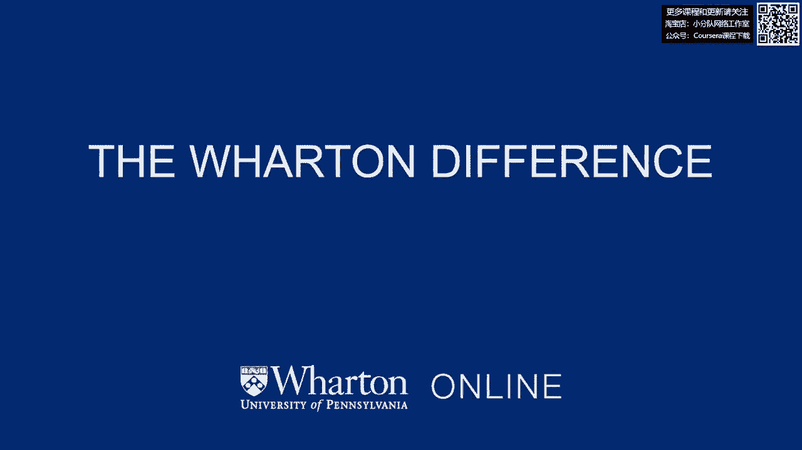

# 【沃顿商学院】创业 四部曲：发现机会、建立公司、增长战略、融资和盈利 - P1：[P01]01_0-1-introduction-to-the-professors-and-wharton - 知识旅行家 - BV19Y411q713

嗨，我是黄劳拉，我是沃顿商学院的创业学教授，我教书，呃，nba创业课程，嗨，我是卡蒂埃，我是沃顿商学院的技术和数字商业教授，呃，我教一门叫做使能技术的课程。

这是为我们的本科生和MBA学生提供的技术部门概述，我是卡尔·乌尔里希，我是沃顿商学院的教授，我主要教产品设计，产品设计与开发，还包括基于Web的产品和服务的设计以及创新管理，我是劳里·罗森科夫。

我是沃顿商学院的教授，我教创新课，在科技行业的社会学中，在网络理论中，我是伊森·莫洛奇，我是沃顿商学院的创业学教授，我教了很多关于创业的课程，嗯，让我看看当我在大学二年级的时候，我在盐湖城有个暑期工。

和一个叫杰的朋友在一起，杰有一个，平房后面有一个车库，他在车库里做生意，它被称为孤峰包，他们为滑雪巡逻队制作剪裁和缝制软商品，喜欢拿着你的收音机，他们为滑雪缆车做垫子等等，我记得我回到车库。

我第一次开门，我在一个小屋里往里看，这是我见过的最酷的东西，因为你有布料进来，他们有机器切割它，然后他在那边有成品，和他们付钱给他买这些东西的顾客，然后他有工人，我想哇，这是有史以来最酷的事情。

那是我对创业真正感兴趣的时候，它实际上已经，让我们看看大约30年的时间，实际上能够绕回来，并能够教授企业家精神，做涉及小企业的项目和创业，涉及我们学生的，我的弯路是我花了我得到了工程学位。

我在其他领域做研究和产品开发，但我觉得超级荣幸，现在是前面和中心，在工作中创业发生了什么，我也受过工程师的训练，我是一名系统工程师，作为一名工程师，我发现这不是最好的技术，获胜的最好主意。

它是发展最好、支持最多的一个，和最大的社区为它创造支持，所以这让我对在社区和网络领域攻读博士学位感兴趣，以及它们如何为个人和公司创造机会，甚至对工业来说，这就是我过去两年一直在做的，在沃顿三年，至于我。

我开始了一个生意，实际上是由一个朋友带来的，作为一家企业的联合创始人，呃在我本科学位之后，犯了你可能犯的每一个错误，每一个可能的问题，我们遇到了它，所以从招聘问题，股权分割问题，到筹款，尽管如此。

我们仍然很成功，这让我有点困惑，因为建立一个成功的公司真的很难，尽管犯了这么多错误，我想我要去想办法把这件事做好，我有MBA学位，然后意识到我仍然不知道答案，所以也许我会去研究这个，所以从那以后。

我一直在研究你做出的选择，在创业过程的早期，以及长期结果，我越来越感兴趣了，我们如何让更多的人成为企业家和创新者，因为机会并不是每个人都能平等地获得的，然而，创新的分布要均匀得多。

那么我们如何增加代表性不足的群体的机会，地理位置，获得创业机会，这是我最近的爱好，所以我也被训练成一名工程师，我就像，没有受过工程师的训练，你没有绿色，你知道，是啊，是啊，我不知道把它处理掉，你知道的。

所以我有工程学学位，我是一名电气工程师和生物医学工程师，我最初的工作之一是设计支架，呃在气球，血管成形术，基本上我发现了一些和劳里发现的相似的东西，基本上，它并不总是能在市场上获胜的最好的产品。

你可以开发很多不同的东西，它并不总是它的一部分，我很快意识到，嗯，对我来说，纯粹的工程方面并不有趣，我被拉到了一个技术营销团队，基本上是这样的，将技术规范翻译给市场和销售小组。

发现我真的对事情的人的一面感兴趣，发现很多组织行为问题，很多嗯，人们做出的感知和属性实际上推动了，创业和创新正在发生什么，所以我现在看到的很多东西，就我的研究而言是从这个角度来看的，就是看着。

人们的看法和归因是什么，驱动事物的微妙信号和线索是什么，并不总是一个想法的质量，嗯，有时是其他事情影响了，发生了什么事？所以这就是我对创业感兴趣的原因，事情是如何出去的，所以在我的情况下。

我的大部分工作都集中在技术和数字业务上，我也是个工程师，呃呃，电气工程与计算机科学，所以我几乎所有的职业生涯都集中在技术上，呃，我第一次接触创业是在我还是个孩子的时候。

当我和朋友一起管理一个众包或合作图书馆时，所以我所有的朋友都会贡献他们拥有的书，我会把它放在我家，他们会支付少量的会员费，他们可以拿别人的书在夏天用，嗯，这是我的第一个刷子，但我更认真的是，呃。

对创业的尝试是，呃，大约十年前，我创办了一家名为Yyodel的公司，和宾夕法尼亚大学的几个本科生在一起这家公司已经发展起来了，我们有一千多名员工，呃，但我从那家公司学到了创业的大部分实际方面，从那以后。

我在宾夕法尼亚大学和很多学生一起工作，建议他们，指导他们，有时投资于它们，所以我很享受这个过程，这门课实际上利用了其中的一些，并帮助扩大了这一范围，并使，你知道的。

这是一个与更大的企业家社区接触的好机会。

沃伦有这个独特的定位，在那里，我们能够教人们如何扩大规模，发展和建立他们的企业，所以我认为我们使用了很多基于研究的方法，我们从研究中吸取了很多东西来思考企业家是如何，不仅仅是想出了他们的主意。

但也要继续向前发展，扩大规模，所以我认为这是沃顿做得很好的一件事，这就是创业管理的一部分，也是，不仅仅是你有一个好主意和你用它做什么，但你实际上如何把它看得更广，你有什么不同的方法可以做到这一点。

嗯嗯不，这是我真正喜欢沃顿商学院的一点，它似乎找到了严谨性和相关性的神奇结合，沃顿商学院的大多数人只对解决问题感兴趣，有人关心，创业是很多人关心的事情，但我们不只是给它带来轶事或智慧，我们试着带模特。

数据框架，解决问题的结构，在创业中的作用，有很多沃顿商学院的校友，他们能够在各种各样的行业中创办令人难以置信的企业，沃顿商学院历史上闻名的领域之一是金融。

事实上金融科技公司在这一点上充满了摩根企业家和私人股本，这些都是典狱长企业家，也创办了这类企业，但你是对的，在许多不同的领域都有技术，这次会议有什么酷的地方，是你吗，你向我们展示了一些。

你知道你要做什么，有很多人的例子，我甚至不知道你认识并共事过的是工作企业家，对呀，我有一套，我有过这种紧张的经历，我们有一家非常成功的公司，这个想法来自我的一堂课，企业家们回来在我的课堂上发言。

我意识到我必须弄清楚我给他们打了多少分，因为我很紧张如果我给他们一个C什么的，他们筹集了一亿美元，但他们得了A-，我认为这是那种事情的完美价格，但我觉得我们都有机会体验，我们班的不同企业家。

我们中的一些人是企业家，我是说我们也经历过，我们定期通过我们的学生来生活，是啊，是啊，我是说这是这份工作最神奇的地方之一，我们可以参与他们的教育，然后我们和企业家有了一生的联系。
