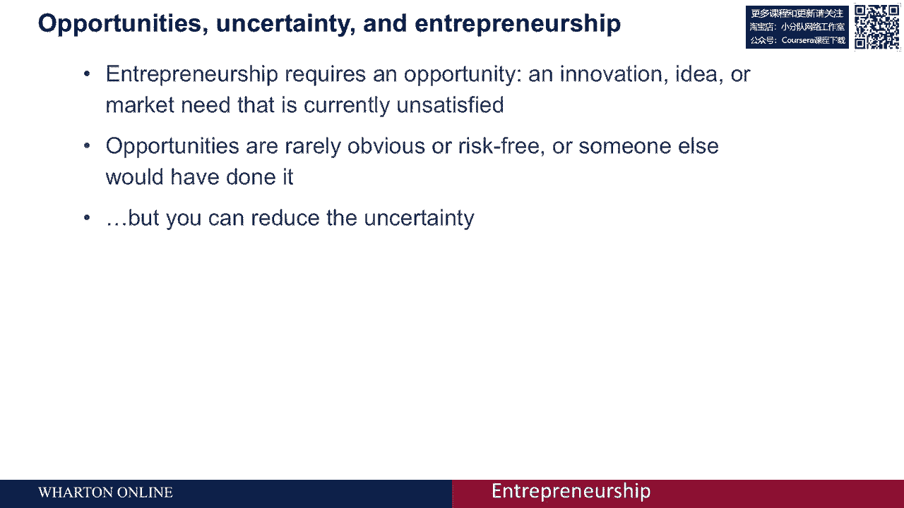
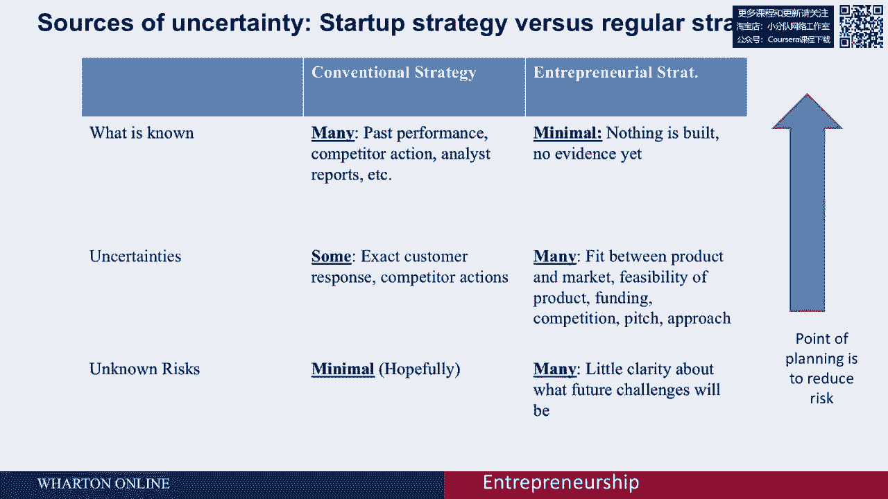
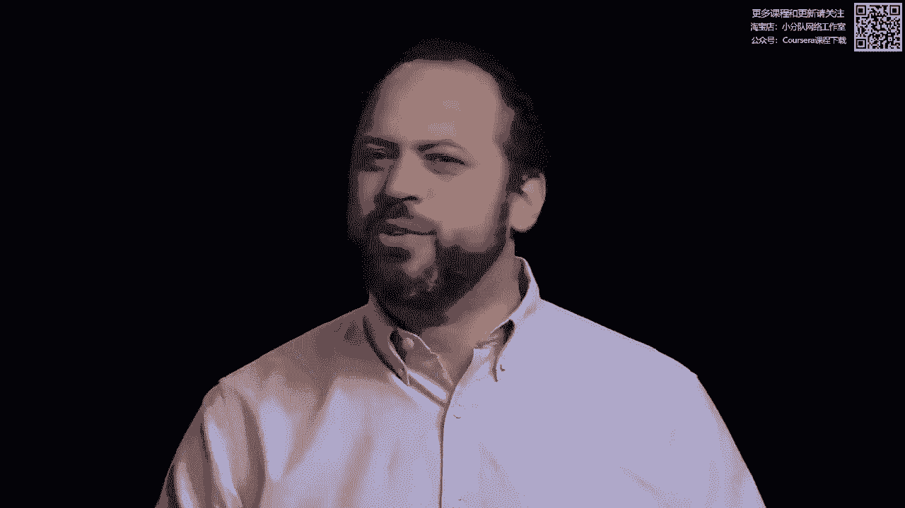
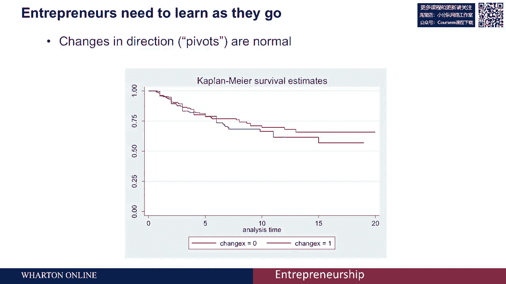
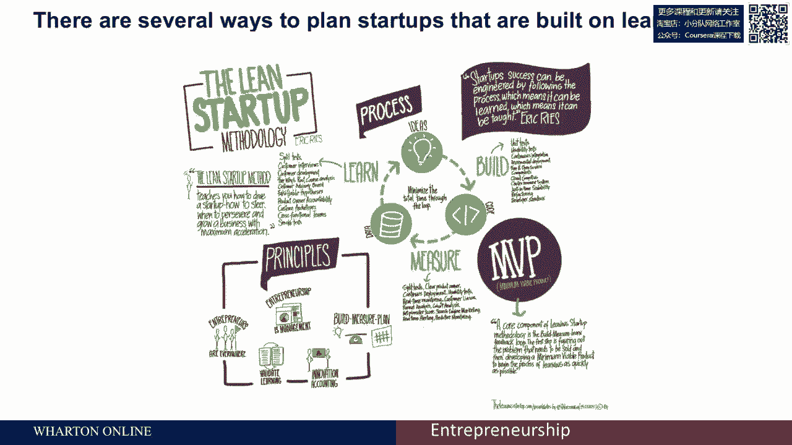

# 【沃顿商学院】创业四部曲：发现机会、建立公司、增长战略、融资和盈利 - P12：[P12]01_2-1-opportunities-and-uncertainty - 知识旅行家 - BV19Y411q713

创业总是有点吓人，因为把握机会包括拥抱不确定性。

所以我被问到的最常见的问题是，初学者是否会成功，如果我必须迈出信仰的一步。

我怎么知道我会成功还是失败，如何确保我在做正确的事情。

通过从事创业，不幸的是，对此没有简单的答案，因为创业源于不确定性。

它得到了力量，你正在利用一个其他人没有看到的机会。

或者没有把握机会，确实，如果机会显而易见或没有风险，别人早就会去做。

所以，这意味着把握创业机会本质上是关于拥抱不确定性。

然而，这并不意味着你无能为力，这只是掷硬币，因为你可以做很多事情来减少不确定性。

在创业过程中，第一件也是最重要的事情就是计划，因此策略就是处理不确定性，拥抱不确定性，并想出如何通过提前计划和降低风险来减少风险。

如果你考虑不确定性。

实际上有三类不确定性，我们从已知事实开始，已经向我们提供的信息，这类信息的风险最低，如果我们知道我们的产品会被接受，我们会获得银行贷款，顾客会购买我们的东西。

这是我们所能拥有的最高质量的知识水平，稍微糟糕的是不确定性，而不确定性是我们知道会遇到的类别，我们不知道该如何应对，对吧，我们会筹集资金吗。

我们知道我们需要为某人筹集资金，但不知道从长远来看，加入我们公司的每个人将从谁那里获得他们的工作。

所以这些都是不确定性，最终我们面临着最不确定的类别。

这是未知的风险，这些事情可能会突然发生，市场变化，新技术使以前的所有技术无效。

政治动乱，改变一个与你与疾病一起工作的国家的政府。

强迫一个联合创始人辞职，这些是在每种情况下都会发生的风险。

所以，当你考虑计划时，这实际上是试图减少不确定性。

通过把不确定的东西变成已知的事实，来把风险和不确定性。

所以我们至少知道这些是我们可以计划的可能性。

创业的问题是，你比传统计划面临更多的不确定性。

所以，传统计划告诉你在现有企业或组织中何时推出新产品或服务。

你有很多已知的知识，很多事实，你知道你过去的表现。

当你创业时，在了解竞争对手之前，你知道的越少越好。

你可以阅读分析师报告，了解一个企业或市场如何运作，但仍然存在一些不确定因素。

你不知道顾客会有什么反应，也不知道竞争对手对你市场进入的反应，但你至少有一些想法，这些是你必须关注的事情。

至于未知的风险，希望在巨大的系统性风险之外，每个人都需要面对。

企业家战略中没有那么多未知风险，然而你知道的很少。

你还没有建立产品，那么你怎么知道人们是否会有反应，你没有过去的表现可供参考。

所以存在很大的不确定性，你知道你需要找到顾客，但你不知道他们会是什么样子。

你知道你必须进行投球，但你不知道会有什么反馈，你知道必须筹集资金，但你不知道会来自谁，同时也知道会有竞争。

但你不一定知道人们会有什么反应，因此存在很多不确定性。

还有更多的风险，因为你对未来了解不多，你不知道市场会是什么样子，也不知道会遇到什么样的客户问题。

面对的法律问题和各种未知风险，我们无法消除所有风险和不确定性，但可以通过计划来管理。

识别风险并将其转移到我们管理的不确定性中，以获得关于确定性的信息。

不确定性，如客户是否会接受你的产品，并将其转化为现实，这样我们可以增加一定程度的确定性。

通过计划降低不确定性并不一定是坏事，因为初创企业需要边走边学，你需要构建你的初创企业来学习。

底部是年份，左轴表示在一定年限后剩余公司的百分比，有两条线，红线表示公司从最初的想法中彻底改变方向，蓝线则没有改变。

方向变化很大的公司通常是更大问题的迹象，更成熟的公司实际上有相同或更好的存活率。

那些一开始就知道自己在做什么并遵循最初想法的公司，在创业时需要做的就是边走边学。

你如何调整策略，以应对未来的不确定性？

如果你成功地做到这一点，你将看到图表，实际上会取得很好的成功。

因此，你必须转变方向并适应变化。

你的方法是创业公司有趣的原因之一，也是比成熟组织更成功的部分原因，现在这一点在学术界仍然是一个悬而未决的问题。

有很多技术可以用于规划初创企业，它们试图接受不确定性的想法，让你尽早测试并更新你的假设。

使用我们在这门课上提供的数据和工具，因此我们不会把一种方法凌驾于另一种方法之上，而是应用于多种计划方式，比如精益创业方法。

精益创业公司有一本书专门探讨这个主题。

有质量圈，这在新闻界引发了广泛关注，但实际上没有学术证据表明精益比其他方法更优。

它比其他创业公司方法更优，但这也是一种考虑不确定性的方法。

你有没有提前考虑过你的假设？我们稍后会在课堂上讨论这个问题，并围绕它进行计划。

另一种方法是商业模式画布，虽然没有很多学术证据证明它优于其他规划方式，但它考虑到了所有的假设和业务的各个部分。

我们将讨论发现驱动的规划，这是您可以使用的一组方法。

适用的其他角度，如倾斜，你如何在面对不确定性时进行规划。

所以我们会给你一些工具，但关键在于意识到没有一套固定的方法。

或者是一套经过学术证明的方法。

这是一种最佳的不确定性规划方法，无论你是否使用精益创业公司。

发现驱动的规划技术需要考虑不确定性和学习。

