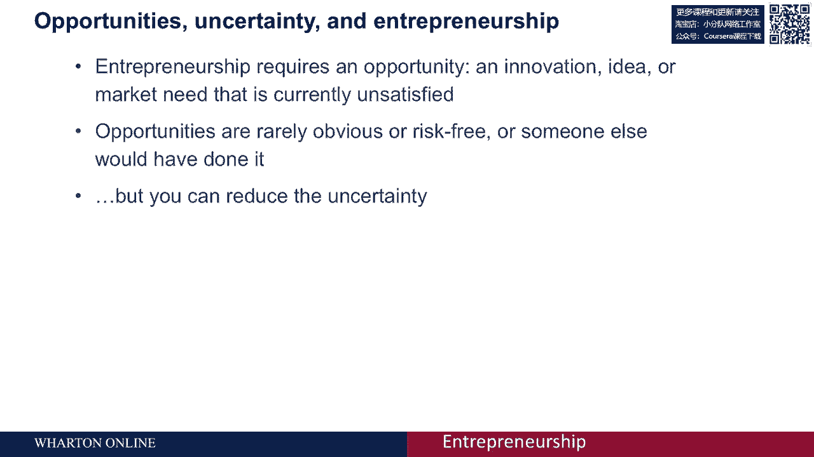
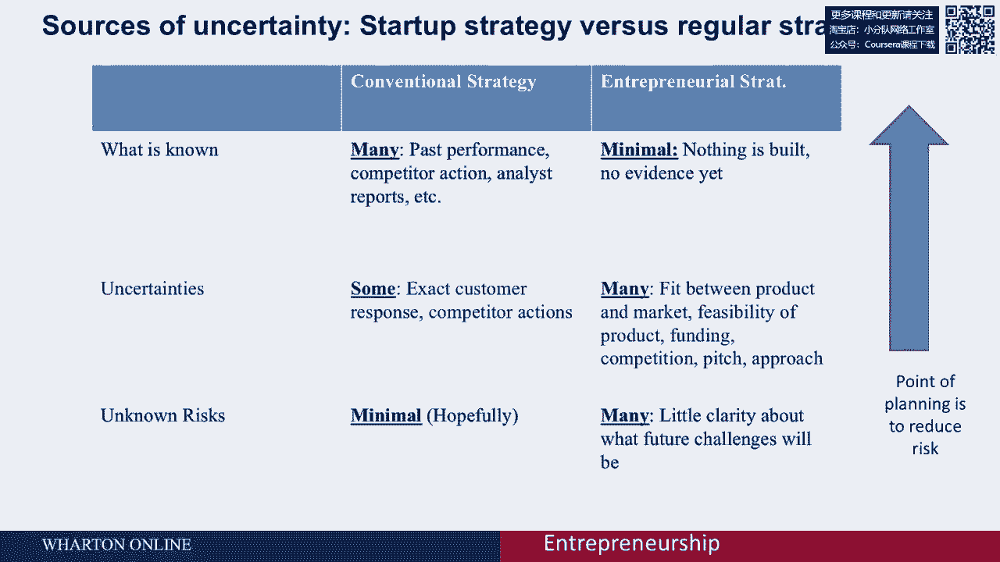
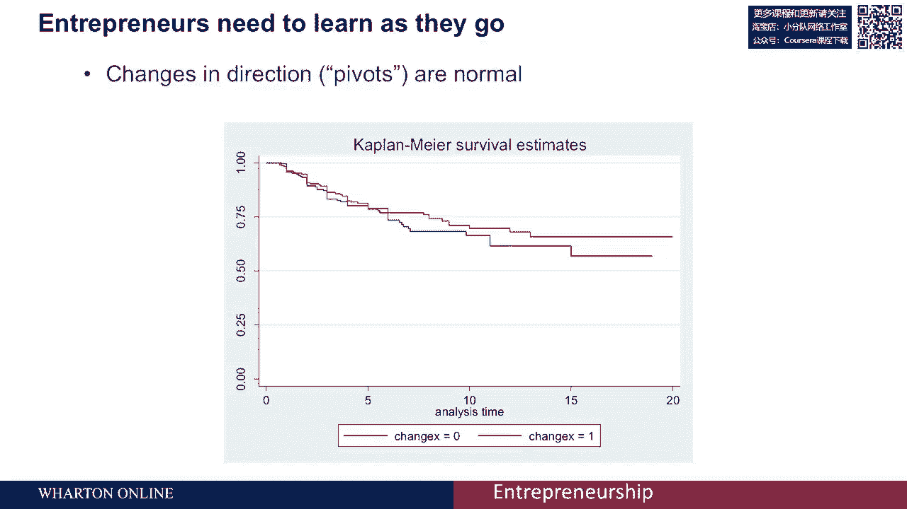

# 🚀 沃顿商学院创业四部曲 P12：机会与不确定性

在本节课中，我们将要学习创业的核心特征——不确定性。我们将探讨为什么创业总是伴随着风险，以及如何通过有效的策略来管理和减少这些不确定性，而不是被它们吓倒。

创业总是令人畏惧，因为把握机会意味着必须拥抱不确定性。初学者最常问的问题是：我是否会成功？如果我必须迈出信仰的一步，我如何知道自己会成功还是失败？如何确保我在做正确的事情？

通过从事创业活动，我们认识到对此没有简单的答案，因为创业本身就源于不确定性。它的力量在于，你正在利用一个其他人没有看到或没有把握的机会。如果机会显而易见或没有风险，别人早就会去做了。这意味着把握创业机会本质上是关于拥抱不确定性。

然而，这并不意味着你无能为力，只能听天由命。你可以做很多事情来减少不确定性。

## 📝 规划：应对不确定性的核心策略

在创业过程中，第一件也是最重要的事情就是规划。因此，策略就是处理不确定性、拥抱不确定性，并想出如何通过提前计划和降低风险来减少风险。

如果你考虑不确定性，实际上可以将其分为三类。

以下是三类不确定性的详细说明：

*   **已知事实**：这是已经向我们提供的信息，这类信息的风险最低。例如，我们知道产品会被接受、会获得银行贷款、顾客会购买我们的东西。这是我们所能拥有的最高质量的知识水平。
*   **不确定性**：这是我们**知道会遇到但不知道该如何应对**的类别。例如，我们知道需要筹集资金，但不知道最终会从谁那里获得；我们知道需要招聘员工，但不知道长远来看谁会加入公司。这些都是不确定性。
*   **未知风险**：这是最不确定的类别。这些事情可能会突然发生，例如市场变化、新技术使旧技术失效、政治动乱、政府更迭，或者联合创始人突然辞职。这些是在每种情况下都可能发生的风险。

所以，当你考虑计划时，这实际上是试图减少不确定性。通过把不确定的东西变成已知的事实，来把风险和不确定性转化为我们至少可以计划的可能性。

## 🔄 创业规划与传统规划的区别

创业面临的问题在于，你比在传统规划中要面对更多的不确定性。

传统规划适用于在现有企业或组织中推出新产品或服务。在这种情况下，你拥有很多已知的知识和事实，例如你过去的表现。当你创业时，在了解竞争对手之前，你知道的越少越好。你可以阅读分析师报告来了解一个企业或市场如何运作，但仍然存在一些不确定因素。你不知道顾客会有什么反应，也不知道竞争对手对你市场进入的反应，但你至少有一些想法，这些是你必须关注的事情。

至于未知的风险，除了巨大的系统性风险（每个人都需要面对）之外，在企业家战略中并没有那么多。然而，初创企业知道的更少：你还没有建立产品，那么你怎么知道人们是否会有反应？你没有过去的表现可供参考。所以存在很大的不确定性：你知道你需要找到顾客，但你不知道他们会是什么样子；你知道你必须进行推销，但你不知道会有什么反馈；你知道必须筹集资金，但你不知道会来自谁；同时也知道会有竞争，但你不一定知道人们会有什么反应。因此存在很多不确定性。

还有更多的风险，因为你对未来了解不多：你不知道市场会是什么样子，也不知道会遇到什么样的客户问题、面对的法律问题和各种未知风险。我们无法消除所有风险和不确定性，但可以通过计划来管理：识别风险并将其转移到我们能够管理的不确定性中，以获得关于确定性的信息。例如，将“客户是否会接受你的产品”这类不确定性，通过测试转化为现实，从而增加一定程度的确定性。

## 📈 在不确定性中学习与调整

通过计划降低不确定性并不一定是坏事，因为初创企业需要边走边学。你需要构建你的初创企业来学习。

有一项研究对比了两类公司：一类公司从最初的想法中彻底改变了方向（用红线表示），另一类则没有改变（用蓝线表示）。研究显示，方向变化很大的公司通常是更大问题的迹象。而更成熟的公司，如果一开始就知道自己在做什么并遵循最初想法，实际上有相同或更好的存活率。

那些一开始就知道自己在做什么并遵循最初想法的公司，在创业时需要做的就是边走边学。关键在于：你如何调整策略，以应对未来的不确定性？如果你成功地做到这一点，你将看到图表，实际上会取得很好的成功。因此，你必须转变方向并适应变化。

你的方法是创业公司有趣的原因之一，也是比成熟组织更成功的部分原因（这一点在学术界仍然是一个悬而未决的问题）。

## 🛠️ 应对不确定性的规划工具

有很多技术可以用于规划初创企业，它们都试图接受不确定性的想法，让你尽早测试并更新你的假设。

使用我们在这门课上提供的数据和工具，我们不会把一种方法凌驾于另一种方法之上，而是介绍多种计划方式。

以下是几种常见的创业规划方法：

*   **精益创业方法**：有一本书专门探讨这个主题。它强调快速构建最小可行产品（MVP）、测量市场反馈并快速学习迭代。虽然它在新闻界引发了广泛关注，但目前没有确凿的学术证据表明精益创业方法比其他方法更优越，但它确实是一种系统化考虑不确定性的方法。
*   **商业模式画布**：这是一种视觉化工具，帮助你梳理和思考商业模式的所有关键假设和组成部分。虽然没有很多学术证据证明它优于其他规划方式，但它能有效地让你考虑到所有的假设和业务的各个部分。
*   **发现驱动的规划**：这是我们将重点讨论的一组方法。它强调将计划建立在一系列需要验证的假设之上，并根据学习成果不断调整计划，而不是死守一份固定的商业计划书。

我们将讨论发现驱动的规划，这是你可以使用的一组方法。它适用于其他角度，帮助你思考如何在面对不确定性时进行规划。

所以我们会给你一些工具，但关键在于意识到：没有一套固定的方法，或者是一套经过学术证明的、最佳的不确定性规划方法。无论你是否使用精益创业、商业模式画布或发现驱动的规划技术，核心都是需要考虑不确定性和持续学习。

---

本节课中我们一起学习了创业与不确定性的关系。我们了解到，不确定性是创业的固有属性，无法完全消除。成功的创业者并非盲目冒险，而是通过**系统的规划**，将未知的“未知风险”转化为可管理的“不确定性”，再通过**快速学习和验证**，将其变为“已知事实”。我们介绍了几种应对不确定性的规划工具（如精益创业、商业模式画布、发现驱动的规划），其核心思想都是**拥抱变化、测试假设、迭代学习**。记住，在创业道路上，灵活调整策略以适应新信息的能力，往往比一份完美的初始计划更为重要。