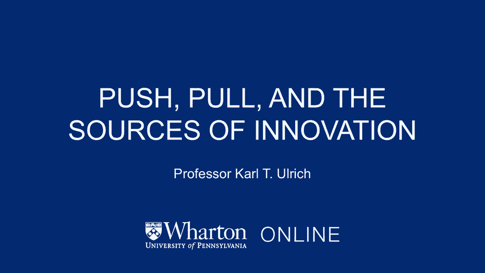
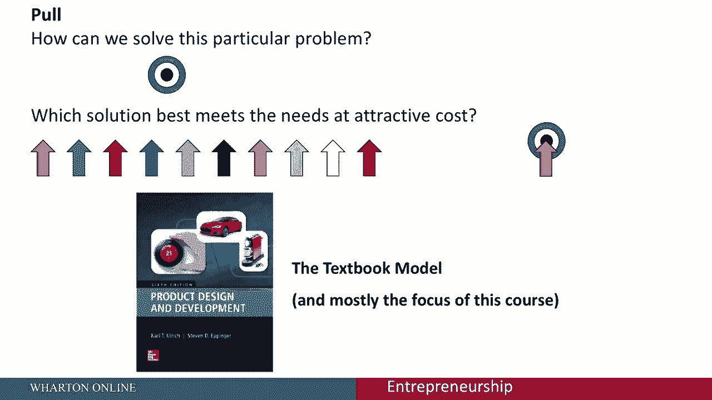
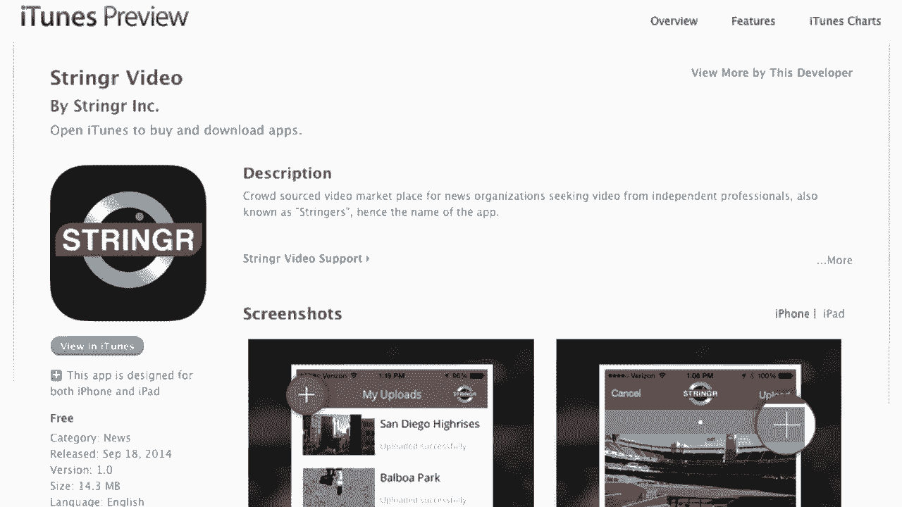
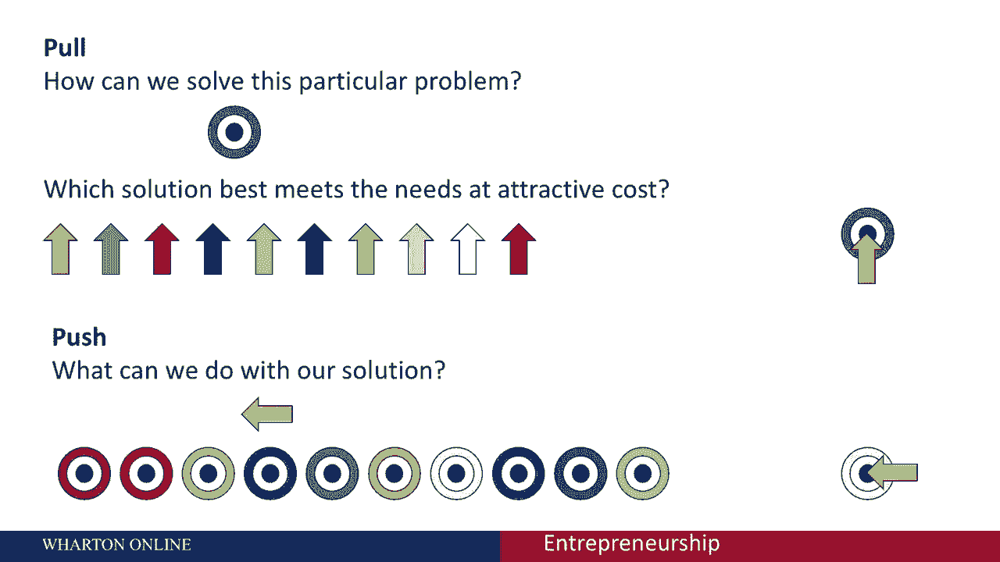
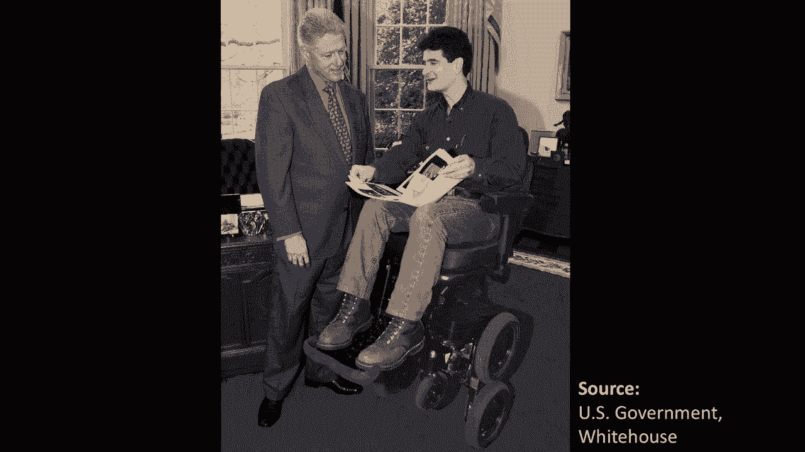
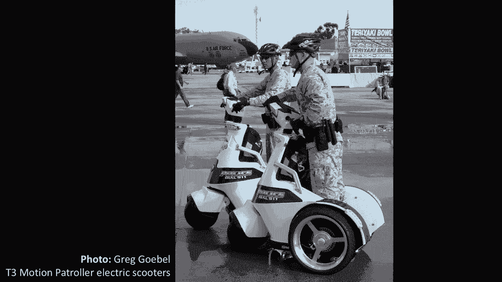
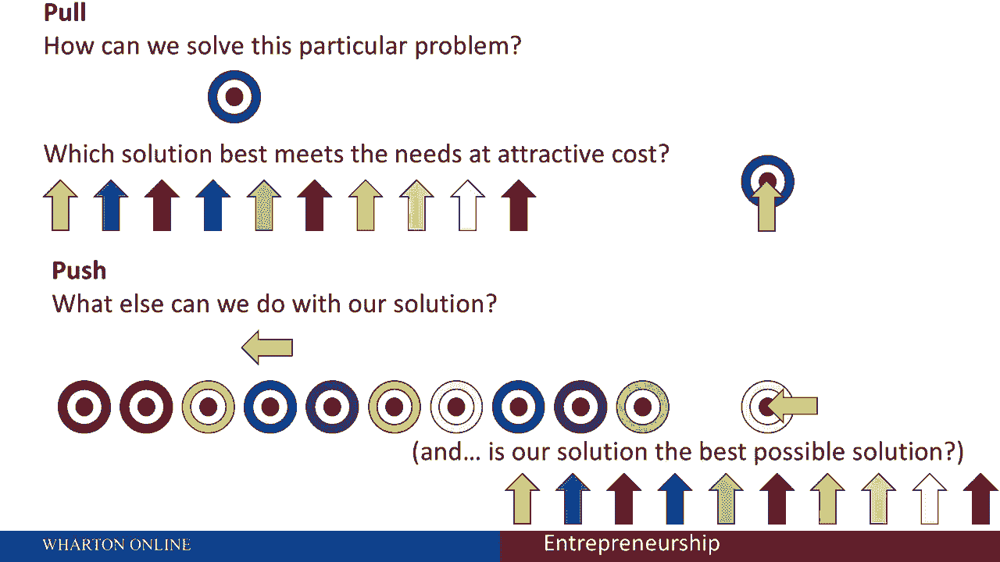

# 【沃顿商学院】创业 四部曲：发现机会、建立公司、增长战略、融资和盈利 - P13：[P13]02_2-2-push-and-pull-and-the-sources-of-innovation - 知识旅行家 - BV19Y411q713

这个环节叫做推拉，和现在创新的源泉。

我们为什么要谈论创新，来解释我们真的必须看看新公司的优势来自哪里，最终如果你没有优势，作为一个企业家，你将无法赚取利润，所以让我们先谈谈优势来自哪里，只是为了完整性是非法的或受管制的垄断，如果你垄断了。

这是最好的优势，有少数企业垄断，例如在中国CC，国家广播公司确实垄断了中国的媒体，所以这很好，如果你有那种垄断，给你优势，我把它放在括号里，因为对你们大多数人来说，这完全无关紧要，但为了完整起见。

我确实想把它放在那里，一些公司的另一个优势来源叫做规模，意思是你做的东西比任何人都多，结果，因为规模经济，你的成本比任何人都低，也可以给你优势，规模对一项新业务来说很少是优势，所以它很少与企业家相关。

幸运的是，还有第三类优势，做一些有价值的事情，更好和不同，您可能有差异化的产品或服务，或者有一些罕见的能力，比如成本效率，安全，软件工程能力，对大多数企业家来说，其他一些罕见的能力。

你得做一些有价值的事情，更好和不同，以获得优势，所以这第三类优势是企业家的主要焦点，我把创新定义为解决方案和需求之间的新匹配，因此，在这张图中，我将需求表示为这些目标，以及这些箭头的解决方案。

创新正在解决方案和需求之间创造新的匹配，为了在创新中创造价值，必须具备三个条件，首先，需要必须是真实的，意味着足够多的人有足够深的需求解决这个问题有经济价值，所以首先，需要必须是真正的需要，第二次。

您的解决方案实际上必须满足需要，它必须应对挑战，让顾客的痛苦消失，第三个条件是，客户必须愿意为解决方案支付更多的费用，比你送它的费用，如果你作为企业家能实现这三个条件，那么你通常可以通过创新来创造价值。

现在有两种不同的方法来找到解决方案和需求之间的匹配，第一个是杆子里的杆子，我们从需要开始，所以我们从目标开始，我们基本上问这个问题，我怎样才能解决这个特殊的问题呢？然后作为一个企业家。

我去寻找替代解决方案，可能有十个或更多的解决方案，我选择了以有吸引力的成本最满足需要的解决方案，那叫民意测验，从需要开始，探索大量的解决方案，选择以有吸引力的成本最满足需要的解决方案。

事实上，这是创新的教科书模式，事实上这是我的教科书，我在产品设计课上教这个，从需要开始，了解用户需求，生成替代解决方案概念，选择以有吸引力的成本最满足需要的解决方案，主要是，就是这样。

我们也将在这门课程中进行，让我给你举一个民意调查的例子，我是托尼·菲德尔，托尼菲德尔曾长期受雇于苹果电脑公司，他为史蒂夫·乔布斯工作，他创造了几个，苹果的几代iPod、iPhone和iPad。

在某个时候，几年前，他从苹果公司退休了，他开始建造他梦想中的家，当他的新房子快完工时，他去买恒温器，他走进家装商店，看了看现有的恒温器说，你知道，我就是不能让自己，在我新房子的墙上放一个丑陋的米色盒子。

市面上现有的恒温器都很丑，它们很难编程，也很难使用，所以我要开一家恒温器公司，恒温器公司变成了Nest实验室，最近被谷歌以32亿美元收购，这是波菲德尔的一个经典例子，有问题，他自己也有这个问题。

就是现有的恒温器很丑，很难编程，也很难使用，然后他去创造了一个新的解决方案，Nest实验室的恒温器，来解决这个问题，这是阿宝的一个例子，我以前的一个学生开了一家叫Stringer的公司。

她叫林赛·斯图尔特，她是电视新闻行业的制片人，她在新闻中面临的最大问题之一是寻找高质量突发新闻视频，例如，如果市中心发生火灾，她很想把火灾的录像放在电视晚间新闻上，所以她必须和一个摄像师签约去拿录像。

并获得它，然后投入生产。

那个过程很耗时，昂贵而不确定，所以林赛认识到了这个问题，并认为一定有更好的方法她创建了一个名为Stringer的应用程序，应用程序的工作方式是，新闻制作人可以输入对特定视频片段的渴望，基于Web的界面。

社区成员，自由摄像师可以查看镜头请求，可以出去捕捉这些镜头并用他们的手机提交，他们自动付给我们大约80英镑，为了那个视频片段，Stringer已被证明是一个很好的解决问题的方法。

林赛自己作为新闻制片人所经历的，这是另一个民意调查的例子，它始于需要，林赛去想出了一个解决方案来解决这个需求，但极点只是创新的一种方式，它从需要开始，然后去试图找到解决办法，创新者也可以推动。

创新者可以从一个解决方案开始并提出问题，我能用这个做什么，我的解决方案一定会解决一些需求。

让我给你举一个推的例子，发明家迪恩·卡门创造了一种自平衡轮椅，如图所示，在这张与比尔·克林顿会面的照片中，称为ibot的自平衡轮椅背后的关键思想，它可以用两个轮子站起来。

这将使用户与站起来的人处于视线水平，这个产品叫做ibot。

它被强生公司作为医疗设备出售，但一旦发展起来，就来问这个问题，哇哦，我们有一种惊人的技术可以在两个轮子上平衡轮椅，我想知道我们是否能找到其他的申请，开发团队的几个工程师说你知道吗。

我打赌你可以创造一个你可以站在上面的平台，你可以用这种自平衡轮椅技术来创造一个个人交通工具，对任何人来说，他们是否残疾，这种洞察力引起了插曲，这就是赛格威的起源。

这里展示的个人运输车是Segway团队最终发现的关键应用程序之一，他们发现警察可以利用Segue四处走动，在空间受到限制的环境中，他们想在那里慢慢移动，他们想要高度机动性的地方。

所以这里显示的是一个警察在赛格威上，问题是一旦赛格威证明警察想要一个移动设备，低速移动装置，就像赛格威，其他人可以考虑替代解决方案概念，所以其实，一旦安全市场和警察市场得到证实。

竞争对手带着替代解决方案进入，这里显示的是T Three Motion公司的三轮产品，现在，三轮个人运输车要复杂得多，比在两个轮子上平衡的装置简单得多，所以T3能够以较低的价格出售这种产品。

并且性能比Segue更好。

所以如果我们回到必须回答的三个问题，为了创造价值，赛格威发现了警察真正需要的地方，事实上，Segue满足了这一需要，所以它也符合标准二，但他们发现，他们在三年内与标准作斗争。

客户是否愿意为解决方案支付高于交付成本的费用，这是一个关键问题，他们往往未充分考虑替代解决方案的概念是否可以满足同样的需求，最终赛格威推出了自己的三轮滑板车，三轮配置成本较低，性能更高。

解决警察规避风险的同样需求，以推动创新的方法，你没有考虑所有可能的解决方案，只是确定了从现有解决方案开始的创新者，往往只考虑他们的解决方案是否满足目标市场的需求，这只是必要条件。

但这并不是充分条件，创新者还必须考虑未来的趋势、竞争对手的行动、谁采用了民意调查的方法、谁从问题开始，并试图识别多种解决方案概念并选择最佳的一个，因此，如果你参与创新推动的过程。

一个非常重要的学科是竞争对手如何处理这个问题，采用民意测验方法，如果一个竞争对手从头开始，并解决警官的流动性问题，他们会想出什么解决办法，这种逻辑可能会让你得出结论，三轮解决方案更好。

提供更好的性能而价格较低，这表明你可能应该采用三轮解决方案，而不是将现有的两轮方法应用于目标市场。

我已经讨论了解决方案和需求之间匹配的新方法，一种是PO，从需求出发，创建解决方案，另一种是推，从解决方案出发，寻找它能满足的需求，但为了完整起见，我还想描述另一种推动的思维。

例如，莱特兄弟实现了比空中飞行更重的飞行，1963年他们在基蒂霍克首次飞行时，没有特定的顾客要求乘坐比空中更重的飞机，他们对飞行充满热情。

每个真正考虑过此事的人都有广泛共识，如果人类能像鸟一样飞翔将是惊人的，但没有具体的市场需求，因此在这种程度上，飞行是由有飞行梦想的爱好者推动的，没有任何特定的市场需求。

现在发生的事情是，一旦那件艺术品，一旦这种方法展现出希望，人们开始设想商业应用，整个行业可能会围绕这项技术发展，但最初解决方案被推向市场时，没有特别的应用，因此为了完整起见。

我想建议这是另一种创新的方法，这是一种不同的推动思维，虽然对你们大多数人来说并不相关，但我确实想承认这是一种新的方式。
