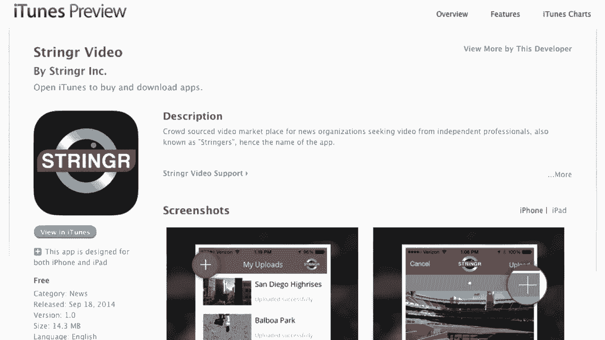

# 🚀 沃顿商学院创业课 P13：创新的推拉模型与源泉

在本节课中，我们将探讨创新的核心动力——“推”与“拉”模型，并分析企业优势的真正来源。理解这些概念，对于创业者识别机会、构建可持续的竞争优势至关重要。

---

## 🏆 企业优势的来源

在深入探讨创新之前，我们首先需要理解新公司的优势从何而来。最终，如果企业家没有优势，将无法赚取利润。

以下是企业优势的三个主要来源：

1.  **垄断优势**：通过法律或管制形成的垄断。例如，中国的国家广播公司（CCTV）在媒体领域具有垄断地位。这种优势最强，但对绝大多数创业者而言不相关。
2.  **规模优势**：通过大规模生产获得成本领先。公式可以表示为：`单位成本 = 总成本 / 产量`。规模经济能带来低成本优势，但这对于新创企业而言很少是初始优势。
3.  **创新优势**：通过提供**更好、更不同**的产品或服务来创造价值。这是大多数企业家需要聚焦的领域。其核心在于实现“解决方案”与“需求”的新匹配。

上一节我们明确了优势的来源，本节我们将重点剖析第三种优势——创新优势的具体实现路径。

---

## 🔍 创新的定义与价值创造条件

我将创新定义为：**解决方案与需求之间的新匹配**。

在创新中创造价值，必须同时满足以下三个条件：

1.  **需求真实**：有足够多的人存在足够强烈的需求，解决该问题具有经济价值。
2.  **方案有效**：你的解决方案必须能真正满足需求，解决客户的痛点。
3.  **盈利可行**：客户愿意为解决方案支付的价格，必须高于你交付该方案的成本。

如果企业家能实现这三个条件，通常就能通过创新创造价值。

---

## ↔️ 创新的两种路径：拉与推

找到解决方案与需求之间匹配的方法主要有两种：“拉”和“推”。

### 一、 拉：从需求出发

“拉”的模式始于一个具体的**需求**（痛点）。企业家会提出这个问题：“我怎样才能解决这个特殊问题？”

以下是“拉”模式的标准步骤：

1.  **识别需求**：从一个真实、具体的用户痛点或目标开始。
2.  **探索方案**：广泛探索多种可能的解决方案。
3.  **选择最优**：评估并选择那个能以最有吸引力的成本、最有效满足需求的解决方案。

**公式表示**：`创新（拉） = 识别需求 → 生成方案集 → 选择最优解`

这是产品设计的教科书模式，也是本课程将主要采用的方法。

#### 案例分析：“拉”模式的例子

*   **Nest恒温器**：托尼·法德尔在装修新房时，发现市面上的恒温器丑陋且难用。这个**需求**促使他创立了Nest实验室，设计出美观易用的智能恒温器。
*   **Stringer应用**：前新闻制片人林赛·斯图尔特，深受获取突发新闻视频流程**耗时、昂贵、不确定**之苦。这个**需求**推动她创建了Stringer平台，连接新闻制作人与自由摄像师。

### 二、 推：从解决方案出发

“推”的模式则始于一个已有的**解决方案**或技术。创新者会问：“我能用这个技术来做什么？它能解决什么需求？”

**公式表示**：`创新（推） = 现有解决方案 → 寻找潜在需求 → 验证市场匹配`

#### 案例分析：“推”模式的例子

*   **Segway的诞生**：发明家迪恩·卡门首先开发了用于轮椅的**自平衡技术**（iBot）。随后，团队思考这项技术还能用在何处，从而催生了作为个人交通工具的Segway。
*   **“推”模式的风险**：Segway虽然为警察等特定群体解决了低速移动的**需求**，但它最初未能充分考虑**替代解决方案**。后来，竞争对手推出了更简单、廉价的三轮电动滑板车（如T3 Motion的产品），满足了同样的需求，对Segway构成了挑战。

采用“推”模式时，一个至关重要的思考是：如果竞争对手采用“拉”模式，从头研究这个需求，他们会设计出什么更好的解决方案？这能帮助你避免陷入“技术解决方案寻找问题”的陷阱。

---

## ✈️ 第三种路径：技术驱动的梦想

为了论述完整，还存在另一种特殊的“推”：它源于纯粹的**技术梦想或热情**，而非针对某个具体市场需求。

例如，莱特兄弟发明飞机时，并没有具体的客户要求“重于空气的飞行”。驱动他们的是**飞行的梦想**。技术首先被创造出来，随后人们才开始探索其商业应用，并催生了一个全新的产业。

虽然这对大多数创业者不直接相关，但它确实是创新的一种重要源泉。

---

## 📝 课程总结

本节课我们一起学习了创新的核心框架：

1.  **企业优势**主要来源于垄断、规模和创新，创业者应聚焦于通过创新建立优势。
2.  **创新**是解决方案与需求的新匹配，创造价值需满足**需求真实、方案有效、盈利可行**三个条件。
3.  **创新的主要路径**有两种：
    *   **拉**：从**需求**出发，寻找或创造解决方案。这是更稳健、以市场为导向的方法。
    *   **推**：从**解决方案**出发，为其寻找合适的应用市场。采用此法时，必须警惕竞争对手可能从需求端出发设计出更优解。
4.  还存在一种由**技术梦想**驱动的创新，它先创造可能性，再衍生出市场。

理解“推”与“拉”，能帮助你在创业过程中更系统地识别机会，规避风险，确保你的创新能真正创造并捕获价值。