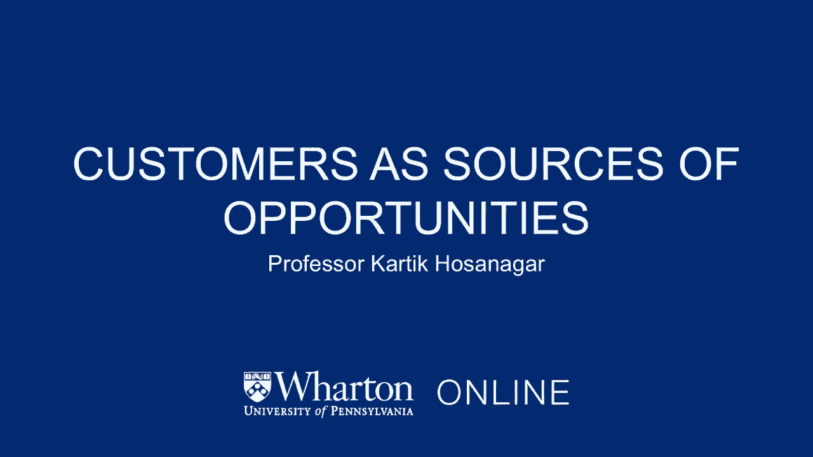
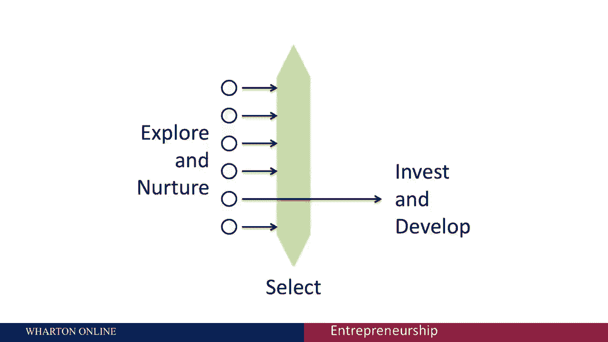
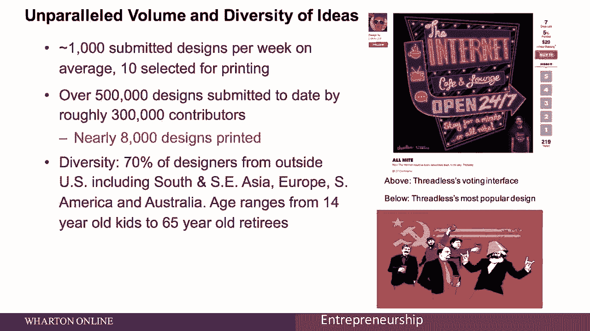
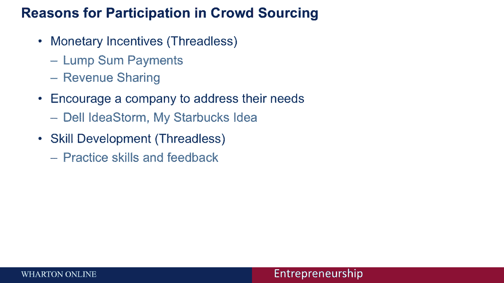
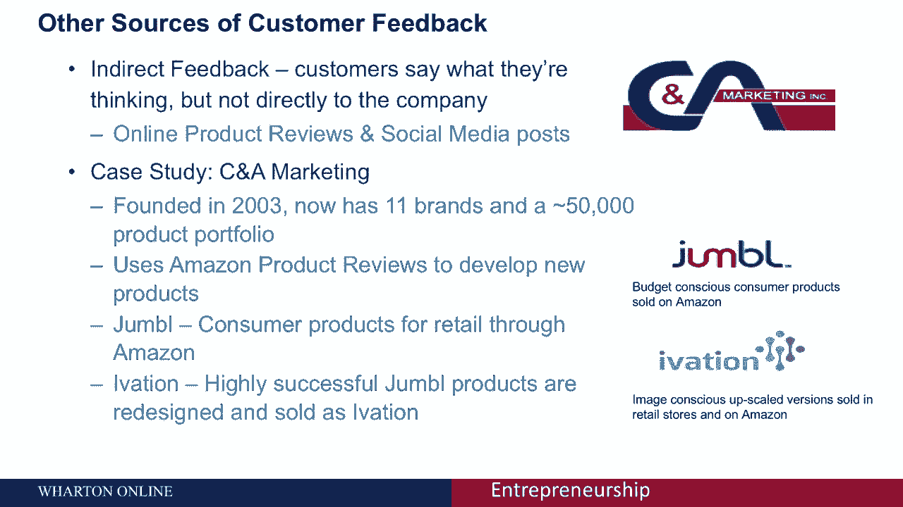

# 🚀 沃顿商学院创业课 P14：客户作为机会的来源

在本节课中，我们将探讨如何将客户作为发现和验证商业机会的宝贵资源。我们将学习如何利用客户反馈来产生大量创意，并从中筛选出最具潜力的机会，从而降低创业的不确定性。

---

## 🎯 应对创业的不确定性

大多数企业成功的概率很低，风险投资基金通过构建投资组合来应对这一点。作为企业家，你可以采取两种策略来应对这种高度的不确定性。

首先，你可以同时探索和培养多种选择。其次，你可以用多个潜在客户来测试这些想法，以识别真正特殊的机会，然后集中资源进行开发。

本节我们将讨论如何实现这两个目标，核心思想是**将客户作为机会的来源**。

---

## 🧵 Threadless案例：众包设计的成功

为了更好地理解这一概念，我们以Threadless为例。Threadless是一个面向大众的T恤及其他服装设计网站，是该领域的早期创新者。

公司创始人杰克·尼克尔在2000年参加了一次在线T恤设计挑战赛并获胜，但他没有收到印有自己设计的成品。这启发他创建了一个网站，每周举办设计比赛，获胜的设计会被印刷并销售。

**Threadless的运作模式**：
*   设计师提交设计。
*   社区进行投票。
*   公司团队每周从得票最高的设计中选出优胜者。
*   优胜者获得现金奖励和销售版税，其设计被印刷出售。

这个模式取得了巨大成功：
*   累计收到约 **50万份** 独特设计。
*   拥有约 **30万** 名贡献者。
*   最终印刷了 **7000-8000** 个图案。

有趣的是，Threadless公司内部**没有雇佣任何设计师**。他们通过吸引大量、多样化的外部设计（70%来自美国以外），并利用客户投票来筛选最佳设计，从而最大限度地降低了产品开发的风险。

---

## 💡 众包在更广泛领域的应用

Threadless的模式虽然不完全是生成创业点子，但它揭示了一个利用客户解决需求不确定性的过程。众包的基本概念已被许多公司用于生成新产品和新服务的机会。

以下是两个典型案例：

**1. 戴尔“创意风暴”**
戴尔创建了“Idea Storm”网站，邀请客户提交对新产品或服务改进的建议。该平台已收集近 **2.5万** 个想法，并据此推出了多项产品创新，例如**背光键盘**。

**2. 星巴克“我的星巴克点子”**
星巴克通过“My Starbucks Idea”网站收集顾客建议，收到了超过 **20万** 个想法。许多建议被采纳并转化为产品，例如**馥芮白**和重新引入的**椰香摩卡星冰乐**。

---

## ⚖️ 众包的双重价值：供给与需求

众包是一个强大的工具，因为它同时在**供给**和**需求**两个维度发挥作用。

*   **供给端**：帮助公司**产生大量创意**。
*   **需求端**：通过投票等机制，帮助公司**识别哪些创意真正解决了客户痛点**，从而筛选出正确的机会。

在Threadless，公司会关注投票排名前5%的设计，然后结合管理层的判断做出最终选择。这一点很重要，因为**投票（无成本）并不完全等同于购买意图（有成本）**，投票者的偏好也可能与真实买家不同。因此，需要将众包数据与管理判断相结合。

---

## 🔑 激励客户参与的三大要素

要让众包发挥作用，必须为客户提供明确的参与动机。以下是三种最重要的激励方式：

1.  **金钱激励**：例如Threadless的奖金和销售分成。
2.  **解决问题**：客户希望公司实施建议来解决自己的痛点（如戴尔、星巴克的案例）。
3.  **技能发展**：参与者将平台视为获得反馈、练习和提升技能的途径（如Threadless上的设计师）。

---

## 📝 实施客户众包的最佳实践

综合以上案例，以下是一些让客户乐于分享想法的关键实践：

*   **精心设计激励**：思考金钱激励是否必要，以及采用固定奖金还是收入分成等结构。
*   **为非获胜者提供价值**：例如提供社区反馈，让他们有持续参与的理由。
*   **培养社区意识**：建立互动论坛，增强参与者的归属感。

---

## 🕵️♂️ 间接获取客户反馈：挖掘数字痕迹

即使有激励，有时客户也不愿直接分享想法。此时，可以转向间接渠道，挖掘客户留下的“数字痕迹”。

一个典型案例是**CNA营销公司**。这家消费品公司没有直接客户群，而是通过分析**亚马逊产品评论**来发现新产品机会。

例如，在分析无线音箱评论时，他们发现许多用户提到“喜欢音箱，但如果能防水就更好了”。基于这种模式，他们开发了具有防水功能的新产品线。通过这种方式，他们基于客户反馈开发了约5万种产品，并且成功率很高，因为**产品创意本身就来源于客户**。

---

## 📊 总结与适用范围

本节课我们一起学习了如何将客户作为商业机会的来源。

**核心要点总结**：
1.  客户可以帮助**产生大量创意**（供给端）。
2.  客户可以帮助**筛选和验证哪些创意值得追求**（需求端）。
3.  可以通过**直接众包**（如竞赛、建议平台）或**间接分析**（如产品评论、社交媒体）获取客户反馈。
4.  设计有效的**激励**和**社区**是成功的关键。

这种方法对于**企业创业**（拥有现有客户基础）最为有效。对于初创企业，也可以小规模接触潜在客户或分析间接反馈。

需要注意的是，众包更擅长于发现**渐进式改进**和**增量创新**的产品机会，而非颠覆性的、前所未有的创意。尽管如此，它仍然是企业家武器库中一个非常强大的工具，能够**加速创意生成和产品市场匹配的过程**。