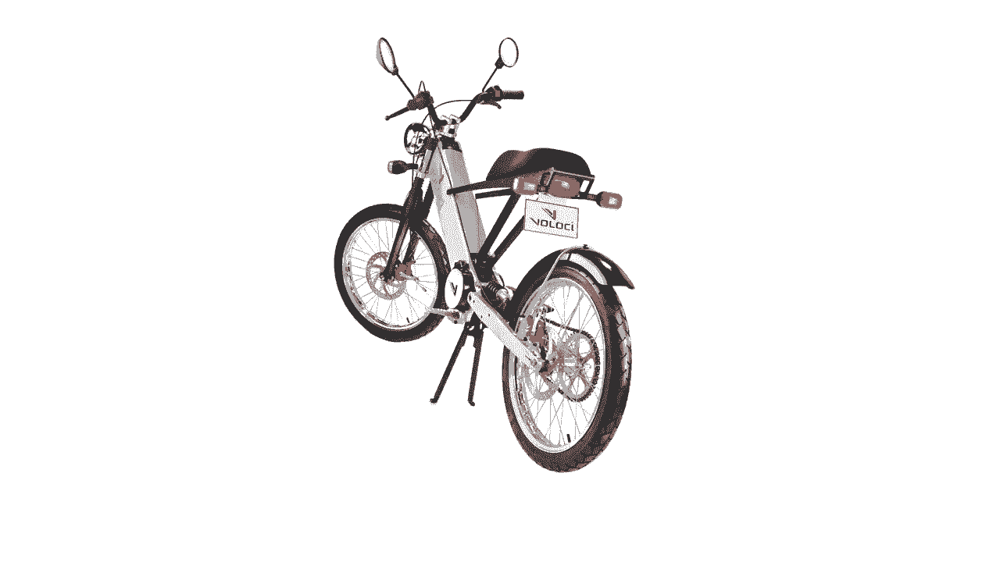

# 🚀 沃顿商学院创业课 P15：想法的真正重要性——V.I.D.E.模型解析

在本节课中，我们将深入探讨一个困扰许多创业者的核心问题：**创业想法本身究竟有多重要？** 通过分析成功与失败的案例，并引入一个简单的分析框架，我们将帮助你理解想法、执行力和外部因素在创业成功中各自扮演的角色。

---

## 📖 课程概述

大约二十年前，我开始了第一次创业，我们创造了Zooter滑板车。这款产品非常成功，甚至被名人所喜爱。例如，喜剧演员汤米·钟就曾使用我们的产品。它也是史蒂夫·乔布斯保存在皮克斯动画工作室办公室的仅有的三款产品之一。那时我认为，创业似乎很容易。

然而，我的第二次创业——Velochi电动摩托车，却遭遇了截然不同的结果。Velochi并未达到收支平衡，公司最终失败了。正是这两次截然不同的经历，促使我提出了一个根本性问题：**创业成功的原因是什么？更具体地说，想法本身在成功中起什么作用？**

---

## 🤔 两种对立的观点

一方面，想法似乎至关重要。以Hotmail的创始人萨比尔·巴蒂亚为例。他坚信想法本身的价值，甚至为此准备了两份商业计划书：一份用作与风险投资人会面的“诱饵”，另一份才是他真正保密的“核心想法”。这种行为表明，他认为想法具有关键价值，必须谨慎保护。

另一方面，也存在反例。托尼·法德尔和马特·罗杰斯创立了Nest Labs，并筹集了超过6000万美元的风险投资来开发一款更好的恒温器。这个想法本身听起来并非惊世骇俗。他们的成功，很大程度上归功于他们之前领导开发苹果iPod和iPhone的卓越团队。事实上，如果你问任何一位风险投资人创业最重要的三个因素，他们很可能会回答：**团队、团队，还是团队。**

因此，我们面临着两种相互竞争的观点：一种认为想法本身超级重要；另一种则认为，只要有合适的团队，几乎可以将任何想法转化为成功。

---

## 🔧 引入分析框架：V.I.D.E.模型

为了帮助理解这种二分法，我开发了一个简单的框架，称为 **V.I.D.E.模型**。该模型指出，创业创造的价值（Value）是三个关键变量的函数：

**V = f(I, D, E)**

其中：
*   **I (Idea)**： 初始想法的质量。
*   **D (Development)**： 发展和执行这个想法的效率与能力。
*   **E (Exogenous Factors)**： 无法控制的外部因素。

---

### 🧠 通过类比理解模型

想象一下你正在经营一个金矿。
*   **价值（V）** 是你从矿中赚取的钱。
*   **想法（I）** 就像矿藏的位置。如果地下没有矿石，你再努力也赚不到钱。
*   **发展（D）** 就像你从地下开采矿石并将其提炼成黄金的效率和技能。
*   **外部因素（E）** 就像黄金的市场价格。这是一个你无法控制，但却对你能否赚钱有巨大影响的因素。

这个类比清晰地表明：一个好想法（矿藏位置）很重要，高效执行（开采能力）很重要，外部环境（金价）也很重要。那么，真正的问题是：**它们的相对重要性各是多少？**

---

## 📊 用数据说话：想法的解释力有多大？

为了科学地回答“想法质量对结果差异的解释力有多大”这个问题，我们需要大量的新企业样本，追溯其最初的想法，并分析想法质量差异与最终结果差异之间的统计关系。

我与合作者劳拉·康沃尔进行了一项研究。我们分析了众包平台Quirky上开发的100多个产品，例如铰接式电源板、电缆管理系统、分体式水瓶以及豆腐压榨机。

我们通过向大量消费者展示产品最初的概念描述，并采用标准的 **五级购买意向调查**（从“绝对不会买”到“绝对会买”）来量化原始想法的质量。

以下是我们的研究发现：

*   **消费者比专家更准**： 我们发现，随机挑选的4名消费者对想法质量的预测，比7位专家的预测更准确。**消费者意向是预测产品最终销量的最佳单一指标**。
*   **想法的解释力有限**： 统计分析表明，原始想法的质量（通过购买意向测量）大约只能解释最终产品**销售额差异的6%**。这意味着，想法确实重要，但结果中仍有大量差异无法用想法本身来解释，这部分很可能归因于执行力（D）和外部因素（E）。
*   **影响依然显著**： 虽然6%看起来不大，但在统计模型（使用销售额的对数）中，一个标准差的“更好的想法”对应着该产品销售额增长约75%。这说明了想法的实际影响力。

---

## ⚠️ 关于想法重要性的重要提醒

上一节我们通过数据看到了想法的实际影响力。基于此，还有两点至关重要：

1.  **想法并非独有优势**： 许多优秀的想法是公开的，并非独特的竞争优势来源。例如，在优步（Uber）出现之前，就有学生项目提出了几乎相同的“智能手机叫车”概念。优步的成功，关键在于其卓越的执行力（D），而非想法（I）本身。
2.  **想法容易被复制**： 一旦一个想法被市场验证，它便成为公共知识。例如，同一辆车的车主可以同时为优步、Lyft等多家网约车平台工作，这恰恰说明，决定这些服务差异的不是想法，而是平台的运营、技术和服务质量（D和E）。

---

## 💡 对创业者的启示

V.I.D.E.模型清晰地阐明了决定创业成功的三个因素：想法（I）、执行力（D）和外部因素（E）。那么，这对你作为创业者意味着什么？

1.  **重视想法，但不必过度迷信**： 想法的质量确实能解释一部分价值，但由于执行力和外部因素的存在，结果存在巨大变数。
2.  **优化你可控的部分**： 既然产生和评估想法相对容易且完全在你的控制之内，你理应尽力生成大量想法，并通过与潜在消费者测试来筛选出最好的那个。公式可以简化为：**多生成想法 → 用数据测试 → 筛选最优解**。
3.  **理性看待成败**： 当你看到结果时，不要将巨大的成功完全归功于个人才华，也不必将失败完全归咎于个人无能。成功是 **I、D、E** 三者共同作用的结果。

---

## 🎯 课程总结

本节课我们一起学习了如何客观评估创业想法的重要性。我们通过案例对比引入了 **V.I.D.E.模型**，认识到价值是想法、执行力和外部因素共同作用的结果。研究数据表明，原始想法大约能解释6%的业绩差异，它重要但非唯一决定因素。因此，作为创业者，我们应在积极寻找和验证好想法的同时，将更多精力投入到构建强大团队和提升执行力上，并对外部环境保持敬畏与适应。