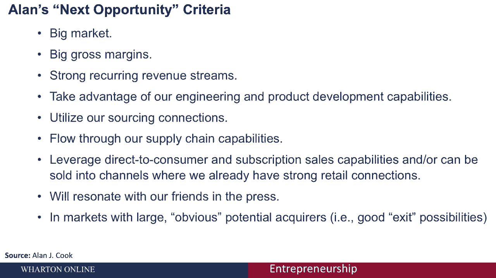

# 🚀 创业课程 P16：如何评估创业机会

在本节课中，我们将学习如何系统性地评估多个创业机会，并从中选出最具潜力的一个进行深入探索。评估是创业过程中至关重要的一步，它能帮助你将精力集中在最有可能成功的方向上。

---

## 📋 评估机会的核心标准

如果你已经完成了前期工作，你可能会面临几个潜在的创业机会。这本身已经让你领先于许多只考虑单一想法的创业者。现在的问题是：你应该选择哪一个？

评估创业机会主要依据以下五个标准：

1.  **需求的重要性**：有多少潜在客户需要它？这种需求带来的“痛苦”有多深？是轻微的“痒”，还是严重的“偏头痛”，甚至是“涌出的伤口”？理想情况下，你希望找到一个影响许多人并带来巨大痛苦的需求。
2.  **解决方案的有效性**：你的方案在满足需求方面有多有效？它是可有可无的“维生素丸”，还是必不可少的“止痛药”？
3.  **毛利率潜力**：客户是否愿意并且能够支付远高于你提供解决方案成本的价格？这既取决于你方案的成本效益，也受市场与行业竞争强度的影响。
4.  **获取客户的难易度**：客户容易识别和找到吗？你能说服他们尝试你的产品吗？
5.  **你是否是最佳人选**：这个机会是否符合你的热情与能力？你是否能获取所需资源（包括资金）？

**理想的机会模型**可以概括为：
**大市场（需求强） + 高效产品（解决方案好） + 高毛利率（成本低、溢价高） + 易获客（市场易进入） + 你的独特优势（能力匹配）**

---

## 📖 一个真实案例：艾伦的标准

上一节我们介绍了抽象的标准，本节我们通过一个真实企业家的故事，来看看这些标准如何应用。

我的朋友艾伦·库克是我以前的学生和商业伙伴。我们曾共同创立了“免费独家新闻”公司，为猫主人提供自动猫砂盒订阅服务，生意非常成功。在出售公司并休息一段时间后，艾伦决定再次创业，并为自己设定了明确的选择标准。

以下是艾伦根据以往经验制定的具体标准列表：

*   **市场规模**：进入一个大市场。
*   **毛利率**：选择毛利率高的市场，即客户支付价格与解决方案成本之间存在巨大差异。
*   **收入模式**：拥有强劲的经常性收入来源，即获得客户后能持续产生购买。
*   **团队能力**：充分利用现有的优秀工程与产品开发团队。
*   **供应链**：利用与中国工厂的良好联系及成熟的供应链能力。
*   **销售能力**：运用直接面向消费者的销售能力和基于订阅的销售模式。
*   **营销方式**：依靠公共关系和媒体曝光来获取客户。
*   **退出潜力**：市场存在明显的收购潜力，为未来退出提供可能性。

艾伦和他的团队列出了约五六十个新机会，然后根据这份标准清单进行筛选，以决定下一步行动。这个案例展示了企业家如何系统化地决策。

---

## 🔍 应用标准进行筛选

从艾伦的案例中我们看到，评估机会需要结合普适标准和自身情况。以下是进行筛选的关键步骤：

首先，你需要解决一个重要的需求，即市场大且痛点深。其次，你的解决方案必须高效，最好是“止痛药”级别。最后，你必须选择能充分发挥自身优势的领域，这能为你带来竞争优势。

你的具体标准会因人而异，但很可能与艾伦的清单相似。你需要生成自己的标准列表，并据此筛选你的备选机会。

通常，筛选过程不是直接从二三十个想法跳到唯一一个。你可以采用“锦标赛”方法：
1.  先选出其中最有希望的六到八个机会进行深入探索。
2.  再从这六到八个中，选出最有希望的三到四个进行更深入的分析。
3.  逐步聚焦，最终确定最优选择。

---

## ✅ 课程总结

本节课中，我们一起学习了评估创业机会的系统性方法。我们明确了五个核心评估标准：需求重要性、解决方案有效性、毛利率潜力、获客难易度以及个人匹配度。接着，我们通过艾伦的真实案例，看到了这些标准如何具体应用并指导决策。最后，我们了解了如何利用自定义的标准清单，通过类似“锦标赛”的渐进式筛选流程，从众多机会中找出最具潜力的那一个。记住，清晰的评估是迈向成功创业的关键第一步。