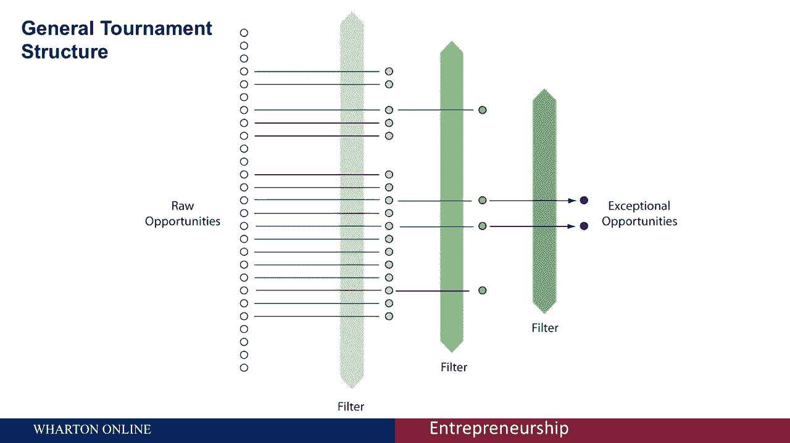
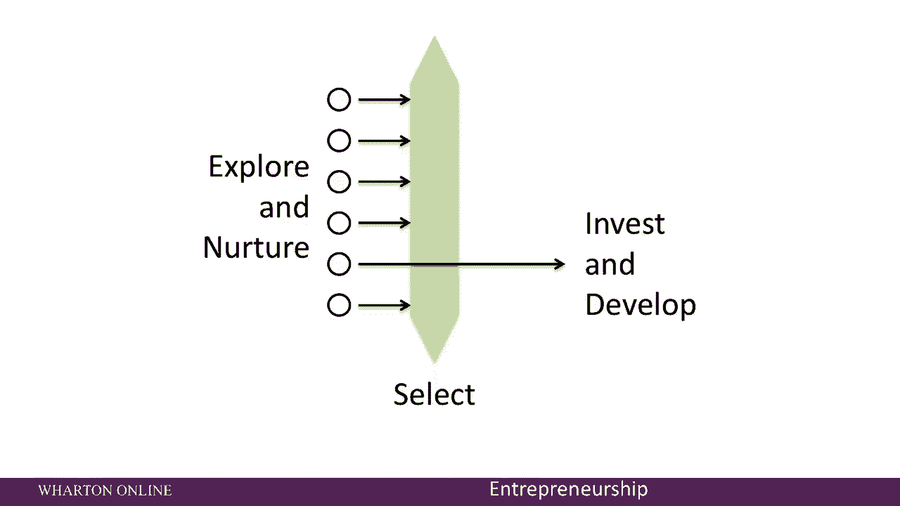
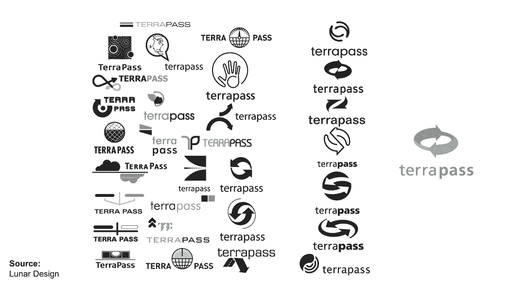
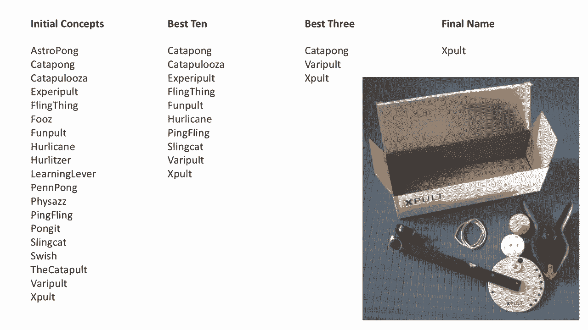

# 🏆 创业课程 P17：应对不确定性的锦标赛方法

在本节课中，我们将学习一种被称为“锦标赛方法”的策略，它帮助创业者在充满不确定性的环境中，通过探索多个机会并推迟重大承诺，来识别和培育最有潜力的商业构想。

创业的真相是，任何机会都伴随着不确定性。市场需求是否真实？解决方案是否可行？竞争对手会如何反应？宏观经济会如何变化？团队能否有效执行？这些不确定性无法被完全消除。本课程的目标是**最大限度地减少不确定性**，但最终，你仍将面对无法通过分析解决的内在风险。

## 🔄 风险投资家的策略：在不确定性中航行

上一节我们提到了创业中的不确定性，本节中我们来看看风险投资家是如何应对的。已知唯一能缓解不确定性的策略是：**在多个机会中实现多样化，并推迟承诺，直到获得更多信息**。

风险资本家深谙此道，他们的投资策略正是这一原则的体现。以下是典型风险投资基金的操作流程：

*   风险投资合伙人会与大约1000至2000名创业者会面。
*   从这些会面中，他们进行大约40笔初始投资。
*   基于初期表现，他们通常会对其中的一半（约20家）进行后续注资。
*   当基金周期（通常为7-10年）结束时，其中**1到2项投资会成为巨大的成功**，外加几个较小的成功案例。

如果没有不确定性，风险资本家只会投资那些注定成功的公司。但问题在于，**无法预先知道哪家公司会成为赢家**。因此，他们采取了在大量机会中多样化、先小额投资、等待不确定性消退的策略。

## 🏟️ 创新锦标赛的基本结构

这个基本策略就是我们所说的 **“创新锦标赛”** 。其通用结构如下：

1.  **产生大量初始机会**。
2.  **应用一系列开发步骤和筛选机制**。
3.  **最终，只有少数特别的机会脱颖而出**。

这个结构在日常生活中随处可见，例如流行的选秀节目《美国偶像》。该节目从超过20万海选参赛者中，通过多轮比赛，最终筛选出一位冠军。

## 💡 给创业者的两大启示

理解了锦标赛的逻辑后，以下是两个对创业者至关重要的启示。

### 启示一：在个人层面举办小型锦标赛

虽然你无法像风投那样在数百个项目上分散风险，但你可以考虑多种选择。在决定投入未来数月或数年时间之前，你应该先举办自己的“锦标赛”。

以下是具体做法：

*   在投入大量时间之前，**先考虑5到10个不同的机会**。
*   对每个机会进行**小额的探索和培育投资**（如市场调研、原型测试）。
*   根据获得的信息，**选择其中一个进行进一步的开发和重大投入**。

这虽然规模远小于风投的锦标赛，但它为你提供了**一定的风险分散**，并允许你在信息更充分时再做重大承诺。

### 启示二：将小决策视为微型锦标赛

在你的创业过程中，会做出几十甚至上百个小型创新决策。其中任何一个都可以被视为一场“微型锦标赛”。

以下是几个例子：

*   **产品设计**：以“Oral-B CrossAction牙刷”的手柄设计为例。设计公司Lunar Design并非一开始就确定了最终设计。他们：
    1.  构思了**数百种**不同的手柄设计。
    2.  将其中几十个制成泡沫模型进行测试。
    3.  选出最好的5个，制成塑料模型给消费者试用。
    4.  最终从这5个中选出最好的，成为上市产品。
*   **品牌标识**：在我共同创立的一家公司，我们为图形标识（Logo）设计也应用了锦标赛逻辑：
    1.  产生了**几十个**原始概念。
    2.  从中选出7个最有希望的进行深化。
    3.  最终从这7个中确定了公司的图形标识。
*   **公司/产品命名**：为一家教育科技公司命名时，我们：
    1.  构思了**几十个**初始名称概念。
    2.  筛选出10个最佳概念进行测试。
    3.  根据测试结果确定3个最佳候选。
    4.  最终从中选出公司名称。

因此，即使是一个看似简单的决策，如**产品命名**，你也可以应用锦标赛逻辑来识别最佳选项。

## 📝 总结

本节课中，我们一起学习了应对创业不确定性的“锦标赛方法”。**不确定性是创业的内在属性**，无法完全消除。处理它的最佳策略是：
1.  **考虑大量备选方案**（无论是商业机会还是具体设计）。
2.  **进行小额投资以获取信息**。
3.  **推迟重大承诺**，直到不确定性降低，最佳机会显现。

通过将这种系统化的筛选逻辑应用于你的创业旅程，无论是选择创业方向还是做出具体产品决策，你都能更有效地在不确定性中导航，提高成功的概率。