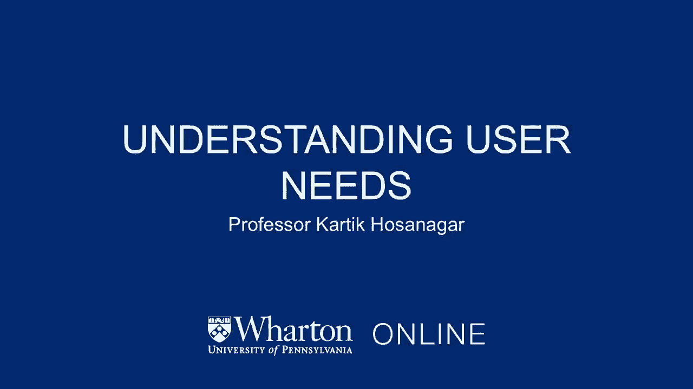
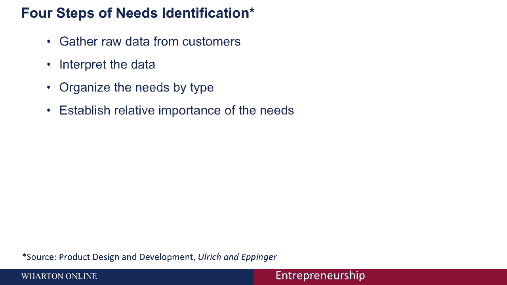
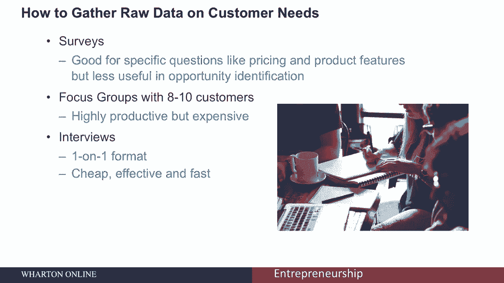
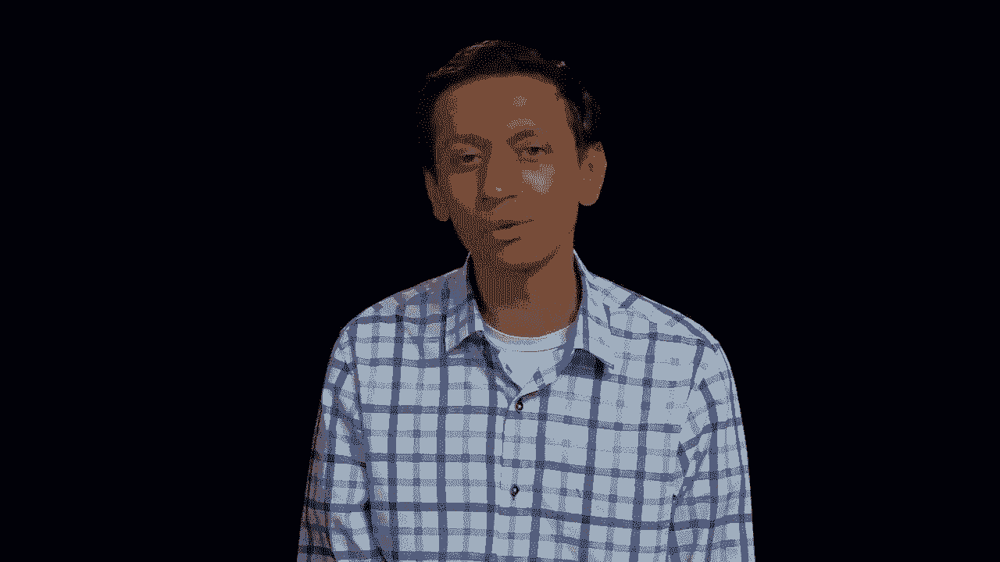
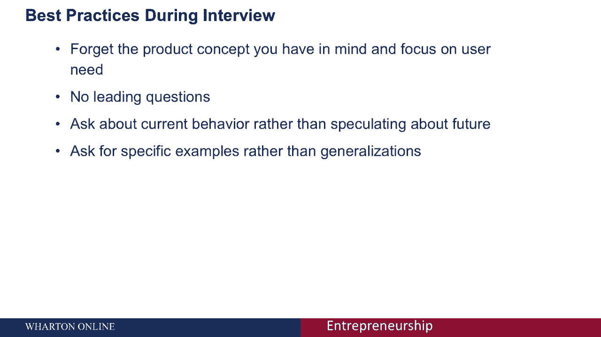
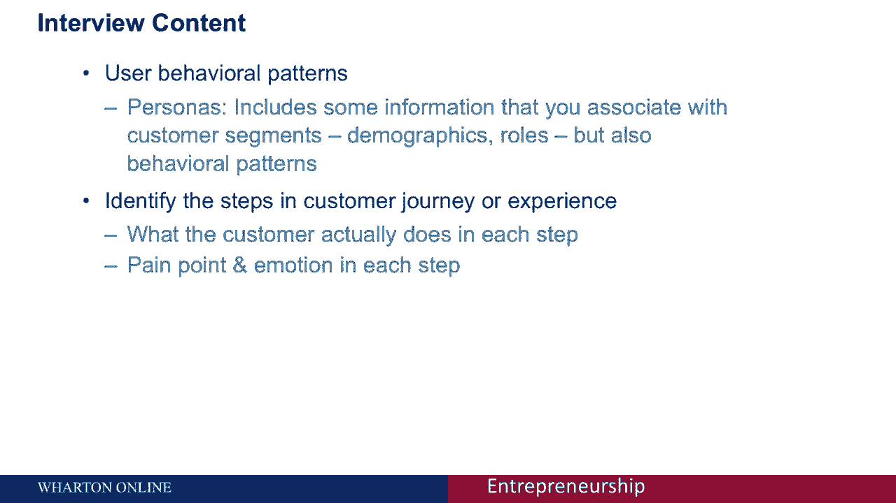
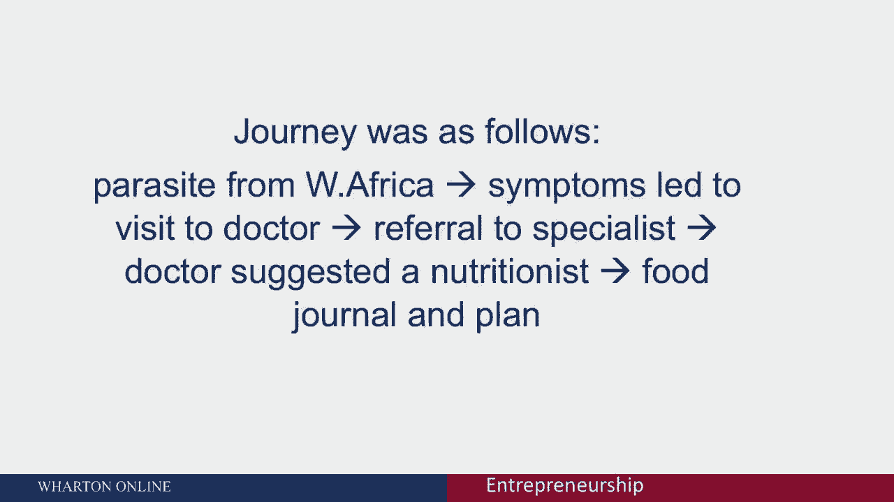
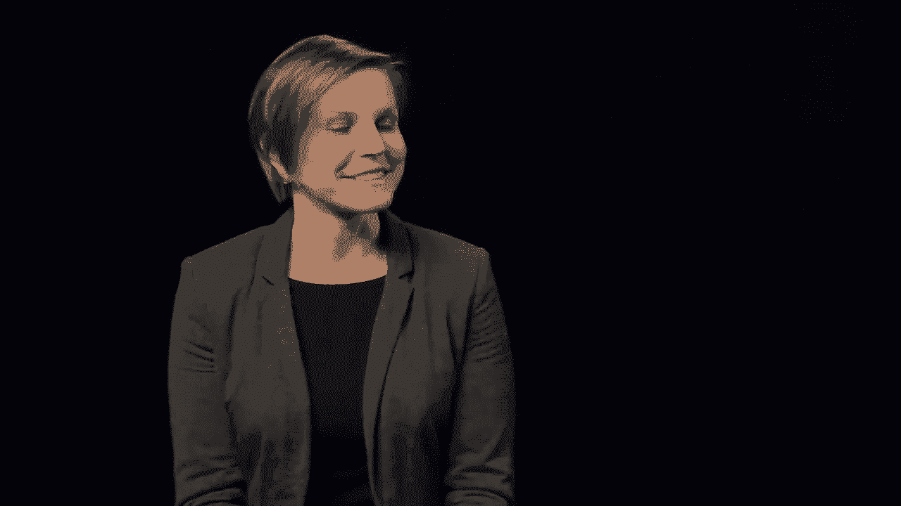

# 【沃顿商学院】创业四部曲：发现机会、建立公司、增长战略、融资和盈利 - P19：理解用户需求 🎯

在本节课中，我们将要学习如何通过用户研究来理解用户需求。这是产品开发前至关重要的一步，能确保我们的工作方向正确且高效。

## 用户研究的重要性

上一节我们介绍了创业的整体框架，本节中我们来看看如何为产品开发打下坚实基础。在深入概念或产品开发之前，用户研究是了解用户需求的极佳方法。为了确保产品开发有方向且有效，这一步至关重要。

但需要指出，像Facebook和谷歌这样的公司在开发产品前，可能从未进行过正式的用户研究，却也取得了巨大成功。然而，我们必须认识到，每一个成功的谷歌或Facebook背后，都有成千上万的企业家在未进行必要用户研究的情况下开发产品，最终导致产品失败。

对于企业家或工程师而言，基于自身假设来制造产品几乎是本能反应。在我们脑海中，一切逻辑都看似合理。但核心问题是：用户是否真的重视这个产品？在没有用户研究的情况下，失败几率很高，因为你可能解决了一个对用户而言并不重要的“痛点”。或者，你可能用错误的方式构建产品，或在达到“产品-市场契合”之前经历了太多迭代，最终浪费了时间。用户研究可以帮助避免所有这些情况。

## 用户研究的四个步骤

如果你考虑进行用户研究，实际上可以遵循四个简单的步骤。

以下是用户研究的四个核心步骤：

1.  **收集原始数据**：从客户那里收集关于他们需求的原始信息。
2.  **解释数据**：分析并理解收集到的数据。
3.  **组织需求**：根据观察到的不同类型，将需求归类。我们可能会发现多个人以不同方式表达了相同的需求，需要将其组织成不同类别。
4.  **确定优先级**：评估这些需求的相对重要性，并确定哪些是用户当前最迫切的需求。

## 第一步：收集原始数据

让我们从第一步开始，即收集客户需求的原始数据。

有很多方法可以做到这一点。一个流行的方法是使用**调查问卷**。当你有具体问题时，调查很有效，例如：“产品该如何定价？”或“用户更看重功能A还是功能B？”。但对于机会识别的早期阶段，调查不太有用。我们稍后会讨论在概念形成后，用于测试概念的调查和访谈。

另一个可用的工具是进行**焦点小组**，邀请八到十名顾客参与讨论。焦点小组效率高，能促进参与者之间的良好讨论，但这也是一种非常昂贵的数据收集方法。

最后是**访谈**，采用一对一的形式。与焦点小组相比，访谈往往更便宜，几乎同样有效，且速度更快。因此，这是我个人收集用户需求的首选方法。接下来，我们将重点讨论如何进行访谈。

## 如何进行用户访谈

当我们准备进行访谈时，首先出现的问题是：我们采访谁？采访多少人？

采访所有相关的利益相关者很重要。这包括最终用户，也包括产品的购买者（购买者可能不是最终使用者），还可能包括负责安装产品的IT人员（针对企业软件产品），以及为买家或用户提供选择建议的顾问。

重要的是，当你决定采访谁时，不应过早假设客户群体。你可能已经认定产品的正确用户是20到35岁、来自常春藤盟校、从事咨询或软件工作的人。但这可能是一个过于宽泛和过早的假设。因此，确保样本具有足够的多样性很重要。

那么，正确的访谈人数是多少？这个问题没有标准答案。但需要再次明确，我们在此阶段试图鸟瞰用户需求，寻找的是定性信息，而非基于大样本的统计推断。因此，我们不需要采访1200个用户。

在用户需求识别的早期阶段，**5到20人**的样本量可能是合适的。如果只有一个重要的利益相关者类别，采访5人可能就够了。但如果有很多不同的利益相关者（如用户、买家、顾问），则可能需要接近20人。许多研究表明，一旦采访了大约9到10个人，你很可能已经掌握了80%以上的用户需求。此外，访谈的效果几乎与焦点小组相当。因此，**10人左右**通常是最佳数量。

## 访谈的最佳实践

现在，一旦我们确定了采访对象和人数，问题就变成了：访谈应该如何进行？

有几个最佳实践值得记住。

以下是进行有效用户访谈的关键原则：

*   **关注需求，而非产品**：忘记你心目中的产品概念非常重要。不要询问用户是否想要某个特定功能，这很自然但具有诱导性。用户可能会为了取悦你而说是。应该问更开放的问题。
*   **询问开放式问题**：记住，这个阶段是关于用户的，而不是关于产品。在思想发展的早期阶段，不要问引导性问题。例如，不要问“你会做这个吗？”，而应问“你如何做你感兴趣的事？”。
*   **关注当前行为**：询问用户当前的行为，而不是猜测他们未来可能的行为。不要问“你会使用这个产品吗？”，而是问“你目前是如何做某事的？”。人们并不真正知道未来会怎么做，他们的推测信息量不大。
*   **力求具体**：尽量使问题具体，并试图获得具体的答案。当答案非常笼统时，请求对方举例。我们不是在寻找概括，而是在寻找具体的故事，这些故事能带来关于用户需求的有趣见解。

## 访谈的核心内容

接下来，让我们谈谈访谈的内容。我们应该尝试问什么？我们希望从面试中得到什么？

我的方法是，在访谈中，我主要寻找两种见解：

1.  **用户行为模式**：通过了解用户如何做事，我可以理解不同的**用户角色**。你或许听说过“客户细分”，这通常基于人口统计学。而“用户角色”则更进一步，它包含行为信息，与用户如何完成感兴趣的任务相关。例如，使用谷歌文档时，可能有创建者、编辑者、读者等不同角色。这些角色信息将直接反馈到产品设计中。
2.  **客户旅程与体验**：了解客户旅程中的步骤或客户体验。例如，申请大学可能包括与朋友讨论、搜索信息、确定专业、查看排名、联系校友、最终申请等步骤。了解用户在每一步的实际行为、痛点以及情绪（积极或消极）至关重要。这将帮助我们识别在整个用户旅程中最紧迫的痛点在哪里。

## 访谈实例演示

现在，我将通过一个假设的访谈来尝试说明上述原则。假设我们有兴趣了解与饮食和营养相关的用户需求。我们脑海中可能有一个概念，试图帮助人们做出更好的营养选择。

> **采访者**：斯蒂芬妮，你好。我将问你一些与你的饮食和营养选择相关的问题。首先，饮食或营养对你有多重要或多突出？你多久会思考并有意做出相关决定？
>
> **斯蒂芬妮**：这几乎是我日常生活的一部分。我从小就做很多运动，所以必须考虑饮食和训练计划。现在我也跑步，需要根据训练计划调整营养。
>
> **采访者**：能给我举一两个由锻炼方案驱动的选择例子吗？
>
> **斯蒂芬妮**：主要是确保摄入足够的碳水化合物、蔬菜、水果，关注蛋白质摄入量，以及喝足够的水。
>
> **采访者**：当你说“太多或太少”时，你考虑的范围是什么？
>
> **斯蒂芬妮**：我不一定计算克数，但知道需要平衡。比如午餐吃了较多碳水化合物，晚餐就吃沙拉和瘦肉蛋白。
>
> **采访者**：你觉得你的方法是预防性的还是反应性的？
>
> **斯蒂芬妮**：大多数时候是预防性的。我努力保持体重，也有家族病史（癌症、糖尿病），所以会注意糖分和脂肪摄入。
>
> **采访者**：能举个例子吗？比如，你真正改变饮食的情况，那个过程或旅程是怎样的？第一步是什么？你从哪里获得额外信息？带我走过各个步骤。
>
> **采访者**：当你讨论这些步骤——看医生、营养师、在线研究、与朋友家人交谈——最终得出你满意的营养选择。这个过程是相对平稳的吗？是否有某些步骤更痛苦、耗时更长？
>
> **采访者**：最后，关于获取信息、接触专业人士、以及动机和行为方面，哪个因素比其他因素更难？
>
> **采访者**：最后，我想了解你生活方式中与健康和营养无关的其他方面。你认为自己精通技术吗？你使用哪些网站和工具？（后续讨论了科技产品使用、健康网站、可穿戴设备等）
>
> **采访者**：如果雇主免费提供营养师咨询服务，你会用吗？你自己会为此付费吗？

## 数据处理与总结

最后，一旦访谈结束，我们收集了所有数据，就需要处理访谈记录或笔记。

我们解释数据，识别出不同主题提到的所有需求，然后将这些需求组织成不同的类型。之后，我们尝试确定它们的相对重要性。我们可以通过需求被提及的频率、人们谈论时的情感，或观察他们的肢体语言来做到这一点。最终，所有这些都帮助我们确定哪些是最重要的需求。

## 课程总结

本节课中，我们一起学习了如何通过访谈进行用户研究，以理解用户需求。

总而言之，在产品开发甚至概念开发之前，通过访谈进行用户研究是一种非常有用的方法。它可以帮助节省大量的时间和金钱，有助于确定用户需求的优先级，并避免开发你认为重要但与用户真正无关的功能。它还有助于减少达到“产品-市场契合”所需的产品迭代次数。

下一节，我将通过实际采访来进一步阐明这些原则。