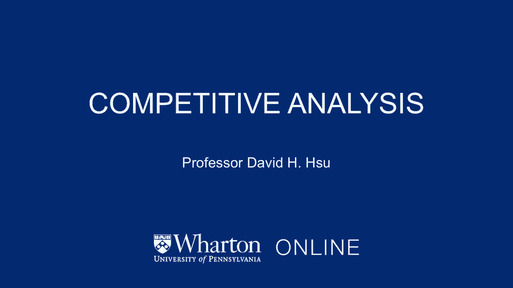
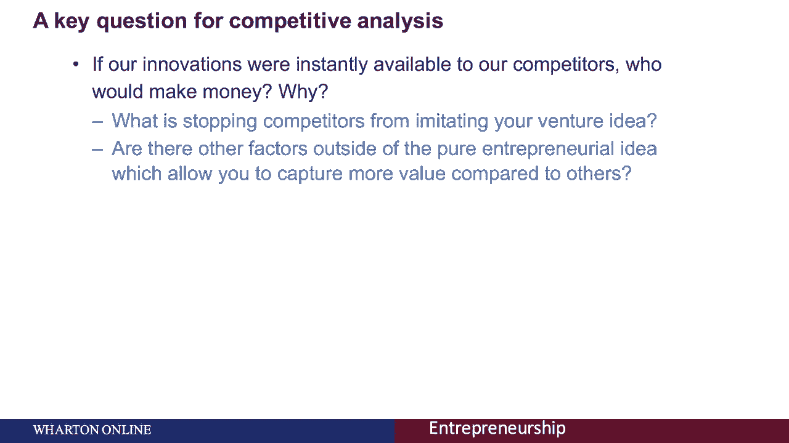
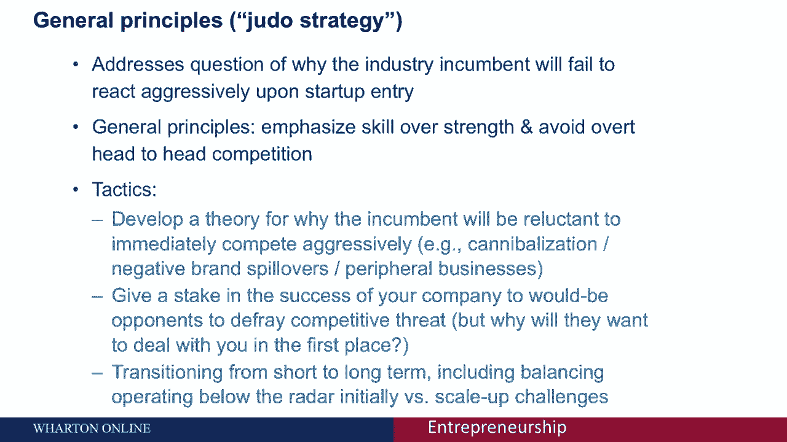
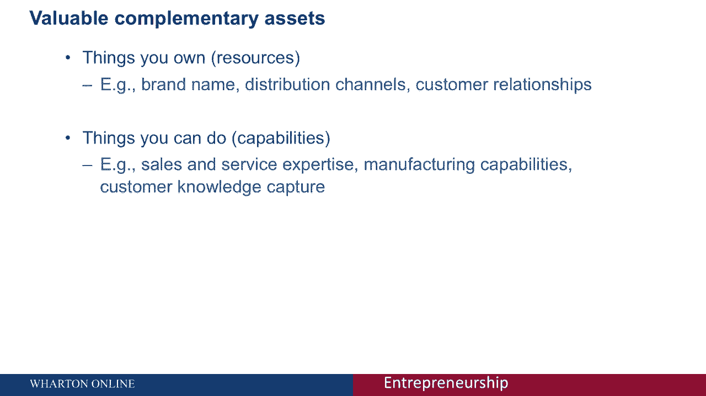
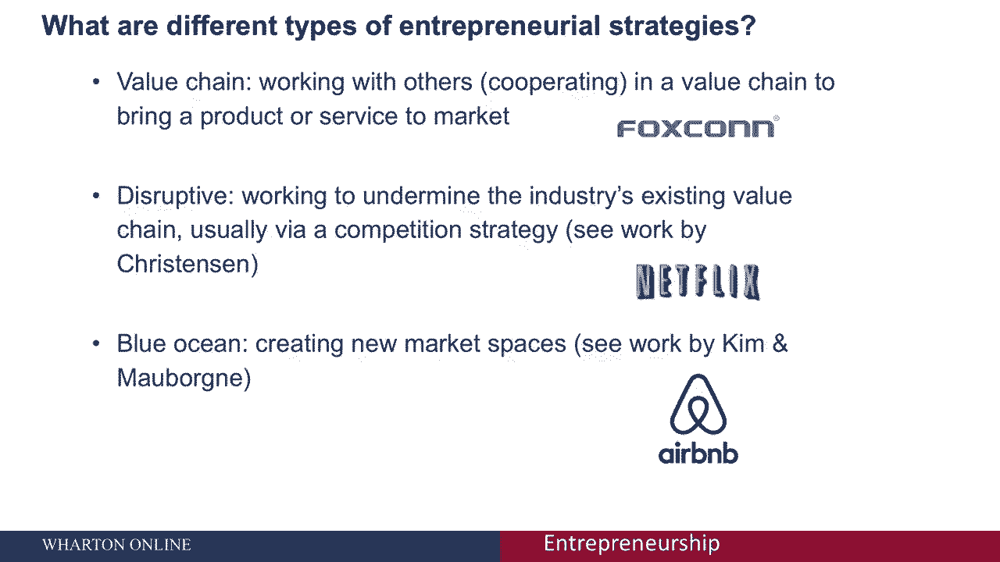

# 🥋 创业四部曲 P20：柔道策略与竞争优势分析

在本节课中，我们将探讨创业者在面对强大竞争对手时，如何运用柔道策略来建立和维持竞争优势。我们将深入分析“如果创新被立即模仿怎么办”这一核心问题，并学习几种关键的竞争策略。

---

## 核心挑战：创新被模仿怎么办？

作为一个新进入者，我们必须思考一个关键问题：如果我们的创新立即被所有竞争对手获得，会发生什么？

这个问题迫使我们深入思考，我们公司真正能够获得回报的基础是什么，以及我们与其他潜在进入者相比有何优势。

## 柔道策略：以巧取胜

上一节我们提出了核心挑战，本节中我们来看看应对这一挑战的总体原则——柔道策略。

柔道策略的核心思想是：作为创业中心，你如何能“翻转”或“以小博大”，与更大的在位者竞争。这是每位新进入者或创业企业家面临的基本挑战。

该策略强调**技能而非力量**，并聚焦于一个核心概念：**我们如何避免正面竞争**。毕竟，在位者通常拥有更雄厚的资金、更成熟的企业声誉。因此，我们必须思考：与在位者相比，你在什么基础上能拥有任何形式的影响力？

## 创业者的三大竞争战术

以下是创业者可以使用的几种具体策略，以应对在位者的竞争压力。

### 1. 构建“在位者无动机”理论

你必须发展一个理论，解释为什么在位者没有动力立即与你激烈竞争。这可能是因为你尚在“雷达之下”未被察觉。但即使被察觉，你也可以思考为何自己至少能拥有一个时间窗口。

**原因可能包括：**
*   **避免蚕食现有业务**：在位者可能不想让新产品或服务冲击其现有的核心业务。
*   **负面品牌溢出效应**：进入你所覆盖的新市场空间，可能会对在位者的旗舰品牌形象产生负面影响。

**举例说明：**
以红牛进入美国市场为例。当时的在位者是可口可乐。红牛有意识地塑造了一个前卫、极端的品牌形象，这与可口可乐努力营造的健康、家庭友好形象截然不同。由于红牛在品牌定位上刻意与可口可乐保持距离，使得可口可乐可能不愿意立即进入这个新市场并进行激烈竞争，以免损害其核心品牌价值。

### 2. 让在位者成为利益相关者

第二个策略是，在你创业成功的过程中，给予在位者一定的“赌注”或利益，使其成为你的利益相关者。这在某种程度上是一个双赢的命题。

**核心公式：**
`在位者在你的业务中拥有股权或分成` → `在位者希望你成功`

运用此策略的前提是，你必须拥有一个足够引人注目的价值主张，以至于在位者愿意与你合作。

### 3. 将短期机会转化为长期优势

最后一个战术是，能够将作为初创企业所获得的短期机会窗口，转化为一系列连续的行动和成功，从而延长你的竞争优势窗口期。

## 竞争优势的基石：互补性资产

如果竞争对手能立即获得你的创新，那么在你进入市场后，保护你的东西是什么？这就引出了 **“紧密持有的互补性资产”** 这一核心概念。

**互补性资产**是将特定的技术创新转化为商业回报所必需的资产。

**重要原则：**
要成为竞争优势的基础，这些互补性资产必须是**紧密持有**的，即它们是独特的，不可能被行业中的每个参与者轻易获得。

**反面案例：**
考虑半导体芯片设计行业。如果所有设计师都能使用同一个制造设施来生产芯片，那么“制造能力”就不再是任何人的竞争优势，因为它对所有人都是普遍可得的。

互补性资产主要分为两类：
1.  **你所拥有的资源**：例如品牌名称、专利、客户关系。
2.  **你所具备的组织能力**：例如高效捕捉并分析客户偏好的能力、快速迭代的产品开发流程。

## 三大创业进入战略

最后，让我们看看三种不同的创业进入战略，它们都可以作为建立竞争优势的基础。

### 1. 价值链合作战略

这是一种合作策略。作为初创企业，你努力**加强现有的行业价值链**，但在价值链的某个特定环节进行创新，并做得比在位者更好、更高效。

**举例：**
富士康（Foxconn）是iPhone、iPad和Kindle的制造商。它通过专注于制造环节的创新和极致效率，进入了苹果和亚马逊的价值链，提供了后者自身难以匹敌的制造能力。

### 2. 颠覆性战略

这是一种竞争策略。作为创业企业家，你试图**颠覆行业的现有价值链**。这是由哈佛商学院克莱顿·克里斯坦森教授所阐述的理论。

**举例：**
Netflix在早期通过邮寄DVD的方式提供电影，颠覆了百视达（Blockbuster）需要消费者开车去实体店租赁的传统模式。随后又转向流媒体，彻底重塑了影视内容的分发价值链，取代了行业在位者的市场地位。

### 3. 蓝海战略

这一战略的本质是**发现并创造新的市场空间**，它不一定与颠覆性战略互斥。该战略由欧洲工商管理学院的教授们倡导。

**举例：**
Airbnb允许个人出租自己的房间或公寓。它创建了一个点对点的住宿平台，发现了一个从未被传统酒店业视为可行业务的新市场空间。这个新市场最终对希尔顿、喜来登等传统酒店巨头的市值构成了巨大挑战。

---

## 总结

本节课中，我们一起学习了创业者如何应对“创新被模仿”的挑战。我们引入了**柔道策略**作为总体指导思想，探讨了三种具体竞争**战术**，并理解了**互补性资产**是构建持久优势的基石。最后，我们分析了三种主要的创业进入**战略**：价值链合作、颠覆性创新和蓝海战略。掌握这些策略，将帮助你在与强大竞争对手的较量中，找到属于自己的生存和发展之道。