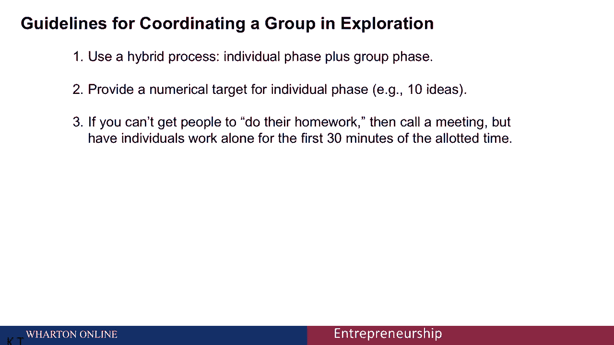

# 【沃顿商学院】创业 四部曲：发现机会、建立公司、增长战略、融资和盈利 - P21：[P21]04_3-4-generating-ideas-with-individuals-and-groups - 知识旅行家 - BV19Y411q713

这次会议是关于与个人和团体一起产生想法。

创业有很多设置，我们需要产生很多想法，例如，为我们的新企业确定解决方案概念，在这种情况下，我们希望有几个，关于如何抓住机会的五个或十个引人注目的解决方案概念。

现在实践中最主要的方法是把团队聚集在会议室里，在会议上，在房间里集思广益，在白板上写想法，但事实证明，这并不是一个非常有效的产生想法的方法，让我给你一个类比，让我们想象一下。

我们十个人的团队发现自己被困在一个荒岛上，我们立即面临的关键问题是在哪里找到食物和水，现在，让我们想象一下搜索这个岛的两种方法，在第一种方法中，我们都聚集在一起，这可能被描述为橄榄球混战。

我们一起在岛上寻找有趣的东西，寻找食物和水，在第二种方法中，我们说，嘿，每个人都往不同的方向走30分钟，我们三十分钟后在这里见，并报告你的发现，我希望第二种方法将覆盖更多的领域，这是不言而喻的。

并揭示更多有趣的选项，嗯，在产生关于，你能做的最糟糕的事情就是把整个团队聚集在一个房间里，在橄榄球混战中，基本上都在谈论同样的想法，取而代之的是，更好的办法是让同一个小组独立地并行地工作。

探索许多不同的领域，然后分享他们的发现，我实际上在这方面做了一些实证研究，比较两种不同的方法在小组方法中产生想法，我们有四个人的团队同时工作了30分钟，我称之为混合方法，我们把同样的四个人。

让他们先工作了十分钟，独立的、平行的、单独的，然后再聚在一起二十分钟一起工作，分享他们的发现，我们的发现是在混合方法中，这四个人产生的想法是他们一起工作的两倍半，这些想法现在实际上是一种更好的质量。

希望与岛上的类比能与岛上的搜索相提并论，对你来说有意义，也就是说，当你在一个团队中，在一个团队中一起工作时，你们都倾向于集中在一次谈话上，在单线程上，关于单一勘探路径的报告，但是通过混合方法。

你们每个人都可以独立并行地探索不同的领域，然后您可以在混合过程的第二部分共享这些信息，现在，别误会我的意思，我绝对不反对团队或团体，团队很重要，小组工作很有价值，但是花几分钟真的没有成本。

哪怕只有十分钟，让每个人独立工作，同时探索不受他人思想的约束，然后分享你的发现，因此，就生成解决方案概念的挑战而言，我建议你采用这种方法，使用混合工艺，使用单独的勘探阶段，加上一个群体阶段。

为了让人们真正实现你要求他们做的事情，为各个阶段提供一个数值目标是非常有用的，我喜欢让人们为，无论我们面临什么挑战，然后是许多组织设置的可悲之处，很难让人们做作业。

要让人们在开会之前做好准备工作是很难的。所以一种方法是召集会议，但在会议的前十分钟，在你开始讨论之前，让每个人单独独立地工作，但关键是你要想办法抽出几分钟，让团队中的每个人独立并行地工作。

