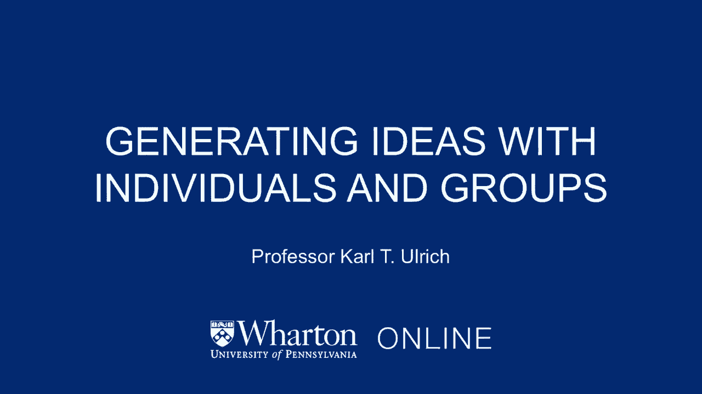
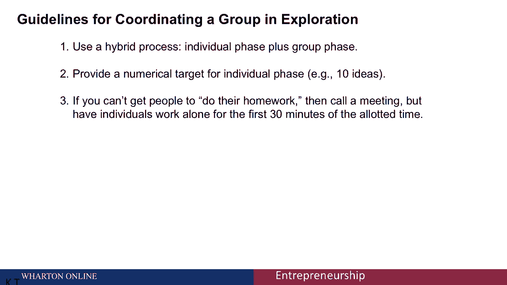

# 课程名称：沃顿商学院创业四部曲 - P21：与个人和团体共同生成创意 🧠💡

## 概述

在本节课中，我们将学习如何高效地生成商业创意。我们将探讨为什么传统的团队头脑风暴可能不是最佳方法，并介绍一种结合个人独立工作与团队协作的“混合方法”，以产生更多、更高质量的解决方案概念。

---

## 传统方法的局限性

上一节我们介绍了创业过程中需要生成大量创意。实践中，最常见的方法是将团队聚集在会议室里进行集体头脑风暴。

然而，研究表明，这种方法在效率上存在局限。让我们通过一个类比来理解。

想象一个十人团队被困荒岛，首要任务是寻找食物和水。我们有两种搜索策略：
1.  **橄榄球混战式**：所有人聚集在一起，在岛上共同搜索。
2.  **分头探索式**：每个人朝不同方向独立探索30分钟，然后汇合分享发现。

显然，第二种方法能探索更广的区域，发现更多潜在资源。创意生成亦是如此。

---

## 更高效的“混合方法”

基于以上洞察，我们引入一种更有效的创意生成流程：**混合方法**。

这种方法的核心是结合**个人独立探索**与**团队集体分享**两个阶段。

一项实证研究比较了两种方法：
*   **纯小组方法**：4人团队共同工作30分钟。
*   **混合方法**：同样的4人先独立工作10分钟，再集体工作20分钟分享成果。

研究结果用公式表示如下：
**混合方法产出创意数量 ≈ 2.5 × 纯小组方法产出创意数量**

并且，混合方法产生的创意质量也更高。这个发现与荒岛搜索的类比逻辑一致：当团队一起工作时，思维容易集中在单一讨论路径上；而独立工作能让每个人并行探索不同方向，从而在后续分享中汇聚更丰富的想法。

---

## 如何实施混合方法

以下是实施混合方法的具体步骤。关键在于设置明确的独立工作阶段。

1.  **设定明确目标**
    在开始前，为个人独立工作阶段设定一个具体的、量化的目标。例如：“请在未来10分钟内，针对‘如何提升客户留存率’这一问题，独立列出至少5个解决方案概念。”

2.  **安排独立工作阶段**
    在团队会议开始时，先预留一段时间（例如10-15分钟），要求每位成员**独立、安静、并行**地工作，完成上述目标。这能确保每个人都能进行深度思考，不受他人观点影响。

3.  **进入团队分享与构建阶段**
    独立工作结束后，进入团队协作阶段。每个人依次分享自己的所有想法。团队在此基础上进行讨论、组合、改进和深化，构建出更完善的解决方案。

这种方法巧妙地解决了“难以让成员在会前完成作业”的常见组织难题，将准备工作无缝嵌入会议流程之中。

---

## 总结

本节课中，我们一起学习了高效生成创意的“混合方法”。

我们认识到，传统的集体头脑风暴（“橄榄球混战”）效率有限。取而代之，更优的策略是**混合流程**：先让团队成员**独立并行探索**，再进行**团队分享与构建**。通过为个人阶段设定明确的数值目标，并利用会议开场时间强制执行，我们可以显著提升创意的数量与质量。

记住，团队协作的价值无可替代，但为其注入短暂的、结构化的个人思考时间，将是激发集体智慧的关键。