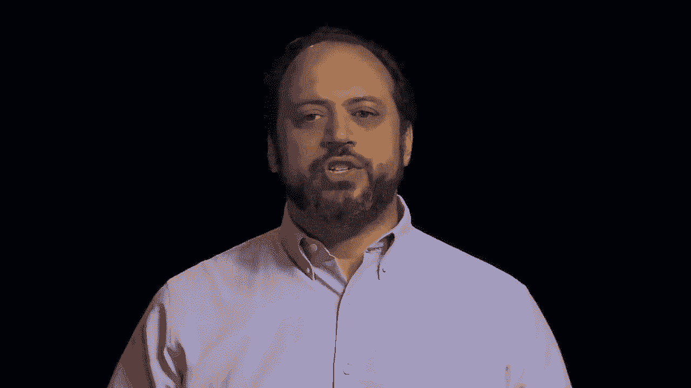
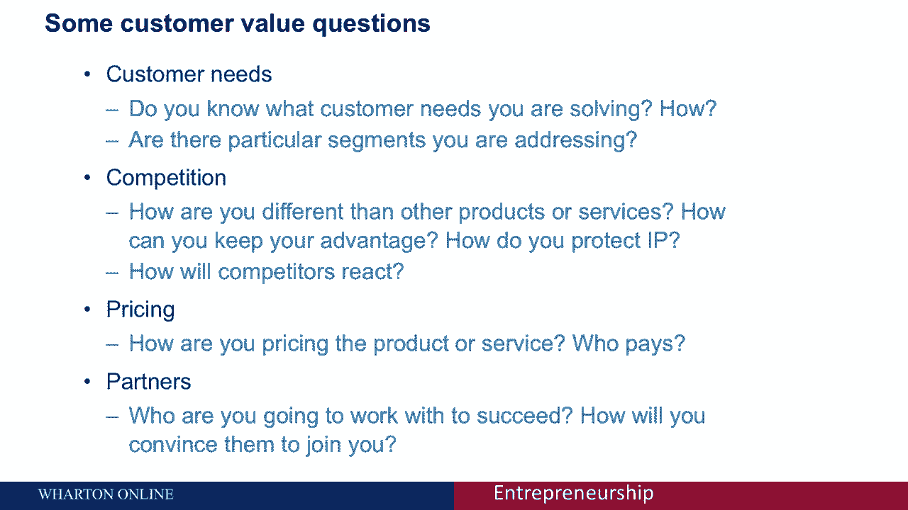
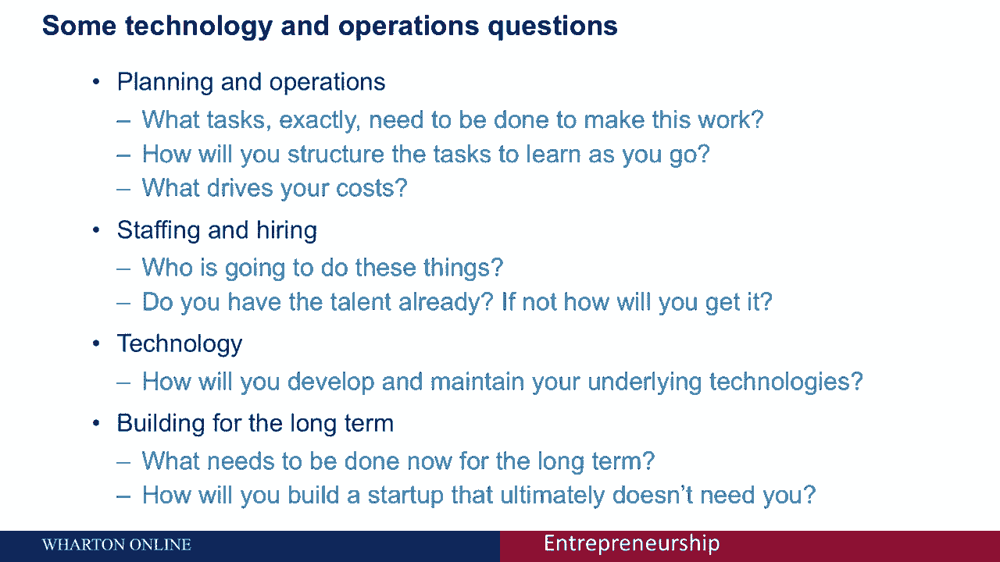
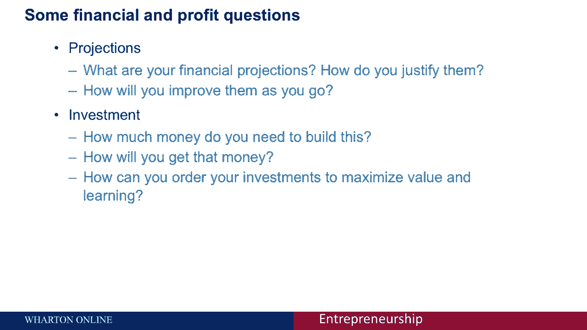
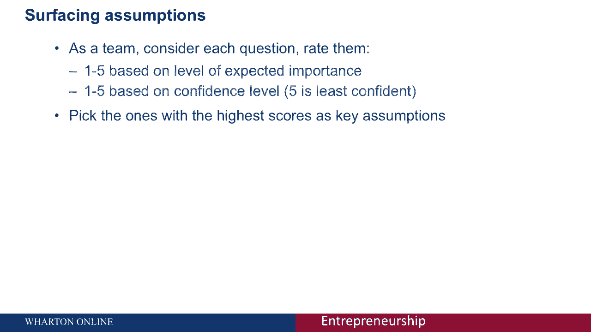
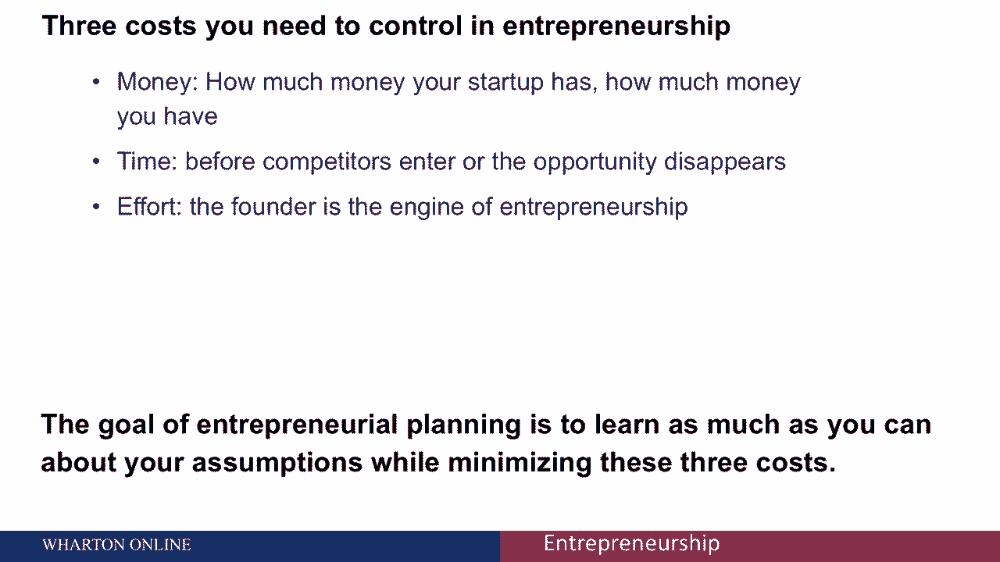

# [沃顿商学院](https://example.org)创业四部曲：发现机会、建立公司、增长战略、融资和盈利 - P22：[P22]05_3-5-planning-assumptions - 知识旅行家 - BV19Y411q713

计划创业的第一步，包括思考你在创业风险中所涉及的潜在假设。

任何创业都需要假设，因为你还没有建立起这个东西。

所以你必须假设某些事情是真的。

关于你的创业公司工作的世界，可能有许多不同种类的假设。您可以假设客户会以特定的方式操作，你的竞争对手会以一种特殊的方式做出反应，一旦人们看到产品。

他们会意识到需要它，并告诉他们的朋友，这些都是你创业所基于的假设。这些假设是不言而喻的，可能会给你带来麻烦，因为这意味着你还没有真正考虑过创业中的事情。你知道的，你假设你知道什么，而不理解。

这些潜在的假设实际上可能导致失败，甚至错失机会。你在屏幕上看到的图片是收费的，所以充电点是一个初创公司，始于我的一门课，想法是建立一个手机充电塔，以便把它放在各种零售店。

当你的手机电池快用完的时候，你可以把它送到收费站免费充电，这个主意很好，到目前为止，这家公司非常成功，筹集了相当多的风险资本。

但他们已经认识到他们的一些潜在假设是错误的，他们认为充电点的主要好处是。

人们会用它给手机充电，因此他们会在商店里花更多的时间走来走去。

或者等待手机充电，这确实是一个好处，但充电点的一大销售因素是注册屏幕。

你在中间看到的。

所以当你把手机充电的时候，你输入你的电子邮件地址以防丢失，你输入一个密码。

结果发现，Charspot是为商店里的人获取电子邮件地址的最有效方式，他们对未来潜在的购买有兴趣，这是主要的价值观之一。

因为他们不想问这个，他们花了一段时间才意识到实际上有一个巨大的增长机会被错过了。

所以这些假设会阻碍你的生意。

思考这些假设成为创业规划的一个非常关键的点，有许多不同的方式可以进行假设，通常不会说出来的，魔法确实没有以这样或那样的方式联系在一起。本质上，服务消费就是问一系列关于你创业的问题，试着找到答案。

和你的联合创始人一起努力思考，如果你有他们在附近，使你的生意成功的潜在因素。因此，我要给你一个方法，基于哈佛商学院汤姆·艾森曼的研究，他将假设分为四个不同的类别，我用的是一个稍微不同的版本。

但基本思路是一样的，所以这四个类别就是客户价值：你如何为客户提供价值，客户如何知道他们的价值正在交付，你将如何应对竞争，技术和业务，你在你的生意中实际上要做什么，才能让它成功。

你需要采取什么样的操作步骤？你需要开发什么技术？谁来负责销售和营销？人们如何了解你们的产品，他们怎么能购买？最后是财务和利润公式，那么你将如何为你的业务创造收入，基本公式是什么，从长远来看。

这会使你有利可图。

所以这是一个非常简单的技术，接下来我们会通过每一个类别来讨论它们。

你会问自己关键问题，并弄清楚你是否能回答它们。

那么这四个关键类别是什么呢？首先是客户价值领域，因此你从考虑客户的需求开始，从某种意义上说，这是你整个创业过程中最重要的问题。你知道你在解决客户的什么需求吗？你怎么知道答案是否正确？我是那些顾客之一。

这是一个很好的起点，但你知道市场足够大吗？你怎么知道的？你在引用什么事实？是否有特定的细分市场是你正在解决的？如果你看过黄教授关于客户细分的演讲，这是思考细分问题的一个很好的方法。

你与其他产品和服务有何不同？你怎么知道你是与众不同的？如果你确实与众不同，你如何保持优势？你如何保护你的知识产权，使得其他人无法在更长的时间内复制它？你如何通过与竞争对手的互动来维持这种优势？

那么你认为他们会对你进入市场作何反应？你知道这件事吗？在定价方面你有什么想法？你们打算如何给产品和服务定价？你可以使用许多不同的定价技术，比如固定定价、捆绑定价或按月定价。

你可以做基于价值的定价，你可以获得一定比例的储蓄。人们如何对你们的定价方法有看法？你是如何确定合适的价格点的？谁付钱？是顾客吗，还是保险公司？或者医院里正在做的事情是医院支付费用的地方。

你需要了解谁是付款人，和合作伙伴，和他们一起工作才能让你成功。有没有需要和你合作的公司？你如何给他们足够的价值来说服他们加入你？

和你的搭档一起，当你前进的时候，这是一个详尽的列表。

但如果你不能回答这些问题，你有一个主要的假设需要在你的业务中处理。

第二组问题涉及技术和操作，你实际上将如何经营业务。因此，首先是关于计划，在你的业务中实际需要完成哪些任务。当你开始这个的时候，你到底要做什么？人们每天做什么工作？人们在短期内做什么工作？

你将如何组织你的任务，这样你在做生意的时候就能学到尽可能多的东西？是什么驱动了你的成本？很多时候是与公司有关的人，但也可能是外包的技术、硬件或租金。你是如何看待这些问题的？

你如何知道你的成本驱动因素是什么，你们如何雇用，那么谁来做你生意中的所有各项任务，还是只有你，你和你的联合创始人正在使用外部承包商，你们是永久雇佣人吗，如果你已经有了那种天赋，您将如何部署它，多少钱。

如果你没有天赋，你将如何获得它的技术，那么如何开发和维护底层技术，1。你是在室内建还是在室外建，你需要新技术来完成这项工作吗，然后你需要考虑长远，这也是我们下节课要讨论的，比如你现在提出的问题。

你在公司成立之初所做的决定将会有很长的时间，在组织的整个生命周期中的术语影响，事实上，我们有强有力的证据表明，即使是一百年前做出的决定。

老公司的成立影响了他们今天的运营，所以努力思考。

你将如何做出有长期积极影响的选择，事项。

你将如何建立一个初创公司，最终那不需要你，这样你就可以从它身边走开。

你不必永远做公司的每一项工作，另一组问题是关于市场营销和销售，所以想想你的频道，你如何接触你的客户，你们打算通过什么样的销售渠道进入市场，你如何让这些频道加入你。

你需要什么样的价值才能给他们30%的利润，百分之二十的保证金，你公司的名称、地址和投资清单，他们怎么和你一起上船，谁在处理，你们组织中哪方面的销售是由谁负责勘探，谁在处理客户电话？谁处理退货或客户服务。

这些都是你需要解决的客户获取问题，你是如何获得新客户的，买一个的费用是多少，你的客户获取成本是多少，那么你付给营销人员多少钱，你们在促销方面花了多少钱？你要付多少介绍费，优化。

你怎么知道这些销售方法是否有效？你怎么边走边学。

你将如何衡量成功，你的关键指标是什么，我们要讨论的另一件事，最后一组问题是关于财务和利润公式的。

那么你的财务预测是什么呢？你如何证明他们是合理的，你对他们了解多少，一些东西，当我们多说一点，当我们谈论覆盖范围时，房间规划，从现在开始的几节课中，然后当你前进的时候，你会如何改进和使你的预测更好。

然后是投资的问题，你需要多少钱才能让你的产品或你的冒险成功，我们是如何得到这笔钱的，我们会更多地讨论的是各种筹款技巧，你如何真正安排你的投资，使你的价值最大化，使你的学习最大化。

所以你在早期尽可能少花钱，弄清楚这是否是一个好的冒险想法，或者不增加你的企业的价值，在你开始筹集更多资金之前。

你会注意到的是，我刚才给了你一个令人筋疲力尽的问题清单。

我想你可能会喜欢它，如果我能帮你回答，但这是关于你的冒险。

你的生意，所以这些问题你需要自己回答，我强烈建议你和你的创始团队坐下来。

如果你是啊，如果你是一个孤独的创始人，你找几个人加入进来和你谈谈这件事。

花几个小时来研究这些问题，思考你的答案是什么，当你这样做的时候，浏览每个问题，并根据两个数字标记它们。

给他们一个1到5，根据重要程度，所以说，如果事实证明，你的创业想法组织中最重要的部分是，你会找到一个愿意销售你产品的特定合作伙伴，说你需要在沃尔玛为你出售，所以这成为你最重要的，那是五分之五的比率。

可能你也不太了解沃尔玛是如何，决定携带什么样的产品，所以你很不自信，因为你也会给它打五分，所以你要做的，最终是对我提出的每一个问题都有答案，每一个都有一个2到10之间的数字。

最高的数字是那些最重要和最不确定的数字，这些是你在业务中的关键假设，这些都是你需要尽快回答的事情，弄清楚你的生意是不是个好主意。

创业是有趣的，因为与之相关的成本不仅仅是钱。

实际上你要担心三种不同的成本，当你思考你在测试什么假设时，所以第一个是现金，你的创业公司有多少钱，你有多少钱？这是许多初创企业的首要因素，这显然是我们要讨论的一个问题，我们会更多地讨论你如何筹集资金。

你怎么花钱，你如何看待企业家创业中的金钱，但你也有其他种类的成本，所以当我和创业公司的创始人交谈时，不断出现的问题之一是时间，你不是在与之竞争，竞争对手进入市场前的时间，或者机会消失。

所以如果你花了三个月的时间来找到一个问题的答案，那是三个月的领先或优势，可能会消失，然后是创始人经常不谈论的事情，但最终成为创业冒险的一个非常重要的部分，是创始人自己的努力和精力储备。

所以在创业的早期阶段，做每件事的人往往是创始人，创始人必须无处不在，管理人，雇佣销售人员这需要很多精力思考如何构建，这样你就不会到处消耗精力了，但不是专注于最重要的事情，是创业预算的关键部分。

所以你在预算钱，你的预算时间，和你的预算努力。

所以说，企业家规划的目标是尽可能多地学习，关于你的关键假设，同时将这些成本降至最低。

所以你想把注意力集中在最重要的假设上，最未知的。

并尽快得到这些问题的答案，弄清楚你的创业是否朝着正确的方向前进。

