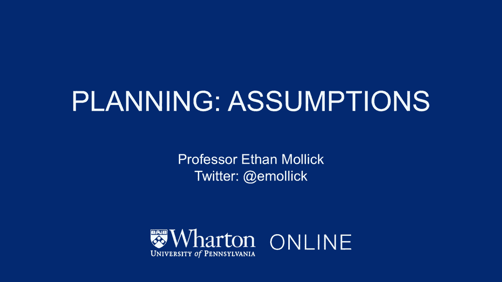
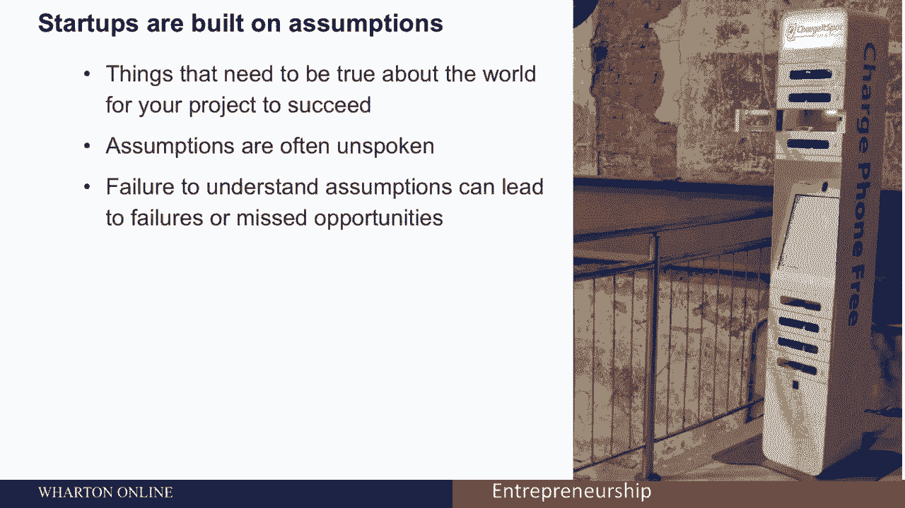
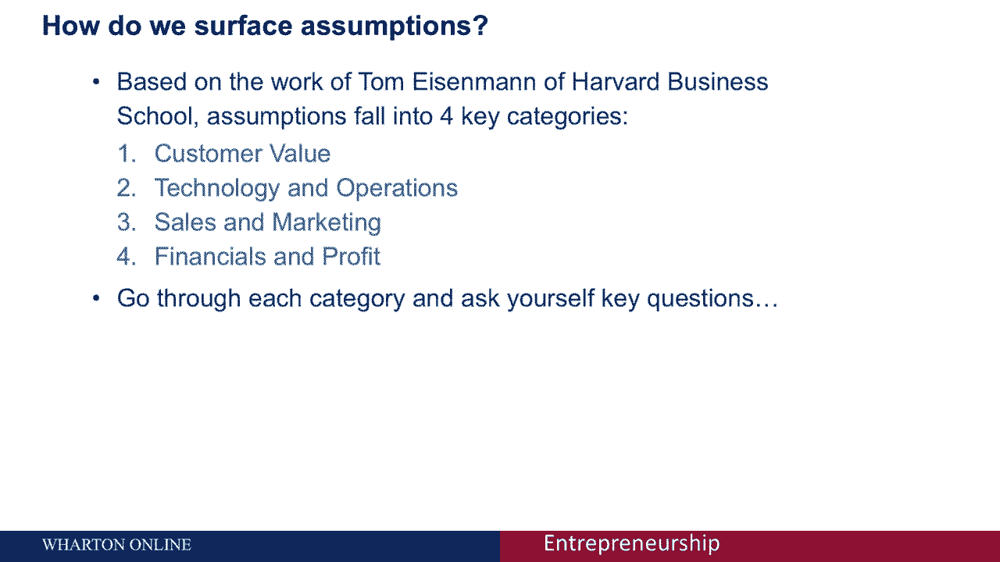
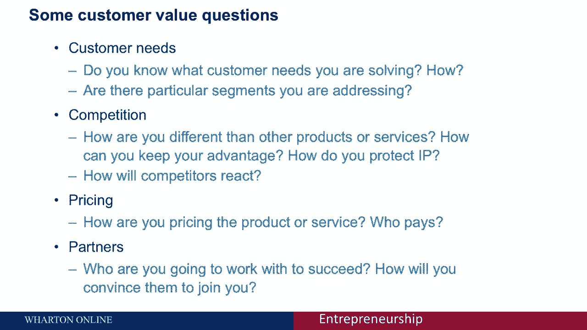
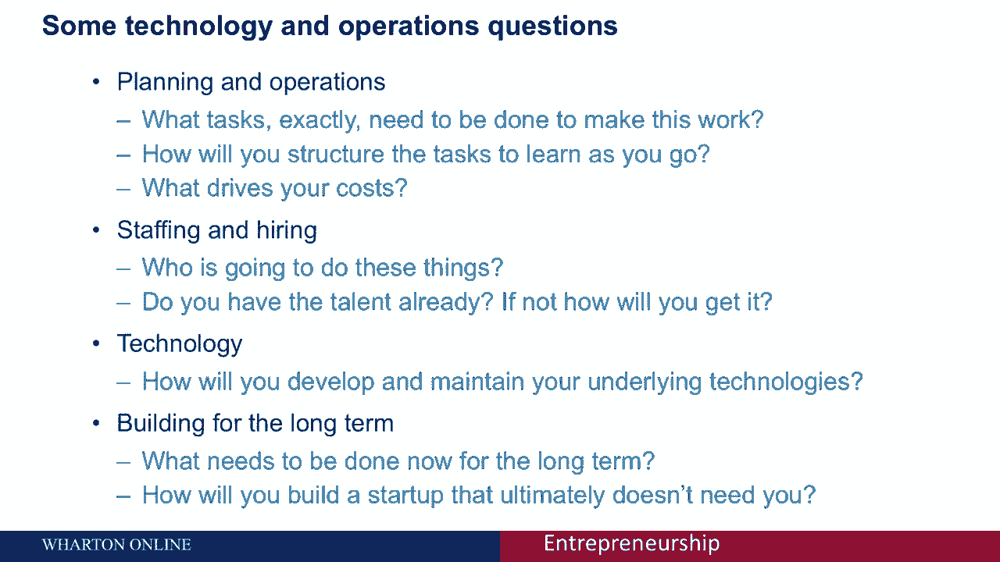
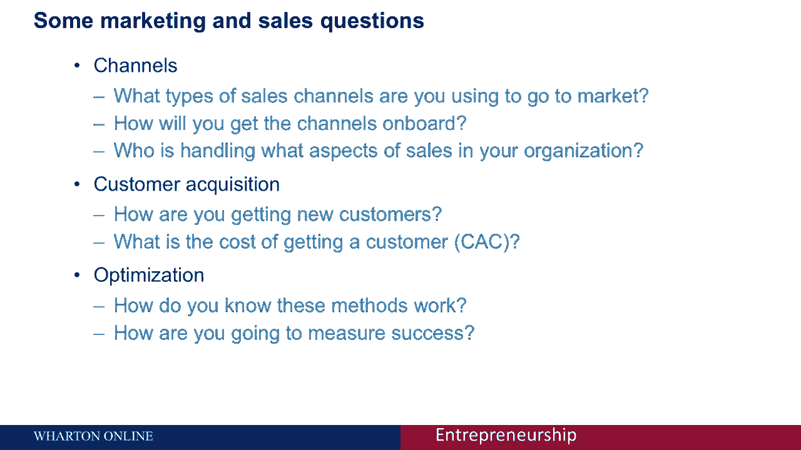
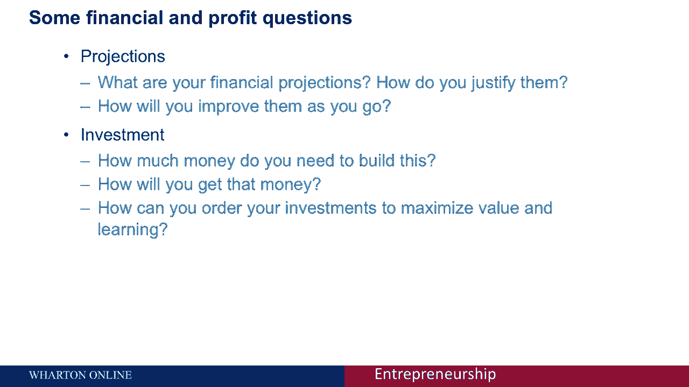
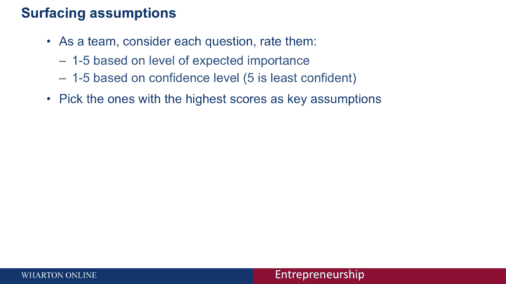
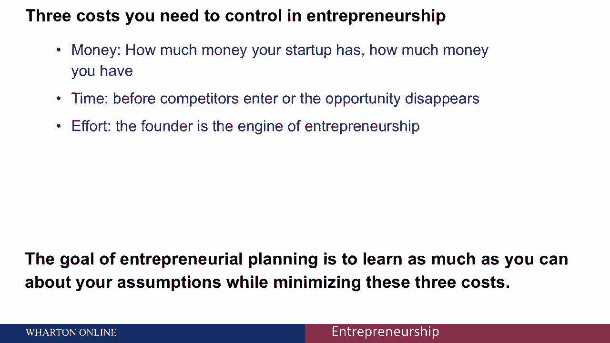

# 沃顿商学院创业四部曲 P22：识别与规划创业假设 📝

在本节课中，我们将学习创业规划的第一步：识别并梳理你的创业想法所依赖的潜在假设。理解这些假设至关重要，因为它们是你商业计划的基石，如果未经审视，可能导致失败或错失良机。

## 为什么假设至关重要？🤔

任何创业都始于假设，因为你尚未将想法变为现实。你必须假设某些事情为真，例如客户会如何操作、竞争对手会如何反应、产品是否能被市场接受等。这些假设通常是隐含的，如果不加以明确和验证，可能会带来麻烦。

例如，充电点公司最初假设其核心价值是为手机充电，从而延长顾客在店内的停留时间。然而，他们后来发现，注册屏幕（用于收集顾客邮箱以防手机丢失）才是为商店获取潜在客户邮箱的最有效方式，这成为了一个被他们忽视的巨大增长机会。这个例子说明，未经验证的假设可能阻碍业务发展。

因此，系统地思考这些假设是创业规划的关键环节。

## 如何梳理创业假设：四类关键问题 🔍

为了帮助你系统地梳理假设，我们将采用基于哈佛商学院汤姆·艾森曼研究的框架，将假设分为四个核心类别。以下是每个类别你需要思考的关键问题。

### 1. 客户价值

首先，从思考客户的需求开始。这是整个创业过程中最重要的问题。

以下是关于客户价值的关键问题列表：
*   你解决了客户的什么需求？
*   你如何知道这个答案是正确的？
*   市场是否足够大？你如何知道？
*   是否有你正在专注解决的特定细分市场？
*   你的产品/服务与竞争对手有何不同？你如何保持这种优势？
*   你如何保护知识产权？
*   竞争对手会对你的市场进入作何反应？
*   你计划如何定价？
*   谁是实际的付款人（客户、保险公司、医院等）？
*   是否需要合作伙伴？如何说服他们与你合作？

### 2. 技术与运营

上一节我们探讨了为客户创造的价值，本节中我们来看看如何实际运营业务以实现这些价值。这涉及你将如何执行日常任务。

以下是关于技术与运营的关键问题列表：
*   业务启动初期需要完成哪些具体任务？
*   日常和短期的工作内容是什么？
*   如何组织任务以最大化学习效率？
*   主要的成本驱动因素是什么（人力、技术、租金等）？
*   如何组建团队（创始人、承包商、正式员工）？
*   如何开发和维护核心技术（自建还是外包）？
*   当前的决策将如何产生长期影响？
*   如何建立一个最终不需要你事事亲为的公司？

### 3. 市场营销与销售

明确了运营方式后，接下来我们需要思考如何将产品推向市场并触达客户。

以下是关于市场营销与销售的关键问题列表：
*   通过什么销售渠道接触客户？
*   如何让这些渠道愿意与你合作？
*   销售和客户服务由谁负责？
*   如何获取新客户？客户获取成本是多少？
*   如何衡量营销和销售活动的有效性？
*   关键的成功指标是什么？

### 4. 财务与盈利模式

最后，任何商业活动的最终目标都是创造可持续的财务回报。本节我们来审视财务层面的假设。

以下是关于财务与盈利模式的关键问题列表：
*   你的财务预测是什么？依据是什么？
*   需要多少资金才能让产品或 venture 成功？
*   如何获得这些资金？
*   如何安排投资以最大化价值和学习效率？
*   如何在早期尽可能少花钱来验证想法？

## 实践步骤：识别你的关键假设 🎯

刚才我们提供了一个详尽的问题清单。你需要和创始团队（或几位顾问）一起，花几个小时来思考并回答这些问题。

对于每个问题，请根据两个维度进行评分（1-5分）：
1.  **重要性**：该问题对你的创业成功有多关键？
2.  **不确定性**：你对该问题的答案有多不确定？

**重要性评分 × 不确定性评分 = 假设优先级分数**

最终，每个问题都会得到一个介于1到25之间的分数。**分数最高（例如，重要性5分 × 不确定性5分 = 25分）的那些问题，就是你业务中最关键、最未知的假设。** 这些正是你需要优先投入资源去验证的核心事项。

## 创业的三种成本与验证策略 💰⏳⚡

验证假设是有成本的，创业者需要关注三种资源：

1.  **现金**：公司拥有的资金。
2.  **时间**：市场窗口期或领先优势可能消失的时间。
3.  **精力**：创始人自身的努力和专注力。

**企业家规划的目标是：以最低的现金、时间和精力成本，尽可能多地验证关键假设。** 因此，你需要将注意力集中在那些优先级分数最高的假设上，并尽快找到答案，以判断你的创业方向是否正确。

## 总结 📚

本节课中，我们一起学习了创业规划的第一步——识别与规划创业假设。我们了解了假设为何重要，并学习了通过**客户价值、技术与运营、市场营销与销售、财务与盈利模式**四个类别来系统梳理假设的方法。最后，我们掌握了通过评分法识别**关键假设**，并在**现金、时间、精力**三种成本约束下，优先验证这些假设的实践策略。这是将创业想法从模糊概念转向可执行计划的关键一步。