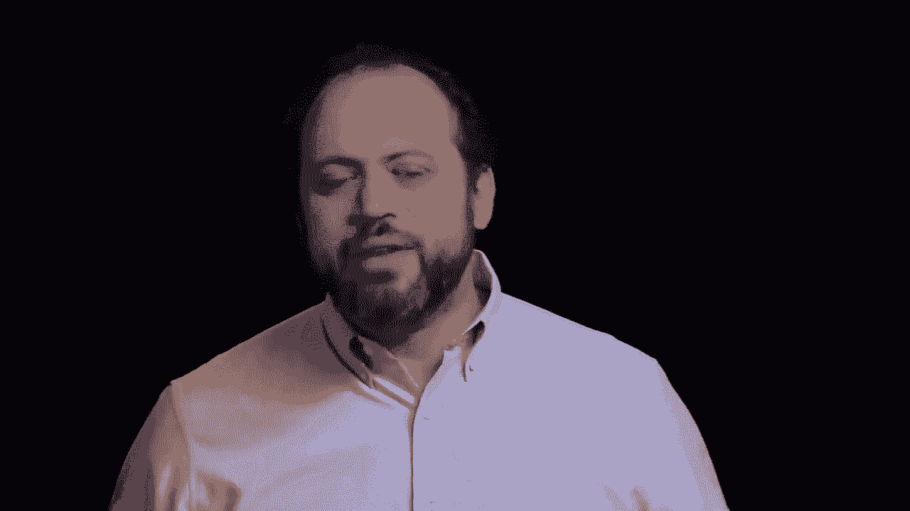
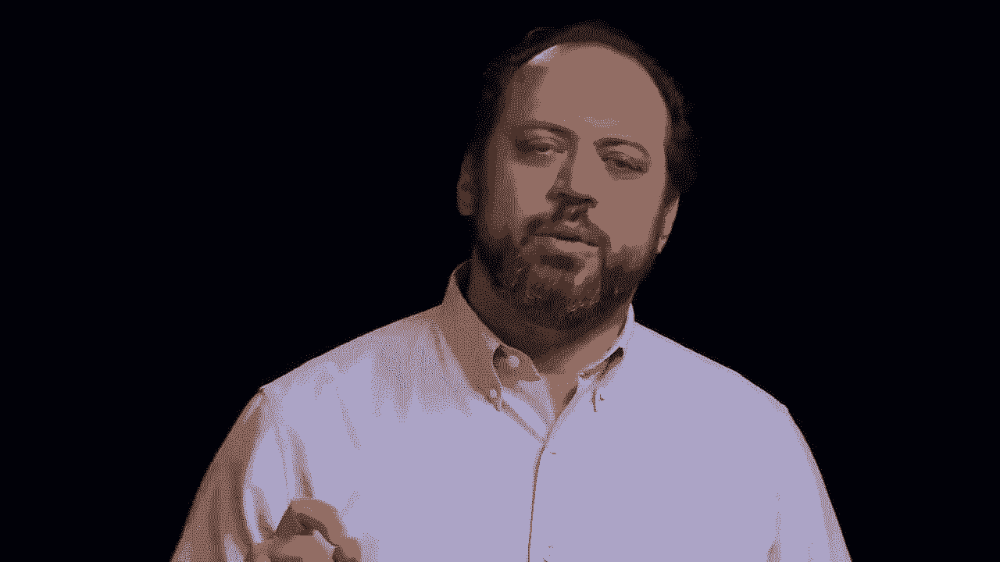

# 🧭 创业课程 P23：探索驱动规划 (Discovery-Driven Planning)

在本节课中，我们将学习一种名为“探索驱动规划”的实用工具。它由沃顿商学院的伊恩·麦克米伦和丽塔·麦格拉思开发，专门用于帮助创业者在充满不确定性的环境中，通过建立“玩具模型”来规划业务、测试假设并降低风险。

---

## 📝 概述：什么是探索驱动规划？

我们一直在讨论假设如何支撑任何初创企业，以及如何识别这些假设、围绕它们进行规划并验证它们，这对创业至关重要。

探索驱动规划提供了一种方法，它不是试图深刻反映现实世界，而是为你的业务创建一个稳态模型。这个模型让你可以测试各种假设，找出哪些有效、哪些无效。它的优势在于，与许多其他财务模型不同，它考虑到了你最初并不知道很多答案的事实。

接下来，我们将通过一个虚构案例，分五个步骤来学习这个方法。

---

## 🛠️ 探索驱动规划的五个步骤

探索驱动规划包含五个核心步骤。在详细解释之前，我们先了解一下学习路径：首先，我会介绍一个虚构案例；然后，你可以使用课程提供的电子表格进行实践；最后，下一个视频讲座会深入探讨案例细节，帮助你融会贯通。

以下是五个步骤：

1.  **设定目标**
2.  **制定操作步骤**
3.  **建立反向损益表**
4.  **对假设进行基准测试**
5.  **匹配里程碑与假设**

---

### 第一步：设定目标 🎯

规划的有趣之处在于，你从终点开始思考：你想从创业中获得什么？在探索驱动规划中，我们首先明确想要达成的成就。

既然要建立财务模型，我们需要一个量化的目标。例如，达到特定的年度利润水平（如10万美元），或实现特定的产品定价目标。

**案例引入：Better Desk公司**
假设你的表亲约翰和乔安妮是木匠，他们发现市场上的站立办公桌既难看又不实用。他们计划利用自己的木工技能，制作更美观、更符合人体工程学且成本更低的站立办公桌，并创立了Better Desk公司。

他们的目标是：创业并获得比当前收入多15%的利润。目前他们每人年收入6万美元，合计12万美元。因此，新业务需要创造 **$138,000** 的利润（12万的15%是1.8万，加上维持原有收入的12万）。这就是我们的财务目标。

---

### 第二步：制定操作步骤 📋

明确了目标后，我们需要思考实现这个目标需要经历哪些具体的业务步骤。这对应我们之前讨论过的“技术和操作假设”。

建议的方法是**逆向工作**：从将产品交付给客户开始，倒推需要完成的所有步骤。

以下是Better Desk可能涉及的主要操作环节：

*   **销售与交付**：将产品卖给客户、处理物流和退货。
*   **制造**：实际生产桌子。
*   **订单处理**：接收订单、安排生产。
*   **销售与营销**：让潜在客户知道产品的存在。

对于每个环节，我们都需要深入思考其**操作规范**——即关键的任务和度量指标。

**以制造环节为例，操作规范可能包括：**
*   **原材料成本**：每张桌子的材料费用。
*   **物流成本**：原材料运费。
*   **生产效率**：每条生产线每天能生产多少张桌子 (`desks_per_day_per_line`)。
*   **生产时间**：每年有多少个生产日 (`production_days_per_year`)。
*   **设备成本**：每条生产线的设备投入及折旧。
*   **人员配置**：每条生产线需要多少工人 (`workers_per_line`)，以及他们的工资 (`salary_per_worker`)。

即使现阶段没有所有答案，详细列出这些步骤和规范的过程本身也极具价值。研究表明，花时间进行此类规划的企业在推出时成功率更高。

---

### 第三步：建立反向损益表 📊

接下来，我们将所有操作规范整合起来，构建一个**反向损益表**。与传统的损益表（根据支出和收入计算利润）不同，反向损益表从我们设定的利润目标（$138,000）开始，反向推导出需要实现多少收入，以及各项成本必须控制在什么水平。

课程提供的电子表格就是一个例子。在表格中：
*   **绿色单元格**代表**假设**，是我们需要估计或验证的数字。
*   **常规文本单元格**的数字是由其他数据计算得出的。

我们从目标利润开始，然后逐一填入制造、营销、管理等各个环节的成本假设（那些绿色数字），最终计算出需要达到的销售收入。这个过程迫使我们将目标与具体的运营细节联系起来。

---

### 第四步：对假设进行基准测试 🔍

现在，我们有了一个包含众多假设（绿色数字）的列表。这一步的目标是尽可能为这些假设找到可靠的参考数据。

**获取假设数据的途径包括：**
*   **个人经验**：约翰和乔安妮作为木匠，对生产成本可能有较好的直觉。
*   **供应商询价**：联系潜在的零件供应商，获取原材料 (`raw_material_per_desk`) 和运费 (`shipping_cost_per_desk`) 的报价。
*   **竞争对手分析**：研究或咨询业内人士，了解行业标准，例如每条生产线需要配置多少名工人 (`workers_per_line`)。
*   **市场调研**：查找行业报告或媒体数据。

每个假设都应尽可能注明其来源。有些数据可能很清晰（如供应商报价），有些则可能比较模糊（如市场定价）。明确来源有助于评估每个假设的不确定性高低。

---

### 第五步：匹配里程碑与假设 🔗

这是探索驱动规划从“计划文件”转变为“行动计划”的关键一步。我们不能仅仅停留在假设上，必须通过实际行动来测试它们。

我们需要识别**关键假设**——即那些**不确定性最高**且**对业务影响最大**的假设。通过敏感性分析（在电子表格中调整假设数值），可以看到哪些变量的变化对利润目标影响最显著。

接着，我们需要设计**业务里程碑**——这些是业务发展过程中的关键节点，能够为我们提供来自真实世界的反馈和数据，用以验证假设。

**Better Desk的潜在里程碑示例：**
1.  **市场研究**：通过调查、购买行业报告，测试客户需求 (`customer_demand`) 和市场状况。
2.  **试生产批次**：制作几张样品桌，测试生产技术、实际成本 (`production_cost_per_desk`) 和时间。

然后，我们创建一个“里程碑-假设匹配矩阵”：
*   纵轴列出所有重要假设。
*   横轴列出计划中的里程碑。
*   在相应的交叉点标记“X”，表示该里程碑将测试哪个假设。

例如，“每张桌子的原材料成本”这个假设，可能在“试生产批次”和后续“正式生产”等多个里程碑中被反复测试和修正。

通过按顺序执行这些里程碑，我们可以用最低的成本（如先做市场调查，而非直接建厂）逐步降低最大的不确定性，并在获得新信息后不断更新财务模型。建议将假设和里程碑的数量各控制在30个以内，以确保规划的可管理性。

---

## 💎 总结与核心价值

本节课我们一起学习了探索驱动规划（DDP）的完整五步法：**设定目标、制定操作步骤、建立反向损益表、基准测试假设、匹配里程碑与假设**。

探索驱动规划的核心价值在于：
1.  **提供量化分析工具**：即使在不确定性中，也能用具体数字来推演业务。
2.  **强制深度思考**：迫使创业者严谨地审视业务背后的每一个假设。
3.  **实现低成本试错**：通过安排里程碑，用最小的代价验证关键假设，提前暴露潜在问题。
4.  **支持灵活调整**：根据测试结果，你可以选择加速、转向 (`pivot`)、调整目标，甚至在投入巨大资源前明智地放弃。

这是一种强大的思维框架，不仅适用于传统制造业（如Better Desk），也适用于软件即服务 (`SaaS`) 或应用程序开发等计划快速增长的创业项目。它帮助你系统地管理风险，做出更明智的决策。