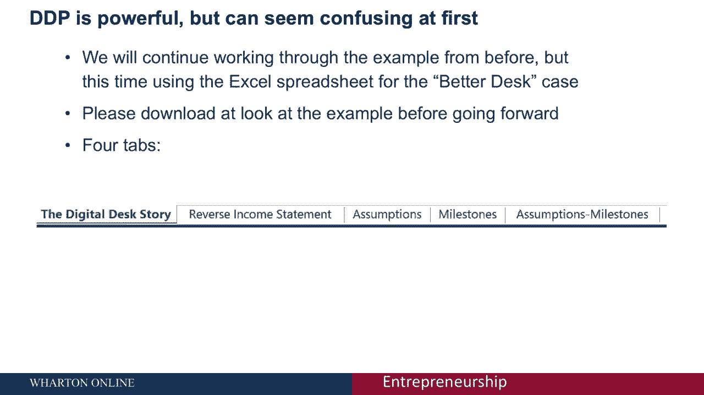
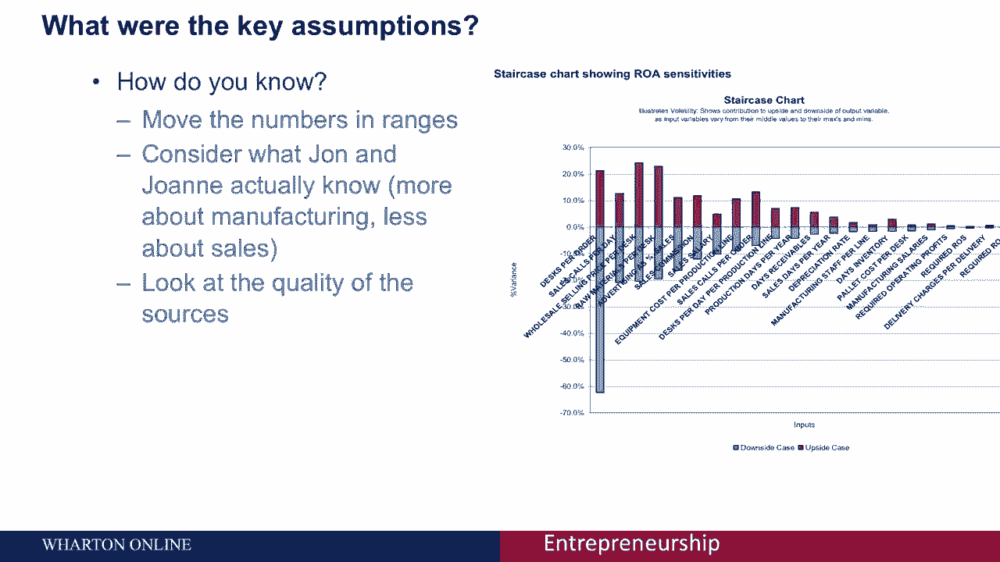
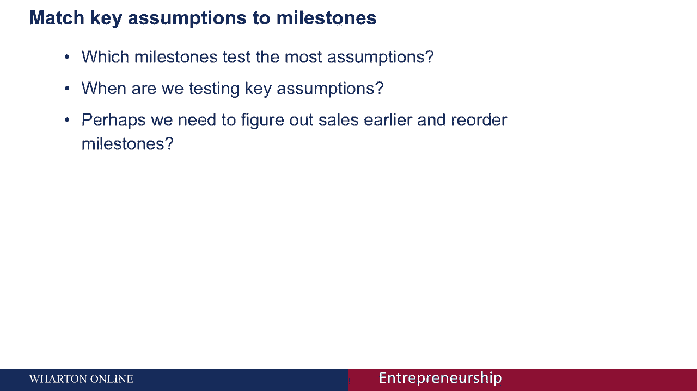

# 【沃顿商学院】创业 四部曲：发现机会、建立公司、增长战略、融资和盈利 - P24：[P24]07_3-7-planning-discovery-driven-planning-worksheet - 知识旅行家 - BV19Y411q713

所以我看了很多材料，上次我们谈到发现和计划。

所以这实际上是一个非常简单的过程，但这似乎很令人困惑。

所以我们上次花了时间，谈论约翰和乔安妮的电子表格。

他们建立了他们的发现和计划，我们已经创建了一个示例供您使用。

你可以找到电子表格作为课程的一部分。

我看了看更好的办公桌盒，所以如果你看看那个。

你会注意到有一系列的五个选项卡，第一个是更好的办公桌故事，为你概述。

我们上次讨论的案件的细节，所以你可以看到约翰和乔安妮的故事。

为什么他们要推出更好的办公桌，他们的创业理念是什么，您将看到的第二个标签是反向损益表，这是大多数行动发生在这个特定的地方。

在这个特殊的发现计划中，我们会谈谈的，更详细地说，有一系列假设。

我们再次讨论了里程碑列表，然后是将两者结合在一起的假设里程碑图。

我想让你看一下反向损益表。

如果你还记得发现和计划的第一步是从你的目标开始。

所以如果你看看反向损益表的顶部，你会看到我们已经做到了，所以史密斯夫妇，目前收入十二万美元，他们的目标，他们不愿意开办他们的公司，除非他们能赚15%，所以你看到那里有115%。

所以你看到获得的总利润是对的，所以这是第一步，然后当你看损益表的其余部分时，就像我们在上一堂课上讨论的那样，您将看到使用发现驱动过程的步骤2和步骤3，我们从目标向后工作，思考我们业务中的关键活动。

并详细概述这些活动。

所以这又是一种说法，花点时间看看那个，我想问你几个问题。

如果你认真暂停视频，这将是最好的。

花十五分钟看完模型，因为真正理解这一点的唯一方法是玩一下这个。

我不能保证它没有错误，我们尽了最大努力建造它，嗯，但是通过模型并考虑以下内容。

并思考业务中的关键假设是什么，我们在上一节课中再次讨论了寻找关键假设的方法。

是否有遗漏的成本或细列项目。

所以请花几分钟暂停一下，经历这一切。

关于业务的关键主题是什么，想出自己的答案，以及是否明显的缺失线路或成本。

当我为我的学生做这件事时，我们实际上是在课堂上这样做的，我们实际上会暂停15分钟来做这个。

所以花几分钟来做这件事，准备好了再继续。

好的，我相信你没有骗自己。

这不是分级的，所以你可以做到，你想怎么做就怎么做，但如果你有机会看看这个。

当我们把这些放在一起的时候，我注意到了一些缺失的成本，我们没有任何关于租金的信息，我们没有任何关于税收的信息，没有行项目，营销线项目很奇怪，因为我们从销售额中提取一定比例用于营销。

但你不是通常想预先花营销资金来刺激销售吗，我们没有任何网站的信息，没有一般和管理费用，销售模式似乎有点奇怪就它是如何建造的而言。

这是非常现实的，这些缺失的假设，建立模型是很常见的。

没有考虑到某些关键问题，所以通过花时间来经历它。

尤其是如果你能和别人一起做，它让你找到这些关键的缺失问题。

我可能错过了他们，也可能其中一些与你所拥有的不同。

但这给了你一个非常强大的方法来思考你错过了什么。

当你在做假设计划的时候，所以我们讨论了丢失的成本和丢失的行项目。

关键假设呢，我问的另一个问题你可能尝试过很多不同的技巧，但是你如何浮出水面的想法，关键假设与我们在上一节课中讨论的相同，你要做的第一件事就是你可以在范围内移动数字，我所说的在范围内移动是什么意思。

我是说，用最高和最低的可能来思考，每个假设的数字为，试着把最高和最低的数字输入模型，所以我们在模型中有一件事，例如，每个订单的平均死亡人数，所以如果我们认为这个数字可能在两到一百之间。

放两个放一百个看看这对你的结果有多大影响，在计算这些数字变化有多大的方面，可能的假设数字范围有多大，你想想想约翰和乔安妮到底知道什么，那么我们最期待的是哪里，因此不确定性最小，在这种情况下。

我想这将是围绕办公桌的生产和制造，因为约翰和乔安妮是木匠，他们非常了解那个市场，所以也许每张桌子的成本，我想他们有120美元可能在115到115美元之间，一百二十五，但他们不太可能在定价方面如此糟糕。

与他们的供应商交谈。

可能在五美元到一千美元之间，另一方面，销售是我们从案例中知道的。

约翰和乔安妮对此知之甚少，所以在射程内更有可能，比如每天的销售电话数量可能会更多。

比约翰·乔安妮讨论的最小和最大。

你得到更多的信息，在那里我看来源的质量，他们有什么信息。

来自假设的数据来自哪里，如果你想变得花哨，你可以通过同时移动所有的数字来进行敏感性分析。

或者你可以单独移动它们，你在上面看到的，在屏幕的侧面，楼梯图集的结果称为龙卷风图，垂直做了什么，是我们的敏感性分析，利润和数字有多大变化，如果我们在它们的范围内上下移动这些数字，这只是一个例子。

我不是说这些是确切的数字，因为我们又一次编造了这个案子，但你可以通过在范围内移动这些数字来生成类似的图表，然后看看哪一个有最大的可能效果，如果你熟悉更先进的技术，如蒙特卡洛模拟。

它可以让你运行所有的数字并同时移动它们，这也是一个这样做的机会，但又一次，如果你不知道那是什么，或者你没有经验，你不需要做蒙特卡洛模拟来得到答案。

简单灵敏度分析，在每个范围内移动数字。

使用最高和最低的数字，看看它对你的结果有什么影响这本身就是一个非常强大的。

因此，业务的下一步将是匹配这些关键假设，到里程碑，所以你刚刚提出了一些可能很大的假设，也许这是每张桌子的直销价格，这可能是一个很大的假设，所以我们现在有了他们希望实现的里程碑列表，我们有这些假设。

我们现在已经确定了我们的关键假设，我们要填这张图表，这是你现在应该花点时间做的事情，考虑什么时候可以测试每张桌子的直销价格，在这种情况下，我们肯定会在市场研究中竞争，我们可能会在样品台的模型中测试它。

供焦点小组使用，以及销售和营销的模拟，所以我们要测试的是，我们得考虑一下，你要弄清楚你的关键假设，通过思考哪些里程碑测试关键里程碑，假设最多的。

在我们创业的过程中，这是早还是晚，所以如果我们最关心的是销售电话。

以及每天能打多少个销售电话。

或者每个订单有多少人死亡，你会注意到，如果我们看里程碑图，我们直到业务后期才真正测试这一点。

所以也许我们需要想办法提前预售我们的产品。

也许我们可以通过发起一个Kickstarter活动来做到这一点，看看人们会不会支持这张桌子。

也许我们可以出去试试预售给几家建筑师商店，看看我们有多少订单。

我们每个订单有多少人死亡，但直到这个过程的后期，才有一个里程碑来测试这一点。

所以这给了我们一个想法，也许我们没有足够早地测试关键假设。

所以更好的磁盘示例是开始构建自己模型的好方法，一次又一次，我从许多学生那里听说，他们发现这是一个非常有用的技术来思考他们的业务，所以即使它没有更好的办公桌模型那么复杂，你仍然会发现这很有用。

所以我强烈建议建立一个发现驱动的计划。

会花你几个小时的时间，但它可以为你节省数千美元。

拥有这些数字对你的长期业务有很大的影响，同时。

模型发现的问题是它的稳态权，你的业务有望随着时间的推移而增长。

这不是模拟未来销售增长的好方法，这是研究稳态模型的好方法。

这可以让你对，你的生意，不一定代表你将要处理的所有成本和问题。

所以请记住，模型只是一个模型。

它是供你使用的工具，这不是宗教经典，所以要把它当作一种工具来思考。

通知你你的假设。

你的商业未来计划的下一步，花点时间浏览更好的办公桌示例。

