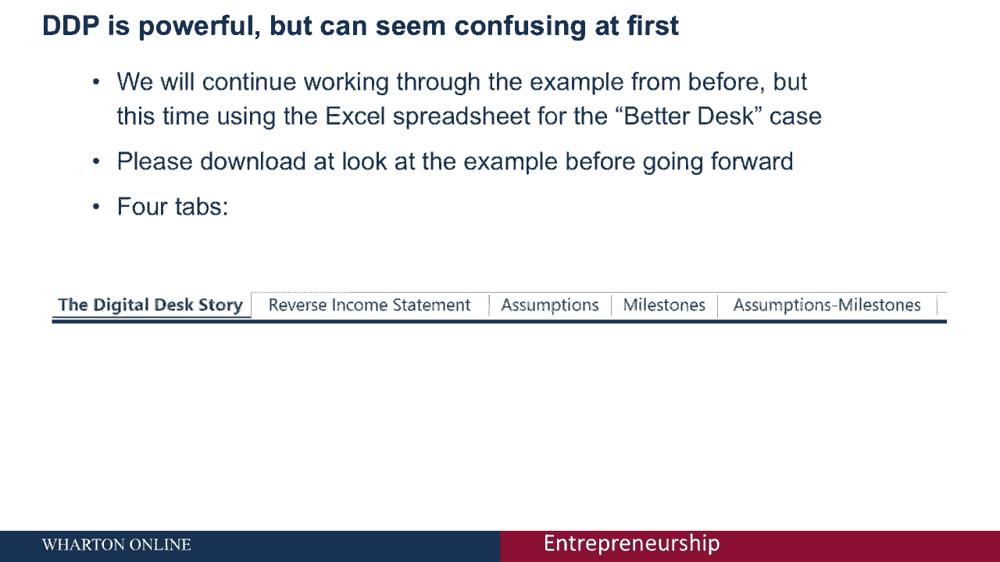
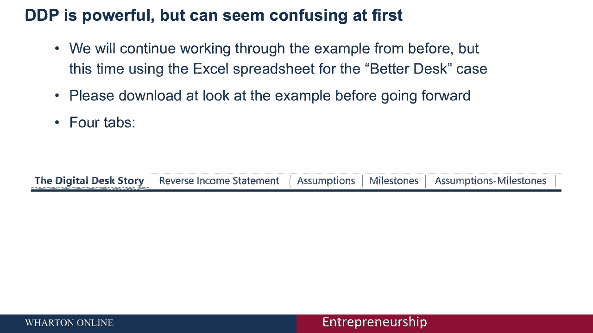
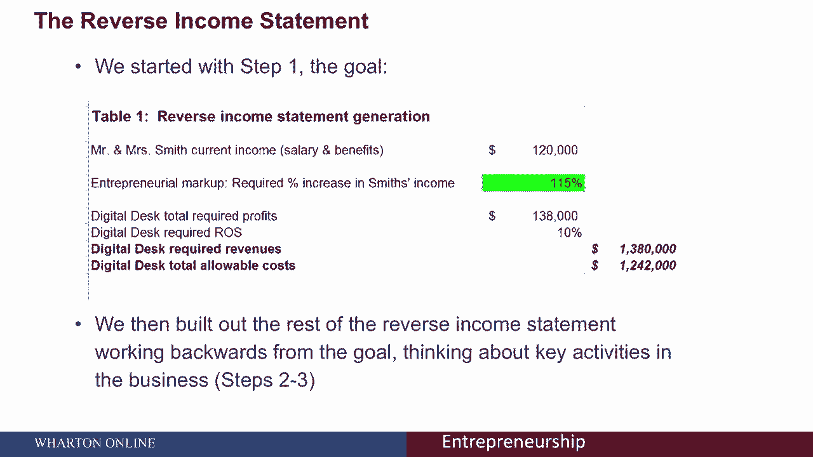
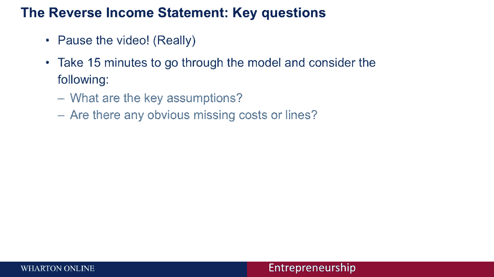
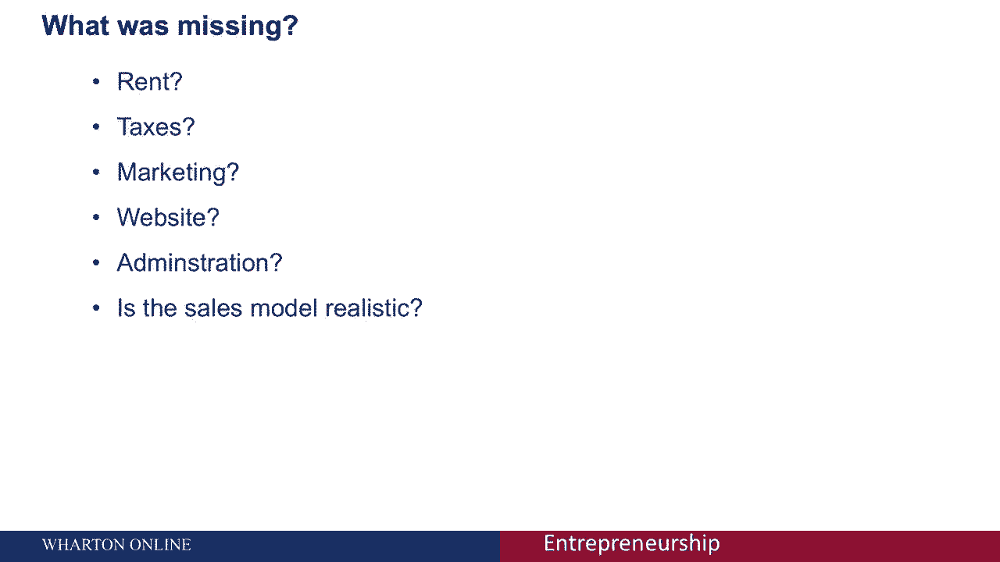
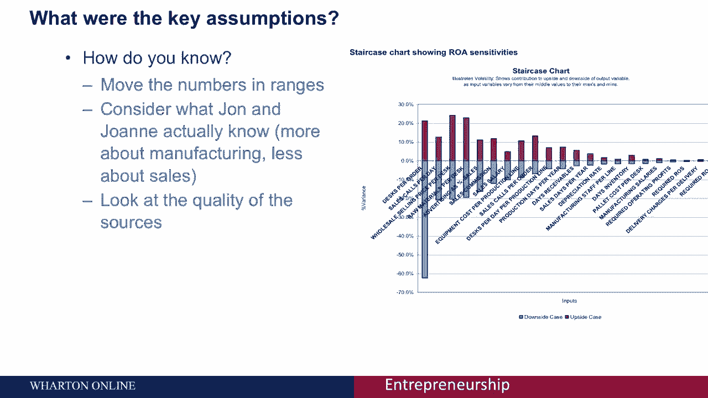
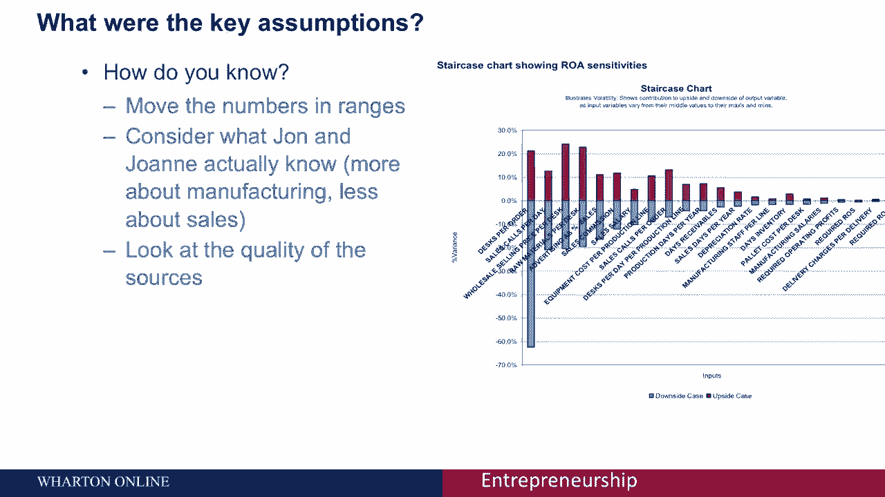
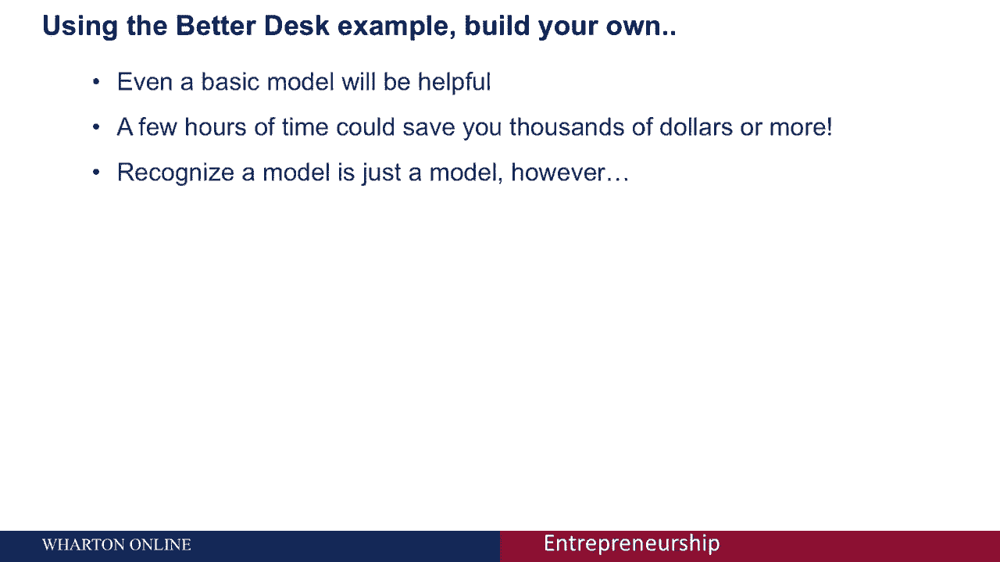

# 【沃顿商学院】创业四部曲：P24 - 发现驱动规划工作表实操指南 📊

在本节课中，我们将深入学习如何运用“发现驱动规划”工作表来构建你的创业财务模型。我们将通过一个名为“更好的办公桌”的案例，逐步解析反向损益表、识别关键假设，并将它们与业务里程碑关联起来。

上一节我们介绍了发现驱动规划的基本概念，本节中我们来看看如何具体应用工作表来分析和优化你的商业计划。

## 工作表结构与案例概述

课程提供了一个名为“更好的办公桌”的电子表格作为示例。该表格包含五个选项卡，结构如下：

*   **更好的办公桌故事**：概述了创业者约翰和乔安妮的创业背景与理念。
*   **反向损益表**：这是规划的核心部分，大部分分析工作在此进行。
*   **假设列表**：详细列出了业务所依赖的各项假设。
*   **里程碑列表**：列出了业务发展过程中的关键节点。
*   **假设里程碑图**：将关键假设与测试它们的里程碑结合起来。

## 第一步：分析反向损益表

发现驱动规划的第一步是从你的财务目标开始。在反向损益表中，史密斯夫妇（案例中的创业者）设定了目标：他们目前的年收入是12万美元，他们希望创业能带来15%的额外收入，即总利润达到13.8万美元。

公式表示为：`目标利润 = 现有收入 × (1 + 目标增长率)`

接下来的第二步和第三步，是从这个利润目标反向推导，思考并详细列出实现该目标所需的关键业务活动及其成本。

以下是分析工作表时你需要关注的核心问题：

*   **识别关键假设**：回顾上一节课的方法，找出模型中影响结果最大的不确定性因素。
*   **检查遗漏项**：仔细审视模型，思考是否有遗漏的成本或收入项目。

建议你暂停视频，花15分钟时间仔细研究这个模型。真正理解它的最佳方式就是动手操作和思考。

## 第二步：识别缺失项与关键假设

在分析“更好的办公桌”模型时，我们可能会发现一些常见的遗漏，例如：

*   没有考虑办公室或厂房的**租金**成本。
*   缺少**税收**支出的预算。
*   **营销费用**的设定可能不合理（通常需要预先投入以刺激销售，而非仅按销售额比例提取）。
*   未计入**网站建设与维护**费用。
*   缺少**一般行政管理费用**。
*   **销售模式**的构建逻辑可能需要进一步推敲。

这些遗漏在早期建模中非常普遍。通过仔细梳理模型，尤其是与他人一起讨论，能有效地帮你发现这些关键缺失。

## 第三步：进行敏感性分析

识别出关键假设后，下一步是评估它们的不确定性。一个有效的方法是进行**敏感性分析**。

具体操作是：思考每个假设数字可能的**最高值**和**最低值**，然后将这些极值代入模型，观察它们对最终利润目标的影响有多大。

例如：
*   **确定性高的假设**：约翰和乔安妮是木匠，他们对每张桌子的生产成本（假设为120美元）非常了解，其波动范围可能很小（例如115-125美元）。
*   **不确定性高的假设**：他们对销售环节知之甚少，因此“每日销售电话数量”的假设值可能在一个很大的范围内波动。

你可以单独测试每个假设的变动（简单灵敏度分析），也可以使用更高级的方法（如蒙特卡洛模拟）同时测试所有变量。通过这种分析，你可以生成一个“龙卷风图”，直观展示哪些假设对业务结果的影响最大。

## 第四步：关联假设与里程碑

在明确了关键假设后，我们需要将它们与业务里程碑关联起来。查看“假设里程碑图”，思考每个关键假设可以在哪个里程碑阶段被测试或验证。

例如，如果“每单销售额”是一个关键的不确定假设，但在里程碑列表中，直到业务后期才有环节测试它。这可能提示我们需要调整计划，**尽早测试关键假设**，比如通过发起众筹预售或寻找早期客户进行试销。

## 总结与核心要点

本节课中，我们一起学习了如何利用发现驱动规划工作表来构建和优化创业财务模型。

1.  **从目标出发**：规划始于清晰的财务目标。
2.  **反向推导**：从目标利润反向列出所有必要的业务活动和成本。
3.  **严格审视**：主动寻找模型中的遗漏成本和关键不确定性假设。
4.  **测试敏感性**：通过输入假设的极端值，评估业务模型的风险点。
5.  **关联验证**：确保关键假设有对应的、尽可能早的里程碑进行测试。

请记住，这个模型是一个强大的**工具**，而非不可更改的真理。它旨在帮助你明确假设、规划验证步骤，从而用最小的成本验证商业想法的可行性。花几个小时建立这样一个模型，可能为你节省数千美元的错误投资，并对业务的长期发展产生深远影响。

**最后提醒**：此模型主要分析业务的“稳定状态”，对于模拟销售增长动态可能有所不足。它代表了思考的起点，而非业务的完整蓝图。