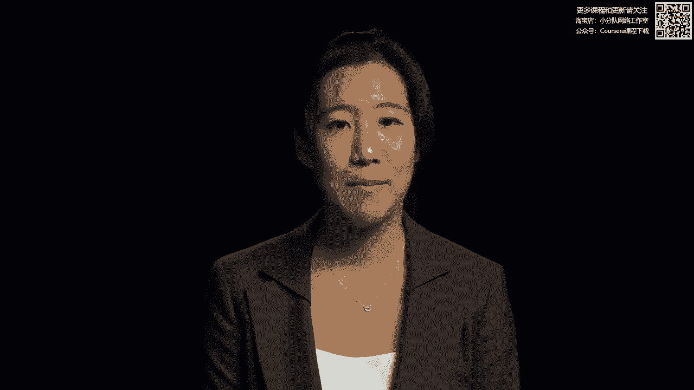
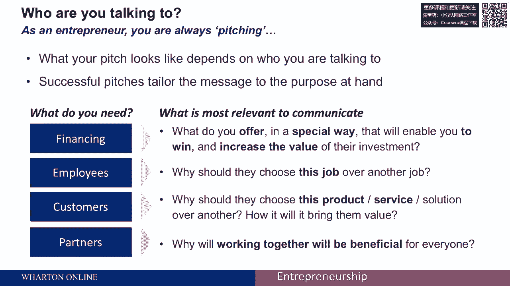
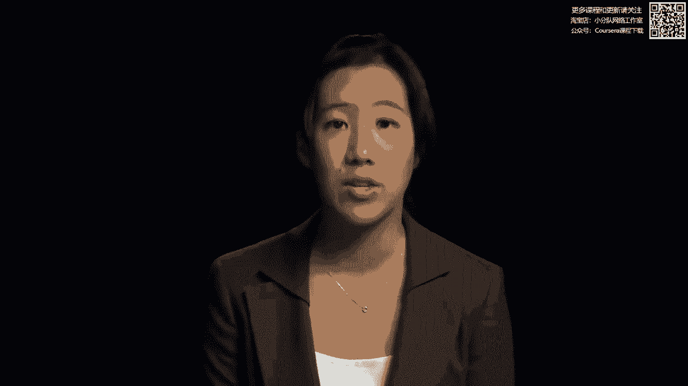
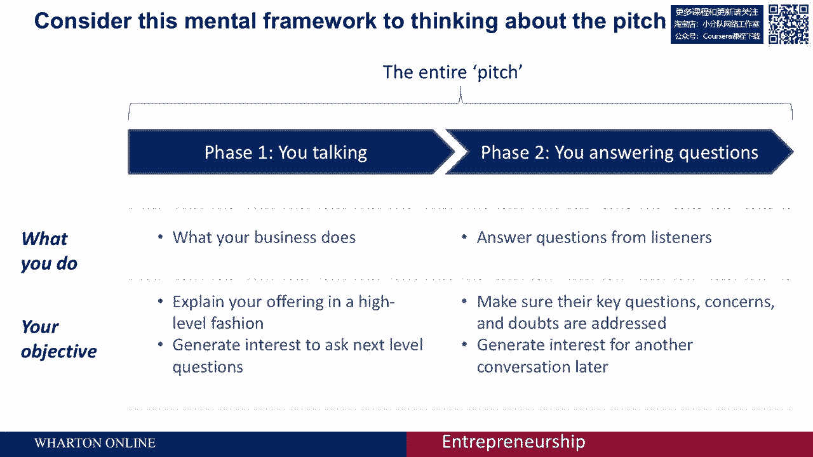
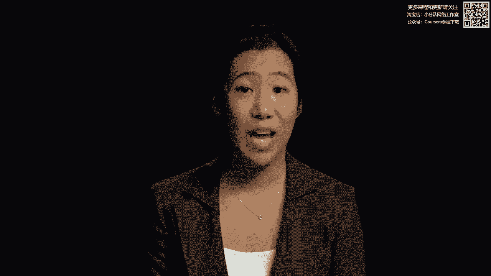
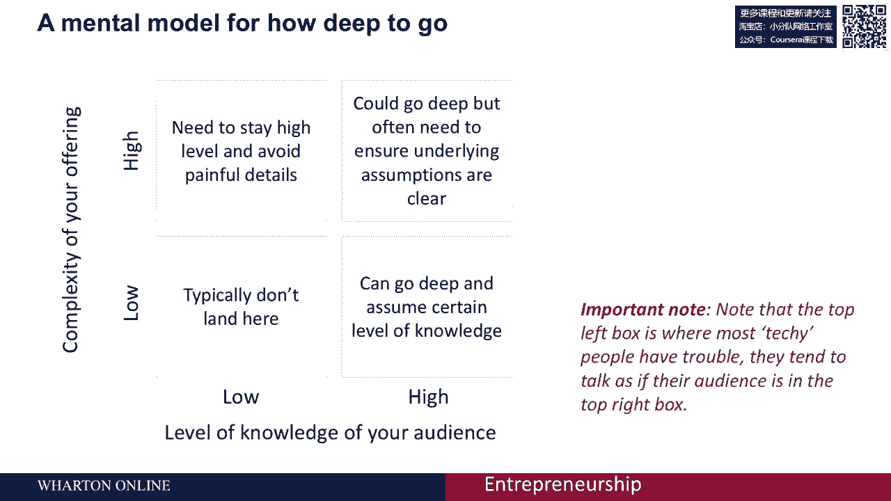
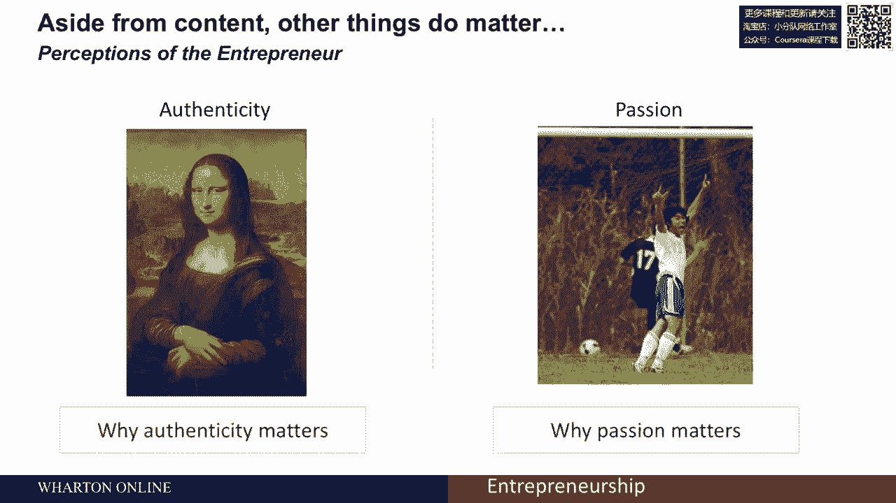
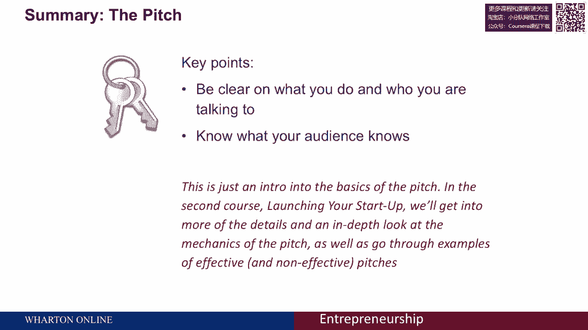
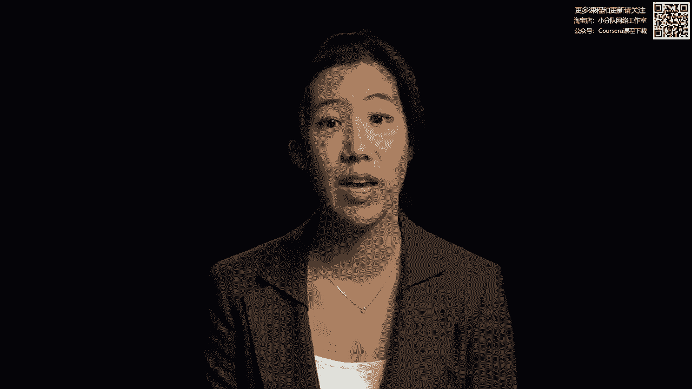

# 🎯 创业四部曲 P26：如何打造高效的电梯演讲

在本节课中，我们将学习如何构建一个有效的电梯演讲。电梯演讲是你商业理念的精华提炼，旨在短时间内清晰、有力地传达你的业务核心。我们将探讨其关键组成部分、如何根据听众调整内容，以及如何通过演讲建立信任并开启对话。

---

## 什么是电梯演讲？

传统上，电梯演讲是商业计划的总结，旨在将一份冗长的文件（例如150页的商业计划书）浓缩成一个简洁的版本。如今，电梯演讲已成为一项独立的业务展示。

一个完整的电梯演讲可能包含以下要素：
*   问题或痛点
*   你的解决方案
*   目标市场
*   竞争对手
*   团队介绍
*   财务摘要
*   未来里程碑

然而，一个常见的误解是必须包含所有内容。实际上，**演讲的结构和内容并非一成不变**。

---

## 演讲的核心：明确你的听众

上一节我们介绍了电梯演讲的基本概念，本节中我们来看看决定演讲内容的首要因素——你的听众。

作为一名创业者，你总是在进行推销。演讲的具体内容取决于你在和谁交谈。成功的演讲会根据目的定制信息。

你可以从当前需求的角度来思考：
*   **如果需要融资**：你需要思考你能提供什么、有何特别之处、以及如何为潜在投资人创造价值。
*   **如果与潜在员工沟通**：你需要解释他们为何应选择这份工作，以及他们如何能在此取得成功。
*   **如果面对潜在客户**：你需要说明他们为何应选择你的产品或服务，以及将如何为他们带来具体价值。
*   **如果面对潜在合作伙伴**：你需要交流为何合作对双方都有利。

关键在于，你的产品或服务对听众而言必须**重要且相关**。

---

## 演讲的深度：平衡信息与兴趣

在明确听众后，你需要决定演讲的详细程度。一种有效的思考方式是：**演讲的目的并非直接销售，而是引发兴趣并开启对话**。

演讲不是单向的信息灌输，而是传达你的愿景和定位，并开始双向交流。我们可以将其分为两个阶段：

**第一阶段：确立核心，引发兴趣**
在此阶段，你的目标是高水平地解释你的业务是做什么的，传达你的愿景。你**不需要深入技术细节**，重点是引起听众的兴趣，为下一阶段铺路。

**第二阶段：回答问题，建立信任**
在此阶段，你将回答听众更具体的问题。这是解决关键疑虑、增加你的可信度并在他们眼中建立合法性的机会。当你能够清晰解答疑问时，才能真正发光发热。

整个演讲的重点通常是**创造对话**，并建立一个可以讨论未来合作的立场。

---

## 调整细节：听众知识与产品复杂度

就详细程度而言，你可以从两个维度来考虑：**听众对你产品或服务的了解程度**，以及**你提供的产品或服务本身的复杂程度**。

以下是需要考虑的四种情况：
*   **产品复杂度高，听众知识水平低**：这是最具挑战性的情况。创业者常犯的错误是过于深入技术细节，导致听众因不理解而失去兴趣。这源于你对自己的产品过于熟悉，误以为听众也具备相同的知识背景。
*   **产品复杂度高，听众知识水平高**：可以探讨更深入的技术或专业细节。
*   **产品复杂度低，听众知识水平低**：需要用简单直白的语言解释核心价值。
*   **产品复杂度低，听众知识水平高**：沟通可能更高效，可以直接讨论应用或市场层面。

---

## 案例分析：Evernote的演讲

让我们通过一个例子来理解上述概念。以下是Evernote创始人Phil Libin的一段演讲：

> “嗨，我是Phil Libin，Evernote的首席执行官。Evernote是你的外置大脑。每当有重要的事情发生，你都可以把它放进Evernote，并随时取用。你可以将Evernote用于许多设备：我们有Windows和Mac版本，也可用于任何网页浏览器、手机或相机。你的记忆有形形色色，所以你可以用Evernote做很多事：例如给名片拍照，或拍下白板笔记、酒标，也可以给自己发送文字或语音备忘录。所有这些信息都会上传到Evernote服务器进行处理和索引，让你能够搜索图片中的文字、按位置搜索，并将信息同步回你的设备，让你随时随地都能找到所需。Evernote有两个订阅级别：免费订阅和高级订阅。高级订阅每月5美元，提供近乎无限的存储空间等多种增值服务。”

正如我们所见，创始人非常了解他的产品，并介绍了产品的许多特性和定价选项。然而，他主要专注于**产品本身**。如果他的听众对Evernote完全不熟悉，他可能会因为信息过多而失去一些潜在用户。在这种情况下，他可能需要**保持更高层面的概述**，先让听众理解核心概念。

---

## 企业家的个人呈现：真实性与激情

除了内容，你作为企业家的**个人呈现**同样重要。研究表明，**真实性和激情**等属性至关重要。

让我们看另一个例子，这是一位从事新型混凝土创业的企业家的演讲：

> “地球上使用最广泛的制造材料是混凝土。平均每人每年消耗超过3吨混凝土。不幸的是，混凝土制造过程造成了全球10%以上的二氧化碳排放。然而，我们开发出了一种比普通混凝土坚固五倍的混凝土。我们的设计是独一无二的，因为我们发现了如何改变混凝土的纳米结构。这种方法环保，同时能将混凝土制造成本降低40%。鉴于美国混凝土市场每年规模超过1000亿美元，这使得我们的产品对混凝土制造商极具吸引力。我们是一个由五名研究人员组成的团队，包括三位来自麻省理工学院的顶尖教授，以及我自己——我去年刚获得混凝土创新研究的博士学位。我们正在寻找两位更有激情的人来完成我们的团队。”

这位企业家风格独特。他展示了许多**真实性**：谈到了对混凝土的热情，以及自己在混凝土创新方面的博士学位。事实上，他确实在一场演讲比赛中获胜了，因为他给人留下了**非常真实和热情**的印象。

---

## 总结

本节课中，我们一起学习了构建高效电梯演讲的核心要点：

1.  **明确你的听众**：演讲内容需根据听众（投资人、客户、员工等）的不同而定制。
2.  **平衡信息深度**：演讲的目的是引发兴趣、开启对话，而非一次性销售。分为确立核心和回答问题两个阶段。
3.  **调整细节程度**：需综合考虑产品复杂度和听众知识水平，避免在听众不了解时过度深入技术细节。
4.  **展现真实与激情**：作为创始人，你的真实性和热情是建立信任和感染力的关键。

记住，清晰的电梯演讲是创业沟通的基石。在后续关于创业启动的课程中，我们将深入探讨演讲的更多技巧、结构力学，并通过更多有效和无效的演讲案例进行分析。