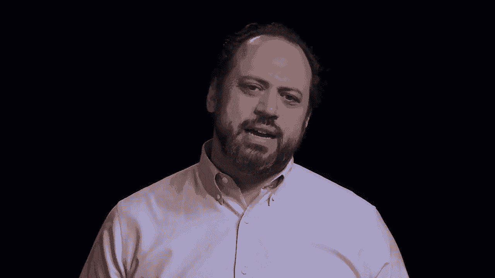
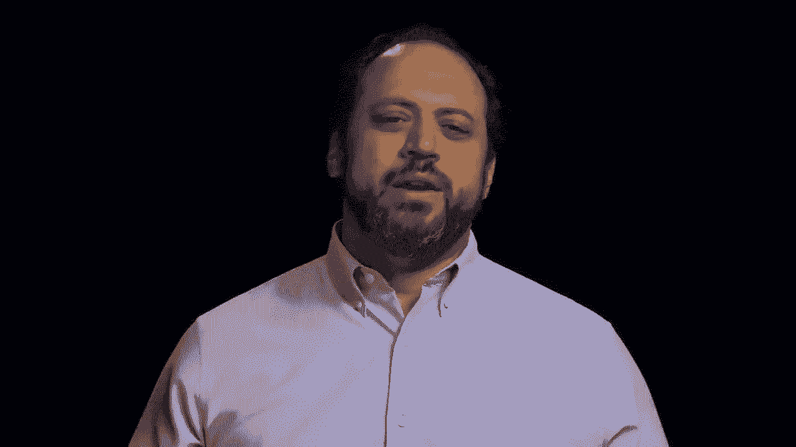
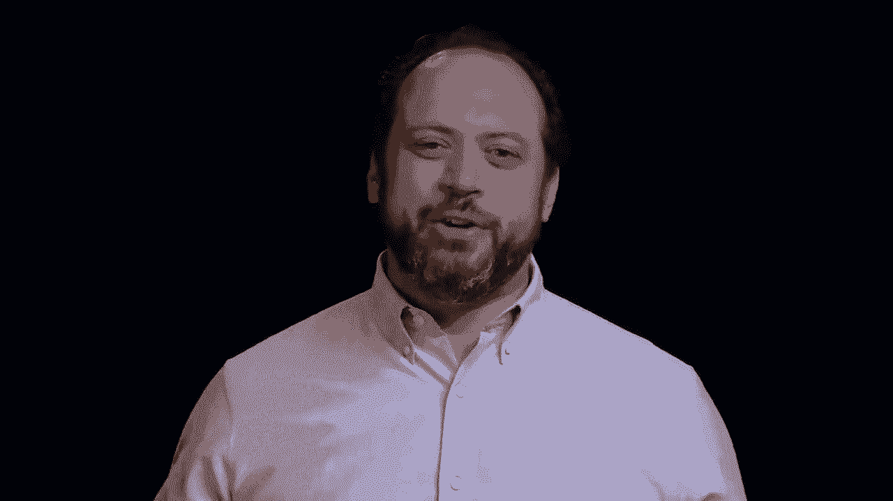
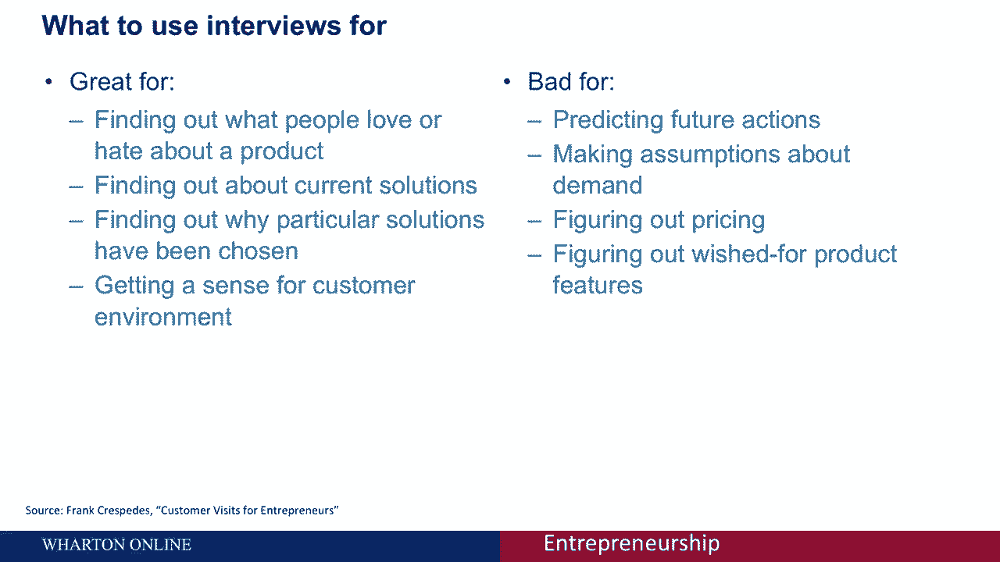
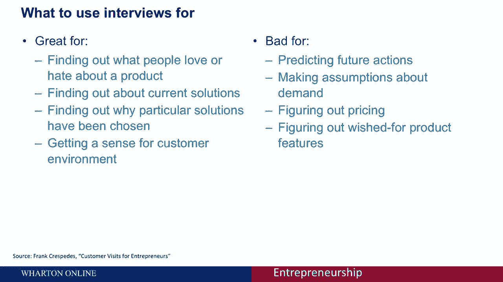
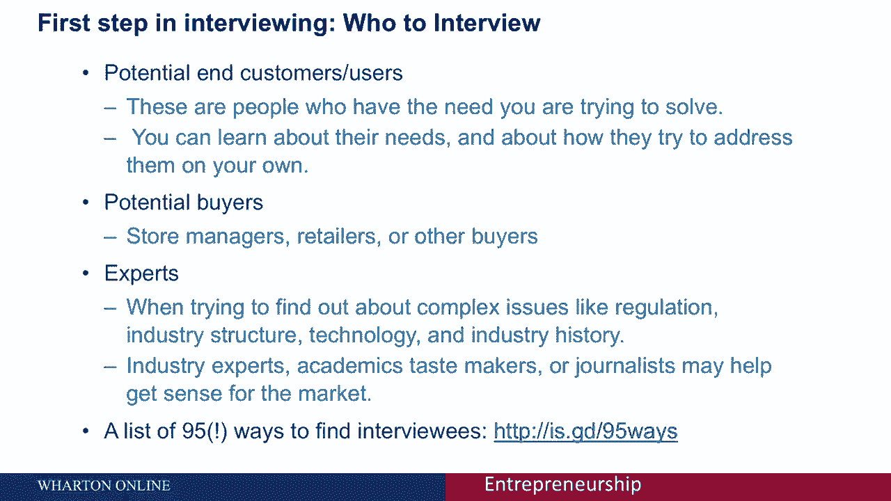

# 【沃顿商学院】创业 四部曲：发现机会、建立公司、增长战略、融资和盈利 - P27：[P27]02_4-2-testing-your-idea-customer-interviews - 知识旅行家 - BV19Y411q713

你将如何测试你建造原型的想法，思考你是如何让你的业务、产品或服务顺利进行的。

在你做这些之前。

你能做的最重要的事情之一就是参与客户面试，每个人在创业前至少要做三次面试，采访是非常强大的工具，即使对有经验的人来说。

一个例子是我合作过的一家初创公司，它有一个非常强大的。

全新的诊断，为了一种疾病，那是美国的大杀手。

当启动启动时，每个和他们交谈过的人都说。

好的很好，这是一个非常强大的工具，每个人都会想要，这是一个很好的诊断方法。

直到创业公司的创始人开始和医生交谈。

他们学到了很多关于这个行业的重要事情，他们了解到，虽然医生会下令进行测试。

实际上是医院，他们会订购机器，所以他们和医院谈过了。

原来医院只会订购机器，如果他们得到保险提供者的适当报销。

并与保险提供商交谈，他们找到了非常狭窄的方法来偿还这种特殊的产品。

所以说，所有这些信息的结果实际上导致了商业模式的彻底改变。

启动的，因为与其接近医生，这就是它之前在做的。

而不是创造一个更适合保险公司需求的工具，他们在报销。

所以这种面试在现在的许多情况下都是完全有启示性的。

你为什么要做至少三次采访，因为根据经验，当我的学生在第二次面试后告诉我时。

你觉得你已经听到了一切。

因为你在这两个面试者之间建立了联系和相似之处。

一旦你加上第三个，那么复杂性现在就变得很清楚了，就我个人而言，我认为你至少应该做五到八次面试。

但如果你不和顾客说话，在你推出之前的供应商和其他人群，你这是自找麻烦。

面试的有趣之处在于，他们不会做你经常希望他们做的事情，它们对你可能意想不到的事情有好处，它们对你可能认为它们有好处的事情有害，那么它们有什么坏处呢，它们有什么用呢，所以他们真正擅长做的是。

了解人们今天在做什么，他们喜欢什么或不喜欢什么，所以这对于发现人们喜欢或讨厌现有产品的什么是很好的，这样你就可以采访某人，如果他们用了这个产品，他们在去这家咖啡店之前用过这种医疗设备，他们买了这种书桌。

你可以知道他们喜欢桌子的什么，他们不喜欢它的什么，想想阅读亚马逊评论，这是获得产品信息的非常有用的方法，它也真的很有用，如果你正在创造一些全新的东西，了解人们今天是如何解决问题的。

所以创新的一个真理是需要是发明之母，如果你有需要，你会想办法解决的，所以外面有什么问题，如果人们能想出解决这个问题的方法，所以这可能是一系列不同的事情，他们可能是通过即兴创作来做到这一点的。

他们可能忽视了这个问题，他们可以调整和第三方解决方案为自己使用，但你可以在采访中发现很多关于解决方案的东西，他们目前不得不解决这个问题。

以及为什么他们选择了那个特定的解决方案而不是其他选项。

并了解客户环境及其运作方式，所以这对弄清楚我们的客户今天在做什么真的很好。

他们为什么要做出那些选择，他们喜欢和不喜欢这些选择的什么。

他们没有什么好处，面试官经常犯的一个错误是预测未来的行动。

你不能要求某人决定他们将来要做什么，并期望这个答案是有用的，所以你不能告诉他们，例如井，如果我们的产品上市，它就像我们说的那样便宜，竞争对手什么也不做，你的需求保持不变，您的组织仍有预算。

你会买我们的产品吗？这不是一个有用的问题，你不会得到好的答案，面试也不会给你关于需求的假设，你不知道有人会买你的产品多少次，根据和几个人的谈话，你搞不清楚价格，所以希望面试能给他们价格的人。

您可以通过询问人们在当前解决方案上的花费来获得一些定价信息，但当你在客户面试中开始谈论价格的那一刻。

就变成了谈判，你有麻烦了，因为你说一万美元。

他们不想当傻瓜，他们会说五千美元，现在你在谈判而不是讨论。

所以定价通常很难在面试中弄清楚，你不知道产品特性是什么，如果你问人们有什么功能，你的产品应该有，他们应该提到。

他们可能会提到，好的，我想让它飞起来，我想让它好吃，它需要是免费的。

它需要给我超能力，对呀，因为他们不知道，涉及哪些费用，他们会有一系列的要求，这些要求可能与。

他们购买的条件，所以面试真的真的很好，如果你想知道今天人们有什么需求。

他们是如何解决这个问题并从中获得灵感的，这需要他们付出什么代价。

他们让他们预测你产品的未来是非常糟糕的，或者告诉您如何设计解决方案。

所以面试有几个步骤，不出所料的第一步，是给你采访谁的，你真的有三桶人需要考虑面试，首先是你的潜在客户或用户，对了，这些人的需求你正在努力解决，请注意，用户并不总是客户，我之前给你们举的关于医生的例子。

医生们用这种医学诊断，但他们不是顾客，他们不买账，那是医院和保险公司，但从这个群体中，你可以了解他们的需求，你可以了解他们今天是如何称呼他们的，第二类是潜在买家，对呀，所以顾客可能会买你的毛衣。

但是店长，零售商和时尚买家是购买它的人，把它放进梅西百货，或者任何商店出售，所以你也想采访买家，因为他们实际上是在非常复杂的市场上花钱的人，你可能想考虑作为专家的第三组，所以如果有行业结构调整的问题。

如果有一个奇怪的谜题试图理解为什么一个市场看起来，它的方式，现在是与行业专家交谈的好时机，这样就可以成为认证的专家，可以是学术，它可以成为品味大师，所以你知道谁是时尚的，谁是引领潮流的，甚至记者。

它们可能都能帮助你了解市场，它将在这里包括一个链接，这是我写的，但另一个人列出了95种寻找受访者的方法，我们会把名单给你。

这样你就可以通读了，有些会比其他的更适合你，但你基本上从你的网络开始。

你就是这样出去的，你最终找到了你需要采访的人，面试的第二步是问好问题，你需要做的一件事是计划好你要问的问题，所以你想用这种方式问你面试的每个人类似的问题，你可以比较不同人的答案，非常重要的是。

你不要从你的解决方案开始，但你从询问人们的情况开始，先让他们放松，帮助他们理解内容，帮助您了解他们在其中运作的背景，所以问一些关于他们和他们的情况的问题。

重要的是，你需要倾听和安静，你不是在卖，你在听。

不要说太多，并提出开放式的后续问题，鼓励人们接下来发生了什么。

然后你现在做了什么鼓励他们讲述自己的故事，你在那里向他们学习。

不要告诉他们事情，所以当你问问题的时候，你现在已经建立了局面，你问他们关于他们自己的情况，问他们关于上下文的情况，那么我建议你问问这个问题，所以你可以问各种各样的开放式问题，没有一个比另一个更神奇。

让我们看看什么对你有效，但你可以问的一个问题是，与之相关的最大问题是什么，不管你向我们提出什么问题，或者告诉我你上次遇到这个问题是什么时候，或者如果我给你一根魔杖，可以使部分问题消失。

你会让哪一部分消失，对呀，所以你试图获得关于这个问题的信息，你希望解决需要，顾客有，第二件事是，你想添加第二组关于问他们的问题，他们是如何解决问题的，或者现在抓他们的需要，对呀，所以你没有毛衣。

和我们的毛衣一样暖和便宜，你今天是怎么帮你解决毛衣的问题的，如果你，你错过了一种为你的学生贷款再融资的方法。

你目前如何处理学生贷款融资，或者例如，当你的手机在商店里没电时，我们会给你提前充电。

你今天做什么？这样你就可以问人们他们现在是如何处理一个问题的。

他们喜欢他们目前的解决方案的什么，它有什么问题。

他们如何找到解决方案，他们尝试了其他方法，所以我们问他们是如何解决这个问题的。

只有在你发现了这个问题并发现了他们目前的解决方案之后。

你会问你自己的解决方案并谈论它吗，通常最好只是介绍这个想法。

然后让被采访者提问你想避免推销。

你的目标不是看你是否能说服他们喜欢它，你的目标是让他们看到你的产品，解决方案或服务是。

看看他们是否明白，是否符合他们的需要，让他们问问题。

这是向前发展的最好方法，最后你要根据你的面试得出结论，所以不管你的记忆力有多好，你需要在面试后立即写下你的结果，所以不要在面试的时候写信，等到之后，写下你能从面试中记住的所有事情，在所有的面试结束之前。

不要开始下结论或改变你的问题，你需要把整个画面放在一起，一旦完成，然后你开始在受访者和采访中寻找模式。

那么我们看到了什么，那很常见，有什么不同，怎么解释。

你把所有的数据放在一起得出结论，这就是你如何在早期获得有用的、强大的反馈。

没有任何关于你的产品或服务的实际成本。

如果你不这么做，我保证你会做出错误的假设，所以你需要考虑做这些采访。

