# 【沃顿商学院】创业四部曲 P27：如何通过客户访谈验证你的想法 📝

在本节课中，我们将学习如何通过客户访谈来测试和验证你的创业想法。这是构建原型和启动业务前至关重要的一步，能帮助你避免重大错误，并深刻理解市场需求。

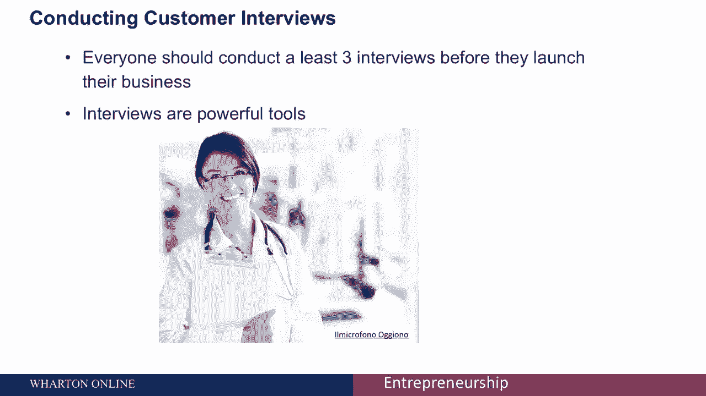

## 客户访谈的重要性 💡

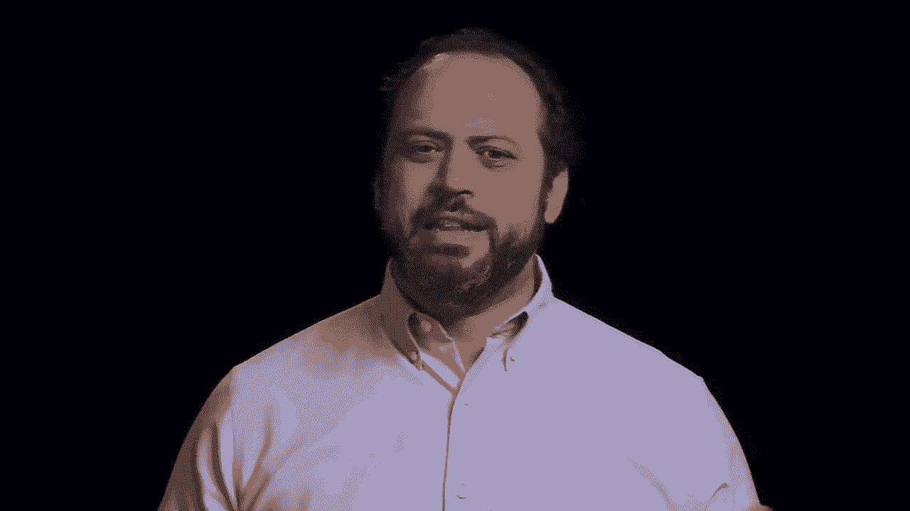

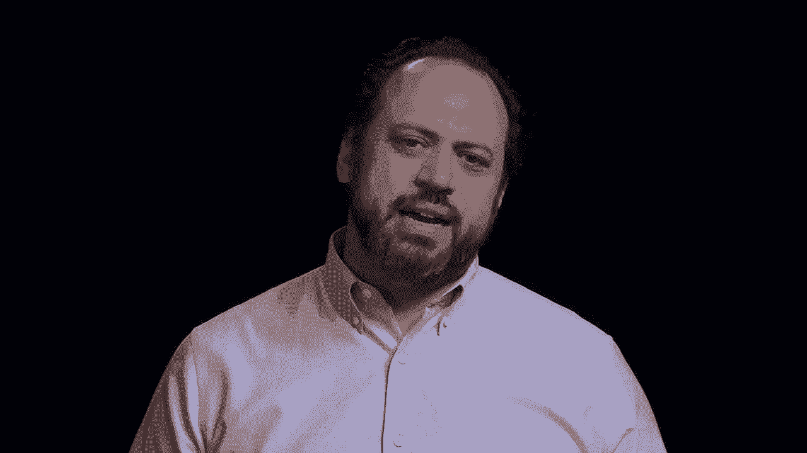

在着手构建原型或启动业务之前，你能做的最重要的事情之一就是进行客户访谈。每位创业者在开始前至少应进行三次访谈。访谈是非常强大的工具，即使对于经验丰富的人也是如此。

一个例子是我合作过的一家初创公司。他们开发了一种针对美国主要致命疾病的、非常强大的全新诊断方法。在启动初期，每个与他们交谈过的人都说：“很好，这是一个非常强大的工具，每个人都会想要，这是一个很好的诊断方法。”

然而，直到创始人们开始与医生交谈，他们才了解到许多关于行业的重要信息。他们了解到，虽然医生会下令进行测试，但实际上是医院会购买机器。于是他们又与医院交谈。结果发现，医院只有在获得保险提供商的适当报销后，才会订购机器。接着，他们与保险提供商交谈，发现这种特定产品的报销方式非常有限。

所有这些信息最终导致了商业模式的彻底改变。这家初创公司不再直接面向医生（这是他们之前的做法），而是转而创造一个更符合保险公司报销需求的工具。这种访谈在许多情况下都具有启示性。

## 为何至少进行三次访谈？🔍

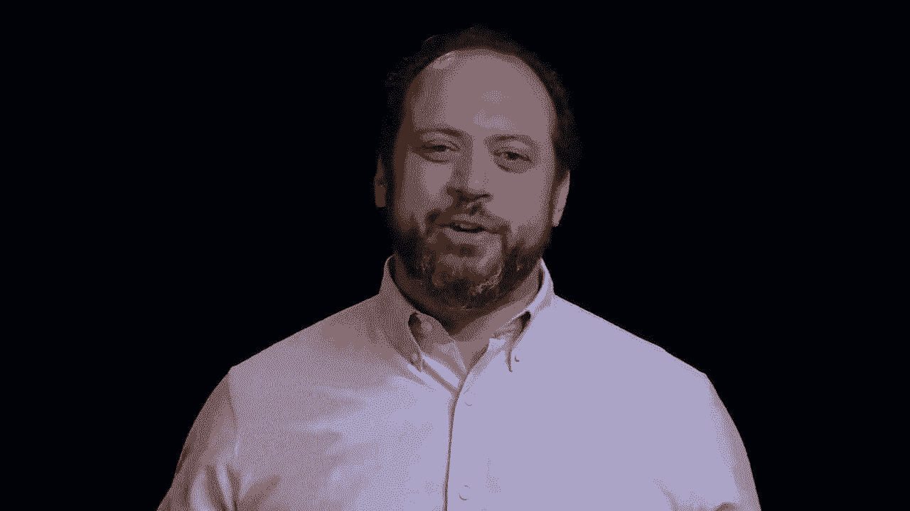

你为什么要做至少三次采访？根据经验，当我的学生在进行两次访谈后告诉我，他们觉得已经了解了一切，因为他们在这两位受访者之间建立了联系和相似之处。但一旦你加入第三个访谈对象，问题的复杂性就会变得清晰起来。就我个人而言，我认为你至少应该进行五到八次访谈。

如果你在推出产品前不与顾客、供应商等相关人群交谈，你就是在自找麻烦。

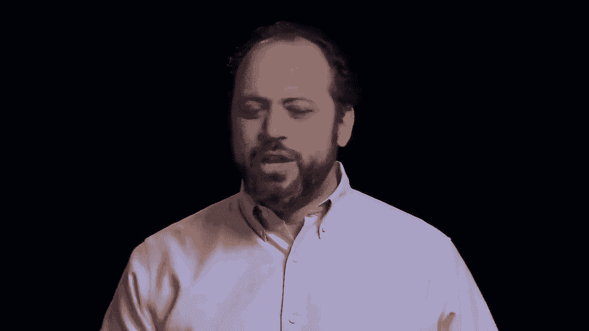

## 访谈的擅长与不擅长之处 ⚖️

访谈的有趣之处在于，它们不会做你经常希望它们做的事情。它们对你可能意想不到的事情有好处，而对你认为它们有好处的事情可能有害。

**那么，访谈擅长做什么呢？**

它们真正擅长的是：
*   **了解人们今天在做什么，以及他们喜欢或不喜欢什么。** 这对于发现人们对现有产品的喜好或厌恶非常有用。你可以采访使用过某产品（如医疗设备、咖啡店、书桌）的人，了解他们喜欢什么，不喜欢什么。想想阅读亚马逊评论，这是获取产品信息的非常有用的方法。
*   **了解人们今天如何解决问题。** 如果你正在创造一些全新的东西，这真的很有用。创新的一个真理是：需要是发明之母。如果人们有需求，他们会想办法解决。外面有什么问题？人们如何想出解决这个问题的方法？他们可能通过即兴创作、忽视问题或调整第三方解决方案来做到这一点。你可以在访谈中发现很多关于他们目前被迫采用的解决方案的信息。
*   **了解他们为何选择特定解决方案而非其他选项。** 这有助于你理解客户环境及其运作方式。

**访谈不擅长做什么呢？**

访谈官常犯的一个错误是试图预测未来的行动。你不能要求某人决定他们将来要做什么，并期望这个答案是有用的。例如，你不能问：“如果我们的产品上市，价格如我们所说般便宜，竞争对手无所作为，你的需求不变，你的组织仍有预算，你会买我们的产品吗？”这不是一个有用的问题，你不会得到好的答案。

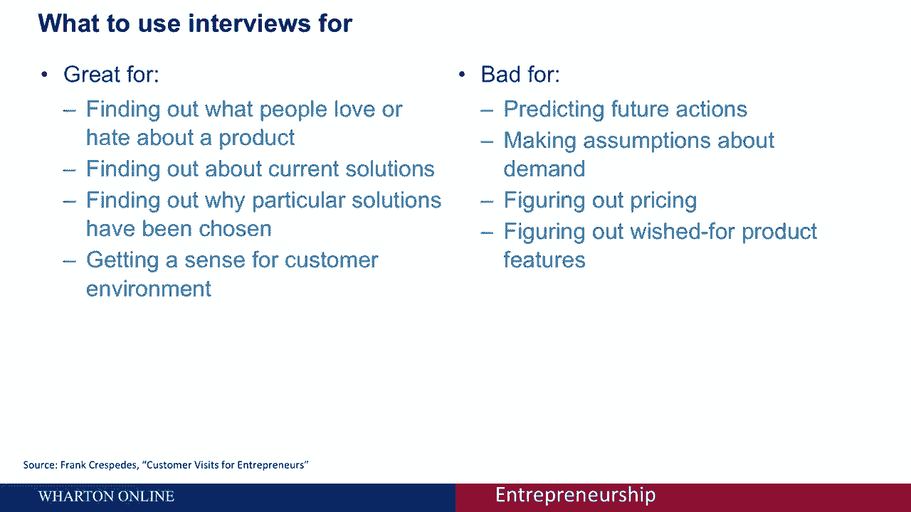

访谈也不会给你关于需求的假设。你无法仅凭与几个人的谈话就知道会有多少人购买你的产品。你也很难通过访谈搞清楚定价。当你开始谈论价格的那一刻，访谈就变成了谈判。例如，你说一万美元，他们不想当傻瓜，会说五千美元，现在你们是在谈判而不是讨论。因此，定价通常很难在访谈中弄清楚。

你也不知道产品应该具有什么特性。如果你问人们你的产品应该有什么功能，他们可能会说：“我想让它飞起来，我想让它好吃，它需要是免费的，它需要给我超能力。”因为他们不知道涉及哪些成本，他们会提出一系列可能与实际购买条件无关的要求。

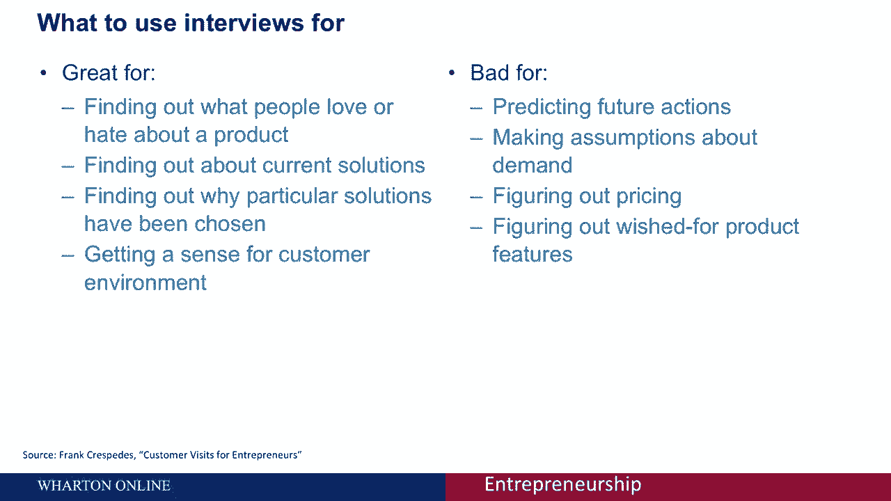

**总结来说：** 访谈真的非常擅长帮助你了解人们今天有什么需求、他们如何解决问题以及他们为此付出了什么代价。但它非常不擅长让人们预测你产品的未来，或者告诉你如何设计解决方案。

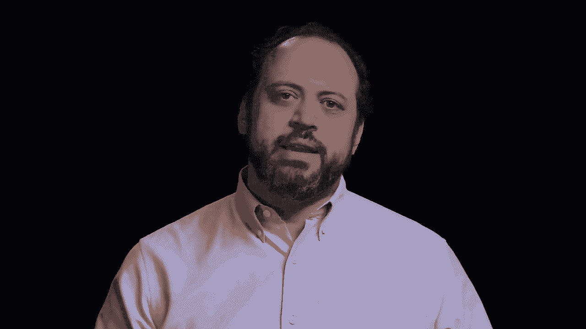

## 进行客户访谈的步骤 🚶‍♂️

访谈有几个步骤。

### 第一步：确定访谈对象 👥

不出所料，第一步是确定你要采访谁。你真正需要考虑三类人群进行访谈：
1.  **潜在客户或用户**：这些是你正努力解决其需求的人。请注意，用户并不总是客户。我之前举的关于医生的例子中，医生使用诊断方法，但他们不是顾客，不购买产品，购买者是医院和保险公司。从这个群体中，你可以了解他们的需求以及他们今天如何称呼这些需求。
2.  **潜在买家**：顾客可能会购买你的毛衣，但商店经理、零售商和时尚买手才是真正花钱将其放入梅西百货或其他商店销售的人。因此，你也需要采访买家，因为他们是在复杂市场中实际花钱的人。
3.  **行业专家**：如果存在行业结构调整问题，或者有一个奇怪的谜题试图理解市场为何呈现当前面貌，现在是与行业专家交谈的好时机。这可以是认证专家、学者、品味大师，甚至是记者。他们都能帮助你了解市场。

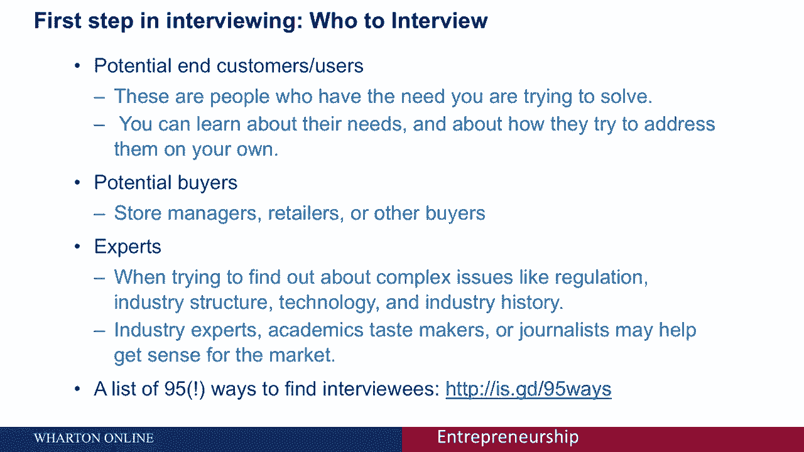

这里将包含一个链接（注：原视频中提及），列出了95种寻找受访者的方法。你可以通读一遍，有些方法会比其他的更适合你。你基本上从你的人脉网络开始，逐步找到你需要采访的人。

### 第二步：提出好问题 ❓

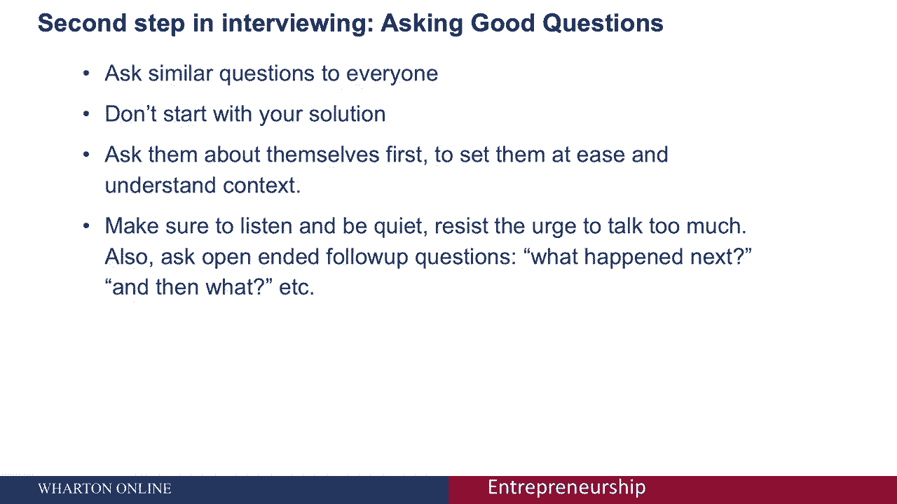

你需要做的一件事是计划好你要问的问题。你应该以类似的方式询问每个访谈对象，以便比较不同人的答案。**非常重要的一点是：不要从你的解决方案开始，而是从询问人们的现状开始。**

首先让他们放松，帮助他们理解背景，帮助你了解他们所处的环境。询问一些关于他们自身及其情况的问题。重要的是，你需要倾听并保持安静。你不是在推销，而是在倾听。不要说得太多，并提出开放式的后续问题，鼓励人们讲述接下来发生了什么、他们现在做了什么，鼓励他们讲述自己的故事。你在那里是为了向他们学习，而不是告诉他们事情。

当你提问时，你已经建立了情境，询问了关于他们自身和背景的情况。然后我建议你询问关于“问题”本身的问题。你可以问各种开放式问题，没有一个比另一个更神奇，看看什么对你有效。例如：
*   “与你提到的（问题）相关的最大困难是什么？”
*   “告诉我你上次遇到这个问题是什么时候？”
*   “如果我给你一根魔杖，可以让部分问题消失，你会让哪一部分消失？”

你试图获取关于你希望解决的、客户拥有的“需求”的信息。

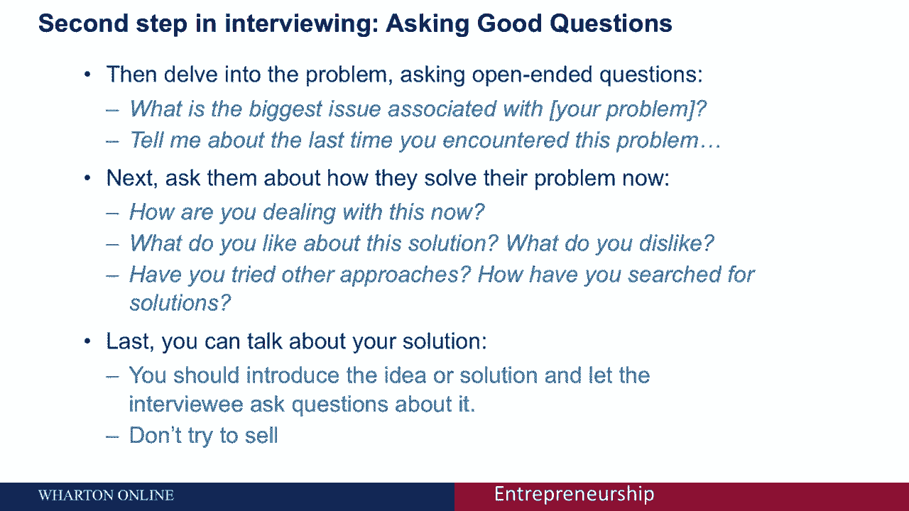

第二件事是，你想添加第二组问题，询问他们**如何解决当前的需求或问题**。例如：“如果你没有像我们毛衣那样暖和便宜的产品，你今天如何解决保暖问题？”或者“如果你错过了一种为学生贷款再融资的方法，你目前如何处理学生贷款融资？”或者“当你的手机在商店没电时（假设我们提供提前充电服务），你今天会做什么？”这样你就可以了解人们现在如何处理一个问题、他们喜欢当前解决方案的哪些方面、它有什么问题、他们如何找到这个解决方案，以及他们是否尝试过其他方法。

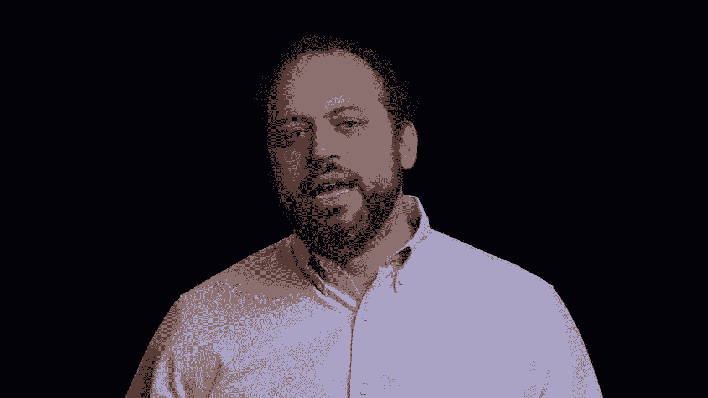

**只有在你发现了这个问题并了解了他们当前的解决方案之后，你才会提及你自己的解决方案并讨论它。** 通常最好只是介绍这个想法，然后让被采访者提问。你想避免推销。你的目标不是看你是否能说服他们喜欢它，你的目标是让他们看到你的产品、解决方案或服务，看看他们是否理解，是否符合他们的需求，并让他们提出问题。这是向前发展的最好方法。

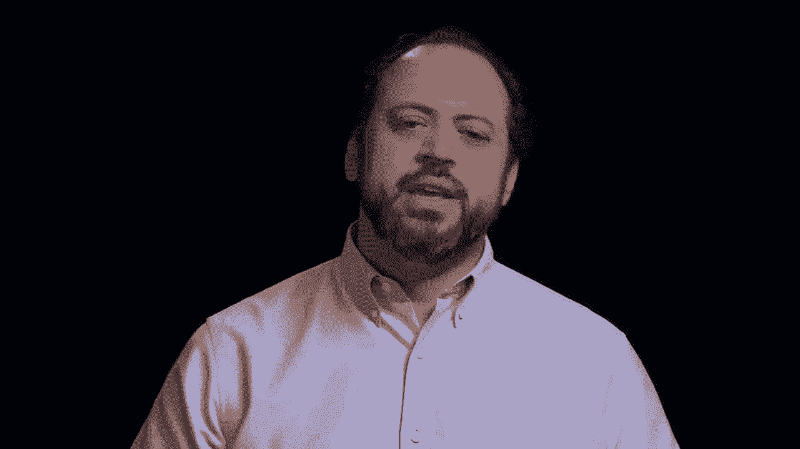

### 第三步：总结访谈结论 📋

最后，你要根据你的访谈得出结论。无论你的记忆力有多好，你都需要在访谈后立即写下结果。不要在访谈时做笔记，等到之后。写下你能记住的所有事情。在所有访谈结束之前，不要开始下结论或改变你的问题。你需要把整个画面放在一起。

一旦完成，然后你开始在受访者和访谈中寻找模式。我们看到了什么共同点？有什么不同？如何解释？你把所有的数据放在一起得出结论。这就是你如何在早期获得有用的、强大的反馈，而无需实际构建产品或服务产生任何成本。

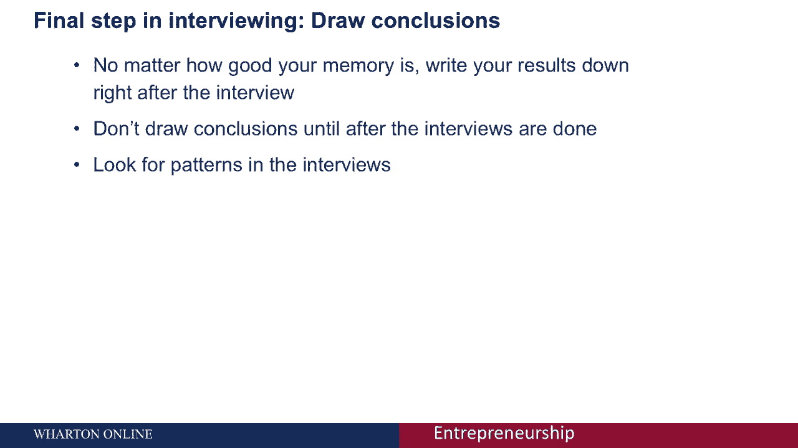

如果你不这么做，我保证你会做出错误的假设。因此，你需要认真考虑进行这些访谈。

---

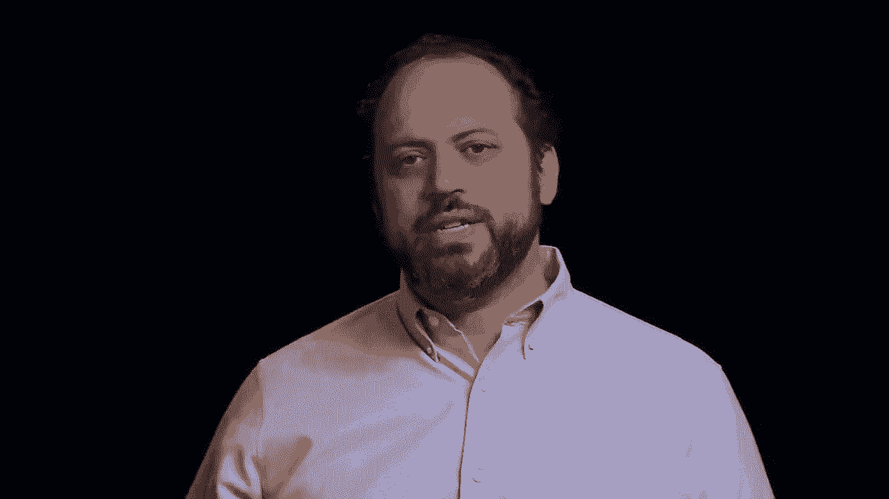

**本节课总结：** 我们一起学习了客户访谈在验证创业想法中的核心作用。我们明确了访谈擅长了解现状与问题，但不擅长预测未来和定价。我们详细拆解了进行有效访谈的三个步骤：确定访谈对象（客户、买家、专家）、精心设计并顺序提问（先问背景与问题，再问现有解决方案，最后才介绍自己的想法），以及在访谈后及时记录并分析模式以得出结论。这是低成本获取关键市场洞察、避免错误假设的必备技能。