# 【沃顿商学院】创业 四部曲：发现机会、建立公司、增长战略、融资和盈利 - P28：[P28]03_4-3-testing-your-idea-surveys - 知识旅行家 - BV19Y411q713

所以我们讨论了如何使用客户面试，这是一种相对便宜的方式来获得关于你的想法的信息。

我们今天要谈谈调查，这是获得关于。

你的产品，服务器或冒险的想法是任何好的，在你真正花很多钱推出它之前。

调查很有趣，他们应该总是在面试后做，对呀，这是因为你会学到更多关于该问什么问题的知识。

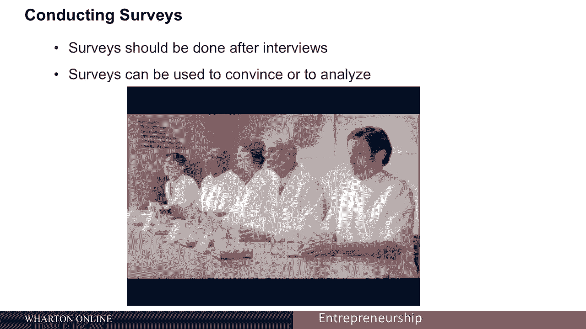

它们可以非常强大，我做了很多调查工作，我调查了成千上万的人，我还是总是把事情搞错。

所以做对这件事很难，做不好很容易。

嗯，你可以认为调查有两个目的，一个比另一个好。

一种方法是你可以从著名的，五分之四的牙医同意商业，他们应该嚼一种特定品牌的口香糖，使用调查的一种方法是说服人们，事情是个好主意，我们调查的五分之四的人说这是一个很棒的产品。

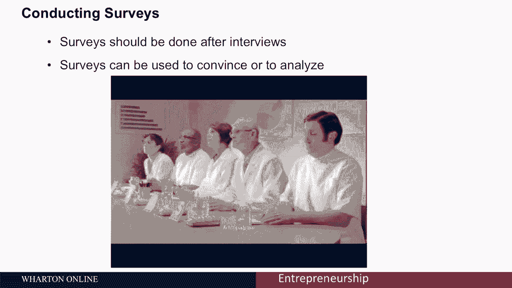

90%的人说他们会用它，这是你在推销中使用的东西，风险资本家或其他客户。

这是一种营销，我对你如何使用调查更感兴趣。

了解你自己的假设，分析自己的业务，带来更成功的结果。

我将给你一些思考调查的建议，这又是一个复杂的话题，但希望这对企业家来说是一个有用的介绍。

所以你要做的第一件事就是找到一个样本，我想这是我在我的，到目前为止在我的讲座中，你不必担心太多，这就是计算样本量的方法，这不是我做的事情，你需要非常担心，但你需要知道的是，你调查的人越多。

你对某一特定数字的真实值是否正确的估计就越好，你以前在总统选举中见过这种情况，你调查的人越多，置信区间越低越短，你对一个数字越确定，所以如果你随机调查一百个人，你有一个正负10%的置信区间。

这意味着如果50%的人喜欢你的产品，这个真实的数字可能在50%到60%之间，如果你调查267个人，这个间隔变成正负6%，所以从四十四到五十，6%是一个可能的范围，如果50%是你在调查中得到的数字。

如果你调查三百八十，84个人变成正负5%，以此类推。

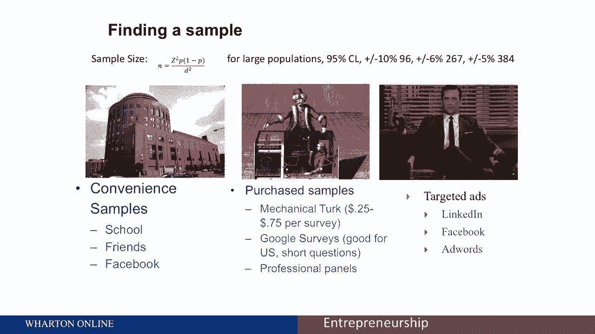

好吧，这里的教训是，我认为最重要的是调查一百个人。

或者你不是真的得到数字，对你有用的东西。

你从哪里得到你正在调查的人，真的有三套选择，我们所说的第一个方便样本，所以这是最常见的测量，在方便的示例中通常是最不有用的，你在调查你周围已经认识的人，通过Facebook交友，通过学校。

通过推特民意调查并试图得到答案，这个的问题，当然很少是你的那群朋友，客户的最佳代表，最好的反例，我知道是我班上一个成功的创业公司，称为共同债券，已经筹集了超过1亿美元，他们所做的是为学生贷款再融资。

尤其是顶级商学院的学生贷款，所以他们调查了沃顿商学院的朋友，这实际上是一个有用的方便样本，因为那是他们的最终客户，但在大多数情况下，你的顾客和你的朋友不是一回事，所以方便样品需要谨慎使用。

你可以做的第二个选择是购买样品，这意味着基本上从一群更随机的人那里购买答案，更有代表性的，有两种很好的方法可以做到这一点，其中之一是亚马逊的机械土耳其。

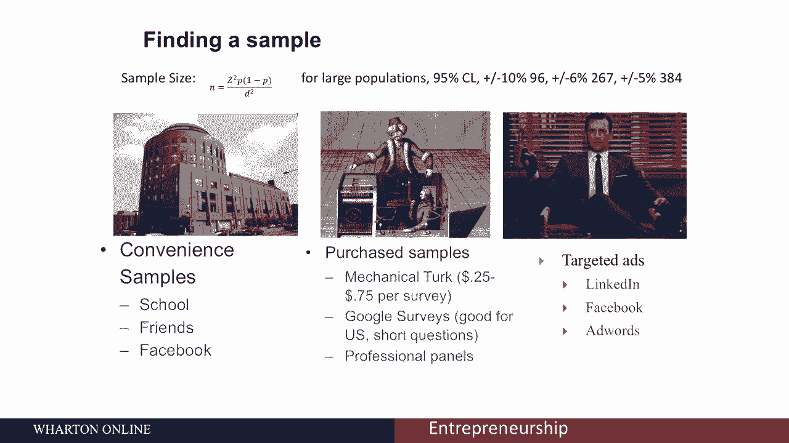

机械土耳其是一项服务，有成千上万的人为它工作。

他们在家工作，只挣很少的钱，他们在亚马逊上在线完成短期任务。

所以机械功被用于很多不同的事情，如果你做了一些电脑几乎不可能做的事情。

可能是因为它不是由计算机完成的。

它是由机械扭矩完成的，所以如果你拍一盘食物的照片。

你得到了卡路里计数，在大多数情况下，那张照片正被发送到土耳其机械公司。

美国或世界各地的某人，计算出卡路里数并把它发回给你。

所以对于需要人类完成的非常复杂的任务，你可以做机械特克来完成这些任务对机械特克来说很容易。

你可以期待为非常非常短的调查付费。

二十五美分，对于更复杂的调查，每次调查75美分。

你会花更多的钱把这当成最低工资，保险费，但你可以很容易地付钱让一群人做调查。

在机械土耳其人身上，得到一个更有代表性的样本。

谷歌也有一个相对便宜的调查工具，你可以用你的Gmail账户获得一些免费的学分。

所以做起来很有用，他们通常让你问一个问题。

但你可以选择一个非常狭窄的群体来回答这个问题。

所以谷歌很了解你，所以如果你想选择一个特定的收入水平，特定区域。

谷歌可以询问该地区的人，所以再一次，这样你可以得到一个很好的样品，如果你想花一大笔钱。

但你需要一个非常狭窄的区域的答案，比如印度科技公司的首席技术官，或者购买对网络安全感兴趣的人，谁是买家，有许多组织会让你雇佣专业的小组，你可以搜索如何找到一个专业的小组。

你会付给每个参与其中的人50美元或100美元，加上一些费用，让你想一起调查的人的小组，所以这些都是获得购买样品的方法，你也可以用广告来获取样品，所以你可以在LinkedIn Facebook上发布广告。

或者使用谷歌AdWords，所有这些都相对便宜，实际上为一项调查做广告，你可以用奖品来做广告，让人们从那里来，所以这些都是获取样本的方法，可以在样本中很容易而且免费，但不一定有代表性的购买样品要好得多。

代表性样本，但对你来说可能太宽泛了，如果你对狭窄的区域感兴趣，目标广告可能会很好。

但很难获得足够的兴趣，你得在广告方面花钱，关于如何进行测量的一些简短提示。

第一个是关于问题类型的，所以人口问题，关于种族或教育背景的问题，你可能想把这些放在调查的早期，尤其是如果它们不是特别冒犯人的问题，你可能想这么做，因为这些人口问题通常会让人们放心。

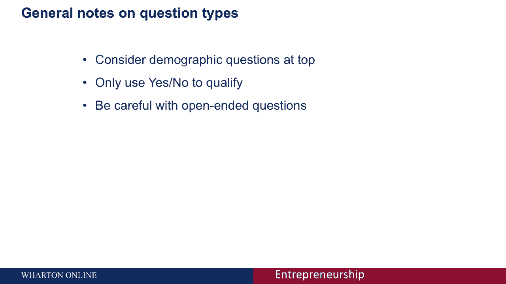

他们让你稍后在接受你调查的人的个人资料中进行比较。

对美国人更广泛的了解，所以这可能是一套非常有用的工具，你一般不想问是或否的问题，你想问有多种答案的问题。

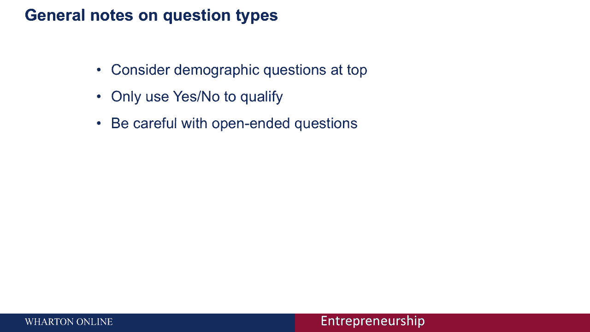

你用是否问题，只是为了让人有资格，所以说，如果你有兴趣联系。

唯一买毛衣的人，我们将以订阅毛衣服务为例。

你会在这里看到的所有问题，我们可能想问问前面的人，你以前买过毛衣吗？如果他们说不。

我们把他们排除在调查之外，如果他们答应了，然后他们进行全面的调查，所以只用是否问题把人们分成小组。

对开放式问题要非常小心。

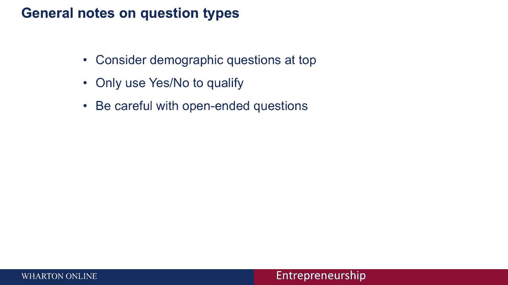

所以开放式问题或给你一个论文盒回答的问题，所以它可能会说你喜欢毛衣的什么。

问号，他们给你一个盒子，开放式问题之所以有风险，有几个原因。

首先是当我写调查的时候，我倾向于认为调查是有成本的。

但这一成本是货币，成本是参加调查的人的注意力。

所以你问的每一个问题都要付出代价，吸引他们的一点注意力，没有什么比开放式问题更昂贵的了。

人们讨厌写文章，所以如果你给他们一个盒子写一两个句子。

他们会以更高的比例退出你的调查，另外，你从开放式问题中获得的大多数数据质量都很低。

所以你要看一个开放式问题，你觉得很聪明，我会读一些像芝麻一样的东西。

猫咪，我喜欢奶酪，你就像，我不知道这是什么意思，为什么会有人写这个。

所以很难解释这些问题，所以开口的末端应该非常小心地使用。

同时，对于你可能没有涉及的敏感领域，你可以使用这些开放式问题。

如果，例如，你在问性别，您可能希望包括，你知道的。

雄性，女性和另一个盒子，人们可以给你他们自己的性别身份，所以即使这些盒子没有被经常使用。

它们可以是非常强大的工具，让人们觉得他们有选择。

它们没有被放在特定的盒子里，所以我想问几个问题，并告诉你他们的好的和坏的例子，所以我想让你再看看这个问题，我们在问一件毛衣，因为我们对这个开始订阅毛衣业务的例子感兴趣，不是我最好的主意。

但可能也不是我最糟糕的，所以问题是考虑到经济状况，你在哪里买毛衣，回答一个亚马逊，b大宗商品商，c服装店，d其他在线网站，所以我给你一点时间想想这个问题有什么问题，这里有一堆问题，所以其中一个是。

我们要求一个领先的开始，鉴于经济状况，所以这让人们思考经济状况，这与一个问题并不真正相关，嗯，我们假设他们买毛衣，我们没有不买毛衣的选择，我们没有考虑其他选择的选择，装不进这些桶里的。

人们可能不知道大众商品在哪里，我们有一堆不同的问题，问你有不同种类的商店，没有例子，我们怎样才能使这个问题更好，你买毛衣最多的那家怎么样？过去十二个月，现在，我们把问题限定在，我们在问同样的问题。

但我们是在一个特定的时间跨度内问的，我们现在的答案，亚马逊和其他在线网站，所以他们就在一起，作为比较，实体大宗商品商，如好市多，沃尔玛，等等，Gap Land End等实体服装店，等，我们给他们选择权。

他们在过去的十二个月里没有买毛衣。

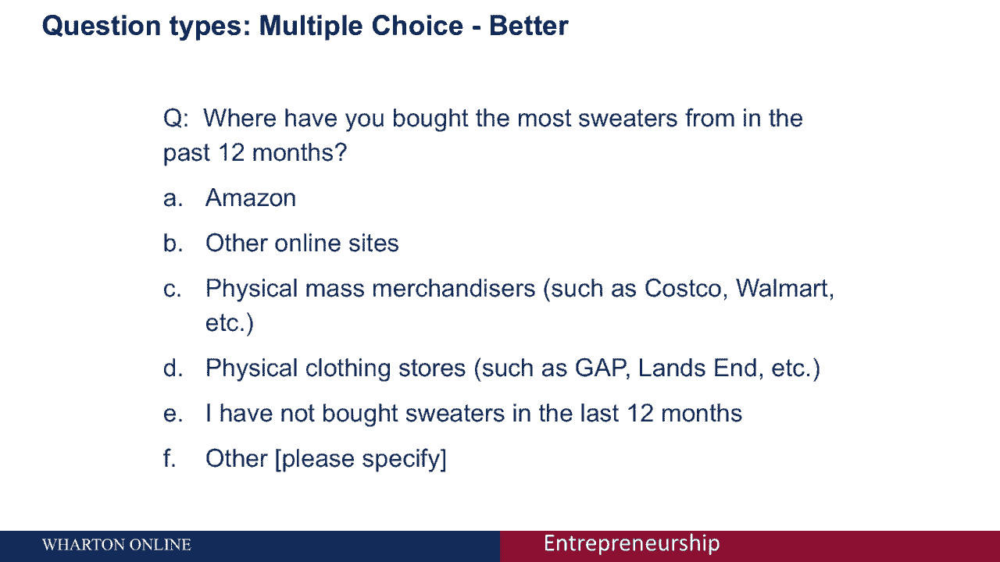

我们让他们选择其他可能对他们有用的选择，所以这是一个更好的问题，因为我们现在明确了我们所要求的。

就我们问的问题种类而言，我们已经改进了它。

所以这是一个改进版，也许不完美，但更好，这里还有另一种问题，我经常看到，这是一个评级表，很难找到合适的毛衣价格，买一件毛衣前你去商店要多少钱，一二三四五六七八九十，那么这有什么错呢。

所以我们又一次在这里领先，对呀，我们在说，很难找到合适的毛衣让人感觉不好，他们是，呃，如果他们不把我们比作商店，所以他们在想这个，很难知道问题在问什么，说率是什么意思，你比较商店多少钱。

你比较商店多少钱，一到十的比例是一个非常大的范围。

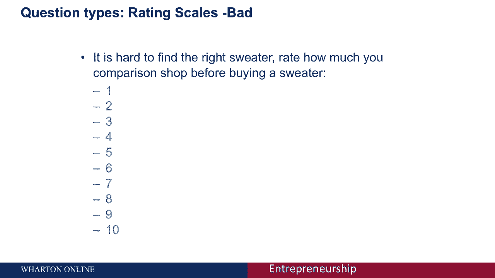

这可能是一个问题，因为人们会经历端点回避，他们不喜欢回答一个或十个。

他们最终会保存，一个是毛衣体验，包括他们被刺伤。

对呀，所以他们往往不回答一个或十个。

也不清楚十分之一在这里是什么意思，对呀，成为一个意味着什么，十岁意味着什么，什么更好，什么是最好的，所以回答这个问题的更好方法是用所谓的酒，或者被称为利克特尺度，在买毛衣之前，你多久比较一次工作。

一个永远不会太少，三个，有时四个，大多数时候，五个协议不一致的时候，那个范围的刻度是利亚德刻度。

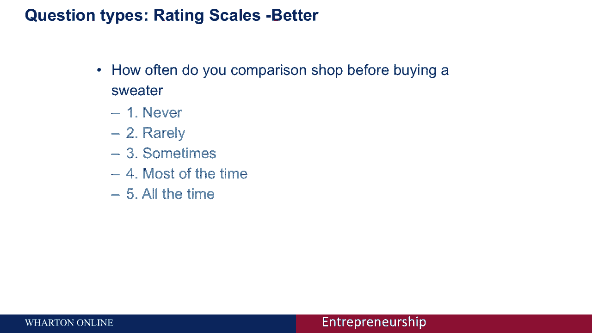

这是获得答案的更好方法，你也会注意到，我们这里有一个中间点。

刻度有一个中间点是很重要的，在这种情况下有时是三个，它是一个中性点。

你试图从中性点测量差异，这可能是问这些问题的一种非常强大的方式。

所以这是问常见问题的两种更好的方法。

我经常被问到的另一件事是考虑定价。

所以在定价调查中，所以看看这个例子，你愿意花多少钱买一件每个月送到你手里的新毛衣？五美元，十块钱，五十元或两百元，你会注意到有一些问题，首先呢，嗯，事实上，我还没有给你看那件毛衣是什么，没有真正的例子。

不太清楚你要买什么毛衣，但再想想定价领域，所以你可能会认为部分问题是价格太分散了，这是正确的，这里的定价有点奇怪，但更大的问题是，你不能只问人们定价，并期望他们给你一个诚实的答案，问题是人们会再次。

没有人想在这些交易中看起来像个傻瓜，即使他们花两百美元买一件毛衣，他们可能，一旦你再次向他们展示定价，这就变成了谈判，所以他们试图弄清楚他们应该付出什么代价，他们想正确地回答。

他们没有向你展示他们真正想花的钱。

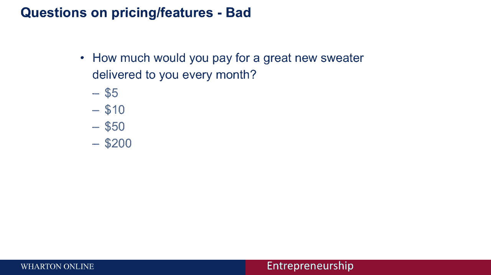

事实证明，这种问题是没有用的，弄清楚定价，事实上，最简单的定价方法都不起作用。

我给你一个不用很多数学就能用的技巧，这就是所谓的一元定价。

所以一元定价，我们避免设定对价格的预期，这是我们给人们的大问题之一。

一旦你告诉别人可能是五美元，他们很难愿意花两百英镑。

所以单一定价，我们问一个问题，在这种情况下，它略有改善，你愿意花多少钱订阅一项每月20美元的服务，每个月送你一件毛衣，就像下面这个，我们可以展示图片，所以问题更清楚了，但我们也是每月20美元。

也就是定价每个参加这个调查的人都会随机看到一个不同的价格。

对呀，所以一个月可能有20美元，五十元一个月，一百元一个月，所以人们不会锚定。

因为他们每个人只有一个价格，在这种情况下，20美元的价格。

所以这是一种方法，你可以开始了解需求是如何变化的。

当一半参加你调查的人看到20美元，一半，看五十元，就利息而言，你发现损失了多少。

当你从二十美元移动到五十美元时，所以这是一个相当有效的单一定价。

你不能做的事，或者其他你不能做的方法，不太好用的定价阶梯，一个定价阶梯将是一个你问，人，他们会花两百元买这件毛衣吗？如果他们答应了，你说你愿意付五百吗？如果他们说不，那你说他们会再付250吗。

你有锚定问题，不能很好地工作。

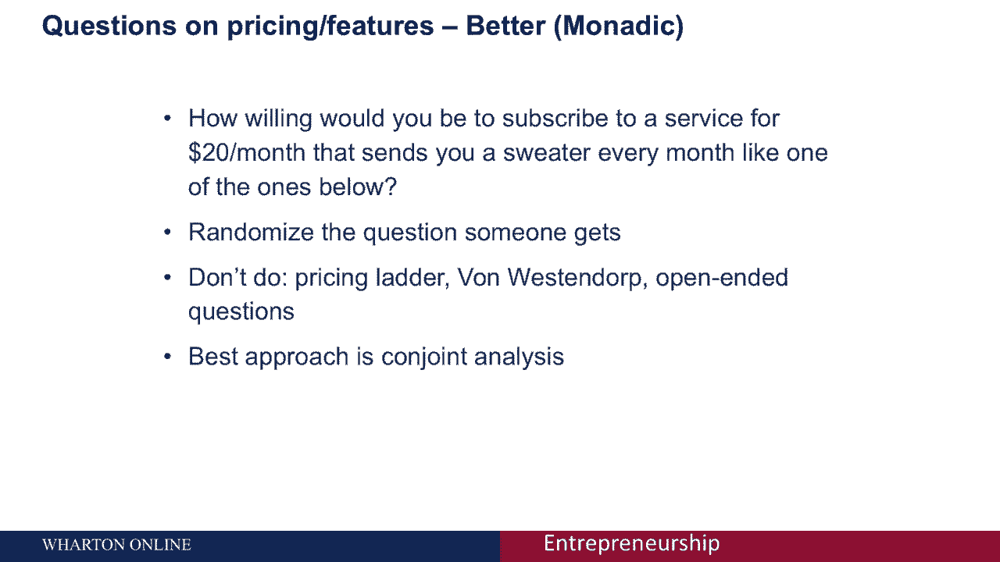

冯·韦斯特多普方法，这是我最喜欢的名字之一，问定价问题，这要花多少钱你才会认为它很便宜。

以什么价格开始，这似乎是一个太好的交易，它有问题，以什么价格这看起来很高在什么价格你永远不会买。

这有一些问题，使它很难实现。

也很难问一个开放式的问题，你会说，你愿意再付多少钱？这最终会有问题，有一个更好的方法，如果你上了沃顿商学院的营销分析课。

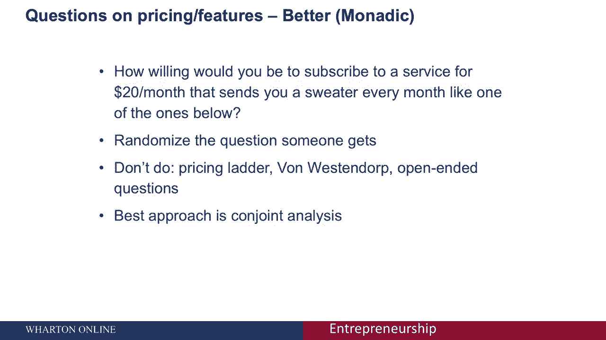

你将学习联合分析，这是相当复杂的，做这件事没有简单的方法。

但是联合是获得价格信息的最好方法，它只是比大多数人从事的更复杂。

即使是我班上知道联合的人也倾向于只在极少数情况下使用它。

所以我想请你考虑一下联合，如果你如果定价是一个大问题，功能集是一个大问题。

你想调查一下，这就是你想要使用的技术，但这不是我们在这里会深入讨论的事情。

你怎么知道你问的是好问题，除了使用我们刚才谈到的技术，1。要做的最重要的事情是预先测试，你需要给人们调查，理想情况下，你会和几个人坐下来，谁来做调查，让他们拿走，当你在那里的时候，让他们边走边叙述。

所以这会给你一种感觉，当他们填问题的时候，他们认为一个问题是好的还是坏的，他们明白这个问题吗，需要多长时间，过一段时间，你会向一小部分人发送一份调查，并得到他们的回应，你在结果中寻找什么在结果中告诉你。

它是好是坏是有趣的，所以你要找的第一件事是方差，我所说的方差是什么意思，你想让一些人对一个问题回答十个，有些人回答一个。

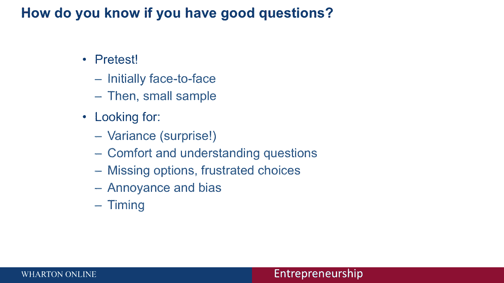

你想这么做的原因是如果每个人都告诉你，他们喜欢你的产品，你不明白为什么。

可能会有人喜欢，有些人不会，所以你可能也在问一个问题。

引导你想要的有多种答案的问题，你想明白，如果人们觉得舒服，通过回答一系列问题，他们的回答正确吗，那种方式，有问题的人，让他们很紧张，他们沮丧吗，因为他们想回答一个不同的选择。

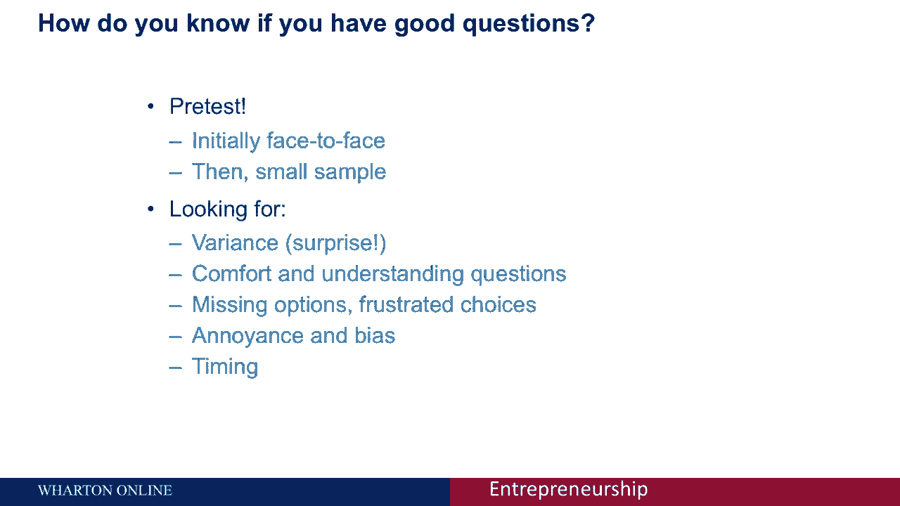

你想寻找烦恼和偏见的问题，就像我之前告诉过你的，我学到的一件事是问性别问题。

所以我做了这些相当大的调查，我做的第一次调查，我问性别。

我问人们是男的还是女的，我得到了一些沮丧的回复。

说我不认同这两种性别中的任何一种，我不想做你的调查，那很好。

那完全是那些人的权利，通过添加一个盒子，上面写着其他，让人们填写。

我的回复率实际上上升了，我们不仅对它的反应上升了，尽管很少有人真正填写了那个盒子。

大多数人觉得更舒服，我在问正确的问题，没有偏见。

你也想弄清楚时机，人们做这项调查需要多长时间，这样你就可以给人们一个准确的估计，当你做完，你需要考虑你的回复率，所以当你分析你的调查结果时，如果你的回应人数少于20人，你需要考虑回应中的偏见。

如果超过20%是一般的经验法则，这不是你知道的每个领域，但在创业方面，我不会担心的，太多了，然后你可以使用你问的关于性别的人口普查问题，关于地理区域、收入和教育，将你调查的样本与普通人群进行比较。

弄清楚你的样品是否有代表性，你可以用人口普查数据，它可以免费获得，看看那里是否有代表。

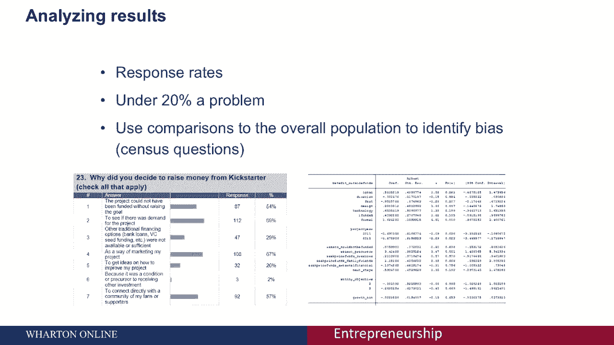

我劝你再做的最后一件事，我们在沃顿教授其他课程。

你可以在网上找到，超越，只是报告数字，只是报告说。

你知道吗，50%的人这么说，百分之二十的人说，实际上考虑运行回归分析。

找出原因是什么，你得到的各种答案。

嗯，所以调查是一个非常强大的工具，但做得不好并不能给你太多信息。

只是惹恼了你发送给的很多人，所以花点时间考虑一下测量，它们是企业家工具包中非常强大的工具，他们并不总是直觉的。

做得很糟糕，只需要很少的时间，把它做好，需要多一点，但是，你可以得到非常好的结果。

