# 【沃顿商学院】创业四部曲 P28：用问卷调查验证你的想法 📝

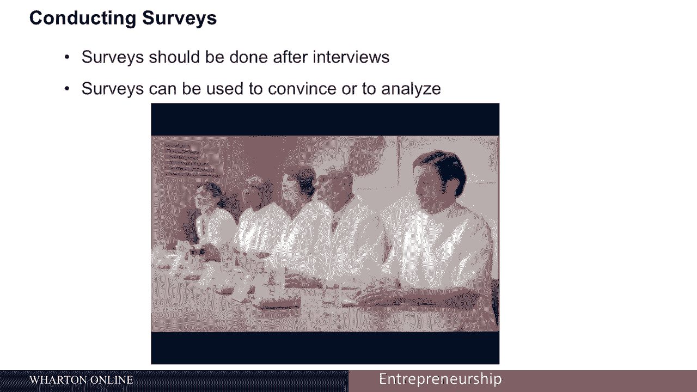

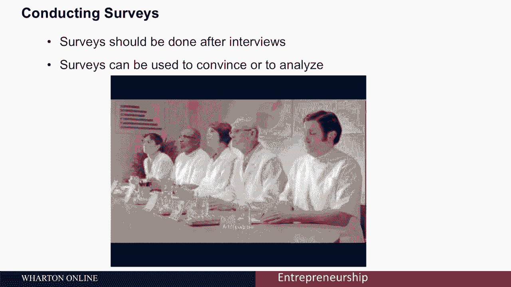

在本节课中，我们将学习如何使用问卷调查来验证你的创业想法。问卷调查是一种在投入大量资金正式推出产品或服务前，获取市场反馈的有效工具。我们将探讨如何设计问卷、选择调查样本、分析结果，并避免常见的错误。

上一节我们介绍了通过客户访谈来获取信息，这是一种相对低成本的方式。本节中，我们来看看另一种强大的验证工具——问卷调查。

## 问卷调查的目的与时机

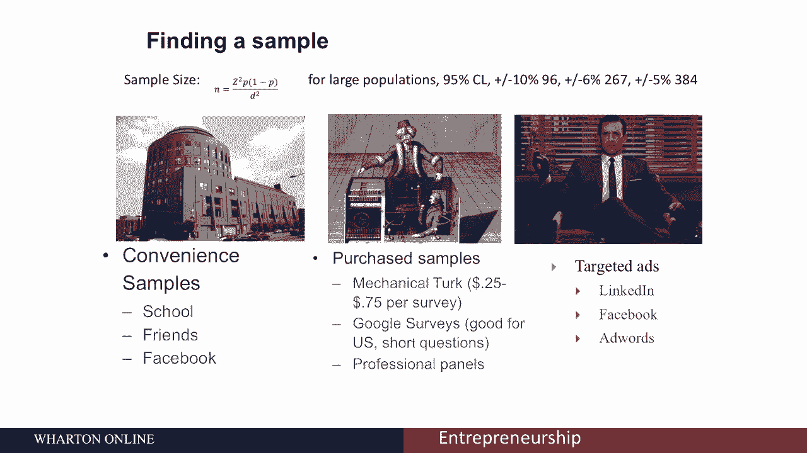

问卷调查主要有两个目的。第一种是用于营销和说服，例如向投资者或客户展示“五分之四的受访者认为这是一个很棒的产品”。然而，我们更关注第二种目的：**用于检验自身假设、分析业务，从而带来更成功的结果**。问卷调查应该在客户访谈之后进行，因为访谈能帮助你了解应该问什么问题。

## 如何选择调查样本

以下是获取调查样本的几种主要方法：

**便利样本**
这是最常见但通常最无用的方法。你调查的是你周围已经认识的人，例如通过Facebook、学校或Twitter。问题在于，你的朋友很少能代表你的目标客户。一个特例是，如果你的目标客户恰好就是你的朋友群体（例如，一个为顶级商学院学生提供贷款再融资服务的公司调查其在沃顿商学院的朋友），那么便利样本可能有用。但在大多数情况下，需要谨慎使用。

**购买样本**
这意味着从一群更具随机性和代表性的人群中购买答案。有两种很好的方法：
1.  **亚马逊 Mechanical Turk**：这项服务有成千上万的人在线完成短期任务。你可以支付很少的费用（例如每次调查0.25至0.75美元）来获得大量回复。
2.  **谷歌调查工具**：通过你的Gmail账户可以获得一些免费额度。它的优势在于可以根据收入水平、地区等特定条件精准定位受访者。

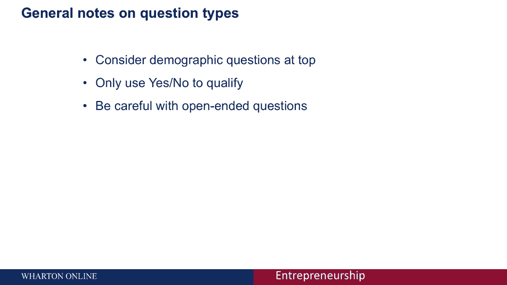

**广告获取样本**
你可以在LinkedIn、Facebook或使用Google AdWords发布广告来吸引受访者。这种方法可以针对特定人群，但需要支付广告费用，且可能难以获得足够的参与度。

**关于样本量的核心概念**
你调查的人越多，你对结果的估计就越准确。这可以用**置信区间**来描述。例如：
*   随机调查100人，置信区间约为±10%。如果50%的人喜欢你的产品，真实比例可能在40%到60%之间。
*   调查384人，置信区间可缩小到±5%。
一个重要的经验法则是：**至少调查100人**，否则得到的数据可能没有太大参考价值。

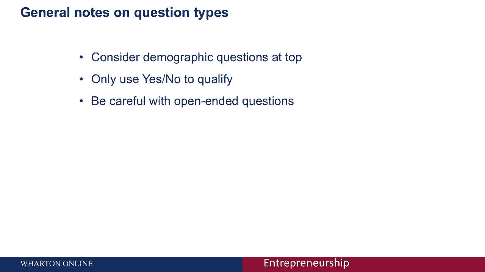

## 如何设计有效的问题

设计问题是问卷调查的核心。以下是一些关键原则和问题类型的注意事项：

**人口统计问题**
关于种族、教育背景等问题可以放在调查开头。这些问题通常能让受访者感到放松，并且便于你后续将样本与更广泛的人群进行比较。

**是/否问题**
仅用于筛选受访者资格。例如，如果你的目标客户是买过毛衣的人，你可以先问“你以前买过毛衣吗？”，如果回答“否”，则结束调查。

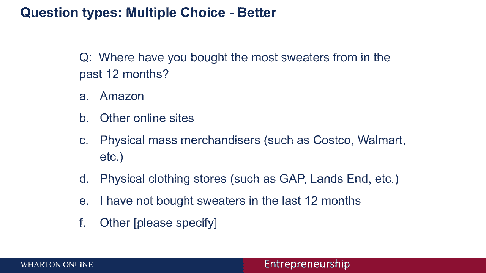

**多项选择题**
应避免使用是/否问题来获取深度信息，多使用提供多种选项的问题。

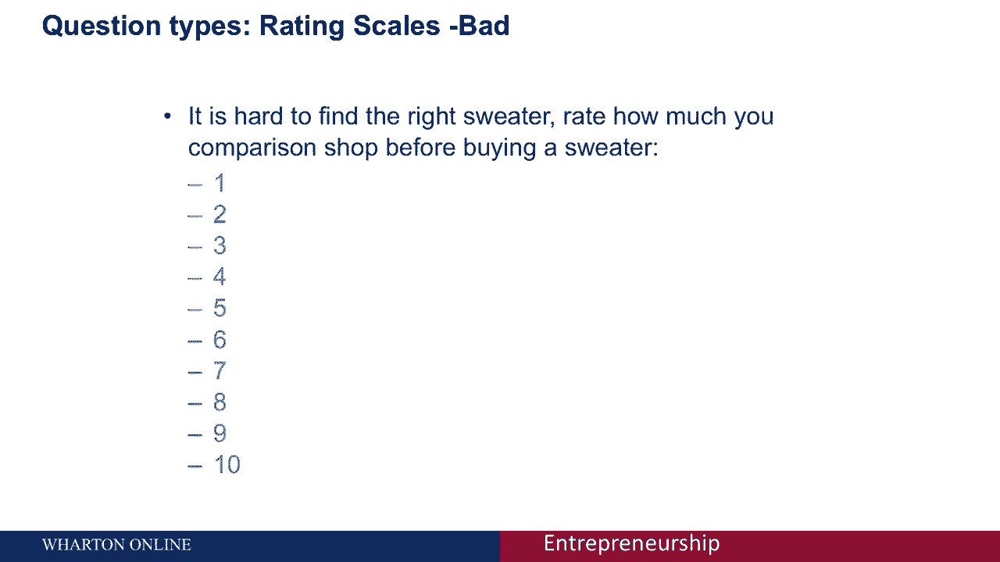

**开放式问题**
需要非常谨慎地使用。例如“你喜欢毛衣的什么？”这类问题成本很高（消耗受访者注意力，导致更高的中途退出率），且得到的答案质量参差不齐，难以分析。开放式问题更适合用于收集你未涵盖的敏感领域信息，例如在询问性别时，除了“男”、“女”，可以提供一个“其他”选项让用户填写，这能增加包容性。

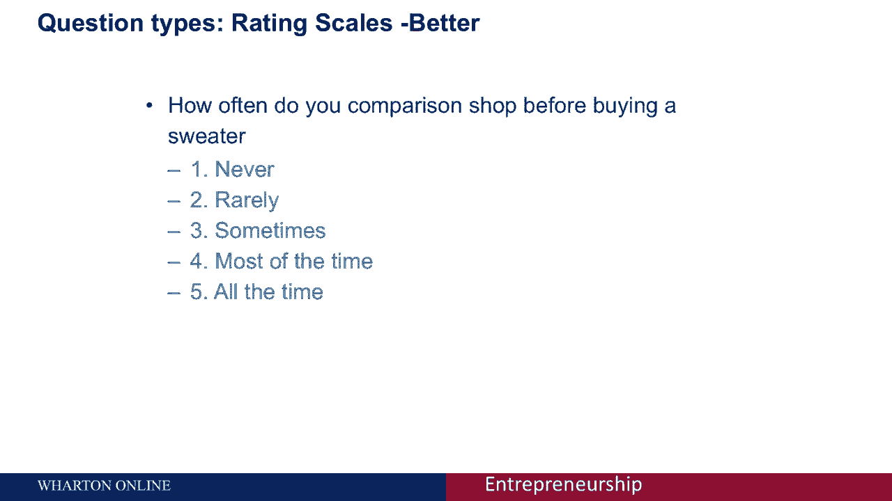

## 问题设计：好例子与坏例子

让我们通过一个假设的“月度毛衣订阅服务”例子，来看看如何改进问题设计。

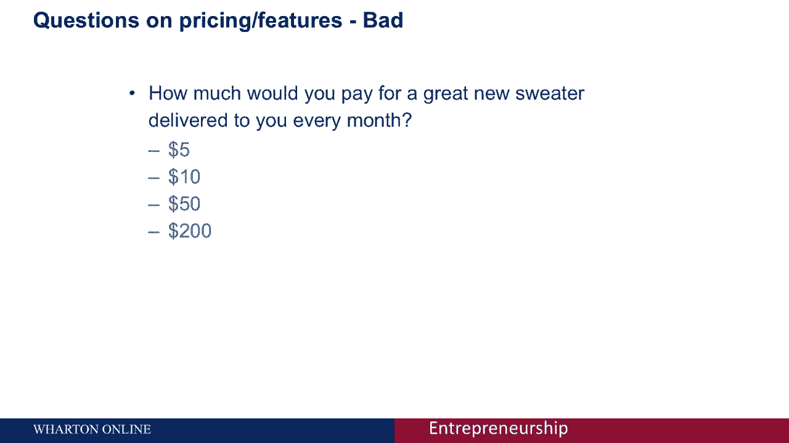

**坏例子 1：购买渠道**
*   **原问题**： “考虑到经济状况，你在哪里买毛衣？ A. 亚马逊 B. 大宗商品商 C. 服装店 D. 其他在线网站”
*   **问题**： 包含引导性语句（“考虑到经济状况”）；假设受访者一定买毛衣；选项分类模糊（“大宗商品商”不明确；“其他在线网站”与“亚马逊”重叠）。
*   **改进后**： “在过去的12个月里，你购买毛衣最多的地方是？ A. 亚马逊或其他在线网站 B. 实体大宗商品商（如Costco, Walmart） C. 实体服装店（如Gap, Land‘s End） D. 其他（请注明） E. 我没有在过去的12个月里购买过毛衣”

**坏例子 2：评分量表**
*   **原问题**： “很难找到合适的毛衣。在买一件毛衣前，你会比较多少家商店？请用1-10分评分（1=非常少，10=非常多）”
*   **问题**： 引导性语句；量表范围太大且端点定义模糊；人们通常避免选择极端的1或10（端点回避）。
*   **改进后（使用李克特量表）**： “在购买毛衣前，你比较不同商店的频率是？ 1. 从不 2. 很少 3. 有时 4. 经常 5. 总是”

## 如何通过调查了解定价

直接询问“你愿意花多少钱？”通常得不到诚实答案，因为这会变成一种谈判，受访者会试图给出“正确”而非真实的价格。

一种有效的方法是 **“单一定价”测试**：
*   **做法**： 将受访者随机分成几组，每组看到不同的价格。例如，一组看到“每月20美元的毛衣订阅服务”，另一组看到“每月50美元的服务”。
*   **分析**： 比较不同价格下，表示有兴趣的受访者比例变化，从而了解价格对需求的影响。

其他方法如定价阶梯或冯·韦斯特多普法存在锚定效应等问题。更复杂但更有效的方法是 **“联合分析”**，它通过让受访者在不同属性组合（包括价格）的产品之间做选择，来推算各属性的价值。但这需要更专业的知识。

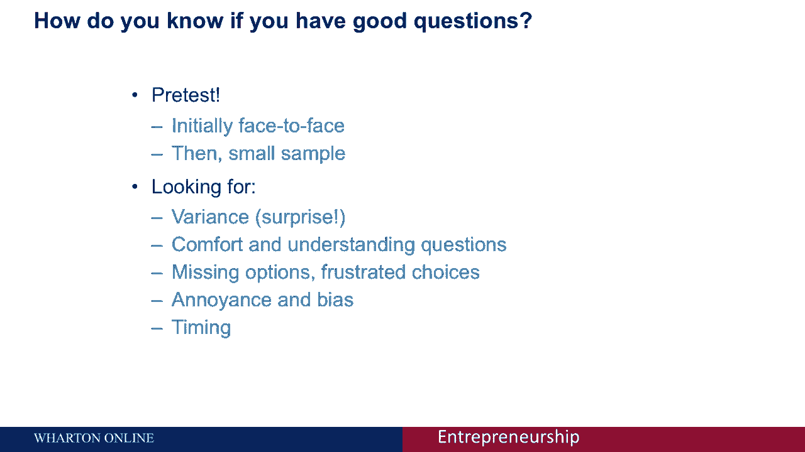

## 如何检验问卷质量

设计好问卷后，需要通过预测试来检验其质量：

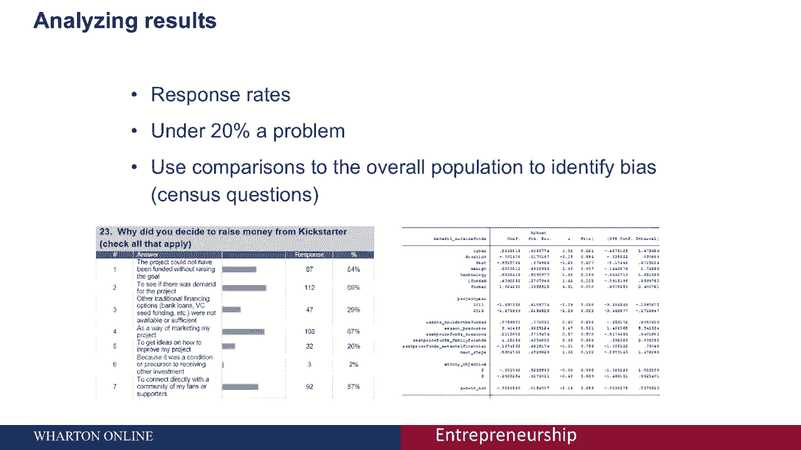

1.  **预测试**： 让几个人当面完成问卷，并请他们边做边说出想法。这能帮助你了解问题是否清晰、耗时多久。
2.  **分析初步结果**： 发送给一小部分人，查看回复。你希望看到**答案的方差**（即有人选1，有人选10），这能帮你区分不同偏好的群体。如果所有人都给出相似的高分，你反而无法深入理解原因。
3.  **检查回复率和代表性**： 如果回复率低于20%，需警惕样本偏差。你可以利用人口统计问题，将你的样本与美国人口普查等公开数据比较，看是否具有代表性。
4.  **进行深入分析**： 不要只停留在报告百分比。尝试进行**回归分析**，找出哪些因素（如年龄、收入）会影响核心问题的答案，从而获得更深层次的洞察。

本节课中我们一起学习了如何利用问卷调查来验证创业想法。我们了解到，问卷调查是一个强大的工具，但设计不当则收效甚微。关键在于：在访谈后设计问卷、获取足够且有代表性的样本、精心设计避免引导和模糊的问题、谨慎测试定价、并通过预测试和深入分析来确保数据质量。花时间做好这些步骤，你就能从市场中获得真正有价值的洞察。