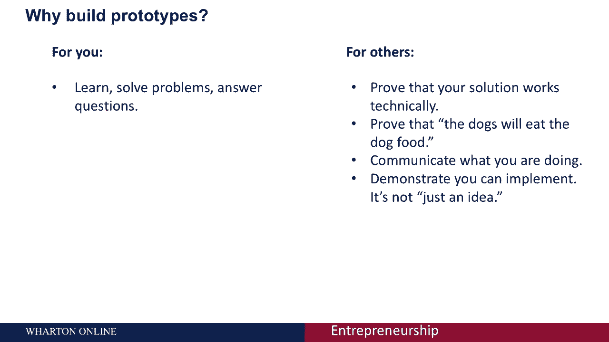
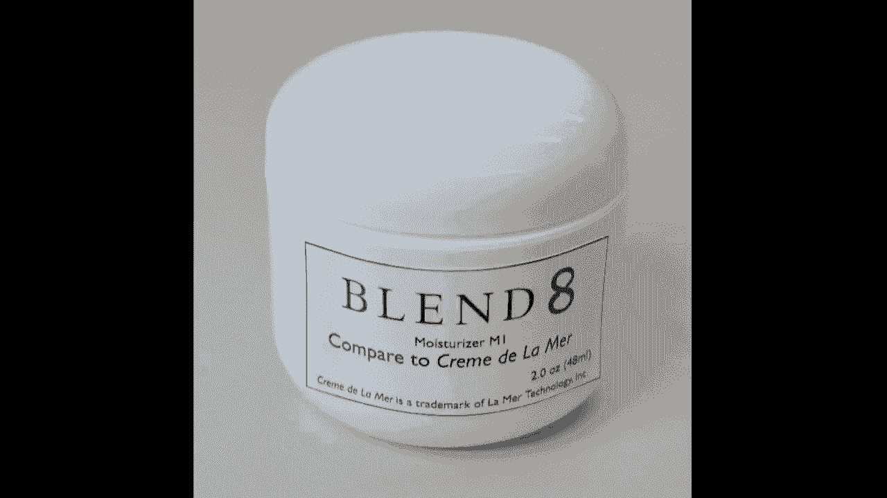
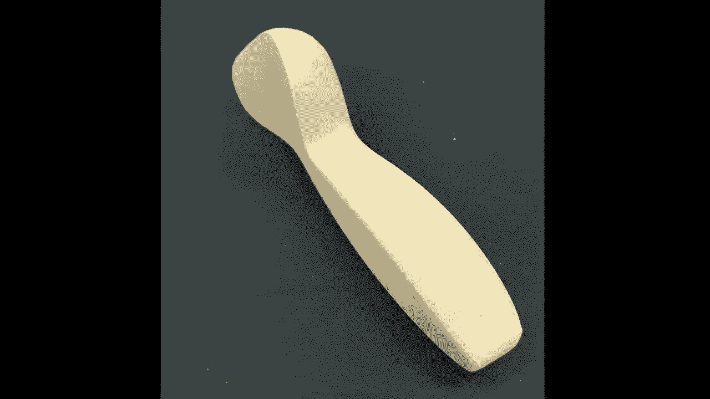
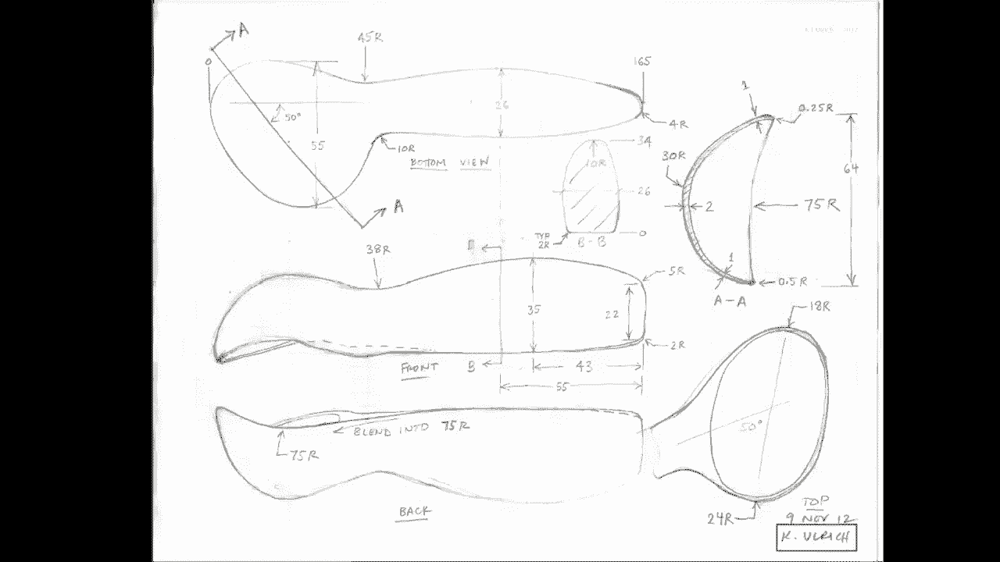
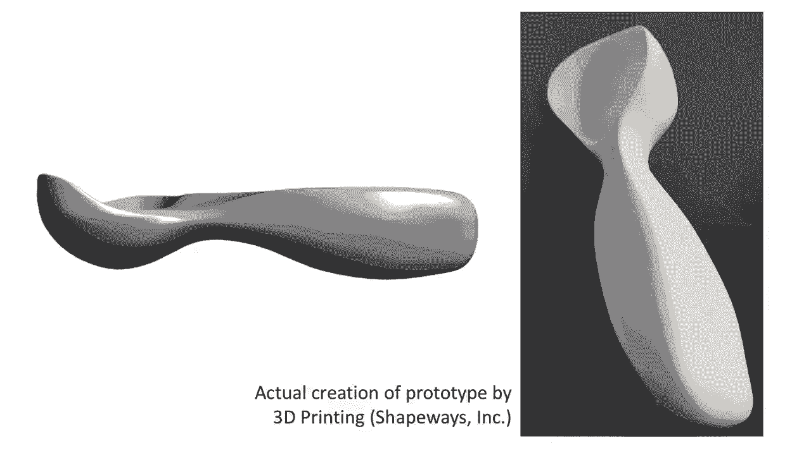
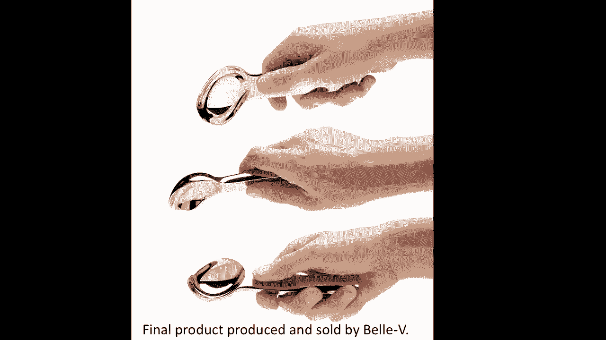
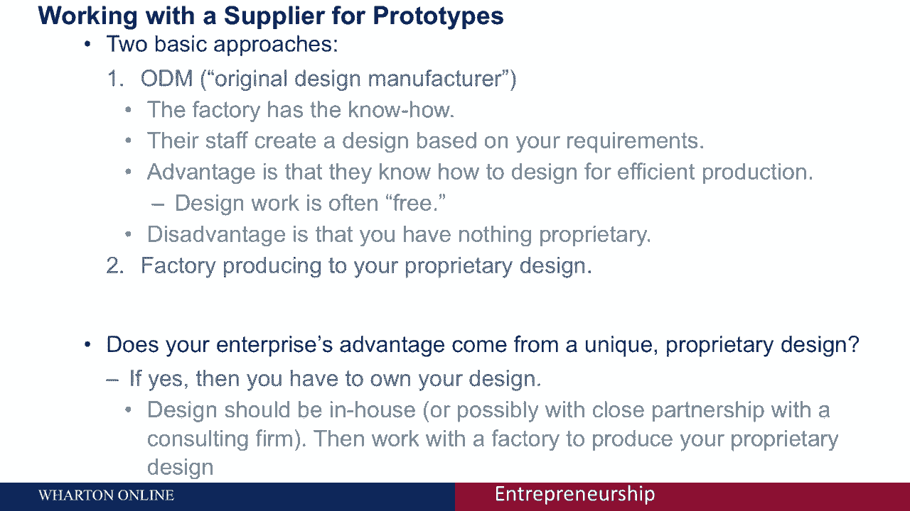

# 【沃顿商学院】创业 四部曲：发现机会、建立公司、增长战略、融资和盈利 - P29：[P29]04_4-4-creating-a-prototype-physical-goods - 知识旅行家 - BV19Y411q713

企业家经常来找我，说我有个主意，我只需要有人做一个原型，通常那个面具，对将硬件产品推向市场所需条件的深刻误解，它将原型视为一个单一的端点，而不是一个过程，我要用一堆例子，演示原型制作的关键原则。

我将以与工厂供应商合作的讨论作为结束，建造原型，让我先区分一下，焦点原型，只反映您正在开发的产品性能的一个或几个方面，这些通常被称为试验台或模型，一个全面的原型是一个功能齐全的原型，通常经过连续的改进。

通常被称为概念证明原型，阿尔法原型，测试版原型，预生产原型，让我给你举几个例子，作为一项新事业的一部分，我努力开发一种新的无绳钉鞋器，我们正在考虑的一个概念是电动无绳，内特·奈勒。

开发团队面临的一个关键问题是工具有多重，感觉平衡与否，我们建造这个原型是为了回答这个问题，这是一个聚焦原型，它是由胶合板制成的，钢棒贯穿始终，给它合适的重量和合适的重心，这当然不能用来钉钉子。

因此它只镜像产品的一个属性，它的大小和重量是多少，但我们可以用它来回答，这个工具感觉够轻吗，在转动惯量和平衡力方面感觉如何，这是一个聚焦原型的例子，我开发了一种叫做十字架的产品，自行车架。

十字架背后的大创意，它会把货物放在骑手后面，它将通过附着在座椅柱上来做到这一点，这是我建造的第一个原型，它，用自行车上的旧杆连接到座椅柱子上，然后我在车库里做了这个，只是从弯曲的钢管，我称之为证据。

这被称为概念验证原型，我实际上可以在我的自行车上使用这个，并验证该概念的有效性，这是一个全面的概念验证原型，这是第二个原型，我称之为阿尔法原型，这解决了我对概念验证原型的几个担忧，首先是架子不够大。

不能容纳一个标准的自行车包，所以我把这个做得更大，第二个是为了适应反馈，即这将是很好的，如果我能把自行车上的行李架取下来，所以我适应了，现有自行车架的另一部分。

另一个来自自行车的茎以鹅卵石的方式拼凑在一起，为了获得完整的功能，这是一个阿尔法综合原型，这是十字架的测试版原型，它具有最终产品的所有特性和功能，但它实际上是由最终制造产品的工厂制造的。

我可以把这个给消费者测试，这通常是测试版原型的特征，所以这是一个测试版的综合原型，但它仍然有一些问题，特别是，1。这家工厂把饰面搞错了，所以这个有光泽，这是哑光的，我也意识到我真的希望有一点角度。

在这个夹紧的方式和支撑结构的角度之间，这是十字架的预生产原型，这在各个方面都是十字架的生产意图设计，你可以看到它甚至有标志在上面，它有适当的角度，表面光洁度都是完全一样的，事实上，这本可以卖给消费者。

这是一个预生产原型的例子，所有这些原型都是全面原型的例子，它们功能齐全，但他们通常会经历帮助团队实现里程碑和展示进展的循环，并解决产品设计和开发中的挑战，建造原型的动机是什么，为什么要很好地构建原型。

为了你，对于开发团队本身，你建造原型主要是为了学习解决问题和回答关于，你们真的有所谓的产品市场适合吗，也就是，您的解决方案是否真的能满足目标客户的需求，不太明显的是，你也为外部观众建立原型，外部观众。

例如，可能包括供应商，投资者和合作伙伴，你通常为外部听众提出的问题或问题，正在证明您的解决方案在技术上是有效的，证明狗会吃狗粮，这是一个俚语，用来证明客户会真正采用你的解决方案。

这些原型对于交流你正在做的事情非常有用，并证明你们作为一个团队可以实现这一点，这不仅仅是一个想法，但你真的很认真地实施产品。

让我给你举几个例子，这里展示的是一个家具产品，它实际上是一个媒体站，生产版本显示在右边，但左边的是用刚找到的东西做的，但在家装店买的，这是为了证明它可以容纳电缆盒的不同元素，的，的，DVD播放机。

遥控器，这些东西可以放在房间里，它可能是为，价值10美元的材料，可能几个小时后，回答问题的快速原型，并学习，它适合放在房间里吗，它是否适应它的预期功能，这是一个原型，说明了原型实际上有多简单。

这是我和一个联合创始人合作的化妆品，这家公司被称为混合八，我们只是想向别人展示，只是我们化妆品的代表，产品可能看起来像，以及品牌将如何发挥，所以我们只是用激光打印机模拟了一个标签。

把它粘在一个普通的罐子上，并在一个演示中使用。

作为一种非常有效的沟通方式，我们对这个产品是认真的，以及产品概念，这是我产品设计课上的一个学生团队，他们有了一个与手套结合在一起的紧密熨斗的想法，那个穿红色毛衣的女人展示了这一点，她戴在右手上。

这个想法是在你穿上衣服后，如果你有一点皱纹，你可以拿着你的铁手套来照顾它，这对你来说可能不是个好主意，但事实上，他们建筑的一个伟大之处在于，这个原型是他们可以回答这个问题，那个工作是你吗。

你能在合适的温度下做吗，感觉怎么样，顾客对这个想法有何感想，我向你们展示了这个例子，因为这四个学生都没有制造新熨斗的技术背景，但他们能够用发现的物体制作一个模型或演示。

这实际上非常有效地展示了这个产品概念，我想给你看一个制作原型的好技巧，具有挑战性的产品，很难建造的地方，一个全面的原型，两者都像，看起来像生产意图产品，这是一个原型，适用于我们正在考虑的指甲概念。

其实这里的概念是用一个小炸药来驱动活塞，然后驱动钉子，它将现有产品的现有指甲库集成在一起，用一些新的硬件，我们设计来证明爆炸活塞的概念，这看起来不像是一个产品，这是一个像原型一样的作品。

但它看起来不像原型，如果我把这个给投资者看，我想他们不会太在意，这看起来像一个产品，然而，这将非常有效地证明，产品工作背后的核心原则，所以我们所做的是开发一个单独的看起来像原型，我拿给你看。

这是看起来像原型的，为了同样的概念，我们能够说明，炸药条的弹匣将存放在哪里，我们能够说明它可以有两个手柄位置，取决于它将如何使用，我们能够说明基本的美学，尺寸、形状和人体工程学。

都是用一个非常简单的泡沫原型，这是一个模型制造商在几个小时内建造的，这当然不一定要起作用，但它确实，它在向外人说明方面是相当有效的，最终的产品会是什么样子。

所以你可以玩的一个很好的技巧是使用两个不同的原型，看起来就像，它就像一前一后地说明最终的产品是什么，现在我想向你们介绍一个产品从最初的原型到现在的演变过程，一直到生产，谈论一些出现的问题。

当你经历这个过程时，这里显示的是我为测试原始解决方案概念而开发的八个原型，它们体现了许多不同的冰淇淋勺设计方法，它们大多是由发现的物体制成的，所以如果你看左数第三个，它实际上是用番茄酱罐做的。

和棒球棒的末端，在店里大概二三十分钟就做好了，使用传统的车间工具，你可以看到的其他一些是用现有的产品制造的，并对它们进行切割和重新配置，以改变它们的几何形状，所以这让你对你可以使用的技术有了一个感觉。

只是为了探索解决方案的概念，最终我决定追求体现有角度独家新闻的概念，其中勺头相对于手柄成角度，其中一个关键问题是它的人体工程学和形式，所以我用一种叫做轻脂泡沫的材料做了一个模型，它只是一种泡沫材料。

可以很容易地打磨并塑造成所需的最终手柄和勺子形状，这里显示了这一点，这个问题，当然啦，这只是一块坚实的泡沫，不能用来舀冰淇淋，所以我必须想出如何制作一个工作原型，从这个基本方法。

我这样做的方法是创建一些尺寸，基于这里显示的模型是我创建的两幅画中的一幅，这些都是基于泡沫模型的测量结果我很满意，然后我在宾夕法尼亚大学雇了一个研究生，从这些维度为我创建一个计算机模型。

这是我个人实际上没有的技能，所以我只是用少量的钱雇了一个人，能够创建一个几何模型。

根据我的草图，左边显示的是几何模型，或者他在计算机中创建的几何模型的图像，一旦你有了，就有很多供应商可以创造物理模型，使用一种叫做三维打印的技术，所以在右边。

你可以看到三个D打印的人工制品来自计算机模型。

那是我亲手创造的，素描，右边的三个D打印模型，是一个我可以用来舀冰淇淋的，并可以验证，事实上，手柄的形状和有角度的勺子非常有效，接下来是一系列迭代的改进，从最左边显示的原始泡沫模型。

一直到最右边显示的最终生产设计，我给你看这个是为了唤起一点谦逊，构建一个硬件产品真的需要，即使是一个非常简单的产品，就像一个单份冰淇淋勺，我们在这里经历了几十次迭代，每一个都是原型，以验证方法。

我们最终会得到什么，在最右边，成为独家新闻的制作版，这里显示的是公司出售的，相信这个产品，如果你现在看，它看起来很漂亮，看起来很精致，看起来这是命中注定的，但我想做的是向你们展示在这段经历背后。

结果背后是大量的迭代，经过几十种产品的变化，最终得出最终的产品，所以当人们说他们需要有人帮助他们建造原型时，经常掩盖的是对，建造它实际上需要什么，即使是最简单的硬件产品，它需要大量的迭代。

大量的尝试和提炼，从最初的概念验证到最终的生产意图，让你成为一个成功的企业家，你绝对必须有团队中的专业知识，这适合手头的任务，所以虽然我有足够的技能，想出那个有角度的勺子的原始解决方案概念，我没有。

我没有复杂的工业设计技能，为它创造出美丽的美学最终产品。

我找了个搭档，在这种情况下是一家设计公司，月球设计来帮助我建立额外的精致水平，我现在想谈谈如何与供应商合作的问题，我只举两个例子，这代表了您可以与供应商合作的两种基本方法，生产原型。

最终生产出你的最终产品，我在台湾的一家工厂里，让死亡，铸件，就是金属零件，用成型机铸造的，我被展示在这里，工厂经理在中间，右边是我的经纪人，在这种情况下，模型是我提供给工厂的。

完整描述的详细图纸和一组计算机模型，正是我想让他们制作的部分，然后他们完全按照我的规格生产那个零件，他们甚至不需要知道这个零件是做什么的，或者它是用来做什么的，他们只是根据详细的技术规范工作。

通常以绘图的形式，它完全指定了我希望他们创建的硬件的几何形状，好消息是，当你这样做的时候，这意味着他们除了图纸之外没有专有信息，他们甚至不知道你在做什么，必然，坏消息是。

你必须做艰苦的工作来创造设计的所有细节，才能生产出来，有一种替代模式叫做ODM模式，它代表原始设计制造商，我在这里与中国大陆的一个ODM会面，在这种情况下，这是一家电机制造商。

我去了电机制造商，我说我需要一个能做这个的马达大概这么大，有这种扭矩，用这么大的力量，希望我能花15英镑买到，然后工厂开始为我设计，并生产出符合我功能规格的产品，当然，这真的很好。

因为我不必做设计产品的工作，但让我们回顾一下你可以采取的基本策略和方法，与供应商合作制作原型，在一种方法中，您与原始设计制造商合作，在这种情况下，工厂知道他们的员工是如何根据你的要求设计的。

好处是他们通常知道如何以一种非常有效的方式生产，他们的设计工作通常是免费的，我想是免费的，我是说，它被捆绑在从他们那里采购零件的成本中，缺点是你没有专有的东西。

在这一点上任何人都可以去工厂给他们他们的要求，他们会按照这些要求生产，另一种选择是根据您的专有设计生产的工厂，在那里你做所有的设计工作，在那里你提供了它是什么的细节，你想让他们生产。

与ODM的优点和缺点完全互补，那就是他们的员工不做工作，这意味着他们可能不会这样做，他们生产的产品可能没有效率，你必须付钱才能完成设计工作，但好处是你拥有设计，你保持它完全专有。

他们没有任何进入产品的专有信息。

所以我想当你考虑采取哪种方法时，你应该考虑一下你的企业专有优势的来源，你的独特优势从何而来，你们有什么独特的专有技术吗，如果你这么做了，那么你真的必须拥有自己的设计，你必须做你需要的设计工作，带来任务。

合作伙伴是专家，你要么加入你的团队，要么与之非常密切的合同，然后你把详细的规格提供给工厂，他们根据你的设计生产，这种策略允许你保持你所做的独特和专有，但它随之而来，这是有代价的。

这意味着你必须做设计工作，你必须有专业知识，所以这些是你面临的基本权衡，当你考虑与供应商合作时。
