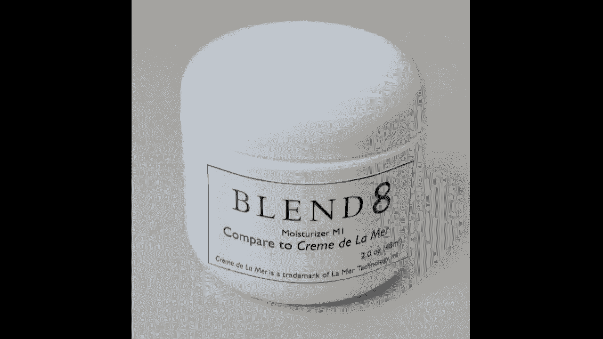
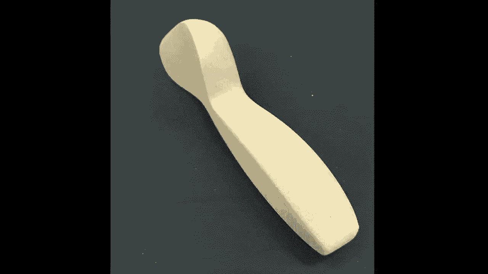
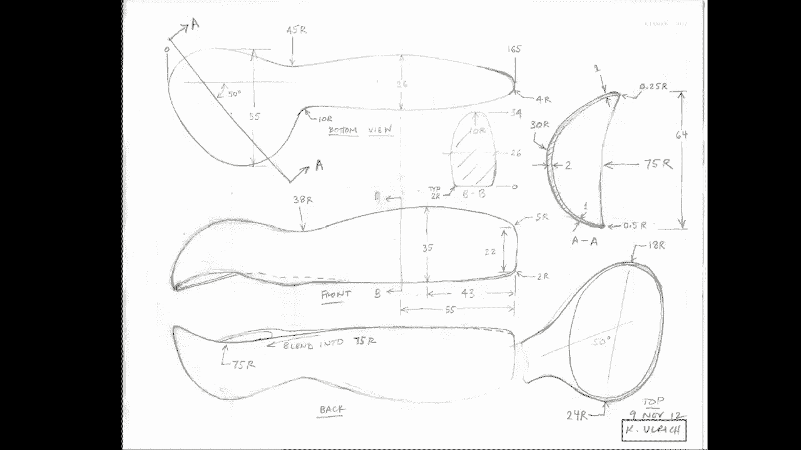
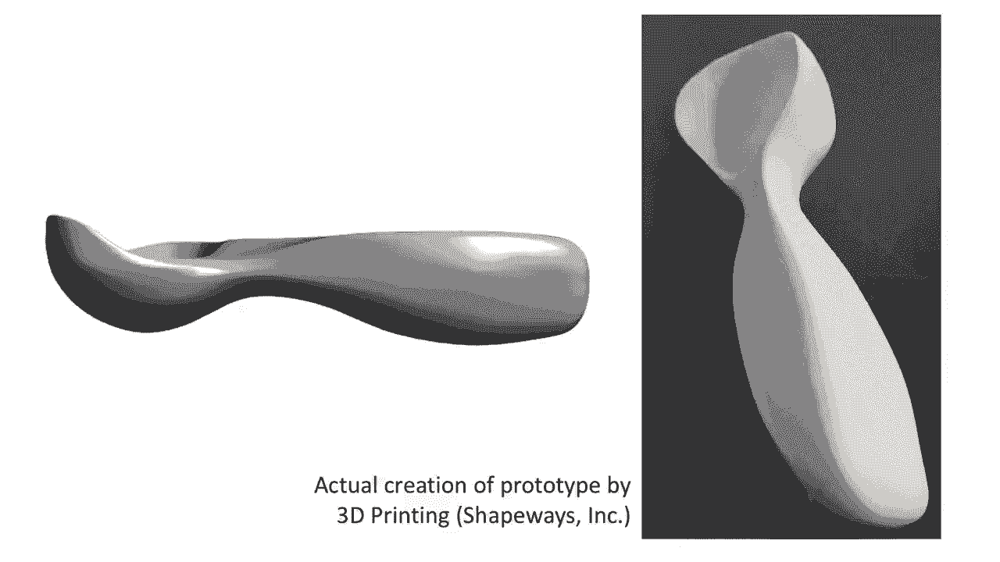
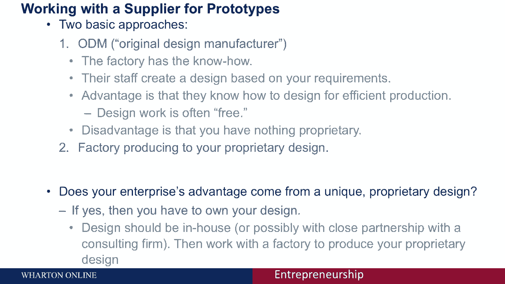

# 🛠️ 沃顿商学院创业课 P29：如何制作产品原型

在本节课中，我们将学习硬件产品开发中一个至关重要的环节：原型制作。许多创业者对原型存在误解，认为它是一个单一的终点。实际上，原型制作是一个持续的、迭代的过程。我们将通过具体案例，了解不同类型的原型及其作用，并探讨如何与供应商合作来制造原型。

---

## 🔍 原型的基本类型

首先，我们需要区分两种主要的原型：聚焦原型和全面原型。

*   **聚焦原型**：这种原型只反映产品性能的一个或几个方面，通常被称为试验台或模型。它用于回答特定的问题。
*   **全面原型**：这种原型功能齐全，通常会经历连续的改进迭代。根据其成熟度，又可分为概念验证原型、阿尔法原型、测试版原型和预生产原型。

上一节我们介绍了原型的基本分类，本节中我们来看看每种原型的具体例子和作用。

---

## 📦 全面原型的演进案例：十字架自行车架

以下以“十字架”自行车架为例，展示全面原型从概念到生产的演进过程。

*   **概念验证原型**：这是第一个原型，用旧自行车零件和弯曲的钢管在车库中制成。它验证了“将货架附着在座椅柱上”这一核心概念是否可行。
*   **阿尔法原型**：这个原型解决了概念验证原型的几个问题，例如增大了货架尺寸以容纳标准自行车包，并改进了可拆卸功能。它通过拼凑现有零件实现了完整功能。
*   **测试版原型**：这个原型由最终的生产工厂制造，具有产品的所有特性和功能，可以用于消费者测试。但它仍存在一些细节问题，如表面处理错误。
*   **预生产原型**：这是生产意图设计，在各个方面都达到了最终产品的要求，包括正确的角度、表面处理和品牌标识，理论上可以直接销售给消费者。

所有这些全面原型都功能齐全，它们帮助团队实现里程碑、展示进展，并解决产品开发中的挑战。

---

## 🎯 为什么要制作原型？

制作原型主要有两个目的：对内学习和对外沟通。

**对内（对开发团队）**：原型主要用于**学习、解决问题和验证产品与市场是否匹配**。核心问题是：你的解决方案真的能满足目标客户的需求吗？

**对外（对供应商、投资者、合作伙伴）**：原型用于**证明**。以下是两个关键证明点：
1.  **证明技术可行性**：你的解决方案在技术上是有效的。
2.  **证明市场接受度**（即“狗会吃狗粮”）：客户会真正采用你的解决方案。

这些原型能有效沟通你的工作，证明团队有能力将想法转化为切实的产品。

---

## ✨ 原型制作技巧与案例

了解了动机后，我们来看看一些实用的原型制作技巧和生动案例。

### 案例1：快速验证的家具原型
一个媒体站家具的生产版本很复杂，但早期原型仅用家装店找到的材料和10美元成本，在几小时内完成。这个快速原型回答了“它是否适合房间并满足功能”的问题，极大地促进了学习。

### 案例2：低成本品牌展示
在化妆品创业中，为了向他人展示产品外观和品牌感觉，团队仅用激光打印机打印标签，贴在普通罐子上。这个极其简单的原型，成为了一种非常有效的沟通工具。

### 案例3：学生团队的“熨斗手套”
一个学生团队构思了与手套结合的便携熨斗。尽管没有技术背景，但他们用找到的物体制作了一个演示模型。这个原型帮助他们回答了关于工作温度、使用感受和客户反馈的关键问题。

### 技巧：使用“功能原型”与“外观原型”
对于复杂产品，有时很难做出一个既好看又能工作的原型。一个好技巧是制作两个：
*   **功能原型**：用于验证核心工作原理，可能外观粗糙。
*   **外观原型**：用于展示最终产品的尺寸、形状、人体工程学和美学，可能无法实际工作。
将两者结合展示，能更全面地向外界说明产品的最终形态。

---

## 🍨 从概念到生产：冰淇淋勺的迭代之旅

现在，让我们通过一个冰淇淋勺产品的完整开发过程，深入了解原型迭代的复杂性与必要性。

最初，为了测试不同的解决方案，我制作了八个由番茄酱罐、棒球棒等废旧物品制成的概念原型。在确定了“有角度勺头”的方向后，制作了轻脂泡沫模型来探索人机工程和外形。

由于泡沫模型无法实际使用，我根据满意的模型尺寸绘制草图，并雇佣一名研究生将其转化为**计算机三维模型**。随后，通过**3D打印技术**将数字模型变为实体，从而验证了有角度勺子的有效性。

从最初的泡沫模型到最终生产设计，中间经历了**数十次迭代**。每一个原型都用于验证和改进设计。最终精美产品的背后，是大量的尝试、提炼和跨专业合作（例如引入专业设计公司），而不仅仅是“做一个原型”那么简单。

---

## 🤝 如何与供应商合作生产原型？

最后，我们来探讨与工厂供应商合作生产原型的两种基本模式。

**1. 自有设计生产模式**
*   **做法**：你（或你的设计团队）完成所有设计工作，向工厂提供详细的图纸和规格，工厂严格按图生产。
*   **优点**：你完全拥有设计，知识产权清晰。
*   **缺点**：你需要具备或获取全部设计能力，且工厂可能无法以最优方式生产。

**2. 原始设计制造商模式**
*   **做法**：你向工厂提出功能、尺寸、成本等要求，由工厂负责设计和生产出符合要求的部件。
*   **优点**：你无需深入设计细节，工厂的设计工作常包含在零件成本中，生产效率可能更高。
*   **缺点**：你不拥有核心设计，工厂掌握了专有信息，竞争对手也可提出类似要求。

**如何选择？**
关键在于思考你企业的**专有优势来源**。如果你的优势在于独特的设计或技术，应选择**自有设计模式**以保持控制。如果你的优势在于整合、营销或商业模式，而生产是标准化的，那么**ODM模式**可能更高效。

---

## 📝 总结

本节课中我们一起学习了产品原型制作的全过程。我们明确了原型是一个**迭代过程**，而非单一终点；区分了**聚焦原型**与**全面原型**的不同用途；理解了原型对内**学习验证**、对外**沟通证明**的核心价值。通过冰淇淋勺等案例，我们看到了从概念到生产所需的**数十次迭代**与**跨专业合作**。最后，我们分析了与供应商合作的两种模式（**自有设计**与**ODM**），并指出选择取决于企业的核心优势所在。记住，制作原型是将创意转化为现实的关键一步，它需要耐心、技巧和清晰的战略。