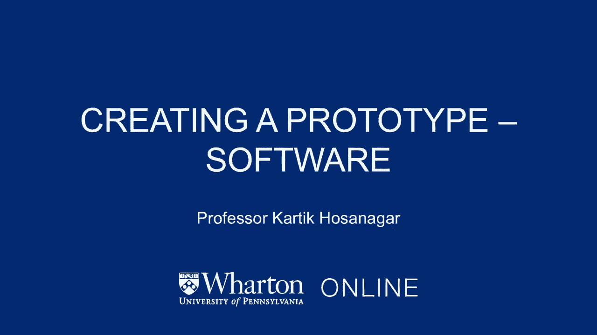
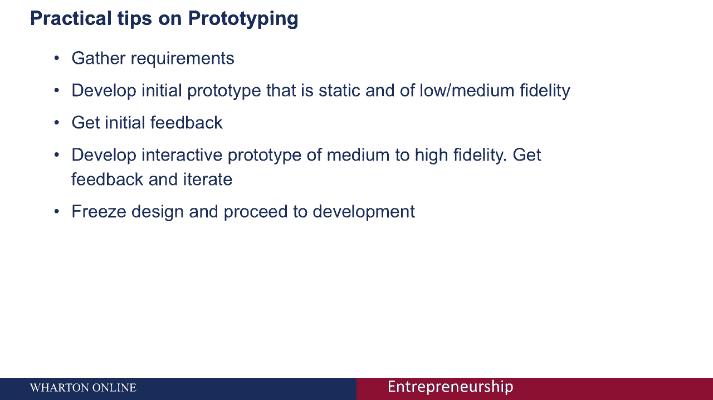
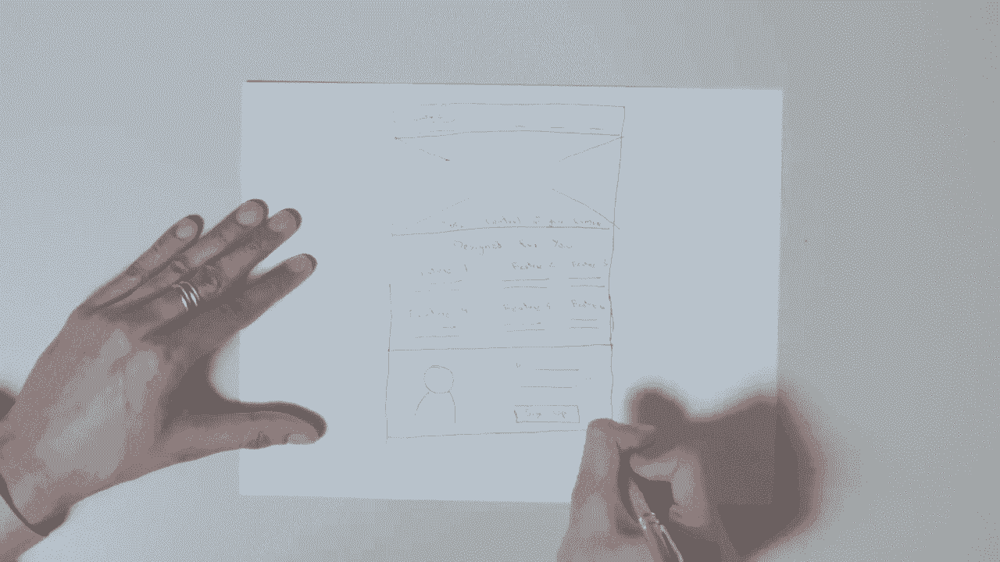

# 【沃顿商学院】创业四部曲：发现机会、建立公司、增长战略、融资和盈利 - P30：创建软件原型 📱




在本节课中，我们将学习如何为软件产品创建原型。原型是产品开发过程中的关键一步，它能帮助我们验证概念、明确需求，并避免在后期进行代价高昂的修改。

## 为什么要制作原型？🤔

上一节我们介绍了课程主题，本节中我们来看看制作原型的目的。原型主要有两个核心目的。

1.  **向用户和开发人员澄清用户界面**。原型是最终产品界面的可视化模型。
2.  **澄清最终产品中支持的功能**。它有助于明确产品应包含哪些特性。

制作原型能带来以下好处：
*   **降低成本和时间**：相比直接开发完整产品再迭代，事先明确需求能减少返工。
*   **促进团队协作**：非技术背景的联合创始人等利益相关者也能在原型阶段参与产品讨论。
*   **提高产品质量**：在开发开始前，通过原型收集反馈并进行优化。

## 原型的类型 🧩

了解不同类型的原型有助于我们选择合适的方法。原型可以从多个维度进行分类。

### 一次性原型 vs. 进化原型

以下是这两种原型方法的区别：

*   **一次性原型**：创建一个完整的系统模型供用户评估。获得反馈并冻结设计后，原型可能被丢弃，然后开始正式开发。这种方法**快速**，能让用户在开发前充分了解系统。
*   **进化原型**：只构建系统中已明确理解的部分，然后逐步添加其他功能。原型本身会**演化**为最终产品。本课程将主要关注**一次性原型**，因为它速度快，且能在不启动正式开发的情况下进行。

### 保真度：低、中、高

原型的保真度指其与最终产品外观的相似程度。

*   **低保真度原型**：通常是**手绘草图**。优点是**速度快**，便于在早期快速迭代多种设计方案。
*   **高保真度原型**：具有完整的视觉设计，是“所见即所得”的类型。优点是易于用户理解和开发人员编码，但制作成本**较高**。
*   **中保真度原型**：在速度和真实感之间取得良好**平衡**，例如使用线框图工具制作的设计。

### 静态原型 vs. 交互式原型

这个维度关注原型对用户操作的响应能力。



*   **静态原型**：是一系列**静态屏幕**的串联，无法交互。
*   **交互式原型**：允许用户**点击**、在表单中输入等，能模拟最终产品的操作流程。

选择静态还是交互式原型，取决于产品复杂度和原型目标。如果产品交互复杂或理解操作流程是关键，则**交互式原型**更佳。如果产品主要是静态页面或目标仅为澄清视觉设计，**静态原型**可能就足够了。

## 如何选择原型工具？🛠️

工具的选择取决于我们想要制作的原型类型。

*   **低保真度静态原型**：**纸和笔**即可。
*   **中/高保真度静态原型**：可使用 **Photoshop**、**Visio**、**PowerPoint** 或 **Keynote**。
*   **中/高保真度交互式原型**：推荐使用 **Balsamiq**、**Axure** 等专业线框图工具。
*   **进化原型**：如果你是开发者，可直接使用 **Visual Studio**、**Eclipse** 等开发环境。

一个实用的建议是：先开发一个**低保真度或中保真度的静态原型**获取初步用户反馈。然后基于反馈，迭代开发**中/高保真度的交互式原型**，并继续收集反馈，直到设计满意，再冻结设计进入开发阶段。

## 企业家如何参与原型设计？✍️

即使你不是设计师，积极参与原型阶段也大有裨益。一种有效的方法是亲自尝试**低保真度设计**。

让我们通过一个虚构的摄影教学网站登陆页为例，看看如何快速构思多个设计。

**设计一（经典布局）**
```
[Logo] | [产品链接] [资源链接] ...
-----------------------------------
[主标题]
[解释网站价值的视频]
[客户推荐]
[注册按钮]
-----------------------------------
[“我们为何创建”版块]
[产品特点列表]
[“专家教学”版块]
-----------------------------------
[页脚：关于我们、联系方式...]
```

**设计二（无视频，强调步骤）**
```
[Logo] | [产品链接] [资源链接] ...
-----------------------------------
[客户照片与推荐]
[“三个简单步骤”版块]
  1. [步骤一图文]
  2. [步骤二图文]
  3. [步骤三图文]
-----------------------------------
[页脚]
```

**设计三（情感化，突出功能）**
```
[Logo] | [产品链接] [资源链接] ...
-----------------------------------
[全屏横幅：快乐的摄影师照片 + 宣传标语]
[“六大核心功能”展示区]
  - 功能一 + 简短描述
  - 功能二 + 简短描述
  - ...
-----------------------------------
[客户推荐]
[大型注册按钮]
-----------------------------------
[页脚]
```

这些设计草稿可以在几分钟内完成。这就是低保真度原型的精髓：**快速生成多种方案**，然后与团队和用户讨论，决定哪个方向值得投入更多资源进行高保真设计。它让非设计师的企业家也能有效地参与产品塑造过程。



## 总结 📝

本节课中我们一起学习了软件原型制作。我们了解了原型的核心目的与价值，探讨了不同类型（一次性/进化、不同保真度、静态/交互式）的原型及其适用场景，并介绍了相应的工具选择。最后，我们通过一个实例看到，即使没有设计经验，企业家也可以通过低保真度草图积极参与原型设计，与团队和用户进行有效沟通，从而降低风险，为产品的成功开发奠定坚实基础。