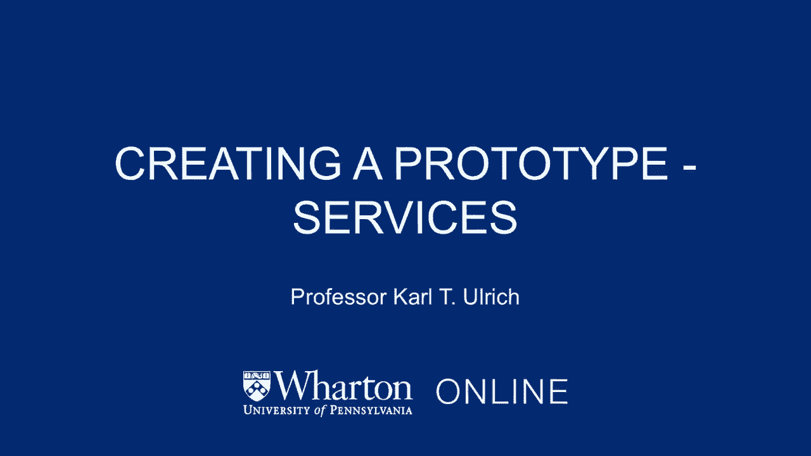

# 🧪 创业课程 31：服务原型设计 - 绿野仙踪法

在本节课中，我们将学习如何为服务型创业项目创建原型。与硬件产品不同，服务原型通常不涉及复杂的技术挑战或巨额资本投入，但如何低成本地验证核心概念同样至关重要。我们将重点介绍一种名为“绿野仙踪”的高效原型设计方法。

---

上一节我们讨论了硬件产品的原型制作，本节我们来看看服务型产品如何验证其概念。

在服务原型设计中，创业者通常不会面临深刻的技术挑战，也不需要大量的资本投入来“生产”服务。与硬件类似，服务通常也需要由创业者自己来提供。例如，餐饮公司经营自己的餐馆，航空公司拥有并操作自己的飞机，保险公司则拥有并经营自己的服务体系。创业者通常不会与合作伙伴一起提供核心产品，这与硬件公司常与制造商合作生产产品的方式不同。

但核心挑战依然存在：**如何在不进行全部必要投资、不构建完整服务体系的情况下，测试和验证你的服务概念？**

接下来，我们将介绍一个在服务设计与开发中非常有效的技巧。

## 🎭 什么是“绿野仙踪”方法？

这种方法的名字来源于经典音乐剧《绿野仙踪》。剧中，伟大的奥兹巫师通过屏幕向观众展示其形象，而幕布后实际上是一个普通人在操纵杠杆。对观众而言，重要的是屏幕上的体验，而非幕后的真相。

你可以将同样的思路应用于你的服务原型设计：**为用户提供完整的前端体验，而后台操作则通过手动、临时或简化的方式来完成**，从而验证核心概念，无需构建完整的后台系统。

以下是应用此方法的一个经典案例。

## 🚴 案例研究：Caviar 的诞生

杰森·王科创立了高端送餐服务 Caviar。故事始于他在旧金山另一家初创公司工作时，团队面临的午餐难题。他们非常喜欢当地一家餐厅的“泡菜玉米煎饼”。

有一天他们突发奇想：“也许我们应该思考如何更有效地获得泡菜卷饼，这甚至比我们当前的工作更有趣。”于是，他们构思了一个为城市居民提供高效、高品质、精选食品配送的服务概念。

为了测试这个基于应用程序的精选食品配送概念，他们采取了以下步骤：

1.  **构建前端**：他们首先开发了应用程序的前端界面，让用户可以浏览和下单。
2.  **手动完成后端**：当接到订单时，创始人杰森本人会骑上自行车，前往那家玉米煎饼店，购买食物，然后亲自配送给顾客。

通过这种方式，顾客获得了完整、流畅的Caviar点餐和配送体验，而完全不知道幕后是由创始人手动完成的。这正是“绿野仙踪”方法的精髓：**用户看到的是“魔法”（完整服务），而创业者则在幕后“拉杠杆”（手动实现）**。

这种方法的好处显而易见：在验证服务概念时，**你无需建立完整的物流网络，也无需说服大量餐厅入驻平台**。Caviar团队甚至可以直接走进任何餐厅，用信用卡购买食物并完成配送。

最终，Caviar的概念得到了验证，并成长为一个非常成功的业务，在运营的第二年就以约1亿美元的价格被 Square 公司收购。

---

## 📝 核心要点总结

本节课我们一起学习了服务型创业项目的原型设计方法。

*   **核心理念**：服务原型的关键在于验证概念，而非构建完整系统。
*   **核心方法**：“绿野仙踪”法。其**核心公式**可概括为：
    > **完整前端体验 + 手动/简化后端执行 = 低成本概念验证**
*   **核心优势**：这种方法允许创业者以极低的成本和最快的速度，测试市场需求和用户体验，无需在验证阶段进行重资产投资。

总而言之，如果你正在创建一项服务，请仔细思考：**为了与客户实际测试这个概念，你究竟需要构建多少东西？** 很多时候，采用“绿野仙踪”方法，即先为客户提供前端体验，而后台手动运作，是验证想法最高效的途径。