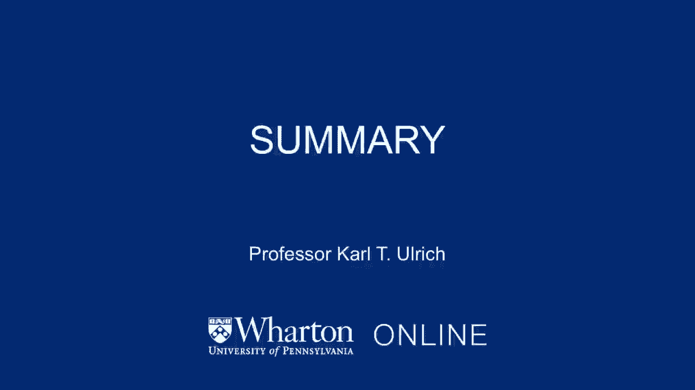
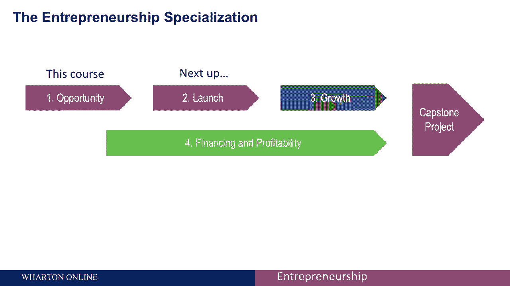

# 【沃顿商学院】创业 四部曲：发现机会、建立公司、增长战略、融资和盈利 - P32：[P32]07_4-7-summary-and-whats-ahead - 知识旅行家 - BV19Y411q713

好吧，这就是我们课程的发展机会。

我们希望你喜欢参加这门课程，就像我们喜欢开发这些材料一样，我们也希望，在您理解内在风险和不确定性的同时，困扰创业的内在因素，你很感激有一些工具，你可以采取的方法和方法，增加你成功的机会。

帮助你管理风险和不确定性，除了视频里的素材，我们在课程大纲上提供了很多辅助资源，在课程网站上，我们也希望你能选修本专业剩余的课程，除了这门课，我们有一个关于启动你的创业的课程，其中我们告诉你。

如何把这个机会变成你能真正提供给客户的东西，并开始了解你的产品是否适合市场，专业的第三门课程是增长战略，并将教你如何把你最初的羽翼未丰的冒险，并将其发展成为财务上可持续的东西。

专业的第四门课程是融资和盈利能力，专业化的第五个要素是顶点项目。

我们给你一个机会来识别和发展你自己的机会。
