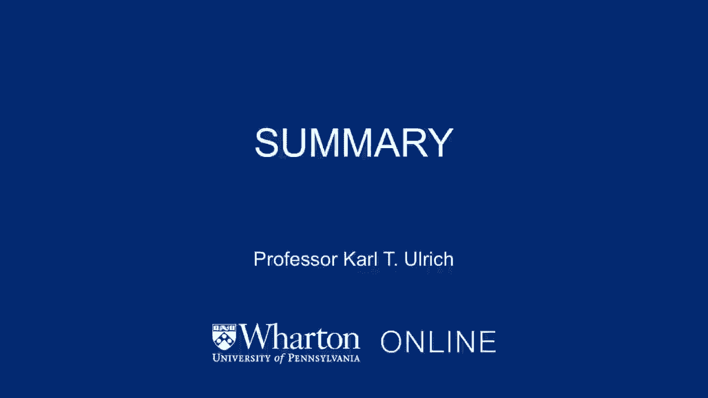
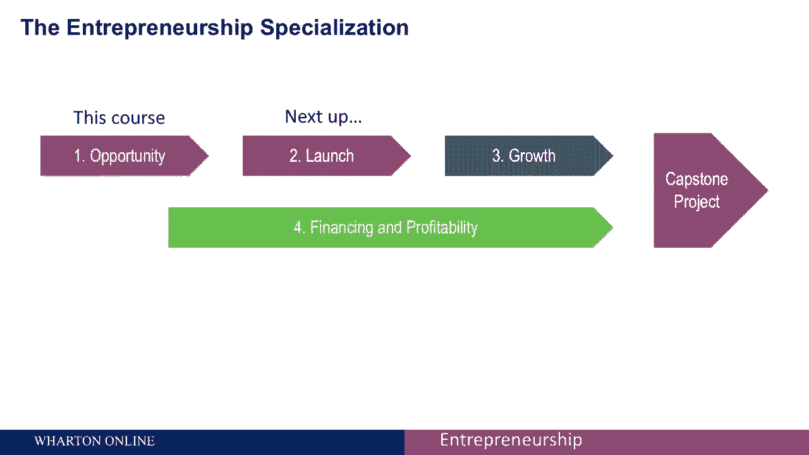

# 🚀 沃顿商学院创业课程 P32：总结与展望

在本节课中，我们将对“发现机会”模块进行总结，并预览整个创业专项课程后续的学习路径。我们将回顾已学的核心工具，并了解如何将这些知识应用于后续的实践环节。

---

上一节我们探讨了评估创业机会的具体方法。现在，让我们对本模块的内容进行总结。

课程中关于“发展机会”的探讨至此告一段落。

我们希望您享受学习这门课程的过程，正如我们乐于开发这些课程材料一样。同时，我们希望您在理解创业内在风险与不确定性的前提下，能够掌握一系列可用的工具、策略与方法，以提升成功的概率。

这些工具旨在帮助您管理风险与不确定性。除了视频材料，我们在课程大纲和课程网站上提供了丰富的辅助资源。

我们也鼓励您继续学习本专项课程的其他部分。除了这门关于“发现机会”的课程，专项课程还包含以下内容：

以下是本创业专项课程的完整构成：

1.  **启动你的创业**：这门课程将指导您如何将识别出的机会转化为能够实际提供给客户的产品或服务，并开始验证产品与市场的匹配度。
2.  **增长战略**：第三门课程将教您如何将最初稚嫩的创业项目，发展成为一个在财务上可持续的企业。
3.  **融资和盈利能力**：第四门课程将专注于创业公司的资金筹措与盈利模式。
4.  **顶点项目**：作为专项课程的第五个也是最后一个环节，它将为您提供一个机会，去识别并发展您自己的创业机会。

---

本节课中，我们一起回顾了“发现机会”模块的核心，即利用系统性的工具来应对创业中的风险与不确定性。同时，我们也预览了完整的创业学习路径，从机会识别到启动、增长、融资，最终在顶点项目中实践所学。掌握这些连贯的知识体系，将为您未来的创业之旅奠定坚实的基础。