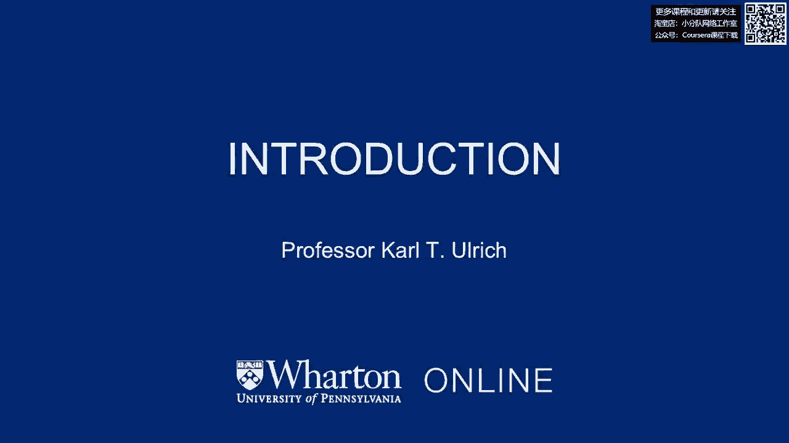
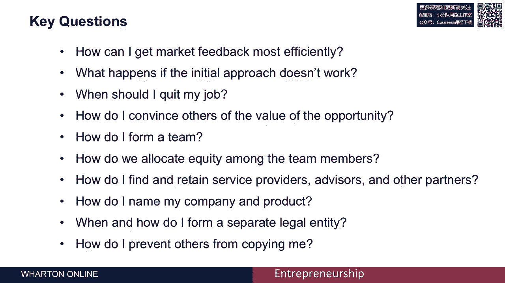

# 🚀 沃顿商学院创业课程 P34：创业启动入门

在本节课中，我们将学习沃顿商学院创业专项课程的第一部分——“启动你的创业”的入门介绍。我们将了解整个课程的结构、核心目标，以及创业者从发现机会到准备将产品推向市场所需面对的关键问题。

我是卡尔·乌尔里希，沃顿商学院的教授，负责教授创新、创业与产品设计课程。

我很荣幸能成为本课程的导师之一。本课程名为“启动你的创业”，它是一个由四门课程组成的专项课程的一部分。第一门课程是“发现机会”，接下来便是本课程“启动你的创业”。之后还有第三门关于“增长战略”的课程，以及第四门关于“融资和盈利能力”的课程。

所有这些课程都与一个顶点项目相关联，该项目旨在将各门课程的知识整合到一个综合性的课程项目中。虽然你可以按任意顺序选修这些课程，但本课程假设你已经从一个机会开始——即你已经发现了市场上的某个需求或痛点，并拥有一个解决该需求或痛点的初步想法。

上一节我们介绍了课程的整体框架，本节中我们来看看本课程的具体目标。在本课程中，我们将专注于抓住一个有效的机会，并帮助你做好准备，将解决方案推向市场。

以下是本课程将探讨的一些核心问题：
*   如何最有效地获取市场反馈？
*   如果最初的方法行不通，该怎么办？
*   我应该辞掉白天的工作吗？
*   我何时才能让他人相信我正追求的机会的价值？
*   我如何组建一个团队？
*   我们公司的股份应如何在全体团队成员中分配？
*   我如何寻找并留住合作伙伴、服务提供商、顾问等资源？
*   我如何为我的公司和产品命名？
*   我应在何时以及如何成立新的法律实体？
*   我如何防止他人复制我的创意？

这些都是极其重要且有趣的问题，它们对于应对启动一家初创公司所面临的挑战至关重要。

本节课中，我们一起学习了“启动你的创业”课程的概述。我们明确了本课程在四部曲中的位置，以及它将引导你从一个初步想法出发，系统性地解决团队组建、市场验证、法律实体设立等创业初期必须面对的核心问题，为将产品成功推向市场打下坚实基础。