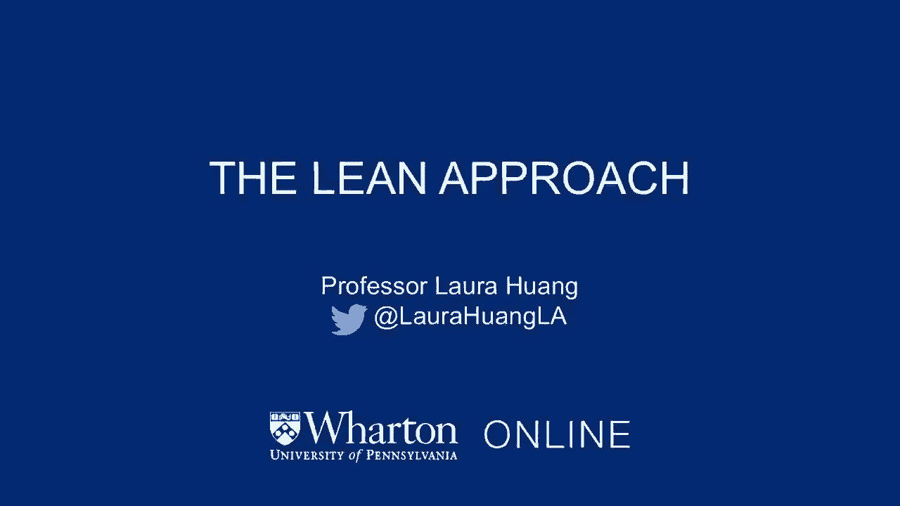
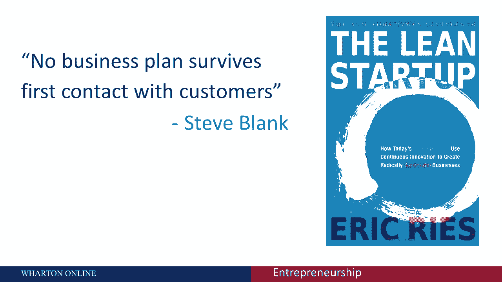
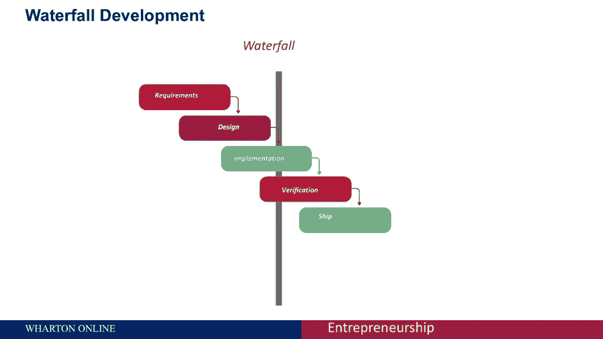
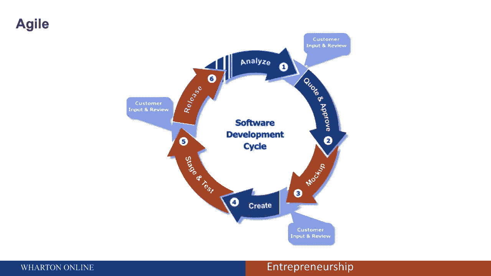
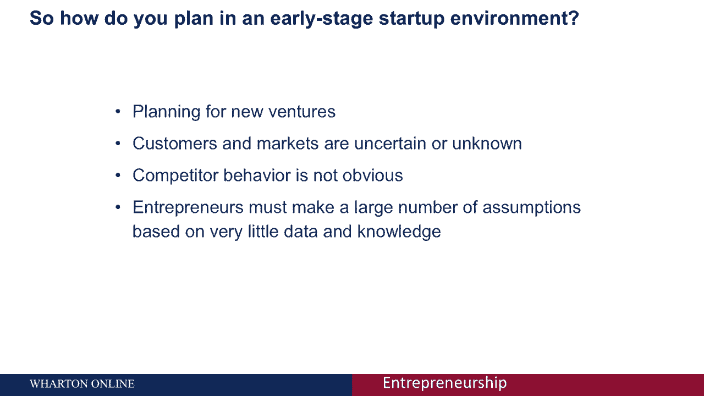
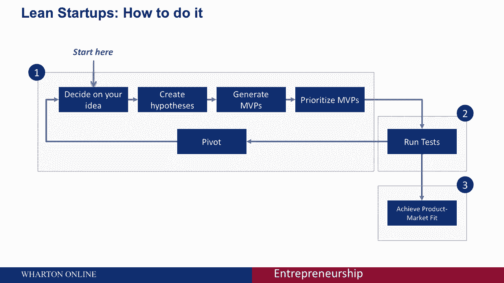
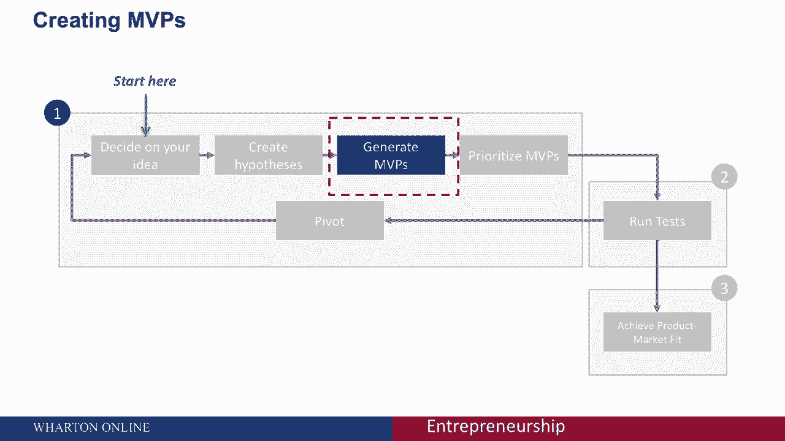
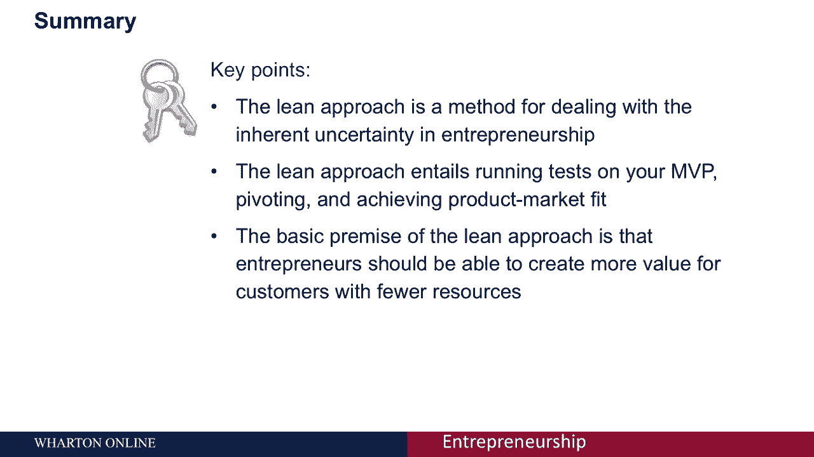

# 【沃顿商学院】创业 四部曲：发现机会、建立公司、增长战略、融资和盈利 - P35：[P35]02_1-1-the-lean-approach - 知识旅行家 - BV19Y411q713

欢迎参加我们关于精益方法的讨论，以及何时应用精益方法。

精益方法是处理创业中固有不确定性的一种方法，精益方法的基本前提是。

企业家应该能够用更少的资源为客户创造更多的价值，这样做的原因也许最好的例子是这句话。

没有商业计划在与客户的第一次接触中幸存下来，这意味着你的产品将永远处于不断变化的状态，当你有客户接触点时精益方法可以帮助你管理这个现实。

精益创业提供了创建和管理创业的科学方法，这样企业家就可以更快地把想要的产品送到客户手中。

但请记住，尽管精益创业模式只是处理不确定性的一种方式。

还有很多其他的方法，我们会在其他讲座中提到。

在我们开始研究精益方法本身之前，让我们先谈谈在典型项目的规划中，常规的规划是如何进行的，有一个很好理解和可预测的过去经验平台，这意味着管理者可以从过去的经验中推断出未来的结果。

经理们有大量的知识和数据可供他们使用，并且必须做出很少的假设，例如，与建筑相关的项目住房建设是一个相对较好理解的过程，几乎没有不确定性，一个房屋建筑项目可以用传统的瀑布法开发，客户问题是已知的。

所有客户的需求和产品特性都可以在需求阶段预先指定，整个需求可以在设计阶段捕获，可以执行捕获需求的精确设计，然后在实施阶段，房子实际上是可以建造的，所有的需求都可以集成，并在验证阶段按设计中预先规定。

建造的房屋可以根据一组商定的要求进行验证。

最后在维护阶段。

有支持活动来保持房子的标准，类似的方法是敏捷的，敏捷的显著特点是它是主项目中的微型项目，这使得它非常适合软件开发，因为质量，保证，对于应用程序的成功来说，测试和构建代码库同样重要，bug，业绩问题。

需要尽早发现和解决安全缺陷，并在整个开发过程中反复进行，以允许项目推进，这可以通过敏捷测试来解释，和q a是敏捷方法的不变特征，一旦构建了应用程序的新部分，它通过一系列测试来识别其他。

不符合要求的部件，这个，确保新特性与应用程序的其余部分无缝集成。

并提供整体质量，那么在早期的创业环境中，你实际上是如何计划的呢，当你在计划新的冒险时，事情实际上是非常不同的，在快速变化的业务中，使用敏捷或瀑布这样的方法是死亡，在计划新的冒险时。

客户和市场不确定或未知，竞争对手行为不明显，企业家必须做出大量的假设。

基于很少的数据和知识，这是精益创业公司进入画面的地方。

精益创业采用商业假设的组合，驱动实验，迭代产品发布，和验证学习，本质上，您正在迭代地构建产品或服务以满足早期客户的需求，有多个检查站，当你试图验证你的产品如何适合市场时，以及市场如何适合你的产品。

这有助于降低市场风险，并帮助企业家避开对大量初始项目资金的需求，昂贵的产品发布和失败，看起来你首先要决定你的想法，从那里，你创造假设，然后允许您考虑生成您的MVP，然后你会优先考虑你的MVP。

然后对所有这些MVP运行测试，当您运行测试时，你可能会决定转向，在这种情况下，你可能会从一个新的想法开始，或者开始生成具有不同功能的不同MVP，一旦您运行了足够的测试，你将开始实现神奇的产品。

你希望实现的市场契合度，MVPS是最小可行的产品，我们将在下一节课中了解什么是MVP，它是什么样子的。

要记住的是，你的MVP应该被开发，这样你就可以快速地检验假设。

并再次以尽可能少的资源支出。

我们将在下一节课中具体讨论MVP是什么样子的，对你的MVP进行排序也很重要，在你学习的时候，以一种最大限度地减少现金消耗的方式，你想找到最小化投资和承诺的方法，直到关键假设得到检验。

我们稍后还将更详细地讨论如何做到这一点，正如我们所看到的，精益方法是处理创业中固有不确定性的一种方法，这种方法需要在MVP上运行测试，转向并实现产品市场适配，精益方法的基本前提是。

企业家应该能够用更少的资源为客户创造更多的价值。

