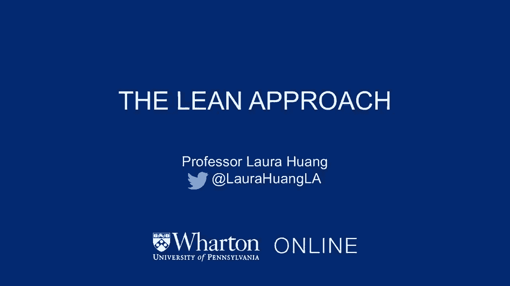
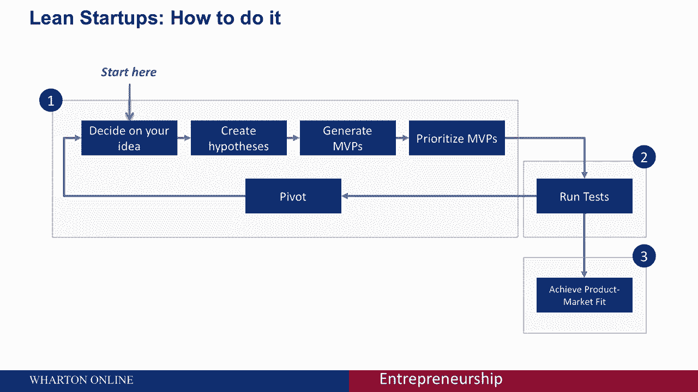
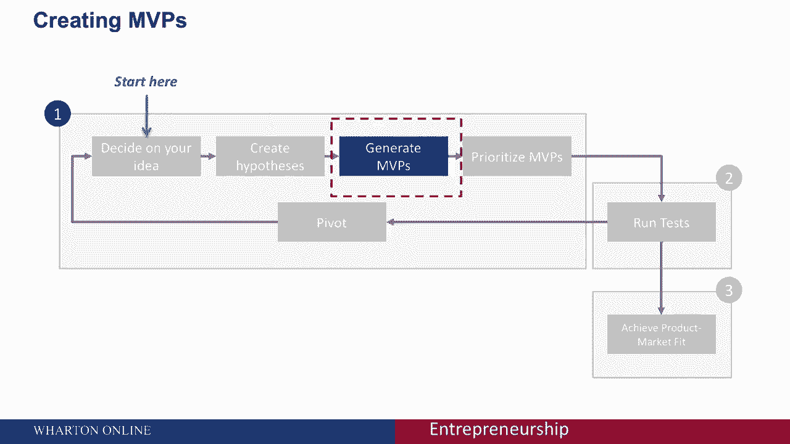
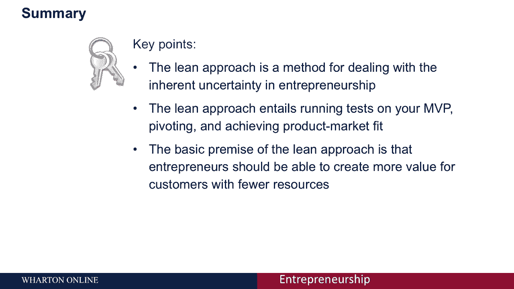

# 🚀 沃顿商学院创业课 P35：精益创业方法

在本节课中，我们将学习什么是精益创业方法，以及它如何帮助创业者应对创业过程中的不确定性。我们将探讨其核心理念、适用场景，并将其与传统规划方法进行对比。

---

## 📊 传统规划方法：瀑布式与敏捷式

在深入了解精益方法之前，我们先看看在确定性较高的项目中，传统的规划是如何进行的。

当项目拥有一个被充分理解和可预测的经验基础时，管理者可以从过去推断未来。他们拥有大量知识和数据，只需做出很少的假设。

例如，房屋建设是一个不确定性极低的过程。这类项目可以采用传统的**瀑布式方法**开发：
*   客户问题是已知的。
*   所有客户需求和产品特性都可以在需求阶段预先确定。
*   完整的设计可以在设计阶段完成。
*   房屋可以在实施阶段按设计建造。
*   建成的房屋可以在验证阶段根据既定要求进行检验。
*   最后，在维护阶段进行支持活动以保持房屋标准。

另一种常见的方法是**敏捷方法**。其显著特点是将大项目分解为一系列微型项目。这种方法非常适合软件开发，因为质量保证、测试和构建代码库对应用成功至关重要。

在敏捷开发中，Bug、性能问题和安全缺陷需要尽早发现和解决。一旦构建了应用的新部分，就会通过一系列测试来识别不符合要求的部件。这确保了新功能能与应用其他部分无缝集成，并提供整体质量。

---

## ⚡️ 创业环境中的规划挑战

然而，在早期的创业环境中进行规划时，情况截然不同。在快速变化的业务中，使用敏捷或瀑布式方法可能是致命的。

在规划新冒险时：
*   客户和市场不确定或未知。
*   竞争对手的行为不明显。
*   创业者必须基于极少的数据和知识做出大量假设。

---

## 🎯 精益创业方法的核心

正是在这种高度不确定性的背景下，精益创业方法登场了。

精益创业采用**商业假设驱动实验**、**迭代产品发布**和**验证学习**的组合。本质上，你是在迭代地构建产品或服务，以满足早期客户的需求。

整个过程设有多个检查点，用于验证你的产品如何匹配市场，以及市场如何接纳你的产品。这有助于降低市场风险，并帮助创业者避免对大量初始资金、昂贵产品发布和最终失败的需求。

以下是精益创业的典型流程：

1.  **决定你的想法**。
2.  **创造假设**，这些假设将引导你思考如何生成**最小可行产品**。
3.  **优先排序你的MVP**。
4.  **对所有MVP运行测试**。

在测试过程中，你可能会决定**转向**。这意味着你可能从一个新想法开始，或者开始生成具有不同功能的不同MVP。一旦你进行了足够的测试，你将开始实现你所期望的**产品与市场匹配**。

---

## 💡 关于最小可行产品

MVP即**最小可行产品**。需要记住的关键点是，你的MVP应该被设计成能够快速检验假设，并且再次强调，要以尽可能少的资源支出实现这一点。

对你的MVP进行排序也很重要。在你学习的过程中，应以一种能最大限度减少现金消耗的方式进行。你需要找到方法，在关键假设得到检验之前，最小化投资和承诺。

---

## 📝 课程总结

本节课我们一起学习了精益创业方法。我们看到，精益方法是处理创业中固有不确定性的一种策略，其核心流程包括在MVP上运行测试、根据反馈转向并最终实现产品与市场匹配。

精益方法的基本前提是：**创业者应该能够用更少的资源为客户创造更多的价值**。记住，尽管精益模式是处理不确定性的有力工具，但它并非唯一方式，我们将在其他课程中探讨更多方法。