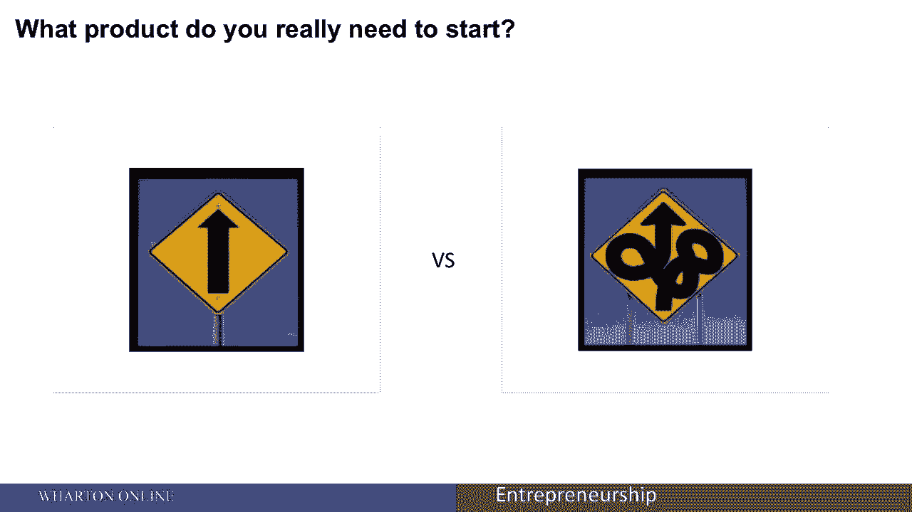
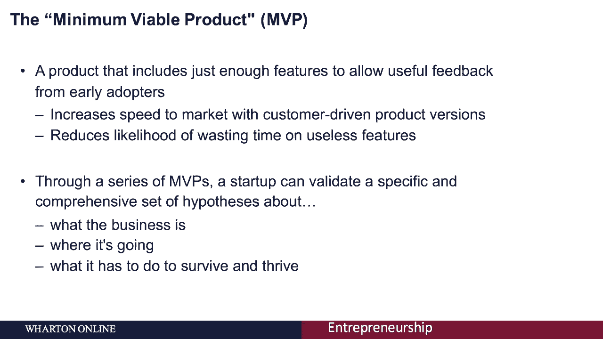
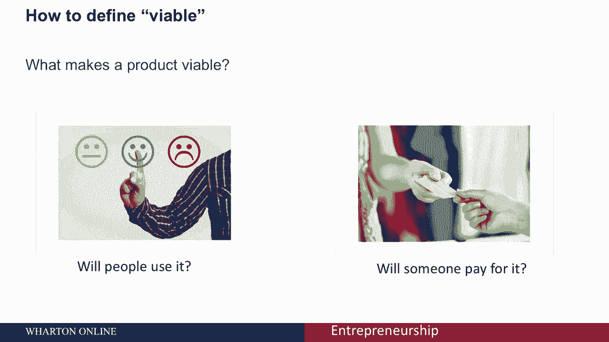
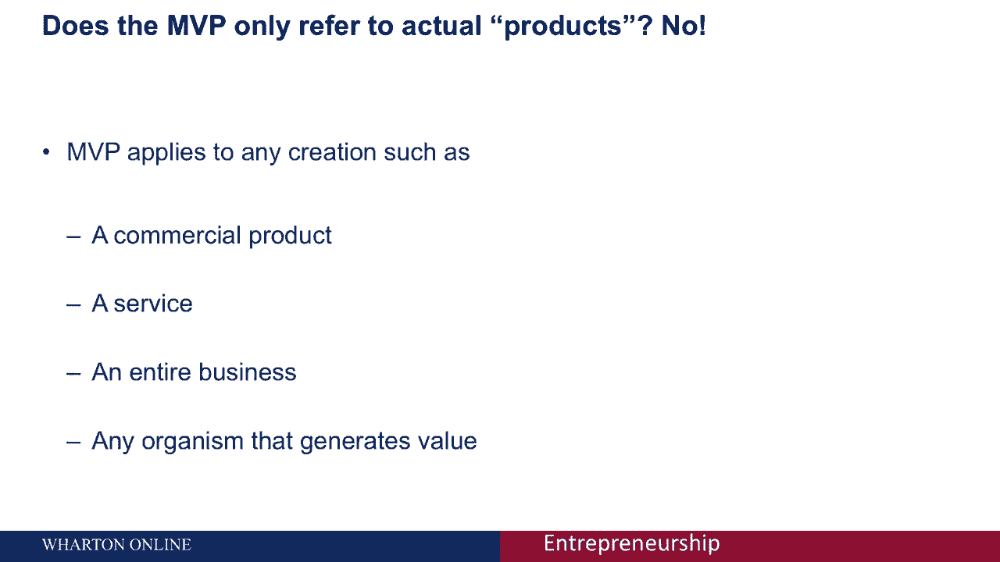
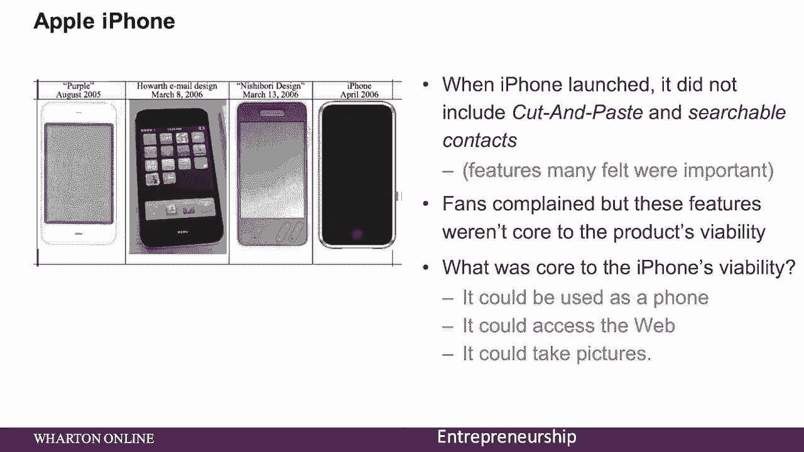
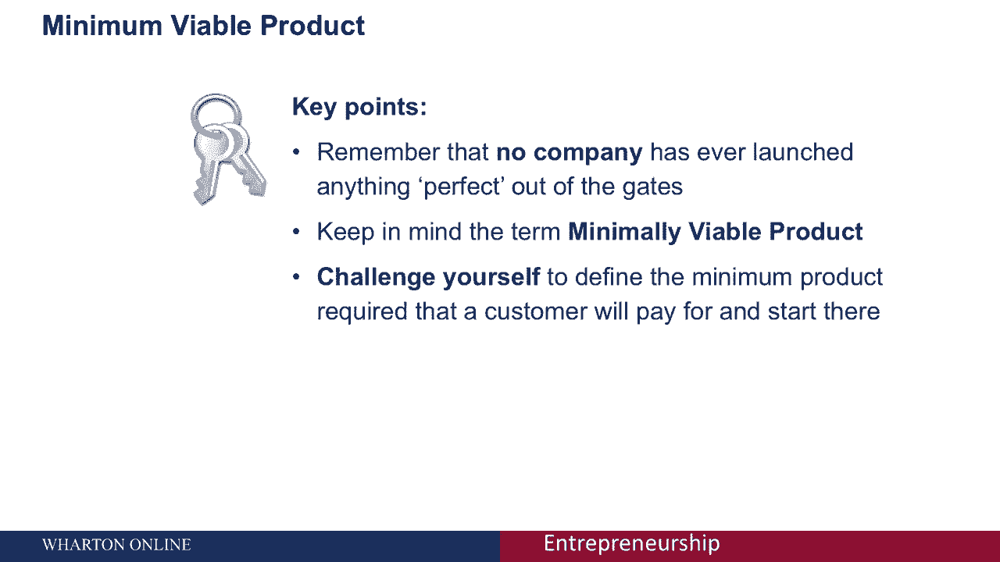

# 【沃顿商学院】创业 四部曲：发现机会、建立公司、增长战略、融资和盈利 - P36：[P36]03_1-2-mvp-minimum-viable-product - 知识旅行家 - BV19Y411q713

正如我们在精益创业的讲座中所学到的，精益启动方法基于一种策略，这种策略从创建最小值开始。

可行产品，这个最小可行的产品。

也称为您的MVP，是基于这样一个想法，即你可以创建一个包含足够功能的产品。

允许早期采用者提供有用的反馈，使用MVP策略的原因是，它使初创企业更容易快速进入市场，你，减少在没人想要的功能上浪费时间的可能性，这使您可以更快地行动，减少失败的可能性，与产品的后续客户驱动版本。

MVP有时被视为一个有争议的想法，因为它可能会被认为是快速拼凑在一起的东西，作为你产品的劣质版本，但实际上，每个MVP都是您产品的独立版本，并通过一系列的MVP，精益创业可以验证一组特定而全面的假设。

关于生意是什么，它要去哪里。

以及它必须这样做，如何定义MVP，让我们先从最小最小值开始。

通常指您正在测试的最小数量的特性，通常有一两个核心问题是产品试图解决的，比如说，iPod可以让你存储音乐并在Go Facebook上播放，让你找到朋友和分享信息，eBay允许你出售或购买二手商品。

google让你在网上找到信息。

每一个都有许多其他特性，但这些是核心，这些产品最重要的两三个特性。

如果他们不能做到以上，他们现在就会失败，让我们看看可行的，在考虑生存能力时，你需要考虑两件事，会有人使用它吗，会有人为此付费吗，这是很多企业家经常被挂断的地方。

他们会问很多顾客他们是否想要一套特定的功能，绝大多数人说当然听起来很棒，但当涉及到人们是否真的会为这些功能支付额外的费用时。

这是一个不同的故事，最后，让我们来看看最小可行产品的产品部分，一个产品可以适用于很多事情，包括商业产品，服务，整个生意，甚至任何产生价值的有机体。

让我们看一些例子，首先，让我们呼吸新鲜空气，维珍航空一开始只有一架波音7，四七提供盖特威克和纽瓦克之间的服务，他们可以从多架飞机和多条路线开始，但相反，他们专注于一架飞机和一条路线，他们的最低可行产品。

他们试图测试的核心特征是乘客的体验，飞机上什么都有，所有的铃铛和哨子，只是想测试乘客的体验。

作为另一个例子，让我们把雅虎，雅虎，最初只不过是一个链接到其他网站的页面，它甚至不包括搜索引擎，当它最初发射时，随着时间的推移，它随着用户行为的变化而发展，他们的最低可行产品试图测试。

消费者是否明白他们需要点击链接，这会把他们带到另一个网站，甚至苹果iPhone，它以创新而闻名，和它刚推出时的众多功能，它不包括剪切和粘贴，甚至可搜索的联系人，这两个特性都是我们经常使用的。

许多人觉得很重要，粉丝们抱怨说，这些功能不是产品生存能力的核心，iPhone生存的核心是什么，有三件事它可以用作电话，它可以访问网络，它可以拍照，所以iPhone的初始版本刚刚测试了。

人们是否喜欢一个可以用作电话的设备，访问Web，同时拍照。

正如我们所看到的，精益创业，方法基于从创建最小可行产品开始的策略。

请记住，从来没有一家公司推出过完美的产品，记住最低可行产品这个术语，以及这如何帮助您实现客户市场的适应，挑战自己定义客户愿意支付的最低限度产品。

从那里开始。

