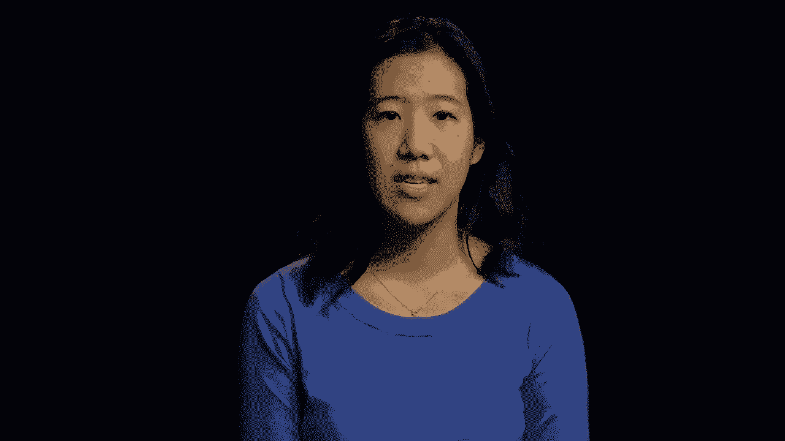
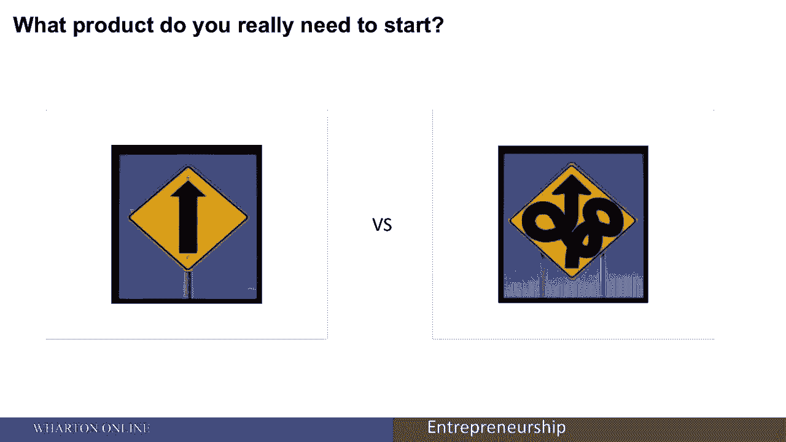
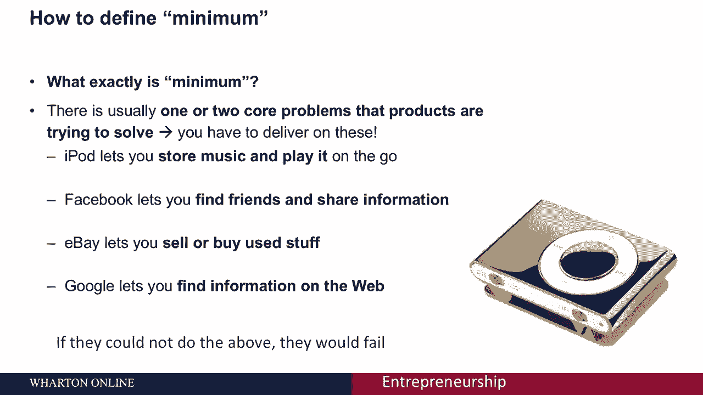
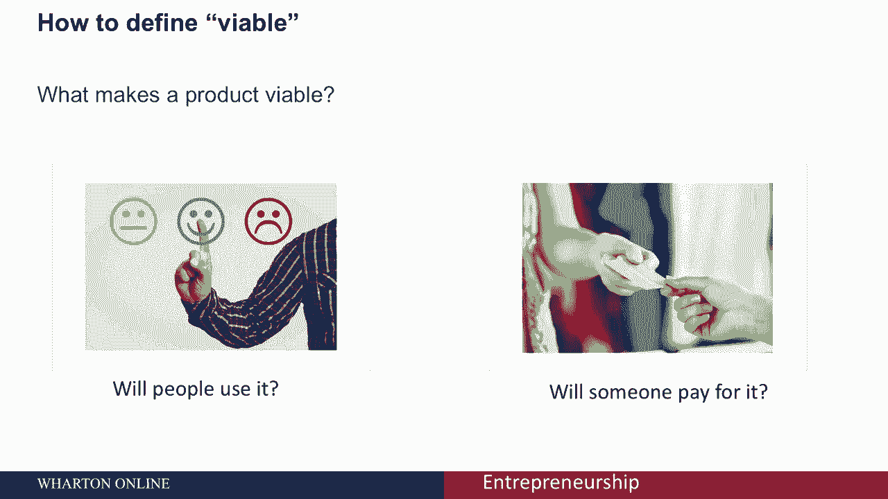
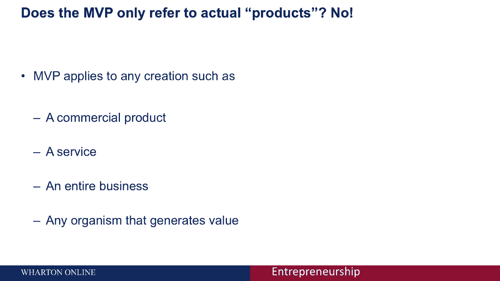
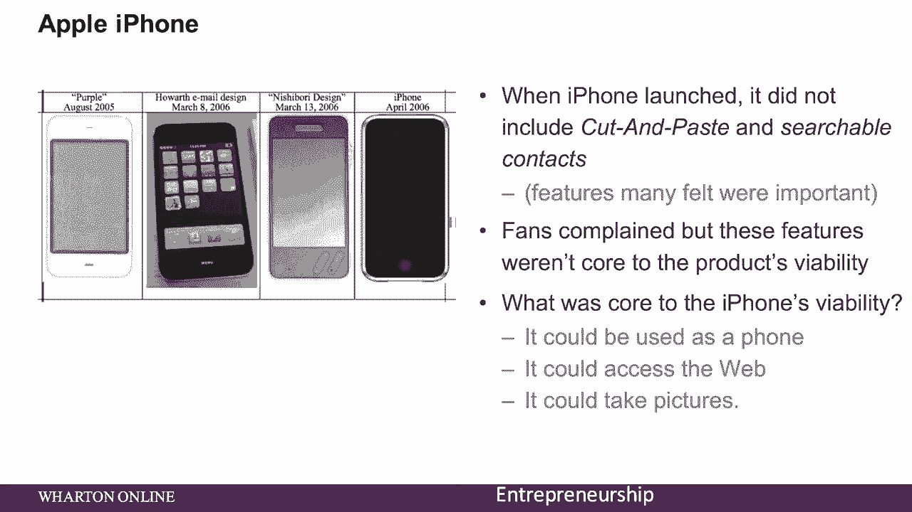

# 【沃顿商学院】创业四部曲：P36 - 最小可行产品（MVP）详解 🎯

在本节课中，我们将深入学习精益创业方法的核心概念之一：**最小可行产品**。我们将探讨它的定义、构成要素以及如何通过实际案例来理解和应用它。

---

正如我们在精益创业的讲座中所学到的，精益启动方法基于一种策略，这种策略从创建**最小可行产品**开始。

这个**最小可行产品**，也称为您的 **MVP**，是基于这样一个想法：你可以创建一个包含足够功能的产品，允许早期采用者提供有用的反馈。

使用MVP策略的原因是，它使初创企业更容易快速进入市场，减少在没人想要的功能上浪费时间的可能性。这使您可以更快地行动，减少失败的可能性，并与产品的后续客户驱动版本协同发展。

MVP有时被视为一个有争议的想法，因为它可能会被认为是快速拼凑在一起的东西，作为你产品的劣质版本。但实际上，每个MVP都是您产品的独立版本，并通过一系列的MVP，精益创业可以验证一组特定而全面的假设，关于生意是什么，它要去哪里，以及它必须如何发展。

---

## 如何定义MVP？🔍

上一节我们介绍了MVP的基本概念，本节中我们来看看如何具体定义它。让我们先从“最小”开始。

“最小”通常指您正在测试的最小数量的特性。通常有一两个核心问题是产品试图解决的。以下是几个例子：

*   **iPod**：可以让你存储音乐并在移动中播放。
*   **Facebook**：让你找到朋友和分享信息。
*   **eBay**：允许你出售或购买二手商品。
*   **Google**：让你在网上找到信息。

每一个都有许多其他特性，但这些是核心，是这些产品最重要的两三个特性。如果他们不能做到以上几点，他们现在就会失败。

---

接下来，我们看看“可行”。在考虑生存能力时，你需要考虑两件事：

1.  会有人使用它吗？
2.  会有人为此付费吗？

这是很多企业家经常被挂断的地方。他们会问很多顾客他们是否想要一套特定的功能，绝大多数人说当然听起来很棒。但当涉及到人们是否真的会为这些功能支付额外的费用时，这是一个不同的故事。

---

最后，让我们来看看最小可行产品的“产品”部分。一个产品可以适用于很多事情，包括：

*   商业产品
*   服务
*   整个生意
*   甚至任何产生价值的有机体

---

## MVP 实战案例 📚

理解了MVP的构成后，我们通过一些经典案例来看看它是如何被应用的。

以下是几个著名公司的MVP实践：

*   **维珍航空**：一开始只有一架波音747，提供盖特威克和纽瓦克之间的服务。他们可以从多架飞机和多条路线开始，但相反，他们专注于一架飞机和一条路线。他们的MVP试图测试的核心特征是乘客的体验。飞机上什么都有，所有的“铃铛和哨子”，只是想测试乘客的体验。
*   **雅虎**：最初只不过是一个链接到其他网站的页面，它甚至不包括搜索引擎。当它最初发射时，随着时间的推移，它随着用户行为的变化而发展。他们的MVP试图测试：消费者是否明白他们需要点击链接，这会把他们带到另一个网站。
*   **苹果iPhone**：它以创新和刚推出时的众多功能而闻名，但它不包括剪切和粘贴，甚至可搜索的联系人。这两个特性都是我们经常使用、许多人觉得很重要的。粉丝们抱怨说，这些功能不是产品生存能力的核心。iPhone生存的核心是什么？有三件事：它可以用作电话，它可以访问网络，它可以拍照。所以iPhone的初始版本刚刚测试了：人们是否喜欢一个可以用作电话、访问网络、同时拍照的设备。

---

## 总结与行动指南 🚀

本节课中我们一起学习了**最小可行产品**的核心思想与应用。

正如我们所看到的，精益创业方法基于从创建**最小可行产品**开始的策略。请记住，从来没有一家公司推出过完美的产品。

记住**最小可行产品**这个术语，以及这如何帮助您实现客户与市场的契合。挑战自己，去定义客户愿意支付的**最低限度产品**，并从那里开始你的创业旅程。