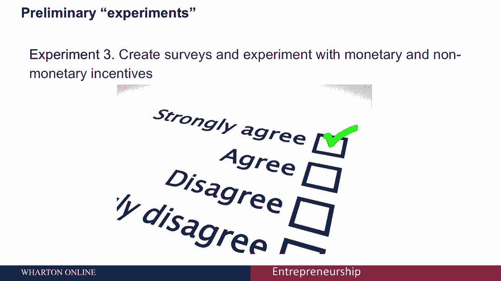

# 【沃顿商学院】创业 四部曲：发现机会、建立公司、增长战略、融资和盈利 - P37：[P37]04_1-3-the-lean-approach-hypotheses-and-preliminary-experiments - 知识旅行家 - BV19Y411q713

今天我们要谈谈如何构造你的假设，对于精益方法，以及如何开始进行初步实验。

来检验这些假设，如果你还记得。

精益方法将带您完成一系列结合业务假设的步骤，驱动实验，迭代的产品发布和验证的学习，我们谈到了什么是MVP，今天我们将专门讨论生成假设。

以及如何进行早期实验，为你的创业制定好的假设是很困难的，关于你的假设，最重要的一点是，它们应该是可测试的。

您需要正确地验证或使您正在做的事情无效。

一定要写下你的假设，太神奇了，很少有人做这件事，但是把它写下来的简单练习是很重要的。

试着从这个短语开始构建一个假设，我或者我们相信，然后试着完成那句话。

记住语句必须是可测试的，它必须有失败的可能性，这里有一个假设的例子，你可能有一个启动，TW一个用于启动的内容站点，台湾新闻，你可能会说，我相信美国投资者会定期阅读创业公司TW。

因为他们对台湾创业生态系统越来越感兴趣，这里的基本结构是，我相信目标市场会采取这一行动，或者出于某种原因再次使用此解决方案，我们可能会说，我相信美国投资者会定期阅读创业公司TW。

因为他们对台湾创业生态系统越来越感兴趣。

然而，你可能会想，什么是定期阅读的，意思是你可以验证或无效的东西。

定期是指每天、每周甚至每月。

因此，能够用一个特定的目标来验证是很重要的，所以一个更好的假设可能是，我相信美国投资者每周至少会阅读一篇文章，启动时TW，因为他们对台湾创业生态系统越来越感兴趣，那是一个结构更好的，合理且可检验的假设。

一旦你有了你的假设，你想考虑进行初步实验，你的初步实验是关于创造性的，也相对便宜地测试你的假设和操作假设，这使您可以探索问题和市场以及可能的解决方案，比如说，让我们做实验一，这里有一个初步的实验。

你可以在博客上公开你正在做的事情，这有助于您获得定性的个人反馈。

这可以帮助您开发和理解定量信息，比如你以后收集的可衡量的结果和指标，您还可以包括与客户的面对面采访，以补充这些反馈。

这是另一种形式的定性反馈，很多消费者想提供反馈，但他们只需要通过一个Q来问。

甚至是你所在行业特有的，你可以开始问问题，你可以从宽泛的问题开始，比如人们如何解决这样那样的问题，然后你可以得到更具体的，比如说，询问风险投资和私募股权基金目前使用哪些会计服务。

这将为您提供竞争对手和客户的信息，您还可以创建调查，并尝试货币和非货币激励，向您的客户群或潜在客户群发送调查问卷，是获得反馈和发现需求的好方法，你可以尝试使用激励措施，比如你的产品刚上市时降价50美元。

如果人们报名，他们急切地想把折扣用在你的产品上。

即使它根本不存在，这是对客户需求的进一步验证。

您也可以直接收集预购，像Indiegogo和Kickstarter这样的众筹平台，使衡量产品或服务的市场需求变得更加容易，最后你可以运行测试广告，你可以使用谷歌AdWords之类的东西。

创建将观众带到页面的广告，它征集电子邮件注册，甚至可能预购。

你可以测试一下，哪些广告最有效，并获得客户可能最感兴趣的信息。

什么最有效地推动交通，正如我们所看到的，假设应该是可检验和可证伪的，你可以通过一些初步实验创造性地检验你的假设，你想尝试各种不同的实验。

以确保您彻底验证了，或者使你的假设无效。

