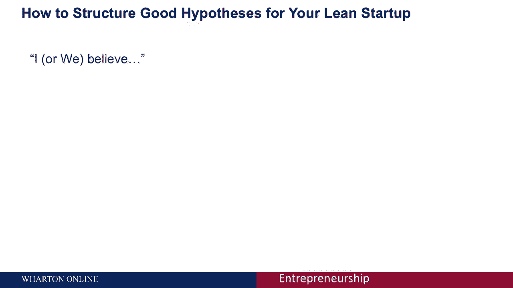
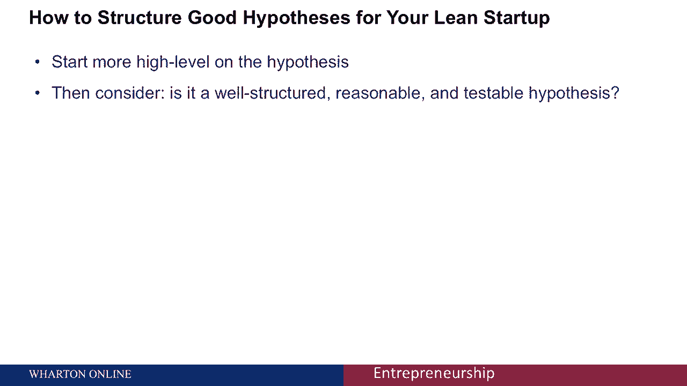
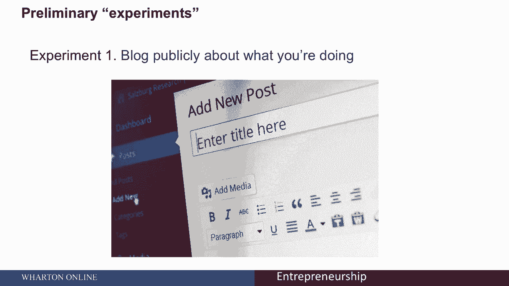
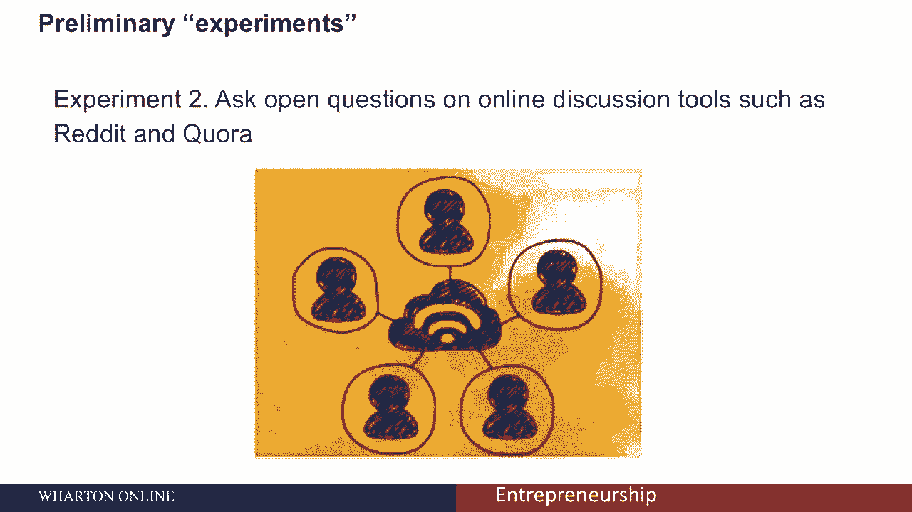
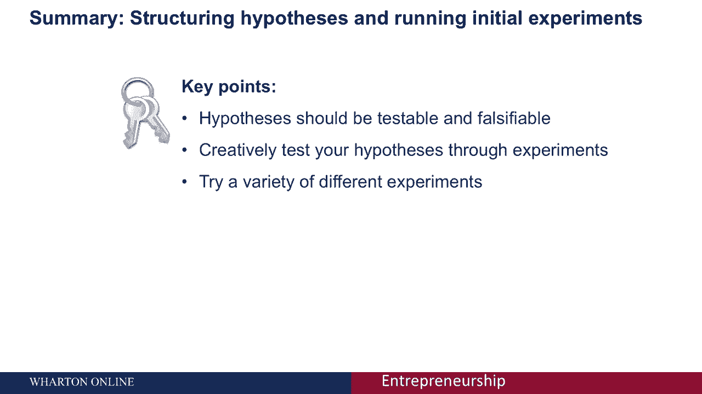

# 🚀 沃顿商学院创业课 P37：精益方法中的假设构建与初步实验

在本节课中，我们将学习精益创业方法中的两个核心环节：如何构建清晰、可测试的假设，以及如何设计并执行初步实验来验证这些假设。这是将创意转化为可行商业模式的关键步骤。

上一节我们介绍了MVP（最小可行产品）的概念，本节中我们来看看如何为你的创业想法建立坚实的假设基础，并通过低成本实验进行验证。

## 构建可测试的假设

为你的创业制定好的假设是具有挑战性的。关于假设，最重要的一点是：**它们必须是可测试的**。你需要能够通过实验来验证你的想法是否正确，或者证明它是错误的。

一个至关重要的实践是：**一定要写下你的假设**。令人惊讶的是，很少有人这样做，但“写下来”这个简单的练习非常重要。你可以尝试用这个句式开始构建假设：**“我相信……”** 或 **“我们相信……”**，然后完成这个句子。

请记住，假设陈述必须是可测试的，并且必须有失败的可能性。

以下是一个假设的例子：假设你有一个名为“Startup TW”的、专注于台湾创业生态的内容网站。你可能会提出这样的假设：“我相信美国投资者会定期阅读Startup TW，因为他们对台湾创业生态系统越来越感兴趣。”

这个假设的基本结构是：**我相信 [目标市场] 会 [采取特定行动/使用此解决方案]，因为 [某个原因]。**

然而，你需要思考：“定期阅读”具体指什么？它必须是你可以验证或证伪的东西。“定期”是指每天、每周还是每月？因此，能够用一个**具体的、可衡量的目标**来验证假设非常重要。

一个结构更好、更合理且可检验的假设可能是：**“我相信美国投资者每周至少会阅读一篇Startup TW上的文章，因为他们对台湾创业生态系统越来越感兴趣。”**

## 设计初步实验

一旦你有了清晰的假设，接下来就需要考虑如何进行初步实验。初步实验的核心是**创造性地、以相对低廉的成本**来测试你的假设和操作设想。这使你能够探索问题、市场以及可能的解决方案。

以下是几种可以进行初步实验的方法：

**1. 公开博客分享进展**
在博客上公开你正在做的事情。这有助于你获得**定性的个人反馈**，这些反馈能帮助你理解问题，并为后续收集可衡量的定量结果和指标打下基础。

**2. 进行客户面对面访谈**
这是另一种形式的定性反馈。许多消费者愿意提供反馈，他们只需要被问到。你可以从宽泛的问题开始，例如“人们目前如何解决XX问题？”，然后逐渐深入。例如，询问风险投资和私募股权基金目前使用哪些会计服务。这将为你提供关于竞争对手和客户需求的信息。

**3. 创建并发放调查问卷**
向你的客户群或潜在客户群发送调查问卷，是获得反馈和发现需求的好方法。你可以尝试提供货币或非货币激励。例如，承诺在产品上市时提供50美元折扣。如果人们急切地为了这个折扣而注册，即使产品尚未存在，这也是对客户需求的进一步验证。

**4. 直接收集预购订单**
像Indiegogo和Kickstarter这样的众筹平台，使得衡量产品或服务的市场需求变得更加容易。通过预购，你可以直接测试市场愿意为你的想法付费的意愿。

**5. 运行测试广告**
你可以使用谷歌AdWords等工具创建广告，将潜在用户引导至一个征集电子邮件注册甚至预购的页面。通过测试不同版本的广告，你可以了解哪些信息最能吸引客户，以及什么方式最能有效驱动流量。

## 总结

本节课中，我们一起学习了精益创业方法中假设与实验的核心环节。

我们了解到，假设应该是**可检验和可证伪**的，并且最好以“我相信……”的句式书面化，确保其具体、可衡量。

同时，我们可以通过多种**创造性的初步实验**（如博客分享、客户访谈、问卷调查、预购和测试广告）来低成本地验证这些假设。尝试多种不同的实验方法，以确保你能彻底地验证或修正你的初始设想，这是降低创业风险、提高成功概率的关键一步。