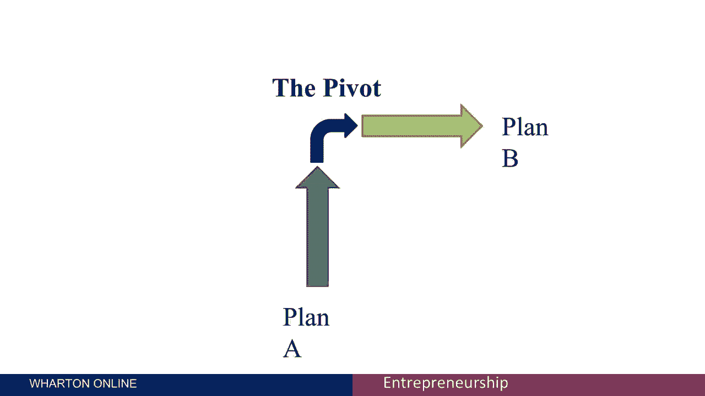
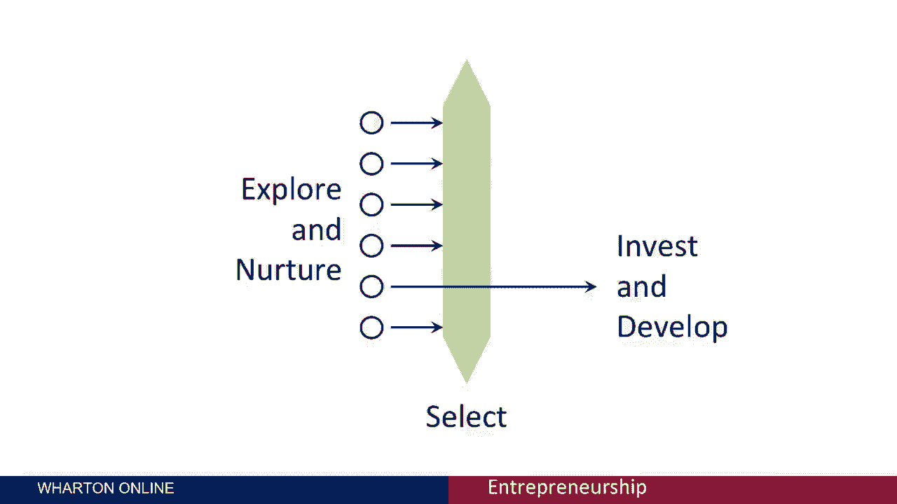

# 🎯 创业课程 P38：理解“枢轴”策略

在本节课中，我们将学习创业中的一个核心概念——“枢轴”。我们将探讨其定义、产生原因，以及如何通过前期规划来降低其发生的概率，从而更有效地管理创业过程中的不确定性。

---

## 🔄 什么是“枢轴”？

“枢轴”是创业领域的一个常用术语。它指的是初创企业在发展方向上做出的重大改变。这种改变通常是因为最初的商业计划未能达到预期效果。

上一节我们明确了“枢轴”的基本定义，接下来我们通过一个具体案例来理解它为何会发生。

---

## 📖 案例分析：从Elect Next到Vice Versa

以下是关于创业者Kia Anenbom如何实施“枢轴”的案例。

*   Kia Anenbom最初创立了一家名为 **Elect Next** 的公司。
*   这家公司的业务是向选民提供候选人的信息，帮助选民根据自身立场（如对枪支、税收等问题的看法）匹配候选人。
*   然而，该业务面临一个根本问题：它具有强烈的季节性。只有在重大选举期间才能吸引大量客户，而在美国，两次大选之间可能间隔长达四年。
*   因此，Kia将业务转向了一个完全不同的领域，创立了 **Vice Versa**。
*   Vice Versa致力于与公众建立全年互动，允许他们通过印刷出版物和网络专栏参与讨论。

在这个案例中，最初的A计划（Elect Next）未能获得足够的市场吸引力（即“牵引力”），因此创业者转向了B计划（Vice Versa）。这次转向就是一次典型的“枢轴”。

---

## 🤔 为何“枢轴”如此普遍？

如果A计划失败，转向B计划是必要的。创业者在新冒险中面临许多内在的不确定性。当这些不确定性逐渐明朗，并证明A计划不可行时，改变方向是完全合理的。

鉴于创业固有的不确定性，“枢轴”极其常见。根据经验，至少四分之一的初创企业会经历某种形式的“枢轴”。

---

## 💡 如何降低“枢轴”的必要性？

虽然“枢轴”常见，但并非不可避免。如果创业者未经仔细分析就一头扎进第一个想到的机会，可能会导致时间和金钱的浪费，并最终被迫“枢轴”。

以下是一个个人反思，说明了前期分析的重要性。

> 当我25岁时，我花了几个月时间制造一辆雪地自行车（用拖拉机履带代替后轮），计划用于穿越南极洲。但我没有提前仔细分析南极地形。如果当时我研究了（那是在谷歌图片时代之前），我就会意识到雪地自行车是个愚蠢的想法。

从处理不确定性的有效策略出发，可以降低被迫“枢轴”的概率。以下是具体建议。

*   **探索多种选择**：从一开始就考虑几种可能的业务方向。
*   **投入资源验证**：花少量时间和精力去探索这些选项。
*   **延迟重大承诺**：只有当一些关键的不确定性被解决后，再全力投入、投资和发展。

---

## 🏁 课程总结

本节课中，我们一起学习了创业中的“枢轴”策略。

1.  **定义**：“枢轴”是初创企业因原计划受挫而做出的重大方向调整。
2.  **普遍性**：由于创业充满内在不确定性，“枢轴”是常见现象。
3.  **应对策略**：聪明的创业者会结合探索多个概念和保持转向的灵活性。
4.  **优化方法**：通过前期对多种可能性的探索和验证，可以降低不必要的“枢轴”风险，但拥抱不确定性本身就是创业的一部分。

总而言之，“枢轴”是应对创业不确定性的重要工具。成功的创业者并非从不转向，而是懂得如何通过前期探索来做出更明智的转向决策，或在必要时果断调整方向。