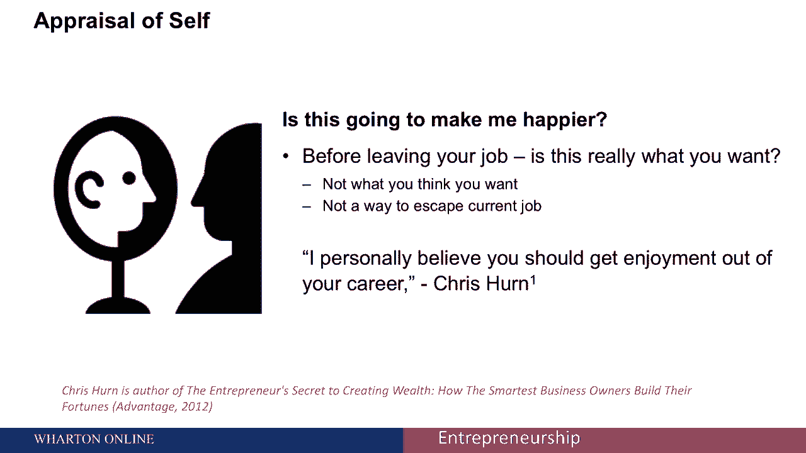
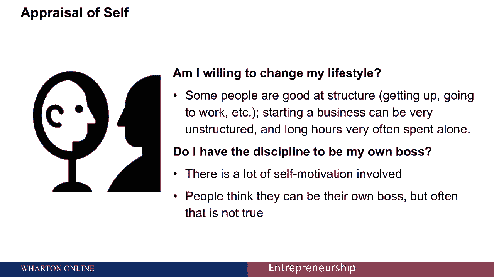
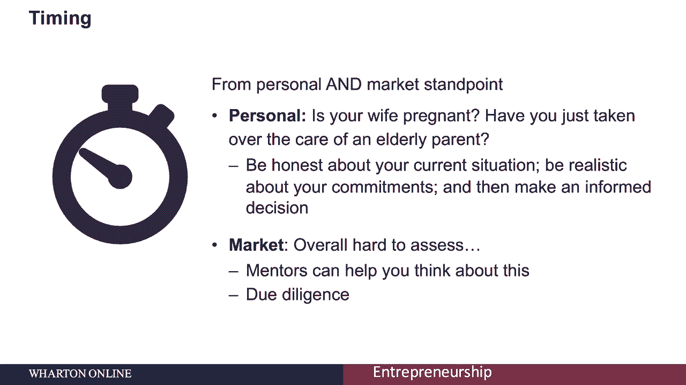
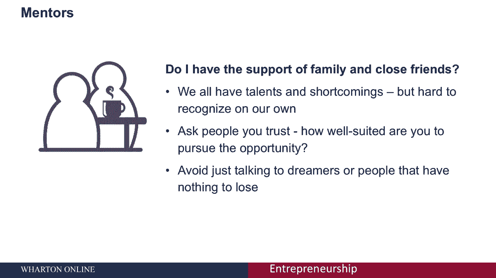
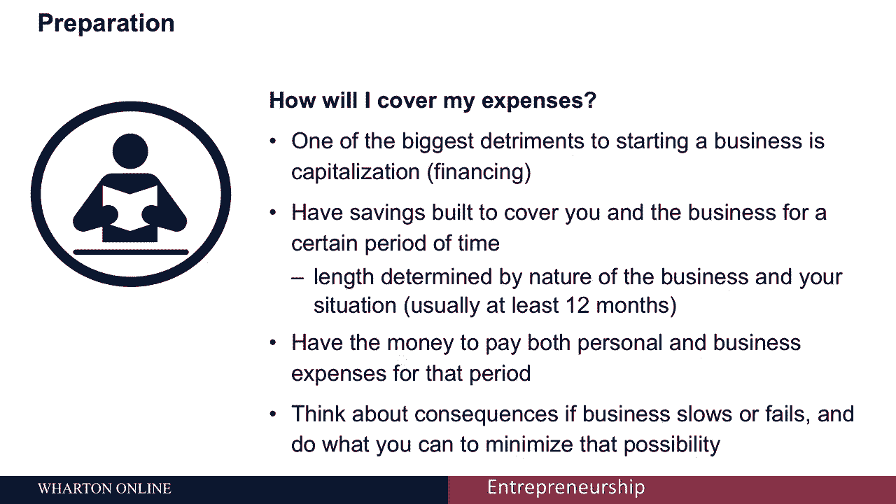
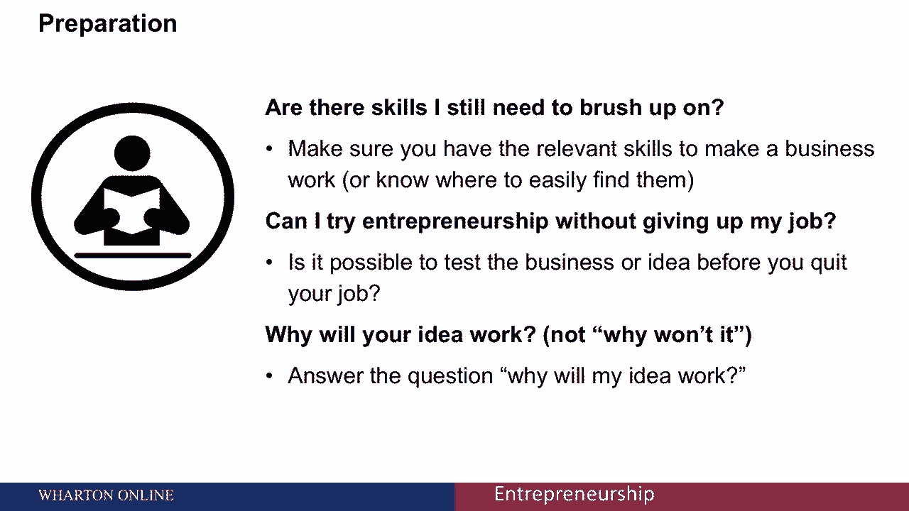
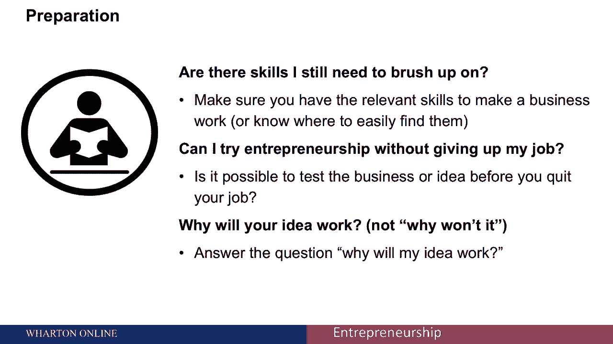
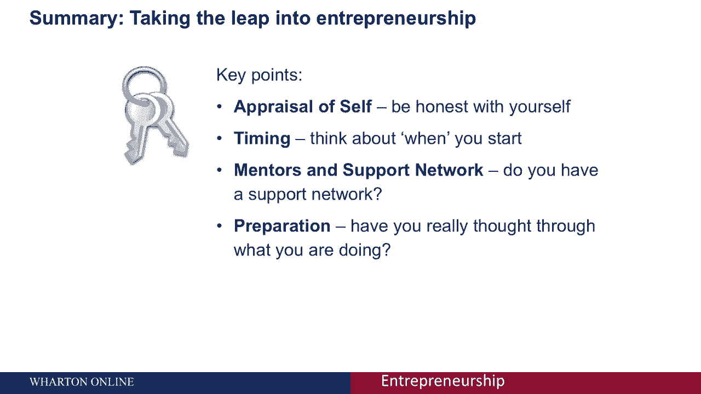

# 🚀 创业四部曲 P39：迈出关键一步——辞去日常工作

在本节课中，我们将探讨决定辞去日常工作、投身创业前需要深思熟虑的关键因素。这是一个至关重要的决策，需要从多个维度进行系统性的评估。

决定是否创业是一个重要的决定，有许多不同的因素需要考虑。

## 🔍 第一步：离职前的自我评估

上一节我们介绍了决策的重要性，本节中我们来看看如何进行自我评估。确保创业是你真正想要的，而不仅仅是为了逃避当前的工作。太多人对目前的工作不满意，但在开始创业之前，必须思考你真正的动机。

当你做自我评估时，可以问自己以下几个问题：

*   **你愿意在多大程度上改变你的生活方式？** 有些人很擅长结构化的生活：起床、工作固定时长、执行设定任务、与同事互动等。而创业通常意味着在缺乏结构的环境中工作，这可能意味着漫长、艰苦的时光，并且经常独自度过。
*   **你是否有足够的自律和自我驱动力？** 创业需要大量的自我激励。你必须有条理、创新、有创造性和主动性。问问自己是否有自律能力，做自己的老板，自己指导自己的努力。
*   **你是否适合成为创始人？** 不是每个人都注定要成为创始人。你也可以考虑加入一个现有的创始团队。但如果你正在考虑创办自己的公司，请记住，第一年可能因为充满激情而相对容易，但请思考当新鲜感消失、事情变得困难时，你的感受会如何。毅力、勇气和承诺至关重要。

## ⏰ 第二步：评估时机

在对自己有了清晰认识后，我们需要评估行动的时机。你需要从个人和市场两个角度来考虑时机。

*   **个人时机**：诚实地评估你生活中正在发生的事情。你正在经历重大变化吗？我们常听到“去争取”或“要有信心”的鼓励，但我们也有责任、抵押贷款和账单。诚实地面对你目前的状况，以便在时间上做出明智的决定。
*   **市场时机**：市场时机极难预测，创业充满不确定性。然而，你可以寻找有特殊专业知识的导师，他们可以帮助你思考这个问题。你也应该自己做研究和尽职调查。

人们常认为创业是为冒险者准备的，但事实不一定如此。成功的企业家在创业前会做尽职调查，并尽可能地将风险降至最低。

## 👥 第三步：建立支持系统与寻找导师

当你思考创业时，第三个关键考虑因素是导师和你的支持系统。你可以询问你信任的人，他们是否认为你适合你正在考虑追求的机会。

我们还将有关于导师和顾问的单独讲座，内容包括如何找到战略顾问，以及可以帮你解决可能面临问题的人。所以请关注后续内容。

## 🛠️ 第四步：做好充分准备

最后，当你决定迈出这一步时，你需要做一些准备工作，确保自己处于成功的位置。

以下是需要准备的关键事项：

*   **财务规划**：考虑融资和储蓄。你是否有足够的储蓄来支撑你和业务一段时间？这不一定要有特定的时长，但应考虑到你的业务性质和个人情况。确保同时考虑个人和业务开支，并思考如果你的业务放缓或失败，后果会如何。
*   **技能储备**：问问自己是否具备相关的技能，或者你认为仍然需要学习什么。例如，如果你选择的领域需要，就要了解最新的技术；如果对营销有影响，就要能够利用社交媒体为你的创业服务。
*   **小步试错**：考虑是否可以在保留目前工作的同时开始创业。在辞去稳定工作、全职追求创业之前，看看能否先开始测试。这给你一些时间来获得初步进展，并验证你是否像想象中那样喜欢它。这并不总是可行，但值得思考。
*   **清晰表达**：尝试用语言清晰地描述你想做的事情，向别人解释为什么你认为你的想法会成功。有时仅仅是把它写下来，就能迫使你解释它为何有效，而不仅仅是假设它会。你对基本点思考得越深入，你成功的机会就越大。

## 📝 总结

本节课中，我们一起学习了在投身创业前需要考虑的四个核心因素。

正如我们所看到的，在迈出创业这一步之前，考虑许多不同的因素非常重要：**进行一次深刻的自我评估，对自己诚实；从个人和市场两个角度评估时机；考虑导师和你的社会支持网络；最后，确保你已经做好准备，并为自己配备了成功所需的所有工具。**