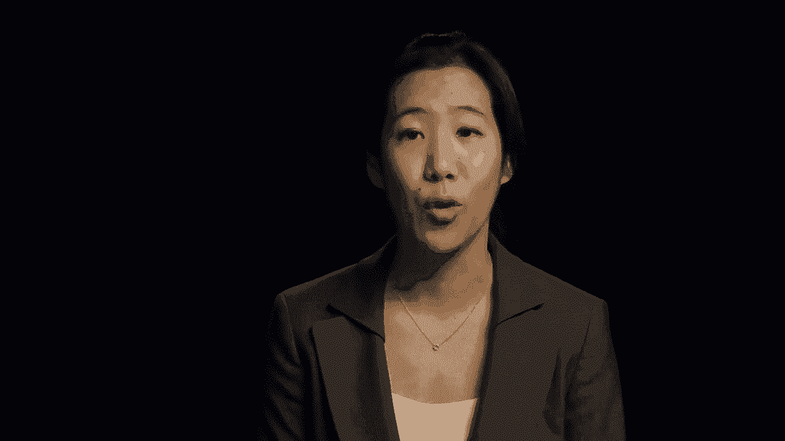
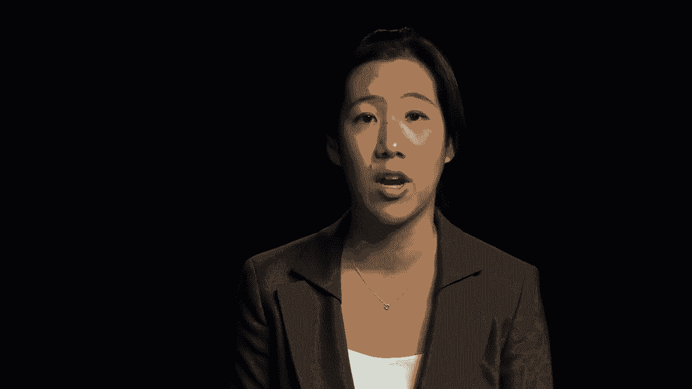
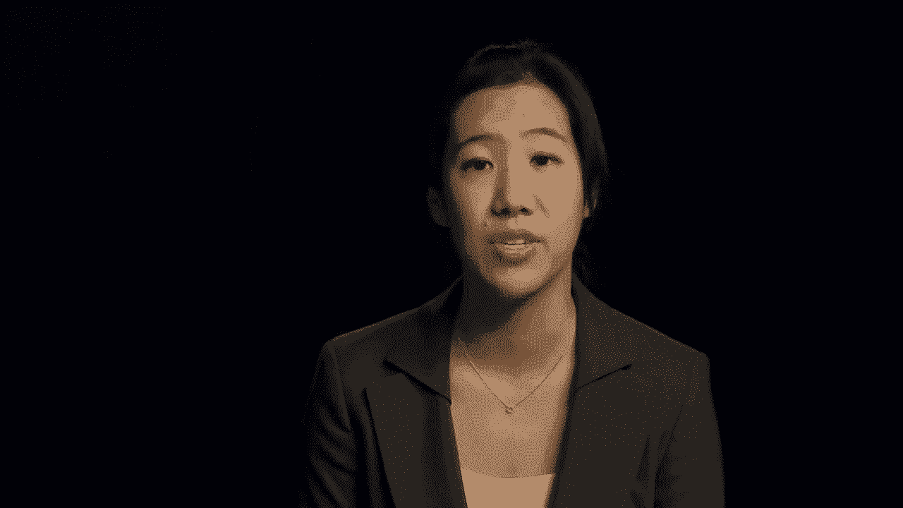
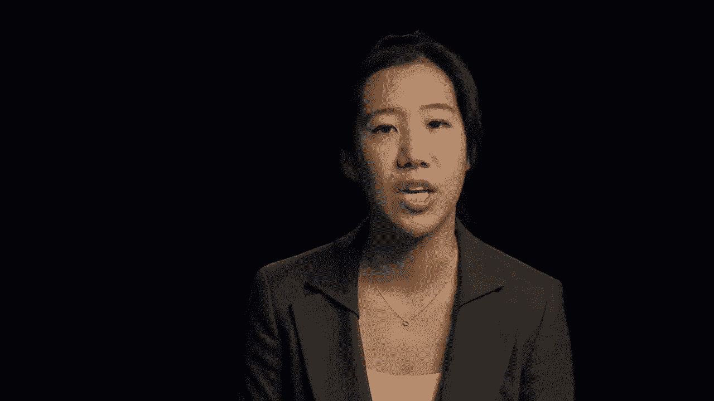
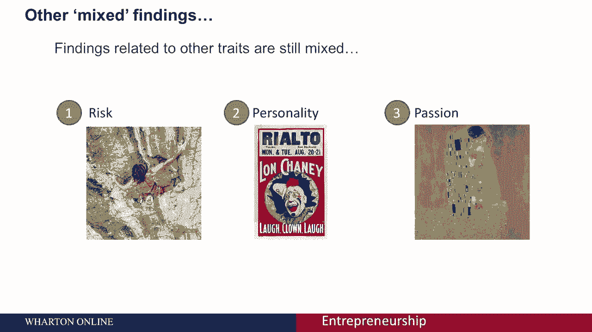
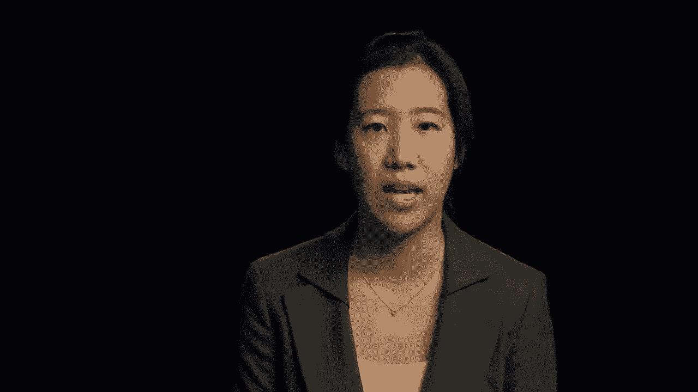
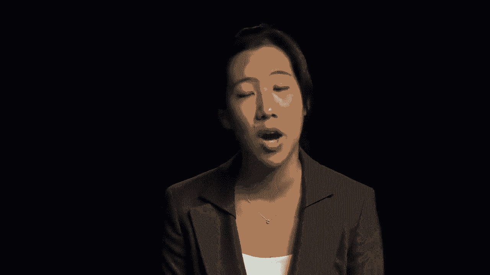
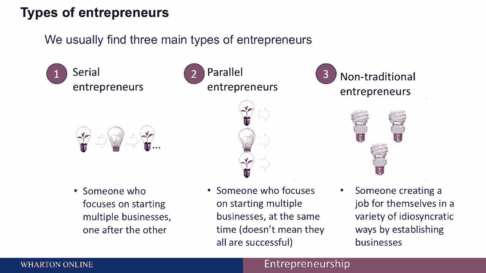
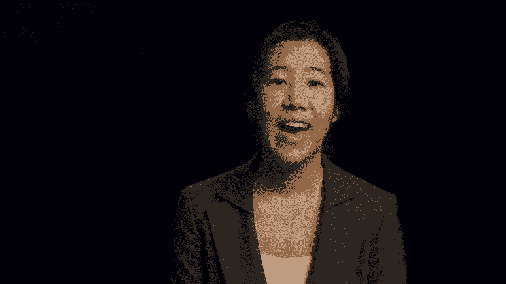
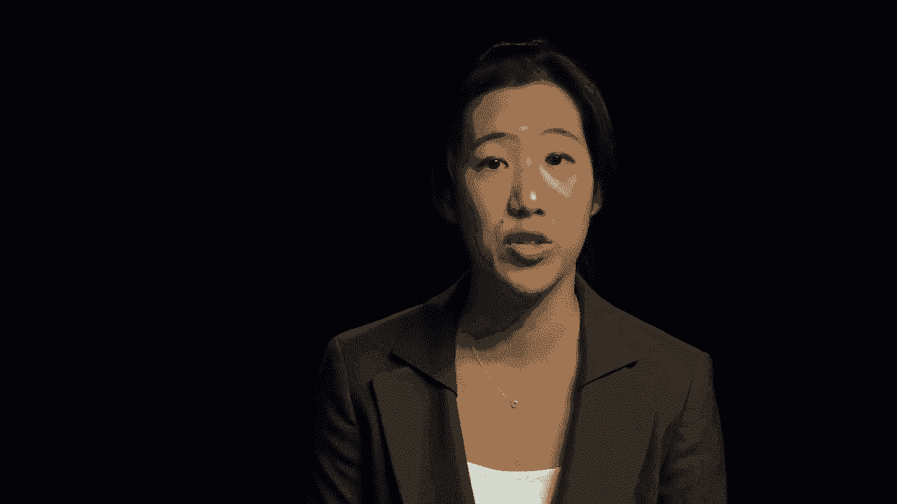

# 🧑‍💼 沃顿商学院创业课程 P4：企业家画像解析

在本节课中，我们将探讨“企业家”这一概念的真实轮廓。我们将分析关于企业家的常见定义与误解，审视是否存在所谓的“企业家心态”，并介绍研究中发现的三种主要企业家类型。

---

当你开始研究创业时，会听到许多关于“什么是企业家”和“谁才是企业家”的不同意见。

例如，你可能会听说企业家是商业领袖，或者企业家能让一个概念变得可行。你可能听说过企业家组织和管理企业，或者企业家就是经营自己公司的人。

这些定义中的任何一个或更多，都可能是我们在日常讨论中听到的。

考虑到外界存在如此多的观点，一个核心问题随之产生：谁才是真正的企业家？是否存在一个清晰的轮廓，能让我们预测谁会真正成功？

我们经常听到一种叫做“企业家心态”的说法。这就引出了一个问题：是否因为个性原因，有些人更擅长或更倾向于创业？

---

上一节我们提出了关于“企业家个性”的疑问，本节中我们来看看研究给出的答案。

研究发现，上述假设并不成立。人们实际上会成为研究人员称之为 **“基本归因错误”** 的牺牲品。

**基本归因错误** 是指，人们倾向于将他人的行为归因于其性格或个性，即使环境因素才是真正的解释。

例如，看到一个超速的司机，我们可能会认为司机不负责任，而不是假设他可能遇到了某种紧急情况。这种错误在西方文化（如价值观更个人主义的美国）中尤其常见。这类解释符合我们“世界是公平的”的信念，例如“好人应该得到奖励”。

当我们思考企业家和企业家心态时，也容易犯类似的错误。

---

我们倾向于将成功的企业家与比尔·盖茨等著名人物联系起来，而不是想到当地开咖啡吧的普通人。

这种倾向的作用是，我们倾向于将这些名人的成功归因于其个人特质，并低估了更广泛企业家群体的存活率和成功率。

我们往往钦佩的，通常是成功的结果（例如比尔·盖茨所做的慈善工作），而这些因素可能与他们最初成为企业家的原因无关。

然而，我们从创业研究中确实了解到一些事情。

例如，有证据表明，企业家更有可能表现出 **过度自信**。

在研究社会资本、认知和企业家机会的文献中，我们看到企业家更有可能表现出一定程度的乐观，其程度超出普通人群。同时，也存在过度自信的倾向。

但总的来说，关于企业家是否具备特殊特征和属性的研究结果喜忧参半。

以下是关于几个常见特质的混合发现：

*   **风险倾向**：一些研究表明，企业家更有可能容忍更高水平的风险。但其他发现表明，在风险倾向上与非企业家没有差异。
*   **性格特征**：研究结果同样不一致。
*   **激情**：我们经常听到“创业激情”，但事实上，我们并不确切知道创业激情具体包括什么。

这些发现表明，**并不存在一种特定的个性或属性，能够明确区分企业家和非企业家**。

---

尽管没有统一的个性特征，但我们发现个人倾向于分为三种主要的企业家类型。这些类型确实可以归入一些具有特定特征的类别。

以下是三种主要的企业家类型：

1.  **连续企业家**
    连续创业者是指专注于一个接一个地创办多家企业的人。他们的重点是成立一家新公司，通常先卖掉那家公司，然后再创办后续企业。连续创业者的一个例子是史蒂夫·乔布斯。

2.  **平行企业家**
    平行企业家是指同时经营不止一家成功企业的人。例如，当史蒂夫·乔布斯同时经营皮克斯和苹果时，他也是一位平行企业家。埃隆·马斯克则既是连续企业家，也是平行企业家。
    他首先在1995年创立了ZIP2（一个基于网络的报纸城市指南），随后以3.07亿美元的价格卖给了康柏。之后他创立了X.com（一项电子支付服务），最终通过合并成为了PayPal。他目前是特斯拉汽车公司的首席执行官，同时是SpaceX（世界领先的私人太空发射提供商）的创始人。在业余时间，他还担任SolarCity（美国第二大太阳能安装商）的董事长。由此可见，他同时经营着多家企业。
    在更典型的尺度上，你可以想象一位零售店主，他发现自己有时间经营网店，还在业余时间帮助孩子创办自己的初创公司。微型企业家也经常同时经营多项业务以度过经济困难时期。

3.  **非传统企业家**
    这类企业家包括以各种特殊方式为自己创造就业机会的人，通常是通过自己创业。这往往是因为，随着全球经济的发展，许多跨国公司对生产和服务进行了重大的重新分配。

---

本节课中，我们一起学习了关于企业家的核心见解。我们拆解了常见的定义与“基本归因错误”的认知偏差，明确了并不存在单一的成功企业家个性模板。最后，我们介绍了实践中常见的三种企业家类型：连续企业家、平行企业家和非传统企业家。理解这些类型有助于我们更客观、全面地认识创业世界的多样性。